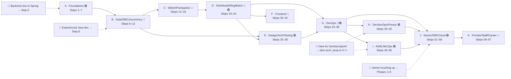
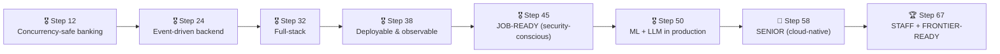

# 🏦 Build-a-Bank — COURSE.md

> **The curriculum index, progress tracker & skill-tree.** 67 steps · 11 phases · intern → engineer → senior → staff.
> One real (educational, non-production) banking platform on the JVM — and the self-contained course that teaches it from zero.
> New here? Start with the **[README](README.md)** for setup, then open **[`steps/step-01/lesson.md`](steps/step-01/lesson.md)**.

> [!NOTE]
> **A *step* ≈ 20 hours of focused effort — not a calendar week.** Total ≈ **1,340 hours**. Pace it to your life; the per-step skip-tests let you blow through the familiar. **Milestones are by step, not by date:** 🎖️ job-ready ~**Step 45** · 🏅 senior **Step 58** · 🏆 staff + frontier **Step 67**.

---

## 📖 Table of Contents

- [🎚️ Level Badges](#️-level-badges)
- [🗂️ Emoji Section Iconography](#️-emoji-section-iconography)
- [🌳 The Skill Tree (Phase Dependencies)](#-the-skill-tree-phase-dependencies)
- [🧭 Per-Lesson Conventions](#-per-lesson-conventions)
- [📊 Progress Tracker](#-progress-tracker)
  - [Phase A — Foundations: Tools, Language & Platform 🟢](#phase-a--foundations-tools-language--platform-)
  - [Phase B — Data, Databases, Concurrency & Transactions 🔵](#phase-b--data-databases-concurrency--transactions-)
  - [Phase C — Web, APIs & Application Security 🔵](#phase-c--web-apis--application-security-)
  - [Phase D — Distributed Systems, Messaging & Batch 🔵🟣](#phase-d--distributed-systems-messaging--batch-)
  - [Phase E — Design, Architecture & Testing Mastery 🟣](#phase-e--design-architecture--testing-mastery-)
  - [Phase F — Full-Stack Frontend 🔵](#phase-f--full-stack-frontend-)
  - [Phase G — DevOps Zero to Hero 🔵🟣](#phase-g--devops-zero-to-hero-)
  - [Phase H — DevSecOps, Data Privacy & Compliance 🟣](#phase-h--devsecops-data-privacy--compliance-)
  - [Phase I — AI/ML & MLOps 🟣](#phase-i--aiml--mlops-)
  - [Phase J — Senior Systems, SRE & Cloud 🟣](#phase-j--senior-systems-sre--cloud-)
  - [Phase K — Frontier, Staff Skills & Career 🔴](#phase-k--frontier-staff-skills--career-)
- [🏆 Milestone Map](#-milestone-map)
- [🧠 Cumulative Reviews & Flashcards](#-cumulative-reviews--flashcards)
- [🧭 Where To Go Next](#-where-to-go-next)

---

## 🎚️ Level Badges

Each phase carries a level badge so you always know the altitude. (Pairs text with emoji — never relies on color alone.)

| Badge | Level | Meaning |
|---|---|---|
| 🟢 | **Foundations** | From-zero basics: tools, language, platform, the runtime. |
| 🔵 | **Core** | The day-job: data, APIs, security, messaging, frontend, DevOps. |
| 🟣 | **Advanced** | Depth a senior is expected to own: architecture, distributed systems, DevSecOps, ML, scale. |
| 🔴 | **Frontier** | The staff/principal edge: emerging tech + leadership practice. |

---

## 🗂️ Emoji Section Iconography

Every lesson uses the **same icons** for the **same kinds of sections**, so you can navigate any step at a glance. Icons are signposts paired with words — they never carry meaning alone (accessibility).

| Icon | Section | What it is |
|---|---|---|
| 📋 | **This Step in 30 Seconds** | Advance organizer: badge, step #, effort, what to run, skip-test. |
| 📇 | **Cheat Card** | One-screen TL;DR for skimmers & returning learners. |
| 🎯 | **Why This Matters** | The 2–3 sentence hook (real systems, interviews, paycheck). |
| ✅ | **What You'll Be Able to Do** | Concrete, plain-language outcomes. |
| 🧰 | **Before You Start** | Prerequisites + a `Depends on: Steps X, Y` line. |
| 🧠 | **The Big Idea** | The "professor lecture": the why + theory, with a diagram. |
| 🧩 | **Pattern Spotlight** | Problem → fit → alternatives → implementation (when a pattern lands). |
| 🌱 | **Under the Hood** | How the Spring/JVM/DB feature *actually* works. No magic. |
| 🛡️ | **Security Lens** | The DevSecOps view — what could go wrong (even in non-security steps). |
| 🕰️ | **Then vs. Now** | Version evolution: old → new → why → what legacy still uses. |
| 🧵 | **Thread-Safety Note** | Woven in from Step 12 wherever there's shared mutable state. |
| 📦 | **Your Starting Point** | The tagged `step-NN-start` and what's green vs. what you'll build. |
| 🛠️ | **Let's Build It** | The heart of every step — the longest, most hands-on section. |
| 🎮 | **Play With It** | Make it tangible: `requests.http`, `curl`, `make play-NN`, what you'll see. |
| 🏁 | **The Finished Result** | `step-NN-end` (== next step's start) + a Definition-of-Done checklist. |
| 🔬 | **Prove It Works** | The Verification Log: real, pasted command output. |
| 🚀 | **Go Deeper** | Optional advanced asides (don't count toward the effort budget). |
| 💼 | **Interview Prep** | 4–6 Q&A, answers in `
`. |
| 🏋️ | **Your Turn** | Exercises + stretch goals (answers inline in `
`; reference-solution folders tracked in [docs/ai/CONTRACT-DEBT.md](docs/ai/CONTRACT-DEBT.md)). |
| 🩺 | **Troubleshooting** | The real errors hit while building → cause → fix. |
| 📚 | **Resources & Glossary** | Curated links + this step's terms. |
| 🏆 | **Recap & Study Notes** | Key points, Key Terms, Test Yourself, résumé line, "You can now…". |
| 🃏 | **Flashcards** | 3–5 Q/A pairs, also appended to `docs/flashcards.md`. |
| 🎓 | **Phase Capstone** | The integrative challenge that closes each phase. |

> [!TIP]
> Other signposts you'll see throughout: ✅/❌ (right/wrong output), 💡 (faster-in-IntelliJ aside), ⚠️ (pitfall), 👉 (key action), 🔮 (predict-then-run), ⌨️ (type-it-yourself), 🔬 (break-it-on-purpose), ❓ (knowledge-check), 🧭 ("you are here").

---

## 🌳 The Skill Tree (Phase Dependencies)

How the 11 phases build on each other, with the four **fast-track entry points** marked. (Diagram alt-text: a left-to-right dependency graph of phases A→K; A feeds B; B feeds C and E; C feeds D; D feeds E, F, and G; G feeds H, I, and J; H and I feed J; J feeds K. Dotted fast-track arrows enter at Step 5, Step 8, Phases H/I, and Phase J.)

> [!NOTE]
> **Fast-track routes** (full skim-vs-do detail in the [README](README.md)): experienced Java dev → skip A, skim B, start **Step 8** · backend new to Spring → start **Step 5** · here for DevSecOps/AI → Phase **H**/**I** after skimming the architecture · senior brushing up → Phases **J–K**. Want core-senior fast? See the **Lean Track (~30 steps)** in the README; the full 67-step track stays canonical.

---

## 🧭 Per-Lesson Conventions

A few conventions repeat in **every** `steps/step-NN/lesson.md`:

- **Header line:** each lesson opens with a `Step N of 67 · Phase X 🔵` banner and a 🧭 one-line mini-TOC of the six movements (clickable anchors), so you see the shape and can jump around.
- **The six movements:** **A · 🧭 Orient → B · 🧠 Understand → C · 🛠️ Build → D · 🔬 Prove → E · 🎓 Apply → F · 🏆 Review.** The 🛠️ build is sacred — it's the longest, most copy-pasteable, run-and-see part and is never thinned to save space.
- **⏭️ Can You Skip This Step?** — a 5-minute self-check at the top of every step ("if you can already do this, jump to Step N").
- **🧵 Thread-safety notes** appear from **Step 12** onward in any step touching shared mutable state (the ledger, the fraud stream, caches), pointing back to Step 11.
- **🧠 Cumulative Review** — every ~5 steps, a mixed quiz spanning recent **and** older material (distinct from each step's per-step *Test Yourself*).
- **🃏 Flashcards** from each step append to the cumulative **[`docs/flashcards.md`](docs/flashcards.md)** (a markdown Q/A deck for self-quizzing).
- **Verification tiers:** every 🔬 Verification Log states its tier — 🟢 Light (doc/config), 🟠 Standard (most feature steps), 🔴 Full (milestones + every money/security/concurrency path). Step 1 is 🟠 Standard; the money & concurrency tiers begin in Phase B.

---

## 📊 Progress Tracker

Tick the box as you finish each step (its `step-NN-end` tag is green and committed). Setup lives in the [README](README.md); each lesson is at `steps/step-NN/lesson.md`; stretch-goal answers are inline in each lesson's `
` blocks (reference-solution folders are tracked in [docs/ai/CONTRACT-DEBT.md](docs/ai/CONTRACT-DEBT.md)).

> [!NOTE]
> **Authoring status:** the course is fully built and verified through **Step 32** (Phase F complete); **Steps 33–67 below are the planned curriculum — designed in full, lessons not yet authored**. Live state: [PROGRESS.md](PROGRESS.md).

### Phase A — Foundations: Tools, Language & Platform 🟢

*Steps 1–7 · From "what is a terminal" to a running Spring Boot app and the fundamentals beneath it.*

| ✓ | Step | Title | Badge | Focus | Effort |
|---|---|---|---|---|---|
| [ ] | 1 | Setup (editor-agnostic) + the command line, Linux & Git + your first running Spring Boot app | 🟢 | JDK 25 + CLI build/run/test in any editor; Git; Docker basics; secrets hygiene from day one; `make doctor`/`make verify`; the `hello` service | ~20h |
| [ ] | 2 | Java language primer | 🟢 | syntax → OOP → generics → collections → streams/lambdas → `Optional` → records/sealed → exceptions → `java.time` | ~20h |
| [ ] | 3 | How the Internet & the Web Work | 🟢 | TCP/IP, DNS, ports, HTTP/HTTPS, the TLS handshake, request/response anatomy, load-balancer concept | ~20h |
| [ ] | 4 | How Java Runs: the JVM Up Close | 🟢 | bytecode, `javac`/`java`, classloading, JIT, heap/stack/metaspace, GC basics, JARs, a first look with JFR | ~20h |
| [ ] | 5 | Spring Core & IoC deep | 🟢 | bean lifecycle, scopes, `@Bean`, conditional beans, profiles, SpEL; dependency injection | ~20h |
| [ ] | 6 | Spring Boot internals & config | 🟢 | how auto-configuration works, `@ConfigurationProperties`, Actuator basics | ~20h |
| [ ] | 7 | AOP & the proxy model — the bank's audit/logging aspect | 🟢 | aspects/pointcuts/advice; JDK vs CGLIB; the self-invocation pitfall | ~20h |

> 🎓 **Phase A Capstone:** wire a tiny end-to-end vertical slice (one endpoint → service → in-memory store) and run it from the CLI **and** (optionally) the IDE — proving your toolchain and Spring fundamentals.

### Phase B — Data, Databases, Concurrency & Transactions 🔵

*Steps 8–12 · The first real banking services, and how to store money correctly and move it safely under load.*

| ✓ | Step | Title | Badge | Focus | Effort |
|---|---|---|---|---|---|
| [ ] | 8 | CIF service + Spring Data JPA + persistence context + Flyway + Bean Validation | 🔵 | Repository pattern; `@DataJpaTest` + Testcontainers | ~20h |
| [ ] | 9 | Hibernate performance & correctness | 🔵 | lazy/eager, OSIV off, N+1 + fetch joins/`@EntityGraph`, projections, `@Version` locking | ~20h |
| [ ] | 10 | Relational Databases Up Close | 🔵 | SQL depth, indexing, `EXPLAIN`/query plans, isolation anomalies (incl. write skew), MVCC, partitioning, read replicas, online schema change, pool internals | ~20h |
| [ ] | 11 | Concurrency & Thread Safety in Java | 🟣 | JMM, locks/atomics, `java.util.concurrent`, safe publication, races; virtual threads; JCStress | ~20h |
| [ ] | 12 | Demand Account + double-entry ledger + transaction management deep | 🔵 | propagation/isolation, rollback, pessimistic locking; correct under concurrent transfers; BigDecimal money + UTC time; expand-contract migration intro | ~20h |

> [!TIP]
> 🎖️ **End of Phase B (Step 12) — milestone.** You can model data correctly, read a query plan, reason about concurrency, and move money safely under load. **Résumé line:** *"Built concurrency-safe, transactional banking services (Spring Data JPA, indexing & query-plan tuning, optimistic/pessimistic locking, java.util.concurrent, BigDecimal money handling)."*

> 🎓 **Phase B Capstone:** run a concurrency stress test against the ledger that **fails without locking and passes with it**; justify your isolation level and prove correctness with pasted output.

### Phase C — Web, APIs & Application Security 🔵

*Steps 13–18 · Expose the bank over HTTP, design APIs that age well, and secure every endpoint.*

| ✓ | Step | Title | Badge | Focus | Effort |
|---|---|---|---|---|---|
| [ ] | 13 | Spring MVC / REST deep | 🔵 | request lifecycle, `@ControllerAdvice` + `ProblemDetail`, validation, filters vs interceptors; springdoc-openapi (Swagger UI — first "click & see") | ~20h |
| [ ] | 14 | API Design, Versioning & Webhooks | 🔵 | REST maturity, versioning & deprecation, pagination/filtering/sorting standards, public-API idempotency, outbound webhooks (signing/retries/replay); GraphQL & HATEOAS tastes | ~20h |
| [ ] | 15 | API Gateway / BFF + service-to-service HTTP | 🔵 | `RestClient` + declarative HTTP interfaces, timeouts/retries; API Gateway/BFF | ~20h |
| [ ] | 16 | Spring Security deep I | 🔵 | filter chain, authn vs authz, JWT, password encoding, CSRF/CORS/headers | ~20h |
| [ ] | 17 | Spring Security deep II + modern auth | 🔵 | method security, OAuth2 Resource Server, MFA & passkeys (WebAuthn), step-up auth, identity propagation | ~20h |
| [ ] | 18 | Secure coding & threat modeling (DevSecOps shift-left) | 🔵 | STRIDE, OWASP Top 10 + API Top 10, secure defaults, security tests | ~20h |

> 🎓 **Phase C Capstone:** secure every endpoint, add a partner **webhook with signature verification**, and **threat-model one feature with STRIDE** end-to-end.

### Phase D — Distributed Systems, Messaging & Batch 🔵🟣

*Steps 19–24 · The theory beneath distributed systems, then events, Saga money movement, and batch.*

| ✓ | Step | Title | Badge | Focus | Effort |
|---|---|---|---|---|---|
| [ ] | 19 | Distributed-Systems Theory & Tradeoffs | 🟣 | CAP/PACELC, consistency models, consensus & quorums, logical/vector clocks, delivery semantics | ~20h |
| [ ] | 20 | Spring events + Kafka (Redpanda) + Notification + real-time push (WebSocket/SSE) | 🔵 | `@TransactionalEventListener`, producers/consumers, the Outbox pattern | ~20h |
| [ ] | 21 | Payments: cross-account transfers | 🟣 | Saga (choreography vs orchestration), Idempotency Key (Redis), retries/DLQ | ~20h |
| [ ] | 22 | Caching & async + Market Info + clustered scheduling (ShedLock) | 🔵 | Spring Cache + Redis; CQRS read model; `@Async`/virtual threads/`@Scheduled` | ~20h |
| [ ] | 23 | Retail Services onboarding orchestration | 🔵 | orchestration across services | ~20h |
| [ ] | 24 | Spring Batch & batch processing | 🔵 | chunk steps, restart/retry/skip, partitioning; EOD reconciliation, interest, statements (🚀 OLAP/warehouse) | ~20h |

> [!TIP]
> 🎖️ **End of Phase D (Step 24) — milestone.** A complete, secured, event-driven + batch backend with transactions, caching, Saga money movement, and real-time push — and you understand the distributed-systems theory beneath it. **Résumé line:** *"Built an event-driven + batch microservices banking backend and can reason about CAP, consistency, and delivery semantics."*

> 🎓 **Phase D Capstone:** trace a payment end-to-end across Kafka with **Outbox + Saga + idempotency**, and demonstrate **exactly-once *effect*** under a forced retry/duplicate.

### Phase E — Design, Architecture & Testing Mastery 🟣

*Steps 25–28 · Make the codebase clean, well-bounded, well-tested — and ship your own Spring Boot starter.*

| ✓ | Step | Title | Badge | Focus | Effort |
|---|---|---|---|---|---|
| [ ] | 25 | SOLID & Clean-Code Principles — refactor a smelly service | 🟣 | SOLID, cohesion/coupling, Law of Demeter, DRY/KISS/YAGNI, code smells; DIP → ports-and-adapters | ~20h |
| [ ] | 26 | Clean / hexagonal architecture + DDD | 🟣 | ports-and-adapters, DDD tactical | ~20h |
| [ ] | 27 | Spring Modulith + ArchUnit | 🟣 | enforce module boundaries, verify architecture in tests, module events & docs | ~20h |
| [ ] | 28 | Testing mastery + build your own Spring Boot starter | 🟣 | test slices, `MockMvc`/`@MockitoBean`; TDD, PITest mutation, jqwik property-based; turn `libs/common` into a real auto-configured starter | ~20h |

> 🎓 **Phase E Capstone:** refactor one service to **hexagonal**, enforce its boundaries with **ArchUnit**, and raise **mutation-test** coverage on its core to a target you justify.

### Phase F — Full-Stack Frontend 🔵

*Steps 29–32 · A React/TypeScript banking UI: data, forms, live updates, testing, accessibility, and ship.*

| ✓ | Step | Title | Badge | Focus | Effort |
|---|---|---|---|---|---|
| [ ] | 29 | Frontend pt.1 — foundations | 🔵 | React + TS + Vite, components, routing, calling the gateway, the login/auth flow | ~20h |
| [ ] | 30 | Frontend pt.2 — state, data & forms | 🔵 | data fetching/caching (TanStack Query), client state, forms + validation (React Hook Form + Zod), loading/error UX, WebSocket live updates | ~20h |
| [x] | 31 | Frontend pt.3 — testing & accessibility | 🔵 | component tests (Testing Library), E2E (Playwright), API mocking (MSW), WCAG basics, i18n + multi-currency formatting | ~20h |
| [x] | 32 | Frontend pt.4 — hardening & ship | 🔵 | token refresh & route guards, bundle/perf optimization, Dockerize the SPA + serve via gateway/CDN, deploy, end-to-end demo | ~20h |

> [!TIP]
> 🎖️ **End of Phase F (Step 32) — full-stack milestone.** **Résumé line:** *"Built, tested, secured, and deployed a React/TypeScript banking UI (data caching, forms/validation, Playwright E2E, accessibility, i18n) against a microservices backend."*

> 🎓 **Phase F Capstone:** ship the full UI for a money transfer — **form + validation → live balance via WebSocket → Playwright E2E** — behind the gateway.

### Phase G — DevOps Zero to Hero 🔵🟣

*Steps 33–38 · Containerize, orchestrate, automate, observe, and deploy safely — security threaded throughout.*

| ✓ | Step | Title | Badge | Focus | Effort |
|---|---|---|---|---|---|
| [x] | 33 | Containerize everything — multi-stage, distroless, non-root → Buildpacks/Jib + Compose | 🔵 | Docker/Compose, JVM image tuning | ~20h |
| [ ] | 34 | Kubernetes — manifests, config/secrets, Actuator probes, `securityContext` + RBAC basics, graceful shutdown | 🔵 | Kubernetes (`kind`) | ~20h |
| [ ] | 35 | Helm + CI/CD (GitHub Actions, `./mvnw verify`) — first security gate (secret scan + SCA) | 🔵 | Helm, GitHub Actions | ~20h |
| [ ] | 36 | Observability deep — custom health, custom Micrometer metrics, dashboards, logs, traces, correlation IDs + Kafka trace propagation, RED/USE | 🟣 | Prometheus/Grafana/Loki/OTel | ~20h |
| [ ] | 37 | Resilience & chaos — Resilience4j + HikariCP tuning + chaos tests + backpressure/load shedding | 🟣 | chaos engineering | ~20h |
| [ ] | 38 | Deployment strategies — rolling/blue-green/canary + expand-contract migrations + graceful shutdown + feature flags | 🟣 | progressive delivery | ~20h |

> [!TIP]
> 🎖️ **End of Phase G (Step 38) — milestone.** A deployable, observable, resilient platform with a UI. **Résumé line:** *"Containerized and deployed a microservices platform to Kubernetes with CI/CD, observability, canary releases, feature flags, and zero-downtime migrations."*

> [!NOTE]
> **Local Kubernetes: `kind` v0.32.0 is installed on the reference machine** (see [CAPABILITIES.md](CAPABILITIES.md)), so Phase G can create a real single-node cluster (`kind create cluster`) and actually `kubectl apply` + `helm install`. The lessons also teach the cluster-less verify path (`helm lint`/`helm template`, `kubeconform`/`kubectl --dry-run=client`) so learners without a cluster aren't blocked. **Install `kind` on your own machine** for the live path.

> 🎓 **Phase G Capstone:** **canary-deploy** a change to `kind` with an **expand-contract migration**, watch it in Grafana, and **roll back via a feature flag**.

### Phase H — DevSecOps, Data Privacy & Compliance 🟣

*Steps 39–45 · A full shift-left-to-runtime security pipeline that fails the build on real findings.*

| ✓ | Step | Title | Badge | Focus | Effort |
|---|---|---|---|---|---|
| [ ] | 39 | Threat modeling at depth + Secure SDLC | 🟣 | STRIDE/attack trees, trust boundaries, abuse cases | ~20h |
| [ ] | 40 | SAST + SCA + SBOM + secret scanning in the pipeline | 🟣 | SonarQube/Semgrep/CodeQL, Dependency-Check/Trivy, CycloneDX SBOM, gitleaks — fail-the-build gates | ~20h |
| [ ] | 41 | Senior app security & OIDC + container/supply-chain security | 🟣 | Authz Server/Keycloak, mTLS; image scan/sign (cosign/SLSA), distroless, admission control; SAML/SSO + crypto fundamentals | ~20h |
| [ ] | 42 | Kubernetes security & policy-as-code | 🟣 | RBAC, NetworkPolicies, Pod Security Standards, OPA/Gatekeeper or Kyverno, kube-bench | ~20h |
| [ ] | 43 | Secrets, zero-trust & runtime security | 🟣 | Vault + External Secrets + rotation, mTLS/zero-trust (SPIFFE), Falco, audit logging | ~20h |
| [ ] | 44 | Data Privacy, Retention & Compliance | 🟣 | PII classification, encryption at rest/in transit, tokenization, KMS; GDPR right-to-erasure vs the immutable ledger; audit immutability; PCI-DSS awareness; compliance-as-code | ~20h |
| [ ] | 45 | DAST + pen-testing + vuln management + the full secure pipeline | 🟣 | OWASP ZAP, basic pen test, CVSS triage; end-to-end DevSecOps pipeline | ~20h |

> [!TIP]
> 🎖️ **End of Phase H (Step 45) — job-ready, security-conscious engineer.** **Résumé line:** *"Implemented an end-to-end DevSecOps pipeline (SAST/SCA/DAST/SBOM, signing, policy-as-code, runtime security) and data-privacy controls for a banking platform."*

> [!NOTE]
> **Scanners arrive in this phase** (`trivy`, `gitleaks`, `semgrep`, `cosign`) — each step installs/pins its scanner and pastes a real run; many also run as Dockerized images (no host install needed). Per [CAPABILITIES.md](CAPABILITIES.md), most are fully runnable here; image **signing** (cosign) and **Falco/eBPF** runtime security are verify-adjacent (config + dry-runs with exact commands + expected output).

> 🎓 **Phase H Capstone:** make the full DevSecOps pipeline **fail on a planted vulnerability**, then pass once fixed; **document the data-retention/right-to-erasure design** vs the immutable ledger.

### Phase I — AI/ML & MLOps 🟣

*Steps 46–50 · A real fraud model and an LLM assistant — built, served, and operationalized.*

| ✓ | Step | Title | Badge | Focus | Effort |
|---|---|---|---|---|---|
| [ ] | 46 | AI/ML foundations for engineers | 🟣 | ML lifecycle, where ML fits in banking, evaluation metrics, responsible AI | ~20h |
| [ ] | 47 | Fraud detection — build a model (Python) | 🟣 | feature engineering, training, honest evaluation, class imbalance; + rules/velocity checks | ~20h |
| [ ] | 48 | Serve it — real-time fraud-scoring microservice | 🟣 | ONNX in Java (or Python sidecar); Kafka Streams scoring of the live stream | ~20h |
| [ ] | 49 | MLOps | 🟣 | MLflow registry/tracking, versioning, CI/CD for models, drift detection, A/B testing | ~20h |
| [ ] | 50 | LLM features with Spring AI | 🟣 | support assistant + RAG (pgvector), NL insights, tool calling; AI security | ~20h |

> [!TIP]
> 🎖️ **End of Phase I (Step 50) — milestone.** A real ML feature *and* an LLM assistant in production. **Résumé line:** *"Built and operationalized a real-time fraud model (Kafka Streams, ONNX, MLflow) and an LLM assistant (Spring AI, RAG)."*

> [!WARNING]
> **Spring AI version watch.** As of the 2026-06-09 pin, only **2.0.0-RC1** exists on the Spring Boot 4 line; the GA (1.1.7) targets the Boot-3 line. By the time you reach Phase I, re-pin to Spring AI **2.0.0 GA** if it has shipped — otherwise document the step-back and pin the newest RC, or take the **Python FastAPI sidecar** path. See [VERSIONS.md](VERSIONS.md).

> 🎓 **Phase I Capstone:** score a live transaction stream for fraud, **register the model in MLflow**, show a **drift alert**, and add one **RAG-grounded assistant answer with a guardrail**.

### Phase J — Senior Systems, SRE & Cloud 🟣

*Steps 51–58 · System-design building blocks, event sourcing, gRPC, streaming, performance, mesh/GitOps, SRE, and a cloud capstone.*

| ✓ | Step | Title | Badge | Focus | Effort |
|---|---|---|---|---|---|
| [ ] | 51 | System-Design Building Blocks | 🟣 | load balancing, caching strategies & invalidation, rate-limiting algorithms, consistent hashing, sharding, DB selection (SQL vs NoSQL families), capacity estimation | ~20h |
| [ ] | 52 | Event Sourcing & full CQRS — re-architect the ledger | 🟣 | event store (Postgres+Kafka), snapshots, projections, replay, audit immutability; Axon as an option | ~20h |
| [ ] | 53 | gRPC & contract-first APIs | 🟣 | grpc-java, Protobuf, Spring Cloud Contract / Pact | ~20h |
| [ ] | 54 | Advanced Kafka & streaming | 🟣 | Spring Cloud Stream, Schema Registry, schema evolution/compatibility, EOS, DLQ, CDC (Debezium) | ~20h |
| [ ] | 55 | Performance & scale | 🟣 | JVM/GC tuning (G1/ZGC), JMH, JFR/async-profiler, load testing (k6/Gatling), HPA/KEDA autoscaling | ~20h |
| [ ] | 56 | Service mesh + GitOps | 🟣 | Linkerd, ArgoCD + Argo Rollouts/Flagger, GraalVM native | ~20h |
| [ ] | 57 | SRE + Disaster Recovery | 🟣 | SLIs/SLOs/error budgets, burn-rate alerting, game-days, capacity & cost/FinOps; backups, RTO/RPO, multi-region failover | ~20h |
| [ ] | 58 | Cloud-native capstone — ship everything to managed cloud via Terraform | 🟣 | IaC, managed Kafka/Postgres, end-to-end GitOps with security gates; cost guardrails + teardown | ~20h |

> [!TIP]
> 🏅 **End of Phase J (Step 58) — SENIOR.** A live, secured, observed, ML-powered bank on managed cloud — and you can whiteboard the system design and tune it under load. **Résumé line:** *"Architected, scaled, and shipped a cloud-native, event-driven, AI-powered banking platform end-to-end."*

> [!CAUTION]
> **Cloud steps can incur real charges.** Use the free tier first, set budget alerts, keep everything that can be local on `kind`, and **always run teardown** (`terraform destroy`). In this sandbox, cloud + Terraform are verify-adjacent: we `validate`/`plan` only and never apply to a real cloud without an explicit, cost-aware opt-in.

> 🎓 **Phase J Capstone:** whiteboard **and** implement a sharding/caching/rate-limit decision, **load-test it (k6)**, tune GC, and define **SLOs + a DR runbook**.

### Phase K — Frontier, Staff Skills & Career 🔴

*Steps 59–67 · The staff/principal edge: emerging tech, leadership practice, and the career launch.*

| ✓ | Step | Title | Badge | Focus | Effort |
|---|---|---|---|---|---|
| [ ] | 59 | Frontier Spring & JVM | 🔴 | Spring Boot 4 / Framework 7, Project CRaC vs GraalVM native, structured concurrency at scale | ~20h |
| [ ] | 60 | Platform Engineering & IDPs | 🔴 | Backstage, golden paths, self-service platforms, Crossplane | ~20h |
| [ ] | 61 | Next-gen observability: eBPF & AIOps | 🔴 | eBPF (Cilium/Pixie), OTel-as-standard, continuous profiling, AI-assisted incident response | ~20h |
| [ ] | 62 | AI agents & MCP | 🔴 | tool-using agents with Spring AI, Model Context Protocol (MCP), multi-step workflows, guardrails | ~20h |
| [ ] | 63 | Advanced RAG & LLMOps | 🔴 | hybrid search + re-ranking, RAGAS, prompt/version management, LLM observability & cost, Ollama | ~20h |
| [ ] | 64 | Responsible & Explainable AI + governance | 🔴 | XAI (SHAP/LIME), model cards, bias/fairness audits, AI red-teaming, EU AI Act | ~20h |
| [ ] | 65 | Emerging architecture & edge | 🔴 | WebAssembly (Wasm/WASI), ambient (sidecar-less) service mesh, multi-region/active-active | ~20h |
| [ ] | 66 | Staff Engineering: Influence, Design Docs & Leading Without Authority | 🔴 | design docs/RFCs/ADRs, running design & code reviews, estimation, incident command, stakeholder comms, mentoring, driving consensus | ~20h |
| [ ] | 67 | 🏁 Grand Finale — capstone, mock-interview gauntlet & career launch | 🔴 | full mock interviews (system design, deep-dive, behavioral/STAR, take-home); portfolio & "tell the story of this platform"; open-source readiness; staff/principal roadmap | ~20h |

> [!TIP]
> 🏆 **End of Step 67 — STAFF-LEVEL & FRONTIER-READY.** Zero → senior → frontier → staff practice, with a live, AI-agent-powered, explainable, platform-engineered bank to prove it.

> [!NOTE]
> **Frontier reality check (this sandbox):** GraalVM native, Project CRaC, image signing (cosign), Falco/eBPF, and Wasm runtimes are **verify-adjacent** — taught as config + dry-runs with exact commands + expected output for your own machine. See [CAPABILITIES.md](CAPABILITIES.md).

> 🎓 **Phase K Capstone:** build an **agentic workflow with MCP** + an **explainability (SHAP) report**, write an **ADR/design-doc**, and run a **mock staff system-design interview** on your own platform.

---

## 🏆 Milestone Map

Milestones are **by step, not date** — celebrations along the intern → staff arc, not gates. They never pause the journey.

(Diagram alt-text: a left-to-right milestone chain — Step 12 concurrency-safe banking → Step 24 event-driven backend → Step 32 full-stack → Step 38 deployable & observable → Step 45 **job-ready** → Step 50 ML + LLM → Step 58 **senior** → Step 67 **staff + frontier-ready**.)

| Milestone | At step | What it certifies |
|---|---|---|
| 🎖️ | 12, 24, 32, 38, 50 | Stackable résumé lines (see each phase's milestone callout above). |
| 🎖️ | **45** | **Job-ready**, security-conscious engineer. |
| 🏅 | **58** | **Senior** — cloud-native, scalable, observed. |
| 🏆 | **67** | **Staff-level & frontier-ready.** |

---

## 🧠 Cumulative Reviews & Flashcards

- **🧠 Cumulative Review** drops in every ~5 steps — a mixed quiz interleaving recent *and* older material to force retrieval and fight forgetting. It's distinct from each step's per-step **🧠 Test Yourself**.
- **🃏 Flashcards** from every step accumulate in **[`docs/flashcards.md`](docs/flashcards.md)** — a markdown Q/A deck for self-quizzing (no Anki/CSV export yet). Each lesson's Recap carries a **"🔁 revisit in ~N steps"** spaced-repetition pointer.
- **🔗 How This Connects** at the end of each step calls back to earlier work and teases what's next, so the curriculum reads as one continuous story rather than 67 islands.

---

## 🧭 Where To Go Next

- 🚀 **Setting up?** → **[README.md](README.md)** — system requirements (+ the Lightweight Profile), the four fast-track routes, the Lean Track, the DSA note, the two repo roles, and get-started commands.
- 📚 **Starting the course?** → **[`steps/step-01/lesson.md`](steps/step-01/lesson.md)** — Step 1 of 67.
- 📌 **Pinned versions?** → **[VERSIONS.md](VERSIONS.md)** (Java 25.0.3 LTS · Spring Boot 4.0.6 · Spring Cloud 2025.1.1 · Maven 3.9.12 + wrapper).
- 🧪 **What this sandbox can actually run?** → **[CAPABILITIES.md](CAPABILITIES.md)**.
- 🏋️ **Stretch-goal answers?** → inline in each lesson's `
` blocks (reference-solution folders tracked in [docs/ai/CONTRACT-DEBT.md](docs/ai/CONTRACT-DEBT.md)).
- 🧱 **Decisions & rationale?** → `adr/`.

> [!IMPORTANT]
> **Educational, non-production project.** It never handles real money or real personal data and is not security-audited for production banking — security and ML here are taught as *learning*, not as a compliance or accuracy guarantee. **No real secrets, ever** (fake/demo credentials only); prefer free/OSS tooling and flag anything paid. See the full disclaimer + guardrails in the [README](README.md).

*One bank. 67 steps. Intern → staff. Tick a box, commit a tag, and keep going — you've got this.* 🏦🚀
