# 🏦 Build-a-Bank

> **Build a real banking platform on the JVM — and learn everything it takes to design, secure, ship, and scale it.**
> A 67-step, project-based journey from *"what is a terminal?"* to **staff-level engineer** — one fictional bank, eleven phases, intern → engineer → senior → staff.

[](VERSIONS.md)
[](VERSIONS.md)
[-blue)](VERSIONS.md)
[](steps/step-01/lesson.md)
[](#disclaimer)

<a id="disclaimer"></a>

## ⚠️ This is an **educational, non-production** project

> [!CAUTION]
> Build-a-Bank exists **only to teach engineering**. It **never** handles real money, real customers, or real personal data, and it is **not security-audited for production banking**. Money is modelled as a simplified double-entry ledger; KYC is mocked; all data is **synthetic**. The security and ML material is taught as *learning*, not as a compliance or accuracy guarantee. **Never put real secrets, real money, or real personal data anywhere in this repo.**

---

## 📑 Table of Contents

- [What you'll build](#-what-youll-build)
- [The journey roadmap](#%EF%B8%8F-the-journey-roadmap)
- [Level badge legend](#-level-badge-legend)
- [What this course makes you (and what it deliberately doesn't drill)](#-what-this-course-makes-you-and-what-it-deliberately-doesnt-drill)
- [Fast-track routes](#-fast-track-routes)
- [The Lean Track (~30 steps)](#-the-lean-track-30-steps)
- [Milestones: intern → staff](#-milestones-intern--staff)
- [The pinned stack](#-the-pinned-stack)
- [System requirements & the Lightweight Profile](#-system-requirements--the-lightweight-profile)
- [Your editor: any editor works](#-your-editor-any-editor-works)
- [The two repo roles](#-the-two-repo-roles)
- [Get started in a few commands](#-get-started-in-a-few-commands)
- [Guardrails](#-guardrails)
- [Repository layout](#-repository-layout)
- [Where to go next](#-where-to-go-next)

---

## 🎯 What you'll build

You join a fictional retail bank as an intern and grow into the engineer who **designed, secured, shipped, *and scaled*** its entire platform — then pushed it to the frontier and into staff-level leadership.

Along the way you build, as **standalone Spring Boot microservices** (each with its own PostgreSQL database):

- **CIF** (customer master + mock KYC) · **Demand Account** (accounts + double-entry ledger, event-sourced later) · **Retail Services** (products + onboarding orchestration) · **Market Information** (mock FX/rates, read-heavy) · **Payments** (idempotent money movement) · **Batch** (EOD reconciliation / interest / statements) · **Identity & Auth** (Spring Security → OIDC + MFA) · **Notification** (Kafka consumer + WebSocket push) · **Fraud-Detection** (real-time ML) · **AI Assistant** (Spring AI / RAG → agentic + MCP) · **API Gateway / BFF** · a **React + TypeScript frontend**.

It is **one real bank**, grown step by step, fully runnable end to end, and **resumable across sessions**. A *step* is a focused **~20-hour module** — not a calendar week. Total effort **≈ 1,340 hours** (≈ 16 months at 20h/week, ≈ 8 months at 40h/week — faster if you fast-track familiar material). **Pace it however suits your life:** skip-test through what you know, linger where you don't.

> [!NOTE]
> Every recurring section in the lessons has a consistent emoji icon (📋 overview · 🎯 why · 🧠 concept · 🛠️ build · 🎮 play · 🔬 verify · 🏆 recap · …). The **full iconography legend lives in [COURSE.md](COURSE.md)**, alongside the 67-step progress tracker and skill-tree.

---

## 🗺️ The journey roadmap

Eleven phases, **A → K**, 67 steps. Each phase carries a [level badge](#-level-badge-legend); the milestones below are by **step, not date**.

```mermaid
flowchart LR
    A["A · Foundations<br/>Steps 1–7 🟢<br/>Tools · Java · JVM · Spring core"]
    B["B · Data &amp; Concurrency<br/>Steps 8–12 🔵<br/>JPA · SQL · threads · ledger 🎖️"]
    C["C · Web · APIs · AppSec<br/>Steps 13–18 🔵<br/>REST · gateway · Spring Security"]
    D["D · Distributed · Messaging · Batch<br/>Steps 19–24 🔵→🟣<br/>Kafka · Saga · Outbox · Batch 🎖️"]
    E["E · Design &amp; Testing<br/>Steps 25–28 🟣<br/>SOLID · hexagonal · ArchUnit · starter"]
    F["F · Full-Stack Frontend<br/>Steps 29–32 🔵<br/>React · TS · Playwright 🎖️"]
    G["G · DevOps 0→Hero<br/>Steps 33–38 🔵→🟣<br/>Docker · k8s · CI/CD · observability 🎖️"]
    H["H · DevSecOps &amp; Privacy<br/>Steps 39–45 🟣<br/>SAST/SCA/DAST · policy · GDPR 🎖️ job-ready"]
    I["I · AI/ML &amp; MLOps<br/>Steps 46–50 🟣<br/>fraud model · MLflow · Spring AI 🎖️"]
    J["J · Senior · SRE · Cloud<br/>Steps 51–58 🟣<br/>system design · ES/CQRS · cloud 🏅 senior"]
    K["K · Frontier &amp; Staff<br/>Steps 59–67 🔴<br/>agents/MCP · XAI · staff skills 🏆"]

    A --> B --> C --> D --> E --> F --> G --> H --> I --> J --> K
```



*Diagram description: a left-to-right flow of the eleven phases A through K. Phases A–B are 🟢/🔵 foundations and data; C–D are 🔵→🟣 web/APIs and distributed systems; E–G are 🟣→🔵 design, frontend, and DevOps; H–I are 🟣 DevSecOps and AI/ML; J is 🟣 senior/cloud; K is 🔴 frontier/staff. Milestone badges land at Step 12, 24, 32, 38, 45 (job-ready), 50, 58 (senior), and 67 (staff).*

The complete **step-by-step index, progress checklist, and phase-dependency skill-tree** live in **[COURSE.md](COURSE.md)**.

---

## 🚦 Level badge legend

| Badge | Level | Meaning |
|:---:|---|---|
| 🟢 | **Foundations** | From scratch — assumes only basic programming logic. |
| 🔵 | **Core** | The day-job skills of a working backend/full-stack engineer. |
| 🟣 | **Advanced** | Senior depth: distributed systems, security, design, ML. |
| 🔴 | **Frontier** | The staff/principal edge: emerging tech and leadership. |

> [!TIP]
> Badges are **paired with text everywhere** (never color alone) so the course stays readable for everyone, including screen-reader users.

---

## 🧭 What this course makes you (and what it deliberately doesn't drill)

> [!NOTE]
> **What this course makes you:** an engineer who can **design, build, secure, ship, scale, and reason about a real distributed system** — and articulate it in interviews at any level, backed by a portfolio-grade GitHub repo that grows the whole way.

**What it deliberately does *not* drill:** raw **data-structures-&-algorithms / LeetCode-style** coding-round practice. That is a separate, parallel skill.

- 👉 **Run a parallel DSA track alongside this course** — a little, regularly (e.g. a few problems a week on your platform of choice). It complements, rather than competes with, the engineering depth here.
- You *do* get plenty of **algorithmic thinking** in context: concurrency, hashing, caching, streaming, consistent hashing, rate-limiting algorithms, and real complexity trade-offs — the kind interviewers actually probe for a systems engineer.

---

## 🏃 Fast-track routes

This is a **dual-track** course: thorough for the absolute beginner, skimmable for the experienced engineer. Each route lists what to **skim** vs. **do**. Every step also opens with a 5-minute **"⏭️ Can You Skip This Step?"** self-check.

| You are… | Route | Skim | Do |
|---|---|---|---|
| **An experienced Java dev** | Skip Phase A, skim Phase B, **start at Step 8** (CIF, the first banking service). | A (tooling/Java/JVM), B (read for the bank's data model). | From Step 8 onward — full depth. |
| **A backend dev new to Spring** | **Start at Step 5** (Spring Core & IoC). | Steps 1–4 (CLI, Java, web, JVM) as needed. | Step 5 onward. |
| **Here for DevSecOps / AI** | Skim the architecture, then **jump to Phase H** (Steps 39–45) or **Phase I** (Steps 46–50). | Part III architecture; the services you'll secure/score. | Phase H and/or Phase I in full. |
| **A senior brushing up on frontier & staff skills** | **Go to Phases J–K** (Steps 51–67). | Earlier phases for context. | System design, ES/CQRS, performance, agents/MCP, XAI, staff practice. |

> [!IMPORTANT]
> Whatever route you take, **the chain holds**: `step-NN-end` always equals `step-(NN+1)-start`, and both build clean. A late-joiner copies a `step-NN-start` snapshot into a fresh folder and continues from there (see [The two repo roles](#-the-two-repo-roles)).

---

## 🪶 The Lean Track (~30 steps)

Want **core-senior fast** without the full 67? The **Lean Track** keeps **Phases B–E core**, the **DevOps + DevSecOps essentials**, **one ML step**, **system design**, and the **finale** — and marks the rest optional. The **full 67-step track remains canonical**; the Lean Track is a curated path through it for experienced learners. The per-step skip-tests let you blow through familiar material either way. (The exact Lean Track step list is marked in **[COURSE.md](COURSE.md)**.)

---

## 🏆 Milestones: intern → staff

Milestones are **by step, not date** — celebrations along the journey, not gates. Each comes with a **résumé line** and an interview talking point.

| Milestone | Reached at | What it means |
|:---:|---|---|
| 🎖️ | **End of Step 12** | Model data correctly, read a query plan, move money safely under concurrent load. |
| 🎖️ | **End of Step 24** | A secured, event-driven + batch microservices backend; you can reason about CAP & delivery semantics. |
| 🎖️ | **End of Step 32** | Full-stack: a tested, secured, deployed React/TS banking UI. |
| 🎖️ | **End of Step 38** | A deployable, observable, resilient platform with canary releases & zero-downtime migrations. |
| 🎖️ **Job-ready** | **~Step 45** | A job-ready, **security-conscious** engineer with an end-to-end DevSecOps pipeline. |
| 🎖️ | **End of Step 50** | A real ML fraud feature *and* an LLM assistant in production. |
| 🏅 **Senior** | **Step 58** | A live, secured, observed, ML-powered bank on managed cloud; whiteboard-ready system design. |
| 🏆 **Staff-level & frontier-ready** | **Step 67** | Zero → senior → frontier → staff practice, with an AI-agent-powered, explainable, platform-engineered bank to prove it. |

---

## 🧱 The pinned stack

> [!IMPORTANT]
> **Never `latest`.** One mutually-compatible version set is resolved and pinned at kickoff, and **verified to build together** — see **[VERSIONS.md](VERSIONS.md)** (the authoritative source) and **[CAPABILITIES.md](CAPABILITIES.md)** (what this sandbox can actually run).

| Layer | Pinned choice |
|---|---|
| **Language** | **Java 25.0.3 LTS** (the latest LTS present here; `<java.version>25</java.version>`) |
| **Framework** | **Spring Boot 4.0.6** (GA) · **Spring Framework 7.0.x** · Spring Web MVC **+ virtual threads** |
| **Microservices** | **Spring Cloud 2025.1.1** (GA — the Boot-4.0 release train) |
| **Build** | **Maven 3.9.12** via the **Maven Wrapper** (`./mvnw` / `.\mvnw.cmd`) |
| **Embedded server** | **Apache Tomcat 11.0.21** |
| **Persistence (later)** | Spring Data JPA (Hibernate) + Flyway · **PostgreSQL per service** (+ pgvector) · **Redis** |
| **Messaging (later)** | **Spring Kafka on Redpanda** · `RestClient` (sync) · gRPC (advanced) |
| **Frontend (Phase F)** | **React + TypeScript + Vite** (Node 22.20.0 / npm 11.16.0) |
| **ML (Phase I)** | **Python 3.13.7** — scikit-learn/XGBoost → ONNX or a FastAPI sidecar · MLflow · Spring AI |
| **DevOps / DevSecOps (later)** | Docker + Compose · Kubernetes (`kind`) · GitHub Actions · Prometheus/Grafana/Loki/Tempo · SAST/SCA/SBOM/DAST scanners |

**Two correctness rules hold for the entire course:** money is always **`BigDecimal`** (minor units, explicit rounding); time is always **UTC / `Instant`**.

> [!NOTE]
> **🕰️ Version-evolution moment, on day one.** Spring Boot 4 **removed `TestRestTemplate`** and the package `org.springframework.boot.test.web.client`. Its replacements are **`RestTestClient`** and **`MockMvcTester`** (Spring Framework 7). The course's sync HTTP client is **`RestClient`**. We hit this *for real* in Step 1 and turn it into a teaching moment — see [`steps/step-01/lesson.md`](steps/step-01/lesson.md).

---

## 💻 System requirements & the Lightweight Profile

> [!IMPORTANT]
> State this up front so you aren't surprised by resource demands.

- **Recommended:** a 64-bit machine, **16 GB RAM**, a modern multi-core CPU, **~50 GB free disk** (Docker images grow), and **Docker** installed.
- **8 GB RAM is workable** — but **only** with the **Lightweight Profile** below.

**🪶 Lightweight Profile — don't run everything at once:**

- Run **only the services the current step needs**. Every step lists its minimal set; use Compose profiles / `make light` (introduced from the multi-service phases).
- In the multi-service steps you may back services with **one shared Postgres using a schema per service** (note the trade-off vs. strict db-per-service, and switch back when that's the lesson).
- Bring up the **full observability stack only during the observability steps**.
- Use **`kind` with a single node**; **defer or skip** GraalVM-native builds and the heaviest scanners on weak machines (they're flagged optional).
- **Cloud alternative for weak laptops:** a cloud dev environment (GitHub Codespaces / Gitpod / a small cloud VM) — with the same **cost/teardown discipline** as the [Guardrails](#-guardrails).

> [!WARNING]
> **No local Kubernetes cluster is required to start.** On this reference machine there is no `kind`/`minikube` and Docker Desktop's k8s is off, so Kubernetes is **verify-adjacent** (we `helm lint`/`template` and `kubectl --dry-run`). When you reach Phase G, install a single-node cluster on your own machine (`choco install kind` on Windows, or your platform's package manager). See [CAPABILITIES.md](CAPABILITIES.md).

---

## 🖋️ Your editor: any editor works

> [!NOTE]
> This course is **editor-agnostic**, and the **command line is the source of truth.** Every task is performed and verified via `./mvnw`, `docker`, `kubectl`, and `git` — so you can follow it in **VS Code, IntelliJ, Vim, Eclipse — anything.**

- **IntelliJ IDEA is *recommended* (and taught) but fully optional** because its Java/Spring tooling genuinely saves time. Skip it and you lose only convenience.
- **If you use IntelliJ: Community Edition is plenty; Ultimate is optional** (and free for students / via the EAP). Every Ultimate-only convenience has a Community/CLI fallback the course ships: HTTP Client → Bruno/Postman/`curl`; DB tool → `psql`/DBeaver; Docker/k8s UI → the CLIs taught anyway.
- Every IntelliJ tip appears as an optional **"💡 Faster in IntelliJ"** aside **after** the editor-neutral instructions — never as the only way to finish a step. The optional IDE thread is consolidated in `concepts/intellij-idea.md` as the course grows.

---

## 🗂️ The two repo roles

> [!IMPORTANT]
> There are **two unambiguous, separate roles**. Keep them straight from Step 1.

1. **📚 The cloned course repo = your textbook + answer key.** It is *already* a git repo. You **never run `git init` or build inside it.** You read the lessons here, and run `git checkout step-NN-end` to inspect the reference solution for any step.
2. **🛠️ A separate, empty folder = your own project.** This is the **only** place Step 1 tells you to run `git init`, and where you build the bank along with the lessons — committing and tagging as you go.

A late-joiner copies a `step-NN-start` snapshot from the course repo into a fresh folder and continues building from there. (Step 1 walks through both roles in detail.)

---

## 🚀 Get started in a few commands

> [!TIP]
> The CLI is canonical. `make` targets are convenience wrappers — every one documents its raw equivalent, so Windows users without `make` are never blocked. On Windows, use `.\mvnw.cmd` in place of `./mvnw`.

**1. Clone the course repo (your textbook):**

```bash
git clone <this-repo-url> build-a-bank
cd build-a-bank
```

**2. Preflight your toolchain** — `make doctor` (or run the raw checks it wraps):

```bash
make doctor
# Raw equivalents (no make required):
java -version          # expect: Java 25.0.3 LTS
./mvnw -v              # expect: Apache Maven 3.9.12   (Windows: .\mvnw.cmd -v)
docker --version && docker compose version
git --version
```

**3. Build & verify the whole thing is green:**

```bash
./mvnw -B verify       # Windows: .\mvnw.cmd -B verify   (or: make verify)
```

Expected tail of the output (the real run from [`steps/step-01/lesson.md`](steps/step-01/lesson.md)):

```
[INFO] --- spring-boot:4.0.6:repackage (repackage) @ hello-service ---
[INFO] BUILD SUCCESS
[INFO] Build-a-Bank :: Hello Service ...................... SUCCESS [ 11.473 s]
```

**4. Run your first service** and see it respond:

```bash
make run-hello                          # raw: ./mvnw -pl services/hello spring-boot:run
# in a second terminal:
make play-01                            # raw: curl -s http://localhost:8080/api/hello
```

What you'll see — `make play-01` prints each endpoint's raw JSON body (for the full status line + headers, use `curl -i`):

```
GET /api/hello:
{"message":"Welcome to Build-a-Bank 🏦","timestamp":"2026-06-09T13:29:14.842392300Z","service":"hello"}
GET /actuator/health:
{"status":"UP","groups":["liveness","readiness"]}
```

**5. Open the first lesson and begin:**

```
steps/step-01/lesson.md
```

> [!NOTE]
> The first app is the learning sandbox module **`services/hello`** — your toolchain proof. The **real banking microservices begin at Step 8** (CIF). Step 1 also has you set up *your own* project folder (see [The two repo roles](#-the-two-repo-roles)).

---

## 🛡️ Guardrails

> [!CAUTION]
> Educational, **non-production** project — for learning only. Not security-audited for production banking; security and ML are taught as learning, not a compliance or accuracy guarantee.

- **🔒 No real secrets, ever.** From Step 1: a `.gitignore` + a `.env.example` with **fake/demo credentials only**, and a **gitleaks pre-commit hook** introduced early. `.run/` configs, `.env`, and any config file must **never** hold real values; AI/RAG keys go through environment variables and are never committed.
- **💸 Cost & teardown discipline.** The cloud steps (Phase J) can incur **real charges**. Use the **free tier first**, set **budget alerts**, keep everything that can be local on **`kind`**, and **always run teardown** (`terraform destroy` / cleanup scripts). Every cloud step ends with a prominent *"did you tear down your cloud resources?"* reminder.
- **🆓 Prefer free/open-source; flag anything paid.** The course defaults to free & OSS tooling. Where a tool has paid tiers (SonarQube, some Backstage plugins, managed clouds), it uses the free/community tier and **flags the paid bits** — you never need to buy anything to progress.
- **💻 Protect your machine.** The course honors the [Lightweight Profile](#-system-requirements--the-lightweight-profile), never assumes more than the stated minimum, and tells each step the minimal set to run.

---

## 📁 Repository layout

```
build-a-bank/
├── README.md  COURSE.md                          # this page · the 67-step index + progress/skill-tree
├── PROGRESS.md  CAPABILITIES.md  VERSIONS.md      # resume state · sandbox capability matrix · pinned versions
├── pom.xml  mvnw  mvnw.cmd  .mvn/  .tool-versions # parent POM/BOM, Maven Wrapper, pinned JDK
├── Makefile                                       # doctor, verify, build, test, run-hello, play-01, clean
├── .run/  .editorconfig  .gitignore  .env.example # IntelliJ run configs · shared formatting · secrets scaffolding
├── docs/  concepts/  images/  adr/                # deep-dives · diagrams · ADRs · docs/flashcards.md (cumulative)
├── steps/step-01../step-67/                       # per step: lesson.md + requests.http + Bruno/Postman + smoke.sh
├── solutions/step-01../step-67/                   # reference solutions for the 🏋️ stretch goals
├── services/                                      # each = a Spring Boot Maven module
│   ├── hello/                                     #   the Step-1 toolchain-proof sandbox
│   └── cif/ demand-account/ retail/ market-info/ payments/ batch/ auth/ notification/ fraud/ assistant/
├── libs/common/                                   # → becomes a real auto-configured Spring Boot starter (Step 28)
├── ml/                                            # Python training, MLflow, ONNX exports (polyglot)
├── gateway/  frontend/                            # Spring Cloud Gateway BFF · React + TS + Vite
├── infra/ docker/ k8s/ helm/ observability/ mesh/ gitops/ terraform/ security/ platform/
└── .github/workflows/                             # CI/CD with security gates
```

Per-step starting and ending points are **git branches/tags** (`step-01-start`, `step-01-end`). Recall: `step-NN-end == step-(NN+1)-start`, and both build clean.

---

## 🔗 Where to go next

| You want to… | Go to |
|---|---|
| See the **full 67-step index, progress tracker & skill-tree** | **[COURSE.md](COURSE.md)** |
| Start learning **right now** | **[`steps/step-01/lesson.md`](steps/step-01/lesson.md)** |
| Check the **pinned versions** | **[VERSIONS.md](VERSIONS.md)** |
| See **what this sandbox can run** | **[CAPABILITIES.md](CAPABILITIES.md)** |
| Resume after a break | **[PROGRESS.md](PROGRESS.md)** |

---

You don't need to know any of this yet — that's the whole point. Open **[`steps/step-01/lesson.md`](steps/step-01/lesson.md)**, run `./mvnw verify`, and watch it go green. Then keep going. 🏦🚀

*Build in public, celebrate small wins, and remember: a failing build is information, not failure.*
