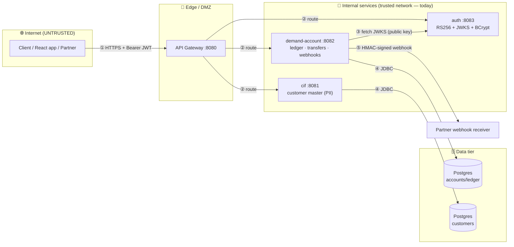
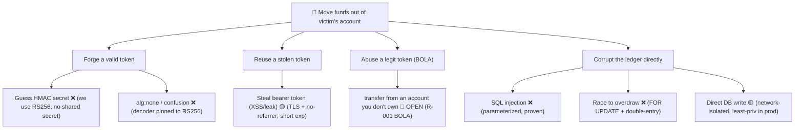
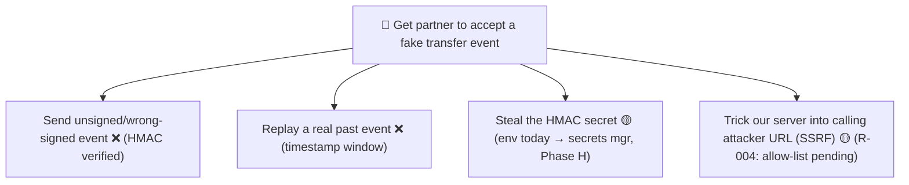

# 🛡️ Build-a-Bank — Threat Model (STRIDE)

> **Step 18 · Phase C finale · DevSecOps shift-left.** A threat model is a *structured, repeatable*
> way to ask "what can go wrong?" *before* an attacker asks it for us. This document models the bank
> **as built through Step 17** (cif, demand-account, auth, gateway), records the risks STRIDE surfaces,
> and tracks each to a mitigation that is **either already shipped or scheduled** (see
> [`risk-register.md`](risk-register.md)). It is a living document: revisit it whenever a service, data
> flow, or trust boundary changes (the §15 loop reminds us to).

- **Method:** STRIDE-per-element over a data-flow diagram (DFD), plus two attack trees and a walkthrough
  of the OWASP Top 10 (2021) and OWASP API Security Top 10 (2023) against our actual code.
- **Owner:** the team. **Last reviewed:** Step 18. **Next review:** when Phase D (messaging) adds Kafka.
- **Honesty note (§12.8):** this model names **real, currently-open risks in our own code** — most
  importantly **BOLA** on the money endpoints. Threat modeling's job is to *find and prioritize* them;
  we ship the cheap edge fixes now (headers, CORS) and schedule the deeper ones (object-level authz).

---

## 1. What are we building? — system & assets

A small bank platform. The pieces in scope at Step 17:

| Element | Type | What it holds / does | Sensitivity |
|---|---|---|---|
| **Client** (curl / future React app / partner) | External entity | Holds a bearer JWT | — |
| **API Gateway** (`gateway`, :8080) | Process (DMZ) | Routes `/cif/**`, `/bank/**`; the front door | Edge |
| **auth** (:8083) | Process | Issues RS256 JWTs, publishes JWKS, BCrypt password check | **Critical** (identity) |
| **demand-account** (:8082) | Process | Money: accounts, double-entry ledger, transfers, webhooks | **Critical** (money) |
| **cif** (:8081) | Process | Customer master (PII: name, email, DOB) | **High** (PII) |
| **PostgreSQL** (per service) | Data store | Balances, ledger, idempotency keys, customers | **Critical** |
| **Partner webhook receiver** | External entity | Receives signed `transfer.completed` events | High |

**Assets to protect (in priority order):** ① ledger integrity & funds (no unauthorized or double
movement); ② identity/credentials (no forgery of tokens); ③ customer PII (confidentiality); ④ availability
of the money path; ⑤ auditability (non-repudiation of transfers).

**Security objectives:** authenticate every money/PII request, authorize at the object level, keep the
ledger balanced and conserved, sign cross-service trust with keys (not shared secrets), and leave a
tamper-evident audit trail.

---

## 2. Data-flow diagram & trust boundaries

**Trust boundaries** (a boundary = where data crosses from one trust level to another; every crossing is
a place to validate, authenticate, and authorize):

| # | Boundary | Crossing | Controls today | Gaps (→ risk register) |
|---|---|---|---|---|
| TB1 | Internet → Edge | Client → Gateway | TLS (prod), JWT required downstream | Rate-limiting not yet (→ Step 37) |
| TB2 | Edge → Internal | Gateway → service | JWT validated at resource server (da, auth) | **cif has no auth — network-trust only** |
| TB3 | Service → auth | da fetches JWKS | Public key only; can't mint tokens | Ephemeral key (restart rotates) |
| TB4 | Service → DB | JDBC | Parameterized queries; least-priv user (prod) | DB creds via env (→ secrets mgmt, Phase H) |
| TB5 | Bank → Partner | da → webhook | **HMAC signature + timestamp** (Step 14) | Partner URL allow-list / SSRF guard pending |

---

## 3. STRIDE-per-element

STRIDE = **S**poofing · **T**ampering · **R**epudiation · **I**nformation disclosure · **D**enial of
service · **E**levation of privilege. For each element we ask all six. ✅ = mitigated, 🟡 = partial,
🔴 = **open** (tracked in the risk register), ➖ = not applicable.

### 3.1 demand-account (the money process) — highest priority

| Threat | Scenario | Status | Mitigation / note |
|---|---|---|---|
| **S** Spoofing | Caller pretends to be a user | ✅ | OAuth2 resource server; valid RS256 JWT required (Step 17) |
| **T** Tampering | Alter amount / balance in flight | ✅ | TLS in transit; server recomputes balances; `@Version` optimistic lock |
| **T** Tampering | Race two transfers to overdraw | ✅ | Pessimistic `SELECT … FOR UPDATE` + double-entry invariant (Step 12) |
| **R** Repudiation | "I never made that transfer" | 🟡 | Double-entry ledger + audit entry; **per-user attribution weak** (no owner on account) |
| **I** Info disclosure | Read someone else's balance/ledger | 🔴 **BOLA** | `GET /api/accounts/{n}` & `/entries` accept ANY account for ANY authed user → **R-001** |
| **D** DoS | Flood transfers / huge pages | 🟡 | Pageable caps page size; **no rate limit yet** (→ Step 37 Resilience4j) |
| **E** Elevation | USER calls admin op | ✅ | `@PreAuthorize("hasRole('ADMIN')")` method security (Step 17) |
| **E** Elevation | **Move money from an account you don't own** | 🔴 **BOLA** | `POST /api/(v1/)transfers` never checks the JWT subject owns `from` → **R-001** |

### 3.2 auth (the identity process)

| Threat | Scenario | Status | Mitigation / note |
|---|---|---|---|
| **S** Spoofing | Brute-force a password | 🟡 | BCrypt (slow, salted); **no lockout/throttle yet** (→ Step 37) |
| **T** Tampering | Forge/alter a JWT | ✅ | RS256: only auth holds the private key; validators have public key only (Step 17) |
| **T** Tampering | `alg:none` / algorithm-confusion | ✅ | Nimbus decoder pinned to RS256 via JWKS `kty/alg`; symmetric keys rejected |
| **R** Repudiation | Deny logging in | 🟡 | Token has `sub`/`iat`/`exp`; central audit log deferred |
| **I** Info disclosure | Leak password hashes / private key | ✅ | Hashes never returned; private key in-memory, only public half at `/oauth2/jwks` |
| **D** DoS | Credential-stuffing flood | 🟡 | → rate limit Step 37 |
| **E** Elevation | Self-grant ADMIN | ✅ | Roles set server-side from the user store, never from client input |

### 3.3 cif (customer master / PII)

| Threat | Scenario | Status | Mitigation / note |
|---|---|---|---|
| **S** Spoofing | Unauthenticated PII read | 🔴 | **cif has NO Spring Security** — relies on TB2 network trust only → **R-002** |
| **T** Tampering | **SQL injection** | ✅ | Spring Data parameterized queries; proven by `SqlInjectionSafetyTest` (Step 18) |
| **R** Repudiation | Unattributed PII edits | 🟡 | `@Version` + `created_at`; full audit deferred |
| **I** Info disclosure | Over-fetch PII | 🟡 | DTO projections (`CustomerResponse`); field-level minimization pending |
| **D** DoS | Unbounded queries | 🟡 | Paging exists; no rate limit |
| **E** Elevation | — | ➖ | cif has no roles yet |

### 3.4 API Gateway (edge)

| Threat | Scenario | Status | Mitigation / note |
|---|---|---|---|
| **S/T** | Header spoofing, host smuggling | 🟡 | StripPrefix routing; **trusted-header hardening** pending |
| **I** | Verbose errors leak internals | ✅ | ProblemDetail (RFC 9457) gives clean, typed errors (Step 13) |
| **D** | Edge flood | 🔴 | **No rate limiting / circuit breaking yet** → **R-003** (Step 37) |

### 3.5 PostgreSQL (data store)

| Threat | Scenario | Status | Mitigation / note |
|---|---|---|---|
| **T** | Direct row tampering | 🟡 | App-only access; least-priv DB role + at-rest encryption in prod (Phase H) |
| **I** | Dump the DB | 🟡 | Network-isolated; secrets via env today → secrets manager (Phase H) |
| **R** | — | ✅ | Append-only ledger entries; balanced double-entry invariant |

### 3.6 Partner webhook flow

| Threat | Scenario | Status | Mitigation / note |
|---|---|---|---|
| **S** | Forged webhook to partner | ✅ | **HMAC-SHA256 signature** over body+timestamp (Step 14) |
| **T** | Tamper / **replay** old event | ✅ | Signature covers body; **timestamp replay window** rejects stale (Step 14) |
| **R** | Partner denies receipt | 🟡 | At-least-once + retry; delivery log deferred |
| **I** | **SSRF** via attacker-set callback URL | 🟡 | URL is config-driven today; **allow-list + egress guard** pending → **R-004** |

---

## 4. Attack trees

How a determined attacker reaches the two crown-jewel goals. Leaves are concrete steps; ✅/🔴 mark whether
that path is closed.

### 4.1 Goal: steal money from an account

**Reading it:** every forged-token and ledger-corruption branch is closed. The **one open path is A3a —
BOLA** — which is exactly why it is the #1 item in the risk register.

### 4.2 Goal: forge a webhook the partner will trust

---

## 5. OWASP Top 10 (2021) — walked against our code

| # | Category | Our posture | Evidence / next |
|---|---|---|---|
| A01 | Broken Access Control | 🔴 **BOLA open** on money endpoints; method security present | R-001; Step 17 `@PreAuthorize` |
| A02 | Cryptographic Failures | ✅ RS256 asymmetric; BCrypt; TLS in prod | Step 16/17 |
| A03 | Injection | ✅ Parameterized JPA; proven | `SqlInjectionSafetyTest` |
| A04 | Insecure Design | 🟡 This threat model *is* the shift-left control | Step 18 |
| A05 | Security Misconfiguration | ✅→ hardened: headers, deny-by-default CORS, stateless, CSRF-off-by-design | Step 18 `SecurityConfig` |
| A06 | Vulnerable Components | 🟡 Pinned versions (`VERSIONS.md`); **dependency scanning** → Step 40 gates | no `latest` |
| A07 | Auth / Identification Failures | ✅ JWT + BCrypt; 🟡 no lockout/throttle | Step 16/17; Step 37 |
| A08 | Software & Data Integrity | ✅ Signed webhooks; 🟡 supply-chain (SBOM/signing) → Phase H | Step 14 |
| A09 | Logging & Monitoring | 🟡 Request-id + audit entry; central log/alerting → Phase H | Step 13 |
| A10 | SSRF | 🟡 Outbound webhook URL config-driven; allow-list pending | R-004 |

## 6. OWASP API Security Top 10 (2023) — the API-specific lens

| # | Category | Our posture | Note |
|---|---|---|---|
| **API1** | **Broken Object Level Authorization (BOLA)** | 🔴 **OPEN** | The headline finding — see §7 |
| API2 | Broken Authentication | ✅ | RS256 JWT resource server |
| API3 | Broken Object Property Level Authorization | 🟡 | DTOs limit fields; mass-assignment guarded by explicit request records |
| API4 | Unrestricted Resource Consumption | 🟡 | Page-size cap; rate limit → Step 37 |
| API5 | Broken Function Level Authorization | ✅ | `@PreAuthorize` on admin ops |
| API6 | Unrestricted Access to Sensitive Business Flows | 🟡 | Idempotency keys; anti-automation pending |
| API7 | SSRF | 🟡 | R-004 |
| API8 | Security Misconfiguration | ✅ | Headers + CORS hardened (Step 18) |
| API9 | Improper Inventory Management | ✅ | OpenAPI/Swagger inventory; versioning + deprecation headers (Step 13/14) |
| API10 | Unsafe Consumption of APIs | ✅ | We verify partner-bound signatures; validate CIF responses |

---

## 7. 🎓 Phase-C Capstone — STRIDE end-to-end of **one feature: the v1 transfer**

`POST /api/v1/transfers  { from, to, amount }` — walked element-by-element along its data flow.

1. **Client → Gateway → demand-account.**
   - *Spoofing* → ✅ bearer JWT required; resource server validates RS256 via JWKS.
   - *Tampering in transit* → ✅ TLS; server trusts only the validated token's claims.
2. **Controller (`TransferController.transferV1`).**
   - *Elevation / BOLA* → 🔴 **OPEN.** The handler uses `from` straight from the body and never checks
     `jwt.subject` owns it. **Today any authenticated user can drain any account.** This is **R-001**.
   - *Idempotency abuse* → ✅ `Idempotency-Key` makes retries safe (Step 14).
   - *Validation* → ✅ `@Valid`: positive amount, required fields (400 ProblemDetail otherwise).
3. **Service (`IdempotentTransferService` / `TransferService`).**
   - *Tampering / race* → ✅ `SELECT … FOR UPDATE` + double-entry; balance can't go negative (422).
   - *Repudiation* → 🟡 ledger pair + audit row recorded; per-owner attribution weak until R-001 lands.
4. **Persistence (Postgres).**
   - *Injection* → ✅ parameterized; *DoS* → 🟡 page caps, rate limit pending.
5. **Webhook emit (`WebhookPublisher` → partner).**
   - *Spoofing/Tampering/Replay* → ✅ HMAC + timestamp window (Step 14).
   - *SSRF* → 🟡 R-004 (allow-list pending).

**Capstone verdict:** the transfer feature is sound on authentication, integrity, and the webhook
contract — but has **one critical, demonstrable authorization hole (BOLA, R-001)** that this model
surfaces and prioritizes. The proposed fix is specified in the risk register and is the first item of the
dedicated authorization step.

---

## 8. Secure-defaults checklist (what the bank ships by default)

- [x] **Authentependent**: every money/PII edge requires a valid JWT (resource server). *(cif gap: R-002)*
- [x] **Asymmetric trust**: RS256 + JWKS, no shared signing secret.
- [x] **Passwords**: BCrypt (salted, slow), never stored or returned in plaintext.
- [x] **Stateless**: no server sessions; CSRF disabled *because* there are no cookies (a deliberate,
      documented choice — re-enable CSRF the moment any cookie-based auth is introduced).
- [x] **Security headers**: `X-Content-Type-Options: nosniff`, `X-Frame-Options: DENY`,
      `Referrer-Policy: no-referrer`, HSTS (over TLS).
- [x] **CORS deny-by-default**: no browser origin allowed unless explicitly allow-listed.
- [x] **Injection-safe**: parameterized queries everywhere; proven by test.
- [x] **Typed errors**: RFC 9457 ProblemDetail — no stack traces leaked to clients.
- [x] **Signed webhooks**: HMAC + replay window.
- [x] **Pinned dependencies**: never `latest`; reproducible builds.
- [ ] **Object-level authorization (ownership)** — **R-001, scheduled.**
- [ ] **Rate limiting / circuit breaking** — Step 37.
- [ ] **Secrets management & key rotation** — Phase H.
- [ ] **Dependency/container scanning gates** — Step 40.

See [`risk-register.md`](risk-register.md) for the prioritized, owned list of open items.
