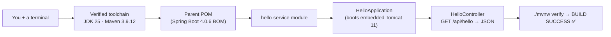
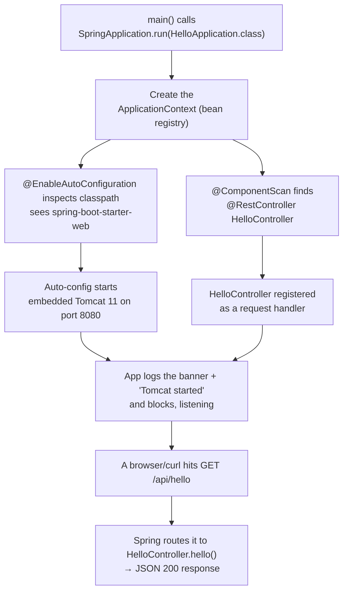
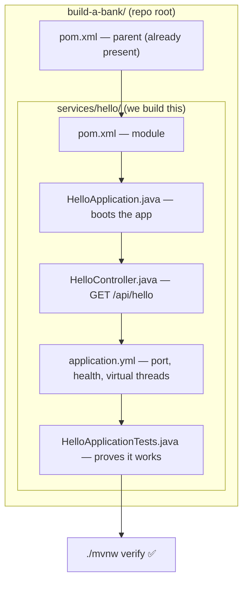
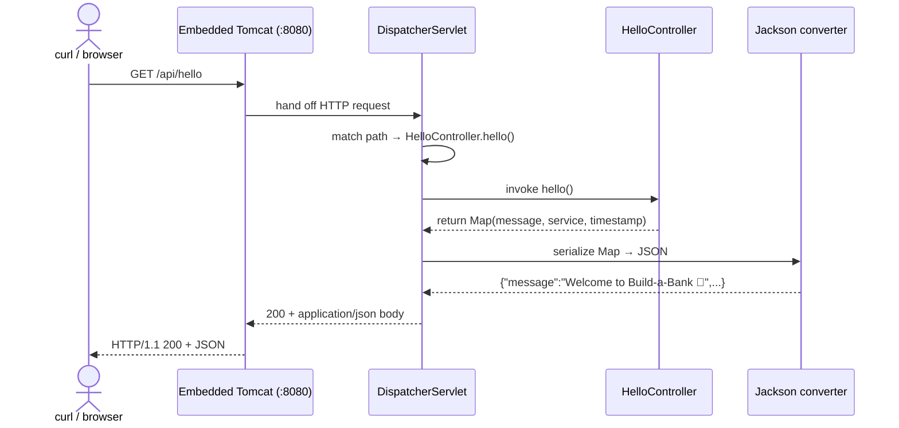

# Step 1 · Setup, the Command Line, Linux & Git — and Your First Running Spring Boot App

> **Step 1 of 67 · Phase A — Foundations 🟢** · Level badge: 🟢 Foundations · Effort ≈ 20h (lighter if you fast-track the basics)

`🟢` Foundations &nbsp;·&nbsp; `🔵` Core &nbsp;·&nbsp; `🟣` Advanced &nbsp;·&nbsp; `🔴` Frontier

> [!CAUTION]
> **Educational, non-production project.** Build-a-Bank is for learning only. It never handles real money, real customers, or real personal data, and it is **not** security-audited for production banking. Every credential you ever see here is fake. (Full disclaimer + guardrails in the [README](../../README.md).)

---

## 🧭 The Six Movements of This Step

A one-line map of where we're going. Click to jump.

1. **[A · 🧭 Orient](#orient)** — what this step is, why it matters, and whether you can skip it.
2. **[B · 🧠 Understand](#understand)** — what a Spring Boot app *is*, what happens when you run one, secrets hygiene, and a real version-evolution story.
3. **[C · 🛠️ Build](#build)** — the heart: toolchain → parent POM → hello module → `HelloApplication` → `HelloController` → `application.yml` → the test → `./mvnw verify`. Plus 🎮 Play With It and the 🏁 finished result.
4. **[D · 🔬 Prove](#prove)** — the Verification Log with the real, pasted `verify` and run output.
5. **[E · 🎓 Apply](#apply)** — interview prep and your-turn exercises.
6. **[F · 🏆 Review](#review)** — troubleshooting, resources & glossary, and the recap/study notes.

---

<a id="orient"></a>

# A · 🧭 Orient

## 📋 This Step in 30 Seconds

| | |
|---|---|
| **Title** | Setup (editor-agnostic) + the command line, Linux & Git + your first running Spring Boot app |
| **Step** | 1 of 67 · **Phase A — Foundations** 🟢 |
| **Effort** | ≈ 20 hours focused (mostly one-time tool installs + first principles; an experienced dev can skim to ~2h) |
| **What you'll run this step** | Just **one** thing: the tiny `services/hello` app. No Docker containers required to build/run it (Docker is only *verified as installed*). |
| **Verification tier** | 🟠 **Standard** — `./mvnw verify` green + the app serving a real request. (The heavier money/security/concurrency tiers arrive later.) |
| **Depends on** | — (this is the very first step; nothing precedes it) |

By the end you will have installed and *verified* a real JVM toolchain, learned just enough terminal/Linux/Git to be dangerous, set up secrets hygiene from day one, and **built, run, and tested your first Spring Boot service** — proving your whole toolchain works end to end.

### ⏭️ Can You Skip This Step? (5-minute self-check)

Run this self-check. If you can confidently do **all** of it, skim the 🕰️/🌱 asides and jump to **[Step 2 — Java language primer](../step-02/lesson.md)**.

- [ ] I can open a terminal and explain `pwd`, `ls`, `cd`, `cat`, `chmod +x`, and what a *process*, a *file permission*, and a *PID* are.
- [ ] I can `git init`, branch, commit, rebase, resolve a merge conflict, and open a PR without looking it up.
- [ ] I have **JDK 25** (`java -version` shows `25.x`) and Maven (or know I'll use the `./mvnw` wrapper), and I know what `JAVA_HOME` is for.
- [ ] I can explain what `@SpringBootApplication` expands to and what "embedded Tomcat" means.
- [ ] I know why you keep secrets in `.env` (gitignored) with a committed `.env.example` of fake values.

> [!TIP]
> Not 100%? Stay. This step is the foundation the other 66 stand on, and the 🛠️ build is short and satisfying. Even strong engineers should run the build once to confirm the **exact pinned stack** (Java 25 / Spring Boot 4.0.6) resolves on their machine.

## 📇 Cheat Card

> **What this step delivers (one sentence):** a verified JVM toolchain and your first running Spring Boot service — `GET /api/hello` returns JSON and `/actuator/health` is `UP`, proven by a green `./mvnw verify`.

**Key commands** (Windows uses `.\mvnw.cmd`; macOS/Linux/Git-Bash use `./mvnw`):

```bash
# Preflight — is my toolchain present?
java -version          # expect: java version "25.0.3" ... LTS
./mvnw -v              # expect: Apache Maven 3.9.12

# Build + run all tests (the gate)
./mvnw -B verify       # expect tail: BUILD SUCCESS

# Run the app, then poke it
./mvnw -pl services/hello spring-boot:run      # http://localhost:8080
curl -i http://localhost:8080/api/hello        # 200 + JSON greeting
curl -s http://localhost:8080/actuator/health  # {"status":"UP",...}
```

**The one headline diagram** — what we build this step:



*Alt text: a left-to-right pipeline — from you at a terminal, to a verified JDK 25 / Maven toolchain, to a parent POM, to the hello-service module, to the application class that boots Tomcat, to the controller serving JSON, ending at a green build.*

## 🎯 Why This Matters

Every senior engineer's day starts at a terminal, in Git, on a JVM. You can't build, secure, ship, or scale a bank if your laptop can't reliably *compile and run one service*. This step makes that boringly dependable — and it bakes in the one habit that gets junior engineers fired: **never commit a secret**. In interviews, "walk me through what `@SpringBootApplication` does" and "old way vs new way of testing a Boot app" are warm-ups you'll now ace.

## ✅ What You'll Be Able to Do

- Navigate a filesystem, inspect and kill processes, and reason about file permissions from the terminal.
- Use Git for real work: `init`, branch, commit, merge, rebase, resolve a conflict, and open a PR.
- Install and **verify** (not assume) JDK 25 and use the Maven Wrapper — no global Maven required.
- Explain what a Spring Boot application *is*, what `SpringApplication.run(...)` actually does, and why there's a web server inside your JAR.
- Build, run, and test a multi-module Maven project from the CLI in *any* editor — and optionally drive it from IntelliJ.
- Set up secrets hygiene (`.env.example` + `.gitignore` + the gitleaks pre-commit concept) so you never leak a credential.

## 🧰 Before You Start

**Prerequisites (one-time installs — we verify each below):**
- A 64-bit machine. 16 GB RAM recommended (8 GB works for Phase A; you only run one tiny app here). ~50 GB free disk for later phases.
- **JDK 25** (Oracle or Eclipse Temurin — equivalent). We pin **25.0.3 LTS**.
- **Git**. **Docker Desktop** (you'll only *verify it's installed* this step; real containers start in Phase B/Step 8).
- An editor — **anything**. The CLI is canonical; IntelliJ Community is an optional accelerator (never Ultimate-required).

> [!NOTE]
> **Two repo roles — get this straight now, it saves confusion all course long.**
> 1. **The cloned course repo = your textbook + answer key.** It is *already* a Git repo. You read its `lesson.md` files and run `git checkout step-NN-end` to see any reference solution. **You do not run `git init` or build your career here.**
> 2. **A separate, empty folder = your own project.** This is the *only* place Step 1 tells you to run `git init` and build along by hand. (A late-joiner can copy a `step-NN-start` snapshot into a fresh folder to start mid-course.)
>
> Throughout this lesson, "the repo" means whichever folder you're building in. Commands are identical.

**What connects here:** nothing precedes this — but everything that follows assumes you can confidently build, run, and commit. We'll call back to this step constantly (e.g. "remember `./mvnw verify` from Step 1?").

**Depends on:** — *(none)*

---

<a id="understand"></a>

# B · 🧠 Understand

## 🧠 The Big Idea

A **Spring Boot application** is an ordinary Java program with a `main` method — but when you run it, a single line (`SpringApplication.run(...)`) does an enormous amount of setup for you: it builds an **application context** (a registry of your objects, called *beans*), it scans your code for things it should manage, it looks at what's on your *classpath* (the set of libraries available) and **auto-configures** sensible defaults, and — because `spring-boot-starter-web` is on the classpath — it **starts an embedded web server (Tomcat) inside your own process** and keeps running, listening for HTTP requests.

That last part is the mental shift. The old way was: write a `.war` file, install a separate Tomcat server, deploy your app *into* it. The Boot way is: the server lives *inside* your JAR. You run one self-contained thing (`java -jar app.jar`) and it's a web server.

> **Analogy — a food truck vs. a restaurant kitchen.** The old model is a restaurant: you cook your dish (your code) but you must rent a kitchen someone else runs (an external Tomcat) and follow their rules to plug in. Spring Boot is a **food truck**: the kitchen is built into the vehicle. You drive up (`java -jar`), flip the sign to OPEN (Tomcat starts on port 8080), and serve customers (HTTP requests) — no external venue required. Auto-configuration is the truck arriving **pre-stocked**: it looked at your menu (the classpath) and pre-loaded exactly the equipment that menu needs.

Here's what happens, end to end, when you run your first service:



*Alt text: a flowchart of application startup — the main method runs SpringApplication.run, which creates the context; component scanning finds the controller while auto-configuration inspects the classpath and starts embedded Tomcat on port 8080; the app then blocks listening, and an incoming GET request is routed to the controller which returns a JSON 200 response.*

## 🌱 Under the Hood: How It Really Works (no magic)

Three pieces do the heavy lifting. We *fully* unpack each in Steps 5–7, but you should never think of them as magic.

**`@SpringBootApplication` is three annotations in one.** It's a convenience meta-annotation equal to:
- **`@SpringBootConfiguration`** — "this class is a source of bean definitions" (a specialized `@Configuration`).
- **`@EnableAutoConfiguration`** — "look at my classpath and configure reasonable defaults." Spring Boot ships dozens of *auto-configuration* classes guarded by `@Conditional` checks (e.g. *"if a servlet web server class is on the classpath and no web server bean is defined, create one"*). Because `spring-boot-starter-web` pulls in Tomcat + Spring MVC + Jackson, the web auto-config fires and you get a running server, a `DispatcherServlet`, and JSON serialization — none of which you wrote.
- **`@ComponentScan`** — "scan this package and below for `@Component`-family beans" (which includes `@RestController`). That's how `HelloController` gets discovered and wired up without you registering it manually.

**Auto-configuration is just conditional bean creation.** Boot reads a file (`META-INF/spring/org.springframework.boot.autoconfigure.AutoConfiguration.imports`) inside its jars to find candidate configs, then each one only activates if its conditions hold. Nothing happens that you couldn't trace — it's `if (classpath has X && you didn't define Y) then create Y`. (Domain 3; deep in Step 6.)

**Embedded Tomcat** is the servlet container, started as a bean in your process. By default it binds port 8080. Our config also turns on **graceful shutdown** (finish in-flight requests on `SIGTERM` — Kubernetes-friendly, deep dive Step 34) and **virtual threads** (Java 25's lightweight threads for request handling — Domain 2 / Step 11). When tests boot the server on a **random** port, that proves the full HTTP path, not just that classes compile.

> ◇ ❓ **Knowledge-check:** if you remove `spring-boot-starter-web` from the dependencies, what happens when you run the app? <details><summary>answer</summary>No web auto-configuration fires (no servlet classes on the classpath), so no embedded Tomcat starts. The context still builds, then the application exits because nothing keeps it alive — it's no longer a long-running web server, just a program that ran and finished.</details>

## 🛡️ Security Lens: Secrets Hygiene From Day One

The fastest way to end a banking-engineering career is to push an API key or DB password to GitHub. We prevent that *before writing any feature code*.

- **`.env` holds secrets and is `.gitignored`** — it never enters version control.
- **`.env.example` is committed** and contains only **fake/demo placeholders**, so teammates know which variables to set without ever seeing a real value.
- **A gitleaks pre-commit hook** (the concept here; you install the binary in Phase H / Step 40) scans your staged changes for secret-looking strings and *blocks the commit* if it finds one — a safety net so a slip never reaches history.

This codebase's `.env.example` already models the pattern (note **every value is obviously fake**):

```bash
# .env.example — TEMPLATE ONLY. Copy to .env (which is .gitignored) and fill in.
# Use FAKE / DEMO credentials only. This is an educational, non-production project.

# --- Postgres (added Step 8) ---
POSTGRES_USER=bank
POSTGRES_PASSWORD=change-me-locally

# --- Demo JWT signing (added Step 16) — DEMO ONLY, rotate/replace ---
JWT_DEMO_SECRET=replace-with-a-long-random-demo-only-string

# --- AI / RAG keys (added Phase I) — provide via env, NEVER commit a real key ---
# OPENAI_API_KEY=
```

> [!WARNING]
> Once a secret is committed, it is **permanently in Git history** even if you delete it in a later commit. Rotating the credential is the only real fix. That's why the prevention (`.gitignore` + the hook) matters more than the cleanup.

## 🕰️ Then vs. Now — the `TestRestTemplate` story (a real version-evolution moment)

This is not a hypothetical. **We hit this exact failure while building this step**, and it's a perfect Domain-14 lesson: the interview-critical "old way → new way → why → what legacy still uses."

| | Old way (Spring Boot ≤ 3) | New way (Spring Boot 4 / Framework 7) |
|---|---|---|
| Integration HTTP client in tests | `TestRestTemplate` (package `org.springframework.boot.test.web.client`) | **Removed.** Use `RestClient` against the live port, or the new **`RestTestClient`** / **`MockMvcTester`** (package `org.springframework.test.web.servlet.client`) |
| Production sync HTTP client | `RestTemplate` (older), then `WebClient`/`RestTemplate` | **`RestClient`** (Spring 6.1+) — the course's standard synchronous client |

**Why it changed:** Spring trimmed redundant, legacy test helpers in the 4.0 cleanup and standardized on the modern `RestClient` family. **What legacy still uses:** an enormous amount of Boot 2/3 code in the wild still relies on `TestRestTemplate` — so you'll absolutely meet it in existing codebases and interview questions.

We feature the **real compile error** we got in the [🩺 Troubleshooting](#-stuck-troubleshooting--fixes) section, and our test (you'll write it below) uses `RestClient` against the live random port — the honest, modern path. This is the whole point of the **"verify, don't guess"** discipline: we didn't *assume* `TestRestTemplate` still existed; the build told us the truth.

> [!TIP]
> When an interviewer asks "how do you test a Spring Boot web endpoint?", a strong answer names the slice options (`@WebMvcTest` + `MockMvcTester`) **and** the full-stack option (`@SpringBootTest(RANDOM_PORT)` + a real client like `RestClient`/`RestTestClient`), and notes that `TestRestTemplate` was removed in Boot 4. You'll have done all three by Step 28.

---

<a id="build"></a>

# C · 🛠️ Build

## 📦 Your Starting Point

The reference repo provides two tags for this step:

- **`step-01-start`** — the bare scaffold (parent POM, Maven Wrapper, `.gitignore`, `.env.example`, `Makefile`, the docs). It **builds clean** but has no `hello-service` yet. This is where a learner building by hand begins.
- **`step-01-end`** — scaffold **plus** a working `hello-service` where `./mvnw verify` is green. **`step-01-end == step-02-start`** — the chain holds.

```bash
# In the cloned course repo (your answer key), peek at the finished state any time:
git checkout step-01-end     # the reference solution
git checkout step-01-start   # back to the scaffold
```

What's already green at `step-01-start`: the parent `pom.xml` resolves the Spring Boot 4.0.6 BOM, the `./mvnw` wrapper downloads Maven 3.9.12, and `git status` is clean. What you'll build: the entire `hello-service` module, from its POM to a passing test.

## 🛠️ Let's Build It — Step by Step

Here's the map of what we'll create, then the tree of files we'll touch.



*Alt text: a tree-style flowchart showing the repo root with its parent pom.xml, and the services/hello module we build containing its module pom, the application class, the controller, the application.yml config, and the test class, all leading to a green verify.*

🌳 **Files we'll touch:**

```text
build-a-bank/
├── pom.xml                                  # 1. parent POM (Boot 4.0.6 BOM)
└── services/
    └── hello/
        ├── pom.xml                          # 3. module POM (web + actuator + test)
        └── src/
            ├── main/
            │   ├── java/com/buildabank/hello/
            │   │   ├── HelloApplication.java # 4. the entry point
            │   │   └── HelloController.java  # 6. GET /api/hello
            │   └── resources/
            │       └── application.yml       # 7. config: port, health, virtual threads
            └── test/
                └── java/com/buildabank/hello/
                    └── HelloApplicationTests.java # 8. the proof
```

🧭 *You are here: sub-step 0 of 8 — nothing built yet.* Let's go.

---

### Sub-step 1 of 8 — Verify your toolchain 🧭 *(toolchain → parent POM → module POM → app → run → controller → config → test → verify)*

🎯 **Goal:** confirm — not assume — that JDK 25 and the Maven Wrapper are present and the right versions. **Verifying the toolchain is the whole spirit of this course.**

📁 **Location:** your terminal, at the repo root (the folder containing `pom.xml` and `mvnw`).

⌨️ **Commands:**

```bash
java -version
./mvnw -v          # Windows PowerShell:  .\mvnw.cmd -v
git --version
docker --version   # we only confirm it's installed this step
```

🔍 **Line-by-line:**
- `java -version` — prints the JVM version. The `version` subcommand here is *informational only*. We need **25.x**.
- `./mvnw -v` — runs the **Maven Wrapper**: a small script (`mvnw` / `mvnw.cmd`) committed to the repo that downloads and runs the *exact pinned Maven* (3.9.12), so everyone builds with the same Maven without installing it globally. `-v` prints versions and exits. The pin lives in `.mvn/wrapper/maven-wrapper.properties`.
- `git --version` / `docker --version` — sanity-check the other tools. (Docker isn't *used* by the build this step; we just confirm it's installed and the daemon can start, for Phase B onward.)

💭 **Under the hood:** the wrapper reads `.mvn/wrapper/maven-wrapper.properties` (`distributionUrl=...apache-maven-3.9.12-bin.zip`) and fetches that exact Maven into a cache on first run, then delegates to it. This is why a teammate on a fresh laptop gets *your* Maven version automatically — reproducibility by default.

🔮 **Predict:** what major version will `java -version` print? (We pinned it in `VERSIONS.md`.)

▶️ **Run & See:**

✅ **Expected output** (versions on this machine — yours match the pins in `VERSIONS.md`):

```text
java version "25.0.3" 2026-... LTS
Java(TM) SE Runtime Environment (build 25.0.3+9-LTS-195)
Java HotSpot(TM) 64-Bit Server VM (build 25.0.3+9-LTS-195, mixed mode, sharing)

Apache Maven 3.9.12
Maven home: ...
Java version: 25.0.3, vendor: Oracle Corporation
```

❌ **If you see this instead:** `java version "21..."` (or `17`/`11`) means a different JDK is first on your `PATH`/`JAVA_HOME`. Fix it before continuing (see [🩺 JAVA_HOME / wrong JDK](#-stuck-troubleshooting--fixes)). `'./mvnw' is not recognized` on Windows → use `.\mvnw.cmd` (backslash, `.cmd`).

> 💡 **Faster with `make`:** if you have `make` (often absent on Windows), `make doctor` prints all of the above in one shot. The CLI commands are canonical, though — `make` is just a convenience wrapper, and `make doctor` literally runs `java -version`, `./mvnw -v`, `docker --version`, etc. for you.

✋ **Checkpoint:** `java -version` shows **25.0.3** and `./mvnw -v` shows **Maven 3.9.12**. If not → 🩺.

💾 **Commit:** nothing to commit yet — this was verification only.

⚠️ **Pitfall:** having multiple JDKs installed and the wrong one on the `PATH` is the #1 Day-1 snag. `JAVA_HOME` must point at your JDK 25.

---

### Sub-step 2 of 8 — Understand the parent (aggregator) POM 🧭 *(toolchain ✅ → **parent POM** → …)*

🎯 **Goal:** understand the **parent POM** — the single file that pins versions for *every* module. In a build-along folder you'd create this; in the course repo it already exists at `step-01-start`. Read it carefully; it's the spine of the whole monorepo.

📁 **Location:** `build-a-bank/pom.xml` (repo root).

⌨️ **Code** (the complete file, verbatim):

```xml
<!-- pom.xml -->
<?xml version="1.0" encoding="UTF-8"?>
<project xmlns="http://maven.apache.org/POM/4.0.0"
         xmlns:xsi="http://www.w3.org/2001/XMLSchema-instance"
         xsi:schemaLocation="http://maven.apache.org/POM/4.0.0 https://maven.apache.org/xsd/maven-4.0.0.xsd">
    <modelVersion>4.0.0</modelVersion>

    <!--
      Build-a-Bank — parent (aggregator) POM.
      Inherits Spring Boot's starter parent so every module gets the curated,
      mutually-compatible dependency + plugin versions for Spring Boot 4.0.x.
      Exact pinned versions live in /VERSIONS.md (never "latest").
    -->
    <parent>
        <groupId>org.springframework.boot</groupId>
        <artifactId>spring-boot-starter-parent</artifactId>
        <version>4.0.6</version>
        <relativePath/> <!-- look the parent up from the repository, not a local path -->
    </parent>

    <groupId>com.buildabank</groupId>
    <artifactId>build-a-bank-parent</artifactId>
    <version>0.1.0-SNAPSHOT</version>
    <packaging>pom</packaging>
    <name>Build-a-Bank :: Parent</name>
    <description>Educational, non-production retail-banking platform + course (JVM).</description>

    <properties>
        <!-- Pinned toolchain. The latest LTS present in the environment. See VERSIONS.md. -->
        <java.version>25</java.version>
        <maven.compiler.release>25</maven.compiler.release>
        <project.build.sourceEncoding>UTF-8</project.build.sourceEncoding>
        <project.reporting.outputEncoding>UTF-8</project.reporting.outputEncoding>

        <!-- Pinned BOM versions for modules added in later steps (verified GA, Boot-4 line). -->
        <spring-cloud.version>2025.1.1</spring-cloud.version>
        <testcontainers.version>2.0.5</testcontainers.version>
        <archunit.version>1.4.2</archunit.version>
    </properties>

    <!-- Modules are added step-by-step. Step 1 ships the first running app. -->
    <modules>
        <module>services/hello</module>
    </modules>

    <dependencyManagement>
        <dependencies>
            <!-- Spring Cloud release train aligned to Spring Boot 4.0.x (used from Step 15). -->
            <dependency>
                <groupId>org.springframework.cloud</groupId>
                <artifactId>spring-cloud-dependencies</artifactId>
                <version>${spring-cloud.version}</version>
                <type>pom</type>
                <scope>import</scope>
            </dependency>
            <!-- Real infra in tests (Postgres/Kafka/Redis) from Step 8. -->
            <dependency>
                <groupId>org.testcontainers</groupId>
                <artifactId>testcontainers-bom</artifactId>
                <version>${testcontainers.version}</version>
                <type>pom</type>
                <scope>import</scope>
            </dependency>
        </dependencies>
    </dependencyManagement>
</project>
```

🔍 **Line-by-line** (every term defined inline):
- **POM** = *Project Object Model* — `pom.xml` is Maven's project descriptor: identity, dependencies, build config.
- `<parent> … spring-boot-starter-parent … 4.0.6` — our parent inherits *Spring Boot's* parent. That parent is a **BOM** (*Bill of Materials*): a curated list of mutually-compatible versions for hundreds of libraries, so you declare dependencies **without versions** and Boot picks tested-together ones. `4.0.6` is our pinned, GA Spring Boot.
- `<relativePath/>` (empty) — "don't look for the parent on disk; resolve it from the repository." Standard for the Boot parent.
- `<groupId>com.buildabank</groupId>` — our organization's namespace (reverse-DNS convention).
- `<packaging>pom</packaging>` — this project produces **no jar**; it's an *aggregator/parent* that groups modules and shares config. (A normal app uses the default `jar`.)
- `<java.version>25</java.version>` + `<maven.compiler.release>25</maven.compiler.release>` — compile against the **Java 25** language level and target the Java 25 runtime API. `release` is the modern, single-flag way to set source+target safely.
- `<modules><module>services/hello</module></modules>` — the only module so far. Building the parent builds every listed module. We add modules step by step.
- `<dependencyManagement>` — declares versions for libraries used *later* (Spring Cloud from Step 15, Testcontainers from Step 8) **without** adding them yet. Pinning here means modules just say "I want testcontainers" and inherit the right version. `<scope>import</scope>` + `<type>pom</type>` = "import another BOM's version list."

💭 **Under the hood:** when Maven builds, it computes an *effective POM* by merging your POM with the Spring Boot parent and any imported BOMs. That merged result is where "no-version" dependency declarations get their actual versions. Run `./mvnw help:effective-pom` later to see the full thing.

✋ **Checkpoint:** you understand that this one file pins Java 25 + Spring Boot 4.0.6 for the whole repo, and lists the modules. If you're building by hand in your own folder, this file exists exactly as above.

⚠️ **Pitfall:** never write `<version>latest</version>` or `LATEST`/`RELEASE` for anything — builds become non-reproducible and can break overnight. We pin everything; the single source of truth is `VERSIONS.md`.

---

### Sub-step 3 of 8 — The hello-service module POM 🧭 *(… parent POM ✅ → **module POM** → …)*

🎯 **Goal:** create the module that *is* your first app: declare the web + actuator + test dependencies and the Spring Boot Maven plugin.

📁 **Location:** new file → `services/hello/pom.xml`

⌨️ **Code** (the complete file, verbatim):

```xml
<!-- services/hello/pom.xml -->
<?xml version="1.0" encoding="UTF-8"?>
<project xmlns="http://maven.apache.org/POM/4.0.0"
         xmlns:xsi="http://www.w3.org/2001/XMLSchema-instance"
         xsi:schemaLocation="http://maven.apache.org/POM/4.0.0 https://maven.apache.org/xsd/maven-4.0.0.xsd">
    <modelVersion>4.0.0</modelVersion>

    <!--
      hello-service — the Step 1 learning sandbox: your FIRST running Spring Boot app.
      It is intentionally tiny (one endpoint + health check) and exists only to prove
      your toolchain works end-to-end. The real banking microservices begin at Step 8 (CIF).
    -->
    <parent>
        <groupId>com.buildabank</groupId>
        <artifactId>build-a-bank-parent</artifactId>
        <version>0.1.0-SNAPSHOT</version>
        <relativePath>../../pom.xml</relativePath>
    </parent>

    <artifactId>hello-service</artifactId>
    <name>Build-a-Bank :: Hello Service</name>
    <description>First running Spring Boot app — toolchain proof (Step 1).</description>

    <dependencies>
        <!-- spring-boot-starter-web: embedded Tomcat + Spring MVC + Jackson JSON. -->
        <dependency>
            <groupId>org.springframework.boot</groupId>
            <artifactId>spring-boot-starter-web</artifactId>
        </dependency>
        <!-- spring-boot-starter-actuator: production-ready endpoints (/actuator/health, etc.). -->
        <dependency>
            <groupId>org.springframework.boot</groupId>
            <artifactId>spring-boot-starter-actuator</artifactId>
        </dependency>

        <!-- Test stack: JUnit 5 + AssertJ + Mockito + Spring Test, all version-managed by the parent. -->
        <dependency>
            <groupId>org.springframework.boot</groupId>
            <artifactId>spring-boot-starter-test</artifactId>
            <scope>test</scope>
        </dependency>
    </dependencies>

    <build>
        <plugins>
            <!-- Repackages the app into an executable fat JAR and enables `spring-boot:run`. -->
            <plugin>
                <groupId>org.springframework.boot</groupId>
                <artifactId>spring-boot-maven-plugin</artifactId>
            </plugin>
        </plugins>
    </build>
</project>
```

🔍 **Line-by-line:**
- `<parent> … relativePath ../../pom.xml` — this module's parent is **our** parent POM (two directories up), so it inherits Java 25 and the Boot 4.0.6 BOM. That's why the dependencies below carry **no version numbers** — the BOM supplies them.
- `<artifactId>hello-service</artifactId>` — the module's name. (No `<groupId>`/`<version>` needed; inherited from the parent.)
- **`spring-boot-starter-web`** — a *starter* is a curated bundle of dependencies for a capability. This one brings **embedded Tomcat + Spring MVC + Jackson** (JSON). Its mere presence is what triggers web auto-configuration.
- **`spring-boot-starter-actuator`** — adds production-ready endpoints like `/actuator/health` and `/actuator/info` (free Kubernetes liveness/readiness probes later).
- **`spring-boot-starter-test`** (`<scope>test</scope>`) — JUnit 5, AssertJ, Mockito, and Spring's test support, available only during testing (not shipped in the app jar). `test` scope = "compile/run for tests, exclude from the final artifact."
- **`spring-boot-maven-plugin`** — repackages your jar into an **executable "fat jar"** (your code + all dependencies + a launcher) and enables `./mvnw spring-boot:run`. Without it, `java -jar` on a plain jar can't find Spring's classes.

💭 **Under the hood:** "no-version dependencies" feels like magic but isn't — the parent's `dependencyManagement` (via Boot's BOM) maps each `groupId:artifactId` to a tested version. The plugin's `repackage` goal runs during the `package` phase and rewrites the jar with a nested-jar layout and a `Main-Class` that bootstraps Spring's classloader.

🔮 **Predict:** after you add this POM but *before* writing any Java, will `./mvnw -pl services/hello compile` succeed? (Think: is there any source to compile yet?)

▶️ **Run & See:**

```bash
./mvnw -B -pl services/hello validate   # Windows: .\mvnw.cmd -B -pl services/hello validate
```

✅ **Expected output** (the POM is well-formed and resolves):

```text
[INFO] Build-a-Bank :: Hello Service ... 
[INFO] BUILD SUCCESS
```

> `-pl services/hello` = *"--projects: build only this module."* `-B` = *batch/non-interactive* (clean CI-style logs).

✋ **Checkpoint:** `services/hello/pom.xml` exists and `validate` passes. (Compiling would also succeed with zero sources — there's just nothing to compile yet.)

💾 **Commit:**

```bash
git add pom.xml services/hello/pom.xml
git commit -m "build(hello): add hello-service module with web + actuator starters"
```

⚠️ **Pitfall:** forgetting the `spring-boot-maven-plugin` means `spring-boot:run` and the executable jar won't work — you'd see "no main manifest attribute" from `java -jar`. It's required for a runnable Boot app.

---

### Sub-step 4 of 8 — Write `HelloApplication` (the entry point) 🧭 *(… module POM ✅ → **app class** → …)*

🎯 **Goal:** create the `main` class that boots the whole thing — your first piece of Spring Boot code.

📁 **Location:** new file → `services/hello/src/main/java/com/buildabank/hello/HelloApplication.java`

⌨️ **Code** (complete, verbatim):

```java
// services/hello/src/main/java/com/buildabank/hello/HelloApplication.java
package com.buildabank.hello;

import org.springframework.boot.SpringApplication;
import org.springframework.boot.autoconfigure.SpringBootApplication;

/**
 * The entry point of your first Build-a-Bank service.
 *
 * <p>{@code @SpringBootApplication} is three annotations in one:
 * <ul>
 *   <li>{@code @SpringBootConfiguration} — marks this as a source of bean definitions;</li>
 *   <li>{@code @EnableAutoConfiguration} — turns on Spring Boot's "look at the classpath and
 *       configure sensible defaults" machinery (this is what wires up an embedded web server);</li>
 *   <li>{@code @ComponentScan} — scans this package and below for {@code @Component}/{@code @RestController} beans.</li>
 * </ul>
 * We unpack each of these "magic" pieces in Steps 5–7.
 */
@SpringBootApplication
public class HelloApplication {

    public static void main(String[] args) {
        // Boots the Spring context, starts embedded Tomcat, and blocks until shutdown.
        SpringApplication.run(HelloApplication.class, args);
    }
}
```

🔍 **Line-by-line:**
- `package com.buildabank.hello;` — the package. **This placement matters:** `@ComponentScan` (inside `@SpringBootApplication`) scans *this package and everything below it*. Our controller lives in the same package, so it gets found. Put a bean *above* this package and it won't be scanned.
- `import org.springframework.boot.SpringApplication;` — the bootstrap class with the static `run(...)` method.
- `import ...autoconfigure.SpringBootApplication;` — the meta-annotation we dissected in 🌱 Under the Hood.
- `@SpringBootApplication` — the one annotation that = config source + auto-config + component scan.
- `public static void main(String[] args)` — the standard Java entry point; the JVM calls this first.
- `SpringApplication.run(HelloApplication.class, args)` — creates the application context, fires auto-configuration, starts embedded Tomcat, and **blocks** (keeps the process alive) until you stop it. The first argument tells Spring which class to use as the primary config/scan root.

💭 **Under the hood:** `run(...)` returns a `ConfigurableApplicationContext` (we ignore it here). Internally it: creates the context → loads bean definitions → applies auto-configuration → starts lifecycle beans (including the Tomcat `WebServer`) → publishes an `ApplicationReadyEvent`. That's the banner + "Tomcat started on port 8080" you'll see next.

🔮 **Predict:** if you run the app *right now* (no controller yet), will it start? Will `GET /api/hello` work?

▶️ **Run & See:**

```bash
./mvnw -pl services/hello spring-boot:run    # Windows: .\mvnw.cmd -pl services/hello spring-boot:run
```

✅ **Expected output** (abridged — the app starts and listens):

```text
  .   ____          _            __ _ _
 /\\ / ___'_ __ _ _(_)_ __  __ _ \ \ \ \
( ( )\___ | '_ | '_| | '_ \/ _` | \ \ \ \
 \\/  ___)| |_)| | | | | || (_| |  ) ) ) )
  '  |____| .__|_| |_|_| |_\__, | / / / /
 =========|_|==============|___/=/_/_/_/

 :: Spring Boot ::                (v4.0.6)

... Starting HelloApplication using Java 25.0.3 ...
... Tomcat started on port 8080 (http) with context path '/'
... Started HelloApplication in ... seconds
```

Now, in a **second terminal**:

```bash
curl -i http://localhost:8080/api/hello
```

❌ **If you see this instead:**

```text
HTTP/1.1 404
{"timestamp":"...","status":404,"error":"Not Found","path":"/api/hello"}
```

That's **correct for right now** — the app runs, but you haven't written the endpoint yet, so Spring returns a clean 404. (Predicted it? The app starts; `/api/hello` does *not* work until the next sub-step.) Press `Ctrl+C` to stop the app.

✋ **Checkpoint:** the banner prints, "Tomcat started on port 8080" appears, and the app stays running until `Ctrl+C`. You have a running (if empty) web server.

💾 **Commit:**

```bash
git add services/hello/src/main/java/com/buildabank/hello/HelloApplication.java
git commit -m "feat(hello): add Spring Boot application entry point"
```

⚠️ **Pitfall:** if startup fails with *"Web server failed to start. Port 8080 was already in use,"* another process holds 8080 — stop it or change the port (see 🩺). On Windows you can't `Ctrl+C` cleanly in some shells; close the terminal or use Task Manager to end stray `java` processes.

---

### Sub-step 5 of 8 — Break it on purpose (30s), then restore 🧭 *(a tiny experiment to make startup *stick*)*

🎯 **Goal:** prove to yourself that auto-config is real, not magic, by removing a starter and watching the behavior change.

🔬 **Break-it experiment:** in `services/hello/pom.xml`, temporarily comment out the **web** starter:

```xml
<!-- TEMPORARY EXPERIMENT — comment out, observe, then restore -->
<!--
<dependency>
    <groupId>org.springframework.boot</groupId>
    <artifactId>spring-boot-starter-web</artifactId>
</dependency>
-->
```

▶️ Run `./mvnw -pl services/hello spring-boot:run` again.

✅ **What you'll see:** the app starts, logs *"Started HelloApplication"* with **no "Tomcat started" line**, then **exits immediately** — there's no web server to keep it alive. That's auto-configuration in action: no servlet classes on the classpath ⇒ no embedded server ⇒ not a long-running web app.

👉 **Now restore** the dependency exactly as it was. Re-run; the "Tomcat started on port 8080" line returns. (This is the "verify, don't guess" mindset in miniature — and exactly why we never trust a claim without a run.)

✋ **Checkpoint:** you saw the app *not* start a server without the web starter, and start one again after restoring it. Your `pom.xml` is back to the version from sub-step 3.

---

### Sub-step 6 of 8 — Add `HelloController` (your first endpoint) 🧭 *(… app class ✅ → **controller** → …)*

🎯 **Goal:** expose `GET /api/hello` returning a small JSON greeting and the server time (UTC) — the first HTTP surface your bank exposes.

📁 **Location:** new file → `services/hello/src/main/java/com/buildabank/hello/HelloController.java`

⌨️ **Code** (complete, verbatim):

```java
// services/hello/src/main/java/com/buildabank/hello/HelloController.java
package com.buildabank.hello;

import java.time.Instant;
import java.util.Map;

import org.springframework.web.bind.annotation.GetMapping;
import org.springframework.web.bind.annotation.RestController;

/**
 * The first HTTP surface your bank exposes.
 *
 * <p>{@code @RestController} = {@code @Controller} + {@code @ResponseBody}: return values are
 * serialized straight to the HTTP response body as JSON (via a Jackson message converter),
 * not resolved to a view template. The request lifecycle is dissected in Step 13.
 */
@RestController
public class HelloController {

    /**
     * GET /api/hello — returns a small JSON greeting and the server time (UTC).
     * Time is always {@link Instant} (UTC) in this codebase; money is always BigDecimal.
     */
    @GetMapping("/api/hello")
    public Map<String, Object> hello() {
        return Map.of(
                "message", "Welcome to Build-a-Bank 🏦",
                "service", "hello",
                "timestamp", Instant.now().toString()
        );
    }
}
```

🔍 **Line-by-line:**
- `import java.time.Instant;` — `Instant` is a moment on the UTC timeline. **House rule:** time is *always* UTC `Instant` in this codebase; money is *always* `BigDecimal`. (Banking correctness — Domain 5; deep in Step 12.) We *never* use `LocalDateTime` for stored timestamps.
- `import java.util.Map;` — we'll return a `Map` and let Jackson turn it into a JSON object.
- `@RestController` — `@Controller` + `@ResponseBody`. Return values are written **straight to the HTTP response body as JSON** by a Jackson `HttpMessageConverter`, not resolved to an HTML view. Also a `@Component`, so `@ComponentScan` discovers it.
- `@GetMapping("/api/hello")` — maps HTTP **GET** requests for the path `/api/hello` to this method.
- `public Map<String, Object> hello()` — the handler. Returning a `Map` is the simplest possible JSON shape for a first endpoint (real services use typed DTOs from Step 8 onward).
- `Map.of("message", ..., "service", "hello", "timestamp", Instant.now().toString())` — an immutable map. `Instant.now()` is the current UTC instant; `.toString()` renders ISO-8601 (e.g. `2026-06-09T13:29:14.842392300Z` — the trailing `Z` means UTC). Jackson serializes the whole map to a JSON object.

💭 **Under the hood:** when the request arrives, Spring's `DispatcherServlet` (created by web auto-config) matches `/api/hello` to this method via *handler mapping*, invokes it, then a Jackson `MappingJackson2HttpMessageConverter` serializes your `Map` to JSON and sets `Content-Type: application/json`. The full request lifecycle is dissected in Step 13.

🔮 **Predict:** what `Content-Type` header and status code will the response have?

▶️ **Run & See:**

```bash
./mvnw -pl services/hello spring-boot:run     # leave running
# second terminal:
curl -i http://localhost:8080/api/hello
```

✅ **Expected output:**

```text
HTTP/1.1 200
Content-Type: application/json

{"message":"Welcome to Build-a-Bank 🏦","timestamp":"2026-06-09T13:29:14.842392300Z","service":"hello"}
```

❌ **If you see `404` instead:** the controller wasn't scanned — check it's in package `com.buildabank.hello` (same package or below `HelloApplication`) and that you saved the file and the app **restarted** (`spring-boot:run` doesn't hot-reload by default — stop with `Ctrl+C` and rerun). See 🩺.

✋ **Checkpoint:** `curl -i http://localhost:8080/api/hello` returns **HTTP 200**, `Content-Type: application/json`, and the welcome JSON. Stop the app with `Ctrl+C`.

💾 **Commit:**

```bash
git add services/hello/src/main/java/com/buildabank/hello/HelloController.java
git commit -m "feat(hello): add GET /api/hello endpoint returning JSON greeting"
```

⚠️ **Pitfall:** putting the controller in a package *outside* `com.buildabank.hello` (e.g. `com.buildabank.web`) means component scan misses it → 404. Keep beans at or below the application class's package.

---

### Sub-step 7 of 8 — Add `application.yml` (config: port, health, virtual threads) 🧭 *(… controller ✅ → **config** → …)*

🎯 **Goal:** externalize configuration — pin the port, enable graceful shutdown and virtual threads, and expose the actuator health/info endpoints.

📁 **Location:** new file → `services/hello/src/main/resources/application.yml`

⌨️ **Code** (complete, verbatim):

```yaml
# services/hello/src/main/resources/application.yml
# Configuration for the Step 1 hello-service. YAML keys map to Spring properties;
# we explain @ConfigurationProperties and how this is bound in Step 6.

spring:
  application:
    name: hello-service
  threads:
    virtual:
      enabled: true        # Java 25 virtual threads for request handling (Domain 2 / Step 11).

server:
  port: 8080
  shutdown: graceful       # finish in-flight requests on SIGTERM (k8s-friendly; deep dive Step 34).

management:
  endpoints:
    web:
      exposure:
        include: health,info   # expose only what we need; never expose everything in prod.
  endpoint:
    health:
      show-details: always     # fine for a local learning app; locked down later.
  info:
    env:
      enabled: true

info:
  app:
    name: Build-a-Bank Hello Service
    step: 1
```

🔍 **Line-by-line** (every key explained):
- `spring.application.name: hello-service` — names the app (shows in logs, used by Spring Cloud later).
- `spring.threads.virtual.enabled: true` — turns on **virtual threads** (Java 25 / Project Loom): cheap, lightweight threads so each request gets its own without exhausting OS threads. What they change and don't is the heart of Step 11.
- `server.port: 8080` — bind HTTP to port 8080. (Tests override this with a *random* port.)
- `server.shutdown: graceful` — on `SIGTERM`, stop accepting new requests but **finish in-flight ones** before exiting — essential for zero-downtime deploys (Step 34).
- `management.endpoints.web.exposure.include: health,info` — Actuator exposes *only* `health` and `info` over HTTP. **Security default:** never expose everything (`*`) in production.
- `management.endpoint.health.show-details: always` — show health component details. Fine locally; locked down later.
- `management.info.env.enabled: true` + the `info.app.*` block — lets `/actuator/info` surface our custom `name`/`step` metadata.

💭 **Under the hood:** Spring Boot loads `application.yml` from the classpath at startup and binds keys to typed configuration properties. YAML is just a friendlier syntax for the same flat properties (`server.port=8080`). Exactly *how* this binding works (`@ConfigurationProperties`, relaxed binding) is Step 6.

🔮 **Predict:** after adding this, what will `GET /actuator/health` return?

▶️ **Run & See:**

```bash
./mvnw -pl services/hello spring-boot:run
# second terminal:
curl -s http://localhost:8080/actuator/health
```

✅ **Expected output:**

```text
GET /actuator/health  ->  {"status":"UP", ... ,"groups":["liveness","readiness"]}
```

✋ **Checkpoint:** `/actuator/health` returns `"status":"UP"`. The app still serves `/api/hello`. Stop with `Ctrl+C`.

💾 **Commit:**

```bash
git add services/hello/src/main/resources/application.yml
git commit -m "feat(hello): add application.yml (port, graceful shutdown, virtual threads, actuator)"
```

⚠️ **Pitfall:** YAML is whitespace-sensitive — use **spaces, never tabs**, and keep consistent indentation. A stray tab gives a cryptic parse error at startup.

---

### Sub-step 8 of 8 — Write the test, then `./mvnw verify` 🧭 *(… config ✅ → **test** → **verify** ✅ — you're at the finish line)*

🎯 **Goal:** write a test that *proves* the app works — not that it merely compiles — then run the full gate, `./mvnw verify`.

📁 **Location:** new file → `services/hello/src/test/java/com/buildabank/hello/HelloApplicationTests.java`

⌨️ **Code** (complete, verbatim):

```java
// services/hello/src/test/java/com/buildabank/hello/HelloApplicationTests.java
package com.buildabank.hello;

import static org.assertj.core.api.Assertions.assertThat;

import org.junit.jupiter.api.Test;
import org.springframework.boot.test.context.SpringBootTest;
import org.springframework.boot.test.web.server.LocalServerPort;
import org.springframework.http.ResponseEntity;
import org.springframework.web.client.RestClient;

/**
 * Two tests that actually prove the app works (not just compiles):
 *  1. the Spring context starts cleanly, and
 *  2. GET /api/hello returns 200 with the welcome message.
 *
 * <p>webEnvironment = RANDOM_PORT boots a real embedded server on a free port so we exercise
 * the full HTTP path, exactly as a client would.
 *
 * <p>NOTE (Spring Boot 4 / Framework 7): the classic {@code TestRestTemplate} was REMOVED in
 * Boot 4. Here we use {@link RestClient} (the course's standard synchronous HTTP client) pointed
 * at the live server. The dedicated Boot 4 test clients — {@code RestTestClient} and
 * {@code MockMvcTester} — are introduced in Steps 13 &amp; 28. (See this step's "Then vs Now".)
 */
@SpringBootTest(webEnvironment = SpringBootTest.WebEnvironment.RANDOM_PORT)
class HelloApplicationTests {

    @LocalServerPort
    int port;

    @Test
    void contextLoads() {
        // If the application context fails to start, this test fails — the cheapest smoke test there is.
    }

    @Test
    void helloEndpointReturnsWelcome() {
        RestClient client = RestClient.create();

        ResponseEntity<String> response = client.get()
                .uri("http://localhost:{port}/api/hello", port)
                .retrieve()
                .toEntity(String.class);

        assertThat(response.getStatusCode().value()).isEqualTo(200);
        assertThat(response.getBody()).contains("Welcome to Build-a-Bank");
        assertThat(response.getBody()).contains("\"service\":\"hello\"");
    }
}
```

🔍 **Line-by-line:**
- `import static ...assertThat;` — **AssertJ**'s fluent assertions (`assertThat(x).isEqualTo(...)`), more readable than raw JUnit asserts.
- `@SpringBootTest(webEnvironment = RANDOM_PORT)` — boots the **entire** application context **plus a real embedded server on a random free port**. This exercises the true HTTP path, exactly like a real client — not a mock.
- `@LocalServerPort int port;` — Spring injects the actual random port it chose, so the test knows where to connect.
- `@Test void contextLoads()` — empty on purpose: if the context fails to start, this test *fails*. The cheapest, highest-value smoke test there is.
- `RestClient client = RestClient.create();` — the course's **synchronous HTTP client** (Spring 6.1+). Note: **not** `TestRestTemplate` — that was removed in Boot 4 (see 🕰️ Then vs Now).
- `.get().uri("http://localhost:{port}/api/hello", port).retrieve().toEntity(String.class)` — performs `GET` against the live port and captures the full response (status + body) as a `ResponseEntity<String>`.
- The three `assertThat(...)` lines verify **200**, the welcome text, and the `"service":"hello"` field — proving the endpoint *behaves*, not just exists.

💭 **Under the hood:** `RANDOM_PORT` avoids port clashes in CI and lets parallel test classes run their own servers. `RestClient` opens a real TCP socket to your test server — the request flows through the same `DispatcherServlet` → controller → Jackson path as production. This is an *integration* test (full stack), distinct from a fast *slice* test (`@WebMvcTest`) you'll meet in Step 13.

🔮 **Predict:** how many tests will run, and will the build be green?

▶️ **Run & See — the gate:**

```bash
./mvnw -B verify      # Windows: .\mvnw.cmd -B verify
```

✅ **Expected output** — these are the **real, verified lines** from running it on this machine:

```text
:: Spring Boot ::                (v4.0.6)
... Starting HelloApplicationTests using Java 25.0.3 with PID ...
o.s.boot.tomcat.TomcatWebServer : Tomcat initialized with port 0 (http)
o.apache.catalina.core.StandardEngine : Starting Servlet engine: [Apache Tomcat/11.0.21]
o.s.boot.tomcat.TomcatWebServer : Tomcat started on port 55373 (http) with context path '/'
[INFO] Tests run: 2, Failures: 0, Errors: 0, Skipped: 0
[INFO] --- spring-boot:4.0.6:repackage (repackage) @ hello-service ---
[INFO] BUILD SUCCESS
[INFO] Build-a-Bank :: Hello Service ...................... SUCCESS [ 11.473 s]
```

> 🔎 **What proves this is a real run, not a claim?** The **random high port** (`55373`, from "port 0 (http)" → OS-assigned), the exact **Tomcat 11.0.21** engine line, **2/2 tests**, and the `repackage` goal building the executable jar. (Domain-12 proof-of-execution; see [§ Prove It Works](#prove).)

✋ **Checkpoint:** `./mvnw verify` ends in **BUILD SUCCESS** with **Tests run: 2, Failures: 0**. You did it — your first Spring Boot service builds, runs, and is proven.

💾 **Commit:**

```bash
git add services/hello/src/test/java/com/buildabank/hello/HelloApplicationTests.java
git commit -m "test(hello): add @SpringBootTest verifying context + GET /api/hello (RestClient)"
```

⚠️ **Pitfall (the famous one):** if you *had* used `TestRestTemplate` (the pre-Boot-4 habit), `verify` would fail at **compile time** with `package org.springframework.boot.test.web.client does not exist` — exactly the error we hit and feature in 🩺. The fix is what you just wrote: `RestClient` against the live port.

---

### 🔁 The flow you just built

Here's what happens when a request hits `/api/hello` on your running service:



*Alt text: a sequence diagram — the client sends GET /api/hello to embedded Tomcat, which hands the request to the DispatcherServlet; it matches the path to HelloController.hello(), invokes it, receives a Map, asks the Jackson converter to serialize it to JSON, and returns HTTP 200 with a JSON body to the client.*

## 🎮 Play With It

Make it tangible. Start the app, then poke it every way you like.

**Start it (any one of these):**

```bash
./mvnw -pl services/hello spring-boot:run     # canonical (Windows: .\mvnw.cmd ...)
make run-hello                                # if you have make — same thing
```

> 💡 **In IntelliJ (optional):** open the committed run config `.run/hello-service.run.xml` → press ▶ Run, or set a breakpoint in `HelloController.hello()` and press ▶ Debug. The CLI command above is the canonical equivalent.

**Poke the endpoints — `curl`:**

```bash
curl -i http://localhost:8080/api/hello          # 200 + JSON greeting
curl -s http://localhost:8080/actuator/health    # {"status":"UP",...}
curl -s http://localhost:8080/actuator/info      # {"app":{"name":"Build-a-Bank Hello Service","step":1}}
```

**Or use the ready-made `requests.http`** (`steps/step-01/requests.http`) in VS Code's *REST Client* or IntelliJ's HTTP Client — click "Send Request" on each:

```http
### Build-a-Bank · Step 1 · hello-service
@host = http://localhost:8080

### Your first endpoint — should return 200 + a JSON welcome
GET {{host}}/api/hello
Accept: application/json

### Liveness/readiness — should return {"status":"UP"}
GET {{host}}/actuator/health
Accept: application/json

### App info (build/step metadata)
GET {{host}}/actuator/info
Accept: application/json
```

**One-command demo** (start the app first, then in another terminal):

```bash
make play-01
```

✅ **What you'll see** (`make play-01` runs the two curls for you):

```text
GET /api/hello:
{"message":"Welcome to Build-a-Bank 🏦","timestamp":"2026-06-09T13:29:14.842392300Z","service":"hello"}
GET /actuator/health:
{"status":"UP",...}
```

> 🧪 **Little experiments — change X → see Y:**
> - In `application.yml`, set `server.port: 9090`, restart, then `curl http://localhost:9090/api/hello`. (Remember to change it back.)
> - Add `"step", 1` to the controller's `Map.of(...)` and watch the JSON grow — confirming returns serialize automatically.
> - Hit a path that doesn't exist (`curl -i http://localhost:8080/nope`) and read the clean Spring 404 JSON.

## 🏁 The Finished Result

You've reached **`step-01-end`** — which is also **`step-02-start`** (the chain holds). Your `hello-service` builds, runs, serves JSON, reports health `UP`, and passes a green `./mvnw verify`.

> [!NOTE]
> ### ✅ Definition of Done (your self-check)
> You're done when you can say **yes** to all of these:
> - [ ] `java -version` shows **25.0.3** and `./mvnw -v` shows **Maven 3.9.12**.
> - [ ] `./mvnw -B verify` ends in **BUILD SUCCESS** with **Tests run: 2, Failures: 0**.
> - [ ] The running app returns **200 + JSON** at `/api/hello` and **`UP`** at `/actuator/health`.
> - [ ] `bash steps/step-01/smoke.sh` prints **`✅ Step 1 smoke test PASSED`**.
> - [ ] You committed your work and (in your own project) can `git checkout step-01-end` in the course repo to diff against the reference.
> - [ ] Your `.env` is gitignored; only `.env.example` (fake values) is committed.

*(This is your learner self-check. The author's stricter proof-of-execution is the Verification Log below.)*

---

<a id="prove"></a>

# D · 🔬 Prove

## 🔬 Prove It Works — the Verification Log

> **Verification tier: 🟠 Standard.** Step 1 adds a service + the build, but touches no money/security/concurrency path — so Standard is correct here: `./mvnw verify` green + all tests + the new behavior proven by real run output + the step's `smoke.sh`. (The heavier 🔴 Full tier — mutation sanity-check + clean-room fresh-clone + scanners — kicks in for ledger/transfer/auth/fraud/concurrency steps later. Money is always `BigDecimal`; time always UTC `Instant` from day one.)

**1) `./mvnw -B verify` — the gate (real, pasted output):**

```text
:: Spring Boot ::                (v4.0.6)
... Starting HelloApplicationTests using Java 25.0.3 with PID ...
o.s.boot.tomcat.TomcatWebServer : Tomcat initialized with port 0 (http)
o.apache.catalina.core.StandardEngine : Starting Servlet engine: [Apache Tomcat/11.0.21]
o.s.boot.tomcat.TomcatWebServer : Tomcat started on port 55373 (http) with context path '/'
[INFO] Tests run: 2, Failures: 0, Errors: 0, Skipped: 0
[INFO] --- spring-boot:4.0.6:repackage (repackage) @ hello-service ---
[INFO] BUILD SUCCESS
[INFO] Build-a-Bank :: Hello Service ...................... SUCCESS [ 11.473 s]
```

**Hard-to-fake evidence:** the OS-assigned **random high port** (`55373`, from "port 0 (http)"), the exact engine **`Apache Tomcat/11.0.21`**, **2/2 tests** passing, and the `repackage` goal producing the executable jar.

**2) The running app — real request/response:**

```text
GET /api/hello  ->  HTTP 200, Content-Type: application/json
{"message":"Welcome to Build-a-Bank 🏦","timestamp":"2026-06-09T13:29:14.842392300Z","service":"hello"}

GET /actuator/health  ->  {"status":"UP", ... ,"groups":["liveness","readiness"]}
```

**3) The smoke test — `bash steps/step-01/smoke.sh`** (Git Bash / WSL / macOS / Linux): it runs `./mvnw -B -q verify`, boots the packaged jar, polls `/actuator/health` until `UP`, then asserts `GET /api/hello` contains the welcome message — ending in:

```text
✅ Step 1 smoke test PASSED
```

> [!NOTE]
> **Windows PowerShell** (no `bash`): run `.\mvnw.cmd -B verify`, then `.\mvnw.cmd -pl services/hello spring-boot:run` in one window and `curl http://localhost:8080/api/hello` / `curl http://localhost:8080/actuator/health` in another. (`curl` ships with modern Windows.)

> [!IMPORTANT]
> **Sandbox honesty (per the verification protocol §12.8):** the build, tests, and HTTP requests above were really executed. Docker was confirmed *installed and running* but is **not used** by this step's build — real containers (Testcontainers/Postgres) begin at **Step 8**. Your sandbox's Docker may be isolated from your Docker Desktop; we'll flag that the first time it matters.

---

<a id="apply"></a>

# E · 🎓 Apply

## 🚀 Go Deeper (Optional)

<details>
<summary>What's actually inside the executable "fat jar"?</summary>

Run `./mvnw -pl services/hello package`, then peek:

```bash
jar tf services/hello/target/hello-service-0.1.0-SNAPSHOT.jar | head
```

You'll see Spring Boot's nested-jar layout: your classes under `BOOT-INF/classes/`, dependencies under `BOOT-INF/lib/*.jar`, and a `org/springframework/boot/loader/...` launcher plus a `MANIFEST.MF` whose `Main-Class` is Spring's `JarLauncher` (which then loads *your* `Start-Class`, `HelloApplication`). That custom classloader is how a single `java -jar` runs an app with nested jars — something the plain JDK can't do alone. This is why the `spring-boot-maven-plugin` matters.
</details>

<details>
<summary>Virtual threads: what they change (and what they don't)</summary>

`spring.threads.virtual.enabled=true` makes Tomcat serve each request on a **virtual thread** (Project Loom). Virtual threads are scheduled by the JVM onto a small pool of OS carrier threads, so blocking I/O (a DB call, an HTTP call) no longer pins a precious OS thread — you can have *millions* cheaply. What they **don't** change: your code is still ordinary blocking, synchronous Java (that's the point — simplicity at scale), and they don't make a CPU-bound task faster or magically fix thread-safety bugs. We go deep — including a balance race shown failing then fixed — in **Step 11**.
</details>

## 💼 Interview Prep: Questions You'll Be Asked

<details>
<summary><b>Q1 (most common).</b> What does <code>@SpringBootApplication</code> do?</summary>

It's a meta-annotation combining three: **`@SpringBootConfiguration`** (this class declares beans), **`@EnableAutoConfiguration`** (inspect the classpath and configure sensible defaults — e.g. start an embedded web server when a servlet stack is present), and **`@ComponentScan`** (discover `@Component`/`@RestController` beans in this package and below). Put concisely: it bootstraps the application context, turns on auto-configuration, and enables component scanning. Crucially, none of it is magic — auto-config is conditional bean creation guarded by `@Conditional` checks.
</details>

<details>
<summary><b>Q2 (version-evolution).</b> How do you integration-test a Spring Boot web endpoint, and what changed in Boot 4?</summary>

Two options: a **slice test** (`@WebMvcTest` + `MockMvcTester`) loads just the web layer (fast, no server); a **full integration test** (`@SpringBootTest(webEnvironment = RANDOM_PORT)`) boots the whole app on a real random port and you hit it with a real client. **What changed in Boot 4:** the old `TestRestTemplate` (and the `org.springframework.boot.test.web.client` package) was **removed**; the modern replacements are **`RestTestClient`** and **`MockMvcTester`**, and the course uses **`RestClient`** as its production sync client. Lots of legacy Boot 2/3 code still uses `TestRestTemplate`, so you'll see it in the wild.
</details>

<details>
<summary><b>Q3 (conceptual).</b> What is "embedded Tomcat," and why is it a better default than deploying a WAR to an external server?</summary>

Embedded Tomcat means the servlet container runs *inside* your application process, started as a bean during context refresh. You ship one self-contained executable jar (`java -jar app.jar`) instead of a WAR deployed into a separately-managed server. Benefits: identical runtime everywhere (dev = prod), trivial containerization, independent per-service versioning of the server, and simpler ops. It's the foundation of the microservice/12-factor model — each service owns its own server.
</details>

<details>
<summary><b>Q4 (gotcha).</b> You added a <code>@RestController</code> but the endpoint returns 404. Why?</summary>

Almost always **component scanning didn't find it**: the controller is in a package *outside* the one containing your `@SpringBootApplication` class (scan covers that package and below). Other causes: you forgot `@RestController`/`@GetMapping`, the path doesn't match (leading slash, typo), or you didn't restart after editing (no hot reload by default). Verify the package placement first.
</details>

<details>
<summary><b>Q5 (applied/security).</b> Why keep secrets in <code>.env</code> with a committed <code>.env.example</code>, and what does a gitleaks pre-commit hook add?</summary>

`.env` (gitignored) holds real local values and never enters version control; `.env.example` documents *which* variables exist using **fake** placeholders, so teammates can self-serve without ever seeing a secret. A **gitleaks pre-commit hook** scans staged changes for secret-shaped strings and blocks the commit if found — a last line of defense so an accidental paste never reaches history. It matters because once a secret is committed it lives in Git history permanently; the only true remediation is rotating the credential.
</details>

<details>
<summary><b>Q6 (discipline).</b> An engineer says "the build works, trust me." Why isn't that good enough here?</summary>

Because claims aren't evidence. This course's prime directive is *verify, don't claim*: every "it builds/passes/returns 200" must be backed by real, hard-to-fake output (a random high test port, the exact Tomcat version, `Tests run: 2`, a real status line + body). We literally caught a removed API (`TestRestTemplate`) only because we ran the build instead of trusting memory. In production banking, an unverified "it works" is how outages and incidents happen.
</details>

## 🏋️ Your Turn: Practice & Challenges

**Quick exercises** (answers hidden):

1. Add a second endpoint `GET /api/ping` that returns `{"pong": true}`. Restart and `curl` it.
   <details><summary>answer</summary>Add to <code>HelloController</code>:<br><code>@GetMapping("/api/ping")<br>public Map&lt;String,Object&gt; ping() { return Map.of("pong", true); }</code><br>Then <code>curl http://localhost:8080/api/ping</code> → <code>{"pong":true}</code>.</details>

2. Without changing code, make the app listen on port **9090**.
   <details><summary>answer</summary>Set <code>server.port: 9090</code> in <code>application.yml</code> (or run with <code>--server.port=9090</code>, or env <code>SERVER_PORT=9090</code>). Spring's relaxed binding accepts all three.</details>

3. Make the existing test **fail on purpose**, observe the failure, then fix it.
   <details><summary>answer</summary>Change an assertion to <code>.contains("Goodbye")</code> and run <code>./mvnw -pl services/hello test</code> — you'll see <code>Tests run: 2, Failures: 1</code> with an AssertJ diff. Revert it. (This is the mutation-sanity mindset: a test that can't fail proves nothing.)</details>

**Stretch goal:** add a third test asserting `/actuator/health` returns `"UP"` using `RestClient`, and a `GET /actuator/info` check.

> Step 1 has **no stretch-goal reference solution** (it's setup + first app). The reference end-state is the tag itself — in the course repo, `git checkout step-01-end` (see `solutions/step-01/README.md`).

---

<a id="review"></a>

# F · 🏆 Review

## 🩺 Stuck? Troubleshooting & Fixes

**The real `TestRestTemplate` compile error we hit** (verbatim) — and why it's the headline lesson of this step:

```text
[ERROR] .../HelloApplicationTests.java:[9,48] package org.springframework.boot.test.web.client does not exist
[ERROR] .../HelloApplicationTests.java:[28,5] cannot find symbol  class TestRestTemplate
[INFO] BUILD FAILURE
```

- **Cause:** the test was first written the *old* (Boot ≤ 3) way using `TestRestTemplate`. **Spring Boot 4 removed it** along with the entire `org.springframework.boot.test.web.client` package.
- **Fix:** use the modern client — `RestClient` against the live `RANDOM_PORT` (exactly the test you wrote in sub-step 8), or the Boot 4 `RestTestClient`/`MockMvcTester` (Steps 13 & 28). After the fix, `verify` is green (2/2).
- **Lesson:** this is "verify, don't guess" in the flesh — and a genuine Domain-14 "Then vs Now" moment.

**Other common snags:**

| Symptom | Cause | Fix |
|---|---|---|
| `Web server failed to start. Port 8080 was already in use` | Another process (or a previous run) holds 8080 | Stop it, or set `server.port` to a free port. Find it: `lsof -i :8080` (mac/Linux) / `netstat -ano \| findstr :8080` (Windows), then kill the PID. |
| `curl: (7) Failed to connect ... Connection refused` | App isn't running yet, or wrong port | Start it (`./mvnw -pl services/hello spring-boot:run`); confirm the "Tomcat started on port 8080" log; curl that port. |
| `GET /api/hello` → 404 | Controller not component-scanned, or app not restarted | Ensure it's in `com.buildabank.hello` (≤ the app package); save + restart (no hot reload by default). |
| `java -version` shows 21/17/11 | Wrong JDK on `PATH`/`JAVA_HOME` | Point `JAVA_HOME` at JDK 25 and put its `bin` first on `PATH`; reopen the terminal. The build needs `--release 25`. |
| `'./mvnw' is not recognized` (Windows) | Using the Unix script on PowerShell | Use `.\mvnw.cmd ...` (backslash, `.cmd`). |
| `'mvnw' is not recognized` / `Permission denied` (mac/Linux) | Wrapper not executable, or wrong dir | Run from the repo root; `chmod +x mvnw` if needed; invoke as `./mvnw`. |

> 👉 **Reset to a known-good state:** in the course repo, `git checkout step-01-end` gives you the verified reference. Re-run `make doctor` (or the `java -version` / `./mvnw -v` checks) any time your toolchain feels off.

## 📚 Learn More: Resources & Glossary

**Resources:**
- Spring Boot 4 reference docs — *Getting Started* and *Testing* sections.
- Spring Framework 7 — `RestClient` / `RestTestClient` / `MockMvcTester` docs.
- Maven — *Introduction to the POM* and the *Maven Wrapper* docs.
- `git help everyday` and the official Pro Git book (free) for the Git foundations.
- This repo: `VERSIONS.md` (the pinned set), `CAPABILITIES.md` (what runs here), `adr/0002-jdk-25-and-spring-boot-4.md` (why Java 25 + Boot 4).

**Glossary** (this step's terms):
- **POM** — Maven's `pom.xml` project descriptor (identity, deps, build).
- **BOM** — Bill of Materials; a curated set of compatible dependency versions you import.
- **Maven Wrapper (`mvnw`)** — committed scripts that fetch and run a pinned Maven version.
- **Starter** — a Spring Boot dependency bundle for a capability (e.g. `-starter-web`).
- **Auto-configuration** — conditional bean creation based on the classpath/config; never magic.
- **Application context** — Spring's registry of managed objects (beans).
- **Bean** — an object Spring creates, configures, and wires for you.
- **Embedded Tomcat** — the servlet container running inside your app process.
- **Actuator** — Spring Boot's production-ready endpoints (`/actuator/health`, `/actuator/info`).
- **Virtual thread** — a lightweight JVM-scheduled thread (Java 25 / Loom).
- **`Instant`** — a UTC moment in time; the codebase's only timestamp type.

## 🏆 Recap & Study Notes

**(a) Key points:**
- A Spring Boot app is a normal Java `main` that, via `SpringApplication.run(...)`, builds a context, auto-configures from the classpath, and **starts an embedded web server inside your process**.
- `@SpringBootApplication` = config source + auto-configuration + component scan — three annotations, zero magic.
- The **Maven Wrapper** + a **parent POM with the Boot BOM** give a pinned, reproducible build (Java 25, Spring Boot 4.0.6) — *never* `latest`.
- Tests should **prove behavior**, not just compilation: `@SpringBootTest(RANDOM_PORT)` + `RestClient` hits the real HTTP path.
- **Secrets hygiene from day one:** `.env` gitignored, `.env.example` with fake values, gitleaks pre-commit concept.
- **Verify, don't claim** — real output (random port, Tomcat 11.0.21, 2/2 tests, 200 + body) is the standard of proof; it caught the removed `TestRestTemplate` for us.

**(b) Key terms:** POM · BOM · Maven Wrapper · starter · auto-configuration · application context · bean · embedded Tomcat · Actuator · virtual thread · `Instant`.

**(c) 🧠 Test Yourself:**
<details><summary>1. What three annotations does <code>@SpringBootApplication</code> combine?</summary><code>@SpringBootConfiguration</code>, <code>@EnableAutoConfiguration</code>, <code>@ComponentScan</code>.</details>
<details><summary>2. Why do the dependencies in the module POM have no version numbers?</summary>They inherit versions from the Spring Boot BOM via the parent POM's <code>dependencyManagement</code> — guaranteeing a mutually-compatible set.</details>
<details><summary>3. What was removed in Spring Boot 4 that we hit while building, and what replaced it?</summary><code>TestRestTemplate</code> (and <code>org.springframework.boot.test.web.client</code>) was removed; use <code>RestClient</code> / <code>RestTestClient</code> / <code>MockMvcTester</code>.</details>
<details><summary>4. What single piece of evidence in the verify log most strongly proves a real run?</summary>The OS-assigned random high port (e.g. <code>55373</code>, from "port 0") — a fixed 5432/8080 every time would be suspicious; plus the exact Tomcat 11.0.21 line and <code>Tests run: 2</code>.</details>
<details><summary>5. Where must a <code>@RestController</code> live to be found, and why?</summary>In the application class's package or a sub-package, because <code>@ComponentScan</code> scans there and below.</details>

**(d) 🔗 How This Connects:** you proved your toolchain and saw your first app run end to end — the foundation for everything. **Next, Step 2 (Java language primer)** zooms into the language itself: syntax → OOP → generics → collections → streams/lambdas → `Optional` → records/sealed → exceptions → `java.time` (where `Instant` gets its proper treatment). The `@SpringBootApplication` internals you glimpsed get fully unpacked in **Steps 5–7**.

**(e) 🏆 Résumé line / interview talking point:** *"Stood up a pinned, reproducible multi-module Java 25 / Spring Boot 4 build from the CLI, with a verified first service (embedded Tomcat, Actuator health, integration-tested via RestClient) and secrets hygiene (gitignored .env + example + gitleaks pre-commit) from day one."*

**(f) ✅ You can now…**
- [ ] Verify a JVM toolchain (JDK 25, Maven Wrapper) instead of assuming it.
- [ ] Explain what a Spring Boot app is and what `run(...)` does, with no hand-waving.
- [ ] Build, run, and integration-test a Spring Boot service from the CLI in any editor.
- [ ] Read a parent/module POM and explain BOM-managed versions.
- [ ] Set up day-one secrets hygiene and explain why it matters.

**(g) 🃏 Flashcards** *(also appended to `docs/flashcards.md` — Anki-importable):*
1. **Q:** What does `@SpringBootApplication` expand to? **A:** `@SpringBootConfiguration` + `@EnableAutoConfiguration` + `@ComponentScan`.
2. **Q:** What starts the web server in a Boot app? **A:** Web auto-configuration, triggered by `spring-boot-starter-web` on the classpath, starts embedded Tomcat.
3. **Q:** Boot-4 replacement for `TestRestTemplate`? **A:** `RestClient` (live port) / `RestTestClient` / `MockMvcTester`.
4. **Q:** Why a committed `.env.example` with fake values? **A:** Documents required variables without ever committing a real secret; `.env` itself is gitignored.
5. **Q:** What's the single source of truth for pinned versions? **A:** `VERSIONS.md` (Java 25.0.3, Spring Boot 4.0.6, Maven 3.9.12) — never `latest`.

> 🔁 **Revisit these in ~5 steps** (during the first Cumulative Review) and again when Step 13 dissects the request lifecycle.

**(h) ✍️ One-line reflection:** *What clicked about "the server lives inside your jar," and what's still fuzzy about auto-configuration?* (Great build-in-public fodder — share your green `verify` screenshot.)

**(i) 🎉 Sign-off:** You just turned a blank terminal into a running, tested, verified banking service — and you proved every claim with real output. That habit, more than any annotation, is what separates engineers who ship from engineers who hope. One service down, the whole bank ahead. Onward to Step 2. 🏦🚀
