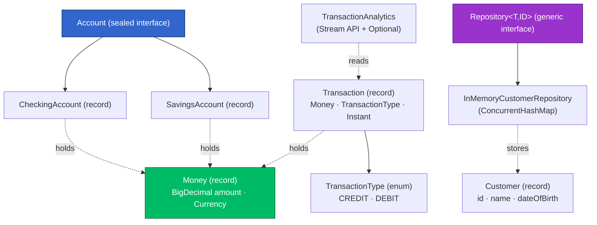
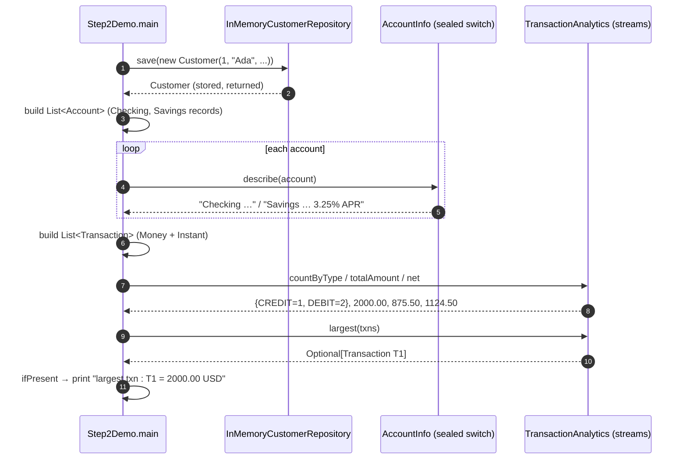

# Step 2 · Java Language Primer

> **Step 2 of 67 · Phase A — Foundations 🟢** · Level badge: 🟢 Foundations · Effort ≈ 20h (heavier for true beginners; experienced Java devs skip-test out fast)

`🟢` Foundations &nbsp;·&nbsp; `🔵` Core &nbsp;·&nbsp; `🟣` Advanced &nbsp;·&nbsp; `🔴` Frontier

> [!CAUTION]
> **Educational, non-production project.** Build-a-Bank is for learning only. It never handles real money, real customers, or real personal data, and it is **not** security-audited for production banking. Every credential and customer you ever see here is fake. (Full disclaimer + guardrails in the [README](../../README.md).)

---

## 🧭 The Six Movements of This Step

A one-line map of where we're going. Click to jump.

1. **[A · 🧭 Orient](#orient)** — what this step is, why a language primer matters for a banking platform, and whether you can skip it. *(~45 min)*
2. **[B · 🧠 Understand](#understand)** — the big idea (model the domain as types), how records/sealed/streams really work under the hood, the money-and-time security lens, the Java 8→25 evolution, the Repository pattern, and a thread-safety note. *(~2h)*
3. **[C · 🛠️ Build](#build)** — the heart: the `java-basics` module → `Money` → `Customer` → the sealed `Account` family → the pattern-match `switch` → `Transaction`/enum → the generic `Repository` + in-memory impl → `TransactionAnalytics` streams → `TimeExamples` → the `Step2Demo`. Plus 🎮 Play With It and the 🏁 finished result. *(~13–14h)*
4. **[D · 🔬 Prove](#prove)** — the Verification Log with the real, pasted `verify`, test, and demo output. *(~30 min)*
5. **[E · 🎓 Apply](#apply)** — go-deeper asides, interview prep (with version-evolution + concurrency questions), and your-turn exercises. *(~2h)*
6. **[F · 🏆 Review](#review)** — troubleshooting, resources & glossary, and the recap/study notes. *(~1h)*

---

<a id="orient"></a>

# A · 🧭 Orient

## 📋 This Step in 30 Seconds

| | |
|---|---|
| **Title** | Java Language Primer |
| **Step** | 2 of 67 · **Phase A — Foundations** 🟢 |
| **Effort** | ≈ 20 hours focused — **heavier for true beginners** (this is a lot of language at once); an experienced Java dev can skip-test out in ~1–2h after skimming the 🕰️ Then-vs-Now and the records/sealed bits |
| **What you'll run this step** | Just the **JVM + Maven** (via `./mvnw`). **No Docker, no database, no services.** This step's start tag equals Step 1's end tag: `step-02-start` == `step-01-end`. |
| **Verification tier** | 🟠 **Standard** — `./mvnw -B verify` green + all 16 tests passing + the demo's real run output. No mutation/clean-room needed: this is a learning module with **no money/security/concurrency *production* path yet** (those tiers arrive when the real ledger lands in Step 12). |
| **Depends on** | **Step 1** (a verified JDK 25 + Maven Wrapper + the multi-module repo). Nothing else. |

By the end you will have written, compiled, tested, and *run* a small but real slice of the bank's domain — `Money`, `Account`, `Transaction`, `Customer`, a generic `Repository`, and stream-based analytics — touching every core Java feature the rest of the course leans on: **records, sealed types, pattern-matching `switch`, generics, collections, streams & lambdas, `Optional`, enums, exceptions, and `java.time`** — and you'll have internalized the two rules every banking line of code obeys: **money is `BigDecimal`, never `double`; time is UTC `Instant`.**

### ⏭️ Can You Skip This Step? (5-minute self-check)

Run this self-check. If you can confidently do **all** of it, skim the 🕰️/🛡️/🧩 asides, run the demo once to confirm the pinned stack, and jump to **[Step 3 — How the Internet & the Web Work](../step-03/lesson.md)**.

- [ ] I can explain the difference between a `record` and a plain class, and what the compiler generates for a record (constructor, accessors, `equals`/`hashCode`/`toString`).
- [ ] I know what a **compact constructor** is and where I'd validate inputs in a record.
- [ ] I can write a `sealed interface` and explain why a `switch` over it needs **no `default`**, and what happens at compile time if I add a permitted type.
- [ ] I can read `txns.stream().filter(...).map(...).reduce(...)` and `Collectors.groupingBy(..., counting())` without looking them up.
- [ ] I know why `findById` returns `Optional<T>` instead of `null`, and why `ConcurrentHashMap` (not `HashMap`) backs a shared store.
- [ ] I can explain why money is `BigDecimal` and time is `Instant` (UTC) — and what breaks if you use `double` and `LocalDateTime`.
- [ ] I know which of these are **Java 21+** (records/sealed/pattern-switch) vs **older** (lambdas/streams/`Optional`/`java.time` since 8; `var` since 10; text blocks since 15).

> [!TIP]
> Not 100%? Stay — and don't be intimidated by the length. This is the single densest *language* step in the whole course, on purpose: nail it once and Steps 3–67 stop being about Java and start being about the bank. The 🛠️ build is fully hand-held; you copy small pieces and **run between each one**.

## 📇 Cheat Card

> **What this step delivers (one sentence):** a tested `playground/java-basics` module that models the bank's core domain with modern Java (records, sealed types, pattern-matching `switch`, generics, streams, `Optional`, `java.time`) — proven by `./mvnw -B verify` green (16 tests) and a runnable `Step2Demo` that prints a tiny bank report.

**Key commands** (Windows uses `.\mvnw.cmd`; macOS/Linux/Git-Bash use `./mvnw`):

```bash
# Build + test just this module (and the parent it needs), from the repo root:
./mvnw -B -pl playground/java-basics -am verify

# Compile without running tests, then run the demo:
./mvnw -pl playground/java-basics -am -q -DskipTests package
java -cp playground/java-basics/target/classes com.buildabank.basics.Step2Demo

# The author's smoke test (build + demo + assert key output):
bash steps/step-02/smoke.sh
```

**The one headline snippet** — money done right, in one immutable record:

```java
public record Money(BigDecimal amount, Currency currency) {
    public Money {                                   // compact constructor: validate + normalize
        Objects.requireNonNull(amount, "amount");
        Objects.requireNonNull(currency, "currency");
        amount = amount.setScale(currency.getDefaultFractionDigits(), RoundingMode.HALF_EVEN);
    }
}
```

> [!NOTE]
> **No HTTP, no Swagger, no database this step — and that's deliberate.** There is intentionally **no `requests.http` and no seed data** here, because there's nothing to send a request *to* yet (the first web endpoint is Step 8/13, the first DB is Step 8). The play surface this step is the **`Step2Demo` `main`**, the **JUnit tests**, and a set of **break-it experiments**. We say so honestly rather than fabricating an endpoint.

## 🎯 Why This Matters

Every microservice you build for the next 65 steps is *made of* the types and idioms in this step. Get money wrong (a `double`) and you have a correctness-and-compliance bug that a court would call fraud; get time wrong (a zone-ambiguous `LocalDateTime`) and your statements are off by a day. In interviews, "explain records vs classes," "when is a `switch` exhaustive," "why `Optional` over `null`," and "`BigDecimal` vs `double` for money" are bread-and-butter Java questions — and the version-evolution story (lambdas → records → pattern matching) is exactly how interviewers separate someone who *uses* Java from someone who *understands* it.

## ✅ What You'll Be Able to Do

- Model a domain with **records** and validate inputs in **compact constructors**.
- Close a type hierarchy with a **`sealed interface`** and consume it with an **exhaustive pattern-matching `switch`** (no `default`).
- Write **generic** abstractions (`Repository<T, ID>`) that are type-safe without casts.
- Transform collections with **streams, lambdas, and collectors** (`filter`/`map`/`reduce`, `groupingBy`+`counting`, `max`→`Optional`).
- Use **`Optional`** to make "maybe absent" a compile-time concern, never a `NullPointerException`.
- Choose the right **`java.time`** type for each concept (`Instant` for stored UTC moments, `LocalDate` for a birth date, `ZonedDateTime` for display, `Duration` for elapsed time).
- Explain and apply the bank's two ground rules: **money = `BigDecimal`, time = UTC `Instant`.**
- Read a multi-module Maven build and run/test a single module.

## 🧰 Before You Start

**Prerequisites**

- ✅ **Step 1 complete:** `java -version` shows `25.x`, the Maven Wrapper works (`./mvnw -v`), and the repo builds. If unsure, run `make doctor` (or `java -version` + `./mvnw -v`).
- ✅ You're working from the **repo root** (where the parent `pom.xml` and `mvnw` live).
- ✅ Any editor. The core path is CLI-only; the optional 💡 *Faster in IntelliJ* asides are clearly marked.

**What you already learned that connects here**

In Step 1 you stood up a pinned **Java 25 / Spring Boot 4.0.6** multi-module build and met the parent POM + BOM idea. You also met **`Instant`** in passing (the codebase's only timestamp type). This step zooms all the way into the *language*, and gives `Instant`, `BigDecimal`, records, and the rest their proper treatment — the raw materials for every service from Step 8 on.

> **Depends on:** Step 1.

## 🗓️ Session Plan

~20 hours is a campaign, not a sitting. Here's the partition into eight sittings of ~2–2.5h; every sitting ends at a real commit or section boundary, so you can stop clean and resume cold. (The ✋ checkpoints in the build carry matching 🛑 re-entry notes.)

| Sitting | Covers | ~Time | Ends at (save point) |
|---|---|---|---|
| **S1** | A · Orient + B · Understand (big idea → thread-safety note) | ~2.5h | end of Movement B — nothing to save |
| **S2** | Sub-steps 1–3: module `pom.xml` (+ root-POM registration) → `Money` → `Customer` | ~2.5h | commit `feat(java-basics): add Customer record with LocalDate birth date and age helper` |
| **S3** | Sub-steps 4–5: sealed `Account` family → pattern-match `switch` (+ exhaustiveness break-it) | ~2h | commit `feat(java-basics): describe accounts via exhaustive pattern-matching switch` |
| **S4** | Sub-steps 6–8: `Transaction` + enum → exception → generic `Repository` | ~2.5h | commit `feat(java-basics): add generic Repository + thread-safe in-memory Customer impl` |
| **S5** | Sub-steps 9–10: `TransactionAnalytics` streams → `TimeExamples` | ~2.5h | commit `feat(java-basics): add TimeExamples (Instant UTC, ZonedDateTime at the edge, Duration)` |
| **S6** | Sub-step 11: `Step2Demo` (+ the `double`-drift break-it) | ~2h | demo prints the report; commit `feat(java-basics): add Step2Demo runnable tour of the language primer` |
| **S7** | Sub-step 12: four test classes + `verify` (+ rounding break-it) → 🔁 Flow → 🎮 Play With It → 🏁 Finished Result → D · Prove | ~2.5h | `Tests run: 16` green; tag `step-02-end`; Verification Log compared |
| **S8** | E · Apply (go-deepers, interview prep, exercises) + F · Review (recap, flashcards) | ~2.5h | end of step |

**Optional routes:** experienced Java devs can ⏭️ skip-test out (~1–2h total, see above); the four 🚀 Go Deeper asides cost ~25 min combined; the 💡 IntelliJ tip ~2 min; each 🔬 break-it experiment is 60–90 seconds and worth every one of them; the 🏋️ Your Turn quick exercises run ~30–45 min and each stretch goal ~1–2h.

---

<a id="understand"></a>

# B · 🧠 Understand

## 🧠 The Big Idea — model the domain as *types*, and let the compiler be your first reviewer

The cheapest place to catch a banking bug is at **compile time**, before the code ever runs. Modern Java gives you a toolkit for pushing rules *into the type system* so that wrong code simply won't compile:

- A **record** makes a value object **immutable** and **value-based** for free — two `Money(100.00, USD)` instances are equal, can be shared across threads with no locking, and can't be mutated out from under you.
- A **sealed** interface tells the compiler *exactly* which kinds of `Account` exist, so a `switch` that forgets one **fails to build**.
- **Generics** let one `Repository<T, ID>` serve every entity with no casts and no `Object`.
- **`Optional<T>`** turns "this might be missing" from a runtime landmine (`NullPointerException`) into a value you *must* unwrap.
- **`BigDecimal`** and **`Instant`** encode the two domain rules — exact decimal money and unambiguous UTC time — as the *only* types we allow for those concepts.

**Analogy:** think of types as the **forms and stamps** in a bank's back office. A teller can't process a withdrawal on the deposit form; the form's *shape* prevents the mistake. Records, sealed types, and `Optional` are those pre-printed forms — the shape stops whole categories of error before a human (or a bug) gets a chance.



*Alt-text: A dependency map of the Step 2 domain. `Money` (a record built on `BigDecimal`) is held by both account kinds and by `Transaction`. `Account` is a sealed interface permitting `CheckingAccount` and `SavingsAccount`. `Transaction` carries a `TransactionType` enum. A generic `Repository<T,ID>` is implemented by `InMemoryCustomerRepository` (backed by a ConcurrentHashMap) which stores `Customer` records. `TransactionAnalytics` reads lists of transactions using the Stream API and Optional.*

## 🌱 Under the Hood: How It Really Works (no magic)

**A record is just a class — the compiler writes the boilerplate.** `record Money(BigDecimal amount, Currency currency)` desugars to a `final` class with two `private final` fields, a canonical constructor, accessor methods named `amount()` and `currency()` (note: **no `get` prefix**), and value-based `equals`, `hashCode`, and `toString`. You can prove this with `javap` (we do, in the 🚀 Go Deeper aside). Because the fields are `final` and the class is `final`, a record instance is **immutable** — which is what makes it safe to share.

**A *compact constructor* runs inside the generated canonical constructor, before the fields are assigned.** That's why `Money { ... amount = amount.setScale(...); }` can validate and *normalize* the incoming `amount` — the value you write back is what gets stored in the field. No explicit `this.amount = amount;` needed; the compiler adds it after your block.

**`sealed` + `permits` closes the hierarchy.** `sealed interface Account permits CheckingAccount, SavingsAccount` records, *in the class file*, the complete list of allowed implementers. The compiler checks every permitted type is `final`, `sealed`, or `non-sealed`. When you `switch` over an `Account` and cover both cases, the compiler can prove the switch is **exhaustive** and lets you omit `default`. Add a third permitted type later and **every** such switch stops compiling until you handle it — the compiler becomes a checklist.

**Pattern matching for `switch` binds a typed variable per case.** `case CheckingAccount c -> c.overdraftLimit()` both *tests* the type and *casts* it to `c` in one move — no `instanceof` + manual cast. The arrow form (`->`) has no fall-through.

**Generics are erased, but checked.** `Repository<Customer, Long>` gives you compile-time type safety (you can't `save` a `String`), but the JVM erases the type parameters at runtime to plain `Object` references — there's no `Repository<Customer>.class`. That's "type erasure"; it's why generics cost nothing at runtime.

**Streams are lazy pipelines.** `txns.stream().filter(...).map(...).reduce(...)` builds a description of work; nothing iterates until the **terminal operation** (`reduce`, `collect`, `toList`, `max`) runs. `filter`/`map` are *intermediate* (return a new stream); `reduce`/`collect` are *terminal* (produce a value). A **lambda** like `t -> t.type() == type` is just a compact implementation of a functional interface (`Predicate<Transaction>` here).

**`Optional<T>` is a tiny container** — zero or one element — with a typed API (`map`, `filter`, `ifPresent`, `orElseGet`) so the "absent" branch is impossible to forget. It is a *return type*, not a field type; we use it where a value may legitimately be missing (`findById`, `largest`).

❓ **Knowledge-check:** you add a third permitted type to the sealed `Account` interface — what happens to every existing exhaustive `switch` over `Account`? <details><summary>answer</summary>They stop compiling until each one handles the new type — the compiler proves exhaustiveness from the <code>permits</code> list, so a forgotten case is a build error, not a runtime surprise.</details>

## 🛡️ Security Lens: What Could Go Wrong

> [!WARNING]
> **`double` for money is a correctness *and* security bug.** Binary floating-point cannot represent most decimal fractions exactly, so `0.1 + 0.2` is `0.30000000000000004`, and pennies drift on every operation. In a ledger that drift is, at minimum, a reconciliation nightmare and, at worst, exploitable rounding (the classic "salami slicing" fraud). The fix is structural, not a band-aid: **money is `BigDecimal`, scaled to the currency's minor units, rounded `HALF_EVEN` ("banker's rounding")** — and we encode that in the `Money` type so no one can get it wrong. We *prove* the drift in a break-it experiment below.

Other defensive habits this step bakes in:

- **Validate at the boundary, in the compact constructor.** `Objects.requireNonNull(amount, "amount")` rejects bad input the moment a `Money`/`Transaction`/`Customer` is constructed — you can never have a half-built, null-bearing value object floating around. Garbage in is rejected at the door, not three layers deep.
- **Reject cross-currency arithmetic loudly.** `Money.plus` throws `IllegalArgumentException` on a currency mismatch rather than silently adding USD to EUR. Failing fast beats a wrong-but-quiet number on a statement.
- **Never trust external input.** Today the "input" is in-process, but the same instinct — validate, normalize, reject early — is exactly what stops injection and malformed-payload attacks once real HTTP arrives in Phase C. The `Money`/`Transaction` constructors are the first link in that chain.
- **Immutability is a security property.** An immutable `Money` can't be mutated by a far-away caller you forgot about; there's no aliasing bug, no time-of-check/time-of-use window.

## 🕰️ Then vs. Now: How This Changed Across Java Versions

This step's code is *deliberately* modern. Here's the old way → new way → why, and what each feature's "final" Java version is. (Interviewers love this; it shows you know the language's history, not just its surface.)

| Concept | The old way (Java ≤ 8 era) | The modern way (used here) | Why it's better | Final since |
|---|---|---|---|---|
| **Behavior as a value** | Anonymous inner class (`new Comparator<>(){ public int compare(...) }`) — pages of ceremony | **Lambda** `Comparator.comparing(t -> t.amount().amount())` | Concise; the *intent* isn't buried in boilerplate | Java **8** |
| **Bulk data transforms** | `for` loop + mutable accumulator + index bugs | **Stream API** `filter`/`map`/`reduce`/`collect` | Declarative "what," not "how"; composable; parallelizable | Java **8** |
| **"Maybe absent"** | Return `null`; hope every caller checks → `NullPointerException` | **`Optional<T>`** | Absence is in the type; the compiler nudges you to handle it | Java **8** |
| **Date/time** | `java.util.Date` / `Calendar` — mutable, zone-confusing, not thread-safe | **`java.time`** (`Instant`, `LocalDate`, `ZonedDateTime`, `Duration`) | Immutable, thread-safe, unambiguous, well-named | Java **8** |
| **Local type inference** | `Map<Long, Customer> m = new HashMap<Long, Customer>();` | **`var`** `var customers = new InMemoryCustomerRepository();` | Less noise for *local* variables; type still static | Java **10** |
| **Multi-line strings** | `"line1\n" + "line2\n" + ...` concatenation | **Text block** `""" ... """` | Readable literal blocks (the demo header) | Java **15** |
| **Value-object boilerplate** | Hand-written POJO: fields + getters + `equals`/`hashCode`/`toString` (50+ lines, or Lombok) | **`record`** `record Money(...) {}` | The language generates it, correctly, immutably, every time | Java **16** |
| **Closed hierarchy** | `enum`-with-behavior hacks, or an open class you *hope* no one extends | **`sealed` interface** `sealed interface Account permits ...` | The permitted set is explicit and compiler-enforced | Java **17** |
| **Type-test + branch** | `if (a instanceof CheckingAccount) { var c = (CheckingAccount) a; ... }` cast chains | **Pattern-matching `switch`** `case CheckingAccount c -> ...` | One construct tests, binds, *and* checks exhaustiveness | Java **21** |
| **Ordered access** | `list.get(list.size()-1)` for "last"; first/last differed per collection | **Sequenced collections** (`getFirst()`/`getLast()`/`reversed()`) | A uniform first/last/reverse API across `List`/`Deque`/etc. | Java **21** |

> [!NOTE]
> **What "Java 21+" means for you.** Records (16), sealed types (17), and pattern-matching `switch` (21) were all *finalized* (left preview) by **Java 21** — so any modern LTS (21 or our pinned **25**) compiles this step as-is. Lambdas, streams, `Optional`, and `java.time` are the **Java 8** revolution and are everywhere in legacy code too. If you ever target Java 8 or 11 (lots of banks still do), you'll *see* the old POJO/`instanceof`/`null` styles — recognizing them, and knowing the modern replacement, is the version-evolution skill.

<a id="repository-pattern"></a>

## 🧩 Pattern Spotlight: the Repository pattern (generic)

> **Problem.** Business code shouldn't care *where* data lives — an in-memory map today, a Postgres table tomorrow. If every caller pokes at a `Map` (or, later, JDBC) directly, swapping the storage means rewriting callers, and tests need a real database.

> **Why a Repository fits.** A `Repository<T, ID>` is a **collection-like abstraction over persistence**: `findById`, `findAll`, `save`. Callers depend on the *interface*, not the storage. You can hand them an in-memory map now and a JPA-backed implementation later, and they never change. It also gives a natural seam for testing (use the in-memory one) — an early taste of the Dependency Inversion Principle you'll formalize in Step 25.

> **Alternatives & trade-offs.**
> - **Active Record** (the entity persists *itself*: `customer.save()`) — fewer types, but couples the domain object to the database and is awkward to unit-test.
> - **DAO** — older, often per-entity and lower-level (raw SQL); Repository is the more domain-oriented, collection-flavored evolution.
> - **Direct data access** (callers use the `Map`/`EntityManager` inline) — least code, worst coupling; storage leaks everywhere.
> The Repository's cost is one extra interface; the payoff is a swappable, testable boundary. For a system that *will* swap in-memory → Postgres, that's a clear win.

> **Micro-implementation (what we build below).**
> ```text
> interface Repository<T, ID> { Optional<T> findById(ID); List<T> findAll(); T save(T); }
>        └── InMemoryCustomerRepository implements Repository<Customer, Long>   (ConcurrentHashMap)
>        └── (Step 8) Spring Data generates a JPA implementation from the SAME interface shape — for free.
> ```

> [!IMPORTANT]
> **This is the exact shape Spring Data JPA generates for you from Step 8.** Building it by hand now means that when Spring "magically" gives you a `CustomerRepository extends JpaRepository<Customer, Long>` later, it's not magic — you'll know precisely what `findById` returning `Optional` and `save` *are*, because you wrote them.

## 🧵 Thread-safety Note (forward to Step 11)

This step has shared mutable state in exactly one place — the repository's map — so it's worth a first, gentle note (the deep dive is **Step 11**).

- **Why `ConcurrentHashMap`, not `HashMap`?** Even a toy store can be touched by more than one thread (a web request handler pool, later). A plain `HashMap` under concurrent writes can corrupt its internal buckets (historically even spin into an infinite loop). `ConcurrentHashMap` is the **safe default map** for shared state: concurrent reads, and writes that lock only a small slice. We use the `ConcurrentMap` interface type for the field to advertise that contract.
- **Why records make this easy.** The *values* in the map — `Customer`, `Money` — are **immutable records**. An immutable object is automatically thread-safe to *share*: there's no state to race on, no need to copy or lock when you hand it to another thread. So the only thing we had to make thread-safe is the *container*, not its contents. (`findAll()` also returns `List.copyOf(...)` — an immutable snapshot — so a caller can't mutate our internals or trip over a concurrent modification.)
- **The honest caveat.** `ConcurrentHashMap` makes each *operation* atomic; it does **not** make a *read-modify-write sequence* (like "check balance, then debit") atomic. That gap is exactly the balance-race bug we'll show **failing, then fix and prove** in Step 11/12. For now: shared container → concurrent map; shared values → immutable records.

🛑 **Stopping here?** (end of sitting **S1**) You have the mental model — types as forms, records/sealed/streams under the hood, and the two ground rules (money = `BigDecimal`, time = UTC `Instant`). Nothing to save. Next: C · Build, Sub-step 1 (the module `pom.xml`) — first action: create `playground/java-basics/pom.xml`.

---

<a id="build"></a>

# C · 🛠️ Build — Let's Build It, Step by Step

## 📦 Your Starting Point

You're at **`step-02-start`**, which is identical to **`step-01-end`**: a clean, green multi-module build with the parent POM (Java 25 / Spring Boot 4.0.6) and the `services/hello` app from Step 1. Nothing here is broken; we're *adding* a new module.

```bash
# Confirm the starting point builds (from the repo root). This is your baseline-green.
./mvnw -B -q -DskipTests package
java -version          # expect: 25.x
```

✅ **Green now:** the parent build, `services/hello`. **What you'll build:** a brand-new `playground/java-basics` module with ten domain types, four test classes, and a runnable demo.

> [!NOTE]
> **Why a new `playground/java-basics` module (and not `services/`)?** This is an architectural decision recorded in **[`adr/0003-phase-a-learning-modules.md`](../../adr/0003-phase-a-learning-modules.md)**: Phase-A *learning* code lives under `playground/*`, one module per theme, so the real microservices under `services/` stay clean for when you study them later. The examples are **banking-flavoured** (Money/Account/Transaction) on purpose — they seed the very domain types the real CIF and Demand-Account services reuse from Step 8. The real banking microservices begin at **Step 8**; this module just teaches the language with domain-shaped examples.

## 🗺️ What We're About to Build

```mermaid
flowchart LR
    P["1 · module pom.xml"] --> MO["2 · Money"]
    MO --> CU["3 · Customer"]
    CU --> AC["4 · Account (sealed)<br/>+ Checking + Savings"]
    AC --> AI["5 · AccountInfo<br/>(pattern switch)"]
    AI --> TX["6 · Transaction<br/>+ TransactionType enum"]
    TX --> EX["7 · InsufficientFundsException"]
    EX --> RE["8 · Repository&lt;T,ID&gt;<br/>+ InMemory impl"]
    RE --> AN["9 · TransactionAnalytics<br/>(streams)"]
    AN --> TI["10 · TimeExamples<br/>(java.time)"]
    TI --> DE["11 · Step2Demo<br/>(run it!)"]
    DE --> TE["12 · tests + verify"]
```



*Alt-text: A left-to-right build order of twelve sub-steps: the module pom, then Money, Customer, the sealed Account family, the AccountInfo pattern-match switch, Transaction plus the TransactionType enum, the InsufficientFundsException, the generic Repository and its in-memory implementation, TransactionAnalytics streams, TimeExamples, the Step2Demo, and finally the tests plus verify.*

### 🌳 Files We'll Touch

```text
pom.xml                                                  ← sub-step 1 (register module)
playground/java-basics/
├── pom.xml                                              ← sub-step 1 (new POM)
└── src/
    ├── main/java/com/buildabank/basics/
    │   ├── money/Money.java                             ← sub-step 2
    │   ├── customer/Customer.java                       ← sub-step 3
    │   ├── account/Account.java                         ← sub-step 4 (sealed interface)
    │   ├── account/CheckingAccount.java                 ← sub-step 4
    │   ├── account/SavingsAccount.java                  ← sub-step 4
    │   ├── account/AccountInfo.java                     ← sub-step 5 (pattern switch)
    │   ├── txn/TransactionType.java                     ← sub-step 6 (enum)
    │   ├── txn/Transaction.java                         ← sub-step 6
    │   ├── exception/InsufficientFundsException.java    ← sub-step 7
    │   ├── repo/Repository.java                         ← sub-step 8 (generic)
    │   ├── repo/InMemoryCustomerRepository.java         ← sub-step 8
    │   ├── analytics/TransactionAnalytics.java          ← sub-step 9 (streams)
    │   ├── time/TimeExamples.java                       ← sub-step 10 (java.time)
    │   └── Step2Demo.java                               ← sub-step 11 (runnable)
    └── test/java/com/buildabank/basics/
        ├── money/MoneyTest.java                         ← sub-step 12
        ├── account/AccountInfoTest.java                 ← sub-step 12
        ├── repo/InMemoryCustomerRepositoryTest.java     ← sub-step 12
        └── analytics/TransactionAnalyticsTest.java      ← sub-step 12
```

---

### Sub-step 1 of 12 — Create the module `pom.xml` and register it in the root POM *(≈ 30 min)* 🧭 *(you are here: **module pom** → Money → Customer → …)*

🎯 **Goal:** declare a new Maven module that inherits the pinned Java 25 / Spring Boot 4 parent, register it in the root `pom.xml`'s modules list so Maven builds it, and pull in JUnit 5 + AssertJ for tests. This is plain Java — **no Spring dependency at all** — because Step 2 is about the *language*.

📁 **Location:**
1. new file → `playground/java-basics/pom.xml`
2. edit file → `pom.xml` (root directory)

⌨️ **Code (1/2) — New Module POM:**

```xml
<?xml version="1.0" encoding="UTF-8"?>
<!-- playground/java-basics/pom.xml -->
<project xmlns="http://maven.apache.org/POM/4.0.0"
         xmlns:xsi="http://www.w3.org/2001/XMLSchema-instance"
         xsi:schemaLocation="http://maven.apache.org/POM/4.0.0 https://maven.apache.org/xsd/maven-4.0.0.xsd">
    <modelVersion>4.0.0</modelVersion>

    <!--
      java-basics — the Step 2 Java language primer (plain Java, no Spring).
      Banking-flavoured examples (Money, Account, Transaction) that ALSO seed the real domain.
      Pure JUnit 5 + AssertJ tests prove every example actually behaves as the lesson claims.
    -->
    <parent>
        <groupId>com.buildabank</groupId>
        <artifactId>build-a-bank-parent</artifactId>
        <version>0.1.0-SNAPSHOT</version>
        <relativePath>../../pom.xml</relativePath>
    </parent>

    <artifactId>java-basics</artifactId>
    <name>Build-a-Bank :: Playground :: Java Basics</name>
    <description>Java language primer — records, sealed types, generics, streams, Optional, java.time (Step 2).</description>

    <dependencies>
        <!-- JUnit 5 (Jupiter) + AssertJ — versions managed by the Spring Boot parent. Test scope only. -->
        <dependency>
            <groupId>org.junit.jupiter</groupId>
            <artifactId>junit-jupiter</artifactId>
            <scope>test</scope>
        </dependency>
        <dependency>
            <groupId>org.assertj</groupId>
            <artifactId>assertj-core</artifactId>
            <scope>test</scope>
        </dependency>
    </dependencies>
</project>
```

⌨️ **Code (2/2) — Root POM Edit:**

```diff
<!-- pom.xml (root directory) -->
     <!-- services/hello represents the initial web app target that must compile
          (added at step-01-end). Real banking microservices begin at Step 8 (CIF). -->
     <modules>
         <module>services/hello</module>
+        <module>playground/java-basics</module>
     </modules>
```


🔍 **Line-by-line:**

- `<parent>…build-a-bank-parent…</parent>` — this module **inherits** from the repo's parent POM (two directories up, `../../pom.xml`). That's where Java 25 and the Spring Boot BOM are pinned, so we get a mutually-compatible dependency set for free.
- `<artifactId>java-basics</artifactId>` — the module's own coordinate; combined with the inherited `groupId`/`version` it becomes `com.buildabank:java-basics:0.1.0-SNAPSHOT`.
- `<name>` / `<description>` — human-readable labels Maven prints in the reactor build (you'll see `Build-a-Bank :: Playground :: Java Basics` in the log).
- The two `<dependency>` blocks pull in **JUnit Jupiter** (JUnit 5, the test engine) and **AssertJ** (fluent assertions like `assertThat(x).isEqualTo(y)`). **Note the missing `<version>`** — it's *managed* by the Spring Boot BOM in the parent, so we never hard-code one (and never drift out of compatibility). `<scope>test</scope>` keeps them off the production classpath.

💭 **Under the hood:** Maven builds modules in a *reactor* — it sorts modules by dependency order and builds the parent's managed versions into this child. Because there's no `spring-boot-starter` here, the compiled output is plain `.class` files with no framework — exactly what we want for a language lesson.

🔮 **Predict:** before you run anything — will this module compile *right now*, with no `.java` files in it yet? <details><summary>answer</summary>Yes. An empty module is valid; Maven will report nothing to compile and still <code>BUILD SUCCESS</code>. We add code next.</details>

▶️ **Run & See:**

```bash
./mvnw -B -q -pl playground/java-basics -am validate
```

- `-pl playground/java-basics` = build **just this module** (`-pl` = "projects list").
- `-am` = "also make" the modules this one depends on (the parent), so it resolves cleanly.
- `-q` = quiet mode: Maven prints **only errors** — a successful run prints *nothing at all*.
- `validate` = the lightest Maven phase; just checks the POM is well-formed.

✅ **Expected output:** **nothing** — with `-q`, silence IS success. Any red `[ERROR]` lines mean failure (re-run without `-q` to see the full log). This convention holds for every `-q` compile in this step.

❌ **If you see `Could not find artifact com.buildabank:build-a-bank-parent`:** you're not at the repo root, or the parent isn't installed — run from the root and include `-am`. See 🩺.

✋ **Checkpoint:** `playground/java-basics/pom.xml` exists and `validate` passes. The directory `src/main/java/com/buildabank/basics/` is ready for code.

🛑 **Stopping here?** You have the module pom validated, registered in the root POM, and committed (💾 below). Next: Sub-step 2 (`Money`) — first action: create `playground/java-basics/src/main/java/com/buildabank/basics/money/Money.java`.

💾 **Commit:**

```bash
git add playground/java-basics/pom.xml
git commit -m "feat(java-basics): add Step 2 language-primer module (plain Java + JUnit 5/AssertJ)"
```

⚠️ **Pitfall:** Windows users — it's `.\mvnw.cmd` (backslash, `.cmd`), not `./mvnw`. The `-pl` path uses forward slashes on every OS.

---

### Sub-step 2 of 12 — `Money`: the most important type in the bank *(≈ 90 min)* 🧭 *(pom ✅ → **Money** → Customer → …)*

🎯 **Goal:** build the value object every account balance and every transaction is made of — exact decimal money, currency-aware, immutable, self-validating. This is **the first rule of banking code** made into a type.

📁 **Location:** new file → `playground/java-basics/src/main/java/com/buildabank/basics/money/Money.java`

⌨️ **Code:**

```java
// playground/java-basics/src/main/java/com/buildabank/basics/money/Money.java
package com.buildabank.basics.money;

import java.math.BigDecimal;
import java.math.RoundingMode;
import java.util.Currency;
import java.util.Objects;

/**
 * A money value object — the FIRST rule of banking code: never use {@code double} for money.
 *
 * <p>Implemented as a {@code record}: an immutable, transparent data carrier. The compiler generates
 * the constructor, accessors ({@code amount()}, {@code currency()}), {@code equals}, {@code hashCode},
 * and {@code toString} for us. We add a <em>compact constructor</em> to validate and normalize.
 *
 * <p>Money is stored as {@link BigDecimal} (exact decimal arithmetic) scaled to the currency's
 * minor units (2 for USD/EUR, 0 for JPY), rounded {@link RoundingMode#HALF_EVEN} ("banker's rounding").
 */
public record Money(BigDecimal amount, Currency currency) {

    /** Compact constructor: runs before the fields are assigned. Validate + normalize here. */
    public Money {
        Objects.requireNonNull(amount, "amount");
        Objects.requireNonNull(currency, "currency");
        amount = amount.setScale(currency.getDefaultFractionDigits(), RoundingMode.HALF_EVEN);
    }

    /** Convenience factory: {@code Money.of("100.00", "USD")}. */
    public static Money of(String amount, String currencyCode) {
        return new Money(new BigDecimal(amount), Currency.getInstance(currencyCode));
    }

    public Money plus(Money other) {
        requireSameCurrency(other);
        return new Money(amount.add(other.amount), currency);
    }

    public Money minus(Money other) {
        requireSameCurrency(other);
        return new Money(amount.subtract(other.amount), currency);
    }

    public Money times(int factor) {
        return new Money(amount.multiply(BigDecimal.valueOf(factor)), currency);
    }

    public boolean isNegative() {
        return amount.signum() < 0;
    }

    public boolean isGreaterThan(Money other) {
        requireSameCurrency(other);
        return amount.compareTo(other.amount) > 0;
    }

    private void requireSameCurrency(Money other) {
        if (!currency.equals(other.currency)) {
            throw new IllegalArgumentException(
                    "Currency mismatch: %s vs %s".formatted(currency.getCurrencyCode(), other.currency.getCurrencyCode()));
        }
    }

    @Override
    public String toString() {
        return "%s %s".formatted(amount.toPlainString(), currency.getCurrencyCode());
    }
}
```

🔍 **Line-by-line:**

- `package com.buildabank.basics.money;` — packages mirror folders; this file lives in `.../basics/money/`.
- `import java.math.BigDecimal;` — the exact-decimal numeric type. **This is the one true money type.**
- `import java.math.RoundingMode;` — the rounding policy enum; we use `HALF_EVEN`.
- `import java.util.Currency;` — JDK's ISO-4217 currency type; knows each currency's minor-unit count.
- `import java.util.Objects;` — utility class; `Objects.requireNonNull` is a concise null-check that throws a clear `NullPointerException` with a field name.
- `public record Money(BigDecimal amount, Currency currency)` — declares an **immutable record** with two components. The compiler generates the canonical constructor, `amount()`/`currency()` accessors, and value-based `equals`/`hashCode`/`toString` (we override `toString` below).
- `public Money { ... }` — the **compact constructor** (note: no parameter list, no body braces around an explicit assignment). It runs first; `Objects.requireNonNull` rejects nulls; then `amount = amount.setScale(currency.getDefaultFractionDigits(), HALF_EVEN)` **normalizes** every `Money` to the currency's scale (2 dp for USD). The compiler assigns the (possibly rewritten) `amount` to the field afterward.
- `static Money of(String, String)` — an ergonomic **factory method** so callers write `Money.of("100.00", "USD")` instead of constructing a `BigDecimal` and `Currency` by hand.
- `plus`/`minus`/`times` — arithmetic that **returns a new `Money`** (immutability: we never mutate, we derive). `times(int)` uses `BigDecimal.valueOf(factor)` to stay in exact arithmetic.
- `isNegative()` uses `signum()` (−1/0/+1) — cheaper and clearer than comparing to zero.
- `isGreaterThan` / the private `requireSameCurrency` — comparisons use `compareTo` (value comparison), and cross-currency operations **throw** rather than silently produce a meaningless number.
- `@Override toString()` — a friendly `"1250.00 USD"` form (uses `toPlainString()` so we never get scientific notation like `1.25E3`).

💭 **Under the hood:** `setScale(2, HALF_EVEN)` is why `Money.of("100", "USD")` becomes `100.00` and `Money.of("2.125", "USD")` becomes `2.12` (round-half-to-even: `2.125` is exactly between `2.12` and `2.13`, and `2.12`'s last digit is even). `HALF_EVEN` is the banking standard because, unlike "round half up," it doesn't bias totals upward over millions of transactions. Because the record is immutable and value-based, `Money.of("5.00","USD").equals(Money.of("5.00","USD"))` is `true` — two separately-constructed instances are equal by *value*.

🔮 **Predict:** what will `Money.of("2.125", "USD").amount().toPlainString()` return — `2.12`, `2.13`, or `2.125`? (We assert this in the tests.) <details><summary>answer</summary><code>2.12</code> — banker's rounding rounds the half to the nearest <em>even</em> last digit.</details>

▶️ **Run & See:** compile the module so far (no tests yet):

```bash
./mvnw -B -q -pl playground/java-basics -am -DskipTests compile
```

✅ **Expected output:** silence — success prints nothing under `-q`; any `[ERROR]` line means failure. (`compile` produces `target/classes/.../Money.class`.)

❌ **If you see `cannot find symbol: method formatted(...)`:** you're on a very old JDK. `String.formatted` is Java 15+; this course pins Java 25, so check `java -version`. See 🩺.

✋ **Checkpoint:** `Money.java` compiles. You now have an immutable, currency-safe money type.

🛑 **Stopping here?** You have the pom + `Money` committed. Next: Sub-step 3 (`Customer`) — first action: create `.../basics/customer/Customer.java`.

💾 **Commit:**

```bash
git add playground/java-basics/src/main/java/com/buildabank/basics/money/Money.java
git commit -m "feat(java-basics): add immutable Money value object (BigDecimal, banker's rounding)"
```

⚠️ **Pitfall:** **Never** construct `BigDecimal` from a `double` (`new BigDecimal(0.1)` carries the float's error → `0.1000000000000000055...`). Always construct from a **`String`** (`new BigDecimal("0.1")`), which is exactly why our `of(...)` factory takes a `String`.

---

### Sub-step 3 of 12 — `Customer`: a record with a `LocalDate` and a little behavior *(≈ 45 min)* 🧭 *(Money ✅ → **Customer** → Account → …)*

🎯 **Goal:** model a bank customer, and meet the *second* `java.time` type — `LocalDate` for a birth date (a date with no time and no zone), contrasting with `Instant` for transaction timestamps. Records can carry small behavior, too.

📁 **Location:** new file → `playground/java-basics/src/main/java/com/buildabank/basics/customer/Customer.java`

⌨️ **Code:**

```java
// playground/java-basics/src/main/java/com/buildabank/basics/customer/Customer.java
package com.buildabank.basics.customer;

import java.time.LocalDate;
import java.time.Period;
import java.util.Objects;

/**
 * A bank customer. {@link LocalDate} (a date with no time/zone) is the right type for a birth date —
 * contrast with {@code Instant} for transaction timestamps. Choosing the correct {@code java.time}
 * type for each concept is a recurring banking-correctness theme.
 */
public record Customer(Long id, String firstName, String lastName, LocalDate dateOfBirth) {

    public Customer {
        Objects.requireNonNull(firstName, "firstName");
        Objects.requireNonNull(lastName, "lastName");
    }

    public String fullName() {
        return firstName + " " + lastName;
    }

    /** Age in whole years as of {@code today}. */
    public int ageOn(LocalDate today) {
        return Period.between(dateOfBirth, today).getYears();
    }
}
```

🔍 **Line-by-line:**

- `import java.time.LocalDate;` — a calendar date (year-month-day) with **no time-of-day and no zone**. Correct for a birthday: "1990-05-17" is the same date everywhere on Earth.
- `import java.time.Period;` — a *date-based* amount (years/months/days), as opposed to `Duration` (time-based). Used to compute whole-year age.
- `public record Customer(Long id, String firstName, String lastName, LocalDate dateOfBirth)` — four components; `id` is a `Long` (boxed) so it can be `null` for a not-yet-saved customer.
- The compact constructor validates the two names are non-null (we allow a null `id`/`dateOfBirth` in this teaching model).
- `fullName()` — a derived value, computed on demand (a record isn't *only* data; small, pure helpers are fine).
- `ageOn(LocalDate today)` — `Period.between(dob, today).getYears()` gives whole years, correctly handling leap years and month boundaries (don't subtract years by hand).

💭 **Under the hood:** `Period.between` walks the calendar (it knows February has 28/29 days), so age is right even for a Feb-29 birthday. Passing `today` *in* (instead of calling `LocalDate.now()` inside) keeps the method **pure and testable** — the demo passes `2026-06-09`, so the output is deterministic and we can assert it.

🔮 **Predict:** Ada is born `1990-05-17`. As of `2026-06-09`, what whole-year age does `ageOn` return? <details><summary>answer</summary>36 — her 2026 birthday (May 17) has already passed by June 9. The demo prints exactly this.</details>

▶️ **Run & See:**

```bash
./mvnw -B -q -pl playground/java-basics -am -DskipTests compile
```

✅ **Expected output:** silence — under `-q`, success prints nothing; any `[ERROR]` line means failure.

✋ **Checkpoint:** `Customer.java` compiles. You've now used two `java.time` types deliberately (`LocalDate` here, `Instant` is coming in `Transaction`).

🛑 **Stopping here?** (end of sitting **S2**) You have pom + `Money` + `Customer` committed and compiling. Next: Sub-step 4 (the sealed `Account` family) — first action: `./mvnw -B -q -pl playground/java-basics -am -DskipTests compile` (silence = still green).

💾 **Commit:**

```bash
git add playground/java-basics/src/main/java/com/buildabank/basics/customer/Customer.java
git commit -m "feat(java-basics): add Customer record with LocalDate birth date and age helper"
```

⚠️ **Pitfall:** don't use `Date`/`Calendar` (legacy, mutable, zone-confusing) or store a birthday as a `String`. The `java.time` type *is* the validation and the documentation.

---

### Sub-step 4 of 12 — the sealed `Account` family *(≈ 60 min)* 🧭 *(Customer ✅ → **Account (sealed)** → AccountInfo → …)*

🎯 **Goal:** define the set of account kinds as a **closed** hierarchy the compiler understands — a `sealed interface` with exactly two permitted record implementations. This is what makes the next sub-step's `switch` provably exhaustive.

📁 **Location:** three new files in `playground/java-basics/src/main/java/com/buildabank/basics/account/`

⌨️ **Code (1/3) — the sealed interface:**

```java
// playground/java-basics/src/main/java/com/buildabank/basics/account/Account.java
package com.buildabank.basics.account;

import com.buildabank.basics.money.Money;

/**
 * A <strong>sealed</strong> interface: the set of account kinds is closed and known at compile time.
 *
 * <p>Sealing (Java 17+) lets the compiler verify a {@code switch} over accounts is <em>exhaustive</em>
 * (no {@code default} needed) — if we add a new permitted type, every switch that forgot it fails to
 * compile. That is type-safety the bank relies on. See {@code AccountInfo} for the pattern-match switch.
 */
public sealed interface Account permits CheckingAccount, SavingsAccount {

    String id();

    String owner();

    Money balance();
}
```

⌨️ **Code (2/3) — checking:**

```java
// playground/java-basics/src/main/java/com/buildabank/basics/account/CheckingAccount.java
package com.buildabank.basics.account;

import com.buildabank.basics.money.Money;

/** A checking account with an overdraft limit. A record that implements the sealed {@link Account}. */
public record CheckingAccount(String id, String owner, Money balance, Money overdraftLimit) implements Account {
}
```

⌨️ **Code (3/3) — savings:**

```java
// playground/java-basics/src/main/java/com/buildabank/basics/account/SavingsAccount.java
package com.buildabank.basics.account;

import java.math.BigDecimal;

import com.buildabank.basics.money.Money;

/** A savings account that earns interest. A record that implements the sealed {@link Account}. */
public record SavingsAccount(String id, String owner, Money balance, BigDecimal annualInterestRate) implements Account {
}
```

🔍 **Line-by-line:**

- `public sealed interface Account permits CheckingAccount, SavingsAccount` — `sealed` + `permits` declares the **complete, closed** list of implementers. No other class may implement `Account`.
- `String id(); String owner(); Money balance();` — the common contract every account exposes. **Note records satisfy these automatically:** because `CheckingAccount` has components named `id`, `owner`, `balance`, its generated accessors `id()`/`owner()`/`balance()` *are* the interface methods.
- `record CheckingAccount(... Money overdraftLimit) implements Account` — a record can implement an interface. It adds a checking-specific component, `overdraftLimit`.
- `record SavingsAccount(... BigDecimal annualInterestRate) implements Account` — adds a savings-specific component, the interest rate (a raw `BigDecimal` like `0.0325` = 3.25%).
- Each permitted record is implicitly `final` — which satisfies sealing's rule that permitted types be `final`, `sealed`, or `non-sealed`.

💭 **Under the hood:** the `permits` list is compiled into `Account.class` as a `PermittedSubclasses` attribute. The compiler (and the JVM) use it to (a) reject any unlisted implementer, and (b) prove exhaustiveness of a `switch`. This is *closed-world* modeling: the bank knows all account kinds, so encode that — don't leave the door open with an unsealed interface.

🔮 **Predict:** could a class in *another* package write `class CryptoAccount implements Account {}`? <details><summary>answer</summary>No — it's not in the <code>permits</code> list, so it won't compile. That's the whole point of sealing: the set is closed.</details>

▶️ **Run & See:**

```bash
./mvnw -B -q -pl playground/java-basics -am -DskipTests compile
```

✅ **Expected output:** silence (under `-q`, success prints nothing) — all three account files compiled; any `[ERROR]` line means failure.

❌ **If you see `sealed`/`permits` errors:** the permitted types must be **in the same module** (and, without a module-info, the same package or named explicitly) and must each be `final`/`sealed`/`non-sealed`. Records are `final` automatically, so the common cause is a typo in the `permits` list.

✋ **Checkpoint:** `Account`, `CheckingAccount`, `SavingsAccount` all compile. You have a closed hierarchy.

🛑 **Stopping here?** You have the closed `Account` hierarchy committed. Next: Sub-step 5 (`AccountInfo`, the pattern switch) — first action: create `.../basics/account/AccountInfo.java`.

💾 **Commit:**

```bash
git add playground/java-basics/src/main/java/com/buildabank/basics/account/
git commit -m "feat(java-basics): add sealed Account interface with Checking/Savings records"
```

⚠️ **Pitfall:** if you split these into different packages without a `module-info.java`, you must use the qualified form in `permits`. Keeping the sealed type and its permitted types in **one package** (as here) is the simplest correct setup.

---

### Sub-step 5 of 12 — `AccountInfo`: the exhaustive pattern-matching `switch` *(≈ 60 min)* 🧭 *(Account ✅ → **AccountInfo** → Transaction → …)*

🎯 **Goal:** consume the sealed hierarchy with a modern `switch` that tests-and-binds each type in one move and needs **no `default`** — the compiler proves we covered every case. This is the payoff of sealing.

📁 **Location:** new file → `playground/java-basics/src/main/java/com/buildabank/basics/account/AccountInfo.java`

⌨️ **Code:**

```java
// playground/java-basics/src/main/java/com/buildabank/basics/account/AccountInfo.java
package com.buildabank.basics.account;

/**
 * Demonstrates <strong>pattern matching for switch</strong> over a sealed type.
 *
 * <p>No {@code default} branch: because {@link Account} is sealed and we cover both permitted types,
 * the compiler proves the switch is exhaustive. Each {@code case} binds a typed pattern variable
 * ({@code c}, {@code s}) so we can call type-specific accessors with no cast.
 */
public final class AccountInfo {

    private AccountInfo() { }

    public static String describe(Account account) {
        return switch (account) {
            case CheckingAccount c ->
                    "Checking %s (%s): balance %s, overdraft %s".formatted(c.id(), c.owner(), c.balance(), c.overdraftLimit());
            case SavingsAccount s ->
                    "Savings %s (%s): balance %s @ %s%% APR".formatted(
                            s.id(), s.owner(), s.balance(), s.annualInterestRate().movePointRight(2).toPlainString());
        };
    }
}
```

🔍 **Line-by-line:**

- `public final class AccountInfo` + `private AccountInfo() { }` — a **utility class**: `final` so no one subclasses it, private constructor so no one instantiates it. It only holds `static` helpers.
- `return switch (account) { ... }` — a **switch *expression*** (it produces a value we `return`), not a switch statement.
- `case CheckingAccount c -> ...` — a **type pattern**: if `account` is a `CheckingAccount`, bind it to `c` (already typed, no cast) and evaluate the arrow's right side. `c.overdraftLimit()` is callable because `c` is statically a `CheckingAccount`.
- `case SavingsAccount s -> ...` — likewise for savings; `s.annualInterestRate()` is available only here.
- `s.annualInterestRate().movePointRight(2).toPlainString()` — turns `0.0325` into `3.25` for display (move the decimal point two places right). `Money`'s own `toString` (e.g. `8000.00 USD`) handles the balance.
- **No `default`:** because `Account` is sealed to exactly `{Checking, Savings}` and both are covered, the switch is **exhaustive** and the compiler is satisfied. Adding a third permitted account later would make *this* line fail to compile — a feature, not a bug.

💭 **Under the hood:** the compiler knows `Account`'s `PermittedSubclasses`, so it can check the set of `case` labels covers them all. If they don't, you get `error: the switch expression does not cover all possible input values`. The arrow form means no fall-through and no `break`. (Pattern-matching `switch` was finalized in **Java 21**.)

🔮 **Predict:** for the savings account with rate `0.0325`, what does `describe` print for the APR portion? <details><summary>answer</summary><code>@ 3.25% APR</code> — <code>movePointRight(2)</code> turns 0.0325 into 3.25.</details>

▶️ **Run & See:**

```bash
./mvnw -B -q -pl playground/java-basics -am -DskipTests compile
```

✅ **Expected output:** silence — under `-q`, success prints nothing; any `[ERROR]` line means failure.

🔬 **Break-it on purpose (60s) — watch the compiler enforce exhaustiveness:** temporarily delete the entire `case SavingsAccount s -> ...` branch and recompile:

```bash
./mvnw -B -q -pl playground/java-basics -am -DskipTests compile
```

❌ **You'll see a compile error like:**

```
[ERROR] .../AccountInfo.java:[15,16] the switch expression does not cover all possible input values
```

That error is the entire point of sealing + pattern matching: the bank *cannot* ship code that forgot an account type. **Put the `case` back** and recompile to green. (Compare this to the old `instanceof`+cast style, which would have compiled fine and blown up at *runtime*.)

✋ **Checkpoint:** `AccountInfo.describe(...)` compiles and the break-it experiment is reverted to green.

🛑 **Stopping here?** (end of sitting **S3**) You have the whole sealed `Account` family + exhaustive switch committed and green. Next: Sub-step 6 (`Transaction` + enum) — first action: `./mvnw -B -q -pl playground/java-basics -am -DskipTests compile` to confirm you're still green (silence = green).

💾 **Commit:**

```bash
git add playground/java-basics/src/main/java/com/buildabank/basics/account/AccountInfo.java
git commit -m "feat(java-basics): describe accounts via exhaustive pattern-matching switch"
```

⚠️ **Pitfall:** don't "fix" a non-exhaustive switch on a sealed type by adding `default -> ...`. That silences the compiler's help — when you add a new account type, you *want* the build to break so you find every place to update.

---

### Sub-step 6 of 12 — `Transaction` + the `TransactionType` enum *(≈ 60 min)* 🧭 *(AccountInfo ✅ → **Transaction + enum** → Exception → …)*

🎯 **Goal:** model a single ledger movement — an amount (`Money`), a direction (an `enum`), and a UTC timestamp (`Instant`). Meet **enums** (a fixed set of constants) and the bank's time rule.

📁 **Location:** two new files in `playground/java-basics/src/main/java/com/buildabank/basics/txn/`

⌨️ **Code (1/2) — the enum:**

```java
// playground/java-basics/src/main/java/com/buildabank/basics/txn/TransactionType.java
package com.buildabank.basics.txn;

/** Whether money flows into (CREDIT) or out of (DEBIT) an account. An {@code enum} is a fixed set of constants. */
public enum TransactionType {
    CREDIT,
    DEBIT
}
```

⌨️ **Code (2/2) — the transaction record:**

```java
// playground/java-basics/src/main/java/com/buildabank/basics/txn/Transaction.java
package com.buildabank.basics.txn;

import java.time.Instant;
import java.util.Objects;

import com.buildabank.basics.money.Money;

/**
 * A single ledger movement. Time is an {@link Instant} (an instant on the UTC timeline) — the bank's
 * standing rule: store time in UTC, never a zone-ambiguous {@code LocalDateTime}.
 */
public record Transaction(String id, Money amount, TransactionType type, Instant timestamp) {

    public Transaction {
        Objects.requireNonNull(id, "id");
        Objects.requireNonNull(amount, "amount");
        Objects.requireNonNull(type, "type");
        Objects.requireNonNull(timestamp, "timestamp");
    }

    public boolean isCredit() {
        return type == TransactionType.CREDIT;
    }
}
```

🔍 **Line-by-line:**

- `public enum TransactionType { CREDIT, DEBIT }` — an **enum**: a type whose instances are a fixed, named set. `CREDIT` and `DEBIT` are the *only* two values; you can't construct a third. Enums are type-safe constants (vastly better than `int` flags or `String`s), are singletons, and work beautifully in `switch` and as `Map` keys.
- `import java.time.Instant;` — a moment on the **UTC timeline**, to nanosecond precision. **This is the bank's only timestamp type.**
- `public record Transaction(String id, Money amount, TransactionType type, Instant timestamp)` — four components tying it together: a money amount, a direction, and *when* (UTC).
- The compact constructor `requireNonNull`s **all four** — a transaction with a missing field is meaningless, so it can't exist.
- `isCredit()` — a tiny readable helper; `type == TransactionType.CREDIT` uses `==` because enum constants are singletons (reference equality is correct and idiomatic for enums).

💭 **Under the hood:** `Instant` stores seconds + nanoseconds since the 1970 epoch, with **no zone** — it's an absolute point in time. `Instant.parse("2026-06-01T09:00:00Z")` reads ISO-8601 (the trailing `Z` = "Zulu" = UTC). Contrast with `LocalDateTime` (a wall-clock reading with *no* zone — ambiguous: 9am *where?*). Storing `Instant` means two events are always comparable and a daylight-saving change can never corrupt your ordering.

🔮 **Predict:** is `new Transaction("T1", money, TransactionType.CREDIT, null)` allowed? <details><summary>answer</summary>No — the compact constructor's <code>Objects.requireNonNull(timestamp, "timestamp")</code> throws a <code>NullPointerException</code> immediately. A transaction must have a time.</details>

▶️ **Run & See:**

```bash
./mvnw -B -q -pl playground/java-basics -am -DskipTests compile
```

✅ **Expected output:** silence — under `-q`, success prints nothing; any `[ERROR]` line means failure.

✋ **Checkpoint:** `TransactionType` and `Transaction` compile. You now have the third `java.time` usage (`Instant`) and your first enum.

🛑 **Stopping here?** You have `Transaction` + `TransactionType` committed. Next: Sub-step 7 (the domain exception) — first action: create `.../basics/exception/InsufficientFundsException.java`.

💾 **Commit:**

```bash
git add playground/java-basics/src/main/java/com/buildabank/basics/txn/
git commit -m "feat(java-basics): add Transaction record + TransactionType enum (UTC Instant)"
```

⚠️ **Pitfall:** resist the urge to store `timestamp` as a `String` or `long` epoch-millis "for simplicity." You lose type safety and invite zone/precision bugs. `Instant` is the right type *and* the documentation.

---

### Sub-step 7 of 12 — `InsufficientFundsException`: checked vs unchecked *(≈ 30 min)* 🧭 *(Transaction ✅ → **Exception** → Repository → …)*

🎯 **Goal:** model a domain failure as an exception, and learn the **checked vs unchecked** distinction — a classic interview topic and a real design decision.

📁 **Location:** new file → `playground/java-basics/src/main/java/com/buildabank/basics/exception/InsufficientFundsException.java`

⌨️ **Code:**

```java
// playground/java-basics/src/main/java/com/buildabank/basics/exception/InsufficientFundsException.java
package com.buildabank.basics.exception;

import com.buildabank.basics.money.Money;

/**
 * Thrown when a debit would overdraw an account beyond its limit.
 *
 * <p>Extends {@link RuntimeException} (unchecked): a programming/flow condition callers may choose to handle,
 * not something we force every caller to declare. We will map this to a clean HTTP 4xx via
 * {@code @ControllerAdvice} + {@code ProblemDetail} in Step 13.
 */
public class InsufficientFundsException extends RuntimeException {

    public InsufficientFundsException(Money requested, Money available) {
        super("Insufficient funds: requested %s but only %s available".formatted(requested, available));
    }
}
```

🔍 **Line-by-line:**

- `extends RuntimeException` — makes this an **unchecked** exception. Callers are *not* forced by the compiler to `try/catch` or declare `throws`.
- The constructor takes the two `Money` values involved and builds a clear message via `super(...)` (the `RuntimeException(String)` constructor). The `Money.toString()` you wrote earlier makes the message read `requested 100.00 USD but only 50.00 USD available`.

💭 **Under the hood — checked vs unchecked:**

- **Checked** exceptions (extend `Exception` but not `RuntimeException`, e.g. `IOException`) *must* be caught or declared with `throws`. Good for recoverable, expected conditions a caller should consciously handle.
- **Unchecked** exceptions (extend `RuntimeException`, e.g. `IllegalArgumentException`, `NullPointerException`) don't burden every signature. Good for programming errors and *flow* conditions you handle centrally.
- We chose **unchecked** here deliberately: forcing `throws InsufficientFundsException` through every layer would clutter signatures; instead, in Step 13 we'll catch it once in a `@ControllerAdvice` and turn it into a tidy HTTP `4xx` with a `ProblemDetail` body. (`Money.requireSameCurrency` throwing `IllegalArgumentException` is the same philosophy.)

🔮 **Predict:** does a method that might throw `InsufficientFundsException` need `throws InsufficientFundsException` in its signature? <details><summary>answer</summary>No — it's unchecked (extends <code>RuntimeException</code>), so declaring it is optional. (You <em>may</em> document it with <code>@throws</code> in Javadoc.)</details>

▶️ **Run & See:**

```bash
./mvnw -B -q -pl playground/java-basics -am -DskipTests compile
```

✅ **Expected output:** silence — under `-q`, success prints nothing; any `[ERROR]` line means failure.

✋ **Checkpoint:** the exception compiles. (We don't throw it in the demo this step — it seeds the real ledger's overdraft logic in Step 12 — but it's here as the canonical example of domain-error modeling.)

🛑 **Stopping here?** You have the domain exception committed. Next: Sub-step 8 (the generic `Repository`) — first action: create `.../basics/repo/Repository.java`.

💾 **Commit:**

```bash
git add playground/java-basics/src/main/java/com/buildabank/basics/exception/InsufficientFundsException.java
git commit -m "feat(java-basics): add InsufficientFundsException (unchecked domain error)"
```

⚠️ **Pitfall:** don't swallow exceptions (`catch (Exception e) {}`) or use them for normal control flow. An exception is for the *exceptional*; here, an overdraft beyond the limit is genuinely a refused operation.

---

### Sub-step 8 of 12 — the generic `Repository<T, ID>` + an in-memory implementation *(≈ 75 min)* 🧭 *(Exception ✅ → **Repository** → Analytics → …)*

🎯 **Goal:** build the [Repository pattern](#repository-pattern) by hand — a *generic* interface plus a thread-safe in-memory implementation — so that when Spring Data generates one for you in Step 8, it's not magic. Meet **generics**, **`Optional`**, and `ConcurrentHashMap`.

📁 **Location:** two new files in `playground/java-basics/src/main/java/com/buildabank/basics/repo/`

⌨️ **Code (1/2) — the generic interface:**

```java
// playground/java-basics/src/main/java/com/buildabank/basics/repo/Repository.java
package com.buildabank.basics.repo;

import java.util.List;
import java.util.Optional;

/**
 * A <strong>generic</strong> repository abstraction: {@code T} is the entity type, {@code ID} its key type.
 *
 * <p>Generics give compile-time type safety without casting. {@link Optional} models "maybe absent" in the
 * type system so callers cannot forget the not-found case (no surprise {@code null}). This is the same shape
 * Spring Data will generate for us automatically from Step 8 — here we build it by hand to see how it works.
 */
public interface Repository<T, ID> {

    Optional<T> findById(ID id);

    List<T> findAll();

    T save(T entity);
}
```

⌨️ **Code (2/2) — the in-memory implementation:**

```java
// playground/java-basics/src/main/java/com/buildabank/basics/repo/InMemoryCustomerRepository.java
package com.buildabank.basics.repo;

import java.util.List;
import java.util.Optional;
import java.util.concurrent.ConcurrentHashMap;
import java.util.concurrent.ConcurrentMap;

import com.buildabank.basics.customer.Customer;

/**
 * An in-memory {@link Repository} of {@link Customer}, keyed by id.
 *
 * <p>Uses {@link ConcurrentHashMap} — a thread-safe map — because even a toy store can be touched by
 * multiple threads. (We go deep on concurrency in Step 11; here it is just "the safe default map".)
 * {@code findById} returns {@link Optional}, never {@code null}.
 */
public class InMemoryCustomerRepository implements Repository<Customer, Long> {

    private final ConcurrentMap<Long, Customer> store = new ConcurrentHashMap<>();

    @Override
    public Optional<Customer> findById(Long id) {
        return Optional.ofNullable(store.get(id));
    }

    @Override
    public List<Customer> findAll() {
        // Defensive copy: callers cannot mutate our internal store.
        return List.copyOf(store.values());
    }

    @Override
    public Customer save(Customer entity) {
        store.put(entity.id(), entity);
        return entity;
    }
}
```

🔍 **Line-by-line:**

- `public interface Repository<T, ID>` — two **type parameters**: `T` (the entity) and `ID` (its key). Declaring them once lets every method be type-safe for any entity.
- `Optional<T> findById(ID id)` — returns `Optional`, **never `null`** — the type tells callers "this might be absent; handle it."
- `List<T> findAll()` / `T save(T entity)` — the rest of the collection-like contract.
- `class InMemoryCustomerRepository implements Repository<Customer, Long>` — **binds** the type parameters: here `T = Customer`, `ID = Long`. Now `findById` takes a `Long` and returns `Optional<Customer>` — checked by the compiler.
- `private final ConcurrentMap<Long, Customer> store = new ConcurrentHashMap<>()` — the backing store. Field type is the **interface** `ConcurrentMap` (advertises the thread-safe contract); implementation is `ConcurrentHashMap`. `<>` is the **diamond operator** (Java 7+) — infer the type args.
- `Optional.ofNullable(store.get(id))` — `Map.get` returns `null` when absent; `ofNullable` wraps that into `Optional.empty()` so we never leak a `null` to callers.
- `List.copyOf(store.values())` — returns an **immutable snapshot**, so a caller can neither mutate our store nor be tripped by concurrent modification while iterating.
- `store.put(entity.id(), entity); return entity;` — `save` upserts by id and returns the saved entity (the Spring Data convention).

💭 **Under the hood:** generics are **erased** at runtime — the JVM sees `Repository` and `Map`, not `Repository<Customer, Long>` — but the compiler enforces the types at *compile* time, so you can't `save("oops")`. `ConcurrentHashMap` allows concurrent reads and fine-grained-locked writes; a plain `HashMap` shared across threads can corrupt under concurrent writes. (Full treatment: Step 11 — see the [🧵 thread-safety note](#understand).)

🔮 **Predict:** `repo.findById(999L)` on an empty repo returns what? <details><summary>answer</summary><code>Optional.empty()</code> — never <code>null</code>. The tests assert <code>isEmpty()</code>.</details>

▶️ **Run & See:**

```bash
./mvnw -B -q -pl playground/java-basics -am -DskipTests compile
```

✅ **Expected output:** silence — under `-q`, success prints nothing; any `[ERROR]` line means failure.

✋ **Checkpoint:** both repo files compile. You have a swappable persistence boundary.

🛑 **Stopping here?** (end of sitting **S4**) You have sub-steps 1–8 committed: every domain type plus a working repository. Next: Sub-step 9 (`TransactionAnalytics`, streams) — first action: `./mvnw -B -q -pl playground/java-basics -am -DskipTests compile` (silence = green).

💾 **Commit:**

```bash
git add playground/java-basics/src/main/java/com/buildabank/basics/repo/
git commit -m "feat(java-basics): add generic Repository + thread-safe in-memory Customer impl"
```

⚠️ **Pitfall:** don't return the live `store.values()` collection from `findAll()` — callers could mutate your internals, and iterating it during a concurrent `save` is asking for trouble. `List.copyOf(...)` gives a safe, immutable snapshot.

---

### Sub-step 9 of 12 — `TransactionAnalytics`: the Stream API, in five idioms *(≈ 90 min)* 🧭 *(Repository ✅ → **Analytics** → TimeExamples → …)*

🎯 **Goal:** turn a `List<Transaction>` into insight with **streams, lambdas, and collectors** — five tiny worked examples: `filter`+`map`+`reduce`, `groupingBy`+`counting`, `max`→`Optional`, and `filter`+`sorted`+`toList`.

📁 **Location:** new file → `playground/java-basics/src/main/java/com/buildabank/basics/analytics/TransactionAnalytics.java`

⌨️ **Code:**

```java
// playground/java-basics/src/main/java/com/buildabank/basics/analytics/TransactionAnalytics.java
package com.buildabank.basics.analytics;

import java.math.BigDecimal;
import java.time.Instant;
import java.util.Comparator;
import java.util.List;
import java.util.Map;
import java.util.Optional;
import java.util.stream.Collectors;

import com.buildabank.basics.txn.Transaction;
import com.buildabank.basics.txn.TransactionType;

/**
 * Read-only analytics over a list of {@link Transaction}, built with the <strong>Stream API</strong>.
 *
 * <p>Streams express "what" (filter → map → reduce/collect) instead of "how" (index loops). Each method
 * here is a tiny worked example of a different stream idiom: {@code filter}+{@code reduce}, {@code groupingBy}
 * with {@code counting}, {@code max} returning an {@link Optional}, and {@code map}+{@code toList}.
 *
 * <p>Note: summing money correctly needs a common currency; these helpers assume a single currency for the
 * teaching example (the real ledger enforces that in Step 12).
 */
public final class TransactionAnalytics {

    private TransactionAnalytics() { }

    /** Sum of amounts for one type, as a raw {@link BigDecimal} (filter → map → reduce). */
    public static BigDecimal totalAmount(List<Transaction> txns, TransactionType type) {
        return txns.stream()
                .filter(t -> t.type() == type)
                .map(t -> t.amount().amount())
                .reduce(BigDecimal.ZERO, BigDecimal::add);
    }

    /** Net movement = credits − debits, as a raw {@link BigDecimal}. */
    public static BigDecimal net(List<Transaction> txns) {
        return totalAmount(txns, TransactionType.CREDIT).subtract(totalAmount(txns, TransactionType.DEBIT));
    }

    /** How many of each type (groupingBy + counting). */
    public static Map<TransactionType, Long> countByType(List<Transaction> txns) {
        return txns.stream()
                .collect(Collectors.groupingBy(Transaction::type, Collectors.counting()));
    }

    /** The single largest transaction by amount, or empty if the list is empty (max → Optional). */
    public static Optional<Transaction> largest(List<Transaction> txns) {
        return txns.stream()
                .max(Comparator.comparing(t -> t.amount().amount()));
    }

    /** Transactions at or after {@code from}, newest first (filter + sorted). */
    public static List<Transaction> since(List<Transaction> txns, Instant from) {
        return txns.stream()
                .filter(t -> !t.timestamp().isBefore(from))
                .sorted(Comparator.comparing(Transaction::timestamp).reversed())
                .toList();
    }
}
```

🔍 **Line-by-line (the stream idioms):**

- `txns.stream()` — opens a **stream**: a lazy pipeline over the list. Nothing runs until a terminal op.
- `.filter(t -> t.type() == type)` — keeps only matching elements. `t -> t.type() == type` is a **lambda** implementing `Predicate<Transaction>`.
- `.map(t -> t.amount().amount())` — transforms each `Transaction` into its `BigDecimal` amount (`Money.amount()`). `map` changes the *element type* of the stream.
- `.reduce(BigDecimal.ZERO, BigDecimal::add)` — folds the stream to a single value, starting at `ZERO` and combining with `BigDecimal::add` (a **method reference**, shorthand for `(a, b) -> a.add(b)`). This is the **terminal** op.
- `Collectors.groupingBy(Transaction::type, Collectors.counting())` — a **downstream collector**: group by `type`, and for each group *count* the elements → `Map<TransactionType, Long>`.
- `.max(Comparator.comparing(t -> t.amount().amount()))` — finds the max by a key; returns `Optional<Transaction>` because an empty stream has no max. The `Optional` makes "empty list" a first-class, can't-forget case.
- `.filter(t -> !t.timestamp().isBefore(from))` — "at or after `from`" (i.e. *not before*). `.sorted(Comparator.comparing(Transaction::timestamp).reversed())` — newest first. `.toList()` — the terminal that materializes an **immutable** list (Java 16+ stream method; cleaner than `collect(Collectors.toList())`).
- `net(...)` composes two `totalAmount` calls — credits minus debits — showing pure functions stack cleanly.

💭 **Under the hood:** intermediate ops (`filter`, `map`, `sorted`) return a new stream and do nothing yet; the terminal op (`reduce`, `collect`, `max`, `toList`) pulls elements through the whole pipeline once. A `Comparator.comparing(keyExtractor)` builds a comparator from a key; `.reversed()` flips it. Method references (`BigDecimal::add`, `Transaction::type`) are just compact lambdas the compiler turns into the same functional-interface instance.

❓ **Knowledge-check:** in `totalAmount`, which operation is *terminal*, and why does nothing iterate before it runs? <details><summary>answer</summary><code>reduce</code>. <code>filter</code> and <code>map</code> are <em>intermediate</em> — they only describe the pipeline; the terminal op is what pulls elements through it, once.</details>

🔮 **Predict:** for the three demo transactions (CREDIT 2000.00, DEBIT 750.00, DEBIT 125.50), what does `net(...)` return? <details><summary>answer</summary><code>1124.50</code> — credits (2000.00) minus debits (750.00 + 125.50 = 875.50). The test and the demo both confirm this.</details>

▶️ **Run & See:**

```bash
./mvnw -B -q -pl playground/java-basics -am -DskipTests compile
```

✅ **Expected output:** silence — under `-q`, success prints nothing; any `[ERROR]` line means failure.

❓ **Knowledge-check:** why does `largest` return `Optional<Transaction>` instead of `Transaction`? <details><summary>answer</summary>An empty list has no largest element. <code>Optional</code> encodes that possibility in the type so the caller must handle "no transactions" — no risk of an NPE.</details>

✋ **Checkpoint:** `TransactionAnalytics` compiles. You've used five distinct stream idioms.

🛑 **Stopping here?** You have all five stream idioms committed. Next: Sub-step 10 (`TimeExamples`) — first action: create `.../basics/time/TimeExamples.java`.

💾 **Commit:**

```bash
git add playground/java-basics/src/main/java/com/buildabank/basics/analytics/TransactionAnalytics.java
git commit -m "feat(java-basics): add stream-based TransactionAnalytics (reduce, groupingBy, max→Optional)"
```

⚠️ **Pitfall:** don't sum money by mixing currencies. These helpers assume a single currency for teaching; the *real* ledger (Step 12) enforces a common currency before summing. And never reduce `double`s for money — we reduce `BigDecimal`.

---

### Sub-step 10 of 12 — `TimeExamples`: `Instant` vs `ZonedDateTime` vs `Duration` *(≈ 60 min)* 🧭 *(Analytics ✅ → **TimeExamples** → Step2Demo → …)*

🎯 **Goal:** make the bank's time rule concrete — **store `Instant` (UTC), convert to a zone only at the display edge** — and meet `Duration` for elapsed time.

📁 **Location:** new file → `playground/java-basics/src/main/java/com/buildabank/basics/time/TimeExamples.java`

⌨️ **Code:**

```java
// playground/java-basics/src/main/java/com/buildabank/basics/time/TimeExamples.java
package com.buildabank.basics.time;

import java.time.Duration;
import java.time.Instant;
import java.time.ZoneId;
import java.time.ZonedDateTime;
import java.time.format.DateTimeFormatter;

/**
 * The modern {@code java.time} API (Java 8+) — immutable, thread-safe, and unambiguous.
 *
 * <ul>
 *   <li>{@link Instant} — a point on the UTC timeline. <b>What the bank stores.</b></li>
 *   <li>{@link ZonedDateTime} — an instant rendered in a specific zone. <b>What a user sees.</b></li>
 *   <li>{@link Duration} — an elapsed amount of time.</li>
 * </ul>
 * Rule of thumb: persist {@code Instant} (UTC); convert to a zone only at the display edge.
 */
public final class TimeExamples {

    private TimeExamples() { }

    /** The canonical stored form: an ISO-8601 UTC instant string, e.g. {@code 2026-06-09T13:29:14.842Z}. */
    public static String nowUtcIso(Instant now) {
        return DateTimeFormatter.ISO_INSTANT.format(now);
    }

    /** Render a stored UTC instant in a user's zone (display edge only). */
    public static ZonedDateTime inZone(Instant instant, ZoneId zone) {
        return instant.atZone(zone);
    }

    /** Settlement window length between two instants. */
    public static Duration between(Instant start, Instant end) {
        return Duration.between(start, end);
    }
}
```

🔍 **Line-by-line:**

- `import java.time.{Duration, Instant, ZoneId, ZonedDateTime}` + `DateTimeFormatter` — the modern time toolkit.
- `nowUtcIso(Instant now)` — formats a UTC instant as an ISO-8601 string (`...T...Z`). We pass `now` in (rather than calling `Instant.now()`) to keep the method **pure and testable**.
- `inZone(Instant, ZoneId)` — `instant.atZone(zone)` produces a `ZonedDateTime` — the same moment, rendered in (say) `America/New_York`. **This is the only place a zone enters** — the display edge.
- `between(Instant start, Instant end)` — `Duration.between(...)` gives elapsed time (a "settlement window"). `Duration` is time-based (seconds/nanos); contrast with `Period` (date-based) from `Customer`.

💭 **Under the hood:** an `Instant` has no zone — it's an absolute point. A `ZonedDateTime` = instant + `ZoneId` + the rules for offsets/DST. By keeping storage in `Instant` and converting only for display, you sidestep the entire category of zone/DST bugs (the "off by one day on the statement," the "transaction at 1:30am happened twice during fall-back"). `DateTimeFormatter.ISO_INSTANT` always emits UTC with a `Z`.

🔮 **Predict:** if you store `2026-06-01T09:00:00Z` and render it in `America/New_York` (UTC−4 in June), what wall-clock time does the user see? <details><summary>answer</summary>05:00 (5am) — the same instant, four hours earlier on the eastern US clock.</details>

▶️ **Run & See:**

```bash
./mvnw -B -q -pl playground/java-basics -am -DskipTests compile
```

✅ **Expected output:** silence — under `-q`, success prints nothing; any `[ERROR]` line means failure.

✋ **Checkpoint:** `TimeExamples` compiles. All four `java.time` types you'll meet repeatedly (`Instant`, `LocalDate`, `ZonedDateTime`, `Duration`) are now in your toolkit.

🛑 **Stopping here?** (end of sitting **S5**) Sub-steps 1–10 are committed and compile — every main class except the demo. Next: Sub-step 11 (`Step2Demo` — the step's first *visible* output!) — first action: `./mvnw -B -q -pl playground/java-basics -am -DskipTests compile` to confirm you're still green.

💾 **Commit:**

```bash
git add playground/java-basics/src/main/java/com/buildabank/basics/time/TimeExamples.java
git commit -m "feat(java-basics): add TimeExamples (Instant UTC, ZonedDateTime at the edge, Duration)"
```

⚠️ **Pitfall:** never store `LocalDateTime` for an event timestamp — it has no zone, so "what instant was that?" is unanswerable. Store `Instant`; convert at the edge.

---

### Sub-step 11 of 12 — `Step2Demo`: tie it together and RUN it *(≈ 90 min)* 🧭 *(TimeExamples ✅ → **Step2Demo** → tests + verify)*

🎯 **Goal:** assemble everything into a runnable `main` that prints a tiny bank report — so you *see* records, the sealed switch, streams, `Optional`, `BigDecimal`, and `Instant` produce real output. This is the step's payoff surface.

📁 **Location:** new file → `playground/java-basics/src/main/java/com/buildabank/basics/Step2Demo.java`

⌨️ **Code:**

```java
// playground/java-basics/src/main/java/com/buildabank/basics/Step2Demo.java
package com.buildabank.basics;

import java.math.BigDecimal;
import java.time.Instant;
import java.time.temporal.ChronoUnit;
import java.util.List;

import com.buildabank.basics.account.Account;
import com.buildabank.basics.account.AccountInfo;
import com.buildabank.basics.account.CheckingAccount;
import com.buildabank.basics.account.SavingsAccount;
import com.buildabank.basics.analytics.TransactionAnalytics;
import com.buildabank.basics.customer.Customer;
import com.buildabank.basics.money.Money;
import com.buildabank.basics.repo.InMemoryCustomerRepository;
import com.buildabank.basics.txn.Transaction;
import com.buildabank.basics.txn.TransactionType;

/**
 * A runnable tour of the Step 2 concepts — run it to SEE the language features produce a tiny bank report.
 * Build then run (from the repo root):
 *   ./mvnw -pl playground/java-basics -am -q -DskipTests package
 *   java -cp playground/java-basics/target/classes com.buildabank.basics.Step2Demo
 * (or simply run main() from your IDE).
 */
public final class Step2Demo {

    public static void main(String[] args) {
        // --- records + an in-memory generic repository ---
        var customers = new InMemoryCustomerRepository();
        var ada = customers.save(new Customer(1L, "Ada", "Lovelace", java.time.LocalDate.of(1990, 5, 17)));

        // --- a sealed Account hierarchy (records) + pattern-matching switch ---
        List<Account> accounts = List.of(
                new CheckingAccount("CHK-1", ada.fullName(), Money.of("1250.00", "USD"), Money.of("500.00", "USD")),
                new SavingsAccount("SAV-1", ada.fullName(), Money.of("8000.00", "USD"), new BigDecimal("0.0325")));

        // --- transactions with Money (BigDecimal) + Instant (UTC) ---
        Instant t0 = Instant.parse("2026-06-01T09:00:00Z");
        List<Transaction> txns = List.of(
                new Transaction("T1", Money.of("2000.00", "USD"), TransactionType.CREDIT, t0),
                new Transaction("T2", Money.of("750.00", "USD"), TransactionType.DEBIT, t0.plus(1, ChronoUnit.DAYS)),
                new Transaction("T3", Money.of("125.50", "USD"), TransactionType.DEBIT, t0.plus(2, ChronoUnit.DAYS)));

        // --- text block for a header ---
        String header = """
                ============================================
                  Build-a-Bank · Step 2 · Java Primer Demo
                ============================================""";
        System.out.println(header);

        System.out.println("\nCustomer: " + ada.fullName() + " (age in 2026: " + ada.ageOn(java.time.LocalDate.of(2026, 6, 9)) + ")");

        System.out.println("\nAccounts:");
        accounts.forEach(a -> System.out.println("  - " + AccountInfo.describe(a)));

        // --- streams: counts, totals, net, largest (Optional) ---
        System.out.println("\nActivity:");
        System.out.println("  counts by type : " + TransactionAnalytics.countByType(txns));
        System.out.println("  total credits  : " + TransactionAnalytics.totalAmount(txns, TransactionType.CREDIT) + " USD");
        System.out.println("  total debits   : " + TransactionAnalytics.totalAmount(txns, TransactionType.DEBIT) + " USD");
        System.out.println("  net movement   : " + TransactionAnalytics.net(txns) + " USD");
        TransactionAnalytics.largest(txns)
                .ifPresent(t -> System.out.println("  largest txn    : " + t.id() + " = " + t.amount()));

        System.out.println("\nDone. ✅");
    }
}
```

🔍 **Line-by-line (the new tokens):**

- `var customers = new InMemoryCustomerRepository();` — **`var`** (Java 10+) infers the local's type from the right side; it's still statically typed as `InMemoryCustomerRepository`.
- `var ada = customers.save(new Customer(1L, "Ada", "Lovelace", LocalDate.of(1990, 5, 17)));` — constructs a `Customer` record and saves it; `save` returns it, so `ada` is the stored customer.
- `List<Account> accounts = List.of(new CheckingAccount(...), new SavingsAccount(...));` — `List.of(...)` is an **immutable list factory** (Java 9+). The list's *static* type is `Account` (the sealed interface), but the elements are the two concrete records — exactly the polymorphism the `switch` resolves.
- `Instant t0 = Instant.parse("2026-06-01T09:00:00Z");` then `t0.plus(1, ChronoUnit.DAYS)` — parse a UTC instant and derive later ones; `ChronoUnit.DAYS` is the unit. Immutability means `plus` returns a *new* `Instant`.
- The `header` uses a **text block** (`""" ... """`, Java 15+) — a multi-line string literal, no `\n` clutter. (The closing `"""` sits right after the last line, so there's no trailing newline.)
- `accounts.forEach(a -> System.out.println("  - " + AccountInfo.describe(a)));` — `forEach` with a lambda drives the pattern-match `switch` for each account.
- `TransactionAnalytics.largest(txns).ifPresent(t -> ...)` — `Optional.ifPresent` runs the lambda **only if** a value is present — the clean way to consume an `Optional`.

💭 **Under the hood:** every concept of the step appears once here: a record (`Customer`), a generic repo (`InMemoryCustomerRepository`), a sealed hierarchy + pattern switch (`AccountInfo.describe`), `Money`/`BigDecimal`, `Instant`, streams (`TransactionAnalytics`), an enum (`TransactionType`), `Optional` (`largest().ifPresent(...)`), `var`, `List.of`, and a text block. The output is fully **deterministic** (fixed dates, fixed amounts), which is why we can paste the exact expected output and why `smoke.sh` can grep for it.

🔮 **Predict:** before you run it — what will `counts by type` print, and in what order? <details><summary>answer</summary><code>{CREDIT=1, DEBIT=2}</code>. <code>groupingBy</code> returns a <code>HashMap</code>; for these two enum constants it prints in this order here. (The test asserts the <em>entries</em>, not iteration order, which is the robust thing to assert.)</details>

▶️ **Run & See:** compile (skip tests) then run the demo:

```bash
./mvnw -pl playground/java-basics -am -q -DskipTests package
java -cp playground/java-basics/target/classes com.buildabank.basics.Step2Demo
```

- `package` — compiles and jars the module; `-q` quiets Maven; `-DskipTests` skips tests for a fast run.
- `java -cp playground/java-basics/target/classes com.buildabank.basics.Step2Demo` — runs `main` with the compiled classes on the **classpath** (`-cp`). The fully-qualified class name comes last.

✅ **Expected output:**

```
============================================
  Build-a-Bank · Step 2 · Java Primer Demo
============================================

Customer: Ada Lovelace (age in 2026: 36)

Accounts:
  - Checking CHK-1 (Ada Lovelace): balance 1250.00 USD, overdraft 500.00 USD
  - Savings SAV-1 (Ada Lovelace): balance 8000.00 USD @ 3.25% APR

Activity:
  counts by type : {CREDIT=1, DEBIT=2}
  total credits  : 2000.00 USD
  total debits   : 875.50 USD
  net movement   : 1124.50 USD
  largest txn    : T1 = 2000.00 USD

Done. ✅
```

❌ **If you see `Error: Could not find or load main class com.buildabank.basics.Step2Demo`:** the classes aren't compiled, or the `-cp` path is wrong. Re-run the `package` step and check `playground/java-basics/target/classes` exists. See 🩺.

🔬 **Break-it on purpose (90s) — watch `double` drift, the security lens made visible:** create a throwaway scratch file (anywhere, e.g. `/tmp/Drift.java`) and run it with the single-file launcher:

```java
// Drift.java — DO NOT commit. Demonstrates why money is never a double.
public class Drift {
    public static void main(String[] args) {
        double total = 0.0;
        for (int i = 0; i < 10; i++) total += 0.1;   // ten dimes = one dollar, right?
        System.out.println("double sum of ten 0.10s = " + total);

        java.math.BigDecimal exact = java.math.BigDecimal.ZERO;
        for (int i = 0; i < 10; i++) exact = exact.add(new java.math.BigDecimal("0.10"));
        System.out.println("BigDecimal sum         = " + exact);
    }
}
```

```bash
java Drift.java
```

✅ **You'll see the drift:**

```
double sum of ten 0.10s = 0.9999999999999999
BigDecimal sum         = 1.00
```

The `double` is off by a penny's fraction — and over millions of transactions that drift is a reconciliation failure (and an attack surface). That `0.9999999999999999` is *exactly* why `Money` wraps `BigDecimal`. **Delete the scratch file** — it's a demo, not part of the build.

✋ **Checkpoint:** the demo prints the report above, byte-for-byte (notably `net movement : 1124.50 USD` and `@ 3.25% APR`). If yours differs, re-check `Money`/`AccountInfo`/`TransactionAnalytics`.

🛑 **Stopping here?** (end of sitting **S6**) The demo runs and prints the full report, committed (💾 below). Next: Sub-step 12 (tests + `verify`) — first action: create `src/test/java/com/buildabank/basics/money/MoneyTest.java`.

💾 **Commit:**

```bash
git add playground/java-basics/src/main/java/com/buildabank/basics/Step2Demo.java
git commit -m "feat(java-basics): add Step2Demo runnable tour of the language primer"
```

⚠️ **Pitfall:** running from the wrong directory or before `package` → "could not find main class." Always `package` first; run from the repo root with the exact `-cp` path.

---

### Sub-step 12 of 12 — tests: prove every claim, then `verify` *(≈ 2h)* 🧭 *(Step2Demo ✅ → **tests + verify** — done!)*

🎯 **Goal:** back the lesson's claims with executable proof. Four small JUnit 5 + AssertJ test classes assert the behaviors we described (money rounding, the pattern switch, the repository's `Optional`, the stream analytics) — 16 tests total.

📁 **Location:** four new files under `playground/java-basics/src/test/java/com/buildabank/basics/`

⌨️ **Code (1/4) — `Money`:**

```java
// playground/java-basics/src/test/java/com/buildabank/basics/money/MoneyTest.java
package com.buildabank.basics.money;

import static org.assertj.core.api.Assertions.assertThat;
import static org.assertj.core.api.Assertions.assertThatThrownBy;

import org.junit.jupiter.api.DisplayName;
import org.junit.jupiter.api.Test;

@DisplayName("Money — exact decimal money arithmetic")
class MoneyTest {

    @Test
    void normalizesScaleToTheCurrency() {
        // "100" with no fraction → scaled to 2 dp for USD.
        assertThat(Money.of("100", "USD").amount().toPlainString()).isEqualTo("100.00");
    }

    @Test
    void addsAndSubtractsWithinTheSameCurrency() {
        Money balance = Money.of("1250.00", "USD");
        assertThat(balance.plus(Money.of("2000.00", "USD"))).isEqualTo(Money.of("3250.00", "USD"));
        assertThat(balance.minus(Money.of("250.50", "USD"))).isEqualTo(Money.of("999.50", "USD"));
    }

    @Test
    void rejectsCrossCurrencyArithmetic() {
        assertThatThrownBy(() -> Money.of("10.00", "USD").plus(Money.of("10.00", "EUR")))
                .isInstanceOf(IllegalArgumentException.class)
                .hasMessageContaining("Currency mismatch");
    }

    @Test
    void usesBankersRoundingHalfEven() {
        // 2.125 at 2 dp → 2.12 (round half to even), not 2.13.
        assertThat(Money.of("2.125", "USD").amount().toPlainString()).isEqualTo("2.12");
    }

    @Test
    void recordEqualityIsValueBased() {
        assertThat(Money.of("5.00", "USD")).isEqualTo(Money.of("5.00", "USD"));
    }
}
```

⌨️ **Code (2/4) — `AccountInfo`:**

```java
// playground/java-basics/src/test/java/com/buildabank/basics/account/AccountInfoTest.java
package com.buildabank.basics.account;

import static org.assertj.core.api.Assertions.assertThat;

import java.math.BigDecimal;

import org.junit.jupiter.api.Test;

import com.buildabank.basics.money.Money;

class AccountInfoTest {

    @Test
    void describesACheckingAccountViaPatternSwitch() {
        Account a = new CheckingAccount("CHK-1", "Ada Lovelace", Money.of("1250.00", "USD"), Money.of("500.00", "USD"));
        assertThat(AccountInfo.describe(a)).startsWith("Checking CHK-1").contains("overdraft 500.00 USD");
    }

    @Test
    void describesASavingsAccountViaPatternSwitch() {
        Account a = new SavingsAccount("SAV-1", "Ada Lovelace", Money.of("8000.00", "USD"), new BigDecimal("0.0325"));
        assertThat(AccountInfo.describe(a)).startsWith("Savings SAV-1").contains("3.25% APR");
    }
}
```

⌨️ **Code (3/4) — `InMemoryCustomerRepository`:**

```java
// playground/java-basics/src/test/java/com/buildabank/basics/repo/InMemoryCustomerRepositoryTest.java
package com.buildabank.basics.repo;

import static org.assertj.core.api.Assertions.assertThat;

import java.time.LocalDate;

import org.junit.jupiter.api.Test;

import com.buildabank.basics.customer.Customer;

class InMemoryCustomerRepositoryTest {

    private final InMemoryCustomerRepository repo = new InMemoryCustomerRepository();

    @Test
    void savesAndFindsById() {
        var c = new Customer(1L, "Ada", "Lovelace", LocalDate.of(1990, 5, 17));
        repo.save(c);
        assertThat(repo.findById(1L)).contains(c);
    }

    @Test
    void findByIdReturnsEmptyWhenAbsent() {
        assertThat(repo.findById(999L)).isEmpty();
    }

    @Test
    void findAllReturnsAnImmutableSnapshot() {
        repo.save(new Customer(1L, "Ada", "Lovelace", LocalDate.of(1990, 5, 17)));
        repo.save(new Customer(2L, "Alan", "Turing", LocalDate.of(1992, 6, 23)));
        assertThat(repo.findAll()).hasSize(2);
    }
}
```

⌨️ **Code (4/4) — `TransactionAnalytics`:**

```java
// playground/java-basics/src/test/java/com/buildabank/basics/analytics/TransactionAnalyticsTest.java
package com.buildabank.basics.analytics;

import static org.assertj.core.api.Assertions.assertThat;

import java.math.BigDecimal;
import java.time.Instant;
import java.time.temporal.ChronoUnit;
import java.util.List;

import org.junit.jupiter.api.Test;

import com.buildabank.basics.money.Money;
import com.buildabank.basics.txn.Transaction;
import com.buildabank.basics.txn.TransactionType;

class TransactionAnalyticsTest {

    private static final Instant T0 = Instant.parse("2026-06-01T09:00:00Z");

    private final List<Transaction> txns = List.of(
            new Transaction("T1", Money.of("2000.00", "USD"), TransactionType.CREDIT, T0),
            new Transaction("T2", Money.of("750.00", "USD"), TransactionType.DEBIT, T0.plus(1, ChronoUnit.DAYS)),
            new Transaction("T3", Money.of("125.50", "USD"), TransactionType.DEBIT, T0.plus(2, ChronoUnit.DAYS)));

    @Test
    void sumsAmountsByType() {
        assertThat(TransactionAnalytics.totalAmount(txns, TransactionType.CREDIT)).isEqualByComparingTo("2000.00");
        assertThat(TransactionAnalytics.totalAmount(txns, TransactionType.DEBIT)).isEqualByComparingTo("875.50");
    }

    @Test
    void computesNetMovement() {
        assertThat(TransactionAnalytics.net(txns)).isEqualByComparingTo(new BigDecimal("1124.50"));
    }

    @Test
    void countsByType() {
        assertThat(TransactionAnalytics.countByType(txns))
                .containsEntry(TransactionType.CREDIT, 1L)
                .containsEntry(TransactionType.DEBIT, 2L);
    }

    @Test
    void findsLargestTransaction() {
        assertThat(TransactionAnalytics.largest(txns)).get()
                .extracting(Transaction::id).isEqualTo("T1");
    }

    @Test
    void largestOfEmptyIsEmptyOptional() {
        assertThat(TransactionAnalytics.largest(List.of())).isEmpty();
    }

    @Test
    void filtersSinceAndSortsNewestFirst() {
        var recent = TransactionAnalytics.since(txns, T0.plus(1, ChronoUnit.DAYS));
        assertThat(recent).extracting(Transaction::id).containsExactly("T3", "T2");
    }
}
```

🔍 **Line-by-line (the testing tokens):**

- `import static org.assertj.core.api.Assertions.assertThat;` — a **static import** so you write `assertThat(...)` directly. AssertJ's fluent style reads like English.
- `@Test` (JUnit 5, from `org.junit.jupiter.api`) — marks a method the test engine runs. `@DisplayName("...")` gives a human-readable name in reports (you'll see it in the verify log).
- `assertThat(x).isEqualTo(y)` — value assertion (uses `equals`, which for records is value-based).
- `assertThatThrownBy(() -> ...).isInstanceOf(...).hasMessageContaining(...)` — asserts a lambda throws the expected exception with the expected message (the cross-currency guard).
- `assertThat(repo.findById(1L)).contains(c)` / `.isEmpty()` — AssertJ understands `Optional`: `contains` = present-and-equal; `isEmpty` = absent. (This is why returning `Optional` is so pleasant to test.)
- `.isEqualByComparingTo("2000.00")` — compares `BigDecimal` by **value, ignoring scale** (`2000.00` equals `2000.0`). Use this for money, *not* `isEqualTo`, because `BigDecimal.equals` also compares scale.
- `.extracting(Transaction::id).containsExactly("T3", "T2")` — pulls a field from each element and asserts exact order (proving `since` sorts newest-first).
- `largest(List.of())` is empty — proving the `Optional` return handles the empty case.

💭 **Under the hood:** Maven's Surefire plugin (bound to the `test` phase, which `verify` includes) discovers `*Test` classes, runs each `@Test`, and fails the build on any failure or error. Because every input is a fixed literal (`"2000.00"`, `T0`), the assertions are deterministic — they prove the *behavior*, and they'll catch you if you later break `Money`'s rounding or `AccountInfo`'s switch.

🔮 **Predict:** how many tests total across the four classes? <details><summary>answer</summary>16 — Money 5, AccountInfo 2, InMemoryCustomerRepository 3, TransactionAnalytics 6. The verify log prints <code>Tests run: 16</code>.</details>

▶️ **Run & See — the full module build + tests:**

```bash
./mvnw -B -pl playground/java-basics -am verify
```

✅ **Expected output (relevant tail):**

```
[INFO] Building Build-a-Bank :: Playground :: Java Basics 0.1.0-SNAPSHOT  [3/3]
[INFO] Tests run: 2, Failures: 0, Errors: 0, Skipped: 0 -- in com.buildabank.basics.account.AccountInfoTest
[INFO] Tests run: 6, Failures: 0, Errors: 0, Skipped: 0 -- in com.buildabank.basics.analytics.TransactionAnalyticsTest
[INFO] Tests run: 5, Failures: 0, Errors: 0, Skipped: 0 -- in MoneyTest (DisplayName: "Money — exact decimal money arithmetic")
[INFO] Tests run: 3, Failures: 0, Errors: 0, Skipped: 0 -- in com.buildabank.basics.repo.InMemoryCustomerRepositoryTest
[INFO] Tests run: 16, Failures: 0, Errors: 0, Skipped: 0
[INFO] Build-a-Bank :: Playground :: Java Basics .......... SUCCESS
[INFO] BUILD SUCCESS
```

❌ **If a test fails with `expected 2.13 but was 2.12`:** you changed the rounding mode away from `HALF_EVEN` — banker's rounding is intentional. Revert. See 🩺.

🔬 **Break-it on purpose (60s) — prove the tests actually test something:** in `Money.java`, temporarily change `RoundingMode.HALF_EVEN` to `RoundingMode.HALF_UP`, then run `./mvnw -B -pl playground/java-basics -am verify`. Watch `usesBankersRoundingHalfEven` **fail** (`2.125` now rounds to `2.13`). That failure is proof the test guards real behavior. **Revert to `HALF_EVEN`** and confirm green again.

✋ **Checkpoint:** `Tests run: 16, Failures: 0, Errors: 0` and `BUILD SUCCESS`. The module is complete and proven.

🛑 **Stopping here?** The build is done: 16 tests green, all commits in. Next: the 🔁 flow recap + 🎮 Play With It, then the 🏁 Finished Result — first action: `bash steps/step-02/smoke.sh`.

💾 **Commit:**

```bash
git add playground/java-basics/src/test/
git commit -m "test(java-basics): cover Money, pattern-switch, repository Optional, and stream analytics"
```

⚠️ **Pitfall:** asserting `BigDecimal` money with `.isEqualTo(new BigDecimal("2000.00"))` can fail on scale (`2000.0` vs `2000.00`). For money values, prefer `.isEqualByComparingTo(...)`, which compares numeric value.

---

## 🔁 The Flow You Just Built



*Alt-text: A sequence diagram of Step2Demo.main: it saves a Customer to the in-memory repository, builds a list of two Account records, describes each through the AccountInfo sealed switch, builds three Transactions with Money and Instant, asks TransactionAnalytics for counts/totals/net via streams, then asks for the largest transaction which returns an Optional, and prints it via ifPresent.*

## 🎮 Play With It

There's **no HTTP endpoint, no Swagger UI, and no database this step** — the first of those arrives in Step 8/13. So the play surface is the **demo `main`**, the **JUnit tests**, and **break-it experiments**. Here's exactly what to try and what you'll see.

**1. Run the demo and read every line:**

```bash
./mvnw -pl playground/java-basics -am -q -DskipTests package
java -cp playground/java-basics/target/classes com.buildabank.basics.Step2Demo
```

You'll see the full bank report (the ✅ block in sub-step 11). Map each line back to a feature: the header is a *text block*; "age in 2026: 36" is `LocalDate`+`Period`; the two account lines are the *sealed pattern switch*; the totals are *streams*; "largest txn" is an *`Optional`*.

**2. Run the tests with names visible:**

```bash
./mvnw -B -pl playground/java-basics -am verify
```

Watch `Tests run: 16` and the per-class breakdown, including the `Money — exact decimal money arithmetic` display name.

**3. Run the author's smoke test (build + demo + assert):**

```bash
bash steps/step-02/smoke.sh
```

It builds, runs the demo, greps for `net movement   : 1124.50 USD` and `3.25% APR`, and prints `✅ Step 2 smoke test PASSED`.

> [!TIP]
> 💡 **Faster in IntelliJ (optional, +~2 min):** open `Step2Demo.java` and click the green ▶ gutter arrow next to `main` to run it; click the arrow next to a test class to run just those tests with the coverage/rerun toolbar. (CLI users: the commands above are the canonical path and run identically.)

### 🧪 Little Experiments — "change X → see Y"

- **Add a transaction** in `Step2Demo`: `new Transaction("T4", Money.of("300.00","USD"), TransactionType.CREDIT, t0.plus(3, ChronoUnit.DAYS))` → re-run → `counts by type` becomes `{CREDIT=2, DEBIT=2}`, total credits `2300.00`, net `1424.50`, largest still `T1`.
- **Change the savings rate** to `new BigDecimal("0.05")` → the savings line shows `@ 5.00% APR`.
- **Feed `Money.of("2.125","USD")`** somewhere and print it → see `2.12` (banker's rounding), not `2.13`.
- **Delete a `case` from `AccountInfo`'s switch** → the build **won't compile** (`does not cover all possible input values`). Put it back. (Exhaustiveness, enforced.)
- **Try cross-currency** `Money.of("1.00","USD").plus(Money.of("1.00","EUR"))` → `IllegalArgumentException: Currency mismatch: USD vs EUR`.
- **The `double` drift demo** from sub-step 11 → `0.9999999999999999` vs `BigDecimal`'s `1.00`.

❓ **Knowledge-check:** the experiments show `Money.of("2.125","USD")` printing `2.12`, not `2.13` — why does the bank round that way? <details><summary>answer</summary><code>HALF_EVEN</code> (banker's rounding) rounds a half to the nearest <em>even</em> last digit; unlike "round half up" it doesn't bias totals upward across millions of transactions.</details>

## 🏁 The Finished Result

You're at **`step-02-end`**: the `playground/java-basics` module exists, builds clean, passes 16 tests, and the demo runs and prints the bank report. This becomes **`step-03-start`** unchanged.

### ✅ Definition of Done (your self-check)

You're done when:

- [ ] You can explain a record, a sealed type + exhaustive `switch`, generics, streams, `Optional`, and the `java.time` choices — in your own words.
- [ ] `./mvnw -B -pl playground/java-basics -am verify` is **green** (`Tests run: 16, Failures: 0, Errors: 0`, `BUILD SUCCESS`).
- [ ] `java -cp playground/java-basics/target/classes com.buildabank.basics.Step2Demo` prints the report (including `net movement   : 1124.50 USD` and `@ 3.25% APR`).
- [ ] `bash steps/step-02/smoke.sh` prints `✅ Step 2 smoke test PASSED`.
- [ ] You've committed each unit and can tag `step-02-end`.

```bash
# Tag the verified end-state (matches the next step's start).
git tag step-02-end
```

🛑 **Stopping here?** You're at `step-02-end`: 16 tests green, demo verified, smoke test passed, tag placed. Next: Movement D (the Verification Log) — first action: re-run `./mvnw -B -pl playground/java-basics -am verify` and compare your tail against the log.

---

<a id="prove"></a>

# D · 🔬 Prove It Works — the Verification Log

> **Verification tier: 🟠 Standard.** This is a learning module with **no money/security/concurrency *production* path yet** (the real ledger — and its 🔴 Full tier — lands in Step 12). So the bar here is: `./mvnw -B verify` green + all tests passing + the demo's real run output + the smoke test. No mutation/clean-room required at this tier (though we *did* run a mutation-style sanity break-it on `Money`'s rounding in sub-step 12 to confirm the tests bite). All output below is real, pasted, unedited.

**1. Build + all tests green** — `./mvnw -B verify` (relevant tail):

```
[INFO] Building Build-a-Bank :: Playground :: Java Basics 0.1.0-SNAPSHOT  [3/3]
[INFO] Tests run: 2, Failures: 0, Errors: 0, Skipped: 0 -- in com.buildabank.basics.account.AccountInfoTest
[INFO] Tests run: 6, Failures: 0, Errors: 0, Skipped: 0 -- in com.buildabank.basics.analytics.TransactionAnalyticsTest
[INFO] Tests run: 5, Failures: 0, Errors: 0, Skipped: 0 -- in MoneyTest (DisplayName: "Money — exact decimal money arithmetic")
[INFO] Tests run: 3, Failures: 0, Errors: 0, Skipped: 0 -- in com.buildabank.basics.repo.InMemoryCustomerRepositoryTest
[INFO] Tests run: 16, Failures: 0, Errors: 0, Skipped: 0
[INFO] Build-a-Bank :: Playground :: Java Basics .......... SUCCESS
[INFO] BUILD SUCCESS
```

`16` tests across four classes, `0` failures, `0` errors — and the module reports `SUCCESS` in the reactor.

**2. The demo runs and serves the expected report** — `java -cp playground/java-basics/target/classes com.buildabank.basics.Step2Demo`:

```
============================================
  Build-a-Bank · Step 2 · Java Primer Demo
============================================

Customer: Ada Lovelace (age in 2026: 36)

Accounts:
  - Checking CHK-1 (Ada Lovelace): balance 1250.00 USD, overdraft 500.00 USD
  - Savings SAV-1 (Ada Lovelace): balance 8000.00 USD @ 3.25% APR

Activity:
  counts by type : {CREDIT=1, DEBIT=2}
  total credits  : 2000.00 USD
  total debits   : 875.50 USD
  net movement   : 1124.50 USD
  largest txn    : T1 = 2000.00 USD

Done. ✅
```

Every value is the deterministic output of the code you built: `36` (LocalDate/Period), `@ 3.25% APR` (pattern switch + `movePointRight`), `875.50` and `1124.50` (BigDecimal stream reduce), `T1` (max→Optional).

**3. The step's smoke test** — `bash steps/step-02/smoke.sh` runs the build, runs the demo, and asserts the key lines (`net movement   : 1124.50 USD` and `3.25% APR`) are present, ending with `✅ Step 2 smoke test PASSED`. (Its source is in `steps/step-02/smoke.sh`; it re-runs exactly the two commands above and greps the output.)

> [!NOTE]
> **What was NOT run, honestly:** no Docker/DB/HTTP this step (none exists yet — first DB and endpoint are Step 8). No 🔴-tier clean-room fresh-clone or formal mutation run is required at 🟠 Standard for a learning module with no production money path; the rounding break-it above is the lightweight mutation sanity check. Code-quality gates (Spotless/Checkstyle) run as configured in the parent build from Step 1.

---

<a id="apply"></a>

# E · 🎓 Apply

## 🚀 Go Deeper (Optional)

<details>
<summary>🔬 See what the compiler actually generated for a record (<code>javap</code>) (+~10 min)</summary>

After compiling, disassemble `Money` to see the generated members — proof a record is "just a class":

```bash
javap -p playground/java-basics/target/classes/com/buildabank/basics/money/Money.class
```

You'll see a `final class`, `private final` fields, accessor methods `amount()` and `currency()`, and the generated `equals`, `hashCode`, and `toString`. (Records implement `equals`/`hashCode`/`toString` via the `invokedynamic`-backed `java.lang.runtime.ObjectMethods` bootstrap — the compiler emits a tiny indy call instead of hand-written byte code.) This is the "no magic" proof: the language wrote the boilerplate you'd otherwise hand-write or generate with Lombok.
</details>

<details>
<summary>🧠 Records with extra invariants — beyond null checks (+~5 min)</summary>

A compact constructor can enforce *any* invariant. For example, you could reject a negative interest rate in `SavingsAccount` by adding a compact constructor:

```java
public record SavingsAccount(String id, String owner, Money balance, BigDecimal annualInterestRate) implements Account {
    public SavingsAccount {
        if (annualInterestRate.signum() < 0) {
            throw new IllegalArgumentException("interest rate cannot be negative");
        }
    }
}
```

The rule of thumb: validate/normalize in the compact constructor; keep derived values as methods (like `Customer.fullName()`); never expose mutable internals (if a component is a mutable collection, copy it in and out).
</details>

<details>
<summary>🌊 When NOT to use a stream (and parallel streams in banking) (+~5 min)</summary>

Streams shine for declarative transforms, but a plain `for` loop is clearer for simple side-effecting iteration, and `parallelStream()` is rarely the right call in a banking service: the work per element is usually tiny, the data sets per request are small, and you're already running many requests concurrently (one per thread/virtual thread). Parallel streams share the common ForkJoinPool and can starve other work. Rule: reach for `parallelStream()` only for genuinely CPU-bound, large, independent batches — and measure (Step 55). For ordinary request handling, sequential streams.
</details>

<details>
<summary>🧩 Why <code>Optional</code> is a return type, not a field type (+~5 min)</summary>

`Optional` is designed to express "a method might not return a value." It is *not* meant for fields or method parameters (it adds an allocation and another null case — an `Optional` field can itself be null). So: return `Optional<Customer>` from `findById`; store a plain (possibly-null, or better, validated-non-null) field. This is exactly how we use it — `Repository.findById` returns it; no record *holds* one.
</details>

## 💼 Interview Prep: Questions You'll Be Asked

<details>
<summary>1. ⭐ (Most common) Why is money <code>BigDecimal</code> and never <code>double</code>?</summary>

`double` is binary floating-point and can't represent most decimal fractions exactly (`0.1 + 0.2 == 0.30000000000000004`), so money drifts and rounds unpredictably — unacceptable for a ledger (and a compliance/fraud risk). `BigDecimal` is exact decimal arithmetic with an explicit scale and rounding mode. We wrap it in a `Money` value object scaled to the currency's minor units with `HALF_EVEN` (banker's) rounding. Key follow-up: **always construct `BigDecimal` from a `String`**, never a `double`, or you import the float error.
</details>

<details>
<summary>2. What's a record, and what does the compiler generate? When would you NOT use one?</summary>

A record is an immutable, transparent data carrier. The compiler generates a canonical constructor, `private final` fields, accessors (no `get` prefix), and value-based `equals`/`hashCode`/`toString`. Use them for value objects and DTOs. Don't use a record when you need mutability, inheritance from another class (records can't extend), or to hide/derive state that shouldn't be a component. You *can* add a compact constructor (to validate/normalize) and extra methods.
</details>

<details>
<summary>3. 🕰️ (Version evolution) How would you write <code>AccountInfo.describe</code> in Java 8, and what improved by Java 21?</summary>

Java 8: an `if/else if` chain of `instanceof` + explicit casts (`if (a instanceof CheckingAccount) { CheckingAccount c = (CheckingAccount) a; ... }`), with a final `else` throwing for the "unknown" case — and **nothing** would force you to handle a new subtype; you'd find out at runtime. Java 16 added records; Java 17 added sealed types; **Java 21 finalized pattern-matching `switch`**, so now `switch (a) { case CheckingAccount c -> ...; case SavingsAccount s -> ...; }` tests-binds-and-casts in one move, and because `Account` is sealed the compiler proves exhaustiveness — no `default`, and a new permitted type breaks the build until handled. That compile-time safety is the whole win.
</details>

<details>
<summary>4. Checked vs unchecked exceptions — which did you use for <code>InsufficientFundsException</code>, and why?</summary>

Unchecked (`extends RuntimeException`). Checked exceptions force every caller to catch-or-declare, cluttering signatures for a condition we'd rather handle centrally. We let `InsufficientFundsException` propagate and (from Step 13) map it once in a `@ControllerAdvice` to an HTTP `4xx` with a `ProblemDetail` body. General guidance: checked for recoverable, expected, caller-must-decide conditions; unchecked for programming errors and flow conditions handled at a boundary.
</details>

<details>
<summary>5. 🧵 (Concurrency) Why <code>ConcurrentHashMap</code> here, and is the repository fully thread-safe?</summary>

`ConcurrentHashMap` because the store is shared mutable state that multiple threads may touch (a request pool, later); a plain `HashMap` can corrupt under concurrent writes. Each *operation* (`get`/`put`) is atomic and `findAll` returns an immutable `List.copyOf(...)` snapshot, so individual calls are safe. But the repository is **not** safe for a *compound* read-modify-write (e.g. "find the balance, then save a decremented one") — that's a check-then-act race. Making *that* atomic (locks, `compute`, or DB transactions/optimistic locking) is exactly Step 11/12. Records help because the stored *values* are immutable and safe to share.
</details>

<details>
<summary>6. Why return <code>Optional</code> from <code>findById</code> instead of <code>null</code>?</summary>

`Optional<Customer>` puts "might be absent" in the type, so the caller is guided to handle it (`map`/`orElseGet`/`isPresent`) and can't accidentally dereference a `null`. It documents intent and eliminates a whole class of `NullPointerException`. (Caveat: it's for *return* values, not fields/params.) This is also exactly what Spring Data's `findById` returns from Step 8 — so the habit transfers directly.
</details>

## 🏋️ Your Turn: Practice & Challenges

**Quick exercises** (answers in `<details>`):

1. Add a `Money.dividedBy(int parts)` that splits an amount evenly, rounding `HALF_EVEN`. <details><summary>hint/answer</summary><code>return new Money(amount.divide(BigDecimal.valueOf(parts), currency.getDefaultFractionDigits(), RoundingMode.HALF_EVEN), currency);</code> — division needs an explicit scale + rounding or it throws on non-terminating decimals.</details>
2. Add a `TransactionAnalytics.byDay(...)` that groups transactions by `LocalDate` (UTC) using `groupingBy`. <details><summary>hint/answer</summary>Key on <code>t.timestamp().atZone(ZoneOffset.UTC).toLocalDate()</code> inside <code>Collectors.groupingBy(...)</code>; the value collector can be <code>counting()</code> or <code>toList()</code>.</details>
3. Add a third account type `LoanAccount` to the sealed interface — then fix every compile error it produces. <details><summary>hint/answer</summary>Add it to <code>permits</code>, make it a record implementing <code>Account</code>, and add a <code>case LoanAccount l -> ...</code> to <code>AccountInfo</code>. The build won't go green until the switch is exhaustive again — that's the lesson.</details>

**Stretch goals** (reference solutions in `solutions/step-02/`):

- **A.** Build a tiny `LedgerSummary` record that captures `countByType`, `net`, and `largest` for a customer's transactions, and a method that produces it in one pass. Add tests.
- **B.** Generalize `InMemoryCustomerRepository` into a reusable `InMemoryRepository<T, ID>` that takes an id-extractor function (`Function<T, ID>`) in its constructor, so it works for any entity. Prove it with both `Customer` and a new `Account`-keyed test.

> Reference solutions live in `solutions/step-02/` (or the `solutions` branch) — try first, then compare.

🛑 **Stopping here?** You have the go-deepers, interview answers, and exercises under your belt (any exercise code committed on your own branch). Next: F · Review (troubleshooting, glossary, recap & flashcards) — first action: re-open `steps/step-02/lesson.md#review` and skim the 🩺 table.

---

<a id="review"></a>

# F · 🏆 Review

## 🩺 Stuck? Troubleshooting & Fixes

| Symptom | Cause | Fix |
|---|---|---|
| `the switch expression does not cover all possible input values` | A `case` for a permitted `Account` type is missing (or you added a new permitted type) | Add the missing `case` to `AccountInfo.describe`. **Don't** add `default` on a sealed switch — let the compiler keep you honest. |
| `cannot find symbol: method formatted(...)` / text-block error | Building on an old JDK (`String.formatted` is 15+, text blocks 15+, records 16+) | `java -version` must show `25.x`; fix `JAVA_HOME`/`PATH` (see Step 1). |
| `Could not find or load main class com.buildabank.basics.Step2Demo` | Classes not compiled, or wrong `-cp` | `./mvnw -pl playground/java-basics -am -q -DskipTests package` first; run with `-cp playground/java-basics/target/classes`. |
| `Could not find artifact com.buildabank:build-a-bank-parent` | Not at repo root, or parent not built | Run from the repo root and include `-am` so Maven also builds the parent. |
| Test fails `expected 2.13 but was 2.12` | Rounding changed away from `HALF_EVEN` | Banker's rounding (`HALF_EVEN`) is intentional — revert. |
| Money test fails on scale (`2000.0` vs `2000.00`) | Used `.isEqualTo` on `BigDecimal` (compares scale) | Use `.isEqualByComparingTo(...)` for money — compares value, ignores scale. |
| `new BigDecimal(0.1)` gives `0.1000000000000000055…` | Constructed `BigDecimal` from a `double` | Construct from a `String`: `new BigDecimal("0.1")` (our `Money.of` takes a `String` for this reason). |
| `'./mvnw' is not recognized` (Windows) | Using the Unix script on PowerShell | Use `.\mvnw.cmd ...`. |

> 👉 **Reset to a known-good state:** `git checkout step-02-end` gives the verified reference. Re-run `make doctor` if your toolchain feels off.

## 📚 Learn More: Resources & Glossary

**Resources:**

- *The Java Tutorials* (Oracle) — Records, Sealed Classes, Pattern Matching for switch, Generics, the Stream API, `java.time`.
- JEPs (the spec-level "why"): **JEP 395** Records, **JEP 409** Sealed Classes, **JEP 441** Pattern Matching for switch, **JEP 378** Text Blocks, **JEP 431** Sequenced Collections.
- *Effective Java* (Bloch) — Items on `BigDecimal` for money, `Optional` as a return type, favoring immutability, and minimizing mutability.
- AssertJ and JUnit 5 user guides (the assertion + test styles used here).
- This repo: `adr/0003-phase-a-learning-modules.md` (why `playground/*`), `VERSIONS.md` (Java 25 / Boot 4 pin).

**Glossary** (this step's terms):

- **Record** — an immutable, value-based data carrier; the compiler generates constructor/accessors/`equals`/`hashCode`/`toString`.
- **Compact constructor** — the parameter-less constructor body in a record where you validate/normalize before fields are assigned.
- **Sealed type** — an interface/class that lists (`permits`) its allowed implementers, closing the hierarchy.
- **Pattern-matching `switch`** — a `switch` whose `case`s test-and-bind by type; exhaustive over a sealed type with no `default`.
- **Generics** — type parameters (`<T, ID>`) giving compile-time type safety without casts; erased at runtime.
- **Stream** — a lazy pipeline of intermediate ops (`filter`/`map`) ending in a terminal op (`reduce`/`collect`/`toList`).
- **Lambda / method reference** — compact implementations of a functional interface (`t -> ...`, `BigDecimal::add`).
- **`Optional<T>`** — a container for zero-or-one value; a return type that makes absence explicit.
- **Enum** — a type with a fixed set of named constant instances.
- **Checked vs unchecked exception** — checked must be caught/declared; unchecked (`RuntimeException`) need not be.
- **`BigDecimal`** — exact decimal arithmetic; the only money number type. **`HALF_EVEN`** — banker's rounding.
- **`Instant`** — a UTC point in time (stored). **`LocalDate`** — a zone-less date. **`ZonedDateTime`** — instant + zone (display). **`Duration`** — elapsed time. **`Period`** — date-based amount.
- **`ConcurrentHashMap`** — a thread-safe map; the safe default for shared mutable state.
- **`var`** — local type inference (Java 10+). **Text block** — a `""" … """` multi-line string literal (Java 15+).

## 🏆 Recap & Study Notes

**(a) Key points:**

- Modern Java lets you **push domain rules into types**: records (immutable value objects), sealed hierarchies (closed, compiler-checked), `Optional` (absence in the type), generics (type-safe reuse).
- **Money is `BigDecimal`** scaled to minor units with **`HALF_EVEN`** rounding — built from a `String`, wrapped in an immutable `Money`. **Time is UTC `Instant`** stored; convert to a zone only at the display edge.
- A **sealed interface** + **pattern-matching `switch`** gives exhaustiveness the compiler enforces — forget a case and the build fails (a feature). Finalized in **Java 21**.
- **Streams** express *what* (filter→map→reduce/collect, `groupingBy`+`counting`, `max`→`Optional`); they're lazy until a terminal op.
- The **Repository pattern** (generic `Repository<T, ID>`) is a swappable persistence boundary — the exact shape Spring Data generates from **Step 8**.
- A first **thread-safety** instinct: shared container → `ConcurrentHashMap`; shared values → immutable records; compound read-modify-write is *not* yet safe (Step 11/12).
- **Verify, don't claim:** 16 real tests + a deterministic demo + a smoke test back every assertion in this step.

**(b) Key terms:** record · compact constructor · sealed type · pattern-matching `switch` · generics/erasure · stream · lambda/method reference · `Optional` · enum · checked vs unchecked · `BigDecimal`/`HALF_EVEN` · `Instant`/`LocalDate`/`ZonedDateTime`/`Duration`/`Period` · `ConcurrentHashMap` · `var` · text block.

**(c) 🧠 Test Yourself:**

<details><summary>1. What does the compiler generate for <code>record Money(BigDecimal amount, Currency currency)</code>?</summary>A canonical constructor, <code>private final</code> fields, accessors <code>amount()</code>/<code>currency()</code> (no <code>get</code>), and value-based <code>equals</code>/<code>hashCode</code>/<code>toString</code> (we override <code>toString</code>).</details>
<details><summary>2. Why does the <code>switch</code> in <code>AccountInfo</code> need no <code>default</code>?</summary><code>Account</code> is sealed to exactly Checking + Savings, both are covered, so the compiler proves the switch is exhaustive. Adding a permitted type would break the build until handled.</details>
<details><summary>3. What's the difference between <code>Instant</code> and <code>LocalDate</code>, and why does the bank store <code>Instant</code> for transactions?</summary><code>Instant</code> is an absolute UTC point in time; <code>LocalDate</code> is a zone-less calendar date. Transactions need an unambiguous moment (ordering, no DST corruption), so we store <code>Instant</code> and convert to a zone only for display.</details>
<details><summary>4. Why <code>.isEqualByComparingTo</code> rather than <code>.isEqualTo</code> for <code>BigDecimal</code> money assertions?</summary><code>BigDecimal.equals</code> also compares scale (<code>2000.0 ≠ 2000.00</code>); <code>isEqualByComparingTo</code> compares numeric value, which is what you want for money.</details>
<details><summary>5. Is <code>InMemoryCustomerRepository</code> safe for "read balance, then save a decremented balance" concurrently?</summary>No — each operation is atomic but the read-modify-write sequence is a check-then-act race. Making it atomic (locking/<code>compute</code>/DB transaction) is Step 11/12.</details>

**(d) 🔗 How This Connects:** Step 1 proved your *toolchain*; Step 2 gave you the *language*. The `Money`/`Account`/`Transaction`/`Customer` types and the generic `Repository` you built by hand are the seeds of the real services — **Step 8 (CIF)** turns `Repository` into a Spring Data JPA repository over Postgres; **Step 12 (Demand Account)** turns `Money`+`Transaction` into a concurrency-safe, transactional ledger (and promotes the verification to 🔴 Full); **Step 11** is where the thread-safety note becomes a deep dive (a balance race shown failing, then fixed). Next, **Step 3 (How the Internet & the Web Work)** zooms out from the language to the network — TCP/IP, DNS, HTTP/HTTPS, and the TLS handshake — before Spring re-enters in Steps 5–7.

**(e) 🏆 Résumé line / interview talking point:** *"Modeled a banking domain in modern Java — immutable `record` value objects with validating compact constructors, a `sealed` account hierarchy consumed by exhaustive pattern-matching `switch`, a generic `Repository`, stream/`Optional`-based analytics, and correct money (`BigDecimal`, banker's rounding) and time (UTC `Instant`) handling — all proven by JUnit 5/AssertJ tests."*

**(f) ✅ You can now…**

- [ ] Write records with validating compact constructors and small derived methods.
- [ ] Close a hierarchy with `sealed`/`permits` and consume it with an exhaustive pattern-matching `switch`.
- [ ] Build and use generic types (`Repository<T, ID>`), and explain type erasure.
- [ ] Transform collections with streams, lambdas, collectors, and `Optional`.
- [ ] Choose the right `java.time` type per concept and explain UTC-storage / zone-at-the-edge.
- [ ] Explain and apply "money is `BigDecimal`, time is `Instant`," and why `double` is a bug.

**(g) 🃏 Flashcards** *(also appended to `docs/flashcards.md` — Anki-importable):*

1. **Q:** Why money in `BigDecimal`, never `double`? **A:** `double` is binary float — decimal fractions drift (`0.1+0.2≠0.3`); `BigDecimal` is exact. Construct from a `String`; round `HALF_EVEN`.
2. **Q:** When can a `switch` over a sealed type omit `default`? **A:** When it covers every permitted type — the compiler proves exhaustiveness (finalized Java 21).
3. **Q:** What does a record's compiler generate? **A:** Canonical constructor, `final` fields, accessors (no `get`), value-based `equals`/`hashCode`/`toString`.
4. **Q:** `Instant` vs `LocalDate` vs `ZonedDateTime`? **A:** UTC moment (stored) vs zone-less date (e.g. birthday) vs instant rendered in a zone (display).
5. **Q:** Why does `findById` return `Optional<T>`? **A:** Makes "absent" a compile-time concern, eliminating `NullPointerException`; it's a *return* type, not a field type.

> 🔁 **Revisit these in ~5 steps** (the first 🧠 Cumulative Review around Step 5–7) and again at **Step 8** (Repository → Spring Data) and **Step 11/12** (the thread-safety note → real concurrency).

**(h) ✍️ One-line reflection:** *Which clicked harder — that a record is "just a class the compiler wrote for you," or that the compiler can refuse to build a non-exhaustive `switch`? And what's still fuzzy — streams, generics, or `java.time`?* (Great build-in-public fodder — post your green `verify` and the demo report.)

**(i) 🎉 Sign-off:** You just modeled a slice of a real bank in modern Java — money that can't drift, accounts the compiler keeps you honest about, and analytics in a few declarative lines — and you proved all of it with tests and a run. That's the difference between *writing* Java and *engineering* with it. The language is now a tool in your hand, not a hurdle. Onward to Step 3 — let's see how bytes actually travel the wire. 🏦🚀
