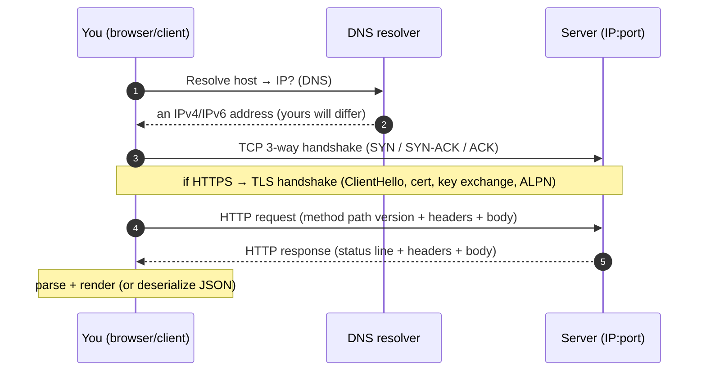
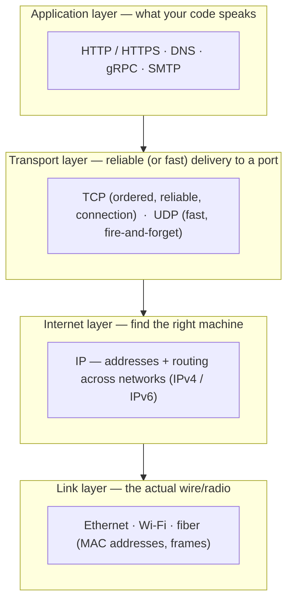
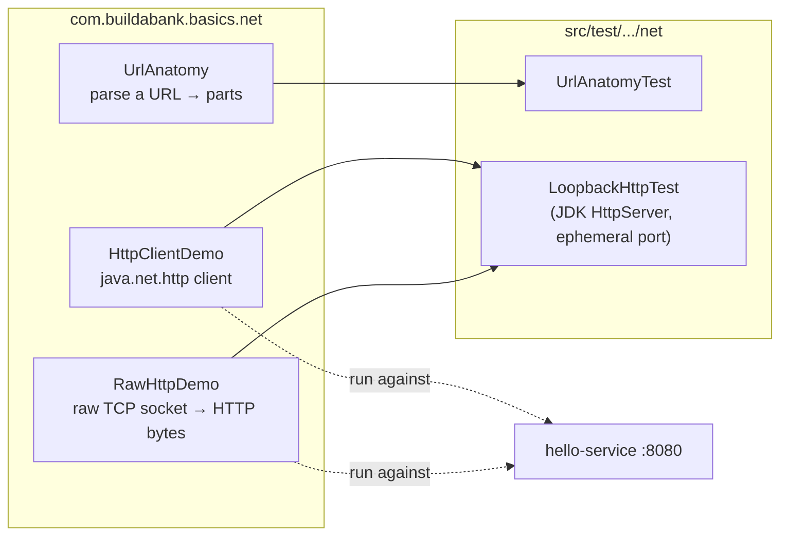
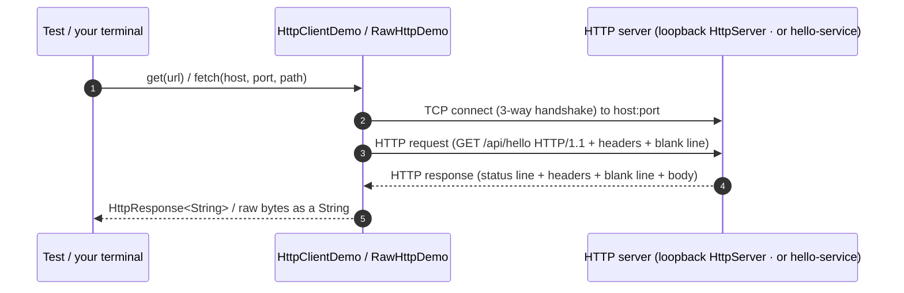

# Step 3 · How the Internet & the Web Work

> **Step 3 of 67 · Phase A — Foundations 🟢** · Level badge: 🟢 Foundations · Effort ≈ 15–20h (conceptual; an experienced dev can skip-test fast)

`🟢` Foundations &nbsp;·&nbsp; `🔵` Core &nbsp;·&nbsp; `🟣` Advanced &nbsp;·&nbsp; `🔴` Frontier

> [!CAUTION]
> **Educational, non-production project.** Build-a-Bank is for learning only. It never handles real money, real customers, or real personal data, and it is **not** security-audited for production banking. Every credential you ever see here is fake. (Full disclaimer + guardrails in the [README](../../README.md).)

---

## 🧭 The Six Movements of This Step

A one-line map of where we're going. Click to jump.

1. **[A · 🧭 Orient](#orient)** *(~1h)* — what "the web" really is, why a backend engineer must know it cold, and whether you can skip.
2. **[B · 🧠 Understand](#understand)** *(~4h)* — the TCP/IP layered model, DNS, ports, the TCP & TLS handshakes, HTTP anatomy, HTTP/1→2→3, HTTPS, and the load-balancer pattern.
3. **[C · 🛠️ Build](#build)** *(~5–6h)* — the heart: build the `net` package — `UrlAnatomy` → `HttpClientDemo` → `RawHttpDemo` → the loopback tests — and watch HTTP on the wire with `curl -v`.
4. **[D · 🔬 Prove](#prove)** *(~30 min)* — the Verification Log with the real, pasted `verify`, demo, `curl`, and `nslookup` output.
5. **[E · 🎓 Apply](#apply)** *(~2–3h)* — go-deeper, interview prep, and your-turn exercises.
6. **[F · 🏆 Review](#review)** *(~1.5h)* — troubleshooting (the real bug I hit), resources & glossary, and the recap/study notes.

---

<a id="orient"></a>

# A · 🧭 Orient

## 📋 This Step in 30 Seconds

| | |
|---|---|
| **Title** | How the Internet & the Web Work |
| **Step** | 3 of 67 · **Phase A — Foundations** 🟢 |
| **Effort** | ≈ 15–20 hours (this is a *concepts* step — reading + small demos; an experienced engineer can skip-test it in well under an hour) |
| **What you'll run this step** | The **JVM + Maven** only. Build/test the `playground/java-basics` `net` package; then start the Step-1 `hello-service` (`make run-hello`) and run the demos + `curl` against it. **No Docker required.** |
| **Verification tier** | 🟠 **Standard** — `./mvnw verify` green (incl. a real loopback HTTP round-trip), plus the demos / `curl` / `nslookup` / TLS captures shown as exploration. No mutation/clean-room: this is a learning module with no production money/security path. |
| **Depends on** | **Steps 1–2** (a working toolchain from Step 1; Java records, `Optional`, and basic syntax from Step 2). |

By the end you will be able to narrate, *precisely and from memory*, what happens between pressing Enter on a URL and seeing a page — DNS, TCP, TLS, the HTTP request/response — and you'll have **seen every layer for real**: parsed a URL into its parts, sent an HTTP request with the JDK client, typed an HTTP request **byte-by-byte over a raw socket**, and watched the wire with `curl -v`.

### ⏭️ Can You Skip This Step? (5-minute self-check)

If you can confidently do **all** of this, skim the 🕰️/🛡️ asides and jump to **[Step 4 — How Java Runs: the JVM Up Close](../step-04/lesson.md)**.

- [ ] I can name the four TCP/IP layers (link / internet / transport / application) and say which one IP, TCP, and HTTP live in.
- [ ] I can explain what DNS resolves, what a *port* disambiguates, and why `:8080` matters.
- [ ] I can draw the TCP 3-way handshake (SYN → SYN-ACK → ACK) and say *why* it exists.
- [ ] I can write a raw HTTP/1.1 request by hand (request line, `Host`, blank line) and know that header **names are case-insensitive**.
- [ ] I can explain what TLS gives you (confidentiality, integrity, server authentication) and roughly sketch the handshake (ClientHello/ServerHello, cert, ALPN, key exchange).
- [ ] I know the difference between an **L4** and an **L7** load balancer.

> [!TIP]
> Not 100%? Stay. This is the cheapest step in the course to *truly* master — it pays off in every API, security, observability, and system-design step that follows, and it's a guaranteed interview topic ("what happens when you type google.com and hit Enter?"). The 🛠️ build is short, runs in minutes, and makes the abstractions concrete.

## 📇 Cheat Card

> **What this step delivers (one sentence):** a from-the-wire-up mental model of the internet and HTTP/HTTPS — proven by building a `net` package that parses URLs and speaks HTTP both via the JDK client and over a raw TCP socket, with a green `./mvnw verify` that includes a real loopback HTTP round-trip.

**Key commands** (Windows uses `.\mvnw.cmd`; macOS / Linux / Git-Bash use `./mvnw`):

```bash
# Build + test just the networking lab (and its dependencies)
./mvnw -pl playground/java-basics -am verify          # expect tail: BUILD SUCCESS

# Start the Step-1 hello-service in one terminal…
make run-hello                                         # http://localhost:8080

# …then, in another terminal, see HTTP for real:
java -cp playground/java-basics/target/classes com.buildabank.basics.net.HttpClientDemo
java -cp playground/java-basics/target/classes com.buildabank.basics.net.RawHttpDemo
curl -v http://localhost:8080/api/hello                # watch DNS → TCP → request → response
nslookup example.com                                   # see DNS resolution
curl -v https://example.com                            # watch the TLS handshake (ALPN, cert)
```

**The one headline diagram — what happens when you type a URL and press Enter:**



*Alt-text: a sequence diagram — the client resolves the hostname via DNS, opens a TCP connection with the 3-way handshake, optionally negotiates TLS for HTTPS, sends an HTTP request, receives a status-line-plus-headers-plus-body response, then renders or deserializes it.*

## 🎯 Why This Matters

Every service you build for the rest of this course — every REST endpoint, gateway hop, Kafka broker connection, database call, and TLS-secured login — rides on the machinery in this step. You cannot debug a `Connection refused`, a `502` from a load balancer, a hung request, or a certificate error if HTTP and TCP/TLS are magic to you. And "**what happens when you type a URL and press Enter?**" is the single most-asked systems interview question — answering it layer by layer instantly signals you understand the stack, not just the framework.

## ✅ What You'll Be Able to Do

- Explain the **TCP/IP layered model** and place IP, TCP, TLS, and HTTP in it.
- Describe **DNS resolution** and read `nslookup` output; explain **ports** and why `:8080` matters.
- Draw the **TCP 3-way handshake** and the **TLS handshake**, and say what each is *for*.
- Read and **write an HTTP request by hand** — method, path, version, headers, blank line, body — and read a response's **status code** (2xx/3xx/4xx/5xx).
- State that **HTTP header names are case-insensitive** (RFC 9110) and why assuming otherwise is a bug.
- Compare **HTTP/1.1 vs HTTP/2 vs HTTP/3 (QUIC)** and **TLS 1.2 vs 1.3**, and say what legacy still uses.
- Explain **HTTPS = HTTP over TLS** and what TLS guarantees (confidentiality, integrity, server authentication).
- Explain the **load-balancer** pattern and the **L4 vs L7** distinction (full depth lands in Step 51).
- **See all of it run**: parse a URL, send HTTP via the JDK client, speak HTTP over a raw socket, and trace the wire with `curl -v`.

## 🧰 Before You Start

**Prerequisites**

- A working toolchain from **Step 1**: `java -version` shows `25.0.3` LTS, and `./mvnw -v` shows Maven `3.9.12`.
- Java fundamentals from **Step 2**: records, `Optional`, `try`-with-resources, and basic I/O — we use all of them in the `net` package.
- `curl` on your `PATH` (ships with Windows 10+/macOS/most Linux; `curl --version` to confirm). Optional but lovely: the VS Code/IntelliJ **REST Client** for the `requests.http` file.

**What you already learned that connects here**

- In **Step 1** you ran `curl -i http://localhost:8080/api/hello` and saw a status line + JSON body. You took that on faith. **This step explains every byte of it.**
- In **Step 2** you met **records** — `UrlAnatomy` is a record, and `try`-with-resources (which you'll use to close the socket) is the same construct you saw managing resources there.

> **Depends on:** Steps 1, 2.

## 🗓️ Session Plan

≈15–20h ≠ one sitting. Here's the step cut into **7 sittings of ~1.5–2.5h**, each ending at a real save point — stop at any row's end and nothing is left half-broken:

| # | Sitting | Covers | ~Time | Ends at (save point) |
|---|---|---|---|---|
| S1 | Get oriented + the layers | A · Orient, then B · The Big Idea + the mailroom analogy | ~2h | the "end-to-end story" heading (reading only — nothing to save) |
| S2 | The journey of a request | The end-to-end story, HTTP request/response anatomy, 🌱 Under the Hood, 🛡️ Security Lens | ~2.5h | the 🕰️ Then vs. Now heading |
| S3 | Versions, patterns, first code | 🕰️ Then vs. Now, 🧩 Pattern Spotlight, Build sub-steps 1–2 | ~2.5h | sub-step 2's commit (`HttpClientDemo` round trip works) |
| S4 | Raw socket + parser test | Sub-steps 3–4 | ~2.5h | sub-step 4's commit (`UrlAnatomyTest` green) |
| S5 | The end-to-end proof | Sub-steps 5–6, then 🎮 Play With It | ~2.5h | the **`step-03-end`** commit & tag |
| S6 | Prove + Apply | D · Verification Log (compare against your own runs), E · Go Deeper + Interview Prep + Your Turn | ~2h | end of E · Apply |
| S7 | Review + lock it in | F · Troubleshooting, glossary, recap, flashcards | ~1.5h | step complete → Step 4 |

**Optional routes:** experienced devs can take the ⏭️ 5-minute self-check above and skip-test the whole step in **under an hour**; the three 🚀 Go Deeper folds are **+~10 min each** and the stretch exercises **~30 min–2h** (labeled inline) — all safely deferrable to a later pass.

---

<a id="understand"></a>

# B · 🧠 Understand

## 🧠 The Big Idea

The internet is built in **layers**, and the genius of the design is that each layer only has to do *one* job and trust the layer below it. This is the **TCP/IP model** (four layers; the older OSI model splits them into seven, but TCP/IP is what the real stack implements).



*Alt-text: a four-layer stack. Top: the application layer (HTTP/HTTPS, DNS). Below it the transport layer (TCP and UDP, which deliver to a port). Below that the internet layer (IP, which addresses and routes between machines). At the bottom the link layer (Ethernet/Wi-Fi, the physical medium). Each layer uses the one beneath it.*

**The mailroom analogy.** Think of sending a letter:

- **Link layer** = the postal truck and the road — the physical movement of bytes between two directly-connected points.
- **Internet layer (IP)** = the **street address** on the envelope. IP gets a packet from any machine to any other machine across the world, hop by hop, but makes **no promises** it'll arrive, arrive once, or arrive in order.
- **Transport layer (TCP)** = a **courier who guarantees delivery**: numbers every page, re-sends lost ones, and reassembles them in order — and delivers to a specific **room number** in the building (the **port**). UDP is the opposite courier: drops it in the mailbox and walks away (fast, no guarantees — great for video/DNS).
- **Application layer (HTTP)** = the **letter itself** — a format both sides agreed on so the message makes sense ("Dear server, please GET me `/api/hello`").

So a single web request is: **HTTP** (the letter) inside **TCP** (the reliable courier to a port) inside **IP** (the address to the machine) inside **Ethernet/Wi-Fi** (the road). Each layer wraps the one above it in its own envelope (a *header*) — this is **encapsulation**.

### The end-to-end story: "what happens when you type a URL and press Enter"

This is *the* interview question. Here's the whole journey for `https://example.com/`:

1. **DNS resolution.** `example.com` is a name; the network needs an **IP address**. Your machine asks a **DNS resolver** "what's the IP for `example.com`?" and gets back an IPv4 and/or IPv6 address — on this machine `nslookup` returned `2606:4700:...` (see the Verification Log); yours may differ, because example.com has changed hosts over the years. One more reason to *observe* IPs, never memorize them. (You'll see this for real with `nslookup` in the build.)
2. **TCP connection.** Your client opens a TCP connection to that IP on **port 443** (the default for HTTPS) via the **3-way handshake** (SYN → SYN-ACK → ACK — diagram below).
3. **TLS handshake** *(because it's HTTPS)*. Client and server negotiate encryption: `ClientHello` → `ServerHello` + **certificate** → key exchange → **ALPN** picks the HTTP version. After this, everything is encrypted.
4. **HTTP request.** The client sends `GET / HTTP/1.1` (or HTTP/2 frames) with headers like `Host:` and `Accept:`.
5. **HTTP response.** The server replies with a **status line** (`HTTP/1.1 200 OK`), **headers**, a blank line, and the **body** (HTML/JSON/…).
6. **Render / deserialize.** A browser parses HTML, fetches sub-resources (CSS/JS/images, each its own request), and paints; an API client deserializes the JSON.

```mermaid
sequenceDiagram
    autonumber
    participant C as Client
    participant S as Server
    C->>S: SYN  (let's talk; here's my sequence number)
    S->>C: SYN-ACK  (ok; here's mine, and I acknowledge yours)
    C->>S: ACK  (acknowledged — connection established)
    Note over C,S: TCP connection is now open; data can flow reliably
```

*Alt-text: the TCP 3-way handshake — client sends SYN, server replies SYN-ACK, client sends ACK; the connection is then established for reliable, ordered data transfer.*

**Why a handshake at all?** TCP must agree on starting **sequence numbers** in both directions (so it can detect loss and reorder), confirm both sides are reachable and willing, and establish the connection *before* any data — this is what makes TCP **reliable and ordered**, unlike raw IP or UDP.

### HTTP request/response anatomy

HTTP/1.1 is **plain text**, which is why we can literally type it (you will, in `RawHttpDemo`). A request:

```
GET /api/hello HTTP/1.1      ← request line: METHOD  PATH  VERSION
Host: localhost:8080         ← headers (name: value), one per line
Accept: application/json
Connection: close
                             ← BLANK LINE separates headers from body
(optional body here, e.g. JSON for POST/PUT)
```

A response mirrors it:

```
HTTP/1.1 200 OK              ← status line: VERSION  STATUS-CODE  REASON
Content-Type: application/json
Content-Length: 102
                             ← BLANK LINE
{"message":"...","service":"hello"}   ← body
```

**Status code families** (memorize these — interviewers ask):

| Family | Meaning | Examples |
|---|---|---|
| **2xx** | Success | `200 OK`, `201 Created`, `204 No Content` |
| **3xx** | Redirection | `301 Moved Permanently`, `304 Not Modified` |
| **4xx** | **Client** error (your fault) | `400 Bad Request`, `401 Unauthorized`, `403 Forbidden`, `404 Not Found`, `429 Too Many Requests` |
| **5xx** | **Server** error (their fault) | `500 Internal Server Error`, `502 Bad Gateway`, `503 Service Unavailable` |

> [!IMPORTANT]
> **HTTP header *names* are case-insensitive.** Per **RFC 9110** (the current HTTP semantics spec), `Content-Type`, `content-type`, and `CONTENT-TYPE` are the *same header*. Different servers and proxies normalize casing differently. **Assuming a specific case is a bug** — and it's exactly the bug I hit in this step's tests (see 🩺 Troubleshooting). Header *values* may or may not be case-sensitive depending on the header.

## 🌱 Under the Hood: How It Really Works

No magic — here's what's actually happening when our Java code runs.

- **`java.net.URI`** is the JDK's **RFC 3986** URL parser. Give it a string and it splits out scheme, host, port (`-1` if absent), path, and query — pure parsing, no network call. `UrlAnatomy` wraps it and fills in the scheme's **default port** (80 for http, 443 for https) when none is given. That defaulting is *the network's* rule, not Java's, so we encode it ourselves.
- **`java.net.Socket`** is a thin Java handle over an **OS-level TCP socket**. `new Socket(host, port)` triggers a real DNS lookup (if `host` is a name) **and** the TCP 3-way handshake, blocking until the connection is established or refused. Writing to its `OutputStream` puts bytes on the wire; reading from its `InputStream` pulls the server's bytes back. There's nothing HTTP-aware about a socket — **HTTP is just the text we choose to write into it.** That's the whole point of `RawHttpDemo`.
- **`java.net.http.HttpClient`** (Java 11+) is a full HTTP client built *on top of* sockets: it manages the connection, writes a correct request, parses the response into a typed `HttpResponse`, and even speaks HTTP/2 and TLS for you. It's what Spring's `RestClient` (Step 15) wraps. We use the raw JDK client here so the request/response structure stays explicit.
- **CRLF line endings.** HTTP/1.1 lines end with `\r\n` (carriage-return + line-feed), and a **bare `\r\n`** (an empty line) ends the headers. Our raw request builds exactly these bytes. Forget the blank line and the server waits forever for more headers.
- **`Connection: close`** tells the server "send your response, then close the socket." That's why `readAllBytes()` in `RawHttpDemo` eventually returns — the stream hits end-of-stream when the server hangs up. Without it (HTTP/1.1 defaults to **keep-alive**), the read would block waiting for more data on a connection the server is keeping open for reuse.

## 🛡️ Security Lens: What Could Go Wrong

**Plain HTTP is wide open.** Everything in an HTTP/1.1 request/response — URLs, headers, cookies, auth tokens, the body — travels as **clear text**. Anyone on the path (the coffee-shop Wi-Fi, a compromised router, your ISP, a malicious proxy) can:

- **Sniff** it — read passwords, session cookies, account numbers (confidentiality breach).
- **Tamper** with it — a **man-in-the-middle (MITM)** can silently rewrite the body or redirect you (integrity breach).
- **Impersonate** the server — without authentication you have no proof you're even talking to the real bank.

**TLS (and thus HTTPS) fixes all three:**

| Guarantee | What it means | How TLS provides it |
|---|---|---|
| **Confidentiality** | Eavesdroppers see only ciphertext | Symmetric encryption with a key derived during the handshake |
| **Integrity** | Tampering is detected | Authenticated encryption (AEAD) — modified bytes fail the check |
| **Server authentication** | You're really talking to the bank | The server presents an X.509 **certificate** signed by a CA your machine trusts |

> [!WARNING]
> **The bank MUST be HTTPS/TLS everywhere** — every external endpoint, and increasingly service-to-service too (mutual TLS / zero-trust, deep in Step 41/43). The guiding principle, drilled all course long: **never trust the network.** Treat every byte that arrives as potentially observed and potentially forged until TLS (and later, authn/authz) proves otherwise. For *this* learning step we point demos at `http://localhost` for clarity — but localhost-only plaintext is the *only* place that's acceptable, and even that goes away in production.

## 🕰️ Then vs. Now (How This Changed Across Versions)

Protocols evolve to fix real bottlenecks. The interview-critical "old → new → why → what legacy still uses":

| Era | Protocol | What changed & why | What legacy still uses |
|---|---|---|---|
| 1996 | **HTTP/1.0** | One request per TCP connection — open, ask, close. Slow: a new handshake per resource. | Almost nothing now |
| 1997 | **HTTP/1.1** | **Keep-alive** (reuse one connection for many requests) + pipelining + mandatory `Host` header (enabling virtual hosting). Still **text**, still **one in-flight request per connection** (head-of-line blocking). | Hugely common still — our `hello-service` (embedded Tomcat) and `curl` default to HTTP/1.x; many internal APIs |
| 2015 | **HTTP/2** | **Binary** framing + **multiplexing** (many concurrent streams over one TCP connection) + header compression (HPACK) + server push. Negotiated via **ALPN** during the TLS handshake. Fixes HTTP-level head-of-line blocking. | Widely deployed at the edge (browsers, CDNs) |
| 2022 | **HTTP/3** | Runs over **QUIC** (which rides **UDP**, not TCP) — eliminates **TCP** head-of-line blocking, has TLS 1.3 built in, and offers faster connection setup + connection migration. | The newest tier; growing fast at CDNs/browsers |

And TLS itself:

| TLS version | Change & why |
|---|---|
| **TLS 1.2** (2008) | Long the workhorse; flexible but a **2-round-trip** handshake and many legacy cipher options. |
| **TLS 1.3** (2018) | **Faster** (1-round-trip handshake, 0-RTT resumption), removed obsolete/weak ciphers, encrypts more of the handshake. The modern default. |

> [!NOTE]
> **Verify, don't guess.** Version-specific facts (which HTTP version a tool negotiates, which TLS version/cipher is in play) must be *observed*, not assumed. In the build you'll run `curl -v` and read **`* using HTTP/1.x`** and the **`ALPN`** lines straight off your own machine — see the Verification Log. (This "see it, don't assume it" habit is exactly the same lesson the build's real bug teaches.)

## 🧩 Pattern Spotlight: The Load Balancer

> **Problem.** One server can't handle all your traffic, and if it dies, your bank is down. You need many identical servers behind a single address — and something to spread requests across them and route around failures.

**Why a load balancer fits.** A load balancer (LB) is a single front door (one IP / hostname) that distributes incoming connections across a pool of backend servers, runs **health checks** to stop sending traffic to dead ones, and lets you add/remove capacity without clients noticing. It's the foundation of horizontal scale and high availability.

**Alternatives / the key trade-off — L4 vs L7:**

| | **L4 (transport-layer) LB** | **L7 (application-layer) LB** |
|---|---|---|
| Operates on | TCP/UDP connections (IP:port) | HTTP requests (URL path, headers, cookies) |
| Knows about | Just connections — forwards bytes | The actual request — can route by path/host |
| Can do | Fast, cheap, protocol-agnostic | Path-based routing, TLS termination, sticky sessions, header rewriting |
| Can't do | Inspect HTTP (it doesn't decrypt/parse) | Be quite as fast/cheap as L4 |
| Examples | AWS NLB, IPVS | NGINX, AWS ALB, Envoy, **an API Gateway** |

For a bank you usually want **L7** at the edge so you can route `/accounts` to one service and `/payments` to another, terminate TLS centrally, and add per-route auth/rate-limiting.

> 👉 **Forward references:** this is a *concept* now. You'll **build an L7 front door** — the **API Gateway / BFF** — in **Step 15**, and load balancing, health checks, and algorithms get full system-design depth (with consistent hashing, etc.) in **Step 51**.

---

<a id="build"></a>

# C · 🛠️ Build

## 📦 Your Starting Point

You're starting from tag **`step-03-start`**, which is identical to **`step-02-end`** — the chain holds (`step-02-end` == `step-03-start`).

**What's already green:**

- The multi-module Maven build from Steps 1–2: `./mvnw verify` succeeds, the parent POM pins Java 25 / Spring Boot 4.0.6, and the `services/hello` app from Step 1 still runs (`make run-hello`).
- The `playground/java-basics` module exists (from Step 2) with its Java-language demos and tests.

**What you'll build this step:** a new **`net` package** inside `playground/java-basics` — three small, focused classes that make the web concrete, plus tests that prove an end-to-end HTTP round trip with **no Docker and no external network**.

> [!NOTE]
> We build in `playground/java-basics`, not in a `services/` microservice, on purpose: this step is about **understanding the web**, not adding a banking feature. The playground is your lab bench. The real REST work begins in Phase C (Step 13).

## 🛠️ Let's Build It — Step by Step

### 🗺️ What we're about to build



*Alt-text: the `net` package contains three classes — UrlAnatomy (URL parsing), HttpClientDemo (JDK HTTP client), and RawHttpDemo (raw socket). UrlAnatomyTest tests UrlAnatomy; LoopbackHttpTest tests both HTTP demos against a self-contained JDK HttpServer. The two demos can also be run against the live hello-service on port 8080.*

### 🌳 Files we'll touch

```
playground/java-basics/
├── src/main/java/com/buildabank/basics/net/
│   ├── UrlAnatomy.java        ← sub-step 1 (new)
│   ├── HttpClientDemo.java    ← sub-step 2 (new)
│   └── RawHttpDemo.java       ← sub-step 3 (new)
└── src/test/java/com/buildabank/basics/net/
    ├── UrlAnatomyTest.java    ← sub-step 4 (new)
    └── LoopbackHttpTest.java  ← sub-step 5 (new) — the end-to-end proof
```

Five new files, in order: parse a URL → talk HTTP the easy way → talk HTTP the raw way → test the parser → test the round trip. Run between each.

---

### Sub-step 1 of 6 (~30–40 min) — Parse a URL into its anatomy 🧭 *(you are here: **URL parsing** → client → raw socket → tests → play → wrap-up)*

🎯 **Goal:** turn a URL string into its components — scheme, host, port, path, query — exactly like the first thing a browser does. This is the "DNS/TCP needs an IP and a port" idea made tangible: a URL *tells the client where to connect*.

📁 **Location:** new file → `playground/java-basics/src/main/java/com/buildabank/basics/net/UrlAnatomy.java`

⌨️ **Code:**

```java
// playground/java-basics/src/main/java/com/buildabank/basics/net/UrlAnatomy.java
package com.buildabank.basics.net;

import java.net.URI;

/**
 * "What happens when you type a URL?" — part 1: the URL is parsed into pieces.
 *
 * <p>A record capturing the components a browser/client extracts from a URL before it can do anything:
 * the <b>scheme</b> (http/https → which default port + whether TLS), the <b>host</b> (resolved via DNS to
 * an IP), the <b>port</b> (explicit, or the scheme default: 80 for http, 443 for https), the <b>path</b>,
 * and the <b>query</b>. We parse with {@link URI} (the JDK's RFC-3986 parser).
 */
public record UrlAnatomy(String scheme, String host, int port, String path, String query) {

    public static UrlAnatomy of(String url) {
        URI u = URI.create(url);
        int port = (u.getPort() != -1) ? u.getPort() : defaultPort(u.getScheme());
        String path = (u.getPath() == null || u.getPath().isBlank()) ? "/" : u.getPath();
        return new UrlAnatomy(u.getScheme(), u.getHost(), port, path, u.getQuery());
    }

    private static int defaultPort(String scheme) {
        return "https".equalsIgnoreCase(scheme) ? 443 : 80;
    }

    public boolean isSecure() {
        return "https".equalsIgnoreCase(scheme);
    }
}
```

🔍 **Line-by-line:**

- `package com.buildabank.basics.net;` — the new `net` package; the folder path must match the package exactly (the JVM rule from Step 2).
- `import java.net.URI;` — the JDK's URI parser, which implements **RFC 3986** (the spec that defines URL syntax).
- `public record UrlAnatomy(...)` — a **record** (Step 2): an immutable data carrier. The five fields *are* the URL's parts. Records give us a constructor, accessors (`scheme()`, `host()`, …), `equals`/`hashCode`/`toString` for free.
- `URI.create(url)` — parses the string; no network call happens, it's pure text-splitting.
- `u.getPort() != -1 ? … : defaultPort(...)` — `URI` returns **`-1`** when the URL omits the port. The *web's* rule is "no port ⇒ use the scheme default" — 80 for http, 443 for https — so we apply it ourselves. **This is why `:8080` matters: it overrides the default.**
- `getPath() ... isBlank() ? "/" : ...` — `http://host` (no path) means the **root** `/`; we normalize an empty path to `/`.
- `defaultPort(...)` — `equalsIgnoreCase` because schemes are case-insensitive (`HTTPS` == `https`).
- `isSecure()` — a convenience: https ⇒ TLS ⇒ secure. We'll use this idea throughout.

💭 **Under the hood:** `URI` does zero I/O — it never touches DNS or a socket. It's a *lexer/parser* for the RFC-3986 grammar. The host it extracts is still just a **name**; turning that name into an IP (DNS) happens only when you actually connect (next sub-steps).

🔮 **Predict:** for `http://localhost:8080/api/hello`, what will `port()` be? And for `https://api.bank.example/accounts?limit=10` (no port given), what will `port()` be? *(Answers proven by the test in sub-step 4.)*

▶️ **Run & See:** there's no `main` here — it's exercised by its test (sub-step 4). For now just confirm it compiles:

```bash
./mvnw -pl playground/java-basics -am test-compile -q
```

✅ **Expected output:** the command returns with no errors (a silent success at `-q`). If it prints `BUILD FAILURE`, read the compiler error — usually a typo or a missing import.

✋ **Checkpoint:** the file exists at the exact path above and `test-compile` is clean. If not → 🩺.

> 🔖 **Stopping here?** You have `UrlAnatomy` compiling clean — run the 💾 commit below first. Next: sub-step 2 (the JDK `HttpClient`); first action: create `playground/java-basics/src/main/java/com/buildabank/basics/net/HttpClientDemo.java`.

💾 **Commit:**

```bash
git add playground/java-basics/src/main/java/com/buildabank/basics/net/UrlAnatomy.java
git commit -m "feat(playground): add UrlAnatomy — parse a URL into scheme/host/port/path/query"
```

⚠️ **Pitfall:** `URI.create` throws `IllegalArgumentException` on a malformed URL (e.g. spaces in it). For a robust API you'd validate/encode first — fine for a demo, but note it.

---

### Sub-step 2 of 6 (~45 min) — Speak HTTP the easy way: the JDK `HttpClient` 🧭 *(URL parsing ✅ → **client** → raw socket → tests → play → wrap-up)*

🎯 **Goal:** send a real HTTP `GET` and read back the status, headers, and body — using `java.net.http.HttpClient` (the modern, built-in client). This is the "client half of the web."

📁 **Location:** new file → `playground/java-basics/src/main/java/com/buildabank/basics/net/HttpClientDemo.java`

⌨️ **Code:**

```java
// playground/java-basics/src/main/java/com/buildabank/basics/net/HttpClientDemo.java
package com.buildabank.basics.net;

import java.net.URI;
import java.net.http.HttpClient;
import java.net.http.HttpRequest;
import java.net.http.HttpResponse;
import java.time.Duration;

/**
 * The modern Java HTTP client ({@code java.net.http}, Java 11+) — a request/response round trip.
 *
 * <p>This is the "client" half of the web: build a request (method + URL + headers), send it over a
 * TCP connection (TLS first if https), and read the status line + headers + body back. We will use the
 * Spring {@code RestClient} (a friendlier wrapper) from Step 15; here we use the raw JDK client so the
 * request/response anatomy is explicit.
 */
public final class HttpClientDemo {

    private HttpClientDemo() { }

    public static HttpResponse<String> get(String url) throws Exception {
        HttpClient client = HttpClient.newBuilder()
                .connectTimeout(Duration.ofSeconds(5))
                .build();
        HttpRequest request = HttpRequest.newBuilder(URI.create(url))
                .header("Accept", "application/json")
                .GET()
                .build();
        return client.send(request, HttpResponse.BodyHandlers.ofString());
    }

    public static void main(String[] args) throws Exception {
        String url = (args.length > 0) ? args[0] : "http://localhost:8080/api/hello";
        HttpResponse<String> response = get(url);
        System.out.println("GET " + url);
        System.out.println("HTTP version : " + response.version());                       // HTTP_1_1 / HTTP_2
        System.out.println("Status       : " + response.statusCode());                    // 200, 404, ...
        System.out.println("Content-Type : " + response.headers().firstValue("content-type").orElse("(none)"));
        System.out.println("Body         : " + response.body());
    }
}
```

🔍 **Line-by-line:**

- `import java.net.http.*` — the JDK HTTP client API (stable since Java 11; supports HTTP/1.1 **and** HTTP/2).
- `private HttpClientDemo() { }` + `final` class — a deliberate "no instances" utility class (only static methods). The private constructor blocks `new HttpClientDemo()`.
- `HttpClient.newBuilder().connectTimeout(Duration.ofSeconds(5)).build()` — builds a client with a **5-second connect timeout**. Always set timeouts on network calls — a hung connection should fail fast, not freeze your app forever. (We'll harden timeouts/retries properly in Step 15.)
- `HttpRequest.newBuilder(URI.create(url)).header("Accept", "application/json").GET().build()` — builds a **`GET`** request and adds an **`Accept: application/json`** header (content negotiation — "I'd like JSON back, please").
- `client.send(request, BodyHandlers.ofString())` — **synchronously** sends the request (DNS + TCP connect + TLS if https + write + read) and buffers the body into a `String`. Returns a typed `HttpResponse<String>`.
- `response.version()` — the **negotiated** HTTP version (`HTTP_1_1` or `HTTP_2`). *Negotiated*, not assumed — the value comes from the actual exchange.
- `response.statusCode()` — `200`, `404`, etc.
- `response.headers().firstValue("content-type")` — note we ask for `"content-type"` in **lowercase**; the JDK header lookup is **case-insensitive** (RFC 9110), so this matches `Content-Type` on the wire. Returns an `Optional`; `.orElse("(none)")` handles its absence.
- `response.body()` — the response body as a `String`.

💭 **Under the hood:** `client.send(...)` does *everything* `RawHttpDemo` will do by hand — opens a TCP socket (and a TLS session for https), writes a well-formed request, reads and parses the response — but hands you a clean typed object instead of raw bytes. This is the layer Spring's `RestClient` sits on. The difference between this and the next sub-step is *exactly* the difference between "using a library" and "knowing what the library does."

🔮 **Predict:** with the `hello-service` running, what **status code** and **HTTP version** do you expect? (Embedded Tomcat over plain `http`…)

▶️ **Run & See:** first start the service in one terminal, then run the demo in another:

```bash
# Terminal 1 — start the Step-1 service
make run-hello                 # → http://localhost:8080   (Ctrl-C to stop later)

# Terminal 2 — compile the playground, then run the demo
./mvnw -pl playground/java-basics -am compile -q
java -cp playground/java-basics/target/classes com.buildabank.basics.net.HttpClientDemo
```

✅ **Expected output** (this is the **real** captured run):

```
GET http://localhost:8080/api/hello
HTTP version : HTTP_1_1
Status       : 200
Content-Type : application/json
Body         : {"message":"Welcome to Build-a-Bank 🏦","timestamp":"2026-06-09T14:37:32.317929400Z","service":"hello"}
```

Predicted right? Embedded Tomcat over plain `http` speaks **HTTP/1.1**, and the endpoint returns **200** with a JSON body (the 🏦 emoji is part of the real greeting).

❓ **Knowledge-check:** the output says `HTTP version : HTTP_1_1` — did that value come from the request you built, or from the exchange itself? Why does "negotiated" matter? <details><summary>answer</summary>From the exchange: `response.version()` reports the version the client and server actually **negotiated**, not the one you asked for. Tomcat over plain `http` speaks HTTP/1.1, so that's what came back — the same code against an HTTPS server that offers `h2` via ALPN would report `HTTP_2`. "Negotiated" matters because version facts must be *observed*, never assumed — the step's recurring lesson.</details>

❌ **If you see `java.net.ConnectException: Connection refused`:** the `hello-service` isn't running (or is on a different port). Start it with `make run-hello` and wait for the `Started HelloApplication` log line. See 🩺.

✋ **Checkpoint:** you see `Status : 200` and a JSON body. If not → 🩺.

> 🔖 **Stopping here?** You have `UrlAnatomy` + a working JDK-client round trip — run the 💾 commit below, then Ctrl-C terminal 1. Next: sub-step 3 (the raw socket); first action: `make run-hello` in terminal 1, then create `playground/java-basics/src/main/java/com/buildabank/basics/net/RawHttpDemo.java`.

💾 **Commit:**

```bash
git add playground/java-basics/src/main/java/com/buildabank/basics/net/HttpClientDemo.java
git commit -m "feat(playground): add HttpClientDemo — java.net.http request/response round trip"
```

⚠️ **Pitfall:** the `main` defaults to `localhost:8080`; pass a different URL as the first arg (e.g. `... HttpClientDemo http://localhost:8080/nope`) to experiment. We'll do exactly that in 🎮 Play With It.

---

### Sub-step 3 of 6 (~45–60 min) — Speak HTTP the *raw* way: a TCP socket 🧭 *(URL parsing ✅ → client ✅ → **raw socket** → tests → play → wrap-up)*

🎯 **Goal:** prove HTTP is "just text over TCP" by opening a raw socket and **typing the HTTP request by hand**, then printing the exact bytes the server sends back. This is the single most demystifying thing in the step.

📁 **Location:** new file → `playground/java-basics/src/main/java/com/buildabank/basics/net/RawHttpDemo.java`

⌨️ **Code** *(one piece is deliberately left for you to type — this is the "byte-by-byte" moment the step promised)*:

```java
// playground/java-basics/src/main/java/com/buildabank/basics/net/RawHttpDemo.java
package com.buildabank.basics.net;

import java.io.IOException;
import java.io.OutputStream;
import java.net.Socket;
import java.nio.charset.StandardCharsets;

/**
 * HTTP <strong>on the wire</strong> — there is no magic. We open a raw TCP {@link Socket}, type an
 * HTTP/1.1 request as plain text, and read the raw bytes the server sends back (status line + headers +
 * blank line + body). This is exactly what {@code curl} and your browser do underneath.
 *
 * <p>Note the protocol details: lines end with CRLF ({@code \r\n}), a blank line separates headers from
 * body, and {@code Connection: close} tells the server to close the socket when done (so our read ends).
 */
public final class RawHttpDemo {

    private RawHttpDemo() { }

    public static String fetch(String host, int port, String path) throws IOException {
        try (Socket socket = new Socket(host, port)) {
            OutputStream out = socket.getOutputStream();
            String request = /* ⌨️ TYPE THE HTTP REQUEST YOURSELF (it won't compile until you do):
                                four lines, EACH ending in "\r\n" — the request line
                                ("GET " + path + " HTTP/1.1"), then Host: <host>, then
                                Accept: application/json, then Connection: close —
                                followed by one final "\r\n" (the blank line that ends the
                                headers). Check yourself against the fold below the code. */;
            out.write(request.getBytes(StandardCharsets.US_ASCII));
            out.flush();
            // Read everything until the server closes the connection.
            return new String(socket.getInputStream().readAllBytes(), StandardCharsets.UTF_8);
        }
    }

    public static void main(String[] args) throws Exception {
        String host = (args.length > 0) ? args[0] : "localhost";
        int port = (args.length > 1) ? Integer.parseInt(args[1]) : 8080;
        String path = (args.length > 2) ? args[2] : "/api/hello";
        System.out.println("--- raw HTTP response from " + host + ":" + port + path + " ---");
        System.out.println(fetch(host, port, path));
    }
}
```

<details>
<summary>✅ Check your request string (the exact four lines + blank line)</summary>

```java
            String request = "GET " + path + " HTTP/1.1\r\n"
                    + "Host: " + host + "\r\n"
                    + "Accept: application/json\r\n"
                    + "Connection: close\r\n"
                    + "\r\n";
```
</details>

🔍 **Line-by-line:**

- `import java.net.Socket;` — a raw TCP socket; **nothing about it knows HTTP**.
- `try (Socket socket = new Socket(host, port))` — **`try`-with-resources** (Step 2): opening the socket performs the DNS lookup (if `host` is a name) **and** the TCP 3-way handshake; the socket auto-closes at the end of the block. `new Socket(...)` *blocks* until connected or it throws.
- `socket.getOutputStream()` — the byte stream that goes **to the server**.
- The `request` string — **this is the HTTP request, by hand:**
  - `"GET " + path + " HTTP/1.1\r\n"` — the **request line**: method, path, version, ending in **CRLF** (`\r\n`).
  - `"Host: " + host + "\r\n"` — the mandatory **`Host`** header (HTTP/1.1 requires it; it's how one IP serves many sites).
  - `"Accept: application/json\r\n"` — content negotiation.
  - `"Connection: close\r\n"` — "close the socket after responding" — this is what lets our read terminate.
  - `"\r\n"` — the **blank line** that ends the headers (there's no body for a GET).
- `out.write(request.getBytes(StandardCharsets.US_ASCII))` — HTTP/1.1 request **metadata** is ASCII; we write the bytes and `flush()` to send immediately.
- `socket.getInputStream().readAllBytes()` — read **everything** the server sends until it closes the connection (end-of-stream), then decode as UTF-8 (the body may contain UTF-8 like the 🏦 emoji).

💭 **Under the hood:** compare this to sub-step 2. `HttpClient.send()` constructs *this exact byte sequence* (plus a few more headers), writes it to a socket it manages, and parses the bytes back into an `HttpResponse`. Here you see the unparsed truth: the status line, every header the server chose to send, the blank line, then the body. **There is no magic layer** — HTTP is a text convention layered on TCP's reliable byte stream.

🔮 **Predict:** the response's **first line** will be `HTTP/1.1 200`. What **header** will tell you how many bytes the body is? And — trick question — will the server's `Content-Type` header be capitalized exactly as you'd expect? *(Hold that thought; it's the bug in 🩺.)*

▶️ **Run & See:** with `hello-service` still running:

```bash
java -cp playground/java-basics/target/classes com.buildabank.basics.net.RawHttpDemo
```

✅ **Expected output** (the **real** bytes on the wire):

```
--- raw HTTP response from localhost:8080/api/hello ---
HTTP/1.1 200 
Content-Type: application/json
Content-Length: 102
Date: Tue, 09 Jun 2026 14:37:32 GMT
Connection: close

{"message":"Welcome to Build-a-Bank 🏦","timestamp":"2026-06-09T14:37:32.909722Z","service":"hello"}
```

Look closely: the **status line**, four **headers**, a **blank line**, then the **body** — exactly the anatomy from 🧠 The Big Idea, now printed from a socket you opened yourself. (`Content-Length: 102` is the byte count of the UTF-8 body, which is why the multi-byte 🏦 makes it more than the visible character count.)

❌ **If it hangs forever:** you probably dropped the final blank line (`"\r\n"`) — the server is still waiting for more headers. Add it back.

🔬 **Break-it-on-purpose (60s):** point it at a **closed port** and a **missing path** to feel two different failures:

```bash
# 1) Nothing listening on 9999 → the TCP connect itself fails:
java -cp playground/java-basics/target/classes com.buildabank.basics.net.RawHttpDemo localhost 9999 /api/hello
# → java.net.ConnectException: Connection refused  (there's no server to handshake with)

# 2) A path the server doesn't have → the server answers, with a 404:
java -cp playground/java-basics/target/classes com.buildabank.basics.net.RawHttpDemo localhost 8080 /api/nope
# → first line: HTTP/1.1 404 ...   (TCP connected fine; HTTP said "not found")
```

❓ **Knowledge-check:** why is "Connection refused" a *different kind* of failure from a `404`? <details><summary>answer</summary>"Connection refused" happens at the **TCP/transport layer** — no process is listening on that port, so the 3-way handshake fails and there's no HTTP at all. A `404` happens at the **HTTP/application layer** — TCP connected fine, the server received your request, understood it, and *chose* to answer "I don't have that resource." Different layers, different fixes.</details>

✋ **Checkpoint:** you've seen the raw status line + headers + body, *and* watched both a transport-layer failure (refused) and an application-layer failure (404). If not → 🩺.

> 🔖 **Stopping here?** You have all three `net` classes working against the live service — run the 💾 commit below first; you can stop the hello-service. Next: sub-step 4 (parser test — no running service needed); first action: create `playground/java-basics/src/test/java/com/buildabank/basics/net/UrlAnatomyTest.java`.

💾 **Commit:**

```bash
git add playground/java-basics/src/main/java/com/buildabank/basics/net/RawHttpDemo.java
git commit -m "feat(playground): add RawHttpDemo — speak HTTP/1.1 over a raw TCP socket"
```

⚠️ **Pitfall:** this `readAllBytes()` approach only terminates because we send `Connection: close`. With keep-alive you'd have to parse `Content-Length` (or chunked encoding) to know when the body ends — which is precisely the parsing work a real HTTP client does for you.

---

### Sub-step 4 of 6 (~30 min) — Test the URL parser 🧭 *(URL parsing ✅ → client ✅ → raw socket ✅ → **parser test** → loopback test → wrap-up)*

🎯 **Goal:** lock in `UrlAnatomy`'s behavior with assertions — including the default-port and root-path rules — so a future refactor can't silently break it.

📁 **Location:** new file → `playground/java-basics/src/test/java/com/buildabank/basics/net/UrlAnatomyTest.java`

⌨️ **Code** *(the first test is worked for you; you write the second — it asserts exactly your sub-step 1 predictions)*:

```java
// playground/java-basics/src/test/java/com/buildabank/basics/net/UrlAnatomyTest.java
package com.buildabank.basics.net;

import static org.assertj.core.api.Assertions.assertThat;

import org.junit.jupiter.api.Test;

class UrlAnatomyTest {

    @Test
    void parsesAllComponentsOfAnHttpsUrl() {
        var a = UrlAnatomy.of("https://api.bank.example/accounts?limit=10");
        assertThat(a.scheme()).isEqualTo("https");
        assertThat(a.host()).isEqualTo("api.bank.example");
        assertThat(a.port()).isEqualTo(443);          // default for https
        assertThat(a.path()).isEqualTo("/accounts");
        assertThat(a.query()).isEqualTo("limit=10");
        assertThat(a.isSecure()).isTrue();
    }

    @Test
    void usesExplicitPortAndHttpDefault() {
        // ⌨️ YOUR TURN — three assertThat lines, one per rule you predicted in sub-step 1:
        //   1) an explicit port wins:  http://localhost:8080/api/hello → port() is 8080
        //   2) no port on http ⇒ 80:   http://localhost/api/hello      → port() is 80
        //   3) no path ⇒ "/":          http://localhost                → path() is "/"
        // Solution in the fold below the code if you get stuck.
    }
}
```

<details>
<summary>✅ Solution — <code>usesExplicitPortAndHttpDefault</code></summary>

```java
    @Test
    void usesExplicitPortAndHttpDefault() {
        assertThat(UrlAnatomy.of("http://localhost:8080/api/hello").port()).isEqualTo(8080);
        assertThat(UrlAnatomy.of("http://localhost/api/hello").port()).isEqualTo(80);
        assertThat(UrlAnatomy.of("http://localhost").path()).isEqualTo("/");
    }
```
</details>

🔍 **Line-by-line:**

- `import static ...assertThat` — **AssertJ** fluent assertions (Step 2 testing setup). Reads like English.
- `@Test` — JUnit 5 marks each method as a test case.
- `parsesAllComponentsOfAnHttpsUrl` — a full https URL with a query; asserts every part, and that with **no explicit port** the https default **443** is filled in, and `isSecure()` is `true`.
- `usesExplicitPortAndHttpDefault` — the three rules in one: an **explicit `8080`** wins; **no port on http** ⇒ **80**; **no path** ⇒ `/`. (These are the predictions from sub-step 1, now asserted.)

💭 **Under the hood:** these tests are pure and instant — no network, no Spring context. They exercise only `URI` parsing + our defaulting logic, so they run in milliseconds and never flake.

🔮 **Predict:** how many tests, and will they pass? (Two `@Test` methods…)

▶️ **Run & See:**

```bash
./mvnw -pl playground/java-basics -am test -q -Dtest=UrlAnatomyTest
```

✅ **Expected output** (tail):

```
[INFO] Tests run: 2, Failures: 0, Errors: 0, Skipped: 0 -- in com.buildabank.basics.net.UrlAnatomyTest
```

✋ **Checkpoint:** `Tests run: 2, Failures: 0`. If a port assertion fails, re-check the `-1` default-port logic in `UrlAnatomy`. If not → 🩺.

> 🔖 **Stopping here?** You have the parser locked in by two green tests — run the 💾 commit below first. Next: sub-step 5 (the loopback round trip — no running service needed); first action: create `playground/java-basics/src/test/java/com/buildabank/basics/net/LoopbackHttpTest.java`.

💾 **Commit:**

```bash
git add playground/java-basics/src/test/java/com/buildabank/basics/net/UrlAnatomyTest.java
git commit -m "test(playground): cover UrlAnatomy default ports and root-path normalization"
```

⚠️ **Pitfall:** AssertJ's `assertThat(...).isEqualTo(443)` compares an `int` — if you accidentally typed `"443"` (a String) the test wouldn't compile. Good: the compiler is your first test.

---

### Sub-step 5 of 6 (~45–60 min) — The end-to-end proof: a loopback HTTP round trip 🧭 *(URL parsing ✅ → client ✅ → raw socket ✅ → parser test ✅ → **loopback test** → wrap-up)*

🎯 **Goal:** prove both HTTP demos actually work — *against a real HTTP server* — without Docker or any external host. We spin up the JDK's built-in `HttpServer` on an **ephemeral port** inside the test, then exercise `HttpClientDemo` and `RawHttpDemo` against it. A deterministic, self-contained end-to-end round trip.

📁 **Location:** new file → `playground/java-basics/src/test/java/com/buildabank/basics/net/LoopbackHttpTest.java`

⌨️ **Code:**

```java
// playground/java-basics/src/test/java/com/buildabank/basics/net/LoopbackHttpTest.java
package com.buildabank.basics.net;

import static org.assertj.core.api.Assertions.assertThat;

import java.net.InetSocketAddress;
import java.nio.charset.StandardCharsets;

import com.sun.net.httpserver.HttpServer;

import org.junit.jupiter.api.AfterEach;
import org.junit.jupiter.api.BeforeEach;
import org.junit.jupiter.api.Test;

/**
 * Exercises {@link HttpClientDemo} and {@link RawHttpDemo} against a real, self-contained loopback server
 * — the JDK's built-in {@link HttpServer} on an ephemeral port. No Docker, no external host: a deterministic
 * end-to-end HTTP round trip on localhost.
 */
class LoopbackHttpTest {

    private HttpServer server;
    private int port;

    @BeforeEach
    void startServer() throws Exception {
        server = HttpServer.create(new InetSocketAddress("localhost", 0), 0);  // port 0 → OS picks a free port
        server.createContext("/api/hello", exchange -> {
            byte[] body = "{\"message\":\"hi\",\"service\":\"hello\"}".getBytes(StandardCharsets.UTF_8);
            exchange.getResponseHeaders().add("Content-Type", "application/json");
            exchange.sendResponseHeaders(200, body.length);
            try (var os = exchange.getResponseBody()) {
                os.write(body);
            }
        });
        server.start();
        port = server.getAddress().getPort();
    }

    @AfterEach
    void stopServer() {
        server.stop(0);
    }

    @Test
    void httpClientGetsTwoHundredAndJsonBody() throws Exception {
        var response = HttpClientDemo.get("http://localhost:" + port + "/api/hello");
        assertThat(response.statusCode()).isEqualTo(200);
        assertThat(response.headers().firstValue("content-type")).contains("application/json");
        assertThat(response.body()).contains("\"service\":\"hello\"");
    }

    @Test
    void rawSocketSeesTheStatusLineAndBody() throws Exception {
        String raw = RawHttpDemo.fetch("localhost", port, "/api/hello");
        assertThat(raw).startsWith("HTTP/1.1 200");
        // HTTP header NAMES are case-insensitive (RFC 9110). The JDK HttpServer emits "Content-type",
        // so we must not assert exact case — a real lesson about the protocol.
        assertThat(raw).containsIgnoringCase("content-type: application/json");
        assertThat(raw).contains("\"message\":\"hi\"");
    }
}
```

🔍 **Line-by-line:**

- `import com.sun.net.httpserver.HttpServer;` — a **tiny HTTP server bundled in the JDK** (no dependency to add). Perfect for tests: real HTTP, zero infrastructure.
- `@BeforeEach startServer()` — runs before each test:
  - `HttpServer.create(new InetSocketAddress("localhost", 0), 0)` — **port `0` means "let the OS pick any free port"** (an *ephemeral* port). This avoids "port already in use" flakiness — a key reliability trick you'll see again with Testcontainers in Step 8.
  - `server.createContext("/api/hello", exchange -> { ... })` — register a handler for that path. The lambda writes a small JSON body with a `Content-Type` header and a `200` status.
  - `server.getAddress().getPort()` — read back the **actual** port the OS chose, so the tests know where to connect.
- `@AfterEach stopServer()` — shut the server down after each test so they don't leak.
- `httpClientGetsTwoHundredAndJsonBody` — exercises `HttpClientDemo.get(...)`: asserts **200**, a JSON `content-type` (looked up case-insensitively via `firstValue`), and that the body contains `"service":"hello"`.
- `rawSocketSeesTheStatusLineAndBody` — exercises `RawHttpDemo.fetch(...)`: asserts the raw text **starts with** `HTTP/1.1 200`, **contains** the content-type **ignoring case**, and contains the body. **Read the comment carefully** — that `containsIgnoringCase` is load-bearing, and the story of *why* is in 🩺 Troubleshooting.

💭 **Under the hood:** this is a complete client↔server HTTP exchange entirely within one JVM/test, over the **loopback** interface (`localhost` / `127.0.0.1` / `::1`) — packets never leave your machine. It proves the demos against *real* HTTP semantics deterministically, which is why it's safe to gate the build on (no external network, no Docker, no flaky remote host).

🔮 **Predict:** four assertions across two tests — will they all pass on the code exactly as shown? *(They do — but my **first** version of the raw-socket assertion did **not**. See 🩺.)*

▶️ **Run & See:**

```bash
./mvnw -pl playground/java-basics -am test -q -Dtest=LoopbackHttpTest
```

✅ **Expected output** (tail):

```
[INFO] Tests run: 2, Failures: 0, Errors: 0, Skipped: 0 -- in com.buildabank.basics.net.LoopbackHttpTest
```

❓ **Knowledge-check:** why does the test create the server with port `0` and then read the port back with `getAddress().getPort()`, instead of hard-coding, say, `18080`? <details><summary>answer</summary>Port `0` tells the OS to pick any **free ephemeral port**, so the test can never fail with "address already in use" (another process — or a parallel test run — might be squatting on any hard-coded port). The test then reads back the port the OS actually chose so both clients know where to connect. It's the same reliability trick Testcontainers uses in Step 8.</details>

✋ **Checkpoint:** `Tests run: 2, Failures: 0` for the loopback test. If you instead see `AssertionError ... LoopbackHttpTest.rawSocketSeesTheStatusLineAndBody`, you almost certainly asserted the header case exactly — go read 🩺 *now*; it's the marquee bug of this step.

> 🔖 **Stopping here?** You have all five files and both loopback tests green — run the 💾 commit below first. Next: sub-step 6 (run the whole lab + tag); first action: `./mvnw -pl playground/java-basics -am verify`.

💾 **Commit:**

```bash
git add playground/java-basics/src/test/java/com/buildabank/basics/net/LoopbackHttpTest.java
git commit -m "test(playground): end-to-end loopback HTTP round trip for HttpClientDemo + RawHttpDemo"
```

⚠️ **Pitfall:** `com.sun.net.httpserver` is a JDK-internal-ish package — it's fine and stable for tests/demos, but you would never ship it as a production server (that's what embedded Tomcat / Spring Boot is for).

---

### Sub-step 6 of 6 (~20 min) — Run the whole lab green 🧭 *(URL parsing ✅ → client ✅ → raw socket ✅ → parser test ✅ → loopback test ✅ → **wrap-up**)*

🎯 **Goal:** build and test the entire `playground/java-basics` module (the `net` package plus everything from Step 2) in one command — the gate for `step-03-end`.

▶️ **Run & See:**

```bash
./mvnw -pl playground/java-basics -am verify
```

`-pl playground/java-basics` = build *that module*; `-am` = "also make" the modules it depends on; `verify` = compile + run all tests + package.

✅ **Expected output** (the **real** captured tail — the four new `net` tests are part of the 20):

```
[INFO] Tests run: 2, Failures: 0, Errors: 0, Skipped: 0 -- in com.buildabank.basics.net.LoopbackHttpTest
[INFO] Tests run: 2, Failures: 0, Errors: 0, Skipped: 0 -- in com.buildabank.basics.net.UrlAnatomyTest
[INFO] Tests run: 20, Failures: 0, Errors: 0, Skipped: 0
[INFO] BUILD SUCCESS
```

✋ **Checkpoint:** `BUILD SUCCESS`, `Failures: 0`, and you can see both `net` test classes in the run. That's `step-03-end`.

> 🔖 **Stopping here?** Run the 💾 commit & tag below first — then you are at `step-03-end` with the whole lab green. Next: 🎮 Play With It; first action: `make run-hello` in terminal 1.

💾 **Commit & tag:**

```bash
git add -A
git commit -m "feat(step-03): networking lab — URL anatomy + HTTP client + raw socket, loopback-tested"
git tag step-03-end
```

### 🔁 The flow you just built



*Alt-text: your test or terminal calls a demo method; the demo opens a TCP connection to the server, sends an HTTP GET request, the server returns a status line plus headers plus body, and the demo hands back a typed response (HttpClient) or the raw bytes (raw socket).*

## 🎮 Play With It

Make it tangible. Start the service, then poke the web from every angle.

```bash
make run-hello     # Terminal 1 — the hello-service on :8080
```

**1. The JDK client and the raw socket, side by side** (Terminal 2):

```bash
java -cp playground/java-basics/target/classes com.buildabank.basics.net.HttpClientDemo
java -cp playground/java-basics/target/classes com.buildabank.basics.net.RawHttpDemo
```

The first gives you a tidy parsed view; the second gives you the unvarnished bytes. Same exchange, two altitudes.

**2. The `requests.http` file** — open [`steps/step-03/requests.http`](./requests.http) in VS Code/IntelliJ (REST Client) and click "Send" on each request, or read the `curl` equivalents inline. It includes a content-negotiation experiment (`Accept: application/xml`).

**3. Watch the wire with `curl -v`** — the `-v` (verbose) flag prints DNS, the TCP connect, and every request/response header line (`>` = sent, `<` = received):

```bash
curl -v http://localhost:8080/api/hello
```

**4. See DNS for real:**

```bash
nslookup example.com
```

**5. Watch a TLS handshake:**

```bash
curl -v https://example.com
```

(All four of these are captured verbatim in the [Verification Log](#prove) so you know exactly what to expect.)

### 🧪 Little experiments — change X → see Y *(~2 min each)*

- **Change the path → 404.** `java -cp playground/java-basics/target/classes com.buildabank.basics.net.HttpClientDemo http://localhost:8080/api/nope` → `Status : 404`. (TCP still connected; HTTP said "not found.")
- **Point at a closed port → connection refused.** `... RawHttpDemo localhost 9999 /api/hello` → `java.net.ConnectException: Connection refused`. (No server, no handshake — a *transport*-layer failure.)
- **Add a header.** In `RawHttpDemo.fetch`, add `+ "X-Demo: hello\r\n"` before the blank line, recompile, rerun — the request still works; the server ignores headers it doesn't care about. (Then remove it.)
- **Drop the blank line.** Temporarily delete the final `"\r\n"` in `RawHttpDemo` → the call **hangs** (the server waits for more headers that never come). Restore it. This is *why* the blank line exists.

## 🏁 The Finished Result

`step-03-end` is fully runnable and becomes `step-04-start`. You now have a `com.buildabank.basics.net` package that parses URLs, speaks HTTP via the JDK client and over a raw socket, and is proven by a self-contained loopback round trip.

### ✅ Definition of Done (your self-check)

You're done when you can:

- [ ] Narrate "what happens when you type a URL and press Enter" through DNS → TCP → TLS → HTTP → render.
- [ ] Build the `net` package and `./mvnw -pl playground/java-basics -am verify` is **green** (`BUILD SUCCESS`, 20 tests, 0 failures).
- [ ] Run `HttpClientDemo` and `RawHttpDemo` against the live `hello-service` and read the output.
- [ ] Run `bash steps/step-03/smoke.sh` and see it pass.
- [ ] You've committed and tagged **`step-03-end`**.

---

<a id="prove"></a>

# D · 🔬 Prove It Works — the Verification Log

> **Verification tier: 🟠 Standard.** This is a learning module — no production money/security/concurrency path — so mutation and clean-room checks are not required. Required and shown: a green `./mvnw verify` *including a real loopback HTTP round-trip*, plus the demos / `curl` / `nslookup` / TLS captures as exploration. Every block below is **real, pasted output from this machine** — nothing fabricated.

**1) Build + all tests (`./mvnw -pl playground/java-basics -am verify`):**

```
[INFO] Tests run: 2, Failures: 0, Errors: 0, Skipped: 0 -- in com.buildabank.basics.net.LoopbackHttpTest
[INFO] Tests run: 2, Failures: 0, Errors: 0, Skipped: 0 -- in com.buildabank.basics.net.UrlAnatomyTest
[INFO] Tests run: 20, Failures: 0, Errors: 0, Skipped: 0
[INFO] BUILD SUCCESS
```

The loopback test is the proof-of-real-execution that matters here: it stands up an actual JDK `HttpServer` on an OS-chosen ephemeral port and round-trips both the `java.net.http` client and a raw socket against it.

**2) `HttpClientDemo` against the running `hello-service`:**

```
GET http://localhost:8080/api/hello
HTTP version : HTTP_1_1
Status       : 200
Content-Type : application/json
Body         : {"message":"Welcome to Build-a-Bank 🏦","timestamp":"2026-06-09T14:37:32.317929400Z","service":"hello"}
```

**3) `RawHttpDemo` — the exact bytes on the wire:**

```
--- raw HTTP response from localhost:8080/api/hello ---
HTTP/1.1 200 
Content-Type: application/json
Content-Length: 102
Date: Tue, 09 Jun 2026 14:37:32 GMT
Connection: close

{"message":"Welcome to Build-a-Bank 🏦","timestamp":"2026-06-09T14:37:32.909722Z","service":"hello"}
```

**4) `curl -v http://localhost:8080/api/hello` — the wire trace (`>` sent, `<` received):**

```
* Host localhost:8080 was resolved.
* IPv6: ::1
* IPv4: 127.0.0.1
*   Trying [::1]:8080...
* Connected to localhost (::1) port 8080
* using HTTP/1.x
> GET /api/hello HTTP/1.1
> Host: localhost:8080
> User-Agent: curl/8.14.1
> Accept: */*
>
* Request completely sent off
< HTTP/1.1 200
< Content-Type: application/json
```

Read it top to bottom: **resolve** the name (to both `::1` and `127.0.0.1`), **connect** over TCP, note the **HTTP/1.x** protocol, send the **request** lines (`>`), then receive the **response** (`<`) — the whole "type a URL" story in one trace.

**5) `nslookup example.com` — DNS resolution:**

```
Server:  UnKnown
Address:  10.215.73.199

Name:    example.com
Address:  2606:4700:90d5:72db:f243:914:ef6b:ff98
```

`Server`/`Address` = the DNS resolver answering; `Name`/`Address` = the resolved host and its IP (here an IPv6 address).

**6) TLS handshake via `curl -v https://example.com`** (this machine is Windows, so curl uses the **schannel** TLS backend):

```
* ALPN: curl offers http/1.1
* ALPN: server accepted http/1.1
* schannel: SSL/TLS connection ... established
< HTTP/1.1 200 OK
```

You can see **ALPN** negotiating the application protocol (`http/1.1`) *inside* the TLS handshake, and the encrypted connection being established before any HTTP flows.

> [!NOTE]
> **Platform honesty (§12.8):** on **Windows** curl uses the OS **schannel** TLS stack, which logs less handshake detail. On **Linux/macOS** an OpenSSL-built curl additionally prints the negotiated **TLS version + cipher suite** and the server **certificate subject/issuer** in the `*` lines — try it there to see the cert chain. Same handshake, more verbose output.

**7) `smoke.sh`:**

```bash
bash steps/step-03/smoke.sh
```

runs `./mvnw -B -q -pl playground/java-basics -am verify` and asserts the two demo `.class` files exist, ending with `✅ Step 3 smoke test PASSED (networking lab green)`.

---

<a id="apply"></a>

# E · 🎓 Apply

## 🚀 Go Deeper (Optional)

<details>
<summary>Why does HTTP/2 need ALPN, and what's "head-of-line blocking" at two layers? (+~10 min)</summary>

**ALPN (Application-Layer Protocol Negotiation)** is a TLS extension: during the `ClientHello`/`ServerHello` the client offers a list of protocols (`h2`, `http/1.1`) and the server picks one — *before* any HTTP flows. This lets a server speak HTTP/2 or HTTP/1.1 on the same port 443 without an extra round trip. (You saw `ALPN: curl offers http/1.1` in the Verification Log.)

**Head-of-line (HOL) blocking** appears at two layers:
- **HTTP/1.1 HOL:** only one request is "in flight" per TCP connection, so a slow response blocks everything behind it (browsers work around this by opening ~6 parallel connections).
- **HTTP/2** fixes *that* with multiplexing — many streams over one connection — **but** because it's still over **TCP**, a single lost TCP packet stalls *all* streams (TCP must deliver in order). **HTTP/3 over QUIC (UDP)** fixes *this* by giving each stream independent delivery, so one lost packet only stalls its own stream.

That two-layer story is a great senior-level interview answer.
</details>

<details>
<summary>What's actually in the TLS 1.3 handshake (the ClientHello/ServerHello/cert/key-exchange flow)? (+~10 min)</summary>

```mermaid
sequenceDiagram
    autonumber
    participant C as Client
    participant S as Server
    C->>S: ClientHello (TLS versions, cipher suites, ALPN list, key-share)
    S-->>C: ServerHello (chosen cipher, key-share) + Certificate + Finished
    Note over C: verify cert chain against trusted CAs; derive shared keys
    C->>S: Finished (encrypted)
    Note over C,S: application data (HTTP) now flows encrypted
```

*Alt-text: a TLS 1.3 handshake — client sends ClientHello with its supported versions, ciphers, ALPN options, and a key-share; server responds with ServerHello, its certificate, and Finished; the client verifies the certificate and both derive shared keys; encrypted HTTP then flows. TLS 1.3 needs only one round trip.*

The four jobs of the handshake: **(1) agree** on TLS version + cipher; **(2) authenticate** the server via its **certificate** (signed by a CA your OS trusts); **(3) agree on a shared secret** via an ephemeral key exchange (so even a stolen long-term key can't decrypt past traffic — *forward secrecy*); **(4) pick the app protocol** via ALPN. TLS 1.2 took **two** round trips; **TLS 1.3** does it in **one** (and supports 0-RTT resumption). Full crypto depth — symmetric vs asymmetric, signing/hashing — lands in Step 41.
</details>

<details>
<summary>Why is UDP good for DNS and video but bad for a bank transfer? (+~10 min)</summary>

UDP is **connectionless and unreliable** — no handshake, no ordering, no retransmission — which makes it **fast and low-overhead**. That's perfect for **DNS** (one small query/response; if it's lost, just ask again) and **live video/voice** (a dropped frame is better than a stalled stream). A **bank transfer** needs every byte, exactly once, in order, with no loss — that's **TCP's** job. Interestingly, **HTTP/3/QUIC** runs over UDP but *re-adds* reliability and ordering in user space — getting UDP's flexibility without TCP's HOL blocking.
</details>

## 💼 Interview Prep: Questions You'll Be Asked

<details>
<summary>1. ⭐ (Most common) "What happens when you type a URL into your browser and press Enter?" </summary>

Walk the layers: **(1)** the browser parses the URL (scheme/host/port/path); **(2) DNS** resolves the hostname to an IP; **(3)** a **TCP** connection opens via the **3-way handshake** to the host on the right port (80/443); **(4)** if HTTPS, a **TLS handshake** negotiates encryption (ClientHello/ServerHello, certificate verification, key exchange, ALPN picks the HTTP version); **(5)** the browser sends an **HTTP request** (method, path, version, headers like `Host`); **(6)** the server returns a **status line + headers + body**; **(7)** the browser **renders** the HTML, fetching sub-resources (each its own request), and runs JS. Bonus points: mention caching (DNS cache, HTTP caching), redirects (3xx), and that a load balancer/CDN often sits in front. *This is the question — be able to give it cold.*
</details>

<details>
<summary>2. "What's the difference between TCP and UDP, and why does HTTP use TCP?"</summary>

**TCP** is connection-oriented, reliable, and ordered — it handshakes, numbers bytes, retransmits losses, and delivers in order; **UDP** is connectionless, fast, and best-effort (no guarantees). HTTP/1.1 and HTTP/2 use **TCP** because web content must arrive complete and in order. (HTTP/3 uses **QUIC over UDP** but rebuilds reliability/ordering itself, per-stream, to dodge TCP's head-of-line blocking.)
</details>

<details>
<summary>3. (Version evolution) "How do HTTP/1.1, HTTP/2, and HTTP/3 differ?"</summary>

**HTTP/1.1**: text-based, keep-alive connections, but only one request in flight per connection (HOL blocking). **HTTP/2**: binary framing, **multiplexing** (many streams per connection), header compression (HPACK), ALPN-negotiated — fixes HTTP-level HOL blocking, still on TCP. **HTTP/3**: runs over **QUIC/UDP**, has TLS 1.3 built in, faster connection setup, connection migration, and eliminates **TCP** HOL blocking. *What legacy still uses:* tons of internal/server-to-server traffic and our own embedded-Tomcat `hello-service` default to **HTTP/1.1**.
</details>

<details>
<summary>4. "What does HTTPS/TLS actually give you, and what does it NOT?"</summary>

TLS gives **confidentiality** (encryption — eavesdroppers see ciphertext), **integrity** (tampering is detected), and **server authentication** (the server's CA-signed certificate proves identity). It does **not** by itself authenticate the *client* (that's mutual TLS or app-level auth), does **not** hide *that* you connected or to which host/IP (and the SNI/host can leak), and does **not** protect against a compromised endpoint or a trusted-but-malicious CA. "TLS secures the channel, not the parties' intentions."
</details>

<details>
<summary>5. "L4 vs L7 load balancer — when would you choose each?"</summary>

**L4** operates on TCP/UDP connections (IP:port) — fast, cheap, protocol-agnostic, but blind to HTTP. **L7** parses HTTP, so it can route by path/host, terminate TLS, do sticky sessions, and rewrite headers — at somewhat higher cost. For a bank you typically want **L7 at the edge** (route `/payments` vs `/accounts`, central TLS termination, per-route auth/rate-limiting) — which is exactly the API Gateway you'll build in Step 15. L4 shows up where raw throughput and protocol-agnosticism win.
</details>

<details>
<summary>6. (Gotcha) "Are HTTP headers case-sensitive?"</summary>

Header **names** are **case-insensitive** (RFC 9110) — `Content-Type`, `content-type`, and `CONTENT-TYPE` are the same header. Assuming a specific case is a real bug (I hit it in this step's test — see Troubleshooting). Header **values** vary: some are case-insensitive tokens (e.g. `Connection: close`), others are case-sensitive (e.g. ETag values, base64 in auth). And HTTP/2/3 lower-case all header names on the wire. Safe rule: **match header names case-insensitively.**
</details>

## 🏋️ Your Turn: Practice & Challenges

**Quick (answers hidden):**

1. A request returns `301`. What family is that, and what should a client do? <details><summary>answer</summary>**3xx — redirection.** The resource moved permanently; the client should follow the `Location` header to the new URL (and cache the new location for `301`).</details>
2. `RawHttpDemo` hangs and never prints. Name the two most likely causes. <details><summary>answer</summary>(a) You dropped the final blank line (`"\r\n"`), so the server is still waiting for headers; or (b) you omitted `Connection: close`, so with keep-alive the server holds the socket open and `readAllBytes()` never sees end-of-stream.</details>
3. Why does `UrlAnatomy.of("https://api.bank.example/accounts")` give port **443** when there's no `:port` in the URL? <details><summary>answer</summary>The URL omits the port, so `URI.getPort()` returns `-1`; our `defaultPort` rule supplies the scheme default — **443** for https (80 for http).</details>

**Stretch (reference solutions in `solutions/step-03/`):**

- **`StatusCodeExplainer`** *(~30 min)* — write a tiny class that maps an `int` status code to its family + a one-line meaning (`200 → "2xx Success: OK"`, `404 → "4xx Client error: Not Found"`), with a JUnit test covering one code per family. Run `HttpClientDemo` against `/api/hello` and `/api/nope` and feed both codes through it.
- **`HeadersDemo`** *(~30 min)* — extend `HttpClientDemo` to print **all** response headers (`response.headers().map()` → iterate). Add an assertion in a new test that proves the header-name lookup is case-insensitive by querying the same header in three different cases.
- **(Harder) `ContentLengthAwareRawHttp`** *(~1–2h)* — make `RawHttpDemo` work **without** `Connection: close`: parse the response, read the `Content-Length` header, and read exactly that many body bytes. This is the core of what a real HTTP client does for you.

> Reference solutions live in `solutions/step-03/` (or `git checkout step-03-end` for the lab itself).

---

<a id="review"></a>

# F · 🏆 Review

## 🩺 Stuck? Troubleshooting & Fixes

### ⭐ The real bug I hit: asserting exact header case (RFC 9110)

My **first** version of `LoopbackHttpTest.rawSocketSeesTheStatusLineAndBody` asserted the raw response `contains("Content-Type: application/json")` — exact case. The build **failed**:

```
[ERROR] LoopbackHttpTest.rawSocketSeesTheStatusLineAndBody:57
java.lang.AssertionError
[INFO] Tests run: 20, Failures: 1
[INFO] BUILD FAILURE
```

**Cause:** the JDK `HttpServer` emits the header as **`Content-type`** (capital `C`, lowercase `t`) — not the `Content-Type` I assumed. And per **RFC 9110**, HTTP header **names are case-insensitive**, so the server is perfectly correct and my *test* was wrong to assert exact case.

**Fix:** assert case-insensitively.

```java
// before (wrong — asserts exact case):
assertThat(raw).contains("Content-Type: application/json");
// after (right — header names are case-insensitive, RFC 9110):
assertThat(raw).containsIgnoringCase("content-type: application/json");
```

**The lesson (verify, don't guess):** never assume header-name casing. Different servers/proxies normalize it differently; HTTP/2 and HTTP/3 lowercase all names on the wire. This is the same "observe it, don't assume it" discipline as reading the *negotiated* HTTP version off `curl -v` instead of guessing — and it's exactly why the build runs the tests instead of trusting that the code "looks right."

### Other errors you may hit

| Symptom | Cause | Fix |
|---|---|---|
| `java.net.ConnectException: Connection refused` | Nothing is listening on that host:port — the `hello-service` isn't running, or you used the wrong port. | `make run-hello`; wait for `Started HelloApplication`; confirm `:8080`. (This is a *transport*-layer failure — no HTTP happened.) |
| `HttpClientDemo` prints `Status : 404` | You requested a path the server doesn't have. | Expected when you experiment — use `/api/hello`. A 404 means TCP connected and HTTP answered "not found." |
| `RawHttpDemo` hangs, no output | Missing final blank line, or missing `Connection: close`. | Restore the trailing `"\r\n"` and the `Connection: close` header. |
| `IllegalArgumentException` from `URI.create` | Malformed URL (e.g. a space in it). | Fix the URL string; encode reserved characters. |
| `ClassNotFoundException` running a demo | You ran `java -cp ...` before compiling. | `./mvnw -pl playground/java-basics -am compile` first; check the `-cp` path is `playground/java-basics/target/classes`. |
| `curl` not found | Not on PATH. | Windows 10+/macOS ship it; on Linux `sudo apt install curl` (or use the demos / `requests.http` instead). |

**Reset to a known-good state:** `git checkout step-03-end -- playground/java-basics/src/main/java/com/buildabank/basics/net playground/java-basics/src/test/java/com/buildabank/basics/net`. And remember **`make doctor`** to re-verify your toolchain (Step 1).

## 📚 Learn More: Resources & Glossary

**Resources** (verify-don't-guess — these are the authoritative specs):

- **RFC 9110** — HTTP Semantics (methods, status codes, the case-insensitive-header rule).
- **RFC 9112 / 9113 / 9114** — HTTP/1.1 / HTTP/2 / HTTP/3 message formats.
- **RFC 8446** — TLS 1.3.
- **MDN Web Docs** — "An overview of HTTP" and "What is a URL?" (approachable, accurate).
- **Cloudflare Learning Center** — "What happens when you type a URL", DNS, TLS handshake (excellent diagrams).
- **High Performance Browser Networking** (Ilya Grigorik, free online) — the deep dive on TCP/TLS/HTTP/2.

**Glossary:**

| Term | Meaning |
|---|---|
| **TCP/IP model** | The 4-layer model the internet runs on: link, internet (IP), transport (TCP/UDP), application (HTTP). |
| **IP address** | A numeric address (IPv4 `127.0.0.1` / IPv6 `::1`) identifying a machine on a network. |
| **Port** | A 16-bit number identifying a specific process/service on a host (HTTP 80, HTTPS 443, our app 8080). |
| **DNS** | Domain Name System — resolves a hostname to an IP address. |
| **TCP 3-way handshake** | SYN → SYN-ACK → ACK; establishes a reliable connection before data. |
| **HTTP** | The text-based (1.1) request/response protocol of the web: method, path, version, headers, body. |
| **Status code** | 2xx success, 3xx redirect, 4xx client error, 5xx server error. |
| **HTTPS** | HTTP carried over a TLS-encrypted connection. |
| **TLS handshake** | ClientHello/ServerHello, certificate, key exchange, ALPN — sets up encryption + server auth. |
| **ALPN** | Application-Layer Protocol Negotiation — picks the HTTP version inside the TLS handshake. |
| **Keep-alive** | Reusing one TCP connection for multiple HTTP requests (HTTP/1.1 default). |
| **Multiplexing** | Many concurrent HTTP/2 streams over one connection. |
| **QUIC** | The UDP-based transport under HTTP/3. |
| **Load balancer (L4/L7)** | Distributes traffic across servers; L4 = connection-level, L7 = HTTP-aware. |
| **Loopback** | The `localhost` (`127.0.0.1` / `::1`) interface — traffic that never leaves the machine. |
| **Ephemeral port** | An OS-assigned free port (we request port `0`) — avoids "port in use" flakiness. |

## 🏆 Recap & Study Notes

**(a) Key points:**

- The internet is **layered** (TCP/IP: link / internet-IP / transport-TCP·UDP / application-HTTP); each layer trusts the one below.
- **DNS** turns names into IPs; a **port** picks the process; **TCP's 3-way handshake** sets up a reliable, ordered connection.
- **HTTP** is a simple text protocol: request line + headers + blank line + body; responses add a status code (2xx/3xx/4xx/5xx). Header **names are case-insensitive** (RFC 9110).
- **HTTPS = HTTP over TLS**; TLS gives **confidentiality, integrity, and server authentication** — *never trust the network*.
- HTTP evolved **1.0 → 1.1 (keep-alive) → 2 (multiplexing/binary/ALPN) → 3 (QUIC/UDP)**; TLS **1.2 → 1.3 (faster, safer)**.
- A **load balancer** fronts many servers; **L4** is connection-level, **L7** is HTTP-aware (the API Gateway, Step 15).
- You proved all of it: parsed a URL, sent HTTP via the JDK client, spoke HTTP over a raw socket, and ran a loopback round trip — green.

**(b) Key Terms:** TCP/IP layers · IP/port · DNS · 3-way handshake · HTTP request/response anatomy · status-code families · TLS handshake · ALPN · HTTP/1.1·2·3 · QUIC · L4/L7 load balancer · loopback · ephemeral port.

**(c) 🧠 Test Yourself** (answers hidden):

1. Which layer does a "Connection refused" error come from, and which does a `404` come from? <details><summary>answer</summary>Refused = **transport (TCP)** — nothing listening, the handshake failed. `404` = **application (HTTP)** — connected and answered "not found."</details>
2. Why does HTTP/1.1 *require* a `Host` header? <details><summary>answer</summary>So one IP/server can host **many sites** (virtual hosting) — the `Host` header tells the server which one you mean.</details>
3. What three guarantees does TLS provide, and which does it *not* (about the client)? <details><summary>answer</summary>Confidentiality, integrity, **server** authentication. It does **not** by itself authenticate the *client* (needs mTLS or app-level auth).</details>
4. What does ALPN negotiate, and where does it happen? <details><summary>answer</summary>The application protocol (e.g. `h2` vs `http/1.1`) — negotiated **inside the TLS handshake** (ClientHello/ServerHello).</details>
5. Why did we use port `0` for the test server? <details><summary>answer</summary>Port `0` tells the OS to pick any **free ephemeral port**, avoiding "address already in use" flakiness; we read the chosen port back via `getAddress().getPort()`.</details>

**(d) 🔗 How This Connects:**

- **Back to Step 1:** the `curl -i http://localhost:8080/api/hello` you ran on faith — every byte is now explained.
- **Back to Step 2:** `UrlAnatomy` is a **record**; the socket uses **`try`-with-resources** — the language features made real.
- **Forward to Step 4 (JVM):** next you'll see *how Java itself runs* — bytecode, classloading, JIT — the engine under these demos.
- **Forward to Step 13–15 (Web/REST + Gateway):** Spring MVC, `ProblemDetail`, `RestClient`, and the **API Gateway (L7 LB)** all build directly on this HTTP foundation.
- **Forward to Step 41/43 (Security):** TLS depth, mTLS, and zero-trust extend "never trust the network."
- **Forward to Step 51 (System Design):** load balancing gets full depth (algorithms, health checks, consistent hashing).

**(e) 🏆 Résumé line / interview talking point:** *"Can explain the full network path of a web request — TCP/IP layers, DNS, the TCP & TLS handshakes, HTTP/1.1·2·3 anatomy, and L4 vs L7 load balancing — and demonstrate it from a raw socket up to a typed HTTP client."*

**(f) ✅ You can now…**

- [ ] Explain the TCP/IP layers and place IP/TCP/TLS/HTTP in them.
- [ ] Describe DNS, ports, and the TCP & TLS handshakes.
- [ ] Read and hand-write an HTTP request/response and classify status codes.
- [ ] Explain HTTPS/TLS guarantees and why the bank is HTTPS everywhere.
- [ ] Compare HTTP/1.1·2·3 and TLS 1.2·1.3, and explain L4 vs L7 load balancing.
- [ ] Parse a URL, send HTTP via the JDK client, and speak HTTP over a raw socket — with passing tests.

**(g) 🃏 Flashcards** (append these to [`docs/flashcards.md`](../../docs/flashcards.md)):

```text
Q: Name the four TCP/IP layers and one protocol in each.
A: Link (Ethernet/Wi-Fi), Internet (IP), Transport (TCP/UDP), Application (HTTP/DNS).

Q: What are the three steps of the TCP 3-way handshake, and why does it exist?
A: SYN → SYN-ACK → ACK; to agree on starting sequence numbers and confirm both sides before any data — making TCP reliable & ordered.

Q: Are HTTP header names case-sensitive?
A: No — header NAMES are case-insensitive (RFC 9110). Assuming a case is a bug.

Q: What three guarantees does TLS provide?
A: Confidentiality (encryption), integrity (tamper detection), server authentication (CA-signed cert).

Q: HTTP/2 vs HTTP/3 — the key transport difference?
A: HTTP/2 multiplexes over TCP (still has TCP head-of-line blocking); HTTP/3 runs over QUIC/UDP (per-stream delivery, no TCP HOL blocking).
```

> 🔁 **Spaced repetition:** revisit these around **Step 8** (when Testcontainers reuses the ephemeral-port trick) and **Step 15** (when the API Gateway makes you an L7 load balancer for real).

**(h) ✍️ One-line reflection:** *What clicked when you saw the raw bytes come back from a socket you opened yourself — and what's still fuzzy about TLS?* (Great build-in-public material.)

**(i) Sign-off:** You just pulled the curtain back on the entire web — no more magic, just layers you can name and bytes you can read. Every API call, every login, every event in this bank now rides on machinery you understand from the wire up. Next, we go one layer deeper into your own runtime: **[Step 4 — How Java Runs: the JVM Up Close](../step-04/lesson.md).** 🏦🚀
