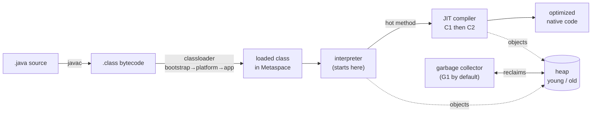
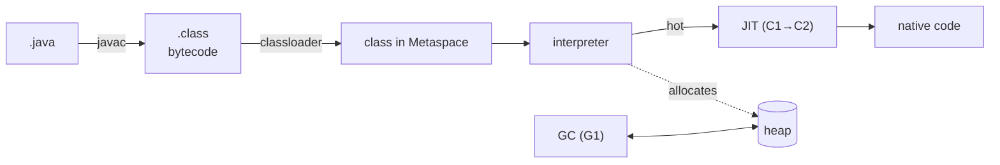
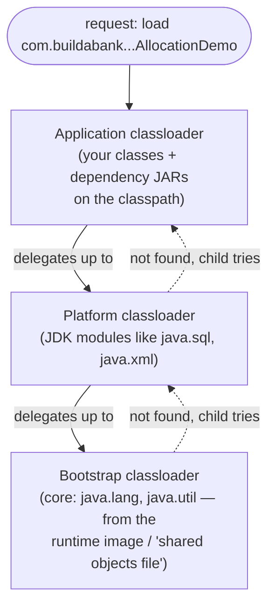
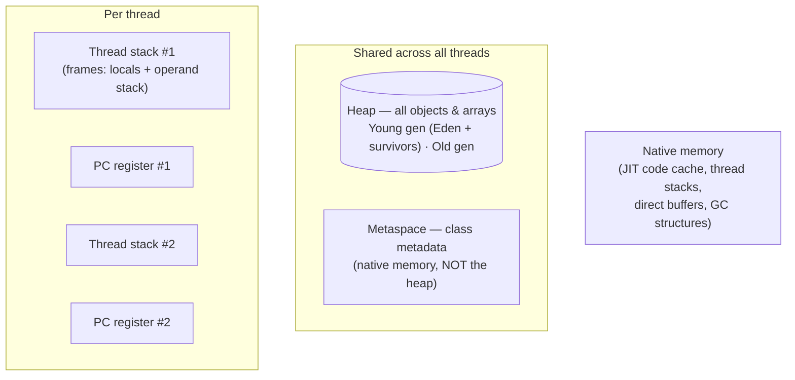
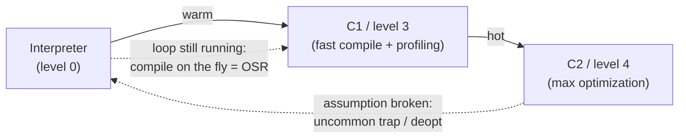
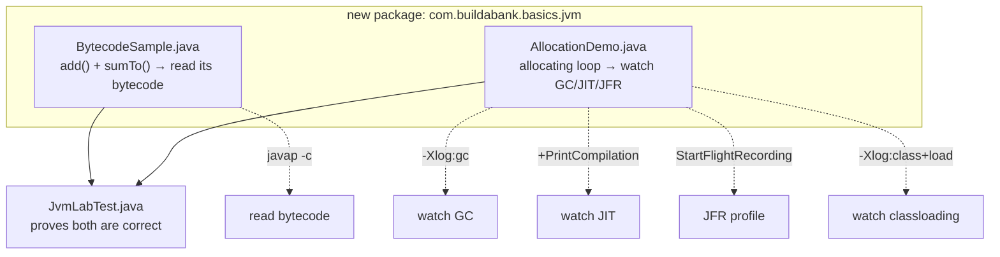
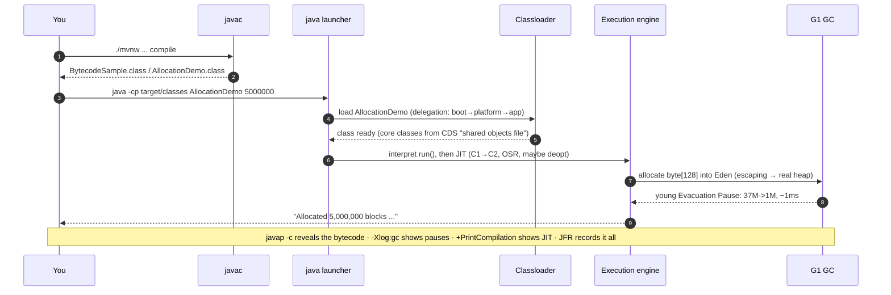

# Step 4 · How Java Runs: the JVM Up Close

> **Step 4 of 67 · Phase A — Foundations 🟢** · Level badge: 🟢 Foundations · Effort ≈ 15–20h (conceptual + a hands-on JVM lab; an experienced JVM dev can skip-test fast)

`🟢` Foundations &nbsp;·&nbsp; `🔵` Core &nbsp;·&nbsp; `🟣` Advanced &nbsp;·&nbsp; `🔴` Frontier

> [!CAUTION]
> **Educational, non-production project.** Build-a-Bank is for learning only. It never handles real money, real customers, or real personal data, and it is **not** security-audited for production banking. Every credential you ever see here is fake. (Full disclaimer + guardrails in the [README](../../README.md).)

---

## 🧭 The Six Movements of This Step

A one-line map of where we're going. Click to jump.

1. **[A · 🧭 Orient](#orient)** — what the JVM really is, why every backend engineer must know it cold, and whether you can skip.
2. **[B · 🧠 Understand](#understand)** — source → bytecode → classloading → interpret → JIT → GC; the runtime data areas; the execution engine; and how it all changed across Java versions.
3. **[C · 🛠️ Build](#build)** — the heart: add the `jvm` package — `BytecodeSample` (disassemble it with `javap -c`) and `AllocationDemo` (watch GC, JIT, JFR, and the escape-analysis *surprise*) — tested by `JvmLabTest`.
4. **[D · 🔬 Prove](#prove)** — the Verification Log with the real, pasted `verify`, `javap`, `-Xlog:gc`, `+PrintCompilation`, JFR, and classloading output.
5. **[E · 🎓 Apply](#apply)** — go-deeper, interview prep, and your-turn exercises.
6. **[F · 🏆 Review](#review)** — troubleshooting, resources & glossary, and the recap/study notes.

---

<a id="orient"></a>

# A · 🧭 Orient

## 📋 This Step in 30 Seconds

| | |
|---|---|
| **Title** | How Java Runs: the JVM Up Close |
| **Step** | 4 of 67 · **Phase A — Foundations** 🟢 |
| **Effort** | ≈ 15–20 hours (concepts + a hands-on JVM diagnostics lab; an experienced engineer who already reads bytecode and GC logs can skip-test it in well under an hour) |
| **What you'll run this step** | The **JVM + Maven** only — `javac`, `java`, `javap`, `jfr`, and `./mvnw`. Build/test the `playground/java-basics` `jvm` package, then run the two demo programs with diagnostic flags. **No Docker, no services, no HTTP this step** — the play surface is the **JVM command-line itself**. |
| **Verification tier** | 🟠 **Standard** — `./mvnw verify` green (incl. `JvmLabTest`), plus the `javap`/`-Xlog:gc`/`+PrintCompilation`/JFR/`class+load` captures shown as real exploration. No mutation/clean-room: this is a learning module with no production money/security path. |
| **Depends on** | **Steps 1–2** (a working JDK + Maven toolchain from Step 1; the compiled `playground/java-basics` classes and Java syntax — records, loops, methods — from Step 2). `step-04-start` == `step-03-end`. |

By the end you will be able to explain, *precisely and from memory*, what happens between `javac Foo.java` and a running, fast, garbage-collected program — and you'll have **seen every stage for real**: read the bytecode your code compiles to, watched the garbage collector pause and evacuate the young generation, watched the JIT promote a hot method from C1 to C2 (and *deoptimize* it), recorded a Flight Recorder profile, and inspected which of ~826 classes the launcher loaded and from where.

### ⏭️ Can You Skip This Step? (5-minute self-check)

If you can confidently do **all** of this, skim the 🕰️/🛡️ asides and jump to **[Step 5 — Spring Core & IoC](../step-05/lesson.md)**.

- [ ] I can explain what `javac` produces and what the `java` launcher does with it (and that bytecode is portable, not native).
- [ ] I can read simple bytecode in `javap -c` (`iload`, `iadd`, `ireturn`, a loop's `goto`/`if_icmpgt`).
- [ ] I can name the JVM runtime data areas — **heap** (young/old), **thread stacks**, **Metaspace** (not PermGen since Java 8), **PC registers**, native — and say what lives where.
- [ ] I can describe the **classloader delegation model** (bootstrap → platform → application) and why it's a trust boundary.
- [ ] I can explain **tiered compilation** (interpreter → C1 → C2), what **OSR** and **deoptimization** are, and what **escape analysis** does.
- [ ] I can read a G1 GC log line and explain a young **evacuation pause**, and I know G1 is the default (since Java 9) with ZGC/Shenandoah as low-pause alternatives.
- [ ] I have used **JFR** to record and summarize a profile.

> [!TIP]
> Not 100%? Stay. This is the single best return-on-investment step for interviews and for *every* performance, concurrency, and DevOps step that follows. "How does the JVM run my code?" and "walk me through GC" are perennial interview questions, and you'll tune G1/ZGC for real in **Step 55**. The 🛠️ build is short to type but deep to watch — the payoff is *seeing* the abstractions move.

## 📇 Cheat Card

> **What this step delivers (one sentence):** a from-the-bytecode-up mental model of how the JVM runs Java — compile, load, interpret, JIT, and garbage-collect — proven by building a tiny `jvm` lab you disassemble with `javap -c` and observe live under `-Xlog:gc`, `-XX:+PrintCompilation`, JFR, and `-Xlog:class+load`, with a green `./mvnw verify`.

**Key commands** (Windows uses `.\mvnw.cmd`; macOS / Linux / Git-Bash use `./mvnw`):

```bash
# Build + test just the JVM lab (and its dependencies)
./mvnw -pl playground/java-basics -am verify          # expect tail: BUILD SUCCESS

# The classpath we run the demos from (compiled output):
CP=playground/java-basics/target/classes

# 1) See the bytecode your source compiled to:
javap -c -p com.buildabank.basics.jvm.BytecodeSample   # run from target/classes, or add -cp $CP

# 2) Watch garbage collection (small heap → frequent young GC):
java -Xmx64m -Xlog:gc -cp $CP com.buildabank.basics.jvm.AllocationDemo 5000000

# 3) Watch the JIT compile the hot method (tiered: 3=C1, 4=C2, % = OSR):
java -XX:+PrintCompilation -cp $CP com.buildabank.basics.jvm.AllocationDemo 5000000

# 4) Record + summarize a Flight Recorder profile:
java -XX:StartFlightRecording=filename=alloc.jfr -cp $CP com.buildabank.basics.jvm.AllocationDemo 5000000
jfr summary alloc.jfr

# 5) See which classes load and from where (CDS = "shared objects file"):
java -Xlog:class+load=info -cp $CP com.buildabank.basics.jvm.AllocationDemo 1000
```

**The one headline diagram — the compile → load → execute pipeline:**



*Alt-text: the JVM pipeline. `javac` turns `.java` source into portable `.class` bytecode. The classloader (delegating bootstrap → platform → application) loads classes into Metaspace. Execution begins in the interpreter; methods that run often ("hot") are compiled by the JIT, first by C1 then by C2, into optimized native code. As code runs it allocates objects on the heap (split into young and old generations), and the garbage collector — G1 by default — reclaims unreachable objects.*

## 🎯 Why This Matters

Every line of Java you write in this course — every Spring bean, every transaction, every Kafka consumer — runs on the JVM, and the JVM's behavior *is* your application's performance and reliability profile. When a service stalls for 200 ms, gets OOM-killed in Kubernetes, or mysteriously "warms up" before going fast, the answer is in GC pauses, heap sizing, JIT warm-up, or classloading — exactly what you'll see *with your own eyes* this step. "Explain how the JVM runs your code" and "walk me through garbage collection" are among the most common JVM interview questions at every level, and this is the foundation for the deep performance/GC tuning in **Step 55**.

## ✅ What You'll Be Able to Do

- Explain the journey **source → `javac` → bytecode → classloader → interpreter → JIT → native code**, with GC running alongside.
- **Read bytecode** in `javap -c` and map it back to your Java (loads, arithmetic, branches, the loop's `goto`).
- Name and describe the **runtime data areas** (heap young/old, thread stacks, Metaspace, PC registers, native) and what lives in each.
- Describe the **classloader delegation model** and why it's a **trust boundary**.
- Explain **tiered JIT compilation** (interpreter → C1 → C2), **OSR**, **deoptimization** ("uncommon trap"), and **escape analysis** — and *demonstrate* escape analysis erasing an allocation.
- Read a **G1 GC log**, explain a young **evacuation pause**, and name ZGC/Shenandoah as low-pause alternatives.
- **Record and summarize a JFR profile**, and inspect **classloading** (including CDS "shared objects file").

## 🧰 Before You Start

You need the toolchain from **Step 1** (JDK 25 + Maven Wrapper, both on `PATH`) and the `playground/java-basics` module from **Step 2** (which already builds green). Quick check:

```bash
java -version          # expect: openjdk/Java 25.0.x
./mvnw -v              # expect: Apache Maven 3.9.x
```

**What connects here from earlier steps:**

- **Step 1** gave you `java`, `javac`, `javap`, and `./mvnw` — you'll use all four now, plus `jfr`.
- **Step 2** gave you the `playground/java-basics` module and the Java syntax (`for` loops, methods, `final` fields, `record`s) that the `jvm` package is written in.
- **Step 3** showed you HTTP "on the wire." This step shows you Java "in the engine" — the same *observe-it-don't-assume-it* discipline, pointed at the JVM instead of the network.

> **Depends on:** **Steps 1–2** (toolchain + the compiled `java-basics` classes). Forward references: **Step 11** (concurrency / the Java Memory Model — the *threading* side of the runtime data areas), **Step 55** (performance & GC tuning — G1 vs ZGC, JMH, JFR/async-profiler in depth).

---

<a id="understand"></a>

# B · 🧠 Understand

## 🧠 The Big Idea

**Java's superpower is a two-step that most languages don't have.** A C program is compiled *ahead of time* straight to machine code for one specific CPU — fast, but tied to that platform. A pure scripting language is interpreted line-by-line every time — portable, but slow. **Java splits the difference**: `javac` compiles your source to **bytecode** — a compact, *portable* instruction set for an *imaginary* CPU called the **Java Virtual Machine** — and then, at runtime, the JVM both **interprets** that bytecode immediately *and* **compiles the hot parts to native code on the fly** (the JIT — Just-In-Time compiler). You get portability ("write once, run anywhere") *and*, after a brief warm-up, speed that rivals C.

**The analogy: a kitchen with a translator and a memorizing chef.** Think of the JVM as a restaurant kitchen:

- **`javac`** is the menu-writer: it turns your hand-written recipe (`.java`) into a clean, standardized recipe card (`.class` bytecode) any kitchen in the chain can follow.
- The **classloader** is the prep cook fetching ingredients: it pulls in recipe cards on demand, asking the *most trusted supplier first* (bootstrap → platform → application) so nobody can swap in a counterfeit `java.lang.String`.
- The **interpreter** is a chef reading the card step-by-step — correct from the very first order, but a little slow.
- The **JIT** is that chef *memorizing* the dishes ordered over and over and cooking them from muscle memory — far faster, and even *skipping* steps it proves are unnecessary (escape analysis: "nobody ever sees this garnish, so don't even make it").
- The **garbage collector** is the busser clearing tables of plates no diner can reach anymore, so the kitchen never runs out of clean dishes (heap).
- **JFR** is the security camera quietly recording what actually happened, so you can review it later without slowing service.

Here is the same pipeline as the headline diagram above — keep it in your head for the whole step:



*Alt-text: condensed JVM pipeline — `.java` compiled by `javac` to `.class` bytecode, loaded into Metaspace by the classloader, executed first by the interpreter then JIT-compiled (C1 then C2) to native code, allocating on the heap which the G1 garbage collector reclaims.*

## 🌱 Under the Hood: How It Really Works

No magic. Let's open every box in that pipeline.

### 1. `javac`: source → bytecode

`javac` is a *compiler*, but it does **not** produce machine code. It produces **bytecode**: a stream of one-byte **opcodes** (plus operands) for a stack-based virtual machine, packaged into a `.class` file along with a **constant pool** (the class's strings, method/field references, and type names). Bytecode is the JVM's portable contract: the *same* `.class` runs unchanged on Windows/x64, macOS/ARM, or Linux — because it targets the *abstract* JVM, not a real CPU.

The JVM is a **stack machine**: instead of named registers, instructions push and pop operands on a per-method **operand stack**. You'll *see* this in the build: `iload_0` pushes argument 0, `iload_1` pushes argument 1, `iadd` pops both and pushes their sum, `ireturn` pops and returns it. (The `i` prefix = `int`; `l` = `long`; `a` = reference.) Reading bytecode is the single best way to understand what your Java *actually* does — and to debug surprises (autoboxing, string concatenation, hidden `synchronized`, the cost of a lambda).

### 2. The `java` launcher

`java` is the launcher that **starts a JVM process**, bootstraps the core libraries, creates the **main thread**, loads your main class, verifies its bytecode, and invokes `main(String[])`. Everything else — loading more classes, interpreting, JIT-compiling, allocating, collecting garbage — happens lazily, *on demand*, as your program runs. (A `.jar` is just a ZIP of `.class` files plus a `META-INF/MANIFEST.MF`; `java -jar app.jar` reads the manifest's `Main-Class` and launches that.)

### 3. The classloader subsystem (a delegation hierarchy)

Classes are loaded **lazily** — the first time they're referenced — by a **chain of classloaders** that delegate *upward to the parent first*:



*Alt-text: the classloader delegation model. A request to load a class enters at the application classloader, which first delegates up to the platform classloader, which delegates up to the bootstrap classloader. The bootstrap loader (core `java.*` classes) gets first refusal; only if a parent can't find the class does the child try to load it. This top-down delegation guarantees core classes can't be impersonated.*

The **delegation model** is a security and consistency mechanism: because the bootstrap loader always gets first refusal, **no application JAR can replace `java.lang.String`** with a counterfeit — the real one is loaded by the trusted bootstrap loader before yours is ever consulted. (You'll see this exact ordering and the source of each class in the build's classloading sub-step.) Many `java.*` classes load from the **CDS archive** ("shared objects file") — *Class Data Sharing*, a pre-parsed, memory-mappable snapshot of common core classes that speeds startup and shares memory across JVMs.

### 4. Runtime data areas (where everything lives)

Once running, the JVM organizes memory into distinct regions:



*Alt-text: the JVM runtime data areas. Shared across all threads: the heap (all objects and arrays, split into a young generation of Eden plus survivor spaces, and an old generation) and Metaspace (class metadata, held in native memory rather than on the heap). Per thread: a thread stack (a stack of frames, each holding local variables and an operand stack) and a PC register (which bytecode instruction that thread is executing). Plus native memory for the JIT code cache, native thread stacks, direct byte buffers, and GC bookkeeping.*

- **Heap** — the one big shared region where **all objects and arrays** live. It's **generational**: most objects die young, so it's split into a **young generation** (Eden + two survivor spaces, where new objects are born and most are collected cheaply) and an **old generation** (long-lived survivors get promoted here). `-Xmx` sets its maximum size.
- **Thread stacks** — each thread gets its own stack of **frames**, one per active method call. A frame holds that method's **local variables** and its **operand stack** (where bytecode pushes/pops). This is where a `StackOverflowError` comes from (infinite recursion) — and stacks are *thread-confined*, which is why local variables are inherently thread-safe (the foundation for Step 11).
- **Metaspace** — **class metadata** (the loaded classes, methods, constant pools). Since **Java 8 this lives in *native* memory, not the heap** (it replaced the old fixed-size "PermGen" — see 🕰️ below).
- **PC registers** — per thread, a pointer to the bytecode instruction currently executing.
- **Native memory** — the **JIT code cache** (compiled native methods), native thread stacks, **direct byte buffers** (e.g. NIO), and the GC's own data structures.

### 5. The execution engine: interpreter + JIT (tiered compilation)

Execution starts in the **interpreter** — correct immediately, no warm-up. Meanwhile the JVM **profiles** which methods and loops run often. When a method gets **hot** (crosses an invocation/back-edge threshold), the **JIT compiler** turns its bytecode into optimized native code. HotSpot uses **tiered compilation** with two compilers:

- **C1 (client compiler, levels 1–3)** — compiles quickly, applies cheap optimizations, and adds *profiling* so C2 can do better. (Level 3 = C1 *with* full profiling.)
- **C2 (server compiler, level 4)** — compiles more slowly but produces *aggressively* optimized code using the profile (inlining, loop unrolling, dead-code elimination, **escape analysis**).



*Alt-text: the tiered JIT pipeline. Code starts in the interpreter (level 0). Warm methods are compiled by C1 (level 3, fast compilation plus profiling). Hot methods graduate to C2 (level 4, maximum optimization). If C2's speculative assumptions are later proven wrong, the method is deoptimized ("uncommon trap") back to the interpreter. A loop that's already running long can be compiled mid-execution — On-Stack Replacement (OSR).*

Three terms you'll see in the build's `-XX:+PrintCompilation` output:

- **OSR (On-Stack Replacement)** — normally a method is only swapped to compiled code on its *next* call. But a long-running loop may *never* return to be re-entered, so the JVM replaces the running method *on the stack mid-loop*. OSR compilations are flagged with `%`.
- **Deoptimization / "uncommon trap"** — C2 compiles *speculatively* based on the profile so far ("this branch is never taken," "this type is always `Foo`"). If reality later violates that assumption, the JVM throws away the compiled code and falls **back to the interpreter** ("made not entrant"), then may recompile with the new information. This is normal and healthy — you'll *see* it happen.
- **Escape analysis** — C2 proves whether an object can be seen *outside* the method that created it. If it provably *can't* "escape" (no reference leaks out), C2 may **scalar-replace** it: don't allocate the object at all, just keep its fields in registers. The result can be **zero heap allocation and zero GC** — which is the headline surprise of this step's build. (Make the object escape, and real GC reappears.)

### 6. Garbage collection (G1 by default)

Java is **garbage-collected**: you never `free()`. The GC periodically finds objects that are **unreachable** (no live reference can reach them, starting from "GC roots" like stack locals and static fields) and reclaims their memory. The default collector since **Java 9** is **G1 (Garbage-First)**:

- It divides the heap into many equal **regions** and labels them young (Eden/survivor) or old.
- A **young (minor) collection** is an **evacuation pause**: G1 stops the application threads briefly ("stop-the-world"), **copies the still-live objects** out of the young regions into survivor/old regions, and frees the now-empty young regions wholesale. Because most young objects are already dead, it copies little and finishes in ~1 ms — you'll see exactly this in `-Xlog:gc` (`35M->1M(64M) 1.063ms` = "before 35 MB used, after 1 MB used, of a 64 MB heap, paused 1.063 ms").
- It tries to meet a **pause-time goal** and collects the regions with the most garbage *first* (hence "garbage-first").

Alternatives for latency-sensitive services — **ZGC** and **Shenandoah** — do most of their work *concurrently* with the application, keeping pauses sub-millisecond even on huge heaps (full tuning and the G1-vs-ZGC trade-off in **Step 55**).

> [!NOTE]
> **Reachability, not "in use."** The GC reclaims what's *unreachable*, not what's "unused." A `static` `List` that keeps adding entries you never read is a **memory leak in a GC language** — the objects are reachable, so they're never freed. (You'll meet this idea again with caches and listeners later.)

## 🛡️ Security Lens: What Could Go Wrong

The **classloader is a trust boundary** — arguably *the* foundational one in Java security. A few real risks, kept brief (full supply-chain security is **Phase H**, Steps 39–45):

- **Loading untrusted bytecode/JARs.** Anything on your classpath runs with your application's privileges. A malicious dependency JAR can execute code in a `static` initializer the instant its class is loaded — before any method you call. This is why **dependency provenance** matters: pin versions (`VERSIONS.md`), scan with SCA tools (Trivy/Dependency-Check — Step 40), and prefer signed artifacts. The delegation model protects the *core* classes (`java.*` can't be impersonated) but not *your* classpath choices.
- **Deserialization gadget chains (brief).** Java's native serialization will *instantiate and wire up* arbitrary object graphs from a byte stream. Attackers chain together "gadget" classes already on your classpath so that deserializing a crafted payload triggers code execution — the classic remote-code-execution bug class. The defense: **don't deserialize untrusted data with Java native serialization**; use JSON with explicit types (Jackson, carefully configured) or allow-lists. (We use JSON throughout; full coverage in Step 18 / Phase H.)
- **JAR signing.** JARs can be cryptographically **signed** so you can verify *who* produced an artifact and that it wasn't tampered with — the seed of the supply-chain trust you'll build out with cosign/sigstore/SLSA in **Step 41**.

> [!WARNING]
> A dependency you `import` is code you *run* with full trust. "It's just a library" is how supply-chain attacks get in. Treat the classpath as a security perimeter — we'll harden it methodically in Phase H.

## 🕰️ Then vs. Now (How This Changed Across Versions)

The JVM has evolved a lot, and interviewers love the "old way → new way → why" framing. All verified against our pinned **Java 25.0.3 LTS**.

| Topic | Old way | Now | Why it changed |
|---|---|---|---|
| **Class metadata** | **PermGen** — a *fixed-size* heap region for class metadata; overflowing it threw `OutOfMemoryError: PermGen space` (a classic app-server redeploy bug). | **Metaspace** (since **Java 8**) — class metadata in **native memory**, auto-growing (bounded by `-XX:MaxMetaspaceSize`). | PermGen's fixed size was a constant source of OOMs and tuning pain; native, auto-sizing memory removed a whole class of failures. **PermGen no longer exists** — don't tune it. |
| **Default GC** | **Parallel GC** (throughput-oriented, longer pauses) was the default through Java 8. | **G1** is the default since **Java 9** — balances throughput with predictable pause goals. | Services care about *pause predictability*, not just raw throughput; G1 gives a tunable pause target. |
| **Low-pause GCs** | (none mainstream) | **ZGC** and **Shenandoah** — concurrent, sub-millisecond pauses, huge heaps (production-ready in recent LTS releases). | Latency-critical, large-heap services needed pauses measured in microseconds, not tens of ms. (Deep dive Step 55.) |
| **Flight Recorder (JFR)** | A **paid, commercial** feature of the Oracle JDK (Mission Control). | **Open-sourced in Java 11** — JFR + `jfr` CLI ship in every OpenJDK; near-zero-overhead always-on profiling. | Making always-on production profiling free changed how everyone diagnoses live systems. |
| **Startup sharing** | Each JVM parsed core classes from scratch. | **CDS / AppCDS** — Class Data Sharing memory-maps a pre-parsed archive of common (and, with AppCDS, your *own*) classes; you'll see `source: shared objects file`. | Faster startup and lower per-JVM memory — important for containers and serverless. |

> [!TIP]
> The interview trap: someone asks "how do you fix `OutOfMemoryError: PermGen space`?" The 2026 answer is **"you don't — PermGen was removed in Java 8; that error can't happen on a modern JVM. Class-metadata pressure now shows up as Metaspace exhaustion, which auto-grows unless you've capped it."** Knowing the *delta* signals you actually understand the platform.

---

<a id="build"></a>

# C · 🛠️ Build

## 📦 Your Starting Point

You're at **`step-04-start`** (== `step-03-end`). The `playground/java-basics` module builds green with the Step 2 (`lang`) and Step 3 (`net`) packages and their tests.

**What's green now:**

```bash
./mvnw -pl playground/java-basics -am verify
# ... [INFO] Tests run: 20, Failures: 0, Errors: 0, Skipped: 0
# ... [INFO] BUILD SUCCESS
```

**What you'll build this step:** a new `com.buildabank.basics.jvm` package with **two tiny programs** designed to be *observable* — `BytecodeSample` (small methods whose bytecode is easy to read) and `AllocationDemo` (a loop that allocates short-lived garbage so the GC, JIT, and JFR all become visible) — plus `JvmLabTest` to prove they're correct. Then you'll spend most of the step *running* them under diagnostic flags and reading what the JVM tells you. By the end the module has **22** tests (the 20 from before + 2 new) and you've seen the JVM's every stage with your own eyes.

> [!NOTE]
> This step adds **no service, no HTTP endpoint, no Docker** — and honestly, **no `requests.http`** either, because there's nothing to curl. The "play surface" is the **JVM command line**: `javap`, the `-Xlog`/`-XX` diagnostic flags, and the `jfr` tool. That's deliberate — you're learning the *engine*, and the engine's instruments are CLI flags.

## 🛠️ Let's Build It — Step by Step

### 🗺️ What we're about to build



*Alt-text: the build map. We add a `com.buildabank.basics.jvm` package containing `BytecodeSample.java` (with `add` and `sumTo` methods we'll disassemble) and `AllocationDemo.java` (an allocating loop), both verified by `JvmLabTest.java`. We then observe `BytecodeSample` with `javap -c` and `AllocationDemo` under GC logging, JIT compilation logging, JFR recording, and classloading logging.*

### 🌳 Files we'll touch

```text
playground/java-basics/
├── src/main/java/com/buildabank/basics/jvm/
│   ├── BytecodeSample.java        ← NEW (sub-step 1)
│   └── AllocationDemo.java        ← NEW (sub-step 2)
└── src/test/java/com/buildabank/basics/jvm/
    └── JvmLabTest.java            ← NEW (sub-step 7)
```

We'll go in seven sub-steps: **(1)** write & disassemble `BytecodeSample`, **(2)** write `AllocationDemo`, **(3)** watch GC + meet the escape-analysis surprise, **(4)** watch the JIT, **(5)** record a JFR profile, **(6)** inspect classloading, **(7)** lock the lab green with the test.

---

### Sub-step 1 of 7 — Write `BytecodeSample` and read its bytecode 🧭 *(you are here: **bytecode** → allocation demo → GC → JIT → JFR → classloading → test)*

🎯 **Goal:** create the smallest possible class whose compiled bytecode is easy to read, then disassemble it with `javap -c` to see the *real* instructions the JVM executes — the gap between the Java you write and what actually runs.

📁 **Location:** new file → `playground/java-basics/src/main/java/com/buildabank/basics/jvm/BytecodeSample.java`

⌨️ **Code:**

```java
// playground/java-basics/src/main/java/com/buildabank/basics/jvm/BytecodeSample.java
package com.buildabank.basics.jvm;

/**
 * A deliberately tiny class so its compiled <strong>bytecode</strong> is easy to read.
 *
 * <p>Compile it, then disassemble with {@code javap -c -p com.buildabank.basics.jvm.BytecodeSample}
 * to see the JVM instructions ({@code iload}, {@code iadd}, {@code ireturn}, the loop's {@code goto}/{@code if_icmpgt}).
 * This is the gap between the Java you write and the bytecode the JVM actually executes.
 */
public final class BytecodeSample {

    private BytecodeSample() { }

    /** Compiles to: load arg 0, load arg 1, iadd, ireturn. */
    public static int add(int a, int b) {
        return a + b;
    }

    /** A counted loop — note the bytecode branch instructions in {@code javap -c}. */
    public static long sumTo(int n) {
        long total = 0;
        for (int i = 1; i <= n; i++) {
            total += i;
        }
        return total;
    }

    public static void main(String[] args) {
        System.out.println("add(2, 3)   = " + add(2, 3));
        System.out.println("sumTo(100)  = " + sumTo(100));
    }
}
```

🔍 **Line-by-line:**

- `package com.buildabank.basics.jvm;` — the new package; matches the folder path under `src/main/java`.
- `public final class BytecodeSample` — `final` so nobody subclasses our demo; a small detail that shows up in the disassembly (`public final class …`).
- `private BytecodeSample() { }` — a private constructor: this is a **utility class** of `static` methods, never instantiated. (You learned this idiom in Step 2.)
- `static int add(int a, int b)` — the simplest arithmetic method; chosen because it compiles to exactly four bytecode instructions, perfect for a first read.
- `static long sumTo(int n)` — a **counted loop**; chosen because loops are where bytecode *branches* appear (`goto`, `if_icmpgt`) and where the JIT later focuses. Note the **return type is `long`** while the loop counter `i` is `int` — that mismatch produces an `i2l` ("int-to-long") conversion in the bytecode you're about to see.
- `main(...)` — lets you run the class directly to confirm the math by eye.

💭 **Under the hood:** when `javac` compiles this, each method becomes a `Code` attribute — a list of bytecode instructions for the JVM's **operand stack** machine. `add` will push both `int` args, add them, and return; `sumTo` will set up a `long` accumulator and an `int` counter, then loop using compare-and-branch instructions. There are **no CPU registers named in bytecode** — everything is push/pop on the operand stack. The JIT later maps these onto real registers.

🔮 **Predict:** how many bytecode instructions do you think `add(int, int)` compiles to? (Write down a number, then check below. Hint: load, load, add, return.)

▶️ **Run & See:** first compile the module so there's a `.class` to disassemble, then run `javap`:

```bash
./mvnw -pl playground/java-basics -am compile
# disassemble (run from the module's compiled output, or pass -cp):
javap -c -p -cp playground/java-basics/target/classes com.buildabank.basics.jvm.BytecodeSample
```

`javap` = the JDK's **class file disassembler**. `-c` = print the **bytecode** of each method; `-p` = include `private` members (so we see the private constructor); `-cp` = where to find the class.

✅ **Expected output** (the real, captured disassembly):

```
Compiled from "BytecodeSample.java"
public final class com.buildabank.basics.jvm.BytecodeSample {
  public static int add(int, int);
    Code:
       0: iload_0
       1: iload_1
       2: iadd
       3: ireturn

  public static long sumTo(int);
    Code:
       0: lconst_0
       1: lstore_1
       2: iconst_1
       3: istore_3
       4: iload_3
       5: iload_0
       6: if_icmpgt     20
       9: lload_1
      10: iload_3
      11: i2l
      12: ladd
      13: lstore_1
      14: iinc          3, 1
      17: goto          4
      20: lload_1
      21: lreturn
}
```

**Read it with me:**

- `add` is exactly four instructions: `iload_0` (push arg `a`), `iload_1` (push arg `b`), `iadd` (pop both, push the `int` sum), `ireturn` (pop and return an `int`). *Predicted four? You read your first bytecode.*
- `sumTo` is the loop. `lconst_0`/`lstore_1` initialize the `long total = 0` (a `long` takes **two** local-variable slots, which is why the counter `i` lands in slot **3**). `iconst_1`/`istore_3` set `i = 1`. Then the loop body: `iload_3`+`iload_0`+`if_icmpgt 20` is "**if i > n, jump to instruction 20 (the return)**" — that's the loop *condition*. Inside: `lload_1`/`iload_3`/`i2l`/`ladd`/`lstore_1` does `total += i` (note `i2l` widening the `int` `i` to `long` before adding). `iinc 3, 1` is the efficient "increment local 3 by 1" (`i++`). `goto 4` jumps back to re-test the condition. At `20`, `lload_1`/`lreturn` returns `total`.

You just saw a `for` loop become **compare-branch-body-increment-goto** — exactly how a CPU loops. This is the layer the JIT will later optimize.

❌ **If you see `Error: class not found`:** you ran `javap` before compiling, or the `-cp` path is wrong. Run the `./mvnw ... compile` line first; the path is `playground/java-basics/target/classes`.

✋ **Checkpoint:** you can see both methods' `Code:` blocks, and you can point to the loop's `goto` and `if_icmpgt`. If `javap` printed only the method *signatures* with no `Code:`, you forgot `-c`.

💾 **Commit:**

```bash
git add playground/java-basics/src/main/java/com/buildabank/basics/jvm/BytecodeSample.java
git commit -m "feat(playground): add BytecodeSample for reading JVM bytecode with javap -c"
```

⚠️ **Pitfall:** `javap` with **no `-c`** prints only the public API (signatures) — handy for inspecting a JAR, useless for seeing instructions. Always add `-c` to disassemble, and `-p` to include private members.

---

### Sub-step 2 of 7 — Write `AllocationDemo` (the GC/JIT/JFR target) 🧭 *(bytecode ✅ → **allocation demo** → GC → JIT → JFR → classloading → test)*

🎯 **Goal:** create a program that allocates a lot of short-lived garbage in a hot loop, so that the garbage collector, the JIT, and Flight Recorder all become *observable* when we run it with diagnostic flags.

📁 **Location:** new file → `playground/java-basics/src/main/java/com/buildabank/basics/jvm/AllocationDemo.java`

⌨️ **Code:**

```java
// playground/java-basics/src/main/java/com/buildabank/basics/jvm/AllocationDemo.java
package com.buildabank.basics.jvm;

/**
 * Generates lots of short-lived garbage so the JVM's <strong>garbage collector</strong> and
 * <strong>JIT compiler</strong> become observable. Run it with diagnostics to SEE the JVM work:
 *
 * <pre>
 *   # GC events (small heap forces frequent young collections):
 *   java -Xmx64m -Xlog:gc -cp target/classes com.buildabank.basics.jvm.AllocationDemo
 *
 *   # JIT compilation of the hot method:
 *   java -XX:+PrintCompilation -cp target/classes com.buildabank.basics.jvm.AllocationDemo
 *
 *   # Java Flight Recorder profile:
 *   java -XX:StartFlightRecording=duration=10s,filename=alloc.jfr -cp target/classes com.buildabank.basics.jvm.AllocationDemo
 *   jfr summary alloc.jfr
 * </pre>
 *
 * <p>Each iteration allocates a 128-byte block (a short-lived object) and folds one byte into a checksum
 * so the JIT cannot optimize the allocation away as dead code.
 */
public final class AllocationDemo {

    private AllocationDemo() { }

    /** Allocates {@code iterations} blocks; returns a deterministic checksum = sum of (i &amp; 0xFF). */
    public static long run(int iterations) {
        // The blocks are stashed in a small ring buffer so they ESCAPE the loop. Without this, the JIT's
        // escape analysis would scalar-replace the byte[128] and no heap allocation (or GC) would happen
        // at all — a real lesson in itself. With it, old entries become unreachable → genuine young-gen GC.
        byte[][] ring = new byte[1024][];
        long checksum = 0;
        for (int i = 0; i < iterations; i++) {
            byte[] block = new byte[128];
            block[0] = (byte) (i & 0xFF);
            ring[i & 1023] = block;             // escapes → forces real heap allocation
            checksum += block[0] & 0xFF;        // use the result so it isn't eliminated
        }
        return checksum;
    }

    public static void main(String[] args) {
        int iterations = (args.length > 0) ? Integer.parseInt(args[0]) : 20_000_000;
        long start = System.nanoTime();
        long checksum = run(iterations);
        long millis = (System.nanoTime() - start) / 1_000_000;
        System.out.printf("Allocated %,d blocks in %,d ms (checksum=%d)%n", iterations, millis, checksum);
    }
}
```

🔍 **Line-by-line:**

- `byte[][] ring = new byte[1024][]` — a small **ring buffer** of 1024 slots. This is the *key trick* of the whole step: stashing each block here makes the block **escape** the loop iteration (a reference to it outlives the iteration), which *forces a real heap allocation*. (Sub-step 3 shows what happens without it — and it's the highlight.)
- `byte[] block = new byte[128]` — the per-iteration allocation: a 128-byte array, the short-lived "garbage."
- `block[0] = (byte) (i & 0xFF)` — write a known value into the block. `i & 0xFF` keeps just the low 8 bits (0–255).
- `ring[i & 1023] = block` — store the block at slot `i mod 1024` (`& 1023` is a fast modulo for a power of two). After 1024 more iterations this slot is overwritten, so the *old* block becomes **unreachable** → eligible for GC. That's how we manufacture a steady stream of young-generation garbage.
- `checksum += block[0] & 0xFF` — **use** the value we wrote. Without a use, the JIT's dead-code elimination could delete the whole allocation. This makes the work *real*.
- `run(int)` returns a **deterministic** checksum: the sum of `(i & 0xFF)` over all iterations — which the test pins exactly.
- `main` parses an optional iteration count (default 20 million), times the run with `System.nanoTime()`, and prints blocks/ms/checksum. We'll usually pass `5000000` for a quick, GC-rich run.

💭 **Under the hood:** every `new byte[128]` carves space out of the **young generation (Eden)**. Eden fills, a **young GC** copies the few still-reachable blocks (the last ~1024, held by `ring`) to a survivor space, and reclaims the rest — over and over. Meanwhile `run` is called once but its *loop* runs millions of times, so the JVM compiles it via **OSR** mid-loop. And because the block **escapes** into `ring`, escape analysis *cannot* eliminate the allocation — which is precisely what makes GC visible. (Flip that switch in the next sub-step.)

🔮 **Predict:** if you *removed* the `ring[...] = block` line (so the block never escapes the iteration), do you think you'd see *more* GC, the *same* GC, or *less* GC? (Hold that thought — sub-step 3 answers it, and the answer is surprising.)

▶️ **Run & See:** compile and run it once with default flags just to confirm it works:

```bash
./mvnw -pl playground/java-basics -am compile
java -cp playground/java-basics/target/classes com.buildabank.basics.jvm.AllocationDemo 5000000
```

✅ **Expected output** (your exact ms will vary — it's a timing):

```
Allocated 5,000,000 blocks in <a few> ms (checksum=...)
```

The point isn't the number yet — it's that the program runs and prints a checksum. We make it *talk* in the next four sub-steps.

✋ **Checkpoint:** the program compiles and prints an `Allocated 5,000,000 blocks …` line. If you get `ClassNotFoundException`, you didn't compile, or the `-cp` path is wrong.

💾 **Commit:**

```bash
git add playground/java-basics/src/main/java/com/buildabank/basics/jvm/AllocationDemo.java
git commit -m "feat(playground): add AllocationDemo as a GC/JIT/JFR observation target"
```

⚠️ **Pitfall:** if you *don't* use the allocated value (the `checksum +=` line) and *don't* let it escape (the `ring[...] =` line), the JIT can legally delete the entire loop body as dead code — and you'd "allocate" 5,000,000 blocks in ~0 ms while seeing **zero** GC. That's not a measurement error; it's the JVM being clever. We exploit exactly this next.

---

### Sub-step 3 of 7 — Watch garbage collection (and meet escape analysis) 🧭 *(bytecode ✅ → demo ✅ → **GC** → JIT → JFR → classloading → test)*

🎯 **Goal:** run `AllocationDemo` under a **small heap** with **GC logging** and watch real young-generation collections happen — then discover the headline surprise: *the version without the ring buffer produces **no GC at all**, because escape analysis erases the allocation.*

📁 **Location:** no new files — this is pure observation with JVM flags.

⌨️ **Command:**

```bash
CP=playground/java-basics/target/classes
java -Xmx64m -Xlog:gc -cp "$CP" com.buildabank.basics.jvm.AllocationDemo 5000000
```

🔍 **Flags explained:**

- `-Xmx64m` — cap the **maximum heap at 64 MB**. A small heap means Eden fills fast, so young GCs happen *often* and are easy to see. (`-Xmx` = max heap; `-Xms` = initial heap.)
- `-Xlog:gc` — the **unified logging** flag (Java 9+). It prints one line per GC event. (The old flags `-XX:+PrintGC`/`-verbose:gc` are superseded by `-Xlog`.)
- `5000000` — five million iterations, enough to fill and collect Eden many times.

💭 **Under the hood:** with the **ring buffer in place**, each block escapes, so it's a *real* heap object. Eden (a slice of the 64 MB) fills after ~tens of thousands of 128-byte blocks; G1 does a young **evacuation pause** — stops the app, copies the ~1024 still-live blocks to a survivor region, frees the rest — then resumes. Repeat. Each pause is ~1 ms because almost everything in Eden is already dead.

🔮 **Predict:** how many GC pauses, and how long each? (Guess an order of magnitude before you look.)

✅ **Expected output** (the **real**, captured run — escaping version → genuine young-gen GC):

```
[0.011s][info][gc] Using G1
[0.051s][info][gc] GC(0) Pause Young (Normal) (G1 Evacuation Pause) 35M->1M(64M) 1.063ms
[0.057s][info][gc] GC(1) Pause Young (Normal) (G1 Evacuation Pause) 30M->1M(64M) 1.008ms
[0.063s][info][gc] GC(2) Pause Young (Normal) (G1 Evacuation Pause) 37M->1M(64M) 1.043ms
[0.070s][info][gc] GC(3) Pause Young (Normal) (G1 Evacuation Pause) 38M->1M(64M) 0.933ms
[0.076s][info][gc] GC(4) Pause Young (Normal) (G1 Evacuation Pause) 38M->1M(64M) 0.786ms
```

**Read a line with me:** `GC(2) Pause Young (Normal) (G1 Evacuation Pause) 37M->1M(64M) 1.043ms` =

- `GC(2)` — the third GC event (zero-indexed).
- `Pause Young (Normal)` — a young-generation collection (cheap, frequent).
- `(G1 Evacuation Pause)` — G1 *evacuated* (copied) the live objects, then freed the young regions.
- `37M->1M(64M)` — heap was **37 MB used before**, **1 MB used after**, of a **64 MB** max. (36 MB of garbage reclaimed!)
- `1.043ms` — the application was paused for ~1 ms.

That `37M->1M` is the generational hypothesis in action: nearly everything we allocated was already dead, so the collection is fast and reclaims almost everything. The first line, `Using G1`, confirms the default collector.

#### 🔬 Break-it-on-purpose: the escape-analysis surprise (the highlight of this step)

Now the experiment that makes this step unforgettable. **Temporarily** make the block *not* escape — comment out the line that stores it in the ring buffer:

```java
// in AllocationDemo.run(...), comment out the escape:
            byte[] block = new byte[128];
            block[0] = (byte) (i & 0xFF);
            // ring[i & 1023] = block;          // <-- comment this out so the block CANNOT escape
            checksum += block[0] & 0xFF;
```

Recompile and rerun the *exact same* GC command:

```bash
./mvnw -pl playground/java-basics -am compile
java -Xmx64m -Xlog:gc -cp "$CP" com.buildabank.basics.jvm.AllocationDemo 5000000
```

✅ **What actually happened on this machine** (the captured surprise): the run printed **only**

```
[...][info][gc] Using G1
```

— **no GC pauses at all**, and it finished **5,000,000 "allocations" in ~9 ms**. Zero collections. Why? With the `ring[...] = block` line gone, the `byte[128]` **never escapes** `run`'s loop body. C2's **escape analysis** proves this and **scalar-replaces** the array: it never allocates on the heap at all — it just keeps the one byte it needs in a register. **No heap traffic → nothing to collect.** The "allocation demo" allocated *nothing*.

This is one of the most important performance lessons in the whole JVM: **the fastest allocation is the one that never happens.** Escape analysis silently does this for huge amounts of real code (short-lived objects, `Optional`s, small temporary arrays, iterators).

**Now put the line back** (uncomment `ring[i & 1023] = block;`), recompile, and confirm the GC pauses return. *That contrast — same loop, allocation visible or vanished depending on one escaping reference — is the lesson.*

> [!IMPORTANT]
> Restore the `ring[...] = block;` line before continuing. The committed `AllocationDemo` *keeps* the ring buffer so that GC, JIT, and JFR are all observable for the rest of the step (and so the smoke test behaves as documented).

#### 🔬 Second experiment: shrink the heap → more frequent GC

With the ring buffer restored, try an even smaller heap and watch GCs get *more frequent* (less Eden to fill before each collection):

```bash
java -Xmx32m -Xlog:gc -cp "$CP" com.buildabank.basics.jvm.AllocationDemo 5000000   # more GC(n) lines than at 64m
```

Then try a *bigger* heap — `-Xmx512m` — and watch them get rarer or vanish (Eden may never fill in 5M iterations). **This is the core intuition behind heap sizing** you'll formalize in Step 55: bigger heap = fewer, possibly longer collections; smaller heap = more frequent, cheaper ones.

✋ **Checkpoint:** you've seen (a) real `G1 Evacuation Pause` lines with the ring buffer, (b) **zero** GC when the block can't escape, and (c) GC frequency change with `-Xmx`. If you *never* saw GC pauses even *with* the ring buffer, double-check you restored the `ring[...] = block;` line and recompiled.

💾 **Commit:** *(nothing to commit — the file is unchanged from sub-step 2; this was observation. Just confirm `git status` is clean for `AllocationDemo.java`.)*

⚠️ **Pitfall:** don't conclude "escape analysis means I never need to worry about allocation." It's powerful but *conservative* — it only fires when it can *prove* non-escape, which complex code often defeats (storing in a field, returning the object, passing it to a non-inlined method). Real services allocate plenty; that's why GC tuning (Step 55) matters.

---

### Sub-step 4 of 7 — Watch the JIT compile the hot method 🧭 *(bytecode ✅ → demo ✅ → GC ✅ → **JIT** → JFR → classloading → test)*

🎯 **Goal:** watch the just-in-time compiler promote `AllocationDemo.run` from interpreted, to C1 (level 3), to C2 (level 4), see an **OSR** compilation (`%`), and even a **deoptimization** ("made not entrant").

📁 **Location:** observation only — JVM flags.

⌨️ **Command:**

```bash
java -XX:+PrintCompilation -cp "$CP" com.buildabank.basics.jvm.AllocationDemo 5000000
```

🔍 **Flag explained:** `-XX:+PrintCompilation` prints a line **every time the JIT compiles (or invalidates) a method**. The columns are: timestamp (ms) · a compilation id · flags (`%` = OSR, `s` = synchronized, `n` = native, etc.) · the **tier level** (0=interpreter, 1–3 = C1, 4 = C2) · the method · `@ bci` (bytecode index for OSR) · method size. It's verbose — we'll focus on the lines for *our* method.

💭 **Under the hood:** `main` calls `run` only **once**, but `run`'s *loop* executes millions of times. So the method is rarely *re-entered* (no chance to swap it on the next call) — instead the JVM hits the **back-edge** counter threshold mid-loop and does **On-Stack Replacement**: it compiles the running method and swaps it onto the stack *while the loop is still going*. As more profiling data arrives, it re-compiles at a higher tier; and if a speculative assumption breaks, it **deoptimizes**.

🔮 **Predict:** will you see `run` compiled at **more than one** tier level? (Yes — and you'll see it bounce. Predict why.)

✅ **Expected output** (the **real**, captured lines for `run` — filtered from the full firehose):

```
40   10 %     3       com.buildabank.basics.jvm.AllocationDemo::run @ 4 (46 bytes)
41   11       3       com.buildabank.basics.jvm.AllocationDemo::run (46 bytes)
42   12 %     4       com.buildabank.basics.jvm.AllocationDemo::run @ 4 (46 bytes)
43   10 %     3       com.buildabank.basics.jvm.AllocationDemo::run @ 4 (46 bytes)   made not entrant: OSR invalidation of lower level
45   12 %     4       com.buildabank.basics.jvm.AllocationDemo::run @ 4 (46 bytes)   made not entrant: uncommon trap
```

**Read it with me:**

- `40 10 % 3 …::run @ 4` — at 40 ms, compilation #10, **`%` = OSR**, **level 3 = C1 with profiling**, compiled at **bytecode index 4** (the top of our loop — remember from sub-step 1 that `4:` was the loop's condition!). The hot loop got C1-compiled *while running*.
- `41 11 3 …::run` — a *non-OSR* level-3 compile (no `%`): the standard entry point, for the next time `run` is called.
- `42 12 % 4 …::run @ 4` — **level 4 = C2**, OSR: the loop graduated to the fully-optimized compiler.
- `43 10 % 3 …  made not entrant: OSR invalidation of lower level` — the earlier C1 (level-3) OSR version is **retired** ("not entrant" = no new calls enter it) because the better C2 version superseded it.
- `45 12 % 4 …  made not entrant: uncommon trap` — a **deoptimization**: C2's level-4 code hit an **uncommon trap** (a speculative assumption it made turned out false), so that compiled version is invalidated and execution falls back to be re-profiled/re-compiled. *This is normal* — it's the JVM correcting an optimistic guess.

You just watched a method climb the tiers (interpreter → C1 → C2), get OSR-compiled *inside a running loop*, and get *deoptimized* — the entire adaptive-optimization story in five lines.

#### 🔬 Optional experiment: turn off tiered compilation

Force everything straight to C2 and watch the `% 3` (C1) lines disappear:

```bash
java -XX:-TieredCompilation -XX:+PrintCompilation -cp "$CP" com.buildabank.basics.jvm.AllocationDemo 5000000
```

Or watch a *cold* program never reach C2 at all by running with very few iterations (`... AllocationDemo 1000`) — not hot enough to justify compilation.

✋ **Checkpoint:** you can find at least one `% 3` (C1 OSR) and one `% 4` (C2 OSR) line for `…AllocationDemo::run`, and you can explain what "made not entrant" means. (The exact ids/timestamps differ every run — JIT timing is nondeterministic. The *pattern* is what matters.)

💾 **Commit:** *(observation only — nothing to commit.)*

⚠️ **Pitfall:** `-XX:+PrintCompilation` output is **nondeterministic** — ids, timestamps, and even *which* methods appear vary run-to-run because compilation races with execution. Don't assert on exact lines; read the *shape*. (This is also why micro-benchmarking by hand is a trap — you'll use **JMH** properly in Step 55 to handle warm-up.)

---

### Sub-step 5 of 7 — Record and summarize a JFR profile 🧭 *(bytecode ✅ → demo ✅ → GC ✅ → JIT ✅ → **JFR** → classloading → test)*

🎯 **Goal:** capture a **Java Flight Recorder** profile of the run — a low-overhead, always-on flight data recorder for the JVM — then summarize it with the `jfr` CLI to see allocation, GC, and execution events.

📁 **Location:** observation; produces an `alloc.jfr` file.

⌨️ **Commands:**

```bash
java -XX:StartFlightRecording=filename=alloc.jfr -cp "$CP" com.buildabank.basics.jvm.AllocationDemo 5000000
jfr summary alloc.jfr
```

🔍 **Explained:**

- `-XX:StartFlightRecording=filename=alloc.jfr` — start a **JFR recording** at JVM launch, writing it to `alloc.jfr`. JFR is the JVM's built-in profiler: it streams thousands of event types (allocations, GCs, compilations, locks, I/O, exceptions) with **near-zero overhead** because the JVM already tracks most of this internally. (Other useful options: `duration=10s`, `maxsize=...`, `settings=profile`.)
- `jfr summary alloc.jfr` — the bundled **`jfr` command-line tool** prints a summary: the recording version, chunk count, and a table of event types with counts and sizes. (`jfr print`, `jfr metadata`, and Mission Control's GUI go deeper.)

💭 **Under the hood:** JFR writes a compact binary stream of timestamped events into a ring buffer, periodically flushed to the file in "chunks." Because it taps data the JVM is *already* collecting (GC events, allocation sampling, method-execution sampling), the overhead is typically a percent or less — which is why it's safe to run **in production**, always-on. This is the same tooling you'll use for real profiling in Step 55.

🔮 **Predict:** which event type do you expect to have the *highest count* in our allocation-heavy program? (Allocation? GC? Execution samples?)

✅ **Expected output** (the **real**, captured summary):

```
[info][jfr,startup] Started recording 1. No limit specified, using maxsize=250MB as default.

 Version: 2.1
 Chunks: 1
 Event Type                              Count  Size (bytes)
=============================================================
 jdk.ObjectAllocationSample                 30           420
 jdk.GCHeapSummary                           8           312
 jdk.ExecutionSample                         6            60
 jdk.GarbageCollection                       4            92
```

**Read it with me:**

- `jdk.ObjectAllocationSample` (30) — **sampled** allocations (JFR samples, it doesn't record every single `new` — that would be too much). The top count, as predicted: this is an allocation-heavy program.
- `jdk.GCHeapSummary` (8) — heap-occupancy snapshots taken around GCs.
- `jdk.ExecutionSample` (6) — periodic samples of *which method each thread was running* — the basis of a CPU/flame-graph profile.
- `jdk.GarbageCollection` (4) — actual GC events (matches the handful of young collections we saw under `-Xlog:gc`).

The startup line notes JFR defaulted to a 250 MB max recording size since we didn't specify one. You now have a `.jfr` file you could open in **JDK Mission Control** for flame graphs — or feed to `jfr print --events jdk.GarbageCollection alloc.jfr` to see each GC's details.

#### 🔬 Optional experiment: see individual GC events

```bash
jfr print --events jdk.GarbageCollection alloc.jfr | head -40   # one record per collection, with timings
```

✋ **Checkpoint:** `jfr summary alloc.jfr` prints the event table, and `jdk.ObjectAllocationSample` / `jdk.GarbageCollection` appear. If `alloc.jfr` doesn't exist, the recording flag was mistyped (it's `-XX:StartFlightRecording=filename=...`, note the `=` and no space).

💾 **Commit:** *(observation only. Don't commit `alloc.jfr` — recordings are build artifacts; ensure it's git-ignored or just `rm alloc.jfr` when done.)*

⚠️ **Pitfall:** JFR **samples**, so counts are not exact totals — `30` allocation *samples* doesn't mean 30 allocations (we did 5 million). For exact allocation accounting you'd raise the sampling rate or use a dedicated profiler; for finding *where* time/allocation goes, sampling is exactly right.

---

### Sub-step 6 of 7 — Inspect classloading 🧭 *(bytecode ✅ → demo ✅ → GC ✅ → JIT ✅ → JFR ✅ → **classloading** → test)*

🎯 **Goal:** see the **classloader subsystem** at work — which classes the launcher loads to run even a tiny program, and *from where* (the JDK runtime image / **CDS** "shared objects file" vs. your compiled output).

📁 **Location:** observation only.

⌨️ **Command:**

```bash
java -Xlog:class+load=info -cp "$CP" com.buildabank.basics.jvm.AllocationDemo 1000
```

🔍 **Flag explained:** `-Xlog:class+load=info` turns on the **unified-logging** tag `class+load` — one line per class loaded, with its **source**. We pass only `1000` iterations because we care about *what loads*, not GC volume.

💭 **Under the hood:** each line is a class the JVM loaded **lazily**, on first reference, walking the **delegation chain** (bootstrap → platform → application). The `source:` tells you who provided it: `shared objects file` = the **CDS archive** (pre-parsed core classes, memory-mapped for fast startup); a `jrt:` URL = the JDK runtime image; a `file:` URL = your classpath. Even a trivial program pulls in *hundreds* of `java.*` classes — the runtime is large.

🔮 **Predict:** roughly how many classes do you think it takes to run a 50-line program that just allocates arrays in a loop? 50? 200? 800?

✅ **Expected output** (representative real lines — the local path is generalized; **no user directory** is shown):

```
[info][class,load] java.lang.String source: shared objects file
[info][class,load] java.util.ArrayList source: shared objects file
[info][class,load] com.buildabank.basics.jvm.AllocationDemo source: file:.../build-a-bank/playground/java-basics/target/classes/
```

**Read it with me:**

- `java.lang.String source: shared objects file` — a **core class**, loaded by the **bootstrap** loader from the **CDS** archive. (Pre-parsed for fast startup — the modern `Then vs. Now` win.)
- `java.util.ArrayList source: shared objects file` — same: common collection class, also from CDS.
- `com.buildabank.basics.jvm.AllocationDemo source: file:.../.../target/classes/` — **your** class, loaded by the **application** classloader from your compiled output on the classpath.

This is the **delegation model made visible**: the core `java.*` types come from the trusted, shared archive (the bootstrap loader's domain), and only *your* classes load from *your* classpath. The full run loaded **~826 classes** to execute this tiny program — a vivid reminder of how much runtime stands behind even `new byte[128]`, and why CDS (loading them pre-parsed) matters for startup.

#### 🔬 Optional experiment: count them

```bash
java -Xlog:class+load=info -cp "$CP" com.buildabank.basics.jvm.AllocationDemo 1000 | grep -c 'class,load'   # ~826 on this setup
```

✋ **Checkpoint:** you can see lines with `source: shared objects file` (CDS / bootstrap-loaded core classes) and a line for `AllocationDemo` with `source: file:.../target/classes/` (your app classloader). You can explain *why* `String` comes from a different source than `AllocationDemo`.

💾 **Commit:** *(observation only.)*

⚠️ **Pitfall:** the `source:` path for *your* class is machine-specific (it contains your working directory). When sharing logs, **generalize the path** (as we did: `.../build-a-bank/...`) — never paste your home directory into docs or issues. The *interesting* sources are `shared objects file` (CDS) and `jrt:` (runtime image), not your local path.

---

### Sub-step 7 of 7 — Lock the lab green with `JvmLabTest` 🧭 *(bytecode ✅ → demo ✅ → GC ✅ → JIT ✅ → JFR ✅ → classloading ✅ → **test**)*

🎯 **Goal:** prove both programs are *correct* (not just good observation targets) with a JUnit test, and gate `step-04-end` on a green build.

📁 **Location:** new file → `playground/java-basics/src/test/java/com/buildabank/basics/jvm/JvmLabTest.java`

⌨️ **Code:**

```java
// playground/java-basics/src/test/java/com/buildabank/basics/jvm/JvmLabTest.java
package com.buildabank.basics.jvm;

import static org.assertj.core.api.Assertions.assertThat;

import org.junit.jupiter.api.Test;

/** The JVM-lab programs must be correct as well as good GC/JIT/JFR targets. */
class JvmLabTest {

    @Test
    void bytecodeSampleComputesCorrectly() {
        assertThat(BytecodeSample.add(2, 3)).isEqualTo(5);
        assertThat(BytecodeSample.sumTo(100)).isEqualTo(5050L);
    }

    @Test
    void allocationChecksumIsDeterministic() {
        // sum of (i & 0xFF) for i in [0,256) = 0+1+...+255 = 32640.
        assertThat(AllocationDemo.run(256)).isEqualTo(32640L);
    }
}
```

🔍 **Line-by-line:**

- `import static org.assertj.core.api.Assertions.assertThat;` — **AssertJ**'s fluent assertion (you met it in Step 2): `assertThat(actual).isEqualTo(expected)` reads like English.
- `import org.junit.jupiter.api.Test;` — **JUnit 5** (Jupiter); `@Test` marks a test method.
- `bytecodeSampleComputesCorrectly` — `add(2, 3)` must be `5`; `sumTo(100)` must be `5050` (the classic 1+2+…+100). The `L` suffix makes the expected value a `long`, matching `sumTo`'s return type.
- `allocationChecksumIsDeterministic` — calls `run(256)` and asserts the checksum is exactly `32640`. The comment proves the math: summing `(i & 0xFF)` for `i` in `[0, 256)` is `0+1+…+255 = 255·256/2 = 32640`. A *deterministic* checksum is what lets us assert on a program whose *real* purpose is to generate garbage.

💭 **Under the hood:** this is a plain unit test — no Spring, no Testcontainers — so it runs in milliseconds. It guards against someone "optimizing" the demo and accidentally breaking its math (which would also break the smoke test). The checksum test also documents the contract that the smoke test relies on.

🔮 **Predict:** the module had 20 tests before. After adding these two, how many will `./mvnw verify` report?

▶️ **Run & See:**

```bash
./mvnw -pl playground/java-basics -am verify
```

`-pl playground/java-basics` = build *that* module; `-am` = also build the modules it depends on; `verify` = compile + run all tests + package.

✅ **Expected output** (the **real**, captured tail):

```
[INFO] Tests run: 2, Failures: 0, Errors: 0, Skipped: 0 -- in com.buildabank.basics.jvm.JvmLabTest
[INFO] Tests run: 22, Failures: 0, Errors: 0, Skipped: 0
[INFO] BUILD SUCCESS
```

*Predicted 22? The 20 from before + our 2 = 22.*

#### 🔬 Break-it-on-purpose (prove the test tests something)

Temporarily change the demo's checksum and watch the test catch it:

```java
// in AllocationDemo.run(...), break the math on purpose:
            checksum += (block[0] & 0xFF) + 1;   // <-- + 1 makes every checksum wrong
```

Rerun `./mvnw -pl playground/java-basics -am test` → you'll see `JvmLabTest.allocationChecksumIsDeterministic` **FAIL** (expected `32640` but got `32896`), and `BUILD FAILURE`. **Revert the `+ 1`**, rerun, and it's green again. That red→green is your proof the test actually constrains the code.

✋ **Checkpoint:** `BUILD SUCCESS`, `Tests run: 22, Failures: 0`, and you can see `JvmLabTest` ran 2 tests. That's `step-04-end`.

💾 **Commit & tag:**

```bash
git add playground/java-basics/src/test/java/com/buildabank/basics/jvm/JvmLabTest.java
git commit -m "test(playground): JvmLabTest pins BytecodeSample + AllocationDemo correctness"
git tag step-04-end
```

⚠️ **Pitfall:** the demos are designed to be *fast and deterministic in the test* (`run(256)`), but *garbage-heavy when you observe them* (`5000000`). Don't put a 5-million-iteration call in a unit test — it would be slow and pointless. Tests prove correctness; the CLI flags reveal behavior.

### 🔁 The flow you just built



*Alt-text: the end-to-end flow. You compile with `javac` (via Maven) to `.class` bytecode, then launch with `java`. The launcher asks the classloader to load `AllocationDemo` via delegation (bootstrap → platform → app), with core classes coming from the CDS shared objects file. The execution engine interprets `run`, then JIT-compiles it (C1 → C2, with OSR and possible deoptimization), allocating escaping `byte[128]` blocks into the heap's young generation; G1 performs ~1 ms young evacuation pauses. Throughout, `javap -c` reveals the bytecode, `-Xlog:gc` shows the pauses, `-XX:+PrintCompilation` shows JIT activity, and JFR records everything.*

## 🎮 Play With It

No HTTP, no Swagger, no `requests.http` this step — and that's honest: there's no endpoint to call. **Your playground is the JVM command line.** Here's a menu of things to try and exactly what you'll see (all from `CP=playground/java-basics/target/classes`):

| Try this | What you'll see |
|---|---|
| `javap -c -p -cp $CP com.buildabank.basics.jvm.BytecodeSample` | The bytecode for `add`/`sumTo` — point out the loop's `goto`/`if_icmpgt`. |
| `javap -c -p -cp $CP com.buildabank.basics.jvm.AllocationDemo` | The allocation loop's bytecode — find the `newarray` / `anewarray` and `iinc`. |
| `java -Xmx64m -Xlog:gc -cp $CP …AllocationDemo 5000000` | A handful of `G1 Evacuation Pause` lines (`~35M->1M`, ~1 ms each). |
| `java -Xmx512m -Xlog:gc -cp $CP …AllocationDemo 5000000` | **Fewer or zero** GC lines — bigger Eden fills more slowly. |
| `java -XX:+PrintCompilation -cp $CP …AllocationDemo 5000000` | `…run` climbing tiers (`% 3` C1, `% 4` C2), "made not entrant" deopt. |
| `java -XX:StartFlightRecording=filename=alloc.jfr -cp $CP …AllocationDemo 5000000` then `jfr summary alloc.jfr` | The JFR event table (`jdk.ObjectAllocationSample`, `jdk.GarbageCollection`, …). |
| `java -Xlog:class+load=info -cp $CP …AllocationDemo 1000` | ~826 classes loading; spot `shared objects file` (CDS) vs your `target/classes`. |
| `java -Xlog:gc+heap=info -cp $CP …AllocationDemo 5000000` | Heap-region sizing info alongside GC. |

🧪 **Little experiments — change X → see Y:**

- **Comment out `ring[i & 1023] = block;`** → recompile → GC **vanishes** (escape analysis scalar-replaces the array; ~9 ms, zero pauses). *Put it back.* — the marquee experiment.
- **Shrink `-Xmx` (64m → 32m → 16m)** → GC pauses get **more frequent**. Push it too far (`-Xmx8m`) → `OutOfMemoryError: Java heap space` (the ring buffer + overhead won't fit).
- **`-XX:-TieredCompilation`** → the `% 3` (C1) lines disappear; only C2 compiles.
- **Run with `1000` vs `5000000` iterations** → the cold run never gets hot enough to JIT-compile `run` to C2.

> [!TIP]
> Pipe the noisy outputs through a filter to focus: `... -XX:+PrintCompilation ... | grep AllocationDemo` to see only *your* method's JIT activity, or `... -Xlog:class+load=info ... | grep -c class,load` to count classes.

## 🏁 The Finished Result

`step-04-end` is tagged and fully runnable. The `jvm` package is in place, the module is green at **22 tests**, and you've observed every JVM stage.

### ✅ Definition of Done (your self-check)

You're done when you can:

- [ ] Explain `source → javac → bytecode → classloader → interpreter → JIT → native`, with GC alongside the heap.
- [ ] Read `BytecodeSample`'s bytecode in `javap -c` and point to the loop's branch instructions.
- [ ] Show real `G1 Evacuation Pause` lines under `-Xlog:gc`, **and** demonstrate escape analysis erasing them.
- [ ] Find C1/C2/OSR/deopt in `-XX:+PrintCompilation` output.
- [ ] Record + `jfr summary` a profile, and inspect classloading (CDS vs your classpath).
- [ ] `./mvnw -pl playground/java-basics -am verify` ends in **BUILD SUCCESS** with **22** tests.
- [ ] `bash steps/step-04/smoke.sh` passes.
- [ ] You've committed and tagged `step-04-end`.

(That's the *learner's* self-check; the author's stricter proof is the Verification Log below.)

---

<a id="prove"></a>

# D · 🔬 Prove It Works — the Verification Log

> **Verification tier: 🟠 Standard.** This is a learning module with no production money/security/concurrency path, so the bar is: `./mvnw verify` green (incl. the new `JvmLabTest`) + the JVM diagnostics shown as **real, captured** exploration. No mutation/clean-room required (those are mandatory only at Full tier or for critical paths). Every block below is real output captured on this machine — never fabricated.

**Environment** (`java -version`):

```
java version "25.0.3" 2026-04-21 LTS
Java(TM) SE Runtime Environment (build 25.0.3+9-LTS-195)
Java HotSpot(TM) 64-Bit Server VM (build 25.0.3+9-LTS-195, mixed mode, sharing)
```

`mixed mode` = interpreter + JIT both active; `sharing` = CDS is on. (Matches `VERSIONS.md`.)

**1) Build + tests green** — `./mvnw -pl playground/java-basics -am verify`:

```
[INFO] Tests run: 2, Failures: 0, Errors: 0, Skipped: 0 -- in com.buildabank.basics.jvm.JvmLabTest
[INFO] Tests run: 22, Failures: 0, Errors: 0, Skipped: 0
[INFO] BUILD SUCCESS
```

**2) Bytecode** — `javap -c -p com.buildabank.basics.jvm.BytecodeSample`:

```
Compiled from "BytecodeSample.java"
public final class com.buildabank.basics.jvm.BytecodeSample {
  public static int add(int, int);
    Code:
       0: iload_0
       1: iload_1
       2: iadd
       3: ireturn

  public static long sumTo(int);
    Code:
       0: lconst_0
       1: lstore_1
       2: iconst_1
       3: istore_3
       4: iload_3
       5: iload_0
       6: if_icmpgt     20
       9: lload_1
      10: iload_3
      11: i2l
      12: ladd
      13: lstore_1
      14: iinc          3, 1
      17: goto          4
      20: lload_1
      21: lreturn
}
```

**3) Garbage collection** — `java -Xmx64m -Xlog:gc -cp ... AllocationDemo 5000000` (escaping version → real young-gen GC):

```
[0.011s][info][gc] Using G1
[0.051s][info][gc] GC(0) Pause Young (Normal) (G1 Evacuation Pause) 35M->1M(64M) 1.063ms
[0.057s][info][gc] GC(1) Pause Young (Normal) (G1 Evacuation Pause) 30M->1M(64M) 1.008ms
[0.063s][info][gc] GC(2) Pause Young (Normal) (G1 Evacuation Pause) 37M->1M(64M) 1.043ms
[0.070s][info][gc] GC(3) Pause Young (Normal) (G1 Evacuation Pause) 38M->1M(64M) 0.933ms
[0.076s][info][gc] GC(4) Pause Young (Normal) (G1 Evacuation Pause) 38M->1M(64M) 0.786ms
```

**The escape-analysis discovery:** running the **non-escaping** variant (the `byte[128]` *not* stashed in the ring buffer) under the *same* `-Xmx64m -Xlog:gc` printed only `[info][gc] Using G1` and finished **5,000,000 "allocations" in 9 ms with ZERO GC pauses** — C2's escape analysis scalar-replaced the array, so nothing ever hit the heap. Adding the ring buffer so blocks **escape** produced the real young-gen GC shown above. *Same loop; allocation visible or vanished depending on one escaping reference.*

**4) JIT (tiered) compilation** — `java -XX:+PrintCompilation ... AllocationDemo` (C1 = level 3, C2 = level 4, OSR = `%`, deopt = "made not entrant"):

```
40   10 %     3       com.buildabank.basics.jvm.AllocationDemo::run @ 4 (46 bytes)
41   11       3       com.buildabank.basics.jvm.AllocationDemo::run (46 bytes)
42   12 %     4       com.buildabank.basics.jvm.AllocationDemo::run @ 4 (46 bytes)
43   10 %     3       com.buildabank.basics.jvm.AllocationDemo::run @ 4 (46 bytes)   made not entrant: OSR invalidation of lower level
45   12 %     4       com.buildabank.basics.jvm.AllocationDemo::run @ 4 (46 bytes)   made not entrant: uncommon trap
```

**5) JFR profile** — `java -XX:StartFlightRecording=filename=alloc.jfr ... AllocationDemo 5000000` then `jfr summary alloc.jfr`:

```
[info][jfr,startup] Started recording 1. No limit specified, using maxsize=250MB as default.

 Version: 2.1
 Chunks: 1
 Event Type                              Count  Size (bytes)
=============================================================
 jdk.ObjectAllocationSample                 30           420
 jdk.GCHeapSummary                           8           312
 jdk.ExecutionSample                         6            60
 jdk.GarbageCollection                       4            92
```

**6) Classloading** — `java -Xlog:class+load=info ... AllocationDemo 1000` loaded **~826 classes**; core classes come from CDS (`source: shared objects file`), your class from the classpath (local path generalized — no user directory):

```
[info][class,load] java.lang.String source: shared objects file
[info][class,load] java.util.ArrayList source: shared objects file
[info][class,load] com.buildabank.basics.jvm.AllocationDemo source: file:.../build-a-bank/playground/java-basics/target/classes/
```

**7) Smoke test** — `bash steps/step-04/smoke.sh` (build+test, then run both demos):

```
==> 1/3 Build + test (JvmLabTest)
==> 2/3 BytecodeSample runs and computes correctly
==> 3/3 AllocationDemo runs under a small heap (forces GC)
✅ Step 4 smoke test PASSED
```

> [!NOTE]
> **Honest caveats:** `-XX:+PrintCompilation` and `-Xlog:gc` output is **nondeterministic** (JIT/GC race with execution) — ids, timestamps, pause counts, and exact MB values vary run-to-run; the *pattern* (G1 young evacuation pauses; `run` climbing C1→C2 via OSR with deopt) is stable, the exact numbers are not. The JFR sample counts are *samples*, not totals. No Docker was used or needed this step.

---

<a id="apply"></a>

# E · 🎓 Apply

## 🚀 Go Deeper (Optional)

<details>
<summary>How does HotSpot actually decide a method is "hot"?</summary>

Each method has **invocation counters** and each loop has **back-edge counters**. When a counter crosses a threshold (e.g. `-XX:CompileThreshold`, and tier-specific thresholds under tiered compilation), the method is queued for compilation by a background **compiler thread** — so compilation doesn't block your code. A method called once but whose *loop* spins millions of times trips the **back-edge** counter, triggering **OSR** (compile-and-swap mid-loop) — exactly what we saw with `AllocationDemo::run @ 4`. The counters can *decay* over time so a once-hot-now-cold method doesn't stay compiled forever. This adaptive, profile-guided approach is why the JVM often *beats* naive ahead-of-time compilation: it optimizes for what the program *actually* does at runtime, not what the compiler guessed statically.
</details>

<details>
<summary>Why is the JVM a *stack* machine and not a *register* machine?</summary>

Bytecode uses an **operand stack** (push/pop) rather than named registers because a stack machine is **compact** (no need to encode register numbers) and **trivially portable** (no assumptions about how many registers the *real* CPU has). The cost — that a stack machine looks slow — is erased by the JIT, which maps the stack operations onto real CPU registers when it compiles to native code. So you get bytecode's portability *and* register-machine speed. (Some VMs, like Dalvik/ART on older Android, chose register-based bytecode for different trade-offs.)
</details>

<details>
<summary>What's the difference between AOT (GraalVM native), CRaC, and the JIT?</summary>

- **JIT (this step)** — compile *at runtime*, profile-guided, peak performance after warm-up; slower startup, larger memory.
- **GraalVM native image (AOT)** — compile *ahead of time* to a native binary: near-instant startup, low memory, but no runtime profiling (and a closed-world assumption that complicates reflection/dynamic loading). Great for serverless/CLI.
- **Project CRaC (Coordinated Restore at Checkpoint)** — *snapshot* a warmed-up JVM (already JIT-compiled) to disk and **restore** it in milliseconds — startup speed *with* JIT peak performance.

You'll weigh these for the bank in **Step 56** (GraalVM) and **Step 59** (CRaC). For now: JIT is the default and the right mental model.
</details>

## 💼 Interview Prep: Questions You'll Be Asked

<details>
<summary>1. ⭐ (Most common) "Walk me through what happens when you run a Java program — from source to execution."</summary>

`javac` compiles `.java` to portable **`.class` bytecode** (instructions for the JVM's stack machine, plus a constant pool). The `java` launcher starts a JVM process, and the **classloader** loads classes lazily via the **delegation model** (bootstrap → platform → application, parent-first — so core `java.*` classes can't be impersonated). The **execution engine interprets** bytecode immediately while **profiling**; **hot** methods are JIT-compiled (HotSpot's **tiered compilation**: interpreter → **C1** for fast compile + profiling → **C2** for maximum optimization). Objects are allocated on the **heap** (generational: young/old); the **garbage collector** (G1 by default) reclaims unreachable objects, with cheap, frequent **young evacuation pauses**. You get portability *and*, after warm-up, near-native speed. Bonus: mention OSR, deoptimization, escape analysis, and that GC reclaims *unreachable* (not "unused") objects.
</details>

<details>
<summary>2. ⭐ "Explain garbage collection. What's G1, and what's a young/minor collection?"</summary>

GC automatically reclaims **unreachable** objects (reachability traced from GC roots — stack locals, statics). The heap is **generational** because most objects die young (the *weak generational hypothesis*): a **young/minor collection** is cheap and frequent, copying the few survivors out of Eden and freeing the rest; survivors eventually get **promoted** to the old generation. **G1 (Garbage-First, default since Java 9)** divides the heap into regions, targets a configurable **pause goal**, and collects the most-garbage regions first; a young collection in G1 is an **evacuation pause** (stop-the-world, copy live objects, free regions) — typically ~1 ms because most young objects are already dead. For lower latency on big heaps, **ZGC/Shenandoah** do most work concurrently (sub-ms pauses). I tune this in depth in Step 55.
</details>

<details>
<summary>3. (Version evolution) "What changed with PermGen, and how do you fix an OutOfMemoryError: PermGen space today?"</summary>

**Trick question on a modern JVM.** PermGen — the old *fixed-size* heap region for class metadata — was **removed in Java 8** and replaced by **Metaspace**, which stores class metadata in **native memory** and **auto-grows** (bounded by `-XX:MaxMetaspaceSize`). So `OutOfMemoryError: PermGen space` **cannot occur** on Java 8+ — if someone reports it, they're on an ancient JVM. The modern equivalent is Metaspace exhaustion (usually a classloader leak — e.g. repeated redeploys leaking classloaders), diagnosed via `-Xlog:gc+metaspace` and fixed by finding the leak, not by enlarging a fixed region. Knowing the *delta* (PermGen → Metaspace, and *why*: native, auto-sizing, removed a whole OOM class) signals real platform depth. Related deltas: default GC Parallel→G1 (Java 9), JFR open-sourced (Java 11).
</details>

<details>
<summary>4. "What is JIT compilation, and what are OSR and deoptimization?"</summary>

The **JIT** compiles **hot** bytecode to optimized **native code at runtime**, guided by execution **profiles** — so it can inline, unroll, and even eliminate code based on what actually happens. HotSpot is **tiered**: C1 (fast, profiling) then C2 (aggressive). **OSR (On-Stack Replacement)** compiles a *long-running loop* and swaps it onto the stack *mid-execution* (since the method may never be re-entered to swap normally). **Deoptimization** ("uncommon trap") happens when C2's *speculative* optimization (e.g. "this type is always `Foo`," "this branch is never taken") is later violated — the JVM discards the compiled code, falls back to the interpreter, and may recompile. It's a *feature*: speculative optimization with a safety net. I literally watched `run` go C1→C2 via OSR and then deopt with `-XX:+PrintCompilation`.
</details>

<details>
<summary>5. "What is escape analysis, and why does it matter for performance?"</summary>

**Escape analysis** is a JIT optimization that proves whether an object can be referenced *outside* the method (or thread) that created it. If it provably *can't escape*, the JIT can **scalar-replace** it (keep its fields in registers, allocate nothing) and even **elide locks** (lock elision) on a provably thread-confined object. The payoff: short-lived temporaries cost *zero* heap allocation and *zero* GC. I demonstrated this — the *exact same* allocation loop produced real young-gen GC when the array escaped into a ring buffer, but **zero GC and a 9 ms run** when it didn't escape, because C2 erased the allocation entirely. The lesson: *the fastest allocation is the one that never happens* — but escape analysis is conservative, so real services still allocate and still need GC tuning.
</details>

<details>
<summary>6. (Memory areas) "Where do objects, local variables, and class metadata live in the JVM?"</summary>

**Objects and arrays** → the **heap** (shared across threads; generational young/old). **Local variables and method-call frames** → the **thread stack** (one per thread, thread-confined — which is *why* locals are inherently thread-safe; a `StackOverflowError` comes from here). **Class metadata** (loaded classes, methods, constant pools) → **Metaspace** (native memory since Java 8, not the heap; replaced PermGen). Plus **PC registers** (per-thread, which instruction is executing) and **native memory** for the JIT code cache, native stacks, and direct buffers. Knowing locals are stack-confined is the seed of the thread-safety reasoning in Step 11.
</details>

> [!TIP]
> Q2 (GC) and Q1 (the full pipeline) are the *most-asked* JVM questions at every level. Q3 (PermGen→Metaspace) is the classic version-evolution gotcha. Be able to give Q1 and Q2 cold.

## 🏋️ Your Turn: Practice & Challenges

**Quick (answers hidden):**

1. In `javap -c` of `add`, what does `iadd` do to the operand stack? <details><summary>answer</summary>It **pops the top two `int` values and pushes their sum** — a single `int` result. (`i` = int; `add` = add.)</details>
2. You run `AllocationDemo` with `-Xmx512m` and see **no** GC lines for 5M iterations, but at `-Xmx64m` you see five. Why? <details><summary>answer</summary>A bigger heap means a bigger **Eden** that fills more slowly, so a young collection may not trigger within 5M iterations. Smaller heap → Eden fills fast → frequent young GCs. (Heap size trades GC *frequency* against *footprint*.)</details>
3. Why does `java.lang.String` show `source: shared objects file` while `AllocationDemo` shows `source: file:.../target/classes/`? <details><summary>answer</summary>`String` is a **core class** loaded by the **bootstrap** loader from the **CDS** archive (pre-parsed for fast startup); `AllocationDemo` is **your** class, loaded by the **application** classloader from your classpath. Different loaders, different sources — the delegation model made visible.</details>
4. You comment out the `ring[...] = block;` line and GC disappears. What optimization did that trigger? <details><summary>answer</summary>**Escape analysis** → **scalar replacement**: the `byte[128]` no longer escapes the loop body, so C2 proves it can't be seen elsewhere and never allocates it on the heap — no heap traffic, no GC.</details>

**Stretch (reference solutions in `solutions/step-04/`):**

- **`BoxingBytecode`** — write a method `sum(List<Integer> xs)` that sums with autoboxing and a parallel `int[]` version, then `javap -c` both. **Find the `Integer.valueOf` / `intValue` calls** the boxing version hides and explain the allocation cost. (Connects bytecode-reading to a real performance gotcha.)
- **`PromotionDemo`** — modify a copy of `AllocationDemo` to keep a *growing* `List<byte[]>` (objects that *never* die) and run under `-Xmx128m -Xlog:gc`. Watch young collections give way to **old-gen** growth and eventually `OutOfMemoryError: Java heap space`. Explain the difference between "garbage" and a **leak** (reachable but unused).
- **(Harder) `EscapeBenchmark`** — using **JMH** (you'll meet it properly in Step 55, but try the skeleton now), benchmark an escaping vs non-escaping small-object allocation and *measure* the difference escape analysis makes. Note how JMH handles JIT warm-up that hand-timing can't.

> Reference solutions live in `solutions/step-04/` (or `git checkout step-04-end` for the lab itself).

---

<a id="review"></a>

# F · 🏆 Review

## 🩺 Stuck? Troubleshooting & Fixes

| Symptom | Cause | Fix |
|---|---|---|
| `javap` prints only method **signatures**, no `Code:` | You omitted `-c`. | Use `javap -c -p …`; `-c` disassembles, `-p` includes private members. |
| `Error: Could not find or load main class …` / `ClassNotFoundException` | You ran `java`/`javap` before compiling, or the `-cp` is wrong. | `./mvnw -pl playground/java-basics -am compile` first; classpath is `playground/java-basics/target/classes`. |
| **No GC pauses** under `-Xlog:gc` even at `-Xmx64m` | The block isn't escaping → **escape analysis** erased the allocation; *or* the heap is large enough that Eden never filled. | Confirm `ring[i & 1023] = block;` is present and recompiled; lower `-Xmx`; raise iterations (`5000000`). |
| `OutOfMemoryError: Java heap space` | Heap too small for the ring buffer + working set (e.g. `-Xmx8m`), or a leak you introduced. | Raise `-Xmx` (64m is plenty for the demo); if you kept references in a growing list, that's a (deliberate) leak — see the `PromotionDemo` exercise. |
| `+PrintCompilation` lines differ every run | JIT compilation is **nondeterministic** (races with execution). | Expected — read the *pattern* (C1→C2, OSR `%`, deopt), not exact ids/timestamps. Filter with `\| grep AllocationDemo`. |
| `alloc.jfr` not created | Flag mistyped. | It's `-XX:StartFlightRecording=filename=alloc.jfr` — note the `=` and no spaces; then `jfr summary alloc.jfr`. |
| `jfr: command not found` | `jfr` not on `PATH`. | It ships in the JDK `bin/`; use the same JDK as `java` (check `java -version`); on some setups call it via the full JDK path. |
| `'.\mvnw.cmd' is not recognized` (Windows) / `Permission denied` (Unix) | Wrong wrapper for your OS, or not executable. | Windows: `.\mvnw.cmd …`. macOS/Linux/Git-Bash: `./mvnw …` (run `chmod +x mvnw` if needed). |

**Reset to a known-good state:** `git checkout step-04-end -- playground/java-basics/src/main/java/com/buildabank/basics/jvm playground/java-basics/src/test/java/com/buildabank/basics/jvm`. And remember **`make doctor`** to re-verify your toolchain (Step 1).

## 📚 Learn More: Resources & Glossary

**Resources** (verify-don't-guess — authoritative sources):

- **The Java Virtual Machine Specification** (Oracle) — the definitive reference for bytecode, class files, and the runtime data areas.
- **`javap`, `java`, `jfr` tool docs** (JDK) — the flags you used (`-c`, `-Xlog`, `-XX:+PrintCompilation`, `-XX:StartFlightRecording`).
- **"JVM Anatomy Quarks"** (Aleksey Shipilëv) — short, rigorous deep-dives (escape analysis, TLABs, GC) from a HotSpot engineer.
- **JEPs:** **JEP 122** (Remove PermGen / Metaspace), **JEP 248** (G1 as default GC), **JEP 328** (Flight Recorder), **JEP 310/350** (Application CDS) — the primary sources for the 🕰️ deltas.
- **JDK Mission Control** — open the `alloc.jfr` you recorded for flame graphs and GC analysis.
- **Unified JVM Logging** (`-Xlog`) guide — tags, levels, and decorators.

**Glossary:**

| Term | Meaning |
|---|---|
| **Bytecode** | Portable instructions for the JVM's stack machine, produced by `javac` (`.class` files). |
| **`javap`** | The JDK class-file disassembler (`-c` shows bytecode). |
| **Classloader** | Loads classes lazily via parent-first **delegation** (bootstrap → platform → application). |
| **CDS / "shared objects file"** | Class Data Sharing — a pre-parsed, memory-mapped archive of core classes for fast startup. |
| **Heap** | Shared region for all objects/arrays; **generational** (young = Eden+survivors, old). |
| **Young / minor GC** | Cheap, frequent collection of the young generation; in G1 an **evacuation pause**. |
| **Evacuation pause** | G1 stops the app, **copies** live objects out of young regions, frees the rest. |
| **Old generation** | Where long-lived objects are **promoted**; collected less often, more expensively. |
| **Metaspace** | Class metadata in **native** memory (replaced PermGen in Java 8). |
| **Thread stack** | Per-thread frames (locals + operand stack); source of `StackOverflowError`. |
| **PC register** | Per-thread pointer to the bytecode instruction being executed. |
| **Interpreter** | Executes bytecode directly; correct immediately, no warm-up. |
| **JIT** | Just-In-Time compiler; turns hot bytecode into optimized native code. |
| **Tiered compilation** | Interpreter → **C1** (fast + profiling) → **C2** (max optimization). |
| **OSR** | On-Stack Replacement — compile and swap a running loop mid-execution. |
| **Deoptimization / uncommon trap** | Discarding compiled code when a speculative assumption is violated; fall back to interpreter. |
| **Escape analysis** | JIT proof that an object doesn't escape → can **scalar-replace** (no allocation) / elide locks. |
| **G1** | Garbage-First — the default collector since Java 9; region-based, pause-goal-driven. |
| **ZGC / Shenandoah** | Concurrent, sub-millisecond-pause collectors for large heaps (Step 55). |
| **JFR** | Java Flight Recorder — built-in, low-overhead event profiler (open-sourced in Java 11). |
| **JAR** | A ZIP of `.class` files + a `MANIFEST.MF`; `java -jar` runs its `Main-Class`. |

## 🏆 Recap & Study Notes

**(a) Key points:**

- `javac` compiles source to **portable bytecode**, not native code; the `java` launcher runs it on the JVM — *write once, run anywhere* plus, after warm-up, near-native speed.
- Bytecode is **stack-based**: `iload`/`iadd`/`ireturn`, and loops become `if_icmpgt`/`goto`. Reading it (`javap -c`) reveals what your Java *actually* does.
- The **classloader** loads lazily via **parent-first delegation** (bootstrap → platform → app) — a **trust boundary** that stops core classes being impersonated. Core classes load from **CDS** ("shared objects file").
- **Runtime data areas:** heap (objects, young/old) · thread stacks (locals + frames) · **Metaspace** (class metadata, native, *not* PermGen) · PC registers · native.
- The **execution engine** is interpreter + **JIT**; HotSpot uses **tiered compilation** (C1→C2), **OSR**, **deoptimization**, and **escape analysis** — all of which you *watched* happen.
- **GC** reclaims **unreachable** objects; **G1** is default (since Java 9) with cheap young **evacuation pauses**; ZGC/Shenandoah are low-pause alternatives (Step 55).
- You proved the escape-analysis lesson live: **same loop, zero GC when the object can't escape** (scalar replacement), real GC when it does.

**(b) Key Terms:** bytecode · `javap -c` · classloader delegation · CDS · heap (young/old) · evacuation pause · Metaspace · thread stack · PC register · interpreter · JIT · tiered compilation (C1/C2) · OSR · deoptimization / uncommon trap · escape analysis · G1 · ZGC/Shenandoah · JFR · JAR.

**(c) 🧠 Test Yourself** (answers hidden):

1. What does `javac` produce, and is it native code? <details><summary>answer</summary>**Bytecode** in `.class` files — *portable* instructions for the JVM's stack machine, **not** native machine code. The JIT produces native code later, at runtime.</details>
2. In the classloader delegation model, who tries to load `java.lang.String` first, and why does that matter? <details><summary>answer</summary>The **bootstrap** loader (parent-first delegation), so an application JAR **can't impersonate** core classes — a key trust boundary.</details>
3. Name the JVM runtime data areas and what lives in each. <details><summary>answer</summary>**Heap** (objects/arrays, young/old) · **thread stacks** (locals + frames, per thread) · **Metaspace** (class metadata, native) · **PC registers** (per-thread instruction pointer) · **native memory** (JIT code cache, direct buffers).</details>
4. What is an "evacuation pause," and roughly how long was ours? <details><summary>answer</summary>A G1 **young collection**: stop-the-world, **copy** live objects out of young regions, free the rest. Ours were **~1 ms** (`37M->1M(64M)`), because almost everything was already dead.</details>
5. Why did commenting out one line make all the GC disappear? <details><summary>answer</summary>The `byte[128]` stopped **escaping** the loop, so C2's **escape analysis** **scalar-replaced** it — no heap allocation at all, hence no GC. *The fastest allocation is the one that never happens.*</details>

**(d) 🔗 How This Connects:**

- **Back to Step 1:** the `java`/`javac`/`./mvnw` you set up now have an engine you can *see* run.
- **Back to Step 2:** the `for` loop, `final` methods, and records you wrote are what `javap -c` disassembled — your Java made literal.
- **Back to Step 3:** same *observe-it-don't-assume-it* discipline — pointed at the JVM's instruments instead of HTTP on the wire.
- **Forward to Step 5–7 (Spring):** every bean is a class the classloader loads; Spring's AOP proxies (Step 7) are *generated* classes — you now know what "loaded a class" means.
- **Forward to Step 11 (Concurrency / JMM):** thread stacks are *confined* (locals are thread-safe); the heap is *shared* (needs synchronization). That split is the foundation of the Java Memory Model.
- **Forward to Step 55 (Performance):** G1 vs ZGC tuning, heap sizing, JMH micro-benchmarking, and JFR/async-profiler flame graphs all build directly on what you saw here.

**(e) 🏆 Résumé line / interview talking point:** *"Can explain how the JVM runs Java end-to-end — bytecode and `javac`/`java`, the classloader delegation model, the runtime data areas, tiered JIT compilation (C1/C2, OSR, deopt, escape analysis), and G1 garbage collection — and can demonstrate each live with `javap`, `-Xlog:gc`, `-XX:+PrintCompilation`, and JFR."*

**(f) ✅ You can now…**

- [ ] Narrate `source → javac → bytecode → classloader → interpreter → JIT → native`, with GC alongside the heap.
- [ ] Read simple bytecode in `javap -c` (loads, arithmetic, branches, the loop's `goto`).
- [ ] Name the runtime data areas and explain Metaspace vs the old PermGen.
- [ ] Explain classloader delegation as a trust boundary and recognize CDS in the logs.
- [ ] Explain and *show* tiered JIT compilation, OSR, deoptimization, and escape analysis.
- [ ] Read a G1 GC log, explain an evacuation pause, and name ZGC/Shenandoah.
- [ ] Record and summarize a JFR profile.

**(g) 🃏 Flashcards** (append these to [`docs/flashcards.md`](../../docs/flashcards.md)):

```text
Q: What does javac produce, and is it native code?
A: Portable .class bytecode for the JVM's stack machine — NOT native code. The JIT makes native code later, at runtime.

Q: In the classloader delegation model, who loads java.lang.String, and why?
A: The bootstrap loader (parent-first delegation) — so application JARs cannot impersonate core classes. It's a trust boundary.

Q: Name the JVM runtime data areas.
A: Heap (objects, young/old), thread stacks (locals/frames), Metaspace (class metadata, native), PC registers, native memory.

Q: What replaced PermGen and when?
A: Metaspace, in Java 8 — class metadata moved to native, auto-growing memory; OutOfMemoryError: PermGen space can't occur anymore.

Q: What is escape analysis, and what did it do to our allocation loop?
A: A JIT proof that an object can't be seen outside its method → scalar replacement (no heap allocation). It erased our byte[128] allocation → zero GC when the object didn't escape.

Q: What is G1, OSR, and deoptimization?
A: G1 = default region-based GC (since Java 9) with young evacuation pauses. OSR = compile/swap a running loop mid-execution. Deopt = discard JIT code when a speculative assumption breaks; fall back to the interpreter.
```

> **🔁 Revisit this in ~5 steps** (around Step 9–11): re-derive the runtime-data-areas diagram from memory, and connect "thread stacks are confined / the heap is shared" to the concurrency you'll learn in Step 11.

**(h) ✍️ One-line reflection:** *What surprised you more — that one commented-out line made all the garbage collection vanish, or that ~826 classes load to run a 50-line program? Jot why. (Great build-in-public material: "TIL the fastest allocation is the one the JIT proves never has to happen.")*

**(i) Sign-off:** You just looked *under the hood* of the machine that will run every line of code in this entire course — and you didn't take a single thing on faith: you read the bytecode, watched the collector pause, caught the JIT mid-optimization, and recorded the whole thing. That "observe it, don't assume it" instinct is exactly what separates engineers who *guess* about performance from engineers who *know*. Next up: **Spring Core & IoC** — where these classes the JVM loads become the beans that wire your bank together. Onward. 🏦🚀
