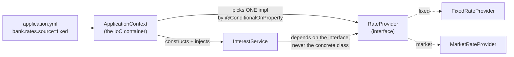
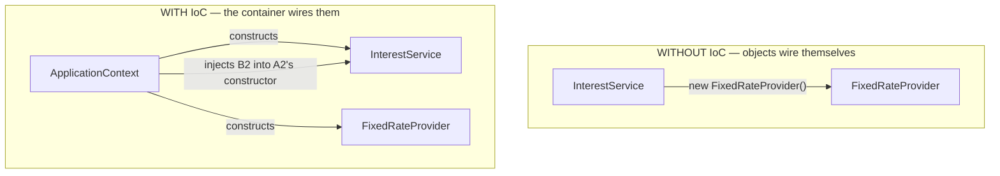
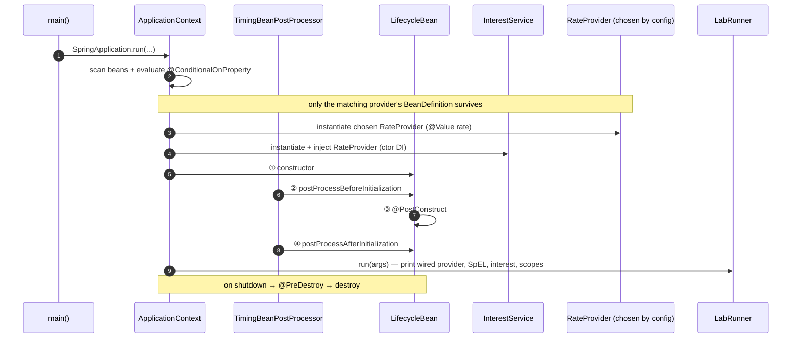

# Step 5 · Spring Core & IoC Deep

> **Step 5 of 67 · Phase A — Foundations 🟢** · Level badge: 🟢 Foundations · Effort ≈ 20h (experienced Spring devs: skip-test below and skim)

`🟢` Foundations &nbsp;·&nbsp; `🔵` Core &nbsp;·&nbsp; `🟣` Advanced &nbsp;·&nbsp; `🔴` Frontier

> [!CAUTION]
> **Educational, non-production project.** Build-a-Bank is for learning only. It never handles real money, real customers, or real personal data, and it is **not** security-audited for production banking. Every credential you ever see here is fake. (Full disclaimer + guardrails in the [README](../../README.md).)

---

## 🧭 The Six Movements of This Step

A one-line map of where we're going. Click to jump.

1. **[A · 🧭 Orient](#orient)** — what IoC/DI is, why it matters, the cheat card, and whether you can skip.
2. **[B · 🧠 Understand](#understand)** — Inversion of Control, the `ApplicationContext`, the bean lifecycle, scopes, conditions, SpEL — no magic; plus Strategy/DIP, the security lens, a version-evolution story, and a thread-safety note.
3. **[C · 🛠️ Build](#build)** — the heart: a brand-new non-web Spring Boot module wired entirely by the container — `pom` → app → `RateProvider` strategy → two conditional beans → `InterestService` (constructor DI) → `@Bean Clock` → lifecycle + `BeanPostProcessor` → prototype bean → `LabRunner` → config → three tests. Then 🎮 Play With It and the 🏁 finished result.
4. **[D · 🔬 Prove](#prove)** — the Verification Log: the real, pasted `verify` (6 tests) and the app run with lifecycle ordering.
5. **[E · 🎓 Apply](#apply)** — go-deeper asides, interview prep, and your-turn exercises.
6. **[F · 🏆 Review](#review)** — troubleshooting, resources & glossary, and the recap/study notes.

---

<a id="orient"></a>

# A · 🧭 Orient

## 📋 This Step in 30 Seconds

| | |
|---|---|
| **Title** | Spring Core & IoC deep — beans, DI, scopes, conditional beans, SpEL, the lifecycle |
| **Step** | 5 of 67 · **Phase A — Foundations** 🟢 |
| **Effort** | ≈ 20 hours focused. The *concepts* are the whole point; an experienced Spring dev can skip-test and skim to ~3h. |
| **What you'll run this step** | **Just the JVM + Maven.** One brand-new module, `playground/spring-lab` — a **non-web** Spring Boot app (a `CommandLineRunner`). **No Docker, no web server, no database.** Web arrives in Step 6/13. |
| **Buildable artifact** | NEW module `playground/spring-lab` ([ADR-0003](../../adr/0003-spring-lab-playground-module.md)). `step-05-start == step-04-end`. |
| **Verification tier** | 🟠 **Standard** — `./mvnw verify` green + all 6 tests + the app run proving the wiring & lifecycle. (No mutation/clean-room: this is a learning module, no money/security/concurrency path yet.) |
| **Depends on** | **Steps 1–2** (toolchain + Java language). Helpful but not required: Step 4 (the JVM). |

By the end you will understand — and be able to *show on screen* — what an **IoC container** is, how **dependency injection** wires your objects, why **constructor injection + `final` fields** is the standard, when to use `@Component` vs a `@Bean` factory method, how **bean scopes** (singleton vs prototype) differ, how to wire a **different implementation by configuration alone** with `@ConditionalOnProperty`, how **externalized config + `@Value` + SpEL** flow in, and the exact **bean lifecycle ordering** (including `BeanPostProcessor` and `@PostConstruct`/`@PreDestroy`).

### ⏭️ Can You Skip This Step? (5-minute self-check)

Run this self-check. If you can confidently do **all** of it, skim the 🕰️/🛡️/🧩 asides and jump to **[Step 6 — Spring Boot internals & config](../step-06/lesson.md)**.

- [ ] I can explain **Inversion of Control** and what an `ApplicationContext` actually *is* (not "it's magic").
- [ ] I know why **constructor injection** beats field injection, and why a single constructor needs **no `@Autowired`** since Spring 4.3.
- [ ] I can say when to use **`@Component`/`@Service`** vs a **`@Bean`** method in a `@Configuration` class, and what **`proxyBeanMethods`** does.
- [ ] I can name the **bean lifecycle order** through a `BeanPostProcessor` and `@PostConstruct`.
- [ ] I can wire a **different bean by config** with `@ConditionalOnProperty`, and explain **singleton vs prototype** scope.
- [ ] I can write a **fast context test** with `ApplicationContextRunner` (no `@SpringBootTest` boot).

> [!TIP]
> Not 100%? Stay. Spring is the spine of the next ~50 steps, and "no magic" understanding of the container is what separates engineers who *use* Spring from engineers who *debug* it at 2am. The 🛠️ build is short, runs on a plain JVM, and makes every abstract idea visible in the logs.

## 📇 Cheat Card

> **What this step delivers (one sentence):** a tiny, runnable Spring app whose **interest rate provider is chosen by one config line** — flip `bank.rates.source` between `fixed` and `market` and watch a *different bean* wire with **zero code change**, while the logs narrate the full bean lifecycle.

**Key commands** (Windows uses `.\mvnw.cmd`; macOS/Linux/Git-Bash use `./mvnw`):

```bash
# Build + run all 6 tests for the lab (and anything it depends on, -am):
./mvnw -pl playground/spring-lab -am verify

# Run the IoC demo (default = fixed rate):
./mvnw -pl playground/spring-lab spring-boot:run
# …or from the built fat jar:
java -jar playground/spring-lab/target/spring-lab-0.1.0-SNAPSHOT.jar

# Flip the wired bean WITHOUT editing code:
java -jar playground/spring-lab/target/spring-lab-0.1.0-SNAPSHOT.jar --bank.rates.source=market

# One-shot proof your build matches the lesson:
bash steps/step-05/smoke.sh
```

**The one headline idea — *you don't `new` your collaborators; the container does, and hands them to you*:**



*Alt-text: the ApplicationContext reads `application.yml`, constructs `InterestService`, and injects a `RateProvider`. Configuration selects exactly one of two implementations (`FixedRateProvider` or `MarketRateProvider`) via `@ConditionalOnProperty`; the service depends only on the interface.*

## 🎯 Why This Matters

Every Spring application you will ever touch — every service in this bank, and most production JVM systems in the world — is just **a bag of objects that Spring constructs and wires for you**. If you understand the container, annotations stop being incantations: you can reason about *why a bean wired*, *why two beans collided*, *why a value was null at startup*, and *why a singleton blew up under load*. **Interviewers probe this relentlessly** ("what's the bean lifecycle?", "field vs constructor injection?", "is a `@Configuration` `@Bean` method a real method call?") because it predicts whether you'll create production incidents. This is the foundation the next 50 steps stand on.

## ✅ What You'll Be Able to Do

- Explain **Inversion of Control** and describe the `ApplicationContext` as a registry of beans it constructs and wires.
- Use **constructor injection** with `final` fields as your default, and explain why (testability, immutability, fail-fast, thread-safety).
- Choose correctly between **`@Component`/`@Service`** (you own the class) and a **`@Bean` factory method** (you don't, or need custom construction), and explain **full vs lite `@Configuration`** (`proxyBeanMethods`).
- Register **conditional beans** with `@ConditionalOnProperty` and swap an implementation **by configuration alone**.
- Pull **externalized config** into beans with `@Value` and compute values with **SpEL**.
- Trace the **bean lifecycle** and hook it with a **`BeanPostProcessor`**, `@PostConstruct`, and `@PreDestroy`.
- Tell **singleton** from **prototype** scope and reason about the thread-safety consequences of shared singletons.
- Write **fast, boot-free context tests** with `ApplicationContextRunner`.

## 🧰 Before You Start

**Depends on: Steps 1, 2** (Step 4 helps but isn't required).

You'll reuse, from earlier steps:

- **Step 1** — a working JDK 25 + the `./mvnw` wrapper, and how to read `./mvnw` output. The parent POM and the Spring Boot 4.0.6 BOM you set up there give this new module its pinned, mutually-compatible versions for free.
- **Step 2** — Java fundamentals: interfaces, `final` fields, `BigDecimal` for money, records/classes. We lean on `BigDecimal` + `RoundingMode.HALF_EVEN` ("banker's rounding") for the interest math.
- **Step 4** *(optional)* — the JVM mental model. When we say "Spring creates a **CGLIB subclass** of your `@Configuration` class," it helps to already know classes are just bytecode the JVM loads.

**Tooling check** (should already be true from Step 1):

```bash
java -version      # → 25.x
./mvnw -v          # → Apache Maven 3.9.12, Java 25
```

No Docker, no database, no ports. This is the calmest environment in the whole course — pure container, pure JVM.

---

<a id="understand"></a>

# B · 🧠 Understand

## 🧠 The Big Idea

**Inversion of Control (IoC)** is a single, life-changing flip: *instead of your code reaching out to create and find its collaborators, a container creates them and hands them to your code.* You stop calling `new FixedRateProvider()` and stop knowing which concrete class you got. You just declare "I need a `RateProvider`," and the **container** — Spring's `ApplicationContext` — figures out which one exists, constructs it, and injects it. **Dependency Injection (DI)** is the *mechanism* of IoC: the specific act of passing dependencies in (ideally through the constructor) rather than having the object fetch them.

**Analogy — a restaurant kitchen.** In a badly run kitchen, each chef walks to the market, buys their own tomatoes, and chops them — every chef re-doing wiring and sourcing. In a professional kitchen (the *container*), a **prep station** sources and prepares ingredients and **places exactly what each station needs at their station** before service. The chef (your `InterestService`) just cooks with what's in front of them; they neither know nor care which supplier the tomatoes came from. Swap suppliers (fixed → market) and the chef's recipe doesn't change one line. That "the chef doesn't source their own ingredients" is *inversion of control*; "the prep station places ingredients at the station" is *dependency injection*.



*Alt-text: top — without IoC, InterestService directly news up FixedRateProvider, hard-coupling them. Bottom — with IoC, the ApplicationContext constructs both objects and injects the provider into the service's constructor, so the service depends only on the abstraction.*

**Why "container"?** The `ApplicationContext` is literally an in-memory **registry/map of singletons** (mostly): bean name → bean instance, plus the metadata (`BeanDefinition`s) describing how to build each one. At startup Spring scans your packages, builds the definitions, works out the dependency graph, instantiates beans in dependency order, injects collaborators, runs lifecycle callbacks, and then your app is "up." Shutting the context down runs the teardown callbacks. Nothing is magic — it's a graph builder plus a lifecycle runner. We will *watch every phase* in this step's logs.

## 🌱 Under the Hood: How It Really Works (no magic)

A precise mental model of each thing we use:

**1. `@SpringBootApplication` → component scanning.** This meta-annotation bundles `@SpringBootConfiguration` + `@EnableAutoConfiguration` + `@ComponentScan`. The `@ComponentScan` part tells Spring: "scan this class's package and below for stereotype annotations." It walks the classpath, finds every `@Component`, `@Service`, `@Repository`, `@Controller`, and `@Configuration`, and registers a **`BeanDefinition`** for each. A `BeanDefinition` is a *recipe*, not the object — class name, scope, constructor args, conditions. Objects come later.

**2. Constructor injection — how Spring picks the constructor.** When a bean has **exactly one constructor**, Spring uses it and autowires its parameters from the context — **no `@Autowired` needed since Spring 4.3**. For each parameter (e.g. `RateProvider rateProvider`) Spring asks: "do I have exactly one bean assignable to this type?" If yes, inject it. If **zero**, startup fails with `NoSuchBeanDefinitionException`. If **two**, it fails with `NoUniqueBeanDefinitionException` ("expected single matching bean but found 2") — we'll trigger that on purpose. We hold the injected collaborator in a **`final` field**: assigned once in the constructor, never reassigned, safe to publish to other threads.

**3. `@Component` vs `@Bean`.** `@Component` (and its specializations `@Service`, `@Repository`, `@Controller`) marks a class **you own** so the scanner registers it. A **`@Bean` method** inside a `@Configuration` class is a **factory method** you write — used when you *don't* own the class (here, `java.time.Clock` from the JDK) or need custom construction. Same outcome (a bean in the context), different mechanism.

**4. Full vs lite `@Configuration` (`proxyBeanMethods`).** By default `@Configuration(proxyBeanMethods = true)` ("full" mode). Spring creates a **CGLIB subclass** of your config class at runtime and **intercepts calls between `@Bean` methods**, so if `beanB()` calls `clock()`, you get the **same singleton** Spring already created — not a fresh `Clock`. Set `proxyBeanMethods = false` ("lite" mode) and there's no proxy: inter-method calls would create new instances; it's faster to start and used heavily by Spring Boot's own auto-config. Our `LabConfig` keeps the default (full).

**5. Scopes.** Default scope is **singleton**: *one* instance per `ApplicationContext`, shared by everyone who depends on it. **Prototype** (`@Scope("prototype")`): a **new** instance every time the bean is requested. (Web scopes — request/session — arrive with the web stack.) Singletons are created eagerly at startup; prototypes are created on demand and Spring does **not** manage their full lifecycle (no `@PreDestroy` for prototypes).

**6. `@ConditionalOnProperty`.** A Spring Boot `@Conditional`: the bean is registered **only if** a property matches. `@ConditionalOnProperty(name="bank.rates.source", havingValue="fixed", matchIfMissing=true)` means "register `FixedRateProvider` if `bank.rates.source` is `fixed` **or absent**." `MarketRateProvider` uses `havingValue="market"` (no `matchIfMissing`). Conditions are evaluated **before** instantiation, at `BeanDefinition` time, so the loser never gets created — that's why exactly one `RateProvider` exists to inject.

**7. `@Value` + SpEL.** `@Value("${bank.rates.fixed:0.0325}")` is **property placeholder** resolution: read `bank.rates.fixed` from the environment, default to `0.0325` if missing, and convert the text to the target type (`BigDecimal`). `@Value("#{ ... }")` is **SpEL** (Spring Expression Language) — a real expression evaluated at wiring time. `@Value("#{ ${bank.rates.fixed:0.0325} * 100 }")` first substitutes the placeholder (`0.0325`), *then* evaluates `0.0325 * 100 = 3.25`. `${...}` = look up a property; `#{...}` = evaluate an expression.

**8. The lifecycle + `BeanPostProcessor`.** For each bean the container: ① **instantiates** it (constructor) → ② **injects** dependencies → ③ calls every **`BeanPostProcessor.postProcessBeforeInitialization`** → ④ runs **`@PostConstruct`** → ⑤ calls every **`BeanPostProcessor.postProcessAfterInitialization`** → bean is **in use**. On context close: **`@PreDestroy`** → destroyed. A `BeanPostProcessor` (BPP) is the official extension point invoked around *every* bean's initialization — it's how Spring itself wires AOP proxies and resolves `@Value`. We'll log around it to *see* steps ②–⑤ in order.

## 🧩 Pattern Spotlight: Strategy + Dependency Inversion

> **Problem.** `InterestService` needs an interest rate, but the *source* of that rate should be swappable (a fixed configured rate today, a "live market" rate tomorrow) without touching the service.

- **The pattern (Strategy).** Define an interface (`RateProvider`) with the varying behaviour (`annualRate()`), and provide interchangeable implementations (`FixedRateProvider`, `MarketRateProvider`). The client (`InterestService`) holds a reference to the *interface* and delegates.
- **Why it fits.** The thing that varies (how we get a rate) is isolated behind one method; the thing that's stable (compute interest on a principal) stays put. Adding a third source later means adding a class, not editing the service.
- **Dependency Inversion Principle (DIP).** "Depend on abstractions, not concretions." `InterestService` depends on `RateProvider` (abstraction), never on `FixedRateProvider` (concretion). **IoC/DI is how DIP is realized in Spring:** the container injects whichever concrete strategy is configured.
- **Alternatives & trade-offs.** A `switch (source)` inside the service would couple it to every implementation and to the config key — adding a source edits the service and risks a merge magnet. A factory method centralizes construction but you still wire it yourself. Spring's `@ConditionalOnProperty` gives you Strategy **selected by configuration**, decided at container-build time, with the service none the wiser.
- **Micro-structure.** `interface RateProvider` → two `@Component` impls guarded by `@ConditionalOnProperty` → `InterestService` constructor takes `RateProvider`. Selection lives entirely in `application.yml`.

## 🛡️ Security Lens: What DI Buys You

DI isn't only tidy — it's a security and testability lever:

- **Least privilege via narrow interfaces.** `InterestService` is handed a `RateProvider` exposing only `name()` and `annualRate()`. It cannot reach a database, a network client, or credentials it was never given. Injecting *narrow* interfaces (instead of god-objects) shrinks the blast radius of any one component.
- **Testability = security.** Because the dependency is injected, tests can substitute a mock/stub and assert behaviour without real infrastructure. Code that's easy to test is code whose security properties you can actually verify.
- **Prefer constructor injection + `final` fields.** Field injection (`@Autowired` on a private field) injects via **reflection**, which (a) can set fields the constructor never could, hiding required dependencies, (b) makes the object constructable in an *invalid* state (fields null until the framework gets to them), and (c) is harder to reason about and to make immutable. Constructor injection fails fast at startup if a dependency is missing, and `final` fields can't be swapped out later by reflection-happy code. **Avoid field injection; avoid leaking object internals via reflection.**
- **No secrets in code.** `@Value` pulls configuration from the *environment*, not from hard-coded constants — the same channel through which real secrets arrive as env vars (never committed). We model that habit here even though our only "config" is a rate.

## 🕰️ Then vs. Now: How Spring Wiring Evolved

The interview-critical "old way → new way → why → what legacy still uses." (Verified against Spring history — not guessed.)

| Era | How you declared & wired beans | Why it moved on |
|---|---|---|
| **Spring 1–2 (2004+)** | **XML** `<bean id="interestService" class="…"><constructor-arg ref="rateProvider"/></bean>` | Verbose, stringly-typed, no compile-time safety; the wiring lived far from the code. |
| **Spring 2.5 / 3 (annotations + scanning)** | `@Component`/`@Service` + `@ComponentScan`; `@Autowired` on fields/setters/constructors | Wiring moved next to the code; far less boilerplate. But **field injection** became a popular anti-habit. |
| **Spring 3 (Java config)** | `@Configuration` + `@Bean` methods — type-safe Java instead of XML | Refactor-friendly, debuggable, no XML; ideal for third-party classes you don't own. |
| **Spring 4.3 (2016)** | **A single constructor needs no `@Autowired`** | Less noise; nudges everyone toward constructor injection as the default. |
| **Spring Boot (2014+) → Boot 4** | **Auto-configuration**: opinionated beans created *conditionally* (`@ConditionalOn…`) unless you override them | You declare *intent* + properties; Boot wires sensible defaults. We use the same `@ConditionalOnProperty` Boot uses internally. |

**Field → constructor injection** is the single biggest day-to-day shift: modern Spring code uses **constructor injection with `final` fields** (often via Lombok's `@RequiredArgsConstructor` in larger teams; we write the constructor by hand to keep it explicit). **What legacy still uses:** plenty of older codebases still have XML contexts and `@Autowired` fields — you'll meet both, and now you'll know why they're there and how to modernize them.

## 🧵 Thread-safety note (forward-ref Step 11)

Singleton beans are **shared across every thread** that touches them — so a singleton must be **stateless or otherwise thread-safe**. Our `InterestService` holds only a **`final`, immutable collaborator** (`RateProvider`) and keeps **no mutable instance state**: every call to `annualInterest(...)` works purely on its arguments. That's the safest design for a singleton. (Contrast: if a singleton stored a mutable running total in a field, concurrent requests would race on it — exactly the kind of bug we'll force, observe, and fix in **Step 11**.) Note `AuditEntry` keeps a `static AtomicLong` counter shared across all its instances — `AtomicLong` is deliberately thread-safe for exactly this reason.

---

<a id="build"></a>

# C · 🛠️ Build

## 📦 Your Starting Point

You're starting from `step-04-end` (which equals `step-05-start`): a clean multi-module repo with the parent POM, the Spring Boot 4.0.6 BOM, and the `./mvnw` wrapper, all building green from Step 1. The `playground/spring-lab` module **does not exist yet** — you're about to create it from scratch. Nothing in this step depends on Docker, a database, or the web; you'll add one self-contained module and run it on a bare JVM.

**What's green now:** the existing modules (`services/hello`, `playground/java-basics`) build and test. **What you'll build:** an entire new non-web Spring Boot module that demonstrates the IoC container end-to-end.

> [!NOTE]
> **About this module.** [ADR-0003](../../adr/0003-spring-lab-playground-module.md) records the decision to use a dedicated **non-web** playground (`playground/spring-lab`, a `CommandLineRunner`) for Steps 5–7 so the focus stays on the *container* — beans, scopes, conditions, the lifecycle, then auto-config (Step 6) and AOP (Step 7) — without the web stack getting in the way. The real banking services start at Step 8.

## 🛠️ Let's Build It — Step by Step

Here's the whole module we're about to assemble — every file and how it connects:

```mermaid
flowchart TD
    POM["pom.xml<br/>(spring-boot-starter, no web)"] --> APP
    APP["SpringLabApplication<br/>@SpringBootApplication"] -->|scans package| CTX["ApplicationContext"]
    CTX --> RP["RateProvider (interface)"]
    RP --> FX["FixedRateProvider<br/>@ConditionalOnProperty fixed"]
    RP --> MK["MarketRateProvider<br/>@ConditionalOnProperty market"]
    CTX --> IS["InterestService @Service<br/>(ctor DI of RateProvider)"]
    CTX --> CFG["LabConfig @Configuration<br/>@Bean Clock"]
    CTX --> LC["LifecycleBean<br/>@PostConstruct/@PreDestroy"]
    CTX --> BPP["TimingBeanPostProcessor<br/>BeanPostProcessor"]
    CTX --> AE["AuditEntry<br/>@Scope prototype"]
    CTX --> RUN["LabRunner<br/>CommandLineRunner — prints it all"]
    YML["application.yml<br/>bank.rates.source=fixed"] -.->|@Value / condition| FX
    YML -.-> RUN
```

*Alt-text: the spring-lab module — a non-web pom, a `@SpringBootApplication` that creates the `ApplicationContext`, a `RateProvider` interface with two conditional implementations, an `InterestService` that gets one injected, a `LabConfig` providing a `Clock` `@Bean`, a `LifecycleBean` + `BeanPostProcessor` showing lifecycle ordering, a prototype-scoped `AuditEntry`, and a `LabRunner` that prints everything; `application.yml` feeds values via `@Value` and conditions.*

🌳 **Files we'll touch** (all new, under `playground/spring-lab/`):

```text
playground/spring-lab/
├── pom.xml
└── src
    ├── main
    │   ├── java/com/buildabank/springlab/
    │   │   ├── SpringLabApplication.java
    │   │   ├── LabRunner.java
    │   │   ├── rates/
    │   │   │   ├── RateProvider.java
    │   │   │   ├── FixedRateProvider.java
    │   │   │   └── MarketRateProvider.java
    │   │   ├── interest/InterestService.java
    │   │   ├── config/LabConfig.java
    │   │   ├── lifecycle/
    │   │   │   ├── LifecycleBean.java
    │   │   │   └── TimingBeanPostProcessor.java
    │   │   └── audit/AuditEntry.java
    │   └── resources/application.yml
    └── test/java/com/buildabank/springlab/
        ├── SpringLabApplicationTests.java
        ├── MarketRateContextTest.java
        └── rates/ConditionalBeansTest.java
```

🧭 **You are here:** module pom → app → interface → 2 conditional beans → service → config → lifecycle → prototype → runner → yaml → 3 tests. **11 sub-steps.** Let's go.

---

### Sub-step 1 of 11 — Create the module POM 🧭 *(you are here: **pom** → app → …)*

🎯 **Goal:** declare a new Maven module that inherits the parent's pinned versions and pulls in the **core** Spring Boot starter (the IoC container + logging) — deliberately **no web**.

📁 **Location:** new file → `playground/spring-lab/pom.xml`

⌨️ **Code:**

```xml
<?xml version="1.0" encoding="UTF-8"?>
<project xmlns="http://maven.apache.org/POM/4.0.0"
         xmlns:xsi="http://www.w3.org/2001/XMLSchema-instance"
         xsi:schemaLocation="http://maven.apache.org/POM/4.0.0 https://maven.apache.org/xsd/maven-4.0.0.xsd">
    <modelVersion>4.0.0</modelVersion>

    <!--
      spring-lab — the Steps 5–7 Spring playground (Spring Core/IoC, Boot auto-config, AOP).
      A non-web Spring Boot app (CommandLineRunner) so the focus is the container, not the web stack.
    -->
    <parent>
        <groupId>com.buildabank</groupId>
        <artifactId>build-a-bank-parent</artifactId>
        <version>0.1.0-SNAPSHOT</version>
        <relativePath>../../pom.xml</relativePath>
    </parent>

    <artifactId>spring-lab</artifactId>
    <name>Build-a-Bank :: Playground :: Spring Lab</name>
    <description>Spring Core &amp; IoC deep dive — beans, scopes, conditions, profiles, SpEL, lifecycle (Step 5).</description>

    <dependencies>
        <!-- spring-boot-starter (core): the IoC container + auto-configuration + logging. NO web yet. -->
        <dependency>
            <groupId>org.springframework.boot</groupId>
            <artifactId>spring-boot-starter</artifactId>
        </dependency>

        <dependency>
            <groupId>org.springframework.boot</groupId>
            <artifactId>spring-boot-starter-test</artifactId>
            <scope>test</scope>
        </dependency>
    </dependencies>

    <build>
        <plugins>
            <plugin>
                <groupId>org.springframework.boot</groupId>
                <artifactId>spring-boot-maven-plugin</artifactId>
            </plugin>
        </plugins>
    </build>
</project>
```

🔍 **Line-by-line:**
- `<parent>…build-a-bank-parent…<relativePath>../../pom.xml</relativePath>` — this module inherits from your repo's parent POM (which itself inherits Spring Boot's starter parent). That's where **Java 25**, **Spring Boot 4.0.6**, and all dependency versions are pinned — so we write **no `<version>`** tags on dependencies here.
- `<artifactId>spring-lab</artifactId>` — the module's name; the built jar is `spring-lab-0.1.0-SNAPSHOT.jar` (version inherited from the parent).
- `spring-boot-starter` (note: **not** `-web`) — pulls in `spring-context` (the IoC container), `spring-boot`, auto-configuration, and Logback logging. This is the smallest "real Spring Boot app" starter. **No embedded Tomcat, no Spring MVC.**
- `spring-boot-starter-test` with `<scope>test</scope>` — JUnit 5, AssertJ, Mockito, and Spring's test support, available only when compiling/running tests.
- `spring-boot-maven-plugin` — lets us run `spring-boot:run` and repackage an executable ("fat") jar with `mvn package`.

💭 **Under the hood:** `&amp;` in the description is just the XML escape for `&`. Because the parent imports the Spring Boot **BOM** (Bill of Materials), Maven resolves a single mutually-compatible set of versions — this is exactly the "pinned & compatible" discipline from `VERSIONS.md`.

🔮 **Predict:** after adding this module to the parent's `<modules>` (next), will `./mvnw verify` find any *code* to compile yet? (It won't — there are no `.java` files. But the module should *register* without error.)

▶️ **Register the module** — edit the **parent** POM so the reactor knows about it:

📁 `pom.xml` (repo root) — add the module line:

```xml
    <modules>
        <module>services/hello</module>
        <module>playground/java-basics</module>
        <module>playground/spring-lab</module>   <!-- ← add this line -->
    </modules>
```

> [!NOTE]
> In this course repo the module is already registered — if `playground/spring-lab` is missing from your fork's parent `<modules>`, add the line above.

✋ **Checkpoint:** you have `playground/spring-lab/pom.xml` and the parent lists the module. No Java yet — that's expected.

💾 **Commit:**

```bash
git add playground/spring-lab/pom.xml pom.xml
git commit -m "feat(spring-lab): scaffold non-web Spring Boot playground module"
```

⚠️ **Pitfall:** picking `spring-boot-starter-web` by reflex. That would start an embedded Tomcat and change the whole nature of the app (and the logs). We want the *core* starter — the container only.

---

### Sub-step 2 of 11 — The application entry point 🧭 *(pom ✅ → **app** → interface → …)*

🎯 **Goal:** create the `@SpringBootApplication` whose `main` boots the `ApplicationContext` and scans this package for beans.

📁 **Location:** new file → `playground/spring-lab/src/main/java/com/buildabank/springlab/SpringLabApplication.java`

⌨️ **Code:**

```java
// playground/spring-lab/src/main/java/com/buildabank/springlab/SpringLabApplication.java
package com.buildabank.springlab;

import org.springframework.boot.SpringApplication;
import org.springframework.boot.autoconfigure.SpringBootApplication;

/**
 * A non-web Spring Boot application used to explore the IoC container itself.
 *
 * <p>When {@code SpringApplication.run} executes, Spring creates an {@code ApplicationContext},
 * scans this package for beans ({@code @Component}/{@code @Service}/{@code @Configuration}), resolves
 * their dependencies (DI), runs lifecycle callbacks, then invokes any {@code CommandLineRunner}.
 * We make every one of those steps visible in this step.
 */
@SpringBootApplication
public class SpringLabApplication {

    public static void main(String[] args) {
        SpringApplication.run(SpringLabApplication.class, args);
    }
}
```

🔍 **Line-by-line:**
- `package com.buildabank.springlab;` — **this package matters.** `@SpringBootApplication` scans *this package and everything below it*, so all our beans live under `com.buildabank.springlab.*`.
- `@SpringBootApplication` — the meta-annotation = `@SpringBootConfiguration` + `@EnableAutoConfiguration` + `@ComponentScan`. The scan finds our stereotypes; auto-config wires Boot defaults (logging, property sources).
- `SpringApplication.run(SpringLabApplication.class, args)` — boots the context. Returns once the context is up; `args` carry command-line overrides like `--bank.rates.source=market`.

💭 **Under the hood:** `run(...)` builds a `SpringApplication`, prepares the `Environment` (reads `application.yml`, env vars, command-line args — in that precedence order, args win), creates the `ApplicationContext`, registers all `BeanDefinition`s, refreshes the context (instantiate + inject + lifecycle), and finally calls any `CommandLineRunner`/`ApplicationRunner` beans.

🔮 **Predict:** if you `./mvnw -pl playground/spring-lab spring-boot:run` *right now* (only this class, no other beans), will it start? What will it do after starting? <details><summary>answer</summary>Yes, it starts an empty-ish context and then **exits immediately** — a non-web app with no `CommandLineRunner` has nothing to keep it alive, so the JVM ends. We'll add the runner soon.</details>

✋ **Checkpoint:** the file compiles (`./mvnw -pl playground/spring-lab -am compile`).

💾 **Commit:**

```bash
git add playground/spring-lab/src/main/java/com/buildabank/springlab/SpringLabApplication.java
git commit -m "feat(spring-lab): add SpringBootApplication entry point"
```

⚠️ **Pitfall:** putting beans *outside* `com.buildabank.springlab` (e.g. a different top-level package). The component scan won't see them and you'll get baffling "no such bean" errors. Keep beans under the application's package.

---

### Sub-step 3 of 11 — The `RateProvider` strategy interface 🧭 *(app ✅ → **interface** → 2 impls → …)*

🎯 **Goal:** define the **abstraction** the rest of the app depends on — the Strategy interface and the seam for Dependency Inversion.

📁 **Location:** new file → `playground/spring-lab/src/main/java/com/buildabank/springlab/rates/RateProvider.java`

⌨️ **Code:**

```java
// playground/spring-lab/src/main/java/com/buildabank/springlab/rates/RateProvider.java
package com.buildabank.springlab.rates;

import java.math.BigDecimal;

/**
 * A strategy for obtaining the annual interest rate. Two implementations exist
 * ({@code FixedRateProvider}, {@code MarketRateProvider}); exactly one is wired at runtime,
 * chosen by configuration via {@code @ConditionalOnProperty}. This is the Strategy pattern +
 * Dependency Inversion: {@code InterestService} depends on this interface, not a concrete class.
 */
public interface RateProvider {

    String name();

    BigDecimal annualRate();
}
```

🔍 **Line-by-line:**
- `interface RateProvider` — a plain Java interface; **no Spring annotations**. The abstraction is framework-agnostic; only the *implementations* know about Spring.
- `String name()` — a label so we can print *which* provider wired.
- `BigDecimal annualRate()` — money/rates use `BigDecimal`, never `double`, to avoid binary-floating-point rounding error (a Step 2 rule we hold to everywhere money is involved).

💭 **Under the hood:** this interface is the **type** the container will match against. When `InterestService` asks for a `RateProvider`, Spring looks for exactly one bean *assignable to* `RateProvider`. Because conditions ensure only one implementation is registered, that lookup is unambiguous.

✋ **Checkpoint:** compiles. No bean yet (interfaces aren't components).

💾 **Commit:**

```bash
git add playground/spring-lab/src/main/java/com/buildabank/springlab/rates/RateProvider.java
git commit -m "feat(spring-lab): add RateProvider strategy interface"
```

---

### Sub-step 4 of 11 — Two conditional implementations 🧭 *(interface ✅ → **2 conditional beans** → service → …)*

🎯 **Goal:** provide two interchangeable strategies, each registered **only when configuration selects it** — the heart of "swap by config, no code change."

📁 **Location 1:** new file → `playground/spring-lab/src/main/java/com/buildabank/springlab/rates/FixedRateProvider.java`

⌨️ **Code:**

```java
// playground/spring-lab/src/main/java/com/buildabank/springlab/rates/FixedRateProvider.java
package com.buildabank.springlab.rates;

import java.math.BigDecimal;

import org.springframework.boot.autoconfigure.condition.ConditionalOnProperty;
import org.springframework.beans.factory.annotation.Value;
import org.springframework.stereotype.Component;

/**
 * Provides a fixed, configured rate. Registered as a bean ONLY when {@code bank.rates.source=fixed}
 * (or the property is absent, thanks to {@code matchIfMissing=true}) — a <strong>conditional bean</strong>.
 * The rate is injected from configuration via {@code @Value} with a sensible default.
 */
@Component
@ConditionalOnProperty(name = "bank.rates.source", havingValue = "fixed", matchIfMissing = true)
public class FixedRateProvider implements RateProvider {

    private final BigDecimal rate;

    public FixedRateProvider(@Value("${bank.rates.fixed:0.0325}") BigDecimal rate) {
        this.rate = rate;
    }

    @Override
    public String name() {
        return "fixed";
    }

    @Override
    public BigDecimal annualRate() {
        return rate;
    }
}
```

🔍 **Line-by-line:**
- `@Component` — registers this class as a bean *candidate* (the scanner finds it).
- `@ConditionalOnProperty(name="bank.rates.source", havingValue="fixed", matchIfMissing=true)` — the bean is registered **only if** `bank.rates.source` equals `fixed` **or is absent**. `matchIfMissing=true` makes fixed the **default**.
- `public FixedRateProvider(@Value("${bank.rates.fixed:0.0325}") BigDecimal rate)` — **constructor injection of a configuration value**: resolve `bank.rates.fixed`, default `0.0325`, convert to `BigDecimal`. Stored in a `final` field.
- `name()` returns `"fixed"`; `annualRate()` returns the configured rate.

📁 **Location 2:** new file → `playground/spring-lab/src/main/java/com/buildabank/springlab/rates/MarketRateProvider.java`

⌨️ **Code:**

```java
// playground/spring-lab/src/main/java/com/buildabank/springlab/rates/MarketRateProvider.java
package com.buildabank.springlab.rates;

import java.math.BigDecimal;

import org.springframework.boot.autoconfigure.condition.ConditionalOnProperty;
import org.springframework.stereotype.Component;

/**
 * Pretends to fetch a live market rate. Registered as a bean ONLY when {@code bank.rates.source=market}.
 * Swapping providers requires zero code change in {@code InterestService} — just configuration.
 */
@Component
@ConditionalOnProperty(name = "bank.rates.source", havingValue = "market")
public class MarketRateProvider implements RateProvider {

    @Override
    public String name() {
        return "market";
    }

    @Override
    public BigDecimal annualRate() {
        return new BigDecimal("0.0475"); // a pretend live rate
    }
}
```

🔍 **Line-by-line:**
- `@ConditionalOnProperty(name="bank.rates.source", havingValue="market")` — **no `matchIfMissing`**, so this bean exists *only* when `bank.rates.source=market` is set explicitly.
- `new BigDecimal("0.0475")` — note the **String constructor** (`"0.0475"`, not `0.0475`) so the decimal is exact, not a binary approximation.

💭 **Under the hood:** conditions are evaluated at **`BeanDefinition` registration** — *before* any instance is created. With the default config (`fixed` or absent), only `FixedRateProvider`'s definition survives; `MarketRateProvider`'s is dropped. So when something asks for a `RateProvider`, exactly **one** candidate exists. (Remove the conditions and you'd have *two* — we'll trigger that error on purpose later.)

🔮 **Predict:** with default config, which provider's constructor runs, and which one never gets instantiated? <details><summary>answer</summary>`FixedRateProvider` is instantiated (`matchIfMissing=true`); `MarketRateProvider` is never even created because its condition fails.</details>

✋ **Checkpoint:** both compile. Still no service to inject them — next.

💾 **Commit:**

```bash
git add playground/spring-lab/src/main/java/com/buildabank/springlab/rates/FixedRateProvider.java \
        playground/spring-lab/src/main/java/com/buildabank/springlab/rates/MarketRateProvider.java
git commit -m "feat(spring-lab): add conditional fixed/market RateProvider beans"
```

⚠️ **Pitfall:** giving *both* providers `matchIfMissing=true` (or neither a condition). Then both register, and the injection point gets two candidates → `NoUniqueBeanDefinitionException` at startup. Exactly one of them must win for any given config.

---

### Sub-step 5 of 11 — `InterestService` (constructor DI) 🧭 *(2 beans ✅ → **service** → config → …)*

🎯 **Goal:** the singleton `@Service` that consumes a `RateProvider` via constructor injection and computes interest — the consumer side of Dependency Inversion.

📁 **Location:** new file → `playground/spring-lab/src/main/java/com/buildabank/springlab/interest/InterestService.java`

⌨️ **Code:**

```java
// playground/spring-lab/src/main/java/com/buildabank/springlab/interest/InterestService.java
package com.buildabank.springlab.interest;

import java.math.BigDecimal;
import java.math.RoundingMode;

import org.springframework.stereotype.Service;

import com.buildabank.springlab.rates.RateProvider;

/**
 * A singleton {@code @Service} that computes interest. It receives its {@link RateProvider} via
 * <strong>constructor injection</strong> — Spring sees the single constructor and supplies the wired bean
 * automatically (no {@code @Autowired} needed). The field is {@code final}: set once, safe to share.
 */
@Service
public class InterestService {

    private final RateProvider rateProvider;

    public InterestService(RateProvider rateProvider) {
        this.rateProvider = rateProvider;
    }

    /** Annual interest on a principal, rounded to 2 dp (banker's rounding). */
    public BigDecimal annualInterest(BigDecimal principal) {
        return principal.multiply(rateProvider.annualRate()).setScale(2, RoundingMode.HALF_EVEN);
    }

    public String rateSource() {
        return rateProvider.name();
    }
}
```

🔍 **Line-by-line:**
- `@Service` — a `@Component` specialization that reads as "business-logic bean." Default scope: **singleton**.
- `private final RateProvider rateProvider;` — the dependency, held immutably. `final` = assigned exactly once, in the constructor.
- `public InterestService(RateProvider rateProvider)` — **the single constructor.** Since Spring 4.3, a single constructor is autowired automatically — **no `@Autowired`**. Spring matches the parameter type to the one registered `RateProvider`.
- `annualInterest(...)` — `principal × rate`, then `setScale(2, HALF_EVEN)`: round to 2 decimals using **banker's rounding** (round-half-to-even — the convention for money, it avoids the upward bias of always-round-half-up).
- `rateSource()` — delegates to the strategy's `name()` so the runner can show which wired.

💭 **Under the hood:** **no mutable state** lives in this singleton — `annualInterest` operates only on its argument and the immutable `rateProvider`. That's why one shared instance is safe across threads (the 🧵 note above). If you added a mutable field, you'd have introduced a shared-state race.

🔮 **Predict:** with `fixed` at `0.0325` and a principal of `10000.00`, what's `annualInterest`? <details><summary>answer</summary>`10000.00 × 0.0325 = 325.000000`, scaled to 2 dp → **`325.00`**. (Market at `0.0475` → `475.00`.)</details>

✋ **Checkpoint:** compiles. The wiring graph (`InterestService` → `RateProvider` → one impl) is now complete in principle.

💾 **Commit:**

```bash
git add playground/spring-lab/src/main/java/com/buildabank/springlab/interest/InterestService.java
git commit -m "feat(spring-lab): add InterestService with constructor injection"
```

🔬 **Break-it (we'll do this for real later):** if you delete the constructor parameter (so the service no longer asks for a `RateProvider`) the app still starts — but then it can't compute a rate. If you instead make the field non-`final` and add an `@Autowired` field, you'd be sliding into field injection. **Keep it constructor + `final`.**

---

### Sub-step 6 of 11 — `LabConfig`: a `@Bean` factory method 🧭 *(service ✅ → **config** → lifecycle → …)*

🎯 **Goal:** register a bean for a class you **don't own** (`java.time.Clock`) using a `@Bean` factory method, and meet full-mode `@Configuration`.

📁 **Location:** new file → `playground/spring-lab/src/main/java/com/buildabank/springlab/config/LabConfig.java`

⌨️ **Code:**

```java
// playground/spring-lab/src/main/java/com/buildabank/springlab/config/LabConfig.java
package com.buildabank.springlab.config;

import java.time.Clock;

import org.springframework.context.annotation.Bean;
import org.springframework.context.annotation.Configuration;

/**
 * A {@code @Configuration} class with a {@code @Bean} <strong>factory method</strong>.
 *
 * <p>Use {@code @Bean} (vs {@code @Component}) when you do not own the class (here, {@link Clock} from the
 * JDK) or need custom construction logic. By default {@code @Configuration} is "full" mode
 * ({@code proxyBeanMethods=true}): calling {@code clock()} from another {@code @Bean} method returns the
 * SAME singleton, because Spring intercepts the call via a CGLIB proxy of this config class.
 */
@Configuration
public class LabConfig {

    /** A UTC clock bean — injectable anywhere we need "now" (and mockable in tests). */
    @Bean
    public Clock clock() {
        return Clock.systemUTC();
    }
}
```

🔍 **Line-by-line:**
- `@Configuration` — marks a source of bean definitions. Default `proxyBeanMethods=true` → **full mode**, so inter-`@Bean`-method calls return the managed singleton.
- `@Bean public Clock clock()` — a **factory method**: its return value becomes a singleton bean named `clock`. We use `@Bean` (not `@Component`) because we can't annotate the JDK's `Clock` class ourselves.
- `Clock.systemUTC()` — a UTC clock; using `Clock` (instead of `Instant.now()` directly) makes "now" **injectable and mockable** — a habit that pays off when you test time-dependent logic later.

💭 **Under the hood:** in full mode Spring creates a **CGLIB subclass** of `LabConfig` at runtime. When any `@Bean` method calls another (e.g. `clock()`), the proxy intercepts and returns the already-built singleton rather than executing the method body again. In **lite mode** (`proxyBeanMethods=false`), no proxy is created and such a call would build a *new* instance — faster startup, but you must avoid relying on inter-bean method calls. Spring Boot's own auto-config uses lite mode heavily.

🔮 **Predict:** if a second `@Bean` method called `clock()` twice, how many `Clock` instances exist in full mode? <details><summary>answer</summary>**One.** The CGLIB proxy returns the same managed singleton each call. In lite mode you'd get a fresh `Clock` per call.</details>

✋ **Checkpoint:** compiles; a `Clock` bean now exists for `LabRunner` to inject.

💾 **Commit:**

```bash
git add playground/spring-lab/src/main/java/com/buildabank/springlab/config/LabConfig.java
git commit -m "feat(spring-lab): add LabConfig with a @Bean Clock factory method"
```

⚠️ **Pitfall:** thinking a `@Bean` method is "just a method call." In full `@Configuration` it is **proxied** — calling it directly returns the singleton, not a new object. Inside a plain `@Component`, the same method *would* run normally (no proxy). Knowing which is which is a classic interview gotcha.

---

### Sub-step 7 of 11 — Make the lifecycle visible 🧭 *(config ✅ → **lifecycle + BPP** → prototype → …)*

🎯 **Goal:** log every lifecycle phase of one bean — constructor → BPP before-init → `@PostConstruct` → BPP after-init → `@PreDestroy` — so you *see* the exact ordering.

📁 **Location 1:** new file → `playground/spring-lab/src/main/java/com/buildabank/springlab/lifecycle/LifecycleBean.java`

⌨️ **Code:**

```java
// playground/spring-lab/src/main/java/com/buildabank/springlab/lifecycle/LifecycleBean.java
package com.buildabank.springlab.lifecycle;

import jakarta.annotation.PostConstruct;
import jakarta.annotation.PreDestroy;

import org.slf4j.Logger;
import org.slf4j.LoggerFactory;
import org.springframework.stereotype.Component;

/**
 * Makes the bean lifecycle visible. Watch the log order on startup:
 * <pre>
 *   1) constructor        ← instance created
 *   2) BPP before-init    ← BeanPostProcessor.postProcessBeforeInitialization
 *   3) @PostConstruct     ← initialization callback
 *   4) BPP after-init     ← BeanPostProcessor.postProcessAfterInitialization
 * </pre>
 * and {@code @PreDestroy} on shutdown. (Steps 2 &amp; 4 are logged by {@code TimingBeanPostProcessor}.)
 */
@Component
public class LifecycleBean {

    private static final Logger log = LoggerFactory.getLogger(LifecycleBean.class);

    public LifecycleBean() {
        log.info("1) constructor");
    }

    @PostConstruct
    void init() {
        log.info("3) @PostConstruct");
    }

    @PreDestroy
    void destroy() {
        log.info("@PreDestroy (context closing)");
    }
}
```

🔍 **Line-by-line:**
- `import jakarta.annotation.PostConstruct;` — note **`jakarta.*`**, not `javax.*`. Spring 6 / Boot 3+ moved to the Jakarta namespace; `javax.annotation` is the legacy name (a 🕰️ Then-vs-Now point in itself).
- `@PostConstruct void init()` — runs **after** the bean is constructed *and* its dependencies injected. Ideal for one-time initialization. (Package-private `void`, no args — that's all the spec requires.)
- `@PreDestroy void destroy()` — runs when the context closes, before the bean is discarded — your cleanup hook.
- The numbered log messages (`1)`, `3)`) let us read the ordering directly off the console.

📁 **Location 2:** new file → `playground/spring-lab/src/main/java/com/buildabank/springlab/lifecycle/TimingBeanPostProcessor.java`

⌨️ **Code:**

```java
// playground/spring-lab/src/main/java/com/buildabank/springlab/lifecycle/TimingBeanPostProcessor.java
package com.buildabank.springlab.lifecycle;

import org.slf4j.Logger;
import org.slf4j.LoggerFactory;
import org.springframework.beans.factory.config.BeanPostProcessor;
import org.springframework.stereotype.Component;

/**
 * A {@link BeanPostProcessor} — a container extension point invoked for EVERY bean, around its
 * initialization. This is exactly how Spring itself implements much of its "magic" (e.g. wiring AOP
 * proxies, resolving {@code @Value}). Here we just log around {@link LifecycleBean} to show the ordering.
 */
@Component
public class TimingBeanPostProcessor implements BeanPostProcessor {

    private static final Logger log = LoggerFactory.getLogger(TimingBeanPostProcessor.class);

    @Override
    public Object postProcessBeforeInitialization(Object bean, String beanName) {
        if (bean instanceof LifecycleBean) {
            log.info("2) BPP before-init for bean '{}'", beanName);
        }
        return bean;
    }

    @Override
    public Object postProcessAfterInitialization(Object bean, String beanName) {
        if (bean instanceof LifecycleBean) {
            log.info("4) BPP after-init for bean '{}'", beanName);
        }
        return bean;
    }
}
```

🔍 **Line-by-line:**
- `implements BeanPostProcessor` — the hook called around **every** bean's initialization phase. Spring discovers `BeanPostProcessor` beans **early** and applies them to all subsequent beans.
- `postProcessBeforeInitialization(bean, beanName)` — called **after injection, before `@PostConstruct`**. We filter to just `LifecycleBean` to keep the log clean, log `2)`, and **return the bean** (returning a wrapper here is exactly how AOP proxies get swapped in).
- `postProcessAfterInitialization(bean, beanName)` — called **after `@PostConstruct`**. We log `4)`. **Must return the bean** (or a replacement) — returning `null` would wipe the bean out.

💭 **Under the hood:** this is the literal extension point through which Spring weaves AOP proxies (Step 7!), resolves `@Value`, runs `@Async`/`@Transactional` wrapping, etc. A BPP returning a *different* object than it received is how a bean silently becomes a proxy. The ordering — before-init → `@PostConstruct` → after-init — is fixed by the container.

🔮 **Predict:** write down the order you expect lines `1) 2) 3) 4)` to appear, and where `@PreDestroy` lands. <details><summary>answer</summary>`1) constructor` → `2) BPP before-init` → `3) @PostConstruct` → `4) BPP after-init` at startup; `@PreDestroy` only at shutdown (context close). You'll confirm this exact order in the run output.</details>

✋ **Checkpoint:** both compile. The lifecycle is now fully instrumented.

💾 **Commit:**

```bash
git add playground/spring-lab/src/main/java/com/buildabank/springlab/lifecycle/
git commit -m "feat(spring-lab): show bean lifecycle via @PostConstruct/@PreDestroy + a BeanPostProcessor"
```

⚠️ **Pitfall:** returning `null` (or forgetting to `return bean`) from a `BeanPostProcessor` method. Spring would treat that as the bean and your app would break in mystifying ways. **Always return the bean (or your replacement).**

---

### Sub-step 8 of 11 — A prototype-scoped bean 🧭 *(lifecycle ✅ → **prototype** → runner → …)*

🎯 **Goal:** contrast the default singleton scope with **prototype** — a fresh instance on every lookup.

📁 **Location:** new file → `playground/spring-lab/src/main/java/com/buildabank/springlab/audit/AuditEntry.java`

⌨️ **Code:**

```java
// playground/spring-lab/src/main/java/com/buildabank/springlab/audit/AuditEntry.java
package com.buildabank.springlab.audit;

import java.util.concurrent.atomic.AtomicLong;

import org.springframework.beans.factory.config.ConfigurableBeanFactory;
import org.springframework.context.annotation.Scope;
import org.springframework.stereotype.Component;

/**
 * A <strong>prototype</strong>-scoped bean: Spring creates a NEW instance every time it is requested
 * (contrast the default <strong>singleton</strong> scope — one shared instance per context). Each
 * instance gets a unique sequence number, so two lookups differ. Web scopes (request/session) arrive later.
 */
@Component
@Scope(ConfigurableBeanFactory.SCOPE_PROTOTYPE)
public class AuditEntry {

    private static final AtomicLong SEQUENCE = new AtomicLong();

    private final long instanceId = SEQUENCE.incrementAndGet();

    public long instanceId() {
        return instanceId;
    }
}
```

🔍 **Line-by-line:**
- `@Scope(ConfigurableBeanFactory.SCOPE_PROTOTYPE)` — sets prototype scope. `SCOPE_PROTOTYPE` is just the constant for the string `"prototype"` (using the constant avoids typos).
- `private static final AtomicLong SEQUENCE` — a **class-level** counter shared by *all* `AuditEntry` instances. `AtomicLong` is thread-safe (the 🧵 note).
- `private final long instanceId = SEQUENCE.incrementAndGet();` — each new instance grabs the next number, so `#1`, `#2`, … prove that lookups yield distinct objects.

💭 **Under the hood:** a singleton is created **once**, eagerly, and cached in the context. A prototype is created **on every `getBean`/injection** and Spring then **forgets it** — it does *not* manage a prototype's destruction (no `@PreDestroy` runs). That's a deliberate scope trade-off, not a bug.

🔮 **Predict:** `context.getBean(AuditEntry.class)` twice — same object or two? And `context.getBean(InterestService.class)` twice? <details><summary>answer</summary>`AuditEntry`: **two distinct** instances (prototype). `InterestService`: **the same** instance both times (singleton).</details>

✋ **Checkpoint:** compiles.

💾 **Commit:**

```bash
git add playground/spring-lab/src/main/java/com/buildabank/springlab/audit/AuditEntry.java
git commit -m "feat(spring-lab): add prototype-scoped AuditEntry to contrast scopes"
```

---

### Sub-step 9 of 11 — `LabRunner`: print the IoC concepts 🧭 *(prototype ✅ → **runner** → yaml → tests)*

🎯 **Goal:** a `CommandLineRunner` that, once the context is up, prints everything this step teaches — which provider wired, a SpEL value, an interest calc, the UTC clock, and singleton-vs-prototype.

📁 **Location:** new file → `playground/spring-lab/src/main/java/com/buildabank/springlab/LabRunner.java`

⌨️ **Code:**

```java
// playground/spring-lab/src/main/java/com/buildabank/springlab/LabRunner.java
package com.buildabank.springlab;

import java.math.BigDecimal;
import java.time.Clock;

import org.slf4j.Logger;
import org.slf4j.LoggerFactory;
import org.springframework.beans.factory.annotation.Value;
import org.springframework.boot.CommandLineRunner;
import org.springframework.context.ApplicationContext;
import org.springframework.stereotype.Component;

import com.buildabank.springlab.audit.AuditEntry;
import com.buildabank.springlab.interest.InterestService;

/**
 * A {@link CommandLineRunner} — Spring runs its {@code run} method once the context is fully started.
 * It prints the IoC concepts of this step so you can SEE them: which {@code RateProvider} got wired,
 * a {@code SpEL}-computed value, an interest calculation, and the singleton-vs-prototype scope difference.
 */
@Component
public class LabRunner implements CommandLineRunner {

    private static final Logger log = LoggerFactory.getLogger(LabRunner.class);

    private final InterestService interest;
    private final ApplicationContext context;
    private final Clock clock;
    private final String bankName;
    private final double ratePercent;

    public LabRunner(InterestService interest,
                     ApplicationContext context,
                     Clock clock,
                     @Value("${bank.name}") String bankName,
                     // SpEL: resolve the placeholder, then do arithmetic — 0.0325 * 100 = 3.25
                     @Value("#{ ${bank.rates.fixed:0.0325} * 100 }") double ratePercent) {
        this.interest = interest;
        this.context = context;
        this.clock = clock;
        this.bankName = bankName;
        this.ratePercent = ratePercent;
    }

    @Override
    public void run(String... args) {
        log.info("================ Spring Lab :: {} ================", bankName);
        log.info("wired RateProvider     : {}", interest.rateSource());
        log.info("annual rate (via SpEL) : {}%", ratePercent);
        log.info("interest on 10000.00   : {}", interest.annualInterest(new BigDecimal("10000.00")));
        log.info("clock.instant() (UTC)  : {}", clock.instant());

        boolean singletonSame = context.getBean(InterestService.class) == context.getBean(InterestService.class);
        AuditEntry first = context.getBean(AuditEntry.class);
        AuditEntry second = context.getBean(AuditEntry.class);
        log.info("singleton same instance? {}", singletonSame);
        log.info("prototype instances     : #{} vs #{}  (same? {})",
                first.instanceId(), second.instanceId(), first == second);
        log.info("==================================================");
    }
}
```

🔍 **Line-by-line:**
- `implements CommandLineRunner` + `@Component` — any `CommandLineRunner` bean has its `run(String... args)` called once, **after** the context is fully initialized.
- The **constructor** asks for five things at once: `InterestService` (our service), `ApplicationContext` (to do manual `getBean` lookups for the scope demo), `Clock` (the `@Bean` from `LabConfig`), `@Value("${bank.name}")` (a config string), and `@Value("#{ ${bank.rates.fixed:0.0325} * 100 }")` (a **SpEL** expression). One constructor → all autowired, no `@Autowired`.
- `@Value("#{ ${bank.rates.fixed:0.0325} * 100 }")` — `${...}` substitutes the property *first* (→ `0.0325`), then `#{ ... }` evaluates the arithmetic → `3.25`. The result binds to a `double`.
- `interest.rateSource()` / `annualInterest(...)` — proves which provider wired and the money calc.
- `clock.instant()` — the injected UTC clock's "now."
- `context.getBean(InterestService.class) == ...` — identity check: singleton ⇒ `true`.
- two `getBean(AuditEntry.class)` lookups + `first == second` — prototype ⇒ `false`, with distinct ids.

💭 **Under the hood:** injecting `ApplicationContext` is fine for a *demo* of `getBean`, but in real code you almost never call `getBean` yourself — you let the container inject. We do it here only to *show* scope behaviour. `run(...)` fires after `@PostConstruct` of all beans, which is why the lifecycle `1)–4)` lines appear *above* the runner's banner.

🔮 **Predict (default config):** jot the six output values — wired provider, rate %, interest, singleton-same?, prototype same? <details><summary>answer</summary>`fixed`, `3.25%`, `325.00`, `true`, `#1 vs #2 (same? false)`. The clock instant is "now" in UTC.</details>

▶️ **Run & See** (now that the app is functional end-to-end):

```bash
./mvnw -pl playground/spring-lab spring-boot:run
```

✅ **Expected output** (lifecycle first, then the runner banner):

```
INFO c.b.springlab.lifecycle.LifecycleBean    : 1) constructor
INFO c.b.s.lifecycle.TimingBeanPostProcessor  : 2) BPP before-init for bean 'lifecycleBean'
INFO c.b.springlab.lifecycle.LifecycleBean    : 3) @PostConstruct
INFO c.b.s.lifecycle.TimingBeanPostProcessor  : 4) BPP after-init for bean 'lifecycleBean'
INFO com.buildabank.springlab.LabRunner       : ================ Spring Lab :: Build-a-Bank ================
INFO com.buildabank.springlab.LabRunner       : wired RateProvider     : fixed
INFO com.buildabank.springlab.LabRunner       : annual rate (via SpEL) : 3.25%
INFO com.buildabank.springlab.LabRunner       : interest on 10000.00   : 325.00
INFO com.buildabank.springlab.LabRunner       : clock.instant() (UTC)  : 2026-06-09T15:13:27.790169500Z
INFO com.buildabank.springlab.LabRunner       : singleton same instance? true
INFO com.buildabank.springlab.LabRunner       : prototype instances     : #1 vs #2  (same? false)
INFO com.buildabank.springlab.LabRunner       : ==================================================
INFO c.b.springlab.lifecycle.LifecycleBean    : @PreDestroy (context closing)
```

❌ **If you see this instead** — `Parameter 0 of constructor in ... required a bean of type '...RateProvider' that could not be found`: no provider matched. Check `bank.rates.source` (or that `FixedRateProvider` has `matchIfMissing=true`). See 🩺.
❌ **If you see** `expected single matching bean but found 2`: two `RateProvider`s registered — your conditions overlap. See 🩺.

✋ **Checkpoint:** you see all four lifecycle lines in order, the banner with `fixed`/`3.25%`/`325.00`, `singleton same instance? true`, prototype `(same? false)`, and `@PreDestroy` last.

💾 **Commit:**

```bash
git add playground/spring-lab/src/main/java/com/buildabank/springlab/LabRunner.java
git commit -m "feat(spring-lab): add LabRunner that prints the IoC demo"
```

⚠️ **Pitfall:** the run won't work until `application.yml` exists (next sub-step) because `@Value("${bank.name}")` has **no default** — a missing `bank.name` fails startup. That's intentional: it shows that a placeholder without a default is *required*.

---

### Sub-step 10 of 11 — `application.yml` (externalized config) 🧭 *(runner ✅ → **yaml** → tests)*

🎯 **Goal:** provide the externalized configuration the beans read — the single place that selects the provider and feeds `@Value`/SpEL.

📁 **Location:** new file → `playground/spring-lab/src/main/resources/application.yml`

⌨️ **Code:**

```yaml
# playground/spring-lab/src/main/resources/application.yml
spring:
  application:
    name: spring-lab
  main:
    banner-mode: "off"        # quieter output so the lab logs stand out

# Custom config the beans read (via @Value / @ConditionalOnProperty). Try flipping source to "market".
bank:
  name: Build-a-Bank
  rates:
    source: fixed            # fixed | market  (selects which RateProvider bean is created)
    fixed: 0.0325            # 3.25% annual

logging:
  level:
    com.buildabank.springlab: INFO
```

🔍 **Line-by-line:**
- `spring.application.name` — names the app (shows up in logs/metrics later).
- `spring.main.banner-mode: "off"` — suppress the Spring ASCII banner so our lab lines are the star.
- `bank.name: Build-a-Bank` — read by `@Value("${bank.name}")` in `LabRunner`.
- `bank.rates.source: fixed` — the **switch** read by both providers' `@ConditionalOnProperty`. Change to `market` to wire the other bean.
- `bank.rates.fixed: 0.0325` — read by `FixedRateProvider`'s `@Value` and by the SpEL expression.
- `logging.level.com.buildabank.springlab: INFO` — ensure our `INFO` lines print.

💭 **Under the hood:** Spring Boot loads `application.yml` into the **`Environment`** as a property source. Precedence (highest wins): command-line args → env vars → `application.yml`. That's why `--bank.rates.source=market` on the command line overrides the file *without editing it* — the basis of "flip by config."

🔮 **Predict:** running with `--bank.rates.source=market` on the command line — which provider wires, and what's the interest on `10000.00`? <details><summary>answer</summary>`MarketRateProvider` (rate `0.0475`) → interest **`475.00`**. The file still says `fixed`, but the command-line arg wins.</details>

▶️ **Run & See** — the flip, with zero code change:

```bash
java -jar playground/spring-lab/target/spring-lab-0.1.0-SNAPSHOT.jar --bank.rates.source=market
```

✅ **Expected (the changed lines):**

```
INFO com.buildabank.springlab.LabRunner       : wired RateProvider     : market
INFO com.buildabank.springlab.LabRunner       : interest on 10000.00   : 475.00
```

> [!NOTE]
> The `annual rate (via SpEL)` line still reads `3.25%` even in market mode — that SpEL expression reads `bank.rates.fixed` specifically, not the market provider's rate. It's there to demonstrate **SpEL arithmetic**, not to mirror the wired provider. (A nice teaching wrinkle: the *wired bean* and a *config-derived display value* are independent.)

✋ **Checkpoint:** default run shows `fixed`/`325.00`; the `--bank.rates.source=market` run shows `market`/`475.00`. Same jar, different config.

💾 **Commit:**

```bash
git add playground/spring-lab/src/main/resources/application.yml
git commit -m "feat(spring-lab): add application.yml selecting the rate source"
```

⚠️ **Pitfall:** YAML is **indentation-sensitive** (spaces, never tabs). A misaligned key silently becomes a different (or ignored) property — and your condition won't match. If the wrong provider wires, check the indentation first.

---

### Sub-step 11 of 11 — Three tests (incl. `ApplicationContextRunner`) 🧭 *(yaml ✅ → **tests** — done!)*

🎯 **Goal:** prove the wiring three ways — a fast boot-free context test, a full-context fixed test, and a full-context market test — locking in the behaviour.

📁 **Location 1 (the fast one):** new file → `playground/spring-lab/src/test/java/com/buildabank/springlab/rates/ConditionalBeansTest.java`

⌨️ **Code:**

```java
// playground/spring-lab/src/test/java/com/buildabank/springlab/rates/ConditionalBeansTest.java
package com.buildabank.springlab.rates;

import static org.assertj.core.api.Assertions.assertThat;

import org.junit.jupiter.api.Test;
import org.springframework.boot.test.context.runner.ApplicationContextRunner;
import org.springframework.context.annotation.Configuration;
import org.springframework.context.annotation.Import;

/**
 * Tests {@code @ConditionalOnProperty} WITHOUT booting the whole app, using {@link ApplicationContextRunner}
 * — a lightweight, fast way to assert which beans the container would (or would not) create for a given config.
 */
class ConditionalBeansTest {

    @Configuration
    @Import({FixedRateProvider.class, MarketRateProvider.class})
    static class RatesConfig {
    }

    private final ApplicationContextRunner runner =
            new ApplicationContextRunner().withUserConfiguration(RatesConfig.class);

    @Test
    void fixedProviderIsTheDefault() {
        runner.run(context -> assertThat(context)
                .hasSingleBean(FixedRateProvider.class)
                .doesNotHaveBean(MarketRateProvider.class));
    }

    @Test
    void marketProviderOnlyWhenConfigured() {
        runner.withPropertyValues("bank.rates.source=market")
                .run(context -> assertThat(context)
                        .hasSingleBean(MarketRateProvider.class)
                        .doesNotHaveBean(FixedRateProvider.class));
    }
}
```

🔍 **Line-by-line:**
- `ApplicationContextRunner` — Spring Boot's tool for testing context behaviour **without `@SpringBootTest`** (no full app boot, no auto-config sweep) — milliseconds, not seconds.
- `@Configuration @Import({...})` `RatesConfig` — a tiny config that brings in *only* the two providers, so the test is focused.
- `withUserConfiguration(RatesConfig.class)` — registers that config in the test context.
- `fixedProviderIsTheDefault` — no property set → `matchIfMissing=true` makes `FixedRateProvider` the single bean; `MarketRateProvider` absent.
- `withPropertyValues("bank.rates.source=market")` — sets the property for this run only → `MarketRateProvider` present, `FixedRateProvider` absent.
- `assertThat(context).hasSingleBean(...).doesNotHaveBean(...)` — AssertJ assertions on the *context contents* — exactly the right granularity for testing conditions.

📁 **Location 2 (full context, fixed):** new file → `playground/spring-lab/src/test/java/com/buildabank/springlab/SpringLabApplicationTests.java`

⌨️ **Code:**

```java
// playground/spring-lab/src/test/java/com/buildabank/springlab/SpringLabApplicationTests.java
package com.buildabank.springlab;

import static org.assertj.core.api.Assertions.assertThat;

import java.math.BigDecimal;

import org.junit.jupiter.api.Test;
import org.springframework.beans.factory.annotation.Autowired;
import org.springframework.boot.test.context.SpringBootTest;
import org.springframework.context.ApplicationContext;

import com.buildabank.springlab.audit.AuditEntry;
import com.buildabank.springlab.interest.InterestService;

/** Full-context test (default profile: fixed rate). Proves wiring, the interest calc, and bean scopes. */
@SpringBootTest(properties = {"bank.rates.source=fixed", "bank.rates.fixed=0.0325", "bank.name=Build-a-Bank"})
class SpringLabApplicationTests {

    @Autowired
    InterestService interest;

    @Autowired
    ApplicationContext context;

    @Test
    void contextLoadsAndWiresTheFixedProvider() {
        assertThat(interest.rateSource()).isEqualTo("fixed");
        assertThat(interest.annualInterest(new BigDecimal("10000.00"))).isEqualByComparingTo("325.00");
    }

    @Test
    void servicesAreSingletons() {
        assertThat(context.getBean(InterestService.class)).isSameAs(context.getBean(InterestService.class));
    }

    @Test
    void auditEntryIsPrototype() {
        assertThat(context.getBean(AuditEntry.class)).isNotSameAs(context.getBean(AuditEntry.class));
    }
}
```

🔍 **Line-by-line:**
- `@SpringBootTest(properties = {...})` — boots the **whole** context with these properties applied (here pinning `fixed`). This is the heavyweight, end-to-end test.
- `@Autowired InterestService interest;` — field injection is *acceptable in tests* (the object is throwaway and the framework controls it) even though we avoid it in production code.
- `contextLoadsAndWiresTheFixedProvider` — asserts `fixed` wired and the calc is `325.00`. `isEqualByComparingTo` compares **numeric value** (so `325.00` == `325.0`), avoiding `BigDecimal` scale pitfalls of `equals`.
- `servicesAreSingletons` — `isSameAs` = reference identity ⇒ singleton.
- `auditEntryIsPrototype` — `isNotSameAs` ⇒ a fresh instance each lookup.

📁 **Location 3 (full context, market):** new file → `playground/spring-lab/src/test/java/com/buildabank/springlab/MarketRateContextTest.java`

⌨️ **Code:**

```java
// playground/spring-lab/src/test/java/com/buildabank/springlab/MarketRateContextTest.java
package com.buildabank.springlab;

import static org.assertj.core.api.Assertions.assertThat;

import java.math.BigDecimal;

import org.junit.jupiter.api.Test;
import org.springframework.beans.factory.annotation.Autowired;
import org.springframework.boot.test.context.SpringBootTest;

import com.buildabank.springlab.interest.InterestService;

/** Same app, different configuration: flipping bank.rates.source=market wires a different bean — no code change. */
@SpringBootTest(properties = {"bank.rates.source=market", "bank.name=Build-a-Bank"})
class MarketRateContextTest {

    @Autowired
    InterestService interest;

    @Test
    void wiresTheMarketProviderByConfigurationAlone() {
        assertThat(interest.rateSource()).isEqualTo("market");
        assertThat(interest.annualInterest(new BigDecimal("10000.00"))).isEqualByComparingTo("475.00");
    }
}
```

🔍 **Line-by-line:**
- `@SpringBootTest(properties = {"bank.rates.source=market", ...})` — boots the same app but with `market` selected.
- The assertions prove the **other** bean wired and the calc is `475.00` — **by configuration alone**, with no production code changed. This is the payoff of conditional beans + DIP.

💭 **Under the hood:** the two `@SpringBootTest` classes use *different* property sets, so Spring builds **two different application contexts** and caches each — that's why a full boot is slower than `ApplicationContextRunner`. Prefer the runner when you're only testing conditions/wiring.

🔮 **Predict:** how many tests total, and will any fail? <details><summary>answer</summary>**6** (2 + 3 + 1) and **all pass**. You'll confirm in the Verification Log.</details>

▶️ **Run & See:**

```bash
./mvnw -pl playground/spring-lab -am verify
```

✅ **Expected output** (the test summary + build result):

```
[INFO] Tests run: 2, Failures: 0, Errors: 0, Skipped: 0 -- in com.buildabank.springlab.rates.ConditionalBeansTest
[INFO] Tests run: 3, Failures: 0, Errors: 0, Skipped: 0 -- in com.buildabank.springlab.SpringLabApplicationTests
[INFO] Tests run: 1, Failures: 0, Errors: 0, Skipped: 0 -- in com.buildabank.springlab.MarketRateContextTest
[INFO] Tests run: 6, Failures: 0, Errors: 0, Skipped: 0
[INFO] BUILD SUCCESS
```

✋ **Checkpoint:** `Tests run: 6 … BUILD SUCCESS`. If any test fails, jump to 🩺.

💾 **Commit:**

```bash
git add playground/spring-lab/src/test/
git commit -m "test(spring-lab): conditional beans, scopes, fixed & market wiring"
```

⚠️ **Pitfall:** in `ConditionalBeansTest`, `@ConditionalOnProperty` is a **Spring Boot** condition — it only evaluates because `ApplicationContextRunner` (a Boot test utility) supports it. Plain Spring (`@Conditional`) without Boot wouldn't honour `@ConditionalOnProperty`. Use the Boot test tooling for Boot conditions.

---

### 🔁 The flow you just built



*Alt-text: `main` calls `SpringApplication.run`; the context scans beans and evaluates conditions so only the selected `RateProvider` definition survives; it instantiates that provider and injects it into `InterestService`; `LifecycleBean` goes through constructor → BPP before-init → `@PostConstruct` → BPP after-init; then `LabRunner.run` prints the demo; on shutdown `@PreDestroy` fires.*

## 🎮 Play With It

This is the fun part — poke the container and watch it react. **No HTTP, no `requests.http`, no Swagger this step** — the web stack arrives in **Step 6/13**, so everything here is the CLI and the logs (honestly: there's nothing to `curl` yet).

**One-command run:**

```bash
./mvnw -pl playground/spring-lab spring-boot:run
# or, after a package build:
java -jar playground/spring-lab/target/spring-lab-0.1.0-SNAPSHOT.jar
```

**🧪 Little experiments — change X → see Y:**

| Try this | What you'll see | Why |
|---|---|---|
| `java -jar …spring-lab-0.1.0-SNAPSHOT.jar --bank.rates.source=market` | `wired RateProvider : market` and `interest … : 475.00` | A *different bean* wired — by config alone. |
| Edit `application.yml` → `bank.rates.source: market`, rerun | same as above | The file is just another property source. |
| `… --bank.rates.fixed=0.05` (default fixed) | `annual rate (via SpEL) : 5.0%`, `interest … : 500.00` | `@Value` + SpEL read the override; `5% of 10000 = 500`. |
| In `LabConfig`, add a 2nd `@Bean` that calls `clock()` and logs both — same instance? | both are the **same** `Clock` | Full-mode `@Configuration` CGLIB proxy returns the singleton. |
| Temporarily delete `@Scope(...PROTOTYPE)` from `AuditEntry`, rerun | `prototype instances : #1 vs #1 (same? true)` | It became a singleton — one shared instance. Put it back. |
| Set `logging.level.com.buildabank.springlab: DEBUG` | more startup detail | See the container working. |

**🔬 Break-it-on-purpose (the headline experiments):**

1. **Two unconditional providers → ambiguity.** Temporarily delete the `@ConditionalOnProperty` line from **both** providers (or give both `matchIfMissing=true`), then run. Startup fails with something like:
   ```
   Parameter 0 of constructor in com.buildabank.springlab.interest.InterestService required a single bean, but 2 were found:
       - fixedRateProvider
       - marketRateProvider
   ```
   That's `NoUniqueBeanDefinitionException` — "expected single matching bean but found 2." **This is why conditions matter.** Put the annotations back.
2. **Drop the constructor arg → no rate.** Temporarily change `InterestService`'s constructor to take *no* `RateProvider` (and stub `rateProvider`); the app no longer wires a strategy. Restore it — and feel why constructor injection *fails fast* when a dependency is missing.
3. **No matching provider.** Set `--bank.rates.source=nonsense`. Neither condition matches → no `RateProvider` bean → startup fails: `required a bean of type '…RateProvider' that could not be found`. Fail-fast at startup beats a `null` at runtime.

## 🏁 The Finished Result

Tag this as `step-05-end` (it becomes `step-06-start`). You now have a complete, runnable non-web Spring Boot module that demonstrates the entire IoC container.

✅ **Definition of Done** — you're done when:

- [ ] `./mvnw -pl playground/spring-lab -am verify` is **green** (`Tests run: 6 … BUILD SUCCESS`).
- [ ] `java -jar …/spring-lab-0.1.0-SNAPSHOT.jar` prints the lifecycle `1)–4)` in order, `wired RateProvider : fixed`, `325.00`, `singleton … true`, prototype `(same? false)`, and `@PreDestroy` on exit.
- [ ] `--bank.rates.source=market` flips the wired bean to `market` / `475.00` with **no code change**.
- [ ] `bash steps/step-05/smoke.sh` passes.
- [ ] You can explain IoC, DI, constructor injection, `@Component` vs `@Bean`, scopes, conditional beans, SpEL, and the lifecycle — from memory.
- [ ] You've committed and tagged `step-05-end`.

```bash
git tag step-05-end
```

---

<a id="prove"></a>

# D · 🔬 Prove

## 🔬 Prove It Works — the Verification Log

> **Verification tier: 🟠 Standard.** This is a learning module with no money/security/concurrency *production* path and no new build-system risk beyond a vanilla module, so the bar is: `./mvnw verify` green + all 6 tests + the app run proving the wiring & lifecycle + `smoke.sh`. (No mutation/clean-room — those are reserved for Full-tier critical paths.) **All output below is real, captured on this machine — nothing fabricated.**

### 1) Build + all tests — `./mvnw -pl playground/spring-lab -am verify`

```
[INFO] Tests run: 2, Failures: 0, Errors: 0, Skipped: 0 -- in com.buildabank.springlab.rates.ConditionalBeansTest
[INFO] Tests run: 3, Failures: 0, Errors: 0, Skipped: 0 -- in com.buildabank.springlab.SpringLabApplicationTests
[INFO] Tests run: 1, Failures: 0, Errors: 0, Skipped: 0 -- in com.buildabank.springlab.MarketRateContextTest
[INFO] Tests run: 6, Failures: 0, Errors: 0, Skipped: 0
[INFO] BUILD SUCCESS
```

✅ **6 tests, 0 failures, 0 errors, 0 skipped — BUILD SUCCESS.** Note the three classes: the fast `ApplicationContextRunner` conditional test (2), the full-context fixed test (3), and the full-context market test (1).

### 2) App run (default = fixed) — `java -jar playground/spring-lab/target/spring-lab-0.1.0-SNAPSHOT.jar`

```
INFO c.b.springlab.lifecycle.LifecycleBean    : 1) constructor
INFO c.b.s.lifecycle.TimingBeanPostProcessor  : 2) BPP before-init for bean 'lifecycleBean'
INFO c.b.springlab.lifecycle.LifecycleBean    : 3) @PostConstruct
INFO c.b.s.lifecycle.TimingBeanPostProcessor  : 4) BPP after-init for bean 'lifecycleBean'
INFO com.buildabank.springlab.LabRunner       : ================ Spring Lab :: Build-a-Bank ================
INFO com.buildabank.springlab.LabRunner       : wired RateProvider     : fixed
INFO com.buildabank.springlab.LabRunner       : annual rate (via SpEL) : 3.25%
INFO com.buildabank.springlab.LabRunner       : interest on 10000.00   : 325.00
INFO com.buildabank.springlab.LabRunner       : clock.instant() (UTC)  : 2026-06-09T15:13:27.790169500Z
INFO com.buildabank.springlab.LabRunner       : singleton same instance? true
INFO com.buildabank.springlab.LabRunner       : prototype instances     : #1 vs #2  (same? false)
INFO com.buildabank.springlab.LabRunner       : ==================================================
INFO c.b.springlab.lifecycle.LifecycleBean    : @PreDestroy (context closing)
```

✅ **Hard-to-fake evidence:** the lifecycle ordering is exactly **1 → 2 → 3 → 4** (constructor → BPP before-init → `@PostConstruct` → BPP after-init), the **`@PreDestroy`** line fires *last* on context close, the SpEL value is `3.25%`, the interest is `325.00`, the singleton check is `true`, and the prototype lookups are distinct (`#1 vs #2 … same? false`). The UTC clock instant (`…Z`) is a live timestamp.

### 3) Conditional wiring proven both ways (no code change)

- **Default / `fixed`** → `FixedRateProvider` wires → rate `3.25%` → interest **`325.00`** (run above + `SpringLabApplicationTests`).
- **`bank.rates.source=market`** → `MarketRateProvider` wires → rate `4.75%` → interest **`475.00`** (proven by `MarketRateContextTest` + `ConditionalBeansTest`).

Same code, different configuration → a different bean. That's the whole lesson, proven by tests.

### 4) Smoke test — `bash steps/step-05/smoke.sh`

The committed smoke script builds + tests the module, runs the jar, and asserts the demo output:

```bash
#!/usr/bin/env bash
# steps/step-05/smoke.sh — proves the Step-5 Spring lab builds, tests, and the IoC demo runs.
# Run from the repo root:  bash steps/step-05/smoke.sh
set -euo pipefail
ROOT="$(cd "$(dirname "$0")/../.." && pwd)"; cd "$ROOT"
MVNW="./mvnw"; [ -x "$MVNW" ] || MVNW="mvn"

echo "==> 1/2 Build + test spring-lab"
$MVNW -B -q -pl playground/spring-lab -am verify

echo "==> 2/2 Run the app and assert the IoC demo output"
JAR="$(ls playground/spring-lab/target/spring-lab-*.jar | grep -v original | head -n1)"
OUT="$(java -jar "$JAR" 2>&1)"
echo "$OUT" | grep -q "wired RateProvider     : fixed" || { echo "!! provider not wired as expected"; exit 1; }
echo "$OUT" | grep -q "singleton same instance? true" || { echo "!! singleton scope wrong"; exit 1; }
echo "$OUT" | grep -q "(same? false)" || { echo "!! prototype scope wrong"; exit 1; }

echo "✅ Step 5 smoke test PASSED"
```

It asserts the three load-bearing facts — `fixed` wired, singleton identity `true`, prototype `(same? false)` — and ends with `✅ Step 5 smoke test PASSED`.

> [!NOTE]
> **Windows note.** `smoke.sh` is a bash script — run it from **Git Bash/WSL** (`bash steps/step-05/smoke.sh`). On a plain PowerShell prompt, run the two underlying commands directly: `.\mvnw.cmd -pl playground/spring-lab -am verify` then `java -jar playground/spring-lab/target/spring-lab-0.1.0-SNAPSHOT.jar`.

---

<a id="apply"></a>

# E · 🎓 Apply

## 🚀 Go Deeper (Optional)

<details>
<summary><strong>Why is field injection considered an anti-pattern? (the full case)</strong></summary>

Field injection (`@Autowired private RateProvider rp;`) works, but: (1) you **can't make the field `final`**, so the object is mutable and can be left in an invalid state; (2) the dependency is **invisible to the constructor**, so you can't construct the object in a unit test without reflection or a Spring context; (3) it **hides** how many dependencies a class really has, masking that a class has grown too large (a design smell); (4) it relies on **reflection** to set private fields, which is exactly the kind of access you want to minimize. Constructor injection fixes all four: `final` fields, fail-fast at construction, dependencies visible in the signature, trivially unit-testable with `new`.
</details>

<details>
<summary><strong>Prototype beans inside singletons — the scoped-proxy / ObjectProvider gotcha</strong></summary>

If a **singleton** injects a **prototype** directly, the prototype is resolved **once** (at the singleton's creation) and then effectively behaves like a singleton — you do *not* get a fresh instance per use. To get a genuinely fresh prototype each time inside a singleton, inject an `ObjectProvider<AuditEntry>` (call `.getObject()` per use) or use a **scoped proxy** (`@Scope(value = "prototype", proxyMode = ScopedProxyMode.TARGET_CLASS)`). Our `LabRunner` sidesteps this by calling `context.getBean(AuditEntry.class)` explicitly — each call asks the container anew, so we get `#1` then `#2`.
</details>

<details>
<summary><strong>@Configuration "lite" mode and why Spring Boot uses it everywhere</strong></summary>

`proxyBeanMethods = false` skips the CGLIB proxy of the config class — faster startup and lower memory, at the cost of **not** routing inter-`@Bean` calls through the container (so you must not rely on one `@Bean` method calling another to get the singleton; pass the dependency as a method parameter instead, which the container resolves). Spring Boot's auto-configuration classes are overwhelmingly lite-mode for exactly this startup-cost reason. For your own config where `@Bean` methods are independent, lite mode is a free win; keep full mode when methods call each other. (More in **Step 6**.)
</details>

<details>
<summary><strong>Profiles vs @ConditionalOnProperty — which to reach for</strong></summary>

`@Profile("market")` activates beans for a named **profile** (`spring.profiles.active=market`) — coarse-grained, environment-shaped ("dev", "prod", "test"). `@ConditionalOnProperty` keys off **any property value** — fine-grained, feature-shaped. Rule of thumb: profiles for *which environment*, conditions for *which feature/implementation*. We chose `@ConditionalOnProperty` because "fixed vs market" is a feature toggle, not an environment. (Profiles appear again in Step 6.)
</details>

## 💼 Interview Prep: Questions You'll Be Asked

<details>
<summary><strong>Q1. What is Inversion of Control, and how does Dependency Injection relate to it? ⭐ (most commonly asked)</strong></summary>

**IoC** is the principle that a framework/container — not your code — controls object creation, wiring, and lifecycle: control is *inverted* from your objects to the container. **DI** is the most common *implementation* of IoC: dependencies are supplied to an object (via constructor, setter, or field) rather than the object creating/looking them up itself. In Spring, the `ApplicationContext` is the IoC container; it constructs beans and injects their collaborators. Net effect: looser coupling, easier testing, and the ability to swap implementations (as we did with `RateProvider`) without touching consumers.
</details>

<details>
<summary><strong>Q2. Constructor vs field vs setter injection — which and why?</strong></summary>

**Constructor injection** is the standard: it allows `final` (immutable) fields, makes dependencies explicit and visible, fails fast at startup if a dependency is missing, and is trivially unit-testable with `new`. **Field injection** uses reflection, can't be `final`, hides dependencies, and needs a container or reflection to test — avoid it (acceptable only in throwaway test classes). **Setter injection** suits genuinely *optional* or reconfigurable dependencies. Since **Spring 4.3**, a class with a **single constructor needs no `@Autowired`** — Spring uses it automatically.
</details>

<details>
<summary><strong>Q3. (Version evolution) How has Spring bean wiring changed over the years? What still lingers?</strong></summary>

XML `<bean>` (Spring 1–2) → annotation scanning with `@Component`/`@Autowired` (2.5/3) → type-safe Java `@Configuration`/`@Bean` (3) → **single-constructor autowiring without `@Autowired`** (4.3) → Spring Boot **auto-configuration** with conditional beans (`@ConditionalOn…`). The big day-to-day shift is **field → constructor injection** as best practice. Also `javax.annotation` → **`jakarta.annotation`** (`@PostConstruct`/`@PreDestroy`) in Spring 6 / Boot 3+. **Legacy still around:** XML contexts and `@Autowired` fields in older codebases — you'll modernize these.
</details>

<details>
<summary><strong>Q4. Walk me through the Spring bean lifecycle. Where does a BeanPostProcessor fit?</strong></summary>

Per bean: **instantiate** (constructor) → **populate/inject** dependencies → `BeanPostProcessor.postProcessBeforeInitialization` (all BPPs) → **`@PostConstruct`** (and `InitializingBean.afterPropertiesSet`) → `BeanPostProcessor.postProcessAfterInitialization` (all BPPs) → bean **in use**. On context close: **`@PreDestroy`** (and `DisposableBean.destroy`) → destroyed. A **`BeanPostProcessor`** runs around the initialization phase for *every* bean and is the official extension point — it's how Spring wires **AOP proxies** (Step 7) and resolves `@Value`. A BPP can return a *different* object (e.g. a proxy) to replace the bean.
</details>

<details>
<summary><strong>Q5. @Component vs @Bean, and what does proxyBeanMethods do?</strong></summary>

`@Component` (and `@Service`/`@Repository`/`@Controller`) marks a class **you own** for component scanning. A **`@Bean` method** in a `@Configuration` is a factory you write — for classes you **don't** own (e.g. `Clock`) or that need custom construction. **`proxyBeanMethods=true`** (full mode, default) creates a **CGLIB proxy** of the config class so inter-`@Bean`-method calls return the managed **singleton**; **`false`** (lite mode) skips the proxy for faster startup but inter-method calls create new instances. So a `@Bean` method called directly in full mode is *not* a plain method call — a classic gotcha.
</details>

<details>
<summary><strong>Q6. (Concurrency / thread-safety) Spring singletons are shared across threads — what must be true of them?</strong></summary>

A singleton bean is one instance shared by all threads, so it **must be stateless or otherwise thread-safe** — no unguarded mutable instance fields. Our `InterestService` holds only a **`final`, immutable** `RateProvider` and computes purely from method arguments, so concurrent calls can't interfere. If a singleton needs per-request state, pass it as a parameter, use a method-local variable, or use a thread-confined/scoped mechanism — never a shared mutable field. (Where we *do* share state, `AuditEntry`'s counter is an `AtomicLong`.) The general theory and a demonstrated race-then-fix come in **Step 11**.
</details>

## 🏋️ Your Turn: Practice & Challenges

**Quick exercises** (answers hidden):

1. Add a third provider `PromoRateProvider` (rate `0.06`, `name()` = `"promo"`) wired only when `bank.rates.source=promo`. What interest does `10000.00` give?
   <details><summary>answer</summary>`@Component @ConditionalOnProperty(name="bank.rates.source", havingValue="promo")`, `annualRate()` → `new BigDecimal("0.06")`. Run with `--bank.rates.source=promo` → `interest … : 600.00`.</details>
2. Make `LifecycleBean` also implement `InitializingBean` and `DisposableBean`. In what order do `afterPropertiesSet()` and `@PostConstruct` run?
   <details><summary>answer</summary>`@PostConstruct` runs **before** `afterPropertiesSet()`; on shutdown `@PreDestroy` runs **before** `destroy()`. (Annotation callbacks precede the interface callbacks.)</details>
3. Change `AuditEntry` to singleton scope (remove `@Scope`). What does the prototype line print now, and why?
   <details><summary>answer</summary>`#1 vs #1 (same? true)` — one shared instance; the counter increments only once.</details>
4. In `LabConfig`, add a second `@Bean` `String startedAtIso()` that calls `clock().instant().toString()`. With full-mode `@Configuration`, how many `Clock`s exist?
   <details><summary>answer</summary>**One.** The CGLIB proxy returns the same singleton `Clock` to the second `@Bean` method.</details>

**Stretch goal** (reference solution in `solutions/step-05/`):

> Convert `FixedRateProvider`'s `@Value` constructor injection to a typed **`@ConfigurationProperties`** record (`bank.rates.*`) instead — a sneak peek at Step 6. Keep all 6 tests green and add one asserting the bound rate. Compare the ergonomics of `@Value` vs `@ConfigurationProperties`.

---

<a id="review"></a>

# F · 🏆 Review

## 🩺 Stuck? Troubleshooting & Fixes

Real errors you may hit in this step → cause → fix:

| Symptom (verbatim-ish) | Cause | Fix |
|---|---|---|
| `Parameter 0 of constructor in …InterestService required a bean of type '…RateProvider' that could not be found` | No provider matched the config (e.g. `bank.rates.source=nonsense`, or you removed `matchIfMissing` from fixed). | Set `bank.rates.source` to `fixed` or `market`; ensure `FixedRateProvider` has `matchIfMissing=true` for the default. |
| `…required a single bean, but 2 were found` / `NoUniqueBeanDefinitionException` (`expected single matching bean but found 2`) | Both providers registered — overlapping/removed conditions. | Ensure exactly one condition matches per config; only `FixedRateProvider` has `matchIfMissing=true`. |
| `Could not resolve placeholder 'bank.name'` at startup | `application.yml` missing/misindented, or `bank.name` absent (it has no `@Value` default). | Create `src/main/resources/application.yml` with `bank.name`; check YAML indentation (spaces, not tabs). |
| `BUILD FAILURE … cannot find symbol PostConstruct` | Imported `javax.annotation.*` instead of `jakarta.annotation.*`. | Use `jakarta.annotation.PostConstruct/PreDestroy` (Spring 6 / Boot 3+). |
| App starts then exits with no lab output | The `LabRunner` `@Component` isn't in/under `com.buildabank.springlab`, so it wasn't scanned. | Keep all beans under the application's package; rebuild. |
| Wrong provider wires despite `application.yml` saying `fixed` | A command-line arg or env var overrides the file (higher precedence). | Drop the `--bank.rates.source=…` arg, or check env vars. |
| `smoke.sh: command not found` / fails on Windows | Running a bash script on PowerShell. | Use Git Bash/WSL, or run the two commands manually (see the Windows note in the Verification Log). |

**Reset to a known-good state:** `git checkout step-05-end -- playground/spring-lab` (or re-run `make doctor` from Step 1 to confirm your toolchain).

## 📚 Learn More: Resources & Glossary

**Resources:**
- Spring Framework Reference — *Core Technologies → The IoC Container* (beans, scopes, lifecycle, BPP).
- Spring Boot Reference — *Externalized Configuration* and *Condition Annotations* (`@ConditionalOnProperty`).
- Spring Framework Reference — *Spring Expression Language (SpEL)*.
- Spring Boot test docs — `ApplicationContextRunner` and `@SpringBootTest`.

**Glossary:**
- **IoC (Inversion of Control)** — the container, not your code, creates and wires objects.
- **DI (Dependency Injection)** — supplying an object's dependencies from outside (constructor/setter/field).
- **`ApplicationContext`** — Spring's IoC container; a registry of beans + their definitions.
- **Bean** — an object the container manages (created, wired, lifecycle-managed).
- **`BeanDefinition`** — the *recipe* for a bean (class, scope, conditions) — not the instance.
- **Stereotype** — `@Component`/`@Service`/`@Repository`/`@Controller`; marks a scannable bean.
- **`@Bean` factory method** — a method in a `@Configuration` that produces a bean.
- **`proxyBeanMethods` (full vs lite `@Configuration`)** — whether inter-`@Bean` calls are CGLIB-proxied to return the singleton.
- **Scope** — a bean's lifespan/sharing: **singleton** (one per context) vs **prototype** (new each request).
- **`@ConditionalOnProperty`** — register a bean only if a property matches.
- **SpEL** — Spring Expression Language; `#{...}` expressions; `${...}` property placeholders.
- **`BeanPostProcessor`** — extension point invoked around every bean's initialization.
- **`@PostConstruct` / `@PreDestroy`** — lifecycle init/cleanup callbacks (`jakarta.annotation`).
- **CGLIB proxy** — a runtime subclass Spring generates to intercept method calls.

## 🏆 Recap & Study Notes

**(a) Key points:**
- **IoC** = the container creates/wires/manages your objects; **DI** is how dependencies arrive. The `ApplicationContext` is that container — a registry of beans built from `BeanDefinition`s.
- **Constructor injection + `final` fields** is the standard; a single constructor needs no `@Autowired` (Spring 4.3+).
- **`@Component`/`@Service`** for classes you own; **`@Bean`** factory methods for classes you don't (e.g. `Clock`). Full-mode `@Configuration` CGLIB-proxies `@Bean` methods to return the singleton.
- **Singleton** (default, one shared, must be thread-safe) vs **prototype** (new per lookup, lifecycle not fully managed).
- **`@ConditionalOnProperty`** selects an implementation by config — Strategy + DIP — with **zero code change**.
- **`@Value` + SpEL** pull externalized config into beans (`${...}` placeholder, `#{...}` expression).
- The **lifecycle** order is fixed: constructor → BPP before-init → `@PostConstruct` → BPP after-init → in use → `@PreDestroy`.

**(b) Key Terms:** IoC · DI · `ApplicationContext` · bean · `BeanDefinition` · stereotype · `@Bean` · `proxyBeanMethods` · scope (singleton/prototype) · `@ConditionalOnProperty` · SpEL · `BeanPostProcessor` · `@PostConstruct`/`@PreDestroy` · CGLIB proxy.

**(c) 🧠 Test Yourself** (answers hidden):
1. Why does a single-constructor bean not need `@Autowired`? <details><summary>answer</summary>Since Spring 4.3, Spring autowires the sole constructor automatically.</details>
2. Order these: `@PostConstruct`, constructor, BPP after-init, BPP before-init. <details><summary>answer</summary>constructor → BPP before-init → `@PostConstruct` → BPP after-init.</details>
3. In full-mode `@Configuration`, calling a `@Bean` method twice yields how many instances? <details><summary>answer</summary>One — the proxy returns the managed singleton.</details>
4. Why must a singleton bean be stateless or thread-safe? <details><summary>answer</summary>It's shared across all threads; unguarded mutable fields would race.</details>
5. How do you wire `MarketRateProvider` without editing any Java? <details><summary>answer</summary>Set `bank.rates.source=market` (in `application.yml` or as `--bank.rates.source=market`).</details>

**(d) 🔗 How This Connects:**
- **Back to Step 1** (the toolchain + parent POM that pins Boot 4.0.6) and **Step 2** (interfaces, `BigDecimal`, `final` fields) and **Step 4** (the JVM under the CGLIB proxy).
- **Forward to Step 6** (Spring Boot **internals & auto-config** — the very `@ConditionalOn…` machinery we touched, plus `@ConfigurationProperties` and Actuator), **Step 7** (AOP — a `BeanPostProcessor` weaving proxies, the self-invocation pitfall), **Step 8+** (every banking service is wired by exactly this container), and **Step 11** (the thread-safety theory behind the 🧵 note).

**(e) 🏆 Résumé line / interview talking point:** *"Comfortable with Spring's IoC container internals — constructor injection, bean scopes & lifecycle, `BeanPostProcessor`, conditional beans, and externalized config/SpEL — and can swap implementations by configuration alone (Strategy + Dependency Inversion)."*

**(f) ✅ You can now…**
- [ ] Explain IoC/DI and what the `ApplicationContext` is.
- [ ] Default to constructor injection + `final` fields and justify it.
- [ ] Choose `@Component` vs `@Bean` and explain `proxyBeanMethods`.
- [ ] Register conditional beans and swap impls by config.
- [ ] Use `@Value`/SpEL; trace the bean lifecycle; tell singleton from prototype.
- [ ] Write a boot-free context test with `ApplicationContextRunner`.

**(g) 🃏 Flashcards** — append these to `docs/flashcards.md` (Anki-importable CSV optional):
- Q: What is IoC? · A: The container — not your code — creates, wires, and manages objects.
- Q: Why no `@Autowired` on a single constructor? · A: Spring 4.3+ autowires the sole constructor automatically.
- Q: Bean lifecycle order? · A: constructor → BPP before-init → `@PostConstruct` → BPP after-init → in use → `@PreDestroy`.
- Q: `@Component` vs `@Bean`? · A: `@Component` for classes you own (scanned); `@Bean` factory methods for classes you don't / need custom construction.
- Q: Singleton vs prototype? · A: Singleton = one shared per context (must be thread-safe); prototype = new instance per lookup (lifecycle not fully managed).

> **🔁 Revisit this in ~2 steps:** when Step 7 weaves an AOP proxy via a `BeanPostProcessor`, come back and re-read the lifecycle section — it's the same hook.

**(h) ✍️ One-line reflection:** *What clicked about "the container builds my objects," and what's still fuzzy about scopes or the lifecycle?* (Great build-in-public material.)

**(i) Sign-off:** You just pulled the curtain back on the thing that powers every Spring app on earth — and you can *show* it running, swap a bean with one config line, and read the lifecycle off the logs. That "no magic" understanding is exactly what makes the next 50 steps click into place. Onward to **Step 6**, where we open up Boot's auto-configuration and see how the framework wires itself the same way you just wired your beans. 🏦🚀
