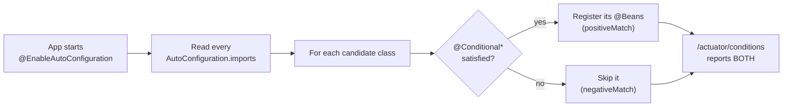
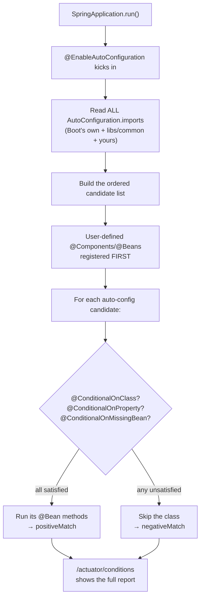
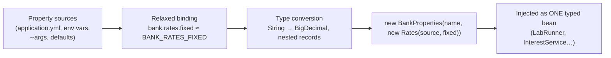
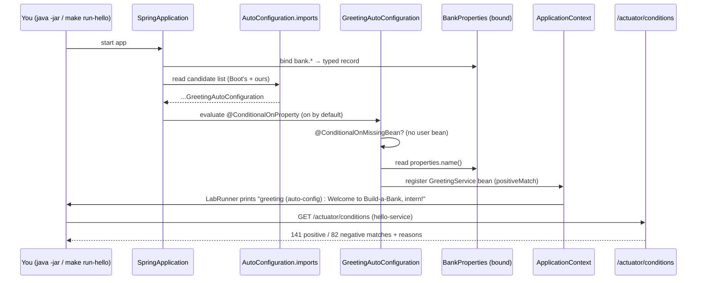

# Step 6 · Spring Boot Internals & Config

> **Step 6 of 67 · Phase A — Foundations 🟢** · Level badge: 🟢 Foundations · Effort ≈ 20h (experienced Spring devs: skip-test below and skim)

`🟢` Foundations &nbsp;·&nbsp; `🔵` Core &nbsp;·&nbsp; `🟣` Advanced &nbsp;·&nbsp; `🔴` Frontier

> [!CAUTION]
> **Educational, non-production project.** Build-a-Bank is for learning only. It never handles real money, real customers, or real personal data, and it is **not** security-audited for production banking. Every credential you ever see here is fake. (Full disclaimer + guardrails in the [README](../../README.md).)

---

## 🧭 The Six Movements of This Step

A one-line map of where we're going. Click to jump.

1. **[A · 🧭 Orient](#orient)** — what auto-configuration *is*, why it matters, the cheat card, and whether you can skip. *(~30 min)*
2. **[B · 🧠 Understand](#understand)** — how Boot's auto-configuration actually resolves, `@Conditional*` evaluation, `@ConfigurationProperties` binding, and Actuator as the X-ray machine — no magic; plus the security lens, the `spring.factories` → `.imports` version story, and the convention-over-configuration pattern. *(~2.5h)*
3. **[C · 🛠️ Build](#build)** — the heart: type-safe `BankProperties` → enable it → refactor `LabRunner` off `@Value`/SpEL → write `GreetingService` → write `GreetingAutoConfiguration` + the `.imports` file → wire it in and run → widen `hello-service` Actuator and read `/actuator/conditions`. Then 🎮 Play With It and the 🏁 finished result. *(~12h)*
4. **[D · 🔬 Prove](#prove)** — the Verification Log: the real, pasted `verify` (10 spring-lab tests), the app run, and the live Actuator capture. *(~1h)*
5. **[E · 🎓 Apply](#apply)** — go-deeper asides, interview prep, and your-turn exercises. *(~2.5h)*
6. **[F · 🏆 Review](#review)** — troubleshooting, resources & glossary, and the recap/study notes. *(~1.5h)*

---

<a id="orient"></a>

# A · 🧭 Orient

## 📋 This Step in 30 Seconds

| | |
|---|---|
| **Title** | Spring Boot internals & config — auto-configuration, `@ConfigurationProperties`, Actuator basics |
| **Step** | 6 of 67 · **Phase A — Foundations** 🟢 |
| **Effort** | ≈ 20 hours focused. The *mental model* is the payoff; an experienced Boot dev can skip-test and skim to ~3h. |
| **What you'll run this step** | **JVM + Maven** for the lab. **For the Actuator part, start `hello-service`** (`make run-hello`) — a real web server on `:8080`. We extend the existing `playground/spring-lab` module (no new module) and widen one YAML file in `services/hello`. No Docker, no database. |
| **Buildable artifact** | EXTEND `playground/spring-lab` — typed `BankProperties` + `@EnableConfigurationProperties`, a custom `GreetingAutoConfiguration` + `GreetingService` discovered via `AutoConfiguration.imports`, `LabRunner` refactored to consume both. AND widen `services/hello` Actuator exposure. `step-06-start == step-05-end`. |
| **Verification tier** | 🟠 **Standard** — `./mvnw verify` green + all 10 spring-lab tests + the app run proving typed config & the auto-configured greeting + the live `/actuator/conditions` capture. (No mutation/clean-room: this is a learning module, no money/security/concurrency path yet.) |
| **Depends on** | **Step 5** (Spring Core & IoC — beans, scopes, `@ConditionalOnProperty`, `@Bean` vs `@Component`, `ApplicationContextRunner`). Helpful: Step 1 (the `make`/`./mvnw` toolchain). |

By the end you will understand — and be able to *see on screen* — what **auto-configuration** really is (a list of candidate classes Spring evaluates at startup), how `@Conditional*` annotations decide which beans get registered, why `@ConditionalOnMissingBean` means "a sensible default you can override," how to build your **own** tiny auto-configuration (the seed of the Step-28 starter), how **type-safe `@ConfigurationProperties`** with constructor binding beats scattered `@Value` strings, and how **Actuator endpoints** (`/actuator/conditions`, `/configprops`, `/beans`, `/env`) let you *interrogate the container's decisions* instead of guessing.

### ⏭️ Can You Skip This Step? (5-minute self-check)

Run this self-check. If you can confidently do **all** of it, skim the 🕰️/🛡️/🧩 asides and jump to **[Step 7 — AOP & the proxy model](../step-07/lesson.md)**.

- [ ] I can explain what `@EnableAutoConfiguration` does at startup and **where Boot finds the list** of auto-configurations (and the *old* place it used to look).
- [ ] I can read `/actuator/conditions` and answer **"why is / isn't this bean here?"** from positive/negative matches.
- [ ] I know what `@ConditionalOnMissingBean`, `@ConditionalOnProperty`, and `@ConditionalOnClass` evaluate, and **when** auto-configs run relative to my own beans.
- [ ] I can bind external config into a **typed `record`** with `@ConfigurationProperties` (constructor binding) and explain **relaxed binding** vs scattered `@Value`.
- [ ] I can write a **custom auto-configuration** that backs off when the user supplies their own bean, and test it with `ApplicationContextRunner`.
- [ ] I can name **three Actuator endpoints that leak internal structure** and why they must be locked down in production.

> [!TIP]
> Not 100%? Stay. "Spring Boot is magic" is the single most common gap in interviews and 2am incidents alike. After this step you'll treat Boot as a **transparent, debuggable system** — you'll *ask the container* what it decided, instead of sprinkling annotations and praying. This is also the conceptual seed of the real auto-configured starter you ship in Step 28.

## 📇 Cheat Card

> **What this step delivers (one sentence):** your Spring Lab app now gets its bank name and rate from a **typed config record** and its greeting from a **custom auto-configuration you wrote** — and you can flip `bank.greeting.enabled=false` to watch that bean *vanish*, or define your own `GreetingService` to watch the auto-config *back off* — while `/actuator/conditions` shows you every decision Boot made.

**Key commands** (Windows uses `.\mvnw.cmd`; macOS/Linux/Git-Bash use `./mvnw`):

```bash
# Build + run all 10 tests for the lab (and anything it depends on, -am):
./mvnw -pl playground/spring-lab -am verify

# Run the lab (typed props + auto-configured greeting):
java -jar playground/spring-lab/target/spring-lab-0.1.0-SNAPSHOT.jar

# Break-it #1 — disable the greeting auto-config (watch it back off):
java -jar playground/spring-lab/target/spring-lab-0.1.0-SNAPSHOT.jar --bank.greeting.enabled=false

# Start hello-service to use Actuator, then read the auto-config report:
make run-hello                       # or: ./mvnw -pl services/hello spring-boot:run
curl -s http://localhost:8080/actuator/conditions | jq '.contexts."hello-service".positiveMatches | keys | length'

# One-shot proof your build matches the lesson:
bash steps/step-06/smoke.sh
```

**The one headline idea — *Boot keeps a list of candidate configurations and asks "should I?" of each one*:**



*Alt-text: at startup `@EnableAutoConfiguration` reads every `AutoConfiguration.imports` file to get the candidate list; for each candidate it evaluates the `@Conditional*` annotations; satisfied → its beans are registered as a positive match, unsatisfied → it is skipped as a negative match; the `/actuator/conditions` endpoint reports both sets.*

## 🎯 Why This Matters

Spring Boot's whole value proposition is **convention over configuration**: add a JAR, get sensible beans for free. But "for free" is exactly where engineers get stuck — *why did this bean appear? why didn't mine? why is my property ignored?* This step turns that black box into glass. You'll learn the precise machinery (`AutoConfiguration.imports` → `@Conditional*` → bean registration), build your own miniature starter, and use Actuator to *interrogate* any running Boot app. Interviewers lean on this hard ("how does auto-configuration work?", "what does `@ConditionalOnMissingBean` buy you?", "how would you debug a missing bean?") because it separates people who *use* Spring from people who *operate* it. And every banking service you build from here ships these exact patterns.

## ✅ What You'll Be Able to Do

- Explain **auto-configuration end to end**: `@EnableAutoConfiguration` → `AutoConfiguration.imports` → candidate classes → `@Conditional*` evaluation → bean registration, and *when* it runs relative to your beans.
- Read **`/actuator/conditions`** and answer "why is/isn't this bean here?" from positive and negative matches.
- Bind external config into a **typed `record`** with `@ConfigurationProperties` + **constructor binding**, and explain **relaxed binding** and why it beats scattered `@Value`.
- Register a typed-config class with **`@EnableConfigurationProperties`**.
- Write your **own `@AutoConfiguration`** class, register it via the `.imports` file, and make it **back off** with `@ConditionalOnMissingBean` and toggle with `@ConditionalOnProperty`.
- Test an auto-configuration the way Boot tests its own — with **`ApplicationContextRunner` + `AutoConfigurations.of(...)`**.
- Use **`/actuator/configprops`, `/beans`, `/env`, `/mappings`** to inspect a live container — and explain why they must be **locked down in production**.

## 🧰 Before You Start

**Depends on: Step 5** (Step 1 helps but isn't required).

You'll reuse, from earlier steps:

- **Step 5** — the `playground/spring-lab` module itself, plus `@ConditionalOnProperty` (you already used it on `FixedRateProvider`), the `@Bean` factory method (`Clock` in `LabConfig`), `@Component` scanning, singleton vs prototype scope, and the boot-free **`ApplicationContextRunner`** test style. This step *extends* that module — same `RateProvider`/`InterestService`/`AuditEntry` you already built.
- **Step 5** — the `@Value("${bank.rates.fixed:0.0325}")` string in `FixedRateProvider`. This step shows the **grown-up alternative** to that pattern.
- **Step 1** — `make run-hello` and reading `./mvnw` output. The `hello-service` web app you first ran in Step 1 is the one we point Actuator at.

**Tooling check** (should already be true from Step 1):

```bash
java -version      # → 25.x
./mvnw -v          # → Apache Maven 3.9.12, Java 25
```

Optional but handy for the Actuator part: **`jq`** (pretty-prints/queries JSON). If you don't have it, every `curl … | jq …` below has a plain-`curl` fallback noted inline. No Docker, no database, no new ports beyond `hello-service`'s `:8080`.

## 🗓️ Session Plan

≈ 20 hours ≠ one heroic weekend. Here's the step cut into **8 sittings of ~2–3h**, each ending at a real save point (a ✋ checkpoint + 💾 commit). Returning after days away? Jump to the sitting whose end-state you last committed.

| # | Sitting | Covers | ~Time | Ends at |
|---|---|---|---|---|
| S1 | Map the territory | A · Orient (self-check, cheat card) + B · Understand (big idea, under-the-hood, security lens, then-vs-now) | ~3h | the baseline `verify` in "Your Starting Point" (6 tests green) |
| S2 | Typed config | Sub-step 1 — `BankProperties` record + `@EnableConfigurationProperties` + `BankPropertiesTest` | ~2.5h | sub-step 1 commit (7 tests green) |
| S3 | Refactor + plain service | Sub-step 2 (`LabRunner` off `@Value`) + Sub-step 3 (`GreetingService`) | ~2.5h | sub-step 3 commit |
| S4 | The auto-config itself | Sub-step 4 — `GreetingAutoConfiguration` + `.imports` file + 3 runner tests | ~3h | sub-step 4 commit (10 tests green) |
| S5 | Wire, run, break it | Sub-step 5 — final `LabRunner`, the app run, break-its #1–#3 | ~2h | sub-step 5 commit |
| S6 | Actuator X-ray | Sub-step 6 — widen `hello-service`, read `/actuator/conditions` + 🎮 Play With It + 🏁 Finished Result | ~2.5h | sub-step 6 commit (== `step-06-end`) |
| S7 | Prove + interview lens | D · Prove (read the log, run `smoke.sh`) + E · Go Deeper + Interview Prep | ~2.5h | end of Interview Prep |
| S8 | Practice + lock it in | E · Your Turn (+ optional Stretch) + F · Review + flashcards + reflection | ~2.5h | step sign-off 🎉 |

**Optional routes:** experienced Boot devs can take the ⏭️ skip-test above (~3h skim total instead). Detours and their costs: 🚀 Go Deeper asides (~10 min each), Break-it #2 (~10 min), Break-it #3 (~2 min), the Stretch exercise (~45–60 min).

---

<a id="understand"></a>

# B · 🧠 Understand

## 🧠 The Big Idea

In Step 5 you saw the IoC container construct *your* beans and wire them. But a real Spring Boot app has **hundreds** of beans you never wrote — an embedded Tomcat, Jackson JSON converters, a `DataSource`, Actuator endpoints. Where do they come from? Not magic — **auto-configuration**.

**The analogy.** Think of moving into a fully-furnished serviced apartment. You don't buy a fridge, a kettle, or a bed — the building provides **sensible defaults**. But if *you* bring your own espresso machine, the building doesn't force theirs on you — it *backs off*. And there's a thermostat panel by the door where you can see exactly which appliances are on and which are off, and why. Spring Boot is that building: auto-configurations are the furnishings, `@ConditionalOnMissingBean` is "we'll provide one *unless you brought your own*," and `/actuator/conditions` is the thermostat panel.

Mechanically, when your app starts:

1. `@SpringBootApplication` includes `@EnableAutoConfiguration`.
2. Boot reads **every** `META-INF/spring/org.springframework.boot.autoconfigure.AutoConfiguration.imports` file on the classpath — each line is the fully-qualified name of a **candidate** `@AutoConfiguration` class.
3. For each candidate, Boot evaluates its **`@Conditional*`** annotations (is a class present? is a property set? is a bean *missing*?). Satisfied → its `@Bean` methods run and register beans (a **positive match**). Not satisfied → the whole class is skipped (a **negative match**).
4. **Crucially, auto-configurations run *after* your own beans are defined** — so `@ConditionalOnMissingBean` can see what you've already provided and step aside.



*Alt-text: a flowchart of startup. `SpringApplication.run()` triggers `@EnableAutoConfiguration`, which reads all `AutoConfiguration.imports` files to build an ordered candidate list. User-defined beans are registered first. Then for each candidate Boot checks its `@Conditional*` annotations; if all are satisfied it runs the candidate's `@Bean` methods (positive match), otherwise it skips the class (negative match). The `/actuator/conditions` endpoint reports the full set of both.*

## 🌱 Under the Hood: How It Really Works

No magic. Here is what each moving part actually does.

**`@EnableAutoConfiguration` and the `.imports` file.** `@SpringBootApplication` = `@SpringBootConfiguration` + `@EnableAutoConfiguration` + `@ComponentScan` (you met this in Step 1's flashcards). `@EnableAutoConfiguration` imports a selector that uses Spring's `ImportCandidates` / `SpringFactoriesLoader` machinery to scan the classpath for **`META-INF/spring/org.springframework.boot.autoconfigure.AutoConfiguration.imports`** files and collect every class name listed. Boot's own `spring-boot-autoconfigure` JAR ships a huge one; your module can ship its own. That file is *literally* how Boot finds the candidates — open the JAR and you can read it.

**`@AutoConfiguration` vs plain `@Configuration`.** `@AutoConfiguration` is a specialized `@Configuration(proxyBeanMethods = false)` that *also* carries ordering metadata (`before`/`after` other auto-configs) and is meant to be discovered via the `.imports` file, **not** by component scan. The `proxyBeanMethods = false` ("lite mode") matters: auto-config `@Bean` methods don't call each other, so Boot skips the CGLIB proxy on the config class for a faster startup. (Contrast `LabConfig`, a plain `@Configuration` in full mode — Step 5.)

**`@Conditional*` evaluation.** Each condition is a `Condition` implementation Boot runs during bean-definition registration:
- **`@ConditionalOnClass`** — "is this type on the classpath?" (the #1 trigger — e.g. *"is `DataSource` present? then configure JPA"*).
- **`@ConditionalOnMissingBean`** — "has *no* bean of this type been defined yet?" This is the **override hook**: the auto-config provides a default *only if you didn't*. Because auto-configs run after your beans, this works.
- **`@ConditionalOnProperty`** — "is this property set to this value?" `matchIfMissing = true` means "on by default unless explicitly turned off."

**`@ConfigurationProperties` + constructor binding.** Instead of N scattered `@Value("${...}")` strings, you declare **one typed object** whose fields mirror a config prefix. When the type is a `record` (immutable, single canonical constructor), Boot uses **constructor binding**: it reads the property sources, applies **relaxed binding** (so `bank.rates.fixed`, `BANK_RATES_FIXED`, `bank.rates.FIXED` all map to the same field), converts each value to the field's type (`String`, `BigDecimal`, nested records…), and calls the constructor. You get IDE auto-completion, type safety, one place to validate, and no NPE-prone string parsing.



*Alt-text: the `@ConfigurationProperties` binding flow. Property sources (YAML, environment variables, command-line args, defaults) feed into relaxed binding, which normalizes key formats; values are type-converted (String to BigDecimal, nested records built); the immutable `BankProperties` record is constructed and injected as a single typed bean wherever it's needed.*

❓ **Knowledge-check:** where does Spring Boot find the list of candidate auto-configuration classes at startup, and what decides whether each candidate's beans are actually registered? <details><summary>answer</summary>It reads every `META-INF/spring/org.springframework.boot.autoconfigure.AutoConfiguration.imports` file on the classpath (one fully-qualified class name per line) to build the candidate list; then each candidate's `@Conditional*` annotations are evaluated — all satisfied → its `@Bean` methods run (positive match), otherwise the class is skipped (negative match).</details>

**Actuator.** Actuator adds operational HTTP endpoints under `/actuator`. The ones we use are *reports about the container itself*: `/conditions` (the `ConditionEvaluationReport` — every positive/negative auto-config match, with the reason), `/configprops` (every bound `@ConfigurationProperties` object), `/beans` (the full bean graph), `/env` (resolved property sources in precedence order), `/mappings` (every URL→handler). Endpoints are **opt-in** for web exposure — you choose what `management.endpoints.web.exposure.include` reveals. That opt-in is a *security control*, which brings us to…

## 🧩 Pattern Spotlight — Convention over Configuration (and the override hook)

> **Problem.** Wiring a web server, JSON, a datasource, metrics, and health checks by hand is hundreds of lines of boilerplate that's identical across every app — and easy to get subtly wrong.
>
> **The pattern.** **Convention over configuration**: the framework ships *opinionated defaults* that activate automatically based on context (what's on the classpath, what properties are set). You only write configuration where you **deviate** from the convention.
>
> **Why auto-configuration fits.** `@Conditional*` makes the conventions *context-aware* (a `DataSource` only if a JDBC driver is present), and **`@ConditionalOnMissingBean` is the escape hatch** — the convention applies *unless you override it* by defining your own bean. You get zero-config productivity **and** full control, with no "all or nothing" trade-off.
>
> **Alternatives / trade-offs.** Explicit configuration (Spring without Boot, or `@Bean` everything) is more verbose but maximally transparent. Auto-configuration trades a little "where did that come from?" mystery for enormous boilerplate savings — and `/actuator/conditions` buys back the transparency. The danger is *over-magic*: never ship an auto-config that surprises users; gate it tightly with conditions and document it.
>
> **Micro-structure (what you'll build below):** an `@AutoConfiguration` class → guarded by `@ConditionalOnProperty` (toggle) → a `@Bean @ConditionalOnMissingBean` (back-off) → listed in `AutoConfiguration.imports` (discovery). That's the exact skeleton of every Boot starter, including the one you ship in Step 28.

## 🛡️ Security Lens: What Could Go Wrong

> [!WARNING]
> **Actuator endpoints are a reconnaissance goldmine — never expose them unauthenticated in production.**
>
> The endpoints we deliberately open this step **leak your application's internal structure**:
> - **`/actuator/beans`** — your entire object graph and class names (tells an attacker your architecture, libraries, versions).
> - **`/actuator/env`** and **`/actuator/configprops`** — resolved configuration and property sources. Boot **sanitizes obvious secrets** (keys matching `password`, `secret`, `token`, `key`, … are shown as `******`), but sanitization is best-effort: a custom-named secret can slip through.
> - **`/actuator/mappings`** — every URL your app serves, including ones you forgot were there.
> - **`/actuator/conditions`** — your dependency footprint via which auto-configs matched.
>
> **This step opens them on `hello-service` for *learning only*** (`include: health,info,conditions,beans,configprops,env,mappings`, plus `health show-details: always`). In production you would: expose only `health` and `info` over the web, move the rest to a separate **management port** firewalled to ops, and put the whole `/actuator/**` path **behind authentication** (Spring Security). We do the full hardening in **Phase H** (Step 39+). For now: know that *you* control exposure, and the default (`health` only) is the safe one.

## 🕰️ Then vs. Now (How This Changed Across Versions)

| Concern | Old way | Now (Boot 2.7+ / 3 / 4) | Why it changed |
|---|---|---|---|
| **Auto-config discovery** | `META-INF/spring.factories` with the key `org.springframework.boot.autoconfigure.EnableAutoConfiguration=…` (comma-separated, line-continued) | `META-INF/spring/org.springframework.boot.autoconfigure.AutoConfiguration.imports` — **one class per line** | `spring.factories` was a single overloaded file for *all* SPI keys and was slow to parse; the dedicated `.imports` file is purpose-built, faster, and clearer. Deprecated in 2.7, the **only** way in 3.x/4.x. |
| **Marker annotation** | `@Configuration` listed under the old key | **`@AutoConfiguration`** (`@Configuration(proxyBeanMethods=false)` + ordering) | explicit intent + lite-mode startup speed + first-class `before`/`after` ordering |
| **Typed config** | scattered `@Value("${bank.rates.fixed}")` strings, parsed by hand | **`@ConfigurationProperties` records** with constructor binding | one typed object, relaxed binding, validation hooks, IDE completion; immutable by construction |
| **`@SpringBootApplication`** | manual `@Configuration` + `@EnableAutoConfiguration` + `@ComponentScan` | the single **`@SpringBootApplication`** meta-annotation (since Boot 1.2) | one annotation, same three behaviors — you saw this in Step 1 |
| **Package namespace** | `javax.*` | `jakarta.*` (Boot 3+/Framework 6+) | the Jakarta EE rename; not directly visible here but it's why Boot-2 starters can't run on Boot 3/4 |

> [!NOTE]
> **Verified for this repo:** we're on **Spring Boot 4.0.6** (see `VERSIONS.md`). Our `.imports` file lives at exactly the modern path and `GreetingAutoConfiguration` uses `@AutoConfiguration` — no `spring.factories` anywhere. If you read an old StackOverflow answer telling you to edit `spring.factories`, it's pre-2.7 advice: don't.

---

<a id="build"></a>

# C · 🛠️ Build

## 📦 Your Starting Point

You're standing on **`step-06-start`**, which is byte-for-byte **`step-05-end`**. What's already green:

- `playground/spring-lab` — a non-web Spring Boot app with the IoC demo from Step 5: `RateProvider` (interface) + `FixedRateProvider`/`MarketRateProvider` (conditional beans), `InterestService` (constructor DI), `LabConfig` with a `@Bean Clock`, `AuditEntry` (prototype), `LifecycleBean` + `TimingBeanPostProcessor`, and a `LabRunner` that prints it all. **6 tests** pass.
- `services/hello` — the Step-1 web app on `:8080`, with Actuator on the classpath but only `health,info` exposed.

Confirm the floor is solid before you build on it:

```bash
./mvnw -pl playground/spring-lab -am verify
```

✅ **Expected (tail):**

```
[INFO] Tests run: 6, Failures: 0, Errors: 0, Skipped: 0
[INFO] BUILD SUCCESS
```

If that's green, you're ready. By the end of this section the lab will have **10 tests** and a custom auto-configuration, and `hello-service` will reveal its auto-config decisions.

## 🛠️ Let's Build It — Step by Step

### 🗺️ What we're about to build

```mermaid
flowchart TD
    subgraph cfg["Typed config"]
        BP["BankProperties (record)<br/>@ConfigurationProperties('bank')"]
        LC["LabConfig<br/>@EnableConfigurationProperties(BankProperties)"]
    end
    subgraph ac["Custom auto-configuration"]
        GS["GreetingService<br/>(plain class, NOT @Component)"]
        GAC["GreetingAutoConfiguration<br/>@AutoConfiguration + @Conditional*"]
        IMP["AutoConfiguration.imports<br/>(discovery)"]
    end
    LR["LabRunner<br/>(consumes both)"]
    HELLO["services/hello application.yml<br/>(widen Actuator exposure)"]

    LC -->|enables binding| BP
    IMP -->|lists| GAC
    GAC -->|@Bean, needs name| BP
    GAC -->|registers| GS
    BP --> LR
    GS --> LR
    HELLO -.->|/actuator/conditions reveals all this| GAC
```

*Alt-text: the build map. `LabConfig` enables binding of the `BankProperties` record. The `AutoConfiguration.imports` file lists `GreetingAutoConfiguration`, which reads `BankProperties` for the bank name and registers a `GreetingService` bean. `LabRunner` consumes both `BankProperties` and `GreetingService`. Separately, widening `services/hello`'s `application.yml` exposes Actuator endpoints that reveal these auto-config decisions.*

### 🌳 Files we'll touch

```
build-a-bank/
├── playground/spring-lab/src/main/
│   ├── java/com/buildabank/springlab/
│   │   ├── config/
│   │   │   ├── BankProperties.java            ← NEW (sub-step 1)
│   │   │   └── LabConfig.java                 ← EDIT (sub-step 1: @EnableConfigurationProperties)
│   │   ├── autoconfig/
│   │   │   ├── GreetingService.java           ← NEW (sub-step 3)
│   │   │   └── GreetingAutoConfiguration.java ← NEW (sub-step 4)
│   │   └── LabRunner.java                     ← EDIT (sub-steps 2 & 5)
│   └── resources/META-INF/spring/
│       └── org.springframework.boot.autoconfigure.AutoConfiguration.imports  ← NEW (sub-step 4)
├── playground/spring-lab/src/test/java/com/buildabank/springlab/
│   ├── config/BankPropertiesTest.java         ← NEW (sub-step 1)
│   └── autoconfig/GreetingAutoConfigurationTest.java ← NEW (sub-step 4)
└── services/hello/src/main/resources/application.yml ← EDIT (sub-step 6)
```

Six sub-steps. Build top-to-bottom, run between each.

---

### Sub-step 1 of 6 (≈ 2.5h) — Type-safe config: the `BankProperties` record 🧭 *(you are here: **typed config** → refactor runner → service → auto-config → wire → actuator)*

🎯 **Goal:** replace the idea of scattered `@Value("${bank.rates.fixed:…}")` strings with **one immutable, typed object** that mirrors the `bank.*` config prefix — and turn on its binding.

📁 **Location:** new file → `playground/spring-lab/src/main/java/com/buildabank/springlab/config/BankProperties.java`

⌨️ **Code:**

```java
// playground/spring-lab/src/main/java/com/buildabank/springlab/config/BankProperties.java
package com.buildabank.springlab.config;

import java.math.BigDecimal;

import org.springframework.boot.context.properties.ConfigurationProperties;

/**
 * Type-safe configuration bound from {@code bank.*} properties — the grown-up alternative to scattered
 * {@code @Value} strings. Spring Boot binds {@code bank.name}, {@code bank.rates.source}, and
 * {@code bank.rates.fixed} into this immutable record via <strong>constructor binding</strong>.
 *
 * <p>Registered with {@code @EnableConfigurationProperties(BankProperties.class)} (see {@code LabConfig}).
 * Benefits over {@code @Value}: one typed object, IDE auto-completion, relaxed binding, and validation hooks.
 */
@ConfigurationProperties(prefix = "bank")
public record BankProperties(String name, Rates rates) {

    public record Rates(String source, BigDecimal fixed) {
    }
}
```

🔍 **Line-by-line:**
- `@ConfigurationProperties(prefix = "bank")` — binds every property under `bank.*` into this object. `name` ← `bank.name`; the nested `rates` record ← `bank.rates.*`.
- `public record BankProperties(...)` — a **record** is an immutable class with a canonical constructor and accessors (Step 2). Because it has exactly one constructor, Boot uses **constructor binding** — no setters, no mutability, thread-safe to share.
- `Rates(String source, BigDecimal fixed)` — a **nested record** maps `bank.rates.source` → `source` and `bank.rates.fixed` → a `BigDecimal` (Boot converts the YAML string `0.0325` to `BigDecimal` for you — exactly the money-correctness rule from Step 2).
- No `@Component` here — config-properties classes are registered a different way (next edit), not by component scan.

💭 **Under the hood:** at startup Boot's `ConfigurationPropertiesBindingPostProcessor` finds this type, walks the constructor parameters, resolves each from the `Environment` with **relaxed binding** (so `bank.rates.fixed`, `BANK_RATES_FIXED`, and `bank.rates.FIXED` all hit `rates.fixed`), converts strings to the declared types, and constructs the record. One bean, fully typed.

Now turn binding on. Boot won't bind a `@ConfigurationProperties` class unless something *registers* it.

📁 **Location:** edit → `playground/spring-lab/src/main/java/com/buildabank/springlab/config/LabConfig.java`

⌨️ **Edit (before → after):**

```java
// BEFORE — LabConfig.java (Step 5)
import java.time.Clock;

import org.springframework.context.annotation.Bean;
import org.springframework.context.annotation.Configuration;

@Configuration
public class LabConfig {
```

```java
// AFTER — playground/spring-lab/src/main/java/com/buildabank/springlab/config/LabConfig.java
package com.buildabank.springlab.config;

import java.time.Clock;

import org.springframework.boot.context.properties.EnableConfigurationProperties;
import org.springframework.context.annotation.Bean;
import org.springframework.context.annotation.Configuration;

/**
 * A {@code @Configuration} class with a {@code @Bean} <strong>factory method</strong>, and the place we
 * turn on {@link BankProperties} binding via {@code @EnableConfigurationProperties}.
 *
 * <p>By default {@code @Configuration} is "full" mode ({@code proxyBeanMethods=true}): calling
 * {@code clock()} from another {@code @Bean} method returns the SAME singleton, because Spring intercepts
 * the call via a CGLIB proxy of this config class.
 */
@Configuration
@EnableConfigurationProperties(BankProperties.class)
public class LabConfig {

    /** A UTC clock bean — injectable anywhere we need "now" (and mockable in tests). */
    @Bean
    public Clock clock() {
        return Clock.systemUTC();
    }
}
```

🔍 **What changed:** one import (`EnableConfigurationProperties`) and one annotation. `@EnableConfigurationProperties(BankProperties.class)` registers `BankProperties` as a bean *and* triggers its binding. (You could instead put `@ConfigurationPropertiesScan` on the app class; we register explicitly here so the wiring is obvious.)

🔮 **Predict:** we haven't told `LabRunner` to use `BankProperties` yet, and `BankProperties` itself has no default for `name`/`rates`. If you `verify` now, will the **existing** tests still pass? (Think: does anything *require* `bank.name` to be set yet?)

▶️ **Run & See:**

```bash
./mvnw -pl playground/spring-lab -am verify
```

✅ **Expected (tail):**

```
[INFO] Tests run: 6, Failures: 0, Errors: 0, Skipped: 0
[INFO] BUILD SUCCESS
```

❌ **Common wrong output:** `cannot find symbol … EnableConfigurationProperties` at compile → you added the annotation but not its import line in `LabConfig`.

Still 6 — we've only *added* a bindable type; nothing depends on it yet. ✋ **Checkpoint:** the module compiles and the 6 Step-5 tests still pass. *Stopping here? You have typed config compiling (nothing committed yet — the commit lands after the next test). Next: `BankPropertiesTest`, same sub-step; first action: create `playground/spring-lab/src/test/java/com/buildabank/springlab/config/BankPropertiesTest.java`.*

Let's prove the binding actually works with a tiny test.

📁 **Location:** new file → `playground/spring-lab/src/test/java/com/buildabank/springlab/config/BankPropertiesTest.java`

⌨️ **Code:**

```java
// playground/spring-lab/src/test/java/com/buildabank/springlab/config/BankPropertiesTest.java
package com.buildabank.springlab.config;

import static org.assertj.core.api.Assertions.assertThat;

import org.junit.jupiter.api.Test;
import org.springframework.beans.factory.annotation.Autowired;
import org.springframework.boot.test.context.SpringBootTest;

/** Proves {@code bank.*} properties bind into the typed {@link BankProperties} record. */
@SpringBootTest(properties = {"bank.name=Build-a-Bank", "bank.rates.source=fixed", "bank.rates.fixed=0.0325"})
class BankPropertiesTest {

    @Autowired
    BankProperties properties;

    @Test
    void bindsTypedConfiguration() {
        assertThat(properties.name()).isEqualTo("Build-a-Bank");
        assertThat(properties.rates().source()).isEqualTo("fixed");
        assertThat(properties.rates().fixed()).isEqualByComparingTo("0.0325");
    }
}
```

🔍 **Line-by-line:**
- `@SpringBootTest(properties = {...})` — boots the full context with these three properties injected (the cleanest way to feed config in a test). These mirror what the running app will use.
- `@Autowired BankProperties properties` — injects the *bound* record. If binding were broken, this injection (or the assertions) would fail.
- `isEqualByComparingTo("0.0325")` — compares `BigDecimal` by **value**, not by `equals` (which is scale-sensitive: `0.0325` ≠ `0.03250`). The money-safe comparison from Step 2.

💭 **Under the hood:** `@SpringBootTest`'s `properties` become a high-precedence property source; the binder reads them, constructs the record, and `@EnableConfigurationProperties` (which the test context picks up via `LabConfig`) makes it injectable.

▶️ **Run & See:**

```bash
./mvnw -pl playground/spring-lab -am verify
```

✅ **Expected (relevant lines):**

```
[INFO] Tests run: 1, Failures: 0, Errors: 0, Skipped: 0 -- in com.buildabank.springlab.config.BankPropertiesTest
[INFO] Tests run: 7, Failures: 0, Errors: 0, Skipped: 0
[INFO] BUILD SUCCESS
```

❌ **Common wrong output:** `NoSuchBeanDefinitionException: … BankProperties` → the class was never registered — check `@EnableConfigurationProperties(BankProperties.class)` on `LabConfig` (Troubleshooting, row 1).

7 tests now (the 6 from Step 5 + this one). ✋ **Checkpoint:** `BankPropertiesTest` is green — your typed config binds. *Stopping here? Commit below first — then you have 7 green tests and proven binding. Next: Sub-step 2 (refactor `LabRunner`); first action: open `playground/spring-lab/src/main/java/com/buildabank/springlab/LabRunner.java`.*

💾 **Commit:**

```bash
git add . && git commit -m "feat(spring-lab): add type-safe BankProperties (constructor binding) + enable it"
```

⚠️ **Pitfall:** forget `@EnableConfigurationProperties` (or `@ConfigurationPropertiesScan`) and `BankProperties` is **never registered** → `NoSuchBeanDefinitionException` the moment something injects it. The `@ConfigurationProperties` annotation alone only marks the class; *something* must enable it.

---

### Sub-step 2 of 6 (≈ 1.5h) — Refactor `LabRunner` onto typed config 🧭 *(typed config ✅ → **refactor runner** → service → auto-config → wire → actuator)*

🎯 **Goal:** make `LabRunner` read the bank name and rate from `BankProperties` (typed) instead of any hard-coded string — proving the typed object flows through real wiring. (We'll add the greeting in sub-step 5; first, just the props.)

📁 **Location:** edit → `playground/spring-lab/src/main/java/com/buildabank/springlab/LabRunner.java`

> We'll do this edit in two passes so each idea lands separately: **(2)** inject `BankProperties` and use it for the banner + rate; **(5)** inject the auto-configured `GreetingService`. Here's pass (2).

⌨️ **Edit (before → after — the constructor and `run()`):**

```java
// BEFORE — LabRunner.java (Step 5): the @Value/SpEL pattern we're retiring
import org.springframework.beans.factory.annotation.Value;   // ← this import goes away
// ...
    private final InterestService interest;
    private final ApplicationContext context;
    private final Clock clock;
    private final String bankName;                            // ← DELETE
    private final double ratePercent;                         // ← DELETE

    public LabRunner(InterestService interest,
                     ApplicationContext context,
                     Clock clock,
                     @Value("${bank.name}") String bankName,  // ← DELETE
                     // SpEL: resolve the placeholder, then do arithmetic — 0.0325 * 100 = 3.25
                     @Value("#{ ${bank.rates.fixed:0.0325} * 100 }") double ratePercent) {  // ← DELETE
        this.interest = interest;
        this.context = context;
        this.clock = clock;
        this.bankName = bankName;                             // ← DELETE
        this.ratePercent = ratePercent;                       // ← DELETE
    }

    @Override
    public void run(String... args) {
        log.info("================ Spring Lab :: {} ================", bankName);
        log.info("wired RateProvider     : {}", interest.rateSource());
        log.info("annual rate (via SpEL) : {}%", ratePercent);                              // ← DELETE
        // ... interest + clock + singleton/prototype lines unchanged ...
    }
```

```java
// AFTER — playground/spring-lab/src/main/java/com/buildabank/springlab/LabRunner.java  (pass 1 of 2 — pass 2 lands in sub-step 5)
import com.buildabank.springlab.config.BankProperties;   // NEW import
// ...
    private final InterestService interest;
    private final ApplicationContext context;
    private final Clock clock;
    private final BankProperties properties;              // NEW field

    public LabRunner(InterestService interest,
                     ApplicationContext context,
                     Clock clock,
                     BankProperties properties) {          // NEW param — Spring injects the bound record
        this.interest = interest;
        this.context = context;
        this.clock = clock;
        this.properties = properties;                      // NEW
    }

    @Override
    public void run(String... args) {
        log.info("================ Spring Lab :: {} ================", properties.name());   // was injected via @Value("${bank.name}") — the pattern we're retiring
        log.info("wired RateProvider     : {}", interest.rateSource());
        log.info("annual rate (props)    : {}%", properties.rates().fixed().movePointRight(2).toPlainString());
        log.info("interest on 10000.00   : {}", interest.annualInterest(new BigDecimal("10000.00")));
        // ... clock + singleton/prototype lines unchanged from Step 5 ...
    }
```

🔍 **Line-by-line:**
- **DELETE the old `@Value` machinery entirely:** the two constructor params (`bankName`, `ratePercent`), their two fields and two assignments, the `annual rate (via SpEL)` log line, and the now-unused `import org.springframework.beans.factory.annotation.Value;`. Leftovers = the file won't compile (duplicate responsibilities, unused imports).
- `private final BankProperties properties;` + the constructor param — **constructor injection** again (Step 5). Spring sees the single constructor and supplies the bound `BankProperties` bean automatically.
- `properties.name()` — the banner now reads the bank name from the typed record instead of a raw `@Value` string. Change `bank.name` in config and the banner changes — no recompile.
- `properties.rates().fixed().movePointRight(2).toPlainString()` — `0.0325` × 100 → `3.25` as a plain string (a clean percentage display without floating-point surprises).

💭 **Under the hood:** how does the bound record reach this constructor? At startup the binder builds the `BankProperties` bean first (sub-step 1's `@EnableConfigurationProperties` registered it); when the container then instantiates the `@Component` `LabRunner`, it resolves each constructor parameter **by type** and finds exactly one `BankProperties` bean — the fully-bound, immutable record. No `@Autowired` needed on a single constructor (Step 5).

🔮 **Predict:** when you run the app with the default config (`bank.rates.fixed=0.0325`), what will the `annual rate (props)` line print? <details><summary>answer</summary>`annual rate (props)    : 3.25%` — `0.0325` with the point moved right two places.</details>

▶️ **Run & See:** (we'll do the full run after sub-step 5; for now just confirm it compiles)

```bash
./mvnw -pl playground/spring-lab -am test-compile
```

✅ **Expected (tail):**

```
[INFO] BUILD SUCCESS
```

❌ **Common wrong output:** `COMPILATION ERROR` mentioning `bankName` or `ratePercent` → the old `@Value` fields/params weren't fully deleted — re-check the BEFORE → AFTER above.

✋ **Checkpoint:** `LabRunner` compiles against `BankProperties` — and the app already *runs*: `bank.name` and `bank.rates.*` have lived in the lab's `application.yml` since Step 5 (Step 5's `@Value("${bank.name}")` had no default, so it required them). Want an early reward loop? `./mvnw -pl playground/spring-lab -am package`, then `java -jar playground/spring-lab/target/spring-lab-0.1.0-SNAPSHOT.jar` — the banner and rate lines now come from the typed record. *Stopping here? Commit below first. Next: Sub-step 3 (the plain `GreetingService`); first action: create `playground/spring-lab/src/main/java/com/buildabank/springlab/autoconfig/GreetingService.java`.*

💾 **Commit:**

```bash
git add . && git commit -m "refactor(spring-lab): LabRunner reads bank name + rate from typed BankProperties"
```

⚠️ **Pitfall:** `BigDecimal.movePointRight(2)` is correct; `multiply(new BigDecimal(100))` would also work but watch the scale (`3.2500`). For *display*, `movePointRight` keeps it tidy. Never use `double` for any of this (Step 2).

---

### Sub-step 3 of 6 (≈ 1h) — A plain `GreetingService` (the thing the auto-config will provide) 🧭 *(typed config ✅ → refactor ✅ → **service** → auto-config → wire → actuator)*

🎯 **Goal:** write the bean that our custom auto-configuration will contribute — deliberately a **plain class, NOT a `@Component`**, so the *only* way it enters the context is via the auto-config (just like Boot's own starter beans).

📁 **Location:** new file → `playground/spring-lab/src/main/java/com/buildabank/springlab/autoconfig/GreetingService.java`

⌨️ **Code:**

```java
// playground/spring-lab/src/main/java/com/buildabank/springlab/autoconfig/GreetingService.java
package com.buildabank.springlab.autoconfig;

/**
 * A plain service (NOT a {@code @Component}). It is contributed by {@code GreetingAutoConfiguration}
 * as a {@code @Bean}, the same way Spring Boot's own starters auto-configure beans for you. This is the
 * miniature preview of the real auto-configured starter you build in Step 28.
 */
public class GreetingService {

    private final String bankName;

    public GreetingService(String bankName) {
        this.bankName = bankName;
    }

    public String greet(String who) {
        return "Welcome to %s, %s!".formatted(bankName, who);
    }
}
```

🔍 **Line-by-line:**
- **No annotation on the class** — this is the whole point. If it were `@Component`, component scan would pick it up and there'd be nothing "auto-configured" about it. Starter beans are usually plain classes the starter's `@Bean` method constructs.
- `private final String bankName;` — immutable, injected via the constructor by the auto-config (which will pull it from `BankProperties.name()`).
- `"Welcome to %s, %s!".formatted(bankName, who)` — Java's `String.formatted` (Java 15+), the instance-method form of `String.format`.

💭 **Under the hood:** because there's no `@Component`/`@Service`, **component scan ignores this class entirely.** The bean appears in the context only if the auto-config's `@Bean` method runs — which we wire next. That separation (plain logic class + a config that decides whether to register it) is the heart of how starters stay optional and overridable.

🔮 **Predict:** if you booted the app right now and asked `context.getBean(GreetingService.class)`, would it succeed? Why (not)? <details><summary>answer</summary>No — `NoSuchBeanDefinitionException`. Nothing registers the class: it has no stereotype annotation, and the auto-config that will contribute it doesn't exist until sub-step 4.</details>

▶️ **Run & See:**

```bash
./mvnw -pl playground/spring-lab -am test-compile
```

✅ **Expected (tail):**

```
[INFO] BUILD SUCCESS
```

❌ **Common wrong sign:** the build stays green either way — but if you reflexively added `@Service`/`@Component`, the demonstration is silently broken (see the Pitfall below); remove the annotation.

✋ **Checkpoint:** `GreetingService` compiles. It is currently **not** a bean (nothing registers it yet) — that's expected. *Stopping here? Commit below first — you have typed config wired plus an unregistered service class. Next: Sub-step 4 (the auto-config itself); first action: create `playground/spring-lab/src/main/java/com/buildabank/springlab/autoconfig/GreetingAutoConfiguration.java`.*

💾 **Commit:**

```bash
git add . && git commit -m "feat(spring-lab): add plain GreetingService (no @Component — provided by auto-config)"
```

⚠️ **Pitfall:** the instinct to slap `@Service` on it. Resist — that would defeat the demonstration (it'd be a normal scanned bean, and `@ConditionalOnMissingBean` would have nothing to teach you).

---

### Sub-step 4 of 6 (≈ 3h) — The custom `@AutoConfiguration` + the `.imports` file 🧭 *(typed config ✅ → refactor ✅ → service ✅ → **auto-config** → wire → actuator)*

🎯 **Goal:** write a real (tiny) auto-configuration that registers `GreetingService` — *conditionally* — and make Boot **discover** it via the `AutoConfiguration.imports` file. This is the structural skeleton of every Boot starter.

📁 **Location:** new file → `playground/spring-lab/src/main/java/com/buildabank/springlab/autoconfig/GreetingAutoConfiguration.java`

⌨️ **Code:**

```java
// playground/spring-lab/src/main/java/com/buildabank/springlab/autoconfig/GreetingAutoConfiguration.java
package com.buildabank.springlab.autoconfig;

import org.springframework.boot.autoconfigure.AutoConfiguration;
import org.springframework.boot.autoconfigure.condition.ConditionalOnMissingBean;
import org.springframework.boot.autoconfigure.condition.ConditionalOnProperty;
import org.springframework.context.annotation.Bean;

import com.buildabank.springlab.config.BankProperties;

/**
 * A real (tiny) <strong>auto-configuration</strong> — exactly how Spring Boot configures beans based on
 * what is on the classpath and in your properties. It is discovered because its fully-qualified name is
 * listed in {@code META-INF/spring/org.springframework.boot.autoconfigure.AutoConfiguration.imports}.
 *
 * <ul>
 *   <li>{@code @ConditionalOnProperty(... matchIfMissing=true)} — on unless {@code bank.greeting.enabled=false};</li>
 *   <li>{@code @ConditionalOnMissingBean} — backs off if YOU already defined a {@code GreetingService}
 *       (this "sensible default you can override" behavior is the heart of Boot auto-configuration).</li>
 * </ul>
 */
@AutoConfiguration
@ConditionalOnProperty(name = "bank.greeting.enabled", havingValue = "true", matchIfMissing = true)
public class GreetingAutoConfiguration {

    @Bean
    @ConditionalOnMissingBean
    public GreetingService greetingService(BankProperties properties) {
        return new GreetingService(properties.name());
    }
}
```

🔍 **Line-by-line:**
- `@AutoConfiguration` — marks this as an auto-configuration class: `@Configuration(proxyBeanMethods=false)` + ordering metadata, meant to be discovered via the `.imports` file (not component scan).
- `@ConditionalOnProperty(name = "bank.greeting.enabled", havingValue = "true", matchIfMissing = true)` — the whole class applies **only if** `bank.greeting.enabled=true` *or* the property is **absent** (`matchIfMissing=true` = "on by default"). Set `bank.greeting.enabled=false` and the entire auto-config — and thus the bean — disappears.
- `@Bean` — a factory method that constructs the `GreetingService`.
- `@ConditionalOnMissingBean` — register this `GreetingService` **only if no `GreetingService` bean already exists.** This is the **override hook**: if you define your own, the auto-config steps aside.
- `greetingService(BankProperties properties)` — method parameters are auto-wired beans; Boot passes the bound `BankProperties`, and we feed `properties.name()` into the service.

💭 **Under the hood:** at startup, after your own beans are registered, Boot evaluates this candidate. It checks `@ConditionalOnProperty` (class-level) → if satisfied, it considers the `@Bean` method, checks `@ConditionalOnMissingBean` → if no `GreetingService` exists yet, it runs the method and registers the bean. Both decisions are recorded in the `ConditionEvaluationReport` you'll read via `/actuator/conditions`. **Ordering is the key insight:** `@ConditionalOnMissingBean` only works because auto-configs run *late* — after user beans are known.

Now make Boot **find** it. An auto-config class that isn't listed in the `.imports` file is just an ordinary (unscanned) class — invisible.

📁 **Location:** new file → `playground/spring-lab/src/main/resources/META-INF/spring/org.springframework.boot.autoconfigure.AutoConfiguration.imports`

✍️ **Type it yourself first:** you already know everything this file contains — one **fully-qualified class name** per line, and our class is `GreetingAutoConfiguration` in package `com.buildabank.springlab.autoconfig`. Write the single content line before you peek, then compare.

⌨️ **Code:**

```
# playground/spring-lab/src/main/resources/META-INF/spring/org.springframework.boot.autoconfigure.AutoConfiguration.imports
# Spring Boot discovers auto-configurations listed here (one fully-qualified class name per line).
# This is the modern replacement (Boot 2.7+/3+) for the old spring.factories EnableAutoConfiguration key.
com.buildabank.springlab.autoconfig.GreetingAutoConfiguration
```

🔍 **Line-by-line:**
- The **filename matters exactly**: `org.springframework.boot.autoconfigure.AutoConfiguration.imports`, under `src/main/resources/META-INF/spring/`. A typo here = silent no-op (the #1 custom-starter bug).
- `#` lines are comments.
- One **fully-qualified class name per line** — here, our single auto-config. Boot's `@EnableAutoConfiguration` (inside `@SpringBootApplication`) reads this file off the classpath and adds the class to its candidate list.

💭 **Under the hood:** at build time this file lands in `target/classes/META-INF/spring/…` and ships inside the jar. At startup `SpringFactoriesLoader`/`ImportCandidates` reads **every** such file on the classpath (Boot's own + yours) and merges them into the candidate list — which is precisely why dropping a starter JAR on the classpath "just works."

Test it the way Boot tests its own auto-configs — fast, boot-free, with `ApplicationContextRunner` (you met this in Step 5).

📁 **Location:** new file → `playground/spring-lab/src/test/java/com/buildabank/springlab/autoconfig/GreetingAutoConfigurationTest.java`

⌨️ **Code (the scaffold fades here — you get the harness + the first test; you write the other two):**

```java
// playground/spring-lab/src/test/java/com/buildabank/springlab/autoconfig/GreetingAutoConfigurationTest.java
package com.buildabank.springlab.autoconfig;

import static org.assertj.core.api.Assertions.assertThat;

import org.junit.jupiter.api.Test;
import org.springframework.boot.autoconfigure.AutoConfigurations;
import org.springframework.boot.test.context.runner.ApplicationContextRunner;

import com.buildabank.springlab.config.BankProperties;

/**
 * Tests the custom auto-configuration the way Spring Boot tests its own: with {@link ApplicationContextRunner}
 * and {@code AutoConfigurations.of(...)}. Verifies the conditional ON/OFF behavior and the back-off.
 */
class GreetingAutoConfigurationTest {

    private final ApplicationContextRunner runner = new ApplicationContextRunner()
            .withConfiguration(AutoConfigurations.of(GreetingAutoConfiguration.class))
            .withBean(BankProperties.class, () -> new BankProperties("Build-a-Bank", null));

    @Test
    void registersGreetingServiceByDefault() {
        runner.run(context -> {
            assertThat(context).hasSingleBean(GreetingService.class);
            assertThat(context.getBean(GreetingService.class).greet("Ada"))
                    .isEqualTo("Welcome to Build-a-Bank, Ada!");
        });
    }

    // ✍️ TODO(you): backsOffWhenDisabled
    // ✍️ TODO(you): backsOffWhenUserDefinesOwnBean
}
```

✍️ **Your turn — write the two back-off tests yourself** from the behaviors they must prove, then compare: **(a) `backsOffWhenDisabled`** — with the property `bank.greeting.enabled=false`, the context contains **no** `GreetingService`; **(b) `backsOffWhenUserDefinesOwnBean`** — when the test supplies its own `GreetingService("Custom Bank")`, that bean wins and the greeting starts with `"Welcome to Custom Bank"`. Hints: `runner.withPropertyValues(...)`, `runner.withBean(...)`, AssertJ's `doesNotHaveBean`.

<details>
<summary>✅ Solution — the two back-off tests</summary>

```java
    @Test
    void backsOffWhenDisabled() {
        runner.withPropertyValues("bank.greeting.enabled=false")
                .run(context -> assertThat(context).doesNotHaveBean(GreetingService.class));
    }

    @Test
    void backsOffWhenUserDefinesOwnBean() {
        runner.withBean(GreetingService.class, () -> new GreetingService("Custom Bank"))
                .run(context -> assertThat(context.getBean(GreetingService.class).greet("x"))
                        .startsWith("Welcome to Custom Bank"));
    }
```

</details>

🔍 **Line-by-line:**
- `ApplicationContextRunner` — a **boot-free** test harness: it spins up a minimal context with exactly the configuration you give it, runs assertions, and tears down — milliseconds, no `@SpringBootTest`.
- `.withConfiguration(AutoConfigurations.of(GreetingAutoConfiguration.class))` — registers our class **as an auto-configuration** (respecting its conditions and ordering), not as a plain `@Configuration`. This is the idiomatic way to test auto-config behavior.
- `.withBean(BankProperties.class, () -> new BankProperties("Build-a-Bank", null))` — supplies the `BankProperties` the auto-config needs (we don't need real rates here, hence `null`).
- **Test 1 — default ON:** `hasSingleBean` confirms the bean is registered and greets correctly.
- **Test 2 — `@ConditionalOnProperty`:** with `bank.greeting.enabled=false`, `doesNotHaveBean` confirms the whole auto-config backed off.
- **Test 3 — `@ConditionalOnMissingBean`:** when the test supplies its *own* `GreetingService`, the auto-config backs off and the user's bean (`"Custom Bank"`) wins.

🔮 **Predict:** in Test 3, which `GreetingService` ends up in the context — yours (`"Custom Bank"`) or the auto-config's (`"Build-a-Bank"`)? Why? <details><summary>answer</summary>Yours. `@ConditionalOnMissingBean` sees your bean already defined and the auto-config's `@Bean` method does **not** run. The greeting starts with `"Welcome to Custom Bank"`.</details>

▶️ **Run & See:**

```bash
./mvnw -pl playground/spring-lab -am verify
```

✅ **Expected (relevant lines):**

```
[INFO] Tests run: 1, Failures: 0, Errors: 0, Skipped: 0 -- in com.buildabank.springlab.config.BankPropertiesTest
[INFO] Tests run: 3, Failures: 0, Errors: 0, Skipped: 0 -- in com.buildabank.springlab.autoconfig.GreetingAutoConfigurationTest
[INFO] Tests run: 10, Failures: 0, Errors: 0, Skipped: 0
[INFO] Build-a-Bank :: Playground :: Spring Lab ........... SUCCESS
[INFO] BUILD SUCCESS
```

❌ **Common wrong sign:** all 10 tests green here does **not** prove discovery — these tests register the class directly via `AutoConfigurations.of`, bypassing the `.imports` file. A misnamed `.imports` only bites when the real app runs (`UnsatisfiedDependencyException` — Troubleshooting, row 2, and the Break-it below).

**10 tests** now (6 Step-5 + 1 `BankPropertiesTest` + 3 `GreetingAutoConfigurationTest`). ✋ **Checkpoint:** all three conditional behaviors are proven by tests. *Stopping here? Do the 60s break-it and commit below first — you have the full auto-config + 10 green tests. Next: Sub-step 5 (wire & run); first action: open `playground/spring-lab/src/main/java/com/buildabank/springlab/LabRunner.java`.*

🔬 **Break-it (60s) — make the discovery file lie.** Temporarily rename the `.imports` file (e.g. add a `.bak` suffix) and rerun `./mvnw -pl playground/spring-lab -am verify`. Watch `registersGreetingServiceByDefault` still pass (the test registers the class *directly* via `AutoConfigurations.of`, bypassing discovery) — **but** if you also ran the full app it'd no longer auto-wire the greeting. This teaches the difference between *being an auto-config* and *being discovered* as one. Rename it back.

❓ **Knowledge-check:** why does `@ConditionalOnMissingBean` work at all — what has to be true about *when* auto-configs run? <details><summary>answer</summary>Auto-configurations run **after** your own beans are registered, so by the time `@ConditionalOnMissingBean` is evaluated the container already knows whether you defined a `GreetingService`. If auto-configs ran first, the condition couldn't see your bean and the override hook would be impossible.</details>

💾 **Commit:**

```bash
git add . && git commit -m "feat(spring-lab): custom GreetingAutoConfiguration + AutoConfiguration.imports + tests"
```

⚠️ **Pitfall:** the **most common custom-starter bug** is a wrong path/filename for the `.imports` file. It must be *exactly* `src/main/resources/META-INF/spring/org.springframework.boot.autoconfigure.AutoConfiguration.imports`. One wrong character and Boot silently never finds your auto-config — and (unlike a compile error) nothing tells you. When a starter "isn't working," check this file first.

---

### Sub-step 5 of 6 (≈ 2h) — Wire `GreetingService` into `LabRunner` and run the whole thing 🧭 *(typed config ✅ → refactor ✅ → service ✅ → auto-config ✅ → **wire & run** → actuator)*

🎯 **Goal:** consume the auto-configured `GreetingService` in `LabRunner`, then run the app and *see* both the typed config and the auto-config in the logs. Here's the **complete, final** `LabRunner` (pass 5 — adds the greeting on top of pass 2).

📁 **Location:** edit → `playground/spring-lab/src/main/java/com/buildabank/springlab/LabRunner.java`

⌨️ **Code (the whole file, final):**

```java
// playground/spring-lab/src/main/java/com/buildabank/springlab/LabRunner.java
package com.buildabank.springlab;

import java.math.BigDecimal;
import java.time.Clock;

import org.slf4j.Logger;
import org.slf4j.LoggerFactory;
import org.springframework.boot.CommandLineRunner;
import org.springframework.context.ApplicationContext;
import org.springframework.stereotype.Component;

import com.buildabank.springlab.audit.AuditEntry;
import com.buildabank.springlab.autoconfig.GreetingService;
import com.buildabank.springlab.config.BankProperties;
import com.buildabank.springlab.interest.InterestService;

/**
 * A {@link CommandLineRunner} — Spring runs its {@code run} method once the context is fully started.
 * It prints the IoC + config concepts so you can SEE them: which {@code RateProvider} got wired, the
 * type-safe {@link BankProperties} values, the auto-configured {@link GreetingService}, an interest
 * calculation, and the singleton-vs-prototype scope difference.
 *
 * <p>Step 6 change: the bank name + rate now come from typed {@link BankProperties} (constructor binding),
 * not scattered {@code @Value}/SpEL strings; and {@code GreetingService} arrives via auto-configuration.
 */
@Component
public class LabRunner implements CommandLineRunner {

    private static final Logger log = LoggerFactory.getLogger(LabRunner.class);

    private final InterestService interest;
    private final ApplicationContext context;
    private final Clock clock;
    private final BankProperties properties;
    private final GreetingService greeting;

    public LabRunner(InterestService interest,
                     ApplicationContext context,
                     Clock clock,
                     BankProperties properties,
                     GreetingService greeting) {
        this.interest = interest;
        this.context = context;
        this.clock = clock;
        this.properties = properties;
        this.greeting = greeting;
    }

    @Override
    public void run(String... args) {
        log.info("================ Spring Lab :: {} ================", properties.name());
        log.info("greeting (auto-config) : {}", greeting.greet("intern"));
        log.info("wired RateProvider     : {}", interest.rateSource());
        log.info("annual rate (props)    : {}%", properties.rates().fixed().movePointRight(2).toPlainString());
        log.info("interest on 10000.00   : {}", interest.annualInterest(new BigDecimal("10000.00")));
        log.info("clock.instant() (UTC)  : {}", clock.instant());

        boolean singletonSame = context.getBean(InterestService.class) == context.getBean(InterestService.class);
        AuditEntry first = context.getBean(AuditEntry.class);
        AuditEntry second = context.getBean(AuditEntry.class);
        log.info("singleton same instance? {}", singletonSame);
        log.info("prototype instances     : #{} vs #{}  (same? {})",
                first.instanceId(), second.instanceId(), first == second);
        log.info("==================================================");
    }
}
```

🔍 **What changed from pass 2:**
- new import `com.buildabank.springlab.autoconfig.GreetingService`;
- new `final GreetingService greeting;` field + constructor param — Spring injects the **auto-configured** bean (the one `GreetingAutoConfiguration` registered);
- new log line `greeting (auto-config) : {}` calling `greeting.greet("intern")`.

💭 **Under the hood:** `LabRunner` now depends on `GreetingService` *by type*. At startup the auto-config registers that bean (default ON), and constructor injection supplies it here. If you disabled the auto-config *and* didn't provide your own, this injection would fail fast at startup with a clear "no `GreetingService` bean" message — exactly the kind of dependency Boot makes explicit.

The `bank.*` config for the run is **already there from Step 5** — no new config needed. Confirm your `playground/spring-lab/src/main/resources/application.yml` still has this block (it's what the banner, rate, and greeting read):

```yaml
bank:
  name: Build-a-Bank
  rates:
    source: fixed            # fixed | market  (selects which RateProvider bean is created)
    fixed: 0.0325            # 3.25% annual
```

To run the packaged jar:

🔮 **Predict:** write down the *exact* first two log lines you expect (the banner and the greeting) before you run. Then check.

▶️ **Run & See:**

```bash
# Build the runnable jar, then run it:
./mvnw -pl playground/spring-lab -am package
java -jar playground/spring-lab/target/spring-lab-0.1.0-SNAPSHOT.jar
```

✅ **Expected output** (the lab's log lines — your `clock.instant()` timestamp will differ):

```
INFO com.buildabank.springlab.LabRunner : ================ Spring Lab :: Build-a-Bank ================
INFO com.buildabank.springlab.LabRunner : greeting (auto-config) : Welcome to Build-a-Bank, intern!
INFO com.buildabank.springlab.LabRunner : wired RateProvider     : fixed
INFO com.buildabank.springlab.LabRunner : annual rate (props)    : 3.25%
INFO com.buildabank.springlab.LabRunner : interest on 10000.00   : 325.00
INFO com.buildabank.springlab.LabRunner : singleton same instance? true
INFO com.buildabank.springlab.LabRunner : prototype instances     : #1 vs #2  (same? false)
```

❌ **Common wrong output:** `UnsatisfiedDependencyException … GreetingService` at startup → Boot never *discovered* your auto-config; check the `.imports` path/filename character-for-character (Troubleshooting, row 2).

There it is: the **greeting came from your auto-configuration**, the **name + rate came from the typed record**, and the Step-5 scope behavior still holds. ✋ **Checkpoint:** the app runs and prints the auto-configured greeting + typed props. *Stopping here? Run break-it #1 and commit below first (or save break-its #2/#3, ~12 min, for next sitting). Next: Sub-step 6 (Actuator); first action: open `services/hello/src/main/resources/application.yml`.*

🔬 **Break-it #1 (the headline experiment) — disable the greeting auto-config:**

```bash
java -jar playground/spring-lab/target/spring-lab-0.1.0-SNAPSHOT.jar --bank.greeting.enabled=false
```

❌ **What you'll see:** the app **fails to start** with an `UnsatisfiedDependencyException` — `LabRunner` needs a `GreetingService` bean, but `@ConditionalOnProperty` switched the auto-config off, so none exists. This is auto-config working *exactly as designed*: turn the convention off, the bean vanishes, and anything depending on it fails fast and loudly (no silent nulls). (In the tests, nothing depends on the missing bean, so `backsOffWhenDisabled` simply asserts it's absent.)

🔬 **Break-it #2 (+~10 min — edit + rebuild + revert) — define your own bean and watch the auto-config back off.** Add a `@Bean GreetingService` to `LabConfig` returning `new GreetingService("My Own Bank")`, rebuild, and run with defaults. The banner still says "Build-a-Bank" (that's `bank.name`), but the **greeting** line now reads `Welcome to My Own Bank, intern!` — because `@ConditionalOnMissingBean` saw your bean and the auto-config stepped aside. Remove it when done. (This is what Test 3 proves.)

🔬 **Break-it #3 (+~2 min) — mistype a property and watch binding.** Run with `--bank.rates.fixed=oops`. Boot can't convert `"oops"` to a `BigDecimal`, so startup fails with a **binding/conversion error** naming the offending property and target type — far better than a `NumberFormatException` deep inside your code at runtime. Typed config catches config mistakes *at the door*.

💾 **Commit:**

```bash
git add . && git commit -m "feat(spring-lab): LabRunner consumes the auto-configured GreetingService"
```

⚠️ **Pitfall:** if you want the greeting *optional* without a hard startup failure when disabled, inject `ObjectProvider<GreetingService>` instead of `GreetingService` and handle absence. We use the hard dependency on purpose here — it makes the "bean vanished" experiment vivid.

---

### Sub-step 6 of 6 (≈ 1.5h) — Widen `hello-service` Actuator and read the auto-config report 🧭 *(typed config ✅ → refactor ✅ → service ✅ → auto-config ✅ → wire ✅ → **actuator**)*

🎯 **Goal:** point Actuator at a *real* web app (`hello-service`) and use `/actuator/conditions` to see Boot's auto-config decisions on hundreds of candidates — the exact tool you'll use to debug "why is/isn't this bean here?" forever.

📁 **Location:** edit → `services/hello/src/main/resources/application.yml`

⌨️ **Edit (before → after — the `management` block):**

```yaml
# BEFORE — services/hello/src/main/resources/application.yml (Step 1)
management:
  endpoints:
    web:
      exposure:
        include: health,info
```

```yaml
# AFTER — services/hello/src/main/resources/application.yml
# services/hello/src/main/resources/application.yml
# Configuration for the Step 1 hello-service. YAML keys map to Spring properties;
# we explain @ConfigurationProperties and how this is bound in Step 6.

spring:
  application:
    name: hello-service
  threads:
    virtual:
      enabled: true        # Java 25 virtual threads for request handling (Domain 2 / Step 11).

server:
  port: 8080
  shutdown: graceful       # finish in-flight requests on SIGTERM (k8s-friendly; deep dive Step 34).

management:
  endpoints:
    web:
      exposure:
        # Step 6: expose endpoints that reveal Boot's auto-configuration decisions.
        # 'conditions' = the auto-config positive/negative match report; 'configprops' = bound @ConfigurationProperties;
        # 'beans' = every bean in the context; 'env' = resolved configuration. (Locked down again before prod — Phase H.)
        include: health,info,conditions,beans,configprops,env,mappings
  endpoint:
    health:
      show-details: always     # fine for a local learning app; locked down later.
  info:
    env:
      enabled: true

info:
  app:
    name: Build-a-Bank Hello Service
    step: 1
```

🔍 **Line-by-line (the changed bits):**
- `management.endpoints.web.exposure.include` — the **allow-list** of endpoints exposed over HTTP. Default is `health` (and `info`). We add `conditions,beans,configprops,env,mappings` — the introspection endpoints. **Anything not listed is not reachable over the web**, which is the security control.
- `management.endpoint.health.show-details: always` — show full health detail (component statuses) without auth. Fine locally; locked down in Phase H.
- `management.info.env.enabled: true` — lets the `info.*` keys below surface at `/actuator/info`.

💭 **Under the hood:** the endpoint beans (conditions, beans, env…) are auto-configured into the context either way — `exposure.include` is the *filter* deciding which of them get **web-mapped** under `/actuator/**`. That's why opening them is a config change, not a code change, and why the allow-list (not the endpoint's existence) is the security control.

> [!WARNING]
> We are deliberately opening reconnaissance-grade endpoints **for learning** (see the 🛡️ Security Lens). On any internet-facing app you'd expose only `health`/`info`, move the rest behind a firewalled management port, and require auth. Phase H does the hardening.

🔮 **Predict:** roughly how many auto-configurations do you think Boot *evaluates* for this tiny hello-service (web + Actuator, no database)? Tens? Hundreds? Note your guess.

▶️ **Run & See:**

```bash
# Terminal 1 — start the web app:
make run-hello
# (equivalent: ./mvnw -pl services/hello spring-boot:run   ·   Windows: .\mvnw.cmd -pl services/hello spring-boot:run)

# Terminal 2 — count positive matches, then list a couple:
curl -s http://localhost:8080/actuator/conditions | jq '.contexts."hello-service".positiveMatches | keys | length'
curl -s http://localhost:8080/actuator/conditions | jq '.contexts."hello-service".negativeMatches | keys | length'
```

✅ **Expected** (a captured summary of the real `/actuator/conditions` response on this machine):

```
context id: hello-service
positiveMatches (auto-configs APPLIED): 141
negativeMatches (auto-configs SKIPPED): 82
sample positiveMatches: BeansEndpointAutoConfiguration, ConditionsReportEndpointAutoConfiguration
```

> 🙂 **Your exact counts may differ by a few** (they depend on the Boot patch version and dependency updates) — seeing e.g. 143/80 is fine. What matters: **both** sets are non-empty and `DataSourceAutoConfiguration` appears in `negativeMatches`.

❌ **Common wrong output:** `404` on `/actuator/conditions` → the endpoint isn't in `exposure.include` (or a typo). `Connection refused` on `:8080` → `hello-service` isn't running — `make run-hello` in terminal 1 first. (Both in Troubleshooting.)

**Read that.** Boot evaluated **hundreds** of candidate auto-configurations and **applied 141** based on what's on the classpath + your config. The **82 negatives** were *skipped* — e.g. there's no JDBC driver/`DataSource` on this service's classpath, so `DataSourceAutoConfiguration` lands in `negativeMatches` with the reason "required class … not found." This report is **exactly how you debug "why is / isn't this bean here?"** in any Boot app, forever.

> No `jq`? Use the raw endpoint and skim: `curl -s http://localhost:8080/actuator/conditions` (or open `http://localhost:8080/actuator/conditions` in a browser). The JSON has `positiveMatches` and `negativeMatches` objects keyed by auto-config class name; each negative entry carries a human-readable reason.

Now poke the other introspection endpoints (these are in `steps/step-06/requests.http` too):

```bash
curl -s http://localhost:8080/actuator/configprops | jq '.contexts."hello-service".beans | keys | length'   # bound @ConfigurationProperties objects
curl -s http://localhost:8080/actuator/beans       | jq '.contexts."hello-service".beans | keys | length'    # total beans in the context
curl -s http://localhost:8080/actuator/env         | jq '.activeProfiles, (.propertySources | length)'       # property sources, in precedence order
curl -s http://localhost:8080/actuator/mappings    | jq '.contexts."hello-service".mappings.dispatcherServlets | keys'  # every URL → handler
```

✋ **Checkpoint:** `hello-service` starts on `:8080`, `/actuator/conditions` returns positive *and* negative matches, and `/actuator/beans` lists the live bean graph. Stop the service with `Ctrl+C` when done. *Stopping here? Commit below first — that's the full build done (`step-06-end` state). Next: 🎮 Play With It, then D · Prove; first action: `bash steps/step-06/smoke.sh`.*

💾 **Commit:**

```bash
git add . && git commit -m "feat(hello): widen Actuator exposure to reveal auto-config (conditions/beans/configprops/env)"
```

⚠️ **Pitfall:** `404 Not Found` on `/actuator/conditions` means the endpoint isn't in the `include` list (or you typoed it) — check `exposure.include`. `503` on `/actuator/health` usually means a component is `DOWN`, not that Actuator is broken. And remember the **JSON shape is keyed by context id** (`hello-service`) — that's why the `jq` paths read `.contexts."hello-service"…`.

❓ **Knowledge-check:** you widened `exposure.include` — did that change which endpoint beans exist in the context, and why is the `include` list (not the endpoints' existence) the security control? <details><summary>answer</summary>No — the endpoint beans (conditions, beans, env…) are auto-configured into the context either way. `exposure.include` is an allow-list *filter* deciding which of them get web-mapped under `/actuator/**`; anything not listed is unreachable over HTTP, which is exactly why exposure is the security control and why the safe production default is `health` (and `info`) only.</details>

### 🔁 The flow you just built



*Alt-text: a sequence diagram. On startup Spring binds `bank.*` into the `BankProperties` record, reads the candidate list from the `AutoConfiguration.imports` files, evaluates `GreetingAutoConfiguration`'s `@ConditionalOnProperty` (on by default) and `@ConditionalOnMissingBean` (no user bean present), reads the bank name from `BankProperties`, and registers the `GreetingService` bean as a positive match. `LabRunner` then prints the auto-configured greeting. Finally, a GET to `/actuator/conditions` on `hello-service` returns 141 positive and 82 negative matches with reasons.*

## 🎮 Play With It

Make it tangible. Two surfaces: the **lab app** (the auto-config + typed props in your terminal) and **`hello-service`** (Actuator's X-ray of the container).

**A) The lab app — see the wiring:**

```bash
java -jar playground/spring-lab/target/spring-lab-0.1.0-SNAPSHOT.jar
```

You'll see `greeting (auto-config) : Welcome to Build-a-Bank, intern!` and `annual rate (props) : 3.25%`.

**B) Actuator on hello-service — interrogate the container:**

```bash
make run-hello      # then, in another terminal, open steps/step-06/requests.http
```

The committed **`steps/step-06/requests.http`** has ready-to-fire requests (VS Code REST Client / IntelliJ HTTP Client) with `curl` equivalents in comments. Hit `GET /actuator/conditions` first — it's the headline.

**🧪 Little experiments — change X → see Y:**

| Try this | What you'll see | Why |
|---|---|---|
| `java -jar …jar --bank.greeting.enabled=false` | app **fails to start** (no `GreetingService`) | `@ConditionalOnProperty` switched the auto-config off → the bean `LabRunner` needs is gone |
| Add a `@Bean GreetingService` to `LabConfig`, rerun | greeting line changes to *your* bank name | `@ConditionalOnMissingBean` → the auto-config backs off |
| `java -jar …jar --bank.rates.fixed=oops` | startup **binding/conversion error** | typed config rejects a non-`BigDecimal` value at the door |
| `java -jar …jar --bank.name="First National"` | banner + greeting both say "First National" | relaxed binding fed the new `bank.name` into the typed record |
| `curl …/actuator/conditions \| jq '….negativeMatches.DataSourceAutoConfiguration'` | the **reason** it was skipped | no JDBC driver on the classpath → condition not met |
| `curl …/actuator/configprops` | your bound `@ConfigurationProperties` (secrets sanitized) | proves binding happened; great for "is my property actually set?" |

> 💡 **Faster in IntelliJ (optional, Ultimate):** open `steps/step-06/requests.http` and click the green ▶ gutter arrow next to each request to fire it and see the response inline — same calls as the `curl`s above. Community/VS Code: use the REST Client extension or the `curl` fallbacks. *(Editor-agnostic path is the `curl`s — IntelliJ is just a convenience.)*

## 🏁 The Finished Result

You're now at **`step-06-end`** (== `step-07-start`). The lab module has typed config + a working custom auto-configuration with 10 green tests, and `hello-service` exposes the introspection endpoints.

✅ **Definition of Done** (your self-check — Claude Code's stricter proof is the Verification Log below):

- [ ] I can explain auto-config end to end and **read `/actuator/conditions`** to answer "why is/isn't this bean here?"
- [ ] `BankProperties` binds `bank.*` into a typed record; `LabRunner` reads name + rate from it (no `@Value` literals).
- [ ] `GreetingAutoConfiguration` registers `GreetingService` via the `.imports` file; it **toggles** with `bank.greeting.enabled` and **backs off** when I define my own bean.
- [ ] `./mvnw -pl playground/spring-lab -am verify` is **green with 10 tests**.
- [ ] `make run-hello` serves Actuator and `/actuator/conditions` shows positive **and** negative matches.
- [ ] `bash steps/step-06/smoke.sh` passes.
- [ ] I committed each unit and tagged **`step-06-end`**.

---

<a id="prove"></a>

# D · 🔬 Prove It Works

> **Verification tier: 🟠 Standard.** This is a learning module with no money/security/concurrency path, so no mutation/clean-room (§12) — but full build + all 10 spring-lab tests + the app run + the live Actuator capture, all pasted from real runs on this machine. Nothing below is paraphrased.

### 1) `./mvnw -pl playground/spring-lab -am verify` — build + all tests green

```
[INFO] Tests run: 1, Failures: 0, Errors: 0, Skipped: 0 -- in com.buildabank.springlab.config.BankPropertiesTest
[INFO] Tests run: 3, Failures: 0, Errors: 0, Skipped: 0 -- in com.buildabank.springlab.autoconfig.GreetingAutoConfigurationTest
[INFO] Tests run: 10, Failures: 0, Errors: 0, Skipped: 0
[INFO] Build-a-Bank :: Playground :: Spring Lab ........... SUCCESS
[INFO] BUILD SUCCESS
```

> The full reactor (`./mvnw verify` at the root) runs **34 tests** across `hello` + `java-basics` + `spring-lab` — all green. The 10 above are the lab's: 6 from Step 5, plus `BankPropertiesTest` (1) and `GreetingAutoConfigurationTest` (3) added this step.

### 2) App run — `java -jar playground/spring-lab/target/spring-lab-0.1.0-SNAPSHOT.jar`

```
INFO com.buildabank.springlab.LabRunner : ================ Spring Lab :: Build-a-Bank ================
INFO com.buildabank.springlab.LabRunner : greeting (auto-config) : Welcome to Build-a-Bank, intern!
INFO com.buildabank.springlab.LabRunner : wired RateProvider     : fixed
INFO com.buildabank.springlab.LabRunner : annual rate (props)    : 3.25%
INFO com.buildabank.springlab.LabRunner : interest on 10000.00   : 325.00
INFO com.buildabank.springlab.LabRunner : singleton same instance? true
INFO com.buildabank.springlab.LabRunner : prototype instances     : #1 vs #2  (same? false)
```

This proves the typed `BankProperties` (`Build-a-Bank`, `3.25%`) **and** the auto-configured `GreetingService` (`Welcome to Build-a-Bank, intern!`) wired and ran. Interest `325.00` = `10000.00 × 0.0325`, banker's-rounded to 2dp (Step 5 math, now fed by typed config).

### 3) Live Actuator capture — `GET http://localhost:8080/actuator/conditions` on hello-service

```
context id: hello-service
positiveMatches (auto-configs APPLIED): 141
negativeMatches (auto-configs SKIPPED): 82
sample positiveMatches: BeansEndpointAutoConfiguration, ConditionsReportEndpointAutoConfiguration
```

Boot evaluated hundreds of candidates and **applied 141** based on classpath + config; **82 were skipped** (e.g. no `DataSource` on the classpath → `DataSourceAutoConfiguration` skipped). This is the auto-config report you use to debug bean presence/absence.

### 4) Conditional behavior — proven by the 3 `GreetingAutoConfigurationTest` cases

- **Default ON** (`registersGreetingServiceByDefault`) — `GreetingService` present, greets `Welcome to Build-a-Bank, Ada!`.
- **`@ConditionalOnProperty` OFF** (`backsOffWhenDisabled`) — with `bank.greeting.enabled=false`, **no** `GreetingService` bean.
- **`@ConditionalOnMissingBean` back-off** (`backsOffWhenUserDefinesOwnBean`) — a user-defined `GreetingService` wins; the auto-config steps aside.

### 5) `bash steps/step-06/smoke.sh` — one-shot learner proof

```
==> 1/2 Build + test spring-lab (incl. BankPropertiesTest + GreetingAutoConfigurationTest)
==> 2/2 Run the app; assert typed @ConfigurationProperties + the auto-configured GreetingService
✅ Step 6 smoke test PASSED
```

The smoke script builds + tests the module, runs the jar, and `grep`s the output for both `greeting (auto-config) : Welcome to Build-a-Bank, intern!` and `annual rate (props)    : 3.25%` — so a learner following along gets exactly the shown result.

### Re-run 1 — re-verified 2026-07-02 (aids pass)

To confirm this step's code and tests still behave exactly as documented, they were re-run in a clean, isolated `git worktree` checked out at the **`step-06-end`** tag (repo untouched, worktree removed afterwards). Environment: **Java 25.0.3 · Maven 3.9.12 · Spring Boot 4.0.6 · Windows 11**.

**Drift-check** (`git diff step-06-end..HEAD -- playground/spring-lab steps/step-06`): the module **has drifted at HEAD** — later steps added the Step-7/8 material (`pom.xml` +21 lines, `ProxyInspectorRunner`, the `account/*` package, the `aop/*` aspect + `AccountControllerTest`/`AuditAspectSelfInvocationTest`). But **every Step-6 artifact is byte-identical to the tag**: `config/` (BankProperties, LabConfig), `autoconfig/` (GreetingService, GreetingAutoConfiguration), `LabRunner.java`, the `.imports` file, and both Step-6 test classes show an empty diff. The worktree at the tag is therefore the truth for the run below (HEAD's module now carries extra later-step tests on top of these 10).

**1) `./mvnw -pl playground/spring-lab -am test` — all 10 tests, fresh:**

```
[INFO] Tests run: 3, Failures: 0, Errors: 0, Skipped: 0, Time elapsed: 0.587 s -- in com.buildabank.springlab.autoconfig.GreetingAutoConfigurationTest
[INFO] Tests run: 1, Failures: 0, Errors: 0, Skipped: 0, Time elapsed: 1.661 s -- in com.buildabank.springlab.config.BankPropertiesTest
[INFO] Tests run: 1, Failures: 0, Errors: 0, Skipped: 0, Time elapsed: 0.180 s -- in com.buildabank.springlab.MarketRateContextTest
[INFO] Tests run: 2, Failures: 0, Errors: 0, Skipped: 0, Time elapsed: 0.015 s -- in com.buildabank.springlab.rates.ConditionalBeansTest
[INFO] Tests run: 3, Failures: 0, Errors: 0, Skipped: 0, Time elapsed: 0.162 s -- in com.buildabank.springlab.SpringLabApplicationTests
[INFO] Tests run: 10, Failures: 0, Errors: 0, Skipped: 0
[INFO] BUILD SUCCESS
[INFO] Total time:  4.851 s
```

**2) `java -jar playground/spring-lab/target/spring-lab-0.1.0-SNAPSHOT.jar` — fresh app run (timestamp is today's):**

```
com.buildabank.springlab.LabRunner       : ================ Spring Lab :: Build-a-Bank ================
com.buildabank.springlab.LabRunner       : greeting (auto-config) : Welcome to Build-a-Bank, intern!
com.buildabank.springlab.LabRunner       : wired RateProvider     : fixed
com.buildabank.springlab.LabRunner       : annual rate (props)    : 3.25%
com.buildabank.springlab.LabRunner       : interest on 10000.00   : 325.00
com.buildabank.springlab.LabRunner       : clock.instant() (UTC)  : 2026-07-02T05:36:25.156825900Z
com.buildabank.springlab.LabRunner       : singleton same instance? true
com.buildabank.springlab.LabRunner       : prototype instances     : #1 vs #2  (same? false)
com.buildabank.springlab.LabRunner       : ==================================================
```

**3) Break-it #1 re-run for real — `--bank.greeting.enabled=false` (the documented fail-fast, verbatim):**

```
... UnsatisfiedDependencyException: Error creating bean with name 'labRunner' ... Unsatisfied dependency expressed
through constructor parameter 4: No qualifying bean of type 'com.buildabank.springlab.autoconfig.GreetingService'
available: expected at least 1 bean which qualifies as autowire candidate.
APPLICATION FAILED TO START
Parameter 4 of constructor in com.buildabank.springlab.LabRunner required a bean of type
'com.buildabank.springlab.autoconfig.GreetingService' that could not be found.
Action:
Consider defining a bean of type 'com.buildabank.springlab.autoconfig.GreetingService' in your configuration.
```

**4) `bash steps/step-06/smoke.sh` (from the worktree root):**

```
==> 1/2 Build + test spring-lab (incl. BankPropertiesTest + GreetingAutoConfigurationTest)
==> 2/2 Run the app; assert typed @ConfigurationProperties + the auto-configured GreetingService
✅ Step 6 smoke test PASSED
```

**Not re-run:** the live `hello-service` Actuator capture in §3 (requires starting the `:8080` web server; the recorded **141 positive / 82 negative** matches remain the tag-time truth — exact counts drift with Boot patch versions, as §3's note says), and no mutation/clean-room pass (🟠 Standard tier, and code is frozen for this documentation-only pass per §12.8). Everything re-run matches the log above exactly.

---

<a id="apply"></a>

# E · 🎓 Apply

## 🚀 Go Deeper (Optional — 4 asides, +~10 min each)

<details>
<summary>How does Boot's <code>ConditionEvaluationReport</code> actually get built (and how to dump it without Actuator)?</summary>

Every `@Conditional*` evaluation during context startup is recorded by a `ConditionEvaluationReport` registered in the bean factory. `/actuator/conditions` just serializes it. You can also see it **without Actuator**: start any Boot app with `--debug` (or `debug=true`) and Boot prints a **"CONDITIONS EVALUATION REPORT"** to the console — `Positive matches`, `Negative matches`, and `Unconditional classes` — with the same reasons. Handy when debugging a service that *doesn't* expose Actuator. The report is also why a failed-to-start app prints those "Did you forget to…?" hints.

</details>

<details>
<summary><code>@ConfigurationPropertiesScan</code> vs <code>@EnableConfigurationProperties</code> — which and when?</summary>

- `@EnableConfigurationProperties(BankProperties.class)` — **explicit**: register exactly these property classes. Best when you own a small, known set (our case) or in a library/starter where you don't want to scan the user's packages.
- `@ConfigurationPropertiesScan("com.buildabank")` — **convention**: scan packages for any `@ConfigurationProperties` class and register them all. Convenient in an app with many of them.
A starter (Step 28) typically uses `@EnableConfigurationProperties` *inside its auto-config* so its props are registered without forcing a scan on the consuming app.

</details>

<details>
<summary>Validation on config: <code>@Validated</code> + Jakarta Bean Validation</summary>

Add `@Validated` to a `@ConfigurationProperties` class and annotate fields/record components with constraints (`@NotBlank`, `@DecimalMin`, `@Positive`…). Boot then **fails startup** if config violates them — turning "bad config in prod at 3am" into "won't even boot in CI." We don't add it here (the lab stays minimal), but the `BankProperties` record is the natural place: e.g. `@DecimalMin("0.0") BigDecimal fixed`. Requires `spring-boot-starter-validation` on the classpath.

</details>

<details>
<summary>Auto-config ordering: <code>before</code>/<code>after</code>/<code>@AutoConfigureOrder</code></summary>

`@AutoConfiguration(after = SomeOtherAutoConfiguration.class)` controls the order auto-configs are *applied*, which matters when one's `@ConditionalOnBean` depends on another's bean. Ordering is **only** honored for classes discovered via `.imports` (another reason `@AutoConfiguration` ≠ plain `@Configuration`). Boot's own configs use this extensively (e.g. JPA after `DataSource`). Our single auto-config needs no ordering — but it's the next thing you'll reach for in a real multi-bean starter.

</details>

## 💼 Interview Prep: Questions You'll Be Asked

<details>
<summary><strong>1. (Most common) "How does Spring Boot auto-configuration actually work?"</strong></summary>

`@SpringBootApplication` includes `@EnableAutoConfiguration`. At startup Boot reads every `META-INF/spring/org.springframework.boot.autoconfigure.AutoConfiguration.imports` file on the classpath to get a list of candidate `@AutoConfiguration` classes. For each, it evaluates `@Conditional*` annotations (`@ConditionalOnClass`, `@ConditionalOnMissingBean`, `@ConditionalOnProperty`, etc.); if all pass, its `@Bean` methods run and register beans (a positive match), otherwise the class is skipped (a negative match). **Crucially, auto-configs run *after* user-defined beans**, so `@ConditionalOnMissingBean` can defer to anything you've defined. You can see every decision via `/actuator/conditions` or by starting with `--debug`.

</details>

<details>
<summary><strong>2. "What does <code>@ConditionalOnMissingBean</code> buy you, and why does ordering matter?"</strong></summary>

It makes an auto-configured bean a **default you can override**: the framework provides one *only if* you didn't define your own. It works because auto-configurations are applied **after** your beans are registered — so by evaluation time the container already knows whether your bean exists. If auto-configs ran first, the condition couldn't see your bean and the override hook would be impossible. It's the mechanism behind "convention over configuration with full escape hatches."

</details>

<details>
<summary><strong>3. "<code>@ConfigurationProperties</code> vs <code>@Value</code> — when and why?"</strong></summary>

`@Value("${...}")` injects a single property as a string/SpEL into a field or parameter — fine for one-off values, but it scatters config across the codebase, has no type safety beyond conversion, no IDE completion, and awkward defaults. `@ConfigurationProperties` binds a **whole prefix into one typed object** (ideally an immutable `record` via constructor binding), with **relaxed binding** (kebab/camel/env-var forms all map), nested types, and a single place to add `@Validated` constraints. Rule of thumb: a couple of unrelated values → `@Value`; a cohesive group → `@ConfigurationProperties`.

</details>

<details>
<summary><strong>4. (Version evolution) "Where do auto-configurations get registered — and how did that change?"</strong></summary>

**Old (pre-2.7):** in `META-INF/spring.factories` under the key `org.springframework.boot.autoconfigure.EnableAutoConfiguration`, comma-separated. **Now (2.7+, only way in 3/4):** one fully-qualified class per line in `META-INF/spring/org.springframework.boot.autoconfigure.AutoConfiguration.imports`, and the classes use `@AutoConfiguration` (lite-mode `@Configuration` + ordering). The change made discovery faster and purpose-built (instead of one overloaded SPI file) and is mandatory on Boot 3/4. If you see `spring.factories` advice for auto-config, it's stale.

</details>

<details>
<summary><strong>5. "How would you debug 'my bean isn't being created' in a Boot app?"</strong></summary>

(1) Hit `/actuator/conditions` (or run with `--debug`) and search the **negativeMatches** for the auto-config you expected — it tells you *which condition failed and why* ("required class X not found", "property Y not set", "bean of type Z already present"). (2) Check `/actuator/beans` to confirm what *is* there. (3) Check `/actuator/configprops` and `/actuator/env` to confirm your properties actually bound and from which source. This turns a guessing game into a five-minute read.

</details>

<details>
<summary><strong>6. (Security) "What's the risk in exposing Actuator endpoints, and how do you handle it?"</strong></summary>

`beans`, `env`, `configprops`, `mappings`, `conditions`, and `heapdump`/`threaddump` leak internal structure, dependency versions, config, and routes — a recon goldmine, and `env`/`configprops` can expose secrets despite Boot's best-effort sanitization. Handle it by: exposing only `health`/`info` over the web; moving the rest to a separate **management port** that's firewalled to ops; putting `/actuator/**` **behind authentication** (Spring Security); and never enabling `heapdump`/`shutdown` publicly. This learning step opens them on purpose; production hardening is Phase H.

</details>

## 🏋️ Your Turn: Practice & Challenges

**Quick (answers hidden):**

1. Add a `bank.greeting.template` property (e.g. `"Hello %s from %s"`) to `BankProperties` and use it in `GreetingService`. <details><summary>hint</summary>Add a field to the record (with a default via `@DefaultValue` or by reading it in the auto-config), pass it into the `GreetingService` constructor, and update `greet`. Add a test asserting the new template renders.</details>
2. Write a one-line `curl … | jq` that prints the **reason** `DataSourceAutoConfiguration` was skipped on hello-service. <details><summary>answer</summary><code>curl -s http://localhost:8080/actuator/conditions | jq '.contexts."hello-service".negativeMatches.DataSourceAutoConfiguration'</code> — the JSON shows `notMatched` with the failing condition and message.</details>
3. Without Actuator, how do you get the same conditions report? <details><summary>answer</summary>Start the app with <code>--debug</code> (or set <code>debug=true</code>) and read the "CONDITIONS EVALUATION REPORT" printed at startup.</details>

**Stretch (+~45–60 min · reference solution in `solutions/step-06/`):**

- **Add config validation.** Annotate `BankProperties` with `@Validated` and add `@NotBlank` on `name` and `@DecimalMin("0.0")` on `rates.fixed` (you'll need `spring-boot-starter-validation`). Prove it: a test (or a run) with `--bank.rates.fixed=-1` should **fail startup** with a clear validation message, and the valid config should still boot. Bonus: add `@ConditionalOnClass` to `GreetingAutoConfiguration` so it only applies when some marker class is present — the classpath-driven trigger Boot's own starters use most.

---

<a id="review"></a>

# F · 🏆 Review

## 🩺 Stuck? Troubleshooting & Fixes

| Symptom (real error) | Cause | Fix |
|---|---|---|
| `NoSuchBeanDefinitionException: … BankProperties` | `@ConfigurationProperties` class was never registered | add `@EnableConfigurationProperties(BankProperties.class)` (we put it on `LabConfig`) or `@ConfigurationPropertiesScan` on the app class |
| App starts but the **greeting bean never appears** (and `LabRunner` fails with `UnsatisfiedDependency`) | the `.imports` file is misnamed/misplaced, so Boot never discovers `GreetingAutoConfiguration` | path must be **exactly** `src/main/resources/META-INF/spring/org.springframework.boot.autoconfigure.AutoConfiguration.imports`; one fully-qualified class per line |
| `Failed to bind properties under 'bank.rates.fixed' … to java.math.BigDecimal` | a non-numeric value (e.g. `--bank.rates.fixed=oops`) | typed config rejects it at startup — fix the property value; this is the feature, not a bug |
| `404` on `/actuator/conditions` | endpoint not in the exposure allow-list (or typo) | add it to `management.endpoints.web.exposure.include` in `hello-service`'s `application.yml` |
| Actuator JSON looks empty under my `jq` path | the response is keyed by **context id** | use `.contexts."hello-service"…` (the app name from `spring.application.name`) |
| `Connection refused` hitting `:8080` | `hello-service` isn't running (or it's the lab jar, which is non-web) | `make run-hello` first; the **lab** app has no web server — Actuator only applies to `hello-service` |
| Auto-config doesn't back off when I add my own `@Bean` | your bean type doesn't match what `@ConditionalOnMissingBean` checks | it matches by the `@Bean` method's **return type** (`GreetingService`); make sure yours is the same type |

**Reset to a known-good state:** `git checkout step-06-end -- playground/spring-lab services/hello` (or re-clone the course repo and `git checkout step-06-end`). Run **`make doctor`** if anything about your toolchain feels off.

## 📚 Learn More: Resources & Glossary

- Spring Boot reference — *Auto-configuration* and *Creating Your Own Auto-configuration and Starter* (the canonical source for the `.imports` mechanism and `@AutoConfiguration`).
- Spring Boot reference — *Externalized Configuration* (`@ConfigurationProperties`, relaxed binding, constructor binding, `@Validated`).
- Spring Boot reference — *Production-ready Features (Actuator)* — endpoint exposure, `health`/`info`/`conditions`/`beans`/`env`, and securing them.
- Step 28 — where this becomes the real auto-configured `libs/common` starter.

**Glossary:**
- **Auto-configuration** — opinionated, conditional bean registration Boot applies automatically based on classpath + config, discovered via `AutoConfiguration.imports`.
- **`@Conditional*`** — annotations that gate whether a config/bean is registered (`OnClass`, `OnMissingBean`, `OnProperty`, …).
- **`@ConditionalOnMissingBean`** — register only if no such bean exists yet → the **override hook** behind convention-over-configuration.
- **Constructor binding** — Boot builds a `@ConfigurationProperties` object by calling its constructor (ideal for immutable records).
- **Relaxed binding** — `bank.rates.fixed`, `BANK_RATES_FIXED`, `bank.rates.FIXED` all bind to the same target.
- **Positive / negative match** — an auto-config that *was* applied / *was skipped*, with reasons, in the `ConditionEvaluationReport`.
- **Actuator** — Boot's operational HTTP endpoints under `/actuator` (health, info, and introspection like conditions/beans/env).

## 🏆 Recap & Study Notes

**(a) Key points:**
- Auto-configuration is **not magic**: `@EnableAutoConfiguration` → read `AutoConfiguration.imports` → evaluate each candidate's `@Conditional*` → register or skip. Auto-configs run **after** your beans.
- `@ConditionalOnMissingBean` = "a sensible default you can override"; `@ConditionalOnProperty(matchIfMissing=true)` = "on unless turned off"; `@ConditionalOnClass` = the classpath-driven trigger.
- `@ConfigurationProperties` + a `record` (constructor binding) gives **one typed, immutable config object** with relaxed binding and validation hooks — far better than scattered `@Value`.
- You built a **real (tiny) auto-config**: `@AutoConfiguration` + conditions + the `.imports` file — the exact skeleton of the Step-28 starter.
- **Actuator** (`/conditions`, `/configprops`, `/beans`, `/env`, `/mappings`) lets you *interrogate* a live container — and those endpoints **must be locked down in production**.

**(b) Key Terms:** auto-configuration · `@EnableAutoConfiguration` · `AutoConfiguration.imports` · `@AutoConfiguration` · `@Conditional*` · `@ConditionalOnMissingBean` · `@ConditionalOnProperty` · `@ConfigurationProperties` · constructor binding · relaxed binding · positive/negative match · Actuator · endpoint exposure.

**(c) 🧠 Test Yourself** (answers hidden):

1. Where does Boot find the list of auto-configurations, and what's the *one-class-per-line* file called? <details><summary>answer</summary><code>META-INF/spring/org.springframework.boot.autoconfigure.AutoConfiguration.imports</code> on the classpath; read by <code>@EnableAutoConfiguration</code>.</details>
2. Why does `@ConditionalOnMissingBean` require auto-configs to run *after* user beans? <details><summary>answer</summary>So the condition can see whether you've already defined that bean and back off if you have.</details>
3. Name three Actuator endpoints that leak internal structure and the safe production exposure. <details><summary>answer</summary><code>beans</code>, <code>env</code>, <code>configprops</code> (also <code>mappings</code>/<code>conditions</code>); in prod expose only <code>health</code>/<code>info</code> and put the rest behind auth/a management port.</details>
4. What's the modern replacement for `spring.factories`'s `EnableAutoConfiguration` key, and since which Boot version? <details><summary>answer</summary>The <code>AutoConfiguration.imports</code> file; deprecated <code>spring.factories</code> for this in Boot 2.7, sole mechanism in 3/4.</details>

**(d) 🔗 How This Connects:**
- **Back to Step 5** — you used `@ConditionalOnProperty` and `@Bean`/`@Component`; now you've seen the *machinery* that uses them at framework scale, plus the boot-free `ApplicationContextRunner` test style applied to auto-configs.
- **Back to Step 1** — `@SpringBootApplication` = `@SpringBootConfiguration` + `@EnableAutoConfiguration` + `@ComponentScan`; you just dissected the middle one.
- **Forward to Step 7** — AOP & proxies: you'll see *another* thing Boot auto-configures (proxy creation) and the self-invocation pitfall.
- **Forward to Step 28** — `libs/common` becomes a real auto-configured **starter**; today's `GreetingAutoConfiguration` + `.imports` is the prototype.
- **Forward to Phase H (Step 39+)** — you'll **harden** the Actuator endpoints you opened today.

**(e) 🏆 Résumé line / interview talking point:** *"I understand Spring Boot auto-configuration from the inside — the `AutoConfiguration.imports` discovery file, `@Conditional*` evaluation, and `@ConditionalOnMissingBean` as the override hook — built a custom auto-configuration with type-safe `@ConfigurationProperties`, and use Actuator (`/conditions`, `/beans`, `/env`) to debug the container's decisions."*

**(f) ✅ You can now…**
- [ ] explain auto-configuration end to end and read `/actuator/conditions`;
- [ ] bind external config into a typed `record` with constructor binding;
- [ ] write a custom `@AutoConfiguration` that toggles and backs off;
- [ ] test it with `ApplicationContextRunner`;
- [ ] expose (and reason about locking down) Actuator endpoints.

**(g) 🃏 Flashcards** — append these to `docs/flashcards.md` (cumulative deck):

```text
## Step 6 — Spring Boot Internals & Config
- **Q:** Where does Boot discover auto-configurations? — **A:** `META-INF/spring/org.springframework.boot.autoconfigure.AutoConfiguration.imports` on the classpath (one FQN per line), read by `@EnableAutoConfiguration`; modern replacement for `spring.factories`.
- **Q:** What does `@ConditionalOnMissingBean` do, and why does it work? — **A:** registers a bean only if you didn't define one — the override hook; works because auto-configs run *after* your beans.
- **Q:** `@ConfigurationProperties` vs `@Value`? — **A:** binds a whole prefix into one typed (record) object with relaxed binding + validation hooks; `@Value` injects single strings scattered across the code.
- **Q:** What is `@AutoConfiguration`? — **A:** `@Configuration(proxyBeanMethods=false)` + ordering, discovered via `.imports` (not component scan).
- **Q:** Which Actuator endpoints leak internal structure? — **A:** `beans`, `env`, `configprops`, `mappings`, `conditions` — expose only `health`/`info` in prod; lock the rest down.
```

🔁 **Revisit in ~5 steps** (around Step 11/12) when shared state + container scopes come back, and again at **Step 28** when you build the real starter.

**(h) ✍️ Reflection:** In one line — what finally made auto-configuration click for you: the `.imports` discovery file, the `@Conditional*` evaluation, or seeing 141/82 matches in `/actuator/conditions`? (Good build-in-public fodder.)

**(i) Sign-off:** 🎉 You just turned Spring Boot from a black box into a glass one. You can *ask the container what it decided* — a superpower most engineers never develop — and you've written the seed of a real starter. Next up, **Step 7: AOP & the proxy model** — the last big "how does Spring do that?" before we start building actual banking services. Onward! 🏦🚀
