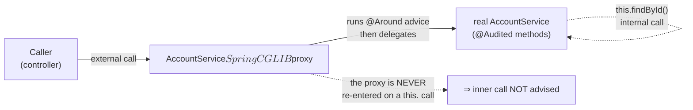
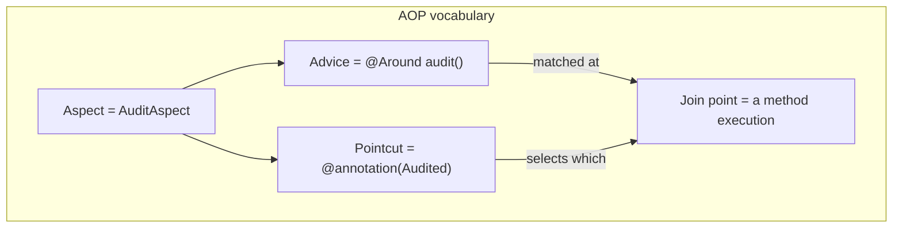
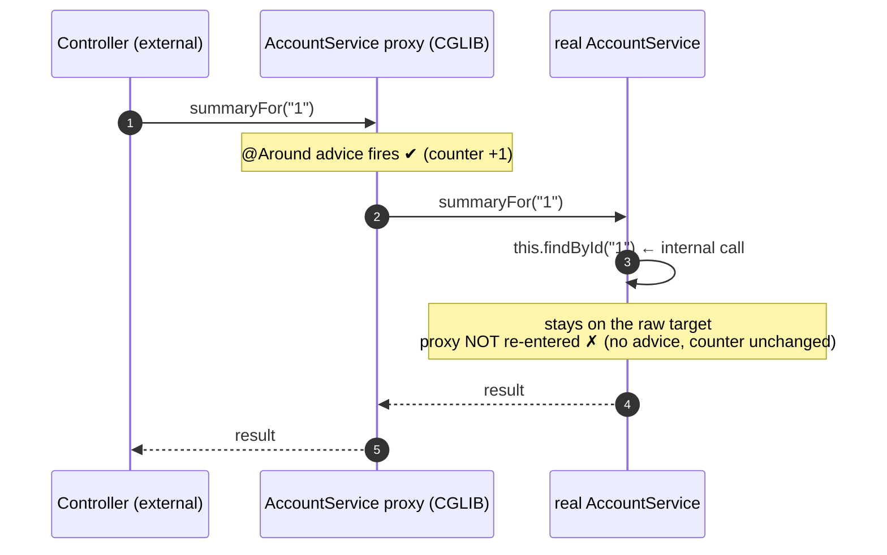
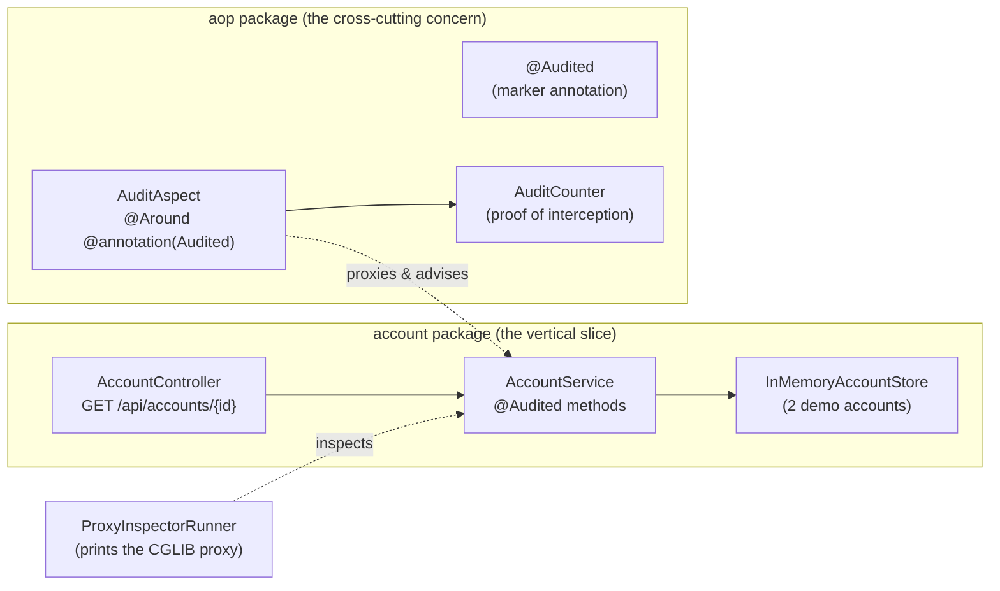
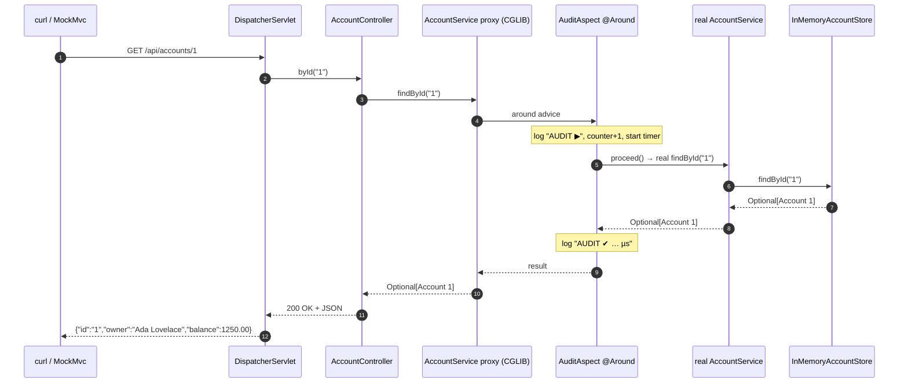

# Step 7 · AOP & the Proxy Model — the Bank's Audit Aspect

> **Step 7 of 67 · Phase A — Foundations 🟢** · Level badge: 🟢 Foundations · Effort ≈ 20h (experienced Spring devs: skip-test below and skim) · **the LAST Phase-A step — it carries the 🎓 Phase A Capstone.**

`🟢` Foundations &nbsp;·&nbsp; `🔵` Core &nbsp;·&nbsp; `🟣` Advanced &nbsp;·&nbsp; `🔴` Frontier

> [!CAUTION]
> **Educational, non-production project.** Build-a-Bank is for learning only. It never handles real money, real customers, or real personal data, and it is **not** security-audited for production banking. Every credential and account you ever see here is fake. (Full disclaimer + guardrails in the [README](../../README.md).)

---

## 🧭 The Six Movements of This Step

A one-line map of where we're going. Click to jump. Times assume the focused ~20h pace — the 🗓️ Session Plan (end of Orient) splits them into sittings.

1. **[A · 🧭 Orient](#orient)** — what AOP *is*, why it matters, the cheat card, and whether you can skip. *(~30 min)*
2. **[B · 🧠 Understand](#understand)** — the AOP vocabulary (aspect/pointcut/advice/join point), how Spring AOP really works via runtime **proxies** (CGLIB vs JDK dynamic), the famous **self-invocation pitfall** — no magic; plus the security lens, the proxy/decorator pattern, the Boot-4 version story, and a thread-safety note. *(~2h)*
3. **[C · 🛠️ Build](#build)** — the heart: add the web + AspectJ-weaver deps → write `@Audited` + `AuditCounter` + `AuditAspect` → build the vertical slice (`Account` → store → service → controller) → add `ProxyInspectorRunner` and *see* the CGLIB proxy → curl the slice and watch the aspect log → write the MockMvc slice test → write the self-invocation counter test and **see it prove the pitfall**. Then 🎮 Play With It and the 🏁 finished result. *(~9–10h)*
4. **[D · 🔬 Prove](#prove)** — the Verification Log: the real, pasted `verify` (16 spring-lab tests), the proxy inspection, the slice over HTTP, the audit log lines, and the self-invocation counter proof. *(~30 min)*
5. **[E · 🎓 Apply](#apply)** — go-deeper asides, interview prep, and your-turn exercises. *(~2h)*
6. **[F · 🏆 Review](#review)** — troubleshooting, resources & glossary, the recap/study notes, the **🎓 Phase A Capstone**, and the **Phase-A-complete** wrap. *(~2–3h incl. the capstone challenge)*

---

<a id="orient"></a>

# A · 🧭 Orient

## 📋 This Step in 30 Seconds

| | |
|---|---|
| **Title** | AOP & the proxy model — the bank's audit/logging aspect (and the Phase-A capstone slice) |
| **Step** | 7 of 67 · **Phase A — Foundations** 🟢 · **the final Phase-A step** |
| **Effort** | ≈ 20 hours focused. The *proxy mental model* + the self-invocation pitfall are the payoff; an experienced Spring dev can skip-test and skim to ~3h. |
| **What you'll run this step** | **JVM + Maven** for the build & tests. **For the capstone slice, start the app** (`./mvnw -pl playground/spring-lab spring-boot:run`) — it is now a real web server on `:8080` — then `curl`. We extend the existing `playground/spring-lab` module (no new module). No Docker, no database. |
| **Buildable artifact** | EXTEND `playground/spring-lab` — add `spring-boot-starter-web` + `org.aspectj:aspectjweaver`; an `aop` package (`@Audited`, `AuditCounter`, `AuditAspect`); an `account` package (`Account` → `InMemoryAccountStore` → `AccountService` → `AccountController`); a `ProxyInspectorRunner`. Plus a MockMvc slice test and a self-invocation counter test. `step-07-start == step-06-end`; **`step-07-end` is the Phase-A finale.** |
| **Verification tier** | 🟠 **Standard** — `./mvnw verify` green + all **16** spring-lab tests + the slice proven over real HTTP (200 body + 404) + the audit log lines + the **self-invocation counter proof** + the CGLIB-proxy inspection. (No mutation/clean-room: this is a learning module, no money/security/concurrency *production* path yet.) |
| **Depends on** | **Steps 5–6** (Spring Core & IoC — beans, `@Component`, constructor injection, `CommandLineRunner`; Boot internals & auto-configuration — this step depends on Boot's `AopAutoConfiguration`). |

By the end you will understand — and be able to *see on screen* — what **aspect-oriented programming** is (the four words: aspect, pointcut, advice, join point), how Spring AOP applies an aspect by wrapping your bean in a **runtime proxy** (CGLIB subclass by default in Boot), why an `@Around` advice runs *before and after* the real method, the famous **self-invocation pitfall** (a `this.method()` call bypasses the proxy, so the advice never fires — the same reason `@Transactional` and `@PreAuthorize` silently fail on internal calls), and you'll wire the **Phase-A capstone**: a tiny end-to-end vertical slice (HTTP endpoint → service → in-memory store) with the audit aspect threaded through, proving your whole Phase-A toolchain.

### ⏭️ Can You Skip This Step? (5-minute self-check)

Run this self-check. If you can confidently do **all** of it, skim the 🕰️/🛡️/🧩 asides, do the 🎓 Phase A Capstone challenge for the bragging rights, and move on to **[Step 8 — the CIF service + Spring Data JPA](../step-08/lesson.md)**.

- [ ] I can define **aspect, pointcut, advice, and join point** in one sentence each, and give a real cross-cutting concern (logging, transactions, security, metrics).
- [ ] I can explain **how Spring AOP actually applies an aspect** — that it creates a **proxy** around the bean, and the difference between a **JDK dynamic proxy** (interface-based) and a **CGLIB proxy** (subclass-based), and which Spring Boot uses by default (and since when).
- [ ] I can write an **`@Aspect`** with an **`@Around`** advice and a pointcut, and explain why `joinPoint.proceed()` is mandatory.
- [ ] I can explain the **self-invocation pitfall** — why `this.findById()` from inside a bean is *not* advised — and why that breaks `@Transactional`/`@PreAuthorize` exactly the same way.
- [ ] I can name **what must NOT go into an audit log** (PII, credentials, full PANs) and why an aspect is a tempting place to leak it.
- [ ] I can wire and run a **vertical slice** (controller → service → store) and verify it over HTTP with a `MockMvc` test.

> [!TIP]
> Not 100%? Stay. The proxy model and self-invocation pitfall are *the* Spring-internals interview questions, and the self-invocation bug is a genuine production foot-gun: an engineer adds `@Transactional` to a method, calls it from a sibling method in the same class, and the transaction silently never starts. Seeing it *fail in a test you wrote* — with a counter, not hand-waving — is the difference between "I read about it" and "I've debugged it."

## 📇 Cheat Card

> **What this step delivers (one sentence):** your Spring Lab is now a real web app whose `AccountService` is wrapped in a **CGLIB proxy** so that every `@Audited` method call from outside is logged by a single **`AuditAspect`** — *and* you can prove, with a counter test, that an internal `this.findById()` call slips past the proxy and is **never audited** (the self-invocation pitfall) — all wired as the **Phase-A capstone slice** `GET /api/accounts/{id}`.

**Key commands** (Windows uses `.\mvnw.cmd`; macOS/Linux/Git-Bash use `./mvnw`):

```bash
# Build + run all 16 tests for the lab (and anything it depends on, -am):
./mvnw -pl playground/spring-lab -am verify

# Run the capstone slice (a real web server on :8080):
./mvnw -pl playground/spring-lab spring-boot:run
# in a second terminal:
curl -i http://localhost:8080/api/accounts/1     # 200 + JSON, and AUDIT lines in the app log
curl -i http://localhost:8080/api/accounts/999   # clean 404

# One-shot proof your build matches the lesson:
bash steps/step-07/smoke.sh
```

**The one headline idea — *Spring applies an aspect by putting a proxy in front of your bean; a call from outside goes through the proxy (advised), a `this.` call from inside does not (not advised)*:**



*Alt-text: a caller (the controller) makes an external call into the `AccountService` CGLIB proxy; the proxy runs the `@Around` audit advice and then delegates to the real `AccountService`; when the real object makes an internal `this.findById()` call it stays inside the real object and never re-enters the proxy, so that inner call is not advised.*

## 🎯 Why This Matters

Cross-cutting concerns — logging, **audit trails**, transactions, security checks, metrics, retries — touch *every* service method but belong in *none* of them. Aspect-oriented programming lets you write that logic **once** and apply it declaratively, which is exactly how `@Transactional`, `@PreAuthorize`, `@Cacheable`, and `@Async` work under the hood. But the moment you stop treating these annotations as magic, you discover the proxy model — and the **self-invocation pitfall** that has caused countless "my `@Transactional` didn't roll back" incidents. Interviewers probe this hard ("how does `@Transactional` actually work?", "why didn't my self-call get a transaction?", "JDK vs CGLIB proxy?") because it cleanly separates people who *use* Spring from people who *understand* it. And this is the last "how does Spring do that?" step before we start building real banking services — so we cap Phase A by proving the whole toolchain on one tiny end-to-end slice.

## ✅ What You'll Be Able to Do

- Define **aspect, pointcut, advice, join point** and identify cross-cutting concerns in real systems.
- Explain **how Spring AOP works**: it wraps a bean in a **runtime proxy**; calls flow caller → proxy (advice) → target.
- Distinguish **JDK dynamic proxies** (interface-based) from **CGLIB proxies** (subclass-based) and state Spring Boot's default (CGLIB / `proxyTargetClass=true`, since Boot 2.0).
- Write an **`@Aspect`** with an **`@Around`** advice bound to a custom-annotation pointcut, and explain why `proceed()` and re-throwing are mandatory.
- Diagnose and explain the **self-invocation pitfall** — and why it breaks `@Transactional`/`@PreAuthorize` the same way — *with a counter test that proves it.*
- Inspect a live bean at runtime and confirm it's an **AOP/CGLIB proxy** (`AopUtils.isCglibProxy(...)`).
- Wire and run a **vertical slice** (`@RestController` → `@Service` → `@Repository`-style store) returning JSON / `404`, and test it with **`MockMvc`**.
- Reason about **what must never be logged** in an audit aspect (PII, credentials).

## 🧰 Before You Start

**Depends on: Steps 5–6.**

You'll reuse, from earlier steps:

- **Step 5** — the `playground/spring-lab` module itself, `@Component` scanning, **constructor injection** (every class here takes its collaborators in the constructor and stores them `final`), and `CommandLineRunner` (you used `LabRunner`; here you add `ProxyInspectorRunner`).
- **Step 6** — **auto-configuration**. This step *depends* on Boot's `AopAutoConfiguration`: when the AspectJ weaver is on the classpath, Boot auto-enables `@AspectJ` proxying — you don't write `@EnableAspectJAutoProxy` yourself. (You learned to read `/actuator/conditions`; this is one more thing Boot decides for you.)
- **Step 1** — reading `./mvnw` output, `curl -i`, and the `git`/conventional-commit workflow.
- **Step 2** — `record`s (the `Account` is a record) and `Optional` (the service returns `Optional<Account>`).

**Tooling check** (should already be true from Step 1):

```bash
java -version     # → openjdk 25.0.x  (JDK 25 LTS, pinned in VERSIONS.md)
./mvnw -version   # → Apache Maven 3.9.12
```

## 🗓️ Session Plan (~20h → 8 sittings)

Don't run this step as one marathon. Each sitting below ends at a real save point — a commit or a green checkpoint — so you can stop clean and re-enter fast. Every ✋ Checkpoint in the build also carries a 🛑 *Stopping here?* line telling you exactly what you have and what to open next.

| Sitting | Covers | ~Time | Ends at (save point) |
|---|---|---|---|
| S1 | A · Orient + B · Understand (read-only, no code) | ~2.5h | you can redraw the proxy/self-invocation diagram from memory |
| S2 | Sub-steps 1–2 — deps + the `aop` package | ~2.5h | commit: aspect compiles, `test-compile` green |
| S3 | Sub-step 3 — the vertical slice (Part A data half, Part B web half) | ~2h | commit: slice compiles |
| S4 | Sub-steps 4–5 — proxy proof + curl the slice | ~1.5h | `$$SpringCGLIB$$` seen; `200`/`404` + `AUDIT` lines |
| S5 | Sub-steps 6–7 — MockMvc test + self-invocation proof | ~3h | commit: all 16 spring-lab tests green |
| S6 | 🎮 Play With It + 🏁 Finished Result + D · Prove (`smoke.sh`) | ~2h | `smoke.sh` PASSED |
| S7 | E · Apply — Go Deeper, interview prep, Your Turn quick items | ~2h | quick answers checked |
| S8 | F · Review + 🎓 Phase A Capstone challenge | ~2.5h | capstone POST done; tag `step-07-end` |

**Optional routes:** the ⏭️ skip-test (5 min) compresses the whole step to a ~3h skim for experienced Spring devs; the three 🚀 Go Deeper asides (+~10 min each), the 🎮 experiments (~5 min each, ~25 min for all five), and the 🏅 capstone POST challenge (+~60–90 min) are all skippable without affecting `step-07-end`.

---

<a id="understand"></a>

# B · 🧠 Understand

## 🧠 The Big Idea

Imagine your bank has a rule: **every account-service call must be written to the audit trail.** The naive way is to paste two log lines at the top and bottom of every method:

```java
log.info("audit start ...");
// ... the real work ...
log.info("audit end ...");
```

That's **scattered, duplicated, and forgettable** — the textbook definition of a *cross-cutting concern*: a requirement that cuts *across* many modules but isn't the core job of any of them. Logging, transactions, security checks, caching, metrics, and retries are all cross-cutting.

**Aspect-Oriented Programming (AOP)** factors that concern into **one place** — an *aspect* — and applies it *declaratively* (you tag the methods; the aspect does the rest). The four words you must know:

| Word | Plain meaning | In our code |
|---|---|---|
| **Aspect** | the module that holds the cross-cutting logic | `AuditAspect` (the `@Aspect` class) |
| **Join point** | a point in program execution where an aspect *could* run (in Spring AOP: always a **method execution**) | a call to `AccountService.findById(..)` |
| **Pointcut** | an expression that *selects which* join points to advise | `@annotation(...Audited)` — "any method annotated `@Audited`" |
| **Advice** | the code that runs at a matched join point | the `@Around` method `audit(...)` |

The analogy: an aspect is a **security checkpoint at the bank's door**. The checkpoint (advice) doesn't care *what* you're there to do (deposit, withdraw, ask a question — the join points); it applies a uniform rule (log you in and out — the pointcut says "everyone tagged `@Audited`"). Crucially, the checkpoint only catches you **when you walk through the door from outside.** If you're *already inside* and walk between rooms, you never pass the checkpoint again — that's the self-invocation pitfall, and it's the single most important thing in this step.



*Alt-text: a diagram grouping the four AOP terms — the aspect (`AuditAspect`) contains a pointcut (`@annotation(Audited)`) and an advice (`@Around audit()`); the pointcut selects which join points (method executions) the advice runs at.*

## 🧩 Pattern Spotlight: Proxy / Decorator

- **Problem.** You need to add behavior (auditing, a transaction, a security check) *around* a method without editing the method's code, and apply it consistently across many classes.
- **Why a proxy fits.** A **proxy** is a stand-in object that implements the same contract as the real object but intercepts every call — so it can run extra logic *before/after/around* the delegation. AOP is essentially the **Decorator pattern woven automatically by the container**: Spring builds a decorator (the proxy) around your bean at startup and registers *that* as the bean, so every other component receives the decorated version transparently.
- **Alternatives & trade-offs.**
  - **Runtime proxies (what Spring AOP uses)** — created at startup, zero build step, but only intercept calls that *go through the proxy* (hence the self-invocation limit), and only method-execution join points.
  - **Compile-time / load-time weaving (full AspectJ)** — the AspectJ compiler/agent rewrites the *bytecode* of your classes, so even `this.` calls, field access, and constructors can be advised, and there's no proxy at all. More powerful, but adds a weaver to the build/launch and is harder to reason about. The `aspectjweaver` jar we add gives Spring the *annotation syntax* (`@Aspect`/`@Around`) — Spring still uses **proxies**, not full weaving, by default.
- **Micro-implementation.** `@Aspect` + `@Around("pointcut")` + `ProceedingJoinPoint.proceed()`. The advice wraps the real call; whatever you do before `proceed()` runs first, whatever you do after runs last, and you *must* return the result and re-throw any exception (the proxy is invisible to callers — it must behave exactly like the real method otherwise).

## 🌱 Under the Hood: How It Really Works

When Spring sees an `@Aspect` bean and a target bean whose method matches a pointcut, a `BeanPostProcessor` (the one you met in Step 5 — `AnnotationAwareAspectJAutoProxyCreator`) replaces the target bean with a **proxy** during context startup. There are two proxy mechanisms:

1. **JDK dynamic proxy** — built into the JDK (`java.lang.reflect.Proxy`). It can only proxy **interfaces**: it creates a runtime class implementing the bean's interfaces and routes every interface-method call through an `InvocationHandler`. If your bean has no interface, JDK proxies can't help.
2. **CGLIB proxy** — generates a **subclass** of your concrete class at runtime (using bytecode generation; in modern JDKs via the relocated `org.springframework.cglib` + the ASM library Spring ships). It overrides each non-`final` method to route through the interceptor chain. Works on plain classes with no interface — which is why it's the safer default.

**Spring Boot defaults to CGLIB** (`spring.aop.proxy-target-class=true`) **since Boot 2.0** — even when your bean *does* implement an interface — because subclass proxying avoids a whole class of "I injected the concrete type but got a JDK proxy that only implements the interface" bugs. You'll *see* this default in the build: `ProxyInspectorRunner` prints the runtime class of `AccountService` as `...AccountService$$SpringCGLIB$$0`.

Two consequences fall straight out of "it's a subclass proxy":

- **`final` classes/methods can't be proxied by CGLIB** (you can't subclass/override `final`) — Spring will fail or silently skip advising them.
- **The proxy only intercepts calls that arrive *at the proxy reference*.** Other beans hold the proxy, so their calls are advised. But inside the real object, `this` is the **raw target**, not the proxy — so a `this.method()` call goes straight to the target and **bypasses the advice entirely.** That is the self-invocation pitfall, drawn here:



*Alt-text: a sequence diagram. The controller calls `summaryFor("1")` on the CGLIB proxy; the proxy runs the audit advice (counter +1) and delegates to the real `AccountService`. Inside, the real object calls `this.findById("1")`, which stays on the raw target and never re-enters the proxy, so the inner call is not advised and the counter is not incremented again.*

This is *exactly* why `@Transactional` and `@PreAuthorize` "don't work" on self-calls: they're implemented as advice on the same proxy. An internal call skips the transaction/authorization boundary. (Fixes: call through the injected proxy of self, split the method into another bean, or use `AopContext.currentProxy()` / full AspectJ weaving — covered in Step 12 for transactions.)

❓ **Knowledge-check:** why does a `this.method()` call from inside the bean bypass the `@Around` advice, even though the identical call from another bean is advised? <details><summary>answer</summary>Because the advice lives on the **proxy**, not on the target. Other beans are injected with the proxy, so their calls pass through it and get advised — but inside the real object, `this` is the raw target, so the call goes straight to the target method and never re-enters the proxy.</details>

## 🛡️ Security Lens: What Could Go Wrong

Aspects are *the* mechanism for applying cross-cutting **security**: `@PreAuthorize`/`@PostAuthorize` (method security), `@Transactional` (data-integrity boundary), and audit trails are all proxy-based advice. So this step's pitfall is a real **security/correctness bug**, not a curiosity:

- **Self-invocation can bypass an authorization or transaction boundary.** If `transferAll()` calls `this.transfer()` internally and `transfer()` carries `@PreAuthorize`/`@Transactional`, the inner call runs **with no check and no transaction**. An attacker who can reach the outer method gets the inner method's protection for free. Treat "is this an internal self-call?" as a security review question.
- **Never log sensitive data in audit advice.** An audit aspect sees every argument and return value — it's a tempting place to dump `joinPoint.getArgs()`. Do **not** log PII, credentials, full card numbers (PANs), tokens, or balances tied to identities. Our `AuditAspect` deliberately logs only the **method signature** (`AccountService.findById(..)`) and timing — never arguments or results. (Real audit trails log *who/what/when* with masked references, and the audit store itself is access-controlled and immutable — Phase H/J.)
- **Aspects fail open if mis-scoped.** A pointcut that's too narrow silently leaves methods un-audited (compliance gap); one too broad audits everything (noise + potential leakage). You verify the scope with tests — which is exactly what the self-invocation test does.

## 🕰️ Then vs. Now (How This Changed Across Versions)

Two of these are **real findings we hit while building this very step on Spring Boot 4.0.6** — featured honestly here and again in 🩺 Troubleshooting, as a "verify, don't guess" lesson.

| Topic | Then (old way) | Now (Boot 4 / JDK 25) | Why / what legacy still uses |
|---|---|---|---|
| **Enabling AOP** | `spring-boot-starter-aop` pulled in `spring-aop` + `aspectjweaver`; you often added `@EnableAspectJAutoProxy`. | **Boot 4 REMOVED `spring-boot-starter-aop`** (only `4.0.0-Mx` *milestones* of the starter exist — no GA). **Fix:** depend on **`org.aspectj:aspectjweaver`** directly (version BOM-managed). `spring-aop` is already present via `spring-context`, and Boot's **`AopAutoConfiguration`** enables `@AspectJ` proxying automatically once the weaver is on the classpath. | We hit this for real — the starter simply won't resolve on the GA line. Boot-2/3 projects still use the starter. Our `pom.xml` documents the swap inline. |
| **Web-MVC test support** | `@AutoConfigureMockMvc`, `@WebMvcTest`, `MockMvc` lived in `org.springframework.boot.test.autoconfigure.web.servlet`, pulled transitively by `spring-boot-starter-test`. | **Boot 4 split web-MVC test support into a new module.** `@AutoConfigureMockMvc` moved to **`org.springframework.boot.webmvc.test.autoconfigure`**, shipped in the **`spring-boot-webmvc-test`** artifact, which is **NOT** pulled transitively by `spring-boot-starter-test`. **Fix:** add `spring-boot-webmvc-test` (test scope) explicitly. | We hit this for real (the import didn't resolve, then the annotation wasn't found). Boot-3 imports still use the old package. |
| **Proxy default** | Pre-Boot-2.0, Spring AOP preferred **JDK dynamic proxies** when the bean had an interface. | **CGLIB by default since Boot 2.0** (`proxyTargetClass=true`) — even with an interface present. | You can flip back with `spring.aop.proxy-target-class=false`, but the default avoids "injected-the-class-got-an-interface-proxy" surprises. We *prove* CGLIB at runtime in this step. |

> [!NOTE]
> **Verify, don't guess.** Both Boot-4 findings above were discovered by *the build failing*, not by assuming the old coordinates still worked. That's the course's verify-don't-guess discipline in miniature — prove claims by running them: the version set is real, pinned in `VERSIONS.md`, and proven to build together.

## 🧵 Thread-safety note

`AuditCounter` is a **shared singleton** (`@Component`) touched by **many request threads** at once (the aspect records into it on every audited call, and a web server handles requests concurrently). A plain `ArrayList` would corrupt or throw `ConcurrentModificationException` under concurrent writes. We use **`CopyOnWriteArrayList`** — every mutation copies the backing array, so reads never see a partially-updated list and writes are internally synchronized. It's perfect *here* (writes are rare relative to the work being audited, list stays small) but a poor choice for write-heavy hot paths (every add is O(n)). The deep treatment of shared mutable state, the Java Memory Model, atomics, and when copy-on-write is the right tool is **Step 11** — this is a forward reference. For now: *shared singleton + many threads ⇒ you must reason about thread-safety, and we did.*

---

<a id="build"></a>

# C · 🛠️ Build

## 📦 Your Starting Point

You're standing on **`step-07-start`**, which is identical to **`step-06-end`**. What's green right now:

- `playground/spring-lab` is a **non-web** Spring Boot app (a `CommandLineRunner` lab) with the Step 5–6 work: `RateProvider`/`FixedRateProvider`/`MarketRateProvider`, `InterestService`, typed `BankProperties`, the custom `GreetingAutoConfiguration`, `LabConfig`, lifecycle demos.
- `./mvnw -pl playground/spring-lab -am verify` passes with **10** spring-lab tests (the Step-6 count).

```bash
# Confirm your starting point builds (do this before changing anything):
./mvnw -pl playground/spring-lab -am verify
```

✅ You should see `BUILD SUCCESS` and `Tests run: 10` for spring-lab. If not → 🩺 (or re-checkout `step-07-start`). By the end of this step that becomes **16** tests, the module gains a **web server**, and you'll have the Phase-A capstone slice running.

> 🧭 **You are here:** `step-07-start` ✅ → add deps → aspect → slice → proxy proof → curl → MockMvc test → self-invocation proof → 🎓 capstone → `step-07-end`.

## 🛠️ Let's Build It — Step by Step

### 🗺️ What we'll build



*Alt-text: the build has two packages. The `account` package is the vertical slice: `AccountController` (`GET /api/accounts/{id}`) calls `AccountService` (with `@Audited` methods) which calls `InMemoryAccountStore` (two demo accounts). The `aop` package holds the cross-cutting concern: an `@Audited` marker annotation, an `AuditAspect` (`@Around` on `@annotation(Audited)`) that records into an `AuditCounter`. The aspect proxies and advises the service; `ProxyInspectorRunner` inspects the service and prints its CGLIB proxy class.*

### 🌳 Files we'll touch

```text
playground/spring-lab/
├── pom.xml                                   # ✏️ add web + aspectjweaver + webmvc-test
└── src
    ├── main/java/com/buildabank/springlab/
    │   ├── ProxyInspectorRunner.java         # ✨ new — prove the CGLIB proxy
    │   ├── aop/
    │   │   ├── Audited.java                   # ✨ new — the marker annotation
    │   │   ├── AuditCounter.java              # ✨ new — interception counter (thread-safe)
    │   │   └── AuditAspect.java               # ✨ new — the @Around audit advice
    │   └── account/
    │       ├── Account.java                   # ✨ new — a money record
    │       ├── InMemoryAccountStore.java      # ✨ new — the store
    │       ├── AccountService.java            # ✨ new — @Audited service (+ self-invocation demo)
    │       └── AccountController.java          # ✨ new — GET /api/accounts/{id}
    └── test/java/com/buildabank/springlab/
        ├── account/AccountControllerTest.java          # ✨ new — MockMvc slice test
        └── aop/AuditAspectSelfInvocationTest.java      # ✨ new — the self-invocation proof
```

---

### Sub-step 1 of 7 — Add the web + AspectJ-weaver dependencies 🧭 *(you are here: **deps** → aspect → slice → proxy proof → curl → MockMvc test → self-invocation proof)* *(⏱ ~45 min)*

🎯 **Goal:** make `spring-lab` a web app (so the capstone slice can serve HTTP) **and** enable `@AspectJ` AOP. On Boot 4 the obvious starter is gone — we'll *hit that error on purpose* so you recognize it.

📁 **Location:** edit → `playground/spring-lab/pom.xml`

First, **predict the failure.** A Boot-2/3 tutorial would tell you to add `spring-boot-starter-aop`. Let's see what Boot 4 says. Temporarily add this inside `<dependencies>` and run:

```xml
<!-- ❌ DON'T KEEP THIS — Boot 4 has no GA starter-aop. We add it only to SEE the error. -->
<dependency>
    <groupId>org.springframework.boot</groupId>
    <artifactId>spring-boot-starter-aop</artifactId>
</dependency>
```

```bash
./mvnw -pl playground/spring-lab -am validate
```

❌ **You'll see (finding #1, real):**

```
[ERROR] Failed to execute goal ... on project spring-lab:
[ERROR] 'dependencies.dependency.version' for org.springframework.boot:spring-boot-starter-aop:jar is missing.
```

That's the BOM telling you it manages no version for that artifact — because **Boot 4 removed it** (only `4.0.0-Mx` milestones exist, no GA). **Delete that block.** Now add the *correct* dependencies — the real, on-disk `pom.xml` `<dependencies>` section, which is the version you keep:

⌨️ **Code** — a *diff* of the `<dependencies>` section, so you can see exactly which three entries are new (your existing entries stay untouched):

```diff
 <!-- playground/spring-lab/pom.xml  (the <dependencies> section) -->
 <dependencies>
     <!-- spring-boot-starter (core): the IoC container + auto-configuration + logging. -->
     <dependency>
         <groupId>org.springframework.boot</groupId>
         <artifactId>spring-boot-starter</artifactId>
     </dependency>
+    <!-- Step 7: web (the capstone vertical slice). -->
+    <dependency>
+        <groupId>org.springframework.boot</groupId>
+        <artifactId>spring-boot-starter-web</artifactId>
+    </dependency>
+    <!-- AOP: Spring Boot 4 REMOVED spring-boot-starter-aop. spring-aop is already on the classpath
+         (via spring-context); adding the AspectJ weaver lets Boot's AopAutoConfiguration enable
+         @AspectJ annotation proxying (@Aspect/@Around). Version is managed by the Spring Boot BOM. -->
+    <dependency>
+        <groupId>org.aspectj</groupId>
+        <artifactId>aspectjweaver</artifactId>
+    </dependency>

     <dependency>
         <groupId>org.springframework.boot</groupId>
         <artifactId>spring-boot-starter-test</artifactId>
         <scope>test</scope>
     </dependency>
+    <!-- Spring Boot 4 split web-MVC test support (MockMvc, @AutoConfigureMockMvc, @WebMvcTest) into its
+         own module; it is no longer pulled transitively by spring-boot-starter-test. Add it explicitly. -->
+    <dependency>
+        <groupId>org.springframework.boot</groupId>
+        <artifactId>spring-boot-webmvc-test</artifactId>
+        <scope>test</scope>
+    </dependency>
 </dependencies>
```

<details>
<summary><b>The full final <code>&lt;dependencies&gt;</code> section, for verification</b></summary>

```xml
<!-- playground/spring-lab/pom.xml  (the <dependencies> section) -->
<dependencies>
    <!-- spring-boot-starter (core): the IoC container + auto-configuration + logging. -->
    <dependency>
        <groupId>org.springframework.boot</groupId>
        <artifactId>spring-boot-starter</artifactId>
    </dependency>
    <!-- Step 7: web (the capstone vertical slice). -->
    <dependency>
        <groupId>org.springframework.boot</groupId>
        <artifactId>spring-boot-starter-web</artifactId>
    </dependency>
    <!-- AOP: Spring Boot 4 REMOVED spring-boot-starter-aop. spring-aop is already on the classpath
         (via spring-context); adding the AspectJ weaver lets Boot's AopAutoConfiguration enable
         @AspectJ annotation proxying (@Aspect/@Around). Version is managed by the Spring Boot BOM. -->
    <dependency>
        <groupId>org.aspectj</groupId>
        <artifactId>aspectjweaver</artifactId>
    </dependency>

    <dependency>
        <groupId>org.springframework.boot</groupId>
        <artifactId>spring-boot-starter-test</artifactId>
        <scope>test</scope>
    </dependency>
    <!-- Spring Boot 4 split web-MVC test support (MockMvc, @AutoConfigureMockMvc, @WebMvcTest) into its
         own module; it is no longer pulled transitively by spring-boot-starter-test. Add it explicitly. -->
    <dependency>
        <groupId>org.springframework.boot</groupId>
        <artifactId>spring-boot-webmvc-test</artifactId>
        <scope>test</scope>
    </dependency>
</dependencies>
```
</details>

🔍 **Line-by-line:**
- **`spring-boot-starter-web`** — pulls in Spring MVC + an embedded Tomcat (the bank's pinned **Tomcat 11.0.21**) + Jackson. This is what turns the previously non-web lab into a server that can answer `GET /api/accounts/1`. No version: the **Boot BOM** pins it (Step 6's lesson).
- **`org.aspectj:aspectjweaver`** — the AspectJ runtime. We need it *only* for the `@Aspect`/`@Around`/`@annotation(...)` annotation syntax and pointcut parsing. `spring-aop` (the proxy machinery) is *already* on the classpath transitively via `spring-context`. With the weaver present, **`AopAutoConfiguration`** (Boot) flips on `@EnableAspectJAutoProxy` for you — that's the Step-6 auto-config mechanism doing one more job.
- **`spring-boot-webmvc-test`** (test scope) — finding #2: on Boot 4 this is a *separate* artifact and not transitive from `spring-boot-starter-test`. Without it, `MockMvc` and `@AutoConfigureMockMvc` won't be on the test classpath. We add it now so sub-step 6 compiles.

💭 **Under the hood:** Maven resolves versions from the parent **Boot BOM** (`dependencyManagement`); a missing-version error means "the BOM doesn't know this artifact," which is the fingerprint of a removed/renamed dependency — exactly what happened with `starter-aop`.

🔮 **Predict:** after fixing the deps, does `validate` (or a quick `compile`) succeed even though we haven't written any aspect yet? *(Yes — these are just JARs; no code references them yet.)*

▶️ **Run & See:**

```bash
./mvnw -pl playground/spring-lab -am validate
```

✅ **Expected output:**

```
[INFO] BUILD SUCCESS
```

✋ **Checkpoint:** `pom.xml` has `spring-boot-starter-web`, `org.aspectj:aspectjweaver`, and the test-scoped `spring-boot-webmvc-test`; the temporary `starter-aop` block is gone; `validate` is green. If you still see a missing-version error → 🩺.

💾 **Commit:**

```bash
git add playground/spring-lab/pom.xml
git commit -m "build(spring-lab): add web + aspectjweaver (Boot 4 dropped starter-aop) + webmvc-test"
```

🛑 **Stopping here?** You have the three new deps committed and `validate` green. Next: sub-step 2 (the aspect); first action: create `playground/spring-lab/src/main/java/com/buildabank/springlab/aop/Audited.java`.

⚠️ **Pitfall:** don't try to pin `<version>` on `aspectjweaver` yourself — the BOM manages it, and hard-coding a version risks a clash with the one Spring expects. Leave it BOM-managed.

---

### Sub-step 2 of 7 — Write the aspect: `@Audited` + `AuditCounter` + `AuditAspect` 🧭 *(deps ✅ → **aspect** → slice → proxy proof → curl → MockMvc test → self-invocation proof)* *(⏱ ~90 min)*

🎯 **Goal:** create the cross-cutting concern *once*: a marker annotation, a thread-safe interception counter (so we can later *prove* the pitfall), and the `@Around` advice that logs and times every `@Audited` call.

📁 **Location:** new files under `playground/spring-lab/src/main/java/com/buildabank/springlab/aop/`

⌨️ **Code (a) — the marker annotation:**

```java
// playground/spring-lab/src/main/java/com/buildabank/springlab/aop/Audited.java
package com.buildabank.springlab.aop;

import java.lang.annotation.ElementType;
import java.lang.annotation.Retention;
import java.lang.annotation.RetentionPolicy;
import java.lang.annotation.Target;

/**
 * Marks a method as auditable. {@code AuditAspect} advises every call to a method carrying this annotation.
 * {@code RUNTIME} retention is required so the AOP pointcut can see it via reflection at runtime.
 */
@Target(ElementType.METHOD)
@Retention(RetentionPolicy.RUNTIME)
public @interface Audited {
}
```

🔍 **Line-by-line:**
- `public @interface Audited` — declares an **annotation type** (the `@interface` keyword). Our own annotation, so the pointcut can match on *our* tag rather than a brittle package/name pattern.
- `@Target(ElementType.METHOD)` — this annotation is only legal on **methods** (compiler-enforced).
- `@Retention(RetentionPolicy.RUNTIME)` — **critical**: the annotation must survive into the running bytecode so the AOP framework can *see it via reflection* at runtime. The default (`CLASS`) would be invisible to the pointcut, and the aspect would never fire. (`SOURCE` retention — like `@Override` — is gone after compilation.)

⌨️ **Code (b) — the interception counter:**

```java
// playground/spring-lab/src/main/java/com/buildabank/springlab/aop/AuditCounter.java
package com.buildabank.springlab.aop;

import java.util.List;
import java.util.concurrent.CopyOnWriteArrayList;

import org.springframework.stereotype.Component;

/**
 * Records how many audited calls the aspect actually intercepted. We use it to PROVE the
 * self-invocation pitfall in a test: an internal {@code this.method()} call is NOT advised, so it does
 * not increment this counter. (Thread-safe list because the bean is a shared singleton — see Step 11.)
 */
@Component
public class AuditCounter {

    private final List<String> auditedCalls = new CopyOnWriteArrayList<>();

    public void record(String method) {
        auditedCalls.add(method);
    }

    public int total() {
        return auditedCalls.size();
    }

    public List<String> calls() {
        return List.copyOf(auditedCalls);
    }

    public void reset() {
        auditedCalls.clear();
    }
}
```

🔍 **Line-by-line:**
- `@Component` — a singleton bean so the aspect and the tests share **one** counter instance.
- `CopyOnWriteArrayList` — thread-safe (see the 🧵 note): the aspect writes from many request threads; tests read. `record()` appends the intercepted method's signature, `total()` is the count, `calls()` hands back an *immutable copy* (`List.copyOf`) so callers can't mutate our state, `reset()` clears between tests.

⌨️ **Code (c) — the aspect (the heart):**

```java
// playground/spring-lab/src/main/java/com/buildabank/springlab/aop/AuditAspect.java
package com.buildabank.springlab.aop;

import org.aspectj.lang.ProceedingJoinPoint;
import org.aspectj.lang.annotation.Around;
import org.aspectj.lang.annotation.Aspect;
import org.slf4j.Logger;
import org.slf4j.LoggerFactory;
import org.springframework.stereotype.Component;

/**
 * The bank's cross-cutting <strong>audit/logging aspect</strong>. Instead of copying logging into every
 * service method, we declare it once here and apply it declaratively.
 *
 * <ul>
 *   <li><b>Aspect</b> — this class (the cross-cutting concern).</li>
 *   <li><b>Pointcut</b> — {@code @annotation(...Audited)}: "any method annotated {@code @Audited}".</li>
 *   <li><b>Advice</b> — {@code @Around}: wraps the call (before + after + on exception).</li>
 *   <li><b>Join point</b> — the actual method execution, captured as {@link ProceedingJoinPoint}.</li>
 * </ul>
 *
 * <p>How it works: Spring creates a PROXY around each audited bean (CGLIB by default in Boot). Calls from
 * OUTSIDE go through the proxy → advised. A {@code this.method()} call from inside the bean bypasses the
 * proxy → NOT advised (the famous self-invocation pitfall, proven in the tests).
 */
@Aspect
@Component
public class AuditAspect {

    private static final Logger log = LoggerFactory.getLogger(AuditAspect.class);

    private final AuditCounter counter;

    public AuditAspect(AuditCounter counter) {
        this.counter = counter;
    }

    @Around("@annotation(com.buildabank.springlab.aop.Audited)")
    public Object audit(ProceedingJoinPoint joinPoint) throws Throwable {
        String method = joinPoint.getSignature().toShortString();
        counter.record(method);
        long start = System.nanoTime();
        log.info("AUDIT ▶ {} called", method);
        try {
            Object result = joinPoint.proceed();           // run the real method
            long micros = (System.nanoTime() - start) / 1_000;
            log.info("AUDIT ✔ {} returned in {} µs", method, micros);
            return result;
        } catch (Throwable t) {
            log.warn("AUDIT ✗ {} threw {}", method, t.toString());
            throw t;                                        // never swallow — re-throw
        }
    }
}
```

🔍 **Line-by-line:**
- `@Aspect` — marks this class as an aspect (AspectJ annotation; recognized because the weaver is on the classpath). **`@Component`** registers it as a bean — `@Aspect` alone is *not* a stereotype, so without `@Component` Spring would never pick it up.
- `private final AuditCounter counter` + constructor — **constructor injection** (Step 5); the aspect depends on the counter bean.
- `@Around("@annotation(com.buildabank.springlab.aop.Audited)")` — the **pointcut + advice kind**. `@Around` is the most powerful advice: it runs *instead of* the target and decides when (or whether) to call it. The pointcut `@annotation(...)` matches any **method whose execution is annotated `@Audited`** (fully-qualified to avoid ambiguity).
- `ProceedingJoinPoint joinPoint` — the join point, with the extra `proceed()` capability (`@Around` only). `getSignature().toShortString()` → e.g. `AccountService.findById(..)` — **method signature only, never arguments** (see 🛡️ Security Lens).
- `counter.record(method)` — proof hook: increments **only when the proxy actually intercepts**.
- `joinPoint.proceed()` — **runs the real method.** Omit it and the real method never executes (a classic AOP bug). Everything before it = "before" advice; everything after = "after returning"; the `catch` = "after throwing."
- `(System.nanoTime() - start) / 1_000` — elapsed time in **microseconds (µs)**. `nanoTime()` is a monotonic timer for measuring durations.
- `throw t;` in the `catch` — **re-throw, never swallow.** A proxy must be transparent: if the real method throws, the caller must still see the exception. (We log a warning first.)

💭 **Under the hood:** at startup, Boot's `AopAutoConfiguration` enables `@AspectJ` auto-proxying. The auto-proxy creator scans beans, finds that `AccountService.findById/findAll/summaryFor` match this pointcut, and replaces `AccountService` with a CGLIB proxy whose overridden methods invoke this `audit(...)` advice around the real call.

🔮 **Predict:** does the app *compile and start* now, even before any `@Audited` method exists? *(Yes — the pointcut simply matches nothing yet, so the aspect sits idle.)*

▶️ **Run & See:**

```bash
./mvnw -pl playground/spring-lab -am test-compile
```

✅ **Expected output:**

```
[INFO] BUILD SUCCESS
```

❌ **If you see** `cannot find symbol: class Aspect` (or `@Around`/`ProceedingJoinPoint` won't resolve): the `org.aspectj:aspectjweaver` dependency is missing — re-do sub-step 1. See 🩺.

✋ **Checkpoint:** three files exist under `aop/`; the module compiles. No behavior yet (nothing is `@Audited`). If `@Aspect`/`@Around` don't resolve → the `aspectjweaver` dep is missing (🩺).

💾 **Commit:**

```bash
git add playground/spring-lab/src/main/java/com/buildabank/springlab/aop
git commit -m "feat(spring-lab): add @Audited + AuditCounter + AuditAspect (around-advice audit log)"
```

🛑 **Stopping here?** You have the whole `aop` package (annotation, counter, aspect) compiling and committed — idle until something is `@Audited`. Next: sub-step 3 (the slice); first action: create `playground/spring-lab/src/main/java/com/buildabank/springlab/account/Account.java`.

⚠️ **Pitfall:** forgetting `@Component` on the aspect → it compiles but **never runs** (Spring doesn't know about it). `@Aspect` declares *what* it is; `@Component` makes it a *bean*.

---

### Sub-step 3 of 7 — Build the vertical slice: `Account` → store → service → controller 🧭 *(deps ✅ → aspect ✅ → **slice** → proxy proof → curl → MockMvc test → self-invocation proof)* *(⏱ ~2h)*

🎯 **Goal:** the Phase-A capstone in miniature — one endpoint → service → in-memory store — with the audit aspect threaded through the service. We build it store-first so each piece compiles against the one below it.

📁 **Location:** new files under `playground/spring-lab/src/main/java/com/buildabank/springlab/account/`

This is your first-ever Spring **web** code in the course, and four files is a big gulp — so we take it in **two halves with a compile check between them**: **Part A (the data half)** = `Account` + `InMemoryAccountStore`; **Part B (the web half)** = `AccountService` + `AccountController`.

**— Part A · the data half: `Account` + `InMemoryAccountStore` —**

⌨️ **Code (a) — the money record:**

```java
// playground/spring-lab/src/main/java/com/buildabank/springlab/account/Account.java
package com.buildabank.springlab.account;

import java.math.BigDecimal;

/** A minimal account for the Phase-A capstone vertical slice. Money is BigDecimal (the bank's rule). */
public record Account(String id, String owner, BigDecimal balance) {
}
```

🔍 `record` (Step 2) — an immutable data carrier; the compiler generates the constructor, accessors (`id()`, `owner()`, `balance()`), `equals`/`hashCode`/`toString`. **`balance` is `BigDecimal`** — the bank's iron rule: never `double` for money (binary floating point can't represent `0.10` exactly). Jackson serializes a `record` to JSON by its components.

⌨️ **Code (b) — the store:**

```java
// playground/spring-lab/src/main/java/com/buildabank/springlab/account/InMemoryAccountStore.java
package com.buildabank.springlab.account;

import java.math.BigDecimal;
import java.util.List;
import java.util.Optional;
import java.util.concurrent.ConcurrentHashMap;
import java.util.concurrent.ConcurrentMap;

import org.springframework.stereotype.Repository;

/** A tiny in-memory store seeded with two demo accounts (the "store" half of the vertical slice). */
@Repository
public class InMemoryAccountStore {

    private final ConcurrentMap<String, Account> accounts = new ConcurrentHashMap<>();

    public InMemoryAccountStore() {
        save(new Account("1", "Ada Lovelace", new BigDecimal("1250.00")));
        save(new Account("2", "Alan Turing", new BigDecimal("8000.00")));
    }

    public Optional<Account> findById(String id) {
        return Optional.ofNullable(accounts.get(id));
    }

    public List<Account> findAll() {
        return List.copyOf(accounts.values());
    }

    public Account save(Account account) {
        accounts.put(account.id(), account);
        return account;
    }
}
```

🔍 **Line-by-line:**
- `@Repository` — a `@Component` stereotype meaning "data-access object." (In Step 8 the real persistence-exception translation it enables matters; here it's the right *intent* marker.)
- `ConcurrentMap`/`ConcurrentHashMap` — thread-safe map (the web server hits it from many threads). The constructor **seeds two demo accounts** so there's data to fetch immediately — `new BigDecimal("1250.00")` uses the **String** constructor (the safe one; `new BigDecimal(1250.00)` from a `double` would carry float noise).
- `findById` returns `Optional<Account>` — models "maybe absent" (Step 2), so the controller can map empty → `404`.

▶️ **Run & See (Part A):** compile now, before touching the web half — two plain classes, no web code yet:

```bash
./mvnw -pl playground/spring-lab -am compile
```

You should see `BUILD SUCCESS` (the same check you'll repeat after Part B).

✋ **Mini-checkpoint (Part A):** `Account` + `InMemoryAccountStore` compile — the data half is done. New tokens so far: `@Repository`, `ConcurrentHashMap`/`ConcurrentMap`, the `BigDecimal` String constructor. 🛑 **Stopping here?** You have the data half compiling (commit it with the sub-step's 💾 command below if you like). Next: Part B (the web half); first action: create `AccountService.java` in the same package.

**— Part B · the web half: `AccountService` + `AccountController` —**

⌨️ **Code (c) — the service (carries `@Audited` and the self-invocation demo):**

```java
// playground/spring-lab/src/main/java/com/buildabank/springlab/account/AccountService.java
package com.buildabank.springlab.account;

import java.util.List;
import java.util.Optional;

import org.springframework.stereotype.Service;

import com.buildabank.springlab.aop.Audited;

/**
 * The "service" half of the vertical slice. Its {@code @Audited} methods are advised by {@code AuditAspect}.
 *
 * <p>{@link #summaryFor(String)} deliberately demonstrates the <strong>self-invocation pitfall</strong>:
 * it calls {@code findById(id)} on {@code this}, which goes straight to the real object and BYPASSES the
 * AOP proxy — so the inner {@code findById} is NOT audited (proven in {@code AuditAspectSelfInvocationTest}).
 */
@Service
public class AccountService {

    private final InMemoryAccountStore store;

    public AccountService(InMemoryAccountStore store) {
        this.store = store;
    }

    @Audited
    public Optional<Account> findById(String id) {
        return store.findById(id);
    }

    @Audited
    public List<Account> findAll() {
        return store.findAll();
    }

    @Audited
    public String summaryFor(String id) {
        // ⚠️ self-invocation: this.findById(...) is NOT intercepted by the aspect.
        return findById(id)
                .map(a -> a.owner() + " has " + a.balance())
                .orElse("account " + id + " not found");
    }
}
```

🔍 **Line-by-line:**
- `@Service` — a `@Component` stereotype for business logic. Because it has `@Audited` methods, **Spring will wrap this bean in a proxy** (sub-step 4 proves it).
- `@Audited` on `findById`, `findAll`, `summaryFor` — the three pointcut matches. Each external call to these is audited.
- `summaryFor(...)` — the **deliberate trap.** It calls `findById(id)` — which is bare `this.findById(id)` — to build a one-line summary. Because that inner call is on `this` (the raw target, not the proxy), the `@Audited` on `findById` is **bypassed**. `summaryFor` itself is audited (the *external* call into it), but its inner `findById` is not. We prove exactly this in sub-step 7.

⌨️ **Code (d) — the controller (the HTTP edge):**

```java
// playground/spring-lab/src/main/java/com/buildabank/springlab/account/AccountController.java
package com.buildabank.springlab.account;

import java.util.List;

import org.springframework.http.ResponseEntity;
import org.springframework.web.bind.annotation.GetMapping;
import org.springframework.web.bind.annotation.PathVariable;
import org.springframework.web.bind.annotation.RequestMapping;
import org.springframework.web.bind.annotation.RestController;

/**
 * The "endpoint" half of the Phase-A capstone vertical slice: HTTP → service → in-memory store.
 * {@code GET /api/accounts/{id}} returns the account as JSON, or a clean 404 if it does not exist.
 */
@RestController
@RequestMapping("/api/accounts")
public class AccountController {

    private final AccountService service;

    public AccountController(AccountService service) {
        this.service = service;
    }

    @GetMapping
    public List<Account> all() {
        return service.findAll();
    }

    @GetMapping("/{id}")
    public ResponseEntity<Account> byId(@PathVariable String id) {
        return service.findById(id)
                .map(ResponseEntity::ok)
                .orElseGet(() -> ResponseEntity.notFound().build());
    }
}
```

🔍 **Line-by-line:**
- `@RestController` — `@Controller` + `@ResponseBody`: return values are serialized **straight to the HTTP response body** as JSON (Jackson), not resolved to a view.
- `@RequestMapping("/api/accounts")` — base path for the class.
- **constructor injection** of `AccountService` — and *this is the key wiring*: the controller receives the **proxy** of `AccountService`, so its `findById`/`findAll` calls go *through* the proxy and **are audited**. (Contrast the internal self-call in `summaryFor`.)
- `@GetMapping` (no path) → `GET /api/accounts` → list all. `@GetMapping("/{id}")` → `GET /api/accounts/{id}`; `@PathVariable String id` binds the URL segment.
- The `Optional` chain: found → `200 OK` + body; empty → `404 Not Found`, no body. (The same Optional-to-404 idiom used by controllers throughout this course.)

💭 **Under the hood:** a request hits embedded Tomcat → Spring's `DispatcherServlet` matches the URL to `byId` → binds `{id}` → calls the **proxied** `AccountService` (advice fires) → the real method hits the store → a Jackson `HttpMessageConverter` serializes the `Account` record to JSON. (Full lifecycle: Step 13.)

🔮 **Predict:** when you hit `GET /api/accounts/1`, how many `AUDIT` log lines appear? And for `GET /api/accounts` (list)? *(One audited call each — `findById` / `findAll` — so one `▶` + one `✔` pair per request.)*

▶️ **Run & See:**

```bash
./mvnw -pl playground/spring-lab -am compile
```

✅ **Expected output:**

```
[INFO] BUILD SUCCESS
```

❌ **If you see** `package org.springframework.web.bind.annotation does not exist`: the `spring-boot-starter-web` dependency is missing — re-check sub-step 1 (🩺).

✋ **Checkpoint:** four files under `account/`; the module compiles. We'll run it over HTTP in sub-step 5. If imports don't resolve → check `spring-boot-starter-web` is present (🩺).

💾 **Commit:**

```bash
git add playground/spring-lab/src/main/java/com/buildabank/springlab/account
git commit -m "feat(spring-lab): add Phase-A capstone slice (Account -> store -> @Audited service -> controller)"
```

🛑 **Stopping here?** You have the full slice compiling and committed — written but never yet run. Next: sub-step 4 (see the proxy); first action: create `playground/spring-lab/src/main/java/com/buildabank/springlab/ProxyInspectorRunner.java`.

⚠️ **Pitfall:** returning the entity directly with no `Optional` handling makes "missing" ambiguous; always map empty → `404`. And never use `double` for `balance` — `BigDecimal` only.

---

### Sub-step 4 of 7 — Prove it's a CGLIB proxy with `ProxyInspectorRunner` 🧭 *(deps ✅ → aspect ✅ → slice ✅ → **proxy proof** → curl → MockMvc test → self-invocation proof)* *(⏱ ~45 min)*

🎯 **Goal:** *see* the proxy. We add a tiny `CommandLineRunner` that prints `AccountService`'s real runtime class and asks Spring's `AopUtils` whether it's an AOP/CGLIB proxy — turning "Spring wraps it in a proxy" from a claim into something on your screen.

📁 **Location:** new file → `playground/spring-lab/src/main/java/com/buildabank/springlab/ProxyInspectorRunner.java`

⌨️ **Code:**

```java
// playground/spring-lab/src/main/java/com/buildabank/springlab/ProxyInspectorRunner.java
package com.buildabank.springlab;

import org.slf4j.Logger;
import org.slf4j.LoggerFactory;
import org.springframework.aop.support.AopUtils;
import org.springframework.boot.CommandLineRunner;
import org.springframework.stereotype.Component;

import com.buildabank.springlab.account.AccountService;

/**
 * Prints proof that the audited {@code AccountService} is actually a Spring AOP <strong>proxy</strong>
 * (CGLIB by default in Spring Boot), not the bare class. That proxy is what makes {@code @Audited} work.
 */
@Component
public class ProxyInspectorRunner implements CommandLineRunner {

    private static final Logger log = LoggerFactory.getLogger(ProxyInspectorRunner.class);

    private final AccountService accountService;

    public ProxyInspectorRunner(AccountService accountService) {
        this.accountService = accountService;
    }

    @Override
    public void run(String... args) {
        log.info("AccountService class : {}", accountService.getClass().getName());
        log.info("is AOP proxy?        : {}", AopUtils.isAopProxy(accountService));
        log.info("is CGLIB proxy?      : {}", AopUtils.isCglibProxy(accountService));
    }
}
```

🔍 **Line-by-line:**
- `implements CommandLineRunner` (Step 5) — `run(...)` executes once, after the context is fully started.
- Spring injects `AccountService` — but because the service is advised, **it injects the proxy.** `accountService.getClass().getName()` therefore prints the *generated* class name, not `...AccountService`.
- `AopUtils.isAopProxy(...)` / `AopUtils.isCglibProxy(...)` — Spring helpers that answer "is this object a Spring AOP proxy?" and specifically "a CGLIB (subclass) proxy?" (as opposed to a JDK dynamic proxy).

💭 **Under the hood:** the `$$SpringCGLIB$$` in the class name is the marker of a CGLIB-generated subclass. JDK proxies would instead show a name like `jdk.proxy2.$Proxy123` and implement only the interfaces. Since `AccountService` has no interface *and* Boot defaults to `proxyTargetClass=true`, you get CGLIB.

🔮 **Predict:** will the printed class be `...AccountService` or something with `$$SpringCGLIB$$` in it? Will both `isAopProxy` and `isCglibProxy` be `true`?

▶️ **Run & See:**

```bash
./mvnw -pl playground/spring-lab spring-boot:run
```

✅ **Expected output** (in the startup log, then leave it running for the next sub-step):

```
AccountService class : com.buildabank.springlab.account.AccountService$$SpringCGLIB$$0
is AOP proxy?        : true
is CGLIB proxy?      : true
```

❌ **If you see** `AccountService class : com.buildabank.springlab.account.AccountService` (no `$$SpringCGLIB$$`) **and** `is AOP proxy? : false`: the aspect isn't being applied — usually the `aspectjweaver` dep is missing, `@Component` is missing on the aspect, or no method is `@Audited`. See 🩺.

✋ **Checkpoint:** the log shows a `$$SpringCGLIB$$0` class and two `true`s. You have now *seen* the proxy that makes `@Audited` work. **Leave the app running** for sub-step 5.

💾 **Commit:**

```bash
git add playground/spring-lab/src/main/java/com/buildabank/springlab/ProxyInspectorRunner.java
git commit -m "feat(spring-lab): add ProxyInspectorRunner to prove AccountService is a CGLIB proxy"
```

🛑 **Stopping here instead of continuing to sub-step 5?** Ctrl-C the app — you have the CGLIB proxy proven and `ProxyInspectorRunner` committed. Next: sub-step 5 (curl the slice); first action: `./mvnw -pl playground/spring-lab spring-boot:run` (start the app again).

⚠️ **Pitfall:** if you later add an *interface* to `AccountService` and set `spring.aop.proxy-target-class=false`, you'd get a JDK proxy and this would print `false` for `isCglibProxy`. The Boot default keeps it CGLIB.

---

### Sub-step 5 of 7 — Curl the slice and watch the aspect log 🧭 *(deps ✅ → aspect ✅ → slice ✅ → proxy proof ✅ → **curl** → MockMvc test → self-invocation proof)* *(⏱ ~45 min)*

🎯 **Goal:** hit the capstone slice over real HTTP, see the `200`/`404`, and watch the `AuditAspect` fire in the app log — the satisfying "it's alive" moment.

📁 **Location:** no new files — the app is already running from sub-step 4 (port `8080`). Use a second terminal.

🔮 **Predict:** `GET /api/accounts/1` → which status? `GET /api/accounts/999` → which status? How many `AUDIT` lines per request?

▶️ **Run & See:**

```bash
# second terminal:
curl -i http://localhost:8080/api/accounts/1
curl -i http://localhost:8080/api/accounts/999
```

✅ **Expected output** (the HTTP responses):

```
GET /api/accounts/1   -> HTTP 200  {"id":"1","owner":"Ada Lovelace","balance":1250.00}
GET /api/accounts/999 -> HTTP 404
```

✅ **And in the app log** (the aspect firing — note the clean `▶`/`✔` glyphs and `µs`):

```
AUDIT ▶ AccountService.findById(..) called
AUDIT ✔ AccountService.findById(..) returned in 947 µs
```

💭 **Under the hood:** `curl` opens a real TCP socket to the embedded Tomcat on `:8080`; a Tomcat worker thread carries the request through Spring's `DispatcherServlet` pipeline into the **proxied** `AccountService` (that's where the advice fires), and Jackson writes the JSON back down the socket. This is exactly the path MockMvc will simulate *in-process* — no socket — in sub-step 6.

🔬 **Break-it (the headline experiment, 60s):** with the app still running, hit the **summary** path that triggers the self-invocation. There's no direct endpoint for it, so do it from a quick test or just reason it through now and *verify it with the counter test* in sub-step 7. The point to internalize: a call to `summaryFor` logs **one** `AUDIT` pair (for `summaryFor` itself) — the inner `findById` produces **no** `AUDIT` line, because `this.findById(...)` never went through the proxy. The missing inner audit *is* the pitfall.

❓ **Knowledge-check:** the list endpoint `GET /api/accounts` — how many `AUDIT` pairs? <details><summary>answer</summary>One pair — `findAll` is a single audited external call. The two accounts in the body don't add audit lines; auditing is per *method call*, not per row.</details>

✋ **Checkpoint:** `200` with Ada's JSON on `/1`, `404` on `/999`, and `AUDIT ▶ … / AUDIT ✔ …` in the log for each audited call. Now **stop the app** (Ctrl-C) — we move to tests. If `/1` returns `500` or no `AUDIT` lines → 🩺.

💾 **Commit:** (nothing to commit — this was a runtime check; the slice was committed in sub-step 3.)

🛑 **Stopping here?** You have the slice proven over real HTTP (`200`/`404` + `AUDIT` lines seen), app stopped, nothing uncommitted. Next: sub-step 6 (the MockMvc test); first action: create `playground/spring-lab/src/test/java/com/buildabank/springlab/account/AccountControllerTest.java`.

⚠️ **Pitfall:** wrong port. `spring-boot:run` uses `8080` by default; the smoke script uses `8082` to avoid clashes. If you get "connection refused," the app isn't up yet (watch for `Tomcat started on port 8080`) or you're hitting the wrong port.

---

### Sub-step 6 of 7 — Write the MockMvc slice test (and hit finding #2) 🧭 *(deps ✅ → aspect ✅ → slice ✅ → proxy proof ✅ → curl ✅ → **MockMvc test** → self-invocation proof)* *(⏱ ~90 min)*

🎯 **Goal:** lock the slice's behavior into an automated test that drives it through the web layer without a real socket — and meet the second Boot-4 surprise (`@AutoConfigureMockMvc` moved packages).

📁 **Location:** new file → `playground/spring-lab/src/test/java/com/buildabank/springlab/account/AccountControllerTest.java`

First, **predict the failure.** Following a Boot-3 tutorial you'd import `org.springframework.boot.test.autoconfigure.web.servlet.AutoConfigureMockMvc`. On Boot 4 that import won't resolve and the test won't compile.

❌ **You'll see (finding #2, real):**

```
[ERROR] .../AccountControllerTest.java:[10,X] cannot find symbol
[ERROR]   symbol:   class AutoConfigureMockMvc
[ERROR]   location: package org.springframework.boot.test.autoconfigure.web.servlet
```

The fix is **two parts**: the dependency you already added in sub-step 1 (`spring-boot-webmvc-test`), and the **new package** for the annotation. Here's the correct, on-disk test:

⌨️ **Code:**

```java
// playground/spring-lab/src/test/java/com/buildabank/springlab/account/AccountControllerTest.java
package com.buildabank.springlab.account;

import static org.springframework.test.web.servlet.request.MockMvcRequestBuilders.get;
import static org.springframework.test.web.servlet.result.MockMvcResultMatchers.jsonPath;
import static org.springframework.test.web.servlet.result.MockMvcResultMatchers.status;

import org.junit.jupiter.api.Test;
import org.springframework.beans.factory.annotation.Autowired;
import org.springframework.boot.webmvc.test.autoconfigure.AutoConfigureMockMvc;
import org.springframework.boot.test.context.SpringBootTest;
import org.springframework.test.web.servlet.MockMvc;

/** The capstone slice end-to-end through the web layer: HTTP → controller → service (audited) → store. */
@SpringBootTest
@AutoConfigureMockMvc
class AccountControllerTest {

    @Autowired
    MockMvc mvc;

    @Test
    void returnsAccountAsJson() throws Exception {
        mvc.perform(get("/api/accounts/1"))
                .andExpect(status().isOk())
                .andExpect(jsonPath("$.id").value("1"))
                .andExpect(jsonPath("$.owner").value("Ada Lovelace"));
    }

    @Test
    void returns404WhenAbsent() throws Exception {
        mvc.perform(get("/api/accounts/999"))
                .andExpect(status().isNotFound());
    }

    @Test
    void listsAllAccounts() throws Exception {
        mvc.perform(get("/api/accounts"))
                .andExpect(status().isOk())
                .andExpect(jsonPath("$.length()").value(2));
    }
}
```

🔍 **Line-by-line:**
- `import org.springframework.boot.webmvc.test.autoconfigure.AutoConfigureMockMvc;` — **the moved package** (finding #2). Old (Boot 3): `...boot.test.autoconfigure.web.servlet`. New (Boot 4): `...boot.webmvc.test.autoconfigure`, in the `spring-boot-webmvc-test` artifact.
- `@SpringBootTest` — boots the **full application context** (so the real `AuditAspect` proxy is in play — this isn't a sliced `@WebMvcTest`).
- `@AutoConfigureMockMvc` — configures a **`MockMvc`** that drives the `DispatcherServlet` *in-process* (no real network), giving fast, deterministic web tests.
- `mvc.perform(get("/api/accounts/1"))` — simulate the request; `.andExpect(status().isOk())` asserts `200`; `jsonPath("$.id").value("1")` asserts the JSON body. `$.length()` checks the array size on the list endpoint.

💭 **Under the hood:** `MockMvc` invokes the same handler-mapping/argument-resolution/message-conversion pipeline a real request uses, minus the socket. Because we use `@SpringBootTest`, the controller calls the **proxied** service, so the aspect runs during the test too.

🔮 **Predict:** all three tests pass — and the aspect fires for each request. How many tests will this class report?

▶️ **Run & See:**

```bash
./mvnw -pl playground/spring-lab -am test -Dtest=AccountControllerTest
```

✅ **Expected output:**

```
[INFO] Tests run: 3, Failures: 0, Errors: 0, Skipped: 0 -- in com.buildabank.springlab.account.AccountControllerTest
```

❌ **If `cannot find symbol: AutoConfigureMockMvc`:** you're on the old package or missing the `spring-boot-webmvc-test` dependency — re-check sub-step 1 and the import. See 🩺.

✋ **Checkpoint:** `AccountControllerTest` runs 3 green tests. If the import won't resolve → finding #2 fix (dep + package).

💾 **Commit:**

```bash
git add playground/spring-lab/src/test/java/com/buildabank/springlab/account/AccountControllerTest.java
git commit -m "test(spring-lab): MockMvc slice test for capstone (Boot 4: @AutoConfigureMockMvc moved package)"
```

🛑 **Stopping here?** You have the MockMvc slice test (3 green) committed — only the keystone proof remains. Next: sub-step 7 (the self-invocation proof); first action: create `playground/spring-lab/src/test/java/com/buildabank/springlab/aop/AuditAspectSelfInvocationTest.java`.

⚠️ **Pitfall:** `@WebMvcTest` (a *slice* that loads only the web layer) would **not** create the `AuditAspect`/service beans by default — you'd have to mock the service, and you'd lose the aspect. We use `@SpringBootTest` here precisely so the full proxy chain is exercised.

---

### Sub-step 7 of 7 — Write the self-invocation proof and SEE the pitfall 🧭 *(deps ✅ → aspect ✅ → slice ✅ → proxy proof ✅ → curl ✅ → MockMvc test ✅ → **self-invocation proof**)* *(⏱ ~90 min)*

🎯 **Goal:** the keystone. Prove with a **counter** (not flaky log parsing) that an external call *is* audited, that an internal `this.findById()` from `summaryFor` is *not*, and that the bean really is a CGLIB proxy — turning the pitfall into something you've demonstrated, not just read.

📁 **Location:** new file → `playground/spring-lab/src/test/java/com/buildabank/springlab/aop/AuditAspectSelfInvocationTest.java`

⌨️ **Code — type it yourself this time.** By now you've used `@SpringBootTest`, `@Autowired`, AssertJ's `assertThat`, and the whole `AuditCounter` API (`reset()`, `total()`, `calls()`). So no copy-paste: start from this skeleton and fill in the three test bodies from the hints — retrieval beats transcription, and this is *the* test of the step:

```java
// playground/spring-lab/src/test/java/com/buildabank/springlab/aop/AuditAspectSelfInvocationTest.java
package com.buildabank.springlab.aop;

// imports you'll need: AssertJ assertThat (static), JUnit @Test, AopUtils,
// @Autowired, @SpringBootTest, and com.buildabank.springlab.account.AccountService

@SpringBootTest
class AuditAspectSelfInvocationTest {

    // inject AccountService (you'll receive the PROXY) and AuditCounter (the same singleton the aspect writes to)

    @Test
    void externalCallIsAudited() {
        // reset the counter; call findById("1") through the injected bean; assert total() == 1
    }

    @Test
    void selfInvocationBypassesTheProxyAndIsNotAudited() {
        // reset; call summaryFor("1") through the injected bean;
        // assert total() — 1 or 2? — and assert calls() contains no "findById"
    }

    @Test
    void auditedServiceBeanIsACglibProxy() {
        // assert AopUtils.isAopProxy(accountService) AND AopUtils.isCglibProxy(accountService) are both true
    }
}
```

<details>
<summary><b>Stuck? The full working listing</b></summary>

```java
// playground/spring-lab/src/test/java/com/buildabank/springlab/aop/AuditAspectSelfInvocationTest.java
package com.buildabank.springlab.aop;

import static org.assertj.core.api.Assertions.assertThat;

import org.junit.jupiter.api.Test;
import org.springframework.aop.support.AopUtils;
import org.springframework.beans.factory.annotation.Autowired;
import org.springframework.boot.test.context.SpringBootTest;

import com.buildabank.springlab.account.AccountService;

/**
 * Proves both that the aspect works AND the self-invocation pitfall — with a counter, not flaky log parsing.
 */
@SpringBootTest
class AuditAspectSelfInvocationTest {

    @Autowired
    AccountService accountService;

    @Autowired
    AuditCounter counter;

    @Test
    void externalCallIsAudited() {
        counter.reset();
        accountService.findById("1");
        assertThat(counter.total()).isEqualTo(1);
    }

    @Test
    void selfInvocationBypassesTheProxyAndIsNotAudited() {
        counter.reset();
        accountService.summaryFor("1"); // summaryFor is advised (+1); its internal this.findById is NOT
        assertThat(counter.total()).isEqualTo(1); // would be 2 if self-calls went through the proxy
        assertThat(counter.calls()).noneMatch(c -> c.contains("findById"));
    }

    @Test
    void auditedServiceBeanIsACglibProxy() {
        assertThat(AopUtils.isAopProxy(accountService)).isTrue();
        assertThat(AopUtils.isCglibProxy(accountService)).isTrue();
    }
}
```
</details>

🔍 **Line-by-line:**
- `@SpringBootTest` — full context, so `accountService` is the **proxy** and the aspect is live; `counter` is the same singleton the aspect writes to.
- `externalCallIsAudited` — `counter.reset()` then one **external** `findById("1")` → `counter.total() == 1`. The proxy intercepted it. ✔
- `selfInvocationBypassesTheProxyAndIsNotAudited` — the proof. One **external** call to `summaryFor("1")` is audited (`+1`). Inside, `summaryFor` calls `this.findById(...)`, which **bypasses the proxy** → *not* audited. So the counter is **1, not 2**. The second assertion is even sharper: the recorded calls contain **no `findById`** at all — the inner call left no trace. If self-calls *did* go through the proxy, this would be `2` and would contain `findById`.
- `auditedServiceBeanIsACglibProxy` — asserts `isAopProxy` *and* `isCglibProxy` are `true` (the same fact `ProxyInspectorRunner` printed, now pinned in a test).

💭 **Under the hood:** `summaryFor` and `findById` are both `@Audited`, yet only one audit happens. The reason is purely the proxy boundary: the controller (or test) holds the proxy → `summaryFor` is advised; but `summaryFor`'s body runs on the *raw target*, where `this == the real object`, so `this.findById()` never crosses the proxy. This is *identical* to why a self-called `@Transactional` method gets no transaction.

🔮 **Predict:** in `selfInvocationBypassesTheProxyAndIsNotAudited`, will `counter.total()` be `1` or `2`? *(1 — the inner self-call is not advised. If you predicted 2, that intuition is exactly the bug this test guards against.)*

▶️ **Run & See:**

```bash
./mvnw -pl playground/spring-lab -am test -Dtest=AuditAspectSelfInvocationTest
```

✅ **Expected output:**

```
[INFO] Tests run: 3, Failures: 0, Errors: 0, Skipped: 0 -- in com.buildabank.springlab.aop.AuditAspectSelfInvocationTest
```

🔬 **Break-it #1 — prove the test tests something (the verify-don't-guess discipline):** temporarily change the assertion in `selfInvocationBypassesTheProxyAndIsNotAudited` to expect the *wrong* answer, `isEqualTo(2)`, and rerun. It **fails** (`expected: 2 but was: 1`) — confirming the counter really is `1` and the inner call really is unaudited. Change it back to `1`. (This is exactly the deliberate-break discipline from the verification protocol.)

🔬 **Break-it #2 — move `@Audited` to a private method:** add a `private` helper to `AccountService`, annotate it `@Audited`, and call it internally. Rerun — it is **never advised** (no counter increment), because (a) it's a self-call *and* (b) CGLIB can't override a `private` method anyway. Two reasons it can't be proxied. Remove it. (Lesson: AOP advises **public, externally-called** methods.)

❓ **Knowledge-check:** name two ways to make `summaryFor`'s inner `findById` audited again. <details><summary>answer</summary>(1) Inject the service into itself (a self-reference to the proxy) and call `self.findById(...)`. (2) Move `findById` to a separate bean and call it through that bean's proxy. (Also: `AopContext.currentProxy()`, or full AspectJ load-time/compile-time weaving — Step 12 covers the transaction variant.)</details>

✋ **Checkpoint:** 3 green tests; you've *seen* the counter prove the pitfall. If `selfInvocation…` reports `total == 2`, your aspect is somehow re-entering the proxy (or you have an unusual config) → 🩺.

💾 **Commit:**

```bash
git add playground/spring-lab/src/test/java/com/buildabank/springlab/aop/AuditAspectSelfInvocationTest.java
git commit -m "test(spring-lab): prove self-invocation bypasses the proxy (counter == 1, not 2) + CGLIB proxy"
```

🛑 **Stopping here?** You have all 16 spring-lab tests green and the pitfall proven — the build work is done and committed. Next: 🎮 Play With It; first action: `./mvnw -pl playground/spring-lab spring-boot:run`.

⚠️ **Pitfall:** if you assert against **log lines** instead of a counter, the test is flaky (log format/levels change) and slow. Asserting a counter is deterministic — and clearer about *what* was intercepted.

### 🔁 The flow you just built



*Alt-text: a sequence diagram of the capstone request. `curl`/MockMvc sends `GET /api/accounts/1` to the `DispatcherServlet`, which calls `AccountController.byId("1")`. The controller calls `findById("1")` on the CGLIB proxy, which runs the `AuditAspect` `@Around` advice (logs `AUDIT ▶`, increments the counter, starts the timer), then `proceed()`s to the real `AccountService.findById`, which queries the `InMemoryAccountStore`. The result returns up through the aspect (which logs `AUDIT ✔` with the elapsed microseconds) back to the controller, which returns `200 OK` with the account JSON.*

## 🎮 Play With It

The app is your toy now. Start it and poke at it:

```bash
./mvnw -pl playground/spring-lab spring-boot:run     # port 8080
```

- **Hit the requests file** — `steps/step-07/requests.http` (open in VS Code/IntelliJ and click "Send Request", or use the `curl` equivalents):
  - `GET /api/accounts` → `200` + a 2-element JSON array (one `AUDIT` pair for `findAll`).
  - `GET /api/accounts/1` → `200` + `{"id":"1","owner":"Ada Lovelace","balance":1250.00}` (one `AUDIT` pair for `findById`).
  - `GET /api/accounts/999` → clean `404` (still audited — the `findById` ran, just returned empty).
- **Watch the AUDIT log** in the app terminal: every audited call prints `AUDIT ▶ … called` then `AUDIT ✔ … returned in N µs`. This *is* your bank's audit trail in embryo.

🧪 **Little experiments** (change X → see Y; optional — ~5 min each, ~25 min for all five):

| Try this | What you'll see | Why |
|---|---|---|
| Hit `/api/accounts/1` three times | three `AUDIT` pairs | each external call is intercepted |
| Remove `@Audited` from `findById`, rerun, hit `/1` | **no** `AUDIT` line; still `200` | no pointcut match → no advice; behavior unchanged |
| Set `spring.aop.proxy-target-class=false` and add an interface to `AccountService` | `ProxyInspectorRunner` prints `isCglibProxy=false` | you switched to a JDK dynamic proxy |
| In `AuditAspect`, delete `joinPoint.proceed()` and `return null;` | endpoints return empty/`null`; tests fail | the real method never runs — the #1 `@Around` bug |
| Add `@Audited` to a `private` helper and call it internally | never logged | self-call + CGLIB can't override `private` |

> [!TIP]
> Put each experiment back when you're done — the next sub-steps and `smoke.sh` assume the committed code.

## 🏁 The Finished Result

You're at **`step-07-end`** — the **Phase-A finale**. The `spring-lab` module is now a real web app with an audited vertical slice and 16 green tests.

```bash
./mvnw -pl playground/spring-lab -am verify
```

✅ **Expected output** — freshly captured 2026-07-02 (aids pass) in a clean worktree at `step-07-end`, `test` goal (identical surefire summary; `verify` additionally packages the jar and passed the same day via `smoke.sh`):

```
[INFO] Tests run: 3, Failures: 0, Errors: 0, Skipped: 0, Time elapsed: 4.319 s -- in com.buildabank.springlab.account.AccountControllerTest
[INFO] Tests run: 3, Failures: 0, Errors: 0, Skipped: 0, Time elapsed: 0.612 s -- in com.buildabank.springlab.aop.AuditAspectSelfInvocationTest
[INFO] Tests run: 16, Failures: 0, Errors: 0, Skipped: 0
[INFO] Build-a-Bank :: Playground :: Spring Lab ........... SUCCESS [  9.159 s]
[INFO] BUILD SUCCESS
[INFO] Total time:  9.744 s
```

**✅ Definition of Done** (the learner's self-check):

- [ ] You can explain aspect/pointcut/advice/join point, JDK vs CGLIB proxies (and Boot's CGLIB default), and the self-invocation pitfall — in your own words.
- [ ] `./mvnw -pl playground/spring-lab -am verify` is **green** with **16** spring-lab tests.
- [ ] `./mvnw -pl playground/spring-lab spring-boot:run` starts a web server; `GET /api/accounts/1` → `200` + JSON, `/999` → `404`, and `AUDIT ▶/✔` lines appear in the log.
- [ ] `ProxyInspectorRunner` prints a `$$SpringCGLIB$$` class and `is AOP/CGLIB proxy? true`.
- [ ] `AuditAspectSelfInvocationTest` proves the external call is audited (counter 1) and the inner self-call is not (counter still 1).
- [ ] `bash steps/step-07/smoke.sh` passes.
- [ ] You committed and tagged `step-07-end`.

---

<a id="prove"></a>

# D · 🔬 Prove It Works — the Verification Log

> **Verification tier: 🟠 Standard** (this is a learning module — no production money/security/concurrency path yet, so no mutation/clean-room required). Proof = `./mvnw verify` green + all 16 spring-lab tests + the slice proven over real HTTP (200 body + 404) + the audit log lines + the self-invocation counter proof + the CGLIB-proxy inspection. Every block below is real, pasted output from this machine.

**1) Build + all tests — `./mvnw -pl playground/spring-lab -am verify`:**

```
[INFO] Tests run: 3, Failures: 0, Errors: 0, Skipped: 0 -- in com.buildabank.springlab.account.AccountControllerTest
[INFO] Tests run: 3, Failures: 0, Errors: 0, Skipped: 0 -- in com.buildabank.springlab.aop.AuditAspectSelfInvocationTest
[INFO] Tests run: 16, Failures: 0, Errors: 0, Skipped: 0
[INFO] Build-a-Bank :: Playground :: Spring Lab ........... SUCCESS
[INFO] BUILD SUCCESS
```

The two new test classes (3 + 3) plus the Step-5/6 tests bring spring-lab to **16**. (Whole reactor at `step-07-end`: **40 tests** — hello 2 + java-basics 22 + spring-lab 16.)

**2) The CGLIB proxy is real (`ProxyInspectorRunner` at startup):**

```
AccountService class : com.buildabank.springlab.account.AccountService$$SpringCGLIB$$0
is AOP proxy?        : true
is CGLIB proxy?      : true
```

**3) The capstone slice over real HTTP** (smoke runs it on port `8082`; `spring-boot:run` defaults to `8080`):

```
GET /api/accounts/1   -> HTTP 200  {"id":"1","owner":"Ada Lovelace","balance":1250.00}
GET /api/accounts/999 -> HTTP 404
```

**4) The audit aspect firing** (the real log; the console once rendered the glyphs as mojibake — these are the clean glyphs):

```
AUDIT ▶ AccountService.findById(..) called
AUDIT ✔ AccountService.findById(..) returned in 947 µs
```

**5) Self-invocation proof** (from `AuditAspectSelfInvocationTest`, all green): a direct `findById` call → audit counter `= 1`; calling `summaryFor` (which internally calls `this.findById`) → counter `= 1` (**NOT 2**), and the recorded calls contain **no `findById`** — proving the inner self-call bypassed the proxy. `AopUtils.isCglibProxy(accountService)` is `true`.

**6) The step's smoke test — `bash steps/step-07/smoke.sh`:**

```
==> 1/3 Build + test (incl. MockMvc slice + self-invocation proof)
==> 2/3 Boot the capstone app
==> 3/3 Hit the slice + assert (200 body, 404, and the aspect logged)
✅ Step 7 smoke test PASSED
```

The smoke script builds + tests, boots the jar on `:8082`, asserts the `200` body contains `Ada Lovelace`, that `/999` returns `404`, and that the log contains `AUDIT` lines — then prints the pass line.

### Re-run 1 — re-verified 2026-07-02 (aids pass)

> Re-run in an isolated worktree checked out at the **`step-07-end`** tag (pure JVM, no Docker). **Drift-check:** `git diff step-07-end..HEAD -- playground/spring-lab steps/step-07` shows **zero changes in `playground/spring-lab`** — the module at HEAD is byte-identical to the tag; only this step's docs drifted (the lesson's enrichment, +177/−24, and the new `capsule.md`). The tag worktree is still the baseline used for the runs below.

**Module tests (`./mvnw -pl playground/spring-lab -am test`) — real tail from this machine:**

```
[INFO] Tests run: 3, Failures: 0, Errors: 0, Skipped: 0, Time elapsed: 4.319 s -- in com.buildabank.springlab.account.AccountControllerTest
[INFO] Tests run: 3, Failures: 0, Errors: 0, Skipped: 0, Time elapsed: 0.612 s -- in com.buildabank.springlab.aop.AuditAspectSelfInvocationTest
[INFO] Tests run: 3, Failures: 0, Errors: 0, Skipped: 0, Time elapsed: 0.061 s -- in com.buildabank.springlab.autoconfig.GreetingAutoConfigurationTest
[INFO] Tests run: 1, Failures: 0, Errors: 0, Skipped: 0, Time elapsed: 0.455 s -- in com.buildabank.springlab.config.BankPropertiesTest
[INFO] Tests run: 1, Failures: 0, Errors: 0, Skipped: 0, Time elapsed: 0.417 s -- in com.buildabank.springlab.MarketRateContextTest
[INFO] Tests run: 2, Failures: 0, Errors: 0, Skipped: 0, Time elapsed: 0.019 s -- in com.buildabank.springlab.rates.ConditionalBeansTest
[INFO] Tests run: 3, Failures: 0, Errors: 0, Skipped: 0, Time elapsed: 0.374 s -- in com.buildabank.springlab.SpringLabApplicationTests
[INFO] Tests run: 16, Failures: 0, Errors: 0, Skipped: 0
[INFO] Build-a-Bank :: Playground :: Spring Lab ........... SUCCESS [  9.159 s]
[INFO] BUILD SUCCESS
[INFO] Total time:  9.744 s
[INFO] Finished at: 2026-07-02T11:02:27+05:30
```

All **16** spring-lab tests green on Java 25.0.3 — including both Step-7 classes: `AccountControllerTest` 3/3 (MockMvc slice) and `AuditAspectSelfInvocationTest` 3/3 (counter proof). Every booted test context re-printed the proxy proof: `AccountService class : com.buildabank.springlab.account.AccountService$$SpringCGLIB$$0` / `is AOP proxy? : true` / `is CGLIB proxy? : true`.

**`bash steps/step-07/smoke.sh` (from the worktree root — runs `verify`, boots the jar on `:8082`, asserts the 200 body / 404 / `AUDIT` lines):**

```
==> 1/3 Build + test (incl. MockMvc slice + self-invocation proof)
==> 2/3 Boot the capstone app
==> 3/3 Hit the slice + assert (200 body, 404, and the aspect logged)
✅ Step 7 smoke test PASSED
```

**And the smoke boot's log (`/tmp/bab-step07.log`) — the aspect firing over real HTTP, fresh timings, clean glyphs:**

```
o.s.boot.tomcat.TomcatWebServer          : Tomcat started on port 8082 (http) with context path '/'
c.b.springlab.ProxyInspectorRunner       : AccountService class : com.buildabank.springlab.account.AccountService$$SpringCGLIB$$0
c.b.springlab.ProxyInspectorRunner       : is AOP proxy?        : true
c.b.springlab.ProxyInspectorRunner       : is CGLIB proxy?      : true
c.buildabank.springlab.aop.AuditAspect   : AUDIT ▶ AccountService.findById(..) called
c.buildabank.springlab.aop.AuditAspect   : AUDIT ✔ AccountService.findById(..) returned in 467 µs
```

(Honest console note: piped through Maven on this Windows console the glyphs rendered as `AUDIT ?` / `�s` mojibake again — exactly the rendering gotcha §4 above records; the boot **log file** carries the clean `▶`/`✔`/`µs` shown here.)

**Not re-run:** the 🎮 Play-With-It mutation experiments (remove `@Audited`, delete `proceed()`, flip `proxy-target-class`) — those require editing code, which is frozen in this documentation pass (§12.8); their recorded behavior stands. The manual `spring-boot:run` on `:8080` + `requests.http` exploration was also skipped — the smoke's jar boot on `:8082` exercised the same slice end-to-end today (three `AUDIT ▶/✔ findById` pairs at 467/438/353 µs).

---

<a id="apply"></a>

# E · 🎓 Apply

## 🚀 Go Deeper (Optional)

<details>
<summary><b>The five AOP advice kinds — and when to reach for each</b> (+~10 min)</summary>

| Advice | Annotation | Runs | Use it for |
|---|---|---|---|
| Before | `@Before` | before the join point | cheap pre-checks, logging entry |
| After returning | `@AfterReturning` | after a *normal* return (can read the result) | post-processing a successful result |
| After throwing | `@AfterThrowing` | after an exception | error logging/translation |
| After (finally) | `@After` | always, after the method | cleanup |
| **Around** | `@Around` | *wraps* the call; controls `proceed()` | timing, retries, transactions, caching, short-circuiting |

`@Around` is the superset — it can do everything the others can, *and* decide whether to call `proceed()` at all (e.g. `@Cacheable` returns a cached value *without* proceeding). That's why we used it for audit-with-timing. The cost: you must remember to `proceed()` and to re-throw.
</details>

<details>
<summary><b>Pointcut designators you'll meet later</b> (+~10 min)</summary>

Our pointcut is `@annotation(...)` (match by method annotation). Others:
- `execution(* com.buildabank..*Service.*(..))` — match by method signature pattern (the classic).
- `within(com.buildabank.springlab.account..*)` — any join point within a package.
- `@within(...)` / `@target(...)` — match by *class*-level annotation.
- `args(..)` / `this(..)` / `target(..)` — match by argument or proxy/target type.

`@annotation` is the most surgical and the most readable for opt-in concerns like auditing — the *method itself* declares "audit me."
</details>

<details>
<summary><b>Fixing self-invocation properly (preview of Step 12)</b> (+~10 min)</summary>

Three real options:
1. **Self-inject the proxy.** Add `@Autowired private AccountService self;` (or `@Lazy` to break the cycle) and call `self.findById(...)`. Now the inner call goes through the proxy. (A little smelly, but explicit.)
2. **Extract a collaborator.** Move `findById` to another bean; call it through *that* bean's proxy. Cleaner separation; usually the right answer.
3. **`AopContext.currentProxy()`** with `exposeProxy=true` — grabs the current proxy from a thread-local. Works, but ties your code to AOP internals.
4. **Full AspectJ weaving** (load-time/compile-time) — advises even `this.` calls because there's no proxy; the bytecode itself is woven. Most powerful, most setup.

For `@Transactional`, option 2 (extract a bean) is the idiomatic fix and the one Step 12 uses for the ledger.
</details>

## 💼 Interview Prep: Questions You'll Be Asked

<details>
<summary><b>1. How does Spring AOP actually apply an aspect? (the most common)</b></summary>

At startup a `BeanPostProcessor` (the auto-proxy creator) wraps each advised bean in a **runtime proxy** and registers the proxy as the bean. Calls flow **caller → proxy (runs the advice) → target method**. Two proxy types: **JDK dynamic proxies** (interface-based, via `java.lang.reflect.Proxy`) and **CGLIB proxies** (subclass-based, bytecode-generated). It only intercepts **method-execution join points**, and only calls that *go through the proxy* — which is why self-calls aren't advised.
</details>

<details>
<summary><b>2. JDK dynamic proxy vs CGLIB — and what does Spring Boot default to? (version-evolution)</b></summary>

JDK proxies implement the bean's **interfaces**; they can't proxy a class with no interface and they only expose interface methods. CGLIB generates a **subclass**, so it works on plain concrete classes — but can't override `final` classes/methods. **Spring Boot defaults to CGLIB (`proxyTargetClass=true`) since Boot 2.0**, even when an interface exists, to avoid "I injected the concrete type but got an interface-only proxy" surprises. You can flip back with `spring.aop.proxy-target-class=false`. We *proved* CGLIB at runtime with `AopUtils.isCglibProxy(...)`.
</details>

<details>
<summary><b>2b. (Boot-4 version delta) What changed about enabling AOP and MockMvc in Spring Boot 4?</b></summary>

Two real things: **(1)** Boot 4 **removed `spring-boot-starter-aop`** (no GA) — you depend on `org.aspectj:aspectjweaver` directly; `spring-aop` is already present via `spring-context`, and `AopAutoConfiguration` enables `@AspectJ` proxying once the weaver is on the classpath. **(2)** Web-MVC test support moved into a new `spring-boot-webmvc-test` module — `@AutoConfigureMockMvc` is now in `org.springframework.boot.webmvc.test.autoconfigure` and is **not** transitive from `spring-boot-starter-test`; add the artifact explicitly. Both were found by *the build failing*, not assumed.
</details>

<details>
<summary><b>3. The classic gotcha: why didn't my self-called `@Transactional` method get a transaction?</b></summary>

Because `@Transactional` is implemented as **proxy-based advice**, and a `this.method()` call from inside the same bean **bypasses the proxy** — so the transactional advice never runs. The inner method executes with whatever transaction (or none) the caller had. Same root cause as our audit aspect missing the inner `findById`. Fixes: call through the injected self-proxy, extract the method into a separate bean (idiomatic), `AopContext.currentProxy()`, or full AspectJ weaving.
</details>

<details>
<summary><b>4. (Applied) You need to add request-level audit logging across 30 service methods. How? And what must you be careful about?</b></summary>

Define one `@Aspect` with an `@Around` advice and a pointcut (a custom `@Audited` annotation, or an `execution(...)`/`@within` pattern over the service package), record once. **Carefulness:** never log PII/credentials/PANs/tokens (an aspect sees every argument) — log signatures + correlation ids, not payloads; make sure the pointcut isn't so narrow it misses methods (compliance gap) or so broad it audits noise; remember self-calls won't be audited; and don't swallow exceptions in the advice.
</details>

<details>
<summary><b>5. (Concurrency) Your aspect records into a shared counter touched by many request threads. Is that safe?</b></summary>

The aspect is a singleton and the web server is multi-threaded, so the counter is **shared mutable state** — it must be thread-safe. We back it with `CopyOnWriteArrayList`, where every mutation copies the array (so reads never see a torn list and writes are internally synchronized). It's ideal here (low write rate, small list) but O(n) per write, so it's a poor fit for a write-heavy hot path — there you'd reach for `LongAdder`/`ConcurrentHashMap`/atomics (Step 11). A plain `ArrayList` would risk `ConcurrentModificationException` and lost updates.
</details>

## 🏋️ Your Turn: Practice & Challenges

**Quick (answers hidden):**

1. Change the pointcut to also audit everything in the `account` package via `execution(...)`. What expression? <details><summary>answer</summary><code>@Around("execution(* com.buildabank.springlab.account..*.*(..))")</code> — but note this now audits the store and controller too, and *still* won't catch the inner self-call. Prefer combining or keeping `@annotation` for opt-in.</details>
2. Why does `@Audited` need `RUNTIME` retention? <details><summary>answer</summary>Spring AOP reads the annotation **via reflection at runtime**; `CLASS`/`SOURCE` retention wouldn't be visible to the pointcut, so the advice would never match.</details>
3. Without running it, what does `summaryFor("999")` return, and how many audit records? <details><summary>answer</summary><code>"account 999 not found"</code>; **one** audit record (for <code>summaryFor</code> itself) — the inner <code>findById</code> self-call is not audited.</details>

**Stretch (reference solutions in `solutions/step-07/`):**

- **A — Add a POST and audit it.** Add `POST /api/accounts` that creates an account (validate `balance >= 0`), make the service method `@Audited`, and verify the audit fires. *(This is also the Capstone challenge below.)*
- **B — Fix the self-invocation.** Make `summaryFor`'s inner `findById` audited again using the self-injection approach; prove the counter becomes `2` with a test.
- **C — Add an `@AfterThrowing`-style failure path.** Force a method to throw and assert the `AUDIT ✗` warning path runs and the exception still propagates (proving the advice doesn't swallow it).

---

<a id="review"></a>

# F · 🏆 Review

## 🩺 Stuck? Troubleshooting & Fixes

| Symptom (real error) | Cause | Fix |
|---|---|---|
| `'dependencies.dependency.version' for org.springframework.boot:spring-boot-starter-aop:jar is missing.` | **Boot 4 removed `spring-boot-starter-aop`** (no GA) — the BOM manages no version (finding #1) | depend on **`org.aspectj:aspectjweaver`** (BOM-managed) instead; `spring-aop` is already present via `spring-context`, and `AopAutoConfiguration` enables `@AspectJ` proxying |
| `cannot find symbol: class AutoConfigureMockMvc` in `...test.autoconfigure.web.servlet` | **Boot 4 moved web-MVC test support** to a new module (finding #2) | import from **`org.springframework.boot.webmvc.test.autoconfigure`** and add the test-scoped **`spring-boot-webmvc-test`** dependency (not transitive from `spring-boot-starter-test`) |
| `@Audited` method runs but **no `AUDIT` line / counter stays 0** | aspect not applied: missing `aspectjweaver`, missing `@Component` on `AuditAspect`, or method not `@Audited` | add the weaver dep; ensure `@Aspect` **and** `@Component`; confirm the method carries `@Audited` |
| Self-call still seems audited (counter `2`, or `findById` recorded) | you're (accidentally) calling through the proxy, not `this` (e.g. self-injected proxy) | for the *pitfall demo*, call bare `this.findById(...)`; the counter must be `1` |
| `ProxyInspectorRunner` prints the bare class & `is AOP proxy? false` | the bean isn't being proxied (no matching advice on the classpath) | same as the "no `AUDIT` line" row — fix the aspect/weaver wiring |
| `@Around` advice runs but the endpoint returns empty/`null` | you forgot `return joinPoint.proceed();` (or returned `null`) | the advice **must** call `proceed()` and **return its result** |
| `final`/`private` method never advised | CGLIB can't subclass/override `final`, and can't see `private`; private/self-calls also bypass the proxy | make advised methods **public**; don't expect AOP on `final`/`private`/self-called methods |
| `Connection refused` on `:8080` | app not started, or you're hitting the wrong port (smoke uses `:8082`) | `./mvnw -pl playground/spring-lab spring-boot:run`; wait for `Tomcat started on port 8080` |

**Reset to a known-good state:** `git checkout step-07-end -- playground/spring-lab steps/step-07` (or re-clone the course repo and `git checkout step-07-end`). Run **`make doctor`** if anything about your toolchain feels off.

## 📚 Learn More: Resources & Glossary

- Spring Framework reference — *Aspect Oriented Programming with Spring* (AOP concepts, `@AspectJ` support, pointcut designators, advice kinds, proxying mechanisms).
- Spring Framework reference — *Understanding AOP Proxies* (the canonical write-up of the self-invocation problem and the JDK-vs-CGLIB choice).
- Spring Boot reference — *AOP auto-configuration* (`AopAutoConfiguration`, `spring.aop.proxy-target-class`).
- AspectJ programming guide — pointcut language (for the full grammar behind `execution`/`@annotation`/`within`).
- Step 12 — where the self-invocation fix matters for real (`@Transactional` on the ledger).

**Glossary:**
- **Cross-cutting concern** — a requirement (logging, audit, security, transactions, metrics) that spans many modules but is the core job of none.
- **Aspect** — the module encapsulating a cross-cutting concern (our `@Aspect` class).
- **Join point** — a point in execution where advice can run; in Spring AOP always a **method execution**.
- **Pointcut** — an expression selecting which join points to advise (`@annotation(Audited)`).
- **Advice** — the code run at a matched join point (`@Before`/`@After…`/`@Around`).
- **`@Around` advice** — wraps the call; must invoke `ProceedingJoinPoint.proceed()` to run the real method.
- **Proxy** — a stand-in object intercepting calls to the real bean (how Spring applies advice).
- **JDK dynamic proxy** — interface-based proxy (`java.lang.reflect.Proxy`).
- **CGLIB proxy** — subclass-based proxy (bytecode-generated); **Spring Boot's default** since Boot 2.0.
- **Self-invocation pitfall** — a `this.method()` call inside a bean bypasses the proxy, so its advice (audit/transaction/security) never runs.
- **`AopUtils`** — Spring helper to test whether an object is an AOP/CGLIB/JDK proxy.

## 🏆 Recap & Study Notes

**(a) Key points:**
- AOP factors **cross-cutting concerns** into one **aspect**; the four words: **aspect** (the class), **join point** (a method execution), **pointcut** (which join points), **advice** (the code that runs).
- Spring AOP works by wrapping a bean in a **runtime proxy**: caller → proxy (advice) → target. **CGLIB** (subclass) is Boot's default since 2.0; **JDK dynamic proxies** are interface-based.
- `@Around` is the most powerful advice; it **must** call `proceed()` and **re-throw** exceptions — a proxy must be transparent.
- The **self-invocation pitfall**: a `this.method()` call bypasses the proxy → its advice is skipped. This is *exactly* why self-called `@Transactional`/`@PreAuthorize` silently fail. We proved it with a counter (1, not 2).
- **Boot-4 realities (verified, not guessed):** `spring-boot-starter-aop` is gone → use `aspectjweaver`; web-MVC test support moved to `spring-boot-webmvc-test` (`...webmvc.test.autoconfigure`).
- Never log PII/credentials in an audit aspect; a shared aspect counter is **shared mutable state** and must be thread-safe (`CopyOnWriteArrayList`).

**(b) Key Terms:** cross-cutting concern · aspect · join point · pointcut · advice · `@Around` · `ProceedingJoinPoint.proceed()` · proxy · JDK dynamic proxy · CGLIB proxy · `proxyTargetClass` · self-invocation pitfall · `AopUtils`.

**(c) 🧠 Test Yourself** (answers hidden):

1. In one sentence each: aspect, pointcut, advice, join point. <details><summary>answer</summary>Aspect = the module holding the cross-cutting logic; pointcut = the expression selecting which join points to advise; advice = the code that runs at a matched join point; join point = a point in execution (always a method execution in Spring AOP).</details>
2. Why is a self-called `@Transactional` method *not* transactional? <details><summary>answer</summary>`@Transactional` is proxy-based advice; a `this.method()` call bypasses the proxy, so the transactional advice never runs.</details>
3. What proxy type does Spring Boot use by default, and since when? <details><summary>answer</summary>CGLIB (subclass) proxies, `proxyTargetClass=true`, since Boot 2.0 — even when the bean has an interface.</details>
4. Name two things that broke (and the fixes) when building this on Spring Boot 4. <details><summary>answer</summary>(1) `spring-boot-starter-aop` removed → depend on `org.aspectj:aspectjweaver`. (2) `@AutoConfigureMockMvc` moved to `org.springframework.boot.webmvc.test.autoconfigure` in the new `spring-boot-webmvc-test` artifact (not transitive) → add it.</details>
5. Why must `@Audited` have `RUNTIME` retention? <details><summary>answer</summary>So the pointcut can see it via reflection at runtime; otherwise the advice never matches.</details>

**(d) 🔗 How This Connects:**
- **Back to Step 5** — constructor injection, `@Component` scanning, `CommandLineRunner`; the auto-proxy creator is itself a `BeanPostProcessor` (Step 5).
- **Back to Step 6** — Boot's **`AopAutoConfiguration`** is the auto-configuration that turns AOP on when the weaver is present — one more decision you can now explain.
- **Back to Step 2** — `record`s (`Account`) and `Optional` (the service return type).
- **Forward to Step 12** — the self-invocation fix becomes load-bearing for `@Transactional` on the ledger.
- **Forward to Steps 16–17** — `@PreAuthorize` method security is the same proxy mechanism; the pitfall applies.
- **Forward to Step 13** — the full Spring MVC request lifecycle behind the slice you just built.

**(e) 🏆 Résumé line / interview talking point:** *"I understand Spring AOP from the inside — aspects/pointcuts/advice applied via runtime proxies (CGLIB by default in Boot since 2.0, vs JDK dynamic proxies), wrote an `@Around` audit aspect, and proved the self-invocation pitfall with a counter test (the same reason self-called `@Transactional`/`@PreAuthorize` silently fail) — then wired and tested an end-to-end vertical slice as the Phase-A capstone."*

**(f) ✅ You can now…**
- [ ] define aspect/pointcut/advice/join point and identify cross-cutting concerns;
- [ ] explain and demonstrate the proxy model (JDK vs CGLIB, Boot's default);
- [ ] write an `@Aspect` with `@Around` and a custom-annotation pointcut;
- [ ] diagnose the self-invocation pitfall and connect it to `@Transactional`/`@PreAuthorize`;
- [ ] wire + MockMvc-test a controller → service → store vertical slice;
- [ ] reason about audit-log data hygiene and aspect thread-safety.

**(g) 🃏 Flashcards** — append these to `docs/flashcards.md` (cumulative deck):

```text
## Step 7 — AOP & the Proxy Model
- **Q:** The four AOP words? — **A:** aspect (the class), join point (a method execution), pointcut (which join points), advice (the code that runs — `@Before`/`@After…`/`@Around`).
- **Q:** How does Spring AOP apply an aspect? — **A:** it wraps the bean in a runtime proxy; calls flow caller → proxy (advice) → target. JDK dynamic proxy = interface-based; CGLIB = subclass-based.
- **Q:** Spring Boot's default proxy type, and since when? — **A:** CGLIB (`proxyTargetClass=true`) since Boot 2.0, even with an interface present.
- **Q:** The self-invocation pitfall? — **A:** a `this.method()` call inside a bean bypasses the proxy, so its advice (audit/`@Transactional`/`@PreAuthorize`) never runs.
- **Q:** Boot-4 AOP/MockMvc changes? — **A:** `spring-boot-starter-aop` removed → use `org.aspectj:aspectjweaver`; `@AutoConfigureMockMvc` moved to `org.springframework.boot.webmvc.test.autoconfigure` in the new (non-transitive) `spring-boot-webmvc-test` artifact.
```

🔁 **Revisit in ~5 steps** (around **Step 12**, transactions) when the self-invocation fix becomes load-bearing for the ledger, and again at **Steps 16–17** (method security).

**(h) ✍️ Reflection:** In one line — what finally made the self-invocation pitfall click: drawing the proxy boundary, or watching the counter say `1` when you expected `2`? (Great build-in-public fodder — "TIL why my `@Transactional` self-call did nothing.")

---

## 🎓 Phase A Capstone — wire & run an end-to-end vertical slice

> **You just built the capstone.** The whole point of Phase A's capstone is to **wire a tiny end-to-end vertical slice (one endpoint → service → in-memory store) and run it** — proving your toolchain and Spring fundamentals. That's exactly the `AccountController → AccountService → InMemoryAccountStore` slice you ran on `:8080`, with the audit aspect threaded through. **The capstone is done when `GET /api/accounts/1` returns `200` from the CLI and the MockMvc test is green** — which you have.

**🏅 The challenge — extend the slice (+~60–90 min, optional — skippable without affecting `step-07-end`; reference solution in `solutions/step-07/`):**

1. **Add a `POST /api/accounts`** that creates an account from a JSON body (`{"id","owner","balance"}`), validating `balance >= 0`, persisting via `InMemoryAccountStore.save(...)`, and returning `201 Created`.
2. **Audit it** — make the new service method `@Audited` and confirm an `AUDIT ▶/✔` pair appears.
3. **Write a MockMvc test** — `POST` a new account, assert `201`, then `GET` it back and assert the body. Bonus: assert the audit counter incremented for the create call.

This proves you can extend a running slice *and* keep it audited and tested — the muscle every banking-service step from here uses.

**✅ Phase-A skills this capstone integrates** (the whole toolchain in one slice):

- [ ] **Step 1** — the CLI/Maven toolchain, `git`, conventional commits, `smoke.sh` (you built + ran it).
- [ ] **Step 2** — Java language: a `record` (`Account`), `Optional`, `BigDecimal` money, lambdas in the `Optional` chain.
- [ ] **Step 3** — HTTP: status codes (`200`/`404`), request/response, JSON over the wire.
- [ ] **Step 4** — the JVM: bytecode/classloading (CGLIB *generates a subclass at runtime* — you saw `$$SpringCGLIB$$`).
- [ ] **Step 5** — Spring Core/IoC: `@Component`/`@Service`/`@Repository`/`@RestController` beans, constructor injection, `CommandLineRunner`.
- [ ] **Step 6** — Boot internals: auto-configuration (web server + `AopAutoConfiguration` wired it for you).
- [ ] **Step 7** — AOP: the cross-cutting audit aspect, the proxy model, the self-invocation pitfall, and a MockMvc + counter test proving it all.

## 🟢 Phase A complete — what you can now do

> [!TIP]
> **End of Phase A (Step 7) — 🟢 Foundations cleared.** You arrived (Step 1) able to run a command; you leave able to **explain and operate** a Spring Boot app from the inside — the language, the JVM, the web, the container, auto-configuration, and AOP — and you've shipped a running, audited, tested vertical slice to prove it.

**You can now:**
- set up and run a JVM/Maven/Spring Boot project from the CLI in any editor, with `git` discipline and a `smoke.sh`;
- read and write idiomatic modern Java (records, sealed types, streams, `Optional`, `java.time`, `BigDecimal` money);
- explain how Java runs (bytecode, classloading, JIT, heap/stack/metaspace, GC) and how the web/HTTP/TLS work;
- explain Spring's IoC container (beans, scopes, conditions, profiles, lifecycle) **without calling anything "magic"**;
- explain Boot auto-configuration end to end and interrogate a live app with Actuator;
- apply cross-cutting concerns with AOP, reason about proxies, and avoid the self-invocation trap;
- wire, run, and test an end-to-end vertical slice.

**Résumé line for Phase A:** *"Solid JVM + Spring fundamentals: I can explain the container, auto-configuration, and the AOP proxy model from the inside, write modern idiomatic Java, and stand up and test an end-to-end Spring Boot slice from the command line."*

**Next up — 🔵 Phase B (Steps 8–12): Data, Databases, Concurrency & Transactions.** We leave the in-memory store behind and build the **CIF service** for real: Spring Data JPA + Hibernate, Flyway migrations, Bean Validation, and `@DataJpaTest` with **Testcontainers** (a real Postgres in a throwaway container). The bank starts persisting. 🏦

**Sign-off:** 🎉 That's a wrap on Foundations. You turned every "Spring magic" black box into a glass one — and the last box, AOP, taught you a bug (`this.` self-calls) that trips up engineers with years more experience than you have today. Take the win, do the capstone POST challenge, and let's go store some accounts for real. **Onward to Phase B!** 🟢→🔵🚀
