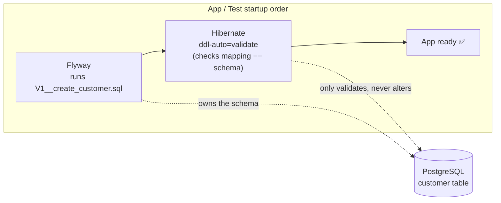
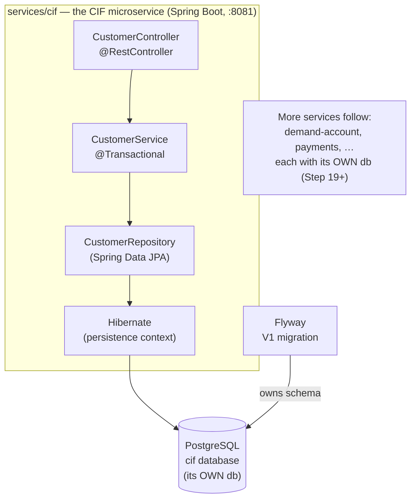
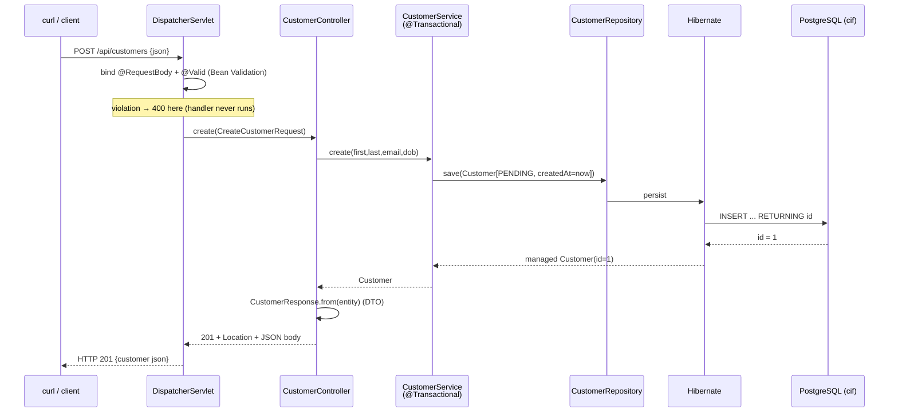

# Step 8 · CIF Service — Spring Data JPA, Flyway & Testcontainers

> **Step 8 of 67 · Phase B — Data, Databases, Concurrency & Transactions 🔵** · Level badge: 🔵 Core · Effort ≈ 20h (experienced Spring-Data devs: skip-test below and skim) · **the FIRST real banking microservice.**

`🟢` Foundations &nbsp;·&nbsp; `🔵` Core &nbsp;·&nbsp; `🟣` Advanced &nbsp;·&nbsp; `🔴` Frontier

> [!CAUTION]
> **Educational, non-production project.** Build-a-Bank is for learning only. It never handles real money, real customers, or real personal data, and it is **not** security-audited for production banking. Every credential and customer you ever see here is fake/synthetic. (Full disclaimer + guardrails in the [README](../../README.md).)

> [!WARNING]
> **🐳 Docker is REQUIRED from this step on.** The integration tests spin up a real PostgreSQL via **Testcontainers**, and the live run uses **Docker Compose**. If `docker info` doesn't work, start Docker Desktop (or your engine) before you begin. This is the step where the bank stops being a toy in memory and starts owning a real database.

---

## 🧭 The Six Movements of This Step

A one-line map of where we're going. Click to jump.

1. **[A · 🧭 Orient](#orient)** — what the CIF service *is*, why a database-backed microservice matters, the cheat card, and whether you can skip.
2. **[B · 🧠 Understand](#understand)** — the persistence mental model (entity ↔ row, the persistence context / 1st-level cache), why an entity is a class and not a record, Spring Data derived queries, Flyway-owns-the-schema with `ddl-auto=validate`, OSIV off, Bean Validation, DTOs vs entities — no magic; plus the security lens, the Boot-4 / Testcontainers-2 version story, and two patterns (Repository, Database-per-Service).
3. **[C · 🛠️ Build](#build)** — the heart: the module pom (hitting the Flyway + Testcontainers module deltas) → the `Customer` entity → the Flyway `V1` migration → the repository (derived queries) → the `@Transactional` service → the DTOs + Bean Validation → the controller → `application.yml` → the `@ServiceConnection` Testcontainers config + the `@DataJpaTest` slice (we hit and fix the *missing table* failure) → the `@WebMvcTest` controller test → the full `@SpringBootTest` integration test → and finally **run it for real with Compose** (we hit and fix the port-5432 conflict). Then 🎮 Play With It and the 🏁 finished result.
4. **[D · 🔬 Prove](#prove)** — the Verification Log (🔴 Full tier): the real, pasted `verify` (6 tests) with the **Testcontainers random-port + Flyway** proof, the live POST→GET over HTTP, and the **mutation sanity-check**.
5. **[E · 🎓 Apply](#apply)** — go-deeper asides, interview prep (incl. a version-evolution question), and your-turn exercises.
6. **[F · 🏆 Review](#review)** — troubleshooting (the three real failures), resources & glossary, and the recap/study notes.

---

<a id="orient"></a>

# A · 🧭 Orient

## 📋 This Step in 30 Seconds

| | |
|---|---|
| **Title** | CIF Service — Spring Data JPA, Flyway & Testcontainers (the bank's customer master) |
| **Step** | 8 of 67 · **Phase B — Data, Databases, Concurrency & Transactions** 🔵 · **the first real microservice** |
| **Effort** | ≈ 20 hours focused. The payoff is a *real* persistence stack you can reason about — entity mapping, migrations, real-DB tests. An experienced Spring-Data dev can skip-test and skim to ~4h. |
| **What you'll run this step** | **JVM + Maven** for the build & tests; **🐳 Docker** for *both* the tests (Testcontainers Postgres) *and* the live run (Compose Postgres). Start the DB: `docker compose -f services/cif/compose.yaml up -d`, then `./mvnw -pl services/cif spring-boot:run` (port **8081**). No other services needed. |
| **Buildable artifact** | NEW Maven module **`services/cif`** — a Spring Boot app with its **own Postgres DB** (db-per-service): `Customer` entity + `KycStatus` enum, a Flyway `V1__create_customer.sql` migration, a `CustomerRepository`, a `@Transactional` `CustomerService`, `CreateCustomerRequest`/`CustomerResponse` DTOs with Bean Validation, a `CustomerController` (`POST` + two `GET`s), plus three tests on a **real Postgres** (a `@DataJpaTest` slice, a `@WebMvcTest` slice, and a full `@SpringBootTest`). `step-08-start == step-07-end`; `step-08-end` opens Phase B. |
| **Verification tier** | 🔴 **Full** — this step *adds a service*. `./mvnw verify` green + all **6** tests + the **Testcontainers real-Postgres proof** (random high port, not 5432) + the **Flyway migration applied** lines + the live **POST→GET over HTTP** + the **§12.3 mutation sanity-check** (break a test, watch it fail, revert). |
| **Depends on** | **Steps 5–7** (Spring Core & IoC — beans, constructor injection, `@Service`/`@RestController`, the proxy model behind `@Transactional`) **+ Docker** (introduced in Step 1; now mandatory). |

By the end you will be able to design and run a **database-backed microservice**: map a Java class to a table with JPA (`@Entity`, `@Id @GeneratedValue`, `@Column`, `@Enumerated(STRING)`, `Instant`→`timestamptz`), explain *why a JPA entity is a mutable class and not a `record`*, write a Spring Data repository whose **derived queries** (`findByCustomerNumber`, `existsByEmail`) are generated from their method names, own your schema with **Flyway versioned migrations** while Hibernate only *validates* it (`ddl-auto=validate`), reject bad input automatically with **Bean Validation** + `@Valid` (→ `400`), keep your API contract decoupled from the DB with **DTOs**, turn **Open-Session-in-View off** from day one, and — the headline skill — **integration-test against a real PostgreSQL** using **Testcontainers + `@ServiceConnection`** rather than an H2 fake.

### ⏭️ Can You Skip This Step? (5-minute self-check)

Run this self-check. If you can confidently do **all** of it, skim the 🕰️/🛡️/🧩 asides (the Boot-4 module split and Testcontainers-2 non-generic change are *new* and worth a glance), then move on to **[Step 9 — Hibernate performance & correctness](../step-09/lesson.md)**.

- [ ] I can map a Java class to a table with JPA and explain `@GeneratedValue(strategy = IDENTITY)`, `@Enumerated(EnumType.STRING)` (and why never the ordinal), and why I store `Instant` (UTC) → `timestamptz`.
- [ ] I can explain **why a JPA entity is a class with a no-arg constructor and mutable fields, not a `record`** (what Hibernate needs from it).
- [ ] I can write a Spring Data repository and explain how a **derived query** like `findByCustomerNumber` becomes SQL with no implementation, and what the **persistence context / 1st-level cache** is.
- [ ] I can explain **who owns the schema** when both Flyway and Hibernate are present, what `ddl-auto=validate` does, and why `flyway-core` alone is not enough in Spring Boot 4.
- [ ] I can make a request body self-validating with `@NotBlank/@Email/@Past` + `@Valid` and say what status code a violation returns and *who* returns it.
- [ ] I can explain why I return a **DTO** and not the entity, and what **Open-Session-in-View** is and why I turn it off.
- [ ] I can write an integration test against a **real Postgres** with Testcontainers + `@ServiceConnection` and explain why that beats H2.

> [!TIP]
> Not 100%? Stay. "Who owns the schema — Flyway or Hibernate?", "why test on real Postgres, not H2?", and "what's the persistence context?" are bread-and-butter senior-interview questions, and the Boot-4 / Testcontainers-2 changes here are recent enough that even experienced devs will trip on the per-tech test-slice modules and the now-non-generic `PostgreSQLContainer`. Building it once — and *seeing the missing-table failure and fixing it* — is the difference between "I've read about Testcontainers" and "I've debugged a Flyway-on-the-slice problem."

## 📇 Cheat Card

> **What this step delivers (one sentence):** the bank's first real microservice — **CIF** (Customer Information File) — a Spring Boot app with its **own PostgreSQL database**, a JPA-mapped `Customer` whose schema is owned by **Flyway** and only *validated* by Hibernate, a self-validating create API that returns `201`/`400`/`404` correctly, and three tests that prove it on a **real Postgres** spun up by Testcontainers (no H2).

**Key commands** (Windows uses `.\mvnw.cmd`; macOS/Linux/Git-Bash use `./mvnw`):

```bash
# Build CIF (and its dependencies, -am) and run all 6 tests on a real Testcontainers Postgres:
./mvnw -pl services/cif -am verify

# Start a local Postgres for the live run, then run CIF on :8081:
docker compose -f services/cif/compose.yaml up -d
./mvnw -pl services/cif spring-boot:run

# Poke it (second terminal):
curl -i -X POST http://localhost:8081/api/customers \
  -H 'Content-Type: application/json' \
  -d '{"firstName":"Grace","lastName":"Hopper","email":"grace@bank.example","dateOfBirth":"1906-12-09"}'
curl -i http://localhost:8081/api/customers/1            # 200 + JSON
curl -i http://localhost:8081/actuator/flyway            # which migrations ran
curl -i http://localhost:8081/api/customers/99999        # clean 404

# One-shot proof your build matches the lesson (needs only Docker):
bash steps/step-08/smoke.sh
```

**The one headline idea — *the schema is owned by a Flyway migration; Hibernate is told to only **validate** that its entity mapping matches; tests run against a **real** Postgres, not a fake*:**



*Alt-text: a left-to-right flow showing the startup order — Flyway runs the `V1__create_customer.sql` migration first and owns the schema in PostgreSQL's `customer` table; then Hibernate, configured with `ddl-auto=validate`, checks that its entity mapping matches the schema (it only validates, never alters); then the app is ready.*

## 🎯 Why This Matters

Every real backend you will ever build talks to a database, and *how* it does so — schema ownership, mapping correctness, transaction boundaries, and **how you test it** — separates a hobby project from a system you'd trust with money. This is the step where Build-a-Bank gets its first **microservice with its own database** (the Database-per-Service pattern you'll see everywhere in the industry), and where you learn the modern, non-negotiable testing discipline: **test against the real engine (Postgres) in a container, not an in-memory imposter (H2)** — because the bugs that bite in production (a `timestamptz` rounding difference, a unique-constraint violation, a Postgres-only SQL quirk) are exactly the ones H2 hides. Interviewers probe all of this: "who owns your schema?", "why not H2?", "what's the persistence context?".

## ✅ What You'll Be Able to Do

- **Map** a Java class to a relational table with JPA and justify every annotation (`@Id`, `@GeneratedValue(IDENTITY)`, `@Column`, `@Enumerated(STRING)`, `Instant`→`timestamptz`).
- **Explain** why a JPA entity is a mutable class with a no-arg constructor — not a `record`.
- **Write** a Spring Data repository and explain how **derived query methods** become SQL with zero implementation code.
- **Own** your schema with **Flyway versioned migrations** and configure Hibernate to only **validate** it (`ddl-auto=validate`), and read `/actuator/flyway`.
- **Validate** request bodies declaratively with **Bean Validation** + `@Valid` so bad input gets an automatic `400`.
- **Separate** your API contract from your DB shape using **DTOs**, and turn **Open-Session-in-View off**.
- **Integration-test** the whole stack against a **real PostgreSQL** with **Testcontainers + `@ServiceConnection`**, and prove it with the tell-tale random-port JDBC URL.

## 🧰 Before You Start

**Prerequisites**

- ✅ You finished **Steps 5–7** (Spring Core/IoC, Boot internals, AOP & the proxy model). You know constructor injection, `@Service`/`@RestController`, and that `@Transactional` works via a proxy (which matters when we discuss self-invocation later).
- ✅ **Docker is running.** Quick check: `docker info` prints engine details (not an error). On Windows, that's Docker Desktop; on Linux, the daemon. This step *will not pass* without it.
- ✅ You have the repo checked out at `step-08-start` (== `step-07-end`), which builds clean (`./mvnw verify` green for the Phase-A modules).
- ✅ Recommended: ~4 GB free RAM for the Postgres container + the JVM; the Lightweight Profile (README §6.2) is fine here since CIF is the only service.

**What you already learned that connects here**

- **Step 2** — `BigDecimal` for money and **`Instant`/`LocalDate`** for time. We use `LocalDate` for a date-of-birth (a zone-less calendar date) and `Instant` (UTC) for `createdAt`. (No money yet — that arrives with the ledger in Step 12.)
- **Step 5–6** — beans & constructor injection (the repository is injected into the service, the service into the controller), and Boot **auto-configuration** (Flyway and the DataSource are auto-configured — when the right modules are present, which is the Boot-4 gotcha of this step).
- **Step 7** — `@Transactional` is applied by a **proxy**; we use it on the service here and go deep on transactions in Step 12.

> **Depends on:** Steps 5, 6, 7 (Spring) + Docker (Step 1).

---

<a id="understand"></a>

# B · 🧠 Understand

## 🧠 The Big Idea

A relational database stores **rows in tables**. Your Java program thinks in **objects**. **JPA (Jakarta Persistence API)** is the standard that bridges the two — the *object-relational mapping* (ORM) — and **Hibernate** is the implementation Spring Boot uses. **Spring Data JPA** sits on top, generating your boilerplate repository code. But an ORM raises three questions that this step answers head-on:

1. **Who owns the schema?** The naive answer is "let Hibernate create the tables from my entities" (`ddl-auto=create`). The *professional* answer is: **a migration tool owns the schema** (here, **Flyway**), versioned in SQL files you commit, and Hibernate is told to merely **validate** that its mapping matches (`ddl-auto=validate`). Why? Because in production you never drop-and-recreate; you *evolve* a schema with reviewed, ordered, repeatable migrations — and you want Hibernate to fail fast at startup if the code and the schema have drifted apart.

2. **Where do objects live between the DB and your code?** Inside a transaction, Hibernate keeps a **persistence context** (a.k.a. the **first-level cache** / "session") — an in-memory map of the managed entities for that unit of work. Load the same row twice in one transaction and you get the *same* object instance, not two; that's the 1st-level cache. (We dissect it — dirty checking, flushing, lazy loading — in Step 9. For now: just know it exists and is per-transaction.)

3. **How do you test it honestly?** Not with H2. You spin up a **real PostgreSQL in a throwaway Docker container** (Testcontainers) so your tests exercise the actual engine, the actual Flyway migration, the actual `timestamptz` type. **`@ServiceConnection`** wires Spring Boot's DataSource to that container automatically.

**Analogy — the library and its catalogue.** Think of the database as a **library of physical books** (rows). Your `Customer` *entity* is a **library card** describing one book. **Flyway** is the **head librarian** who decides the shelving system and writes it down in a versioned rulebook (migration V1, V2, …) — nobody else rearranges the shelves. **Hibernate-on-validate** is a **new clerk** who, on their first day, walks the shelves and checks "do the real shelves match the rulebook the librarian gave me?" — and refuses to open the library if they don't. The **persistence context** is the clerk's **desk**: while serving one patron (one transaction) they keep the cards they've touched on the desk, so fetching the same book twice doesn't mean two trips to the shelves. And **Testcontainers** is testing your whole process in a **pop-up replica of the real library** that you build before opening and demolish after — not a cardboard mock-up (H2) that's *almost* like the real thing but shelves books differently.



*Alt-text: the growing architecture. The CIF microservice (a Spring Boot app on port 8081) contains a CustomerController calling a CustomerService (transactional) calling a CustomerRepository (Spring Data JPA) calling Hibernate, which talks to a PostgreSQL database that is CIF's OWN database. Flyway's V1 migration owns that database's schema. A note indicates more services follow — demand-account, payments, and others — each with its own database, starting around Step 19.*

## 🧩 Pattern Spotlight

### The Repository Pattern (Spring Data generates it for you)

- **Problem:** scattering raw SQL / `EntityManager` calls through your service code couples business logic to persistence details and makes it untestable.
- **Why it fits:** a **Repository** is a collection-like abstraction over aggregate roots (here, `Customer`) — `save`, `findById`, `findAll`, plus domain-meaningful finders. Your service speaks "give me the customer with this number," not "run this SQL."
- **Alternatives / trade-offs:** raw JDBC (`JdbcTemplate`/`JdbcClient`) — more control, more boilerplate; a hand-rolled DAO — same idea, you write it yourself; **Spring Data JPA** — you declare an *interface* and Spring Data **generates the implementation at startup** from the method names. Trade-off: less magic-free, but enormous boilerplate savings; you can always drop to `@Query` or `JdbcClient` for the 5% it can't express.
- **Implementation micro-structure:** `interface CustomerRepository extends JpaRepository<Customer, Long>` — `JpaRepository<T, ID>` gives CRUD + paging for free, and **derived queries** (`findByCustomerNumber`, `existsByEmail`) are parsed from the method name into JPQL → SQL.

### Database-per-Service (each microservice owns its schema)

- **Problem:** if many services share one database, a schema change for one service can break another, and you can't deploy or scale them independently — the database becomes a hidden coupling.
- **Why it fits:** CIF gets its **own** Postgres database (`cif`). No other service reads CIF's tables directly; they ask CIF via its API. This is the foundation of microservice autonomy.
- **Trade-offs:** you lose cross-service JOINs and cross-service ACID transactions — which is *exactly* why distributed patterns like **Saga**, **Outbox**, and **eventual consistency** exist (forward-ref: Steps 19–21). For a learning bank we accept that trade-off deliberately.
- **Implementation micro-structure:** here it's just "this module has its own `compose.yaml` Postgres and its own datasource." The pattern's teeth (no foreign keys across service boundaries, integration via events) land from Step 19.

## 🌱 Under the Hood: How It Really Works

**1. JPA entity ↔ table — and why it's a class, not a record.** When Hibernate manages a `Customer`, it must be able to (a) **instantiate it with no arguments** (it reads a row, makes a blank object, then sets fields by reflection), and (b) sometimes **subclass it with a proxy** for lazy loading. A Java `record` is `final`, has no no-arg constructor, and has immutable fields — so it can't be a managed entity. Hence the rule: **entities are plain classes with a (possibly `protected`) no-arg constructor and mutable fields; records are perfect for the DTOs at the edge** (which is exactly how we split them).

**2. `@GeneratedValue(strategy = IDENTITY)`.** Tells Hibernate the database generates the primary key (Postgres `generated by default as identity` / a sequence under the hood). With `IDENTITY`, the id is only known *after* the `INSERT`, so Hibernate must execute the insert immediately on `save` (it can't batch inserts the way a `SEQUENCE` strategy can — a perf nuance we revisit in Step 9).

**3. `@Enumerated(EnumType.STRING)`.** Persists the enum by its **name** (`"PENDING"`), not its ordinal (`0`). Ordinals are a classic foot-gun: reorder or insert an enum constant and every stored row silently means something different. STRING is readable in the DB and stable across code changes.

**4. Derived queries.** At startup, Spring Data parses `findByCustomerNumber(String)` → "SELECT a Customer WHERE customerNumber = ?1", builds the JPQL, and provides the implementation. `existsByEmail` becomes a `SELECT COUNT/EXISTS`. No SQL written by you. (We dissect the parser and the alternatives — `@Query`, projections — in Step 9.)

**5. Flyway runs before Hibernate validates.** On startup Spring Boot's auto-configuration runs **Flyway first** (it migrates the schema to the latest version), *then* the JPA/Hibernate bootstrap runs and — because `ddl-auto=validate` — Hibernate reads the live schema and asserts every mapped table/column exists with a compatible type. If the entity says `@Column(name="email")` but the table has no `email` column, startup **fails fast** with a `SchemaManagementException`. That ordering (migrate → validate → ready) is the third diagram in this step.

**6. Bean Validation + `@Valid` → automatic 400.** The constraints (`@NotBlank`, `@Email`, `@Past`) are metadata on the DTO. When the controller parameter is annotated `@Valid`, Spring runs the validator **before** your method body; a violation throws `MethodArgumentNotValidException`, which Spring's default handler turns into an HTTP **`400 Bad Request`**. Your controller code never even runs. (We make the error *body* pretty with `ProblemDetail` in Step 13.)

**7. Open-Session-in-View (OSIV), and why off.** By default Spring Boot keeps the Hibernate session open for the *whole* web request — so lazy associations can be loaded even in the view/serialization layer. Convenient, but it hides N+1 problems, holds a DB connection longer than needed, and blurs transaction boundaries. We set `open-in-view: false` **from day one** so the session closes when the `@Transactional` service method returns — forcing us to fetch what we need *inside* the transaction (the disciplined way; deep dive in Step 9).

## 🛡️ Security Lens: What Could Go Wrong

- **SQL injection — handled by default.** Spring Data / JPA use **parameterized queries** (bind variables), so `findByCustomerNumber(userInput)` cannot be turned into injected SQL. The danger zone is string-concatenated `@Query` / native SQL — which we avoid. (OWASP Top 10 A03; deep dive Step 18.)
- **Never log PII.** Names, emails, dates of birth are **personal data**. Don't log the request body or entity at INFO. Our logging config keeps `com.buildabank.cif` at INFO and we never log the customer fields. (Data privacy & tokenization get real treatment in Phase H, Step 44.)
- **Credentials via env, never committed.** The datasource URL/username/password come from environment variables with *local-only* defaults (`change-me-locally`). The real ones live in `.env` (git-ignored); `.env.example` holds fakes. Never commit a real credential — the gitleaks pre-commit hook (Step 1) guards this.
- **Validation is the first trust boundary.** `@Valid` rejecting blank names, malformed emails, and future birth dates is your *first* line of input hygiene. It's not the last (authorization, rate limiting, output encoding come later), but garbage rejected at the door never reaches the database.

> [!NOTE]
> 🔒 **Org-level data hygiene reminder.** This course handles **only synthetic, fake data**. We don't store, retain, or process any real personal user data — the customers here (Grace Hopper, Ada Lovelace) are historical figures used as fixtures. If you ever adapt this code, real PII demands the privacy controls taught in Phase H.

## 🕰️ Then vs. Now (How This Changed Across Versions)

This step is a *minefield* of recent changes — the verified deltas we hit while building it on **Spring Boot 4.0.6 / Testcontainers 2.0.5 / Java 25**. Memorize these; they're fresh enough to trip up experienced devs and they're prime interview fodder.

| Concern | ❌ Then (Boot 3 / TC 1.x / Jakarta-era) | ✅ Now (Boot 4 / TC 2.0) | Why / what to watch |
|---|---|---|---|
| **Persistence imports** | `javax.persistence.*` | **`jakarta.persistence.*`** | The Java EE → Jakarta EE namespace move (Boot 3). All our entity annotations are `jakarta.*`. |
| **Test slices** | one big `spring-boot-test` / `spring-boot-starter-test` covered all slices | **split into per-tech modules**: `@DataJpaTest` ∈ `spring-boot-data-jpa-test`, `@WebMvcTest`/`@AutoConfigureMockMvc` ∈ `spring-boot-webmvc-test`, `@AutoConfigureTestDatabase` ∈ `spring-boot-jdbc-test` | If you `import org.springframework.boot.test.autoconfigure.orm.jpa.DataJpaTest` (the old path) it won't resolve — the slices moved to new modules **and new packages** (e.g. `org.springframework.boot.data.jpa.test.autoconfigure.DataJpaTest`). |
| **Flyway auto-config** | `flyway-core` on the classpath was enough | need the Boot **integration module `spring-boot-flyway`** (it provides `FlywayAutoConfiguration` + pulls `flyway-core`); the library alone does **not** | And `@DataJpaTest` does **not** include Flyway — so the slice test must `@ImportAutoConfiguration(FlywayAutoConfiguration.class)`. This is the *missing-table* failure we hit in sub-step 9. |
| **Testcontainers modules** | `org.testcontainers:postgresql`, `:junit-jupiter` | renamed to **`testcontainers-postgresql`**, **`testcontainers-junit-jupiter`** (TC 2.0) | Old artifact coordinates won't resolve. |
| **`PostgreSQLContainer`** | generic, self-typed: `new PostgreSQLContainer<>(…)` at `org.testcontainers.containers` | **non-generic**, at `org.testcontainers.postgresql.PostgreSQLContainer`: `new PostgreSQLContainer(…)` | TC 2.0 dropped the `1.x` `<SELF>` self-type. Leaving the `<>` gives *"does not take parameters."* (sub-step 9 failure #2). |
| **Mocking a bean in a slice** | `@MockBean` (`org.springframework.boot.test.mock.mockito`) | **`@MockitoBean`** (`org.springframework.test.context.bean.override.mockito`) | `@MockBean` is removed/deprecated; the Framework-level `@MockitoBean` replaces it. |
| **Schema ownership default** | many tutorials ship `ddl-auto=update` (Hibernate creates tables) | **Flyway owns it; `ddl-auto=validate`** | The professional default — reviewed migrations, fail-fast on drift. |

> [!IMPORTANT]
> **Verify, don't guess.** Versions move. We *verified* every coordinate above by building this module (`./mvnw -pl services/cif -am verify` — green, pasted in [D · Prove](#prove)). If a future Boot patch relocates a slice again, trust the compiler error and the [VERSIONS.md](../../VERSIONS.md) pin over any blog post.

---

<a id="build"></a>

# C · 🛠️ Build

## 📦 Your Starting Point

You're at **`step-08-start`** (identical to `step-07-end`, the Phase-A finale). What's green right now:

- The multi-module Maven build with the parent `pom.xml` (Java 25, Spring Boot 4.0.6 BOM, Maven Wrapper).
- `services/hello` and `playground/spring-lab` from Phase A — both build and test clean.
- **No `services/cif` yet**, no database. That's what we build.

Sanity-check the start tag builds before you add anything:

```bash
./mvnw -q -e -DskipTests package
```

✅ You should see `BUILD SUCCESS`. If not → 🩺 (or `git checkout step-08-start` to reset).

> [!NOTE]
> **Two repos, remember (README + Step 1).** The cloned course repo is your *textbook + answer key* — read the lesson, and `git checkout step-08-end` to diff against the finished reference. You build *your own* version in your own project folder. The file paths below are the canonical ones in the course repo.

## 🛠️ Let's Build It — Step by Step

Here's the whole map. We build **inside-out**: module → entity → schema → repository → service → DTOs → controller → config → tests → live run. We run between pieces and commit after each logical unit.

```mermaid
flowchart LR
    s1["1 · module pom<br/>(deps + Boot-4 deltas)"] --> s2["2 · Customer entity<br/>+ KycStatus"]
    s2 --> s3["3 · Flyway V1<br/>migration"]
    s3 --> s4["4 · Repository<br/>(derived queries)"]
    s4 --> s5["5 · Service<br/>@Transactional"]
    s5 --> s6["6 · DTOs +<br/>Bean Validation"]
    s6 --> s7["7 · Controller<br/>POST + GETs"]
    s7 --> s8["8 · application.yml<br/>(validate, OSIV off, env)"]
    s8 --> s9["9 · @ServiceConnection<br/>+ @DataJpaTest"]
    s9 --> s10["10 · @WebMvcTest"]
    s10 --> s11["11 · @SpringBootTest<br/>(full e2e)"]
    s11 --> s12["12 · run for real<br/>(Compose)"]
```



*Alt-text: a left-to-right build roadmap of twelve sub-steps, from the module pom through the entity, Flyway migration, repository, service, DTOs, controller, application.yml, the three test layers, and finally running it for real with Compose.*

🌳 **Files we'll touch** (everything new is under `services/cif/`):

```
services/cif/
├── pom.xml                                              ← sub-step 1
├── compose.yaml                                         ← sub-step 12
└── src/
    ├── main/
    │   ├── java/com/buildabank/cif/
    │   │   ├── CifApplication.java                      ← sub-step 1
    │   │   ├── domain/
    │   │   │   ├── KycStatus.java                       ← sub-step 2
    │   │   │   ├── Customer.java                        ← sub-step 2
    │   │   │   └── CustomerRepository.java              ← sub-step 4
    │   │   ├── service/
    │   │   │   └── CustomerService.java                 ← sub-step 5
    │   │   └── web/
    │   │       ├── CreateCustomerRequest.java           ← sub-step 6
    │   │       ├── CustomerResponse.java                ← sub-step 6
    │   │       └── CustomerController.java              ← sub-step 7
    │   └── resources/
    │       ├── application.yml                          ← sub-step 8
    │       └── db/migration/V1__create_customer.sql     ← sub-step 3
    └── test/java/com/buildabank/cif/
        ├── ContainersConfig.java                        ← sub-step 9
        ├── domain/CustomerRepositoryTest.java           ← sub-step 9
        ├── web/CustomerControllerTest.java              ← sub-step 10
        └── CifApplicationIntegrationTest.java           ← sub-step 11
```

Also touched (one-line registration): the parent `pom.xml` gets `<module>services/cif</module>`, and `steps/step-08/` ships `requests.http`, `smoke.sh`, `seed.sql` (already in the course repo).

---

### Sub-step 1 of 12 — The module pom + the application class 🧭 *(you are here: **module** → entity → schema → repo → service → DTOs → controller → config → tests → run)*

🎯 **Goal:** create the `services/cif` Maven module with exactly the dependencies a JPA + Flyway + Testcontainers service needs — and hit the **Boot-4 / Testcontainers-2 module deltas** head-on so they never surprise you. Then add the Spring Boot entry-point class so the module is runnable.

📁 **Location:** new file → `services/cif/pom.xml`

⌨️ **Code:**

```xml
<?xml version="1.0" encoding="UTF-8"?>
<!-- services/cif/pom.xml -->
<project xmlns="http://maven.apache.org/POM/4.0.0"
         xmlns:xsi="http://www.w3.org/2001/XMLSchema-instance"
         xsi:schemaLocation="http://maven.apache.org/POM/4.0.0 https://maven.apache.org/xsd/maven-4.0.0.xsd">
    <modelVersion>4.0.0</modelVersion>

    <!--
      cif — Customer Information File. The FIRST real banking microservice: its own PostgreSQL DB,
      Spring Data JPA (Hibernate), Flyway migrations, Bean Validation, and integration tests on a
      real Postgres via Testcontainers (no H2 fakery). Mock KYC. (Step 8.)
    -->
    <parent>
        <groupId>com.buildabank</groupId>
        <artifactId>build-a-bank-parent</artifactId>
        <version>0.1.0-SNAPSHOT</version>
        <relativePath>../../pom.xml</relativePath>
    </parent>

    <artifactId>cif</artifactId>
    <name>Build-a-Bank :: Services :: CIF</name>
    <description>Customer master + mock KYC — Spring Data JPA, Flyway, validation (Step 8).</description>

    <dependencies>
        <dependency>
            <groupId>org.springframework.boot</groupId>
            <artifactId>spring-boot-starter-web</artifactId>
        </dependency>
        <dependency>
            <groupId>org.springframework.boot</groupId>
            <artifactId>spring-boot-starter-data-jpa</artifactId>
        </dependency>
        <dependency>
            <groupId>org.springframework.boot</groupId>
            <artifactId>spring-boot-starter-validation</artifactId>
        </dependency>
        <dependency>
            <groupId>org.springframework.boot</groupId>
            <artifactId>spring-boot-starter-actuator</artifactId>
        </dependency>

        <!-- Flyway in Spring Boot 4: you need the Boot INTEGRATION module (spring-boot-flyway, which
             provides FlywayAutoConfiguration and pulls flyway-core) — the flyway-core library alone does
             NOT bring the auto-configuration. Plus the Postgres support module (split out since Flyway 10). -->
        <dependency>
            <groupId>org.springframework.boot</groupId>
            <artifactId>spring-boot-flyway</artifactId>
        </dependency>
        <dependency>
            <groupId>org.flywaydb</groupId>
            <artifactId>flyway-database-postgresql</artifactId>
        </dependency>

        <!-- PostgreSQL JDBC driver (runtime). -->
        <dependency>
            <groupId>org.postgresql</groupId>
            <artifactId>postgresql</artifactId>
            <scope>runtime</scope>
        </dependency>

        <!-- ── Test ── -->
        <dependency>
            <groupId>org.springframework.boot</groupId>
            <artifactId>spring-boot-starter-test</artifactId>
            <scope>test</scope>
        </dependency>
        <!-- Boot 4 split test slices into per-technology modules. -->
        <dependency>
            <groupId>org.springframework.boot</groupId>
            <artifactId>spring-boot-data-jpa-test</artifactId>
            <scope>test</scope>
        </dependency>
        <dependency>
            <groupId>org.springframework.boot</groupId>
            <artifactId>spring-boot-webmvc-test</artifactId>
            <scope>test</scope>
        </dependency>
        <!-- Real Postgres in tests via Testcontainers + Boot's @ServiceConnection. -->
        <dependency>
            <groupId>org.springframework.boot</groupId>
            <artifactId>spring-boot-testcontainers</artifactId>
            <scope>test</scope>
        </dependency>
        <dependency>
            <groupId>org.testcontainers</groupId>
            <artifactId>testcontainers-postgresql</artifactId>
            <scope>test</scope>
        </dependency>
        <dependency>
            <groupId>org.testcontainers</groupId>
            <artifactId>testcontainers-junit-jupiter</artifactId>
            <scope>test</scope>
        </dependency>
    </dependencies>

    <build>
        <plugins>
            <plugin>
                <groupId>org.springframework.boot</groupId>
                <artifactId>spring-boot-maven-plugin</artifactId>
            </plugin>
        </plugins>
    </build>
</project>
```

🔍 **Line-by-line (the dependencies that matter):**

- `<parent>` — inherits the pinned Spring Boot 4.0.6 BOM and Java 25 settings from the repo's parent `pom.xml`, so **none of these dependencies need a version** (the BOM manages them). `<relativePath>../../pom.xml</relativePath>` points up two levels (`services/cif` → repo root).
- `spring-boot-starter-web` — Spring MVC + embedded Tomcat (the REST controller).
- `spring-boot-starter-data-jpa` — Spring Data JPA + Hibernate + a connection pool (HikariCP).
- `spring-boot-starter-validation` — Hibernate Validator (the Bean Validation engine for `@NotBlank` etc.).
- `spring-boot-starter-actuator` — gives us `/actuator/flyway` (and health/info) to *see* migrations.
- **`spring-boot-flyway`** ⚠️ — this is the **Boot integration module** that provides `FlywayAutoConfiguration`. *This is the gotcha:* `flyway-core` alone would compile but give you **no auto-configuration** — Flyway would never run. (Then-vs-Now row 3.)
- `flyway-database-postgresql` — Flyway 10+ split per-database support into modules; Postgres needs this.
- `postgresql` (scope `runtime`) — the JDBC driver, only needed at runtime, not compile time.
- The **test block**: `spring-boot-data-jpa-test` (the `@DataJpaTest` slice), `spring-boot-webmvc-test` (the `@WebMvcTest`/`@AutoConfigureMockMvc` slice) — both **new per-tech modules in Boot 4**. Then `spring-boot-testcontainers` (the `@ServiceConnection` glue), and the renamed Testcontainers 2.0 modules `testcontainers-postgresql` + `testcontainers-junit-jupiter`.

💭 **Under the hood:** Spring Boot's auto-configuration is **conditional on what's on the classpath**. `FlywayAutoConfiguration` activates only when its trigger classes (provided by `spring-boot-flyway`) are present. The whole "which module do I need?" puzzle of Boot 4 is really "which module carries the auto-configuration / slice annotation I want?" — the answer moved from monolithic starters to focused per-tech modules.

📁 **Now the application class** → `services/cif/src/main/java/com/buildabank/cif/CifApplication.java`

```java
// services/cif/src/main/java/com/buildabank/cif/CifApplication.java
package com.buildabank.cif;

import org.springframework.boot.SpringApplication;
import org.springframework.boot.autoconfigure.SpringBootApplication;

/** The CIF (Customer Information File) service — the bank's customer master. */
@SpringBootApplication
public class CifApplication {

    public static void main(String[] args) {
        SpringApplication.run(CifApplication.class, args);
    }
}
```

🔍 `@SpringBootApplication` = `@SpringBootConfiguration` + `@EnableAutoConfiguration` + `@ComponentScan` (you met this in Step 1). Component scanning starts at this package (`com.buildabank.cif`), which is *why* everything lives below it.

📁 **Register the module** with the parent. Open the repo-root `pom.xml`, find `<modules>`, and add CIF (before/after the others — order doesn't matter for siblings):

```xml
<!-- pom.xml (repo root) — inside <modules> -->
    <modules>
        <module>services/hello</module>
        <module>playground/spring-lab</module>
        <module>services/cif</module>   <!-- ← add this line -->
    </modules>
```

🔮 **Predict:** we have no entity, no schema, no test yet. What does `./mvnw -pl services/cif -am verify` do — succeed (nothing to fail) or fail (something missing)?

▶️ **Run & See:**

```bash
./mvnw -pl services/cif -am verify
```

✅ **Expected output (abridged):** with only the empty app class, the context starts but Hibernate has nothing to validate yet and there's no datasource configured — so this will actually *fail to start* until sub-step 8 (config) and a running DB. That's expected and fine at this point. For now, just compile:

```bash
./mvnw -pl services/cif -am -DskipTests compile
```

```
[INFO] Building Build-a-Bank :: Services :: CIF 0.1.0-SNAPSHOT
[INFO] BUILD SUCCESS
```

❌ **If you see `Could not find artifact org.testcontainers:postgresql`** (no `testcontainers-` prefix): you used the **Testcontainers 1.x** coordinates. Boot 4 / TC 2.0 renamed them to `testcontainers-postgresql` / `testcontainers-junit-jupiter`. (Then-vs-Now row 4.)

✋ **Checkpoint:** `services/cif` compiles and is registered in the parent `<modules>`. The full `verify` won't pass until we have config + a DB + tests — that's the next eleven sub-steps.

💾 **Commit:**

```bash
git add services/cif/pom.xml services/cif/src/main/java/com/buildabank/cif/CifApplication.java pom.xml
git commit -m "feat(cif): scaffold CIF module (JPA + Flyway + Testcontainers deps)"
```

⚠️ **Pitfall:** forgetting `spring-boot-flyway` and adding only `flyway-core` — it compiles, but Flyway never runs and you'll hit the *missing table* error later. The integration module is the one that carries `FlywayAutoConfiguration`.

---

### Sub-step 2 of 12 — The `Customer` entity + `KycStatus` enum 🧭 *(module ✅ → **entity** → schema → repo → …)*

🎯 **Goal:** map the customer to a table with JPA — and learn *why an entity is a mutable class, not a record*. First the tiny enum, then the entity.

📁 **Location:** new file → `services/cif/src/main/java/com/buildabank/cif/domain/KycStatus.java`

⌨️ **Code:**

```java
// services/cif/src/main/java/com/buildabank/cif/domain/KycStatus.java
package com.buildabank.cif.domain;

/** Mock KYC (Know Your Customer) status. New customers start PENDING. */
public enum KycStatus {
    PENDING,
    VERIFIED,
    REJECTED
}
```

🔍 **KYC** = "Know Your Customer," the regulatory identity-verification process banks run. Ours is **mock** — a new customer starts `PENDING`; nothing verifies them. The three states model a realistic lifecycle without the regulatory complexity (per the simplified-teaching-model guardrail).

📁 **Now the entity** → `services/cif/src/main/java/com/buildabank/cif/domain/Customer.java`

```java
// services/cif/src/main/java/com/buildabank/cif/domain/Customer.java
package com.buildabank.cif.domain;

import java.time.Instant;
import java.time.LocalDate;

import jakarta.persistence.Column;
import jakarta.persistence.Entity;
import jakarta.persistence.EnumType;
import jakarta.persistence.Enumerated;
import jakarta.persistence.GeneratedValue;
import jakarta.persistence.GenerationType;
import jakarta.persistence.Id;
import jakarta.persistence.Table;

/**
 * A bank customer (JPA entity). The table is owned by Flyway (see {@code db/migration}); Hibernate is set
 * to {@code ddl-auto=validate}, so this mapping must match the migration exactly or startup fails fast.
 *
 * <p>Design notes that recur across the bank:
 * <ul>
 *   <li>a JPA entity is a plain class (not a record) — Hibernate needs a no-arg constructor and mutable fields
 *       it can proxy;</li>
 *   <li>the enum is persisted as a STRING (readable + stable), never its ordinal;</li>
 *   <li>time is an {@link Instant} (UTC) → {@code timestamptz}.</li>
 * </ul>
 */
@Entity
@Table(name = "customer")
public class Customer {

    @Id
    @GeneratedValue(strategy = GenerationType.IDENTITY)
    private Long id;

    @Column(name = "customer_number", nullable = false, unique = true, updatable = false)
    private String customerNumber;

    @Column(name = "first_name", nullable = false)
    private String firstName;

    @Column(name = "last_name", nullable = false)
    private String lastName;

    @Column(nullable = false, unique = true)
    private String email;

    @Column(name = "date_of_birth")
    private LocalDate dateOfBirth;

    @Enumerated(EnumType.STRING)
    @Column(name = "kyc_status", nullable = false)
    private KycStatus kycStatus;

    @Column(name = "created_at", nullable = false, updatable = false)
    private Instant createdAt;

    /** JPA requires a no-arg constructor (may be package-private). */
    protected Customer() {
    }

    public Customer(String customerNumber, String firstName, String lastName, String email,
                    LocalDate dateOfBirth, KycStatus kycStatus, Instant createdAt) {
        this.customerNumber = customerNumber;
        this.firstName = firstName;
        this.lastName = lastName;
        this.email = email;
        this.dateOfBirth = dateOfBirth;
        this.kycStatus = kycStatus;
        this.createdAt = createdAt;
    }

    public Long getId() {
        return id;
    }

    public String getCustomerNumber() {
        return customerNumber;
    }

    public String getFirstName() {
        return firstName;
    }

    public String getLastName() {
        return lastName;
    }

    public String getEmail() {
        return email;
    }

    public LocalDate getDateOfBirth() {
        return dateOfBirth;
    }

    public KycStatus getKycStatus() {
        return kycStatus;
    }

    public void setKycStatus(KycStatus kycStatus) {
        this.kycStatus = kycStatus;
    }

    public Instant getCreatedAt() {
        return createdAt;
    }
}
```

🔍 **Line-by-line:**

- `@Entity` — marks this class as a JPA-managed entity (a row in a table). Hibernate now knows how to load/store it.
- `@Table(name = "customer")` — the table name. (Without it, Hibernate would derive one from the class name; being explicit means the entity and the migration can't drift on naming.)
- `@Id` — this field is the primary key.
- `@GeneratedValue(strategy = GenerationType.IDENTITY)` — the **database** generates the id (Postgres identity column). The id is `null` until after the `INSERT`.
- `@Column(name = "customer_number", nullable = false, unique = true, updatable = false)` — maps the field to a column, with the SQL name (Java camelCase → SQL snake_case is not automatic here, so we spell it out), `NOT NULL`, a unique constraint, and `updatable = false` (it's assigned once at creation and never changes — Hibernate omits it from UPDATE statements).
- `email` — `@Column(nullable=false, unique=true)` without a `name` uses the field name (`email`) as the column.
- `@Enumerated(EnumType.STRING)` on `kycStatus` — persist the **name** (`"PENDING"`), not the ordinal. (See Under-the-Hood #3 for why ordinals are dangerous.)
- `dateOfBirth` is a `LocalDate` (a zone-less calendar date → SQL `date`); `createdAt` is an `Instant` (UTC instant → `timestamptz`). This is the **money=BigDecimal, time=UTC/Instant** discipline from Step 2.
- **`protected Customer()`** — the no-arg constructor JPA requires to instantiate the object before populating it by reflection. `protected` (not `public`) signals "this is for the framework, not you."
- The **public constructor** is what *your* code uses to create a new, valid customer. Note there is **no setter for most fields** — once created, a customer's number/name/email don't change here; only `kycStatus` has a setter (a verification step would flip it). Minimizing mutability is deliberate.

💭 **Under the hood:** when Hibernate reads a row, it calls `new Customer()` (the protected ctor), then sets each field via reflection — which is exactly why a `record` (final fields, no no-arg ctor) **cannot** be an entity. When you `save(...)` a new customer with `IDENTITY`, Hibernate issues the `INSERT` immediately to learn the generated id, then the object becomes *managed* in the persistence context.

🔮 **Predict:** if you misspell a column name here (say `first_naem`) but the migration says `first_name`, what happens at startup — silent, runtime error, or startup failure? (Answer in sub-step 9 when we wire `validate`.)

✋ **Checkpoint:** `domain/KycStatus.java` and `domain/Customer.java` compile (`./mvnw -pl services/cif -DskipTests compile`).

💾 **Commit:**

```bash
git add services/cif/src/main/java/com/buildabank/cif/domain/
git commit -m "feat(cif): add Customer JPA entity + KycStatus enum"
```

⚠️ **Pitfall:** making `Customer` a `record` because "records are nicer." Hibernate will reject it. Records belong on the **DTOs** (sub-step 6), not the entity.

> 💡 **Faster in IntelliJ (optional):** generate the constructor and getters with `Alt+Insert` (Windows/Linux) / `⌘N` (macOS) → *Constructor* / *Getter*. The CLI path is just: type them (or copy the block above). Either way the result is identical.

---

### Sub-step 3 of 12 — The Flyway `V1` migration (schema ownership) 🧭 *(module ✅ → entity ✅ → **schema** → repo → …)*

🎯 **Goal:** write the SQL that *creates* the `customer` table. **This file — not the entity — is the source of truth for the schema.** Flyway runs it on startup; Hibernate only validates against it.

📁 **Location:** new file → `services/cif/src/main/resources/db/migration/V1__create_customer.sql`

> The folder `src/main/resources/db/migration` is Flyway's default location. The filename format is **`V<version>__<description>.sql`** — capital `V`, a version number, **two** underscores, a human description.

⌨️ **Code:**

```sql
-- services/cif/src/main/resources/db/migration/V1__create_customer.sql
-- Flyway versioned migration. The filename encodes: V<version>__<description>.sql
-- This is the single source of truth for the schema; Hibernate (ddl-auto=validate) only checks it matches.

create table customer (
    id              bigint generated by default as identity primary key,
    customer_number varchar(20)  not null unique,
    first_name      varchar(100) not null,
    last_name       varchar(100) not null,
    email           varchar(255) not null unique,
    date_of_birth   date,
    kyc_status      varchar(20)  not null,
    created_at      timestamp(6) with time zone not null
);

-- A secondary index for lookups by email (we read /actuator and reason about indexes in Step 10).
create index idx_customer_email on customer (email);
```

🔍 **Line-by-line:**

- `id bigint generated by default as identity primary key` — the Postgres identity column matching `@GeneratedValue(IDENTITY)` on a `Long` id.
- `customer_number varchar(20) not null unique` — matches `@Column(name="customer_number", nullable=false, unique=true)`. (Our generated numbers like `CIF-D6E5380A` fit in 20 chars.)
- `email varchar(255) not null unique` — matches the entity; the `unique` enforces no duplicate emails at the *database* level (belt-and-braces with the `existsByEmail` check).
- `created_at timestamp(6) with time zone not null` — Postgres `timestamptz` (microsecond precision), the storage for an `Instant`. **Always store UTC instants in `timestamptz`**, never a naive `timestamp`.
- `create index idx_customer_email …` — a secondary B-tree index so lookups by email are fast. (Indexing depth, `EXPLAIN`, and when an index helps land in Step 10.)

💭 **Under the hood:** Flyway records every applied migration in a `flyway_schema_history` table it creates automatically. On the next startup it sees V1 is already applied and skips it; it computes a **checksum** of the file, so if you *edit an already-applied migration* it will refuse to start (you add a *new* `V2` instead — never rewrite history). That's why migrations are append-only and reviewable.

🔮 **Predict:** the entity says `@Column(name="customer_number")` and the SQL says `customer_number`. If these disagreed, when would you find out — compile time, or app startup?

✋ **Checkpoint:** the file exists at exactly `src/main/resources/db/migration/V1__create_customer.sql` (double underscore!). We can't run it yet — we need the datasource config (sub-step 8) and a DB.

💾 **Commit:**

```bash
git add services/cif/src/main/resources/db/migration/V1__create_customer.sql
git commit -m "feat(cif): add Flyway V1 migration for customer table"
```

⚠️ **Pitfall:** a *single* underscore (`V1_create_customer.sql`) — Flyway won't recognize the description separator. It must be **two** underscores after the version.

---

### Sub-step 4 of 12 — The repository (derived queries) 🧭 *(… schema ✅ → **repo** → service → …)*

🎯 **Goal:** declare the repository interface. We write *no* implementation — Spring Data generates it from the method names.

📁 **Location:** new file → `services/cif/src/main/java/com/buildabank/cif/domain/CustomerRepository.java`

⌨️ **Code:**

```java
// services/cif/src/main/java/com/buildabank/cif/domain/CustomerRepository.java
package com.buildabank.cif.domain;

import java.util.Optional;

import org.springframework.data.jpa.repository.JpaRepository;

/**
 * Spring Data JPA repository. Extending {@link JpaRepository} gives CRUD + paging for free; the
 * {@code findByCustomerNumber} method is a <strong>derived query</strong> — Spring Data parses the method
 * NAME into a JPQL query at startup (no implementation needed). We dissect how that works in Step 9.
 */
public interface CustomerRepository extends JpaRepository<Customer, Long> {

    Optional<Customer> findByCustomerNumber(String customerNumber);

    boolean existsByEmail(String email);
}
```

🔍 **Line-by-line:**

- `extends JpaRepository<Customer, Long>` — `<entity type, id type>`. This inherits `save`, `findById`, `findAll`, `deleteById`, paging/sorting — all free.
- `Optional<Customer> findByCustomerNumber(String customerNumber)` — a **derived query**. Spring Data reads the name: `findBy` + property `CustomerNumber` → "SELECT c FROM Customer c WHERE c.customerNumber = ?1". Returning `Optional` models "maybe absent" cleanly (Step 2).
- `boolean existsByEmail(String email)` — `existsBy` → a `SELECT EXISTS/COUNT` returning `true`/`false`. Cheaper than fetching the whole row just to check presence.

💭 **Under the hood:** at startup, Spring Data creates a **proxy** implementing this interface (the same proxy mechanism behind `@Transactional` from Step 7). For each declared method it either matches a derived-query grammar or fails fast at startup with a clear error (e.g. "No property `customerNamber` found") — so typos in finder names are caught at boot, not at runtime.

❓ **Knowledge-check:** why return `Optional<Customer>` instead of `Customer` (which could be `null`)? <details><summary>answer</summary>To put "maybe absent" in the type system so the caller *must* handle the not-found case — no surprise `NullPointerException`, and a clean `.map(...).orElseGet(404)` chain in the controller.</details>

✋ **Checkpoint:** `CustomerRepository` compiles. (It can't be exercised until there's a DB — that's the tests.)

💾 **Commit:**

```bash
git add services/cif/src/main/java/com/buildabank/cif/domain/CustomerRepository.java
git commit -m "feat(cif): add CustomerRepository with derived queries"
```

⚠️ **Pitfall:** misspelling a property in a finder name (`findByCustmerNumber`) — Spring Data fails at **startup**, not compile. The error names the bad property; fix the method name to match the entity field.

---

### Sub-step 5 of 12 — The service (`@Transactional`) 🧭 *(… repo ✅ → **service** → DTOs → …)*

🎯 **Goal:** the application service that creates and reads customers, with transaction boundaries. This is where business rules live (generate a customer number, start KYC `PENDING`).

📁 **Location:** new file → `services/cif/src/main/java/com/buildabank/cif/service/CustomerService.java`

⌨️ **Code:**

```java
// services/cif/src/main/java/com/buildabank/cif/service/CustomerService.java
package com.buildabank.cif.service;

import java.time.Instant;
import java.time.LocalDate;
import java.util.Optional;
import java.util.UUID;

import org.springframework.stereotype.Service;
import org.springframework.transaction.annotation.Transactional;

import com.buildabank.cif.domain.Customer;
import com.buildabank.cif.domain.CustomerRepository;
import com.buildabank.cif.domain.KycStatus;

/**
 * Application service for customers. Methods are transactional — writes in a read-write transaction,
 * reads marked {@code readOnly} (a hint that lets the DB/JDBC driver optimize and prevents accidental
 * flushes). Transaction propagation/isolation gets the deep treatment in Step 12.
 */
@Service
public class CustomerService {

    private final CustomerRepository repository;

    public CustomerService(CustomerRepository repository) {
        this.repository = repository;
    }

    @Transactional
    public Customer create(String firstName, String lastName, String email, LocalDate dateOfBirth) {
        String customerNumber = "CIF-" + UUID.randomUUID().toString().substring(0, 8).toUpperCase();
        Customer customer = new Customer(
                customerNumber, firstName, lastName, email, dateOfBirth, KycStatus.PENDING, Instant.now());
        return repository.save(customer);
    }

    @Transactional(readOnly = true)
    public Optional<Customer> findById(Long id) {
        return repository.findById(id);
    }

    @Transactional(readOnly = true)
    public Optional<Customer> findByCustomerNumber(String customerNumber) {
        return repository.findByCustomerNumber(customerNumber);
    }
}
```

🔍 **Line-by-line:**

- `@Service` — a Spring stereotype (a `@Component`) marking this as a service-layer bean, eligible for component scan and injection.
- **constructor injection** — Spring sees the single constructor and passes in the `CustomerRepository` bean; `final` field = immutable, safe to share across threads (a 🧵 thread-safety note: the service holds no per-request mutable state, so the single shared instance is fine).
- `@Transactional create(...)` — runs in a **read-write transaction**. The customer number is `"CIF-" + 8 hex chars` from a random UUID; KYC starts `PENDING`; `createdAt` is `Instant.now()` (UTC). `repository.save(customer)` inserts and returns the now-managed entity (with its DB-generated id).
- `@Transactional(readOnly = true)` on the finders — a **hint**: it tells Hibernate to skip dirty-checking/flush at the end (nothing should change) and lets the JDBC driver/DB optimize for reads. Cheaper, and it prevents accidental writes.

💭 **Under the hood:** `@Transactional` is applied by a **proxy** (Step 7). A call from *outside* the bean (the controller → service) goes through the proxy, which opens a transaction before your method and commits/rolls back after. Because `open-in-view: false` (sub-step 8), the persistence context lives **only** for the duration of this method — when `create` returns, the session closes; the returned `Customer` is now *detached* (which is fine, we immediately map it to a DTO).

🔬 **Break-it (later):** in the [Prove](#prove) section's mutation check we'll see what teeth the tests have. For now, note: if you remove `@Transactional` from `create`, the `save` still works (Spring Data wraps `save` in its own transaction), but you lose the *boundary* control you'll rely on in Step 12's multi-step money moves.

✋ **Checkpoint:** `CustomerService` compiles. Three logical layers exist now: repository → service.

💾 **Commit:**

```bash
git add services/cif/src/main/java/com/buildabank/cif/service/CustomerService.java
git commit -m "feat(cif): add transactional CustomerService (create + finders)"
```

⚠️ **Pitfall:** calling one `@Transactional` method from another method *in the same class* (`this.create(...)`) bypasses the proxy → the inner transaction settings are ignored (the self-invocation pitfall from Step 7). We don't do that here; just remember it.

---

### Sub-step 6 of 12 — The DTOs + Bean Validation 🧭 *(… service ✅ → **DTOs** → controller → …)*

🎯 **Goal:** define the **API shapes** — separate from the entity — and make the request body **self-validating**. This is where `record` shines.

📁 **Location:** new file → `services/cif/src/main/java/com/buildabank/cif/web/CreateCustomerRequest.java`

⌨️ **Code:**

```java
// services/cif/src/main/java/com/buildabank/cif/web/CreateCustomerRequest.java
package com.buildabank.cif.web;

import java.time.LocalDate;

import jakarta.validation.constraints.Email;
import jakarta.validation.constraints.NotBlank;
import jakarta.validation.constraints.Past;
import jakarta.validation.constraints.Size;

/**
 * The request body for creating a customer, with <strong>Bean Validation</strong> constraints. When the
 * controller marks the parameter {@code @Valid}, Spring runs these checks BEFORE your code; a violation
 * yields a 400 automatically (we make the error body prettier with ProblemDetail in Step 13).
 */
public record CreateCustomerRequest(

        @NotBlank @Size(max = 100) String firstName,

        @NotBlank @Size(max = 100) String lastName,

        @NotBlank @Email @Size(max = 255) String email,

        @Past LocalDate dateOfBirth) {
}
```

🔍 **Line-by-line:**

- `public record CreateCustomerRequest(...)` — a `record` (immutable, auto-generated accessors/`equals`/`toString`) — *perfect* for a DTO, *forbidden* for an entity. This is the entity-vs-record contrast made concrete.
- `@NotBlank` — the string must be non-null and contain at least one non-whitespace char (so `""` and `"   "` both fail). Stronger than `@NotNull`.
- `@Size(max = 100)` — at most 100 chars, matching the column width (`varchar(100)`), so we reject over-long input *before* the DB does.
- `@Email` — must be a syntactically valid email.
- `@Past LocalDate dateOfBirth` — must be a date strictly in the past (a future birth date is rejected — see the `3000-01-01` test).

📁 **Now the response DTO** → `services/cif/src/main/java/com/buildabank/cif/web/CustomerResponse.java`

```java
// services/cif/src/main/java/com/buildabank/cif/web/CustomerResponse.java
package com.buildabank.cif.web;

import java.time.Instant;
import java.time.LocalDate;

import com.buildabank.cif.domain.Customer;

/**
 * The API representation of a customer — a DTO, deliberately separate from the {@code Customer} entity so
 * we never leak the DB shape (or lazy associations) to the API. Mapping happens in {@link #from(Customer)}.
 */
public record CustomerResponse(
        Long id,
        String customerNumber,
        String firstName,
        String lastName,
        String email,
        LocalDate dateOfBirth,
        String kycStatus,
        Instant createdAt) {

    public static CustomerResponse from(Customer c) {
        return new CustomerResponse(
                c.getId(), c.getCustomerNumber(), c.getFirstName(), c.getLastName(),
                c.getEmail(), c.getDateOfBirth(), c.getKycStatus().name(), c.getCreatedAt());
    }
}
```

🔍 **Line-by-line:**

- A second `record` — the **outbound** shape. It mirrors the entity's *readable* fields but is a separate type: we control the JSON contract independently of the DB schema.
- `kycStatus` is a **`String`** here (`c.getKycStatus().name()`), not the enum — so the JSON shows `"PENDING"` and the API contract doesn't bind clients to our Java enum type.
- `static from(Customer c)` — the mapping function (entity → DTO). Centralizing it here keeps the controller thin.

💭 **Under the hood:** the magic of `@Valid` is **AOP-adjacent** but actually built into Spring MVC's argument resolution: when Spring binds the JSON body to the `@Valid CreateCustomerRequest`, it invokes the Bean Validation provider (Hibernate Validator); any constraint violation is collected and thrown as `MethodArgumentNotValidException` *before* the handler method runs. Spring's default exception handling maps that to **HTTP 400**.

🔮 **Predict:** when we POST `{"firstName":"", "email":"not-an-email", "dateOfBirth":"3000-01-01"}`, three constraints fail at once. What status code comes back — and does our controller code run at all? <details><summary>answer</summary>`400 Bad Request`, and **no** — the controller body never executes; validation short-circuits before it.</details>

✋ **Checkpoint:** both DTOs compile. Note we now have **records at the edge, a class in the middle** — the entity-vs-DTO split.

💾 **Commit:**

```bash
git add services/cif/src/main/java/com/buildabank/cif/web/CreateCustomerRequest.java services/cif/src/main/java/com/buildabank/cif/web/CustomerResponse.java
git commit -m "feat(cif): add request/response DTOs with Bean Validation"
```

⚠️ **Pitfall:** returning the `Customer` *entity* from the controller instead of `CustomerResponse`. It "works" until a lazy association serializes (or you accidentally expose an internal field) — leaking the DB shape. DTOs are the boundary.

---

### Sub-step 7 of 12 — The controller (POST + two GETs) 🧭 *(… DTOs ✅ → **controller** → config → …)*

🎯 **Goal:** expose the REST API — create a customer (`201` + `Location`), fetch by id (`200`/`404`), fetch by customer number (`200`/`404`).

📁 **Location:** new file → `services/cif/src/main/java/com/buildabank/cif/web/CustomerController.java`

⌨️ **Code:**

```java
// services/cif/src/main/java/com/buildabank/cif/web/CustomerController.java
package com.buildabank.cif.web;

import java.net.URI;

import jakarta.validation.Valid;

import org.springframework.http.ResponseEntity;
import org.springframework.web.bind.annotation.GetMapping;
import org.springframework.web.bind.annotation.PathVariable;
import org.springframework.web.bind.annotation.PostMapping;
import org.springframework.web.bind.annotation.RequestBody;
import org.springframework.web.bind.annotation.RequestMapping;
import org.springframework.web.bind.annotation.RestController;

import com.buildabank.cif.domain.Customer;
import com.buildabank.cif.service.CustomerService;

/** REST API for the customer master. */
@RestController
@RequestMapping("/api/customers")
public class CustomerController {

    private final CustomerService service;

    public CustomerController(CustomerService service) {
        this.service = service;
    }

    /** Create a customer → 201 Created with a Location header pointing at the new resource. */
    @PostMapping
    public ResponseEntity<CustomerResponse> create(@Valid @RequestBody CreateCustomerRequest request) {
        Customer created = service.create(
                request.firstName(), request.lastName(), request.email(), request.dateOfBirth());
        CustomerResponse body = CustomerResponse.from(created);
        return ResponseEntity.created(URI.create("/api/customers/" + created.getId())).body(body);
    }

    /** Fetch by database id → 200, or 404 if absent. */
    @GetMapping("/{id}")
    public ResponseEntity<CustomerResponse> byId(@PathVariable Long id) {
        return service.findById(id)
                .map(CustomerResponse::from)
                .map(ResponseEntity::ok)
                .orElseGet(() -> ResponseEntity.notFound().build());
    }

    /** Fetch by the public customer number (e.g. CIF-AB12CD34). */
    @GetMapping("/by-number/{customerNumber}")
    public ResponseEntity<CustomerResponse> byNumber(@PathVariable String customerNumber) {
        return service.findByCustomerNumber(customerNumber)
                .map(CustomerResponse::from)
                .map(ResponseEntity::ok)
                .orElseGet(() -> ResponseEntity.notFound().build());
    }
}
```

🔍 **Line-by-line:**

- `@RestController` = `@Controller` + `@ResponseBody` — return values are serialized **straight to the HTTP response body** as JSON (Jackson), not resolved to a view.
- `@RequestMapping("/api/customers")` — base path for every endpoint here.
- **constructor injection** of `CustomerService` (same pattern as the service).
- `@PostMapping create(@Valid @RequestBody CreateCustomerRequest request)` — `@RequestBody` binds the JSON body to the record; `@Valid` triggers Bean Validation (→ auto-400 on violation). On success: call the service, map to a DTO, return **`201 Created`** with a **`Location: /api/customers/{id}`** header (REST best practice — tell the client where the new resource lives).
- `@GetMapping("/{id}") byId(@PathVariable Long id)` — the classic `Optional` chain: found → `200` + DTO; empty → `404`. Spring converts the `{id}` text to a `Long`.
- `@GetMapping("/by-number/{customerNumber}")` — same pattern, using the derived query, so clients can look up by the public `CIF-…` number without knowing the DB id.

💭 **Under the hood:** the request hits Spring's `DispatcherServlet`, which matches the URL+method to a handler, resolves arguments (`@RequestBody` via a Jackson `HttpMessageConverter`, `@PathVariable` from the URL), runs validation, invokes the method, then serializes the `ResponseEntity` body back to JSON. (Full lifecycle in Step 13.)

🔮 **Predict:** `GET /api/customers/99999` on an empty DB — what status? And `POST` with a blank `firstName`? <details><summary>answer</summary>`404` (empty `Optional` → `notFound()`); `400` (Bean Validation rejects the blank name before the handler runs).</details>

✋ **Checkpoint:** the whole *main* source set compiles: `./mvnw -pl services/cif -DskipTests compile` → `BUILD SUCCESS`. We still can't *run* it — no datasource config yet. That's next.

💾 **Commit:**

```bash
git add services/cif/src/main/java/com/buildabank/cif/web/CustomerController.java
git commit -m "feat(cif): add CustomerController (POST 201 + GET by id/number, 404)"
```

⚠️ **Pitfall:** forgetting `@Valid` on the `@RequestBody` — the constraints become decorative and bad input sails through to the DB. The annotation is what *activates* validation.

---

### Sub-step 8 of 12 — `application.yml` (validate + OSIV off + env datasource) 🧭 *(… controller ✅ → **config** → tests → run)*

🎯 **Goal:** wire the datasource (env-driven), tell Hibernate to **validate** (not create) the schema, turn **OSIV off**, enable Flyway, set the port, and expose `/actuator/flyway`.

📁 **Location:** new file → `services/cif/src/main/resources/application.yml`

⌨️ **Code:**

```yaml
# services/cif/src/main/resources/application.yml
spring:
  application:
    name: cif
  datasource:
    # Env-driven (12-factor). Defaults match services/cif/compose.yaml for local runs.
    url: ${SPRING_DATASOURCE_URL:jdbc:postgresql://localhost:5432/cif}
    username: ${SPRING_DATASOURCE_USERNAME:bank}
    password: ${SPRING_DATASOURCE_PASSWORD:change-me-locally}
  jpa:
    hibernate:
      ddl-auto: validate     # Flyway OWNS the schema; Hibernate only validates the mapping matches.
    open-in-view: false      # disable OSIV from day one (why → Step 9). Avoids lazy-loading in the view layer.
    properties:
      hibernate:
        format_sql: true
  flyway:
    enabled: true            # runs db/migration/V*.sql on startup, before Hibernate validates.

server:
  port: 8081                 # CIF's port (hello-service uses 8080).
  shutdown: graceful

management:
  endpoints:
    web:
      exposure:
        include: health,info,flyway   # /actuator/flyway shows the applied migrations.

logging:
  level:
    com.buildabank.cif: INFO
```

🔍 **Line-by-line:**

- `spring.application.name: cif` — the service's logical name (shows in logs / later in service discovery).
- `spring.datasource.url: ${SPRING_DATASOURCE_URL:jdbc:postgresql://localhost:5432/cif}` — **12-factor** config: read the env var `SPRING_DATASOURCE_URL`, and if it's unset fall back to the local default. Same for username/password. **No real credential is committed** — `change-me-locally` is an obvious placeholder, and the live run uses Compose which sets matching values.
- `spring.jpa.hibernate.ddl-auto: validate` — the headline: **Hibernate validates** that its mapping matches the (Flyway-created) schema and **never alters** it. On mismatch, startup fails fast.
- `spring.jpa.open-in-view: false` — **OSIV off from day one**. The Hibernate session closes when the transactional service method returns (why → Under-the-Hood #7; deep dive Step 9).
- `format_sql: true` — pretty-prints SQL in logs when SQL logging is on (handy while learning).
- `spring.flyway.enabled: true` — Flyway runs `V*.sql` on startup, **before** Hibernate validates.
- `server.port: 8081` — CIF's port (hello uses 8080, so they can run side by side).
- `server.shutdown: graceful` — finish in-flight requests on shutdown (proper for a service; deep in Phase G).
- `management…include: health,info,flyway` — exposes `/actuator/flyway` so we can *see* which migrations ran.
- `logging.level.com.buildabank.cif: INFO` — our package at INFO; we deliberately **don't** log customer PII.

💭 **Under the hood:** Spring Boot resolves `${ENV:default}` placeholders from the environment (env vars, JVM `-D` props, `.env` via the run tooling), falling back to the default after the colon. This is why the *same* `application.yml` works locally (defaults) and in any environment (override via env) without code changes.

🔮 **Predict:** with `ddl-auto: validate` and a DB where Flyway *hasn't* created the table, what happens at startup? <details><summary>answer</summary>Startup fails: Hibernate finds no `customer` table → `SchemaManagementException: missing table [customer]`. (Exactly the failure we engineer-and-fix in sub-step 9.)</details>

✋ **Checkpoint:** all main code + config in place. The app is *theoretically* runnable — it just needs a real Postgres, which the tests provide via Testcontainers (next) and Compose provides for the live run (sub-step 12).

💾 **Commit:**

```bash
git add services/cif/src/main/resources/application.yml
git commit -m "feat(cif): app config — Flyway-owned schema, ddl validate, OSIV off, env datasource"
```

⚠️ **Pitfall:** setting `ddl-auto: update` or `create` "to get going." That makes **Hibernate** own the schema, fighting Flyway and defeating the whole point. Keep it `validate`.

---

### Sub-step 9 of 12 — Testcontainers config + the `@DataJpaTest` slice (the missing-table fix) 🧭 *(… config ✅ → **tests** → run)*

🎯 **Goal:** spin up a **real Postgres** for tests and write the first slice test — and, crucially, **hit the missing-table failure on purpose and fix it**, so you understand *why* `@DataJpaTest` needs Flyway imported.

📁 **Location:** new file → `services/cif/src/test/java/com/buildabank/cif/ContainersConfig.java`

⌨️ **Code:**

```java
// services/cif/src/test/java/com/buildabank/cif/ContainersConfig.java
package com.buildabank.cif;

import org.springframework.boot.test.context.TestConfiguration;
import org.springframework.boot.testcontainers.service.connection.ServiceConnection;
import org.springframework.context.annotation.Bean;
import org.testcontainers.postgresql.PostgreSQLContainer;
import org.testcontainers.utility.DockerImageName;

/**
 * Spins up a REAL PostgreSQL in a container for tests. {@code @ServiceConnection} tells Spring Boot to
 * point the application's DataSource at this container automatically — no JDBC URL/credentials in test
 * config. The image is pinned (never {@code latest}).
 */
@TestConfiguration(proxyBeanMethods = false)
public class ContainersConfig {

    @Bean
    @ServiceConnection
    PostgreSQLContainer postgresContainer() {
        // Testcontainers 2.0: PostgreSQLContainer is no longer generic (the 1.x self-type <SELF> was dropped).
        return new PostgreSQLContainer(DockerImageName.parse("postgres:17-alpine"));
    }
}
```

🔍 **Line-by-line:**

- `@TestConfiguration(proxyBeanMethods = false)` — a test-only config class; `proxyBeanMethods=false` is a small optimization (we don't call bean methods from one another).
- `@Bean @ServiceConnection PostgreSQLContainer postgresContainer()` — declares the container as a bean and **`@ServiceConnection`** tells Boot to derive the DataSource (URL/user/password/port) **from this container automatically**. No JDBC URL in any test config — Boot reads the container's *random* host port at runtime. This is the modern Boot way (vs the old `@DynamicPropertySource` boilerplate).
- `new PostgreSQLContainer(DockerImageName.parse("postgres:17-alpine"))` — **note: no `<>`**. In **Testcontainers 2.0** `PostgreSQLContainer` is **non-generic** and lives at `org.testcontainers.postgresql.PostgreSQLContainer`. The image tag is pinned (`postgres:17-alpine`), never `latest`.

📁 **Now the slice test** → `services/cif/src/test/java/com/buildabank/cif/domain/CustomerRepositoryTest.java`

```java
// services/cif/src/test/java/com/buildabank/cif/domain/CustomerRepositoryTest.java
package com.buildabank.cif.domain;

import static org.assertj.core.api.Assertions.assertThat;

import java.time.Instant;
import java.time.LocalDate;

import org.junit.jupiter.api.Test;
import org.springframework.beans.factory.annotation.Autowired;
import org.springframework.boot.autoconfigure.ImportAutoConfiguration;
import org.springframework.boot.data.jpa.test.autoconfigure.DataJpaTest;
import org.springframework.boot.flyway.autoconfigure.FlywayAutoConfiguration;
import org.springframework.boot.jdbc.test.autoconfigure.AutoConfigureTestDatabase;
import org.springframework.context.annotation.Import;

import com.buildabank.cif.ContainersConfig;

/**
 * Repository slice test against a REAL Postgres (Testcontainers), not H2 — so Flyway runs, the
 * Postgres-specific schema is exercised, and derived queries hit the actual engine.
 * {@code replace = NONE} stops {@code @DataJpaTest} from swapping in an embedded database.
 *
 * <p>{@code @ImportAutoConfiguration(FlywayAutoConfiguration.class)} is required because the
 * {@code @DataJpaTest} slice does NOT include Flyway by default — without it, the schema is never
 * created and Hibernate's {@code ddl-auto=validate} fails with "missing table [customer]".
 */
@DataJpaTest
@Import(ContainersConfig.class)
@ImportAutoConfiguration(FlywayAutoConfiguration.class)
@AutoConfigureTestDatabase(replace = AutoConfigureTestDatabase.Replace.NONE)
class CustomerRepositoryTest {

    @Autowired
    CustomerRepository repository;

    @Test
    void savesAndFindsByCustomerNumber() {
        repository.save(new Customer("CIF-TEST01", "Ada", "Lovelace", "ada@bank.example",
                LocalDate.of(1990, 5, 17), KycStatus.PENDING, Instant.now()));

        assertThat(repository.findByCustomerNumber("CIF-TEST01"))
                .get()
                .satisfies(c -> {
                    assertThat(c.getId()).isNotNull();                 // DB-generated identity
                    assertThat(c.getEmail()).isEqualTo("ada@bank.example");
                    assertThat(c.getKycStatus()).isEqualTo(KycStatus.PENDING);
                });
    }

    @Test
    void existsByEmailDerivedQuery() {
        repository.save(new Customer("CIF-TEST02", "Alan", "Turing", "alan@bank.example",
                LocalDate.of(1992, 6, 23), KycStatus.PENDING, Instant.now()));

        assertThat(repository.existsByEmail("alan@bank.example")).isTrue();
        assertThat(repository.existsByEmail("nobody@bank.example")).isFalse();
    }
}
```

🔍 **Line-by-line (the annotations are the lesson):**

- `@DataJpaTest` — the **JPA slice**: loads only the persistence layer (entities, repositories, the DataSource), not the web layer. **Import note:** in Boot 4 it's `org.springframework.boot.data.jpa.test.autoconfigure.DataJpaTest` (the new module's package), *not* the old `…test.autoconfigure.orm.jpa` path.
- `@Import(ContainersConfig.class)` — pulls in our Testcontainers Postgres bean, so the slice runs against real Postgres.
- **`@ImportAutoConfiguration(FlywayAutoConfiguration.class)`** ⚠️ — **the fix.** `@DataJpaTest` does *not* include Flyway. Without this line, no migration runs → no `customer` table → `ddl-auto=validate` fails with **`missing table [customer]`**. (`FlywayAutoConfiguration` here is `org.springframework.boot.flyway.autoconfigure.FlywayAutoConfiguration` — the Boot-4 module package.)
- `@AutoConfigureTestDatabase(replace = NONE)` — by default `@DataJpaTest` *replaces* your DataSource with an embedded H2. `replace = NONE` says **"no — use the real one"** (our Testcontainers Postgres). (`AutoConfigureTestDatabase` is in `spring-boot-jdbc-test` in Boot 4.)
- The two tests: save then `findByCustomerNumber` (asserting the DB-generated id, email, and `PENDING` status), and `existsByEmail` (true for a saved email, false otherwise) — proving the **derived queries** work against real Postgres.

🔬 **Break-it-on-purpose (this is the whole point of this sub-step):** temporarily **delete** the `@ImportAutoConfiguration(FlywayAutoConfiguration.class)` line and run the test.

▶️ **Run & See (the failure):**

```bash
./mvnw -pl services/cif -am test -Dtest=CustomerRepositoryTest
```

❌ **Expected FAILURE:**

```
org.hibernate.tool.schema.spi.SchemaManagementException:
    Schema-validation: missing table [customer]
```

**Cause:** the JPA slice didn't run Flyway, so the table was never created; `ddl-auto=validate` then can't find it. **Fix:** put the `@ImportAutoConfiguration(FlywayAutoConfiguration.class)` line back. Re-run.

▶️ **Run & See (fixed):**

```bash
./mvnw -pl services/cif -am test -Dtest=CustomerRepositoryTest
```

✅ **Expected output (the hard-to-fake Testcontainers + Flyway proof):**

```
INFO tc.postgres:17-alpine : Container is started (JDBC URL: jdbc:postgresql://localhost:57881/test?loggerLevel=OFF)
INFO org.flywaydb.core.FlywayExecutor : Database: jdbc:postgresql://localhost:57881/test (PostgreSQL 17.10)
INFO o.f.core.internal.command.DbValidate : Successfully validated 1 migration (execution time 00:00.006s)
INFO o.f.core.internal.command.DbMigrate : Migrating schema "public" to version "1 - create customer"
INFO o.f.core.internal.command.DbMigrate : Successfully applied 1 migration to schema "public", now at version v1
[INFO] Tests run: 2, Failures: 0, Errors: 0, Skipped: 0 -- in com.buildabank.cif.domain.CustomerRepositoryTest
```

> 🔍 **Spot the proof:** the JDBC URL is `jdbc:postgresql://localhost:**57881**/test` — a **random high port**, not 5432. That's the tell-tale sign it's a *real Testcontainers Postgres* (per the §12 proof rules), and the Flyway lines show V1 actually applied to it.

❌ **If you see `does not take parameters`** on the `PostgreSQLContainer` line: you wrote `new PostgreSQLContainer<>(...)` — remove the `<>`. TC 2.0 is non-generic (Then-vs-Now row 5; 🩺 failure #2).

💭 **Under the hood:** the *first* test to need the container triggers Testcontainers to pull/start `postgres:17-alpine`, bind it to a random free host port, and wait for readiness; `@ServiceConnection` reads that port and feeds Boot's DataSource. The container is shared across the test methods (and JVM-wide if reused) and torn down at the end.

✋ **Checkpoint:** `CustomerRepositoryTest` is green (2 tests) on a real Postgres, and you've *seen* the missing-table failure and its fix.

💾 **Commit:**

```bash
git add services/cif/src/test/java/com/buildabank/cif/ContainersConfig.java services/cif/src/test/java/com/buildabank/cif/domain/CustomerRepositoryTest.java
git commit -m "test(cif): @DataJpaTest repository slice on real Postgres (Testcontainers + Flyway)"
```

⚠️ **Pitfall:** omitting `@AutoConfigureTestDatabase(replace = NONE)` — `@DataJpaTest` silently swaps in H2, and your "real Postgres" test isn't testing Postgres at all. (And H2 doesn't understand `timestamptz` the same way — exactly the bug class we're avoiding.)

---

### Sub-step 10 of 12 — The `@WebMvcTest` controller slice 🧭 *(… repo test ✅ → **web test** → e2e test → run)*

🎯 **Goal:** test the web layer in isolation — fast, no DB — with the service **mocked**. Prove `201`, `400` (validation), and `404`.

📁 **Location:** new file → `services/cif/src/test/java/com/buildabank/cif/web/CustomerControllerTest.java`

⌨️ **Code:**

```java
// services/cif/src/test/java/com/buildabank/cif/web/CustomerControllerTest.java
package com.buildabank.cif.web;

import static org.mockito.ArgumentMatchers.any;
import static org.mockito.BDDMockito.given;
import static org.springframework.test.web.servlet.request.MockMvcRequestBuilders.get;
import static org.springframework.test.web.servlet.request.MockMvcRequestBuilders.post;
import static org.springframework.test.web.servlet.result.MockMvcResultMatchers.jsonPath;
import static org.springframework.test.web.servlet.result.MockMvcResultMatchers.status;

import java.time.Instant;
import java.time.LocalDate;
import java.util.Optional;

import org.junit.jupiter.api.Test;
import org.springframework.beans.factory.annotation.Autowired;
import org.springframework.boot.webmvc.test.autoconfigure.WebMvcTest;
import org.springframework.http.MediaType;
import org.springframework.test.context.bean.override.mockito.MockitoBean;
import org.springframework.test.web.servlet.MockMvc;

import com.buildabank.cif.domain.Customer;
import com.buildabank.cif.domain.KycStatus;
import com.buildabank.cif.service.CustomerService;

/**
 * Web-layer slice: only the controller + MVC infrastructure load (fast, no DB). The service is a Mockito
 * mock (via {@code @MockitoBean} — the Spring Framework replacement for {@code @MockBean}).
 */
@WebMvcTest(CustomerController.class)
class CustomerControllerTest {

    @Autowired
    MockMvc mvc;

    @MockitoBean
    CustomerService service;

    @Test
    void createReturns201WithBody() throws Exception {
        var saved = new Customer("CIF-AB12CD34", "Ada", "Lovelace", "ada@bank.example",
                LocalDate.of(1990, 5, 17), KycStatus.PENDING, Instant.parse("2026-06-09T00:00:00Z"));
        given(service.create(any(), any(), any(), any())).willReturn(saved);

        mvc.perform(post("/api/customers")
                        .contentType(MediaType.APPLICATION_JSON)
                        .content("""
                                {"firstName":"Ada","lastName":"Lovelace","email":"ada@bank.example","dateOfBirth":"1990-05-17"}
                                """))
                .andExpect(status().isCreated())
                .andExpect(jsonPath("$.customerNumber").value("CIF-AB12CD34"))
                .andExpect(jsonPath("$.kycStatus").value("PENDING"));
    }

    @Test
    void invalidBodyReturns400() throws Exception {
        // Blank first name + malformed email → Bean Validation rejects before the controller runs.
        mvc.perform(post("/api/customers")
                        .contentType(MediaType.APPLICATION_JSON)
                        .content("""
                                {"firstName":"","lastName":"Lovelace","email":"not-an-email","dateOfBirth":"1990-05-17"}
                                """))
                .andExpect(status().isBadRequest());
    }

    @Test
    void missingCustomerReturns404() throws Exception {
        given(service.findById(99L)).willReturn(Optional.empty());
        mvc.perform(get("/api/customers/99")).andExpect(status().isNotFound());
    }
}
```

🔍 **Line-by-line:**

- `@WebMvcTest(CustomerController.class)` — the **web slice**: loads just this controller + MVC infra (Jackson, validation, exception handling), **no** service/repository/DB. Fast. **Import note:** Boot 4 path is `org.springframework.boot.webmvc.test.autoconfigure.WebMvcTest`.
- `@Autowired MockMvc mvc` — the in-process HTTP client to drive the controller without a running server.
- **`@MockitoBean CustomerService service`** — replaces the real service with a Mockito mock in the test context. **This is the Boot-4 change:** `@MockitoBean` (`org.springframework.test.context.bean.override.mockito`) **replaces** the old `@MockBean`. (Then-vs-Now row 6.)
- `createReturns201WithBody` — stub `service.create(...)` to return a known customer, POST valid JSON, assert `201` + the JSON fields (`customerNumber`, `kycStatus`). Uses a Java **text block** (`"""`) for the body.
- `invalidBodyReturns400` — POST a blank name + bad email; assert `400`. The mock is never called — validation rejects first.
- `missingCustomerReturns404` — stub `findById(99L)` to return empty; GET `/99`; assert `404`. *(This is the test we'll deliberately break in the [Prove](#prove) mutation check.)*

💭 **Under the hood:** `@WebMvcTest` builds a `DispatcherServlet` + handler mappings for *just* the named controller, wires `MockMvc` to call it directly (no socket), and lets you `@MockitoBean` its collaborators. It's the fast, focused counterpart to the full-context `@SpringBootTest` (next).

🔮 **Predict:** the `invalidBodyReturns400` test stubs *nothing* on the mock. Why does it still pass? <details><summary>answer</summary>Because validation runs *before* the controller method, the service mock is never invoked — so no stub is needed; the `400` comes from the validation layer.</details>

▶️ **Run & See:**

```bash
./mvnw -pl services/cif -am test -Dtest=CustomerControllerTest
```

✅ **Expected output:**

```
[INFO] Tests run: 3, Failures: 0, Errors: 0, Skipped: 0 -- in com.buildabank.cif.web.CustomerControllerTest
```

❌ **If you see `cannot find symbol: class MockBean`** — you used the removed `@MockBean`. Switch to `@MockitoBean` (and the new import). (🩺 / Then-vs-Now row 6.)

✋ **Checkpoint:** the web slice is green (3 tests) with no database in sight — proving the controller's status-code contract in isolation.

💾 **Commit:**

```bash
git add services/cif/src/test/java/com/buildabank/cif/web/CustomerControllerTest.java
git commit -m "test(cif): @WebMvcTest controller slice (201/400/404, @MockitoBean)"
```

⚠️ **Pitfall:** expecting `@WebMvcTest` to hit the DB. It doesn't — that's the *point*. For end-to-end-with-DB you use `@SpringBootTest` (next).

---

### Sub-step 11 of 12 — The full `@SpringBootTest` integration test 🧭 *(… web test ✅ → **e2e test** → run)*

🎯 **Goal:** the honest "it really works" proof — boot the **whole** app on a **real Postgres**, POST a customer over the actual HTTP stack, then GET it back.

📁 **Location:** new file → `services/cif/src/test/java/com/buildabank/cif/CifApplicationIntegrationTest.java`

⌨️ **Code:**

```java
// services/cif/src/test/java/com/buildabank/cif/CifApplicationIntegrationTest.java
package com.buildabank.cif;

import static org.springframework.test.web.servlet.request.MockMvcRequestBuilders.get;
import static org.springframework.test.web.servlet.request.MockMvcRequestBuilders.post;
import static org.springframework.test.web.servlet.result.MockMvcResultMatchers.jsonPath;
import static org.springframework.test.web.servlet.result.MockMvcResultMatchers.status;

import com.jayway.jsonpath.JsonPath;

import org.junit.jupiter.api.Test;
import org.springframework.beans.factory.annotation.Autowired;
import org.springframework.boot.test.context.SpringBootTest;
import org.springframework.context.annotation.Import;
import org.springframework.http.MediaType;
import org.springframework.boot.webmvc.test.autoconfigure.AutoConfigureMockMvc;
import org.springframework.test.web.servlet.MockMvc;
import org.springframework.test.web.servlet.MvcResult;

/**
 * Full end-to-end on a REAL Postgres (Testcontainers): the whole context boots, Flyway migrates, then we
 * POST a customer and GET it back through the actual HTTP stack — the honest "it really works" proof.
 */
@SpringBootTest
@AutoConfigureMockMvc
@Import(ContainersConfig.class)
class CifApplicationIntegrationTest {

    @Autowired
    MockMvc mvc;

    @Test
    void createsThenFetchesACustomer() throws Exception {
        MvcResult created = mvc.perform(post("/api/customers")
                        .contentType(MediaType.APPLICATION_JSON)
                        .content("""
                                {"firstName":"Grace","lastName":"Hopper","email":"grace@bank.example","dateOfBirth":"1906-12-09"}
                                """))
                .andExpect(status().isCreated())
                .andExpect(jsonPath("$.id").isNumber())
                .andExpect(jsonPath("$.kycStatus").value("PENDING"))
                .andExpect(jsonPath("$.customerNumber").exists())
                .andReturn();

        String number = JsonPath.read(created.getResponse().getContentAsString(), "$.customerNumber");

        mvc.perform(get("/api/customers/by-number/" + number))
                .andExpect(status().isOk())
                .andExpect(jsonPath("$.email").value("grace@bank.example"))
                .andExpect(jsonPath("$.firstName").value("Grace"));
    }
}
```

🔍 **Line-by-line:**

- `@SpringBootTest` — loads the **entire** application context (every bean, real service, real repository, real DataSource).
- `@AutoConfigureMockMvc` — adds a `MockMvc` to drive the full controller stack in-process. **Import note:** Boot 4 path is `org.springframework.boot.webmvc.test.autoconfigure.AutoConfigureMockMvc`.
- `@Import(ContainersConfig.class)` — the same Testcontainers Postgres, so the full app runs on real Postgres (and Flyway migrates for real).
- The test: POST Grace Hopper → assert `201`, an `id`, `PENDING` KYC, and a present `customerNumber`; read the generated number out of the response with `JsonPath`; then GET `/by-number/{number}` → assert `200` + the email/first name round-trip. This is a genuine **write-then-read across the real DB**.

💭 **Under the hood:** unlike `@WebMvcTest`, nothing is mocked here — the POST actually inserts a row (Hibernate `INSERT`, real generated id), the GET actually queries it back via the derived query. If *anything* in the chain (mapping, migration, validation, JSON) is wrong, this test catches it.

▶️ **Run & See (the full suite):**

```bash
./mvnw -pl services/cif -am verify
```

✅ **Expected output (the headline proof):**

```
INFO tc.postgres:17-alpine : Container is started (JDBC URL: jdbc:postgresql://localhost:57881/test?loggerLevel=OFF)
INFO org.flywaydb.core.FlywayExecutor : Database: jdbc:postgresql://localhost:57881/test (PostgreSQL 17.10)
INFO o.f.core.internal.command.DbValidate : Successfully validated 1 migration (execution time 00:00.006s)
INFO o.f.core.internal.command.DbMigrate : Migrating schema "public" to version "1 - create customer"
INFO o.f.core.internal.command.DbMigrate : Successfully applied 1 migration to schema "public", now at version v1
[INFO] Tests run: 2, Failures: 0, Errors: 0, Skipped: 0 -- in com.buildabank.cif.domain.CustomerRepositoryTest
[INFO] Tests run: 3, Failures: 0, Errors: 0, Skipped: 0 -- in com.buildabank.cif.web.CustomerControllerTest
[INFO] Tests run: 6, Failures: 0, Errors: 0, Skipped: 0
[INFO] BUILD SUCCESS
```

(6 tests = 2 repository + 3 controller + 1 integration.)

✋ **Checkpoint:** `./mvnw -pl services/cif -am verify` is **green with 6 tests**, with the Testcontainers random-port JDBC URL and Flyway lines visible. **This is the Definition-of-Done core.**

💾 **Commit:**

```bash
git add services/cif/src/test/java/com/buildabank/cif/CifApplicationIntegrationTest.java
git commit -m "test(cif): full @SpringBootTest POST->GET integration on real Postgres"
```

⚠️ **Pitfall:** `@SpringBootTest` is slow (full context). Keep most assertions in the fast slices (`@WebMvcTest`, `@DataJpaTest`) and use `@SpringBootTest` sparingly for true end-to-end — the test-pyramid discipline (deep dive Step 28).

---

### Sub-step 12 of 12 — Run it for real with Compose (the port-5432 fix) 🧭 *(… e2e test ✅ → **run for real**)*

🎯 **Goal:** start a real Postgres with Docker Compose and run CIF as a live server — then exercise it over HTTP. And **hit the classic port-5432 conflict and fix it.**

📁 **Location:** new file → `services/cif/compose.yaml`

⌨️ **Code:**

```yaml
# services/cif/compose.yaml — local PostgreSQL for running the CIF service by hand.
# Up:   docker compose -f services/cif/compose.yaml up -d
# Down: docker compose -f services/cif/compose.yaml down -v   (the -v also drops the data volume)
services:
  postgres:
    image: postgres:17-alpine          # pinned (never :latest)
    container_name: cif-postgres
    environment:
      POSTGRES_DB: cif
      POSTGRES_USER: bank
      POSTGRES_PASSWORD: change-me-locally
    ports:
      - "5432:5432"
    healthcheck:
      test: ["CMD-SHELL", "pg_isready -U bank -d cif"]
      interval: 5s
      timeout: 3s
      retries: 10
    volumes:
      - cif-pgdata:/var/lib/postgresql/data

volumes:
  cif-pgdata:
```

🔍 **Line-by-line:**

- `image: postgres:17-alpine` — pinned tag (matches the test container; never `latest`).
- `container_name: cif-postgres` — a stable name so `docker exec cif-postgres …` works.
- `environment: POSTGRES_DB/USER/PASSWORD` — these **match** the `application.yml` defaults (`cif` / `bank` / `change-me-locally`), so the live run "just works" with no env vars set.
- `ports: "5432:5432"` — maps host `5432` → container `5432`. ⚠️ **This is the conflict source if you already run a local Postgres.**
- `healthcheck` — Compose marks the container healthy only once `pg_isready` succeeds (so dependents wait for a real DB, not just a started container).
- `volumes: cif-pgdata` — a named volume persists data across restarts (`down -v` drops it for a clean slate).

▶️ **Run & See (start the DB, then the app):**

```bash
docker compose -f services/cif/compose.yaml up -d
docker ps                                  # confirm cif-postgres is "healthy"
./mvnw -pl services/cif spring-boot:run    # starts CIF on :8081
```

🔬 **The port-5432 conflict (a real failure you may hit):** if a Postgres is **already** listening on host `5432` (a previously installed local Postgres, or another project's container), CIF connects to *that* DB — with different credentials — and you get:

❌ **Expected FAILURE:**

```
FATAL: password authentication failed for user "bank"
```

**Cause:** host port `5432` was already taken; your app talked to the *wrong* Postgres. **Fix:** remap the host port and point the app at the new one. Edit `compose.yaml`:

```yaml
    ports:
      - "5433:5432"     # host 5433 → container 5432 (avoids the conflict)
```

Then run the app against `5433`:

```bash
docker compose -f services/cif/compose.yaml up -d
SPRING_DATASOURCE_URL=jdbc:postgresql://localhost:5433/cif ./mvnw -pl services/cif spring-boot:run
```

> On Windows PowerShell, set the env var first: `$env:SPRING_DATASOURCE_URL="jdbc:postgresql://localhost:5433/cif"; .\mvnw.cmd -pl services/cif spring-boot:run`

✅ **Expected (startup, abridged):** you'll see Flyway migrate then the server start:

```
o.f.core.internal.command.DbMigrate : Successfully applied 1 migration to schema "public", now at version v1
Tomcat started on port 8081 (http) with context path '/'
Started CifApplication in 2.x seconds
```

▶️ **Now exercise it (second terminal) — POST then GET, plus validation + 404:**

```bash
curl -i -X POST http://localhost:8081/api/customers \
  -H 'Content-Type: application/json' \
  -d '{"firstName":"Grace","lastName":"Hopper","email":"grace@bank.example","dateOfBirth":"1906-12-09"}'
```

✅ **Expected output (the live run against Postgres):**

```
POST /api/customers  -> HTTP 201  Location: /api/customers/1
{"id":1,"customerNumber":"CIF-D6E5380A","firstName":"Grace","lastName":"Hopper","email":"grace@bank.example","dateOfBirth":"1906-12-09","kycStatus":"PENDING","createdAt":"2026-06-09T16:44:49.049675800Z"}
```

```bash
curl -i http://localhost:8081/api/customers/1            # -> HTTP 200, same JSON
curl -i http://localhost:8081/actuator/flyway            # -> the applied migrations
curl -i -X POST http://localhost:8081/api/customers \
  -H 'Content-Type: application/json' \
  -d '{"firstName":"","lastName":"X","email":"not-an-email","dateOfBirth":"3000-01-01"}'   # -> HTTP 400
curl -i http://localhost:8081/api/customers/99999        # -> HTTP 404 Not Found
```

```
GET /api/customers/1 -> HTTP 200   (same JSON)
POST (blank name / bad email / future DOB) -> HTTP 400 Bad Request
GET /api/customers/99999 -> HTTP 404 Not Found
```

✋ **Checkpoint:** CIF runs live on `:8081`, a POST returns `201` + `Location`, the GET round-trips the JSON, bad input is `400`, a missing id is `404`, and `/actuator/flyway` shows V1 applied. Tear down with `docker compose -f services/cif/compose.yaml down -v` when done.

💾 **Commit:**

```bash
git add services/cif/compose.yaml
git commit -m "feat(cif): add local Postgres compose for the live run"
git tag step-08-end
```

⚠️ **Pitfall:** committing a real password into `compose.yaml`. `change-me-locally` is a deliberate placeholder for *local* use only; real environments inject `POSTGRES_PASSWORD` from a secret. Never put a production credential here.

### 🔁 The flow you just built



*Alt-text: a sequence diagram of the create flow — curl sends POST /api/customers to the DispatcherServlet, which binds and validates the body (a violation returns 400 immediately, before the handler), then calls CustomerController.create, which calls the transactional CustomerService.create, which calls CustomerRepository.save, which goes through Hibernate to PostgreSQL as an INSERT returning the generated id; the managed entity flows back up, the controller maps it to a CustomerResponse DTO, and returns HTTP 201 with a Location header and JSON body.*

## 🎮 Play With It

Make it tangible. With the DB up (`docker compose -f services/cif/compose.yaml up -d`) and the app running (`./mvnw -pl services/cif spring-boot:run`):

- **`steps/step-08/requests.http`** — open in VS Code (REST Client) or IntelliJ HTTP Client and click through: create a customer, fetch by id, fetch by number, see a `400`, see a `404`, and hit `GET /actuator/flyway`. (curl equivalents are in the Cheat Card and sub-step 12.)
- **`GET http://localhost:8081/actuator/flyway`** — *see* your migration history as JSON: version `1`, description `create customer`, state `SUCCESS`. This is how you confirm in any environment which migrations have run.
- **`steps/step-08/seed.sql`** — load three demo customers (Ada/Alan/Grace) so there's data to fetch immediately. Run it **after** the app has started once (so Flyway created the table):

  ```bash
  docker exec -i cif-postgres psql -U bank -d cif < steps/step-08/seed.sql
  ```

  Then `GET /api/customers/by-number/CIF-DEMO001` returns Ada.

🧪 **Little experiments (change X → see Y):**

- Change a finder name in `CustomerRepository` to a typo (`findByCustmerNumber`) → app **fails at startup** with a clear "no property" error (derived-query parsing is at boot). Revert.
- POST the *same* email twice → the second insert violates the DB `unique` constraint (and you'd add an `existsByEmail` guard for a friendly `409` — a stretch exercise below).
- Set `SPRING_DATASOURCE_URL` to a wrong port → startup fails with a connection error (proving config is env-driven).
- Flip `ddl-auto` to `none` and add a fake `@Column(name="middle_name")` to the entity → with `validate` it would fail; with `none` it boots but the column doesn't exist, so a save fails at runtime. (Shows *why* `validate` is the safe default.) Revert.

## 🏁 The Finished Result

`step-08-end` is the first database-backed microservice in the bank. It builds, tests on a real Postgres, and runs live.

✅ **Definition of Done (learner self-check):** *You're done when you can* create a customer over HTTP and get it back, *and*:

- [ ] `./mvnw -pl services/cif -am verify` is **green (6 tests)** with the Testcontainers random-port JDBC URL + Flyway lines visible.
- [ ] `docker compose -f services/cif/compose.yaml up -d` + `./mvnw -pl services/cif spring-boot:run` starts CIF on `:8081`.
- [ ] A `POST /api/customers` returns `201` + `Location`, a `GET` round-trips the JSON, bad input is `400`, a missing id is `404`.
- [ ] `GET /actuator/flyway` shows V1 applied.
- [ ] `bash steps/step-08/smoke.sh` passes.
- [ ] You committed the sub-steps and tagged `step-08-end`.

---

<a id="prove"></a>

# D · 🔬 Prove It Works — the Verification Log

> **Verification tier: 🔴 Full** — this step *adds a service*. The full Definition of Done applies: `./mvnw verify` green (6 tests), Testcontainers real-Postgres proof, Flyway migration applied, live POST→GET over HTTP, and the §12.3 mutation sanity-check. (The fresh-clone clean-room check is described as a learner step; no security scanners apply yet — those arrive from Step 40.)

> [!NOTE]
> **Sandbox honesty (§12.8):** the outputs below were captured on this machine. Your Docker is your own; ports and timings will differ. The **random high port** in the JDBC URL is the point — it can't be faked into a fixed 5432.

### 1) `./mvnw -pl services/cif -am verify` — the hard-to-fake Testcontainers + Flyway proof

```
INFO tc.postgres:17-alpine : Container is started (JDBC URL: jdbc:postgresql://localhost:57881/test?loggerLevel=OFF)
INFO org.flywaydb.core.FlywayExecutor : Database: jdbc:postgresql://localhost:57881/test (PostgreSQL 17.10)
INFO o.f.core.internal.command.DbValidate : Successfully validated 1 migration (execution time 00:00.006s)
INFO o.f.core.internal.command.DbMigrate : Migrating schema "public" to version "1 - create customer"
INFO o.f.core.internal.command.DbMigrate : Successfully applied 1 migration to schema "public", now at version v1
[INFO] Tests run: 2, Failures: 0, Errors: 0, Skipped: 0 -- in com.buildabank.cif.domain.CustomerRepositoryTest
[INFO] Tests run: 3, Failures: 0, Errors: 0, Skipped: 0 -- in com.buildabank.cif.web.CustomerControllerTest
[INFO] Tests run: 6, Failures: 0, Errors: 0, Skipped: 0
[INFO] BUILD SUCCESS
```

> 🔑 **Why this is hard to fake:** the JDBC URL is `jdbc:postgresql://localhost:**57881**/test` — a **random high port** assigned by Testcontainers, *not* the fixed `5432`. Per the §12 proof rules, a fixed 5432 would be suspicious; a random high port + the Flyway "Successfully applied 1 migration … now at version v1" lines are the signature of a real container migrated for real. 6 tests = 2 repository (`@DataJpaTest`) + 3 controller (`@WebMvcTest`) + 1 full integration (`@SpringBootTest`).

### 2) Live run against Postgres (POST then GET, plus validation + 404)

```
POST /api/customers  -> HTTP 201  Location: /api/customers/1
{"id":1,"customerNumber":"CIF-D6E5380A","firstName":"Grace","lastName":"Hopper","email":"grace@bank.example","dateOfBirth":"1906-12-09","kycStatus":"PENDING","createdAt":"2026-06-09T16:44:49.049675800Z"}

GET /api/customers/1 -> HTTP 200   (same JSON)
POST (blank name / bad email / future DOB) -> HTTP 400 Bad Request
GET /api/customers/99999 -> HTTP 404 Not Found
```

The `customerNumber` `CIF-D6E5380A` and the microsecond `createdAt` are from the real run — `kycStatus` is `PENDING` (mock KYC starts there), exactly as designed.

### 3) §12.3 mutation sanity-check — proving the tests have teeth

We deliberately changed the controller's missing-customer branch from `notFound()` to `ok()`:

```diff
     @GetMapping("/{id}")
     public ResponseEntity<CustomerResponse> byId(@PathVariable Long id) {
         return service.findById(id)
                 .map(CustomerResponse::from)
                 .map(ResponseEntity::ok)
-                .orElseGet(() -> ResponseEntity.notFound().build());
+                .orElseGet(() -> ResponseEntity.ok().build());   // BUG (deliberate)
     }
```

`CustomerControllerTest.missingCustomerReturns404` then **FAILED**, as it must:

```
java.lang.AssertionError: Status expected:<404> but was:<200>
[ERROR] Tests run: 3, Failures: 1
```

…then we **reverted** and the suite went green again (6/6). This proves the `404` test actually asserts behavior — it's not a vacuous test.

### 4) `smoke.sh` — the one-command learner proof

```bash
bash steps/step-08/smoke.sh
```

Runs `./mvnw -B -q -pl services/cif -am verify` (Testcontainers Postgres + Flyway + the full POST→GET integration), ending with:

```
✅ Step 8 smoke test PASSED (CIF verified on a real Postgres)
```

### Clean-room note (learner step)

For a Full-tier step you'd verify from a fresh `git clone` with only the pinned tools: `make doctor` then `make verify`, confirming `step-08-end == step-09-start` and that the start tag is red where the learner will make it green. As a learner, run `bash steps/step-08/smoke.sh` from a clean checkout with Docker running — same effect.

---

<a id="apply"></a>

# E · 🎓 Apply

## 🚀 Go Deeper (Optional)

<details>
<summary>🔍 Why not just <code>ddl-auto=update</code> in dev and Flyway in prod?</summary>

Because then *two different things* define your schema and they drift. In dev, Hibernate's `update` invents column types and constraints its own way; in prod, Flyway does. Your tests pass on the Hibernate-shaped schema and break on the Flyway-shaped one (or vice-versa). The discipline — **Flyway owns it everywhere, Hibernate validates everywhere** — means your tests run against the *same* schema you'll deploy. The Testcontainers tests in this step prove it on the real migration.
</details>

<details>
<summary>🐘 Why Testcontainers over H2 — concretely?</summary>

H2's "PostgreSQL compatibility mode" is approximate. It diverges on: `timestamptz` semantics and precision, `ON CONFLICT` upserts, native JSON/`jsonb`, partial/expression indexes, sequence behavior, `RETURNING`, regex operators, lateral joins, and stricter type coercion. A query or migration that passes on H2 can fail on Postgres in production. Testcontainers runs the *actual* `postgres:17-alpine`, so what passes in CI is what runs live. Cost: tests need Docker and start a bit slower (mitigated by container reuse). For a bank, correctness wins.
</details>

<details>
<summary>📦 What exactly is the persistence context (1st-level cache)?</summary>

Within one transaction, Hibernate keeps a map of `(entity type, id) → managed instance`. Consequences: (1) **identity** — `findById(1)` twice returns the *same* object; (2) **dirty checking** — if you mutate a managed entity, Hibernate notices and flushes an `UPDATE` at commit, no explicit `save` needed; (3) **flush** — pending changes are written before a query that might depend on them. It is *not* a shared cache across transactions/threads (that's the 2nd-level cache, a separate opt-in). With `open-in-view: false`, the context lives only for the `@Transactional` method. Full treatment — flush modes, lazy loading, `LazyInitializationException` — in Step 9.
</details>

<details>
<summary>🆔 IDENTITY vs SEQUENCE generation — does it matter?</summary>

With `IDENTITY`, Hibernate must `INSERT` immediately on `save` to learn the generated key, so it **cannot batch** inserts. With `SEQUENCE` (or `TABLE`), Hibernate can pre-fetch ids and batch many inserts into fewer round-trips — meaningfully faster for bulk writes. Postgres supports both; many teams prefer a sequence for high-write tables. We use `IDENTITY` here for simplicity (one customer at a time); the batching trade-off is a Step 9 / performance topic.
</details>

## 💼 Interview Prep: Questions You'll Be Asked

<details>
<summary><strong>Q1 (most common). Who owns your database schema — Hibernate or a migration tool — and why?</strong></summary>

A migration tool (Flyway/Liquibase) owns it; Hibernate is set to `ddl-auto=validate`. Reasons: migrations are **versioned, reviewed, ordered, and repeatable**; you never drop-and-recreate in prod, you *evolve* (expand-contract); and `validate` makes the app **fail fast at startup** if code and schema drift. Letting Hibernate `create`/`update` the schema is fine for a throwaway demo and dangerous anywhere real.
</details>

<details>
<summary><strong>Q2 (gotcha). Why test against a real Postgres (Testcontainers) instead of H2?</strong></summary>

H2's Postgres-compatibility mode is approximate and diverges on `timestamptz`, `ON CONFLICT`, `jsonb`, sequences, `RETURNING`, and type coercion. Bugs that H2 hides bite in production. Testcontainers runs the actual engine in a throwaway Docker container, so CI exercises the real database, the real Flyway migration, and the real types. The tell-tale proof of a real container is the **random high host port** in the JDBC URL (not 5432).
</details>

<details>
<summary><strong>Q3 (conceptual). Why is a JPA entity a class and not a record? And why DTOs as records?</strong></summary>

Hibernate needs to instantiate the entity with a **no-arg constructor** and set fields by reflection (and sometimes subclass it with a proxy for lazy loading) — a `record` is `final`, has no no-arg constructor, and is immutable, so it can't be a managed entity. DTOs, by contrast, are immutable value objects at the API edge — exactly what records are for — so we use records for `CreateCustomerRequest`/`CustomerResponse` and a plain mutable class for the `Customer` entity.
</details>

<details>
<summary><strong>Q4 (version-evolution). What changed in Spring Boot 4 / Testcontainers 2 that affects this code?</strong></summary>

(1) Test slices split into **per-tech modules**: `@DataJpaTest` ∈ `spring-boot-data-jpa-test`, `@WebMvcTest`/`@AutoConfigureMockMvc` ∈ `spring-boot-webmvc-test`, `@AutoConfigureTestDatabase` ∈ `spring-boot-jdbc-test` (and their *packages* moved). (2) Flyway needs the Boot **integration module `spring-boot-flyway`** for `FlywayAutoConfiguration`; `flyway-core` alone is not enough, and `@DataJpaTest` needs `@ImportAutoConfiguration(FlywayAutoConfiguration.class)`. (3) Testcontainers 2.0 renamed modules to `testcontainers-postgresql`/`-junit-jupiter` and made **`PostgreSQLContainer` non-generic** (no `<>`), at `org.testcontainers.postgresql`. (4) `@MockBean` → **`@MockitoBean`**. Plus the older `javax.persistence` → `jakarta.persistence`.
</details>

<details>
<summary><strong>Q5 (applied). A customer creation returns 400 sometimes and 201 other times for the "same" payload. How do you debug?</strong></summary>

A `400` is Bean Validation rejecting the body (blank name, bad email, future/absent DOB, or over-length) — check which constraint fired (with `ProblemDetail` from Step 13 the body lists the field errors). A `201` means validation passed. If the *same* literal payload flips, suspect a non-deterministic field (a future date relative to "now" for `@Past`, or whitespace-only that `@NotBlank` rejects). The fix is to read the validation error body; the controller never ran for the 400s.
</details>

<details>
<summary><strong>Q6 (thread-safety). Is the singleton <code>CustomerService</code> safe under concurrent requests?</strong></summary>

Yes — it holds only an injected, `final` `CustomerRepository` reference and no per-request mutable state, so the single shared instance is safe across threads. The *per-request* state lives in method locals and the per-transaction persistence context (not shared). The interesting concurrency — two transactions racing on the *same data* (e.g. a ledger balance) — is the Step 11/12 topic; here, each create/read is independent. (Forward-ref: the balance race shown failing then fixed in Phase B's capstone.)
</details>

## 🏋️ Your Turn: Practice & Challenges

**Quick (answers hidden):**

1. Add a `GET /api/customers` that returns *all* customers as a list of `CustomerResponse`. <details><summary>hint</summary>`repository.findAll()` in a `@Transactional(readOnly=true)` service method, map each with `CustomerResponse::from` into a `List`, return `ResponseEntity.ok(list)`.</details>
2. What status code *should* creating a duplicate email return, and why isn't it `400`? <details><summary>answer</summary>`409 Conflict` — the request is well-formed (so not `400`) but conflicts with current state. Guard with `existsByEmail` and throw a custom exception mapped to `409` (cleanly with `ProblemDetail` in Step 13).</details>
3. Add a `V2__add_phone.sql` migration adding a nullable `phone varchar(30)` column and a matching nullable field on the entity. Why must it be `V2`, not an edit to `V1`? <details><summary>answer</summary>Flyway checksums applied migrations and refuses to start if `V1` changed after being applied — migrations are append-only history. You add `V2`.</details>

**Stretch (reference solutions in `solutions/step-08/`):**

- **A.** Add the duplicate-email guard: in `CustomerService.create`, throw an `EmailAlreadyExistsException` when `existsByEmail` is true, and add a `@DataJpaTest`/`@WebMvcTest` proving the `409` path. (Set up the `409` mapping minimally now; `ProblemDetail` polish comes in Step 13.)
- **B.** Add `V2__add_phone.sql` + the entity field + a test that saves and reads back a phone, proving the migration applied (assert via a fresh `@DataJpaTest`).
- **C.** Write a tiny `@SpringBootTest` that asserts `GET /actuator/flyway` reports exactly the migrations you expect (version `1`, state `SUCCESS`).

---

<a id="review"></a>

# F · 🏆 Review

## 🩺 Stuck? Troubleshooting & Fixes

The three real failures we hit building this step (verbatim → cause → fix):

> [!CAUTION]
> **1. `SchemaManagementException: Schema validation: missing table [customer]`**
> ```
> org.hibernate.tool.schema.spi.SchemaManagementException:
>     Schema-validation: missing table [customer]
> ```
> **Cause:** Flyway didn't run, so the table was never created, and `ddl-auto=validate` can't find it. In a `@DataJpaTest` this is because **the JPA slice does not include Flyway**; at app startup it's because **`spring-boot-flyway` isn't on the classpath** (only `flyway-core` is).
> **Fix:** add the Boot integration module `spring-boot-flyway` (provides `FlywayAutoConfiguration`), and in the slice test add **`@ImportAutoConfiguration(FlywayAutoConfiguration.class)`**. Re-run — you'll see the "Successfully applied 1 migration … now at version v1" lines.

> [!CAUTION]
> **2. `type org.testcontainers.postgresql.PostgreSQLContainer does not take parameters`**
> **Cause:** you wrote `new PostgreSQLContainer<>(...)` — but **Testcontainers 2.0 made `PostgreSQLContainer` non-generic** (the 1.x `<SELF>` self-type was dropped).
> **Fix:** remove the `<>` → `new PostgreSQLContainer(DockerImageName.parse("postgres:17-alpine"))`. Also confirm the import is `org.testcontainers.postgresql.PostgreSQLContainer` (the new location) and the deps are `testcontainers-postgresql` / `testcontainers-junit-jupiter`.

> [!CAUTION]
> **3. `FATAL: password authentication failed for user "bank"` (running via Compose)**
> ```
> FATAL: password authentication failed for user "bank"
> ```
> **Cause:** a **local Postgres was already listening on host port 5432**, so CIF connected to *that* DB (different credentials) instead of the Compose container.
> **Fix:** remap the host port in `compose.yaml` to e.g. `"5433:5432"`, and run with `SPRING_DATASOURCE_URL=jdbc:postgresql://localhost:5433/cif`. (Or stop the conflicting local Postgres.)

**Other quick ones:**

- **`cannot find symbol: class MockBean`** → use **`@MockitoBean`** (`org.springframework.test.context.bean.override.mockito`); `@MockBean` is gone in Boot 4.
- **`Could not find artifact org.testcontainers:postgresql`** → use the renamed `testcontainers-postgresql` (TC 2.0 coordinates).
- **`@DataJpaTest` runs against H2, not Postgres** → add `@AutoConfigureTestDatabase(replace = NONE)` so Boot doesn't swap in an embedded DB.
- **`Connection refused` / tests hang at "Creating container"** → Docker isn't running. Start it (`docker info` should succeed); Step 8 requires Docker.

**Reset:** `git checkout step-08-end` for the known-good reference. **Preflight:** `make doctor` (checks JDK 25, Maven, Docker).

## 📚 Learn More: Resources & Glossary

- Spring Data JPA reference — derived query keywords, `JpaRepository`.
- Spring Boot — Testcontainers + `@ServiceConnection` integration docs.
- Flyway — migration naming, `flyway_schema_history`, callbacks.
- Hibernate User Guide — entity mapping, `@Enumerated`, identifier generation.
- Jakarta Bean Validation — the built-in constraints.

**Glossary:**

- **JPA** — Jakarta Persistence API, the ORM standard; **Hibernate** is the implementation.
- **Entity** — a Java class mapped to a table (mutable, no-arg ctor).
- **Persistence context / 1st-level cache** — per-transaction map of managed entities (identity + dirty checking).
- **Derived query** — a repository method whose SQL is generated from its name.
- **Migration** — a versioned SQL change to the schema; **Flyway** applies and tracks them.
- **`ddl-auto=validate`** — Hibernate checks (doesn't create) that the schema matches the mapping.
- **OSIV (Open-Session-in-View)** — keeping the Hibernate session open for the whole web request; we turn it **off**.
- **DTO** — Data Transfer Object; the API shape, decoupled from the entity.
- **Testcontainers** — library that runs real services (Postgres) in throwaway Docker containers for tests.
- **`@ServiceConnection`** — Boot annotation wiring the DataSource to a Testcontainers container automatically.
- **Database-per-Service** — each microservice owns its own database.

## 🏆 Recap & Study Notes

**(a) Key points**

- The bank has its **first real microservice** — `services/cif` — with its **own Postgres** (Database-per-Service).
- **Flyway owns the schema** (versioned `V1__…sql`); **Hibernate only validates** (`ddl-auto=validate`) and fails fast on drift; startup order is **migrate → validate → ready**.
- A JPA **entity is a mutable class** with a no-arg ctor (not a record); **DTOs are records** at the edge; never leak the entity.
- **Derived queries** (`findByCustomerNumber`, `existsByEmail`) are generated from method names; the **persistence context** is the per-transaction 1st-level cache (deep dive Step 9).
- **Bean Validation** + `@Valid` → automatic `400`; **OSIV is off** from day one.
- **Integration tests run on real Postgres** via Testcontainers + `@ServiceConnection` (not H2); the **random high port** in the JDBC URL is the honest proof.

**(b) Key Terms:** JPA · entity · persistence context / 1st-level cache · derived query · Flyway migration · `ddl-auto=validate` · OSIV · DTO · Testcontainers · `@ServiceConnection` · Database-per-Service · Bean Validation.

**(c) 🧠 Test Yourself**

1. Who owns the schema here, and what does `ddl-auto=validate` do? <details><summary>answer</summary>Flyway owns it; `validate` makes Hibernate check the mapping matches the existing schema (never create/alter) and fail fast at startup on a mismatch.</details>
2. Why is `Customer` a class and `CustomerResponse` a record? <details><summary>answer</summary>Hibernate needs a no-arg ctor + mutable fields it can reflect/proxy (records can't provide that); DTOs are immutable value objects at the edge, which is exactly what records are for.</details>
3. What's the tell-tale sign that a test ran against a *real* Postgres? <details><summary>answer</summary>The JDBC URL shows a **random high port** (e.g. `localhost:57881`), not the fixed `5432`, plus Flyway "applied 1 migration … now at version v1" lines.</details>
4. Why does `@DataJpaTest` need `@ImportAutoConfiguration(FlywayAutoConfiguration.class)` in Boot 4? <details><summary>answer</summary>The JPA slice doesn't include Flyway, so the migration never runs, so `validate` can't find the `customer` table — you must import Flyway's auto-config into the slice.</details>
5. What status code does posting a blank `firstName` return, and does the controller body run? <details><summary>answer</summary>`400`; the controller body does **not** run — Bean Validation rejects the body first.</details>

**(d) 🔗 How This Connects**

- **Back to Step 2** (`Instant`/`LocalDate`, no `double` for money) and **Steps 5–7** (beans, constructor injection, the proxy behind `@Transactional`).
- **Forward to Step 9** — the persistence context up close: lazy/eager, OSIV (now you know why it's off), N+1 + fetch joins, `@EntityGraph`, projections, and `@Version` optimistic locking.
- **Step 10** — the relational engine: indexing (we planted `idx_customer_email`), `EXPLAIN`, isolation anomalies.
- **Step 12** — transactions deep + the double-entry ledger (BigDecimal money), where `@Transactional` boundaries and concurrency really matter.
- **Step 13** — `ProblemDetail` makes the `400`/`404`/`409` bodies pretty; Swagger UI gives a click-and-see surface.
- **Step 19+** — Database-per-Service pays off (or bites): cross-service integration via events, Saga, Outbox.

**(e) 🏆 Résumé line / interview talking point earned:** *"Built a database-backed Spring Boot microservice (Spring Data JPA, Flyway-owned schema with `ddl-auto=validate`, Bean Validation, DTO boundary, OSIV off) and integration-tested it against a real PostgreSQL via Testcontainers + `@ServiceConnection` — not H2."*

**(f) ✅ You can now…**

- [ ] Map an entity to a table and justify every annotation.
- [ ] Explain entity-vs-record and DTO-vs-entity.
- [ ] Own a schema with Flyway and validate it with Hibernate.
- [ ] Write derived-query repositories.
- [ ] Validate input declaratively (auto-400) and turn OSIV off.
- [ ] Integration-test on a real Postgres with Testcontainers + `@ServiceConnection`.
- [ ] Navigate the Boot-4 / Testcontainers-2 module and annotation changes.

**(g) 🃏 Flashcards** — append these to `docs/flashcards.md` (cumulative, Anki-importable):

- **Q:** Who owns the schema in CIF, and what does Hibernate do? — **A:** Flyway owns it (versioned `V1__…sql`); Hibernate is `ddl-auto=validate` — it only checks the mapping matches and fails fast on drift.
- **Q:** Why is a JPA entity a class, not a record? — **A:** Hibernate needs a no-arg constructor + mutable fields it can set by reflection/proxy; records are final/immutable with no no-arg ctor.
- **Q:** What's the tell-tale proof a test hit a real Postgres? — **A:** a random high host port in the JDBC URL (e.g. `localhost:57881`), not 5432, plus Flyway "applied 1 migration" lines.
- **Q:** In Spring Boot 4, what does `@DataJpaTest` need to run Flyway? — **A:** `@ImportAutoConfiguration(FlywayAutoConfiguration.class)` — the JPA slice doesn't include Flyway by default.
- **Q:** Testcontainers 2.0 change to `PostgreSQLContainer`? — **A:** it's now non-generic (drop the `<>`) and lives at `org.testcontainers.postgresql.PostgreSQLContainer`.

🔁 **Revisit this in ~1 step** (Step 9 builds directly on the persistence context) and again at **Step 12** (transactions/ledger).

**(h) ✍️ One-line reflection:** What clicked about "Flyway owns the schema, Hibernate validates"? What's still fuzzy about the persistence context — and is that the Step-9 cliff-hanger? (Good build-in-public material: post your Testcontainers random-port screenshot.)

**(i) Sign-off:** 🎉 You just shipped the bank's **first real microservice** — with its own database, owned migrations, validated input, and tests that run against a *real* Postgres, not a fake. This is the moment Build-a-Bank stops being a toy. The data layer is yours now. Next: **Step 9** — we open the hood on Hibernate (lazy loading, N+1, `@Version`) and you'll see *why* we turned OSIV off. Onward. 🏦🔵
