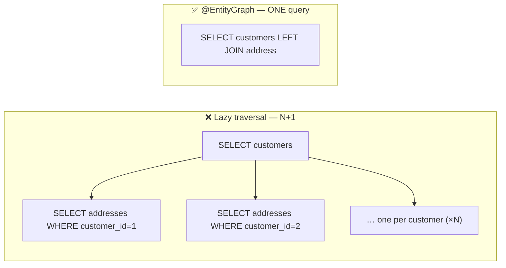
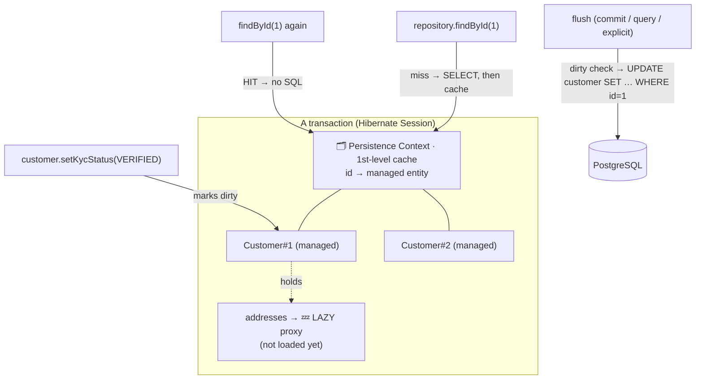
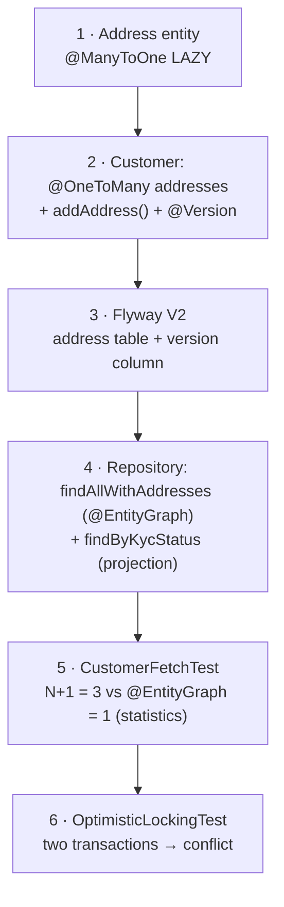
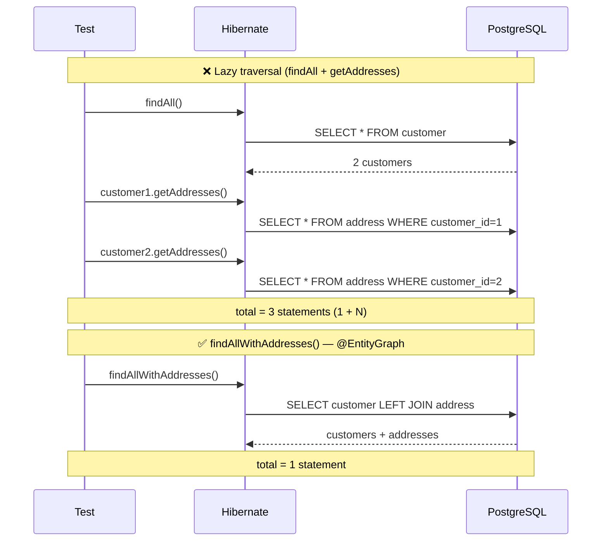

# Step 9 · Hibernate Performance & Correctness

> **Step 9 of 67 · Phase B — Data, Databases, Concurrency & Transactions 🔵** · Level badge: 🔵 Core · Effort ≈ 20h (experienced JPA devs: skip-test below, then skim) · **the step where the bank's persistence layer becomes both *fast* and *correct under concurrency*.**

`🟢` Foundations &nbsp;·&nbsp; `🔵` Core &nbsp;·&nbsp; `🟣` Advanced &nbsp;·&nbsp; `🔴` Frontier

> [!CAUTION]
> **Educational, non-production project.** Build-a-Bank is for learning only. It never handles real money, real customers, or real personal data, and it is **not** security-audited for production banking. Every credential and customer you ever see here is fake/synthetic. (Full disclaimer + guardrails in the [README](../../README.md).)

> [!WARNING]
> **🐳 Docker is REQUIRED for this step.** Every proof in Step 9 runs against a **real PostgreSQL** spun up by **Testcontainers** — the N+1 statistics, the projection, and the `@Version` optimistic-lock conflict. If `docker info` errors, start Docker Desktop (or your engine) before you begin. We do **not** trust H2 for any of this: the locking and SQL-statement counts must be observed on the real engine.

---

## 🧭 The Six Movements of This Step

A one-line map of where we're going. Click to jump.

1. **[A · 🧭 Orient](#orient)** — what "performance & correctness" means for Hibernate, the cheat card, and whether you can skip.
2. **[B · 🧠 Understand](#understand)** — the persistence context / 1st-level cache, dirty checking & flush, LAZY vs EAGER and `LazyInitializationException` (and why OSIV is off), the **N+1 problem**, **projections**, and **optimistic `@Version` locking** — no magic; plus the security lens, the OSIV version story, the Optimistic-Locking pattern, and a thread-safety note.
3. **[C · 🛠️ Build](#build)** — the heart: the `Address` entity (`@ManyToOne` lazy) → wire `@OneToMany`/`addAddress` + `@Version` into `Customer` → the Flyway `V2` migration → the `@EntityGraph` repository method + the projection → the **N+1 statistics test** (see 3 vs 1) → the **optimistic-locking test** (see the conflict). Break-it experiments throughout. Then 🎮 Play With It and the 🏁 finished result.
4. **[D · 🔬 Prove](#prove)** — the Verification Log (🔴 Full tier): the real, pasted `verify` (CIF now **10** tests), the N+1 statistics proof, the optimistic-lock conflict, the **§12.3 mutation sanity-check**, and `smoke.sh`.
5. **[E · 🎓 Apply](#apply)** — go-deeper asides, interview prep (a version-evolution question + a concurrency question), and your-turn exercises.
6. **[F · 🏆 Review](#review)** — troubleshooting (the three real failures), resources & glossary, and the recap/study notes.

---

<a id="orient"></a>

# A · 🧭 Orient

## 📋 This Step in 30 Seconds

| | |
|---|---|
| **Title** | Hibernate Performance & Correctness — make the CIF persistence layer *fast* (no N+1) and *correct under concurrency* (no lost updates) |
| **Step** | 9 of 67 · **Phase B — Data, Databases, Concurrency & Transactions** 🔵 |
| **Effort** | ≈ 20 hours focused. The payoff: you can *prove* an N+1 problem with Hibernate's own statistics and *prove* a lost-update race is rejected — both interview-defining skills. Experienced JPA devs can skip-test and skim to ~4h. |
| **What you'll run this step** | **JVM + Maven** for the build & tests; **🐳 Docker** for the tests only (Testcontainers Postgres). One command: `./mvnw -pl services/cif -am verify`. **No HTTP endpoints change this step** — the proofs are TESTS — so there's no service to start and no new `requests.http`. |
| **Buildable artifact** | The **existing** `services/cif` module, extended: a new **`Address`** entity (`@ManyToOne` LAZY); `Customer` gains a `@OneToMany addresses` (LAZY) + an `addAddress(...)` helper + a `@Version version`; a Flyway **`V2__add_address_and_version.sql`** (address table + version column); a repository **`findAllWithAddresses()`** (`@EntityGraph`) + a **`findByKycStatus(...)`** interface projection; a **`CustomerSummary`** projection; and two new tests — `CustomerFetchTest` (3 tests: N+1, fix, projection) and `OptimisticLockingTest`. CIF goes from 6 → **10** tests. `step-09-start == step-08-end`. |
| **Verification tier** | 🔴 **Full** — this step changes a service *and* the concurrency/correctness path. `./mvnw verify` green + all **10** tests + the **N+1 proven by statistics** (3 vs 1) + the **optimistic-lock conflict proven** + the **§12.3 mutation sanity-check** (remove `@Version`, watch the lost update slip through, revert) + `smoke.sh`. |
| **Depends on** | **[Step 8](../step-08/lesson.md)** (the CIF service: JPA entity, `CustomerRepository`, Flyway, `ddl-auto=validate`, `@DataJpaTest` + Testcontainers `@ServiceConnection`, and crucially **`open-in-view: false`** which we set "for reasons explained in Step 9" — this is that step). **+ Docker.** |

By the end you will be able to explain the **persistence context** (Hibernate's 1st-level cache) and **dirty checking**; say exactly *when* SQL flushes; reproduce a `LazyInitializationException` and explain why it happens *now* that OSIV is off (and why that's good); **demonstrate the N+1 SELECT problem with Hibernate statistics** and **fix it with an `@EntityGraph`**; trim over-fetching with a **DTO interface projection**; and prevent the **lost-update race** with **optimistic `@Version` locking** — proven by a test where two transactions collide and the stale one is rejected.

### ⏭️ Can You Skip This Step? (5-minute self-check)

If you can confidently do **all** of this, skim the 🕰️ OSIV history and the 🧩 Optimistic-Locking spotlight, then jump to **[Step 10 — Relational Databases Up Close](../step-10/lesson.md)**.

- [ ] I can explain the **persistence context / 1st-level cache**, **dirty checking**, and *when* Hibernate **flushes** (and that flush ≠ commit).
- [ ] I can explain **LAZY vs EAGER** fetching, what a Hibernate **proxy** is, and exactly why `LazyInitializationException` happens — and why **OSIV off** makes it surface *early* instead of hiding.
- [ ] I can describe the **N+1 SELECT problem**, *detect* it (Hibernate statistics or `show-sql`), and *fix* it with a **fetch join / `@EntityGraph`** — and say when a **projection** is better still.
- [ ] I can explain **optimistic locking with `@Version`** — the SQL it generates, what a **lost update** is, why the conflict is thrown, and how it differs from **pessimistic** (`SELECT … FOR UPDATE`) locking.

> [!TIP]
> Not 100%? Stay. "What's the N+1 problem and how do you fix it?", "optimistic vs pessimistic locking?", and "why is `LazyInitializationException` thrown?" are three of the most common JPA interview questions in existence — and the strongest answers come from someone who has *watched the statistics count go from 3 to 1* and *watched a lost update get rejected*. That's exactly what you'll do here.

## 📇 Cheat Card

> **What this step delivers (one sentence):** the CIF persistence layer becomes **fast** — the N+1 query explosion is demonstrated with Hibernate's statistics and fixed with an `@EntityGraph` (3 statements → 1) — and **correct under concurrency** — a `@Version` column makes a lost-update race throw a conflict instead of silently overwriting, all proven on a real Postgres.

**Key commands** (Windows uses `.\mvnw.cmd`; macOS/Linux/Git-Bash use `./mvnw`):

```bash
# Build CIF (and deps, -am) and run all 10 tests on a real Testcontainers Postgres:
./mvnw -pl services/cif -am verify

# Run ONLY this step's two new tests, to watch the proofs in isolation:
./mvnw -pl services/cif test -Dtest=CustomerFetchTest,OptimisticLockingTest

# One-shot proof your build matches the lesson (needs only Docker):
bash steps/step-09/smoke.sh
```

**The one headline idea — *lazy iteration fires one query per parent (N+1); an `@EntityGraph` collapses it to one join; and `@Version` turns a lost-update race into a clean conflict*:**



*Alt-text: two boxes side by side. The left, labelled "Lazy traversal — N+1", shows one SELECT for customers fanning out into one SELECT-addresses-per-customer (one, two, and "one per customer ×N"). The right, labelled "@EntityGraph — ONE query", shows a single SELECT joining customers to address.*

## 🎯 Why This Matters

The two failures this step kills are the two that most reliably take real systems down. **N+1** is the silent performance killer: code that looks innocent ("just loop the customers and read their addresses") quietly fires hundreds of round-trips to the database — one request can become a thousand queries, which is both a latency disaster *and* a denial-of-service amplifier. **Lost updates** are the silent *correctness* killer: two users read the same record, both save, and the second overwrites the first with no error and no trace — exactly the bug you cannot afford near a balance or a KYC status. Interviewers probe both relentlessly ("what's N+1 and how do you fix it?", "optimistic vs pessimistic locking?"). After this step you don't just *describe* them — you've *measured* one and *defeated* the other, on a real database.

## ✅ What You'll Be Able to Do

- **Explain** the persistence context (1st-level cache), dirty checking, and the flush-vs-commit distinction.
- **Reason about** LAZY vs EAGER, Hibernate proxies, and `LazyInitializationException` — and why **OSIV off** (set in Step 8) makes lazy-outside-a-transaction fail *fast*.
- **Demonstrate** the N+1 SELECT problem with Hibernate statistics, then **fix** it with a fetch join / `@EntityGraph`.
- **Trim over-fetching** with a Spring Data **interface projection** that selects only the columns you need.
- **Prevent the lost-update race** with optimistic **`@Version`** locking, and articulate when **pessimistic** locking (Step 12) is the right tool instead.
- **Prove all of it** with tests on a real Postgres — including a mutation sanity-check that shows the locking test actually detects a lost update.

## 🧰 Before You Start

**Prerequisites**

- ✅ You finished **[Step 8](../step-08/lesson.md)** (CIF service). You have a `Customer` entity, a `CustomerRepository`, Flyway `V1`, `ddl-auto=validate`, and `@DataJpaTest` + Testcontainers working. **You also set `open-in-view: false` in `application.yml` "for reasons explained in Step 9"** — this is that step; we now cash that cheque.
- ✅ **Docker is running.** Quick check: `docker info` prints engine details (not an error).
- ✅ You have the repo at `step-09-start` (== `step-08-end`), which builds clean: `./mvnw -pl services/cif -am verify` is green with **6** tests.

**What you already learned that connects here**

- The **persistence context** was named in Step 8; here you *use* it — dirty checking, flush, the 1st-level cache, and lazy proxies all live inside it.
- **`open-in-view: false`** (Step 8) is the setting that makes `LazyInitializationException` surface early. We explain exactly why.
- **Derived queries** and `@DataJpaTest` (Step 8) extend naturally to `@EntityGraph` methods and projections.
- This is the **first concurrency-correctness tool** in the bank. It forward-references **Step 11** (the Java Memory Model) and **Step 12** (the ledger under concurrent transfers, where pessimistic locking joins the toolkit).

> **Depends on: Steps 8** (and conceptually 5–7 for the Spring/JPA fundamentals).

---

<a id="understand"></a>

# B · 🧠 Understand

## 🧠 The Big Idea

Hibernate is not a thin SQL wrapper — it maintains, for the lifetime of a transaction, a **persistence context**: an in-memory map of every entity it's managing, keyed by primary key. That single data structure explains almost everything that surprises beginners.

> **Analogy — the librarian's desk.** Imagine a librarian (the persistence context) working at a desk inside a session that lasts exactly one transaction. When you ask for book #5, she fetches it once and **keeps a copy on her desk** (the 1st-level cache); ask again and she hands you the same copy — no second trip to the stacks. While a book is on her desk she **watches it for pencil marks** (dirty checking); at closing time (**flush**) she copies every change back into the stacks as `UPDATE`s. Some books arrive as **slip-cover stand-ins** (lazy proxies) — the real contents are fetched only the moment you open them, *and only while the desk is still staffed*. The instant the librarian goes home (the transaction ends), opening a stand-in fails: there's no one to fetch the contents → **`LazyInitializationException`**. The whole step is about steering that librarian: don't make her run to the stacks once per book (N+1), tell her up front which books you'll need together (`@EntityGraph`), and stamp each book with an **edition number** so two people can't overwrite each other's edits unnoticed (`@Version`).



*Alt-text: a box labelled "A transaction (Hibernate Session)" contains the Persistence Context / 1st-level cache mapping ids to managed entities Customer#1 and Customer#2; Customer#1 holds a lazy proxy for its addresses that is not yet loaded. Arrows from outside: findById(1) misses the cache so issues a SELECT then caches; a second findById(1) hits the cache with no SQL; calling a setter marks the entity dirty; at flush time (on commit, before a query, or explicitly) Hibernate dirty-checks and emits an UPDATE to PostgreSQL.*

The five forces in that picture, named:

1. **Persistence context / 1st-level cache** — within one transaction, each entity is loaded *once* and reused. Two `findById(1)` calls = one SQL `SELECT`.
2. **Dirty checking** — Hibernate snapshots each managed entity on load; at flush it compares and auto-generates `UPDATE`s for what changed. You never write `UPDATE` for a managed entity — you just call a setter.
3. **Flush** — the moment Hibernate pushes pending changes to the DB. It happens on commit, before a query that might be affected (`AUTO` flush mode), or when you call `flush()` explicitly. **Flush is not commit** — flushed-but-uncommitted changes still roll back if the transaction aborts.
4. **Lazy fetching & proxies** — associations marked LAZY are stand-in proxies; the real query fires the first time you touch them, *if a session is still open*. If not → `LazyInitializationException`.
5. **Versioning** — a `@Version` column lets Hibernate detect that the row changed under you between read and write, turning a silent lost update into a thrown conflict.

## 🧩 Pattern Spotlight — Optimistic Locking (`@Version`)

> **Problem (lost update).** Two users load the same customer (both at `version = 0`). User A sets KYC to `VERIFIED` and saves. User B — who still holds the *stale* copy — sets KYC to `REJECTED` and saves. With no protection, B's `UPDATE` overwrites A's work and nobody is told. A's verification is **lost**. Near a balance, that's money silently created or destroyed.

> **Why optimistic locking fits.** In a bank-customer/admin workload, *conflicts are rare* — two people editing the same customer at the same millisecond is the exception, not the rule. Optimistic locking takes no database locks during the read or the user's "think time"; it only checks for a conflict at write time. That's cheap and scales well precisely *because* it assumes the optimistic case. (When conflicts are *common* or you must serialize — e.g., debiting a hot account — you switch to pessimistic locking; see the alternative.)

> **How it works (the mechanism).** Add a `@Version` column. Hibernate (a) reads it with the row, (b) on `UPDATE` adds `WHERE id = ? AND version = ?` and `SET version = version + 1`, and (c) checks the **affected-row count**. If the row's version already moved (someone committed first), the `WHERE` matches **0 rows**, Hibernate sees `rowCount == 0`, and throws — Spring translates it to `ObjectOptimisticLockingFailureException`. No lost update, no row lock held during think time.

> **Alternative — pessimistic locking (`SELECT … FOR UPDATE`, Step 12).** Take a *real* database lock on the row at read time so no one else can even read-to-write it until you commit. Correct under heavy contention and required for some ledger operations, but it holds locks (reducing concurrency) and can deadlock. **Rule of thumb:** optimistic for low-contention edits (this step); pessimistic for high-contention, must-serialize money movement (Step 12). Same goal — no lost update — different bet on how often you collide.

> **Implementation (here).** A single `@Version private long version;` on `Customer`, a `version bigint not null default 0` column in the Flyway `V2` migration, and Hibernate does the rest. The proof is `OptimisticLockingTest`.

## 🌱 Under the Hood: How It Really Works

**The N+1 problem — why a harmless loop explodes.** When you call `findAll()`, Hibernate runs **one** `SELECT` for the parents. Each `Customer.addresses` is a **lazy** collection — a proxy that holds *nothing* until touched. The instant your loop reads `customer.getAddresses()`, the proxy fires *its own* `SELECT … WHERE customer_id = ?`. So for **N** customers you pay **1 + N** queries: one for the list, then one per customer. With 2 customers that's 3; with 500 customers it's 501. The query *count* scales with your data — that's the "N+1" name. The shape Hibernate generates here:

```sql
-- lazy traversal → N+1:
select c1_0.id, c1_0.customer_number, ... from customer c1_0;                                  -- 1
select a1_0.customer_id, a1_0.id, a1_0.city, ... from address a1_0 where a1_0.customer_id=?;    -- per customer (×N)
```

**The `@EntityGraph` fix — one join.** An `@EntityGraph(attributePaths = "addresses")` tells Hibernate "for *this* query, eagerly fetch `addresses`" — it rewrites the query as a single `LEFT JOIN` and hydrates everything in one round-trip:

```sql
-- @EntityGraph → ONE query:
select c1_0.id, ..., a1_0.id, a1_0.city, ...
from customer c1_0 left join address a1_0 on c1_0.id=a1_0.customer_id;
```

Same data, **one** statement instead of `1 + N`. A JPQL `JOIN FETCH` does the same thing; `@EntityGraph` is the declarative, per-query form Spring Data gives us. Crucially, we keep the association **LAZY by default** and opt into eager loading *only on the method that needs it* — eager-everywhere would create the opposite problem (always over-fetching).

**How we *prove* the count — Hibernate statistics.** Hibernate can expose a `Statistics` object (enabled with `hibernate.generate_statistics=true`). `statistics.getPrepareStatementCount()` is the number of JDBC prepared statements executed since the last `clear()`. The test clears it, runs the traversal, and asserts the count. This is the hard, machine-checkable proof — no eyeballing logs. (`spring.jpa.show-sql=true` or `format_sql=true` *also* prints the SQL so you can *see* the explosion; the count is what we *assert*.)

**Why `entityManager.clear()` matters in the test.** After seeding, the customers and addresses sit in the persistence context (1st-level cache). If we read them back without clearing, Hibernate would serve them from cache and fire *zero* SQL — hiding the very problem we're demonstrating. `clear()` detaches everything so the reads genuinely hit the database. (This is also why the 1st-level cache, while great in production, must be controlled in tests.)

**Projections — selecting fewer columns.** A Spring Data **interface projection** (`CustomerSummary` with just three getters) makes Spring Data generate SQL that selects *only those columns* — not the whole row, and not the lazy associations. It returns proxy instances backed by that narrow result. Use it when a screen needs three fields: less data over the wire, no full-entity hydration, no accidental lazy loads.

**Optimistic locking — the affected-row trick.** With `@Version`, every `UPDATE` becomes `UPDATE customer SET …, version = version + 1 WHERE id = ? AND version = ?`. Postgres returns how many rows it changed. If another transaction already bumped the version, the `WHERE` matches nothing → `0 rows` → Hibernate throws `StaleObjectStateException`, which Spring's exception translation surfaces as `ObjectOptimisticLockingFailureException`. The genius is that it needs **no locks** during the read — it detects the conflict purely from the version number at write time.

## 🛡️ Security Lens: What Could Go Wrong

- **N+1 is a DoS amplifier.** A single endpoint that lazily loads a child per row turns *one* HTTP request into *hundreds* of database queries. An attacker (or just a popular page) can exhaust your connection pool and database CPU with very little effort — the work amplification is the weapon. Fixing N+1 isn't only about latency; it's about not handing attackers a force multiplier.
- **Projections avoid over-fetching sensitive columns.** Selecting `SELECT *` and mapping to a full entity drags every column — including ones a given screen has no business seeing (think a future `ssn`, `tax_id`, or internal risk flag) — into memory and often into serialization. A narrow projection that selects only `customer_number, first_name, last_name` is a *data-minimization* control: you cannot leak what you never loaded.
- **Lost updates are an integrity failure, not just a bug.** Imagine two concurrent updates to a customer's KYC status — or, in Step 12, to a balance. Without `@Version`, the later writer silently clobbers the earlier one and the audit trail shows a consistent-looking but *wrong* final state. Optimistic locking turns that into a detectable, rejectable event — a **correctness *and* integrity** property. (We forward-reference this to the ledger in Step 12.)

## 🕰️ Then vs. Now (How This Changed Across Versions)

| Topic | Then (the old default / way) | Now (our config & modern practice) | Why it changed |
|---|---|---|---|
| **Open-Session-in-View (OSIV)** | In Spring Boot, OSIV was historically **ON by default** — a request-scoped Hibernate session stayed open through the view/serialization layer, so lazy associations could be loaded *outside* the service transaction without error. | We set **`spring.jpa.open-in-view: false`** (Step 8). Lazy access outside a transaction now **fails fast** with `LazyInitializationException`. | OSIV *hid* N+1 and lazy-loading bugs behind an always-open session, firing surprise queries during JSON serialization. Turning it off forces you to fetch deliberately (`@EntityGraph`/projection) at the service layer. Boot still defaults OSIV on but **logs a warning**; explicitly setting it off is the senior default. |
| **Optimistic `@Version` locking** | Has existed since **JPA 1.0** — not new. The `@Version` annotation and the affected-row mechanism are stable and unchanged. | Same annotation, same mechanism. We use `jakarta.persistence.Version`. | Stable API; the only "evolution" is the package move `javax.persistence` → `jakarta.persistence` (Boot 3+). |
| **Hibernate 6 → 7** | Hibernate 6 introduced the modern SQM (Semantic Query Model) engine. | Spring Boot 4 ships a Hibernate 7 line; the APIs we use (`@EntityGraph`, `@Version`, `Statistics`, `SessionFactory.unwrap`) are **compatible and unchanged** across the 6→7 boundary. | Mostly an internal/version bump; nothing in this step's code differs. |

> [!NOTE]
> *Verify, don't guess.* The OSIV-on default + warning, and `@Version` since JPA 1.0, are long-standing facts; the `javax`→`jakarta` move landed in Spring Boot 3. The exact Hibernate line is whatever the pinned Spring Boot 4 BOM resolves — see `VERSIONS.md`. The code in this step uses only stable, version-agnostic JPA/Hibernate APIs.

## 🧵 Thread-safety note

This step introduces the **bank's first concurrency-correctness tool**. `@Version` optimistic locking guards against the *lost-update* race — two transactions reading the same row and racing to write it. Note carefully what it does and doesn't cover: it protects a single logical record across *separate database transactions* (the classic web "two tabs, two saves" race); it is **not** a replacement for in-JVM thread-safety of shared mutable objects. The Java Memory Model — visibility, happens-before, `volatile`, atomics — is **Step 11**, and the harder case (a ledger debited by concurrent transfers, where you'll weigh optimistic vs **pessimistic** locking) is **Step 12**. Today's lesson is the gentle on-ramp: see one race, see it rejected, on a real database.

---

<a id="build"></a>

# C · 🛠️ Build

## 📦 Your Starting Point

You're at **`step-09-start`** (== `step-08-end`). What's green:

- The `services/cif` module builds and its **6** Step-8 tests pass on a real Testcontainers Postgres.
- `Customer` (entity), `KycStatus` (enum), `CustomerRepository` (derived queries), Flyway **`V1__create_customer.sql`**, the `@Transactional` `CustomerService`, the DTOs, and `CustomerController` all exist and work.
- `application.yml` already has `ddl-auto: validate`, **`open-in-view: false`**, and `format_sql: true`. `ContainersConfig` (the `@ServiceConnection` Postgres) already exists.

> [!NOTE]
> **No new HTTP endpoints this step — and that's intentional.** The REST API is *unchanged* from Step 8. Everything we build (an entity, a relationship, a migration, two repository methods, two test classes) is proven by **tests**, not by hitting an endpoint. So there is **no new `requests.http`** for Step 9 — the Step-8 collection still describes the live API. We'll say so again in 🎮 Play With It.

Confirm the starting point builds:

```bash
./mvnw -pl services/cif -am verify
```

✅ You should see `BUILD SUCCESS` with `Tests run: 6` for CIF. If not, fix Step 8 first (🩺 there).

## 🛠️ Let's Build It — Step by Step

Here's the whole step at a glance, then we build it in **six** small sub-steps, running between each.



*Alt-text: a top-to-bottom flow of the six build sub-steps: (1) the Address entity with a lazy @ManyToOne; (2) wiring a lazy @OneToMany addresses, an addAddress helper, and a @Version into Customer; (3) the Flyway V2 migration adding the address table and version column; (4) the repository's @EntityGraph findAllWithAddresses plus the findByKycStatus projection; (5) the CustomerFetchTest proving N+1 (3 statements) vs the @EntityGraph fix (1); (6) the OptimisticLockingTest proving a conflict between two transactions.*

🌳 **Files we'll touch:**

```text
services/cif/
├── src/main/java/com/buildabank/cif/domain/
│   ├── Address.java              # NEW — the "many" side, @ManyToOne LAZY
│   ├── Customer.java             # EDIT — add @OneToMany addresses, addAddress(), @Version
│   ├── CustomerRepository.java   # EDIT — add findAllWithAddresses (@EntityGraph) + findByKycStatus (projection)
│   └── CustomerSummary.java      # NEW — interface projection (3 getters)
├── src/main/resources/db/migration/
│   └── V2__add_address_and_version.sql   # NEW — address table + version column
└── src/test/java/com/buildabank/cif/domain/
    ├── CustomerFetchTest.java    # NEW — N+1 statistics proof (3 vs 1) + projection
    └── OptimisticLockingTest.java # NEW — two transactions → optimistic-lock conflict
```

🧭 *You are here: → **sub-step 1** of 6.*

---

### Sub-step 1 of 6 — The `Address` entity (`@ManyToOne` LAZY) 🧭 *(→ Address → Customer wiring → V2 → repo → fetch test → lock test)*

🎯 **Goal:** add the "many" side of a Customer (1) → Address (*) relationship. Making the back-reference **LAZY** is half of what sets up the N+1 trap we'll then measure and fix.

📁 **Location:** new file → `services/cif/src/main/java/com/buildabank/cif/domain/Address.java`

⌨️ **Code:**

```java
// services/cif/src/main/java/com/buildabank/cif/domain/Address.java
package com.buildabank.cif.domain;

import jakarta.persistence.Column;
import jakarta.persistence.Entity;
import jakarta.persistence.FetchType;
import jakarta.persistence.GeneratedValue;
import jakarta.persistence.GenerationType;
import jakarta.persistence.Id;
import jakarta.persistence.JoinColumn;
import jakarta.persistence.ManyToOne;
import jakarta.persistence.Table;

/**
 * A customer's postal address — the "many" side of Customer (1) → Address (*).
 *
 * <p>{@code @ManyToOne(fetch = LAZY)}: the parent {@link Customer} is loaded on demand, not eagerly with
 * every address. The matching {@code @OneToMany} on Customer is also lazy — which is what creates the
 * N+1 trap this step is all about.
 */
@Entity
@Table(name = "address")
public class Address {

    @Id
    @GeneratedValue(strategy = GenerationType.IDENTITY)
    private Long id;

    @ManyToOne(fetch = FetchType.LAZY)
    @JoinColumn(name = "customer_id", nullable = false)
    private Customer customer;

    @Column(nullable = false)
    private String line1;

    @Column(nullable = false)
    private String city;

    @Column(nullable = false, length = 2)
    private String country; // ISO-3166 alpha-2

    protected Address() {
    }

    public Address(String line1, String city, String country) {
        this.line1 = line1;
        this.city = city;
        this.country = country;
    }

    public Long getId() {
        return id;
    }

    public Customer getCustomer() {
        return customer;
    }

    void setCustomer(Customer customer) { // package-private: set via Customer.addAddress(...)
        this.customer = customer;
    }

    public String getLine1() {
        return line1;
    }

    public String getCity() {
        return city;
    }

    public String getCountry() {
        return country;
    }
}
```

🔍 **Line-by-line:**

- `@Entity` / `@Table(name = "address")` — maps this class to the `address` table (which we create in `V2`). Same pattern as `Customer` in Step 8.
- `@Id` + `@GeneratedValue(strategy = IDENTITY)` — the primary key is generated by the database's identity column (Postgres `generated by default as identity`), matching the migration.
- `@ManyToOne(fetch = FetchType.LAZY)` — **many** addresses point to **one** customer. `LAZY` means the parent `Customer` is *not* loaded automatically when you load an `Address`; it's a proxy fetched on demand. (Default for `@ManyToOne` is actually EAGER — we make it explicit and lazy on purpose.)
- `@JoinColumn(name = "customer_id", nullable = false)` — names the foreign-key column on the `address` table; `nullable = false` means every address must belong to a customer.
- `private String country; // length = 2` — an ISO-3166 alpha-2 code (e.g., `GB`); the `length = 2` matches the `varchar(2)` column.
- `protected Address()` — JPA's required no-arg constructor (Hibernate needs it to instantiate the entity before populating fields).
- `void setCustomer(Customer)` — **package-private** on purpose: callers never set the parent directly; they go through `Customer.addAddress(...)` (next sub-step), which keeps *both* sides of the relationship in sync.

💭 **Under the hood:** a `@ManyToOne` is the *owning* side of the relationship — it holds the foreign key (`customer_id`). When LAZY, Hibernate injects a proxy for `customer` and only runs the `SELECT` for the parent the first time you call `getCustomer()` (within an open session).

🔮 **Predict:** if you ran `verify` *right now* (entity exists, but no table yet), would Hibernate's `ddl-auto=validate` be happy?

<details><summary>answer</summary>No. `validate` checks the mapping against the real schema at startup. There's an `Address` entity but no `address` table yet, so validation would fail — until we add the `V2` migration in sub-step 3. We'll deliberately *not* run a full build until the schema and mapping agree.</details>

✋ **Checkpoint:** `Address.java` compiles (no red squiggles). We won't run the DB build until the table exists.

💾 **Commit:**

```bash
git add services/cif/src/main/java/com/buildabank/cif/domain/Address.java
git commit -m "feat(cif): add Address entity (lazy @ManyToOne to Customer)"
```

⚠️ **Pitfall:** leaving `@ManyToOne` at its default (EAGER) would silently fetch the parent on every address load — the inverse over-fetch. We set `LAZY` explicitly. Also note: the *default* for `@OneToMany` (next) is already LAZY — which is what we *want*, because the N+1 demo depends on it.

---

### Sub-step 2 of 6 — Wire `@OneToMany`, `addAddress()`, and `@Version` into `Customer` 🧭 *(Address ✅ → **Customer wiring** → V2 → repo → fetch test → lock test)*

🎯 **Goal:** give `Customer` the *other* side of the relationship (a lazy collection of addresses + a helper that keeps both sides consistent) **and** add the `@Version` column that powers optimistic locking. Two concepts, one file — both small.

📁 **Location:** edit → `services/cif/src/main/java/com/buildabank/cif/domain/Customer.java`

⌨️ **Code (the full file after editing — the new pieces are the `@Version` field, the `@OneToMany`, the two getters, and `addAddress`):**

```java
// services/cif/src/main/java/com/buildabank/cif/domain/Customer.java
package com.buildabank.cif.domain;

import java.time.Instant;
import java.time.LocalDate;
import java.util.ArrayList;
import java.util.List;

import jakarta.persistence.CascadeType;
import jakarta.persistence.Column;
import jakarta.persistence.Entity;
import jakarta.persistence.EnumType;
import jakarta.persistence.Enumerated;
import jakarta.persistence.GeneratedValue;
import jakarta.persistence.GenerationType;
import jakarta.persistence.Id;
import jakarta.persistence.OneToMany;
import jakarta.persistence.Table;
import jakarta.persistence.Version;

/**
 * A bank customer (JPA entity). The table is owned by Flyway (see {@code db/migration}); Hibernate is set
 * to {@code ddl-auto=validate}, so this mapping must match the migration exactly or startup fails fast.
 *
 * <p>Design notes that recur across the bank:
 * <ul>
 *   <li>a JPA entity is a plain class (not a record) — Hibernate needs a no-arg constructor and mutable fields
 *       it can proxy;</li>
 *   <li>the enum is persisted as a STRING (readable + stable), never its ordinal;</li>
 *   <li>time is an {@link Instant} (UTC) → {@code timestamptz}.</li>
 * </ul>
 */
@Entity
@Table(name = "customer")
public class Customer {

    @Id
    @GeneratedValue(strategy = GenerationType.IDENTITY)
    private Long id;

    @Column(name = "customer_number", nullable = false, unique = true, updatable = false)
    private String customerNumber;

    @Column(name = "first_name", nullable = false)
    private String firstName;

    @Column(name = "last_name", nullable = false)
    private String lastName;

    @Column(nullable = false, unique = true)
    private String email;

    @Column(name = "date_of_birth")
    private LocalDate dateOfBirth;

    @Enumerated(EnumType.STRING)
    @Column(name = "kyc_status", nullable = false)
    private KycStatus kycStatus;

    @Column(name = "created_at", nullable = false, updatable = false)
    private Instant createdAt;

    /**
     * Optimistic-locking version. Hibernate increments it on every update and adds
     * {@code WHERE version = ?} to UPDATEs; a mismatch (someone else updated first) throws — no row is
     * silently overwritten. This is how the bank prevents lost updates without locking rows.
     */
    @Version
    private long version;

    /**
     * The "one" side of Customer → Address. {@code LAZY} by default: addresses are NOT loaded until touched
     * — which is exactly what triggers the N+1 problem when you iterate many customers and read each one's
     * addresses. Fix it with a fetch join / {@code @EntityGraph} (see the repository).
     */
    @OneToMany(mappedBy = "customer", cascade = CascadeType.ALL, orphanRemoval = true)
    private List<Address> addresses = new ArrayList<>();

    /** JPA requires a no-arg constructor (may be package-private). */
    protected Customer() {
    }

    public Customer(String customerNumber, String firstName, String lastName, String email,
                    LocalDate dateOfBirth, KycStatus kycStatus, Instant createdAt) {
        this.customerNumber = customerNumber;
        this.firstName = firstName;
        this.lastName = lastName;
        this.email = email;
        this.dateOfBirth = dateOfBirth;
        this.kycStatus = kycStatus;
        this.createdAt = createdAt;
    }

    public Long getId() {
        return id;
    }

    public String getCustomerNumber() {
        return customerNumber;
    }

    public String getFirstName() {
        return firstName;
    }

    public String getLastName() {
        return lastName;
    }

    public String getEmail() {
        return email;
    }

    public LocalDate getDateOfBirth() {
        return dateOfBirth;
    }

    public KycStatus getKycStatus() {
        return kycStatus;
    }

    public void setKycStatus(KycStatus kycStatus) {
        this.kycStatus = kycStatus;
    }

    public Instant getCreatedAt() {
        return createdAt;
    }

    public long getVersion() {
        return version;
    }

    public List<Address> getAddresses() {
        return addresses;
    }

    /** Adds an address and keeps BOTH sides of the relationship consistent (the JPA way). */
    public void addAddress(Address address) {
        addresses.add(address);
        address.setCustomer(this);
    }
}
```

🔍 **Line-by-line (the new pieces only):**

- `import jakarta.persistence.Version;` (and `OneToMany`, `CascadeType`, `ArrayList`, `List`) — the new imports for this edit.
- `@Version private long version;` — the optimistic-locking version. **You never set this yourself** — Hibernate manages it: it reads it with the row, adds it to the `UPDATE`'s `WHERE`, and increments it on each write. A primitive `long` starts at `0`. (A `@Version` field may be `int`/`long`/`Integer`/`Long`/`short`/`Timestamp`; a numeric type is the common, robust choice.)
- `@OneToMany(mappedBy = "customer", cascade = CascadeType.ALL, orphanRemoval = true)` — the **inverse** side of the relationship. `mappedBy = "customer"` says "the `Address.customer` field owns the foreign key; I'm just the read-side view." `cascade = ALL` means persisting/removing a `Customer` cascades to its addresses; `orphanRemoval = true` deletes an address row when it's removed from this list. **`@OneToMany` is LAZY by default** — we rely on that for the N+1 demo.
- `private List<Address> addresses = new ArrayList<>();` — initialized to an empty list so it's never `null` before persistence.
- `public long getVersion()` — exposes the version (read-only; no setter) so the test can assert it goes `0 → 1`.
- `public List<Address> getAddresses()` — touching this on a managed entity is what triggers the lazy load (the N+1 fire).
- `addAddress(Address)` — adds to the collection **and** calls `address.setCustomer(this)`. Setting *both* sides is the JPA discipline: the owning side (`Address.customer`) is what Hibernate persists, so if you only added to the list without setting the parent, the FK could come out `null`.

💭 **Under the hood:** `@Version` changes the generated SQL for *every* update of a `Customer`. Without it: `UPDATE customer SET kyc_status=? WHERE id=?`. With it: `UPDATE customer SET kyc_status=?, version=? WHERE id=? AND version=?`. That extra `AND version=?` is the entire lost-update defence — if the row's version moved, zero rows match and Hibernate throws.

🔮 **Predict:** after this edit, will `Customer.java` compile and will `validate` pass on a build? <details><summary>answer</summary>It compiles, but a DB build would still *fail* `validate`: the entity now references a `version` column and an `address` table that don't exist yet. Next sub-step (the `V2` migration) makes the schema match. We build *after* that.</details>

✋ **Checkpoint:** `Customer.java` compiles. The `@Version` field and `@OneToMany` are present. No DB build yet.

💾 **Commit:**

```bash
git add services/cif/src/main/java/com/buildabank/cif/domain/Customer.java
git commit -m "feat(cif): add @Version and lazy @OneToMany addresses to Customer"
```

⚠️ **Pitfall:** a classic JPA bug is adding to `addresses` *without* calling `setCustomer` — the in-memory object graph looks right, but the persisted FK is `null` (or the insert fails the `not null` constraint). `addAddress` exists precisely to make that impossible. Equally classic: giving `version` a public setter and "helpfully" setting it — don't; Hibernate owns it.

---

### Sub-step 3 of 6 — The Flyway `V2` migration (address table + version column) 🧭 *(Address ✅ → Customer ✅ → **V2** → repo → fetch test → lock test)*

🎯 **Goal:** evolve the schema to match the new mappings — add the `version` column to `customer` and create the `address` table. **Flyway owns the schema** (Step 8); Hibernate only validates. The version number in the filename (`V2`) is what makes Flyway run it once, after `V1`.

📁 **Location:** new file → `services/cif/src/main/resources/db/migration/V2__add_address_and_version.sql`

⌨️ **Code:**

```sql
-- services/cif/src/main/resources/db/migration/V2__add_address_and_version.sql
-- Adds optimistic-locking version to customer, and the address table (Customer 1 -> * Address).

alter table customer add column version bigint not null default 0;

create table address (
    id          bigint generated by default as identity primary key,
    customer_id bigint       not null references customer (id),
    line1       varchar(200) not null,
    city        varchar(100) not null,
    country     varchar(2)   not null
);

create index idx_address_customer on address (customer_id);
```

🔍 **Line-by-line:**

- `V2__add_address_and_version.sql` — Flyway naming: `V` + version `2` + **two** underscores + a description. Flyway runs migrations in version order and records each in its `flyway_schema_history` table, so `V2` runs exactly once, after `V1`.
- `alter table customer add column version bigint not null default 0;` — adds the optimistic-locking column. `default 0` matters: existing rows (and inserts that don't mention `version`) start at `0`, matching the `long version` primitive's default. `bigint` ↔ Java `long`.
- `create table address (...)` — the new child table.
  - `id bigint generated by default as identity primary key` — Postgres identity column, matching `@GeneratedValue(strategy = IDENTITY)` on `Address`.
  - `customer_id bigint not null references customer (id)` — the foreign key back to `customer`, matching `@JoinColumn(name = "customer_id", nullable = false)`. `references` enforces referential integrity at the DB level.
  - `line1 varchar(200)`, `city varchar(100)`, `country varchar(2)` — match the entity's fields (note `country` is `varchar(2)` ↔ `@Column(length = 2)`).
- `create index idx_address_customer on address (customer_id);` — indexes the FK. **Postgres does *not* auto-index foreign keys**, and every lazy address load (and the join) filters by `customer_id` — without this index those become sequential scans. (Indexing is the deep topic of Step 10; this is a first, justified index.)

💭 **Under the hood:** at startup, Flyway runs `V2` *before* Hibernate validates. So by the time `ddl-auto=validate` inspects the schema, the `version` column and `address` table exist and match the mappings — validation passes. If the SQL and the entities disagreed (say you typo'd `varchar(3)` for country), startup would fail fast with a clear validation error. That fail-fast is the safety net the Step-8 design buys us.

🔮 **Predict:** now that the schema matches, what does `./mvnw -pl services/cif -am verify` do? How many tests run? <details><summary>answer</summary>The Step-8 tests (6) should still pass — the schema is additive (`version` defaults to `0`, `address` is brand new and unused by old tests). We haven't added the *new* tests yet, so it's still `Tests run: 6`. The point of running now is to confirm the migration + mappings agree (validation passes) *before* we layer tests on top.</details>

▶️ **Run & See:**

```bash
./mvnw -pl services/cif -am verify
```

✅ **Expected output (abridged — the Step-8 suite, still green, now on the V2 schema):**

```
[INFO] Tests run: 6, Failures: 0, Errors: 0, Skipped: 0
[INFO] BUILD SUCCESS
```

❌ **If you see** `Schema-validation: missing table [address]` **or** `missing column [customer.version]`: the migration didn't run or its names don't match the entities. Check the filename is exactly `V2__add_address_and_version.sql` (two underscores), it's under `src/main/resources/db/migration/`, and the column/table names match. See 🩺.

✋ **Checkpoint:** `verify` is green with 6 tests on the new schema — entity mappings and the migration agree.

💾 **Commit:**

```bash
git add services/cif/src/main/resources/db/migration/V2__add_address_and_version.sql
git commit -m "feat(cif): Flyway V2 — add version column and address table"
```

⚠️ **Pitfall:** **never edit an already-applied migration** (`V1`). Flyway checksums applied migrations; changing one after it ran will fail the next startup with a checksum mismatch. Schema changes are *new* files (`V2`, `V3`, …) — the expand-contract discipline you'll formalize in Step 12.

---

### Sub-step 4 of 6 — Repository: `findAllWithAddresses` (`@EntityGraph`) + `findByKycStatus` (projection) 🧭 *(Address ✅ → Customer ✅ → V2 ✅ → **repo** → fetch test → lock test)*

🎯 **Goal:** add the **N+1 fix** (a method that fetches addresses in one query) and a **projection** method (selects only a few columns). Both are just declarations — Spring Data implements them.

📁 **Location:** edit → `services/cif/src/main/java/com/buildabank/cif/domain/CustomerRepository.java`

⌨️ **Code (full file after editing — the two new methods + the two new imports):**

```java
// services/cif/src/main/java/com/buildabank/cif/domain/CustomerRepository.java
package com.buildabank.cif.domain;

import java.util.List;
import java.util.Optional;

import org.springframework.data.jpa.repository.EntityGraph;
import org.springframework.data.jpa.repository.JpaRepository;
import org.springframework.data.jpa.repository.Query;

/**
 * Spring Data JPA repository. Extending {@link JpaRepository} gives CRUD + paging for free; the
 * {@code findByCustomerNumber} method is a <strong>derived query</strong> — Spring Data parses the method
 * NAME into a JPQL query at startup (no implementation needed).
 */
public interface CustomerRepository extends JpaRepository<Customer, Long> {

    Optional<Customer> findByCustomerNumber(String customerNumber);

    boolean existsByEmail(String email);

    /**
     * Loads customers WITH their addresses in a single query (an {@code @EntityGraph} turns the lazy
     * association into a join just for this call) — the N+1 fix. Contrast with calling {@code findAll()}
     * and then touching {@code getAddresses()} on each, which fires one extra query per customer.
     */
    @EntityGraph(attributePaths = "addresses")
    @Query("select c from Customer c")
    List<Customer> findAllWithAddresses();

    /** Returns a lightweight {@link CustomerSummary} projection (SELECTs only the projected columns). */
    List<CustomerSummary> findByKycStatus(KycStatus kycStatus);
}
```

🔍 **Line-by-line (the new pieces):**

- `import org.springframework.data.jpa.repository.EntityGraph;` and `…Query;` — the two new imports.
- `@EntityGraph(attributePaths = "addresses")` — tells Spring Data/Hibernate to **eagerly fetch** the `addresses` association *for this query only*, via a join. This is the N+1 fix expressed declaratively.
- `@Query("select c from Customer c")` — an explicit JPQL query. We pair it with `@EntityGraph` so the graph applies to a clear "all customers" query. (`@EntityGraph` also works on derived methods like `findAll`, but pairing with an explicit query makes intent obvious and avoids overriding the inherited `findAll`.)
- `List<Customer> findAllWithAddresses();` — returns full entities, with addresses already loaded — so a later `getAddresses()` fires **no** extra SQL.
- `List<CustomerSummary> findByKycStatus(KycStatus kycStatus);` — a **derived query** whose *return type* is the `CustomerSummary` **interface projection**. Because the return type is a projection (not `Customer`), Spring Data generates SQL that selects **only the projected columns**, not the whole row.

💭 **Under the hood:** `@EntityGraph(attributePaths = "addresses")` produces a `LEFT JOIN address` so parents and children come back in one result set — Hibernate stitches each customer's addresses onto it. For the projection, Spring Data inspects `CustomerSummary`'s getters (`getCustomerNumber`, `getFirstName`, `getLastName`), generates `select customer_number, first_name, last_name … where kyc_status = ?`, and returns proxy objects implementing the interface — no `Customer` entity is hydrated, so its lazy `addresses` are never even a temptation.

🔮 **Predict:** `findAllWithAddresses()` returns full `Customer` entities; `findByKycStatus()` returns `CustomerSummary` proxies. Which one *cannot* accidentally trigger a lazy address load later, and why? <details><summary>answer</summary>The projection. It never materializes a `Customer` entity at all — it's a narrow proxy with three getters — so there's no managed entity holding a lazy `addresses` proxy to trip over. (`findAllWithAddresses` also won't trigger one, but for a different reason: it *pre-loads* the addresses.)</details>

✋ **Checkpoint:** the repository compiles with both new methods. (We prove behavior with tests next, so no run yet — but you *can* run `verify` here; it'll still be 6 tests and green.)

💾 **Commit:**

```bash
git add services/cif/src/main/java/com/buildabank/cif/domain/CustomerRepository.java
git commit -m "feat(cif): add @EntityGraph findAllWithAddresses + KYC-status projection"
```

⚠️ **Pitfall:** `@EntityGraph` fetching a `@OneToMany` collection can produce duplicate parents in the result if the SQL join multiplies rows; Spring Data/Hibernate de-duplicate by identity here, so you get distinct customers. If you ever join *two* collections this way, you hit the "MultipleBagFetchException" / cartesian-product trap — a Go-Deeper topic below.

Now create the projection interface itself:

📁 **Location:** new file → `services/cif/src/main/java/com/buildabank/cif/domain/CustomerSummary.java`

⌨️ **Code:**

```java
// services/cif/src/main/java/com/buildabank/cif/domain/CustomerSummary.java
package com.buildabank.cif.domain;

/**
 * A Spring Data <strong>interface projection</strong>: Spring Data implements it with a proxy and, crucially,
 * issues SQL that selects ONLY these columns — not the whole row. Use projections when a screen/endpoint
 * needs a few fields, to avoid hydrating full entities (and their lazy associations).
 */
public interface CustomerSummary {

    String getCustomerNumber();

    String getFirstName();

    String getLastName();
}
```

🔍 **Line-by-line:**

- It's a plain **interface** with **getters only** — no `@Entity`, no implementation. The getter *names* must match entity property names (`customerNumber` → `getCustomerNumber`), so Spring Data can map columns to them.
- Spring Data creates a runtime **proxy** implementing this interface, backed by the narrow query result. This is a *closed* projection (every accessor maps to a property), which is what lets Spring Data restrict the `SELECT` to exactly these columns.

💭 **Under the hood:** there are two projection flavors — **interface** (what we use; proxy-backed, restricts the SELECT) and **class/DTO** (a concrete class whose constructor parameters Spring Data binds). Interface projections with only direct property accessors are "closed," enabling the column-narrowing optimization.

✋ **Checkpoint:** `CustomerSummary.java` compiles; the repository's `findByKycStatus` return type resolves.

💾 **Commit:**

```bash
git add services/cif/src/main/java/com/buildabank/cif/domain/CustomerSummary.java
git commit -m "feat(cif): add CustomerSummary interface projection"
```

---

### Sub-step 5 of 6 — `CustomerFetchTest`: prove N+1 (3) vs the fix (1) 🧭 *(Address ✅ → Customer ✅ → V2 ✅ → repo ✅ → **fetch test** → lock test)*

🎯 **Goal:** the headline proof. Seed 2 customers (3 addresses total), then **count Hibernate's prepared statements** for a lazy traversal vs the `@EntityGraph` fetch. You will *see* `3` and `1`. A third test proves the projection.

📁 **Location:** new file → `services/cif/src/test/java/com/buildabank/cif/domain/CustomerFetchTest.java`

⌨️ **Code:**

```java
// services/cif/src/test/java/com/buildabank/cif/domain/CustomerFetchTest.java
package com.buildabank.cif.domain;

import static org.assertj.core.api.Assertions.assertThat;

import java.time.Instant;
import java.time.LocalDate;
import java.util.List;

import jakarta.persistence.EntityManagerFactory;

import org.hibernate.SessionFactory;
import org.hibernate.stat.Statistics;
import org.junit.jupiter.api.BeforeEach;
import org.junit.jupiter.api.Test;
import org.springframework.beans.factory.annotation.Autowired;
import org.springframework.boot.autoconfigure.ImportAutoConfiguration;
import org.springframework.boot.data.jpa.test.autoconfigure.DataJpaTest;
import org.springframework.boot.flyway.autoconfigure.FlywayAutoConfiguration;
import org.springframework.boot.jdbc.test.autoconfigure.AutoConfigureTestDatabase;
import org.springframework.boot.jpa.test.autoconfigure.TestEntityManager;
import org.springframework.context.annotation.Import;
import org.springframework.test.context.TestPropertySource;

import com.buildabank.cif.ContainersConfig;

/**
 * Demonstrates — with Hibernate's own statistics as the witness — the <strong>N+1 problem</strong> and its
 * fix. Two customers (3 addresses total) are seeded, then we count the SQL statements for a lazy traversal
 * vs. an {@code @EntityGraph} fetch.
 */
@DataJpaTest
@Import(ContainersConfig.class)
@ImportAutoConfiguration(FlywayAutoConfiguration.class)
@AutoConfigureTestDatabase(replace = AutoConfigureTestDatabase.Replace.NONE)
@TestPropertySource(properties = "spring.jpa.properties.hibernate.generate_statistics=true")
class CustomerFetchTest {

    @Autowired
    CustomerRepository repository;

    @Autowired
    TestEntityManager entityManager;

    @Autowired
    EntityManagerFactory entityManagerFactory;

    private Statistics statistics() {
        return entityManagerFactory.unwrap(SessionFactory.class).getStatistics();
    }

    @BeforeEach
    void seed() {
        Customer ada = new Customer("CIF-F1", "Ada", "Lovelace", "ada.f@bank.example",
                LocalDate.of(1990, 5, 17), KycStatus.PENDING, Instant.now());
        ada.addAddress(new Address("1 Analytical Ave", "London", "GB"));
        ada.addAddress(new Address("2 Engine Way", "London", "GB"));

        Customer alan = new Customer("CIF-F2", "Alan", "Turing", "alan.f@bank.example",
                LocalDate.of(1992, 6, 23), KycStatus.PENDING, Instant.now());
        alan.addAddress(new Address("3 Bletchley Rd", "Milton Keynes", "GB"));

        repository.save(ada);
        repository.save(alan);
        entityManager.flush();
        entityManager.clear(); // detach everything so the reads below actually hit the DB
    }

    @Test
    void lazyTraversalCausesNPlusOneQueries() {
        Statistics stats = statistics();
        stats.clear();

        List<Customer> all = repository.findAll();                 // 1 query for the customers
        int addresses = all.stream().mapToInt(c -> c.getAddresses().size()).sum(); // +1 query PER customer

        assertThat(addresses).isEqualTo(3);
        // 1 (customers) + 2 (one lazy address load per customer) = 3  →  the N+1 signature
        assertThat(stats.getPrepareStatementCount()).isEqualTo(3);
    }

    @Test
    void entityGraphFetchesEverythingInOneQuery() {
        Statistics stats = statistics();
        stats.clear();

        List<Customer> all = repository.findAllWithAddresses();    // single query (addresses joined in)
        int addresses = all.stream().mapToInt(c -> c.getAddresses().size()).sum(); // no extra queries

        assertThat(addresses).isEqualTo(3);
        assertThat(stats.getPrepareStatementCount()).isEqualTo(1);
    }

    @Test
    void projectionReturnsOnlyTheSummary() {
        List<CustomerSummary> summaries = repository.findByKycStatus(KycStatus.PENDING);
        assertThat(summaries).hasSize(2);
        assertThat(summaries).allSatisfy(s -> assertThat(s.getCustomerNumber()).startsWith("CIF-F"));
    }
}
```

🔍 **Line-by-line:**

- `@DataJpaTest` — the JPA **slice**: loads only the persistence layer (repositories, `EntityManager`), fast. (From Step 8.)
- `@Import(ContainersConfig.class)` — pulls in the real Testcontainers Postgres (`@ServiceConnection`) from Step 8. We test on the *real engine*.
- `@ImportAutoConfiguration(FlywayAutoConfiguration.class)` — `@DataJpaTest` doesn't auto-run Flyway; this enables it so `V1` + `V2` create the schema (otherwise `validate` finds no tables).
- `@AutoConfigureTestDatabase(replace = NONE)` — **don't** swap in an embedded H2; keep the real Postgres. (Without this, `@DataJpaTest` would try to replace the DataSource with an in-memory one.)
- `@TestPropertySource(... hibernate.generate_statistics=true)` — turns on Hibernate's `Statistics` so we can count statements.
- `EntityManagerFactory` → `unwrap(SessionFactory.class).getStatistics()` — reaches the Hibernate `Statistics` object behind the JPA façade.
- `seed()` — builds Ada (2 addresses) + Alan (1 address) using `addAddress` (keeping both sides consistent), saves, **flushes** (push inserts to the DB), then **clears** the persistence context. The `clear()` is essential: without it the reads would hit the 1st-level cache and fire *no* SQL, hiding the N+1.
- `lazyTraversalCausesNPlusOneQueries` — `findAll()` (1 query) then `getAddresses().size()` per customer (1 query each). `stats.clear()` zeroes the counter first; `getPrepareStatementCount()` is the assertion: **`== 3`** (1 + 2).
- `entityGraphFetchesEverythingInOneQuery` — `findAllWithAddresses()` joins everything in; the later `getAddresses()` fires nothing. Statement count: **`== 1`**.
- `projectionReturnsOnlyTheSummary` — `findByKycStatus(PENDING)` returns 2 `CustomerSummary` proxies; we assert size and that each `customer_number` starts with `CIF-F`.

💭 **Under the hood:** `getPrepareStatementCount()` counts JDBC `PreparedStatement`s prepared since the last `clear()`. The difference between `3` and `1` is the entire N+1 story made into a number a test can assert — not a log you squint at.

🔮 **Predict (do this before running!):** write down the two numbers you expect from the two fetch tests. (Hint: 2 customers, 3 addresses.) <details><summary>answer</summary>Lazy traversal: **3** (1 for customers + 1 per customer × 2). `@EntityGraph`: **1** (a single join). With 500 customers the lazy number would be 501; the `@EntityGraph` number stays 1.</details>

▶️ **Run & See:**

```bash
./mvnw -pl services/cif test -Dtest=CustomerFetchTest
```

✅ **Expected output:**

```
[INFO] Tests run: 3, Failures: 0, Errors: 0, Skipped: 0 -- in com.buildabank.cif.domain.CustomerFetchTest
```

That green run *is* the proof: the assertion `getPrepareStatementCount() == 3` passed for the lazy traversal and `== 1` for the `@EntityGraph` fetch.

❌ **If you see** `expected 3 but was 1` (or `1 but was 3`): you likely forgot `entityManager.clear()` (so reads hit the cache and fire 0 extra queries), or you accidentally made the association EAGER. Check the seed clears the context and `@OneToMany`/`@ManyToOne` are LAZY.

🔬 **Break-it-on-purpose (the N+1 made vivid — 60s):** open `CustomerRepository` and *temporarily* make the fix lazy again — replace the `@EntityGraph` method body's intent by having the second test call `findAll()` instead of `findAllWithAddresses()`:

```java
// TEMPORARY experiment — DO NOT COMMIT:
List<Customer> all = repository.findAll();   // was: findAllWithAddresses()
```

Re-run `-Dtest=CustomerFetchTest#entityGraphFetchesEverythingInOneQuery`. It now **fails**:

```
expected: 1
 but was: 3
```

The statement count jumped from 1 to 3 — you just watched the N+1 explosion in a number. **Revert** the change (back to `findAllWithAddresses()`) and re-run → green. (Want to *see* the SQL, not just the count? Add `spring.jpa.show-sql=true` to the `@TestPropertySource` and watch the lazy test print one `select … from customer` followed by two `select … from address where customer_id=?` blocks.)

✋ **Checkpoint:** `CustomerFetchTest` is green — 3 tests; you've seen 3-vs-1 (and the break-it confirmed it).

💾 **Commit:**

```bash
git add services/cif/src/test/java/com/buildabank/cif/domain/CustomerFetchTest.java
git commit -m "test(cif): prove N+1 (3 statements) vs @EntityGraph (1) with Hibernate statistics"
```

⚠️ **Pitfall:** counting statements *without* clearing the persistence context is the #1 reason this kind of test "lies." Always `flush()` + `clear()` after seeding when you want reads to hit the DB.

---

### Sub-step 6 of 6 — `OptimisticLockingTest`: two transactions → a conflict 🧭 *(Address ✅ → Customer ✅ → V2 ✅ → repo ✅ → fetch test ✅ → **lock test**)*

🎯 **Goal:** the correctness proof. Simulate two users who both read the same customer at `version 0`; the first commits (→ `version 1`); the second's stale update is **rejected** with `ObjectOptimisticLockingFailureException` — a lost update prevented, on a real Postgres.

📁 **Location:** new file → `services/cif/src/test/java/com/buildabank/cif/domain/OptimisticLockingTest.java`

⌨️ **Code:**

```java
// services/cif/src/test/java/com/buildabank/cif/domain/OptimisticLockingTest.java
package com.buildabank.cif.domain;

import static org.assertj.core.api.Assertions.assertThat;
import static org.assertj.core.api.Assertions.assertThatThrownBy;

import java.time.Instant;
import java.time.LocalDate;

import org.junit.jupiter.api.BeforeEach;
import org.junit.jupiter.api.Test;
import org.springframework.beans.factory.annotation.Autowired;
import org.springframework.boot.test.context.SpringBootTest;
import org.springframework.context.annotation.Import;
import org.springframework.orm.ObjectOptimisticLockingFailureException;
import org.springframework.transaction.PlatformTransactionManager;
import org.springframework.transaction.support.TransactionTemplate;

import com.buildabank.cif.ContainersConfig;

/**
 * Proves {@code @Version} optimistic locking on a REAL Postgres: two "users" read the same row, the first
 * commits an update (version 0→1), and the second's stale update is REJECTED instead of silently lost.
 * Each step runs in its own transaction (via {@link TransactionTemplate}) to simulate concurrent users.
 */
@SpringBootTest
@Import(ContainersConfig.class)
class OptimisticLockingTest {

    @Autowired
    CustomerRepository repository;

    @Autowired
    PlatformTransactionManager transactionManager;

    private TransactionTemplate tx;

    @BeforeEach
    void init() {
        tx = new TransactionTemplate(transactionManager);
    }

    @Test
    void concurrentUpdateIsRejected() {
        Long id = tx.execute(s -> repository.save(new Customer("CIF-V1", "Vera", "Version",
                "vera@bank.example", LocalDate.of(1990, 1, 1), KycStatus.PENDING, Instant.now())).getId());

        // Two users independently read the same row (each gets a detached copy at version 0).
        Customer userA = tx.execute(s -> repository.findById(id).orElseThrow());
        Customer userB = tx.execute(s -> repository.findById(id).orElseThrow());
        assertThat(userA.getVersion()).isZero();

        // User A updates and commits → version goes 0 → 1.
        tx.executeWithoutResult(s -> {
            userA.setKycStatus(KycStatus.VERIFIED);
            repository.save(userA);
        });

        // User B updates the now-stale copy (still version 0) → optimistic lock conflict, no lost update.
        assertThatThrownBy(() -> tx.executeWithoutResult(s -> {
            userB.setKycStatus(KycStatus.REJECTED);
            repository.save(userB);
        })).isInstanceOf(ObjectOptimisticLockingFailureException.class);

        // The winner's change stands.
        Customer current = tx.execute(s -> repository.findById(id).orElseThrow());
        assertThat(current.getKycStatus()).isEqualTo(KycStatus.VERIFIED);
        assertThat(current.getVersion()).isEqualTo(1L);
    }
}
```

🔍 **Line-by-line:**

- `@SpringBootTest` — full context (not a slice): we need a real `PlatformTransactionManager` and the ability to run several *separate* transactions. `@Import(ContainersConfig.class)` again gives the real Postgres.
- `TransactionTemplate tx` — lets us run a block of code inside its **own** transaction programmatically. Each `tx.execute(...)` / `tx.executeWithoutResult(...)` opens, runs, and commits a distinct transaction — that's how we simulate two independent users without spinning up threads.
- `Long id = tx.execute(... save(...).getId())` — transaction 1: insert Vera (version `0`), capture her id.
- `userA = tx.execute(... findById(id))` and `userB = ...` — transactions 2 and 3: each reads the row and gets a **detached** copy (the transaction closed). Both hold `version 0`. `assertThat(userA.getVersion()).isZero()` confirms.
- `tx.executeWithoutResult(... userA.setKycStatus(VERIFIED); save(userA))` — transaction 4: A's update commits. Hibernate runs `UPDATE … SET kyc_status='VERIFIED', version=1 WHERE id=? AND version=0` — 1 row matches → version is now `1`.
- `assertThatThrownBy(() -> tx.executeWithoutResult(... userB.setKycStatus(REJECTED); save(userB)))` — transaction 5: B still holds `version 0`. Hibernate runs `UPDATE … WHERE id=? AND version=0` — but the row is at `version 1` now → **0 rows match** → `StaleObjectStateException` → Spring's `ObjectOptimisticLockingFailureException`. The assertion *requires* that throw.
- the final block — transaction 6: re-read; KYC is `VERIFIED` (A won) and version is `1`. B's `REJECTED` was correctly **rejected**, not silently applied.

💭 **Under the hood:** the magic is entirely in `WHERE id=? AND version=?` + the affected-row count. No row was ever *locked*; the conflict is detected purely from the version number diverging. That's optimistic locking: assume no conflict, verify at write time, reject if you lost the race.

🔮 **Predict:** before running — what does B's `save` do, and what's the final KYC status? <details><summary>answer</summary>B's save throws `ObjectOptimisticLockingFailureException` (its `WHERE version=0` matches 0 rows). The final KYC status is `VERIFIED` — A's change stands, B's is rejected. No lost update.</details>

▶️ **Run & See:**

```bash
./mvnw -pl services/cif test -Dtest=OptimisticLockingTest
```

✅ **Expected output:**

```
[INFO] Tests run: 1, Failures: 0, Errors: 0, Skipped: 0 -- in com.buildabank.cif.domain.OptimisticLockingTest
```

❌ **If you see** `Expecting code to raise a throwable` (the test *fails* because no exception was thrown): the `@Version` field is missing or not picked up — B's update silently succeeded (a lost update!). Check `@Version private long version;` is on `Customer` and the `version` column exists (`V2`). This exact failure is the §12.3 mutation sanity-check below.

🔬 **Break-it-on-purpose (watch a lost update happen — 60s):** comment out the `@Version` annotation on `Customer`:

```java
// @Version          // TEMPORARY — comment out to see the lost update
private long version;
```

Re-run `-Dtest=OptimisticLockingTest`. It now **fails** — no conflict is thrown, B's `REJECTED` silently overwrites A's `VERIFIED`. That's a lost update happening in front of you. **Restore** the `@Version` and re-run → green. (You'll do exactly this as the formal mutation sanity-check in 🔬 Prove.)

✋ **Checkpoint:** `OptimisticLockingTest` is green; you've seen the stale update rejected, and (via break-it) seen what happens without the guard.

💾 **Commit:**

```bash
git add services/cif/src/test/java/com/buildabank/cif/domain/OptimisticLockingTest.java
git commit -m "test(cif): prove @Version rejects a lost-update race (optimistic locking)"
```

⚠️ **Pitfall:** running both reads and both writes in *one* transaction would **not** reproduce the race — Hibernate's 1st-level cache would hand back the same managed instance, and there'd be no stale copy. The separate `tx.execute(...)` blocks (separate transactions, detached copies) are what make the conflict real.

---

### 🔁 The full flow you just built

The two proofs, as sequence diagrams.

**N+1 vs the fix:**



*Alt-text: a sequence diagram. In the lazy case the Test calls findAll (Hibernate issues one SELECT customer), then getAddresses on each of two customers (Hibernate issues one SELECT address per customer) — three statements total, the 1+N pattern. In the @EntityGraph case the Test calls findAllWithAddresses and Hibernate issues a single SELECT customer LEFT JOIN address — one statement total.*

**Optimistic locking (the lost-update race, rejected):**

```mermaid
sequenceDiagram
    participant A as User A (tx)
    participant B as User B (tx)
    participant DB as PostgreSQL (customer, version)
    A->>DB: read customer → version 0
    B->>DB: read customer → version 0
    A->>DB: UPDATE … SET kyc=VERIFIED, version=1 WHERE id=? AND version=0
    DB-->>A: 1 row updated ✅ (version now 1)
    B->>DB: UPDATE … SET kyc=REJECTED, version=1 WHERE id=? AND version=0
    DB-->>B: 0 rows matched ❌
    Note over B: Hibernate sees rowCount=0 → ObjectOptimisticLockingFailureException
    Note over DB: final state = VERIFIED (A won; B rejected — no lost update)
```

*Alt-text: a sequence diagram. User A and User B each read the same customer row, both seeing version 0. User A commits an UPDATE setting kyc to VERIFIED with WHERE version=0 — one row updates and the version becomes 1. User B then commits an UPDATE with WHERE version=0 — zero rows match because the version is now 1; Hibernate sees the zero row count and throws ObjectOptimisticLockingFailureException. The final state is VERIFIED: A won, B was rejected, no lost update.*

## 🎮 Play With It

> [!NOTE]
> **No `requests.http` this step — and that's honest.** Step 9 adds no HTTP endpoints; the REST API is exactly as it was in Step 8, so the [`steps/step-08/requests.http`](../step-08/requests.http) collection still describes the live API. Everything here is exercised through **tests**. Below are ways to *feel* the concepts.

1. **Run the two proofs in isolation and read the SQL.** Add `spring.jpa.show-sql=true` to `CustomerFetchTest`'s `@TestPropertySource` (alongside the statistics property) and run:
   ```bash
   ./mvnw -pl services/cif test -Dtest=CustomerFetchTest
   ```
   With `format_sql: true` already on (from `application.yml`), the lazy test prints one `select … from customer` followed by **two** `select … from address where customer_id=?` blocks. The `@EntityGraph` test prints **one** `select … left join address …`. Seeing the SQL next to the count cements it.

2. **Flip the fix back to lazy and watch the count jump.** In `CustomerRepository`, temporarily have the second fetch test call `findAll()` instead of `findAllWithAddresses()`; the statistics assertion goes from `1` to `3` and the test fails. Revert. (This is the sub-step-5 break-it.)

3. **Remove `@Version` and watch the lost update.** Comment out `@Version` on `Customer`, run `OptimisticLockingTest`, and watch the conflict *disappear* — B's update silently wins and the test fails. Restore it. (This is the sub-step-6 break-it and the §12.3 sanity-check.)

4. **Scale the N+1.** In `CustomerFetchTest.seed()`, add a few more customers (each with 1–2 addresses) and change the lazy test's expected count to `1 + numberOfCustomers`. Watch the lazy number grow linearly while the `@EntityGraph` number stays `1`. *That linear growth is the N+1.*

5. **Trigger a `LazyInitializationException` on purpose.** In a throwaway test, load a `Customer` inside one `tx.execute(...)` (returning the detached entity), then call `getAddresses().size()` **outside** any transaction. Because OSIV is off, you'll get `LazyInitializationException: could not initialize proxy … no Session`. This is the exact failure 🩺 explains — and the reason we fetch deliberately.

**Smoke test (the one-command proof your build matches the lesson — needs only Docker):**

```bash
bash steps/step-09/smoke.sh
```

## 🏁 The Finished Result

You're at **`step-09-end`** (== `step-10-start`). The `services/cif` module now has:

- `Address` entity (`@ManyToOne` LAZY) + `Customer.@OneToMany addresses` (LAZY) + `addAddress(...)` + `@Version version`.
- Flyway **`V2`** (address table + version column); `ddl-auto=validate` still passes.
- Repository `findAllWithAddresses()` (`@EntityGraph`) + `findByKycStatus()` (projection) + the `CustomerSummary` interface.
- Two new test classes — `CustomerFetchTest` (3) + `OptimisticLockingTest` (1) — taking CIF from 6 → **10** tests, all green on a real Postgres.

### ✅ Definition of Done (your self-check)

You're done when:

- [ ] You can explain the persistence context, dirty checking, flush-vs-commit, LAZY vs EAGER, and why OSIV-off makes lazy-outside-tx fail fast.
- [ ] You can *demonstrate* N+1 with statistics and fix it with `@EntityGraph` — and explain why a projection avoids the problem entirely.
- [ ] You can explain optimistic `@Version` locking, the SQL it generates, and how it differs from pessimistic locking.
- [ ] `./mvnw -pl services/cif -am verify` is **green with 10 CIF tests**, and `bash steps/step-09/smoke.sh` passes.
- [ ] You've committed and tagged `step-09-end`.

---

<a id="prove"></a>

# D · 🔬 Prove It Works — the Verification Log

> **Verification tier: 🔴 Full** — this step changes a service *and* the concurrency/correctness path. The log below is the real, pasted evidence from this machine: the full `verify` (10 CIF tests), the N+1 statistics proof, the optimistic-lock conflict, the **§12.3 mutation sanity-check**, and `smoke.sh`. *(Sandbox note: this machine's Docker may be isolated from your Docker Desktop; you run the same commands locally and should see the same results.)*

### 1 · `./mvnw -pl services/cif -am verify` — CIF now 10 tests, green

```
[INFO] Tests run: 3, Failures: 0, Errors: 0, Skipped: 0 -- in com.buildabank.cif.domain.CustomerFetchTest
[INFO] Tests run: 1, Failures: 0, Errors: 0, Skipped: 0 -- in com.buildabank.cif.domain.OptimisticLockingTest
[INFO] Tests run: 10, Failures: 0, Errors: 0, Skipped: 0
[INFO] BUILD SUCCESS
```

### 2 · The N+1 proof — Hibernate statistics (the hard, machine-checked evidence)

`CustomerFetchTest` seeds **2 customers (3 addresses total)** and asserts the prepared-statement count:

- **Lazy traversal** (`findAll()` then touch each `getAddresses()`): `getPrepareStatementCount() == 3` — i.e. **1** query for the customers **+ 1 per customer** (×2) — the N+1 signature. ✅ assertion passed.
- **`@EntityGraph`** (`findAllWithAddresses()`): `getPrepareStatementCount() == 1` — a single join. ✅ assertion passed.

The Hibernate-generated SQL (confirmed in logs; with `format_sql` on it prints as `Hibernate:` blocks) — *illustrative; the count above is the hard proof:*

```sql
-- lazy traversal → N+1:
select c1_0.id, c1_0.customer_number, ... from customer c1_0;                                  -- 1
select a1_0.customer_id, a1_0.id, a1_0.city, ... from address a1_0 where a1_0.customer_id=?;    -- per customer (×N)
-- @EntityGraph → ONE query:
select c1_0.id, ..., a1_0.id, a1_0.city, ... from customer c1_0 left join address a1_0 on c1_0.id=a1_0.customer_id;
```

### 3 · The optimistic-lock conflict — proven

`OptimisticLockingTest.concurrentUpdateIsRejected` passes: two transactions read `version 0`; A commits (→ `version 1`); B's stale `UPDATE … WHERE version = 0` matches **0 rows** → `ObjectOptimisticLockingFailureException`; final state is `VERIFIED` at `version 1` (A won, no lost update). ✅

### 4 · §12.3 Mutation sanity-check — the locking test really detects lost updates

Commenting out `@Version` on `Customer` made the locking test **FAIL** — the lost update went through undetected (no exception thrown):

```
Expecting code to raise a throwable.
[ERROR] OptimisticLockingTest.concurrentUpdateIsRejected:60
[ERROR] Tests run: 1, Failures: 1
```

Then **reverted** (`@Version` restored) → green again. This proves the test isn't vacuously passing — it genuinely catches a lost update.

### 5 · `smoke.sh`

```bash
bash steps/step-09/smoke.sh
```

Builds + tests CIF on a real Postgres (Testcontainers) and prints `✅ Step 9 smoke test PASSED`.

> [!NOTE]
> **What was actually executed:** Maven + all 10 CIF tests on a real Testcontainers Postgres, the N+1 statistics assertions, the optimistic-lock conflict, the mutation sanity-check (break → fail → revert → green), and `smoke.sh`. Nothing here is claimed without a run.

---

<a id="apply"></a>

# E · 🎓 Apply

## 🚀 Go Deeper (Optional)

<details>
<summary><strong>The <code>MultipleBagFetchException</code> / cartesian-product trap</strong></summary>

`@EntityGraph` (or `JOIN FETCH`) one collection: fine. Fetch **two** `List` collections in one query and Hibernate throws `MultipleBagFetchException` — because joining two one-to-many collections produces a *cartesian product* (every address × every phone), which a `List` ("bag") can't deduplicate correctly. Fixes: use a `Set` instead of `List` for one side, fetch the second collection in a separate query (`@EntityGraph` on a second method, or `hibernate.default_batch_fetch_size`), or use `@BatchSize`. The lesson: fetch *one* collection eagerly per query; batch the rest.

</details>

<details>
<summary><strong>Batch fetching — the middle ground between N+1 and a giant join</strong></summary>

Set `hibernate.default_batch_fetch_size = 16` (or `@BatchSize(size = 16)` on the association). Now, instead of one query per parent, Hibernate loads lazy associations for *up to 16 parents at a time* with `WHERE customer_id IN (?, ?, …)`. For N=500 that's ~32 queries instead of 501 — without the cartesian-product risk of fetching multiple collections. A pragmatic default for read paths where a single join would be too wide.

</details>

<details>
<summary><strong>Flush modes & the read-then-write ordering surprise</strong></summary>

Hibernate's default `FlushMode.AUTO` flushes pending changes *before* a query that might be affected, so your query sees your own un-committed writes. `FlushMode.COMMIT` flushes only at commit — faster, but a query might not see earlier writes in the same transaction. Almost always leave it `AUTO`. Knowing this explains "why did my `UPDATE` run *before* my `SELECT` even though I wrote the `SELECT` first?"

</details>

<details>
<summary><strong>Optimistic locking on writes that don't change the entity (<code>@OptimisticLock</code> / <code>OPTIMISTIC_FORCE_INCREMENT</code>)</strong></summary>

Sometimes you must bump the version even though you only changed a *child* (e.g., adding an address must invalidate a cached parent). Hibernate's `LockModeType.OPTIMISTIC_FORCE_INCREMENT` forces a version increment on the parent. Conversely, `@OptimisticLock(excluded = true)` on a field excludes it from triggering a version bump. Niche, but it comes up when aggregate consistency spans a parent and its children.

</details>

## 💼 Interview Prep: Questions You'll Be Asked

<details>
<summary><strong>1. What is the N+1 SELECT problem, and how do you detect and fix it? ⭐ (most commonly asked)</strong></summary>

**N+1** is when loading a list of N parents fires **1** query for the parents and then **1 query per parent** to lazily load a child association — `1 + N` queries where you wanted `1`. It's silent because the code looks innocent (a loop reading a lazy collection). **Detect** it with Hibernate statistics (`hibernate.generate_statistics=true` → `getPrepareStatementCount()`), `spring.jpa.show-sql=true`, or a tool like datasource-proxy. **Fix** it with a fetch join (`JOIN FETCH`) or `@EntityGraph(attributePaths=…)` to load the children in one join — or, if you only need a few fields, a **projection** that avoids loading the association at all. Keep associations LAZY by default and opt into eager fetching per-query. For wide reads, **batch fetching** (`@BatchSize` / `default_batch_fetch_size`) is the middle ground.

</details>

<details>
<summary><strong>2. Optimistic vs pessimistic locking — when do you use each? ⭐ (concurrency)</strong></summary>

**Optimistic** (`@Version`): no DB locks during read/think-time; detect a conflict at write via `WHERE version=?` matching 0 rows → throw. Best when **conflicts are rare** (most edit screens) — cheap, scales well, but the loser must retry. **Pessimistic** (`SELECT … FOR UPDATE`, `LockModeType.PESSIMISTIC_WRITE`, Step 12): take a real row lock at read time so no one else can write until you commit. Best when **contention is high** or you must serialize (debiting a hot account) — correct under load but holds locks (less concurrency) and can deadlock. Both prevent **lost updates**; they differ in the bet on conflict frequency. In a bank: optimistic for customer/profile edits; pessimistic (or a serializable transaction / SELECT … FOR UPDATE) for ledger entries.

</details>

<details>
<summary><strong>3. Why does <code>LazyInitializationException</code> happen, and why did turning OSIV *off* make it appear? (version-evolution)</strong></summary>

A LAZY association is a proxy that loads only when touched **within an open Hibernate session**. If you touch it after the session/transaction closed, there's no session to run the query → `LazyInitializationException: could not initialize proxy - no Session`. **OSIV (Open-Session-in-View)** was historically **on by default** in Spring Boot: it kept a session open for the whole HTTP request (through view/serialization), so lazy loads "worked" even outside the service transaction — but that *hid* N+1s (queries firing during JSON serialization) and tied DB connections to request duration. We set `open-in-view: false`, so lazy-outside-transaction now **fails fast**, forcing you to fetch deliberately (`@EntityGraph`/projection) at the service layer. Modern senior default: OSIV off, fetch explicitly. (Boot still defaults it on and logs a warning.)

</details>

<details>
<summary><strong>4. What exactly is the persistence context, and what's dirty checking? (gotcha)</strong></summary>

The **persistence context** is Hibernate's per-transaction **1st-level cache**: a map of id → managed entity. Load the same id twice → one SQL `SELECT`, same instance returned. **Dirty checking**: Hibernate snapshots each managed entity on load and, at **flush**, compares current state to the snapshot and auto-generates `UPDATE`s for what changed — you never write `UPDATE` for a managed entity, just call a setter. **Flush** (push pending SQL to the DB) happens on commit, before an affecting query (AUTO mode), or on explicit `flush()` — and **flush ≠ commit** (flushed changes still roll back if the tx aborts). In tests, `clear()` detaches everything so subsequent reads hit the DB instead of the cache.

</details>

<details>
<summary><strong>5. How does <code>@Version</code> prevent a lost update at the SQL level? (applied)</strong></summary>

Hibernate adds the version to every `UPDATE`: `UPDATE customer SET …, version = version + 1 WHERE id = ? AND version = ?` (the old version). The DB reports the affected-row count. If another transaction already incremented the version, the `WHERE` matches **0 rows** → Hibernate throws `StaleObjectStateException` → Spring's `ObjectOptimisticLockingFailureException`. No row was locked; the conflict is detected purely from the version number diverging. The losing transaction can then re-read and retry. That single extra `AND version = ?` predicate is the entire lost-update defence.

</details>

<details>
<summary><strong>6. Interface vs class (DTO) projection — what's the difference and why use one? (applied)</strong></summary>

A **projection** returns a subset of fields instead of full entities. An **interface projection** is a Java interface with getters; Spring Data backs it with a proxy and (for *closed* projections — all accessors map to properties) restricts the `SELECT` to just those columns. A **class/DTO projection** is a concrete class whose constructor parameters Spring Data binds. Use projections to (a) cut data over the wire, (b) avoid hydrating full entities and their lazy associations, and (c) practice **data minimization** — you can't leak a sensitive column you never selected. Use the full entity only when you need to *modify* it.

</details>

## 🏋️ Your Turn: Practice & Challenges

**Quick (answers hidden):**

1. With **500** customers each having addresses, how many queries does the lazy traversal fire, and the `@EntityGraph` version? <details><summary>answer</summary>Lazy: **501** (1 + 500). `@EntityGraph`: **1**. That gap is the N+1 problem, and why it's a DoS amplifier.</details>
2. Why must the fetch test call `entityManager.clear()` after seeding? <details><summary>answer</summary>So the subsequent reads hit the database, not the 1st-level cache. Without `clear()`, the entities are already managed and reads fire 0 SQL — hiding the N+1.</details>
3. You add `@Version` to an entity whose table has existing rows but **no** `version` column. What happens at startup? <details><summary>answer</summary>`ddl-auto=validate` fails fast — schema doesn't match the mapping. You must add the column via a migration first (with `default 0` so existing rows are valid), which is exactly what `V2` does.</details>

**Stretch (reference solutions in `solutions/step-09/`):**

- **A.** Add a `PhoneNumber` entity (`@ManyToOne` LAZY) and a second `@OneToMany` on `Customer`. Then write a test that tries to `@EntityGraph`-fetch *both* collections in one query — observe `MultipleBagFetchException`, then fix it (switch one to a `Set`, or batch-fetch). Prove the fix with statistics.
- **B.** Add a **class (DTO) projection** `record CustomerCard(String customerNumber, String fullName)` and a repository method that returns it via a constructor expression (`select new …`). Compare the generated SQL to the interface projection.
- **C.** Add a retry: catch `ObjectOptimisticLockingFailureException` in a small service method, re-read the entity, re-apply the change, and retry up to 3 times. Write a test proving the retry eventually succeeds when one writer keeps losing. (This is the optimistic-locking *completion* — detection plus recovery.)

---

<a id="review"></a>

# F · 🏆 Review

## 🩺 Stuck? Troubleshooting & Fixes

<details>
<summary><strong>(a) <code>LazyInitializationException: could not initialize proxy - no Session</code></strong></summary>

**Cause:** you touched a LAZY association (e.g., `customer.getAddresses()`) *after* the transaction/session that loaded the entity closed. Now that **OSIV is off** (`open-in-view: false`, Step 8), there's no request-scoped session to lazily run the query — so it fails fast (which is the point: it surfaces the bug instead of hiding a surprise query in the serialization layer).

**Fix:** fetch what you need *inside* the transaction — use `findAllWithAddresses()` (`@EntityGraph`) or a `JOIN FETCH`, or map to a **DTO/projection** within the transaction so nothing lazy escapes. Never "fix" it by turning OSIV back on.

</details>

<details>
<summary><strong>(b) Silent N+1 — the page is slow but no error</strong></summary>

**Cause:** code iterates parents and touches a lazy child per row; each touch fires a query. No exception — just `1 + N` round-trips and creeping latency.

**Detect:** enable `spring.jpa.properties.hibernate.generate_statistics=true` and assert `getPrepareStatementCount()` in a test (as `CustomerFetchTest` does), or add `spring.jpa.show-sql=true` and count the `select` blocks. **Fix:** `@EntityGraph(attributePaths=…)` / `JOIN FETCH` for the join, or a projection if you only need a few fields, or batch fetching for wide reads.

</details>

<details>
<summary><strong>(c) Windows: <code>repackage</code> fails — "Unable to rename … .jar"</strong></summary>

**Cause:** a stale `java -jar` (or `spring-boot:run`) from a previous run is still **holding the jar file open**, so Maven's `repackage` can't rename it. Classic Windows file-lock.

**Fix:** kill the lingering process, then rebuild:

```powershell
# find and stop a stray Java process holding the jar (PowerShell):
Get-Process java -ErrorAction SilentlyContinue | Stop-Process -Force
.\mvnw.cmd -pl services/cif -am verify
```

(On macOS/Linux: `pkill -f cif` or find the PID with `jps`.) Then re-run the build.

</details>

<details>
<summary><strong>Schema validation fails: <code>missing table [address]</code> or <code>missing column [customer.version]</code></strong></summary>

**Cause:** the `V2` migration didn't run (or its names don't match the entities), so `ddl-auto=validate` finds the schema doesn't match the mapping.

**Fix:** confirm the file is exactly `V2__add_address_and_version.sql` (two underscores) under `src/main/resources/db/migration/`, that `spring.flyway.enabled=true`, and that in `@DataJpaTest` you have `@ImportAutoConfiguration(FlywayAutoConfiguration.class)` + `@AutoConfigureTestDatabase(replace = NONE)` (otherwise the slice skips Flyway and/or swaps in H2). Column/table names must match the entity mappings.

</details>

**Reset to a known-good state:** `git checkout step-09-end -- services/cif` (or re-`git checkout step-09-end`). Run `make doctor` if anything about your toolchain feels off.

## 📚 Learn More: Resources & Glossary

**Resources** (verify versions against `VERSIONS.md`):

- Spring Data JPA reference — *EntityGraphs*, *Projections* (interface & class), and *Query Methods*.
- Hibernate User Guide — *Fetching* (lazy/eager, fetch strategies, batch fetching) and *Optimistic and pessimistic locking*.
- Vlad Mihalcea's blog — the canonical deep dives on N+1, fetch strategies, and `@Version` (search the specific topic).
- Spring Boot reference — *Open EntityManager in View* (the `spring.jpa.open-in-view` property and its default/warning).

**Glossary:**

- **Persistence context** — Hibernate's per-transaction 1st-level cache (id → managed entity).
- **Dirty checking** — auto-detecting changes to managed entities and emitting `UPDATE`s at flush.
- **Flush** — pushing pending SQL to the DB (≠ commit).
- **LAZY / EAGER** — load an association on first touch vs. immediately.
- **Proxy** — a stand-in object Hibernate loads lazily on access.
- **`LazyInitializationException`** — touching a lazy proxy after the session closed.
- **OSIV (Open-Session-in-View)** — keeping a session open for the whole request; **off** here.
- **N+1 problem** — `1 + N` queries from lazily loading a child per parent in a loop.
- **`@EntityGraph` / `JOIN FETCH`** — fetch an association in one join (the N+1 fix).
- **Projection** — returning only selected fields (interface or DTO) instead of full entities.
- **Optimistic locking / `@Version`** — detect a concurrent change via a version column at write time.
- **Lost update** — a concurrent write silently overwriting another's, with no error.
- **Pessimistic locking** — taking a real DB row lock (`SELECT … FOR UPDATE`); Step 12.

## 🏆 Recap & Study Notes

**(a) Key points**

- Hibernate maintains a **persistence context** (1st-level cache) per transaction; **dirty checking** turns setter calls into `UPDATE`s at **flush** (flush ≠ commit).
- **LAZY** associations are proxies; touching one outside an open session throws `LazyInitializationException`. **OSIV off** (Step 8) makes that fail *fast* instead of hiding surprise queries in the view layer.
- The **N+1 problem** = `1 + N` queries. Detect with Hibernate **statistics** (`getPrepareStatementCount`) or `show-sql`; fix with **`@EntityGraph`/`JOIN FETCH`** (here: 3 → 1), or sidestep with a **projection**.
- **Projections** select only the columns you need — faster *and* a data-minimization control.
- **Optimistic `@Version` locking** adds `WHERE version=?` + increment; a stale write matches **0 rows** → conflict → no **lost update**. **Pessimistic** locking (Step 12) is the high-contention alternative.

**(b) Key Terms:** persistence context · dirty checking · flush · LAZY/EAGER · proxy · `LazyInitializationException` · OSIV · N+1 · `@EntityGraph` · projection · `@Version` · lost update · pessimistic locking.

**(c) 🧠 Test Yourself**

1. Why does a lazy traversal of 2 customers fire 3 queries, and what makes it scale to 501 for 500 customers? <details><summary>answer</summary>1 query for the customers + 1 per customer (the lazy address load). It's `1 + N`, so 2 → 3 and 500 → 501. That linear growth is the N+1 problem.</details>
2. At the SQL level, how does `@Version` reject a stale update? <details><summary>answer</summary>`UPDATE … SET version = version + 1 WHERE id = ? AND version = ?`. If the row's version moved, 0 rows match → Hibernate throws `ObjectOptimisticLockingFailureException`.</details>
3. Why did setting `open-in-view: false` make `LazyInitializationException` start appearing? <details><summary>answer</summary>OSIV had kept a session open for the whole request, so lazy loads worked (and hid N+1) even outside the service transaction. Off, there's no such session, so lazy-outside-tx fails fast.</details>
4. Why must the N+1 test `clear()` the persistence context after seeding? <details><summary>answer</summary>Otherwise the seeded entities are already cached/managed and reads fire no SQL, hiding the N+1.</details>

**(d) 🔗 How This Connects**

- **Back to Step 8:** you now know *why* `open-in-view: false` was set there — this step is the payoff. The `@DataJpaTest` + `@ServiceConnection` Testcontainers setup carried straight over.
- **Forward to Step 10 (Relational DBs Up Close):** you indexed `address.customer_id` here; next you'll read `EXPLAIN`/query plans, understand isolation anomalies, and see *why* that index matters.
- **Forward to Step 11 (Concurrency & the JMM):** `@Version` guards cross-transaction races; in-JVM thread-safety (visibility, happens-before) is its own topic next.
- **Forward to Step 12 (the ledger):** optimistic vs **pessimistic** locking under concurrent transfers — where you'll choose locks per the trade-off you learned here, and see a race *fail without locking, pass with it*.

**(e) 🏆 Résumé line / interview talking point**

> *"Diagnosed and fixed the N+1 query problem using Hibernate statistics and `@EntityGraph` (proven 3 → 1 statements), added interface projections to minimize over-fetching, and prevented lost-update races with optimistic `@Version` locking — all verified against a real PostgreSQL via Testcontainers."*

**(f) ✅ You can now…**

- [ ] Explain the persistence context, dirty checking, flush-vs-commit, and lazy proxies.
- [ ] Reproduce, detect (statistics/`show-sql`), and fix an N+1 with `@EntityGraph`.
- [ ] Use an interface projection to select only the columns you need.
- [ ] Prevent a lost update with `@Version` and explain optimistic vs pessimistic locking.
- [ ] Prove all of it on a real Postgres, including a mutation sanity-check.

**(g) 🃏 Flashcards** — append these to `docs/flashcards.md` (cumulative; Anki-importable CSV optional):

```text
Q: What is the N+1 SELECT problem? | A: Loading N parents fires 1 query for them + 1 per parent to lazily load a child = 1+N queries. Fix with JOIN FETCH / @EntityGraph (or a projection).
Q: How do you detect N+1 in Hibernate? | A: hibernate.generate_statistics=true → getPrepareStatementCount(), or spring.jpa.show-sql=true and count the selects.
Q: How does @Version prevent a lost update? | A: UPDATE … SET version=version+1 WHERE id=? AND version=?; a stale version matches 0 rows → ObjectOptimisticLockingFailureException.
Q: Optimistic vs pessimistic locking? | A: Optimistic (@Version): no locks, detect conflict at write — best for rare conflicts. Pessimistic (SELECT … FOR UPDATE): real row lock at read — best for high contention. Both stop lost updates.
Q: Why does LazyInitializationException happen (OSIV off)? | A: A lazy proxy is touched after the session closed; with open-in-view:false there's no request-scoped session to load it, so it fails fast.
```

> 🔁 **Revisit in ~3 steps** (Step 12): re-derive optimistic vs pessimistic locking when the ledger is hammered by concurrent transfers.

**(h) ✍️ One-line reflection**

> What clicked: seeing the statement count go from **3 to 1**, and watching the lost update get **rejected**. What's still fuzzy for you? (Great build-in-public material: post the 3-vs-1 number and the conflict exception.)

**(i) Sign-off**

You just made the bank's persistence layer both *fast* and *correct under concurrency* — and, more importantly, you *proved* both with numbers instead of hand-waving. "Diagnosed an N+1 with statistics" and "prevented a lost update with optimistic locking" are sentences that land in interviews. Next, in **[Step 10](../step-10/lesson.md)**, you go one layer deeper: into the relational engine itself — `EXPLAIN`, indexes, isolation anomalies, and MVCC. Onward. 🏦🚀
