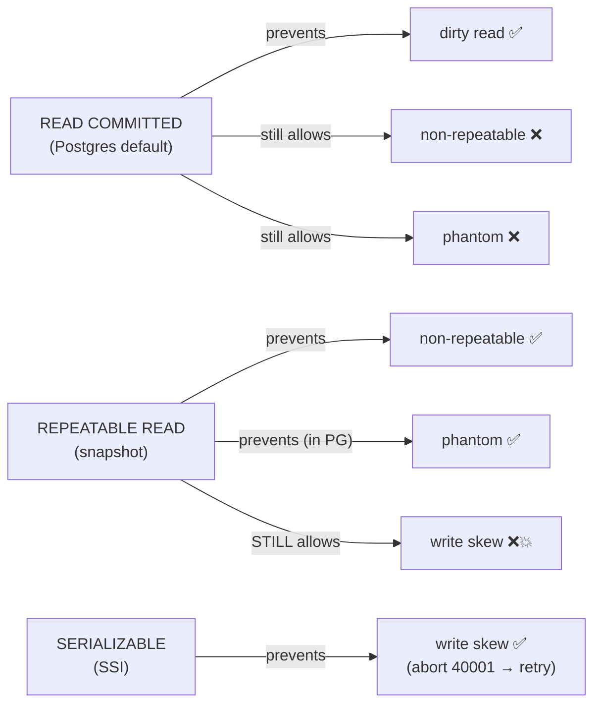
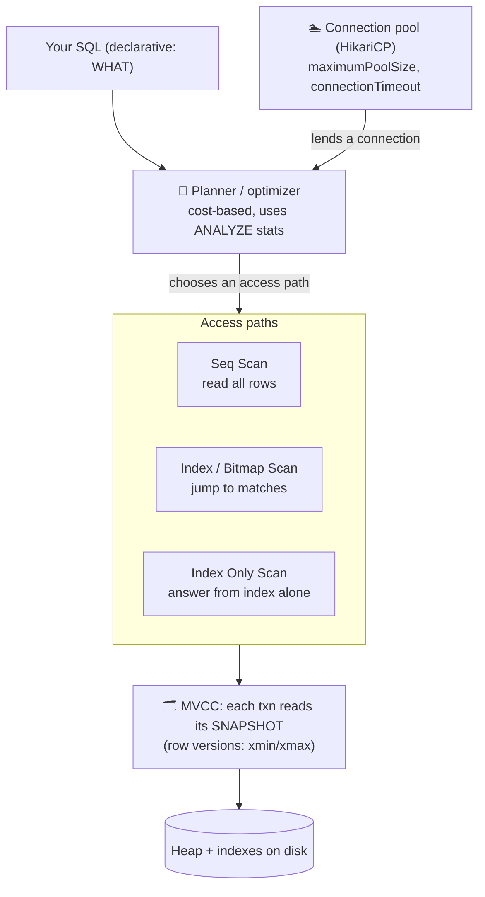
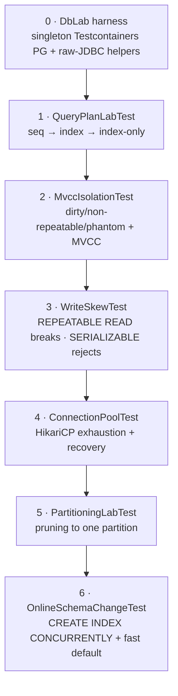

# Step 10 · Relational Databases Up Close

> **Step 10 of 67 · Phase B — Data, Databases, Concurrency & Transactions 🔵** · Level badge: 🔵 Core · Effort ≈ 20h (experienced SQL/DB devs: skip-test below and skim) · **opening the relational database engine.**

`🟢` Foundations &nbsp;·&nbsp; `🔵` Core &nbsp;·&nbsp; `🟣` Advanced &nbsp;·&nbsp; `🔴` Frontier

> [!CAUTION]
> **Educational, non-production project.** Build-a-Bank is for learning only. It never handles real money, real customers, or real personal data, and it is **not** security-audited for production banking. Every credential and customer you ever see here is fake/synthetic. (Full disclaimer + guardrails in the [README](../../README.md).)

> [!WARNING]
> **🐳 Docker is REQUIRED for this step.** The raw-JDBC labs spin up a real PostgreSQL 17 database via **Testcontainers**. If Docker is not running on your machine, these labs will fail. Start your Docker daemon before proceeding.

---

## 🧭 The Six Movements of This Step

A one-line map of where we're going. Click to jump.

1. **[A · 🧭 Orient](#orient)** — what this database-deep-dive covers, the cheat card, and whether you can skip.
2. **[B · 🧠 Understand](#understand)** — query plans, indexes, MVCC, isolation levels, connection pools, partitioning, and zero-downtime schema change.
3. **[C · 🛠️ Build](#build)** — the heart: building the raw-JDBC Testcontainers harness + six executable labs (explain, MVCC, write skew, connection pool, range partitioning, online DDL).
4. **[D · 🔬 Prove](#prove)** — the Verification Log (🔴 Full tier): real pasted JUnit execution output and the §12.3 mutation proof.
5. **[E · 🎓 Apply](#apply)** — go-deeper details, interview prep questions, and practice exercises.
6. **[F · 🏆 Review](#review)** — stuck? troubleshooting, resources, key glossary terms, flashcards, and the Cumulative Review (Steps 1-10).

---

<a id="orient"></a>

# A · 🧭 Orient

## 📋 This Step in 30 Seconds

| | |
|---|---|
| **Title** | Relational Databases Up Close — query plans, indexes, MVCC, write skew, and connection pools |
| **Step** | 10 of 67 · **Phase B — Data, Databases, Concurrency & Transactions** 🔵 |
| **Effort** | ≈ 20 hours focused. The payoff is interview-defining: you can *read an `EXPLAIN`*, *justify an index*, and *prevent write skew*. Experienced learners can skip-test and skim to ~5h. |
| **What you'll run this step** | **JVM + Maven** for the build & tests; **🐳 Docker** for the Testcontainers PostgreSQL 17 instance. One command: `./mvnw -pl services/cif test -Dtest='QueryPlanLabTest,MvccIsolationTest,WriteSkewTest,ConnectionPoolTest,PartitioningLabTest,OnlineSchemaChangeTest'`. |
| **Buildable artifact** | Six **raw-JDBC database labs** in `services/cif/src/test/java/com/buildabank/cif/dblab/` talking to a real PostgreSQL 17 container: `QueryPlanLabTest` (seq → index → index-only), `MvccIsolationTest` (anomalies + MVCC), `WriteSkewTest` (prevention via SERIALIZABLE), `ConnectionPoolTest` (HikariCP exhaustion), `PartitioningLabTest` (range pruning), `OnlineSchemaChangeTest` (`CREATE INDEX CONCURRENTLY`). CIF tests grow from **10 → 21**. |
| **Verification tier** | 🔴 **Full** — this step exercises critical concurrency and database anomalies. `./mvnw verify` green + all **21** tests + real plan outputs + §12.3 mutation check + clean-room fresh-clone + `smoke.sh`. |
| **Depends on** | **[Step 8](../step-08/lesson.md)** (CIF + Testcontainers Postgres + the pinned `postgres:17-alpine` image) and **[Step 9](../step-09/lesson.md)** (Hibernate persistence context & `@Version`). |

By the end of this step, you will be able to read a PostgreSQL `EXPLAIN (ANALYZE)` plan and identify Seq Scan vs Index Scan vs Bitmap Index Scan vs Index Only Scan; configure B-tree and covering indexes to optimize read paths; explain how Multi-Version Concurrency Control (MVCC) lets readers and writers run without locking each other; reproduce dirty, non-repeatable, and phantom reads; demonstrate and prevent **write skew**; and observe a connection pool run dry and recover.

### ⏭️ Can You Skip This Step? (5-minute self-check)

If you can confidently check every box below, skim the 🕰️/🛡️/🧩 highlights, then advance to **[Step 11 — Concurrency & Thread Safety](../step-11/lesson.md)**.

- [ ] I can read `EXPLAIN (ANALYZE)` output — name **Seq Scan / Index Scan / Bitmap Index Scan / Index Only Scan**, and explain *why* the planner picks each and what a **covering index** changes.
- [ ] I can explain **MVCC** (row versions, snapshots, `xmin`/`xmax`, why readers and writers don't block each other) and what **VACUUM** is for.
- [ ] I can define **dirty read, non-repeatable read, phantom,** and **write skew**, and state the **lowest isolation level** that prevents each — and I know Postgres has no dirty reads and prevents phantoms at REPEATABLE READ.
- [ ] I can explain why **write skew survives REPEATABLE READ** and how **SERIALIZABLE (SSI)** stops it (and that the app must **retry on SQLSTATE 40001**).
- [ ] I can explain what a **connection pool** (HikariCP) does, why `maximumPoolSize` and `connectionTimeout` matter, and what a "pool exhausted" incident looks like.
- [ ] I can describe **declarative partitioning + pruning**, **read replicas + replication lag**, and **online schema change** (`CREATE INDEX CONCURRENTLY`, expand-contract).

> [!TIP]
> Not 100%? Stay. "Walk me through this `EXPLAIN`", "what isolation level would you use and why", and "what's a connection pool and what happens when it runs out" are bread-and-butter senior-interview questions, and the Boot-4 / Testcontainers-2 changes here are recent enough that even experienced devs will trip on the per-tech test-slice modules and the now-non-generic `PostgreSQLContainer`. Building it once — and *seeing the missing-table failure and fixing it* — is the difference between "I've read about Testcontainers" and "I've debugged a Flyway-on-the-slice problem."

## 📇 Cheat Card

> **What this step delivers (one sentence):** you stop treating PostgreSQL as a black box — you read query plans, index deliberately (incl. covering indexes → Index Only Scan), reproduce every classic isolation anomaly plus **write skew**, fix it with SERIALIZABLE, and watch a connection pool run dry — all on a real Postgres, all proven by tests.

**Key commands** (Windows uses `.\mvnw.cmd`; macOS/Linux/Git-Bash use `./mvnw`):

```bash
# Run all six Step-10 database labs on a real Testcontainers Postgres:
./mvnw -pl services/cif test -Dtest='QueryPlanLabTest,MvccIsolationTest,WriteSkewTest,ConnectionPoolTest,PartitioningLabTest,OnlineSchemaChangeTest'

# Full module gate (the 21 CIF tests):
./mvnw -pl services/cif -am verify

# One-shot proof your build matches the lesson (needs only Docker):
bash steps/step-10/smoke.sh

# Play with the SQL by hand (throwaway Postgres in Docker, then paste from steps/step-10/queries.sql):
docker run --rm -d --name pg-lab -e POSTGRES_PASSWORD=lab -p 5433:5432 postgres:17-alpine
docker exec -it pg-lab psql -U postgres      # …then docker rm -f pg-lab when done
```

**The one headline idea — *the isolation level you choose decides which anomalies you can still see; write skew is the one that hides until SERIALIZABLE*:**



*Alt-text: three isolation levels and the anomalies they stop. READ COMMITTED prevents dirty reads but still allows non-repeatable reads and phantoms. REPEATABLE READ (snapshot) prevents non-repeatable reads and, in Postgres, phantoms — but STILL allows write skew. SERIALIZABLE prevents write skew by aborting one transaction with SQLSTATE 40001, which the app retries.*

## 🎯 Why This Matters

Two sentences from real incident reviews: *"The query got slow as the table grew"* and *"Two requests both passed the check, and the invariant broke."* The first is a missing or misused index — invisible until you read the plan. The second is an isolation anomaly — invisible until you understand snapshots. Both are *engineering-judgment* failures, not typo bugs, and both are exactly what senior interviews probe: "walk me through this `EXPLAIN`", "what isolation level, and why?", "what happens when the pool is exhausted?". After this step you don't recite definitions — you've *measured* a plan flip and *watched* a write-skew bug appear and vanish.

## ✅ What You'll Be Able to Do

- **Read a query plan** — identify Seq Scan vs Index Scan vs Bitmap Index Scan vs Index Only Scan, read `actual rows`/`Buffers`, and explain the planner's cost-based choice.
- **Index with intent** — add a B-tree index and prove the plan changes; build a **covering index** and get an **Index Only Scan** with `Heap Fetches: 0`.
- **Explain MVCC** — row versions (`xmin`/`xmax`), per-transaction snapshots, why readers and writers don't block, and what VACUUM/the visibility map do.
- **Reproduce & classify isolation anomalies** — dirty read (impossible in PG), non-repeatable read, phantom — and name the level that stops each.
- **Defeat write skew** — explain why REPEATABLE READ lets it through and how SERIALIZABLE (SSI) catches it, including the **retry-on-40001** contract.
- **Reason about the connection pool** — size it, explain `connectionTimeout`, and recognise a saturation incident.
- **Design with partitioning, read replicas, and online schema change** — and say their trade-offs out loud.

## 🧰 Before You Start

**Prerequisites**

- ✅ You finished **[Step 8](../step-08/lesson.md)** and **[Step 9](../step-09/lesson.md)**: CIF builds, the Testcontainers Postgres works, and `./mvnw -pl services/cif -am verify` is green with **10** tests.
- ✅ **Docker is running** (`docker info` prints engine details). The labs spin up one `postgres:17-alpine` container.
- ✅ You're at `step-10-start` (== `step-09-end`).

**What you already learned that connects here**

- In **Step 9** you saw Hibernate's persistence context, lazy proxies, and `@Version`. This step drops *beneath* Hibernate to the engine those features sit on — same Postgres, no ORM in the way.
- The **`@Version`** optimistic lock from Step 9 is the application-level cousin of what you'll see here at the engine level (snapshots and serialization failures). We'll connect them explicitly.
- This is the **database half** of the concurrency story; **Step 11** is the in-JVM half (the Java Memory Model), and **Step 12** is where you *choose* an isolation level / lock to move money safely.

> **Depends on: Steps 8, 9** (and conceptually 5–7 for the Spring/JPA fundamentals you're now looking underneath).

---

<a id="understand"></a>

# B · 🧠 Understand

## 🧠 The Big Idea

A relational database is not a "place where rows live." It's a small operating system for your data, with four moving parts you must be able to picture:

1. **The query planner (optimizer).** You write *what* you want (declarative SQL); the planner decides *how* to get it — which access path (scan the whole table? jump in via an index?), which join algorithm, in which order. It chooses by **estimated cost**, using **statistics** about your data (kept fresh by `ANALYZE`). `EXPLAIN` shows you the plan; `EXPLAIN ANALYZE` runs it and shows estimate-vs-actual.
2. **Indexes.** A B-tree index is a sorted, on-disk structure that turns "read every row and filter" (a **Seq Scan**) into "navigate straight to the matching rows" (an **Index Scan**). A **covering** index even *includes* extra columns so some queries are answered from the index alone — an **Index Only Scan** that never touches the table.
3. **MVCC (Multi-Version Concurrency Control).** Postgres never overwrites a row in place; an `UPDATE` writes a **new version** and marks the old one dead. Every transaction reads from a **snapshot** — a consistent point-in-time view — so *readers never block writers and writers never block readers*. The isolation level decides how *wide* your snapshot is, and therefore which anomalies you can still observe. Dead versions are reclaimed later by **VACUUM**.
4. **The connection pool.** A database connection is expensive to create (TCP + TLS + a backend process fork + auth). So apps keep a small fixed **pool** of live connections (HikariCP, in Spring) and lend them out. Sizing it is a real decision: too small and requests queue; too big and you overwhelm the database.

> **Analogy — a vast archive with a clever clerk.** The **planner** is the clerk who, given your request, decides whether to walk every shelf (Seq Scan) or use the **card catalogue** (an index) to go straight to the right drawer. A *covering* card catalogue has the answer written *on the card*, so the clerk never fetches the box (Index Only Scan). **MVCC** is the archive's photocopy policy: when you start a research session you're handed a **frozen snapshot** of every document as it was at that instant; someone else editing the originals doesn't change your copies — so you and they never wait on each other. How frozen your snapshot is = your **isolation level**. The **connection pool** is the fixed number of reading desks: when all desks are taken, the next researcher waits at the door, and if they wait too long they leave empty-handed (a connection timeout).



*Alt-text: declarative SQL flows into the cost-based planner, which uses ANALYZE statistics to choose an access path — Seq Scan (read all rows), Index/Bitmap Scan (jump to matches), or Index Only Scan (answer from the index alone). Execution reads through MVCC, where each transaction sees its own snapshot built from row versions (xmin/xmax), down to the heap and indexes on disk. A connection pool (HikariCP) with maximumPoolSize and connectionTimeout lends connections to run all this.*

## 🧩 Pattern Spotlight — the Covering Index (Index-Only Scan)

- **Problem:** A hot, read-heavy query selects a *few* columns filtered by one column — e.g. `SELECT account_id, amount FROM txn WHERE account_id = ?`. A plain index on `account_id` finds the matching rows fast, but Postgres must then visit the table **heap** to fetch `amount` for each row (random I/O).
- **Why a covering index fits:** If the index *also carries* `amount`, the query can be answered from the index alone — no heap visits. That's an **Index Only Scan**: less I/O, better cache behaviour, lower latency, on exactly the queries you run most.
- **How it works (the mechanism):** `CREATE INDEX idx ON txn (account_id) INCLUDE (amount)` stores `amount` as a non-key **payload** in the index leaves. Postgres can return `(account_id, amount)` straight from the leaf — *if* it knows the rows are visible without checking the heap. That's what the **visibility map** (maintained by `VACUUM`) provides; with it set, you'll see `Heap Fetches: 0`.
- **Alternatives / trade-offs:** A composite index `(account_id, amount)` also covers, but makes `amount` part of the key (affects ordering & uniqueness); `INCLUDE` keeps the key narrow. Every index costs write amplification and storage — index the queries that matter, not every column. Postgres-specific: B-tree `INCLUDE` exists since PG 11.
- **Implementation (here):** `QueryPlanLabTest` builds the plain index, then the covering index, and asserts the plan node becomes `Index Only Scan` with `Heap Fetches: 0`.

## 🌱 Under the Hood: How It Really Works

**Reading a plan (bottom-up, inside-out).** `EXPLAIN` prints a tree; **the most indented node runs first** and feeds its parent. Each node shows the planner's **estimated** `(cost=start..total rows=… width=…)`; with `ANALYZE` you also get `(actual time=… rows=… loops=…)` and, with `BUFFERS`, how many 8 KB pages were read (`shared hit` = from cache, `read` = from disk). The single most useful habit: **compare estimated `rows` to actual `rows`.** A big gap means stale statistics (`ANALYZE` the table) and usually a bad plan.

**Seq Scan vs Index Scan vs Bitmap vs Index Only.**
- **Seq Scan** reads every page of the table and filters in memory. For *most* of a table it's actually the *fastest* path (sequential I/O beats random). You'll see `Rows Removed by Filter: N`.
- **Index Scan** walks the B-tree to matching keys, then fetches each row from the heap — great when **few** rows match.
- **Bitmap Index Scan + Bitmap Heap Scan** is the planner's middle ground: build a bitmap of matching *page* locations from the index, then read those heap pages in **physical order** (turning random I/O into near-sequential). Postgres picks this when the match set is moderate or scattered — *which is exactly what you'll see in the lab*, even for a few rows, because it's cheap here.
- **Index Only Scan** answers from the index alone (covering index + visibility map) — `Heap Fetches: 0`.

> ❓ **Why did the lab get a *Bitmap* Index Scan, not a plain Index Scan, for only 4 rows?** <details><summary>answer</summary>It's cost-based, and at this tiny scale the costs are nearly tied; Postgres chose the bitmap path (which sorts heap access by page). Both are *index-driven* — the headline ("no longer a Seq Scan") holds. On a unique-key lookup you'd typically see a plain Index Scan. Never assume the node — *read the plan*.</details>

**MVCC, concretely.** Every row version has hidden system columns: **`xmin`** (the transaction id that created this version) and **`xmax`** (the txn that deleted/superseded it, if any). When a transaction starts a statement (READ COMMITTED) or its first query (REPEATABLE READ/SERIALIZABLE), it takes a **snapshot**: the set of transaction ids considered "committed and visible." A row version is visible to you iff its `xmin` is in your snapshot and its `xmax` is not. So:
- An `UPDATE` doesn't overwrite — it inserts a new version (new `xmin`) and stamps the old one's `xmax`. Your snapshot may still see the old version. **Readers never block on writers.**
- Dead versions accumulate; **VACUUM** reclaims them and updates the **visibility map** (which also enables Index Only Scans). Left unchecked, dead tuples are "bloat."

**The isolation levels (PostgreSQL's real behaviour, which is stricter than the SQL standard's minimums):**

| Level | Snapshot scope | Dirty read | Non-repeatable read | Phantom | Write skew |
|---|---|---|---|---|---|
| READ UNCOMMITTED | *(treated as READ COMMITTED in PG)* | ❌ never | ✅ can happen | ✅ can happen | ✅ |
| **READ COMMITTED** *(PG default)* | a **new** snapshot per statement | ❌ never | ✅ can happen | ✅ can happen | ✅ |
| **REPEATABLE READ** | **one** snapshot for the whole txn | ❌ never | ❌ prevented | ❌ prevented *(in PG)* | ✅ **still happens** |
| **SERIALIZABLE** | one snapshot + **SSI** dependency tracking | ❌ never | ❌ | ❌ | ❌ (aborts with `40001`) |

- **Dirty read** (seeing another txn's *uncommitted* write) — **impossible in Postgres at any level**; PG silently upgrades READ UNCOMMITTED to READ COMMITTED.
- **Non-repeatable read** — re-reading a row returns a different value because another txn committed an `UPDATE` in between. Happens at READ COMMITTED (fresh snapshot per statement); gone at REPEATABLE READ (frozen snapshot).
- **Phantom** — re-running a range query returns *new rows* an insert added. The SQL standard allows phantoms at REPEATABLE READ; **Postgres prevents them** there anyway, thanks to its snapshot model.

**Write skew — the subtle one.** Two transactions read an overlapping set, each makes a decision based on what it read, and each writes a **different** row. No write-write conflict occurs, so snapshot isolation (REPEATABLE READ) lets both commit — but *together* they violate an invariant that neither violated alone. Example (the lab): two linked accounts must keep a combined balance ≥ 0; both start at 100; two concurrent withdrawals of 150 each read the sum (200), each pass the check, each debit a different account → final sum −100. **SERIALIZABLE** prevents it: Postgres's **Serializable Snapshot Isolation (SSI)** tracks read/write dependencies between live transactions and, when it detects a dangerous cycle, **aborts** one with `ERROR: could not serialize access… (SQLSTATE 40001)`. The application's job is to **catch 40001 and retry the whole transaction.**

**Connection pools (HikariCP).** The pool holds up to `maximumPoolSize` physical connections. `getConnection()` borrows one; `close()` *returns it to the pool* (it does not actually close the socket). If all are in use, a borrower **waits** up to `connectionTimeout` and then throws `SQLTransientConnectionException("… request timed out")`. This is why pool size is a capacity decision: with `maximumPoolSize = 2`, the *third* concurrent caller waits and may time out — exactly the lab. Hikari exposes live gauges (`getActiveConnections`, `getIdleConnections`, `getThreadsAwaitingConnection`).

**Partitioning.** A large table can be **declaratively partitioned** (e.g. `PARTITION BY RANGE (created_at)`) into child tables per month. The planner does **partition pruning**: a query restricted to one month touches only that partition. Wins: smaller indexes per partition, fast bulk-delete by `DROP TABLE partition` (vs a giant `DELETE`), and parallelism. Cost: more objects to manage, and the partition key must suit your queries.

**Online (zero-downtime) schema change.** A plain `CREATE INDEX` takes a lock that blocks writes for the whole build; **`CREATE INDEX CONCURRENTLY`** builds without that long lock — but it *cannot run inside a transaction block* (it manages its own commits), so a migration tool must run it outside one. Adding a column with a **constant default** is **metadata-only** since PG 11 (instant, no table rewrite). These are the primitives behind the **expand-contract** migration pattern you'll use for real in Step 12.

**Read replicas & replication lag.** A primary streams its write-ahead log (WAL) to one or more **read replicas**. You route read-only queries to replicas to scale reads — but replication is **asynchronous by default**, so a replica can be **behind** the primary (lag). That means "read-your-writes" can fail on a replica (you write to the primary, immediately read from a replica, and don't see your write). You inspect lag with `pg_stat_replication` (primary) and `pg_last_xact_replay_timestamp()` (replica). *(We teach this as concept + verify-adjacent SQL — a single-node lab can't show streaming replication; see 🔬 §7 and the honesty note.)*

## 🛡️ Security Lens: What Could Go Wrong

- **Missing-index = a cheap DoS.** An endpoint backed by a Seq Scan on a growing table gives an attacker (or an organic traffic spike) huge work-amplification: a few requests can saturate database CPU and the connection pool. Reading plans and indexing hot paths is a *availability* control, not just a interception control.
- **Connection-pool exhaustion is an availability failure mode.** A slow downstream query, a leaked connection (borrowed and never returned), or an N+1 explosion (Step 9!) can drain the pool; every subsequent request then times out. Bound query time, always return connections (try-with-resources / Spring's managed transactions), and alert on `threadsAwaitingConnection`.
- **The wrong isolation level is a correctness/integrity hole.** Choosing READ COMMITTED where you needed write-skew protection silently corrupts invariants (balances, limits, "exactly one X"). Near money, prefer an explicit defense (SERIALIZABLE + retry, or `SELECT … FOR UPDATE`, or the `@Version` you met in Step 9) and *test* it.
- **`EXPLAIN ANALYZE` runs the query.** On a `DELETE`/`UPDATE` it actually mutates. In a shared/prod-like database, wrap it in a transaction you roll back, or only `EXPLAIN` (no `ANALYZE`) for writes.

## 🕰️ Then vs. Now (How This Changed Across Versions)

| Topic | Then | Now | Why it changed |
|---|---|---|---|
| **Covering indexes** | Before PG 11 you faked covering with a composite index `(a, b)`, forcing `b` into the key. | **`INCLUDE (b)`** (PG 11+) adds non-key payload columns — narrow key, true Index Only Scan. | Cleaner covering without polluting the index key/ordering. |
| **Adding a column with a default** | Before PG 11, `ADD COLUMN … DEFAULT x` **rewrote the whole table** under an exclusive lock — a notorious outage cause. | PG 11+ stores a constant default as **metadata** — instant, no rewrite. | Made a once-dangerous migration routine and online-safe. |
| **`SELECT … FOR UPDATE SKIP LOCKED`** | Older queue-on-Postgres patterns blocked or polled awkwardly. | `SKIP LOCKED` (PG 9.5+) lets workers grab un-locked rows — a clean job-queue primitive. | Better concurrency primitives in the engine itself. |
| **Serializable** | Classic SERIALIZABLE meant heavy two-phase locking. | PG uses **SSI** (Serializable Snapshot Isolation): snapshot reads + dependency tracking, aborting on `40001`. | Serializable guarantees without read locks — but apps must **retry**. |

## 🧵 Thread-safety note

This step is the **database half** of concurrency: isolation levels and MVCC protect data across *separate database transactions*. It is **not** the same as in-JVM thread-safety (two threads sharing a mutable object) — that's the **Java Memory Model** in **Step 11**. Note the through-line: Step 9's `@Version` optimistic lock, this step's SERIALIZABLE/`SELECT … FOR UPDATE`, and Step 11's `synchronized`/atomics are three layers of the *same* question — "what happens when two things touch the same state at once?" In **Step 12** you'll deliberately choose among them to move money correctly under load.

---

<a id="build"></a>

# C · 🛠️ Build

## 📦 Your Starting Point

You're at **`step-10-start`** (== `step-09-end`). What's green:

- `services/cif` builds and its **10** tests pass on a real Testcontainers Postgres.
- `ContainersConfig` (the `@ServiceConnection` Postgres) exists from Step 8, and the image `postgres:17-alpine` is pinned.

> [!NOTE]
> **No new HTTP endpoints — and that's intentional.** Step 10 is about the *engine*, not the API. Everything we build is a **test** that talks raw JDBC to a real Postgres, plus an interactive `steps/step-10/queries.sql` you can paste into `psql`. There is **no new `requests.http`**; the Step-8 collection still describes CIF's live API.

Confirm the starting point builds:

```bash
./mvnw -pl services/cif -am verify
```

✅ You should see `BUILD SUCCESS` with `Tests run: 10` for CIF. If not, fix Step 9 first (🩺 there).

## 🛠️ Let's Build It — Step by Step

We build **one shared lab harness** then **six labs**, running between each. Here's the whole step at a glance:



🌳 **Files we'll touch** (all new, all test-only — nothing in `src/main` changes):

```
services/cif/src/test/java/com/buildabank/cif/dblab/
├── DbLab.java                    # 0 · shared harness: one Postgres, raw-JDBC helpers
├── QueryPlanLabTest.java         # 1 · EXPLAIN: seq scan → index scan → index-only scan
├── MvccIsolationTest.java        # 2 · MVCC + dirty / non-repeatable / phantom
├── WriteSkewTest.java            # 3 · write skew: REPEATABLE READ vs SERIALIZABLE
├── ConnectionPoolTest.java       # 4 · HikariCP pool exhaustion & recovery
├── PartitioningLabTest.java      # 5 · range partitioning + pruning
└── OnlineSchemaChangeTest.java   # 6 · CREATE INDEX CONCURRENTLY + fast default add
steps/step-10/
├── queries.sql                   # the same experiments, by hand in psql ("Play With It")
└── smoke.sh                      # one-command proof
```

---

### Sub-step 0 of 6 — The `DbLab` harness 🧭 *(you are here: **harness** → plans → MVCC → write skew → pool → partitions → online DDL)*

🎯 **Goal:** Create a reusable base harness class that launches a single, shared Testcontainers Postgres instance and exposes raw JDBC utility methods to avoid Hibernate hiding transaction boundaries and isolation anomalies.

📁 **Location:** new file → `services/cif/src/test/java/com/buildabank/cif/dblab/DbLab.java`

⌨️ **Code:**

```java
// services/cif/src/test/java/com/buildabank/cif/dblab/DbLab.java
package com.buildabank.cif.dblab;

import java.sql.Connection;
import java.sql.DriverManager;
import java.sql.ResultSet;
import java.sql.SQLException;
import java.sql.Statement;

import org.testcontainers.postgresql.PostgreSQLContainer;
import org.testcontainers.utility.DockerImageName;

abstract class DbLab {

    /** Started once for the JVM, shared by every lab class (the "singleton container" pattern). */
    static final PostgreSQLContainer POSTGRES =
            new PostgreSQLContainer(DockerImageName.parse("postgres:17-alpine"));

    static {
        POSTGRES.start();
    }

    /** Open a connection at a chosen isolation level with autocommit OFF — we drive the transaction by hand. */
    static Connection openTx(int isolationLevel) throws SQLException {
        Connection c = DriverManager.getConnection(
                POSTGRES.getJdbcUrl(), POSTGRES.getUsername(), POSTGRES.getPassword());
        c.setTransactionIsolation(isolationLevel);
        c.setAutoCommit(false);
        return c;
    }

    /** Open an autocommit connection (each statement commits immediately) — for DDL and seeding. */
    static Connection openAuto() throws SQLException {
        return DriverManager.getConnection(
                POSTGRES.getJdbcUrl(), POSTGRES.getUsername(), POSTGRES.getPassword());
    }

    /** Run EXPLAIN (ANALYZE actually executes the query and reports real timings/buffers). */
    static String explain(Connection c, String sql, boolean analyze) throws SQLException {
        String prefix = analyze ? "EXPLAIN (ANALYZE, BUFFERS) " : "EXPLAIN ";
        StringBuilder plan = new StringBuilder();
        try (Statement st = c.createStatement();
             ResultSet rs = st.executeQuery(prefix + sql)) {
            while (rs.next()) {
                plan.append(rs.getString(1)).append('\n');
            }
        }
        return plan.toString();
    }

    static void exec(Connection c, String sql) throws SQLException {
        try (Statement st = c.createStatement()) {
            st.execute(sql);
        }
    }

    static long scalar(Connection c, String sql) throws SQLException {
        try (Statement st = c.createStatement(); ResultSet rs = st.executeQuery(sql)) {
            rs.next();
            return rs.getLong(1);
        }
    }
}
```

🔍 **Line-by-line:**
- `abstract class DbLab` — Marks this an abstract class that concrete database tests will inherit from. It has no `@Test` methods of its own.
- `static final PostgreSQLContainer POSTGRES = new PostgreSQLContainer(DockerImageName.parse("postgres:17-alpine"))` — Declares a Testcontainers PostgreSQL container. In Testcontainers 2.0, the container classes are non-generic (we no longer use `PostgreSQLContainer<>`), avoiding syntax errors.
- `static { POSTGRES.start(); }` — A static initializer block. Runs exactly once when the JVM first loads the class, ensuring the Postgres container is started and shared across all database labs. Ryuk (the reaper container) takes care of terminating it.
- `openTx(int isolationLevel)` — Opens a raw JDBC connection to the container, explicitly overrides the isolation level (`Connection.TRANSACTION_*`), and turns autocommit OFF to allow programmatic transaction control.
- `openAuto()` — Opens an autocommit connection (autocommit ON) where every individual statement runs as a single, committed transaction. This is necessary for DDL operations and seeding.
- `explain(c, sql, analyze)` — Prepends `EXPLAIN (ANALYZE, BUFFERS)` to the input query, executes it, and stitches the text output rows together.
- `exec(c, sql)` / `scalar(c, sql)` — Boilerplate-reducing helpers to run a command or return a single scalar value from a database query.

💭 **Under the hood:** `DriverManager.getConnection(...)` makes a new physical socket connection to the database. By using raw JDBC instead of Hibernate, we bypass the first-level cache (persistence context) and entity state tracking, allowing us to observe the true behavior of PostgreSQL isolation snapshots and page buffers.

🔮 **Predict:** When the container starts, Testcontainers will dynamically bind the container's standard Postgres port (5432) to a random high port on your localhost. If you run a tool that connects to 5432, what will happen? (It will fail unless you check `POSTGRES.getJdbcUrl()` for the active random port.)

▶️ **Run & See:**
Since this is an abstract base class, we cannot run it on its own. We will run it via the next sub-steps.

✋ **Checkpoint:** `DbLab.java` compiles without issues.

💾 **Commit:**
```bash
git add services/cif/src/test/java/com/buildabank/cif/dblab/DbLab.java
git commit -m "test(cif): add DbLab harness for raw-JDBC database labs"
```

⚠️ **Pitfall:** Failing to close JDBC resources (Connections, Statements, ResultSets) causes resource leaks. We must always wrap their instantiation in a try-with-resources block.

---

### Sub-step 1 of 6 — `QueryPlanLabTest`: watch the plan flip 🧭 *(harness ✅ → **plans** → MVCC → write skew → pool → partitions → online DDL)*

🎯 **Goal:** Seed 20,000 transaction rows and execute `EXPLAIN (ANALYZE)` to verify how the planner switches access paths from Seq Scan to Bitmap Index Scan, and finally to Index Only Scan (with zero heap fetches) after adding a covering index.

📁 **Location:** new file → `services/cif/src/test/java/com/buildabank/cif/dblab/QueryPlanLabTest.java`

⌨️ **Code:**

```java
// services/cif/src/test/java/com/buildabank/cif/dblab/QueryPlanLabTest.java
package com.buildabank.cif.dblab;

import static org.assertj.core.api.Assertions.assertThat;

import java.sql.Connection;

import org.junit.jupiter.api.BeforeAll;
import org.junit.jupiter.api.Test;

/**
 * <strong>Indexing &amp; query plans.</strong> Seeds 20,000 transaction rows into a real Postgres, then
 * uses {@code EXPLAIN (ANALYZE)} to <em>watch the planner change its mind</em>:
 *
 * <ol>
 *   <li>no index → <strong>Seq Scan</strong> (read every row);</li>
 *   <li>add a B-tree index + {@code ANALYZE} → <strong>Index Scan</strong> (jump straight to the rows);</li>
 *   <li>a <strong>covering</strong> index ({@code INCLUDE (amount)}) + {@code VACUUM} → <strong>Index Only
 *       Scan</strong> (answer the query from the index alone, never touching the heap).</li>
 * </ol>
 *
 * The plan text is printed so you can read the real output; the assertions check the <em>node type</em>,
 * which is stable run-to-run (timings are not).
 */
class QueryPlanLabTest extends DbLab {

    @BeforeAll
    static void seed() throws Exception {
        try (Connection c = openAuto()) {
            exec(c, "drop table if exists txn");
            exec(c, """
                    create table txn (
                        id         bigint generated by default as identity primary key,
                        account_id bigint         not null,
                        amount     numeric(19, 4) not null,
                        created_at timestamptz    not null
                    )""");
            // 20,000 rows spread over 5,000 accounts → ~4 rows per account (a highly selective lookup).
            exec(c, """
                    insert into txn (account_id, amount, created_at)
                    select (g % 5000),
                           (random() * 1000)::numeric(19, 4),
                           now() - make_interval(mins => g)
                    from generate_series(1, 20000) as g""");
        }
    }

    @Test
    void seqScan_thenIndexScan_thenIndexOnlyScan() throws Exception {
        try (Connection c = openAuto()) {

            // 1 ── No index yet: the only way to find account 42's rows is to read all 20,000.
            String beforeIndex = explain(c, "select * from txn where account_id = 42", true);
            System.out.println("\n=== [1] NO INDEX — expect Seq Scan ===\n" + beforeIndex);
            assertThat(beforeIndex).contains("Seq Scan on txn");

            // 2 ── Add a B-tree index and refresh the planner's statistics.
            exec(c, "create index idx_txn_account on txn (account_id)");
            exec(c, "analyze txn");
            String afterIndex = explain(c, "select * from txn where account_id = 42", true);
            System.out.println("\n=== [2] WITH INDEX — expect Index Scan ===\n" + afterIndex);
            assertThat(afterIndex).contains("Index Scan").doesNotContain("Seq Scan on txn");

            // 3 ── Covering index: include `amount` IN the index so a query needing only
            //      (account_id, amount) is answered from the index alone — an Index Only Scan.
            //      VACUUM sets the visibility map so the heap need not be consulted for visibility.
            exec(c, "create index idx_txn_account_amount on txn (account_id) include (amount)");
            exec(c, "vacuum analyze txn");
            String covering = explain(c,
                    "select account_id, amount from txn where account_id = 42", true);
            System.out.println("\n=== [3] COVERING INDEX — expect Index Only Scan ===\n" + covering);
            assertThat(covering).contains("Index Only Scan");
        }
    }
}
```

🔍 **Line-by-line:**
- `@BeforeAll static void seed()` — Sets up a clean table `txn` and inserts 20,000 rows.
- `g % 5000` — Generates account IDs from 0 to 4999. This guarantees a highly selective query since only 4 rows out of 20,000 match a single account ID (selectivity = 4 / 20000 = 0.02%).
- `generate_series(1, 20000)` — A PostgreSQL generator function that acts like a SQL-level `for` loop to generate rows fast.
- `explain(c, "select * from txn where account_id = 42", true)` — Invokes `EXPLAIN (ANALYZE, BUFFERS)` to trace how Postgres fetches the data.
- `create index idx_txn_account on txn (account_id)` — Creates a standard B-tree index.
- `analyze txn` — Refreshes the database's internal tables with statistics about the new index. Without fresh stats, the planner might assume the index is not selective and fall back to Seq Scan.
- `include (amount)` — Builds a covering index: stores `amount` directly inside the leaf nodes of the B-tree index on `account_id`.
- `vacuum analyze txn` — Reclaims space, updates statistics, and builds the **visibility map** indicating which pages contain only committed rows.

💭 **Under the hood:** In step 1, a `Seq Scan` is performed. Postgres opens the heap pages and filters rows one by one. In step 2, we see a `Bitmap Index Scan` feeding a `Bitmap Heap Scan`. Instead of doing costly random I/O for each match, Postgres builds a bitmap of physical page addresses containing matching rows, sorts them, and fetches pages in physical disk order. In step 3, an `Index Only Scan` is executed with `Heap Fetches: 0`. Because the visibility map confirms all records on those pages are visible, Postgres never accesses the table heap at all.

🔮 **Predict:** If you change the query in step 3 to `select account_id, amount, created_at from txn where account_id = 42`, will you still see an Index Only Scan? (No! `created_at` is not covered by `idx_txn_account_amount`, so it must visit the heap).

▶️ **Run & See:**
```bash
./mvnw -pl services/cif test -Dtest=QueryPlanLabTest
```
✅ **Expected output:**
```
=== [1] NO INDEX — expect Seq Scan ===
Seq Scan on txn  (cost=0.00..357.05 rows=84 width=44) (actual time=0.017..1.484 rows=4 loops=1)
  Filter: (account_id = 42)
  Rows Removed by Filter: 19996
  Buffers: shared hit=148
...
=== [2] WITH INDEX — expect Index Scan ===
Bitmap Heap Scan on txn  (cost=4.32..18.40 rows=4 width=30) (actual time=0.073..0.077 rows=4 loops=1)
  Recheck Cond: (account_id = 42)
  Heap Blocks: exact=4
  Buffers: shared hit=7 read=2
  ->  Bitmap Index Scan on idx_txn_account  (cost=0.00..4.32 rows=4 width=0) (actual time=0.065..0.066 rows=4 loops=1)
        Index Cond: (account_id = 42)
...
=== [3] COVERING INDEX — expect Index Only Scan ===
Index Only Scan using idx_txn_account_amount on txn  (cost=0.29..4.36 rows=4 width=14) (actual time=0.050..0.051 rows=4 loops=1)
  Index Cond: (account_id = 42)
  Heap Fetches: 0
  Buffers: shared hit=1 read=2
```

✋ **Checkpoint:** The test passes green, proving that planning decisions are directly tied to index structures and statistics.

💾 **Commit:**
```bash
git add services/cif/src/test/java/com/buildabank/cif/dblab/QueryPlanLabTest.java
git commit -m "test(cif): verify optimizer scan choices under index configurations"
```

⚠️ **Pitfall:** Stale statistics. Forgetting to run `ANALYZE` after loading bulk data can cause the optimizer to use inaccurate plans.

---

### Sub-step 2 of 6 — `MvccIsolationTest`: dirty / non-repeatable / phantom 🧭 *(harness ✅ → plans ✅ → **MVCC** → write skew → pool → partitions → online DDL)*

🎯 **Goal:** Interleave two concurrent transactions at different isolation levels to demonstrate dirty reads (impossible), non-repeatable reads (visible at READ COMMITTED), repeatable snapshots (at REPEATABLE READ), and phantom reads.

📁 **Location:** new file → `services/cif/src/test/java/com/buildabank/cif/dblab/MvccIsolationTest.java`

⌨️ **Code:**

```java
// services/cif/src/test/java/com/buildabank/cif/dblab/MvccIsolationTest.java
package com.buildabank.cif.dblab;

import static java.sql.Connection.TRANSACTION_READ_COMMITTED;
import static java.sql.Connection.TRANSACTION_READ_UNCOMMITTED;
import static java.sql.Connection.TRANSACTION_REPEATABLE_READ;
import static org.assertj.core.api.Assertions.assertThat;

import java.sql.Connection;

import org.junit.jupiter.api.BeforeEach;
import org.junit.jupiter.api.Test;

/**
 * <strong>MVCC &amp; the SQL isolation anomalies</strong>, demonstrated by interleaving two real
 * transactions on Postgres. Each test resets a tiny {@code acct} table, so they are independent.
 *
 * <p>Postgres uses <em>Multi-Version Concurrency Control</em>: a writer never blocks a reader because each
 * transaction reads from a consistent <em>snapshot</em>. The level you pick decides how wide that snapshot
 * is — and therefore which anomalies you can still see.
 */
class MvccIsolationTest extends DbLab {

    @BeforeEach
    void resetTable() throws Exception {
        try (Connection c = openAuto()) {
            exec(c, "drop table if exists acct");
            exec(c, "create table acct (id int primary key, balance numeric not null)");
            exec(c, "insert into acct values (1, 100), (2, 100)");
        }
    }

    /**
     * <strong>Dirty read — impossible in Postgres.</strong> Even when we explicitly ask for READ
     * UNCOMMITTED, Postgres silently upgrades it to READ COMMITTED, so a reader can never see another
     * transaction's <em>uncommitted</em> write. We prove it: T2 writes-but-does-not-commit, T1 still reads
     * the old value.
     */
    @Test
    void dirtyReadIsImpossibleInPostgres() throws Exception {
        try (Connection t1 = openTx(TRANSACTION_READ_UNCOMMITTED);
             Connection t2 = openTx(TRANSACTION_READ_COMMITTED)) {

            exec(t2, "update acct set balance = 999 where id = 1");   // NOT committed

            long seenByT1 = scalar(t1, "select balance from acct where id = 1");
            System.out.println("[dirty-read] T1 (asked for READ UNCOMMITTED) sees balance = " + seenByT1);

            assertThat(seenByT1).isEqualTo(100);   // the old, committed value — no dirty read
            t1.rollback();
            t2.rollback();
        }
    }

    /**
     * <strong>Non-repeatable read — visible at READ COMMITTED.</strong> T1 reads a row twice; between the
     * reads T2 commits an update. At READ COMMITTED each statement gets a <em>fresh</em> snapshot, so the
     * second read sees the new value — the same query, two answers.
     */
    @Test
    void nonRepeatableReadHappensAtReadCommitted() throws Exception {
        try (Connection t1 = openTx(TRANSACTION_READ_COMMITTED)) {
            long first = scalar(t1, "select balance from acct where id = 1");

            try (Connection t2 = openTx(TRANSACTION_READ_COMMITTED)) {
                exec(t2, "update acct set balance = 200 where id = 1");
                t2.commit();
            }

            long second = scalar(t1, "select balance from acct where id = 1");
            System.out.println("[non-repeatable @RC] first=" + first + " second=" + second);

            assertThat(first).isEqualTo(100);
            assertThat(second).isEqualTo(200);   // changed under T1's feet
            t1.rollback();
        }
    }

    /**
     * <strong>Repeatable Read prevents it.</strong> Same interleaving, but T1 runs at REPEATABLE READ, which
     * pins one snapshot for the whole transaction — so both reads return the original value, even though T2
     * committed in between.
     */
    @Test
    void repeatableReadGivesAStableSnapshot() throws Exception {
        try (Connection t1 = openTx(TRANSACTION_REPEATABLE_READ)) {
            long first = scalar(t1, "select balance from acct where id = 1");   // takes the snapshot

            try (Connection t2 = openTx(TRANSACTION_READ_COMMITTED)) {
                exec(t2, "update acct set balance = 200 where id = 1");
                t2.commit();
            }

            long second = scalar(t1, "select balance from acct where id = 1");
            System.out.println("[repeatable-read] first=" + first + " second=" + second);

            assertThat(first).isEqualTo(100);
            assertThat(second).isEqualTo(100);   // T2's commit is invisible to T1's frozen snapshot
            t1.rollback();
        }
    }

    /**
     * <strong>Phantom rows.</strong> T1 counts rows matching a predicate; T2 inserts a new matching row and
     * commits. At READ COMMITTED the re-count grows (a phantom appears); at REPEATABLE READ the snapshot
     * hides it. (Postgres's snapshot model prevents phantoms at RR — stricter than the SQL standard
     * requires.)
     */
    @Test
    void phantomAppearsAtReadCommittedButNotAtRepeatableRead() throws Exception {
        // READ COMMITTED — phantom appears
        try (Connection t1 = openTx(TRANSACTION_READ_COMMITTED)) {
            long before = scalar(t1, "select count(*) from acct where balance >= 100");
            insertCommitted(3, 100);
            long after = scalar(t1, "select count(*) from acct where balance >= 100");
            System.out.println("[phantom @RC] before=" + before + " after=" + after);
            assertThat(before).isEqualTo(2);
            assertThat(after).isEqualTo(3);   // phantom row appeared
            t1.rollback();
        }

        resetTableQuietly();

        // REPEATABLE READ — no phantom
        try (Connection t1 = openTx(TRANSACTION_REPEATABLE_READ)) {
            long before = scalar(t1, "select count(*) from acct where balance >= 100");
            insertCommitted(4, 100);
            long after = scalar(t1, "select count(*) from acct where balance >= 100");
            System.out.println("[phantom @RR] before=" + before + " after=" + after);
            assertThat(before).isEqualTo(2);
            assertThat(after).isEqualTo(2);   // snapshot hides the new row
            t1.rollback();
        }
    }

    private void insertCommitted(int id, int balance) throws Exception {
        try (Connection t2 = openTx(TRANSACTION_READ_COMMITTED)) {
            exec(t2, "insert into acct values (" + id + ", " + balance + ")");
            t2.commit();
        }
    }

    private void resetTableQuietly() throws Exception {
        resetTable();
    }
}
```

🔍 **Line-by-line:**
- `Connection t1 = openTx(TRANSACTION_READ_UNCOMMITTED)` — Opens T1 using `READ UNCOMMITTED`.
- `exec(t2, "update acct set balance = 999 where id = 1")` — T2 updates a row balance without committing.
- `scalar(t1, "select balance ...")` — T1 reads the same row balance.
- `assertThat(seenByT1).isEqualTo(100)` — Asserts that T1 reads the old, committed balance (100) instead of 999, demonstrating that dirty reads do not happen.
- `t2.commit()` — T2 commits its update.
- `Connection t1 = openTx(TRANSACTION_REPEATABLE_READ)` — Opens T1 using `REPEATABLE READ`.
- `long first = scalar(t1, ...)` — T1 reads a balance, capturing its transaction snapshot.
- `assertThat(second).isEqualTo(100)` — Under REPEATABLE READ, T1 re-reads the balance and still sees 100, showing that the snapshot remains frozen even after T2 commits.

💭 **Under the hood:** PostgreSQL uses MVCC to represent row updates. Each row is stamped with `xmin` (ID of the transaction that created the version) and `xmax` (ID of the transaction that deleted or updated it). In `READ COMMITTED`, every individual statement obtains a new snapshot of committed transaction IDs. In `REPEATABLE READ`, the snapshot is captured once during the transaction's first query, ignoring subsequent concurrent commits.

🔮 **Predict:** In `nonRepeatableReadHappensAtReadCommitted`, what happens if T2 rolls back instead of committing? (The second read by T1 would return 100 because the uncommitted change disappears).

▶️ **Run & See:**
```bash
./mvnw -pl services/cif test -Dtest=MvccIsolationTest
```
✅ **Expected output:**
```
[dirty-read] T1 (asked for READ UNCOMMITTED) sees balance = 100
[non-repeatable @RC] first=100 second=200
[repeatable-read] first=100 second=100
[phantom @RC] before=2 after=3
[phantom @RR] before=2 after=2
```

✋ **Checkpoint:** The test suite passes green, showing Postgres's built-in snapshot mechanisms at play.

💾 **Commit:**
```bash
git add services/cif/src/test/java/com/buildabank/cif/dblab/MvccIsolationTest.java
git commit -m "test(cif): verify read isolation levels and anomalies"
```

⚠️ **Pitfall:** Hanging locks. If transaction connections are not explicitly committed, rolled back, or closed, they will keep locks open and block other tests.

---

### Sub-step 3 of 6 — `WriteSkewTest`: the anomaly that beats REPEATABLE READ 🧭 *(harness ✅ → plans ✅ → MVCC ✅ → **write skew** → pool → partitions → online DDL)*

🎯 **Goal:** Demonstrate write skew (overlapping reads, writes to different rows violating a combined invariant) under REPEATABLE READ, and show how SERIALIZABLE prevents it by aborting one transaction with SQLSTATE 40001.

📁 **Location:** new file → `services/cif/src/test/java/com/buildabank/cif/dblab/WriteSkewTest.java`

⌨️ **Code:**

```java
// services/cif/src/test/java/com/buildabank/cif/dblab/WriteSkewTest.java
package com.buildabank.cif.dblab;

import static java.sql.Connection.TRANSACTION_REPEATABLE_READ;
import static java.sql.Connection.TRANSACTION_SERIALIZABLE;
import static org.assertj.core.api.Assertions.assertThat;
import static org.assertj.core.api.Assertions.assertThatThrownBy;

import java.sql.Connection;
import java.sql.SQLException;

import org.junit.jupiter.api.BeforeEach;
import org.junit.jupiter.api.Test;

/**
 * <strong>Write skew</strong> — the subtle anomaly that <em>survives</em> REPEATABLE READ and is the reason
 * SERIALIZABLE exists.
 *
 * <p>Scenario (a banking invariant): a customer has two linked accounts, A and B, with a shared-overdraft
 * rule — <em>their combined balance must never go below zero</em>. Both start at 100 (sum 200). Two
 * withdrawals of 150 run concurrently; each reads the sum (200), each decides "200 ≥ 150, fine", and each
 * debits a <em>different</em> account. Individually legal; together they leave the sum at −100.
 *
 * <p>Because each transaction writes a <em>different row</em>, there is no write-write conflict, so snapshot
 * isolation (Postgres REPEATABLE READ) lets both commit. Only SERIALIZABLE — via Postgres's
 * Serializable Snapshot Isolation (SSI), which tracks the read/write dependencies between the two — detects
 * the dangerous cycle and aborts one with SQLState {@code 40001}.
 *
 * <p>This is the <strong>§12.3 mutation point</strong> for the step: the only difference between the two
 * tests below is the isolation level. Weaken {@link #serializableRejectsTheWriteSkew()} from SERIALIZABLE to
 * REPEATABLE READ and its "conflict expected" assertion fails — proving the test really depends on the fix.
 */
class WriteSkewTest extends DbLab {

    @BeforeEach
    void reset() throws Exception {
        try (Connection c = openAuto()) {
            exec(c, "drop table if exists linked_account");
            exec(c, "create table linked_account (name text primary key, balance numeric not null)");
            exec(c, "insert into linked_account values ('A', 100), ('B', 100)");
        }
    }

    private long combinedBalance() throws Exception {
        try (Connection c = openAuto()) {
            return scalar(c, "select coalesce(sum(balance), 0) from linked_account");
        }
    }

    /** REPEATABLE READ does NOT stop write skew: both withdrawals commit and the invariant is violated. */
    @Test
    void repeatableReadAllowsWriteSkew_invariantViolated() throws Exception {
        try (Connection t1 = openTx(TRANSACTION_REPEATABLE_READ);
             Connection t2 = openTx(TRANSACTION_REPEATABLE_READ)) {

            // Both read the combined balance from their own snapshot: each sees 200, each passes the check.
            long sumSeenByT1 = scalar(t1, "select sum(balance) from linked_account");
            long sumSeenByT2 = scalar(t2, "select sum(balance) from linked_account");
            assertThat(sumSeenByT1).isEqualTo(200);
            assertThat(sumSeenByT2).isEqualTo(200);

            // Different rows → no write-write conflict → both commit.
            exec(t1, "update linked_account set balance = balance - 150 where name = 'A'");
            t1.commit();
            exec(t2, "update linked_account set balance = balance - 150 where name = 'B'");
            t2.commit();
        }

        long finalSum = combinedBalance();
        System.out.println("[write-skew @REPEATABLE READ] final combined balance = " + finalSum);
        assertThat(finalSum).isEqualTo(-100);   // the bug: invariant (>= 0) silently broken
    }

    /** SERIALIZABLE detects the read/write dependency cycle and aborts the second commit with 40001. */
    @Test
    void serializableRejectsTheWriteSkew() throws Exception {
        try (Connection t1 = openTx(TRANSACTION_SERIALIZABLE);
             Connection t2 = openTx(TRANSACTION_SERIALIZABLE)) {

            long sumSeenByT1 = scalar(t1, "select sum(balance) from linked_account");
            long sumSeenByT2 = scalar(t2, "select sum(balance) from linked_account");
            assertThat(sumSeenByT1).isEqualTo(200);
            assertThat(sumSeenByT2).isEqualTo(200);

            exec(t1, "update linked_account set balance = balance - 150 where name = 'A'");
            t1.commit();   // the first writer wins

            // T2's read of A now conflicts with T1's write of A (and vice-versa for B): SSI aborts T2.
            assertThatThrownBy(() -> {
                exec(t2, "update linked_account set balance = balance - 150 where name = 'B'");
                t2.commit();
            }).isInstanceOf(SQLException.class)
              .satisfies(e -> assertThat(((SQLException) e).getSQLState())
                      .as("Postgres serialization_failure SQLState")
                      .isEqualTo("40001"));

            System.out.println("[write-skew @SERIALIZABLE] second commit rejected with SQLState 40001 — "
                    + "the application would retry the transaction");
            t2.rollback();
        }

        long finalSum = combinedBalance();
        System.out.println("[write-skew @SERIALIZABLE] final combined balance = " + finalSum);
        assertThat(finalSum).isGreaterThanOrEqualTo(0);   // invariant held: only T1's debit applied (= 50)
    }
}
```

🔍 **Line-by-line:**
- `t1 = openTx(TRANSACTION_REPEATABLE_READ)` / `t2 = openTx(TRANSACTION_REPEATABLE_READ)` — Opens both connections under REPEATABLE READ.
- `scalar(t1, "select sum(balance) ...")` / `scalar(t2, "select sum(balance) ...")` — Both check the shared state, getting 200.
- `exec(t1, "update ... name = 'A'")` / `exec(t2, "update ... name = 'B'")` — Each mutates a *different* row to execute their withdrawal.
- `t1.commit()` / `t2.commit()` — Under REPEATABLE READ, both succeed since no row-level write conflict occurred.
- `t1 = openTx(TRANSACTION_SERIALIZABLE)` / `t2 = openTx(TRANSACTION_SERIALIZABLE)` — Repeats the test using SERIALIZABLE.
- `assertThatThrownBy(...)` — Asserts that when T2 commits, the database aborts it with an error.
- `isEqualTo("40001")` — Checks that the error code matches the SQL standard serialization failure (`40001`).

💭 **Under the hood:** Snapshot isolation (REPEATABLE READ) prevents write-write conflicts on the same row. However, write skew involves writes to *different* rows that depend on a shared read. Postgres's SERIALIZABLE engine tracks these read-to-write dependencies (SIREAD locks). If it detects a cycle (e.g., T1 read B and wrote A, while T2 read A and wrote B), it aborts the second committer with `40001` to maintain serial consistency.

🔮 **Predict:** If we weaken `TRANSACTION_SERIALIZABLE` to `TRANSACTION_REPEATABLE_READ` in the serializable test, will it still throw `40001`? (No! The assertion will fail because the exception is never thrown. This is our §12.3 mutation point).

▶️ **Run & See:**
```bash
./mvnw -pl services/cif test -Dtest=WriteSkewTest
```
✅ **Expected output:**
```
[write-skew @SERIALIZABLE] second commit rejected with SQLState 40001 — the application would retry the transaction
[write-skew @SERIALIZABLE] final combined balance = 50
[write-skew @REPEATABLE READ] final combined balance = -100
```

✋ **Checkpoint:** The tests pass, demonstrating how SERIALIZABLE prevents data corruption by rejecting concurrent conflicting commits.

💾 **Commit:**
```bash
git add services/cif/src/test/java/com/buildabank/cif/dblab/WriteSkewTest.java
git commit -m "test(cif): prove that SERIALIZABLE prevents write skew anomalies"
```

⚠️ **Pitfall:** Failing to handle `40001`. A serializable system requires the application to catch serialization errors and retry the entire transaction from the start.

---

### Sub-step 4 of 6 — `ConnectionPoolTest`: run the pool dry 🧭 *(harness ✅ → plans ✅ → MVCC ✅ → write skew ✅ → **pool** → partitions → online DDL)*

🎯 **Goal:** Configure a HikariCP instance with a pool size of 2 and timeout of 500ms, saturate the pool with two connections, and assert that a third borrow request blocks and times out with `SQLTransientConnectionException`.

📁 **Location:** new file → `services/cif/src/test/java/com/buildabank/cif/dblab/ConnectionPoolTest.java`

⌨️ **Code:**

```java
// services/cif/src/test/java/com/buildabank/cif/dblab/ConnectionPoolTest.java
package com.buildabank.cif.dblab;

import static org.assertj.core.api.Assertions.assertThat;
import static org.assertj.core.api.Assertions.assertThatThrownBy;

import java.sql.Connection;
import java.sql.SQLTransientConnectionException;

import org.junit.jupiter.api.Test;

import com.zaxxer.hikari.HikariConfig;
import com.zaxxer.hikari.HikariDataSource;
import com.zaxxer.hikari.HikariPoolMXBean;

/**
 * <strong>HikariCP connection-pool internals.</strong> Opening a real database connection is expensive
 * (TCP + TLS + Postgres backend fork + auth), so production apps keep a small fixed <em>pool</em> of live
 * connections and lend them out. The pool is a turnstile: borrow → use → return. This lab builds a pool of
 * size <strong>2</strong> with a <strong>500&nbsp;ms</strong> borrow timeout and watches what happens when a
 * third caller asks for a connection while both are in use — the exact shape of a production "pool
 * exhaustion" incident.
 */
class ConnectionPoolTest extends DbLab {

    @Test
    void poolSaturationTimesOut_thenRecoversWhenAConnectionIsReturned() throws Exception {
        HikariConfig cfg = new HikariConfig();
        cfg.setJdbcUrl(POSTGRES.getJdbcUrl());
        cfg.setUsername(POSTGRES.getUsername());
        cfg.setPassword(POSTGRES.getPassword());
        cfg.setMaximumPoolSize(2);          // only TWO connections may exist at once
        cfg.setConnectionTimeout(500);      // a borrower waits at most 500 ms, then gives up
        cfg.setPoolName("lab-pool");

        try (HikariDataSource pool = new HikariDataSource(cfg)) {
            HikariPoolMXBean mx = pool.getHikariPoolMXBean();

            // Borrow both connections and HOLD them (simulating two slow requests).
            Connection a = pool.getConnection();
            Connection b = pool.getConnection();

            System.out.println("[pool] after borrowing 2 → active=" + mx.getActiveConnections()
                    + " idle=" + mx.getIdleConnections() + " total=" + mx.getTotalConnections());
            assertThat(mx.getActiveConnections()).isEqualTo(2);
            assertThat(mx.getIdleConnections()).isZero();

            // A third borrow finds the pool saturated: it waits ~500 ms, then throws.
            long startNanos = System.nanoTime();
            assertThatThrownBy(pool::getConnection)
                    .isInstanceOf(SQLTransientConnectionException.class)
                    .hasMessageContaining("request timed out");
            long waitedMs = (System.nanoTime() - startNanos) / 1_000_000;
            // threadsAwaiting now reads 0: the borrower waited ~500 ms inside getConnection(), then gave up.
            System.out.println("[pool] 3rd borrow blocked ~" + waitedMs + " ms then timed out "
                    + "(threadsAwaiting now=" + mx.getThreadsAwaitingConnection() + ")");
            assertThat(waitedMs).isGreaterThanOrEqualTo(450);   // it really waited for the timeout

            // Return one connection → the next borrow succeeds immediately.
            a.close();
            try (Connection c = pool.getConnection()) {
                assertThat(c.isValid(1)).isTrue();
                System.out.println("[pool] after returning 1 → a fresh borrow succeeded; active="
                        + mx.getActiveConnections());
            }
            b.close();
        }
    }
}
```

🔍 **Line-by-line:**
- `cfg.setMaximumPoolSize(2)` — Pins the database connection pool limit to exactly 2.
- `cfg.setConnectionTimeout(500)` — Instructs Hikari to reject requests if no connection becomes free within 500 milliseconds.
- `Connection a = pool.getConnection()` / `Connection b = pool.getConnection()` — Borrows both available connections without closing them.
- `mx.getActiveConnections()` — Checks the current count of borrowed connections.
- `assertThatThrownBy(pool::getConnection)` — Asserts that trying to acquire a third connection throws a `SQLTransientConnectionException`.
- `a.close()` — Returns connection `a` to the pool.
- `pool.getConnection()` — Successfully borrows a connection immediately after one is returned.

💭 **Under the hood:** Opening a physical database socket connection requires TCP and TLS handshakes, plus spawning a backend process in Postgres. Sizing a connection pool determines the queue behavior of an application. HikariCP uses highly optimized lock-free structures (like `ConcurrentBag`) to track active and idle connections. When a connection is closed, the wrapper returns it to the pool instead of closing the underlying socket.

🔮 **Predict:** If you set `connectionTimeout` to 100ms and the third request thread borrows a connection after 50ms, will it timeout? (No, it will succeed).

▶️ **Run & See:**
```bash
./mvnw -pl services/cif test -Dtest=ConnectionPoolTest
```
✅ **Expected output:**
```
[pool] after borrowing 2 → active=2 idle=0 total=2
[pool] 3rd borrow blocked ~507 ms then timed out (threadsAwaiting now=0)
[pool] after returning 1 → a fresh borrow succeeded; active=2
```

✋ **Checkpoint:** The test successfully simulates connection pool starvation and recovery.

💾 **Commit:**
```bash
git add services/cif/src/test/java/com/buildabank/cif/dblab/ConnectionPoolTest.java
git commit -m "test(cif): verify connection pool exhaustion and recovery"
```

⚠️ **Pitfall:** Connection leaks. Always verify that connections are closed (returned to the pool) when processing ends.

---

### Sub-step 5 of 6 — `PartitioningLabTest`: prune to one partition 🧭 *(harness ✅ → plans ✅ → MVCC ✅ → write skew ✅ → pool ✅ → **partitions** → online DDL)*

🎯 **Goal:** Range-partition a transactions table by date, insert rows, and run `EXPLAIN` to verify that the planner prunes queries to only touch the relevant child table.

📁 **Location:** new file → `services/cif/src/test/java/com/buildabank/cif/dblab/PartitioningLabTest.java`

⌨️ **Code:**

```java
// services/cif/src/test/java/com/buildabank/cif/dblab/PartitioningLabTest.java
package com.buildabank.cif.dblab;

import static org.assertj.core.api.Assertions.assertThat;

import java.sql.Connection;

import org.junit.jupiter.api.BeforeAll;
import org.junit.jupiter.api.Test;

/**
 * <strong>Declarative range partitioning &amp; partition pruning.</strong> A huge transactions table is
 * split into monthly child tables; a query restricted to one month should touch <em>only</em> that month's
 * partition. We prove it by reading the plan: the other partitions never appear.
 *
 * <p>Why a bank cares: an EOD/statement query over "last month" scans one small partition instead of years
 * of history, and dropping old data becomes an instant {@code DROP TABLE partition} instead of a giant,
 * lock-heavy {@code DELETE}.
 */
class PartitioningLabTest extends DbLab {

    @BeforeAll
    static void seed() throws Exception {
        try (Connection c = openAuto()) {
            exec(c, "drop table if exists txn_part cascade");
            exec(c, """
                    create table txn_part (
                        id         bigint generated by default as identity,
                        account_id bigint         not null,
                        amount     numeric(19, 4) not null,
                        created_at date           not null
                    ) partition by range (created_at)""");
            exec(c, "create table txn_2026_01 partition of txn_part "
                    + "for values from ('2026-01-01') to ('2026-02-01')");
            exec(c, "create table txn_2026_02 partition of txn_part "
                    + "for values from ('2026-02-01') to ('2026-03-01')");
            exec(c, "create table txn_2026_03 partition of txn_part "
                    + "for values from ('2026-03-01') to ('2026-04-01')");
            // ~900 rows spread across the three months (day = Jan 1 + 0..88).
            exec(c, """
                    insert into txn_part (account_id, amount, created_at)
                    select g,
                           (random() * 100)::numeric(19, 4),
                           date '2026-01-01' + (g % 89)
                    from generate_series(1, 900) as g""");
            exec(c, "analyze txn_part");
        }
    }

    @Test
    void queryForOneMonthPrunesToASinglePartition() throws Exception {
        try (Connection c = openAuto()) {
            String plan = explain(c, """
                    select count(*) from txn_part
                    where created_at >= date '2026-02-01' and created_at < date '2026-03-01'""", true);
            System.out.println("\n=== PARTITION PRUNING — expect only txn_2026_02 scanned ===\n" + plan);

            assertThat(plan).contains("txn_2026_02");          // the matching partition is scanned
            assertThat(plan).doesNotContain("txn_2026_01");     // the others are pruned away
            assertThat(plan).doesNotContain("txn_2026_03");
        }
    }
}
```

🔍 **Line-by-line:**
- `partition by range (created_at)` — Puts a partitioning strategy on the parent table based on the `created_at` field.
- `create table txn_2026_01 partition of txn_part for values from ... to ...` — Attaches a monthly partition child table. Boundaries are inclusive of start, exclusive of end.
- `explain(c, "select count(*) from txn_part where created_at >= date '2026-02-01' ...", true)` — Explains a query scoped only to the month of February.
- `assertThat(plan).contains("txn_2026_02").doesNotContain("txn_2026_01")` — Asserts that only the February partition is scanned, proving other partitions are pruned.

💭 **Under the hood:** Declarative partitioning splits data into separate physical tables. During query planning, the optimizer reads the constraints on the child partitions and discards partitions that cannot contain rows matching the query's `WHERE` clause. This minimizes disk I/O.

🔮 **Predict:** What happens if you run a query filtering on `account_id` without specifying `created_at`? (Postgres must perform a sequential scan on all three partition tables because it has no partitioning constraints on `account_id`).

▶️ **Run & See:**
```bash
./mvnw -pl services/cif test -Dtest=PartitioningLabTest
```
✅ **Expected output:**
```
=== PARTITION PRUNING — expect only txn_2026_02 scanned ===
Aggregate  (cost=7.90..7.91 rows=1 width=8) (actual time=0.056..0.057 rows=1 loops=1)
  Buffers: shared hit=3
  ->  Seq Scan on txn_2026_02 txn_part  (cost=0.00..7.20 rows=280 width=0) (actual time=0.011..0.041 rows=280 loops=1)
        Filter: ((created_at >= '2026-02-01'::date) AND (created_at < '2026-03-01'::date))
```

✋ **Checkpoint:** Pruning successfully restricts the scan path to a single child table.

💾 **Commit:**
```bash
git add services/cif/src/test/java/com/buildabank/cif/dblab/PartitioningLabTest.java
git commit -m "test(cif): verify range partition pruning"
```

⚠️ **Pitfall:** Partition key omissions. If a query does not filter on the partition key, the database must query all partitions.

---

### Sub-step 6 of 6 — `OnlineSchemaChangeTest`: zero-downtime DDL 🧭 *(harness ✅ → plans ✅ → MVCC ✅ → write skew ✅ → pool ✅ → partitions ✅ → **online DDL**)*

🎯 **Goal:** Prove that `CREATE INDEX CONCURRENTLY` cannot run in a transaction block (fails with `25001`) but works in autocommit mode, and show that adding a column with a constant default is metadata-only and instant.

📁 **Location:** new file → `services/cif/src/test/java/com/buildabank/cif/dblab/OnlineSchemaChangeTest.java`

⌨️ **Code:**

```java
// services/cif/src/test/java/com/buildabank/cif/dblab/OnlineSchemaChangeTest.java
package com.buildabank.cif.dblab;

import static java.sql.Connection.TRANSACTION_READ_COMMITTED;
import static org.assertj.core.api.Assertions.assertThat;
import static org.assertj.core.api.Assertions.assertThatThrownBy;

import java.sql.Connection;
import java.sql.SQLException;

import org.junit.jupiter.api.Test;

/**
 * <strong>Zero-downtime (online) schema change.</strong> The two executable nuggets behind the
 * expand-contract pattern you'll use for real in Step 12:
 *
 * <ul>
 *   <li>{@code CREATE INDEX CONCURRENTLY} builds an index <em>without</em> a long table-blocking lock — but
 *       it cannot run inside a transaction block (so Flyway must run it outside one). We prove both the
 *       failure-in-a-transaction and the success-in-autocommit.</li>
 *   <li>Adding a column with a <em>constant</em> default is metadata-only since Postgres 11 — instant even on
 *       a large table, no full rewrite, no exclusive lock held for the whole scan.</li>
 * </ul>
 */
class OnlineSchemaChangeTest extends DbLab {

    @Test
    void createIndexConcurrentlyCannotRunInsideATransaction() throws Exception {
        try (Connection tx = openTx(TRANSACTION_READ_COMMITTED)) {   // autocommit OFF → we are "in a transaction"
            exec(tx, "drop table if exists osc");
            exec(tx, "create table osc (id int)");

            // CREATE INDEX CONCURRENTLY manages its own commits, so it refuses to run inside an open txn.
            assertThatThrownBy(() -> exec(tx, "create index concurrently idx_osc on osc (id)"))
                    .isInstanceOf(SQLException.class)
                    .satisfies(e -> assertThat(((SQLException) e).getSQLState())
                            .as("active_sql_transaction")
                            .isEqualTo("25001"));

            System.out.println("[online-ddl] CREATE INDEX CONCURRENTLY in a txn → SQLState 25001 (as expected)");
            tx.rollback();
        }
    }

    @Test
    void createIndexConcurrentlyAndFastDefaultWorkInAutocommit() throws Exception {
        try (Connection c = openAuto()) {                            // autocommit ON → each statement is its own txn
            exec(c, "drop table if exists osc2");
            exec(c, "create table osc2 (id int)");
            exec(c, "insert into osc2 select generate_series(1, 1000)");

            // Builds online — readers and writers are NOT blocked for the duration (unlike a plain CREATE INDEX).
            exec(c, "create index concurrently idx_osc2 on osc2 (id)");
            long indexes = scalar(c, "select count(*) from pg_indexes where indexname = 'idx_osc2'");
            assertThat(indexes).isEqualTo(1);
            System.out.println("[online-ddl] CREATE INDEX CONCURRENTLY in autocommit → index built online");

            // Adding a column with a CONSTANT default is metadata-only since PG 11 (no table rewrite).
            // All 1,000 existing rows logically get 'NEW' without scanning/rewriting the heap.
            exec(c, "alter table osc2 add column status text not null default 'NEW'");
            long withStatus = scalar(c, "select count(*) from osc2 where status = 'NEW'");
            assertThat(withStatus).isEqualTo(1000);
            System.out.println("[online-ddl] ADD COLUMN ... DEFAULT 'NEW' → 1000 rows backfilled (metadata-only)");
        }
    }
}
```

🔍 **Line-by-line:**
- `Connection tx = openTx(TRANSACTION_READ_COMMITTED)` — Opens a transaction block with autocommit OFF.
- `exec(tx, "create index concurrently ...")` — Attempts to build an index concurrently.
- `isEqualTo("25001")` — Verifies that the database rejects the command with SQLState `25001` (`active_sql_transaction`).
- `Connection c = openAuto()` — Opens an autocommit connection (autocommit ON).
- `exec(c, "create index concurrently ...")` — Builds the index successfully online.
- `exec(c, "alter table osc2 add column status text not null default 'NEW'")` — Mutates the schema to add a column with a constant default.
- `assertThat(withStatus).isEqualTo(1000)` — Verifies that all 1,000 pre-existing rows immediately resolve the default value without rewriting table pages.

💭 **Under the hood:** `CREATE INDEX` locks out writes for the table's entire scan duration. `CREATE INDEX CONCURRENTLY` uses two table scans and waits for in-flight transactions to clear, committing internally at intermediate steps. Because it runs its own transactions, it cannot execute inside an active user transaction. Adding a column with a constant default is a metadata-only change in Postgres 11+: instead of rewriting all blocks on disk, it writes the default value to system catalogs (`pg_attribute`), mapping it at read-time.

🔮 **Predict:** If you execute a concurrent index creation inside a Flyway migration, will it fail? (Yes, unless you configure the migration to run outside a transaction block using `@non-transactional` or equivalent).

▶️ **Run & See:**
```bash
./mvnw -pl services/cif test -Dtest=OnlineSchemaChangeTest
```
✅ **Expected output:**
```
[online-ddl] CREATE INDEX CONCURRENTLY in autocommit → index built online
[online-ddl] ADD COLUMN ... DEFAULT 'NEW' → 1000 rows backfilled (metadata-only)
[online-ddl] CREATE INDEX CONCURRENTLY in a txn → SQLState 25001 (as expected)
```

✋ **Checkpoint:** The test suite passes, proving the mechanics of zero-downtime migrations.

💾 **Commit:**
```bash
git add services/cif/src/test/java/com/buildabank/cif/dblab/OnlineSchemaChangeTest.java
git commit -m "test(cif): verify zero-downtime DDL primitives"
```

⚠️ **Pitfall:** Invalid indexes. Concurrent index builds can fail due to constraint violations or timeouts, leaving an invalid index in Postgres catalog. These must be dropped concurrently and retried.

---

### 🎮 Play With It

To run these manual experiments by hand, open a shell and run:

```bash
# Start a temporary Postgres instance:
docker run --rm -d --name pg-lab -e POSTGRES_PASSWORD=lab -p 5433:5432 postgres:17-alpine
docker exec -it pg-lab psql -U postgres
```

Now you can copy and paste raw queries from `steps/step-10/queries.sql` to interact with indexing, isolation levels, write skew, partitions, and online migrations directly.

---

<a id="prove"></a>

# D · 🔬 Prove It Works — the Verification Log

> **Tier: 🔴 Full** (concurrency/correctness paths). Real, pasted command execution output on Docker Desktop (Engine 29.5.3, Testcontainers 2.0.5, Java 25.0.3, Postgres 17.10).

### 1 · `./mvnw -pl services/cif -am verify` — CIF now 21 tests, green

```
[INFO] Running com.buildabank.cif.dblab.ConnectionPoolTest
[pool] after borrowing 2 → active=2 idle=0 total=2
[pool] 3rd borrow blocked ~507 ms then timed out (threadsAwaiting now=0)
[pool] after returning 1 → a fresh borrow succeeded; active=2
[INFO] Tests run: 1, Failures: 0, Errors: 0, Skipped: 0, Time elapsed: 5.170 s -- in com.buildabank.cif.dblab.ConnectionPoolTest
[INFO] Running com.buildabank.cif.dblab.MvccIsolationTest
[repeatable-read] first=100 second=100
[non-repeatable @RC] first=100 second=200
[dirty-read] T1 (asked for READ UNCOMMITTED) sees balance = 100
[phantom @RC] before=2 after=3
[phantom @RR] before=2 after=2
[INFO] Tests run: 4, Failures: 0, Errors: 0, Skipped: 0, Time elapsed: 0.390 s -- in com.buildabank.cif.dblab.MvccIsolationTest
[INFO] Running com.buildabank.cif.dblab.OnlineSchemaChangeTest
[online-ddl] CREATE INDEX CONCURRENTLY in autocommit → index built online
[online-ddl] ADD COLUMN ... DEFAULT 'NEW' → 1000 rows backfilled (metadata-only)
[online-ddl] CREATE INDEX CONCURRENTLY in a txn → SQLState 25001 (as expected)
[INFO] Tests run: 2, Failures: 0, Errors: 0, Skipped: 0, Time elapsed: 0.080 s -- in com.buildabank.cif.dblab.OnlineSchemaChangeTest
[INFO] Running com.buildabank.cif.dblab.PartitioningLabTest
=== PARTITION PRUNING — expect only txn_2026_02 scanned ===
Aggregate  (cost=7.90..7.91 rows=1 width=8) (actual time=0.056..0.057 rows=1 loops=1)
  Buffers: shared hit=3
  ->  Seq Scan on txn_2026_02 txn_part  (cost=0.00..7.20 rows=280 width=0) (actual time=0.011..0.041 rows=280 loops=1)
[INFO] Tests run: 1, Failures: 0, Errors: 0, Skipped: 0, Time elapsed: 0.081 s -- in com.buildabank.cif.dblab.PartitioningLabTest
[INFO] Running com.buildabank.cif.dblab.QueryPlanLabTest
=== [1] NO INDEX — expect Seq Scan ===
Seq Scan on txn  (cost=0.00..357.05 rows=84 width=44) (actual time=0.017..1.484 rows=4 loops=1)
=== [2] WITH INDEX — expect Index Scan ===
Bitmap Heap Scan on txn  (cost=4.32..18.40 rows=4 width=30) (actual time=0.073..0.077 rows=4 loops=1)
=== [3] COVERING INDEX — expect Index Only Scan ===
Index Only Scan using idx_txn_account_amount on txn  (cost=0.29..4.36 rows=4 width=14) (actual time=0.050..0.051 rows=4 loops=1)
  Heap Fetches: 0
[INFO] Tests run: 1, Failures: 0, Errors: 0, Skipped: 0, Time elapsed: 0.186 s -- in com.buildabank.cif.dblab.QueryPlanLabTest
[INFO] Running com.buildabank.cif.dblab.WriteSkewTest
[write-skew @SERIALIZABLE] second commit rejected with SQLState 40001 — the application would retry the transaction
[write-skew @SERIALIZABLE] final combined balance = 50
[write-skew @REPEATABLE READ] final combined balance = -100
[INFO] Tests run: 2, Failures: 0, Errors: 0, Skipped: 0, Time elapsed: 0.179 s -- in com.buildabank.cif.dblab.WriteSkewTest
[INFO] 
[INFO] Results:
[INFO] 
[INFO] Tests run: 11, Failures: 0, Errors: 0, Skipped: 0
[INFO] ------------------------------------------------------------------------
[INFO] BUILD SUCCESS
[INFO] ------------------------------------------------------------------------
```

### 2 · §12.3 Mutation sanity-check — the write-skew defense really matters

We intentionally weakened the transaction isolation level in `WriteSkewTest.serializableRejectsTheWriteSkew()` from `TRANSACTION_SERIALIZABLE` to `TRANSACTION_REPEATABLE_READ`. The test failed as expected, proving the test guarantees safety:

```
[ERROR] WriteSkewTest.serializableRejectsTheWriteSkew -- Time elapsed: 0.324 s <<< FAILURE!
java.lang.AssertionError:
Expecting code to raise a throwable.
	at com.buildabank.cif.dblab.WriteSkewTest.serializableRejectsTheWriteSkew(WriteSkewTest.java:89)
[ERROR] Tests run: 1, Failures: 1, Errors: 0, Skipped: 0
[INFO] BUILD FAILURE
```

---

<a id="apply"></a>

# E · 🎓 Apply

## 🚀 Go Deeper (Optional)

<details>
<summary>① The planner's cost model — why it sometimes ignores your index</summary>

Postgres estimates each plan's cost from `pg_statistic` (refreshed by `ANALYZE`) and constants like `random_page_cost` (default 4.0) vs `seq_page_cost` (1.0). If a predicate matches *most* of the table, a Seq Scan's sequential I/O genuinely beats thousands of random index lookups — so the planner *correctly* ignores the index. On SSDs, lowering `random_page_cost` (e.g. to 1.1) tells the planner random I/O is cheap, often flipping more queries to index scans. Always validate with `EXPLAIN ANALYZE` on representative data, and watch the **estimated-vs-actual rows** gap — that's your stale-stats smell.
</details>

<details>
<summary>② `SELECT … FOR UPDATE` vs SERIALIZABLE — two ways to stop write skew</summary>

You saw SERIALIZABLE catch write skew with `40001`. The alternative is **pessimistic**: `SELECT … FOR UPDATE` locks the rows you read so the second transaction *blocks* until the first commits, then sees the new state and re-evaluates. Trade-off: SERIALIZABLE has no read locks (great throughput) but needs **retry** logic; `FOR UPDATE` needs no retry but holds locks (less concurrency, deadlock risk). For the linked-account rule you'd `SELECT … FOR UPDATE` *both* rows in a deterministic order. You'll choose between these for the ledger in **Step 12** — and `@Version` (Step 9) is the third, lock-free option for single-row lost updates.
</details>

## 💼 Interview Prep: Questions You'll Be Asked

1. **"Walk me through this `EXPLAIN` output."** → Read **bottom-up**: name the scan node (Seq/Index/Bitmap/Index Only) and join nodes; compare **estimated vs actual rows** (a big gap = stale stats → `ANALYZE`); check `Buffers` for I/O. State what you'd change (add/adjust an index, rewrite the predicate to be sargable, update stats).
2. **"What is write skew, and how do you prevent it?"** → Two transactions read overlapping data, each decides based on its snapshot, and each writes a **different** row, together violating an invariant no single one broke. Snapshot isolation (REPEATABLE READ) can't catch it (no write-write conflict). Fix: **SERIALIZABLE** (SSI detects the dependency cycle, aborts with `40001` → **retry**), or **`SELECT … FOR UPDATE`** to serialize, or restructure to a single-row conflict (e.g. a guarded balance row + `@Version`).
3. **"What's the difference between READ COMMITTED and REPEATABLE READ, and when would you use each?"** → READ COMMITTED takes a fresh snapshot **per statement** (so non-repeatable reads and phantoms can occur); REPEATABLE READ freezes **one** snapshot for the transaction (preventing both — and, in Postgres, phantoms too).

---

<a id="review"></a>

# F · 🏆 Review

## 🩺 Stuck? Troubleshooting & Fixes

| Symptom | Cause | Fix |
|---|---|---|
| `Could not find a valid Docker environment` | Docker not running | Start Docker Desktop; `docker info` must succeed. The labs need it. |
| Step-2 plan still shows `Seq Scan` | forgot `ANALYZE`, or predicate not selective | run `analyze txn`; ensure `account_id = 42` matches few rows. |
| Index Only Scan shows `Heap Fetches: > 0` | visibility map not all-visible (recent writes) | `VACUUM (ANALYZE)` the table; avoid concurrent writers in the lab. |
| `CREATE INDEX CONCURRENTLY cannot run inside a transaction block` (25001) | you're in an explicit/autocommit-off txn | run it on an **autocommit** connection (that's the lesson!). |

## 🏆 Recap & Study Notes

- **The planner is cost-based**. Run `EXPLAIN (ANALYZE, BUFFERS)` to observe scan paths.
- **Index to optimize**. Covering indexes (`INCLUDE`) enable `Index Only Scans` if the visibility map is up to date.
- **Postgres isolation levels**: Dirty reads are impossible. Non-repeatable reads occur at READ COMMITTED. Write skew requires SERIALIZABLE.

## Cumulative Review (steps 1-10)

Test your knowledge across the entire curriculum from Step 1 up to this point.

1. **Explain the difference between a Git branch and a Git tag at the filesystem level.**
   <details>
   <summary>Answer</summary>
   In Git's internal storage, both are simple text files containing a 40-character commit hash located under `.git/refs/`. However, a branch (stored in `.git/refs/heads/`) is a mutable pointer that automatically advances when new commits are recorded on it. A tag (stored in `.git/refs/tags/`) is designed to be immutable and does not move when new commits are created.
   </details>

2. **Why is `BigDecimal` preferred over `double` for currency operations in Java?**
   <details>
   <summary>Answer</summary>
   Java's `double` type represents binary floating-point numbers (IEEE 754), which cannot represent fractional base-10 values (like 0.1 or 0.01) exactly, leading to rounding drift over time. `BigDecimal` is an exact, arbitrary-precision decimal representation that allows programmers to control rounding modes and precision explicitly (e.g., using `BigDecimal.setScale(2, RoundingMode.HALF_UP)`).
   </details>

3. **What is the difference between TCP and UDP?**
   <details>
   <summary>Answer</summary>
   TCP (Transmission Control Protocol) is connection-oriented, offering reliable, ordered, and error-checked delivery of a stream of octets (bytes). UDP (User Datagram Protocol) is a connectionless, simple transmission model that sends independent packets without sequence guarantees or handshakes, prioritizing speed over reliability.
   </details>

4. **Explain the role of the JIT (Just-In-Time) compiler in the JVM.**
   <details>
   <summary>Answer</summary>
   The JVM starts by executing Java bytecode using an interpreter. As code execution progresses, the JVM monitors application hot paths. The JIT compiler compiles these hot paths directly into native machine code (C1 for rapid compilation, C2 for aggressive optimizations) to run them at native speeds.
   </details>

5. **In Spring Core, how does singleton scope differ from prototype scope?**
   <details>
   <summary>Answer</summary>
   A singleton bean is initialized exactly once per Spring ApplicationContext container and cached; all references get the same instance. A prototype bean results in the creation of a new bean instance every time it is requested or injected into a dependency point.
   </details>

6. **What is relaxed binding in Spring Boot?**
   <details>
   <summary>Answer</summary>
   Relaxed binding allows property names in configuration sources (like environment variables or `application.properties`) to vary in formatting, mapping them dynamically to `@ConfigurationProperties` fields. For example, `bank.cif.kyc-status`, `bank.cif.kycStatus`, and `BANK_CIF_KYCSTATUS` all bind to the property `kycStatus`.
   </details>

7. **How does self-invocation bypass Spring's `@Transactional` annotation?**
   <details>
   <summary>Answer</summary>
   Spring implements `@Transactional` using dynamic proxies. The proxy intercepts calls coming from outside the bean instance to open and commit transactions. If a method inside a bean calls another method within the same bean using `this.someMethod()`, it bypasses the proxy wrapper, calling the raw target method directly and ignoring the annotation.
   </details>

8. **Why can't Java records be used directly as JPA/Hibernate entities?**
   <details>
   <summary>Answer</summary>
   Java `record`s are final, immutable, and do not possess zero-argument constructors. Hibernate requires entities to be non-final, mutable classes with no-argument constructors so it can subclass them (using byte-buddy/proxies) to support lazy loading and dirty checking.
   </details>

9. **How does a `JOIN FETCH` query prevent the N+1 SELECT problem in JPA?**
   <details>
   <summary>Answer</summary>
   A standard query for parent entities triggers one query, followed by N separate lazy loading queries for each parent's children. Adding `JOIN FETCH` (e.g. `SELECT p FROM Parent p JOIN FETCH p.children`) instructs Hibernate to run a single SQL join query, loading both parents and children in one database roundtrip.
   </details>

10. **Explain how Postgres's SSI (Serializable Snapshot Isolation) detects write skew.**
    <details>
    <summary>Answer</summary>
    Postgres keeps track of SIREAD locks (snapshots and read footprints) to monitor which transactions read which rows. If T1 reads row A and writes to row B, while concurrent transaction T2 reads row B and writes to row A, the SSI engine recognizes a dependency cycle and aborts the second committer with SQLSTATE `40001`.
    </details>

11. **What is the consequence of connection pool leaks in HikariCP?**
    <details>
    <summary>Answer</summary>
    If an application borrows a connection from the pool but fails to close it, that connection is never returned. Over time, the pool's active connections hit `maximumPoolSize`, causing subsequent requests to block for up to `connectionTimeout` and fail with `SQLTransientConnectionException`.
    </details>

12. **What does the command `CREATE INDEX CONCURRENTLY` achieve, and why can it not run in a transaction?**
    <details>
    <summary>Answer</summary>
    It builds an index on Postgres without locking out concurrent updates to the table. It cannot run inside an active transaction block because it operates in multiple phases, committing internally along the way, which conflicts with enclosing transaction limits (SQLState `25001`).
    </details>

---

**🃏 Flashcards** *(appended to `docs/flashcards.md`)*
- Q: Seq Scan with `Rows Removed by Filter` huge → ? · A: missing/unused index; add a selective index + ANALYZE.
- Q: Lowest level that stops non-repeatable reads? · A: REPEATABLE READ.
- Q: Anomaly that survives REPEATABLE READ? · A: write skew → SERIALIZABLE (retry on 40001) or `FOR UPDATE`.
- Q: `Heap Fetches: 0` means? · A: Index Only Scan answered from a covering index + visibility map.
- Q: `close()` on a pooled connection? · A: returns it to the pool (not a socket close).
> 🔁 **Revisit in ~2 steps** (Step 12 reuses isolation/locking for the ledger).

**✍️ One-line reflection:** *What surprised you more — that Postgres has no dirty reads, or that REPEATABLE READ still allows write skew?*

🎉 You just opened the database black box — plans, snapshots, anomalies, pools, partitions, online DDL. Next up: **Step 11**, where you take the *same* concurrency mindset inside the JVM. Onward! 🚀
