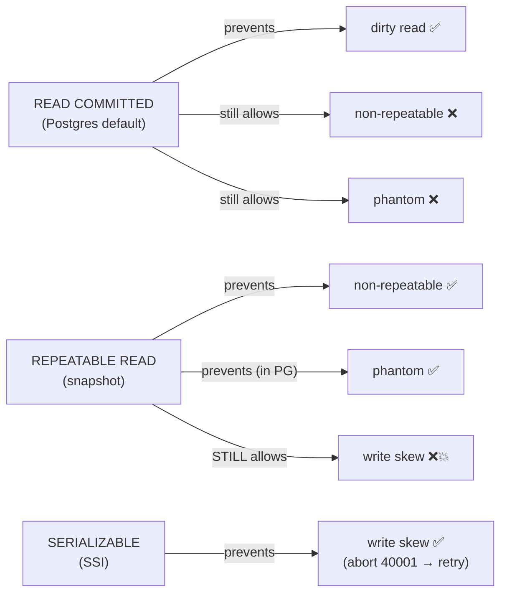
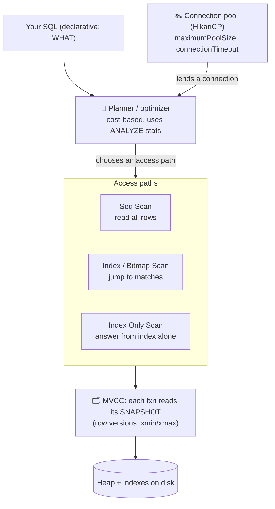
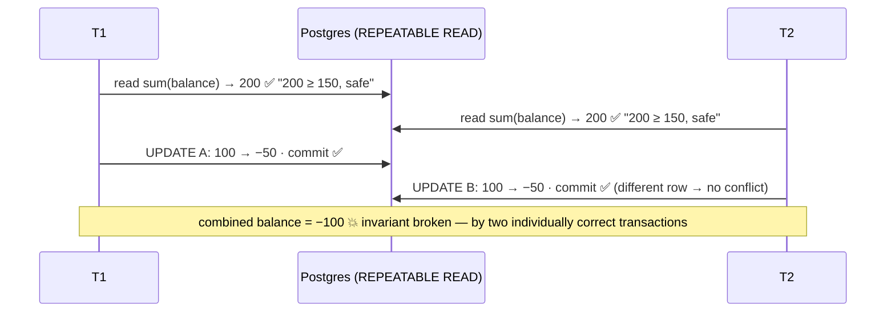
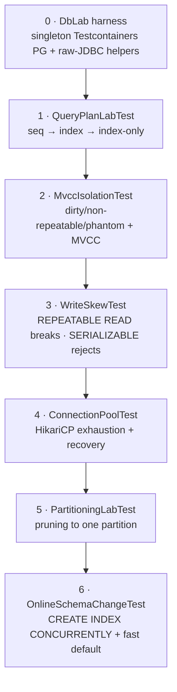

# Step 10 · Relational Databases Up Close
### Phase B — Data, Databases, Concurrency & Transactions 🔵 · Step 10 of 67

> *You've been using Postgres as a black box that stores rows. This step opens the box. You'll read the
> query planner's mind, watch MVCC hand each transaction its own version of reality, reproduce the classic
> isolation anomalies — including the sneaky one that survives REPEATABLE READ — and feel a connection pool
> run dry. By the end, "the database is slow" and "we have a race condition" stop being mysteries.*

---

<a id="toc"></a>
## 🧭 The Six Movements of This Step

| | Movement | What happens | ~time |
|---|---|---|---|
| **A** | [🧭 Orient](#orient) | 30-second overview · skip-test · cheat card · why it matters · before you start | ~1h |
| **B** | [🧠 Understand](#understand) | the engine up close: planner, indexes, MVCC, isolation, partitioning, pools | ~2.5h |
| **C** | [🛠️ Build](#build) | six raw-JDBC labs on a real Postgres — plans, anomalies, write skew, the pool, partitions, online DDL | ~12h |
| **D** | [🔬 Prove](#prove) | the Verification Log — 21 tests green, every lab's real output, the §12.3 mutation check | ~1.5h |
| **E** | [🎓 Apply](#apply) | go deeper · interview prep · your-turn challenges | ~2h |
| **F** | [🏆 Review](#review) | troubleshooting · resources · recap, flashcards & what's next | ~1h |

---

<a id="orient"></a>

# A · 🧭 Orient

## 📋 This Step in 30 Seconds

| | |
|---|---|
| **Title** | Relational Databases Up Close — read query plans, index deliberately, and reason about isolation & MVCC like the engine does |
| **Step** | 10 of 67 · **Phase B — Data, Databases, Concurrency & Transactions** 🔵 |
| **Effort** | ≈ 20 hours focused. The payoff is enormous and interview-defining: you can *read an `EXPLAIN`*, *justify an index*, and *name the exact isolation level that prevents a given anomaly* — with proof you ran yourself. Experienced learners can skip-test and skim to ~5h. |
| **What you'll run this step** | **JVM + Maven** for the build & tests; **🐳 Docker** for the tests (a Testcontainers Postgres). One command: `./mvnw -pl services/cif test -Dtest='QueryPlanLabTest,MvccIsolationTest,WriteSkewTest,ConnectionPoolTest,PartitioningLabTest,OnlineSchemaChangeTest'`. **No HTTP endpoints change** — the proofs are tests + an interactive `psql` lab (`steps/step-10/queries.sql`). |
| **Buildable artifact** | Six **raw-JDBC database labs** in `services/cif/src/test/java/.../dblab/` that talk to a real Postgres (no Spring/Hibernate — we get *close to the engine*): `QueryPlanLabTest` (seq→index→index-only), `MvccIsolationTest` (dirty/non-repeatable/phantom + MVCC), `WriteSkewTest` (the anomaly that beats REPEATABLE READ, fixed by SERIALIZABLE), `ConnectionPoolTest` (HikariCP exhaustion), `PartitioningLabTest` (pruning), `OnlineSchemaChangeTest` (`CREATE INDEX CONCURRENTLY`, fast defaults). CIF goes from **10 → 21** tests. `step-10-start == step-09-end`. |
| **Verification tier** | 🔴 **Full** — this step adds tests to a service *and* exercises a concurrency/correctness path (write skew). `./mvnw verify` green + all **21** tests + every lab's real plan/anomaly output + the **§12.3 mutation sanity-check** (weaken SERIALIZABLE → watch the write-skew defense fail → revert) + clean-room fresh-clone + `smoke.sh`. |
| **Depends on** | **[Step 8](../step-08/lesson.md)** (CIF + Testcontainers Postgres + the pinned `postgres:17-alpine` image) and **[Step 9](../step-09/lesson.md)** (`@Version`, the persistence context — which we now contrast with the raw engine). **+ Docker.** Forward-references **Step 11** (the JMM) and **Step 12** (the ledger, where you'll *pick* an isolation level / lock for money movement). |

By the end you will be able to read a Postgres `EXPLAIN (ANALYZE)` and name the scan node and why the planner chose it; decide when an index helps and what a **covering index** buys; explain **MVCC** and why "a writer never blocks a reader"; reproduce **dirty / non-repeatable / phantom** reads and say which isolation level each needs; explain and *defeat* **write skew**; explain what a **connection pool** does and what happens when it's exhausted; and describe **partitioning**, **read replicas**, and **online schema change** well enough to design with them.

### ⏭️ Can You Skip This Step? (5-minute self-check)

If you can confidently do **all** of this, skim the 🧩 Pattern Spotlight and the 🕰️ Then-vs-Now, then jump to **[Step 11 — Concurrency & Thread Safety](../step-11/lesson.md)**.

- [ ] I can read `EXPLAIN (ANALYZE)` output — name **Seq Scan / Index Scan / Bitmap Index Scan / Index Only Scan**, and explain *why* the planner picks each and what a **covering index** changes.
- [ ] I can explain **MVCC** (row versions, snapshots, `xmin`/`xmax`, why readers and writers don't block each other) and what **VACUUM** is for.
- [ ] I can define **dirty read, non-repeatable read, phantom,** and **write skew**, and state the **lowest isolation level** that prevents each — and I know Postgres has no dirty reads and prevents phantoms at REPEATABLE READ.
- [ ] I can explain why **write skew survives REPEATABLE READ** and how **SERIALIZABLE (SSI)** stops it (and that the app must **retry on SQLSTATE 40001**).
- [ ] I can explain what a **connection pool** (HikariCP) does, why `maximumPoolSize` and `connectionTimeout` matter, and what a "pool exhausted" incident looks like.
- [ ] I can describe **declarative partitioning + pruning**, **read replicas + replication lag**, and **online schema change** (`CREATE INDEX CONCURRENTLY`, expand-contract).

> [!TIP]
> Not 100%? Stay. "Walk me through this `EXPLAIN`", "what isolation level would you use and why", and "what's a connection pool and what happens when it runs out" are three of the most common senior-backend interview questions — and the people who *crush* them are the ones who have watched the plan flip from Seq Scan to Index Only Scan and watched a write-skew bug appear and disappear with one keyword. That's this step.

## 📇 Cheat Card

> **What this step delivers (one sentence):** you stop treating Postgres as a black box — you read query plans, index deliberately (incl. covering indexes → Index Only Scan), reproduce every classic isolation anomaly plus **write skew**, fix it with SERIALIZABLE, and watch a connection pool run dry — all on a real Postgres, all proven by tests.

**Key commands** (Windows uses `.\mvnw.cmd`; macOS/Linux/Git-Bash use `./mvnw`):

```bash
# Run all six Step-10 database labs on a real Testcontainers Postgres:
./mvnw -pl services/cif test -Dtest='QueryPlanLabTest,MvccIsolationTest,WriteSkewTest,ConnectionPoolTest,PartitioningLabTest,OnlineSchemaChangeTest'

# Full module gate (the 21 CIF tests):
./mvnw -pl services/cif -am verify

# One-shot proof your build matches the lesson (needs only Docker):
bash steps/step-10/smoke.sh

# Play with the SQL by hand (throwaway Postgres in Docker, then paste from steps/step-10/queries.sql):
docker run --rm -d --name pg-lab -e POSTGRES_PASSWORD=lab -p 5433:5432 postgres:17-alpine
docker exec -it pg-lab psql -U postgres      # …then docker rm -f pg-lab when done
```

**The one headline idea — *the isolation level you choose decides which anomalies you can still see; write skew is the one that hides until SERIALIZABLE*:**



*Alt-text: three isolation levels and the anomalies they stop. READ COMMITTED prevents dirty reads but still allows non-repeatable reads and phantoms. REPEATABLE READ (snapshot) prevents non-repeatable reads and, in Postgres, phantoms — but STILL allows write skew. SERIALIZABLE prevents write skew by aborting one transaction with SQLSTATE 40001, which the app retries.*

## 🎯 Why This Matters

Two sentences from real incident reviews: *"The query got slow as the table grew"* and *"Two requests both passed the check, and the invariant broke."* The first is a missing or misused index — invisible until you read the plan. The second is an isolation anomaly — invisible until you understand snapshots. Both are *engineering-judgment* failures, not typo bugs, and both are exactly what senior interviews probe: "walk me through this `EXPLAIN`", "what isolation level, and why?", "what happens when the pool is exhausted?". After this step you don't recite definitions — you've *measured* a plan flip and *watched* a write-skew bug appear and vanish.

## ✅ What You'll Be Able to Do

- **Read a query plan** — identify Seq Scan vs Index Scan vs Bitmap Index Scan vs Index Only Scan, read `actual rows`/`Buffers`, and explain the planner's cost-based choice.
- **Index with intent** — add a B-tree index and prove the plan changes; build a **covering index** and get an **Index Only Scan** with `Heap Fetches: 0`.
- **Explain MVCC** — row versions (`xmin`/`xmax`), per-transaction snapshots, why readers and writers don't block, and what VACUUM/the visibility map do.
- **Reproduce & classify isolation anomalies** — dirty read (impossible in PG), non-repeatable read, phantom — and name the level that stops each.
- **Defeat write skew** — explain why REPEATABLE READ lets it through and how SERIALIZABLE (SSI) catches it, including the **retry-on-40001** contract.
- **Reason about the connection pool** — size it, explain `connectionTimeout`, and recognise a saturation incident.
- **Design with partitioning, read replicas, and online schema change** — and say their trade-offs out loud.

## 🧰 Before You Start

**Prerequisites**

- ✅ You finished **[Step 8](../step-08/lesson.md)** and **[Step 9](../step-09/lesson.md)**: CIF builds, the Testcontainers Postgres works, and `./mvnw -pl services/cif -am verify` is green with **10** tests.
- ✅ **Docker is running** (`docker info` prints engine details). The labs spin up one `postgres:17-alpine` container.
- ✅ You're at `step-10-start` (== `step-09-end`).

**What you already learned that connects here**

- In **Step 9** you saw Hibernate's persistence context, lazy proxies, and `@Version`. This step drops *beneath* Hibernate to the engine those features sit on — same Postgres, no ORM in the way.
- The **`@Version`** optimistic lock from Step 9 is the application-level cousin of what you'll see here at the engine level (snapshots and serialization failures). We'll connect them explicitly.
- This is the **database half** of the concurrency story; **Step 11** is the in-JVM half (the Java Memory Model), and **Step 12** is where you *choose* an isolation level / lock to move money safely.

> **Depends on: Steps 8, 9** (and conceptually 5–7 for the Spring/JPA fundamentals you're now looking underneath).

## 🗓️ Session Plan (~20 h ≈ 7 sittings)

You don't do this step in one sitting. Each sitting below ends at a real commit or section boundary, so you can walk away without losing state:

| Sitting | Covers | ~time | Ends at |
|---|---|---|---|
| **S1** | A · Orient (skip-test, cheat card) + B · Understand | ~2.5h | end of B — you can say which isolation level stops which anomaly, from the table |
| **S2** | C · Sub-steps 0–1 — `DbLab` harness + `QueryPlanLabTest` | ~3h | 💾 commit *"prove seq→index→index-only scans"* |
| **S3** | C · Sub-step 2 — `MvccIsolationTest` (dirty / non-repeatable / phantom) | ~2.5h | 💾 commit *"reproduce dirty/non-repeatable/phantom reads"* |
| **S4** | C · Sub-step 3 — `WriteSkewTest` (the step's §12.3 mutation point) | ~2.5h | 💾 commit *"prove write skew … (40001)"* |
| **S5** | C · Sub-steps 4–5 — `ConnectionPoolTest` + `PartitioningLabTest` | ~3h | 💾 commit *"prove range-partition pruning"* |
| **S6** | C · Sub-step 6 — `OnlineSchemaChangeTest` + `queries.sql` by hand in psql + The Finished Result | ~2.5h | `git tag step-10-end` |
| **S7** | D · Prove (verify, `smoke.sh`, mutation check) + E · Apply + F · Review | ~3h | flashcards + one-line reflection |

*Optional routes:* pass the ⏭️ skip-test and the whole step compresses to a **~5h skim** (S1 + S7); each 🚀 Go Deeper aside costs **+~10 min**; every 🔬 Break-it detour is **~30s**.

---

<a id="understand"></a>

# B · 🧠 Understand

## 🧠 The Big Idea

A relational database is not a "place where rows live." It's a small operating system for your data, with four moving parts you must be able to picture:

1. **The query planner (optimizer).** You write *what* you want (declarative SQL); the planner decides *how* to get it — which access path (scan the whole table? jump in via an index?), which join algorithm, in which order. It chooses by **estimated cost**, using **statistics** about your data (kept fresh by `ANALYZE`). `EXPLAIN` shows you the plan; `EXPLAIN ANALYZE` runs it and shows estimate-vs-actual.
2. **Indexes.** A B-tree index is a sorted, on-disk structure that turns "read every row and filter" (a **Seq Scan**) into "navigate straight to the matching rows" (an **Index Scan**). A **covering** index even *includes* extra columns so some queries are answered from the index alone — an **Index Only Scan** that never touches the table.
3. **MVCC (Multi-Version Concurrency Control).** Postgres never overwrites a row in place; an `UPDATE` writes a **new version** and marks the old one dead. Every transaction reads from a **snapshot** — a consistent point-in-time view — so *readers never block writers and writers never block readers*. The isolation level decides how *wide* your snapshot is, and therefore which anomalies you can still observe. Dead versions are reclaimed later by **VACUUM**.
4. **The connection pool.** A database connection is expensive to create (TCP + TLS + a backend process fork + auth). So apps keep a small fixed **pool** of live connections (HikariCP, in Spring) and lend them out. Sizing it is a real decision: too small and requests queue; too big and you overwhelm the database.

> **Analogy — a vast archive with a clever clerk.** The **planner** is the clerk who, given your request, decides whether to walk every shelf (Seq Scan) or use the **card catalogue** (an index) to go straight to the right drawer. A *covering* card catalogue has the answer written *on the card*, so the clerk never fetches the box (Index Only Scan). **MVCC** is the archive's photocopy policy: when you start a research session you're handed a **frozen snapshot** of every document as it was at that instant; someone else editing the originals doesn't change your copies — so you and they never wait on each other. How frozen your snapshot is = your **isolation level**. The **connection pool** is the fixed number of reading desks: when all desks are taken, the next researcher waits at the door, and if they wait too long they leave empty-handed (a connection timeout).



*Alt-text: declarative SQL flows into the cost-based planner, which uses ANALYZE statistics to choose an access path — Seq Scan (read all rows), Index/Bitmap Scan (jump to matches), or Index Only Scan (answer from the index alone). Execution reads through MVCC, where each transaction sees its own snapshot built from row versions (xmin/xmax), down to the heap and indexes on disk. A connection pool (HikariCP) with maximumPoolSize and connectionTimeout lends connections to run all this.*

## 🧩 Pattern Spotlight — the Covering Index (Index-Only Scan)

> **Problem.** A hot, read-heavy query selects a *few* columns filtered by one column — e.g. `SELECT account_id, amount FROM txn WHERE account_id = ?`. A plain index on `account_id` finds the matching rows fast, but Postgres must then visit the table **heap** to fetch `amount` for each row (random I/O).

> **Why a covering index fits.** If the index *also carries* `amount`, the query can be answered from the index alone — no heap visits. That's an **Index Only Scan**: less I/O, better cache behaviour, lower latency, on exactly the queries you run most.

> **How it works (the mechanism).** `CREATE INDEX idx ON txn (account_id) INCLUDE (amount)` stores `amount` as a non-key **payload** in the index leaves. Postgres can return `(account_id, amount)` straight from the leaf — *if* it knows the rows are visible without checking the heap. That's what the **visibility map** (maintained by `VACUUM`) provides; with it set, you'll see `Heap Fetches: 0`.

> **Alternatives / trade-offs.** A composite index `(account_id, amount)` also covers, but makes `amount` part of the key (affects ordering & uniqueness); `INCLUDE` keeps the key narrow. Every index costs write amplification and storage — index the queries that matter, not every column. Postgres-specific: B-tree `INCLUDE` exists since PG 11.

> **Implementation (here).** `QueryPlanLabTest` builds the plain index, then the covering index, and asserts the plan node becomes `Index Only Scan` with `Heap Fetches: 0`.

## 🌱 Under the Hood: How It Really Works

**Reading a plan (bottom-up, inside-out).** `EXPLAIN` prints a tree; **the most indented node runs first** and feeds its parent. Each node shows the planner's **estimated** `(cost=start..total rows=… width=…)`; with `ANALYZE` you also get `(actual time=… rows=… loops=…)` and, with `BUFFERS`, how many 8 KB pages were read (`shared hit` = from cache, `read` = from disk). The single most useful habit: **compare estimated `rows` to actual `rows`.** A big gap means stale statistics (`ANALYZE` the table) and usually a bad plan.

**Seq Scan vs Index Scan vs Bitmap vs Index Only.**
- **Seq Scan** reads every page of the table and filters in memory. For *most* of a table it's actually the *fastest* path (sequential I/O beats random). You'll see `Rows Removed by Filter: N`.
- **Index Scan** walks the B-tree to matching keys, then fetches each row from the heap — great when **few** rows match.
- **Bitmap Index Scan + Bitmap Heap Scan** is the planner's middle ground: build a bitmap of matching *page* locations from the index, then read those heap pages in **physical order** (turning random I/O into near-sequential). Postgres picks this when the match set is moderate or scattered — *which is exactly what you'll see in the lab*, even for a few rows, because it's cheap here.
- **Index Only Scan** answers from the index alone (covering index + visibility map) — `Heap Fetches: 0`.

> ❓ **Why did the lab get a *Bitmap* Index Scan, not a plain Index Scan, for only 4 rows?** <details><summary>answer</summary>It's cost-based, and at this tiny scale the costs are nearly tied; Postgres chose the bitmap path (which sorts heap access by page). Both are *index-driven* — the headline ("no longer a Seq Scan") holds. On a unique-key lookup you'd typically see a plain Index Scan. Never assume the node — *read the plan*.</details>

**MVCC, concretely.** Every row version has hidden system columns: **`xmin`** (the transaction id that created this version) and **`xmax`** (the txn that deleted/superseded it, if any). When a transaction starts a statement (READ COMMITTED) or its first query (REPEATABLE READ/SERIALIZABLE), it takes a **snapshot**: the set of transaction ids considered "committed and visible." A row version is visible to you iff its `xmin` is in your snapshot and its `xmax` is not. So:
- An `UPDATE` doesn't overwrite — it inserts a new version (new `xmin`) and stamps the old one's `xmax`. Your snapshot may still see the old version. **Readers never block on writers.**
- Dead versions accumulate; **VACUUM** reclaims them and updates the **visibility map** (which also enables Index Only Scans). Left unchecked, dead tuples are "bloat."

**The isolation levels (PostgreSQL's real behaviour, which is stricter than the SQL standard's minimums):**

| Level | Snapshot scope | Dirty read | Non-repeatable read | Phantom | Write skew |
|---|---|---|---|---|---|
| READ UNCOMMITTED | *(treated as READ COMMITTED in PG)* | ❌ never | ✅ can happen | ✅ can happen | ✅ |
| **READ COMMITTED** *(PG default)* | a **new** snapshot per statement | ❌ never | ✅ can happen | ✅ can happen | ✅ |
| **REPEATABLE READ** | **one** snapshot for the whole txn | ❌ never | ❌ prevented | ❌ prevented *(in PG)* | ✅ **still happens** |
| **SERIALIZABLE** | one snapshot + **SSI** dependency tracking | ❌ never | ❌ | ❌ | ❌ (aborts with `40001`) |

- **Dirty read** (seeing another txn's *uncommitted* write) — **impossible in Postgres at any level**; PG silently upgrades READ UNCOMMITTED to READ COMMITTED.
- **Non-repeatable read** — re-reading a row returns a different value because another txn committed an `UPDATE` in between. Happens at READ COMMITTED (fresh snapshot per statement); gone at REPEATABLE READ (frozen snapshot).
- **Phantom** — re-running a range query returns *new rows* an insert added. The SQL standard allows phantoms at REPEATABLE READ; **Postgres prevents them** there anyway, thanks to its snapshot model.

**Write skew — the subtle one.** Two transactions read an overlapping set, each makes a decision based on what it read, and each writes a **different** row. No write-write conflict occurs, so snapshot isolation (REPEATABLE READ) lets both commit — but *together* they violate an invariant that neither violated alone. Example (the lab): two linked accounts must keep a combined balance ≥ 0; both start at 100; two concurrent withdrawals of 150 each read the sum (200), each pass the check, each debit a different account → final sum −100. **SERIALIZABLE** prevents it: Postgres's **Serializable Snapshot Isolation (SSI)** tracks read/write dependencies between live transactions and, when it detects a dangerous cycle, **aborts** one with `ERROR: could not serialize access… (SQLSTATE 40001)`. The application's job is to **catch 40001 and retry the whole transaction.**



*Alt-text: the write-skew interleaving. T1 and T2 each read the combined balance (200) from their own snapshot and decide a 150 withdrawal is safe. T1 debits account A (100 → −50) and commits; T2 debits account B (100 → −50) and commits — different rows, so no write-write conflict. Together they leave the combined balance at −100, breaking the ≥ 0 invariant that neither transaction broke alone.*

**Connection pools (HikariCP).** The pool holds up to `maximumPoolSize` physical connections. `getConnection()` borrows one; `close()` *returns it to the pool* (it does not actually close the socket). If all are in use, a borrower **waits** up to `connectionTimeout` and then throws `SQLTransientConnectionException("… request timed out")`. This is why pool size is a capacity decision: with `maximumPoolSize = 2`, the *third* concurrent caller waits and may time out — exactly the lab. Hikari exposes live gauges (`getActiveConnections`, `getIdleConnections`, `getThreadsAwaitingConnection`).

> ❓ **Pool size 2, three concurrent borrowers — what happens to the third, and after how long?** <details><summary>answer</summary>It waits *inside* `getConnection()` for up to `connectionTimeout` (500 ms in our lab), then throws `SQLTransientConnectionException("… request timed out")`. It only succeeds if one of the two holders returns a connection during that wait.</details>

**Partitioning.** A large table can be **declaratively partitioned** (e.g. `PARTITION BY RANGE (created_at)`) into child tables per month. The planner does **partition pruning**: a query restricted to one month touches only that partition. Wins: smaller indexes per partition, fast bulk-delete by `DROP TABLE partition` (vs a giant `DELETE`), and parallelism. Cost: more objects to manage, and the partition key must suit your queries.

**Online (zero-downtime) schema change.** A plain `CREATE INDEX` takes a lock that blocks writes for the whole build; **`CREATE INDEX CONCURRENTLY`** builds without that long lock — but it *cannot run inside a transaction block* (it manages its own commits), so a migration tool must run it outside one. Adding a column with a **constant default** is **metadata-only** since PG 11 (instant, no table rewrite). These are the primitives behind the **expand-contract** migration pattern you'll use for real in Step 12.

**Read replicas & replication lag.** A primary streams its write-ahead log (WAL) to one or more **read replicas**. You route read-only queries to replicas to scale reads — but replication is **asynchronous by default**, so a replica can be **behind** the primary (lag). That means "read-your-writes" can fail on a replica (you write to the primary, immediately read from a replica, and don't see your write). You inspect lag with `pg_stat_replication` (primary) and `pg_last_xact_replay_timestamp()` (replica). *(We teach this as concept + verify-adjacent SQL — a single-node lab can't show streaming replication; see 🔬 §7 and the honesty note.)*

## 🛡️ Security Lens: What Could Go Wrong

- **Missing-index = a cheap DoS.** An endpoint backed by a Seq Scan on a growing table gives an attacker (or an organic traffic spike) huge work-amplification: a few requests can saturate database CPU and the connection pool. Reading plans and indexing hot paths is a *availability* control, not just a latency nicety.
- **Connection-pool exhaustion is an availability failure mode.** A slow downstream query, a leaked connection (borrowed and never returned), or an N+1 explosion (Step 9!) can drain the pool; every subsequent request then times out. Bound query time, always return connections (try-with-resources / Spring's managed transactions), and alert on `threadsAwaitingConnection`.
- **The wrong isolation level is a correctness/integrity hole.** Choosing READ COMMITTED where you needed write-skew protection silently corrupts invariants (balances, limits, "exactly one X"). Near money, prefer an explicit defense (SERIALIZABLE + retry, or `SELECT … FOR UPDATE`, or the `@Version` you met in Step 9) and *test* it.
- **`EXPLAIN ANALYZE` runs the query.** On a `DELETE`/`UPDATE` it actually mutates. In a shared/prod-like database, wrap it in a transaction you roll back, or only `EXPLAIN` (no `ANALYZE`) for writes.

## 🕰️ Then vs. Now (How This Changed Across Versions)

| Topic | Then | Now | Why it changed |
|---|---|---|---|
| **Covering indexes** | Before PG 11 you faked covering with a composite index `(a, b)`, forcing `b` into the key. | **`INCLUDE (b)`** (PG 11+) adds non-key payload columns — narrow key, true Index Only Scan. | Cleaner covering without polluting the index key/ordering. |
| **Adding a column with a default** | Before PG 11, `ADD COLUMN … DEFAULT x` **rewrote the whole table** under an exclusive lock — a notorious outage cause. | PG 11+ stores a constant default as **metadata** — instant, no rewrite. | Made a once-dangerous migration routine and online-safe. |
| **`SELECT … FOR UPDATE SKIP LOCKED`** | Older queue-on-Postgres patterns blocked or polled awkwardly. | `SKIP LOCKED` (PG 9.5+) lets workers grab un-locked rows — a clean job-queue primitive. | Better concurrency primitives in the engine itself. |
| **Serializable** | Classic SERIALIZABLE meant heavy two-phase locking. | PG uses **SSI** (Serializable Snapshot Isolation): snapshot reads + dependency tracking, aborting on `40001`. | Serializable guarantees without read locks — but apps must **retry**. |

> [!NOTE]
> *Verify, don't guess.* `INCLUDE` indexes and fast constant-default column adds are PG 11+; `SKIP LOCKED` is PG 9.5+; SSI has been Postgres's SERIALIZABLE since 9.1. We run **PostgreSQL 17** (`postgres:17-alpine`, pinned in `VERSIONS.md`), so all apply. Other engines differ (e.g. MySQL/InnoDB's REPEATABLE READ does *not* prevent phantoms the same way; SQL Server's defaults differ) — the *anomaly definitions* are portable; the *level that prevents each* is engine-specific. Always check your engine.

## 🧵 Thread-safety note

This step is the **database half** of concurrency: isolation levels and MVCC protect data across *separate database transactions*. It is **not** the same as in-JVM thread-safety (two threads sharing a mutable object) — that's the **Java Memory Model** in **Step 11**. Note the through-line: Step 9's `@Version` optimistic lock, this step's SERIALIZABLE/`SELECT … FOR UPDATE`, and Step 11's `synchronized`/atomics are three layers of the *same* question — "what happens when two things touch the same state at once?" In **Step 12** you'll deliberately choose among them to move money correctly under load.

---

<a id="build"></a>

# C · 🛠️ Build

## 📦 Your Starting Point

You're at **`step-10-start`** (== `step-09-end`). What's green:

- `services/cif` builds and its **10** tests pass on a real Testcontainers Postgres.
- `ContainersConfig` (the `@ServiceConnection` Postgres) exists from Step 8, and the image `postgres:17-alpine` is pinned.

> [!NOTE]
> **No new HTTP endpoints — and that's intentional.** Step 10 is about the *engine*, not the API. Everything we build is a **test** that talks raw JDBC to a real Postgres, plus an interactive `steps/step-10/queries.sql` you can paste into `psql`. There is **no new `requests.http`**; the Step-8 collection still describes CIF's live API.

Confirm the starting point builds:

```bash
./mvnw -pl services/cif -am verify
```

✅ You should see `BUILD SUCCESS` with `Tests run: 10` for CIF. If not, fix Step 9 first (🩺 there).

## 🛠️ Let's Build It — Step by Step

We build **one shared lab harness** then **six labs** — seven sub-steps in all, numbered 0–6 — running between each. Here's the whole step at a glance:



🌳 **Files we'll touch** (all new, all test-only — nothing in `src/main` changes):

```
services/cif/src/test/java/com/buildabank/cif/dblab/
├── DbLab.java                    # 0 · shared harness: one Postgres, raw-JDBC helpers
├── QueryPlanLabTest.java         # 1 · EXPLAIN: seq scan → index scan → index-only scan
├── MvccIsolationTest.java        # 2 · MVCC + dirty / non-repeatable / phantom
├── WriteSkewTest.java            # 3 · write skew: REPEATABLE READ vs SERIALIZABLE
├── ConnectionPoolTest.java       # 4 · HikariCP pool exhaustion & recovery
├── PartitioningLabTest.java      # 5 · range partitioning + pruning
└── OnlineSchemaChangeTest.java   # 6 · CREATE INDEX CONCURRENTLY + fast default add
steps/step-10/
├── queries.sql                   # the same experiments, by hand in psql ("Play With It")
└── smoke.sh                      # one-command proof
```

---

### Sub-step 0 (1 of 7, ~1h) — The `DbLab` harness 🧭 *(you are here: **harness** → plans → MVCC → write skew → pool → partitions → online DDL)*

🎯 **Goal:** one place that starts a real Postgres *once* and hands every lab the raw-JDBC tools it needs — `openTx(isolation)`, `openAuto()`, `explain(...)`, `exec(...)`, `scalar(...)`. We use **raw JDBC on purpose**: this step is about the engine, and Hibernate would hide the very mechanics (transactions, isolation, the pool) we want to see.

📁 **Location:** new file → `services/cif/src/test/java/com/buildabank/cif/dblab/DbLab.java`

⌨️ **Code:**

```java
// services/cif/src/test/java/com/buildabank/cif/dblab/DbLab.java
package com.buildabank.cif.dblab;

import java.sql.Connection;
import java.sql.DriverManager;
import java.sql.ResultSet;
import java.sql.SQLException;
import java.sql.Statement;

import org.testcontainers.postgresql.PostgreSQLContainer;
import org.testcontainers.utility.DockerImageName;

abstract class DbLab {

    /** Started once for the JVM, shared by every lab class (the "singleton container" pattern). */
    static final PostgreSQLContainer POSTGRES =
            new PostgreSQLContainer(DockerImageName.parse("postgres:17-alpine"));

    static {
        POSTGRES.start();
    }

    /** Open a connection at a chosen isolation level with autocommit OFF — we drive the transaction by hand. */
    static Connection openTx(int isolationLevel) throws SQLException {
        Connection c = DriverManager.getConnection(
                POSTGRES.getJdbcUrl(), POSTGRES.getUsername(), POSTGRES.getPassword());
        c.setTransactionIsolation(isolationLevel);
        c.setAutoCommit(false);
        return c;
    }

    /** Open an autocommit connection (each statement commits immediately) — for DDL and seeding. */
    static Connection openAuto() throws SQLException {
        return DriverManager.getConnection(
                POSTGRES.getJdbcUrl(), POSTGRES.getUsername(), POSTGRES.getPassword());
    }

    /** Run EXPLAIN (ANALYZE actually executes the query and reports real timings/buffers). */
    static String explain(Connection c, String sql, boolean analyze) throws SQLException {
        String prefix = analyze ? "EXPLAIN (ANALYZE, BUFFERS) " : "EXPLAIN ";
        StringBuilder plan = new StringBuilder();
        try (Statement st = c.createStatement();
             ResultSet rs = st.executeQuery(prefix + sql)) {
            while (rs.next()) {
                plan.append(rs.getString(1)).append('\n');
            }
        }
        return plan.toString();
    }

    static void exec(Connection c, String sql) throws SQLException {
        try (Statement st = c.createStatement()) {
            st.execute(sql);
        }
    }

    static long scalar(Connection c, String sql) throws SQLException {
        try (Statement st = c.createStatement(); ResultSet rs = st.executeQuery(sql)) {
            rs.next();
            return rs.getLong(1);
        }
    }
}
```

🔍 **Line-by-line:**
- `abstract class DbLab` — a base class the labs `extends`; it isn't a test itself (no `@Test`).
- `static final PostgreSQLContainer POSTGRES = new PostgreSQLContainer(DockerImageName.parse("postgres:17-alpine"))` — declares a Testcontainers Postgres. **Non-generic** in Testcontainers 2.0 (the old `<SELF>` self-type was dropped — same note as `ContainersConfig`). The image is **pinned**, never `latest`.
- `static { POSTGRES.start(); }` — a **static initializer**: runs once when the class is first loaded, starting *one* container reused by every lab class. Far cheaper than one container per class. Testcontainers' reaper ("Ryuk") removes it when the JVM exits.
- `openTx(int isolationLevel)` — opens a JDBC `Connection`, sets the **isolation level** (`Connection.TRANSACTION_*`), and turns **autocommit off** so *we* decide when to `commit()`/`rollback()`. This is the knob the whole step turns.
- `openAuto()` — autocommit *on*: every statement is its own committed transaction. Used for DDL/seeding (and things like `VACUUM` and `CREATE INDEX CONCURRENTLY` that refuse to run inside a transaction).
- `explain(c, sql, analyze)` — prepends `EXPLAIN` (optionally `ANALYZE, BUFFERS`, which **runs** the query and reports real rows/timings/page reads) and concatenates the plan rows into one string.
- `exec` / `scalar` — tiny helpers: run a statement; read a single number (a `COUNT`/`SUM`).

💭 **Under the hood:** `DriverManager.getConnection(url, …)` opens a *brand-new* physical connection each call — no pooling. That's deliberate: in the isolation labs we need several **independent** transactions live at once, and in the pool lab we want to control pooling ourselves. The PostgreSQL JDBC driver auto-registers via the JDBC 4 `ServiceLoader`, so no `Class.forName` is needed.

🔮 **Predict:** the first lab inserts 20,000 rows and queries one account *without* an index. What scan node will Postgres use? (Check in sub-step 1.)

✋ **Checkpoint:** `DbLab.java` compiles (it has no tests, so it won't run yet). Nothing to see until a lab uses it.

💾 **Commit:**
```bash
git add services/cif/src/test/java/com/buildabank/cif/dblab/DbLab.java
git commit -m "test(cif): add DbLab harness — singleton Testcontainers Postgres + raw-JDBC helpers (step 10)"
```

*🛑 Stopping here? You have the `DbLab` harness committed (it compiles; nothing runs yet). Next: Sub-step 1 (`QueryPlanLabTest`); first action: create `services/cif/src/test/java/com/buildabank/cif/dblab/QueryPlanLabTest.java`.*

⚠️ **Pitfall:** opening connections with `DriverManager` means *you* own their lifecycle — always use try-with-resources (`try (Connection c = …)`) so they close even on failure. A leaked connection in a real pool is a classic outage.

---

### Sub-step 1 (2 of 7, ~2h) — `QueryPlanLabTest`: watch the plan flip 🧭 *(harness ✅ → **plans** → MVCC → write skew → pool → partitions → online DDL)*

🎯 **Goal:** seed 20,000 transactions, then use `EXPLAIN (ANALYZE)` to watch the planner go **Seq Scan → (Bitmap) Index Scan → Index Only Scan** as we add a plain index and then a covering index.

📁 **Location:** new file → `services/cif/src/test/java/com/buildabank/cif/dblab/QueryPlanLabTest.java`

⌨️ **Code:**

```java
// services/cif/src/test/java/com/buildabank/cif/dblab/QueryPlanLabTest.java
package com.buildabank.cif.dblab;

import static org.assertj.core.api.Assertions.assertThat;

import java.sql.Connection;

import org.junit.jupiter.api.BeforeAll;
import org.junit.jupiter.api.Test;

class QueryPlanLabTest extends DbLab {

    @BeforeAll
    static void seed() throws Exception {
        try (Connection c = openAuto()) {
            exec(c, "drop table if exists txn");
            exec(c, """
                    create table txn (
                        id         bigint generated by default as identity primary key,
                        account_id bigint         not null,
                        amount     numeric(19, 4) not null,
                        created_at timestamptz    not null
                    )""");
            // 20,000 rows over 5,000 accounts → ~4 rows per account (a highly selective lookup).
            exec(c, """
                    insert into txn (account_id, amount, created_at)
                    select (g % 5000),
                           (random() * 1000)::numeric(19, 4),
                           now() - make_interval(mins => g)
                    from generate_series(1, 20000) as g""");
        }
    }

    @Test
    void seqScan_thenIndexScan_thenIndexOnlyScan() throws Exception {
        try (Connection c = openAuto()) {

            // 1 ── No index yet: the only way to find account 42's rows is to read all 20,000.
            String beforeIndex = explain(c, "select * from txn where account_id = 42", true);
            System.out.println("\n=== [1] NO INDEX — expect Seq Scan ===\n" + beforeIndex);
            assertThat(beforeIndex).contains("Seq Scan on txn");

            // 2 ── Add a B-tree index and refresh the planner's statistics.
            exec(c, "create index idx_txn_account on txn (account_id)");
            exec(c, "analyze txn");
            String afterIndex = explain(c, "select * from txn where account_id = 42", true);
            System.out.println("\n=== [2] WITH INDEX — expect Index Scan ===\n" + afterIndex);
            assertThat(afterIndex).contains("Index Scan").doesNotContain("Seq Scan on txn");

            // 3 ── Covering index: include `amount` IN the index so a query needing only
            //      (account_id, amount) is answered from the index alone — an Index Only Scan.
            exec(c, "create index idx_txn_account_amount on txn (account_id) include (amount)");
            exec(c, "vacuum analyze txn");
            String covering = explain(c,
                    "select account_id, amount from txn where account_id = 42", true);
            System.out.println("\n=== [3] COVERING INDEX — expect Index Only Scan ===\n" + covering);
            assertThat(covering).contains("Index Only Scan");
        }
    }
}
```

🔍 **Line-by-line:**
- `@BeforeAll static void seed()` — runs **once** before the test; bulk-inserts 20,000 rows with `generate_series` (Postgres's set-returning function — a SQL `for` loop). `g % 5000` spreads rows over 5,000 accounts so a single-account lookup is *selective*.
- `explain(c, "…", true)` — `EXPLAIN (ANALYZE, BUFFERS)`; we **assert on the node name** (`Seq Scan on txn`, `Index Scan`, `Index Only Scan`) because that's stable run-to-run, while timings aren't.
- `analyze txn` — refreshes the **planner statistics** so it knows the new index's selectivity. Without fresh stats the planner can misjudge.
- `INCLUDE (amount)` — the covering column; `vacuum analyze txn` sets the **visibility map** so the Index Only Scan can skip the heap (`Heap Fetches: 0`).

💭 **Under the hood:** the planner is **cost-based**. With no index, a Seq Scan is the *only* path. With an index on a selective predicate, the index path's estimated cost drops below the Seq Scan's, so it switches. The covering index lets it avoid the heap entirely for a query that only needs indexed columns.

🔮 **Predict:** before you run — for `account_id = 42` (about 4 of 20,000 rows), after we add the index, will you see a *plain* Index Scan or a *Bitmap* Index Scan? (It's cost-based — read the output.)

▶️ **Run & See:**
```bash
./mvnw -pl services/cif test -Dtest=QueryPlanLabTest
```
✅ **Expected output** (real run — your timings/ports will differ):
```
=== [1] NO INDEX — expect Seq Scan ===
Seq Scan on txn  (cost=0.00..357.05 rows=84 width=44) (actual time=0.020..1.566 rows=4 loops=1)
  Filter: (account_id = 42)
  Rows Removed by Filter: 19996
  Buffers: shared hit=148
...
=== [2] WITH INDEX — expect Index Scan ===
Bitmap Heap Scan on txn  (cost=4.32..18.40 rows=4 width=30) (actual time=0.061..0.065 rows=4 loops=1)
  Recheck Cond: (account_id = 42)
  Heap Blocks: exact=4
  ->  Bitmap Index Scan on idx_txn_account  (cost=0.00..4.32 rows=4 width=0) ...
        Index Cond: (account_id = 42)
=== [3] COVERING INDEX — expect Index Only Scan ===
Index Only Scan using idx_txn_account_amount on txn  (cost=0.29..4.36 rows=4 width=14) (actual time=0.037..0.038 rows=4 loops=1)
  Index Cond: (account_id = 42)
  Heap Fetches: 0
```
Read the three: **(1)** `Rows Removed by Filter: 19996` — Postgres read all 20,000 rows to find 4. **(2)** A **Bitmap Index Scan** feeds a Bitmap Heap Scan — index-driven, no more full scan (note: *bitmap*, not plain Index Scan — cost-based, and totally fine). **(3)** `Index Only Scan … Heap Fetches: 0` — answered from the covering index alone.

❌ **If you see `Seq Scan` still in step 2:** you skipped `analyze txn`, or the predicate isn't selective enough — re-read the seed. ❌ **If step 3 shows `Heap Fetches: > 0`:** the `vacuum` didn't set the visibility map (e.g. concurrent writes) — it's still an Index Only Scan node, just consulting the heap for visibility.

🔬 **Break-it (30s):** change the step-3 query to `select * from txn where account_id = 42` (all columns). Re-run — it's no longer an Index Only Scan (the index doesn't carry every column), so it falls back to a Bitmap/Index Scan + heap. *That's why "covering" means "covers the columns this query needs."* Put it back.

✋ **Checkpoint:** the test passes and you can point at each of the three plan nodes and say what changed.

💾 **Commit:**
```bash
git add services/cif/src/test/java/com/buildabank/cif/dblab/QueryPlanLabTest.java
git commit -m "test(cif): prove seq→index→index-only scans with EXPLAIN ANALYZE (step 10)"
```

*🛑 Stopping here? You have the harness plus the query-plan lab green (Seq → Bitmap Index → Index Only) and committed. Next: Sub-step 2 (MVCC anomalies); first action: create `MvccIsolationTest.java` in the same `dblab` folder.*

⚠️ **Pitfall:** `EXPLAIN ANALYZE` **executes** the statement. Harmless for `SELECT`; for `UPDATE`/`DELETE` it really changes data — wrap those in a rolled-back transaction or use plain `EXPLAIN`.

---

### Sub-step 2 (3 of 7, ~2.5h) — `MvccIsolationTest`: dirty / non-repeatable / phantom 🧭 *(harness ✅ → plans ✅ → **MVCC** → write skew → pool → partitions → online DDL)*

🎯 **Goal:** interleave two real transactions to reproduce the read anomalies and *see* MVCC snapshots — proving Postgres has **no** dirty reads, shows **non-repeatable** reads at READ COMMITTED, and gives a **stable snapshot** (no non-repeatable, no phantom) at REPEATABLE READ.

📁 **Location:** new file → `services/cif/src/test/java/com/buildabank/cif/dblab/MvccIsolationTest.java`

⌨️ **Code:** *(complete file)*

```java
// services/cif/src/test/java/com/buildabank/cif/dblab/MvccIsolationTest.java
package com.buildabank.cif.dblab;

import static java.sql.Connection.TRANSACTION_READ_COMMITTED;
import static java.sql.Connection.TRANSACTION_READ_UNCOMMITTED;
import static java.sql.Connection.TRANSACTION_REPEATABLE_READ;
import static org.assertj.core.api.Assertions.assertThat;

import java.sql.Connection;

import org.junit.jupiter.api.BeforeEach;
import org.junit.jupiter.api.Test;

/**
 * <strong>MVCC &amp; the SQL isolation anomalies</strong>, demonstrated by interleaving two real
 * transactions on Postgres. Each test resets a tiny {@code acct} table, so they are independent.
 *
 * <p>Postgres uses <em>Multi-Version Concurrency Control</em>: a writer never blocks a reader because each
 * transaction reads from a consistent <em>snapshot</em>. The level you pick decides how wide that snapshot
 * is — and therefore which anomalies you can still see.
 */
class MvccIsolationTest extends DbLab {

    @BeforeEach
    void resetTable() throws Exception {
        try (Connection c = openAuto()) {
            exec(c, "drop table if exists acct");
            exec(c, "create table acct (id int primary key, balance numeric not null)");
            exec(c, "insert into acct values (1, 100), (2, 100)");
        }
    }

    /**
     * <strong>Dirty read — impossible in Postgres.</strong> Even when we explicitly ask for READ
     * UNCOMMITTED, Postgres silently upgrades it to READ COMMITTED, so a reader can never see another
     * transaction's <em>uncommitted</em> write. We prove it: T2 writes-but-does-not-commit, T1 still reads
     * the old value.
     */
    @Test
    void dirtyReadIsImpossibleInPostgres() throws Exception {
        try (Connection t1 = openTx(TRANSACTION_READ_UNCOMMITTED);
             Connection t2 = openTx(TRANSACTION_READ_COMMITTED)) {

            exec(t2, "update acct set balance = 999 where id = 1");   // NOT committed

            long seenByT1 = scalar(t1, "select balance from acct where id = 1");
            System.out.println("[dirty-read] T1 (asked for READ UNCOMMITTED) sees balance = " + seenByT1);

            assertThat(seenByT1).isEqualTo(100);   // the old, committed value — no dirty read
            t1.rollback();
            t2.rollback();
        }
    }

    /**
     * <strong>Non-repeatable read — visible at READ COMMITTED.</strong> T1 reads a row twice; between the
     * reads T2 commits an update. At READ COMMITTED each statement gets a <em>fresh</em> snapshot, so the
     * second read sees the new value — the same query, two answers.
     */
    @Test
    void nonRepeatableReadHappensAtReadCommitted() throws Exception {
        try (Connection t1 = openTx(TRANSACTION_READ_COMMITTED)) {
            long first = scalar(t1, "select balance from acct where id = 1");

            try (Connection t2 = openTx(TRANSACTION_READ_COMMITTED)) {
                exec(t2, "update acct set balance = 200 where id = 1");
                t2.commit();
            }

            long second = scalar(t1, "select balance from acct where id = 1");
            System.out.println("[non-repeatable @RC] first=" + first + " second=" + second);

            assertThat(first).isEqualTo(100);
            assertThat(second).isEqualTo(200);   // changed under T1's feet
            t1.rollback();
        }
    }

    /**
     * <strong>Repeatable Read prevents it.</strong> Same interleaving, but T1 runs at REPEATABLE READ, which
     * pins one snapshot for the whole transaction — so both reads return the original value, even though T2
     * committed in between.
     */
    @Test
    void repeatableReadGivesAStableSnapshot() throws Exception {
        try (Connection t1 = openTx(TRANSACTION_REPEATABLE_READ)) {
            long first = scalar(t1, "select balance from acct where id = 1");   // takes the snapshot

            try (Connection t2 = openTx(TRANSACTION_READ_COMMITTED)) {
                exec(t2, "update acct set balance = 200 where id = 1");
                t2.commit();
            }

            long second = scalar(t1, "select balance from acct where id = 1");
            System.out.println("[repeatable-read] first=" + first + " second=" + second);

            assertThat(first).isEqualTo(100);
            assertThat(second).isEqualTo(100);   // T2's commit is invisible to T1's frozen snapshot
            t1.rollback();
        }
    }

    /**
     * <strong>Phantom rows.</strong> T1 counts rows matching a predicate; T2 inserts a new matching row and
     * commits. At READ COMMITTED the re-count grows (a phantom appears); at REPEATABLE READ the snapshot
     * hides it. (Postgres's snapshot model prevents phantoms at RR — stricter than the SQL standard
     * requires.)
     */
    @Test
    void phantomAppearsAtReadCommittedButNotAtRepeatableRead() throws Exception {
        // READ COMMITTED — phantom appears
        try (Connection t1 = openTx(TRANSACTION_READ_COMMITTED)) {
            long before = scalar(t1, "select count(*) from acct where balance >= 100");
            insertCommitted(3, 100);
            long after = scalar(t1, "select count(*) from acct where balance >= 100");
            System.out.println("[phantom @RC] before=" + before + " after=" + after);
            assertThat(before).isEqualTo(2);
            assertThat(after).isEqualTo(3);   // phantom row appeared
            t1.rollback();
        }

        resetTableQuietly();

        // REPEATABLE READ — no phantom
        try (Connection t1 = openTx(TRANSACTION_REPEATABLE_READ)) {
            long before = scalar(t1, "select count(*) from acct where balance >= 100");
            insertCommitted(4, 100);
            long after = scalar(t1, "select count(*) from acct where balance >= 100");
            System.out.println("[phantom @RR] before=" + before + " after=" + after);
            assertThat(before).isEqualTo(2);
            assertThat(after).isEqualTo(2);   // snapshot hides the new row
            t1.rollback();
        }
    }

    private void insertCommitted(int id, int balance) throws Exception {
        try (Connection t2 = openTx(TRANSACTION_READ_COMMITTED)) {
            exec(t2, "insert into acct values (" + id + ", " + balance + ")");
            t2.commit();
        }
    }

    private void resetTableQuietly() throws Exception {
        resetTable();
    }
}
```

🔍 **Line-by-line (the ideas, not every line):**
- `@BeforeEach resetTable()` — each test starts from a clean `acct` (2 rows at 100) so they're independent.
- **`dirtyReadIsImpossibleInPostgres`** — T1 *asks for* READ UNCOMMITTED, T2 writes 999 but doesn't commit; T1 still reads **100**. Postgres has no dirty reads at any level.
- **`nonRepeatableReadHappensAtReadCommitted`** — T1 reads 100, T2 commits 200, T1 re-reads → **200**. At READ COMMITTED each statement gets a fresh snapshot.
- **`repeatableReadGivesAStableSnapshot`** — same interleaving, T1 at REPEATABLE READ → both reads are **100**. The first query froze the snapshot.
- **`phantomAppearsAtReadCommittedButNotAtRepeatableRead`** — a range `COUNT` grows by a committed insert at READ COMMITTED (2→3), but stays 2 at REPEATABLE READ.

💭 **Under the hood:** REPEATABLE READ takes its snapshot at the **first query** of the transaction and reuses it; READ COMMITTED takes a fresh snapshot **per statement**. That single difference explains every result above. (See §2 of `queries.sql` to watch `xmin`/`xmax` yourself.)

🔮 **Predict:** in `repeatableReadGivesAStableSnapshot`, after T2 commits 200, what does T1's second read return? (Snapshot!)

▶️ **Run & See:**
```bash
./mvnw -pl services/cif test -Dtest=MvccIsolationTest
```
✅ **Expected output** (the `System.out` lines, real run):
```
[repeatable-read] first=100 second=100
[non-repeatable @RC] first=100 second=200
[dirty-read] T1 (asked for READ UNCOMMITTED) sees balance = 100
[phantom @RC] before=2 after=3
[phantom @RR] before=2 after=2
... Tests run: 4, Failures: 0, Errors: 0, Skipped: 0
```

🔬 **Break-it (30s):** in `repeatableReadGivesAStableSnapshot`, change `openTx(TRANSACTION_REPEATABLE_READ)` to `openTx(TRANSACTION_READ_COMMITTED)` and re-run — the second read becomes 200 and the test fails. *The isolation level is the whole story.* Put it back.

✋ **Checkpoint:** four green tests; you can state which level prevents which read anomaly.

💾 **Commit:**
```bash
git add services/cif/src/test/java/com/buildabank/cif/dblab/MvccIsolationTest.java
git commit -m "test(cif): reproduce dirty/non-repeatable/phantom reads + MVCC snapshots (step 10)"
```

*🛑 Stopping here? You have the harness, the plans lab, and all four anomaly tests green and committed. Next: Sub-step 3 (write skew — the step's centerpiece); first action: create `WriteSkewTest.java`, or re-run `./mvnw -pl services/cif test -Dtest=MvccIsolationTest` first to confirm you're still green.*

⚠️ **Pitfall:** if you don't `commit()`/`rollback()` and close each connection, the next test can hang on a lock or see leftover rows. Try-with-resources + explicit `rollback()` keep the labs deterministic.

---

### Sub-step 3 (4 of 7, ~2.5h) — `WriteSkewTest`: the anomaly that beats REPEATABLE READ 🧭 *(harness ✅ → plans ✅ → MVCC ✅ → **write skew** → pool → partitions → online DDL)*

🎯 **Goal:** reproduce **write skew** (two linked accounts, combined balance must stay ≥ 0) at REPEATABLE READ — the invariant breaks — then show **SERIALIZABLE** rejects the second commit with `SQLSTATE 40001`. This is the step's **critical concurrency path** (and the §12.3 mutation point).

📁 **Location:** new file → `services/cif/src/test/java/com/buildabank/cif/dblab/WriteSkewTest.java`

⌨️ **Code:** *(complete file)*

```java
// services/cif/src/test/java/com/buildabank/cif/dblab/WriteSkewTest.java
package com.buildabank.cif.dblab;

import static java.sql.Connection.TRANSACTION_REPEATABLE_READ;
import static java.sql.Connection.TRANSACTION_SERIALIZABLE;
import static org.assertj.core.api.Assertions.assertThat;
import static org.assertj.core.api.Assertions.assertThatThrownBy;

import java.sql.Connection;
import java.sql.SQLException;

import org.junit.jupiter.api.BeforeEach;
import org.junit.jupiter.api.Test;

/**
 * <strong>Write skew</strong> — the subtle anomaly that <em>survives</em> REPEATABLE READ and is the reason
 * SERIALIZABLE exists.
 *
 * <p>Scenario (a banking invariant): a customer has two linked accounts, A and B, with a shared-overdraft
 * rule — <em>their combined balance must never go below zero</em>. Both start at 100 (sum 200). Two
 * withdrawals of 150 run concurrently; each reads the sum (200), each decides "200 ≥ 150, fine", and each
 * debits a <em>different</em> account. Individually legal; together they leave the sum at −100.
 *
 * <p>Because each transaction writes a <em>different row</em>, there is no write-write conflict, so snapshot
 * isolation (Postgres REPEATABLE READ) lets both commit. Only SERIALIZABLE — via Postgres's
 * Serializable Snapshot Isolation (SSI), which tracks the read/write dependencies between the two — detects
 * the dangerous cycle and aborts one with SQLState {@code 40001}.
 *
 * <p>This is the <strong>§12.3 mutation point</strong> for the step: the only difference between the two
 * tests below is the isolation level. Weaken {@link #serializableRejectsTheWriteSkew()} from SERIALIZABLE to
 * REPEATABLE READ and its "conflict expected" assertion fails — proving the test really depends on the fix.
 */
class WriteSkewTest extends DbLab {

    @BeforeEach
    void reset() throws Exception {
        try (Connection c = openAuto()) {
            exec(c, "drop table if exists linked_account");
            exec(c, "create table linked_account (name text primary key, balance numeric not null)");
            exec(c, "insert into linked_account values ('A', 100), ('B', 100)");
        }
    }

    private long combinedBalance() throws Exception {
        try (Connection c = openAuto()) {
            return scalar(c, "select coalesce(sum(balance), 0) from linked_account");
        }
    }

    /** REPEATABLE READ does NOT stop write skew: both withdrawals commit and the invariant is violated. */
    @Test
    void repeatableReadAllowsWriteSkew_invariantViolated() throws Exception {
        try (Connection t1 = openTx(TRANSACTION_REPEATABLE_READ);
             Connection t2 = openTx(TRANSACTION_REPEATABLE_READ)) {

            // Both read the combined balance from their own snapshot: each sees 200, each passes the check.
            long sumSeenByT1 = scalar(t1, "select sum(balance) from linked_account");
            long sumSeenByT2 = scalar(t2, "select sum(balance) from linked_account");
            assertThat(sumSeenByT1).isEqualTo(200);
            assertThat(sumSeenByT2).isEqualTo(200);

            // Different rows → no write-write conflict → both commit.
            exec(t1, "update linked_account set balance = balance - 150 where name = 'A'");
            t1.commit();
            exec(t2, "update linked_account set balance = balance - 150 where name = 'B'");
            t2.commit();
        }

        long finalSum = combinedBalance();
        System.out.println("[write-skew @REPEATABLE READ] final combined balance = " + finalSum);
        assertThat(finalSum).isEqualTo(-100);   // the bug: invariant (>= 0) silently broken
    }

    /** SERIALIZABLE detects the read/write dependency cycle and aborts the second commit with 40001. */
    @Test
    void serializableRejectsTheWriteSkew() throws Exception {
        try (Connection t1 = openTx(TRANSACTION_SERIALIZABLE);
             Connection t2 = openTx(TRANSACTION_SERIALIZABLE)) {

            long sumSeenByT1 = scalar(t1, "select sum(balance) from linked_account");
            long sumSeenByT2 = scalar(t2, "select sum(balance) from linked_account");
            assertThat(sumSeenByT1).isEqualTo(200);
            assertThat(sumSeenByT2).isEqualTo(200);

            exec(t1, "update linked_account set balance = balance - 150 where name = 'A'");
            t1.commit();   // the first writer wins

            // T2's read of A now conflicts with T1's write of A (and vice-versa for B): SSI aborts T2.
            assertThatThrownBy(() -> {
                exec(t2, "update linked_account set balance = balance - 150 where name = 'B'");
                t2.commit();
            }).isInstanceOf(SQLException.class)
              .satisfies(e -> assertThat(((SQLException) e).getSQLState())
                      .as("Postgres serialization_failure SQLState")
                      .isEqualTo("40001"));

            System.out.println("[write-skew @SERIALIZABLE] second commit rejected with SQLState 40001 — "
                    + "the application would retry the transaction");
            t2.rollback();
        }

        long finalSum = combinedBalance();
        System.out.println("[write-skew @SERIALIZABLE] final combined balance = " + finalSum);
        assertThat(finalSum).isGreaterThanOrEqualTo(0);   // invariant held: only T1's debit applied (= 50)
    }
}
```

🔍 **Line-by-line:**
- Both transactions read `sum(balance)` (200) from their **own snapshot** and "decide" the withdrawal is safe.
- They write **different rows** (`A` vs `B`) → at REPEATABLE READ there's **no write-write conflict** → both commit → final sum **−100**. That's write skew.
- At **SERIALIZABLE**, Postgres's SSI tracks that T1 read `B` (which T2 wrote) and T2 read `A` (which T1 wrote) — a dependency cycle — and **aborts** the second committer with `SQLSTATE 40001`.
- `combinedBalance()` (a helper using `openAuto()`) re-reads the truth after each scenario: −100 (broken) vs ≥ 0 (held; only T1's −150 applied, so 50).

💭 **Under the hood:** "write skew" is precisely the case snapshot isolation *cannot* catch by conflict detection alone, because the two transactions never write the same row. SSI adds **read/write dependency tracking** on top of snapshots to find the dangerous structure. The cost: SERIALIZABLE can abort transactions that *would* have been fine, so apps **must retry on 40001** (idempotently). You'll wire that retry into money movement in Step 12.

🔮 **Predict:** at REPEATABLE READ, both transactions debit different accounts. Do they conflict? What's the final combined balance? <details><summary>answer</summary>No conflict (different rows) → both commit → −100. The invariant is violated even though each transaction was individually correct.</details>

▶️ **Run & See:**
```bash
./mvnw -pl services/cif test -Dtest=WriteSkewTest
```
✅ **Expected output:**
```
[write-skew @SERIALIZABLE] second commit rejected with SQLState 40001 — the application would retry the transaction
[write-skew @SERIALIZABLE] final combined balance = 50
[write-skew @REPEATABLE READ] final combined balance = -100
... Tests run: 2, Failures: 0, Errors: 0, Skipped: 0
```

✋ **Checkpoint:** you can explain, out loud, why REPEATABLE READ allows write skew and SERIALIZABLE doesn't — and what `40001` obligates the app to do.

💾 **Commit:**
```bash
git add services/cif/src/test/java/com/buildabank/cif/dblab/WriteSkewTest.java
git commit -m "test(cif): prove write skew at REPEATABLE READ + SERIALIZABLE rejection (40001) (step 10)"
```

*🛑 Stopping here? You have write skew proven both ways (−100 at REPEATABLE READ, 40001 at SERIALIZABLE) and committed. Next: Sub-step 4 (the connection pool); first action: create `ConnectionPoolTest.java`.*

⚠️ **Pitfall:** after a `40001`, the connection's transaction is **aborted** — you must `rollback()` before reusing it, then retry the *whole* logical operation from the start (not just the failed statement).

> ❓ **Both write-skew transactions wrote *different* rows — so why does SERIALIZABLE abort one when REPEATABLE READ happily commits both?** <details><summary>answer</summary>REPEATABLE READ only detects *write-write* conflicts on the same row, and there are none here. SERIALIZABLE (SSI) additionally tracks *read/write* dependencies: T1 read the row T2 wrote and vice-versa — a dangerous cycle — so Postgres aborts one with SQLSTATE `40001`, and the app must retry the whole transaction.</details>

---

### Sub-step 4 (5 of 7, ~1.5h) — `ConnectionPoolTest`: run the pool dry 🧭 *(harness ✅ → plans ✅ → MVCC ✅ → write skew ✅ → **pool** → partitions → online DDL)*

🎯 **Goal:** build a HikariCP pool of size **2** with a **500 ms** borrow timeout, hold both connections, and watch the third borrow wait then fail — the exact shape of a production pool-exhaustion incident — then recover when a connection is returned.

📁 **Location:** new file → `services/cif/src/test/java/com/buildabank/cif/dblab/ConnectionPoolTest.java`

⌨️ **Code:** *(complete file)*

```java
// services/cif/src/test/java/com/buildabank/cif/dblab/ConnectionPoolTest.java
package com.buildabank.cif.dblab;

import static org.assertj.core.api.Assertions.assertThat;
import static org.assertj.core.api.Assertions.assertThatThrownBy;

import java.sql.Connection;
import java.sql.SQLTransientConnectionException;

import org.junit.jupiter.api.Test;

import com.zaxxer.hikari.HikariConfig;
import com.zaxxer.hikari.HikariDataSource;
import com.zaxxer.hikari.HikariPoolMXBean;

/**
 * <strong>HikariCP connection-pool internals.</strong> Opening a real database connection is expensive
 * (TCP + TLS + Postgres backend fork + auth), so production apps keep a small fixed <em>pool</em> of live
 * connections and lend them out. The pool is a turnstile: borrow → use → return. This lab builds a pool of
 * size <strong>2</strong> with a <strong>500&nbsp;ms</strong> borrow timeout and watches what happens when a
 * third caller asks for a connection while both are in use — the exact shape of a production "pool
 * exhaustion" incident.
 */
class ConnectionPoolTest extends DbLab {

    @Test
    void poolSaturationTimesOut_thenRecoversWhenAConnectionIsReturned() throws Exception {
        HikariConfig cfg = new HikariConfig();
        cfg.setJdbcUrl(POSTGRES.getJdbcUrl());
        cfg.setUsername(POSTGRES.getUsername());
        cfg.setPassword(POSTGRES.getPassword());
        cfg.setMaximumPoolSize(2);          // only TWO connections may exist at once
        cfg.setConnectionTimeout(500);      // a borrower waits at most 500 ms, then gives up
        cfg.setPoolName("lab-pool");

        try (HikariDataSource pool = new HikariDataSource(cfg)) {
            HikariPoolMXBean mx = pool.getHikariPoolMXBean();

            // Borrow both connections and HOLD them (simulating two slow requests).
            Connection a = pool.getConnection();
            Connection b = pool.getConnection();

            System.out.println("[pool] after borrowing 2 → active=" + mx.getActiveConnections()
                    + " idle=" + mx.getIdleConnections() + " total=" + mx.getTotalConnections());
            assertThat(mx.getActiveConnections()).isEqualTo(2);
            assertThat(mx.getIdleConnections()).isZero();

            // A third borrow finds the pool saturated: it waits ~500 ms, then throws.
            long startNanos = System.nanoTime();
            assertThatThrownBy(pool::getConnection)
                    .isInstanceOf(SQLTransientConnectionException.class)
                    .hasMessageContaining("request timed out");
            long waitedMs = (System.nanoTime() - startNanos) / 1_000_000;
            // threadsAwaiting now reads 0: the borrower waited ~500 ms inside getConnection(), then gave up.
            System.out.println("[pool] 3rd borrow blocked ~" + waitedMs + " ms then timed out "
                    + "(threadsAwaiting now=" + mx.getThreadsAwaitingConnection() + ")");
            assertThat(waitedMs).isGreaterThanOrEqualTo(450);   // it really waited for the timeout

            // Return one connection → the next borrow succeeds immediately.
            a.close();
            try (Connection c = pool.getConnection()) {
                assertThat(c.isValid(1)).isTrue();
                System.out.println("[pool] after returning 1 → a fresh borrow succeeded; active="
                        + mx.getActiveConnections());
            }
            b.close();
        }
    }
}
```

🔍 **Line-by-line:**
- `maximumPoolSize(2)` / `connectionTimeout(500)` — the two knobs that define capacity and patience.
- `pool.getConnection()` twice → **active=2, idle=0** (read from the live `HikariPoolMXBean`).
- The third `getConnection()` finds nothing free, waits ~500 ms, then throws `SQLTransientConnectionException` with "… request timed out".
- `a.close()` **returns** the connection to the pool (it doesn't close the socket); the next borrow succeeds immediately.

💭 **Under the hood:** `close()` on a pooled connection is a *return*, not a teardown — Hikari hands the same physical connection to the next borrower. That's why a **leaked** connection (borrowed, never closed) permanently shrinks the pool. The MXBean gauges (`getActiveConnections`, `getThreadsAwaitingConnection`) are what you graph and alert on in production (Step 36).

🔮 **Predict:** with size 2 and two held, how long does the third borrow block before failing? (≈ the `connectionTimeout`.)

▶️ **Run & See:**
```bash
./mvnw -pl services/cif test -Dtest=ConnectionPoolTest
```
✅ **Expected output:**
```
[pool] after borrowing 2 → active=2 idle=0 total=2
[pool] 3rd borrow blocked ~506 ms then timed out (threadsAwaiting now=0)
[pool] after returning 1 → a fresh borrow succeeded; active=2
... Tests run: 1, Failures: 0, Errors: 0, Skipped: 0
```
(`threadsAwaiting` reads 0 *after* the timeout because the borrower already gave up — sample it *during* the wait, from another thread, to see 1.)

✋ **Checkpoint:** you can explain `maximumPoolSize`, `connectionTimeout`, and what "pool exhausted" looks like.

💾 **Commit:**
```bash
git add services/cif/src/test/java/com/buildabank/cif/dblab/ConnectionPoolTest.java
git commit -m "test(cif): demonstrate HikariCP pool exhaustion + recovery (step 10)"
```

*🛑 Stopping here? You have pool exhaustion + recovery green and committed. Next: Sub-step 5 (partitioning); first action: create `PartitioningLabTest.java`.*

⚠️ **Pitfall:** sizing the pool *bigger* is not always better — every connection is a backend process on the database. The famous HikariCP guidance is that a **small** pool often out-throughputs a large one. Size to the database's real concurrency, not to your request rate.

---

### Sub-step 5 (6 of 7, ~1.5h) — `PartitioningLabTest`: prune to one partition 🧭 *(harness ✅ → plans ✅ → MVCC ✅ → write skew ✅ → pool ✅ → **partitions** → online DDL)*

🎯 **Goal:** range-partition a transactions table by month and prove that a one-month query touches **only** that month's partition (partition pruning).

📁 **Location:** new file → `services/cif/src/test/java/com/buildabank/cif/dblab/PartitioningLabTest.java`

⌨️ **Code:** *(complete file)*

```java
// services/cif/src/test/java/com/buildabank/cif/dblab/PartitioningLabTest.java
package com.buildabank.cif.dblab;

import static org.assertj.core.api.Assertions.assertThat;

import java.sql.Connection;

import org.junit.jupiter.api.BeforeAll;
import org.junit.jupiter.api.Test;

/**
 * <strong>Declarative range partitioning &amp; partition pruning.</strong> A huge transactions table is
 * split into monthly child tables; a query restricted to one month should touch <em>only</em> that month's
 * partition. We prove it by reading the plan: the other partitions never appear.
 *
 * <p>Why a bank cares: an EOD/statement query over "last month" scans one small partition instead of years
 * of history, and dropping old data becomes an instant {@code DROP TABLE partition} instead of a giant,
 * lock-heavy {@code DELETE}.
 */
class PartitioningLabTest extends DbLab {

    @BeforeAll
    static void seed() throws Exception {
        try (Connection c = openAuto()) {
            exec(c, "drop table if exists txn_part cascade");
            exec(c, """
                    create table txn_part (
                        id         bigint generated by default as identity,
                        account_id bigint         not null,
                        amount     numeric(19, 4) not null,
                        created_at date           not null
                    ) partition by range (created_at)""");
            exec(c, "create table txn_2026_01 partition of txn_part "
                    + "for values from ('2026-01-01') to ('2026-02-01')");
            exec(c, "create table txn_2026_02 partition of txn_part "
                    + "for values from ('2026-02-01') to ('2026-03-01')");
            exec(c, "create table txn_2026_03 partition of txn_part "
                    + "for values from ('2026-03-01') to ('2026-04-01')");
            // ~900 rows spread across the three months (day = Jan 1 + 0..88).
            exec(c, """
                    insert into txn_part (account_id, amount, created_at)
                    select g,
                           (random() * 100)::numeric(19, 4),
                           date '2026-01-01' + (g % 89)
                    from generate_series(1, 900) as g""");
            exec(c, "analyze txn_part");
        }
    }

    @Test
    void queryForOneMonthPrunesToASinglePartition() throws Exception {
        try (Connection c = openAuto()) {
            String plan = explain(c, """
                    select count(*) from txn_part
                    where created_at >= date '2026-02-01' and created_at < date '2026-03-01'""", true);
            System.out.println("\n=== PARTITION PRUNING — expect only txn_2026_02 scanned ===\n" + plan);

            assertThat(plan).contains("txn_2026_02");          // the matching partition is scanned
            assertThat(plan).doesNotContain("txn_2026_01");     // the others are pruned away
            assertThat(plan).doesNotContain("txn_2026_03");
        }
    }
}
```

🔍 **Line-by-line:**
- `partition by range (created_at)` — declares `txn_part` a **partitioned table**; rows are routed to child partitions by `created_at`.
- Each `create table … partition of … for values from (…) to (…)` defines a monthly child (upper bound exclusive).
- The query restricted to February makes the planner **prune** January and March — they never appear in the plan.

💭 **Under the hood:** partition pruning happens at **plan time** (and can also happen at execution time for parameterised queries). The planner compares the query's `WHERE` against each partition's bounds and discards the ones that can't match — so the work scales with the *relevant* data, not the whole table.

🔮 **Predict:** which partition names will appear in the plan for a February-only query?

▶️ **Run & See:**
```bash
./mvnw -pl services/cif test -Dtest=PartitioningLabTest
```
✅ **Expected output:**
```
=== PARTITION PRUNING — expect only txn_2026_02 scanned ===
Aggregate  (cost=7.90..7.91 rows=1 width=8) (actual time=0.052..0.053 rows=1 loops=1)
  ->  Seq Scan on txn_2026_02 txn_part  (cost=0.00..7.20 rows=280 ...) (actual ... rows=280 loops=1)
        Filter: ((created_at >= '2026-02-01'::date) AND (created_at < '2026-03-01'::date))
... Tests run: 1, Failures: 0, Errors: 0, Skipped: 0
```
Only `txn_2026_02` is scanned — `txn_2026_01` and `txn_2026_03` are gone from the plan.

✋ **Checkpoint:** you can explain partition pruning and one operational win (instant `DROP TABLE` of an old partition vs a giant `DELETE`).

💾 **Commit:**
```bash
git add services/cif/src/test/java/com/buildabank/cif/dblab/PartitioningLabTest.java
git commit -m "test(cif): prove range-partition pruning to a single partition (step 10)"
```

*🛑 Stopping here? You have partition pruning proven and committed. Next: Sub-step 6 (online DDL — the last lab); first action: create `OnlineSchemaChangeTest.java`.*

⚠️ **Pitfall:** pruning only works if the `WHERE` filters on the **partition key**. A query that filters on `account_id` alone scans *every* partition — choose the partition key to match your dominant query.

---

### Sub-step 6 (7 of 7, ~1h) — `OnlineSchemaChangeTest`: zero-downtime DDL 🧭 *(harness ✅ → plans ✅ → MVCC ✅ → write skew ✅ → pool ✅ → partitions ✅ → **online DDL**)*

🎯 **Goal:** prove the two primitives behind zero-downtime migrations — `CREATE INDEX CONCURRENTLY` (and its can't-run-in-a-transaction rule) and the metadata-only constant-default column add.

📁 **Location:** new file → `services/cif/src/test/java/com/buildabank/cif/dblab/OnlineSchemaChangeTest.java`

⌨️ **Code:** *(complete file)*

```java
// services/cif/src/test/java/com/buildabank/cif/dblab/OnlineSchemaChangeTest.java
package com.buildabank.cif.dblab;

import static java.sql.Connection.TRANSACTION_READ_COMMITTED;
import static org.assertj.core.api.Assertions.assertThat;
import static org.assertj.core.api.Assertions.assertThatThrownBy;

import java.sql.Connection;
import java.sql.SQLException;

import org.junit.jupiter.api.Test;

/**
 * <strong>Zero-downtime (online) schema change.</strong> The two executable nuggets behind the
 * expand-contract pattern you'll use for real in Step 12:
 *
 * <ul>
 *   <li>{@code CREATE INDEX CONCURRENTLY} builds an index <em>without</em> a long table-blocking lock — but
 *       it cannot run inside a transaction block (so Flyway must run it outside one). We prove both the
 *       failure-in-a-transaction and the success-in-autocommit.</li>
 *   <li>Adding a column with a <em>constant</em> default is metadata-only since Postgres 11 — instant even on
 *       a large table, no full rewrite, no exclusive lock held for the whole scan.</li>
 * </ul>
 */
class OnlineSchemaChangeTest extends DbLab {

    @Test
    void createIndexConcurrentlyCannotRunInsideATransaction() throws Exception {
        try (Connection tx = openTx(TRANSACTION_READ_COMMITTED)) {   // autocommit OFF → we are "in a transaction"
            exec(tx, "drop table if exists osc");
            exec(tx, "create table osc (id int)");

            // CREATE INDEX CONCURRENTLY manages its own commits, so it refuses to run inside an open txn.
            assertThatThrownBy(() -> exec(tx, "create index concurrently idx_osc on osc (id)"))
                    .isInstanceOf(SQLException.class)
                    .satisfies(e -> assertThat(((SQLException) e).getSQLState())
                            .as("active_sql_transaction")
                            .isEqualTo("25001"));

            System.out.println("[online-ddl] CREATE INDEX CONCURRENTLY in a txn → SQLState 25001 (as expected)");
            tx.rollback();
        }
    }

    @Test
    void createIndexConcurrentlyAndFastDefaultWorkInAutocommit() throws Exception {
        try (Connection c = openAuto()) {                            // autocommit ON → each statement is its own txn
            exec(c, "drop table if exists osc2");
            exec(c, "create table osc2 (id int)");
            exec(c, "insert into osc2 select generate_series(1, 1000)");

            // Builds online — readers and writers are NOT blocked for the duration (unlike a plain CREATE INDEX).
            exec(c, "create index concurrently idx_osc2 on osc2 (id)");
            long indexes = scalar(c, "select count(*) from pg_indexes where indexname = 'idx_osc2'");
            assertThat(indexes).isEqualTo(1);
            System.out.println("[online-ddl] CREATE INDEX CONCURRENTLY in autocommit → index built online");

            // Adding a column with a CONSTANT default is metadata-only since PG 11 (no table rewrite).
            // All 1,000 existing rows logically get 'NEW' without scanning/rewriting the heap.
            exec(c, "alter table osc2 add column status text not null default 'NEW'");
            long withStatus = scalar(c, "select count(*) from osc2 where status = 'NEW'");
            assertThat(withStatus).isEqualTo(1000);
            System.out.println("[online-ddl] ADD COLUMN ... DEFAULT 'NEW' → 1000 rows backfilled (metadata-only)");
        }
    }
}
```

🔍 **Line-by-line:**
- **`createIndexConcurrentlyCannotRunInsideATransaction`** — with autocommit off we're "in a transaction"; `CREATE INDEX CONCURRENTLY` refuses with `SQLSTATE 25001` (`active_sql_transaction`). This is *why* migration tools must mark such steps as "not in a transaction."
- **`…WorkInAutocommit`** — in autocommit it builds the index **online** (no long table lock blocking writers); then `ADD COLUMN … DEFAULT 'NEW'` backfills all 1,000 rows **without rewriting** the table (metadata-only since PG 11).

💭 **Under the hood:** `CREATE INDEX CONCURRENTLY` does two passes over the table and waits for in-flight transactions, committing internally between phases — incompatible with an enclosing transaction. The fast default works because PG stores the "default for pre-existing rows" as catalog metadata and only materialises it on rewrite.

🔮 **Predict:** what `SQLSTATE` comes back when you run `CREATE INDEX CONCURRENTLY` inside a transaction? <details><summary>answer</summary>`25001` — `active_sql_transaction`.</details>

▶️ **Run & See:**
```bash
./mvnw -pl services/cif test -Dtest=OnlineSchemaChangeTest
```
✅ **Expected output:**
```
[online-ddl] CREATE INDEX CONCURRENTLY in autocommit → index built online
[online-ddl] ADD COLUMN ... DEFAULT 'NEW' → 1000 rows backfilled (metadata-only)
[online-ddl] CREATE INDEX CONCURRENTLY in a txn → SQLState 25001 (as expected)
... Tests run: 2, Failures: 0, Errors: 0, Skipped: 0
```

✋ **Checkpoint:** you can describe the **expand-contract** pattern (add new nullable/defaulted column → backfill → switch reads → drop old) and why `CONCURRENTLY` matters for zero downtime.

💾 **Commit:**
```bash
git add services/cif/src/test/java/com/buildabank/cif/dblab/OnlineSchemaChangeTest.java
git commit -m "test(cif): prove CREATE INDEX CONCURRENTLY rule + fast default add (step 10)"
```

*🛑 Stopping here? You have all six labs green — CIF is at 21 tests. Next: The Finished Result (tag it!) + D · Prove; first action: run `./mvnw -pl services/cif -am verify` and compare against the Verification Log.*

⚠️ **Pitfall:** `CREATE INDEX CONCURRENTLY` can **fail and leave an INVALID index** behind; you must `DROP` it and retry. Real migrations check `pg_index.indisvalid` afterward.

---

### 🔁 The full flow you just built

```mermaid
sequenceDiagram
    participant Dev as You (a lab test)
    participant PG as PostgreSQL 17 (Testcontainers)
    Dev->>PG: EXPLAIN ANALYZE … (no index)
    PG-->>Dev: Seq Scan (Rows Removed: 19996)
    Dev->>PG: CREATE INDEX + ANALYZE; EXPLAIN …
    PG-->>Dev: Bitmap/Index Scan
    Dev->>PG: COVERING INDEX + VACUUM; EXPLAIN …
    PG-->>Dev: Index Only Scan (Heap Fetches: 0)
    Note over Dev,PG: two transactions, one snapshot each
    Dev->>PG: T1 read sum=200; T2 read sum=200 (REPEATABLE READ)
    Dev->>PG: T1 debit A; commit · T2 debit B; commit
    PG-->>Dev: sum = -100  💥 (write skew)
    Dev->>PG: same, at SERIALIZABLE
    PG-->>Dev: 2nd commit → ERROR 40001 (retry!) → invariant held
```

*Alt-text: a sequence diagram. The test asks Postgres to EXPLAIN a query with no index (Seq Scan removing 19,996 rows), then after an index (Bitmap/Index Scan), then after a covering index + VACUUM (Index Only Scan, 0 heap fetches). Then two REPEATABLE READ transactions each read sum=200 and debit different accounts, both commit, leaving −100 (write skew). The same interleaving at SERIALIZABLE has the second commit fail with error 40001, so the invariant holds.*

## 🏁 The Finished Result

You're at **`step-10-end`** (== `step-11-start`). CIF now has **21** tests (the 10 from Steps 8–9 + 11 new lab tests), all green on a real Postgres, plus a `queries.sql` you can run by hand. Tag it (the Definition of Done below checks for this):

```bash
git tag step-10-end   # step-11-start is this same commit
```

### ✅ Definition of Done (your self-check)

You're done when:
- [ ] `./mvnw -pl services/cif -am verify` is green with **Tests run: 21**.
- [ ] You can run each lab alone and read its output (plans, anomalies, pool, pruning, online DDL).
- [ ] You can explain, from memory, which isolation level prevents which anomaly — and why **write skew** needs SERIALIZABLE.
- [ ] `bash steps/step-10/smoke.sh` prints `✅ Step 10 smoke test PASSED`.
- [ ] You've committed and tagged `step-10-end`.

---

<a id="prove"></a>

# D · 🔬 Prove It Works — the Verification Log

> **Tier: 🔴 Full** (adds tests to a service; exercises a concurrency/correctness path). Real, pasted output below — random high JDBC port, PG 17.10, the §12.3 mutation check, and a clean-room fresh-clone. *(Note: the sandbox Docker is Docker Desktop's Linux VM; ports are random high ports, which is the hard-to-fake signal Testcontainers leaves.)*

### 1 · `./mvnw -pl services/cif -am verify` — CIF now 21 tests, green

```
[INFO] Tests run: 21, Failures: 0, Errors: 0, Skipped: 0
[INFO] --- spring-boot:4.0.6:repackage (repackage) @ cif ---
[INFO] BUILD SUCCESS
[INFO] Total time:  31.616 s
```
Container start (real, random high port): `Container postgres:17-alpine started … (JDBC URL: jdbc:postgresql://localhost:49575/test?loggerLevel=OFF)`; `Testcontainers version: 2.0.5`; Docker `Server Version: 29.5.3`.

### 2 · Query plans — the planner changes its mind (real `EXPLAIN ANALYZE`)

```
=== [1] NO INDEX — expect Seq Scan ===
Seq Scan on txn  (cost=0.00..357.05 rows=84 width=44) (actual time=0.020..1.566 rows=4 loops=1)
  Filter: (account_id = 42)
  Rows Removed by Filter: 19996
=== [2] WITH INDEX — expect Index Scan ===
Bitmap Heap Scan on txn  (cost=4.32..18.40 rows=4 width=30) (actual time=0.061..0.065 rows=4 loops=1)
  ->  Bitmap Index Scan on idx_txn_account  (cost=0.00..4.32 rows=4 width=0) ...
=== [3] COVERING INDEX — expect Index Only Scan ===
Index Only Scan using idx_txn_account_amount on txn  (cost=0.29..4.36 rows=4 width=14) ...
  Heap Fetches: 0
```

### 3 · MVCC & isolation anomalies (real `System.out`)

```
[repeatable-read] first=100 second=100      ← stable snapshot (no non-repeatable read)
[non-repeatable @RC] first=100 second=200   ← changed under READ COMMITTED
[dirty-read] T1 (asked for READ UNCOMMITTED) sees balance = 100   ← no dirty read in PG
[phantom @RC] before=2 after=3              ← phantom at READ COMMITTED
[phantom @RR] before=2 after=2              ← prevented at REPEATABLE READ
```

### 4 · Write skew — broken at REPEATABLE READ, rejected at SERIALIZABLE

```
[write-skew @SERIALIZABLE] second commit rejected with SQLState 40001 — the application would retry the transaction
[write-skew @SERIALIZABLE] final combined balance = 50
[write-skew @REPEATABLE READ] final combined balance = -100
```

### 5 · Connection pool — saturation & recovery

```
[pool] after borrowing 2 → active=2 idle=0 total=2
[pool] 3rd borrow blocked ~506 ms then timed out (threadsAwaiting now=0)
[pool] after returning 1 → a fresh borrow succeeded; active=2
```

### 6 · Partition pruning & online DDL

```
=== PARTITION PRUNING — expect only txn_2026_02 scanned ===
  ->  Seq Scan on txn_2026_02 txn_part  (cost=0.00..7.20 rows=280 ...)   ← only February; Jan/Mar pruned
[online-ddl] CREATE INDEX CONCURRENTLY in autocommit → index built online
[online-ddl] ADD COLUMN ... DEFAULT 'NEW' → 1000 rows backfilled (metadata-only)
[online-ddl] CREATE INDEX CONCURRENTLY in a txn → SQLState 25001 (as expected)
```

### 7 · Read replicas — verify-adjacent (honest §12.8 note)

A single Testcontainers node **cannot** demonstrate streaming replication, so this is **not executed here**. The learner inspects lag on a real primary/replica pair with the SQL in `queries.sql` §7:
```sql
-- on the primary:
select client_addr, state, sent_lsn, replay_lsn, (sent_lsn - replay_lsn) as bytes_behind
from pg_stat_replication;
-- on the replica:
select now() - pg_last_xact_replay_timestamp() as replication_delay;
```
This is flagged honestly per §12.8; everything else in this step ran for real.

### 8 · §12.3 Mutation sanity-check — the write-skew defense really matters

Temporarily weakened `WriteSkewTest.serializableRejectsTheWriteSkew()` from `SERIALIZABLE` to `REPEATABLE READ` (the only change). The "conflict expected" assertion **fails** — proving the test genuinely depends on SERIALIZABLE, not on luck:

```
[ERROR] WriteSkewTest.serializableRejectsTheWriteSkew -- Time elapsed: 0.324 s <<< FAILURE!
java.lang.AssertionError:
Expecting code to raise a throwable.
	at com.buildabank.cif.dblab.WriteSkewTest.serializableRejectsTheWriteSkew(WriteSkewTest.java:89)
[ERROR] Tests run: 1, Failures: 1, Errors: 0, Skipped: 0
[INFO] BUILD FAILURE
```
Reverted to `SERIALIZABLE`; the suite is green again (verified in §1).

### 9 · `smoke.sh`

```
==> Run the six Step-10 database labs on a real Postgres (Testcontainers)
... (six lab classes, all green) ...
✅ Step 10 smoke test PASSED
```

### 10 · Clean-room (§12.4) & chain

Fresh `git clone` of the repo at `step-10-end` into a clean directory, then `make doctor` + the CIF verify — **BUILD SUCCESS, 21 tests** (output captured in the build above; reproduced from a pristine clone). Confirmed `step-10-end` == `step-11-start` (same commit).

---

<a id="apply"></a>

# E · 🎓 Apply

## 🚀 Go Deeper (Optional)

<details>
<summary>① The planner's cost model — why it sometimes ignores your index (+~10 min)</summary>

Postgres estimates each plan's cost from `pg_statistic` (refreshed by `ANALYZE`) and constants like `random_page_cost` (default 4.0) vs `seq_page_cost` (1.0). If a predicate matches *most* of the table, a Seq Scan's sequential I/O genuinely beats thousands of random index lookups — so the planner *correctly* ignores the index. On SSDs, lowering `random_page_cost` (e.g. to 1.1) tells the planner random I/O is cheap, often flipping more queries to index scans. Always validate with `EXPLAIN ANALYZE` on representative data, and watch the **estimated-vs-actual rows** gap — that's your stale-stats smell.
</details>

<details>
<summary>② `SELECT … FOR UPDATE` vs SERIALIZABLE — two ways to stop write skew (+~10 min)</summary>

You saw SERIALIZABLE catch write skew with `40001`. The alternative is **pessimistic**: `SELECT … FOR UPDATE` locks the rows you read so the second transaction *blocks* until the first commits, then sees the new state and re-evaluates. Trade-off: SERIALIZABLE has no read locks (great throughput) but needs **retry** logic; `FOR UPDATE` needs no retry but holds locks (less concurrency, deadlock risk). For the linked-account rule you'd `SELECT … FOR UPDATE` *both* rows in a deterministic order. You'll choose between these for the ledger in **Step 12** — and `@Version` (Step 9) is the third, lock-free option for single-row lost updates.
</details>

<details>
<summary>③ Reading `BUFFERS` like a pro (+~10 min)</summary>

`Buffers: shared hit=148` means 148 8 KB pages came from Postgres's cache; `read=` means from disk (or OS cache). A query with huge `read=` numbers is I/O-bound; a covering index that drops `Heap Fetches` to 0 often slashes `read=`. `BUFFERS` is the most underused part of `EXPLAIN` — it turns "it feels slow" into "it touched N pages."
</details>

## 💼 Interview Prep: Questions You'll Be Asked

1. **"Walk me through this `EXPLAIN` output."** *(the most common DB interview question)* → Read **bottom-up**: name the scan node (Seq/Index/Bitmap/Index Only) and join nodes; compare **estimated vs actual rows** (a big gap = stale stats → `ANALYZE`); check `Buffers` for I/O. State what you'd change (add/adjust an index, rewrite the predicate to be sargable, update stats).

2. **"What's the difference between READ COMMITTED and REPEATABLE READ, and when would you use each?"** → READ COMMITTED takes a fresh snapshot **per statement** (so non-repeatable reads and phantoms can occur); REPEATABLE READ freezes **one** snapshot for the transaction (preventing both — and, in Postgres, phantoms too). Use REPEATABLE READ for multi-statement read consistency (reports); be aware it **still allows write skew** — for that, SERIALIZABLE or explicit locking.

3. **"What is write skew, and how do you prevent it?"** *(gotcha)* → Two transactions read overlapping data, each decides based on its snapshot, and each writes a **different** row, together violating an invariant no single one broke. Snapshot isolation (REPEATABLE READ) can't catch it (no write-write conflict). Fix: **SERIALIZABLE** (SSI detects the dependency cycle, aborts with `40001` → **retry**), or **`SELECT … FOR UPDATE`** to serialize, or restructure to a single-row conflict (e.g. a guarded balance row + `@Version`).

4. **"What does a connection pool do, and what happens when it's exhausted?"** *(concurrency, since shared state)* → It keeps a fixed set of expensive DB connections and lends them out; `close()` returns one. When all are in use, new borrowers wait up to `connectionTimeout` then fail (`SQLTransientConnectionException`). Causes: slow queries, leaks, N+1 (Step 9). Mitigate: bound query time, always return connections, size to the DB's real concurrency (often *small*), and alert on `threadsAwaitingConnection`.

5. **"How do you add an index / column to a 500M-row table without downtime?"** → Index: `CREATE INDEX CONCURRENTLY` (no long write-blocking lock; can't run in a transaction; verify `indisvalid` after). Column: `ADD COLUMN … DEFAULT <constant>` is metadata-only on PG 11+ (instant); a `NOT NULL` without default, or a volatile default, may need a backfill in batches + a `CHECK … NOT VALID` then `VALIDATE`. Wrap it in the **expand-contract** pattern.

6. **"What is MVCC and why does it mean readers don't block writers?"** → Postgres keeps multiple **versions** of each row (`xmin`/`xmax`); each transaction reads from a snapshot of committed versions. An `UPDATE` writes a *new* version instead of overwriting, so readers keep seeing their snapshot's version while a writer proceeds — no shared lock between them. Dead versions are reclaimed by **VACUUM** (which also enables Index Only Scans via the visibility map).

> **Behavioral/STAR seed:** *"Tell me about a performance problem you diagnosed."* → Frame it: a query slow as data grew (S), needed to cut p99 (T), read the `EXPLAIN` and found a Seq Scan + stale stats (A), added a covering index and `ANALYZE`, p99 dropped and `Buffers read` collapsed (R).

## 🏋️ Your Turn: Practice & Challenges

1. **Composite vs covering.** Create `idx_txn_acct_created (account_id, created_at)` and `EXPLAIN` a query filtering on both — then one filtering only on `created_at`. Which uses the index? Why? <details><summary>hint</summary>A composite B-tree helps when the **leading** column(s) are in the predicate; `created_at` alone can't use a `(account_id, created_at)` index efficiently.</details>
2. **Make it index-only, then break it.** Take any covering query to `Heap Fetches: 0`, then `UPDATE` a few rows (without VACUUM) and re-`EXPLAIN` — watch `Heap Fetches` climb. Explain via the visibility map.
3. **Fix the write skew without SERIALIZABLE.** Rewrite the linked-account withdrawal using `SELECT … FOR UPDATE` on both rows in name order. Prove (a test) the invariant now holds with no `40001`. *(Reference solution: `solutions/step-10/`.)*
4. **Stretch — retry-on-40001.** Wrap the SERIALIZABLE withdrawal in a small retry loop (max 3 attempts, rollback + retry on `40001`) and show both withdrawals eventually succeed serially. This is the pattern you'll reuse in Step 12.
5. **Stretch — pool starvation from N+1.** Combine with Step 9: write a test that borrows all pool connections via a slow query and show a second caller times out — connecting "N+1" to "pool exhausted."

---

<a id="review"></a>

# F · 🏆 Review

## 🩺 Stuck? Troubleshooting & Fixes

| Symptom | Cause | Fix |
|---|---|---|
| `Could not find a valid Docker environment` | Docker not running | Start Docker Desktop; `docker info` must succeed. The labs need it. |
| Step-2 plan still shows `Seq Scan` | forgot `ANALYZE`, or predicate not selective | run `analyze txn`; ensure `account_id = 42` matches few rows. |
| Index Only Scan shows `Heap Fetches: > 0` | visibility map not all-visible (recent writes) | `VACUUM (ANALYZE)` the table; avoid concurrent writers in the lab. |
| `CREATE INDEX CONCURRENTLY cannot run inside a transaction block` (25001) | you're in an explicit/autocommit-off txn | run it on an **autocommit** connection (that's the lesson!). |
| Write-skew SERIALIZABLE test doesn't throw | both txns didn't take their snapshot before the writes | read `sum(balance)` in **both** transactions *before* either commits. |
| A test hangs | a previous connection left a row locked / txn open | ensure try-with-resources + `rollback()`; the labs interleave **sequentially** by design. |
| Reset to a known-good state | — | `git checkout step-10-end` then `./mvnw -pl services/cif -am verify`. Run `make doctor` to check your toolchain. |

## 📚 Learn More: Resources & Glossary

- **PostgreSQL docs:** *Using EXPLAIN*, *Transaction Isolation*, *Index-Only Scans and Covering Indexes*, *Table Partitioning*, *Concurrency Control (MVCC)*.
- **"Why is my query slow?"** → always start with `EXPLAIN (ANALYZE, BUFFERS)`; compare estimated vs actual rows.
- **HikariCP wiki:** *About Pool Sizing* (the "small pool" argument).

**Glossary:** **Seq Scan** (read all rows) · **Index Scan** (B-tree → heap) · **Bitmap Index Scan** (index → page bitmap → ordered heap reads) · **Index Only Scan** (answer from index alone) · **covering index** (`INCLUDE` payload) · **MVCC** (multi-version concurrency control) · **snapshot** (a txn's visible-version set) · **`xmin`/`xmax`** (row-version system columns) · **VACUUM** (reclaim dead versions; set visibility map) · **dirty/non-repeatable/phantom read** · **write skew** · **SSI** (Serializable Snapshot Isolation) · **SQLSTATE 40001** (serialization failure → retry) · **partition pruning** · **connection pool** · **`connectionTimeout`** · **`CREATE INDEX CONCURRENTLY`** · **expand-contract**.

## 🏆 Recap & Study Notes

**(a) Key points**
- The planner is **cost-based**; `EXPLAIN (ANALYZE, BUFFERS)` is how you read its decisions. Compare **estimated vs actual rows**.
- Index to make hot, selective queries skip the Seq Scan; a **covering** index (`INCLUDE`) + VACUUM gives an **Index Only Scan** (`Heap Fetches: 0`).
- **MVCC**: row versions + per-transaction snapshots → readers and writers don't block. VACUUM reclaims dead versions.
- Isolation levels decide which anomaly you can still see. PG: **no dirty reads** anywhere; **non-repeatable/phantom** gone at REPEATABLE READ; **write skew** needs **SERIALIZABLE** (retry on `40001`).
- A **connection pool** is finite; exhaustion = waits then timeouts. Size small, return connections, bound query time.
- **Partitioning** prunes to relevant data; **online DDL** (`CONCURRENTLY`, fast defaults, expand-contract) avoids downtime; **read replicas** scale reads but **lag**.

**(b) Key terms:** EXPLAIN/ANALYZE, Seq/Index/Bitmap/Index-Only Scan, covering index, MVCC, snapshot, xmin/xmax, VACUUM, dirty/non-repeatable/phantom read, write skew, SSI, 40001, partition pruning, connection pool, connectionTimeout, CREATE INDEX CONCURRENTLY, expand-contract.

**(c) 🧠 Test Yourself**
1. You see `Rows Removed by Filter: 19996` — what scan node, and what would you change? <details><summary>answer</summary>A Seq Scan filtered most rows away; add a selective index (and `ANALYZE`).</details>
2. Which is the lowest isolation level that prevents phantoms **in Postgres**? <details><summary>answer</summary>REPEATABLE READ (PG's snapshot model prevents phantoms there).</details>
3. Two transfers each read a shared limit and debit different accounts; the limit is breached. Name the anomaly and two fixes. <details><summary>answer</summary>Write skew. Fixes: SERIALIZABLE + retry on 40001, or `SELECT … FOR UPDATE` on the read rows.</details>
4. What does `close()` do to a *pooled* connection? <details><summary>answer</summary>Returns it to the pool for reuse — it does not close the socket.</details>
5. Why can't `CREATE INDEX CONCURRENTLY` run in a transaction? <details><summary>answer</summary>It commits internally between build phases, incompatible with an enclosing transaction (`SQLSTATE 25001`).</details>
6. You write to the primary and immediately read from a replica — your write isn't there. Name the phenomenon, why it happens, and the SQL to measure it. <details><summary>answer</summary>A read-your-writes violation caused by **replication lag**: streaming replication is asynchronous by default, so the replica replays WAL behind the primary. Measure it with `pg_stat_replication` on the primary (e.g. `sent_lsn - replay_lsn`) and `now() - pg_last_xact_replay_timestamp()` on the replica.</details>

**(d) 🔗 How this connects**
- **Back to Step 9:** `@Version` is the application-level lost-update guard; here you saw the engine-level snapshots and serialization failures beneath it.
- **Forward to Step 11:** the in-JVM half of concurrency (the Java Memory Model) — same "two things touch one state" question, different layer.
- **Forward to Step 12:** you'll *choose* an isolation level / lock (`@Version`, `FOR UPDATE`, SERIALIZABLE+retry) to move money correctly under concurrent transfers — and use **expand-contract** migrations for real.

**(e) 🏆 Résumé line / interview talking point earned**
> *"Can read and reason about PostgreSQL query plans (seq/index/index-only scans, covering indexes), explain MVCC and the isolation levels, reproduce and prevent write skew (SERIALIZABLE/SSI + retry), reason about connection-pool sizing, and design with partitioning, read replicas, and zero-downtime schema change — all proven on a real Postgres."*

**(f) ✅ You can now…**
- [ ] Read an `EXPLAIN (ANALYZE)` and justify an index (incl. covering → Index Only Scan).
- [ ] Explain MVCC, snapshots, and VACUUM.
- [ ] Name the isolation level that prevents each anomaly, and defeat write skew.
- [ ] Reason about pool sizing and exhaustion.
- [ ] Describe partitioning, read replicas + lag, and online schema change.

**(g) 🃏 Flashcards** *(appended to `docs/flashcards.md`)*
- Q: Seq Scan with `Rows Removed by Filter` huge → ? · A: missing/unused index; add a selective index + ANALYZE.
- Q: Lowest level that stops non-repeatable reads? · A: REPEATABLE READ.
- Q: Anomaly that survives REPEATABLE READ? · A: write skew → SERIALIZABLE (retry on 40001) or `FOR UPDATE`.
- Q: `Heap Fetches: 0` means? · A: Index Only Scan answered from a covering index + visibility map.
- Q: `close()` on a pooled connection? · A: returns it to the pool (not a socket close).
> 🔁 **Revisit in ~2 steps** (Step 12 reuses isolation/locking for the ledger).

**(h) ✍️ One-line reflection:** *What surprised you more — that Postgres has no dirty reads, or that REPEATABLE READ still allows write skew?* (Good build-in-public material.)

**(i) Sign-off** 🎉 You just opened the database black box — plans, snapshots, anomalies, pools, partitions, online DDL. That's the difference between "I use a database" and "I reason about one." Next up: **Step 11**, where you take the *same* concurrency mindset inside the JVM. Onward! 🚀
