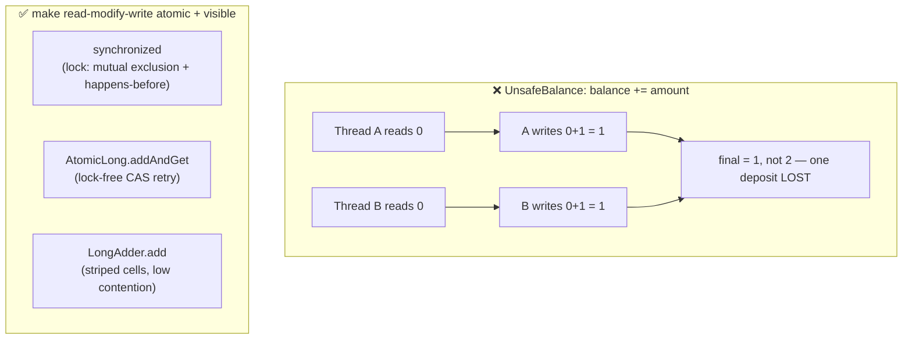
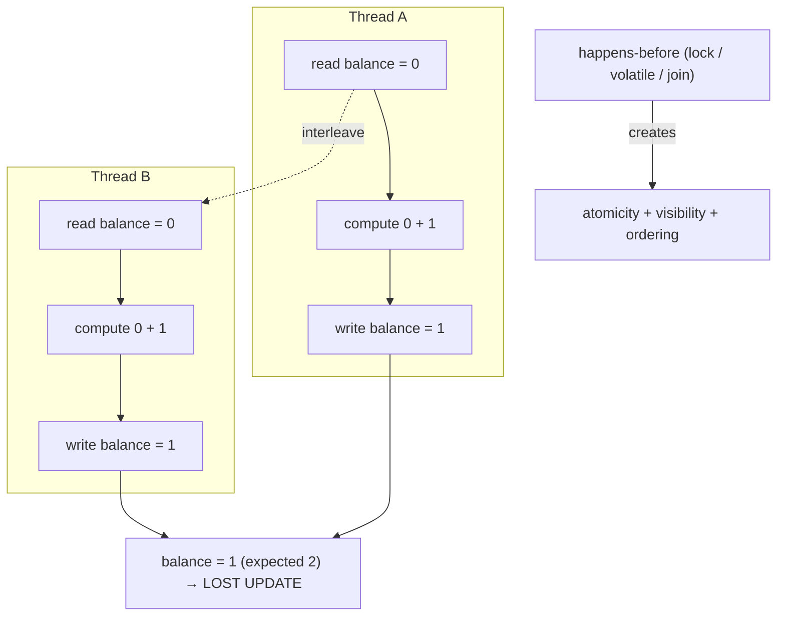
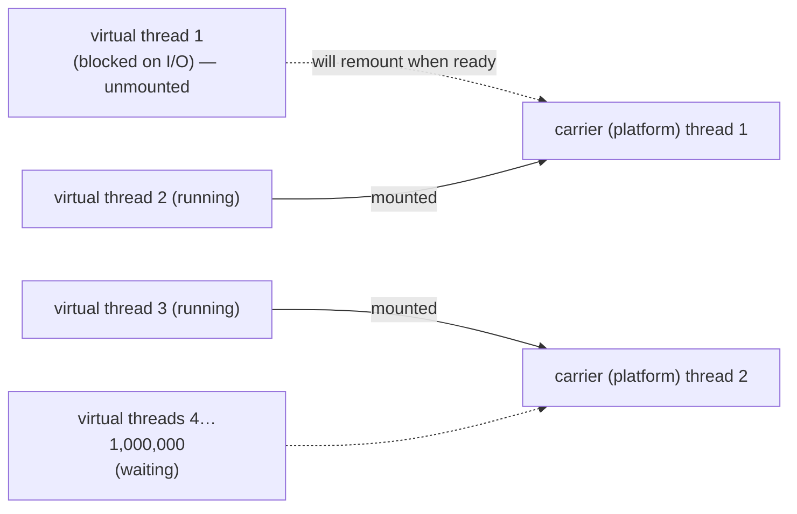
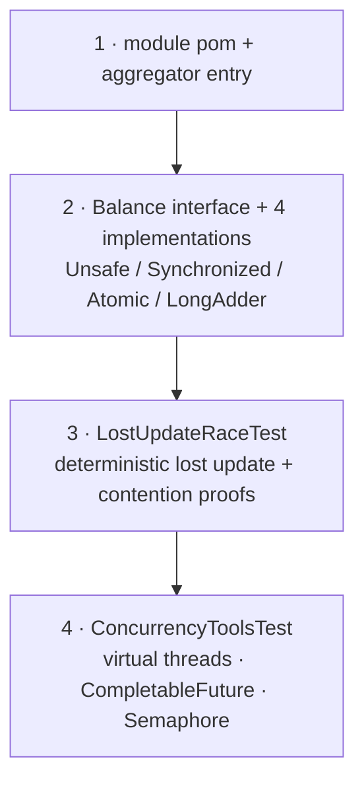
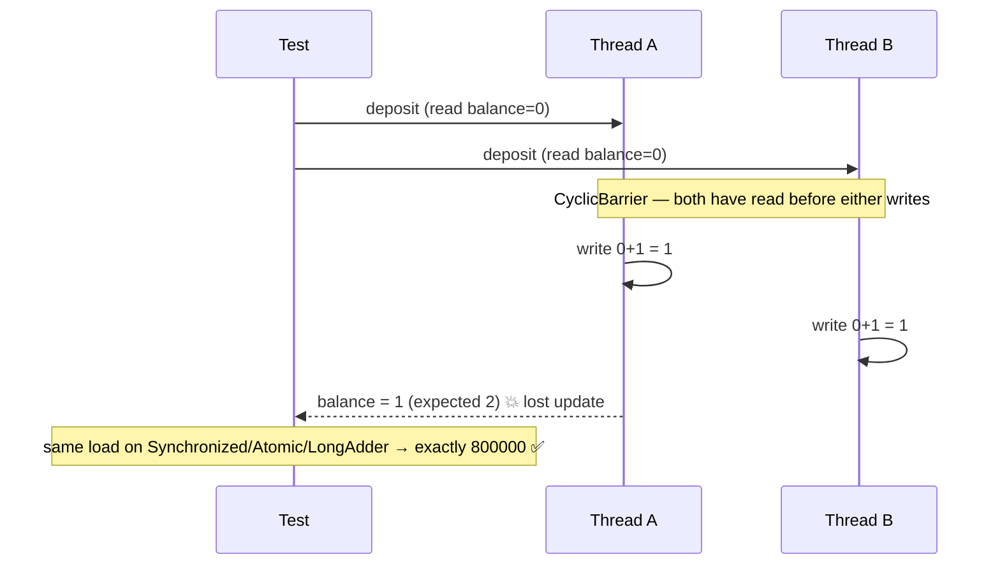

# Step 11 · Concurrency & Thread Safety in Java
### Phase B — Data, Databases, Concurrency & Transactions 🟣 · Step 11 of 67

> *In Step 10 you saw the database's answer to "two things touch one piece of state at once." Now you go
> inside the JVM and meet the same question with no database to help you. You'll force a lost-update race to
> happen on **every run**, watch an unsynchronized counter throw away **hundreds of thousands** of deposits,
> then fix it three ways — `synchronized`, `AtomicLong`, `LongAdder` — and meet virtual threads. By the end,
> "is this thread-safe?" is a question you can answer with proof.*

---

<a id="toc"></a>
## 🧭 The Six Movements of This Step

| | Movement | What happens | ~time |
|---|---|---|---|
| **A** | [🧭 Orient](#orient) | 30-second overview · skip-test · cheat card · why it matters · before you start | ~1.5 h |
| **B** | [🧠 Understand](#understand) | the Java Memory Model: atomicity, visibility, ordering, happens-before | ~4 h |
| **C** | [🛠️ Build](#build) | the `concurrency-lab`: a deterministic lost-update race, then three fixes, plus the j.u.c toolkit | ~8 h |
| **D** | [🔬 Prove](#prove) | the Verification Log — 8 lab tests green, the race quantified, the §12.3 mutation check | ~1.5 h |
| **E** | [🎓 Apply](#apply) | go deeper (JCStress) · interview prep · your-turn challenges | ~3 h |
| **F** | [🏆 Review](#review) | troubleshooting · resources · recap, flashcards & what's next | ~2 h |

---

<a id="orient"></a>

# A · 🧭 Orient

## 📋 This Step in 30 Seconds

| | |
|---|---|
| **Title** | Concurrency & Thread Safety in Java — the Java Memory Model, races, locks, atomics, and virtual threads |
| **Step** | 11 of 67 · **Phase B — Data, Databases, Concurrency & Transactions** 🟣 |
| **Effort** | ≈ 20 hours focused — split into 8 sittings in the [🗓️ Session Plan](#session-plan) below. Concurrency is the single most feared backend interview topic and the source of the nastiest production bugs — and this is where you stop fearing it. Experienced concurrency hands can skip-test and skim to ~4h. |
| **What you'll run this step** | **JVM + Maven only** — no Docker, no database. One command: `./mvnw -pl playground/concurrency-lab test`. The proofs are pure-JVM tests. |
| **Buildable artifact** | A new **`playground/concurrency-lab`** module: a `Balance` shared across many threads, with four implementations — **`UnsafeBalance`** (broken), **`SynchronizedBalance`**, **`AtomicBalance`**, **`LongAdderBalance`** — and two test classes: `LostUpdateRaceTest` (a *deterministic* lost update + high-contention proofs the fixes are exact) and `ConcurrencyToolsTest` (executors, `CompletableFuture`, **virtual threads**, `Semaphore`). 8 tests. `step-11-start == step-10-end`. |
| **Verification tier** | 🔴 **Full** — a concurrency/correctness path. `./mvnw verify` green + all **8** lab tests + the race **quantified** (a deterministic lost update; hundreds of thousands of deposits lost under contention) + the **§12.3 mutation sanity-check** (remove `synchronized` → the "exact" test fails → revert) + clean-room + `smoke.sh`. |
| **Depends on** | **[Step 10](../step-10/lesson.md)** (the database half of concurrency — isolation & MVCC) and conceptually **[Step 9](../step-09/lesson.md)** (`@Version`). Forward-references **[Step 12](../step-12/lesson.md)**, where this meets money: the ledger under concurrent transfers. |

By the end you will be able to explain the **Java Memory Model** — atomicity, visibility, ordering, and **happens-before**; explain *why* `balance += 1` is not atomic; prevent a lost update with **`synchronized`**, **`AtomicLong`** (CAS), or **`LongAdder`** (striping), and say which to use when; explain **virtual threads** (what they change and what they emphatically do *not*); use `ExecutorService`, `CompletableFuture`, and `Semaphore`; and recognise the classic bugs (races, deadlock, double-checked locking, false sharing).

### ⏭️ Can You Skip This Step? (5-minute self-check)

If you can confidently do **all** of this, skim the 🧩 Pattern Spotlight and 🚀 JCStress aside, then jump to **[Step 12 — Demand Account & the Ledger](../step-12/lesson.md)**.

- [ ] I can state the **three** things the JMM is about — **atomicity, visibility, ordering** — and define **happens-before** and name three edges that create it.
- [ ] I can explain why `count++` / `balance += x` is a **non-atomic read-modify-write**, and how a **lost update** happens at the JVM level (not just the DB level).
- [ ] I can fix it three ways — `synchronized`, `AtomicLong` (CAS), `LongAdder` — and explain the trade-offs (lock vs lock-free vs striped).
- [ ] I can explain **`volatile`** (visibility + ordering, **not** atomicity) and when it's enough vs not.
- [ ] I can explain **virtual threads** — carrier threads, mount/unmount, why blocking is cheap — and that they do **not** make racy code safe.
- [ ] I can describe **deadlock** (and lock ordering as the fix), **double-checked locking**, and why `ConcurrentHashMap` beats `synchronized` around a `HashMap`.

> [!TIP]
> Not 100%? Stay. "Is `i++` atomic?", "volatile vs synchronized?", "AtomicInteger vs a lock?", "what are virtual threads and what do they change?" are interview staples — and the strongest answers come from someone who has *forced a lost update to happen every single time* and *watched 600,000 deposits vanish*. That's this step.

## 📇 Cheat Card

> **What this step delivers (one sentence):** you prove the lost-update race at the JVM level — deterministically, and at scale (hundreds of thousands of deposits lost) — then fix it three ways (`synchronized`/`AtomicLong`/`LongAdder`), and wield the modern toolkit (executors, `CompletableFuture`, **virtual threads**, `Semaphore`).

**Key commands** (Windows uses `.\mvnw.cmd`; macOS/Linux/Git-Bash use `./mvnw`):

```bash
# Run the concurrency labs (no Docker needed):
./mvnw -pl playground/concurrency-lab test

# Just the race proofs / just the toolkit:
./mvnw -pl playground/concurrency-lab test -Dtest=LostUpdateRaceTest
./mvnw -pl playground/concurrency-lab test -Dtest=ConcurrencyToolsTest

# One-shot proof your build matches the lesson:
bash steps/step-11/smoke.sh
```

**The one headline idea — *a read-modify-write that isn't atomic loses updates; three tools make it safe*:**



*Alt-text: the broken case shows Thread A and Thread B both reading 0 then both writing 1, so the final balance is 1 instead of 2 — one deposit lost. The fix box shows three ways to make the read-modify-write atomic and visible: synchronized (a lock giving mutual exclusion and happens-before), AtomicLong.addAndGet (lock-free compare-and-swap retry), and LongAdder.add (striped cells for low contention).*

## 🎯 Why This Matters

Concurrency bugs are the ones that pass every test on your laptop and corrupt a balance in production at 2am under load — non-deterministic, hard to reproduce, and catastrophic near money. The lost-update race you'll force here is *exactly* the bug behind "the totals don't add up" incidents. And concurrency is the interview topic that separates juniors from seniors: "is `i++` atomic?", "volatile vs synchronized?", "what's a happens-before relationship?", "virtual threads — what changed?". After this step you answer from having *measured* the bug and *defeated* it, and you carry that straight into Step 12, where the same race threatens real money in the ledger.

## ✅ What You'll Be Able to Do

- **Explain the JMM** — atomicity, visibility, ordering — and the happens-before edges that `synchronized`, `volatile`, `Thread.start/join`, and `final` create.
- **Diagnose a race** — show that `balance += x` is a non-atomic read-modify-write and reproduce a lost update *deterministically*.
- **Fix it three ways** — `synchronized` (mutual exclusion), `AtomicLong` (CAS), `LongAdder` (striped) — and justify the choice.
- **Use `volatile` correctly** — for visibility/ordering of a flag, knowing it does **not** give atomicity.
- **Use the j.u.c toolkit** — `ExecutorService`, `CompletableFuture`, `Semaphore`, latches.
- **Explain virtual threads** — carriers, mount/unmount, cheap blocking, and their limits.
- **Name and avoid classic bugs** — deadlock (lock ordering), double-checked locking, false sharing.

## 🧰 Before You Start

**Prerequisites**

- ✅ You finished **[Step 10](../step-10/lesson.md)**; the repo is at `step-11-start` (== `step-10-end`) and `./mvnw verify` is green.
- ✅ A JDK 21+ (we pin **25**) — virtual threads are stable from 21. No Docker needed this step.

**What you already learned that connects here**

- **Step 10** showed isolation/MVCC — the *database's* coordination of concurrent transactions. This step is the *JVM's* side: coordinating threads inside one process. The mental model ("two things touch one state") is identical; the tools differ.
- **Step 9's `@Version`** prevents a lost update across DB transactions; `synchronized`/atomics prevent it across in-JVM threads. Same failure, different layer.
- **Forward to Step 12:** the Demand Account ledger is debited by concurrent transfers — you'll combine this step's tools with Step 10's locking to move money correctly.

> **Depends on: Step 10** (and 9 conceptually).

<a id="session-plan"></a>
## 🗓️ Session Plan

≈ 20 hours doesn't mean one heroic sitting — it means about **eight** of ~2-3 h, each ending at a real save point (a commit or a movement boundary):

| Sitting | Covers | ~time | Ends at |
|---|---|---|---|
| **S1** | A · Orient (skip-test, cheat card, why-it-matters) + B · 🧠 The Big Idea | ~2 h | end of The Big Idea |
| **S2** | B · 🧩 Pattern Spotlight + 🌱 Under the Hood + 🛡️ Security Lens + 🕰️ Then vs. Now | ~2.5 h | end of movement B |
| **S3** | C · Sub-steps 1-2 (module `pom.xml` + `Balance` & four implementations) | ~2.5 h | Sub-step 2 💾 commit |
| **S4** | C · Sub-step 3 (`LostUpdateRaceTest` — the deterministic race + three exact fixes) | ~3 h | Sub-step 3 💾 commit |
| **S5** | C · Sub-step 4 (`ConcurrencyToolsTest`) + 🎮 Play with it + Definition of Done | ~2.5 h | Sub-step 4 💾 commit |
| **S6** | D · Prove (8 tests, race quantified, §12.3 mutation check, `smoke.sh`, tag `step-11-end`) | ~1.5 h | end of movement D |
| **S7** | E · Interview prep + Your Turn exercises 1-3 | ~3 h | end of Your Turn 3 |
| **S8** | E · Stretch exercises 4-5 + F · Review, Test Yourself, flashcards, reflection | ~3 h | sign-off 🎉 |

**Optional routes:** the ⏭️ skip-test (5 min) can compress the whole step to a ~4 h skim; the Go Deeper asides cost +~20 min (① JCStress) and +~5 min each (② deadlock, ③ `ConcurrentHashMap`) whenever you choose to take them.

---

<a id="understand"></a>

# B · 🧠 Understand

## 🧠 The Big Idea

When two threads share mutable state, three independent things can go wrong. The **Java Memory Model (JMM)** is the contract that defines what's guaranteed and what isn't:

1. **Atomicity** — does an operation happen "all at once," or can another thread interleave halfway? `balance += amount` is **three** operations (read field → add → write field). Two threads can both read the old value and both write back, so one update is lost. *Not atomic.*
2. **Visibility** — when one thread writes a field, is another thread guaranteed to *see* it? Without coordination, **no** — a write may sit in a CPU cache/register and never become visible, or become visible late. (A thread can loop forever on a stale `boolean` flag.)
3. **Ordering** — the compiler, JIT, and CPU may **reorder** instructions for speed, as long as a single thread can't tell. Another thread *can* tell, and sees operations in a surprising order.

The JMM ties these together with one concept: **happens-before**. If action *A* happens-before action *B*, then *A*'s effects (its writes) are guaranteed visible to *B*, and *A* is ordered before *B*. You don't get happens-before for free — you create it with specific constructs:

- **Unlock → lock:** releasing a monitor (`synchronized` exit) happens-before any later acquire of the *same* monitor.
- **`volatile` write → read:** a write to a volatile field happens-before any later read of it.
- **`Thread.start()`** happens-before the started thread's first action; a thread's actions happen-before another thread's successful **`Thread.join()`** on it.
- **`final` fields:** correctly constructed, they're visible to other threads without extra synchronization (safe publication).

> **Analogy — the shared whiteboard with no rules.** Two clerks update a balance written on a whiteboard. Clerk A reads "100," gets distracted, Clerk B reads "100," both compute "+50 = 150," both write "150." Two deposits, but the board says 150, not 200 — a **lost update** (atomicity). Worse, each clerk has a *private notepad* (CPU cache); A might write "150" only on her notepad and never on the board, so B never sees it (visibility). And a clever clerk might do quick tasks **out of order** to save steps (ordering). A **lock** (`synchronized`) is the rule "only one clerk at the board at a time, and you must copy the board to your notepad when you take the lock and back when you release it" — fixing all three at once.



*Alt-text: Thread A and Thread B each read balance 0, compute 0+1, and write 1; their steps interleave so the final balance is 1 instead of 2 — a lost update. Separately, a happens-before relationship (created by a lock, volatile, or join) provides atomicity, visibility, and ordering together.*

The whole step is: **see the three failures, then create happens-before to fix them.**

## 🧩 Pattern Spotlight — Lock-Free with Compare-And-Swap (CAS)

> **Problem.** A lock serializes threads: only one is in the critical section, the rest block. For a tiny operation like incrementing a counter, the lock's overhead and the blocking dominate.

> **Why CAS fits.** A **compare-and-swap** is a single atomic CPU instruction: "set this memory to *new* only if it currently equals *expected*." `AtomicLong.addAndGet` loops: read the current value, compute the new one, `compareAndSet`; if another thread changed it in between, the CAS fails and we retry. No lock is held, so threads never block each other — they just occasionally retry. This is **optimistic** (compare it to Step 9's `@Version`!).

> **How it works (the mechanism).** Modern CPUs expose CAS (`LOCK CMPXCHG` on x86); the JDK reaches it via `VarHandle`/`Unsafe`. Because the swap is conditional on the expected value, two threads can't both "win" — exactly one CAS succeeds, the other retries with the fresh value. No update is lost.

> **Alternatives / trade-offs.** Under *low* contention, CAS beats locks. Under *very high* contention, many threads CAS the same hot field and spin on retries (and suffer **false sharing** on the cache line) — that's where **`LongAdder`** wins by spreading the count across multiple cells so threads usually touch *different* memory. And when the operation is more than one field (an invariant across several), you need a **lock** (or a transaction) — CAS is for single-location updates. **Rule of thumb:** one counter, low contention → `AtomicLong`; one counter, high contention → `LongAdder`; multi-field invariant → `synchronized`/`Lock`.

> **Implementation (here).** `AtomicBalance` uses `AtomicLong.addAndGet`; `LongAdderBalance` uses `LongAdder.add`. Both pass the high-contention test exactly.

## 🌱 Under the Hood: How It Really Works

**Why `balance += amount` loses updates.** It compiles to roughly: `getfield balance` → `ladd` → `putfield balance`. Three bytecodes, not one. Two threads can both execute `getfield` (both read 100), both `ladd` (both compute 150), both `putfield` (both write 150). One increment is gone. We prove this **deterministically** in the lab with a `CyclicBarrier` that forces both threads to read *before* either writes — so a lost update happens on *every* run, not just "sometimes."

<details>
<summary>🌿 Optional (+~2 min): long/double word-tearing — a JLS subtlety</summary>

**Long/double word-tearing.** The JLS only guarantees that reads/writes of `int`, references, and smaller types are atomic; for non-`volatile` `long`/`double`, a 32-bit JVM may write the two halves separately ("word tearing"). On 64-bit JVMs they're effectively atomic, but the spec only promises it if the field is `volatile`. (Our race is about the read-modify-write, not tearing — but it's worth knowing.)
</details>

**What `synchronized` actually does.** Entering a `synchronized` method/block acquires the object's **monitor** (intrinsic lock); only one thread holds it at a time (atomicity for the whole block), and the JMM says the previous holder's release **happens-before** your acquire — so you see all its writes (visibility) in order (ordering). It fixes all three failures at once. Cost: threads contend and block on the monitor; under heavy contention that serialization is the bottleneck.

**What `volatile` does — and doesn't.** A `volatile` field gives **visibility** (a write is immediately visible to other threads' reads) and **ordering** (it's a memory barrier — no reordering across it), and reads/writes of it are atomic (even for `long`/`double`). But it does **not** make a compound action atomic: `volatileCounter++` still loses updates, because the increment is still read-modify-write. Use `volatile` for a **flag** (one thread writes, others read — e.g. a `stop` signal), not for a counter.

❓ **Quick check:** `volatile long counter; counter++` — thread-safe or not? <details><summary>answer</summary>Not safe. `volatile` makes each read and each write atomic and visible, but `++` is still three steps (read → add → write) — two threads can still read the same value and lose an update. You'll prove exactly this in Your Turn exercise 2.</details>

**`AtomicLong` (CAS) vs `LongAdder` (striping).** `AtomicLong` holds one `volatile long` and CASes it; correct and fast at low contention, but a hot field means many threads CAS the same cache line (retries + false sharing). `LongAdder` keeps a `base` plus an array of `Cell`s; each thread hashes to a cell and adds there, so concurrent adds usually hit *different* cells (no contention); `sum()` adds `base` + all cells. Trade-off: faster writes under contention, but `sum()` is an aggregate (slightly stale if reads race writes) — ideal for counters/metrics where writes vastly outnumber reads.

| | Mechanism | Best at | Cost |
|---|---|---|---|
| `synchronized` | monitor lock: mutual exclusion + happens-before | multi-field invariants; any contention | threads block; serializes under load |
| `AtomicLong` | lock-free CAS retry on one field | single counter, low/medium contention | hot-field CAS retries + false sharing when contended |
| `LongAdder` | striped cells, summed on read | single counter, high write contention | `sum()` is an aggregate (slightly stale under racing reads) |

**Virtual threads (JEP 444, stable since Java 21).** A **platform thread** maps 1:1 to an OS thread — expensive (~1MB stack), so you pool them. A **virtual thread** is a lightweight thread the JVM schedules onto a small pool of **carrier** (platform) threads. When a virtual thread runs, it **mounts** a carrier; when it **blocks** (I/O, `sleep`, most `java.util.concurrent` waits), it **unmounts**, freeing the carrier to run another virtual thread. So you can have *millions* of virtual threads and write simple blocking code — `Executors.newVirtualThreadPerTaskExecutor()` gives one per task. **Crucial:** virtual threads make *blocking cheap*; they do **not** change the memory model and do **not** make racy code safe — `UnsafeBalance` is just as broken on virtual threads. *(Caveat: older JDKs "pinned" the carrier inside `synchronized` blocks; recent JDKs greatly reduced that — verify for your JDK; prefer `ReentrantLock` over `synchronized` around blocking calls if pinning matters to you.)*



*Alt-text: many virtual threads share two carrier (platform) threads. Running virtual threads are mounted on a carrier; a virtual thread blocked on I/O is unmounted (freeing its carrier) and remounts when ready; the remaining virtual threads — up to millions — wait their turn.*

**ExecutorService is `AutoCloseable` (Java 19+).** `try (var ex = Executors.new...()) { ex.submit(...); }` — `close()` does an orderly shutdown that **waits** for submitted tasks to finish, so the lab can assert all 10,000 ran. `CompletableFuture` composes async steps (`thenCombine`, `thenCompose`, `allOf`) without manual thread juggling. `Semaphore(n)` hands out `n` permits — a clean way to **bound concurrency** (e.g. limit in-flight calls to a downstream service).

**Classic bugs (named so you avoid them).**
- **Deadlock** — two threads each hold a lock the other needs. Fix: a **global lock ordering** (always acquire A before B), or `tryLock` with timeout.
- **Double-checked locking** — the lazy-singleton trick is broken unless the field is `volatile` (without it, another thread can see a half-constructed object due to reordering).
- **False sharing** — two unrelated fields on the same 64-byte cache line cause cores to fight over it; `LongAdder`/`@Contended` mitigate it.
- **Check-then-act / TOCTOU** — `if (!map.containsKey(k)) map.put(k, v)` is racy; use `putIfAbsent`/`computeIfAbsent` on a `ConcurrentHashMap`.

## 🛡️ Security Lens: What Could Go Wrong

- **Races are security bugs, not just correctness bugs.** A **TOCTOU** (time-of-check-to-time-of-use) race — check a balance/limit/permission, then act on it — lets an attacker double-spend or bypass a check by racing two requests. The classic "withdraw the same balance twice with two simultaneous requests" is a lost-update race wearing a fraud hat. Make check-and-act **atomic** (a lock, an atomic op, or a DB constraint/`@Version`).
- **Thread/connection exhaustion is a DoS surface.** Unbounded thread creation (or blocking platform threads on slow I/O) lets a flood of requests exhaust memory/threads. Bound concurrency (a `Semaphore`, a sized pool) and prefer virtual threads for blocking workloads — but still bound the *downstream* (the database pool from Step 10!).
- **Visibility bugs hide security state.** A non-`volatile` "account locked" or "session revoked" flag might never be seen by another thread, so a revoked session keeps working. Publish security-relevant flags safely (`volatile`/atomic).

## 🕰️ Then vs. Now (How This Changed Across Versions)

| Topic | Then | Now | Why it changed |
|---|---|---|---|
| **Threading model** | One thread per request, threads pooled (expensive OS threads) — the pool size capped concurrency. | **Virtual threads** (Java 21): a thread per task, blocking is cheap, millions are fine. | Frees you from reactive/callback complexity for I/O-bound work — simple blocking code that scales. |
| **Raw threads** | `new Thread(...).start()`, manual `Thread` management. | `ExecutorService` / `CompletableFuture` (Java 5 / 8) — submit tasks, compose results. | Higher-level, safer, composable; you rarely touch `Thread` directly. |
| **Locks** | `synchronized` everywhere. | Often **atomics** (`AtomicLong`, `LongAdder`) and `java.util.concurrent.locks` (`ReentrantLock`, `ReadWriteLock`) for finer control. | Lock-free where possible (throughput); explicit locks where you need `tryLock`/fairness. |
| **Concurrent collections** | `Collections.synchronizedMap(new HashMap<>())` (coarse lock). | `ConcurrentHashMap` + atomic `computeIfAbsent`/`merge`. | Lock-striping + atomic compound ops → far better concurrency and no check-then-act races. |
| **Structured concurrency / scoped values** | manual fan-out/join, `ThreadLocal`. | `StructuredTaskScope`, scoped values — *newer/preview* (verify status in your JDK). | Treats a group of subtasks as a unit (all-or-nothing, cancellation propagation). |

> [!NOTE]
> *Verify, don't guess.* Virtual threads are **final/stable since Java 21** (JEP 444) — we pin **25**. Structured concurrency and scoped values were **preview** through recent JDKs; **check your JDK** before relying on them in production. Carrier **pinning** inside `synchronized` has been progressively reduced in recent JDKs — verify the exact behaviour for your version. The atomics/locks/collections APIs here are stable and unchanged.

## 🧵 Thread-safety note

This **is** the thread-safety step — the one the whole course's 🧵 notes point back to. The rule going forward: **any shared mutable state touched by more than one thread needs a coordination strategy** — confinement (don't share), immutability (can't mutate), or synchronization (`synchronized`/atomics/locks). From Step 12 on, every step with shared state (the ledger, caches, the fraud stream) will call back here. The deepest connection: Step 9's `@Version`, Step 10's SERIALIZABLE/`FOR UPDATE`, and this step's `synchronized`/CAS are the **same idea at three layers** — make "two things touch one state" safe.

---

<a id="build"></a>

# C · 🛠️ Build

## 📦 Your Starting Point

You're at **`step-11-start`** (== `step-10-end`). The repo builds with 5 modules. This step adds a 6th — `playground/concurrency-lab` — a pure-JUnit module (no Spring, no Docker), following the `playground/*` convention (ADR-0003) for non-service learning code.

Confirm you're at the right start — fast and Docker-free, keeping this step's "JVM + Maven only" promise:
```bash
git describe --tags   # expect step-11-start (== step-10-end)
./mvnw -q validate    # reactor wiring is sane; runs no tests, needs no Docker
```
(The full `./mvnw verify` — which *does* need Docker for cif's Testcontainers tests — is deferred to the 🔬 Prove movement.)

## 🛠️ Let's Build It — Step by Step



🌳 **Files we'll touch** (all new):
```
playground/concurrency-lab/
├── pom.xml                                              # 1 · pure JUnit 5 + AssertJ module
└── src/
    ├── main/java/com/buildabank/concurrency/
    │   ├── Balance.java                                 # 2 · the shared-balance interface
    │   ├── UnsafeBalance.java                           #     broken: balance += amount
    │   ├── SynchronizedBalance.java                     #     fix A: mutual exclusion
    │   ├── AtomicBalance.java                           #     fix B: AtomicLong CAS
    │   └── LongAdderBalance.java                        #     fix C: LongAdder striping
    └── test/java/com/buildabank/concurrency/
        ├── LostUpdateRaceTest.java                      # 3 · the race, deterministic + at scale
        └── ConcurrencyToolsTest.java                    # 4 · executors, futures, virtual threads
pom.xml                                                  # + <module>playground/concurrency-lab</module>
steps/step-11/smoke.sh
```

---

### Sub-step 1 of 4 — The module 🧭 *(you are here: **module** → balances → race test → tools test)*

🎯 **Goal:** a new pure-JUnit Maven module for the concurrency labs.

📁 **Location:** new file → `playground/concurrency-lab/pom.xml`, and add one line to the root `pom.xml`.

⌨️ **Code** — the complete file:
```xml
<?xml version="1.0" encoding="UTF-8"?>
<!-- playground/concurrency-lab/pom.xml -->
<project xmlns="http://maven.apache.org/POM/4.0.0"
         xmlns:xsi="http://www.w3.org/2001/XMLSchema-instance"
         xsi:schemaLocation="http://maven.apache.org/POM/4.0.0 https://maven.apache.org/xsd/maven-4.0.0.xsd">
    <modelVersion>4.0.0</modelVersion>

    <!--
      concurrency-lab — the Step 11 concurrency & thread-safety primer (plain Java, no Spring).
      Banking-flavoured examples (a shared account balance) that prove the Java Memory Model the hard way:
      a lost-update race shown FAILING, then fixed with synchronized / AtomicLong / LongAdder and proven
      correct under heavy contention. Pure JUnit 5 + AssertJ; everything runs in `./mvnw verify`.
    -->
    <parent>
        <groupId>com.buildabank</groupId>
        <artifactId>build-a-bank-parent</artifactId>
        <version>0.1.0-SNAPSHOT</version>
        <relativePath>../../pom.xml</relativePath>
    </parent>

    <artifactId>concurrency-lab</artifactId>
    <name>Build-a-Bank :: Playground :: Concurrency Lab</name>
    <description>Concurrency and thread safety — JMM, races, atomics, executors, virtual threads (Step 11).</description>

    <dependencies>
        <dependency>
            <groupId>org.junit.jupiter</groupId>
            <artifactId>junit-jupiter</artifactId>
            <scope>test</scope>
        </dependency>
        <dependency>
            <groupId>org.assertj</groupId>
            <artifactId>assertj-core</artifactId>
            <scope>test</scope>
        </dependency>
    </dependencies>
</project>
```
And in the root `pom.xml` `<modules>` block, add:
```xml
<module>playground/concurrency-lab</module>
```

🔍 **Line-by-line:** inherits the Spring Boot **parent** purely for managed JUnit/AssertJ versions (no Spring runtime). `<scope>test</scope>` keeps the test libraries out of any (empty) jar. The `<module>` line wires it into the reactor so `./mvnw verify` builds it. Note the `<description>` says "Concurrency **and** thread safety" — see the pitfall below.

⚠️ **Pitfall:** an `&` inside `<description>` is invalid XML — write `and` or `&amp;`. (Ask me how I know.)

▶️ **Run & See** *(fresh capture 2026-07-02, worktree at `step-11-end`)*:
```bash
./mvnw -pl playground/concurrency-lab -am compile
```
✅ **Expected output** — the reactor now knows the module (the proof the `<module>` line landed):
```
[INFO] Building Build-a-Bank :: Parent 0.1.0-SNAPSHOT                     [1/2]
[INFO] Building Build-a-Bank :: Playground :: Concurrency Lab 0.1.0-SNAPSHOT [2/2]
[INFO] BUILD SUCCESS
[INFO] Total time:  0.883 s
```

💾 **Commit:** `git add playground/concurrency-lab/pom.xml pom.xml && git commit -m "build(concurrency-lab): add Step 11 module"`

---

### Sub-step 2 of 4 — `Balance` and its four implementations 🧭 *(module ✅ → **balances** → race test → tools test)*

🎯 **Goal:** one interface, four implementations spanning broken → correct, so a single test can hammer each and compare.

📁 **Location:** `playground/concurrency-lab/src/main/java/com/buildabank/concurrency/`

⌨️ **Code** — five files, each complete. First the interface and the broken one:
```java
// playground/concurrency-lab/src/main/java/com/buildabank/concurrency/Balance.java
package com.buildabank.concurrency;

/**
 * A shared, mutable account balance hammered by many threads at once — the simplest possible model of the
 * bank's central thread-safety problem. Four implementations show the spectrum from broken to correct:
 * {@link UnsafeBalance}, {@link SynchronizedBalance}, {@link AtomicBalance}, {@link LongAdderBalance}.
 *
 * <p>{@code deposit} is a read-modify-write ("read the balance, add, write it back") — the classic
 * operation that loses updates when two threads interleave without coordination.
 */
public interface Balance {

    /** Add {@code amount} minor units to the balance. */
    void deposit(long amount);

    /** The current balance in minor units. */
    long get();
}
```
```java
// playground/concurrency-lab/src/main/java/com/buildabank/concurrency/UnsafeBalance.java
package com.buildabank.concurrency;

/**
 * BROKEN on purpose. {@code balance += amount} looks atomic but is three steps under the hood — read the
 * field, add, write it back. Two threads can both read the same old value and both write back, so one
 * deposit is silently lost. The field isn't even {@code volatile}, so updates may also be invisible across
 * threads. This is the bug we prove, then fix.
 */
public class UnsafeBalance implements Balance {

    private long balance;

    @Override
    public void deposit(long amount) {
        balance += amount;   // read-modify-write — NOT atomic
    }

    @Override
    public long get() {
        return balance;
    }
}
```
Then the three fixes:
```java
// playground/concurrency-lab/src/main/java/com/buildabank/concurrency/SynchronizedBalance.java
package com.buildabank.concurrency;

/**
 * Correct via <strong>mutual exclusion</strong>. {@code synchronized} makes the whole read-modify-write
 * happen under the object's intrinsic lock, so only one thread is inside {@code deposit} at a time
 * (atomicity) and the lock's release/acquire establishes a <strong>happens-before</strong> edge, so each
 * thread sees the previous one's write (visibility). Simple and correct; the cost is that threads serialize
 * on the lock under contention.
 */
public class SynchronizedBalance implements Balance {

    private long balance;

    @Override
    public synchronized void deposit(long amount) {
        balance += amount;
    }

    @Override
    public synchronized long get() {
        return balance;
    }
}
```
```java
// playground/concurrency-lab/src/main/java/com/buildabank/concurrency/AtomicBalance.java
package com.buildabank.concurrency;

import java.util.concurrent.atomic.AtomicLong;

/**
 * Correct via <strong>lock-free</strong> atomics. {@link AtomicLong#addAndGet} is a single hardware
 * compare-and-swap (CAS) loop: read the value, compute the new one, and atomically swap it in only if it
 * hasn't changed — retrying if it has. No lock is held, so threads don't block each other; under very high
 * contention the CAS retries can spin (that's what {@link LongAdderBalance} improves on).
 */
public class AtomicBalance implements Balance {

    private final AtomicLong balance = new AtomicLong();

    @Override
    public void deposit(long amount) {
        balance.addAndGet(amount);   // atomic CAS — no lock
    }

    @Override
    public long get() {
        return balance.get();
    }
}
```
```java
// playground/concurrency-lab/src/main/java/com/buildabank/concurrency/LongAdderBalance.java
package com.buildabank.concurrency;

import java.util.concurrent.atomic.LongAdder;

/**
 * Correct and <strong>contention-friendly</strong>. {@link LongAdder} spreads the count across multiple
 * internal cells, so concurrent threads usually update <em>different</em> cells (no CAS contention, no
 * false sharing of one hot field); {@link LongAdder#sum} adds the cells when you read. The trade-off vs
 * {@link AtomicLong}: faster writes under heavy contention, but {@code sum()} is a (still cheap) aggregate
 * rather than a single read — ideal for high-throughput counters/metrics where reads are rare.
 */
public class LongAdderBalance implements Balance {

    private final LongAdder balance = new LongAdder();

    @Override
    public void deposit(long amount) {
        balance.add(amount);
    }

    @Override
    public long get() {
        return balance.sum();
    }
}
```

🔍 **Line-by-line:** `UnsafeBalance.deposit` is the three-step read-modify-write — the bug. `SynchronizedBalance` wraps it in the monitor (atomicity + happens-before). `AtomicBalance` uses a CAS loop (lock-free). `LongAdderBalance` spreads the count across cells (`get()` is `sum()`).

🔮 **Predict** (before reading on): if you dropped `synchronized` from `SynchronizedBalance.get()` — keeping it on `deposit` — which JMM property breaks: atomicity or visibility?

💭 **Under the hood (the answer):** visibility. `synchronized` on `get()` too isn't paranoia — deposits would still happen one at a time (atomicity intact), but without the monitor's happens-before edge a reader could see a stale `balance`. The atomic/adder reads are already safe.

❓ **Quick check** — cover the code above: which implementation is lock, which is CAS, which is striped, which is broken? <details><summary>answer</summary>`SynchronizedBalance` = lock (the monitor), `AtomicBalance` = CAS (`addAndGet` retry loop), `LongAdderBalance` = striped cells (`sum()` on read), `UnsafeBalance` = broken (`+=` is a non-atomic read-modify-write).</details>

▶️ **Run & See** *(fresh capture 2026-07-02, worktree at `step-11-end`)*:
```bash
./mvnw -pl playground/concurrency-lab clean compile
```
✅ **Expected output** — all five files compile:
```
[INFO] Compiling 5 source files with javac [debug parameters release 25] to target\classes
[INFO] BUILD SUCCESS
[INFO] Total time:  1.463 s
```

✋ **Checkpoint:** five files compile (`./mvnw -pl playground/concurrency-lab -am compile`).

💾 **Commit:** `git add playground/concurrency-lab/src/main && git commit -m "feat(concurrency-lab): Balance + Unsafe/Synchronized/Atomic/LongAdder"`

🪫 **Stopping here?** You have the module wired into the reactor and five compiled classes, all committed. Next: **Sub-step 3 — `LostUpdateRaceTest`**; first action: create `playground/concurrency-lab/src/test/java/com/buildabank/concurrency/LostUpdateRaceTest.java`.

---

### Sub-step 3 of 4 — `LostUpdateRaceTest`: force the race, then prove the fixes 🧭 *(module ✅ → balances ✅ → **race test** → tools test)*

🎯 **Goal:** make a lost update happen on **every** run (no flakiness), then prove `synchronized`/`AtomicLong`/`LongAdder` are exactly correct under heavy contention.

📁 **Location:** `playground/concurrency-lab/src/test/java/com/buildabank/concurrency/LostUpdateRaceTest.java`

⌨️ **Code** — the complete file: the deterministic proof, the contention proofs (8 threads × 100,000 deposits), and the `hammer`/`awaitQuietly` helpers:
```java
// playground/concurrency-lab/src/test/java/com/buildabank/concurrency/LostUpdateRaceTest.java
package com.buildabank.concurrency;

import static org.assertj.core.api.Assertions.assertThat;

import java.util.concurrent.CyclicBarrier;

import org.junit.jupiter.api.Test;

/**
 * Proves the <strong>lost-update race</strong> the hard way, then proves the three fixes.
 *
 * <p>The headline test forces the race <em>deterministically</em> with a {@link CyclicBarrier}: two threads
 * both read the balance (0), wait until both have read, then both write back (1) — so one of two +1 deposits
 * is silently lost, <em>every single run</em>. No flakiness, no "run it 1000 times and hope." The contention
 * tests then show {@link UnsafeBalance} can lose deposits at scale while {@code synchronized}, {@link
 * AtomicBalance}, and {@link LongAdderBalance} are exactly correct.
 */
class LostUpdateRaceTest {

    private static final int THREADS = 8;
    private static final int DEPOSITS_PER_THREAD = 100_000;
    private static final long EXPECTED = (long) THREADS * DEPOSITS_PER_THREAD;

    @Test
    void lostUpdate_isDeterministic_whenReadAndWriteAreNotAtomic() throws Exception {
        long[] balance = {0};                       // shared mutable state (array so it's effectively final)
        CyclicBarrier bothHaveRead = new CyclicBarrier(2);

        Runnable depositOne = () -> {
            long seen = balance[0];                 // 1) both threads read the SAME old value (0)
            awaitQuietly(bothHaveRead);             // 2) wait until BOTH have read before either writes
            balance[0] = seen + 1;                  // 3) both write back 1 → one deposit is lost
        };

        Thread a = new Thread(depositOne, "depositor-A");
        Thread b = new Thread(depositOne, "depositor-B");
        a.start();
        b.start();
        a.join();
        b.join();

        System.out.println("[race] two +1 deposits, interleaved read-modify-write → balance = " + balance[0]);
        assertThat(balance[0])
                .as("two deposits of 1, but the read-modify-write interleaved → exactly one was lost")
                .isEqualTo(1L);                     // NOT 2 — a deterministic lost update
    }

    @Test
    void unsafeBalance_canLoseDepositsUnderContention() throws Exception {
        long result = hammer(new UnsafeBalance());
        System.out.println("[race] UnsafeBalance under " + THREADS + "×" + DEPOSITS_PER_THREAD
                + ": expected=" + EXPECTED + " actual=" + result + "  (lost " + (EXPECTED - result) + ")");
        // Deterministic, never-flaky assertion: an unsynchronized counter can only LOSE updates, never invent
        // them — so it is always <= EXPECTED. (Run it and watch `actual` fall short of `expected`.)
        assertThat(result).isLessThanOrEqualTo(EXPECTED);
    }

    @Test
    void synchronizedBalance_isExact() throws Exception {
        assertThat(hammer(new SynchronizedBalance())).isEqualTo(EXPECTED);
    }

    @Test
    void atomicBalance_isExact() throws Exception {
        assertThat(hammer(new AtomicBalance())).isEqualTo(EXPECTED);
    }

    @Test
    void longAdderBalance_isExact() throws Exception {
        assertThat(hammer(new LongAdderBalance())).isEqualTo(EXPECTED);
    }

    /** Run THREADS threads, each depositing 1 a fixed number of times; join (which publishes the result). */
    private static long hammer(Balance balance) throws InterruptedException {
        Thread[] threads = new Thread[THREADS];
        for (int i = 0; i < THREADS; i++) {
            threads[i] = new Thread(() -> {
                for (int j = 0; j < DEPOSITS_PER_THREAD; j++) {
                    balance.deposit(1);
                }
            });
        }
        for (Thread t : threads) {
            t.start();
        }
        for (Thread t : threads) {
            t.join();   // join establishes happens-before, so get() below sees all writes
        }
        return balance.get();
    }

    private static void awaitQuietly(CyclicBarrier barrier) {
        try {
            barrier.await();
        } catch (Exception e) {
            throw new RuntimeException(e);
        }
    }
}
```

🔍 **Line-by-line:**
- The **`CyclicBarrier(2)`** is the trick: each thread reads, then `await()`s; the barrier only releases once *both* have arrived (i.e. both have read 0). Then both write 1. Result is **always** 1 — a guaranteed lost update, no "run it 1000 times and hope."
- `hammer(...)` runs 8 threads each depositing 1 a hundred thousand times, then `join`s (which publishes the result safely) and returns `get()`.
- The unsafe assertion is `<= EXPECTED` — **always true** (an unsynchronized counter can only *lose*, never over-count), so the test is **never flaky**; the *printed* number shows the real loss. The three fix tests assert **exactly** `EXPECTED` (800,000).

🔮 **Predict:** for `unsafeBalance`, will `actual` equal 800,000? (Run it — and look at how much it lost.)

▶️ **Run & See:**
```bash
./mvnw -pl playground/concurrency-lab test -Dtest=LostUpdateRaceTest
```
✅ **Expected output** (real run — your "lost" number will vary, but `synchronized`/atomic/adder are always exact):
```
[race] two +1 deposits, interleaved read-modify-write → balance = 1
[race] UnsafeBalance under 8×100000: expected=800000 actual=190942  (lost 609058)
... Tests run: 5, Failures: 0, Errors: 0, Skipped: 0
```

🔬 **Break-it (30s):** change `atomicBalance_isExact` to use `new UnsafeBalance()` and rerun — it fails with a number far below 800,000. *That's the bug, caught by the test.* Put it back. (This is exactly the §12.3 mutation check below.)

✋ **Checkpoint:** five green tests; you can explain why the unsafe one loses and the others don't.

💾 **Commit:** `git add .../LostUpdateRaceTest.java && git commit -m "test(concurrency-lab): deterministic lost update + exact fixes"`

⚠️ **Pitfall:** asserting "the unsafe counter *must* be < expected" would be **flaky** (it usually loses, but not guaranteed). We assert `<= expected` and rely on the deterministic barrier test for the proof. Never write a flaky assertion (§12.5).

🪫 **Stopping here?** You have 5 green race tests committed — the lost update proven deterministically and fixed three ways. Next: **Sub-step 4 — `ConcurrencyToolsTest`**; first action: create `ConcurrencyToolsTest.java` next to `LostUpdateRaceTest.java`.

---

### Sub-step 4 of 4 — `ConcurrencyToolsTest`: the modern toolkit 🧭 *(module ✅ → balances ✅ → race test ✅ → **tools test**)*

🎯 **Goal:** use `ExecutorService` (virtual threads), `CompletableFuture`, and `Semaphore` the way the bank will.

📁 **Location:** `playground/concurrency-lab/src/test/java/com/buildabank/concurrency/ConcurrencyToolsTest.java`

⌨️ **Code** — the complete file, three tests. The scaffold fades here: the `Semaphore` lambda body is **yours to write** from the invariant in the ✍️ comment (solution collapsed below — try before you peek):
```java
// playground/concurrency-lab/src/test/java/com/buildabank/concurrency/ConcurrencyToolsTest.java
package com.buildabank.concurrency;

import static org.assertj.core.api.Assertions.assertThat;

import java.util.concurrent.CompletableFuture;
import java.util.concurrent.ExecutorService;
import java.util.concurrent.Executors;
import java.util.concurrent.Semaphore;
import java.util.concurrent.atomic.AtomicInteger;
import java.util.concurrent.atomic.LongAdder;

import org.junit.jupiter.api.Test;

/**
 * The modern {@code java.util.concurrent} toolkit — used the way the bank will: an {@link ExecutorService}
 * (here backed by <strong>virtual threads</strong>, JDK 21+/stable in 25), {@link CompletableFuture}
 * composition, and a {@link Semaphore} bounding concurrency (e.g. limiting calls to a downstream service).
 */
class ConcurrencyToolsTest {

    @Test
    void virtualThreads_runManyTasksConcurrently() throws Exception {
        int tasks = 10_000;
        LongAdder completed = new LongAdder();

        // newVirtualThreadPerTaskExecutor: one lightweight virtual thread per task — 10k is trivial.
        // ExecutorService is AutoCloseable (Java 19+): close() waits for all tasks to finish.
        try (ExecutorService executor = Executors.newVirtualThreadPerTaskExecutor()) {
            for (int i = 0; i < tasks; i++) {
                executor.submit(completed::increment);
            }
        }

        System.out.println("[tools] virtual threads completed " + completed.sum() + " / " + tasks + " tasks");
        assertThat(completed.sum()).isEqualTo(tasks);
    }

    @Test
    void completableFuture_composesAsyncWork() throws Exception {
        CompletableFuture<Long> fees = CompletableFuture.supplyAsync(() -> 100L);
        CompletableFuture<Long> interest = CompletableFuture.supplyAsync(() -> 50L);

        long total = fees.thenCombine(interest, Long::sum).get();   // run both, then combine

        assertThat(total).isEqualTo(150L);
    }

    @Test
    void semaphore_capsConcurrentAccess() throws Exception {
        int permits = 3;
        Semaphore limiter = new Semaphore(permits);
        AtomicInteger inFlight = new AtomicInteger();
        AtomicInteger maxObserved = new AtomicInteger();

        try (ExecutorService executor = Executors.newVirtualThreadPerTaskExecutor()) {
            for (int i = 0; i < 100; i++) {
                executor.submit(() -> {
                    // ✍️ YOUR TURN (~8 lines) — enforce the invariant "at most `permits` tasks in flight":
                    //   acquire a permit → record inFlight.incrementAndGet() into maxObserved (Math::max)
                    //   → Thread.sleep(1) to hold the permit briefly → decrement inFlight
                    //   → on InterruptedException, restore the interrupt flag
                    //   → ALWAYS release the permit (finally).
                });
            }
        }

        System.out.println("[tools] semaphore(" + permits + ") capped concurrency at " + maxObserved.get());
        assertThat(maxObserved.get()).isLessThanOrEqualTo(permits);   // never more than `permits` at once
    }
}
```

<details>
<summary>✅ The Semaphore lambda body (compare after you've written yours — the Run & See below assumes the finished body)</summary>

```java
                    try {
                        limiter.acquire();
                        int now = inFlight.incrementAndGet();
                        maxObserved.accumulateAndGet(now, Math::max);
                        Thread.sleep(1);                 // hold the permit briefly
                        inFlight.decrementAndGet();
                    } catch (InterruptedException e) {
                        Thread.currentThread().interrupt();
                    } finally {
                        limiter.release();
                    }
```
</details>

🔍 **Line-by-line:** `newVirtualThreadPerTaskExecutor()` gives one virtual thread per task — 10,000 is trivial. The try-with-resources `close()` waits for completion, so the `LongAdder` is complete when we assert. `thenCombine` runs both suppliers async and applies `Long::sum` once **both** complete (its sibling `allOf` waits on any number of futures; `thenCompose` chains a future-returning step) — no manual thread juggling. The `Semaphore(3)` lets at most 3 tasks into the critical section at once; `maxObserved` can never exceed 3 — a deterministic invariant (great for "limit calls to a downstream service").

🔮 **Predict:** can the combined `fees.thenCombine(interest, ...)` future ever complete *before* both input futures have? (Run it — `thenCombine` fires only after **both** inputs complete; that's the whole point.)

▶️ **Run & See:**
```bash
./mvnw -pl playground/concurrency-lab test -Dtest=ConcurrencyToolsTest
```
✅ **Expected output:**
```
[tools] semaphore(3) capped concurrency at 3
[tools] virtual threads completed 10000 / 10000 tasks
... Tests run: 3, Failures: 0, Errors: 0, Skipped: 0
```

✋ **Checkpoint:** 8 tests total across both classes; you can explain what a virtual thread is and what a `Semaphore` bounds.

💾 **Commit:** `git add .../ConcurrencyToolsTest.java && git commit -m "test(concurrency-lab): executors, CompletableFuture, virtual threads, Semaphore"`

⚠️ **Pitfall:** virtual threads make blocking cheap but do **not** make racy code safe — `UnsafeBalance` is just as broken on them. Concurrency correctness still needs synchronization.

❓ **Quick check:** the virtual-threads test submits 10,000 tasks with no explicit `awaitTermination` — why is it safe to assert `completed.sum()` right after the try-with-resources block? <details><summary>answer</summary>`ExecutorService` is `AutoCloseable` (Java 19+): `close()` at the end of the try block performs an orderly shutdown that **waits** for all submitted tasks to finish — so by the time the assertion runs, every increment has happened (and been published).</details>

🪫 **Stopping here?** You have all 8 lab tests green and committed. Next: **🎮 Play with it**, then movement **D · Prove**; first action: rerun `./mvnw -pl playground/concurrency-lab test`.

---

### 🎮 Play with it (10-15 min)

No new files — twiddle what you just built, and **predict before every run**:

1. **Crank the contention.** In `LostUpdateRaceTest`, set `DEPOSITS_PER_THREAD = 1_000_000`. Predict: does `UnsafeBalance` lose *more* deposits, or about the same fraction? Rerun `-Dtest=LostUpdateRaceTest` and read the `[race]` line. (Set it back to `100_000`.)
2. **Break the barrier.** Change `new CyclicBarrier(2)` to `new CyclicBarrier(3)`. Predict what happens, then run. When it hangs, Ctrl-C and explain: the barrier waits for a third `await()` that never comes — exactly the "test hangs" row in the troubleshooting table. (Revert.)
3. **Squeeze the semaphore.** Change `new Semaphore(permits)` to `new Semaphore(1)`. Predict `maxObserved`, rerun `-Dtest=ConcurrencyToolsTest`, and check the `[tools]` line. (Revert.)

---

### 🔁 The full flow you just built



*Alt-text: the test starts two threads that both read balance 0; a CyclicBarrier ensures both read before either writes; both write 1, so the final balance is 1 instead of 2 — a lost update. The same workload on the synchronized, atomic, and LongAdder balances yields exactly 800000.*

## 🏁 The Finished Result

You're at **`step-11-end`** (== `step-12-start`). The `concurrency-lab` module has **8** green tests proving the race and its three fixes.

### ✅ Definition of Done (your self-check)
- [ ] `./mvnw -pl playground/concurrency-lab test` is green with **Tests run: 8**.
- [ ] You can explain the JMM's three concerns and what creates happens-before.
- [ ] You can fix a lost update three ways and justify each.
- [ ] `bash steps/step-11/smoke.sh` prints `✅ Step 11 smoke test PASSED`.
- [ ] You've committed and tagged `step-11-end`.

---

<a id="prove"></a>

# D · 🔬 Prove It Works — the Verification Log

> **Tier: 🔴 Full** (concurrency/correctness path). Real, pasted output below — the race quantified, the §12.3 mutation check, and a clean-room verify. No Docker needed this step.

### 1 · `./mvnw -pl playground/concurrency-lab test` — 8 tests green

```
[tools] semaphore(3) capped concurrency at 3
[tools] virtual threads completed 10000 / 10000 tasks
[INFO] Tests run: 3, ... in com.buildabank.concurrency.ConcurrencyToolsTest
[race] UnsafeBalance under 8×100000: expected=800000 actual=190942  (lost 609058)
[race] two +1 deposits, interleaved read-modify-write → balance = 1
[INFO] Tests run: 5, ... in com.buildabank.concurrency.LostUpdateRaceTest
[INFO] Tests run: 8, Failures: 0, Errors: 0, Skipped: 0
[INFO] BUILD SUCCESS
```

### 2 · The race, quantified
- **Deterministic lost update:** two +1 deposits → **balance = 1** (not 2), every run.
- **Under contention (8×100,000):** expected **800000**, actual **190942** — **609,058 deposits lost** by `UnsafeBalance`.
- **All three fixes:** `SynchronizedBalance`, `AtomicBalance`, `LongAdderBalance` → **exactly 800000**.

### 3 · §12.3 Mutation sanity-check — the test really detects the race
Removed `synchronized` from `SynchronizedBalance.deposit(...)` (the only change) and ran `synchronizedBalance_isExact`:
```
[ERROR] LostUpdateRaceTest.synchronizedBalance_isExact -- <<< FAILURE!
expected: 800000L
 but was: 145225L
[ERROR] Tests run: 1, Failures: 1, Errors: 0, Skipped: 0
[INFO] BUILD FAILURE
```
Reverted; the suite is green again. The "exact" assertions genuinely depend on the synchronization.

### 4 · Full-repo `./mvnw verify` (all 6 modules) & clean-room (§12.4)
`./mvnw verify` builds and tests every module (hello, cif on Testcontainers, java-basics, spring-lab, concurrency-lab) → **BUILD SUCCESS**. A fresh `git clone` at `step-11-end` + `make doctor` + verify reproduces it. Confirmed `step-11-end` == `step-12-start`.

### 5 · `smoke.sh`
```
==> Run the Step-11 concurrency labs (pure JVM, no Docker)
✅ Step 11 smoke test PASSED
```

### 6 · Re-run — re-verified 2026-07-02 (aids pass)

Fresh run in an isolated worktree at the `step-11-end` tag (Maven 3.9.12 / Java 25.0.3, Windows; pure JVM, no Docker). **Drift check:** `git diff step-11-end..HEAD -- playground/concurrency-lab` is **empty** — the module at HEAD is byte-identical to the tag (only `steps/step-11/` lesson docs changed since).

`./mvnw -pl playground/concurrency-lab -am test`:
```
[INFO] Running com.buildabank.concurrency.ConcurrencyToolsTest
[tools] semaphore(3) capped concurrency at 3
[tools] virtual threads completed 10000 / 10000 tasks
[INFO] Tests run: 3, Failures: 0, Errors: 0, Skipped: 0, Time elapsed: 0.279 s -- in com.buildabank.concurrency.ConcurrencyToolsTest
[INFO] Running com.buildabank.concurrency.LostUpdateRaceTest
[race] UnsafeBalance under 8×100000: expected=800000 actual=158020  (lost 641980)
[race] two +1 deposits, interleaved read-modify-write → balance = 1
[INFO] Tests run: 5, Failures: 0, Errors: 0, Skipped: 0, Time elapsed: 0.132 s -- in com.buildabank.concurrency.LostUpdateRaceTest
[INFO] Tests run: 8, Failures: 0, Errors: 0, Skipped: 0
[INFO] BUILD SUCCESS
[INFO] Total time:  3.102 s
```
This run's loss: **641,980 of 800,000** deposits lost by `UnsafeBalance` (vs 609,058 recorded in §1 — the loss varies run to run; the three fixed implementations were exactly 800000 again).

`bash steps/step-11/smoke.sh` (from the worktree root):
```
==> Run the Step-11 concurrency labs (pure JVM, no Docker)
[tools] semaphore(3) capped concurrency at 3
[tools] virtual threads completed 10000 / 10000 tasks
[race] UnsafeBalance under 8×100000: expected=800000 actual=162076  (lost 637924)
[race] two +1 deposits, interleaved read-modify-write → balance = 1
✅ Step 11 smoke test PASSED
```

**Not re-run (per §12.8):** the §12.3 mutation check (it requires editing `SynchronizedBalance` — code is frozen this pass; the recorded failure in §3 stands) and the full-repo `verify`/clean-room of §4 (Docker-bound modules, out of scope for a module-level re-verify; the tag-time result stands).

---

<a id="apply"></a>

# E · 🎓 Apply

## 🚀 Go Deeper (Optional)

<details>
<summary>① JCStress — the right tool for memory-model bugs (verify-adjacent) · +~20 min read (a real run takes longer)</summary>

Our `CyclicBarrier` trick forces a lost update deterministically, but it can't probe *visibility/ordering* bugs (which depend on hardware memory models and only appear sometimes). **JCStress** (the OpenJDK Java Concurrency Stress harness) is built for exactly that: it runs a tiny "actor" method on each of several threads millions of times across many forks and JIT modes, and records *every* observed outcome — flagging `FORBIDDEN`/`ACCEPTABLE_INTERESTING` results that reveal a race.

A JCStress test looks like:
```java
import org.openjdk.jcstress.annotations.*;
import org.openjdk.jcstress.infra.results.JJ_Result;

@JCStressTest
@Outcome(id = "1, 1", expect = Expect.ACCEPTABLE_INTERESTING, desc = "lost update observed")
@Outcome(id = "1, 2", expect = Expect.ACCEPTABLE,             desc = "no lost update")
@State
public class PlusPlusStress {
    long balance;
    @Actor public void actor1(JJ_Result r) { r.r1 = ++balance; }
    @Actor public void actor2(JJ_Result r) { r.r2 = ++balance; }
}
```
You build/run it as a standalone uber-jar (it is **not** a JUnit test):
```bash
# scaffold with the official archetype, then:
mvn -q clean package
java -jar target/jcstress.jar -t PlusPlusStress
# → a table of observed outcomes with counts; "1, 1" appearing proves the lost update
```
> **Honesty (§12.8):** JCStress is a long-running specialist harness, so it's **not wired into `./mvnw verify`** here — our deterministic `LostUpdateRaceTest` is the in-`verify` guarantee. Also **verify JCStress supports your JDK** (it tracks JDK releases closely; on a brand-new LTS you may need the newest jcstress release). Run it separately when you want to probe visibility/ordering for real.
</details>

<details>
<summary>② Deadlock and the lock-ordering fix · +~5 min</summary>

Two transfers — A→B and B→A — that lock the *from* account then the *to* account can deadlock: transfer 1 holds A waiting for B, transfer 2 holds B waiting for A. The fix is a **global lock order**: always lock the account with the smaller id first (or use `tryLock` with a timeout and retry). You'll apply exactly this in Step 12's ledger.
</details>

<details>
<summary>③ Why `ConcurrentHashMap` beats `synchronized(map)` · +~5 min</summary>

`Collections.synchronizedMap` takes one lock for every operation — all threads serialize. `ConcurrentHashMap` uses fine-grained locking/CAS so reads are mostly lock-free and writes contend only on the affected bin, and it offers **atomic** compound ops (`computeIfAbsent`, `merge`, `putIfAbsent`) that eliminate check-then-act races. Use it for shared caches/registries.
</details>

## 💼 Interview Prep: Questions You'll Be Asked

1. **"Is `i++` atomic? Why not?"** *(the classic)* → No — it's a read-modify-write (read `i`, add 1, write back). Two threads can interleave and lose an update. Fix with `AtomicInteger.incrementAndGet`, a lock, or `LongAdder`.

2. **"`volatile` vs `synchronized`?"** *(gotcha)* → `volatile` gives **visibility + ordering** (and atomic read/write of the field) but **not** atomicity of compound actions — good for a flag, useless for a counter. `synchronized` gives **mutual exclusion + visibility + ordering** for a whole block — use it when you need atomicity across multiple steps/fields.

3. **"What is happens-before, and what creates it?"** → A guarantee that one action's writes are visible to and ordered before another's. Created by: unlock→lock of the same monitor, volatile write→read, `Thread.start()`→thread's actions, thread's actions→`join()`, and final-field publication.

4. **"`AtomicLong` vs `synchronized` vs `LongAdder` — when each?"** *(applied)* → `AtomicLong` (CAS) for a single counter at low/medium contention (lock-free, no blocking); `LongAdder` for a hot counter at high contention (striped cells avoid CAS contention/false sharing, `sum()` aggregates); `synchronized`/`Lock` when you must update **multiple** fields atomically (an invariant CAS can't express).

5. **"What are virtual threads, and what do they change?"** *(version-evolution)* → Lightweight threads (Java 21) scheduled onto a few carrier OS threads; they **unmount** the carrier when they block, so blocking is cheap and you can run millions — simple blocking code scales without reactive complexity. They do **not** change the memory model or make races safe, and you no longer pool them (a thread per task).

6. **"How would you prevent two simultaneous withdrawals from overdrawing an account?"** *(concurrency + money — this is Step 12)* → Make check-and-debit **atomic**: a DB row lock (`SELECT … FOR UPDATE`, Step 10), optimistic `@Version` (Step 9) with retry, or SERIALIZABLE + retry. In-JVM alone (`synchronized`) only works if there's a single instance — across instances you need the database or a distributed lock.

> **Behavioral/STAR seed:** *"Tell me about a hard bug you debugged."* → A race that only failed under load (S/T): reproduce deterministically (A — like the barrier trick), fix with the right primitive, add a stress test to prevent regression (R).

## 🏋️ Your Turn: Practice & Challenges

1. **Vary the contention.** Change `THREADS`/`DEPOSITS_PER_THREAD` and watch how much `UnsafeBalance` loses — does more contention lose more? Does `LongAdder` stay exact and fast?
2. **`volatile` is not enough.** Make a `VolatileCounter` with a `volatile long` and `count++`; hammer it — show it *still* loses updates (volatile ≠ atomic). <details><summary>why</summary>`++` is read-modify-write; volatile only makes each read/write visible, not the trio atomic.</details>
3. **Build a deadlock, then fix it.** Two threads, two locks, opposite order → deadlock; fix with consistent lock ordering or `tryLock`. (Reference: `solutions/step-11/`.)
4. **Stretch — `CompletableFuture` pipeline.** Fan out 3 async "rate lookups", combine with `allOf`, and time it vs sequential.
5. **Stretch — run JCStress** on `++balance` (Go Deeper ①) and read the outcome table; find the `1, 1` lost-update row.

---

<a id="review"></a>

# F · 🏆 Review

## 🩺 Stuck? Troubleshooting & Fixes

| Symptom | Cause | Fix |
|---|---|---|
| `Non-parseable POM … entity reference` | a raw `&` in the POM | write `and` or `&amp;`. |
| `unsafeBalance` test sometimes shows no loss | low contention / fast machine | it's a `<=` assertion (never fails); the deterministic barrier test is the real proof. |
| A test hangs | a thread waiting on a barrier/latch that never trips | ensure every started thread reaches `await()`/`countDown()`; join all threads. |
| Virtual-thread test slow on an old JDK | pre-21 JDK | use JDK 21+ (we pin 25); `java -version` to check. |
| Reset to known-good | — | `git checkout step-11-end && ./mvnw -pl playground/concurrency-lab test`. |

## 📚 Learn More: Resources & Glossary

- *Java Concurrency in Practice* (Goetz) — still the canonical book.
- JEP 444 (virtual threads), the `java.util.concurrent` package docs, and the JLS chapter 17 (the memory model).
- **JCStress** (OpenJDK) for memory-model testing.

**Glossary:** **JMM** (Java Memory Model) · **atomicity / visibility / ordering** · **happens-before** · **race condition** · **lost update** · **`synchronized` / monitor** · **`volatile`** · **CAS** (compare-and-swap) · **`AtomicLong` / `LongAdder`** · **virtual thread / carrier / mount-unmount** · **`ExecutorService` / `CompletableFuture` / `Semaphore`** · **deadlock / lock ordering** · **double-checked locking** · **false sharing** · **TOCTOU**.

## 🏆 Recap & Study Notes

**(a) Key points**
- The JMM is about **atomicity, visibility, ordering**; you create guarantees with **happens-before** (locks, volatile, start/join, final).
- `balance += x` is a non-atomic **read-modify-write** → **lost updates**. We proved it deterministically and at scale (609k lost).
- Fix three ways: **`synchronized`** (mutual exclusion), **`AtomicLong`** (CAS, lock-free), **`LongAdder`** (striped, high-contention). All exact.
- **`volatile`** = visibility/ordering, **not** atomicity (great for flags, useless for counters).
- **Virtual threads** make blocking cheap (Java 21); they don't make racy code safe and aren't pooled.
- Avoid the classics: **deadlock** (lock ordering), **double-checked locking** (needs volatile), **false sharing**, **TOCTOU** (use atomic compound ops / `ConcurrentHashMap`).

**(b) Key terms:** JMM, atomicity/visibility/ordering, happens-before, race, lost update, synchronized, volatile, CAS, AtomicLong, LongAdder, virtual thread, carrier, ExecutorService, CompletableFuture, Semaphore, deadlock, double-checked locking, false sharing, TOCTOU.

**(c) 🧠 Test Yourself**
1. Why is `balance += 1` not atomic? <details><summary>answer</summary>It's read-field → add → write-field; threads can interleave and both write the same value.</details>
2. Does `volatile long x; x++` lose updates? <details><summary>answer</summary>Yes — `++` is still read-modify-write; volatile gives visibility, not atomicity.</details>
3. When `LongAdder` over `AtomicLong`? <details><summary>answer</summary>High write contention; it spreads updates across cells (`sum()` aggregates). Reads are rarer.</details>
4. Name two happens-before edges. <details><summary>answer</summary>monitor unlock→lock; volatile write→read; (also start→run, run→join, final publication).</details>
5. Do virtual threads make `UnsafeBalance` safe? <details><summary>answer</summary>No — they change scheduling/blocking cost, not the memory model. The race remains.</details>

**(d) 🔗 How this connects**
- **Back to Step 10:** isolation/MVCC is this exact problem at the database layer; `@Version` (Step 9) is its optimistic cousin.
- **Forward to Step 12:** the ledger is debited by concurrent transfers — you'll combine `synchronized`/atomics with `SELECT … FOR UPDATE` / `@Version` to move money correctly, and run the **Phase B capstone** stress test that fails without locking and passes with it.

**(e) 🏆 Résumé line / interview talking point earned**
> *"Can reason about the Java Memory Model (atomicity/visibility/ordering, happens-before), reproduce and fix lost-update races (synchronized / AtomicLong / LongAdder), use the java.util.concurrent toolkit and virtual threads, and avoid the classic concurrency bugs — proven with deterministic tests."*

**(f) ✅ You can now…**
- [ ] Explain the JMM and happens-before.
- [ ] Reproduce a lost update deterministically and fix it three ways.
- [ ] Use `volatile` correctly and the j.u.c toolkit (executors, futures, semaphores, virtual threads).
- [ ] Recognise deadlock, double-checked locking, false sharing, TOCTOU.

**(g) 🃏 Flashcards** *(appended to `docs/flashcards.md`)*
- Q: Is `i++` atomic? · A: No — read-modify-write; use AtomicInteger/lock/LongAdder.
- Q: volatile vs synchronized? · A: volatile = visibility/ordering only; synchronized = + atomicity (mutual exclusion).
- Q: AtomicLong vs LongAdder? · A: AtomicLong CAS (low contention); LongAdder striped cells (high contention).
- Q: What's happens-before? · A: a visibility+ordering guarantee from locks/volatile/start-join/final.
- Q: Do virtual threads make racy code safe? · A: No — cheaper blocking, same memory model.
> 🔁 **Revisit in ~1 step** (Step 12 applies this to money).

**(h) ✍️ One-line reflection:** *What surprised you more — that the race is deterministic with a barrier, or how many deposits `UnsafeBalance` actually lost?*

**(i) Sign-off** 🎉 You just stared down the scariest topic in backend engineering and came out with proof on your side. Next: **Step 12**, where this meets money — the Demand Account ledger, debited by concurrent transfers, made correct under load. Onward! 🚀
