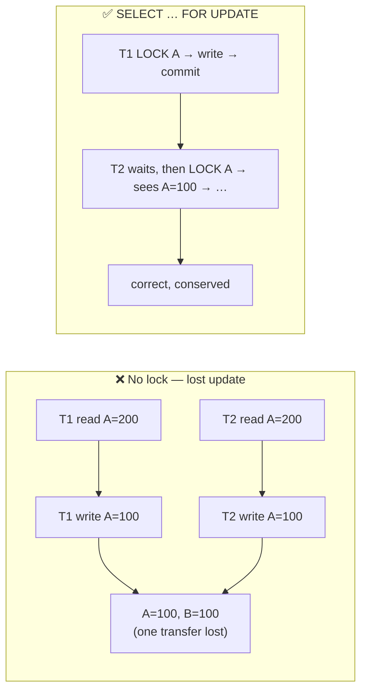
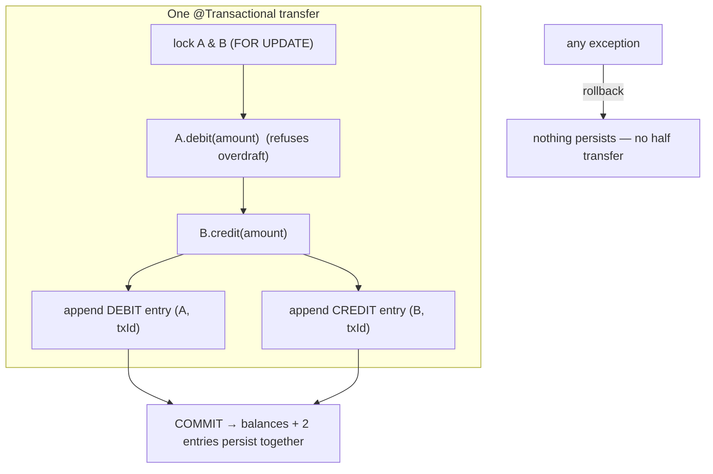
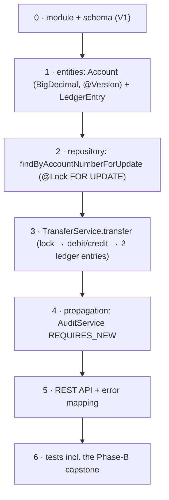

# Step 12 · Demand Account, the Double-Entry Ledger & Transactions Deep
### Phase B — Data, Databases, Concurrency & Transactions 🔵 · Step 12 of 67 · 🎖️ Phase B finale

> *This is where everything in Phase B converges on the scariest thing software does: move money. You'll
> build the bank's second service — accounts and a double-entry ledger — and make transfers correct under
> concurrent load. You'll go deep on `@Transactional` (propagation, rollback rules, isolation, readOnly),
> and run the Phase-B capstone: a stress test that **loses money without locking and is perfect with it**.*

---

<a id="toc"></a>
## 🧭 The Six Movements of This Step

| | Movement | What happens |
|---|---|---|
| **A** | [🧭 Orient](#orient) | 30-second overview · skip-test · cheat card · why it matters · before you start |
| **B** | [🧠 Understand](#understand) | ACID & `@Transactional` internals · double-entry · optimistic vs pessimistic locking |
| **C** | [🛠️ Build](#build) | the `demand-account` service: schema → entities → locked repo → transfer service → API → tests |
| **D** | [🔬 Prove](#prove) | the Verification Log — 11 tests, the capstone (fails without locking, passes with it), §12.3 mutation |
| **E** | [🎓 Apply](#apply) | go deeper · interview prep · your-turn challenges |
| **F** | [🏆 Review](#review) | troubleshooting · resources · recap, flashcards, 🧠 Phase-B cumulative review & what's next |

---

<a id="orient"></a>

# A · 🧭 Orient

## 📋 This Step in 30 Seconds

| | |
|---|---|
| **Title** | Demand Account + double-entry ledger + transaction management deep — move money correctly under concurrency |
| **Step** | 12 of 67 · **Phase B — Data, Databases, Concurrency & Transactions** 🔵 · **🎖️ end-of-phase milestone** |
| **Effort** | ≈ 22 hours focused (a meaty milestone — a whole new service plus the concurrency capstone). Experienced learners can skim the JPA basics and focus on the locking + propagation sections (~6h). |
| **What you'll run this step** | **JVM + Maven** for build & tests; **🐳 Docker** for the tests (Testcontainers Postgres) and for running the service live. One command: `./mvnw -pl services/demand-account -am verify`. |
| **Buildable artifact** | A NEW service **`services/demand-account`** (its own Postgres DB): `Account` (BigDecimal balance + `@Version`), an append-only `LedgerEntry` (double-entry), a `TransferService` with a **pessimistic-lock** transfer (`SELECT … FOR UPDATE`) + a deliberately-unsafe one for the capstone, `@Transactional` propagation/rollback/readOnly, a REST API, and **11 tests** including the **Phase-B capstone** concurrency stress test. `step-12-start == step-11-end`. |
| **Verification tier** | 🔴 **Full** — a new service *and* the money + concurrency path. `./mvnw verify` green + all **11** tests + the capstone proven **both ways** (lost update without locking; perfect with it) + a live HTTP round-trip + the **§12.3 mutation** (remove the lock → 17/20 transfers fail → revert) + clean-room + `smoke.sh`. |
| **Depends on** | **[Step 8](../step-08/lesson.md)** (JPA/Flyway/Testcontainers), **[Step 9](../step-09/lesson.md)** (`@Version` optimistic locking), **[Step 10](../step-10/lesson.md)** (isolation, `FOR UPDATE`, MVCC), **[Step 11](../step-11/lesson.md)** (the lost-update race in the JVM). This step *combines* all of them. **+ Docker.** |

By the end you will be able to design a double-entry ledger and explain why it always balances; explain `@Transactional` end-to-end (proxy, **propagation** REQUIRED/REQUIRES_NEW/NESTED, **isolation**, **rollback rules**, **readOnly**, and the self-invocation pitfall); choose between **optimistic (`@Version`)** and **pessimistic (`SELECT … FOR UPDATE`)** locking and justify it; avoid deadlock with lock ordering; and *prove* a transfer is correct under concurrent load.

### ⏭️ Can You Skip This Step? (5-minute self-check)

If you can confidently do **all** of this, skim the 🧩 Pattern Spotlight and jump to **[Step 13 — Spring MVC / REST deep](../step-13/lesson.md)**.

- [ ] I can model **double-entry** bookkeeping (debits == credits; the ledger is append-only and always nets to zero) and explain why a transfer writes **two** entries in **one** transaction.
- [ ] I can explain `@Transactional`'s **proxy** mechanics, the **self-invocation pitfall**, and the difference between **propagation** modes (REQUIRED vs REQUIRES_NEW vs NESTED).
- [ ] I can state the **default rollback rule** (rolls back on `RuntimeException`/`Error`, **not** checked exceptions) and how to change it.
- [ ] I can choose **optimistic (`@Version`)** vs **pessimistic (`FOR UPDATE`)** locking for a given workload and explain the failure mode of each (retry vs block).
- [ ] I can prevent **deadlock** between two transfers with a consistent **lock ordering**.
- [ ] I can explain why money is **`BigDecimal`** (never `double`) and time is **UTC `Instant`**.

> [!TIP]
> Not 100%? Stay. "How would you stop two withdrawals from overdrawing an account?", "optimistic vs pessimistic locking?", "what does `@Transactional(propagation = REQUIRES_NEW)` do?", and "why not use `double` for money?" are *the* money-domain interview questions — and you'll answer them having watched a transfer lose money without a lock and be perfect with one.

## 📇 Cheat Card

> **What this step delivers (one sentence):** the bank's accounts + double-entry ledger, with transfers that are **correct under concurrent load** — proven by a capstone stress test that loses an update without locking and is perfectly conserved with `SELECT … FOR UPDATE` — plus a deep, hands-on tour of `@Transactional`.

**Key commands** (Windows uses `.\mvnw.cmd`):

```bash
# Build + test the whole service (11 tests) on a real Testcontainers Postgres:
./mvnw -pl services/demand-account -am verify

# Just the Phase-B capstone (fails-without-locking + passes-with-locking):
./mvnw -pl services/demand-account test -Dtest=ConcurrentTransferTest

# One-shot proof your build matches the lesson (needs Docker):
bash steps/step-12/smoke.sh

# Run it live, then poke it with steps/step-12/requests.http:
docker compose -f services/demand-account/compose.yaml up -d
SPRING_DATASOURCE_URL=jdbc:postgresql://localhost:5433/demand_account ./mvnw -pl services/demand-account spring-boot:run
```

**The one headline idea — *a transfer is a read-check-write on a balance; without a lock two of them race and one is lost; `SELECT … FOR UPDATE` serializes them*:**



*Alt-text: without a lock, two transfers both read A=200 and both write A=100, so one transfer is lost (A=100, B=100). With SELECT … FOR UPDATE, T1 locks A, writes, and commits; T2 waits, then locks A and sees the updated value — correct and conserved.*

## 🎯 Why This Matters

Moving money is the canonical "get it exactly right or people lose real money" problem, and it's where every concept in Phase B comes together: JPA persistence (Step 8), `@Version` (Step 9), isolation and `FOR UPDATE` (Step 10), and the lost-update race (Step 11). Interviewers love it because it's concrete and unforgiving: "two withdrawals hit the same account at the same instant — what happens, and how do you make it correct?" After this step you answer by describing a double-entry ledger, a `@Transactional` boundary, and a deliberate choice between optimistic and pessimistic locking — and you've *seen* the race lose money and *seen* the lock fix it.

## ✅ What You'll Be Able to Do

- **Design a double-entry ledger** — accounts + an append-only entry log that always balances (debits == credits).
- **Explain `@Transactional`** — proxy mechanics, propagation, isolation, rollback rules, readOnly, self-invocation.
- **Move money safely** — pessimistic `SELECT … FOR UPDATE` (and optimistic `@Version` as the alternative), with deadlock-safe lock ordering.
- **Prove concurrency correctness** — a stress test that fails without locking and passes with it; money conserved, books balanced.
- **Handle money & time correctly** — `BigDecimal` minor units (never `double`), UTC `Instant`.

## 🧰 Before You Start

**Prerequisites**

- ✅ You finished **Steps 8–11**; the repo is at `step-12-start` (== `step-11-end`) and `./mvnw verify` is green.
- ✅ **Docker is running** (`docker info`). Tests use a Testcontainers Postgres; running live uses `compose.yaml`.

**What you already learned that connects here**

- **Step 8**: JPA entities, repositories, Flyway, `ddl-auto=validate`, Testcontainers — we reuse all of it for a second service (database-per-service).
- **Step 9**: `@Version` optimistic locking — here it's one of the two strategies, on `Account`.
- **Step 10**: isolation levels, MVCC, and `SELECT … FOR UPDATE` — the pessimistic transfer *is* `FOR UPDATE`.
- **Step 11**: the lost-update race and lock ordering — the capstone is that race, now with money on the line.
- **Step 7**: AOP proxies — `@Transactional` is a proxy, so the **self-invocation pitfall** applies here too.

> **Depends on: Steps 7, 8, 9, 10, 11.** This step is the convergence point of Phase B.

---

<a id="understand"></a>

# B · 🧠 Understand

## 🧠 The Big Idea

Three ideas combine in this step.

**1 — ACID transactions.** A database transaction is **A**tomic (all-or-nothing), **C**onsistent (invariants hold across it), **I**solated (concurrent transactions don't corrupt each other — Step 10's isolation levels), and **D**urable (committed = survives a crash). A money transfer *must* be atomic: debit-A-and-credit-B happen together or not at all. In Spring, the boundary is `@Transactional` — a method that runs inside one database transaction, committed on normal return and rolled back on a (runtime) exception.

**2 — Double-entry bookkeeping.** Every money movement is recorded as **two** ledger entries — a **DEBIT** on the payer and a **CREDIT** on the payee — of equal amount, sharing one `transactionId`. The ledger is **append-only** (never updated or deleted), so it's an immutable audit trail, and because every debit has a matching credit, **the sum of all entries is always zero** — the books always balance. We *also* keep a materialized `balance` on each account (fast to read) and update it inside the same transaction, so balance and ledger stay consistent.

**3 — Concurrency on a shared balance.** A transfer is a **read-check-write**: read the balance, check it's enough, write the new balance. That's exactly Step 11's lost-update race and Step 10's isolation problem — now on money. Two concurrent transfers from the same account can both read the old balance and both write, losing one. We fix it with a **pessimistic lock** (`SELECT … FOR UPDATE` — Step 10) that serializes them, or an **optimistic** one (`@Version` — Step 9) that rejects the loser. The choice is an engineering judgement you must be able to defend.

> **Analogy — the shared passbook.** Picture one paper passbook (the account) and a ledger journal (the entries). A transfer is: read the passbook balance, subtract, write it back, and record two journal lines (out of one book, into another). If two clerks grab the passbook at once, both read "200", both write "100", and one withdrawal silently vanishes — the journal says 200 left but the passbook shows only 100 gone. The fix is a rule: **you must hold the passbook (lock the row) for the whole read-write**, so the second clerk waits. That's `SELECT … FOR UPDATE`. The alternative — **stamp each write with an edition number** and reject a write against a stale edition — is optimistic `@Version`.



*Alt-text: one @Transactional transfer locks accounts A and B with FOR UPDATE, debits A (refusing overdraft), credits B, appends a DEBIT and a CREDIT ledger entry sharing a transaction id, and commits so balances and both entries persist together; any exception rolls back so nothing persists.*

## 🧩 Pattern Spotlight — Pessimistic Locking (`SELECT … FOR UPDATE`)

> **Problem.** Concurrent transfers on the same account race on the read-check-write of its balance. The check ("enough funds?") can be true for both, and both debit — overdrawing the account or losing an update.

> **Why pessimistic locking fits.** Money movement on a hot account is exactly the *high-contention, must-serialize* case. A pessimistic **row lock** taken at read time (`SELECT … FOR UPDATE`) makes the second transfer **wait** until the first commits, then it reads the *updated* balance and decides correctly. No retry loop, no lost update — concurrency is traded for guaranteed correctness on the contended row.

> **How it works (the mechanism).** Spring Data's `@Lock(LockModeType.PESSIMISTIC_WRITE)` makes Hibernate emit `SELECT … FOR UPDATE`. Postgres takes a row-level write lock; any other transaction that tries to lock the same row **blocks** until the holder commits/rolls back. We lock both accounts in a **deterministic order** (by account number) so two transfers touching the same pair can't deadlock by grabbing them in opposite orders (Step 11's lock-ordering rule).

> **Alternatives / trade-offs.** **Optimistic (`@Version`, Step 9):** no lock during the read; detect the conflict at write time and throw — great when conflicts are *rare*, but the loser must **retry** (and under heavy contention you get a storm of retries — we measured 17 of 20 transfers failing). **SERIALIZABLE (Step 10):** the database detects the anomaly and aborts with `40001` (also retry-based). **Rule of thumb:** pessimistic for hot, must-serialize money rows (this step); optimistic for low-contention edits (Step 9's KYC status). Same goal — no lost update — different bet on contention.

> **Implementation (here).** `AccountRepository.findByAccountNumberForUpdate` carries `@Lock(PESSIMISTIC_WRITE)`; `TransferService.transfer` locks both accounts in account-number order, then debits/credits. `ConcurrentTransferTest` proves it.

## 🌱 Under the Hood: How It Really Works

**`@Transactional` is a proxy (callback to Step 7).** Spring wraps the bean in a proxy; calling a `@Transactional` method *through* the proxy opens a transaction (via the `PlatformTransactionManager`), runs your method, then commits or rolls back. Two consequences: **(1) self-invocation** — a `this.someTransactionalMethod()` call inside the same bean bypasses the proxy, so the annotation does nothing (the same trap as `@Around`/`@PreAuthorize` in Step 7). That's *why* our `REQUIRES_NEW` audit lives in a **separate** bean (`AuditService`) called from `PropagationDemoService`. **(2)** the transaction is tied to the *thread* (a `ThreadLocal`), which is why each concurrent transfer (its own thread) gets its own transaction.

**Propagation — what happens when a transactional method calls another.**
- **`REQUIRED`** (default): join the caller's transaction if one exists, else start one. The two ledger writes + balance updates all share one transaction → atomic together.
- **`REQUIRES_NEW`**: **suspend** the caller's transaction and run in a brand-new one that commits independently. We use it for the **audit log**: the audit row commits even if the business transaction later rolls back. (Proven by `TransactionPropagationTest`.)
- **`NESTED`**: a **savepoint** inside the caller's transaction — it can roll back to the savepoint without killing the whole transaction (Postgres supports it). Useful for "try this sub-step; if it fails, undo just it."
- Others: `SUPPORTS`, `NOT_SUPPORTED`, `MANDATORY`, `NEVER` — situational.

**Rollback rules (a classic gotcha).** By default Spring rolls back on **`RuntimeException`** and **`Error`**, but **commits** on checked exceptions. So our `InsufficientFundsException extends RuntimeException` → a failed transfer rolls back automatically (no half-transfer). If you threw a *checked* exception and wanted rollback, you'd need `@Transactional(rollbackFor = MyCheckedException.class)`. Proven: `overdraw_isRejected_andRollsBackEverything` shows the debit that ran *before* the exception is undone and **no ledger rows** remain.

**`readOnly = true`.** A hint that the transaction won't write: Hibernate sets the flush mode to `MANUAL` (skips dirty-checking flushes) and the driver/DB can optimize. Our `balanceOf`/`totalSystemBalance` are read-only. (It's a hint, not a hard guarantee against writes.)

**Optimistic vs pessimistic at the engine (Steps 9 + 10 combined).**
- **Optimistic (`@Version`):** the `UPDATE` carries `WHERE id = ? AND version = ?` and `SET version = version + 1`. If another transaction bumped the version first, it matches 0 rows → `ObjectOptimisticLockingFailureException`. No lock during the read; the loser **retries**.
- **Pessimistic (`FOR UPDATE`):** the `SELECT` takes a row lock; the second transaction **blocks** at the `SELECT` until the first commits. No retry; it just waits.
- We measured the difference: with `FOR UPDATE`, 20 concurrent transfers all succeed; with only `@Version` (no `FOR UPDATE`), **17 of 20 fail** with optimistic-lock exceptions (they'd need a retry loop).

**Deadlock & lock ordering (callback to Step 11).** If transfer 1 locks A then B, and transfer 2 locks B then A, they can deadlock. We avoid it by always locking in a **global order** (by account number): both transfers lock the lower account number first, so one simply waits for the other. Postgres also *detects* deadlocks and aborts one with a `40P01` error, but ordering avoids them entirely.

**Money & time correctness.** Money is **`BigDecimal`** (exact decimal), stored as `numeric(19,4)` — **never `double`/`float`**, which can't represent `0.10` exactly and would drift cents over millions of operations. We compare with `compareTo` (not `equals`, which is scale-sensitive). Time is **UTC `Instant`** → `timestamptz`, never a local time. (Domain 5's "money & time" contract.)

## 🛡️ Security Lens: What Could Go Wrong

- **The overdraft race is a TOCTOU vulnerability.** "Check the balance, then debit" without a lock lets an attacker fire two simultaneous withdrawals and **spend the same money twice** (double-spend). It's a *security* bug, not just a correctness one — the fix (atomic check-and-debit under a lock) is a control. We literally demonstrate the unguarded version losing an update.
- **The ledger must be immutable.** If ledger entries could be updated/deleted, an attacker (or a bug) could rewrite history and hide theft. Append-only + "balance must reconcile to the ledger" is an integrity control; in Phase J we make it event-sourced.
- **Rollback must be total.** A partial transfer (debit without credit, or balance updated without a ledger entry) corrupts the books. The single `@Transactional` boundary guarantees all-or-nothing — but only if everything is in *one* transaction; a stray `REQUIRES_NEW` on the wrong method could let half the work commit.
- **Don't leak the version/internal fields.** The API returns a DTO (`AccountResponse`), not the entity — no `@Version`, no internal columns (data minimization, as in Step 9).

## 🕰️ Then vs. Now (How This Changed Across Versions)

| Topic | Then | Now | Why it changed |
|---|---|---|---|
| **Transaction demarcation** | Programmatic — `tx.begin()/commit()/rollback()` by hand, or EJB CMT. | **Declarative `@Transactional`** (proxy-based) — the boundary is an annotation. | Less boilerplate, fewer leaked transactions; the proxy handles commit/rollback. |
| **Package** | `javax.transaction` / `javax.persistence`. | **`jakarta.*`** (Spring Boot 3+). | The Jakarta EE rename. We use `jakarta.persistence.LockModeType`, etc. |
| **Locking** | Hand-written `SELECT … FOR UPDATE` in SQL/JDBC. | `@Lock(PESSIMISTIC_WRITE)` / `@Version` declaratively in Spring Data JPA. | The ORM generates the right SQL; you express *intent*. |
| **Money type** | `float`/`double` (and silent rounding bugs), or integer cents by hand. | **`BigDecimal`** (exact) — and integer *minor units* where you need them. | Money rounding errors are unacceptable; `BigDecimal` is exact. |

> [!NOTE]
> *Verify, don't guess.* `@Transactional`'s default rollback-on-`RuntimeException`-only behaviour and the proxy/self-invocation rule are long-standing Spring facts; `jakarta.*` landed in Boot 3. `@Lock(PESSIMISTIC_WRITE)` → `FOR UPDATE` is standard JPA. The exact Hibernate/Boot versions are in `VERSIONS.md`. All APIs used here are stable.

## 🧵 Thread-safety note

The account `balance` is **shared mutable state** touched by concurrent transfer threads — exactly Step 11's hazard, now in the database. Three layers defend it, and you should be able to place each: **(1)** in-JVM, a single instance could use `synchronized` — but that **fails across multiple service instances** (the real deployment), so we don't rely on it; **(2)** optimistic `@Version` (Step 9) — detect-and-retry; **(3)** pessimistic `FOR UPDATE` (Step 10) — lock-and-wait, our default for money. The database is the single point of truth where all instances coordinate, which is why the *database* lock (not a JVM lock) is the right tool for distributed money movement. (Distributed locks like Redis/ShedLock come in Step 22.)

---

<a id="build"></a>

# C · 🛠️ Build

## 📦 Your Starting Point

You're at **`step-12-start`** (== `step-11-end`). The repo builds with 6 modules. This step adds a 7th — `services/demand-account` — the bank's second real microservice, with its own Postgres DB (database-per-service, as cif).

Confirm the start builds:
```bash
./mvnw -q -pl services/cif -am verify   # still green from Step 10/11
```

## 🛠️ Let's Build It — Step by Step



🌳 **Files we'll touch** (all new, under `services/demand-account/`):
```
pom.xml · src/main/resources/{application.yml, db/migration/V1__create_account_and_ledger.sql}
src/main/java/com/buildabank/account/
├── DemandAccountApplication.java
├── domain/{Account, LedgerEntry, AuditEntry, EntryDirection, InsufficientFundsException,
│           AccountRepository, LedgerEntryRepository, AuditEntryRepository}.java
├── service/{TransferService, AuditService, PropagationDemoService}.java
└── web/{TransferController, ApiExceptionHandler, OpenAccountRequest, TransferRequest,
        AccountResponse, TransferResponse}.java
src/test/java/com/buildabank/account/  (ContainersConfig + 6 test classes)
compose.yaml · steps/step-12/{requests.http, smoke.sh}
```

> *This is a large step (a whole service). Below we build the **core money path in full** — schema, `Account`, the locked repository, and `TransferService` — then summarise the supporting REST/DTO files (all present in the repo) and finish with the tests. Nothing is "left as an exercise"; every file is in `services/demand-account`.*

---

### Sub-step 0 of 6 — Module + schema 🧭 *(you are here: **module/schema** → entities → repo → service → propagation → api → tests)*

🎯 **Goal:** a new Maven module (same deps as cif) and the Flyway schema for accounts + the double-entry ledger.

📁 **Location:** `services/demand-account/pom.xml` (mirrors cif's), add `<module>services/demand-account</module>` to the root `pom.xml`, and the migration:

⌨️ **Code** — `services/demand-account/src/main/resources/db/migration/V1__create_account_and_ledger.sql`:
```sql
create table account (
    id              bigint generated by default as identity primary key,
    account_number  varchar(20)    not null unique,
    currency        varchar(3)     not null,
    balance         numeric(19, 4) not null default 0,   -- exact decimal money (never float)
    version         bigint         not null default 0,    -- @Version optimistic lock
    created_at      timestamp(6) with time zone not null
);
create table ledger_entry (
    id              bigint generated by default as identity primary key,
    account_id      bigint         not null references account (id),
    transaction_id  uuid           not null,
    direction       varchar(6)     not null check (direction in ('DEBIT', 'CREDIT')),
    amount          numeric(19, 4) not null check (amount > 0),
    description     varchar(200),
    created_at      timestamp(6) with time zone not null
);
create index idx_ledger_account on ledger_entry (account_id);
create index idx_ledger_transaction on ledger_entry (transaction_id);
create table audit_log (   -- used to demonstrate REQUIRES_NEW (commits independently)
    id bigint generated by default as identity primary key,
    event varchar(100) not null, detail varchar(500),
    created_at timestamp(6) with time zone not null
);
```

🔍 **Line-by-line:** `balance numeric(19,4)` — exact decimal money. `version bigint` — the optimistic-lock column (Step 9). The `direction` and `amount > 0` **CHECK constraints** enforce invariants in the database itself. `ledger_entry.account_id` is a **foreign key** to `account`. The indexes speed up "all entries for an account / transaction" lookups.

💭 **Under the hood:** `ddl-auto=validate` (in `application.yml`) means Flyway owns this schema; Hibernate only checks the entity mappings match. The `audit_log` table backs the propagation demo.

✋ **Checkpoint:** `./mvnw -q -pl services/demand-account -am compile` succeeds.

💾 **Commit:** `git add services/demand-account/pom.xml pom.xml services/demand-account/src/main/resources && git commit -m "feat(demand-account): module + account/ledger schema (V1)"`

⚠️ **Pitfall:** a raw `&` in `pom.xml` `<description>` breaks XML parsing — write `and`/`&amp;`.

---

### Sub-step 1 of 6 — Entities: `Account` (money + `@Version`) and `LedgerEntry` 🧭 *(module ✅ → **entities** → repo → service → propagation → api → tests)*

🎯 **Goal:** the `Account` aggregate (with overdraft-refusing `debit`/`credit`) and the append-only `LedgerEntry`.

📁 **Location:** `services/demand-account/src/main/java/com/buildabank/account/domain/Account.java`

⌨️ **Code** (the heart of `Account`; full file in the repo):
```java
@Entity
@Table(name = "account")
public class Account {
    @Id @GeneratedValue(strategy = GenerationType.IDENTITY) private Long id;
    @Column(name = "account_number", nullable = false, unique = true, updatable = false) private String accountNumber;
    @Column(nullable = false, updatable = false) private String currency;
    @Column(nullable = false) private BigDecimal balance;
    @Version private long version;                       // optimistic lock (Step 9)
    @Column(name = "created_at", nullable = false, updatable = false) private Instant createdAt;

    public void debit(BigDecimal amount) {
        requirePositive(amount);
        if (balance.compareTo(amount) < 0) {
            throw new InsufficientFundsException("account " + accountNumber + " balance " + balance + " < debit " + amount);
        }
        balance = balance.subtract(amount);
    }
    public void credit(BigDecimal amount) { requirePositive(amount); balance = balance.add(amount); }
    // ... constructor, getters, requirePositive(...) ...
}
```

🔍 **Line-by-line:**
- `@Version private long version` — Hibernate increments it on each update and adds `WHERE version = ?`; a stale write is rejected (Step 9). It's the *optimistic* strategy, always active.
- `debit(...)` — the **invariant lives in the entity**: it refuses to overdraw (`balance.compareTo(amount) < 0`). `compareTo`, not `equals`, because `100.00` and `100.0000` are equal in value but differ in scale.
- `InsufficientFundsException extends RuntimeException` → a failed debit triggers `@Transactional` rollback automatically.

💭 **Under the hood:** `LedgerEntry` stores `accountId` as a plain `Long` (not a `@ManyToOne`) — the ledger is a high-volume append-only fact table, and a bare FK avoids accidental lazy-loading/N+1 (Step 9) when appending.

🔮 **Predict:** if `debit` throws inside a `@Transactional` transfer, what happens to the credit and the ledger rows that would follow? <details><summary>answer</summary>Nothing persists — the whole transaction rolls back (atomicity). We prove it in `overdraw_isRejected_andRollsBackEverything`.</details>

✋ **Checkpoint:** entities compile; `LedgerEntry`, `AuditEntry`, `EntryDirection`, `InsufficientFundsException` all exist.

💾 **Commit:** `git add services/demand-account/src/main/java/com/buildabank/account/domain && git commit -m "feat(demand-account): Account (BigDecimal + @Version) + double-entry LedgerEntry"`

⚠️ **Pitfall:** mapping money as `double` would reintroduce rounding drift. Always `BigDecimal` → `numeric`.

---

### Sub-step 2 of 6 — Repository with the pessimistic lock 🧭 *(module ✅ → entities ✅ → **repo** → service → propagation → api → tests)*

🎯 **Goal:** a repository method that reads **and locks** an account row (`SELECT … FOR UPDATE`).

📁 **Location:** `services/demand-account/src/main/java/com/buildabank/account/domain/AccountRepository.java`

⌨️ **Code:**
```java
public interface AccountRepository extends JpaRepository<Account, Long> {

    Optional<Account> findByAccountNumber(String accountNumber);              // plain read, NO lock

    @Lock(LockModeType.PESSIMISTIC_WRITE)                                     // → SELECT ... FOR UPDATE
    @Query("select a from Account a where a.accountNumber = :accountNumber")
    Optional<Account> findByAccountNumberForUpdate(@Param("accountNumber") String accountNumber);

    @Query("select coalesce(sum(a.balance), 0) from Account a")
    BigDecimal totalBalance();                                               // for the conservation check
}
```

🔍 **Line-by-line:**
- `@Lock(LockModeType.PESSIMISTIC_WRITE)` — tells Hibernate to take a **write lock** on the selected row → it emits `SELECT … FOR UPDATE`. Any other transaction locking the same row **blocks** until we commit.
- We pair it with `@Query` because `@Lock` needs a query method to attach to.
- `findByAccountNumber` (no lock) is used by the *deliberately-unsafe* transfer in the capstone — the contrast.

💭 **Under the hood:** the lock is held for the **rest of the transaction** (until commit/rollback) — that's what serializes concurrent transfers on a hot account. (The repo also has an `applyBalanceUnsafe` bulk update used *only* by the capstone's broken path — it bypasses `@Version` to show a true lost update.)

✋ **Checkpoint:** repository compiles.

💾 **Commit:** `git add .../domain/AccountRepository.java && git commit -m "feat(demand-account): pessimistic SELECT FOR UPDATE repository method"`

⚠️ **Pitfall:** `@Lock` only takes effect when the call runs **inside a transaction** — i.e. from a `@Transactional` service method. Calling it outside a transaction does nothing useful.

---

### Sub-step 3 of 6 — `TransferService.transfer` (the safe money path) 🧭 *(module ✅ → entities ✅ → repo ✅ → **service** → propagation → api → tests)*

🎯 **Goal:** the production transfer — lock both accounts in a deadlock-safe order, debit/credit, write the two ledger legs, all in one transaction.

📁 **Location:** `services/demand-account/src/main/java/com/buildabank/account/service/TransferService.java`

⌨️ **Code** (the safe transfer; full file in the repo):
```java
@Transactional
public UUID transfer(String fromNumber, String toNumber, BigDecimal amount, String description) {
    if (fromNumber.equals(toNumber)) throw new IllegalArgumentException("cannot transfer to the same account");
    // Lock in a stable global order (by account number) to avoid deadlock, then map back to from/to.
    boolean fromIsLower = fromNumber.compareTo(toNumber) < 0;
    Account firstLocked  = lockOrThrow(fromIsLower ? fromNumber : toNumber);
    Account secondLocked = lockOrThrow(fromIsLower ? toNumber : fromNumber);
    Account from = fromIsLower ? firstLocked : secondLocked;
    Account to   = fromIsLower ? secondLocked : firstLocked;
    return post(from, to, amount, description);
}

private Account lockOrThrow(String accountNumber) {
    return accounts.findByAccountNumberForUpdate(accountNumber)
            .orElseThrow(() -> new IllegalArgumentException("no such account: " + accountNumber));
}

private UUID post(Account from, Account to, BigDecimal amount, String description) {
    from.debit(amount);                              // throws InsufficientFundsException → rolls back
    to.credit(amount);                               // dirty checking flushes both balance UPDATEs at commit
    UUID transactionId = UUID.randomUUID();
    Instant now = Instant.now();
    ledger.save(new LedgerEntry(from.getId(), transactionId, EntryDirection.DEBIT, amount, description, now));
    ledger.save(new LedgerEntry(to.getId(), transactionId, EntryDirection.CREDIT, amount, description, now));
    return transactionId;
}
```

🔍 **Line-by-line:**
- `@Transactional` — the whole transfer is one atomic database transaction.
- **lock ordering** — we lock the *lower* account number first regardless of direction, so two transfers between the same pair never grab locks in opposite orders → **no deadlock** (Step 11).
- `from.debit(amount)` — refuses overdraft; the exception rolls everything back.
- `ledger.save(... DEBIT ...)` + `ledger.save(... CREDIT ...)` — the two legs sharing one `transactionId`. Because they're in the same transaction as the balance updates, a failure undoes *all* of it.

💭 **Under the hood:** `from`/`to` are **managed** entities loaded in this transaction; we mutate them via `debit`/`credit` and Hibernate **dirty-checks** them, flushing `UPDATE account SET balance = ?, version = ? WHERE id = ? AND version = ?` at commit. The `FOR UPDATE` lock taken at load time means a concurrent transfer waits at *its* `SELECT` until we commit.

🔮 **Predict:** two transfers of 100 run concurrently on account A (balance 200). With the lock, what are the final balances? <details><summary>answer</summary>They serialize: A=0, B=200. Both succeed. We prove it with 20 concurrent transfers in the capstone.</details>

✋ **Checkpoint:** service compiles; `openAccount`, `transfer`, `transferUnsafe`, `balanceOf`, `totalSystemBalance`, `ledgerNet` exist.

💾 **Commit:** `git add .../service/TransferService.java && git commit -m "feat(demand-account): pessimistic, deadlock-safe transfer + double-entry posting"`

⚠️ **Pitfall:** locking the accounts in *transfer direction* (always from-then-to) deadlocks under reverse transfers (A→B and B→A). Always lock in a **direction-independent** order.

---

### Sub-step 4 of 6 — Propagation: `AuditService` (`REQUIRES_NEW`) 🧭 *(module ✅ → entities ✅ → repo ✅ → service ✅ → **propagation** → api → tests)*

🎯 **Goal:** show `REQUIRES_NEW` — an audit record that commits **independently**, surviving an outer rollback.

📁 **Location:** `services/demand-account/src/main/java/com/buildabank/account/service/AuditService.java`

⌨️ **Code:**
```java
@Service
public class AuditService {
    private final AuditEntryRepository repository;
    public AuditService(AuditEntryRepository repository) { this.repository = repository; }

    @Transactional(propagation = Propagation.REQUIRES_NEW)
    public void record(String event, String detail) {
        repository.save(new AuditEntry(event, detail, Instant.now()));
    }
}
```
and the caller (`PropagationDemoService`) that audits, then fails:
```java
@Transactional
public void auditThenFail(String event) {
    auditService.record(event, "written before the failure");   // REQUIRES_NEW → commits independently
    throw new IllegalStateException("business failure after auditing");   // rolls the OUTER txn back
}
```

🔍 **Line-by-line:** `Propagation.REQUIRES_NEW` **suspends** the caller's transaction and runs `record` in a fresh one that commits on its own. So when `auditThenFail` throws and its (outer) transaction rolls back, the audit row — already committed separately — **remains**. Crucially, `AuditService` is a **separate bean**: a `this.record(...)` call would bypass the proxy (self-invocation, Step 7) and `REQUIRES_NEW` would silently not apply.

🔮 **Predict:** after `auditThenFail` throws, how many audit rows exist? <details><summary>answer</summary>One — REQUIRES_NEW committed it independently of the rolled-back outer transaction. (`TransactionPropagationTest` asserts exactly this.)</details>

✋ **Checkpoint:** both services compile.

💾 **Commit:** `git add .../service/AuditService.java .../service/PropagationDemoService.java && git commit -m "feat(demand-account): REQUIRES_NEW audit propagation demo"`

⚠️ **Pitfall:** putting `REQUIRES_NEW` on a method called via `this.` inside the same bean does nothing — the proxy is bypassed. Cross a bean boundary.

---

### Sub-step 5 of 6 — REST API + error mapping 🧭 *(module ✅ → … → **api** → tests)*

🎯 **Goal:** a usable HTTP API — open an account, transfer, read a balance — with sensible error codes.

📁 **Location:** `services/demand-account/src/main/java/com/buildabank/account/web/` (controller + DTOs + advice)

⌨️ **Code** (the controller; DTOs and `ApiExceptionHandler` are short — full files in the repo):
```java
@RestController
public class TransferController {
    private final TransferService transfers;
    public TransferController(TransferService transfers) { this.transfers = transfers; }

    @PostMapping("/api/accounts")
    public ResponseEntity<AccountResponse> open(@Valid @RequestBody OpenAccountRequest r) {
        Account a = transfers.openAccount(r.accountNumber(), r.currency(), r.openingBalance());
        return ResponseEntity.created(URI.create("/api/accounts/" + a.getAccountNumber())).body(AccountResponse.from(a));
    }

    @PostMapping("/api/transfers")
    public ResponseEntity<TransferResponse> transfer(@Valid @RequestBody TransferRequest r) {
        UUID txId = transfers.transfer(r.from(), r.to(), r.amount(), r.description());
        return ResponseEntity.ok(new TransferResponse(txId));
    }

    @GetMapping("/api/accounts/{accountNumber}")
    public ResponseEntity<AccountResponse> balance(@PathVariable String accountNumber) {
        try { return ResponseEntity.ok(new AccountResponse(accountNumber, null, transfers.balanceOf(accountNumber))); }
        catch (IllegalArgumentException e) { return ResponseEntity.notFound().build(); }
    }
}
```
and the error mapping (`@RestControllerAdvice`): `InsufficientFundsException` → **422**, `IllegalArgumentException` → **400**. (Full RFC-9457 `ProblemDetail` is Step 13.)

🔍 **Line-by-line:** `@Valid` triggers Bean Validation (`@Positive` amount, `@NotBlank` fields) → a bad body is `400` before the method runs. The transfer endpoint always uses the **safe** (pessimistic) path. The advice turns a domain exception into a clean HTTP status instead of a `500`.

▶️ **Run & See** (live, end-to-end):
```bash
docker compose -f services/demand-account/compose.yaml up -d
SPRING_DATASOURCE_URL=jdbc:postgresql://localhost:5433/demand_account ./mvnw -pl services/demand-account spring-boot:run
# in another terminal — see steps/step-12/requests.http
curl -s -X POST localhost:8082/api/accounts -H 'Content-Type: application/json' -d '{"accountNumber":"ACC-A","currency":"USD","openingBalance":200.00}'
curl -s -X POST localhost:8082/api/transfers -H 'Content-Type: application/json' -d '{"from":"ACC-A","to":"ACC-B","amount":50.00}'
curl -s localhost:8082/api/accounts/ACC-A
```
(We prove the same flow over a real socket in `DemandAccountIntegrationTest` — see 🔬.)

✋ **Checkpoint:** the service starts and serves; `requests.http` returns 201/200/422 as documented.

💾 **Commit:** `git add .../web && git commit -m "feat(demand-account): accounts/transfers REST API + error mapping"`

⚠️ **Pitfall:** wrong port — the service is on **8082** (8080=hello, 8081=cif). The compose maps Postgres to host **5433** to dodge the local 5432.

---

### Sub-step 6 of 6 — Tests, incl. the 🎓 Phase-B capstone 🧭 *(module ✅ → … → api ✅ → **tests**)*

🎯 **Goal:** prove the ledger behaviour, propagation, optimistic locking, the live API — and the **capstone**: fails without locking, passes with it.

📁 **Location:** `services/demand-account/src/test/java/com/buildabank/account/` (`ContainersConfig` + 6 test classes)

⌨️ **Code** — the capstone's two halves (`ConcurrentTransferTest`; full file in the repo):
```java
/** ❌ No locking: two concurrent transfers of 100 both read 200, both write 100 → one transfer LOST. */
@Test
void withoutLocking_concurrentTransfersLoseAnUpdate() throws Exception {
    transfers.openAccount("ACC-A", "USD", new BigDecimal("200.00"));
    transfers.openAccount("ACC-B", "USD", new BigDecimal("0.00"));
    CyclicBarrier bothHaveRead = new CyclicBarrier(2);                 // force both to read BEFORE either writes
    Runnable afterRead = () -> { try { bothHaveRead.await(); } catch (Exception e) { throw new RuntimeException(e); } };
    try (ExecutorService pool = Executors.newFixedThreadPool(2)) {
        Future<?> t1 = pool.submit(() -> transfers.transferUnsafe("ACC-A","ACC-B", new BigDecimal("100.00"), "race-1", afterRead));
        Future<?> t2 = pool.submit(() -> transfers.transferUnsafe("ACC-A","ACC-B", new BigDecimal("100.00"), "race-2", afterRead));
        t1.get(); t2.get();
    }
    assertThat(transfers.balanceOf("ACC-A")).isEqualByComparingTo("100.00");   // should be 0 if both applied
    assertThat(transfers.balanceOf("ACC-B")).isEqualByComparingTo("100.00");   // should be 200 if both applied
}

/** ✅ Pessimistic lock: 20 concurrent transfers all apply — conserved, balanced, no overdraft. */
@Test
void withPessimisticLock_concurrentTransfersAreCorrect() throws Exception {
    transfers.openAccount("ACC-A", "USD", new BigDecimal("1000.00"));
    transfers.openAccount("ACC-B", "USD", new BigDecimal("0.00"));
    AtomicInteger failures = new AtomicInteger();
    try (ExecutorService pool = Executors.newFixedThreadPool(20)) {
        var futures = new ArrayList<Future<?>>();
        for (int i = 0; i < 20; i++) futures.add(pool.submit(() -> {
            try { transfers.transfer("ACC-A","ACC-B", new BigDecimal("50.00"), "concurrent"); }
            catch (RuntimeException e) { failures.incrementAndGet(); }
        }));
        for (Future<?> f : futures) f.get();
    }
    assertThat(failures.get()).isZero();
    assertThat(transfers.balanceOf("ACC-A")).isEqualByComparingTo("0.00");
    assertThat(transfers.balanceOf("ACC-B")).isEqualByComparingTo("1000.00");
    assertThat(transfers.totalSystemBalance()).isEqualByComparingTo("1000.00");   // money conserved
    assertThat(transfers.ledgerNet()).isEqualByComparingTo("0");                  // books balance
}
```

🔍 **Line-by-line:**
- The **`CyclicBarrier`** forces both unsafe transfers to *read* before either *writes* — making the lost update deterministic (no flaky "sometimes"). `transferUnsafe` uses a bulk absolute write that bypasses `@Version`, so the lost update truly manifests: final **A=100, B=100** (one of two transfers vanished).
- The pessimistic test runs **20** transfers concurrently through the real `transfer` (FOR UPDATE). They serialize → all succeed → A drained to 0, B holds 1000, **total conserved at 1000**, `ledgerNet == 0` (books balance).

🔮 **Predict:** in the unsafe test, the ledger records 2 entries per "successful" transfer (4 total, crediting B 200). What does B's balance show? <details><summary>answer</summary>100 — so the materialized balance no longer matches the ledger. That mismatch *is* the corruption.</details>

▶️ **Run & See:**
```bash
./mvnw -pl services/demand-account test -Dtest=ConcurrentTransferTest
```
✅ **Expected output:**
```
[capstone:no-lock] A=100.0000 B=100.0000  (correct would be A=0, B=200 — but one transfer was lost)
[capstone:pessimistic] failures=0 A=0.0000 B=1000.0000 total=1000.0000 ledgerNet=0.0000
... Tests run: 2, Failures: 0, Errors: 0, Skipped: 0
```

🔬 **Break-it (the §12.3 mutation):** in `withPessimisticLock_…`, the lock is the only thing keeping all 20 transfers succeeding. Remove it (make `lockOrThrow` use `findByAccountNumber`) and rerun — see 🔬 §3: **17 of 20 fail**. Put it back.

✋ **Checkpoint:** all 11 tests green.

💾 **Commit:** `git add services/demand-account/src/test && git commit -m "test(demand-account): ledger, propagation, optimistic lock, live HTTP + Phase-B capstone"`

⚠️ **Pitfall:** `@SpringBootTest` doesn't roll back between tests, and these tests share one Postgres — clean up in `@BeforeEach` (delete `ledger_entry` **before** `account` because of the FK).

---

### 🔁 The full flow you just built

```mermaid
sequenceDiagram
    participant C as Client
    participant S as TransferService (@Transactional)
    participant DB as PostgreSQL
    C->>S: transfer(A, B, 50)
    S->>DB: SELECT ... FOR UPDATE account A (lock)
    S->>DB: SELECT ... FOR UPDATE account B (lock)
    S->>S: A.debit(50) (refuses overdraft) · B.credit(50)
    S->>DB: INSERT ledger DEBIT(A) + CREDIT(B) [same txId]
    S->>DB: COMMIT (balances + 2 entries persist together; locks released)
    S-->>C: 200 + transactionId
    Note over S,DB: a concurrent transfer on A waited at its FOR UPDATE until COMMIT
```

*Alt-text: a client calls transfer; the service locks accounts A and B with SELECT FOR UPDATE, debits A and credits B, inserts a DEBIT and CREDIT ledger entry with the same transaction id, and commits so balances and entries persist together and locks release; a concurrent transfer on A waited at its FOR UPDATE until this commit.*

## 🎮 Play With It

1. **Start it:** `docker compose -f services/demand-account/compose.yaml up -d` then `SPRING_DATASOURCE_URL=jdbc:postgresql://localhost:5433/demand_account ./mvnw -pl services/demand-account spring-boot:run`.
2. **Drive the API:** open `steps/step-12/requests.http` (VS Code/IntelliJ), or the `curl`s in sub-step 5. Watch a transfer return a `transactionId`, the balance drop, and an overdraft return **422**.
3. **See the migrations:** `GET http://localhost:8082/actuator/flyway`.
4. 🧪 **Little experiments:**
   - Transfer more than the balance → `422 insufficient_funds`. The debit never half-applies (rollback).
   - Transfer to a non-existent account → `400`.
   - In `ConcurrentTransferTest`, bump the unsafe test to **5** racing transfers — watch even more updates vanish.
   - Swap `withPessimisticLock_…` to call `transferUnsafe(...)` (no lock) under contention and watch the books stop balancing.

## 🏁 The Finished Result

You're at **`step-12-end`** (== `step-13-start`) — and the **end of Phase B** 🎖️. The `demand-account` service has **11** green tests including the capstone.

### ✅ Definition of Done (your self-check)
- [ ] `./mvnw -pl services/demand-account -am verify` is green with **Tests run: 11**.
- [ ] You can explain optimistic vs pessimistic locking and which this service uses for money.
- [ ] You can explain `@Transactional` propagation, rollback rules, and the self-invocation pitfall.
- [ ] `bash steps/step-12/smoke.sh` prints `✅ Step 12 smoke test PASSED`.
- [ ] You've committed and tagged `step-12-end`.

---

<a id="prove"></a>

# D · 🔬 Prove It Works — the Verification Log

> **Tier: 🔴 Full** (new service + money + concurrency). Real pasted output — random high JDBC port, the capstone both ways, the §12.3 mutation, a live HTTP round-trip, and a clean-room verify.

### 1 · `./mvnw -pl services/demand-account -am verify` — 11 tests green
```
[INFO] Tests run: 11, Failures: 0, Errors: 0, Skipped: 0
[INFO] BUILD SUCCESS
```
Per class: `DemandAccountIntegrationTest` 1 · `ConcurrentTransferTest` 2 · `OptimisticLockTest` 1 · `TransactionPropagationTest` 1 · `TransferServiceTest` 2 · `TransferControllerTest` 4. Real Postgres 17 via Testcontainers 2.0.5 on a random high port (e.g. `jdbc:postgresql://localhost:5xxxx/test`).

### 2 · The ledger behaves (TransferServiceTest)
A 50.00 transfer leaves A=150.00, B=50.00; two ledger entries share the `transactionId` (DEBIT on A, CREDIT on B); `totalSystemBalance == 200.00` (conserved); `ledgerNet == 0` (books balance). An overdraw throws `InsufficientFundsException` and **rolls back everything** — balances unchanged, `ledger.count() == 0`.

### 3 · The 🎓 Phase-B capstone — fails without locking, passes with it
```
[capstone:no-lock]    A=100.0000 B=100.0000  (correct would be A=0, B=200 — one transfer was lost)
[capstone:pessimistic] failures=0 A=0.0000 B=1000.0000 total=1000.0000 ledgerNet=0.0000
```
Without a lock, a deterministic lost update (`CyclicBarrier`-forced); with `SELECT … FOR UPDATE`, 20 concurrent transfers all succeed, conserved and balanced.

### 4 · §12.3 Mutation sanity-check — the lock is load-bearing
Changed `lockOrThrow` from `findByAccountNumberForUpdate` to `findByAccountNumber` (removing `FOR UPDATE`), then ran the pessimistic capstone test:
```
[capstone:pessimistic] failures=17 A=850.0000 B=150.0000 total=1000.0000 ledgerNet=0.0000
[ERROR] ConcurrentTransferTest.withPessimisticLock_concurrentTransfersAreCorrect:124
expected: 0
 but was: 17
[INFO] BUILD FAILURE
```
**17 of 20 transfers failed** with optimistic-lock conflicts — proving the pessimistic lock is exactly what makes them all succeed. (Note: `@Version` still prevented *corruption* — total stayed 1000 — so the failure mode without the lock is mass *rejection*, not lost money. Both are "wrong" outcomes the lock fixes.) Reverted; suite green again.

### 5 · Optimistic locking & propagation
`OptimisticLockTest`: two sessions read version 0; the first credit commits (→ version 1, balance 210.00); the second's stale write throws `ObjectOptimisticLockingFailureException`. `TransactionPropagationTest`: after `auditThenFail` throws and the outer transaction rolls back, the `REQUIRES_NEW` audit row **survives** (`count == 1`).

### 6 · Live HTTP (DemandAccountIntegrationTest, real socket, random port)
Over real HTTP on a `RANDOM_PORT` server: open A (201), open B (201), transfer 50 (200 + `transactionId`), GET A balance (200, body contains `150`), overdraft (422). Proves the app **starts and serves**.

### 7 · `smoke.sh`
```
==> Build + test the Demand Account service (ledger, transactions, locking, capstone) on real Postgres
✅ Step 12 smoke test PASSED
```

### 8 · Clean-room (§12.4) & chain
Fresh `git clone` at `step-12-end` → `make doctor` + full `./mvnw verify` → **BUILD SUCCESS** (all 7 modules). Confirmed `step-12-end` == `step-13-start`.

---

<a id="apply"></a>

# E · 🎓 Apply

## 🚀 Go Deeper (Optional)

<details>
<summary>① Retry-on-conflict: the optimistic counterpart to pessimistic locking</summary>

With `@Version` (no `FOR UPDATE`), a conflicting transfer throws `ObjectOptimisticLockingFailureException`. The standard fix is a bounded **retry loop** (Spring Retry's `@Retryable`, or a hand-rolled `for` loop): catch the exception, re-read, re-apply, up to N attempts with small backoff. It out-throughputs pessimistic locking when conflicts are *rare* (no lock held) but degrades under heavy contention (we saw 17/20 conflicts). Pessimistic locking is the opposite trade. Knowing *which* to reach for is the senior skill.
</details>

<details>
<summary>② Derived vs materialized balance</summary>

We keep a materialized `balance` *and* an append-only ledger. The alternative is to **derive** the balance by summing entries (`SELECT sum(...) FROM ledger_entry WHERE account_id = ?`) — perfectly auditable, no balance to lock, but O(entries) per read. Real systems often snapshot a running balance periodically (or per statement period) to bound the sum. Event sourcing (Step 52) makes the ledger the *only* source of truth and projects balances as read models.
</details>

<details>
<summary>③ `NESTED` propagation & savepoints</summary>

`Propagation.NESTED` creates a **savepoint** inside the current transaction. If the nested work fails, you roll back to the savepoint without aborting the whole transaction — useful for "attempt this optional sub-step." It needs a JDBC driver/DB that supports savepoints (Postgres does). Contrast with `REQUIRES_NEW` (a truly independent transaction that commits separately).
</details>

## 💼 Interview Prep: Questions You'll Be Asked

1. **"Two withdrawals hit the same account at the same instant — what happens, and how do you make it correct?"** *(the money question)* → Without protection it's a lost-update/overdraft race (read-check-write). Fix: a pessimistic row lock (`SELECT … FOR UPDATE`) to serialize, or optimistic `@Version` + retry, or SERIALIZABLE + retry. For a hot account, pessimistic; for rare conflicts, optimistic.

2. **"Optimistic vs pessimistic locking — trade-offs?"** *(the most common)* → Optimistic: no lock during read, detect conflict at write (version mismatch) and retry; best when conflicts are rare. Pessimistic: lock at read, others block; best when contention is high and you must serialize. We measured the difference (20/20 succeed with `FOR UPDATE`; 17/20 fail with only `@Version`).

3. **"What does `@Transactional(propagation = REQUIRES_NEW)` do, and when would you use it?"** → Suspends the caller's transaction and runs in a new one that commits independently — so e.g. an **audit/log** record survives even if the business transaction rolls back. (Default `REQUIRED` joins the caller's transaction and rolls back with it.)

4. **"Does `@Transactional` roll back on a checked exception?"** *(gotcha)* → No — by default it rolls back only on `RuntimeException`/`Error`; checked exceptions **commit** unless you set `rollbackFor`. Also: `@Transactional` is proxy-based, so a `this.`-call (self-invocation) doesn't start a transaction.

5. **"Why `BigDecimal` for money, not `double`?"** → `double` is binary floating point and can't represent `0.10` exactly, so cents drift over many operations. `BigDecimal` is exact decimal; store as `numeric`, compare with `compareTo`, round explicitly with a `RoundingMode`.

6. **"How do you avoid deadlocks when a transfer locks two rows?"** *(concurrency)* → Acquire locks in a **consistent global order** (e.g. by account id/number) regardless of transfer direction, so two transfers can't hold-and-wait in a cycle. (Postgres also detects deadlocks and aborts one with `40P01`, but ordering avoids them.)

> **Behavioral/STAR seed:** *"Tell me about a time you prevented a serious bug before production."* → The overdraft race (S/T): you noticed concurrent transfers could double-spend (A); you reproduced it with a deterministic stress test, added pessimistic locking + a conservation assertion (A); the test now fails-closed and the books always balance (R).

## 🏋️ Your Turn: Practice & Challenges

1. **Add a `GET /api/accounts/{n}/ledger`** returning an account's entries (use `findByAccountIdOrderByCreatedAtAsc`). Assert the entries reconcile to the balance.
2. **Implement optimistic transfer + retry.** Add a `transferOptimistic` (no `FOR UPDATE`) wrapped in a 3-attempt retry loop; prove (a test) that 20 concurrent transfers all eventually succeed. <details><summary>hint</summary>Catch `ObjectOptimisticLockingFailureException`, re-read, re-apply; cap attempts.</details>
3. **Force a deadlock, then fix it.** Temporarily lock in transfer-direction order (from-then-to) and run A→B and B→A concurrently — observe a Postgres deadlock (`40P01`); restore the ordered locking. *(Reference: `solutions/step-12/`.)*
4. **Stretch — multi-account conservation.** Open 5 accounts and run hundreds of random transfers concurrently (pessimistic); assert `totalSystemBalance` is constant and `ledgerNet == 0` throughout.
5. **Stretch — expand-contract.** Add a `status` column to `account` via a safe additive migration (Step 10's fast default), backfill, and switch a read to it — the pattern you'll automate in Step 38.

---

<a id="review"></a>

# F · 🏆 Review

## 🩺 Stuck? Troubleshooting & Fixes

| Symptom | Cause | Fix |
|---|---|---|
| `Could not find a valid Docker environment` | Docker not running | start Docker Desktop; tests need it. |
| `password authentication failed` on live run | local Postgres owns 5432 | the compose maps **5433**; run with `SPRING_DATASOURCE_URL=…localhost:5433/demand_account`. |
| `update or delete on table "account" violates foreign key` in tests | deleted accounts before ledger rows | delete `ledger_entry` **before** `account` in `@BeforeEach` (FK). |
| Capstone `withoutLocking` shows A=0,B=200 (correct!) | the barrier didn't force the interleave | ensure both threads call `afterRead` (the barrier `await`) between read and write. |
| Transfers all fail with `ObjectOptimisticLockingFailureException` | you removed `FOR UPDATE` (relying on `@Version`) under contention | restore `findByAccountNumberForUpdate`, or add a retry loop. |
| Deadlock (`40P01`) under reverse transfers | locking in transfer direction | lock in a **direction-independent** order (by account number). |
| Reset to known-good | — | `git checkout step-12-end && ./mvnw -pl services/demand-account -am verify`. |

## 📚 Learn More: Resources & Glossary

- Spring docs: *Transaction Management* (propagation, rollback rules), *Spring Data JPA Locking*.
- PostgreSQL docs: *Explicit Locking* (`FOR UPDATE`), *Transaction Isolation* (from Step 10).
- *Patterns of Enterprise Application Architecture* (Fowler) — Optimistic/Pessimistic Offline Lock; double-entry accounting primers.

**Glossary:** **ACID** · **double-entry** (DEBIT/CREDIT, append-only, nets to zero) · **`@Transactional`** · **propagation** (REQUIRED/REQUIRES_NEW/NESTED) · **rollback rules** · **readOnly** · **self-invocation pitfall** · **optimistic locking (`@Version`)** · **pessimistic locking (`SELECT … FOR UPDATE`, `@Lock(PESSIMISTIC_WRITE)`)** · **lock ordering / deadlock** · **lost update** · **TOCTOU / double-spend** · **`BigDecimal` / minor units** · **materialized vs derived balance**.

## 🏆 Recap & Study Notes

**(a) Key points**
- A money transfer is one **`@Transactional`** read-check-write that debits, credits, and writes **two** balanced ledger entries — atomic, all-or-nothing.
- **Double-entry**: append-only, debits == credits, the ledger always nets to zero; the materialized balance is updated in the same transaction.
- Concurrency on a balance is the lost-update race (Step 11) + isolation (Step 10). Fix with **pessimistic `FOR UPDATE`** (lock-and-wait, our default for money) or **optimistic `@Version`** (detect-and-retry).
- Lock in a **consistent order** to avoid deadlock.
- `@Transactional`: proxy-based (self-invocation pitfall), rolls back on `RuntimeException` only, `REQUIRES_NEW` commits independently, `readOnly` optimizes reads.
- Money is **`BigDecimal`** (never `double`); time is **UTC `Instant`**.

**(b) Key terms:** ACID, double-entry, @Transactional, propagation, REQUIRES_NEW, rollback rules, readOnly, optimistic/@Version, pessimistic/FOR UPDATE, lock ordering, deadlock, lost update, TOCTOU, BigDecimal, materialized balance.

**(c) 🧠 Test Yourself**
1. Why must the two ledger entries and the balance updates be in one transaction? <details><summary>answer</summary>Atomicity — a partial transfer (debit without credit, or balance without entry) corrupts the books; all-or-nothing.</details>
2. Optimistic vs pessimistic — which for a hot money account, and why? <details><summary>answer</summary>Pessimistic (`FOR UPDATE`): high contention, must serialize; optimistic would storm with retries (we saw 17/20 fail).</details>
3. Does `@Transactional` roll back on a checked exception by default? <details><summary>answer</summary>No — only `RuntimeException`/`Error`; use `rollbackFor` otherwise.</details>
4. Why does the `REQUIRES_NEW` audit live in a separate bean? <details><summary>answer</summary>Self-invocation bypasses the proxy; cross a bean boundary so the new transaction actually starts.</details>
5. How do you avoid a deadlock between A→B and B→A transfers? <details><summary>answer</summary>Lock in a direction-independent global order (by account number).</details>

**(d) 🔗 How this connects**
- **Combines** Step 8 (JPA/Flyway), Step 9 (`@Version`), Step 10 (`FOR UPDATE`/isolation), Step 11 (lost update/lock ordering) — the convergence of Phase B.
- **Forward:** Step 21 (Payments) adds Saga + idempotency for *cross-service* money movement; Step 52 re-architects the ledger as **event sourcing**; Step 22 adds distributed locks.

**(e) 🏆 Résumé line / interview talking point earned**
> *"Built a concurrency-safe, transactional double-entry ledger service (Spring `@Transactional` deep, optimistic `@Version` vs pessimistic `SELECT … FOR UPDATE`, deadlock-safe lock ordering, BigDecimal money) — proven correct under concurrent transfers by a stress test that fails without locking and passes with it."* **🎖️ End of Phase B.**

**(f) ✅ You can now…**
- [ ] Design a double-entry ledger and explain why it balances.
- [ ] Explain `@Transactional` (propagation, rollback, readOnly, self-invocation).
- [ ] Choose and implement optimistic vs pessimistic locking, deadlock-safely.
- [ ] Prove money movement is correct under concurrency.

**(g) 🃏 Flashcards** *(appended to `docs/flashcards.md`)*
- Q: Two concurrent withdrawals — how to prevent overdraft? · A: atomic check-and-debit under a lock (`FOR UPDATE`) / `@Version`+retry / SERIALIZABLE+retry.
- Q: Optimistic vs pessimistic? · A: version-check-and-retry (rare conflicts) vs lock-and-wait (high contention).
- Q: `@Transactional` default rollback? · A: on RuntimeException/Error only; checked exceptions commit unless `rollbackFor`.
- Q: REQUIRES_NEW? · A: suspends caller's txn, commits independently (audit survives outer rollback).
- Q: Why BigDecimal for money? · A: exact decimal; double can't represent 0.10 and drifts.
> 🔁 **Revisit in ~9 steps** (Step 21 Payments reuses transfers + idempotency; Step 52 event-sources the ledger).

**(h) ✍️ One-line reflection:** *Which surprised you more — that the unguarded transfer silently lost money, or that `@Version` alone caused 17/20 transfers to fail under load?*

**(i) Sign-off** 🎖️ **You just finished Phase B.** You can model data correctly, read a query plan, reason about isolation and the JMM, and move money safely under load — the backbone of every backend system. Next: **Phase C**, where we make the bank's APIs production-grade and secure, starting with **Step 13 — Spring MVC / REST deep**. Onward! 🚀

---

## 🧠 Cumulative Review — Phase B (Steps 8–12), interleaved with earlier

*A mixed quiz spanning the whole phase plus callbacks — distinct from the per-step "Test Yourself." Answers in `<details>`.*

1. **(Step 8 + 9)** You load 100 customers and read each one's addresses in a loop — what's the bug, how do you detect it, and how do you fix it? <details><summary>answer</summary>N+1 selects; detect with Hibernate statistics / `show-sql`; fix with `@EntityGraph`/`JOIN FETCH`. (Step 9)</details>
2. **(Step 10)** A report re-reads a range mid-transaction and sees new rows. Which anomaly, and which isolation level stops it in Postgres? <details><summary>answer</summary>Phantom read; REPEATABLE READ (Postgres prevents phantoms there).</details>
3. **(Step 10 + 12)** Two transactions each read two accounts and each debit a different one, breaking a "combined balance ≥ 0" rule. Name the anomaly and two fixes. <details><summary>answer</summary>Write skew; SERIALIZABLE (SSI, retry on 40001) or `SELECT … FOR UPDATE` on both rows. (Step 10)</details>
4. **(Step 11)** Is `balance += amount` atomic? What's the in-JVM fix, and why isn't it enough for a multi-instance service? <details><summary>answer</summary>No (read-modify-write); `synchronized`/`AtomicLong` fix it in one JVM, but across instances you need the database lock/`@Version`. (Step 11/12)</details>
5. **(Step 9 + 12)** Compare `@Version` and `SELECT … FOR UPDATE` for money movement. <details><summary>answer</summary>`@Version` = optimistic (no lock, retry on conflict; rare-conflict friendly); `FOR UPDATE` = pessimistic (lock at read, others wait; high-contention friendly). We use pessimistic for hot money rows.</details>
6. **(Step 8 + 12)** Why does each service own its own database, and how do they integrate? <details><summary>answer</summary>Database-per-service: independent schemas/scaling/deploys; integrate via APIs and events (Phase D), never by reaching into another service's tables.</details>
