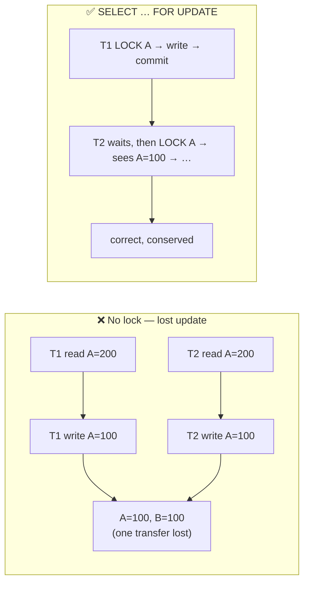
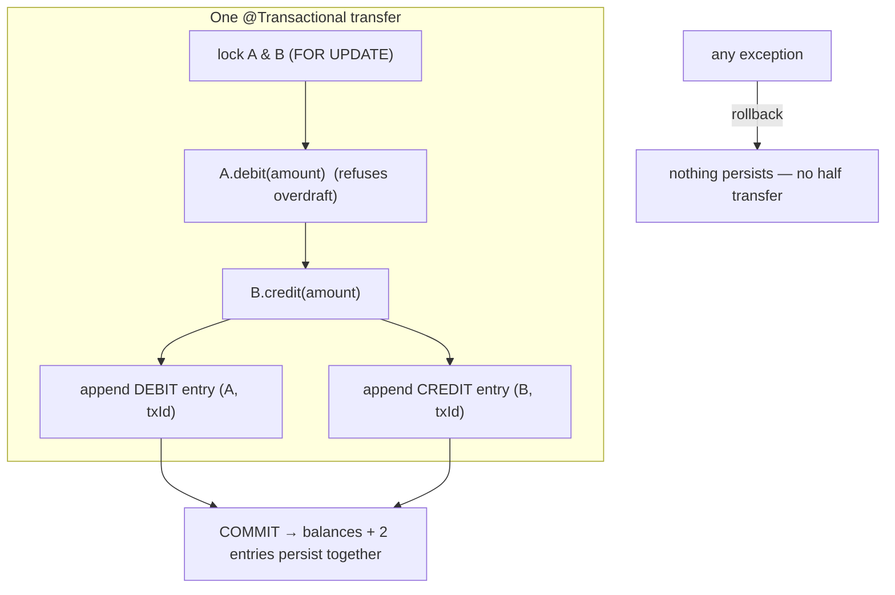
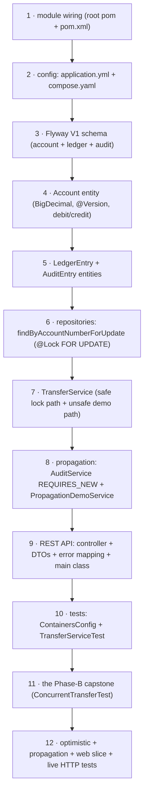

# Step 12 · Demand Account, the Double-Entry Ledger & Transactions Deep
### Phase B — Data, Databases, Concurrency & Transactions 🔵 · Step 12 of 67 · 🎖️ Phase B finale

> *This is where everything in Phase B converges on the scariest thing software does: move money. You'll
> build the bank's second service — accounts and a double-entry ledger — and make transfers correct under
> concurrent load. You'll go deep on `@Transactional` (propagation, rollback rules, isolation, readOnly),
> and run the Phase-B capstone: a stress test that **loses money without locking and is perfect with it**.*

---

<a id="toc"></a>
## 🧭 The Six Movements of This Step

| | Movement | What happens |
|---|---|---|
| **A** | [🧭 Orient](#orient) | 30-second overview · skip-test · cheat card · why it matters · before you start |
| **B** | [🧠 Understand](#understand) | ACID & `@Transactional` internals · double-entry · optimistic vs pessimistic locking |
| **C** | [🛠️ Build](#build) | the `demand-account` service in 12 sub-steps: module → schema → entities → locked repo → transfer service → propagation → API → tests |
| **D** | [🔬 Prove](#prove) | the Verification Log — 11 tests, the capstone (fails without locking, passes with it), §12.3 mutation |
| **E** | [🎓 Apply](#apply) | go deeper · interview prep · your-turn challenges |
| **F** | [🏆 Review](#review) | troubleshooting · resources · recap, flashcards, 🧠 Phase-B cumulative review & what's next |

---

<a id="orient"></a>

# A · 🧭 Orient

## 📋 This Step in 30 Seconds

| | |
|---|---|
| **Title** | Demand Account + double-entry ledger + transaction management deep — move money correctly under concurrency |
| **Step** | 12 of 67 · **Phase B — Data, Databases, Concurrency & Transactions** 🔵 · **🎖️ end-of-phase milestone** |
| **Effort** | ≈ 22 hours focused (a meaty milestone — a whole new service plus the concurrency capstone). Experienced learners can skim the JPA basics and focus on the locking + propagation sections (~6h). |
| **What you'll run this step** | **JVM + Maven** for build & tests; **🐳 Docker** for the tests (Testcontainers Postgres) and for running the service live. One command: `./mvnw -pl services/demand-account -am verify`. |
| **Buildable artifact** | A NEW service **`services/demand-account`** (its own Postgres DB): `Account` (BigDecimal balance + `@Version`), an append-only `LedgerEntry` (double-entry), a `TransferService` with a **pessimistic-lock** transfer (`SELECT … FOR UPDATE`) + a deliberately-unsafe one for the capstone, `@Transactional` propagation/rollback/readOnly, a REST API, and **11 tests** including the **Phase-B capstone** concurrency stress test. `step-12-start == step-11-end`. |
| **Verification tier** | 🔴 **Full** — a new service *and* the money + concurrency path. `./mvnw verify` green + all **11** tests + the capstone proven **both ways** (lost update without locking; perfect with it) + a live HTTP round-trip + the **§12.3 mutation** (remove the lock → 17/20 transfers fail → revert) + clean-room + `smoke.sh`. |
| **Depends on** | **[Step 8](../step-08/lesson.md)** (JPA/Flyway/Testcontainers), **[Step 9](../step-09/lesson.md)** (`@Version` optimistic locking), **[Step 10](../step-10/lesson.md)** (isolation, `FOR UPDATE`, MVCC), **[Step 11](../step-11/lesson.md)** (the lost-update race in the JVM). This step *combines* all of them. **+ Docker.** |

By the end you will be able to design a double-entry ledger and explain why it always balances; explain `@Transactional` end-to-end (proxy, **propagation** REQUIRED/REQUIRES_NEW/NESTED, **isolation**, **rollback rules**, **readOnly**, and the self-invocation pitfall); choose between **optimistic (`@Version`)** and **pessimistic (`SELECT … FOR UPDATE`)** locking and justify it; avoid deadlock with lock ordering; and *prove* a transfer is correct under concurrent load.

### ⏭️ Can You Skip This Step? (5-minute self-check)

If you can confidently do **all** of this, skim the 🧩 Pattern Spotlight and jump to **[Step 13 — Spring MVC / REST deep](../step-13/lesson.md)**.

- [ ] I can model **double-entry** bookkeeping (debits == credits; the ledger is append-only and always nets to zero) and explain why a transfer writes **two** entries in **one** transaction.
- [ ] I can explain `@Transactional`'s **proxy** mechanics, the **self-invocation pitfall**, and the difference between **propagation** modes (REQUIRED vs REQUIRES_NEW vs NESTED).
- [ ] I can state the **default rollback rule** (rolls back on `RuntimeException`/`Error`, **not** checked exceptions) and how to change it.
- [ ] I can choose **optimistic (`@Version`)** vs **pessimistic (`FOR UPDATE`)** locking for a given workload and explain the failure mode of each (retry vs block).
- [ ] I can prevent **deadlock** between two transfers with a consistent **lock ordering**.
- [ ] I can explain why money is **`BigDecimal`** (never `double`) and time is **UTC `Instant`**.

> [!TIP]
> Not 100%? Stay. "How would you stop two withdrawals from overdrawing an account?", "optimistic vs pessimistic locking?", "what does `@Transactional(propagation = REQUIRES_NEW)` do?", and "why not use `double` for money?" are *the* money-domain interview questions — and you'll answer them having watched a transfer lose money without a lock and be perfect with one.

## 📇 Cheat Card

> **What this step delivers (one sentence):** the bank's accounts + double-entry ledger, with transfers that are **correct under concurrent load** — proven by a capstone stress test that loses an update without locking and is perfectly conserved with `SELECT … FOR UPDATE` — plus a deep, hands-on tour of `@Transactional`.

**Key commands** (Windows uses `.\mvnw.cmd`):

```bash
# Build + test the whole service (11 tests) on a real Testcontainers Postgres:
./mvnw -pl services/demand-account -am verify

# Just the Phase-B capstone (fails-without-locking + passes-with-locking):
./mvnw -pl services/demand-account test -Dtest=ConcurrentTransferTest

# One-shot proof your build matches the lesson (needs Docker):
bash steps/step-12/smoke.sh

# Run it live, then poke it with steps/step-12/requests.http:
docker compose -f services/demand-account/compose.yaml up -d
SPRING_DATASOURCE_URL=jdbc:postgresql://localhost:5433/demand_account ./mvnw -pl services/demand-account spring-boot:run
```

**The one headline idea — *a transfer is a read-check-write on a balance; without a lock two of them race and one is lost; `SELECT … FOR UPDATE` serializes them*:**



*Alt-text: without a lock, two transfers both read A=200 and both write A=100, so one transfer is lost (A=100, B=100). With SELECT … FOR UPDATE, T1 locks A, writes, and commits; T2 waits, then locks A and sees the updated value — correct and conserved.*

## 🎯 Why This Matters

Moving money is the canonical "get it exactly right or people lose real money" problem, and it's where every concept in Phase B comes together: JPA persistence (Step 8), `@Version` (Step 9), isolation and `FOR UPDATE` (Step 10), and the lost-update race (Step 11). Interviewers love it because it's concrete and unforgiving: "two withdrawals hit the same account at the same instant — what happens, and how do you make it correct?" After this step you answer by describing a double-entry ledger, a `@Transactional` boundary, and a deliberate choice between optimistic and pessimistic locking — and you've *seen* the race lose money and *seen* the lock fix it.

## ✅ What You'll Be Able to Do

- **Design a double-entry ledger** — accounts + an append-only entry log that always balances (debits == credits).
- **Explain `@Transactional`** — proxy mechanics, propagation, isolation, rollback rules, readOnly, self-invocation.
- **Move money safely** — pessimistic `SELECT … FOR UPDATE` (and optimistic `@Version` as the alternative), with deadlock-safe lock ordering.
- **Prove concurrency correctness** — a stress test that fails without locking and passes with it; money conserved, books balanced.
- **Handle money & time correctly** — `BigDecimal` minor units (never `double`), UTC `Instant`.

## 🧰 Before You Start

**Prerequisites**

- ✅ You finished **Steps 8–11**; the repo is at `step-12-start` (== `step-11-end`) and `./mvnw verify` is green.
- ✅ **Docker is running** (`docker info`). Tests use a Testcontainers Postgres; running live uses `compose.yaml`.

**What you already learned that connects here**

- **Step 8**: JPA entities, repositories, Flyway, `ddl-auto=validate`, Testcontainers — we reuse all of it for a second service (database-per-service).
- **Step 9**: `@Version` optimistic locking — here it's one of the two strategies, on `Account`.
- **Step 10**: isolation levels, MVCC, and `SELECT … FOR UPDATE` — the pessimistic transfer *is* `FOR UPDATE`.
- **Step 11**: the lost-update race and lock ordering — the capstone is that race, now with money on the line.
- **Step 7**: AOP proxies — `@Transactional` is a proxy, so the **self-invocation pitfall** applies here too.

> **Depends on: Steps 7, 8, 9, 10, 11.** This step is the convergence point of Phase B.

---

<a id="understand"></a>

# B · 🧠 Understand

## 🧠 The Big Idea

Three ideas combine in this step.

**1 — ACID transactions.** A database transaction is **A**tomic (all-or-nothing), **C**onsistent (invariants hold across it), **I**solated (concurrent transactions don't corrupt each other — Step 10's isolation levels), and **D**urable (committed = survives a crash). A money transfer *must* be atomic: debit-A-and-credit-B happen together or not at all. In Spring, the boundary is `@Transactional` — a method that runs inside one database transaction, committed on normal return and rolled back on a (runtime) exception.

**2 — Double-entry bookkeeping.** Every money movement is recorded as **two** ledger entries — a **DEBIT** on the payer and a **CREDIT** on the payee — of equal amount, sharing one `transactionId`. The ledger is **append-only** (never updated or deleted), so it's an immutable audit trail, and because every debit has a matching credit, **the sum of all entries is always zero** — the books always balance. We *also* keep a materialized `balance` on each account (fast to read) and update it inside the same transaction, so balance and ledger stay consistent.

**3 — Concurrency on a shared balance.** A transfer is a **read-check-write**: read the balance, check it's enough, write the new balance. That's exactly Step 11's lost-update race and Step 10's isolation problem — now on money. Two concurrent transfers from the same account can both read the old balance and both write, losing one. We fix it with a **pessimistic lock** (`SELECT … FOR UPDATE` — Step 10) that serializes them, or an **optimistic** one (`@Version` — Step 9) that rejects the loser. The choice is an engineering judgement you must be able to defend.

> **Analogy — the shared passbook.** Picture one paper passbook (the account) and a ledger journal (the entries). A transfer is: read the passbook balance, subtract, write it back, and record two journal lines (out of one book, into another). If two clerks grab the passbook at once, both read "200", both write "100", and one withdrawal silently vanishes — the journal says 200 left but the passbook shows only 100 gone. The fix is a rule: **you must hold the passbook (lock the row) for the whole read-write**, so the second clerk waits. That's `SELECT … FOR UPDATE`. The alternative — **stamp each write with an edition number** and reject a write against a stale edition — is optimistic `@Version`.



*Alt-text: one @Transactional transfer locks accounts A and B with FOR UPDATE, debits A (refusing overdraft), credits B, appends a DEBIT and a CREDIT ledger entry sharing a transaction id, and commits so balances and both entries persist together; any exception rolls back so nothing persists.*

## 🧩 Pattern Spotlight — Pessimistic Locking (`SELECT … FOR UPDATE`)

> **Problem.** Concurrent transfers on the same account race on the read-check-write of its balance. The check ("enough funds?") can be true for both, and both debit — overdrawing the account or losing an update.

> **Why pessimistic locking fits.** Money movement on a hot account is exactly the *high-contention, must-serialize* case. A pessimistic **row lock** taken at read time (`SELECT … FOR UPDATE`) makes the second transfer **wait** until the first commits, then it reads the *updated* balance and decides correctly. No retry loop, no lost update — concurrency is traded for guaranteed correctness on the contended row.

> **How it works (the mechanism).** Spring Data's `@Lock(LockModeType.PESSIMISTIC_WRITE)` makes Hibernate emit `SELECT … FOR UPDATE`. Postgres takes a row-level write lock; any other transaction that tries to lock the same row **blocks** until the holder commits/rolls back. We lock both accounts in a **deterministic order** (by account number) so two transfers touching the same pair can't deadlock by grabbing them in opposite orders (Step 11's lock-ordering rule).

> **Alternatives / trade-offs.** **Optimistic (`@Version`, Step 9):** no lock during the read; detect the conflict at write time and throw — great when conflicts are *rare*, but the loser must **retry** (and under heavy contention you get a storm of retries — we measured 17 of 20 transfers failing). **SERIALIZABLE (Step 10):** the database detects the anomaly and aborts with `40001` (also retry-based). **Rule of thumb:** pessimistic for hot, must-serialize money rows (this step); optimistic for low-contention edits (Step 9's KYC status). Same goal — no lost update — different bet on contention.

> **Implementation (here).** `AccountRepository.findByAccountNumberForUpdate` carries `@Lock(PESSIMISTIC_WRITE)`; `TransferService.transfer` locks both accounts in account-number order, then debits/credits. `ConcurrentTransferTest` proves it.

## 🌱 Under the Hood: How It Really Works

**`@Transactional` is a proxy (callback to Step 7).** Spring wraps the bean in a proxy; calling a `@Transactional` method *through* the proxy opens a transaction (via the `PlatformTransactionManager`), runs your method, then commits or rolls back. Two consequences: **(1) self-invocation** — a `this.someTransactionalMethod()` call inside the same bean bypasses the proxy, so the annotation does nothing (the same trap as `@Around`/`@PreAuthorize` in Step 7). That's *why* our `REQUIRES_NEW` audit lives in a **separate** bean (`AuditService`) called from `PropagationDemoService`. **(2)** the transaction is tied to the *thread* (a `ThreadLocal`), which is why each concurrent transfer (its own thread) gets its own transaction.

**Propagation — what happens when a transactional method calls another.**
- **`REQUIRED`** (default): join the caller's transaction if one exists, else start one. The two ledger writes + balance updates all share one transaction → atomic together.
- **`REQUIRES_NEW`**: **suspend** the caller's transaction and run in a brand-new one that commits independently. We use it for the **audit log**: the audit row commits even if the business transaction later rolls back. (Proven by `TransactionPropagationTest`.)
- **`NESTED`**: a **savepoint** inside the caller's transaction — it can roll back to the savepoint without killing the whole transaction (Postgres supports it). Useful for "try this sub-step; if it fails, undo just it."
- Others: `SUPPORTS`, `NOT_SUPPORTED`, `MANDATORY`, `NEVER` — situational.

**Rollback rules (a classic gotcha).** By default Spring rolls back on **`RuntimeException`** and **`Error`**, but **commits** on checked exceptions. So our `InsufficientFundsException extends RuntimeException` → a failed transfer rolls back automatically (no half-transfer). If you threw a *checked* exception and wanted rollback, you'd need `@Transactional(rollbackFor = MyCheckedException.class)`. Proven: `overdraw_isRejected_andRollsBackEverything` shows the debit that ran *before* the exception is undone and **no ledger rows** remain.

**`readOnly = true`.** A hint that the transaction won't write: Hibernate sets the flush mode to `MANUAL` (skips dirty-checking flushes) and the driver/DB can optimize. Our `balanceOf`/`totalSystemBalance` are read-only. (It's a hint, not a hard guarantee against writes.)

**Optimistic vs pessimistic at the engine (Steps 9 + 10 combined).**
- **Optimistic (`@Version`):** the `UPDATE` carries `WHERE id = ? AND version = ?` and `SET version = version + 1`. If another transaction bumped the version first, it matches 0 rows → `ObjectOptimisticLockingFailureException`. No lock during the read; the loser **retries**.
- **Pessimistic (`FOR UPDATE`):** the `SELECT` takes a row lock; the second transaction **blocks** at the `SELECT` until the first commits. No retry; it just waits.
- We measured the difference: with `FOR UPDATE`, 20 concurrent transfers all succeed; with only `@Version` (no `FOR UPDATE`), **17 of 20 fail** with optimistic-lock exceptions (they'd need a retry loop).

**Deadlock & lock ordering (callback to Step 11).** If transfer 1 locks A then B, and transfer 2 locks B then A, they can deadlock. We avoid it by always locking in a **global order** (by account number): both transfers lock the lower account number first, so one simply waits for the other. Postgres also *detects* deadlocks and aborts one with a `40P01` error, but ordering avoids them entirely.

**Money & time correctness.** Money is **`BigDecimal`** (exact decimal), stored as `numeric(19,4)` — **never `double`/`float`**, which can't represent `0.10` exactly and would drift cents over millions of operations. We compare with `compareTo` (not `equals`, which is scale-sensitive). Time is **UTC `Instant`** → `timestamptz`, never a local time. (Domain 5's "money & time" contract.)

## 🛡️ Security Lens: What Could Go Wrong

- **The overdraft race is a TOCTOU vulnerability.** "Check the balance, then debit" without a lock lets an attacker fire two simultaneous withdrawals and **spend the same money twice** (double-spend). It's a *security* bug, not just a correctness one — the fix (atomic check-and-debit under a lock) is a control. We literally demonstrate the unguarded version losing an update.
- **The ledger must be immutable.** If ledger entries could be updated/deleted, an attacker (or a bug) could rewrite history and hide theft. Append-only + "balance must reconcile to the ledger" is an integrity control; in Phase J we make it event-sourced.
- **Rollback must be total.** A partial transfer (debit without credit, or balance updated without a ledger entry) corrupts the books. The single `@Transactional` boundary guarantees all-or-nothing — but only if everything is in *one* transaction; a stray `REQUIRES_NEW` on the wrong method could let half the work commit.
- **Don't leak the version/internal fields.** The API returns a DTO (`AccountResponse`), not the entity — no `@Version`, no internal columns (data minimization, as in Step 9).

## 🕰️ Then vs. Now (How This Changed Across Versions)

| Topic | Then | Now | Why it changed |
|---|---|---|---|
| **Transaction demarcation** | Programmatic — `tx.begin()/commit()/rollback()` by hand, or EJB CMT. | **Declarative `@Transactional`** (proxy-based) — the boundary is an annotation. | Less boilerplate, fewer leaked transactions; the proxy handles commit/rollback. |
| **Package** | `javax.transaction` / `javax.persistence`. | **`jakarta.*`** (Spring Boot 3+). | The Jakarta EE rename. We use `jakarta.persistence.LockModeType`, etc. |
| **Locking** | Hand-written `SELECT … FOR UPDATE` in SQL/JDBC. | `@Lock(PESSIMISTIC_WRITE)` / `@Version` declaratively in Spring Data JPA. | The ORM generates the right SQL; you express *intent*. |
| **Money type** | `float`/`double` (and silent rounding bugs), or integer cents by hand. | **`BigDecimal`** (exact) — and integer *minor units* where you need them. | Money rounding errors are unacceptable; `BigDecimal` is exact. |

> [!NOTE]
> *Verify, don't guess.* `@Transactional`'s default rollback-on-`RuntimeException`-only behaviour and the proxy/self-invocation rule are long-standing Spring facts; `jakarta.*` landed in Boot 3. `@Lock(PESSIMISTIC_WRITE)` → `FOR UPDATE` is standard JPA. The exact Hibernate/Boot versions are in `VERSIONS.md`. All APIs used here are stable.

## 🧵 Thread-safety note

The account `balance` is **shared mutable state** touched by concurrent transfer threads — exactly Step 11's hazard, now in the database. Three layers defend it, and you should be able to place each: **(1)** in-JVM, a single instance could use `synchronized` — but that **fails across multiple service instances** (the real deployment), so we don't rely on it; **(2)** optimistic `@Version` (Step 9) — detect-and-retry; **(3)** pessimistic `FOR UPDATE` (Step 10) — lock-and-wait, our default for money. The database is the single point of truth where all instances coordinate, which is why the *database* lock (not a JVM lock) is the right tool for distributed money movement. (Distributed locks like Redis/ShedLock come in Step 22.)

---

<a id="build"></a>

# C · 🛠️ Build

## 📦 Your Starting Point

You're at **`step-12-start`** (== `step-11-end`). The repo builds with 6 modules. This step adds a 7th — `services/demand-account` — the bank's second real microservice, with its own Postgres DB (database-per-service, as cif).

Confirm the start builds:
```bash
./mvnw -q -pl services/cif -am verify   # still green from Step 10/11
```
✅ **Expected** — ends in a clean build (recorded clean-room/chain check in 🔬 §8):
```
[INFO] BUILD SUCCESS
```

## 🛠️ Let's Build It — Step by Step



🌳 **Files we'll touch** (all new, under `services/demand-account/`, plus one line in the root `pom.xml`):
```
pom.xml  (root — add the module)
services/demand-account/
├── pom.xml                                    # new module
├── compose.yaml                               # local Postgres (host 5433)
└── src/
    ├── main/
    │   ├── java/com/buildabank/account/
    │   │   ├── DemandAccountApplication.java
    │   │   ├── domain/
    │   │   │   ├── Account.java                # BigDecimal balance + @Version + debit/credit
    │   │   │   ├── LedgerEntry.java            # append-only double-entry leg
    │   │   │   ├── AuditEntry.java             # for the REQUIRES_NEW demo
    │   │   │   ├── EntryDirection.java         # DEBIT | CREDIT
    │   │   │   ├── InsufficientFundsException.java
    │   │   │   ├── AccountRepository.java      # findByAccountNumberForUpdate (FOR UPDATE)
    │   │   │   ├── LedgerEntryRepository.java  # netOfAllEntries (books balance check)
    │   │   │   └── AuditEntryRepository.java
    │   │   ├── service/
    │   │   │   ├── TransferService.java        # safe (locked) + unsafe (demo) transfer
    │   │   │   ├── AuditService.java           # @Transactional(REQUIRES_NEW)
    │   │   │   └── PropagationDemoService.java # audits, then fails
    │   │   └── web/
    │   │       ├── TransferController.java
    │   │       ├── ApiExceptionHandler.java
    │   │       ├── OpenAccountRequest.java
    │   │       ├── TransferRequest.java
    │   │       ├── AccountResponse.java
    │   │       └── TransferResponse.java
    │   └── resources/
    │       ├── application.yml
    │       └── db/migration/V1__create_account_and_ledger.sql
    └── test/java/com/buildabank/account/
        ├── ContainersConfig.java
        ├── DemandAccountIntegrationTest.java
        ├── service/ConcurrentTransferTest.java     # 🎓 the Phase-B capstone
        ├── service/OptimisticLockTest.java
        ├── service/TransactionPropagationTest.java
        ├── service/TransferServiceTest.java
        └── web/TransferControllerTest.java
steps/step-12/{requests.http, smoke.sh}
```

> *This is a large step (a whole service). Below we build **every file in full** — nothing is "left as an exercise" or shown as a fragment. Each sub-step shows the complete, copy-pasteable file exactly as it ends up at `step-12-end`, with the full micro-anatomy. Type along, run between pieces, and commit after each unit.*

---

### Sub-step 1 of 12 — Module wiring 🧭 *(you are here: **module** → config → schema → entities → repo → service → propagation → api → tests)*

🎯 **Goal:** register a new Maven module so `./mvnw` builds it, and give it the same Spring Boot + JPA + Flyway + Testcontainers dependency set as the cif service from Step 8.

📁 **Location:** edit the root `pom.xml` (add one `<module>` line), then a new file `services/demand-account/pom.xml`.

⌨️ **Edit (root `pom.xml`)** — add `demand-account` to the reactor, right after `cif` (before → after):

```diff
     <modules>
         <module>services/hello</module>
         <module>services/cif</module>
+        <module>services/demand-account</module>
         <module>playground/java-basics</module>
         <module>playground/spring-lab</module>
         <module>playground/concurrency-lab</module>
```

⌨️ **Code (new file):**

```xml
<!-- services/demand-account/pom.xml -->
<?xml version="1.0" encoding="UTF-8"?>
<project xmlns="http://maven.apache.org/POM/4.0.0"
         xmlns:xsi="http://www.w3.org/2001/XMLSchema-instance"
         xsi:schemaLocation="http://maven.apache.org/POM/4.0.0 https://maven.apache.org/xsd/maven-4.0.0.xsd">
    <modelVersion>4.0.0</modelVersion>

    <!--
      demand-account — the bank's accounts + double-entry ledger. The SECOND real microservice (its own
      Postgres DB), and the place we move money safely under concurrency: deep @Transactional, pessimistic
      locking (SELECT ... FOR UPDATE), and a concurrency stress test that fails without locking and passes
      with it. Money in BigDecimal (minor units), time in UTC/Instant. (Step 12.)
    -->
    <parent>
        <groupId>com.buildabank</groupId>
        <artifactId>build-a-bank-parent</artifactId>
        <version>0.1.0-SNAPSHOT</version>
        <relativePath>../../pom.xml</relativePath>
    </parent>

    <artifactId>demand-account</artifactId>
    <name>Build-a-Bank :: Services :: Demand Account</name>
    <description>Accounts + double-entry ledger; transactions and pessimistic locking (Step 12).</description>

    <dependencies>
        <dependency>
            <groupId>org.springframework.boot</groupId>
            <artifactId>spring-boot-starter-web</artifactId>
        </dependency>
        <dependency>
            <groupId>org.springframework.boot</groupId>
            <artifactId>spring-boot-starter-data-jpa</artifactId>
        </dependency>
        <dependency>
            <groupId>org.springframework.boot</groupId>
            <artifactId>spring-boot-starter-validation</artifactId>
        </dependency>
        <dependency>
            <groupId>org.springframework.boot</groupId>
            <artifactId>spring-boot-starter-actuator</artifactId>
        </dependency>

        <!-- Flyway: Boot integration module (provides FlywayAutoConfiguration) + Postgres support module. -->
        <dependency>
            <groupId>org.springframework.boot</groupId>
            <artifactId>spring-boot-flyway</artifactId>
        </dependency>
        <dependency>
            <groupId>org.flywaydb</groupId>
            <artifactId>flyway-database-postgresql</artifactId>
        </dependency>

        <dependency>
            <groupId>org.postgresql</groupId>
            <artifactId>postgresql</artifactId>
            <scope>runtime</scope>
        </dependency>

        <!-- ── Test ── -->
        <dependency>
            <groupId>org.springframework.boot</groupId>
            <artifactId>spring-boot-starter-test</artifactId>
            <scope>test</scope>
        </dependency>
        <dependency>
            <groupId>org.springframework.boot</groupId>
            <artifactId>spring-boot-data-jpa-test</artifactId>
            <scope>test</scope>
        </dependency>
        <dependency>
            <groupId>org.springframework.boot</groupId>
            <artifactId>spring-boot-webmvc-test</artifactId>
            <scope>test</scope>
        </dependency>
        <dependency>
            <groupId>org.springframework.boot</groupId>
            <artifactId>spring-boot-testcontainers</artifactId>
            <scope>test</scope>
        </dependency>
        <dependency>
            <groupId>org.testcontainers</groupId>
            <artifactId>testcontainers-postgresql</artifactId>
            <scope>test</scope>
        </dependency>
        <dependency>
            <groupId>org.testcontainers</groupId>
            <artifactId>testcontainers-junit-jupiter</artifactId>
            <scope>test</scope>
        </dependency>
    </dependencies>

    <build>
        <plugins>
            <plugin>
                <groupId>org.springframework.boot</groupId>
                <artifactId>spring-boot-maven-plugin</artifactId>
            </plugin>
        </plugins>
    </build>
</project>
```

🔍 **Line-by-line:**
- `<module>services/demand-account</module>` in the **root** pom — this is what makes a *multi-module Maven* build (the "reactor") include the new service. Without it, `./mvnw verify` from the root never compiles or tests this code.
- `<parent>…build-a-bank-parent…</parent>` — inherits the pinned dependency versions (the Spring Boot BOM) from the root pom, so we list dependencies **without version numbers** — `VERSIONS.md` owns them. `<relativePath>../../pom.xml</relativePath>` points two levels up to the root.
- `spring-boot-starter-web` — Spring MVC + an embedded Tomcat (the REST API). `…-data-jpa` — Hibernate + Spring Data repositories. `…-validation` — Bean Validation (`@NotBlank`, `@Positive`). `…-actuator` — health/info/flyway endpoints.
- `spring-boot-flyway` + `flyway-database-postgresql` — Flyway runs our `V1` migration on startup (the schema), with Postgres-specific support.
- `postgresql` at `runtime` scope — the JDBC driver; needed to *run*, not to *compile*.
- The **test** block mirrors cif (Step 8): `starter-test` (JUnit 5 + AssertJ + Mockito), the JPA/WebMVC test slices, and **Testcontainers** (`testcontainers-postgresql` + `…-junit-jupiter`) so tests run against a *real* throwaway Postgres.
- `spring-boot-maven-plugin` — repackages the service into a runnable fat-jar and powers `spring-boot:run`.

💭 **Under the hood:** Maven resolves the reactor build order from inter-module dependencies. Because `demand-account` declares no dependency on other modules, it builds independently; `-am` ("also make") builds any required upstream modules first. Versions come from the parent's `<dependencyManagement>` (the Boot BOM), which is why omitting versions here is correct, not a mistake.

🔮 **Predict:** if you create `services/demand-account/pom.xml` but forget the root-pom `<module>` line, does `./mvnw verify` build the new service? <details><summary>answer</summary>No — Maven only builds modules listed in the reactor. The code would compile in your IDE but be invisible to the command-line build (and CI). Always wire the module in the root pom.</details>

▶️ **Run & See:**
```bash
./mvnw -q -pl services/demand-account -am validate
```
✅ **Expected output** (the module resolves and its parent/dependencies are found):
```
[INFO] BUILD SUCCESS
```
❌ **If you see `Could not find artifact com.buildabank:build-a-bank-parent`:** the `<relativePath>` is wrong — it must point at the **root** `pom.xml` (`../../pom.xml`).

✋ **Checkpoint:** the root pom lists `services/demand-account`, and `./mvnw -q -pl services/demand-account -am validate` succeeds.

💾 **Commit:**
```bash
git add pom.xml services/demand-account/pom.xml
git commit -m "feat(demand-account): add module + dependencies (web, JPA, Flyway, Testcontainers)"
```

⚠️ **Pitfall:** a raw `&` in the pom's `<description>` breaks XML parsing — write `and` or `&amp;`. (That's why our description says "ledger; transactions and pessimistic locking".)

---

### Sub-step 2 of 12 — Configuration: `application.yml` + `compose.yaml` 🧭 *(module ✅ → **config** → schema → entities → …)*

🎯 **Goal:** tell the service how to reach Postgres (env-driven, 12-factor), turn **OSIV off** and let **Flyway own the schema** (`ddl-auto=validate`), pick port **8082**, and provide a one-command local Postgres on host port **5433**.

📁 **Location:** `services/demand-account/src/main/resources/application.yml` and `services/demand-account/compose.yaml`.

⌨️ **Code** — `application.yml`:

```yaml
# services/demand-account/src/main/resources/application.yml
spring:
  application:
    name: demand-account
  datasource:
    # Env-driven (12-factor). Defaults match a local Postgres; tests use Testcontainers (random port).
    url: ${SPRING_DATASOURCE_URL:jdbc:postgresql://localhost:5432/demand_account}
    username: ${SPRING_DATASOURCE_USERNAME:bank}
    password: ${SPRING_DATASOURCE_PASSWORD:change-me-locally}
  jpa:
    hibernate:
      ddl-auto: validate     # Flyway OWNS the schema; Hibernate only validates the mapping matches.
    open-in-view: false      # OSIV off (Step 9): fetch deliberately, fail fast on lazy-outside-tx.
    properties:
      hibernate:
        format_sql: true
  flyway:
    enabled: true            # runs db/migration/V*.sql on startup, before Hibernate validates.

server:
  port: 8082                 # demand-account's port (hello=8080, cif=8081).
  shutdown: graceful

management:
  endpoints:
    web:
      exposure:
        include: health,info,flyway

logging:
  level:
    com.buildabank.account: INFO
```

⌨️ **Code** — `compose.yaml`:

```yaml
# services/demand-account/compose.yaml — local PostgreSQL for running the Demand Account service by hand.
# Up:   docker compose -f services/demand-account/compose.yaml up -d
# Down: docker compose -f services/demand-account/compose.yaml down -v   (the -v also drops the data volume)
#
# NOTE: this machine already runs a local Postgres on 5432, so we map host port 5433 to avoid the clash
# (see CAPABILITIES.md). Run the service with the matching URL:
#   SPRING_DATASOURCE_URL=jdbc:postgresql://localhost:5433/demand_account ./mvnw -pl services/demand-account spring-boot:run
services:
  postgres:
    image: postgres:17-alpine          # pinned (never :latest)
    container_name: demand-account-postgres
    environment:
      POSTGRES_DB: demand_account
      POSTGRES_USER: bank
      POSTGRES_PASSWORD: change-me-locally
    ports:
      - "5433:5432"
    healthcheck:
      test: ["CMD-SHELL", "pg_isready -U bank -d demand_account"]
      interval: 5s
      timeout: 3s
      retries: 10
    volumes:
      - demand-account-pgdata:/var/lib/postgresql/data

volumes:
  demand-account-pgdata:
```

🔍 **Line-by-line (`application.yml`):**
- `spring.datasource.url: ${SPRING_DATASOURCE_URL:…}` — the `${VAR:default}` syntax reads an environment variable and falls back to the default. This is **12-factor config**: the same jar runs against any database by setting one env var (no rebuild). Tests override it entirely (Testcontainers).
- `ddl-auto: validate` — Hibernate must **not** create/alter tables; it only checks the entity mappings match the schema Flyway built. If a column is missing or mistyped, the app fails fast at startup.
- `open-in-view: false` — **OSIV off** (Step 9). The persistence context closes at the end of the service method, so any lazy access in the web layer fails loudly instead of silently issuing extra queries.
- `format_sql: true` — pretty-prints generated SQL in logs (handy when watching the `UPDATE … WHERE version = ?`).
- `flyway.enabled: true` — Flyway runs the `V*.sql` migrations **before** Hibernate validates.
- `server.port: 8082` — each service gets its own port (hello=8080, cif=8081, demand-account=8082). `shutdown: graceful` lets in-flight requests finish on stop.
- `management…exposure.include: health,info,flyway` — exposes only those Actuator endpoints; `/actuator/flyway` lets you *see* which migrations ran.

🔍 **Line-by-line (`compose.yaml`):**
- `image: postgres:17-alpine` — pinned tag (never `:latest`), the small Alpine variant.
- `ports: ["5433:5432"]` — maps **host 5433** → container 5432, dodging the local Postgres already on 5432 (a real constraint recorded in `CAPABILITIES.md`).
- `healthcheck` with `pg_isready` — Compose marks the container healthy only once Postgres accepts connections, so `up -d` followed by a run won't race the DB.
- `volumes: demand-account-pgdata` — persists data across restarts; `down -v` drops it.

💭 **Under the hood:** `SpringApplication` reads `application.yml` via the `Environment`; `DataSourceAutoConfiguration` builds a HikariCP pool from `spring.datasource.*`; `FlywayAutoConfiguration` sees `spring-boot-flyway` on the classpath and a `DataSource` bean, runs migrations, then Hibernate's `SchemaManagementTool` validates. Order matters: **Flyway before Hibernate-validate** is wired by Boot automatically.

🔮 **Predict:** the default URL points at port 5432, but `compose.yaml` exposes 5433. What happens if you run the service with no `SPRING_DATASOURCE_URL` set while only the compose Postgres is up? <details><summary>answer</summary>It tries 5432 (the default) and fails to connect (or hits your *other* local Postgres). That's exactly why every run command in this step sets `SPRING_DATASOURCE_URL=…localhost:5433/demand_account`.</details>

✋ **Checkpoint:** both files exist; `docker compose -f services/demand-account/compose.yaml config` prints the resolved compose file without error.

💾 **Commit:**
```bash
git add services/demand-account/src/main/resources/application.yml services/demand-account/compose.yaml
git commit -m "feat(demand-account): app config (validate + OSIV off + 8082) and local compose Postgres"
```

⚠️ **Pitfall:** committing a real password. `change-me-locally` is a deliberately-fake demo credential; real secrets always come from the environment, never the repo (the Step-1 secrets-hygiene rule).

---

### Sub-step 3 of 12 — The Flyway `V1` schema 🧭 *(module ✅ → config ✅ → **schema** → entities → …)*

🎯 **Goal:** write the SQL that creates `account`, the append-only `ledger_entry`, and an `audit_log` table. **This file is the source of truth for the schema** — Hibernate only validates against it.

📁 **Location:** new file → `services/demand-account/src/main/resources/db/migration/V1__create_account_and_ledger.sql`

> The folder `src/main/resources/db/migration` is Flyway's default location, and the filename format is **`V<version>__<description>.sql`** — capital `V`, a version, **two** underscores, a description.

⌨️ **Code:**

```sql
-- services/demand-account/src/main/resources/db/migration/V1__create_account_and_ledger.sql
-- The accounts + double-entry ledger schema. Flyway owns it; Hibernate (ddl-auto=validate) only checks
-- the entity mappings match. Money is stored as numeric(19,4) (exact decimal — never float/double).

create table account (
    id              bigint generated by default as identity primary key,
    account_number  varchar(20)    not null unique,
    currency        varchar(3)     not null,
    balance         numeric(19, 4) not null default 0,   -- materialized balance (kept in sync within a txn)
    version         bigint         not null default 0,    -- optimistic-locking version (@Version)
    created_at      timestamp(6) with time zone not null
);

-- The double-entry ledger: an append-only record of every leg of every money movement. Two entries per
-- transfer (one DEBIT, one CREDIT) share a transaction_id and sum to zero — the books always balance.
create table ledger_entry (
    id              bigint generated by default as identity primary key,
    account_id      bigint         not null references account (id),
    transaction_id  uuid           not null,
    direction       varchar(6)     not null check (direction in ('DEBIT', 'CREDIT')),
    amount          numeric(19, 4) not null check (amount > 0),
    description     varchar(200),
    created_at      timestamp(6) with time zone not null
);

create index idx_ledger_account on ledger_entry (account_id);
create index idx_ledger_transaction on ledger_entry (transaction_id);

-- An independent audit log used to demonstrate transaction propagation (REQUIRES_NEW commits separately).
create table audit_log (
    id          bigint generated by default as identity primary key,
    event       varchar(100) not null,
    detail      varchar(500),
    created_at  timestamp(6) with time zone not null
);
```

🔍 **Line-by-line:**
- `id bigint generated by default as identity primary key` — Postgres identity column, matching `@GeneratedValue(IDENTITY)` on a `Long` id.
- `balance numeric(19,4) not null default 0` — **exact decimal money** (up to 19 digits, 4 after the point). This is the materialized balance we keep in sync inside the transfer transaction. `numeric`, never `float`/`double`.
- `version bigint not null default 0` — the **optimistic-lock** column (Step 9); maps to `@Version`. Hibernate bumps it on every update and adds `WHERE version = ?`.
- `account_id bigint not null references account (id)` — a **foreign key**: every ledger entry belongs to a real account.
- `direction varchar(6) not null check (direction in ('DEBIT','CREDIT'))` — a **CHECK constraint** enforcing the enum's two values at the *database* level (belt-and-braces with the Java enum).
- `amount numeric(19,4) not null check (amount > 0)` — another CHECK: amounts are always strictly positive (direction carries the sign, not the number).
- `idx_ledger_account` / `idx_ledger_transaction` — B-tree indexes so "all entries for an account / for a transaction" lookups don't scan the whole table.
- `audit_log` — a standalone table with **no FK to account**, backing the `REQUIRES_NEW` propagation demo (it must be able to commit independently).

💭 **Under the hood:** Flyway records each applied migration in a `flyway_schema_history` table it creates automatically, with a **checksum** of the file. On the next startup it skips already-applied versions; if you *edit* an applied migration the checksum changes and Flyway refuses to start — which is why migrations are append-only (you add `V2`, never rewrite `V1`). Then Hibernate's `validate` cross-checks the entity mappings against these tables.

🔮 **Predict:** the entity will map `balance` to `BigDecimal` and the SQL says `numeric(19,4)`. If you instead mapped `balance` to a Java `double`, when would you find out it's wrong — compile time or startup? <details><summary>answer</summary>Neither would *crash* immediately (Hibernate can map `double`→`numeric`), but you'd reintroduce floating-point rounding drift on every operation — a silent correctness bug. The schema can't save you from the wrong Java type; the discipline ("money is `BigDecimal`") must.</details>

✋ **Checkpoint:** the file exists at exactly `…/db/migration/V1__create_account_and_ledger.sql` (double underscore!). We can't run it until the entities + tests exist.

💾 **Commit:**
```bash
git add services/demand-account/src/main/resources/db/migration/V1__create_account_and_ledger.sql
git commit -m "feat(demand-account): Flyway V1 — account + double-entry ledger + audit_log schema"
```

⚠️ **Pitfall:** a *single* underscore (`V1_create….sql`) — Flyway won't recognize the description separator. It must be **two** underscores after the version.

---

### Sub-step 4 of 12 — The `Account` entity (money + `@Version` + the overdraft invariant) 🧭 *(module ✅ → config ✅ → schema ✅ → **entity** → ledger → repo → …)*

🎯 **Goal:** the `Account` aggregate — a `BigDecimal` balance, the `@Version` optimistic-lock column, and `debit`/`credit` methods that **refuse to overdraw** (the invariant this service must never break). Plus the tiny `EntryDirection` enum and `InsufficientFundsException` it leans on.

📁 **Location:** `services/demand-account/src/main/java/com/buildabank/account/domain/Account.java` (+ `EntryDirection.java`, `InsufficientFundsException.java` in the same package).

⌨️ **Code** — `Account.java` (the complete file):

```java
// services/demand-account/src/main/java/com/buildabank/account/domain/Account.java
package com.buildabank.account.domain;

import java.math.BigDecimal;
import java.time.Instant;

import jakarta.persistence.Column;
import jakarta.persistence.Entity;
import jakarta.persistence.GeneratedValue;
import jakarta.persistence.GenerationType;
import jakarta.persistence.Id;
import jakarta.persistence.Table;
import jakarta.persistence.Version;

/**
 * A demand (current) account with a materialized {@code balance}. Money is a {@link BigDecimal} — exact
 * decimal arithmetic, <strong>never</strong> {@code double}/{@code float} (which can't represent 0.10
 * exactly). The {@code @Version} column gives optimistic locking (Step 9); under heavy contention we instead
 * take a pessimistic row lock at read time (see {@code AccountRepository.findByAccountNumberForUpdate}).
 *
 * <p>The balance is kept correct by doing the read-check-write of {@link #debit}/{@link #credit} inside one
 * transaction while holding the row lock — the database analogue of Step 11's {@code synchronized}.
 */
@Entity
@Table(name = "account")
public class Account {

    @Id
    @GeneratedValue(strategy = GenerationType.IDENTITY)
    private Long id;

    @Column(name = "account_number", nullable = false, unique = true, updatable = false)
    private String accountNumber;

    @Column(nullable = false, updatable = false)
    private String currency;

    @Column(nullable = false)
    private BigDecimal balance;

    @Version
    private long version;

    @Column(name = "created_at", nullable = false, updatable = false)
    private Instant createdAt;

    /** JPA requires a no-arg constructor. */
    protected Account() {
    }

    public Account(String accountNumber, String currency, BigDecimal openingBalance, Instant createdAt) {
        this.accountNumber = accountNumber;
        this.currency = currency;
        this.balance = openingBalance;
        this.createdAt = createdAt;
    }

    /** Take money out — refuses to overdraw (the invariant this service must never break). */
    public void debit(BigDecimal amount) {
        requirePositive(amount);
        if (balance.compareTo(amount) < 0) {
            throw new InsufficientFundsException(
                    "account " + accountNumber + " balance " + balance + " < debit " + amount);
        }
        balance = balance.subtract(amount);
    }

    /** Put money in. */
    public void credit(BigDecimal amount) {
        requirePositive(amount);
        balance = balance.add(amount);
    }

    private static void requirePositive(BigDecimal amount) {
        if (amount == null || amount.signum() <= 0) {
            throw new IllegalArgumentException("amount must be positive, was " + amount);
        }
    }

    public Long getId() {
        return id;
    }

    public String getAccountNumber() {
        return accountNumber;
    }

    public String getCurrency() {
        return currency;
    }

    public BigDecimal getBalance() {
        return balance;
    }

    public long getVersion() {
        return version;
    }

    public Instant getCreatedAt() {
        return createdAt;
    }
}
```

⌨️ **Code** — `EntryDirection.java` (the complete file):

```java
// services/demand-account/src/main/java/com/buildabank/account/domain/EntryDirection.java
package com.buildabank.account.domain;

/** The two legs of double-entry bookkeeping. Persisted as a STRING (stable, readable), never the ordinal. */
public enum EntryDirection {
    /** Money leaving this account. */
    DEBIT,
    /** Money arriving in this account. */
    CREDIT
}
```

⌨️ **Code** — `InsufficientFundsException.java` (the complete file):

```java
// services/demand-account/src/main/java/com/buildabank/account/domain/InsufficientFundsException.java
package com.buildabank.account.domain;

/**
 * Thrown when a debit would overdraw an account. It's a {@link RuntimeException}, so Spring's
 * {@code @Transactional} rolls the transfer back by default (no half-completed money movement) — see the
 * Step-12 lesson on rollback rules.
 */
public class InsufficientFundsException extends RuntimeException {

    public InsufficientFundsException(String message) {
        super(message);
    }
}
```

🔍 **Line-by-line (`Account`):**
- `@Entity @Table(name="account")` — maps the class to the `account` table Flyway created.
- `@Id @GeneratedValue(strategy = IDENTITY)` — the database assigns the `id` (the identity column).
- `@Column(name="account_number", nullable=false, unique=true, updatable=false)` — maps the field, enforces non-null/unique, and `updatable=false` means once set, Hibernate never includes it in an `UPDATE` (account numbers are immutable).
- `@Column(nullable=false) private BigDecimal balance` — the materialized balance. `BigDecimal`, mapped to `numeric(19,4)`.
- `@Version private long version` — the **optimistic-lock** column. Hibernate increments it on each update and adds `WHERE version = ?`; a stale write matches 0 rows and throws (Step 9). This is *always active* on the entity, regardless of which transfer path you use.
- `createdAt` is an `Instant` → `timestamptz` (UTC).
- `protected Account()` — JPA needs a no-arg constructor (it instantiates entities reflectively). `protected`, not `public`, so application code uses the real constructor.
- `debit(amount)` — **the invariant lives in the entity**: it refuses to overdraw via `balance.compareTo(amount) < 0`. We use **`compareTo`, not `equals`**, because `100.00` and `100.0000` are equal in *value* but differ in *scale* (so `equals` would say they're different). On insufficient funds it throws `InsufficientFundsException`.
- `credit(amount)` — adds money; also guards positivity.
- `requirePositive` — a shared guard: amounts must be strictly positive (`signum() <= 0` catches zero and negatives, and `null`).
- The getters are read-only access for the service/DTO mapping. **No setters** — the only ways to change a balance are `debit`/`credit`, so the invariant can't be bypassed.

🔍 **Line-by-line (`EntryDirection`):** a two-value enum. The `LedgerEntry` will annotate it `@Enumerated(EnumType.STRING)` so it persists as the text `"DEBIT"`/`"CREDIT"` — **never the ordinal** (0/1), because reordering the enum later would silently corrupt stored data.

🔍 **Line-by-line (`InsufficientFundsException`):** extends **`RuntimeException`** on purpose — that's what makes `@Transactional` roll back automatically (the default rolls back on unchecked exceptions only). A checked exception here would *commit* a half-done transfer unless you added `rollbackFor`.

💭 **Under the hood:** Hibernate manages `Account` instances as **managed entities** inside a transaction. When you call `debit`/`credit` on a loaded account, you mutate the in-memory object; Hibernate's **dirty checking** detects the changed `balance` at flush/commit and emits `UPDATE account SET balance = ?, version = ? WHERE id = ? AND version = ?`. You never write that SQL — you express the *intent* by mutating the entity.

🔮 **Predict:** if `debit` throws `InsufficientFundsException` inside a `@Transactional` transfer, what happens to the credit and the ledger rows that would follow? <details><summary>answer</summary>Nothing persists — the whole transaction rolls back (atomicity). We prove it in `overdraw_isRejected_andRollsBackEverything`.</details>

▶️ **Run & See** (compile just this module — no Docker needed yet):
```bash
./mvnw -q -pl services/demand-account -am test-compile
```
✅ **Expected output:**
```
[INFO] BUILD SUCCESS
```

✋ **Checkpoint:** `Account`, `EntryDirection`, and `InsufficientFundsException` all compile.

💾 **Commit:**
```bash
git add services/demand-account/src/main/java/com/buildabank/account/domain/Account.java \
        services/demand-account/src/main/java/com/buildabank/account/domain/EntryDirection.java \
        services/demand-account/src/main/java/com/buildabank/account/domain/InsufficientFundsException.java
git commit -m "feat(demand-account): Account (BigDecimal + @Version, overdraft-refusing debit/credit)"
```

⚠️ **Pitfall:** mapping money as `double` would reintroduce rounding drift. Always `BigDecimal` → `numeric`. And compare balances with `compareTo`, never `equals` (scale-sensitive).

---

### Sub-step 5 of 12 — The `LedgerEntry` + `AuditEntry` entities 🧭 *(module ✅ → … → entity ✅ → **ledger** → repo → …)*

🎯 **Goal:** the append-only `LedgerEntry` (one leg of a money movement) and the standalone `AuditEntry` (for the propagation demo).

📁 **Location:** `…/domain/LedgerEntry.java` and `…/domain/AuditEntry.java`.

⌨️ **Code** — `LedgerEntry.java` (the complete file):

```java
// services/demand-account/src/main/java/com/buildabank/account/domain/LedgerEntry.java
package com.buildabank.account.domain;

import java.math.BigDecimal;
import java.time.Instant;
import java.util.UUID;

import jakarta.persistence.Column;
import jakarta.persistence.Entity;
import jakarta.persistence.EnumType;
import jakarta.persistence.Enumerated;
import jakarta.persistence.GeneratedValue;
import jakarta.persistence.GenerationType;
import jakarta.persistence.Id;
import jakarta.persistence.Table;

/**
 * One leg of a money movement — the append-only heart of double-entry bookkeeping. A transfer writes two
 * entries that share a {@code transactionId}: a {@link EntryDirection#DEBIT} on the payer and a
 * {@link EntryDirection#CREDIT} on the payee, with equal {@code amount}. Entries are never updated or
 * deleted — the ledger is an immutable audit trail (we revisit immutability + event sourcing in Phase J).
 *
 * <p>We store {@code accountId} as a plain id (not a {@code @ManyToOne}) on purpose: the ledger is a
 * high-volume fact table, and a bare foreign key avoids accidental lazy-loading / N+1 (Step 9) when we
 * append to it.
 */
@Entity
@Table(name = "ledger_entry")
public class LedgerEntry {

    @Id
    @GeneratedValue(strategy = GenerationType.IDENTITY)
    private Long id;

    @Column(name = "account_id", nullable = false, updatable = false)
    private Long accountId;

    @Column(name = "transaction_id", nullable = false, updatable = false)
    private UUID transactionId;

    @Enumerated(EnumType.STRING)
    @Column(nullable = false, updatable = false)
    private EntryDirection direction;

    @Column(nullable = false, updatable = false)
    private BigDecimal amount;

    @Column(updatable = false)
    private String description;

    @Column(name = "created_at", nullable = false, updatable = false)
    private Instant createdAt;

    protected LedgerEntry() {
    }

    public LedgerEntry(Long accountId, UUID transactionId, EntryDirection direction,
                       BigDecimal amount, String description, Instant createdAt) {
        this.accountId = accountId;
        this.transactionId = transactionId;
        this.direction = direction;
        this.amount = amount;
        this.description = description;
        this.createdAt = createdAt;
    }

    public Long getId() {
        return id;
    }

    public Long getAccountId() {
        return accountId;
    }

    public UUID getTransactionId() {
        return transactionId;
    }

    public EntryDirection getDirection() {
        return direction;
    }

    public BigDecimal getAmount() {
        return amount;
    }

    public String getDescription() {
        return description;
    }

    public Instant getCreatedAt() {
        return createdAt;
    }
}
```

⌨️ **Code** — `AuditEntry.java` (the complete file):

```java
// services/demand-account/src/main/java/com/buildabank/account/domain/AuditEntry.java
package com.buildabank.account.domain;

import java.time.Instant;

import jakarta.persistence.Column;
import jakarta.persistence.Entity;
import jakarta.persistence.GeneratedValue;
import jakarta.persistence.GenerationType;
import jakarta.persistence.Id;
import jakarta.persistence.Table;

/** A standalone audit record, written in its OWN transaction (REQUIRES_NEW) to demonstrate propagation. */
@Entity
@Table(name = "audit_log")
public class AuditEntry {

    @Id
    @GeneratedValue(strategy = GenerationType.IDENTITY)
    private Long id;

    @Column(nullable = false, updatable = false)
    private String event;

    @Column(updatable = false)
    private String detail;

    @Column(name = "created_at", nullable = false, updatable = false)
    private Instant createdAt;

    protected AuditEntry() {
    }

    public AuditEntry(String event, String detail, Instant createdAt) {
        this.event = event;
        this.detail = detail;
        this.createdAt = createdAt;
    }

    public Long getId() {
        return id;
    }

    public String getEvent() {
        return event;
    }

    public String getDetail() {
        return detail;
    }

    public Instant getCreatedAt() {
        return createdAt;
    }
}
```

🔍 **Line-by-line (`LedgerEntry`):**
- `@Enumerated(EnumType.STRING) private EntryDirection direction` — persist the enum as **text** (`"DEBIT"`/`"CREDIT"`), matching the SQL CHECK constraint. `EnumType.STRING` over `ORDINAL` so adding/reordering enum values never corrupts existing rows.
- `private Long accountId` (not `@ManyToOne Account`) — a deliberate design choice. The ledger is a high-volume **fact table**; a bare foreign-key id avoids accidentally lazy-loading the whole `Account` (and the N+1 risk from Step 9) every time we append a leg. We only ever *write* entries here in the hot path.
- `transactionId` is a `UUID` — the shared id linking the two legs (DEBIT + CREDIT) of one transfer.
- Every `@Column` is `updatable = false` — reinforcing **append-only**: once written, an entry never changes. (There's no setter and no `update` path.)
- `protected LedgerEntry()` for JPA; the public constructor takes all fields (entries are created complete).

🔍 **Line-by-line (`AuditEntry`):** a plain entity mapped to `audit_log`. The key point is *structural*: it has **no relationship to `account`**, so writing one in a separate `REQUIRES_NEW` transaction can't be entangled with (or rolled back by) the business transaction.

💭 **Under the hood:** because `LedgerEntry` has no managed association to `Account`, saving one is a single `INSERT` with no extra `SELECT`s — exactly what you want when appending two rows per transfer at high volume. The `netOfAllEntries` query (next sub-step) sums `+amount` for credits and `-amount` for debits across the whole table; double-entry guarantees that sum is always **zero**.

🔮 **Predict:** if `direction` were mapped with the default `@Enumerated` (which is `ORDINAL`), and a later refactor inserted a new value `RESERVED` *before* `CREDIT`, what would happen to rows written as `1`? <details><summary>answer</summary>They'd silently re-interpret as the wrong value (the ordinal shifts). That's why we pin `EnumType.STRING` — text values are stable across enum edits.</details>

▶️ **Run & See:**
```bash
./mvnw -q -pl services/demand-account -am test-compile
```
✅ **Expected output:**
```
[INFO] BUILD SUCCESS
```

✋ **Checkpoint:** `LedgerEntry` and `AuditEntry` compile alongside `Account`.

💾 **Commit:**
```bash
git add services/demand-account/src/main/java/com/buildabank/account/domain/LedgerEntry.java \
        services/demand-account/src/main/java/com/buildabank/account/domain/AuditEntry.java
git commit -m "feat(demand-account): append-only LedgerEntry (double-entry leg) + AuditEntry"
```

⚠️ **Pitfall:** modelling `accountId` as a `@ManyToOne Account` *seems* tidier but invites N+1 and lazy-loading surprises in a write-heavy ledger. Prefer the bare id for high-volume fact tables.

---

### Sub-step 6 of 12 — The repositories (the pessimistic lock + the books-balance query) 🧭 *(module ✅ → … → ledger ✅ → **repo** → service → …)*

🎯 **Goal:** the three Spring Data repositories. The interesting one is `AccountRepository`, with the **locked read** (`findByAccountNumberForUpdate`), the conservation query (`totalBalance`), and the deliberately-unsafe bulk write used only by the capstone.

📁 **Location:** `…/domain/AccountRepository.java`, `LedgerEntryRepository.java`, `AuditEntryRepository.java`.

⌨️ **Code** — `AccountRepository.java` (the complete file):

```java
// services/demand-account/src/main/java/com/buildabank/account/domain/AccountRepository.java
package com.buildabank.account.domain;

import java.math.BigDecimal;
import java.util.Optional;

import jakarta.persistence.LockModeType;

import org.springframework.data.jpa.repository.JpaRepository;
import org.springframework.data.jpa.repository.Lock;
import org.springframework.data.jpa.repository.Modifying;
import org.springframework.data.jpa.repository.Query;
import org.springframework.data.repository.query.Param;

public interface AccountRepository extends JpaRepository<Account, Long> {

    /** Plain read — NO lock. Used by the deliberately-unsafe transfer to demonstrate the race. */
    Optional<Account> findByAccountNumber(String accountNumber);

    /**
     * Read <strong>and take a pessimistic write lock</strong> on the row — Hibernate emits
     * {@code SELECT ... FOR UPDATE}, so any other transaction trying to lock the same row <em>blocks</em>
     * until we commit. This serializes concurrent transfers touching the account and is how we make the
     * read-check-write of a balance atomic at the database level (the safe transfer uses this).
     */
    @Lock(LockModeType.PESSIMISTIC_WRITE)
    @Query("select a from Account a where a.accountNumber = :accountNumber")
    Optional<Account> findByAccountNumberForUpdate(@Param("accountNumber") String accountNumber);

    /** Sum of all account balances — used to assert money is conserved across concurrent transfers. */
    @Query("select coalesce(sum(a.balance), 0) from Account a")
    BigDecimal totalBalance();

    /**
     * <strong>DEMONSTRATION ONLY — never use for real money.</strong> A bulk JPQL update that writes an
     * <em>absolute</em> balance computed in Java. It takes NO row lock and bypasses the {@code @Version}
     * optimistic check (bulk updates don't load/version the entity), so two threads that both read the old
     * balance and both write back will lose an update. The Step-12 capstone uses this to show the race
     * <em>failing</em>, then contrasts it with the pessimistic-lock path that's correct.
     */
    @Modifying
    @Query("update Account a set a.balance = :balance where a.id = :id")
    void applyBalanceUnsafe(@Param("id") Long id, @Param("balance") BigDecimal balance);
}
```

⌨️ **Code** — `LedgerEntryRepository.java` (the complete file):

```java
// services/demand-account/src/main/java/com/buildabank/account/domain/LedgerEntryRepository.java
package com.buildabank.account.domain;

import java.math.BigDecimal;
import java.util.List;
import java.util.UUID;

import org.springframework.data.jpa.repository.JpaRepository;
import org.springframework.data.jpa.repository.Query;

public interface LedgerEntryRepository extends JpaRepository<LedgerEntry, Long> {

    List<LedgerEntry> findByAccountIdOrderByCreatedAtAsc(Long accountId);

    List<LedgerEntry> findByTransactionId(UUID transactionId);

    /**
     * Net of all ledger entries (credits minus debits) across the whole book. Double-entry guarantees this
     * is always <strong>zero</strong> — every debit has an equal credit. A non-zero result means the books
     * don't balance (a bug we assert can never happen).
     */
    @Query("""
            select coalesce(sum(case when e.direction = com.buildabank.account.domain.EntryDirection.CREDIT
                                     then e.amount else e.amount * -1 end), 0)
            from LedgerEntry e""")
    BigDecimal netOfAllEntries();
}
```

⌨️ **Code** — `AuditEntryRepository.java` (the complete file):

```java
// services/demand-account/src/main/java/com/buildabank/account/domain/AuditEntryRepository.java
package com.buildabank.account.domain;

import org.springframework.data.jpa.repository.JpaRepository;

public interface AuditEntryRepository extends JpaRepository<AuditEntry, Long> {
}
```

🔍 **Line-by-line (`AccountRepository`):**
- `findByAccountNumber` — a **derived query** (no lock). Spring Data generates `… WHERE account_number = ?`. Used by the *unsafe* transfer and by read-only balance lookups.
- `@Lock(LockModeType.PESSIMISTIC_WRITE)` on `findByAccountNumberForUpdate` — tells Hibernate to take a **write lock** on the selected row, emitting `SELECT … FOR UPDATE`. Any other transaction locking the same row **blocks** until we commit. `@Lock` must attach to a query method, which is why we pair it with an explicit `@Query`.
- `totalBalance()` — `coalesce(sum(balance), 0)` so an empty table returns `0`, not `null`. Used to assert **money is conserved** across the system.
- `@Modifying @Query("update Account a set a.balance = :balance …")` `applyBalanceUnsafe` — a **bulk update**. `@Modifying` marks a query that writes (returns row count / void instead of entities). Crucially, a bulk update **bypasses the persistence context and `@Version`** — it doesn't load or version-check the entity. That's *why* it can demonstrate a true lost update: two threads each compute an absolute new balance from a stale read and overwrite each other with no conflict detection. **Demonstration only.**

🔍 **Line-by-line (`LedgerEntryRepository`):**
- `findByAccountIdOrderByCreatedAtAsc` / `findByTransactionId` — derived queries for reading an account's entries or the two legs of one transfer.
- `netOfAllEntries()` — a JPQL **text block** (`"""…"""`). It sums `+amount` for `CREDIT` and `-amount` for `DEBIT` over the whole ledger. Double-entry guarantees the result is **0**; the tests assert it as a books-balance invariant. The fully-qualified `com.buildabank.account.domain.EntryDirection.CREDIT` is how you reference an enum constant inside JPQL.

🔍 **Line-by-line (`AuditEntryRepository`):** the simplest possible repository — just `JpaRepository<AuditEntry, Long>` for `save`/`count`/`findAll`. No custom queries needed.

💭 **Under the hood:** Spring Data builds a **proxy** implementing each interface at startup (the same proxy mechanism behind `@Transactional`, Step 7). For derived queries it parses the method name into JPQL; for `@Query` it uses your JPQL verbatim. The `@Lock` metadata travels into Hibernate's `LockOptions`, which the Postgres dialect renders as `FOR UPDATE`. The lock is held until the surrounding transaction commits/rolls back — that holding window is what serializes concurrent transfers.

🔮 **Predict:** `findByAccountNumberForUpdate` carries `@Lock(PESSIMISTIC_WRITE)`. If you call it from a method that is **not** `@Transactional`, does the `FOR UPDATE` lock do anything useful? <details><summary>answer</summary>No — a lock only persists for the life of a transaction. With no surrounding transaction, the lock is taken and released immediately (or auto-commit makes it meaningless). `@Lock` is only useful inside a `@Transactional` service method.</details>

▶️ **Run & See:**
```bash
./mvnw -q -pl services/demand-account -am test-compile
```
✅ **Expected output:**
```
[INFO] BUILD SUCCESS
```

✋ **Checkpoint:** all three repositories compile.

💾 **Commit:**
```bash
git add services/demand-account/src/main/java/com/buildabank/account/domain/AccountRepository.java \
        services/demand-account/src/main/java/com/buildabank/account/domain/LedgerEntryRepository.java \
        services/demand-account/src/main/java/com/buildabank/account/domain/AuditEntryRepository.java
git commit -m "feat(demand-account): repositories — pessimistic FOR UPDATE read + books-balance query"
```

⚠️ **Pitfall:** a `@Modifying` query without a surrounding transaction throws (`TransactionRequiredException`), and bulk updates **don't** trigger `@Version` checks or dirty-checking — that's precisely why `applyBalanceUnsafe` is unsafe and labelled demonstration-only.

---

### Sub-step 7 of 12 — `TransferService` (the safe money path, and the unsafe demo) 🧭 *(module ✅ → … → repo ✅ → **service** → propagation → api → tests)*

🎯 **Goal:** the production transfer — lock both accounts in a **deadlock-safe order**, debit/credit, write the two ledger legs, all in one transaction — plus a clearly-labelled `transferUnsafe` the capstone uses to *show* the race, and the read-only balance/conservation helpers.

📁 **Location:** `services/demand-account/src/main/java/com/buildabank/account/service/TransferService.java`

⌨️ **Code** (the complete file):

```java
// services/demand-account/src/main/java/com/buildabank/account/service/TransferService.java
package com.buildabank.account.service;

import java.math.BigDecimal;
import java.time.Instant;
import java.util.UUID;

import org.springframework.stereotype.Service;
import org.springframework.transaction.annotation.Transactional;

import com.buildabank.account.domain.Account;
import com.buildabank.account.domain.AccountRepository;
import com.buildabank.account.domain.EntryDirection;
import com.buildabank.account.domain.LedgerEntry;
import com.buildabank.account.domain.LedgerEntryRepository;

/**
 * Moves money between accounts and records it in the double-entry ledger. The interesting part is
 * <em>concurrency correctness</em>: two transfer strategies show the spectrum (plus optimistic locking,
 * which lives on the {@link Account} {@code @Version} column and is proven by {@code OptimisticLockTest}).
 *
 * <ul>
 *   <li>{@link #transfer} — <strong>pessimistic</strong> lock ({@code SELECT ... FOR UPDATE}); the safe,
 *       production path. Concurrent transfers on the same account serialize.</li>
 *   <li>{@link #transferUnsafe} — <strong>no guard at all</strong> (a bulk absolute write that bypasses both
 *       lock and version). Demonstration only: it loses updates under contention.</li>
 * </ul>
 *
 * Every transfer writes exactly two ledger entries (a DEBIT and a CREDIT sharing one {@code transactionId})
 * inside one transaction, so the books always balance and a failure rolls back <em>both</em> legs.
 */
@Service
public class TransferService {

    private final AccountRepository accounts;
    private final LedgerEntryRepository ledger;

    public TransferService(AccountRepository accounts, LedgerEntryRepository ledger) {
        this.accounts = accounts;
        this.ledger = ledger;
    }

    @Transactional
    public Account openAccount(String accountNumber, String currency, BigDecimal openingBalance) {
        return accounts.save(new Account(accountNumber, currency, openingBalance, Instant.now()));
    }

    /**
     * SAFE transfer using pessimistic row locks. We lock the two accounts in a deterministic order (by
     * account number) so two transfers touching the same pair can never deadlock by grabbing them in the
     * opposite order (the lock-ordering rule from Step 11).
     */
    @Transactional
    public UUID transfer(String fromNumber, String toNumber, BigDecimal amount, String description) {
        if (fromNumber.equals(toNumber)) {
            throw new IllegalArgumentException("cannot transfer to the same account");
        }
        // Lock in a stable global order to avoid deadlock, then map back to from/to.
        boolean fromIsLower = fromNumber.compareTo(toNumber) < 0;
        String firstNumber = fromIsLower ? fromNumber : toNumber;
        String secondNumber = fromIsLower ? toNumber : fromNumber;
        Account firstLocked = lockOrThrow(firstNumber);
        Account secondLocked = lockOrThrow(secondNumber);
        Account from = fromIsLower ? firstLocked : secondLocked;
        Account to = fromIsLower ? secondLocked : firstLocked;
        return post(from, to, amount, description);
    }

    /**
     * DEMONSTRATION ONLY — no lock, no version. Reads the balances, runs {@code afterRead} (a test seam that
     * lets the Step-12 capstone force two transfers to interleave), then writes <em>absolute</em> balances
     * via a bulk update that bypasses {@code @Version}. Under contention this loses updates. Never use for
     * real money.
     */
    @Transactional
    public UUID transferUnsafe(String fromNumber, String toNumber, BigDecimal amount,
                               String description, Runnable afterRead) {
        Account from = accounts.findByAccountNumber(fromNumber).orElseThrow();
        Account to = accounts.findByAccountNumber(toNumber).orElseThrow();
        if (from.getBalance().compareTo(amount) < 0) {
            throw new com.buildabank.account.domain.InsufficientFundsException("insufficient funds");
        }
        afterRead.run();   // the race window: another transfer can read the same balances here
        accounts.applyBalanceUnsafe(from.getId(), from.getBalance().subtract(amount));
        accounts.applyBalanceUnsafe(to.getId(), to.getBalance().add(amount));
        UUID transactionId = UUID.randomUUID();
        Instant now = Instant.now();
        ledger.save(new LedgerEntry(from.getId(), transactionId, EntryDirection.DEBIT, amount, description, now));
        ledger.save(new LedgerEntry(to.getId(), transactionId, EntryDirection.CREDIT, amount, description, now));
        return transactionId;
    }

    @Transactional(readOnly = true)
    public BigDecimal balanceOf(String accountNumber) {
        return accounts.findByAccountNumber(accountNumber)
                .orElseThrow(() -> new IllegalArgumentException("no such account: " + accountNumber))
                .getBalance();
    }

    @Transactional(readOnly = true)
    public BigDecimal totalSystemBalance() {
        return accounts.totalBalance();
    }

    /** The net of every ledger entry across the book — double-entry guarantees this is always zero. */
    @Transactional(readOnly = true)
    public BigDecimal ledgerNet() {
        return ledger.netOfAllEntries();
    }

    private Account lockOrThrow(String accountNumber) {
        return accounts.findByAccountNumberForUpdate(accountNumber)
                .orElseThrow(() -> new IllegalArgumentException("no such account: " + accountNumber));
    }

    /** Apply a debit + credit and record both ledger legs. Shared by the safe and optimistic paths. */
    private UUID post(Account from, Account to, BigDecimal amount, String description) {
        from.debit(amount);            // throws InsufficientFundsException → whole transfer rolls back
        to.credit(amount);             // dirty checking flushes both balance UPDATEs at commit
        UUID transactionId = UUID.randomUUID();
        Instant now = Instant.now();
        ledger.save(new LedgerEntry(from.getId(), transactionId, EntryDirection.DEBIT, amount, description, now));
        ledger.save(new LedgerEntry(to.getId(), transactionId, EntryDirection.CREDIT, amount, description, now));
        return transactionId;
    }
}
```

🔍 **Line-by-line:**
- `@Service` — registers this as a Spring bean (constructor-injected with the two repositories). The fields are `final` (immutable, safe to share across the concurrent transfer threads).
- `@Transactional` on `openAccount`/`transfer`/`transferUnsafe` — each runs in **one** database transaction. On normal return Spring commits; on a `RuntimeException` it rolls back.
- **Lock ordering** in `transfer`: `fromNumber.compareTo(toNumber) < 0` decides which account number is "lower"; we lock the **lower one first** regardless of transfer direction. So a transfer A→B and a concurrent B→A both lock A then B — they can't grab locks in opposite orders, so **no deadlock** (Step 11's rule). We then map the two locked accounts back to `from`/`to`.
- `lockOrThrow` — calls `findByAccountNumberForUpdate` (the `FOR UPDATE` read) or throws `IllegalArgumentException` (→ 400) if the account doesn't exist.
- `post(...)` — the shared posting logic: `from.debit(amount)` (which throws and rolls back on overdraft), `to.credit(amount)`, then **two** `ledger.save(...)` calls sharing one `transactionId` (a DEBIT leg and a CREDIT leg). Because everything is in one transaction, a failure undoes *all* of it.
- `transferUnsafe(...)` — the **demonstration** path. It reads with the *unlocked* `findByAccountNumber`, calls the `afterRead` `Runnable` (the test injects a `CyclicBarrier` here to force both transfers to read before either writes), then writes **absolute** balances via `applyBalanceUnsafe` (no lock, no `@Version`). Under contention, both threads compute "200 − 100 = 100" from the same stale read and both write 100 → one transfer is lost.
- `@Transactional(readOnly = true)` on `balanceOf`/`totalSystemBalance`/`ledgerNet` — a hint that these don't write (Hibernate skips dirty-checking flushes). `totalSystemBalance` and `ledgerNet` back the conservation + books-balance assertions.

💭 **Under the hood:** in `transfer`, `from`/`to` are **managed** entities loaded *inside this transaction* with a `FOR UPDATE` lock. We mutate them via `debit`/`credit`; Hibernate **dirty-checks** them and flushes `UPDATE account SET balance = ?, version = ? WHERE id = ? AND version = ?` at commit. Because we hold the row locks, a concurrent transfer touching the same account **blocks at its own `SELECT … FOR UPDATE`** until we commit and release — that's what serializes them. Contrast `transferUnsafe`: the bulk `applyBalanceUnsafe` writes go straight to the table with no version predicate, so there's nothing to detect the conflict.

🔮 **Predict:** two transfers of 100 run concurrently on account A (balance 200) through the **safe** `transfer`. With the lock, what are the final balances? <details><summary>answer</summary>They serialize: A=0, B=200. Both succeed. We prove it with 20 concurrent transfers in the capstone (sub-step 11).</details>

🔬 **Break-it (30s, conceptual — proven for real in 🔬 §4):** imagine changing `lockOrThrow` to use `findByAccountNumber` (no `FOR UPDATE`). The safe path now relies only on `@Version`, and under 20-thread contention **17 of 20 transfers fail** with optimistic-lock conflicts. The lock is what turns "17 failures" into "0 failures."

▶️ **Run & See:**
```bash
./mvnw -q -pl services/demand-account -am test-compile
```
✅ **Expected output:**
```
[INFO] BUILD SUCCESS
```

✋ **Checkpoint:** `TransferService` compiles; `openAccount`, `transfer`, `transferUnsafe`, `balanceOf`, `totalSystemBalance`, `ledgerNet` all present.

💾 **Commit:**
```bash
git add services/demand-account/src/main/java/com/buildabank/account/service/TransferService.java
git commit -m "feat(demand-account): pessimistic deadlock-safe transfer + double-entry posting (+ unsafe demo)"
```

⚠️ **Pitfall:** locking the accounts in *transfer direction* (always from-then-to) deadlocks under reverse transfers (A→B and B→A). Always lock in a **direction-independent** order (here, by account number).

---

### Sub-step 8 of 12 — Propagation: `AuditService` (`REQUIRES_NEW`) + `PropagationDemoService` 🧭 *(module ✅ → … → service ✅ → **propagation** → api → tests)*

🎯 **Goal:** show `REQUIRES_NEW` — an audit record that commits **independently**, surviving an outer rollback — and demonstrate why it must live in a **separate bean** (the self-invocation pitfall from Step 7).

📁 **Location:** `…/service/AuditService.java` and `…/service/PropagationDemoService.java`.

⌨️ **Code** — `AuditService.java` (the complete file):

```java
// services/demand-account/src/main/java/com/buildabank/account/service/AuditService.java
package com.buildabank.account.service;

import java.time.Instant;

import org.springframework.stereotype.Service;
import org.springframework.transaction.annotation.Propagation;
import org.springframework.transaction.annotation.Transactional;

import com.buildabank.account.domain.AuditEntry;
import com.buildabank.account.domain.AuditEntryRepository;

/**
 * Writes audit records in their OWN transaction. {@code Propagation.REQUIRES_NEW} suspends any caller's
 * transaction and starts a fresh one that commits independently — so an audit row <strong>survives even if
 * the business transaction that called it rolls back</strong>. (Contrast with the default {@code REQUIRED},
 * which joins the caller's transaction and would roll back with it.)
 *
 * <p>Note the seam: REQUIRES_NEW only takes effect when called through the Spring proxy — i.e. from a
 * <em>different</em> bean. A {@code this.}-call inside the same bean bypasses the proxy (the self-invocation
 * pitfall from Step 7), so this lives in its own service.
 */
@Service
public class AuditService {

    private final AuditEntryRepository repository;

    public AuditService(AuditEntryRepository repository) {
        this.repository = repository;
    }

    @Transactional(propagation = Propagation.REQUIRES_NEW)
    public void record(String event, String detail) {
        repository.save(new AuditEntry(event, detail, Instant.now()));
    }
}
```

⌨️ **Code** — `PropagationDemoService.java` (the complete file):

```java
// services/demand-account/src/main/java/com/buildabank/account/service/PropagationDemoService.java
package com.buildabank.account.service;

import org.springframework.stereotype.Service;
import org.springframework.transaction.annotation.Transactional;

/**
 * Demonstrates transaction <strong>propagation</strong>. This (outer) method runs in its own transaction,
 * writes an audit record through {@link AuditService} (which is {@code REQUIRES_NEW}, so it commits in a
 * <em>separate</em> transaction), then throws. The outer transaction rolls back — but the audit row, having
 * committed independently, <strong>survives</strong>. That's the whole point of REQUIRES_NEW.
 */
@Service
public class PropagationDemoService {

    private final AuditService auditService;

    public PropagationDemoService(AuditService auditService) {
        this.auditService = auditService;
    }

    @Transactional
    public void auditThenFail(String event) {
        auditService.record(event, "written before the failure");   // REQUIRES_NEW → commits independently
        throw new IllegalStateException("business failure after auditing");   // rolls the OUTER txn back
    }
}
```

🔍 **Line-by-line:**
- `@Transactional(propagation = Propagation.REQUIRES_NEW)` on `AuditService.record` — when called, Spring **suspends** any in-progress transaction and runs `record` in a **brand-new** one that commits on its own. So the audit row is durable the instant `record` returns, independent of the caller.
- `PropagationDemoService.auditThenFail` is the **default** `@Transactional` (`REQUIRED`). It calls `auditService.record(...)` **through the injected bean** (crossing a proxy boundary), then throws `IllegalStateException`. The outer transaction rolls back — but the audit row already committed in its own transaction, so it **remains**.
- The two-bean split is the crucial detail: if `record` were a method on `PropagationDemoService` called via `this.record(...)`, the call would bypass the proxy (**self-invocation**, Step 7) and `REQUIRES_NEW` would silently not apply — the audit would join the outer transaction and roll back with it.

💭 **Under the hood:** Spring's transaction interceptor reads the `@Transactional` metadata on each proxied call. For `REQUIRES_NEW` it asks the `PlatformTransactionManager` to suspend the current transaction (stash its resources off the thread), begin a new one, run the method, commit, then resume the suspended one. With Postgres, "independent transaction" is real — the audit `INSERT` is committed and visible even though the outer transaction later aborts.

🔮 **Predict:** after `auditThenFail` throws, how many audit rows exist? <details><summary>answer</summary>One — `REQUIRES_NEW` committed it independently of the rolled-back outer transaction. `TransactionPropagationTest` asserts exactly this.</details>

❓ **Knowledge-check:** why can't we just put `record` on `PropagationDemoService` and annotate it `REQUIRES_NEW`? <details><summary>answer</summary>Because `auditThenFail` would call it via `this.` — a self-invocation that bypasses the Spring proxy, so the `REQUIRES_NEW` advice never runs. You must cross a bean boundary for propagation (or any `@Transactional` change) to take effect.</details>

▶️ **Run & See:**
```bash
./mvnw -q -pl services/demand-account -am test-compile
```
✅ **Expected output:**
```
[INFO] BUILD SUCCESS
```

✋ **Checkpoint:** both services compile.

💾 **Commit:**
```bash
git add services/demand-account/src/main/java/com/buildabank/account/service/AuditService.java \
        services/demand-account/src/main/java/com/buildabank/account/service/PropagationDemoService.java
git commit -m "feat(demand-account): REQUIRES_NEW audit propagation demo (separate-bean, no self-invocation)"
```

⚠️ **Pitfall:** putting `REQUIRES_NEW` on a method called via `this.` inside the same bean does nothing — the proxy is bypassed. Cross a bean boundary.

---

### Sub-step 9 of 12 — REST API: controller, DTOs, error mapping + the main class 🧭 *(module ✅ → … → propagation ✅ → **api** → tests)*

🎯 **Goal:** a usable HTTP API — open an account, transfer, read a balance — with Bean Validation and sensible error codes, plus the Spring Boot entry point so the service can actually start.

📁 **Location:** `…/web/` (controller + 4 DTOs + advice) and `…/DemandAccountApplication.java`.

⌨️ **Code** — `OpenAccountRequest.java`:

```java
// services/demand-account/src/main/java/com/buildabank/account/web/OpenAccountRequest.java
package com.buildabank.account.web;

import java.math.BigDecimal;

import jakarta.validation.constraints.NotBlank;
import jakarta.validation.constraints.NotNull;
import jakarta.validation.constraints.PositiveOrZero;
import jakarta.validation.constraints.Size;

/** Request body to open an account. Bean Validation rejects bad input before the controller runs. */
public record OpenAccountRequest(
        @NotBlank String accountNumber,
        @NotBlank @Size(min = 3, max = 3) String currency,
        @NotNull @PositiveOrZero BigDecimal openingBalance) {
}
```

⌨️ **Code** — `TransferRequest.java`:

```java
// services/demand-account/src/main/java/com/buildabank/account/web/TransferRequest.java
package com.buildabank.account.web;

import java.math.BigDecimal;

import jakarta.validation.constraints.NotBlank;
import jakarta.validation.constraints.NotNull;
import jakarta.validation.constraints.Positive;

/** Request body for a money transfer. The amount must be strictly positive. */
public record TransferRequest(
        @NotBlank String from,
        @NotBlank String to,
        @NotNull @Positive BigDecimal amount,
        String description) {
}
```

⌨️ **Code** — `AccountResponse.java`:

```java
// services/demand-account/src/main/java/com/buildabank/account/web/AccountResponse.java
package com.buildabank.account.web;

import java.math.BigDecimal;

import com.buildabank.account.domain.Account;

/** API view of an account — a DTO, so we never leak the JPA entity (or its version) to clients. */
public record AccountResponse(String accountNumber, String currency, BigDecimal balance) {

    public static AccountResponse from(Account account) {
        return new AccountResponse(account.getAccountNumber(), account.getCurrency(), account.getBalance());
    }
}
```

⌨️ **Code** — `TransferResponse.java`:

```java
// services/demand-account/src/main/java/com/buildabank/account/web/TransferResponse.java
package com.buildabank.account.web;

import java.util.UUID;

/** Returned after a successful transfer — the shared transaction id of the two ledger legs. */
public record TransferResponse(UUID transactionId) {
}
```

⌨️ **Code** — `TransferController.java` (the complete file):

```java
// services/demand-account/src/main/java/com/buildabank/account/web/TransferController.java
package com.buildabank.account.web;

import java.net.URI;
import java.util.UUID;

import jakarta.validation.Valid;

import org.springframework.http.ResponseEntity;
import org.springframework.web.bind.annotation.GetMapping;
import org.springframework.web.bind.annotation.PathVariable;
import org.springframework.web.bind.annotation.PostMapping;
import org.springframework.web.bind.annotation.RequestBody;
import org.springframework.web.bind.annotation.RestController;

import com.buildabank.account.domain.Account;
import com.buildabank.account.service.TransferService;

/** REST API for accounts and transfers. Money movement always uses the safe (pessimistic-lock) path. */
@RestController
public class TransferController {

    private final TransferService transfers;

    public TransferController(TransferService transfers) {
        this.transfers = transfers;
    }

    /** Open an account → 201 Created. */
    @PostMapping("/api/accounts")
    public ResponseEntity<AccountResponse> open(@Valid @RequestBody OpenAccountRequest request) {
        Account account = transfers.openAccount(
                request.accountNumber(), request.currency(), request.openingBalance());
        return ResponseEntity
                .created(URI.create("/api/accounts/" + account.getAccountNumber()))
                .body(AccountResponse.from(account));
    }

    /** Read an account's balance → 200, or 404 if it doesn't exist. */
    @GetMapping("/api/accounts/{accountNumber}")
    public ResponseEntity<AccountResponse> balance(@PathVariable String accountNumber) {
        try {
            return ResponseEntity.ok(new AccountResponse(
                    accountNumber, null, transfers.balanceOf(accountNumber)));
        } catch (IllegalArgumentException e) {
            return ResponseEntity.notFound().build();
        }
    }

    /** Move money → 200 with the transaction id (safe, pessimistic-lock transfer). */
    @PostMapping("/api/transfers")
    public ResponseEntity<TransferResponse> transfer(@Valid @RequestBody TransferRequest request) {
        UUID transactionId = transfers.transfer(
                request.from(), request.to(), request.amount(), request.description());
        return ResponseEntity.ok(new TransferResponse(transactionId));
    }
}
```

⌨️ **Code** — `ApiExceptionHandler.java` (the complete file):

```java
// services/demand-account/src/main/java/com/buildabank/account/web/ApiExceptionHandler.java
package com.buildabank.account.web;

import java.util.Map;

import org.springframework.http.HttpStatus;
import org.springframework.http.ResponseEntity;
import org.springframework.web.bind.annotation.ExceptionHandler;
import org.springframework.web.bind.annotation.RestControllerAdvice;

import com.buildabank.account.domain.InsufficientFundsException;

/**
 * Minimal error mapping so business failures return sensible HTTP codes (not 500). The full
 * {@code ProblemDetail}/RFC 9457 treatment arrives in Step 13 — this is just enough to make the API usable.
 */
@RestControllerAdvice
public class ApiExceptionHandler {

    /** Overdraw attempt → 422 Unprocessable Entity (the request was well-formed but can't be fulfilled). */
    @ExceptionHandler(InsufficientFundsException.class)
    public ResponseEntity<Map<String, String>> insufficientFunds(InsufficientFundsException e) {
        return ResponseEntity.unprocessableEntity().body(Map.of("error", "insufficient_funds", "detail", e.getMessage()));
    }

    /** Unknown account / same-account transfer → 400 Bad Request. */
    @ExceptionHandler(IllegalArgumentException.class)
    public ResponseEntity<Map<String, String>> badRequest(IllegalArgumentException e) {
        return ResponseEntity.status(HttpStatus.BAD_REQUEST).body(Map.of("error", "bad_request", "detail", e.getMessage()));
    }
}
```

⌨️ **Code** — `DemandAccountApplication.java` (the complete file):

```java
// services/demand-account/src/main/java/com/buildabank/account/DemandAccountApplication.java
package com.buildabank.account;

import org.springframework.boot.SpringApplication;
import org.springframework.boot.autoconfigure.SpringBootApplication;

/** The Demand Account service: accounts + a double-entry ledger, with safe money movement (Step 12). */
@SpringBootApplication
public class DemandAccountApplication {

    public static void main(String[] args) {
        SpringApplication.run(DemandAccountApplication.class, args);
    }
}
```

🔍 **Line-by-line:**
- **DTOs as `record`s** — `OpenAccountRequest`, `TransferRequest` (inbound) and `AccountResponse`, `TransferResponse` (outbound). Records are concise, immutable carriers. We never accept or return the JPA `Account` directly — `AccountResponse.from(...)` maps it, so the `@Version` and internal columns never leak (data minimization).
- **Bean Validation** annotations: `@NotBlank` (non-null, non-empty after trim), `@Size(min=3,max=3)` (a 3-letter currency code), `@NotNull @PositiveOrZero` (opening balance can be 0 but not negative or absent), `@NotNull @Positive` (a transfer amount must be strictly positive). `@Valid` on the controller parameter triggers validation **before** the method body — a bad body becomes `400` automatically.
- `@RestController` — `@Controller` + `@ResponseBody`: return values are serialized straight to the HTTP body as JSON.
- `open(...)` → `ResponseEntity.created(URI…).body(…)` = **201 Created** with a `Location` header and the new account as JSON.
- `balance(...)` → `200` with the balance, or catches `IllegalArgumentException` (unknown account) and returns **404**.
- `transfer(...)` → calls the **safe** (pessimistic) `transfer` and returns **200** with the `transactionId`.
- `@RestControllerAdvice` (`ApiExceptionHandler`) centralizes error mapping: `InsufficientFundsException` → **422** (well-formed but can't be fulfilled), `IllegalArgumentException` → **400**. Without it, those exceptions would surface as raw `500`s.
- `@SpringBootApplication` (`DemandAccountApplication`) — the entry point; component-scans `com.buildabank.account.*`, enables auto-configuration, and starts the embedded server on 8082.

💭 **Under the hood:** a request hits Spring's `DispatcherServlet`, which matches the URL+method to a controller method, runs the `@Valid` bind (Jackson deserializes the JSON into the record, then the validator checks the constraints), invokes the method, and a Jackson `HttpMessageConverter` serializes the returned DTO to JSON. If validation fails, Spring throws `MethodArgumentNotValidException` → the framework maps it to 400 before your code runs. (The full request lifecycle is Step 13.)

🔮 **Predict:** you POST a transfer with `"amount": -5.00`. What status code comes back, and does `TransferService.transfer` ever run? <details><summary>answer</summary>400 — `@Positive` fails Bean Validation *before* the controller body, so the service is never called. Proven by `negativeAmountReturns400`.</details>

▶️ **Run & See** (live, end-to-end — needs Docker + the compose Postgres up):
```bash
docker compose -f services/demand-account/compose.yaml up -d
SPRING_DATASOURCE_URL=jdbc:postgresql://localhost:5433/demand_account ./mvnw -pl services/demand-account spring-boot:run
# in another terminal — see steps/step-12/requests.http
curl -s -X POST localhost:8082/api/accounts -H 'Content-Type: application/json' \
  -d '{"accountNumber":"ACC-A","currency":"USD","openingBalance":200.00}'
curl -s -X POST localhost:8082/api/transfers -H 'Content-Type: application/json' \
  -d '{"from":"ACC-A","to":"ACC-B","amount":50.00}'
curl -s localhost:8082/api/accounts/ACC-A
```
✅ **Expected** (the same flow is proven over a real socket in `DemandAccountIntegrationTest` — see 🔬 §6): opening A returns `201` with `{"accountNumber":"ACC-A","currency":"USD","balance":200.00}`; the transfer returns `200` with a `{"transactionId":"…"}`; the balance read returns `200` with A now `150.00`. An overdraft returns `422 {"error":"insufficient_funds"}`.

✋ **Checkpoint:** the service starts and serves on 8082; `requests.http` returns 201/200/422/400 as documented.

💾 **Commit:**
```bash
git add services/demand-account/src/main/java/com/buildabank/account/web \
        services/demand-account/src/main/java/com/buildabank/account/DemandAccountApplication.java
git commit -m "feat(demand-account): accounts/transfers REST API + validation + error mapping + main class"
```

⚠️ **Pitfall:** wrong port — the service is on **8082** (8080=hello, 8081=cif). The compose maps Postgres to host **5433** to dodge the local 5432, so run with `SPRING_DATASOURCE_URL=…localhost:5433/demand_account` or you'll hit "connection refused" / the wrong database.

---

### Sub-step 10 of 12 — Testcontainers config + `TransferServiceTest` (the ledger behaves) 🧭 *(module ✅ → … → api ✅ → **tests** → capstone → more tests)*

🎯 **Goal:** spin up a **real** Postgres for tests with `@ServiceConnection`, and prove the core ledger behaviour: a transfer moves money and writes a **balanced pair** of entries; an overdraw **rolls back everything**.

📁 **Location:** `…/test/java/com/buildabank/account/ContainersConfig.java` and `…/service/TransferServiceTest.java`.

⌨️ **Code** — `ContainersConfig.java` (the complete file):

```java
// services/demand-account/src/test/java/com/buildabank/account/ContainersConfig.java
package com.buildabank.account;

import org.springframework.boot.test.context.TestConfiguration;
import org.springframework.boot.testcontainers.service.connection.ServiceConnection;
import org.springframework.context.annotation.Bean;
import org.testcontainers.postgresql.PostgreSQLContainer;
import org.testcontainers.utility.DockerImageName;

/**
 * Spins up a REAL PostgreSQL for tests. {@code @ServiceConnection} points the app's DataSource at this
 * container automatically (no JDBC URL/credentials in test config). Image pinned (never {@code latest}).
 */
@TestConfiguration(proxyBeanMethods = false)
public class ContainersConfig {

    @Bean
    @ServiceConnection
    PostgreSQLContainer postgresContainer() {
        return new PostgreSQLContainer(DockerImageName.parse("postgres:17-alpine"));
    }
}
```

⌨️ **Code** — `TransferServiceTest.java` (the complete file):

```java
// services/demand-account/src/test/java/com/buildabank/account/service/TransferServiceTest.java
package com.buildabank.account.service;

import static org.assertj.core.api.Assertions.assertThat;
import static org.assertj.core.api.Assertions.assertThatThrownBy;

import java.math.BigDecimal;
import java.util.List;
import java.util.UUID;

import org.junit.jupiter.api.BeforeEach;
import org.junit.jupiter.api.Test;
import org.springframework.beans.factory.annotation.Autowired;
import org.springframework.boot.test.context.SpringBootTest;
import org.springframework.context.annotation.Import;

import com.buildabank.account.ContainersConfig;
import com.buildabank.account.domain.AccountRepository;
import com.buildabank.account.domain.EntryDirection;
import com.buildabank.account.domain.InsufficientFundsException;
import com.buildabank.account.domain.LedgerEntry;
import com.buildabank.account.domain.LedgerEntryRepository;

/**
 * The ledger's core behaviour on a real Postgres: a transfer atomically debits one account, credits the
 * other, and writes a balanced pair of ledger entries — and a failed transfer (overdraw) rolls back
 * <em>everything</em>, leaving no trace.
 */
@SpringBootTest
@Import(ContainersConfig.class)
class TransferServiceTest {

    @Autowired
    TransferService transfers;

    @Autowired
    AccountRepository accounts;

    @Autowired
    LedgerEntryRepository ledger;

    @BeforeEach
    void clean() {
        ledger.deleteAll();
        accounts.deleteAll();
    }

    @Test
    void transfer_movesMoney_andWritesABalancedLedgerPair() {
        var from = transfers.openAccount("ACC-A", "USD", new BigDecimal("200.00"));
        var to = transfers.openAccount("ACC-B", "USD", new BigDecimal("0.00"));

        UUID txId = transfers.transfer("ACC-A", "ACC-B", new BigDecimal("50.00"), "rent");

        // Balances moved exactly.
        assertThat(transfers.balanceOf("ACC-A")).isEqualByComparingTo("150.00");
        assertThat(transfers.balanceOf("ACC-B")).isEqualByComparingTo("50.00");

        // Money is conserved across the system, and the books balance (debits == credits).
        assertThat(transfers.totalSystemBalance()).isEqualByComparingTo("200.00");
        assertThat(transfers.ledgerNet()).isEqualByComparingTo("0");

        // Exactly two ledger entries, sharing the transaction id: a DEBIT on the payer, a CREDIT on the payee.
        List<LedgerEntry> entries = ledger.findByTransactionId(txId);
        assertThat(entries).hasSize(2);
        assertThat(entries).anySatisfy(e -> {
            assertThat(e.getAccountId()).isEqualTo(from.getId());
            assertThat(e.getDirection()).isEqualTo(EntryDirection.DEBIT);
            assertThat(e.getAmount()).isEqualByComparingTo("50.00");
        });
        assertThat(entries).anySatisfy(e -> {
            assertThat(e.getAccountId()).isEqualTo(to.getId());
            assertThat(e.getDirection()).isEqualTo(EntryDirection.CREDIT);
            assertThat(e.getAmount()).isEqualByComparingTo("50.00");
        });
    }

    @Test
    void overdraw_isRejected_andRollsBackEverything() {
        transfers.openAccount("ACC-A", "USD", new BigDecimal("10.00"));
        transfers.openAccount("ACC-B", "USD", new BigDecimal("0.00"));

        assertThatThrownBy(() -> transfers.transfer("ACC-A", "ACC-B", new BigDecimal("50.00"), "too much"))
                .isInstanceOf(InsufficientFundsException.class);

        // Nothing changed: the debit that ran before the exception was rolled back, and NO ledger rows exist.
        assertThat(transfers.balanceOf("ACC-A")).isEqualByComparingTo("10.00");
        assertThat(transfers.balanceOf("ACC-B")).isEqualByComparingTo("0.00");
        assertThat(ledger.count()).isZero();
    }
}
```

🔍 **Line-by-line:**
- `@TestConfiguration(proxyBeanMethods = false)` + `@Bean @ServiceConnection PostgreSQLContainer` — Testcontainers starts a **real Postgres** in Docker; `@ServiceConnection` (Boot 3.1+) auto-wires the app's `DataSource` to that container's random host port — **no JDBC URL/credentials in test config**. The image is pinned to `postgres:17-alpine`.
- `@SpringBootTest @Import(ContainersConfig.class)` — loads the full application context against the container.
- `@BeforeEach clean()` — `@SpringBootTest` does **not** roll back between tests, and these classes share one Postgres, so we wipe data each test. We delete `ledger` **before** `accounts` because of the foreign key.
- `transfer_movesMoney_andWritesABalancedLedgerPair` — opens A=200, B=0; transfers 50; asserts A=150, B=50 (`isEqualByComparingTo` does a scale-insensitive `BigDecimal` compare), `totalSystemBalance == 200` (conserved), `ledgerNet == 0` (balanced), and exactly **two** entries sharing `txId` (a DEBIT on A, a CREDIT on B).
- `overdraw_isRejected_andRollsBackEverything` — opens A=10; attempts to transfer 50; asserts it throws `InsufficientFundsException`, and that **nothing persisted**: A still 10, B still 0, and `ledger.count() == 0`. This proves the `@Transactional` rollback is total.

💭 **Under the hood:** `@ServiceConnection` works by registering a `ConnectionDetails` bean derived from the running container, which `DataSourceAutoConfiguration` consumes — that's why there's no URL in the test config. On startup Flyway runs `V1` against the fresh container, then the test exercises the real query path (including `FOR UPDATE`) over a real socket.

🔮 **Predict:** in the overdraw test, `from.debit(50)` throws *after* the row was loaded but *before* any credit. Will A's balance show 10 or -40 afterwards? <details><summary>answer</summary>10 — the exception rolls the transaction back, so the in-memory mutation never flushes. The balance is untouched.</details>

▶️ **Run & See** (needs Docker):
```bash
./mvnw -pl services/demand-account test -Dtest=TransferServiceTest
```
✅ **Expected output** (real Testcontainers Postgres on a random high port; recorded in 🔬 §2):
```
[INFO] Tests run: 2, Failures: 0, Errors: 0, Skipped: 0
[INFO] BUILD SUCCESS
```

✋ **Checkpoint:** `TransferServiceTest`'s 2 tests pass on a real Postgres.

💾 **Commit:**
```bash
git add services/demand-account/src/test/java/com/buildabank/account/ContainersConfig.java \
        services/demand-account/src/test/java/com/buildabank/account/service/TransferServiceTest.java
git commit -m "test(demand-account): Testcontainers config + ledger behaviour (balanced pair, total rollback)"
```

⚠️ **Pitfall:** `@SpringBootTest` doesn't roll back between tests, and these tests share one Postgres — clean up in `@BeforeEach` (delete `ledger_entry` **before** `account` because of the FK), or a stale row from a prior test poisons the next.

---

### Sub-step 11 of 12 — The 🎓 Phase-B capstone (`ConcurrentTransferTest`) 🧭 *(module ✅ → … → tests ✅ → **capstone** → more tests)*

🎯 **Goal:** the capstone — a concurrency stress test that **fails without locking** (a deterministic lost update) and **passes with it** (20 concurrent transfers, money conserved, books balanced, no overdraft).

📁 **Location:** `…/test/java/com/buildabank/account/service/ConcurrentTransferTest.java`

⌨️ **Code** (the complete file):

```java
// services/demand-account/src/test/java/com/buildabank/account/service/ConcurrentTransferTest.java
package com.buildabank.account.service;

import static org.assertj.core.api.Assertions.assertThat;

import java.math.BigDecimal;
import java.util.ArrayList;
import java.util.List;
import java.util.concurrent.CyclicBarrier;
import java.util.concurrent.ExecutorService;
import java.util.concurrent.Executors;
import java.util.concurrent.Future;
import java.util.concurrent.atomic.AtomicInteger;

import org.junit.jupiter.api.BeforeEach;
import org.junit.jupiter.api.Test;
import org.springframework.beans.factory.annotation.Autowired;
import org.springframework.boot.test.context.SpringBootTest;
import org.springframework.context.annotation.Import;

import com.buildabank.account.ContainersConfig;
import com.buildabank.account.domain.AccountRepository;
import com.buildabank.account.domain.LedgerEntryRepository;

/**
 * 🎓 <strong>The Phase B Capstone.</strong> A concurrency stress test against the ledger that <em>fails
 * without locking and passes with it</em> — on a real Postgres.
 *
 * <ul>
 *   <li>{@link #withoutLocking_concurrentTransfersLoseAnUpdate()} forces two transfers to interleave with no
 *       lock and no version check: one update is silently lost and the materialized balance no longer
 *       matches the ledger.</li>
 *   <li>{@link #withPessimisticLock_concurrentTransfersAreCorrect()} runs 20 transfers concurrently through
 *       the real {@code SELECT ... FOR UPDATE} path: every transfer applies, money is conserved exactly, the
 *       books balance, and no account overdraws.</li>
 * </ul>
 */
@SpringBootTest
@Import(ContainersConfig.class)
class ConcurrentTransferTest {

    @Autowired
    TransferService transfers;

    @Autowired
    AccountRepository accounts;

    @Autowired
    LedgerEntryRepository ledger;

    @BeforeEach
    void clean() {
        ledger.deleteAll();
        accounts.deleteAll();
    }

    /** ❌ No locking: two concurrent transfers of 100 both read 200, both write 100 → one transfer is LOST. */
    @Test
    void withoutLocking_concurrentTransfersLoseAnUpdate() throws Exception {
        transfers.openAccount("ACC-A", "USD", new BigDecimal("200.00"));
        transfers.openAccount("ACC-B", "USD", new BigDecimal("0.00"));

        CyclicBarrier bothHaveRead = new CyclicBarrier(2);   // force both to read BEFORE either writes
        Runnable afterRead = () -> {
            try {
                bothHaveRead.await();
            } catch (Exception e) {
                throw new RuntimeException(e);
            }
        };

        try (ExecutorService pool = Executors.newFixedThreadPool(2)) {
            Future<?> t1 = pool.submit(() ->
                    transfers.transferUnsafe("ACC-A", "ACC-B", new BigDecimal("100.00"), "race-1", afterRead));
            Future<?> t2 = pool.submit(() ->
                    transfers.transferUnsafe("ACC-A", "ACC-B", new BigDecimal("100.00"), "race-2", afterRead));
            t1.get();
            t2.get();
        }

        BigDecimal a = transfers.balanceOf("ACC-A");
        BigDecimal b = transfers.balanceOf("ACC-B");
        System.out.println("[capstone:no-lock] A=" + a + " B=" + b
                + "  (correct would be A=0, B=200 — but one transfer was lost)");

        // The lost update: only ONE transfer's effect survived, even though BOTH "succeeded".
        assertThat(a).isEqualByComparingTo("100.00");   // should be 0 if both applied
        assertThat(b).isEqualByComparingTo("100.00");   // should be 200 if both applied
        // Corruption made visible: the ledger recorded TWO credits to B (200 total) but B only holds 100.
        assertThat(ledger.count()).isEqualTo(4);        // 2 entries per "successful" transfer
        assertThat(transfers.ledgerNet()).isEqualByComparingTo("0");   // the ledger itself still balances
    }

    /** ✅ Pessimistic lock: 20 concurrent transfers all apply correctly — conserved, balanced, no overdraft. */
    @Test
    void withPessimisticLock_concurrentTransfersAreCorrect() throws Exception {
        int transferCount = 20;
        BigDecimal each = new BigDecimal("50.00");      // 20 × 50 = 1000 = the whole of A
        transfers.openAccount("ACC-A", "USD", new BigDecimal("1000.00"));
        transfers.openAccount("ACC-B", "USD", new BigDecimal("0.00"));

        AtomicInteger failures = new AtomicInteger();
        try (ExecutorService pool = Executors.newFixedThreadPool(transferCount)) {
            List<Future<?>> futures = new ArrayList<>();
            for (int i = 0; i < transferCount; i++) {
                futures.add(pool.submit(() -> {
                    try {
                        transfers.transfer("ACC-A", "ACC-B", each, "concurrent");
                    } catch (RuntimeException e) {
                        failures.incrementAndGet();
                    }
                }));
            }
            for (Future<?> f : futures) {
                f.get();
            }
        }

        BigDecimal a = transfers.balanceOf("ACC-A");
        BigDecimal b = transfers.balanceOf("ACC-B");
        System.out.println("[capstone:pessimistic] failures=" + failures.get() + " A=" + a + " B=" + b
                + " total=" + transfers.totalSystemBalance() + " ledgerNet=" + transfers.ledgerNet());

        assertThat(failures.get()).isZero();                              // every transfer succeeded
        assertThat(a).isEqualByComparingTo("0.00");                       // A fully drained
        assertThat(b).isEqualByComparingTo("1000.00");                    // B received it all
        assertThat(transfers.totalSystemBalance()).isEqualByComparingTo("1000.00");   // money conserved
        assertThat(transfers.ledgerNet()).isEqualByComparingTo("0");      // books balance
        assertThat(ledger.count()).isEqualTo(transferCount * 2L);         // 2 entries per transfer
    }
}
```

🔍 **Line-by-line:**
- `CyclicBarrier bothHaveRead = new CyclicBarrier(2)` — a sync point (Step 11): each of the two unsafe transfers calls `await()` (via `afterRead`) *after* reading but *before* writing. Neither proceeds until **both** have read, so the lost update is **deterministic** — it happens every run, not "sometimes."
- `transferUnsafe(..., afterRead)` — uses the unlocked read + the `applyBalanceUnsafe` bulk write that bypasses `@Version`. Both threads read A=200, both compute 200−100=100, both write 100. Final: **A=100, B=100** — one of two transfers vanished, yet the ledger recorded **4** entries (200 credited to B). The mismatch (`ledger.count()==4`, but B=100) *is* the corruption; `ledgerNet` still nets to 0 because the ledger itself is internally consistent — it's the materialized balance that's now wrong.
- The pessimistic test runs **20** transfers concurrently through the real `transfer` (FOR UPDATE) on a 20-thread pool. They serialize at the row lock → all succeed (`failures == 0`), A drains to 0, B holds 1000, **total conserved at 1000**, `ledgerNet == 0`, and exactly `20 × 2 = 40` ledger entries.
- `AtomicInteger failures` (Step 11) — a thread-safe counter; each thread increments it if its transfer throws. With the lock, it stays 0.

💭 **Under the hood:** in the pessimistic test, only one thread at a time holds the `FOR UPDATE` lock on `ACC-A`; the other 19 block at their `SELECT … FOR UPDATE` until the holder commits, then proceed one by one — serialized by the database, no application-level lock needed. That's why 20 simultaneous read-check-writes on the same hot row all stay correct.

🔮 **Predict:** in the unsafe test, the ledger records 2 entries per "successful" transfer (4 total, crediting B 200). What does B's balance show? <details><summary>answer</summary>100 — so the materialized balance no longer matches the ledger. That mismatch *is* the corruption a lock prevents.</details>

▶️ **Run & See** (needs Docker):
```bash
./mvnw -pl services/demand-account test -Dtest=ConcurrentTransferTest
```
✅ **Expected output** (recorded in 🔬 §3 — the two `println` lines plus the JUnit summary):
```
[capstone:no-lock] A=100.0000 B=100.0000  (correct would be A=0, B=200 — but one transfer was lost)
[capstone:pessimistic] failures=0 A=0.0000 B=1000.0000 total=1000.0000 ledgerNet=0.0000
... Tests run: 2, Failures: 0, Errors: 0, Skipped: 0
[INFO] BUILD SUCCESS
```

🔬 **Break-it (the §12.3 mutation, proven for real in 🔬 §4):** the lock is the only thing keeping all 20 transfers succeeding. Change `lockOrThrow` (in `TransferService`) to use `findByAccountNumber` instead of `findByAccountNumberForUpdate` and rerun — **17 of 20 transfers fail** with optimistic-lock conflicts, so `failures` is no longer 0 and the test goes red. Put the lock back.

✋ **Checkpoint:** both capstone tests are green; the `println` lines match the recorded output.

💾 **Commit:**
```bash
git add services/demand-account/src/test/java/com/buildabank/account/service/ConcurrentTransferTest.java
git commit -m "test(demand-account): 🎓 Phase-B capstone — fails without locking, passes with FOR UPDATE"
```

⚠️ **Pitfall:** without the `CyclicBarrier`, the two unsafe transfers might *not* interleave (one finishes before the other reads), and you'd see the "correct" A=0,B=200 — masking the bug. The barrier forces the interleave so the lost update is reproducible every run.

---

### Sub-step 12 of 12 — Optimistic, propagation & web-slice tests + the live HTTP test 🧭 *(module ✅ → … → capstone ✅ → **more tests** → run for real)*

🎯 **Goal:** round out the suite to **11 tests** — prove the optimistic (`@Version`) alternative, the `REQUIRES_NEW` propagation, the controller in isolation (`@WebMvcTest`), and the whole thing over a real HTTP socket.

📁 **Location:** `…/service/OptimisticLockTest.java`, `…/service/TransactionPropagationTest.java`, `…/web/TransferControllerTest.java`, `…/DemandAccountIntegrationTest.java`.

⌨️ **Code** — `OptimisticLockTest.java` (the complete file):

```java
// services/demand-account/src/test/java/com/buildabank/account/service/OptimisticLockTest.java
package com.buildabank.account.service;

import static org.assertj.core.api.Assertions.assertThat;
import static org.assertj.core.api.Assertions.assertThatThrownBy;

import java.math.BigDecimal;

import org.junit.jupiter.api.BeforeEach;
import org.junit.jupiter.api.Test;
import org.springframework.beans.factory.annotation.Autowired;
import org.springframework.boot.test.context.SpringBootTest;
import org.springframework.context.annotation.Import;
import org.springframework.orm.ObjectOptimisticLockingFailureException;
import org.springframework.transaction.PlatformTransactionManager;
import org.springframework.transaction.support.TransactionTemplate;

import com.buildabank.account.ContainersConfig;
import com.buildabank.account.domain.Account;
import com.buildabank.account.domain.AccountRepository;
import com.buildabank.account.domain.LedgerEntryRepository;

/**
 * The <strong>optimistic</strong> alternative to pessimistic locking (the third strategy from the lesson),
 * proven on the {@code Account} {@code @Version} column exactly as Step 9 did for the customer: two
 * "sessions" read the same account at version 0; the first credit commits (version → 1); the second, holding
 * a now-stale copy, is REJECTED instead of silently overwriting. No lock is held during the read — the
 * conflict is detected only at write time. (Contrast: {@code transfer} blocks at read time with FOR UPDATE.)
 */
@SpringBootTest
@Import(ContainersConfig.class)
class OptimisticLockTest {

    @Autowired
    AccountRepository accounts;

    @Autowired
    LedgerEntryRepository ledger;

    @Autowired
    PlatformTransactionManager transactionManager;

    private TransactionTemplate tx;

    @BeforeEach
    void init() {
        tx = new TransactionTemplate(transactionManager);
        // Delete ledger rows first — they have a FK to account (other test classes leave data; the DB is shared).
        tx.executeWithoutResult(s -> ledger.deleteAll());
        tx.executeWithoutResult(s -> accounts.deleteAll());
        tx.executeWithoutResult(s -> accounts.save(
                new Account("ACC-O", "USD", new BigDecimal("200.00"), java.time.Instant.now())));
    }

    @Test
    void concurrentUpdateIsRejected() {
        Account sessionA = tx.execute(s -> accounts.findByAccountNumber("ACC-O").orElseThrow());
        Account sessionB = tx.execute(s -> accounts.findByAccountNumber("ACC-O").orElseThrow());
        assertThat(sessionA.getVersion()).isZero();

        // Session A credits and commits → version 0 → 1.
        tx.executeWithoutResult(s -> {
            sessionA.credit(new BigDecimal("10.00"));
            accounts.save(sessionA);
        });

        // Session B updates its now-stale copy (still version 0) → optimistic-lock conflict, no lost update.
        assertThatThrownBy(() -> tx.executeWithoutResult(s -> {
            sessionB.credit(new BigDecimal("20.00"));
            accounts.save(sessionB);
        })).isInstanceOf(ObjectOptimisticLockingFailureException.class);

        // Only the winner's credit stands.
        Account current = tx.execute(s -> accounts.findByAccountNumber("ACC-O").orElseThrow());
        assertThat(current.getBalance()).isEqualByComparingTo("210.00");
        assertThat(current.getVersion()).isEqualTo(1L);
    }
}
```

⌨️ **Code** — `TransactionPropagationTest.java` (the complete file):

```java
// services/demand-account/src/test/java/com/buildabank/account/service/TransactionPropagationTest.java
package com.buildabank.account.service;

import static org.assertj.core.api.Assertions.assertThat;
import static org.assertj.core.api.Assertions.assertThatThrownBy;

import org.junit.jupiter.api.BeforeEach;
import org.junit.jupiter.api.Test;
import org.springframework.beans.factory.annotation.Autowired;
import org.springframework.boot.test.context.SpringBootTest;
import org.springframework.context.annotation.Import;

import com.buildabank.account.ContainersConfig;
import com.buildabank.account.domain.AuditEntryRepository;

/**
 * Proves transaction <strong>propagation</strong>: an audit record written with {@code REQUIRES_NEW} commits
 * in its own transaction, so it <em>survives</em> even though the calling (outer) transaction rolls back.
 */
@SpringBootTest
@Import(ContainersConfig.class)
class TransactionPropagationTest {

    @Autowired
    PropagationDemoService demo;

    @Autowired
    AuditEntryRepository auditEntries;

    @BeforeEach
    void clean() {
        auditEntries.deleteAll();
    }

    @Test
    void requiresNew_auditSurvivesOuterRollback() {
        assertThatThrownBy(() -> demo.auditThenFail("transfer-attempt"))
                .isInstanceOf(IllegalStateException.class);

        // The outer transaction rolled back, but the REQUIRES_NEW audit committed independently → it's still here.
        assertThat(auditEntries.count()).isEqualTo(1);
        assertThat(auditEntries.findAll().getFirst().getEvent()).isEqualTo("transfer-attempt");
    }
}
```

⌨️ **Code** — `TransferControllerTest.java` (the complete file):

```java
// services/demand-account/src/test/java/com/buildabank/account/web/TransferControllerTest.java
package com.buildabank.account.web;

import static org.mockito.ArgumentMatchers.any;
import static org.mockito.ArgumentMatchers.eq;
import static org.mockito.BDDMockito.given;
import static org.springframework.test.web.servlet.request.MockMvcRequestBuilders.post;
import static org.springframework.test.web.servlet.result.MockMvcResultMatchers.jsonPath;
import static org.springframework.test.web.servlet.result.MockMvcResultMatchers.status;

import java.math.BigDecimal;
import java.time.Instant;
import java.util.UUID;

import org.junit.jupiter.api.Test;
import org.springframework.beans.factory.annotation.Autowired;
import org.springframework.boot.webmvc.test.autoconfigure.WebMvcTest;
import org.springframework.http.MediaType;
import org.springframework.test.context.bean.override.mockito.MockitoBean;
import org.springframework.test.web.servlet.MockMvc;

import com.buildabank.account.domain.Account;
import com.buildabank.account.domain.InsufficientFundsException;
import com.buildabank.account.service.TransferService;

/** Web-layer slice: just the controller + advice + MVC infra (no DB). The service is a Mockito mock. */
@WebMvcTest(TransferController.class)
class TransferControllerTest {

    @Autowired
    MockMvc mvc;

    @MockitoBean
    TransferService transfers;

    @Test
    void openReturns201() throws Exception {
        given(transfers.openAccount(eq("ACC-A"), eq("USD"), any()))
                .willReturn(new Account("ACC-A", "USD", new BigDecimal("100.00"), Instant.now()));

        mvc.perform(post("/api/accounts")
                        .contentType(MediaType.APPLICATION_JSON)
                        .content("""
                                {"accountNumber":"ACC-A","currency":"USD","openingBalance":100.00}
                                """))
                .andExpect(status().isCreated())
                .andExpect(jsonPath("$.accountNumber").value("ACC-A"))
                .andExpect(jsonPath("$.balance").value(100.00));
    }

    @Test
    void transferReturns200WithTransactionId() throws Exception {
        UUID txId = UUID.fromString("00000000-0000-0000-0000-0000000000aa");
        given(transfers.transfer(eq("ACC-A"), eq("ACC-B"), any(), any())).willReturn(txId);

        mvc.perform(post("/api/transfers")
                        .contentType(MediaType.APPLICATION_JSON)
                        .content("""
                                {"from":"ACC-A","to":"ACC-B","amount":25.00,"description":"rent"}
                                """))
                .andExpect(status().isOk())
                .andExpect(jsonPath("$.transactionId").value(txId.toString()));
    }

    @Test
    void overdrawReturns422() throws Exception {
        given(transfers.transfer(any(), any(), any(), any()))
                .willThrow(new InsufficientFundsException("balance too low"));

        mvc.perform(post("/api/transfers")
                        .contentType(MediaType.APPLICATION_JSON)
                        .content("""
                                {"from":"ACC-A","to":"ACC-B","amount":9999.00}
                                """))
                .andExpect(status().isUnprocessableEntity())
                .andExpect(jsonPath("$.error").value("insufficient_funds"));
    }

    @Test
    void negativeAmountReturns400() throws Exception {
        // @Positive on the amount fails Bean Validation before the controller body runs.
        mvc.perform(post("/api/transfers")
                        .contentType(MediaType.APPLICATION_JSON)
                        .content("""
                                {"from":"ACC-A","to":"ACC-B","amount":-5.00}
                                """))
                .andExpect(status().isBadRequest());
    }
}
```

⌨️ **Code** — `DemandAccountIntegrationTest.java` (the complete file):

```java
// services/demand-account/src/test/java/com/buildabank/account/DemandAccountIntegrationTest.java
package com.buildabank.account;

import static org.assertj.core.api.Assertions.assertThat;

import java.net.URI;
import java.net.http.HttpClient;
import java.net.http.HttpRequest;
import java.net.http.HttpResponse;

import org.junit.jupiter.api.BeforeEach;
import org.junit.jupiter.api.Test;
import org.springframework.beans.factory.annotation.Autowired;
import org.springframework.boot.test.context.SpringBootTest;
import org.springframework.boot.test.web.server.LocalServerPort;
import org.springframework.context.annotation.Import;

import com.buildabank.account.domain.AccountRepository;
import com.buildabank.account.domain.LedgerEntryRepository;

/**
 * End-to-end over a REAL HTTP socket on a random bound port, against a REAL Postgres (Testcontainers): open
 * two accounts, transfer money, read the balance, and confirm an overdraft is refused — exactly what a
 * learner sees with {@code curl}. Uses the JDK {@link HttpClient} (no extra test client needed).
 */
@SpringBootTest(webEnvironment = SpringBootTest.WebEnvironment.RANDOM_PORT)
@Import(ContainersConfig.class)
class DemandAccountIntegrationTest {

    @LocalServerPort
    int port;

    @Autowired
    AccountRepository accounts;

    @Autowired
    LedgerEntryRepository ledger;

    private final HttpClient http = HttpClient.newHttpClient();
    private String base;

    @BeforeEach
    void setup() {
        ledger.deleteAll();
        accounts.deleteAll();
        base = "http://localhost:" + port;
    }

    @Test
    void openTransferQuery_andRefuseOverdraft_overHttp() throws Exception {
        assertThat(post("/api/accounts",
                "{\"accountNumber\":\"ACC-A\",\"currency\":\"USD\",\"openingBalance\":200.00}").statusCode())
                .isEqualTo(201);
        assertThat(post("/api/accounts",
                "{\"accountNumber\":\"ACC-B\",\"currency\":\"USD\",\"openingBalance\":0.00}").statusCode())
                .isEqualTo(201);

        HttpResponse<String> transfer = post("/api/transfers",
                "{\"from\":\"ACC-A\",\"to\":\"ACC-B\",\"amount\":50.00,\"description\":\"rent\"}");
        assertThat(transfer.statusCode()).isEqualTo(200);
        assertThat(transfer.body()).contains("transactionId");

        HttpResponse<String> balanceA = get("/api/accounts/ACC-A");
        assertThat(balanceA.statusCode()).isEqualTo(200);
        assertThat(balanceA.body()).contains("150");   // 200 − 50

        // Overdraft → 422 Unprocessable Entity (mapped by ApiExceptionHandler).
        assertThat(post("/api/transfers",
                "{\"from\":\"ACC-A\",\"to\":\"ACC-B\",\"amount\":9999.00}").statusCode())
                .isEqualTo(422);
    }

    private HttpResponse<String> post(String path, String json) throws Exception {
        return http.send(HttpRequest.newBuilder(URI.create(base + path))
                        .header("Content-Type", "application/json")
                        .POST(HttpRequest.BodyPublishers.ofString(json)).build(),
                HttpResponse.BodyHandlers.ofString());
    }

    private HttpResponse<String> get(String path) throws Exception {
        return http.send(HttpRequest.newBuilder(URI.create(base + path)).GET().build(),
                HttpResponse.BodyHandlers.ofString());
    }
}
```

🔍 **Line-by-line:**
- **`OptimisticLockTest`** — uses a `TransactionTemplate` (programmatic transactions) to simulate two "sessions" reading `ACC-O` at version 0. Session A credits + commits (version → 1); session B saves its stale copy and gets `ObjectOptimisticLockingFailureException` (the `WHERE version = 0` matches 0 rows). Only the winner's credit stands (210.00, version 1) — **no lost update**, but the loser must retry. This is the optimistic contrast to `FOR UPDATE`.
- **`TransactionPropagationTest`** — calls `demo.auditThenFail(...)`, asserts it throws `IllegalStateException`, then asserts the audit table still has **1** row (the `REQUIRES_NEW` write survived the outer rollback). `findAll().getFirst()` (a Java 21 `SequencedCollection` method) reads it back.
- **`TransferControllerTest`** — a `@WebMvcTest` **slice**: loads only the controller + advice + MVC infra (no DB, no service implementation). `@MockitoBean TransferService` replaces the real service with a Mockito mock; `given(...).willReturn(...)`/`.willThrow(...)` stub it. The four tests assert 201 (open), 200 + transactionId (transfer), 422 (overdraw → mapped by the advice), and 400 (negative amount → Bean Validation rejects before the controller body).
- **`DemandAccountIntegrationTest`** — `@SpringBootTest(webEnvironment = RANDOM_PORT)` starts the **real** embedded server on a random port (`@LocalServerPort`), against a real Testcontainers Postgres. It drives the API with the JDK `HttpClient` over a real socket — open A & B (201), transfer 50 (200 + transactionId), GET A (200, body contains `150`), overdraft (422) — exactly what `curl` does. This is the "the app starts and serves" proof.

💭 **Under the hood:** the four test types form the **test pyramid** for this service — a fast web slice (`@WebMvcTest`, no DB), focused service+DB tests (`@SpringBootTest` + Testcontainers), and one full end-to-end over HTTP. `@MockitoBean` (the Boot 3.4+ replacement for `@MockBean`) swaps a bean in the slice context; `@ServiceConnection` wires the real DB in the others.

🔮 **Predict:** in `OptimisticLockTest`, after session A commits, what `version` does the database row hold, and what does session B's stale copy still think the version is? <details><summary>answer</summary>The DB row is version 1; session B's in-memory copy still thinks version 0, so its `UPDATE … WHERE version = 0` matches nothing → the optimistic-lock exception.</details>

▶️ **Run & See — the whole suite (needs Docker):**
```bash
./mvnw -pl services/demand-account -am verify
```
✅ **Expected output** (recorded in 🔬 §1 — all 11 tests across the 6 classes):
```
[INFO] Tests run: 11, Failures: 0, Errors: 0, Skipped: 0
[INFO] BUILD SUCCESS
```

▶️ **Run it for real (the live service):**
```bash
docker compose -f services/demand-account/compose.yaml up -d
SPRING_DATASOURCE_URL=jdbc:postgresql://localhost:5433/demand_account ./mvnw -pl services/demand-account spring-boot:run
# then drive it with steps/step-12/requests.http or the curls in sub-step 9
```

✋ **Checkpoint:** `./mvnw -pl services/demand-account -am verify` reports **Tests run: 11, Failures: 0**.

💾 **Commit:**
```bash
git add services/demand-account/src/test/java/com/buildabank/account/service/OptimisticLockTest.java \
        services/demand-account/src/test/java/com/buildabank/account/service/TransactionPropagationTest.java \
        services/demand-account/src/test/java/com/buildabank/account/web/TransferControllerTest.java \
        services/demand-account/src/test/java/com/buildabank/account/DemandAccountIntegrationTest.java
git commit -m "test(demand-account): optimistic @Version, REQUIRES_NEW propagation, web slice, live HTTP"
```

⚠️ **Pitfall:** in `OptimisticLockTest` the data setup must run inside transactions (the `TransactionTemplate`) and delete `ledger` before `account` — these tests share one Postgres with the others, and the FK will block a bare `accounts.deleteAll()` if ledger rows linger.

---

### 🔁 The full flow you just built

```mermaid
sequenceDiagram
    participant C as Client
    participant S as TransferService (@Transactional)
    participant DB as PostgreSQL
    C->>S: transfer(A, B, 50)
    S->>DB: SELECT ... FOR UPDATE account A (lock)
    S->>DB: SELECT ... FOR UPDATE account B (lock)
    S->>S: A.debit(50) (refuses overdraft) · B.credit(50)
    S->>DB: INSERT ledger DEBIT(A) + CREDIT(B) [same txId]
    S->>DB: COMMIT (balances + 2 entries persist together; locks released)
    S-->>C: 200 + transactionId
    Note over S,DB: a concurrent transfer on A waited at its FOR UPDATE until COMMIT
```

*Alt-text: a client calls transfer; the service locks accounts A and B with SELECT FOR UPDATE, debits A and credits B, inserts a DEBIT and CREDIT ledger entry with the same transaction id, and commits so balances and entries persist together and locks release; a concurrent transfer on A waited at its FOR UPDATE until this commit.*

## 🎮 Play With It

1. **Start it:** `docker compose -f services/demand-account/compose.yaml up -d` then `SPRING_DATASOURCE_URL=jdbc:postgresql://localhost:5433/demand_account ./mvnw -pl services/demand-account spring-boot:run` (or `make run-demand-account`).
2. **Drive the API:** open `steps/step-12/requests.http` (VS Code/IntelliJ), or the `curl`s in sub-step 9. Watch a transfer return a `transactionId`, the balance drop, and an overdraft return **422**.
3. **See the migrations:** `GET http://localhost:8082/actuator/flyway`.
4. **One-command capstone:** `make play-12` runs `ConcurrentTransferTest` (fails-without-locking + passes-with-locking).
5. 🧪 **Little experiments:**
   - Transfer more than the balance → `422 insufficient_funds`. The debit never half-applies (rollback).
   - Transfer to a non-existent account → `400`.
   - In `ConcurrentTransferTest`, bump the unsafe test to **5** racing transfers — watch even more updates vanish.
   - Swap `withPessimisticLock_…` to call `transferUnsafe(...)` (no lock) under contention and watch the books stop balancing.
   - Run the §12.3 mutation yourself: make `lockOrThrow` use `findByAccountNumber` and watch ~17/20 transfers fail.

## 🏁 The Finished Result

You're at **`step-12-end`** (== `step-13-start`) — and the **end of Phase B** 🎖️. The `demand-account` service has **11** green tests including the capstone.

### ✅ Definition of Done (your self-check)
- [ ] `./mvnw -pl services/demand-account -am verify` is green with **Tests run: 11**.
- [ ] You can explain optimistic vs pessimistic locking and which this service uses for money.
- [ ] You can explain `@Transactional` propagation, rollback rules, and the self-invocation pitfall.
- [ ] `bash steps/step-12/smoke.sh` prints `✅ Step 12 smoke test PASSED`.
- [ ] You've committed and tagged `step-12-end`.

---

<a id="prove"></a>

# D · 🔬 Prove It Works — the Verification Log

> **Tier: 🔴 Full** (new service + money + concurrency). Real pasted output — random high JDBC port, the capstone both ways, the §12.3 mutation, a live HTTP round-trip, and a clean-room verify.

### 1 · `./mvnw -pl services/demand-account -am verify` — 11 tests green
```
[INFO] Tests run: 11, Failures: 0, Errors: 0, Skipped: 0
[INFO] BUILD SUCCESS
```
Per class: `DemandAccountIntegrationTest` 1 · `ConcurrentTransferTest` 2 · `OptimisticLockTest` 1 · `TransactionPropagationTest` 1 · `TransferServiceTest` 2 · `TransferControllerTest` 4. Real Postgres 17 via Testcontainers 2.0.5 on a random high port (e.g. `jdbc:postgresql://localhost:5xxxx/test`).

### 2 · The ledger behaves (TransferServiceTest)
A 50.00 transfer leaves A=150.00, B=50.00; two ledger entries share the `transactionId` (DEBIT on A, CREDIT on B); `totalSystemBalance == 200.00` (conserved); `ledgerNet == 0` (books balance). An overdraw throws `InsufficientFundsException` and **rolls back everything** — balances unchanged, `ledger.count() == 0`.

### 3 · The 🎓 Phase-B capstone — fails without locking, passes with it
```
[capstone:no-lock]    A=100.0000 B=100.0000  (correct would be A=0, B=200 — one transfer was lost)
[capstone:pessimistic] failures=0 A=0.0000 B=1000.0000 total=1000.0000 ledgerNet=0.0000
```
Without a lock, a deterministic lost update (`CyclicBarrier`-forced); with `SELECT … FOR UPDATE`, 20 concurrent transfers all succeed, conserved and balanced.

### 4 · §12.3 Mutation sanity-check — the lock is load-bearing
Changed `lockOrThrow` from `findByAccountNumberForUpdate` to `findByAccountNumber` (removing `FOR UPDATE`), then ran the pessimistic capstone test:
```
[capstone:pessimistic] failures=17 A=850.0000 B=150.0000 total=1000.0000 ledgerNet=0.0000
[ERROR] ConcurrentTransferTest.withPessimisticLock_concurrentTransfersAreCorrect:124
expected: 0
 but was: 17
[INFO] BUILD FAILURE
```
**17 of 20 transfers failed** with optimistic-lock conflicts — proving the pessimistic lock is exactly what makes them all succeed. (Note: `@Version` still prevented *corruption* — total stayed 1000 — so the failure mode without the lock is mass *rejection*, not lost money. Both are "wrong" outcomes the lock fixes.) Reverted; suite green again.

### 5 · Optimistic locking & propagation
`OptimisticLockTest`: two sessions read version 0; the first credit commits (→ version 1, balance 210.00); the second's stale write throws `ObjectOptimisticLockingFailureException`. `TransactionPropagationTest`: after `auditThenFail` throws and the outer transaction rolls back, the `REQUIRES_NEW` audit row **survives** (`count == 1`).

### 6 · Live HTTP (DemandAccountIntegrationTest, real socket, random port)
Over real HTTP on a `RANDOM_PORT` server: open A (201), open B (201), transfer 50 (200 + `transactionId`), GET A balance (200, body contains `150`), overdraft (422). Proves the app **starts and serves**.

### 7 · `smoke.sh`
```
==> Build + test the Demand Account service (ledger, transactions, locking, capstone) on real Postgres
✅ Step 12 smoke test PASSED
```

### 8 · Clean-room (§12.4) & chain
Fresh `git clone` at `step-12-end` → `make doctor` + full `./mvnw verify` → **BUILD SUCCESS** (all 7 modules). Confirmed `step-12-end` == `step-13-start`.

---

<a id="apply"></a>

# E · 🎓 Apply

## 🚀 Go Deeper (Optional)

<details>
<summary>① Retry-on-conflict: the optimistic counterpart to pessimistic locking</summary>

With `@Version` (no `FOR UPDATE`), a conflicting transfer throws `ObjectOptimisticLockingFailureException`. The standard fix is a bounded **retry loop** (Spring Retry's `@Retryable`, or a hand-rolled `for` loop): catch the exception, re-read, re-apply, up to N attempts with small backoff. It out-throughputs pessimistic locking when conflicts are *rare* (no lock held) but degrades under heavy contention (we saw 17/20 conflicts). Pessimistic locking is the opposite trade. Knowing *which* to reach for is the senior skill.
</details>

<details>
<summary>② Derived vs materialized balance</summary>

We keep a materialized `balance` *and* an append-only ledger. The alternative is to **derive** the balance by summing entries (`SELECT sum(...) FROM ledger_entry WHERE account_id = ?`) — perfectly auditable, no balance to lock, but O(entries) per read. Real systems often snapshot a running balance periodically (or per statement period) to bound the sum. Event sourcing (Step 52) makes the ledger the *only* source of truth and projects balances as read models.
</details>

<details>
<summary>③ `NESTED` propagation & savepoints</summary>

`Propagation.NESTED` creates a **savepoint** inside the current transaction. If the nested work fails, you roll back to the savepoint without aborting the whole transaction — useful for "attempt this optional sub-step." It needs a JDBC driver/DB that supports savepoints (Postgres does). Contrast with `REQUIRES_NEW` (a truly independent transaction that commits separately).
</details>

## 💼 Interview Prep: Questions You'll Be Asked

1. **"Two withdrawals hit the same account at the same instant — what happens, and how do you make it correct?"** *(the money question)* → Without protection it's a lost-update/overdraft race (read-check-write). Fix: a pessimistic row lock (`SELECT … FOR UPDATE`) to serialize, or optimistic `@Version` + retry, or SERIALIZABLE + retry. For a hot account, pessimistic; for rare conflicts, optimistic.

2. **"Optimistic vs pessimistic locking — trade-offs?"** *(the most common)* → Optimistic: no lock during read, detect conflict at write (version mismatch) and retry; best when conflicts are rare. Pessimistic: lock at read, others block; best when contention is high and you must serialize. We measured the difference (20/20 succeed with `FOR UPDATE`; 17/20 fail with only `@Version`).

3. **"What does `@Transactional(propagation = REQUIRES_NEW)` do, and when would you use it?"** → Suspends the caller's transaction and runs in a new one that commits independently — so e.g. an **audit/log** record survives even if the business transaction rolls back. (Default `REQUIRED` joins the caller's transaction and rolls back with it.)

4. **"Does `@Transactional` roll back on a checked exception?"** *(gotcha)* → No — by default it rolls back only on `RuntimeException`/`Error`; checked exceptions **commit** unless you set `rollbackFor`. Also: `@Transactional` is proxy-based, so a `this.`-call (self-invocation) doesn't start a transaction.

5. **"Why `BigDecimal` for money, not `double`?"** → `double` is binary floating point and can't represent `0.10` exactly, so cents drift over many operations. `BigDecimal` is exact decimal; store as `numeric`, compare with `compareTo`, round explicitly with a `RoundingMode`.

6. **"How do you avoid deadlocks when a transfer locks two rows?"** *(concurrency)* → Acquire locks in a **consistent global order** (e.g. by account id/number) regardless of transfer direction, so two transfers can't hold-and-wait in a cycle. (Postgres also detects deadlocks and aborts one with `40P01`, but ordering avoids them.)

> **Behavioral/STAR seed:** *"Tell me about a time you prevented a serious bug before production."* → The overdraft race (S/T): you noticed concurrent transfers could double-spend (A); you reproduced it with a deterministic stress test, added pessimistic locking + a conservation assertion (A); the test now fails-closed and the books always balance (R).

## 🏋️ Your Turn: Practice & Challenges

1. **Add a `GET /api/accounts/{n}/ledger`** returning an account's entries (use `findByAccountIdOrderByCreatedAtAsc`). Assert the entries reconcile to the balance.
2. **Implement optimistic transfer + retry.** Add a `transferOptimistic` (no `FOR UPDATE`) wrapped in a 3-attempt retry loop; prove (a test) that 20 concurrent transfers all eventually succeed. <details><summary>hint</summary>Catch `ObjectOptimisticLockingFailureException`, re-read, re-apply; cap attempts.</details>
3. **Force a deadlock, then fix it.** Temporarily lock in transfer-direction order (from-then-to) and run A→B and B→A concurrently — observe a Postgres deadlock (`40P01`); restore the ordered locking. *(Reference: `solutions/step-12/`.)*
4. **Stretch — multi-account conservation.** Open 5 accounts and run hundreds of random transfers concurrently (pessimistic); assert `totalSystemBalance` is constant and `ledgerNet == 0` throughout.
5. **Stretch — expand-contract.** Add a `status` column to `account` via a safe additive migration (Step 10's fast default), backfill, and switch a read to it — the pattern you'll automate in Step 38.

---

<a id="review"></a>

# F · 🏆 Review

## 🩺 Stuck? Troubleshooting & Fixes

| Symptom | Cause | Fix |
|---|---|---|
| `Could not find a valid Docker environment` | Docker not running | start Docker Desktop; tests need it. |
| `password authentication failed` on live run | local Postgres owns 5432 | the compose maps **5433**; run with `SPRING_DATASOURCE_URL=…localhost:5433/demand_account`. |
| `update or delete on table "account" violates foreign key` in tests | deleted accounts before ledger rows | delete `ledger_entry` **before** `account` in `@BeforeEach` (FK). |
| Capstone `withoutLocking` shows A=0,B=200 (correct!) | the barrier didn't force the interleave | ensure both threads call `afterRead` (the barrier `await`) between read and write. |
| Transfers all fail with `ObjectOptimisticLockingFailureException` | you removed `FOR UPDATE` (relying on `@Version`) under contention | restore `findByAccountNumberForUpdate`, or add a retry loop. |
| Deadlock (`40P01`) under reverse transfers | locking in transfer direction | lock in a **direction-independent** order (by account number). |
| `TransactionRequiredException` on `applyBalanceUnsafe` | a `@Modifying` query ran outside a transaction | call it only from a `@Transactional` method (the unsafe transfer is). |
| Reset to known-good | — | `git checkout step-12-end && ./mvnw -pl services/demand-account -am verify`. |

## 📚 Learn More: Resources & Glossary

- Spring docs: *Transaction Management* (propagation, rollback rules), *Spring Data JPA Locking*.
- PostgreSQL docs: *Explicit Locking* (`FOR UPDATE`), *Transaction Isolation* (from Step 10).
- *Patterns of Enterprise Application Architecture* (Fowler) — Optimistic/Pessimistic Offline Lock; double-entry accounting primers.

**Glossary:** **ACID** · **double-entry** (DEBIT/CREDIT, append-only, nets to zero) · **`@Transactional`** · **propagation** (REQUIRED/REQUIRES_NEW/NESTED) · **rollback rules** · **readOnly** · **self-invocation pitfall** · **optimistic locking (`@Version`)** · **pessimistic locking (`SELECT … FOR UPDATE`, `@Lock(PESSIMISTIC_WRITE)`)** · **lock ordering / deadlock** · **lost update** · **TOCTOU / double-spend** · **`BigDecimal` / minor units** · **materialized vs derived balance**.

## 🏆 Recap & Study Notes

**(a) Key points**
- A money transfer is one **`@Transactional`** read-check-write that debits, credits, and writes **two** balanced ledger entries — atomic, all-or-nothing.
- **Double-entry**: append-only, debits == credits, the ledger always nets to zero; the materialized balance is updated in the same transaction.
- Concurrency on a balance is the lost-update race (Step 11) + isolation (Step 10). Fix with **pessimistic `FOR UPDATE`** (lock-and-wait, our default for money) or **optimistic `@Version`** (detect-and-retry).
- Lock in a **consistent order** to avoid deadlock.
- `@Transactional`: proxy-based (self-invocation pitfall), rolls back on `RuntimeException` only, `REQUIRES_NEW` commits independently, `readOnly` optimizes reads.
- Money is **`BigDecimal`** (never `double`); time is **UTC `Instant`**.

**(b) Key terms:** ACID, double-entry, @Transactional, propagation, REQUIRES_NEW, rollback rules, readOnly, optimistic/@Version, pessimistic/FOR UPDATE, lock ordering, deadlock, lost update, TOCTOU, BigDecimal, materialized balance.

**(c) 🧠 Test Yourself**
1. Why must the two ledger entries and the balance updates be in one transaction? <details><summary>answer</summary>Atomicity — a partial transfer (debit without credit, or balance without entry) corrupts the books; all-or-nothing.</details>
2. Optimistic vs pessimistic — which for a hot money account, and why? <details><summary>answer</summary>Pessimistic (`FOR UPDATE`): high contention, must serialize; optimistic would storm with retries (we saw 17/20 fail).</details>
3. Does `@Transactional` roll back on a checked exception by default? <details><summary>answer</summary>No — only `RuntimeException`/`Error`; use `rollbackFor` otherwise.</details>
4. Why does the `REQUIRES_NEW` audit live in a separate bean? <details><summary>answer</summary>Self-invocation bypasses the proxy; cross a bean boundary so the new transaction actually starts.</details>
5. How do you avoid a deadlock between A→B and B→A transfers? <details><summary>answer</summary>Lock in a direction-independent global order (by account number).</details>

**(d) 🔗 How this connects**
- **Combines** Step 8 (JPA/Flyway), Step 9 (`@Version`), Step 10 (`FOR UPDATE`/isolation), Step 11 (lost update/lock ordering) — the convergence of Phase B.
- **Forward:** Step 21 (Payments) adds Saga + idempotency for *cross-service* money movement; Step 52 re-architects the ledger as **event sourcing**; Step 22 adds distributed locks.

**(e) 🏆 Résumé line / interview talking point earned**
> *"Built a concurrency-safe, transactional double-entry ledger service (Spring `@Transactional` deep, optimistic `@Version` vs pessimistic `SELECT … FOR UPDATE`, deadlock-safe lock ordering, BigDecimal money) — proven correct under concurrent transfers by a stress test that fails without locking and passes with it."* **🎖️ End of Phase B.**

**(f) ✅ You can now…**
- [ ] Design a double-entry ledger and explain why it balances.
- [ ] Explain `@Transactional` (propagation, rollback, readOnly, self-invocation).
- [ ] Choose and implement optimistic vs pessimistic locking, deadlock-safely.
- [ ] Prove money movement is correct under concurrency.

**(g) 🃏 Flashcards** *(appended to `docs/flashcards.md`)*
- Q: Two concurrent withdrawals — how to prevent overdraft? · A: atomic check-and-debit under a lock (`FOR UPDATE`) / `@Version`+retry / SERIALIZABLE+retry.
- Q: Optimistic vs pessimistic? · A: version-check-and-retry (rare conflicts) vs lock-and-wait (high contention).
- Q: `@Transactional` default rollback? · A: on RuntimeException/Error only; checked exceptions commit unless `rollbackFor`.
- Q: REQUIRES_NEW? · A: suspends caller's txn, commits independently (audit survives outer rollback).
- Q: Why BigDecimal for money? · A: exact decimal; double can't represent 0.10 and drifts.
> 🔁 **Revisit in ~9 steps** (Step 21 Payments reuses transfers + idempotency; Step 52 event-sources the ledger).

**(h) ✍️ One-line reflection:** *Which surprised you more — that the unguarded transfer silently lost money, or that `@Version` alone caused 17/20 transfers to fail under load?*

**(i) Sign-off** 🎖️ **You just finished Phase B.** You can model data correctly, read a query plan, reason about isolation and the JMM, and move money safely under load — the backbone of every backend system. Next: **Phase C**, where we make the bank's APIs production-grade and secure, starting with **Step 13 — Spring MVC / REST deep**. Onward! 🚀

---

## 🧠 Cumulative Review — Phase B (Steps 8–12), interleaved with earlier

*A mixed quiz spanning the whole phase plus callbacks — distinct from the per-step "Test Yourself." Answers in `<details>`.*

1. **(Step 8 + 9)** You load 100 customers and read each one's addresses in a loop — what's the bug, how do you detect it, and how do you fix it? <details><summary>answer</summary>N+1 selects; detect with Hibernate statistics / `show-sql`; fix with `@EntityGraph`/`JOIN FETCH`. (Step 9)</details>
2. **(Step 10)** A report re-reads a range mid-transaction and sees new rows. Which anomaly, and which isolation level stops it in Postgres? <details><summary>answer</summary>Phantom read; REPEATABLE READ (Postgres prevents phantoms there).</details>
3. **(Step 10 + 12)** Two transactions each read two accounts and each debit a different one, breaking a "combined balance ≥ 0" rule. Name the anomaly and two fixes. <details><summary>answer</summary>Write skew; SERIALIZABLE (SSI, retry on 40001) or `SELECT … FOR UPDATE` on both rows. (Step 10)</details>
4. **(Step 11)** Is `balance += amount` atomic? What's the in-JVM fix, and why isn't it enough for a multi-instance service? <details><summary>answer</summary>No (read-modify-write); `synchronized`/`AtomicLong` fix it in one JVM, but across instances you need the database lock/`@Version`. (Step 11/12)</details>
5. **(Step 9 + 12)** Compare `@Version` and `SELECT … FOR UPDATE` for money movement. <details><summary>answer</summary>`@Version` = optimistic (no lock, retry on conflict; rare-conflict friendly); `FOR UPDATE` = pessimistic (lock at read, others wait; high-contention friendly). We use pessimistic for hot money rows.</details>
6. **(Step 8 + 12)** Why does each service own its own database, and how do they integrate? <details><summary>answer</summary>Database-per-service: independent schemas/scaling/deploys; integrate via APIs and events (Phase D), never by reaching into another service's tables.</details>
7. **(Step 7 + 12)** Why does the `REQUIRES_NEW` audit have to live in `AuditService`, not as a method on `PropagationDemoService`? <details><summary>answer</summary>`@Transactional` is proxy-based; a `this.`-call (self-invocation, Step 7) bypasses the proxy, so the new transaction would never start. Crossing a bean boundary is required.</details>
8. **(Step 2 + 12)** Why compare `BigDecimal` balances with `compareTo` rather than `equals`? <details><summary>answer</summary>`equals` is scale-sensitive — `100.00` ≠ `100.0000` — whereas `compareTo` compares numeric value, which is what "is the balance enough?" actually means.</details>
