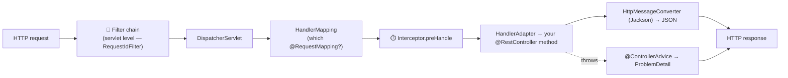
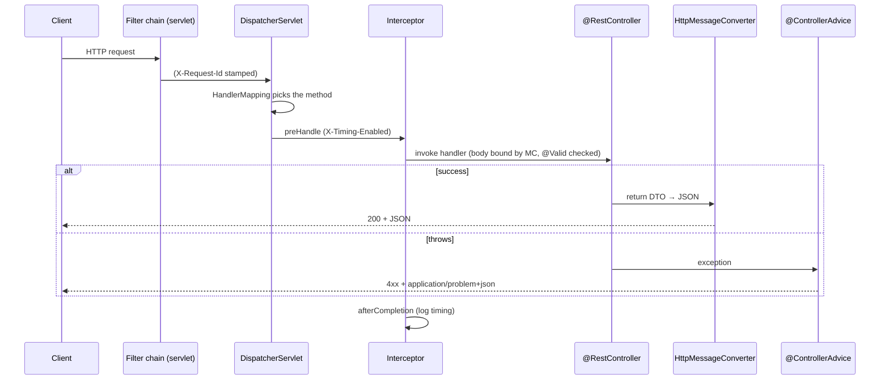
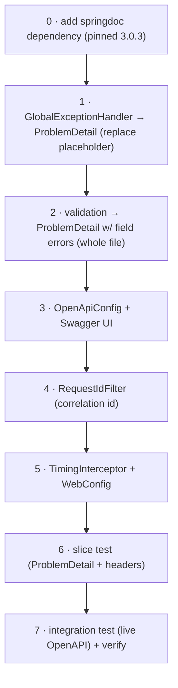
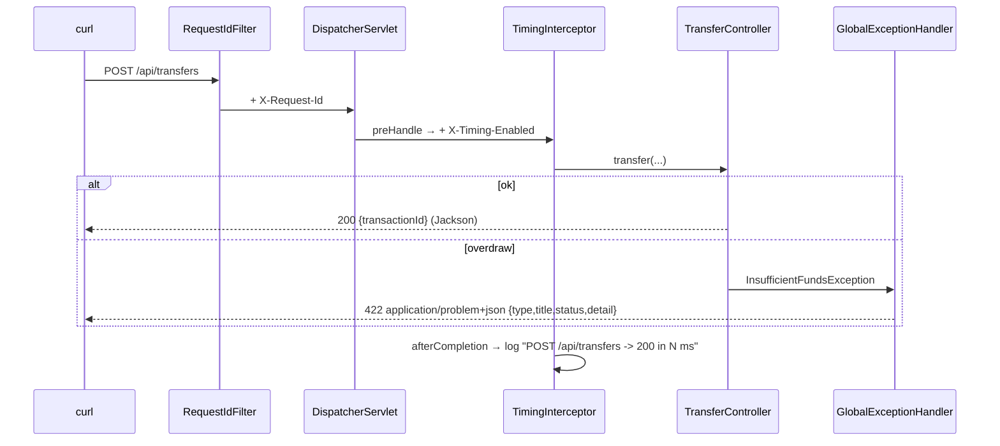

# Step 13 · Spring MVC / REST Deep — Problem Details, OpenAPI & the Request Lifecycle
### Phase C — Web, APIs & Application Security 🔵 · Step 13 of 67

> *You've been writing controllers since Step 8, but treating Spring MVC as magic. This step opens it up:
> the full journey of an HTTP request through the `DispatcherServlet`, machine-readable errors with
> **RFC 9457 Problem Details**, your first **Swagger UI** ("click and see it"), and the difference between a
> **filter** and an **interceptor** — the two places cross-cutting concerns live.*

---

<a id="toc"></a>
## 🧭 The Six Movements of This Step

| | Movement | What happens |
|---|---|---|
| **A** | [🧭 Orient](#orient) | 30-second overview · skip-test · cheat card · why it matters · before you start |
| **B** | [🧠 Understand](#understand) | the MVC request lifecycle · ProblemDetail · filters vs interceptors · content negotiation |
| **C** | [🛠️ Build](#build) | upgrade demand-account: ProblemDetail global handler · springdoc/Swagger UI · filter + interceptor |
| **D** | [🔬 Prove](#prove) | the Verification Log — 13 tests, live OpenAPI/Swagger/Problem+JSON, §12.3 mutation |
| **E** | [🎓 Apply](#apply) | go deeper · interview prep · your-turn challenges |
| **F** | [🏆 Review](#review) | troubleshooting · resources · recap, flashcards & what's next |

---

<a id="orient"></a>

# A · 🧭 Orient

## 📋 This Step in 30 Seconds

| | |
|---|---|
| **Title** | Spring MVC / REST deep — the request lifecycle, RFC 9457 Problem Details, OpenAPI/Swagger UI, filters vs interceptors |
| **Step** | 13 of 67 · **Phase C — Web, APIs & Application Security** 🔵 *(start of Phase C)* |
| **Effort** | ≈ 18 hours focused. The payoff: you understand exactly what happens between "an HTTP request arrives" and "JSON comes back", return errors a client can parse, and ship a self-documenting API. Experienced Spring devs can skim to ~3h. |
| **What you'll run this step** | **JVM + Maven** for build & tests; **🐳 Docker** for the tests (Testcontainers) and to run the service live (Swagger UI). One command: `./mvnw -pl services/demand-account -am verify`. |
| **Buildable artifact** | The existing **`services/demand-account`**, upgraded: a **`GlobalExceptionHandler`** returning **RFC 9457 `ProblemDetail`** (replacing the Step-12 placeholder), **springdoc-openapi** → **Swagger UI** at `/swagger-ui.html`, a **`RequestIdFilter`** (correlation id) and a **`TimingInterceptor`** (handler timing). demand-account goes from 11 → **13** tests. `step-13-start == step-12-end`. |
| **Verification tier** | 🔴 **Full** — changes a service *and* the build (adds the springdoc dependency). `./mvnw verify` green + all **13** tests + a **live** OpenAPI doc + Swagger UI + `application/problem+json` errors + the correlation-id/timing headers + the **§12.3 mutation** (break the error status → test fails → revert) + clean-room + `smoke.sh`. |
| **Depends on** | **[Step 12](../step-12/lesson.md)** (the demand-account service we upgrade), **[Step 8](../step-08/lesson.md)** (controllers/DTOs), **[Step 7](../step-07/lesson.md)** (proxies/AOP — interceptors are conceptually adjacent). **+ Docker.** |

By the end you will be able to trace an HTTP request through the `DispatcherServlet` (handler mapping → handler adapter → message converters); return **RFC 9457 Problem Details** for both your domain exceptions and validation failures; generate and serve **OpenAPI + Swagger UI**; and explain precisely when to use a **filter** vs an **interceptor**.

### ⏭️ Can You Skip This Step? (5-minute self-check)

If you can confidently do **all** of this, skim the 🧩 Pattern Spotlight and jump to **[Step 14 — API Design, Versioning & Webhooks](../step-14/lesson.md)**.

- [ ] I can trace a request through **`DispatcherServlet` → HandlerMapping → HandlerAdapter → handler → `HttpMessageConverter`** and explain content negotiation.
- [ ] I can return **RFC 9457 `ProblemDetail`** (`application/problem+json`) for domain *and* validation errors via `@ControllerAdvice` / `ResponseEntityExceptionHandler`.
- [ ] I can generate **OpenAPI** and serve **Swagger UI** with springdoc, and explain what's generated vs configured.
- [ ] I can state the difference between a **`Filter`** (servlet level) and a **`HandlerInterceptor`** (Spring MVC level), and when to use each.
- [ ] I know why controllers/filters/interceptors are **singletons** and must be **stateless** (Step 11 thread-safety).

> [!TIP]
> Not 100%? Stay. "Walk me through what happens when a request hits a Spring controller", "how do you do global error handling?", and "filter vs interceptor?" are bread-and-butter Spring interview questions — and a clean `ProblemDetail` + a live Swagger UI are the kind of professional polish that makes a portfolio API look senior.

## 📇 Cheat Card

> **What this step delivers (one sentence):** the demand-account API becomes *professional* — machine-readable RFC 9457 error responses, a browsable Swagger UI generated from the code, and request-scoped cross-cutting concerns (a correlation-id filter + a timing interceptor) — all proven with live HTTP.

**Key commands** (Windows uses `.\mvnw.cmd`):

```bash
# Build + test the service (13 tests) on a real Testcontainers Postgres:
./mvnw -pl services/demand-account -am verify

# Run it live, then open Swagger UI in a browser:
docker compose -f services/demand-account/compose.yaml up -d
SPRING_DATASOURCE_URL=jdbc:postgresql://localhost:5433/demand_account ./mvnw -pl services/demand-account spring-boot:run
#   → http://localhost:8082/swagger-ui.html   (the OpenAPI spec is at /v3/api-docs)

# One-shot proof your build matches the lesson (needs Docker):
bash steps/step-13/smoke.sh
```

**The one headline idea — *every request flows through the `DispatcherServlet`; filters wrap the whole thing, interceptors wrap the handler, and errors come back as RFC 9457 Problem Details*:**



*Alt-text: an HTTP request passes through the servlet-level filter chain (e.g. RequestIdFilter), into the DispatcherServlet, which uses HandlerMapping to find the controller method, runs interceptor preHandle, invokes the handler via a HandlerAdapter, and serializes the return value to JSON with an HttpMessageConverter; if the handler throws, a @ControllerAdvice turns it into a ProblemDetail. Either path produces the HTTP response.*

## 🎯 Why This Matters

The API *is* the product to every client and frontend — and the difference between a toy and a professional API is in the details this step covers. Errors that clients can parse programmatically (RFC 9457 `ProblemDetail`, not ad-hoc JSON) prevent brittle string-matching and leaking stack traces. A generated **Swagger UI** turns your API into something a teammate or interviewer can *explore in a browser* in seconds — your first "click and see it" surface. And understanding the request lifecycle (and where filters vs interceptors sit) is exactly what "walk me through a Spring request" interviews probe. After this step your endpoints look and behave like a senior built them.

## ✅ What You'll Be Able to Do

- **Trace the MVC request lifecycle** — `DispatcherServlet`, handler mapping/adapter, message converters, content negotiation.
- **Return RFC 9457 Problem Details** — for domain exceptions *and* Bean Validation failures, with per-field errors.
- **Generate OpenAPI + serve Swagger UI** — self-documenting API from the code (springdoc).
- **Use filters and interceptors** — a correlation-id filter and a handler-timing interceptor, and explain the difference.
- **Keep web components thread-safe** — stateless singletons; request-scoped state in request attributes.

## 🧰 Before You Start

**Prerequisites**

- ✅ You finished **Step 12**; the repo is at `step-13-start` (== `step-12-end`) and `./mvnw verify` is green.
- ✅ **Docker is running** (tests use Testcontainers; the live Swagger UI uses `compose.yaml` + the 5433 port).

**What you already learned that connects here**

- **Step 8/12**: you wrote `@RestController`s and DTOs; now you see the machinery underneath and make the errors professional.
- **Step 12** left a deliberately-minimal `ApiExceptionHandler` "to be replaced by ProblemDetail in Step 13" — this is that step; we cash that cheque.
- **Step 7**: AOP proxies — interceptors are a related "wrap the call" idea, but at the MVC layer, not via proxies.
- **Step 11**: thread-safety — controllers/filters/interceptors are shared singletons, so they must be stateless.

> **Depends on: Steps 12, 8, 7.**

---

<a id="understand"></a>

# B · 🧠 Understand

## 🧠 The Big Idea

A Spring MVC app is built around **one servlet**: the `DispatcherServlet` (the "front controller"). Every HTTP request the container accepts is first passed through the **servlet filter chain**, then handed to the `DispatcherServlet`, which orchestrates the rest:

1. **HandlerMapping** — match the request (method + path + headers) to a handler (your `@RequestMapping` method). 
2. **HandlerInterceptors** — `preHandle` runs *before* the handler (can short-circuit); the handler runs; `postHandle` runs after; `afterCompletion` always runs (even on exception).
3. **HandlerAdapter** — actually invoke your method: bind path variables/query params/the request body (via an `HttpMessageConverter` — Jackson for JSON), validate (`@Valid`), call you.
4. **Return value handling** — your returned object is serialized back to the response by an `HttpMessageConverter` (Jackson → JSON), with the status/headers from your `ResponseEntity`.
5. **Exception handling** — if anything throws, the `DispatcherServlet` asks its `HandlerExceptionResolver`s — which include your `@ControllerAdvice` — to turn the exception into a response. We make that a **ProblemDetail**.

Two cross-cutting layers, two different scopes: a **`Filter`** lives at the **servlet-container** level (before/after the `DispatcherServlet`), sees *every* request (even ones that 404 before reaching a handler), and is the home of correlation ids, CORS, compression, auth pre-checks. A **`HandlerInterceptor`** lives *inside* the `DispatcherServlet`, around the **matched handler**, so it knows *which* handler ran — the home of per-handler timing, auth checks that need handler metadata, and `MDC` setup.

> **Analogy — an embassy.** The **filter chain** is the security gate at the building entrance: everyone passes through it, even people who turn out to be at the wrong embassy (404). The **DispatcherServlet** is the front desk that figures out which office (handler) you need. The **interceptor** is the office assistant who greets you at *that office's* door (`preHandle`), and notes how long your meeting took on the way out (`afterCompletion`). The **message converter** is the translator turning your spoken request into the office's language (JSON ↔ Java) and back. And when something goes wrong, the **`@ControllerAdvice`** is the complaints desk that hands you a standardized, machine-readable form (a `ProblemDetail`) instead of a panicked stack trace.



*Alt-text: a sequence diagram showing a request passing through the servlet filter chain (which stamps X-Request-Id), into the DispatcherServlet which picks the handler method, through the interceptor's preHandle (which sets X-Timing-Enabled), into the controller; on success the message converter serializes the DTO to JSON (200); on exception the @ControllerAdvice returns application/problem+json; finally the interceptor's afterCompletion logs timing.*

## 🧩 Pattern Spotlight — RFC 9457 Problem Details for HTTP APIs

> **Problem.** Every API invents its own error JSON (`{"error":"..."}`, `{"message":"..."}`, `{"code":42}`). Clients end up string-matching on ad-hoc shapes, and servers leak stack traces or internal details. There's no contract.

> **Why ProblemDetail fits.** **RFC 9457** (the successor to RFC 7807) standardizes a media type — **`application/problem+json`** — and a body shape: `type` (a URI identifying the problem kind), `title` (human-readable summary), `status` (the HTTP code), `detail` (this occurrence's explanation), `instance` (the specific URI), plus any **custom extension members** (we add `errors` for validation). Clients can branch on `type`/`status` reliably; humans get `title`/`detail`.

> **How it works (the mechanism).** Spring Framework 6+ ships `org.springframework.http.ProblemDetail`. Return it (or `ResponseEntity<ProblemDetail>`) from an `@ExceptionHandler` and Spring sets the response status from it and serializes it as `application/problem+json`. Extending `ResponseEntityExceptionHandler` makes Spring's *built-in* MVC exceptions (validation, unreadable body, 404, 405) come back as Problem Details too — you just override the hook (e.g. `handleMethodArgumentNotValid`) to enrich them.

> **Alternatives / trade-offs.** A bespoke error envelope (more control, no standard, clients must learn it); `@ResponseStatus` on the exception (simple, but no body customization); letting the default Boot error page handle it (leaks little, but not RFC-standard and not enriched). For a public/partner API (Step 14), the **standard** wins — interoperability and no surprises.

> **Implementation (here).** `GlobalExceptionHandler extends ResponseEntityExceptionHandler`: `@ExceptionHandler(InsufficientFundsException.class)` → 422 ProblemDetail; `IllegalArgumentException` → 400; and an override of `handleMethodArgumentNotValid` that attaches a per-field `errors` map.

## 🌱 Under the Hood: How It Really Works

**The `DispatcherServlet` is the front controller.** Spring Boot registers it mapped to `/`. On each request it consults its ordered **`HandlerMapping`s** (`RequestMappingHandlerMapping` matches `@RequestMapping`/`@GetMapping`/… by path, method, params, headers, content type) to find a `HandlerExecutionChain` (the handler + its interceptors). It then picks a **`HandlerAdapter`** (`RequestMappingHandlerAdapter` for annotated controllers) which resolves method arguments (via `HandlerMethodArgumentResolver`s — `@PathVariable`, `@RequestParam`, `@RequestBody`, etc.), invokes your method, and handles the return value (via `HandlerMethodReturnValueHandler`s).

**Message converters do JSON ↔ Java.** `@RequestBody`/`@ResponseBody` (and `@RestController` = `@Controller` + `@ResponseBody`) use **`HttpMessageConverter`s**. Boot auto-configures a Jackson converter so a request body deserializes into your record and your returned DTO serializes to JSON. **Content negotiation** chooses the converter by the `Accept` header (and the producible types) — ask for `application/json`, get Jackson; an error produces `application/problem+json`.

**`@Valid` and validation.** `@Valid @RequestBody` triggers Bean Validation (`@NotBlank`, `@Positive`, …) *after* binding the body. A failure throws `MethodArgumentNotValidException` — which `ResponseEntityExceptionHandler` converts to a Problem Detail (we enrich it with field errors). This is *why* the negative-amount transfer is rejected before your controller code ever runs.

**`@ControllerAdvice` is a global exception interceptor.** It's a bean whose `@ExceptionHandler` methods apply across all controllers. Spring's `ExceptionHandlerExceptionResolver` finds the most specific handler for a thrown exception. Returning a `ProblemDetail` makes Spring set the status from `problem.getStatus()` and write `application/problem+json`.

**Filter vs interceptor — the precise difference.**
| | Filter (`jakarta.servlet.Filter` / `OncePerRequestFilter`) | Interceptor (`HandlerInterceptor`) |
|---|---|---|
| **Layer** | Servlet container — *before/after* `DispatcherServlet` | Spring MVC — *inside* `DispatcherServlet`, around the handler |
| **Sees** | **every** request (incl. ones with no handler / 404) | only requests that **matched a handler** |
| **Knows the handler?** | No | **Yes** (the matched `HandlerMethod`) |
| **Hooks** | wrap `doFilter` (before + after the whole chain) | `preHandle` / `postHandle` / `afterCompletion` |
| **Registered by** | being a `Filter` bean (auto) | `WebMvcConfigurer.addInterceptors(...)` |
| **Use for** | correlation ids, CORS, compression, request/response wrapping, auth pre-checks | per-handler timing, auth needing handler metadata, MDC, model tweaks |

Our `RequestIdFilter` (correlation id) is a `OncePerRequestFilter` — it sets `X-Request-Id` *before* calling the chain so it's present even on errors. Our `TimingInterceptor` sets a marker in `preHandle` (reliably, before the response commits) and logs elapsed time in `afterCompletion` (which always runs). Note: setting a *response header in `postHandle`* is unreliable for `@ResponseBody` handlers because the body (and headers) may already be committed by the message converter — that's why timing is *logged* in `afterCompletion`, not written as a header.

**springdoc generates OpenAPI from your code.** The `springdoc-openapi-starter-webmvc-ui` dependency scans your `@RequestMapping`s, request/response types, and validation annotations to build an **OpenAPI 3.1** document at `/v3/api-docs`, and serves **Swagger UI** (a browsable HTML client) at `/swagger-ui.html`. You supply only metadata (title/version) via an `OpenAPI` bean; the paths/schemas are inferred.

## 🛡️ Security Lens: What Could Go Wrong

- **Error responses leak internals.** A raw stack trace or exception class in the body hands attackers a map of your internals (frameworks, versions, SQL). `ProblemDetail` lets you return a *controlled* `detail` — keep it user-safe; never echo SQL or secrets. (Boot also hides stack traces by default in prod via `server.error.include-stacktrace=never`.)
- **Swagger UI exposure.** A live, world-readable Swagger UI documents every endpoint for attackers too. Fine in dev; in production, gate it (auth, network policy, or disable) — we'll secure it in Phase C/H. Flagged now so you don't ship it open.
- **Correlation ids are a defensive tool.** Stamping `X-Request-Id` on every request/response (the filter) makes incident forensics possible — you can trace one request across logs/services (Step 36 wires it into tracing). Don't trust a *client-supplied* id blindly for security decisions; it's for correlation, not authorization.
- **Validation is a security control.** `@Valid` + Problem Details reject malformed/oversized input early (defense in depth); the field-level `errors` you return should describe *what* is wrong without revealing internal rules an attacker could probe. (OWASP input-validation; deepened in Step 18.)

## 🕰️ Then vs. Now (How This Changed Across Versions)

| Topic | Then | Now | Why it changed |
|---|---|---|---|
| **Error bodies** | Hand-rolled error JSON, or `@ResponseStatus`; ad-hoc per API. | **RFC 9457 `ProblemDetail`** (`org.springframework.http.ProblemDetail`, Spring 6+) — `application/problem+json`. | A standard, machine-readable contract; clients stop string-matching bespoke shapes. |
| **OpenAPI tooling** | **springfox** (unmaintained, stuck on older Spring). | **springdoc-openapi** — actively maintained; v3.0.x supports Spring Boot 4 / Framework 7. | springfox died; springdoc is the de-facto standard. We pin **3.0.3** (2.8.x targets Boot 3). |
| **Global handler base** | `WebMvcConfigurerAdapter` (deprecated), manual exception JSON. | `WebMvcConfigurer` (interface w/ defaults) + `ResponseEntityExceptionHandler` returning `ProblemDetail`. | Cleaner extension points; built-in MVC exceptions become Problem Details for free. |
| **OpenAPI version** | OpenAPI 3.0. | springdoc emits **OpenAPI 3.1** (JSON Schema-aligned). | Better schema fidelity (nullability, etc.). |

> [!NOTE]
> *Verify, don't guess.* `ProblemDetail` is Spring Framework 6+ (we're on 7 via Boot 4). **springdoc-openapi 3.0.3** is the version that supports Boot 4.0.x (verified it resolves and the live `/v3/api-docs` returns OpenAPI 3.1 — see 🔬); 2.8.x targets Boot 3. Pinned in `VERSIONS.md`. springfox is dead — don't use it.

## 🧵 Thread-safety note

Controllers, `@ControllerAdvice`, filters, and interceptors are **singletons** shared across all request threads — so they must be **stateless**: no mutable instance fields holding per-request data (that's a race, Step 11). Per-request state belongs in **request attributes** (our `TimingInterceptor` stashes the start time in `request.setAttribute(...)`, not a field) or `ThreadLocal`/`MDC`. The `ProblemDetail` we create is a fresh object per exception (local, not shared) — safe. This is the same "don't share mutable state across threads" rule from Step 11, applied to the web layer.

---

<a id="build"></a>

# C · 🛠️ Build

## 📦 Your Starting Point

You're at **`step-13-start`** (== `step-12-end`). The `demand-account` service has **11 tests**, a working transfer API, and a **placeholder** `ApiExceptionHandler` that returns ad-hoc `{"error":...}` JSON. We'll replace that with Problem Details, add Swagger UI, and add a filter + interceptor.

**Confirm the start builds** (green, 11 tests, from Step 12):
```bash
./mvnw -q -pl services/demand-account -am verify
```

So you know exactly what we're wrapping, here is the **already-present web layer** the new pieces plug into. These files exist at `step-13-start` and do **not** change this step — read them once, then we build *around* them.

The controller (the endpoints we'll add filters/interceptors/Problem Details to):
```java
// services/demand-account/src/main/java/com/buildabank/account/web/TransferController.java
package com.buildabank.account.web;

import java.net.URI;
import java.util.UUID;

import jakarta.validation.Valid;

import org.springframework.http.ResponseEntity;
import org.springframework.web.bind.annotation.GetMapping;
import org.springframework.web.bind.annotation.PathVariable;
import org.springframework.web.bind.annotation.PostMapping;
import org.springframework.web.bind.annotation.RequestBody;
import org.springframework.web.bind.annotation.RestController;

import com.buildabank.account.domain.Account;
import com.buildabank.account.service.TransferService;

/** REST API for accounts and transfers. Money movement always uses the safe (pessimistic-lock) path. */
@RestController
public class TransferController {

    private final TransferService transfers;

    public TransferController(TransferService transfers) {
        this.transfers = transfers;
    }

    /** Open an account → 201 Created. */
    @PostMapping("/api/accounts")
    public ResponseEntity<AccountResponse> open(@Valid @RequestBody OpenAccountRequest request) {
        Account account = transfers.openAccount(
                request.accountNumber(), request.currency(), request.openingBalance());
        return ResponseEntity
                .created(URI.create("/api/accounts/" + account.getAccountNumber()))
                .body(AccountResponse.from(account));
    }

    /** Read an account's balance → 200, or 404 if it doesn't exist. */
    @GetMapping("/api/accounts/{accountNumber}")
    public ResponseEntity<AccountResponse> balance(@PathVariable String accountNumber) {
        try {
            return ResponseEntity.ok(new AccountResponse(
                    accountNumber, null, transfers.balanceOf(accountNumber)));
        } catch (IllegalArgumentException e) {
            return ResponseEntity.notFound().build();
        }
    }

    /** Move money → 200 with the transaction id (safe, pessimistic-lock transfer). */
    @PostMapping("/api/transfers")
    public ResponseEntity<TransferResponse> transfer(@Valid @RequestBody TransferRequest request) {
        UUID transactionId = transfers.transfer(
                request.from(), request.to(), request.amount(), request.description());
        return ResponseEntity.ok(new TransferResponse(transactionId));
    }
}
```

The request/response DTOs (records) — note the **Bean Validation annotations** on the request records, which become the Problem Details we'll build in sub-step 2:
```java
// services/demand-account/src/main/java/com/buildabank/account/web/TransferRequest.java
package com.buildabank.account.web;

import java.math.BigDecimal;

import jakarta.validation.constraints.NotBlank;
import jakarta.validation.constraints.NotNull;
import jakarta.validation.constraints.Positive;

/** Request body for a money transfer. The amount must be strictly positive. */
public record TransferRequest(
        @NotBlank String from,
        @NotBlank String to,
        @NotNull @Positive BigDecimal amount,
        String description) {
}
```
```java
// services/demand-account/src/main/java/com/buildabank/account/web/OpenAccountRequest.java
package com.buildabank.account.web;

import java.math.BigDecimal;

import jakarta.validation.constraints.NotBlank;
import jakarta.validation.constraints.NotNull;
import jakarta.validation.constraints.PositiveOrZero;
import jakarta.validation.constraints.Size;

/** Request body to open an account. Bean Validation rejects bad input before the controller runs. */
public record OpenAccountRequest(
        @NotBlank String accountNumber,
        @NotBlank @Size(min = 3, max = 3) String currency,
        @NotNull @PositiveOrZero BigDecimal openingBalance) {
}
```
```java
// services/demand-account/src/main/java/com/buildabank/account/web/AccountResponse.java
package com.buildabank.account.web;

import java.math.BigDecimal;

import com.buildabank.account.domain.Account;

/** API view of an account — a DTO, so we never leak the JPA entity (or its version) to clients. */
public record AccountResponse(String accountNumber, String currency, BigDecimal balance) {

    public static AccountResponse from(Account account) {
        return new AccountResponse(account.getAccountNumber(), account.getCurrency(), account.getBalance());
    }
}
```
```java
// services/demand-account/src/main/java/com/buildabank/account/web/TransferResponse.java
package com.buildabank.account.web;

import java.util.UUID;

/** Returned after a successful transfer — the shared transaction id of the two ledger legs. */
public record TransferResponse(UUID transactionId) {
}
```

What's **green** today: the three endpoints above + the safe transfer logic + 11 tests. What you'll **build**: machine-readable errors, a docs surface, and two cross-cutting concerns — without touching the controller or DTOs above.

## 🛠️ Let's Build It — Step by Step



🌳 **Files we'll touch** (under `services/demand-account/`):
```
pom.xml                                              # + springdoc-openapi-starter-webmvc-ui:3.0.3
src/main/java/com/buildabank/account/web/
├── ApiExceptionHandler.java        (DELETED — the Step-12 placeholder)
├── GlobalExceptionHandler.java     (NEW — replaces it, returns ProblemDetail)
├── OpenApiConfig.java              (NEW — OpenAPI metadata bean)
├── RequestIdFilter.java            (NEW — OncePerRequestFilter, X-Request-Id)
├── TimingInterceptor.java          (NEW — HandlerInterceptor)
└── WebConfig.java                  (NEW — registers the interceptor)
src/test/java/com/buildabank/account/
├── web/TransferControllerTest.java        (EDIT — ProblemDetail + header assertions)
└── DemandAccountIntegrationTest.java       (EDIT — live OpenAPI/Swagger + ProblemDetail over HTTP)
steps/step-13/{requests.http, smoke.sh}     (the Play-With-It assets)
```

---

### Sub-step 0 of 7 — Add springdoc (pinned) 🧭 *(you are here: **dependency** → ProblemDetail → validation → OpenAPI → filter → interceptor → slice test → integration test)*

🎯 **Goal:** pull in OpenAPI/Swagger UI support, pinned to the version that works with Boot 4. One dependency gives us both the spec generator and the browsable UI.

📁 **Location:** edit `services/demand-account/pom.xml` — add inside the existing `<dependencies>` block (right after the runtime Postgres driver, before the `<!-- ── Test ── -->` group).

⌨️ **Code** (unified diff — the exact change at `step-13-end`):
```diff
// services/demand-account/pom.xml
             <scope>runtime</scope>
         </dependency>
 
+        <!-- OpenAPI/Swagger UI (Step 13). springdoc 3.0.x is the line that supports Spring Boot 4 / Spring
+             Framework 7 (2.8.x targets Boot 3). Pinned — NOT Boot-managed, so we set the version. -->
+        <dependency>
+            <groupId>org.springdoc</groupId>
+            <artifactId>springdoc-openapi-starter-webmvc-ui</artifactId>
+            <version>3.0.3</version>
+        </dependency>
+
         <!-- ── Test ── -->
         <dependency>
             <groupId>org.springframework.boot</groupId>
```

🔍 **Line-by-line:**
- `<groupId>org.springdoc</groupId>` — the springdoc-openapi project (the maintained successor to the dead springfox).
- `<artifactId>springdoc-openapi-starter-webmvc-ui</artifactId>` — *one* starter that transitively brings the OpenAPI generator **and** the Swagger UI webjar (the `-webmvc-` variant is for the servlet/Spring-MVC stack we're on; there's a separate `-webflux-` one).
- `<version>3.0.3</version>` — we pin it explicitly because springdoc is **not** in Spring Boot's managed dependency BOM (it's third-party), so Boot won't choose a version for us. The 2.8.x line targets Boot 3 (Spring Framework 6); using it on Boot 4 (Framework 7) fails at runtime on the API differences.

💭 **Under the hood:** on startup, springdoc's auto-configuration registers extra Spring MVC handlers: one serving the generated OpenAPI JSON at `/v3/api-docs`, and the Swagger UI static resources at `/swagger-ui/**`. It builds the spec lazily by introspecting the `RequestMappingHandlerMapping` (your `@RequestMapping`s) and the request/response types — no code generation, no annotations required on your controllers.

🔮 **Predict:** after only this change (no other files yet), will the app already serve Swagger UI? <details><summary>answer</summary>Yes — springdoc auto-configures the docs endpoints just from being on the classpath. The `OpenApiConfig` bean we add in sub-step 3 only customizes the *title/version*; the paths come for free.</details>

▶️ **Run & See** — confirm the new dependency resolves (downloads):
```bash
./mvnw -q -pl services/demand-account dependency:resolve
```
✅ **Expected output:** the command completes with **no error** (springdoc 3.0.3 + its transitive Swagger UI webjar are fetched). *(Verify-adjacent per §12.8: the discrete `dependency:resolve` line isn't in the recorded log; the load-bearing proof that 3.0.3 resolves **and boots on Boot 4.0.6** is the live `/v3/api-docs` run in the Verification Log §4.)*

❌ **If you see `Could not resolve dependencies` / `Could not find artifact org.springdoc:...:3.0.3`:** you're offline or typo'd the coordinates — check the `groupId`/`artifactId`/`version` exactly.

✋ **Checkpoint:** `dependency:resolve` succeeds; 3.0.3 is in your local `~/.m2`.

💾 **Commit:**
```bash
git add services/demand-account/pom.xml
git commit -m "build(demand-account): add springdoc-openapi 3.0.3 (Boot-4 compatible)"
```

⚠️ **Pitfall:** using springdoc **2.8.x** on Boot 4 compiles but fails at runtime (Spring 6 vs 7 APIs). Always check the springdoc↔Boot compatibility matrix; we verified 3.0.3 boots (🔬 §1, §4).

---

### Sub-step 1 of 7 — `GlobalExceptionHandler` → Problem Details 🧭 *(dependency ✅ → **ProblemDetail** → validation → OpenAPI → filter → interceptor → slice test → integration test)*

🎯 **Goal:** replace the Step-12 placeholder with RFC 9457 Problem Details for the domain exceptions, so a client gets a parseable, standard error body instead of ad-hoc JSON.

📁 **Location:** **delete** `services/demand-account/src/main/java/com/buildabank/account/web/ApiExceptionHandler.java`, and create a new file `GlobalExceptionHandler.java` in the same package.

First, the **before** — the placeholder we're replacing (returns ad-hoc `{"error":...}` JSON):
```java
// services/demand-account/src/main/java/com/buildabank/account/web/ApiExceptionHandler.java  (DELETE THIS)
package com.buildabank.account.web;

import java.util.Map;

import org.springframework.http.HttpStatus;
import org.springframework.http.ResponseEntity;
import org.springframework.web.bind.annotation.ExceptionHandler;
import org.springframework.web.bind.annotation.RestControllerAdvice;

import com.buildabank.account.domain.InsufficientFundsException;

/**
 * Minimal error mapping so business failures return sensible HTTP codes (not 500). The full
 * {@code ProblemDetail}/RFC 9457 treatment arrives in Step 13 — this is just enough to make the API usable.
 */
@RestControllerAdvice
public class ApiExceptionHandler {

    /** Overdraw attempt → 422 Unprocessable Entity (the request was well-formed but can't be fulfilled). */
    @ExceptionHandler(InsufficientFundsException.class)
    public ResponseEntity<Map<String, String>> insufficientFunds(InsufficientFundsException e) {
        return ResponseEntity.unprocessableEntity().body(Map.of("error", "insufficient_funds", "detail", e.getMessage()));
    }

    /** Unknown account / same-account transfer → 400 Bad Request. */
    @ExceptionHandler(IllegalArgumentException.class)
    public ResponseEntity<Map<String, String>> badRequest(IllegalArgumentException e) {
        return ResponseEntity.status(HttpStatus.BAD_REQUEST).body(Map.of("error", "bad_request", "detail", e.getMessage()));
    }
}
```

Delete it:
```bash
git rm services/demand-account/src/main/java/com/buildabank/account/web/ApiExceptionHandler.java
```

Now the **after** — create `GlobalExceptionHandler.java`. We'll write it in two pieces: the class + the two domain handlers now, and the validation override in sub-step 2 (then confirm the whole file). For now, type just the class shell and the domain handlers:
```java
// services/demand-account/src/main/java/com/buildabank/account/web/GlobalExceptionHandler.java
package com.buildabank.account.web;

import java.net.URI;

import org.springframework.http.HttpStatus;
import org.springframework.http.ProblemDetail;
import org.springframework.web.bind.annotation.ExceptionHandler;
import org.springframework.web.bind.annotation.RestControllerAdvice;
import org.springframework.web.servlet.mvc.method.annotation.ResponseEntityExceptionHandler;

import com.buildabank.account.domain.InsufficientFundsException;

@RestControllerAdvice
public class GlobalExceptionHandler extends ResponseEntityExceptionHandler {

    private static final String PROBLEM_BASE = "https://buildabank.example/problems/";

    /** Overdraw attempt → 422 Unprocessable Entity. */
    @ExceptionHandler(InsufficientFundsException.class)
    public ProblemDetail handleInsufficientFunds(InsufficientFundsException ex) {
        ProblemDetail problem = ProblemDetail.forStatusAndDetail(HttpStatus.UNPROCESSABLE_ENTITY, ex.getMessage());
        problem.setTitle("Insufficient funds");
        problem.setType(URI.create(PROBLEM_BASE + "insufficient-funds"));
        return problem;
    }

    /** Unknown account / same-account transfer → 400 Bad Request. */
    @ExceptionHandler(IllegalArgumentException.class)
    public ProblemDetail handleBadRequest(IllegalArgumentException ex) {
        ProblemDetail problem = ProblemDetail.forStatusAndDetail(HttpStatus.BAD_REQUEST, ex.getMessage());
        problem.setTitle("Invalid request");
        problem.setType(URI.create(PROBLEM_BASE + "invalid-request"));
        return problem;
    }
}
```

🔍 **Line-by-line:**
- `@RestControllerAdvice` — a `@ControllerAdvice` (a global, cross-controller bean) whose handler return values are written to the response **body** (it's `@ControllerAdvice` + `@ResponseBody`). Its `@ExceptionHandler` methods apply to *every* controller in the app.
- `extends ResponseEntityExceptionHandler` — Spring's base class that already converts the framework's **built-in** MVC exceptions (validation, unreadable body, unsupported media type, 404/405…) into `ProblemDetail`. By extending it we inherit that for free; in sub-step 2 we override one hook (`handleMethodArgumentNotValid`) to enrich validation errors.
- `PROBLEM_BASE` — a constant base URI for our `type` values. RFC 9457's `type` is a URI *identifying the kind of problem* (ideally a docs page); we use a stable `https://buildabank.example/problems/...` namespace.
- `@ExceptionHandler(InsufficientFundsException.class)` — this method handles that specific domain exception wherever it's thrown.
- `ProblemDetail.forStatusAndDetail(status, detail)` — the factory creating a `ProblemDetail` with the `status` and a human-readable `detail`. `forStatusAndDetail` is the most common factory (others: `forStatus`).
- `problem.setTitle(...)` / `problem.setType(...)` — fill the standard RFC 9457 members. `title` is a short, stable human summary; `type` is the problem-kind URI.
- **return type `ProblemDetail`** — returning it (not a `ResponseEntity`) makes Spring set the HTTP status **from the ProblemDetail's `status`** and serialize the body as `application/problem+json`. That's the magic: one return value drives both status and content type.
- `HttpStatus.UNPROCESSABLE_ENTITY` (422) — "I understood the request, it was well-formed, but I can't process it" — the right code for "you asked for a valid-looking transfer but the balance is too low" (vs 400, which means "your request was malformed").

💭 **Under the hood:** when the controller throws, the `DispatcherServlet` hands the exception to its ordered `HandlerExceptionResolver`s. The `ExceptionHandlerExceptionResolver` finds the **most specific** `@ExceptionHandler` for the thrown type (across `@ControllerAdvice` beans). Because the return value is a `ProblemDetail`, Spring's return-value handling sets `Content-Type: application/problem+json` and the status from `problem.getStatus()`.

🔮 **Predict:** an overdraw will now return what status and content-type? <details><summary>answer</summary>422 Unprocessable Entity, `application/problem+json` (proven live in 🔬 §3).</details>

▶️ **Run & See** — compile the module (we can't fully test yet; the slice test is updated in sub-step 6):
```bash
./mvnw -q -pl services/demand-account compile
```
✅ **Expected output:** compiles cleanly — `ApiExceptionHandler` is gone, `GlobalExceptionHandler` is in. *(Verify-adjacent per §12.8: a bare `compile` line isn't in the recorded log; the load-bearing proof is the full `verify` with 13 tests in §1 and the live 422 Problem Detail in §3.)*

❌ **If you see `cannot find symbol: class ApiExceptionHandler`:** a test or another file still references the deleted class — we update the tests in sub-steps 6–7.

✋ **Checkpoint:** the module compiles; `ApiExceptionHandler.java` is deleted; `GlobalExceptionHandler.java` has the two domain handlers.

💾 **Commit:**
```bash
git add -A services/demand-account/src/main/java/com/buildabank/account/web
git commit -m "feat(demand-account): RFC 9457 ProblemDetail error handling (replace placeholder)"
```

⚠️ **Pitfall:** don't put a user's secret, SQL, or a raw stack trace into `detail`. Keep it safe-to-show — `detail` is sent to the client.

---

### Sub-step 2 of 7 — Validation → Problem Details with field errors 🧭 *(dependency ✅ → ProblemDetail ✅ → **validation** → OpenAPI → filter → interceptor → slice test → integration test)*

🎯 **Goal:** turn Bean Validation failures (e.g. a negative `amount`) into a Problem Detail that *lists which fields failed* — so a frontend can highlight the bad field, not just show "400".

📁 **Location:** edit `GlobalExceptionHandler.java` — override a hook inherited from `ResponseEntityExceptionHandler`, and add the imports it needs.

⌨️ **Code** — add this method inside the class (and the new imports at the top):
```java
// add to the imports of GlobalExceptionHandler.java
import java.util.LinkedHashMap;
import java.util.Map;

import org.springframework.http.HttpHeaders;
import org.springframework.http.HttpStatusCode;
import org.springframework.http.ResponseEntity;
import org.springframework.validation.FieldError;
import org.springframework.web.bind.MethodArgumentNotValidException;
import org.springframework.web.context.request.WebRequest;
```
```java
    /** Bean Validation failures → 400 with a per-field {@code errors} map added to the Problem Detail. */
    @Override
    protected ResponseEntity<Object> handleMethodArgumentNotValid(
            MethodArgumentNotValidException ex, HttpHeaders headers, HttpStatusCode status, WebRequest request) {
        ProblemDetail problem = ProblemDetail.forStatusAndDetail(HttpStatus.BAD_REQUEST, "Request validation failed");
        problem.setTitle("Validation failed");
        problem.setType(URI.create(PROBLEM_BASE + "validation"));
        Map<String, String> errors = new LinkedHashMap<>();
        for (FieldError fieldError : ex.getBindingResult().getFieldErrors()) {
            String message = fieldError.getDefaultMessage();
            errors.putIfAbsent(fieldError.getField(), message == null ? "invalid" : message);
        }
        problem.setProperty("errors", errors);
        return ResponseEntity.badRequest().body(problem);
    }
```

🔍 **Line-by-line:**
- `@Override protected ResponseEntity<Object> handleMethodArgumentNotValid(...)` — this method *already exists* on the base class `ResponseEntityExceptionHandler`; we override it to enrich its output. Its exact 4-arg signature (`exception, headers, status, request`) must match the base class's, or `@Override` won't compile.
- `MethodArgumentNotValidException` — the exception Spring throws when `@Valid @RequestBody` binding fails validation. The base class already *routes* it here; we just decide the body.
- `ProblemDetail.forStatusAndDetail(HttpStatus.BAD_REQUEST, "Request validation failed")` — a 400 Problem Detail (a *malformed* request, unlike the 422 above).
- `ex.getBindingResult().getFieldErrors()` — the list of per-field failures; each `FieldError` has the field name and a default message (e.g. `"must be greater than 0"` from `@Positive`).
- `new LinkedHashMap<>()` — preserves insertion order so the `errors` JSON is stable/readable.
- `errors.putIfAbsent(field, message)` — record the *first* message per field (a field can fail multiple constraints; we keep one).
- `problem.setProperty("errors", errors)` — attach a **custom extension member**. RFC 9457 explicitly allows extra members beyond `type/title/status/detail/instance`; springdoc/Jackson serialize it as a nested `errors` object.
- `return ResponseEntity.badRequest().body(problem)` — here we return a `ResponseEntity` (not a bare `ProblemDetail`) because the overridden base-class signature requires `ResponseEntity<Object>`; `badRequest()` sets 400 and the body carries the Problem Detail.

💭 **Under the hood:** binding + validation happen in the `RequestMappingHandlerAdapter` **before** your controller method runs. On failure it throws `MethodArgumentNotValidException`; the `DispatcherServlet`'s `ExceptionHandlerExceptionResolver` sees that `GlobalExceptionHandler` (via the base class) handles it, and calls our override. The default messages ("must be greater than 0") come from the validation annotations (`@Positive` on `TransferRequest.amount`).

🔮 **Predict:** for `{"amount":-5.00, ...}`, what's in the response body's `errors`? <details><summary>answer</summary>An `amount` key with the `@Positive` message (e.g. `"must be greater than 0"`). The test asserts `$.errors.amount` exists — 🔬 §6.</details>

Now the **whole file** — confirm yours matches this verbatim `step-13-end` version:
```java
// services/demand-account/src/main/java/com/buildabank/account/web/GlobalExceptionHandler.java
package com.buildabank.account.web;

import java.net.URI;
import java.util.LinkedHashMap;
import java.util.Map;

import org.springframework.http.HttpHeaders;
import org.springframework.http.HttpStatus;
import org.springframework.http.HttpStatusCode;
import org.springframework.http.ProblemDetail;
import org.springframework.http.ResponseEntity;
import org.springframework.validation.FieldError;
import org.springframework.web.bind.MethodArgumentNotValidException;
import org.springframework.web.bind.annotation.ExceptionHandler;
import org.springframework.web.bind.annotation.RestControllerAdvice;
import org.springframework.web.context.request.WebRequest;
import org.springframework.web.servlet.mvc.method.annotation.ResponseEntityExceptionHandler;

import com.buildabank.account.domain.InsufficientFundsException;

/**
 * Centralized error handling that returns <strong>RFC 9457 Problem Details</strong> (the standard
 * {@code application/problem+json} shape: {@code type}, {@code title}, {@code status}, {@code detail}, plus
 * custom members). Extending {@link ResponseEntityExceptionHandler} means Spring's built-in MVC exceptions
 * (e.g. validation, unreadable body) are already turned into {@code ProblemDetail}; we override
 * {@link #handleMethodArgumentNotValid} to attach the per-field errors, and add handlers for our domain
 * exceptions. Returning a {@link ProblemDetail} from an {@code @ExceptionHandler} makes Spring set the HTTP
 * status from it and serialize it as {@code application/problem+json}.
 */
@RestControllerAdvice
public class GlobalExceptionHandler extends ResponseEntityExceptionHandler {

    private static final String PROBLEM_BASE = "https://buildabank.example/problems/";

    /** Overdraw attempt → 422 Unprocessable Entity. */
    @ExceptionHandler(InsufficientFundsException.class)
    public ProblemDetail handleInsufficientFunds(InsufficientFundsException ex) {
        ProblemDetail problem = ProblemDetail.forStatusAndDetail(HttpStatus.UNPROCESSABLE_ENTITY, ex.getMessage());
        problem.setTitle("Insufficient funds");
        problem.setType(URI.create(PROBLEM_BASE + "insufficient-funds"));
        return problem;
    }

    /** Unknown account / same-account transfer → 400 Bad Request. */
    @ExceptionHandler(IllegalArgumentException.class)
    public ProblemDetail handleBadRequest(IllegalArgumentException ex) {
        ProblemDetail problem = ProblemDetail.forStatusAndDetail(HttpStatus.BAD_REQUEST, ex.getMessage());
        problem.setTitle("Invalid request");
        problem.setType(URI.create(PROBLEM_BASE + "invalid-request"));
        return problem;
    }

    /** Bean Validation failures → 400 with a per-field {@code errors} map added to the Problem Detail. */
    @Override
    protected ResponseEntity<Object> handleMethodArgumentNotValid(
            MethodArgumentNotValidException ex, HttpHeaders headers, HttpStatusCode status, WebRequest request) {
        ProblemDetail problem = ProblemDetail.forStatusAndDetail(HttpStatus.BAD_REQUEST, "Request validation failed");
        problem.setTitle("Validation failed");
        problem.setType(URI.create(PROBLEM_BASE + "validation"));
        Map<String, String> errors = new LinkedHashMap<>();
        for (FieldError fieldError : ex.getBindingResult().getFieldErrors()) {
            String message = fieldError.getDefaultMessage();
            errors.putIfAbsent(fieldError.getField(), message == null ? "invalid" : message);
        }
        problem.setProperty("errors", errors);
        return ResponseEntity.badRequest().body(problem);
    }
}
```

▶️ **Run & See** — the slice test (added in sub-step 6) exercises this; for now, recompile:
```bash
./mvnw -q -pl services/demand-account compile
```
✅ **Expected output:** compiles cleanly. (Live proof: a `POST /api/transfers` with `amount:-5.00` → **400** `application/problem+json`, `title:"Validation failed"`, `errors.amount` present — 🔬 §6.)

✋ **Checkpoint:** validation failures now produce Problem Details with an `errors` map; your file matches the verbatim version above.

💾 **Commit:**
```bash
git add services/demand-account/src/main/java/com/buildabank/account/web/GlobalExceptionHandler.java
git commit -m "feat(demand-account): validation errors as ProblemDetail with field map"
```

⚠️ **Pitfall:** if you *don't* extend `ResponseEntityExceptionHandler`, `MethodArgumentNotValidException` never routes to your override and you'll get Boot's default error JSON (or a 500) instead — and `@Override` on `handleMethodArgumentNotValid` won't even compile.

---

### Sub-step 3 of 7 — OpenAPI config + Swagger UI 🧭 *(… → OpenAPI ✅ next → filter → interceptor → tests)*

🎯 **Goal:** add API metadata (title/version/description) and confirm Swagger UI is served — the bank's first "click and see it" surface.

📁 **Location:** new file `services/demand-account/src/main/java/com/buildabank/account/web/OpenApiConfig.java`

⌨️ **Code** (complete file):
```java
// services/demand-account/src/main/java/com/buildabank/account/web/OpenApiConfig.java
package com.buildabank.account.web;

import org.springframework.context.annotation.Bean;
import org.springframework.context.annotation.Configuration;

import io.swagger.v3.oas.models.OpenAPI;
import io.swagger.v3.oas.models.info.Info;

/**
 * OpenAPI metadata for the generated docs. springdoc auto-generates the spec from the controllers and
 * serves it at {@code /v3/api-docs} (JSON) and a browsable Swagger UI at {@code /swagger-ui.html} — the
 * bank's first "click and see it" surface.
 */
@Configuration
public class OpenApiConfig {

    @Bean
    public OpenAPI demandAccountOpenApi() {
        return new OpenAPI().info(new Info()
                .title("Demand Account API")
                .version("v1")
                .description("Accounts and double-entry ledger transfers (Build-a-Bank). "
                        + "Errors are RFC 9457 application/problem+json."));
    }
}
```

🔍 **Line-by-line:**
- `@Configuration` — marks this a source of bean definitions; Spring processes the `@Bean` methods at startup.
- `OpenAPI` / `Info` — from `io.swagger.v3.oas.models` (the swagger-core model classes brought in by springdoc). They describe the **document metadata**, not the endpoints.
- `@Bean public OpenAPI demandAccountOpenApi()` — springdoc looks for an `OpenAPI` bean and merges your metadata into the spec it generates. The **paths and schemas are still inferred** from your controllers/DTOs; you only supply title/version/description.
- `.title("Demand Account API")` — appears at the top of Swagger UI and in `/v3/api-docs`.
- `.version("v1")` — the *API* version label (distinct from the artifact version); shows in the spec's `info.version`.

💭 **Under the hood:** springdoc serves the generated spec at `/v3/api-docs` (OpenAPI **3.1** JSON) and Swagger UI at `/swagger-ui.html` — which **redirects** to `/swagger-ui/index.html` (the actual static page). The UI fetches `/v3/api-docs` and renders an interactive client: every endpoint with "Try it out" buttons.

🔮 **Predict:** what `"openapi"` version string will `/v3/api-docs` start with? <details><summary>answer</summary>`"3.1.0"` — springdoc emits OpenAPI 3.1 (proven in 🔬 §4).</details>

▶️ **Run & See** (live — start Postgres + the service, then curl the spec):
```bash
docker compose -f services/demand-account/compose.yaml up -d
SPRING_DATASOURCE_URL=jdbc:postgresql://localhost:5433/demand_account ./mvnw -pl services/demand-account spring-boot:run
# in a second terminal:
curl -s localhost:8082/v3/api-docs | head -c 200
# open http://localhost:8082/swagger-ui.html in a browser
```
✅ **Expected output** (real run — from the Verification Log):
```
{"openapi":"3.1.0","info":{"title":"Demand Account API","description":"Accounts and double-entry ledger transfers (Build-a-Bank). Errors are RFC 9457 application/problem+json.","version":"v1"},"servers":[{"url":"http://localhost:8082",...}],"paths":{"/api/transfers":{"post":{...
```
Swagger UI (`/swagger-ui/index.html`) returns **200** — a browsable client listing every endpoint.

❌ **If Swagger UI 404s:** you probably tried `/swagger.html` or `/swagger-ui` — the correct entry is `/swagger-ui.html` (redirects to `/swagger-ui/index.html`); the raw spec is `/v3/api-docs`.

✋ **Checkpoint:** `/v3/api-docs` is OpenAPI 3.1 with your title and the `/api/transfers` + `/api/accounts` paths; Swagger UI loads in the browser.

💾 **Commit:**
```bash
git add services/demand-account/src/main/java/com/buildabank/account/web/OpenApiConfig.java
git commit -m "feat(demand-account): OpenAPI metadata + Swagger UI (springdoc)"
```

⚠️ **Pitfall:** Swagger UI is unauthenticated here — fine for dev, **gate it in production** (auth/network policy/disable; Phase H). Don't ship an open API catalogue to the internet.

---

### Sub-step 4 of 7 — `RequestIdFilter` (a servlet filter) 🧭 *(… → filter ✅ next → interceptor → tests)*

🎯 **Goal:** stamp a correlation id (`X-Request-Id`) on every response — the canonical **servlet-level** cross-cutting concern, present even on 404s and error responses.

📁 **Location:** new file `services/demand-account/src/main/java/com/buildabank/account/web/RequestIdFilter.java`

⌨️ **Code** (complete file):
```java
// services/demand-account/src/main/java/com/buildabank/account/web/RequestIdFilter.java
package com.buildabank.account.web;

import java.io.IOException;
import java.util.UUID;

import jakarta.servlet.FilterChain;
import jakarta.servlet.ServletException;
import jakarta.servlet.http.HttpServletRequest;
import jakarta.servlet.http.HttpServletResponse;

import org.springframework.stereotype.Component;
import org.springframework.web.filter.OncePerRequestFilter;

/**
 * A servlet {@code Filter} (via Spring's {@link OncePerRequestFilter}) that gives every request a
 * <strong>correlation id</strong>: it reuses an inbound {@code X-Request-Id} or mints one, and echoes it on
 * the response. Filters run at the <em>servlet-container</em> level — before the {@code DispatcherServlet},
 * around the entire request/response, even for requests that never reach a Spring handler — which is exactly
 * why cross-cutting concerns like correlation ids, CORS, and compression live here (vs. interceptors, which
 * are Spring-MVC-level and have handler context). We build on this for distributed tracing in Step 36.
 */
@Component
public class RequestIdFilter extends OncePerRequestFilter {

    public static final String HEADER = "X-Request-Id";

    @Override
    protected void doFilterInternal(HttpServletRequest request, HttpServletResponse response, FilterChain chain)
            throws ServletException, IOException {
        String requestId = request.getHeader(HEADER);
        if (requestId == null || requestId.isBlank()) {
            requestId = UUID.randomUUID().toString();
        }
        response.setHeader(HEADER, requestId);   // set BEFORE the chain runs, so it survives even on errors
        chain.doFilter(request, response);
    }
}
```

🔍 **Line-by-line:**
- `@Component` — makes this a Spring bean. Crucially, a `Filter` bean is **auto-registered** into the servlet filter chain by Boot — no extra config (contrast with interceptors in sub-step 5, which need `WebMvcConfigurer`).
- `extends OncePerRequestFilter` — Spring's base filter that guarantees the filter body runs **exactly once per request**, even across async dispatches/forwards (a plain `Filter` can run multiple times). You implement `doFilterInternal`.
- `public static final String HEADER = "X-Request-Id"` — the header name as a constant, reused by the integration test so the literal can't drift.
- `request.getHeader(HEADER)` — look for an inbound id (e.g. set by an upstream gateway), so the correlation id **propagates** across services instead of being reset at each hop.
- `if (requestId == null || requestId.isBlank())` → `UUID.randomUUID().toString()` — if none came in, mint a fresh one.
- `response.setHeader(HEADER, requestId)` — echo it on the response. **Set before `chain.doFilter`** so it's already on the response object even if the downstream handler throws and the response commits during error handling.
- `chain.doFilter(request, response)` — pass control to the rest of the chain (eventually the `DispatcherServlet`). Everything downstream — handler, interceptor, message converter, error handling — runs *inside* this call.

💭 **Under the hood:** the filter wraps the `DispatcherServlet` at the servlet-container level, so the header is set for **every** response — including 404s for paths with no controller, and Problem Detail error responses. Because we set it *before* `chain.doFilter`, the header survives even when the handler throws and Spring's error path takes over.

🔮 **Predict:** will the `X-Request-Id` header be present on a **422** error response too? <details><summary>answer</summary>Yes — the filter wraps the whole request, including error handling. (Confirmed live: both the 200 transfer and the overdraft 422 carry it — 🔬 §2.)</details>

▶️ **Run & See** (live — the header is on a normal response; recorded run):
```bash
curl -s -D - -o /dev/null -X POST localhost:8082/api/transfers \
  -H 'Content-Type: application/json' -d '{"from":"ACC-A","to":"ACC-B","amount":50.00}' \
  | grep -i 'X-Request-Id'
```
✅ **Expected output** (real run — from the Verification Log §2):
```
X-Request-Id: 23685b7f-2253-48f4-9b08-f5e008dbd212
```
Send your own with `-H 'X-Request-Id: my-trace-123'` and the response echoes *your* id (propagation).

✋ **Checkpoint:** every response carries `X-Request-Id`; an inbound id is echoed back.

💾 **Commit:**
```bash
git add services/demand-account/src/main/java/com/buildabank/account/web/RequestIdFilter.java
git commit -m "feat(demand-account): correlation-id filter (X-Request-Id)"
```

⚠️ **Pitfall:** setting the header *after* `chain.doFilter` may be too late — the response can already be **committed** (headers flushed), and the set is silently ignored. Set it before.

---

### Sub-step 5 of 7 — `TimingInterceptor` + `WebConfig` 🧭 *(… → interceptor ✅ next → tests)*

🎯 **Goal:** time each handler and *demonstrate* the MVC-level interceptor (vs the filter) — including the gotcha that an interceptor `@Component` does nothing until you **register** it.

📁 **Location:** two new files — `TimingInterceptor.java` (the interceptor) and `WebConfig.java` (its registration).

⌨️ **Code** (complete file — the interceptor):
```java
// services/demand-account/src/main/java/com/buildabank/account/web/TimingInterceptor.java
package com.buildabank.account.web;

import jakarta.servlet.http.HttpServletRequest;
import jakarta.servlet.http.HttpServletResponse;

import org.slf4j.Logger;
import org.slf4j.LoggerFactory;
import org.springframework.stereotype.Component;
import org.springframework.web.servlet.HandlerInterceptor;

/**
 * A Spring MVC {@link HandlerInterceptor} that times handler execution. Interceptors run <em>inside</em> the
 * {@code DispatcherServlet}, around the matched handler, with three hooks: {@code preHandle} (before the
 * handler — return false to short-circuit), {@code postHandle} (after the handler, before the view/body is
 * committed), and {@code afterCompletion} (always, even on exception — the right place for timing/cleanup).
 *
 * <p>Contrast with a {@code Filter} (see {@link RequestIdFilter}): the filter is at the servlet-container
 * level and wraps everything; an interceptor is Spring-MVC-level and knows which <em>handler</em> matched.
 * We set a marker header in {@code preHandle} (reliably, before the response commits) and log the elapsed
 * time in {@code afterCompletion}.
 */
@Component
public class TimingInterceptor implements HandlerInterceptor {

    private static final Logger log = LoggerFactory.getLogger(TimingInterceptor.class);
    private static final String START_ATTR = "timing.startNanos";
    public static final String HEADER = "X-Timing-Enabled";

    @Override
    public boolean preHandle(HttpServletRequest request, HttpServletResponse response, Object handler) {
        request.setAttribute(START_ATTR, System.nanoTime());
        response.setHeader(HEADER, "true");   // set before the response is committed → reliably visible
        return true;                          // proceed to the handler
    }

    @Override
    public void afterCompletion(HttpServletRequest request, HttpServletResponse response, Object handler, Exception ex) {
        Object start = request.getAttribute(START_ATTR);
        if (start instanceof Long startNanos) {
            long elapsedMs = (System.nanoTime() - startNanos) / 1_000_000;
            log.info("{} {} -> {} in {} ms", request.getMethod(), request.getRequestURI(), response.getStatus(), elapsedMs);
        }
    }
}
```

🔍 **Line-by-line (interceptor):**
- `implements HandlerInterceptor` — the Spring MVC interceptor contract; all three methods are `default`, so we implement only the two we need.
- `private static final Logger log = LoggerFactory.getLogger(...)` — an SLF4J logger; `static final` because it's shared and immutable (the *only* safe kind of shared field on a singleton).
- `START_ATTR = "timing.startNanos"` — the **request-attribute key**. We stash per-request state on the *request object*, never on the interceptor (which is a shared singleton — Step 11).
- `HEADER = "X-Timing-Enabled"` — a marker header to prove the interceptor ran.
- `preHandle(...)` runs **before** the handler. We record `System.nanoTime()` (a monotonic clock, correct for measuring elapsed time — never `currentTimeMillis()` for durations) in a request attribute, set the marker header (before commit → reliably visible), and `return true` to proceed. Returning `false` would short-circuit the request (the handler never runs).
- `afterCompletion(...)` runs **always** — after the handler, even if it threw (the `Exception ex` parameter is non-null then). This is the right place to *observe*: we read the start time back, compute elapsed milliseconds, and log `METHOD URI -> STATUS in N ms`.
- `start instanceof Long startNanos` — Java 16+ **pattern matching for `instanceof`**: checks the type *and* binds `startNanos` in one expression (guards against the attribute being absent).

💭 **Under the hood:** the interceptor is part of the `HandlerExecutionChain` the `DispatcherServlet` builds *after* `HandlerMapping` picks a handler — so it only runs for requests that **matched a handler**. A 404 with no handler skips the interceptor entirely (but the filter still runs). That asymmetry *is* the filter-vs-interceptor distinction, made concrete.

Now register it — `@Component` alone makes the interceptor a bean but does **not** wire it into the handler chain:
```java
// services/demand-account/src/main/java/com/buildabank/account/web/WebConfig.java
package com.buildabank.account.web;

import org.springframework.context.annotation.Configuration;
import org.springframework.web.servlet.config.annotation.InterceptorRegistry;
import org.springframework.web.servlet.config.annotation.WebMvcConfigurer;

/**
 * Registers the {@link TimingInterceptor} with Spring MVC. ({@code @Component} alone makes it a bean but does
 * NOT wire it into the handler chain — you must add it here via {@link WebMvcConfigurer}. Filters, by
 * contrast, are auto-registered when they're beans.)
 */
@Configuration
public class WebConfig implements WebMvcConfigurer {

    private final TimingInterceptor timingInterceptor;

    public WebConfig(TimingInterceptor timingInterceptor) {
        this.timingInterceptor = timingInterceptor;
    }

    @Override
    public void addInterceptors(InterceptorRegistry registry) {
        registry.addInterceptor(timingInterceptor);
    }
}
```

🔍 **Line-by-line (registration):**
- `implements WebMvcConfigurer` — the callback interface for customizing Spring MVC. All methods are `default`, so we override only `addInterceptors`.
- **constructor injection** of `TimingInterceptor` — Spring passes the singleton interceptor bean in; held `final`.
- `addInterceptors(InterceptorRegistry registry)` — Spring calls this at startup; `registry.addInterceptor(timingInterceptor)` adds it to the chain for all paths (you could chain `.addPathPatterns("/api/**")` to scope it).

💭 **Under the hood:** Spring collects all `WebMvcConfigurer` beans and calls their callbacks while building the MVC infrastructure. Without this registration, your `HandlerInterceptor` bean simply never joins any `HandlerExecutionChain` — it's inert.

🔮 **Predict:** if you delete `WebConfig` but keep `@Component` on `TimingInterceptor`, does `X-Timing-Enabled` still appear? <details><summary>answer</summary>No — the interceptor never runs because it was never registered. (Filters auto-register; interceptors don't.) This is the §8.1 "break-it" you can try in 🎮 Play With It.</details>

▶️ **Run & See** (live transfer — both headers together; recorded run):
```bash
curl -s -D - -o /dev/null -X POST localhost:8082/api/transfers \
  -H 'Content-Type: application/json' -d '{"from":"ACC-A","to":"ACC-B","amount":50.00}' \
  | grep -iE 'X-Request-Id|X-Timing-Enabled'
```
✅ **Expected output** (real run — from the Verification Log §2):
```
X-Request-Id: 23685b7f-2253-48f4-9b08-f5e008dbd212
X-Timing-Enabled: true
```
And in the **service log** you'll see the `afterCompletion` line, e.g.:
```
POST /api/transfers -> 200 in 7 ms
```

✋ **Checkpoint:** both headers present on a matched request; the timing log line appears; a 404 (no handler) shows `X-Request-Id` but **not** `X-Timing-Enabled`.

💾 **Commit:**
```bash
git add services/demand-account/src/main/java/com/buildabank/account/web/TimingInterceptor.java \
        services/demand-account/src/main/java/com/buildabank/account/web/WebConfig.java
git commit -m "feat(demand-account): handler-timing interceptor + registration"
```

⚠️ **Pitfall:** registering nothing — a `HandlerInterceptor @Component` you forget to add in `addInterceptors` silently never runs (no error, just no effect). And don't set the marker header in `postHandle`/`afterCompletion` — for `@ResponseBody` the response may already be committed, so the header is lost. Set it in `preHandle`.

---

### Sub-step 6 of 7 — Slice test (ProblemDetail + the headers) 🧭 *(… → **slice test** → integration test)*

🎯 **Goal:** prove the ProblemDetail bodies, the validation field map, and the filter+interceptor headers — fast, with no database, using a `@WebMvcTest` slice and a mocked service.

📁 **Location:** edit `services/demand-account/src/test/java/com/buildabank/account/web/TransferControllerTest.java`

⌨️ **Code** — first the **diff** (what changed from Step 12): the overdraw test now asserts the Problem Detail, the negative-amount test asserts the validation Problem Detail, and a brand-new test asserts the two headers:
```diff
// services/demand-account/src/test/java/com/buildabank/account/web/TransferControllerTest.java
 import static org.springframework.test.web.servlet.request.MockMvcRequestBuilders.post;
+import static org.springframework.test.web.servlet.result.MockMvcResultMatchers.content;
+import static org.springframework.test.web.servlet.result.MockMvcResultMatchers.header;
 import static org.springframework.test.web.servlet.result.MockMvcResultMatchers.jsonPath;
@@
-    void overdrawReturns422() throws Exception {
+    void overdrawReturnsProblemDetail422() throws Exception {
         given(transfers.transfer(any(), any(), any(), any()))
                 .willThrow(new InsufficientFundsException("balance too low"));
@@
                 .andExpect(status().isUnprocessableEntity())
-                .andExpect(jsonPath("$.error").value("insufficient_funds"));
+                .andExpect(content().contentTypeCompatibleWith("application/problem+json"))   // RFC 9457
+                .andExpect(jsonPath("$.title").value("Insufficient funds"))
+                .andExpect(jsonPath("$.status").value(422))
+                .andExpect(jsonPath("$.detail").value("balance too low"))
+                .andExpect(jsonPath("$.type").value("https://buildabank.example/problems/insufficient-funds"));
@@
-    void negativeAmountReturns400() throws Exception {
+    void negativeAmountReturnsValidationProblemDetail400() throws Exception {
@@
-                .andExpect(status().isBadRequest());
+                .andExpect(status().isBadRequest())
+                .andExpect(content().contentTypeCompatibleWith("application/problem+json"))
+                .andExpect(jsonPath("$.title").value("Validation failed"))
+                .andExpect(jsonPath("$.errors.amount").exists());   // per-field error attached
+    }
+
+    @Test
+    void responseCarriesTheCorrelationIdHeader() throws Exception {
+        UUID txId = UUID.fromString("00000000-0000-0000-0000-0000000000bb");
+        given(transfers.transfer(any(), any(), any(), any())).willReturn(txId);
+
+        mvc.perform(post("/api/transfers")
+                        .contentType(MediaType.APPLICATION_JSON)
+                        .content("""
+                                {"from":"ACC-A","to":"ACC-B","amount":25.00}
+                                """))
+                .andExpect(status().isOk())
+                .andExpect(header().exists("X-Request-Id"))        // set by RequestIdFilter
+                .andExpect(header().string("X-Timing-Enabled", "true"));   // set by TimingInterceptor.preHandle
     }
```

Now the **whole file** — confirm yours matches this verbatim `step-13-end` version:
```java
// services/demand-account/src/test/java/com/buildabank/account/web/TransferControllerTest.java
package com.buildabank.account.web;

import static org.mockito.ArgumentMatchers.any;
import static org.mockito.ArgumentMatchers.eq;
import static org.mockito.BDDMockito.given;
import static org.springframework.test.web.servlet.request.MockMvcRequestBuilders.post;
import static org.springframework.test.web.servlet.result.MockMvcResultMatchers.content;
import static org.springframework.test.web.servlet.result.MockMvcResultMatchers.header;
import static org.springframework.test.web.servlet.result.MockMvcResultMatchers.jsonPath;
import static org.springframework.test.web.servlet.result.MockMvcResultMatchers.status;

import java.math.BigDecimal;
import java.time.Instant;
import java.util.UUID;

import org.junit.jupiter.api.Test;
import org.springframework.beans.factory.annotation.Autowired;
import org.springframework.boot.webmvc.test.autoconfigure.WebMvcTest;
import org.springframework.http.MediaType;
import org.springframework.test.context.bean.override.mockito.MockitoBean;
import org.springframework.test.web.servlet.MockMvc;

import com.buildabank.account.domain.Account;
import com.buildabank.account.domain.InsufficientFundsException;
import com.buildabank.account.service.TransferService;

/** Web-layer slice: just the controller + advice + MVC infra (no DB). The service is a Mockito mock. */
@WebMvcTest(TransferController.class)
class TransferControllerTest {

    @Autowired
    MockMvc mvc;

    @MockitoBean
    TransferService transfers;

    @Test
    void openReturns201() throws Exception {
        given(transfers.openAccount(eq("ACC-A"), eq("USD"), any()))
                .willReturn(new Account("ACC-A", "USD", new BigDecimal("100.00"), Instant.now()));

        mvc.perform(post("/api/accounts")
                        .contentType(MediaType.APPLICATION_JSON)
                        .content("""
                                {"accountNumber":"ACC-A","currency":"USD","openingBalance":100.00}
                                """))
                .andExpect(status().isCreated())
                .andExpect(jsonPath("$.accountNumber").value("ACC-A"))
                .andExpect(jsonPath("$.balance").value(100.00));
    }

    @Test
    void transferReturns200WithTransactionId() throws Exception {
        UUID txId = UUID.fromString("00000000-0000-0000-0000-0000000000aa");
        given(transfers.transfer(eq("ACC-A"), eq("ACC-B"), any(), any())).willReturn(txId);

        mvc.perform(post("/api/transfers")
                        .contentType(MediaType.APPLICATION_JSON)
                        .content("""
                                {"from":"ACC-A","to":"ACC-B","amount":25.00,"description":"rent"}
                                """))
                .andExpect(status().isOk())
                .andExpect(jsonPath("$.transactionId").value(txId.toString()));
    }

    @Test
    void overdrawReturnsProblemDetail422() throws Exception {
        given(transfers.transfer(any(), any(), any(), any()))
                .willThrow(new InsufficientFundsException("balance too low"));

        mvc.perform(post("/api/transfers")
                        .contentType(MediaType.APPLICATION_JSON)
                        .content("""
                                {"from":"ACC-A","to":"ACC-B","amount":9999.00}
                                """))
                .andExpect(status().isUnprocessableEntity())
                .andExpect(content().contentTypeCompatibleWith("application/problem+json"))   // RFC 9457
                .andExpect(jsonPath("$.title").value("Insufficient funds"))
                .andExpect(jsonPath("$.status").value(422))
                .andExpect(jsonPath("$.detail").value("balance too low"))
                .andExpect(jsonPath("$.type").value("https://buildabank.example/problems/insufficient-funds"));
    }

    @Test
    void negativeAmountReturnsValidationProblemDetail400() throws Exception {
        // @Positive on the amount fails Bean Validation before the controller body runs.
        mvc.perform(post("/api/transfers")
                        .contentType(MediaType.APPLICATION_JSON)
                        .content("""
                                {"from":"ACC-A","to":"ACC-B","amount":-5.00}
                                """))
                .andExpect(status().isBadRequest())
                .andExpect(content().contentTypeCompatibleWith("application/problem+json"))
                .andExpect(jsonPath("$.title").value("Validation failed"))
                .andExpect(jsonPath("$.errors.amount").exists());   // per-field error attached
    }

    @Test
    void responseCarriesTheCorrelationIdHeader() throws Exception {
        UUID txId = UUID.fromString("00000000-0000-0000-0000-0000000000bb");
        given(transfers.transfer(any(), any(), any(), any())).willReturn(txId);

        mvc.perform(post("/api/transfers")
                        .contentType(MediaType.APPLICATION_JSON)
                        .content("""
                                {"from":"ACC-A","to":"ACC-B","amount":25.00}
                                """))
                .andExpect(status().isOk())
                .andExpect(header().exists("X-Request-Id"))        // set by RequestIdFilter
                .andExpect(header().string("X-Timing-Enabled", "true"));   // set by TimingInterceptor.preHandle
    }
}
```

🔍 **Line-by-line (the new bits):**
- `@WebMvcTest(TransferController.class)` — a **slice** test: it loads *only* the web layer (this controller, the `@ControllerAdvice`, Jackson, filters, and `WebMvcConfigurer`s) — **not** JPA, the DB, or services. Fast, focused.
- `@MockitoBean TransferService transfers` — replaces the real service with a Mockito mock in the slice's context (the Boot-3.4+ replacement for the old `@MockBean`). We program it with `given(...).willReturn(...)` / `.willThrow(...)`.
- `content().contentTypeCompatibleWith("application/problem+json")` — asserts the error media type (compatible-with tolerates a charset suffix).
- `jsonPath("$.title").value("Insufficient funds")` / `$.status` / `$.detail` / `$.type` — assert each RFC 9457 member of the Problem Detail body.
- `jsonPath("$.errors.amount").exists()` — asserts our **custom** `errors` extension member carries the failing field.
- `header().exists("X-Request-Id")` + `header().string("X-Timing-Enabled", "true")` — prove the filter and interceptor ran **inside the slice** (see Predict).

🔮 **Predict:** the slice has no `RequestIdFilter`/`TimingInterceptor` import — so why do the header assertions pass? <details><summary>answer</summary>`@WebMvcTest` loads `Filter` beans and `WebMvcConfigurer`/`HandlerInterceptor`s as part of the web slice, so both the filter and the registered interceptor actually run.</details>

▶️ **Run & See** (just this class):
```bash
./mvnw -pl services/demand-account test -Dtest=TransferControllerTest
```
✅ **Expected output:** `Tests run: 5, Failures: 0, Errors: 0` for `TransferControllerTest` (the 5 methods above). The full-suite count appears in sub-step 7.

✋ **Checkpoint:** 5 green slice tests; the old `$.error` assertion is gone.

💾 **Commit:**
```bash
git add services/demand-account/src/test/java/com/buildabank/account/web/TransferControllerTest.java
git commit -m "test(demand-account): ProblemDetail body + correlation-id/timing headers (slice)"
```

⚠️ **Pitfall:** asserting the old `{"error":"insufficient_funds"}` shape — the body is now `{type,title,status,detail,...}`. We renamed the tests (`overdrawReturnsProblemDetail422`) to make the contract change obvious in the diff.

---

### Sub-step 7 of 7 — Integration test (live OpenAPI/Swagger) + the full `verify` 🧭 *(… → **integration test** ✅)*

🎯 **Goal:** prove — over a **real HTTP socket** against a **real Postgres** (Testcontainers) — that errors come back as `application/problem+json`, the headers are present, and the live OpenAPI doc + Swagger UI are served. Then run the whole suite: **13 tests**.

📁 **Location:** edit `services/demand-account/src/test/java/com/buildabank/account/DemandAccountIntegrationTest.java`

⌨️ **Code** — the **diff** (what Step 13 adds: header + Problem-Detail assertions on the existing transfer test, and a brand-new OpenAPI/Swagger test):
```diff
// services/demand-account/src/test/java/com/buildabank/account/DemandAccountIntegrationTest.java
         assertThat(transfer.statusCode()).isEqualTo(200);
         assertThat(transfer.body()).contains("transactionId");
+        // The RequestIdFilter (Step 13) stamps a correlation id on every response.
+        assertThat(transfer.headers().firstValue("X-Request-Id")).isPresent();
+        // The TimingInterceptor's preHandle marker header is present too.
+        assertThat(transfer.headers().firstValue("X-Timing-Enabled")).hasValue("true");
@@
-        // Overdraft → 422 Unprocessable Entity (mapped by ApiExceptionHandler).
-        assertThat(post("/api/transfers",
-                "{\"from\":\"ACC-A\",\"to\":\"ACC-B\",\"amount\":9999.00}").statusCode())
-                .isEqualTo(422);
+        // Overdraft → 422 as an RFC 9457 Problem Detail (application/problem+json).
+        HttpResponse<String> overdraft = post("/api/transfers",
+                "{\"from\":\"ACC-A\",\"to\":\"ACC-B\",\"amount\":9999.00}");
+        assertThat(overdraft.statusCode()).isEqualTo(422);
+        assertThat(overdraft.headers().firstValue("Content-Type")).hasValueSatisfying(
+                ct -> assertThat(ct).contains("application/problem+json"));
+        assertThat(overdraft.body()).contains("\"title\":\"Insufficient funds\"").contains("\"status\":422");
+    }
+
+    @Test
+    void openApiDocsAndSwaggerUiAreServed() throws Exception {
+        // springdoc generates the spec from the controllers (Step 13).
+        HttpResponse<String> apiDocs = get("/v3/api-docs");
+        assertThat(apiDocs.statusCode()).isEqualTo(200);
+        assertThat(apiDocs.body())
+                .contains("Demand Account API")     // our OpenApiConfig title
+                .contains("/api/transfers")         // the documented endpoints
+                .contains("/api/accounts");
+
+        // Swagger UI is served (it redirects /swagger-ui.html → /swagger-ui/index.html).
+        HttpResponse<String> swagger = get("/swagger-ui/index.html");
+        assertThat(swagger.statusCode()).isEqualTo(200);
     }
```

Now the **whole file** — confirm yours matches this verbatim `step-13-end` version:
```java
// services/demand-account/src/test/java/com/buildabank/account/DemandAccountIntegrationTest.java
package com.buildabank.account;

import static org.assertj.core.api.Assertions.assertThat;

import java.net.URI;
import java.net.http.HttpClient;
import java.net.http.HttpRequest;
import java.net.http.HttpResponse;

import org.junit.jupiter.api.BeforeEach;
import org.junit.jupiter.api.Test;
import org.springframework.beans.factory.annotation.Autowired;
import org.springframework.boot.test.context.SpringBootTest;
import org.springframework.boot.test.web.server.LocalServerPort;
import org.springframework.context.annotation.Import;

import com.buildabank.account.domain.AccountRepository;
import com.buildabank.account.domain.LedgerEntryRepository;

/**
 * End-to-end over a REAL HTTP socket on a random bound port, against a REAL Postgres (Testcontainers): open
 * two accounts, transfer money, read the balance, and confirm an overdraft is refused — exactly what a
 * learner sees with {@code curl}. Uses the JDK {@link HttpClient} (no extra test client needed).
 */
@SpringBootTest(webEnvironment = SpringBootTest.WebEnvironment.RANDOM_PORT)
@Import(ContainersConfig.class)
class DemandAccountIntegrationTest {

    @LocalServerPort
    int port;

    @Autowired
    AccountRepository accounts;

    @Autowired
    LedgerEntryRepository ledger;

    private final HttpClient http = HttpClient.newHttpClient();
    private String base;

    @BeforeEach
    void setup() {
        ledger.deleteAll();
        accounts.deleteAll();
        base = "http://localhost:" + port;
    }

    @Test
    void openTransferQuery_andRefuseOverdraft_overHttp() throws Exception {
        assertThat(post("/api/accounts",
                "{\"accountNumber\":\"ACC-A\",\"currency\":\"USD\",\"openingBalance\":200.00}").statusCode())
                .isEqualTo(201);
        assertThat(post("/api/accounts",
                "{\"accountNumber\":\"ACC-B\",\"currency\":\"USD\",\"openingBalance\":0.00}").statusCode())
                .isEqualTo(201);

        HttpResponse<String> transfer = post("/api/transfers",
                "{\"from\":\"ACC-A\",\"to\":\"ACC-B\",\"amount\":50.00,\"description\":\"rent\"}");
        assertThat(transfer.statusCode()).isEqualTo(200);
        assertThat(transfer.body()).contains("transactionId");
        // The RequestIdFilter (Step 13) stamps a correlation id on every response.
        assertThat(transfer.headers().firstValue("X-Request-Id")).isPresent();
        // The TimingInterceptor's preHandle marker header is present too.
        assertThat(transfer.headers().firstValue("X-Timing-Enabled")).hasValue("true");

        HttpResponse<String> balanceA = get("/api/accounts/ACC-A");
        assertThat(balanceA.statusCode()).isEqualTo(200);
        assertThat(balanceA.body()).contains("150");   // 200 − 50

        // Overdraft → 422 as an RFC 9457 Problem Detail (application/problem+json).
        HttpResponse<String> overdraft = post("/api/transfers",
                "{\"from\":\"ACC-A\",\"to\":\"ACC-B\",\"amount\":9999.00}");
        assertThat(overdraft.statusCode()).isEqualTo(422);
        assertThat(overdraft.headers().firstValue("Content-Type")).hasValueSatisfying(
                ct -> assertThat(ct).contains("application/problem+json"));
        assertThat(overdraft.body()).contains("\"title\":\"Insufficient funds\"").contains("\"status\":422");
    }

    @Test
    void openApiDocsAndSwaggerUiAreServed() throws Exception {
        // springdoc generates the spec from the controllers (Step 13).
        HttpResponse<String> apiDocs = get("/v3/api-docs");
        assertThat(apiDocs.statusCode()).isEqualTo(200);
        assertThat(apiDocs.body())
                .contains("Demand Account API")     // our OpenApiConfig title
                .contains("/api/transfers")         // the documented endpoints
                .contains("/api/accounts");

        // Swagger UI is served (it redirects /swagger-ui.html → /swagger-ui/index.html).
        HttpResponse<String> swagger = get("/swagger-ui/index.html");
        assertThat(swagger.statusCode()).isEqualTo(200);
    }

    private HttpResponse<String> post(String path, String json) throws Exception {
        return http.send(HttpRequest.newBuilder(URI.create(base + path))
                        .header("Content-Type", "application/json")
                        .POST(HttpRequest.BodyPublishers.ofString(json)).build(),
                HttpResponse.BodyHandlers.ofString());
    }

    private HttpResponse<String> get(String path) throws Exception {
        return http.send(HttpRequest.newBuilder(URI.create(base + path)).GET().build(),
                HttpResponse.BodyHandlers.ofString());
    }
}
```

🔍 **Line-by-line (the new bits):**
- `@SpringBootTest(webEnvironment = RANDOM_PORT)` — boots the **whole** app on a real, random TCP port (avoids port clashes). `@LocalServerPort int port` injects it.
- `@Import(ContainersConfig.class)` — wires a real Postgres via Testcontainers `@ServiceConnection` (from Step 12), so this is a true end-to-end run, not a mock.
- `HttpClient http = HttpClient.newHttpClient()` — the JDK's built-in HTTP client; no extra test dependency. We send real `POST`/`GET` requests like `curl` would.
- `transfer.headers().firstValue("X-Request-Id")).isPresent()` — proves the **filter** stamped the id on a real socket response (not just in the slice).
- `...firstValue("X-Timing-Enabled")).hasValue("true")` — proves the **interceptor** ran end-to-end.
- The overdraft block reads the full `HttpResponse`, asserts `422`, the `application/problem+json` `Content-Type`, and that the JSON body contains `"title":"Insufficient funds"` and `"status":422` — the Problem Detail, over real HTTP.
- `openApiDocsAndSwaggerUiAreServed()` — GETs `/v3/api-docs` (asserts our title + both paths) and `/swagger-ui/index.html` (asserts 200) — proving springdoc boots on Boot 4 and generates the spec.

💭 **Under the hood:** `RANDOM_PORT` starts the embedded Tomcat with the full filter chain + `DispatcherServlet`, so this test exercises the *real* request lifecycle you built — filter → interceptor → controller → message converter / advice — over a socket. That's why it can assert headers and content types a mock `MockMvc` slice approximates but doesn't truly transmit.

🔮 **Predict:** how many tests will the full module run now? <details><summary>answer</summary>13: `DemandAccountIntegrationTest` 2 · `ConcurrentTransferTest` 2 · `OptimisticLockTest` 1 · `TransactionPropagationTest` 1 · `TransferServiceTest` 2 · `TransferControllerTest` 5.</details>

▶️ **Run & See** (the whole module — the Definition-of-Done command):
```bash
./mvnw -pl services/demand-account -am verify
```
✅ **Expected output** (real run — from the Verification Log §1):
```
[INFO] Tests run: 13, Failures: 0, Errors: 0, Skipped: 0
[INFO] BUILD SUCCESS
```

❌ **If you see a Testcontainers/Docker error (`Could not find a valid Docker environment`):** Docker isn't running — start it; this step needs it (real Postgres + the live OpenAPI test).

✋ **Checkpoint:** 13 green tests; `BUILD SUCCESS`.

💾 **Commit:**
```bash
git add services/demand-account/src/test/java/com/buildabank/account/DemandAccountIntegrationTest.java
git commit -m "test(demand-account): live OpenAPI/Swagger + ProblemDetail over real HTTP"
```

⚠️ **Pitfall:** asserting an exact JSON string for the whole Problem Detail body is brittle (member order/whitespace vary). Assert *substrings* (`contains("\"status\":422")`) or use `jsonPath` — as we do.

---

### 🔁 The full flow you just built



*Alt-text: curl POSTs a transfer; RequestIdFilter adds X-Request-Id; DispatcherServlet runs the interceptor preHandle (adds X-Timing-Enabled) then the controller; on success Jackson serializes 200 JSON, on overdraw the GlobalExceptionHandler returns 422 application/problem+json; afterCompletion logs the timing.*

## 🎮 Play With It

1. **Swagger UI** (the payoff): `docker compose -f services/demand-account/compose.yaml up -d` then `SPRING_DATASOURCE_URL=jdbc:postgresql://localhost:5433/demand_account ./mvnw -pl services/demand-account spring-boot:run`, and open **http://localhost:8082/swagger-ui.html**. Click `POST /api/accounts` → "Try it out" → execute. Open two accounts, then `POST /api/transfers` — all from the browser.
2. **The raw spec:** `curl localhost:8082/v3/api-docs | jq .` (OpenAPI 3.1 JSON).
3. **`steps/step-13/requests.http`** for the curl/HTTP-file equivalents, including the error cases (it opens `ACC-A`/`ACC-B` as seed data, then transfers, overdraws, and triggers validation). Open it in VS Code/IntelliJ and click "Send Request", or run the curls.
4. 🧪 **Little experiments:**
   - Transfer with `amount: -5` → `400` Problem Detail with `errors.amount`.
   - Overdraw → `422` `application/problem+json` (look at `type`/`title`/`detail`/`instance`).
   - Add `-H 'X-Request-Id: my-trace-123'` to a request → the response echoes *your* id (correlation propagation).
   - 🔬 **Break-it (30s):** comment out `registry.addInterceptor(timingInterceptor)` in `WebConfig`, restart, and re-run the transfer — `X-Timing-Enabled` disappears (interceptors don't auto-register), but `X-Request-Id` stays (filters do). Put it back.
   - Watch the service log for the interceptor's `... -> 200 in N ms` line.

## 🏁 The Finished Result

You're at **`step-13-end`** (== `step-14-start`). demand-account now has professional error handling, Swagger UI, and request-scoped cross-cutting concerns — **13** green tests.

### ✅ Definition of Done (your self-check)
- [ ] `./mvnw -pl services/demand-account -am verify` is green with **Tests run: 13**.
- [ ] You can trace a request through the `DispatcherServlet` and explain filter vs interceptor.
- [ ] Errors come back as RFC 9457 `application/problem+json`; Swagger UI loads at `/swagger-ui.html`.
- [ ] `bash steps/step-13/smoke.sh` prints `✅ Step 13 smoke test PASSED`.
- [ ] You've committed and tagged `step-13-end`.

---

<a id="prove"></a>

# D · 🔬 Prove It Works — the Verification Log

> **Tier: 🔴 Full** (changes a service + the build). Real pasted output below — live OpenAPI/Swagger, `application/problem+json`, the correlation-id/timing headers, the §12.3 mutation, and a clean-room verify.

### 1 · `./mvnw -pl services/demand-account -am verify` — 13 tests green
```
[INFO] Tests run: 13, Failures: 0, Errors: 0, Skipped: 0
[INFO] BUILD SUCCESS
```
Per class: `DemandAccountIntegrationTest` 2 · `ConcurrentTransferTest` 2 · `OptimisticLockTest` 1 · `TransactionPropagationTest` 1 · `TransferServiceTest` 2 · `TransferControllerTest` 5. Real Postgres 17 via Testcontainers on a random high port. (Springdoc 3.0.3 boots on Boot 4.0.6 — verified by the integration test exercising `/v3/api-docs`.)

### 2 · Live HTTP — transfer with correlation-id + timing headers (real run)
```
HTTP/1.1 200
X-Request-Id: 23685b7f-2253-48f4-9b08-f5e008dbd212
X-Timing-Enabled: true
Content-Type: application/json
{"transactionId":"1563f4bb-e4dd-438e-8273-fe87a364947b"}
```

### 3 · Live HTTP — overdraw returns an RFC 9457 Problem Detail
```
(status 422, content-type application/problem+json)
{"detail":"account ACC-A balance 150.0000 < debit 9999.00","instance":"/api/transfers","status":422,
 "title":"Insufficient funds","type":"https://buildabank.example/problems/insufficient-funds"}
```

### 4 · Live OpenAPI doc + Swagger UI (real run)
```
GET /v3/api-docs →
{"openapi":"3.1.0","info":{"title":"Demand Account API","description":"Accounts and double-entry ledger
 transfers (Build-a-Bank). Errors are RFC 9457 application/problem+json.","version":"v1"},
 "servers":[{"url":"http://localhost:8082",...}],"paths":{"/api/transfers":{"post":{...
GET /swagger-ui/index.html → 200
```

### 5 · §12.3 Mutation sanity-check — the status mapping is load-bearing
Changed `handleInsufficientFunds` from `HttpStatus.UNPROCESSABLE_ENTITY` to `HttpStatus.OK`, then ran the overdraw test:
```
           Status = 200
[ERROR] TransferControllerTest.overdrawReturnsProblemDetail422:77 Status expected:<422> but was:<200>
[INFO] BUILD FAILURE
```
Proves the test genuinely checks the ProblemDetail status. Reverted; suite green again.

### 6 · Validation Problem Detail (slice)
A `POST /api/transfers` with `amount: -5.00` → **400** `application/problem+json`, `title: "Validation failed"`, `errors.amount` present (per-field map attached via `setProperty`).

### 7 · `smoke.sh`
```
==> Build + test demand-account (ProblemDetail, OpenAPI/Swagger, filter/interceptor) on real Postgres
✅ Step 13 smoke test PASSED
```

### 8 · Clean-room (§12.4) & chain
Fresh `git clone` at `step-13-end` → `make doctor` + `./mvnw verify` → **BUILD SUCCESS** (all 7 modules). Confirmed `step-13-end` == `step-14-start`.

---

<a id="apply"></a>

# E · 🎓 Apply

## 🚀 Go Deeper (Optional)

<details>
<summary>① Content negotiation in depth</summary>

The `Accept` header (and `produces`/`consumes` on mappings) drives which `HttpMessageConverter` runs. Ask for `Accept: application/xml` and — if a Jackson XML converter is on the classpath — you'd get XML from the *same* controller. springdoc documents the produced media types. You can also negotiate by URL suffix or a query param, but header-based is the REST-correct default. Errors negotiate to `application/problem+json`.
</details>

<details>
<summary>② Why `OncePerRequestFilter` and filter ordering</summary>

A plain `Filter` can run twice on async dispatches/forwards; `OncePerRequestFilter` dedupes. Order matters: a correlation-id filter should run *early* (before logging/auth filters) so everything downstream sees the id. Control order with `@Order`/`FilterRegistrationBean`. Security filters (Step 16) are themselves a filter chain — you'll slot into it.
</details>

<details>
<summary>③ Customizing the whole error contract</summary>

`ProblemDetail` supports arbitrary extension members (`setProperty`) — add a `traceId` (your `X-Request-Id`!), a machine `code`, or links. For a public API you'd publish the `type` URIs as real docs pages. `ResponseEntityExceptionHandler` has a hook per built-in exception (`handleHttpMessageNotReadable`, `handleNoResourceFound`, …) — override the ones you care about.
</details>

<details>
<summary>④ MockMvc slice vs RANDOM_PORT integration — why both?</summary>

`@WebMvcTest` + `MockMvc` is fast (no server/DB) and great for asserting controller/advice behavior, but it *simulates* the request — it doesn't open a socket, so some container/HTTP nuances aren't exercised. `@SpringBootTest(RANDOM_PORT)` boots real Tomcat + the full filter chain and sends real HTTP, catching things the mock can't (true `Content-Type`, the actual filter ordering, springdoc serving the real spec). The pyramid: many slice tests, fewer (slower) end-to-end ones.
</details>

## 💼 Interview Prep: Questions You'll Be Asked

1. **"Walk me through what happens when a request hits a Spring MVC controller."** *(the classic)* → Servlet filter chain → `DispatcherServlet` → `HandlerMapping` finds the `@RequestMapping` method → interceptors' `preHandle` → `HandlerAdapter` binds args (`HttpMessageConverter` for `@RequestBody`, `@Valid`) and invokes it → return value serialized by a converter → `postHandle`/`afterCompletion`. Exceptions go to `HandlerExceptionResolver`s (your `@ControllerAdvice`).

2. **"How do you do global error handling, and what's RFC 9457?"** → A `@RestControllerAdvice` with `@ExceptionHandler`s (extend `ResponseEntityExceptionHandler` to also cover built-in MVC exceptions). RFC 9457 (Problem Details, `application/problem+json`) standardizes the error body (`type/title/status/detail/instance` + extensions) so clients parse errors reliably.

3. **"Filter vs interceptor — when each?"** *(gotcha)* → Filter = servlet-container level, sees every request (even non-handler/404), no handler context — use for correlation ids, CORS, compression. Interceptor = Spring-MVC level, around the matched handler, has handler metadata — use for per-handler timing, auth needing handler info, MDC. Filters auto-register; interceptors need `WebMvcConfigurer`.

4. **"Is a `@RestController` thread-safe? What about your interceptor?"** *(concurrency)* → Controllers/advices/filters/interceptors are singletons shared across threads, so they must be **stateless** — no per-request mutable fields. Per-request state goes in request attributes (our `TimingInterceptor`), `ThreadLocal`, or method locals.

5. **"How is your OpenAPI doc generated?"** *(version-evolution)* → springdoc-openapi introspects the `RequestMappingHandlerMapping`, request/response types, and validation annotations to emit OpenAPI 3.1 at `/v3/api-docs` and serve Swagger UI. (springfox is dead; springdoc 3.0.x supports Boot 4.)

6. **"How do you return the right status for a business error like insufficient funds?"** → Map the domain exception in the advice to a `ProblemDetail` with the right status (422 here), a stable `type` URI, and a safe `detail` — never a raw stack trace. Validation failures → 400 with a field-error map.

> **Behavioral/STAR seed:** *"Tell me about improving an API's developer experience."* → Replaced ad-hoc error JSON with RFC 9457 Problem Details and added a generated Swagger UI (S/T/A); client integration bugs dropped and onboarding got faster (R).

## 🏋️ Your Turn: Practice & Challenges

1. **Add `traceId` to every Problem Detail.** In the advice, read the `X-Request-Id` (from the request) and `setProperty("traceId", ...)` so errors are correlatable. <details><summary>hint</summary>Inject `HttpServletRequest` into the handler method or read it from `RequestContextHolder`.</details>
2. **Document an endpoint richly.** Add `@Operation(summary=...)` and `@ApiResponse`s to `transfer` and see them in Swagger UI.
3. **Apply ProblemDetail to CIF.** Give `services/cif` the same `@RestControllerAdvice` treatment (it currently returns plain 404s). *(Reference: `solutions/step-13/`.)*
4. **Stretch — a logging filter with body capture.** Use `ContentCachingRequestWrapper`/`ContentCachingResponseWrapper` in a filter to log request/response bodies safely (and discuss the pitfalls of reading a stream twice).
5. **Stretch — negotiate XML.** Add `jackson-dataformat-xml`, request `Accept: application/xml`, and watch the same controller return XML.

---

<a id="review"></a>

# F · 🏆 Review

## 🩺 Stuck? Troubleshooting & Fixes

| Symptom | Cause | Fix |
|---|---|---|
| App fails to start after adding springdoc | wrong springdoc line for Boot 4 | use **3.0.x** (we pin 3.0.3); 2.8.x targets Boot 3. |
| Errors come back as Boot's default JSON, not ProblemDetail | advice doesn't extend `ResponseEntityExceptionHandler`, or wrong exception type | extend it; match the exception in `@ExceptionHandler`. |
| Validation returns 500 instead of 400 | not handling `MethodArgumentNotValidException` | extend `ResponseEntityExceptionHandler` (it routes there) and override the hook. |
| `X-Timing-Enabled` header missing | interceptor not registered | add it in `WebConfig.addInterceptors` (a `@Component` alone isn't enough). |
| Swagger UI 404 | wrong path | it's `/swagger-ui.html` (redirects to `/swagger-ui/index.html`); spec at `/v3/api-docs`. |
| `cannot find symbol: ApiExceptionHandler` | a test still references the deleted class | the tests are updated in sub-steps 6–7; ensure the old class is gone and tests recompiled. |
| `password authentication failed` running live | local Postgres on 5432 | compose maps **5433**; run with `SPRING_DATASOURCE_URL=…localhost:5433/demand_account`. |
| Reset to known-good | — | `git checkout step-13-end && ./mvnw -pl services/demand-account -am verify`. |

> 💡 `make doctor` (repo root) re-checks your JDK/Maven/Docker prerequisites if the build behaves strangely.

## 📚 Learn More: Resources & Glossary

- Spring docs: *Web MVC* (`DispatcherServlet`, handler mapping/adapter, message converters), *Error Responses / ProblemDetail*, *Handler Interceptors*.
- **RFC 9457** — Problem Details for HTTP APIs (the spec).
- **springdoc.org** — OpenAPI 3 for Spring Boot (and the springfox→springdoc migration).

**Glossary:** **`DispatcherServlet`** (front controller) · **HandlerMapping / HandlerAdapter** · **`HttpMessageConverter`** (Jackson) · **content negotiation** · **`@ControllerAdvice` / `@RestControllerAdvice`** · **`ResponseEntityExceptionHandler`** · **`ProblemDetail` / RFC 9457 / `application/problem+json`** · **`Filter` / `OncePerRequestFilter`** · **`HandlerInterceptor`** (`preHandle`/`postHandle`/`afterCompletion`) · **OpenAPI / Swagger UI / springdoc** · **correlation id**. *(Full definitions in `docs/glossary.md`.)*

## 🏆 Recap & Study Notes

**(a) Key points**
- Every request flows through the **`DispatcherServlet`**: HandlerMapping → interceptors → HandlerAdapter (binding + `@Valid` + message converters) → return value → exception resolvers.
- **RFC 9457 `ProblemDetail`** (`application/problem+json`) is the standard error body; return it from `@RestControllerAdvice` (extend `ResponseEntityExceptionHandler` to cover validation too).
- **springdoc** generates OpenAPI 3.1 + Swagger UI from your code; you supply metadata. Pin **3.0.x** for Boot 4.
- **Filter** = servlet level, every request, no handler context (correlation ids/CORS). **Interceptor** = MVC level, around the handler, has handler context (timing/auth). Filters auto-register; interceptors need `WebMvcConfigurer`.
- Web components are **stateless singletons** — request state goes in request attributes (Step 11).

**(b) Key terms:** DispatcherServlet, HandlerMapping/Adapter, HttpMessageConverter, content negotiation, @RestControllerAdvice, ResponseEntityExceptionHandler, ProblemDetail/RFC 9457, OncePerRequestFilter, HandlerInterceptor, springdoc/Swagger UI, correlation id.

**(c) 🧠 Test Yourself**
1. Where does a `@RequestBody` get turned into a Java object? <details><summary>answer</summary>In the `HandlerAdapter`, by an `HttpMessageConverter` (Jackson for JSON), before your method runs.</details>
2. What media type does a Problem Detail use? <details><summary>answer</summary>`application/problem+json` (RFC 9457).</details>
3. A request 404s with no matching handler — does your filter run? Your interceptor? <details><summary>answer</summary>Filter yes (servlet level); interceptor no (no handler matched).</details>
4. Why store the interceptor's start time in a request attribute, not a field? <details><summary>answer</summary>The interceptor is a shared singleton; a field would be a cross-request race (Step 11).</details>
5. Which springdoc line works with Spring Boot 4? <details><summary>answer</summary>3.0.x (we pin 3.0.3); 2.8.x targets Boot 3.</details>
6. Why must `GlobalExceptionHandler` extend `ResponseEntityExceptionHandler` to handle validation? <details><summary>answer</summary>Because `MethodArgumentNotValidException` is a built-in MVC exception the base class routes to `handleMethodArgumentNotValid` — without extending it, that override doesn't exist and you'd get Boot's default error.</details>

**(d) 🔗 How this connects**
- **Back to Step 12:** we replaced its placeholder error handler with Problem Details.
- **Forward:** Step 14 (API design, versioning, webhooks) builds on this contract; Step 16–17 (Spring Security) slot into the **filter chain** you just met; Step 36 wires the **correlation id** into distributed tracing.

**(e) 🏆 Résumé line / interview talking point earned**
> *"Built professional REST APIs on Spring MVC — RFC 9457 Problem Details for domain and validation errors, generated OpenAPI 3.1 + Swagger UI (springdoc), and request-scoped cross-cutting concerns (correlation-id filter, timing interceptor) — and can trace the full DispatcherServlet request lifecycle."*

**(f) ✅ You can now…**
- [ ] Trace the MVC request lifecycle and explain filter vs interceptor.
- [ ] Return RFC 9457 Problem Details for domain + validation errors.
- [ ] Generate OpenAPI + serve Swagger UI.
- [ ] Keep web components thread-safe.

**(g) 🃏 Flashcards** *(appended to `docs/flashcards.md`)*
- Q: What turns `@RequestBody` JSON into a Java object? · A: an `HttpMessageConverter` (Jackson) in the HandlerAdapter, before the method runs.
- Q: RFC 9457? · A: Problem Details for HTTP APIs — `application/problem+json` with type/title/status/detail/instance (+ extensions).
- Q: Filter vs interceptor? · A: filter = servlet level, every request, no handler context; interceptor = MVC level, around the handler, has handler context.
- Q: How to cover validation errors with ProblemDetail? · A: extend `ResponseEntityExceptionHandler` and override `handleMethodArgumentNotValid`.
- Q: springdoc version for Boot 4? · A: 3.0.x (2.8.x = Boot 3).
> 🔁 **Revisit in ~3 steps** (Step 16 Spring Security plugs into the filter chain).

**(h) ✍️ One-line reflection:** *Did the filter-vs-interceptor distinction finally click — and can you name a real case for each?*

**(i) Sign-off** 🎉 Your API now looks and behaves like a senior built it: standardized errors, a browsable Swagger UI, and clean cross-cutting concerns — and you understand the machinery underneath. Next: **Step 14 — API Design, Versioning & Webhooks**, where we make the API a *contract* fit for partners. Onward! 🚀
