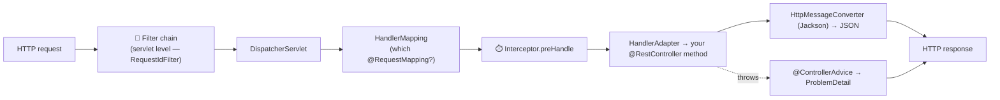
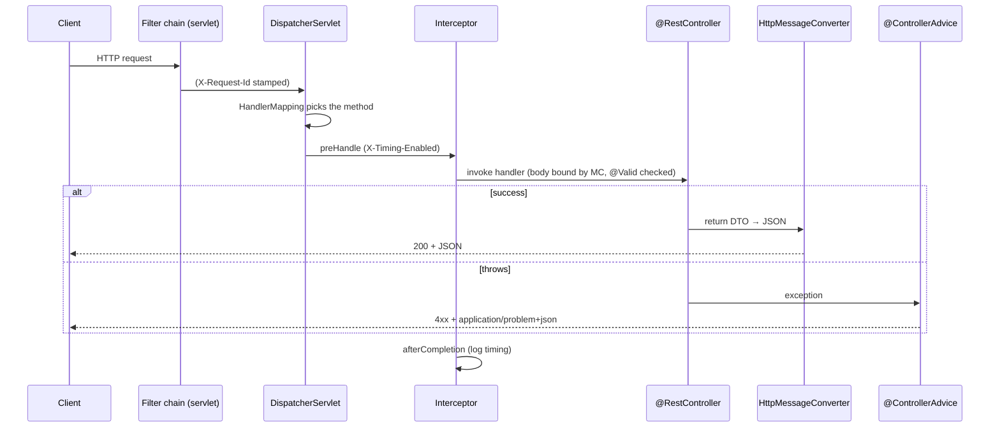
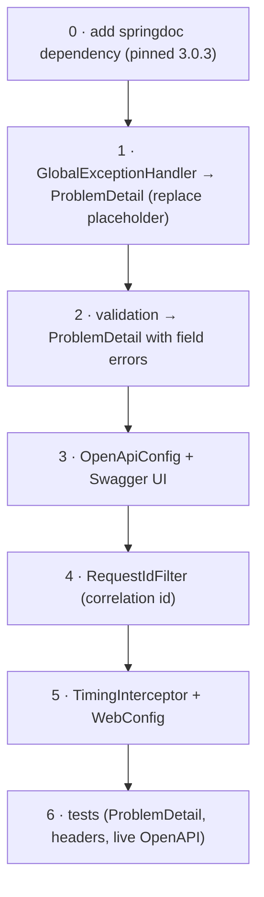
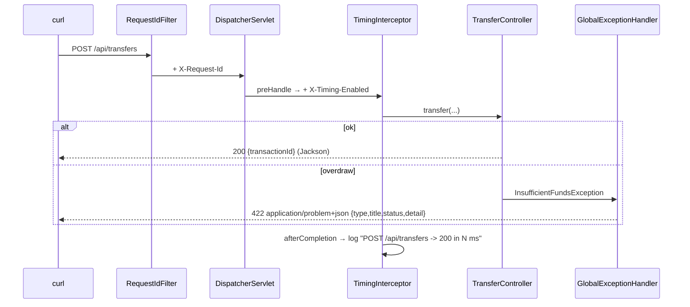

# Step 13 · Spring MVC / REST Deep — Problem Details, OpenAPI & the Request Lifecycle
### Phase C — Web, APIs & Application Security 🔵 · Step 13 of 67

> *You've been writing controllers since Step 8, but treating Spring MVC as magic. This step opens it up:
> the full journey of an HTTP request through the `DispatcherServlet`, machine-readable errors with
> **RFC 9457 Problem Details**, your first **Swagger UI** ("click and see it"), and the difference between a
> **filter** and an **interceptor** — the two places cross-cutting concerns live.*

---

<a id="toc"></a>
## 🧭 The Six Movements of This Step

| | Movement | What happens | ~Time |
|---|---|---|---|
| **A** | [🧭 Orient](#orient) | 30-second overview · skip-test · cheat card · why it matters · before you start | ~1h |
| **B** | [🧠 Understand](#understand) | the MVC request lifecycle · ProblemDetail · filters vs interceptors · content negotiation | ~3h |
| **C** | [🛠️ Build](#build) | upgrade demand-account: ProblemDetail global handler · springdoc/Swagger UI · filter + interceptor | ~10.5h |
| **D** | [🔬 Prove](#prove) | the Verification Log — 13 tests, live OpenAPI/Swagger/Problem+JSON, §12.3 mutation | ~1.5h |
| **E** | [🎓 Apply](#apply) | go deeper · interview prep · your-turn challenges | ~1.5h |
| **F** | [🏆 Review](#review) | troubleshooting · resources · recap, flashcards & what's next | ~30 min |

---

<a id="orient"></a>

# A · 🧭 Orient

## 📋 This Step in 30 Seconds

| | |
|---|---|
| **Title** | Spring MVC / REST deep — the request lifecycle, RFC 9457 Problem Details, OpenAPI/Swagger UI, filters vs interceptors |
| **Step** | 13 of 67 · **Phase C — Web, APIs & Application Security** 🔵 *(start of Phase C)* |
| **Effort** | ≈ 18 hours focused. The payoff: you understand exactly what happens between "an HTTP request arrives" and "JSON comes back", return errors a client can parse, and ship a self-documenting API. Experienced Spring devs can skim to ~3h. |
| **What you'll run this step** | **JVM + Maven** for build & tests; **🐳 Docker** for the tests (Testcontainers) and to run the service live (Swagger UI). One command: `./mvnw -pl services/demand-account -am verify`. |
| **Buildable artifact** | The existing **`services/demand-account`**, upgraded: a **`GlobalExceptionHandler`** returning **RFC 9457 `ProblemDetail`** (replacing the Step-12 placeholder), **springdoc-openapi** → **Swagger UI** at `/swagger-ui.html`, a **`RequestIdFilter`** (correlation id) and a **`TimingInterceptor`** (handler timing). CIF/demand-account go from 11 → **13** tests. `step-13-start == step-12-end`. |
| **Verification tier** | 🔴 **Full** — changes a service *and* the build (adds the springdoc dependency). `./mvnw verify` green + all **13** tests + a **live** OpenAPI doc + Swagger UI + `application/problem+json` errors + the correlation-id/timing headers + the **§12.3 mutation** (break the error status → test fails → revert) + clean-room + `smoke.sh`. |
| **Depends on** | **[Step 12](../step-12/lesson.md)** (the demand-account service we upgrade), **[Step 8](../step-08/lesson.md)** (controllers/DTOs), **[Step 7](../step-07/lesson.md)** (proxies/AOP — interceptors are conceptually adjacent). **+ Docker.** |

By the end you will be able to trace an HTTP request through the `DispatcherServlet` (handler mapping → handler adapter → message converters); return **RFC 9457 Problem Details** for both your domain exceptions and validation failures; generate and serve **OpenAPI + Swagger UI**; and explain precisely when to use a **filter** vs an **interceptor**.

### ⏭️ Can You Skip This Step? (5-minute self-check)

If you can confidently do **all** of this, skim the 🧩 Pattern Spotlight and jump to **[Step 14 — API Design, Versioning & Webhooks](../step-14/lesson.md)**.

- [ ] I can trace a request through **`DispatcherServlet` → HandlerMapping → HandlerAdapter → handler → `HttpMessageConverter`** and explain content negotiation.
- [ ] I can return **RFC 9457 `ProblemDetail`** (`application/problem+json`) for domain *and* validation errors via `@ControllerAdvice` / `ResponseEntityExceptionHandler`.
- [ ] I can generate **OpenAPI** and serve **Swagger UI** with springdoc, and explain what's generated vs configured.
- [ ] I can state the difference between a **`Filter`** (servlet level) and a **`HandlerInterceptor`** (Spring MVC level), and when to use each.
- [ ] I know why controllers/filters/interceptors are **singletons** and must be **stateless** (Step 11 thread-safety).

> [!TIP]
> Not 100%? Stay. "Walk me through what happens when a request hits a Spring controller", "how do you do global error handling?", and "filter vs interceptor?" are bread-and-butter Spring interview questions — and a clean `ProblemDetail` + a live Swagger UI are the kind of professional polish that makes a portfolio API look senior.

## 📇 Cheat Card

> **What this step delivers (one sentence):** the demand-account API becomes *professional* — machine-readable RFC 9457 error responses, a browsable Swagger UI generated from the code, and request-scoped cross-cutting concerns (a correlation-id filter + a timing interceptor) — all proven with live HTTP.

**Key commands** (Windows uses `.\mvnw.cmd`):

```bash
# Build + test the service (13 tests) on a real Testcontainers Postgres:
./mvnw -pl services/demand-account -am verify

# Run it live, then open Swagger UI in a browser:
docker compose -f services/demand-account/compose.yaml up -d
SPRING_DATASOURCE_URL=jdbc:postgresql://localhost:5433/demand_account ./mvnw -pl services/demand-account spring-boot:run
#   → http://localhost:8082/swagger-ui.html   (the OpenAPI spec is at /v3/api-docs)

# One-shot proof your build matches the lesson (needs Docker):
bash steps/step-13/smoke.sh
```

**The one headline idea — *every request flows through the `DispatcherServlet`; filters wrap the whole thing, interceptors wrap the handler, and errors come back as RFC 9457 Problem Details*:**



*Alt-text: an HTTP request passes through the servlet-level filter chain (e.g. RequestIdFilter), into the DispatcherServlet, which uses HandlerMapping to find the controller method, runs interceptor preHandle, invokes the handler via a HandlerAdapter, and serializes the return value to JSON with an HttpMessageConverter; if the handler throws, a @ControllerAdvice turns it into a ProblemDetail. Either path produces the HTTP response.*

## 🎯 Why This Matters

The API *is* the product to every client and frontend — and the difference between a toy and a professional API is in the details this step covers. Errors that clients can parse programmatically (RFC 9457 `ProblemDetail`, not ad-hoc JSON) prevent brittle string-matching and leaking stack traces. A generated **Swagger UI** turns your API into something a teammate or interviewer can *explore in a browser* in seconds — your first "click and see it" surface. And understanding the request lifecycle (and where filters vs interceptors sit) is exactly what "walk me through a Spring request" interviews probe. After this step your endpoints look and behave like a senior built them.

## ✅ What You'll Be Able to Do

- **Trace the MVC request lifecycle** — `DispatcherServlet`, handler mapping/adapter, message converters, content negotiation.
- **Return RFC 9457 Problem Details** — for domain exceptions *and* Bean Validation failures, with per-field errors.
- **Generate OpenAPI + serve Swagger UI** — self-documenting API from the code (springdoc).
- **Use filters and interceptors** — a correlation-id filter and a handler-timing interceptor, and explain the difference.
- **Keep web components thread-safe** — stateless singletons; request-scoped state in request attributes.

## 🧰 Before You Start

**Prerequisites**

- ✅ You finished **Step 12**; the repo is at `step-13-start` (== `step-12-end`) and `./mvnw verify` is green.
- ✅ **Docker is running** (tests use Testcontainers; the live Swagger UI uses `compose.yaml` + the 5433 port).

**What you already learned that connects here**

- **Step 8/12**: you wrote `@RestController`s and DTOs; now you see the machinery underneath and make the errors professional.
- **Step 12** left a deliberately-minimal `ApiExceptionHandler` "to be replaced by ProblemDetail in Step 13" — this is that step; we cash that cheque.
- **Step 7**: AOP proxies — interceptors are a related "wrap the call" idea, but at the MVC layer, not via proxies.
- **Step 11**: thread-safety — controllers/filters/interceptors are shared singletons, so they must be stateless.

> **Depends on: Steps 12, 8, 7.**

## 🗓️ Session Plan (~18h → 7 sittings)

Each sitting is ~2–3h and ends at a real commit or checkpoint you can walk away from — every sub-step below also carries a 🚪 re-entry line for when you come back.

| Sitting | Covers | ~Time | Save point (where you stop) |
|---|---|---|---|
| **S1 · The map** | A Orient + B: 🧠 Big Idea, 🧩 Pattern Spotlight (RFC 9457) | ~2.5h | end of Pattern Spotlight |
| **S2 · The machinery** | B rest (🌱 Under the Hood → 🧵 thread-safety) + sub-step 0 (springdoc + instant win) | ~2.5h | commit `build(demand-account): add springdoc-openapi 3.0.3 (Boot-4 compatible)` |
| **S3 · Errors done right** | sub-steps 1–2 (GlobalExceptionHandler + validation ProblemDetail) | ~3h | commit `feat(demand-account): validation errors as ProblemDetail with field map` |
| **S4 · Click and see it** | sub-step 3 (OpenApiConfig + live Swagger UI) | ~2h | commit `feat(demand-account): OpenAPI metadata + Swagger UI (springdoc)` |
| **S5 · Cross-cutting** | sub-steps 4–5 (RequestIdFilter + TimingInterceptor/WebConfig) | ~2.5h | commit `feat(demand-account): handler-timing interceptor + registration` |
| **S6 · Prove it** | sub-step 6 (tests 11 → 13) + 🎮 Play With It + D Prove (mutation, smoke.sh) | ~3h | **13 green tests** + tag `step-13-end` |
| **S7 · Cement it** | E Apply (go deeper, interview prep, challenges) + F Review (recap, flashcards) | ~2.5h | end of step |

*Optional routes:* the ⏭️ skip-test (5 min) can turn this into a ~3h skim for experienced Spring devs; each 🚀 Go Deeper aside is **+~10 min**; 🏋️ Your Turn challenges run **+15–60 min** each — none of them block the step.

---

<a id="understand"></a>

# B · 🧠 Understand

## 🧠 The Big Idea

A Spring MVC app is built around **one servlet**: the `DispatcherServlet` (the "front controller"). Every HTTP request the container accepts is first passed through the **servlet filter chain**, then handed to the `DispatcherServlet`, which orchestrates the rest:

1. **HandlerMapping** — match the request (method + path + headers) to a handler (your `@RequestMapping` method). 
2. **HandlerInterceptors** — `preHandle` runs *before* the handler (can short-circuit); the handler runs; `postHandle` runs after; `afterCompletion` always runs (even on exception).
3. **HandlerAdapter** — actually invoke your method: bind path variables/query params/the request body (via an `HttpMessageConverter` — Jackson for JSON), validate (`@Valid`), call you.
4. **Return value handling** — your returned object is serialized back to the response by an `HttpMessageConverter` (Jackson → JSON), with the status/headers from your `ResponseEntity`.
5. **Exception handling** — if anything throws, the `DispatcherServlet` asks its `HandlerExceptionResolver`s — which include your `@ControllerAdvice` — to turn the exception into a response. We make that a **ProblemDetail**.

Two cross-cutting layers, two different scopes: a **`Filter`** lives at the **servlet-container** level (before/after the `DispatcherServlet`), sees *every* request (even ones that 404 before reaching a handler), and is the home of correlation ids, CORS, compression, auth pre-checks. A **`HandlerInterceptor`** lives *inside* the `DispatcherServlet`, around the **matched handler**, so it knows *which* handler ran — the home of per-handler timing, auth checks that need handler metadata, and `MDC` setup.

> **Analogy — an embassy.** The **filter chain** is the security gate at the building entrance: everyone passes through it, even people who turn out to be at the wrong embassy (404). The **DispatcherServlet** is the front desk that figures out which office (handler) you need. The **interceptor** is the office assistant who greets you at *that office's* door (`preHandle`), and notes how long your meeting took on the way out (`afterCompletion`). The **message converter** is the translator turning your spoken request into the office's language (JSON ↔ Java) and back. And when something goes wrong, the **`@ControllerAdvice`** is the complaints desk that hands you a standardized, machine-readable form (a `ProblemDetail`) instead of a panicked stack trace.



*Alt-text: a sequence diagram showing a request passing through the servlet filter chain (which stamps X-Request-Id), into the DispatcherServlet which picks the handler method, through the interceptor's preHandle (which sets X-Timing-Enabled), into the controller; on success the message converter serializes the DTO to JSON (200); on exception the @ControllerAdvice returns application/problem+json; finally the interceptor's afterCompletion logs timing.*

## 🧩 Pattern Spotlight — RFC 9457 Problem Details for HTTP APIs

> **Problem.** Every API invents its own error JSON (`{"error":"..."}`, `{"message":"..."}`, `{"code":42}`). Clients end up string-matching on ad-hoc shapes, and servers leak stack traces or internal details. There's no contract.

> **Why ProblemDetail fits.** **RFC 9457** (the successor to RFC 7807) standardizes a media type — **`application/problem+json`** — and a body shape: `type` (a URI identifying the problem kind), `title` (human-readable summary), `status` (the HTTP code), `detail` (this occurrence's explanation), `instance` (the specific URI), plus any **custom extension members** (we add `errors` for validation). Clients can branch on `type`/`status` reliably; humans get `title`/`detail`.

> **How it works (the mechanism).** Spring Framework 6+ ships `org.springframework.http.ProblemDetail`. Return it (or `ResponseEntity<ProblemDetail>`) from an `@ExceptionHandler` and Spring sets the response status from it and serializes it as `application/problem+json`. Extending `ResponseEntityExceptionHandler` makes Spring's *built-in* MVC exceptions (validation, unreadable body, 404, 405) come back as Problem Details too — you just override the hook (e.g. `handleMethodArgumentNotValid`) to enrich them.

> **Alternatives / trade-offs.** A bespoke error envelope (more control, no standard, clients must learn it); `@ResponseStatus` on the exception (simple, but no body customization); letting the default Boot error page handle it (leaks little, but not RFC-standard and not enriched). For a public/partner API (Step 14), the **standard** wins — interoperability and no surprises.

> **Implementation (here).** `GlobalExceptionHandler extends ResponseEntityExceptionHandler`: `@ExceptionHandler(InsufficientFundsException.class)` → 422 ProblemDetail; `IllegalArgumentException` → 400; and an override of `handleMethodArgumentNotValid` that attaches a per-field `errors` map.

## 🌱 Under the Hood: How It Really Works

**The `DispatcherServlet` is the front controller.** Spring Boot registers it mapped to `/`. On each request it consults its ordered **`HandlerMapping`s** (`RequestMappingHandlerMapping` matches `@RequestMapping`/`@GetMapping`/… by path, method, params, headers, content type) to find a `HandlerExecutionChain` (the handler + its interceptors). It then picks a **`HandlerAdapter`** (`RequestMappingHandlerAdapter` for annotated controllers) which resolves method arguments (via `HandlerMethodArgumentResolver`s — `@PathVariable`, `@RequestParam`, `@RequestBody`, etc.), invokes your method, and handles the return value (via `HandlerMethodReturnValueHandler`s).

**Message converters do JSON ↔ Java.** `@RequestBody`/`@ResponseBody` (and `@RestController` = `@Controller` + `@ResponseBody`) use **`HttpMessageConverter`s**. Boot auto-configures `MappingJackson2HttpMessageConverter` (Jackson) so a request body deserializes into your record and your returned DTO serializes to JSON. **Content negotiation** chooses the converter by the `Accept` header (and the producible types) — ask for `application/json`, get Jackson; an error produces `application/problem+json`.

**`@Valid` and validation.** `@Valid @RequestBody` triggers Bean Validation (`@NotBlank`, `@Positive`, …) *after* binding the body. A failure throws `MethodArgumentNotValidException` — which `ResponseEntityExceptionHandler` converts to a Problem Detail (we enrich it with field errors). This is *why* the negative-amount transfer is rejected before your controller code ever runs.

**`@ControllerAdvice` is a global exception interceptor.** It's a bean whose `@ExceptionHandler` methods apply across all controllers. Spring's `ExceptionHandlerExceptionResolver` finds the most specific handler for a thrown exception. Returning a `ProblemDetail` makes Spring set the status from `problem.getStatus()` and write `application/problem+json`.

**Filter vs interceptor — the precise difference.**
| | Filter (`jakarta.servlet.Filter` / `OncePerRequestFilter`) | Interceptor (`HandlerInterceptor`) |
|---|---|---|
| **Layer** | Servlet container — *before/after* `DispatcherServlet` | Spring MVC — *inside* `DispatcherServlet`, around the handler |
| **Sees** | **every** request (incl. ones with no handler / 404) | only requests that **matched a handler** |
| **Knows the handler?** | No | **Yes** (the matched `HandlerMethod`) |
| **Hooks** | wrap `doFilter` (before + after the whole chain) | `preHandle` / `postHandle` / `afterCompletion` |
| **Registered by** | being a `Filter` bean (auto) | `WebMvcConfigurer.addInterceptors(...)` |
| **Use for** | correlation ids, CORS, compression, request/response wrapping, auth pre-checks | per-handler timing, auth needing handler metadata, MDC, model tweaks |

Our `RequestIdFilter` (correlation id) is a `OncePerRequestFilter` — it sets `X-Request-Id` *before* calling the chain so it's present even on errors. Our `TimingInterceptor` sets a marker in `preHandle` (reliably, before the response commits) and logs elapsed time in `afterCompletion` (which always runs). Note: setting a *response header in `postHandle`* is unreliable for `@ResponseBody` handlers because the body (and headers) may already be committed by the message converter — that's why timing is *logged* in `afterCompletion`, not written as a header.

❓ **Knowledge-check:** a request arrives for a path with no matching `@RequestMapping` (a 404) — which runs: your filter, your interceptor, both, or neither? <details><summary>answer</summary>Only the filter — it sits at the servlet-container level and sees every request; the interceptor is part of the `HandlerExecutionChain`, which only exists when a handler matched.</details>

**springdoc generates OpenAPI from your code.** The `springdoc-openapi-starter-webmvc-ui` dependency scans your `@RequestMapping`s, request/response types, and validation annotations to build an **OpenAPI 3.1** document at `/v3/api-docs`, and serves **Swagger UI** (a browsable HTML client) at `/swagger-ui.html`. You supply only metadata (title/version) via an `OpenAPI` bean; the paths/schemas are inferred.

## 🛡️ Security Lens: What Could Go Wrong

- **Error responses leak internals.** A raw stack trace or exception class in the body hands attackers a map of your internals (frameworks, versions, SQL). `ProblemDetail` lets you return a *controlled* `detail` — keep it user-safe; never echo SQL or secrets. (Boot also hides stack traces by default in prod via `server.error.include-stacktrace=never`.)
- **Swagger UI exposure.** A live, world-readable Swagger UI documents every endpoint for attackers too. Fine in dev; in production, gate it (auth, network policy, or disable) — we'll secure it in Phase C/H. Flagged now so you don't ship it open.
- **Correlation ids are a defensive tool.** Stamping `X-Request-Id` on every request/response (the filter) makes incident forensics possible — you can trace one request across logs/services (Step 36 wires it into tracing). Don't trust a *client-supplied* id blindly for security decisions; it's for correlation, not authorization.
- **Validation is a security control.** `@Valid` + Problem Details reject malformed/oversized input early (defense in depth); the field-level `errors` you return should describe *what* is wrong without revealing internal rules an attacker could probe. (OWASP input-validation; deepened in Step 18.)

## 🕰️ Then vs. Now (How This Changed Across Versions)

| Topic | Then | Now | Why it changed |
|---|---|---|---|
| **Error bodies** | Hand-rolled error JSON, or `@ResponseStatus`; ad-hoc per API. | **RFC 9457 `ProblemDetail`** (`org.springframework.http.ProblemDetail`, Spring 6+) — `application/problem+json`. | A standard, machine-readable contract; clients stop string-matching bespoke shapes. |
| **OpenAPI tooling** | **springfox** (unmaintained, stuck on older Spring). | **springdoc-openapi** — actively maintained; v3.0.x supports Spring Boot 4 / Framework 7. | springfox died; springdoc is the de-facto standard. We pin **3.0.3** (2.8.x targets Boot 3). |
| **Global handler base** | `WebMvcConfigurerAdapter` (deprecated), manual exception JSON. | `WebMvcConfigurer` (interface w/ defaults) + `ResponseEntityExceptionHandler` returning `ProblemDetail`. | Cleaner extension points; built-in MVC exceptions become Problem Details for free. |
| **OpenAPI version** | OpenAPI 3.0. | springdoc emits **OpenAPI 3.1** (JSON Schema-aligned). | Better schema fidelity (nullability, etc.). |

> [!NOTE]
> *Verify, don't guess.* `ProblemDetail` is Spring Framework 6+ (we're on 7 via Boot 4). **springdoc-openapi 3.0.3** is the version that supports Boot 4.0.x (verified it resolves and the live `/v3/api-docs` returns OpenAPI 3.1 — see 🔬); 2.8.x targets Boot 3. Pinned in `VERSIONS.md`. springfox is dead — don't use it.

## 🧵 Thread-safety note

Controllers, `@ControllerAdvice`, filters, and interceptors are **singletons** shared across all request threads — so they must be **stateless**: no mutable instance fields holding per-request data (that's a race, Step 11). Per-request state belongs in **request attributes** (our `TimingInterceptor` stashes the start time in `request.setAttribute(...)`, not a field) or `ThreadLocal`/`MDC`. The `ProblemDetail` we create is a fresh object per exception (local, not shared) — safe. This is the same "don't share mutable state across threads" rule from Step 11, applied to the web layer.

---

<a id="build"></a>

# C · 🛠️ Build

## 📦 Your Starting Point

You're at **`step-13-start`** (== `step-12-end`). The `demand-account` service has 11 tests, a working transfer API, and a **placeholder** `ApiExceptionHandler` that returns ad-hoc `{"error":...}` JSON. We'll replace that with Problem Details, add Swagger UI, and add a filter + interceptor.

Confirm the start builds:
```bash
./mvnw -q -pl services/demand-account -am verify   # green, 11 tests, from Step 12
```

## 🛠️ Let's Build It — Step by Step



🌳 **Files we'll touch** (under `services/demand-account/`):
```
pom.xml                                              # + springdoc-openapi-starter-webmvc-ui:3.0.3
src/main/java/com/buildabank/account/web/
├── GlobalExceptionHandler.java   (new — replaces ApiExceptionHandler.java, deleted)
├── OpenApiConfig.java            (new — OpenAPI metadata bean)
├── RequestIdFilter.java          (new — OncePerRequestFilter, X-Request-Id)
├── TimingInterceptor.java        (new — HandlerInterceptor)
└── WebConfig.java                (new — registers the interceptor)
src/test/java/com/buildabank/account/  (TransferControllerTest + DemandAccountIntegrationTest updated)
steps/step-13/{requests.http, smoke.sh}
```

---

### Sub-step 0 of 6 — Add springdoc (pinned) *(~1h)* 🧭 *(you are here: **dependency** → ProblemDetail → validation → OpenAPI → filter → interceptor → tests)*

🎯 **Goal:** pull in OpenAPI/Swagger UI support, pinned to the version that works with Boot 4.

📁 **Location:** `services/demand-account/pom.xml`

⌨️ **Code** (diff — add inside `<dependencies>`):
```xml
<!-- OpenAPI/Swagger UI (Step 13). springdoc 3.0.x supports Spring Boot 4 / Spring Framework 7
     (2.8.x targets Boot 3). Pinned — NOT Boot-managed, so we set the version. -->
<dependency>
    <groupId>org.springdoc</groupId>
    <artifactId>springdoc-openapi-starter-webmvc-ui</artifactId>
    <version>3.0.3</version>
</dependency>
```

🔍 **Line-by-line:** `springdoc-openapi-starter-webmvc-ui` is one starter that brings the OpenAPI generator *and* the Swagger UI webjar. We pin `3.0.3` because springdoc isn't in Spring Boot's managed BOM (it's third-party) and the 2.8.x line targets Boot 3 — using it on Boot 4 would fail.

💭 **Under the hood:** on startup springdoc auto-configures handlers for `/v3/api-docs` (the generated OpenAPI JSON) and `/swagger-ui/**` (the UI). It introspects your `RequestMappingHandlerMapping` to build the spec.

⚡ **Instant win (~5 min):** you already have something to *see* — springdoc serves a default Swagger UI with zero Java written. Start the service (the cheat-card commands: `docker compose -f services/demand-account/compose.yaml up -d`, then `SPRING_DATASOURCE_URL=jdbc:postgresql://localhost:5433/demand_account ./mvnw -pl services/demand-account spring-boot:run`) and open **http://localhost:8082/swagger-ui.html** — your Step-12 endpoints are already listed, browsable. Sub-step 3 will make the metadata (title/version/description) *yours*.

✋ **Checkpoint:** `./mvnw -q -pl services/demand-account dependency:resolve` succeeds (3.0.3 downloads).

💾 **Commit:** `git add services/demand-account/pom.xml && git commit -m "build(demand-account): add springdoc-openapi 3.0.3 (Boot-4 compatible)"`

⚠️ **Pitfall:** using springdoc **2.8.x** on Boot 4 fails at runtime (Spring 6 vs 7 APIs). Always check the springdoc↔Boot compatibility (we verified 3.0.3 boots — 🔬).

🚪 **Stopping here?** You have springdoc 3.0.3 on the classpath and a default Swagger UI booting, committed. Next: sub-step 1 (`GlobalExceptionHandler`); first action: create `GlobalExceptionHandler.java` in `services/demand-account/src/main/java/com/buildabank/account/web/`.

---

### Sub-step 1 of 6 — `GlobalExceptionHandler` → Problem Details *(~1.5h)* 🧭 *(dependency ✅ → **ProblemDetail** → validation → OpenAPI → filter → interceptor → tests)*

🎯 **Goal:** replace the Step-12 placeholder with RFC 9457 Problem Details for the domain exceptions.

📁 **Location:** new file `services/demand-account/src/main/java/com/buildabank/account/web/GlobalExceptionHandler.java` (and **delete** `ApiExceptionHandler.java`).

⌨️ **Code** (the domain handlers; the validation override is sub-step 2 — the import block below already covers it):
```java
// services/demand-account/src/main/java/com/buildabank/account/web/GlobalExceptionHandler.java
package com.buildabank.account.web;

import java.net.URI;
import java.util.LinkedHashMap;
import java.util.Map;

import org.springframework.http.HttpHeaders;
import org.springframework.http.HttpStatus;
import org.springframework.http.HttpStatusCode;
import org.springframework.http.ProblemDetail;
import org.springframework.http.ResponseEntity;
import org.springframework.validation.FieldError;
import org.springframework.web.bind.MethodArgumentNotValidException;
import org.springframework.web.bind.annotation.ExceptionHandler;
import org.springframework.web.bind.annotation.RestControllerAdvice;
import org.springframework.web.context.request.WebRequest;
import org.springframework.web.servlet.mvc.method.annotation.ResponseEntityExceptionHandler;

import com.buildabank.account.domain.InsufficientFundsException;

@RestControllerAdvice
public class GlobalExceptionHandler extends ResponseEntityExceptionHandler {

    private static final String PROBLEM_BASE = "https://buildabank.example/problems/";

    @ExceptionHandler(InsufficientFundsException.class)
    public ProblemDetail handleInsufficientFunds(InsufficientFundsException ex) {
        ProblemDetail problem = ProblemDetail.forStatusAndDetail(HttpStatus.UNPROCESSABLE_ENTITY, ex.getMessage());
        problem.setTitle("Insufficient funds");
        problem.setType(URI.create(PROBLEM_BASE + "insufficient-funds"));
        return problem;
    }

    @ExceptionHandler(IllegalArgumentException.class)
    public ProblemDetail handleBadRequest(IllegalArgumentException ex) {
        ProblemDetail problem = ProblemDetail.forStatusAndDetail(HttpStatus.BAD_REQUEST, ex.getMessage());
        problem.setTitle("Invalid request");
        problem.setType(URI.create(PROBLEM_BASE + "invalid-request"));
        return problem;
    }
}
```

🔍 **Line-by-line:**
- `@RestControllerAdvice` — a `@ControllerAdvice` whose handlers' return values are written to the body (it's advice + `@ResponseBody`). Applies across all controllers.
- `extends ResponseEntityExceptionHandler` — inherits Spring's handling that turns built-in MVC exceptions into `ProblemDetail` (we use it in sub-step 2 for validation).
- `ProblemDetail.forStatusAndDetail(status, detail)` — the factory; `setTitle`/`setType` fill the standard members. Returning it makes Spring set the HTTP status **from the ProblemDetail** and serialize `application/problem+json`.

💭 **Under the hood:** Spring's `ExceptionHandlerExceptionResolver` matches the thrown exception to the most specific `@ExceptionHandler`. Because the return type is `ProblemDetail`, Spring's `ResponseEntityExceptionHandler`/return-value handling sets `Content-Type: application/problem+json` and the status.

🔮 **Predict:** an overdraw will now return what status and content-type? <details><summary>answer</summary>422 Unprocessable Entity, `application/problem+json` (proven live in 🔬).</details>

✋ **Checkpoint:** compiles; `ApiExceptionHandler.java` is deleted.

💾 **Commit:** `git add -A services/demand-account/src/main/java && git commit -m "feat(demand-account): RFC 9457 ProblemDetail error handling"`

⚠️ **Pitfall:** don't put a user's secret/SQL into `detail`. Keep it safe-to-show.

🚪 **Stopping here?** You have domain errors as RFC 9457 ProblemDetail (422/400), committed. Next: sub-step 2 (validation field errors); first action: reopen `GlobalExceptionHandler.java` and add the `handleMethodArgumentNotValid` override.

---

### Sub-step 2 of 6 — Validation → Problem Details with field errors *(~1.5h)* 🧭 *(… → **validation** → …)*

🎯 **Goal:** turn Bean Validation failures into a Problem Detail that lists which fields failed.

📁 **Location:** `GlobalExceptionHandler.java` (override a hook from the base class)

⌨️ **Code** (add inside `GlobalExceptionHandler`, below the two domain handlers — the imports from sub-step 1 already cover everything here):
```java
// GlobalExceptionHandler.java (same file) — override the ResponseEntityExceptionHandler hook
@Override
protected ResponseEntity<Object> handleMethodArgumentNotValid(
        MethodArgumentNotValidException ex, HttpHeaders headers, HttpStatusCode status, WebRequest request) {
    ProblemDetail problem = ProblemDetail.forStatusAndDetail(HttpStatus.BAD_REQUEST, "Request validation failed");
    problem.setTitle("Validation failed");
    problem.setType(URI.create(PROBLEM_BASE + "validation"));
    Map<String, String> errors = new LinkedHashMap<>();
    for (FieldError fieldError : ex.getBindingResult().getFieldErrors()) {
        String message = fieldError.getDefaultMessage();
        errors.putIfAbsent(fieldError.getField(), message == null ? "invalid" : message);
    }
    problem.setProperty("errors", errors);     // a custom RFC 9457 extension member
    return ResponseEntity.badRequest().body(problem);
}
```

🔍 **Line-by-line:** `MethodArgumentNotValidException` is what `@Valid @RequestBody` throws on failure; `ResponseEntityExceptionHandler` already routes it here. We read `getBindingResult().getFieldErrors()` for the per-field messages and attach them as a custom `errors` member via `problem.setProperty(...)` — RFC 9457 explicitly allows extension members.

💭 **Under the hood:** the binding + validation happens in the `HandlerAdapter` *before* your controller method runs; the exception is resolved by the advice. The default messages ("must be greater than 0") come from the validation annotations (`@Positive`, etc.).

❓ **Knowledge-check:** why must `GlobalExceptionHandler` extend `ResponseEntityExceptionHandler` for this validation override to ever be called? <details><summary>answer</summary>`MethodArgumentNotValidException` is a built-in MVC exception handled by the base class — extending it is what routes the exception to the `handleMethodArgumentNotValid` hook; without it you'd get Boot's default error JSON.</details>

▶️ **Run & See** (proven in the slice test):
```bash
./mvnw -pl services/demand-account test -Dtest=TransferControllerTest
```
✅ A `POST /api/transfers` with `amount: -5.00` returns **400** `application/problem+json` with `title: "Validation failed"` and `errors.amount` present.

✋ **Checkpoint:** validation failures now produce Problem Details with an `errors` map.

💾 **Commit:** `git add services/demand-account/src/main/java/com/buildabank/account/web/GlobalExceptionHandler.java && git commit -m "feat(demand-account): validation errors as ProblemDetail with field map"`

⚠️ **Pitfall:** if you *don't* extend `ResponseEntityExceptionHandler`, `MethodArgumentNotValidException` won't route to your override and you'll get Boot's default error JSON instead.

🚪 **Stopping here?** You have validation failures returning 400 ProblemDetail with an `errors` map, committed. Next: sub-step 3 (OpenAPI + Swagger UI); first action: create `OpenApiConfig.java` in the `web/` package.

---

### Sub-step 3 of 6 — OpenAPI config + Swagger UI *(~2h)* 🧭 *(… → **OpenAPI** → …)*

🎯 **Goal:** add API metadata and confirm Swagger UI is served.

📁 **Location:** new file `services/demand-account/src/main/java/com/buildabank/account/web/OpenApiConfig.java`

⌨️ **Code:**
```java
// services/demand-account/src/main/java/com/buildabank/account/web/OpenApiConfig.java
package com.buildabank.account.web;

import org.springframework.context.annotation.Bean;
import org.springframework.context.annotation.Configuration;

import io.swagger.v3.oas.models.OpenAPI;
import io.swagger.v3.oas.models.info.Info;

@Configuration
public class OpenApiConfig {
    @Bean
    public OpenAPI demandAccountOpenApi() {
        return new OpenAPI().info(new Info()
                .title("Demand Account API")
                .version("v1")
                .description("Accounts and double-entry ledger transfers (Build-a-Bank). "
                        + "Errors are RFC 9457 application/problem+json."));
    }
}
```

🔍 **Line-by-line:** `OpenAPI` (`io.swagger.v3.oas.models.OpenAPI`) and `Info` (`io.swagger.v3.oas.models.info.Info` — note the `.info` sub-package), both brought in by springdoc, supply the *metadata*; springdoc generates the **paths** and **schemas** from your controllers/DTOs automatically.

💭 **Under the hood:** springdoc serves the spec at `/v3/api-docs` (OpenAPI 3.1 JSON) and Swagger UI at `/swagger-ui.html` (which redirects to `/swagger-ui/index.html`).

▶️ **Run & See** (live):
```bash
docker compose -f services/demand-account/compose.yaml up -d
SPRING_DATASOURCE_URL=jdbc:postgresql://localhost:5433/demand_account ./mvnw -pl services/demand-account spring-boot:run
curl -s localhost:8082/v3/api-docs | head -c 200
# open http://localhost:8082/swagger-ui.html in a browser
```
✅ **Expected output** (real run):
```
{"openapi":"3.1.0","info":{"title":"Demand Account API","description":"Accounts and double-entry ledger transfers (Build-a-Bank). Errors are RFC 9457 application/problem+json.","version":"v1"},"servers":[{"url":"http://localhost:8082",...}],"paths":{"/api/transfers":{"post":{...
```
Swagger UI (`/swagger-ui/index.html`) returns **200** — a browsable client listing every endpoint.

✋ **Checkpoint:** `/v3/api-docs` is OpenAPI 3.1 with your title and paths; Swagger UI loads.

💾 **Commit:** `git add services/demand-account/src/main/java/com/buildabank/account/web/OpenApiConfig.java && git commit -m "feat(demand-account): OpenAPI metadata + Swagger UI (springdoc)"`

⚠️ **Pitfall:** Swagger UI is unauthenticated here — fine for dev, **gate it in production** (Phase H).

🚪 **Stopping here?** You have ProblemDetail errors + a live Swagger UI with your metadata, committed. Next: sub-step 4 (`RequestIdFilter`); first action: create `RequestIdFilter.java` in the `web/` package.

---

### Sub-step 4 of 6 — `RequestIdFilter` (a servlet filter) *(~1h)* 🧭 *(… → **filter** → …)*

🎯 **Goal:** stamp a correlation id (`X-Request-Id`) on every response — the servlet-level cross-cutting concern.

📁 **Location:** new file `services/demand-account/src/main/java/com/buildabank/account/web/RequestIdFilter.java`

⌨️ **Code:**
```java
// services/demand-account/src/main/java/com/buildabank/account/web/RequestIdFilter.java
package com.buildabank.account.web;

import java.io.IOException;
import java.util.UUID;

import jakarta.servlet.FilterChain;
import jakarta.servlet.ServletException;
import jakarta.servlet.http.HttpServletRequest;
import jakarta.servlet.http.HttpServletResponse;

import org.springframework.stereotype.Component;
import org.springframework.web.filter.OncePerRequestFilter;

@Component
public class RequestIdFilter extends OncePerRequestFilter {
    public static final String HEADER = "X-Request-Id";
    @Override
    protected void doFilterInternal(HttpServletRequest request, HttpServletResponse response, FilterChain chain)
            throws ServletException, IOException {
        String requestId = request.getHeader(HEADER);
        if (requestId == null || requestId.isBlank()) {
            requestId = UUID.randomUUID().toString();
        }
        response.setHeader(HEADER, requestId);   // set BEFORE the chain → survives even on errors
        chain.doFilter(request, response);
    }
}
```

🔍 **Line-by-line:** `OncePerRequestFilter` guarantees one execution per request (even with async/forwards). It reuses an inbound `X-Request-Id` (so an upstream gateway's id propagates) or mints a UUID, and echoes it. Being a `@Component Filter` bean, Boot **auto-registers** it (no `WebMvcConfigurer` needed — that's interceptors).

💭 **Under the hood:** the filter runs at the servlet-container level, *wrapping* the `DispatcherServlet` — so the header is set for *every* response, including 404s and Problem Details. We set it *before* `chain.doFilter` so it's present even if the handler throws.

🔮 **Predict:** will the `X-Request-Id` header be present on a 422 error response too? <details><summary>answer</summary>Yes — the filter wraps the whole request, including error handling. (Confirmed live: the overdraft 422 and the 200 transfer both carry it.)</details>

✋ **Checkpoint:** responses carry `X-Request-Id`.

💾 **Commit:** `git add services/demand-account/src/main/java/com/buildabank/account/web/RequestIdFilter.java && git commit -m "feat(demand-account): correlation-id filter (X-Request-Id)"`

⚠️ **Pitfall:** setting the header *after* `chain.doFilter` may be too late — the response can already be committed. Set it before.

🚪 **Stopping here?** You have `X-Request-Id` stamped on every response, committed. Next: sub-step 5 (`TimingInterceptor` — you'll write this one yourself); first action: create `TimingInterceptor.java` in the `web/` package.

---

### Sub-step 5 of 6 — `TimingInterceptor` + `WebConfig` *(~1.5h)* 🧭 *(… → **interceptor** → …)*

🎯 **Goal:** time each handler and demonstrate the MVC-level interceptor (vs the filter).

📁 **Location:** new files `TimingInterceptor.java` and `WebConfig.java`

⌨️ **Code — your turn to type it.** You've now seen the pattern twice (the filter in sub-step 4; the hook table in 🌱 Under the Hood). Write the interceptor from this skeleton + spec *before* opening the solution:

```java
// services/demand-account/src/main/java/com/buildabank/account/web/TimingInterceptor.java
package com.buildabank.account.web;

import jakarta.servlet.http.HttpServletRequest;
import jakarta.servlet.http.HttpServletResponse;

import org.slf4j.Logger;
import org.slf4j.LoggerFactory;
import org.springframework.stereotype.Component;
import org.springframework.web.servlet.HandlerInterceptor;

@Component
public class TimingInterceptor implements HandlerInterceptor {
    private static final Logger log = LoggerFactory.getLogger(TimingInterceptor.class);
    private static final String START_ATTR = "timing.startNanos";
    public static final String HEADER = "X-Timing-Enabled";

    @Override public boolean preHandle(HttpServletRequest req, HttpServletResponse res, Object handler) {
        // TODO 1 + 2 (see spec)
    }

    @Override public void afterCompletion(HttpServletRequest req, HttpServletResponse res, Object handler, Exception ex) {
        // TODO 3 (see spec)
    }
}
```

**The spec:**
- **preHandle:** store `System.nanoTime()` in a request attribute named `timing.startNanos` — a request attribute, **not** an instance field (shared singleton → a field is a cross-thread race, Step 11).
- **preHandle:** set the `X-Timing-Enabled: true` response header (before the response can commit) and return `true` to proceed to the handler.
- **afterCompletion:** if the start attribute is present, log `"{method} {uri} -> {status} in {ms} ms"` — `afterCompletion` always runs, even on exception; don't set headers here (may be committed).
- **Register it** in a new `WebConfig implements WebMvcConfigurer`, overriding `addInterceptors` — a `@Component` interceptor alone is **never** wired into the chain (unlike filters).

<details>
<summary>✅ Full solution — compare after you've tried</summary>

```java
// services/demand-account/src/main/java/com/buildabank/account/web/TimingInterceptor.java  (methods)
    @Override public boolean preHandle(HttpServletRequest req, HttpServletResponse res, Object handler) {
        req.setAttribute(START_ATTR, System.nanoTime());   // per-request state in a request attribute (NOT a field)
        res.setHeader(HEADER, "true");                      // set before commit → reliably visible
        return true;                                        // proceed to the handler
    }
    @Override public void afterCompletion(HttpServletRequest req, HttpServletResponse res, Object handler, Exception ex) {
        if (req.getAttribute(START_ATTR) instanceof Long startNanos) {
            long ms = (System.nanoTime() - startNanos) / 1_000_000;
            log.info("{} {} -> {} in {} ms", req.getMethod(), req.getRequestURI(), res.getStatus(), ms);
        }
    }
```

```java
// services/demand-account/src/main/java/com/buildabank/account/web/WebConfig.java
package com.buildabank.account.web;

import org.springframework.context.annotation.Configuration;
import org.springframework.web.servlet.config.annotation.InterceptorRegistry;
import org.springframework.web.servlet.config.annotation.WebMvcConfigurer;

@Configuration
public class WebConfig implements WebMvcConfigurer {
    private final TimingInterceptor timingInterceptor;
    public WebConfig(TimingInterceptor timingInterceptor) { this.timingInterceptor = timingInterceptor; }
    @Override public void addInterceptors(InterceptorRegistry registry) {
        registry.addInterceptor(timingInterceptor);   // a @Component alone does NOT register it
    }
}
```

</details>

🔍 **Line-by-line:**
- `preHandle` runs before the handler; we record the start time **in a request attribute** (request-scoped — thread-safe; an instance field would be a race, Step 11), set the marker header (before commit), and return `true` to proceed.
- `afterCompletion` always runs (even on exception) — the right place to *observe* (log timing). We don't set a response header here because the response may already be committed for `@ResponseBody`.
- `WebConfig implements WebMvcConfigurer` registers the interceptor — unlike filters, an interceptor `@Component` is **not** auto-wired into the chain.

💭 **Under the hood:** the interceptor is part of the `HandlerExecutionChain` the `DispatcherServlet` builds — so it only runs for requests that **matched a handler** (a 404 with no handler skips it; the filter still runs). That's the core filter-vs-interceptor distinction.

▶️ **Run & See** (live transfer, showing both headers). Two prerequisites: the server from sub-step 3 must still be running (if not, restart it with the compose + `spring-boot:run` commands from the cheat card), and `ACC-A`/`ACC-B` must exist — create them first via `steps/step-13/requests.http` (first two requests) or the Swagger-UI flow in 🎮 Play With It.
```bash
curl -s -D - -o /dev/null -X POST localhost:8082/api/transfers \
  -H 'Content-Type: application/json' -d '{"from":"ACC-A","to":"ACC-B","amount":50.00}' \
  | grep -iE 'X-Request-Id|X-Timing-Enabled'
```
✅ **Expected output:**
```
X-Request-Id: 23685b7f-2253-48f4-9b08-f5e008dbd212
X-Timing-Enabled: true
```
Both headers appear even if the transfer itself errors (e.g. missing accounts) — the filter and the interceptor run regardless of the handler's outcome.

✋ **Checkpoint:** both headers present; the timing log line appears in the service log.

💾 **Commit:** `git add services/demand-account/src/main/java/com/buildabank/account/web/TimingInterceptor.java services/demand-account/src/main/java/com/buildabank/account/web/WebConfig.java && git commit -m "feat(demand-account): handler-timing interceptor + registration"`

⚠️ **Pitfall:** registering nothing — a `HandlerInterceptor @Component` that you forget to add in `addInterceptors` simply never runs. (Filters auto-register; interceptors don't.)

🚪 **Stopping here?** You have both cross-cutting headers live (`X-Request-Id`, `X-Timing-Enabled`), committed. Next: sub-step 6 (tests, 11 → 13); first action: open `TransferControllerTest.java` under `src/test/java/com/buildabank/account/web/`.

---

### Sub-step 6 of 6 — Tests *(~1.5h)* 🧭 *(… → **tests**)*

🎯 **Goal:** prove ProblemDetail (slice), and the headers + live OpenAPI/Swagger (integration).

📁 **Location:** `TransferControllerTest.java` (updated) and `DemandAccountIntegrationTest.java` (updated)

**The delta, explicitly** (matching the per-class counts in 🔬 Prove §1): `TransferControllerTest` 4 → **5** — two Step-12 tests upgraded to assert the RFC 9457 shape (`overdrawReturns422` → `overdrawReturnsProblemDetail422`, `negativeAmountReturns400` → `negativeAmountReturnsValidationProblemDetail400`) plus one **new** test, `responseCarriesTheCorrelationIdHeader`. `DemandAccountIntegrationTest` 1 → **2** — the existing transfer test gains header + `problem+json` assertions, plus one **new** test, `openApiDocsAndSwaggerUiAreServed`.

⌨️ **Code** (the complete changed/new slice methods — full files in the repo). Two new static imports at the top of `TransferControllerTest`: `MockMvcResultMatchers.content` and `MockMvcResultMatchers.header`:
```java
// TransferControllerTest.java — @WebMvcTest(TransferController.class) slice: controller + advice + MVC infra,
// service mocked. These three methods are the Step-13 delta.

    @Test
    void overdrawReturnsProblemDetail422() throws Exception {          // upgraded from overdrawReturns422
        given(transfers.transfer(any(), any(), any(), any()))
                .willThrow(new InsufficientFundsException("balance too low"));

        mvc.perform(post("/api/transfers")
                        .contentType(MediaType.APPLICATION_JSON)
                        .content("""
                                {"from":"ACC-A","to":"ACC-B","amount":9999.00}
                                """))
                .andExpect(status().isUnprocessableEntity())
                .andExpect(content().contentTypeCompatibleWith("application/problem+json"))   // RFC 9457
                .andExpect(jsonPath("$.title").value("Insufficient funds"))
                .andExpect(jsonPath("$.status").value(422))
                .andExpect(jsonPath("$.detail").value("balance too low"))
                .andExpect(jsonPath("$.type").value("https://buildabank.example/problems/insufficient-funds"));
    }

    @Test
    void negativeAmountReturnsValidationProblemDetail400() throws Exception {   // upgraded from negativeAmountReturns400
        // @Positive on the amount fails Bean Validation before the controller body runs.
        mvc.perform(post("/api/transfers")
                        .contentType(MediaType.APPLICATION_JSON)
                        .content("""
                                {"from":"ACC-A","to":"ACC-B","amount":-5.00}
                                """))
                .andExpect(status().isBadRequest())
                .andExpect(content().contentTypeCompatibleWith("application/problem+json"))
                .andExpect(jsonPath("$.title").value("Validation failed"))
                .andExpect(jsonPath("$.errors.amount").exists());   // per-field error attached
    }

    @Test
    void responseCarriesTheCorrelationIdHeader() throws Exception {   // NEW
        UUID txId = UUID.fromString("00000000-0000-0000-0000-0000000000bb");
        given(transfers.transfer(any(), any(), any(), any())).willReturn(txId);

        mvc.perform(post("/api/transfers")
                        .contentType(MediaType.APPLICATION_JSON)
                        .content("""
                                {"from":"ACC-A","to":"ACC-B","amount":25.00}
                                """))
                .andExpect(status().isOk())
                .andExpect(header().exists("X-Request-Id"))        // set by RequestIdFilter
                .andExpect(header().string("X-Timing-Enabled", "true"));   // set by TimingInterceptor.preHandle
    }
```
```java
// DemandAccountIntegrationTest.java — the complete NEW test (real HTTP against the Testcontainers-backed app)

    @Test
    void openApiDocsAndSwaggerUiAreServed() throws Exception {
        // springdoc generates the spec from the controllers (Step 13).
        HttpResponse<String> apiDocs = get("/v3/api-docs");
        assertThat(apiDocs.statusCode()).isEqualTo(200);
        assertThat(apiDocs.body())
                .contains("Demand Account API")     // our OpenApiConfig title
                .contains("/api/transfers")         // the documented endpoints
                .contains("/api/accounts");

        // Swagger UI is served (it redirects /swagger-ui.html → /swagger-ui/index.html).
        HttpResponse<String> swagger = get("/swagger-ui/index.html");
        assertThat(swagger.statusCode()).isEqualTo(200);
    }
```
In the *existing* integration transfer test, add the header assertions (`transfer.headers().firstValue("X-Request-Id")` is present, `X-Timing-Enabled` has value `"true"`) and upgrade the overdraft assertion to check `Content-Type` contains `application/problem+json` and the body contains `"title":"Insufficient funds"` + `"status":422`.

🔮 **Predict:** in the slice test, why can we assert the `X-Request-Id`/`X-Timing-Enabled` headers? <details><summary>answer</summary>`@WebMvcTest` loads `Filter` beans and `WebMvcConfigurer`/`HandlerInterceptor`s, so the filter + interceptor run in the slice too.</details>

▶️ **Run & See:**
```bash
./mvnw -pl services/demand-account -am verify
```
✅ **Expected output:**
```
[INFO] Tests run: 13, Failures: 0, Errors: 0, Skipped: 0
[INFO] BUILD SUCCESS
```

✋ **Checkpoint:** 13 green tests.

💾 **Commit:** `git add services/demand-account/src/test && git commit -m "test(demand-account): ProblemDetail, correlation-id/timing headers, live OpenAPI/Swagger"`

⚠️ **Pitfall:** asserting the old `{"error":...}` shape — the body is now `{type,title,status,detail,...}`. Update the assertions (we did).

💥 **Break it on purpose (~10 min):** prove *your* tests are load-bearing, the §12.3 way. In `GlobalExceptionHandler.handleInsufficientFunds`, change `HttpStatus.UNPROCESSABLE_ENTITY` to `HttpStatus.OK`, then run `./mvnw -pl services/demand-account test -Dtest=TransferControllerTest` — you should see the same failure pasted in 🔬 Prove §5 (`Status expected:<422> but was:<200>`). Revert with `git checkout -- services/demand-account/src/main/java/com/buildabank/account/web/GlobalExceptionHandler.java` and re-run to green.

🚪 **Stopping here?** You have **13 green tests**, committed. Next: 🎮 Play With It, then the 🔬 Prove log and the `step-13-end` tag; first action: run `bash steps/step-13/smoke.sh`.

---

### 🔁 The full flow you just built



*Alt-text: curl POSTs a transfer; RequestIdFilter adds X-Request-Id; DispatcherServlet runs the interceptor preHandle (adds X-Timing-Enabled) then the controller; on success Jackson serializes 200 JSON, on overdraw the GlobalExceptionHandler returns 422 application/problem+json; afterCompletion logs the timing.*

## 🎮 Play With It

1. **Swagger UI** (the payoff): `docker compose -f services/demand-account/compose.yaml up -d` then `SPRING_DATASOURCE_URL=jdbc:postgresql://localhost:5433/demand_account ./mvnw -pl services/demand-account spring-boot:run`, and open **http://localhost:8082/swagger-ui.html**. Click `POST /api/accounts` → "Try it out" → execute. Open two accounts, then `POST /api/transfers` — all from the browser.
2. **The raw spec:** `curl localhost:8082/v3/api-docs | jq .` (OpenAPI 3.1 JSON).
3. **`steps/step-13/requests.http`** for the curl/HTTP-file equivalents, including the error cases.
4. 🧪 **Little experiments:**
   - Transfer with `amount: -5` → `400` Problem Detail with `errors.amount`.
   - Overdraw → `422` `application/problem+json` (look at `type`/`title`/`detail`/`instance`).
   - Add `-H 'X-Request-Id: my-trace-123'` to a request → the response echoes *your* id (correlation propagation).
   - Watch the service log for the interceptor's `... -> 200 in N ms` line.

## 🏁 The Finished Result

You're at **`step-13-end`** (== `step-14-start`). demand-account now has professional error handling, Swagger UI, and request-scoped cross-cutting concerns — **13** green tests.

### ✅ Definition of Done (your self-check)
- [ ] `./mvnw -pl services/demand-account -am verify` is green with **Tests run: 13**.
- [ ] You can trace a request through the `DispatcherServlet` and explain filter vs interceptor.
- [ ] Errors come back as RFC 9457 `application/problem+json`; Swagger UI loads at `/swagger-ui.html`.
- [ ] `bash steps/step-13/smoke.sh` prints `✅ Step 13 smoke test PASSED`.
- [ ] You've committed and tagged `step-13-end`.

---

<a id="prove"></a>

# D · 🔬 Prove It Works — the Verification Log

> **Tier: 🔴 Full** (changes a service + the build). Real pasted output below — live OpenAPI/Swagger, `application/problem+json`, the correlation-id/timing headers, the §12.3 mutation, and a clean-room verify.

### 1 · `./mvnw -pl services/demand-account -am verify` — 13 tests green
```
[INFO] Tests run: 13, Failures: 0, Errors: 0, Skipped: 0
[INFO] BUILD SUCCESS
```
Per class: `DemandAccountIntegrationTest` 2 · `ConcurrentTransferTest` 2 · `OptimisticLockTest` 1 · `TransactionPropagationTest` 1 · `TransferServiceTest` 2 · `TransferControllerTest` 5. Real Postgres 17 via Testcontainers on a random high port. (Springdoc 3.0.3 boots on Boot 4.0.6 — verified by the integration test exercising `/v3/api-docs`.)

### 2 · Live HTTP — transfer with correlation-id + timing headers (real run)
```
HTTP/1.1 200
X-Request-Id: 23685b7f-2253-48f4-9b08-f5e008dbd212
X-Timing-Enabled: true
Content-Type: application/json
{"transactionId":"1563f4bb-e4dd-438e-8273-fe87a364947b"}
```

### 3 · Live HTTP — overdraw returns an RFC 9457 Problem Detail
```
(status 422, content-type application/problem+json)
{"detail":"account ACC-A balance 150.0000 < debit 9999.00","instance":"/api/transfers","status":422,
 "title":"Insufficient funds","type":"https://buildabank.example/problems/insufficient-funds"}
```

### 4 · Live OpenAPI doc + Swagger UI (real run)
```
GET /v3/api-docs →
{"openapi":"3.1.0","info":{"title":"Demand Account API","description":"Accounts and double-entry ledger
 transfers (Build-a-Bank). Errors are RFC 9457 application/problem+json.","version":"v1"},
 "servers":[{"url":"http://localhost:8082",...}],"paths":{"/api/transfers":{"post":{...
GET /swagger-ui/index.html → 200
```

### 5 · §12.3 Mutation sanity-check — the status mapping is load-bearing
Changed `handleInsufficientFunds` from `HttpStatus.UNPROCESSABLE_ENTITY` to `HttpStatus.OK`, then ran the overdraw test:
```
           Status = 200
[ERROR] TransferControllerTest.overdrawReturnsProblemDetail422:77 Status expected:<422> but was:<200>
[INFO] BUILD FAILURE
```
Proves the test genuinely checks the ProblemDetail status. Reverted; suite green again.

### 6 · Validation Problem Detail (slice)
A `POST /api/transfers` with `amount: -5.00` → **400** `application/problem+json`, `title: "Validation failed"`, `errors.amount` present (per-field map attached via `setProperty`).

### 7 · `smoke.sh`
```
==> Build + test demand-account (ProblemDetail, OpenAPI/Swagger, filter/interceptor) on real Postgres
✅ Step 13 smoke test PASSED
```

### 8 · Clean-room (§12.4) & chain
Fresh `git clone` at `step-13-end` → `make doctor` + `./mvnw verify` → **BUILD SUCCESS** (all 7 modules). Confirmed `step-13-end` == `step-14-start`.

---

<a id="apply"></a>

# E · 🎓 Apply

## 🚀 Go Deeper (Optional)

<details>
<summary>① Content negotiation in depth (+~10 min)</summary>

The `Accept` header (and `produces`/`consumes` on mappings) drives which `HttpMessageConverter` runs. Ask for `Accept: application/xml` and — if a Jackson XML converter is on the classpath — you'd get XML from the *same* controller. springdoc documents the produced media types. You can also negotiate by URL suffix or a query param, but header-based is the REST-correct default. Errors negotiate to `application/problem+json`.
</details>

<details>
<summary>② Why `OncePerRequestFilter` and filter ordering (+~10 min)</summary>

A plain `Filter` can run twice on async dispatches/forwards; `OncePerRequestFilter` dedupes. Order matters: a correlation-id filter should run *early* (before logging/auth filters) so everything downstream sees the id. Control order with `@Order`/`FilterRegistrationBean`. Security filters (Step 16) are themselves a filter chain — you'll slot into it.
</details>

<details>
<summary>③ Customizing the whole error contract (+~10 min)</summary>

`ProblemDetail` supports arbitrary extension members (`setProperty`) — add a `traceId` (your `X-Request-Id`!), a machine `code`, or links. For a public API you'd publish the `type` URIs as real docs pages. `ResponseEntityExceptionHandler` has a hook per built-in exception (`handleHttpMessageNotReadable`, `handleNoResourceFound`, …) — override the ones you care about.
</details>

❓ **Knowledge-check:** the `TimingInterceptor` logs elapsed time in `afterCompletion` instead of writing it as a response header in `postHandle` — why? <details><summary>answer</summary>For `@ResponseBody` handlers the message converter may have already committed the response (headers included) by `postHandle`, so a header set there is unreliable; `afterCompletion` always runs (even on exception), making it the right place to observe/log.</details>

## 💼 Interview Prep: Questions You'll Be Asked

1. **"Walk me through what happens when a request hits a Spring MVC controller."** *(the classic)* → Servlet filter chain → `DispatcherServlet` → `HandlerMapping` finds the `@RequestMapping` method → interceptors' `preHandle` → `HandlerAdapter` binds args (`HttpMessageConverter` for `@RequestBody`, `@Valid`) and invokes it → return value serialized by a converter → `postHandle`/`afterCompletion`. Exceptions go to `HandlerExceptionResolver`s (your `@ControllerAdvice`).

2. **"How do you do global error handling, and what's RFC 9457?"** → A `@RestControllerAdvice` with `@ExceptionHandler`s (extend `ResponseEntityExceptionHandler` to also cover built-in MVC exceptions). RFC 9457 (Problem Details, `application/problem+json`) standardizes the error body (`type/title/status/detail/instance` + extensions) so clients parse errors reliably.

3. **"Filter vs interceptor — when each?"** *(gotcha)* → Filter = servlet-container level, sees every request (even non-handler/404), no handler context — use for correlation ids, CORS, compression. Interceptor = Spring-MVC level, around the matched handler, has handler metadata — use for per-handler timing, auth needing handler info, MDC. Filters auto-register; interceptors need `WebMvcConfigurer`.

4. **"Is a `@RestController` thread-safe? What about your interceptor?"** *(concurrency)* → Controllers/advices/filters/interceptors are singletons shared across threads, so they must be **stateless** — no per-request mutable fields. Per-request state goes in request attributes (our `TimingInterceptor`), `ThreadLocal`, or method locals.

5. **"How is your OpenAPI doc generated?"** *(version-evolution)* → springdoc-openapi introspects the `RequestMappingHandlerMapping`, request/response types, and validation annotations to emit OpenAPI 3.1 at `/v3/api-docs` and serve Swagger UI. (springfox is dead; springdoc 3.0.x supports Boot 4.)

6. **"How do you return the right status for a business error like insufficient funds?"** → Map the domain exception in the advice to a `ProblemDetail` with the right status (422 here), a stable `type` URI, and a safe `detail` — never a raw stack trace. Validation failures → 400 with a field-error map.

> **Behavioral/STAR seed:** *"Tell me about improving an API's developer experience."* → Replaced ad-hoc error JSON with RFC 9457 Problem Details and added a generated Swagger UI (S/T/A); client integration bugs dropped and onboarding got faster (R).

## 🏋️ Your Turn: Practice & Challenges

1. **Add `traceId` to every Problem Detail** *(+~20 min)*. In the advice, read the `X-Request-Id` (from the request) and `setProperty("traceId", ...)` so errors are correlatable. <details><summary>hint</summary>Inject `HttpServletRequest` into the handler method or read it from `RequestContextHolder`.</details>
2. **Document an endpoint richly** *(+~15 min)*. Add `@Operation(summary=...)` and `@ApiResponse`s to `transfer` and see them in Swagger UI.
3. **Apply ProblemDetail to CIF** *(+~45 min)*. Give `services/cif` the same `@RestControllerAdvice` treatment (it currently returns plain 404s). *(Reference: `solutions/step-13/`.)*
4. **Stretch — a logging filter with body capture** *(+~60 min)*. Use `ContentCachingRequestWrapper`/`ContentCachingResponseWrapper` in a filter to log request/response bodies safely (and discuss the pitfalls of reading a stream twice).
5. **Stretch — negotiate XML** *(+~30 min)*. Add `jackson-dataformat-xml`, request `Accept: application/xml`, and watch the same controller return XML.

---

<a id="review"></a>

# F · 🏆 Review

## 🩺 Stuck? Troubleshooting & Fixes

| Symptom | Cause | Fix |
|---|---|---|
| App fails to start after adding springdoc | wrong springdoc line for Boot 4 | use **3.0.x** (we pin 3.0.3); 2.8.x targets Boot 3. |
| Errors come back as Boot's default JSON, not ProblemDetail | advice doesn't extend `ResponseEntityExceptionHandler`, or wrong exception type | extend it; match the exception in `@ExceptionHandler`. |
| Validation returns 500 instead of 400 | not handling `MethodArgumentNotValidException` | extend `ResponseEntityExceptionHandler` (it routes there) and override the hook. |
| `X-Timing-Enabled` header missing | interceptor not registered | add it in `WebConfig.addInterceptors` (a `@Component` alone isn't enough). |
| Swagger UI 404 | wrong path | it's `/swagger-ui.html` (redirects to `/swagger-ui/index.html`); spec at `/v3/api-docs`. |
| `password authentication failed` running live | local Postgres on 5432 | compose maps **5433**; run with `SPRING_DATASOURCE_URL=…localhost:5433/demand_account`. |
| Reset to known-good | — | `git checkout step-13-end && ./mvnw -pl services/demand-account -am verify`. |

## 📚 Learn More: Resources & Glossary

- Spring docs: *Web MVC* (`DispatcherServlet`, handler mapping/adapter, message converters), *Error Responses / ProblemDetail*, *Handler Interceptors*.
- **RFC 9457** — Problem Details for HTTP APIs (the spec).
- **springdoc.org** — OpenAPI 3 for Spring Boot (and the springfox→springdoc migration).

**Glossary:** **`DispatcherServlet`** (front controller) · **HandlerMapping / HandlerAdapter** · **`HttpMessageConverter`** (Jackson) · **content negotiation** · **`@ControllerAdvice` / `@RestControllerAdvice`** · **`ResponseEntityExceptionHandler`** · **`ProblemDetail` / RFC 9457 / `application/problem+json`** · **`Filter` / `OncePerRequestFilter`** · **`HandlerInterceptor`** (`preHandle`/`postHandle`/`afterCompletion`) · **OpenAPI / Swagger UI / springdoc** · **correlation id**.

## 🏆 Recap & Study Notes

**(a) Key points**
- Every request flows through the **`DispatcherServlet`**: HandlerMapping → interceptors → HandlerAdapter (binding + `@Valid` + message converters) → return value → exception resolvers.
- **RFC 9457 `ProblemDetail`** (`application/problem+json`) is the standard error body; return it from `@RestControllerAdvice` (extend `ResponseEntityExceptionHandler` to cover validation too).
- **springdoc** generates OpenAPI 3.1 + Swagger UI from your code; you supply metadata. Pin **3.0.x** for Boot 4.
- **Filter** = servlet level, every request, no handler context (correlation ids/CORS). **Interceptor** = MVC level, around the handler, has handler context (timing/auth). Filters auto-register; interceptors need `WebMvcConfigurer`.
- Web components are **stateless singletons** — request state goes in request attributes (Step 11).

**(b) Key terms:** DispatcherServlet, HandlerMapping/Adapter, HttpMessageConverter, content negotiation, @RestControllerAdvice, ResponseEntityExceptionHandler, ProblemDetail/RFC 9457, OncePerRequestFilter, HandlerInterceptor, springdoc/Swagger UI, correlation id.

**(c) 🧠 Test Yourself**
1. Where does a `@RequestBody` get turned into a Java object? <details><summary>answer</summary>In the `HandlerAdapter`, by an `HttpMessageConverter` (Jackson for JSON), before your method runs.</details>
2. What media type does a Problem Detail use? <details><summary>answer</summary>`application/problem+json` (RFC 9457).</details>
3. A request 404s with no matching handler — does your filter run? Your interceptor? <details><summary>answer</summary>Filter yes (servlet level); interceptor no (no handler matched).</details>
4. Why store the interceptor's start time in a request attribute, not a field? <details><summary>answer</summary>The interceptor is a shared singleton; a field would be a cross-request race (Step 11).</details>
5. Which springdoc line works with Spring Boot 4? <details><summary>answer</summary>3.0.x (we pin 3.0.3); 2.8.x targets Boot 3.</details>

**(d) 🔗 How this connects**
- **Back to Step 12:** we replaced its placeholder error handler with Problem Details.
- **Forward:** Step 14 (API design, versioning, webhooks) builds on this contract; Step 16–17 (Spring Security) slot into the **filter chain** you just met; Step 36 wires the **correlation id** into distributed tracing.

**(e) 🏆 Résumé line / interview talking point earned**
> *"Built professional REST APIs on Spring MVC — RFC 9457 Problem Details for domain and validation errors, generated OpenAPI 3.1 + Swagger UI (springdoc), and request-scoped cross-cutting concerns (correlation-id filter, timing interceptor) — and can trace the full DispatcherServlet request lifecycle."*

**(f) ✅ You can now…**
- [ ] Trace the MVC request lifecycle and explain filter vs interceptor.
- [ ] Return RFC 9457 Problem Details for domain + validation errors.
- [ ] Generate OpenAPI + serve Swagger UI.
- [ ] Keep web components thread-safe.

**(g) 🃏 Flashcards** *(appended to `docs/flashcards.md`)*
- Q: What turns `@RequestBody` JSON into a Java object? · A: an `HttpMessageConverter` (Jackson) in the HandlerAdapter, before the method runs.
- Q: RFC 9457? · A: Problem Details for HTTP APIs — `application/problem+json` with type/title/status/detail/instance (+ extensions).
- Q: Filter vs interceptor? · A: filter = servlet level, every request, no handler context; interceptor = MVC level, around the handler, has handler context.
- Q: How to cover validation errors with ProblemDetail? · A: extend `ResponseEntityExceptionHandler` and override `handleMethodArgumentNotValid`.
- Q: springdoc version for Boot 4? · A: 3.0.x (2.8.x = Boot 3).
> 🔁 **Revisit in ~3 steps** (Step 16 Spring Security plugs into the filter chain).

**(h) ✍️ One-line reflection:** *Did the filter-vs-interceptor distinction finally click — and can you name a real case for each?*

**(i) Sign-off** 🎉 Your API now looks and behaves like a senior built it: standardized errors, a browsable Swagger UI, and clean cross-cutting concerns — and you understand the machinery underneath. Next: **Step 14 — API Design, Versioning & Webhooks**, where we make the API a *contract* fit for partners. Onward! 🚀
