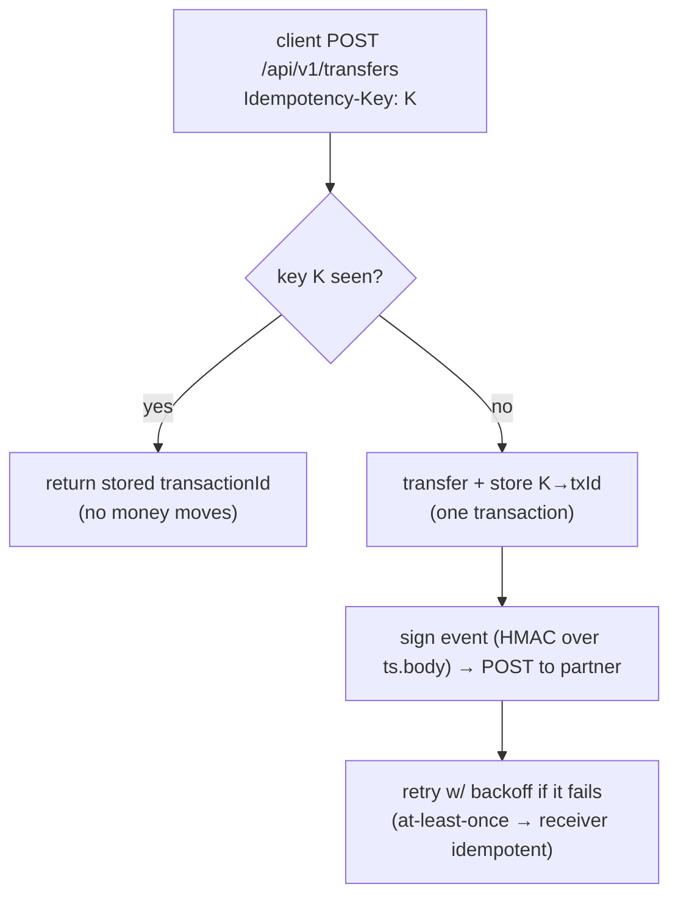
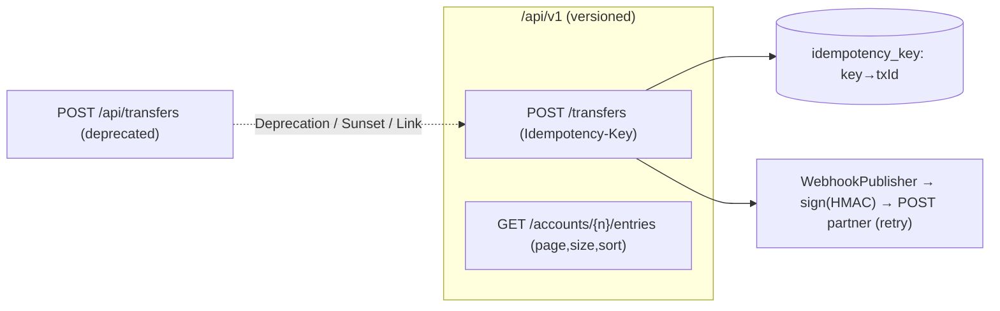
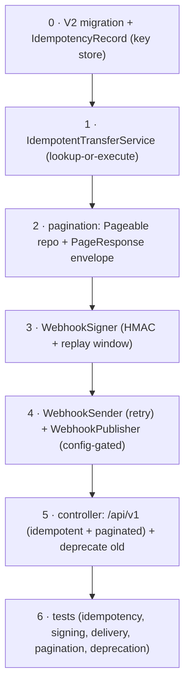
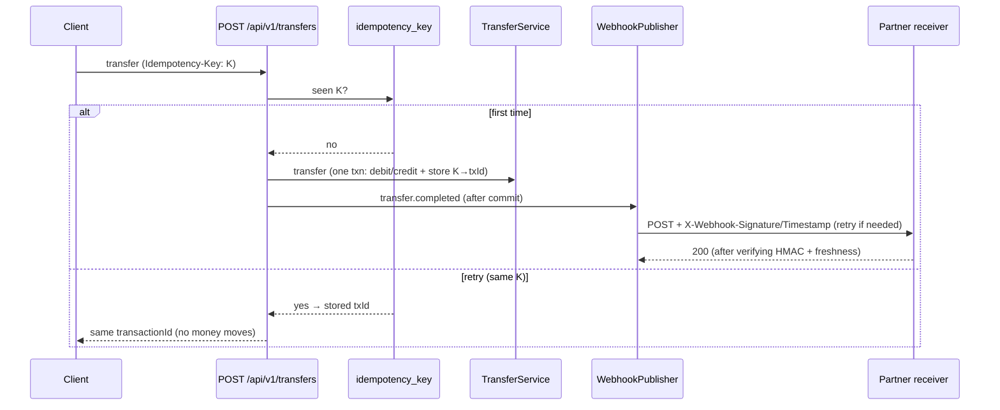

# Step 14 · API Design, Versioning, Idempotency & Webhooks
### Phase C — Web, APIs & Application Security 🔵 · Step 14 of 67

> *A toy API returns JSON. A **professional** API is a durable contract: it versions without breaking
> clients, is safe to retry (idempotency), pages large results predictably, and notifies partners with
> **signed** webhooks they can trust. This step turns demand-account's endpoints into exactly that — and
> every piece is the kind of thing payment APIs (Stripe, Adyen) get judged on.*

---

<a id="toc"></a>
## 🧭 The Six Movements of This Step

| | Movement | What happens |
|---|---|---|
| **A** | [🧭 Orient](#orient) | 30-second overview · skip-test · cheat card · why it matters · before you start |
| **B** | [🧠 Understand](#understand) | versioning · idempotency · pagination · webhook signing/delivery |
| **C** | [🛠️ Build](#build) | versioned + idempotent transfers, paginated entries, signed outbound webhooks |
| **D** | [🔬 Prove](#prove) | the Verification Log — 25 tests, idempotent retry, signed delivery + replay, §12.3 mutation |
| **E** | [🎓 Apply](#apply) | go deeper · interview prep · your-turn challenges |
| **F** | [🏆 Review](#review) | troubleshooting · resources · recap, flashcards & what's next |

---

<a id="orient"></a>

# A · 🧭 Orient

## 📋 This Step in 30 Seconds

| | |
|---|---|
| **Title** | API design — URI versioning & deprecation, public-API idempotency, pagination, and signed outbound webhooks |
| **Step** | 14 of 67 · **Phase C — Web, APIs & Application Security** 🔵 |
| **Effort** | ≈ 20 hours focused. Idempotency and webhook signing are the parts of "design a payments API" interviews that separate seniors from juniors — and you'll have built and tested both. Experienced API designers can skim to ~4h. |
| **What you'll run this step** | **JVM + Maven** for build & tests; **🐳 Docker** for the Testcontainers Postgres. One command: `./mvnw -pl services/demand-account -am verify`. (Webhook delivery is tested with an in-process HTTP receiver — no external service needed.) |
| **Buildable artifact** | `services/demand-account` gains a **`/api/v1`** namespace: an **idempotent** `POST /api/v1/transfers` (`Idempotency-Key` header + a key store) that emits a **signed webhook**, a **paginated** `GET /api/v1/accounts/{n}/entries`, and `Deprecation`/`Sunset`/`Link` headers on the old transfer. New: `IdempotencyRecord`, `IdempotentTransferService`, `WebhookSigner`/`WebhookSender`/`WebhookPublisher`, `PageResponse`. 13 → **25** tests. `step-14-start == step-13-end`. |
| **Verification tier** | 🔴 **Full** — changes a service *and* the idempotency/security path. `./mvnw verify` green + all **25** tests + idempotent retry proven (money moves once) + signed webhook delivered & verified + replay rejected + the **§12.3 mutation** (remove replay protection → test fails → revert) + clean-room + `smoke.sh`. |
| **Depends on** | **[Step 13](../step-13/lesson.md)** (the MVC layer + ProblemDetail), **[Step 12](../step-12/lesson.md)** (transfers), **[Step 10](../step-10/lesson.md)** (unique constraints for the idempotency guard). **+ Docker.** |

By the end you will be able to choose and justify an **API versioning** strategy and deprecate gracefully; make a money endpoint **idempotent** so clients can safely retry; **paginate** with a stable contract; and **sign & deliver outbound webhooks** with replay protection and retries — and explain why receivers must be idempotent.

### ⏭️ Can You Skip This Step? (5-minute self-check)

If you can confidently do **all** of this, skim the 🧩 Pattern Spotlight and jump to **[Step 15 — API Gateway / BFF](../step-15/lesson.md)**.

- [ ] I can compare **URI vs header vs media-type** versioning and deprecate an endpoint with `Deprecation`/`Sunset` headers.
- [ ] I can implement **idempotency** with an `Idempotency-Key` + a store, and explain how the unique key guards concurrent duplicates.
- [ ] I can design **pagination** (`page`/`size`/`sort`) with a stable response envelope (and say why not to leak `Page`).
- [ ] I can **sign a webhook** (HMAC-SHA256 over timestamp+body), verify it, and add **replay protection**.
- [ ] I can explain webhook **at-least-once delivery** + retries → why receivers must be **idempotent**, and the **dual-write** problem (→ Outbox, Step 20).

> [!TIP]
> Not 100%? Stay. "How do you make a payment API safe to retry?", "how would you secure a webhook?", and "how do you version an API without breaking clients?" are exactly the questions a fintech interview asks — and you'll answer them having built and *tested* all three.

## 📇 Cheat Card

> **What this step delivers (one sentence):** demand-account's API becomes partner-grade — versioned (`/api/v1`) with graceful deprecation, **idempotent** transfers (safe to retry), **paginated** listings with a stable envelope, and **HMAC-signed** outbound webhooks with replay protection and retries — all test-proven.

**Key commands** (Windows uses `.\mvnw.cmd`):

```bash
# Build + test (25 tests) on a real Testcontainers Postgres:
./mvnw -pl services/demand-account -am verify

# Just the idempotency / webhook proofs:
./mvnw -pl services/demand-account test -Dtest=IdempotencyTest,WebhookSignerTest,WebhookDeliveryTest

# One-shot proof your build matches the lesson (needs Docker):
bash steps/step-14/smoke.sh
```

**The one headline idea — *an `Idempotency-Key` makes a retried transfer move money once; a webhook signature lets a partner trust the event*:**



*Alt-text: a client POSTs a transfer with an Idempotency-Key; if the key was seen, the stored transactionId is returned and no money moves; otherwise the transfer runs and the key→txId is stored in one transaction, then a signed webhook (HMAC over timestamp.body) is POSTed to the partner with retries (at-least-once, so the receiver must be idempotent).*

## 🎯 Why This Matters

Money APIs live or die on three properties this step builds. **Idempotency** is non-negotiable: networks time out, clients retry, and without an idempotency key a retry charges twice — the canonical fintech disaster. **Webhook signing** is how a partner knows an event truly came from you and wasn't forged or replayed — get it wrong and you've built an injection point. **Versioning** is how an API survives years of change without a flag-day that breaks every client. Interviewers probe all three ("make this safe to retry", "secure this webhook", "version this without breaking anyone"), and after this step you answer from having built and tested them on a real ledger.

## ✅ What You'll Be Able to Do

- **Version & deprecate** — `/api/v1` namespace; `Deprecation`/`Sunset`/`Link` headers to retire old paths gracefully.
- **Make it idempotent** — `Idempotency-Key` + a key store; a retry returns the original result and moves money once.
- **Paginate** — `page`/`size`/`sort` with a stable `PageResponse` envelope.
- **Sign & deliver webhooks** — HMAC-SHA256 + timestamp, replay protection, bounded retries; explain at-least-once + idempotent receivers.

## 🧰 Before You Start

**Prerequisites**

- ✅ You finished **Step 13**; the repo is at `step-14-start` (== `step-13-end`) and `./mvnw verify` is green.
- ✅ **Docker is running.** No new dependencies this step (HMAC via `javax.crypto`, delivery via the JDK `HttpClient`, pagination via Spring Data).

**What you already learned that connects here**

- **Step 13**: the MVC layer, ProblemDetail, headers — we add versioned endpoints and more response headers.
- **Step 12**: the transfer + ledger we now wrap with idempotency and emit events for.
- **Step 10**: unique constraints — the idempotency key's PRIMARY KEY is the concurrency guard.
- **Step 11**: thread-safety — the unique key resolves the concurrent-duplicate race at the database.

> **Depends on: Steps 13, 12, 10.**

---

<a id="understand"></a>

# B · 🧠 Understand

## 🧠 The Big Idea

Four design concerns, each a contract between you and your clients:

**1 — Versioning.** APIs change. A **version** lets a client pin to a shape that won't break under them. Three strategies: **URI** (`/api/v1/...` — visible, cacheable, curl-able), **header** (`Accept: …v1+json` or `X-API-Version` — clean URLs, invisible), **media-type** (most RESTful, heaviest). When you retire an endpoint, you don't just delete it — you mark it **deprecated** (`Deprecation: true`), announce a removal date (`Sunset`), and point at the successor (`Link`), giving clients time to migrate.

**2 — Idempotency.** An operation is idempotent if doing it twice has the same effect as once. `GET`/`PUT`/`DELETE` are naturally idempotent; `POST` (create a transfer) is **not** — a retry creates a second transfer. The fix is an **`Idempotency-Key`**: the client sends a unique key per logical operation; the server remembers `key → result` and, on a retry with the same key, returns the original result without re-executing. This is what makes a payment API safe to retry after a timeout.

**3 — Pagination.** You never return "all rows" — that's an unbounded response and a DoS waiting to happen. Clients ask for a **page** (`page`, `size`) and an order (`sort`); you return that slice plus metadata (total count, total pages). And you return it in a **stable envelope you own** — not a framework's internal object whose JSON shape can change under you.

**4 — Webhooks.** Instead of partners polling you, you **push** events to their URL (an outbound HTTP `POST`). But the receiver must trust it: you **sign** each delivery with a shared secret (HMAC) so they can verify authenticity and integrity, include a **timestamp** so they can reject **replays**, and **retry** on failure — which means delivery is **at-least-once**, so receivers must be **idempotent** (they may see the same event twice — there's that word again).

> **Analogy — a bank's correspondence.** **Versioning** is like keeping the old account-form (v1) valid while introducing v2, stamping the old one "discontinued after October — use the new form." **Idempotency** is the reference number on a wire instruction: send the same instruction twice with the same reference and the bank executes it once. **Pagination** is getting your statement 20 transactions to a page, not the whole history in one envelope. A **signed webhook** is a letter with a **wax seal** (HMAC) and a **date** — the recipient checks the seal is yours and the date is recent (not a letter someone copied and re-sent months later).



*Alt-text: the /api/v1 namespace holds an idempotent transfers endpoint and a paginated entries endpoint. The old /api/transfers is deprecated and points (via Deprecation/Sunset/Link headers) at the v1 successor. The idempotent transfer consults an idempotency_key store (key→transactionId) and, on success, publishes a signed webhook to the partner with retries.*

## 🧩 Pattern Spotlight — The Idempotency Key

> **Problem.** A client `POST`s a transfer, the network times out before the response arrives, and the client retries. Without protection, that's **two** transfers — a double-charge. The client can't tell "the request failed" from "the response was lost".

> **Why an idempotency key fits.** The client generates a unique key per logical operation (a UUID) and sends it as `Idempotency-Key` on every attempt. The server records `key → result` the first time and, on any retry with that key, returns the **stored** result without re-executing. The client can now retry freely — exactly once is guaranteed by the server, not by hope.

> **How it works (the mechanism).** A table keyed by the idempotency key (PRIMARY KEY). On a request: look up the key → if present, return its stored `transactionId`; else execute the transfer, store `key → transactionId`, return. The **PK uniqueness is the concurrency guard**: if two retries race and both miss the lookup, both transfer, but only one can commit the key row — the other's commit fails the unique constraint and its whole transaction (including its transfer) **rolls back**. So even under concurrency, exactly one transfer commits.

> **Alternatives / trade-offs.** A natural idempotency key (e.g. a client-supplied `transferId` as the resource id with `PUT`) makes the operation idempotent by REST design — cleaner, but requires the client to own the id. A request **hash** (dedupe identical bodies) avoids a client key but mis-fires on legitimately-repeated identical operations. The explicit `Idempotency-Key` header (Stripe's model) is the industry standard for `POST`-create money operations — *chosen here*. Keys need a **TTL** in production (we note it; a cleanup job comes later).

> **Implementation (here).** `IdempotencyRecord` (key PK), `IdempotentTransferService` (lookup-or-execute-and-store in one transaction), and `POST /api/v1/transfers` reading the `Idempotency-Key` header. `IdempotencyTest` proves a retry moves money once.

## 🌱 Under the Hood: How It Really Works

**Versioning & deprecation headers.** `/api/v1/...` is just a path prefix mapped by `@RequestMapping`. Deprecation uses standard headers (RFC 8594): `Deprecation: true` (it's deprecated), `Sunset: <HTTP-date>` (when it'll be removed), and a `Link: </api/v1/transfers>; rel="successor-version"` pointing at the replacement. Clients (and gateways, Step 15) can detect these and warn/migrate. You keep the old endpoint working until the sunset date — **never** a flag-day break.

**Idempotency under concurrency.** Our `IdempotentTransferService.transfer(...)` runs `@Transactional`: it joins (REQUIRED) the transfer's transaction, so the key-insert and the transfer commit **atomically**. Sequential retry (the common case — client retries after a timeout): the second call finds the stored record and returns its `transactionId` with no re-execution. Concurrent duplicates (both miss the lookup): both attempt the transfer + key-insert in **separate** transactions; the PRIMARY KEY lets only one commit — the other gets a unique-constraint violation and its transaction rolls back entirely (no double transfer). The DB is the coordination point (as in Step 12's pessimistic lock).

**Pagination with Spring Data.** A controller parameter of type `Pageable` is bound from `?page=&size=&sort=field,dir` by Spring Data's `PageableHandlerMethodArgumentResolver` (auto-configured). The repository method `Page<LedgerEntry> findByAccountId(Long, Pageable)` runs a `LIMIT/OFFSET` query **plus** a `COUNT` for the total. We map the `Page` into our own **`PageResponse`** record — *not* serialize Spring Data's `Page` directly, whose JSON shape is an internal detail Spring explicitly warns against exposing (it even logs a warning). Owning the envelope means the API contract is ours.

**Webhook signing (HMAC-SHA256).** A keyed hash: `signature = HMAC-SHA256(secret, timestamp + "." + body)`, hex-encoded. Only someone with the shared `secret` can produce a signature that matches a given `(timestamp, body)`. The receiver recomputes it and compares — in **constant time** (`MessageDigest.isEqual`) so an attacker can't learn, from response timing, how many leading bytes of a guessed signature were right. Including the **timestamp** in the signed material and rejecting timestamps outside a tolerance window (e.g. ±300s) gives **replay protection**: a captured-but-still-valid request can't be re-sent hours later. This is precisely Stripe's/GitHub's webhook scheme.

**Delivery is at-least-once.** Networks and receivers fail, so `WebhookSender` **retries** (bounded, with backoff). That means a receiver might get the **same event twice** → receivers must be **idempotent** (dedupe by event id). We send *after* the DB transaction commits — which exposes the **dual-write problem**: if the commit succeeds but the send permanently fails, the partner never hears; if we sent inside the transaction and the transaction rolled back, we'd have lied. The correct fix is the **Outbox pattern** (persist the event in the same transaction as the transfer; a separate process delivers it) — that's **Step 20**. We flag this honestly rather than pretend a direct send is complete.

**Spring Boot 4 & Jackson (a real gotcha).** Boot 4's web stack defaults to **Jackson 3** (package `tools.jackson`), so a Jackson-2 `com.fasterxml.jackson.databind.ObjectMapper` **bean** isn't auto-created — injecting one fails (the class is still on the classpath, so code compiles, then the context fails to start). Our `WebhookPublisher` therefore **owns** a `new ObjectMapper()` instead of injecting one. (See 🩺.)

## 🛡️ Security Lens: What Could Go Wrong

- **No idempotency = double-spend.** A retried `POST` without a key moves money twice — both a correctness *and* a fraud/financial-loss issue. The key turns "I'm not sure if it went through" into a safe retry.
- **Unsigned/replayable webhooks = forgery & replay.** Without a signature, anyone who learns the URL can POST fake events; without a timestamp+window, an attacker can capture a real signed request and replay it later. HMAC + replay window closes both. **Never** trust a webhook's contents without verifying the signature.
- **Constant-time comparison.** Comparing signatures with `==`/`String.equals` leaks, via timing, how much matched — enabling a byte-by-byte forgery. Use a constant-time compare (`MessageDigest.isEqual`).
- **Leaking the secret / using a weak one.** The webhook secret is a credential — config/Vault (Phase H), never committed, rotated. A per-partner secret limits blast radius.
- **Unbounded pagination.** Allowing `size=1000000` is a DoS; cap the page size (and we default it). Sorting on arbitrary columns can also be abused — whitelist sortable fields in a hardened API.

## 🕰️ Then vs. Now (How This Changed Across Versions)

| Topic | Then | Now | Why it changed |
|---|---|---|---|
| **Idempotency** | Ad-hoc dedupe, or none (double-charges). | Standard **`Idempotency-Key`** header + key store (Stripe-style). | A documented, client-driven contract for safe retries. |
| **Webhook auth** | Shared secret in the URL / no verification. | **HMAC signature + timestamp** (replay window), constant-time verify. | URL secrets leak in logs; signatures prove authenticity + integrity + freshness. |
| **Pagination** | Return everything, or leak the ORM `Page` object. | `Pageable` + a **stable DTO envelope**; Spring warns against exposing `Page`. | Bounded responses + a contract the API owns. |
| **API docs/versioning tooling** | springfox + URI versioning by hand. | springdoc (Step 13) + explicit `/v1` + RFC 8594 deprecation headers. | Maintained tooling; standardized deprecation signaling. |

> [!NOTE]
> *Verify, don't guess.* `Deprecation`/`Sunset` are RFC 8594; the `Idempotency-Key` + HMAC-timestamp webhook scheme is the de-facto industry standard (Stripe). HMAC-SHA256 is `javax.crypto.Mac` (JDK). The Boot-4 Jackson-3 default (no Jackson-2 `ObjectMapper` bean) is a real change we hit and worked around (🩺). No new dependencies were added this step.

## 🧵 Thread-safety note

Two shared-state hazards here, both already in your toolkit. (1) **Concurrent duplicate idempotency keys** — resolved at the database by the key's **PRIMARY KEY** (Step 10's unique constraint + Step 12's "the DB is the coordination point"): only one of two racing duplicates can commit. (2) The webhook components (`WebhookSigner`/`WebhookSender`/`WebhookPublisher`) are **singletons** with **no mutable state** — the signer is pure, the sender holds only an immutable `HttpClient` (itself thread-safe), so they're safe to share across request threads (Step 11's "stateless singletons" rule). Per-request data (timestamp, body) is passed as arguments, never stored in fields.

---

<a id="build"></a>

# C · 🛠️ Build

## 📦 Your Starting Point

You're at **`step-14-start`** (== `step-13-end`). demand-account has the transfer + ledger (Step 12) and ProblemDetail/OpenAPI (Step 13). We add a `/api/v1` namespace with idempotency, pagination, deprecation, and signed webhooks — **no new dependencies**.

Confirm the start builds:
```bash
./mvnw -q -pl services/demand-account -am verify   # green, 13 tests, from Step 13
```

## 🛠️ Let's Build It — Step by Step



🌳 **Files we'll touch** (under `services/demand-account/`):
```
src/main/resources/db/migration/V2__idempotency_keys.sql
src/main/java/com/buildabank/account/
├── domain/{IdempotencyRecord, IdempotencyRecordRepository}.java   + LedgerEntryRepository (paged finder)
├── service/IdempotentTransferService.java                         + TransferService.entriesOf(...)
├── webhook/{WebhookSigner, WebhookSender, WebhookPublisher}.java
└── web/{TransferController (v1 + deprecation), PageResponse, LedgerEntryResponse}.java
src/test/java/com/buildabank/account/  (IdempotencyTest, WebhookSignerTest, WebhookDeliveryTest, + updates)
steps/step-14/{requests.http, smoke.sh} · adr/0006-api-versioning-and-idempotency.md
```

---

### Sub-step 0 of 6 — Idempotency key store 🧭 *(you are here: **key store** → idempotent service → pagination → signer → sender → controller → tests)*

🎯 **Goal:** a table + entity to remember `Idempotency-Key → transactionId`.

📁 **Location:** `V2__idempotency_keys.sql` + `domain/IdempotencyRecord.java` + its repository.

⌨️ **Code** (migration):
```sql
-- V2__idempotency_keys.sql
create table idempotency_key (
    idempotency_key varchar(200) primary key,        -- the PK is the concurrency guard
    transaction_id  uuid        not null,
    created_at      timestamp(6) with time zone not null
);
```
and the entity (key as the natural `@Id`):
```java
@Entity @Table(name = "idempotency_key")
public class IdempotencyRecord {
    @Id @Column(name = "idempotency_key", updatable = false) private String key;
    @Column(name = "transaction_id", nullable = false, updatable = false) private UUID transactionId;
    @Column(name = "created_at", nullable = false, updatable = false) private Instant createdAt;
    // + no-arg ctor, all-args ctor, getters
}
```

🔍 **Line-by-line:** the **`primary key`** on `idempotency_key` is doing double duty — it's the lookup key *and* the uniqueness constraint that lets only one of two racing duplicates commit. The entity uses the client-supplied string as its `@Id` (a natural key, not generated).

💭 **Under the hood:** `ddl-auto=validate` means Flyway owns the table; Hibernate just checks the mapping matches. Flyway runs `V1` then `V2` on startup.

✋ **Checkpoint:** `./mvnw -q -pl services/demand-account compile` succeeds; `flyway` will report 2 migrations.

💾 **Commit:** `git add services/demand-account/src/main/resources/db/migration/V2__idempotency_keys.sql services/demand-account/src/main/java/com/buildabank/account/domain/Idempotency* && git commit -m "feat(demand-account): idempotency key store (V2 + entity)"`

⚠️ **Pitfall:** keys grow forever — production needs a TTL/cleanup. Noted in ADR-0006.

---

### Sub-step 1 of 6 — `IdempotentTransferService` 🧭 *(key store ✅ → **idempotent service** → …)*

🎯 **Goal:** lookup-or-execute-and-store, in one transaction.

📁 **Location:** `service/IdempotentTransferService.java`

⌨️ **Code:**
```java
@Service
public class IdempotentTransferService {
    private final TransferService transfers;
    private final IdempotencyRecordRepository keys;
    // ctor injection

    @Transactional
    public UUID transfer(String idempotencyKey, String from, String to, BigDecimal amount, String description) {
        if (idempotencyKey == null || idempotencyKey.isBlank())
            return transfers.transfer(from, to, amount, description);          // no idempotency requested
        Optional<IdempotencyRecord> existing = keys.findById(idempotencyKey);
        if (existing.isPresent())
            return existing.get().getTransactionId();                          // idempotent hit — do NOT re-execute
        UUID transactionId = transfers.transfer(from, to, amount, description);
        keys.save(new IdempotencyRecord(idempotencyKey, transactionId, Instant.now()));
        return transactionId;
    }
}
```

🔍 **Line-by-line:** `@Transactional` joins the transfer's transaction (REQUIRED), so the key row + the transfer commit together. A present key → return the stored `transactionId` (no second transfer). A new key → transfer, then store the mapping. A blank/absent key → plain transfer (idempotency is opt-in per request).

💭 **Under the hood:** for a **sequential** retry the lookup hits and short-circuits. For a **concurrent** duplicate, both miss and transfer, but the PK lets only one commit the key — the other rolls back (no double-spend). The DB is the arbiter (Step 12).

🔮 **Predict:** two POSTs of $50 with the same key on a $200 account — final balance? <details><summary>answer</summary>$150 — the money moves once; the retry returns the stored transactionId. (`IdempotencyTest` proves it.)</details>

✋ **Checkpoint:** compiles.

💾 **Commit:** `git add services/demand-account/src/main/java/com/buildabank/account/service/IdempotentTransferService.java && git commit -m "feat(demand-account): idempotent transfer (Idempotency-Key)"`

⚠️ **Pitfall:** re-emitting the webhook on an idempotent *hit* is fine (at-least-once → receivers dedupe), but executing the *transfer* twice is not — the lookup must short-circuit before `transfers.transfer`.

---

### Sub-step 2 of 6 — Pagination 🧭 *(… → **pagination** → …)*

🎯 **Goal:** page an account's ledger entries with a stable envelope.

📁 **Location:** `LedgerEntryRepository` (paged finder), `TransferService.entriesOf(...)`, `web/PageResponse.java`, `web/LedgerEntryResponse.java`.

⌨️ **Code** (the key pieces):
```java
// repository
Page<LedgerEntry> findByAccountId(Long accountId, Pageable pageable);

// PageResponse — a stable envelope we own (never serialize Spring's Page)
public record PageResponse<T>(List<T> content, int page, int size, long totalElements, int totalPages) {
    public static <E, T> PageResponse<T> of(Page<E> page, Function<E, T> mapper) {
        return new PageResponse<>(page.getContent().stream().map(mapper).toList(),
                page.getNumber(), page.getSize(), page.getTotalElements(), page.getTotalPages());
    }
}
```

🔍 **Line-by-line:** `Page<LedgerEntry> findByAccountId(Long, Pageable)` — Spring Data runs a `LIMIT/OFFSET` + `COUNT`. `PageResponse.of(page, mapper)` maps entities → DTOs and copies the page metadata. We **never** return the raw `Page` (its JSON shape is an unstable internal detail).

💭 **Under the hood:** the controller takes a `Pageable` parameter bound from `?page=&size=&sort=field,dir` by Spring Data's resolver (auto-configured in the full app context).

✋ **Checkpoint:** compiles; the entries endpoint (sub-step 5) will return a `PageResponse`.

💾 **Commit:** `git add services/demand-account/src/main/java/com/buildabank/account/web/PageResponse.java services/demand-account/src/main/java/com/buildabank/account/web/LedgerEntryResponse.java && git commit -m "feat(demand-account): pagination envelope + paged ledger finder"`

⚠️ **Pitfall:** exposing `Page` directly works but its JSON can change between Spring versions (Spring even logs a warning). Own your envelope.

---

### Sub-step 3 of 6 — `WebhookSigner` (HMAC + replay window) 🧭 *(… → **signer** → …)*

🎯 **Goal:** sign and verify webhooks; reject tampering and replays.

📁 **Location:** `webhook/WebhookSigner.java`

⌨️ **Code** (the heart):
```java
public String sign(String secret, long timestampEpochSeconds, String body) {
    Mac mac = Mac.getInstance("HmacSHA256");
    mac.init(new SecretKeySpec(secret.getBytes(UTF_8), "HmacSHA256"));
    return toHex(mac.doFinal((timestampEpochSeconds + "." + body).getBytes(UTF_8)));
}

public boolean verify(String secret, long ts, String body, String providedSignature, long now, long toleranceSeconds) {
    if (Math.abs(now - ts) > toleranceSeconds) return false;        // replay protection
    return MessageDigest.isEqual(                                    // constant-time compare
            sign(secret, ts, body).getBytes(UTF_8), providedSignature.getBytes(UTF_8));
}
```

🔍 **Line-by-line:** `Mac.getInstance("HmacSHA256")` + a `SecretKeySpec` keyed by the secret → an HMAC over `"<ts>.<body>"`. `verify` first checks the timestamp is within tolerance (**replay protection**), then recomputes and compares in **constant time** (`MessageDigest.isEqual`) — never `String.equals`, which short-circuits and leaks timing.

💭 **Under the hood:** HMAC is a keyed hash — without the secret you can't produce a matching signature for a chosen `(ts, body)`. Binding the timestamp into the signed material means an attacker can't reuse an old signature with a new time, and can't change the time without breaking the signature.

🔮 **Predict:** a captured valid request replayed an hour later (tolerance 300s) — verify result? <details><summary>answer</summary>false — the timestamp is outside the window. (`WebhookSignerTest.aStaleTimestampIsRejected` proves it; the §12.3 mutation removes this check and the test fails.)</details>

✋ **Checkpoint:** `./mvnw -pl services/demand-account test -Dtest=WebhookSignerTest` is green (sign/verify, tamper, wrong-secret, replay all covered).

💾 **Commit:** `git add services/demand-account/src/main/java/com/buildabank/account/webhook/WebhookSigner.java services/demand-account/src/test/java/com/buildabank/account/webhook/WebhookSignerTest.java && git commit -m "feat(demand-account): HMAC webhook signing + replay protection"`

⚠️ **Pitfall:** comparing signatures with `equals`/`==` is a timing-attack vector — use `MessageDigest.isEqual`.

---

### Sub-step 4 of 6 — `WebhookSender` (retry) + `WebhookPublisher` (config-gated) 🧭 *(… → **sender/publisher** → …)*

🎯 **Goal:** deliver the signed event over HTTP with bounded retries; build the event JSON.

📁 **Location:** `webhook/WebhookSender.java`, `webhook/WebhookPublisher.java`

⌨️ **Code** (sender core):
```java
public boolean send(String url, String secret, String body) {
    long timestamp = Instant.now().getEpochSecond();
    String signature = signer.sign(secret, timestamp, body);
    HttpRequest request = HttpRequest.newBuilder(URI.create(url))
            .header("Content-Type", "application/json")
            .header("X-Webhook-Timestamp", Long.toString(timestamp))
            .header("X-Webhook-Signature", signature)
            .POST(HttpRequest.BodyPublishers.ofString(body)).build();
    for (int attempt = 1; attempt <= MAX_ATTEMPTS; attempt++) {
        try {
            if (http.send(request, HttpResponse.BodyHandlers.discarding()).statusCode() / 100 == 2) return true;
        } catch (Exception ignored) { /* retry */ }
        sleepBackoff(attempt);
    }
    return false;   // exhausted retries
}
```
and the publisher owns a Jackson mapper (Boot-4 gotcha — see 🩺) and is **config-gated**:
```java
private final ObjectMapper objectMapper = new ObjectMapper();   // Boot 4 web defaults to Jackson 3 → no bean to inject
public void transferCompleted(UUID txId, String from, String to, BigDecimal amount) {
    if (url == null || url.isBlank()) return;                   // not configured → no-op
    sender.send(url, secret, objectMapper.writeValueAsString(Map.of(
        "event","transfer.completed","transactionId",txId.toString(),"from",from,"to",to,"amount",amount)));
}
```

🔍 **Line-by-line:** the sender attaches `X-Webhook-Timestamp` + `X-Webhook-Signature` and POSTs; on a non-2xx or exception it **retries** with backoff (at-least-once). The publisher is a **no-op unless `bank.webhook.url` is set**, so local runs/tests that don't care aren't affected, and owns its own `ObjectMapper` (Boot 4's web stack is Jackson 3, so there's no Jackson-2 mapper bean to inject).

💭 **Under the hood:** because delivery retries, the partner may receive the event twice → **receivers must be idempotent**. We send *after* the transfer commits (the controller isn't `@Transactional`), which is the **dual-write** seam the Outbox pattern (Step 20) closes.

✋ **Checkpoint:** `./mvnw -pl services/demand-account test -Dtest=WebhookDeliveryTest` green (an in-test receiver verifies our signature; a transient 500 triggers a retry).

💾 **Commit:** `git add services/demand-account/src/main/java/com/buildabank/account/webhook && git commit -m "feat(demand-account): webhook sender (retry) + config-gated publisher"`

⚠️ **Pitfall:** injecting `com.fasterxml…ObjectMapper` fails on Boot 4 (no such bean — Jackson 3 default). Own the mapper, or use Jackson 3. (🩺)

---

### Sub-step 5 of 6 — Controller: `/api/v1` + deprecate the old 🧭 *(… → **controller** → tests)*

🎯 **Goal:** wire the versioned, idempotent transfer (with webhook) and the paginated entries; deprecate the old transfer.

📁 **Location:** `web/TransferController.java`

⌨️ **Code** (the new endpoints + deprecation):
```java
@PostMapping("/api/transfers")   // DEPRECATED alias
public ResponseEntity<TransferResponse> transfer(@Valid @RequestBody TransferRequest r) {
    UUID txId = transfers.transfer(r.from(), r.to(), r.amount(), r.description());
    return ResponseEntity.ok()
            .header("Deprecation", "true")
            .header("Sunset", "Sat, 31 Oct 2026 23:59:59 GMT")
            .header("Link", "</api/v1/transfers>; rel=\"successor-version\"")
            .body(new TransferResponse(txId));
}

@PostMapping("/api/v1/transfers")
public ResponseEntity<TransferResponse> transferV1(
        @RequestHeader(value = "Idempotency-Key", required = false) String idempotencyKey,
        @Valid @RequestBody TransferRequest r) {
    UUID txId = idempotentTransfers.transfer(idempotencyKey, r.from(), r.to(), r.amount(), r.description());
    webhookPublisher.transferCompleted(txId, r.from(), r.to(), r.amount());   // after commit; at-least-once
    return ResponseEntity.ok(new TransferResponse(txId));
}

@GetMapping("/api/v1/accounts/{accountNumber}/entries")
public PageResponse<LedgerEntryResponse> entries(@PathVariable String accountNumber,
        @PageableDefault(size = 20, sort = "createdAt") Pageable pageable) {
    return PageResponse.of(transfers.entriesOf(accountNumber, pageable), LedgerEntryResponse::from);
}
```

🔍 **Line-by-line:** the old `/api/transfers` still works but advertises its successor via headers. `/api/v1/transfers` reads the optional `Idempotency-Key`, runs the idempotent transfer, and (after the transaction commits) emits the webhook. `/api/v1/accounts/{n}/entries` binds a `Pageable` (with sane defaults) and returns a `PageResponse`.

💭 **Under the hood:** the webhook fires **after** `idempotentTransfers.transfer` returns — the controller has no `@Transactional`, so the transfer's transaction has committed. (Dual-write caveat → Outbox, Step 20.)

▶️ **Run & See** (live, optional):
```bash
docker compose -f services/demand-account/compose.yaml up -d
SPRING_DATASOURCE_URL=jdbc:postgresql://localhost:5433/demand_account ./mvnw -pl services/demand-account spring-boot:run
# POST the same Idempotency-Key twice → money moves once; GET .../entries → a PageResponse; old endpoint → Deprecation header
```
(All proven over real HTTP in `DemandAccountIntegrationTest` — see 🔬.)

✋ **Checkpoint:** the service exposes `/api/v1/transfers`, `/api/v1/accounts/{n}/entries`, and a deprecated `/api/transfers`.

💾 **Commit:** `git add services/demand-account/src/main/java/com/buildabank/account/web/TransferController.java && git commit -m "feat(demand-account): /api/v1 idempotent transfer + paginated entries + deprecate old"`

⚠️ **Pitfall:** the slice `@WebMvcTest` now needs the new collaborators mocked (`IdempotentTransferService`, `WebhookPublisher`) or the context won't load.

---

### Sub-step 6 of 6 — Tests 🧭 *(… → **tests**)*

🎯 **Goal:** prove idempotency, signing, delivery+retry, pagination, and deprecation.

📁 **Location:** `IdempotencyTest`, `WebhookSignerTest`, `WebhookDeliveryTest`, and updates to `TransferControllerTest` + `DemandAccountIntegrationTest`.

⌨️ **Code** (the idempotency proof + the webhook delivery proof):
```java
// IdempotencyTest — a retry moves money once
UUID first = idempotentTransfers.transfer("KEY-1", "ACC-A", "ACC-B", new BigDecimal("50.00"), "rent");
UUID retry = idempotentTransfers.transfer("KEY-1", "ACC-A", "ACC-B", new BigDecimal("50.00"), "rent");
assertThat(retry).isEqualTo(first);
assertThat(transfers.balanceOf("ACC-A")).isEqualByComparingTo("150.00");   // moved ONCE
```
```java
// WebhookDeliveryTest — a real in-test HTTP receiver verifies our signature
server.createContext("/webhooks", exchange -> {
    String body = new String(exchange.getRequestBody().readAllBytes(), UTF_8);
    long ts = Long.parseLong(exchange.getRequestHeaders().getFirst("X-Webhook-Timestamp"));
    String sig = exchange.getRequestHeaders().getFirst("X-Webhook-Signature");
    signatureValid.set(signer.verify(SECRET, ts, body, sig, Instant.now().getEpochSecond(), 300));
    exchange.sendResponseHeaders(signatureValid.get() ? 200 : 400, -1); exchange.close();
});
boolean delivered = sender.send(url, SECRET, "{\"event\":\"transfer.completed\"}");
assertThat(delivered).isTrue();
assertThat(signatureValid).isTrue();   // the receiver validated our HMAC
```

▶️ **Run & See:**
```bash
./mvnw -pl services/demand-account -am verify
```
✅ **Expected output:**
```
[INFO] Tests run: 25, Failures: 0, Errors: 0, Skipped: 0
[INFO] BUILD SUCCESS
```

🔬 **Break-it (the §12.3 mutation):** delete the replay-protection line in `WebhookSigner.verify` and rerun `WebhookSignerTest` — `aStaleTimestampIsRejected` fails (`Expecting value to be false but was true`). Put it back. (See 🔬 §5.)

✋ **Checkpoint:** 25 green tests.

💾 **Commit:** `git add services/demand-account/src/test && git commit -m "test(demand-account): idempotency, webhook signing/delivery, pagination, deprecation"`

⚠️ **Pitfall:** `@SpringBootTest` shares one DB — clean `idempotency_key` (and ledger before account, FK) in `@BeforeEach`, or a stale key turns the first request into an idempotent hit and your balance assertions drift.

---

### 🔁 The full flow you just built



*Alt-text: a client POSTs a transfer with an Idempotency-Key. First time: the key is unseen, so the transfer runs (debit/credit + store key→txId in one transaction), and after commit a signed webhook is POSTed to the partner with retries; the partner verifies the HMAC and freshness and returns 200. On a retry with the same key, the stored transactionId is returned and no money moves.*

## 🎮 Play With It

1. **Idempotency:** start the service (`make run-demand-account`), open `steps/step-14/requests.http`, and send the `POST /api/v1/transfers` with `Idempotency-Key: demo-key-001` **twice**. Then `GET /api/accounts/ACC-A` — it only dropped by 50 once.
2. **Pagination:** `GET /api/v1/accounts/ACC-A/entries?page=0&size=2&sort=createdAt,desc` → a `PageResponse` with `content`, `totalElements`, `size`.
3. **Deprecation:** `POST /api/transfers` and inspect the response headers — `Deprecation`, `Sunset`, `Link`.
4. **Webhooks (optional, live):** set `BANK_WEBHOOK_URL` to a [webhook.site](https://webhook.site) URL + `BANK_WEBHOOK_SECRET`, do a v1 transfer, and watch the signed `transfer.completed` arrive (with `X-Webhook-Signature`/`X-Webhook-Timestamp`). Verify it with `hmac_sha256(secret, ts + "." + body)`.
5. 🧪 **Little experiments:** change the amount on a same-key retry → still returns the original result (the key, not the body, decides); send `Idempotency-Key: a` then `b` → two transfers.

## 🏁 The Finished Result

You're at **`step-14-end`** (== `step-15-start`). demand-account's API is now versioned, idempotent, paginated, and emits signed webhooks — **25** green tests.

### ✅ Definition of Done (your self-check)
- [ ] `./mvnw -pl services/demand-account -am verify` is green with **Tests run: 25**.
- [ ] A retried transfer with the same `Idempotency-Key` moves money once.
- [ ] Webhooks are HMAC-signed, replay-protected, and retried; the old transfer advertises its successor.
- [ ] `bash steps/step-14/smoke.sh` prints `✅ Step 14 smoke test PASSED`.
- [ ] You've committed and tagged `step-14-end`.

---

<a id="prove"></a>

# D · 🔬 Prove It Works — the Verification Log

> **Tier: 🔴 Full** (changes a service + the idempotency/security path). Real pasted output below — idempotent retry, signed delivery + replay rejection, the §12.3 mutation, and a clean-room verify.

### 1 · `./mvnw -pl services/demand-account -am verify` — 25 tests green
```
[INFO] Tests run: 25, Failures: 0, Errors: 0, Skipped: 0
[INFO] BUILD SUCCESS
```
Per class: `DemandAccountIntegrationTest` 3 · `ConcurrentTransferTest` 2 · `IdempotencyTest` 3 · `OptimisticLockTest` 1 · `TransactionPropagationTest` 1 · `TransferServiceTest` 2 · `TransferControllerTest` 7 · `WebhookDeliveryTest` 2 · `WebhookSignerTest` 4. Real Postgres 17 via Testcontainers (random high port); Flyway applies V1 + V2.

### 2 · Idempotency — a retry moves money once (IdempotencyTest)
- Same key twice → the **same `transactionId`** returned; `ACC-A` balance `150.00` (moved once, not 100).
- Different key → money moves again (`100.00`).
- No key → no dedup (both apply → `180.00`).

### 3 · Webhook signing + delivery (WebhookSignerTest + WebhookDeliveryTest)
- `sign`/`verify` round-trips; a **tampered body**, **wrong secret**, and **stale timestamp** are all rejected.
- An in-test HTTP receiver **verified our HMAC signature** on a real delivery; a transient `500` triggered a **retry** and the second attempt succeeded (`calls ≥ 2`).

### 4 · Pagination, versioning & deprecation over real HTTP (DemandAccountIntegrationTest)
- `POST /api/v1/transfers` twice with the same `Idempotency-Key` → `ACC-A` shows `150` (moved once).
- `GET /api/v1/accounts/ACC-A/entries?page=0&size=2&sort=createdAt,desc` → `200`, body has `"content"`, `"totalElements"`, `"size":2`.
- `POST /api/transfers` (old) → `200` with `Deprecation: true` header.

### 5 · §12.3 Mutation sanity-check — replay protection is load-bearing
Deleted the timestamp-tolerance check in `WebhookSigner.verify`, then ran `WebhookSignerTest`:
```
[ERROR] WebhookSignerTest.aStaleTimestampIsRejected_replayProtection:40
Expecting value to be false but was true
[INFO] BUILD FAILURE
```
A stale (replayed) timestamp is now accepted — proving the test guards replay protection. Reverted; suite green again.

### 6 · `smoke.sh`
```
==> Build + test demand-account (versioning, idempotency, pagination, signed webhooks) on real Postgres
✅ Step 14 smoke test PASSED
```

### 7 · Clean-room (§12.4) & chain
Fresh `git clone` at `step-14-end` → `make doctor` + `./mvnw verify` → **BUILD SUCCESS** (all 7 modules). Confirmed `step-14-end` == `step-15-start`.

---

<a id="apply"></a>

# E · 🎓 Apply

## 🚀 Go Deeper (Optional)

<details>
<summary>① The dual-write problem and the Outbox pattern (Step 20)</summary>

We send the webhook *after* the DB commit. If the process dies between commit and send, the partner never hears — the DB and the outside world disagree (a **dual write**). The **Outbox pattern** fixes it: in the *same* transaction as the transfer, insert an `outbox` row describing the event; a separate poller (or CDC, Step 54) reads the outbox and delivers, marking it sent. Now the event is durable iff the transfer committed, and delivery is retried independently. That's Step 20 — here we deliberately keep it simple and flag the gap.
</details>

<details>
<summary>② Idempotency edge cases</summary>

What if the *same key* arrives with a *different body* (a client bug)? Stripe returns a 422 "key reused with different parameters". A robust store also records a request fingerprint and a status (`in-progress`/`done`) so a concurrent duplicate can 409 instead of double-running. And keys need a TTL (e.g. 24h) — you don't remember them forever. We kept the core; these are the hardening steps.
</details>

<details>
<summary>③ Cursor vs offset pagination</summary>

`page`/`size` (offset) is simple but degrades on deep pages (`OFFSET 1000000` scans and discards a million rows) and can skip/duplicate rows if data changes between pages. **Cursor** (keyset) pagination — "give me 20 after id X / createdAt T" — is stable and fast at any depth, at the cost of no random page access. For high-volume ledgers, prefer cursors.
</details>

## 💼 Interview Prep: Questions You'll Be Asked

1. **"How do you make a payment API safe to retry?"** *(the fintech classic)* → An `Idempotency-Key` header + a server-side store of `key → result`. A retry with the same key returns the stored result without re-executing; the key's unique constraint guards concurrent duplicates (only one commits). Keys get a TTL.

2. **"How would you secure an outbound webhook?"** *(security)* → Sign each delivery with HMAC-SHA256 over `timestamp + "." + body` using a per-partner secret; the receiver verifies in constant time and rejects timestamps outside a window (replay protection). Deliver over HTTPS; rotate secrets.

3. **"Webhook delivery semantics?"** *(gotcha)* → At-least-once (you retry on failure), so receivers **must be idempotent** (dedupe by event id). Exactly-once delivery is impossible in general; you get exactly-once *effect* via idempotent receivers (+ Outbox to avoid lost/dual writes).

4. **"How do you version an API without breaking clients?"** → Pick a strategy (URI `/v1` — visible/cacheable; or header/media-type). Add new versions additively; deprecate old endpoints with `Deprecation`/`Sunset`/`Link` headers and a migration window — never a flag-day removal.

5. **"Offset vs cursor pagination?"** → Offset (`page`/`size`) is simple but slow at depth and unstable under concurrent writes; cursor (keyset) is stable and fast at any depth but no random access. Return a stable envelope you own, not the ORM's `Page`.

6. **"Concurrency: two retries of the same idempotent transfer race — what happens?"** *(concurrency)* → Both may miss the lookup and transfer, but the idempotency key's PRIMARY KEY lets only one commit; the other's transaction rolls back on the unique violation — so exactly one transfer commits. The DB is the coordination point (as with the pessimistic lock in Step 12).

> **Behavioral/STAR seed:** *"Tell me about preventing a costly bug."* → Added idempotency keys to the transfer API (S/T) after noticing retries could double-charge (A); proved with a test that a same-key retry moves money once, and signed the webhooks so partners couldn't be spoofed (R).

## 🏋️ Your Turn: Practice & Challenges

1. **Reject key reuse with different parameters.** Store a request fingerprint; if the same key arrives with a different body, return a 422 ProblemDetail. <details><summary>hint</summary>Hash the normalized body; compare on lookup.</details>
2. **Add a `transfer.failed` webhook** for overdraws, signed the same way.
3. **Cursor pagination.** Add `GET /api/v1/accounts/{n}/entries?after=<id>&size=` using keyset pagination; compare query plans (Step 10) with offset on a big table. *(Reference: `solutions/step-14/`.)*
4. **Stretch — Outbox preview.** Persist the webhook event in the transfer transaction (an `outbox` table) and deliver from a `@Scheduled` poller; delete on success. (You'll formalize this in Step 20.)
5. **Stretch — key TTL.** Add `created_at`-based expiry and a cleanup that deletes keys older than 24h.

---

<a id="review"></a>

# F · 🏆 Review

## 🩺 Stuck? Troubleshooting & Fixes

| Symptom | Cause | Fix |
|---|---|---|
| Context fails: `No qualifying bean of type ...ObjectMapper` | Boot 4 web defaults to **Jackson 3** → no Jackson-2 `ObjectMapper` bean | own one: `new com.fasterxml.jackson.databind.ObjectMapper()` (or use the Jackson 3 mapper). |
| Same-key retry still moves money twice | lookup not short-circuiting before the transfer | return the stored `transactionId` *before* calling `transfers.transfer`. |
| Idempotency test flaky / wrong balance | stale keys from another test (shared DB) | clean `idempotency_key` in `@BeforeEach` (and ledger before account, FK). |
| Webhook signature never verifies | signing different bytes than the receiver hashes | both sides must hash exactly `timestamp + "." + body` (same encoding); compare in constant time. |
| `Pageable` not bound from query params | testing in a slice without Spring Data web config | bind it in the full `@SpringBootTest` context (the resolver is auto-configured there). |
| Reset to known-good | — | `git checkout step-14-end && ./mvnw -pl services/demand-account -am verify`. |

## 📚 Learn More: Resources & Glossary

- **RFC 8594** (Deprecation/Sunset), **RFC 9457** (ProblemDetail, Step 13).
- Stripe's API docs — the reference for idempotency keys and webhook signatures (the schemes we built).
- Spring Data — `Pageable`/`Page`; the "don't expose `Page`" guidance.

**Glossary:** **URI/header/media-type versioning** · **`Deprecation`/`Sunset`/`Link`** (RFC 8594) · **idempotency / `Idempotency-Key`** · **HMAC-SHA256** · **replay protection** · **constant-time compare** · **at-least-once / idempotent receiver** · **dual-write / Outbox** · **`Pageable` / `PageResponse`** · **offset vs cursor pagination**.

## 🏆 Recap & Study Notes

**(a) Key points**
- **Versioning**: `/api/v1` (URI) + graceful **deprecation** headers — never break clients.
- **Idempotency**: `Idempotency-Key` + a key store → retries move money once; the unique PK guards concurrency.
- **Pagination**: `page`/`size`/`sort` + a **stable envelope you own** (not Spring's `Page`).
- **Webhooks**: **HMAC-SHA256** over `timestamp.body` + a replay window + constant-time verify; **at-least-once** delivery → idempotent receivers; **dual-write** → Outbox (Step 20).
- Boot 4 web is **Jackson 3** — own your Jackson-2 `ObjectMapper` if you need one.

**(b) Key terms:** versioning (URI/header/media-type), Deprecation/Sunset/Link, Idempotency-Key, HMAC-SHA256, replay protection, constant-time compare, at-least-once, idempotent receiver, dual-write/Outbox, Pageable/PageResponse, offset vs cursor.

**(c) 🧠 Test Yourself**
1. Why is `POST /transfers` not idempotent, and how do you fix it? <details><summary>answer</summary>A retry creates a second transfer; fix with an `Idempotency-Key` + a store that returns the original result.</details>
2. What two things does a webhook timestamp + signature together protect against? <details><summary>answer</summary>Forgery/tampering (signature) and replay (timestamp within a window).</details>
3. Why must webhook receivers be idempotent? <details><summary>answer</summary>Delivery is at-least-once (retries) — they may see the same event twice.</details>
4. Why not serialize Spring Data's `Page`? <details><summary>answer</summary>Its JSON shape is an unstable internal detail; own a `PageResponse` envelope.</details>
5. Two concurrent retries with the same key — how is a double-transfer prevented? <details><summary>answer</summary>The idempotency key's PRIMARY KEY lets only one commit; the other rolls back on the unique violation.</details>

**(d) 🔗 How this connects**
- **Back to Step 13** (the MVC/ProblemDetail layer), **Step 12** (the transfer), **Step 10** (unique constraint), **Step 11** (concurrency).
- **Forward:** Step 15 (API Gateway/BFF can enforce versioning/deprecation centrally); Step 20 (**Outbox** + Kafka fixes the dual-write and makes events first-class); Step 21 (Saga + idempotent consumers for cross-service money).

**(e) 🏆 Résumé line / interview talking point earned**
> *"Designed a partner-grade banking API — URI versioning with RFC 8594 deprecation, Stripe-style idempotency keys for safe retries, stable pagination, and HMAC-signed outbound webhooks with replay protection and retries — all test-proven, including a concurrency-safe idempotency guard."*

**(f) ✅ You can now…**
- [ ] Version and deprecate an API gracefully.
- [ ] Make a money endpoint idempotent and explain the concurrency guard.
- [ ] Paginate with a stable envelope.
- [ ] Sign, deliver, and verify webhooks with replay protection.

**(g) 🃏 Flashcards** *(appended to `docs/flashcards.md`)*
- Q: Make a payment API retry-safe? · A: Idempotency-Key + key store; retry returns the stored result; unique PK guards concurrency.
- Q: Secure a webhook? · A: HMAC-SHA256 over timestamp.body + constant-time verify + reject stale timestamps (replay).
- Q: Webhook delivery semantics? · A: at-least-once → receivers must be idempotent.
- Q: Why not expose Spring's Page? · A: unstable internal JSON; own a PageResponse envelope.
- Q: Deprecate an endpoint? · A: Deprecation/Sunset/Link headers (RFC 8594) + a migration window.
> 🔁 **Revisit in ~6 steps** (Step 20 Outbox makes webhook/event delivery durable).

**(h) ✍️ One-line reflection:** *Which felt more "senior" to build — the idempotency guard or the webhook signature — and why?*

**(i) Sign-off** 🎉 Your API is now a contract a partner could integrate against with confidence: versioned, retry-safe, paginated, and cryptographically verifiable. Next: **Step 15 — API Gateway / BFF**, where a single front door fronts all the services. Onward! 🚀
