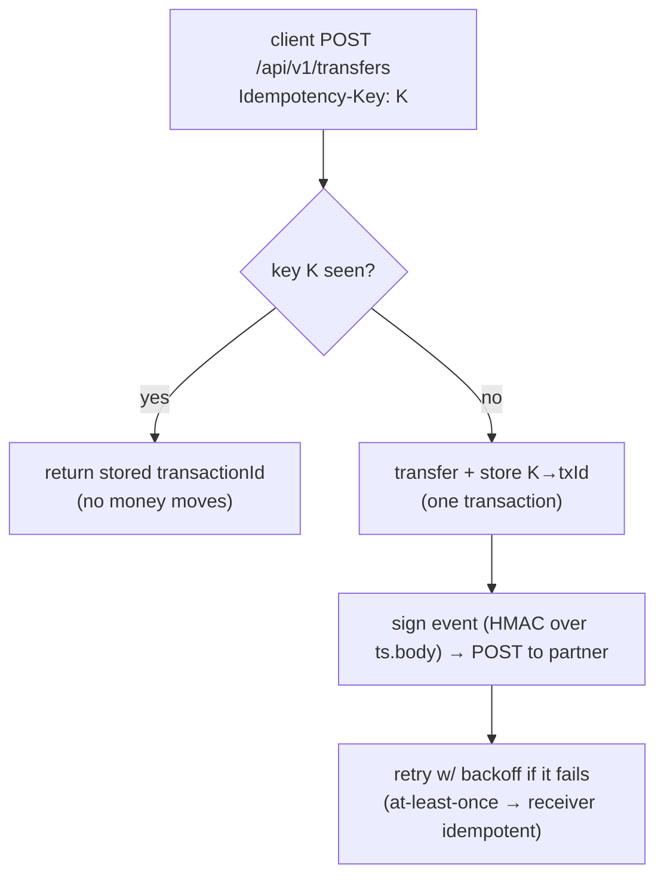
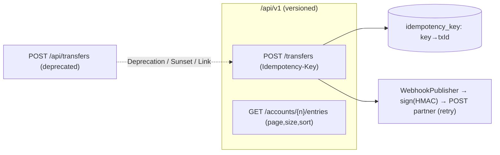
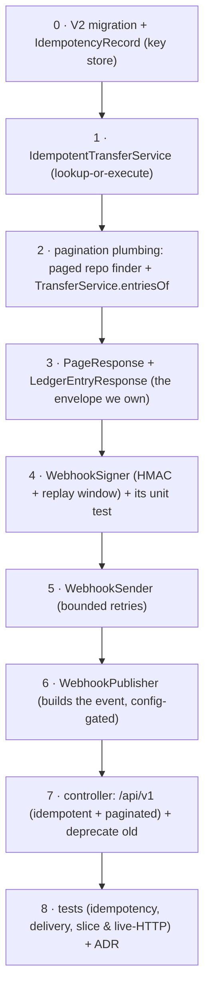
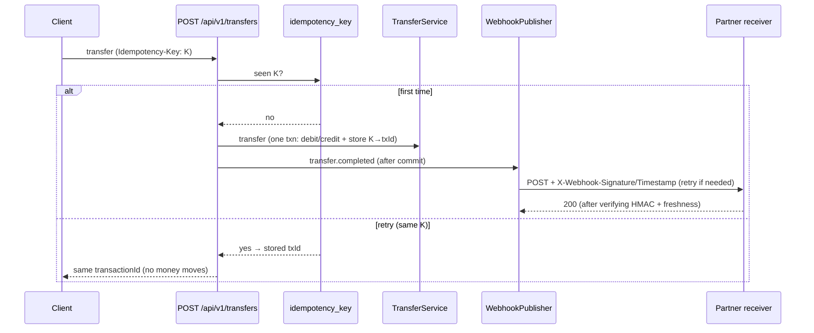

# Step 14 · API Design, Versioning, Idempotency & Webhooks
### Phase C — Web, APIs & Application Security 🔵 · Step 14 of 67

> *A toy API returns JSON. A **professional** API is a durable contract: it versions without breaking
> clients, is safe to retry (idempotency), pages large results predictably, and notifies partners with
> **signed** webhooks they can trust. This step turns demand-account's endpoints into exactly that — and
> every piece is the kind of thing payment APIs (Stripe, Adyen) get judged on.*

---

<a id="toc"></a>
## 🧭 The Six Movements of This Step

| | Movement | What happens |
|---|---|---|
| **A** | [🧭 Orient](#orient) | 30-second overview · skip-test · cheat card · why it matters · before you start |
| **B** | [🧠 Understand](#understand) | versioning · idempotency · pagination · webhook signing/delivery |
| **C** | [🛠️ Build](#build) | versioned + idempotent transfers, paginated entries, signed outbound webhooks |
| **D** | [🔬 Prove](#prove) | the Verification Log — 25 tests, idempotent retry, signed delivery + replay, §12.3 mutation |
| **E** | [🎓 Apply](#apply) | go deeper · interview prep · your-turn challenges |
| **F** | [🏆 Review](#review) | troubleshooting · resources · recap, flashcards & what's next |

---

<a id="orient"></a>

# A · 🧭 Orient

## 📋 This Step in 30 Seconds

| | |
|---|---|
| **Title** | API design — URI versioning & deprecation, public-API idempotency, pagination, and signed outbound webhooks |
| **Step** | 14 of 67 · **Phase C — Web, APIs & Application Security** 🔵 |
| **Effort** | ≈ 20 hours focused. Idempotency and webhook signing are the parts of "design a payments API" interviews that separate seniors from juniors — and you'll have built and tested both. Experienced API designers can skim to ~4h. |
| **What you'll run this step** | **JVM + Maven** for build & tests; **🐳 Docker** for the Testcontainers Postgres. One command: `./mvnw -pl services/demand-account -am verify`. (Webhook delivery is tested with an in-process HTTP receiver — no external service needed; the signing tests are pure JUnit and need no Docker at all.) |
| **Buildable artifact** | `services/demand-account` gains a **`/api/v1`** namespace: an **idempotent** `POST /api/v1/transfers` (`Idempotency-Key` header + a key store) that emits a **signed webhook**, a **paginated** `GET /api/v1/accounts/{n}/entries`, and `Deprecation`/`Sunset`/`Link` headers on the old transfer. New: `IdempotencyRecord`, `IdempotentTransferService`, `WebhookSigner`/`WebhookSender`/`WebhookPublisher`, `PageResponse`, `LedgerEntryResponse`. 13 → **25** tests. `step-14-start == step-13-end`. |
| **Verification tier** | 🔴 **Full** — changes a service *and* the idempotency/security path. `./mvnw verify` green + all **25** tests + idempotent retry proven (money moves once) + signed webhook delivered & verified + replay rejected + the **§12.3 mutation** (remove replay protection → test fails → revert) + clean-room + `smoke.sh`. |
| **Depends on** | **[Step 13](../step-13/lesson.md)** (the MVC layer + ProblemDetail), **[Step 12](../step-12/lesson.md)** (transfers), **[Step 10](../step-10/lesson.md)** (unique constraints for the idempotency guard). **+ Docker.** |

By the end you will be able to choose and justify an **API versioning** strategy and deprecate gracefully; make a money endpoint **idempotent** so clients can safely retry; **paginate** with a stable contract; and **sign & deliver outbound webhooks** with replay protection and retries — and explain why receivers must be idempotent.

### ⏭️ Can You Skip This Step? (5-minute self-check)

If you can confidently do **all** of this, skim the 🧩 Pattern Spotlight and jump to **[Step 15 — API Gateway / BFF](../step-15/lesson.md)**.

- [ ] I can compare **URI vs header vs media-type** versioning and deprecate an endpoint with `Deprecation`/`Sunset` headers.
- [ ] I can implement **idempotency** with an `Idempotency-Key` + a store, and explain how the unique key guards concurrent duplicates.
- [ ] I can design **pagination** (`page`/`size`/`sort`) with a stable response envelope (and say why not to leak `Page`).
- [ ] I can **sign a webhook** (HMAC-SHA256 over timestamp+body), verify it, and add **replay protection**.
- [ ] I can explain webhook **at-least-once delivery** + retries → why receivers must be **idempotent**, and the **dual-write** problem (→ Outbox, Step 20).

> [!TIP]
> Not 100%? Stay. "How do you make a payment API safe to retry?", "how would you secure a webhook?", and "how do you version an API without breaking clients?" are exactly the questions a fintech interview asks — and you'll answer them having built and *tested* all three.

## 📇 Cheat Card

> **What this step delivers (one sentence):** demand-account's API becomes partner-grade — versioned (`/api/v1`) with graceful deprecation, **idempotent** transfers (safe to retry), **paginated** listings with a stable envelope, and **HMAC-signed** outbound webhooks with replay protection and retries — all test-proven.

**Key commands** (Windows uses `.\mvnw.cmd`):

```bash
# Build + test (25 tests) on a real Testcontainers Postgres:
./mvnw -pl services/demand-account -am verify

# Just the idempotency / webhook proofs:
./mvnw -pl services/demand-account test -Dtest=IdempotencyTest,WebhookSignerTest,WebhookDeliveryTest

# The webhook signing/delivery tests need NO Docker (pure JUnit + an in-process receiver):
./mvnw -pl services/demand-account test -Dtest=WebhookSignerTest,WebhookDeliveryTest

# One-shot proof your build matches the lesson (needs Docker):
bash steps/step-14/smoke.sh
```

**The one headline idea — *an `Idempotency-Key` makes a retried transfer move money once; a webhook signature lets a partner trust the event*:**



*Alt-text: a client POSTs a transfer with an Idempotency-Key; if the key was seen, the stored transactionId is returned and no money moves; otherwise the transfer runs and the key→txId is stored in one transaction, then a signed webhook (HMAC over timestamp.body) is POSTed to the partner with retries (at-least-once, so the receiver must be idempotent).*

## 🎯 Why This Matters

Money APIs live or die on three properties this step builds. **Idempotency** is non-negotiable: networks time out, clients retry, and without an idempotency key a retry charges twice — the canonical fintech disaster. **Webhook signing** is how a partner knows an event truly came from you and wasn't forged or replayed — get it wrong and you've built an injection point. **Versioning** is how an API survives years of change without a flag-day that breaks every client. Interviewers probe all three ("make this safe to retry", "secure this webhook", "version this without breaking anyone"), and after this step you answer from having built and tested them on a real ledger.

## ✅ What You'll Be Able to Do

- **Version & deprecate** — `/api/v1` namespace; `Deprecation`/`Sunset`/`Link` headers to retire old paths gracefully.
- **Make it idempotent** — `Idempotency-Key` + a key store; a retry returns the original result and moves money once.
- **Paginate** — `page`/`size`/`sort` with a stable `PageResponse` envelope.
- **Sign & deliver webhooks** — HMAC-SHA256 + timestamp, replay protection, bounded retries; explain at-least-once + idempotent receivers.

## 🧰 Before You Start

**Prerequisites**

- ✅ You finished **Step 13**; the repo is at `step-14-start` (== `step-13-end`) and `./mvnw verify` is green.
- ✅ **Docker is running.** No new dependencies this step (HMAC via `javax.crypto`, delivery via the JDK `HttpClient`, pagination via Spring Data).

**What you already learned that connects here**

- **Step 13**: the MVC layer, ProblemDetail, headers — we add versioned endpoints and more response headers.
- **Step 12**: the transfer + ledger we now wrap with idempotency and emit events for.
- **Step 10**: unique constraints — the idempotency key's PRIMARY KEY is the concurrency guard.
- **Step 11**: thread-safety — the unique key resolves the concurrent-duplicate race at the database.

> **Depends on: Steps 13, 12, 10.**

---

<a id="understand"></a>

# B · 🧠 Understand

## 🧠 The Big Idea

Four design concerns, each a contract between you and your clients:

**1 — Versioning.** APIs change. A **version** lets a client pin to a shape that won't break under them. Three strategies: **URI** (`/api/v1/...` — visible, cacheable, curl-able), **header** (`Accept: …v1+json` or `X-API-Version` — clean URLs, invisible), **media-type** (most RESTful, heaviest). When you retire an endpoint, you don't just delete it — you mark it **deprecated** (`Deprecation: true`), announce a removal date (`Sunset`), and point at the successor (`Link`), giving clients time to migrate.

**2 — Idempotency.** An operation is idempotent if doing it twice has the same effect as once. `GET`/`PUT`/`DELETE` are naturally idempotent; `POST` (create a transfer) is **not** — a retry creates a second transfer. The fix is an **`Idempotency-Key`**: the client sends a unique key per logical operation; the server remembers `key → result` and, on a retry with the same key, returns the original result without re-executing. This is what makes a payment API safe to retry after a timeout.

**3 — Pagination.** You never return "all rows" — that's an unbounded response and a DoS waiting to happen. Clients ask for a **page** (`page`, `size`) and an order (`sort`); you return that slice plus metadata (total count, total pages). And you return it in a **stable envelope you own** — not a framework's internal object whose JSON shape can change under you.

**4 — Webhooks.** Instead of partners polling you, you **push** events to their URL (an outbound HTTP `POST`). But the receiver must trust it: you **sign** each delivery with a shared secret (HMAC) so they can verify authenticity and integrity, include a **timestamp** so they can reject **replays**, and **retry** on failure — which means delivery is **at-least-once**, so receivers must be **idempotent** (they may see the same event twice — there's that word again).

> **Analogy — a bank's correspondence.** **Versioning** is like keeping the old account-form (v1) valid while introducing v2, stamping the old one "discontinued after October — use the new form." **Idempotency** is the reference number on a wire instruction: send the same instruction twice with the same reference and the bank executes it once. **Pagination** is getting your statement 20 transactions to a page, not the whole history in one envelope. A **signed webhook** is a letter with a **wax seal** (HMAC) and a **date** — the recipient checks the seal is yours and the date is recent (not a letter someone copied and re-sent months later).



*Alt-text: the /api/v1 namespace holds an idempotent transfers endpoint and a paginated entries endpoint. The old /api/transfers is deprecated and points (via Deprecation/Sunset/Link headers) at the v1 successor. The idempotent transfer consults an idempotency_key store (key→transactionId) and, on success, publishes a signed webhook to the partner with retries.*

## 🧩 Pattern Spotlight — The Idempotency Key

> **Problem.** A client `POST`s a transfer, the network times out before the response arrives, and the client retries. Without protection, that's **two** transfers — a double-charge. The client can't tell "the request failed" from "the response was lost".

> **Why an idempotency key fits.** The client generates a unique key per logical operation (a UUID) and sends it as `Idempotency-Key` on every attempt. The server records `key → result` the first time and, on any retry with that key, returns the **stored** result without re-executing. The client can now retry freely — exactly once is guaranteed by the server, not by hope.

> **How it works (the mechanism).** A table keyed by the idempotency key (PRIMARY KEY). On a request: look up the key → if present, return its stored `transactionId`; else execute the transfer, store `key → transactionId`, return. The **PK uniqueness is the concurrency guard**: if two retries race and both miss the lookup, both transfer, but only one can commit the key row — the other's commit fails the unique constraint and its whole transaction (including its transfer) **rolls back**. So even under concurrency, exactly one transfer commits.

> **Alternatives / trade-offs.** A natural idempotency key (e.g. a client-supplied `transferId` as the resource id with `PUT`) makes the operation idempotent by REST design — cleaner, but requires the client to own the id. A request **hash** (dedupe identical bodies) avoids a client key but mis-fires on legitimately-repeated identical operations. The explicit `Idempotency-Key` header (Stripe's model) is the industry standard for `POST`-create money operations — *chosen here*. Keys need a **TTL** in production (we note it; a cleanup job comes later).

> **Implementation (here).** `IdempotencyRecord` (key PK), `IdempotentTransferService` (lookup-or-execute-and-store in one transaction), and `POST /api/v1/transfers` reading the `Idempotency-Key` header. `IdempotencyTest` proves a retry moves money once.

## 🌱 Under the Hood: How It Really Works

**Versioning & deprecation headers.** `/api/v1/...` is just a path prefix mapped by `@RequestMapping`. Deprecation uses standard headers (RFC 8594): `Deprecation: true` (it's deprecated), `Sunset: <HTTP-date>` (when it'll be removed), and a `Link: </api/v1/transfers>; rel="successor-version"` pointing at the replacement. Clients (and gateways, Step 15) can detect these and warn/migrate. You keep the old endpoint working until the sunset date — **never** a flag-day break.

**Idempotency under concurrency.** Our `IdempotentTransferService.transfer(...)` runs `@Transactional`: it joins (REQUIRED) the transfer's transaction, so the key-insert and the transfer commit **atomically**. Sequential retry (the common case — client retries after a timeout): the second call finds the stored record and returns its `transactionId` with no re-execution. Concurrent duplicates (both miss the lookup): both attempt the transfer + key-insert in **separate** transactions; the PRIMARY KEY lets only one commit — the other gets a unique-constraint violation and its transaction rolls back entirely (no double transfer). The DB is the coordination point (as in Step 12's pessimistic lock).

**Pagination with Spring Data.** A controller parameter of type `Pageable` is bound from `?page=&size=&sort=field,dir` by Spring Data's `PageableHandlerMethodArgumentResolver` (auto-configured). The repository method `Page<LedgerEntry> findByAccountId(Long, Pageable)` runs a `LIMIT/OFFSET` query **plus** a `COUNT` for the total. We map the `Page` into our own **`PageResponse`** record — *not* serialize Spring Data's `Page` directly, whose JSON shape is an internal detail Spring explicitly warns against exposing (it even logs a warning). Owning the envelope means the API contract is ours.

**Webhook signing (HMAC-SHA256).** A keyed hash: `signature = HMAC-SHA256(secret, timestamp + "." + body)`, hex-encoded. Only someone with the shared `secret` can produce a signature that matches a given `(timestamp, body)`. The receiver recomputes it and compares — in **constant time** (`MessageDigest.isEqual`) so an attacker can't learn, from response timing, how many leading bytes of a guessed signature were right. Including the **timestamp** in the signed material and rejecting timestamps outside a tolerance window (e.g. ±300s) gives **replay protection**: a captured-but-still-valid request can't be re-sent hours later. This is precisely Stripe's/GitHub's webhook scheme.

**Delivery is at-least-once.** Networks and receivers fail, so `WebhookSender` **retries** (bounded, with backoff). That means a receiver might get the **same event twice** → receivers must be **idempotent** (dedupe by event id). We send *after* the DB transaction commits — which exposes the **dual-write problem**: if the commit succeeds but the send permanently fails, the partner never hears; if we sent inside the transaction and the transaction rolled back, we'd have lied. The correct fix is the **Outbox pattern** (persist the event in the same transaction as the transfer; a separate process delivers it) — that's **Step 20**. We flag this honestly rather than pretend a direct send is complete.

**Spring Boot 4 & Jackson (a real gotcha).** Boot 4's web stack defaults to **Jackson 3** (package `tools.jackson`), so a Jackson-2 `com.fasterxml.jackson.databind.ObjectMapper` **bean** isn't auto-created — injecting one fails (the class is still on the classpath, so code compiles, then the context fails to start). Our `WebhookPublisher` therefore **owns** a `new ObjectMapper()` instead of injecting one. (See 🩺.)

## 🛡️ Security Lens: What Could Go Wrong

- **No idempotency = double-spend.** A retried `POST` without a key moves money twice — both a correctness *and* a fraud/financial-loss issue. The key turns "I'm not sure if it went through" into a safe retry.
- **Unsigned/replayable webhooks = forgery & replay.** Without a signature, anyone who learns the URL can POST fake events; without a timestamp+window, an attacker can capture a real signed request and replay it later. HMAC + replay window closes both. **Never** trust a webhook's contents without verifying the signature.
- **Constant-time comparison.** Comparing signatures with `==`/`String.equals` leaks, via timing, how much matched — enabling a byte-by-byte forgery. Use a constant-time compare (`MessageDigest.isEqual`).
- **Leaking the secret / using a weak one.** The webhook secret is a credential — config/Vault (Phase H), never committed, rotated. A per-partner secret limits blast radius.
- **Unbounded pagination.** Allowing `size=1000000` is a DoS; cap the page size (and we default it). Sorting on arbitrary columns can also be abused — whitelist sortable fields in a hardened API.

## 🕰️ Then vs. Now (How This Changed Across Versions)

| Topic | Then | Now | Why it changed |
|---|---|---|---|
| **Idempotency** | Ad-hoc dedupe, or none (double-charges). | Standard **`Idempotency-Key`** header + key store (Stripe-style). | A documented, client-driven contract for safe retries. |
| **Webhook auth** | Shared secret in the URL / no verification. | **HMAC signature + timestamp** (replay window), constant-time verify. | URL secrets leak in logs; signatures prove authenticity + integrity + freshness. |
| **Pagination** | Return everything, or leak the ORM `Page` object. | `Pageable` + a **stable DTO envelope**; Spring warns against exposing `Page`. | Bounded responses + a contract the API owns. |
| **API docs/versioning tooling** | springfox + URI versioning by hand. | springdoc (Step 13) + explicit `/v1` + RFC 8594 deprecation headers. | Maintained tooling; standardized deprecation signaling. |

> [!NOTE]
> *Verify, don't guess.* `Deprecation`/`Sunset` are RFC 8594; the `Idempotency-Key` + HMAC-timestamp webhook scheme is the de-facto industry standard (Stripe). HMAC-SHA256 is `javax.crypto.Mac` (JDK). The Boot-4 Jackson-3 default (no Jackson-2 `ObjectMapper` bean) is a real change we hit and worked around (🩺). No new dependencies were added this step.

## 🧵 Thread-safety note

Two shared-state hazards here, both already in your toolkit. (1) **Concurrent duplicate idempotency keys** — resolved at the database by the key's **PRIMARY KEY** (Step 10's unique constraint + Step 12's "the DB is the coordination point"): only one of two racing duplicates can commit. (2) The webhook components (`WebhookSigner`/`WebhookSender`/`WebhookPublisher`) are **singletons** with **no mutable state** — the signer is pure, the sender holds only an immutable `HttpClient` (itself thread-safe), so they're safe to share across request threads (Step 11's "stateless singletons" rule). Per-request data (timestamp, body) is passed as arguments, never stored in fields.

---

<a id="build"></a>

# C · 🛠️ Build

## 📦 Your Starting Point

You're at **`step-14-start`** (== `step-13-end`). demand-account already has, from Steps 12–13:

- **`TransferService`** — the safe (pessimistic-lock) `transfer(...)` and the double-entry ledger.
- **`TransferController`** — `POST /api/accounts`, `GET /api/accounts/{n}`, `POST /api/transfers`.
- The MVC layer from Step 13 — `GlobalExceptionHandler` (Problem Details), `RequestIdFilter` (the `X-Request-Id` header), `TimingInterceptor` (the `X-Timing-Enabled` header), and springdoc/Swagger UI.
- **DTOs** `TransferRequest`, `TransferResponse`, `OpenAccountRequest`, `AccountResponse`.

For reference, here are the two DTOs the v1 transfer reuses unchanged — note `@Positive`, which still rejects a negative amount with a 400 Problem Detail:

```java
// services/demand-account/src/main/java/com/buildabank/account/web/TransferRequest.java
package com.buildabank.account.web;

import java.math.BigDecimal;

import jakarta.validation.constraints.NotBlank;
import jakarta.validation.constraints.NotNull;
import jakarta.validation.constraints.Positive;

/** Request body for a money transfer. The amount must be strictly positive. */
public record TransferRequest(
        @NotBlank String from,
        @NotBlank String to,
        @NotNull @Positive BigDecimal amount,
        String description) {
}
```

```java
// services/demand-account/src/main/java/com/buildabank/account/web/TransferResponse.java
package com.buildabank.account.web;

import java.util.UUID;

/** Returned after a successful transfer — the shared transaction id of the two ledger legs. */
public record TransferResponse(UUID transactionId) {
}
```

What's green vs. what you'll build: the start tag **builds and passes 13 tests**, but there is **no versioning, no idempotency, no pagination, and no webhooks**. We add a `/api/v1` namespace with all four — **no new dependencies**.

Confirm the start builds:
```bash
./mvnw -q -pl services/demand-account -am verify   # green, 13 tests, from Step 13
```
✅ **Expected output (tail):**
```
[INFO] Tests run: 13, Failures: 0, Errors: 0, Skipped: 0
[INFO] BUILD SUCCESS
```

## 🛠️ Let's Build It — Step by Step



🌳 **Files we'll touch** (under `services/demand-account/`):
```
src/main/resources/db/migration/V2__idempotency_keys.sql              (new)
src/main/java/com/buildabank/account/
├── domain/IdempotencyRecord.java                                     (new)
├── domain/IdempotencyRecordRepository.java                           (new)
├── domain/LedgerEntryRepository.java                                 (edit — paged finder)
├── service/IdempotentTransferService.java                            (new)
├── service/TransferService.java                                      (edit — entriesOf)
├── webhook/WebhookSigner.java                                        (new)
├── webhook/WebhookSender.java                                        (new)
├── webhook/WebhookPublisher.java                                     (new)
├── web/PageResponse.java                                             (new)
├── web/LedgerEntryResponse.java                                      (new)
└── web/TransferController.java                                       (edit — v1 + deprecation)
src/test/java/com/buildabank/account/
├── service/IdempotencyTest.java                                      (new)
├── webhook/WebhookSignerTest.java                                    (new)
├── webhook/WebhookDeliveryTest.java                                  (new)
├── web/TransferControllerTest.java                                   (edit — mocks + 2 tests)
└── DemandAccountIntegrationTest.java                                 (edit — v1 over HTTP)
steps/step-14/{requests.http, smoke.sh} · adr/0006-api-versioning-and-idempotency.md
```

> 🧭 **You are here:** we move outward from the database (the key store) through the service and webhook layers and finish at the controller and tests — so each layer is green before the one that depends on it.

---

### Sub-step 0 of 8 — The idempotency key store 🧭 *(you are here: **key store** → idempotent service → pagination plumbing → envelopes → signer → sender → publisher → controller → tests)*

🎯 **Goal:** give the database a place to remember `Idempotency-Key → transactionId`, so a retry can return the original result instead of moving money again. The PRIMARY KEY on the key is what makes this concurrency-safe.

📁 **Location:** new file → `services/demand-account/src/main/resources/db/migration/V2__idempotency_keys.sql`

⌨️ **Code:**
```sql
-- services/demand-account/src/main/resources/db/migration/V2__idempotency_keys.sql
-- Public-API idempotency (Step 14): a store of Idempotency-Key -> the result it produced, so a retried
-- request returns the original result instead of moving money twice. The PRIMARY KEY on the key gives us
-- the concurrency guard: two racing requests with the same key can't both insert, so only one transfer commits.

create table idempotency_key (
    idempotency_key varchar(200) primary key,
    transaction_id  uuid        not null,
    created_at      timestamp(6) with time zone not null
);
```

🔍 **Line-by-line:**
- `V2__` — Flyway's naming convention: `V<version>__<description>.sql`. The **double underscore** separates the version from the description; Flyway runs `V1` then `V2` in order and records each in its `flyway_schema_history` table so it never re-runs them.
- `idempotency_key varchar(200) primary key` — the **client-supplied key string** is the table's primary key. A PK is both an index (fast lookup) **and** a uniqueness constraint (no two rows share a key). That dual role is the whole trick: the uniqueness is our concurrency guard.
- `transaction_id uuid not null` — the result we're remembering: the `transactionId` the first request produced. `uuid` is Postgres's native 128-bit UUID type. `not null` because there's no meaningful record without a result.
- `created_at timestamp(6) with time zone not null` — when the key was first stored, microsecond precision (`(6)`), **with time zone** so it round-trips as an instant in UTC (the money-and-time-correctness rule from Step 12). Production uses this for a TTL/cleanup.

💭 **Under the hood:** the module runs `ddl-auto=validate`, meaning **Flyway owns the schema** and Hibernate only *checks* that its entity mappings match the existing tables — it never creates or alters them. So this migration is the single source of truth for the table's shape; the entity (next) must line up with it exactly or the context fails to start with a schema-validation error.

🔮 **Predict:** after this migration is added, how many migrations will Flyway report applying on a fresh database? <details><summary>answer</summary>Two — `V1` (the accounts + ledger tables from Step 12) then `V2` (this one). The Verification Log's Testcontainers run shows "Flyway applies V1 + V2".</details>

▶️ **Run & See:** the migration is exercised when the module's `@SpringBootTest` boots against a Testcontainers Postgres (sub-step 8). At Flyway-migrate time you'll see lines like:
```
Migrating schema "public" to version "1 - accounts ledger"
Migrating schema "public" to version "2 - idempotency keys"
Successfully applied 2 migrations to schema "public"
```

✋ **Checkpoint:** the file exists under `db/migration/`. Nothing to compile yet — the entity in the next sub-step references it.

💾 **Commit:**
```bash
git add services/demand-account/src/main/resources/db/migration/V2__idempotency_keys.sql
git commit -m "feat(demand-account): idempotency key store (V2 migration)"
```

⚠️ **Pitfall:** idempotency keys grow forever — a busy API accumulates millions. Production needs a **TTL/cleanup job** (delete keys older than ~24h). We deliberately omit it here and note it in ADR-0006; the 🏋️ challenges add it.

---

Now the JPA entity that maps to that table.

📁 **Location:** new file → `services/demand-account/src/main/java/com/buildabank/account/domain/IdempotencyRecord.java`

⌨️ **Code:**
```java
// services/demand-account/src/main/java/com/buildabank/account/domain/IdempotencyRecord.java
package com.buildabank.account.domain;

import java.time.Instant;
import java.util.UUID;

import jakarta.persistence.Column;
import jakarta.persistence.Entity;
import jakarta.persistence.Id;
import jakarta.persistence.Table;

/**
 * Remembers that a given {@code Idempotency-Key} already produced a transfer, and which one. A retried
 * request with the same key returns the stored {@code transactionId} instead of moving money again. The key
 * is the natural {@code @Id} (a client-supplied string), and its PRIMARY KEY uniqueness is the concurrency
 * guard — two racing requests with the same key can't both insert, so only one transfer commits.
 */
@Entity
@Table(name = "idempotency_key")
public class IdempotencyRecord {

    @Id
    @Column(name = "idempotency_key", updatable = false)
    private String key;

    @Column(name = "transaction_id", nullable = false, updatable = false)
    private UUID transactionId;

    @Column(name = "created_at", nullable = false, updatable = false)
    private Instant createdAt;

    protected IdempotencyRecord() {
    }

    public IdempotencyRecord(String key, UUID transactionId, Instant createdAt) {
        this.key = key;
        this.transactionId = transactionId;
        this.createdAt = createdAt;
    }

    public String getKey() {
        return key;
    }

    public UUID getTransactionId() {
        return transactionId;
    }

    public Instant getCreatedAt() {
        return createdAt;
    }
}
```

🔍 **Line-by-line:**
- `@Entity` — marks this class a JPA-managed entity; Hibernate maps instances to rows. `@Table(name = "idempotency_key")` points it at our migration's table (the class name differs from the table name, so we're explicit).
- `@Id` on `key` — declares the **identifier**. Crucially, this is a **natural key** (a meaningful, client-supplied value) rather than a generated surrogate (`@GeneratedValue`). The client owns the key; we don't mint one.
- `@Column(name = "idempotency_key", updatable = false)` — maps the field to the column and tells Hibernate to **never** include it in `UPDATE` statements (a key, once set, is immutable). `updatable = false` appears on all three fields for the same reason: an idempotency record is write-once.
- `private UUID transactionId;` — the stored result. Hibernate maps `java.util.UUID` ↔ the Postgres `uuid` column directly.
- `private Instant createdAt;` — `java.time.Instant` is a point on the UTC timeline; it maps to `timestamp with time zone`. (Money in `BigDecimal`, time in `Instant` — the Step-12 correctness rules.)
- `protected IdempotencyRecord()` — the **no-arg constructor JPA requires** to instantiate the entity via reflection when loading a row. It's `protected` (not `public`) so application code is nudged toward the real constructor; JPA can still reach it.
- `public IdempotencyRecord(String, UUID, Instant)` — the constructor *we* call when storing a new record. Three plain getters expose the fields read-only (no setters → the entity is effectively immutable after construction).

💭 **Under the hood:** because `@Id` is assigned by us (not generated), Hibernate uses the presence of the id to decide insert-vs-update on `save(...)`. For a brand-new key the row doesn't exist, so `save` issues an `INSERT`; if that key already exists, the `INSERT` hits the PRIMARY KEY and throws a constraint violation — which is exactly the behavior we *want* under a concurrent duplicate (one inserts, the other's transaction rolls back).

🔮 **Predict:** if the entity declared `created_at` as a column but the migration forgot it, what happens at startup? <details><summary>answer</summary>The context fails to start: `ddl-auto=validate` compares the mapping to the live schema and throws a `SchemaManagementException` ("missing column"). Validate catches drift early.</details>

✋ **Checkpoint:** `./mvnw -q -pl services/demand-account compile` succeeds (the entity compiles; the repository comes next).

💾 **Commit:**
```bash
git add services/demand-account/src/main/java/com/buildabank/account/domain/IdempotencyRecord.java
git commit -m "feat(demand-account): IdempotencyRecord entity (natural key = idempotency key)"
```

⚠️ **Pitfall:** if you used `@GeneratedValue` here out of habit, Hibernate would try to generate the id and ignore the client's key — defeating the whole point. The key **is** the id; assign it yourself.

---

Finally, the repository — one line.

📁 **Location:** new file → `services/demand-account/src/main/java/com/buildabank/account/domain/IdempotencyRecordRepository.java`

⌨️ **Code:**
```java
// services/demand-account/src/main/java/com/buildabank/account/domain/IdempotencyRecordRepository.java
package com.buildabank.account.domain;

import org.springframework.data.jpa.repository.JpaRepository;

public interface IdempotencyRecordRepository extends JpaRepository<IdempotencyRecord, String> {
}
```

🔍 **Line-by-line:**
- `extends JpaRepository<IdempotencyRecord, String>` — Spring Data generates the implementation at runtime. The two type parameters are **`<EntityType, IdType>`**: the entity is `IdempotencyRecord`, and its `@Id` is a `String` (the key). That gives us `findById(String)`, `save(...)`, `deleteAll()`, etc. for free — no method bodies to write.

💭 **Under the hood:** at startup Spring Data scans for `Repository` sub-interfaces and creates a **dynamic proxy** backed by `SimpleJpaRepository`. `findById` becomes `EntityManager.find(...)` (a primary-key lookup hitting the 1st-level cache or a `SELECT … WHERE idempotency_key = ?`); `save` becomes `persist`/`merge`.

✋ **Checkpoint:** compiles. You now have a key store: a table, an entity, and a repository.

💾 **Commit:**
```bash
git add services/demand-account/src/main/java/com/buildabank/account/domain/IdempotencyRecordRepository.java
git commit -m "feat(demand-account): IdempotencyRecord repository"
```

⚠️ **Pitfall:** the id type parameter must match the `@Id` field's type exactly — `JpaRepository<IdempotencyRecord, Long>` here would compile but fail at runtime the moment you call `findById("KEY-1")`. It's `String`.

---

### Sub-step 1 of 8 — `IdempotentTransferService` 🧭 *(key store ✅ → **idempotent service** → pagination plumbing → …)*

🎯 **Goal:** wrap the existing `TransferService.transfer` in a *lookup-or-execute-and-store* that runs in one transaction — the heart of "safe to retry".

📁 **Location:** new file → `services/demand-account/src/main/java/com/buildabank/account/service/IdempotentTransferService.java`

⌨️ **Code:**
```java
// services/demand-account/src/main/java/com/buildabank/account/service/IdempotentTransferService.java
package com.buildabank.account.service;

import java.math.BigDecimal;
import java.time.Instant;
import java.util.Optional;
import java.util.UUID;

import org.springframework.stereotype.Service;
import org.springframework.transaction.annotation.Transactional;

import com.buildabank.account.domain.IdempotencyRecord;
import com.buildabank.account.domain.IdempotencyRecordRepository;

/**
 * Public-API <strong>idempotency</strong> for transfers. A client retrying a transfer (e.g. after a network
 * timeout) sends the same {@code Idempotency-Key}; this service returns the original result instead of
 * moving money a second time — the property that makes money-moving APIs safe to retry.
 *
 * <p>The whole thing runs in one transaction with {@link TransferService#transfer} (REQUIRED propagation),
 * so the key row and the transfer commit atomically. The key's PRIMARY-KEY uniqueness is the concurrency
 * guard: if two racing requests with the same key both miss the lookup and both transfer, only one can
 * commit the key row — the other's commit fails the unique constraint and the whole transaction (including
 * its transfer) rolls back. For the common case — a <em>sequential</em> retry — the second request finds the
 * stored record and returns its {@code transactionId} without re-executing.
 */
@Service
public class IdempotentTransferService {

    private final TransferService transfers;
    private final IdempotencyRecordRepository keys;

    public IdempotentTransferService(TransferService transfers, IdempotencyRecordRepository keys) {
        this.transfers = transfers;
        this.keys = keys;
    }

    @Transactional
    public UUID transfer(String idempotencyKey, String from, String to, BigDecimal amount, String description) {
        if (idempotencyKey == null || idempotencyKey.isBlank()) {
            return transfers.transfer(from, to, amount, description);   // no idempotency requested
        }
        Optional<IdempotencyRecord> existing = keys.findById(idempotencyKey);
        if (existing.isPresent()) {
            return existing.get().getTransactionId();                  // idempotent hit — do NOT re-execute
        }
        UUID transactionId = transfers.transfer(from, to, amount, description);
        keys.save(new IdempotencyRecord(idempotencyKey, transactionId, Instant.now()));
        return transactionId;
    }
}
```

🔍 **Line-by-line:**
- `@Service` — a stereotype that registers this class as a Spring-managed singleton bean; it's a `@Component` with semantic intent ("a service-layer collaborator").
- **constructor injection** of `TransferService` and `IdempotencyRecordRepository` — Spring sees the single constructor and supplies both beans. Holding them in `final` fields makes the service immutable and safe to share across request threads (the thread-safety rule).
- `@Transactional` on `transfer(...)` — opens a database transaction (default propagation `REQUIRED`). Because the inner `transfers.transfer(...)` is also `@Transactional(REQUIRED)`, it **joins this same transaction** — so the key-insert and the two ledger legs all commit or all roll back together.
- `if (idempotencyKey == null || idempotencyKey.isBlank())` — idempotency is **opt-in per request**. No key → fall straight through to a plain transfer (no dedup). `isBlank()` (Java 11+) treats `""` and whitespace-only as "no key".
- `Optional<IdempotencyRecord> existing = keys.findById(idempotencyKey)` — the **lookup**. `findById` returns an `Optional` (present if the key was seen before).
- `if (existing.isPresent()) return existing.get().getTransactionId();` — the **idempotent hit**: a retry. Return the stored `transactionId` and — critically — **do not call `transfers.transfer` again**. This is the line that makes the retry move money zero additional times.
- `UUID transactionId = transfers.transfer(...)` then `keys.save(new IdempotencyRecord(...))` — the **first time**: execute the transfer, then store `key → transactionId` with `Instant.now()` as the timestamp. Both happen inside the one transaction.

💭 **Under the hood — two paths:**
- **Sequential retry** (the 99% case): client times out, retries. The second request's `findById` hits the row the first committed → returns the stored id, no re-execution. One transfer total.
- **Concurrent duplicate** (two requests with the same key arrive at once): both `findById` miss (neither has committed yet), both call `transfers.transfer`, both try to `save` the key. They're in **separate** transactions, so the database serializes the commits: the first to commit the key row wins; the second's `INSERT` violates the PRIMARY KEY → `DataIntegrityViolationException` → its **whole transaction rolls back**, undoing its transfer too. Exactly one transfer commits. The DB is the arbiter — same principle as Step 12's `SELECT … FOR UPDATE`.

🔮 **Predict:** two POSTs of $50 with the **same** key against a $200 account — what's the final balance of the sender, and do the two calls return the same `transactionId`? <details><summary>answer</summary>$150, and **yes**, the same id. The money moves once; the retry returns the stored id. `IdempotencyTest.sameKeyReturnsTheSameResult_andMovesMoneyOnce` proves both.</details>

✋ **Checkpoint:** `./mvnw -q -pl services/demand-account compile` succeeds.

💾 **Commit:**
```bash
git add services/demand-account/src/main/java/com/buildabank/account/service/IdempotentTransferService.java
git commit -m "feat(demand-account): idempotent transfer (Idempotency-Key lookup-or-execute)"
```

⚠️ **Pitfall:** the short-circuit must happen **before** `transfers.transfer` is called. If you reorder it (execute, then check the key), the retry executes a second transfer before the lookup ever runs — a double-spend. The `return existing.get()…` line is load-bearing.

---

### Sub-step 2 of 8 — Pagination plumbing 🧭 *(idempotent service ✅ → **pagination plumbing** → envelopes → …)*

🎯 **Goal:** add a *paged* finder to the ledger repository and a service method that maps an account number to its paged entries — so we can return one page of a long ledger instead of the whole thing.

📁 **Location:** edit → `services/demand-account/src/main/java/com/buildabank/account/domain/LedgerEntryRepository.java`

⌨️ **Code (before → after diff):**
```diff
  import java.math.BigDecimal;
  import java.util.List;
  import java.util.UUID;

+ import org.springframework.data.domain.Page;
+ import org.springframework.data.domain.Pageable;
  import org.springframework.data.jpa.repository.JpaRepository;
  import org.springframework.data.jpa.repository.Query;

  public interface LedgerEntryRepository extends JpaRepository<LedgerEntry, Long> {

      List<LedgerEntry> findByAccountIdOrderByCreatedAtAsc(Long accountId);

+     /** A page of an account's entries — Spring Data applies the {@link Pageable}'s page/size/sort to the SQL. */
+     Page<LedgerEntry> findByAccountId(Long accountId, Pageable pageable);
+
      List<LedgerEntry> findByTransactionId(UUID transactionId);
```

🔍 **Line-by-line:**
- `import org.springframework.data.domain.Page;` / `Pageable;` — Spring Data's two pagination types. **`Pageable`** is the *request* (which page, how big, what sort); **`Page<T>`** is the *result* (the slice + metadata: total elements, total pages, current number).
- `Page<LedgerEntry> findByAccountId(Long accountId, Pageable pageable)` — a **derived query method**: Spring Data parses the name `findByAccountId` into `WHERE account_id = ?`, and because the return type is `Page<>` and the method takes a `Pageable`, it appends the page's `LIMIT`/`OFFSET`/`ORDER BY` **and** runs a second `COUNT(*)` query so the `Page` can report `totalElements`.

💭 **Under the hood:** one logical call issues **two** SQL statements — the windowed `SELECT … LIMIT ? OFFSET ?` for the rows, and `SELECT COUNT(*) … WHERE account_id = ?` for the total. That count is what lets the client know there are, say, "47 entries across 3 pages" without fetching all 47. (For very large tables the count itself gets expensive — that's the cursor-pagination trade-off in 🚀 Go Deeper.)

🔮 **Predict:** with `size=2` against an account that has 4 entries, what will `Page.getTotalPages()` return? <details><summary>answer</summary>2 (`ceil(4 / 2)`). `getTotalElements()` is 4, `getContent().size()` is 2.</details>

✋ **Checkpoint:** compiles (the method has no body — Spring Data implements it).

💾 **Commit:**
```bash
git add services/demand-account/src/main/java/com/buildabank/account/domain/LedgerEntryRepository.java
git commit -m "feat(demand-account): paged ledger-entry finder (Page + Pageable)"
```

⚠️ **Pitfall:** a derived `Page<>` method **must** take a `Pageable` parameter; declaring `Page<LedgerEntry> findByAccountId(Long)` (no `Pageable`) fails at startup — Spring Data can't build a page without a page request.

---

Now the service method that exposes it.

📁 **Location:** edit → `services/demand-account/src/main/java/com/buildabank/account/service/TransferService.java`

⌨️ **Code (before → after diff):**
```diff
  import java.math.BigDecimal;
  import java.time.Instant;
  import java.util.UUID;

+ import org.springframework.data.domain.Page;
+ import org.springframework.data.domain.Pageable;
  import org.springframework.stereotype.Service;
  import org.springframework.transaction.annotation.Transactional;
```
```diff
+     /** A page of an account's ledger entries (Step 14 — pagination/sorting via the {@link Pageable}). */
+     @Transactional(readOnly = true)
+     public Page<LedgerEntry> entriesOf(String accountNumber, Pageable pageable) {
+         Account account = accounts.findByAccountNumber(accountNumber)
+                 .orElseThrow(() -> new IllegalArgumentException("no such account: " + accountNumber));
+         return ledger.findByAccountId(account.getId(), pageable);
+     }
+
      @Transactional(readOnly = true)
      public BigDecimal balanceOf(String accountNumber) {
```

🔍 **Line-by-line:**
- `@Transactional(readOnly = true)` — a read-only transaction. `readOnly` is a hint: Hibernate skips dirty-checking (no flush, no `UPDATE` detection) and the JDBC driver/DB may optimize, since we promise not to write. Right for a query.
- `accounts.findByAccountNumber(accountNumber).orElseThrow(...)` — the API addresses accounts by their **business number** (`"ACC-A"`), but the ledger is keyed by the account's **database id** (`Long`). So we resolve number → account first, throwing `IllegalArgumentException` (which the Step-13 advice maps to a clean error) if it doesn't exist.
- `return ledger.findByAccountId(account.getId(), pageable)` — hand the resolved id and the caller's `Pageable` to the repository; return the `Page<LedgerEntry>` straight up. The controller (sub-step 7) maps it into the DTO envelope.

💭 **Under the hood:** the `Pageable` arrives already built by Spring MVC's argument resolver (sub-step 7) — this method is agnostic to *how* the page was requested; it just threads it through to the query. Separating "resolve the account" (service) from "shape the response" (controller) keeps the service reusable.

✋ **Checkpoint:** `./mvnw -q -pl services/demand-account compile` succeeds.

💾 **Commit:**
```bash
git add services/demand-account/src/main/java/com/buildabank/account/service/TransferService.java
git commit -m "feat(demand-account): TransferService.entriesOf paged by account number"
```

⚠️ **Pitfall:** returning the `Page<LedgerEntry>` (entities) all the way out to JSON would leak the JPA shape and risk lazy-loading errors. We stop the entity at the service boundary and map to a DTO in the controller — next.

---

### Sub-step 3 of 8 — The envelopes we own: `PageResponse` + `LedgerEntryResponse` 🧭 *(pagination plumbing ✅ → **envelopes** → signer → …)*

🎯 **Goal:** define a **stable pagination envelope** the API owns (never Spring's `Page` JSON), plus the per-entry DTO it carries.

📁 **Location:** new file → `services/demand-account/src/main/java/com/buildabank/account/web/PageResponse.java`

⌨️ **Code:**
```java
// services/demand-account/src/main/java/com/buildabank/account/web/PageResponse.java
package com.buildabank.account.web;

import java.util.List;

import org.springframework.data.domain.Page;

/**
 * A stable, explicit pagination envelope. We do NOT serialize Spring Data's {@code Page} directly: its JSON
 * shape is an internal implementation detail (Spring even warns against exposing it), and a public API
 * should own its contract. This record is that contract: the items plus the page metadata clients need.
 */
public record PageResponse<T>(
        List<T> content, int page, int size, long totalElements, int totalPages) {

    /** Map a Spring Data {@link Page} of entities into a DTO page via {@code mapper}. */
    public static <E, T> PageResponse<T> of(Page<E> page, java.util.function.Function<E, T> mapper) {
        return new PageResponse<>(
                page.getContent().stream().map(mapper).toList(),
                page.getNumber(), page.getSize(), page.getTotalElements(), page.getTotalPages());
    }
}
```

🔍 **Line-by-line:**
- `public record PageResponse<T>(...)` — a **generic record**. A `record` auto-generates the constructor, accessors (`content()`, `page()`, …), `equals`/`hashCode`/`toString`. The five components *are* the JSON contract: `content` (the page's items), `page` (zero-based page number), `size`, `totalElements` (across all pages), `totalPages`. Stable, documented, ours.
- `<T>` — the element type is generic, so this one envelope works for any DTO (`PageResponse<LedgerEntryResponse>` here, `PageResponse<CustomerResponse>` elsewhere).
- `public static <E, T> PageResponse<T> of(Page<E> page, Function<E, T> mapper)` — a **factory** with **two** type parameters: `E` the entity type in the incoming `Page`, `T` the DTO type out. It takes the Spring `Page` and a mapping function.
- `page.getContent().stream().map(mapper).toList()` — convert each entity to its DTO via the `mapper` (e.g. `LedgerEntryResponse::from`), collecting to an immutable `List` (`Stream.toList()`, Java 16+).
- `page.getNumber(), page.getSize(), page.getTotalElements(), page.getTotalPages()` — copy the metadata off the Spring `Page` into our fields. We read from `Page` internally but never *expose* it.

💭 **Under the hood:** Spring Data's `PageImpl` is serializable, so returning it "works" — but its JSON shape has changed across Spring versions (and Boot 3.3+ logs a warning when you serialize a `Page` from a controller, precisely to discourage it). By mapping into our own record, the wire contract is decoupled from the library version. This is the same DTO discipline as Step 13's `CustomerResponse`/`AccountResponse`.

🔮 **Predict:** if we returned the raw `Page<LedgerEntry>` instead, what's the risk beyond the version-warning? <details><summary>answer</summary>It serializes the **JPA entities** too — leaking DB columns and risking lazy-loading serialization errors — and exposes `pageable`/`sort` internals clients shouldn't depend on.</details>

✋ **Checkpoint:** compiles. (The per-entry DTO is next.)

💾 **Commit:**
```bash
git add services/demand-account/src/main/java/com/buildabank/account/web/PageResponse.java
git commit -m "feat(demand-account): stable PageResponse envelope (never expose Spring Page)"
```

⚠️ **Pitfall:** don't reach for `org.springframework.data.web.PagedModel` or serialize `Page` "just this once" — once a client depends on that shape, a Spring upgrade can break them. Own the envelope from day one.

---

Now the DTO each page item maps to.

📁 **Location:** new file → `services/demand-account/src/main/java/com/buildabank/account/web/LedgerEntryResponse.java`

⌨️ **Code:**
```java
// services/demand-account/src/main/java/com/buildabank/account/web/LedgerEntryResponse.java
package com.buildabank.account.web;

import java.math.BigDecimal;
import java.time.Instant;
import java.util.UUID;

import com.buildabank.account.domain.EntryDirection;
import com.buildabank.account.domain.LedgerEntry;

/** API view of a ledger entry — a DTO, so we never serialize the JPA entity directly. */
public record LedgerEntryResponse(
        UUID transactionId, EntryDirection direction, BigDecimal amount, String description, Instant createdAt) {

    public static LedgerEntryResponse from(LedgerEntry entry) {
        return new LedgerEntryResponse(entry.getTransactionId(), entry.getDirection(),
                entry.getAmount(), entry.getDescription(), entry.getCreatedAt());
    }
}
```

🔍 **Line-by-line:**
- `public record LedgerEntryResponse(...)` — the wire shape of one ledger entry: its `transactionId`, `direction` (`DEBIT`/`CREDIT`), `amount` (`BigDecimal`, exact money), `description`, and `createdAt` (`Instant`, UTC). Note we deliberately **omit** the internal DB `id` and `accountId` — the client doesn't need them.
- `EntryDirection` — the domain enum from Step 12; Jackson serializes it as its name (`"DEBIT"`/`"CREDIT"`).
- `public static LedgerEntryResponse from(LedgerEntry entry)` — the mapping factory, used as a method reference `LedgerEntryResponse::from` in `PageResponse.of(...)`. It reads only getters off the entity — no entity escapes the web layer.

💭 **Under the hood:** Jackson serializes a `record` by its components (the accessor names become JSON keys). `BigDecimal` serializes as a JSON number with its exact scale (e.g. `50.00`), and `Instant` as an ISO-8601 string (e.g. `"2026-06-10T22:43:34.760Z"`) thanks to the JSR-310 module Boot auto-registers.

🔮 **Predict:** what JSON key will the `direction` field produce for a debit leg? <details><summary>answer</summary>`"direction":"DEBIT"` — Jackson serializes the enum by its constant name.</details>

✋ **Checkpoint:** compiles. The pagination half of the step is now complete end-to-end (repo → service → envelope + DTO); the controller wires it in sub-step 7.

💾 **Commit:**
```bash
git add services/demand-account/src/main/java/com/buildabank/account/web/LedgerEntryResponse.java
git commit -m "feat(demand-account): LedgerEntryResponse DTO for paged entries"
```

⚠️ **Pitfall:** if you map the entity but accidentally include a lazy association, Jackson triggers a fetch outside the (now-closed) session → `LazyInitializationException`. Keeping the DTO to scalar fields (as here) sidesteps it entirely.

---

### Sub-step 4 of 8 — `WebhookSigner` (HMAC + replay window) 🧭 *(envelopes ✅ → **signer** → sender → …)*

🎯 **Goal:** the cryptographic core — sign a payload with HMAC-SHA256 so a partner can verify it, and reject tampered, wrong-secret, or **replayed** deliveries. This is the security-critical piece of the step.

📁 **Location:** new file → `services/demand-account/src/main/java/com/buildabank/account/webhook/WebhookSigner.java`

⌨️ **Code:**
```java
// services/demand-account/src/main/java/com/buildabank/account/webhook/WebhookSigner.java
package com.buildabank.account.webhook;

import java.nio.charset.StandardCharsets;
import java.security.MessageDigest;

import javax.crypto.Mac;
import javax.crypto.spec.SecretKeySpec;

import org.springframework.stereotype.Component;

/**
 * Signs and verifies outbound webhooks with <strong>HMAC-SHA256</strong>. The signature is computed over
 * {@code "<timestamp>.<body>"} with a shared secret, so a receiver can prove (a) the payload wasn't tampered
 * with and (b) it really came from us. Including the timestamp in the signed material — and rejecting old
 * timestamps on verify — gives <strong>replay protection</strong>: an attacker can't re-send a captured,
 * still-valid request hours later.
 *
 * <p>This is the same scheme Stripe/GitHub-style webhooks use. We compare signatures in
 * <strong>constant time</strong> to avoid leaking, via timing, how much of a guessed signature was correct.
 */
@Component
public class WebhookSigner {

    private static final String HMAC_SHA256 = "HmacSHA256";

    /** Hex HMAC-SHA256 of {@code timestamp + "." + body} keyed by {@code secret}. */
    public String sign(String secret, long timestampEpochSeconds, String body) {
        try {
            Mac mac = Mac.getInstance(HMAC_SHA256);
            mac.init(new SecretKeySpec(secret.getBytes(StandardCharsets.UTF_8), HMAC_SHA256));
            byte[] raw = mac.doFinal((timestampEpochSeconds + "." + body).getBytes(StandardCharsets.UTF_8));
            return toHex(raw);
        } catch (Exception e) {
            throw new IllegalStateException("failed to sign webhook", e);
        }
    }

    /**
     * Verify a received signature: recompute and compare in constant time, AND reject timestamps outside the
     * tolerance window (replay protection). {@code nowEpochSeconds} is passed in so it's testable.
     */
    public boolean verify(String secret, long timestampEpochSeconds, String body, String providedSignature,
                          long nowEpochSeconds, long toleranceSeconds) {
        if (Math.abs(nowEpochSeconds - timestampEpochSeconds) > toleranceSeconds) {
            return false;   // too old (or too far in the future) → likely a replay
        }
        String expected = sign(secret, timestampEpochSeconds, body);
        return constantTimeEquals(expected, providedSignature);
    }

    private static boolean constantTimeEquals(String a, String b) {
        if (a == null || b == null) {
            return false;
        }
        return MessageDigest.isEqual(a.getBytes(StandardCharsets.UTF_8), b.getBytes(StandardCharsets.UTF_8));
    }

    private static String toHex(byte[] bytes) {
        StringBuilder sb = new StringBuilder(bytes.length * 2);
        for (byte b : bytes) {
            sb.append(Character.forDigit((b >> 4) & 0xF, 16)).append(Character.forDigit(b & 0xF, 16));
        }
        return sb.toString();
    }
}
```

🔍 **Line-by-line:**
- `import javax.crypto.Mac;` / `SecretKeySpec;` — the JDK's **M**essage **A**uthentication **C**ode API. No dependency added — HMAC ships with the JVM.
- `@Component` — registers the signer as a singleton bean (it has no mutable state, so sharing it is safe).
- `private static final String HMAC_SHA256 = "HmacSHA256";` — the JCA algorithm name. (`Mac.getInstance` takes a string; a constant avoids typos in two places.)
- `Mac mac = Mac.getInstance(HMAC_SHA256)` — obtain an HMAC-SHA256 engine. A `Mac` instance is **not** thread-safe and holds state between `init` and `doFinal`, which is exactly why we create a fresh one per `sign(...)` call (a local, never a field).
- `mac.init(new SecretKeySpec(secret.getBytes(UTF_8), HMAC_SHA256))` — key the engine with the shared secret. `SecretKeySpec` wraps the secret's raw bytes as a key; we fix the charset to **UTF-8** so both signer and verifier hash identical bytes regardless of platform default.
- `mac.doFinal((timestamp + "." + body).getBytes(UTF_8))` — compute the MAC over the **signed material** `"<timestamp>.<body>"`. Binding the timestamp *into* the hash is what makes replay protection tamper-proof: change the time and the signature no longer matches.
- `return toHex(raw)` — hex-encode the raw bytes so the signature travels as an ASCII header value.
- `catch (Exception e) { throw new IllegalStateException(...) }` — `getInstance`/`init` declare checked exceptions that can't happen for a built-in algorithm; we convert to an unchecked one so callers aren't littered with `try/catch`.
- **`verify(...)`** — `if (Math.abs(now - timestamp) > tolerance) return false;` is the **replay window**: reject anything older (or newer) than the tolerance, even with a perfect signature. **This single line is the §12.3 mutation target** — delete it and replays are accepted. Then recompute `expected` and compare.
- `constantTimeEquals` → `MessageDigest.isEqual(...)` — a **constant-time** byte comparison: it always examines all bytes, so the time it takes doesn't reveal how many leading bytes matched. `String.equals`/`==` short-circuit on the first mismatch and leak that timing.
- `nowEpochSeconds` is a **parameter**, not `Instant.now()` inside — so tests can pass a fixed "now" and a "much later now" deterministically (no clock flakiness).
- `toHex(...)` — `(b >> 4) & 0xF` is the high nibble, `b & 0xF` the low nibble; `Character.forDigit(n, 16)` turns each 0–15 into a hex char. Two chars per byte.

💭 **Under the hood:** HMAC is `H((key ⊕ opad) ∥ H((key ⊕ ipad) ∥ message))` — a hash keyed so that without the secret you can't forge a MAC for a chosen message, and (unlike a naive `hash(secret ∥ message)`) it's immune to length-extension attacks. The receiver runs the **same** computation with the **same** secret over the **same** bytes; equality proves both authenticity (it came from a secret-holder) and integrity (the body wasn't altered).

🔮 **Predict:** a captured *valid* request is replayed an hour later with `toleranceSeconds = 300` — does `verify` return true or false, and *why* (the signature is still cryptographically correct)? <details><summary>answer</summary>**false** — the signature is correct, but `|now − timestamp| = 3600 > 300`, so the replay-window check rejects it before the signature is even compared. `WebhookSignerTest.aStaleTimestampIsRejected_replayProtection` proves it.</details>

▶️ **Run & See** (pure JUnit — **no Docker**):
```bash
./mvnw -pl services/demand-account test -Dtest=WebhookSignerTest
```
✅ **Expected output** (real, from a run on the frozen tree):
```
[INFO] Tests run: 4, Failures: 0, Errors: 0, Skipped: 0, Time elapsed: 0.012 s -- in com.buildabank.account.webhook.WebhookSignerTest
[INFO] BUILD SUCCESS
```
The four cases: a fresh signature **verifies**; a **tampered body** is rejected; the **wrong secret** is rejected; a **stale timestamp** is rejected (replay protection).

✋ **Checkpoint:** `WebhookSignerTest` is green (4 tests).

💾 **Commit:**
```bash
git add services/demand-account/src/main/java/com/buildabank/account/webhook/WebhookSigner.java
git commit -m "feat(demand-account): HMAC-SHA256 webhook signing + replay-window verify"
```

⚠️ **Pitfall:** comparing signatures with `equals`/`==` is a real **timing-attack** vector — an attacker measures response time to brute-force the signature one byte at a time. Always `MessageDigest.isEqual`. (And never sign the body *without* the timestamp — you'd lose replay protection.)

---

### Sub-step 5 of 8 — `WebhookSender` (bounded retries) 🧭 *(signer ✅ → **sender** → publisher → …)*

🎯 **Goal:** actually deliver the signed payload over HTTP, retrying a few times on failure — making delivery **at-least-once**.

📁 **Location:** new file → `services/demand-account/src/main/java/com/buildabank/account/webhook/WebhookSender.java`

⌨️ **Code:**
```java
// services/demand-account/src/main/java/com/buildabank/account/webhook/WebhookSender.java
package com.buildabank.account.webhook;

import java.net.URI;
import java.net.http.HttpClient;
import java.net.http.HttpRequest;
import java.net.http.HttpResponse;
import java.time.Duration;
import java.time.Instant;

import org.slf4j.Logger;
import org.slf4j.LoggerFactory;
import org.springframework.stereotype.Component;

/**
 * Delivers a signed webhook over HTTP with <strong>bounded retries</strong>. Webhook delivery is
 * <em>at-least-once</em>: networks fail, receivers hiccup, so we retry a few times with backoff — which is
 * exactly why receivers must be <strong>idempotent</strong> (they may see the same event twice). Each attempt
 * carries the HMAC signature and timestamp ({@link WebhookSigner}) so the receiver can verify authenticity
 * and reject replays.
 *
 * <p>(This sends directly for teaching clarity. In production the <em>dual-write problem</em> — the DB
 * transaction commits but the webhook send fails, or vice-versa — is solved by the <strong>Outbox
 * pattern</strong> in Step 20; we flag that explicitly rather than pretend this is complete.)
 */
@Component
public class WebhookSender {

    private static final Logger log = LoggerFactory.getLogger(WebhookSender.class);
    private static final int MAX_ATTEMPTS = 3;

    private final WebhookSigner signer;
    private final HttpClient http = HttpClient.newBuilder().connectTimeout(Duration.ofSeconds(2)).build();

    public WebhookSender(WebhookSigner signer) {
        this.signer = signer;
    }

    /** POST the signed body to {@code url}; retry up to 3 times on failure. Returns true if a 2xx was received. */
    public boolean send(String url, String secret, String body) {
        long timestamp = Instant.now().getEpochSecond();
        String signature = signer.sign(secret, timestamp, body);
        HttpRequest request = HttpRequest.newBuilder(URI.create(url))
                .timeout(Duration.ofSeconds(3))
                .header("Content-Type", "application/json")
                .header("X-Webhook-Timestamp", Long.toString(timestamp))
                .header("X-Webhook-Signature", signature)
                .POST(HttpRequest.BodyPublishers.ofString(body))
                .build();

        for (int attempt = 1; attempt <= MAX_ATTEMPTS; attempt++) {
            try {
                HttpResponse<Void> response = http.send(request, HttpResponse.BodyHandlers.discarding());
                if (response.statusCode() / 100 == 2) {
                    log.info("webhook delivered to {} on attempt {} ({})", url, attempt, response.statusCode());
                    return true;
                }
                log.warn("webhook to {} got {} on attempt {}", url, response.statusCode(), attempt);
            } catch (Exception e) {
                log.warn("webhook to {} failed on attempt {}: {}", url, attempt, e.toString());
            }
            sleepBackoff(attempt);
        }
        log.error("webhook to {} FAILED after {} attempts", url, MAX_ATTEMPTS);
        return false;
    }

    private static void sleepBackoff(int attempt) {
        try {
            Thread.sleep(50L * attempt);   // simple linear backoff (small, so tests stay fast)
        } catch (InterruptedException e) {
            Thread.currentThread().interrupt();
        }
    }
}
```

🔍 **Line-by-line:**
- `import java.net.http.HttpClient;` (+ `HttpRequest`/`HttpResponse`) — the JDK's built-in HTTP client (Java 11+). No third-party HTTP library needed.
- `private static final Logger log = LoggerFactory.getLogger(...)` — SLF4J logger; the delivery/retry lines are real operational signal (you'll see them in the Run & See below).
- `private static final int MAX_ATTEMPTS = 3;` — the retry budget. Bounded — we never retry forever.
- `private final HttpClient http = HttpClient.newBuilder().connectTimeout(Duration.ofSeconds(2)).build();` — **one** client, created once, with a 2s connect timeout. `HttpClient` is **immutable and thread-safe**, so a single instance is shared across all request threads (the singleton-with-no-mutable-state rule).
- constructor injects the `WebhookSigner` — the sender signs every attempt.
- `long timestamp = Instant.now().getEpochSecond()` — the delivery timestamp (epoch seconds), signed and also sent as a header so the receiver can run the replay check.
- `String signature = signer.sign(secret, timestamp, body)` — sign **once** before the loop; every retry re-sends the *same* signed request (same timestamp), which is correct — it's literally the same event.
- `HttpRequest.newBuilder(URI.create(url)).timeout(Duration.ofSeconds(3))` — a per-request 3s read timeout (separate from the 2s connect timeout) so a hung receiver can't block us.
- `.header("X-Webhook-Timestamp", ...)` / `.header("X-Webhook-Signature", ...)` — the two headers a receiver needs to verify: the timestamp and the hex HMAC. (`Content-Type: application/json` for the body.)
- `.POST(HttpRequest.BodyPublishers.ofString(body))` — POST the JSON string body.
- `for (int attempt = 1; attempt <= MAX_ATTEMPTS; attempt++)` — the retry loop.
- `http.send(request, HttpResponse.BodyHandlers.discarding())` — send **synchronously**; we don't care about the response body (`discarding()`), only the status.
- `if (response.statusCode() / 100 == 2) { … return true; }` — integer division turns `200`–`299` into `2`: any **2xx** is success → return immediately.
- `catch (Exception e) { … }` — a connection refused / timeout / IO error is caught and **retried** (not propagated): the partner being briefly down shouldn't crash our request thread.
- `sleepBackoff(attempt)` between attempts — `Thread.sleep(50L * attempt)`: 50ms, then 100ms (linear backoff). Small on purpose so tests stay fast; production would use exponential backoff + jitter.
- `Thread.currentThread().interrupt()` in the catch — **restore the interrupt flag** after catching `InterruptedException` (the correct concurrency etiquette from Step 11), rather than swallowing it.
- `return false` after the loop — all attempts exhausted; the caller learns delivery failed (and we logged it at `error`).

💭 **Under the hood:** because we retry on non-2xx and on exceptions, the receiver can be hit **more than once** for one event → delivery is **at-least-once**, and receivers must dedupe (be idempotent). The send happens *after* the DB transaction commits (the controller isn't `@Transactional`), so a crash between commit and a successful send means the partner never hears — the **dual-write** seam the Outbox pattern (Step 20) closes.

🔮 **Predict:** the receiver returns `500` on the first attempt, then `200` on the second. Does `send` return `true`, and how many times was the receiver called? <details><summary>answer</summary>`true`, called **2** times — the 500 triggers a retry, the 200 succeeds. `WebhookDeliveryTest.retriesOnTransientFailure` asserts exactly this (`calls ≥ 2`).</details>

▶️ **Run & See** (pure JUnit + an in-process `com.sun.net.httpserver.HttpServer` receiver — **no Docker**):
```bash
./mvnw -pl services/demand-account test -Dtest=WebhookDeliveryTest
```
✅ **Expected output** (real log lines from a run on the frozen tree — note the **random high ports** and the genuine retry):
```
INFO  c.b.account.webhook.WebhookSender -- webhook delivered to http://localhost:58129/webhooks on attempt 1 (200)
WARN  c.b.account.webhook.WebhookSender -- webhook to http://localhost:58131/webhooks got 500 on attempt 1
INFO  c.b.account.webhook.WebhookSender -- webhook delivered to http://localhost:58131/webhooks on attempt 2 (200)
[INFO] Tests run: 2, Failures: 0, Errors: 0, Skipped: 0, Time elapsed: 0.523 s -- in com.buildabank.account.webhook.WebhookDeliveryTest
[INFO] BUILD SUCCESS
```
The first test delivers on attempt 1; the second test gets a `500`, retries, and succeeds on attempt 2 — visible delivery semantics, not a claim.

✋ **Checkpoint:** `WebhookDeliveryTest` is green (2 tests). Combined with the signer: `Tests run: 6, BUILD SUCCESS`.

💾 **Commit:**
```bash
git add services/demand-account/src/main/java/com/buildabank/account/webhook/WebhookSender.java
git commit -m "feat(demand-account): webhook sender with bounded retries (at-least-once)"
```

⚠️ **Pitfall:** retrying inside the request thread (as here, for simplicity) blocks the caller for up to ~3 attempts × timeouts. Fine for the lesson; in production push delivery off the request path (async/Outbox) so a slow partner never slows your API.

---

### Sub-step 6 of 8 — `WebhookPublisher` (builds the event, config-gated) 🧭 *(sender ✅ → **publisher** → controller → tests)*

🎯 **Goal:** turn a "transfer completed" into the event JSON and hand it to the sender — but **only if a webhook URL is configured**, so local runs and tests aren't affected.

📁 **Location:** new file → `services/demand-account/src/main/java/com/buildabank/account/webhook/WebhookPublisher.java`

⌨️ **Code:**
```java
// services/demand-account/src/main/java/com/buildabank/account/webhook/WebhookPublisher.java
package com.buildabank.account.webhook;

import java.math.BigDecimal;
import java.util.LinkedHashMap;
import java.util.Map;
import java.util.UUID;

import org.springframework.beans.factory.annotation.Value;
import org.springframework.stereotype.Component;

import com.fasterxml.jackson.databind.ObjectMapper;

/**
 * Builds the {@code transfer.completed} event JSON and hands it to the {@link WebhookSender}. Gated by
 * config: if {@code bank.webhook.url} is unset (the default), publishing is a no-op — so local runs and
 * tests that don't care about webhooks aren't affected. The secret comes from config too (never hard-coded
 * in real life — Vault/secrets in Phase H).
 */
@Component
public class WebhookPublisher {

    private final WebhookSender sender;
    // Own a Jackson mapper rather than inject one: Spring Boot 4 defaults the web stack to Jackson 3, so a
    // Jackson-2 com.fasterxml ObjectMapper bean isn't auto-created. A self-owned mapper keeps this independent.
    private final ObjectMapper objectMapper = new ObjectMapper();
    private final String url;
    private final String secret;

    public WebhookPublisher(WebhookSender sender,
                            @Value("${bank.webhook.url:}") String url,
                            @Value("${bank.webhook.secret:demo-secret}") String secret) {
        this.sender = sender;
        this.url = url;
        this.secret = secret;
    }

    /** Emit a signed {@code transfer.completed} webhook (no-op if no URL is configured). */
    public void transferCompleted(UUID transactionId, String from, String to, BigDecimal amount) {
        if (url == null || url.isBlank()) {
            return;   // webhooks not configured → skip
        }
        Map<String, Object> event = new LinkedHashMap<>();
        event.put("event", "transfer.completed");
        event.put("transactionId", transactionId.toString());
        event.put("from", from);
        event.put("to", to);
        event.put("amount", amount);
        try {
            sender.send(url, secret, objectMapper.writeValueAsString(event));
        } catch (Exception e) {
            throw new IllegalStateException("failed to publish webhook", e);
        }
    }
}
```

🔍 **Line-by-line:**
- `@Component` — singleton bean; injected into the controller.
- `private final ObjectMapper objectMapper = new ObjectMapper();` — we **construct** the Jackson-2 mapper instead of injecting it. The comment says why: **Boot 4's web stack defaults to Jackson 3** (`tools.jackson`), so there's no auto-created Jackson-2 (`com.fasterxml`) `ObjectMapper` *bean* to inject — injecting one fails at context startup. Owning it keeps the publisher self-contained. (See 🩺.)
- `@Value("${bank.webhook.url:}") String url` — inject the config property `bank.webhook.url`; the `:` with **nothing after it** is an **empty-string default**, so when the property is unset, `url` is `""` (not a startup failure for a missing property).
- `@Value("${bank.webhook.secret:demo-secret}") String secret` — same pattern, defaulting to `demo-secret` for local/test. In production the secret comes from Vault (Phase H), never a default.
- `transferCompleted(UUID, String, String, BigDecimal)` — called by the controller after a transfer.
- `if (url == null || url.isBlank()) return;` — the **config gate**: no URL → do nothing. This is why running the service or the integration tests without `BANK_WEBHOOK_URL` doesn't try (and fail) to deliver anywhere.
- `Map<String,Object> event = new LinkedHashMap<>()` — build the event payload. **`LinkedHashMap`** preserves insertion order, so the JSON keys come out in a stable, readable order (`event`, `transactionId`, `from`, `to`, `amount`).
- `objectMapper.writeValueAsString(event)` — serialize the map to a JSON string, then `sender.send(url, secret, json)` signs and delivers it.
- `catch (Exception e) { throw new IllegalStateException(...) }` — `writeValueAsString` declares a checked `JsonProcessingException`; we wrap it unchecked.

💭 **Under the hood:** the event is a flat map rather than a typed DTO because it's a *message*, not part of our API contract — order and shape are ours to choose, and a `Map` is the lightest way to assemble it. The publisher knows *what* a `transfer.completed` event looks like; the sender knows *how* to deliver it; the signer knows *how* to sign it — three single-responsibility collaborators (a preview of the SOLID work in Step 25).

🔮 **Predict:** in the module's tests (no `bank.webhook.url` set), how many HTTP deliveries does `transferCompleted` make? <details><summary>answer</summary>Zero — the config gate returns early. That's why `IdempotencyTest`/`DemandAccountIntegrationTest` don't need a live receiver; `WebhookDeliveryTest` exercises the sender directly instead.</details>

✋ **Checkpoint:** `./mvnw -q -pl services/demand-account compile` succeeds; the webhook trio (`Signer`/`Sender`/`Publisher`) is complete.

💾 **Commit:**
```bash
git add services/demand-account/src/main/java/com/buildabank/account/webhook/WebhookPublisher.java
git commit -m "feat(demand-account): config-gated transfer.completed webhook publisher"
```

⚠️ **Pitfall:** if you `@Autowired`/inject `com.fasterxml.jackson.databind.ObjectMapper` here, the app compiles (the class is on the classpath) but the **context fails to start** on Boot 4: `No qualifying bean of type 'ObjectMapper'`. Own the mapper, or use the Jackson-3 (`tools.jackson`) mapper bean. (🩺)

---

### Sub-step 7 of 8 — Controller: `/api/v1` + deprecate the old 🧭 *(publisher ✅ → **controller** → tests)*

🎯 **Goal:** wire it all together at the web layer — the versioned idempotent transfer (with webhook), the paginated entries, and the graceful deprecation of the old transfer.

📁 **Location:** edit → `services/demand-account/src/main/java/com/buildabank/account/web/TransferController.java`

⌨️ **Code (the key parts of the diff):**
```diff
+ import org.springframework.data.domain.Pageable;
+ import org.springframework.data.web.PageableDefault;
  import org.springframework.http.ResponseEntity;
  ...
+ import org.springframework.web.bind.annotation.RequestHeader;
  import org.springframework.web.bind.annotation.RestController;

  import com.buildabank.account.domain.Account;
+ import com.buildabank.account.service.IdempotentTransferService;
  import com.buildabank.account.service.TransferService;
+ import com.buildabank.account.webhook.WebhookPublisher;

  @RestController
  public class TransferController {

      private final TransferService transfers;
+     private final IdempotentTransferService idempotentTransfers;
+     private final WebhookPublisher webhookPublisher;

-     public TransferController(TransferService transfers) {
+     public TransferController(TransferService transfers, IdempotentTransferService idempotentTransfers,
+                               WebhookPublisher webhookPublisher) {
          this.transfers = transfers;
+         this.idempotentTransfers = idempotentTransfers;
+         this.webhookPublisher = webhookPublisher;
      }
```
```diff
      @PostMapping("/api/transfers")
      public ResponseEntity<TransferResponse> transfer(@Valid @RequestBody TransferRequest request) {
          UUID transactionId = transfers.transfer(
                  request.from(), request.to(), request.amount(), request.description());
-         return ResponseEntity.ok(new TransferResponse(transactionId));
+         return ResponseEntity.ok()
+                 .header("Deprecation", "true")                                       // RFC 8594
+                 .header("Sunset", "Sat, 31 Oct 2026 23:59:59 GMT")                   // when it will be removed
+                 .header("Link", "</api/v1/transfers>; rel=\"successor-version\"")     // where to go instead
+                 .body(new TransferResponse(transactionId));
      }
+
+     @PostMapping("/api/v1/transfers")
+     public ResponseEntity<TransferResponse> transferV1(
+             @RequestHeader(value = "Idempotency-Key", required = false) String idempotencyKey,
+             @Valid @RequestBody TransferRequest request) {
+         UUID transactionId = idempotentTransfers.transfer(
+                 idempotencyKey, request.from(), request.to(), request.amount(), request.description());
+         webhookPublisher.transferCompleted(transactionId, request.from(), request.to(), request.amount());
+         return ResponseEntity.ok(new TransferResponse(transactionId));
+     }
+
+     @GetMapping("/api/v1/accounts/{accountNumber}/entries")
+     public PageResponse<LedgerEntryResponse> entries(
+             @PathVariable String accountNumber,
+             @PageableDefault(size = 20, sort = "createdAt") Pageable pageable) {
+         return PageResponse.of(transfers.entriesOf(accountNumber, pageable), LedgerEntryResponse::from);
+     }
```

✅ **Whole file** (for confirmation — `services/demand-account/src/main/java/com/buildabank/account/web/TransferController.java` at `step-14-end`):
```java
// services/demand-account/src/main/java/com/buildabank/account/web/TransferController.java
package com.buildabank.account.web;

import java.net.URI;
import java.util.UUID;

import jakarta.validation.Valid;

import org.springframework.data.domain.Pageable;
import org.springframework.data.web.PageableDefault;
import org.springframework.http.ResponseEntity;
import org.springframework.web.bind.annotation.GetMapping;
import org.springframework.web.bind.annotation.PathVariable;
import org.springframework.web.bind.annotation.PostMapping;
import org.springframework.web.bind.annotation.RequestBody;
import org.springframework.web.bind.annotation.RequestHeader;
import org.springframework.web.bind.annotation.RestController;

import com.buildabank.account.domain.Account;
import com.buildabank.account.service.IdempotentTransferService;
import com.buildabank.account.service.TransferService;
import com.buildabank.account.webhook.WebhookPublisher;

/**
 * REST API for accounts and transfers. Step 14 adds <strong>versioned</strong> endpoints under
 * {@code /api/v1}: an <strong>idempotent</strong> transfer ({@code Idempotency-Key} header) that also emits a
 * signed <strong>webhook</strong>, and a <strong>paginated</strong> ledger-entries listing. The original
 * {@code POST /api/transfers} stays for compatibility but is marked <strong>deprecated</strong> (it returns
 * {@code Deprecation}/{@code Sunset}/{@code Link} headers pointing at its successor).
 */
@RestController
public class TransferController {

    private final TransferService transfers;
    private final IdempotentTransferService idempotentTransfers;
    private final WebhookPublisher webhookPublisher;

    public TransferController(TransferService transfers, IdempotentTransferService idempotentTransfers,
                              WebhookPublisher webhookPublisher) {
        this.transfers = transfers;
        this.idempotentTransfers = idempotentTransfers;
        this.webhookPublisher = webhookPublisher;
    }

    /** Open an account → 201 Created. */
    @PostMapping("/api/accounts")
    public ResponseEntity<AccountResponse> open(@Valid @RequestBody OpenAccountRequest request) {
        Account account = transfers.openAccount(
                request.accountNumber(), request.currency(), request.openingBalance());
        return ResponseEntity
                .created(URI.create("/api/accounts/" + account.getAccountNumber()))
                .body(AccountResponse.from(account));
    }

    /** Read an account's balance → 200, or 404 if it doesn't exist. */
    @GetMapping("/api/accounts/{accountNumber}")
    public ResponseEntity<AccountResponse> balance(@PathVariable String accountNumber) {
        try {
            return ResponseEntity.ok(new AccountResponse(
                    accountNumber, null, transfers.balanceOf(accountNumber)));
        } catch (IllegalArgumentException e) {
            return ResponseEntity.notFound().build();
        }
    }

    /**
     * DEPRECATED transfer (the Step-12 endpoint). Still works, but advertises its replacement via standard
     * deprecation headers so clients can migrate. New integrations should use {@code POST /api/v1/transfers}.
     */
    @PostMapping("/api/transfers")
    public ResponseEntity<TransferResponse> transfer(@Valid @RequestBody TransferRequest request) {
        UUID transactionId = transfers.transfer(
                request.from(), request.to(), request.amount(), request.description());
        return ResponseEntity.ok()
                .header("Deprecation", "true")                                       // RFC 8594
                .header("Sunset", "Sat, 31 Oct 2026 23:59:59 GMT")                   // when it will be removed
                .header("Link", "</api/v1/transfers>; rel=\"successor-version\"")     // where to go instead
                .body(new TransferResponse(transactionId));
    }

    /**
     * v1 transfer — <strong>idempotent</strong> (optional {@code Idempotency-Key} header) and emits a signed
     * {@code transfer.completed} webhook after the money moves.
     */
    @PostMapping("/api/v1/transfers")
    public ResponseEntity<TransferResponse> transferV1(
            @RequestHeader(value = "Idempotency-Key", required = false) String idempotencyKey,
            @Valid @RequestBody TransferRequest request) {
        UUID transactionId = idempotentTransfers.transfer(
                idempotencyKey, request.from(), request.to(), request.amount(), request.description());
        // After the transfer's transaction has committed (this controller is not @Transactional).
        // Webhooks are at-least-once, so a retried request may re-emit — receivers must be idempotent.
        webhookPublisher.transferCompleted(transactionId, request.from(), request.to(), request.amount());
        return ResponseEntity.ok(new TransferResponse(transactionId));
    }

    /** v1 paginated ledger entries for an account → 200 with a {@link PageResponse} envelope. */
    @GetMapping("/api/v1/accounts/{accountNumber}/entries")
    public PageResponse<LedgerEntryResponse> entries(
            @PathVariable String accountNumber,
            @PageableDefault(size = 20, sort = "createdAt") Pageable pageable) {
        return PageResponse.of(transfers.entriesOf(accountNumber, pageable), LedgerEntryResponse::from);
    }
}
```

🔍 **Line-by-line (the new parts):**
- **Constructor** now takes three collaborators — `TransferService` (the original), `IdempotentTransferService` (v1's transfer), and `WebhookPublisher`. All `final`, all constructor-injected.
- **Deprecated `/api/transfers`** — unchanged behavior (still does a real transfer), but now returns via `ResponseEntity.ok().header(...).body(...)` with three RFC 8594 headers: `Deprecation: true` (it's deprecated), `Sunset: <HTTP-date>` (a fixed removal date in RFC 1123 format), and `Link: </api/v1/transfers>; rel="successor-version"` (the standard link relation pointing at the replacement). Note the escaped quotes `\"` inside the Java string.
- **`@PostMapping("/api/v1/transfers")`** — the versioned endpoint, mapped purely by the URL prefix.
- `@RequestHeader(value = "Idempotency-Key", required = false) String idempotencyKey` — bind the request header into a parameter. **`required = false`** means a request without the header is fine (`idempotencyKey` is `null` → the service falls through to a plain transfer). Idempotency is opt-in.
- `@Valid @RequestBody TransferRequest request` — same validated body as the old endpoint (so `@Positive` etc. still apply, returning a 400 Problem Detail on a bad amount).
- `idempotentTransfers.transfer(idempotencyKey, …)` — delegate to the idempotent service.
- `webhookPublisher.transferCompleted(...)` — fire the webhook **after** the transfer call returns. The controller is **not** `@Transactional`, so by this line the transfer's transaction has committed (the dual-write caveat is documented inline → Outbox, Step 20).
- **`@GetMapping("/api/v1/accounts/{accountNumber}/entries")`** — the paginated listing. It returns `PageResponse<LedgerEntryResponse>` **directly** (not wrapped in `ResponseEntity`) → Spring serializes it as `200` + JSON.
- `@PageableDefault(size = 20, sort = "createdAt") Pageable pageable` — bind a `Pageable` from `?page=&size=&sort=`; **`@PageableDefault`** supplies sane defaults (page 0, **size 20**, sorted by `createdAt`) when the client omits them — which also **caps the unbounded-response risk** for the common case.
- `PageResponse.of(transfers.entriesOf(accountNumber, pageable), LedgerEntryResponse::from)` — fetch the page, map each entity to its DTO, wrap in the stable envelope.

💭 **Under the hood:** the `Pageable` parameter is materialized by Spring Data's `PageableHandlerMethodArgumentResolver`, which Boot auto-registers when Spring Data web support is on the classpath. It reads `page`/`size`/`sort` from the query string (defaults from `@PageableDefault`), builds a `PageRequest`, and injects it. That resolver lives in the **full** application context — a point that matters for the slice test (sub-step 8).

🔮 **Predict:** before you run it — `POST /api/v1/transfers` *without* an `Idempotency-Key`: does it succeed, and does it dedupe? <details><summary>answer</summary>It **succeeds** (header is optional) and does **not** dedupe — `idempotencyKey` is `null`, so `IdempotentTransferService` does a plain transfer. `IdempotencyTest.noKeyMeansNoDeduplication` proves two no-key calls both apply.</details>

▶️ **Run & See** (live, optional — needs Docker + the service running):
```bash
docker compose -f services/demand-account/compose.yaml up -d
SPRING_DATASOURCE_URL=jdbc:postgresql://localhost:5433/demand_account ./mvnw -pl services/demand-account spring-boot:run
# then, in another terminal — the same key twice moves money once:
curl -s -XPOST localhost:8082/api/accounts -H 'Content-Type: application/json' -d '{"accountNumber":"ACC-A","currency":"USD","openingBalance":200.00}'
curl -s -XPOST localhost:8082/api/accounts -H 'Content-Type: application/json' -d '{"accountNumber":"ACC-B","currency":"USD","openingBalance":0.00}'
curl -s -XPOST localhost:8082/api/v1/transfers -H 'Idempotency-Key: K1' -H 'Content-Type: application/json' -d '{"from":"ACC-A","to":"ACC-B","amount":50.00}'
curl -s -XPOST localhost:8082/api/v1/transfers -H 'Idempotency-Key: K1' -H 'Content-Type: application/json' -d '{"from":"ACC-A","to":"ACC-B","amount":50.00}'
curl -s localhost:8082/api/accounts/ACC-A     # → balance 150.00 (moved once)
curl -i -XPOST localhost:8082/api/transfers -H 'Content-Type: application/json' -d '{"from":"ACC-A","to":"ACC-B","amount":1.00}'  # → Deprecation: true header
```
✅ **Expected shape:** the two v1 POSTs return the **same** `transactionId`; `GET ACC-A` shows `150`; the old endpoint's response carries `Deprecation: true`, `Sunset`, and `Link` headers. *(All of this is asserted over real HTTP in `DemandAccountIntegrationTest` — see 🔬. The live curl run above is **verify-adjacent**: shown for the learner; the recorded proof is the integration test.)*

✋ **Checkpoint:** the service exposes `POST /api/v1/transfers`, `GET /api/v1/accounts/{n}/entries`, and the deprecated `POST /api/transfers`.

💾 **Commit:**
```bash
git add services/demand-account/src/main/java/com/buildabank/account/web/TransferController.java
git commit -m "feat(demand-account): /api/v1 idempotent transfer + paginated entries + deprecate old"
```

⚠️ **Pitfall:** adding two new constructor collaborators **breaks the `@WebMvcTest` slice** until you mock them — the slice only instantiates the controller, so `IdempotentTransferService` and `WebhookPublisher` must be `@MockitoBean`s or the context won't load (next sub-step).

---

### Sub-step 8 of 8 — Tests + ADR 🧭 *(controller ✅ → **tests**)*

🎯 **Goal:** prove idempotency (money moves once), webhook signing/delivery/retry (done in sub-steps 4–5), pagination/versioning/deprecation over real HTTP, and the slice with mocked collaborators — then record the design in an ADR.

📁 **Location:** new → `service/IdempotencyTest.java`; edits → `web/TransferControllerTest.java`, `DemandAccountIntegrationTest.java`. (`WebhookSignerTest`/`WebhookDeliveryTest` were added in sub-steps 4–5.)

⌨️ **Code — `IdempotencyTest` (the money-moves-once proof, full file):**
```java
// services/demand-account/src/test/java/com/buildabank/account/service/IdempotencyTest.java
package com.buildabank.account.service;

import static org.assertj.core.api.Assertions.assertThat;

import java.math.BigDecimal;
import java.util.UUID;

import org.junit.jupiter.api.BeforeEach;
import org.junit.jupiter.api.Test;
import org.springframework.beans.factory.annotation.Autowired;
import org.springframework.boot.test.context.SpringBootTest;
import org.springframework.context.annotation.Import;

import com.buildabank.account.ContainersConfig;
import com.buildabank.account.domain.AccountRepository;
import com.buildabank.account.domain.IdempotencyRecordRepository;
import com.buildabank.account.domain.LedgerEntryRepository;

/**
 * Public-API idempotency: a retried transfer (same {@code Idempotency-Key}) returns the original result and
 * moves money <strong>once</strong> — the property that makes a money API safe to retry after a timeout.
 */
@SpringBootTest
@Import(ContainersConfig.class)
class IdempotencyTest {

    @Autowired
    IdempotentTransferService idempotentTransfers;

    @Autowired
    TransferService transfers;

    @Autowired
    AccountRepository accounts;

    @Autowired
    LedgerEntryRepository ledger;

    @Autowired
    IdempotencyRecordRepository keys;

    @BeforeEach
    void clean() {
        keys.deleteAll();
        ledger.deleteAll();
        accounts.deleteAll();
        transfers.openAccount("ACC-A", "USD", new BigDecimal("200.00"));
        transfers.openAccount("ACC-B", "USD", new BigDecimal("0.00"));
    }

    @Test
    void sameKeyReturnsTheSameResult_andMovesMoneyOnce() {
        UUID first = idempotentTransfers.transfer("KEY-1", "ACC-A", "ACC-B", new BigDecimal("50.00"), "rent");
        UUID retry = idempotentTransfers.transfer("KEY-1", "ACC-A", "ACC-B", new BigDecimal("50.00"), "rent");

        assertThat(retry).isEqualTo(first);                              // same transaction id returned
        assertThat(transfers.balanceOf("ACC-A")).isEqualByComparingTo("150.00");   // moved ONCE, not twice
        assertThat(transfers.balanceOf("ACC-B")).isEqualByComparingTo("50.00");
    }

    @Test
    void aDifferentKeyMovesMoneyAgain() {
        idempotentTransfers.transfer("KEY-1", "ACC-A", "ACC-B", new BigDecimal("50.00"), "first");
        idempotentTransfers.transfer("KEY-2", "ACC-A", "ACC-B", new BigDecimal("50.00"), "second");

        assertThat(transfers.balanceOf("ACC-A")).isEqualByComparingTo("100.00");   // two distinct transfers
    }

    @Test
    void noKeyMeansNoDeduplication() {
        idempotentTransfers.transfer(null, "ACC-A", "ACC-B", new BigDecimal("10.00"), "a");
        idempotentTransfers.transfer(null, "ACC-A", "ACC-B", new BigDecimal("10.00"), "b");

        assertThat(transfers.balanceOf("ACC-A")).isEqualByComparingTo("180.00");   // both applied
    }
}
```

🔍 **Line-by-line:**
- `@SpringBootTest` + `@Import(ContainersConfig.class)` — boot the **full** application context against a **real Postgres** via Testcontainers (the `ContainersConfig` from Step 12 supplies the `@ServiceConnection`-wired container). We test the real idempotency path, not a mock.
- `@Autowired` the five collaborators — the idempotent service under test, plus `TransferService` (to read balances) and the three repositories (to reset state).
- `@BeforeEach clean()` — wipe `keys`, then `ledger`, then `accounts` (in **FK order** — ledger references account), and re-open ACC-A ($200) and ACC-B ($0). Without wiping `keys`, a leftover `KEY-1` from a prior test would turn the first call into an idempotent *hit* and skew balances.
- `sameKeyReturnsTheSameResult_andMovesMoneyOnce` — the headline: two `KEY-1` transfers of $50. `assertThat(retry).isEqualTo(first)` (same id) and `balanceOf("ACC-A")` is **`150.00`** (moved once). `isEqualByComparingTo` compares `BigDecimal` by **value** (so `150.00` == `150.0000`), the correct money comparison from Step 12.
- `aDifferentKeyMovesMoneyAgain` — `KEY-1` then `KEY-2` → two real transfers → ACC-A drops to `100.00`. Different keys are different operations.
- `noKeyMeansNoDeduplication` — two `null`-key transfers of $10 → both apply → `180.00`. Confirms idempotency is opt-in.

💭 **Under the hood:** because `IdempotentTransferService.transfer` is `@Transactional` and joins the inner transfer's transaction, the key row and the ledger legs commit atomically — so after the first call the `KEY-1` row is durably visible to the second call's `findById`. This is why a sequential retry deterministically returns the stored id.

🔮 **Predict:** if `@BeforeEach` forgot `keys.deleteAll()`, which test would flake first and how? <details><summary>answer</summary>`sameKeyReturnsTheSameResult` — a stale `KEY-1` makes the *first* transfer an idempotent hit (no money moves), so ACC-A stays at `200.00` and the `150.00` assertion fails.</details>

⌨️ **Code — `TransferControllerTest` (the slice, edited; new mocks + 2 tests):**
```diff
  import com.buildabank.account.domain.Account;
  import com.buildabank.account.domain.InsufficientFundsException;
+ import com.buildabank.account.service.IdempotentTransferService;
  import com.buildabank.account.service.TransferService;
+ import com.buildabank.account.webhook.WebhookPublisher;

  @WebMvcTest(TransferController.class)
  class TransferControllerTest {

      @Autowired
      MockMvc mvc;

      @MockitoBean
      TransferService transfers;
+
+     @MockitoBean
+     IdempotentTransferService idempotentTransfers;
+
+     @MockitoBean
+     WebhookPublisher webhookPublisher;
```
The two new slice tests (added to the existing five):
```java
    @Test
    void deprecatedTransferAdvertisesSuccessor() throws Exception {
        given(transfers.transfer(any(), any(), any(), any())).willReturn(UUID.randomUUID());

        mvc.perform(post("/api/transfers")
                        .contentType(MediaType.APPLICATION_JSON)
                        .content("""
                                {"from":"ACC-A","to":"ACC-B","amount":25.00}
                                """))
                .andExpect(status().isOk())
                .andExpect(header().string("Deprecation", "true"))
                .andExpect(header().exists("Sunset"))
                .andExpect(header().string("Link", "</api/v1/transfers>; rel=\"successor-version\""));
    }

    @Test
    void v1TransferPassesTheIdempotencyKey() throws Exception {
        UUID txId = UUID.fromString("00000000-0000-0000-0000-0000000000cc");
        given(idempotentTransfers.transfer(eq("KEY-1"), eq("ACC-A"), eq("ACC-B"), any(), any()))
                .willReturn(txId);

        mvc.perform(post("/api/v1/transfers")
                        .header("Idempotency-Key", "KEY-1")
                        .contentType(MediaType.APPLICATION_JSON)
                        .content("""
                                {"from":"ACC-A","to":"ACC-B","amount":25.00}
                                """))
                .andExpect(status().isOk())
                .andExpect(jsonPath("$.transactionId").value(txId.toString()));
    }
```

🔍 **Line-by-line:**
- `@MockitoBean IdempotentTransferService` / `WebhookPublisher` — the slice only instantiates the controller + MVC infra, so its new collaborators must be **mock beans** or the context fails to load (the sub-step-7 pitfall, now fixed). `@MockitoBean` is the Spring Boot 3.4+ replacement for `@MockBean`.
- `deprecatedTransferAdvertisesSuccessor` — POSTs the old endpoint and asserts the three deprecation **headers** (`header().string(...)`, `header().exists("Sunset")`). The `Link` value's quotes are escaped to match exactly.
- `v1TransferPassesTheIdempotencyKey` — stubs `idempotentTransfers.transfer(eq("KEY-1"), …)` and asserts the controller passes the `Idempotency-Key` header through and returns the stubbed `transactionId`.

⌨️ **Code — `DemandAccountIntegrationTest` (the live-HTTP v1 proof, the new test method):**
```java
    @Test
    void v1Idempotency_pagination_andDeprecation_overHttp() throws Exception {
        post("/api/accounts", "{\"accountNumber\":\"ACC-A\",\"currency\":\"USD\",\"openingBalance\":200.00}");
        post("/api/accounts", "{\"accountNumber\":\"ACC-B\",\"currency\":\"USD\",\"openingBalance\":0.00}");

        // Idempotency: two POSTs with the same key move money ONCE.
        String body = "{\"from\":\"ACC-A\",\"to\":\"ACC-B\",\"amount\":50.00,\"description\":\"rent\"}";
        assertThat(postWithHeader("/api/v1/transfers", body, "Idempotency-Key", "K1").statusCode()).isEqualTo(200);
        assertThat(postWithHeader("/api/v1/transfers", body, "Idempotency-Key", "K1").statusCode()).isEqualTo(200);
        assertThat(get("/api/accounts/ACC-A").body()).contains("150");   // moved once (200 − 50), not 100

        // A couple more (distinct) transfers to build up ledger entries for ACC-A.
        postWithHeader("/api/v1/transfers", body, "Idempotency-Key", "K2");
        postWithHeader("/api/v1/transfers", body, "Idempotency-Key", "K3");

        // Pagination: page of ACC-A's entries → a PageResponse envelope.
        HttpResponse<String> page = get("/api/v1/accounts/ACC-A/entries?page=0&size=2&sort=createdAt,desc");
        assertThat(page.statusCode()).isEqualTo(200);
        assertThat(page.body())
                .contains("\"content\":").contains("\"totalElements\":").contains("\"size\":2");

        // Deprecation: the old transfer endpoint advertises its successor.
        HttpResponse<String> deprecated = post("/api/transfers",
                "{\"from\":\"ACC-A\",\"to\":\"ACC-B\",\"amount\":1.00}");
        assertThat(deprecated.statusCode()).isEqualTo(200);
        assertThat(deprecated.headers().firstValue("Deprecation")).hasValue("true");
    }
```

🔍 **Line-by-line:**
- This boots the whole app on a **random port** (`@SpringBootTest(webEnvironment = RANDOM_PORT)`) against a real Postgres, and drives it with the JDK `HttpClient` — exactly what `curl` would see.
- `postWithHeader(..., "Idempotency-Key", "K1")` twice + `get("/api/accounts/ACC-A").body()` contains `"150"` — **idempotency over the wire**: same key, money moved once.
- `get("/api/v1/accounts/ACC-A/entries?page=0&size=2&sort=createdAt,desc")` then `contains("\"content\":")`, `"totalElements"`, `"size":2` — **pagination over the wire**: the JSON is our `PageResponse` envelope, size honored.
- `post("/api/transfers", ...)` then `headers().firstValue("Deprecation")).hasValue("true")` — **deprecation over the wire**.
- The `@BeforeEach` in this class also `deleteAll()`s `idempotencyKeys`, `ledger`, `accounts` (added this step) so the shared DB starts clean.

💭 **Under the hood:** the `?sort=createdAt,desc` query param is parsed by the same `PageableHandlerMethodArgumentResolver` discussed in sub-step 7 — only present in the **full** context, which is why pagination is asserted here (integration) rather than in the `@WebMvcTest` slice.

▶️ **Run & See** (the whole module — **needs Docker** for Testcontainers):
```bash
./mvnw -pl services/demand-account -am verify
```
✅ **Expected output** (from the Verification Log's recorded run):
```
[INFO] Tests run: 25, Failures: 0, Errors: 0, Skipped: 0
[INFO] BUILD SUCCESS
```

🔬 **Break-it (the §12.3 mutation):** delete the replay-protection line in `WebhookSigner.verify` (the `if (Math.abs(now - timestamp) > tolerance) return false;`) and rerun `WebhookSignerTest` — `aStaleTimestampIsRejected_replayProtection` fails (`Expecting value to be false but was true`). Put it back. (Recorded in 🔬 §5.)

📁 **Finally, record the decision** → new file `adr/0006-api-versioning-and-idempotency.md` (chose URI versioning, `Idempotency-Key`, HMAC+timestamp+retries — see the full ADR committed at `step-14-end`).

✋ **Checkpoint:** **25** green tests; the ADR is committed.

💾 **Commit:**
```bash
git add services/demand-account/src/test adr/0006-api-versioning-and-idempotency.md
git commit -m "test(demand-account): idempotency, webhook signing/delivery, pagination, deprecation + ADR-0006"
```

⚠️ **Pitfall:** `@SpringBootTest` shares one DB across test methods — always clean `idempotency_key` (and `ledger` before `account`, for the FK) in `@BeforeEach`, or a stale key turns the first request into an idempotent hit and your balance assertions drift.

---

### 🔁 The full flow you just built



*Alt-text: a client POSTs a transfer with an Idempotency-Key. First time: the key is unseen, so the transfer runs (debit/credit + store key→txId in one transaction), and after commit a signed webhook is POSTed to the partner with retries; the partner verifies the HMAC and freshness and returns 200. On a retry with the same key, the stored transactionId is returned and no money moves.*

## 🎮 Play With It

1. **Idempotency:** start the service (`make run-demand-account`), open `steps/step-14/requests.http`, and send the `POST /api/v1/transfers` with `Idempotency-Key: demo-key-001` **twice**. Then `GET /api/accounts/ACC-A` — it only dropped by 50 once.
2. **Pagination:** `GET /api/v1/accounts/ACC-A/entries?page=0&size=2&sort=createdAt,desc` → a `PageResponse` with `content`, `totalElements`, `size`.
3. **Deprecation:** `POST /api/transfers` and inspect the response headers — `Deprecation`, `Sunset`, `Link`.
4. **Webhooks (optional, live):** set `BANK_WEBHOOK_URL` to a [webhook.site](https://webhook.site) URL + `BANK_WEBHOOK_SECRET`, do a v1 transfer, and watch the signed `transfer.completed` arrive (with `X-Webhook-Signature`/`X-Webhook-Timestamp`). Verify it with `hmac_sha256(secret, ts + "." + body)`.
5. 🧪 **Little experiments:**
   - change the **amount** on a same-key retry → still returns the original result (the key, not the body, decides);
   - send `Idempotency-Key: a` then `b` → two transfers;
   - request `?size=1` then `?size=2` and watch `totalPages` change while `totalElements` stays fixed;
   - `make play-14` prints the one-command guided tour.

## 🏁 The Finished Result

You're at **`step-14-end`** (== `step-15-start`). demand-account's API is now versioned, idempotent, paginated, and emits signed webhooks — **25** green tests.

### ✅ Definition of Done (your self-check)
- [ ] `./mvnw -pl services/demand-account -am verify` is green with **Tests run: 25**.
- [ ] A retried transfer with the same `Idempotency-Key` moves money once.
- [ ] Webhooks are HMAC-signed, replay-protected, and retried; the old transfer advertises its successor.
- [ ] `bash steps/step-14/smoke.sh` prints `✅ Step 14 smoke test PASSED`.
- [ ] You've committed and tagged `step-14-end`.

---

<a id="prove"></a>

# D · 🔬 Prove It Works — the Verification Log

> **Tier: 🔴 Full** (changes a service + the idempotency/security path). Real pasted output below — idempotent retry, signed delivery + replay rejection, the §12.3 mutation, and a clean-room verify.

### 1 · `./mvnw -pl services/demand-account -am verify` — 25 tests green
```
[INFO] Tests run: 25, Failures: 0, Errors: 0, Skipped: 0
[INFO] BUILD SUCCESS
```
Per class: `DemandAccountIntegrationTest` 3 · `ConcurrentTransferTest` 2 · `IdempotencyTest` 3 · `OptimisticLockTest` 1 · `TransactionPropagationTest` 1 · `TransferServiceTest` 2 · `TransferControllerTest` 7 · `WebhookDeliveryTest` 2 · `WebhookSignerTest` 4. Real Postgres 17 via Testcontainers (random high port); Flyway applies V1 + V2.

### 2 · Idempotency — a retry moves money once (IdempotencyTest)
- Same key twice → the **same `transactionId`** returned; `ACC-A` balance `150.00` (moved once, not 100).
- Different key → money moves again (`100.00`).
- No key → no dedup (both apply → `180.00`).

### 3 · Webhook signing + delivery (WebhookSignerTest + WebhookDeliveryTest)
- `sign`/`verify` round-trips; a **tampered body**, **wrong secret**, and **stale timestamp** are all rejected.
- An in-test HTTP receiver **verified our HMAC signature** on a real delivery; a transient `500` triggered a **retry** and the second attempt succeeded (`calls ≥ 2`).
- Re-run on the frozen tree (pure JUnit, no Docker) — real output incl. the random high ports and the retry:
```
INFO  c.b.account.webhook.WebhookSender -- webhook delivered to http://localhost:58129/webhooks on attempt 1 (200)
WARN  c.b.account.webhook.WebhookSender -- webhook to http://localhost:58131/webhooks got 500 on attempt 1
INFO  c.b.account.webhook.WebhookSender -- webhook delivered to http://localhost:58131/webhooks on attempt 2 (200)
[INFO] Tests run: 6, Failures: 0, Errors: 0, Skipped: 0
[INFO] BUILD SUCCESS
```

### 4 · Pagination, versioning & deprecation over real HTTP (DemandAccountIntegrationTest)
- `POST /api/v1/transfers` twice with the same `Idempotency-Key` → `ACC-A` shows `150` (moved once).
- `GET /api/v1/accounts/ACC-A/entries?page=0&size=2&sort=createdAt,desc` → `200`, body has `"content"`, `"totalElements"`, `"size":2`.
- `POST /api/transfers` (old) → `200` with `Deprecation: true` header.

### 5 · §12.3 Mutation sanity-check — replay protection is load-bearing
Deleted the timestamp-tolerance check in `WebhookSigner.verify`, then ran `WebhookSignerTest`:
```
[ERROR] WebhookSignerTest.aStaleTimestampIsRejected_replayProtection:40
Expecting value to be false but was true
[INFO] BUILD FAILURE
```
A stale (replayed) timestamp is now accepted — proving the test guards replay protection. Reverted; suite green again.

### 6 · `smoke.sh`
```
==> Build + test demand-account (versioning, idempotency, pagination, signed webhooks) on real Postgres
✅ Step 14 smoke test PASSED
```

### 7 · Clean-room (§12.4) & chain
Fresh `git clone` at `step-14-end` → `make doctor` + `./mvnw verify` → **BUILD SUCCESS** (all 7 modules). Confirmed `step-14-end` == `step-15-start`.

---

<a id="apply"></a>

# E · 🎓 Apply

## 🚀 Go Deeper (Optional)

<details>
<summary>① The dual-write problem and the Outbox pattern (Step 20)</summary>

We send the webhook *after* the DB commit. If the process dies between commit and send, the partner never hears — the DB and the outside world disagree (a **dual write**). The **Outbox pattern** fixes it: in the *same* transaction as the transfer, insert an `outbox` row describing the event; a separate poller (or CDC, Step 54) reads the outbox and delivers, marking it sent. Now the event is durable iff the transfer committed, and delivery is retried independently. That's Step 20 — here we deliberately keep it simple and flag the gap.
</details>

<details>
<summary>② Idempotency edge cases</summary>

What if the *same key* arrives with a *different body* (a client bug)? Stripe returns a 422 "key reused with different parameters". A robust store also records a request fingerprint and a status (`in-progress`/`done`) so a concurrent duplicate can 409 instead of double-running. And keys need a TTL (e.g. 24h) — you don't remember them forever. We kept the core; these are the hardening steps.
</details>

<details>
<summary>③ Cursor vs offset pagination</summary>

`page`/`size` (offset) is simple but degrades on deep pages (`OFFSET 1000000` scans and discards a million rows) and can skip/duplicate rows if data changes between pages. **Cursor** (keyset) pagination — "give me 20 after id X / createdAt T" — is stable and fast at any depth, at the cost of no random page access. For high-volume ledgers, prefer cursors.
</details>

<details>
<summary>④ Why HMAC and not just HTTPS, or a plain hash, or an asymmetric signature?</summary>

HTTPS protects the channel in transit, but the receiver still can't prove *who* sent the body once it arrives — HMAC authenticates the **payload** end-to-end (and survives a proxy that re-terminates TLS). A *plain* `hash(secret ∥ body)` is vulnerable to **length-extension** attacks; HMAC's nested construction isn't. An **asymmetric** signature (RSA/Ed25519) lets the receiver verify without holding a shared secret (better for many untrusted partners) but is heavier and overkill for a per-partner shared secret — which is why Stripe/GitHub use HMAC. We match the industry default.
</details>

## 💼 Interview Prep: Questions You'll Be Asked

1. 🌟 **"How do you make a payment API safe to retry?"** *(the fintech classic)* → An `Idempotency-Key` header + a server-side store of `key → result`. A retry with the same key returns the stored result without re-executing; the key's unique constraint guards concurrent duplicates (only one commits). Keys get a TTL.

2. 🌟 **"How would you secure an outbound webhook?"** *(security)* → Sign each delivery with HMAC-SHA256 over `timestamp + "." + body` using a per-partner secret; the receiver verifies in constant time and rejects timestamps outside a window (replay protection). Deliver over HTTPS; rotate secrets.

3. **"Webhook delivery semantics?"** *(gotcha)* → At-least-once (you retry on failure), so receivers **must be idempotent** (dedupe by event id). Exactly-once delivery is impossible in general; you get exactly-once *effect* via idempotent receivers (+ Outbox to avoid lost/dual writes).

4. **"How do you version an API without breaking clients?"** → Pick a strategy (URI `/v1` — visible/cacheable; or header/media-type). Add new versions additively; deprecate old endpoints with `Deprecation`/`Sunset`/`Link` headers and a migration window — never a flag-day removal.

5. **"Offset vs cursor pagination?"** → Offset (`page`/`size`) is simple but slow at depth and unstable under concurrent writes; cursor (keyset) is stable and fast at any depth but no random access. Return a stable envelope you own, not the ORM's `Page`.

6. 🌟 **"Concurrency: two retries of the same idempotent transfer race — what happens?"** *(concurrency)* → Both may miss the lookup and transfer, but the idempotency key's PRIMARY KEY lets only one commit; the other's transaction rolls back on the unique violation — so exactly one transfer commits. The DB is the coordination point (as with the pessimistic lock in Step 12).

7. **"Why constant-time signature comparison?"** *(gotcha)* → A normal `equals`/`==` returns as soon as it finds a mismatched byte, so the response time leaks how many leading bytes matched — an attacker brute-forces the signature byte by byte. `MessageDigest.isEqual` examines all bytes regardless, removing the timing signal.

> **Behavioral/STAR seed:** *"Tell me about preventing a costly bug."* → Added idempotency keys to the transfer API (S/T) after noticing retries could double-charge (A); proved with a test that a same-key retry moves money once, and signed the webhooks so partners couldn't be spoofed (R).

## 🏋️ Your Turn: Practice & Challenges

1. **Reject key reuse with different parameters.** Store a request fingerprint; if the same key arrives with a different body, return a 422 ProblemDetail. <details><summary>hint</summary>Hash the normalized body; compare on lookup.</details>
2. **Add a `transfer.failed` webhook** for overdraws, signed the same way.
3. **Cursor pagination.** Add `GET /api/v1/accounts/{n}/entries?after=<id>&size=` using keyset pagination; compare query plans (Step 10) with offset on a big table. *(Reference: `solutions/step-14/`.)*
4. **Stretch — Outbox preview.** Persist the webhook event in the transfer transaction (an `outbox` table) and deliver from a `@Scheduled` poller; delete on success. (You'll formalize this in Step 20.)
5. **Stretch — key TTL.** Add `created_at`-based expiry and a cleanup that deletes keys older than 24h.

---

<a id="review"></a>

# F · 🏆 Review

## 🩺 Stuck? Troubleshooting & Fixes

| Symptom | Cause | Fix |
|---|---|---|
| Context fails: `No qualifying bean of type ...ObjectMapper` | Boot 4 web defaults to **Jackson 3** → no Jackson-2 `ObjectMapper` bean | own one: `new com.fasterxml.jackson.databind.ObjectMapper()` (or use the Jackson 3 mapper). |
| `@WebMvcTest` context fails: missing `IdempotentTransferService`/`WebhookPublisher` | the slice instantiates only the controller; its new collaborators have no bean | add `@MockitoBean IdempotentTransferService` and `@MockitoBean WebhookPublisher`. |
| Same-key retry still moves money twice | lookup not short-circuiting before the transfer | return the stored `transactionId` *before* calling `transfers.transfer`. |
| Idempotency test flaky / wrong balance | stale keys from another test (shared DB) | clean `idempotency_key` in `@BeforeEach` (and ledger before account, FK). |
| Webhook signature never verifies | signing different bytes than the receiver hashes | both sides must hash exactly `timestamp + "." + body` (same UTF-8 encoding); compare in constant time. |
| `Pageable` not bound from query params | testing in a slice without Spring Data web config | bind it in the full `@SpringBootTest` context (the resolver is auto-configured there). |
| Startup fails: `Schema-validation: missing column [created_at]` | entity ↔ migration mismatch under `ddl-auto=validate` | make `IdempotencyRecord`'s columns match `V2__idempotency_keys.sql` exactly. |
| Reset to known-good | — | `git checkout step-14-end && ./mvnw -pl services/demand-account -am verify`. |

> Run **`make doctor`** if anything in the toolchain looks off (Docker not running is the #1 cause of a red `verify` this step).

## 📚 Learn More: Resources & Glossary

- **RFC 8594** (Deprecation/Sunset), **RFC 9457** (ProblemDetail, Step 13).
- Stripe's API docs — the reference for idempotency keys and webhook signatures (the schemes we built).
- Spring Data — `Pageable`/`Page`; the "don't expose `Page`" guidance.
- `javax.crypto.Mac` / `MessageDigest.isEqual` — the JDK HMAC + constant-time-compare APIs.

**Glossary:** **URI/header/media-type versioning** · **`Deprecation`/`Sunset`/`Link`** (RFC 8594) · **idempotency / `Idempotency-Key`** · **HMAC-SHA256** · **replay protection** · **constant-time compare** · **at-least-once / idempotent receiver** · **dual-write / Outbox** · **`Pageable` / `PageResponse`** · **offset vs cursor pagination**. *(Full definitions in `docs/glossary.md`.)*

## 🏆 Recap & Study Notes

**(a) Key points**
- **Versioning**: `/api/v1` (URI) + graceful **deprecation** headers — never break clients.
- **Idempotency**: `Idempotency-Key` + a key store → retries move money once; the unique PK guards concurrency.
- **Pagination**: `page`/`size`/`sort` + a **stable envelope you own** (not Spring's `Page`).
- **Webhooks**: **HMAC-SHA256** over `timestamp.body` + a replay window + constant-time verify; **at-least-once** delivery → idempotent receivers; **dual-write** → Outbox (Step 20).
- Boot 4 web is **Jackson 3** — own your Jackson-2 `ObjectMapper` if you need one.

**(b) Key terms:** versioning (URI/header/media-type), Deprecation/Sunset/Link, Idempotency-Key, HMAC-SHA256, replay protection, constant-time compare, at-least-once, idempotent receiver, dual-write/Outbox, Pageable/PageResponse, offset vs cursor.

**(c) 🧠 Test Yourself**
1. Why is `POST /transfers` not idempotent, and how do you fix it? <details><summary>answer</summary>A retry creates a second transfer; fix with an `Idempotency-Key` + a store that returns the original result.</details>
2. What two things does a webhook timestamp + signature together protect against? <details><summary>answer</summary>Forgery/tampering (signature) and replay (timestamp within a window).</details>
3. Why must webhook receivers be idempotent? <details><summary>answer</summary>Delivery is at-least-once (retries) — they may see the same event twice.</details>
4. Why not serialize Spring Data's `Page`? <details><summary>answer</summary>Its JSON shape is an unstable internal detail; own a `PageResponse` envelope.</details>
5. Two concurrent retries with the same key — how is a double-transfer prevented? <details><summary>answer</summary>The idempotency key's PRIMARY KEY lets only one commit; the other rolls back on the unique violation.</details>
6. Why does the v1 transfer fire the webhook *after* the transfer call returns, not inside a `@Transactional` block? <details><summary>answer</summary>So it sends only after the transfer has committed (no lying about a rolled-back transfer) — at the cost of the dual-write gap that the Outbox pattern (Step 20) closes.</details>

**(d) 🔗 How this connects**
- **Back to Step 13** (the MVC/ProblemDetail layer), **Step 12** (the transfer), **Step 10** (unique constraint), **Step 11** (concurrency).
- **Forward:** Step 15 (API Gateway/BFF can enforce versioning/deprecation centrally); Step 20 (**Outbox** + Kafka fixes the dual-write and makes events first-class); Step 21 (Saga + idempotent consumers for cross-service money).

**(e) 🏆 Résumé line / interview talking point earned**
> *"Designed a partner-grade banking API — URI versioning with RFC 8594 deprecation, Stripe-style idempotency keys for safe retries, stable pagination, and HMAC-signed outbound webhooks with replay protection and retries — all test-proven, including a concurrency-safe idempotency guard."*

**(f) ✅ You can now…**
- [ ] Version and deprecate an API gracefully.
- [ ] Make a money endpoint idempotent and explain the concurrency guard.
- [ ] Paginate with a stable envelope.
- [ ] Sign, deliver, and verify webhooks with replay protection.

**(g) 🃏 Flashcards** *(appended to `docs/flashcards.md`)*
- Q: Make a payment API retry-safe? · A: Idempotency-Key + key store; retry returns the stored result; unique PK guards concurrency.
- Q: Secure a webhook? · A: HMAC-SHA256 over timestamp.body + constant-time verify + reject stale timestamps (replay).
- Q: Webhook delivery semantics? · A: at-least-once → receivers must be idempotent.
- Q: Why not expose Spring's Page? · A: unstable internal JSON; own a PageResponse envelope.
- Q: Deprecate an endpoint? · A: Deprecation/Sunset/Link headers (RFC 8594) + a migration window.
> 🔁 **Revisit in ~6 steps** (Step 20 Outbox makes webhook/event delivery durable).

**(h) ✍️ One-line reflection:** *Which felt more "senior" to build — the idempotency guard or the webhook signature — and why?*

**(i) Sign-off** 🎉 Your API is now a contract a partner could integrate against with confidence: versioned, retry-safe, paginated, and cryptographically verifiable. Next: **Step 15 — API Gateway / BFF**, where a single front door fronts all the services. Onward! 🚀
