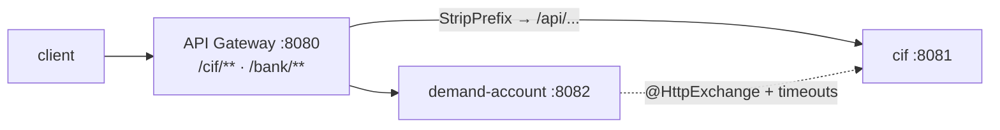
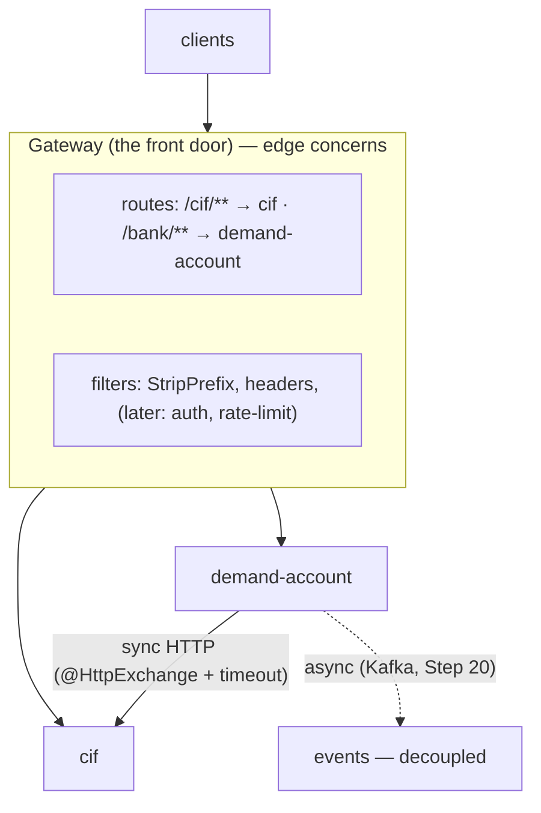
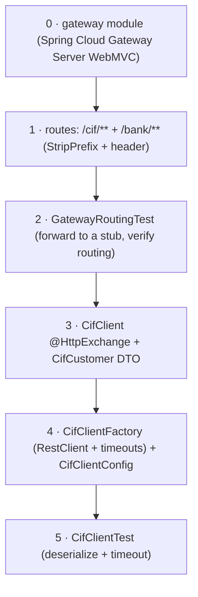

# Step 15 · API Gateway / BFF & Service-to-Service HTTP
### Phase C — Web, APIs & Application Security 🔵 · Step 15 of 67

> *So far each service has its own port and its own front door. Real clients shouldn't know or care that
> "customers" lives on 8081 and "accounts" on 8082 — they want **one** address. This step builds that single
> front door (an **API Gateway**) and teaches services to call each other with a **type-safe, timeout-bounded**
> HTTP client. Both are the connective tissue of every microservice system.*

---

<a id="toc"></a>
## 🧭 The Six Movements of This Step

| | Movement | What happens | ~time |
|---|---|---|---|
| **A** | [🧭 Orient](#orient) | 30-second overview · skip-test · cheat card · why it matters · before you start | ~1h |
| **B** | [🧠 Understand](#understand) | the gateway pattern · sync vs async comms · declarative HTTP + timeouts | ~2h |
| **C** | [🛠️ Build](#build) | a `gateway/` module routing to the services · a declarative `CifClient` with timeouts | ~9h |
| **D** | [🔬 Prove](#prove) | the Verification Log — gateway routing, client deserialize + timeout, §12.3 mutation | ~1.5h |
| **E** | [🎓 Apply](#apply) | go deeper · interview prep · your-turn challenges | ~3h |
| **F** | [🏆 Review](#review) | troubleshooting · resources · recap, flashcards & what's next | ~1.5h |

*(≈ 18 h total at a careful beginner pace — see the 🗓️ Session Plan below for how to slice it into sittings.)*

---

<a id="orient"></a>

# A · 🧭 Orient

## 📋 This Step in 30 Seconds

| | |
|---|---|
| **Title** | API Gateway / BFF + service-to-service HTTP — one front door, and type-safe, timeout-bounded inter-service calls |
| **Step** | 15 of 67 · **Phase C — Web, APIs & Application Security** 🔵 |
| **Effort** | ≈ 18 hours focused. The gateway is the box at the top of every microservices architecture diagram; declarative HTTP clients + timeouts are the difference between a resilient system and a cascading-failure one. Experienced learners can skim to ~3h. |
| **What you'll run this step** | **JVM + Maven** for build & tests; **🐳 Docker** for demand-account's Testcontainers tests. One command: `./mvnw -pl gateway,services/demand-account -am verify`. (Routing and the client are tested against in-process stub servers — no need to run all services at once.) |
| **Buildable artifact** | A new **`gateway/`** module (Spring Cloud Gateway **Server WebMVC** — the servlet variant) routing `/cif/**` → cif and `/bank/**` → demand-account (StripPrefix + a response-header filter); and a declarative **`CifClient`** (`@HttpExchange` over `RestClient`) with **connect/read timeouts** in demand-account. New: `GatewayApplication` + routes, `CifClient`/`CifClientFactory`/`CifClientConfig`. `step-15-start == step-14-end`. |
| **Verification tier** | 🔴 **Full** — a new module + a build change. `./mvnw verify` green + the gateway routing proven (forwards, strips prefix, adds header) + the client deserialize + **timeout** proven + the **§12.3 mutation** (remove StripPrefix → test fails → revert) + clean-room + `smoke.sh`. |
| **Depends on** | **[Step 14](../step-14/lesson.md)**/**[Step 13](../step-13/lesson.md)** (the services we route to), **[Step 8](../step-08/lesson.md)** (cif). Spring Cloud Gateway is **first used here** (VERSIONS.md). **+ Docker.** |

By the end you will be able to explain why a system needs an **API Gateway / BFF** and what belongs there; route external traffic to internal services with predicates + filters; call another service with a **declarative HTTP interface** (`@HttpExchange`); and set **timeouts** so a slow dependency can't hang or cascade.

### ⏭️ Can You Skip This Step? (5-minute self-check)

If you can confidently do **all** of this, skim the 🧩 Pattern Spotlight and jump to **[Step 16 — Spring Security deep I](../step-16/lesson.md)**.

- [ ] I can explain what an **API Gateway / BFF** is, what to put there (routing, edge auth, rate limiting, correlation), and what *not* to (business logic).
- [ ] I can configure **routes** (predicate + filters like `StripPrefix`) in Spring Cloud Gateway, and say why I'd pick the **servlet (MVC)** variant over the reactive one here.
- [ ] I can call another service with a **declarative `@HttpExchange` interface** over `RestClient` (vs `RestTemplate`/OpenFeign).
- [ ] I can explain why **timeouts** on inter-service calls are non-negotiable (cascading failure) — and what's still missing (circuit breakers → Step 37).
- [ ] I can compare **sync HTTP vs async messaging** and say when each fits (→ Kafka, Step 20).

> [!TIP]
> Not 100%? Stay. "Draw the architecture — where's the gateway and what does it do?", "how do services call each other?", and "what happens when a downstream is slow?" are core system-design questions — and you'll have built the answers.

## 📇 Cheat Card

> **What this step delivers (one sentence):** a single front door — Spring Cloud Gateway (servlet) routing `/cif/**` and `/bank/**` to the services with prefix-stripping and a response-header filter — plus a type-safe, timeout-bounded `@HttpExchange` client for service-to-service calls, both proven against in-test stubs.

**Key commands** (Windows uses `.\mvnw.cmd`):

```bash
# Build + test the gateway + the service-to-service client:
./mvnw -pl gateway,services/demand-account -am verify

# Run the whole front-to-back path locally (3 terminals): cif (8081), demand-account (8082), gateway (8080)
./mvnw -pl services/cif spring-boot:run
SPRING_DATASOURCE_URL=jdbc:postgresql://localhost:5433/demand_account ./mvnw -pl services/demand-account spring-boot:run
#   (the VAR=value prefix is bash-only; PowerShell equivalent:
#    $env:SPRING_DATASOURCE_URL='jdbc:postgresql://localhost:5433/demand_account'; .\mvnw.cmd -pl services/demand-account spring-boot:run)
./mvnw -pl gateway spring-boot:run
#   → everything through http://localhost:8080  (e.g. GET /cif/api/customers/1, POST /bank/api/v1/transfers)

# One-shot proof your build matches the lesson (needs Docker):
bash steps/step-15/smoke.sh
```

**The one headline idea — *clients hit one address; the gateway routes to the right service; services call each other with a typed, timeout-bounded client*:**



*Alt-text: a client hits the API Gateway on port 8080; the gateway routes /cif/** to the cif service (8081) and /bank/** to demand-account (8082), stripping the prefix to the service's own /api path. Separately, demand-account calls cif directly via a declarative @HttpExchange client with timeouts.*

## 🎯 Why This Matters

Every microservices diagram has a box at the top labelled "API Gateway" — it's where one public address fans out to many services, and where edge concerns (auth, rate limiting, correlation ids, TLS termination) live so each service doesn't reinvent them. And once you have many services, they call each other — over HTTP, and **that's where systems die**: a single slow dependency, called without a timeout, ties up every thread waiting on it until the whole system stops responding (cascading failure). Interviewers draw this exact picture and ask "where's the gateway, what's in it?" and "what happens when service B is slow?". After this step you've built both the front door and a fail-fast client.

## ✅ What You'll Be Able to Do

- **Stand up an API Gateway** — route by path predicate, strip prefixes, add filters; pick the servlet variant for an MVC stack.
- **Reason about the BFF pattern** — one front door, edge concerns centralized, services kept private.
- **Call services declaratively** — `@HttpExchange` over `RestClient` via `HttpServiceProxyFactory`.
- **Make calls resilient (baseline)** — connect/read timeouts so a slow dependency fails fast (full circuit-breaking → Step 37).
- **Choose sync vs async** — HTTP now, Kafka events later (Step 20), with the trade-offs.

## 🧰 Before You Start

**Prerequisites**

- ✅ You finished **Step 14**; the repo is at `step-15-start` (== `step-14-end`) and `./mvnw verify` is green.
- ✅ **Docker is running** (demand-account's tests use Testcontainers; routing/client tests use in-process stubs).

**What you already learned that connects here**

- **Steps 8, 13, 14**: the cif and demand-account services and their endpoints — the gateway now fronts them.
- **Step 13**: the request lifecycle and filters — a gateway is essentially a configurable filter/route layer.
- **Step 11**: virtual threads — the servlet gateway's blocking forwards scale on them.

> **Depends on: Steps 14, 13, 8.**

## 🗓️ Session Plan

≈ 18 hours doesn't fit in one chair. Slice it into **8 sittings** of ~1.5–3 h, each ending at a real save point (a commit or a green test) — stop mid-sitting and you'll pay a re-orientation tax; stop at a save point and the re-entry line at each ✋ checkpoint tells you exactly where to resume.

| # | Sitting | Covers | ~time | Ends at (save point) |
|---|---|---|---|---|
| 1 | The map | A · Orient + all of B · Understand (Big Idea → Thread-safety note) | ~3h | you can draw the gateway diagram + explain servlet-vs-reactive from memory |
| 2 | Module + routes | Build sub-steps 0–1 (gateway POM, `GatewayApplication`, `application.yml`) | ~2h | sub-step 1 commit — routes defined |
| 3 | Prove the routing | Sub-step 2 (`GatewayRoutingTest` + the break-it mutation) | ~2.5h | routing test green + commit |
| 4 | The typed client | Sub-steps 3–4 (`CifClient` interface/DTO, factory + config with timeouts) | ~2h | sub-step 4 commit — timeout-bounded bean |
| 5 | Client tests + play | Sub-step 5 (`CifClientTest`) + 🎮 Play With It (3-terminal full path) | ~2.5h | both client tests green; requests through :8080 |
| 6 | Prove + close | D · Prove (mutation, `smoke.sh`, clean-room) + ✅ Definition of Done | ~1.5h | `step-15-end` committed and tagged |
| 7 | Apply | E · Go Deeper, Interview Prep, Your Turn challenges 1–3 | ~3h | challenge code committed |
| 8 | Review | F · Troubleshooting scan, glossary, recap, Test Yourself, flashcards | ~1.5h | all 6 Test Yourself answered cold |

**Optional routes:** the ⏭️ skip-test (5 min) can compress the whole step to a ~3h skim for experienced learners; each 🚀 Go Deeper aside is +~10 min; Your Turn stretches 4–5 are +~1h and can be dropped without losing the spine.

---

<a id="understand"></a>

# B · 🧠 Understand

## 🧠 The Big Idea

**The API Gateway.** When you have many services, you don't expose them all to the world — you put **one** service in front (the gateway) that receives every external request and **routes** it to the right internal service. That single front door is the natural home for **edge cross-cutting concerns**: routing, TLS termination, authentication/authorization (Steps 16–17), rate limiting (Step 51), request/response shaping, and correlation-id origination (Step 13). Clients get one stable address; internal services stay private and can move/split without breaking clients. A **BFF** (Backend-For-Frontend) is the same idea specialized per client type (a web BFF, a mobile BFF) that aggregates/tailors responses for that frontend.

**Spring Cloud Gateway, servlet vs reactive.** It ships in two flavours: a **reactive** one (WebFlux/Netty) and a **servlet/MVC** one. Because our whole platform is **Spring MVC + virtual threads** (WebFlux is an advanced aside), we use the **servlet variant** (`spring-cloud-starter-gateway-server-webmvc`) — same stack, same config style, and its blocking forwards scale fine on virtual threads. A route is: an **id**, a target **uri**, **predicates** (when does this route match? e.g. `Path=/cif/**`), and **filters** (transform the request/response, e.g. `StripPrefix`, `AddResponseHeader`).

**Service-to-service communication.** Once split, services collaborate. Two styles:
- **Synchronous (HTTP)** — service A calls B and waits for the response (request/reply). Simple, immediate, but **temporally coupled**: if B is down or slow, A is affected *now*. This is what we build here.
- **Asynchronous (messaging)** — A publishes an event; B consumes it whenever. Decoupled, resilient, eventually consistent — that's **Kafka** (Step 20) and the Saga (Step 21).

For synchronous calls, the modern Spring way is a **declarative HTTP interface**: you declare an `@HttpExchange` interface and Spring generates the client (`HttpServiceProxyFactory` over a `RestClient`). And every such call **must have timeouts** — a call without a read timeout can hang forever, and a chain of services each hanging on the next is how one slow component takes the whole system down (**cascading failure**).

> **Analogy — a bank's head office.** The **gateway** is the head-office reception: every visitor enters through one door, and reception **routes** them to the right department (and checks their ID, logs their visit — edge concerns), so visitors never need to know which floor "Accounts" is on. **Service-to-service HTTP** is one department phoning another for information — useful, but if you call a department that never picks up and you *wait on the line forever*, your own desk is now blocked too. A **timeout** is hanging up after a few rings and dealing with it, instead of holding the line all day.



*Alt-text: clients enter through the gateway, which holds routes (/cif/** → cif, /bank/** → demand-account) and filters (StripPrefix, headers, later auth/rate-limit). The gateway forwards to the cif and demand-account services. Separately, demand-account calls cif synchronously over HTTP with a declarative client and timeout; asynchronous Kafka events (Step 20) are the decoupled alternative.*

❓ **Knowledge-check:** why did we pick the **servlet** gateway variant over the reactive one for this platform? <details><summary>answer</summary>The whole stack is Spring MVC + virtual threads — the servlet gateway stays on the same stack, and its blocking forwards scale fine on virtual threads, so the reactive model adds complexity for no benefit here.</details>

## 🧩 Pattern Spotlight — API Gateway / BFF

> **Problem.** Exposing every microservice directly means clients must know each service's address, every service must implement auth/rate-limiting/CORS itself, and you can't refactor service boundaries without breaking clients. Cross-cutting edge concerns get duplicated and drift.

> **Why a gateway fits.** A single entry point decouples clients from the internal topology: clients hit one address; the gateway routes to the right service and can re-route as services split/merge. Edge concerns (auth, rate limiting, TLS, correlation) are implemented **once**, at the edge. A **BFF** variant tailors the API per client (web/mobile), aggregating multiple service calls into one response.

> **How it works (the mechanism).** The gateway matches each request against ordered **routes** (predicates on path/method/headers), applies **filters** to the request and response (rewrite path, add/remove headers, rate-limit, authenticate), and **forwards** to the route's target URI, streaming the response back. Spring Cloud Gateway Server WebMVC does this on the servlet stack with a blocking HTTP client.

> **Alternatives / trade-offs.** A reactive gateway (WebFlux) scales connections on an event loop — great for very high fan-out/streaming, but a different programming model (we don't need it; virtual threads give blocking code similar scalability). A hardware/cloud LB or an ingress (Step 34) does L4/L7 routing but not app-level concerns (auth, request shaping). Putting **business logic** in the gateway is the anti-pattern — keep it a thin edge.

> **Implementation (here).** The `gateway/` module routes `/cif/**` → cif and `/bank/**` → demand-account, strips the prefix, and adds an `X-Gateway` response header. `GatewayRoutingTest` proves a request forwards to a stub with the prefix stripped.

## 🌱 Under the Hood: How It Really Works

**Gateway routes & filters.** In `application.yml` under `spring.cloud.gateway.server.webmvc.routes`, each route has predicates and filters. A request matching `Path=/cif/**` is routed to the `cif` route's `uri`; `StripPrefix=1` removes the first path segment (`/cif`) so the downstream receives its own path (`/api/customers/1`); `AddResponseHeader` tags the response. Internally the MVC gateway compiles these into `RouterFunction`/`HandlerFunction` chains (you can also write them in Java) and forwards with a blocking `HttpClient`. (Config prefix note: it's `spring.cloud.gateway.server.webmvc.*` since Spring Cloud 2025 — the older `spring.cloud.gateway.mvc.*` is deprecated.)

**Why the servlet gateway is fine here.** Forwarding is blocking (a thread waits for the downstream), which historically capped throughput → the reactive gateway. But with **virtual threads** (Step 11), a blocking forward parks cheaply and you can have very many in flight — so the simpler servlet model scales without the reactive complexity. Right tool for an MVC platform.

**Declarative HTTP interfaces.** You write an interface:
```java
@HttpExchange("/api/customers")
public interface CifClient {
    @GetExchange("/by-number/{customerNumber}")
    CifCustomer getByNumber(@PathVariable String customerNumber);
}
```
and build the implementation at runtime:
```java
RestClient restClient = RestClient.builder().baseUrl(baseUrl).requestFactory(factory).build();
CifClient client = HttpServiceProxyFactory.builderFor(RestClientAdapter.create(restClient))
        .build().createClient(CifClient.class);
```
`HttpServiceProxyFactory` creates a **dynamic proxy** that turns each annotated method call into an HTTP request (binding `@PathVariable`/`@RequestParam`/`@RequestBody`, deserializing the response via the `RestClient`'s message converters). It's the type-safe, no-boilerplate successor to hand-written `RestTemplate` calls and to Spring Cloud OpenFeign for in-Spring use.

**Timeouts (the resilience baseline).** We build the `RestClient` on a `JdkClientHttpRequestFactory` over a JDK `HttpClient` with a **connect timeout** (how long to wait to establish the TCP/TLS connection) and a **read timeout** (how long to wait for the response after sending). A slow downstream now throws (Spring wraps the timeout as `ResourceAccessException`) instead of hanging forever — the request fails fast and the caller's thread is freed. This is the *minimum*; full resilience (circuit breakers, bulkheads, retries with backoff, fallbacks) is **Resilience4j in Step 37**. We do timeouts now and name what's deferred.

**What's deliberately NOT here yet.** No service discovery/load balancing (services are at fixed URLs via config — discovery comes with Kubernetes/Step 34+), no circuit breaker/retry (Step 37), no auth at the gateway (Steps 16–17), no rate limiting (Step 51). The gateway is the *place* those will live; we're laying the foundation.

## 🛡️ Security Lens: What Could Go Wrong

- **The gateway is your security perimeter.** It's where edge **authentication/authorization** (Steps 16–17), **rate limiting** (Step 51), and request validation belong — so internal services aren't directly exposed. Keep internal services unreachable from the outside (network policy, Step 42); the gateway is the only public door.
- **No timeout = a denial-of-service amplifier.** A downstream that hangs, called without a read timeout, ties up caller threads until exhaustion — an attacker (or one sick service) can stall the whole system. Timeouts (and later circuit breakers) are an **availability** control.
- **Don't trust gateway-added headers blindly downstream.** If the gateway adds identity/correlation headers, services must ensure clients can't *spoof* them (strip inbound copies at the edge). We'll formalize identity propagation in Step 17.
- **Header/route leakage.** `/actuator/gateway/routes` exposes your internal topology — gate the actuator in production (Phase H), as with Swagger UI in Step 13.

## 🕰️ Then vs. Now (How This Changed Across Versions)

| Topic | Then | Now | Why it changed |
|---|---|---|---|
| **Gateway** | Netflix **Zuul 1** (blocking, per-request thread) → Spring Cloud Gateway **reactive** (WebFlux). | Spring Cloud Gateway **Server WebMVC** (servlet) for MVC stacks; reactive still available. | A servlet gateway fits MVC apps; virtual threads remove the old "must be reactive to scale" pressure. |
| **Service-to-service client** | `RestTemplate` (verbose, now in maintenance) → Spring Cloud **OpenFeign**. | **`RestClient`** (fluent) + **declarative `@HttpExchange`** interfaces (Spring Framework 6.1+). | Type-safe, no extra dependency, modern fluent/declarative API. |
| **Config prefix** | `spring.cloud.gateway.mvc.routes`. | **`spring.cloud.gateway.server.webmvc.routes`** (Spring Cloud 2025+). | The MVC gateway was renamed to "server-webmvc"; old prefix deprecated. |
| **Timeouts** | `RestTemplate` + `SimpleClientHttpRequestFactory` setters. | `RestClient` + `JdkClientHttpRequestFactory` (or Boot's `ClientHttpRequestFactorySettings`). | Same idea, modern factory over the JDK `HttpClient`. |

> [!NOTE]
> *Verify, don't guess.* We use **`spring-cloud-starter-gateway-server-webmvc`** (BOM-managed by Spring Cloud 2025.1.1 → 5.0.x) and the **`spring.cloud.gateway.server.webmvc.routes`** prefix — verified by booting the gateway and forwarding to a stub (🔬). `@HttpExchange`/`HttpServiceProxyFactory`/`RestClient`/`RestClientAdapter` are Spring Framework 6.1+/7 (we're on 7). No new *direct* dependency was added for the client. Full resilience (Resilience4j) is Step 37.

## 🧵 Thread-safety note

The gateway and the `CifClient` are **stateless singletons** shared across request threads — the gateway's routes/filters are immutable config; the `RestClient`/`HttpClient` behind the client are thread-safe and hold no per-request state. So there's nothing to synchronize (Step 11's "stateless singletons are safe" rule). The servlet gateway's *blocking* forward does occupy a thread per in-flight request — which is exactly why **virtual threads** (Step 11) matter here: cheap blocking lets the simple model scale. Per-call data (path variables, body) flows as method arguments, never shared fields.

---

<a id="build"></a>

# C · 🛠️ Build

## 📦 Your Starting Point

You're at **`step-15-start`** (== `step-14-end`). cif (8081) and demand-account (8082) exist with their APIs. We add a `gateway/` module in front and a `CifClient` for service-to-service calls — **no new direct dependency for the client**; the gateway dep is BOM-managed.

Confirm the start builds:
```bash
./mvnw -q verify   # green, 7 modules, from Step 14
```

## 🛠️ Let's Build It — Step by Step



🌳 **Files we'll touch:**
```
gateway/pom.xml · gateway/src/main/java/.../GatewayApplication.java · gateway/src/main/resources/application.yml
gateway/src/test/java/.../GatewayRoutingTest.java
services/demand-account/src/main/java/com/buildabank/account/client/
├── CifCustomer.java · CifClient.java · CifClientFactory.java · CifClientConfig.java
services/demand-account/src/test/java/.../client/CifClientTest.java
pom.xml (+ <module>gateway</module>) · steps/step-15/{requests.http,smoke.sh} · adr/0007-...md
```

---

### Sub-step 0 of 6 — The gateway module 🧭 *(you are here: **module** → routes → routing test → client → factory → client test)*

🎯 **Goal:** a new module with the servlet gateway dependency (BOM-managed). *(⏱️ ~45 min)*

📁 **Location:** `gateway/pom.xml` + add `<module>gateway</module>` to the root `pom.xml`.

⌨️ **Code** — the complete module POM:
```xml
<?xml version="1.0" encoding="UTF-8"?>
<!-- file: gateway/pom.xml -->
<project xmlns="http://maven.apache.org/POM/4.0.0"
         xmlns:xsi="http://www.w3.org/2001/XMLSchema-instance"
         xsi:schemaLocation="http://maven.apache.org/POM/4.0.0 https://maven.apache.org/xsd/maven-4.0.0.xsd">
    <modelVersion>4.0.0</modelVersion>

    <!--
      gateway — the API Gateway / BFF (single front door). Built on Spring Cloud Gateway Server WebMVC
      (the SERVLET variant) to stay on the project's Spring MVC + virtual-threads stack — NOT the reactive
      (WebFlux/Netty) gateway. Routes external traffic to the cif and demand-account services. (Step 15.)
    -->
    <parent>
        <groupId>com.buildabank</groupId>
        <artifactId>build-a-bank-parent</artifactId>
        <version>0.1.0-SNAPSHOT</version>
        <relativePath>../pom.xml</relativePath>
    </parent>

    <artifactId>gateway</artifactId>
    <name>Build-a-Bank :: Gateway</name>
    <description>API Gateway / BFF — Spring Cloud Gateway Server WebMVC routing to the services (Step 15).</description>

    <dependencies>
        <!-- The SERVLET-based gateway (Spring MVC), version managed by the Spring Cloud BOM (2025.1.1). -->
        <dependency>
            <groupId>org.springframework.cloud</groupId>
            <artifactId>spring-cloud-starter-gateway-server-webmvc</artifactId>
        </dependency>
        <dependency>
            <groupId>org.springframework.boot</groupId>
            <artifactId>spring-boot-starter-actuator</artifactId>
        </dependency>

        <dependency>
            <groupId>org.springframework.boot</groupId>
            <artifactId>spring-boot-starter-test</artifactId>
            <scope>test</scope>
        </dependency>
    </dependencies>

    <build>
        <plugins>
            <plugin>
                <groupId>org.springframework.boot</groupId>
                <artifactId>spring-boot-maven-plugin</artifactId>
            </plugin>
        </plugins>
    </build>
</project>
```
…and register the module in the root POM (the reactor grows from 7 modules to 8):
```xml
<!-- file: pom.xml (root) — inside the existing <modules> block -->
<modules>
    <module>services/hello</module>
    <module>services/cif</module>
    <module>services/demand-account</module>
    <module>gateway</module>                       <!-- NEW: Step 15 -->
    <module>playground/java-basics</module>
    <module>playground/spring-lab</module>
    <module>playground/concurrency-lab</module>
</modules>
```

🔍 **Line-by-line:** `spring-cloud-starter-gateway-server-webmvc` is the **servlet** gateway (Spring MVC), not the reactive one — chosen to stay on our MVC + virtual-threads stack (ADR-0007). No `<version>` — the Spring Cloud 2025.1.1 BOM (in the parent POM) manages it. `spring-boot-starter-actuator` powers the `/actuator/gateway/routes` endpoint you'll use in 🎮 Play With It (exposure is configured in sub-step 1). `<parent>` pulls in the shared plugin/BOM setup; the boot plugin makes the module runnable with `spring-boot:run`.

💭 **Under the hood:** this starter brings the gateway auto-configuration that reads `spring.cloud.gateway.server.webmvc.routes` and wires the route/filter chain onto the servlet `DispatcherServlet`.

✋ **Checkpoint:** `./mvnw -q -pl gateway dependency:resolve` succeeds (the artifact resolves on the BOM).

💾 **Commit:** `git add gateway/pom.xml pom.xml && git commit -m "build(gateway): add Spring Cloud Gateway Server WebMVC module"`

⚠️ **Pitfall:** grabbing `spring-cloud-starter-gateway` (the reactive one) instead drags WebFlux/Netty into an MVC app — use the `-server-webmvc` artifact.

> 🔁 **Stopping here?** You have a gateway module that resolves on the BOM, committed. Next: sub-step 1 (routes); first action: create `gateway/src/main/java/com/buildabank/gateway/GatewayApplication.java`.

---

### Sub-step 1 of 6 — Routes 🧭 *(module ✅ → **routes** → routing test → client → factory → client test)*

🎯 **Goal:** route `/cif/**` → cif and `/bank/**` → demand-account, stripping the prefix and adding a header. *(⏱️ ~1.5h)*

📁 **Location:** `gateway/src/main/java/com/buildabank/gateway/GatewayApplication.java` + `gateway/src/main/resources/application.yml`.

⌨️ **Code** — first the application class (a plain `@SpringBootApplication`; all the gateway behaviour comes from config):
```java
// file: gateway/src/main/java/com/buildabank/gateway/GatewayApplication.java
package com.buildabank.gateway;

import org.springframework.boot.SpringApplication;
import org.springframework.boot.autoconfigure.SpringBootApplication;

/** The API Gateway / BFF — the single front door routing to the bank's services (Step 15). */
@SpringBootApplication
public class GatewayApplication {

    public static void main(String[] args) {
        SpringApplication.run(GatewayApplication.class, args);
    }
}
```
…then the routes:
```yaml
# file: gateway/src/main/resources/application.yml
# Spring Cloud Gateway Server WebMVC (servlet) — the single front door. Routes by a service prefix and
# strips it before forwarding, so external /cif/api/customers/1 → cif's /api/customers/1.
# (Config prefix is spring.cloud.gateway.server.webmvc.* since Spring Cloud 2025; the old
#  spring.cloud.gateway.mvc.* is deprecated.)
spring:
  application:
    name: gateway
  cloud:
    gateway:
      server:
        webmvc:
          routes:
            - id: cif
              uri: ${services.cif.uri:http://localhost:8081}
              predicates:
                - Path=/cif/**
              filters:
                - StripPrefix=1                          # /cif/api/customers/1 → /api/customers/1
                - AddResponseHeader=X-Gateway, build-a-bank
            - id: demand-account
              uri: ${services.demand-account.uri:http://localhost:8082}
              predicates:
                - Path=/bank/**
              filters:
                - StripPrefix=1                          # /bank/api/v1/transfers → /api/v1/transfers
                - AddResponseHeader=X-Gateway, build-a-bank

server:
  port: 8080                                             # the gateway is the front door

management:
  endpoints:
    web:
      exposure:
        include: health,info,gateway                     # /actuator/gateway lists the routes

logging:
  level:
    com.buildabank.gateway: INFO
```

🔍 **Line-by-line:**
- `routes` — a list; each has an `id`, a target `uri` (a config placeholder so tests can point it at a stub), `predicates` (match condition), and `filters` (transforms).
- `Path=/cif/**` — match any request whose path starts with `/cif/`.
- `StripPrefix=1` — drop the first path segment before forwarding, so the downstream gets *its own* path.
- `AddResponseHeader=X-Gateway, build-a-bank` — tag every response (proves a filter ran; later this slot holds auth/rate-limit).
- `server.port: 8080` — the single public address.
- `management.endpoints.web.exposure.include: health,info,gateway` — exposes the `gateway` actuator endpoint that lists routes (🎮 Play With It item 3). It leaks topology — gate it in production (🛡️ Security Lens).

💭 **Under the hood:** Spring Cloud Gateway compiles these into route handlers; on a request it finds the first matching route, applies the filters, and forwards to the `uri` with a blocking HTTP client (scales on virtual threads).

🔮 **Predict:** a request to `/cif/api/customers/1` — what path does cif receive? <details><summary>answer</summary>`/api/customers/1` — `StripPrefix=1` removes `/cif`. Proven next.</details>

✋ **Checkpoint:** the module compiles; routes are defined.

💾 **Commit:** `git add gateway/src/main && git commit -m "feat(gateway): route /cif and /bank with StripPrefix + header filter"`

⚠️ **Pitfall:** the config prefix is `spring.cloud.gateway.server.webmvc.routes` (2025+); the old `spring.cloud.gateway.mvc.routes` is deprecated and silently won't bind.

> 🔁 **Stopping here?** You have routes defined and committed (not yet proven). Next: sub-step 2 (`GatewayRoutingTest`); first action: create `gateway/src/test/java/com/buildabank/gateway/GatewayRoutingTest.java`.

---

### Sub-step 2 of 6 — `GatewayRoutingTest` 🧭 *(… → **routing test** → …)*

🎯 **Goal:** prove the gateway forwards, strips the prefix, and adds the header — against an in-test stub (no real services). *(⏱️ ~2.5h)*

📁 **Location:** `gateway/src/test/java/com/buildabank/gateway/GatewayRoutingTest.java`

⌨️ **Code** — the complete test file:
```java
// file: gateway/src/test/java/com/buildabank/gateway/GatewayRoutingTest.java
package com.buildabank.gateway;

import static java.nio.charset.StandardCharsets.UTF_8;
import static org.assertj.core.api.Assertions.assertThat;

import java.io.IOException;
import java.net.InetSocketAddress;
import java.net.URI;
import java.net.http.HttpClient;
import java.net.http.HttpRequest;
import java.net.http.HttpResponse;
import java.util.concurrent.atomic.AtomicReference;

import com.sun.net.httpserver.HttpServer;

import org.junit.jupiter.api.AfterAll;
import org.junit.jupiter.api.Test;
import org.springframework.boot.test.context.SpringBootTest;
import org.springframework.boot.test.web.server.LocalServerPort;
import org.springframework.test.context.DynamicPropertyRegistry;
import org.springframework.test.context.DynamicPropertySource;

/**
 * Proves the gateway routes to a downstream service: it forwards a request, strips the route prefix, and
 * applies the response-header filter — verified against an in-test stub HTTP server (no real services
 * needed). The route's target URI is pointed at the stub via {@code @DynamicPropertySource}.
 */
@SpringBootTest(webEnvironment = SpringBootTest.WebEnvironment.RANDOM_PORT)
class GatewayRoutingTest {

    private static HttpServer stub;
    private static final AtomicReference<String> receivedPath = new AtomicReference<>();

    @LocalServerPort
    int gatewayPort;

    private final HttpClient http = HttpClient.newHttpClient();

    @DynamicPropertySource
    static void downstream(DynamicPropertyRegistry registry) {
        try {
            stub = HttpServer.create(new InetSocketAddress("localhost", 0), 0);
        } catch (IOException e) {
            throw new RuntimeException(e);
        }
        stub.createContext("/", exchange -> {
            receivedPath.set(exchange.getRequestURI().getPath());   // record what the downstream actually got
            byte[] body = "{\"ok\":true}".getBytes(UTF_8);
            exchange.getResponseHeaders().add("Content-Type", "application/json");
            exchange.sendResponseHeaders(200, body.length);
            exchange.getResponseBody().write(body);
            exchange.close();
        });
        stub.start();
        String stubUri = "http://localhost:" + stub.getAddress().getPort();
        registry.add("services.cif.uri", () -> stubUri);
        registry.add("services.demand-account.uri", () -> stubUri);
    }

    @AfterAll
    static void stopStub() {
        if (stub != null) {
            stub.stop(0);
        }
    }

    @Test
    void routesToDownstream_stripsPrefix_andAddsGatewayHeader() throws Exception {
        HttpResponse<String> response = http.send(
                HttpRequest.newBuilder(URI.create("http://localhost:" + gatewayPort + "/cif/api/customers/1"))
                        .GET().build(),
                HttpResponse.BodyHandlers.ofString());

        assertThat(response.statusCode()).isEqualTo(200);
        assertThat(response.body()).contains("\"ok\":true");                       // downstream's body returned
        assertThat(receivedPath.get()).isEqualTo("/api/customers/1");               // StripPrefix removed "/cif"
        assertThat(response.headers().firstValue("X-Gateway")).hasValue("build-a-bank");   // gateway filter ran
    }
}
```

🔍 **Line-by-line:** `@DynamicPropertySource` starts a stub HTTP server and points both routes' `uri` at it *before* the context starts. The test calls the gateway; the stub records the path it actually received (`/api/customers/1` → StripPrefix worked); the response carries the gateway's `X-Gateway` header (filter worked). Note the stub's response-writing dance: set headers → `sendResponseHeaders(200, body.length)` → write the body → `exchange.close()`. **Skip `close()` (or the header/body order) and the forward hangs** — the gateway waits on a response the stub never finishes.

🔮 **Predict:** if the stub returned 500 instead of 200, what status would the test's HTTP client see through the gateway? <details><summary>answer</summary>500 — the gateway streams the downstream's response back, status included; it doesn't rewrite errors (a fallback route would — Your Turn #5).</details>

▶️ **Run & See:**
```bash
./mvnw -pl gateway -am test
```
✅ **Expected output:**
```
[INFO] Tests run: 1, Failures: 0, Errors: 0, Skipped: 0
[INFO] BUILD SUCCESS
```

🔬 **Break-it (the §12.3 mutation):** delete `- StripPrefix=1` from the cif route and rerun — the stub receives `/cif/api/customers/1` and the test fails (`expected "/api/customers/1" but was "/cif/api/customers/1"`). Put it back. (See 🔬 §3.)

✋ **Checkpoint:** the gateway routes correctly to a stub.

💾 **Commit:** `git add gateway/src/test && git commit -m "test(gateway): prove routing, StripPrefix, and response-header filter"`

⚠️ **Pitfall:** starting the stub *inside* `@DynamicPropertySource` (static, before context) is required — a `@BeforeEach` stub starts too late for the route uri to be set.

> 🔁 **Stopping here?** You have gateway routing proven green and committed. Next: sub-step 3 (`CifClient`); first action: create `services/demand-account/src/main/java/com/buildabank/account/client/CifCustomer.java`.

---

### Sub-step 3 of 6 — `CifClient` (declarative HTTP interface) 🧭 *(… → **client** → …)*

🎯 **Goal:** a type-safe interface for calling cif. *(⏱️ ~45 min)*

📁 **Location:** `services/demand-account/src/main/java/com/buildabank/account/client/{CifCustomer,CifClient}.java`

⌨️ **Code** — two small files, complete:
```java
// file: services/demand-account/src/main/java/com/buildabank/account/client/CifCustomer.java
package com.buildabank.account.client;

/** The slice of a CIF customer this service cares about (a client-side DTO, decoupled from CIF's entity). */
public record CifCustomer(String customerNumber, String firstName, String lastName, String kycStatus) {
}
```
```java
// file: services/demand-account/src/main/java/com/buildabank/account/client/CifClient.java
package com.buildabank.account.client;

import org.springframework.web.bind.annotation.PathVariable;
import org.springframework.web.service.annotation.GetExchange;
import org.springframework.web.service.annotation.HttpExchange;

/**
 * A <strong>declarative HTTP interface</strong> for calling the CIF service. You declare the calls as
 * annotated methods; Spring generates the implementation (an {@code HttpServiceProxyFactory} proxy backed by
 * a {@code RestClient}) — no hand-written HTTP plumbing. This is the modern, type-safe successor to writing
 * {@code RestTemplate} calls by hand (and to Spring Cloud OpenFeign for in-Spring use).
 */
@HttpExchange("/api/customers")
public interface CifClient {

    /** GET /api/customers/by-number/{customerNumber} → the customer, or an error status mapped to an exception. */
    @GetExchange("/by-number/{customerNumber}")
    CifCustomer getByNumber(@PathVariable String customerNumber);
}
```

🔍 **Line-by-line:** `@HttpExchange("/api/customers")` sets the base path for the interface; `@GetExchange("/by-number/{customerNumber}")` declares a `GET /api/customers/by-number/{customerNumber}`; `@PathVariable` binds the argument into the URL. The return type `CifCustomer` is deserialized from the JSON response. **No implementation** — Spring generates it.

💭 **Under the hood:** at runtime `HttpServiceProxyFactory` creates a proxy implementing `CifClient`; each method call becomes an HTTP request via the backing `RestClient`, with response bodies deserialized by its message converters.

❓ **Knowledge-check:** `CifClient` is just an interface with no implementation anywhere in the codebase — who provides the implementation, and when? <details><summary>answer</summary>Spring generates it at runtime: `HttpServiceProxyFactory` builds a dynamic proxy that turns each annotated method call into an HTTP request via the backing `RestClient`.</details>

✋ **Checkpoint:** interface + DTO compile.

💾 **Commit:** `git add services/demand-account/src/main/java/com/buildabank/account/client/CifCustomer.java services/demand-account/src/main/java/com/buildabank/account/client/CifClient.java && git commit -m "feat(demand-account): declarative CifClient (@HttpExchange)"`

⚠️ **Pitfall:** the path-variable name in `{...}` must match the parameter (or `@PathVariable("name")`).

> 🔁 **Stopping here?** You have a compiling `CifClient` interface + DTO, committed. Next: sub-step 4 (factory + timeouts); first action: create `CifClientFactory.java` in the same `client/` package.

---

### Sub-step 4 of 6 — `CifClientFactory` (RestClient + timeouts) + config 🧭 *(… → **factory** → client test)*

🎯 **Goal:** build the client with connect/read timeouts so a slow cif fails fast. *(⏱️ ~1.5h)*

📁 **Location:** `client/CifClientFactory.java` + `client/CifClientConfig.java`

⌨️ **Code** — the factory, complete:
```java
// file: services/demand-account/src/main/java/com/buildabank/account/client/CifClientFactory.java
package com.buildabank.account.client;

import java.net.http.HttpClient;
import java.time.Duration;

import org.springframework.http.client.JdkClientHttpRequestFactory;
import org.springframework.web.client.RestClient;
import org.springframework.web.client.support.RestClientAdapter;
import org.springframework.web.service.invoker.HttpServiceProxyFactory;

/**
 * Builds a {@link CifClient} from a {@link RestClient} with explicit <strong>connect and read timeouts</strong>
 * — a service-to-service call must never hang forever on a slow dependency (that's how one slow service takes
 * the whole system down). A static factory so both the Spring config and the tests build it the same way.
 */
public final class CifClientFactory {

    private CifClientFactory() {
    }

    public static CifClient create(String baseUrl, Duration connectTimeout, Duration readTimeout) {
        HttpClient jdk = HttpClient.newBuilder().connectTimeout(connectTimeout).build();
        JdkClientHttpRequestFactory requestFactory = new JdkClientHttpRequestFactory(jdk);
        requestFactory.setReadTimeout(readTimeout);   // a slow response → fail fast instead of hanging

        RestClient restClient = RestClient.builder()
                .baseUrl(baseUrl)
                .requestFactory(requestFactory)
                .build();

        HttpServiceProxyFactory proxyFactory = HttpServiceProxyFactory
                .builderFor(RestClientAdapter.create(restClient))
                .build();
        return proxyFactory.createClient(CifClient.class);
    }
}
```
…and the Spring config that registers the bean (config-driven URL + timeouts), complete:
```java
// file: services/demand-account/src/main/java/com/buildabank/account/client/CifClientConfig.java
package com.buildabank.account.client;

import java.time.Duration;

import org.springframework.beans.factory.annotation.Value;
import org.springframework.context.annotation.Bean;
import org.springframework.context.annotation.Configuration;

/**
 * Registers the {@link CifClient} bean, built from config (base URL + timeouts). In a full deployment the
 * base URL points at the CIF service (or, behind the gateway, at the gateway); the timeouts come from config
 * so ops can tune them per environment.
 */
@Configuration
public class CifClientConfig {

    @Bean
    public CifClient cifClient(
            @Value("${services.cif.url:http://localhost:8081}") String baseUrl,
            @Value("${services.cif.connect-timeout-ms:2000}") long connectMs,
            @Value("${services.cif.read-timeout-ms:2000}") long readMs) {
        return CifClientFactory.create(baseUrl, Duration.ofMillis(connectMs), Duration.ofMillis(readMs));
    }
}
```

🔍 **Line-by-line:** a JDK `HttpClient` with a **connect timeout**; a `JdkClientHttpRequestFactory` with a **read timeout**; a `RestClient` on that factory; and the `HttpServiceProxyFactory` proxy. The `@Bean` reads the base URL + timeouts from config so ops tune them per environment. A static factory means tests build the client the same way (pointed at a stub).

> ⚠️ **Spelling watch:** the gateway names its property `services.cif.uri` (sub-step 1); this client reads `services.cif.url`. Same concept, two spellings — they live in **different modules**, so both work, but set the right key in the right module.

🔮 **Predict:** the `cifClient` bean is created at startup — does creating it open a connection to cif? <details><summary>answer</summary>No — it only builds a dynamic proxy; the first HTTP connection happens on the first method call. That's why the app boots fine even with cif down.</details>

💭 **Under the hood:** the read timeout maps to the JDK `HttpClient`'s request timeout; when it fires, Spring surfaces it as `ResourceAccessException` (a transport error), not a hang.

✋ **Checkpoint:** compiles; the `cifClient` bean is available (it builds a proxy at startup — it does **not** connect until called).

💾 **Commit:** `git add services/demand-account/src/main/java/com/buildabank/account/client/CifClientFactory.java services/demand-account/src/main/java/com/buildabank/account/client/CifClientConfig.java && git commit -m "feat(demand-account): CifClient factory + bean with timeouts"`

⚠️ **Pitfall:** building the proxy at startup is fine (no connection); but a missing timeout means a slow cif hangs the caller — always set both.

> 🔁 **Stopping here?** You have a timeout-bounded `cifClient` bean, committed. Next: sub-step 5 (`CifClientTest`); first action: create `services/demand-account/src/test/java/com/buildabank/account/client/CifClientTest.java`.

---

### Sub-step 5 of 6 — `CifClientTest` (deserialize + timeout) 🧭 *(… → **client test**)*

🎯 **Goal:** prove the client deserializes a response and trips the read timeout on a slow dependency. *(⏱️ ~1.5h)*

📁 **Location:** `services/demand-account/src/test/java/com/buildabank/account/client/CifClientTest.java`

⌨️ **Code** — the stub setup and the first test, complete (this compiles and runs as shown; you'll write the second test yourself below):
```java
// file: services/demand-account/src/test/java/com/buildabank/account/client/CifClientTest.java
package com.buildabank.account.client;

import static java.nio.charset.StandardCharsets.UTF_8;
import static org.assertj.core.api.Assertions.assertThat;
import static org.assertj.core.api.Assertions.assertThatThrownBy;

import java.net.InetSocketAddress;
import java.time.Duration;

import com.sun.net.httpserver.HttpServer;

import org.junit.jupiter.api.AfterEach;
import org.junit.jupiter.api.BeforeEach;
import org.junit.jupiter.api.Test;
import org.springframework.web.client.ResourceAccessException;

/**
 * Tests the declarative {@link CifClient} against an in-test stub HTTP server (no Spring context, no real
 * CIF): a normal call deserializes the JSON into a {@link CifCustomer}, and a slow dependency trips the
 * <strong>read timeout</strong> (fail fast) instead of hanging.
 */
class CifClientTest {

    private HttpServer stub;
    private String baseUrl;

    @BeforeEach
    void startStub() throws Exception {
        stub = HttpServer.create(new InetSocketAddress("localhost", 0), 0);
        stub.createContext("/api/customers/by-number/", exchange -> {
            if (exchange.getRequestURI().getPath().endsWith("/slow")) {
                try {
                    Thread.sleep(1500);   // longer than the client's read timeout → should time out
                } catch (InterruptedException e) {
                    Thread.currentThread().interrupt();
                }
            }
            byte[] body = ("{\"customerNumber\":\"CIF-1\",\"firstName\":\"Ada\","
                    + "\"lastName\":\"Lovelace\",\"kycStatus\":\"VERIFIED\"}").getBytes(UTF_8);
            exchange.getResponseHeaders().add("Content-Type", "application/json");
            exchange.sendResponseHeaders(200, body.length);
            exchange.getResponseBody().write(body);
            exchange.close();
        });
        stub.start();
        baseUrl = "http://localhost:" + stub.getAddress().getPort();
    }

    @AfterEach
    void stopStub() {
        stub.stop(0);
    }

    @Test
    void deserializesTheCustomer() {
        CifClient client = CifClientFactory.create(baseUrl, Duration.ofMillis(500), Duration.ofMillis(500));

        CifCustomer customer = client.getByNumber("CIF-1");

        assertThat(customer.customerNumber()).isEqualTo("CIF-1");
        assertThat(customer.firstName()).isEqualTo("Ada");
        assertThat(customer.kycStatus()).isEqualTo("VERIFIED");
    }
}
```

✍️ **Now you write the timeout test** (the stub already sleeps 1.5 s for any path ending `/slow`). Using the sub-step 4 concepts: build a client with a **400 ms read timeout**, call `getByNumber("slow")`, and assert it throws `ResourceAccessException` (`assertThatThrownBy` is already imported). Then compare:

<details><summary>solution — <code>failsFastWhenTheDependencyIsSlow</code></summary>

```java
    @Test
    void failsFastWhenTheDependencyIsSlow() {
        CifClient client = CifClientFactory.create(baseUrl, Duration.ofMillis(500), Duration.ofMillis(400));

        // The stub sleeps 1.5s for "/slow"; the 400ms read timeout fires first → a transport exception, not a hang.
        assertThatThrownBy(() -> client.getByNumber("slow"))
                .isInstanceOf(ResourceAccessException.class);
    }
```
</details>

🔍 **Line-by-line:** the stub returns a customer JSON (the client deserializes it into `CifCustomer`); for the `/slow` path the stub sleeps 1.5s, so the 400 ms read timeout fires first → `ResourceAccessException` (fail fast), not a hang.

🔮 **Predict:** swap the two durations — stub sleeps 400 ms, read timeout 1.5 s. Which test fails, and why? <details><summary>answer</summary>`failsFastWhenTheDependencyIsSlow` — the response now arrives *before* the timeout, so nothing is thrown and `assertThatThrownBy` fails. `deserializesTheCustomer` still passes.</details>

▶️ **Run & See** (with both tests in place):
```bash
./mvnw -pl services/demand-account test -Dtest=CifClientTest
```
✅ **Expected output:**
```
[INFO] Tests run: 2, Failures: 0, Errors: 0, Skipped: 0
[INFO] BUILD SUCCESS
```

✋ **Checkpoint:** the client deserializes and times out as designed.

💾 **Commit:** `git add services/demand-account/src/test/java/com/buildabank/account/client/CifClientTest.java && git commit -m "test(demand-account): CifClient deserialize + read-timeout"`

⚠️ **Pitfall:** if deserialization fails, ensure the stub sets `Content-Type: application/json` and the DTO fields match the JSON keys.

> 🔁 **Stopping here?** You have both client tests green and committed — the build is done. Next: 🎮 Play With It, then D · Prove; first action: open `steps/step-15/requests.http` and start the 3 terminals from the 📇 Cheat Card.

---

### 🔁 The full flow you just built

```mermaid
sequenceDiagram
    participant C as Client
    participant G as Gateway :8080
    participant CIF as cif :8081
    participant DA as demand-account :8082
    C->>G: GET /cif/api/customers/1
    G->>CIF: GET /api/customers/1  (StripPrefix; +X-Gateway on the way back)
    CIF-->>C: 200 customer (via gateway)
    C->>G: POST /bank/api/v1/transfers
    G->>DA: POST /api/v1/transfers
    Note over DA,CIF: service-to-service: DA → cif via @HttpExchange (connect+read timeouts; fail fast)
```

*Alt-text: a client calls the gateway on 8080; the gateway forwards /cif/api/customers/1 to cif as /api/customers/1 (StripPrefix) and adds X-Gateway on the response; it forwards /bank/api/v1/transfers to demand-account. Separately, demand-account calls cif directly via the declarative @HttpExchange client with connect and read timeouts (fail fast).*

## 🎮 Play With It

1. **Run the whole path** (3 terminals): cif (8081), demand-account (8082, with its 5433 Postgres), gateway (8080) — see the Cheat Card / `steps/step-15/requests.http`.
2. **Everything through :8080:** `POST /cif/api/customers`, `GET /cif/api/customers/1` (note the `X-Gateway` response header), `POST /bank/api/accounts`, `POST /bank/api/v1/transfers` (idempotent, Step 14).
3. **See the routes:** `GET http://localhost:8080/actuator/gateway/routes`.
4. 🧪 **Little experiments:** stop cif and hit `/cif/...` through the gateway → a 5xx (the gateway can't reach the downstream); change `StripPrefix=1` to `2` and watch the downstream path change; add a `AddRequestHeader` filter and see it arrive at the service.

## 🏁 The Finished Result

You're at **`step-15-end`** (== `step-16-start`). The platform has a single front door and a typed, timeout-bounded inter-service client. Gateway: 1 test; demand-account: **27** tests (incl. the 2 CifClient tests).

### ✅ Definition of Done (your self-check)
- [ ] `./mvnw -pl gateway,services/demand-account -am verify` is green.
- [ ] The gateway routes `/cif/**` and `/bank/**`, strips the prefix, and adds the header.
- [ ] The `CifClient` deserializes a response and times out on a slow dependency.
- [ ] `bash steps/step-15/smoke.sh` prints `✅ Step 15 smoke test PASSED`.
- [ ] You've committed and tagged `step-15-end`.

---

<a id="prove"></a>

# D · 🔬 Prove It Works — the Verification Log

> **Tier: 🔴 Full** (new module + build change). Real pasted output below.

### 1 · Gateway routing (GatewayRoutingTest) — forwards, strips prefix, adds header
```
[INFO] Tests run: 1, Failures: 0, Errors: 0, Skipped: 0   (gateway)
[INFO] BUILD SUCCESS
```
The in-test stub received `/api/customers/1` (the gateway stripped `/cif` from `/cif/api/customers/1`), returned its body through the gateway, and the response carried `X-Gateway: build-a-bank`. Verified that `spring-cloud-starter-gateway-server-webmvc` **resolves on the BOM and boots/routes** on Boot 4.0.6 / Spring Cloud 2025.1.1.

### 2 · Service-to-service client (CifClientTest) — deserialize + fail-fast
```
[INFO] Tests run: 2, Failures: 0, Errors: 0, Skipped: 0   (CifClientTest)
```
`getByNumber("CIF-1")` deserialized `{customerNumber, firstName, lastName, kycStatus}` into a `CifCustomer`; a `/slow` stub (sleeps 1.5s) tripped the 400 ms read timeout → `ResourceAccessException` (fail fast, no hang). demand-account is now **27 tests**.

### 3 · §12.3 Mutation sanity-check — StripPrefix is load-bearing
Removed `- StripPrefix=1` from the cif route, reran `GatewayRoutingTest`:
```
[ERROR] GatewayRoutingTest.routesToDownstream_stripsPrefix_andAddsGatewayHeader
expected: "/api/customers/1"
 but was: "/cif/api/customers/1"
[INFO] BUILD FAILURE
```
Without the filter the downstream gets the wrong path — proving the test verifies routing/prefix-stripping. Reverted; green again.

### 4 · `smoke.sh`
```
==> Build + test the gateway (routing) and demand-account (incl. the CifClient s2s call)
✅ Step 15 smoke test PASSED
```

### 5 · Clean-room (§12.4) & chain
Fresh `git clone` at `step-15-end` → `make doctor` + `./mvnw verify` → **BUILD SUCCESS** (all 8 modules). Confirmed `step-15-end` == `step-16-start`.

> **Honesty (§12.8):** the full front-to-back path (client → gateway → real cif/demand-account) is documented in 🎮 Play With It and `requests.http`; the *automated* proof uses in-process stub servers (so the suite needs no multi-service orchestration). Routing and the client are both exercised over **real HTTP** (to stubs), which is the hard-to-fake part.

---

<a id="apply"></a>

# E · 🎓 Apply

## 🚀 Go Deeper (Optional)

<details>
<summary>① Gateway routes in Java (RouterFunction DSL) (+~10 min)</summary>

Besides YAML, the MVC gateway has a Java DSL: `GatewayRouterFunctions.route("cif").route(path("/cif/**"), http()).before(uri("http://localhost:8081")).filter(stripPrefix(1))...` as a `RouterFunction<ServerResponse>` bean. Java config gives you conditionals, loops, and custom filter functions — handy when routes are dynamic or numerous. YAML is cleaner for static routes (what we have).
</details>

<details>
<summary>② Why not a circuit breaker yet? (+~10 min)</summary>

Timeouts stop a single call from hanging, but if a downstream is *consistently* failing, every request still pays the timeout (latency) and may pile up. A **circuit breaker** (Resilience4j, Step 37) "opens" after a failure threshold and fails fast (or serves a fallback) without even trying — protecting both caller and callee, and giving the downstream room to recover. Add **bulkheads** (isolate thread pools per dependency) and **retries with backoff** for the full picture. We layer those in Step 37.
</details>

<details>
<summary>③ BFF vs shared gateway (+~10 min)</summary>

One gateway for everyone is simplest. A **BFF** gives each client (web, mobile, partner) its own gateway that aggregates/tailors calls — the mobile BFF might combine three service calls into one trimmed payload to save round-trips on a phone. Trade-off: more gateways to operate, but each is simpler and evolves with its client. Start with one; split to BFFs when client needs diverge.
</details>

❓ **Knowledge-check:** timeouts are set — so why do we still need a circuit breaker (Step 37)? <details><summary>answer</summary>A timeout only bounds each individual call; if the downstream is *consistently* failing, every request still pays the timeout latency and can pile up. A circuit breaker opens after a failure threshold and fails fast without even calling the downstream.</details>

## 💼 Interview Prep: Questions You'll Be Asked

1. **"Draw a microservices architecture — where's the gateway and what does it do?"** *(system design)* → A single front door clients hit; it routes to internal services and centralizes edge concerns (auth, rate limiting, TLS, correlation, request shaping). Keeps services private and clients decoupled from topology. Not for business logic.

2. **"How do services call each other, and what's the modern Spring way?"** → Sync over HTTP (request/reply) or async via messaging (Kafka). For sync in Spring: a declarative `@HttpExchange` interface implemented by `HttpServiceProxyFactory` over `RestClient` — type-safe, no boilerplate (successor to `RestTemplate`/OpenFeign).

3. **"What happens when a downstream service is slow?"** *(the resilience gotcha)* → Without a timeout, the caller's thread hangs; a chain of such hangs exhausts threads and cascades into a system-wide outage. Fix: connect/read timeouts (fail fast), then circuit breakers/bulkheads/retries (Resilience4j). Timeouts are the baseline.

4. **"Reactive vs servlet gateway — which and why?"** *(version/architecture)* → Reactive (WebFlux) scales connections on an event loop for very high fan-out; servlet (MVC) fits an MVC stack and, with virtual threads, scales blocking forwards without the reactive model. We use servlet because the platform is MVC + virtual threads.

5. **"Sync HTTP vs async messaging — when each?"** → Sync when you need an immediate answer and the caller can't proceed without it (and you accept temporal coupling). Async when you want decoupling/resilience and can tolerate eventual consistency (events, Outbox, Saga — Steps 20–21). Many systems use both.

6. **"How would you secure the edge?"** → Authenticate/authorize at the gateway (Steps 16–17), rate-limit (Step 51), terminate TLS, strip spoofable inbound headers, and keep internal services unreachable from outside (network policy, Step 42). The gateway is the perimeter.

> **Behavioral/STAR seed:** *"Tell me about preventing a cascading failure."* → Noticed an inter-service call had no read timeout (S/T); added connect/read timeouts so a slow dependency failed fast instead of exhausting threads, and flagged circuit breakers as the next layer (A); a downstream slowdown no longer took the caller down (R).

## 🏋️ Your Turn: Practice & Challenges

1. **Add a third route** for a future service (e.g. `/market/**`) and a global `AddRequestHeader=X-Request-Id, ...` so every forwarded request carries a correlation id (tie back to Step 13).
2. **Wire `CifClient` into a feature.** Add a `GET /api/v1/accounts/{n}/owner` to demand-account that calls cif via `CifClient` and returns the customer — test it against a stub. *(Reference: `solutions/step-15/`.)*
3. **Java-DSL routes.** Re-express one route as a `RouterFunction` bean and confirm the test still passes.
4. **Stretch — timeout tuning.** Make the read timeout configurable and prove (a test) that a downstream slower than the timeout fails fast while a fast one succeeds.
5. **Stretch — gateway error handling.** Stop a downstream and observe the gateway's 5xx; add a fallback route or a friendly error body.

---

<a id="review"></a>

# F · 🏆 Review

## 🩺 Stuck? Troubleshooting & Fixes

| Symptom | Cause | Fix |
|---|---|---|
| Routes don't bind / 404 for everything | wrong config prefix | use `spring.cloud.gateway.server.webmvc.routes` (not the deprecated `spring.cloud.gateway.mvc.routes`). |
| WebFlux/Netty pulled in unexpectedly | used the reactive starter | use `spring-cloud-starter-gateway-server-webmvc`. |
| Downstream gets the wrong path | missing/incorrect `StripPrefix` | `StripPrefix=1` for a one-segment prefix (`/cif`). |
| Client hangs on a slow service | no read timeout | set connect + read timeouts on the `RestClient`'s request factory. |
| Client deserialization fails | content-type/field mismatch | downstream must return `application/json`; DTO fields must match keys. |
| `503`/`5xx` through the gateway | downstream is down/unreachable | start the downstream; check the route `uri`/port. |
| Reset to known-good | — | `git checkout step-15-end && ./mvnw verify`. |

## 📚 Learn More: Resources & Glossary

- Spring Cloud Gateway docs — **Server WebMVC** (servlet) reference (routes, predicates, filters).
- Spring Framework docs — **HTTP Interface** (`@HttpExchange`) and **`RestClient`**.
- *Release It!* (Nygard) — timeouts, circuit breakers, bulkheads (the resilience canon; Step 37).

**Glossary**
- **API Gateway** — the single front door: receives every external request and routes it to the right internal service; home of the edge concerns (auth, rate limiting, TLS, correlation).
- **BFF (Backend-For-Frontend)** — a gateway specialized per client type (web/mobile) that aggregates and tailors responses for that frontend.
- **Route / predicate / filter** — a route = id + target uri + predicates (when does it match? e.g. `Path=/cif/**`) + filters (transform request/response); the gateway's unit of forwarding.
- **`StripPrefix`** — a filter that drops the first N path segments before forwarding (`/cif/api/customers/1` → `/api/customers/1`).
- **Spring Cloud Gateway Server WebMVC** — the **servlet** gateway variant (blocking forwards, scale on virtual threads); the reactive (WebFlux/Netty) variant is the alternative.
- **Declarative HTTP interface** — an interface annotated `@HttpExchange`/`@GetExchange`; you declare the calls, Spring generates the client implementation.
- **`HttpServiceProxyFactory` / `RestClientAdapter`** — the machinery that builds a dynamic proxy for that interface over a `RestClient`.
- **`RestClient`** — Spring's modern fluent synchronous HTTP client (successor to `RestTemplate`).
- **Connect / read timeout** — how long to wait to establish the connection / to wait for the response after sending; both are required for fail-fast calls.
- **`ResourceAccessException`** — how Spring surfaces transport errors, including a fired read timeout.
- **Cascading failure** — one slow dependency, called without timeouts, ties up caller threads until the whole system stops responding.
- **Circuit breaker** — opens after a failure threshold and fails fast without calling the downstream at all (Resilience4j, Step 37).
- **Sync vs async** — request/reply HTTP (immediate, temporally coupled) vs messaging events (decoupled, eventually consistent — Kafka, Step 20).

## 🏆 Recap & Study Notes

**(a) Key points**
- An **API Gateway** is the single front door: routing + edge concerns (auth, rate limit, TLS, correlation); keep business logic out.
- Use the **servlet** gateway (`spring-cloud-starter-gateway-server-webmvc`, prefix `spring.cloud.gateway.server.webmvc.routes`) for an MVC + virtual-threads stack.
- Services call each other with a **declarative `@HttpExchange` interface** over `RestClient` (via `HttpServiceProxyFactory`).
- **Timeouts** (connect + read) make calls fail fast — the resilience baseline; circuit breakers/bulkheads/retries come in **Step 37**.
- **Sync HTTP vs async messaging**: immediate-but-coupled vs decoupled-but-eventual (Kafka, Step 20).

**(b) Key terms:** API Gateway, BFF, route/predicate/filter, StripPrefix, server-webmvc vs reactive, @HttpExchange, HttpServiceProxyFactory, RestClient, connect/read timeout, ResourceAccessException, cascading failure, circuit breaker.

**(c) 🧠 Test Yourself**
1. What belongs in a gateway, and what doesn't? <details><summary>answer</summary>Routing + edge concerns (auth, rate limit, TLS, correlation); NOT business logic.</details>
2. Servlet vs reactive gateway — which did we pick and why? <details><summary>answer</summary>Servlet (`-server-webmvc`) — fits the MVC + virtual-threads stack; reactive would add WebFlux for no benefit here.</details>
3. How does a Spring service call another service today (modern way)? <details><summary>answer</summary>A declarative `@HttpExchange` interface implemented by `HttpServiceProxyFactory` over `RestClient`.</details>
4. Why is a missing read timeout dangerous? <details><summary>answer</summary>A slow downstream hangs the caller's thread; chained, it exhausts threads and cascades into an outage.</details>
5. What does `StripPrefix=1` do? <details><summary>answer</summary>Removes the first path segment before forwarding (e.g. `/cif/...` → `/...`).</details>
6. You need the answer before you can proceed vs. you can tolerate eventual consistency — which communication style fits each, and what's the coupling trade-off? <details><summary>answer</summary>Sync HTTP when the caller can't proceed without the reply — immediate but temporally coupled (a slow/down callee hurts you *now*). Async messaging (Kafka, Step 20) when you want decoupling and can live with eventual consistency.</details>

**(d) 🔗 How this connects**
- **Back to Steps 13–14, 8**: the services + endpoints the gateway fronts.
- **Forward:** Steps 16–17 (Spring Security — auth at the gateway/services, slotting into the filter chain); Step 20 (Kafka — the async alternative to these sync calls); Step 37 (Resilience4j — circuit breakers/retries on top of timeouts); Step 34+ (k8s ingress/discovery).

**(e) 🏆 Résumé line / interview talking point earned**
> *"Built an API Gateway (Spring Cloud Gateway servlet) fronting a microservices platform with path routing, prefix-stripping, and filters, and wired type-safe service-to-service calls (declarative `@HttpExchange` over `RestClient`) with timeouts for fail-fast resilience."*

**(f) ✅ You can now…**
- [ ] Stand up and configure an API Gateway (routes, predicates, filters).
- [ ] Explain the gateway/BFF pattern and what belongs at the edge.
- [ ] Call services with a declarative HTTP interface.
- [ ] Set timeouts to prevent cascading failure (and name the next resilience layers).

**(g) 🃏 Flashcards** *(appended to `docs/flashcards.md`)*
- Q: What is an API Gateway/BFF? · A: one front door — routing + edge concerns; BFF tailors per client.
- Q: Servlet vs reactive Spring Cloud Gateway? · A: server-webmvc (MVC) vs server-webflux (reactive); we use MVC.
- Q: Modern Spring service-to-service call? · A: `@HttpExchange` interface via `HttpServiceProxyFactory` over `RestClient`.
- Q: Why timeouts on inter-service calls? · A: fail fast — a slow dependency without a timeout cascades into outage.
- Q: `StripPrefix=1`? · A: drop the first path segment before forwarding.
- Q: Sync HTTP vs async messaging? · A: immediate but temporally coupled vs decoupled but eventually consistent (Kafka, Step 20).
> 🔁 **Revisit in ~2 steps** (Step 17 adds auth at the edge; Step 20 the async alternative; Step 37 circuit breakers).

**(h) ✍️ One-line reflection:** *Where would you put auth — in the gateway, each service, or both — and why?*

**(i) Sign-off** 🎉 The bank now has a single front door and services that talk to each other safely. Next: **Step 16 — Spring Security deep I**, where we lock that door. Onward! 🚀
