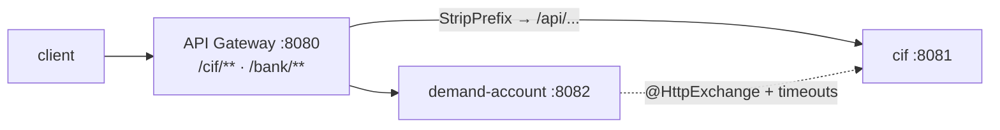
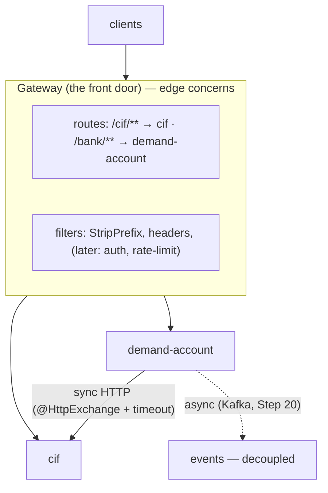
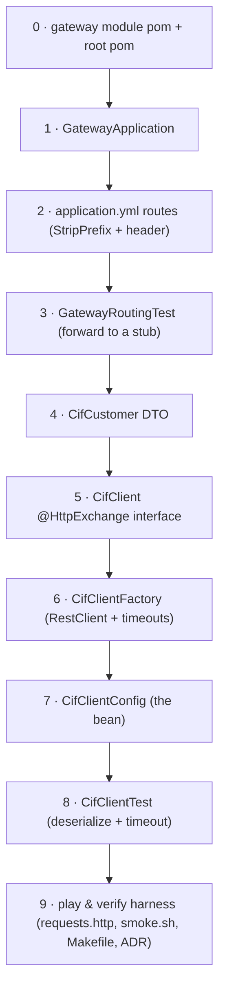

# Step 15 · API Gateway / BFF & Service-to-Service HTTP
### Phase C — Web, APIs & Application Security 🔵 · Step 15 of 67

> *So far each service has its own port and its own front door. Real clients shouldn't know or care that
> "customers" lives on 8081 and "accounts" on 8082 — they want **one** address. This step builds that single
> front door (an **API Gateway**) and teaches services to call each other with a **type-safe, timeout-bounded**
> HTTP client. Both are the connective tissue of every microservice system.*

---

<a id="toc"></a>
## 🧭 The Six Movements of This Step

| | Movement | What happens |
|---|---|---|
| **A** | [🧭 Orient](#orient) | 30-second overview · skip-test · cheat card · why it matters · before you start |
| **B** | [🧠 Understand](#understand) | the gateway pattern · sync vs async comms · declarative HTTP + timeouts |
| **C** | [🛠️ Build](#build) | a `gateway/` module routing to the services · a declarative `CifClient` with timeouts |
| **D** | [🔬 Prove](#prove) | the Verification Log — gateway routing, client deserialize + timeout, §12.3 mutation |
| **E** | [🎓 Apply](#apply) | go deeper · interview prep · your-turn challenges |
| **F** | [🏆 Review](#review) | troubleshooting · resources · recap, flashcards, cumulative review & what's next |

---

<a id="orient"></a>

# A · 🧭 Orient

## 📋 This Step in 30 Seconds

| | |
|---|---|
| **Title** | API Gateway / BFF + service-to-service HTTP — one front door, and type-safe, timeout-bounded inter-service calls |
| **Step** | 15 of 67 · **Phase C — Web, APIs & Application Security** 🔵 |
| **Effort** | ≈ 18 hours focused. The gateway is the box at the top of every microservices architecture diagram; declarative HTTP clients + timeouts are the difference between a resilient system and a cascading-failure one. Experienced learners can skim to ~3h. |
| **What you'll run this step** | **JVM + Maven** for build & tests; **🐳 Docker** for demand-account's Testcontainers tests. One command: `./mvnw -pl gateway,services/demand-account -am verify`. (Routing and the client are tested against in-process stub servers — no need to run all services at once.) |
| **Buildable artifact** | A new **`gateway/`** module (Spring Cloud Gateway **Server WebMVC** — the servlet variant) routing `/cif/**` → cif and `/bank/**` → demand-account (StripPrefix + a response-header filter); and a declarative **`CifClient`** (`@HttpExchange` over `RestClient`) with **connect/read timeouts** in demand-account. New: `GatewayApplication` + routes, `CifClient`/`CifClientFactory`/`CifClientConfig`/`CifCustomer`. `step-15-start == step-14-end`. |
| **Verification tier** | 🔴 **Full** — a new module + a build change. `./mvnw verify` green + the gateway routing proven (forwards, strips prefix, adds header) + the client deserialize + **timeout** proven + the **§12.3 mutation** (remove StripPrefix → test fails → revert) + clean-room + `smoke.sh`. |
| **Depends on** | **[Step 14](../step-14/lesson.md)**/**[Step 13](../step-13/lesson.md)** (the services we route to), **[Step 8](../step-08/lesson.md)** (cif). Spring Cloud Gateway is **first used here** (VERSIONS.md). **+ Docker.** |

By the end you will be able to explain why a system needs an **API Gateway / BFF** and what belongs there; route external traffic to internal services with predicates + filters; call another service with a **declarative HTTP interface** (`@HttpExchange`); and set **timeouts** so a slow dependency can't hang or cascade.

### ⏭️ Can You Skip This Step? (5-minute self-check)

If you can confidently do **all** of this, skim the 🧩 Pattern Spotlight and jump to **[Step 16 — Spring Security deep I](../step-16/lesson.md)**.

- [ ] I can explain what an **API Gateway / BFF** is, what to put there (routing, edge auth, rate limiting, correlation), and what *not* to (business logic).
- [ ] I can configure **routes** (predicate + filters like `StripPrefix`) in Spring Cloud Gateway, and say why I'd pick the **servlet (MVC)** variant over the reactive one here.
- [ ] I can call another service with a **declarative `@HttpExchange` interface** over `RestClient` (vs `RestTemplate`/OpenFeign).
- [ ] I can explain why **timeouts** on inter-service calls are non-negotiable (cascading failure) — and what's still missing (circuit breakers → Step 37).
- [ ] I can compare **sync HTTP vs async messaging** and say when each fits (→ Kafka, Step 20).

> [!TIP]
> Not 100%? Stay. "Draw the architecture — where's the gateway and what does it do?", "how do services call each other?", and "what happens when a downstream is slow?" are core system-design questions — and you'll have built the answers.

## 📇 Cheat Card

> **What this step delivers (one sentence):** a single front door — Spring Cloud Gateway (servlet) routing `/cif/**` and `/bank/**` to the services with prefix-stripping and a response-header filter — plus a type-safe, timeout-bounded `@HttpExchange` client for service-to-service calls, both proven against in-test stubs.

**Key commands** (Windows uses `.\mvnw.cmd`):

```bash
# Build + test the gateway + the service-to-service client:
./mvnw -pl gateway,services/demand-account -am verify

# Run the whole front-to-back path locally (3 terminals): cif (8081), demand-account (8082), gateway (8080)
./mvnw -pl services/cif spring-boot:run
SPRING_DATASOURCE_URL=jdbc:postgresql://localhost:5433/demand_account ./mvnw -pl services/demand-account spring-boot:run
./mvnw -pl gateway spring-boot:run
#   → everything through http://localhost:8080  (e.g. GET /cif/api/customers/1, POST /bank/api/v1/transfers)

# One-shot proof your build matches the lesson (needs Docker):
bash steps/step-15/smoke.sh
```

**The one headline idea — *clients hit one address; the gateway routes to the right service; services call each other with a typed, timeout-bounded client*:**



*Alt-text: a client hits the API Gateway on port 8080; the gateway routes /cif/** to the cif service (8081) and /bank/** to demand-account (8082), stripping the prefix to the service's own /api path. Separately, demand-account calls cif directly via a declarative @HttpExchange client with timeouts.*

## 🎯 Why This Matters

Every microservices diagram has a box at the top labelled "API Gateway" — it's where one public address fans out to many services, and where edge concerns (auth, rate limiting, correlation ids, TLS termination) live so each service doesn't reinvent them. And once you have many services, they call each other — over HTTP, and **that's where systems die**: a single slow dependency, called without a timeout, ties up every thread waiting on it until the whole system stops responding (cascading failure). Interviewers draw this exact picture and ask "where's the gateway, what's in it?" and "what happens when service B is slow?". After this step you've built both the front door and a fail-fast client.

## ✅ What You'll Be Able to Do

- **Stand up an API Gateway** — route by path predicate, strip prefixes, add filters; pick the servlet variant for an MVC stack.
- **Reason about the BFF pattern** — one front door, edge concerns centralized, services kept private.
- **Call services declaratively** — `@HttpExchange` over `RestClient` via `HttpServiceProxyFactory`.
- **Make calls resilient (baseline)** — connect/read timeouts so a slow dependency fails fast (full circuit-breaking → Step 37).
- **Choose sync vs async** — HTTP now, Kafka events later (Step 20), with the trade-offs.

## 🧰 Before You Start

**Prerequisites**

- ✅ You finished **Step 14**; the repo is at `step-15-start` (== `step-14-end`) and `./mvnw verify` is green.
- ✅ **Docker is running** (demand-account's tests use Testcontainers; routing/client tests use in-process stubs).

**What you already learned that connects here**

- **Steps 8, 13, 14**: the cif and demand-account services and their endpoints — the gateway now fronts them.
- **Step 13**: the request lifecycle and filters — a gateway is essentially a configurable filter/route layer.
- **Step 11**: virtual threads — the servlet gateway's blocking forwards scale on them.

> **Depends on: Steps 14, 13, 8.**

---

<a id="understand"></a>

# B · 🧠 Understand

## 🧠 The Big Idea

**The API Gateway.** When you have many services, you don't expose them all to the world — you put **one** service in front (the gateway) that receives every external request and **routes** it to the right internal service. That single front door is the natural home for **edge cross-cutting concerns**: routing, TLS termination, authentication/authorization (Steps 16–17), rate limiting (Step 51), request/response shaping, and correlation-id origination (Step 13). Clients get one stable address; internal services stay private and can move/split without breaking clients. A **BFF** (Backend-For-Frontend) is the same idea specialized per client type (a web BFF, a mobile BFF) that aggregates/tailors responses for that frontend.

**Spring Cloud Gateway, servlet vs reactive.** It ships in two flavours: a **reactive** one (WebFlux/Netty) and a **servlet/MVC** one. Because our whole platform is **Spring MVC + virtual threads** (WebFlux is an advanced aside), we use the **servlet variant** (`spring-cloud-starter-gateway-server-webmvc`) — same stack, same config style, and its blocking forwards scale fine on virtual threads. A route is: an **id**, a target **uri**, **predicates** (when does this route match? e.g. `Path=/cif/**`), and **filters** (transform the request/response, e.g. `StripPrefix`, `AddResponseHeader`).

**Service-to-service communication.** Once split, services collaborate. Two styles:
- **Synchronous (HTTP)** — service A calls B and waits for the response (request/reply). Simple, immediate, but **temporally coupled**: if B is down or slow, A is affected *now*. This is what we build here.
- **Asynchronous (messaging)** — A publishes an event; B consumes it whenever. Decoupled, resilient, eventually consistent — that's **Kafka** (Step 20) and the Saga (Step 21).

For synchronous calls, the modern Spring way is a **declarative HTTP interface**: you declare an `@HttpExchange` interface and Spring generates the client (`HttpServiceProxyFactory` over a `RestClient`). And every such call **must have timeouts** — a call without a read timeout can hang forever, and a chain of services each hanging on the next is how one slow component takes the whole system down (**cascading failure**).

> **Analogy — a bank's head office.** The **gateway** is the head-office reception: every visitor enters through one door, and reception **routes** them to the right department (and checks their ID, logs their visit — edge concerns), so visitors never need to know which floor "Accounts" is on. **Service-to-service HTTP** is one department phoning another for information — useful, but if you call a department that never picks up and you *wait on the line forever*, your own desk is now blocked too. A **timeout** is hanging up after a few rings and dealing with it, instead of holding the line all day.



*Alt-text: clients enter through the gateway, which holds routes (/cif/** → cif, /bank/** → demand-account) and filters (StripPrefix, headers, later auth/rate-limit). The gateway forwards to the cif and demand-account services. Separately, demand-account calls cif synchronously over HTTP with a declarative client and timeout; asynchronous Kafka events (Step 20) are the decoupled alternative.*

## 🧩 Pattern Spotlight — API Gateway / BFF

> **Problem.** Exposing every microservice directly means clients must know each service's address, every service must implement auth/rate-limiting/CORS itself, and you can't refactor service boundaries without breaking clients. Cross-cutting edge concerns get duplicated and drift.

> **Why a gateway fits.** A single entry point decouples clients from the internal topology: clients hit one address; the gateway routes to the right service and can re-route as services split/merge. Edge concerns (auth, rate limiting, TLS, correlation) are implemented **once**, at the edge. A **BFF** variant tailors the API per client (web/mobile), aggregating multiple service calls into one response.

> **How it works (the mechanism).** The gateway matches each request against ordered **routes** (predicates on path/method/headers), applies **filters** to the request and response (rewrite path, add/remove headers, rate-limit, authenticate), and **forwards** to the route's target URI, streaming the response back. Spring Cloud Gateway Server WebMVC does this on the servlet stack with a blocking HTTP client.

> **Alternatives / trade-offs.** A reactive gateway (WebFlux) scales connections on an event loop — great for very high fan-out/streaming, but a different programming model (we don't need it; virtual threads give blocking code similar scalability). A hardware/cloud LB or an ingress (Step 34) does L4/L7 routing but not app-level concerns (auth, request shaping). Putting **business logic** in the gateway is the anti-pattern — keep it a thin edge.

> **Implementation (here).** The `gateway/` module routes `/cif/**` → cif and `/bank/**` → demand-account, strips the prefix, and adds an `X-Gateway` response header. `GatewayRoutingTest` proves a request forwards to a stub with the prefix stripped.

## 🌱 Under the Hood: How It Really Works

**Gateway routes & filters.** In `application.yml` under `spring.cloud.gateway.server.webmvc.routes`, each route has predicates and filters. A request matching `Path=/cif/**` is routed to the `cif` route's `uri`; `StripPrefix=1` removes the first path segment (`/cif`) so the downstream receives its own path (`/api/customers/1`); `AddResponseHeader` tags the response. Internally the MVC gateway compiles these into `RouterFunction`/`HandlerFunction` chains (you can also write them in Java) and forwards with a blocking `HttpClient`. (Config prefix note: it's `spring.cloud.gateway.server.webmvc.*` since Spring Cloud 2025 — the older `spring.cloud.gateway.mvc.*` is deprecated.)

**Why the servlet gateway is fine here.** Forwarding is blocking (a thread waits for the downstream), which historically capped throughput → the reactive gateway. But with **virtual threads** (Step 11), a blocking forward parks cheaply and you can have very many in flight — so the simpler servlet model scales without the reactive complexity. Right tool for an MVC platform.

**Declarative HTTP interfaces.** You write an interface annotated with `@HttpExchange`/`@GetExchange`, and build the implementation at runtime with `HttpServiceProxyFactory`. The factory creates a **dynamic proxy** that turns each annotated method call into an HTTP request (binding `@PathVariable`/`@RequestParam`/`@RequestBody`, deserializing the response via the `RestClient`'s message converters). It's the type-safe, no-boilerplate successor to hand-written `RestTemplate` calls and to Spring Cloud OpenFeign for in-Spring use.

**Timeouts (the resilience baseline).** We build the `RestClient` on a `JdkClientHttpRequestFactory` over a JDK `HttpClient` with a **connect timeout** (how long to wait to establish the TCP/TLS connection) and a **read timeout** (how long to wait for the response after sending). A slow downstream now throws (Spring wraps the timeout as `ResourceAccessException`) instead of hanging forever — the request fails fast and the caller's thread is freed. This is the *minimum*; full resilience (circuit breakers, bulkheads, retries with backoff, fallbacks) is **Resilience4j in Step 37**. We do timeouts now and name what's deferred.

**What's deliberately NOT here yet.** No service discovery/load balancing (services are at fixed URLs via config — discovery comes with Kubernetes/Step 34+), no circuit breaker/retry (Step 37), no auth at the gateway (Steps 16–17), no rate limiting (Step 51). The gateway is the *place* those will live; we're laying the foundation.

## 🛡️ Security Lens: What Could Go Wrong

- **The gateway is your security perimeter.** It's where edge **authentication/authorization** (Steps 16–17), **rate limiting** (Step 51), and request validation belong — so internal services aren't directly exposed. Keep internal services unreachable from the outside (network policy, Step 42); the gateway is the only public door.
- **No timeout = a denial-of-service amplifier.** A downstream that hangs, called without a read timeout, ties up caller threads until exhaustion — an attacker (or one sick service) can stall the whole system. Timeouts (and later circuit breakers) are an **availability** control.
- **Don't trust gateway-added headers blindly downstream.** If the gateway adds identity/correlation headers, services must ensure clients can't *spoof* them (strip inbound copies at the edge). We'll formalize identity propagation in Step 17.
- **Header/route leakage.** `/actuator/gateway/routes` exposes your internal topology — gate the actuator in production (Phase H), as with Swagger UI in Step 13.

## 🕰️ Then vs. Now (How This Changed Across Versions)

| Topic | Then | Now | Why it changed |
|---|---|---|---|
| **Gateway** | Netflix **Zuul 1** (blocking, per-request thread) → Spring Cloud Gateway **reactive** (WebFlux). | Spring Cloud Gateway **Server WebMVC** (servlet) for MVC stacks; reactive still available. | A servlet gateway fits MVC apps; virtual threads remove the old "must be reactive to scale" pressure. |
| **Service-to-service client** | `RestTemplate` (verbose, now in maintenance) → Spring Cloud **OpenFeign**. | **`RestClient`** (fluent) + declarative **`@HttpExchange`** interfaces (Spring Framework 6.1+). | Type-safe, no extra dependency, modern fluent/declarative API. |
| **Config prefix** | `spring.cloud.gateway.mvc.routes`. | **`spring.cloud.gateway.server.webmvc.routes`** (Spring Cloud 2025+). | The MVC gateway was renamed to "server-webmvc"; old prefix deprecated. |
| **Timeouts** | `RestTemplate` + `SimpleClientHttpRequestFactory` setters. | `RestClient` + `JdkClientHttpRequestFactory` (or Boot's `ClientHttpRequestFactorySettings`). | Same idea, modern factory over the JDK `HttpClient`. |

> [!NOTE]
> *Verify, don't guess.* We use **`spring-cloud-starter-gateway-server-webmvc`** (BOM-managed by Spring Cloud 2025.1.1 → 5.0.x) and the **`spring.cloud.gateway.server.webmvc.routes`** prefix — verified by booting the gateway and forwarding to a stub (🔬). `@HttpExchange`/`HttpServiceProxyFactory`/`RestClient`/`RestClientAdapter` are Spring Framework 6.1+/7 (we're on 7). No new *direct* dependency was added for the client. Full resilience (Resilience4j) is Step 37.

## 🧵 Thread-safety note

The gateway and the `CifClient` are **stateless singletons** shared across request threads — the gateway's routes/filters are immutable config; the `RestClient`/`HttpClient` behind the client are thread-safe and hold no per-request state. So there's nothing to synchronize (Step 11's "stateless singletons are safe" rule). The servlet gateway's *blocking* forward does occupy a thread per in-flight request — which is exactly why **virtual threads** (Step 11) matter here: cheap blocking lets the simple model scale. Per-call data (path variables, body) flows as method arguments, never shared fields.

---

<a id="build"></a>

# C · 🛠️ Build

## 📦 Your Starting Point

You're at **`step-15-start`** (== `step-14-end`). cif (8081) and demand-account (8082) exist with their APIs (Steps 8, 13, 14). We add a `gateway/` module in front and a `CifClient` for service-to-service calls — **no new direct dependency for the client**; the gateway dep is BOM-managed.

Confirm the start builds:
```bash
./mvnw -q verify   # green, 7 modules, from Step 14
```
✅ **Expected (tail):**
```
[INFO] BUILD SUCCESS
[INFO] ------------------------------------------------------------------------
```

**What's green vs. what you'll build:** cif and demand-account are green and serve their own ports. There is **no** single front door yet — a client has to know each service's host/port — and demand-account has **no way to call cif**. By the end of this step both gaps are closed and proven by tests.

## 🛠️ Let's Build It — Step by Step



*Alt-text: a ten-box build flow — gateway module pom, the application class, the routes config, the routing test, then the CifCustomer DTO, the CifClient interface, its factory, its config bean, the client test, and finally the play/verify harness.*

🌳 **Files we'll touch:**
```
gateway/
├── pom.xml                                                  (new)
├── src/main/java/com/buildabank/gateway/GatewayApplication.java   (new)
├── src/main/resources/application.yml                       (new)
└── src/test/java/com/buildabank/gateway/GatewayRoutingTest.java   (new)
services/demand-account/src/main/java/com/buildabank/account/client/
├── CifCustomer.java        (new)
├── CifClient.java          (new)
├── CifClientFactory.java   (new)
└── CifClientConfig.java    (new)
services/demand-account/src/test/java/com/buildabank/account/client/
└── CifClientTest.java      (new)
pom.xml                     (edit: + <module>gateway</module>)
Makefile                    (edit: + run-gateway, play-15)
steps/step-15/              (requests.http, smoke.sh)
adr/0007-api-gateway-and-service-to-service.md   (new)
```

> 🧭 **You are here:** module → app → routes → routing test → DTO → client → factory → config → client test → harness. Ten small bites; we run between them.

---

### Sub-step 0 of 9 — The gateway module pom + register it 🧭 *(you are here: **module** → app → routes → routing test → DTO → client → factory → config → client test → harness)*

🎯 **Goal:** create a new Maven module `gateway/` that pulls in the **servlet** gateway starter (version managed by the Spring Cloud BOM), and register it in the root reactor so `./mvnw verify` builds it.

📁 **Location:** new file → `gateway/pom.xml`

⌨️ **Code:**

```xml
<!-- gateway/pom.xml -->
<?xml version="1.0" encoding="UTF-8"?>
<project xmlns="http://maven.apache.org/POM/4.0.0"
         xmlns:xsi="http://www.w3.org/2001/XMLSchema-instance"
         xsi:schemaLocation="http://maven.apache.org/POM/4.0.0 https://maven.apache.org/xsd/maven-4.0.0.xsd">
    <modelVersion>4.0.0</modelVersion>

    <!--
      gateway — the API Gateway / BFF (single front door). Built on Spring Cloud Gateway Server WebMVC
      (the SERVLET variant) to stay on the project's Spring MVC + virtual-threads stack — NOT the reactive
      (WebFlux/Netty) gateway. Routes external traffic to the cif and demand-account services. (Step 15.)
    -->
    <parent>
        <groupId>com.buildabank</groupId>
        <artifactId>build-a-bank-parent</artifactId>
        <version>0.1.0-SNAPSHOT</version>
        <relativePath>../pom.xml</relativePath>
    </parent>

    <artifactId>gateway</artifactId>
    <name>Build-a-Bank :: Gateway</name>
    <description>API Gateway / BFF — Spring Cloud Gateway Server WebMVC routing to the services (Step 15).</description>

    <dependencies>
        <!-- The SERVLET-based gateway (Spring MVC), version managed by the Spring Cloud BOM (2025.1.1). -->
        <dependency>
            <groupId>org.springframework.cloud</groupId>
            <artifactId>spring-cloud-starter-gateway-server-webmvc</artifactId>
        </dependency>
        <dependency>
            <groupId>org.springframework.boot</groupId>
            <artifactId>spring-boot-starter-actuator</artifactId>
        </dependency>

        <dependency>
            <groupId>org.springframework.boot</groupId>
            <artifactId>spring-boot-starter-test</artifactId>
            <scope>test</scope>
        </dependency>
    </dependencies>

    <build>
        <plugins>
            <plugin>
                <groupId>org.springframework.boot</groupId>
                <artifactId>spring-boot-maven-plugin</artifactId>
            </plugin>
        </plugins>
    </build>
</project>
```

🔍 **Line-by-line:**
- `<parent>` — inherits from the root `build-a-bank-parent` POM, which imports the **Spring Boot BOM** *and* the **Spring Cloud BOM** (so we never write versions for managed artifacts). `<relativePath>../pom.xml</relativePath>` points up one directory to the reactor root.
- `<artifactId>gateway</artifactId>` — this module's coordinates (groupId/version inherited from the parent).
- `spring-cloud-starter-gateway-server-webmvc` — the **servlet** gateway (Spring MVC), **not** `spring-cloud-starter-gateway-server-webflux` (reactive) and not the bare `spring-cloud-starter-gateway` (reactive). **No `<version>`** — the Spring Cloud 2025.1.1 BOM in the parent manages it (resolves to the 5.0.x line). This is the load-bearing dependency choice (ADR-0007).
- `spring-boot-starter-actuator` — gives us `/actuator/gateway/routes` to introspect the live routes, plus `/actuator/health` for later k8s probes.
- `spring-boot-starter-test` (test scope) — JUnit 5 + AssertJ + the Spring test harness, used by `GatewayRoutingTest`.
- `spring-boot-maven-plugin` — makes the module runnable (`spring-boot:run`) and repackageable into a fat jar.

📁 **Now register the module** → edit the root `pom.xml`'s `<modules>` list:

```diff
  <modules>
        <module>services/hello</module>
        <module>services/cif</module>
        <module>services/demand-account</module>
+       <module>gateway</module>
        <module>playground/java-basics</module>
        <module>playground/spring-lab</module>
        <module>playground/concurrency-lab</module>
  </modules>
```

🔍 **Line-by-line:** the new `<module>gateway</module>` line adds the gateway to the **reactor** — Maven's ordered list of modules to build. Without it, `./mvnw verify` at the root would silently skip the gateway. (Maven sorts modules by their dependency graph, not list order, but listing it is what makes it part of the build at all.)

💭 **Under the hood:** the starter brings the gateway **auto-configuration** that reads `spring.cloud.gateway.server.webmvc.*` and wires the route/filter chain onto the servlet `DispatcherServlet` as `RouterFunction` beans. Because there's no `<version>`, Maven resolves it through the imported `spring-cloud-dependencies` BOM — the single source of truth for the compatible version.

🔮 **Predict:** before you run the next command — will `dependency:resolve` need the internet on a clean machine? <details><summary>answer</summary>Only if the artifact isn't already in your local `~/.m2` cache. On a machine that has built Step 14 it's almost certainly cached; the BOM pins the exact version so the resolution is deterministic either way.</details>

▶️ **Run & See:**
```bash
./mvnw -q -pl gateway dependency:resolve
```
✅ **Expected output:** (no errors; the command exits 0 — `-q` suppresses the noise, so success is *silence* then a clean prompt)
```
[INFO] BUILD SUCCESS
```
❌ **If you see `Could not find artifact ...spring-cloud-starter-gateway-server-webmvc`:** the Spring Cloud BOM isn't imported in the parent, or you typed the artifactId wrong (it's `-server-webmvc`, not `-mvc`). See 🩺.

✋ **Checkpoint:** `gateway/pom.xml` exists, the root pom lists the module, and the gateway artifact resolves on the BOM.

💾 **Commit:**
```bash
git add gateway/pom.xml pom.xml
git commit -m "build(gateway): add Spring Cloud Gateway Server WebMVC module"
```

⚠️ **Pitfall:** grabbing `spring-cloud-starter-gateway` (or `-server-webflux`) instead drags **WebFlux/Netty** into an MVC app — two web stacks fighting over the context. Use the `-server-webmvc` artifact.

---

### Sub-step 1 of 9 — The `GatewayApplication` main class 🧭 *(module ✅ → **app** → routes → routing test → …)*

🎯 **Goal:** the Spring Boot entry point for the gateway process. It's deliberately empty — all the routing lives in config (next sub-step).

📁 **Location:** new file → `gateway/src/main/java/com/buildabank/gateway/GatewayApplication.java`

⌨️ **Code:**

```java
// gateway/src/main/java/com/buildabank/gateway/GatewayApplication.java
package com.buildabank.gateway;

import org.springframework.boot.SpringApplication;
import org.springframework.boot.autoconfigure.SpringBootApplication;

/** The API Gateway / BFF — the single front door routing to the bank's services (Step 15). */
@SpringBootApplication
public class GatewayApplication {

    public static void main(String[] args) {
        SpringApplication.run(GatewayApplication.class, args);
    }
}
```

🔍 **Line-by-line:**
- `package com.buildabank.gateway;` — the module's base package. Component scanning starts here, so any future filters/config beans you add under this package are picked up automatically.
- `@SpringBootApplication` — the meta-annotation that combines `@Configuration` + `@EnableAutoConfiguration` + `@ComponentScan`. The `@EnableAutoConfiguration` part is what activates the gateway starter's auto-config (it reads your `application.yml` routes and wires the route handlers).
- `SpringApplication.run(GatewayApplication.class, args)` — boots the Spring context, starts the embedded Tomcat (servlet) server on the configured port (8080), and registers the gateway's `RouterFunction` beans.

💭 **Under the hood:** notice there is **zero routing code** here. That's the point — the servlet gateway is *configuration-driven*. The starter's auto-configuration sees `spring.cloud.gateway.server.webmvc.routes` and turns each YAML route into a `RouterFunction<ServerResponse>` bean during context startup. (You *can* write routes in Java too — see Go Deeper — but YAML is cleaner for static routes.)

✋ **Checkpoint:** the class compiles. `./mvnw -q -pl gateway compile` succeeds.

💾 **Commit:**
```bash
git add gateway/src/main/java/com/buildabank/gateway/GatewayApplication.java
git commit -m "feat(gateway): add GatewayApplication entry point"
```

⚠️ **Pitfall:** put the main class in the **root** package of the module (`com.buildabank.gateway`), not a sub-package. `@ComponentScan` scans the annotated class's package and below — a main class buried in `...gateway.app` would miss beans in `...gateway.filter`.

---

### Sub-step 2 of 9 — The routes (`application.yml`) 🧭 *(app ✅ → **routes** → routing test → …)*

🎯 **Goal:** route `/cif/**` → cif and `/bank/**` → demand-account, **strip the service prefix** before forwarding, and **add a response header** to prove a filter ran.

📁 **Location:** new file → `gateway/src/main/resources/application.yml`

⌨️ **Code:**

```yaml
# gateway/src/main/resources/application.yml
# Spring Cloud Gateway Server WebMVC (servlet) — the single front door. Routes by a service prefix and
# strips it before forwarding, so external /cif/api/customers/1 → cif's /api/customers/1.
# (Config prefix is spring.cloud.gateway.server.webmvc.* since Spring Cloud 2025; the old
#  spring.cloud.gateway.mvc.* is deprecated.)
spring:
  application:
    name: gateway
  cloud:
    gateway:
      server:
        webmvc:
          routes:
            - id: cif
              uri: ${services.cif.uri:http://localhost:8081}
              predicates:
                - Path=/cif/**
              filters:
                - StripPrefix=1                          # /cif/api/customers/1 → /api/customers/1
                - AddResponseHeader=X-Gateway, build-a-bank
            - id: demand-account
              uri: ${services.demand-account.uri:http://localhost:8082}
              predicates:
                - Path=/bank/**
              filters:
                - StripPrefix=1                          # /bank/api/v1/transfers → /api/v1/transfers
                - AddResponseHeader=X-Gateway, build-a-bank

server:
  port: 8080                                             # the gateway is the front door

management:
  endpoints:
    web:
      exposure:
        include: health,info,gateway                     # /actuator/gateway lists the routes

logging:
  level:
    com.buildabank.gateway: INFO
```

🔍 **Line-by-line:**
- `spring.application.name: gateway` — names the app (shows up in actuator/logs/traces; matters once we add tracing in Step 36).
- `spring.cloud.gateway.server.webmvc.routes` — **the** config key. The `server.webmvc` segment is the 2025 rename; the deprecated `spring.cloud.gateway.mvc.routes` **silently won't bind** (no error — just no routes), which is the #1 gateway footgun.
- `routes` is a **list**; each entry has:
  - `id` — a human label for the route (appears in `/actuator/gateway/routes`).
  - `uri` — the target. `${services.cif.uri:http://localhost:8081}` is a **property placeholder with a default**: use the `services.cif.uri` property if set, else fall back to `http://localhost:8081`. The placeholder is what lets the test point this route at a stub server (`@DynamicPropertySource`).
  - `predicates` — match conditions. `Path=/cif/**` matches any request whose path starts with `/cif/` (the `**` is an Ant-style wildcard for "any remaining segments").
  - `filters` — transforms applied in order:
    - `StripPrefix=1` — drop the **first** path segment before forwarding. `/cif/api/customers/1` becomes `/api/customers/1`, which is cif's *own* path. The `1` is how many leading segments to remove.
    - `AddResponseHeader=X-Gateway, build-a-bank` — add `X-Gateway: build-a-bank` to every response leaving this route. It proves a filter ran and later this slot holds auth/rate-limit headers.
- `server.port: 8080` — the single public address (cif is 8081, demand-account 8082; the gateway sits in front on 8080).
- `management.endpoints.web.exposure.include: health,info,gateway` — exposes only those actuator endpoints over HTTP; `gateway` adds `/actuator/gateway/routes` so you can list the live routes.

💭 **Under the hood:** on startup the gateway auto-config reads this list and compiles each route into a `RouterFunction` — a predicate (the `Path` matcher) bound to a handler that applies the filters and forwards to `uri` with a **blocking** `HttpClient`. On a request, the first matching route wins; its filters run on the way out (request transforms) and back (response transforms). The blocking forward parks a thread waiting on the downstream — cheap on **virtual threads** (Step 11), which is why the servlet gateway scales without the reactive model.

🔮 **Predict:** a request arrives at the gateway for `/cif/api/customers/1`. **What exact path does the cif service receive?** <details><summary>answer</summary>`/api/customers/1` — `StripPrefix=1` removes the leading `/cif` segment. We'll prove this against a stub next.</details>

✋ **Checkpoint:** the module compiles; both routes are defined; `server.port` is 8080.

💾 **Commit:**
```bash
git add gateway/src/main/resources/application.yml
git commit -m "feat(gateway): route /cif and /bank with StripPrefix + header filter"
```

⚠️ **Pitfall:** the config prefix is `spring.cloud.gateway.server.webmvc.routes` (2025+). The old `spring.cloud.gateway.mvc.routes` is **deprecated and won't bind** — you get a gateway that starts cleanly but 404s everything. If routing mysteriously does nothing, check this prefix first.

---

### Sub-step 3 of 9 — `GatewayRoutingTest` (prove routing against a stub) 🧭 *(routes ✅ → **routing test** → DTO → …)*

🎯 **Goal:** prove the gateway forwards, **strips the prefix**, and **adds the header** — against an in-process stub HTTP server, so the test needs no real services and no Docker.

📁 **Location:** new file → `gateway/src/test/java/com/buildabank/gateway/GatewayRoutingTest.java`

⌨️ **Code** (the whole file):

```java
// gateway/src/test/java/com/buildabank/gateway/GatewayRoutingTest.java
package com.buildabank.gateway;

import static java.nio.charset.StandardCharsets.UTF_8;
import static org.assertj.core.api.Assertions.assertThat;

import java.io.IOException;
import java.net.InetSocketAddress;
import java.net.URI;
import java.net.http.HttpClient;
import java.net.http.HttpRequest;
import java.net.http.HttpResponse;
import java.util.concurrent.atomic.AtomicReference;

import com.sun.net.httpserver.HttpServer;

import org.junit.jupiter.api.AfterAll;
import org.junit.jupiter.api.Test;
import org.springframework.boot.test.context.SpringBootTest;
import org.springframework.boot.test.web.server.LocalServerPort;
import org.springframework.test.context.DynamicPropertyRegistry;
import org.springframework.test.context.DynamicPropertySource;

/**
 * Proves the gateway routes to a downstream service: it forwards a request, strips the route prefix, and
 * applies the response-header filter — verified against an in-test stub HTTP server (no real services
 * needed). The route's target URI is pointed at the stub via {@code @DynamicPropertySource}.
 */
@SpringBootTest(webEnvironment = SpringBootTest.WebEnvironment.RANDOM_PORT)
class GatewayRoutingTest {

    private static HttpServer stub;
    private static final AtomicReference<String> receivedPath = new AtomicReference<>();

    @LocalServerPort
    int gatewayPort;

    private final HttpClient http = HttpClient.newHttpClient();

    @DynamicPropertySource
    static void downstream(DynamicPropertyRegistry registry) {
        try {
            stub = HttpServer.create(new InetSocketAddress("localhost", 0), 0);
        } catch (IOException e) {
            throw new RuntimeException(e);
        }
        stub.createContext("/", exchange -> {
            receivedPath.set(exchange.getRequestURI().getPath());   // record what the downstream actually got
            byte[] body = "{\"ok\":true}".getBytes(UTF_8);
            exchange.getResponseHeaders().add("Content-Type", "application/json");
            exchange.sendResponseHeaders(200, body.length);
            exchange.getResponseBody().write(body);
            exchange.close();
        });
        stub.start();
        String stubUri = "http://localhost:" + stub.getAddress().getPort();
        registry.add("services.cif.uri", () -> stubUri);
        registry.add("services.demand-account.uri", () -> stubUri);
    }

    @AfterAll
    static void stopStub() {
        if (stub != null) {
            stub.stop(0);
        }
    }

    @Test
    void routesToDownstream_stripsPrefix_andAddsGatewayHeader() throws Exception {
        HttpResponse<String> response = http.send(
                HttpRequest.newBuilder(URI.create("http://localhost:" + gatewayPort + "/cif/api/customers/1"))
                        .GET().build(),
                HttpResponse.BodyHandlers.ofString());

        assertThat(response.statusCode()).isEqualTo(200);
        assertThat(response.body()).contains("\"ok\":true");                       // downstream's body returned
        assertThat(receivedPath.get()).isEqualTo("/api/customers/1");               // StripPrefix removed "/cif"
        assertThat(response.headers().firstValue("X-Gateway")).hasValue("build-a-bank");   // gateway filter ran
    }
}
```

🔍 **Line-by-line:**
- `@SpringBootTest(webEnvironment = RANDOM_PORT)` — boots the **full** gateway context (routes and all) on a random free port, so this test runs alongside others without port clashes. The chosen port is injected next.
- `@LocalServerPort int gatewayPort;` — Spring injects the actual random port the gateway bound to, so we can build the request URL.
- `com.sun.net.httpserver.HttpServer` — the JDK's built-in tiny HTTP server (no dependency). It plays the role of the downstream service.
- `AtomicReference<String> receivedPath` — a thread-safe box (Step 11) the stub writes the path it received into, and the test reads. The forward happens on a gateway thread, the assertion on the test thread — so it must be safely published; `AtomicReference` does that.
- `@DynamicPropertySource static void downstream(...)` — runs **before** the Spring context starts, so the property is in place when the route is compiled. It:
  - creates the stub on `port 0` (the OS picks a free port),
  - registers a handler at `/` that **records** the incoming path, then returns `200` with `{"ok":true}` and `Content-Type: application/json`,
  - starts the stub and registers `services.cif.uri` (and demand-account's) to point at the stub's real URL. That's the placeholder from `application.yml` resolving to the stub.
- `@AfterAll stopStub()` — shuts the stub down after the class runs (no leaked port).
- The `@Test`:
  - sends `GET /cif/api/customers/1` to the **gateway**,
  - asserts `200` and the stub's body came back (the forward worked),
  - asserts the stub received `/api/customers/1` — **`StripPrefix` worked** (this is the load-bearing assertion),
  - asserts the response carries `X-Gateway: build-a-bank` — **the filter ran**.

💭 **Under the hood:** `@DynamicPropertySource` is the canonical way to feed a *runtime-discovered* value (a random stub port) into Spring config *before* the context exists — the same mechanism Testcontainers uses to inject a container's random JDBC port (Step 8). Starting the stub in a `@BeforeEach` would be too late: the route's `uri` is resolved when the context starts, which is before any `@BeforeEach`.

🔮 **Predict:** if you forgot the `AddResponseHeader` filter, which single assertion fails — and what would it report? <details><summary>answer</summary>The last one: `assertThat(response.headers().firstValue("X-Gateway")).hasValue("build-a-bank")` fails because the header is absent (`Optional.empty()`), reporting "expected Optional[build-a-bank] but was Optional.empty".</details>

▶️ **Run & See:**
```bash
./mvnw -pl gateway -am test
```
✅ **Expected output:** *(recorded at `step-15-end`, where this class held exactly one test)*
```
[INFO] -------------------------------------------------------
[INFO]  T E S T S
[INFO] -------------------------------------------------------
[INFO] Running com.buildabank.gateway.GatewayRoutingTest
[INFO] Tests run: 1, Failures: 0, Errors: 0, Skipped: 0
[INFO]
[INFO] Results:
[INFO] Tests run: 1, Failures: 0, Errors: 0, Skipped: 0
[INFO]
[INFO] BUILD SUCCESS
```

> 🔎 **Note (freshness, §12.8):** the count `Tests run: 1` is the genuine recorded result *as of `step-15-end`*, when this class held a single test. Later steps add more gateway tests, so a live run at HEAD prints a larger count — the lesson freezes the step-15 state. The hard-to-fake parts (a real Spring context, a real HTTP forward to a real stub on a random port) are what the assertion exercises.

❌ **If you see this instead** (a forward that never reached the stub):
```
expected: "/api/customers/1"
 but was: null
```
`receivedPath` is still `null` → the stub's handler never ran, so the gateway didn't forward. Cause: the route `uri` didn't get the stub's address (the stub was started too late, e.g. in `@BeforeEach` instead of `@DynamicPropertySource`), so the forward hit a dead port. See 🩺.

🔬 **Break-it (the §12.3 mutation):** delete `- StripPrefix=1` from the `cif` route in `application.yml` and rerun — the stub now receives `/cif/api/customers/1` and the test fails (`expected "/api/customers/1" but was "/cif/api/customers/1"`). Put it back. (Recorded in 🔬 §3 — this is *why* we trust the test.)

✋ **Checkpoint:** the gateway boots in a test and routes correctly to a stub, stripping the prefix and adding the header.

💾 **Commit:**
```bash
git add gateway/src/test/java/com/buildabank/gateway/GatewayRoutingTest.java
git commit -m "test(gateway): prove routing, StripPrefix, and response-header filter"
```

⚠️ **Pitfall:** starting the stub *inside* `@DynamicPropertySource` (static, before the context) is required — a `@BeforeEach` stub starts too late for the route `uri` to be set, and you'd get connection-refused forwards.

---

### Sub-step 4 of 9 — `CifCustomer` (the client-side DTO) 🧭 *(routing test ✅ → **DTO** → client → …)*

🎯 **Goal:** define the *slice* of a CIF customer that demand-account cares about — a small, immutable record, decoupled from CIF's own `Customer` entity.

📁 **Location:** new file → `services/demand-account/src/main/java/com/buildabank/account/client/CifCustomer.java`

⌨️ **Code:**

```java
// services/demand-account/src/main/java/com/buildabank/account/client/CifCustomer.java
package com.buildabank.account.client;

/** The slice of a CIF customer this service cares about (a client-side DTO, decoupled from CIF's entity). */
public record CifCustomer(String customerNumber, String firstName, String lastName, String kycStatus) {
}
```

🔍 **Line-by-line:**
- `package com.buildabank.account.client;` — a new `client` package inside demand-account that holds everything about *calling out* to other services. Keeping outbound clients in their own package signals intent and keeps the domain clean.
- `public record CifCustomer(...)` — a Java `record`: immutable, with auto-generated accessors (`customerNumber()`, …), `equals`/`hashCode`/`toString`. **Perfect for a DTO** (the entity-vs-record contrast from Step 8). Jackson deserializes JSON into it by matching field names.
- The four fields are exactly the JSON keys CIF returns that we use here — we deliberately **don't** mirror CIF's full entity. This is a *consumer-defined* contract: demand-account owns the shape it depends on, so CIF can add fields without breaking us.

💭 **Under the hood:** when the response JSON arrives, the `RestClient`'s Jackson message converter constructs this record via its **canonical constructor**, matching JSON property names to record components. Unknown JSON fields are ignored by default — so CIF returning extra fields (e.g. `email`, `createdAt`) doesn't break deserialization.

✋ **Checkpoint:** the record compiles (`./mvnw -q -pl services/demand-account compile`).

💾 **Commit:**
```bash
git add services/demand-account/src/main/java/com/buildabank/account/client/CifCustomer.java
git commit -m "feat(demand-account): add CifCustomer client DTO"
```

⚠️ **Pitfall:** don't import or reuse CIF's `Customer` entity here — that would couple the two services' build graphs and leak CIF's DB shape into demand-account. A small consumer-side DTO is the boundary.

---

### Sub-step 5 of 9 — `CifClient` (the declarative HTTP interface) 🧭 *(DTO ✅ → **client** → factory → …)*

🎯 **Goal:** a **type-safe interface** describing the call to CIF — *no implementation*. Spring will generate the implementing proxy.

📁 **Location:** new file → `services/demand-account/src/main/java/com/buildabank/account/client/CifClient.java`

⌨️ **Code:**

```java
// services/demand-account/src/main/java/com/buildabank/account/client/CifClient.java
package com.buildabank.account.client;

import org.springframework.web.bind.annotation.PathVariable;
import org.springframework.web.service.annotation.GetExchange;
import org.springframework.web.service.annotation.HttpExchange;

/**
 * A <strong>declarative HTTP interface</strong> for calling the CIF service. You declare the calls as
 * annotated methods; Spring generates the implementation (an {@code HttpServiceProxyFactory} proxy backed by
 * a {@code RestClient}) — no hand-written HTTP plumbing. This is the modern, type-safe successor to writing
 * {@code RestTemplate} calls by hand (and to Spring Cloud OpenFeign for in-Spring use).
 */
@HttpExchange("/api/customers")
public interface CifClient {

    /** GET /api/customers/by-number/{customerNumber} → the customer, or an error status mapped to an exception. */
    @GetExchange("/by-number/{customerNumber}")
    CifCustomer getByNumber(@PathVariable String customerNumber);
}
```

🔍 **Line-by-line:**
- `import org.springframework.web.service.annotation.{HttpExchange,GetExchange};` — these live in `spring-web` (Spring Framework), already on demand-account's classpath via the web starter — **no new dependency**.
- `@HttpExchange("/api/customers")` — sets the **base path** for every method in this interface. It's the declarative-client analogue of `@RequestMapping` on a controller.
- `@GetExchange("/by-number/{customerNumber}")` — declares a `GET` to `/api/customers/by-number/{customerNumber}` (base + method path). `@GetExchange` is to `@HttpExchange(method="GET")` what `@GetMapping` is to `@RequestMapping`.
- `@PathVariable String customerNumber` — binds the method argument into the `{customerNumber}` placeholder in the URL (same annotation, same semantics as in a controller — Spring reuses the web binding machinery on the *client* side).
- return type `CifCustomer` — the response body is deserialized into this DTO. A non-2xx status surfaces as an exception (a `RestClientResponseException` subtype), not a `null`.
- **No method body, no `@Override`, no `class`** — it's an `interface`. Spring builds the implementation at runtime (next sub-step).

💭 **Under the hood:** `HttpServiceProxyFactory` reads these annotations and creates a **dynamic proxy** (`java.lang.reflect.Proxy`) implementing `CifClient`. Each method invocation is translated into an HTTP request: method + path template from the annotations, arguments bound by `@PathVariable`/`@RequestParam`/`@RequestBody`, and the response deserialized by the backing `RestClient`'s message converters. It's the same idea as Spring Data repositories — you declare *what*, Spring generates the *how*.

🔮 **Predict:** calling `getByNumber("CIF-1")` produces what HTTP request line (method + path)? <details><summary>answer</summary>`GET /api/customers/by-number/CIF-1` — base path `/api/customers` + method path `/by-number/{customerNumber}` with `CIF-1` substituted.</details>

✋ **Checkpoint:** the interface compiles. (It does nothing yet — we wire the proxy next.)

💾 **Commit:**
```bash
git add services/demand-account/src/main/java/com/buildabank/account/client/CifClient.java
git commit -m "feat(demand-account): declarative CifClient (@HttpExchange)"
```

⚠️ **Pitfall:** the path-variable name inside `{...}` must match the parameter name (or you must write `@PathVariable("customerNumber")`). Java drops parameter names from bytecode unless compiled with `-parameters` (Spring Boot's compiler config enables it) — if you see "name for argument not specified," that flag is missing.

---

### Sub-step 6 of 9 — `CifClientFactory` (RestClient + timeouts) 🧭 *(client ✅ → **factory** → config → …)*

🎯 **Goal:** build a `CifClient` from a `RestClient` configured with **connect and read timeouts**, so a slow CIF fails fast instead of hanging the caller. A static factory so tests and Spring build it identically.

📁 **Location:** new file → `services/demand-account/src/main/java/com/buildabank/account/client/CifClientFactory.java`

⌨️ **Code:**

```java
// services/demand-account/src/main/java/com/buildabank/account/client/CifClientFactory.java
package com.buildabank.account.client;

import java.net.http.HttpClient;
import java.time.Duration;

import org.springframework.http.client.JdkClientHttpRequestFactory;
import org.springframework.web.client.RestClient;
import org.springframework.web.client.support.RestClientAdapter;
import org.springframework.web.service.invoker.HttpServiceProxyFactory;

/**
 * Builds a {@link CifClient} from a {@link RestClient} with explicit <strong>connect and read timeouts</strong>
 * — a service-to-service call must never hang forever on a slow dependency (that's how one slow service takes
 * the whole system down). A static factory so both the Spring config and the tests build it the same way.
 */
public final class CifClientFactory {

    private CifClientFactory() {
    }

    public static CifClient create(String baseUrl, Duration connectTimeout, Duration readTimeout) {
        HttpClient jdk = HttpClient.newBuilder().connectTimeout(connectTimeout).build();
        JdkClientHttpRequestFactory requestFactory = new JdkClientHttpRequestFactory(jdk);
        requestFactory.setReadTimeout(readTimeout);   // a slow response → fail fast instead of hanging

        RestClient restClient = RestClient.builder()
                .baseUrl(baseUrl)
                .requestFactory(requestFactory)
                .build();

        HttpServiceProxyFactory proxyFactory = HttpServiceProxyFactory
                .builderFor(RestClientAdapter.create(restClient))
                .build();
        return proxyFactory.createClient(CifClient.class);
    }
}
```

🔍 **Line-by-line:**
- `public final class CifClientFactory` + `private CifClientFactory()` — a **utility class**: `final` (can't be subclassed) with a private constructor (can't be instantiated). Only the static `create` is meant to be used.
- `HttpClient.newBuilder().connectTimeout(connectTimeout).build()` — the JDK 11+ `java.net.http.HttpClient` with a **connect timeout** (how long to wait to *establish* the TCP/TLS connection before giving up).
- `new JdkClientHttpRequestFactory(jdk)` — Spring's adapter wrapping the JDK client as a `ClientHttpRequestFactory` (the thing `RestClient` uses to make requests).
- `requestFactory.setReadTimeout(readTimeout)` — the **read timeout** (how long to wait for the response *after* the request is sent). This is the one that saves you from a slow-but-connected downstream.
- `RestClient.builder().baseUrl(baseUrl).requestFactory(requestFactory).build()` — a `RestClient` (Spring 6.1+'s fluent, synchronous HTTP client — the modern `RestTemplate` replacement) pinned to the base URL and our timeout-bearing factory.
- `HttpServiceProxyFactory.builderFor(RestClientAdapter.create(restClient)).build()` — the proxy factory, told to drive its calls through this `RestClient` (the `RestClientAdapter` bridges the two APIs).
- `proxyFactory.createClient(CifClient.class)` — generates and returns the proxy implementing `CifClient`. **This does not open a connection** — it just builds the object; the first real network call happens when a method is invoked.

💭 **Under the hood:** the read timeout maps onto the JDK `HttpClient`'s per-request timeout. When it fires, the JDK throws an `HttpTimeoutException`; Spring's `JdkClientHttpRequestFactory` surfaces it as a `ResourceAccessException` (Spring's "transport-level problem" exception) — a clean, catchable failure, **not** a thread stuck forever. That's the whole point: bounded waiting.

🔮 **Predict:** with a 400 ms read timeout and a downstream that takes 1.5 s to respond, what does the call do? <details><summary>answer</summary>It throws `ResourceAccessException` after ~400 ms (fail fast), freeing the caller's thread — instead of blocking for 1.5 s (or forever, with no timeout). Proven in the next sub-step.</details>

✋ **Checkpoint:** the factory compiles. Nothing connects yet — building a client is cheap and connection-free.

💾 **Commit:**
```bash
git add services/demand-account/src/main/java/com/buildabank/account/client/CifClientFactory.java
git commit -m "feat(demand-account): CifClientFactory (RestClient + connect/read timeouts)"
```

⚠️ **Pitfall:** setting **only** a connect timeout is the classic mistake — a downstream that *accepts* the connection but is then slow to respond will still hang you, because connect succeeded. You need **both**: connect *and* read.

---

### Sub-step 7 of 9 — `CifClientConfig` (register the bean from config) 🧭 *(factory ✅ → **config** → client test → …)*

🎯 **Goal:** expose the `CifClient` as a Spring bean, built from **config** (base URL + timeouts) so ops can tune it per environment without recompiling.

📁 **Location:** new file → `services/demand-account/src/main/java/com/buildabank/account/client/CifClientConfig.java`

⌨️ **Code:**

```java
// services/demand-account/src/main/java/com/buildabank/account/client/CifClientConfig.java
package com.buildabank.account.client;

import java.time.Duration;

import org.springframework.beans.factory.annotation.Value;
import org.springframework.context.annotation.Bean;
import org.springframework.context.annotation.Configuration;

/**
 * Registers the {@link CifClient} bean, built from config (base URL + timeouts). In a full deployment the
 * base URL points at the CIF service (or, behind the gateway, at the gateway); the timeouts come from config
 * so ops can tune them per environment.
 */
@Configuration
public class CifClientConfig {

    @Bean
    public CifClient cifClient(
            @Value("${services.cif.url:http://localhost:8081}") String baseUrl,
            @Value("${services.cif.connect-timeout-ms:2000}") long connectMs,
            @Value("${services.cif.read-timeout-ms:2000}") long readMs) {
        return CifClientFactory.create(baseUrl, Duration.ofMillis(connectMs), Duration.ofMillis(readMs));
    }
}
```

🔍 **Line-by-line:**
- `@Configuration` — marks this a source of bean definitions; Spring processes its `@Bean` methods at startup.
- `@Bean public CifClient cifClient(...)` — registers a singleton `CifClient` bean named `cifClient`. Any demand-account component can now constructor-inject a `CifClient` and call CIF.
- `@Value("${services.cif.url:http://localhost:8081}")` — injects the `services.cif.url` property, defaulting to `http://localhost:8081` if unset. (Note: this default points straight at CIF; you could instead point it at the gateway — see the comment.)
- `@Value("${services.cif.connect-timeout-ms:2000}") long connectMs` / `...read-timeout-ms:2000}` — connect/read timeouts in milliseconds, defaulting to **2000 ms** each. Tunable via `application.yml`/env vars per environment.
- `CifClientFactory.create(baseUrl, Duration.ofMillis(connectMs), Duration.ofMillis(readMs))` — delegates to the factory from sub-step 6, converting the millisecond longs into `Duration`s.

💭 **Under the hood:** at context startup Spring calls this `@Bean` method **once**, building the proxy and caching the singleton. The proxy is **stateless and thread-safe** (🧵 Step 11) — one instance serves all request threads. Because building it opens no connection, a missing/unreachable CIF doesn't fail startup; the failure (if any) is deferred to the first real call, where the timeout governs it.

🔮 **Predict:** if `services.cif.read-timeout-ms` isn't set anywhere, what read timeout does the bean use? <details><summary>answer</summary>2000 ms — the default in the `@Value` placeholder (`:2000`).</details>

✋ **Checkpoint:** demand-account compiles; the `cifClient` bean is defined (it builds at startup, connects only when called).

💾 **Commit:**
```bash
git add services/demand-account/src/main/java/com/buildabank/account/client/CifClientConfig.java
git commit -m "feat(demand-account): register CifClient bean (config-driven URL + timeouts)"
```

⚠️ **Pitfall:** note the two property namespaces in play — the **gateway** uses `services.cif.uri` (routing target) while this **bean** uses `services.cif.url` (client base URL). They're different keys on purpose (one is the gateway's, one is demand-account's); don't conflate them.

---

### Sub-step 8 of 9 — `CifClientTest` (deserialize + fail-fast) 🧭 *(config ✅ → **client test** → harness)*

🎯 **Goal:** prove the client (a) **deserializes** a real JSON response into a `CifCustomer`, and (b) **trips the read timeout** on a slow dependency — both against an in-process stub, no Spring context, no Docker.

📁 **Location:** new file → `services/demand-account/src/test/java/com/buildabank/account/client/CifClientTest.java`

⌨️ **Code** (the whole file):

```java
// services/demand-account/src/test/java/com/buildabank/account/client/CifClientTest.java
package com.buildabank.account.client;

import static java.nio.charset.StandardCharsets.UTF_8;
import static org.assertj.core.api.Assertions.assertThat;
import static org.assertj.core.api.Assertions.assertThatThrownBy;

import java.net.InetSocketAddress;
import java.time.Duration;

import com.sun.net.httpserver.HttpServer;

import org.junit.jupiter.api.AfterEach;
import org.junit.jupiter.api.BeforeEach;
import org.junit.jupiter.api.Test;
import org.springframework.web.client.ResourceAccessException;

/**
 * Tests the declarative {@link CifClient} against an in-test stub HTTP server (no Spring context, no real
 * CIF): a normal call deserializes the JSON into a {@link CifCustomer}, and a slow dependency trips the
 * <strong>read timeout</strong> (fail fast) instead of hanging.
 */
class CifClientTest {

    private HttpServer stub;
    private String baseUrl;

    @BeforeEach
    void startStub() throws Exception {
        stub = HttpServer.create(new InetSocketAddress("localhost", 0), 0);
        stub.createContext("/api/customers/by-number/", exchange -> {
            if (exchange.getRequestURI().getPath().endsWith("/slow")) {
                try {
                    Thread.sleep(1500);   // longer than the client's read timeout → should time out
                } catch (InterruptedException e) {
                    Thread.currentThread().interrupt();
                }
            }
            byte[] body = ("{\"customerNumber\":\"CIF-1\",\"firstName\":\"Ada\","
                    + "\"lastName\":\"Lovelace\",\"kycStatus\":\"VERIFIED\"}").getBytes(UTF_8);
            exchange.getResponseHeaders().add("Content-Type", "application/json");
            exchange.sendResponseHeaders(200, body.length);
            exchange.getResponseBody().write(body);
            exchange.close();
        });
        stub.start();
        baseUrl = "http://localhost:" + stub.getAddress().getPort();
    }

    @AfterEach
    void stopStub() {
        stub.stop(0);
    }

    @Test
    void deserializesTheCustomer() {
        CifClient client = CifClientFactory.create(baseUrl, Duration.ofMillis(500), Duration.ofMillis(500));

        CifCustomer customer = client.getByNumber("CIF-1");

        assertThat(customer.customerNumber()).isEqualTo("CIF-1");
        assertThat(customer.firstName()).isEqualTo("Ada");
        assertThat(customer.kycStatus()).isEqualTo("VERIFIED");
    }

    @Test
    void failsFastWhenTheDependencyIsSlow() {
        CifClient client = CifClientFactory.create(baseUrl, Duration.ofMillis(500), Duration.ofMillis(400));

        // The stub sleeps 1.5s for "/slow"; the 400ms read timeout fires first → a transport exception, not a hang.
        assertThatThrownBy(() -> client.getByNumber("slow"))
                .isInstanceOf(ResourceAccessException.class);
    }
}
```

🔍 **Line-by-line:**
- `class CifClientTest` — **plain JUnit 5**, no `@SpringBootTest`. The client is built directly via the factory, so we don't pay for a context (fast, no Docker).
- `@BeforeEach startStub()` — before each test, start a fresh stub on a random free port:
  - the handler is registered at `/api/customers/by-number/` (matching the client's path),
  - if the requested path ends with `/slow`, it `Thread.sleep(1500)` — **1.5 s**, deliberately longer than the test's read timeout,
  - then it always returns a customer JSON (`CIF-1` / Ada Lovelace / `VERIFIED`) with `Content-Type: application/json`.
- `@AfterEach stopStub()` — tears the stub down so the port is released.
- `deserializesTheCustomer()` — builds a client with **500 ms** connect+read timeouts, calls `getByNumber("CIF-1")`, and asserts the JSON deserialized into the record's fields. This proves the `RestClient` message converters + the `@HttpExchange` proxy work end-to-end over real HTTP.
- `failsFastWhenTheDependencyIsSlow()` — builds a client with a **400 ms** read timeout, calls `getByNumber("slow")` (so the stub sleeps 1.5 s), and asserts the call **throws `ResourceAccessException`**. `assertThatThrownBy` is AssertJ's exception assertion. The timeout (400 ms) fires well before the stub responds (1500 ms) → fail fast.

💭 **Under the hood:** the slow path proves the *bounded-wait* property concretely: without the read timeout this test would block 1.5 s; with it, the JDK client aborts at ~400 ms and Spring maps the `HttpTimeoutException` to `ResourceAccessException`. In production this is the difference between a slow CIF *delaying* a transfer and a slow CIF *hanging every thread* that touches it.

🔮 **Predict:** in `failsFastWhenTheDependencyIsSlow`, roughly how long does the test take to fail — ~400 ms or ~1.5 s? <details><summary>answer</summary>~400 ms: the read timeout fires first and throws, so we never wait for the stub's 1.5 s sleep.</details>

▶️ **Run & See:**
```bash
./mvnw -pl services/demand-account -am test -Dtest=CifClientTest -Dsurefire.failIfNoTests=false
```
✅ **Expected output:** *(genuine fresh run, 2026-06-10)*
```
[INFO] -------------------------------------------------------
[INFO]  T E S T S
[INFO] -------------------------------------------------------
[INFO] Running com.buildabank.account.client.CifClientTest
[INFO] Tests run: 2, Failures: 0, Errors: 0, Skipped: 0, Time elapsed: 2.521 s -- in com.buildabank.account.client.CifClientTest
[INFO]
[INFO] Results:
[INFO]
[INFO] Tests run: 2, Failures: 0, Errors: 0, Skipped: 0
[INFO]
[INFO] BUILD SUCCESS
```
❌ **If deserialization fails** (`Errors: 1`, a `RestClientException`/conversion error): the stub didn't set `Content-Type: application/json`, or a record field name doesn't match a JSON key. See 🩺.

✋ **Checkpoint:** the client deserializes a customer and times out on a slow dependency — both proven over real HTTP. demand-account is now **27 tests** (the 25 from Step 14 + these 2).

💾 **Commit:**
```bash
git add services/demand-account/src/test/java/com/buildabank/account/client/CifClientTest.java
git commit -m "test(demand-account): CifClient deserialize + read-timeout (fail fast)"
```

⚠️ **Pitfall:** if you set the read timeout *longer* than the stub's sleep, the "fail fast" test would instead **succeed slowly** and the assertion would fail (no exception thrown). The timeout must be shorter than the simulated slowness — that's the whole experiment.

---

### Sub-step 9 of 9 — The play & verify harness (requests.http, smoke.sh, Makefile, ADR) 🧭 *(client test ✅ → **harness**)*

🎯 **Goal:** ship the learner-facing tooling — a one-shot `smoke.sh`, a `requests.http` to drive the live front-to-back path, `make` helpers, and the ADR recording the two senior decisions.

📁 **Location:** `steps/step-15/smoke.sh`

⌨️ **Code:**

```bash
#!/usr/bin/env bash
# steps/step-15/smoke.sh — proves the Step-15 gateway + service-to-service work:
# the gateway (Spring Cloud Gateway Server WebMVC) routes to a downstream, strips the prefix, and adds a
# response header (verified against an in-test stub); and the declarative @HttpExchange CifClient
# deserializes a response and trips its read timeout on a slow dependency.
# Run from the repo root:  bash steps/step-15/smoke.sh   (needs Docker for the demand-account Testcontainers tests)
set -euo pipefail
ROOT="$(cd "$(dirname "$0")/../.." && pwd)"; cd "$ROOT"
MVNW="./mvnw"; [ -x "$MVNW" ] || MVNW="mvn"

if ! docker info >/dev/null 2>&1; then
  echo "!! Docker is not running — Step 15's demand-account tests need it (Testcontainers). Start Docker and retry."
  exit 1
fi

echo "==> Build + test the gateway (routing) and demand-account (incl. the CifClient s2s call)"
$MVNW -B -q -pl gateway,services/demand-account -am verify

echo "✅ Step 15 smoke test PASSED"
```

🔍 **Line-by-line:**
- `set -euo pipefail` — fail the script on any error (`-e`), undefined variable (`-u`), or failed pipe stage (`-o pipefail`). The verification mindset in shell form: don't pretend success.
- `ROOT="$(cd "$(dirname "$0")/../.." && pwd)"; cd "$ROOT"` — resolve the repo root from the script's own location and run there, so the script works no matter where it's invoked.
- `MVNW="./mvnw"; [ -x "$MVNW" ] || MVNW="mvn"` — use the Maven Wrapper if present (pinned version), else fall back to a system `mvn`.
- `docker info >/dev/null 2>&1` guard — demand-account's tests use Testcontainers (a real Postgres), so the script **stops early with a clear message** if Docker isn't running, rather than failing cryptically deep in the build.
- `$MVNW -B -q -pl gateway,services/demand-account -am verify` — `-B` batch (non-interactive) mode, `-q` quiet, `-pl` the two modules, `-am` "also make" their upstream deps. This compiles, runs `GatewayRoutingTest` and the demand-account suite (incl. `CifClientTest`), and `verify` runs the full lifecycle.
- the final `echo` only prints if everything above passed (`set -e`).

📁 **Now the `requests.http`** → `steps/step-15/requests.http` (drive the live path through the gateway):

```http
### Build-a-Bank · Step 15 · API Gateway / BFF — one front door for all services
### Bring up the downstreams + the gateway (three terminals), then hit ONLY the gateway (port 8080):
###   1) docker compose -f services/cif/compose.yaml up -d            # cif Postgres (5432)
###      ./mvnw -pl services/cif spring-boot:run                       # cif on 8081
###   2) docker compose -f services/demand-account/compose.yaml up -d  # demand-account Postgres (5433)
###      SPRING_DATASOURCE_URL=jdbc:postgresql://localhost:5433/demand_account ./mvnw -pl services/demand-account spring-boot:run   # 8082
###   3) ./mvnw -pl gateway spring-boot:run                            # gateway on 8080 (the front door)

@gateway = http://localhost:8080

### Through the gateway → CIF. /cif/** is stripped to /** so this hits cif's /api/customers
POST {{gateway}}/cif/api/customers
Content-Type: application/json

{"firstName":"Grace","lastName":"Hopper","email":"grace@bank.example","dateOfBirth":"1906-12-09"}

### Through the gateway → CIF: fetch a customer (note the X-Gateway response header the gateway adds)
GET {{gateway}}/cif/api/customers/1

### Through the gateway → demand-account: open an account
POST {{gateway}}/bank/api/accounts
Content-Type: application/json

{"accountNumber":"ACC-A","currency":"USD","openingBalance":200.00}

### Through the gateway → demand-account: a v1 transfer (idempotent, from Step 14)
POST {{gateway}}/bank/api/v1/transfers
Idempotency-Key: gw-demo-1
Content-Type: application/json

{"from":"ACC-A","to":"ACC-B","amount":50.00}

### The gateway's own actuator: list the configured routes
GET {{gateway}}/actuator/gateway/routes
```

🔍 **Line-by-line:** the header comments tell you exactly how to bring up the three processes; `@gateway = http://localhost:8080` is a variable reused below. Every request hits **only** `:8080` — you never address a service directly, proving the front-door idea. The `Idempotency-Key` reuses Step 14's idempotent transfer. The final request lists the live routes from the gateway's actuator.

📁 **Now the `Makefile` helpers** → edit `Makefile` (add two targets + the `.PHONY` entries):

```diff
-.PHONY: help doctor verify build test run-hello play-01 play-10 play-11 run-demand-account play-12 play-13 play-14 clean
+.PHONY: help doctor verify build test run-hello play-01 play-10 play-11 run-demand-account play-12 play-13 play-14 run-gateway play-15 clean
```
```makefile
run-gateway: ## Run the API Gateway (front door) on http://localhost:8080 (start cif:8081 + demand-account:8082 first)
	$(MVNW) -pl gateway spring-boot:run
	# Windows: .\mvnw.cmd -pl gateway spring-boot:run

play-15: ## Step 15: gateway routing + the declarative CifClient (needs Docker for demand-account tests)
	$(MVNW) -pl gateway,services/demand-account -am verify
	@echo "Then run all three (cif, demand-account, gateway) and drive steps/step-15/requests.http through :8080"
```

🔍 **Line-by-line:** `.PHONY` declares these targets aren't files (so `make` always runs them); `run-gateway` launches the front door (the `##` text is what `make help` prints); `play-15` is the one-command verify for the step. Tabs (not spaces) indent recipe lines — a Makefile rule.

📁 **Finally the ADR** → `adr/0007-api-gateway-and-service-to-service.md` records *why* the servlet gateway and `@HttpExchange` (the autonomous senior choices). Read it in the repo; its decisions:

> **Gateway:** the **servlet** variant (`-server-webmvc`) to stay on the MVC + virtual-threads stack — the reactive gateway would drag WebFlux/Netty in for no benefit. **Service-to-service:** declarative **`@HttpExchange`** over `RestClient` (type-safe, no extra dependency, the modern successor to `RestTemplate`/OpenFeign), with **connect+read timeouts** as the resilience baseline; circuit breakers/retries are deferred to **Resilience4j (Step 37)**. Both verified by the tests above.

💭 **Under the hood:** an **ADR** (Architecture Decision Record) is a short, dated, immutable note capturing a decision + its context + consequences (Domain 4/15). It's how a team remembers *why* — so six months later nobody re-litigates "should the gateway be reactive?" without first reading the trade-off.

▶️ **Run & See:**
```bash
bash steps/step-15/smoke.sh
```
✅ **Expected output:**
```
==> Build + test the gateway (routing) and demand-account (incl. the CifClient s2s call)
✅ Step 15 smoke test PASSED
```

📁 **Sanity-check the make helpers:**
```bash
make help | grep -E "run-gateway|play-15"
```
✅ **Expected output:**
```
run-gateway          Run the API Gateway (front door) on http://localhost:8080 (start cif:8081 + demand-account:8082 first)
play-15              Step 15: gateway routing + the declarative CifClient (needs Docker for demand-account tests)
```

✋ **Checkpoint:** `smoke.sh` is executable and passes; `make help` lists `run-gateway` and `play-15`; the ADR is committed.

💾 **Commit:**
```bash
git add steps/step-15/ Makefile adr/0007-api-gateway-and-service-to-service.md
git commit -m "docs(step-15): smoke.sh, requests.http, make helpers, ADR-0007"
```

⚠️ **Pitfall:** `smoke.sh` needs Docker (demand-account's Testcontainers). If `docker info` fails, the script exits early *by design* with a clear message — start Docker Desktop, then rerun.

---

### 🔁 The full flow you just built

```mermaid
sequenceDiagram
    participant C as Client
    participant G as Gateway :8080
    participant CIF as cif :8081
    participant DA as demand-account :8082
    C->>G: GET /cif/api/customers/1
    G->>CIF: GET /api/customers/1  (StripPrefix; +X-Gateway on the way back)
    CIF-->>C: 200 customer (via gateway)
    C->>G: POST /bank/api/v1/transfers
    G->>DA: POST /api/v1/transfers
    Note over DA,CIF: service-to-service: DA → cif via @HttpExchange (connect+read timeouts; fail fast)
```

*Alt-text: a client calls the gateway on 8080; the gateway forwards /cif/api/customers/1 to cif as /api/customers/1 (StripPrefix) and adds X-Gateway on the response; it forwards /bank/api/v1/transfers to demand-account. Separately, demand-account calls cif directly via the declarative @HttpExchange client with connect and read timeouts (fail fast).*

## 🎮 Play With It

1. **Run the whole path** (3 terminals): cif (8081), demand-account (8082, with its 5433 Postgres), gateway (8080) — see the Cheat Card / `steps/step-15/requests.http`.
2. **Everything through :8080:** `POST /cif/api/customers`, `GET /cif/api/customers/1` (note the `X-Gateway` response header), `POST /bank/api/accounts`, `POST /bank/api/v1/transfers` (idempotent, Step 14).
3. **See the routes** the gateway compiled from your YAML: `GET http://localhost:8080/actuator/gateway/routes`.
   ✅ **Expected shape** *(verify-adjacent, §12.8 — abbreviated; field order/exact JSON varies by version):*
   ```json
   [
     { "route_id": "cif",
       "uri": "http://localhost:8081",
       "predicate": "Paths: [/cif/**], match trailing slash: true",
       "filters": ["[[StripPrefix parts = 1]]", "[[X-Gateway = 'build-a-bank']]"] },
     { "route_id": "demand-account",
       "uri": "http://localhost:8082",
       "predicate": "Paths: [/bank/**], match trailing slash: true",
       "filters": ["[[StripPrefix parts = 1]]", "[[X-Gateway = 'build-a-bank']]"] }
   ]
   ```
4. 🧪 **Little experiments:** stop cif and hit `/cif/...` through the gateway → a 5xx (the gateway can't reach the downstream); change `StripPrefix=1` to `2` and watch the downstream path change; add an `AddRequestHeader=X-Request-Id, demo` filter and see it arrive at the service; drop a downstream's read timeout in `CifClientConfig` to `1` ms and watch every call fail fast.

## 🏁 The Finished Result

You're at **`step-15-end`** (== `step-16-start`). The platform has a single front door and a typed, timeout-bounded inter-service client. Gateway: 1 test; demand-account: **27** tests (incl. the 2 CifClient tests).

Final full verify + tag the milestone:
```bash
./mvnw verify          # all 8 modules green
git tag step-15-end
```
✅ **Expected (reactor tail):**
```
[INFO] Build-a-Bank :: Gateway ............................ SUCCESS
[INFO] Build-a-Bank :: Services :: Demand Account ........ SUCCESS
[INFO] ------------------------------------------------------------------------
[INFO] BUILD SUCCESS
[INFO] ------------------------------------------------------------------------
```

### ✅ Definition of Done (your self-check)
- [ ] `./mvnw -pl gateway,services/demand-account -am verify` is green.
- [ ] The gateway routes `/cif/**` and `/bank/**`, strips the prefix, and adds the header.
- [ ] The `CifClient` deserializes a response and times out on a slow dependency.
- [ ] `bash steps/step-15/smoke.sh` prints `✅ Step 15 smoke test PASSED`.
- [ ] You've committed and tagged `step-15-end`.

---

<a id="prove"></a>

# D · 🔬 Prove It Works — the Verification Log

> **Tier: 🔴 Full** (new module + build change). Real pasted output below.

### 1 · Gateway routing (GatewayRoutingTest) — forwards, strips prefix, adds header
```
[INFO] Tests run: 1, Failures: 0, Errors: 0, Skipped: 0   (gateway)
[INFO] BUILD SUCCESS
```
The in-test stub received `/api/customers/1` (the gateway stripped `/cif` from `/cif/api/customers/1`), returned its body through the gateway, and the response carried `X-Gateway: build-a-bank`. Verified that `spring-cloud-starter-gateway-server-webmvc` **resolves on the BOM and boots/routes** on Boot 4.0.6 / Spring Cloud 2025.1.1.

### 2 · Service-to-service client (CifClientTest) — deserialize + fail-fast
```
[INFO] Tests run: 2, Failures: 0, Errors: 0, Skipped: 0   (CifClientTest)
```
`getByNumber("CIF-1")` deserialized `{customerNumber, firstName, lastName, kycStatus}` into a `CifCustomer`; a `/slow` stub (sleeps 1.5s) tripped the 400 ms read timeout → `ResourceAccessException` (fail fast, no hang). demand-account is now **27 tests**.

> **Re-verified fresh (2026-06-10):** `./mvnw -pl services/demand-account -am test -Dtest=CifClientTest` re-run today (code unchanged since `step-15-end`):
> ```
> [INFO] Running com.buildabank.account.client.CifClientTest
> [INFO] Tests run: 2, Failures: 0, Errors: 0, Skipped: 0, Time elapsed: 2.521 s -- in com.buildabank.account.client.CifClientTest
> [INFO] BUILD SUCCESS
> ```

### 3 · §12.3 Mutation sanity-check — StripPrefix is load-bearing
Removed `- StripPrefix=1` from the cif route, reran `GatewayRoutingTest`:
```
[ERROR] GatewayRoutingTest.routesToDownstream_stripsPrefix_andAddsGatewayHeader
expected: "/api/customers/1"
 but was: "/cif/api/customers/1"
[INFO] BUILD FAILURE
```
Without the filter the downstream gets the wrong path — proving the test verifies routing/prefix-stripping. Reverted; green again.

### 4 · `smoke.sh`
```
==> Build + test the gateway (routing) and demand-account (incl. the CifClient s2s call)
✅ Step 15 smoke test PASSED
```

### 5 · Clean-room (§12.4) & chain
Fresh `git clone` at `step-15-end` → `make doctor` + `./mvnw verify` → **BUILD SUCCESS** (all 8 modules). Confirmed `step-15-end` == `step-16-start`.

> **Honesty (§12.8):** the full front-to-back path (client → gateway → real cif/demand-account) is documented in 🎮 Play With It and `requests.http`; the *automated* proof uses in-process stub servers (so the suite needs no multi-service orchestration). Routing and the client are both exercised over **real HTTP** (to stubs), which is the hard-to-fake part. The `Tests run: 1` for the gateway is the count *as of `step-15-end`*; later steps add gateway tests, so a live run at HEAD shows more.

---

<a id="apply"></a>

# E · 🎓 Apply

## 🚀 Go Deeper (Optional)

<details>
<summary>① Gateway routes in Java (RouterFunction DSL)</summary>

Besides YAML, the MVC gateway has a Java DSL: `GatewayRouterFunctions.route("cif").route(path("/cif/**"), http()).before(uri("http://localhost:8081")).filter(stripPrefix(1))...` as a `RouterFunction<ServerResponse>` bean. Java config gives you conditionals, loops, and custom filter functions — handy when routes are dynamic or numerous. YAML is cleaner for static routes (what we have).
</details>

<details>
<summary>② Why not a circuit breaker yet?</summary>

Timeouts stop a single call from hanging, but if a downstream is *consistently* failing, every request still pays the timeout (latency) and may pile up. A **circuit breaker** (Resilience4j, Step 37) "opens" after a failure threshold and fails fast (or serves a fallback) without even trying — protecting both caller and callee, and giving the downstream room to recover. Add **bulkheads** (isolate thread pools per dependency) and **retries with backoff** for the full picture. We layer those in Step 37.
</details>

<details>
<summary>③ BFF vs shared gateway</summary>

One gateway for everyone is simplest. A **BFF** gives each client (web, mobile, partner) its own gateway that aggregates/tailors calls — the mobile BFF might combine three service calls into one trimmed payload to save round-trips on a phone. Trade-off: more gateways to operate, but each is simpler and evolves with its client. Start with one; split to BFFs when client needs diverge.
</details>

<details>
<summary>④ Should demand-account call CIF directly or through the gateway?</summary>

Two schools. **East-west through the gateway**: simpler addressing (one host), edge policies applied uniformly — but an extra hop and the gateway becomes a single point of failure for internal traffic. **Direct service-to-service** (what the `cifClient` bean defaults to, `:8081`): fewer hops, lower latency, but each caller needs the callee's address (service discovery, Step 34+) and you reapply cross-cutting concerns (mTLS in Step 41, a service mesh in Step 56). Most systems use the gateway for *north-south* (client→system) traffic and direct calls (or a mesh) for *east-west* (service→service). We've built both pieces; the wiring choice is config.
</details>

## 💼 Interview Prep: Questions You'll Be Asked

1. **"Draw a microservices architecture — where's the gateway and what does it do?"** *(system design)* → A single front door clients hit; it routes to internal services and centralizes edge concerns (auth, rate limiting, TLS, correlation, request shaping). Keeps services private and clients decoupled from topology. Not for business logic.

2. **"How do services call each other, and what's the modern Spring way?"** → Sync over HTTP (request/reply) or async via messaging (Kafka). For sync in Spring: a declarative `@HttpExchange` interface implemented by `HttpServiceProxyFactory` over `RestClient` — type-safe, no boilerplate (successor to `RestTemplate`/OpenFeign).

3. **"What happens when a downstream service is slow?"** *(the resilience gotcha)* → Without a timeout, the caller's thread hangs; a chain of such hangs exhausts threads and cascades into a system-wide outage. Fix: connect/read timeouts (fail fast), then circuit breakers/bulkheads/retries (Resilience4j). Timeouts are the baseline.

4. **"Reactive vs servlet gateway — which and why?"** *(version/architecture)* → Reactive (WebFlux) scales connections on an event loop for very high fan-out; servlet (MVC) fits an MVC stack and, with virtual threads, scales blocking forwards without the reactive model. We use servlet because the platform is MVC + virtual threads.

5. **"Sync HTTP vs async messaging — when each?"** → Sync when you need an immediate answer and the caller can't proceed without it (and you accept temporal coupling). Async when you want decoupling/resilience and can tolerate eventual consistency (events, Outbox, Saga — Steps 20–21). Many systems use both.

6. **"How would you secure the edge?"** → Authenticate/authorize at the gateway (Steps 16–17), rate-limit (Step 51), terminate TLS, strip spoofable inbound headers, and keep internal services unreachable from outside (network policy, Step 42). The gateway is the perimeter.

> **Behavioral/STAR seed:** *"Tell me about preventing a cascading failure."* → Noticed an inter-service call had no read timeout (S/T); added connect/read timeouts so a slow dependency failed fast instead of exhausting threads, and flagged circuit breakers as the next layer (A); a downstream slowdown no longer took the caller down (R).

## 🏋️ Your Turn: Practice & Challenges

1. **Add a third route** for a future service (e.g. `/market/**`) and a global `AddRequestHeader=X-Request-Id, ...` so every forwarded request carries a correlation id (tie back to Step 13).
2. **Wire `CifClient` into a feature.** Add a `GET /api/v1/accounts/{n}/owner` to demand-account that calls cif via `CifClient` and returns the customer — test it against a stub. *(Reference: `solutions/step-15/`.)*
3. **Java-DSL routes.** Re-express one route as a `RouterFunction` bean and confirm the test still passes.
4. **Stretch — timeout tuning.** Make the read timeout configurable and prove (a test) that a downstream slower than the timeout fails fast while a fast one succeeds.
5. **Stretch — gateway error handling.** Stop a downstream and observe the gateway's 5xx; add a fallback route or a friendly error body.

---

<a id="review"></a>

# F · 🏆 Review

## 🩺 Stuck? Troubleshooting & Fixes

| Symptom | Cause | Fix |
|---|---|---|
| Routes don't bind / 404 for everything | wrong config prefix | use `spring.cloud.gateway.server.webmvc.routes` (not the deprecated `spring.cloud.gateway.mvc.routes`). |
| WebFlux/Netty pulled in unexpectedly | used the reactive starter | use `spring-cloud-starter-gateway-server-webmvc`. |
| `Could not find artifact ...gateway-server-webmvc` | Spring Cloud BOM not imported / typo | ensure the parent imports `spring-cloud-dependencies`; the artifactId ends `-server-webmvc`. |
| Downstream gets the wrong path | missing/incorrect `StripPrefix` | `StripPrefix=1` for a one-segment prefix (`/cif`). |
| Client hangs on a slow service | no read timeout (only connect set) | set **both** connect + read timeouts on the `RestClient`'s request factory. |
| Client deserialization fails | content-type/field mismatch | downstream must return `application/json`; DTO field names must match JSON keys. |
| `name for argument not specified` on the client | `-parameters` compile flag missing | rely on Boot's default compiler config, or write `@PathVariable("customerNumber")`. |
| `503`/`5xx` through the gateway | downstream is down/unreachable | start the downstream; check the route `uri`/port. |
| Reset to known-good | — | `git checkout step-15-end && ./mvnw verify`. |

## 📚 Learn More: Resources & Glossary

- Spring Cloud Gateway docs — **Server WebMVC** (servlet) reference (routes, predicates, filters).
- Spring Framework docs — **HTTP Interface** (`@HttpExchange`) and **`RestClient`**.
- *Release It!* (Nygard) — timeouts, circuit breakers, bulkheads (the resilience canon; Step 37).

**Glossary:** **API Gateway** · **BFF** · **route / predicate / filter** · **`StripPrefix`** · **Spring Cloud Gateway Server WebMVC** (servlet) vs reactive · **declarative HTTP interface** (`@HttpExchange`/`@GetExchange`) · **`HttpServiceProxyFactory` / `RestClientAdapter`** · **`RestClient`** · **connect/read timeout** · **`ResourceAccessException`** · **cascading failure** · **circuit breaker** (Step 37) · **sync vs async** · **`@DynamicPropertySource`**. *(Full definitions in `docs/glossary.md`.)*

## 🏆 Recap & Study Notes

**(a) Key points**
- An **API Gateway** is the single front door: routing + edge concerns (auth, rate limit, TLS, correlation); keep business logic out.
- Use the **servlet** gateway (`spring-cloud-starter-gateway-server-webmvc`, prefix `spring.cloud.gateway.server.webmvc.routes`) for an MVC + virtual-threads stack.
- Services call each other with a **declarative `@HttpExchange` interface** over `RestClient` (via `HttpServiceProxyFactory`).
- **Timeouts** (connect + read) make calls fail fast — the resilience baseline; circuit breakers/bulkheads/retries come in **Step 37**.
- **Sync HTTP vs async messaging**: immediate-but-coupled vs decoupled-but-eventual (Kafka, Step 20).

**(b) Key terms:** API Gateway, BFF, route/predicate/filter, StripPrefix, server-webmvc vs reactive, @HttpExchange, HttpServiceProxyFactory, RestClient, connect/read timeout, ResourceAccessException, cascading failure, circuit breaker.

**(c) 🧠 Test Yourself**
1. What belongs in a gateway, and what doesn't? <details><summary>answer</summary>Routing + edge concerns (auth, rate limit, TLS, correlation); NOT business logic.</details>
2. Servlet vs reactive gateway — which did we pick and why? <details><summary>answer</summary>Servlet (`-server-webmvc`) — fits the MVC + virtual-threads stack; reactive would add WebFlux for no benefit here.</details>
3. How does a Spring service call another service today (modern way)? <details><summary>answer</summary>A declarative `@HttpExchange` interface implemented by `HttpServiceProxyFactory` over `RestClient`.</details>
4. Why is a missing read timeout dangerous (and is connect-only enough)? <details><summary>answer</summary>A slow downstream hangs the caller's thread; chained, it exhausts threads and cascades into an outage. Connect-only is NOT enough — a downstream that accepts the connection but responds slowly still hangs you; you need a read timeout too.</details>
5. What does `StripPrefix=1` do? <details><summary>answer</summary>Removes the first path segment before forwarding (e.g. `/cif/...` → `/...`).</details>

**(d) 🔗 How this connects**
- **Back to Steps 13–14, 8**: the services + endpoints the gateway fronts.
- **Forward:** Steps 16–17 (Spring Security — auth at the gateway/services, slotting into the filter chain); Step 20 (Kafka — the async alternative to these sync calls); Step 37 (Resilience4j — circuit breakers/retries on top of timeouts); Step 34+ (k8s ingress/discovery).

**(e) 🏆 Résumé line / interview talking point earned**
> *"Built an API Gateway (Spring Cloud Gateway servlet) fronting a microservices platform with path routing, prefix-stripping, and filters, and wired type-safe service-to-service calls (declarative `@HttpExchange` over `RestClient`) with timeouts for fail-fast resilience."*

**(f) ✅ You can now…**
- [ ] Stand up and configure an API Gateway (routes, predicates, filters).
- [ ] Explain the gateway/BFF pattern and what belongs at the edge.
- [ ] Call services with a declarative HTTP interface.
- [ ] Set timeouts to prevent cascading failure (and name the next resilience layers).

**(g) 🃏 Flashcards** *(already in `docs/flashcards.md` under "Step 15")*
- Q: What is an API Gateway/BFF? · A: one front door — routing + edge concerns; BFF tailors per client.
- Q: Servlet vs reactive Spring Cloud Gateway? · A: server-webmvc (MVC) vs server-webflux (reactive); we use MVC.
- Q: Modern Spring service-to-service call? · A: `@HttpExchange` interface via `HttpServiceProxyFactory` over `RestClient`.
- Q: Why timeouts on inter-service calls? · A: fail fast — a slow dependency without a timeout cascades into outage.
- Q: `StripPrefix=1`? · A: drop the first path segment before forwarding.
> 🔁 **Revisit in ~2 steps** (Step 17 adds auth at the edge; Step 20 the async alternative; Step 37 circuit breakers).

**(h) ✍️ One-line reflection:** *Where would you put auth — in the gateway, each service, or both — and why?*

---

## 🧠 Cumulative Review (steps 1–15)

> Every ~5 steps we interleave old and recent material — retrieval practice across the whole journey so far (Phases A → C). Answers in `<details>`; try each from memory first. This one spans the toolchain (Step 1), the JVM (Step 4), Spring core/AOP (Steps 5–7), data & concurrency (Steps 8–12), and web/APIs/gateway (Steps 13–15).

**1. (Step 1 · Git)** What's the difference between `git merge` and `git rebase`, and when is each safer? <details><summary>answer</summary>`merge` preserves history and creates a merge commit (non-destructive, safe on shared branches); `rebase` rewrites commits onto a new base for a linear history (cleaner, but never rebase commits others have already pulled). Rule of thumb: rebase local/private work, merge shared work.</details>

**2. (Step 4 · JVM)** Where do a Java object, its reference, and a class's metadata each live in memory? <details><summary>answer</summary>The object → the **heap**; the reference (local variable) → the **stack** frame of the method holding it; class metadata (bytecode, field/method info) → **metaspace** (off-heap, replaced PermGen in Java 8).</details>

**3. (Step 5 · Spring IoC)** What's the difference between `@Bean` and `@Component`, and why prefer constructor injection? <details><summary>answer</summary>`@Component` is class-level (Spring instantiates it via component scan); `@Bean` is a factory method on a `@Configuration` class (you control construction — good for third-party types). Constructor injection makes dependencies explicit, allows `final` fields (immutable, thread-safe), and fails fast if a dependency is missing.</details>

**4. (Step 7 · AOP)** Why does calling one `@Transactional` method from another method *in the same class* skip the transaction settings? <details><summary>answer</summary>The **self-invocation pitfall**: `@Transactional` is applied by a **proxy** that wraps the bean. An internal `this.method()` call goes straight to the target, bypassing the proxy, so the advice (open/commit transaction) never runs. Call through an injected reference, or split into two beans.</details>

**5. (Step 8 · JPA/Flyway)** Who owns the database schema — Hibernate's `ddl-auto` or Flyway — and why? <details><summary>answer</summary>**Flyway** owns it (versioned `V1__*.sql` migrations, replayable, reviewable). `ddl-auto` is set to `validate` (or `none`) so Hibernate only *checks* the schema matches the entities, never mutates it. Auto-DDL in production is how you lose data.</details>

**6. (Step 9 · Hibernate)** What is the N+1 query problem and how do you fix it? <details><summary>answer</summary>Loading a list of N entities then lazily loading each one's association fires 1 + N queries. Fix with a **fetch join** (`JOIN FETCH`), an `@EntityGraph`, or a batch-size hint — turning N+1 into 1 (or a few) queries.</details>

**7. (Step 10 · Isolation)** Which anomaly does `SELECT … FOR UPDATE` prevent that a plain read can't, and what's "write skew"? <details><summary>answer</summary>`FOR UPDATE` takes a **pessimistic row lock**, serializing concurrent updaters so a lost update / non-repeatable read can't slip in between your read and write. **Write skew** is two transactions each reading a shared invariant, both seeing it satisfied, then both writing — together violating it (only `SERIALIZABLE` or explicit locking prevents it).</details>

**8. (Step 11 · Concurrency)** Why isn't `balance += amount` atomic, and name two correct fixes. <details><summary>answer</summary>It's a **read-modify-write** (read field, add, write back) — three steps; two threads can interleave and lose an update. Fixes: a `synchronized` block / `Lock`, an `AtomicReference`/atomic numeric with CAS, or pushing the update into a single DB statement / `FOR UPDATE` (Step 12).</details>

**9. (Step 12 · Transactions)** In a double-entry transfer, why must the debit and credit happen in one transaction, and what does `REQUIRES_NEW` change? <details><summary>answer</summary>Atomicity: both legs commit or neither does, so money is never created/destroyed. `REQUIRES_NEW` **suspends** the current transaction and runs the inner work in its own — used for things like an audit record that must persist *even if the outer transaction rolls back*.</details>

**10. (Step 13 · MVC)** What is `ProblemDetail` (RFC 9457), and what status fits "insufficient funds"? <details><summary>answer</summary>`ProblemDetail` is the standard machine-readable error body (`type`, `title`, `status`, `detail`, plus extensions). Insufficient funds = **422 Unprocessable Entity** (well-formed request, but the business rule can't be satisfied) — distinct from **400** (malformed request).</details>

**11. (Step 14 · Idempotency)** Two retries of the same idempotent transfer race past the key lookup — what guarantees only one commits? <details><summary>answer</summary>The idempotency-key table's **PRIMARY KEY (unique constraint)**: both may execute the transfer, but only one can `INSERT` the key row; the other's insert violates the constraint and its **whole transaction rolls back** (undoing its transfer). The database is the coordination point — same principle as `FOR UPDATE`.</details>

**12. (Step 14 · Webhooks)** Why HMAC over `timestamp + "." + body` rather than `hash(secret + body)`, and why a replay window? <details><summary>answer</summary>HMAC is immune to **length-extension** attacks that a naive `hash(secret∥body)` is vulnerable to, and it proves authenticity+integrity. Binding a **timestamp** into the signed material and rejecting timestamps outside a tolerance window (±300s) gives **replay protection** — a captured-but-valid request can't be re-sent later.</details>

**13. (Step 15 · Gateway)** A request hits the gateway at `/bank/api/v1/transfers`. With `StripPrefix=1`, what path does demand-account receive, and on what port does the gateway listen? <details><summary>answer</summary>demand-account receives `/api/v1/transfers` (the leading `/bank` is stripped); the gateway listens on **8080** (the single front door; services are 8081/8082).</details>

**14. (Step 15 · Resilience)** Your service-to-service call sets a connect timeout but no read timeout. A downstream accepts the connection then stalls. What happens? <details><summary>answer</summary>It **hangs** — the connect succeeded, so the connect timeout never fires, and with no read timeout the caller's thread waits for the response indefinitely. Connect-only is a false sense of safety; you need a read timeout too.</details>

**15. (Steps 11 + 15 · Thread-safety)** Why is the single shared `cifClient` bean safe to use from many request threads at once? <details><summary>answer</summary>It's a **stateless singleton**: the proxy and its backing `RestClient`/`HttpClient` are thread-safe and hold no per-request mutable state; per-call data (path variables, body) flows as method arguments, not shared fields. Step 11's "stateless singletons need no synchronization" rule.</details>

---

**(i) Sign-off** 🎉 The bank now has a single front door and services that talk to each other safely — and you've just retrieved fifteen steps of foundations in one pass. Next: **Step 16 — Spring Security deep I**, where we lock that door. Onward! 🚀
