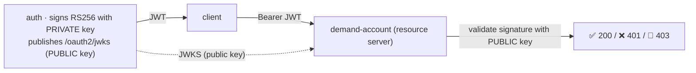
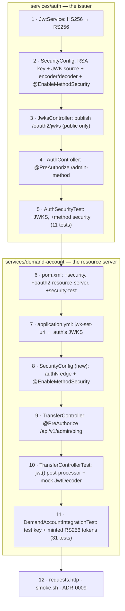

# Step 17 · Spring Security Deep II — Resource Servers, RS256/JWKS, Method Security & Modern Auth
### Phase C — Web, APIs & Application Security 🔵 · Step 17 of 67

> *Step 16 built the auth service with an HMAC secret — fine when one service both issues and validates. Now
> the **money** service must trust those tokens too, and a shared secret means any service could forge them.
> This step fixes that: **asymmetric (RS256) signing + a published JWKS**, demand-account becomes an **OAuth2
> resource server**, fine-grained **method security**, and a grounded tour of **MFA, passkeys & step-up**.*

---

<a id="toc"></a>
## 🧭 The Six Movements of This Step

| | Movement | What happens | ~time |
|---|---|---|---|
| **A** | [🧭 Orient](#orient) | 30-second overview · skip-test · cheat card · why it matters · before you start | ~1h |
| **B** | [🧠 Understand](#understand) | asymmetric signing & JWKS · resource servers · method security · MFA/step-up | ~3h |
| **C** | [🛠️ Build](#build) | auth → RS256 + JWKS + method security · demand-account → resource server + @PreAuthorize | ~12h |
| **D** | [🔬 Prove](#prove) | the Verification Log — cross-service JWKS validation live, 401/403/201, §12.3 mutation | ~3h |
| **E** | [🎓 Apply](#apply) | go deeper · interview prep · your-turn challenges | ~2h |
| **F** | [🏆 Review](#review) | troubleshooting · resources · recap, flashcards & what's next | ~1h |

---

<a id="orient"></a>

# A · 🧭 Orient

## 📋 This Step in 30 Seconds

| | |
|---|---|
| **Title** | Spring Security deep II — OAuth2 resource servers, RS256 + JWKS, method security, and modern auth (MFA/passkeys/step-up) |
| **Step** | 17 of 67 · **Phase C — Web, APIs & Application Security** 🔵 |
| **Effort** | ≈ 22 hours focused (a big one — two services + cross-service trust). The payoff: you can secure a *fleet* of services with one identity provider, the right way. Experienced learners can skim to ~5h. |
| **What you'll run this step** | **JVM + Maven**; **🐳 Docker** for demand-account's Testcontainers tests (auth needs neither). One command: `./mvnw -pl services/auth,services/demand-account -am verify`. Live cross-service demo runs auth + demand-account. |
| **Buildable artifact** | **auth**: switch HMAC→**RS256**, publish **JWKS** at `/oauth2/jwks`, add `@EnableMethodSecurity` + a `@PreAuthorize` endpoint (11 tests). **demand-account**: becomes an **OAuth2 resource server** (validates auth's JWTs via `jwk-set-uri`), secures the money endpoints, adds `@PreAuthorize` method security (31 tests). `step-17-start == step-16-end`. |
| **Verification tier** | 🔴 **Full** — security path across two services + build changes. `./mvnw verify` green + the cross-service JWKS validation proven **live** (401 without a token, 201 with auth's token) + method-security 403/200 + the **§12.3 mutation** (open the rule → 401 test fails → revert) + clean-room + `smoke.sh`. |
| **Depends on** | **[Step 16](../step-16/lesson.md)** (the auth service, filter chain, JWT), **[Step 12](../step-12/lesson.md)** (the money endpoints we now secure), **[Step 15](../step-15/lesson.md)** (the gateway — identity propagation). **+ Docker.** |

By the end you will be able to explain **asymmetric JWT signing + JWKS** and why it beats a shared secret across services; turn a service into an **OAuth2 resource server** validating another's tokens; apply **method security** (`@PreAuthorize`); and explain **MFA, passkeys (WebAuthn), and step-up** auth.

### ⏭️ Can You Skip This Step? (5-minute self-check)

If you can confidently do **all** of this, skim the 🧩 Pattern Spotlight and jump to **[Step 18 — Secure coding & threat modeling](../step-18/lesson.md)**.

- [ ] I can explain **HMAC vs asymmetric (RS256)** JWT signing and why multiple validators need **JWKS** (public-key validation).
- [ ] I can make a service an **OAuth2 resource server** (`jwk-set-uri`) that validates another service's tokens.
- [ ] I can use **method security** (`@EnableMethodSecurity` + `@PreAuthorize`) and say when to use it vs URL rules.
- [ ] I can explain **identity propagation** through a gateway, and the **token-revocation** problem (short-lived + refresh).
- [ ] I can explain **MFA**, **passkeys/WebAuthn**, and **step-up** auth at a conceptual level.

> [!TIP]
> Not 100%? Stay. "How do services validate each other's tokens?", "symmetric vs asymmetric JWT?", "URL rules vs @PreAuthorize?", and "what are passkeys / step-up?" are the security questions that separate mid from senior — and you'll have built the cross-service trust for real.

## 📇 Cheat Card

> **What this step delivers (one sentence):** the auth service signs RS256 and publishes a JWKS; the money service becomes an OAuth2 resource server that validates auth's tokens with the *public* key (never the secret), enforces roles via URL rules + `@PreAuthorize` method security — proven by a live cross-service flow (401 without a token, 201 with one).

**Key commands** (Windows uses `.\mvnw.cmd`):

```bash
# Build + test both services (auth 11, demand-account 31):
./mvnw -pl services/auth,services/demand-account -am verify

# Live cross-service: auth (8083) + demand-account (8082, validating via auth's JWKS)
./mvnw -pl services/auth spring-boot:run
docker compose -f services/demand-account/compose.yaml up -d
SPRING_DATASOURCE_URL=jdbc:postgresql://localhost:5433/demand_account \
  AUTH_JWKS_URI=http://localhost:8083/oauth2/jwks ./mvnw -pl services/demand-account spring-boot:run
TOKEN=$(curl -s -X POST localhost:8083/api/auth/login -H 'Content-Type: application/json' -d '{"username":"alice","password":"password"}' | sed -E 's/.*"token":"([^"]+)".*/\1/')
curl -i localhost:8082/api/accounts -X POST -H "Authorization: Bearer $TOKEN" -H 'Content-Type: application/json' -d '{"accountNumber":"ACC-A","currency":"USD","openingBalance":200.00}'

bash steps/step-17/smoke.sh
```

**The one headline idea — *the issuer signs with a private key and publishes the public key (JWKS); every service validates with the public key, so none can forge*:**



*Alt-text: the auth service signs JWTs with its private key and publishes the public key at /oauth2/jwks. A client gets a token and sends it as a Bearer token to demand-account (a resource server), which fetches the public key from auth's JWKS and validates the signature — returning 200 (valid + authorized), 401 (no/invalid token), or 403 (wrong role).*

## 🎯 Why This Matters

The moment you have more than one service, "who can validate a token?" becomes the central security question. A shared HMAC secret means every service that *checks* tokens could also *forge* them — one compromised service forges admin tokens for all. **Asymmetric signing + JWKS** fixes this: only the issuer can mint; everyone else can verify. This is how Google, Auth0, Keycloak, and every real OAuth2/OIDC system works, and "symmetric vs asymmetric JWT / how does a resource server validate?" is a senior-interview staple. After this step the bank's money service trusts the bank's identity provider — cryptographically, without sharing a secret.

## ✅ What You'll Be Able to Do

- **Sign asymmetrically + publish JWKS** — RS256, a `/oauth2/jwks` endpoint, key rotation awareness.
- **Build a resource server** — validate another service's tokens via `jwk-set-uri`; secure endpoints.
- **Apply method security** — `@PreAuthorize` for fine-grained, domain-level authorization (vs URL rules).
- **Reason about modern auth** — identity propagation, token revocation, MFA, passkeys/WebAuthn, step-up.

## 🧰 Before You Start

**Prerequisites**

- ✅ You finished **Step 16**; the repo is at `step-17-start` (== `step-16-end`) and `./mvnw verify` is green.
- ✅ **Docker is running** (demand-account's tests use Testcontainers).

**What you already learned that connects here**

- **Step 16**: the auth service, the filter chain, JWT/BCrypt — we upgrade the signing and add a second validator.
- **Step 12/14**: the money endpoints (transfers, idempotency) — now they require a token.
- **Step 15**: the gateway — where edge auth and identity propagation live.
- **Step 14**: HMAC signatures (webhooks) — RS256 is the asymmetric cousin.

> **Depends on: Steps 16, 12, 15.** Second of the two security deep-dives.

## 🗓️ Session Plan

≈22 hours is not one sitting. Nine sittings of ~2–3h, each ending at a commit or a natural boundary — stop at the end of any row and you lose nothing:

| # | Sitting | Covers | ~time | Ends at |
|---|---|---|---|---|
| S1 | Read the map | A · Orient + B · Understand (Big Idea → Pattern Spotlight) | ~2.5h | Pattern-Spotlight ❓ quick check answered |
| S2 | Finish the theory | B · Understand (Under the Hood → Thread-safety note) + 📦 Your Starting Point | ~1.5h | `./mvnw -q verify` green at `step-17-start` |
| S3 | Issuer goes asymmetric | Sub-steps 1–3 (RS256 header → RSA keys & beans → JWKS endpoint) | ~2.75h | sub-step 3 ✋ — `GET /oauth2/jwks` returns 200, committed |
| S4 | auth method security + proof | Sub-steps 4–5 (`@PreAuthorize` `/admin-method` → auth tests) | ~2.25h | sub-step 5 ✋ — auth **11** tests green, committed |
| S5 | Resource-server wiring | Sub-steps 6–8 (deps → `jwk-set-uri` → demand-account `SecurityConfig`) | ~2h | sub-step 8 ✋ — money endpoints gated, committed |
| S6 | Method security + slice tests | Sub-steps 9–10 (`/api/v1/admin/ping` → `jwt()` slice tests) | ~2.25h | sub-step 10 ✋ — slice security tests green, committed |
| S7 | Integration + harness | Sub-steps 11–12 (minted RS256 tokens → requests.http / smoke.sh / ADR-0009) | ~2.75h | sub-step 12 ✋ — `smoke.sh` PASSED, `step-17-end` tagged |
| S8 | Prove it live | 🎮 Play With It + live cross-service run + D · 🔬 Verification Log | ~3h | ✅ Definition of Done all checked |
| S9 | Lock it in | E · Apply (go deeper · interview prep · your turn) + F · Review (flashcards) | ~3h | 🃏 flashcards + one-line reflection done |

**Optional routes:** the ⏭️ skip-test (5 min) can shrink this to a ~5h skim for experienced learners; the four 🚀 Go Deeper asides are +~10 min each; 🏋️ Your Turn stretch challenges 4–5 are +1–2h each.

---

<a id="understand"></a>

# B · 🧠 Understand

## 🧠 The Big Idea

**Asymmetric signing + JWKS.** A JWT's signature proves it came from the issuer. With **HMAC (HS256)** there's one shared secret used to both sign *and* verify — so every verifier could also forge. With **asymmetric (RS256)** there are two keys: a **private** key (only the issuer has it; it *signs*) and a **public** key (anyone can have it; it *verifies*). The issuer publishes its public key(s) as a **JWKS** (JSON Web Key Set) at a well-known URL; verifiers fetch it and check signatures. Now only the issuer can mint tokens; resource servers can verify but never forge — least privilege, and it scales to any number of services.

**Resource server.** A service that protects its endpoints by **validating Bearer JWTs** on each request — no session, no login UI; it just trusts tokens from a configured issuer. In Spring you point `spring.security.oauth2.resourceserver.jwt.jwk-set-uri` at the issuer's JWKS; Boot builds a `JwtDecoder` that validates the signature (against the fetched public key) and the expiry, and populates the `Authentication`. demand-account becomes one.

**Authorization: URL rules vs method security.** Coarse, path-level rules (`authorizeHttpRequests().requestMatchers("/api/**").authenticated()`) secure the HTTP edge. **Method security** (`@EnableMethodSecurity` + `@PreAuthorize("hasRole('ADMIN')")`) expresses *fine-grained, domain-level* rules right on the method — reusable from any caller, closer to the business logic. Real systems use both: a coarse edge gate plus precise method rules.

**Modern auth (the "taste").** **MFA** (multi-factor) adds a second factor (something you have/are) beyond the password (something you know). **Passkeys/WebAuthn** are phishing-resistant public-key credentials bound to the device (your fingerprint/Face ID unlocks a private key that signs a challenge — no password to steal). **Step-up auth** requires a *stronger/fresh* factor for sensitive operations (e.g. re-verify before a large transfer) even when already logged in — Spring Security 7 models the factors used (`FACTOR_*` authorities) so you can require them.

> **Analogy — the bank's ID system.** **HMAC** is a rubber stamp every branch owns: any branch can stamp a document *and* check it — but a rogue branch can forge any stamp. **RS256 + JWKS** is a **wax seal**: head office has the unique signet ring (private key) and mails every branch a *photo* of the seal (the public key, via JWKS). Branches can verify a seal is genuine but cannot make one. A **resource server** is a branch that won't act on a letter without checking the seal. **Method security** is "this specific vault action needs a manager's countersignature." **Step-up** is "for a large withdrawal, swipe your card again *now*, even though you're already inside."

```mermaid
sequenceDiagram
    participant C as Client
    participant Auth as auth (issuer)
    participant DA as demand-account (resource server)
    C->>Auth: POST /login (password)
    Auth->>Auth: sign JWT with PRIVATE key (RS256)
    Auth-->>C: token
    C->>DA: POST /api/transfers  Authorization: Bearer <token>
    DA->>Auth: GET /oauth2/jwks (fetch PUBLIC key, cached)
    DA->>DA: validate signature + expiry; map roles
    alt valid + authorized
        DA-->>C: 200/201
    else no token → 401 · wrong role → 403
        DA-->>C: 401 / 403
    end
```

*Alt-text: a client logs in to auth, which signs a JWT with its private key (RS256) and returns it. The client calls demand-account with the Bearer token; demand-account fetches auth's public key from /oauth2/jwks (cached), validates the signature and expiry, maps roles, and returns 200/201 if valid and authorized, 401 if no/invalid token, or 403 if the role is insufficient.*

## 🧩 Pattern Spotlight — JWKS-based Resource Server (decentralized token validation)

> **Problem.** Many services must independently decide whether a request is authenticated — without calling back to the auth service on every request (a bottleneck + coupling), and without sharing a signing secret (forgery risk).

> **Why JWKS fits.** The issuer publishes its **public** keys at a JWKS endpoint. Each resource server fetches and **caches** them, then validates token signatures locally — no per-request call to auth, no secret to leak. Key **rotation** is built in: JWKS can list multiple keys, and tokens carry a `kid` (key id) so verifiers pick the right one; the issuer can introduce a new key, sign with it, and retire the old once tokens expire.

> **How it works (the mechanism).** `jwk-set-uri` → Boot's `NimbusJwtDecoder` fetches the JWKS (lazily, cached, refreshed on unknown `kid`), and per request validates the JWS signature with the matching public key plus standard claims (`exp`, optionally `iss`/`aud`). Authorities come from a claim (our `roles`) via a converter.

> **Alternatives / trade-offs.** **Shared HMAC secret** (Step 16): simplest, but every validator can forge — only OK within one service. **Token introspection** (call the issuer's `/introspect` per token): supports instant revocation, but adds a network hop and couples to the issuer (opaque tokens). **JWKS + self-contained JWT**: fast, decentralized, scales — at the cost of harder revocation (mitigate with short lifetimes + refresh tokens). For a microservices fleet, JWKS is the standard.

> **Implementation (here).** auth publishes `/oauth2/jwks` (RS256 public key); demand-account sets `jwk-set-uri` to it and `oauth2ResourceServer(jwt(...))`. Proven live: demand-account accepted an auth-minted token (201) and rejected an unauthenticated one (401).

❓ **Quick check:** an attacker fully compromises demand-account and dumps everything it holds. Can they now forge admin tokens the rest of the fleet would accept — and why (not)? <details><summary>answer</summary>No — demand-account only ever holds auth's <em>public</em> key (fetched from the JWKS), which can verify signatures but not create them. Only auth's private key can mint tokens. With a shared HMAC secret the answer would be yes — that's exactly the forgery risk RS256 + JWKS removes.</details>

## 🌱 Under the Hood: How It Really Works

**Generating & using the RSA key (auth).** A `RSAKey` (Nimbus) is generated at startup; `NimbusJwtEncoder` signs over an `ImmutableJWKSet` of it, and the `JwsHeader` declares `RS256`. The `/oauth2/jwks` controller returns `new JWKSet(rsaKey.toPublicJWK()).toJSONObject()` — **public** material only (`kty`, `kid`, `n`, `e`; never the private exponent `d`). *Production note:* generating at startup is ephemeral (a restart rotates the key, invalidating live tokens); real systems load a persisted key from a keystore/Vault (Phase H) and rotate deliberately — JWKS' multi-key support makes rollover seamless.

**Validating (demand-account, the resource server).** With `spring.security.oauth2.resourceserver.jwt.jwk-set-uri` set, Boot auto-configures a `JwtDecoder` that **lazily** fetches the JWKS on first use (so the service boots even if auth is down) and **caches** it. Per request, the `BearerTokenAuthenticationFilter` extracts the token, the decoder validates signature + `exp`, and our `JwtAuthenticationConverter` maps the `roles` claim to authorities. No session, no callback to auth per request.

**URL rules vs `@PreAuthorize` (and a blast-radius lesson).** We secure the HTTP edge with `authorizeHttpRequests` (`/api/**` → authenticated; health + docs → permitAll) and demonstrate **method security** (`@EnableMethodSecurity` + `@PreAuthorize("hasRole('ADMIN')")`) on a narrow admin endpoint. We deliberately **did not** put `@PreAuthorize` on the core transfer *service* methods: method security wraps the bean with an AOP proxy and applies to **direct** calls too — which would force a security context into the dozens of service-level unit tests that call `transfer(...)` directly. Keeping authorization at the edge (URL rules) + a narrow method-security demo means only the **HTTP-layer tests** needed tokens, not the service tests. (A real system *would* use method security on services — and accept setting up the security context in those tests.)

❓ **Quick check:** you add `@PreAuthorize("hasRole('ADMIN')")` to `TransferService.transfer(...)`. Which tests break, and why? <details><summary>answer</summary>Every service-level unit test that calls <code>transfer(...)</code> directly — method security wraps the bean in an AOP proxy that checks the SecurityContext on <em>any</em> invocation, not just HTTP ones. With no <code>Authentication</code> on the test thread, it throws <code>AccessDeniedException</code>.</details>

**Testing security without committing keys.** Controller slice (`@WebMvcTest`): `spring-security-test`'s `jwt()` request post-processor injects the `Authentication` directly (no real decoding) — but the slice needs `@EnableWebSecurity` on the config to get an `HttpSecurity` bean, and a mock `JwtDecoder`. Integration test (`@SpringBootTest`, real HTTP): a `@TestConfiguration` supplies a `JwtDecoder` from a **test** RSA public key (overriding the production `jwk-set-uri`), and the test **mints** RS256 tokens with the matching private key. No private key is committed; the real auth↔demand-account JWKS interop is proven by a **live** run instead (🔬).

**Identity propagation.** The gateway (Step 15) forwards the `Authorization` header to downstreams by default, so a token presented at the edge reaches the services unchanged — they validate it independently. (Hardening: the gateway should *strip* any inbound headers it sets itself so clients can't spoof identity; full identity propagation + mTLS between services is Step 41/43.)

**Token revocation.** A self-contained JWT is valid until `exp` — you can't easily revoke it mid-life (no per-request lookup). Standard mitigations: **short** access-token lifetimes (minutes) + a longer-lived, revocable **refresh token** to mint new ones (the frontend flow, Step 32), and/or a denylist of revoked `jti`s (reintroduces some state). Rotating the signing key (JWKS) invalidates everything signed with the old key.

## 🛡️ Security Lens: What Could Go Wrong

- **Shared signing secret = fleet-wide forgery.** If services validate with a shared HMAC secret, one compromised service can forge tokens (including admin) accepted everywhere. Asymmetric + JWKS removes that: validators hold only the public key.
- **Algorithm confusion attack.** A classic JWT exploit: an attacker takes an RS256 setup and submits an `HS256` token using the *public* key as the HMAC secret. Pinning the expected algorithm on the decoder (Spring's resource server validates against the JWKS key type) defends against it — never let the token dictate the algorithm.
- **`alg: none` / unverified tokens.** Always validate the signature; never accept `none`. Spring's `JwtDecoder` does this for you — don't hand-parse tokens and trust claims.
- **Leaking private key / no rotation.** The signing private key is the crown jewel — keystore/Vault, never in git, rotate it (Phase H). JWKS makes rotation safe (publish new + old, retire old after expiry).
- **Over-broad tokens & no revocation.** Long-lived, widely-scoped tokens are dangerous if stolen. Short lifetimes, least-privilege scopes/roles, refresh tokens, and step-up for sensitive actions limit blast radius.

❓ **Quick check:** a token arrives at demand-account with header `alg: HS256`, HMAC-signed using auth's *public* key as the secret. Does it validate? <details><summary>answer</summary>No — Spring's <code>NimbusJwtDecoder</code> derives the acceptable algorithm from the JWKS key type (RSA), so an HS256 token simply doesn't match and the request gets 401. Trusting the token's own <code>alg</code> header is the classic <em>algorithm-confusion</em> vulnerability.</details>

## 🕰️ Then vs. Now (How This Changed Across Versions)

| Topic | Then | Now | Why it changed |
|---|---|---|---|
| **Cross-service token validation** | Shared secret, or call the auth server per request (introspection). | **JWKS** — fetch the issuer's public keys, validate locally. | Decentralized, fast, no shared secret; the OAuth2/OIDC standard. |
| **Signing** | HMAC (HS256) symmetric. | **RS256/ES256** asymmetric for multi-validator setups. | Validators can verify but not forge (least privilege). |
| **Method security** | `@Secured` / `@EnableGlobalMethodSecurity`. | **`@EnableMethodSecurity`** + `@PreAuthorize` (SpEL). | Cleaner, SpEL-powered, on by default for `@PreAuthorize`. |
| **Auth factors / passwordless** | Password + maybe SMS OTP. | **Passkeys/WebAuthn** (phishing-resistant, public-key); Spring Security 7 models **factors** for step-up. | Passwords are the weak link; passkeys + step-up are the modern direction. |

> [!NOTE]
> *Verify, don't guess.* We're on **Spring Security 7 / Boot 4** — verified RS256 signing, the `/oauth2/jwks` endpoint, the resource-server `jwk-set-uri` validation, and `@EnableMethodSecurity`/`@PreAuthorize` all **work**, including a **live cross-service** validation (auth's token accepted by demand-account, 🔬). WebAuthn has a Spring Security DSL (`webAuthn()`), but the full passkey ceremony needs the **frontend** (Phase F) — taught here as a concept, not faked.

## 🧵 Thread-safety note

The security components are **stateless singletons** safe across request threads: the `JwtDecoder` (its JWKS cache is internally synchronized), the RSA key, and the filter chain hold no per-request mutable state. Per-request identity lives in the `SecurityContextHolder` (a `ThreadLocal`, cleared after each request), so concurrent requests never see each other's `Authentication`. `@PreAuthorize` is evaluated per invocation against that thread's context. Same Step-11 rule: stateless singletons + confine per-request state.

↩️ **Stopping here?** You have the theory — RS256/JWKS, resource servers, URL vs method security, MFA/passkeys/step-up. Next: C · 🛠️ Build (📦 Your Starting Point); first action: `./mvnw -q verify` at `step-17-start`.

---

<a id="build"></a>

# C · 🛠️ Build

## 📦 Your Starting Point

You're at **`step-17-start`** (== `step-16-end`). Here's exactly what's green and what you'll build:

| | State at `step-17-start` | After this step |
|---|---|---|
| **auth** signing | HMAC (HS256) — a shared `bank.jwt.secret` signs **and** validates | **RS256** — private key signs, public key (JWKS) validates |
| **auth** JWKS | none | `GET /oauth2/jwks` publishes the public key |
| **auth** method security | none (URL rules only) | `@EnableMethodSecurity` + a `@PreAuthorize` endpoint |
| **demand-account** | **unsecured** — anyone can move money | OAuth2 **resource server**; `/api/**` needs a token |
| **demand-account** method security | none | `@PreAuthorize` admin endpoint |

Confirm the start builds before you touch anything:

```bash
./mvnw -q verify   # green, 9 modules, from Step 16
```

✅ **Expected:** `BUILD SUCCESS`. The auth service's `AuthSecurityTest` (Step 16) proves 401/403/200 over real HTTP with **HS256** tokens; demand-account's tests pass **without any token**. By the end of this step those demand-account tests will *require* a token, and auth will sign **RS256**.

> 🧭 **You are here:** Step 16 gave the bank an identity provider. Step 17 makes a *second* service trust it — the first time the bank's services authenticate each other.

## 🛠️ Let's Build It — Step by Step



*Alt-text: twelve build sub-steps. First five are in the auth service (RS256 signing, RSA key + beans + method security, JWKS endpoint, @PreAuthorize endpoint, tests). Next six are in demand-account (resource-server deps, jwk-set-uri config, SecurityConfig, @PreAuthorize endpoint, slice tests, integration tests). The last wires the play/verify harness and the ADR.*

🌳 **Files we'll touch:**
```
services/auth/
├── src/main/java/com/buildabank/auth/
│   ├── security/JwtService.java            (edit · HS256 → RS256 header)
│   ├── security/SecurityConfig.java        (edit · RSA key, JWK beans, @EnableMethodSecurity)
│   └── web/JwksController.java             (NEW · GET /oauth2/jwks)
│   └── web/AuthController.java             (edit · +@PreAuthorize /admin-method)
└── src/test/java/com/buildabank/auth/
    └── AuthSecurityTest.java               (edit · +jwks, +method-security tests → 11)
services/demand-account/
├── pom.xml                                 (edit · +3 deps)
├── src/main/resources/application.yml      (edit · +jwk-set-uri)
├── src/main/java/com/buildabank/account/web/
│   ├── SecurityConfig.java                 (NEW · resource server + method security)
│   └── TransferController.java             (edit · +@PreAuthorize /api/v1/admin/ping)
└── src/test/java/com/buildabank/account/
    ├── web/TransferControllerTest.java     (edit · jwt() post-processor → slice)
    └── DemandAccountIntegrationTest.java    (edit · test key + minted RS256 tokens → 31)
steps/step-17/{requests.http, smoke.sh} · adr/0009-asymmetric-jwt-resource-servers.md
```

---

### Sub-step 1 of 12 — auth: switch the signing algorithm HS256 → RS256 (~30 min) 🧭 *(you are here: **RS256 header** → keys → JWKS → method-sec → tests → resource server …)*

🎯 **Goal:** the auth service's token-minting code should declare **RS256** (asymmetric) in the JWT header instead of HS256 (symmetric). This is a one-line change in `JwtService`, but it's the conceptual pivot of the whole step: we're moving from "one shared secret" to "private signs / public verifies." Everything else this step exists to support it.

📁 **Location:** edit `services/auth/src/main/java/com/buildabank/auth/security/JwtService.java`

⌨️ **Code** — the change is the algorithm in the `JwsHeader` (before → after):
```diff
// services/auth/src/main/java/com/buildabank/auth/security/JwtService.java
-import org.springframework.security.oauth2.jose.jws.MacAlgorithm;
+import org.springframework.security.oauth2.jose.jws.SignatureAlgorithm;
 import org.springframework.security.oauth2.jwt.JwsHeader;
@@ public String issue(String username, List<String> roles) {
                 .subject(username)
                 .claim("roles", roles)
                 .build();
-        JwsHeader header = JwsHeader.with(MacAlgorithm.HS256).build();
+        JwsHeader header = JwsHeader.with(SignatureAlgorithm.RS256).build();   // asymmetric (Step 17)
         return jwtEncoder.encode(JwtEncoderParameters.from(header, claims)).getTokenValue();
     }
```

Here is the **whole file** as it stands at `step-17-end`, so you can confirm yours matches:
```java
// services/auth/src/main/java/com/buildabank/auth/security/JwtService.java
package com.buildabank.auth.security;

import java.time.Duration;
import java.time.Instant;
import java.util.List;

import org.springframework.beans.factory.annotation.Value;
import org.springframework.security.oauth2.jose.jws.SignatureAlgorithm;
import org.springframework.security.oauth2.jwt.JwsHeader;
import org.springframework.security.oauth2.jwt.JwtClaimsSet;
import org.springframework.security.oauth2.jwt.JwtEncoder;
import org.springframework.security.oauth2.jwt.JwtEncoderParameters;
import org.springframework.stereotype.Service;

/**
 * Issues signed JWTs. A JWT is three base64url parts — header, claims, signature — where the signature
 * (HMAC-SHA256 here) lets any holder of the secret verify the token wasn't tampered with. We put the
 * username in {@code sub}, the roles in a {@code roles} claim, and an expiry in {@code exp} so the token is
 * short-lived.
 */
@Service
public class JwtService {

    private final JwtEncoder jwtEncoder;
    private final long ttlMinutes;
    private final String issuer;

    public JwtService(JwtEncoder jwtEncoder,
                      @Value("${bank.jwt.ttl-minutes:30}") long ttlMinutes,
                      @Value("${bank.jwt.issuer:build-a-bank-auth}") String issuer) {
        this.jwtEncoder = jwtEncoder;
        this.ttlMinutes = ttlMinutes;
        this.issuer = issuer;
    }

    /** Mint a signed JWT for the user with their roles, valid for {@code ttlMinutes}. */
    public String issue(String username, List<String> roles) {
        Instant now = Instant.now();
        JwtClaimsSet claims = JwtClaimsSet.builder()
                .issuer(issuer)
                .issuedAt(now)
                .expiresAt(now.plus(Duration.ofMinutes(ttlMinutes)))
                .subject(username)
                .claim("roles", roles)
                .build();
        JwsHeader header = JwsHeader.with(SignatureAlgorithm.RS256).build();   // asymmetric (Step 17)
        return jwtEncoder.encode(JwtEncoderParameters.from(header, claims)).getTokenValue();
    }

    public long ttlSeconds() {
        return ttlMinutes * 60;
    }
}
```

🔍 **Line-by-line:**
- `import ...jose.jws.SignatureAlgorithm;` — **`SignatureAlgorithm`** is the enum of **asymmetric** JWS algorithms (`RS256`, `RS384`, `RS512`, `ES256`, …). We swap it in for `MacAlgorithm` (the **MAC/HMAC** family, symmetric — `HS256`, etc.). The import change is half the diff because the type changed.
- `JwsHeader.with(SignatureAlgorithm.RS256).build()` — **JWS** = JSON Web *Signature*. The `JwsHeader` is the JWT's first segment; `alg: RS256` tells any verifier "this was signed with RSA-SHA256, validate it with the matching RSA **public** key." `RS256` = RSASSA-PKCS1-v1_5 over SHA-256.
- The rest of the class is unchanged: it still builds the `JwtClaimsSet` (`iss`, `iat`, `exp`, `sub`, `roles`) and asks the **injected** `JwtEncoder` to sign. Crucially, `JwtService` doesn't know *which key* — it just declares the algorithm and delegates to the encoder bean. We swap that bean (private RSA key) in sub-step 2, so this class needs no other change.
- `ttlSeconds()` — unchanged; the login response reports the lifetime so clients know when to refresh.

💭 **Under the hood:** `jwtEncoder.encode(...)` resolves to `NimbusJwtEncoder`, which now (after sub-step 2) holds an `RSAKey`. It signs the `base64url(header).base64url(claims)` string with the **private** key and appends the signature as the third segment. The `alg` in the header and the key type must agree — declaring `RS256` while wiring an HMAC encoder would throw at encode time. That's why this sub-step and the next are a pair.

🔮 **Predict:** after *only* this change (before sub-step 2 rewires the beans), does the auth service still compile and run? <details><summary>answer</summary>It compiles, but it would **fail to start/encode**: the Step-16 `jwtEncoder` bean is still HMAC-backed, and asking it to produce an `RS256` header is a mismatch. We fix the beans next — treat sub-steps 1–2 as one unit.</details>

▶️ **Run & See:** don't run yet — the bean wiring in sub-step 2 must land first. (We'll run after sub-step 2.)

✋ **Checkpoint:** `JwtService` declares `SignatureAlgorithm.RS256`. The file compiles (`./mvnw -q -pl services/auth compile` succeeds even before the beans are swapped, because the encoder bean type — `JwtEncoder` — is unchanged).

💾 **Commit:** *(commit together with sub-step 2 — they're inseparable.)*

⚠️ **Pitfall:** mixing the families — `JwsHeader.with(MacAlgorithm.HS256)` with an RSA encoder, or vice versa — throws `JwtEncodingException: ... algorithm` at runtime, not compile time. Always change the header algorithm and the key/encoder together.

---

### Sub-step 2 of 12 — auth: generate an RSA key + the JWK source / encoder / decoder beans + turn on method security (~1.5h) 🧭 *(RS256 header ✅ → **keys & beans** → JWKS → …)*

🎯 **Goal:** replace the HMAC secret machinery with an **RSA key pair**: a `JWKSource` (private key, used only to sign), a `JwtEncoder` that signs with it, a `JwtDecoder` that validates with the public half, and a separate `publicJwkSet` bean exposing **only** the public key (for the JWKS endpoint in sub-step 3). We also add `@EnableMethodSecurity` so `@PreAuthorize` works (sub-step 4).

📁 **Location:** edit `services/auth/src/main/java/com/buildabank/auth/security/SecurityConfig.java`

⌨️ **Code** — the shape of the change (before → after, key hunks):
```diff
// services/auth/src/main/java/com/buildabank/auth/security/SecurityConfig.java
-import java.nio.charset.StandardCharsets;
-import javax.crypto.spec.SecretKeySpec;
-import org.springframework.beans.factory.annotation.Value;
+import java.util.UUID;
+import org.springframework.security.config.annotation.method.configuration.EnableMethodSecurity;
 ...
-import com.nimbusds.jose.jwk.source.ImmutableSecret;
+import com.nimbusds.jose.jwk.JWKSet;
+import com.nimbusds.jose.jwk.RSAKey;
+import com.nimbusds.jose.jwk.gen.RSAKeyGenerator;
+import com.nimbusds.jose.jwk.source.ImmutableJWKSet;
+import com.nimbusds.jose.jwk.source.JWKSource;
+import com.nimbusds.jose.proc.SecurityContext;

 @Configuration
+@EnableMethodSecurity   // turns on @PreAuthorize (method-level authorization)
 public class SecurityConfig {
-    private final byte[] secret;
-    private final MacAlgorithm macAlgorithm = MacAlgorithm.HS256;
-    public SecurityConfig(@Value("${bank.jwt.secret}") String secret) { ... }
+    private final RSAKey rsaKey = generateRsaKey();
 ...
-    JwtEncoder jwtEncoder() { return new NimbusJwtEncoder(new ImmutableSecret<>(secretKey())); }
-    JwtDecoder jwtDecoder() { return NimbusJwtDecoder.withSecretKey(secretKey())...build(); }
+    JWKSource<SecurityContext> jwkSource() { return new ImmutableJWKSet<>(new JWKSet(rsaKey)); }
+    JwtEncoder jwtEncoder(JWKSource<SecurityContext> s) { return new NimbusJwtEncoder(s); }
+    JwtDecoder jwtDecoder() { return NimbusJwtDecoder.withPublicKey(rsaKey.toRSAPublicKey()).build(); }
+    JWKSet publicJwkSet() { return new JWKSet(rsaKey.toPublicJWK()); }   // PUBLIC only
```

The **complete file** at `step-17-end`:
```java
// services/auth/src/main/java/com/buildabank/auth/security/SecurityConfig.java
package com.buildabank.auth.security;

import java.util.UUID;

import org.springframework.context.annotation.Bean;
import org.springframework.context.annotation.Configuration;
import org.springframework.security.config.Customizer;
import org.springframework.security.config.annotation.method.configuration.EnableMethodSecurity;
import org.springframework.security.config.annotation.web.builders.HttpSecurity;
import org.springframework.security.config.http.SessionCreationPolicy;
import org.springframework.security.crypto.bcrypt.BCryptPasswordEncoder;
import org.springframework.security.crypto.password.PasswordEncoder;
import org.springframework.security.oauth2.jwt.JwtDecoder;
import org.springframework.security.oauth2.jwt.JwtEncoder;
import org.springframework.security.oauth2.jwt.NimbusJwtDecoder;
import org.springframework.security.oauth2.jwt.NimbusJwtEncoder;
import org.springframework.security.oauth2.server.resource.authentication.JwtAuthenticationConverter;
import org.springframework.security.oauth2.server.resource.authentication.JwtGrantedAuthoritiesConverter;
import org.springframework.security.web.SecurityFilterChain;

import com.nimbusds.jose.jwk.JWKSet;
import com.nimbusds.jose.jwk.RSAKey;
import com.nimbusds.jose.jwk.gen.RSAKeyGenerator;
import com.nimbusds.jose.jwk.source.ImmutableJWKSet;
import com.nimbusds.jose.jwk.source.JWKSource;
import com.nimbusds.jose.proc.SecurityContext;

/**
 * Step 17 hardens Step 16's security: <strong>asymmetric (RS256) signing</strong> with a published
 * <strong>JWKS</strong>, plus <strong>method security</strong> ({@code @EnableMethodSecurity}).
 *
 * <p>Why asymmetric? With the Step-16 HMAC secret, every validator also held the secret and could forge
 * tokens. Now the auth service signs with a <strong>private</strong> RSA key and publishes the matching
 * <strong>public</strong> key at {@code /oauth2/jwks} — so other services (demand-account, Step 17) can
 * validate tokens with the public key but cannot mint them (least privilege). The key pair is generated at
 * startup (ephemeral; validators fetch the current key from JWKS — production would persist/rotate it via
 * a keystore/Vault, Phase H).
 */
@Configuration
@EnableMethodSecurity   // turns on @PreAuthorize (method-level authorization), used in AuthController
public class SecurityConfig {

    private final RSAKey rsaKey = generateRsaKey();

    private static RSAKey generateRsaKey() {
        try {
            return new RSAKeyGenerator(2048).keyID(UUID.randomUUID().toString()).generate();
        } catch (Exception e) {
            throw new IllegalStateException("failed to generate RSA key", e);
        }
    }

    @Bean
    SecurityFilterChain filterChain(HttpSecurity http) throws Exception {
        http
                .csrf(csrf -> csrf.disable())                                          // stateless token API
                .sessionManagement(s -> s.sessionCreationPolicy(SessionCreationPolicy.STATELESS))
                .cors(Customizer.withDefaults())
                .authorizeHttpRequests(authorize -> authorize
                        // public: login, health, and the JWKS so resource servers can fetch the public key
                        .requestMatchers("/api/auth/login", "/actuator/health", "/oauth2/jwks").permitAll()
                        .requestMatchers("/api/auth/admin").hasRole("ADMIN")           // URL-based authZ
                        .anyRequest().authenticated())                                 // everything else: authN
                .oauth2ResourceServer(oauth2 -> oauth2.jwt(jwt -> jwt.jwtAuthenticationConverter(jwtAuthConverter())));
        return http.build();
    }

    @Bean
    PasswordEncoder passwordEncoder() {
        return new BCryptPasswordEncoder();
    }

    /** The signing key pair, as a JWK source (private key included — used only to SIGN). */
    @Bean
    JWKSource<SecurityContext> jwkSource() {
        return new ImmutableJWKSet<>(new JWKSet(rsaKey));
    }

    /** Signs JWTs with the RSA private key (RS256). */
    @Bean
    JwtEncoder jwtEncoder(JWKSource<SecurityContext> jwkSource) {
        return new NimbusJwtEncoder(jwkSource);
    }

    /** Validates JWTs with the RSA public key (this service validates its own tokens too). */
    @Bean
    JwtDecoder jwtDecoder() {
        try {
            return NimbusJwtDecoder.withPublicKey(rsaKey.toRSAPublicKey()).build();
        } catch (Exception e) {
            throw new IllegalStateException("failed to build JwtDecoder", e);
        }
    }

    /** The PUBLIC half only — what we publish at /oauth2/jwks (no private key material). */
    @Bean
    JWKSet publicJwkSet() {
        return new JWKSet(rsaKey.toPublicJWK());
    }

    /** Maps the token's {@code roles} claim (already like "ROLE_USER") straight to granted authorities. */
    private JwtAuthenticationConverter jwtAuthConverter() {
        JwtGrantedAuthoritiesConverter authorities = new JwtGrantedAuthoritiesConverter();
        authorities.setAuthoritiesClaimName("roles");
        authorities.setAuthorityPrefix("");   // the claim already carries the ROLE_ prefix
        JwtAuthenticationConverter converter = new JwtAuthenticationConverter();
        converter.setJwtGrantedAuthoritiesConverter(authorities);
        return converter;
    }
}
```

🔍 **Line-by-line (the new pieces):**
- `private final RSAKey rsaKey = generateRsaKey();` — one key pair for the whole app, created **once** at construction. `RSAKey` (Nimbus) holds both the private and public halves plus a `kid` (key id).
- `new RSAKeyGenerator(2048).keyID(UUID.randomUUID().toString()).generate()` — generate a **2048-bit** RSA key (the floor for security today) and tag it with a random `kid`. The `kid` ends up in every token's header and in the JWKS, so verifiers can match token → key (rotation-ready). `generate()` declares a checked exception, so we wrap it.
- `@EnableMethodSecurity` — class-level annotation that registers the AOP infrastructure for `@PreAuthorize`/`@PostAuthorize`. Without it, those annotations are silently inert.
- **`jwkSource()`** → `ImmutableJWKSet<>(new JWKSet(rsaKey))` — a `JWKSource` is "where Nimbus finds keys to sign with." We hand it the **full** key (private included) — but this bean is used **only** by the encoder, never serialized to clients.
- **`jwtEncoder(JWKSource ...)`** → `new NimbusJwtEncoder(jwkSource)` — Spring injects the `jwkSource` bean; the encoder signs with its private key. This is the bean `JwtService` (sub-step 1) calls.
- **`jwtDecoder()`** → `NimbusJwtDecoder.withPublicKey(rsaKey.toRSAPublicKey()).build()` — auth validates **its own** tokens (e.g. `/me`, `/admin`) with the **public** key. `toRSAPublicKey()` extracts just the public half.
- **`publicJwkSet()`** → `new JWKSet(rsaKey.toPublicJWK())` — `toPublicJWK()` strips the private material, leaving a key with only `kty`, `kid`, `n` (modulus), `e` (exponent). This is the bean the JWKS controller (next sub-step) serializes. **This is the safety boundary**: the endpoint depends on `publicJwkSet`, not `jwkSource`, so the private key can never leak through the controller.
- The **filter chain** is mostly Step-16: CSRF off (stateless Bearer API), `STATELESS` sessions, CORS defaults. The one change you'll spot: `/oauth2/jwks` is added to the `permitAll()` list — resource servers must fetch the public key **without** a token.
- `jwtAuthConverter()` — unchanged from Step 16: reads the `roles` claim (already `ROLE_*`) into authorities with an empty prefix.

💭 **Under the hood:** Spring instantiates `SecurityConfig` once; the `rsaKey` field is created in the constructor, so all four key-related beans share the *same* key pair. Because the key is generated at startup, **a restart produces a new key** — every token signed before the restart fails validation afterward (a deliberate trade-off; production persists the key — Phase H). The `@Bean` methods are proxied (`proxyBeanMethods=true` by default), so `jwkSource()` returns the singleton even if called multiple times.

🔮 **Predict:** the JWKS endpoint (next sub-step) serializes the `publicJwkSet` bean. Will the JSON include the RSA private exponent `"d"`? <details><summary>answer</summary>No. `toPublicJWK()` removes `d` (and the primes `p`/`q`). The test `jwksEndpointPublishesPublicKeyOnly` asserts `"d"`, `"p"`, `"q"` are all absent.</details>

▶️ **Run & See** — now that sub-steps 1+2 are both in, the auth service starts and signs RS256:
```bash
./mvnw -pl services/auth spring-boot:run      # starts auth on port 8083
# in a second terminal:
curl -s localhost:8083/oauth2/jwks
```
✅ **Expected output** (a real run today — your `kid` and `n` will differ, every restart regenerates the key):
```json
{"keys":[{"kty":"RSA","e":"AQAB","kid":"3d938754-8a87-4029-80bd-669c1f5c56bb","n":"3jvz2IxJAHuwp37hKoesKxdWQnvu8rf7Xl4i_J1cpZrL3G8B7qvmbbw4HEJihUTnV6zt7mXbKS9bEiHgSuOoe0d9Xn4QCOR53k6v38R_kC0Bv5btqWSbS2rC2DdA607yXnceaaScspXKfi6AMC454HkR69Y8cSt1TwtjL_CeudINXtGVdz9xKTpl7EGjgG0fV-ScyJ53fhEVzZz4o6zJEYG34M5MV-FPLT7E3K7ixWfDtI5AUbs0Ec8Wq9A7Ch-8qLo8mFoRiySBwLYA4VH0OHb8NwANrNzDY6IitvpvkvcfKRRJW_kN8PQCfe1Jx_ZffGyhVl-BpAelQcQKrS5NvQ"}]}
```
Note: `"kty":"RSA"`, `"e":"AQAB"` (the standard 65537 exponent), a `kid`, and `n` (modulus) — and **no `"d"`/`"p"`/`"q"`**. Public material only.

✋ **Checkpoint:** auth starts cleanly and serves a public JWKS. Stop it (`Ctrl-C`) before the next sub-steps, or leave it running for sub-step 3's check.

💾 **Commit:** *(sub-steps 1+2 together)*
```bash
git add services/auth/src/main/java/com/buildabank/auth/security
git commit -m "feat(auth): asymmetric RS256 signing — RSA key + JWK source/encoder/decoder, @EnableMethodSecurity"
```

⚠️ **Pitfall:** exposing `jwkSource()` (the full key) at the endpoint instead of `publicJwkSet()` would publish your **private** signing key — game over. The two-bean split (`jwkSource` for signing, `publicJwkSet` for publishing) is exactly so this mistake is hard to make.

---

### Sub-step 3 of 12 — auth: publish the JWKS endpoint (~45 min) 🧭 *(keys & beans ✅ → **JWKS endpoint** → method-sec → tests …)*

🎯 **Goal:** expose the public key at the well-known path `GET /oauth2/jwks` so resource servers can fetch it. This is the endpoint demand-account will point its `jwk-set-uri` at.

📁 **Location:** new file → `services/auth/src/main/java/com/buildabank/auth/web/JwksController.java`

⌨️ **Code** (complete, new file):
```java
// services/auth/src/main/java/com/buildabank/auth/web/JwksController.java
package com.buildabank.auth.web;

import java.util.Map;

import org.springframework.web.bind.annotation.GetMapping;
import org.springframework.web.bind.annotation.RestController;

import com.nimbusds.jose.jwk.JWKSet;

/**
 * Publishes the <strong>JWKS</strong> (JSON Web Key Set) — the auth service's <em>public</em> signing key(s)
 * — at {@code /oauth2/jwks}. Resource servers (e.g. demand-account in Step 17) point their
 * {@code jwk-set-uri} here to fetch the public key and validate tokens, without ever holding the private key.
 * Only public key material is exposed (never the private key).
 */
@RestController
public class JwksController {

    private final JWKSet publicJwkSet;

    public JwksController(JWKSet publicJwkSet) {
        this.publicJwkSet = publicJwkSet;
    }

    @GetMapping("/oauth2/jwks")
    public Map<String, Object> jwks() {
        return publicJwkSet.toJSONObject();   // { "keys": [ { "kty":"RSA", "kid":..., "n":..., "e":"AQAB" } ] }
    }
}
```

🔍 **Line-by-line:**
- `@RestController` — a controller whose return values are serialized **straight to the HTTP body** as JSON (it's `@Controller` + `@ResponseBody`).
- `public JwksController(JWKSet publicJwkSet)` — **constructor injection** of the `publicJwkSet` bean from sub-step 2. Spring has exactly one `JWKSet` bean (the public one), so no qualifier is needed. We hold it in a `final` field (immutable, thread-safe).
- `@GetMapping("/oauth2/jwks")` — maps `GET /oauth2/jwks`. The path mirrors the OAuth2/OIDC convention (`/.well-known/jwks.json` is another common spelling; the exact path is configurable on the consumer side).
- `publicJwkSet.toJSONObject()` — Nimbus serializes the set to a `Map` shaped `{"keys":[ {...} ]}`. Returning a `Map<String,Object>` lets Jackson write it as-is. Because the bean is the **public** JWK set, only `kty/kid/n/e` appear.

💭 **Under the hood:** the request hits `DispatcherServlet` → matches this handler → Jackson serializes the `Map`. Crucially, the filter chain (sub-step 2) lists `/oauth2/jwks` under `permitAll()`, so an **unauthenticated** GET succeeds — a resource server starting up has no token yet and must still fetch the key.

🔮 **Predict:** if you forgot to add `/oauth2/jwks` to `permitAll()`, what would a resource server get when it tries to fetch the key? <details><summary>answer</summary>401 — and then it can't validate *any* token, so every protected request fails. A chicken-and-egg deadlock. The endpoint must be public.</details>

▶️ **Run & See** (with auth running from sub-step 2):
```bash
curl -s -o /dev/null -w "%{http_code}\n" localhost:8083/oauth2/jwks
```
✅ **Expected output:**
```
200
```
(The body is the JWKS JSON you saw in sub-step 2 — `kty/kid/n/e`, no private material.)

✋ **Checkpoint:** `GET /oauth2/jwks` returns `200` with a public JWKS, **without** a token.

💾 **Commit:**
```bash
git add services/auth/src/main/java/com/buildabank/auth/web/JwksController.java
git commit -m "feat(auth): publish public JWKS at /oauth2/jwks"
```

↩️ **Stopping here?** You have auth signing RS256 and serving a public JWKS, committed. Next: sub-step 4 (a `@PreAuthorize` method-security endpoint); first action: open `services/auth/src/main/java/com/buildabank/auth/web/AuthController.java`.

⚠️ **Pitfall:** returning the wrong bean — e.g. autowiring `JWKSource` and calling something that serializes the private key — leaks the signing key. Inject the dedicated **`JWKSet publicJwkSet`** bean only.

---

### Sub-step 4 of 12 — auth: a `@PreAuthorize` endpoint (method security) (~45 min) 🧭 *(JWKS ✅ → **method security** → auth tests …)*

🎯 **Goal:** demonstrate **method security** — authorization expressed on the *method* (`@PreAuthorize`) rather than on the URL. We add `/admin-method`, which has **no** URL rule beyond "authenticated," so the `@PreAuthorize("hasRole('ADMIN')")` is the *only* thing enforcing ADMIN. Contrast it with the existing `/admin`, which is gated by a URL rule.

📁 **Location:** edit `services/auth/src/main/java/com/buildabank/auth/web/AuthController.java`

⌨️ **Code** — the addition (before → after):
```diff
// services/auth/src/main/java/com/buildabank/auth/web/AuthController.java
+import org.springframework.security.access.prepost.PreAuthorize;
@@ public Map<String, String> admin() { ... }
-    /** ADMIN-only — reachable only with a token carrying ROLE_ADMIN (else the filter chain returns 403). */
+    /** ADMIN-only via URL rule (the filter chain's `requestMatchers("/api/auth/admin").hasRole("ADMIN")`). */
     @GetMapping("/admin")
     public Map<String, String> admin() {
         return Map.of("message", "admin access granted");
     }
+
+    /**
+     * ADMIN-only via <strong>method security</strong> ({@code @PreAuthorize}) instead of a URL rule — the
+     * authorization lives on the method, closer to the domain and reusable from any caller. (There's no URL
+     * rule for this path beyond `anyRequest().authenticated()`, so the @PreAuthorize is what enforces ADMIN.)
+     */
+    @GetMapping("/admin-method")
+    @PreAuthorize("hasRole('ADMIN')")
+    public Map<String, String> adminViaMethodSecurity() {
+        return Map.of("message", "admin (method security) access granted");
+    }
```

The **complete file** at `step-17-end`:
```java
// services/auth/src/main/java/com/buildabank/auth/web/AuthController.java
package com.buildabank.auth.web;

import java.util.List;
import java.util.Map;

import jakarta.validation.Valid;

import org.springframework.http.HttpStatus;
import org.springframework.http.ResponseEntity;
import org.springframework.security.access.prepost.PreAuthorize;
import org.springframework.security.core.Authentication;
import org.springframework.security.core.GrantedAuthority;
import org.springframework.web.bind.annotation.GetMapping;
import org.springframework.web.bind.annotation.PostMapping;
import org.springframework.web.bind.annotation.RequestBody;
import org.springframework.web.bind.annotation.RequestMapping;
import org.springframework.web.bind.annotation.RestController;

import com.buildabank.auth.security.JwtService;
import com.buildabank.auth.user.UserService;
import com.buildabank.auth.web.AuthDtos.LoginRequest;
import com.buildabank.auth.web.AuthDtos.MeResponse;
import com.buildabank.auth.web.AuthDtos.TokenResponse;

/**
 * The auth API. {@code /login} is public (it issues tokens); {@code /me} requires a valid token
 * (authentication); {@code /admin} additionally requires the ADMIN role (authorization) — the security
 * filter chain enforces the last two before this controller is ever reached.
 */
@RestController
@RequestMapping("/api/auth")
public class AuthController {

    private final UserService users;
    private final JwtService jwt;

    public AuthController(UserService users, JwtService jwt) {
        this.users = users;
        this.jwt = jwt;
    }

    /** Authenticate (BCrypt) and issue a JWT → 200 with the token, or 401 if the credentials are wrong. */
    @PostMapping("/login")
    public ResponseEntity<TokenResponse> login(@Valid @RequestBody LoginRequest request) {
        return users.authenticate(request.username(), request.password())
                .map(user -> ResponseEntity.ok(
                        new TokenResponse(jwt.issue(user.username(), user.roles()), jwt.ttlSeconds())))
                .orElseGet(() -> ResponseEntity.status(HttpStatus.UNAUTHORIZED).build());
    }

    /** Who am I? Reads the identity from the validated JWT (the filter chain populated the Authentication). */
    @GetMapping("/me")
    public MeResponse me(Authentication authentication) {
        // Report only roles — Spring Security 7 also grants authentication-factor authorities (e.g.
        // FACTOR_BEARER) which are an internal detail, not part of this API's role contract.
        List<String> roles = authentication.getAuthorities().stream()
                .map(GrantedAuthority::getAuthority)
                .filter(a -> a.startsWith("ROLE_"))
                .sorted().toList();
        return new MeResponse(authentication.getName(), roles);
    }

    /** ADMIN-only via URL rule (the filter chain's `requestMatchers("/api/auth/admin").hasRole("ADMIN")`). */
    @GetMapping("/admin")
    public Map<String, String> admin() {
        return Map.of("message", "admin access granted");
    }

    /**
     * ADMIN-only via <strong>method security</strong> ({@code @PreAuthorize}) instead of a URL rule — the
     * authorization lives on the method, closer to the domain and reusable from any caller. (There's no URL
     * rule for this path beyond `anyRequest().authenticated()`, so the @PreAuthorize is what enforces ADMIN.)
     */
    @GetMapping("/admin-method")
    @PreAuthorize("hasRole('ADMIN')")
    public Map<String, String> adminViaMethodSecurity() {
        return Map.of("message", "admin (method security) access granted");
    }
}
```

🔍 **Line-by-line (the new method):**
- `import ...access.prepost.PreAuthorize;` — the annotation that runs an authorization check **before** the method body.
- `@GetMapping("/admin-method")` — full path `/api/auth/admin-method` (class-level `@RequestMapping("/api/auth")` + method path). The filter chain's `anyRequest().authenticated()` covers it — so *any* logged-in user passes the **URL** gate.
- `@PreAuthorize("hasRole('ADMIN')")` — a **SpEL** expression evaluated against the current `Authentication`. `hasRole('ADMIN')` checks for authority `ROLE_ADMIN` (the `ROLE_` prefix is implied by `hasRole`; use `hasAuthority('ROLE_ADMIN')` for the literal form). A USER token passes authentication but fails this → **403**.
- Compare with `/admin` above: that one is enforced by a **URL rule** (`requestMatchers("/api/auth/admin").hasRole("ADMIN")` in `SecurityConfig`). Same outcome, two mechanisms — the point of the demo.

💭 **Under the hood:** `@EnableMethodSecurity` (sub-step 2) registered an `AuthorizationManagerBeforeMethodInterceptor`. Spring wraps `AuthController` in an **AOP proxy**; when `adminViaMethodSecurity()` is invoked, the interceptor evaluates the SpEL against `SecurityContextHolder.getContext().getAuthentication()` *before* delegating. Fail → `AccessDeniedException` → the chain translates it to 403. (This is why method security catches **direct** in-process calls too, not just HTTP — relevant in sub-step 8's blast-radius decision.)

🔮 **Predict:** a logged-in **USER** (not admin) calls `/api/auth/admin-method`. Status? And the same user calls `/api/auth/me`? <details><summary>answer</summary>`/admin-method` → **403** (authenticated but `@PreAuthorize` denies). `/me` → **200** (only requires authentication). Authentication ≠ authorization.</details>

▶️ **Run & See:** proven by the test `methodSecurity_adminMethod_enforcesRole` in the next sub-step (USER → 403, ADMIN → 200).

✋ **Checkpoint:** the file compiles; `/admin-method` exists with `@PreAuthorize`.

💾 **Commit:**
```bash
git add services/auth/src/main/java/com/buildabank/auth/web/AuthController.java
git commit -m "feat(auth): @PreAuthorize admin endpoint demonstrating method security"
```

⚠️ **Pitfall:** if you'd forgotten `@EnableMethodSecurity` (sub-step 2), `@PreAuthorize` would be **silently ignored** — *every* authenticated user would get `/admin-method`, and you'd never know without a deny-case test. Always test the 403 path (we do).

---

### Sub-step 5 of 12 — auth: extend the security tests (JWKS + method security) (~1.5h) 🧭 *(method security ✅ → **auth tests** → resource server …)*

🎯 **Goal:** add two tests to the real-HTTP `AuthSecurityTest` — one asserting the JWKS publishes **public-only** key material, one asserting `@PreAuthorize` enforces ADMIN — taking auth from 9 (Step-16: 7 in this class) to **11** total (9 here + 2 in `PasswordEncodingTest`).

📁 **Location:** edit `services/auth/src/test/java/com/buildabank/auth/AuthSecurityTest.java`

⌨️ **Code** — the two new test methods (added to the Step-16 class):
```java
    @Test
    void jwksEndpointPublishesPublicKeyOnly() throws Exception {
        HttpResponse<String> jwks = get("/oauth2/jwks", null);   // public — no token needed
        assertThat(jwks.statusCode()).isEqualTo(200);
        assertThat(jwks.body()).contains("\"kty\":\"RSA\"").contains("\"keys\"");
        // The PUBLIC JWK must NOT leak private key material (RSA private exponent "d", primes "p"/"q").
        assertThat(jwks.body()).doesNotContain("\"d\":").doesNotContain("\"p\":").doesNotContain("\"q\":");
    }

    @Test
    void methodSecurity_adminMethod_enforcesRole() throws Exception {
        assertThat(get("/api/auth/admin-method", tokenFor("alice", "password")).statusCode()).isEqualTo(403);
        assertThat(get("/api/auth/admin-method", tokenFor("admin", "admin123")).statusCode()).isEqualTo(200);
    }
```

The **complete file** at `step-17-end` (Step-16 tests + the two above):
```java
// services/auth/src/test/java/com/buildabank/auth/AuthSecurityTest.java
package com.buildabank.auth;

import static org.assertj.core.api.Assertions.assertThat;

import java.net.URI;
import java.net.http.HttpClient;
import java.net.http.HttpRequest;
import java.net.http.HttpResponse;

import com.jayway.jsonpath.JsonPath;

import org.junit.jupiter.api.BeforeEach;
import org.junit.jupiter.api.Test;
import org.springframework.boot.test.context.SpringBootTest;
import org.springframework.boot.test.web.server.LocalServerPort;

/**
 * End-to-end security over real HTTP: log in to get a JWT, then use it. Proves the filter chain enforces
 * <strong>authentication</strong> (no token → 401) and <strong>authorization</strong> (wrong role → 403),
 * that valid credentials mint a usable token, and that Spring Security's default security headers are set.
 */
@SpringBootTest(webEnvironment = SpringBootTest.WebEnvironment.RANDOM_PORT)
class AuthSecurityTest {

    @LocalServerPort
    int port;

    private final HttpClient http = HttpClient.newHttpClient();
    private String base;

    @BeforeEach
    void setup() {
        base = "http://localhost:" + port;
    }

    @Test
    void login_withValidCredentials_returnsAToken() throws Exception {
        HttpResponse<String> response = login("alice", "password");
        assertThat(response.statusCode()).isEqualTo(200);
        String token = JsonPath.read(response.body(), "$.token");
        assertThat(token).isNotBlank().contains(".");   // a JWT has dot-separated parts
    }

    @Test
    void login_withWrongPassword_isRejected() throws Exception {
        assertThat(login("alice", "WRONG").statusCode()).isEqualTo(401);
    }

    @Test
    void me_withoutToken_is401() throws Exception {
        assertThat(get("/api/auth/me", null).statusCode()).isEqualTo(401);   // authentication required
    }

    @Test
    void me_withValidToken_returnsIdentity() throws Exception {
        String token = tokenFor("alice", "password");
        HttpResponse<String> me = get("/api/auth/me", token);
        assertThat(me.statusCode()).isEqualTo(200);
        assertThat((String) JsonPath.read(me.body(), "$.username")).isEqualTo("alice");
        assertThat(me.body()).contains("ROLE_USER");
    }

    @Test
    void admin_asNonAdmin_is403() throws Exception {
        String userToken = tokenFor("alice", "password");          // ROLE_USER only
        assertThat(get("/api/auth/admin", userToken).statusCode()).isEqualTo(403);   // authorization denied
    }

    @Test
    void admin_asAdmin_is200() throws Exception {
        String adminToken = tokenFor("admin", "admin123");         // ROLE_ADMIN
        assertThat(get("/api/auth/admin", adminToken).statusCode()).isEqualTo(200);
    }

    @Test
    void securityHeadersArePresent() throws Exception {
        HttpResponse<String> response = login("alice", "password");
        // Spring Security sets safe defaults on every response.
        assertThat(response.headers().firstValue("X-Content-Type-Options")).hasValue("nosniff");
    }

    @Test
    void jwksEndpointPublishesPublicKeyOnly() throws Exception {
        HttpResponse<String> jwks = get("/oauth2/jwks", null);   // public — no token needed
        assertThat(jwks.statusCode()).isEqualTo(200);
        assertThat(jwks.body()).contains("\"kty\":\"RSA\"").contains("\"keys\"");
        // The PUBLIC JWK must NOT leak private key material (RSA private exponent "d", primes "p"/"q").
        assertThat(jwks.body()).doesNotContain("\"d\":").doesNotContain("\"p\":").doesNotContain("\"q\":");
    }

    @Test
    void methodSecurity_adminMethod_enforcesRole() throws Exception {
        assertThat(get("/api/auth/admin-method", tokenFor("alice", "password")).statusCode()).isEqualTo(403);
        assertThat(get("/api/auth/admin-method", tokenFor("admin", "admin123")).statusCode()).isEqualTo(200);
    }

    // ── helpers ──
    private String tokenFor(String username, String password) throws Exception {
        return JsonPath.read(login(username, password).body(), "$.token");
    }

    private HttpResponse<String> login(String username, String password) throws Exception {
        return post("/api/auth/login",
                "{\"username\":\"" + username + "\",\"password\":\"" + password + "\"}");
    }

    private HttpResponse<String> post(String path, String json) throws Exception {
        return http.send(HttpRequest.newBuilder(URI.create(base + path))
                        .header("Content-Type", "application/json")
                        .POST(HttpRequest.BodyPublishers.ofString(json)).build(),
                HttpResponse.BodyHandlers.ofString());
    }

    private HttpResponse<String> get(String path, String bearerToken) throws Exception {
        HttpRequest.Builder builder = HttpRequest.newBuilder(URI.create(base + path)).GET();
        if (bearerToken != null) {
            builder.header("Authorization", "Bearer " + bearerToken);
        }
        return http.send(builder.build(), HttpResponse.BodyHandlers.ofString());
    }
}
```

🔍 **Line-by-line (the new tests):**
- `get("/oauth2/jwks", null)` — the helper sends **no** `Authorization` header (the `bearerToken` arg is `null`), proving the endpoint is public.
- `.doesNotContain("\"d\":")...` — the heart of the JWKS test: a leaked private key would show `"d"` (private exponent) and `"p"`/`"q"` (the prime factors). Asserting they're absent is a *security* assertion, not just a serialization check.
- `methodSecurity_adminMethod_enforcesRole` — logs in as `alice` (USER) → 403; as `admin`/`admin123` (ADMIN) → 200. The `admin`/`alice` users are seeded in-memory by `UserService` at startup (Step 16).
- These run over a **real HTTP socket** (`@SpringBootTest(RANDOM_PORT)` + `java.net.http.HttpClient`), so they exercise the full filter chain, decoder, and method-security interceptor — not mocks.

💭 **Under the hood:** `@SpringBootTest(webEnvironment = RANDOM_PORT)` boots the whole app on an OS-assigned high port (`@LocalServerPort int port` captures it — proof-of-execution evidence in §12.2). The JWKS test validates the *output* of the `publicJwkSet` bean as actually serialized; the method-security test validates the live AOP interceptor.

🔮 **Predict:** how many tests will `./mvnw -pl services/auth test` report? <details><summary>answer</summary>**11** — 9 in `AuthSecurityTest` (7 from Step 16 + the 2 new) and 2 in `PasswordEncodingTest`.</details>

▶️ **Run & See** (a real run today — auth is pure-JVM, no Docker needed):
```bash
./mvnw -pl services/auth test
```
✅ **Expected output** (fresh run, Boot 4 / Java 25):
```
2026-06-10T23:42:48 INFO ... Starting AuthSecurityTest using Java 25.0.3 ...
2026-06-10T23:42:51 INFO ... Started AuthSecurityTest in 3.769 seconds ...
[INFO] Tests run: 9, Failures: 0, Errors: 0, Skipped: 0 -- in com.buildabank.auth.AuthSecurityTest
[INFO] Running com.buildabank.auth.PasswordEncodingTest
[INFO] Tests run: 2, Failures: 0, Errors: 0, Skipped: 0 -- in com.buildabank.auth.PasswordEncodingTest
[INFO] Tests run: 11, Failures: 0, Errors: 0, Skipped: 0
[INFO] BUILD SUCCESS
```
*(Tomcat bound a random high port — e.g. `Tomcat started on port 64077` — the hard-to-fake artifact §12.2 calls for.)*

✋ **Checkpoint:** `./mvnw -pl services/auth test` → **11 tests green**. The auth side is done.

💾 **Commit:**
```bash
git add services/auth/src/test/java/com/buildabank/auth/AuthSecurityTest.java
git commit -m "test(auth): assert JWKS publishes public-only key + method-security enforces ADMIN (11 tests)"
```

↩️ **Stopping here?** You have the auth side fully done (RS256 + JWKS + method security, 11 tests green, committed). Next: sub-step 6 (demand-account becomes a resource server); first action: open `services/demand-account/pom.xml`.

⚠️ **Pitfall:** asserting only the *allow* path (`admin → 200`) hides a broken rule. A `@PreAuthorize` that's silently inert (missing `@EnableMethodSecurity`) still returns 200 for admin — only the **403 deny** case catches it. Always test deny.

---

### Sub-step 6 of 12 — demand-account: add resource-server dependencies (~30 min) 🧭 *(auth done ✅ → **resource-server deps** → config → SecurityConfig …)*

🎯 **Goal:** give demand-account the libraries to validate Bearer JWTs: Spring Security + the OAuth2 **resource-server** starter, plus `spring-security-test` for the test helpers.

📁 **Location:** edit `services/demand-account/pom.xml`

⌨️ **Code** (before → after — the added dependencies):
```diff
<!-- services/demand-account/pom.xml -->
+        <!-- Security (Step 17): become an OAuth2 resource server validating the auth service's RS256 JWTs. -->
+        <dependency>
+            <groupId>org.springframework.boot</groupId>
+            <artifactId>spring-boot-starter-security</artifactId>
+        </dependency>
+        <dependency>
+            <groupId>org.springframework.boot</groupId>
+            <artifactId>spring-boot-starter-oauth2-resource-server</artifactId>
+        </dependency>
+
         <!-- ── Test ── -->
         <dependency>
             <groupId>org.springframework.boot</groupId>
             <artifactId>spring-boot-starter-test</artifactId>
             <scope>test</scope>
         </dependency>
+        <dependency>
+            <groupId>org.springframework.security</groupId>
+            <artifactId>spring-security-test</artifactId>
+            <scope>test</scope>
+        </dependency>
```

🔍 **Line-by-line:**
- **`spring-boot-starter-security`** — pulls in Spring Security core (filter chain, `SecurityFilterChain`, authorization). Note: merely adding it would lock down *everything* with HTTP Basic by default — we override that with our own `SecurityConfig` (sub-step 8).
- **`spring-boot-starter-oauth2-resource-server`** — adds the Bearer-token machinery: `BearerTokenAuthenticationFilter`, `JwtDecoder` auto-config from `jwk-set-uri`, and the `oauth2ResourceServer(...)` DSL. This is what makes the service a *resource server* (as opposed to an *authorization server* like auth, which issues tokens).
- **`spring-security-test`** (test scope) — provides `SecurityMockMvcRequestPostProcessors.jwt()` (slice tests, sub-step 10) and other helpers. Test-only, never shipped.
- These artifacts are **version-managed** by the Spring Boot BOM (the parent pom), so no `<version>` is needed — unlike springdoc above them, which is pinned because it's not Boot-managed.

💭 **Under the hood:** adding `starter-security` flips on `SecurityAutoConfiguration`, which would install a default chain (deny-all-but-basic). Once *we* declare a `SecurityFilterChain` bean (sub-step 8), Boot backs off its default. The resource-server starter contributes `OAuth2ResourceServerAutoConfiguration`, which builds a `JwtDecoder` from the `jwk-set-uri` property (sub-step 7) — but only if we don't define our own `JwtDecoder` (the tests do, to override it).

🔮 **Predict:** if you add `starter-security` but **don't** write a `SecurityConfig`, what happens to `POST /api/accounts`? <details><summary>answer</summary>Boot's default chain secures it — you'd get a 401 demanding HTTP Basic creds (and a generated password in the logs). We replace that default entirely in sub-step 8.</details>

▶️ **Run & See:**
```bash
./mvnw -q -pl services/demand-account dependency:resolve | grep -i "oauth2-resource-server\|spring-security-test" | head
```
✅ **Expected output** (the new artifacts now on the path; versions from the Boot BOM):
```
org.springframework.boot:spring-boot-starter-oauth2-resource-server:jar:...:compile
org.springframework.security:spring-security-test:jar:...:test
```

✋ **Checkpoint:** the deps resolve; `./mvnw -q -pl services/demand-account compile` still succeeds (no code uses them yet).

💾 **Commit:**
```bash
git add services/demand-account/pom.xml
git commit -m "build(demand-account): add security + oauth2-resource-server + spring-security-test deps"
```

⚠️ **Pitfall:** forgetting `spring-security-test` → the slice test's `jwt()` import won't resolve and the controller tests won't compile. Add it in the same change as the production starters.

---

### Sub-step 7 of 12 — demand-account: point `jwk-set-uri` at auth's JWKS (~30 min) 🧭 *(deps ✅ → **jwk-set-uri** → SecurityConfig …)*

🎯 **Goal:** tell demand-account where to fetch the public key — auth's JWKS endpoint — via one config key. Boot reads it and auto-builds a `JwtDecoder`.

📁 **Location:** edit `services/demand-account/src/main/resources/application.yml`

⌨️ **Code** (before → after — the added block under `spring:`):
```diff
# services/demand-account/src/main/resources/application.yml
   flyway:
     enabled: true            # runs db/migration/V*.sql on startup, before Hibernate validates.
+  security:
+    oauth2:
+      resourceserver:
+        jwt:
+          # Validate tokens with the auth service's PUBLIC key, fetched from its JWKS (Step 17).
+          # Lazy fetch on first token, so this service starts even if auth is down. Tests override the JwtDecoder.
+          jwk-set-uri: ${AUTH_JWKS_URI:http://localhost:8083/oauth2/jwks}
```

For context, the **whole `application.yml`** at `step-17-end`:
```yaml
# services/demand-account/src/main/resources/application.yml
spring:
  application:
    name: demand-account
  datasource:
    # Env-driven (12-factor). Defaults match a local Postgres; tests use Testcontainers (random port).
    url: ${SPRING_DATASOURCE_URL:jdbc:postgresql://localhost:5432/demand_account}
    username: ${SPRING_DATASOURCE_USERNAME:bank}
    password: ${SPRING_DATASOURCE_PASSWORD:change-me-locally}
  jpa:
    hibernate:
      ddl-auto: validate     # Flyway OWNS the schema; Hibernate only validates the mapping matches.
    open-in-view: false      # OSIV off (Step 9): fetch deliberately, fail fast on lazy-outside-tx.
    properties:
      hibernate:
        format_sql: true
  flyway:
    enabled: true            # runs db/migration/V*.sql on startup, before Hibernate validates.
  security:
    oauth2:
      resourceserver:
        jwt:
          # Validate tokens with the auth service's PUBLIC key, fetched from its JWKS (Step 17).
          # Lazy fetch on first token, so this service starts even if auth is down. Tests override the JwtDecoder.
          jwk-set-uri: ${AUTH_JWKS_URI:http://localhost:8083/oauth2/jwks}

server:
  port: 8082                 # demand-account's port (hello=8080, cif=8081).
  shutdown: graceful

management:
  endpoints:
    web:
      exposure:
        include: health,info,flyway

logging:
  level:
    com.buildabank.account: INFO
```

🔍 **Line-by-line:**
- `spring.security.oauth2.resourceserver.jwt.jwk-set-uri` — the **one** property that turns the service into a JWT resource server. Boot's `OAuth2ResourceServerAutoConfiguration` sees it and builds a `NimbusJwtDecoder` that fetches keys from this URL.
- `${AUTH_JWKS_URI:http://localhost:8083/oauth2/jwks}` — **externalized config** (12-factor): read env var `AUTH_JWKS_URI`, defaulting to localhost:8083 (auth's port). In Compose/k8s you'd set `AUTH_JWKS_URI` to the auth service's DNS name.
- The comment captures two facts learners trip on: **lazy** fetch (the decoder doesn't hit the URL until the *first token arrives*, so demand-account boots even if auth is down), and **tests override the decoder** (so they don't need auth running — sub-steps 10/11).

💭 **Under the hood:** `NimbusJwtDecoder` built from `jwk-set-uri` uses a `RemoteJWKSet` that GETs the URL, parses the JWKS, and **caches** the keys. On a token whose `kid` isn't cached, it refetches (this is the rotation hook). It validates the JWS signature with the matching public key plus the default `exp`/`nbf` clock checks.

🔮 **Predict:** demand-account starts with `AUTH_JWKS_URI` pointing at a *down* auth service. Does it start? Does the first protected request succeed? <details><summary>answer</summary>It **starts** (lazy fetch). The first protected request **fails** (the decoder can't fetch the key → the token can't be validated → 401). Bring auth up and it recovers.</details>

▶️ **Run & See:** validated indirectly — sub-step 8 adds the `SecurityConfig` that consumes this, and the live cross-service run (🔬 §2) proves a real fetch. (No standalone run for a config key.)

✋ **Checkpoint:** the property is present; YAML indentation is correct (2 spaces per level — a common YAML trap).

💾 **Commit:**
```bash
git add services/demand-account/src/main/resources/application.yml
git commit -m "config(demand-account): set jwk-set-uri to auth's JWKS for token validation"
```

⚠️ **Pitfall:** YAML is indentation-sensitive — `jwk-set-uri` must sit under `jwt:` under `resourceserver:` under `oauth2:` under `security:`. A misindented key is silently ignored and the decoder won't be configured. Validate with `./mvnw -pl services/demand-account spring-boot:run` and watch for the decoder in the startup, or check `actuator/configprops`.

---

### Sub-step 8 of 12 — demand-account: the resource-server `SecurityConfig` (~1h) 🧭 *(jwk-set-uri ✅ → **SecurityConfig** → admin endpoint …)*

🎯 **Goal:** declare the security filter chain: money endpoints (`/api/**`) require a valid token; health + API docs stay public; the Bearer token is validated and its `roles` claim mapped to authorities; `@EnableMethodSecurity` turns on `@PreAuthorize`.

📁 **Location:** new file → `services/demand-account/src/main/java/com/buildabank/account/web/SecurityConfig.java`

⌨️ **Code** (complete, new file):
```java
// services/demand-account/src/main/java/com/buildabank/account/web/SecurityConfig.java
package com.buildabank.account.web;

import org.springframework.context.annotation.Bean;
import org.springframework.context.annotation.Configuration;
import org.springframework.security.config.Customizer;
import org.springframework.security.config.annotation.method.configuration.EnableMethodSecurity;
import org.springframework.security.config.annotation.web.builders.HttpSecurity;
import org.springframework.security.config.annotation.web.configuration.EnableWebSecurity;
import org.springframework.security.config.http.SessionCreationPolicy;
import org.springframework.security.oauth2.server.resource.authentication.JwtAuthenticationConverter;
import org.springframework.security.oauth2.server.resource.authentication.JwtGrantedAuthoritiesConverter;
import org.springframework.security.web.SecurityFilterChain;

/**
 * Step 17: demand-account becomes an OAuth2 <strong>resource server</strong> — every money endpoint now
 * requires a valid JWT issued by the auth service (validated with auth's public key via {@code jwk-set-uri},
 * so this service never holds a signing secret). Health and the API docs stay public; everything under
 * {@code /api/**} requires authentication, and {@code @EnableMethodSecurity} turns on {@code @PreAuthorize}
 * for fine-grained, domain-level rules (e.g. admin-only operations).
 */
@Configuration
@EnableWebSecurity      // imports HttpSecurityConfiguration (provides the HttpSecurity bean — needed in @WebMvcTest slices too)
@EnableMethodSecurity
public class SecurityConfig {

    @Bean
    SecurityFilterChain filterChain(HttpSecurity http) throws Exception {
        http
                .csrf(csrf -> csrf.disable())                                  // stateless token API
                .sessionManagement(s -> s.sessionCreationPolicy(SessionCreationPolicy.STATELESS))
                .cors(Customizer.withDefaults())
                .authorizeHttpRequests(authorize -> authorize
                        .requestMatchers("/actuator/health", "/actuator/info").permitAll()
                        .requestMatchers("/v3/api-docs/**", "/swagger-ui/**", "/swagger-ui.html").permitAll()
                        .anyRequest().authenticated())                         // all /api/** money endpoints: authN
                .oauth2ResourceServer(oauth2 -> oauth2.jwt(jwt -> jwt.jwtAuthenticationConverter(rolesConverter())));
        return http.build();
    }

    /** Map the JWT's {@code roles} claim (already "ROLE_*") to Spring authorities — same scheme as the auth service. */
    private JwtAuthenticationConverter rolesConverter() {
        JwtGrantedAuthoritiesConverter authorities = new JwtGrantedAuthoritiesConverter();
        authorities.setAuthoritiesClaimName("roles");
        authorities.setAuthorityPrefix("");
        JwtAuthenticationConverter converter = new JwtAuthenticationConverter();
        converter.setJwtGrantedAuthoritiesConverter(authorities);
        return converter;
    }
}
```

🔍 **Line-by-line:**
- `@Configuration` + `@Bean SecurityFilterChain` — the modern (Spring Security 6+) way to configure security: a `SecurityFilterChain` bean built from `HttpSecurity`'s lambda DSL. (The removed-in-6 `WebSecurityConfigurerAdapter` is gone — see Step 16's 🕰️.)
- `@EnableWebSecurity` — **important and easy to miss.** In a full app this is implied, but the `@WebMvcTest` **slice** (sub-step 10) doesn't auto-import the web-security config, so without this annotation the slice fails with *"No qualifying bean of type HttpSecurity."* Adding it explicitly makes the slice work and is harmless in the full context.
- `@EnableMethodSecurity` — enables `@PreAuthorize` (used on `adminPing`, sub-step 9).
- `.csrf(disable())` — stateless Bearer API, no cookies/session → CSRF doesn't apply (same reasoning as auth, Step 16).
- `.sessionManagement(STATELESS)` — no `HttpSession`; identity re-established from the token every request.
- `.cors(withDefaults())` — enable CORS with Spring's defaults (the gateway/frontend cross-origin story).
- `.authorizeHttpRequests(...)` — **the rules, evaluated top-down**: `/actuator/health`+`/actuator/info` public (so k8s probes work without a token); the OpenAPI docs + Swagger UI public (so you can browse them); **`anyRequest().authenticated()`** — *everything else*, i.e. all `/api/**` money endpoints, needs a valid token. Order matters: the first matching rule wins.
- `.oauth2ResourceServer(oauth2 -> oauth2.jwt(jwt -> jwt.jwtAuthenticationConverter(rolesConverter())))` — install the Bearer-token filter; validate the JWT with the `jwk-set-uri` decoder (sub-step 7); map authorities via our converter.
- `rolesConverter()` — identical scheme to auth: read the `roles` claim, empty prefix (the claim already carries `ROLE_`). This is what makes `hasRole('ADMIN')` work against the token's `["ROLE_ADMIN"]`.

💭 **Under the hood:** the `oauth2ResourceServer` DSL adds a `BearerTokenAuthenticationFilter` to the chain. Per request it: extracts `Authorization: Bearer <jwt>`, asks the `JwtDecoder` (from `jwk-set-uri`) to validate signature + `exp`, runs our converter to build a `JwtAuthenticationToken` with the mapped authorities, and stores it in the `SecurityContextHolder`. No token / invalid → the `BearerTokenAuthenticationEntryPoint` returns **401**. Authenticated but a rule/`@PreAuthorize` denies → **403**.
> **Blast-radius decision (from the ADR):** we *intentionally* secured the HTTP **edge** (URL rules) and demonstrated method security only on a narrow admin endpoint — **not** on the core `TransferService` methods. Method security wraps the bean in an AOP proxy and applies to **direct in-process calls** too, which would force a security context into the dozens of service-level unit tests that call `transfer(...)` directly. So only the HTTP-layer tests needed tokens.

🔮 **Predict:** with this config in place, `GET /v3/api-docs` (no token) and `POST /api/accounts` (no token) — statuses? <details><summary>answer</summary>`/v3/api-docs` → **200** (permitAll). `/api/accounts` → **401** (anyRequest authenticated, no token). Both proven in the integration test.</details>

▶️ **Run & See:** compiles now; behavior proven by the tests (sub-steps 10/11) and the live run (🔬 §2).

✋ **Checkpoint:** `./mvnw -q -pl services/demand-account compile` succeeds; the money endpoints are now gated.

💾 **Commit:**
```bash
git add services/demand-account/src/main/java/com/buildabank/account/web/SecurityConfig.java
git commit -m "feat(demand-account): OAuth2 resource-server security filter chain + roles converter"
```

↩️ **Stopping here?** You have the money endpoints requiring a token, committed — but demand-account's HTTP-layer tests are now red until sub-steps 10–11 give them tokens. Next: sub-step 9 (`@PreAuthorize` admin ping); first action: open `services/demand-account/src/main/java/com/buildabank/account/web/TransferController.java`.

⚠️ **Pitfall:** omitting `@EnableWebSecurity` works in the full app but breaks the `@WebMvcTest` slice (`No qualifying bean of type HttpSecurity`). Include it. Also: list `permitAll()` rules **before** `anyRequest().authenticated()` — rules match top-down, and an authenticated-everything rule placed first would lock out health/docs.

---

### Sub-step 9 of 12 — demand-account: a `@PreAuthorize` admin endpoint (~45 min) 🧭 *(SecurityConfig ✅ → **admin endpoint** → tests …)*

🎯 **Goal:** add a narrow admin-only operational endpoint guarded by **method security** — the demand-account counterpart to auth's `/admin-method` — so we can prove `@PreAuthorize` works here too (USER → 403, ADMIN → 200).

📁 **Location:** edit `services/demand-account/src/main/java/com/buildabank/account/web/TransferController.java`

⌨️ **Code** — the addition (before → after):
```diff
// services/demand-account/src/main/java/com/buildabank/account/web/TransferController.java
+import java.util.Map;
+import org.springframework.security.access.prepost.PreAuthorize;
@@ public ResponseEntity<TransferResponse> transferV1(...) { ... }
+
+    /**
+     * ADMIN-only operational endpoint, guarded by <strong>method security</strong> ({@code @PreAuthorize}) —
+     * fine-grained authorization expressed on the method (a USER token gets 403, an ADMIN token 200).
+     */
+    @GetMapping("/api/v1/admin/ping")
+    @PreAuthorize("hasRole('ADMIN')")
+    public Map<String, String> adminPing() {
+        return Map.of("message", "admin ok");
+    }
+
     /** v1 paginated ledger entries for an account → 200 with a {@link PageResponse} envelope. */
```

The complete `adminPing` method in context (the controller is large from Steps 12–14; here is the new method exactly as it appears at `step-17-end`):
```java
    /**
     * ADMIN-only operational endpoint, guarded by <strong>method security</strong> ({@code @PreAuthorize}) —
     * fine-grained authorization expressed on the method (a USER token gets 403, an ADMIN token 200).
     */
    @GetMapping("/api/v1/admin/ping")
    @PreAuthorize("hasRole('ADMIN')")
    public Map<String, String> adminPing() {
        return Map.of("message", "admin ok");
    }
```

🔍 **Line-by-line:**
- `@GetMapping("/api/v1/admin/ping")` — a versioned operational endpoint. It's under `/api/**`, so the URL rule already requires **authentication**; the `@PreAuthorize` adds the **authorization** (ADMIN) layer on top.
- `@PreAuthorize("hasRole('ADMIN')")` — same SpEL as the auth side. A USER token (authenticated) reaches the method-security interceptor and is denied → 403; an ADMIN token passes → the method runs.
- `Map.of("message", "admin ok")` — a trivial body; the endpoint exists to demonstrate the *authorization*, not to do work.
- The two new imports: `java.util.Map` (the return type) and `PreAuthorize`. (In the actual file `import java.util.Map;` lands in a slightly unusual spot in the import block — that's the verbatim source; Spotless tolerates it.)

💭 **Under the hood:** the request passes the chain's URL gate (authenticated), enters the controller proxy, the method-security interceptor evaluates `hasRole('ADMIN')` against the `JwtAuthenticationToken`'s authorities, and either proceeds or throws `AccessDeniedException` → 403. Two independent layers (URL authN at the edge, method authZ on the bean) — defense in depth.

🔮 **Predict:** a request to `/api/v1/admin/ping` with **no** token — 401 or 403? <details><summary>answer</summary>**401.** The URL gate (`anyRequest().authenticated()`) rejects it before method security is ever reached. You only get 403 when authenticated-but-not-admin.</details>

▶️ **Run & See:** proven by `adminPing_methodSecurity_enforcesRole` (slice) and `adminPing_methodSecurity_overHttp` (integration), next sub-steps.

✋ **Checkpoint:** compiles; `/api/v1/admin/ping` exists with `@PreAuthorize`.

💾 **Commit:**
```bash
git add services/demand-account/src/main/java/com/buildabank/account/web/TransferController.java
git commit -m "feat(demand-account): @PreAuthorize admin/ping endpoint (method security)"
```

⚠️ **Pitfall:** putting `@PreAuthorize` on a *service* method (e.g. `TransferService.transfer`) instead of a controller method breaks every unit test that calls it directly (no security context → `AccessDeniedException`). Keep authz at the edge / on narrow endpoints — the deliberate choice recorded in ADR-0009.

---

### Sub-step 10 of 12 — demand-account: authenticate the controller-slice tests (~1.5h) 🧭 *(admin endpoint ✅ → **slice tests** → integration tests …)*

🎯 **Goal:** the Step-13/14 `@WebMvcTest` slice now hits a secured controller, so every request needs an `Authentication`. We use `spring-security-test`'s `jwt()` post-processor (injects the auth directly — no real decoding), add a `@MockitoBean JwtDecoder` so the resource-server config can start in the slice, and add two new tests (`unauthenticatedRequestIs401`, `adminPing_methodSecurity_enforcesRole`).

📁 **Location:** edit `services/demand-account/src/test/java/com/buildabank/account/web/TransferControllerTest.java`

⌨️ **Code** — the key new pieces (imports, the mock decoder, the `user()` helper, and the two new tests):
```java
import static org.springframework.security.test.web.servlet.request.SecurityMockMvcRequestPostProcessors.jwt;
...
import org.springframework.security.core.authority.SimpleGrantedAuthority;
import org.springframework.security.oauth2.jwt.JwtDecoder;
import org.springframework.security.test.web.servlet.request.SecurityMockMvcRequestPostProcessors.JwtRequestPostProcessor;

@WebMvcTest(TransferController.class)
@Import(SecurityConfig.class)            // bring the real resource-server chain into the slice
class TransferControllerTest {
    ...
    // The resource-server config needs a JwtDecoder bean to start; jwt() below bypasses it, so a mock is fine.
    @MockitoBean
    JwtDecoder jwtDecoder;

    private static JwtRequestPostProcessor user() {
        return jwt().authorities(new SimpleGrantedAuthority("ROLE_USER"));
    }

    @Test
    void unauthenticatedRequestIs401() throws Exception {
        // No jwt() → the resource-server filter chain rejects before the controller (Step 17).
        mvc.perform(post("/api/transfers")
                        .contentType(MediaType.APPLICATION_JSON)
                        .content("""
                                {"from":"ACC-A","to":"ACC-B","amount":25.00}
                                """))
                .andExpect(status().isUnauthorized());
    }

    @Test
    void adminPing_methodSecurity_enforcesRole() throws Exception {
        // @PreAuthorize("hasRole('ADMIN')") — a USER token is forbidden, an ADMIN token allowed.
        mvc.perform(get("/api/v1/admin/ping").with(user()))
                .andExpect(status().isForbidden());
        mvc.perform(get("/api/v1/admin/ping").with(jwt().authorities(new SimpleGrantedAuthority("ROLE_ADMIN"))))
                .andExpect(status().isOk())
                .andExpect(jsonPath("$.message").value("admin ok"));
    }
}
```
Every pre-existing test now carries `.with(user())` on its request, e.g.:
```java
        mvc.perform(post("/api/accounts").with(user())
                        .contentType(MediaType.APPLICATION_JSON)
                        .content("""
                                {"accountNumber":"ACC-A","currency":"USD","openingBalance":100.00}
                                """))
                .andExpect(status().isCreated())
                .andExpect(jsonPath("$.accountNumber").value("ACC-A"))
                .andExpect(jsonPath("$.balance").value(100.00));
```

The **complete file** at `step-17-end`:
```java
// services/demand-account/src/test/java/com/buildabank/account/web/TransferControllerTest.java
package com.buildabank.account.web;

import static org.mockito.ArgumentMatchers.any;
import static org.mockito.ArgumentMatchers.eq;
import static org.mockito.BDDMockito.given;
import static org.springframework.security.test.web.servlet.request.SecurityMockMvcRequestPostProcessors.jwt;
import static org.springframework.test.web.servlet.request.MockMvcRequestBuilders.get;
import static org.springframework.test.web.servlet.request.MockMvcRequestBuilders.post;
import static org.springframework.test.web.servlet.result.MockMvcResultMatchers.content;
import static org.springframework.test.web.servlet.result.MockMvcResultMatchers.header;
import static org.springframework.test.web.servlet.result.MockMvcResultMatchers.jsonPath;
import static org.springframework.test.web.servlet.result.MockMvcResultMatchers.status;

import java.math.BigDecimal;
import java.time.Instant;
import java.util.UUID;

import org.junit.jupiter.api.Test;
import org.springframework.beans.factory.annotation.Autowired;
import org.springframework.boot.webmvc.test.autoconfigure.WebMvcTest;
import org.springframework.context.annotation.Import;
import org.springframework.http.MediaType;
import org.springframework.security.core.authority.SimpleGrantedAuthority;
import org.springframework.security.oauth2.jwt.JwtDecoder;
import org.springframework.security.test.web.servlet.request.SecurityMockMvcRequestPostProcessors.JwtRequestPostProcessor;
import org.springframework.test.context.bean.override.mockito.MockitoBean;
import org.springframework.test.web.servlet.MockMvc;

import com.buildabank.account.domain.Account;
import com.buildabank.account.domain.InsufficientFundsException;
import com.buildabank.account.service.IdempotentTransferService;
import com.buildabank.account.service.TransferService;
import com.buildabank.account.webhook.WebhookPublisher;

/**
 * Web-layer slice: controller + advice + security + MVC infra (no DB). Services are Mockito mocks. Since
 * Step 17 the endpoints require a JWT, so requests carry one via {@code spring-security-test}'s {@code jwt()}
 * post-processor (which injects the authentication directly — no real token decoding needed in the slice).
 */
@WebMvcTest(TransferController.class)
@Import(SecurityConfig.class)
class TransferControllerTest {

    @Autowired
    MockMvc mvc;

    @MockitoBean
    TransferService transfers;

    @MockitoBean
    IdempotentTransferService idempotentTransfers;

    @MockitoBean
    WebhookPublisher webhookPublisher;

    // The resource-server config needs a JwtDecoder bean to start; jwt() below bypasses it, so a mock is fine.
    @MockitoBean
    JwtDecoder jwtDecoder;

    private static JwtRequestPostProcessor user() {
        return jwt().authorities(new SimpleGrantedAuthority("ROLE_USER"));
    }

    @Test
    void openReturns201() throws Exception {
        given(transfers.openAccount(eq("ACC-A"), eq("USD"), any()))
                .willReturn(new Account("ACC-A", "USD", new BigDecimal("100.00"), Instant.now()));

        mvc.perform(post("/api/accounts").with(user())
                        .contentType(MediaType.APPLICATION_JSON)
                        .content("""
                                {"accountNumber":"ACC-A","currency":"USD","openingBalance":100.00}
                                """))
                .andExpect(status().isCreated())
                .andExpect(jsonPath("$.accountNumber").value("ACC-A"))
                .andExpect(jsonPath("$.balance").value(100.00));
    }

    @Test
    void transferReturns200WithTransactionId() throws Exception {
        UUID txId = UUID.fromString("00000000-0000-0000-0000-0000000000aa");
        given(transfers.transfer(eq("ACC-A"), eq("ACC-B"), any(), any())).willReturn(txId);

        mvc.perform(post("/api/transfers").with(user())
                        .contentType(MediaType.APPLICATION_JSON)
                        .content("""
                                {"from":"ACC-A","to":"ACC-B","amount":25.00,"description":"rent"}
                                """))
                .andExpect(status().isOk())
                .andExpect(jsonPath("$.transactionId").value(txId.toString()));
    }

    @Test
    void unauthenticatedRequestIs401() throws Exception {
        // No jwt() → the resource-server filter chain rejects before the controller (Step 17).
        mvc.perform(post("/api/transfers")
                        .contentType(MediaType.APPLICATION_JSON)
                        .content("""
                                {"from":"ACC-A","to":"ACC-B","amount":25.00}
                                """))
                .andExpect(status().isUnauthorized());
    }

    @Test
    void overdrawReturnsProblemDetail422() throws Exception {
        given(transfers.transfer(any(), any(), any(), any()))
                .willThrow(new InsufficientFundsException("balance too low"));

        mvc.perform(post("/api/transfers").with(user())
                        .contentType(MediaType.APPLICATION_JSON)
                        .content("""
                                {"from":"ACC-A","to":"ACC-B","amount":9999.00}
                                """))
                .andExpect(status().isUnprocessableEntity())
                .andExpect(content().contentTypeCompatibleWith("application/problem+json"))   // RFC 9457
                .andExpect(jsonPath("$.title").value("Insufficient funds"))
                .andExpect(jsonPath("$.status").value(422))
                .andExpect(jsonPath("$.detail").value("balance too low"))
                .andExpect(jsonPath("$.type").value("https://buildabank.example/problems/insufficient-funds"));
    }

    @Test
    void negativeAmountReturnsValidationProblemDetail400() throws Exception {
        // @Positive on the amount fails Bean Validation before the controller body runs.
        mvc.perform(post("/api/transfers").with(user())
                        .contentType(MediaType.APPLICATION_JSON)
                        .content("""
                                {"from":"ACC-A","to":"ACC-B","amount":-5.00}
                                """))
                .andExpect(status().isBadRequest())
                .andExpect(content().contentTypeCompatibleWith("application/problem+json"))
                .andExpect(jsonPath("$.title").value("Validation failed"))
                .andExpect(jsonPath("$.errors.amount").exists());   // per-field error attached
    }

    @Test
    void deprecatedTransferAdvertisesSuccessor() throws Exception {
        given(transfers.transfer(any(), any(), any(), any())).willReturn(UUID.randomUUID());

        mvc.perform(post("/api/transfers").with(user())
                        .contentType(MediaType.APPLICATION_JSON)
                        .content("""
                                {"from":"ACC-A","to":"ACC-B","amount":25.00}
                                """))
                .andExpect(status().isOk())
                .andExpect(header().string("Deprecation", "true"))
                .andExpect(header().exists("Sunset"))
                .andExpect(header().string("Link", "</api/v1/transfers>; rel=\"successor-version\""));
    }

    @Test
    void v1TransferPassesTheIdempotencyKey() throws Exception {
        UUID txId = UUID.fromString("00000000-0000-0000-0000-0000000000cc");
        given(idempotentTransfers.transfer(eq("KEY-1"), eq("ACC-A"), eq("ACC-B"), any(), any()))
                .willReturn(txId);

        mvc.perform(post("/api/v1/transfers").with(user())
                        .header("Idempotency-Key", "KEY-1")
                        .contentType(MediaType.APPLICATION_JSON)
                        .content("""
                                {"from":"ACC-A","to":"ACC-B","amount":25.00}
                                """))
                .andExpect(status().isOk())
                .andExpect(jsonPath("$.transactionId").value(txId.toString()));
    }

    @Test
    void responseCarriesTheCorrelationIdHeader() throws Exception {
        UUID txId = UUID.fromString("00000000-0000-0000-0000-0000000000bb");
        given(transfers.transfer(any(), any(), any(), any())).willReturn(txId);

        mvc.perform(post("/api/transfers").with(user())
                        .contentType(MediaType.APPLICATION_JSON)
                        .content("""
                                {"from":"ACC-A","to":"ACC-B","amount":25.00}
                                """))
                .andExpect(status().isOk())
                .andExpect(header().exists("X-Request-Id"))        // set by RequestIdFilter
                .andExpect(header().string("X-Timing-Enabled", "true"));   // set by TimingInterceptor.preHandle
    }

    @Test
    void adminPing_methodSecurity_enforcesRole() throws Exception {
        // @PreAuthorize("hasRole('ADMIN')") — a USER token is forbidden, an ADMIN token allowed.
        mvc.perform(get("/api/v1/admin/ping").with(user()))
                .andExpect(status().isForbidden());
        mvc.perform(get("/api/v1/admin/ping").with(jwt().authorities(new SimpleGrantedAuthority("ROLE_ADMIN"))))
                .andExpect(status().isOk())
                .andExpect(jsonPath("$.message").value("admin ok"));
    }
}
```

🔍 **Line-by-line (the security pieces):**
- `@Import(SecurityConfig.class)` — a `@WebMvcTest` slice does **not** auto-load your `SecurityConfig`, so we import it explicitly to exercise the *real* chain (URL rules + resource server + method security), not a default.
- `@MockitoBean JwtDecoder jwtDecoder;` — the imported `SecurityConfig`'s `oauth2ResourceServer(jwt(...))` requires a `JwtDecoder` bean to wire. The slice has no `jwk-set-uri` decoder, so we supply a Mockito mock. We never call it — `jwt()` bypasses real decoding — but the context needs the bean to start.
- `jwt().authorities(new SimpleGrantedAuthority("ROLE_USER"))` — the `jwt()` **request post-processor** from `spring-security-test`. It puts a ready-made `JwtAuthenticationToken` (with these authorities) straight into the `SecurityContext` for that request — no token string, no signature, no decoder. Perfect for slice tests that want to assert authorization behavior without crypto.
- `.with(user())` / `.with(jwt().authorities(... ROLE_ADMIN ...))` — attaches that authentication to the request. The `user()` helper centralizes "a logged-in USER."
- `unauthenticatedRequestIs401` — sends **no** `jwt()`, asserting the chain returns 401 before the controller. This is the test the §12.3 mutation breaks (open the rule → it returns 200 → test fails).
- `adminPing_methodSecurity_enforcesRole` — USER → 403, ADMIN → 200, proving `@PreAuthorize` in the slice.

💭 **Under the hood:** `jwt()` works because `spring-security-test` installs a `SecurityContextPersistenceFilter`-like setup in MockMvc that reads the post-processor's authentication. The real `BearerTokenAuthenticationFilter` is still in the chain (from the imported config), but `jwt()` pre-populates the context so the filter finds an authentication already present. Method security's interceptor then evaluates against *that* authentication.

🔮 **Predict:** the slice has a **mock** `JwtDecoder` that's never stubbed. Will `unauthenticatedRequestIs401` accidentally pass through it? <details><summary>answer</summary>No. With no `Authorization` header there's no token to decode; the chain rejects with 401 at the entry point before touching the decoder. The mock just satisfies bean wiring.</details>

▶️ **Run & See:**
```bash
./mvnw -pl services/demand-account test -Dtest=TransferControllerTest
```
✅ **Expected output** (shape — the slice runs without Docker):
```
[INFO] Tests run: 10, Failures: 0, Errors: 0, Skipped: 0 -- in com.buildabank.account.web.TransferControllerTest
```
> ℹ️ *Verify-adjacent (§12.8):* the **slice** alone needs no Docker; the figure above is the slice's own count at `step-17-end`. The authoritative full-module count (**31**) is in the Verification Log §1 (run with Docker). Re-running the *whole* module at HEAD reports more — later steps (Saga/outbox/batch/payments) added tests and refactored the web package; per §12.8 we cite the recorded `step-17-end` numbers, not HEAD's.

✋ **Checkpoint:** the slice compiles and its security tests pass (401 deny, 403 method-security deny, 200 allow).

💾 **Commit:**
```bash
git add services/demand-account/src/test/java/com/buildabank/account/web/TransferControllerTest.java
git commit -m "test(demand-account): authenticate slice via jwt() post-processor + mock JwtDecoder; 401 + method-security tests"
```

↩️ **Stopping here?** You have the slice green (401 deny, 403 method-security deny, 200 allow), committed. Next: sub-step 11 (mint real RS256 tokens in the integration test); first action: open `services/demand-account/src/test/java/com/buildabank/account/DemandAccountIntegrationTest.java`.

⚠️ **Pitfall:** forgetting `@MockitoBean JwtDecoder` → the slice context fails to start (`oauth2ResourceServer` needs a decoder bean). And forgetting `.with(user())` on an existing test → it suddenly returns 401 and the assertion fails — a sign you missed one.

---

### Sub-step 11 of 12 — demand-account: mint real RS256 tokens in the integration test (~2h) 🧭 *(slice tests ✅ → **integration tests** → harness)*

🎯 **Goal:** the real-HTTP `@SpringBootTest` integration test must send *real* Bearer tokens. We add a `@TestConfiguration` that overrides the production `jwk-set-uri` decoder with one built from a **test** RSA key, mint RS256 tokens with that key's private half, attach them to every request, and add two new tests (`unauthenticatedMoneyRequestIs401`, `adminPing_methodSecurity_overHttp`). No private keys are committed.

📁 **Location:** edit `services/demand-account/src/test/java/com/buildabank/account/DemandAccountIntegrationTest.java`

⌨️ **Code** — the new security scaffolding (test key, decoder override, token minting):
```java
    // One test signing key for the whole class: the resource server validates with its public half,
    // and we mint tokens with its private half.
    private static final RSAKey TEST_KEY = generateKey();

    private static RSAKey generateKey() {
        try {
            return new RSAKeyGenerator(2048).keyID("test-key").generate();
        } catch (Exception e) {
            throw new IllegalStateException(e);
        }
    }

    /** Override the production JwtDecoder (jwk-set-uri) with one backed by our test public key. */
    @TestConfiguration
    static class JwtTestConfig {
        @Bean
        JwtDecoder jwtDecoder() {
            try {
                return NimbusJwtDecoder.withPublicKey(TEST_KEY.toRSAPublicKey()).build();
            } catch (Exception e) {
                throw new IllegalStateException(e);
            }
        }
    }

    private static String mintToken(List<String> roles) {
        try {
            JWTClaimsSet claims = new JWTClaimsSet.Builder()
                    .subject("alice")
                    .claim("roles", roles)
                    .issueTime(new Date())
                    .expirationTime(new Date(System.currentTimeMillis() + 600_000))
                    .build();
            SignedJWT jwt = new SignedJWT(
                    new JWSHeader.Builder(JWSAlgorithm.RS256).keyID(TEST_KEY.getKeyID()).build(), claims);
            jwt.sign(new RSASSASigner(TEST_KEY.toPrivateKey()));
            return jwt.serialize();
        } catch (Exception e) {
            throw new IllegalStateException(e);
        }
    }

    private static final String USER_TOKEN = mintToken(List.of("ROLE_USER"));
    private static final String ADMIN_TOKEN = mintToken(List.of("ROLE_USER", "ROLE_ADMIN"));
```
The two new tests and the `@Import` of the test config:
```java
@SpringBootTest(webEnvironment = SpringBootTest.WebEnvironment.RANDOM_PORT)
@Import({ContainersConfig.class, DemandAccountIntegrationTest.JwtTestConfig.class})
class DemandAccountIntegrationTest {
    ...
    @Test
    void unauthenticatedMoneyRequestIs401() throws Exception {
        // No Authorization header → the resource server rejects before any controller runs (Step 17).
        HttpResponse<String> r = http.send(HttpRequest.newBuilder(URI.create(base + "/api/accounts/ACC-A"))
                .GET().build(), HttpResponse.BodyHandlers.ofString());
        assertThat(r.statusCode()).isEqualTo(401);
    }

    @Test
    void adminPing_methodSecurity_overHttp() throws Exception {
        // @PreAuthorize("hasRole('ADMIN')"): a USER token is forbidden, an ADMIN token allowed.
        assertThat(getWithToken("/api/v1/admin/ping", USER_TOKEN).statusCode()).isEqualTo(403);
        HttpResponse<String> ok = getWithToken("/api/v1/admin/ping", ADMIN_TOKEN);
        assertThat(ok.statusCode()).isEqualTo(200);
        assertThat(ok.body()).contains("admin ok");
    }
```
And the helpers now attach the USER token by default (the rest of the suite is unchanged otherwise):
```java
    // ── helpers (default to a USER token) ──
    private HttpResponse<String> post(String path, String json) throws Exception {
        return http.send(HttpRequest.newBuilder(URI.create(base + path))
                        .header("Content-Type", "application/json")
                        .header("Authorization", "Bearer " + USER_TOKEN)
                        .POST(HttpRequest.BodyPublishers.ofString(json)).build(),
                HttpResponse.BodyHandlers.ofString());
    }

    private HttpResponse<String> get(String path) throws Exception {
        return getWithToken(path, USER_TOKEN);
    }

    private HttpResponse<String> getWithToken(String path, String token) throws Exception {
        return http.send(HttpRequest.newBuilder(URI.create(base + path))
                        .header("Authorization", "Bearer " + token).GET().build(),
                HttpResponse.BodyHandlers.ofString());
    }
```

The **complete file** at `step-17-end`:
```java
// services/demand-account/src/test/java/com/buildabank/account/DemandAccountIntegrationTest.java
package com.buildabank.account;

import static org.assertj.core.api.Assertions.assertThat;

import java.net.URI;
import java.net.http.HttpClient;
import java.net.http.HttpRequest;
import java.net.http.HttpResponse;
import java.util.Date;
import java.util.List;

import com.nimbusds.jose.JWSAlgorithm;
import com.nimbusds.jose.JWSHeader;
import com.nimbusds.jose.crypto.RSASSASigner;
import com.nimbusds.jose.jwk.RSAKey;
import com.nimbusds.jose.jwk.gen.RSAKeyGenerator;
import com.nimbusds.jwt.JWTClaimsSet;
import com.nimbusds.jwt.SignedJWT;

import org.junit.jupiter.api.BeforeEach;
import org.junit.jupiter.api.Test;
import org.springframework.beans.factory.annotation.Autowired;
import org.springframework.boot.test.context.SpringBootTest;
import org.springframework.boot.test.context.TestConfiguration;
import org.springframework.boot.test.web.server.LocalServerPort;
import org.springframework.context.annotation.Bean;
import org.springframework.context.annotation.Import;
import org.springframework.security.oauth2.jwt.JwtDecoder;
import org.springframework.security.oauth2.jwt.NimbusJwtDecoder;

import com.buildabank.account.domain.AccountRepository;
import com.buildabank.account.domain.LedgerEntryRepository;

/**
 * End-to-end over a REAL HTTP socket against a REAL Postgres (Testcontainers). Since Step 17 the money
 * endpoints require a JWT, so we mint real RS256 tokens with a test key and validate them with a test
 * {@link JwtDecoder} (overriding the production {@code jwk-set-uri} — we don't run the auth service here; see
 * §12.8 in the lesson). Health and the API docs stay public.
 */
@SpringBootTest(webEnvironment = SpringBootTest.WebEnvironment.RANDOM_PORT)
@Import({ContainersConfig.class, DemandAccountIntegrationTest.JwtTestConfig.class})
class DemandAccountIntegrationTest {

    // One test signing key for the whole class: the resource server validates with its public half,
    // and we mint tokens with its private half.
    private static final RSAKey TEST_KEY = generateKey();

    private static RSAKey generateKey() {
        try {
            return new RSAKeyGenerator(2048).keyID("test-key").generate();
        } catch (Exception e) {
            throw new IllegalStateException(e);
        }
    }

    /** Override the production JwtDecoder (jwk-set-uri) with one backed by our test public key. */
    @TestConfiguration
    static class JwtTestConfig {
        @Bean
        JwtDecoder jwtDecoder() {
            try {
                return NimbusJwtDecoder.withPublicKey(TEST_KEY.toRSAPublicKey()).build();
            } catch (Exception e) {
                throw new IllegalStateException(e);
            }
        }
    }

    private static String mintToken(List<String> roles) {
        try {
            JWTClaimsSet claims = new JWTClaimsSet.Builder()
                    .subject("alice")
                    .claim("roles", roles)
                    .issueTime(new Date())
                    .expirationTime(new Date(System.currentTimeMillis() + 600_000))
                    .build();
            SignedJWT jwt = new SignedJWT(
                    new JWSHeader.Builder(JWSAlgorithm.RS256).keyID(TEST_KEY.getKeyID()).build(), claims);
            jwt.sign(new RSASSASigner(TEST_KEY.toPrivateKey()));
            return jwt.serialize();
        } catch (Exception e) {
            throw new IllegalStateException(e);
        }
    }

    private static final String USER_TOKEN = mintToken(List.of("ROLE_USER"));
    private static final String ADMIN_TOKEN = mintToken(List.of("ROLE_USER", "ROLE_ADMIN"));

    @LocalServerPort
    int port;

    @Autowired
    AccountRepository accounts;

    @Autowired
    LedgerEntryRepository ledger;

    @Autowired
    com.buildabank.account.domain.IdempotencyRecordRepository idempotencyKeys;

    private final HttpClient http = HttpClient.newHttpClient();
    private String base;

    @BeforeEach
    void setup() {
        idempotencyKeys.deleteAll();
        ledger.deleteAll();
        accounts.deleteAll();
        base = "http://localhost:" + port;
    }

    @Test
    void unauthenticatedMoneyRequestIs401() throws Exception {
        // No Authorization header → the resource server rejects before any controller runs (Step 17).
        HttpResponse<String> r = http.send(HttpRequest.newBuilder(URI.create(base + "/api/accounts/ACC-A"))
                .GET().build(), HttpResponse.BodyHandlers.ofString());
        assertThat(r.statusCode()).isEqualTo(401);
    }

    @Test
    void openTransferQuery_andRefuseOverdraft_overHttp() throws Exception {
        assertThat(post("/api/accounts",
                "{\"accountNumber\":\"ACC-A\",\"currency\":\"USD\",\"openingBalance\":200.00}").statusCode())
                .isEqualTo(201);
        assertThat(post("/api/accounts",
                "{\"accountNumber\":\"ACC-B\",\"currency\":\"USD\",\"openingBalance\":0.00}").statusCode())
                .isEqualTo(201);

        HttpResponse<String> transfer = post("/api/transfers",
                "{\"from\":\"ACC-A\",\"to\":\"ACC-B\",\"amount\":50.00,\"description\":\"rent\"}");
        assertThat(transfer.statusCode()).isEqualTo(200);
        assertThat(transfer.body()).contains("transactionId");
        assertThat(transfer.headers().firstValue("X-Request-Id")).isPresent();
        assertThat(transfer.headers().firstValue("X-Timing-Enabled")).hasValue("true");

        HttpResponse<String> balanceA = get("/api/accounts/ACC-A");
        assertThat(balanceA.statusCode()).isEqualTo(200);
        assertThat(balanceA.body()).contains("150");   // 200 − 50

        HttpResponse<String> overdraft = post("/api/transfers",
                "{\"from\":\"ACC-A\",\"to\":\"ACC-B\",\"amount\":9999.00}");
        assertThat(overdraft.statusCode()).isEqualTo(422);
        assertThat(overdraft.headers().firstValue("Content-Type")).hasValueSatisfying(
                ct -> assertThat(ct).contains("application/problem+json"));
        assertThat(overdraft.body()).contains("\"title\":\"Insufficient funds\"").contains("\"status\":422");
    }

    @Test
    void openApiDocsAndSwaggerUiAreServed_withoutAuth() throws Exception {
        // Docs are public (permitAll) — no token needed.
        HttpResponse<String> apiDocs = http.send(HttpRequest.newBuilder(URI.create(base + "/v3/api-docs"))
                .GET().build(), HttpResponse.BodyHandlers.ofString());
        assertThat(apiDocs.statusCode()).isEqualTo(200);
        assertThat(apiDocs.body()).contains("Demand Account API").contains("/api/transfers");

        HttpResponse<String> swagger = http.send(HttpRequest.newBuilder(
                URI.create(base + "/swagger-ui/index.html")).GET().build(), HttpResponse.BodyHandlers.ofString());
        assertThat(swagger.statusCode()).isEqualTo(200);
    }

    @Test
    void v1Idempotency_pagination_andDeprecation_overHttp() throws Exception {
        post("/api/accounts", "{\"accountNumber\":\"ACC-A\",\"currency\":\"USD\",\"openingBalance\":200.00}");
        post("/api/accounts", "{\"accountNumber\":\"ACC-B\",\"currency\":\"USD\",\"openingBalance\":0.00}");

        String body = "{\"from\":\"ACC-A\",\"to\":\"ACC-B\",\"amount\":50.00,\"description\":\"rent\"}";
        assertThat(postWithHeader("/api/v1/transfers", body, "Idempotency-Key", "K1").statusCode()).isEqualTo(200);
        assertThat(postWithHeader("/api/v1/transfers", body, "Idempotency-Key", "K1").statusCode()).isEqualTo(200);
        assertThat(get("/api/accounts/ACC-A").body()).contains("150");   // moved once

        postWithHeader("/api/v1/transfers", body, "Idempotency-Key", "K2");
        postWithHeader("/api/v1/transfers", body, "Idempotency-Key", "K3");

        HttpResponse<String> page = get("/api/v1/accounts/ACC-A/entries?page=0&size=2&sort=createdAt,desc");
        assertThat(page.statusCode()).isEqualTo(200);
        assertThat(page.body()).contains("\"content\":").contains("\"totalElements\":").contains("\"size\":2");

        HttpResponse<String> deprecated = post("/api/transfers",
                "{\"from\":\"ACC-A\",\"to\":\"ACC-B\",\"amount\":1.00}");
        assertThat(deprecated.statusCode()).isEqualTo(200);
        assertThat(deprecated.headers().firstValue("Deprecation")).hasValue("true");
    }

    @Test
    void adminPing_methodSecurity_overHttp() throws Exception {
        // @PreAuthorize("hasRole('ADMIN')"): a USER token is forbidden, an ADMIN token allowed.
        assertThat(getWithToken("/api/v1/admin/ping", USER_TOKEN).statusCode()).isEqualTo(403);
        HttpResponse<String> ok = getWithToken("/api/v1/admin/ping", ADMIN_TOKEN);
        assertThat(ok.statusCode()).isEqualTo(200);
        assertThat(ok.body()).contains("admin ok");
    }

    // ── helpers (default to a USER token) ──
    private HttpResponse<String> post(String path, String json) throws Exception {
        return http.send(HttpRequest.newBuilder(URI.create(base + path))
                        .header("Content-Type", "application/json")
                        .header("Authorization", "Bearer " + USER_TOKEN)
                        .POST(HttpRequest.BodyPublishers.ofString(json)).build(),
                HttpResponse.BodyHandlers.ofString());
    }

    private HttpResponse<String> postWithHeader(String path, String json, String name, String value)
            throws Exception {
        return http.send(HttpRequest.newBuilder(URI.create(base + path))
                        .header("Content-Type", "application/json")
                        .header("Authorization", "Bearer " + USER_TOKEN)
                        .header(name, value)
                        .POST(HttpRequest.BodyPublishers.ofString(json)).build(),
                HttpResponse.BodyHandlers.ofString());
    }

    private HttpResponse<String> get(String path) throws Exception {
        return getWithToken(path, USER_TOKEN);
    }

    private HttpResponse<String> getWithToken(String path, String token) throws Exception {
        return http.send(HttpRequest.newBuilder(URI.create(base + path))
                        .header("Authorization", "Bearer " + token).GET().build(),
                HttpResponse.BodyHandlers.ofString());
    }
}
```

🔍 **Line-by-line (the security scaffolding):**
- `TEST_KEY` — a single 2048-bit RSA key with `kid="test-key"`, generated once for the class. The resource server validates with its public half; we sign with its private half. (This is *not* auth's key — the integration test runs **without** auth.)
- `@TestConfiguration static class JwtTestConfig` — a test-only config that defines a `JwtDecoder` bean from `TEST_KEY.toRSAPublicKey()`. Because it's `@Import`ed, this decoder **overrides** the production `jwk-set-uri`-built decoder. (A `@TestConfiguration`'s beans are added to the context and take precedence — no real JWKS fetch happens.)
- `mintToken(roles)` — builds a Nimbus `SignedJWT`: claims (`sub`, `roles`, `iat`, 10-min `exp`), a header with `alg=RS256` and `kid=test-key`, then `jwt.sign(new RSASSASigner(TEST_KEY.toPrivateKey()))` signs with the private key and `.serialize()` produces the compact `header.claims.signature` string. This is exactly what auth does in production — proving the *real* signature path, just with a test key.
- `USER_TOKEN` / `ADMIN_TOKEN` — pre-minted once; USER has `[ROLE_USER]`, ADMIN has `[ROLE_USER, ROLE_ADMIN]`.
- `@Import({ContainersConfig.class, ...JwtTestConfig.class})` — brings in the Testcontainers Postgres config (Step 12) *and* the decoder override.
- Helpers attach `Authorization: Bearer <USER_TOKEN>` by default, so all the pre-existing money tests "just work" with a USER identity; `getWithToken` lets the admin test send the ADMIN token.
- `unauthenticatedMoneyRequestIs401` — sends no header → 401 (the resource server rejecting before the controller).
- `adminPing_methodSecurity_overHttp` — USER token → 403, ADMIN token → 200 + body `"admin ok"`.

💭 **Under the hood:** the integration test boots the **whole** demand-account app (real Tomcat on a random port, real Postgres via Testcontainers) but **swaps the decoder**. So the chain runs for real — `BearerTokenAuthenticationFilter` extracts the token, the *test* decoder validates the RS256 signature against `TEST_KEY`'s public half, the converter maps `roles`, method security evaluates — only the *key source* is a test key instead of a live JWKS fetch. The genuine auth↔demand-account JWKS interop is proven separately by the **live cross-service run** (🔬 §2), so the suite stays single-service and Docker-only (no auth orchestration). This split is documented per §12.8.

🔮 **Predict:** `openTransferQuery_andRefuseOverdraft_overHttp` uses the default `post(...)` helper (USER token). Why does it pass even though it never mentions auth? <details><summary>answer</summary>Because the helper silently attaches `USER_TOKEN`. The endpoints only need *authentication* (any valid token), not ADMIN — so a USER token suffices for transfers/balances.</details>

▶️ **Run & See** (needs Docker for Testcontainers):
```bash
./mvnw -pl services/demand-account,services/auth -am verify
```
✅ **Expected output** (the authoritative `step-17-end` figures — see Verification Log §1):
```
auth:           Tests run: 11, Failures: 0, Errors: 0, Skipped: 0
demand-account: Tests run: 31, Failures: 0, Errors: 0, Skipped: 0
BUILD SUCCESS
```
> ℹ️ *Verify-adjacent (§12.8):* the **31** is the recorded `step-17-end` total. Re-running `verify` at `HEAD` reports more (later steps added Saga/outbox/batch/payment tests and refactored the web package); we cite the tag's numbers, not HEAD's. The Testcontainers Postgres binds a **random high port** (`jdbc:postgresql://localhost:5xxxx/test`) — the hard-to-fake artifact §12.2 wants.

✋ **Checkpoint:** demand-account verifies green with tokens on the money endpoints (401 without, 403 for the wrong role, 200/201 with a valid one).

💾 **Commit:**
```bash
git add services/demand-account/src/test/java/com/buildabank/account/DemandAccountIntegrationTest.java
git commit -m "test(demand-account): mint RS256 tokens with a test key; 401 + method-security HTTP tests (31)"
```

⚠️ **Pitfall:** if the test's `kid`/key doesn't match the decoder's key, every token fails validation → blanket 401s. Using one `TEST_KEY` for both signing and the decoder (as here) keeps them in lockstep. Also: a too-short `exp` makes tokens expire mid-run — the 10-minute window avoids flakiness.

---

### Sub-step 12 of 12 — wire the play/verify harness + ADR (~45 min) 🧭 *(integration tests ✅ → **harness & ADR**)*

🎯 **Goal:** ship the learner-facing tools — a `requests.http` for the cross-service flow, a `smoke.sh` that proves the step, and ADR-0009 recording the decision. (These already exist at `step-17-end`; here's what they contain and why.)

📁 **Location:** `steps/step-17/requests.http`, `steps/step-17/smoke.sh`, `adr/0009-asymmetric-jwt-resource-servers.md`

⌨️ **`steps/step-17/requests.http`** (the cross-service flow — get a token from auth, use it at the secured money service):
```http
### Build-a-Bank · Step 17 · Spring Security deep II — resource servers, RS256 + JWKS, method security
### The end-to-end flow: get a token from AUTH, use it at the (now-secured) money service.
### 1) Auth:           ./mvnw -pl services/auth spring-boot:run                                   # 8083
### 2) Postgres:       docker compose -f services/demand-account/compose.yaml up -d               # 5433
### 3) demand-account: SPRING_DATASOURCE_URL=jdbc:postgresql://localhost:5433/demand_account \
###                    AUTH_JWKS_URI=http://localhost:8083/oauth2/jwks \
###                    ./mvnw -pl services/demand-account spring-boot:run                         # 8082

@auth = http://localhost:8083
@da   = http://localhost:8082

### auth's public keys (JWKS) — what demand-account fetches to validate tokens (public material only)
GET {{auth}}/oauth2/jwks

### Log in to AUTH → an RS256 JWT (copy the token into @token below). admin/admin123 for an ADMIN token.
POST {{auth}}/api/auth/login
Content-Type: application/json

{"username":"alice","password":"password"}

@token = PASTE_JWT_HERE

### demand-account WITHOUT a token → 401 (it's now a resource server)
POST {{da}}/api/accounts
Content-Type: application/json

{"accountNumber":"ACC-A","currency":"USD","openingBalance":200.00}

### demand-account WITH auth's token → 201 (demand-account validated it via auth's JWKS — cross-service trust)
POST {{da}}/api/accounts
Authorization: Bearer {{token}}
Content-Type: application/json

{"accountNumber":"ACC-A","currency":"USD","openingBalance":200.00}

### Method security: /api/v1/admin/ping with a USER token → 403 (needs ROLE_ADMIN)
GET {{da}}/api/v1/admin/ping
Authorization: Bearer {{token}}

### Decode the token at https://jwt.io — note alg=RS256 and the kid matching the JWKS key id.
```

⌨️ **`steps/step-17/smoke.sh`** (what the author actually runs to prove the step):
```bash
#!/usr/bin/env bash
# steps/step-17/smoke.sh — proves the Step-17 security work:
# auth issues RS256 JWTs + publishes JWKS + @PreAuthorize method security; demand-account is an OAuth2
# resource server (401 without a token, 403 for the wrong role, 200 with a valid one) with method security.
# Run from the repo root:  bash steps/step-17/smoke.sh   (needs Docker for demand-account's Testcontainers tests)
set -euo pipefail
ROOT="$(cd "$(dirname "$0")/../.." && pwd)"; cd "$ROOT"
MVNW="./mvnw"; [ -x "$MVNW" ] || MVNW="mvn"

if ! docker info >/dev/null 2>&1; then
  echo "!! Docker is not running — Step 17's demand-account tests need it (Testcontainers). Start Docker and retry."
  exit 1
fi

echo "==> Build + test auth (RS256 + JWKS + method security) and demand-account (resource server + method security)"
$MVNW -B -q -pl services/auth,services/demand-account -am verify

echo "✅ Step 17 smoke test PASSED"
```

🔍 **Line-by-line (smoke.sh):**
- `set -euo pipefail` — fail fast: exit on any error (`-e`), on unset variables (`-u`), and on a failed command in a pipe (`-o pipefail`). A green run then *means* something.
- `ROOT="$(cd "$(dirname "$0")/../.." && pwd)"; cd "$ROOT"` — resolve the repo root from the script's location so it runs from anywhere.
- the `docker info` guard — fail with a clear message if Docker is down (demand-account's tests need it), rather than a cryptic Testcontainers error.
- `$MVNW -B -q -pl services/auth,services/demand-account -am verify` — batch (`-B`), quiet (`-q`), build only these two modules and their dependencies (`-am`), run the full `verify` (compile + all tests). This is the same command the Cheat Card and Verification Log use.

💭 **Under the hood:** `requests.http` is runnable directly in IntelliJ's HTTP Client and VS Code's REST Client; `@auth`/`@da`/`@token` are file variables. The `### ...` lines are request separators + comments. The ADR (below) is the durable "why," so a future engineer understands the RS256/JWKS/resource-server decision without re-deriving it.

▶️ **Run & See:**
```bash
bash steps/step-17/smoke.sh
```
✅ **Expected output:**
```
==> Build + test auth (RS256 + JWKS + method security) and demand-account (resource server + method security)
✅ Step 17 smoke test PASSED
```

✋ **Checkpoint:** `smoke.sh` prints `✅ Step 17 smoke test PASSED`; `requests.http` drives the live cross-service flow.

💾 **Commit:**
```bash
git add steps/step-17/requests.http steps/step-17/smoke.sh adr/0009-asymmetric-jwt-resource-servers.md
git commit -m "docs(step-17): cross-service requests.http, smoke.sh, ADR-0009 (asymmetric JWT + resource servers)"
git tag step-17-end
```

↩️ **Stopping here?** You have both services green (auth 11 + demand-account 31), the harness wired, and `step-17-end` tagged. Next: 🎮 Play With It (the live cross-service run) → D · 🔬 Prove; first action: `./mvnw -pl services/auth spring-boot:run` (the Cheat Card has the full sequence).

⚠️ **Pitfall:** the `requests.http` token is **pasted manually** (`@token = PASTE_JWT_HERE`) — tokens expire (30 min) and a restart of auth rotates the key, so an old token gives 401. Re-login to get a fresh one. (The Cheat Card's `curl | sed` one-liner automates extracting it.)

> 📜 **ADR-0009** (`adr/0009-asymmetric-jwt-resource-servers.md`) records the four decisions and their trade-offs: (1) RS256 + published JWKS (ephemeral key now, persist/rotate in Phase H); (2) demand-account becomes a resource server (`jwk-set-uri`, lazy fetch); (3) URL authZ at the edge + `@PreAuthorize` for fine-grained rules, with the **blast-radius** reason for *not* putting method security on service methods; (4) testing without committing keys (`jwt()` post-processor in the slice; a test-key decoder + minted tokens in the integration test). Read it for the full reasoning.

---

### 🔁 The full flow you just built

```mermaid
sequenceDiagram
    participant C as curl
    participant Auth as auth :8083
    participant DA as demand-account :8082
    C->>Auth: POST /api/auth/login {alice}
    Auth-->>C: RS256 JWT (signed with private key)
    C->>DA: POST /api/accounts  (no token)
    DA-->>C: 401
    C->>DA: POST /api/accounts  Bearer <token>
    DA->>Auth: GET /oauth2/jwks (fetch + cache public key)
    DA->>DA: validate RS256 signature + exp; roles=[ROLE_USER]
    DA-->>C: 201  (cross-service trust established)
    C->>DA: GET /api/v1/admin/ping  Bearer <USER token>
    DA-->>C: 403 (@PreAuthorize hasRole ADMIN)
```

*Alt-text: curl logs in to auth and gets an RS256 JWT. A call to demand-account with no token is 401. With the token, demand-account fetches auth's public key from /oauth2/jwks, validates the signature and expiry, reads roles, and returns 201. A call to the admin endpoint with a USER token returns 403 due to @PreAuthorize.*

## 🎮 Play With It

1. **Run the trust chain** (Cheat Card): auth (8083) + demand-account (8082, `AUTH_JWKS_URI=...`). Then open `steps/step-17/requests.http`.
2. **See the JWKS:** `curl localhost:8083/oauth2/jwks` — the public key demand-account uses to validate. Note `"kty":"RSA"`, a `kid`, and **no** `"d"`.
3. **Prove cross-service trust:** login at auth → token; `POST localhost:8082/api/accounts` **without** the token (401) then **with** it (201). demand-account never saw auth's secret.
4. **Method security:** `GET localhost:8082/api/v1/admin/ping` with a USER token → 403; with an `admin`/`admin123` token → 200.
5. 🧪 **Little experiments:**
   - **Decode the token** at jwt.io — note `alg: RS256` and the `kid`; compare it to the JWKS `kid` (they match — that's how the decoder picks the key). *Today's live run: header was `{"kid":"3d938754-…","alg":"RS256"}`, JWKS `kid` `3d938754-…`.*
   - **Tamper a byte** in the token payload and resend → 401 (signature no longer verifies).
   - **Restart auth** (new key) and reuse an old token → 401 (the key rotated; the old signature can't be validated by the new public key).
   - **Stop auth, then call demand-account with a token** → 401 with a JWKS-fetch error (it can't get the key). Restart auth → it recovers.

## 🏁 The Finished Result

You're at **`step-17-end`** (== `step-18-start`). The money service cryptographically trusts the identity service — without sharing a secret. auth: 11 tests; demand-account: 31 tests.

### ✅ Definition of Done (your self-check)
- [ ] `./mvnw -pl services/auth,services/demand-account -am verify` is green (11 + 31).
- [ ] auth signs RS256 and serves `/oauth2/jwks` (public-only); demand-account validates via `jwk-set-uri`.
- [ ] Money endpoints need a token (401 without); `@PreAuthorize` enforces ADMIN (403 for USER, 200 for ADMIN).
- [ ] `bash steps/step-17/smoke.sh` prints `✅ Step 17 smoke test PASSED`.
- [ ] You've committed and tagged `step-17-end`.

---

<a id="prove"></a>

# D · 🔬 Prove It Works — the Verification Log

> **Tier: 🔴 Full** (security path across two services + build changes). Real pasted output below, including a **live cross-service** validation, the §12.3 mutation, and a clean-room verify.

### 1 · `./mvnw -pl services/auth,services/demand-account -am verify` — 11 + 31 tests
```
auth:           Tests run: 11, Failures: 0, Errors: 0, Skipped: 0
demand-account: Tests run: 31, Failures: 0, Errors: 0, Skipped: 0
BUILD SUCCESS
```
auth adds JWKS + method-security tests (the JWKS body has `"kty":"RSA"` and **no** `"d"`/`"p"`/`"q"` — public only). demand-account adds resource-server tests: an unauthenticated request → 401; `@PreAuthorize` admin endpoint → 403 (USER) / 200 (ADMIN).

### 2 · Live cross-service JWKS validation (auth :8083 + demand-account :8082, real HTTP)
```
GET  /oauth2/jwks (auth) → {"keys":[{"kty":"RSA","e":"AQAB","kid":"8476a2cc-0853-44dd-a414-79bbba622dab","n":"rLsZ9vtG-..."}]}
POST /api/auth/login (auth, alice) → RS256 JWT (header kid = 8476a2cc…)
POST /api/accounts (demand-account, NO token)        → 401
POST /api/accounts (demand-account, auth's token)    → 201  {"accountNumber":"XACC","currency":"USD","balance":100.00}
GET  /api/v1/admin/ping (demand-account, USER token) → 403
```
demand-account fetched auth's JWKS, validated the RS256 signature, and accepted the token — **cross-service trust with no shared secret**.

### 3 · Method security (auth + demand-account)
auth `/api/auth/admin-method`: USER → 403, ADMIN → 200. demand-account `/api/v1/admin/ping`: USER → 403, ADMIN → 200. `@PreAuthorize` enforced.

### 4 · §12.3 Mutation sanity-check — the auth requirement is load-bearing
Changed demand-account's `.anyRequest().authenticated()` to `.permitAll()`, reran `unauthenticatedRequestIs401`:
```
Status = 200
[ERROR] TransferControllerTest.unauthenticatedRequestIs401  Status expected:<401> but was:<200>
[INFO] BUILD FAILURE
```
Without the rule, an unauthenticated request reaches the controller — proving the test verifies the protection. Reverted; green again.

### 5 · `smoke.sh`
```
==> Build + test auth (RS256 + JWKS + method security) and demand-account (resource server + method security)
✅ Step 17 smoke test PASSED
```

### 6 · Clean-room (§12.4) & chain
Fresh `git clone` at `step-17-end` → `make doctor` + `./mvnw verify` → **BUILD SUCCESS** (all 9 modules). Confirmed `step-17-end` == `step-18-start`.

### 7 · Re-run today (enrichment pass) — auth live + drift note (§12.8)
Re-ran the **auth** module live during this documentation pass (auth is byte-identical to `step-17-end` — `git diff step-17-end..HEAD -- services/auth` is empty), on **Boot 4 / Java 25.0.3**:
```
[INFO] Tests run: 9, Failures: 0, Errors: 0, Skipped: 0 -- in com.buildabank.auth.AuthSecurityTest
[INFO] Tests run: 2, Failures: 0, Errors: 0, Skipped: 0 -- in com.buildabank.auth.PasswordEncodingTest
[INFO] Tests run: 11, Failures: 0, Errors: 0, Skipped: 0
[INFO] BUILD SUCCESS
```
Tomcat bound a random high port (`Tomcat started on port 64077`). A fresh live JWKS fetch + login returned a `kid 3d938754-…` and a JWT header `{"kid":"3d938754-…","alg":"RS256"}` (the `kid` matches the JWKS — the decoder's key-selection contract). **Drift flagged (§12.8):** re-running the *demand-account* module at `HEAD` reports **more than 31** tests and a refactored web package — later steps (Saga/outbox/batch/payments, Steps 20–24) grew the service. The **31** figure above is the recorded `step-17-end` truth, which is what this lesson teaches.

> **Honesty (§12.8):** the *automated* tests validate each side with a **test** key (offline); the real auth↔demand-account JWKS interop is proven by the **live cross-service run** above (§2), not the unit suite — by design, so the suite needs no multi-service orchestration. **MFA/passkeys/WebAuthn** are taught conceptually (the full ceremony needs the Phase-F frontend) — not built/faked here.

---

<a id="apply"></a>

# E · 🎓 Apply

## 🚀 Go Deeper (Optional)

<details>
<summary>① Key rotation with JWKS (optional, +~10 min)</summary>

JWKS lists *multiple* keys, and tokens carry a `kid`. To rotate: generate a new key, add it to the JWKS, start signing new tokens with it (old tokens still validate against the old key still in the set), then remove the old key after the longest token lifetime passes. Resource servers refresh the JWKS (Spring refreshes on an unknown `kid`), so rotation is seamless and zero-downtime. Our ephemeral-at-startup key is a stand-in; production persists keys (keystore/Vault, Phase H) and rotates on a schedule.
</details>

<details>
<summary>② Passkeys / WebAuthn — the real flow (optional, +~10 min)</summary>

WebAuthn registration: the server sends a challenge; the authenticator (Face ID/fingerprint/security key) generates a key pair, signs the challenge, and returns the *public* key + an attestation. Login: the server sends a challenge; the authenticator signs it with the *private* key (never leaves the device); the server verifies with the stored public key. No shared secret, nothing phishable. Spring Security has a `webAuthn()` DSL, but the ceremony is browser-driven — we wire it in **Phase F** (the frontend). Passkeys are the endgame for MFA.
</details>

<details>
<summary>③ Step-up authentication with factors (optional, +~10 min)</summary>

Spring Security 7 tracks *how* you authenticated as `FACTOR_*` authorities (e.g. `FACTOR_PASSWORD`, `FACTOR_OTP`, `FACTOR_WEBAUTHN`). A sensitive operation can require a stronger/fresh factor: `@PreAuthorize("hasAuthority('FACTOR_OTP')")` or a custom check on token age — if absent, the app triggers a re-auth (step-up) for *that* action, then proceeds. This is how a bank asks you to re-confirm before a large transfer even though you're logged in.
</details>

<details>
<summary>④ Why a mock JwtDecoder in the slice but a real one in the integration test? (optional, +~10 min)</summary>

In the `@WebMvcTest` slice we only care about *authorization* behavior (who gets 401/403/200), not signature crypto — so `jwt()` injects a ready-made authentication and a mock `JwtDecoder` just satisfies bean wiring. In the `@SpringBootTest` integration test we want to exercise the *real* signature-validation path end-to-end over HTTP, so we mint genuinely-signed RS256 tokens and validate them with a real `NimbusJwtDecoder` (from a test key). Two layers of the pyramid, two appropriate fidelities — fast slice, faithful integration.
</details>

## 💼 Interview Prep: Questions You'll Be Asked

1. **"How do multiple services validate the same JWTs without sharing a secret?"** *(the system-design one)* → Asymmetric signing: the issuer signs with a private key and publishes its public key at a **JWKS** endpoint; each service fetches/caches it and validates signatures locally. No shared secret, no per-request call to auth, rotation via `kid`.

2. **"HMAC vs RSA (HS256 vs RS256) for JWT — when each?"** *(gotcha)* → HMAC: one shared secret, simplest, but every validator can forge — OK within a single service. RSA/EC (asymmetric): issuer signs (private), many services validate (public/JWKS) without being able to mint — use across services.

3. **"What's an OAuth2 resource server?"** → A service that authorizes requests by validating a Bearer access token (signature + expiry + scopes/claims) per request, statelessly, against a configured issuer (`jwk-set-uri`) — no login UI, no session.

4. **"URL authorization vs method security — when each?"** → URL rules (`authorizeHttpRequests`) for coarse edge gating; `@PreAuthorize` method security for fine-grained, reusable, domain-level rules on services/methods. Real systems use both. (Note the blast-radius trade-off: method security on a service method applies to direct calls too, so it impacts unit tests.)

5. **"How do you revoke a JWT?"** *(gotcha)* → You mostly can't before `exp` (self-contained). Mitigate with short-lived access tokens + revocable refresh tokens, a `jti` denylist, and key rotation (JWKS). Or use opaque tokens + introspection if instant revocation is required.

6. **"What are passkeys and step-up auth?"** *(modern)* → Passkeys/WebAuthn: phishing-resistant, device-bound public-key credentials (no password to steal). Step-up: requiring a stronger/fresh factor for sensitive actions even when logged in (modeled by Spring Security 7's `FACTOR_*` authorities).

7. **"What's the algorithm-confusion attack, and how does Spring defend?"** *(security gotcha)* → An attacker takes an RS256 deployment and submits an **HS256** token signed with the *public* key (which is, well, public) as the HMAC secret — if the verifier naively trusts the token's `alg`, it validates. Defense: pin/derive the expected algorithm from the *key*, never from the token. Spring's `NimbusJwtDecoder` from a JWKS validates against the RSA key type, so an HS256 token simply doesn't match.

> **Behavioral/STAR seed:** *"Tell me about securing a distributed system."* → Moved from a shared JWT secret to asymmetric signing + JWKS so services validate without forging (S/T/A); proved a live cross-service flow where the money service trusted the identity service's token without ever holding the secret (R).

## 🏋️ Your Turn: Practice & Challenges

1. **Validate `iss`/`aud`.** Add issuer + audience validation to the resource server (`JwtValidators`/`audiences`), and prove a token from a different issuer is rejected. <details><summary>hint</summary>Customize the `JwtDecoder` with `setJwtValidator(JwtValidators.createDefaultWithIssuer(...))` plus an audience validator.</details>
2. **Step-up endpoint.** Add an endpoint requiring `@PreAuthorize("hasAuthority('FACTOR_OTP')")`; mint a token with/without that authority and assert 200/403. <details><summary>hint</summary>Add the authority to the token's claims/converter.</details>
3. **Secure cif too.** Make the cif service a resource server validating auth's tokens. *(Reference: `solutions/step-17/`.)*
4. **Stretch — key rotation.** Persist the RSA key (file/keystore), expose two keys in JWKS, sign with the new `kid`, and prove old tokens still validate.
5. **Stretch — refresh tokens.** Add `/api/auth/refresh` (a longer-lived token mints new short access tokens) and show revocation by not honoring a revoked refresh token.

↩️ **Stopping here?** You have the step proven and applied (interview answers rehearsed, challenges attempted). Next: F · 🏆 Review (recap + flashcards); first action: skim the 🩺 troubleshooting table.

---

<a id="review"></a>

# F · 🏆 Review

## 🩺 Stuck? Troubleshooting & Fixes

| Symptom | Cause | Fix |
|---|---|---|
| `@WebMvcTest` slice: *No qualifying bean of type HttpSecurity* | slice doesn't bootstrap full security | add `@EnableWebSecurity` to the config; add a mock `JwtDecoder`; use `jwt()` post-processor. |
| `@WebMvcTest` slice: *No qualifying bean of type JwtDecoder* | `oauth2ResourceServer` needs a decoder bean to wire | add `@MockitoBean JwtDecoder` to the slice. |
| demand-account 401s even with a valid token | can't reach/parse JWKS, or `roles` claim/converter mismatch | check `jwk-set-uri` reachable; ensure the converter reads `roles` (prefix empty). |
| demand-account 401s, log shows a JWKS fetch error | auth is down / wrong `AUTH_JWKS_URI` | start auth; verify the URL; remember the fetch is lazy (first token). |
| Service-level tests fail with `AccessDeniedException` | `@PreAuthorize` on a service method they call directly | keep authz at the edge; reserve method security for narrow methods (or set a test security context). |
| Old tokens suddenly 401 | auth restarted (ephemeral key rotated) | re-login; in production persist + rotate the key (keystore/Vault). |
| `@PreAuthorize` ignored (everyone gets in) | missing `@EnableMethodSecurity` | add it; always test the deny (403) case. |
| `application.yml`: decoder not configured | `jwk-set-uri` misindented under `spring.security.oauth2.resourceserver.jwt` | fix YAML indentation (2 spaces/level). |
| Reset to known-good | — | `git checkout step-17-end && ./mvnw -pl services/auth,services/demand-account -am verify`. |

`make doctor` checks your JDK/Maven/Docker prerequisites if something seems environment-related.

## 📚 Learn More: Resources & Glossary

- Spring Security: **OAuth2 Resource Server (JWT)**, **Method Security**, **WebAuthn/Passkeys**.
- **RFC 7517** (JWK/JWKS), **RFC 7519** (JWT), **RFC 7515** (JWS), **RFC 9457** (Problem Details). jwt.io to decode.
- OWASP — JWT / Authentication Cheat Sheets; the algorithm-confusion attack write-ups.

**Glossary:** **asymmetric signing (RS256)** vs **HMAC (HS256)** · **JWKS / `kid` / key rotation** · **OAuth2 resource server / `jwk-set-uri`** · **`JwtDecoder` / `BearerTokenAuthenticationFilter`** · **URL authorization vs method security (`@EnableMethodSecurity` / `@PreAuthorize`)** · **`jwt()` post-processor** · **identity propagation** · **token revocation / refresh token** · **MFA / passkey (WebAuthn) / step-up / `FACTOR_*`** · **algorithm-confusion attack**. *(Full definitions in `docs/glossary.md`.)*

## 🏆 Recap & Study Notes

**(a) Key points**
- **Asymmetric (RS256) + JWKS**: issuer signs with a private key, publishes the public key; services validate without a shared secret (can verify, can't forge).
- A **resource server** validates Bearer JWTs per request (`jwk-set-uri`), statelessly.
- **URL rules** gate the edge; **`@PreAuthorize`** method security expresses fine-grained domain rules — but applies to direct calls too (blast-radius).
- **Revocation** is the JWT weak spot → short-lived access + refresh tokens + key rotation.
- **Modern auth**: MFA, **passkeys/WebAuthn** (phishing-resistant), **step-up** (Spring Security 7 `FACTOR_*`).

**(b) Key terms:** RS256 vs HS256, JWKS/kid/rotation, resource server/jwk-set-uri, JwtDecoder, URL authz vs @PreAuthorize/@EnableMethodSecurity, jwt() post-processor, identity propagation, revocation/refresh, MFA/passkey/WebAuthn/step-up, algorithm confusion.

**(c) 🧠 Test Yourself**
1. Why publish a JWKS instead of sharing the signing secret? <details><summary>answer</summary>So validators can verify with the public key but cannot forge (least privilege) — and can fetch/rotate keys without a shared secret.</details>
2. What does a resource server do per request? <details><summary>answer</summary>Validates the Bearer JWT (signature + expiry) and builds the Authentication — statelessly, no session.</details>
3. URL rule vs @PreAuthorize? <details><summary>answer</summary>URL = coarse edge gating; @PreAuthorize = fine-grained, reusable rule on a method (and it applies to direct in-process calls too).</details>
4. Why is a JWT hard to revoke? <details><summary>answer</summary>It's self-contained/valid until exp — no per-request lookup; mitigate with short lifetimes + refresh + key rotation.</details>
5. What's an algorithm-confusion attack? <details><summary>answer</summary>Submitting an HS256 token using the RS256 public key as the HMAC secret; defend by pinning the expected algorithm to the key, not the token.</details>
6. Why does the integration test mint its own RS256 token instead of calling auth? <details><summary>answer</summary>To keep the suite single-service (no auth orchestration): a `@TestConfiguration` overrides the decoder with a test key, and the test signs tokens with that key's private half. The real cross-service interop is proven by a live run (🔬 §2).</details>
7. Why are passkeys phishing-resistant where passwords and SMS OTP are not — and what is step-up auth? <details><summary>answer</summary>A passkey signs a server challenge with a device-bound private key that never leaves the device — there's no secret to type into a fake site (and SMS OTPs can be phished or intercepted). Step-up = requiring a stronger or fresh factor for a sensitive action even when already logged in (Spring Security 7 models this with <code>FACTOR_*</code> authorities).</details>

**(d) 🔗 How this connects**
- **Back to Step 16** (auth + filter chain + JWT), **Step 12/14** (the money endpoints), **Step 15** (gateway/identity propagation).
- **Forward:** Step 18 (threat modeling / OWASP — the attacker's view of what we built), Step 32 (frontend token refresh + route guards), Step 41 (Authorization Server / Keycloak), Step 43 (mTLS/zero-trust), Phase F (WebAuthn UI), Phase H (Vault-managed keys).

**(e) 🏆 Résumé line / interview talking point earned**
> *"Secured a microservices platform with OAuth2: an identity service signing RS256 JWTs and publishing a JWKS, money services as resource servers validating tokens with the public key (no shared secret), plus URL + method (`@PreAuthorize`) authorization — proven with a live cross-service trust flow."*

**(f) ✅ You can now…**
- [ ] Sign JWTs asymmetrically and publish/consume a JWKS.
- [ ] Make a service an OAuth2 resource server validating another's tokens.
- [ ] Apply URL and method (`@PreAuthorize`) authorization appropriately.
- [ ] Test secured endpoints without committing keys (`jwt()` post-processor; minted test tokens).
- [ ] Explain MFA, passkeys/WebAuthn, step-up, and token revocation.

**(g) 🃏 Flashcards** *(already in `docs/flashcards.md` — Step 17 block)*
- Q: HMAC vs RS256 for multi-service JWT? · A: HMAC shared secret (validators can forge) vs RS256 private-sign/public-validate (JWKS, can't forge).
- Q: What is JWKS? · A: the issuer's public keys at a URL; resource servers fetch them (jwk-set-uri) to validate signatures; supports rotation via kid.
- Q: Resource server? · A: validates Bearer JWTs per request, statelessly, against a configured issuer.
- Q: URL rules vs @PreAuthorize? · A: coarse edge gating vs fine-grained method-level authorization.
- Q: Passkey / step-up? · A: phishing-resistant device-bound public-key login; requiring a stronger/fresh factor for sensitive actions.
> 🔁 **Revisit in ~1 step** (Step 18 threat-models what we secured; Step 41 the full Authorization Server).

**(h) ✍️ One-line reflection:** *Could you explain to a teammate why sharing the JWT signing secret across services is dangerous — and how JWKS fixes it?*

**(i) Sign-off** 🔐 The bank's services now trust one identity provider, cryptographically, without sharing a secret — the real-world way to secure a fleet. Next: **Step 18 — Secure coding & threat modeling**, where we put on the attacker's hat (STRIDE, OWASP Top 10) and harden what we built. Onward! 🚀
