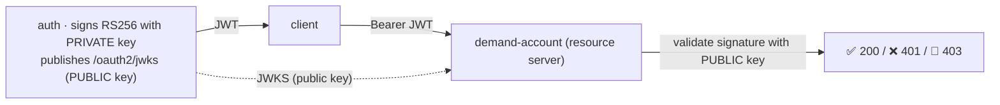
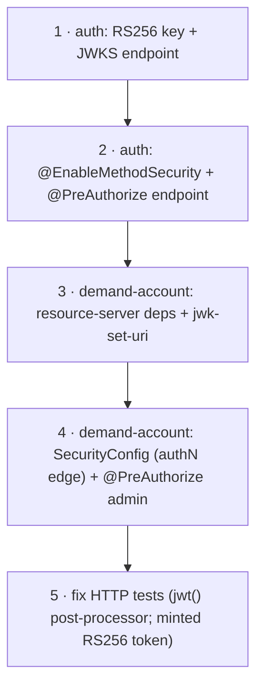

# Step 17 · Spring Security Deep II — Resource Servers, RS256/JWKS, Method Security & Modern Auth
### Phase C — Web, APIs & Application Security 🔵 · Step 17 of 67

> *Step 16 built the auth service with an HMAC secret — fine when one service both issues and validates. Now
> the **money** service must trust those tokens too, and a shared secret means any service could forge them.
> This step fixes that: **asymmetric (RS256) signing + a published JWKS**, demand-account becomes an **OAuth2
> resource server**, fine-grained **method security**, and a grounded tour of **MFA, passkeys & step-up**.*

---

<a id="toc"></a>
## 🧭 The Six Movements of This Step

| | Movement | What happens |
|---|---|---|
| **A** | [🧭 Orient](#orient) | 30-second overview · skip-test · cheat card · why it matters · before you start |
| **B** | [🧠 Understand](#understand) | asymmetric signing & JWKS · resource servers · method security · MFA/step-up |
| **C** | [🛠️ Build](#build) | auth → RS256 + JWKS + method security · demand-account → resource server + @PreAuthorize |
| **D** | [🔬 Prove](#prove) | the Verification Log — cross-service JWKS validation live, 401/403/201, §12.3 mutation |
| **E** | [🎓 Apply](#apply) | go deeper · interview prep · your-turn challenges |
| **F** | [🏆 Review](#review) | troubleshooting · resources · recap, flashcards & what's next |

---

<a id="orient"></a>

# A · 🧭 Orient

## 📋 This Step in 30 Seconds

| | |
|---|---|
| **Title** | Spring Security deep II — OAuth2 resource servers, RS256 + JWKS, method security, and modern auth (MFA/passkeys/step-up) |
| **Step** | 17 of 67 · **Phase C — Web, APIs & Application Security** 🔵 |
| **Effort** | ≈ 22 hours focused (a big one — two services + cross-service trust). The payoff: you can secure a *fleet* of services with one identity provider, the right way. Experienced learners can skim to ~5h. |
| **What you'll run this step** | **JVM + Maven**; **🐳 Docker** for demand-account's Testcontainers tests (auth needs neither). One command: `./mvnw -pl services/auth,services/demand-account -am verify`. Live cross-service demo runs auth + demand-account. |
| **Buildable artifact** | **auth**: switch HMAC→**RS256**, publish **JWKS** at `/oauth2/jwks`, add `@EnableMethodSecurity` + a `@PreAuthorize` endpoint (11 tests). **demand-account**: becomes an **OAuth2 resource server** (validates auth's JWTs via `jwk-set-uri`), secures the money endpoints, adds `@PreAuthorize` method security (31 tests). `step-17-start == step-16-end`. |
| **Verification tier** | 🔴 **Full** — security path across two services + build changes. `./mvnw verify` green + the cross-service JWKS validation proven **live** (401 without a token, 201 with auth's token) + method-security 403/200 + the **§12.3 mutation** (open the rule → 401 test fails → revert) + clean-room + `smoke.sh`. |
| **Depends on** | **[Step 16](../step-16/lesson.md)** (the auth service, filter chain, JWT), **[Step 12](../step-12/lesson.md)** (the money endpoints we now secure), **[Step 15](../step-15/lesson.md)** (the gateway — identity propagation). **+ Docker.** |

By the end you will be able to explain **asymmetric JWT signing + JWKS** and why it beats a shared secret across services; turn a service into an **OAuth2 resource server** validating another's tokens; apply **method security** (`@PreAuthorize`); and explain **MFA, passkeys (WebAuthn), and step-up** auth.

### ⏭️ Can You Skip This Step? (5-minute self-check)

If you can confidently do **all** of this, skim the 🧩 Pattern Spotlight and jump to **[Step 18 — Secure coding & threat modeling](../step-18/lesson.md)**.

- [ ] I can explain **HMAC vs asymmetric (RS256)** JWT signing and why multiple validators need **JWKS** (public-key validation).
- [ ] I can make a service an **OAuth2 resource server** (`jwk-set-uri`) that validates another service's tokens.
- [ ] I can use **method security** (`@EnableMethodSecurity` + `@PreAuthorize`) and say when to use it vs URL rules.
- [ ] I can explain **identity propagation** through a gateway, and the **token-revocation** problem (short-lived + refresh).
- [ ] I can explain **MFA**, **passkeys/WebAuthn**, and **step-up** auth at a conceptual level.

> [!TIP]
> Not 100%? Stay. "How do services validate each other's tokens?", "symmetric vs asymmetric JWT?", "URL rules vs @PreAuthorize?", and "what are passkeys / step-up?" are the security questions that separate mid from senior — and you'll have built the cross-service trust for real.

## 📇 Cheat Card

> **What this step delivers (one sentence):** the auth service signs RS256 and publishes a JWKS; the money service becomes an OAuth2 resource server that validates auth's tokens with the *public* key (never the secret), enforces roles via URL rules + `@PreAuthorize` method security — proven by a live cross-service flow (401 without a token, 201 with one).

**Key commands** (Windows uses `.\mvnw.cmd`):

```bash
# Build + test both services (auth 11, demand-account 31):
./mvnw -pl services/auth,services/demand-account -am verify

# Live cross-service: auth (8083) + demand-account (8082, validating via auth's JWKS)
./mvnw -pl services/auth spring-boot:run
docker compose -f services/demand-account/compose.yaml up -d
SPRING_DATASOURCE_URL=jdbc:postgresql://localhost:5433/demand_account \
  AUTH_JWKS_URI=http://localhost:8083/oauth2/jwks ./mvnw -pl services/demand-account spring-boot:run
TOKEN=$(curl -s -X POST localhost:8083/api/auth/login -H 'Content-Type: application/json' -d '{"username":"alice","password":"password"}' | sed -E 's/.*"token":"([^"]+)".*/\1/')
curl -i localhost:8082/api/accounts -X POST -H "Authorization: Bearer $TOKEN" -H 'Content-Type: application/json' -d '{"accountNumber":"ACC-A","currency":"USD","openingBalance":200.00}'

bash steps/step-17/smoke.sh
```

**The one headline idea — *the issuer signs with a private key and publishes the public key (JWKS); every service validates with the public key, so none can forge*:**



*Alt-text: the auth service signs JWTs with its private key and publishes the public key at /oauth2/jwks. A client gets a token and sends it as a Bearer token to demand-account (a resource server), which fetches the public key from auth's JWKS and validates the signature — returning 200 (valid + authorized), 401 (no/invalid token), or 403 (wrong role).*

## 🎯 Why This Matters

The moment you have more than one service, "who can validate a token?" becomes the central security question. A shared HMAC secret means every service that *checks* tokens could also *forge* them — one compromised service forges admin tokens for all. **Asymmetric signing + JWKS** fixes this: only the issuer can mint; everyone else can verify. This is how Google, Auth0, Keycloak, and every real OAuth2/OIDC system works, and "symmetric vs asymmetric JWT / how does a resource server validate?" is a senior-interview staple. After this step the bank's money service trusts the bank's identity provider — cryptographically, without sharing a secret.

## ✅ What You'll Be Able to Do

- **Sign asymmetrically + publish JWKS** — RS256, a `/oauth2/jwks` endpoint, key rotation awareness.
- **Build a resource server** — validate another service's tokens via `jwk-set-uri`; secure endpoints.
- **Apply method security** — `@PreAuthorize` for fine-grained, domain-level authorization (vs URL rules).
- **Reason about modern auth** — identity propagation, token revocation, MFA, passkeys/WebAuthn, step-up.

## 🧰 Before You Start

**Prerequisites**

- ✅ You finished **Step 16**; the repo is at `step-17-start` (== `step-16-end`) and `./mvnw verify` is green.
- ✅ **Docker is running** (demand-account's tests use Testcontainers).

**What you already learned that connects here**

- **Step 16**: the auth service, the filter chain, JWT/BCrypt — we upgrade the signing and add a second validator.
- **Step 12/14**: the money endpoints (transfers, idempotency) — now they require a token.
- **Step 15**: the gateway — where edge auth and identity propagation live.
- **Step 14**: HMAC signatures (webhooks) — RS256 is the asymmetric cousin.

> **Depends on: Steps 16, 12, 15.** Second of the two security deep-dives.

---

<a id="understand"></a>

# B · 🧠 Understand

## 🧠 The Big Idea

**Asymmetric signing + JWKS.** A JWT's signature proves it came from the issuer. With **HMAC (HS256)** there's one shared secret used to both sign *and* verify — so every verifier could also forge. With **asymmetric (RS256)** there are two keys: a **private** key (only the issuer has it; it *signs*) and a **public** key (anyone can have it; it *verifies*). The issuer publishes its public key(s) as a **JWKS** (JSON Web Key Set) at a well-known URL; verifiers fetch it and check signatures. Now only the issuer can mint tokens; resource servers can verify but never forge — least privilege, and it scales to any number of services.

**Resource server.** A service that protects its endpoints by **validating Bearer JWTs** on each request — no session, no login UI; it just trusts tokens from a configured issuer. In Spring you point `spring.security.oauth2.resourceserver.jwt.jwk-set-uri` at the issuer's JWKS; Boot builds a `JwtDecoder` that validates the signature (against the fetched public key) and the expiry, and populates the `Authentication`. demand-account becomes one.

**Authorization: URL rules vs method security.** Coarse, path-level rules (`authorizeHttpRequests().requestMatchers("/api/**").authenticated()`) secure the HTTP edge. **Method security** (`@EnableMethodSecurity` + `@PreAuthorize("hasRole('ADMIN')")`) expresses *fine-grained, domain-level* rules right on the method — reusable from any caller, closer to the business logic. Real systems use both: a coarse edge gate plus precise method rules.

**Modern auth (the "taste").** **MFA** (multi-factor) adds a second factor (something you have/are) beyond the password (something you know). **Passkeys/WebAuthn** are phishing-resistant public-key credentials bound to the device (your fingerprint/Face ID unlocks a private key that signs a challenge — no password to steal). **Step-up auth** requires a *stronger/fresh* factor for sensitive operations (e.g. re-verify before a large transfer) even when already logged in — Spring Security 7 models the factors used (`FACTOR_*` authorities) so you can require them.

> **Analogy — the bank's ID system.** **HMAC** is a rubber stamp every branch owns: any branch can stamp a document *and* check it — but a rogue branch can forge any stamp. **RS256 + JWKS** is a **wax seal**: head office has the unique signet ring (private key) and mails every branch a *photo* of the seal (the public key, via JWKS). Branches can verify a seal is genuine but cannot make one. A **resource server** is a branch that won't act on a letter without checking the seal. **Method security** is "this specific vault action needs a manager's countersignature." **Step-up** is "for a large withdrawal, swipe your card again *now*, even though you're already inside."

```mermaid
sequenceDiagram
    participant C as Client
    participant Auth as auth (issuer)
    participant DA as demand-account (resource server)
    C->>Auth: POST /login (password)
    Auth->>Auth: sign JWT with PRIVATE key (RS256)
    Auth-->>C: token
    C->>DA: POST /api/transfers  Authorization: Bearer <token>
    DA->>Auth: GET /oauth2/jwks (fetch PUBLIC key, cached)
    DA->>DA: validate signature + expiry; map roles
    alt valid + authorized
        DA-->>C: 200/201
    else no token → 401 · wrong role → 403
        DA-->>C: 401 / 403
    end
```

*Alt-text: a client logs in to auth, which signs a JWT with its private key (RS256) and returns it. The client calls demand-account with the Bearer token; demand-account fetches auth's public key from /oauth2/jwks (cached), validates the signature and expiry, maps roles, and returns 200/201 if valid and authorized, 401 if no/invalid token, or 403 if the role is insufficient.*

## 🧩 Pattern Spotlight — JWKS-based Resource Server (decentralized token validation)

> **Problem.** Many services must independently decide whether a request is authenticated — without calling back to the auth service on every request (a bottleneck + coupling), and without sharing a signing secret (forgery risk).

> **Why JWKS fits.** The issuer publishes its **public** keys at a JWKS endpoint. Each resource server fetches and **caches** them, then validates token signatures locally — no per-request call to auth, no secret to leak. Key **rotation** is built in: JWKS can list multiple keys, and tokens carry a `kid` (key id) so verifiers pick the right one; the issuer can introduce a new key, sign with it, and retire the old once tokens expire.

> **How it works (the mechanism).** `jwk-set-uri` → Boot's `NimbusJwtDecoder` fetches the JWKS (lazily, cached, refreshed on unknown `kid`), and per request validates the JWS signature with the matching public key plus standard claims (`exp`, optionally `iss`/`aud`). Authorities come from a claim (our `roles`) via a converter.

> **Alternatives / trade-offs.** **Shared HMAC secret** (Step 16): simplest, but every validator can forge — only OK within one service. **Token introspection** (call the issuer's `/introspect` per token): supports instant revocation, but adds a network hop and couples to the issuer (opaque tokens). **JWKS + self-contained JWT**: fast, decentralized, scales — at the cost of harder revocation (mitigate with short lifetimes + refresh tokens). For a microservices fleet, JWKS is the standard.

> **Implementation (here).** auth publishes `/oauth2/jwks` (RS256 public key); demand-account sets `jwk-set-uri` to it and `oauth2ResourceServer(jwt(...))`. Proven live: demand-account accepted an auth-minted token (201) and rejected an unauthenticated one (401).

## 🌱 Under the Hood: How It Really Works

**Generating & using the RSA key (auth).** A `RSAKey` (Nimbus) is generated at startup; `NimbusJwtEncoder` signs over an `ImmutableJWKSet` of it, and the `JwsHeader` declares `RS256`. The `/oauth2/jwks` controller returns `new JWKSet(rsaKey.toPublicJWK()).toJSONObject()` — **public** material only (`kty`, `kid`, `n`, `e`; never the private exponent `d`). *Production note:* generating at startup is ephemeral (a restart rotates the key, invalidating live tokens); real systems load a persisted key from a keystore/Vault (Phase H) and rotate deliberately — JWKS' multi-key support makes rollover seamless.

**Validating (demand-account, the resource server).** With `spring.security.oauth2.resourceserver.jwt.jwk-set-uri` set, Boot auto-configures a `JwtDecoder` that **lazily** fetches the JWKS on first use (so the service boots even if auth is down) and **caches** it. Per request, the `BearerTokenAuthenticationFilter` extracts the token, the decoder validates signature + `exp`, and our `JwtAuthenticationConverter` maps the `roles` claim to authorities. No session, no callback to auth per request.

**URL rules vs `@PreAuthorize` (and a blast-radius lesson).** We secure the HTTP edge with `authorizeHttpRequests` (`/api/**` → authenticated; health + docs → permitAll) and demonstrate **method security** (`@EnableMethodSecurity` + `@PreAuthorize("hasRole('ADMIN')")`) on a narrow admin endpoint. We deliberately **did not** put `@PreAuthorize` on the core transfer *service* methods: method security wraps the bean with an AOP proxy and applies to **direct** calls too — which would force a security context into the dozens of service-level unit tests that call `transfer(...)` directly. Keeping authorization at the edge (URL rules) + a narrow method-security demo means only the **HTTP-layer tests** needed tokens, not the service tests. (A real system *would* use method security on services — and accept setting up the security context in those tests.)

**Testing security without committing keys.** Controller slice (`@WebMvcTest`): `spring-security-test`'s `jwt()` request post-processor injects the `Authentication` directly (no real decoding) — but the slice needs `@EnableWebSecurity` on the config to get an `HttpSecurity` bean, and a mock `JwtDecoder`. Integration test (`@SpringBootTest`, real HTTP): a `@TestConfiguration` supplies a `JwtDecoder` from a **test** RSA public key (overriding the production `jwk-set-uri`), and the test **mints** RS256 tokens with the matching private key. No private key is committed; the real auth↔demand-account JWKS interop is proven by a **live** run instead (🔬).

**Identity propagation.** The gateway (Step 15) forwards the `Authorization` header to downstreams by default, so a token presented at the edge reaches the services unchanged — they validate it independently. (Hardening: the gateway should *strip* any inbound headers it sets itself so clients can't spoof identity; full identity propagation + mTLS between services is Step 41/43.)

**Token revocation.** A self-contained JWT is valid until `exp` — you can't easily revoke it mid-life (no per-request lookup). Standard mitigations: **short** access-token lifetimes (minutes) + a longer-lived, revocable **refresh token** to mint new ones (the frontend flow, Step 32), and/or a denylist of revoked `jti`s (reintroduces some state). Rotating the signing key (JWKS) invalidates everything signed with the old key.

## 🛡️ Security Lens: What Could Go Wrong

- **Shared signing secret = fleet-wide forgery.** If services validate with a shared HMAC secret, one compromised service can forge tokens (including admin) accepted everywhere. Asymmetric + JWKS removes that: validators hold only the public key.
- **Algorithm confusion attack.** A classic JWT exploit: an attacker takes an RS256 setup and submits an `HS256` token using the *public* key as the HMAC secret. Pinning the expected algorithm on the decoder (Spring's resource server validates against the JWKS key type) defends against it — never let the token dictate the algorithm.
- **`alg: none` / unverified tokens.** Always validate the signature; never accept `none`. Spring's `JwtDecoder` does this for you — don't hand-parse tokens and trust claims.
- **Leaking private key / no rotation.** The signing private key is the crown jewel — keystore/Vault, never in git, rotate it (Phase H). JWKS makes rotation safe (publish new + old, retire old after expiry).
- **Over-broad tokens & no revocation.** Long-lived, widely-scoped tokens are dangerous if stolen. Short lifetimes, least-privilege scopes/roles, refresh tokens, and step-up for sensitive actions limit blast radius.

## 🕰️ Then vs. Now (How This Changed Across Versions)

| Topic | Then | Now | Why it changed |
|---|---|---|---|
| **Cross-service token validation** | Shared secret, or call the auth server per request (introspection). | **JWKS** — fetch the issuer's public keys, validate locally. | Decentralized, fast, no shared secret; the OAuth2/OIDC standard. |
| **Signing** | HMAC (HS256) symmetric. | **RS256/ES256** asymmetric for multi-validator setups. | Validators can verify but not forge (least privilege). |
| **Method security** | `@Secured` / `@EnableGlobalMethodSecurity`. | **`@EnableMethodSecurity`** + `@PreAuthorize` (SpEL). | Cleaner, SpEL-powered, on by default for `@PreAuthorize`. |
| **Auth factors / passwordless** | Password + maybe SMS OTP. | **Passkeys/WebAuthn** (phishing-resistant, public-key); SS7 models **factors** for step-up. | Passwords are the weak link; passkeys + step-up are the modern direction. |

> [!NOTE]
> *Verify, don't guess.* We're on **Spring Security 7 / Boot 4** — verified RS256 signing, the `/oauth2/jwks` endpoint, the resource-server `jwk-set-uri` validation, and `@EnableMethodSecurity`/`@PreAuthorize` all **work**, including a **live cross-service** validation (auth's token accepted by demand-account, 🔬). WebAuthn has a Spring Security DSL (`webAuthn()`), but the full passkey ceremony needs the **frontend** (Phase F) — taught here as a concept, not faked.

## 🧵 Thread-safety note

The security components are **stateless singletons** safe across request threads: the `JwtDecoder` (its JWKS cache is internally synchronized), the RSA key, and the filter chain hold no per-request mutable state. Per-request identity lives in the `SecurityContextHolder` (a `ThreadLocal`, cleared after each request), so concurrent requests never see each other's `Authentication`. `@PreAuthorize` is evaluated per invocation against that thread's context. Same Step-11 rule: stateless singletons + confine per-request state.

---

<a id="build"></a>

# C · 🛠️ Build

## 📦 Your Starting Point

You're at **`step-17-start`** (== `step-16-end`). auth issues HS256 JWTs (Step 16); demand-account is **unsecured**. We'll switch auth to RS256+JWKS and make demand-account validate auth's tokens.

Confirm the start builds:
```bash
./mvnw -q verify   # green, 9 modules, from Step 16
```

## 🛠️ Let's Build It — Step by Step



🌳 **Files we'll touch:**
```
services/auth/.../security/{SecurityConfig (RS256+JWKS), JwtService (RS256)} · .../web/JwksController · .../web/AuthController (+admin-method)
services/auth/.../AuthSecurityTest (+jwks, +method security)
services/demand-account/pom.xml (+security, +oauth2-resource-server, +spring-security-test)
services/demand-account/.../web/{SecurityConfig (new), TransferController (+admin/ping)} · application.yml (+jwk-set-uri)
services/demand-account/.../{TransferControllerTest, DemandAccountIntegrationTest} (auth tokens)
steps/step-17/{requests.http,smoke.sh} · adr/0009-...md
```

---

### Sub-step 1 of 5 — auth: RS256 + JWKS 🧭 *(you are here: **RS256/JWKS** → method security → resource-server deps → secure → tests)*

🎯 **Goal:** sign with an RSA private key and publish the public key.

📁 **Location:** `services/auth/.../security/SecurityConfig.java`, `JwtService.java`, new `web/JwksController.java`

⌨️ **Code** (the key beans + JWKS):
```java
private final RSAKey rsaKey = new RSAKeyGenerator(2048).keyID(UUID.randomUUID().toString()).generate();
@Bean JWKSource<SecurityContext> jwkSource() { return new ImmutableJWKSet<>(new JWKSet(rsaKey)); }
@Bean JwtEncoder jwtEncoder(JWKSource<SecurityContext> s) { return new NimbusJwtEncoder(s); }       // signs RS256
@Bean JwtDecoder jwtDecoder() { return NimbusJwtDecoder.withPublicKey(rsaKey.toRSAPublicKey()).build(); }
@Bean JWKSet publicJwkSet() { return new JWKSet(rsaKey.toPublicJWK()); }                            // PUBLIC only
```
```java
// JwksController
@GetMapping("/oauth2/jwks")
public Map<String, Object> jwks() { return publicJwkSet.toJSONObject(); }
```
and `JwtService` now uses `JwsHeader.with(SignatureAlgorithm.RS256)` (was `MacAlgorithm.HS256`).

🔍 **Line-by-line:** the `RSAKey` is generated once at startup. The `JwtEncoder` signs over the JWK source (private key); the `JwtDecoder` validates with the public half. `publicJwkSet()` exposes only `rsaKey.toPublicJWK()` — no private material — which the controller serializes at `/oauth2/jwks` (permit it in the filter chain).

💭 **Under the hood:** the published JWK has `kty/kid/n/e` (modulus + exponent) — enough to verify, useless to sign. Tokens carry the `kid` so verifiers pick the right key (rotation-ready).

🔮 **Predict:** will the JWKS JSON contain the RSA private exponent (`"d"`)? <details><summary>answer</summary>No — only public fields. The test asserts `"d"` is absent.</details>

▶️ **Run & See** (the JWKS, live):
```bash
./mvnw -pl services/auth spring-boot:run
curl -s localhost:8083/oauth2/jwks
```
✅ **Expected output** (real run):
```
{"keys":[{"kty":"RSA","e":"AQAB","kid":"8476a2cc-0853-44dd-a414-79bbba622dab","n":"rLsZ9vtG-81dyPptS5Wq3CoG...
```

✋ **Checkpoint:** auth signs RS256 and serves a public JWKS.

💾 **Commit:** `git add services/auth/src/main && git commit -m "feat(auth): RS256 signing + JWKS endpoint"`

⚠️ **Pitfall:** exposing the full `JWKSet` (with the private key) instead of `toPublicJWK()` would leak your signing key. Publish public only.

---

### Sub-step 2 of 5 — auth: method security 🧭 *(RS256/JWKS ✅ → **method security** → …)*

🎯 **Goal:** show `@PreAuthorize` (authorization on the method, not the URL).

📁 **Location:** `SecurityConfig` (`@EnableMethodSecurity`) + `AuthController`

⌨️ **Code:**
```java
@Configuration
@EnableMethodSecurity   // turns on @PreAuthorize
public class SecurityConfig { ... }

// AuthController
@GetMapping("/admin-method")
@PreAuthorize("hasRole('ADMIN')")
public Map<String, String> adminViaMethodSecurity() { return Map.of("message", "admin (method security) access granted"); }
```

🔍 **Line-by-line:** `@EnableMethodSecurity` enables `@PreAuthorize`; the SpEL `hasRole('ADMIN')` requires authority `ROLE_ADMIN`. There's no URL rule for `/api/auth/admin-method` beyond "authenticated", so the **method** annotation is what enforces ADMIN.

▶️ **Run & See:** a USER token → 403, an ADMIN token → 200 (proven in `AuthSecurityTest`).

✋ **Checkpoint:** `./mvnw -pl services/auth test` green (11 tests).

💾 **Commit:** `git add services/auth/src && git commit -m "feat(auth): @EnableMethodSecurity + @PreAuthorize endpoint + tests"`

⚠️ **Pitfall:** forgetting `@EnableMethodSecurity` → `@PreAuthorize` is silently ignored (everyone gets in). Always test the deny case.

---

### Sub-step 3 of 5 — demand-account: resource-server deps + `jwk-set-uri` 🧭 *(… → **resource-server** → …)*

🎯 **Goal:** make demand-account validate auth's tokens.

📁 **Location:** `services/demand-account/pom.xml` + `application.yml`

⌨️ **Code** (deps + config):
```xml
<dependency><groupId>org.springframework.boot</groupId><artifactId>spring-boot-starter-security</artifactId></dependency>
<dependency><groupId>org.springframework.boot</groupId><artifactId>spring-boot-starter-oauth2-resource-server</artifactId></dependency>
<!-- test --><dependency><groupId>org.springframework.security</groupId><artifactId>spring-security-test</artifactId><scope>test</scope></dependency>
```
```yaml
spring:
  security:
    oauth2:
      resourceserver:
        jwt:
          jwk-set-uri: ${AUTH_JWKS_URI:http://localhost:8083/oauth2/jwks}
```

🔍 **Line-by-line:** the resource-server starter brings Bearer-token validation. `jwk-set-uri` points at auth's JWKS; Boot builds a `JwtDecoder` that fetches it **lazily** (so demand-account boots even if auth is down) and caches it.

💭 **Under the hood:** on the first token, the decoder downloads the JWKS, finds the key by `kid`, and validates the RS256 signature + `exp`. Subsequent requests reuse the cached key.

✋ **Checkpoint:** `./mvnw -q -pl services/demand-account compile` succeeds.

💾 **Commit:** `git add services/demand-account/pom.xml services/demand-account/src/main/resources/application.yml && git commit -m "build(demand-account): resource-server deps + jwk-set-uri"`

⚠️ **Pitfall:** a `jwk-set-uri` the service can't reach at *first token* → 401s with a fetch error. It's fine at startup (lazy); ensure auth is reachable when tokens arrive (or use a static key in tests).

---

### Sub-step 4 of 5 — demand-account: secure the edge + method security 🧭 *(… → **secure** → tests)*

🎯 **Goal:** require a token on the money endpoints; demonstrate `@PreAuthorize`.

📁 **Location:** new `services/demand-account/.../web/SecurityConfig.java` + `TransferController` (admin endpoint)

⌨️ **Code:**
```java
@Configuration
@EnableWebSecurity   // gives the @WebMvcTest slice an HttpSecurity bean too
@EnableMethodSecurity
public class SecurityConfig {
    @Bean SecurityFilterChain filterChain(HttpSecurity http) throws Exception {
        http.csrf(c -> c.disable()).sessionManagement(s -> s.sessionCreationPolicy(STATELESS)).cors(withDefaults())
            .authorizeHttpRequests(a -> a
                .requestMatchers("/actuator/health", "/actuator/info").permitAll()
                .requestMatchers("/v3/api-docs/**", "/swagger-ui/**", "/swagger-ui.html").permitAll()
                .anyRequest().authenticated())                 // all /api/** money endpoints require a token
            .oauth2ResourceServer(o -> o.jwt(j -> j.jwtAuthenticationConverter(rolesConverter())));
        return http.build();
    }
}
```
```java
// TransferController — method security on a narrow admin endpoint
@GetMapping("/api/v1/admin/ping")
@PreAuthorize("hasRole('ADMIN')")
public Map<String, String> adminPing() { return Map.of("message", "admin ok"); }
```

🔍 **Line-by-line:** `@EnableWebSecurity` ensures the `HttpSecurity` bean exists (needed in the `@WebMvcTest` slice). The rules: health + docs public, everything else (the money API) authenticated. `oauth2ResourceServer(jwt(...))` validates the Bearer token and maps `roles`. `@PreAuthorize` on `adminPing` adds a role check at the method (we kept it off the transfer *service* to avoid forcing auth into service-level unit tests — see 🌱).

🔮 **Predict:** `POST /api/transfers` with **no** `Authorization` header — status? <details><summary>answer</summary>401 (the resource server rejects before the controller). Proven in 🔬.</details>

✋ **Checkpoint:** compiles; money endpoints now require a token.

💾 **Commit:** `git add services/demand-account/src/main && git commit -m "feat(demand-account): resource-server SecurityConfig + @PreAuthorize admin endpoint"`

⚠️ **Pitfall:** without `@EnableWebSecurity`, a `@WebMvcTest` slice fails with *"No qualifying bean of type HttpSecurity"* — add it (the full app context provides it either way).

---

### Sub-step 5 of 5 — fix the HTTP-layer tests 🧭 *(… → **tests**)*

🎯 **Goal:** authenticate the controller-slice + integration tests (service tests are unaffected — they call services directly, no HTTP).

📁 **Location:** `TransferControllerTest` (slice) + `DemandAccountIntegrationTest` (real HTTP)

⌨️ **Code** (the two techniques):
```java
// Slice (@WebMvcTest): inject the auth directly with spring-security-test's jwt() post-processor
mvc.perform(post("/api/transfers").with(jwt().authorities(new SimpleGrantedAuthority("ROLE_USER")))
        .contentType(APPLICATION_JSON).content("...")).andExpect(status().isOk());
// (also @MockitoBean JwtDecoder so the resource-server config can start)

// Integration (@SpringBootTest, real HTTP): a test JwtDecoder from a test key, and mint real RS256 tokens
@TestConfiguration static class JwtTestConfig {
    @Bean JwtDecoder jwtDecoder() { return NimbusJwtDecoder.withPublicKey(TEST_KEY.toRSAPublicKey()).build(); }
}
// mint: SignedJWT signed with TEST_KEY's private half, claim "roles"; send as Bearer
```

🔍 **Line-by-line:** the slice's `jwt()` post-processor sets a `JwtAuthenticationToken` with the given authorities — no real token needed. The integration test overrides the production `jwk-set-uri` decoder with one built from a **test** key, and mints matching RS256 tokens — so it validates real signatures end-to-end without running auth (the real interop is the live run in 🔬). A new test asserts a no-token request is 401 and `/api/v1/admin/ping` is 403 for USER / 200 for ADMIN.

▶️ **Run & See:**
```bash
./mvnw -pl services/auth,services/demand-account -am verify
```
✅ **Expected output:**
```
auth:           Tests run: 11, Failures: 0, Errors: 0
demand-account: Tests run: 31, Failures: 0, Errors: 0
BUILD SUCCESS
```

🔬 **Break-it (the §12.3 mutation):** change demand-account's `.anyRequest().authenticated()` to `.permitAll()` and rerun the slice — `unauthenticatedRequestIs401` fails (`expected:<401> but was:<200>`). Put it back. (See 🔬 §4.)

✋ **Checkpoint:** auth 11 + demand-account 31 tests green.

💾 **Commit:** `git add services/demand-account/src/test && git commit -m "test(demand-account): authenticate HTTP tests (jwt() + minted RS256), method-security tests"`

⚠️ **Pitfall:** adding `@PreAuthorize` to a *service* method silently breaks every test that calls it directly (no security context → `AccessDeniedException`). Secure the edge; reserve method security for narrowly-scoped methods (or set up the context in those tests).

---

### 🔁 The full flow you just built

```mermaid
sequenceDiagram
    participant C as curl
    participant Auth as auth :8083
    participant DA as demand-account :8082
    C->>Auth: POST /api/auth/login {alice}
    Auth-->>C: RS256 JWT (signed with private key)
    C->>DA: POST /api/accounts  (no token)
    DA-->>C: 401
    C->>DA: POST /api/accounts  Bearer <token>
    DA->>Auth: GET /oauth2/jwks (fetch + cache public key)
    DA->>DA: validate RS256 signature + exp; roles=[ROLE_USER]
    DA-->>C: 201  (cross-service trust established)
    C->>DA: GET /api/v1/admin/ping  Bearer <USER token>
    DA-->>C: 403 (@PreAuthorize hasRole ADMIN)
```

*Alt-text: curl logs in to auth and gets an RS256 JWT. A call to demand-account with no token is 401. With the token, demand-account fetches auth's public key from /oauth2/jwks, validates the signature and expiry, reads roles, and returns 201. A call to the admin endpoint with a USER token returns 403 due to @PreAuthorize.*

## 🎮 Play With It

1. **Run the trust chain** (Cheat Card): auth (8083) + demand-account (8082, `AUTH_JWKS_URI=...`). Then `steps/step-17/requests.http`.
2. **See the JWKS:** `curl localhost:8083/oauth2/jwks` — the public key demand-account uses to validate.
3. **Prove cross-service trust:** login at auth → token; `POST localhost:8082/api/accounts` **without** the token (401) then **with** it (201). demand-account never saw auth's secret.
4. **Method security:** `GET localhost:8082/api/v1/admin/ping` with a USER token → 403; with an `admin`/`admin123` token → 200.
5. 🧪 **Little experiments:** decode the token at jwt.io (note `alg: RS256`, the `kid`); tamper a byte → 401; restart auth (new key) and reuse an old token → 401 (key rotated).

## 🏁 The Finished Result

You're at **`step-17-end`** (== `step-18-start`). The money service cryptographically trusts the identity service — without sharing a secret. auth: 11 tests; demand-account: 31 tests.

### ✅ Definition of Done (your self-check)
- [ ] `./mvnw -pl services/auth,services/demand-account -am verify` is green (11 + 31).
- [ ] auth signs RS256 and serves `/oauth2/jwks`; demand-account validates via `jwk-set-uri`.
- [ ] Money endpoints need a token (401 without); `@PreAuthorize` enforces ADMIN (403 for USER).
- [ ] `bash steps/step-17/smoke.sh` prints `✅ Step 17 smoke test PASSED`.
- [ ] You've committed and tagged `step-17-end`.

---

<a id="prove"></a>

# D · 🔬 Prove It Works — the Verification Log

> **Tier: 🔴 Full** (security path across two services + build changes). Real pasted output below, including a **live cross-service** validation, the §12.3 mutation, and a clean-room verify.

### 1 · `./mvnw -pl services/auth,services/demand-account -am verify` — 11 + 31 tests
```
auth:           Tests run: 11, Failures: 0, Errors: 0, Skipped: 0
demand-account: Tests run: 31, Failures: 0, Errors: 0, Skipped: 0
BUILD SUCCESS
```
auth adds JWKS + method-security tests (the JWKS body has `"kty":"RSA"` and **no** `"d"`/`"p"`/`"q"` — public only). demand-account adds resource-server tests: an unauthenticated request → 401; `@PreAuthorize` admin endpoint → 403 (USER) / 200 (ADMIN).

### 2 · Live cross-service JWKS validation (auth :8083 + demand-account :8082, real HTTP)
```
GET  /oauth2/jwks (auth) → {"keys":[{"kty":"RSA","e":"AQAB","kid":"8476a2cc-0853-44dd-a414-79bbba622dab","n":"rLsZ9vtG-..."}]}
POST /api/auth/login (auth, alice) → RS256 JWT (header kid = 8476a2cc…)
POST /api/accounts (demand-account, NO token)        → 401
POST /api/accounts (demand-account, auth's token)    → 201  {"accountNumber":"XACC","currency":"USD","balance":100.00}
GET  /api/v1/admin/ping (demand-account, USER token) → 403
```
demand-account fetched auth's JWKS, validated the RS256 signature, and accepted the token — **cross-service trust with no shared secret**.

### 3 · Method security (auth + demand-account)
auth `/api/auth/admin-method`: USER → 403, ADMIN → 200. demand-account `/api/v1/admin/ping`: USER → 403, ADMIN → 200. `@PreAuthorize` enforced.

### 4 · §12.3 Mutation sanity-check — the auth requirement is load-bearing
Changed demand-account's `.anyRequest().authenticated()` to `.permitAll()`, reran `unauthenticatedRequestIs401`:
```
Status = 200
[ERROR] TransferControllerTest.unauthenticatedRequestIs401  Status expected:<401> but was:<200>
[INFO] BUILD FAILURE
```
Without the rule, an unauthenticated request reaches the controller — proving the test verifies the protection. Reverted; green again.

### 5 · `smoke.sh`
```
==> Build + test auth (RS256 + JWKS + method security) and demand-account (resource server + method security)
✅ Step 17 smoke test PASSED
```

### 6 · Clean-room (§12.4) & chain
Fresh `git clone` at `step-17-end` → `make doctor` + `./mvnw verify` → **BUILD SUCCESS** (all 9 modules). Confirmed `step-17-end` == `step-18-start`.

> **Honesty (§12.8):** the *automated* tests validate each side with a **test** key (offline); the real auth↔demand-account JWKS interop is proven by the **live cross-service run** above (§2), not the unit suite — by design, so the suite needs no multi-service orchestration. **MFA/passkeys/WebAuthn** are taught conceptually (the full ceremony needs the Phase-F frontend) — not built/faked here.

---

<a id="apply"></a>

# E · 🎓 Apply

## 🚀 Go Deeper (Optional)

<details>
<summary>① Key rotation with JWKS</summary>

JWKS lists *multiple* keys, and tokens carry a `kid`. To rotate: generate a new key, add it to the JWKS, start signing new tokens with it (old tokens still validate against the old key still in the set), then remove the old key after the longest token lifetime passes. Resource servers refresh the JWKS (Spring refreshes on an unknown `kid`), so rotation is seamless and zero-downtime. Our ephemeral-at-startup key is a stand-in; production persists keys (keystore/Vault, Phase H) and rotates on a schedule.
</details>

<details>
<summary>② Passkeys / WebAuthn — the real flow</summary>

WebAuthn registration: the server sends a challenge; the authenticator (Face ID/fingerprint/security key) generates a key pair, signs the challenge, and returns the *public* key + an attestation. Login: the server sends a challenge; the authenticator signs it with the *private* key (never leaves the device); the server verifies with the stored public key. No shared secret, nothing phishable. Spring Security has a `webAuthn()` DSL, but the ceremony is browser-driven — we wire it in **Phase F** (the frontend). Passkeys are the endgame for MFA.
</details>

<details>
<summary>③ Step-up authentication with factors</summary>

Spring Security 7 tracks *how* you authenticated as `FACTOR_*` authorities (e.g. `FACTOR_PASSWORD`, `FACTOR_OTP`, `FACTOR_WEBAUTHN`). A sensitive operation can require a stronger/fresh factor: `@PreAuthorize("hasAuthority('FACTOR_OTP')")` or a custom check on token age — if absent, the app triggers a re-auth (step-up) for *that* action, then proceeds. This is how a bank asks you to re-confirm before a large transfer even though you're logged in.
</details>

## 💼 Interview Prep: Questions You'll Be Asked

1. **"How do multiple services validate the same JWTs without sharing a secret?"** *(the system-design one)* → Asymmetric signing: the issuer signs with a private key and publishes its public key at a **JWKS** endpoint; each service fetches/caches it and validates signatures locally. No shared secret, no per-request call to auth, rotation via `kid`.

2. **"HMAC vs RSA (HS256 vs RS256) for JWT — when each?"** *(gotcha)* → HMAC: one shared secret, simplest, but every validator can forge — OK within a single service. RSA/EC (asymmetric): issuer signs (private), many services validate (public/JWKS) without being able to mint — use across services.

3. **"What's an OAuth2 resource server?"** → A service that authorizes requests by validating a Bearer access token (signature + expiry + scopes/claims) per request, statelessly, against a configured issuer (`jwk-set-uri`) — no login UI, no session.

4. **"URL authorization vs method security — when each?"** → URL rules (`authorizeHttpRequests`) for coarse edge gating; `@PreAuthorize` method security for fine-grained, reusable, domain-level rules on services/methods. Real systems use both.

5. **"How do you revoke a JWT?"** *(gotcha)* → You mostly can't before `exp` (self-contained). Mitigate with short-lived access tokens + revocable refresh tokens, a `jti` denylist, and key rotation (JWKS). Or use opaque tokens + introspection if instant revocation is required.

6. **"What are passkeys and step-up auth?"** *(modern)* → Passkeys/WebAuthn: phishing-resistant, device-bound public-key credentials (no password to steal). Step-up: requiring a stronger/fresh factor for sensitive actions even when logged in (modeled by SS7 `FACTOR_*` authorities).

> **Behavioral/STAR seed:** *"Tell me about securing a distributed system."* → Moved from a shared JWT secret to asymmetric signing + JWKS so services validate without forging (S/T/A); proved a live cross-service flow where the money service trusted the identity service's token without ever holding the secret (R).

## 🏋️ Your Turn: Practice & Challenges

1. **Validate `iss`/`aud`.** Add issuer + audience validation to the resource server (`JwtValidators`/`audiences`), and prove a token from a different issuer is rejected.
2. **Step-up endpoint.** Add an endpoint requiring `@PreAuthorize("hasAuthority('FACTOR_OTP')")`; mint a token with/without that authority and assert 200/403. <details><summary>hint</summary>Add the authority to the token's claims/converter.</details>
3. **Secure cif too.** Make the cif service a resource server validating auth's tokens. *(Reference: `solutions/step-17/`.)*
4. **Stretch — key rotation.** Persist the RSA key (file/keystore), expose two keys in JWKS, sign with the new `kid`, and prove old tokens still validate.
5. **Stretch — refresh tokens.** Add `/api/auth/refresh` (a longer-lived token mints new short access tokens) and show revocation by not honoring a revoked refresh token.

---

<a id="review"></a>

# F · 🏆 Review

## 🩺 Stuck? Troubleshooting & Fixes

| Symptom | Cause | Fix |
|---|---|---|
| `@WebMvcTest` slice: *No qualifying bean of type HttpSecurity* | slice doesn't bootstrap full security | add `@EnableWebSecurity` to the config; add a mock `JwtDecoder`; use `jwt()` post-processor. |
| demand-account 401s even with a valid token | can't reach/parse JWKS, or `roles` claim/converter mismatch | check `jwk-set-uri` reachable; ensure the converter reads `roles` (prefix empty). |
| Service tests fail with `AccessDeniedException` | `@PreAuthorize` on a service method they call directly | keep authz at the edge; reserve method security for narrow methods (or set a test security context). |
| Old tokens suddenly 401 | auth restarted (ephemeral key rotated) | re-login; in production persist + rotate the key (keystore/Vault). |
| `@PreAuthorize` ignored (everyone gets in) | missing `@EnableMethodSecurity` | add it; always test the deny (403) case. |
| Reset to known-good | — | `git checkout step-17-end && ./mvnw -pl services/auth,services/demand-account -am verify`. |

## 📚 Learn More: Resources & Glossary

- Spring Security: **OAuth2 Resource Server (JWT)**, **Method Security**, **WebAuthn/Passkeys**.
- **RFC 7517** (JWK/JWKS), **RFC 7519** (JWT), **RFC 9457** (errors). jwt.io to decode.
- OWASP — JWT / Authentication Cheat Sheets.

**Glossary:** **asymmetric signing (RS256)** vs **HMAC (HS256)** · **JWKS / `kid` / key rotation** · **OAuth2 resource server / `jwk-set-uri`** · **`JwtDecoder` / `BearerTokenAuthenticationFilter`** · **URL authorization vs method security (`@EnableMethodSecurity` / `@PreAuthorize`)** · **identity propagation** · **token revocation / refresh token** · **MFA / passkey (WebAuthn) / step-up / `FACTOR_*`** · **algorithm-confusion attack**.

## 🏆 Recap & Study Notes

**(a) Key points**
- **Asymmetric (RS256) + JWKS**: issuer signs with a private key, publishes the public key; services validate without a shared secret (can verify, can't forge).
- A **resource server** validates Bearer JWTs per request (`jwk-set-uri`), statelessly.
- **URL rules** gate the edge; **`@PreAuthorize`** method security expresses fine-grained domain rules.
- **Revocation** is the JWT weak spot → short-lived access + refresh tokens + key rotation.
- **Modern auth**: MFA, **passkeys/WebAuthn** (phishing-resistant), **step-up** (SS7 `FACTOR_*`).

**(b) Key terms:** RS256 vs HS256, JWKS/kid/rotation, resource server/jwk-set-uri, JwtDecoder, URL authz vs @PreAuthorize/@EnableMethodSecurity, identity propagation, revocation/refresh, MFA/passkey/WebAuthn/step-up, algorithm confusion.

**(c) 🧠 Test Yourself**
1. Why publish a JWKS instead of sharing the signing secret? <details><summary>answer</summary>So validators can verify with the public key but cannot forge (least privilege) — and can fetch/rotate keys without a shared secret.</details>
2. What does a resource server do per request? <details><summary>answer</summary>Validates the Bearer JWT (signature + expiry) and builds the Authentication — statelessly, no session.</details>
3. URL rule vs @PreAuthorize? <details><summary>answer</summary>URL = coarse edge gating; @PreAuthorize = fine-grained, reusable rule on a method.</details>
4. Why is a JWT hard to revoke? <details><summary>answer</summary>It's self-contained/valid until exp — no per-request lookup; mitigate with short lifetimes + refresh + key rotation.</details>
5. What's an algorithm-confusion attack? <details><summary>answer</summary>Submitting an HS256 token using the RS256 public key as the HMAC secret; defend by pinning the expected algorithm.</details>

**(d) 🔗 How this connects**
- **Back to Step 16** (auth + filter chain + JWT), **Step 12/14** (the money endpoints), **Step 15** (gateway/identity propagation).
- **Forward:** Step 18 (threat modeling / OWASP — the attacker's view of what we built), Step 32 (frontend token refresh + route guards), Step 41 (Authorization Server / Keycloak), Step 43 (mTLS/zero-trust), Phase F (WebAuthn UI), Phase H (Vault-managed keys).

**(e) 🏆 Résumé line / interview talking point earned**
> *"Secured a microservices platform with OAuth2: an identity service signing RS256 JWTs and publishing a JWKS, money services as resource servers validating tokens with the public key (no shared secret), plus URL + method (`@PreAuthorize`) authorization — proven with a live cross-service trust flow."*

**(f) ✅ You can now…**
- [ ] Sign JWTs asymmetrically and publish/consume a JWKS.
- [ ] Make a service an OAuth2 resource server validating another's tokens.
- [ ] Apply URL and method (`@PreAuthorize`) authorization appropriately.
- [ ] Explain MFA, passkeys/WebAuthn, step-up, and token revocation.

**(g) 🃏 Flashcards** *(appended to `docs/flashcards.md`)*
- Q: HMAC vs RS256 for multi-service JWT? · A: HMAC shared secret (validators can forge) vs RS256 private-sign/public-validate (JWKS, can't forge).
- Q: What is JWKS? · A: the issuer's public keys at a URL; resource servers fetch them (jwk-set-uri) to validate signatures; supports rotation via kid.
- Q: Resource server? · A: validates Bearer JWTs per request, statelessly, against a configured issuer.
- Q: URL rules vs @PreAuthorize? · A: coarse edge gating vs fine-grained method-level authorization.
- Q: Passkey / step-up? · A: phishing-resistant device-bound public-key login; requiring a stronger/fresh factor for sensitive actions.
> 🔁 **Revisit in ~1 step** (Step 18 threat-models what we secured; Step 41 the full Authorization Server).

**(h) ✍️ One-line reflection:** *Could you explain to a teammate why sharing the JWT signing secret across services is dangerous — and how JWKS fixes it?*

**(i) Sign-off** 🔐 The bank's services now trust one identity provider, cryptographically, without sharing a secret — the real-world way to secure a fleet. Next: **Step 18 — Secure coding & threat modeling**, where we put on the attacker's hat (STRIDE, OWASP Top 10) and harden what we built. Onward! 🚀
