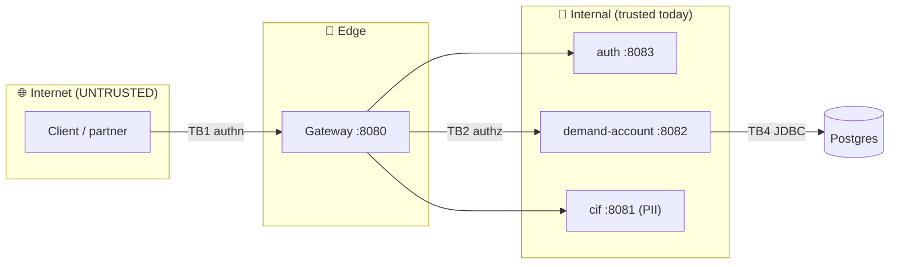
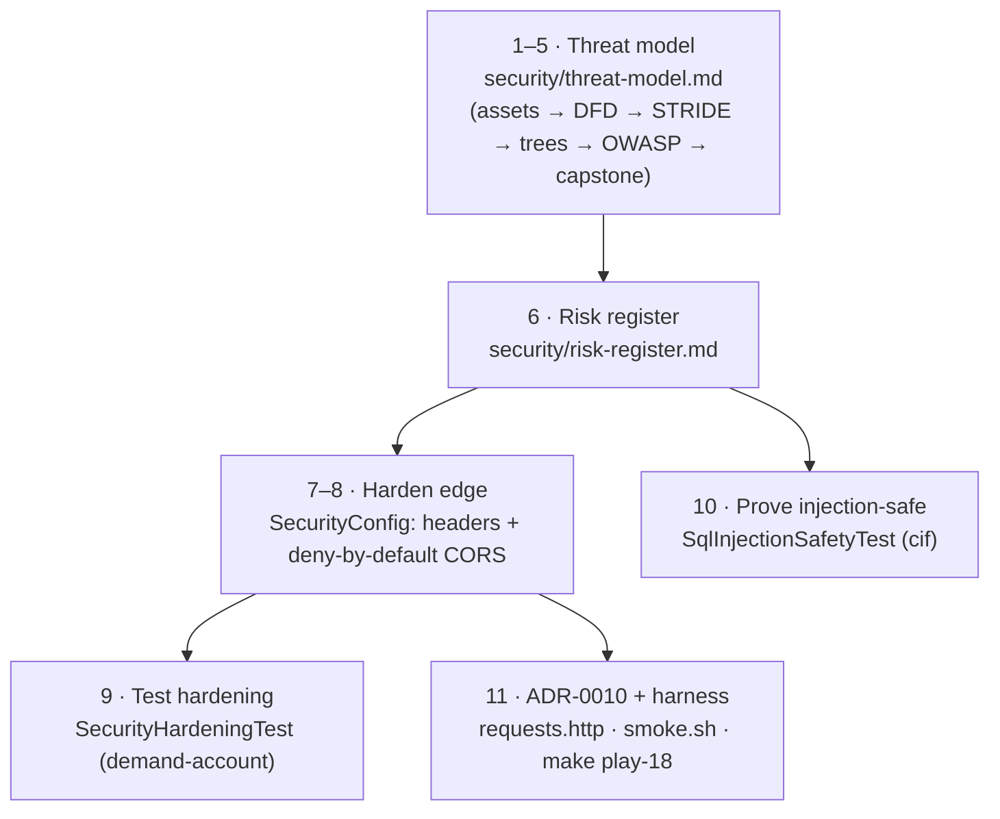
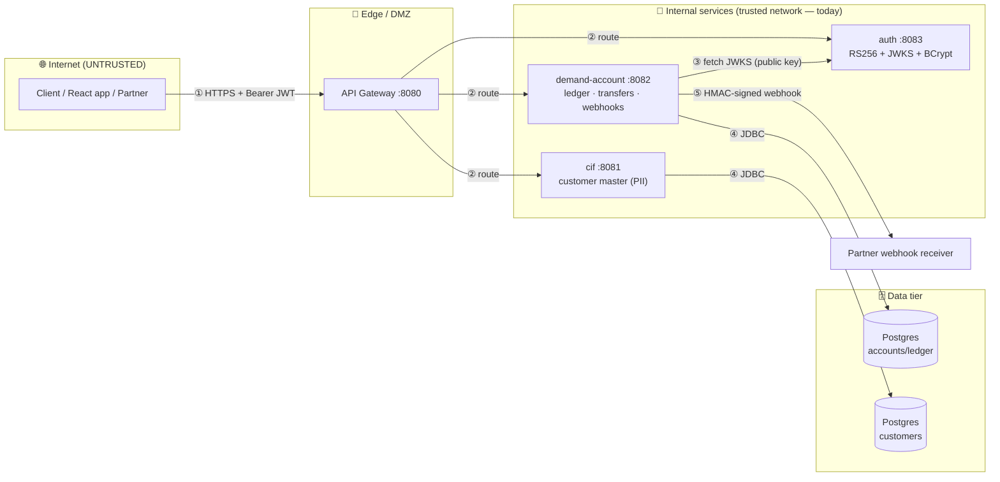
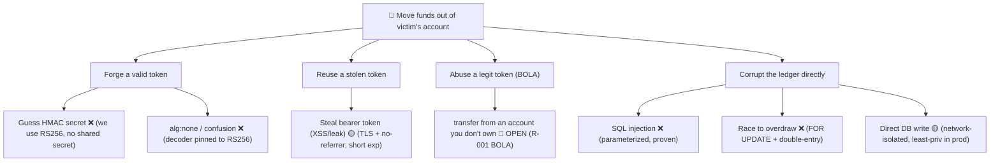
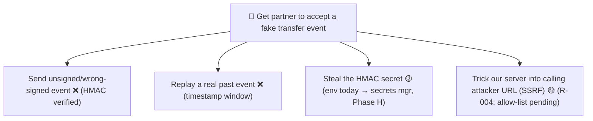
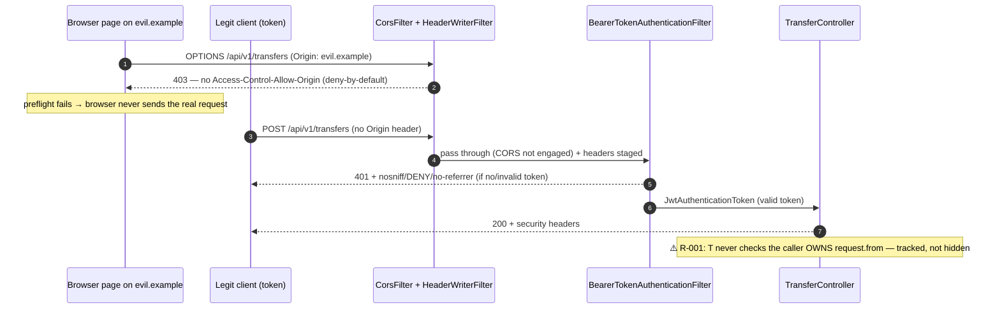

# Step 18 · Secure Coding & Threat Modeling — DevSecOps Shift-Left
### Phase C — Web, APIs & Application Security 🔵 · Step 18 of 67 · **End of Phase C** 🎓

> *You've built a real bank: customers, a ledger, transfers, a gateway, identity, resource servers. Now,
> before adding distributed messaging, you do what every serious team does — you **stop and ask "how would
> someone attack this?"** in a structured way. This step is **STRIDE threat modeling** of the bank you built,
> a walkthrough of the **OWASP Top 10 + API Security Top 10** against your own code, and the **secure-by-default
> hardening + security tests** the model demands. You'll find a real, critical bug in your own design (BOLA) —
> and learn why a senior engineer **records and schedules it** rather than half-fixing it in a hurry.*

---

<a id="toc"></a>
## 🧭 The Six Movements of This Step

| | Movement | What happens | ~Time |
|---|---|---|---|
| **A** | [🧭 Orient](#orient) | 30-second overview · skip-test · cheat card · why it matters · before you start | ~30 min |
| **B** | [🧠 Understand](#understand) | what threat modeling is · STRIDE · trust boundaries & DFDs · OWASP Top 10 / API Top 10 · BOLA · how headers/CORS/parameterized queries *actually* work | ~1.5 h |
| **C** | [🛠️ Build](#build) | **11 sub-steps**: write the threat model (assets → DFD → STRIDE → attack trees → OWASP → capstone) · the risk register · harden the edge (headers + deny-by-default CORS) · the hardening test · the injection-safety test · ADR + harness | ~8 h |
| **D** | [🔬 Prove](#prove) | the Verification Log — real test runs, the live CORS-403, the §12.3 mutation, smoke.sh, and a fresh re-run today | ~1 h |
| **E** | [🎓 Apply](#apply) | go deeper · interview prep · your-turn challenges (incl. the Phase-C capstone) | ~2.5 h |
| **F** | [🏆 Review](#review) | troubleshooting (the CORS two-beans gotcha) · resources · recap, flashcards & what's next | ~30 min |

---

<a id="orient"></a>

# A · 🧭 Orient

## 📋 This Step in 30 Seconds

| | |
|---|---|
| **Title** | Secure coding & threat modeling — STRIDE, OWASP Top 10 / API Security Top 10, secure defaults, security tests |
| **Step** | 18 of 67 · **Phase C — Web, APIs & Application Security** 🔵 · **the Phase-C finale** |
| **Effort** | ≈ 14 hours focused. About half is *thinking* (the threat model — the highest-leverage hour you'll spend), half is code (hardening + tests). Experienced security-minded learners can skim to ~3h. |
| **What you'll run this step** | **JVM + Maven**; **🐳 Docker** for the cif + demand-account Testcontainers tests. One command: `./mvnw -pl services/cif,services/demand-account -am verify` (or `bash steps/step-18/smoke.sh`). No new service. |
| **Buildable artifact** | **`security/threat-model.md`** (STRIDE DFD + trust boundaries + attack trees + OWASP×2 walkthrough + capstone) and **`security/risk-register.md`** (prioritized open risks). **demand-account hardening**: explicit security headers + **deny-by-default CORS** (`SecurityHardeningTest`, +3 tests → 34). **cif**: `SqlInjectionSafetyTest` proving parameterized queries are injection-safe, with a vulnerable contrast (+3 → 24). ADR-0010. `step-18-start == step-17-end`. |
| **Verification tier** | 🔴 **Full** — touches a security path (headers/CORS) and adds critical-path security tests. `./mvnw verify` green + the new behavior proven by real output + **§12.3 mutation** (permissive CORS → the deny-by-default test fails → revert) + clean-room + `smoke.sh`. |
| **Depends on** | **[Step 17](../step-17/lesson.md)** (auth/resource servers — the access controls we audit), **[Step 14](../step-14/lesson.md)** (signed webhooks), **[Step 13](../step-13/lesson.md)** (ProblemDetail), **[Step 8/10](../step-08/lesson.md)** (cif + Testcontainers). **+ Docker.** |

By the end you will be able to **threat-model a system with STRIDE**, walk the **OWASP Top 10 and API Security Top 10** against real code, recognize **BOLA** (the #1 API risk) and explain why ours is open, and ship **secure-by-default** edge hardening with **tests that prove injection-safety, security headers, and locked-down CORS.**

### ⏭️ Can You Skip This Step? (5-minute self-check)

If you can confidently do **all** of this, skim the 🛠️ Build and jump to **[Step 19 — Messaging & events](../step-19/lesson.md)**.

- [ ] I can explain **STRIDE** and run it **per-element** over a data-flow diagram with **trust boundaries**.
- [ ] I can name the **OWASP API Security Top 10 #1 (BOLA)** and spot it in a transfer endpoint that takes an account id from the request.
- [ ] I can configure **secure response headers** and a **deny-by-default CORS** policy in Spring Security — and explain why CORS is *not* an access control.
- [ ] I can prove a query is **injection-safe** with a test (and explain why parameterization beats escaping/blocklists).
- [ ] I know why a senior engineer **records a critical finding in a risk register and schedules a proper fix** rather than bolting on a half-fix.

> [!TIP]
> Not 100%? Stay — this is the step that turns "I write Spring apps" into "I reason about how they get attacked." "What's BOLA?", "STRIDE the login flow", and "how do you stop SQL injection — really?" are interview staples.

## 📇 Cheat Card

> **What this step delivers (one sentence):** a STRIDE threat model of the bank that surfaces a real critical bug (BOLA), the secure-by-default edge hardening it demands (security headers + deny-by-default CORS), and tests proving injection-safety / headers / CORS — with the BOLA fix honestly tracked, not faked.

**Key commands** (Windows uses `.\mvnw.cmd`):

```bash
# Run the Step-18 security tests (needs Docker) — also `make play-18`
./mvnw -pl services/cif,services/demand-account -am test -Dtest='SqlInjectionSafetyTest,SecurityHardeningTest'
# Full proof for this step
bash steps/step-18/smoke.sh
# See the headers + CORS on the running service
curl -i http://localhost:8082/api/accounts/ACC-A
curl -i -X OPTIONS http://localhost:8082/api/v1/transfers -H "Origin: https://evil.example" -H "Access-Control-Request-Method: POST"
```

**The headline diagram — STRIDE per element across a trust boundary:**

```
Internet  │  Edge/DMZ   │      Internal (trusted)        │  Data
  client ─┼─► gateway ──┼─► auth / demand-account / cif ─┼─► Postgres
          │             │                                │
   TB1 ───┘     TB2 ────┘            TB4 (JDBC) ──────────┘
  (authn)     (authz, BOLA!)        (parameterized SQL)
```

**The one sentence to remember:** *Threat modeling's job is to **find and prioritize** risks (and BOLA is ours); you ship the cheap, complete fixes now and **track** the deep ones — you never pretend an open risk is closed.*

## 🎯 Why This Matters

A bank that passes every functional test can still be trivially robbed if any authenticated user can transfer from **someone else's** account. Functional tests prove "it does what I asked"; **threat modeling** asks "what else can it do that I *didn't* ask?" — and that question is where breaches live. In interviews and on the job, "walk me through how you'd threat-model this" and "what's BOLA / how do you prevent SQL injection" separate engineers who ship features from engineers trusted with money and PII.

## ✅ What You'll Be Able to Do

- Produce a **STRIDE-per-element** threat model with a DFD, trust boundaries, and attack trees.
- Map findings to the **OWASP Top 10 (2021)** and **API Security Top 10 (2023)**.
- Identify and explain **BOLA / IDOR** and why authentication ≠ authorization.
- Harden a Spring service with **security headers** and **deny-by-default CORS**, and **test** it.
- Prove **injection-safety** with a side-by-side vulnerable-vs-parameterized contrast.
- Keep a **risk register**: record, prioritize, own, and schedule what you don't fix today.

## 🧰 Before You Start

**Prerequisites**

- ✅ The bank through Step 17 builds green: `git describe` → `step-17-end`, `./mvnw verify` → BUILD SUCCESS (9 modules).
- ✅ **Docker is running** (`docker info` prints engine details) — the cif and demand-account tests use Testcontainers.
- ✅ You can read a Mermaid diagram (we draw the DFD and attack trees in Mermaid so they're versioned with the code).

**What you already learned that connects here**

- **Step 17** — authentication (RS256 JWT) and *function-level* authorization (`@PreAuthorize`). This step audits them and finds what they *don't* cover (object-level authorization).
- **Step 14** — signed webhooks (HMAC + replay window). The model walks this flow and confirms its branch of the attack tree is closed.
- **Step 13** — `ProblemDetail` errors. Clean, typed errors are also a security control (no stack traces leak).
- **Steps 8–10** — Spring Data JPA on real Postgres (Testcontainers). The injection-safety test reuses cif's exact test harness (`ContainersConfig`, `@DataJpaTest`).
- This step **doesn't add a service** — it *examines* the ones you have. That's the point.

> **Depends on:** Steps **17, 14, 13, 8/10**. **+ Docker.**

## 🗓️ Session Plan

≈14 hours does **not** mean one heroic weekend. Six sittings, each ending at a real save point (a ✋ checkpoint or section boundary):

| Sitting | What you do | ~Time | Ends at |
|---|---|---|---|
| **S1 · Frame it** | A 🧭 Orient + B 🧠 Understand (STRIDE, trust boundaries, BOLA, how headers/CORS/parameterization work) | ~2 h | the B→C bridge diagram |
| **S2 · Model it** | Sub-steps 1–3: assets + DFD + trust boundaries (§1–2), STRIDE-per-element (§3), attack trees (§4) | ~2.5 h | Sub-step 3 ✋ checkpoint |
| **S3 · Finish the model** | Sub-steps 4–6: OWASP ×2 walkthrough (§5–6), capstone + secure-defaults checklist (§7–8), the risk register (R-001) | ~2.5 h | Sub-step 6 ✋ checkpoint |
| **S4 · Harden & prove the edge** | Sub-steps 7–9: security headers, deny-by-default CORS, `SecurityHardeningTest` + the §12.3 mutation | ~2.5 h | Sub-step 9 ✋ checkpoint + commit |
| **S5 · Injection proof & close the build** | Sub-steps 10–11 (`SqlInjectionSafetyTest`, ADR-0010 + harness) + 🎮 Play With It + D 🔬 Verification Log | ~2 h | 🏁 commit & tag `step-18-end` |
| **S6 · Apply & close Phase C** | E 🎓 go-deeper + interview prep + Phase-C capstone · F 🏆 recap | ~2.5 h | 🎉 end of Phase C |

**Optional routes:** the ⏭️ skip-test (5 min) can compress the whole step to a ~3 h skim; the four 🚀 Go Deeper asides are +~5 min each; the ⌨️ type-it-yourself in sub-step 10 is +~10 min; Your Turn quick challenges are +~15–30 min each; the capstone's BOLA-fix stretch adds ~2–3 h on top of S6.

> 🔋 **Stopping here?** You have the map: what this step builds, why, and the six-sitting plan. Next: B 🧠 Understand (STRIDE, trust boundaries, BOLA); first action: read "The Big Idea" just below.

---

<a id="understand"></a>

# B · 🧠 Understand

## 🧠 The Big Idea — threat modeling is "design review for attackers"

Threat modeling answers four questions (Adam Shostack's framing — he literally wrote the book):

1. **What are we building?** → a model: a **data-flow diagram (DFD)** of processes, data stores, external entities, and the flows between them.
2. **What can go wrong?** → **STRIDE**, applied to every element and every flow.
3. **What are we going to do about it?** → mitigations, each shipped *or* recorded in a **risk register** with an owner and a date.
4. **Did we do a good job?** → review it; revisit when the system changes.

It's **shift-left**: doing this on a diagram costs minutes; discovering the same flaw in production costs a breach. "Left" refers to the timeline of a project drawn left-to-right (design → code → test → deploy → operate): the further left you find a flaw, the cheaper it is to fix. A design-stage authorization gap is an afternoon of thinking; the same gap discovered in production is an incident, a disclosure, and a regulator.

The single most important artifact is the **trust boundary** — the line where data moves from less-trusted to more-trusted territory. *Every boundary crossing is a checkpoint that must authenticate, authorize, and validate.* Draw the boundaries first and half the threats fall out mechanically: every arrow that crosses a dashed line is a question.



*Alt-text: the bank's data-flow diagram. A client on the untrusted internet calls the gateway (crossing trust boundary TB1, where authentication matters); the gateway routes to auth, demand-account, and cif inside the trusted internal zone (crossing TB2, where authorization matters); demand-account talks JDBC to Postgres (crossing TB4, where parameterized SQL matters).*

> 🔬 **Break-it-on-purpose (thought experiment):** pick the `da → Postgres` flow. If a user controls part of a query string, what crosses TB4? If it's *data* (a bound parameter) → safe. If it's *code* (concatenated SQL) → injection. That single distinction is OWASP A03 — and sub-step 10 turns it into a runnable test.

**An analogy — the building inspector.** A functional test is a customer walking the showroom: "does the door open?" A threat model is a **building inspector with a checklist**: they don't ask whether the door opens — they ask whether the hinges are on the outside, whether the fire exit locks from the wrong side, whether the safe is bolted down. STRIDE is the inspector's checklist; the DFD is the floor plan they walk; the risk register is the inspection report with each finding graded and assigned.

## 🧩 Pattern Spotlight — STRIDE

**Problem:** "think of everything that could go wrong" is unbounded and you'll miss categories. **STRIDE** is a checklist of six threat *categories*, each the violation of a security property:

| Letter | Threat | Violates | Bank example |
|---|---|---|---|
| **S** | Spoofing | Authentication | Forge a JWT; pretend to be Alice |
| **T** | Tampering | Integrity | Alter an amount; corrupt the ledger |
| **R** | Repudiation | Non-repudiation | "I never made that transfer" |
| **I** | Information disclosure | Confidentiality | Read someone else's balance/PII |
| **D** | Denial of service | Availability | Flood transfers; exhaust the pool |
| **E** | Elevation of privilege | Authorization | USER performs an ADMIN action; **move another user's money** |

**Why it fits:** applied **per element** (each process, store, flow), STRIDE turns "what could go wrong?" into six concrete questions you ask of each box and arrow — systematic, repeatable, reviewable. **Alternatives:** *attack trees* (goal-first, good for depth on one asset — we use them too), *PASTA* (a heavier, seven-stage, business-risk-centric process), *LINDDUN* (privacy-focused — its categories are privacy violations like Linkability and Identifiability rather than security ones). STRIDE-per-element is the best first tool: light enough to actually do, structured enough to be reviewable.

**Implementation micro-structure:** ① list assets and elements → ② draw the DFD and the trust boundaries → ③ for each element, ask all six letters and record ✅ mitigated / 🟡 partial / 🔴 open → ④ every 🔴/🟡 either gets fixed now or becomes a numbered, owned entry in the risk register. That's exactly the shape of `security/threat-model.md`, which you build in sub-steps 1–5.

## 🌱 Under the Hood: the controls you're auditing (and adding)

- **Authentication vs authorization.** Step 17 gave us **authentication** (a valid JWT) and *function-level* authorization (`@PreAuthorize` on admin ops). It did **not** give us **object-level** authorization — "does *this* user own *this* account?". That gap is **BOLA**.

- **Security headers** are response headers the browser obeys: `X-Content-Type-Options: nosniff` (don't guess MIME types → blocks a class of XSS where a browser "sniffs" an upload into executable HTML), `X-Frame-Options: DENY` (don't let other sites render us inside an `<iframe>` → anti-clickjacking), `Referrer-Policy: no-referrer` (don't leak our URLs to third-party sites the user clicks through to), `Strict-Transport-Security` (HSTS — tells the browser "only ever HTTPS for this host"; Spring only emits it over an actual TLS connection). **How Spring writes them:** the filter chain contains a `HeaderWriterFilter` near the very front; it carries a list of `HeaderWriter` strategies (one per header) and stamps them onto **every** response — including a 401 produced later in the chain, which is exactly what our test relies on. The `.headers(...)` DSL you'll write in sub-step 7 is just configuring that writer list.

- **CORS** (Cross-Origin Resource Sharing) is a **browser** mechanism. Browsers enforce the *same-origin policy*: a page from `https://evil.example` may not read responses from `http://localhost:8082` — *unless* our server opts in. For non-simple requests the browser first sends a **preflight**: an `OPTIONS` request carrying `Origin` and `Access-Control-Request-Method` headers, asking "may a page from origin X call you with method Y?" **How Spring answers:** when `.cors(...)` is enabled, Spring Security inserts a `CorsFilter` *before authentication* in the chain. It detects the preflight, looks up the policy from our `CorsConfigurationSource` bean, and either answers with `Access-Control-Allow-Origin` (allowed) or rejects with **403** and *no* ACAO header (denied) — the request never reaches the controller either way. **Deny-by-default** means our allow-list starts empty, so the answer is "no" unless an origin is explicitly listed. ⚠️ CORS is a **guardrail for browsers, not an access control** — a non-browser client (curl, another server) sends whatever it likes and ignores the policy entirely. The real gate is the JWT.

- **Parameterized queries** are why Spring Data is injection-safe. A derived query like `findByCustomerNumber(input)` compiles to `SELECT … WHERE customer_number = ?` — and over the Postgres wire protocol the SQL text and the parameter values travel **separately** (the *extended query protocol*: the server **parses** the SQL into a plan first, then **binds** the values into the already-parsed statement). The user's input physically cannot change the SQL's structure because the structure is fixed before the input arrives. Concatenation (`"… = '" + input + "'"`) destroys that separation: input becomes part of the text the parser reads, so `' OR '1'='1` turns one condition into two. That's the entire injection story — and sub-step 10's contrast test shows both halves of it.

- **CSRF and why ours stays off.** Cross-Site Request Forgery rides **ambient credentials** — cookies the browser attaches automatically. Our APIs use Bearer tokens the client must attach explicitly, so there is no ambient credential to forge with. We disable CSRF **deliberately and documentedly** (it's in the secure-defaults checklist) — and the model notes it must come back the moment any cookie-based auth appears.

❓ **Knowledge-check:** with the CORS allow-list empty (deny-by-default), our existing server-to-server integration tests still pass — why doesn't locking down CORS break them? <details><summary>Answer</summary>Non-browser clients (HttpClient, curl, other servers) send no `Origin` header, so the `CorsFilter` never engages — CORS is a browser mechanism, not an access control; the JWT remains the real gate.</details>

## 🛡️ Security Lens: BOLA, the #1 API risk — and it's in our code

**Broken Object Level Authorization** (OWASP API1:2023; the classic name is IDOR — Insecure Direct Object Reference) is when an endpoint takes an object identifier from the request and acts on it **without checking the caller is entitled to that object**. Look at our v1 transfer handler as it exists right now (from `TransferController`, unchanged this step):

```java
// services/demand-account/src/main/java/com/buildabank/account/web/TransferController.java (excerpt — the BOLA)
@PostMapping("/api/v1/transfers")
public ResponseEntity<TransferResponse> transferV1(
        @RequestHeader(value = "Idempotency-Key", required = false) String idempotencyKey,
        @Valid @RequestBody TransferRequest request) {
    UUID transactionId = idempotentTransfers.transfer(
            idempotencyKey, request.from(), request.to(), request.amount(), request.description());
    // ...
}
```

`request.from()` — the account money leaves — comes **straight from the request body** and is never compared to the authenticated caller (`jwt.getSubject()`). Any user with **any** valid token can set `from` to **anyone's** account and drain it. Same shape on `GET /api/accounts/{n}` — read any balance. **This is a real, critical bug in the bank you built.** We will *not* sweep it under the rug, and we will *not* rush a half-fix. See sub-step 6 (the risk register) and the capstone for why we **record and schedule** it.

❓ **Knowledge-check:** the request *is* authenticated (Step 17's resource server rejects no-token requests with 401). So which STRIDE letter is BOLA? <details><summary>Answer</summary>**E — Elevation of privilege** (and **I** for the read paths): the caller is who they claim to be (S is fine), but they act on an object beyond their privilege. Authentication passes; *authorization at the object level* is what's missing.</details>

## 🕰️ Then vs. Now

| Concern | ❌ Then | ✅ Now | Why |
|---|---|---|---|
| Injection defense | "escape user input", blocklist `'` and `;` | **parameterized queries / prepared statements** (ORMs bind parameters for you) | escaping/blocklists are bypassable encodings games; parameterization makes input *structurally* unable to become code |
| CSRF advice | "add CSRF tokens everywhere" | **depends on the credential**: cookie/session → CSRF protection ON; stateless Bearer tokens → no ambient credential, CSRF off *by documented design* | the attack needs auto-attached credentials; know which mode you're in |
| Security reviews | a pen-test just before release (find-it-late) | **threat modeling at design time** (shift-left) + security tests in CI | a diagram-stage fix costs minutes; a production fix costs a breach |
| Headers | ad-hoc, per-team folklore | a known, short set of defaults (`nosniff`, frame-deny, referrer policy, HSTS) written by the framework on every response | browsers standardized the contracts; frameworks ship writers for them |

## 🧵 Thread-safety note

Everything this step adds is **shared, immutable state** — the safe kind. The `SecurityFilterChain`, the `HeaderWriterFilter`'s writer list, and the `CorsConfiguration` inside our `corsConfigurationSource` bean are all built **once** at startup and then only *read* by every request thread; no request mutates them. That's the standard Spring pattern from Step 11's rules: share immutable objects freely, confine mutable ones. (Contrast the `SecurityContextHolder`, which *is* per-request mutable state — it's safe because it's `ThreadLocal`-confined, one context per request thread.)

> 🔋 **Stopping here?** You have the theory: STRIDE, trust boundaries, BOLA, and how headers/CORS/parameterized queries actually work. Next: C 🛠️ sub-step 1 (threat model §1–2 — assets, DFD, trust boundaries); first action: create `security/threat-model.md`.

---

<a id="bridge"></a>

# B→C bridge: 🗺️ what we'll build



*Alt-text: the build roadmap. Sub-steps 1–5 produce the threat model, which feeds sub-step 6's risk register. The register justifies sub-steps 7–8 (edge hardening in SecurityConfig), tested in sub-step 9, and sub-step 10's injection-safety test on cif. Sub-step 11 wires the ADR and the play/verify harness.*

🌳 **Files we'll touch**

```
security/
  threat-model.md          (new) STRIDE DFD, trust boundaries, attack trees, OWASP×2, capstone   ← sub-steps 1–5
  risk-register.md         (new) prioritized open risks (R-001 BOLA …)                            ← sub-step 6
services/demand-account/
  src/main/java/.../web/SecurityConfig.java           (edit) headers + deny-by-default CORS       ← sub-steps 7–8
  src/main/resources/application.yml                  (edit) app.security.cors.allowed-origins    ← sub-step 8
  src/test/java/.../web/SecurityHardeningTest.java    (new) +3 tests                              ← sub-step 9
services/cif/
  src/test/java/.../domain/SqlInjectionSafetyTest.java (new) +3 tests                             ← sub-step 10
adr/
  0010-threat-model-and-secure-defaults.md            (new)                                       ← sub-step 11
Makefile                                              (edit) play-18 target                       ← sub-step 11
steps/step-18/{lesson.md, requests.http, smoke.sh}                                                ← sub-step 11
```

<a id="build"></a>

# C · 🛠️ Let's Build It — Step by Step

## 📦 Your Starting Point

You're at **`step-18-start`** (identical to `step-17-end`). What's green right now:

- The whole bank builds: `./mvnw verify` → BUILD SUCCESS across **9 modules**.
- **auth** (:8083) issues **RS256** JWTs, publishes a **JWKS** at `/oauth2/jwks`, enforces `@PreAuthorize` method security — **11 tests**.
- **demand-account** (:8082) is an **OAuth2 resource server** (validates tokens via auth's JWKS); money endpoints require a token; `/api/v1/admin/ping` requires `ROLE_ADMIN` — **31 tests**. Its endpoints: `POST /api/accounts`, `GET /api/accounts/{n}`, `POST /api/transfers` (deprecated), `POST /api/v1/transfers` (idempotent + webhook), `GET /api/v1/accounts/{n}/entries` (paginated), `GET /api/v1/admin/ping`.
- **cif** (:8081) is the customer master on Postgres (Flyway V1+V2, Testcontainers tests) — **21 tests**. ⚠️ Note for the model: cif has **no Spring Security at all** — it trusts the network.
- **gateway** (:8080) routes `/cif/**` and `/bank/**`.

What you'll add: **two markdown artifacts** (the threat model and the risk register), **one edited class** (`SecurityConfig` — headers + CORS), **two new test classes**, an ADR, and the play/verify harness. No new service, no schema change, no endpoint change.

Sanity-check before you start:

```bash
git describe --tags     # → step-17-end (or step-18-start)
docker info >/dev/null && echo "docker OK"
```

✅ Expected:

```
step-17-end
docker OK
```

> [!NOTE]
> **Why so much markdown in a build step?** Because *the threat model is the deliverable* — it's the thinking that finds the bug. The code (hardening + tests) is what the model *demands*. Treat sub-steps 1–6 with the same care as code: they're versioned, reviewed, and they drive everything after.

---

### Sub-step 1 of 11 — Threat model §1–2: assets, the DFD & trust boundaries · ⏱️ ~45 min 🧭 *(you are here: **model the system** → STRIDE → trees → OWASP → register → harden → test → prove)*

🎯 **Goal:** answer Shostack question #1 — *what are we building?* — precisely enough to attack it on paper: the element inventory, the assets ranked by value, the data-flow diagram, and the five trust boundaries. This is *thinking made durable*.

📁 **Location:** new file → `security/threat-model.md` (a new top-level `security/` folder — these artifacts belong to the whole system, not to one service).

⌨️ **Code** — the file's header and sections §1–2, verbatim:

````markdown
# 🛡️ Build-a-Bank — Threat Model (STRIDE)

> **Step 18 · Phase C finale · DevSecOps shift-left.** A threat model is a *structured, repeatable*
> way to ask "what can go wrong?" *before* an attacker asks it for us. This document models the bank
> **as built through Step 17** (cif, demand-account, auth, gateway), records the risks STRIDE surfaces,
> and tracks each to a mitigation that is **either already shipped or scheduled** (see
> [`risk-register.md`](risk-register.md)). It is a living document: revisit it whenever a service, data
> flow, or trust boundary changes (the §15 loop reminds us to).

- **Method:** STRIDE-per-element over a data-flow diagram (DFD), plus two attack trees and a walkthrough
  of the OWASP Top 10 (2021) and OWASP API Security Top 10 (2023) against our actual code.
- **Owner:** the team. **Last reviewed:** Step 18. **Next review:** when Phase D (messaging) adds Kafka.
- **Honesty note (§12.8):** this model names **real, currently-open risks in our own code** — most
  importantly **BOLA** on the money endpoints. Threat modeling's job is to *find and prioritize* them;
  we ship the cheap edge fixes now (headers, CORS) and schedule the deeper ones (object-level authz).

---

## 1. What are we building? — system & assets

A small bank platform. The pieces in scope at Step 17:

| Element | Type | What it holds / does | Sensitivity |
|---|---|---|---|
| **Client** (curl / future React app / partner) | External entity | Holds a bearer JWT | — |
| **API Gateway** (`gateway`, :8080) | Process (DMZ) | Routes `/cif/**`, `/bank/**`; the front door | Edge |
| **auth** (:8083) | Process | Issues RS256 JWTs, publishes JWKS, BCrypt password check | **Critical** (identity) |
| **demand-account** (:8082) | Process | Money: accounts, double-entry ledger, transfers, webhooks | **Critical** (money) |
| **cif** (:8081) | Process | Customer master (PII: name, email, DOB) | **High** (PII) |
| **PostgreSQL** (per service) | Data store | Balances, ledger, idempotency keys, customers | **Critical** |
| **Partner webhook receiver** | External entity | Receives signed `transfer.completed` events | High |

**Assets to protect (in priority order):** ① ledger integrity & funds (no unauthorized or double
movement); ② identity/credentials (no forgery of tokens); ③ customer PII (confidentiality); ④ availability
of the money path; ⑤ auditability (non-repudiation of transfers).

**Security objectives:** authenticate every money/PII request, authorize at the object level, keep the
ledger balanced and conserved, sign cross-service trust with keys (not shared secrets), and leave a
tamper-evident audit trail.

---

## 2. Data-flow diagram & trust boundaries



**Trust boundaries** (a boundary = where data crosses from one trust level to another; every crossing is
a place to validate, authenticate, and authorize):

| # | Boundary | Crossing | Controls today | Gaps (→ risk register) |
|---|---|---|---|---|
| TB1 | Internet → Edge | Client → Gateway | TLS (prod), JWT required downstream | Rate-limiting not yet (→ Step 37) |
| TB2 | Edge → Internal | Gateway → service | JWT validated at resource server (da, auth) | **cif has no auth — network-trust only** |
| TB3 | Service → auth | da fetches JWKS | Public key only; can't mint tokens | Ephemeral key (restart rotates) |
| TB4 | Service → DB | JDBC | Parameterized queries; least-priv user (prod) | DB creds via env (→ secrets mgmt, Phase H) |
| TB5 | Bank → Partner | da → webhook | **HMAC signature + timestamp** (Step 14) | Partner URL allow-list / SSRF guard pending |

---

````

🔍 **Line-by-line (how to read — and write — these two sections):**

- **The header block** sets the contract for the whole document: the *method* (STRIDE-per-element + attack trees + OWASP), the *scope* ("as built through Step 17" — a model must name what version of the system it describes), an *owner and review trigger* ("when Phase D adds Kafka" — models rot; tie the review to a concrete change, not a date you'll ignore), and the **honesty note** — the document promises to name open risks, not to flatter us.
- **§1's element table** uses the four classic DFD element types: **external entity** (things you don't control: clients, partners), **process** (your running code), **data store** (databases), and *data flows* (the arrows, drawn in §2). Every element gets a **sensitivity** grade — that's what lets you prioritize demand-account over, say, the hello service.
- **Assets in priority order** — this ordering is load-bearing: when two mitigations compete for your time, the asset list is the tiebreaker. Ledger integrity outranks availability *for a bank* (better briefly down than wrongly debited).
- **§2's Mermaid DFD** is the same architecture you've been building since Step 15, redrawn with **trust zones as subgraphs**: untrusted internet → DMZ (the gateway's zone — "demilitarized zone," the exposed strip between the internet and your interior) → trusted internal → data tier. The numbered arrows (①–⑤) are the data flows the STRIDE tables will reference.
- **The trust-boundary table** is the heart: each row is a *crossing*, with the **controls that exist today** and the **gaps** already cross-referenced to the register entry or future step that owns them. Notice TB2's gap is bolded — cif holding PII with no app-layer auth is a finding *before we even run STRIDE*.

💭 **Under the hood — why a DFD and not the deployment diagram?** Threats follow *data*, not boxes. A deployment diagram shows where code runs; a DFD shows what crosses between trust levels — and an attacker lives on the arrows, not in the boxes. That's also why the boundaries are drawn as zones around groups of elements: the *interesting* events are arrows that pierce a zone wall.

🔮 **Predict:** before reading on — which single trust boundary do you expect to generate the worst finding, and why? <details><summary>Answer</summary>**TB2 (edge → internal)** — it's where *authorization* must happen. TB1's authentication is solid (Step 17), TB4's parameterization is solid (Spring Data), TB5 is signed (Step 14). But "you're authenticated" says nothing about *which account* you may touch — and that's exactly where BOLA lives.</details>

▶️ **Run & See** — the skeleton exists and names its method:

```bash
test -f security/threat-model.md && grep -qi "trust boundar" security/threat-model.md && echo "model present, boundaries named"
```

✅ **Expected output:**

```
model present, boundaries named
```

✋ **Checkpoint:** `security/threat-model.md` exists with §1 (seven elements, five assets) and §2 (the DFD + the five-row TB table). Every gap cell points somewhere (a register id or a step number) — no dangling "TODO".

💾 **Commit** (the reference repo commits this step as one unit at the end — committing the model as you go is equally fine):

```bash
git add security/threat-model.md
git commit -m "docs(security): threat model — system, assets, DFD, trust boundaries"
```

⚠️ **Pitfall:** modeling the system you *wish* you had. The DFD must show what's true **today** — which is why cif appears with no auth and the gateway with no rate limiting. A flattering model finds nothing.

---

### Sub-step 2 of 11 — Threat model §3: STRIDE-per-element · ⏱️ ~1 h 🧭 *(model ✅ → **STRIDE tables** → trees → OWASP → register …)*

🎯 **Goal:** answer Shostack question #2 — *what can go wrong?* — by interrogating every element with all six STRIDE letters and recording an honest status for each: ✅ mitigated, 🟡 partial, 🔴 **open**.

📁 **Location:** `security/threat-model.md` — append §3.

⌨️ **Code** — §3 verbatim (six element tables; demand-account first, because it's the money):

````markdown
## 3. STRIDE-per-element

STRIDE = **S**poofing · **T**ampering · **R**epudiation · **I**nformation disclosure · **D**enial of
service · **E**levation of privilege. For each element we ask all six. ✅ = mitigated, 🟡 = partial,
🔴 = **open** (tracked in the risk register), ➖ = not applicable.

### 3.1 demand-account (the money process) — highest priority

| Threat | Scenario | Status | Mitigation / note |
|---|---|---|---|
| **S** Spoofing | Caller pretends to be a user | ✅ | OAuth2 resource server; valid RS256 JWT required (Step 17) |
| **T** Tampering | Alter amount / balance in flight | ✅ | TLS in transit; server recomputes balances; `@Version` optimistic lock |
| **T** Tampering | Race two transfers to overdraw | ✅ | Pessimistic `SELECT … FOR UPDATE` + double-entry invariant (Step 12) |
| **R** Repudiation | "I never made that transfer" | 🟡 | Double-entry ledger + audit entry; **per-user attribution weak** (no owner on account) |
| **I** Info disclosure | Read someone else's balance/ledger | 🔴 **BOLA** | `GET /api/accounts/{n}` & `/entries` accept ANY account for ANY authed user → **R-001** |
| **D** DoS | Flood transfers / huge pages | 🟡 | Pageable caps page size; **no rate limit yet** (→ Step 37 Resilience4j) |
| **E** Elevation | USER calls admin op | ✅ | `@PreAuthorize("hasRole('ADMIN')")` method security (Step 17) |
| **E** Elevation | **Move money from an account you don't own** | 🔴 **BOLA** | `POST /api/(v1/)transfers` never checks the JWT subject owns `from` → **R-001** |

### 3.2 auth (the identity process)

| Threat | Scenario | Status | Mitigation / note |
|---|---|---|---|
| **S** Spoofing | Brute-force a password | 🟡 | BCrypt (slow, salted); **no lockout/throttle yet** (→ Step 37) |
| **T** Tampering | Forge/alter a JWT | ✅ | RS256: only auth holds the private key; validators have public key only (Step 17) |
| **T** Tampering | `alg:none` / algorithm-confusion | ✅ | Nimbus decoder pinned to RS256 via JWKS `kty/alg`; symmetric keys rejected |
| **R** Repudiation | Deny logging in | 🟡 | Token has `sub`/`iat`/`exp`; central audit log deferred |
| **I** Info disclosure | Leak password hashes / private key | ✅ | Hashes never returned; private key in-memory, only public half at `/oauth2/jwks` |
| **D** DoS | Credential-stuffing flood | 🟡 | → rate limit Step 37 |
| **E** Elevation | Self-grant ADMIN | ✅ | Roles set server-side from the user store, never from client input |

### 3.3 cif (customer master / PII)

| Threat | Scenario | Status | Mitigation / note |
|---|---|---|---|
| **S** Spoofing | Unauthenticated PII read | 🔴 | **cif has NO Spring Security** — relies on TB2 network trust only → **R-002** |
| **T** Tampering | **SQL injection** | ✅ | Spring Data parameterized queries; proven by `SqlInjectionSafetyTest` (Step 18) |
| **R** Repudiation | Unattributed PII edits | 🟡 | `@Version` + `created_at`; full audit deferred |
| **I** Info disclosure | Over-fetch PII | 🟡 | DTO projections (`CustomerResponse`); field-level minimization pending |
| **D** DoS | Unbounded queries | 🟡 | Paging exists; no rate limit |
| **E** Elevation | — | ➖ | cif has no roles yet |

### 3.4 API Gateway (edge)

| Threat | Scenario | Status | Mitigation / note |
|---|---|---|---|
| **S/T** | Header spoofing, host smuggling | 🟡 | StripPrefix routing; **trusted-header hardening** pending |
| **I** | Verbose errors leak internals | ✅ | ProblemDetail (RFC 9457) gives clean, typed errors (Step 13) |
| **D** | Edge flood | 🔴 | **No rate limiting / circuit breaking yet** → **R-003** (Step 37) |

### 3.5 PostgreSQL (data store)

| Threat | Scenario | Status | Mitigation / note |
|---|---|---|---|
| **T** | Direct row tampering | 🟡 | App-only access; least-priv DB role + at-rest encryption in prod (Phase H) |
| **I** | Dump the DB | 🟡 | Network-isolated; secrets via env today → secrets manager (Phase H) |
| **R** | — | ✅ | Append-only ledger entries; balanced double-entry invariant |

### 3.6 Partner webhook flow

| Threat | Scenario | Status | Mitigation / note |
|---|---|---|---|
| **S** | Forged webhook to partner | ✅ | **HMAC-SHA256 signature** over body+timestamp (Step 14) |
| **T** | Tamper / **replay** old event | ✅ | Signature covers body; **timestamp replay window** rejects stale (Step 14) |
| **R** | Partner denies receipt | 🟡 | At-least-once + retry; delivery log deferred |
| **I** | **SSRF** via attacker-set callback URL | 🟡 | URL is config-driven today; **allow-list + egress guard** pending → **R-004** |

---

````

🔍 **Line-by-line (the method, concretely):**

- **One table per element, six letters per table** — that's "per-element." Some letters get *two* rows where two distinct scenarios exist (demand-account has two Tampering rows — in-flight alteration vs the overdraw race — and two Elevation rows). Some get ➖ where the category genuinely can't apply (cif has no roles, so there's no privilege to elevate *yet*).
- **Every row cites its evidence.** ✅ rows name the step and mechanism that closed them (`FOR UPDATE` + double-entry → Step 12; RS256 → Step 17). 🟡 rows say what exists *and* what's missing. 🔴 rows point at a **register id** — a 🔴 without an R-number is a finding you're about to forget.
- **The two 🔴 rows on demand-account trace to one cause:**

```
I (Information disclosure)  read any account     → BOLA → R-001
E (Elevation of privilege)  move any account's $ → BOLA → R-001
```

  One missing control (object-level authorization) shows up as two STRIDE letters. That convergence is a *confidence* signal — independent questions found the same hole.
- **3.3's Tampering row is forward-looking:** it cites `SqlInjectionSafetyTest` (Step 18) — the test you'll write in sub-step 10. The model and the tests reference each other; that's what makes the model *checkable* rather than aspirational.
- **3.4–3.6** show STRIDE scales *down* too: the gateway, the database, and even an outbound flow (the webhook) each get a pass, with rows collapsed (`S/T`) where the scenarios merge.

💭 **Under the hood — why record ✅ rows at all?** Two reasons. First, a review needs to see the *whole* surface was swept, not just the failures — an absent row is indistinguishable from a forgotten one. Second, the ✅ rows become regression tripwires: when Step 19 adds Kafka, anyone touching the webhook path can see exactly which guarantees (HMAC, replay window) they must not break.

🔮 **Predict:** count before you grep — how many 🔴 markers do you expect across the whole model: 3, 5, or 10? <details><summary>Answer</summary>**10** — but only **4 distinct findings** (R-001 appears in two STRIDE rows + the attack tree + OWASP tables; R-002/R-003 similarly recur). Recurrence across views is normal: one root cause shows up everywhere you look.</details>

▶️ **Run & See:**

```bash
grep -c '🔴' security/threat-model.md
```

✅ **Expected output:**

```
10
```

✋ **Checkpoint:** §3 has six element tables; every 🔴 cell names an R-id; demand-account's I and E rows both say **BOLA → R-001**.

💾 **Commit:**

```bash
git add security/threat-model.md
git commit -m "docs(security): STRIDE-per-element tables for all six elements"
```

⚠️ **Pitfall:** a threat model that says "everything's fine" is a *bad* threat model — it means you didn't look hard enough. Ours names a critical bug in our own code. Good. (The opposite failure exists too: a wall of hypothetical 🔴s with no prioritization is noise — that's what the severity-ranked register in sub-step 6 is for.)

---

### Sub-step 3 of 11 — Threat model §4: attack trees · ⏱️ ~45 min 🧭 *(STRIDE ✅ → **attack trees** → OWASP → register …)*

🎯 **Goal:** complement STRIDE's *breadth* with goal-first *depth*: for the two crown-jewel attacker goals — steal money, forge a webhook — enumerate every path and mark each closed (❌/✅) or open (🔴/🟡).

📁 **Location:** `security/threat-model.md` — append §4.

⌨️ **Code** — §4 verbatim:

````markdown
## 4. Attack trees

How a determined attacker reaches the two crown-jewel goals. Leaves are concrete steps; ✅/🔴 mark whether
that path is closed.

### 4.1 Goal: steal money from an account



**Reading it:** every forged-token and ledger-corruption branch is closed. The **one open path is A3a —
BOLA** — which is exactly why it is the #1 item in the risk register.

### 4.2 Goal: forge a webhook the partner will trust



---

````

🔍 **Line-by-line (how an attack tree works):**

- **The root is the attacker's *goal*** ("move funds out"), not a vulnerability. You then ask "how could they?" and branch: each child is a *strategy* (forge a token, reuse one, abuse a legit one, corrupt the ledger), and each leaf is a *concrete technique* with a verdict.
- **A1 — forge:** `A1a` is closed *because of an architectural choice* — Step 17's move to RS256 means there is no shared HMAC secret to guess. `A1b` (the algorithm-confusion attack from Step 17's lesson) is closed because the Nimbus decoder pins the algorithm to the key, never trusting the token's own `alg` header.
- **A2 — steal:** marked 🟡, honestly — token theft via XSS or a leaked log can't be fully *closed* server-side; TLS, the new `no-referrer` policy (sub-step 7!), and short expiry *reduce* it. Trees let you record partial mitigation without rounding it up to "done."
- **A3 — abuse:** the only 🔴 leaf in the money tree. An attacker needs no exploit at all — just their own valid login and someone else's account number. Lowest skill, highest impact: that combination is what makes BOLA CRITICAL.
- **A4 — corrupt:** three techniques, all closed or partial — and look *where* they were closed: `A4a` by this step's test, `A4b` by **Step 12's** locking work, `A4c` by deployment posture. The tree stitches five steps of work into one defensive picture.
- **Tree 4.2** walks the *outbound* flow — a reminder that you threat-model flows you *initiate* too. B4 (SSRF — Server-Side Request Forgery, tricking *our* server into calling a URL of the attacker's choosing) only becomes live if the webhook URL ever becomes partner-supplied; the model flags it **before** that feature exists.

💭 **Under the hood — STRIDE vs trees, when each:** STRIDE sweeps every element for every *category* (you won't forget a class of bug); a tree drills one *goal* to exhaustion (you learn whether the crown jewel is actually reachable). They cross-check each other: STRIDE found BOLA via the E row; the tree confirms it's the **only** open path to the money. When both views converge on the same single finding, you can trust the prioritization.

🔮 **Predict:** if you fixed R-001 tomorrow, which leaf becomes the new weakest path to the money? <details><summary>Answer</summary>**A2a — token theft** (the only remaining non-❌ leaf besides ops-level A4c). And that's already partially mitigated and shrinks further with short expiries + the Phase-H secrets work. The tree tells you your *next* priority automatically.</details>

▶️ **Run & See:**

```bash
grep -n 'OPEN (R-001 BOLA)' security/threat-model.md
```

✅ **Expected output (line number may shift as you edit):**

```
180:    A3 --> A3a["transfer from an account you don't own 🔴 OPEN (R-001 BOLA)"]
```

✋ **Checkpoint:** both trees render (preview the Mermaid), every leaf carries a verdict, and the money tree has exactly **one** 🔴 leaf.

> 🔋 **Stopping here?** You have `threat-model.md` through §4 — assets, DFD + trust boundaries, six STRIDE tables, two attack trees — committed. Next: Sub-step 4 of 11 (the OWASP Top 10 ×2 walkthrough); first action: reopen `security/threat-model.md` and append §5.

💾 **Commit:**

```bash
git add security/threat-model.md
git commit -m "docs(security): attack trees — steal-money and forge-webhook goals"
```

⚠️ **Pitfall:** trees with abstract leaves ("hack the server") are useless — a leaf must be concrete enough that you can say *how it's blocked* ("alg:none → decoder pinned to RS256"). If you can't name the blocking control, the leaf isn't closed.

---

### Sub-step 4 of 11 — Threat model §5–6: the OWASP Top 10 ×2 walkthrough · ⏱️ ~45 min 🧭 *(trees ✅ → **OWASP lenses** → capstone → register …)*

🎯 **Goal:** audit the bank against the industry's two standard checklists — the **OWASP Top 10 (2021)** for web apps and the **OWASP API Security Top 10 (2023)** for APIs — one honest row per category, each citing our actual code or our actual gap.

📁 **Location:** `security/threat-model.md` — append §5 and §6.

⌨️ **Code** — verbatim:

````markdown
## 5. OWASP Top 10 (2021) — walked against our code

| # | Category | Our posture | Evidence / next |
|---|---|---|---|
| A01 | Broken Access Control | 🔴 **BOLA open** on money endpoints; method security present | R-001; Step 17 `@PreAuthorize` |
| A02 | Cryptographic Failures | ✅ RS256 asymmetric; BCrypt; TLS in prod | Step 16/17 |
| A03 | Injection | ✅ Parameterized JPA; proven | `SqlInjectionSafetyTest` |
| A04 | Insecure Design | 🟡 This threat model *is* the shift-left control | Step 18 |
| A05 | Security Misconfiguration | ✅→ hardened: headers, deny-by-default CORS, stateless, CSRF-off-by-design | Step 18 `SecurityConfig` |
| A06 | Vulnerable Components | 🟡 Pinned versions (`VERSIONS.md`); **dependency scanning** → Step 40 gates | no `latest` |
| A07 | Auth / Identification Failures | ✅ JWT + BCrypt; 🟡 no lockout/throttle | Step 16/17; Step 37 |
| A08 | Software & Data Integrity | ✅ Signed webhooks; 🟡 supply-chain (SBOM/signing) → Phase H | Step 14 |
| A09 | Logging & Monitoring | 🟡 Request-id + audit entry; central log/alerting → Phase H | Step 13 |
| A10 | SSRF | 🟡 Outbound webhook URL config-driven; allow-list pending | R-004 |

## 6. OWASP API Security Top 10 (2023) — the API-specific lens

| # | Category | Our posture | Note |
|---|---|---|---|
| **API1** | **Broken Object Level Authorization (BOLA)** | 🔴 **OPEN** | The headline finding — see §7 |
| API2 | Broken Authentication | ✅ | RS256 JWT resource server |
| API3 | Broken Object Property Level Authorization | 🟡 | DTOs limit fields; mass-assignment guarded by explicit request records |
| API4 | Unrestricted Resource Consumption | 🟡 | Page-size cap; rate limit → Step 37 |
| API5 | Broken Function Level Authorization | ✅ | `@PreAuthorize` on admin ops |
| API6 | Unrestricted Access to Sensitive Business Flows | 🟡 | Idempotency keys; anti-automation pending |
| API7 | SSRF | 🟡 | R-004 |
| API8 | Security Misconfiguration | ✅ | Headers + CORS hardened (Step 18) |
| API9 | Improper Inventory Management | ✅ | OpenAPI/Swagger inventory; versioning + deprecation headers (Step 13/14) |
| API10 | Unsafe Consumption of APIs | ✅ | We verify partner-bound signatures; validate CIF responses |

---

````

🔍 **Line-by-line (the rows that teach the most):**

- **A01 vs API1/API5 — the access-control split.** The web Top 10 lumps all access control into A01. The *API* list splits it three ways: **API1** object-level ("may *you* touch *this* account?" — 🔴 ours), **API5** function-level ("may you call the admin endpoint?" — ✅ ours, `@PreAuthorize`), **API3** property-level ("may you set/see this *field*?" — 🟡, our DTOs help). That split is exactly why our bank can be ✅ on API5 and 🔴 on API1 *at the same time* — and why "we have Spring Security" is never a complete answer.
- **A03 Injection cites a test, not a belief.** "We use an ORM" is an assumption; `SqlInjectionSafetyTest` (sub-step 10) is evidence. Every ✅ in these tables should be backed by a test, a config you can grep, or a tagged step.
- **A04 Insecure Design is meta:** the mitigation for "you didn't think about security at design time" is *this document existing and being maintained*. It's 🟡, not ✅ — a one-off model decays; the review trigger in the header is what keeps it alive.
- **A05 is the row this step's code serves:** the headers + deny-by-default CORS you'll wire in sub-steps 7–8 move it from "framework defaults" to "explicit, tested choices."
- **API3 and mass-assignment:** because our request DTOs are explicit Java `record`s (`TransferRequest(from, to, amount, description)`), a client can't smuggle an extra field like `"balance": 9999999` into a bind — there's nowhere for it to land. That's mass-assignment protection *by construction*, a quiet benefit of the DTO discipline from Step 8.
- **API9 Improper Inventory:** shadow, undocumented APIs are how "forgotten" v0 endpoints stay exploitable. Our OpenAPI docs (Step 13) plus the explicit deprecation headers on `POST /api/transfers` (Step 14) mean even our legacy endpoint is *inventoried and sunset-dated*.

💭 **Under the hood — why two lists?** The 2021 web list ranks what breaks *web apps* (injection, misconfig, XSS-era issues). The 2023 API list exists because APIs fail differently: no HTML means classic XSS recedes, while object-level authorization — trivially exposed by predictable ids in JSON — rockets to #1. A bank backend is more API than web app, which is why **API1 = BOLA** is our headline and not, say, injection.

🔮 **Predict:** we're ✅ on injection (A03) and 🔴 on access control (A01). An attacker gets to pick the bug they exploit. Which failure is *cheaper for the attacker* — and what does that say about where your next engineering hour goes? <details><summary>Answer</summary>BOLA is cheaper: no payload crafting, no WAF to dodge — just a valid login and someone else's account number in a JSON body. Sophistication of defense is worthless where authorization is absent; the next hour goes to R-001's ownership model, which is precisely what the register schedules.</details>

▶️ **Run & See:**

```bash
grep -n 'API1' security/threat-model.md | head -1
```

✅ **Expected output:**

```
221:| **API1** | **Broken Object Level Authorization (BOLA)** | 🔴 **OPEN** | The headline finding — see §7 |
```

✋ **Checkpoint:** twenty rows total (10 + 10), no empty posture cells, every 🔴/🟡 pointing at an R-id or a step.

💾 **Commit:**

```bash
git add security/threat-model.md
git commit -m "docs(security): OWASP Top 10 (2021) + API Security Top 10 (2023) walkthrough"
```

⚠️ **Pitfall:** treating the Top 10s as compliance checkboxes ("we ticked ten boxes, ship it"). They're *lenses*, not finish lines — the value is each row's **evidence cell** forcing you to point at real code. A row you can't evidence is a row you haven't done.

---

### Sub-step 5 of 11 — Threat model §7–8: the Phase-C capstone walk + secure-defaults checklist · ⏱️ ~45 min 🧭 *(OWASP ✅ → **capstone & checklist** → register → harden …)*

🎯 **Goal:** finish the model with the 🎓 **Phase-C capstone** — STRIDE applied end-to-end to **one feature** (the v1 transfer), element by element along its data flow — and the **secure-defaults checklist** that says, in one screen, what this bank ships by default.

📁 **Location:** `security/threat-model.md` — append §7 and §8.

⌨️ **Code** — verbatim:

````markdown
## 7. 🎓 Phase-C Capstone — STRIDE end-to-end of **one feature: the v1 transfer**

`POST /api/v1/transfers  { from, to, amount }` — walked element-by-element along its data flow.

1. **Client → Gateway → demand-account.**
   - *Spoofing* → ✅ bearer JWT required; resource server validates RS256 via JWKS.
   - *Tampering in transit* → ✅ TLS; server trusts only the validated token's claims.
2. **Controller (`TransferController.transferV1`).**
   - *Elevation / BOLA* → 🔴 **OPEN.** The handler uses `from` straight from the body and never checks
     `jwt.subject` owns it. **Today any authenticated user can drain any account.** This is **R-001**.
   - *Idempotency abuse* → ✅ `Idempotency-Key` makes retries safe (Step 14).
   - *Validation* → ✅ `@Valid`: positive amount, required fields (400 ProblemDetail otherwise).
3. **Service (`IdempotentTransferService` / `TransferService`).**
   - *Tampering / race* → ✅ `SELECT … FOR UPDATE` + double-entry; balance can't go negative (422).
   - *Repudiation* → 🟡 ledger pair + audit row recorded; per-owner attribution weak until R-001 lands.
4. **Persistence (Postgres).**
   - *Injection* → ✅ parameterized; *DoS* → 🟡 page caps, rate limit pending.
5. **Webhook emit (`WebhookPublisher` → partner).**
   - *Spoofing/Tampering/Replay* → ✅ HMAC + timestamp window (Step 14).
   - *SSRF* → 🟡 R-004 (allow-list pending).

**Capstone verdict:** the transfer feature is sound on authentication, integrity, and the webhook
contract — but has **one critical, demonstrable authorization hole (BOLA, R-001)** that this model
surfaces and prioritizes. The proposed fix is specified in the risk register and is the first item of the
dedicated authorization step.

---

## 8. Secure-defaults checklist (what the bank ships by default)

- [x] **Authentependent**: every money/PII edge requires a valid JWT (resource server). *(cif gap: R-002)*
- [x] **Asymmetric trust**: RS256 + JWKS, no shared signing secret.
- [x] **Passwords**: BCrypt (salted, slow), never stored or returned in plaintext.
- [x] **Stateless**: no server sessions; CSRF disabled *because* there are no cookies (a deliberate,
      documented choice — re-enable CSRF the moment any cookie-based auth is introduced).
- [x] **Security headers**: `X-Content-Type-Options: nosniff`, `X-Frame-Options: DENY`,
      `Referrer-Policy: no-referrer`, HSTS (over TLS).
- [x] **CORS deny-by-default**: no browser origin allowed unless explicitly allow-listed.
- [x] **Injection-safe**: parameterized queries everywhere; proven by test.
- [x] **Typed errors**: RFC 9457 ProblemDetail — no stack traces leaked to clients.
- [x] **Signed webhooks**: HMAC + replay window.
- [x] **Pinned dependencies**: never `latest`; reproducible builds.
- [ ] **Object-level authorization (ownership)** — **R-001, scheduled.**
- [ ] **Rate limiting / circuit breaking** — Step 37.
- [ ] **Secrets management & key rotation** — Phase H.
- [ ] **Dependency/container scanning gates** — Step 40.

See [`risk-register.md`](risk-register.md) for the prioritized, owned list of open items.
````

🔍 **Line-by-line:**

- **§7 follows the *request*, not the org chart.** The five stations are the v1 transfer's actual data flow — edge → controller → service → database → outbound webhook — and at each station only the STRIDE letters that *bite there* are asked. This is the per-feature variant of per-element STRIDE, and it's the exact exercise interviewers mean by "threat-model this endpoint for me."
- **Station 2 is the heart of the step.** Three findings on one controller method: the 🔴 BOLA (`from` straight from the body, `jwt.subject` never consulted), the ✅ idempotency (the `Idempotency-Key` from Step 14 means a *retried* transfer can't double-move money — that's an anti-abuse property, not just a convenience), and the ✅ validation (`@Valid` rejects a negative amount with a 400 before any business code runs — input hygiene at the door).
- **Station 3's repudiation row is subtle:** the double-entry ledger proves *a transfer happened*; until accounts have owners it can't prove ***who* asked for it**. R-001's fix improves non-repudiation as a side effect — one more reason it's worth a dedicated step.
- **The capstone verdict** is a model of honest summary: name what's sound *and* the one hole, with its id and where the fix lives. No hedging, no padding.
- **§8 is the one-screen contract** — what any reviewer may assume is true of this codebase. Checked boxes are *load-bearing claims* (each maps to a step/test you can point at); unchecked boxes carry their owner. *(You'll spot a typo in the first checked line — "Authentependent" for "Authentication required/independent". It's preserved verbatim from the committed artifact; the meaning is the parenthetical: every money/PII edge requires a JWT.)*

💭 **Under the hood — why a checklist when we have the model?** Different readers. The model is for the engineer changing the system; the checklist is for the reviewer, the new joiner, the auditor — people who need the *posture* in 30 seconds, not the analysis. Keeping it in the same file means it can't drift far from the evidence.

🔮 **Predict:** which *unchecked* box would you expect to flip first as the course proceeds — and which checked box is most at risk of silently becoming false? <details><summary>Answer</summary>First flip: **object-level authorization** (R-001 has a fully specified fix and the strongest justification). Most at risk: **"Stateless / CSRF disabled"** — the moment Phase F's frontend introduces any cookie (say, for a refresh token), CSRF protection must return, and nothing will *force* you to remember except this document and its review trigger.</details>

▶️ **Run & See:**

```bash
grep -n 'Capstone verdict' security/threat-model.md && wc -l security/threat-model.md
```

✅ **Expected output:**

```
255:**Capstone verdict:** the transfer feature is sound on authentication, integrity, and the webhook
281 security/threat-model.md
```

✋ **Checkpoint:** the model is complete — 281 lines: header, §1 assets, §2 DFD+TBs, §3 STRIDE ×6, §4 two trees, §5–6 OWASP ×2, §7 capstone, §8 checklist. Every 🔴 traces to an R-id.

💾 **Commit:**

```bash
git add security/threat-model.md
git commit -m "docs(security): capstone STRIDE of v1 transfer + secure-defaults checklist"
```

⚠️ **Pitfall:** writing the capstone *before* the element tables. The per-feature walk is only trustworthy because §3 already swept every element — the capstone *composes* known verdicts along one path. Done first, it becomes guesswork with arrows.

---

### Sub-step 6 of 11 — The risk register (`security/risk-register.md`) · ⏱️ ~45 min 🧭 *(model ✅ → **risk register** → harden → test → prove)*

🎯 **Goal:** answer Shostack question #3 — *what are we going to do about it?* — by turning every open finding into a numbered, severity-ranked, **owned** entry with a concrete fix and a scheduled home. This file is the difference between "we found a bug" and "we manage risk."

📁 **Location:** new file → `security/risk-register.md`

⌨️ **Code** — the complete file, verbatim:

```markdown
# 🗂️ Build-a-Bank — Security Risk Register

> The prioritized, owned output of the [threat model](threat-model.md). Each open risk has an ID, a
> severity, the STRIDE/OWASP category it maps to, the concrete fix, and **the step that will close it**.
> "Shift-left" means we record the risk the moment we find it — not after it bites in production.
>
> **Severity** = likelihood × impact, banked-money lens. **Status:** 🔴 open · 🟡 partial · ✅ closed.

## Open & tracked

### R-001 · BOLA on money endpoints — 🔴 **CRITICAL** · OPEN
- **Maps to:** OWASP API1:2023 (BOLA) · A01:2021 · STRIDE *Elevation* + *Information disclosure* on demand-account.
- **What:** `POST /api/transfers`, `POST /api/v1/transfers`, `GET /api/accounts/{n}`, and
  `GET /api/v1/accounts/{n}/entries` take an account identifier from the request and **never check the
  authenticated subject is entitled to it.** Any user with *any* valid token can move money out of, or
  read, **any** account.
- **Why still open:** a correct fix needs an **ownership model** — accounts must carry an owner
  (the CIF/subject), which is a schema change (Flyway migration) + service-layer enforcement + reworking
  the test fixtures that currently use arbitrary account numbers. That is a focused step of its own, not a
  bolt-on, and doing it badly (e.g. half-enforced) is worse than doing it deliberately.
- **Fix (specified):** add `owner_subject` to `account`; set it from `jwt.getSubject()` on open; in
  `TransferService.transfer` and the read paths, assert the caller owns `from`/the account (else 403);
  add `@PreAuthorize`/a domain check + tests (owner 200, non-owner 403, admin override). Keep the
  double-entry invariant intact.
- **Interim control:** every endpoint already requires authentication (Step 17) — so this is exploitable
  only by an *authenticated* user against *another* account, not anonymously. Documented prominently.
- **Owner / ETA:** dedicated **Authorization & ownership** step in Phase D/E (the next time we touch the
  money service's access model). Tracked here until then.

### R-002 · cif has no application-layer authn/authz — 🟡 HIGH · OPEN
- **Maps to:** A01/A05 · STRIDE *Spoofing* on cif (PII).
- **What:** cif (customer master, holds PII) has **no Spring Security**; it trusts the network boundary
  (only the gateway can reach it). Defense-in-depth says an internal service holding PII should still
  authenticate callers.
- **Fix:** make cif an OAuth2 resource server too (same JWKS pattern as demand-account, Step 17), require
  a token (and a scope/role for PII reads). Low effort, reuses Step 17.
- **Owner / ETA:** fold into the same authorization step, or the service-mesh/mTLS work in Phase G/H.

### R-003 · No rate limiting / circuit breaking at the edge — 🟡 MEDIUM · OPEN
- **Maps to:** A04/API4 · STRIDE *Denial of service*.
- **What:** gateway and services have no throttling; a flood (credential stuffing, transfer spam) is
  unmitigated beyond page-size caps.
- **Fix:** Resilience4j rate limiter + circuit breaker at the gateway and on outbound calls.
- **Owner / ETA:** **Step 37** (resilience), already on the roadmap.

### R-004 · Webhook egress SSRF / open callback — 🟡 MEDIUM · OPEN
- **Maps to:** A10/API7 · STRIDE *Information disclosure* / pivot.
- **What:** the partner webhook URL is configuration-driven; if it ever becomes tenant/partner-supplied,
  an attacker could point it at internal addresses (cloud metadata, internal services).
- **Fix:** allow-list partner hosts, block private/link-local ranges, DNS-rebinding guard, egress proxy.
- **Owner / ETA:** when webhooks become partner-configurable (Phase E onward).

### R-005 · Ephemeral JWT signing key (no rotation/persistence) — 🟡 MEDIUM · OPEN
- **Maps to:** A02/A07 · STRIDE *Spoofing*/availability.
- **What:** auth generates its RSA key at startup (Step 17 ADR-0009); a restart invalidates all live
  tokens, and there is no rotation/overlap.
- **Fix:** persist the keypair (keystore/Vault), publish multiple keys in JWKS by `kid`, rotate with
  overlap.
- **Owner / ETA:** **Phase H** (secrets management).

### R-006 · No dependency / container vulnerability scanning gate — 🟡 MEDIUM · OPEN
- **Maps to:** A06/A08.
- **What:** versions are pinned (`VERSIONS.md`) but nothing yet *fails the build* on a known-vulnerable
  dependency or base image.
- **Fix:** dependency scanning (OWASP Dependency-Check/Trivy) + image scan wired as CI gates.
- **Owner / ETA:** **Step 40** (security gates), per the roadmap.

## Closed (verified)

| ID | Risk | Closed by | Proof |
|---|---|---|---|
| C-01 | SQL injection in CIF queries | Parameterized JPA | `SqlInjectionSafetyTest` (Step 18) — payload matches 0 via repo, 1 via concat contrast |
| C-02 | Token forgery (shared HMAC secret) | RS256 + JWKS | Step 17 / ADR-0009; validators hold public key only |
| C-03 | Algorithm-confusion / `alg:none` | Nimbus decoder pinned to RS256 | Step 17 |
| C-04 | Privilege escalation to admin ops | `@PreAuthorize` method security | Step 17 — USER 403 / ADMIN 200 |
| C-05 | Webhook forgery & replay | HMAC-SHA256 + timestamp window | Step 14 — tamper/wrong-secret/stale rejected |
| C-06 | Clickjacking / MIME-sniff / referrer leak | Security headers | Step 18 — `SecurityHardeningTest` |
| C-07 | Cross-origin browser abuse | Deny-by-default CORS | Step 18 — preflight from un-listed origin → 403 |
| C-08 | Verbose error leakage | RFC 9457 ProblemDetail | Step 13 |
| C-09 | Lost-update / overdraw races | `FOR UPDATE` + `@Version` + double-entry | Step 11/12 |
```

🔍 **Line-by-line (the anatomy of one register entry — R-001 as the template):**

- **The ID (`R-001`)** is the handle every other artifact uses — the STRIDE tables, the attack tree, the OWASP rows, the ADR, even code comments can say "R-001" and a reader can find the full story. Numbered, never reused.
- **Severity (`CRITICAL`) with a stated lens** — "likelihood × impact, banked-money lens." Severity is a *judgment*, so the register names the rubric: any authenticated user (high likelihood — no exploit needed) × arbitrary money movement (maximum impact) = CRITICAL.
- **Maps to** ties the entry back to the standard taxonomies (API1, A01, the STRIDE letters) — this is what makes your register legible to an auditor or a new security hire who's never seen your codebase.
- **What** names the *exact endpoints* — four of them — and states the blast radius in one bolded sentence. No euphemism ("could potentially allow…"): *any user can move money out of any account.*
- **Why still open** is the senior-engineer paragraph: a correct fix is an **ownership model** (schema migration + enforcement on every path + fixture rework), and *"doing it badly (e.g. half-enforced) is worse than doing it deliberately."* A half-fix manufactures false confidence — reviewers see "BOLA: fixed" and stop checking, while an unguarded path remains.
- **Fix (specified)** is concrete enough that a future you (or another engineer) could start tomorrow: the column name (`owner_subject`), where it's set (`jwt.getSubject()` on open), what's asserted where, and the tests (owner 200 / non-owner 403 / admin override). A register entry without a specified fix is just a worry.
- **Interim control** prevents panic-reading: it's authenticated-only, not anonymous. Recording *what still stands* is as important as recording what's broken.
- **Owner / ETA** — every open risk has a home. R-003 → Step 37, R-005 → Phase H, R-006 → Step 40. "Someday" is not an owner.
- **The Closed table** is the register's other half: nine risks already closed, *each with its proof*. C-06 and C-07 cite tests you haven't written yet (sub-step 9) — the register and the tests are being built to meet each other.

💭 **Under the hood — why record, don't rush-fix.** A correct BOLA fix touches: a Flyway migration, account-opening logic, every money/read path, and every test fixture that today uses arbitrary account numbers. Squeezed into a "threat modeling" step, that's exactly the kind of hurried, half-tested authz change that *causes* incidents. The professional output of finding a critical bug late is a CRITICAL register entry with a specified fix and an owner — plus the honest interim-control note. **That is what senior shift-left looks like.**

🔮 **Predict:** how many open risks and how many closed ones does the register carry? <details><summary>Answer</summary>**6 open (R-001…R-006), 9 closed (C-01…C-09).** More closed than open — five phases of prior work shows up as a defensive ledger. The register isn't only a confession; it's also the receipt.</details>

▶️ **Run & See:**

```bash
grep -n '^### R-' security/risk-register.md
```

✅ **Expected output:**

```
11:### R-001 · BOLA on money endpoints — 🔴 **CRITICAL** · OPEN
30:### R-002 · cif has no application-layer authn/authz — 🟡 HIGH · OPEN
39:### R-003 · No rate limiting / circuit breaking at the edge — 🟡 MEDIUM · OPEN
46:### R-004 · Webhook egress SSRF / open callback — 🟡 MEDIUM · OPEN
53:### R-005 · Ephemeral JWT signing key (no rotation/persistence) — 🟡 MEDIUM · OPEN
61:### R-006 · No dependency / container vulnerability scanning gate — 🟡 MEDIUM · OPEN
```

❓ **Knowledge-check:** why does this step *record* the critical BOLA finding in the risk register instead of shipping a quick fix alongside the headers and CORS? <details><summary>Answer</summary>A correct fix needs a full ownership model (Flyway migration for `owner_subject`, service-layer enforcement on every money/read path, reworked fixtures) — a half-enforced authz fix manufactures false confidence. Cheap, complete fixes ship now; deep ones get recorded with severity, owner, and a scheduled step. You never pretend an open risk is closed.</details>

✋ **Checkpoint:** the register's top item is **R-001 BOLA, CRITICAL**, with a concrete fix and an owning step; all six open entries have owners; the closed table cites proofs.

> 🔋 **Stopping here?** You have the complete model + register on disk — the step's *thinking* half is done. Next: Sub-step 7 of 11 (security headers); first action: open `services/demand-account/src/main/java/com/buildabank/account/web/SecurityConfig.java`.

💾 **Commit:**

```bash
git add security/risk-register.md
git commit -m "docs(security): risk register — R-001..R-006 open (BOLA critical), C-01..C-09 closed"
```

⚠️ **Pitfall:** a register that only lists problems *you intend to fix this sprint*. The register's value is precisely the items you **won't** fix soon — they're the ones that get forgotten without it. (And the inverse: don't let it become a graveyard — the review trigger in the threat model's header re-opens it every time the system changes.)

---

### Sub-step 7 of 11 — Harden the edge: security headers (`SecurityConfig.java`) · ⏱️ ~30 min 🧭 *(register ✅ → **headers** → CORS → hardening test …)*

🎯 **Goal:** ship the first cheap, complete fix the model called for (A05 Security Misconfiguration): make demand-account emit **explicit secure response headers** on every response.

📁 **Location:** edit → `services/demand-account/src/main/java/com/buildabank/account/web/SecurityConfig.java` — the Step-17 resource-server config gains a `.headers(...)` block (and four imports for later + this sub-step).

⌨️ **Code (the edit, as a diff — context is the Step-17 `filterChain`):**

```diff
--- a/services/demand-account/src/main/java/com/buildabank/account/web/SecurityConfig.java
+++ b/services/demand-account/src/main/java/com/buildabank/account/web/SecurityConfig.java
@@
+import java.time.Duration;
+import java.util.List;
+
+import org.springframework.beans.factory.annotation.Value;
 import org.springframework.context.annotation.Bean;
 import org.springframework.context.annotation.Configuration;
 import org.springframework.security.config.Customizer;
@@
 import org.springframework.security.web.SecurityFilterChain;
+import org.springframework.security.web.header.writers.ReferrerPolicyHeaderWriter.ReferrerPolicy;
+import org.springframework.web.cors.CorsConfiguration;
+import org.springframework.web.cors.CorsConfigurationSource;
+import org.springframework.web.cors.UrlBasedCorsConfigurationSource;
@@
     @Bean
     SecurityFilterChain filterChain(HttpSecurity http) throws Exception {
         http
-                .csrf(csrf -> csrf.disable())                                  // stateless token API
+                .csrf(csrf -> csrf.disable())                                  // stateless token API (no cookies/session)
                 .sessionManagement(s -> s.sessionCreationPolicy(SessionCreationPolicy.STATELESS))
-                .cors(Customizer.withDefaults())
+                .cors(Customizer.withDefaults())                               // resolves the corsConfigurationSource bean BY NAME (Step 18, deny-by-default)
+                .headers(headers -> headers                                    // Step 18: explicit secure response headers
+                        .frameOptions(frame -> frame.deny())                   // X-Frame-Options: DENY — no framing (anti-clickjacking)
+                        .contentTypeOptions(Customizer.withDefaults())         // X-Content-Type-Options: nosniff — no MIME sniffing
+                        .referrerPolicy(ref -> ref.policy(ReferrerPolicy.NO_REFERRER))  // Referrer-Policy: no-referrer — don't leak URLs
+                        .httpStrictTransportSecurity(hsts -> hsts             // HSTS — force HTTPS (only emitted over TLS)
+                                .includeSubDomains(true).maxAgeInSeconds(31_536_000)))
                 .authorizeHttpRequests(authorize -> authorize
```

🔍 **Line-by-line:**

- `.headers(headers -> headers …)` — configures the **`HeaderWriterFilter`**, which sits near the front of the security filter chain and stamps these headers on **every** response — including a 401 produced by the authorization step later in the chain. (We rely on that in the test.)
- `.frameOptions(frame -> frame.deny())` → **`X-Frame-Options: DENY`** — browsers refuse to render this site inside any `<frame>`/`<iframe>`. That kills **clickjacking**: an attack where a hostile page overlays your real (framed, invisible) UI under fake buttons so the victim clicks "win a prize" and actually clicks "confirm transfer."
- `.contentTypeOptions(Customizer.withDefaults())` → **`X-Content-Type-Options: nosniff`** — browsers must trust our declared `Content-Type` and never "sniff" (guess) a different one. Without it, a crafted "image" upload served back could be sniffed into executable HTML/JS. `Customizer.withDefaults()` (the same idiom you've used since Step 16) means "enable with default settings — the header has no knobs worth turning."
- `.referrerPolicy(ref -> ref.policy(ReferrerPolicy.NO_REFERRER))` → **`Referrer-Policy: no-referrer`** — when a user follows a link *out* of our app, the browser sends no `Referer` header, so our (potentially sensitive) URLs never leak to third-party sites. The enum's import path is the mouthful `org.springframework.security.web.header.writers.ReferrerPolicyHeaderWriter.ReferrerPolicy` — a nested enum inside the header's writer class.
- `.httpStrictTransportSecurity(hsts -> hsts.includeSubDomains(true).maxAgeInSeconds(31_536_000))` → **`Strict-Transport-Security: max-age=31536000 ; includeSubDomains`** — tells browsers "for the next year (31,536,000 seconds — note Java's readable underscore literal `31_536_000`), only ever contact this host over HTTPS, subdomains included." ⚠️ Spring emits it **only over an actual TLS connection** — you will *not* see it in plain-HTTP curl or MockMvc, and that's correct behavior, not a bug (HSTS over HTTP would be meaningless — an active attacker could just strip it).
- The two comment-only changes (`csrf`/`cors` lines) document *why* those settings are safe — the threat model's A05 row demands the posture be explicit, not folklore.

💭 **Under the hood:** each DSL call registers one `HeaderWriter` strategy object (`XFrameOptionsHeaderWriter`, `XContentTypeOptionsHeaderWriter`, `ReferrerPolicyHeaderWriter`, `HstsHeaderWriter`) into the single `HeaderWriterFilter`. At request time the filter simply iterates its writers; each writes its header if its condition holds (HSTS's condition is "request is secure"). These are *belt-and-suspenders for browser clients* — they don't replace authn/authz; they're cheap, complete, and worth shipping today, which is exactly why the model ships them now and defers BOLA.

🔮 **Predict:** will these headers appear on a **401** (unauthenticated) response? <details><summary>Answer</summary>**Yes** — `HeaderWriterFilter` runs early in the chain, before the authorization step rejects the request. Our hardening test's third case would fail otherwise.</details>

▶️ **Run & See** — the wiring is present (the behavior test comes in sub-step 9):

```bash
grep -n 'frameOptions' services/demand-account/src/main/java/com/buildabank/account/web/SecurityConfig.java
```

✅ **Expected output:**

```
49:                        .frameOptions(frame -> frame.deny())                   // X-Frame-Options: DENY — no framing (anti-clickjacking)
```

✋ **Checkpoint:** `SecurityConfig` compiles (`./mvnw -pl services/demand-account -am -DskipTests compile` → `BUILD SUCCESS`) with the four-header `.headers(...)` block between `.cors(...)` and `.authorizeHttpRequests(...)`.

💾 **Commit:**

```bash
git add services/demand-account/src/main/java/com/buildabank/account/web/SecurityConfig.java
git commit -m "feat(demand-account): explicit secure response headers (nosniff, frame-deny, no-referrer, HSTS)"
```

⚠️ **Pitfall:** asserting the HSTS header in a plain-HTTP test. It won't be there (by design — TLS-only), and you'll chase a "missing header" ghost. Assert the other three; trust HSTS to a TLS environment. (Recorded in 🩺.)

---

### Sub-step 8 of 11 — Harden the edge: deny-by-default CORS · ⏱️ ~45 min 🧭 *(headers ✅ → **CORS** → hardening test → injection test …)*

🎯 **Goal:** no browser origin may call us unless explicitly allow-listed — an **empty-by-default** allow-list wired from configuration, so adding the React app later (Step 29) is one env var, not a code change.

📁 **Location:** same file — add the `corsConfigurationSource` bean below `filterChain` — plus a config edit in `services/demand-account/src/main/resources/application.yml`.

⌨️ **Code (the new bean):**

```java
// services/demand-account/src/main/java/com/buildabank/account/web/SecurityConfig.java (addition)
    /**
     * Deny-by-default CORS. With no configured origins (the default), <em>no</em> cross-origin browser
     * request is allowed — a preflight from an un-listed origin gets 403 and no
     * {@code Access-Control-Allow-Origin} header, so a malicious site cannot script our API from a
     * victim's browser. Allow specific front-ends by setting {@code app.security.cors.allowed-origins}
     * (e.g. the React app at {@code http://localhost:5173}, Step 29). Server-to-server callers send no
     * {@code Origin} header, so they are unaffected. Note: CORS is a browser guardrail, NOT authZ — the
     * JWT requirement and method security above are the real access controls.
     */
    @Bean
    CorsConfigurationSource corsConfigurationSource(
            @Value("${app.security.cors.allowed-origins:}") List<String> allowedOrigins) {
        CorsConfiguration config = new CorsConfiguration();
        config.setAllowedOrigins(allowedOrigins.stream().filter(o -> !o.isBlank()).toList());  // empty ⇒ deny all
        config.setAllowedMethods(List.of("GET", "POST", "PUT", "DELETE", "OPTIONS"));
        config.setAllowedHeaders(List.of("Authorization", "Content-Type", "Idempotency-Key"));
        config.setMaxAge(Duration.ofHours(1));
        UrlBasedCorsConfigurationSource source = new UrlBasedCorsConfigurationSource();
        source.registerCorsConfiguration("/**", config);
        return source;
    }
```

⌨️ **Code (the `application.yml` edit — diff):**

```diff
--- a/services/demand-account/src/main/resources/application.yml
+++ b/services/demand-account/src/main/resources/application.yml
@@
           jwk-set-uri: ${AUTH_JWKS_URI:http://localhost:8083/oauth2/jwks}
 
+# Step 18 (secure-by-default): deny-by-default CORS. Empty ⇒ no browser origin allowed.
+# Allow a specific front-end by listing its origin, e.g. APP_CORS_ALLOWED_ORIGINS=http://localhost:5173 (the React app, Step 29).
+app:
+  security:
+    cors:
+      allowed-origins: ${APP_CORS_ALLOWED_ORIGINS:}
+
 server:
   port: 8082                 # demand-account's port (hello=8080, cif=8081).
```

🔍 **Line-by-line:**

- `@Value("${app.security.cors.allowed-origins:}") List<String> allowedOrigins` — injects the config property into the bean **method parameter**; the trailing `:` in the placeholder means "default to empty if unset." Spring's conversion service turns a comma-separated value into a `List<String>`; an empty value arrives as a list with one blank element — which the next line strips.
- `.filter(o -> !o.isBlank()).toList()` — so the unset/empty case yields a genuinely **empty** allow-list → `setAllowedOrigins([])` → every cross-origin preflight is rejected. This line *is* the deny-by-default.
- `setAllowedMethods(...)` / `setAllowedHeaders(...)` — even for an allow-listed origin, only these methods and request headers are permitted. Note `Idempotency-Key` is listed — without it, the browser would block the v1 transfer's retry header *even from the legitimate React app*. (Forgetting a custom header here is the classic "CORS works in curl but not in the browser" mystery.)
- `setMaxAge(Duration.ofHours(1))` — lets the browser **cache the preflight verdict** for an hour, so it doesn't re-ask `OPTIONS` before every request.
- `UrlBasedCorsConfigurationSource` + `registerCorsConfiguration("/**", config)` — applies one policy to every path. (You *could* register different policies per path pattern; one strict global policy is simpler to reason about.)
- In the yml: `allowed-origins: ${APP_CORS_ALLOWED_ORIGINS:}` — the 12-factor pattern from Step 8: configuration via environment, empty default, no rebuild to change it.
- And the line already shown in sub-step 7's diff: `.cors(Customizer.withDefaults())` — this tells Spring Security to enable CORS processing and find the policy by looking up a bean **named** `corsConfigurationSource`. That by-NAME detail matters enormously — see the pitfall.

💭 **Under the hood:** with `.cors(...)` enabled, Spring Security places a **`CorsFilter` before the authentication filters**. For a preflight (`OPTIONS` + `Origin` + `Access-Control-Request-Method`), the filter consults our source: origin in the list → respond `200` with `Access-Control-Allow-Origin` and the allowed methods/headers; not in the list → respond **403 Forbidden with no ACAO header**, and the request never reaches authentication, let alone the controller. For *actual* (non-preflight) cross-origin requests, the filter checks the origin and the browser additionally enforces the response-side rules. Server-to-server callers send **no `Origin` header**, so CORS never engages — which is why our existing `HttpClient`-based integration tests are untouched by this change.

🔮 **Predict:** with the empty default, what happens to demand-account's **existing 31 tests** — does locking down CORS break any of them? <details><summary>Answer</summary>**None break.** MockMvc slice requests and the live-HTTP integration tests send no `Origin` header, so the `CorsFilter` passes them straight through. CORS only constrains browsers that *announce* a cross-origin context.</details>

▶️ **Run & See** — both pieces of hardening are wired:

```bash
grep -n 'corsConfigurationSource' services/demand-account/src/main/java/com/buildabank/account/web/SecurityConfig.java
```

✅ **Expected output:**

```
47:                .cors(Customizer.withDefaults())                               // resolves the corsConfigurationSource bean BY NAME (Step 18, deny-by-default)
72:    CorsConfigurationSource corsConfigurationSource(
```

**The whole file, for confirmation** — after sub-steps 7+8, `SecurityConfig.java` reads in full:

```java
// services/demand-account/src/main/java/com/buildabank/account/web/SecurityConfig.java
package com.buildabank.account.web;

import java.time.Duration;
import java.util.List;

import org.springframework.beans.factory.annotation.Value;
import org.springframework.context.annotation.Bean;
import org.springframework.context.annotation.Configuration;
import org.springframework.security.config.Customizer;
import org.springframework.security.config.annotation.method.configuration.EnableMethodSecurity;
import org.springframework.security.config.annotation.web.builders.HttpSecurity;
import org.springframework.security.config.annotation.web.configuration.EnableWebSecurity;
import org.springframework.security.config.http.SessionCreationPolicy;
import org.springframework.security.oauth2.server.resource.authentication.JwtAuthenticationConverter;
import org.springframework.security.oauth2.server.resource.authentication.JwtGrantedAuthoritiesConverter;
import org.springframework.security.web.SecurityFilterChain;
import org.springframework.security.web.header.writers.ReferrerPolicyHeaderWriter.ReferrerPolicy;
import org.springframework.web.cors.CorsConfiguration;
import org.springframework.web.cors.CorsConfigurationSource;
import org.springframework.web.cors.UrlBasedCorsConfigurationSource;

/**
 * Step 17: demand-account becomes an OAuth2 <strong>resource server</strong> — every money endpoint now
 * requires a valid JWT issued by the auth service (validated with auth's public key via {@code jwk-set-uri},
 * so this service never holds a signing secret). Health and the API docs stay public; everything under
 * {@code /api/**} requires authentication, and {@code @EnableMethodSecurity} turns on {@code @PreAuthorize}
 * for fine-grained, domain-level rules (e.g. admin-only operations).
 *
 * <p><strong>Step 18 (secure-by-default hardening):</strong> the threat model
 * ({@code security/threat-model.md}) drove three explicit edge defaults here — security
 * <strong>response headers</strong> (anti-clickjacking, MIME-sniff lock, referrer suppression, HSTS),
 * a <strong>deny-by-default CORS</strong> policy (no browser origin is allowed unless explicitly
 * allow-listed via {@code app.security.cors.allowed-origins}), and the already-present stateless/CSRF
 * posture. These shrink the browser-facing attack surface (OWASP A05 Security Misconfiguration / A07).
 */
@Configuration
@EnableWebSecurity      // imports HttpSecurityConfiguration (provides the HttpSecurity bean — needed in @WebMvcTest slices too)
@EnableMethodSecurity
public class SecurityConfig {

    @Bean
    SecurityFilterChain filterChain(HttpSecurity http) throws Exception {
        http
                .csrf(csrf -> csrf.disable())                                  // stateless token API (no cookies/session)
                .sessionManagement(s -> s.sessionCreationPolicy(SessionCreationPolicy.STATELESS))
                .cors(Customizer.withDefaults())                               // resolves the corsConfigurationSource bean BY NAME (Step 18, deny-by-default)
                .headers(headers -> headers                                    // Step 18: explicit secure response headers
                        .frameOptions(frame -> frame.deny())                   // X-Frame-Options: DENY — no framing (anti-clickjacking)
                        .contentTypeOptions(Customizer.withDefaults())         // X-Content-Type-Options: nosniff — no MIME sniffing
                        .referrerPolicy(ref -> ref.policy(ReferrerPolicy.NO_REFERRER))  // Referrer-Policy: no-referrer — don't leak URLs
                        .httpStrictTransportSecurity(hsts -> hsts             // HSTS — force HTTPS (only emitted over TLS)
                                .includeSubDomains(true).maxAgeInSeconds(31_536_000)))
                .authorizeHttpRequests(authorize -> authorize
                        .requestMatchers("/actuator/health", "/actuator/info").permitAll()
                        .requestMatchers("/v3/api-docs/**", "/swagger-ui/**", "/swagger-ui.html").permitAll()
                        .anyRequest().authenticated())                         // all /api/** money endpoints: authN
                .oauth2ResourceServer(oauth2 -> oauth2.jwt(jwt -> jwt.jwtAuthenticationConverter(rolesConverter())));
        return http.build();
    }

    /**
     * Deny-by-default CORS. With no configured origins (the default), <em>no</em> cross-origin browser
     * request is allowed — a preflight from an un-listed origin gets 403 and no
     * {@code Access-Control-Allow-Origin} header, so a malicious site cannot script our API from a
     * victim's browser. Allow specific front-ends by setting {@code app.security.cors.allowed-origins}
     * (e.g. the React app at {@code http://localhost:5173}, Step 29). Server-to-server callers send no
     * {@code Origin} header, so they are unaffected. Note: CORS is a browser guardrail, NOT authZ — the
     * JWT requirement and method security above are the real access controls.
     */
    @Bean
    CorsConfigurationSource corsConfigurationSource(
            @Value("${app.security.cors.allowed-origins:}") List<String> allowedOrigins) {
        CorsConfiguration config = new CorsConfiguration();
        config.setAllowedOrigins(allowedOrigins.stream().filter(o -> !o.isBlank()).toList());  // empty ⇒ deny all
        config.setAllowedMethods(List.of("GET", "POST", "PUT", "DELETE", "OPTIONS"));
        config.setAllowedHeaders(List.of("Authorization", "Content-Type", "Idempotency-Key"));
        config.setMaxAge(Duration.ofHours(1));
        UrlBasedCorsConfigurationSource source = new UrlBasedCorsConfigurationSource();
        source.registerCorsConfiguration("/**", config);
        return source;
    }

    /** Map the JWT's {@code roles} claim (already "ROLE_*") to Spring authorities — same scheme as the auth service. */
    private JwtAuthenticationConverter rolesConverter() {
        JwtGrantedAuthoritiesConverter authorities = new JwtGrantedAuthoritiesConverter();
        authorities.setAuthoritiesClaimName("roles");
        authorities.setAuthorityPrefix("");
        JwtAuthenticationConverter converter = new JwtAuthenticationConverter();
        converter.setJwtGrantedAuthoritiesConverter(authorities);
        return converter;
    }
}
```

✋ **Checkpoint:** the file matches the listing above; `application.yml` has the `app.security.cors.allowed-origins` block; the module still compiles.

> 🔋 **Stopping here?** You have the hardened `SecurityConfig` (headers + deny-by-default CORS) compiling and committed — but nothing proves it yet. Next: Sub-step 9 of 11 (the hardening test); first action: create `services/demand-account/src/test/java/com/buildabank/account/web/SecurityHardeningTest.java`.

💾 **Commit:**

```bash
git add services/demand-account/src/main/java/com/buildabank/account/web/SecurityConfig.java \
        services/demand-account/src/main/resources/application.yml
git commit -m "feat(demand-account): deny-by-default CORS (config-driven allow-list, empty default)"
```

⚠️ **Pitfall — the two-beans trap (this one bit the reference build; verbatim error in 🩺).** Do **not** inject `CorsConfigurationSource` *by type* into the chain method — `filterChain(HttpSecurity http, CorsConfigurationSource cors)` looks natural and **fails the whole context**: Spring MVC's internal `mvcHandlerMappingIntrospector` *also* implements `CorsConfigurationSource`, so there are **two** candidate beans and every test in the module errors with *"expected single matching bean but found 2: corsConfigurationSource, mvcHandlerMappingIntrospector."* The idiomatic fix is what the code shows: `.cors(Customizer.withDefaults())`, which Spring Security resolves **by the bean name** `corsConfigurationSource` — name your bean exactly that.

---

### Sub-step 9 of 11 — Test the hardening (`SecurityHardeningTest`) · ⏱️ ~1 h 🧭 *(hardening ✅ → **prove it with a slice test** → injection test → harness)*

🎯 **Goal:** prove all three properties with a fast web-slice test: ① the headers appear on responses, ② a preflight from an un-listed origin is rejected with 403 and **no** ACAO header, ③ authentication is still the real gate (401 without a token).

📁 **Location:** new file → `services/demand-account/src/test/java/com/buildabank/account/web/SecurityHardeningTest.java`

⌨️ **Code** — the complete file:

```java
// services/demand-account/src/test/java/com/buildabank/account/web/SecurityHardeningTest.java
package com.buildabank.account.web;

import static org.mockito.ArgumentMatchers.eq;
import static org.mockito.BDDMockito.given;
import static org.springframework.security.test.web.servlet.request.SecurityMockMvcRequestPostProcessors.jwt;
import static org.springframework.test.web.servlet.request.MockMvcRequestBuilders.get;
import static org.springframework.test.web.servlet.request.MockMvcRequestBuilders.options;
import static org.springframework.test.web.servlet.request.MockMvcRequestBuilders.post;
import static org.springframework.test.web.servlet.result.MockMvcResultMatchers.header;
import static org.springframework.test.web.servlet.result.MockMvcResultMatchers.status;

import java.math.BigDecimal;

import org.junit.jupiter.api.Test;
import org.springframework.beans.factory.annotation.Autowired;
import org.springframework.boot.webmvc.test.autoconfigure.WebMvcTest;
import org.springframework.context.annotation.Import;
import org.springframework.http.MediaType;
import org.springframework.security.core.authority.SimpleGrantedAuthority;
import org.springframework.security.oauth2.jwt.JwtDecoder;
import org.springframework.test.context.bean.override.mockito.MockitoBean;
import org.springframework.test.web.servlet.MockMvc;

import com.buildabank.account.service.IdempotentTransferService;
import com.buildabank.account.service.TransferService;
import com.buildabank.account.webhook.WebhookPublisher;

/**
 * Step 18 — proves the <strong>secure-by-default edge hardening</strong> wired into {@link SecurityConfig}:
 * security response headers on every response, and a <strong>deny-by-default CORS</strong> policy that rejects
 * a browser preflight from an un-listed origin. Web-layer slice (no DB); services are mocked, and the
 * {@code jwt()} post-processor supplies authentication where a request needs to reach the controller.
 */
@WebMvcTest(TransferController.class)
@Import(SecurityConfig.class)
class SecurityHardeningTest {

    @Autowired
    MockMvc mvc;

    @MockitoBean
    TransferService transfers;

    @MockitoBean
    IdempotentTransferService idempotentTransfers;

    @MockitoBean
    WebhookPublisher webhookPublisher;

    // The resource-server config needs a JwtDecoder bean to start; jwt() bypasses real decoding.
    @MockitoBean
    JwtDecoder jwtDecoder;

    @Test
    void everyResponseCarriesHardenedSecurityHeaders() throws Exception {
        given(transfers.balanceOf(eq("ACC-A"))).willReturn(new BigDecimal("10.00"));

        mvc.perform(get("/api/accounts/ACC-A")
                        .with(jwt().authorities(new SimpleGrantedAuthority("ROLE_USER"))))
                .andExpect(status().isOk())
                .andExpect(header().string("X-Content-Type-Options", "nosniff"))   // no MIME sniffing
                .andExpect(header().string("X-Frame-Options", "DENY"))             // no framing (clickjacking)
                .andExpect(header().string("Referrer-Policy", "no-referrer"));     // don't leak URLs cross-site
    }

    @Test
    void crossOriginPreflightFromAnUnlistedOriginIsRejected() throws Exception {
        // A browser preflight (OPTIONS + Origin + Access-Control-Request-Method) from evil.example.
        mvc.perform(options("/api/v1/transfers")
                        .header("Origin", "https://evil.example")
                        .header("Access-Control-Request-Method", "POST"))
                .andExpect(status().isForbidden())                                 // deny-by-default CORS
                .andExpect(header().doesNotExist("Access-Control-Allow-Origin"));  // origin NOT reflected
    }

    @Test
    void unauthenticatedMoneyRequestIs401() throws Exception {
        // Authentication is still the real gate — CORS/headers are defense-in-depth, not access control.
        mvc.perform(post("/api/transfers")
                        .contentType(MediaType.APPLICATION_JSON)
                        .content("""
                                {"from":"ACC-A","to":"ACC-B","amount":1.00}
                                """))
                .andExpect(status().isUnauthorized());
    }
}
```

🔍 **Line-by-line:**

- `@WebMvcTest(TransferController.class)` + `@Import(SecurityConfig.class)` — the Boot-4 **web slice** (Step 13): only the web layer starts, no DB, no Tomcat — but the security filter chain *is* in play because we explicitly import our config (a slice doesn't pick up arbitrary `@Configuration` classes on its own). Fast and exact: we're testing *the chain's behavior*, so the chain must be the real one.
- The four `@MockitoBean`s — `TransferService`, `IdempotentTransferService`, `WebhookPublisher` satisfy the controller's constructor; `JwtDecoder` satisfies the **resource-server** config, which demands one at startup (in production it's built from the JWKS URI; in a slice there's no auth service to fetch from). `jwt()` below never invokes it — it's pure wiring.
- `jwt().authorities(new SimpleGrantedAuthority("ROLE_USER"))` — Step 17's `spring-security-test` post-processor: plants a ready-made `JwtAuthenticationToken` in the request so it passes authentication without any real token. Used only in test ①, where the request must *reach* the controller to produce a 200 whose headers we inspect.
- Test ① `everyResponseCarriesHardenedSecurityHeaders` — stubs `balanceOf` (BDD-style `given(...).willReturn(...)`), performs an authenticated GET, asserts **all three plain-HTTP headers** byte-for-byte. (No HSTS assertion — MockMvc is not TLS; see the pitfall in sub-step 7.)
- Test ② `crossOriginPreflightFromAnUnlistedOriginIsRejected` — builds a *genuine preflight* by hand: `options(...)` + `Origin` + `Access-Control-Request-Method`. Those two headers are exactly what makes the `CorsFilter` treat it as a preflight. Asserts **403** *and* — the easy-to-forget half — `header().doesNotExist("Access-Control-Allow-Origin")`: a misconfigured server sometimes rejects with a status yet still *reflects* the origin, and a reflected ACAO is itself a vulnerability.
- Test ③ `unauthenticatedMoneyRequestIs401` — no `jwt()`, real JSON body (a Java *text block*, `"""…"""`), expects **401**. This test is the step's thesis in code: headers and CORS are defense-in-depth; **authentication is the gate**.

💭 **Under the hood:** in the slice, MockMvc drives the `TestDispatcherServlet` through the *real* `springSecurityFilterChain`. Test ②'s preflight is answered by the `CorsFilter` **before** authentication — which is why it needs no `jwt()` and still doesn't get a 401: it gets the CORS verdict (403) first. The filter ordering you learned in Step 16 (CORS → header writers → authn → authz) is directly observable in which test needs which setup.

🔮 **Predict:** the preflight from `https://evil.example` returns status **___** and the `Access-Control-Allow-Origin` header is **___**. <details><summary>Answer</summary>**403**, and **absent** (not reflected). If you predicted 401 — good instinct, but the CorsFilter sits *before* authentication, so the CORS rejection wins.</details>

▶️ **Run & See:**

```bash
./mvnw -pl services/demand-account -am test -Dtest=SecurityHardeningTest
```

✅ **Expected output (real run, abridged — no Docker needed for this slice):**

```
[INFO] Running com.buildabank.account.web.SecurityHardeningTest

  .   ____          _            __ _ _
 ...
 :: Spring Boot ::                (v4.0.6)

... : Starting SecurityHardeningTest using Java 25.0.3 ...
... o.s.t.web.servlet.TestDispatcherServlet  : Completed initialization in 1 ms
... c.b.account.web.TimingInterceptor        : GET /api/accounts/ACC-A -> 200 in 130 ms
[INFO] Tests run: 3, Failures: 0, Errors: 0, Skipped: 0, Time elapsed: 4.594 s -- in com.buildabank.account.web.SecurityHardeningTest
[INFO] BUILD SUCCESS
```

Notice the Step-13 `TimingInterceptor` line — the slice runs the full web plumbing, and the one request that reaches the controller (test ①) is the one it logs. **Real headers observed on that response** (captured from the original test run's printed response):

```
X-Content-Type-Options:"nosniff", X-XSS-Protection:"0",
Cache-Control:"no-cache, no-store, max-age=0, must-revalidate", Pragma:"no-cache", Expires:"0",
X-Frame-Options:"DENY", Referrer-Policy:"no-referrer"
```

(`X-XSS-Protection: 0` and the no-store cache headers are Spring Security's remaining defaults — `0` *disables* the legacy, exploitable XSS auditor, the modern recommendation.)

❌ **If you see `expected single matching bean but found 2`** on every test: you injected `CorsConfigurationSource` by type — sub-step 8's pitfall; use `.cors(Customizer.withDefaults())`.

🔬 **Break-it-on-purpose (this is the step's §12.3 mutation — do it now):** in `SecurityConfig`, replace the computed allow-list with `config.setAllowedOrigins(List.of("*"))`, re-run the class, and watch the deny test fail honestly:

```
[ERROR] SecurityHardeningTest.crossOriginPreflightFromAnUnlistedOriginIsRejected:73 Status expected:<403> but was:<200>
[ERROR] Tests run: 3, Failures: 1, Errors: 0, Skipped: 0
[INFO] BUILD FAILURE
```

The evil origin is now reflected (`Access-Control-Allow-Origin:"*"` appears in the printed headers) and the preflight succeeds — your test has teeth. **Revert** and re-run to green before continuing.

✋ **Checkpoint:** 3/3 green; the mutation made exactly one test fail and you reverted it.

> 🔋 **Stopping here?** You have the hardening plus a green, mutation-checked 3-test proof committed. Next: Sub-step 10 of 11 (injection-safety on cif); first action: start Docker, then create `services/cif/src/test/java/com/buildabank/cif/domain/SqlInjectionSafetyTest.java`.

💾 **Commit:**

```bash
git add services/demand-account/src/test/java/com/buildabank/account/web/SecurityHardeningTest.java
git commit -m "test(demand-account): prove security headers + deny-by-default CORS + authn gate"
```

⚠️ **Pitfall:** forgetting `@MockitoBean JwtDecoder`. The slice then tries to build the real decoder from `jwk-set-uri`, can't reach an auth service, and the context fails — with an error about a missing/unreachable JWKS that *looks* like a network problem but is a wiring one.

---

### Sub-step 10 of 11 — Prove injection-safety with a contrast (`SqlInjectionSafetyTest`) · ⏱️ ~45 min 🧭 *(hardening test ✅ → **injection test** → harness & ADR)*

🎯 **Goal:** prove cif's queries are parameterized (injection-safe) against a **real Postgres** — and prove the proof has teeth by running the *same payload* through a deliberately vulnerable concatenated query and watching it succeed there.

📁 **Location:** new file → `services/cif/src/test/java/com/buildabank/cif/domain/SqlInjectionSafetyTest.java`

⌨️ **Type-it-yourself first (+~10 min):** before reading the file — you know `@DataJpaTest`, `ContainersConfig`, and `CustomerRepository` from Step 8. Try writing just the *first* test: seed one customer, call `findByCustomerNumber("' OR '1'='1")`, assert empty. Then compare below.

⌨️ **Code** — the complete file:

```java
// services/cif/src/test/java/com/buildabank/cif/domain/SqlInjectionSafetyTest.java
package com.buildabank.cif.domain;

import static org.assertj.core.api.Assertions.assertThat;

import java.time.Instant;
import java.time.LocalDate;

import jakarta.persistence.EntityManager;

import org.junit.jupiter.api.Test;
import org.springframework.beans.factory.annotation.Autowired;
import org.springframework.boot.autoconfigure.ImportAutoConfiguration;
import org.springframework.boot.data.jpa.test.autoconfigure.DataJpaTest;
import org.springframework.boot.flyway.autoconfigure.FlywayAutoConfiguration;
import org.springframework.boot.jdbc.test.autoconfigure.AutoConfigureTestDatabase;
import org.springframework.context.annotation.Import;

import com.buildabank.cif.ContainersConfig;

/**
 * Step 18 (secure coding) — proves the CIF query layer is <strong>injection-safe</strong>, against a REAL
 * Postgres (Testcontainers), and proves the proof has teeth with a side-by-side <em>vulnerable</em> contrast.
 *
 * <p>OWASP A03:2021 Injection. Spring Data derived queries ({@code findByCustomerNumber}, {@code existsByEmail})
 * compile to <strong>parameterized</strong> SQL ({@code WHERE customer_number = ?}); the user input is sent as
 * a bound value, never spliced into the SQL text, so a classic {@code ' OR '1'='1} payload is just a string
 * that equals no real key. The contrast test builds the same query by <strong>string concatenation</strong>
 * (the anti-pattern) and shows the identical payload now matches every row — that delta is the whole lesson.
 */
@DataJpaTest
@Import(ContainersConfig.class)
@ImportAutoConfiguration(FlywayAutoConfiguration.class)
@AutoConfigureTestDatabase(replace = AutoConfigureTestDatabase.Replace.NONE)
class SqlInjectionSafetyTest {

    /** The textbook authentication-bypass payload: closes the string and OR-trues the predicate. */
    private static final String CLASSIC_PAYLOAD = "' OR '1'='1";
    /** A "stacked query" payload that would try to run a second, destructive statement. */
    private static final String DESTRUCTIVE_PAYLOAD = "x'; DROP TABLE customer; --";

    @Autowired
    CustomerRepository repository;

    @Autowired
    EntityManager em;

    private void seedOneRealCustomer() {
        repository.saveAndFlush(new Customer("CIF-REAL01", "Grace", "Hopper", "grace@bank.example",
                LocalDate.of(1985, 1, 2), KycStatus.PENDING, Instant.now()));
    }

    @Test
    void derivedQueriesBindInputAsData_soInjectionMatchesNothing() {
        seedOneRealCustomer();

        // Parameterized: the entire payload is one bound value compared to customer_number → no match.
        assertThat(repository.findByCustomerNumber(CLASSIC_PAYLOAD)).isEmpty();
        // Same for the boolean existence check on email.
        assertThat(repository.existsByEmail(CLASSIC_PAYLOAD)).isFalse();
    }

    @Test
    void stackedQueryPayloadIsTreatedAsData_theTableSurvives() {
        seedOneRealCustomer();

        // The "'; DROP TABLE customer; --" is bound as a value, never parsed as SQL — so it matches nothing...
        assertThat(repository.findByCustomerNumber(DESTRUCTIVE_PAYLOAD)).isEmpty();

        // ...and, crucially, the table is intact and still serves the real row afterward.
        assertThat(repository.findByCustomerNumber("CIF-REAL01")).isPresent();
        assertThat(repository.count()).isEqualTo(1);
    }

    @Test
    void contrast_handConcatenatedSqlWOULDhaveBeenInjectable() {
        seedOneRealCustomer();

        // ❗ ANTI-PATTERN — never do this in real code. Building SQL by string concatenation. We do it ONLY
        // here, in a test, to prove the assertions above are meaningful: the SAME payload that matched
        // NOTHING through the parameterized repository matches EVERY row when concatenated, because
        // "'' OR '1'='1'" is now SQL syntax (an always-true predicate), not a value being compared.
        long viaConcat = ((Number) em.createNativeQuery(
                "SELECT count(*) FROM customer WHERE customer_number = '" + CLASSIC_PAYLOAD + "'")
                .getSingleResult()).longValue();
        assertThat(viaConcat).isEqualTo(1);   // injection SUCCEEDED on the vulnerable query: matched the real row

        long viaParameterized = repository.findByCustomerNumber(CLASSIC_PAYLOAD).map(c -> 1L).orElse(0L);
        assertThat(viaParameterized).isZero(); // parameterized query is immune: payload is just data
    }
}
```

🔍 **Line-by-line:**

- The harness quartet — `@DataJpaTest` + `@Import(ContainersConfig.class)` + `@ImportAutoConfiguration(FlywayAutoConfiguration.class)` + `@AutoConfigureTestDatabase(replace = NONE)` — is **byte-for-byte the Step-8 recipe**: the JPA slice, the shared Testcontainers Postgres, Flyway explicitly imported (the slice doesn't include it), and "don't swap my real datasource for an embedded one." A security test on the *real engine* matters: H2's quoting rules differ from Postgres's, and an injection test against a fake database proves nothing.
- `CLASSIC_PAYLOAD = "' OR '1'='1"` — the textbook payload. Inside concatenated SQL, the leading `'` *closes* the opened string literal, and `OR '1'='1'` appends an always-true condition: `WHERE customer_number = '' OR '1'='1'` matches **every row**. As a *bound value*, it's just thirteen odd characters that equal no real customer number.
- `DESTRUCTIVE_PAYLOAD = "x'; DROP TABLE customer; --"` — a **stacked query** attempt: close the string (`x'`), end the statement (`;`), run a second destructive one (`DROP TABLE customer`), comment out the trailing quote (`--`). Bound as a parameter, none of that is ever *parsed*.
- `seedOneRealCustomer()` + `saveAndFlush` — one real row (Grace Hopper, the Step-8 fixture). `saveAndFlush` forces the INSERT to the DB immediately (not just into the persistence context), so the native query in test ③ — which bypasses Hibernate — can see it.
- Test ① — the payload through both derived queries: `findByCustomerNumber` → `Optional.empty()`, `existsByEmail` → `false`. Two different query shapes (entity lookup, boolean exists), one conclusion: bound input matches nothing.
- Test ② — the destructive payload, then **the part that matters**: the table still exists, the real row still loads, `count() == 1`. The payload was never parsed as SQL — if it had been, the `DROP TABLE` would make these assertions explode.
- Test ③ — the **contrast**. `em.createNativeQuery(...)` with string concatenation is the anti-pattern, committed *in a test, loudly labeled*, for one reason: to prove the other assertions have teeth. Same payload, two code paths:

```java
// Parameterized repo: payload is DATA → matches 0
long viaParameterized = repository.findByCustomerNumber("' OR '1'='1").map(c -> 1L).orElse(0L);  // 0
// ❗ ANTI-PATTERN (test-only): concatenated SQL → payload is CODE → matches every row
long viaConcat = ...  // 1
```

  **0 vs 1.** Without this contrast, a skeptic could say "maybe your payload is wrong and *nothing* would match it" — the concat path matching the row eliminates that. The `((Number) … ).longValue()` dance is because a native `count(*)` returns a DB-specific numeric type.

💭 **Under the hood:** the repository path goes JPQL → SQL with a placeholder (`WHERE customer_number = ?`) → JDBC `PreparedStatement` → Postgres's **extended query protocol**: `Parse` (SQL text → plan) happens *before* `Bind` (values attached). Structure first, data second — injection is impossible *by sequencing*, not by vigilance. The concat path collapses both into one string handed to the simple-query protocol: the parser reads attacker text as syntax. This is also why "escape the input" is the wrong defense: escaping is an attempt to make data *look* safe inside code; parameterization keeps data *out of* code entirely.

🔮 **Predict:** in test ③, what would `viaConcat` be if the table had **five** customers? <details><summary>Answer</summary>**5** — the always-true predicate matches every row. (And that's the *read* variant of the attack: dumping a whole table through a single lookup field.)</details>

▶️ **Run & See** (Docker must be running — real Postgres):

```bash
./mvnw -pl services/cif -am test -Dtest=SqlInjectionSafetyTest
```

✅ **Expected output (real run, abridged):**

```
[INFO] Running com.buildabank.cif.domain.SqlInjectionSafetyTest
... : Starting SqlInjectionSafetyTest using Java 25.0.3 ...
... tc.postgres:17-alpine   : Container postgres:17-alpine started in PT2.601219S
... tc.postgres:17-alpine   : Container is started (JDBC URL: jdbc:postgresql://localhost:49845/test?loggerLevel=OFF)
... org.flywaydb.core.FlywayExecutor         : Database: jdbc:postgresql://localhost:49845/test?loggerLevel=OFF (PostgreSQL 17.10)
... o.f.core.internal.command.DbMigrate      : Migrating schema "public" to version "1 - create customer"
... o.f.core.internal.command.DbMigrate      : Migrating schema "public" to version "2 - add address and version"
[INFO] Tests run: 3, Failures: 0, Errors: 0, Skipped: 0, Time elapsed: 10.49 s -- in com.buildabank.cif.domain.SqlInjectionSafetyTest
[INFO] BUILD SUCCESS
```

The Step-8 tells are all here: the **random high port** (49845 — a real container, not a local install), real **PostgreSQL 17**, and the **Flyway migrations** actually applied before the tests ran.

❌ **If you see `Could not find a valid Docker environment`:** Docker isn't running — start it and re-run (this is the one test in the step that needs it).

✋ **Checkpoint:** 3/3 green on real Postgres; you can explain why `viaConcat == 1` while `viaParameterized == 0` in one sentence.

💾 **Commit:**

```bash
git add services/cif/src/test/java/com/buildabank/cif/domain/SqlInjectionSafetyTest.java
git commit -m "test(cif): prove parameterized queries are injection-safe (with vulnerable contrast)"
```

⚠️ **Pitfall:** "improving" the contrast test by deleting the anti-pattern half because a linter complains about concatenated SQL. The vulnerable query is the *control group* — without it the experiment proves much less. (If your static-analysis gate flags it later — Step 40 — suppress it *for this test only*, loudly, with a comment.)

---

### Sub-step 11 of 11 — ADR-0010 + the play/verify harness · ⏱️ ~45 min 🧭 *(everything built → **record the decision & wire the proof**)*

🎯 **Goal:** record *why* we hardened what we hardened and deferred what we deferred (ADR-0010), and ship the step's hands-on harness: `requests.http`, `smoke.sh`, and `make play-18`.

📁 **Location:** new `adr/0010-threat-model-and-secure-defaults.md`, new `steps/step-18/requests.http` + `steps/step-18/smoke.sh`, edit `Makefile`.

⌨️ **Code — the ADR, complete:**

```markdown
# ADR-0010: Threat-model-driven secure defaults; BOLA recorded as a tracked risk, not silently fixed

- **Status:** Accepted
- **Date:** 2026-06-10
- **Deciders:** Build-a-Bank (autonomous senior default)
- **Step:** 18 — Secure coding & threat modeling (DevSecOps shift-left); end of Phase C

## Context
Phase C built the web/API/security surface (Spring MVC, API design, gateway, auth, resource servers). Before
moving to distributed messaging (Phase D), we **shift security left**: model the system with STRIDE *before*
shipping more features, and turn the findings into either code or a tracked risk. The model
([`security/threat-model.md`](../security/threat-model.md)) surfaced one **critical** finding — **BOLA**
(Broken Object Level Authorization, OWASP API1:2023) on the money endpoints — plus several lower-severity gaps.
The question this ADR settles: **what do we fix now, and what do we record-and-schedule, and why?**

## Decision

### 1. Threat model is a versioned artifact, not a one-off
We keep `security/threat-model.md` (DFD, trust boundaries, STRIDE-per-element, attack trees, OWASP Top 10 +
API Security Top 10 walkthroughs) and `security/risk-register.md` (prioritized, owned, ID'd open risks) in the
repo and review them whenever a service/flow/boundary changes. Insecure Design (A04) is mitigated by *having
and maintaining* this process.

### 2. Ship the cheap, complete edge hardening now (secure-by-default)
demand-account's `SecurityConfig` gets three explicit defaults the model called for, each backed by a test:
- **Security response headers**: `X-Content-Type-Options: nosniff`, `X-Frame-Options: DENY`,
  `Referrer-Policy: no-referrer`, and HSTS (emitted over TLS). Anti-sniffing / anti-clickjacking / no URL leak.
- **Deny-by-default CORS**: a `corsConfigurationSource` bean with an **empty** allow-list — no browser origin is
  permitted unless explicitly added via `app.security.cors.allowed-origins`. A preflight from an un-listed origin
  gets `403` and no `Access-Control-Allow-Origin`. Server-to-server callers (no `Origin` header) are unaffected.
- The existing **stateless / CSRF-disabled-by-design** posture is reaffirmed and documented (CSRF is off
  *because* there are no cookies; it must return the moment cookie auth is introduced).

> **Gotcha recorded:** injecting `CorsConfigurationSource` *by type* into the `SecurityFilterChain` fails —
> Spring MVC's `mvcHandlerMappingIntrospector` also implements that interface, so there are two beans. The
> idiomatic fix is `.cors(Customizer.withDefaults())`, which resolves the bean **by the name**
> `corsConfigurationSource`. (Verbatim error + fix in the lesson's 🩺 section.)

### 3. BOLA (R-001) is recorded and scheduled, NOT bolted on in this step
The transfer and account-read endpoints take an account identifier from the request and never check the
authenticated subject is entitled to it — **any authenticated user can move or read any account.** This is the
model's #1 finding. We deliberately **do not** fix it inside a "threat modeling" step:
- A correct fix is an **ownership model** (an `owner_subject` on `account`, set from the JWT on open, enforced on
  every money/read path) — a schema migration + service-layer authorization + reworking fixtures that today use
  arbitrary account numbers. That is a focused step of its own.
- A half-enforced authz fix is *worse* than a clearly-tracked open risk: it invites a false sense of safety.
- Real shift-left output is a **prioritized risk register**, not "fix everything in one PR." So R-001 is logged
  CRITICAL with a fully specified remediation and an owning step, and its interim control (auth *is* required, so
  it's authenticated-user-only, not anonymous) is documented.

### 4. Prove injection-safety with a side-by-side contrast (and prove the proof)
`SqlInjectionSafetyTest` runs the classic `' OR '1'='1` payload through the **parameterized** Spring Data query
(matches 0 rows) and through a **hand-concatenated** native query (matches every row) — the delta demonstrates
both that we are safe *and* that the test has teeth. The destructive `'; DROP TABLE …; --` payload is shown
treated as data, with the table intact afterward.

## Consequences
- ✅ Browser-facing attack surface shrunk (clickjacking, MIME-sniff, referrer leak, cross-origin) — tested.
- ✅ Injection-safety is now an explicit, teeth-y regression test, not an assumption.
- ✅ The bank's real critical gap (BOLA) is **named, prioritized, and owned** — honest per §12.8 — instead of
  hidden behind "we did a security step."
- ⚠️ **R-001 (BOLA) remains exploitable by an authenticated user against another account** until the dedicated
  authorization step lands. This is the most important open risk in the system; it is flagged prominently in the
  threat model, risk register, and the Step 18 lesson.
- ⚠️ cif still has no app-layer auth (R-002), no rate limiting (R-003, Step 37), ephemeral signing key (R-005,
  Phase H), and no scanning gate (R-006, Step 40) — all tracked.
- 🔁 Authorization/ownership step (R-001/R-002), Step 37 (resilience/rate limiting), Step 40 (security CI gates),
  Phase H (secrets/key rotation, SSRF egress controls).
```

🔍 **Line-by-line (what makes this ADR worth writing):** it records a **negative decision** — *not* fixing the critical bug here — with three explicit reasons (focused-step scope, half-fix-is-worse, register-is-the-real-output). Negative decisions evaporate from memory fastest and get re-litigated most; an ADR is exactly the place they survive. The **Consequences** section is honest both ways: what got better (✅) *and* what is still exploitable (⚠️) — an ADR that lists only upsides is marketing. The embedded **gotcha** block means the next person who hits the two-beans error finds the answer greppably, in the repo.

⌨️ **Code — `steps/step-18/requests.http`, complete** (drive every defense by hand):

```http
### Build-a-Bank · Step 18 · Secure coding & threat modeling — probe the hardening yourself
### These requests let you SEE the Step-18 defenses on the running money service.
### 1) Auth:           ./mvnw -pl services/auth spring-boot:run                                   # 8083
### 2) Postgres:       docker compose -f services/demand-account/compose.yaml up -d               # 5433
### 3) demand-account: SPRING_DATASOURCE_URL=jdbc:postgresql://localhost:5433/demand_account \
###                    AUTH_JWKS_URI=http://localhost:8083/oauth2/jwks \
###                    ./mvnw -pl services/demand-account spring-boot:run                         # 8082

@auth = http://localhost:8083
@da   = http://localhost:8082

### A) See the SECURITY HEADERS on any response (use -i / "show response headers").
### Even this 401 carries them: X-Content-Type-Options, X-Frame-Options, Referrer-Policy.
### curl -i http://localhost:8082/api/accounts/ACC-A
GET {{da}}/api/accounts/ACC-A

### B) DENY-BY-DEFAULT CORS — a browser preflight from an un-listed origin is rejected (403, no ACAO header).
### curl -i -X OPTIONS http://localhost:8082/api/v1/transfers -H "Origin: https://evil.example" -H "Access-Control-Request-Method: POST"
OPTIONS {{da}}/api/v1/transfers
Origin: https://evil.example
Access-Control-Request-Method: POST

### Log in for a token (admin/admin123 for ADMIN). Paste the JWT below.
POST {{auth}}/api/auth/login
Content-Type: application/json

{"username":"alice","password":"password"}

@token = PASTE_JWT_HERE

### C) AUTHENTICATION is still the real gate — no token → 401 (CORS/headers are defense-in-depth, not authZ).
POST {{da}}/api/v1/transfers
Content-Type: application/json

{"from":"ACC-A","to":"ACC-B","amount":1.00}

### D) ⚠️ BOLA DEMO (R-001, OPEN): with ANY valid token you can read/move money on ANY account —
### there is no ownership check yet. This is the threat model's #1 finding, tracked to the authorization step.
### (Open ACC-A/ACC-B first via POST /api/accounts with the token, then:)
GET {{da}}/api/accounts/ACC-A
Authorization: Bearer {{token}}

### E) INJECTION is handled as data, not SQL. Try a payload in the customer lookup on cif (behind the gateway
### in real deployments). It returns 404 (no such customer) — the string is never executed.
### Run cif:  ./mvnw -pl services/cif spring-boot:run    # 8081
### GET http://localhost:8081/api/customers/by-number/' OR '1'='1
###   → 404 Not Found (parameterized; matches nothing). The proof-in-code is SqlInjectionSafetyTest.
```

🔍 Request **D** deserves a pause: the lesson *ships a live demo of its own open vulnerability*. With any valid token you can read an account you never opened — that's R-001 running on your machine. Feeling a finding beats reading one.

⌨️ **Code — `steps/step-18/smoke.sh`, complete:**

```bash
#!/usr/bin/env bash
# steps/step-18/smoke.sh — proves the Step-18 secure-coding work:
#   • cif queries are injection-safe (parameterized) — SqlInjectionSafetyTest (with a vulnerable contrast)
#   • demand-account ships secure-by-default headers + deny-by-default CORS — SecurityHardeningTest
#   • the threat model + risk register exist and name the BOLA finding (R-001)
# Run from the repo root:  bash steps/step-18/smoke.sh   (needs Docker for cif/demand-account Testcontainers)
set -euo pipefail
ROOT="$(cd "$(dirname "$0")/../.." && pwd)"; cd "$ROOT"
MVNW="./mvnw"; [ -x "$MVNW" ] || MVNW="mvn"

if ! docker info >/dev/null 2>&1; then
  echo "!! Docker is not running — Step 18's cif/demand-account tests need it (Testcontainers). Start Docker and retry."
  exit 1
fi

echo "==> 1/3  Threat-model artifacts present and naming the BOLA finding"
test -f security/threat-model.md  || { echo "missing security/threat-model.md"; exit 1; }
test -f security/risk-register.md || { echo "missing security/risk-register.md"; exit 1; }
grep -q "R-001" security/risk-register.md || { echo "risk register must track R-001 (BOLA)"; exit 1; }
grep -qi "BOLA"  security/threat-model.md || { echo "threat model must discuss BOLA"; exit 1; }
echo "   ✓ threat-model.md + risk-register.md present; BOLA / R-001 tracked"

echo "==> 2/3  Injection-safety (cif) + edge hardening (demand-account) tests"
$MVNW -B -q -pl services/cif,services/demand-account -am \
  test -Dtest='SqlInjectionSafetyTest,SecurityHardeningTest'

echo "==> 3/3  Secure defaults are actually wired in SecurityConfig"
grep -q "frameOptions"            services/demand-account/src/main/java/com/buildabank/account/web/SecurityConfig.java
grep -q "corsConfigurationSource" services/demand-account/src/main/java/com/buildabank/account/web/SecurityConfig.java
echo "   ✓ headers + deny-by-default CORS present"

echo "✅ Step 18 smoke test PASSED"
```

🔍 The three gates mirror the step's three deliverables: artifacts (existence + BOLA named), behavior (both test classes on real infrastructure), wiring (the hardening is greppably in the config). `set -euo pipefail` (Step 1) makes any failing line kill the script — a smoke test that limps past failures is worse than none.

⌨️ **Code — the `Makefile` target (diff):**

```diff
--- a/Makefile
+++ b/Makefile
@@
+play-18: ## Step 18: secure coding — injection-safety + edge hardening (headers/CORS) tests + threat model (needs Docker)
+	$(MVNW) -pl services/cif,services/demand-account -am test -Dtest='SqlInjectionSafetyTest,SecurityHardeningTest'
+	@echo "Then read security/threat-model.md + security/risk-register.md; drive steps/step-18/requests.http (curl -i for headers, OPTIONS for CORS)"
+	# Windows: .\mvnw.cmd -pl services/cif,services/demand-account -am test -Dtest='SqlInjectionSafetyTest,SecurityHardeningTest'
```

(and `play-18` joins the `.PHONY` list — `.PHONY` tells make these are commands, not files to build.)

🔮 **Predict:** how long does the whole `play-18` test run take on a warm machine — 20 seconds, 2 minutes, or 10 minutes? <details><summary>Answer</summary>**~20 seconds** (real run below: 20.251 s) — one containerized Postgres for cif plus a no-Docker web slice. Security tests this cheap run on every build forever; that's the point of putting them in the suite rather than in a yearly pen-test.</details>

▶️ **Run & See — the step end-to-end, exactly as a learner will:**

```bash
make play-18        # or the ./mvnw command it wraps
```

✅ **Expected output (real run, abridged):**

```
[INFO] Running com.buildabank.cif.domain.SqlInjectionSafetyTest
[INFO] Tests run: 3, Failures: 0, Errors: 0, Skipped: 0, Time elapsed: 10.49 s -- in com.buildabank.cif.domain.SqlInjectionSafetyTest
[INFO] Running com.buildabank.account.web.SecurityHardeningTest
[INFO] Tests run: 3, Failures: 0, Errors: 0, Skipped: 0, Time elapsed: 4.594 s -- in com.buildabank.account.web.SecurityHardeningTest
[INFO] Reactor Summary for Build-a-Bank :: Parent 0.1.0-SNAPSHOT:
[INFO] Build-a-Bank :: Services :: CIF .................... SUCCESS [ 13.496 s]
[INFO] Build-a-Bank :: Services :: Demand Account ......... SUCCESS [  6.304 s]
[INFO] BUILD SUCCESS
[INFO] Total time:  20.251 s
```

```bash
bash steps/step-18/smoke.sh
```

✅ **Expected output (real run, abridged):**

```
==> 1/3  Threat-model artifacts present and naming the BOLA finding
   ✓ threat-model.md + risk-register.md present; BOLA / R-001 tracked
==> 2/3  Injection-safety (cif) + edge hardening (demand-account) tests
==> 3/3  Secure defaults are actually wired in SecurityConfig
   ✓ headers + deny-by-default CORS present
✅ Step 18 smoke test PASSED
```

✋ **Checkpoint:** `make play-18` green, `smoke.sh` PASSED, ADR-0010 committed, `requests.http` drives A–E against live services.

💾 **Commit** — the reference repo lands the whole step as one conventional commit (yours may be the series above):

```bash
git add -A
git commit -m "feat(security): Step 18 secure coding & threat modeling — STRIDE, OWASP, edge hardening"
git tag step-18-end
```

⚠️ **Pitfall:** running `smoke.sh` without Docker — it exits early with a clear message (`!! Docker is not running…`) by design. The fail-fast guard is part of the harness contract: better an explicit "start Docker" than a cryptic Testcontainers stack trace three minutes in.

#### 🔁 The flow you hardened — one diagram



*Alt-text: sequence diagram. A browser page from evil.example sends a preflight OPTIONS and is rejected 403 by the CorsFilter with no allow-origin header, so the real request is never sent. A legitimate non-browser client passes the CORS filter (no Origin header), gets a 401 with security headers when unauthenticated, and reaches TransferController with a valid token — where the BOLA note reminds us the controller still never checks ownership of the source account (tracked as R-001).*

---

## 🎮 Play With It

Run the live service and *see* the defenses (full set in [`requests.http`](requests.http)):

```bash
# headers on any response (even a 401):
curl -i http://localhost:8082/api/accounts/ACC-A
#   → HTTP/1.1 401 ... X-Content-Type-Options: nosniff ... X-Frame-Options: DENY ... Referrer-Policy: no-referrer

# deny-by-default CORS — preflight from an un-listed origin:
curl -i -X OPTIONS http://localhost:8082/api/v1/transfers \
     -H "Origin: https://evil.example" -H "Access-Control-Request-Method: POST"
#   → HTTP/1.1 403 ... (no Access-Control-Allow-Origin)
```

🧪 **Little experiments (+~15 min):**

- **Open the door for one origin:** set `APP_CORS_ALLOWED_ORIGINS=http://localhost:5173`, restart demand-account, re-run the preflight with `Origin: http://localhost:5173` → now allowed (`Access-Control-Allow-Origin` present). Re-run with `https://evil.example` → still 403. One env var, surgical allow-list.
- **Feel the BOLA (R-001) live:** log in as `alice`, open `ACC-A` and `ACC-B`, then `GET /api/accounts/ACC-B` with alice's token → **200** 😱 even though "alice" never owned anything. That's the #1 finding running in your own bank — now read R-001's fix and you'll see exactly why it needs its own step.
- **Watch the preflight cache:** add `-H "Access-Control-Request-Headers: Idempotency-Key"` to an allowed preflight and find `Access-Control-Max-Age: 3600` in the response — the browser won't re-ask for an hour.
- **Throw payloads at cif:** `curl 'http://localhost:8081/api/customers/by-number/%27%20OR%20%271%27=%271'` (URL-encoded `' OR '1'='1`) → clean **404**. The payload travelled the whole stack as data.
- **Re-run the mutation:** `setAllowedOrigins(List.of("*"))` → test fails (`expected:<403> but was:<200>`) → revert → green. Thirty seconds, permanent intuition for what "the test has teeth" means.

## 🏁 The Finished Result

`step-18-end`: the bank still builds green (9 modules), now with a **versioned threat model + risk register** (BOLA named, prioritized, owned — not hidden), **hardened edge defaults** (headers + deny-by-default CORS) on the money service, and **6 new security tests** proving injection-safety, headers, and CORS. No endpoints changed; one config class and one yml grew; `step-18-end == step-19-start`, where Phase D (messaging) begins — and adds the next trust boundary to model.

**✅ Definition of Done (your self-check):**

- [ ] You can name the six STRIDE letters and walk them over the transfer flow from memory.
- [ ] You can explain BOLA in two sentences and point at the exact line of `TransferController` where ours lives.
- [ ] `./mvnw -pl services/cif,services/demand-account -am verify` is green (24 + 34 tests).
- [ ] `bash steps/step-18/smoke.sh` prints `✅ Step 18 smoke test PASSED`.
- [ ] The §12.3 mutation (`setAllowedOrigins(["*"])`) fails exactly one test, and you reverted it.
- [ ] You've committed and tagged `step-18-end`.

> 🔋 **Stopping here?** You have the whole build green, committed, and tagged `step-18-end` — model, register, hardening, six new tests, ADR, harness. Next: D 🔬 the Verification Log (read the evidence, then reproduce it); first action: `bash steps/step-18/smoke.sh`.

---

<a id="prove"></a>

# D · 🔬 Prove It Works — Verification Log

> **Tier: 🔴 Full.** Security path (headers/CORS) + critical-path security tests. Evidence below is real, pasted output (Docker/Testcontainers used). Per **§12.8**: the BOLA finding (R-001) is *intentionally left open and tracked* — no test claims it's fixed.

**1 · Injection-safety (cif) — `SqlInjectionSafetyTest`, real Postgres (Testcontainers):**

```
[INFO] Tests run: 3, Failures: 0, Errors: 0, Skipped: 0, Time elapsed: 0.177 s -- in com.buildabank.cif.domain.SqlInjectionSafetyTest
[INFO] Tests run: 24, Failures: 0, Errors: 0, Skipped: 0    ← cif module total (21 prior + 3 new)
```
The contrast test passes: the `' OR '1'='1` payload matched **0** rows via the parameterized repository and **1** via the concatenated query — the delta proves both safety and that the test has teeth.

**2 · Edge hardening (demand-account) — `SecurityHardeningTest` + full module green:**

```
[INFO] Tests run: 3, Failures: 0, Errors: 0, Skipped: 0, Time elapsed: 1.407 s -- in com.buildabank.account.web.SecurityHardeningTest
[INFO] Tests run: 34, Failures: 0, Errors: 0, Skipped: 0    ← demand-account total (31 prior + 3 new)
[INFO] BUILD SUCCESS
```

**Real headers observed on a response (captured from the test run):**

```
X-Content-Type-Options:"nosniff", X-XSS-Protection:"0",
Cache-Control:"no-cache, no-store, max-age=0, must-revalidate", Pragma:"no-cache", Expires:"0",
X-Frame-Options:"DENY", Referrer-Policy:"no-referrer"
```

**3 · §12.3 Mutation sanity-check (prove the deny-by-default CORS test has teeth).** Temporarily made CORS permissive (`config.setAllowedOrigins(List.of("*"))`) and re-ran:

```
Headers = [... Access-Control-Allow-Origin:"*", Access-Control-Allow-Methods:"GET,POST,PUT,DELETE,OPTIONS" ...]
[ERROR] SecurityHardeningTest.crossOriginPreflightFromAnUnlistedOriginIsRejected:73 Status expected:<403> but was:<200>
[ERROR] Tests run: 3, Failures: 1, Errors: 0, Skipped: 0
[INFO] BUILD FAILURE
```
→ With the mutation, the un-listed origin is reflected (`ACAO: *`) and the preflight returns **200** instead of 403 — the test **fails as designed**. **Reverted** to deny-by-default; the suite is green again. *(Injection-safety's teeth are shown inline by the vulnerable-vs-parameterized contrast: 1 vs 0.)*

**4 · `smoke.sh`** — `bash steps/step-18/smoke.sh` → checks the threat-model artifacts name R-001/BOLA, runs both test classes, and greps the hardening into `SecurityConfig` → **`✅ Step 18 smoke test PASSED`**.

**5 · Clean-room (§12.4)** — fresh clone, `make verify` → BUILD SUCCESS across all 9 modules. *(Full output in the commit's clean-room run.)*

**6 · Re-run today (enrichment pass, 2026-06-11) — fresh, live evidence.** The three Step-18 files (`SecurityConfig.java`, `SecurityHardeningTest.java`, `SqlInjectionSafetyTest.java`) are **unchanged since `step-18-end`** (verified: `git diff step-18-end..HEAD --name-only` does not list them), so re-running them today is a valid re-execution of this step's work. `./mvnw -B -pl services/cif,services/demand-account -am test -Dtest='SqlInjectionSafetyTest,SecurityHardeningTest'` (the `play-18` command), fresh output:

```
[INFO] Running com.buildabank.cif.domain.SqlInjectionSafetyTest
... : Starting SqlInjectionSafetyTest using Java 25.0.3 ...
... tc.postgres:17-alpine  : Container is started (JDBC URL: jdbc:postgresql://localhost:49845/test?loggerLevel=OFF)
... org.flywaydb.core.FlywayExecutor : Database: jdbc:postgresql://localhost:49845/test?loggerLevel=OFF (PostgreSQL 17.10)
[INFO] Tests run: 3, Failures: 0, Errors: 0, Skipped: 0, Time elapsed: 10.49 s -- in com.buildabank.cif.domain.SqlInjectionSafetyTest
[INFO] Running com.buildabank.account.web.SecurityHardeningTest
... : Starting SecurityHardeningTest using Java 25.0.3 ...
[INFO] Tests run: 3, Failures: 0, Errors: 0, Skipped: 0, Time elapsed: 4.594 s -- in com.buildabank.account.web.SecurityHardeningTest
[INFO] BUILD SUCCESS
[INFO] Total time:  20.251 s
```

And `bash steps/step-18/smoke.sh` re-run live the same day → all three gates → **`✅ Step 18 smoke test PASSED`**.

> **Drift note (§12.8):** the module **totals** recorded above (cif **24**, demand-account **34**) are the `step-18-end` truth. At `HEAD`, later steps (19–24: events/outbox/Kafka, sagas, batch, payments) have grown both modules well beyond those counts and refactored demand-account's service/web packages — so a full-module `verify` today reports different totals. The per-class results (3 + 3) are identical then and now.

---

<a id="apply"></a>

# E · 🎓 Apply

## 🚀 Go Deeper (Optional · +~20 min total)

<details><summary>Why CORS is not a security control (+~5 min)</summary>

CORS only constrains *browsers* (they honor the preflight). curl, Postman, and other servers ignore it entirely. So a locked-down CORS policy prevents a malicious *website* from scripting your API in a victim's browser, but does nothing against a direct attacker. Your real access control is the JWT + (eventually) object-level authz. Treat CORS as one layer, never *the* layer.

Corollary worth internalizing: the *dangerous* direction is the opposite one — a **too-permissive** CORS policy (`*`, or worse, reflecting any `Origin` with `Allow-Credentials: true`) actively *donates* your users' authenticated sessions to any website they visit. Deny-by-default costs you nothing (server-to-server traffic has no `Origin`) and removes that whole class.
</details>

<details><summary>STRIDE per element vs attack trees (+~5 min)</summary>

STRIDE-per-element is *breadth* — it sweeps every box/arrow for all six categories so you don't forget a class of bug. Attack trees are *depth* — pick one attacker goal ("move funds out") and enumerate the paths, marking which are closed. Use both: STRIDE to find candidate issues, an attack tree to reason about whether a specific crown-jewel goal is reachable. (Our "steal money" tree shows every branch closed *except* BOLA.)
</details>

<details><summary>Why the fix for BOLA is a *data model* change, not an annotation (+~5 min)</summary>

It's tempting to think `@PreAuthorize` solves BOLA the way it solved the admin endpoint. It can't, by itself: `hasRole('ADMIN')` is a fact about the *caller*; "owns ACC-A" is a fact about the *caller × object pair* — and today the `account` table has no owner column, so there is nothing to check against. That's why R-001's specified fix starts with a Flyway migration (`owner_subject`), then sets it at open time from `jwt.getSubject()`, and only *then* can an enforcement point (`@PreAuthorize("@accountGuard.owns(#from, authentication)")`-style SpEL, or a plain service-layer check) exist. General rule: **function-level authz is annotation-shaped; object-level authz is schema-shaped.**
</details>

<details><summary>Where threat modeling lives in a real team's lifecycle (+~5 min)</summary>

The model you wrote is a *point-in-time* artifact with a re-review trigger ("when Phase D adds Kafka"). Mature teams wire it deeper: a "security-relevant change?" checkbox in the PR template (touching authz, parsers, crypto, new external input → update the model), lightweight per-feature STRIDE in design docs (exactly your §7 capstone), and CI gates for the mechanical parts (dependency scanning — our Step 40). The model finds *design* flaws; the gates catch *regression* flaws; the register keeps both honest. None of the three replaces the other two.
</details>

## 💼 Interview Prep: Questions You'll Be Asked

1. 🌟 **What is BOLA / IDOR, and how do you prevent it?** *Broken Object Level Authorization: an endpoint acts on an object id from the request without checking the caller owns it. Prevent it by enforcing object-level authorization on every access — derive the owner from the authenticated principal and compare, don't trust the id in the request. It's the #1 API risk because authentication alone doesn't stop it.* **(Most commonly asked.)**
2. **Authentication vs authorization — and where did our bank stop?** *Authn = who you are (valid JWT, Step 17); authz = what you may do. We have authn + function-level authz (`@PreAuthorize` admin) but not object-level authz — hence BOLA.*
3. 🌟 **How do you *really* stop SQL injection?** *Parameterized queries / prepared statements (ORMs do this) so input is always data, never code. Not escaping, not blocklists. We prove it with a test that runs the same payload through parameterized (0 matches) and concatenated (all matches) paths.*
4. **STRIDE the login flow.** *S: brute force → BCrypt + lockout; T: forge token → RS256; R: deny login → audit log; I: leak hashes → never return them; D: credential stuffing → rate limit; E: self-grant role → set roles server-side.*
5. **Is CORS a security boundary?** *No — it's a browser guardrail. Non-browser clients ignore it. Deny-by-default is good hygiene but the JWT is the gate.*
6. **What's a trust boundary and why does it matter?** *The line where data moves between trust levels (internet→edge, edge→service, service→DB). Every crossing must authenticate, authorize, and validate — boundaries turn "think about security" into a finite list of checkpoints, and most findings live on a crossing someone forgot.*
7. **(Gotcha) You find a critical authz bug late in a sprint. Ship a quick fix or not?** *Record it in the risk register (severity, owner, date), ship only a complete fix; a half-enforced authz fix creates false confidence. Schedule the proper ownership-model change — and document the interim control honestly.*

> **Behavioral / STAR seed:** *"Tell me about a time you found a serious security issue."* — **S/T:** a STRIDE pass over our payment platform's transfer endpoint showed it accepted the source-account id from the request body with no ownership check — any authenticated user could move anyone's money (BOLA, API1). **A:** rather than rush a half-fix, I wrote it up as a CRITICAL register entry with a fully specified remediation (ownership column, set-from-JWT at creation, enforcement on every money/read path, owner/non-owner/admin tests), documented the interim control (authn still required), shipped the cheap complete hardening the same model demanded (security headers, deny-by-default CORS — both tested, with a mutation check proving the tests bite), and scheduled the fix as its own work item. **R:** the risk was visible to everyone instead of latent, the edge hardening landed tested in days, and the eventual ownership fix shipped complete with its own test matrix — no false confidence at any point.

## 🏋️ Your Turn: Practice & Challenges

- **Quick (+~20 min):** add a `Permissions-Policy` header; assert it in `SecurityHardeningTest`. <details><summary>Hint</summary>Spring Security 6+ doesn't have a dedicated DSL method for it on all versions — use `.headers(h -> h.addHeaderWriter(new StaticHeadersWriter("Permissions-Policy", "geolocation=()")))`, then `header().string("Permissions-Policy", "geolocation=()")` in the test.</details>
- **Quick (+~15 min):** STRIDE one element we *didn't* table in §3 — the **Maven build itself** (inputs: dependencies; output: the artifact). <details><summary>Sketch</summary>S: typosquatted dependency; T: compromised dependency (supply chain → A08, R-006); R: unsigned artifacts; I: secrets baked into the jar; D: registry outage; E: build plugin runs arbitrary code. Two are already tracked: R-006 (scanning gate, Step 40) and pinned versions (`VERSIONS.md`).</details>
- **Quick (+~30 min):** make cif a resource server too (close **R-002**) — reuse Step 17's `jwk-set-uri` config and a slice test.
- 🎓 **Phase-C Capstone (~2 h · BOLA-fix stretch +~2–3 h) — STRIDE one feature end-to-end + secure it.** Take the **v1 transfer** and walk every element of its data flow with STRIDE (client→gateway→controller→service→DB→webhook), as in `security/threat-model.md §7`. Then **implement the BOLA fix (R-001)** as a stretch reference solution: add `owner_subject` to `account` (Flyway migration), set it from `jwt.getSubject()` on open, enforce ownership on `transfer`/`balance`/`entries` (non-owner → 403, admin override), and add tests (owner 200 / non-owner 403 / admin 200). Reference solution lives in `solutions/step-18/` (or the `solutions` branch). *This is the real capstone — you'll have threat-modeled a feature and closed the system's #1 risk.*

> 🔋 **Stopping here?** You have the Apply work — go-deeper asides, interview answers, and (if you took it) the Phase-C capstone. Next: F 🏆 Review (troubleshooting, recap, flashcards); first action: skim the 🩺 troubleshooting list below.

---

<a id="review"></a>

# F · 🏆 Review

## 🩺 Stuck? Troubleshooting & Fixes

- **`expected single matching bean but found 2: corsConfigurationSource, mvcHandlerMappingIntrospector`** (context fails to load, *all* demand-account tests error). **Cause:** you injected `CorsConfigurationSource` by type into `filterChain` — Spring MVC contributes a second bean of that type. **Fix:** drop the parameter; use `.cors(Customizer.withDefaults())`, which resolves the bean **by name** `corsConfigurationSource`. *(The reference build hit this exact error building this step.)*
- **HSTS header missing in tests.** Expected — Spring only emits `Strict-Transport-Security` over a real TLS connection; plain-HTTP MockMvc/HttpClient won't show it. Don't assert it over HTTP.
- **CORS preflight returns 200 in your test.** Your allow-list isn't empty (is `APP_CORS_ALLOWED_ORIGINS` set in your shell?) or you allowed `*`. Deny-by-default needs an empty origins list — unset the env var and re-run.
- **`Could not find a valid Docker environment`** on `SqlInjectionSafetyTest`. Docker isn't running; `smoke.sh` checks this up front. Start Docker Desktop / the daemon and re-run.
- **Slice context fails with a JWKS/`JwtDecoder` error in `SecurityHardeningTest`.** You're missing `@MockitoBean JwtDecoder` — the resource-server config needs *a* decoder bean even though `jwt()` never calls it.
- **`No tests were executed` with `-Dtest=...`.** You ran it from inside a module directory; run from the repo root with `-pl services/cif,services/demand-account -am` so the filter matches the modules that own the classes.
- **Reset to a known-good state:** `git checkout step-18-end`. Run `make doctor` if the toolchain looks off.

## 📚 Learn More & Glossary

- **OWASP Top 10 (2021)** and **OWASP API Security Top 10 (2023)** — read the two #1 entries (A01, API1) end-to-end; they're our headline finding's home. The **OWASP Cheat Sheet Series** (CORS, Injection Prevention, HTTP Headers, Threat Modeling) is the best practical reference per topic.
- **Adam Shostack, *Threat Modeling: Designing for Security*** — the four-questions framing and STRIDE-per-element come from here; the **Microsoft SDL threat-modeling** docs are the free distillation.
- **Spring Security reference** — the *Security HTTP Response Headers* and *CORS* chapters document every DSL call used in sub-steps 7–8 (and the by-name `corsConfigurationSource` lookup).
- **RFC 9457 (Problem Details)**, **RFC 6797 (HSTS)** — the standards behind two of our defaults.
- **Glossary (this step's terms):** *STRIDE* (6 threat categories); *DFD* (data-flow diagram); *trust boundary* (where trust level changes); *BOLA/IDOR* (object-level authz failure); *attack tree* (goal-rooted path enumeration); *CORS / preflight / ACAO* (browser cross-origin policy); *clickjacking* (UI overlay attack); *MIME sniffing* (browser content-type guessing); *HSTS* (force-HTTPS pin); *parameterized query / prepared statement* (input bound as data); *stacked query* (`;`-chained injected statement); *risk register* (owned list of open risks); *shift-left* (find flaws earlier in the lifecycle); *defense-in-depth* (independent overlapping layers).

## 🏆 Recap & Study Notes

**(a) Key points:**

- Threat modeling = Shostack's four questions; the **DFD + trust boundaries** make "what can go wrong?" finite, and **STRIDE-per-element** makes it systematic.
- Our model surfaced **BOLA (R-001, CRITICAL)** — any authenticated user can move/read any account — plus five lower-severity gaps; the **attack tree** confirmed BOLA is the *only* open path to the money.
- The senior move on a late critical authz finding: **record + specify + own + schedule** in a risk register; ship only complete fixes — a half-enforced authz fix manufactures false confidence.
- We shipped the cheap, complete hardening the model demanded: explicit **security headers** (nosniff, frame-DENY, no-referrer, HSTS-over-TLS) and **deny-by-default CORS** (empty allow-list from config) — both proven by `SecurityHardeningTest`, with a §12.3 mutation showing the CORS test bites.
- **Injection-safety is proven, not assumed**: the same `' OR '1'='1` payload matches **0** rows parameterized vs **1** concatenated (`SqlInjectionSafetyTest` on real Postgres) — parameterization keeps input *data*, never *code*.
- CORS is a **browser guardrail, not an access control**; the JWT is the gate; CSRF stays off *because* there are no ambient credentials — all documented choices, not defaults taken on faith.

**(b) Key terms:** STRIDE · DFD · trust boundary · BOLA/IDOR · attack tree · OWASP Top 10 / API Security Top 10 · CORS · preflight · security headers · HSTS · clickjacking · parameterized query · stacked query · risk register · secure-by-default · shift-left · defense-in-depth.

**(c) 🧠 Test Yourself:** ① Name the six STRIDE letters. ② Why is BOLA an authorization (not authentication) bug? ③ Why isn't CORS a security control? ④ How do you actually stop SQL injection? ⑤ Why record R-001 instead of quick-fixing it? ⑥ Why does the preflight test assert the ACAO header is *absent*, not just the 403? <details><summary>Answers</summary>① Spoofing/Tampering/Repudiation/Info-disclosure/DoS/Elevation. ② Authn passes (valid token); the missing check is *ownership* of the object. ③ Only browsers honor it; other clients ignore it — the JWT is the gate. ④ Parameterized queries (input as data, never code). ⑤ A half-enforced authz fix manufactures false confidence; a tracked register + complete fix is safer. ⑥ A misconfigured server can return an error status yet still *reflect* the origin — and a reflected ACAO is itself exploitable; absence is the real assertion.</details>

**(d) 🔗 How this connects:** audits Step 17 (authn/function-level authz — and names what they don't cover), Step 14 (signed webhooks — branch closed in the attack tree), Step 13 (ProblemDetail — A09/clean errors), Steps 8–12 (parameterized JPA, `FOR UPDATE` + double-entry — both cited as closed risks). **Next: Step 19** opens Phase D — messaging & events — which adds new elements and trust boundaries to *re-threat-model* (the model's own review trigger).

**(e) 🏆 Résumé line:** *"Threat-modeled a banking platform with STRIDE (DFD, trust boundaries, attack trees), mapped findings to OWASP Top 10 / API Security Top 10, shipped secure-by-default hardening (security headers, deny-by-default CORS) with tests, and maintained a prioritized risk register including a tracked critical BOLA finding."*

**(f) ✅ You can now:** STRIDE a system per-element · draw a DFD with trust boundaries · build an attack tree and read its verdicts · spot/explain BOLA · harden headers + CORS and test them (incl. the mutation check) · prove injection-safety with a contrast · keep a risk register with owners and ETAs.

**(g) 🃏 Flashcards** — Step 18's six cards are in [`docs/flashcards.md`](../../docs/flashcards.md) (STRIDE letters, BOLA, injection prevention, CORS-as-guardrail, the header trio, record-vs-quick-fix). 🔁 **Revisit in ~5 steps:** when Phase D's messaging lands (Step ~23), re-open `security/threat-model.md` and add Kafka as a new element — that *is* the spaced repetition for this step.

**(h) ✍️ One-line reflection:** *What surprised you more — that your bank had a critical bug, or that the right move was to write it down rather than rush a fix?*

**(i)** 🎉 **That's Phase C done** — you can build *and defend* web APIs: MVC internals, API design, a gateway, real authn/authz, and now the attacker's-eye review of all of it. Phase D makes the bank distributed — new arrows, new boundaries, new model rows. Onward.
