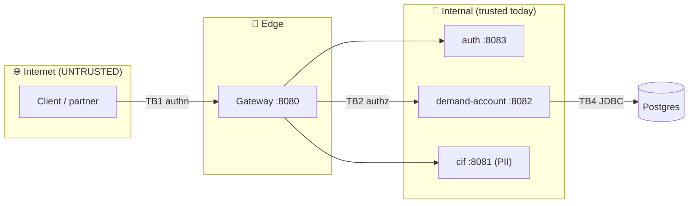
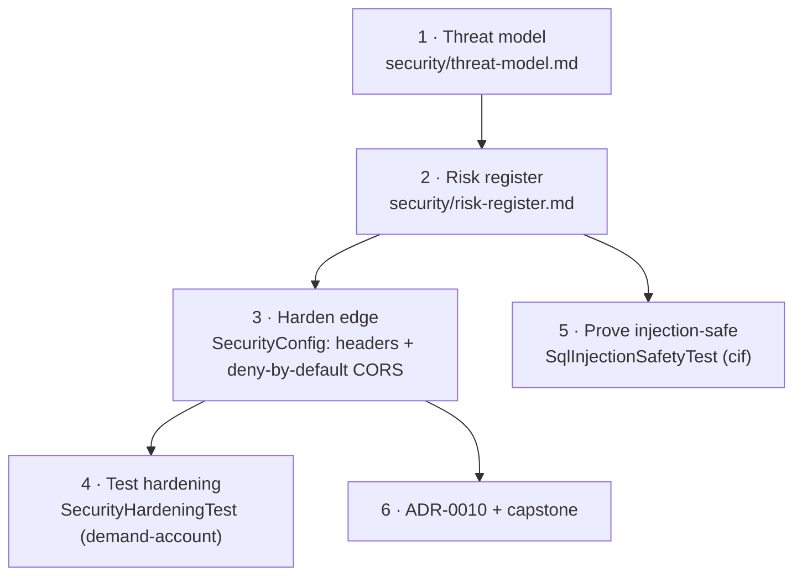
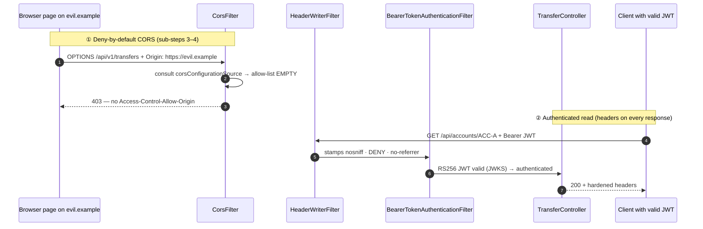

# Step 18 · Secure Coding & Threat Modeling — DevSecOps Shift-Left
### Phase C — Web, APIs & Application Security 🔵 · Step 18 of 67 · **End of Phase C** 🎓

> *You've built a real bank: customers, a ledger, transfers, a gateway, identity, resource servers. Now,
> before adding distributed messaging, you do what every serious team does — you **stop and ask "how would
> someone attack this?"** in a structured way. This step is **STRIDE threat modeling** of the bank you built,
> a walkthrough of the **OWASP Top 10 + API Security Top 10** against your own code, and the **secure-by-default
> hardening + security tests** the model demands. You'll find a real, critical bug in your own design (BOLA) —
> and learn why a senior engineer **records and schedules it** rather than half-fixing it in a hurry.*

---

<a id="toc"></a>
## 🧭 The Six Movements of This Step

| | Movement | What happens | ~Time |
|---|---|---|---|
| **A** | [🧭 Orient](#orient) | 30-second overview · skip-test · cheat card · why it matters · before you start | ~30 min |
| **B** | [🧠 Understand](#understand) | what threat modeling is · STRIDE · trust boundaries & DFDs · OWASP Top 10 / API Top 10 · BOLA | ~1.5 h |
| **C** | [🛠️ Build](#build) | write the threat model · harden the edge (headers + deny-by-default CORS) · injection-safety test · hardening test | ~8 h |
| **D** | [🔬 Prove](#prove) | the Verification Log — real test runs, the live CORS-403, the §12.3 mutation, smoke.sh | ~1 h |
| **E** | [🎓 Apply](#apply) | go deeper · interview prep · your-turn challenges (incl. the Phase-C capstone) | ~2.5 h |
| **F** | [🏆 Review](#review) | troubleshooting (the CORS two-beans gotcha) · resources · recap, flashcards & what's next | ~30 min |

---

<a id="orient"></a>

# A · 🧭 Orient

## 📋 This Step in 30 Seconds

| | |
|---|---|
| **Title** | Secure coding & threat modeling — STRIDE, OWASP Top 10 / API Security Top 10, secure defaults, security tests |
| **Step** | 18 of 67 · **Phase C — Web, APIs & Application Security** 🔵 · **the Phase-C finale** |
| **Effort** | ≈ 14 hours focused. About half is *thinking* (the threat model — the highest-leverage hour you'll spend), half is code (hardening + tests). Experienced security-minded learners can skim to ~3h. |
| **What you'll run this step** | **JVM + Maven**; **🐳 Docker** for the cif + demand-account Testcontainers tests. One command: `./mvnw -pl services/cif,services/demand-account -am verify` (or `bash steps/step-18/smoke.sh`). No new service. |
| **Buildable artifact** | **`security/threat-model.md`** (STRIDE DFD + trust boundaries + attack trees + OWASP×2 walkthrough + capstone) and **`security/risk-register.md`** (prioritized open risks). **demand-account hardening**: explicit security headers + **deny-by-default CORS** (`SecurityHardeningTest`, +3 tests → 34). **cif**: `SqlInjectionSafetyTest` proving parameterized queries are injection-safe, with a vulnerable contrast (+3 → 24). ADR-0010. `step-18-start == step-17-end`. |
| **Verification tier** | 🔴 **Full** — touches a security path (headers/CORS) and adds critical-path security tests. `./mvnw verify` green + the new behavior proven by real output + **§12.3 mutation** (permissive CORS → the deny-by-default test fails → revert) + clean-room + `smoke.sh`. |
| **Depends on** | **[Step 17](../step-17/lesson.md)** (auth/resource servers — the access controls we audit), **[Step 14](../step-14/lesson.md)** (signed webhooks), **[Step 13](../step-13/lesson.md)** (ProblemDetail), **[Step 8/10](../step-08/lesson.md)** (cif + Testcontainers). **+ Docker.** |

By the end you will be able to **threat-model a system with STRIDE**, walk the **OWASP Top 10 and API Security Top 10** against real code, recognize **BOLA** (the #1 API risk) and explain why ours is open, and ship **secure-by-default** edge hardening with **tests that prove injection-safety, security headers, and locked-down CORS.**

### ⏭️ Can You Skip This Step? (5-minute self-check)

If you can confidently do **all** of this, skim the 🛠️ Build and jump to **[Step 19 — Messaging & events](../step-19/lesson.md)**.

- [ ] I can explain **STRIDE** and run it **per-element** over a data-flow diagram with **trust boundaries**.
- [ ] I can name the **OWASP API Security Top 10 #1 (BOLA)** and spot it in a transfer endpoint that takes an account id from the request.
- [ ] I can configure **secure response headers** and a **deny-by-default CORS** policy in Spring Security — and explain why CORS is *not* an access control.
- [ ] I can prove a query is **injection-safe** with a test (and explain why parameterization beats escaping/blocklists).
- [ ] I know why a senior engineer **records a critical finding in a risk register and schedules a proper fix** rather than bolting on a half-fix.

> [!TIP]
> Not 100%? Stay — this is the step that turns "I write Spring apps" into "I reason about how they get attacked." "What's BOLA?", "STRIDE the login flow", and "how do you stop SQL injection — really?" are interview staples.

## 📇 Cheat Card

> **What this step delivers (one sentence):** a STRIDE threat model of the bank that surfaces a real critical bug (BOLA), the secure-by-default edge hardening it demands (security headers + deny-by-default CORS), and tests proving injection-safety / headers / CORS — with the BOLA fix honestly tracked, not faked.

**Key commands** (Windows uses `.\mvnw.cmd`):

```bash
# Run the Step-18 security tests (needs Docker)
./mvnw -pl services/cif,services/demand-account -am test -Dtest='SqlInjectionSafetyTest,SecurityHardeningTest'
# Full proof for this step
bash steps/step-18/smoke.sh
# See the headers + CORS on the running service
curl -i http://localhost:8082/api/accounts/ACC-A
curl -i -X OPTIONS http://localhost:8082/api/v1/transfers -H "Origin: https://evil.example" -H "Access-Control-Request-Method: POST"
```

**The headline diagram — STRIDE per element across a trust boundary:**

```
Internet  │  Edge/DMZ   │      Internal (trusted)        │  Data
  client ─┼─► gateway ──┼─► auth / demand-account / cif ─┼─► Postgres
          │             │                                │
   TB1 ───┘     TB2 ────┘            TB4 (JDBC) ──────────┘
  (authn)     (authz, BOLA!)        (parameterized SQL)
```

**The one sentence to remember:** *Threat modeling's job is to **find and prioritize** risks (and BOLA is ours); you ship the cheap, complete fixes now and **track** the deep ones — you never pretend an open risk is closed.*

## 🎯 Why This Matters

A bank that passes every functional test can still be trivially robbed if any authenticated user can transfer from **someone else's** account. Functional tests prove "it does what I asked"; **threat modeling** asks "what else can it do that I *didn't* ask?" — and that question is where breaches live. In interviews and on the job, "walk me through how you'd threat-model this" and "what's BOLA / how do you prevent SQL injection" separate engineers who ship features from engineers trusted with money and PII.

## ✅ What You'll Be Able to Do

- Produce a **STRIDE-per-element** threat model with a DFD, trust boundaries, and attack trees.
- Map findings to the **OWASP Top 10 (2021)** and **API Security Top 10 (2023)**.
- Identify and explain **BOLA / IDOR** and why authentication ≠ authorization.
- Harden a Spring service with **security headers** and **deny-by-default CORS**, and **test** it.
- Prove **injection-safety** with a side-by-side vulnerable-vs-parameterized contrast.
- Keep a **risk register**: record, prioritize, own, and schedule what you don't fix today.

## 🧰 Before You Start

- **Prereqes:** the bank through Step 17 builds green (`git describe` → `step-17-end`); Docker running.
- **Connects to what you know:** you'll audit the **resource-server auth** (Step 17), the **signed webhooks** (Step 14), the **ProblemDetail** errors (Step 13), and the **parameterized JPA** (Steps 8–10). This step doesn't add a service — it *examines* the ones you have.
- **Depends on:** Steps **17, 14, 13, 8/10**. **+ Docker.**

## 🗓️ Session Plan

≈14 hours does **not** mean one heroic weekend. Six sittings, each ending at a real save point:

| Sitting | What you do | ~Time | Ends at |
|---|---|---|---|
| **S1 · Frame it** | A 🧭 Orient + B 🧠 Understand (STRIDE, trust boundaries, BOLA) | ~2 h | the B→C bridge diagram |
| **S2 · Model it** | Sub-step 1 first half: asset list, DFD, trust-boundary table, demand-account STRIDE (worked example) | ~2.5 h | §3.1 table finished in `threat-model.md` |
| **S3 · Finish the model** | Sub-step 1 rest: remaining STRIDE tables, 2 attack trees, OWASP ×2 walkthrough, risk register (R-001) | ~2.5 h | Sub-step 1 ✋ checkpoint |
| **S4 · Harden the edge** | Sub-steps 2–4: headers, deny-by-default CORS, `SecurityHardeningTest` | ~2.5 h | Sub-step 4 ✋ checkpoint + commit |
| **S5 · Prove it** | Sub-step 5 (`SqlInjectionSafetyTest`) + 🎮 Play With It + D 🔬 Verification Log | ~2 h | 🏁 commit & tag `step-18-end` |
| **S6 · Apply & close Phase C** | E 🎓 interview prep + Phase-C capstone · F 🏆 recap | ~2.5 h | 🎉 end of Phase C |

**Optional routes:** the ⏭️ skip-test (5 min) can compress the whole step to a ~3 h skim; the two 🚀 Go Deeper asides are +~5 min each; the capstone's BOLA-fix stretch adds ~2–3 h on top of S6.

---

<a id="understand"></a>

# B · 🧠 Understand

## 🧠 The Big Idea — threat modeling is "design review for attackers"

Threat modeling answers four questions (Adam Shostack's framing):

1. **What are we building?** → a model: a **data-flow diagram (DFD)** of processes, data stores, external entities, and the flows between them.
2. **What can go wrong?** → **STRIDE**, applied to every element and every flow.
3. **What are we going to do about it?** → mitigations, each shipped *or* recorded in a **risk register** with an owner and a date.
4. **Did we do a good job?** → review it; revisit when the system changes.

It's **shift-left**: doing this on a diagram costs minutes; discovering the same flaw in production costs a breach. The single most important artifact is the **trust boundary** — the line where data moves from less-trusted to more-trusted. *Every boundary crossing is a checkpoint that must authenticate, authorize, and validate.*



> 🔬 **Break-it-on-purpose (thought experiment):** pick the `da → Postgres` flow. If a user controls part of a query string, what crosses TB4? If it's *data* (a bound parameter) → safe. If it's *code* (concatenated SQL) → injection. That single distinction is OWASP A03.

## 🧩 Pattern Spotlight — STRIDE

**Problem:** "think of everything that could go wrong" is unbounded and you'll miss categories. **STRIDE** is a checklist of six threat *categories*, each the violation of a security property:

| Letter | Threat | Violates | Bank example |
|---|---|---|---|
| **S** | Spoofing | Authentication | Forge a JWT; pretend to be Alice |
| **T** | Tampering | Integrity | Alter an amount; corrupt the ledger |
| **R** | Repudiation | Non-repudiation | "I never made that transfer" |
| **I** | Information disclosure | Confidentiality | Read someone else's balance/PII |
| **D** | Denial of service | Availability | Flood transfers; exhaust the pool |
| **E** | Elevation of privilege | Authorization | USER performs an ADMIN action; **move another user's money** |

**Why it fits:** applied **per element** (each process, store, flow), STRIDE turns "what could go wrong?" into six concrete questions you ask of each box and arrow — systematic, repeatable, reviewable. **Alternatives:** *attack trees* (goal-first, good for depth on one asset — we use them too), *PASTA*/*LINDDUN* (heavier / privacy-focused). STRIDE-per-element is the best first tool.

## 🌱 Under the Hood: the controls you're auditing

- **Authentication vs authorization.** Step 17 gave us **authentication** (a valid JWT) and *function-level* authorization (`@PreAuthorize` on admin ops). It did **not** give us **object-level** authorization — "does *this* user own *this* account?". That gap is **BOLA**.
- **Security headers** are response headers the browser obeys: `X-Content-Type-Options: nosniff` (don't guess MIME types → blocks some XSS), `X-Frame-Options: DENY` (don't let other sites frame us → anti-clickjacking), `Referrer-Policy: no-referrer` (don't leak our URLs to third parties), `Strict-Transport-Security` (force HTTPS — only emitted over TLS). Spring Security writes some by default; we make them explicit and add Referrer-Policy + HSTS.
- **CORS** (Cross-Origin Resource Sharing) is a **browser** mechanism: it asks our server "may a page from origin X call you?" via a *preflight* `OPTIONS`. **Deny-by-default** means we answer "no" unless X is explicitly allow-listed. ⚠️ CORS is a **guardrail for browsers, not an access control** — a non-browser client (curl, another server) ignores it entirely. The real gate is the JWT.

## 🛡️ Security Lens: BOLA, the #1 API risk — and it's in our code

**Broken Object Level Authorization** (OWASP API1:2023; also called IDOR) is when an endpoint takes an object identifier from the request and acts on it **without checking the caller is entitled to that object**. Look at our transfer:

```java
// TransferController.transferV1 — from is taken straight from the body, never checked against the caller
idempotentTransfers.transfer(idempotencyKey, request.from(), request.to(), request.amount(), ...);
```

Any user with **any** valid token can set `from` to **anyone's** account and drain it. Same for `GET /api/accounts/{n}` — read any balance. **This is a real, critical bug in the bank you built.** We will *not* sweep it under the rug, and we will *not* rush a half-fix. See §C and the capstone for why we **record and schedule** it.

❓ **Knowledge-check:** our transfer endpoint requires a valid JWT — so why can Alice still drain Bob's account? <details><summary>Answer</summary>Because authentication ≠ authorization: the JWT proves *who* Alice is, but the endpoint never checks she *owns* the `from` account taken from the request body — that missing **object-level** authorization is BOLA.</details>

## 🕰️ Then vs. Now

Old advice for injection was "escape user input" or "blocklist bad characters" — fragile and bypassable. **Now**: use **parameterized queries / prepared statements** (and ORMs that do this for you — Spring Data binds parameters), so user input is *always data, never code*. Old CSRF advice ("add tokens everywhere") changes for **stateless token APIs**: with no cookies, there's no CSRF vector, so we disable CSRF **deliberately** — and must re-enable it the moment any cookie-based auth appears.

---

<a id="bridge"></a>

# B→C bridge: 🗺️ what we'll build



🌳 **Files we'll touch**

```
security/
  threat-model.md          (new) STRIDE DFD, trust boundaries, attack trees, OWASP×2, capstone
  risk-register.md         (new) prioritized open risks (R-001 BOLA …)
adr/
  0010-threat-model-and-secure-defaults.md   (new)
services/demand-account/
  src/main/java/.../web/SecurityConfig.java          (edit) headers + deny-by-default CORS
  src/main/resources/application.yml                 (edit) app.security.cors.allowed-origins
  src/test/java/.../web/SecurityHardeningTest.java    (new) +3 tests
services/cif/
  src/test/java/.../domain/SqlInjectionSafetyTest.java (new) +3 tests
steps/step-18/{lesson.md, requests.http, smoke.sh}
```

<a id="build"></a>

# C · 🛠️ Let's Build It — Step by Step

## 📦 Your Starting Point

`step-18-start == step-17-end`: the whole bank builds green (`./mvnw verify`, 9 modules). What's green: auth (RS256+JWKS), demand-account as a resource server, cif on Postgres. What you'll add: the threat model + register, two test classes, and the edge hardening they justify.

---

## Sub-step 1 of 5 — Model the system & run STRIDE (`security/threat-model.md`) · ⏱️ ~5 h (sittings S2–S3)

🎯 **Goal.** Produce the model and the per-element STRIDE analysis. This is *thinking made durable* — the highest-leverage part of the step.

📁 **Location.** New file `security/threat-model.md` (the finished copy is in the repo — treat it as your **answer key**, not a paste source). Type the skeleton first: **§1** what are we building? (assets) · **§2** DFD & trust boundaries · **§3** STRIDE-per-element (§3.1 demand-account … §3.6 webhook) · **§4** two attack trees · **§5** OWASP Top 10 (2021) · **§6** OWASP API Top 10 (2023) · **§7** 🎓 capstone (the v1 transfer) · **§8** secure-defaults checklist.

📋 **The trust-boundary table (§2)** — this one you copy, because everything else hangs off it. A boundary = where data crosses trust levels; every crossing must authenticate, authorize, validate:

| # | Boundary | Crossing | Controls today | Gaps (→ risk register) |
|---|---|---|---|---|
| TB1 | Internet → Edge | Client → Gateway | TLS (prod), JWT required downstream | Rate-limiting not yet (→ Step 37) |
| TB2 | Edge → Internal | Gateway → service | JWT validated at resource server (da, auth) | **cif has no auth — network-trust only** |
| TB3 | Service → auth | da fetches JWKS | Public key only; can't mint tokens | Ephemeral key (restart rotates) |
| TB4 | Service → DB | JDBC | Parameterized queries; least-priv user (prod) | DB creds via env (→ secrets mgmt, Phase H) |
| TB5 | Bank → Partner | da → webhook | **HMAC signature + timestamp** (Step 14) | Partner URL allow-list / SSRF guard pending |

🔍 **The method, concretely.** For each element, ask all six STRIDE letters and record one of ✅ mitigated / 🟡 partial / 🔴 **open**. The two 🔴 rows on demand-account both trace to the same cause:

```
I (Information disclosure)  read any account     → BOLA → R-001
E (Elevation of privilege)  move any account's $  → BOLA → R-001
```

📝 **Worked example — demand-account (§3.1), all six letters.** This is the exact table you're producing (verbatim from the finished `threat-model.md`). Notice that nearly every mitigation is something *you built* in an earlier step:

| Threat | Scenario | Status | Mitigation / note |
|---|---|---|---|
| **S** Spoofing | Caller pretends to be a user | ✅ | OAuth2 resource server; valid RS256 JWT required (Step 17) |
| **T** Tampering | Alter amount / balance in flight | ✅ | TLS in transit; server recomputes balances; `@Version` optimistic lock |
| **T** Tampering | Race two transfers to overdraw | ✅ | Pessimistic `SELECT … FOR UPDATE` + double-entry invariant (Step 12) |
| **R** Repudiation | "I never made that transfer" | 🟡 | Double-entry ledger + audit entry; **per-user attribution weak** (no owner on account) |
| **I** Info disclosure | Read someone else's balance/ledger | 🔴 **BOLA** | `GET /api/accounts/{n}` & `/entries` accept ANY account for ANY authed user → **R-001** |
| **D** DoS | Flood transfers / huge pages | 🟡 | Pageable caps page size; **no rate limit yet** (→ Step 37 Resilience4j) |
| **E** Elevation | USER calls admin op | ✅ | `@PreAuthorize("hasRole('ADMIN')")` method security (Step 17) |
| **E** Elevation | **Move money from an account you don't own** | 🔴 **BOLA** | `POST /api/(v1/)transfers` never checks the JWT subject owns `from` → **R-001** |

**Now you.** Run the same six questions over **auth**, **cif**, the **gateway**, **Postgres**, and the **webhook flow** yourself — one table each — then compare against `security/threat-model.md` §3.2–3.6.

🔮 **Predict:** before reading on — which OWASP **API** Top-10 item is our worst, and is it *authentication* or *authorization*?

<details><summary>Answer</summary>**API1:2023 BOLA** — an **authorization** failure (object-level). Authentication is fine; we just never check *ownership*.</details>

💭 **Under the hood — why record, don't rush-fix.** A correct BOLA fix is an **ownership model**: add `owner_subject` to `account`, set it from `jwt.getSubject()` at open time, and enforce it on every money/read path — a schema migration + service-layer authz + reworking every test fixture that today uses arbitrary account numbers. That's a *focused step of its own*. A half-enforced fix is **worse** than a tracked open risk because it manufactures false confidence. So we log **R-001 (CRITICAL)** with a fully specified remediation and an owning step, note the interim control (it's authenticated-user-only, not anonymous), and move on. **That is what senior shift-left looks like.**

📝 **The register entry you're writing (from `security/risk-register.md` — this is the whole R-001):**

> ### R-001 · BOLA on money endpoints — 🔴 **CRITICAL** · OPEN
> - **Maps to:** OWASP API1:2023 (BOLA) · A01:2021 · STRIDE *Elevation* + *Information disclosure* on demand-account.
> - **What:** `POST /api/transfers`, `POST /api/v1/transfers`, `GET /api/accounts/{n}`, and `GET /api/v1/accounts/{n}/entries` take an account identifier from the request and **never check the authenticated subject is entitled to it.** Any user with *any* valid token can move money out of, or read, **any** account.
> - **Why still open:** a correct fix needs an **ownership model** — a schema change (Flyway migration) + service-layer enforcement + reworking test fixtures that use arbitrary account numbers. A focused step of its own; doing it badly (half-enforced) is worse than doing it deliberately.
> - **Fix (specified):** add `owner_subject` to `account`; set it from `jwt.getSubject()` on open; in `TransferService.transfer` and the read paths, assert the caller owns `from`/the account (else 403); add `@PreAuthorize`/a domain check + tests (owner 200, non-owner 403, admin override). Keep the double-entry invariant intact.
> - **Interim control:** every endpoint already requires authentication (Step 17) — exploitable only by an *authenticated* user against *another* account, not anonymously.
> - **Owner / ETA:** dedicated **Authorization & ownership** step in Phase D/E. Tracked here until then.

✋ **Checkpoint.** `security/threat-model.md` and `security/risk-register.md` exist; the register's top item is **R-001 BOLA**, CRITICAL, with a concrete fix and an owning step.

> 🔋 **Stopping here?** You have the complete model + register on disk — the step's thinking half is done. Next: Sub-step 2 of 5 (security headers); first action: open `services/demand-account/src/main/java/com/buildabank/account/web/SecurityConfig.java`.

💾 **Commit (after the whole step builds):** `docs(security): STRIDE threat model + risk register (Step 18)`

⚠️ **Pitfall.** A threat model that says "everything's fine" is a *bad* threat model — it means you didn't look hard enough. Ours names a critical bug in our own code. Good.

---

## Sub-step 2 of 5 — Harden the edge: security headers (`SecurityConfig.java`) · ⏱️ ~30 min

🎯 **Goal.** Make demand-account emit explicit secure response headers (the model called for them under A05 Security Misconfiguration).

📁 **Location.** `services/demand-account/src/main/java/com/buildabank/account/web/SecurityConfig.java` — add a `.headers(...)` block to the filter chain.

⌨️ **Code (edit).** First the new imports (this sub-step and the next share them), then the **whole `filterChain` after-state** so you can see exactly where the new calls sit:

```java
// services/demand-account/src/main/java/com/buildabank/account/web/SecurityConfig.java
// NEW imports for Step 18 — add to the existing import block:
import java.time.Duration;                                     // CORS preflight cache (sub-step 3)
import java.util.List;                                         // CORS allow-lists (sub-step 3)
import org.springframework.beans.factory.annotation.Value;     // binds allowed-origins (sub-step 3)
import org.springframework.security.web.header.writers.ReferrerPolicyHeaderWriter.ReferrerPolicy;
import org.springframework.web.cors.CorsConfiguration;                 // sub-step 3
import org.springframework.web.cors.CorsConfigurationSource;           // sub-step 3
import org.springframework.web.cors.UrlBasedCorsConfigurationSource;   // sub-step 3
// (Customizer is already imported from Step 17.)
```

```java
// filterChain — the FULL method after sub-steps 2+3. The .cors(...) and .headers(...) lines are NEW;
// csrf/session/authorize/oauth2ResourceServer are unchanged from Step 17.
@Bean
SecurityFilterChain filterChain(HttpSecurity http) throws Exception {
    http
            .csrf(csrf -> csrf.disable())                                  // stateless token API (no cookies/session)
            .sessionManagement(s -> s.sessionCreationPolicy(SessionCreationPolicy.STATELESS))
            .cors(Customizer.withDefaults())                               // ← NEW (sub-step 3): resolves the corsConfigurationSource bean BY NAME
            .headers(headers -> headers                                    // ← NEW (this sub-step): explicit secure response headers
                    .frameOptions(frame -> frame.deny())                   // X-Frame-Options: DENY — no framing (anti-clickjacking)
                    .contentTypeOptions(Customizer.withDefaults())         // X-Content-Type-Options: nosniff — no MIME sniffing
                    .referrerPolicy(ref -> ref.policy(ReferrerPolicy.NO_REFERRER))  // Referrer-Policy: no-referrer — don't leak URLs
                    .httpStrictTransportSecurity(hsts -> hsts             // HSTS — force HTTPS (only emitted over TLS)
                            .includeSubDomains(true).maxAgeInSeconds(31_536_000)))
            .authorizeHttpRequests(authorize -> authorize
                    .requestMatchers("/actuator/health", "/actuator/info").permitAll()
                    .requestMatchers("/v3/api-docs/**", "/swagger-ui/**", "/swagger-ui.html").permitAll()
                    .anyRequest().authenticated())                         // all /api/** money endpoints: authN
            .oauth2ResourceServer(oauth2 -> oauth2.jwt(jwt -> jwt.jwtAuthenticationConverter(rolesConverter())));
    return http.build();
}
```

🔍 **Line-by-line.** `headers(...)` configures the `HeaderWriterFilter`, which writes these on **every** response (even a 401). `frameOptions.deny()` → browsers refuse to render us in a frame. `contentTypeOptions` → browsers won't second-guess our `Content-Type`. `referrerPolicy(NO_REFERRER)` → outbound links don't leak our URL. `httpStrictTransportSecurity` → tells browsers "always use HTTPS for a year" — but Spring only emits it over an actual TLS connection, so you won't see it in plain-HTTP tests (that's correct, not a bug). Import: `org.springframework.security.web.header.writers.ReferrerPolicyHeaderWriter.ReferrerPolicy`.

💭 **Under the hood.** These are *belt-and-suspenders* for browser clients; they don't replace authn/authz. They're cheap, complete, and worth shipping today.

🔮 **Predict:** will these headers appear on a **401** (unauthenticated) response? <details><summary>Answer</summary>**Yes** — `HeaderWriterFilter` runs early in the chain, before authorization rejects the request. We rely on this in the test.</details>

✋ **Checkpoint.** `grep frameOptions` and `grep referrerPolicy` both hit in `SecurityConfig.java`, and the module still compiles.

> 🔋 **Stopping here?** You have the headers configured (compiling, not yet tested). Next: Sub-step 3 of 5 (deny-by-default CORS); first action: reopen `SecurityConfig.java` and add the `corsConfigurationSource` bean.

---

## Sub-step 3 of 5 — Harden the edge: deny-by-default CORS · ⏱️ ~45 min

🎯 **Goal.** No browser origin may call us unless explicitly allow-listed.

⌨️ **Code (the `.cors(...)` line + a new bean):**

```java
// in filterChain(...)
.cors(Customizer.withDefaults())   // resolves the corsConfigurationSource bean BY NAME (Step 18, deny-by-default)

// new @Bean
@Bean
CorsConfigurationSource corsConfigurationSource(
        @Value("${app.security.cors.allowed-origins:}") List<String> allowedOrigins) {
    CorsConfiguration config = new CorsConfiguration();
    config.setAllowedOrigins(allowedOrigins.stream().filter(o -> !o.isBlank()).toList());  // empty ⇒ deny all
    config.setAllowedMethods(List.of("GET", "POST", "PUT", "DELETE", "OPTIONS"));
    config.setAllowedHeaders(List.of("Authorization", "Content-Type", "Idempotency-Key"));
    config.setMaxAge(Duration.ofHours(1));
    UrlBasedCorsConfigurationSource source = new UrlBasedCorsConfigurationSource();
    source.registerCorsConfiguration("/**", config);
    return source;
}
```

And in `application.yml`:

```yaml
app:
  security:
    cors:
      allowed-origins: ${APP_CORS_ALLOWED_ORIGINS:}   # empty ⇒ no browser origin allowed
```

🔍 **Line-by-line.** The allow-list comes from config and **defaults to empty** → `setAllowedOrigins([])` → every cross-origin preflight is rejected. Add the React app later with `APP_CORS_ALLOWED_ORIGINS=http://localhost:5173`. Server-to-server callers send **no `Origin`** header, so CORS never engages — our existing integration tests (HttpClient, no Origin) are unaffected.

⚠️ **Pitfall — the two-beans trap (this one bit me; verbatim in 🩺).** Do **not** inject `CorsConfigurationSource` *by type* into `filterChain(HttpSecurity, CorsConfigurationSource)`. Spring MVC's `mvcHandlerMappingIntrospector` *also* implements `CorsConfigurationSource`, so there are **two** beans and the context fails: *"expected single matching bean but found 2: corsConfigurationSource, mvcHandlerMappingIntrospector."* The fix is `.cors(Customizer.withDefaults())`, which Spring Security resolves **by the bean name** `corsConfigurationSource`.

❓ **Knowledge-check:** with the allow-list empty, our existing server-to-server integration tests still pass — why doesn't deny-by-default CORS break them? <details><summary>Answer</summary>Non-browser clients (HttpClient, curl) send no `Origin` header, so CORS never engages — it's a browser mechanism, not an access control; the JWT remains the real gate.</details>

✋ **Checkpoint.** `grep frameOptions` and `grep corsConfigurationSource` both hit in `SecurityConfig.java`.

💾 **Commit:** `feat(demand-account): explicit security headers + deny-by-default CORS (Step 18)`

> 🔋 **Stopping here?** You have the hardened `SecurityConfig` (headers + CORS) committed — but nothing proves it yet. Next: Sub-step 4 of 5 (the hardening test); first action: create `services/demand-account/src/test/java/com/buildabank/account/web/SecurityHardeningTest.java`.

---

## Sub-step 4 of 5 — Test the hardening (`SecurityHardeningTest`, demand-account) · ⏱️ ~1 h

🎯 **Goal.** Prove the headers appear and the deny-by-default CORS rejects an un-listed origin — and that authn is still the real gate.

📁 **Location.** `services/demand-account/src/test/java/com/buildabank/account/web/SecurityHardeningTest.java` (complete file below). It's a `@WebMvcTest(TransferController.class)` slice importing `SecurityConfig`, mocking the services + `JwtDecoder`, using the `jwt()` post-processor where a request must reach the controller.

⌨️ **The complete file:**

```java
// services/demand-account/src/test/java/com/buildabank/account/web/SecurityHardeningTest.java
package com.buildabank.account.web;

import static org.mockito.ArgumentMatchers.eq;
import static org.mockito.BDDMockito.given;
import static org.springframework.security.test.web.servlet.request.SecurityMockMvcRequestPostProcessors.jwt;
import static org.springframework.test.web.servlet.request.MockMvcRequestBuilders.get;
import static org.springframework.test.web.servlet.request.MockMvcRequestBuilders.options;
import static org.springframework.test.web.servlet.request.MockMvcRequestBuilders.post;
import static org.springframework.test.web.servlet.result.MockMvcResultMatchers.header;
import static org.springframework.test.web.servlet.result.MockMvcResultMatchers.status;

import java.math.BigDecimal;

import org.junit.jupiter.api.Test;
import org.springframework.beans.factory.annotation.Autowired;
import org.springframework.boot.webmvc.test.autoconfigure.WebMvcTest;
import org.springframework.context.annotation.Import;
import org.springframework.http.MediaType;
import org.springframework.security.core.authority.SimpleGrantedAuthority;
import org.springframework.security.oauth2.jwt.JwtDecoder;
import org.springframework.test.context.bean.override.mockito.MockitoBean;
import org.springframework.test.web.servlet.MockMvc;

import com.buildabank.account.service.IdempotentTransferService;
import com.buildabank.account.service.TransferService;
import com.buildabank.account.webhook.WebhookPublisher;

/**
 * Step 18 — proves the secure-by-default edge hardening wired into {@link SecurityConfig}:
 * security response headers on every response, and a deny-by-default CORS policy that rejects
 * a browser preflight from an un-listed origin. Web-layer slice (no DB); services are mocked, and the
 * {@code jwt()} post-processor supplies authentication where a request needs to reach the controller.
 */
@WebMvcTest(TransferController.class)
@Import(SecurityConfig.class)
class SecurityHardeningTest {

    @Autowired
    MockMvc mvc;

    @MockitoBean
    TransferService transfers;

    @MockitoBean
    IdempotentTransferService idempotentTransfers;

    @MockitoBean
    WebhookPublisher webhookPublisher;

    // The resource-server config needs a JwtDecoder bean to start; jwt() bypasses real decoding.
    @MockitoBean
    JwtDecoder jwtDecoder;

    @Test
    void everyResponseCarriesHardenedSecurityHeaders() throws Exception {
        given(transfers.balanceOf(eq("ACC-A"))).willReturn(new BigDecimal("10.00"));

        mvc.perform(get("/api/accounts/ACC-A")
                        .with(jwt().authorities(new SimpleGrantedAuthority("ROLE_USER"))))
                .andExpect(status().isOk())
                .andExpect(header().string("X-Content-Type-Options", "nosniff"))   // no MIME sniffing
                .andExpect(header().string("X-Frame-Options", "DENY"))             // no framing (clickjacking)
                .andExpect(header().string("Referrer-Policy", "no-referrer"));     // don't leak URLs cross-site
    }

    @Test
    void crossOriginPreflightFromAnUnlistedOriginIsRejected() throws Exception {
        // A browser preflight (OPTIONS + Origin + Access-Control-Request-Method) from evil.example.
        mvc.perform(options("/api/v1/transfers")
                        .header("Origin", "https://evil.example")
                        .header("Access-Control-Request-Method", "POST"))
                .andExpect(status().isForbidden())                                 // deny-by-default CORS
                .andExpect(header().doesNotExist("Access-Control-Allow-Origin"));  // origin NOT reflected
    }

    @Test
    void unauthenticatedMoneyRequestIs401() throws Exception {
        // Authentication is still the real gate — CORS/headers are defense-in-depth, not access control.
        mvc.perform(post("/api/transfers")
                        .contentType(MediaType.APPLICATION_JSON)
                        .content("""
                                {"from":"ACC-A","to":"ACC-B","amount":1.00}
                                """))
                .andExpect(status().isUnauthorized());
    }
}
```

🔮 **Predict:** the preflight from `https://evil.example` returns status **___** and the `Access-Control-Allow-Origin` header is **___**. <details><summary>Answer</summary>**403**, and **absent** (not reflected). Verified — see the Verification Log.</details>

✋ **Checkpoint.** The 3 tests in `SecurityHardeningTest` are green (the real run — 3/3, demand-account total 34 — is pasted in the 🔬 Verification Log). If the context fails with *"found 2 beans"*, you hit the two-beans trap — fix in 🩺.

💾 **Commit:** `test(demand-account): security hardening slice — headers, CORS deny, authn gate (Step 18)`

> 🔋 **Stopping here?** Hardening + a green 3-test proof are committed. Next: Sub-step 5 of 5 (injection-safety on cif); first action: start Docker, then create `services/cif/src/test/java/com/buildabank/cif/domain/SqlInjectionSafetyTest.java`.

---

## Sub-step 5 of 5 — Prove injection-safety with a contrast (`SqlInjectionSafetyTest`, cif) · ⏱️ ~45 min

🎯 **Goal.** Prove cif's queries are parameterized (injection-safe) **and** that the proof has teeth, by running the same payload through a vulnerable concatenated query.

📁 **Location.** `services/cif/src/test/java/com/buildabank/cif/domain/SqlInjectionSafetyTest.java` (complete file below) — a `@DataJpaTest` against real Postgres (Testcontainers), same harness as `CustomerRepositoryTest`.

⌨️ **The complete file — the contrast test is the crux:**

```java
// services/cif/src/test/java/com/buildabank/cif/domain/SqlInjectionSafetyTest.java
package com.buildabank.cif.domain;

import static org.assertj.core.api.Assertions.assertThat;

import java.time.Instant;
import java.time.LocalDate;

import jakarta.persistence.EntityManager;

import org.junit.jupiter.api.Test;
import org.springframework.beans.factory.annotation.Autowired;
import org.springframework.boot.autoconfigure.ImportAutoConfiguration;
import org.springframework.boot.data.jpa.test.autoconfigure.DataJpaTest;
import org.springframework.boot.flyway.autoconfigure.FlywayAutoConfiguration;
import org.springframework.boot.jdbc.test.autoconfigure.AutoConfigureTestDatabase;
import org.springframework.context.annotation.Import;

import com.buildabank.cif.ContainersConfig;

/**
 * Step 18 (secure coding) — proves the CIF query layer is injection-safe, against a REAL
 * Postgres (Testcontainers), and proves the proof has teeth with a side-by-side vulnerable contrast.
 */
@DataJpaTest
@Import(ContainersConfig.class)
@ImportAutoConfiguration(FlywayAutoConfiguration.class)
@AutoConfigureTestDatabase(replace = AutoConfigureTestDatabase.Replace.NONE)
class SqlInjectionSafetyTest {

    /** The textbook authentication-bypass payload: closes the string and OR-trues the predicate. */
    private static final String CLASSIC_PAYLOAD = "' OR '1'='1";
    /** A "stacked query" payload that would try to run a second, destructive statement. */
    private static final String DESTRUCTIVE_PAYLOAD = "x'; DROP TABLE customer; --";

    @Autowired
    CustomerRepository repository;

    @Autowired
    EntityManager em;

    private void seedOneRealCustomer() {
        repository.saveAndFlush(new Customer("CIF-REAL01", "Grace", "Hopper", "grace@bank.example",
                LocalDate.of(1985, 1, 2), KycStatus.PENDING, Instant.now()));
    }

    @Test
    void derivedQueriesBindInputAsData_soInjectionMatchesNothing() {
        seedOneRealCustomer();

        // Parameterized: the entire payload is one bound value compared to customer_number → no match.
        assertThat(repository.findByCustomerNumber(CLASSIC_PAYLOAD)).isEmpty();
        // Same for the boolean existence check on email.
        assertThat(repository.existsByEmail(CLASSIC_PAYLOAD)).isFalse();
    }

    @Test
    void stackedQueryPayloadIsTreatedAsData_theTableSurvives() {
        seedOneRealCustomer();

        // The "'; DROP TABLE customer; --" is bound as a value, never parsed as SQL — so it matches nothing...
        assertThat(repository.findByCustomerNumber(DESTRUCTIVE_PAYLOAD)).isEmpty();

        // ...and, crucially, the table is intact and still serves the real row afterward.
        assertThat(repository.findByCustomerNumber("CIF-REAL01")).isPresent();
        assertThat(repository.count()).isEqualTo(1);
    }

    @Test
    void contrast_handConcatenatedSqlWOULDhaveBeenInjectable() {
        seedOneRealCustomer();

        // ❗ ANTI-PATTERN — never do this in real code. Building SQL by string concatenation. We do it ONLY
        // here, in a test, to prove the assertions above are meaningful: the SAME payload that matched
        // NOTHING through the parameterized repository matches EVERY row when concatenated, because
        // "'' OR '1'='1'" is now SQL syntax (an always-true predicate), not a value being compared.
        long viaConcat = ((Number) em.createNativeQuery(
                "SELECT count(*) FROM customer WHERE customer_number = '" + CLASSIC_PAYLOAD + "'")
                .getSingleResult()).longValue();
        assertThat(viaConcat).isEqualTo(1);   // injection SUCCEEDED on the vulnerable query: matched the real row

        long viaParameterized = repository.findByCustomerNumber(CLASSIC_PAYLOAD).map(c -> 1L).orElse(0L);
        assertThat(viaParameterized).isZero(); // parameterized query is immune: payload is just data
    }
}
```

🔍 **Why this is the whole lesson.** Same payload, two code paths, **opposite results** (0 vs 1). The parameterized query binds `' OR '1'='1` as a value compared to `customer_number` → no match. The concatenated query splices it into the SQL text → `… = '' OR '1'='1'` → always-true → every row. **Use bound parameters; never build SQL by concatenation.**

🔬 **Break-it-on-purpose:** the destructive-payload test (`'; DROP TABLE customer; --`) asserts the table *survives* — proof the input was never parsed as SQL.

✋ **Checkpoint.** All 3 `SqlInjectionSafetyTest` tests are green against real Postgres — Docker must be running (the real run — 3/3, cif total 24 — is pasted in the 🔬 Verification Log).

💾 **Commit (after build is green):** `feat(cif,demand-account): Step 18 secure coding — injection-safety test, edge hardening (headers+CORS), threat model`

> 🔋 **Stopping here?** The whole step's code is committed; both new test classes are green. Next: 🎮 Play With It (see the defenses live), then the D · 🔬 Verification Log; first action: start the stack with the commands at the top of Play With It.

---

## 🎮 Play With It

Run the live service and *see* the defenses (full set in [`requests.http`](requests.http)). **Start the stack first** — same recipe as Steps 16–17:

```bash
./mvnw -pl services/auth spring-boot:run                                  # auth :8083
docker compose -f services/demand-account/compose.yaml up -d              # Postgres :5433
SPRING_DATASOURCE_URL=jdbc:postgresql://localhost:5433/demand_account \
AUTH_JWKS_URI=http://localhost:8083/oauth2/jwks \
./mvnw -pl services/demand-account spring-boot:run                        # demand-account :8082
```

**Token recap (from Step 17):** `POST http://localhost:8083/api/auth/login` with `{"username":"alice","password":"password"}` returns a JWT — send it as `Authorization: Bearer …` (exact request in [`requests.http`](requests.http)).

```bash
# headers on any response (even a 401):
curl -i http://localhost:8082/api/accounts/ACC-A
#   → HTTP/1.1 401 ... X-Content-Type-Options: nosniff ... X-Frame-Options: DENY ... Referrer-Policy: no-referrer

# deny-by-default CORS — preflight from an un-listed origin:
curl -i -X OPTIONS http://localhost:8082/api/v1/transfers \
     -H "Origin: https://evil.example" -H "Access-Control-Request-Method: POST"
#   → HTTP/1.1 403 ... (no Access-Control-Allow-Origin)
```

🧪 **Little experiments:**
- Set `APP_CORS_ALLOWED_ORIGINS=http://localhost:5173`, restart, re-run the preflight with that Origin → now allowed (ACAO present). Try a *different* origin → still 403.
- Log in for a token, open `ACC-A`, then `GET /api/accounts/ACC-A` with the token → 200. Now read `ACC-B` you don't own → **also 200** 😱 — that's **BOLA (R-001)** live. Feel why it's the #1 finding.

🗺️ **The flow you built — two requests through the hardened filter chain:**



## 🏁 The Finished Result

`step-18-end`: the bank still builds green (9 modules), now with a versioned threat model + risk register, hardened edge headers + CORS on the money service, and tests proving injection-safety, headers, and CORS.

**✅ Learner Definition of Done:**
- [ ] You can explain STRIDE and BOLA in your own words (try 🧠 Test Yourself ①–② below).
- [ ] `./mvnw verify` is green (9 modules).
- [ ] `bash steps/step-18/smoke.sh` passes.
- [ ] You've committed and tagged `step-18-end`.

---

<a id="prove"></a>

# D · 🔬 Prove It Works — Verification Log

> **Tier: 🔴 Full.** Security path (headers/CORS) + critical-path security tests. Evidence below is real, pasted output (Docker/Testcontainers used). Per **§12.8**: the BOLA finding (R-001) is *intentionally left open and tracked* — no test claims it's fixed.

**1 · Injection-safety (cif) — `SqlInjectionSafetyTest`, real Postgres (Testcontainers):**

```
[INFO] Tests run: 3, Failures: 0, Errors: 0, Skipped: 0, Time elapsed: 0.177 s -- in com.buildabank.cif.domain.SqlInjectionSafetyTest
[INFO] Tests run: 24, Failures: 0, Errors: 0, Skipped: 0    ← cif module total (21 prior + 3 new)
```
The contrast test passes: the `' OR '1'='1` payload matched **0** rows via the parameterized repository and **1** via the concatenated query — the delta proves both safety and that the test has teeth.

**2 · Edge hardening (demand-account) — `SecurityHardeningTest` + full module green:**

```
[INFO] Tests run: 3, Failures: 0, Errors: 0, Skipped: 0, Time elapsed: 1.407 s -- in com.buildabank.account.web.SecurityHardeningTest
[INFO] Tests run: 34, Failures: 0, Errors: 0, Skipped: 0    ← demand-account total (31 prior + 3 new)
[INFO] BUILD SUCCESS
```

**Real headers observed on a response (captured from the test run):**

```
X-Content-Type-Options:"nosniff", X-XSS-Protection:"0",
Cache-Control:"no-cache, no-store, max-age=0, must-revalidate", Pragma:"no-cache", Expires:"0",
X-Frame-Options:"DENY", Referrer-Policy:"no-referrer"
```

**3 · §12.3 Mutation sanity-check (prove the deny-by-default CORS test has teeth).** Temporarily made CORS permissive (`config.setAllowedOrigins(List.of("*"))`) and re-ran:

```
Headers = [... Access-Control-Allow-Origin:"*", Access-Control-Allow-Methods:"GET,POST,PUT,DELETE,OPTIONS" ...]
[ERROR] SecurityHardeningTest.crossOriginPreflightFromAnUnlistedOriginIsRejected:73 Status expected:<403> but was:<200>
[ERROR] Tests run: 3, Failures: 1, Errors: 0, Skipped: 0
[INFO] BUILD FAILURE
```
→ With the mutation, the un-listed origin is reflected (`ACAO: *`) and the preflight returns **200** instead of 403 — the test **fails as designed**. **Reverted** to deny-by-default; the suite is green again. *(Injection-safety's teeth are shown inline by the vulnerable-vs-parameterized contrast: 1 vs 0.)*

**4 · `smoke.sh`** — `bash steps/step-18/smoke.sh` → checks the threat-model artifacts name R-001/BOLA, runs both test classes, and greps the hardening into `SecurityConfig` → **`✅ Step 18 smoke test PASSED`**.

**5 · Clean-room (§12.4)** — fresh clone, `make verify` → BUILD SUCCESS across all 9 modules. *(Full output in the commit's clean-room run.)*

---

<a id="apply"></a>

# E · 🎓 Apply

## 🚀 Go Deeper (Optional · +~10 min total)

<details><summary>Why CORS is not a security control (+~5 min)</summary>CORS only constrains *browsers* (they honor the preflight). curl, Postman, and other servers ignore it entirely. So a locked-down CORS policy prevents a malicious *website* from scripting your API in a victim's browser, but does nothing against a direct attacker. Your real access control is the JWT + (eventually) object-level authz. Treat CORS as one layer, never *the* layer.</details>

<details><summary>STRIDE per element vs attack trees (+~5 min)</summary>STRIDE-per-element is *breadth* — it sweeps every box/arrow for all six categories so you don't forget a class of bug. Attack trees are *depth* — pick one attacker goal ("move funds out") and enumerate the paths, marking which are closed. Use both: STRIDE to find candidate issues, an attack tree to reason about whether a specific crown-jewel goal is reachable. (Our "steal money" tree shows every branch closed *except* BOLA.)</details>

❓ **Knowledge-check:** why does the lesson *record* the critical BOLA finding in the risk register instead of shipping a quick fix alongside the headers and CORS? <details><summary>Answer</summary>A correct fix needs a full ownership model (schema migration, service-layer enforcement, reworked fixtures) — a half-enforced authz fix manufactures false confidence. Cheap, complete fixes ship now; deep ones get recorded with severity, owner, and a scheduled step. Never pretend an open risk is closed.</details>

## 💼 Interview Prep

1. **What is BOLA / IDOR, and how do you prevent it?** *Broken Object Level Authorization: an endpoint acts on an object id from the request without checking the caller owns it. Prevent it by enforcing object-level authorization on every access — derive the owner from the authenticated principal and compare, don't trust the id in the request. It's the #1 API risk because authentication alone doesn't stop it.* **(Most commonly asked.)**
2. **Authentication vs authorization — and where did our bank stop?** *Authn = who you are (valid JWT, Step 17); authz = what you may do. We have authn + function-level authz (`@PreAuthorize` admin) but not object-level authz — hence BOLA.*
3. **How do you *really* stop SQL injection?** *Parameterized queries / prepared statements (ORMs do this) so input is always data, never code. Not escaping, not blocklists. We prove it with a test that runs the same payload through parameterized (0 matches) and concatenated (all matches) paths.*
4. **STRIDE the login flow.** *S: brute force → BCrypt + lockout; T: forge token → RS256; R: deny login → audit log; I: leak hashes → never return them; D: credential stuffing → rate limit; E: self-grant role → set roles server-side.*
5. **Is CORS a security boundary?** *No — it's a browser guardrail. Non-browser clients ignore it. Deny-by-default is good hygiene but the JWT is the gate.*
6. **(Gotcha) You find a critical authz bug late in a sprint. Ship a quick fix or not?** *Record it in the risk register (severity, owner, date), ship only a complete fix; a half-enforced authz fix creates false confidence. Schedule the proper ownership-model change. — a STAR-able judgment answer.*

## 🏋️ Your Turn: Practice & Challenges

- **Quick (+~20 min):** add a `Permissions-Policy` header; assert it in `SecurityHardeningTest`. <details><summary>Hint</summary>Spring Security 6+ doesn't have a dedicated DSL method for it on all versions — use `.headers(h -> h.addHeaderWriter(new StaticHeadersWriter("Permissions-Policy", "geolocation=()")))`.</details>
- **Quick (+~30 min):** make cif a resource server too (close **R-002**) — reuse Step 17's `jwk-set-uri` config and a slice test.
- 🎓 **Phase-C Capstone (~2 h · BOLA-fix stretch +~2–3 h) — STRIDE one feature end-to-end + secure it.** Take the **v1 transfer** and walk every element of its data flow with STRIDE (client→gateway→controller→service→DB→webhook), as in `security/threat-model.md §7`. Then **implement the BOLA fix (R-001)** as a stretch reference solution: add `owner_subject` to `account` (Flyway migration), set it from `jwt.getSubject()` on open, enforce ownership on `transfer`/`balance`/`entries` (non-owner → 403, admin override), and add tests (owner 200 / non-owner 403 / admin 200). Reference solution lives in `solutions/step-18/` (or the `solutions` branch). *This is the real capstone — you'll have threat-modeled a feature and closed the system's #1 risk.*

---

<a id="review"></a>

# F · 🏆 Review

## 🩺 Stuck? Troubleshooting & Fixes

- **`expected single matching bean but found 2: corsConfigurationSource, mvcHandlerMappingIntrospector`** (context fails to load, *all* demand-account tests error). **Cause:** you injected `CorsConfigurationSource` by type into `filterChain` — Spring MVC contributes a second bean of that type. **Fix:** drop the parameter; use `.cors(Customizer.withDefaults())`, which resolves the bean **by name** `corsConfigurationSource`. *(I hit this exact error building this step.)*
- **HSTS header missing in tests.** Expected — Spring only emits `Strict-Transport-Security` over a real TLS connection; plain-HTTP MockMvc/HttpClient won't show it. Don't assert it over HTTP.
- **CORS preflight returns 200 in your test.** Your allow-list isn't empty (env var set?) or you allowed `*`. Deny-by-default needs an empty origins list.
- **Reset to a known-good state:** `git checkout step-18-end`. Run `make doctor` if the toolchain looks off.

## 📚 Learn More & Glossary

- OWASP Top 10 (2021), OWASP API Security Top 10 (2023), OWASP Cheat Sheets (CORS, Injection, Headers); Microsoft/Shostack STRIDE; the SECURITY of Spring Security reference (Headers, CORS).
- **Glossary:** *STRIDE* (6 threat categories); *DFD* (data-flow diagram); *trust boundary* (where trust level changes); *BOLA/IDOR* (object-level authz failure); *CORS* (browser cross-origin policy); *parameterized query* (input bound as data); *risk register* (owned list of open risks).

## 🏆 Recap & Study Notes

**(a) Key points:** Threat modeling = "what can go wrong?" *before* an attacker asks. STRIDE-per-element over a DFD with trust boundaries finds threat *classes* systematically. Our model surfaced **BOLA (R-001, CRITICAL)** — recorded & scheduled, not faked. We shipped cheap, complete edge hardening (headers + deny-by-default CORS) with tests, and proved injection-safety with a vulnerable contrast.

**(b) Key terms:** STRIDE, DFD, trust boundary, BOLA/IDOR, CORS, parameterized query, risk register, secure-by-default.

**(c) 🧠 Test Yourself:** ① Name the six STRIDE letters. ② Why is BOLA an authorization (not authentication) bug? ③ Why isn't CORS a security control? ④ How do you actually stop SQL injection? ⑤ Why record R-001 instead of quick-fixing it? <details><summary>Answers</summary>① Spoofing/Tampering/Repudiation/Info-disclosure/DoS/Elevation. ② Authn passes (valid token); the missing check is *ownership* of the object. ③ Only browsers honor it; other clients ignore it — the JWT is the gate. ④ Parameterized queries (input as data, never code). ⑤ A half-enforced authz fix manufactures false confidence; a tracked register + complete fix is safer.</details>

**(d) 🔗 How this connects:** audits Step 17 (authz), Step 14 (signed webhooks), Step 13 (ProblemDetail), Steps 8–10 (parameterized JPA). **Next: Step 19** opens Phase D — messaging & events (Kafka) — which adds new elements and trust boundaries to *re-threat-model*.

**(e) 🏆 Résumé line:** *"Threat-modeled a banking platform with STRIDE (DFD, trust boundaries, attack trees), mapped findings to OWASP Top 10 / API Security Top 10, shipped secure-by-default hardening (CSP-class headers, deny-by-default CORS) with tests, and maintained a prioritized risk register including a tracked critical BOLA finding."*

**(f) ✅ You can now:** STRIDE a system · spot/explain BOLA · harden headers + CORS and test them · prove injection-safety · keep a risk register.

**(g) 🃏 Flashcards** (also in `docs/flashcards.md`) · 🔁 revisit BOLA when you build the authorization/ownership step.

- **Q:** The six STRIDE threat categories? — **A:** Spoofing (authn), Tampering (integrity), Repudiation, Information disclosure (confidentiality), Denial of service (availability), Elevation of privilege (authz) — applied *per element* over a DFD with trust boundaries.
- **Q:** What is BOLA, and which OWASP API Top-10 item is it? — **A:** Broken Object Level Authorization (API1:2023): an endpoint acts on an object id from the request without checking the caller owns it — an *authorization* bug; prevent it by deriving the owner from the authenticated principal and enforcing ownership on every access.
- **Q:** Why is deny-by-default CORS not an access control? — **A:** Only browsers honor the preflight; curl and other servers ignore CORS entirely. It stops a malicious *website* scripting your API in a victim's browser — the JWT is the real gate.
- **Q:** How do you actually prevent SQL injection? — **A:** Parameterized queries / prepared statements (Spring Data binds parameters) so input is always *data*, never *code* — not escaping, not blocklists.

**(h) ✍️ One-line reflection:** *What surprised you more — that your bank had a critical bug, or that the right move was to write it down rather than rush a fix?*

**(i)** 🎉 **That's Phase C done** — you can build *and defend* web APIs. Phase D makes the bank distributed. Onward.
