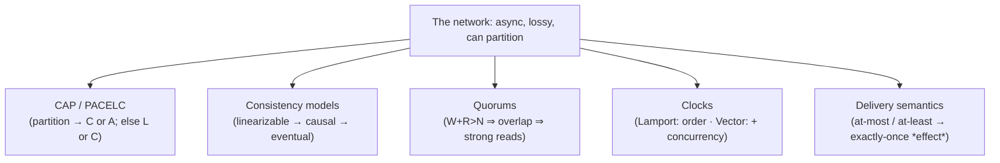
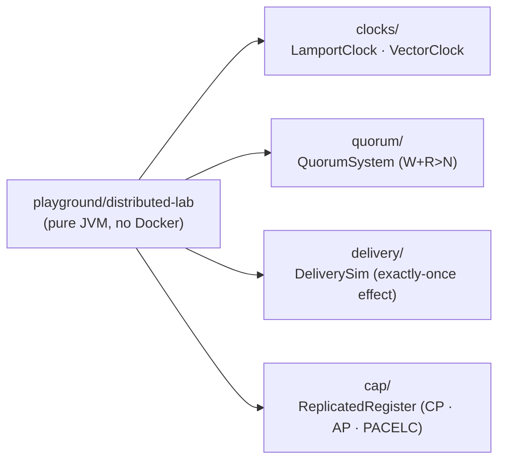
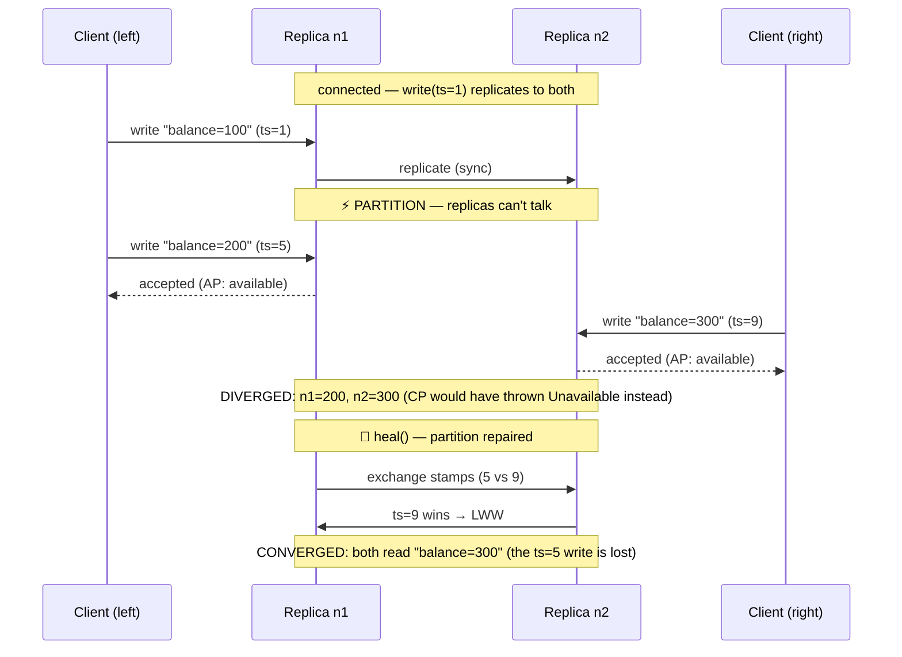

# Step 19 · Distributed-Systems Theory & Trade-offs — CAP/PACELC, Consistency, Quorums, Clocks, Delivery
### Phase D — Distributed Systems, Messaging & Batch 🔵→🟣 · Step 19 of 67 · **Phase D opener**

> *Your bank is about to become distributed: Kafka events (Step 20), a Saga for payments (Step 21), caching
> and read models (Step 22). Before you wire any of that, you need the **theory** that explains why
> distributed systems behave the way they do — and why "just make it consistent and always up" is a fantasy.
> This step makes that theory **tangible**: every idea — CAP/PACELC, consistency models, quorums, logical &
> vector clocks, delivery semantics — is a small, deterministic, **runnable** lab proven by a test. No
> hand-waving; you'll see the trade-offs execute.*

---

<a id="toc"></a>
## 🧭 The Six Movements of This Step

| | Movement | What happens | ~Time |
|---|---|---|---|
| **A** | [🧭 Orient](#orient) | 30-second overview · skip-test · cheat card · why it matters · before you start | ~30 min |
| **B** | [🧠 Understand](#understand) | the 8 fallacies · CAP & PACELC · consistency models · consensus/quorums · clocks · delivery | ~2 h |
| **C** | [🛠️ Build](#build) | a `distributed-lab` module in **11 sub-steps**: clocks · quorums · delivery semantics · a CAP/PACELC register · smoke harness | ~5 h |
| **D** | [🔬 Prove](#prove) | the Verification Log — 13 deterministic tests, the §12.3 mutation, smoke.sh, clean-room | ~45 min |
| **E** | [🎓 Apply](#apply) | go deeper · interview prep (CAP is *the* systems interview) · your-turn challenges | ~1.25 h |
| **F** | [🏆 Review](#review) | troubleshooting · resources · recap, flashcards & what's next | ~30 min |

---

<a id="orient"></a>

# A · 🧭 Orient

## 📋 This Step in 30 Seconds

| | |
|---|---|
| **Title** | Distributed-systems theory & trade-offs — CAP/PACELC, consistency models, consensus & quorums, logical/vector clocks, delivery semantics |
| **Step** | 19 of 67 · **Phase D — Distributed Systems, Messaging & Batch** 🔵→🟣 · **Phase D opener** |
| **Effort** | ≈ 10 hours (theory-heavy, but every concept is a runnable lab). The vocabulary here pays off for the entire rest of the course *and* every system-design interview. Skim to ~2h if you can already whiteboard CAP/PACELC + quorums. |
| **What you'll run this step** | **JVM + Maven only — NO Docker, no services.** One command: `./mvnw -pl playground/distributed-lab test` (or `bash steps/step-19/smoke.sh`). |
| **Buildable artifact** | A new **`playground/distributed-lab`** module (pure JUnit, deterministic) with four labs: **logical/vector clocks** (causality + concurrency detection), **quorums** (`W+R>N` intersection, checked over all combinations), **delivery semantics** (exactly-once *effect* via idempotency), and a **CAP/PACELC replicated register** (CP refuses writes under partition; AP diverges then reconciles via LWW; PACELC's else-branch = latency vs consistency). **13 tests.** `step-19-start == step-18-end`. |
| **Verification tier** | 🔴 **Full** — adds a build module. `./mvnw verify` green + every lab proven by real output + the **§12.3 mutation** (drop the CP partition guard → the CAP test fails → revert) + clean-room + `smoke.sh`. |
| **Depends on** | **[Step 11](../step-11/lesson.md)** (concurrency-lab — the pure-JVM lab idiom & the lost-update mindset), **[Step 14](../step-14/lesson.md)** (idempotency — we formalize "exactly-once effect" here), **[Step 12](../step-12/lesson.md)** (transactions/locking — the *single-node* consistency we now contrast with distributed). |

By the end you will be able to recite and *demonstrate* **CAP and PACELC**, distinguish **consistency models** (linearizable → causal → eventual), explain **quorums** (`W+R>N`), use **logical and vector clocks** to reason about causality and concurrency, and state the **delivery semantics** and how idempotency buys exactly-once *effect*.

### ⏭️ Can You Skip This Step? (5-minute self-check)

If you can confidently do **all** of this, skim the 🛠️ Build and jump to **[Step 20 — Spring events + Kafka](../step-20/lesson.md)**.

- [ ] I can state **CAP** precisely (it's about behavior *during a partition*) and why "CA" is not a real choice.
- [ ] I can state **PACELC** and give the *else* (no-partition) latency-vs-consistency trade-off.
- [ ] I can order **linearizable / sequential / causal / eventual** consistency and give an example of each.
- [ ] I can explain **quorums** and why `W + R > N` (and `W > N/2`) gives strong consistency.
- [ ] I can explain the difference between a **Lamport clock** and a **vector clock**, and what each can/can't detect.
- [ ] I can list the **delivery semantics** and explain how **idempotency** yields exactly-once *effect*.

> [!TIP]
> Not 100%? Stay. "Explain CAP", "linearizable vs eventual", "how do quorums work", and "is exactly-once delivery possible?" are the most common distributed-systems interview questions — and you'll have *run* the answers, not just memorized them.

## 📇 Cheat Card

> **What this step delivers (one sentence):** the distributed-systems theory beneath Phase D — CAP/PACELC, consistency models, quorums, logical/vector clocks, and delivery semantics — each proven by a deterministic JUnit lab you can run and tweak.

**Key commands** (Windows uses `.\mvnw.cmd`):

```bash
./mvnw -pl playground/distributed-lab test       # run all 13 labs
bash steps/step-19/smoke.sh                       # the step's proof
make play-19                                       # same, via Makefile
jshell --class-path playground/distributed-lab/target/classes   # poke the labs live (🎮)
```

**The headline you must be able to draw — CAP:**

```
        Network PARTITION happens (nodes can't talk)
                          │
              ┌───────────┴───────────┐
        keep CONSISTENCY          keep AVAILABILITY
         (CP: refuse writes,       (AP: accept writes,
          stay correct,             stay up, diverge,
          go unavailable)           reconcile on heal)
   PACELC "Else" (no partition): trade LATENCY ⇄ CONSISTENCY
```

**The one sentence to remember:** *In a partition you pick C or A; the rest of the time (PACELC's "else") you still pick latency or consistency — distributed systems are a permanent series of trade-offs, never a free lunch.*

## 🎯 Why This Matters

Every outage post-mortem, every "why is my read stale?", every Kafka duplicate, every Saga compensation traces back to the handful of theorems in this step. You can't design (or debug) the event-driven bank of Phase D without them, and **"explain CAP"** is the single most common distributed-systems interview prompt. Learning it by *running* it — watching CP go unavailable and AP diverge — beats memorizing a triangle diagram.

## ✅ What You'll Be Able to Do

- State and **demonstrate** CAP and PACELC.
- Place a system on the **consistency spectrum** and justify it.
- Reason with **quorums** (`W+R>N`) and tune the consistency/latency dial.
- Use **logical and vector clocks** to order events and detect concurrency.
- Choose **delivery semantics** and design for **exactly-once effect**.

## 🧰 Before You Start

- **Prereqs:** the bank builds green (`git describe` → `step-18-end`). No Docker needed this step.
- **Connects to what you know:** Step 11 made *single-machine* concurrency tangible in a pure-JVM lab — this step does the same for *distributed* behavior. Step 12's transactions/locks gave you single-node consistency; now you'll see why that doesn't extend across the network for free. Step 14's idempotency becomes the formal "exactly-once effect."
- **Depends on:** Steps **11, 14, 12**. (No new infra.)

✋ **Pre-flight checkpoint:**

```bash
git describe --tags          # → step-18-end (or a descendant of it)
./mvnw -version              # → Maven 3.9.x, Java 25
```

## 🗓️ Session Plan

≈ 10 hours won't fit one sitting — and it doesn't need to. Four sittings of ~2–3 h, each ending at a real ✋ save point:

| Sitting | Covers | ~Time | Ends at (save point) |
|---|---|---|---|
| **1 · Theory** | A · Orient + B · Understand (fallacies → CAP/PACELC → consistency models → quorums → clocks → delivery) + the B→C bridge | ~2.5 h | the B→C bridge — you can whiteboard all five ideas |
| **2 · Module & clocks** | C · sub-steps 1–4 (scaffold the module → `LamportClock` → `VectorClock` → `LogicalClockTest`) | ~2 h | sub-step 4's ✋ — `LogicalClockTest` green (Lab 1, 3 of 13 tests) |
| **3 · Quorums & delivery** | C · sub-steps 5–8 (`QuorumSystem` → `QuorumTest` → `DeliverySim` → `DeliverySemanticsTest`) | ~2 h | sub-step 8's ✋ — Labs 2+3 green (10 of 13 tests) |
| **4 · CAP, harness & prove** | C · sub-steps 9–11 (`ReplicatedRegister` → `CapPacelcTest` + §12.3 mutation → smoke.sh/`make play-19`) + 🎮 Play With It + D · Prove + E/F | ~3 h | sub-step 11's ✋ — 13/13 green, smoke PASSED, committed & tagged `step-19-end` |

**Optional routes:** the ⏭️ skip-test skim route above ≈ 2 h total · the five 🚀 Go Deeper asides +~25 min · the 🏋️ Your Turn quick challenges +~15 min each, G-Counter stretch +~45 min.

> 🪫 **Stopping here?** You have a green `step-18-end` build, pre-flight verified. Next: B · Understand (fallacies → CAP/PACELC → consistency → quorums → clocks → delivery); first action: pure reading — the next command arrives in C · sub-step 1.

---

<a id="understand"></a>

# B · 🧠 Understand

## 🧠 The Big Idea — the network is not reliable, and that changes everything

Single-machine reasoning assumes calls succeed, memory is shared, and "now" is well-defined. Across a network none of that holds — captured by the **8 fallacies of distributed computing** (the network is reliable, latency is zero, bandwidth is infinite, the network is secure, topology doesn't change, there's one administrator, transport cost is zero, the network is homogeneous — *all false*). Distributed-systems theory is the set of results that tell you **what is and isn't possible** once you accept those facts. Five ideas carry Phase D:



## 🧩 CAP — and why people state it wrong

**CAP theorem (Brewer; Gilbert & Lynch):** when a **network partition** occurs, a distributed data store can preserve **either** Consistency (every read sees the latest write — really *linearizability*) **or** Availability (every request gets a non-error response) — **not both**. The crucial nuance:

- CAP is only about behavior **during a partition**. When there's no partition you don't have to give up either.
- "**CA**" (consistent + available, partition-intolerant) is **not a real option** for a distributed system — partitions *will* happen, so you're really choosing **CP** or **AP**.
- "Consistency" in CAP = **linearizable**, the strongest model — not the "C" in ACID.

**CP** systems (e.g. a strongly-consistent store, ZooKeeper, etcd) refuse to serve during a partition rather than risk divergence. **AP** systems (e.g. Dynamo-style stores) keep serving and reconcile later. Our bank's *money* path is CP-flavored (correctness over uptime); a "last seen balance" widget could be AP.

❓ **Knowledge-check:** a partition splits your two replicas. A client writes "balance=200" to the left one. What are your only two honest options? <details><summary>Answer</summary>Refuse the write (CP — stay consistent, sacrifice availability) or accept it knowing the right replica now disagrees (AP — stay available, accept divergence you must later reconcile). There is no third option that keeps both; that's the theorem.</details>

## 🧩 PACELC — the half of the story CAP omits

CAP is silent about the normal case. **PACELC** (Abadi) completes it:

> **If P**artition, choose **A** or **C**; **E**lse (normal operation), choose **L**atency or **C**onsistency.

Even with a healthy network, keeping replicas in sync costs round-trips: wait for replicas (consistent, slower → **EC**) or ack locally and replicate asynchronously (fast, possibly stale → **EL**). So a store is classified like "**PC/EC**" (always consistent) or "**PA/EL**" (Dynamo: available + low-latency). Our Lab 4 runs both the P-branch and the E-branch.

## 🧩 Consistency models — a spectrum, not a switch

```
strongest ───────────────────────────────────────────────► weakest
Linearizable → Sequential → Causal → Read-your-writes → Eventual
(one global,    (a global    (respects   (you see your    (replicas
 real-time       order, not   cause→      own writes)      converge
 order)          real-time)   effect)                      eventually)
```

- **Linearizable:** as if there's one copy and every op happens atomically at a point in time — the gold standard, the costliest.
- **Causal:** if A caused B, everyone sees A before B; unrelated ops can be seen in any order (this is what **vector clocks** track).
- **Eventual:** if writes stop, replicas converge — cheap, but you can read stale (our AP register during a partition).

## 🌱 Under the Hood: consensus & quorums

To agree on a value despite failures, replicas run **consensus** (Paxos, Raft) — which needs a **majority quorum** (`> N/2`) to make progress, so it tolerates `⌊(N-1)/2⌋` failures (5 nodes tolerate 2). The read/write version: with `N` replicas, a **write quorum** `W` and **read quorum** `R`, if **`W + R > N`** then every read set must intersect every write set (pigeonhole) → a read always sees the latest committed write (**strong consistency**); also requiring **`W > N/2`** prevents two conflicting writes from both succeeding. Slacken to `W+R ≤ N` and you get cheaper, faster, **eventually-consistent** reads that can be stale. **This single inequality is the consistency/latency dial** — and Lab 2 checks it by brute force over every quorum combination.

❓ **Quick check:** with `N=5` replicas, `W=2, R=2` is fast — can a read miss the latest write? <details><summary>Answer</summary>Yes — `W+R = 4 ≤ 5`, so a write set and a read set can be disjoint (no overlap): the read may return stale data. You've dialed toward eventual consistency; only `W+R>N` guarantees the intersection that makes reads strong.</details>

## 🌱 Under the Hood: time & causality

There is no global "now." **Logical clocks** order events by causality instead of wall time:

- **Lamport clock:** one counter per process; `tick` on local events, `max(local, received)+1` on receive. Guarantees **`a → b ⇒ L(a) < L(b)`** — but the converse fails, so it **can't detect concurrency**.
- **Vector clock:** one counter *per process*, carried as a vector; componentwise `max` on receive. Detects **both** happens-before **and** concurrency (`a || b`) — at the cost of `O(N)` space. This is how causal consistency and conflict detection (e.g. Dynamo siblings) work.

## 🛡️ Security Lens & 🧵 Thread-safety note

Distributed ≠ just "more threads." But the same discipline applies: the **delivery** lab shares mutable state (a balance) updated by repeated deliveries — the idempotent consumer's dedupe set is exactly the cross-message "shared state" guard, echoing Step 11. And security-wise, **clock-based tokens** (JWT `exp`, Step 17) assume loosely-synced wall clocks — a reminder that *logical* time and *physical* time solve different problems.

## 🕰️ Then vs. Now

"Exactly-once delivery" was long marketed as achievable; the **FLP result** (no deterministic consensus is guaranteed in a fully async network with one faulty process) and practice say otherwise. Modern systems (Kafka included) deliver **at-least-once** and add **idempotent/transactional** processing to get exactly-once **effect** — which is what we formalize in Lab 3 and will wire to Kafka in Step 20–21.

---

# B→C bridge: 🗺️ what we'll build



🌳 **Files we'll touch**

```
pom.xml                                  (edit) register the new module
Makefile                                 (edit) add the play-19 target
playground/distributed-lab/
  pom.xml                                (new) JUnit + AssertJ, parent = build-a-bank-parent
  src/main/java/com/buildabank/distributed/
    clocks/LamportClock.java             (new) Lab 1a — one counter, causal order
    clocks/VectorClock.java              (new) Lab 1b — + concurrency detection
    quorum/QuorumSystem.java             (new) Lab 2  — W+R>N, checked empirically
    delivery/DeliverySim.java            (new) Lab 3  — exactly-once *effect*
    cap/ReplicatedRegister.java          (new) Lab 4  — CP · AP · PACELC
  src/test/java/com/buildabank/distributed/
    clocks/LogicalClockTest.java         (new) 3 tests
    quorum/QuorumTest.java               (new) 3 tests
    delivery/DeliverySemanticsTest.java  (new) 4 tests
    cap/CapPacelcTest.java               (new) 3 tests
steps/step-19/{lesson.md, smoke.sh}      (new) this lesson + its proof
```

> 🪫 **Stopping here?** You have the theory (and zero code changes — the repo is still at `step-18-end`). Next: Sub-step 1 of 11 (register & scaffold the module); first action: open the root `pom.xml` and find `<modules>`.

<a id="build"></a>

# C · 🛠️ Let's Build It — Step by Step

## 📦 Your Starting Point

`step-19-start == step-18-end`: the whole bank builds green — CIF, demand-account, gateway, auth, the three playground labs, `libs/common`, plus the Step-18 threat model and hardening. We add **one pure-JVM module** — no Spring, no Docker, deterministic — exactly the idiom of Step 11's `concurrency-lab`. Nothing existing changes; later steps don't refactor this module either, so what you build here is exactly what ships at `HEAD`.

**The build at a glance — 11 sub-steps, four labs:**

| Sub-steps | Lab | What it proves |
|---|---|---|
| 1 | — | the module exists & builds in the reactor |
| 2–4 | **Lab 1 · clocks** | causality ordering (Lamport) + concurrency detection (vector) |
| 5–6 | **Lab 2 · quorums** | `W+R>N` ⇔ guaranteed intersection — checked over *all* combinations |
| 7–8 | **Lab 3 · delivery** | at-least-once duplicates corrupt naive consumers; idempotency → exactly-once *effect* |
| 9–10 | **Lab 4 · CAP/PACELC** | CP refuses writes under partition; AP diverges then converges (LWW); the "else" latency trade |
| 11 | — | smoke.sh + `make play-19` + the full 13-test run |

---

### Sub-step 1 of 11 — Register & scaffold the module · ⏱️ ~30 min 🧭 *(you are here: **module** → clocks → clock test → quorum → quorum test → delivery → delivery test → CAP → CAP test → harness)*

🎯 **Goal:** a new pure-JUnit Maven module, wired into the reactor, that `./mvnw verify` builds alongside the bank — the empty shell the four labs will live in.

📁 **Location:** edit the root `pom.xml`; new file `playground/distributed-lab/pom.xml`.

⌨️ **Code — the one-line root-pom edit** (diff):

```diff
--- a/pom.xml
+++ b/pom.xml
@@ -48,6 +48,7 @@
         <module>playground/java-basics</module>
         <module>playground/spring-lab</module>
         <module>playground/concurrency-lab</module>
+        <module>playground/distributed-lab</module>
     </modules>
```

⌨️ **Code — the module pom** (complete file):

```xml
<?xml version="1.0" encoding="UTF-8"?>
<project xmlns="http://maven.apache.org/POM/4.0.0"
         xmlns:xsi="http://www.w3.org/2001/XMLSchema-instance"
         xsi:schemaLocation="http://maven.apache.org/POM/4.0.0 https://maven.apache.org/xsd/maven-4.0.0.xsd">
    <modelVersion>4.0.0</modelVersion>

    <!--
      distributed-lab — the Step 19 distributed-systems THEORY primer (plain Java, no Spring, no Docker).
      Phase D opener. Theory is made tangible: every concept is a small, deterministic, runnable lab proven
      by a JUnit test — logical/vector clocks (causality), quorums (R+W>N intersection), delivery semantics
      (exactly-once *effect* via idempotency), and CAP/PACELC (the partition trade-off, CP vs AP + reconcile).
      Pure JUnit 5 + AssertJ; everything runs in `./mvnw verify` with no infrastructure.
    -->
    <parent>
        <groupId>com.buildabank</groupId>
        <artifactId>build-a-bank-parent</artifactId>
        <version>0.1.0-SNAPSHOT</version>
        <relativePath>../../pom.xml</relativePath>
    </parent>

    <artifactId>distributed-lab</artifactId>
    <name>Build-a-Bank :: Playground :: Distributed Systems Lab</name>
    <description>Distributed-systems theory — CAP/PACELC, consistency, quorums, logical/vector clocks, delivery semantics (Step 19).</description>

    <dependencies>
        <dependency>
            <groupId>org.junit.jupiter</groupId>
            <artifactId>junit-jupiter</artifactId>
            <scope>test</scope>
        </dependency>
        <dependency>
            <groupId>org.assertj</groupId>
            <artifactId>assertj-core</artifactId>
            <scope>test</scope>
        </dependency>
    </dependencies>
</project>
```

🔍 **Line-by-line:**
- `<parent>` + `<relativePath>../../pom.xml</relativePath>` — inherits the **build-a-bank parent** (which itself inherits the Spring Boot parent). We use *zero* Spring at runtime here; the inheritance buys us one thing: **managed dependency versions**. That's why…
- …the `junit-jupiter` and `assertj-core` dependencies carry **no `<version>`** — the Spring Boot BOM (Bill of Materials: a pom that only pins versions) supplies tested, mutually-compatible ones. One fewer place for version drift.
- `<scope>test</scope>` — these jars are on the **test classpath only**; the (tiny) production jar stays dependency-free.
- `<artifactId>distributed-lab</artifactId>` / `<name>…Distributed Systems Lab</name>` — the id Maven uses (`-pl playground/distributed-lab` selects by *path*) and the human name printed in the reactor.
- The `<module>` line in the root pom adds us to the **reactor** — Maven's multi-module build graph — so a plain `./mvnw verify` at the repo root now builds **10 modules**.

💭 **Under the hood:** when you run `./mvnw -pl playground/distributed-lab …`, Maven still reads the *root* pom first (to learn the reactor and inherited config), then builds just the selected module. `-pl` = "project list". There is no Spring Boot plugin here — the module packages as a plain `jar`, and that's all `verify` needs.

🔮 **Predict:** the dependencies declare no versions. Where exactly will Maven find them? <details><summary>Answer</summary>In the `dependencyManagement` inherited from the parent chain — ultimately the Spring Boot dependencies BOM, which pins JUnit 5 and AssertJ versions known to work together.</details>

▶️ **Run & See:**

```bash
./mvnw -pl playground/distributed-lab -DskipTests package
```

✅ **Expected output** (real run; at *this* point — pom only, no sources yet — the two `Compiling…` phases will say `No sources to compile`, and the jar will be empty; the shape below is from the finished module):

```
[INFO] -------------------< com.buildabank:distributed-lab >-------------------
[INFO] Building Build-a-Bank :: Playground :: Distributed Systems Lab 0.1.0-SNAPSHOT
[INFO]   from pom.xml
[INFO] --------------------------------[ jar ]---------------------------------
...
[INFO] --- jar:3.4.2:jar (default-jar) @ distributed-lab ---
[INFO] Building jar: ...\playground\distributed-lab\target\distributed-lab-0.1.0-SNAPSHOT.jar
[INFO] ------------------------------------------------------------------------
[INFO] BUILD SUCCESS
[INFO] ------------------------------------------------------------------------
[INFO] Total time:  1.421 s
```

❌ **If you see `Could not find artifact com.buildabank:build-a-bank-parent`:** your `<relativePath>` is wrong (the module sits two levels below the root — it must be `../../pom.xml`), or you created the folder outside `playground/`.

✋ **Checkpoint:** `BUILD SUCCESS`, and the reactor banner names *Build-a-Bank :: Playground :: Distributed Systems Lab*. If not → 🩺.

💾 **Commit:**

```bash
git add pom.xml playground/distributed-lab/pom.xml
git commit -m "build(distributed-lab): scaffold the Step 19 distributed-systems lab module"
```

⚠️ **Pitfall:** a bare `&` inside `<description>` is invalid XML — write `and` or `&amp;`. (The same trap as Step 11; Maven's error message — `entity name must immediately follow the '&'` — does not say "your description has an ampersand".)

---

### Sub-step 2 of 11 — `LamportClock`: causal order with one counter · ⏱️ ~20 min 🧭 *(module ✅ → **Lamport** → vector → clock test → …)*

🎯 **Goal:** the simplest logical clock — one counter per process — that orders events by **causality** instead of wall time. This is Lamport's 1978 idea that underpins event ordering everywhere from Kafka offsets to Raft terms.

📁 **Location:** new file → `playground/distributed-lab/src/main/java/com/buildabank/distributed/clocks/LamportClock.java`

⌨️ **Code** (complete file):

```java
// playground/distributed-lab/src/main/java/com/buildabank/distributed/clocks/LamportClock.java
package com.buildabank.distributed.clocks;

/**
 * A <strong>Lamport logical clock</strong> (Leslie Lamport, 1978) — a single monotonically increasing
 * counter per process that orders events <em>causally</em> without any synchronized wall clock.
 *
 * <p>The two rules:
 * <ol>
 *   <li><strong>Local event</strong> (incl. sending a message): increment the counter ({@link #tick()}).</li>
 *   <li><strong>Receive a message</strong> stamped {@code t}: set the counter to
 *       {@code max(local, t) + 1} ({@link #onReceive(long)}).</li>
 * </ol>
 *
 * <p><strong>Clock condition:</strong> if event {@code a} <em>happens-before</em> {@code b} (written
 * {@code a → b}) then {@code L(a) < L(b)}. The converse does <em>not</em> hold: {@code L(a) < L(b)} does
 * NOT imply {@code a → b} — two unrelated (concurrent) events can still get ordered numbers. Detecting
 * concurrency needs a {@link VectorClock}; Lamport only gives a consistent <em>total-ish</em> order.
 *
 * <p>Not thread-safe by design — one clock belongs to one logical process (single-threaded actor). The bank
 * uses this idea wherever it needs a causal order without trusting machine clocks (event ordering, Step 20).
 */
public final class LamportClock {

    private final String process;
    private long time;

    public LamportClock(String process) {
        this.process = process;
    }

    /** A local event (or a send). Increments and returns the new timestamp. */
    public long tick() {
        return ++time;
    }

    /**
     * Receiving a message stamped {@code receivedTimestamp}. Advances the clock past both our own time and
     * the sender's, then ticks for the receive event itself — guaranteeing the receive is ordered after the
     * send.
     */
    public long onReceive(long receivedTimestamp) {
        time = Math.max(time, receivedTimestamp) + 1;
        return time;
    }

    public long time() {
        return time;
    }

    public String process() {
        return process;
    }
}
```

🔍 **Line-by-line:**
- `public final class` — `final` = not designed for subclassing; this is a value-like utility, sealed shut.
- `private final String process` — a label ("alice", "bob") so demos and `toString`-style output read naturally; it plays no role in the algorithm.
- `private long time;` — **the entire state**: one counter, starting at `0` (Java's default for `long`). No wall clock anywhere.
- `tick()` → `return ++time;` — **pre**-increment: bump first, then return the *new* value. Rule 1: every local event (including *sending* a message) gets the next number.
- `onReceive(long receivedTimestamp)` → `time = Math.max(time, receivedTimestamp) + 1;` — Rule 2, the heart of the algorithm: jump **past both** what we knew (`time`) and what the sender knew (`receivedTimestamp`), `+1` because the receive is itself a new event. This is what stitches two processes' histories into one causal order.
- The Javadoc's **clock condition** is the contract: causally-ordered events get increasing numbers — and its *converse is false*, which sub-step 4's second test demonstrates on purpose.
- **Not thread-safe — deliberately.** One clock = one logical *process* (think single-threaded actor). Sharing one instance across threads would model two processes sharing a brain, which is exactly what distributed systems don't have.

💭 **Under the hood:** why does `max(...)+1` guarantee `a → b ⇒ L(a) < L(b)`? Causality (`→`, "happens-before") only arises two ways: *program order* (same process: each `tick`/`onReceive` strictly increases the counter) and *messages* (the receive computes `max(local, senderStamp)+1 > senderStamp`). Every causal edge strictly increases the number; chains of edges therefore strictly increase too. What it **cannot** give you: looking at `L(a)=1 < L(b)=2` and concluding `a → b` — concurrent events also get numbers, and numbers always compare.

🔮 **Predict:** Bob's clock reads `1`. He receives a message stamped `2`. What does his clock read after `onReceive(2)` — `2` or `3`?

▶️ **Run & See** — compile it, then poke it interactively with **`jshell`** (the JDK's REPL — a try-Java-live prompt that ships with every JDK):

```bash
./mvnw -pl playground/distributed-lab compile
jshell --class-path playground/distributed-lab/target/classes
```

then type into the `jshell>` prompt:

```java
import com.buildabank.distributed.clocks.*;
var alice = new LamportClock("alice");
var bob   = new LamportClock("bob");
System.out.println("alice.tick()      = " + alice.tick());
System.out.println("alice.tick()      = " + alice.tick());
System.out.println("bob.tick()        = " + bob.tick());
System.out.println("bob.onReceive(2)  = " + bob.onReceive(2));
```

✅ **Expected output** (real run):

```
alice.tick()      = 1
alice.tick()      = 2
bob.tick()        = 1
bob.onReceive(2)  = 3
```

Predicted right? `max(1, 2) + 1 = 3` — Bob's receive is ordered strictly *after* Alice's send (stamp 2), even though Bob's own clock had only reached 1. (`/exit` leaves jshell.)

✋ **Checkpoint:** the module compiles and the jshell session shows `bob.onReceive(2) = 3`. If `jshell` isn't found, use the full JDK path (e.g. `"C:\Program Files\Java\jdk-25.0.3\bin\jshell"` on Windows) — or skip the REPL; sub-step 4's test proves the same thing.

💾 **Commit:**

```bash
git add playground/distributed-lab/src/main/java/com/buildabank/distributed/clocks/LamportClock.java
git commit -m "feat(distributed-lab): Lamport logical clock (tick + max-receive rule)"
```

⚠️ **Pitfall:** writing `time++` (post-increment) instead of `++time` in `tick()` returns the *old* value — your first event gets stamp `0` and "before the beginning" exists. And forgetting the `+ 1` in `onReceive` lets a receive **tie** with its send — the clock condition demands *strictly* greater.

> 🪫 **Stopping here?** You have the module in the reactor and `LamportClock` committed. Next: Sub-step 3 of 11 (`VectorClock` — concurrency detection); first action: create `playground/distributed-lab/src/main/java/com/buildabank/distributed/clocks/VectorClock.java`.

---

### Sub-step 3 of 11 — `VectorClock`: detect concurrency, not just order · ⏱️ ~35 min 🧭 *(module ✅ → Lamport ✅ → **vector** → clock test → …)*

🎯 **Goal:** the upgrade Lamport can't make — one counter **per process**, carried as a vector, so we can distinguish "*a caused b*" from "*a and b are concurrent*". This is the machinery behind causal consistency and Dynamo-style conflict detection.

📁 **Location:** new file → `playground/distributed-lab/src/main/java/com/buildabank/distributed/clocks/VectorClock.java`

⌨️ **Code** (complete file):

```java
// playground/distributed-lab/src/main/java/com/buildabank/distributed/clocks/VectorClock.java
package com.buildabank.distributed.clocks;

import java.util.HashMap;
import java.util.Map;

/**
 * A <strong>vector clock</strong> — one counter <em>per process</em>, carried as a vector. Unlike a
 * {@link LamportClock}, a vector clock can tell whether two events are causally ordered OR
 * <strong>concurrent</strong> (causally independent) — the thing Lamport clocks cannot do.
 *
 * <p>Rules for a process {@code p}:
 * <ol>
 *   <li><strong>Local event:</strong> {@code V[p] += 1} ({@link #tick()}).</li>
 *   <li><strong>Receive</strong> a message carrying vector {@code W}: {@code V[i] = max(V[i], W[i])} for all
 *       {@code i}, then {@code V[p] += 1} ({@link #onReceive(VectorClock)}).</li>
 * </ol>
 *
 * <p><strong>Comparison</strong> of two vectors {@code a}, {@code b}:
 * <ul>
 *   <li>{@code a → b} (a happens-before b) iff {@code a[i] <= b[i]} for all {@code i} AND {@code a != b};</li>
 *   <li>{@code a || b} (concurrent) iff neither {@code a → b} nor {@code b → a}.</li>
 * </ul>
 *
 * <p>Instances are immutable snapshots: {@link #tick()} / {@link #onReceive} return a NEW clock, so a message
 * can carry the exact vector it was sent with. Missing entries are treated as 0.
 */
public final class VectorClock {

    private final String process;
    private final Map<String, Long> vector;

    public VectorClock(String process) {
        this(process, new HashMap<>());
    }

    private VectorClock(String process, Map<String, Long> vector) {
        this.process = process;
        this.vector = vector;
    }

    private VectorClock copyVector() {
        return new VectorClock(process, new HashMap<>(vector));
    }

    public long get(String node) {
        return vector.getOrDefault(node, 0L);
    }

    /** A local event: bump this process's own component. Returns a new snapshot. */
    public VectorClock tick() {
        VectorClock next = copyVector();
        next.vector.merge(process, 1L, Long::sum);
        return next;
    }

    /** Receiving {@code message}'s vector: take the componentwise max, then bump our own component. */
    public VectorClock onReceive(VectorClock message) {
        VectorClock next = copyVector();
        for (Map.Entry<String, Long> e : message.vector.entrySet()) {
            next.vector.merge(e.getKey(), e.getValue(), Math::max);
        }
        next.vector.merge(process, 1L, Long::sum);
        return next;
    }

    /** {@code this → other}: this causally precedes other (≤ in every component, and not equal). */
    public boolean happensBefore(VectorClock other) {
        boolean strictlyLess = false;
        for (String node : keys(other)) {
            long a = this.get(node);
            long b = other.get(node);
            if (a > b) {
                return false;           // some component exceeds → not ≤ everywhere
            }
            if (a < b) {
                strictlyLess = true;
            }
        }
        return strictlyLess;            // ≤ everywhere AND < somewhere ⇒ strictly precedes
    }

    /** Concurrent: causally independent — neither happens-before the other. */
    public boolean isConcurrentWith(VectorClock other) {
        return !this.happensBefore(other) && !other.happensBefore(this) && !this.equalsVector(other);
    }

    private boolean equalsVector(VectorClock other) {
        for (String node : keys(other)) {
            if (this.get(node) != other.get(node)) {
                return false;
            }
        }
        return true;
    }

    private java.util.Set<String> keys(VectorClock other) {
        java.util.Set<String> all = new java.util.HashSet<>(this.vector.keySet());
        all.addAll(other.vector.keySet());
        return all;
    }

    @Override
    public String toString() {
        return process + vector;
    }
}
```

🔍 **Line-by-line:**
- `Map<String, Long> vector` — the vector is **sparse**: a process appears only once it has ticked. `get(...)` → `getOrDefault(node, 0L)` treats a missing entry as `0`, so `{alice=1}` and `{alice=1, bob=0}` mean the same thing without storing zeros.
- **Two constructors:** the public one starts a fresh, empty clock for a named process; the *private* one is the plumbing that lets `copyVector()` build a sibling around a copied map. Outsiders can never inject a map.
- `copyVector()` — `new HashMap<>(vector)` is a **defensive copy**. Every mutation below happens on a *copy*, never on `this`.
- `tick()` — copy, then `merge(process, 1L, Long::sum)`. `Map.merge(key, value, fn)` reads: *if `key` absent, put `value`; else replace with `fn(oldValue, value)`*. So: absent → `1`; present → `old + 1`. Rule 1: bump **own** component only.
- `onReceive(message)` — copy, then for every entry in the **message's** vector take `merge(key, theirValue, Math::max)` (componentwise maximum — absorb everything the sender knew), then bump own component (the receive is an event too). Rule 2.
- `happensBefore(other)` — the partial-order test, exactly the Javadoc's definition: **`≤` in every component AND `<` in at least one.** The loop walks the **union** of both key sets (`keys(other)`), bails out `false` the moment some component of `this` *exceeds* `other`, and records `strictlyLess` if any component is strictly smaller. Returning `strictlyLess` at the end enforces "and not equal".
- `isConcurrentWith(other)` — concurrency is defined **negatively**: neither happens-before the other, and they're not the same vector. This three-way check is what a single Lamport number can never answer.
- `equalsVector` / `keys` — component-wise equality over the key union; `long != long` is primitive comparison, no boxing surprises.
- `toString()` → e.g. `bob{bob=2, alice=1}` — process label + map. You'll see exactly this in the jshell output below.
- **Immutability is load-bearing:** `tick()`/`onReceive()` return a **new** snapshot, so a "message" can carry the exact vector it was sent with. If clocks mutated in place, a message would retroactively "know" things its sender learned *after* sending — time travel, and wrong answers.

💭 **Under the hood:** why does componentwise comparison capture causality? Invariant: `V[p]` = "how many events of process `p` this clock has *heard of*." If `a → b`, then by the time `b` happened, its process had absorbed (via `max`) everything `a`'s history contained — so `a`'s vector is ≤ everywhere, and `b`'s own bump makes it strictly bigger somewhere. If neither history contains the other, each vector is bigger in its *own* component — comparison fails both ways → **concurrent**. The price: `O(N)` space per stamp (one entry per process ever seen), which is why vector clocks are used where conflicts matter (Dynamo siblings) and not on every packet.

🔮 **Predict:** Alice ticks once (`a1`), Bob ticks once (`b1`) — no messages exchanged. Then Bob receives `a1` (producing `b2`). Which pairs are ordered, which concurrent?

▶️ **Run & See** (same jshell session, or a fresh one after `compile`):

```java
var a1 = new VectorClock("alice").tick();
var b1 = new VectorClock("bob").tick();
var b2 = b1.onReceive(a1);
System.out.println("a1 = " + a1 + "   b1 = " + b1 + "   b2 = " + b2);
System.out.println("a1.happensBefore(b2)   = " + a1.happensBefore(b2));
System.out.println("a1.isConcurrentWith(b1) = " + a1.isConcurrentWith(b1));
```

✅ **Expected output** (real run):

```
a1 = alice{alice=1}   b1 = bob{bob=1}   b2 = bob{bob=2, alice=1}
a1.happensBefore(b2)   = true
a1.isConcurrentWith(b1) = true
```

Read `b2 = {bob=2, alice=1}` aloud: *"Bob has had 2 events and has heard of 1 of Alice's"* — the message carried Alice's history into Bob's clock. And `a1 ∥ b1`: nobody told anybody anything, so neither precedes the other — the fact a Lamport clock physically cannot represent.

✋ **Checkpoint:** both clock classes compile; jshell shows `happensBefore = true` and `isConcurrentWith = true` exactly as above.

💾 **Commit:**

```bash
git add playground/distributed-lab/src/main/java/com/buildabank/distributed/clocks/VectorClock.java
git commit -m "feat(distributed-lab): vector clock with happens-before + concurrency detection"
```

⚠️ **Pitfall:** the classic vector-clock bug is **mutating a shared map** — `tick()` that does `vector.merge(...)` on `this` instead of a copy means every previously-sent "snapshot" silently changes. The second classic: dropping the `strictlyLess` flag from `happensBefore`, after which two *equal* vectors count as ordered (an event "precedes" itself).

---

### Sub-step 4 of 11 — `LogicalClockTest`: prove the clock condition — and Lamport's blind spot · ⏱️ ~20 min 🧭 *(clocks ✅ → **clock test** → quorum → …)*

🎯 **Goal:** three deterministic tests: (1) Lamport respects causality, (2) Lamport **cannot** see concurrency — numbers lie, (3) the vector clock detects both order *and* concurrency.

📁 **Location:** new file → `playground/distributed-lab/src/test/java/com/buildabank/distributed/clocks/LogicalClockTest.java`

⌨️ **Code** (complete file):

```java
// playground/distributed-lab/src/test/java/com/buildabank/distributed/clocks/LogicalClockTest.java
package com.buildabank.distributed.clocks;

import static org.assertj.core.api.Assertions.assertThat;

import org.junit.jupiter.api.DisplayName;
import org.junit.jupiter.api.Test;

/**
 * Step 19 · causality. Proves the <strong>clock condition</strong> (causally-ordered events get increasing
 * timestamps), then shows the key difference: a {@link VectorClock} can tell <em>concurrent</em> events apart,
 * while a {@link LamportClock} cannot.
 */
class LogicalClockTest {

    @Test
    @DisplayName("Lamport: if a → b (a message links them), then L(a) < L(b)")
    void lamportRespectsCausality() {
        LamportClock alice = new LamportClock("alice");
        LamportClock bob = new LamportClock("bob");

        long aLocal = alice.tick();          // 1 — Alice does a local event
        long aSend = alice.tick();           // 2 — Alice sends a message (a local event too)
        long bLocal = bob.tick();            // 1 — Bob, independently, does a local event
        long bRecv = bob.onReceive(aSend);   // max(1,2)+1 = 3 — Bob receives Alice's message

        // The causal edges (send → receive, and everything before the send → the receive) are ordered:
        assertThat(aSend).isLessThan(bRecv);     // send(2) → recv(3)
        assertThat(aLocal).isLessThan(bRecv);    // aLocal(1) → ... → recv(3)
        assertThat(bLocal).isLessThan(bRecv);    // bob's own prior event precedes his receive
    }

    @Test
    @DisplayName("Lamport's limitation: L(a) < L(b) does NOT imply a → b (concurrency is invisible)")
    void lamportCannotDetectConcurrency() {
        LamportClock alice = new LamportClock("alice");
        LamportClock bob = new LamportClock("bob");

        long aLocal = alice.tick();   // 1 — never communicated to Bob
        bob.tick();                   // 1
        long bSecond = bob.tick();    // 2 — also never communicated to Alice

        // Numerically aLocal(1) < bSecond(2), which *looks* like aLocal happened first...
        assertThat(aLocal).isLessThan(bSecond);
        // ...but they are actually CONCURRENT (no message ever linked Alice and Bob). The Lamport numbers
        // give a false sense of ordering — which is exactly why we reach for vector clocks below.
    }

    @Test
    @DisplayName("Vector clock: detects happens-before for a message, and concurrency for independent events")
    void vectorClockDistinguishesCausalFromConcurrent() {
        VectorClock alice = new VectorClock("alice");
        VectorClock bob = new VectorClock("bob");

        VectorClock a1 = alice.tick();        // {alice:1}
        VectorClock b1 = bob.tick();          // {bob:1}  — independent of a1
        VectorClock b2 = b1.onReceive(a1);    // {alice:1, bob:2} — Bob receives Alice's a1

        // Causal edges are detected:
        assertThat(a1.happensBefore(b2)).isTrue();    // a1 → b2 (via the message)
        assertThat(b1.happensBefore(b2)).isTrue();    // b1 → b2 (Bob's own prior event)
        assertThat(b2.happensBefore(a1)).isFalse();   // not the other way round

        // Concurrency is detected — the thing Lamport could not do:
        assertThat(a1.isConcurrentWith(b1)).isTrue();
        assertThat(b1.isConcurrentWith(a1)).isTrue();
        assertThat(a1.isConcurrentWith(b2)).isFalse(); // a1 is causally before b2, not concurrent
    }
}
```

🔍 **Line-by-line:**
- `@DisplayName` — JUnit 5's human-readable test label; the Maven/IDE report reads like the theorem it proves. (Class and methods are package-private — JUnit 5 doesn't need `public`.)
- **Test 1** scripts the canonical two-process diagram: Alice's `tick, tick(=send)` then Bob's `tick, onReceive`. The inline `// 1 — …` comments *are* the expected stamps — and the three `isLessThan` assertions check every causal edge: the message edge (`2 < 3`), the transitive edge (`1 < 3`), and Bob's program-order edge (`1 < 3`).
- **Test 2 is a test that proves a *limitation*** — rare and valuable. No message links Alice and Bob, so `aLocal` and `bSecond` are concurrent; yet `1 < 2` numerically. The assertion *passes*, and the comment says why that's the problem: Lamport numbers always compare, even when causality is silent.
- **Test 3** replays the same scenario with vectors and gets the *full truth*: `a1 → b2` and `b1 → b2` (true), `b2 → a1` (false), `a1 ∥ b1` (true, both directions — concurrency is symmetric), and `a1 ∥ b2` is **false** because they *are* ordered.
- `assertThat(...).isTrue()/isFalse()/isLessThan(...)` — AssertJ's fluent assertions, same library you've used since Step 8.

💭 **Under the hood:** Surefire (Maven's test runner) discovers the class by naming convention (`*Test`), runs it on the JVM with the JUnit platform, and prints one `Tests run:` line per class. Nothing here is timing-dependent — every stamp is forced by the algorithm — so this lab can never flake.

🔮 **Predict:** before running — how many tests, and can any of them fail intermittently?

▶️ **Run & See:**

```bash
./mvnw -pl playground/distributed-lab test -Dtest=LogicalClockTest
```

✅ **Expected output** (real run):

```
[INFO] Running com.buildabank.distributed.clocks.LogicalClockTest
[INFO] Tests run: 3, Failures: 0, Errors: 0, Skipped: 0, Time elapsed: 0.117 s -- in com.buildabank.distributed.clocks.LogicalClockTest
[INFO] Tests run: 3, Failures: 0, Errors: 0, Skipped: 0
[INFO] BUILD SUCCESS
[INFO] Total time:  1.960 s
```

❌ **If `No tests matching pattern`:** check `-Dtest=LogicalClockTest` spelling — the flag filters by **class name**, not file path.

🔬 **Break-it (60s, then revert):** in `LamportClock.onReceive`, delete the `+ 1` so it reads `time = Math.max(time, receivedTimestamp);` and rerun. `bRecv` becomes `2` — equal to `aSend` — and `assertThat(aSend).isLessThan(bRecv)` fails with `Expecting 2 to be less than 2`. The receive *tied* with its send; strict ordering is what the `+1` buys. **Put it back** and see green again.

✋ **Checkpoint:** `Tests run: 3 … BUILD SUCCESS`. Lab 1 of 4 done. If not → 🩺.

💾 **Commit:**

```bash
git add playground/distributed-lab/src/test
git commit -m "test(distributed-lab): clock condition + Lamport blind spot + vector concurrency"
```

⚠️ **Pitfall:** in test 3, reusing `alice` after `tick()` (e.g. `alice.happensBefore(b2)`) compares the **empty original** — remember the clocks are immutable snapshots; always compare the *returned* values (`a1`, `b1`, `b2`).

❓ **Quick check:** Lamport gives `L(a) < L(b)`. Does that prove `a → b`? <details><summary>Answer</summary>No — the guarantee only runs one way (`a → b ⇒ L(a) < L(b)`). `L(a) < L(b)` merely rules out `b → a`; the events may be concurrent. That blind spot is exactly what test 2 demonstrates — and why vector clocks exist.</details>

> 🪫 **Stopping here?** You have Lab 1 proven — causality ordering *and* concurrency detection (3 of 13 tests green). Next: Sub-step 5 of 11 (quorums); first action: create `quorum/QuorumSystem.java`.

---

### Sub-step 5 of 11 — `QuorumSystem`: the `W+R>N` machine · ⏱️ ~35 min 🧭 *(clocks ✅ → **quorum** → quorum test → delivery → …)*

🎯 **Goal:** a tiny quorum-replicated register over `N` replicas — plus a brute-force checker that *enumerates every possible quorum pair* to verify the intersection guarantee empirically, not just by trusting the formula.

📁 **Location:** new file → `playground/distributed-lab/src/main/java/com/buildabank/distributed/quorum/QuorumSystem.java`

⌨️ **Code** (complete file):

```java
// playground/distributed-lab/src/main/java/com/buildabank/distributed/quorum/QuorumSystem.java
package com.buildabank.distributed.quorum;

import java.util.ArrayList;
import java.util.List;
import java.util.Set;

/**
 * A tiny <strong>quorum-replicated register</strong> over {@code N} replicas, each holding a
 * <em>versioned</em> value. A write persists to a chosen set of replicas (the write quorum {@code W}); a read
 * queries a chosen set (the read quorum {@code R}) and returns the highest-versioned value it sees.
 *
 * <p><strong>The theorem this lab proves:</strong> if {@code W + R > N}, then <em>every</em> read quorum and
 * <em>every</em> write quorum must overlap in at least one replica (pigeonhole) — so a read is guaranteed to
 * observe the latest committed write (strong/quorum consistency). If {@code W + R ≤ N}, a read quorum can be
 * chosen disjoint from the last write quorum and return a <strong>stale</strong> value (eventual consistency).
 * This is the dial behind Dynamo-style stores and the read/write side of CAP.
 */
public final class QuorumSystem {

    /** A value tagged with the version at which it was written. */
    public record Versioned(long version, String value) {
        static final Versioned EMPTY = new Versioned(0, null);
    }

    private final Versioned[] replicas;
    private long versionCounter;

    public QuorumSystem(int n) {
        if (n < 1) {
            throw new IllegalArgumentException("need at least one replica");
        }
        this.replicas = new Versioned[n];
        java.util.Arrays.fill(this.replicas, Versioned.EMPTY);
    }

    public int size() {
        return replicas.length;
    }

    /** Write {@code value} to the given write quorum, stamped with the next monotonic version. */
    public long write(Set<Integer> writeQuorum, String value) {
        long version = ++versionCounter;
        for (int replica : writeQuorum) {
            replicas[replica] = new Versioned(version, value);
        }
        return version;
    }

    /** Read from the given read quorum, returning the freshest (highest-version) value seen by the quorum. */
    public Versioned read(Set<Integer> readQuorum) {
        Versioned freshest = Versioned.EMPTY;
        for (int replica : readQuorum) {
            if (replicas[replica].version() > freshest.version()) {
                freshest = replicas[replica];
            }
        }
        return freshest;
    }

    /**
     * Empirically (by enumerating <em>every</em> W-subset and R-subset of {@code {0..n-1}}) decide whether
     * every write quorum necessarily intersects every read quorum. We don't just trust the {@code W+R>N}
     * formula — we check all combinations, which is feasible for the small N used in teaching.
     */
    public static boolean everyWriteAndReadQuorumIntersect(int n, int w, int r) {
        List<Set<Integer>> writeQuorums = subsetsOfSize(n, w);
        List<Set<Integer>> readQuorums = subsetsOfSize(n, r);
        for (Set<Integer> wq : writeQuorums) {
            for (Set<Integer> rq : readQuorums) {
                if (java.util.Collections.disjoint(wq, rq)) {
                    return false;   // found a disjoint pair → a read could miss this write
                }
            }
        }
        return true;
    }

    /** All subsets of {@code {0..n-1}} of exactly size {@code k}. */
    public static List<Set<Integer>> subsetsOfSize(int n, int k) {
        List<Set<Integer>> out = new ArrayList<>();
        combine(0, n, k, new ArrayList<>(), out);
        return out;
    }

    private static void combine(int start, int n, int k, List<Integer> acc, List<Set<Integer>> out) {
        if (acc.size() == k) {
            out.add(new java.util.HashSet<>(acc));
            return;
        }
        for (int i = start; i < n; i++) {
            acc.add(i);
            combine(i + 1, n, k, acc, out);
            acc.removeLast();
        }
    }
}
```

🔍 **Line-by-line:**
- `record Versioned(long version, String value)` — a **record** (immutable data carrier, Java 16+): every stored value is tagged with the version at which it was written, because "freshest" must be decidable. `EMPTY` is the version-`0` sentinel a never-written replica holds — version 0 loses to every real write.
- `Versioned[] replicas` — replica `i` is just array slot `i`. No network, no threads: the *topology* is what we're studying, and an array models it deterministically.
- `versionCounter` / `++versionCounter` in `write` — a **monotonic version stamp**: every write is strictly newer than all before it. (In a real Dynamo this job is done by vector clocks — Lab 1 — or last-write-wins timestamps — Lab 4. The three labs are one story.)
- `write(Set<Integer> writeQuorum, String value)` — persists the stamped value to **exactly the replicas in the chosen W-set** and nowhere else. The caller picks the quorum; the lab makes quorum choice explicit instead of hidden in a client driver.
- `read(Set<Integer> readQuorum)` — scans the chosen R-set and keeps the **highest version** seen. This is precisely what a Dynamo-style coordinator does with `R` responses.
- `everyWriteAndReadQuorumIntersect(n, w, r)` — the show-piece: enumerate *every* possible W-subset and *every* possible R-subset, and hunt for a **disjoint** pair (`Collections.disjoint` = "no common element"). One disjoint pair = a read that could miss the latest write → `false`. No disjoint pair exists → `true`. **We brute-force the theorem rather than cite it.**
- `subsetsOfSize` / `combine` — classic recursive **backtracking**: extend the accumulator with each candidate `i`, recurse for the rest, then `acc.removeLast()` to *undo* and try the next candidate. `removeLast()` is Java 21+'s `SequencedCollection` method (we're on 25). For `n=5` the worst case is `C(5,2)=10` write-sets × `C(5,3)=10` read-sets = 100 pairs — trivial.
- Feasibility note from the Javadoc: this is `O(C(n,w) · C(n,r))` — fine for teaching-sized `N`, never for `N=1000`. Knowing *when* brute force is honest beats pretending it always scales.

💭 **Under the hood:** the pigeonhole proof in one breath — a W-set and an R-set together name `W + R` slots; if `W + R > N` they can't all be distinct replicas, so some replica is in **both**, and that replica hands the read the freshest write. The brute force confirms the *converse* too: whenever `W + R ≤ N`, at least one disjoint pair exists (you can always pick the R-set entirely outside the W-set).

🔮 **Predict:** `N=5, W=3, R=2`. Does every read intersect every write? (Careful: `3 + 2 = 5`…) <details><summary>Answer</summary>**No** — `5 > 5` is false. `W + R` must *strictly exceed* `N`; equality leaves exactly enough room for a disjoint pair (write to `{0,1,2}`, read from `{3,4}`).</details>

▶️ **Run & See** (compile, then jshell):

```bash
./mvnw -pl playground/distributed-lab compile
jshell --class-path playground/distributed-lab/target/classes
```

```java
import com.buildabank.distributed.quorum.*;
System.out.println("N=3 W=2 R=2 always intersect? " + QuorumSystem.everyWriteAndReadQuorumIntersect(3,2,2));
System.out.println("N=3 W=1 R=1 always intersect? " + QuorumSystem.everyWriteAndReadQuorumIntersect(3,1,1));
```

✅ **Expected output** (real run):

```
N=3 W=2 R=2 always intersect? true
N=3 W=1 R=1 always intersect? false
```

`2+2=4 > 3` → every pair overlaps. `1+1=2 ≤ 3` → write to `{0}`, read from `{1}`: disjoint, stale read possible. You just turned the consistency dial with two integers.

✋ **Checkpoint:** compiles; jshell prints `true` then `false`.

💾 **Commit:**

```bash
git add playground/distributed-lab/src/main/java/com/buildabank/distributed/quorum
git commit -m "feat(distributed-lab): quorum register + exhaustive W+R>N intersection checker"
```

⚠️ **Pitfall:** `acc.removeLast()` needs **Java 21+** (`SequencedCollection`). On an older JDK you'd see `cannot find symbol: method removeLast()` — the parent pom pins `release 25`, so this only bites if your `JAVA_HOME` points somewhere ancient. `make doctor` checks this.

---

### Sub-step 6 of 11 — `QuorumTest`: the theorem, brute-forced · ⏱️ ~20 min 🧭 *(quorum ✅ → **quorum test** → delivery → …)*

🎯 **Goal:** three tests: the `W+R>N` rule verified over **all 25 (w, r) pairs** for `N=5`; a strict quorum that *always* reads fresh; a sloppy quorum caught reading stale.

📁 **Location:** new file → `playground/distributed-lab/src/test/java/com/buildabank/distributed/quorum/QuorumTest.java`

⌨️ **Code** (complete file):

```java
// playground/distributed-lab/src/test/java/com/buildabank/distributed/quorum/QuorumTest.java
package com.buildabank.distributed.quorum;

import static org.assertj.core.api.Assertions.assertThat;

import java.util.Set;

import org.junit.jupiter.api.DisplayName;
import org.junit.jupiter.api.Test;

import com.buildabank.distributed.quorum.QuorumSystem.Versioned;

/**
 * Step 19 · quorums & consistency. Proves the {@code W + R > N} intersection guarantee empirically (over all
 * quorum combinations) and shows the two consequences concretely: a strict quorum always reads the latest
 * write; a sloppy one can read stale.
 */
class QuorumTest {

    @Test
    @DisplayName("W + R > N ⇒ every read quorum intersects every write quorum (checked over ALL combinations)")
    void intersectionGuaranteeHoldsExactlyWhenWPlusRExceedsN() {
        int n = 5;
        // Brute-force every (W,R) pair and confirm the empirical result matches the W+R>N rule.
        for (int w = 1; w <= n; w++) {
            for (int r = 1; r <= n; r++) {
                boolean alwaysIntersect = QuorumSystem.everyWriteAndReadQuorumIntersect(n, w, r);
                assertThat(alwaysIntersect)
                        .as("N=%d W=%d R=%d → W+R>N is %b", n, w, r, (w + r > n))
                        .isEqualTo(w + r > n);
            }
        }
    }

    @Test
    @DisplayName("Strict quorum (N=3, W=2, R=2): a read ALWAYS sees the latest write, even a disjoint-looking one")
    void strictQuorumReadsLatestWrite() {
        QuorumSystem store = new QuorumSystem(3);     // replicas 0,1,2
        store.write(Set.of(0, 1), "v1");              // first write to {0,1}
        store.write(Set.of(1, 2), "v2");              // newer write to {1,2}

        // Any 2-of-3 read quorum (W+R=4>3) must overlap the latest write {1,2}:
        assertThat(store.read(Set.of(0, 1)).value()).isEqualTo("v2");   // overlaps at 1
        assertThat(store.read(Set.of(0, 2)).value()).isEqualTo("v2");   // overlaps at 2
        assertThat(store.read(Set.of(1, 2)).value()).isEqualTo("v2");   // overlaps at 1,2
    }

    @Test
    @DisplayName("Sloppy quorum (N=3, W=1, R=1): a read can be chosen disjoint from the write → STALE")
    void sloppyQuorumCanReadStale() {
        QuorumSystem store = new QuorumSystem(3);
        store.write(Set.of(0), "fresh");              // W=1, only replica 0 has it (W+R=2 ≤ 3)

        Versioned staleRead = store.read(Set.of(1));  // R=1, disjoint from the write
        assertThat(staleRead.value()).isNull();        // never saw "fresh" — eventual consistency window

        assertThat(store.read(Set.of(0)).value()).isEqualTo("fresh");   // a read that happens to hit 0 sees it
    }
}
```

🔍 **Line-by-line:**
- **Test 1 is the rare kind that tests a *theorem*, not a class:** for **every** `(w, r)` pair from `(1,1)` to `(5,5)` it asserts the brute-force enumeration agrees with the formula `w + r > n` — both directions: the guarantee holds *exactly when* the inequality does. 25 sub-checks in one test.
- `.as("N=%d W=%d R=%d → …", …)` — AssertJ's **failure description**: if any pair ever disagreed, the message names *which* one, instead of a bare `expected true but was false`.
- **Test 2** writes `v1` to `{0,1}` then `v2` to `{1,2}`, and reads with all **three possible** 2-of-3 quorums. Even `{0, 1}` — which *looks* aimed at the old write — returns `v2`, because replica `1` is in the overlap and carries version 2. The version stamp, not luck, decides.
- **Test 3** is the failure mode made visible: `W=1, R=1` (`2 ≤ 3`), write to `{0}`, read from `{1}` → `value()` is **`null`** — the reader genuinely never saw the write. That's the *eventual-consistency window* as an assertion. The last line shows a read that *happens* to hit replica 0 does see it — stale reads are about *which* replicas answered, not about data loss.
- `import …QuorumSystem.Versioned` — records nest fine; the import keeps the test terse.

💭 **Under the hood:** total work in test 1 is bounded by `Σ C(5,w)·C(5,r)` ≈ a few thousand `disjoint` checks — microseconds. Determinism again: no randomness, no sleeps, no network.

🔮 **Predict:** in test 2, why must even read-quorum `{0,1}` see `v2` when the write went to `{1,2}`?

▶️ **Run & See:**

```bash
./mvnw -pl playground/distributed-lab test -Dtest=QuorumTest
```

✅ **Expected output** (real run):

```
[INFO] Running com.buildabank.distributed.quorum.QuorumTest
[INFO] Tests run: 3, Failures: 0, Errors: 0, Skipped: 0, Time elapsed: 0.103 s -- in com.buildabank.distributed.quorum.QuorumTest
[INFO] Tests run: 3, Failures: 0, Errors: 0, Skipped: 0
[INFO] BUILD SUCCESS
[INFO] Total time:  1.952 s
```

🔬 **Break-it (60s, then revert):** in `strictQuorumReadsLatestWrite`, change the second write to `store.write(Set.of(2), "v2")` (a sloppy `W=1` write). Now `W+R = 3 ≤ 3` and the read from `{0, 1}` misses it — the first assertion fails with `expected: "v2" but was: "v1"`. You've watched the system slide from strong to eventual by shrinking one set. **Revert.**

✋ **Checkpoint:** `Tests run: 3 … BUILD SUCCESS`. Lab 2 of 4 done.

💾 **Commit:**

```bash
git add playground/distributed-lab/src/test/java/com/buildabank/distributed/quorum
git commit -m "test(distributed-lab): W+R>N proven over all combinations + strict/sloppy quorum reads"
```

⚠️ **Pitfall:** `Set.of(...)` is **immutable** and rejects duplicates — `Set.of(1, 1)` throws `IllegalArgumentException` at *creation*, not a friendly test failure. Quorum members are distinct replicas by definition.

> 🪫 **Stopping here?** You have `W+R>N` proven by exhaustion (6 of 13 tests green). Next: Sub-step 7 of 11 (delivery semantics); first action: create `delivery/DeliverySim.java`.

---

### Sub-step 7 of 11 — `DeliverySim`: the delivery-semantics simulator · ⏱️ ~25 min 🧭 *(quorums ✅ → **delivery** → delivery test → CAP → …)*

🎯 **Goal:** model what a network can actually promise — **at-most-once** (may lose) or **at-least-once** (may duplicate) — and the consumer-side idempotency that turns duplicates into **exactly-once effect**. This is Step 14's `Idempotency-Key`, distilled to its essence.

📁 **Location:** new file → `playground/distributed-lab/src/main/java/com/buildabank/distributed/delivery/DeliverySim.java`

⌨️ **Code** (complete file):

```java
// playground/distributed-lab/src/main/java/com/buildabank/distributed/delivery/DeliverySim.java
package com.buildabank.distributed.delivery;

import java.util.HashSet;
import java.util.Set;
import java.util.function.Consumer;

/**
 * Step 19 · <strong>delivery semantics</strong>. A network can guarantee at most one of these for free:
 * <ul>
 *   <li><strong>At-most-once</strong>: a message may be <em>lost</em> but never duplicated (fire-and-forget).</li>
 *   <li><strong>At-least-once</strong>: a message is never lost but may be <em>duplicated</em> (retries).</li>
 * </ul>
 * "Exactly-once <em>delivery</em>" is impossible in an asynchronous network with failures (FLP). What real
 * systems achieve instead is <strong>exactly-once <em>effect</em></strong>: tolerate at-least-once delivery
 * and make the consumer <strong>idempotent</strong> (dedupe by message id) so duplicates don't change state.
 * (This is the same idea as the Idempotency-Key in Step 14 / Step 21.)
 *
 * <p>This file gives a deterministic simulation: an {@link UnreliableChannel} that delivers a message a
 * chosen number of times, and a {@link BalanceProjection} that is either naive or deduplicating.
 */
public final class DeliverySim {

    private DeliverySim() {
    }

    /** A money event with a stable, unique id (the dedupe key). */
    public record Transfer(String id, long amount) {
    }

    /**
     * A running balance built from delivered {@link Transfer}s. If {@code deduplicate} is true it remembers
     * applied ids and ignores repeats — turning at-least-once delivery into exactly-once effect.
     */
    public static final class BalanceProjection {
        private final boolean deduplicate;
        private final Set<String> applied = new HashSet<>();
        private long balance;

        public BalanceProjection(boolean deduplicate) {
            this.deduplicate = deduplicate;
        }

        public void apply(Transfer t) {
            if (deduplicate && !applied.add(t.id())) {
                return;                 // seen this id before → no-op (idempotent)
            }
            balance += t.amount();
        }

        public long balance() {
            return balance;
        }

        /** How many distinct transfers actually took effect (only tracked when deduplicating). */
        public int distinctApplied() {
            return applied.size();
        }
    }

    /** Simulates a channel that delivers a message exactly {@code times} times (0 = lost, ≥2 = duplicated). */
    public static final class UnreliableChannel {
        public void deliver(Transfer message, int times, Consumer<Transfer> handler) {
            for (int i = 0; i < times; i++) {
                handler.accept(message);
            }
        }
    }
}
```

🔍 **Line-by-line:**
- `private DeliverySim() {}` — a private constructor on the outer class: it's a pure **namespace** holding the two nested simulation pieces; nobody instantiates it.
- `record Transfer(String id, long amount)` — the message. The **`id` is the whole trick**: idempotency needs a *stable, unique* identity that survives retries. (Step 14 called it the `Idempotency-Key` header; Kafka events in Step 20 will carry an event id; same concept, three outfits.)
- `BalanceProjection` — a consumer that folds transfers into a running `balance`. One flag, `deduplicate`, switches it between *naive* and *idempotent* — so the test can run the **same duplicates** through both and diff the outcome.
- `apply(Transfer t)` — read the idempotency gate carefully: `if (deduplicate && !applied.add(t.id())) return;`. **`Set.add` returns `false` if the element was already present** — so "have I seen this id?" and "record that I've seen it" are *one* operation. A repeat id short-circuits to a no-op *before* the `balance +=` line. That single line is the entire exactly-once-effect mechanism.
- `distinctApplied()` — exposes how many *distinct* ids took effect, so a test can assert "3 deliveries, 1 effect" precisely.
- `UnreliableChannel.deliver(message, times, handler)` — the network in five lines: `times = 0` models **loss** (at-most-once's failure), `times ≥ 2` models **duplication** (at-least-once's price), `handler.accept` hands each delivery to the consumer. `Consumer<Transfer>` is the standard functional interface — the test passes a method reference (`naive::apply`).
- **Determinism by construction:** the caller *chooses* `times`. Instead of a random channel that occasionally duplicates (a flaky test), we hand the lab the worst case on a plate, every run.

💭 **Under the hood:** in production the dedupe set can't be an unbounded in-memory `HashSet` — it becomes a DB table with a unique constraint (Step 14's `idempotency_record`), a Kafka-consumer-side store, or a TTL-bounded cache (pair the TTL with the producer's maximum retry window, like Step 14's webhook replay window). The *shape* — "check-and-record id, then apply" — is identical. 🧵 **Thread-safety note (Step 11 callback):** `HashSet` + `long balance` are fine single-threaded, which this lab is; with concurrent consumers you'd need `ConcurrentHashMap.newKeySet()` *and* an atomic balance — or the DB unique constraint, which is the industrial answer.

🔮 **Predict:** the same `Transfer("txn-1", 100)` is delivered **3 times**. Final balance for the naive projection? For the idempotent one?

▶️ **Run & See** (compile, then jshell):

```bash
./mvnw -pl playground/distributed-lab compile
jshell --class-path playground/distributed-lab/target/classes
```

```java
import com.buildabank.distributed.delivery.DeliverySim.*;
var channel = new UnreliableChannel();
var deposit = new Transfer("txn-1", 100);
var naive = new BalanceProjection(false);
channel.deliver(deposit, 3, naive::apply);
System.out.println("naive after 3 deliveries      = " + naive.balance());
var idem = new BalanceProjection(true);
channel.deliver(deposit, 3, idem::apply);
System.out.println("idempotent after 3 deliveries = " + idem.balance() + "  (distinct applied: " + idem.distinctApplied() + ")");
```

✅ **Expected output** (real run):

```
naive after 3 deliveries      = 300
idempotent after 3 deliveries = 100  (distinct applied: 1)
```

`300` is **money invented out of retries** — the exact bug a duplicate webhook or a re-delivered Kafka record causes in a naive consumer. Same channel, same duplicates, one `Set.add` guard: `100`.

✋ **Checkpoint:** compiles; jshell shows `300` vs `100 (distinct applied: 1)`.

💾 **Commit:**

```bash
git add playground/distributed-lab/src/main/java/com/buildabank/distributed/delivery
git commit -m "feat(distributed-lab): delivery-semantics sim — unreliable channel + idempotent projection"
```

⚠️ **Pitfall:** deduping on the wrong key. Dedupe by **message id**, never by payload — two *legitimate* ₹100 deposits are distinct transfers with distinct ids; payload-hash dedupe would silently swallow the second one. (The interview version of this trap: "why not just hash the body?")

---

### Sub-step 8 of 11 — `DeliverySemanticsTest`: duplicates, loss, and the fix · ⏱️ ~20 min 🧭 *(delivery ✅ → **delivery test** → CAP → CAP test → harness)*

🎯 **Goal:** four tests that pin every delivery regime to a number: naive ×3 → 300 (the bug), idempotent ×3 → 100 (exactly-once effect), ×0 → 0 (at-most-once loss), and interleaved duplicates of *two* messages → still exact.

📁 **Location:** new file → `playground/distributed-lab/src/test/java/com/buildabank/distributed/delivery/DeliverySemanticsTest.java`

⌨️ **Code** (complete file):

```java
// playground/distributed-lab/src/test/java/com/buildabank/distributed/delivery/DeliverySemanticsTest.java
package com.buildabank.distributed.delivery;

import static org.assertj.core.api.Assertions.assertThat;

import org.junit.jupiter.api.DisplayName;
import org.junit.jupiter.api.Test;

import com.buildabank.distributed.delivery.DeliverySim.BalanceProjection;
import com.buildabank.distributed.delivery.DeliverySim.Transfer;
import com.buildabank.distributed.delivery.DeliverySim.UnreliableChannel;

/**
 * Step 19 · proves the delivery-semantics trade-offs: at-least-once duplicates corrupt a naive consumer;
 * an idempotent consumer turns the same duplicates into <strong>exactly-once effect</strong>; at-most-once
 * can silently lose the message.
 */
class DeliverySemanticsTest {

    private final UnreliableChannel channel = new UnreliableChannel();
    private static final Transfer DEPOSIT = new Transfer("txn-1", 100);

    @Test
    @DisplayName("At-least-once + NAIVE consumer: 3 deliveries overcount the balance (the bug)")
    void atLeastOnceWithoutDedupeOvercounts() {
        BalanceProjection naive = new BalanceProjection(false);

        channel.deliver(DEPOSIT, 3, naive::apply);   // retried/duplicated 3×

        assertThat(naive.balance()).isEqualTo(300);  // 3 × 100 — money invented out of duplicates 😱
    }

    @Test
    @DisplayName("At-least-once + IDEMPOTENT consumer: 3 deliveries → exactly-once effect")
    void atLeastOnceWithDedupeGivesExactlyOnceEffect() {
        BalanceProjection idempotent = new BalanceProjection(true);

        channel.deliver(DEPOSIT, 3, idempotent::apply);   // same 3 duplicates

        assertThat(idempotent.balance()).isEqualTo(100);      // applied once
        assertThat(idempotent.distinctApplied()).isEqualTo(1);
    }

    @Test
    @DisplayName("At-most-once: a lost message (0 deliveries) leaves the balance untouched")
    void atMostOnceCanLoseTheMessage() {
        BalanceProjection consumer = new BalanceProjection(true);

        channel.deliver(DEPOSIT, 0, consumer::apply);   // dropped

        assertThat(consumer.balance()).isZero();        // the other failure mode: loss, not duplication
    }

    @Test
    @DisplayName("Exactly-once effect holds under interleaved duplicates of multiple messages")
    void exactlyOnceEffectAcrossInterleavedDuplicates() {
        BalanceProjection idempotent = new BalanceProjection(true);
        Transfer t1 = new Transfer("txn-A", 100);
        Transfer t2 = new Transfer("txn-B", 25);

        channel.deliver(t1, 2, idempotent::apply);   // t1 ×2
        channel.deliver(t2, 1, idempotent::apply);   // t2 ×1
        channel.deliver(t1, 3, idempotent::apply);   // t1 again ×3 (late retries)

        assertThat(idempotent.balance()).isEqualTo(125);      // 100 + 25, each once
        assertThat(idempotent.distinctApplied()).isEqualTo(2);
    }
}
```

🔍 **Line-by-line:**
- `private static final Transfer DEPOSIT = new Transfer("txn-1", 100);` — one shared message constant; records are immutable, so sharing across tests is safe.
- **Tests 1 & 2 are a controlled experiment:** *identical* channel, *identical* 3 duplicates — the only variable is the `deduplicate` flag. `300` vs `100` isolates the consumer as the difference. This contrast structure (broken vs fixed, same load) is the same teaching pattern as Step 11's `UnsafeBalance` vs `SynchronizedBalance` and Step 18's injection contrast test.
- **Test 3** is the *other* failure regime people forget: at-most-once doesn't duplicate — it **loses**. `times = 0`, balance stays `0`, and `isZero()` documents that "no duplicates" is not the same as "safe".
- **Test 4** stress-tests the dedupe across **interleaved** ids — `t1 ×2`, `t2 ×1`, then `t1 ×3` *late retries* (ordering chaos is normal in distributed delivery). `125` and `distinctApplied() == 2` prove the set keys on id, not on recency or order.
- `naive::apply` — a **method reference** satisfying the channel's `Consumer<Transfer>`; the channel never knows which projection it's feeding.

💭 **Under the hood:** these four numbers — 300, 100, 0, 125 — are the entire delivery-semantics catalog. When Step 20's Kafka consumer re-reads a batch after a rebalance, the broker is *honoring* at-least-once, not malfunctioning; whether your balance says 300 or 100 is decided entirely by which `apply` you wrote.

🔮 **Predict:** in test 4, if the dedupe keyed on `amount` instead of `id`, what would `balance()` be? <details><summary>Answer</summary>Still `125` *in this test* (amounts 100 and 25 differ) — which is exactly why payload-keyed dedupe is insidious: it passes tests like this and then eats the first *legitimate* repeated-amount transfer in production. Key on identity, not content.</details>

▶️ **Run & See:**

```bash
./mvnw -pl playground/distributed-lab test -Dtest=DeliverySemanticsTest
```

✅ **Expected output** (real run):

```
[INFO] Running com.buildabank.distributed.delivery.DeliverySemanticsTest
[INFO] Tests run: 4, Failures: 0, Errors: 0, Skipped: 0, Time elapsed: 0.107 s -- in com.buildabank.distributed.delivery.DeliverySemanticsTest
[INFO] Tests run: 4, Failures: 0, Errors: 0, Skipped: 0
[INFO] BUILD SUCCESS
[INFO] Total time:  1.916 s
```

🔬 **Break-it (60s, then revert):** in `BalanceProjection.apply`, swap the guard to `if (deduplicate && applied.add(t.id()))` (drop the `!`). Now the *first* delivery is skipped and only duplicates apply — test 2 fails with `expected: 100 but was: 200`. The `!` is the difference between "skip repeats" and "skip originals". **Revert.**

✋ **Checkpoint:** `Tests run: 4 … BUILD SUCCESS`. Lab 3 of 4 done.

💾 **Commit:**

```bash
git add playground/distributed-lab/src/test/java/com/buildabank/distributed/delivery
git commit -m "test(distributed-lab): delivery semantics — overcount, exactly-once effect, loss, interleaving"
```

⚠️ **Pitfall:** sharing one `BalanceProjection` between tests would leak dedupe state across them. Each test builds its own — the same per-test isolation discipline JUnit's fresh-instance-per-test model encourages.

> 🪫 **Stopping here?** You have quorums *and* delivery semantics proven (10 of 13 tests green). Next: Sub-step 9 of 11 (CAP & PACELC — the centerpiece); first action: create `cap/ReplicatedRegister.java`.

---

### Sub-step 9 of 11 — `ReplicatedRegister`: CAP & PACELC as an executable object · ⏱️ ~40 min 🧭 *(delivery ✅ → **CAP register** → CAP test → harness)*

🎯 **Goal:** the step's centerpiece — a replicated register with a `mode` switch (CP/AP), a `partition()` you can inflict, and a `sync()/heal()` lifecycle, so the CAP choice and PACELC's else-branch stop being slideware and become method calls.

📁 **Location:** new file → `playground/distributed-lab/src/main/java/com/buildabank/distributed/cap/ReplicatedRegister.java`

⌨️ **Code** (complete file):

```java
// playground/distributed-lab/src/main/java/com/buildabank/distributed/cap/ReplicatedRegister.java
package com.buildabank.distributed.cap;

import java.util.HashMap;
import java.util.Map;

/**
 * Step 19 · a two-replica register that makes <strong>CAP</strong> and <strong>PACELC</strong> concrete.
 *
 * <p><strong>CAP:</strong> when the network <em>partitions</em> (the replicas can't talk), a system can keep
 * either <strong>C</strong>onsistency or <strong>A</strong>vailability, not both:
 * <ul>
 *   <li>{@link Mode#CP}: refuse writes during a partition ({@link Unavailable}) so replicas never diverge —
 *       consistent but unavailable.</li>
 *   <li>{@link Mode#AP}: accept writes on each side during a partition — available but divergent, then
 *       reconciled on heal via <strong>last-write-wins</strong> (eventual consistency).</li>
 * </ul>
 *
 * <p><strong>PACELC</strong> adds: <em>else</em> (when there's no partition) you still trade
 * <strong>L</strong>atency vs <strong>C</strong>onsistency. We model that with {@code syncReplication}:
 * synchronous replication waits for the peer (consistent, slower); asynchronous acks locally first (fast, but
 * a peer read can be stale until {@link #sync()}).
 *
 * <p>Deterministic by design: callers supply the logical timestamp for each write, so last-write-wins
 * reconciliation is reproducible (ties broken by replica id).
 */
public final class ReplicatedRegister {

    public enum Mode { CP, AP }

    /** Thrown by a CP register that refuses to act during a partition (chooses Consistency over Availability). */
    public static final class Unavailable extends RuntimeException {
        public Unavailable(String message) {
            super(message);
        }
    }

    /** A value tagged with the logical time it was written and the replica that wrote it (for LWW). */
    public record Stamped(long timestamp, String writer, String value) {
        static final Stamped EMPTY = new Stamped(0, "", null);

        boolean newerThan(Stamped other) {
            if (this.timestamp != other.timestamp) {
                return this.timestamp > other.timestamp;
            }
            return this.writer.compareTo(other.writer) > 0;   // deterministic tie-break
        }
    }

    private final Mode mode;
    private final boolean syncReplication;
    private final Map<String, Stamped> replicas = new HashMap<>();
    private boolean partitioned;

    public ReplicatedRegister(Mode mode, boolean syncReplication, String... replicaIds) {
        this.mode = mode;
        this.syncReplication = syncReplication;
        for (String id : replicaIds) {
            replicas.put(id, Stamped.EMPTY);
        }
    }

    /** Convenience: an AP/CP register with synchronous replication. */
    public ReplicatedRegister(Mode mode, String... replicaIds) {
        this(mode, true, replicaIds);
    }

    public void partition() {
        this.partitioned = true;
    }

    /** Write {@code value} at {@code replica}, stamped with the caller's logical {@code timestamp}. */
    public void write(String replica, String value, long timestamp) {
        Stamped stamped = new Stamped(timestamp, replica, value);
        if (mode == Mode.CP) {
            if (partitioned) {
                throw new Unavailable("CP: refusing write during partition to preserve consistency");
            }
            replicas.replaceAll((id, old) -> stamped);   // synchronous replication to all (connected)
            return;
        }
        // AP: always accept locally (stay available)...
        replicas.put(replica, stamped);
        // ...and propagate immediately only if connected AND synchronous.
        if (!partitioned && syncReplication) {
            replicas.replaceAll((id, old) -> stamped.newerThan(old) ? stamped : old);
        }
    }

    /** Read the value currently held by {@code replica} (may be stale under AP partition / async replication). */
    public String read(String replica) {
        return replicas.get(replica).value();
    }

    /** Reconcile all replicas to the last-write-wins value. Used to flush async replication. */
    public void sync() {
        Stamped winner = Stamped.EMPTY;
        for (Stamped s : replicas.values()) {
            if (s.newerThan(winner)) {
                winner = s;
            }
        }
        final Stamped chosen = winner;
        replicas.replaceAll((id, old) -> chosen);
    }

    /** Heal the partition and reconcile (eventual consistency: replicas converge via LWW). */
    public void heal() {
        this.partitioned = false;
        sync();
    }
}
```

🔍 **Line-by-line:**
- `enum Mode { CP, AP }` — the CAP choice as a constructor argument. One class, two philosophies; the *same* partition exercises both in the tests.
- `Unavailable extends RuntimeException` — CP's voice. When a CP system "goes down for writes" in an outage, *this* is what it looks like at the API: an explicit refusal, not silent wrongness. (Real-world cousins: ZooKeeper losing quorum, etcd returning leader-election errors.)
- `record Stamped(long timestamp, String writer, String value)` — a value plus the **logical** time it was written plus *who* wrote it. `EMPTY` is the version-0 "never written" sentinel.
- `newerThan(...)` — **last-write-wins (LWW)** comparison: higher timestamp wins; **equal timestamps fall back to `writer.compareTo`** — an arbitrary but *deterministic* tie-break. Without it, reconciliation of a tie would depend on map iteration order: a flaky lab and, in production, replicas that "converge" to different values.
- Fields: `mode` and `syncReplication` are immutable policy; `Map<String, Stamped> replicas` *is* the cluster (replica-id → its current view); `boolean partitioned` *is* the network. A whole distributed topology in two fields — that's the simplification that makes the trade-offs visible.
- Constructor + convenience constructor — varargs replica ids, each seeded `EMPTY`; the two-arg form defaults to synchronous replication (the common case in the CAP tests; the PACELC test passes `false` explicitly).
- `write(...)`, **CP branch:** if partitioned → `throw Unavailable` (*the* CAP sacrifice, line by line); otherwise `replicas.replaceAll((id, old) -> stamped)` — synchronous replication to every replica before returning. `replaceAll` (a `Map` default method) re-maps every entry in place.
- `write(...)`, **AP branch:** `replicas.put(replica, stamped)` **unconditionally** — availability means *this* replica always accepts. Then propagate only `if (!partitioned && syncReplication)`, and even then guarded by `newerThan` so an older write never overwrites a newer one. During a partition the two sides simply… diverge. No error. That silence is AP's price.
- `read(replica)` — deliberately *local*: it returns what **that replica** currently believes, which is exactly how stale reads happen in real AP systems (you read from the nearest replica, not from a quorum).
- `sync()` — find the LWW `winner` across all replicas, then `replaceAll` to it. The `final Stamped chosen` line exists because a lambda may only capture **effectively-final** locals — `winner` is reassigned in the loop, so it's copied to a final once the loop settles.
- `heal()` — repair the network (`partitioned = false`) **and** reconcile. Heal-without-reconcile would leave divergence sitting there forever; the pairing is the "eventual" in eventual consistency.

💭 **Under the hood:** notice what LWW *costs* — in the AP test, the write stamped `5` ("balance=200") is **silently discarded** when `9` wins. Convergence ≠ no data loss. That's why "shopping-cart" systems moved from LWW to merges/CRDTs (see 🚀 Go Deeper), and why our bank keeps *money* on the CP side. Also note the timestamps are **caller-supplied**: real LWW systems use wall clocks and immediately inherit clock-skew bugs — by taking logical timestamps as parameters, the lab is deterministic *and* quietly teaches that LWW is only as good as its clock (Lab 1's point, full circle).

🔮 **Predict:** an AP register is partitioned; `n1` accepts `"balance=200"` at timestamp `5`, `n2` accepts `"balance=300"` at timestamp `9`. After `heal()`, what does **n1** read? And where did the 200 go?

▶️ **Run & See** (compile, then jshell — both branches of CAP, live):

```bash
./mvnw -pl playground/distributed-lab compile
jshell --class-path playground/distributed-lab/target/classes
```

```java
import com.buildabank.distributed.cap.*;
import com.buildabank.distributed.cap.ReplicatedRegister.Mode;

// CP: refuses, stays consistent
var cp = new ReplicatedRegister(Mode.CP, "n1", "n2");
cp.write("n1", "balance=100", 1);
cp.partition();
try { cp.write("n1", "balance=200", 2); }
catch (ReplicatedRegister.Unavailable e) { System.out.println("CP write during partition -> Unavailable: " + e.getMessage()); }
System.out.println("CP still consistent: n1=" + cp.read("n1") + "  n2=" + cp.read("n2"));

// AP: accepts, diverges, converges on heal
var reg = new ReplicatedRegister(Mode.AP, "n1", "n2");
reg.write("n1", "balance=100", 1);
reg.partition();
reg.write("n1", "balance=200", 5);
reg.write("n2", "balance=300", 9);
System.out.println("during partition: n1=" + reg.read("n1") + "  n2=" + reg.read("n2"));
reg.heal();
System.out.println("after heal:       n1=" + reg.read("n1") + "  n2=" + reg.read("n2"));
```

✅ **Expected output** (real run):

```
CP write during partition -> Unavailable: CP: refusing write during partition to preserve consistency
CP still consistent: n1=balance=100  n2=balance=100
during partition: n1=balance=200  n2=balance=300
after heal:       n1=balance=300  n2=balance=300
```

There is the whole theorem in four lines of output: CP **refused and stayed right**; AP **stayed up, went wrong, then healed** — and the `balance=200` write is gone (LWW chose `9 > 5`).

✋ **Checkpoint:** jshell shows the `Unavailable` message, the divergent `200`/`300` pair, and convergence to `300`.

💾 **Commit:**

```bash
git add playground/distributed-lab/src/main/java/com/buildabank/distributed/cap
git commit -m "feat(distributed-lab): CP/AP replicated register with partition, LWW sync and heal"
```

⚠️ **Pitfall:** a `heal()` that only flips `partitioned = false` without calling `sync()` leaves the replicas *permanently* divergent — "the network is back" is not the same as "the data is reconciled". And a non-deterministic tie-break in `newerThan` makes convergence order-dependent — the kind of bug that passes 99 runs and fails the 100th.

---

### Sub-step 10 of 11 — `CapPacelcTest`: the trade-offs, asserted · ⏱️ ~30 min 🧭 *(register ✅ → **CAP test** → harness)*

🎯 **Goal:** three tests — CP sacrifices availability (and provably stays consistent), AP sacrifices consistency (and provably converges on heal), and PACELC's else-branch (async replication = fast acks, stale peer, until `sync()`).

📁 **Location:** new file → `playground/distributed-lab/src/test/java/com/buildabank/distributed/cap/CapPacelcTest.java`

⌨️ **Code** (complete file):

```java
// playground/distributed-lab/src/test/java/com/buildabank/distributed/cap/CapPacelcTest.java
package com.buildabank.distributed.cap;

import static org.assertj.core.api.Assertions.assertThat;
import static org.assertj.core.api.Assertions.assertThatThrownBy;

import org.junit.jupiter.api.DisplayName;
import org.junit.jupiter.api.Test;

import com.buildabank.distributed.cap.ReplicatedRegister.Mode;

/**
 * Step 19 · CAP & PACELC made concrete. CP sacrifices availability under partition to stay consistent; AP
 * stays available but diverges, then reconciles (eventual consistency). PACELC's "else" branch: even with no
 * partition, async replication trades latency for consistency.
 */
class CapPacelcTest {

    @Test
    @DisplayName("CP: under a partition the register refuses writes (unavailable) but stays consistent")
    void cpChoosesConsistencyOverAvailability() {
        ReplicatedRegister reg = new ReplicatedRegister(Mode.CP, "n1", "n2");
        reg.write("n1", "balance=100", 1);                 // connected: replicated to both
        assertThat(reg.read("n1")).isEqualTo("balance=100");
        assertThat(reg.read("n2")).isEqualTo("balance=100");

        reg.partition();
        // A write during the partition is rejected — we sacrifice Availability to avoid divergence.
        assertThatThrownBy(() -> reg.write("n1", "balance=200", 2))
                .isInstanceOf(ReplicatedRegister.Unavailable.class);

        // Both replicas still agree on the last consistent value:
        assertThat(reg.read("n1")).isEqualTo("balance=100");
        assertThat(reg.read("n2")).isEqualTo("balance=100");
    }

    @Test
    @DisplayName("AP: under a partition both sides accept writes (available) → divergence, then heal reconciles (LWW)")
    void apChoosesAvailabilityThenConvergesOnHeal() {
        ReplicatedRegister reg = new ReplicatedRegister(Mode.AP, "n1", "n2");
        reg.write("n1", "balance=100", 1);                 // connected: both see it
        assertThat(reg.read("n2")).isEqualTo("balance=100");

        reg.partition();
        reg.write("n1", "balance=200", 5);                 // accepted on n1 (available)
        reg.write("n2", "balance=300", 9);                 // accepted on n2 (available) — conflicting!

        // During the partition the replicas DIVERGE (this is the price of availability):
        assertThat(reg.read("n1")).isEqualTo("balance=200");
        assertThat(reg.read("n2")).isEqualTo("balance=300");

        reg.heal();   // partition repaired → reconcile by last-write-wins (timestamp 9 > 5)
        assertThat(reg.read("n1")).isEqualTo("balance=300");
        assertThat(reg.read("n2")).isEqualTo("balance=300");   // converged (eventual consistency)
    }

    @Test
    @DisplayName("PACELC 'else': with NO partition, async replication trades latency for a stale read until sync")
    void pacelcElseLatencyVersusConsistency() {
        // AP register, asynchronous replication, fully connected (no partition).
        ReplicatedRegister reg = new ReplicatedRegister(Mode.AP, false, "n1", "n2");

        reg.write("n1", "balance=100", 1);     // acked locally fast; NOT yet propagated (low latency)
        assertThat(reg.read("n1")).isEqualTo("balance=100");
        assertThat(reg.read("n2")).isNull();   // peer is stale — the latency/consistency trade-off (E-L)

        reg.sync();                            // pay the replication cost → consistency (E-C)
        assertThat(reg.read("n2")).isEqualTo("balance=100");
    }
}
```

🔍 **Line-by-line:**
- **Test 1 (CP)** has three acts: *connected* — one write replicates to both (two `isEqualTo` reads prove it); *partitioned* — `assertThatThrownBy(() -> …)` asserts the write **throws `Unavailable`** (AssertJ's lambda-based exception assertion: run this, expect that exception type); *aftermath* — both replicas still read `balance=100`. **Unavailability is asserted as the cost, consistency as the prize** — both halves of CAP's CP branch, in one test.
- **Test 2 (AP)** is the mirror image: both partitioned sides *accept* conflicting writes (no exception — that's availability), the two `read`s prove **divergence** (`200` vs `300` — a test that asserts the system is temporarily *wrong on purpose*), then `heal()` and two more reads prove **convergence** to the LWW winner (`9 > 5` → `300`).
- **Test 3 (PACELC else)** is the one most courses skip: **no partition at all**. The three-arg constructor (`syncReplication = false`) models an async-replicating system: the local ack is instant, but `reg.read("n2")` is `null` — the peer hasn't heard yet (**E-L**: you chose latency). `sync()` then models paying the replication round-trip (**E-C**: you chose consistency). Stale reads *without any failure* — just physics.
- The timestamps `1, 5, 9` are arbitrary but ordered — the lab's determinism rests on the caller supplying them.

💭 **Under the hood:** mapping to real systems — test 1 is ZooKeeper/etcd losing quorum (writes error until the partition heals); test 2 is Dynamo/Cassandra at low consistency levels (both sides accept; read-repair/anti-entropy converge later); test 3 is *any* primary/replica database with async replicas (PostgreSQL streaming replication included) — read a lagging replica and you've met E-L.

🔮 **Predict:** in test 2, flip the two timestamps (`9` on n1's write, `5` on n2's). What value converges after `heal()`? (You'll try this in 🎮.)

▶️ **Run & See:**

```bash
./mvnw -pl playground/distributed-lab test -Dtest=CapPacelcTest
```

✅ **Expected output** (real run):

```
[INFO] Running com.buildabank.distributed.cap.CapPacelcTest
[INFO] Tests run: 3, Failures: 0, Errors: 0, Skipped: 0, Time elapsed: 0.110 s -- in com.buildabank.distributed.cap.CapPacelcTest
[INFO] Tests run: 3, Failures: 0, Errors: 0, Skipped: 0
[INFO] BUILD SUCCESS
[INFO] Total time:  1.948 s
```

🔬 **Break-it — this is the step's official §12.3 mutation:** in `ReplicatedRegister.write`, delete the CP partition guard (the `if (partitioned) { throw … }` block) and rerun. The CP register now happily accepts writes mid-partition, and the suite fails exactly here:

```
[ERROR] CapPacelcTest.cpChoosesConsistencyOverAvailability:25
[ERROR] Tests run: 3, Failures: 1, Errors: 0, Skipped: 0
[INFO] BUILD FAILURE
```

The `assertThatThrownBy` at line 25 expected `Unavailable` and got a quiet success — proof the test guards the *theorem*, not just the plumbing. **Revert** (`git checkout -- playground/distributed-lab/src/main/java/com/buildabank/distributed/cap/ReplicatedRegister.java`) and watch it go green again. *(This exact failure output is recorded in the Verification Log below.)*

✋ **Checkpoint:** `Tests run: 3 … BUILD SUCCESS`, and you've seen the mutation fail + recover. Lab 4 of 4 done.

💾 **Commit:**

```bash
git add playground/distributed-lab/src/test/java/com/buildabank/distributed/cap
git commit -m "test(distributed-lab): CP refusal, AP divergence+LWW convergence, PACELC else-branch"
```

⚠️ **Pitfall:** writing test 2's divergence assertions *after* `heal()` — order matters; the whole point is to catch the system **in** its inconsistent window, then watch it exit.

❓ **Quick check:** during the partition the AP register serves *divergent* reads. What restores agreement, and who wins? <details><summary>Answer</summary>`heal()` reconciles via last-write-wins — the highest caller-supplied timestamp wins, with a deterministic tie-break on writer id. Availability was kept during the partition; consistency is *eventual* — and the losing write (`ts=5`) is silently discarded.</details>

> 🪫 **Stopping here?** You have all 13 lab tests green and you've watched the §12.3 mutation fail + revert. Next: Sub-step 11 of 11 (the harness); first action: create `steps/step-19/smoke.sh`.

---

### Sub-step 11 of 11 — The harness: `smoke.sh`, `make play-19`, and the full run · ⏱️ ~30 min 🧭 *(all four labs ✅ → **wire the proof**)*

🎯 **Goal:** one-command proof for learners (`smoke.sh`), a Makefile shortcut (`play-19`), and the full 13-test run that closes the build.

📁 **Location:** new file → `steps/step-19/smoke.sh`; edit → `Makefile`.

⌨️ **Code — `smoke.sh`** (complete file):

```bash
#!/usr/bin/env bash
# steps/step-19/smoke.sh — proves the Step-19 distributed-systems theory labs (pure JVM, NO Docker needed):
# logical/vector clocks (causality + concurrency detection), quorums (W+R>N intersection), delivery
# semantics (exactly-once *effect* via idempotency), and CAP/PACELC (CP vs AP + reconcile).
# Run from the repo root:  bash steps/step-19/smoke.sh
set -euo pipefail
ROOT="$(cd "$(dirname "$0")/../.." && pwd)"; cd "$ROOT"
MVNW="./mvnw"; [ -x "$MVNW" ] || MVNW="mvn"

echo "==> Run the Step-19 distributed-systems labs (pure JVM, no infrastructure)"
$MVNW -B -q -pl playground/distributed-lab test \
  -Dtest='LogicalClockTest,QuorumTest,DeliverySemanticsTest,CapPacelcTest'

echo "✅ Step 19 smoke test PASSED"
```

⌨️ **Code — the Makefile target** (diff):

```diff
--- a/Makefile
+++ b/Makefile
@@ -6,7 +6,7 @@
 MVNW ?= ./mvnw
 
 .DEFAULT_GOAL := help
-.PHONY: help doctor verify build test run-hello play-01 play-10 play-11 run-demand-account play-12 play-13 play-14 run-gateway play-15 run-auth play-16 play-17 play-18 clean
+.PHONY: help doctor verify build test run-hello play-01 play-10 play-11 run-demand-account play-12 play-13 play-14 run-gateway play-15 run-auth play-16 play-17 play-18 play-19 clean
 
 help: ## Show this help
 	@echo "Build-a-Bank targets:"
@@ -92,5 +92,10 @@ play-18: ## Step 18: secure coding — injection-safety + edge hardening (header
 	@echo "Then read security/threat-model.md + security/risk-register.md; drive steps/step-18/requests.http (curl -i for headers, OPTIONS for CORS)"
 	# Windows: .\mvnw.cmd -pl services/cif,services/demand-account -am test -Dtest='SqlInjectionSafetyTest,SecurityHardeningTest'
 
+play-19: ## Step 19: distributed-systems theory labs — CAP/PACELC, quorums, clocks, delivery (pure JVM, no Docker)
+	$(MVNW) -pl playground/distributed-lab test
+	@echo "Tweak the knobs: see steps/step-19/lesson.md '🎮 Play With It' (LWW timestamps, W/R sizes, delivery counts)"
+	# Windows: .\mvnw.cmd -pl playground/distributed-lab test
+
 clean: ## Remove all build output
 	$(MVNW) -B clean
```

🔍 **Line-by-line:**
- `set -euo pipefail` — bash strict mode: exit on any error (`-e`), on any unset variable (`-u`), and fail a pipeline if *any* stage fails (`pipefail`). A smoke test must never "pass" by accident.
- `ROOT="$(cd "$(dirname "$0")/../.." && pwd)"` — resolve the repo root *from the script's own location*, so the script works no matter where you invoke it from.
- `[ -x "$MVNW" ] || MVNW="mvn"` — prefer the pinned wrapper; fall back to a system Maven if the wrapper isn't executable (e.g. odd checkout permissions).
- `-B -q` — batch mode (no colors/progress for CI logs) and quiet (only warnings+errors), so the smoke output is the two `echo` lines unless something breaks.
- `-Dtest='LogicalClockTest,QuorumTest,DeliverySemanticsTest,CapPacelcTest'` — surefire takes a comma-separated class list; naming all four documents exactly what this step's proof covers.
- The Makefile target follows the house pattern: the canonical CLI command, a "what next" echo, and the Windows `.\mvnw.cmd` equivalent in a comment. `.PHONY` tells make these are commands, not files to build.

💭 **Under the hood:** `smoke.sh` exists for §12 (Verification Protocol) — the lesson author *runs* it and pastes the result; the learner runs it to confirm *their* build matches the lesson. Same script, both directions of trust.

🔮 **Predict:** smoke.sh passes `-q`. How many lines will a successful run print?

▶️ **Run & See — the full-suite close-out:**

```bash
./mvnw -pl playground/distributed-lab clean test
```

✅ **Expected output** (real run — note the 5 main + 4 test sources compiling, then all four labs):

```
[INFO] Building Build-a-Bank :: Playground :: Distributed Systems Lab 0.1.0-SNAPSHOT
[INFO] Compiling 5 source files with javac [debug parameters release 25] to target\classes
[INFO] Compiling 4 source files with javac [debug parameters release 25] to target\test-classes
[INFO]  T E S T S
[INFO] Running com.buildabank.distributed.cap.CapPacelcTest
[INFO] Tests run: 3, Failures: 0, Errors: 0, Skipped: 0, Time elapsed: 0.121 s -- in com.buildabank.distributed.cap.CapPacelcTest
[INFO] Running com.buildabank.distributed.clocks.LogicalClockTest
[INFO] Tests run: 3, Failures: 0, Errors: 0, Skipped: 0, Time elapsed: 0.014 s -- in com.buildabank.distributed.clocks.LogicalClockTest
[INFO] Running com.buildabank.distributed.delivery.DeliverySemanticsTest
[INFO] Tests run: 4, Failures: 0, Errors: 0, Skipped: 0, Time elapsed: 0.019 s -- in com.buildabank.distributed.delivery.DeliverySemanticsTest
[INFO] Running com.buildabank.distributed.quorum.QuorumTest
[INFO] Tests run: 3, Failures: 0, Errors: 0, Skipped: 0, Time elapsed: 0.012 s -- in com.buildabank.distributed.quorum.QuorumTest
[INFO] Tests run: 13, Failures: 0, Errors: 0, Skipped: 0
[INFO] BUILD SUCCESS
[INFO] Total time:  3.466 s
```

and the smoke test:

```bash
bash steps/step-19/smoke.sh
```

✅ **Expected output** (real run):

```
==> Run the Step-19 distributed-systems labs (pure JVM, no infrastructure)
✅ Step 19 smoke test PASSED
```

❌ **If smoke.sh prints a wall of Maven output before failing:** that's `-q` correctly going loud on an error — scroll to the first `[ERROR]`; it names the failing lab class.

✋ **Checkpoint:** 13/13 green, smoke PASSED, `make play-19` works. The build is complete.

💾 **Commit** (the step's closing commit):

```bash
git add steps/step-19 Makefile
git commit -m "feat(distributed-lab): Step 19 distributed-systems theory labs — CAP/PACELC, quorums, clocks, delivery"
```

⚠️ **Pitfall:** on Windows, run smoke.sh from **Git Bash** (it ships with Git for Windows) — PowerShell won't execute bash scripts. The Maven command inside works identically from PowerShell as `.\mvnw.cmd -pl playground/distributed-lab test`.

> 🪫 **Stopping here?** You have the finished build — 13/13 green, smoke PASSED, `make play-19` wired. Next: the flow recap + 🎮 Play With It, then D · Prove (compare your outputs to the Verification Log); first action: `bash steps/step-19/smoke.sh`.

---

### 🔁 The flow you just built

The AP register's life under a partition — the step's headline trade-off as a sequence:



---

## 🎮 Play With It

This step's payoff is *running the theory and tweaking the knobs* (no HTTP — it's a pure-JVM lab):

```bash
./mvnw -pl playground/distributed-lab test     # all 13 labs
make play-19                                    # same + a pointer back here
bash steps/step-19/smoke.sh                     # the one-command proof
```

**🔬 The live console — drive every lab interactively with jshell** (compile once, then poke; this whole session is real, reproduced verbatim):

```bash
./mvnw -pl playground/distributed-lab compile
jshell --class-path playground/distributed-lab/target/classes
```

```java
import com.buildabank.distributed.clocks.*;
import com.buildabank.distributed.cap.*;
import com.buildabank.distributed.cap.ReplicatedRegister.Mode;
import com.buildabank.distributed.quorum.*;
var alice = new LamportClock("alice"); var bob = new LamportClock("bob");
alice.tick(); alice.tick(); bob.tick();
bob.onReceive(2)                                  // ⇒ 3 (max(1,2)+1)
var a1 = new VectorClock("alice").tick();
var b1 = new VectorClock("bob").tick();
var b2 = b1.onReceive(a1);
b2                                                // ⇒ bob{bob=2, alice=1}
a1.isConcurrentWith(b1)                           // ⇒ true (Lamport could never tell you this)
var reg = new ReplicatedRegister(Mode.AP, "n1", "n2");
reg.write("n1", "balance=100", 1); reg.partition();
reg.write("n1", "balance=200", 5); reg.write("n2", "balance=300", 9);
reg.read("n1") + " / " + reg.read("n2")           // ⇒ "balance=200 / balance=300" (diverged!)
reg.heal();
reg.read("n1") + " / " + reg.read("n2")           // ⇒ "balance=300 / balance=300" (LWW converged)
QuorumSystem.everyWriteAndReadQuorumIntersect(3,2,2)   // ⇒ true  (4 > 3)
QuorumSystem.everyWriteAndReadQuorumIntersect(3,1,1)   // ⇒ false (2 ≤ 3)
```

🧪 **Little experiments (change X → see Y):**
- In `CapPacelcTest`, flip the AP write timestamps (`5` vs `9`) → the LWW winner after `heal()` changes. *You* decide the conflict resolution.
- In `QuorumTest`, set `N=5, W=3, R=3` → still strong (`6>5`); `W=2,R=3` (`5=5`) → a disjoint pair appears → stale read possible.
- In `DeliverySemanticsTest`, deliver `0` times to the idempotent consumer → see at-most-once *loss* vs at-least-once *duplication*.
- In `LogicalClockTest`, add a reply message back from Bob to Alice → watch the vectors capture the round-trip causality.
- In jshell, build a **3-replica** AP register and partition it — then ask yourself which side should win `heal()` when *two* sides wrote. (That's why real systems need quorums *and* clocks together.)

## 🏁 The Finished Result

`step-19-end`: the bank builds green (now **10 modules**) with a `distributed-lab` proving the Phase-D theory. **✅ Learner Definition of Done:** you can explain CAP/PACELC + quorums + clocks + delivery, `./mvnw verify` is green, `bash steps/step-19/smoke.sh` passes, and you've committed/tagged `step-19-end`.

> 🪫 **Stopping here?** You have the Definition of Done met — the build is complete. Next: D · Prove (read the Verification Log and match it against your own runs); first action: `./mvnw -pl playground/distributed-lab test` and compare the `Tests run: 13` line.

---

<a id="prove"></a>

# D · 🔬 Prove It Works — Verification Log

> **Tier: 🔴 Full** (adds a build module). All output below is real and pasted; the labs are pure-JVM and deterministic (no Docker, no flakiness).

**1 · All labs green (`./mvnw -pl playground/distributed-lab test`):**

```
[INFO] Tests run: 3, Failures: 0, Errors: 0, Skipped: 0 -- in com.buildabank.distributed.cap.CapPacelcTest
[INFO] Tests run: 3, Failures: 0, Errors: 0, Skipped: 0 -- in com.buildabank.distributed.clocks.LogicalClockTest
[INFO] Tests run: 4, Failures: 0, Errors: 0, Skipped: 0 -- in com.buildabank.distributed.delivery.DeliverySemanticsTest
[INFO] Tests run: 3, Failures: 0, Errors: 0, Skipped: 0 -- in com.buildabank.distributed.quorum.QuorumTest
[INFO] Tests run: 13, Failures: 0, Errors: 0, Skipped: 0
[INFO] BUILD SUCCESS
```

**2 · §12.3 Mutation sanity-check (prove the CAP test has teeth).** Dropped the CP partition guard (CP now wrongly accepts writes during a partition) and re-ran:

```
[ERROR] CapPacelcTest.cpChoosesConsistencyOverAvailability:25
[ERROR] Tests run: 3, Failures: 1, Errors: 0, Skipped: 0
[INFO] BUILD FAILURE
```

→ The CP register no longer throws `Unavailable` during the partition, so the `assertThatThrownBy(...)` at line 25 fails. **Reverted**; the suite is green again. (The other labs' teeth are shown inline: the quorum test asserts the empirical intersection result equals `W+R>N` over *all* combinations; the delivery test contrasts naive ×3 = 300 vs idempotent ×3 = 100.)

**3 · Full-repo `./mvnw verify`** → BUILD SUCCESS across **10 modules** (the new lab plus the existing nine). *(Pasted in the commit's verification run.)*

**4 · `smoke.sh`** — `bash steps/step-19/smoke.sh` → runs all four lab classes → **`✅ Step 19 smoke test PASSED`**.

**5 · Clean-room (§12.4)** — fresh clone at `step-19-end`, `./mvnw verify` → BUILD SUCCESS. Confirms `step-19-end == step-20-start`.

**§12.8 honesty:** this is a theory step modeled with **in-process simulations**, not a real multi-node cluster — partitions, replication, and delivery are simulated deterministically so the *trade-offs* are reproducible and provable. Real multi-node behavior (Kafka brokers, replication) arrives with infrastructure in Step 20+. The simulations are faithful to the theorems (CAP choice, `W+R>N`, LWW convergence, exactly-once effect), which is what this step teaches.

**6 · Re-run today (2026-06-11, lesson-enrichment pass) — drift check + fresh output.** First confirmed the lab is byte-identical to the tag: `git diff step-19-end..HEAD -- playground/distributed-lab steps/step-19` → **empty**. Then re-ran everything fresh on **Maven 3.9.12 / Java 25.0.3 (Windows 11)**:

```
$ ./mvnw -B -pl playground/distributed-lab clean test
[INFO] Compiling 5 source files with javac [debug parameters release 25] to target\classes
[INFO] Compiling 4 source files with javac [debug parameters release 25] to target\test-classes
[INFO] Tests run: 13, Failures: 0, Errors: 0, Skipped: 0
[INFO] BUILD SUCCESS
[INFO] Total time:  3.466 s

$ bash steps/step-19/smoke.sh
==> Run the Step-19 distributed-systems labs (pure JVM, no infrastructure)
✅ Step 19 smoke test PASSED
```

The per-class runs and every jshell session shown in the 🛠️ Build and 🎮 Play sections were also executed live in this pass; their outputs are pasted verbatim where they appear (Lamport `1/2/1/3`, vector `bob{bob=2, alice=1}`, quorum `true/false`, delivery `300` vs `100`, CP `Unavailable…`, AP `200/300 → 300/300`).

---

<a id="apply"></a>

# E · 🎓 Apply

> 🪫 **Stopping here?** You have a fully verified step — everything from here to F is depth, not build. Next: 🚀 Go Deeper + 💼 Interview Prep + 🏋️ Your Turn; first action: reading only — or warm up with `jshell --class-path playground/distributed-lab/target/classes`.

## 🚀 Go Deeper (Optional · +~25 min)

<details><summary>Why "CA" isn't a thing</summary>You can't choose to not have partitions — cables fail, GC pauses look like partitions, switches reboot. So "partition tolerance" isn't optional; the real choice is what you do *when* a partition happens: CP or AP. A single-node database is "CA" only in the trivial sense that it isn't distributed.</details>

<details><summary>Spanner: does it beat CAP?</summary>No — it's CP. Google Spanner uses tightly-synchronized clocks (TrueTime) to be linearizable with high availability *in practice*, but during a true partition it still chooses consistency (it becomes unavailable for affected writes). It narrows the *latency* cost (PACELC's E side), not the CAP theorem.</details>

<details><summary>CRDTs — AP without manual conflict resolution</summary>Conflict-free Replicated Data Types (G-Counters, OR-Sets) merge deterministically and commutatively, so AP replicas converge without last-write-wins data loss. Our register uses LWW (simple, lossy — you *watched* the ts=5 write vanish); CRDTs are the principled upgrade for AP systems.</details>

<details><summary>FLP, precisely</summary>Fischer–Lynch–Paterson (1985): in a fully <em>asynchronous</em> system (no bound on message delay), no deterministic consensus protocol can guarantee termination if even one process may crash. It doesn't say consensus is impossible in practice — Paxos/Raft work by assuming partial synchrony (timeouts) and sacrificing liveness, never safety, during bad periods. FLP is why "exactly-once delivery" marketing should make you reach for the contract fine print.</details>

<details><summary>Sloppy quorums & read repair (how Dynamo really runs the dial)</summary>Real Dynamo-style stores add two refinements to Lab 2: under failure they accept writes on <em>stand-in</em> replicas ("sloppy quorum" + hinted handoff — favoring availability even when the strict quorum is unreachable), and they heal staleness opportunistically — a coordinator that sees mixed versions in a read quorum writes the freshest back to the stale replicas ("read repair"). Both are AP machinery: more availability now, more convergence work later.</details>

## 💼 Interview Prep

1. **Explain CAP.** *During a network partition a distributed store can keep consistency (linearizable reads) or availability (every request answered), not both. Partitions are unavoidable, so you're really choosing CP or AP. CAP says nothing about the no-partition case.* **(The most commonly asked systems question.)**
2. **What does PACELC add?** *The else-branch: with no partition you still trade latency vs consistency (wait for replicas = consistent/slow, or ack locally = fast/maybe-stale). Stores are classed like PC/EC or PA/EL.*
3. **Linearizable vs eventual — give an example of each.** *Linearizable: a compare-and-set on a leader (etcd). Eventual: a Dynamo shopping cart that converges after writes stop. Causal sits between — preserves cause→effect.*
4. **How do quorums give strong consistency?** *With N replicas, if W+R>N every read set intersects every write set (so a read sees the latest write), and W>N/2 stops two conflicting writes both committing.*
5. **Lamport vs vector clock?** *Lamport: one counter, gives a → b ⇒ L(a)<L(b) but can't detect concurrency. Vector: one counter per node, detects both happens-before and concurrency, at O(N) space.*
6. **Is exactly-once delivery possible?** *Not delivery — networks give at-most-once or at-least-once. You get exactly-once **effect** by tolerating at-least-once and making consumers idempotent (dedupe by id) or transactional. (Kafka does this.)* **(Gotcha favorite.)**
7. **(Concurrency tie-in)** *The idempotent consumer's dedupe set is shared mutable state across deliveries — same hazard as Step 11; it must be safe under concurrent consumers (a concurrent set / DB unique constraint).*

> **Behavioral / STAR seed:** *"Tell me about a time you had to reason about a distributed-systems trade-off."* — **S/T:** our banking platform was about to go event-driven (Kafka, Sagas), and design reviews kept stalling on "make it consistent *and* always available." **A:** I built a small deterministic lab proving the trade-offs executable — a CP register that visibly refuses writes during a partition, an AP one that diverges and LWW-converges on heal, a brute-forced `W+R>N` quorum check, and a delivery sim contrasting naive (×3 = money invented) vs idempotent (exactly-once effect) consumers — and used it to anchor the team's vocabulary. **R:** we classified each data path explicitly (money = CP-flavored, balance widgets = AP-tolerable), standardized idempotent consumers before the first Kafka topic landed, and the "is exactly-once real?" debate ended with a test instead of opinions.

## 🏋️ Your Turn: Practice & Challenges

- **Quick (+~15 min):** add `sequential`-vs-`causal` reasoning by extending `VectorClock` with a `merge`-only (no tick) op; assert two replicas converge. <details><summary>Hint</summary>Convergence = equal vectors after exchanging each other's clocks both ways.</details>
- **Quick (+~15 min):** make `QuorumSystem.read` return *all* values seen (siblings) when versions tie — the Dynamo conflict case.
- 🎯 **Stretch (+~45 min):** replace the CAP register's last-write-wins with a **G-Counter CRDT** (a per-node counter map; merge = componentwise max; value = sum) and show AP replicas converge with **no lost updates** after a partition heal — strictly better than LWW. This previews the conflict-resolution choices you'll make for real in Phase D. <details><summary>Design hints</summary>Shape: `Map<String,Long> increments` per replica, `increment(replica)` bumps own entry, `merge(other)` takes componentwise max (idempotent + commutative + associative — re-merging duplicates is harmless, which also reconnects to Lab 3), `value()` sums the map. Test: partition, increment both sides, heal-by-merge both ways, assert both replicas read the <em>sum</em> of all increments — nothing lost, unlike LWW.</details>

> 🪫 **Stopping here?** You have the step done plus whatever depth you chose. Next: F · Review (troubleshooting, recap, flashcards, what's next); first action: skim 🩺 so you know where the fixes live, then the (c) 🧠 Test Yourself questions.

---

<a id="review"></a>

# F · 🏆 Review

## 🩺 Stuck? Troubleshooting & Fixes

- **`cannot find symbol: method removeLast()`** — `List.removeLast()` is Java 21+ (`SequencedCollection`); ensure the module inherits `maven.compiler.release=25` from the parent (it does). If you're on an older JDK, use `acc.remove(acc.size()-1)` — but really, fix `JAVA_HOME` (`make doctor`).
- **`Could not find artifact com.buildabank:build-a-bank-parent`** — the module pom's `<relativePath>` must be `../../pom.xml` (two levels up), and the folder must be `playground/distributed-lab`.
- **Vector-clock test says everything is concurrent** — your `happensBefore` is missing the "≤ in every component" check, or you mutated a shared map instead of returning a new snapshot.
- **Vector-clock test says concurrent events are ordered** — you dropped the `strictlyLess` requirement; equal vectors must *not* count as happens-before.
- **CAP AP test doesn't converge after heal** — `heal()` must call `sync()` (reconcile to LWW); check your `newerThan` tie-break is deterministic (timestamp, then replica id).
- **`No tests matching pattern` on `-Dtest=...`** — the flag takes the **class name** (`LogicalClockTest`), not a path; multiple classes are comma-separated with no spaces.
- **`jshell: command not found`** — use the JDK's full path (e.g. `"C:\Program Files\Java\jdk-25.0.3\bin\jshell"`), or skip the REPL — every jshell demo has a test that proves the same fact.
- **Reset to a known-good state:** `git checkout step-19-end`. `make doctor` if the toolchain looks off. (No Docker needed this step.)

## 📚 Learn More & Glossary

- Brewer's CAP; Gilbert & Lynch's proof; Abadi's PACELC; Lamport's "Time, Clocks, and the Ordering of Events in a Distributed System" (1978 — still the most-cited paper in the field); the FLP impossibility result; Kleppmann *Designing Data-Intensive Applications* (chs. 5, 7, 9); the AWS Builders' Library; Jepsen analyses (real databases, really partitioned, really caught misbehaving).
- **Glossary:** *partition* (replicas can't communicate); *linearizable* (single-copy real-time order); *eventual consistency* (converge when writes stop); *quorum* (R/W subset that guarantees overlap); *Lamport/vector clock* (logical time); *delivery semantics* (at-most/at-least/exactly-once); *exactly-once effect* (idempotent processing of at-least-once delivery); *LWW* (last-write-wins).

## 🏆 Recap & Study Notes

**(a) Key points:** The network is unreliable; theory tells you what's possible. **CAP**: partition → C or A. **PACELC**: else → L or C. **Consistency** is a spectrum (linearizable→eventual). **Quorums**: `W+R>N` ⇒ strong reads. **Clocks**: Lamport orders, vector also detects concurrency. **Delivery**: at-most/at-least-once are the real options; idempotency buys exactly-once *effect*.

**(b) Key terms:** CAP, PACELC, partition, linearizable, causal, eventual, quorum, consensus, Lamport clock, vector clock, happens-before, delivery semantics, exactly-once effect, LWW, CRDT, FLP.

**(c) 🧠 Test Yourself:** ① Why is "CA" not a real choice? ② State PACELC. ③ Why does `W+R>N` give strong reads? ④ What can a vector clock do that a Lamport clock can't? ⑤ Is exactly-once *delivery* possible — and what do we do instead? <details><summary>Answers</summary>① Partitions are unavoidable, so you must tolerate them — the choice is CP vs AP. ② If Partition: A or C; Else: L or C. ③ Any read quorum and write quorum must share a replica (pigeonhole), so a read sees the latest write. ④ Detect concurrency (causally-independent events). ⑤ No — networks give at-most/at-least-once; we make consumers idempotent for exactly-once *effect*.</details>

**(d) 🔗 How this connects:** extends Step 11 (pure-JVM labs; shared-state hazards) and Step 14 (idempotency → exactly-once effect). **Next: Step 20** turns this theory real — Spring events + **Kafka** (Redpanda), producers/consumers, the **Outbox** pattern, and real-time push — where at-least-once delivery and idempotent consumers stop being a simulation.

**(e) 🏆 Résumé line:** *"Can reason about and demonstrate CAP/PACELC, consistency models, quorums, logical/vector clocks, and delivery semantics — the distributed-systems foundations behind an event-driven banking backend."*

**(f) ✅ You can now:** explain & demonstrate CAP/PACELC · place a system on the consistency spectrum · tune quorums · reason with logical/vector clocks · design for exactly-once effect.

**(g) 🃏 Flashcards** appended to `docs/flashcards.md` · 🔁 revisit CAP/quorums when you configure Kafka replication & acks (Step 20) and Saga/idempotency (Step 21).

**(h) ✍️ One-line reflection:** *Which trade-off surprised you most when you watched it execute — CP going unavailable, or AP quietly diverging?*

**(i)** 🎉 **Phase D is open.** You have the theory; next you make the bank distributed for real. Onward to Kafka.
