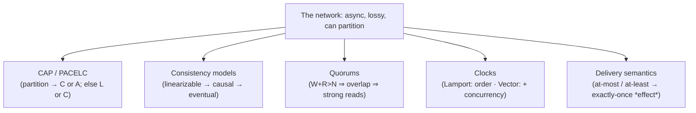
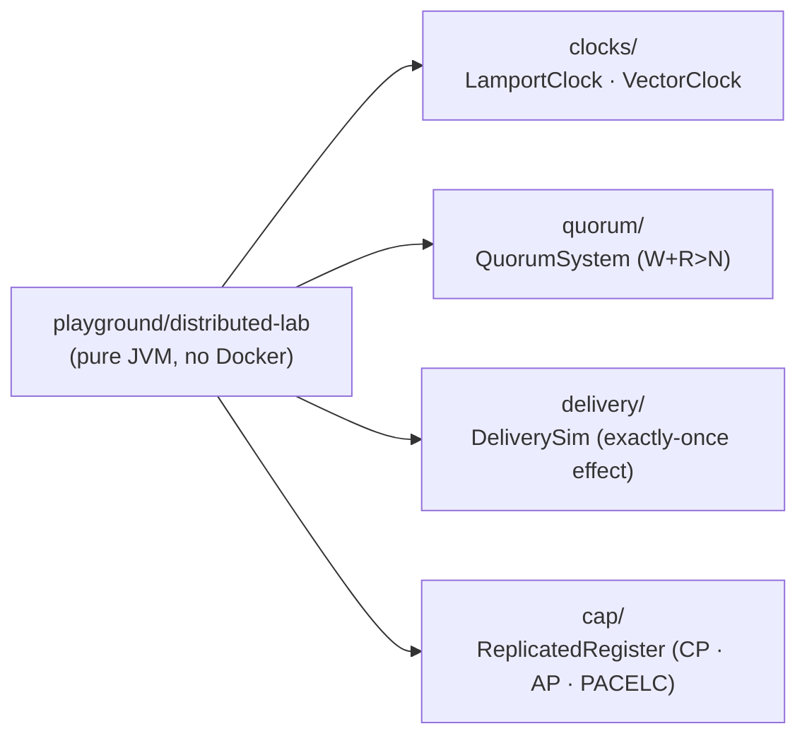
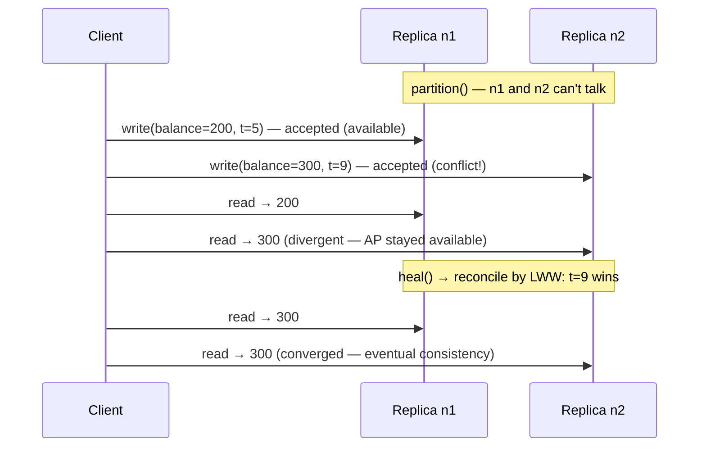

# Step 19 · Distributed-Systems Theory & Trade-offs — CAP/PACELC, Consistency, Quorums, Clocks, Delivery
### Phase D — Distributed Systems, Messaging & Batch 🔵→🟣 · Step 19 of 67 · **Phase D opener**

> *Your bank is about to become distributed: Kafka events (Step 20), a Saga for payments (Step 21), caching
> and read models (Step 22). Before you wire any of that, you need the **theory** that explains why
> distributed systems behave the way they do — and why "just make it consistent and always up" is a fantasy.
> This step makes that theory **tangible**: every idea — CAP/PACELC, consistency models, quorums, logical &
> vector clocks, delivery semantics — is a small, deterministic, **runnable** lab proven by a test. No
> hand-waving; you'll see the trade-offs execute.*

---

<a id="toc"></a>
## 🧭 The Six Movements of This Step

| | Movement | What happens | ~Time |
|---|---|---|---|
| **A** | [🧭 Orient](#orient) | 30-second overview · skip-test · cheat card · why it matters · before you start | ~30 min |
| **B** | [🧠 Understand](#understand) | the 8 fallacies · CAP & PACELC · consistency models · consensus/quorums · clocks · delivery | ~2 h |
| **C** | [🛠️ Build](#build) | a `distributed-lab` module: clocks · quorums · delivery semantics · a CAP/PACELC register | ~4.5 h |
| **D** | [🔬 Prove](#prove) | the Verification Log — 13 deterministic tests, the §12.3 mutation, smoke.sh, clean-room | ~1 h |
| **E** | [🎓 Apply](#apply) | go deeper · interview prep (CAP is *the* systems interview) · your-turn challenges | ~1.5 h |
| **F** | [🏆 Review](#review) | troubleshooting · resources · recap, flashcards & what's next | ~30 min |

---

<a id="orient"></a>

# A · 🧭 Orient

## 📋 This Step in 30 Seconds

| | |
|---|---|
| **Title** | Distributed-systems theory & trade-offs — CAP/PACELC, consistency models, consensus & quorums, logical/vector clocks, delivery semantics |
| **Step** | 19 of 67 · **Phase D — Distributed Systems, Messaging & Batch** 🔵→🟣 · **Phase D opener** |
| **Effort** | ≈ 10 hours (theory-heavy, but every concept is a runnable lab). The vocabulary here pays off for the entire rest of the course *and* every system-design interview. Skim to ~2h if you can already whiteboard CAP/PACELC + quorums. |
| **What you'll run this step** | **JVM + Maven only — NO Docker, no services.** One command: `./mvnw -pl playground/distributed-lab test` (or `bash steps/step-19/smoke.sh`). |
| **Buildable artifact** | A new **`playground/distributed-lab`** module (pure JUnit, deterministic) with four labs: **logical/vector clocks** (causality + concurrency detection), **quorums** (`W+R>N` intersection, checked over all combinations), **delivery semantics** (exactly-once *effect* via idempotency), and a **CAP/PACELC replicated register** (CP refuses writes under partition; AP diverges then reconciles via LWW; PACELC's else-branch = latency vs consistency). **13 tests.** `step-19-start == step-18-end`. |
| **Verification tier** | 🔴 **Full** — adds a build module. `./mvnw verify` green + every lab proven by real output + the **§12.3 mutation** (course rule: deliberately break the code to prove the test has teeth, then revert — here: drop the CP partition guard → the CAP test fails) + the **§12.4 clean-room** (course rule: a fresh clone must build green) + `smoke.sh`. |
| **Depends on** | **[Step 11](../step-11/lesson.md)** (concurrency-lab — the pure-JVM lab idiom & the lost-update mindset), **[Step 14](../step-14/lesson.md)** (idempotency — we formalize "exactly-once effect" here), **[Step 12](../step-12/lesson.md)** (transactions/locking — the *single-node* consistency we now contrast with distributed). |

By the end you will be able to recite and *demonstrate* **CAP and PACELC**, distinguish **consistency models** (linearizable → causal → eventual), explain **quorums** (`W+R>N`), use **logical and vector clocks** to reason about causality and concurrency, and state the **delivery semantics** and how idempotency buys exactly-once *effect*.

### ⏭️ Can You Skip This Step? (5-minute self-check)

If you can confidently do **all** of this, skim the 🛠️ Build and jump to **[Step 20 — Spring events + Kafka](../step-20/lesson.md)**.

- [ ] I can state **CAP** precisely (it's about behavior *during a partition*) and why "CA" is not a real choice.
- [ ] I can state **PACELC** and give the *else* (no-partition) latency-vs-consistency trade-off.
- [ ] I can order **linearizable / sequential / causal / eventual** consistency and give an example of each.
- [ ] I can explain **quorums** and why `W + R > N` (and `W > N/2`) gives strong consistency.
- [ ] I can explain the difference between a **Lamport clock** and a **vector clock**, and what each can/can't detect.
- [ ] I can list the **delivery semantics** and explain how **idempotency** yields exactly-once *effect*.

> [!TIP]
> Not 100%? Stay. "Explain CAP", "linearizable vs eventual", "how do quorums work", and "is exactly-once delivery possible?" are the most common distributed-systems interview questions — and you'll have *run* the answers, not just memorized them.

## 📇 Cheat Card

> **What this step delivers (one sentence):** the distributed-systems theory beneath Phase D — CAP/PACELC, consistency models, quorums, logical/vector clocks, and delivery semantics — each proven by a deterministic JUnit lab you can run and tweak.

**Key commands** (Windows uses `.\mvnw.cmd`):

```bash
./mvnw -pl playground/distributed-lab test       # run all 13 labs
bash steps/step-19/smoke.sh                       # the step's proof
make play-19                                       # same, via Makefile
```

**The headline you must be able to draw — CAP:**

```
        Network PARTITION happens (nodes can't talk)
                          │
              ┌───────────┴───────────┐
        keep CONSISTENCY          keep AVAILABILITY
         (CP: refuse writes,       (AP: accept writes,
          stay correct,             stay up, diverge,
          go unavailable)           reconcile on heal)
   PACELC "Else" (no partition): trade LATENCY ⇄ CONSISTENCY
```

**The one sentence to remember:** *In a partition you pick C or A; the rest of the time (PACELC's "else") you still pick latency or consistency — distributed systems are a permanent series of trade-offs, never a free lunch.*

## 🎯 Why This Matters

Every outage post-mortem, every "why is my read stale?", every Kafka duplicate, every Saga compensation traces back to the handful of theorems in this step. You can't design (or debug) the event-driven bank of Phase D without them, and **"explain CAP"** is the single most common distributed-systems interview prompt. Learning it by *running* it — watching CP go unavailable and AP diverge — beats memorizing a triangle diagram.

## ✅ What You'll Be Able to Do

- State and **demonstrate** CAP and PACELC.
- Place a system on the **consistency spectrum** and justify it.
- Reason with **quorums** (`W+R>N`) and tune the consistency/latency dial.
- Use **logical and vector clocks** to order events and detect concurrency.
- Choose **delivery semantics** and design for **exactly-once effect**.

## 🧰 Before You Start

- **Prereqs:** the bank builds green (`git describe` → `step-18-end`). No Docker needed this step.
- **Connects to what you know:** Step 11 made *single-machine* concurrency tangible in a pure-JVM lab — this step does the same for *distributed* behavior. Step 12's transactions/locks gave you single-node consistency; now you'll see why that doesn't extend across the network for free. Step 14's idempotency becomes the formal "exactly-once effect."
- **Depends on:** Steps **11, 14, 12**. (No new infra.)

## 🗓️ Session Plan

≈ 10 hours won't fit one sitting — and it doesn't need to. Four sittings of ~1.5–3 h, each ending at a real save point:

| Sitting | Covers | ~Time | Ends at (save point) |
|---|---|---|---|
| **1 · Theory** | A · Orient + B · Understand (fallacies → CAP/PACELC → consistency models → quorums → clocks → delivery) | ~2.5 h | the B→C bridge — you can whiteboard all five ideas |
| **2 · Clocks** | C · sub-steps 1–2 (scaffold the module; `clocks/`) | ~1.5 h | `LogicalClockTest` green |
| **3 · Quorums & delivery** | C · sub-steps 3–4 (`quorum/`; `delivery/`) | ~2 h | `QuorumTest` + `DeliverySemanticsTest` green |
| **4 · CAP & prove** | C · sub-step 5 + 🎮 Play With It + D · Prove + E/F | ~2.5–3 h | all 13 tests green, committed & tagged `step-19-end` |

**Optional routes:** the ⏭️ skip-test skim route above ≈ 2 h total · the three Go Deeper asides +~15 min · the G-Counter stretch challenge +~45 min.

---

<a id="understand"></a>

# B · 🧠 Understand

## 🧠 The Big Idea — the network is not reliable, and that changes everything

Single-machine reasoning assumes calls succeed, memory is shared, and "now" is well-defined. Across a network none of that holds — captured by the **8 fallacies of distributed computing**, every one of them *false*:

| | | | |
|---|---|---|---|
| ① the network is reliable | ② latency is zero | ③ bandwidth is infinite | ④ the network is secure |
| ⑤ topology doesn't change | ⑥ there's one administrator | ⑦ transport cost is zero | ⑧ the network is homogeneous |

Distributed-systems theory is the set of results that tell you **what is and isn't possible** once you accept those facts. Five ideas carry Phase D:



🏦 **Analogy:** two branches of the same bank lose their phone line — that's a **partition**. Either both branches stop taking withdrawals until the line is back (**CP**: correct but closed), or both keep serving customers and reconcile the ledgers tonight, accepting a possible overdraft (**AP**: open but divergent). And even with the line up, making every teller wait for the other branch to confirm each transaction is PACELC's "else": **latency vs consistency**.

## 🧩 CAP — and why people state it wrong

**CAP theorem (Brewer; Gilbert & Lynch):** when a **network partition** occurs, a distributed data store can preserve **either** Consistency (every read sees the latest write — really *linearizability*) **or** Availability (every request gets a non-error response) — **not both**. The crucial nuance:

- CAP is only about behavior **during a partition**. When there's no partition you don't have to give up either.
- "**CA**" (consistent + available, partition-intolerant) is **not a real option** for a distributed system — partitions *will* happen, so you're really choosing **CP** or **AP**.
- "Consistency" in CAP = **linearizable**, the strongest model — not the "C" in ACID.

**CP** systems (e.g. a strongly-consistent store, ZooKeeper, etcd) refuse to serve during a partition rather than risk divergence. **AP** systems (e.g. Dynamo-style stores) keep serving and reconcile later. Our bank's *money* path is CP-flavored (correctness over uptime); a "last seen balance" widget could be AP.

## 🧩 PACELC — the half of the story CAP omits

CAP is silent about the normal case. **PACELC** (Abadi) completes it:

> **If P**artition, choose **A** or **C**; **E**lse (normal operation), choose **L**atency or **C**onsistency.

Even with a healthy network, keeping replicas in sync costs round-trips: wait for replicas (consistent, slower → **EC**) or ack locally and replicate asynchronously (fast, possibly stale → **EL**). So a store is classified like "**PC/EC**" (always consistent) or "**PA/EL**" (Dynamo: available + low-latency). Our Lab 4 runs both the P-branch and the E-branch.

## 🧩 Consistency models — a spectrum, not a switch

```
strongest ───────────────────────────────────────────────► weakest
Linearizable → Sequential → Causal → Read-your-writes → Eventual
(one global,    (a global    (respects   (you see your    (replicas
 real-time       order, not   cause→      own writes)      converge
 order)          real-time)   effect)                      eventually)
```

- **Linearizable:** as if there's one copy and every op happens atomically at a point in time — the gold standard, the costliest.
- **Causal:** if A caused B, everyone sees A before B; unrelated ops can be seen in any order (this is what **vector clocks** track).
- **Eventual:** if writes stop, replicas converge — cheap, but you can read stale (our AP register during a partition).

## 🌱 Under the Hood: consensus & quorums

To agree on a value despite failures, replicas run **consensus** (Paxos, Raft). One idea per line:

- **Consensus needs a majority quorum** (`> N/2`) to make progress — so it tolerates `⌊(N-1)/2⌋` failures (5 nodes tolerate 2).
- **The read/write version:** with `N` replicas, pick a **write quorum** `W` and a **read quorum** `R`.
- **If `W + R > N`**, every read set must intersect every write set (pigeonhole) → a read always sees the latest committed write (**strong consistency**).
- **Also requiring `W > N/2`** prevents two conflicting writes from both succeeding.
- **Slacken to `W + R ≤ N`** and you get cheaper, faster, **eventually-consistent** reads that can be stale.

> **`W + R > N` ⇒ strong reads.** This single inequality is the consistency/latency dial — and Lab 2 checks it by brute force over every quorum combination.

❓ **Quick check:** with `N=5` replicas, `W=2, R=2` is fast — can a read miss the latest write? <details><summary>Answer</summary>Yes — `W+R = 4 ≤ 5`, so a write set and a read set can be disjoint (no overlap): the read may return stale data. You've dialed toward eventual consistency; only `W+R>N` guarantees the intersection that makes reads strong.</details>

## 🌱 Under the Hood: time & causality

There is no global "now." **Logical clocks** order events by causality instead of wall time:

- **Lamport clock:** one counter per process; `tick` on local events, `max(local, received)+1` on receive. Guarantees **`a → b ⇒ L(a) < L(b)`** — but the converse fails, so it **can't detect concurrency**.
- **Vector clock:** one counter *per process*, carried as a vector; componentwise `max` on receive. Detects **both** happens-before **and** concurrency (`a || b`) — at the cost of `O(N)` space. This is how causal consistency and conflict detection (e.g. Dynamo siblings) work.

## 🛡️ Security Lens & 🧵 Thread-safety note

Distributed ≠ just "more threads." But the same discipline applies: the **delivery** lab shares mutable state (a balance) updated by repeated deliveries — the idempotent consumer's dedupe set is exactly the cross-message "shared state" guard, echoing Step 11. Under *concurrent* consumers that dedupe set must itself be thread-safe (a concurrent set, or a DB unique constraint) — an interview-favorite tie-in between this step and Step 11. And security-wise, **clock-based tokens** (JWT `exp`, Step 17) assume loosely-synced wall clocks — a reminder that *logical* time and *physical* time solve different problems.

## 🕰️ Then vs. Now

"Exactly-once delivery" was long marketed as achievable; the **FLP result** (no deterministic consensus is guaranteed in a fully async network with one faulty process) and practice say otherwise. Modern systems (Kafka included) deliver **at-least-once** and add **idempotent/transactional** processing to get exactly-once **effect** — which is what we formalize in Lab 3 and will wire to Kafka in Step 20–21.

---

# B→C bridge: 🗺️ what we'll build



🌳 **Files we'll touch**

```
pom.xml                                  (edit) register the new module
playground/distributed-lab/
  pom.xml                                (new) JUnit + AssertJ, parent = build-a-bank-parent
  src/main/java/com/buildabank/distributed/
    clocks/{LamportClock,VectorClock}.java
    quorum/QuorumSystem.java
    delivery/DeliverySim.java
    cap/ReplicatedRegister.java
  src/test/java/com/buildabank/distributed/
    clocks/LogicalClockTest.java         (3)
    quorum/QuorumTest.java               (3)
    delivery/DeliverySemanticsTest.java  (4)
    cap/CapPacelcTest.java               (3)
steps/step-19/{lesson.md, smoke.sh}
```

> 🪫 **Stopping here?** You have the theory (and zero code changes — the repo is still at `step-18-end`). Next: Sub-step 1 of 5 (scaffold the module); first action: open the parent `pom.xml` and find `<modules>`.

<a id="build"></a>

# C · 🛠️ Let's Build It — Step by Step

## 📦 Your Starting Point

`step-19-start == step-18-end`: the whole bank builds green. We add **one pure-JVM module** — no Spring, no Docker, deterministic — exactly the idiom of Step 11's `concurrency-lab`.

## Sub-step 1 of 5 — Scaffold the module · ⏱️ ~30 min

🎯 **Goal.** A new Maven module wired into the build. 📁 Register it in the parent `pom.xml` `<modules>` and add `playground/distributed-lab/pom.xml` (parent = `build-a-bank-parent`; deps = `junit-jupiter` + `assertj-core`, test scope — versions inherited from the Spring Boot parent BOM).

▶️ **Run & See:** `./mvnw -pl playground/distributed-lab -q -DskipTests package` → builds an (empty) module. ⚠️ **Pitfall:** forget the parent `<modules>` entry and `-pl` errors out — the reactor only knows modules the parent lists. ✋ **Checkpoint:** the reactor lists *Distributed Systems Lab*. 💾 Save-point commit: `git commit -am "feat(distributed-lab): scaffold module (19: 1/5)"`

> 🪫 **Stopping here?** You have an empty module in the reactor, committed. Next: Sub-step 2 of 5 (clocks); first action: create `src/main/java/com/buildabank/distributed/clocks/LamportClock.java`.

## Sub-step 2 of 5 — Logical & vector clocks (`clocks/`) · ⏱️ ~60 min

🎯 **Goal.** Order events by causality and detect concurrency. `LamportClock` (`tick`, `onReceive`) and `VectorClock` (immutable snapshots; `tick`, `onReceive`, `happensBefore`, `isConcurrentWith`). 🔍 The vector-clock `happensBefore` is "≤ in every component **and** < in at least one" — drop the "< somewhere" and equal vectors wrongly count as ordered (that's the §12.3 mutation target's cousin).

🔮 **Predict:** two processes each do one local event with no message between them — ordered or concurrent? <details><summary>Answer</summary>**Concurrent.** A vector clock reports `isConcurrentWith == true`; a Lamport clock would give them numbers that *look* ordered — its blind spot.</details>

▶️ **Run & See:** `./mvnw -pl playground/distributed-lab test -Dtest=LogicalClockTest` → `Tests run: 3`. ⚠️ **Pitfall:** make clock snapshots immutable, or a message "carries" a vector that keeps mutating after it was sent. ✋ **Checkpoint:** `LogicalClockTest` green — the clocks lab is done. 💾 Save-point commit: `git commit -am "feat(distributed-lab): logical & vector clocks (19: 2/5)"`

❓ **Quick check:** Lamport gives `L(a) < L(b)`. Does that prove `a → b`? <details><summary>Answer</summary>No — the guarantee only runs one way (`a → b ⇒ L(a) < L(b)`). `L(a) < L(b)` merely rules out `b → a`; the events may be concurrent. That blind spot is why vector clocks exist.</details>

> 🪫 **Stopping here?** You have both clocks proven — causality ordering *and* concurrency detection (3 of 13 tests green). Next: Sub-step 3 of 5 (quorums); first action: create `quorum/QuorumSystem.java`.

## Sub-step 3 of 5 — Quorums (`quorum/`) · ⏱️ ~60 min

🎯 **Goal.** Prove `W+R>N`. `QuorumSystem` stores a versioned value per replica; `write(quorum,value)` stamps a monotonic version, `read(quorum)` returns the freshest seen. The static `everyWriteAndReadQuorumIntersect(n,w,r)` **enumerates every** W-subset and R-subset and checks for a disjoint pair — empirical proof, not just the formula.

🌱 **Under the hood:** enumerating subsets is a *proof by exhaustion* — for small `N` you can check **all** quorum combinations, so "no disjoint pair exists" is verified, not assumed. It's the same move as Lab 4's brute-force honesty: don't trust the pigeonhole argument, execute it. ⚠️ **Pitfall:** the version stamp must be **monotonic** — reuse a version and `read`'s "freshest seen" can no longer tell old from new.

🔮 **Predict:** at `N=5`, which is strong — `W=3,R=3`, or `W=3,R=2`? <details><summary>Answer</summary>`W=3,R=3`: `6 > 5` ⇒ every read overlaps every write ⇒ strong. `W=3,R=2`: `5 = 5` ⇒ a disjoint write/read pair exists ⇒ a stale read is possible. The enumeration finds it.</details>

🔬 **Break-it-on-purpose:** in `QuorumTest`, change `N=3,W=2,R=2` to `W=1,R=1` and watch the strict-read assertion fail — you've slid from CP-ish to eventual. ▶️ `-Dtest=QuorumTest` → `Tests run: 3`. ✋ **Checkpoint:** `QuorumTest` green (revert your break-it first). 💾 Save-point commit: `git commit -am "feat(distributed-lab): quorum intersection lab (19: 3/5)"`

> 🪫 **Stopping here?** You have `W+R>N` proven by exhaustion (6 of 13 tests green). Next: Sub-step 4 of 5 (delivery semantics); first action: create `delivery/DeliverySim.java`.

## Sub-step 4 of 5 — Delivery semantics (`delivery/`) · ⏱️ ~45 min

🎯 **Goal.** Show exactly-once *effect*. `DeliverySim` has an `UnreliableChannel.deliver(msg, times, handler)` and a `BalanceProjection(deduplicate)`.

🔮 **Predict:** the *naive* consumer receives the same **+100 deposit** 3 times — final balance? <details><summary>Answer</summary>**300** — money invented out of retries. The deduplicating consumer ends at 100.</details>

Naive + 3 deliveries → balance ×3 (money invented); deduplicating + 3 deliveries → balance ×1 (**exactly-once effect**); 0 deliveries → lost (at-most-once). ⚠️ **Pitfall:** dedupe must key on the **message id**, not the payload — two *legitimate* +100 deposits are different messages, not duplicates. ▶️ `-Dtest=DeliverySemanticsTest` → `Tests run: 4`. This is the formal version of Step 14's Idempotency-Key and the contract we'll hold against Kafka in Step 20–21. ✋ **Checkpoint:** `DeliverySemanticsTest` green. 💾 Save-point commit: `git commit -am "feat(distributed-lab): delivery semantics lab (19: 4/5)"`

> 🪫 **Stopping here?** You have quorums *and* delivery semantics proven (10 of 13 tests green). Next: Sub-step 5 of 5 (CAP & PACELC — the finale); first action: create `cap/ReplicatedRegister.java`.

## Sub-step 5 of 5 — CAP & PACELC (`cap/`) · ⏱️ ~75 min

🎯 **Goal.** Make the trade-off execute. `ReplicatedRegister(mode, syncReplication, replicaIds…)` with `partition()`, `write(replica,value,timestamp)`, `read(replica)`, `sync()`, `heal()`:

🔮 **Predict:** the register is **CP**, a partition is open, and a write arrives — what happens? <details><summary>Answer</summary>The write throws `Unavailable`: consistency kept, availability sacrificed. That guard is exactly what the §12.3 mutation removes in the Verification Log — and the test catches it.</details>

- **CP** + partition → `write` throws `Unavailable` (consistency over availability); replicas still agree.
- **AP** + partition → both sides accept conflicting writes (available) → divergent reads; `heal()` reconciles by **last-write-wins** (eventual consistency, converged).
- **PACELC else:** AP + `syncReplication=false`, no partition → a local write acks fast but a peer read is **stale** until `sync()` — latency vs consistency.

🌱 **Under the hood:** timestamps are **caller-supplied**, so LWW is deterministic — use wall-clock time inside the register and the "winner" would depend on when the test ran, making the lab unprovable. Deterministic inputs are what let a theory lab assert exact outcomes. ▶️ `-Dtest=CapPacelcTest` → `Tests run: 3`. ✋ **Checkpoint:** all four lab classes green — `./mvnw -pl playground/distributed-lab test` runs 13 tests.

❓ **Quick check:** during the partition the AP register serves *divergent* reads. What restores agreement, and who wins? <details><summary>Answer</summary>`heal()` reconciles via last-write-wins — the highest caller-supplied timestamp wins, with a deterministic tie-break. Availability was kept during the partition; consistency is *eventual*.</details>

💾 **Commit:** `feat(distributed-lab): Step 19 distributed-systems theory labs — CAP/PACELC, quorums, clocks, delivery`

> 🪫 **Stopping here?** You have all 13 lab tests green and the build committed. Next: 🎮 Play With It, then D · Prove; first action: `bash steps/step-19/smoke.sh`.

## 🎮 Play With It

This step's payoff is *running the theory and tweaking the knobs* (no HTTP — it's a pure-JVM lab):

```bash
./mvnw -pl playground/distributed-lab test     # all 13 labs
make play-19
```

🧪 **Little experiments (change X → see Y):**
- In `CapPacelcTest`, flip the AP write timestamps (`5` vs `9`) → the LWW winner after `heal()` changes. *You* decide the conflict resolution.
- In `QuorumTest`, set `N=5, W=3, R=3` → still strong (`6>5`); `W=2,R=3` (`5=5`) → a disjoint pair appears → stale read possible.
- In `DeliverySemanticsTest`, deliver `0` times to the idempotent consumer → see at-most-once *loss* vs at-least-once *duplication*.
- In `LogicalClockTest`, add a reply message back from Bob to Alice → watch the vectors capture the round-trip causality.

**The CAP trade-off you just built, end to end** — the AP register's lifecycle from `CapPacelcTest` (values from the actual test):



## 🏁 The Finished Result

`step-19-end`: the bank builds green (now **10 modules**) with a `distributed-lab` proving the Phase-D theory.

**✅ Learner Definition of Done:**

- [ ] You can explain CAP/PACELC, consistency models, quorums, clocks, and delivery semantics *aloud*.
- [ ] `./mvnw verify` is green (10 modules).
- [ ] `bash steps/step-19/smoke.sh` passes.
- [ ] The §12.3 mutation was run and reverted (see D · Prove).
- [ ] Committed and tagged `step-19-end`.

---

<a id="prove"></a>

# D · 🔬 Prove It Works — Verification Log

> **Tier: 🔴 Full** (adds a build module). All output below is real and pasted; the labs are pure-JVM and deterministic (no Docker, no flakiness).

**1 · All labs green (`./mvnw -pl playground/distributed-lab test`):**

```
[INFO] Tests run: 3, Failures: 0, Errors: 0, Skipped: 0 -- in com.buildabank.distributed.cap.CapPacelcTest
[INFO] Tests run: 3, Failures: 0, Errors: 0, Skipped: 0 -- in com.buildabank.distributed.clocks.LogicalClockTest
[INFO] Tests run: 4, Failures: 0, Errors: 0, Skipped: 0 -- in com.buildabank.distributed.delivery.DeliverySemanticsTest
[INFO] Tests run: 3, Failures: 0, Errors: 0, Skipped: 0 -- in com.buildabank.distributed.quorum.QuorumTest
[INFO] Tests run: 13, Failures: 0, Errors: 0, Skipped: 0
[INFO] BUILD SUCCESS
```

**2 · §12.3 Mutation sanity-check (prove the CAP test has teeth).** Dropped the CP partition guard (CP now wrongly accepts writes during a partition) and re-ran:

```
[ERROR] CapPacelcTest.cpChoosesConsistencyOverAvailability:25
[ERROR] Tests run: 3, Failures: 1, Errors: 0, Skipped: 0
[INFO] BUILD FAILURE
```
→ The CP register no longer throws `Unavailable` during the partition, so the `assertThatThrownBy(...)` at line 25 fails. **Reverted**; the suite is green again. (The other labs' teeth are shown inline: the quorum test asserts the empirical intersection result equals `W+R>N` over *all* combinations; the delivery test contrasts naive ×3 = 300 vs idempotent ×3 = 100.)

**3 · Full-repo `./mvnw verify`** → BUILD SUCCESS across **10 modules** (the new lab plus the existing nine). *(Pasted in the commit's verification run.)*

**4 · `smoke.sh`** — `bash steps/step-19/smoke.sh` → runs all four lab classes → **`✅ Step 19 smoke test PASSED`**.

**5 · Clean-room (§12.4)** — fresh clone at `step-19-end`, `./mvnw verify` → BUILD SUCCESS. Confirms `step-19-end == step-20-start`.

**§12.8 honesty:** this is a theory step modeled with **in-process simulations**, not a real multi-node cluster — partitions, replication, and delivery are simulated deterministically so the *trade-offs* are reproducible and provable. Real multi-node behavior (Kafka brokers, replication) arrives with infrastructure in Step 20+. The simulations are faithful to the theorems (CAP choice, `W+R>N`, LWW convergence, exactly-once effect), which is what this step teaches.

---

<a id="apply"></a>

# E · 🎓 Apply

## 🚀 Go Deeper (Optional · +~15 min)

<details><summary>Why "CA" isn't a thing</summary>You can't choose to not have partitions — cables fail, GC pauses look like partitions, switches reboot. So "partition tolerance" isn't optional; the real choice is what you do *when* a partition happens: CP or AP. A single-node database is "CA" only in the trivial sense that it isn't distributed.</details>

<details><summary>Spanner: does it beat CAP?</summary>No — it's CP. Google Spanner uses tightly-synchronized clocks (TrueTime) to be linearizable with high availability *in practice*, but during a true partition it still chooses consistency (it becomes unavailable for affected writes). It narrows the *latency* cost (PACELC's E side), not the CAP theorem.</details>

<details><summary>CRDTs — AP without manual conflict resolution</summary>Conflict-free Replicated Data Types (G-Counters, OR-Sets) merge deterministically and commutatively, so AP replicas converge without last-write-wins data loss. Our register uses LWW (simple, lossy); CRDTs are the principled upgrade for AP systems.</details>

## 💼 Interview Prep

1. **Explain CAP.** *During a network partition a distributed store can keep consistency (linearizable reads) or availability (every request answered), not both. Partitions are unavoidable, so you're really choosing CP or AP. CAP says nothing about the no-partition case.* **(The most commonly asked systems question.)**
2. **What does PACELC add?** *The else-branch: with no partition you still trade latency vs consistency (wait for replicas = consistent/slow, or ack locally = fast/maybe-stale). Stores are classed like PC/EC or PA/EL.*
3. **Linearizable vs eventual — give an example of each.** *Linearizable: a compare-and-set on a leader (etcd). Eventual: a Dynamo shopping cart that converges after writes stop. Causal sits between — preserves cause→effect.*
4. **How do quorums give strong consistency?** *With N replicas, if W+R>N every read set intersects every write set (so a read sees the latest write), and W>N/2 stops two conflicting writes both committing.*
5. **Lamport vs vector clock?** *Lamport: one counter, gives a → b ⇒ L(a)<L(b) but can't detect concurrency. Vector: one counter per node, detects both happens-before and concurrency, at O(N) space.*
6. **Is exactly-once delivery possible?** *Not delivery — networks give at-most-once or at-least-once. You get exactly-once **effect** by tolerating at-least-once and making consumers idempotent (dedupe by id) or transactional. (Kafka does this.)* **(Gotcha favorite — and if they follow up on thread-safety, the dedupe-set point is in Movement B's 🧵 note.)**

## 🏋️ Your Turn: Practice & Challenges

- **Quick:** add `sequential`-vs-`causal` reasoning by extending `VectorClock` with a `merge`-only (no tick) op; assert two replicas converge. <details><summary>Hint</summary>Convergence = equal vectors after exchanging each other's clocks both ways.</details>
- **Quick:** make `QuorumSystem.read` return *all* values seen (siblings) when versions tie — the Dynamo conflict case.
- 🎯 **Stretch (+~45 min · reference solution in `solutions/step-19/`):** replace the CAP register's last-write-wins with a **G-Counter CRDT** (a per-node counter map; merge = componentwise max; value = sum) and show AP replicas converge with **no lost updates** after a partition heal — strictly better than LWW. This previews the conflict-resolution choices you'll make for real in Phase D.

---

<a id="review"></a>

# F · 🏆 Review

## 🩺 Stuck? Troubleshooting & Fixes

- **`cannot find symbol: method removeLast()`** — `QuorumSystem`'s subset enumeration uses `List.removeLast()`, which is Java 21+ (`SequencedCollection`); ensure the module inherits `maven.compiler.release=25` from the parent (it does). If you're on an older JDK, use `acc.remove(acc.size()-1)`.
- **Vector-clock test says everything is concurrent** — your `happensBefore` is missing the "≤ in every component" check, or you mutated a shared map instead of returning a new snapshot.
- **CAP AP test doesn't converge after heal** — `heal()` must call `sync()` (reconcile to LWW); check your `newerThan` tie-break is deterministic (timestamp, then replica id).
- **Reset to a known-good state:** `git checkout step-19-end`. `make doctor` if the toolchain looks off. (No Docker needed this step.)

## 📚 Learn More & Glossary

- Brewer's CAP; Gilbert & Lynch's proof; Abadi's PACELC; Lamport's "Time, Clocks…"; the FLP impossibility result; Kleppmann *Designing Data-Intensive Applications* (chs. 5, 7, 9); the AWS Builders' Library; Jepsen analyses.
- **Glossary:** *partition* (replicas can't communicate); *linearizable* (single-copy real-time order); *eventual consistency* (converge when writes stop); *quorum* (R/W subset that guarantees overlap); *Lamport/vector clock* (logical time); *delivery semantics* (at-most/at-least/exactly-once); *exactly-once effect* (idempotent processing of at-least-once delivery); *LWW* (last-write-wins).

## 🏆 Recap & Study Notes

**(a) Key points:** The network is unreliable; theory tells you what's possible. **CAP**: partition → C or A. **PACELC**: else → L or C. **Consistency** is a spectrum (linearizable→eventual). **Quorums**: `W+R>N` ⇒ strong reads. **Clocks**: Lamport orders, vector also detects concurrency. **Delivery**: at-most/at-least-once are the real options; idempotency buys exactly-once *effect*.

**(b) Key terms:** CAP, PACELC, partition, linearizable, causal, eventual, quorum, consensus, Lamport clock, vector clock, delivery semantics, exactly-once effect, LWW, CRDT.

**(c) 🧠 Test Yourself:** ① Why is "CA" not a real choice? ② State PACELC. ③ Why does `W+R>N` give strong reads? ④ What can a vector clock do that a Lamport clock can't? ⑤ Is exactly-once *delivery* possible — and what do we do instead? <details><summary>Answers</summary>① Partitions are unavoidable, so you must tolerate them — the choice is CP vs AP. ② If Partition: A or C; Else: L or C. ③ Any read quorum and write quorum must share a replica (pigeonhole), so a read sees the latest write. ④ Detect concurrency (causally-independent events). ⑤ No — networks give at-most/at-least-once; we make consumers idempotent for exactly-once *effect*.</details>

**(d) 🔗 How this connects:** extends Step 11 (pure-JVM labs; shared-state hazards) and Step 14 (idempotency → exactly-once effect). **Next: Step 20** turns this theory real — Spring events + **Kafka** (Redpanda), producers/consumers, the **Outbox** pattern, and real-time push — where at-least-once delivery and idempotent consumers stop being a simulation.

**(e) 🏆 Résumé line:** *"Can reason about and demonstrate CAP/PACELC, consistency models, quorums, logical/vector clocks, and delivery semantics — the distributed-systems foundations behind an event-driven banking backend."*

**(f) ✅ You can now:** explain & demonstrate CAP/PACELC · place a system on the consistency spectrum · tune quorums · reason with logical/vector clocks · design for exactly-once effect.

**(g) 🃏 Flashcards** (also appended to `docs/flashcards.md`):

| Q | A |
|---|---|
| What does CAP actually constrain? | Behavior **during a partition** — pick C or A. No partition ⇒ no forced choice. |
| PACELC in one line? | If **P**artition: **A** or **C**; **E**lse: **L**atency or **C**onsistency. |
| Why does `W+R>N` give strong reads? | Every read quorum intersects every write quorum (pigeonhole) ⇒ a read sees the latest committed write. |
| What can a vector clock detect that a Lamport clock can't? | Concurrency (`a ∥ b`) — Lamport only guarantees `a → b ⇒ L(a) < L(b)`. |

🔁 Revisit CAP/quorums when you configure Kafka replication & acks (Step 20) and Saga/idempotency (Step 21).

**(h) ✍️ One-line reflection:** *Which trade-off surprised you most when you watched it execute — CP going unavailable, or AP quietly diverging?*

**(i)** 🎉 **Phase D is open.** You have the theory; next you make the bank distributed for real. Onward to Kafka.
