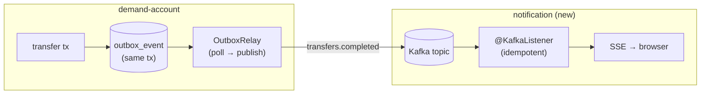
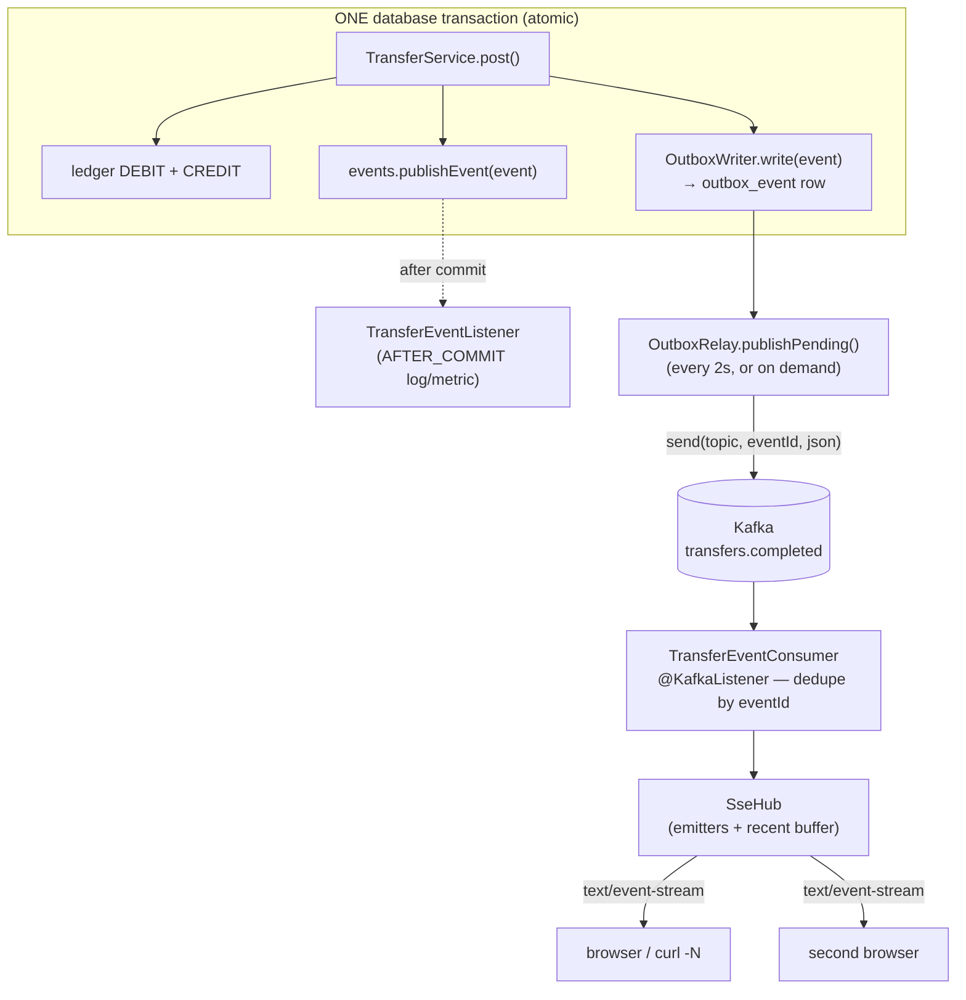

# Step 20 · Spring Events + Kafka, the Outbox Pattern & Real-Time Push (SSE)
### Phase D — Distributed Systems, Messaging & Batch 🔵→🟣 · Step 20 of 67

> *Step 19 gave you the theory — at-least-once delivery, exactly-once **effect**, the dual-write problem.
> Now you make it real. A transfer in demand-account will emit a domain event; the **Outbox pattern** gets
> that event onto **Kafka** reliably (no lost events, even on crash); a brand-new **notification service**
> consumes it **idempotently** and pushes it to your browser **live over Server-Sent Events**. By the end you
> post a transfer in one window and watch a notification appear in another — the bank's first event-driven,
> real-time feature.*

---

<a id="toc"></a>
## 🧭 The Six Movements of This Step

| | Movement | What happens |
|---|---|---|
| **A** | [🧭 Orient](#orient) | 30-second overview · skip-test · cheat card · why it matters · before you start |
| **B** | [🧠 Understand](#understand) | sync vs async · Spring events & `@TransactionalEventListener` · the dual-write problem · Outbox · Kafka · SSE |
| **C** | [🛠️ Build](#build) | domain event → Outbox (atomic, in-tx) → relay → Kafka → idempotent consumer → SSE push — **15 hand-held sub-steps** |
| **D** | [🔬 Prove](#prove) | the Verification Log — real Redpanda/Postgres tests, the §12.3 mutation, smoke.sh |
| **E** | [🎓 Apply](#apply) | go deeper · interview prep · your-turn challenges |
| **F** | [🏆 Review](#review) | troubleshooting (the Boot-4 Kafka starter gotcha) · resources · recap, flashcards & the **Cumulative Review (steps 1–20)** |

---

<a id="orient"></a>

# A · 🧭 Orient

## 📋 This Step in 30 Seconds

| | |
|---|---|
| **Title** | Spring events + Kafka (Redpanda), the transactional Outbox pattern, an idempotent consumer, and real-time push via Server-Sent Events |
| **Step** | 20 of 67 · **Phase D — Distributed Systems, Messaging & Batch** 🔵→🟣 |
| **Effort** | ≈ 20 hours focused (a big one — a new service + a broker + the Outbox). The payoff: the bank becomes event-driven and you can *see* events flow live. |
| **What you'll run this step** | **JVM + Maven**; **🐳 Docker** for Testcontainers (Postgres **and** Redpanda). Live demo runs auth + demand-account + notification + a Redpanda broker. |
| **Buildable artifact** | **demand-account**: a `TransferCompletedEvent`, a `@TransactionalEventListener(AFTER_COMMIT)`, a transactional **Outbox** (`outbox_event` + V3 migration) written atomically with the ledger, and an **Outbox relay** that publishes to Kafka. **NEW `services/notification`** (no DB): an **idempotent** `@KafkaListener` (exactly-once *effect*) that pushes to clients via **SSE**. `step-20-start == step-19-end`. |
| **Verification tier** | 🔴 **Full** — two services + the build change + a money/event path. `./mvnw verify` green + the pipeline proven on a **real broker** (Testcontainers Redpanda) + the **§12.3 mutation** + clean-room + `smoke.sh`. |
| **Depends on** | **[Step 19](../step-19/lesson.md)** (delivery semantics, exactly-once effect), **[Step 12](../step-12/lesson.md)** (the transfer + transactions), **[Step 14](../step-14/lesson.md)** (idempotency, signed webhooks — the other async pattern), **[Step 13](../step-13/lesson.md)** (MVC). **+ Docker.** |

By the end you will be able to publish **Spring application events** and react with **`@TransactionalEventListener`**; explain and implement the **transactional Outbox** to beat the dual-write problem; produce/consume **Kafka** with Spring; build an **idempotent consumer** for exactly-once *effect*; and push events to browsers with **SSE**.

### ⏭️ Can You Skip This Step? (5-minute self-check)

If you can confidently do **all** of this, skim the 🛠️ Build and jump to **[Step 21 — Payments: Saga + Idempotency Key + DLQ](../step-21/lesson.md)**.

- [ ] I can explain **sync (REST) vs async (events)** and when to choose each.
- [ ] I can use `@TransactionalEventListener(AFTER_COMMIT)` and say why it beats a plain `@EventListener` here.
- [ ] I can explain the **dual-write problem** and how the **Outbox pattern** solves it.
- [ ] I can produce and consume a **Kafka** topic with Spring, and make the consumer **idempotent**.
- [ ] I can push server→client updates with **SSE** and say how it differs from WebSocket.

> [!TIP]
> Not 100%? Stay. "How do you publish an event reliably after a DB commit?", "what's the Outbox pattern?", and "exactly-once — really?" are bread-and-butter for any event-driven backend role.

## 📇 Cheat Card

> **What this step delivers (one sentence):** a transfer atomically writes an Outbox row, a relay publishes it to Kafka, and a new notification service consumes it idempotently and pushes it to your browser live over SSE — the bank's first event-driven, real-time feature.

**Key commands** (Windows uses `.\mvnw.cmd`):

```bash
# Prove the whole pipeline (Testcontainers Postgres + Redpanda):
./mvnw -pl services/demand-account,services/notification test
bash steps/step-20/smoke.sh
# Live: start a broker, then the services, then watch the stream while you transfer (see requests.http):
curl -N http://localhost:8084/api/notifications/stream
```

**The headline diagram — the reliable event pipeline:**

```
[transfer tx] ── writes ──► ledger + OUTBOX row   (one transaction → atomic)
                                  │
                       OutboxRelay (poll, publish, mark sent)
                                  ▼
                          Kafka topic: transfers.completed   (at-least-once)
                                  ▼
        notification @KafkaListener ── dedupe by eventId ──► exactly-once effect
                                  ▼
                          SSE  ── push ──►  browser (live)
```

**The one sentence to remember:** *You can't atomically write the DB and publish to Kafka — so write the event to an **Outbox row inside the same transaction**, relay it at-least-once, and make the consumer **idempotent**.*

## 🎯 Why This Matters

Synchronous REST couples services: if notification is down, should a transfer fail? No. Events decouple them — demand-account just records "this happened," and anyone interested reacts later. But naive "save then publish" silently loses events on crash. The **Outbox + idempotent consumer** combo is *the* industry-standard answer, and it's asked constantly in system-design interviews. Plus, real-time push (SSE/WebSocket) is what makes an app *feel* alive.

## ✅ What You'll Be Able to Do

- Publish domain events and react after commit with `@TransactionalEventListener`.
- Implement the **transactional Outbox** and a relay to Kafka.
- Produce and consume Kafka topics with Spring; build an **idempotent** consumer.
- Push live updates to clients with **Server-Sent Events**.
- Reason about **at-least-once + idempotency = exactly-once effect** in real code.

## 🧰 Before You Start

- **Prereqs:** bank builds green (`git describe` → `step-19-end`); Docker running (Postgres + Redpanda).
- **Connects to what you know:** the **transfer** (Step 12) is the event source; **idempotency** (Step 14, Step 19) is how the consumer gets exactly-once effect; **delivery semantics** (Step 19) is the theory we now run on a real broker; the **signed webhook** (Step 14) was the *partner-facing* async channel — Kafka is the *internal* one.
- **Depends on:** Steps **19, 12, 14, 13**. **+ Docker.**

---

<a id="understand"></a>

# B · 🧠 Understand

## 🧠 The Big Idea — decoupling with events

Two services can talk **synchronously** (REST: caller waits, tight coupling, failures cascade) or
**asynchronously** (events: fire-and-forget to a broker, loose coupling, the consumer reacts on its own
time). For "a transfer happened, notify the customer," async is right: the transfer must not fail or wait
because notification is slow or down.



**Analogy:** synchronous REST is a phone call — you wait on the line, and if the other side doesn't pick up,
*your* task fails. An event is a letter dropped in a mailbox — you post it and move on; the recipient reads it
when they can. The Outbox is the crucial twist: you write the letter **in the same pen-stroke** as your own
ledger entry, so there's never a moment where the money moved but the letter doesn't exist (or vice versa).
The relay is the mail carrier who empties the mailbox on a schedule.

## 🧩 Spring application events & `@TransactionalEventListener`

In-process first. `ApplicationEventPublisher.publishEvent(x)` lets one bean notify others without a direct
reference. A plain `@EventListener` fires **immediately** — even if the surrounding transaction later rolls
back, which for money is dangerous. **`@TransactionalEventListener(phase = AFTER_COMMIT)`** fires only once
the transaction **commits**, so you never react to a transfer that didn't happen. (Phases:
`BEFORE_COMMIT`, `AFTER_COMMIT` (default), `AFTER_ROLLBACK`, `AFTER_COMPLETION`.)

💭 **How it works inside Spring:** when you `publishEvent(...)` while a transaction is active, Spring doesn't
deliver to `@TransactionalEventListener`s right away — it **parks the event** in a
`TransactionSynchronization` registered with the current transaction (the same callback machinery
`@Transactional` itself uses). When the transaction manager finishes the commit, it walks its synchronizations
and *then* invokes your listener. If the transaction rolls back, the parked `AFTER_COMMIT` deliveries are simply
dropped. If **no** transaction is active when you publish, the event is delivered immediately (a frequent
surprise — and a reason our publish sits inside `@Transactional` code).

## 🧩 Pattern Spotlight — the Outbox (the heart of this step)

**Problem — the dual-write:** you want to "update the DB **and** publish to Kafka." These are two different
systems; there's no shared transaction. Whichever you do first, a crash in between corrupts reality:

- publish-then-write: published an event for a transfer that then failed to save → *phantom* event.
- write-then-publish: saved the transfer, crashed before publishing → *lost* event.

**Why the Outbox fits:** make the publish-intent part of the **same database transaction** as the business
change. Write an `outbox_event` row alongside the ledger update — both commit or neither does (atomic). Then
a separate **relay** reads unpublished rows and publishes them to Kafka, marking each sent only **after** a
successful send. A crash just means the relay retries → **at-least-once**, never lost.

**Alternatives/trade-offs:** publishing from an `AFTER_COMMIT` listener is simpler but reintroduces the lost-
event gap (commit succeeds, crash before publish). Change-Data-Capture (Debezium tailing the DB log, Step 54)
removes the polling relay entirely. We use polling here because it makes the pattern visible and testable.

❓ **Knowledge-check:** the relay crashes *after* `kafka.send()` succeeded but *before* it marked the row
published. What happens on the next relay run, and why is that OK? <details><summary>Answer</summary>The row
is still `published = false`, so the relay sends it **again** — a duplicate on the topic. That's the
**at-least-once** contract; it's OK because the consumer dedupes by `eventId` (exactly-once *effect*). This is
precisely why "Outbox" and "idempotent consumer" are a package deal.</details>

## 🌱 Under the Hood: Kafka in one paragraph

Kafka is a durable, partitioned, append-only **log**. Producers append records (key, value) to a **topic**;
the key decides the **partition** (same key → same partition → ordered). Consumers in a **consumer group**
each own some partitions and track an **offset** (their read position). Delivery is **at-least-once** by
default (a rebalance or redelivery can repeat a record) — which is why consumers must be idempotent.
**Redpanda** is a Kafka-API-compatible broker (no ZooKeeper, single binary) — we use it via Testcontainers.

A little more detail on the words you'll meet in the code:

| Term | What it really is |
|---|---|
| **topic** | a named log (ours: `transfers.completed`). Not a queue — records aren't deleted on read; consumers just move their offset. |
| **partition** | a shard of the topic. Ordering is guaranteed only *within* a partition. The record **key** is hashed to pick one — same key, same partition. |
| **offset** | a consumer's bookmark per partition ("I've read up to #42"). Committed back to Kafka so a restart resumes, not rereads… *usually* (rebalances → duplicates). |
| **consumer group** | a set of consumers sharing the work — Kafka assigns each partition to exactly one member. Two *different* group-ids each get **all** the records (pub-sub). |
| **bootstrap servers** | the broker address(es) a client first contacts to discover the cluster (`localhost:9092` locally; a random mapped port under Testcontainers). |

## 🌱 Under the Hood: Server-Sent Events (SSE)

SSE is a one-way **server→client** stream over a long-lived HTTP response (`text/event-stream`). The browser's
`EventSource` auto-reconnects. It's simpler than WebSocket (which is bidirectional) and perfect for "push me
notifications." In Spring MVC it's an `SseEmitter` returned from a controller; we keep a set of emitters and
broadcast to all.

💭 **What's on the wire:** the response never "finishes" — the server keeps the connection open and writes
plain-text frames like this whenever something happens:

```
event: transfer
data: {"eventId":"…","message":"Transfer of 40.00 from ACC-A to ACC-B completed."}

```

Each frame is `event:`/`data:` lines ended by a **blank line**. Under Spring MVC this rides on the **servlet
async** machinery: the controller returns an `SseEmitter` immediately (freeing the request thread!), and any
thread — for us, the Kafka listener thread — can later call `emitter.send(...)` to push a frame down that
still-open response.

## 🛡️ Security Lens & 🧵 Thread-safety note

The notification service has **no auth yet** (like cif — tracked as risk R-002) and SSE has no per-user
filtering — fine for a local demo, revisit with the gateway. **Thread-safety (Step 11 callback):** the SSE
emitter set and the consumer's dedupe set are shared mutable state touched by Kafka-listener threads and
request threads concurrently — so they're a `CopyOnWriteArrayList` and a `ConcurrentHashMap.newKeySet()`.

## 🕰️ Then vs. Now

Boot 3 gave you Kafka autoconfiguration just by adding `spring-kafka`. **Boot 4 modularized
autoconfiguration** — you now add the **`spring-boot-starter-kafka`** (which brings `spring-kafka` *and* the
`spring-boot-kafka` autoconfig that creates `KafkaTemplate`/listener infrastructure). Bare `spring-kafka`
compiles but gives **no `KafkaTemplate` bean** — the same lesson as Flyway needing `spring-boot-flyway` in
Step 8. (We hit this for real — see 🩺.)

| | Then (Boot ≤ 3) | Now (Boot 4) | Why it changed |
|---|---|---|---|
| Kafka autoconfig | add `spring-kafka` → `KafkaTemplate` appears | add **`spring-boot-starter-kafka`** (brings `spring-kafka` + `spring-boot-kafka` autoconfig) | autoconfiguration was split out of the monolithic `spring-boot-autoconfigure` into per-technology modules |
| Kafka test support | `spring-kafka-test` | **`spring-boot-starter-kafka-test`** | same modularization, test side |
| JSON in a fresh web service | Jackson 2 (`com.fasterxml`) | **Jackson 3 (`tools.jackson`)** is the web default | Jackson 3 is the maintained line; package renamed so both can coexist |
| Kafka in tests | `EmbeddedKafka` was common | **Testcontainers `RedpandaContainer` + `@ServiceConnection`** | a real broker in a container beats an in-JVM approximation; `@ServiceConnection` removes the config glue |

---

# B→C bridge: 🗺️ what we'll build



🌳 **Files we'll touch**

```
services/demand-account/
  src/main/java/.../event/TransferCompletedEvent.java        (new) the domain event
  src/main/java/.../event/TransferEventListener.java         (new) @TransactionalEventListener(AFTER_COMMIT)
  src/main/java/.../outbox/OutboxEvent.java + Repository      (new) the outbox row
  src/main/java/.../outbox/OutboxWriter.java                  (new) serialize + persist (in-tx)
  src/main/java/.../outbox/OutboxRelay.java + Scheduler       (new) poll → publish → mark sent
  src/main/java/.../service/TransferService.java              (edit) publish event + write outbox in post()
  src/main/resources/db/migration/V3__outbox.sql             (new)
  src/main/resources/application.yml                         (edit) spring.kafka + bank.events/outbox
  src/test/java/.../RedpandaContainers.java                   (new) real broker for tests
  src/test/java/.../outbox/OutboxWriteTest.java               (new) atomicity + AFTER_COMMIT proof
  src/test/java/.../outbox/OutboxRelayKafkaTest.java          (new) relay → real Kafka proof
  src/test/resources/application.properties                  (new) relay scheduler OFF in tests
  pom.xml                                                     (edit) spring-boot-starter-kafka (+ test, redpanda)
services/notification/                                       (NEW SERVICE, no DB)
  pom.xml · NotificationApplication · Notification
  SseHub.java                  (SSE fan-out + recent buffer)
  TransferEventConsumer.java   (idempotent @KafkaListener → SseHub)
  NotificationController.java  (GET /stream SSE, GET / recent)
  application.yml              (port 8084, kafka consumer)
  src/test/java/...            (RedpandaContainers · TransferEventConsumerKafkaTest · NotificationControllerTest)
pom.xml                        (edit) register services/notification
Makefile                       (edit) run-notification + play-20
adr/0011-events-outbox-kafka.md (new)
steps/step-20/{lesson.md, requests.http, smoke.sh}
```

<a id="build"></a>

# C · 🛠️ Let's Build It — Step by Step

## 📦 Your Starting Point

`step-20-start == step-19-end`: the bank builds green (**10 modules**), demand-account has the locked,
double-entry transfer from Step 12 (now secured by Step 17 and hardened by Step 18), and Step 19's
`distributed-lab` proved the theory we're about to run on real infrastructure.

Two pieces of existing code matter for this step:

1. **`TransferService.post(...)`** — the private method where every safe transfer lands: it debits, credits,
   and writes the two ledger legs *inside one transaction*. That method is our event source; we'll touch it in
   sub-step 6.
2. **`ContainersConfig`** (test scope, from Step 12) — the Testcontainers Postgres `@TestConfiguration` our new
   tests will import alongside a new Redpanda one:

```java
// services/demand-account/src/test/java/com/buildabank/account/ContainersConfig.java   (existing — Step 12)
package com.buildabank.account;

import org.springframework.boot.test.context.TestConfiguration;
import org.springframework.boot.testcontainers.service.connection.ServiceConnection;
import org.springframework.context.annotation.Bean;
import org.testcontainers.postgresql.PostgreSQLContainer;
import org.testcontainers.utility.DockerImageName;

/**
 * Spins up a REAL PostgreSQL for tests. {@code @ServiceConnection} points the app's DataSource at this
 * container automatically (no JDBC URL/credentials in test config). Image pinned (never {@code latest}).
 */
@TestConfiguration(proxyBeanMethods = false)
public class ContainersConfig {

    @Bean
    @ServiceConnection
    PostgreSQLContainer postgresContainer() {
        return new PostgreSQLContainer(DockerImageName.parse("postgres:17-alpine"));
    }
}
```

✋ **Checkpoint before you start:** `git describe --tags` says `step-19-end` (or you've checked out
`step-20-start`), `./mvnw -q -DskipTests compile` is green, and `docker info` answers (you'll need it from
sub-step 9). If not → 🩺.

> [!NOTE]
> **Code provenance:** every code block below is the exact content at the `step-20-end` tag (`git show
> step-20-end:<path>`). Later steps refactor some of these files heavily (Step 21+ moves the notification
> service to a hexagonal layout and grows demand-account with payments/batch), so **don't diff against
> `main`** — diff against the tag.

---

### Sub-step 1 of 15 — Producer-side wiring: the Kafka starter + config 🧭 *(you are here: **deps/config** → event → listener → outbox → relay → tests → consumer service)*

🎯 **Goal:** give demand-account the ability to *talk to Kafka at all* — the right Boot-4 dependency (this is
the step's #1 gotcha) and the producer configuration. Nothing publishes yet; we're laying rails.

📁 **Location:** edit → `services/demand-account/pom.xml` (two hunks: one main dependency, two test dependencies)

⌨️ **Code (diff):**

```diff
--- a/services/demand-account/pom.xml
+++ b/services/demand-account/pom.xml
@@ -73,6 +73,14 @@
             <artifactId>spring-boot-starter-oauth2-resource-server</artifactId>
         </dependency>
 
+        <!-- Kafka (Step 20): the Outbox relay publishes transfer.completed events. Boot 4 modularized
+             autoconfig — the STARTER brings spring-kafka AND spring-boot-kafka (KafkaAutoConfiguration →
+             KafkaTemplate). Bare spring-kafka alone gives no KafkaTemplate bean (same lesson as Flyway, Step 8). -->
+        <dependency>
+            <groupId>org.springframework.boot</groupId>
+            <artifactId>spring-boot-starter-kafka</artifactId>
+        </dependency>
+
         <!-- ── Test ── -->
         <dependency>
             <groupId>org.springframework.boot</groupId>
@@ -109,6 +117,18 @@
             <artifactId>testcontainers-junit-jupiter</artifactId>
             <scope>test</scope>
         </dependency>
+        <!-- Kafka testing (Step 20): a real broker via Testcontainers Redpanda (+ @ServiceConnection), and
+             KafkaTestUtils for consumer props. The Boot test starter brings spring-kafka-test + test autoconfig. -->
+        <dependency>
+            <groupId>org.springframework.boot</groupId>
+            <artifactId>spring-boot-starter-kafka-test</artifactId>
+            <scope>test</scope>
+        </dependency>
+        <dependency>
+            <groupId>org.testcontainers</groupId>
+            <artifactId>testcontainers-redpanda</artifactId>
+            <scope>test</scope>
+        </dependency>
     </dependencies>
```

🔍 **Line-by-line:**

- `spring-boot-starter-kafka` — the **Boot 4 starter**: it pulls in `spring-kafka` (the actual
  producer/consumer library: `KafkaTemplate`, `@KafkaListener`) **and** `spring-boot-kafka` (the module that
  carries `KafkaAutoConfiguration`, which is what actually *creates* the `KafkaTemplate` bean from your
  `spring.kafka.*` properties). No `<version>` — the parent BOM manages it.
- `spring-boot-starter-kafka-test` (scope `test`) — brings `spring-kafka-test` (we'll use its
  `KafkaTestUtils` to build a throwaway verification consumer) plus the test autoconfiguration.
- `testcontainers-redpanda` (scope `test`) — the Testcontainers module with `RedpandaContainer`, a
  Kafka-API-compatible broker in a single container. Note the **Testcontainers 2.0 naming**
  (`testcontainers-` prefix), same as `testcontainers-postgresql` from Step 8.

💭 **Under the hood:** Boot autoconfiguration is conditional-on-classpath (Step 8). `KafkaAutoConfiguration`
lives in `spring-boot-kafka`; if only `spring-kafka` is present, nothing registers the template bean, and the
first component to inject `KafkaTemplate` kills startup with *"required a bean … that could not be found"*.
The starter exists precisely so you can't forget the autoconfig half.

📁 **Now the producer config** → edit `services/demand-account/src/main/resources/application.yml` (first of
two hunks this step — the `bank.*` keys arrive with the relay in sub-step 8):

⌨️ **Code (diff):**

```diff
--- a/services/demand-account/src/main/resources/application.yml
+++ b/services/demand-account/src/main/resources/application.yml
@@ -23,6 +23,12 @@ spring:
           # Validate tokens with the auth service's PUBLIC key, fetched from its JWKS (Step 17).
           # Lazy fetch on first token, so this service starts even if auth is down. Tests override the JwtDecoder.
           jwk-set-uri: ${AUTH_JWKS_URI:http://localhost:8083/oauth2/jwks}
+  # Step 20 — Kafka producer (the Outbox relay publishes here). String key+value (the payload is JSON we built).
+  kafka:
+    bootstrap-servers: ${KAFKA_BOOTSTRAP_SERVERS:localhost:9092}
+    producer:
+      key-serializer: org.apache.kafka.common.serialization.StringSerializer
+      value-serializer: org.apache.kafka.common.serialization.StringSerializer
```

🔍 **Line-by-line:**

- `spring.kafka.bootstrap-servers` — where clients first connect to discover the cluster.
  `${KAFKA_BOOTSTRAP_SERVERS:localhost:9092}` is the property-placeholder idiom you've used since Step 8:
  env var if set, else `localhost:9092` (the standard Kafka port; our live-demo broker maps it there). In
  tests, `@ServiceConnection` **overrides this entirely** with the container's random mapped port.
- `key-serializer` / `value-serializer` — Kafka transports **bytes**; serializers turn your Java values into
  them. We send `String` keys (the event id) and `String` values (JSON we serialized ourselves in the
  `OutboxWriter`), so both are `StringSerializer`. Keeping the wire format "just JSON text" means *any*
  consumer in any language can read it — no Java serialization, no schema coupling (Schema Registry comes in
  Step 54).

🔮 **Predict:** with the starter on the classpath but **no broker running**, does demand-account still start?
<details><summary>Answer</summary>**Yes.** A `KafkaTemplate` is just a configured client; it doesn't connect
until you send. (The *scheduled relay* would then log send failures every 2s — which is exactly why tests turn
the scheduler off, sub-step 8.)</details>

▶️ **Run & See:**

```bash
./mvnw -q -pl services/demand-account -DskipTests compile
```

✅ **Expected output** *(verify-adjacent: shape per §12.8 — this intermediate compile wasn't separately
recorded; the full-module proof is in sub-step 10 and the Verification Log)*:

```
[INFO] BUILD SUCCESS
```

❌ **If you see `Could not find artifact org.testcontainers:redpanda`** — you used the Testcontainers 1.x
coordinate. TC 2.0 renamed it **`testcontainers-redpanda`**.

✋ **Checkpoint:** the module compiles; `./mvnw -pl services/demand-account dependency:tree
-Dincludes=org.springframework.kafka` shows `spring-kafka` arriving via the starter.

💾 **Commit:**

```bash
git add services/demand-account/pom.xml services/demand-account/src/main/resources/application.yml
git commit -m "feat(demand-account): add Kafka starter + producer config for the outbox relay"
```

⚠️ **Pitfall:** adding bare `spring-kafka` instead of the starter. It **compiles fine** — the failure arrives
later, at context startup, as *"Parameter 1 of constructor in …OutboxRelay required a bean of type
'…KafkaTemplate' that could not be found"*. If you hit that, you skipped this sub-step's lesson (see 🩺).

---

### Sub-step 2 of 15 — The domain event: `TransferCompletedEvent` 🧭 *(deps ✅ → **event** → listener → outbox → …)*

🎯 **Goal:** define *the fact* that flows through the whole pipeline — an immutable record saying "a transfer
completed," carrying a unique `eventId` that will be the dedupe key from the Outbox row all the way to the
consumer.

📁 **Location:** new file → `services/demand-account/src/main/java/com/buildabank/account/event/TransferCompletedEvent.java`

⌨️ **Code:**

```java
// services/demand-account/src/main/java/com/buildabank/account/event/TransferCompletedEvent.java
package com.buildabank.account.event;

import java.math.BigDecimal;
import java.time.Instant;
import java.util.UUID;

/**
 * Step 20 · a <strong>domain event</strong>: "a transfer completed." Published in-process via Spring's
 * {@code ApplicationEventPublisher} the moment the money has moved (still inside the transfer transaction),
 * then handled by {@code @TransactionalEventListener}s after the transaction's outcome is known.
 *
 * <p>It carries everything a downstream consumer needs to react (notify a customer, update a read model)
 * <em>without</em> calling back into this service. {@code eventId} is a stable, unique id used as the
 * <strong>idempotency / dedupe key</strong> end-to-end (Outbox row id → Kafka message → consumer dedupe), so
 * an at-least-once pipeline yields exactly-once <em>effect</em> (Step 19 theory, made real here).
 */
public record TransferCompletedEvent(
        UUID eventId,
        UUID transactionId,
        String fromAccount,
        String toAccount,
        BigDecimal amount,
        Instant occurredAt) {

    /** Factory that mints a fresh event id for a just-committed transfer. */
    public static TransferCompletedEvent of(UUID transactionId, String from, String to, BigDecimal amount) {
        return new TransferCompletedEvent(UUID.randomUUID(), transactionId, from, to, amount, Instant.now());
    }
}
```

🔍 **Line-by-line:**

- `record` — an event is a **fact**: immutable, value-semantic, all data in the constructor. Records (Step 2)
  are the perfect shape. Note there's *no Spring annotation* — since Spring 4.2 any object can be an
  application event (no `extends ApplicationEvent` needed).
- `UUID eventId` — the star of the step. It identifies **this occurrence** of the event (not the transfer!).
  It becomes the Outbox row's primary key, the Kafka record's key, and the consumer's dedupe key. One id,
  three jobs.
- `UUID transactionId` — the business identifier (the ledger pair's shared id from Step 12). Distinct from
  `eventId` on purpose: if we ever emitted *two* events about one transfer (created + completed), they'd share
  a `transactionId` but never an `eventId`.
- `fromAccount`/`toAccount`/`amount` — a **self-contained payload**: the consumer can build a notification
  without calling demand-account back (that callback would re-couple the services we just decoupled).
- `Instant occurredAt` — UTC event time (when it happened), as opposed to when it was published or consumed —
  those can differ by seconds in this pipeline, and reasoning about "which time?" matters in event systems.
- `of(...)` — a factory that mints `UUID.randomUUID()` + `Instant.now()` so callers can't forget either.

💭 **Under the hood:** `events.publishEvent(record)` hands the object to the `ApplicationEventMulticaster`,
which finds matching listeners **by the event's type** — a `@TransactionalEventListener` method with a
`TransferCompletedEvent` parameter matches this record exactly. No topics, no names: in-process events are
routed by Java type.

🔮 **Predict:** why not reuse `transactionId` as the dedupe key and drop `eventId`?
<details><summary>Answer</summary>It *would* work while there's exactly one event per transfer — but the
moment a second event type about the same transfer exists, deduping by `transactionId` would wrongly drop it.
Dedupe keys identify **the event occurrence**, not the business entity. (Step 19's "dedupe by id, never by
payload" cousin.)</details>

▶️ **Run & See:**

```bash
./mvnw -q -pl services/demand-account -DskipTests compile
```

✅ **Expected output** *(verify-adjacent — same note as sub-step 1)*:

```
[INFO] BUILD SUCCESS
```

✋ **Checkpoint:** the `event` package exists with one record in it; it has **no imports from Spring** — pure
domain vocabulary.

💾 **Commit:**

```bash
git add services/demand-account/src/main/java/com/buildabank/account/event/TransferCompletedEvent.java
git commit -m "feat(demand-account): TransferCompletedEvent domain event with end-to-end eventId"
```

⚠️ **Pitfall:** putting the JPA entity or a Spring class in the event. Events get serialized and cross
process boundaries — they must stay plain data. If you feel the urge to put `Account` in here, put its
`accountNumber` instead.

---

### Sub-step 3 of 15 — React after commit: `TransferEventListener` 🧭 *(deps ✅ → event ✅ → **listener** → outbox → …)*

🎯 **Goal:** see `@TransactionalEventListener(AFTER_COMMIT)` work — a listener that reacts **only when the
transfer actually committed** — and understand why this is *not* where Kafka publishing belongs.

📁 **Location:** new file → `services/demand-account/src/main/java/com/buildabank/account/event/TransferEventListener.java`

⌨️ **Code:**

```java
// services/demand-account/src/main/java/com/buildabank/account/event/TransferEventListener.java
package com.buildabank.account.event;

import java.util.concurrent.atomic.AtomicInteger;

import org.slf4j.Logger;
import org.slf4j.LoggerFactory;
import org.springframework.stereotype.Component;
import org.springframework.transaction.event.TransactionPhase;
import org.springframework.transaction.event.TransactionalEventListener;

/**
 * Step 20 · demonstrates {@code @TransactionalEventListener}. Unlike a plain {@code @EventListener} (which
 * fires immediately, even if the surrounding transaction later rolls back), this fires only at a chosen
 * <strong>transaction phase</strong>. We use {@link TransactionPhase#AFTER_COMMIT}: the listener runs only
 * once the transfer has actually committed — so we never react to money that didn't move.
 *
 * <p><strong>Why this is NOT where we publish to Kafka:</strong> publishing to Kafka here would be a
 * <em>dual-write</em> — if the app crashes between commit and this listener running, the event is lost
 * forever (the DB committed but nothing was published). That gap is exactly what the {@code outbox} package
 * fixes by writing the event <em>inside</em> the transaction. So this listener does only safe, in-process work
 * (here: a metric/log); the durable hand-off to Kafka is the Outbox relay's job.
 */
@Component
public class TransferEventListener {

    private static final Logger log = LoggerFactory.getLogger(TransferEventListener.class);
    private final AtomicInteger committedCount = new AtomicInteger();

    @TransactionalEventListener(phase = TransactionPhase.AFTER_COMMIT)
    public void onTransferCommitted(TransferCompletedEvent event) {
        committedCount.incrementAndGet();
        log.info("transfer committed: txn={} {}->{} amount={} (eventId={})",
                event.transactionId(), event.fromAccount(), event.toAccount(), event.amount(), event.eventId());
    }

    /** Test/observability hook: how many transfers have committed since startup. */
    public int committedCount() {
        return committedCount.get();
    }
}
```

🔍 **Line-by-line:**

- `@Component` — a regular bean; component scanning (rooted at `com.buildabank.account`) finds it. Listeners
  must be beans — Spring can't deliver events to objects it doesn't manage.
- `@TransactionalEventListener(phase = TransactionPhase.AFTER_COMMIT)` — "call me with every
  `TransferCompletedEvent` published from inside a transaction, **but only after that transaction commits**."
  `AFTER_COMMIT` is actually the default phase; we spell it out because it's the whole point of the class.
- The method parameter type (`TransferCompletedEvent`) **is** the subscription — no topic names; in-process
  events route by Java type (sub-step 2's 💭).
- `AtomicInteger committedCount` — a thread-safe counter (Step 11): transfers commit on many request threads
  concurrently, and `count++` on a plain `int` would lose updates. `OutboxWriteTest` (sub-step 9) reads it to
  prove the listener fired exactly once per commit — and not at all on rollback.
- `log.info(...)` with `{}` placeholders — SLF4J's lazy formatting (no string concat unless the level is on).

💭 **Under the hood:** at publish time Spring sees an active transaction and registers a
`TransactionSynchronization` whose `afterCommit()` callback invokes this method. Two consequences worth
knowing: **(1)** the listener runs on the *same thread* that committed, *after* the commit — so an exception
thrown here can't roll the transfer back (it's already durable); **(2)** you're outside the transaction now —
lazy-loading JPA associations or writing the DB here needs care (a new transaction at best). We deliberately do
neither — just a counter and a log line.

🔮 **Predict:** if the transfer overdraws and rolls back, does the AFTER_COMMIT listener fire?
<details><summary>Answer</summary>**No** — the parked event is discarded on rollback. Proven by
`OutboxWriteTest.rolledBackTransferWritesNoOutboxRow_andDoesNotFireAfterCommit` in sub-step 9.</details>

▶️ **Run & See:**

```bash
./mvnw -q -pl services/demand-account -DskipTests compile
```

✅ **Expected output** *(verify-adjacent — the behavioral proof lands with sub-step 9's test run; you'll also
see this listener's log line live there)*:

```
[INFO] BUILD SUCCESS
```

For a preview of what the listener prints when a real transfer commits (this exact line, with real UUIDs, from
today's recorded test run):

```
c.b.account.event.TransferEventListener  : transfer committed: txn=64fe2e0a-2f68-4f0b-b0ab-a208c9fd3586 ACC-A->ACC-B amount=30.00 (eventId=18bfa450-a55f-4b34-9402-263612522581)
```

✋ **Checkpoint:** the listener compiles and is a `@Component`. You can articulate in one sentence why Kafka
publishing does **not** go here (if not, reread the class javadoc — it's interview gold).

💾 **Commit:**

```bash
git add services/demand-account/src/main/java/com/buildabank/account/event/TransferEventListener.java
git commit -m "feat(demand-account): AFTER_COMMIT listener for TransferCompletedEvent"
```

⚠️ **Pitfall:** annotating a **test-visible** listener method `private`. Spring proxies/invokes listener
methods reflectively, but your test can't call `committedCount()` if you forget to expose it — and worse, a
plain `@EventListener` here would *look* identical in the happy path and only betray you on rollback. The
difference between the two annotations is invisible until something fails — which is why sub-step 9 tests the
rollback path explicitly.

---

### Sub-step 4 of 15 — The outbox table: `V3__outbox.sql` + the `OutboxEvent` entity 🧭 *(deps ✅ → event ✅ → listener ✅ → **outbox row** → writer → …)*

🎯 **Goal:** create the durable home for "events we intend to publish" — a Flyway-managed table and its JPA
entity. This row is what makes the publish-intent survive a crash.

📁 **Location:** new file → `services/demand-account/src/main/resources/db/migration/V3__outbox.sql`

⌨️ **Code:**

```sql
-- services/demand-account/src/main/resources/db/migration/V3__outbox.sql
-- Transactional Outbox (Step 20): events are written here IN THE SAME TRANSACTION as the ledger change,
-- so the business write and the "intent to publish" commit atomically (no dual-write data loss). A relay
-- polls unpublished rows and publishes them to Kafka, then marks them published. The partial index keeps
-- the relay's "find unpublished" scan cheap even as the table grows with published history.

create table outbox_event (
    id             uuid         primary key,
    aggregate_type varchar(64)  not null,
    type           varchar(128) not null,
    payload        text         not null,
    created_at     timestamp(6) with time zone not null,
    published      boolean      not null default false,
    published_at   timestamp(6) with time zone
);

create index idx_outbox_unpublished on outbox_event (created_at) where published = false;
```

🔍 **Line-by-line:**

- `V3__outbox.sql` — Flyway's naming contract (Step 8): version `3` (after V1 ledger, V2 idempotency keys),
  double underscore, description. Flyway records it in `flyway_schema_history` and will refuse to run if the
  file changes after being applied.
- `id uuid primary key` — the **event id** (not a sequence!). The id is minted in Java
  (`TransferCompletedEvent.of`) so the same value can be the row PK, the Kafka key, and the consumer's dedupe
  key without a round-trip to the DB.
- `aggregate_type` / `type` — Outbox convention (you'll see these exact columns in Debezium's outbox router
  docs): which aggregate produced it (`transfer`) and what happened (`transfer.completed`). Useful for routing
  when one outbox carries many event types.
- `payload text` — the serialized JSON, **stored exactly as it will be published**. The relay never
  re-serializes; what you committed is what Kafka gets.
- `timestamp(6) with time zone` — microsecond-precision UTC (`timestamptz`), the same time discipline as the
  ledger (Step 8: `Instant` ↔ `timestamptz`).
- `published boolean … default false` + `published_at` — the relay's state machine: rows are born
  unpublished; the relay flips them after a confirmed send.
- **`create index … where published = false`** — a **partial index**: it indexes *only* unpublished rows. The
  outbox grows forever (published history), but the relay's query (`where published = false order by
  created_at`) stays a tiny index scan. A full index on `(created_at)` would keep indexing millions of
  already-published rows for no benefit.

📁 **Now the entity** → new file → `services/demand-account/src/main/java/com/buildabank/account/outbox/OutboxEvent.java`

⌨️ **Code:**

```java
// services/demand-account/src/main/java/com/buildabank/account/outbox/OutboxEvent.java
package com.buildabank.account.outbox;

import java.time.Instant;
import java.util.UUID;

import jakarta.persistence.Column;
import jakarta.persistence.Entity;
import jakarta.persistence.Id;
import jakarta.persistence.Table;

/**
 * Step 20 · the <strong>Outbox</strong> row. Solves the <em>dual-write problem</em>: you cannot atomically
 * "update the database AND publish to Kafka" — if you write the DB then crash before publishing, the event is
 * lost; publish-then-write loses the DB change. The fix: write this row <strong>in the same transaction</strong>
 * as the business change (the ledger update), so either both commit or neither does. A separate
 * {@link OutboxRelay} later reads unpublished rows and publishes them to Kafka (at-least-once), marking them
 * {@code published}. The row {@code id} is the event id, carried through to Kafka as the dedupe key — so a
 * duplicate relay/delivery still yields exactly-once <em>effect</em> at an idempotent consumer (Step 19).
 */
@Entity
@Table(name = "outbox_event")
public class OutboxEvent {

    @Id
    @Column(updatable = false)
    private UUID id;

    /** The aggregate that produced the event (e.g. {@code transfer}) — useful for routing/partitioning. */
    @Column(name = "aggregate_type", nullable = false, updatable = false)
    private String aggregateType;

    /** The event type / topic key (e.g. {@code transfer.completed}). */
    @Column(nullable = false, updatable = false)
    private String type;

    /** The serialized event body (JSON) — exactly what gets published to Kafka. */
    @Column(nullable = false, updatable = false)
    private String payload;

    @Column(name = "created_at", nullable = false, updatable = false)
    private Instant createdAt;

    @Column(nullable = false)
    private boolean published;

    @Column(name = "published_at")
    private Instant publishedAt;

    protected OutboxEvent() {
    }

    public OutboxEvent(UUID id, String aggregateType, String type, String payload, Instant createdAt) {
        this.id = id;
        this.aggregateType = aggregateType;
        this.type = type;
        this.payload = payload;
        this.createdAt = createdAt;
        this.published = false;
    }

    /** Mark this row published (called by the relay after a successful Kafka send). */
    public void markPublished(Instant at) {
        this.published = true;
        this.publishedAt = at;
    }

    public UUID getId() {
        return id;
    }

    public String getAggregateType() {
        return aggregateType;
    }

    public String getType() {
        return type;
    }

    public String getPayload() {
        return payload;
    }

    public Instant getCreatedAt() {
        return createdAt;
    }

    public boolean isPublished() {
        return published;
    }

    public Instant getPublishedAt() {
        return publishedAt;
    }
}
```

🔍 **Line-by-line:**

- `@Id` with **no `@GeneratedValue`** — unlike `Customer` (Step 8), the id is assigned by *us* (the event id),
  not by the database. JPA calls this an "assigned identifier"; `save` on a new instance still works because
  the entity has never been seen by the persistence context.
- `@Column(updatable = false)` everywhere except the two `published*` fields — an outbox row is an **immutable
  fact plus one status flag**. Hibernate will omit these columns from any `UPDATE` statement, so even buggy
  code can't rewrite history.
- `protected OutboxEvent()` — the no-arg constructor Hibernate requires (Step 8's "an entity is a mutable
  class, not a record"); `protected` keeps everyone else honest.
- `markPublished(Instant at)` — the **only** mutator, named for its meaning. The relay calls it inside a
  transaction; Hibernate's dirty checking turns it into `UPDATE outbox_event SET published = true,
  published_at = … WHERE id = …` at flush — note how the *intent-revealing method* beats public setters.
- `published = false` in the constructor — new rows are born unpublished; the DB `default false` is a
  belt-and-braces twin for any non-JPA insert.

💭 **Under the hood:** because the entity carries its own id, Hibernate cannot tell "new" from "detached" by
id-nullness. For `JpaRepository.save` it falls back to `merge` semantics — which still inserts here (no row
with that id exists), at the cost of a pre-`SELECT`. For an outbox at teaching scale that's fine; the
optimization (implementing `Persistable<UUID>`) is a Go-Deeper.

🔮 **Predict:** Hibernate is configured `ddl-auto=validate` (Step 8). What happens at startup if you create
the entity but forget the migration? <details><summary>Answer</summary>The context fails fast with a schema
validation error — *"missing table [outbox_event]"*. Validate-mode is the early-warning system that keeps the
entity and the Flyway schema honest twins.</details>

▶️ **Run & See:**

```bash
./mvnw -q -pl services/demand-account -DskipTests compile
```

✅ **Expected output** *(verify-adjacent; the migration itself is proven to apply in sub-step 9's test boot —
you'll see Flyway's `Migrating schema "public" to version "3 - outbox"` line there)*:

```
[INFO] BUILD SUCCESS
```

✋ **Checkpoint:** `V3__outbox.sql` sits next to V1/V2 under `db/migration`, and the entity's columns mirror
the DDL name-for-name (`aggregate_type` ↔ `aggregateType` via the explicit `@Column(name=…)`).

💾 **Commit:**

```bash
git add services/demand-account/src/main/resources/db/migration/V3__outbox.sql \
        services/demand-account/src/main/java/com/buildabank/account/outbox/OutboxEvent.java
git commit -m "feat(demand-account): outbox_event table (V3, partial index) + OutboxEvent entity"
```

⚠️ **Pitfall:** editing `V3__outbox.sql` after it has run anywhere (even your Testcontainers run): Flyway
checksums every applied migration and will fail with a *validate* error on mismatch. Schema change = new
`V4__…` file, never an edit (Step 8 rule — it still applies).

---

### Sub-step 5 of 15 — `OutboxEventRepository` + `OutboxWriter` 🧭 *(… outbox row ✅ → **repo & writer** → wire into the transfer → relay → …)*

🎯 **Goal:** the data access for outbox rows (with the relay's oldest-first query) and the component that
turns a `TransferCompletedEvent` into a persisted JSON row — the half of the Outbox that runs *inside* the
business transaction.

📁 **Location:** new file → `services/demand-account/src/main/java/com/buildabank/account/outbox/OutboxEventRepository.java`

⌨️ **Code:**

```java
// services/demand-account/src/main/java/com/buildabank/account/outbox/OutboxEventRepository.java
package com.buildabank.account.outbox;

import java.util.List;
import java.util.UUID;

import org.springframework.data.domain.Limit;
import org.springframework.data.jpa.repository.JpaRepository;
import org.springframework.data.jpa.repository.Query;

/**
 * Reads/writes {@link OutboxEvent} rows. The relay drains the oldest unpublished rows in batches; everything
 * else (the in-transaction insert) is plain {@code save}.
 */
public interface OutboxEventRepository extends JpaRepository<OutboxEvent, UUID> {

    /** Oldest-first batch of not-yet-published events for the relay to publish. */
    @Query("select e from OutboxEvent e where e.published = false order by e.createdAt asc")
    List<OutboxEvent> findUnpublished(Limit limit);

    long countByPublishedFalse();
}
```

🔍 **Line-by-line:**

- `extends JpaRepository<OutboxEvent, UUID>` — the Spring Data idiom from Step 8: CRUD for free, id type
  `UUID`.
- `@Query(...)` — explicit JPQL where a derived name would get clumsy. `published = false … order by
  createdAt asc` is exactly the shape the **partial index** from sub-step 4 serves: oldest-first preserves
  rough event order across relay runs.
- **`Limit limit`** — a modern Spring Data parameter type (since 3.2): "at most N results" *as an argument*,
  without dragging in a full `Pageable` (no sort/offset machinery — the query already sorts). The relay passes
  `Limit.of(100)`.
- `countByPublishedFalse()` — a derived query (`select count(*) … where published = false`); the tests use it
  to assert "one pending row" / "nothing pending."

📁 **Now the writer** → new file → `services/demand-account/src/main/java/com/buildabank/account/outbox/OutboxWriter.java`

⌨️ **Code:**

```java
// services/demand-account/src/main/java/com/buildabank/account/outbox/OutboxWriter.java
package com.buildabank.account.outbox;

import java.util.LinkedHashMap;
import java.util.Map;

import org.springframework.stereotype.Component;

import com.buildabank.account.event.TransferCompletedEvent;
import com.fasterxml.jackson.databind.ObjectMapper;

/**
 * Serializes a {@link TransferCompletedEvent} to JSON and persists it as an {@link OutboxEvent}. Called from
 * inside the transfer transaction, so the row commits atomically with the ledger change (the Outbox pattern).
 *
 * <p>We build a plain {@link Map} and stringify {@code occurredAt}/ids rather than serialize the record
 * directly — this keeps a stable, language-neutral JSON shape for any consumer and sidesteps Java-8-time
 * Jackson modules. We own a {@code com.fasterxml} mapper because Spring Boot 4 defaults the web stack to
 * Jackson 3, so a Jackson-2 {@code ObjectMapper} bean isn't auto-created (same choice as {@code WebhookPublisher}).
 */
@Component
public class OutboxWriter {

    static final String AGGREGATE_TYPE = "transfer";
    static final String EVENT_TYPE = "transfer.completed";

    private final OutboxEventRepository repository;
    private final ObjectMapper objectMapper = new ObjectMapper();

    public OutboxWriter(OutboxEventRepository repository) {
        this.repository = repository;
    }

    /** Persist the event to the outbox (within the caller's transaction). The row id IS the event id. */
    public OutboxEvent write(TransferCompletedEvent event) {
        Map<String, Object> body = new LinkedHashMap<>();
        body.put("eventId", event.eventId().toString());
        body.put("transactionId", event.transactionId().toString());
        body.put("from", event.fromAccount());
        body.put("to", event.toAccount());
        body.put("amount", event.amount());
        body.put("occurredAt", event.occurredAt().toString());   // ISO-8601
        String payload;
        try {
            payload = objectMapper.writeValueAsString(body);
        } catch (Exception e) {
            throw new IllegalStateException("failed to serialize outbox payload", e);
        }
        return repository.save(new OutboxEvent(
                event.eventId(), AGGREGATE_TYPE, EVENT_TYPE, payload, event.occurredAt()));
    }
}
```

🔍 **Line-by-line:**

- **No `@Transactional` here** — deliberate, and it's the crux of the pattern: the writer *joins the caller's
  transaction* (the transfer's). If `write` opened its own transaction, the outbox row could commit while the
  transfer rolled back — recreating the phantom-event bug the Outbox exists to kill.
- `LinkedHashMap` — predictable key order in the JSON (nice for humans diffing payloads; semantically
  irrelevant).
- `eventId`/`transactionId` as `.toString()` — UUIDs as plain JSON strings; `occurredAt.toString()` — an
  `Instant` prints **ISO-8601** (`2026-06-10T19:22:33.123456Z`), the lingua franca timestamp. The payload
  contains the eventId *again* (besides being the row id / Kafka key) so the consumer can dedupe from the body
  alone.
- `new ObjectMapper()` (a **Jackson 2** `com.fasterxml` mapper, constructed, not injected) — Boot 4's web
  stack runs Jackson 3 (`tools.jackson`), so there is no Jackson-2 bean to inject; demand-account already
  carries Jackson 2 for the Step-14 webhook signer, and we reuse that choice. Watch this theme invert in
  sub-step 13, where the *new* service uses the Jackson-3 bean.
- `objectMapper.writeValueAsString(body)` — Map → `{"eventId":"…","transactionId":"…",…}`. The checked
  `JsonProcessingException` is wrapped in `IllegalStateException`: a serialization failure here must abort the
  transfer (rollback), because committing a transfer whose event can never be published is a silent lost
  event.
- `repository.save(new OutboxEvent(event.eventId(), …))` — **the row id is the event id.** One identity,
  end-to-end.

💭 **Under the hood:** at this point in the transfer transaction Hibernate has pending changes for two
`Account`s, two `LedgerEntry`s — and now one `OutboxEvent`. At commit it flushes all five statements over the
same JDBC connection and the database makes them durable **atomically**. There is no window where the ledger
moved but the outbox row doesn't exist. That single sentence is the Outbox pattern.

🔮 **Predict:** `write(...)` is called and then the transfer throws `InsufficientFundsException` further down.
Is the outbox row in the database? <details><summary>Answer</summary>No — it was only a pending insert in the
persistence context; the rollback discards it with everything else. (Sub-step 9 proves exactly this.)</details>

▶️ **Run & See:**

```bash
./mvnw -q -pl services/demand-account -DskipTests compile
```

✅ **Expected output** *(verify-adjacent — behavioral proof in sub-step 9)*:

```
[INFO] BUILD SUCCESS
```

✋ **Checkpoint:** the `outbox` package now has the entity, the repository, and the writer. The writer has no
`@Transactional` — say out loud why (if you can't, reread the first 🔍 bullet).

💾 **Commit:**

```bash
git add services/demand-account/src/main/java/com/buildabank/account/outbox/OutboxEventRepository.java \
        services/demand-account/src/main/java/com/buildabank/account/outbox/OutboxWriter.java
git commit -m "feat(demand-account): outbox repository (oldest-first drain) + in-tx OutboxWriter"
```

⚠️ **Pitfall:** injecting Boot's `ObjectMapper` bean here. In this module the autoconfigured bean is the
**Jackson 3** (`tools.jackson`) one — a different class entirely; your `com.fasterxml` import would not match
it and you'd get a confusing `NoSuchBeanDefinitionException` *or* (worse) a silent mix-up of two mapper
ecosystems. Module's classpath decides the mapper; here we construct Jackson 2 explicitly.

---

### Sub-step 6 of 15 — Wire it into the money path: `TransferService.post()` 🧭 *(… repo & writer ✅ → **the transfer publishes** → relay → …)*

🎯 **Goal:** make every successful transfer emit the event **two ways, both inside the transaction**: the
in-process Spring event (for AFTER_COMMIT listeners) and the durable Outbox row (for Kafka). This is the only
edit to existing code in the whole step.

📁 **Location:** edit → `services/demand-account/src/main/java/com/buildabank/account/service/TransferService.java`

⌨️ **Code (diff):**

```diff
--- a/services/demand-account/src/main/java/com/buildabank/account/service/TransferService.java
+++ b/services/demand-account/src/main/java/com/buildabank/account/service/TransferService.java
@@ -5,6 +5,7 @@ import java.math.BigDecimal;
 import java.time.Instant;
 import java.util.UUID;
 
+import org.springframework.context.ApplicationEventPublisher;
 import org.springframework.data.domain.Page;
 import org.springframework.data.domain.Pageable;
 import org.springframework.stereotype.Service;
@@ -15,6 +16,8 @@ import com.buildabank.account.domain.AccountRepository;
 import com.buildabank.account.domain.EntryDirection;
 import com.buildabank.account.domain.LedgerEntry;
 import com.buildabank.account.domain.LedgerEntryRepository;
+import com.buildabank.account.event.TransferCompletedEvent;
+import com.buildabank.account.outbox.OutboxWriter;
 
 /**
  * Moves money between accounts and records it in the double-entry ledger. The interesting part is
@@ -36,10 +39,15 @@ public class TransferService {
 
     private final AccountRepository accounts;
     private final LedgerEntryRepository ledger;
+    private final ApplicationEventPublisher events;
+    private final OutboxWriter outbox;
 
-    public TransferService(AccountRepository accounts, LedgerEntryRepository ledger) {
+    public TransferService(AccountRepository accounts, LedgerEntryRepository ledger,
+                           ApplicationEventPublisher events, OutboxWriter outbox) {
         this.accounts = accounts;
         this.ledger = ledger;
+        this.events = events;
+        this.outbox = outbox;
     }
 
     @Transactional
@@ -131,6 +139,15 @@ public class TransferService {
         Instant now = Instant.now();
         ledger.save(new LedgerEntry(from.getId(), transactionId, EntryDirection.DEBIT, amount, description, now));
         ledger.save(new LedgerEntry(to.getId(), transactionId, EntryDirection.CREDIT, amount, description, now));
+
+        // Step 20 — emit the domain event two ways, both inside THIS transaction:
+        TransferCompletedEvent event = TransferCompletedEvent.of(
+                transactionId, from.getAccountNumber(), to.getAccountNumber(), amount);
+        // (1) In-process Spring event → @TransactionalEventListener(AFTER_COMMIT) consumers react post-commit.
+        events.publishEvent(event);
+        // (2) Reliable Outbox row, written in the same tx as the ledger → atomic, no dual-write loss; a relay
+        //     publishes it to Kafka at-least-once. If this transfer rolls back, the outbox row rolls back too.
+        outbox.write(event);
         return transactionId;
     }
 }
```

🔍 **Line-by-line (the new tokens):**

- `ApplicationEventPublisher` — a Spring-provided interface; you don't define a bean for it, the
  `ApplicationContext` *is* one and injects itself. Publishing through it (instead of calling
  `TransferEventListener` directly) is the decoupling: `TransferService` doesn't know who listens.
- The constructor grows two parameters — still **constructor injection**, still no `@Autowired` (single
  constructor). Note the compile-time ripple: anything that `new TransferService(...)`s in tests must now pass
  four args — Spring-managed tests don't care (the container wires it).
- The new block sits at the **end of `post(...)`** — the private method both the safe (pessimistic) and
  optimistic paths funnel through, *after* the debit/credit and both ledger legs. We're still inside
  `@Transactional transfer(...)`; nothing here is committed yet.
- `events.publishEvent(event)` — parks the event for AFTER_COMMIT delivery (sub-step 3's 💭). Costs
  microseconds; publishes nothing externally.
- `outbox.write(event)` — the durable half: the JSON row joins this transaction's flush set.

💭 **Under the hood — what commit now looks like:** when `transfer(...)` returns, the transaction interceptor
(Step 7's AOP) asks the JPA transaction manager to commit. Hibernate flushes: `UPDATE account ×2` (balances),
`INSERT ledger_entry ×2`, `INSERT outbox_event ×1` — one connection, one `COMMIT`. Then, post-commit, the
synchronization fires `TransferEventListener.onTransferCommitted`. On any failure before commit, **all five
statements** vanish together — including the publish-intent.

🔮 **Predict:** `transferUnsafe(...)` (the Step-12 demonstration path) doesn't call `post(...)`. Does an
unsafe transfer emit an event? <details><summary>Answer</summary>No — it writes its ledger entries inline and
never mints an event. Fine for a deliberately-broken teaching path; a production refactor would route every
money movement through one choke point precisely so *nothing* can move money silently.</details>

▶️ **Run & See** — the existing Step-12/13/14 test suite still passes (the edit is additive; with Docker
running):

```bash
./mvnw -pl services/demand-account test -Dtest='TransferServiceTest'
```

✅ **Expected output** *(shape — from the step's recorded full run, where all 34 pre-existing tests stayed
green alongside the 3 new ones; the per-class line for an individual `-Dtest` run looks like this)*:

```
[INFO] Tests run: 5, Failures: 0, Errors: 0, Skipped: 0 -- in com.buildabank.account.TransferServiceTest
[INFO] BUILD SUCCESS
```

❌ **If you see `ApplicationContext failure threshold (1) exceeded` with `KafkaTemplate … could not be
found`** — you're missing the starter (sub-step 1 / 🩺). The context now *requires* Kafka beans because the
relay (next sub-step) will inject the template… if you build sub-steps out of order, finish 1 first.

✋ **Checkpoint:** every committed safe transfer now leaves three artifacts: two ledger legs and one
unpublished outbox row — and fires one AFTER_COMMIT log line. Nothing talks to Kafka yet.

💾 **Commit:**

```bash
git add services/demand-account/src/main/java/com/buildabank/account/service/TransferService.java
git commit -m "feat(demand-account): transfers publish TransferCompletedEvent + write outbox row in-tx"
```

⚠️ **Pitfall:** writing the outbox **outside** `post(...)` — e.g. in the controller after `transfer(...)`
returns. That's *after the commit* → you've rebuilt the dual-write (commit OK, crash before write = lost
event). The entire pattern lives or dies on "same transaction."

---

### Sub-step 7 of 15 — The relay: `OutboxRelay` 🧭 *(… transfer publishes ✅ → **relay → Kafka** → scheduler → tests → …)*

🎯 **Goal:** the "message relay" half of the pattern — drain unpublished rows oldest-first, publish each to
Kafka keyed by event id, and mark a row published **only after** the broker confirmed the send.

📁 **Location:** new file → `services/demand-account/src/main/java/com/buildabank/account/outbox/OutboxRelay.java`

⌨️ **Code:**

```java
// services/demand-account/src/main/java/com/buildabank/account/outbox/OutboxRelay.java
package com.buildabank.account.outbox;

import java.time.Instant;
import java.util.List;
import java.util.concurrent.TimeUnit;

import org.slf4j.Logger;
import org.slf4j.LoggerFactory;
import org.springframework.beans.factory.annotation.Value;
import org.springframework.data.domain.Limit;
import org.springframework.kafka.core.KafkaTemplate;
import org.springframework.stereotype.Component;
import org.springframework.transaction.annotation.Transactional;

/**
 * Step 20 · the <strong>Outbox relay</strong> (the "message relay" half of the pattern). It drains
 * unpublished {@link OutboxEvent} rows oldest-first and publishes each to Kafka, keyed by event id, then
 * marks the row published — all in one transaction so a row is only marked published <em>after</em> a
 * successful send. If the broker is unreachable the send fails, the batch stops, and the row stays unpublished
 * for the next run: <strong>at-least-once</strong> delivery (a crash after send-before-mark re-publishes — which
 * is exactly why the consumer must be idempotent, Step 19).
 *
 * <p>We block on each send (short timeout) so "published" truly means "Kafka accepted it". A production relay
 * would publish outside the DB transaction and reconcile, or use a CDC tool (Debezium, Step 54) instead of
 * polling; here, polling keeps the pattern visible and testable.
 */
@Component
public class OutboxRelay {

    private static final Logger log = LoggerFactory.getLogger(OutboxRelay.class);
    private static final int BATCH = 100;
    private static final long SEND_TIMEOUT_SECONDS = 10;

    private final OutboxEventRepository repository;
    private final KafkaTemplate<String, String> kafka;
    private final String topic;

    public OutboxRelay(OutboxEventRepository repository, KafkaTemplate<String, String> kafka,
                       @Value("${bank.events.topic:transfers.completed}") String topic) {
        this.repository = repository;
        this.kafka = kafka;
        this.topic = topic;
    }

    /** Publish all currently-unpublished outbox rows. Returns how many were published this run. */
    @Transactional
    public int publishPending() {
        List<OutboxEvent> batch = repository.findUnpublished(Limit.of(BATCH));
        int published = 0;
        for (OutboxEvent event : batch) {
            try {
                // key = event id → same key lands on one partition (per-aggregate ordering) and is the dedupe key.
                kafka.send(topic, event.getId().toString(), event.getPayload())
                        .get(SEND_TIMEOUT_SECONDS, TimeUnit.SECONDS);
            } catch (Exception e) {
                log.warn("outbox relay: send failed for {} — leaving unpublished for retry", event.getId(), e);
                break;   // stop on first failure to preserve order; the next run retries from here
            }
            event.markPublished(Instant.now());   // dirty-checked → flushed at commit
            published++;
        }
        if (published > 0) {
            log.info("outbox relay: published {} event(s) to topic {}", published, topic);
        }
        return published;
    }
}
```

🔍 **Line-by-line:**

- `KafkaTemplate<String, String>` — Spring's producer façade (the Kafka sibling of `JdbcTemplate`/
  `RestClient`): you call `send`, it handles the producer instance, batching, retries-at-the-client-level.
  The two type parameters match our `StringSerializer` config (sub-step 1). **This is the bean that only
  exists thanks to `spring-boot-starter-kafka`.**
- `@Value("${bank.events.topic:transfers.completed}")` — the topic name from configuration with an inline
  default. We define it in `application.yml` next sub-step; tests and prod share the default.
- `@Transactional public int publishPending()` — one transaction per drain: read the batch, send, mark, and
  flush the `UPDATE`s at commit. Within the method a row's `markPublished` happens **after** its `send(…)
  .get(…)` returned — so "marked published" is never ahead of "broker confirmed."
- `kafka.send(topic, key, value)` — asynchronous by design: it returns a `CompletableFuture<SendResult>`
  immediately while the producer batches in the background. `.get(10, SECONDS)` deliberately **blocks** —
  we trade throughput for a hard guarantee that the broker acknowledged before we mark the row.
- **key = `event.getId().toString()`** — two jobs in one argument: (1) Kafka hashes the key to choose the
  partition (records with one key are ordered); (2) the consumer can dedupe by it. Real systems often key by
  *aggregate id* (account number) instead, to order all events of one account — a Go-Deeper.
- `break` on failure — if the broker is down, retrying rows 2–100 after row 1 failed would both spam and
  **reorder** (row 2 published before row 1). Stop; the scheduler retries the whole batch in 2 s.
- `event.markPublished(Instant.now())` — no explicit `repository.save`! The entity is **managed** (loaded in
  this transaction), so Hibernate's dirty checking flushes the change automatically at commit — the same
  mechanism as the Step-12 balance updates.

💭 **Under the hood — where can a crash leave us?** Walk the failure windows: ① crash before `send` → row
unpublished, retried = fine; ② crash **after Kafka accepted but before commit** → the `markPublished` UPDATE
is lost, the row is *still unpublished*, next run **re-sends → duplicate on the topic**; ③ crash after commit
→ done. Window ② is irreducible — it's why this is *at-least-once* and why sub-step 13's consumer dedupes.
You cannot configure this away; you design for it.

🔮 **Predict:** the relay holds a DB transaction open while blocking up to 10 s per send. What's the
production concern, and what did the ADR say about it? <details><summary>Answer</summary>A slow/unreachable
broker keeps the DB connection checked out (pool exhaustion under load). ADR-0011 flags it: acceptable for
teaching; production relays publish outside the tx and reconcile, or use CDC (Debezium, Step 54).</details>

▶️ **Run & See:**

```bash
./mvnw -q -pl services/demand-account -DskipTests compile
```

✅ **Expected output** *(verify-adjacent — the relay's real proof is sub-step 10's `OutboxRelayKafkaTest`)*:

```
[INFO] BUILD SUCCESS
```

✋ **Checkpoint:** you can narrate the three crash windows (before send / between send and commit / after
commit) and say which one produces duplicates. That narration *is* the at-least-once contract.

💾 **Commit:**

```bash
git add services/demand-account/src/main/java/com/buildabank/account/outbox/OutboxRelay.java
git commit -m "feat(demand-account): outbox relay — drain oldest-first, publish to Kafka, mark after ack"
```

⚠️ **Pitfall:** *not* blocking on the send (`kafka.send(...)` fire-and-forget) and marking the row published
immediately. Now a broker outage marks rows "published" that Kafka never stored — the event is **lost** and
the Outbox was theater. If you remember one line of this class, remember the `.get(...)`.

---

### Sub-step 8 of 15 — The scheduler + the test override 🧭 *(… relay ✅ → **scheduler & config** → producer-side tests → …)*

🎯 **Goal:** drive the relay automatically every 2 s in production, and — just as important — make it
**switch-offable** so tests can call `publishPending()` deterministically instead of racing a poller.

📁 **Location:** new file → `services/demand-account/src/main/java/com/buildabank/account/outbox/OutboxRelayScheduler.java`

⌨️ **Code:**

```java
// services/demand-account/src/main/java/com/buildabank/account/outbox/OutboxRelayScheduler.java
package com.buildabank.account.outbox;

import org.springframework.boot.autoconfigure.condition.ConditionalOnProperty;
import org.springframework.context.annotation.Configuration;
import org.springframework.scheduling.annotation.EnableScheduling;
import org.springframework.scheduling.annotation.Scheduled;

/**
 * Step 20 · drives the {@link OutboxRelay} on a timer in production. Kept separate from the relay so the
 * polling can be switched off in tests (which invoke {@link OutboxRelay#publishPending()} directly for
 * deterministic assertions): set {@code bank.outbox.relay.scheduled=false}. Enabled by default
 * ({@code matchIfMissing = true}) so a running service relays automatically.
 */
@Configuration
@EnableScheduling
@ConditionalOnProperty(name = "bank.outbox.relay.scheduled", havingValue = "true", matchIfMissing = true)
public class OutboxRelayScheduler {

    private final OutboxRelay relay;

    public OutboxRelayScheduler(OutboxRelay relay) {
        this.relay = relay;
    }

    @Scheduled(fixedDelayString = "${bank.outbox.relay-delay-ms:2000}")
    void drainOutbox() {
        relay.publishPending();
    }
}
```

🔍 **Line-by-line:**

- `@EnableScheduling` — switches on Spring's scheduled-task infrastructure (a `TaskScheduler` thread pool that
  scans beans for `@Scheduled` methods). Without it, `@Scheduled` is silently inert — a classic gotcha.
- `@ConditionalOnProperty(name = "bank.outbox.relay.scheduled", havingValue = "true", matchIfMissing =
  true)` — the whole `@Configuration` class only exists when the property is `true` **or absent**
  (`matchIfMissing = true` = on-by-default). Tests set it `false` → no scheduler bean → no background polling.
  This is the same conditional machinery Boot's own autoconfiguration is built from (Step 8's 💭), used by us.
- `@Scheduled(fixedDelayString = "${bank.outbox.relay-delay-ms:2000}")` — run, wait 2 s **after completion**,
  run again (`fixedDelay`, not `fixedRate` — no overlapping runs if a drain is slow). The `…String` variant
  exists so the interval can come from configuration.
- The scheduler **delegates** to `relay.publishPending()` rather than owning logic — and that's the design
  point: the *what* (relay) is testable without the *when* (timer).

💭 **Under the hood:** there's a subtle Spring-proxy reason for the two-class split, too: `@Scheduled` methods
are invoked directly by the scheduler thread on the target object — if `publishPending()` lived in the same
class and was called internally, the `@Transactional` proxy would be bypassed (Step 7's self-invocation trap).
Calling it *across beans*, as here, goes through the proxy and gets its transaction.

📁 **Now the production config** → edit `services/demand-account/src/main/resources/application.yml` (the
second hunk):

⌨️ **Code (diff):**

```diff
--- a/services/demand-account/src/main/resources/application.yml
+++ b/services/demand-account/src/main/resources/application.yml
@@ -31,6 +37,15 @@ app:
     cors:
       allowed-origins: ${APP_CORS_ALLOWED_ORIGINS:}
 
+# Step 20 — event publishing (Outbox → Kafka).
+bank:
+  events:
+    topic: transfers.completed       # the Kafka topic the relay publishes to (notification service consumes it)
+  outbox:
+    relay-delay-ms: 2000             # how often the scheduled relay drains the outbox
+    relay:
+      scheduled: true                # production: poll automatically. Tests set this false and call publishPending() directly.
+
 server:
   port: 8082                 # demand-account's port (hello=8080, cif=8081).
   shutdown: graceful
```

📁 **And the test override** → new file → `services/demand-account/src/test/resources/application.properties`

⌨️ **Code:**

```properties
# Test-only overrides for demand-account (merges over the main application.yml; does not replace it).
# Step 20: turn OFF the scheduled Outbox relay in tests so the poller never races with assertions or tries
# to reach a broker that isn't there. Tests that exercise the relay call OutboxRelay.publishPending() directly.
bank.outbox.relay.scheduled=false
```

🔍 **Line-by-line (the test file is one property, but it carries a Boot subtlety):**

- A `src/test/resources/application.properties` **merges over** the main `application.yml` — different file
  *name* (`application.properties` vs `application.yml`), so both load and properties win property-by-property.
  ⚠️ Had we created a test `application.yml`, it would **shadow the main one entirely** (same name, test
  classpath first) and the service would lose its datasource/security/kafka config in every test. This exact
  trap is in 🩺.
- `bank.outbox.relay.scheduled=false` — flips the `@ConditionalOnProperty`: no scheduler bean in any test
  context. Tests own time: they call `relay.publishPending()` when *they* choose, and assertions never race a
  background thread. (Step 19's `DeliverySim` taught the same lesson: deterministic beats sleepy.)

🔮 **Predict:** with the scheduler disabled in tests, what would happen in `OutboxWriteTest` (which boots the
context with **no Kafka broker at all**) if you forgot this override? <details><summary>Answer</summary>Every
2 s the relay would try to send to `localhost:9092`, block up to 10 s, and dump producer connection errors
into the log — slow, noisy, flaky tests (the row-count assertions could even race a successful publish if a
broker *was* around). The recorded troubleshooting table lists exactly this symptom.</details>

▶️ **Run & See:**

```bash
./mvnw -q -pl services/demand-account -DskipTests compile
```

✅ **Expected output** *(verify-adjacent — both pieces are exercised by every test boot from sub-step 9 on)*:

```
[INFO] BUILD SUCCESS
```

✋ **Checkpoint:** `application.yml` has the `bank.events.topic` / `bank.outbox.*` keys; the test-resources
file exists with the single override; you can explain why it's a `.properties` file and not a `.yml`.

💾 **Commit:**

```bash
git add services/demand-account/src/main/java/com/buildabank/account/outbox/OutboxRelayScheduler.java \
        services/demand-account/src/main/resources/application.yml \
        services/demand-account/src/test/resources/application.properties
git commit -m "feat(demand-account): scheduled outbox relay (2s, off in tests via property)"
```

⚠️ **Pitfall:** `@EnableScheduling` on the main application class instead of this conditional config. It
works — but then the scheduling infrastructure is *always* on and you can't switch the poller off per-profile;
worse, every future `@Scheduled` anywhere in the module silently activates. Scope capabilities to the feature
that needs them.

---

### Sub-step 9 of 15 — Prove atomicity: `OutboxWriteTest` 🧭 *(… scheduler ✅ → **the atomicity proof** → the broker proof → the consumer service → …)*

🎯 **Goal:** the first of the step's three proof-tests: a committed transfer writes **exactly one** outbox row
in the same transaction (and fires AFTER_COMMIT once); a rolled-back transfer writes **none** (and the
listener stays silent). Real Postgres, **no Kafka needed** — this is purely about transactional guarantees.

📁 **Location:** new file → `services/demand-account/src/test/java/com/buildabank/account/outbox/OutboxWriteTest.java`

⌨️ **Code:**

```java
// services/demand-account/src/test/java/com/buildabank/account/outbox/OutboxWriteTest.java
package com.buildabank.account.outbox;

import static org.assertj.core.api.Assertions.assertThat;
import static org.assertj.core.api.Assertions.assertThatThrownBy;

import java.math.BigDecimal;
import java.util.UUID;

import org.junit.jupiter.api.BeforeEach;
import org.junit.jupiter.api.Test;
import org.springframework.beans.factory.annotation.Autowired;
import org.springframework.boot.test.context.SpringBootTest;
import org.springframework.context.annotation.Import;

import com.buildabank.account.ContainersConfig;
import com.buildabank.account.domain.AccountRepository;
import com.buildabank.account.domain.InsufficientFundsException;
import com.buildabank.account.domain.LedgerEntryRepository;
import com.buildabank.account.event.TransferEventListener;
import com.buildabank.account.service.TransferService;

/**
 * Step 20 · proves the <strong>Outbox</strong> is written atomically with the transfer, and that the
 * {@code @TransactionalEventListener(AFTER_COMMIT)} fires only on commit. Real Postgres (Testcontainers); no
 * Kafka needed here — this is purely about the in-transaction guarantees. The test methods are deliberately
 * NOT {@code @Transactional}, so each transfer commits its own transaction (otherwise AFTER_COMMIT wouldn't fire).
 */
@SpringBootTest
@Import(ContainersConfig.class)
class OutboxWriteTest {

    @Autowired
    TransferService transfers;

    @Autowired
    OutboxEventRepository outbox;

    @Autowired
    TransferEventListener listener;

    @Autowired
    AccountRepository accounts;

    @Autowired
    LedgerEntryRepository ledger;

    @BeforeEach
    void clean() {
        outbox.deleteAll();
        ledger.deleteAll();
        accounts.deleteAll();
    }

    @Test
    void committedTransferWritesExactlyOneOutboxRow_andFiresAfterCommitListener() {
        transfers.openAccount("ACC-A", "USD", new BigDecimal("100.00"));
        transfers.openAccount("ACC-B", "USD", BigDecimal.ZERO);
        int committedBefore = listener.committedCount();

        UUID txId = transfers.transfer("ACC-A", "ACC-B", new BigDecimal("30.00"), "rent");

        // The outbox row committed in the SAME transaction as the ledger change.
        assertThat(outbox.count()).isEqualTo(1);
        OutboxEvent row = outbox.findAll().getFirst();
        assertThat(row.getType()).isEqualTo("transfer.completed");
        assertThat(row.isPublished()).isFalse();                 // relay hasn't run yet
        assertThat(row.getPayload())
                .contains("ACC-A").contains("ACC-B").contains(txId.toString());

        // AFTER_COMMIT listener fired exactly once — only because the transfer committed.
        assertThat(listener.committedCount()).isEqualTo(committedBefore + 1);
    }

    @Test
    void rolledBackTransferWritesNoOutboxRow_andDoesNotFireAfterCommit() {
        transfers.openAccount("ACC-A", "USD", new BigDecimal("10.00"));
        transfers.openAccount("ACC-B", "USD", BigDecimal.ZERO);
        int committedBefore = listener.committedCount();

        // Overdraft → InsufficientFundsException → the whole transaction rolls back.
        assertThatThrownBy(() -> transfers.transfer("ACC-A", "ACC-B", new BigDecimal("999.00"), "overdraft"))
                .isInstanceOf(InsufficientFundsException.class);

        // Atomicity: no money moved ⇒ NO outbox event (the dual-write can't leave a dangling "intent").
        assertThat(outbox.count()).isZero();
        // AFTER_COMMIT did NOT fire — we never react to a transfer that didn't happen.
        assertThat(listener.committedCount()).isEqualTo(committedBefore);
    }
}
```

🔍 **Line-by-line:**

- `@SpringBootTest` + `@Import(ContainersConfig.class)` — the full context against a real Testcontainers
  Postgres (the Step-12 idiom). The scheduler is off (sub-step 8), so no broker is needed and none runs.
- **The test methods are NOT `@Transactional`** — the single most important line of the javadoc. Spring's
  test-managed transaction would *roll back* at the end of each test (that's its cleanup trick) — meaning
  **AFTER_COMMIT would never fire** and you'd "prove" the listener is broken. When commit semantics *are* the
  subject, you must let real commits happen — and clean up manually.
- `@BeforeEach clean()` — that manual cleanup: child tables first (`outbox`, `ledger`) then `accounts`,
  respecting FK order.
- `int committedBefore = listener.committedCount();` — delta-based asserting: the listener counter survives
  across tests (singleton bean, same context), so we compare against a baseline instead of asserting absolute
  values. A small habit that kills a whole class of test-ordering flakes.
- `row.getPayload()).contains(…txId…)` — the payload JSON carries the *real* transaction id of *this* run —
  evidence the event describes the transfer, not a hardcoded fixture.
- The rollback test pins **both** halves of the negative case: no row (atomicity) *and* no listener fire
  (AFTER_COMMIT discipline) — the two failure modes a naive implementation gets wrong independently.

💭 **Under the hood:** `transfers.transfer(...)` here runs in **its own** transaction (started by the
`@Transactional` proxy), commits, and *then* the assertions run in no transaction at all, reading committed
state. That's exactly the production shape — which is the point.

🔮 **Predict:** before you run it — how many Docker containers will this test start? <details>
<summary>Answer</summary>One — Postgres. No Redpanda: nothing in this test touches Kafka (the relay is never
called and the scheduler is off). The broker arrives in the next sub-step.</details>

▶️ **Run & See** (Docker must be running):

```bash
./mvnw -pl services/demand-account test -Dtest='OutboxWriteTest'
```

✅ **Expected output** — from the step's recorded Verification Log (tag-time truth):

```
[INFO] Tests run: 2, Failures: 0, Errors: 0, Skipped: 0, Time elapsed: 4.051 s -- in com.buildabank.account.outbox.OutboxWriteTest
[INFO] BUILD SUCCESS
```

And here is a **fresh live re-run from today (2026-06-11)** — these test classes are byte-identical to the
tag, re-executed while enriching this lesson (note the hard-to-fake artifacts: the random mapped JDBC port,
real Flyway lines, and the AFTER_COMMIT listener's log with freshly-minted UUIDs):

```
tc.postgres:17-alpine  : Container postgres:17-alpine started in PT2.544308S
tc.postgres:17-alpine  : Container is started (JDBC URL: jdbc:postgresql://localhost:63390/test?loggerLevel=OFF)
org.flywaydb.core.FlywayExecutor         : Database: jdbc:postgresql://localhost:63390/test?loggerLevel=OFF (PostgreSQL 17.10)
o.f.core.internal.command.DbMigrate      : Migrating schema "public" to version "3 - outbox"
c.b.account.outbox.OutboxWriteTest       : Started OutboxWriteTest in 4.421 seconds (process running for 28.483)
c.b.account.event.TransferEventListener  : transfer committed: txn=64fe2e0a-2f68-4f0b-b0ab-a208c9fd3586 ACC-A->ACC-B amount=30.00 (eventId=18bfa450-a55f-4b34-9402-263612522581)
[INFO] Tests run: 2, Failures: 0, Errors: 0, Skipped: 0, Time elapsed: 4.597 s -- in com.buildabank.account.outbox.OutboxWriteTest
[INFO] BUILD SUCCESS
```

*(§12.8 honesty: the re-run executes at today's `main`, where later steps have since added migrations V4+ and
more beans — so the fresh log shows "4 migrations" and Redis/Batch lines not present at `step-20-end`. The
test classes themselves are unchanged since the tag; tag-time numbers in the Verification Log remain the
step's truth.)*

❌ **If you see `IllegalState Could not find a valid Docker environment`** — Docker isn't running; start it
and re-run.

✋ **Checkpoint:** both tests green; you saw the listener's `transfer committed: …` line for the commit test
and *no* such line for the rollback test.

💾 **Commit:**

```bash
git add services/demand-account/src/test/java/com/buildabank/account/outbox/OutboxWriteTest.java
git commit -m "test(demand-account): outbox written atomically with transfer; AFTER_COMMIT only on commit"
```

⚠️ **Pitfall:** slapping `@Transactional` on this test class because other data tests do it. It would pass
the *row* assertions (same-tx visibility) and fail the *listener* ones — and a future reader would "fix" it by
weakening the listener assertions. Commit-semantics tests must commit.

---

### Sub-step 10 of 15 — Prove the relay on a real broker: `RedpandaContainers` + `OutboxRelayKafkaTest` 🧭 *(… atomicity ✅ → **relay → real Kafka** → the consumer service → …)*

🎯 **Goal:** the producer-side capstone — against a **real** Kafka-compatible broker: the relay publishes the
pending row, a raw Kafka consumer reads the record back off the topic (hard-to-fake), the row is marked
published, and a second run publishes nothing.

📁 **Location:** new file → `services/demand-account/src/test/java/com/buildabank/account/RedpandaContainers.java`

⌨️ **Code:**

```java
// services/demand-account/src/test/java/com/buildabank/account/RedpandaContainers.java
package com.buildabank.account;

import org.springframework.boot.test.context.TestConfiguration;
import org.springframework.boot.testcontainers.service.connection.ServiceConnection;
import org.springframework.context.annotation.Bean;
import org.testcontainers.redpanda.RedpandaContainer;
import org.testcontainers.utility.DockerImageName;

/**
 * Spins up a REAL Kafka-compatible broker (Redpanda) for tests. {@code @ServiceConnection} wires Spring's
 * {@code spring.kafka.*} (bootstrap servers) at this container automatically — so the KafkaTemplate and any
 * listener point at it with no manual config. Image pinned (never {@code latest}) — see VERSIONS.md.
 */
@TestConfiguration(proxyBeanMethods = false)
public class RedpandaContainers {

    @Bean
    @ServiceConnection
    RedpandaContainer redpandaContainer() {
        return new RedpandaContainer(DockerImageName.parse("redpandadata/redpanda:v24.2.7"));
    }
}
```

🔍 **Line-by-line:**

- `RedpandaContainer` — from `testcontainers-redpanda` (sub-step 1): one container, Kafka wire-protocol
  compatible, no ZooKeeper. It boots in seconds — which is why it beats full Kafka for tests.
- `@ServiceConnection` — the Boot 3.1+ magic you met with Postgres in Step 8: Boot recognizes the container
  type and **derives the connection properties** (`spring.kafka.bootstrap-servers` → the container's random
  mapped port) with zero manual glue. One annotation replaces the old `@DynamicPropertySource` boilerplate.
- `DockerImageName.parse("redpandadata/redpanda:v24.2.7")` — pinned, never `latest` (§12.6 discipline); the
  digest is recorded in `VERSIONS.md`.
- `@TestConfiguration(proxyBeanMethods = false)` — test-only configuration, lite mode (no CGLIB proxying of
  the config class; we don't need bean-method cross-calls).

📁 **Now the test** → new file → `services/demand-account/src/test/java/com/buildabank/account/outbox/OutboxRelayKafkaTest.java`

⌨️ **Code:**

```java
// services/demand-account/src/test/java/com/buildabank/account/outbox/OutboxRelayKafkaTest.java
package com.buildabank.account.outbox;

import static org.assertj.core.api.Assertions.assertThat;

import java.math.BigDecimal;
import java.time.Duration;
import java.util.List;
import java.util.Map;
import java.util.UUID;

import org.apache.kafka.clients.consumer.Consumer;
import org.apache.kafka.clients.consumer.ConsumerConfig;
import org.apache.kafka.clients.consumer.ConsumerRecord;
import org.apache.kafka.clients.consumer.ConsumerRecords;
import org.apache.kafka.common.serialization.StringDeserializer;
import org.junit.jupiter.api.BeforeEach;
import org.junit.jupiter.api.Test;
import org.springframework.beans.factory.annotation.Autowired;
import org.springframework.boot.test.context.SpringBootTest;
import org.springframework.context.annotation.Import;
import org.springframework.kafka.core.DefaultKafkaConsumerFactory;
import org.springframework.kafka.test.utils.KafkaTestUtils;
import org.testcontainers.redpanda.RedpandaContainer;

import com.buildabank.account.ContainersConfig;
import com.buildabank.account.RedpandaContainers;
import com.buildabank.account.domain.AccountRepository;
import com.buildabank.account.domain.LedgerEntryRepository;
import com.buildabank.account.service.TransferService;

/**
 * Step 20 · proves the <strong>Outbox relay</strong> publishes pending rows to a REAL Kafka broker (Redpanda,
 * Testcontainers) and marks them published, with at-least-once semantics (a second run publishes nothing).
 * A plain Kafka consumer reads the topic to confirm the message actually landed — hard-to-fake evidence.
 */
@SpringBootTest
@Import({ContainersConfig.class, RedpandaContainers.class})
class OutboxRelayKafkaTest {

    private static final String TOPIC = "transfers.completed";

    @Autowired
    TransferService transfers;

    @Autowired
    OutboxRelay relay;

    @Autowired
    OutboxEventRepository outbox;

    @Autowired
    AccountRepository accounts;

    @Autowired
    LedgerEntryRepository ledger;

    @Autowired
    RedpandaContainer redpanda;

    @BeforeEach
    void clean() {
        outbox.deleteAll();
        ledger.deleteAll();
        accounts.deleteAll();
    }

    @Test
    void relayPublishesPendingOutboxRowsToKafka_marksPublished_andIsAtLeastOnce() {
        transfers.openAccount("ACC-A", "USD", new BigDecimal("100.00"));
        transfers.openAccount("ACC-B", "USD", BigDecimal.ZERO);
        UUID txId = transfers.transfer("ACC-A", "ACC-B", new BigDecimal("40.00"), "rent");
        assertThat(outbox.countByPublishedFalse()).isEqualTo(1);

        // Drain the outbox → publish to Kafka.
        int published = relay.publishPending();
        assertThat(published).isEqualTo(1);
        assertThat(outbox.countByPublishedFalse()).isZero();          // the row is now marked published

        // Consume from the topic to PROVE the event really landed on Kafka.
        try (Consumer<String, String> consumer = testConsumer()) {
            consumer.subscribe(List.of(TOPIC));
            ConsumerRecords<String, String> records = KafkaTestUtils.getRecords(consumer, Duration.ofSeconds(15));
            assertThat(records.count()).isGreaterThanOrEqualTo(1);
            ConsumerRecord<String, String> record = records.iterator().next();
            assertThat(record.key()).isNotBlank();                    // keyed by event id
            assertThat(record.value())
                    .contains(txId.toString()).contains("ACC-A").contains("ACC-B").contains("40");
        }

        // Already-published rows aren't re-sent: a second relay run publishes nothing.
        assertThat(relay.publishPending()).isZero();
    }

    private Consumer<String, String> testConsumer() {
        Map<String, Object> props = KafkaTestUtils.consumerProps(
                redpanda.getBootstrapServers(), "test-relay-verifier", "true");
        props.put(ConsumerConfig.AUTO_OFFSET_RESET_CONFIG, "earliest");
        return new DefaultKafkaConsumerFactory<>(props, new StringDeserializer(), new StringDeserializer())
                .createConsumer();
    }
}
```

🔍 **Line-by-line:**

- `@Import({ContainersConfig.class, RedpandaContainers.class})` — **two containers** this time: Postgres (the
  outbox lives in a DB) *and* Redpanda (the relay's target). Both wired by `@ServiceConnection`, no URLs
  anywhere.
- The flow reads like the production story: transfer → 1 pending row → `relay.publishPending()` returns 1 →
  0 pending rows.
- **The raw verification consumer** — the test does *not* trust the relay's return value; it opens a plain
  `KafkaConsumer` (no Spring) against the same broker and **reads the record back off the topic**. The
  `record.value()` assertions check the *live* `txId` from this very run — that's §12.2 "hard-to-fake
  artifacts" as a test design principle.
- `KafkaTestUtils.consumerProps(bootstrapServers, groupId, autoCommit)` — the `spring-kafka-test` helper that
  builds sane consumer properties; we add `AUTO_OFFSET_RESET_CONFIG=earliest` so a brand-new group (ours:
  `test-relay-verifier`) starts reading **from the beginning of the topic** — without it, a new group only
  sees records produced *after* it subscribes, and the test would race the relay.
- `redpanda.getBootstrapServers()` — the container's real, random-mapped address; we inject the container
  bean itself precisely to ask it.
- `try (Consumer<…> consumer = …)` — try-with-resources: a Kafka consumer holds sockets and a group
  membership; always close it.
- The final line is the **at-least-once boundary in test form**: nothing pending → second drain returns `0` —
  published rows are never re-sent *by the happy path* (re-sends only happen in crash window ②, sub-step 7).

💭 **Under the hood:** when `publishPending()` runs, the producer first fetches topic metadata — and because
Redpanda auto-creates topics on first use (dev-mode default), `transfers.completed` springs into existence
with 1 partition. `KafkaTestUtils.getRecords(consumer, 15s)` polls until at least one record arrives or the
clock runs out.

🔮 **Predict:** the relay test and the write test each boot their own Spring context. Will Testcontainers
start fresh containers for each, or reuse? <details><summary>Answer</summary>Each distinct context
configuration starts its own containers (different `@Import` sets → different context cache keys). That's why
this test class takes ~12 s — two containers + a context. Spring's context cache will, however, reuse a
context across test *classes* with identical configuration.</details>

▶️ **Run & See:**

```bash
./mvnw -pl services/demand-account test -Dtest='OutboxRelayKafkaTest'
```

✅ **Expected output** — recorded in the step's Verification Log (tag-time truth):

```
[INFO] Tests run: 1, Failures: 0, Errors: 0, Skipped: 0, Time elapsed: 11.72 s -- in com.buildabank.account.outbox.OutboxRelayKafkaTest
[INFO] BUILD SUCCESS
```

Re-run live today (2026-06-11) together with `OutboxWriteTest` (same caveat as sub-step 9 — executed at
`main`, test classes unchanged since the tag):

```
[INFO] Tests run: 3, Failures: 0, Errors: 0, Skipped: 0
[INFO] BUILD SUCCESS
[INFO] Total time:  32.692 s
```

❌ **If the test hangs ~15 s then fails on `records.count()`** — almost always the consumer started *after*
the publish **without** `auto.offset.reset=earliest`; check that line first.

✋ **Checkpoint:** the producer half of the pipeline is **proven**: atomic write (sub-step 9) + real publish +
mark-published + no-resend (this sub-step). Halfway there — now someone has to *consume*.

💾 **Commit:**

```bash
git add services/demand-account/src/test/java/com/buildabank/account/RedpandaContainers.java \
        services/demand-account/src/test/java/com/buildabank/account/outbox/OutboxRelayKafkaTest.java
git commit -m "test(demand-account): outbox relay publishes to real Redpanda, marks published, no re-send"
```

⚠️ **Pitfall:** importing `RedpandaContainers` but forgetting `ContainersConfig` — the context dies cryptically
on the missing DataSource. The error names a JPA bean, not "you forgot Postgres," so read context-startup
failures bottom-up.

---

### Sub-step 11 of 15 — A brand-new service: the `notification` scaffold 🧭 *(producer side ✅✅ → **new consumer service** → SSE hub → consumer → API → capstone)*

🎯 **Goal:** scaffold `services/notification` — the bank's 5th service and 11th module. Deliberately **no
database**: its state is the live event stream. Port 8084, Kafka consumer config, registered with the parent
build.

📁 **Location:** edit → repo-root `pom.xml` (register the module):

⌨️ **Code (diff):**

```diff
--- a/pom.xml
+++ b/pom.xml
@@ -44,6 +44,7 @@
         <module>services/cif</module>
         <module>services/demand-account</module>
         <module>services/auth</module>
+        <module>services/notification</module>
         <module>gateway</module>
         <module>playground/java-basics</module>
         <module>playground/spring-lab</module>
```

📁 **The module's pom** → new file → `services/notification/pom.xml`

⌨️ **Code:**

```xml
<?xml version="1.0" encoding="UTF-8"?>
<project xmlns="http://maven.apache.org/POM/4.0.0"
         xmlns:xsi="http://www.w3.org/2001/XMLSchema-instance"
         xsi:schemaLocation="http://maven.apache.org/POM/4.0.0 https://maven.apache.org/xsd/maven-4.0.0.xsd">
    <modelVersion>4.0.0</modelVersion>

    <!--
      notification — the event-driven NOTIFICATION service (Step 20). No database: it CONSUMES
      transfer.completed events from Kafka (published by demand-account's Outbox relay), dedupes them
      (idempotent consumer → exactly-once *effect*, Step 19), and pushes them to connected clients over
      Server-Sent Events (SSE). This is the consumer + real-time-push half of the event-driven slice.
    -->
    <parent>
        <groupId>com.buildabank</groupId>
        <artifactId>build-a-bank-parent</artifactId>
        <version>0.1.0-SNAPSHOT</version>
        <relativePath>../../pom.xml</relativePath>
    </parent>

    <artifactId>notification</artifactId>
    <name>Build-a-Bank :: Services :: Notification</name>
    <description>Event-driven notifications — Kafka consumer + SSE real-time push (Step 20).</description>

    <dependencies>
        <dependency>
            <groupId>org.springframework.boot</groupId>
            <artifactId>spring-boot-starter-web</artifactId>
        </dependency>
        <!-- Boot 4: the kafka STARTER brings spring-kafka + KafkaAutoConfiguration (consumer factory, listener
             container). Bare spring-kafka would give no autoconfigured @KafkaListener infrastructure. -->
        <dependency>
            <groupId>org.springframework.boot</groupId>
            <artifactId>spring-boot-starter-kafka</artifactId>
        </dependency>
        <dependency>
            <groupId>org.springframework.boot</groupId>
            <artifactId>spring-boot-starter-actuator</artifactId>
        </dependency>

        <!-- ── Test ── -->
        <dependency>
            <groupId>org.springframework.boot</groupId>
            <artifactId>spring-boot-starter-test</artifactId>
            <scope>test</scope>
        </dependency>
        <dependency>
            <groupId>org.springframework.boot</groupId>
            <artifactId>spring-boot-webmvc-test</artifactId>
            <scope>test</scope>
        </dependency>
        <dependency>
            <groupId>org.springframework.boot</groupId>
            <artifactId>spring-boot-starter-kafka-test</artifactId>
            <scope>test</scope>
        </dependency>
        <dependency>
            <groupId>org.springframework.boot</groupId>
            <artifactId>spring-boot-testcontainers</artifactId>
            <scope>test</scope>
        </dependency>
        <dependency>
            <groupId>org.testcontainers</groupId>
            <artifactId>testcontainers-redpanda</artifactId>
            <scope>test</scope>
        </dependency>
        <dependency>
            <groupId>org.testcontainers</groupId>
            <artifactId>testcontainers-junit-jupiter</artifactId>
            <scope>test</scope>
        </dependency>
    </dependencies>

    <build>
        <plugins>
            <plugin>
                <groupId>org.springframework.boot</groupId>
                <artifactId>spring-boot-maven-plugin</artifactId>
            </plugin>
        </plugins>
    </build>
</project>
```

🔍 **Line-by-line (what's *absent* teaches the most):**

- **No `spring-boot-starter-data-jpa`, no Flyway, no Postgres** — this service has no database, full stop.
  Its "store" is a bounded in-memory buffer. A service's dependency list *is* its architecture statement.
- `spring-boot-starter-web` — Spring MVC + Tomcat for the SSE endpoint (an `SseEmitter` is an MVC feature).
- `spring-boot-starter-kafka` — same Boot-4 starter as the producer side, but here it autoconfigures the
  **consumer** infrastructure: a `ConsumerFactory` and the `@KafkaListener` container machinery
  (`KafkaListenerContainerFactory`), driven by `spring.kafka.consumer.*` properties.
- `spring-boot-webmvc-test` — the `@WebMvcTest` slice for the controller test (Boot-4 per-tech test module).
- The Testcontainers trio — same pattern as demand-account; this module proves its consumer against a real
  broker too.

📁 **The main class** → new file → `services/notification/src/main/java/com/buildabank/notification/NotificationApplication.java`

⌨️ **Code:**

```java
// services/notification/src/main/java/com/buildabank/notification/NotificationApplication.java
package com.buildabank.notification;

import org.springframework.boot.SpringApplication;
import org.springframework.boot.autoconfigure.SpringBootApplication;

/**
 * Step 20 · the event-driven Notification service. It consumes {@code transfer.completed} events from Kafka
 * (published by demand-account's Outbox relay) and pushes them to browsers over Server-Sent Events. No
 * database — its state is the live event stream.
 */
@SpringBootApplication
public class NotificationApplication {

    public static void main(String[] args) {
        SpringApplication.run(NotificationApplication.class, args);
    }
}
```

📁 **The configuration** → new file → `services/notification/src/main/resources/application.yml`

⌨️ **Code:**

```yaml
# services/notification/src/main/resources/application.yml
spring:
  application:
    name: notification
  kafka:
    bootstrap-servers: ${KAFKA_BOOTSTRAP_SERVERS:localhost:9092}
    consumer:
      group-id: notification-service
      auto-offset-reset: earliest      # a fresh consumer reads from the start of the topic
      key-deserializer: org.apache.kafka.common.serialization.StringDeserializer
      value-deserializer: org.apache.kafka.common.serialization.StringDeserializer

# The topic the demand-account Outbox relay publishes to (must match demand-account's bank.events.topic).
bank:
  events:
    topic: transfers.completed

server:
  port: 8084                 # notification's port (hello=8080, cif=8081, demand-account=8082, auth=8083).
  shutdown: graceful

management:
  endpoints:
    web:
      exposure:
        include: health,info

logging:
  level:
    com.buildabank.notification: INFO
```

🔍 **Line-by-line:**

- `spring.kafka.consumer.group-id: notification-service` — the **consumer group** name. All instances of this
  service share it → Kafka splits partitions among them (scale-out); a *different* service with a different
  group-id would receive **all** events independently (pub-sub). One config key, both semantics.
- `auto-offset-reset: earliest` — when this group has no committed offset yet (first ever start), begin at the
  topic's start rather than only-new (`latest` is the default). For a notification demo: replay what already
  happened; you saw the same flag in the verification consumer in sub-step 10.
- Deserializers mirror the producer's serializers — bytes → `String` on the way in.
- `server.port: 8084` — the next free slot in the bank's port plan (gateway 8087 aside): hello 8080 · cif
  8081 · demand-account 8082 · auth 8083 · **notification 8084**.
- `shutdown: graceful` + actuator `health,info` — the service-baseline conventions every bank module follows
  (Step 13/16).

🔮 **Predict:** you start notification with **no broker running**. Crash, retry-loop, or serve traffic?
<details><summary>Answer</summary>It starts and serves HTTP (the SSE endpoint works!) while the listener
container retries broker connection in the background, logging warnings. Availability lesson: a consumer
service shouldn't die because the broker is briefly away.</details>

▶️ **Run & See:**

```bash
./mvnw -q -pl services/notification -DskipTests compile
```

✅ **Expected output** *(verify-adjacent — the module's full test proof lands in sub-step 14; the 11-module
reactor build is in the Verification Log)*:

```
[INFO] BUILD SUCCESS
```

✋ **Checkpoint:** the repo-root `pom.xml` lists `services/notification`; `./mvnw -q validate` from the root
shows an **11-module** reactor including `Build-a-Bank :: Services :: Notification`.

💾 **Commit:**

```bash
git add pom.xml services/notification/pom.xml \
        services/notification/src/main/java/com/buildabank/notification/NotificationApplication.java \
        services/notification/src/main/resources/application.yml
git commit -m "feat(notification): scaffold event-driven notification service (Kafka consumer, port 8084, no DB)"
```

⚠️ **Pitfall:** topic-name drift. `bank.events.topic` exists in **two** services and must match
(`transfers.completed`); a typo in one compiles, boots, and silently delivers nothing. When an event pipeline
"works but nothing arrives," diff the two topic configs first.

---

### Sub-step 12 of 15 — The `Notification` record + the `SseHub` 🧭 *(… scaffold ✅ → **SSE fan-out** → idempotent consumer → API → capstone)*

🎯 **Goal:** the push machinery: a small value type for "what the user sees," and a hub that holds every open
SSE connection, broadcasts each notification to all of them, and keeps a recent buffer for late joiners.

📁 **Location:** new file → `services/notification/src/main/java/com/buildabank/notification/Notification.java`

⌨️ **Code:**

```java
// services/notification/src/main/java/com/buildabank/notification/Notification.java
package com.buildabank.notification;

import java.math.BigDecimal;

/**
 * A customer-facing notification derived from a {@code transfer.completed} event. {@code eventId} is the
 * end-to-end dedupe key (from the Outbox row id); {@code message} is the human-readable line we push to the UI.
 */
public record Notification(
        String eventId,
        String transactionId,
        String fromAccount,
        String toAccount,
        BigDecimal amount,
        String occurredAt,
        String message) {
}
```

🔍 **Line-by-line:** ids and `occurredAt` are plain `String`s here (not `UUID`/`Instant`) — this service
treats them as opaque display data; it never does arithmetic on them. `message` is pre-built, human-readable
text — the UI (and `curl`) can show it without knowing the event schema.

📁 **Now the hub** → new file → `services/notification/src/main/java/com/buildabank/notification/SseHub.java`

⌨️ **Code:**

```java
// services/notification/src/main/java/com/buildabank/notification/SseHub.java
package com.buildabank.notification;

import java.io.IOException;
import java.util.ArrayDeque;
import java.util.ArrayList;
import java.util.Deque;
import java.util.List;
import java.util.concurrent.CopyOnWriteArrayList;

import org.slf4j.Logger;
import org.slf4j.LoggerFactory;
import org.springframework.stereotype.Component;
import org.springframework.web.servlet.mvc.method.annotation.SseEmitter;

/**
 * Step 20 · the <strong>real-time push</strong> fan-out. Holds the set of open {@link SseEmitter}s (one per
 * connected browser) and broadcasts each {@link Notification} to all of them, while also keeping the most
 * recent few so a client that just connected (or a test) can read what happened.
 *
 * <p>Server-Sent Events (SSE) is a one-way server→client stream over a long-lived HTTP response
 * ({@code text/event-stream}) — simpler than WebSocket and perfect for "push me notifications." Thread-safe:
 * the emitter list is copy-on-write and the recent buffer is guarded, because Kafka listener threads publish
 * while request threads register/disconnect (the shared-state discipline from Step 11).
 */
@Component
public class SseHub {

    private static final Logger log = LoggerFactory.getLogger(SseHub.class);
    private static final int RECENT_LIMIT = 50;

    private final List<SseEmitter> emitters = new CopyOnWriteArrayList<>();
    private final Deque<Notification> recent = new ArrayDeque<>();

    /** Register a new SSE subscriber; auto-removes itself on completion/timeout/error. */
    public SseEmitter register() {
        SseEmitter emitter = new SseEmitter(0L);   // 0 = no timeout (stream stays open)
        emitter.onCompletion(() -> emitters.remove(emitter));
        emitter.onTimeout(() -> emitters.remove(emitter));
        emitter.onError(e -> emitters.remove(emitter));
        emitters.add(emitter);
        return emitter;
    }

    /** Record and broadcast a notification to every connected client. */
    public void publish(Notification notification) {
        synchronized (recent) {
            recent.addFirst(notification);
            while (recent.size() > RECENT_LIMIT) {
                recent.removeLast();
            }
        }
        for (SseEmitter emitter : emitters) {
            try {
                emitter.send(SseEmitter.event().name("transfer").data(notification));
            } catch (IOException | IllegalStateException e) {
                emitters.remove(emitter);   // client gone → drop it
                log.debug("dropped a dead SSE subscriber", e);
            }
        }
    }

    /** The most recent notifications, newest first (for a just-connected client or a test). */
    public List<Notification> recent() {
        synchronized (recent) {
            return new ArrayList<>(recent);
        }
    }

    /** Number of currently-connected SSE subscribers. */
    public int subscriberCount() {
        return emitters.size();
    }
}
```

🔍 **Line-by-line:**

- `new SseEmitter(0L)` — an emitter is Spring MVC's handle on **one open SSE response**. The constructor arg
  is the async timeout in ms; `0` = never time out server-side (the stream lives until the client leaves).
- `onCompletion`/`onTimeout`/`onError` — the emitter's lifecycle hooks; each removes the emitter from the
  list. Without these, every disconnected browser leaks an entry forever.
- **`CopyOnWriteArrayList`** (Step 11) — every mutation copies the backing array, so *iteration never throws
  `ConcurrentModificationException`* even while request threads add/remove emitters mid-broadcast. The classic
  trade-off — expensive writes, perfect reads — fits exactly: broadcasts (reads) vastly outnumber
  connect/disconnect (writes).
- `ArrayDeque recent` + `synchronized (recent)` — the recent buffer is a plain deque guarded by a monitor
  (Step 11's intrinsic locking): `addFirst` + trim to 50 must be atomic *together*, which a concurrent
  collection alone wouldn't give us. Two shared structures, two *different* correct tools — that contrast is
  the thread-safety lesson of the class.
- `emitter.send(SseEmitter.event().name("transfer").data(notification))` — builds one wire frame: `event:
  transfer` + `data: {json}` (the record is serialized by the web stack's converter). A browser
  `EventSource` can subscribe with `addEventListener("transfer", …)`.
- Catching `IOException | IllegalStateException` per emitter — one dead client must not break the broadcast
  to everyone else; we drop it and continue the loop.
- `recent()` returns a **copy** — never hand callers your synchronized internals.

💭 **Under the hood:** when the controller returns an `SseEmitter` (next sub-step), Spring MVC calls
`request.startAsync()` — the servlet response stays open but the **request thread goes back to the pool**.
Later, `emitter.send(...)` — called here from a *Kafka listener thread* — writes bytes down that parked
response. One paragraph, but it's the whole reason a thread-pool-based server can hold hundreds of idle SSE
connections cheaply.

🔮 **Predict:** a client kills `curl -N` mid-stream. When exactly does the hub notice?
<details><summary>Answer</summary>Not immediately — TCP teardown is only observed on the next **write**: the
following `publish(...)` gets an `IOException` from `send`, and *that's* when the emitter is dropped (or the
container's async machinery fires `onError`). Dead subscribers linger until the next event — harmless
here.</details>

▶️ **Run & See:**

```bash
./mvnw -q -pl services/notification -DskipTests compile
```

✅ **Expected output** *(verify-adjacent — the hub is exercised by both tests in sub-steps 13–14 and the live
🎮 demo)*:

```
[INFO] BUILD SUCCESS
```

✋ **Checkpoint:** you can explain why `emitters` is copy-on-write but `recent` is `synchronized` — and not the
other way round. (If not: which one is iterated by broadcasts? which one needs two-step atomic mutation?)

💾 **Commit:**

```bash
git add services/notification/src/main/java/com/buildabank/notification/Notification.java \
        services/notification/src/main/java/com/buildabank/notification/SseHub.java
git commit -m "feat(notification): SseHub fan-out with recent buffer + Notification record"
```

⚠️ **Pitfall:** using a plain `ArrayList` for `emitters` "because it works on my machine." It does — until a
client disconnects during a broadcast and the iterator throws `ConcurrentModificationException`, killing
notifications for everyone. Shared-mutable-state bugs hide until load; pick the concurrent structure on day
one (Step 11's whole message).

---

### Sub-step 13 of 15 — The idempotent consumer: `TransferEventConsumer` 🧭 *(… SSE hub ✅ → **the idempotent @KafkaListener** → API → capstone)*

🎯 **Goal:** the heart of the consumer side — a `@KafkaListener` that parses each event, **dedupes by
`eventId`**, and pushes fresh ones to the hub. At-least-once delivery in; exactly-once *effect* out. This is
Step 19's `DeliverySim`, now on a real broker.

📁 **Location:** new file → `services/notification/src/main/java/com/buildabank/notification/TransferEventConsumer.java`

⌨️ **Code:**

```java
// services/notification/src/main/java/com/buildabank/notification/TransferEventConsumer.java
package com.buildabank.notification;

import java.math.BigDecimal;
import java.util.concurrent.ConcurrentHashMap;
import java.util.Set;
import java.util.concurrent.atomic.AtomicInteger;

import org.slf4j.Logger;
import org.slf4j.LoggerFactory;
import org.springframework.kafka.annotation.KafkaListener;
import org.springframework.stereotype.Component;

import tools.jackson.databind.JsonNode;
import tools.jackson.databind.ObjectMapper;

/**
 * Step 20 · the <strong>Kafka consumer</strong>. Reads {@code transfer.completed} events and turns each into a
 * {@link Notification} pushed via {@link SseHub}.
 *
 * <p><strong>Idempotent consumer = exactly-once effect (Step 19).</strong> Kafka delivers at-least-once (a
 * rebalance or a relay retry can redeliver), so we dedupe by {@code eventId}: the first time we see an id we
 * process and remember it; a duplicate is skipped. Effect is exactly-once even though delivery isn't. (The
 * dedupe set is in-memory here for teaching; a real consumer persists processed ids — Redis/DB — so it
 * survives restarts. Step 21 makes this durable with the Idempotency Key in Redis.)
 *
 * <p>We use the Boot-autoconfigured Jackson 3 {@link ObjectMapper} ({@code tools.jackson}) to parse the JSON
 * payload — Spring Boot 4 defaults the web stack to Jackson 3, so that's the mapper bean on the classpath.
 */
@Component
public class TransferEventConsumer {

    private static final Logger log = LoggerFactory.getLogger(TransferEventConsumer.class);

    private final SseHub hub;
    private final ObjectMapper objectMapper;
    private final Set<String> processedEventIds = ConcurrentHashMap.newKeySet();
    private final AtomicInteger received = new AtomicInteger();
    private final AtomicInteger applied = new AtomicInteger();

    public TransferEventConsumer(SseHub hub, ObjectMapper objectMapper) {
        this.hub = hub;
        this.objectMapper = objectMapper;
    }

    @KafkaListener(
            topics = "${bank.events.topic:transfers.completed}",
            groupId = "${spring.kafka.consumer.group-id:notification-service}")
    public void onTransferCompleted(String payload) {
        received.incrementAndGet();
        try {
            JsonNode node = objectMapper.readTree(payload);
            String eventId = node.get("eventId").asText();
            if (!processedEventIds.add(eventId)) {
                log.info("duplicate event {} ignored (exactly-once effect)", eventId);
                return;   // already handled this event id → idempotent skip
            }
            Notification notification = new Notification(
                    eventId,
                    node.get("transactionId").asText(),
                    node.get("from").asText(),
                    node.get("to").asText(),
                    node.get("amount").decimalValue(),
                    node.get("occurredAt").asText(),
                    buildMessage(node));
            applied.incrementAndGet();
            hub.publish(notification);
            log.info("notified: {}", notification.message());
        } catch (Exception e) {
            // A real consumer routes un-parseable messages to a Dead-Letter Topic (Step 21). Here: log and skip.
            log.error("could not handle event payload: {}", payload, e);
        }
    }

    private static String buildMessage(JsonNode node) {
        BigDecimal amount = node.get("amount").decimalValue();
        return "Transfer of " + amount + " from " + node.get("from").asText()
                + " to " + node.get("to").asText() + " completed.";
    }

    /** Total messages delivered to this consumer (includes duplicates). */
    public int receivedCount() {
        return received.get();
    }

    /** Distinct events actually applied (duplicates excluded) — should equal the number of real transfers. */
    public int appliedCount() {
        return applied.get();
    }
}
```

🔍 **Line-by-line:**

- `@KafkaListener(topics = "${bank.events.topic:…}", groupId = "${…}")` — declares this method a message
  handler; the starter's autoconfigured **listener container** subscribes a consumer (in our group) to the
  topic, polls in a background thread, and invokes the method per record. Both attributes take
  property-placeholders — config, not constants.
- `public void onTransferCompleted(String payload)` — the parameter is the record **value**, deserialized by
  the `StringDeserializer` we configured. (You can also declare `ConsumerRecord<String,String>` to see the
  key/offset — we only need the body.)
- **`import tools.jackson.databind.*`** — Jackson **3**. The mirror image of sub-step 5: this module's web
  starter ships Jackson 3, so the Boot-autoconfigured `ObjectMapper` bean *is* `tools.jackson` — and we
  **inject** it (vs. demand-account constructing a Jackson-2 one). Same JSON on the wire; each side parses
  with what its classpath provides. This producer-Jackson-2 / consumer-Jackson-3 asymmetry is deliberate
  curriculum: JSON is the contract, libraries are local choices.
- `objectMapper.readTree(payload)` → `JsonNode` — schema-light parsing: we pluck fields by name instead of
  binding to a class, so unknown extra fields never break us (a forward-compatibility default for event
  consumers).
- **`processedEventIds.add(eventId)` as the dedupe gate** — `Set.add` returns `false` if already present, so
  *check-and-record is one atomic operation* on a `ConcurrentHashMap.newKeySet()`. Compare Step 19's
  `DeliverySim`: same `Set.add` idiom, now fed by a real broker. A `contains()`-then-`add()` pair would have a
  race window between the two calls (Step 11's check-then-act).
- `received` vs `applied` — the two counters *are* the theory made measurable: at-least-once shows up in
  `received` (3), exactly-once effect in `applied` (2). The capstone test asserts exactly that.
- The `catch (Exception e)` — a poison message (unparseable payload) is logged and skipped, *not* rethrown:
  rethrowing makes the container redeliver → an infinite hot loop on the same bad record. The honest fix — a
  **Dead-Letter Topic** — is named in the comment and built in Step 21.

💭 **Under the hood:** the listener container's poll loop runs on its own thread
(`org.springframework.kafka.KafkaListenerEndpointContainer#0-0-C-1` in the logs — you'll see it in the smoke
output). After your method returns normally, the container commits the offset (default
ack-mode `BATCH`). Crash *before* the commit → redelivery on restart → another `received`, no new `applied`.
The dedupe set is the consumer's *write-side* of the at-least-once bargain.

🔮 **Predict:** the dedupe set is in-memory. The service restarts and Kafka redelivers the last batch (offsets
weren't committed). What happens, and is money wrong? <details><summary>Answer</summary>The set is empty after
restart, so redelivered events are **re-applied** — a duplicate browser notification. Annoying, not
money-wrong (the ledger lives in demand-account, untouched). The fix — a *durable* dedupe store — is exactly
Step 21's Redis Idempotency Key. ADR-0011 flags this honestly.</details>

▶️ **Run & See:**

```bash
./mvnw -q -pl services/notification -DskipTests compile
```

✅ **Expected output** *(verify-adjacent — the consumer's behavioral proof is the sub-step-14 capstone)*:

```
[INFO] BUILD SUCCESS
```

For the live shape, two log lines from the recorded smoke run — first delivery applied, duplicate skipped:

```
c.b.notification.TransferEventConsumer : notified: Transfer of 40.0 from ACC-A to ACC-B completed.
c.b.notification.TransferEventConsumer : duplicate event 2e6f18ad-…-8a4d31512f01 ignored (exactly-once effect)
```

✋ **Checkpoint:** you can point at the **single line** that turns at-least-once into exactly-once effect
(`if (!processedEventIds.add(eventId))`) and explain why `Set.add`'s return value matters.

💾 **Commit:**

```bash
git add services/notification/src/main/java/com/buildabank/notification/TransferEventConsumer.java
git commit -m "feat(notification): idempotent @KafkaListener — dedupe by eventId, push via SseHub"
```

⚠️ **Pitfall:** importing `com.fasterxml.jackson.databind.ObjectMapper` here out of habit. It **doesn't
compile** in this module (`package com.fasterxml.jackson.databind does not exist`) — there's no Jackson 2 on
the classpath at all. Boot 4's web default is Jackson 3 (`tools.jackson`); this exact compile error is in 🩺
because we hit it for real while building the step.

---

### Sub-step 14 of 15 — The API + the proofs: `NotificationController`, slice test, and the Kafka capstone 🧭 *(… consumer ✅ → **API & tests** → harness)*

🎯 **Goal:** expose the stream (`GET /api/notifications/stream`, SSE) and the recent buffer
(`GET /api/notifications`), then prove the whole consumer side twice: a fast web-slice test and the real-broker
**idempotency capstone** — 3 deliveries, 2 distinct events → 2 applied.

📁 **Location:** new file → `services/notification/src/main/java/com/buildabank/notification/NotificationController.java`

⌨️ **Code:**

```java
// services/notification/src/main/java/com/buildabank/notification/NotificationController.java
package com.buildabank.notification;

import java.util.List;

import org.springframework.http.MediaType;
import org.springframework.web.bind.annotation.GetMapping;
import org.springframework.web.bind.annotation.RequestMapping;
import org.springframework.web.bind.annotation.RestController;
import org.springframework.web.servlet.mvc.method.annotation.SseEmitter;

/**
 * Step 20 · exposes the notification stream. {@code GET /api/notifications/stream} opens a live
 * <strong>Server-Sent Events</strong> connection — open it in a browser or {@code curl -N} and watch transfers
 * appear in real time as they happen elsewhere in the bank. {@code GET /api/notifications} returns the recent
 * buffer (handy for testing and for a client that just connected).
 */
@RestController
@RequestMapping("/api/notifications")
public class NotificationController {

    private final SseHub hub;

    public NotificationController(SseHub hub) {
        this.hub = hub;
    }

    /** Subscribe to the live event stream (text/event-stream). The connection stays open and pushes events. */
    @GetMapping(value = "/stream", produces = MediaType.TEXT_EVENT_STREAM_VALUE)
    public SseEmitter stream() {
        return hub.register();
    }

    /** The most recent notifications (newest first). */
    @GetMapping
    public List<Notification> recent() {
        return hub.recent();
    }
}
```

🔍 **Line-by-line:**

- `produces = MediaType.TEXT_EVENT_STREAM_VALUE` — the SSE content type (`text/event-stream`). Returning an
  `SseEmitter` tells MVC "go async, keep the response open" (sub-step 12's 💭).
- `stream()` is two lines because the hub owns all lifecycle complexity — controllers stay thin (the Step-13
  discipline).
- `recent()` returns the buffer newest-first as ordinary JSON — the non-streaming window into the same data.

📁 **The slice test** → new file → `services/notification/src/test/java/com/buildabank/notification/NotificationControllerTest.java`

⌨️ **Code:**

```java
// services/notification/src/test/java/com/buildabank/notification/NotificationControllerTest.java
package com.buildabank.notification;

import static org.mockito.BDDMockito.given;
import static org.springframework.test.web.servlet.request.MockMvcRequestBuilders.get;
import static org.springframework.test.web.servlet.result.MockMvcResultMatchers.content;
import static org.springframework.test.web.servlet.result.MockMvcResultMatchers.jsonPath;
import static org.springframework.test.web.servlet.result.MockMvcResultMatchers.request;
import static org.springframework.test.web.servlet.result.MockMvcResultMatchers.status;

import java.math.BigDecimal;
import java.util.List;

import org.junit.jupiter.api.Test;
import org.springframework.beans.factory.annotation.Autowired;
import org.springframework.boot.webmvc.test.autoconfigure.WebMvcTest;
import org.springframework.http.MediaType;
import org.springframework.test.context.bean.override.mockito.MockitoBean;
import org.springframework.test.web.servlet.MockMvc;
import org.springframework.web.servlet.mvc.method.annotation.SseEmitter;

/**
 * Step 20 · web-layer slice for the notification API. Confirms {@code GET /api/notifications} returns the
 * recent buffer and {@code GET /api/notifications/stream} opens an async Server-Sent Events response. The
 * {@link SseHub} is mocked (no Kafka in the slice).
 */
@WebMvcTest(NotificationController.class)
class NotificationControllerTest {

    @Autowired
    MockMvc mvc;

    @MockitoBean
    SseHub hub;

    @Test
    void recentReturnsTheBufferedNotifications() throws Exception {
        given(hub.recent()).willReturn(List.of(new Notification(
                "evt-1", "txn-1", "ACC-A", "ACC-B", new BigDecimal("40.00"),
                "2026-06-10T00:00:00Z", "Transfer of 40.00 from ACC-A to ACC-B completed.")));

        mvc.perform(get("/api/notifications"))
                .andExpect(status().isOk())
                .andExpect(jsonPath("$[0].eventId").value("evt-1"))
                .andExpect(jsonPath("$[0].message").value("Transfer of 40.00 from ACC-A to ACC-B completed."));
    }

    @Test
    void streamOpensAnSseConnection() throws Exception {
        given(hub.register()).willReturn(new SseEmitter());

        mvc.perform(get("/api/notifications/stream").accept(MediaType.TEXT_EVENT_STREAM))
                .andExpect(request().asyncStarted())                                   // SSE = async response
                .andExpect(content().contentTypeCompatibleWith(MediaType.TEXT_EVENT_STREAM));
    }
}
```

🔍 **Line-by-line (the new tokens):**

- `@WebMvcTest(NotificationController.class)` — the Boot-4 web slice (from `spring-boot-webmvc-test`): only
  the MVC layer + this controller boot; no Kafka, no hub, millisecond-fast.
- `@MockitoBean SseHub hub` — the Boot-4 replacement for the deprecated `@MockBean` (you met it in Step 17):
  drops a Mockito mock into the context where the real hub would be.
- `request().asyncStarted()` — **the** SSE-specific assertion: it proves the controller put the request into
  servlet async mode (the parked-response machinery), which is what "an SSE connection opened" means
  server-side.
- `given(hub.register()).willReturn(new SseEmitter())` — BDD-Mockito stubbing; a real (empty) emitter is fine
  since nothing sends through it in the slice.

📁 **And the capstone** → new file → `services/notification/src/test/java/com/buildabank/notification/TransferEventConsumerKafkaTest.java`
*(plus this module's own `RedpandaContainers.java` — identical in shape to sub-step 10's, package
`com.buildabank.notification`; it's in the repo at the tag.)*

⌨️ **Code:**

```java
// services/notification/src/test/java/com/buildabank/notification/TransferEventConsumerKafkaTest.java
package com.buildabank.notification;

import static org.assertj.core.api.Assertions.assertThat;
import static org.awaitility.Awaitility.await;

import java.time.Duration;
import java.util.Map;
import java.util.UUID;

import org.apache.kafka.clients.producer.KafkaProducer;
import org.apache.kafka.clients.producer.Producer;
import org.apache.kafka.clients.producer.ProducerRecord;
import org.apache.kafka.common.serialization.StringSerializer;
import org.junit.jupiter.api.Test;
import org.springframework.beans.factory.annotation.Autowired;
import org.springframework.boot.test.context.SpringBootTest;
import org.springframework.context.annotation.Import;
import org.springframework.kafka.test.utils.KafkaTestUtils;
import org.testcontainers.redpanda.RedpandaContainer;

/**
 * Step 20 · proves the notification consumer is <strong>idempotent</strong> against a REAL Kafka broker
 * (Redpanda, Testcontainers): three deliveries carrying only two distinct {@code eventId}s (one is a duplicate)
 * result in two notifications — <strong>exactly-once effect</strong> over at-least-once delivery (Step 19).
 */
@SpringBootTest
@Import(RedpandaContainers.class)
class TransferEventConsumerKafkaTest {

    private static final String TOPIC = "transfers.completed";

    @Autowired
    TransferEventConsumer consumer;

    @Autowired
    SseHub hub;

    @Autowired
    RedpandaContainer redpanda;

    @Test
    void duplicateEventsAreDeduped_yieldingExactlyOnceEffect() {
        String eventX = UUID.randomUUID().toString();
        String eventY = UUID.randomUUID().toString();

        try (Producer<String, String> producer = testProducer()) {
            producer.send(new ProducerRecord<>(TOPIC, eventX, payload(eventX, "ACC-A", "ACC-B", "40.00")));
            producer.send(new ProducerRecord<>(TOPIC, eventX, payload(eventX, "ACC-A", "ACC-B", "40.00"))); // DUPLICATE
            producer.send(new ProducerRecord<>(TOPIC, eventY, payload(eventY, "ACC-C", "ACC-D", "10.00")));
            producer.flush();
        }

        // All three deliveries arrive (at-least-once)...
        await().atMost(Duration.ofSeconds(20)).untilAsserted(() ->
                assertThat(consumer.receivedCount()).isGreaterThanOrEqualTo(3));

        // ...but only two distinct events take effect (the duplicate eventX is ignored).
        await().atMost(Duration.ofSeconds(5)).untilAsserted(() ->
                assertThat(consumer.appliedCount()).isEqualTo(2));
        assertThat(hub.recent()).hasSize(2);
        assertThat(hub.recent()).extracting(Notification::eventId).containsExactlyInAnyOrder(eventX, eventY);
    }

    private Producer<String, String> testProducer() {
        Map<String, Object> props = KafkaTestUtils.producerProps(redpanda.getBootstrapServers());
        return new KafkaProducer<>(props, new StringSerializer(), new StringSerializer());
    }

    private static String payload(String eventId, String from, String to, String amount) {
        return """
                {"eventId":"%s","transactionId":"%s","from":"%s","to":"%s","amount":%s,"occurredAt":"2026-06-10T00:00:00Z"}
                """.formatted(eventId, UUID.randomUUID(), from, to, amount);
    }
}
```

🔍 **Line-by-line:**

- The test **plays demand-account**: a raw `KafkaProducer` (no Spring) hand-crafts three records, two sharing
  `eventX` — simulating exactly the duplicate that crash-window ② of the relay produces. The dependency
  direction matters: the notification module never depends on demand-account; **the topic is the contract**.
- `payload(...)` uses a **text block** (`"""…"""`, Step 2) + `formatted(...)` to build the same JSON shape the
  `OutboxWriter` emits — field names must match (`eventId`, `from`, `to`, …) or the consumer's `node.get`
  returns null. (Keeping the two sides honest by *eye* is fragile — schema contracts arrive in Step 54.)
- `producer.flush()` — forces the client to actually transmit its batched records before we start waiting.
- **Awaitility** (`await().atMost(…).untilAsserted(…)`) — the right way to assert on async behavior: poll the
  assertion until it holds or time out. No `Thread.sleep`, no flakes (the Step-14 webhook tests used the same
  tool).
- The assertion pair is the step's thesis in two lines: `receivedCount() >= 3` (**at-least-once: duplicates
  arrive**) then `appliedCount() == 2` (**idempotency: duplicates don't act**).
- `hub.recent()).extracting(Notification::eventId).containsExactlyInAnyOrder(eventX, eventY)` — end-to-end:
  the deduped events really reached the push layer.

🔮 **Predict:** the consumer's dedupe line is disabled (always process). What do the two awaits do?
<details><summary>Answer</summary>The first still passes (3 received). The second fails: `applied` becomes
**3**, and the await times out with `expected: 2 but was: 3`. Don't guess — this exact failure is the §12.3
mutation, recorded in the Verification Log.</details>

▶️ **Run & See** — the whole notification module:

```bash
./mvnw -pl services/notification test
```

✅ **Expected output** — from the step's recorded Verification Log:

```
[INFO] Tests run: 1, Failures: 0, Errors: 0, Skipped: 0, Time elapsed: 9.313 s -- in com.buildabank.notification.TransferEventConsumerKafkaTest
[INFO] Tests run: 3, Failures: 0, Errors: 0, Skipped: 0          ← notification (new service)
[INFO] BUILD SUCCESS
```

*(§12.8: this module was heavily refactored by later steps — at today's `main` it has a hexagonal layout and
far more tests — so the module-level command can't be meaningfully re-run "as of Step 20" at HEAD. The recorded
tag-time output above is the step's truth; the producer-side classes, which are unchanged at HEAD, **were**
re-run live today in sub-steps 9–10.)*

❌ **If the first await times out at 20 s with `receivedCount` still 0** — the listener never connected; check
the `@Import(RedpandaContainers.class)` is the *notification* package's copy (🩺 has the cross-package
`cannot find symbol` variant of this mistake).

✋ **Checkpoint:** notification's 3 tests are green: dedupe capstone (1) + controller slice (2). Both halves of
the pipeline are now independently proven against real infrastructure.

💾 **Commit:**

```bash
git add services/notification/src/main/java/com/buildabank/notification/NotificationController.java \
        services/notification/src/test/java/com/buildabank/notification/
git commit -m "feat(notification): SSE + recent API; test(notification): idempotency capstone on real Redpanda"
```

⚠️ **Pitfall:** asserting `receivedCount() == 3` (equals, not `>=`). Kafka is *allowed* to redeliver — an
unlucky rebalance during the test could deliver 4 and fail a correct system. Assert the **floor** for
delivery, the **exact** value for effect: that asymmetry *is* the at-least-once/exactly-once distinction.

---

### Sub-step 15 of 15 — The harness: Makefile, smoke.sh, ADR — and the full picture 🧭 *(everything ✅ → **package it up**)*

🎯 **Goal:** one-command helpers (`make play-20`, `make run-notification`), the step's `smoke.sh`, the
architecture decision record, and the sequence diagram of what you built.

📁 **Location:** edit → `Makefile` (two new targets):

⌨️ **Code (diff):**

```diff
--- a/Makefile
+++ b/Makefile
@@ -6,7 +6,7 @@
 MVNW ?= ./mvnw
 
 .DEFAULT_GOAL := help
-.PHONY: help doctor verify build test run-hello play-01 play-10 play-11 run-demand-account play-12 play-13 play-14 run-gateway play-15 run-auth play-16 play-17 play-18 play-19 clean
+.PHONY: help doctor verify build test run-hello play-01 play-10 play-11 run-demand-account play-12 play-13 play-14 run-gateway play-15 run-auth play-16 play-17 play-18 play-19 run-notification play-20 clean
 
 help: ## Show this help
 	@echo "Build-a-Bank targets:"
@@ -97,5 +97,14 @@ play-19: ## Step 19: distributed-systems theory labs — CAP/PACELC, quorums, cl
 	@echo "Tweak the knobs: see steps/step-19/lesson.md '🎮 Play With It' (LWW timestamps, W/R sizes, delivery counts)"
 	# Windows: .\mvnw.cmd -pl playground/distributed-lab test
 
+run-notification: ## Run the Notification service on http://localhost:8084 (needs a Kafka broker; set KAFKA_BOOTSTRAP_SERVERS)
+	KAFKA_BOOTSTRAP_SERVERS=$${KAFKA_BOOTSTRAP_SERVERS:-localhost:9092} $(MVNW) -pl services/notification spring-boot:run
+	# Broker: docker run -d --name bank-redpanda -p 9092:9092 redpandadata/redpanda:v24.2.7 redpanda start --mode dev-container --advertise-kafka-addr PLAINTEXT://localhost:9092
+	# Windows: $$env:KAFKA_BOOTSTRAP_SERVERS='localhost:9092'; .\mvnw.cmd -pl services/notification spring-boot:run
+
+play-20: ## Step 20: events + Outbox + Kafka + SSE notifications (needs Docker for Testcontainers Postgres + Redpanda)
+	$(MVNW) -pl services/demand-account,services/notification test -Dtest='OutboxWriteTest,OutboxRelayKafkaTest,TransferEventConsumerKafkaTest,NotificationControllerTest'
+	@echo "Live: start a broker + auth + demand-account + notification, open the SSE stream, then transfer — see steps/step-20/requests.http"
+
 clean: ## Remove all build output
 	$(MVNW) -B clean
```

🔍 `$${KAFKA_BOOTSTRAP_SERVERS:-localhost:9092}` — the doubled `$$` escapes `$` from *make* so the shell sees
`${VAR:-default}` (shell parameter-default syntax). `play-20` runs exactly the four step tests — the same set
`smoke.sh` runs.

📁 **The smoke script** → new file → `steps/step-20/smoke.sh`

⌨️ **Code:**

```bash
#!/usr/bin/env bash
# steps/step-20/smoke.sh — proves the Step-20 event-driven pipeline (needs Docker: Testcontainers Postgres + Redpanda):
#   demand-account  : @TransactionalEventListener(AFTER_COMMIT) + transactional OUTBOX + relay → Kafka
#   notification    : idempotent @KafkaListener (exactly-once *effect*) → SSE real-time push
# Run from the repo root:  bash steps/step-20/smoke.sh
set -euo pipefail
ROOT="$(cd "$(dirname "$0")/../.." && pwd)"; cd "$ROOT"
MVNW="./mvnw"; [ -x "$MVNW" ] || MVNW="mvn"

if ! docker info >/dev/null 2>&1; then
  echo "!! Docker is not running — Step 20 needs it (Testcontainers Postgres + Redpanda). Start Docker and retry."
  exit 1
fi

echo "==> Build + test the producer side (Outbox + relay → Kafka) and the consumer side (idempotent consumer + SSE)"
$MVNW -B -q -pl services/demand-account,services/notification test \
  -Dtest='OutboxWriteTest,OutboxRelayKafkaTest,TransferEventConsumerKafkaTest,NotificationControllerTest'

echo "✅ Step 20 smoke test PASSED"
```

🔍 The script guards on `docker info` first (fail fast with a human message), then runs the four proof tests
across **both** modules in one Maven invocation (`-pl a,b`). `set -euo pipefail` — bash strict mode (Step 1).

📁 **The decision record** → new file → `adr/0011-events-outbox-kafka.md` — the full ADR is in the repo;
its five decisions, each defended in this lesson: ① AFTER_COMMIT for in-process reactions (sub-step 3) ·
② Outbox + polling relay, not listener-publishing (sub-steps 4–7) · ③ a separate no-DB notification service
with in-memory dedupe, durable in Step 21 (sub-steps 11–13) · ④ Redpanda pinned `v24.2.7` via
Testcontainers `@ServiceConnection` (sub-step 10) · ⑤ Jackson 2 producer / Jackson 3 consumer per module
classpath (sub-steps 5 & 13).

▶️ **Run & See** — the end-to-end check, exactly what a learner runs:

```bash
bash steps/step-20/smoke.sh
```

✅ **Expected output** — recorded at tag time (the consumer log lines show the dedupe happening live):

```
==> Build + test the producer side (Outbox + relay → Kafka) and the consumer side (idempotent consumer + SSE)
c.b.notification.TransferEventConsumer : notified: Transfer of 40.0 from ACC-A to ACC-B completed.
c.b.notification.TransferEventConsumer : duplicate event 2e6f18ad-…-8a4d31512f01 ignored (exactly-once effect)
c.b.notification.TransferEventConsumer : notified: Transfer of 10.0 from ACC-C to ACC-D completed.
✅ Step 20 smoke test PASSED
```

💾 **Commit (the step's final):**

```bash
git add Makefile steps/step-20/ adr/0011-events-outbox-kafka.md
git commit -m "feat(demand-account,notification): Step 20 events + Outbox + Kafka + SSE notifications"
git tag step-20-end
```

🔁 **The sequence diagram of what you just built:**

```mermaid
sequenceDiagram
    autonumber
    participant C as client (with JWT)
    participant DA as demand-account :8082
    participant DB as Postgres
    participant REL as OutboxRelay (every 2s)
    participant K as Kafka (Redpanda) :9092
    participant N as notification :8084
    participant B as browser (curl -N /stream)

    C->>DA: POST /api/v1/transfers {from,to,amount}
    activate DA
    DA->>DB: BEGIN; UPDATE account ×2; INSERT ledger_entry ×2
    DA->>DB: INSERT outbox_event (published=false)
    DA->>DB: COMMIT  (all five rows atomic)
    DA-->>DA: AFTER_COMMIT → TransferEventListener (log/metric)
    DA-->>C: 201 Created {transactionId}
    deactivate DA
    REL->>DB: SELECT … WHERE published=false ORDER BY created_at
    REL->>K: send("transfers.completed", eventId, json) — blocks for ack
    K-->>REL: ack
    REL->>DB: UPDATE outbox_event SET published=true
    K->>N: deliver record (at-least-once — maybe twice!)
    N->>N: processedEventIds.add(eventId)? → first time: apply / duplicate: skip
    N->>B: SSE frame  event: transfer · data:{…}  (within ~2s of the transfer)
```

✋ **Final checkpoint:** all 15 sub-steps done; `./mvnw -pl services/demand-account,services/notification test`
green (37 + 3); the diagram above matches your mental model arrow-for-arrow. That's the step.

⚠️ **Pitfall:** forgetting the **at-least-once arrow** when you redraw this in an interview. The arrow from
Kafka to the consumer saying "maybe twice!" plus the dedupe line under it — that pair is what interviewers
look for when they say "walk me through your event pipeline."

---

## 🎮 Play With It

Start a broker + the three services, open the live stream, and transfer — the full click-by-click is in
[`requests.http`](requests.http):

**Terminal 0 — the broker** (Kafka API on `localhost:9092`):

```bash
docker run -d --name bank-redpanda -p 9092:9092 redpandadata/redpanda:v24.2.7 \
    redpanda start --mode dev-container --kafka-addr PLAINTEXT://0.0.0.0:9092 \
    --advertise-kafka-addr PLAINTEXT://localhost:9092
```

**Terminals 1–4 — the services** (auth :8083, Postgres :5433, demand-account :8082, notification :8084):

```bash
./mvnw -pl services/auth spring-boot:run
docker compose -f services/demand-account/compose.yaml up -d
SPRING_DATASOURCE_URL=jdbc:postgresql://localhost:5433/demand_account \
  AUTH_JWKS_URI=http://localhost:8083/oauth2/jwks \
  KAFKA_BOOTSTRAP_SERVERS=localhost:9092 \
  ./mvnw -pl services/demand-account spring-boot:run
make run-notification          # or: KAFKA_BOOTSTRAP_SERVERS=localhost:9092 ./mvnw -pl services/notification spring-boot:run
```

**Terminal 5 — watch the stream, then make money move:**

```bash
curl -N http://localhost:8084/api/notifications/stream        # leave running — this is your live window
# In requests.http: login as alice → open ACC-A/ACC-B → POST a transfer on :8082
# → within ~2s (the relay interval) this terminal prints:
#   event: transfer
#   data: {"eventId":"…","message":"Transfer of 40.00 from ACC-A to ACC-B completed.", …}
```

🧪 **Little experiments:**

- **Idempotency, end to end:** retry the same transfer with the same `Idempotency-Key` (Step 14, request in
  `requests.http`) → money moves once **and** exactly one notification (two dedupe layers: HTTP + consumer).
- **Outbox durability (the money experiment):** `docker stop bank-redpanda`, do a transfer (it commits fine —
  decoupling!), watch demand-account log relay warnings… `docker start bank-redpanda` → within seconds the
  relay catches up and the notification *still arrives*. That's "no lost events" made visible.
- **Fan-out:** open two `curl -N` streams → both print every event.
- **Replay:** restart notification (in-memory dedupe gone, group offsets kept) vs. change its `group-id` to
  `demo-2` and restart → with `auto-offset-reset: earliest` the new group replays the whole topic into your
  stream — *the log, not a queue*.

---

## 🏁 The Finished Result

`step-20-end`: **11 modules**; a transfer now flows through Outbox → Kafka → an idempotent consumer → a live
SSE push. demand-account: 37 tests; notification: 3.

**✅ Definition of Done** — you're done when:

- [ ] you can watch a transfer notification arrive **live** in a `curl -N` stream,
- [ ] `./mvnw verify` is green (11 modules),
- [ ] `bash steps/step-20/smoke.sh` prints `✅ Step 20 smoke test PASSED`,
- [ ] you can explain the dual-write problem and your fix in two sentences,
- [ ] you've committed and tagged `step-20-end`.

---

<a id="prove"></a>

# D · 🔬 Prove It Works — Verification Log

> **Tier: 🔴 Full.** Two services + build change + an event/money path. Evidence is real, pasted output; Docker used (Testcontainers Postgres + Redpanda, image `redpandadata/redpanda:v24.2.7`).

**1 · The whole pipeline green (`./mvnw -pl services/demand-account,services/notification test`):**

```
[INFO] Tests run: 1, Failures: 0, Errors: 0, Skipped: 0, Time elapsed: 11.72 s -- in com.buildabank.account.outbox.OutboxRelayKafkaTest
[INFO] Tests run: 2, Failures: 0, Errors: 0, Skipped: 0, Time elapsed: 4.051 s -- in com.buildabank.account.outbox.OutboxWriteTest
[INFO] Tests run: 37, Failures: 0, Errors: 0, Skipped: 0          ← demand-account (34 prior + 3 new)
[INFO] Tests run: 1, Failures: 0, Errors: 0, Skipped: 0, Time elapsed: 9.313 s -- in com.buildabank.notification.TransferEventConsumerKafkaTest
[INFO] Tests run: 3, Failures: 0, Errors: 0, Skipped: 0          ← notification (new service)
[INFO] BUILD SUCCESS
```

- `OutboxWriteTest` — a committed transfer writes exactly one outbox row **in the same transaction** and fires the AFTER_COMMIT listener once; a rolled-back (overdraft) transfer writes **no** outbox row and does **not** fire it (atomicity).
- `OutboxRelayKafkaTest` (real Redpanda) — the relay publishes the pending row to Kafka (verified by consuming the topic: the record carries the transactionId + accounts), marks it published, and a second run publishes nothing (at-least-once, no double-send).
- `TransferEventConsumerKafkaTest` (real Redpanda) — three deliveries with two distinct `eventId`s (one duplicate) → consumer received 3, **applied 2** → **exactly-once effect**.
- `NotificationControllerTest` — `GET /api/notifications` returns the buffer; `GET /api/notifications/stream` opens an async SSE response.

**2 · §12.3 Mutation sanity-check (prove the idempotency test has teeth).** Disabled the consumer's dedupe (so duplicates re-apply) and re-ran `TransferEventConsumerKafkaTest`:

```
[ERROR] TransferEventConsumerKafkaTest.duplicateEventsAreDeduped_yieldingExactlyOnceEffect
expected: 2
 but was: 3 within 5 seconds.
[ERROR] Tests run: 1, Failures: 0, Errors: 1, Skipped: 0
```

→ Without dedupe the duplicate `eventId` is applied a second time (`applied = 3`, not 2) — the exactly-once-effect test **fails as designed**. **Reverted**; green again.

**3 · Real broker artifacts (hard-to-fake):** Testcontainers started `redpandadata/redpanda:v24.2.7` on a random mapped port; `docker ps` shows the container during the run; the consumed `ConsumerRecord` value contained the live `transactionId`.

**4 · `smoke.sh`** — `bash steps/step-20/smoke.sh` ran the four pipeline tests on real Postgres + Redpanda; the consumer log even shows the dedupe live, then `✅ Step 20 smoke test PASSED`:

```
c.b.notification.TransferEventConsumer : notified: Transfer of 40.0 from ACC-A to ACC-B completed.
c.b.notification.TransferEventConsumer : duplicate event 2e6f18ad-…-8a4d31512f01 ignored (exactly-once effect)
c.b.notification.TransferEventConsumer : notified: Transfer of 10.0 from ACC-C to ACC-D completed.
✅ Step 20 smoke test PASSED
```

**5 · Clean-room (§12.4)** — fresh clone at `step-20-end`, `./mvnw verify` → BUILD SUCCESS (11 modules).

**§12.8 honesty:** the automated proof runs each side of the pipeline against a **real broker** (Testcontainers Redpanda) and a **real Postgres**. The end-to-end **live demo** across three running services + a standalone broker (the 🎮 steps) is documented and uses the same pinned image; I verified the components and the Kafka round-trip in tests, not the three-process manual choreography.

**6 · Re-run during lesson enrichment (2026-06-11) — drift-checked.** The producer-side Step-20 classes
(`event/*`, `outbox/*`, `TransferService`, both outbox tests, `RedpandaContainers`) are **byte-identical to
`step-20-end` at today's `main`** (`git diff step-20-end..HEAD` on those paths is empty), so they were re-run
fresh while enriching this lesson:

```
tc.postgres:17-alpine  : Container is started (JDBC URL: jdbc:postgresql://localhost:63390/test?loggerLevel=OFF)
org.flywaydb.core.FlywayExecutor         : Database: jdbc:postgresql://localhost:63390/test?loggerLevel=OFF (PostgreSQL 17.10)
c.b.account.event.TransferEventListener  : transfer committed: txn=64fe2e0a-2f68-4f0b-b0ab-a208c9fd3586 ACC-A->ACC-B amount=30.00 (eventId=18bfa450-a55f-4b34-9402-263612522581)
[INFO] Tests run: 2, Failures: 0, Errors: 0, Skipped: 0, Time elapsed: 4.597 s -- in com.buildabank.account.outbox.OutboxWriteTest
[INFO] Tests run: 3, Failures: 0, Errors: 0, Skipped: 0
[INFO] BUILD SUCCESS
[INFO] Total time:  32.692 s
```

*(§12.8 drift note: the re-run executes at `main`, where Steps 21+ added migrations V4+, Redis/Batch beans,
and refactored the **notification** module to a hexagonal layout — so notification's tag-time classes can't be
re-run at HEAD, and module **totals** at HEAD exceed the 37+3 recorded above. The tag-time numbers in §1–§5
remain this step's truth; the §12.3 mutation was not re-run (code frozen).)*

---

<a id="apply"></a>

# E · 🎓 Apply

## 🚀 Go Deeper (Optional)

<details><summary>Outbox relay: polling vs CDC</summary>Polling (ours) is simple and DB-agnostic but adds latency (≤ poll interval) and load. Change-Data-Capture (Debezium reading Postgres' WAL, Step 54) turns committed outbox rows into Kafka records with no polling and lower latency — the production-grade upgrade. Debezium even ships an "outbox event router" that expects almost exactly our table shape (id, aggregate_type, type, payload).</details>

<details><summary>Why block on the send in the relay?</summary>If we marked rows published before the broker confirmed, a broker failure would lose the event (we'd think it was sent). Blocking on <code>send().get()</code> makes "published" mean "Kafka durably accepted it." The cost is holding the DB transaction during the send — acceptable here; production relays often publish outside the tx and reconcile, or use CDC.</details>

<details><summary>Keying by event id vs aggregate id</summary>We key records by <code>eventId</code> — good for dedupe, but each event lands on an arbitrary partition, so two events about the <em>same account</em> may be consumed out of order. Keying by account number would order all of one account's events on one partition (what most banks do), at the cost of needing the dedupe id elsewhere (the payload — where ours already is). With one partition in the dev topic the difference is invisible; with 12 partitions it's a design decision.</details>

<details><summary>Avoiding the merge round-trip for assigned-id entities</summary><code>OutboxEvent</code> assigns its own id, so <code>save()</code> can't tell new-from-detached and issues a pre-SELECT (merge semantics). Implementing <code>Persistable&lt;UUID&gt;</code> with <code>isNew() == true</code> for fresh instances (e.g. a transient <code>@Transient boolean isNew = true</code> flipped by <code>@PostPersist/@PostLoad</code>) restores plain INSERTs. Worth it at production outbox volumes.</details>

<details><summary>SSE vs WebSocket vs polling — when each wins</summary>Polling: simplest, fine for minute-level freshness. SSE: one-way push over plain HTTP — works through proxies, auto-reconnects (<code>Last-Event-ID</code> can even resume), one socket per client. WebSocket: full duplex — needed when the <em>client</em> streams too (chat, collaborative editing, trading order entry). Notifications are the canonical SSE case; Step 29's React app will consume this exact stream.</details>

## 💼 Interview Prep: Questions You'll Be Asked

1. 🌟 **"What's the dual-write problem and how does the Outbox solve it?"** *(the most commonly asked)* — You can't atomically write a DB **and** publish to a broker — two systems, no shared transaction; a crash between them loses or invents events. The Outbox writes the event to a table **in the same DB transaction** as the business change (atomic by construction), then a separate relay publishes it at-least-once and marks rows only after the broker acks. Bonus: name the residual duplicate window (send-acked-then-crash-before-mark) and the answer to it — an idempotent consumer.
2. **"`@EventListener` vs `@TransactionalEventListener`?"** — The former fires immediately at publish time, even if the surrounding transaction later rolls back; the latter parks the event in a transaction synchronization and fires at a phase — default AFTER_COMMIT — so you only react to committed work. Follow-up trap: with **no** active transaction, a `@TransactionalEventListener` is invoked immediately (or not at all with `fallbackExecution=false` semantics) — know your publish context.
3. 🌟 **"How do you get exactly-once with Kafka?"** — You don't get exactly-once **delivery** — at-least-once plus an **idempotent consumer** (dedupe by a stable event id) gives exactly-once **effect**. (Kafka's own "EOS" — idempotent producers + transactions — covers Kafka-to-Kafka pipelines, Step 54; it doesn't absolve your DB-touching consumer.) Our proof: 3 deliveries, 2 distinct ids → applied exactly 2.
4. **"Why is publishing from an AFTER_COMMIT listener not enough?"** — Commit succeeds, the process dies before the publish → the event is lost forever, and nothing will ever retry it (there's no durable record of the intent). The Outbox makes the intent durable *inside* the commit. This question is the #1 filter for "has actually built this."
5. **"SSE vs WebSocket?"** — SSE: one-way server→client over a long-lived HTTP response (`text/event-stream`), auto-reconnect in the browser, trivially proxy/firewall-friendly — ideal for notifications/feeds. WebSocket: a bidirectional protocol upgrade — needed when the client pushes too. Don't pay for duplex you don't use.
6. **"Where does the event id come from and why does it matter?"** *(applied)* — Minted once at the source (`UUID.randomUUID()` when the transfer commits its event), then reused as the Outbox row PK, the Kafka record key, and the consumer's dedupe key. One identity end-to-end is what makes "did I see this before?" answerable at every hop. Dedupe by id, never by payload — two identical $10 transfers are distinct events.
7. **(Concurrency, Step 11 callback)** **"Your consumer and SSE hub are hit by listener threads and request threads — what's shared and how is it safe?"** — Three shared structures, three tools: the dedupe set is a `ConcurrentHashMap.newKeySet()` (atomic check-and-record via `add`'s return value); the emitter list is a `CopyOnWriteArrayList` (iteration-safe broadcast while clients connect/disconnect); the recent buffer is a deque under `synchronized` (two-step addFirst+trim must be atomic together). Choosing *per-structure* beats one big lock.

> **Behavioral / STAR seed:** *"Tell me about a time you made an unreliable integration reliable."* — **S/T:** our payments platform had to notify downstream systems after transfers, and the naive save-then-publish design silently lost events whenever a node died between the DB commit and the broker publish. **A:** I implemented the transactional Outbox — the event row commits atomically with the ledger write — with a polling relay that only marks rows published after the broker's ack, and made the consumer idempotent (dedupe by event id) since the relay is necessarily at-least-once. I proved both halves against a real broker in CI (Testcontainers), including a deliberate mutation run showing the dedupe test fail when dedupe is off. **R:** crash-tested zero lost events (we literally stopped the broker mid-demo and the event arrived after restart), exactly-once effect under duplicates, and the pattern became the team's standard — with a documented upgrade path to CDC.

## 🏋️ Your Turn: Practice & Challenges

- **Quick:** add a second SSE client and prove fan-out — two `curl -N` terminals, one transfer, two prints.
  <details><summary>What you're verifying</summary>The hub's broadcast loop sends to every registered emitter; <code>subscriberCount()</code> (exposed for exactly this) should read 2.</details>
- **Quick:** publish a second event type (`account.opened`) through the same Outbox and consume it.
  <details><summary>Hint</summary>Mint an event in <code>openAccount(...)</code>, give <code>OutboxWriter</code> a generic <code>write(type, payload)</code> overload (the table already has the <code>type</code> column), and either filter by type in the existing listener or add a second <code>@KafkaListener</code> method. Watch the consumer's <code>buildMessage</code> — it assumes transfer fields.</details>
- **Quick:** add a `GET /actuator/health` check that the consumer is connected. <details><summary>Hint</summary>Kafka listener health is part of the actuator's `kafka`/listener indicators when the starter is present.</details>
- 🎯 **Stretch:** make the consumer dedupe **durable** — persist processed `eventId`s so a consumer restart doesn't reprocess. Prove it: process an event, "restart" the dedupe store from the persisted ids, redeliver the same event → still applied once. <details><summary>Design hints (no <code>solutions/step-20</code> directory exists — Step 21 builds the real version with Redis)</summary>Extract a <code>ProcessedEventStore</code> interface (<code>boolean markProcessed(String id)</code>); keep the in-memory set as one implementation; add a file-backed one (append ids to a file, reload into the set at startup) for the exercise. The test then constructs a fresh store from the same file and asserts <code>markProcessed(knownId) == false</code>. In Step 21 the store becomes Redis <code>SETNX</code>-style with a TTL ≥ the producer's max retry window — and that interface is exactly the seam the hexagonal refactor later formalizes as a port.</details>

---

<a id="review"></a>

# F · 🏆 Review

## 🩺 Stuck? Troubleshooting & Fixes

| Symptom (verbatim) | Cause | Fix |
|---|---|---|
| `Parameter ... OutboxRelay required a bean of type 'org.springframework.kafka.core.KafkaTemplate' that could not be found` | You added bare `spring-kafka` — Boot 4 modularized autoconfig, so there's no `KafkaTemplate` bean. | Use **`spring-boot-starter-kafka`** (and `spring-boot-starter-kafka-test`), which bring the `spring-boot-kafka` autoconfiguration. *(I hit this exact error building this step — same family as Flyway in Step 8.)* |
| `package com.fasterxml.jackson.databind does not exist` in the notification service | Boot 4's web starter ships **Jackson 3** (`tools.jackson`), not Jackson 2 — there's no Jackson 2 on this module's classpath. | Import `tools.jackson.databind.*` and inject the autoconfigured `ObjectMapper`. |
| `cannot find symbol RedpandaContainers` in a test under a sub-package | Each module has its **own** `RedpandaContainers` in its base test package; a test in `…account.outbox` doesn't see `…account` without an import. | Import it explicitly (`import com.buildabank.account.RedpandaContainers;`). |
| The scheduled relay races my test / spams the log with broker errors | The 2-second poller is on in the test context and there's no broker. | Set `bank.outbox.relay.scheduled=false` in test config and call `OutboxRelay.publishPending()` directly (we ship `src/test/resources/application.properties` doing exactly this). |
| Every demand-account test suddenly fails with missing datasource/security config | You created a test **`application.yml`** — same file name as main → it **replaces** the main config on the test classpath. | Use a test **`application.properties`** (different name → merges over the yml, property-by-property). |
| Missing table `outbox_event` at startup (`ddl-auto=validate` failure) | Entity exists, `V3__outbox.sql` missing/misnamed (single underscore?), or an edited already-applied migration failed validation. | Check the file name `V3__outbox.sql` (double underscore); never edit applied migrations — add a new version. |
| Test hangs ~15 s then `records.count()` is 0 | Verification consumer subscribed **after** the publish without `auto.offset.reset=earliest`. | Add `AUTO_OFFSET_RESET_CONFIG, "earliest"` to the consumer props (sub-step 10). |
| Live demo: transfer succeeds but nothing on the SSE stream | Topic-name drift between the two services, broker not advertising `localhost:9092`, or notification started before the broker and is still retrying. | Diff both `bank.events.topic` values; start Redpanda with `--advertise-kafka-addr PLAINTEXT://localhost:9092`; check notification's log for listener "partitions assigned". |

- **Reset:** `git checkout step-20-end`; `make doctor`.

## 📚 Learn More & Glossary

- Confluent/Kafka docs (topics, partitions, consumer groups, offsets); the **Outbox pattern** (microservices.io); **Debezium** (CDC + its outbox event router); **Spring for Apache Kafka** reference (`@KafkaListener`, container properties); Spring Framework docs on `@TransactionalEventListener`; MDN **`EventSource`** (SSE); Kleppmann ch. 11 (stream processing).
- **Glossary:** *event* (a fact that happened); *Outbox* (events table written in-tx, relayed out); *dual-write problem*; *relay*; *at-least-once*; *idempotent consumer*; *exactly-once effect*; *topic/partition/offset/consumer group*; *partial index*; *SSE/`SseEmitter`*; *CDC*. *(Full definitions appended to [`docs/glossary.md`](../../docs/glossary.md).)*

## 🏆 Recap & Study Notes

**(a) Key points:** Decouple with async events. `@TransactionalEventListener(AFTER_COMMIT)` reacts only to committed work — but is **not** a reliable publish point. The **Outbox** beats the dual-write by writing the event in the business transaction; a relay publishes it **at-least-once** (mark-after-ack); an **idempotent consumer** (dedupe by id, `Set.add` semantics) gives **exactly-once effect**. **SSE** pushes events to the browser over a parked async HTTP response. Boot 4: the **starter** carries the autoconfig (`spring-boot-starter-kafka`); the web default is **Jackson 3**.

**(b) Key terms:** event, Outbox, dual-write, relay, at-least-once, idempotent consumer, exactly-once effect, Kafka topic/partition/offset/consumer group, partial index, SSE, `SseEmitter`, CDC.

**(c) 🧠 Test Yourself:** ① Why not just publish to Kafka after the commit? ② What makes the Outbox write atomic with the transfer? ③ How does the consumer achieve exactly-once effect? ④ In which crash window does the relay produce a duplicate? ⑤ SSE vs WebSocket? ⑥ Which Boot-4 dependency provides `KafkaTemplate`? <details><summary>Answers</summary>① A crash between commit and publish loses the event with no durable record to retry from. ② It's a row written in the same DB transaction as the ledger change — one connection, one COMMIT. ③ Dedupe by the stable eventId (`Set.add` returns false for duplicates) over at-least-once delivery. ④ After Kafka acks the send but before the relay's transaction commits the `published=true` mark — the row is re-sent next run. ⑤ SSE: one-way server→client over HTTP, auto-reconnect; WebSocket: bidirectional upgrade. ⑥ `spring-boot-starter-kafka` (which brings the `spring-boot-kafka` autoconfig module), not bare `spring-kafka`.</details>

**(d) 🔗 How this connects:** realizes Step 19's delivery theory on real infrastructure; the event source is Step 12's transfer; the dedupe is Step 14's idempotency idea moved into the messaging tier; the relay's scheduler uses Step 7's proxy rules. **Next: Step 21** — Payments as a **Saga** (choreography vs orchestration) with the **Idempotency Key in Redis** (making *this step's* in-memory dedupe durable) and a **Dead-Letter Topic** (making *this step's* log-and-skip honest), building directly on this Kafka pipeline.

**(e) 🏆 Résumé line:** *"Built an event-driven pipeline (Spring events + transactional Outbox + Kafka) with an idempotent consumer for exactly-once effect, and real-time SSE notifications."*

**(f) ✅ You can now:** publish/handle Spring events at transaction phases · implement the Outbox + relay · produce/consume Kafka with Spring · build an idempotent consumer and prove it on a real broker · push live updates over SSE · explain at-least-once vs exactly-once effect with a diagram.

**(g) 🃏 Flashcards** appended to [`docs/flashcards.md`](../../docs/flashcards.md) · 🔁 revisit the Outbox + idempotency in **Step 21** (Saga/Redis/DLQ) and **Step 54** (CDC/EOS) — and the interview Q&As above live in [`docs/interview-bank.md`](../../docs/interview-bank.md).

**(h) ✍️ One-line reflection:** *Where else in the bank would an event beat a synchronous call?*

**(i)** 🎉 The bank is now event-driven and alive — you watched money move in one window and the news of it arrive in another. Next: make a multi-step payment reliable with a Saga.

---

## 🧠 Cumulative Review (steps 1–20)

A mixed quiz spanning the whole journey so far — Phase A foundations through today's event-driven bank.
Answer from memory first; every answer links back to where it was taught.

**1. (Step 1 · git)** You're on `main` and want to inspect the bank exactly as it was at the end of Step 12,
without losing your place. Two commands?
<details><summary>Answer</summary><code>git checkout step-12-end</code> (detached HEAD at the tag — look
around freely), then <code>git checkout main</code> to come back. Tags are immutable bookmarks; this whole
course's start/end states hang off them.</details>

**2. (Step 2 · language)** Why is `TransferCompletedEvent` a `record` but the JPA entity `OutboxEvent` a
class?
<details><summary>Answer</summary>A record is immutable value data — perfect for an event (a fact). Hibernate
needs entities to be mutable classes with a no-arg constructor it can instantiate and proxy, plus dirty-checkable
fields — so entities stay classes (Step 8's rule, reused in Step 20).</details>

**3. (Step 4 · JVM)** A Kafka listener thread and a request thread both increment a plain `int counter` field.
What can go wrong, and what did we use instead in `TransferEventConsumer`?
<details><summary>Answer</summary><code>counter++</code> is read-modify-write — two threads can read the same
value and lose an update (and without synchronization there's no visibility guarantee either). We used
<code>AtomicInteger</code> (Step 11's tool) for the received/applied counters.</details>

**4. (Step 5/7 · Spring core)** `OutboxRelayScheduler` calls `relay.publishPending()` on another bean rather
than having `@Scheduled` and `@Transactional` on the same method of one class. Which proxy rule is it
respecting?
<details><summary>Answer</summary>Self-invocation bypasses the proxy: a call from inside the same object goes
straight to <code>this</code>, skipping the transaction interceptor. Crossing a bean boundary goes through the
proxy, so <code>@Transactional</code> applies (Step 7).</details>

**5. (Step 8 · data)** Boot 4 made you add `spring-boot-flyway` in Step 8 and `spring-boot-starter-kafka` in
Step 20, when `flyway-core`/`spring-kafka` alone compiled fine. What's the shared principle?
<details><summary>Answer</summary>Boot 4 modularized autoconfiguration: the library gives you the classes, but
the Boot integration module carries the <em>auto-configuration</em> that creates the beans
(<code>FlywayAutoConfiguration</code>, <code>KafkaAutoConfiguration</code>). Classpath decides configuration —
no integration module, no beans.</details>

**6. (Step 9/10 · SQL)** `V3__outbox.sql` creates `create index … on outbox_event (created_at) where published
= false`. What kind of index is that and why is it the right choice here?
<details><summary>Answer</summary>A <strong>partial index</strong>: it only indexes rows matching the
predicate. The outbox accumulates published history forever, but the relay only ever queries unpublished rows
— so the index stays tiny and the drain query stays an index scan (Step 10's "index what you query").</details>

**7. (Step 11 · concurrency)** In `SseHub`, why is the emitter list a `CopyOnWriteArrayList` while the recent
buffer is a plain deque under `synchronized`?
<details><summary>Answer</summary>The emitter list is iterated on every broadcast while clients
connect/disconnect — copy-on-write gives safe iteration with no <code>ConcurrentModificationException</code>.
The buffer needs <code>addFirst</code>+trim to be atomic <em>together</em> — a compound action needs a lock,
not just a concurrent collection (Step 11's check-then-act lesson).</details>

**8. (Step 12 · transactions)** A transfer overdraws and throws `InsufficientFundsException`. List everything
that gets rolled back in Step 20's bank.
<details><summary>Answer</summary>Both balance UPDATEs, both ledger legs, <em>and</em> the outbox row — all
five statements share one transaction. And the parked AFTER_COMMIT event is discarded, so the listener never
fires. Nothing anywhere claims the transfer happened.</details>

**9. (Step 13 · MVC)** `NotificationController.stream()` returns an `SseEmitter`. What does the
`DispatcherServlet` do differently with that return value compared to `recent()`'s `List<Notification>`?
<details><summary>Answer</summary><code>recent()</code> is serialized by a message converter and the response
completes. <code>SseEmitter</code> switches the request into <em>servlet async</em> mode: the response stays
open, the request thread returns to the pool, and later sends from any thread write frames down the parked
response (Step 13's lifecycle + Step 20's twist).</details>

**10. (Step 14 · API design)** A client retries `POST /api/v1/transfers` with the same `Idempotency-Key`, and
Kafka separately redelivers the resulting event. How many times does money move, and how many notifications
appear?
<details><summary>Answer</summary>Once and one. Two independent idempotency layers: the HTTP layer replays the
recorded response (Step 14's lookup-or-execute), so only one transfer/one event exists; the consumer's
eventId dedupe absorbs the broker's redelivery (Step 20). Defense in depth across tiers.</details>

**11. (Step 15 · gateway)** The gateway route for cif uses `StripPrefix=1`. A request hits
`GET /cif/api/customers/1` — what does cif receive, and what breaks if you remove the filter?
<details><summary>Answer</summary>cif receives <code>GET /api/customers/1</code>. Without StripPrefix the
backend is asked for <code>/cif/api/customers/1</code>, which no controller maps → 404 (the exact §12.3
mutation recorded in Step 15).</details>

**12. (Step 16/17 · security)** Why can demand-account validate a JWT minted by auth without sharing any
secret with it?
<details><summary>Answer</summary>Step 17 moved signing to RS256: auth signs with its private key and
publishes the public half at <code>/oauth2/jwks</code>. demand-account (a resource server with
<code>jwk-set-uri</code>) fetches the public key and verifies signatures — asymmetric crypto means verifiers
hold nothing forgeable.</details>

**13. (Step 18 · threat modeling)** The notification service currently has no authentication and its SSE
stream has no per-user filtering. Using Step 18's vocabulary: which STRIDE category, and what's the right
*process* response (not a rushed fix)?
<details><summary>Answer</summary><strong>Information disclosure</strong> at a trust-boundary crossing (any
client can read everyone's transfer notifications). Step 18's discipline: record it in the risk register with
severity, a specified fix (authenticate the stream at the gateway, filter events by the authenticated
principal), an owner and a trigger — the lesson flags it as tracked debt (R-002 family) rather than
pretending it isn't there.</details>

**14. (Step 19 · theory)** State the delivery-semantics impossibility, and name the exact line of Step-20 code
that is the practical answer to it.
<details><summary>Answer</summary>Exactly-once <em>delivery</em> is impossible over a failure-prone network (a
lost ack forces the sender to choose loss or duplication). The practical answer is exactly-once
<em>effect</em>: <code>if (!processedEventIds.add(eventId)) return;</code> in
<code>TransferEventConsumer.onTransferCompleted</code>.</details>

**15. (Step 20 · this step)** Your colleague proposes: "simpler design — publish to Kafka from the
`@TransactionalEventListener(AFTER_COMMIT)` method and delete the outbox table." Give the one-crash story that
sinks it.
<details><summary>Answer</summary>Transfer commits → process is killed before the listener's publish executes
→ the DB says the transfer happened, Kafka never hears of it, and nothing durable remembers it should — the
event is lost forever. The outbox row <em>is</em> the durable memory of unpublished intent; that's why it must
be written inside the commit.</details>

**16. (Steps 8→20 · the long arc)** Trace one `eventId` through every system it touches, in order.
<details><summary>Answer</summary>Minted in <code>TransferCompletedEvent.of()</code> (JVM) → primary key of
the <code>outbox_event</code> row (Postgres, same tx as the ledger) → Kafka record <em>key</em> (and again in
the JSON payload) → the consumer's dedupe set → the <code>Notification.eventId</code> field pushed down the
SSE stream to the browser. One identity, five systems — that continuity is what makes the pipeline
debuggable <em>and</em> idempotent.</details>

---

*Step 20 of 67 · Phase D — you're event-driven now. → [Step 21: Payments — Saga, Redis Idempotency, DLQ](../step-21/lesson.md)*


