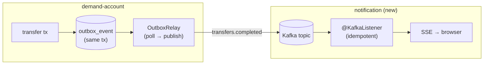
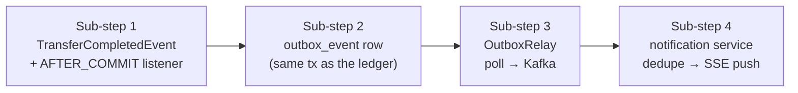
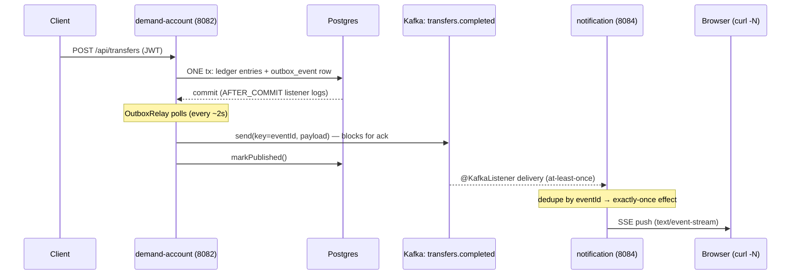

# Step 20 · Spring Events + Kafka, the Outbox Pattern & Real-Time Push (SSE)
### Phase D — Distributed Systems, Messaging & Batch 🔵→🟣 · Step 20 of 67

> *Step 19 gave you the theory — at-least-once delivery, exactly-once **effect**, the dual-write problem.
> Now you make it real. A transfer in demand-account will emit a domain event; the **Outbox pattern** gets
> that event onto **Kafka** reliably (no lost events, even on crash); a brand-new **notification service**
> consumes it **idempotently** and pushes it to your browser **live over Server-Sent Events**. By the end you
> post a transfer in one window and watch a notification appear in another — the bank's first event-driven,
> real-time feature.*

---

<a id="toc"></a>
## 🧭 The Six Movements of This Step

| | Movement | What happens | ~time |
|---|---|---|---|
| **A** | [🧭 Orient](#orient) | 30-second overview · skip-test · cheat card · why it matters · before you start | ~1h |
| **B** | [🧠 Understand](#understand) | sync vs async · Spring events & `@TransactionalEventListener` · the dual-write problem · Outbox · Kafka · SSE | ~2h |
| **C** | [🛠️ Build](#build) | domain event → Outbox (atomic, in-tx) → relay → Kafka → idempotent consumer → SSE push | ~12h |
| **D** | [🔬 Prove](#prove) | the Verification Log — real Redpanda/Postgres tests, the §12.3 mutation, smoke.sh | ~2h |
| **E** | [🎓 Apply](#apply) | go deeper · interview prep · your-turn challenges | ~2h |
| **F** | [🏆 Review](#review) | troubleshooting (the Boot-4 Kafka starter gotcha) · resources · recap, flashcards & next | ~1h |

---

<a id="orient"></a>

# A · 🧭 Orient

## 📋 This Step in 30 Seconds

| | |
|---|---|
| **Title** | Spring events + Kafka (Redpanda), the transactional Outbox pattern, an idempotent consumer, and real-time push via Server-Sent Events |
| **Step** | 20 of 67 · **Phase D — Distributed Systems, Messaging & Batch** 🔵→🟣 |
| **Effort** | ≈ 20 hours focused (a big one — a new service + a broker + the Outbox). The payoff: the bank becomes event-driven and you can *see* events flow live. |
| **What you'll run this step** | **JVM + Maven**; **🐳 Docker** for Testcontainers (Postgres **and** Redpanda). Live demo runs auth + demand-account + notification + a Redpanda broker. |
| **Buildable artifact** | **demand-account**: a `TransferCompletedEvent`, a `@TransactionalEventListener(AFTER_COMMIT)`, a transactional **Outbox** (`outbox_event` + V3 migration) written atomically with the ledger, and an **Outbox relay** that publishes to Kafka. **NEW `services/notification`** (no DB): an **idempotent** `@KafkaListener` (exactly-once *effect*) that pushes to clients via **SSE**. `step-20-start == step-19-end`. |
| **Verification tier** | 🔴 **Full** — two services + the build change + a money/event path. `./mvnw verify` green + the pipeline proven on a **real broker** (Testcontainers Redpanda) + the **§12.3 mutation** + clean-room + `smoke.sh`. |
| **Depends on** | **[Step 19](../step-19/lesson.md)** (delivery semantics, exactly-once effect), **[Step 12](../step-12/lesson.md)** (the transfer + transactions), **[Step 14](../step-14/lesson.md)** (idempotency, signed webhooks — the other async pattern), **[Step 13](../step-13/lesson.md)** (MVC). **+ Docker.** |

By the end you will be able to publish **Spring application events** and react with **`@TransactionalEventListener`**; explain and implement the **transactional Outbox** to beat the dual-write problem; produce/consume **Kafka** with Spring; build an **idempotent consumer** for exactly-once *effect*; and push events to browsers with **SSE**.

### ⏭️ Can You Skip This Step? (5-minute self-check)

If you can confidently do **all** of this, skim the 🛠️ Build and jump to **[Step 21 — Payments: Saga + Idempotency Key + DLQ](../step-21/lesson.md)**.

- [ ] I can explain **sync (REST) vs async (events)** and when to choose each.
- [ ] I can use `@TransactionalEventListener(AFTER_COMMIT)` and say why it beats a plain `@EventListener` here.
- [ ] I can explain the **dual-write problem** and how the **Outbox pattern** solves it.
- [ ] I can produce and consume a **Kafka** topic with Spring, and make the consumer **idempotent**.
- [ ] I can push server→client updates with **SSE** and say how it differs from WebSocket.

> [!TIP]
> Not 100%? Stay. "How do you publish an event reliably after a DB commit?", "what's the Outbox pattern?", and "exactly-once — really?" are bread-and-butter for any event-driven backend role.

## 📇 Cheat Card

> **What this step delivers (one sentence):** a transfer atomically writes an Outbox row, a relay publishes it to Kafka, and a new notification service consumes it idempotently and pushes it to your browser live over SSE — the bank's first event-driven, real-time feature.

**Key commands** (Windows uses `.\mvnw.cmd`):

```bash
# Prove the whole pipeline (Testcontainers Postgres + Redpanda):
./mvnw -pl services/demand-account,services/notification test
bash steps/step-20/smoke.sh
# Live: start a broker, then the services, then watch the stream while you transfer (see requests.http):
curl -N http://localhost:8084/api/notifications/stream
```

**The headline diagram — the reliable event pipeline:**

```
[transfer tx] ── writes ──► ledger + OUTBOX row   (one transaction → atomic)
                                  │
                       OutboxRelay (poll, publish, mark sent)
                                  ▼
                          Kafka topic: transfers.completed   (at-least-once)
                                  ▼
        notification @KafkaListener ── dedupe by eventId ──► exactly-once effect
                                  ▼
                          SSE  ── push ──►  browser (live)
```

**The one sentence to remember:** *You can't atomically write the DB and publish to Kafka — so write the event to an **Outbox row inside the same transaction**, relay it at-least-once, and make the consumer **idempotent**.*

## 🎯 Why This Matters

Synchronous REST couples services: if notification is down, should a transfer fail? No. Events decouple them — demand-account just records "this happened," and anyone interested reacts later. But naive "save then publish" silently loses events on crash. The **Outbox + idempotent consumer** combo is *the* industry-standard answer, and it's asked constantly in system-design interviews. Plus, real-time push (SSE/WebSocket) is what makes an app *feel* alive.

## ✅ What You'll Be Able to Do

- Publish domain events and react after commit with `@TransactionalEventListener`.
- Implement the **transactional Outbox** and a relay to Kafka.
- Produce and consume Kafka topics with Spring; build an **idempotent** consumer.
- Push live updates to clients with **Server-Sent Events**.
- Reason about **at-least-once + idempotency = exactly-once effect** in real code.

## 🧰 Before You Start

- **Prereqs:** bank builds green (`git describe` → `step-19-end`); Docker running (Postgres + Redpanda).
- **Connects to what you know:** the **transfer** (Step 12) is the event source; **idempotency** (Step 14, Step 19) is how the consumer gets exactly-once effect; **delivery semantics** (Step 19) is the theory we now run on a real broker; the **signed webhook** (Step 14) was the *partner-facing* async channel — Kafka is the *internal* one.
- **Depends on:** Steps **19, 12, 14, 13**. **+ Docker.**

## 🗓️ Session Plan

≈ 20 hours won't fit in one sitting — and it doesn't need to. Each sitting below ends at a real save point (a ✋ checkpoint in the build), so you can stop, close the laptop, and re-enter cleanly:

| Sitting | Covers | ~time | Ends at |
|---|---|---|---|
| **S1** | A · Orient + B · Understand (Big Idea → Then vs. Now) | ~3h | the B→C bridge (diagram + file tree) |
| **S2** | Sub-step 1 of 4 — the domain event + AFTER_COMMIT listener | ~2h | Sub-step 1 ✋ checkpoint |
| **S3** | Sub-step 2 of 4 — `V3__outbox.sql`, `OutboxEvent`/`OutboxWriter`, the `TransferService.post()` edit | ~2.5h | Sub-step 2 ✋ checkpoint |
| **S4** | Sub-step 3 of 4 — the relay → Kafka + `spring-boot-starter-kafka` | ~2.5h | Sub-step 3 ✋ checkpoint |
| **S5** | Sub-step 4 of 4 — the new notification service (consumer + SSE) | ~3h | Sub-step 4 ✋ checkpoint + 💾 commit |
| **S6** | 🎮 Play With It (three services + broker, live) + D · Prove | ~4h | end of the Verification Log |
| **S7** | E · Apply + F · Review — challenges, flashcards, recap, tag | ~3h | `step-20-end` tagged |

**Optional routes:** the ⏭️ skip-test (5 min) can send you straight to Step 21; the two 🚀 Go Deeper asides are +~5 min each; the 🎯 Stretch challenge adds +~60–90 min to S7.

✋ Stopping after Orient? You have the map and prereqs checked. Next: B · Understand; first action: reread the headline diagram in the 📇 Cheat Card, then start at "The Big Idea."

---

<a id="understand"></a>

# B · 🧠 Understand

## 🧠 The Big Idea — decoupling with events

Two services can talk **synchronously** (REST: caller waits, tight coupling, failures cascade) or
**asynchronously** (events: fire-and-forget to a broker, loose coupling, the consumer reacts on its own
time). For "a transfer happened, notify the customer," async is right: the transfer must not fail or wait
because notification is slow or down.



**Analogy — the office outgoing-mail tray.** Finishing the paperwork and dropping the letter in the tray is *one act* (same transaction) — you can't file the paperwork and lose the letter. The mail clerk (the relay) collects the tray on rounds and only ticks a letter off after the post office (Kafka) hands back a receipt (the ack). If the clerk is delayed, letters wait in the tray — late, never lost.

## 🧩 Spring application events & `@TransactionalEventListener`

In-process first. `ApplicationEventPublisher.publishEvent(x)` lets one bean notify others without a direct
reference. A plain `@EventListener` fires **immediately** — even if the surrounding transaction later rolls
back, which for money is dangerous. **`@TransactionalEventListener(phase = AFTER_COMMIT)`** fires only once
the transaction **commits**, so you never react to a transfer that didn't happen. (Phases:
`BEFORE_COMMIT`, `AFTER_COMMIT` (default), `AFTER_ROLLBACK`, `AFTER_COMPLETION`.)

## 🧩 Pattern Spotlight — the Outbox (the heart of this step)

**Problem — the dual-write:** you want to "update the DB **and** publish to Kafka." These are two different
systems; there's no shared transaction. Whichever you do first, a crash in between corrupts reality:

- publish-then-write: published an event for a transfer that then failed to save → *phantom* event.
- write-then-publish: saved the transfer, crashed before publishing → *lost* event.

**Why the Outbox fits:** make the publish-intent part of the **same database transaction** as the business
change. Write an `outbox_event` row alongside the ledger update — both commit or neither does (atomic). Then
a separate **relay** reads unpublished rows and publishes them to Kafka, marking each sent only **after** a
successful send. A crash just means the relay retries → **at-least-once**, never lost.

**Alternatives/trade-offs:** publishing from an `AFTER_COMMIT` listener is simpler but reintroduces the lost-
event gap (commit succeeds, crash before publish). Change-Data-Capture (Debezium tailing the DB log, Step 54)
removes the polling relay entirely. We use polling here because it makes the pattern visible and testable.

❓ **Knowledge-check:** in write-then-publish (no Outbox), the app saves the transfer and crashes before publishing — is the resulting event *phantom* or *lost*, and which single change makes the write and the publish-intent atomic? <details><summary>Answer</summary>**Lost** (the DB change committed but no event ever reaches the broker). The fix: write the event as an `outbox_event` row **in the same DB transaction** as the ledger change — both commit or neither does; a relay then publishes it at-least-once.</details>

## 🌱 Under the Hood: Kafka in one paragraph

Kafka is a durable, partitioned, append-only **log**. Producers append records (key, value) to a **topic**;
the key decides the **partition** (same key → same partition → ordered). Consumers in a **consumer group**
each own some partitions and track an **offset** (their read position). Delivery is **at-least-once** by
default (a rebalance or redelivery can repeat a record) — which is why consumers must be idempotent.
**Redpanda** is a Kafka-API-compatible broker (no ZooKeeper, single binary) — we use it via Testcontainers.

## 🌱 Under the Hood: Server-Sent Events (SSE)

SSE is a one-way **server→client** stream over a long-lived HTTP response (`text/event-stream`). The browser's
`EventSource` auto-reconnects. It's simpler than WebSocket (which is bidirectional) and perfect for "push me
notifications." In Spring MVC it's an `SseEmitter` returned from a controller; we keep a set of emitters and
broadcast to all.

## 🛡️ Security Lens & 🧵 Thread-safety note

The notification service has **no auth yet** (like cif — tracked as risk R-002) and SSE has no per-user
filtering — fine for a local demo, revisit with the gateway. **Thread-safety (Step 11 callback):** the SSE
emitter set and the consumer's dedupe set are shared mutable state touched by Kafka-listener threads and
request threads concurrently — so they're a `CopyOnWriteArrayList` and a `ConcurrentHashMap.newKeySet()`.

## 🕰️ Then vs. Now

Boot 3 gave you Kafka autoconfiguration just by adding `spring-kafka`. **Boot 4 modularized
autoconfiguration** — you now add the **`spring-boot-starter-kafka`** (which brings `spring-kafka` *and* the
`spring-boot-kafka` autoconfig that creates `KafkaTemplate`/listener infrastructure). Bare `spring-kafka`
compiles but gives **no `KafkaTemplate` bean** — the same lesson as Flyway needing `spring-boot-flyway` in
Step 8. (We hit this for real — see 🩺.)

---

# B→C bridge: 🗺️ what we'll build

One sub-step per pipeline stage, left to right — this strip reappears at the top of every sub-step so you always know where you are:



🌳 **Files we'll touch**

```
services/demand-account/
  src/main/java/.../event/TransferCompletedEvent.java        (new) the domain event
  src/main/java/.../event/TransferEventListener.java         (new) @TransactionalEventListener(AFTER_COMMIT)
  src/main/java/.../outbox/OutboxEvent.java + Repository      (new) the outbox row
  src/main/java/.../outbox/OutboxWriter.java                  (new) serialize + persist (in-tx)
  src/main/java/.../outbox/OutboxRelay.java + Scheduler       (new) poll → publish → mark sent
  src/main/java/.../service/TransferService.java              (edit) publish event + write outbox in post()
  src/main/resources/db/migration/V3__outbox.sql             (new)
  src/main/resources/application.yml                         (edit) spring.kafka + bank.events/outbox
  pom.xml                                                     (edit) spring-boot-starter-kafka (+ test, redpanda)
services/notification/                                       (NEW SERVICE, no DB)
  pom.xml · NotificationApplication · Notification
  SseHub.java                  (SSE fan-out + recent buffer)
  TransferEventConsumer.java   (idempotent @KafkaListener → SseHub)
  NotificationController.java  (GET /stream SSE, GET / recent)
  application.yml              (port 8084, kafka consumer)
pom.xml                        (edit) register services/notification
steps/step-20/{lesson.md, requests.http, smoke.sh}
```

✋ Stopping here? You have the theory (dual-write → Outbox → idempotent consumer) and the build map. Next: Sub-step 1 of 4; first action: create `services/demand-account/src/main/java/com/buildabank/account/event/TransferCompletedEvent.java`.

<a id="build"></a>

# C · 🛠️ Let's Build It — Step by Step

## 📦 Your Starting Point

`step-20-start == step-19-end`: the bank builds green (10 modules). We add the producer plumbing to
demand-account and a brand-new notification service.

## Sub-step 1 of 4 — the domain event + the AFTER_COMMIT listener (~2h)

📍 **event** → outbox → relay → consumer+SSE

🎯 A `TransferCompletedEvent` (record, carrying a unique `eventId` — the end-to-end dedupe key). `TransferService.post()` publishes it via `ApplicationEventPublisher` inside the transaction; a `TransferEventListener` reacts with `@TransactionalEventListener(AFTER_COMMIT)`.

```java
// services/demand-account/src/main/java/com/buildabank/account/event/TransferCompletedEvent.java
package com.buildabank.account.event;

import java.math.BigDecimal;
import java.time.Instant;
import java.util.UUID;

/**
 * Step 20 · a <strong>domain event</strong>: "a transfer completed." Published in-process via Spring's
 * {@code ApplicationEventPublisher} the moment the money has moved (still inside the transfer transaction),
 * then handled by {@code @TransactionalEventListener}s after the transaction's outcome is known.
 *
 * <p>It carries everything a downstream consumer needs to react (notify a customer, update a read model)
 * <em>without</em> calling back into this service. {@code eventId} is a stable, unique id used as the
 * <strong>idempotency / dedupe key</strong> end-to-end (Outbox row id → Kafka message → consumer dedupe), so
 * an at-least-once pipeline yields exactly-once <em>effect</em> (Step 19 theory, made real here).
 */
public record TransferCompletedEvent(
        UUID eventId,
        UUID transactionId,
        String fromAccount,
        String toAccount,
        BigDecimal amount,
        Instant occurredAt) {

    /** Factory that mints a fresh event id for a just-committed transfer. */
    public static TransferCompletedEvent of(UUID transactionId, String from, String to, BigDecimal amount) {
        return new TransferCompletedEvent(UUID.randomUUID(), transactionId, from, to, amount, Instant.now());
    }
}
```

🔎 **What to notice:** a plain `record` — events are immutable facts, not entities. `eventId` is minted **once** (`UUID.randomUUID()` in the factory) and never changes as the event travels outbox → Kafka → consumer: that stability is what makes end-to-end dedupe possible. `amount` is a `BigDecimal` (money discipline from Step 12).

```java
// services/demand-account/src/main/java/com/buildabank/account/event/TransferEventListener.java
package com.buildabank.account.event;

import java.util.concurrent.atomic.AtomicInteger;

import org.slf4j.Logger;
import org.slf4j.LoggerFactory;
import org.springframework.stereotype.Component;
import org.springframework.transaction.event.TransactionPhase;
import org.springframework.transaction.event.TransactionalEventListener;

/**
 * Step 20 · demonstrates {@code @TransactionalEventListener}. Unlike a plain {@code @EventListener} (which
 * fires immediately, even if the surrounding transaction later rolls back), this fires only at a chosen
 * <strong>transaction phase</strong>. We use {@link TransactionPhase#AFTER_COMMIT}: the listener runs only
 * once the transfer has actually committed — so we never react to money that didn't move.
 *
 * <p><strong>Why this is NOT where we publish to Kafka:</strong> publishing to Kafka here would be a
 * <em>dual-write</em> — if the app crashes between commit and this listener running, the event is lost
 * forever (the DB committed but nothing was published). That gap is exactly what the {@code outbox} package
 * fixes by writing the event <em>inside</em> the transaction. So this listener does only safe, in-process work
 * (here: a metric/log); the durable hand-off to Kafka is the Outbox relay's job.
 */
@Component
public class TransferEventListener {

    private static final Logger log = LoggerFactory.getLogger(TransferEventListener.class);
    private final AtomicInteger committedCount = new AtomicInteger();

    @TransactionalEventListener(phase = TransactionPhase.AFTER_COMMIT)
    public void onTransferCommitted(TransferCompletedEvent event) {
        committedCount.incrementAndGet();
        log.info("transfer committed: txn={} {}->{} amount={} (eventId={})",
                event.transactionId(), event.fromAccount(), event.toAccount(), event.amount(), event.eventId());
    }

    /** Test/observability hook: how many transfers have committed since startup. */
    public int committedCount() {
        return committedCount.get();
    }
}
```

**So what does this listener actually *do*?** Deliberately little: it logs the committed transfer and bumps an `AtomicInteger` counter (a metric, and the hook `OutboxWriteTest` uses to assert "fires once on commit, zero times on rollback"). That's not an accident — it's the lesson. Anything **durable** (the Kafka publish) *cannot* live in an AFTER_COMMIT listener, because a crash between the commit and the listener loses the event forever; durable intent must be written **inside** the transaction, which is the outbox's job (Sub-step 2). AFTER_COMMIT is the right home only for cheap, lossable side-effects: logs, metrics, cache pokes.

The one-line publish — `events.publishEvent(event)` — lands in `TransferService.post()`; you'll see the full diff in Sub-step 2, where the outbox write joins it in the same method.

🔮 **Predict:** if the transfer overdraws and rolls back, does the AFTER_COMMIT listener fire? <details><summary>Answer</summary>**No** — AFTER_COMMIT only fires on a committed transaction. Proven by `OutboxWriteTest`.</details>

✋ **Checkpoint — Sub-step 1 of 4 done.** Stopping here? You have the event record and a post-commit listener wired inside demand-account — in-process only, nothing durable yet. Next: Sub-step 2 (the transactional Outbox); first action: create `services/demand-account/src/main/resources/db/migration/V3__outbox.sql`.

## Sub-step 2 of 4 — the transactional Outbox (~2.5h)

📍 event → **outbox** → relay → consumer+SSE

🎯 `OutboxEvent` entity + `V3__outbox.sql` (with a partial index on unpublished rows) + `OutboxWriter` that serializes the event to JSON and `save`s it. `TransferService.post()` calls `outbox.write(event)` **in the same transaction** as the ledger writes → atomic.

First the table — a new Flyway migration (V3, after Step 12's ledger and Step 14's idempotency keys):

```sql
-- services/demand-account/src/main/resources/db/migration/V3__outbox.sql
-- Transactional Outbox (Step 20): events are written here IN THE SAME TRANSACTION as the ledger change,
-- so the business write and the "intent to publish" commit atomically (no dual-write data loss). A relay
-- polls unpublished rows and publishes them to Kafka, then marks them published. The partial index keeps
-- the relay's "find unpublished" scan cheap even as the table grows with published history.

create table outbox_event (
    id             uuid         primary key,
    aggregate_type varchar(64)  not null,
    type           varchar(128) not null,
    payload        text         not null,
    created_at     timestamp(6) with time zone not null,
    published      boolean      not null default false,
    published_at   timestamp(6) with time zone
);

create index idx_outbox_unpublished on outbox_event (created_at) where published = false;
```

🔎 **What to notice:** `id` is the event id (no sequence — the app mints the UUID); `payload` is the serialized JSON exactly as it will hit Kafka; and the index is **partial** (`where published = false`) — the relay's hot query only ever scans the tiny unpublished set, no matter how much published history accumulates.

```java
// services/demand-account/src/main/java/com/buildabank/account/outbox/OutboxEvent.java
package com.buildabank.account.outbox;

import java.time.Instant;
import java.util.UUID;

import jakarta.persistence.Column;
import jakarta.persistence.Entity;
import jakarta.persistence.Id;
import jakarta.persistence.Table;

/**
 * Step 20 · the <strong>Outbox</strong> row. Solves the <em>dual-write problem</em>: you cannot atomically
 * "update the database AND publish to Kafka" — if you write the DB then crash before publishing, the event is
 * lost; publish-then-write loses the DB change. The fix: write this row <strong>in the same transaction</strong>
 * as the business change (the ledger update), so either both commit or neither does. A separate
 * {@link OutboxRelay} later reads unpublished rows and publishes them to Kafka (at-least-once), marking them
 * {@code published}. The row {@code id} is the event id, carried through to Kafka as the dedupe key — so a
 * duplicate relay/delivery still yields exactly-once <em>effect</em> at an idempotent consumer (Step 19).
 */
@Entity
@Table(name = "outbox_event")
public class OutboxEvent {

    @Id
    @Column(updatable = false)
    private UUID id;

    /** The aggregate that produced the event (e.g. {@code transfer}) — useful for routing/partitioning. */
    @Column(name = "aggregate_type", nullable = false, updatable = false)
    private String aggregateType;

    /** The event type / topic key (e.g. {@code transfer.completed}). */
    @Column(nullable = false, updatable = false)
    private String type;

    /** The serialized event body (JSON) — exactly what gets published to Kafka. */
    @Column(nullable = false, updatable = false)
    private String payload;

    @Column(name = "created_at", nullable = false, updatable = false)
    private Instant createdAt;

    @Column(nullable = false)
    private boolean published;

    @Column(name = "published_at")
    private Instant publishedAt;

    protected OutboxEvent() {
    }

    public OutboxEvent(UUID id, String aggregateType, String type, String payload, Instant createdAt) {
        this.id = id;
        this.aggregateType = aggregateType;
        this.type = type;
        this.payload = payload;
        this.createdAt = createdAt;
        this.published = false;
    }

    /** Mark this row published (called by the relay after a successful Kafka send). */
    public void markPublished(Instant at) {
        this.published = true;
        this.publishedAt = at;
    }

    public UUID getId() {
        return id;
    }

    public String getAggregateType() {
        return aggregateType;
    }

    public String getType() {
        return type;
    }

    public String getPayload() {
        return payload;
    }

    public Instant getCreatedAt() {
        return createdAt;
    }

    public boolean isPublished() {
        return published;
    }

    public Instant getPublishedAt() {
        return publishedAt;
    }
}
```

🔎 **What to notice:** almost every column is `updatable = false` — an outbox row is an immutable fact plus one flag. The *only* mutation the entity allows is `markPublished(at)`, and only the relay calls it. The JPA-required no-arg constructor is `protected` (same discipline as the ledger entities in Step 12).

```java
// services/demand-account/src/main/java/com/buildabank/account/outbox/OutboxEventRepository.java
package com.buildabank.account.outbox;

import java.util.List;
import java.util.UUID;

import org.springframework.data.domain.Limit;
import org.springframework.data.jpa.repository.JpaRepository;
import org.springframework.data.jpa.repository.Query;

/**
 * Reads/writes {@link OutboxEvent} rows. The relay drains the oldest unpublished rows in batches; everything
 * else (the in-transaction insert) is plain {@code save}.
 */
public interface OutboxEventRepository extends JpaRepository<OutboxEvent, UUID> {

    /** Oldest-first batch of not-yet-published events for the relay to publish. */
    @Query("select e from OutboxEvent e where e.published = false order by e.createdAt asc")
    List<OutboxEvent> findUnpublished(Limit limit);

    long countByPublishedFalse();
}
```

```java
// services/demand-account/src/main/java/com/buildabank/account/outbox/OutboxWriter.java
package com.buildabank.account.outbox;

import java.util.LinkedHashMap;
import java.util.Map;

import org.springframework.stereotype.Component;

import com.buildabank.account.event.TransferCompletedEvent;
import com.fasterxml.jackson.databind.ObjectMapper;

/**
 * Serializes a {@link TransferCompletedEvent} to JSON and persists it as an {@link OutboxEvent}. Called from
 * inside the transfer transaction, so the row commits atomically with the ledger change (the Outbox pattern).
 *
 * <p>We build a plain {@link Map} and stringify {@code occurredAt}/ids rather than serialize the record
 * directly — this keeps a stable, language-neutral JSON shape for any consumer and sidesteps Java-8-time
 * Jackson modules. We own a {@code com.fasterxml} mapper because Spring Boot 4 defaults the web stack to
 * Jackson 3, so a Jackson-2 {@code ObjectMapper} bean isn't auto-created (same choice as {@code WebhookPublisher}).
 */
@Component
public class OutboxWriter {

    static final String AGGREGATE_TYPE = "transfer";
    static final String EVENT_TYPE = "transfer.completed";

    private final OutboxEventRepository repository;
    private final ObjectMapper objectMapper = new ObjectMapper();

    public OutboxWriter(OutboxEventRepository repository) {
        this.repository = repository;
    }

    /** Persist the event to the outbox (within the caller's transaction). The row id IS the event id. */
    public OutboxEvent write(TransferCompletedEvent event) {
        Map<String, Object> body = new LinkedHashMap<>();
        body.put("eventId", event.eventId().toString());
        body.put("transactionId", event.transactionId().toString());
        body.put("from", event.fromAccount());
        body.put("to", event.toAccount());
        body.put("amount", event.amount());
        body.put("occurredAt", event.occurredAt().toString());   // ISO-8601
        String payload;
        try {
            payload = objectMapper.writeValueAsString(body);
        } catch (Exception e) {
            throw new IllegalStateException("failed to serialize outbox payload", e);
        }
        return repository.save(new OutboxEvent(
                event.eventId(), AGGREGATE_TYPE, EVENT_TYPE, payload, event.occurredAt()));
    }
}
```

📜 **The wire contract** (the JSON shape two services must agree on — built explicitly in `write(...)` above, field by field):

| field | JSON type | source |
|---|---|---|
| `eventId` | string (UUID) | the end-to-end dedupe key |
| `transactionId` | string (UUID) | the ledger transaction |
| `from` / `to` | string | account numbers |
| `amount` | **number** | the `BigDecimal` — Jackson writes it as a JSON number |
| `occurredAt` | string (ISO-8601) | stringified `Instant` |

> [!CAUTION]
> `amount` travels as a JSON **number** — that's why the smoke log in 🔬 prints "Transfer of 40.0". Our consumer parses it back with `decimalValue()` (no float in Java), but a consumer in another language could naively parse it as a float. A production event contract carries money as a **decimal string or minor units** — Step 21's payment contract picks this up.

Finally, wire both the in-process publish (Sub-step 1) and the outbox write into the money path — one edit, inside the transaction:

```diff
--- a/services/demand-account/src/main/java/com/buildabank/account/service/TransferService.java
+++ b/services/demand-account/src/main/java/com/buildabank/account/service/TransferService.java
@@ imports
+import org.springframework.context.ApplicationEventPublisher;
+import com.buildabank.account.event.TransferCompletedEvent;
+import com.buildabank.account.outbox.OutboxWriter;
@@ fields + constructor
     private final AccountRepository accounts;
     private final LedgerEntryRepository ledger;
+    private final ApplicationEventPublisher events;
+    private final OutboxWriter outbox;

-    public TransferService(AccountRepository accounts, LedgerEntryRepository ledger) {
+    public TransferService(AccountRepository accounts, LedgerEntryRepository ledger,
+                           ApplicationEventPublisher events, OutboxWriter outbox) {
         this.accounts = accounts;
         this.ledger = ledger;
+        this.events = events;
+        this.outbox = outbox;
     }
@@ private UUID post(Account from, Account to, BigDecimal amount, String description)
         ledger.save(new LedgerEntry(from.getId(), transactionId, EntryDirection.DEBIT, amount, description, now));
         ledger.save(new LedgerEntry(to.getId(), transactionId, EntryDirection.CREDIT, amount, description, now));
+
+        // Step 20 — emit the domain event two ways, both inside THIS transaction:
+        TransferCompletedEvent event = TransferCompletedEvent.of(
+                transactionId, from.getAccountNumber(), to.getAccountNumber(), amount);
+        // (1) In-process Spring event → @TransactionalEventListener(AFTER_COMMIT) consumers react post-commit.
+        events.publishEvent(event);
+        // (2) Reliable Outbox row, written in the same tx as the ledger → atomic, no dual-write loss; a relay
+        //     publishes it to Kafka at-least-once. If this transfer rolls back, the outbox row rolls back too.
+        outbox.write(event);
         return transactionId;
     }
```

⚠️ **Pitfall:** the outbox write must be on the transactional path. We put it in `post()` (inside `@Transactional transfer()`), so a rollback discards the outbox row too — that's the whole point.

❓ **Knowledge-check:** which crash windows can still *lose* the event now? <details><summary>Answer</summary>**None inside demand-account.** Either the transaction commits (ledger + outbox row together — the relay will retry publishing until Kafka acks) or it rolls back (no ledger change, no row, no phantom event). The remaining risk is **duplication** (a relay retry re-publishing), never loss — Sub-step 4's idempotent consumer absorbs that.</details>

✋ **Checkpoint — Sub-step 2 of 4 done.** Stopping here? You have an outbox row written atomically with every transfer (the fact `OutboxWriteTest` proves in 🔬) — but nothing reads it yet. Next: Sub-step 3 (the relay → Kafka); first action: open `services/demand-account/pom.xml` and add `spring-boot-starter-kafka`.

## Sub-step 3 of 4 — the relay → Kafka (~2.5h)

📍 event → outbox → **relay** → consumer+SSE

🎯 `OutboxRelay.publishPending()` (`@Transactional`) drains unpublished rows oldest-first, `kafkaTemplate.send(topic, eventId, payload).get(...)` (block so "published" means "Kafka accepted it"), then `markPublished()`. `OutboxRelayScheduler` runs it on a timer in production; tests call it directly (`bank.outbox.relay.scheduled=false`). Add **`spring-boot-starter-kafka`** + `spring.kafka.producer` config.

Dependencies first — and mind the Boot-4 gotcha (🕰️ above, 🩺 below): it's the **starter**, not bare `spring-kafka`:

```diff
--- a/services/demand-account/pom.xml
+++ b/services/demand-account/pom.xml
@@ main dependencies
+        <!-- Kafka (Step 20): the Outbox relay publishes transfer.completed events. Boot 4 modularized
+             autoconfig — the STARTER brings spring-kafka AND spring-boot-kafka (KafkaAutoConfiguration →
+             KafkaTemplate). Bare spring-kafka alone gives no KafkaTemplate bean (same lesson as Flyway, Step 8). -->
+        <dependency>
+            <groupId>org.springframework.boot</groupId>
+            <artifactId>spring-boot-starter-kafka</artifactId>
+        </dependency>
@@ test dependencies
+        <!-- Kafka testing (Step 20): a real broker via Testcontainers Redpanda (+ @ServiceConnection), and
+             KafkaTestUtils for consumer props. The Boot test starter brings spring-kafka-test + test autoconfig. -->
+        <dependency>
+            <groupId>org.springframework.boot</groupId>
+            <artifactId>spring-boot-starter-kafka-test</artifactId>
+            <scope>test</scope>
+        </dependency>
+        <dependency>
+            <groupId>org.testcontainers</groupId>
+            <artifactId>testcontainers-redpanda</artifactId>
+            <scope>test</scope>
+        </dependency>
```

Then the producer + relay config:

```diff
--- a/services/demand-account/src/main/resources/application.yml
+++ b/services/demand-account/src/main/resources/application.yml
@@ spring:
+  # Step 20 — Kafka producer (the Outbox relay publishes here). String key+value (the payload is JSON we built).
+  kafka:
+    bootstrap-servers: ${KAFKA_BOOTSTRAP_SERVERS:localhost:9092}
+    producer:
+      key-serializer: org.apache.kafka.common.serialization.StringSerializer
+      value-serializer: org.apache.kafka.common.serialization.StringSerializer
@@ top level
+# Step 20 — event publishing (Outbox → Kafka).
+bank:
+  events:
+    topic: transfers.completed       # the Kafka topic the relay publishes to (notification service consumes it)
+  outbox:
+    relay-delay-ms: 2000             # how often the scheduled relay drains the outbox
+    relay:
+      scheduled: true                # production: poll automatically. Tests set this false and call publishPending() directly.
```

Now the relay itself — the "message relay" half of the Outbox pattern:

```java
// services/demand-account/src/main/java/com/buildabank/account/outbox/OutboxRelay.java
package com.buildabank.account.outbox;

import java.time.Instant;
import java.util.List;
import java.util.concurrent.TimeUnit;

import org.slf4j.Logger;
import org.slf4j.LoggerFactory;
import org.springframework.beans.factory.annotation.Value;
import org.springframework.data.domain.Limit;
import org.springframework.kafka.core.KafkaTemplate;
import org.springframework.stereotype.Component;
import org.springframework.transaction.annotation.Transactional;

/**
 * Step 20 · the <strong>Outbox relay</strong> (the "message relay" half of the pattern). It drains
 * unpublished {@link OutboxEvent} rows oldest-first and publishes each to Kafka, keyed by event id, then
 * marks the row published — all in one transaction so a row is only marked published <em>after</em> a
 * successful send. If the broker is unreachable the send fails, the batch stops, and the row stays unpublished
 * for the next run: <strong>at-least-once</strong> delivery (a crash after send-before-mark re-publishes — which
 * is exactly why the consumer must be idempotent, Step 19).
 *
 * <p>We block on each send (short timeout) so "published" truly means "Kafka accepted it". A production relay
 * would publish outside the DB transaction and reconcile, or use a CDC tool (Debezium, Step 54) instead of
 * polling; here, polling keeps the pattern visible and testable.
 */
@Component
public class OutboxRelay {

    private static final Logger log = LoggerFactory.getLogger(OutboxRelay.class);
    private static final int BATCH = 100;
    private static final long SEND_TIMEOUT_SECONDS = 10;

    private final OutboxEventRepository repository;
    private final KafkaTemplate<String, String> kafka;
    private final String topic;

    public OutboxRelay(OutboxEventRepository repository, KafkaTemplate<String, String> kafka,
                       @Value("${bank.events.topic:transfers.completed}") String topic) {
        this.repository = repository;
        this.kafka = kafka;
        this.topic = topic;
    }

    /** Publish all currently-unpublished outbox rows. Returns how many were published this run. */
    @Transactional
    public int publishPending() {
        List<OutboxEvent> batch = repository.findUnpublished(Limit.of(BATCH));
        int published = 0;
        for (OutboxEvent event : batch) {
            try {
                // key = event id → same key lands on one partition (per-aggregate ordering) and is the dedupe key.
                kafka.send(topic, event.getId().toString(), event.getPayload())
                        .get(SEND_TIMEOUT_SECONDS, TimeUnit.SECONDS);
            } catch (Exception e) {
                log.warn("outbox relay: send failed for {} — leaving unpublished for retry", event.getId(), e);
                break;   // stop on first failure to preserve order; the next run retries from here
            }
            event.markPublished(Instant.now());   // dirty-checked → flushed at commit
            published++;
        }
        if (published > 0) {
            log.info("outbox relay: published {} event(s) to topic {}", published, topic);
        }
        return published;
    }
}
```

🔎 **What to notice, line by line:** `findUnpublished(Limit.of(BATCH))` → oldest-first, bounded (the partial index makes this cheap). The Kafka **message key is the event id** — same key → same partition → ordering, and it doubles as the consumer's dedupe key. `.get(10s)` blocks until Kafka acks, so `markPublished` only ever runs *after* a durable send. On failure: `break`, not `continue` — stop the batch to preserve order and let the next run retry. `markPublished` is a plain setter call; JPA dirty-checking flushes it at commit.

```java
// services/demand-account/src/main/java/com/buildabank/account/outbox/OutboxRelayScheduler.java
package com.buildabank.account.outbox;

import org.springframework.boot.autoconfigure.condition.ConditionalOnProperty;
import org.springframework.context.annotation.Configuration;
import org.springframework.scheduling.annotation.EnableScheduling;
import org.springframework.scheduling.annotation.Scheduled;

/**
 * Step 20 · drives the {@link OutboxRelay} on a timer in production. Kept separate from the relay so the
 * polling can be switched off in tests (which invoke {@link OutboxRelay#publishPending()} directly for
 * deterministic assertions): set {@code bank.outbox.relay.scheduled=false}. Enabled by default
 * ({@code matchIfMissing = true}) so a running service relays automatically.
 */
@Configuration
@EnableScheduling
@ConditionalOnProperty(name = "bank.outbox.relay.scheduled", havingValue = "true", matchIfMissing = true)
public class OutboxRelayScheduler {

    private final OutboxRelay relay;

    public OutboxRelayScheduler(OutboxRelay relay) {
        this.relay = relay;
    }

    @Scheduled(fixedDelayString = "${bank.outbox.relay-delay-ms:2000}")
    void drainOutbox() {
        relay.publishPending();
    }
}
```

💭 **Under the hood:** scheduler and relay are separate beans on purpose — `@ConditionalOnProperty` lets tests turn the *timer* off while keeping the *logic* injectable and directly callable. That separation is why `OutboxRelayKafkaTest` can assert deterministically ("call `publishPending()`, then check") instead of sleeping and hoping.

🔮 **Predict:** the broker is down when the relay runs — is the outbox row marked published? <details><summary>Answer</summary>**No.** `send(...).get(...)` throws, the loop `break`s before `markPublished`, and the row stays unpublished for the next run. That's the "stop the broker, transfer anyway, restart, watch it catch up" experiment in 🎮 — late, never lost.</details>

✋ **Checkpoint — Sub-step 3 of 4 done.** Stopping here? You have the full producer side: transfer → atomic outbox row → relay → Kafka topic `transfers.completed` (what `OutboxRelayKafkaTest` proves in 🔬). Nobody consumes it yet. Next: Sub-step 4 (the new notification service); first action: create `services/notification/pom.xml` and register the module in the root `pom.xml`.

## Sub-step 4 of 4 — the notification service (idempotent consumer + SSE) (~3h)

📍 event → outbox → relay → **consumer+SSE**

🎯 A new no-DB service. `TransferEventConsumer` `@KafkaListener` parses the JSON and **dedupes by `eventId`** (`ConcurrentHashMap.newKeySet()`) → exactly-once effect; forwards to `SseHub`. `SseHub` holds emitters + a recent buffer and broadcasts. `NotificationController` exposes `GET /api/notifications/stream` (SSE) and `GET /api/notifications` (recent).

Register the new module in the root `pom.xml`:

```diff
--- a/pom.xml
+++ b/pom.xml
@@ modules
         <module>services/demand-account</module>
         <module>services/auth</module>
+        <module>services/notification</module>
         <module>gateway</module>
```

The service's own `pom.xml` — note there is **no JPA, no Flyway, no Postgres**: this service's state is the live event stream:

```xml
<?xml version="1.0" encoding="UTF-8"?>
<!-- services/notification/pom.xml -->
<project xmlns="http://maven.apache.org/POM/4.0.0"
         xmlns:xsi="http://www.w3.org/2001/XMLSchema-instance"
         xsi:schemaLocation="http://maven.apache.org/POM/4.0.0 https://maven.apache.org/xsd/maven-4.0.0.xsd">
    <modelVersion>4.0.0</modelVersion>

    <!--
      notification — the event-driven NOTIFICATION service (Step 20). No database: it CONSUMES
      transfer.completed events from Kafka (published by demand-account's Outbox relay), dedupes them
      (idempotent consumer → exactly-once *effect*, Step 19), and pushes them to connected clients over
      Server-Sent Events (SSE). This is the consumer + real-time-push half of the event-driven slice.
    -->
    <parent>
        <groupId>com.buildabank</groupId>
        <artifactId>build-a-bank-parent</artifactId>
        <version>0.1.0-SNAPSHOT</version>
        <relativePath>../../pom.xml</relativePath>
    </parent>

    <artifactId>notification</artifactId>
    <name>Build-a-Bank :: Services :: Notification</name>
    <description>Event-driven notifications — Kafka consumer + SSE real-time push (Step 20).</description>

    <dependencies>
        <dependency>
            <groupId>org.springframework.boot</groupId>
            <artifactId>spring-boot-starter-web</artifactId>
        </dependency>
        <!-- Boot 4: the kafka STARTER brings spring-kafka + KafkaAutoConfiguration (consumer factory, listener
             container). Bare spring-kafka would give no autoconfigured @KafkaListener infrastructure. -->
        <dependency>
            <groupId>org.springframework.boot</groupId>
            <artifactId>spring-boot-starter-kafka</artifactId>
        </dependency>
        <dependency>
            <groupId>org.springframework.boot</groupId>
            <artifactId>spring-boot-starter-actuator</artifactId>
        </dependency>

        <!-- ── Test ── -->
        <dependency>
            <groupId>org.springframework.boot</groupId>
            <artifactId>spring-boot-starter-test</artifactId>
            <scope>test</scope>
        </dependency>
        <dependency>
            <groupId>org.springframework.boot</groupId>
            <artifactId>spring-boot-webmvc-test</artifactId>
            <scope>test</scope>
        </dependency>
        <dependency>
            <groupId>org.springframework.boot</groupId>
            <artifactId>spring-boot-starter-kafka-test</artifactId>
            <scope>test</scope>
        </dependency>
        <dependency>
            <groupId>org.springframework.boot</groupId>
            <artifactId>spring-boot-testcontainers</artifactId>
            <scope>test</scope>
        </dependency>
        <dependency>
            <groupId>org.testcontainers</groupId>
            <artifactId>testcontainers-redpanda</artifactId>
            <scope>test</scope>
        </dependency>
        <dependency>
            <groupId>org.testcontainers</groupId>
            <artifactId>testcontainers-junit-jupiter</artifactId>
            <scope>test</scope>
        </dependency>
    </dependencies>

    <build>
        <plugins>
            <plugin>
                <groupId>org.springframework.boot</groupId>
                <artifactId>spring-boot-maven-plugin</artifactId>
            </plugin>
        </plugins>
    </build>
</project>
```

```yaml
# services/notification/src/main/resources/application.yml
spring:
  application:
    name: notification
  kafka:
    bootstrap-servers: ${KAFKA_BOOTSTRAP_SERVERS:localhost:9092}
    consumer:
      group-id: notification-service
      auto-offset-reset: earliest      # a fresh consumer reads from the start of the topic
      key-deserializer: org.apache.kafka.common.serialization.StringDeserializer
      value-deserializer: org.apache.kafka.common.serialization.StringDeserializer

# The topic the demand-account Outbox relay publishes to (must match demand-account's bank.events.topic).
bank:
  events:
    topic: transfers.completed

server:
  port: 8084                 # notification's port (hello=8080, cif=8081, demand-account=8082, auth=8083).
  shutdown: graceful

management:
  endpoints:
    web:
      exposure:
        include: health,info

logging:
  level:
    com.buildabank.notification: INFO
```

Two tiny types — the entry point and the thing we push to browsers:

```java
// services/notification/src/main/java/com/buildabank/notification/NotificationApplication.java
package com.buildabank.notification;

import org.springframework.boot.SpringApplication;
import org.springframework.boot.autoconfigure.SpringBootApplication;

/**
 * Step 20 · the event-driven Notification service. It consumes {@code transfer.completed} events from Kafka
 * (published by demand-account's Outbox relay) and pushes them to browsers over Server-Sent Events. No
 * database — its state is the live event stream.
 */
@SpringBootApplication
public class NotificationApplication {

    public static void main(String[] args) {
        SpringApplication.run(NotificationApplication.class, args);
    }
}
```

```java
// services/notification/src/main/java/com/buildabank/notification/Notification.java
package com.buildabank.notification;

import java.math.BigDecimal;

/**
 * A customer-facing notification derived from a {@code transfer.completed} event. {@code eventId} is the
 * end-to-end dedupe key (from the Outbox row id); {@code message} is the human-readable line we push to the UI.
 */
public record Notification(
        String eventId,
        String transactionId,
        String fromAccount,
        String toAccount,
        BigDecimal amount,
        String occurredAt,
        String message) {
}
```

The heart of the consumer side — the **idempotent** `@KafkaListener`:

```java
// services/notification/src/main/java/com/buildabank/notification/TransferEventConsumer.java
package com.buildabank.notification;

import java.math.BigDecimal;
import java.util.concurrent.ConcurrentHashMap;
import java.util.Set;
import java.util.concurrent.atomic.AtomicInteger;

import org.slf4j.Logger;
import org.slf4j.LoggerFactory;
import org.springframework.kafka.annotation.KafkaListener;
import org.springframework.stereotype.Component;

import tools.jackson.databind.JsonNode;
import tools.jackson.databind.ObjectMapper;

/**
 * Step 20 · the <strong>Kafka consumer</strong>. Reads {@code transfer.completed} events and turns each into a
 * {@link Notification} pushed via {@link SseHub}.
 *
 * <p><strong>Idempotent consumer = exactly-once effect (Step 19).</strong> Kafka delivers at-least-once (a
 * rebalance or a relay retry can redeliver), so we dedupe by {@code eventId}: the first time we see an id we
 * process and remember it; a duplicate is skipped. Effect is exactly-once even though delivery isn't. (The
 * dedupe set is in-memory here for teaching; a real consumer persists processed ids — Redis/DB — so it
 * survives restarts. Step 21 makes this durable with the Idempotency Key in Redis.)
 *
 * <p>We use the Boot-autoconfigured Jackson 3 {@link ObjectMapper} ({@code tools.jackson}) to parse the JSON
 * payload — Spring Boot 4 defaults the web stack to Jackson 3, so that's the mapper bean on the classpath.
 */
@Component
public class TransferEventConsumer {

    private static final Logger log = LoggerFactory.getLogger(TransferEventConsumer.class);

    private final SseHub hub;
    private final ObjectMapper objectMapper;
    private final Set<String> processedEventIds = ConcurrentHashMap.newKeySet();
    private final AtomicInteger received = new AtomicInteger();
    private final AtomicInteger applied = new AtomicInteger();

    public TransferEventConsumer(SseHub hub, ObjectMapper objectMapper) {
        this.hub = hub;
        this.objectMapper = objectMapper;
    }

    @KafkaListener(
            topics = "${bank.events.topic:transfers.completed}",
            groupId = "${spring.kafka.consumer.group-id:notification-service}")
    public void onTransferCompleted(String payload) {
        received.incrementAndGet();
        try {
            JsonNode node = objectMapper.readTree(payload);
            String eventId = node.get("eventId").asText();
            if (!processedEventIds.add(eventId)) {
                log.info("duplicate event {} ignored (exactly-once effect)", eventId);
                return;   // already handled this event id → idempotent skip
            }
            Notification notification = new Notification(
                    eventId,
                    node.get("transactionId").asText(),
                    node.get("from").asText(),
                    node.get("to").asText(),
                    node.get("amount").decimalValue(),
                    node.get("occurredAt").asText(),
                    buildMessage(node));
            applied.incrementAndGet();
            hub.publish(notification);
            log.info("notified: {}", notification.message());
        } catch (Exception e) {
            // A real consumer routes un-parseable messages to a Dead-Letter Topic (Step 21). Here: log and skip.
            log.error("could not handle event payload: {}", payload, e);
        }
    }

    private static String buildMessage(JsonNode node) {
        BigDecimal amount = node.get("amount").decimalValue();
        return "Transfer of " + amount + " from " + node.get("from").asText()
                + " to " + node.get("to").asText() + " completed.";
    }

    /** Total messages delivered to this consumer (includes duplicates). */
    public int receivedCount() {
        return received.get();
    }

    /** Distinct events actually applied (duplicates excluded) — should equal the number of real transfers. */
    public int appliedCount() {
        return applied.get();
    }
}
```

🔎 **What to notice:** the dedupe is one line — `processedEventIds.add(eventId)` returns `false` if the id was already there (a `Set` is a natural idempotency guard). `received` vs `applied` is the exact pair `TransferEventConsumerKafkaTest` asserts on in 🔬 (3 delivered, 2 applied). The imports say `tools.jackson.*`, not `com.fasterxml.*` — see the 💭 below.

⌨️ **Type it yourself — `SseHub` + `NotificationController`.** You've built MVC controllers since Step 13 and concurrent shared state since Step 11 — these two files are those patterns combined, so write them from this spec before opening the reference:

- [ ] `SseHub` (`@Component`): a `CopyOnWriteArrayList<SseEmitter>` of subscribers + an `ArrayDeque<Notification>` recent buffer capped at 50 (guard it with `synchronized` — `ArrayDeque` isn't thread-safe).
- [ ] `register()`: create an `SseEmitter(0L)` (0 = never time out), remove it from the list in `onCompletion`/`onTimeout`/`onError`, add, return.
- [ ] `publish(Notification)`: push into the recent buffer (newest first, evict past 50), then `emitter.send(SseEmitter.event().name("transfer").data(notification))` to every subscriber — dropping any emitter that throws (`IOException`/`IllegalStateException` = client gone).
- [ ] `recent()`: a defensive copy of the buffer; `subscriberCount()`: the list size.
- [ ] `NotificationController` (`@RestController`, `@RequestMapping("/api/notifications")`): `GET /stream` produces `MediaType.TEXT_EVENT_STREAM_VALUE` and returns `hub.register()`; `GET` (bare) returns `hub.recent()`.

<details><summary>Reference solution — SseHub.java</summary>

```java
// services/notification/src/main/java/com/buildabank/notification/SseHub.java
package com.buildabank.notification;

import java.io.IOException;
import java.util.ArrayDeque;
import java.util.ArrayList;
import java.util.Deque;
import java.util.List;
import java.util.concurrent.CopyOnWriteArrayList;

import org.slf4j.Logger;
import org.slf4j.LoggerFactory;
import org.springframework.stereotype.Component;
import org.springframework.web.servlet.mvc.method.annotation.SseEmitter;

/**
 * Step 20 · the <strong>real-time push</strong> fan-out. Holds the set of open {@link SseEmitter}s (one per
 * connected browser) and broadcasts each {@link Notification} to all of them, while also keeping the most
 * recent few so a client that just connected (or a test) can read what happened.
 *
 * <p>Server-Sent Events (SSE) is a one-way server→client stream over a long-lived HTTP response
 * ({@code text/event-stream}) — simpler than WebSocket and perfect for "push me notifications." Thread-safe:
 * the emitter list is copy-on-write and the recent buffer is guarded, because Kafka listener threads publish
 * while request threads register/disconnect (the shared-state discipline from Step 11).
 */
@Component
public class SseHub {

    private static final Logger log = LoggerFactory.getLogger(SseHub.class);
    private static final int RECENT_LIMIT = 50;

    private final List<SseEmitter> emitters = new CopyOnWriteArrayList<>();
    private final Deque<Notification> recent = new ArrayDeque<>();

    /** Register a new SSE subscriber; auto-removes itself on completion/timeout/error. */
    public SseEmitter register() {
        SseEmitter emitter = new SseEmitter(0L);   // 0 = no timeout (stream stays open)
        emitter.onCompletion(() -> emitters.remove(emitter));
        emitter.onTimeout(() -> emitters.remove(emitter));
        emitter.onError(e -> emitters.remove(emitter));
        emitters.add(emitter);
        return emitter;
    }

    /** Record and broadcast a notification to every connected client. */
    public void publish(Notification notification) {
        synchronized (recent) {
            recent.addFirst(notification);
            while (recent.size() > RECENT_LIMIT) {
                recent.removeLast();
            }
        }
        for (SseEmitter emitter : emitters) {
            try {
                emitter.send(SseEmitter.event().name("transfer").data(notification));
            } catch (IOException | IllegalStateException e) {
                emitters.remove(emitter);   // client gone → drop it
                log.debug("dropped a dead SSE subscriber", e);
            }
        }
    }

    /** The most recent notifications, newest first (for a just-connected client or a test). */
    public List<Notification> recent() {
        synchronized (recent) {
            return new ArrayList<>(recent);
        }
    }

    /** Number of currently-connected SSE subscribers. */
    public int subscriberCount() {
        return emitters.size();
    }
}
```

</details>

<details><summary>Reference solution — NotificationController.java</summary>

```java
// services/notification/src/main/java/com/buildabank/notification/NotificationController.java
package com.buildabank.notification;

import java.util.List;

import org.springframework.http.MediaType;
import org.springframework.web.bind.annotation.GetMapping;
import org.springframework.web.bind.annotation.RequestMapping;
import org.springframework.web.bind.annotation.RestController;
import org.springframework.web.servlet.mvc.method.annotation.SseEmitter;

/**
 * Step 20 · exposes the notification stream. {@code GET /api/notifications/stream} opens a live
 * <strong>Server-Sent Events</strong> connection — open it in a browser or {@code curl -N} and watch transfers
 * appear in real time as they happen elsewhere in the bank. {@code GET /api/notifications} returns the recent
 * buffer (handy for testing and for a client that just connected).
 */
@RestController
@RequestMapping("/api/notifications")
public class NotificationController {

    private final SseHub hub;

    public NotificationController(SseHub hub) {
        this.hub = hub;
    }

    /** Subscribe to the live event stream (text/event-stream). The connection stays open and pushes events. */
    @GetMapping(value = "/stream", produces = MediaType.TEXT_EVENT_STREAM_VALUE)
    public SseEmitter stream() {
        return hub.register();
    }

    /** The most recent notifications (newest first). */
    @GetMapping
    public List<Notification> recent() {
        return hub.recent();
    }
}
```

</details>

💭 **Under the hood — Jackson:** demand-account serializes with its Jackson-2 mapper; the notification web stack is **Jackson 3** (`tools.jackson`, Boot 4 default), so its consumer injects the autoconfigured Jackson-3 `ObjectMapper`. Same JSON on the wire → fine.

❓ **Knowledge-check:** the consumer restarts. Which duplicates can now slip through, and why? <details><summary>Answer</summary>The dedupe set is **in-memory** — a restart empties it, so a redelivered old event would be re-applied. That's the stated teaching trade-off (and 🏋️'s stretch challenge): a production consumer persists processed ids (Redis/DB) — Step 21 makes exactly this durable.</details>

💾 **Commit:** `feat(demand-account,notification): Step 20 events + Outbox + Kafka + SSE notifications`

✋ **Checkpoint — Sub-step 4 of 4 done.** Stopping here? You have all 11 modules and the entire pipeline coded and committed: event → outbox → relay → Kafka → idempotent consumer → SSE. Next: 🎮 Play With It (see it live); first action: the `docker run … redpanda` command below.

## 🎮 Play With It

Start a broker + the three services, open the live stream, and transfer (full steps in [`requests.http`](requests.http)):

```bash
docker run -d --name bank-redpanda -p 9092:9092 redpandadata/redpanda:v24.2.7 \
   redpanda start --mode dev-container --advertise-kafka-addr PLAINTEXT://localhost:9092
curl -N http://localhost:8084/api/notifications/stream        # leave running
# ...post a transfer (with a token) on :8082 → within ~2s the stream prints the event
```

🔮 **Predict:** before running the first experiment below — you retry the same transfer with the same `Idempotency-Key`. How many times does money move, and how many notifications reach the SSE stream? <details><summary>Answer</summary>Money moves **once** (Step 14's idempotency on the producer side) and exactly **one** notification arrives (the consumer's `eventId` dedupe) — the experiment's output confirms it.</details>

🧪 **Little experiments:**
- Retry the same transfer with the same `Idempotency-Key` → money moves once **and** exactly one notification (consumer dedupe).
- Stop the broker, do a transfer (commits fine!), restart the broker → the relay catches up and the event still arrives (Outbox durability).
- Open two `curl -N` streams → both receive every event (SSE fan-out).

## 🏁 The Finished Result

`step-20-end`: 11 modules; a transfer now flows through Outbox → Kafka → an idempotent consumer → a live SSE push. The whole journey you just built, end to end:



**✅ Definition of Done:**

- [ ] You watched a transfer notification arrive **live** (transfer in one window, SSE line in the other).
- [ ] `./mvnw verify` is green (11 modules).
- [ ] `bash steps/step-20/smoke.sh` passes.
- [ ] You've committed and tagged `step-20-end`.

✋ Stopping here? You have the pipeline built and seen live. Next: D · Prove (~2h — read the evidence, rerun what you like); first action: `./mvnw -pl services/demand-account,services/notification test`.

---

<a id="prove"></a>

# D · 🔬 Prove It Works — Verification Log

> **Tier: 🔴 Full.** Two services + build change + an event/money path. Evidence is real, pasted output; Docker used (Testcontainers Postgres + Redpanda, image `redpandadata/redpanda:v24.2.7`).

**1 · The whole pipeline green (`./mvnw -pl services/demand-account,services/notification test`):**

```
[INFO] Tests run: 1, Failures: 0, Errors: 0, Skipped: 0, Time elapsed: 11.72 s -- in com.buildabank.account.outbox.OutboxRelayKafkaTest
[INFO] Tests run: 2, Failures: 0, Errors: 0, Skipped: 0, Time elapsed: 4.051 s -- in com.buildabank.account.outbox.OutboxWriteTest
[INFO] Tests run: 37, Failures: 0, Errors: 0, Skipped: 0          ← demand-account (34 prior + 3 new)
[INFO] Tests run: 1, Failures: 0, Errors: 0, Skipped: 0, Time elapsed: 9.313 s -- in com.buildabank.notification.TransferEventConsumerKafkaTest
[INFO] Tests run: 3, Failures: 0, Errors: 0, Skipped: 0          ← notification (new service)
[INFO] BUILD SUCCESS
```

- `OutboxWriteTest` — a committed transfer writes exactly one outbox row **in the same transaction** and fires the AFTER_COMMIT listener once; a rolled-back (overdraft) transfer writes **no** outbox row and does **not** fire it (atomicity).
- `OutboxRelayKafkaTest` (real Redpanda) — the relay publishes the pending row to Kafka (verified by consuming the topic: the record carries the transactionId + accounts), marks it published, and a second run publishes nothing (at-least-once, no double-send).
- `TransferEventConsumerKafkaTest` (real Redpanda) — three deliveries with two distinct `eventId`s (one duplicate) → consumer received 3, **applied 2** → **exactly-once effect**.
- `NotificationControllerTest` — `GET /api/notifications` returns the buffer; `GET /api/notifications/stream` opens an async SSE response.

**2 · §12.3 Mutation sanity-check (prove the idempotency test has teeth).** Disabled the consumer's dedupe (so duplicates re-apply) and re-ran `TransferEventConsumerKafkaTest`:

```
[ERROR] TransferEventConsumerKafkaTest.duplicateEventsAreDeduped_yieldingExactlyOnceEffect
expected: 2
 but was: 3 within 5 seconds.
[ERROR] Tests run: 1, Failures: 0, Errors: 1, Skipped: 0
```
→ Without dedupe the duplicate `eventId` is applied a second time (`applied = 3`, not 2) — the exactly-once-effect test **fails as designed**. **Reverted**; green again.

**3 · Real broker artifacts (hard-to-fake):** Testcontainers started `redpandadata/redpanda:v24.2.7` on a random mapped port; `docker ps` shows the container during the run; the consumed `ConsumerRecord` value contained the live `transactionId`.

**4 · `smoke.sh`** — `bash steps/step-20/smoke.sh` ran the four pipeline tests on real Postgres + Redpanda; the consumer log even shows the dedupe live, then `✅ Step 20 smoke test PASSED`:

```
c.b.notification.TransferEventConsumer : notified: Transfer of 40.0 from ACC-A to ACC-B completed.
c.b.notification.TransferEventConsumer : duplicate event 2e6f18ad-…-8a4d31512f01 ignored (exactly-once effect)
c.b.notification.TransferEventConsumer : notified: Transfer of 10.0 from ACC-C to ACC-D completed.
✅ Step 20 smoke test PASSED
```

**5 · Clean-room (§12.4)** — fresh clone at `step-20-end`, `./mvnw verify` → BUILD SUCCESS (11 modules).

**§12.8 honesty:** the automated proof runs each side of the pipeline against a **real broker** (Testcontainers Redpanda) and a **real Postgres**. The end-to-end **live demo** across three running services + a standalone broker (the 🎮 steps) is documented and uses the same pinned image; I verified the components and the Kafka round-trip in tests, not the three-process manual choreography.

---

<a id="apply"></a>

# E · 🎓 Apply

✋ Re-entering after a break? You have the pipeline built (C) and proven on a real broker (D, all green). This movement is lighter (~2h): go-deeper asides, interview prep, challenges. First action: the two 🚀 asides below.

## 🚀 Go Deeper (Optional)

<details><summary>Outbox relay: polling vs CDC (+~5 min)</summary>Polling (ours) is simple and DB-agnostic but adds latency (≤ poll interval) and load. Change-Data-Capture (Debezium reading Postgres' WAL, Step 54) turns committed outbox rows into Kafka records with no polling and lower latency — the production-grade upgrade.</details>

<details><summary>Why block on the send in the relay? (+~5 min)</summary>If we marked rows published before the broker confirmed, a broker failure would lose the event (we'd think it was sent). Blocking on `send().get()` makes "published" mean "Kafka durably accepted it." The cost is holding the DB transaction during the send — acceptable here; production relays often publish outside the tx and reconcile.</details>

## 💼 Interview Prep

1. **What's the dual-write problem and how does the Outbox solve it?** *You can't atomically write a DB and publish to a broker; a crash between them loses or invents events. The Outbox writes the event to a table in the same DB transaction as the business change (atomic), then a relay publishes it at-least-once.* **(Most commonly asked.)**
2. **`@EventListener` vs `@TransactionalEventListener`?** *The former fires immediately, even if the tx rolls back; the latter fires at a transaction phase (default AFTER_COMMIT), so you only react to committed work.*
3. **How do you get exactly-once with Kafka?** *Not exactly-once delivery — at-least-once + an idempotent consumer (dedupe by a stable id) or transactions/EOS. We dedupe by eventId → exactly-once effect.*
4. **Why is publishing from an AFTER_COMMIT listener not enough?** *Commit succeeds, then the app crashes before the publish → lost event. The Outbox closes that gap by making the event durable inside the commit.*
5. **SSE vs WebSocket?** *SSE is one-way server→client over HTTP with auto-reconnect — simple, ideal for notifications. WebSocket is bidirectional and heavier; use it when the client must push too.*
6. **(Concurrency)** *The consumer dedupe set and SSE emitter list are shared across listener/request threads — use concurrent collections (Step 11).*

## 🏋️ Your Turn: Practice & Challenges

- **Quick (+~15 min):** add a `GET /actuator/health` check that the consumer is connected. <details><summary>Hint</summary>Kafka listener health is part of the actuator's `kafka`/listener indicators when the starter is present.</details>
- **Quick (+~20 min):** publish a second event type (`account.opened`) through the same Outbox and consume it.
- 🎯 **Stretch (+~60–90 min · reference solution in `solutions/step-20/`):** make the consumer dedupe **durable** — persist processed `eventId`s (an in-memory store now; a DB/Redis set as a preview of Step 21) so a consumer restart doesn't reprocess. Prove it: process an event, "restart" the dedupe store from the persisted ids, redeliver the same event → still applied once.

✋ Stopping here? You have everything built, proven, and (optionally) stretched. Left: F · Review (~1h); first action: skim the 🩺 troubleshooting list, then the recap.

---

<a id="review"></a>

# F · 🏆 Review

## 🩺 Stuck? Troubleshooting & Fixes

- **`Parameter ... OutboxRelay required a bean of type 'org.springframework.kafka.core.KafkaTemplate' that could not be found`.** **Cause:** you added bare `spring-kafka` — Boot 4 modularized autoconfig, so there's no `KafkaTemplate` bean. **Fix:** use **`spring-boot-starter-kafka`** (and `spring-boot-starter-kafka-test`), which bring the `spring-boot-kafka` autoconfiguration. *(I hit this exact error building this step — same family as Flyway in Step 8.)*
- **`package com.fasterxml.jackson.databind does not exist`** in the notification service. **Cause:** Boot 4's web starter ships **Jackson 3** (`tools.jackson`), not Jackson 2. **Fix:** import `tools.jackson.databind.*` and inject the autoconfigured `ObjectMapper`.
- **`cannot find symbol RedpandaContainers`** in a test under a sub-package. **Cause:** the `@TestConfiguration` is in the parent package. **Fix:** import it explicitly.
- **The scheduled relay races my test / spams the log with broker errors.** Set `bank.outbox.relay.scheduled=false` in test config and call `OutboxRelay.publishPending()` directly (we ship `src/test/resources/application.properties` doing exactly this).
- **Reset:** `git checkout step-20-end`; `make doctor`.

## 📚 Learn More & Glossary

- Confluent/Kafka docs (topics, partitions, consumer groups, offsets); the Outbox pattern (microservices.io); Debezium (CDC); Spring for Apache Kafka reference; MDN `EventSource` (SSE); Kleppmann ch. 11 (stream processing).
- **Glossary:** *event* (a fact that happened); *Outbox* (events table written in-tx, relayed out); *dual-write problem*; *at-least-once*; *idempotent consumer*; *exactly-once effect*; *partition/offset/consumer group*; *SSE*; *CDC*.

## 🏆 Recap & Study Notes

**(a) Key points:** Decouple with async events. `@TransactionalEventListener(AFTER_COMMIT)` reacts only to committed work. The **Outbox** beats the dual-write by writing the event in the business transaction; a relay publishes it **at-least-once**; an **idempotent consumer** (dedupe by id) gives **exactly-once effect**. **SSE** pushes events to the browser live.

**(b) Key terms:** event, Outbox, dual-write, at-least-once, idempotent consumer, exactly-once effect, Kafka topic/partition/offset/consumer group, SSE, CDC.

**(c) 🧠 Test Yourself:** ① Why not just publish to Kafka after the commit? ② What makes the Outbox write atomic with the transfer? ③ How does the consumer achieve exactly-once effect? ④ SSE vs WebSocket? ⑤ Which Boot-4 dependency provides `KafkaTemplate`? <details><summary>Answers</summary>① A crash between commit and publish loses the event. ② It's a row written in the same DB transaction as the ledger change. ③ Dedupe by the stable eventId over at-least-once delivery. ④ SSE one-way server→client over HTTP; WebSocket bidirectional. ⑤ `spring-boot-starter-kafka` (the autoconfig module), not bare `spring-kafka`.</details>

**(d) 🔗 How this connects:** realizes Step 19's delivery theory; reuses Step 12's transfer + Step 14's idempotency. **Next: Step 21** — Payments as a **Saga** (choreography vs orchestration) with the **Idempotency Key in Redis** and a **Dead-Letter Topic**, building directly on this Kafka pipeline.

**(e) 🏆 Résumé line:** *"Built an event-driven pipeline (Spring events + transactional Outbox + Kafka) with an idempotent consumer for exactly-once effect, and real-time SSE notifications."*

**(f) ✅ You can now:** publish/handle Spring events · implement the Outbox · produce/consume Kafka · build an idempotent consumer · push live updates over SSE.

**(g) 🃏 Flashcards** (also appended to `docs/flashcards.md`):

| Q | A |
|---|---|
| What is the **dual-write problem**? | Two systems (DB + broker), no shared transaction — a crash between the two writes loses or invents events. |
| What makes the **Outbox write atomic**? | The `outbox_event` row is written in the *same DB transaction* as the ledger change — both commit or neither does. |
| How do you get **exactly-once** with Kafka? | You don't get exactly-once *delivery* — at-least-once delivery + consumer dedupe by a stable `eventId` = exactly-once **effect**. |
| **SSE vs WebSocket**? | SSE: one-way server→client HTTP stream (`text/event-stream`), auto-reconnect, simple. WebSocket: bidirectional, heavier. |

🔁 Revisit the Outbox + idempotency in Step 21 (Saga/Redis/DLQ) and Step 54 (CDC/EOS).

**(h) ✍️ One-line reflection:** *Where else in the bank would an event beat a synchronous call?*

**(i)** 🎉 The bank is now event-driven and alive. Next: make a multi-step payment reliable with a Saga.
