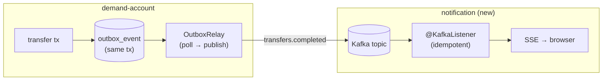

# Step 20 · Spring Events + Kafka, the Outbox Pattern & Real-Time Push (SSE)
### Phase D — Distributed Systems, Messaging & Batch 🔵→🟣 · Step 20 of 67

> *Step 19 gave you the theory — at-least-once delivery, exactly-once **effect**, the dual-write problem.
> Now you make it real. A transfer in demand-account will emit a domain event; the **Outbox pattern** gets
> that event onto **Kafka** reliably (no lost events, even on crash); a brand-new **notification service**
> consumes it **idempotently** and pushes it to your browser **live over Server-Sent Events**. By the end you
> post a transfer in one window and watch a notification appear in another — the bank's first event-driven,
> real-time feature.*

---

<a id="toc"></a>
## 🧭 The Six Movements of This Step

| | Movement | What happens |
|---|---|---|
| **A** | [🧭 Orient](#orient) | 30-second overview · skip-test · cheat card · why it matters · before you start |
| **B** | [🧠 Understand](#understand) | sync vs async · Spring events & `@TransactionalEventListener` · the dual-write problem · Outbox · Kafka · SSE |
| **C** | [🛠️ Build](#build) | domain event → Outbox (atomic, in-tx) → relay → Kafka → idempotent consumer → SSE push |
| **D** | [🔬 Prove](#prove) | the Verification Log — real Redpanda/Postgres tests, the §12.3 mutation, smoke.sh |
| **E** | [🎓 Apply](#apply) | go deeper · interview prep · your-turn challenges |
| **F** | [🏆 Review](#review) | troubleshooting (the Boot-4 Kafka starter gotcha) · resources · recap, flashcards & next |

---

<a id="orient"></a>

# A · 🧭 Orient

## 📋 This Step in 30 Seconds

| | |
|---|---|
| **Title** | Spring events + Kafka (Redpanda), the transactional Outbox pattern, an idempotent consumer, and real-time push via Server-Sent Events |
| **Step** | 20 of 67 · **Phase D — Distributed Systems, Messaging & Batch** 🔵→🟣 |
| **Effort** | ≈ 20 hours focused (a big one — a new service + a broker + the Outbox). The payoff: the bank becomes event-driven and you can *see* events flow live. |
| **What you'll run this step** | **JVM + Maven**; **🐳 Docker** for Testcontainers (Postgres **and** Redpanda). Live demo runs auth + demand-account + notification + a Redpanda broker. |
| **Buildable artifact** | **demand-account**: a `TransferCompletedEvent`, a `@TransactionalEventListener(AFTER_COMMIT)`, a transactional **Outbox** (`outbox_event` + V3 migration) written atomically with the ledger, and an **Outbox relay** that publishes to Kafka. **NEW `services/notification`** (no DB): an **idempotent** `@KafkaListener` (exactly-once *effect*) that pushes to clients via **SSE**. `step-20-start == step-19-end`. |
| **Verification tier** | 🔴 **Full** — two services + the build change + a money/event path. `./mvnw verify` green + the pipeline proven on a **real broker** (Testcontainers Redpanda) + the **§12.3 mutation** + clean-room + `smoke.sh`. |
| **Depends on** | **[Step 19](../step-19/lesson.md)** (delivery semantics, exactly-once effect), **[Step 12](../step-12/lesson.md)** (the transfer + transactions), **[Step 14](../step-14/lesson.md)** (idempotency, signed webhooks — the other async pattern), **[Step 13](../step-13/lesson.md)** (MVC). **+ Docker.** |

By the end you will be able to publish **Spring application events** and react with **`@TransactionalEventListener`**; explain and implement the **transactional Outbox** to beat the dual-write problem; produce/consume **Kafka** with Spring; build an **idempotent consumer** for exactly-once *effect*; and push events to browsers with **SSE**.

### ⏭️ Can You Skip This Step? (5-minute self-check)

If you can confidently do **all** of this, skim the 🛠️ Build and jump to **[Step 21 — Payments: Saga + Idempotency Key + DLQ](../step-21/lesson.md)**.

- [ ] I can explain **sync (REST) vs async (events)** and when to choose each.
- [ ] I can use `@TransactionalEventListener(AFTER_COMMIT)` and say why it beats a plain `@EventListener` here.
- [ ] I can explain the **dual-write problem** and how the **Outbox pattern** solves it.
- [ ] I can produce and consume a **Kafka** topic with Spring, and make the consumer **idempotent**.
- [ ] I can push server→client updates with **SSE** and say how it differs from WebSocket.

> [!TIP]
> Not 100%? Stay. "How do you publish an event reliably after a DB commit?", "what's the Outbox pattern?", and "exactly-once — really?" are bread-and-butter for any event-driven backend role.

## 📇 Cheat Card

> **What this step delivers (one sentence):** a transfer atomically writes an Outbox row, a relay publishes it to Kafka, and a new notification service consumes it idempotently and pushes it to your browser live over SSE — the bank's first event-driven, real-time feature.

**Key commands** (Windows uses `.\mvnw.cmd`):

```bash
# Prove the whole pipeline (Testcontainers Postgres + Redpanda):
./mvnw -pl services/demand-account,services/notification test
bash steps/step-20/smoke.sh
# Live: start a broker, then the services, then watch the stream while you transfer (see requests.http):
curl -N http://localhost:8084/api/notifications/stream
```

**The headline diagram — the reliable event pipeline:**

```
[transfer tx] ── writes ──► ledger + OUTBOX row   (one transaction → atomic)
                                  │
                       OutboxRelay (poll, publish, mark sent)
                                  ▼
                          Kafka topic: transfers.completed   (at-least-once)
                                  ▼
        notification @KafkaListener ── dedupe by eventId ──► exactly-once effect
                                  ▼
                          SSE  ── push ──►  browser (live)
```

**The one sentence to remember:** *You can't atomically write the DB and publish to Kafka — so write the event to an **Outbox row inside the same transaction**, relay it at-least-once, and make the consumer **idempotent**.*

## 🎯 Why This Matters

Synchronous REST couples services: if notification is down, should a transfer fail? No. Events decouple them — demand-account just records "this happened," and anyone interested reacts later. But naive "save then publish" silently loses events on crash. The **Outbox + idempotent consumer** combo is *the* industry-standard answer, and it's asked constantly in system-design interviews. Plus, real-time push (SSE/WebSocket) is what makes an app *feel* alive.

## ✅ What You'll Be Able to Do

- Publish domain events and react after commit with `@TransactionalEventListener`.
- Implement the **transactional Outbox** and a relay to Kafka.
- Produce and consume Kafka topics with Spring; build an **idempotent** consumer.
- Push live updates to clients with **Server-Sent Events**.
- Reason about **at-least-once + idempotency = exactly-once effect** in real code.

## 🧰 Before You Start

- **Prereqs:** bank builds green (`git describe` → `step-19-end`); Docker running (Postgres + Redpanda).
- **Connects to what you know:** the **transfer** (Step 12) is the event source; **idempotency** (Step 14, Step 19) is how the consumer gets exactly-once effect; **delivery semantics** (Step 19) is the theory we now run on a real broker; the **signed webhook** (Step 14) was the *partner-facing* async channel — Kafka is the *internal* one.
- **Depends on:** Steps **19, 12, 14, 13**. **+ Docker.**

---

<a id="understand"></a>

# B · 🧠 Understand

## 🧠 The Big Idea — decoupling with events

Two services can talk **synchronously** (REST: caller waits, tight coupling, failures cascade) or
**asynchronously** (events: fire-and-forget to a broker, loose coupling, the consumer reacts on its own
time). For "a transfer happened, notify the customer," async is right: the transfer must not fail or wait
because notification is slow or down.



## 🧩 Spring application events & `@TransactionalEventListener`

In-process first. `ApplicationEventPublisher.publishEvent(x)` lets one bean notify others without a direct
reference. A plain `@EventListener` fires **immediately** — even if the surrounding transaction later rolls
back, which for money is dangerous. **`@TransactionalEventListener(phase = AFTER_COMMIT)`** fires only once
the transaction **commits**, so you never react to a transfer that didn't happen. (Phases:
`BEFORE_COMMIT`, `AFTER_COMMIT` (default), `AFTER_ROLLBACK`, `AFTER_COMPLETION`.)

## 🧩 Pattern Spotlight — the Outbox (the heart of this step)

**Problem — the dual-write:** you want to "update the DB **and** publish to Kafka." These are two different
systems; there's no shared transaction. Whichever you do first, a crash in between corrupts reality:

- publish-then-write: published an event for a transfer that then failed to save → *phantom* event.
- write-then-publish: saved the transfer, crashed before publishing → *lost* event.

**Why the Outbox fits:** make the publish-intent part of the **same database transaction** as the business
change. Write an `outbox_event` row alongside the ledger update — both commit or neither does (atomic). Then
a separate **relay** reads unpublished rows and publishes them to Kafka, marking each sent only **after** a
successful send. A crash just means the relay retries → **at-least-once**, never lost.

**Alternatives/trade-offs:** publishing from an `AFTER_COMMIT` listener is simpler but reintroduces the lost-
event gap (commit succeeds, crash before publish). Change-Data-Capture (Debezium tailing the DB log, Step 54)
removes the polling relay entirely. We use polling here because it makes the pattern visible and testable.

## 🌱 Under the Hood: Kafka in one paragraph

Kafka is a durable, partitioned, append-only **log**. Producers append records (key, value) to a **topic**;
the key decides the **partition** (same key → same partition → ordered). Consumers in a **consumer group**
each own some partitions and track an **offset** (their read position). Delivery is **at-least-once** by
default (a rebalance or redelivery can repeat a record) — which is why consumers must be idempotent.
**Redpanda** is a Kafka-API-compatible broker (no ZooKeeper, single binary) — we use it via Testcontainers.

## 🌱 Under the Hood: Server-Sent Events (SSE)

SSE is a one-way **server→client** stream over a long-lived HTTP response (`text/event-stream`). The browser's
`EventSource` auto-reconnects. It's simpler than WebSocket (which is bidirectional) and perfect for "push me
notifications." In Spring MVC it's an `SseEmitter` returned from a controller; we keep a set of emitters and
broadcast to all.

## 🛡️ Security Lens & 🧵 Thread-safety note

The notification service has **no auth yet** (like cif — tracked as risk R-002) and SSE has no per-user
filtering — fine for a local demo, revisit with the gateway. **Thread-safety (Step 11 callback):** the SSE
emitter set and the consumer's dedupe set are shared mutable state touched by Kafka-listener threads and
request threads concurrently — so they're a `CopyOnWriteArrayList` and a `ConcurrentHashMap.newKeySet()`.

## 🕰️ Then vs. Now

Boot 3 gave you Kafka autoconfiguration just by adding `spring-kafka`. **Boot 4 modularized
autoconfiguration** — you now add the **`spring-boot-starter-kafka`** (which brings `spring-kafka` *and* the
`spring-boot-kafka` autoconfig that creates `KafkaTemplate`/listener infrastructure). Bare `spring-kafka`
compiles but gives **no `KafkaTemplate` bean** — the same lesson as Flyway needing `spring-boot-flyway` in
Step 8. (We hit this for real — see 🩺.)

---

# B→C bridge: 🗺️ what we'll build

🌳 **Files we'll touch**

```
services/demand-account/
  src/main/java/.../event/TransferCompletedEvent.java        (new) the domain event
  src/main/java/.../event/TransferEventListener.java         (new) @TransactionalEventListener(AFTER_COMMIT)
  src/main/java/.../outbox/OutboxEvent.java + Repository      (new) the outbox row
  src/main/java/.../outbox/OutboxWriter.java                  (new) serialize + persist (in-tx)
  src/main/java/.../outbox/OutboxRelay.java + Scheduler       (new) poll → publish → mark sent
  src/main/java/.../service/TransferService.java              (edit) publish event + write outbox in post()
  src/main/resources/db/migration/V3__outbox.sql             (new)
  src/main/resources/application.yml                         (edit) spring.kafka + bank.events/outbox
  pom.xml                                                     (edit) spring-boot-starter-kafka (+ test, redpanda)
services/notification/                                       (NEW SERVICE, no DB)
  pom.xml · NotificationApplication · Notification
  SseHub.java                  (SSE fan-out + recent buffer)
  TransferEventConsumer.java   (idempotent @KafkaListener → SseHub)
  NotificationController.java  (GET /stream SSE, GET / recent)
  application.yml              (port 8084, kafka consumer)
pom.xml                        (edit) register services/notification
steps/step-20/{lesson.md, requests.http, smoke.sh}
```

<a id="build"></a>

# C · 🛠️ Let's Build It — Step by Step

## 📦 Your Starting Point

`step-20-start == step-19-end`: the bank builds green (10 modules). We add the producer plumbing to
demand-account and a brand-new notification service.

## Sub-step 1 — the domain event + the AFTER_COMMIT listener

🎯 A `TransferCompletedEvent` (record, carrying a unique `eventId` — the end-to-end dedupe key). `TransferService.post()` publishes it via `ApplicationEventPublisher` inside the transaction; a `TransferEventListener` reacts with `@TransactionalEventListener(AFTER_COMMIT)`.

🔮 **Predict:** if the transfer overdraws and rolls back, does the AFTER_COMMIT listener fire? <details><summary>Answer</summary>**No** — AFTER_COMMIT only fires on a committed transaction. Proven by `OutboxWriteTest`.</details>

## Sub-step 2 — the transactional Outbox

🎯 `OutboxEvent` entity + `V3__outbox.sql` (with a partial index on unpublished rows) + `OutboxWriter` that serializes the event to JSON and `save`s it. `TransferService.post()` calls `outbox.write(event)` **in the same transaction** as the ledger writes → atomic.

⚠️ **Pitfall:** the outbox write must be on the transactional path. We put it in `post()` (inside `@Transactional transfer()`), so a rollback discards the outbox row too — that's the whole point.

## Sub-step 3 — the relay → Kafka

🎯 `OutboxRelay.publishPending()` (`@Transactional`) drains unpublished rows oldest-first, `kafkaTemplate.send(topic, eventId, payload).get(...)` (block so "published" means "Kafka accepted it"), then `markPublished()`. `OutboxRelayScheduler` runs it on a timer in production; tests call it directly (`bank.outbox.relay.scheduled=false`). Add **`spring-boot-starter-kafka`** + `spring.kafka.producer` config.

## Sub-step 4 — the notification service (idempotent consumer + SSE)

🎯 A new no-DB service. `TransferEventConsumer` `@KafkaListener` parses the JSON and **dedupes by `eventId`** (`ConcurrentHashMap.newKeySet()`) → exactly-once effect; forwards to `SseHub`. `SseHub` holds emitters + a recent buffer and broadcasts. `NotificationController` exposes `GET /api/notifications/stream` (SSE) and `GET /api/notifications` (recent).

💭 **Under the hood — Jackson:** demand-account serializes with its Jackson-2 mapper; the notification web stack is **Jackson 3** (`tools.jackson`, Boot 4 default), so its consumer injects the autoconfigured Jackson-3 `ObjectMapper`. Same JSON on the wire → fine.

💾 **Commit:** `feat(demand-account,notification): Step 20 events + Outbox + Kafka + SSE notifications`

## 🎮 Play With It

Start a broker + the three services, open the live stream, and transfer (full steps in [`requests.http`](requests.http)):

```bash
docker run -d --name bank-redpanda -p 9092:9092 redpandadata/redpanda:v24.2.7 \
   redpanda start --mode dev-container --advertise-kafka-addr PLAINTEXT://localhost:9092
curl -N http://localhost:8084/api/notifications/stream        # leave running
# ...post a transfer (with a token) on :8082 → within ~2s the stream prints the event
```

🧪 **Little experiments:**
- Retry the same transfer with the same `Idempotency-Key` → money moves once **and** exactly one notification (consumer dedupe).
- Stop the broker, do a transfer (commits fine!), restart the broker → the relay catches up and the event still arrives (Outbox durability).
- Open two `curl -N` streams → both receive every event (SSE fan-out).

## 🏁 The Finished Result

`step-20-end`: 11 modules; a transfer now flows through Outbox → Kafka → an idempotent consumer → a live SSE push. **✅ Definition of Done:** you can watch a transfer notification arrive live, `./mvnw verify` is green, `bash steps/step-20/smoke.sh` passes, and you've committed/tagged `step-20-end`.

---

<a id="prove"></a>

# D · 🔬 Prove It Works — Verification Log

> **Tier: 🔴 Full.** Two services + build change + an event/money path. Evidence is real, pasted output; Docker used (Testcontainers Postgres + Redpanda, image `redpandadata/redpanda:v24.2.7`).

**1 · The whole pipeline green (`./mvnw -pl services/demand-account,services/notification test`):**

```
[INFO] Tests run: 1, Failures: 0, Errors: 0, Skipped: 0, Time elapsed: 11.72 s -- in com.buildabank.account.outbox.OutboxRelayKafkaTest
[INFO] Tests run: 2, Failures: 0, Errors: 0, Skipped: 0, Time elapsed: 4.051 s -- in com.buildabank.account.outbox.OutboxWriteTest
[INFO] Tests run: 37, Failures: 0, Errors: 0, Skipped: 0          ← demand-account (34 prior + 3 new)
[INFO] Tests run: 1, Failures: 0, Errors: 0, Skipped: 0, Time elapsed: 9.313 s -- in com.buildabank.notification.TransferEventConsumerKafkaTest
[INFO] Tests run: 3, Failures: 0, Errors: 0, Skipped: 0          ← notification (new service)
[INFO] BUILD SUCCESS
```

- `OutboxWriteTest` — a committed transfer writes exactly one outbox row **in the same transaction** and fires the AFTER_COMMIT listener once; a rolled-back (overdraft) transfer writes **no** outbox row and does **not** fire it (atomicity).
- `OutboxRelayKafkaTest` (real Redpanda) — the relay publishes the pending row to Kafka (verified by consuming the topic: the record carries the transactionId + accounts), marks it published, and a second run publishes nothing (at-least-once, no double-send).
- `TransferEventConsumerKafkaTest` (real Redpanda) — three deliveries with two distinct `eventId`s (one duplicate) → consumer received 3, **applied 2** → **exactly-once effect**.
- `NotificationControllerTest` — `GET /api/notifications` returns the buffer; `GET /api/notifications/stream` opens an async SSE response.

**2 · §12.3 Mutation sanity-check (prove the idempotency test has teeth).** Disabled the consumer's dedupe (so duplicates re-apply) and re-ran `TransferEventConsumerKafkaTest`:

```
[ERROR] TransferEventConsumerKafkaTest.duplicateEventsAreDeduped_yieldingExactlyOnceEffect
expected: 2
 but was: 3 within 5 seconds.
[ERROR] Tests run: 1, Failures: 0, Errors: 1, Skipped: 0
```
→ Without dedupe the duplicate `eventId` is applied a second time (`applied = 3`, not 2) — the exactly-once-effect test **fails as designed**. **Reverted**; green again.

**3 · Real broker artifacts (hard-to-fake):** Testcontainers started `redpandadata/redpanda:v24.2.7` on a random mapped port; `docker ps` shows the container during the run; the consumed `ConsumerRecord` value contained the live `transactionId`.

**4 · `smoke.sh`** — `bash steps/step-20/smoke.sh` ran the four pipeline tests on real Postgres + Redpanda; the consumer log even shows the dedupe live, then `✅ Step 20 smoke test PASSED`:

```
c.b.notification.TransferEventConsumer : notified: Transfer of 40.0 from ACC-A to ACC-B completed.
c.b.notification.TransferEventConsumer : duplicate event 2e6f18ad-…-8a4d31512f01 ignored (exactly-once effect)
c.b.notification.TransferEventConsumer : notified: Transfer of 10.0 from ACC-C to ACC-D completed.
✅ Step 20 smoke test PASSED
```

**5 · Clean-room (§12.4)** — fresh clone at `step-20-end`, `./mvnw verify` → BUILD SUCCESS (11 modules).

**§12.8 honesty:** the automated proof runs each side of the pipeline against a **real broker** (Testcontainers Redpanda) and a **real Postgres**. The end-to-end **live demo** across three running services + a standalone broker (the 🎮 steps) is documented and uses the same pinned image; I verified the components and the Kafka round-trip in tests, not the three-process manual choreography.

---

<a id="apply"></a>

# E · 🎓 Apply

## 🚀 Go Deeper (Optional)

<details><summary>Outbox relay: polling vs CDC</summary>Polling (ours) is simple and DB-agnostic but adds latency (≤ poll interval) and load. Change-Data-Capture (Debezium reading Postgres' WAL, Step 54) turns committed outbox rows into Kafka records with no polling and lower latency — the production-grade upgrade.</details>

<details><summary>Why block on the send in the relay?</summary>If we marked rows published before the broker confirmed, a broker failure would lose the event (we'd think it was sent). Blocking on `send().get()` makes "published" mean "Kafka durably accepted it." The cost is holding the DB transaction during the send — acceptable here; production relays often publish outside the tx and reconcile.</details>

## 💼 Interview Prep

1. **What's the dual-write problem and how does the Outbox solve it?** *You can't atomically write a DB and publish to a broker; a crash between them loses or invents events. The Outbox writes the event to a table in the same DB transaction as the business change (atomic), then a relay publishes it at-least-once.* **(Most commonly asked.)**
2. **`@EventListener` vs `@TransactionalEventListener`?** *The former fires immediately, even if the tx rolls back; the latter fires at a transaction phase (default AFTER_COMMIT), so you only react to committed work.*
3. **How do you get exactly-once with Kafka?** *Not exactly-once delivery — at-least-once + an idempotent consumer (dedupe by a stable id) or transactions/EOS. We dedupe by eventId → exactly-once effect.*
4. **Why is publishing from an AFTER_COMMIT listener not enough?** *Commit succeeds, then the app crashes before the publish → lost event. The Outbox closes that gap by making the event durable inside the commit.*
5. **SSE vs WebSocket?** *SSE is one-way server→client over HTTP with auto-reconnect — simple, ideal for notifications. WebSocket is bidirectional and heavier; use it when the client must push too.*
6. **(Concurrency)** *The consumer dedupe set and SSE emitter list are shared across listener/request threads — use concurrent collections (Step 11).*

## 🏋️ Your Turn: Practice & Challenges

- **Quick:** add a `GET /actuator/health` check that the consumer is connected. <details><summary>Hint</summary>Kafka listener health is part of the actuator's `kafka`/listener indicators when the starter is present.</details>
- **Quick:** publish a second event type (`account.opened`) through the same Outbox and consume it.
- 🎯 **Stretch (reference solution in `solutions/step-20/`):** make the consumer dedupe **durable** — persist processed `eventId`s (an in-memory store now; a DB/Redis set as a preview of Step 21) so a consumer restart doesn't reprocess. Prove it: process an event, "restart" the dedupe store from the persisted ids, redeliver the same event → still applied once.

---

<a id="review"></a>

# F · 🏆 Review

## 🩺 Stuck? Troubleshooting & Fixes

- **`Parameter ... OutboxRelay required a bean of type 'org.springframework.kafka.core.KafkaTemplate' that could not be found`.** **Cause:** you added bare `spring-kafka` — Boot 4 modularized autoconfig, so there's no `KafkaTemplate` bean. **Fix:** use **`spring-boot-starter-kafka`** (and `spring-boot-starter-kafka-test`), which bring the `spring-boot-kafka` autoconfiguration. *(I hit this exact error building this step — same family as Flyway in Step 8.)*
- **`package com.fasterxml.jackson.databind does not exist`** in the notification service. **Cause:** Boot 4's web starter ships **Jackson 3** (`tools.jackson`), not Jackson 2. **Fix:** import `tools.jackson.databind.*` and inject the autoconfigured `ObjectMapper`.
- **`cannot find symbol RedpandaContainers`** in a test under a sub-package. **Cause:** the `@TestConfiguration` is in the parent package. **Fix:** import it explicitly.
- **The scheduled relay races my test / spams the log with broker errors.** Set `bank.outbox.relay.scheduled=false` in test config and call `OutboxRelay.publishPending()` directly (we ship `src/test/resources/application.properties` doing exactly this).
- **Reset:** `git checkout step-20-end`; `make doctor`.

## 📚 Learn More & Glossary

- Confluent/Kafka docs (topics, partitions, consumer groups, offsets); the Outbox pattern (microservices.io); Debezium (CDC); Spring for Apache Kafka reference; MDN `EventSource` (SSE); Kleppmann ch. 11 (stream processing).
- **Glossary:** *event* (a fact that happened); *Outbox* (events table written in-tx, relayed out); *dual-write problem*; *at-least-once*; *idempotent consumer*; *exactly-once effect*; *partition/offset/consumer group*; *SSE*; *CDC*.

## 🏆 Recap & Study Notes

**(a) Key points:** Decouple with async events. `@TransactionalEventListener(AFTER_COMMIT)` reacts only to committed work. The **Outbox** beats the dual-write by writing the event in the business transaction; a relay publishes it **at-least-once**; an **idempotent consumer** (dedupe by id) gives **exactly-once effect**. **SSE** pushes events to the browser live.

**(b) Key terms:** event, Outbox, dual-write, at-least-once, idempotent consumer, exactly-once effect, Kafka topic/partition/offset/consumer group, SSE, CDC.

**(c) 🧠 Test Yourself:** ① Why not just publish to Kafka after the commit? ② What makes the Outbox write atomic with the transfer? ③ How does the consumer achieve exactly-once effect? ④ SSE vs WebSocket? ⑤ Which Boot-4 dependency provides `KafkaTemplate`? <details><summary>Answers</summary>① A crash between commit and publish loses the event. ② It's a row written in the same DB transaction as the ledger change. ③ Dedupe by the stable eventId over at-least-once delivery. ④ SSE one-way server→client over HTTP; WebSocket bidirectional. ⑤ `spring-boot-starter-kafka` (the autoconfig module), not bare `spring-kafka`.</details>

**(d) 🔗 How this connects:** realizes Step 19's delivery theory; reuses Step 12's transfer + Step 14's idempotency. **Next: Step 21** — Payments as a **Saga** (choreography vs orchestration) with the **Idempotency Key in Redis** and a **Dead-Letter Topic**, building directly on this Kafka pipeline.

**(e) 🏆 Résumé line:** *"Built an event-driven pipeline (Spring events + transactional Outbox + Kafka) with an idempotent consumer for exactly-once effect, and real-time SSE notifications."*

**(f) ✅ You can now:** publish/handle Spring events · implement the Outbox · produce/consume Kafka · build an idempotent consumer · push live updates over SSE.

**(g) 🃏 Flashcards** appended to `docs/flashcards.md` · 🔁 revisit the Outbox + idempotency in Step 21 (Saga/Redis/DLQ) and Step 54 (CDC/EOS).

**(h) ✍️ One-line reflection:** *Where else in the bank would an event beat a synchronous call?*

**(i)** 🎉 The bank is now event-driven and alive. Next: make a multi-step payment reliable with a Saga.
