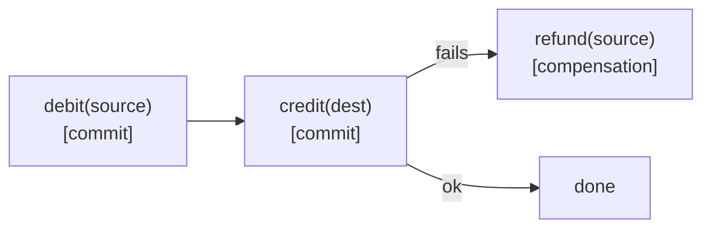
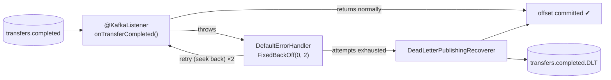
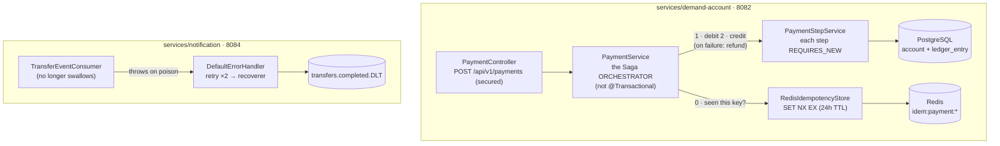
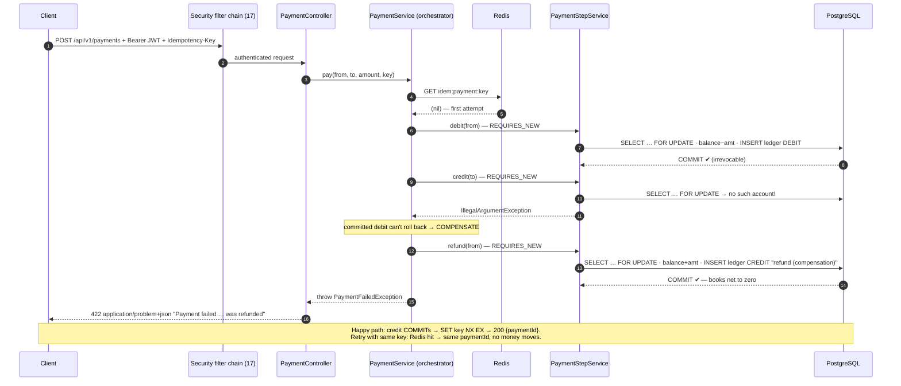
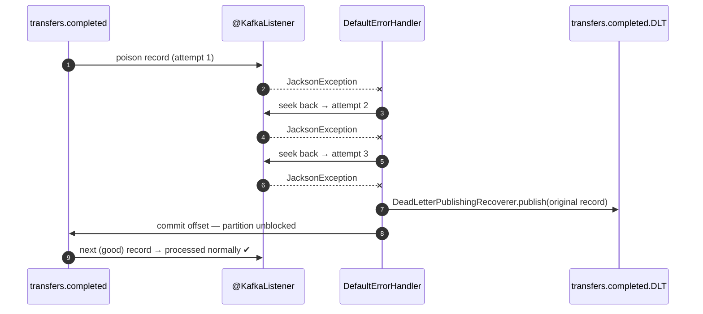

# Step 21 · Payments — the Saga Pattern, Redis Idempotency Keys & Dead-Letter Topics
### Phase D — Distributed Systems, Messaging & Batch 🔵→🟣 · Step 21 of 67

> *A single-database transfer (Step 12) is atomic — but a real payment often spans steps that can't share one
> transaction. Once a step commits, you can't roll it back; you must **compensate**. This step builds a
> payment as a **Saga** (debit → credit, with a refund compensation if credit fails), makes it safe to retry
> with a **Redis-backed Idempotency-Key**, and adds a **Dead-Letter Topic** so a poison message can't wedge
> the consumer. The distributed-money toolkit, made real and tested on Postgres + Redis + Kafka.*

---

<a id="toc"></a>
## 🧭 The Six Movements of This Step

| | Movement | What happens |
|---|---|---|
| **A** | [🧭 Orient](#orient) | 30-second overview · skip-test · cheat card · why it matters · before you start |
| **B** | [🧠 Understand](#understand) | local tx vs Saga · orchestration vs choreography · compensation · idempotency in Redis · DLQ |
| **C** | [🛠️ Build](#build) | a payment Saga (steps + compensation) · Redis Idempotency-Key · retries + Dead-Letter Topic |
| **D** | [🔬 Prove](#prove) | the Verification Log — Saga compensation, Redis idempotency, DLQ on real infra; §12.3 mutation |
| **E** | [🎓 Apply](#apply) | go deeper · interview prep (Saga is a system-design staple) · your-turn challenges |
| **F** | [🏆 Review](#review) | troubleshooting (shared-context test state) · resources · recap, flashcards & next |

---

<a id="orient"></a>

# A · 🧭 Orient

## 📋 This Step in 30 Seconds

| | |
|---|---|
| **Title** | Payments as a Saga (orchestration vs choreography) with compensation, a Redis Idempotency-Key, and Kafka retries + a Dead-Letter Topic |
| **Step** | 21 of 67 · **Phase D — Distributed Systems, Messaging & Batch** 🔵→🟣 |
| **Effort** | ≈ 18 hours focused (Saga + a new datastore + DLQ). Builds straight on the Step-20 Kafka pipeline. |
| **What you'll run this step** | **JVM + Maven**; **🐳 Docker** for Testcontainers — **Postgres + Redis + Redpanda**. |
| **Buildable artifact** | **demand-account**: a payment **Saga** (`PaymentService` orchestrating `PaymentStepService` steps, each `REQUIRES_NEW`, with a **refund compensation**), a **Redis** `RedisIdempotencyStore`, and a secured `POST /api/v1/payments`. **notification**: a `DefaultErrorHandler` + `DeadLetterPublishingRecoverer` routing poison messages to `transfers.completed.DLT`. `step-21-start == step-20-end`. |
| **Verification tier** | 🔴 **Full** — money path + new datastore + the build. `./mvnw verify` green + Saga compensation, Redis idempotency, and the DLQ proven on **real** Postgres/Redis/Redpanda + **§12.3 mutation** + clean-room + `smoke.sh`. |
| **Depends on** | **[Step 20](../step-20/lesson.md)** (Kafka pipeline, idempotent consumer), **[Step 12](../step-12/lesson.md)** (the transfer + transactions/locking), **[Step 14](../step-14/lesson.md)** (idempotency — now in Redis), **[Step 19](../step-19/lesson.md)** (delivery semantics). **+ Docker.** |

By the end you will be able to model a multi-step money movement as a **Saga** with **compensation**, contrast **orchestration vs choreography**, make an operation idempotent with a **Redis** key, and add **retries + a Dead-Letter Topic** to a Kafka consumer.

### ⏭️ Can You Skip This Step? (5-minute self-check)

If you can confidently do **all** of this, skim the 🛠️ Build and jump to **[Step 22 — Caching & async + CQRS read model](../step-22/lesson.md)**.

- [ ] I can explain why a **single ACID transaction** isn't always available, and what a **Saga** does instead.
- [ ] I can contrast **orchestration vs choreography** and write a **compensating** action.
- [ ] I can implement a durable **Idempotency-Key** (Redis `SET NX EX`) so a retry doesn't double-charge.
- [ ] I can add **retries + a Dead-Letter Topic** to a Kafka consumer and say why.
- [ ] I can explain "exactly-once **effect**" across a payment under a forced retry.

> [!TIP]
> Not 100%? Stay. "Design a payment flow across services," "what's a Saga and a compensating transaction," and "how do you make a charge idempotent" are core system-design interview questions.

## 📇 Cheat Card

> **What this step delivers (one sentence):** a payment runs as a Saga (debit → credit with a refund compensation if a step fails), is safe to retry via a Redis Idempotency-Key, and the event consumer quarantines poison messages on a Dead-Letter Topic.

**Key commands** (Windows uses `.\mvnw.cmd`):

```bash
./mvnw -pl services/demand-account,services/notification test    # Saga + Redis + DLQ on real infra
bash steps/step-21/smoke.sh
# Live: POST /api/v1/payments with an Idempotency-Key; retry → same paymentId (see requests.http)
```

**The headline diagram — the Saga with compensation:**

```
pay(A→B, key):
  ├─ Redis: seen(key)? ── yes ─► return original paymentId   (idempotent retry)
  ├─ STEP 1  debit(A)            [commits]
  ├─ STEP 2  credit(B)           [commits]   ── fails? ─► COMPENSATE: refund(A) ─► PaymentFailed(422)
  └─ Redis: record key → paymentId
```

**The one sentence to remember:** *When steps commit independently you can't roll back — you **compensate**; and you make the whole thing safe to retry with an **idempotency key**.*

## 🎯 Why This Matters

Money that moves across services, queues, or shards can't ride one database transaction — so the moment a later step fails, you're left with a half-done payment unless you **compensate**. Sagas + idempotency + dead-letter handling are how real payment systems stay correct under failure and retries, and "design a reliable payment flow" is one of the most common senior system-design prompts.

## ✅ What You'll Be Able to Do

- Build a **Saga** (orchestration) with explicit **compensation**.
- Contrast orchestration vs choreography and pick one.
- Make an operation **idempotent** with a Redis key (`SET NX EX`).
- Add **retries + a Dead-Letter Topic** to a Kafka consumer.
- Reason about consistency and exactly-once *effect* across a payment.

## 🧰 Before You Start

- **Prereqs:** bank builds green (`git describe` → `step-20-end`); Docker running (Postgres + Redis + Redpanda).
- **Connects to what you know:** the **transfer** (Step 12) is the atomic baseline we now contrast with a Saga; **idempotency** (Step 14 DB, Step 20 in-memory) becomes **durable in Redis**; the **Kafka consumer** (Step 20) gets a **DLQ**; **delivery semantics** (Step 19) explains why retries + idempotency = exactly-once effect.
- **Depends on:** Steps **20, 12, 14, 19**. **+ Docker.**

---

<a id="understand"></a>

# B · 🧠 Understand

## 🧠 The Big Idea — when one transaction isn't enough, use a Saga

A local ACID transaction gives you all-or-nothing across one database. But a payment may touch a different
service, a different shard, or an external system — there's **no shared transaction**. A **Saga** breaks the
work into a sequence of **local transactions**, each of which commits on its own; if a later step fails, the
Saga runs **compensating** transactions to semantically undo the committed ones (you can't "roll back" a
committed step — you do the opposite action: a refund undoes a debit).



*Alt-text: a left-to-right flow — debit commits, then credit commits; if credit fails the flow branches to a
compensating refund of the source.*

**The bank-teller analogy.** A Step-12 transfer is one teller moving cash between two drawers under one key —
if anything goes wrong mid-move, she puts everything back before unlocking (rollback). A Saga is two tellers
in **different branches** connected by a courier: branch A *actually removes* the cash and the courier leaves
(that step is done — committed). If branch B then refuses the deposit, branch A can't pretend the withdrawal
never happened — the drawer already changed and other customers saw it. The only honest fix is a **second,
opposite movement**: put the cash back, and write *both* movements in the ledger. That second movement is the
compensating transaction, and the two ledger lines (debit + refund) are exactly what our tests assert.

**How this differs from what you already have:**

| | Step 12 transfer (one DB tx) | Step 21 payment (Saga) |
|---|---|---|
| **Atomicity** | All-or-nothing — the DB rolls back | Per-step only — each leg commits alone |
| **Failure recovery** | Automatic rollback | Explicit **compensation** you must write |
| **Isolation** | Other txs never see the half-done state | Intermediate state **is visible** between steps |
| **Ledger on failure** | No rows (rolled back) | Two rows that net to zero (debit + refund) |
| **When to use** | Steps share one database | Steps span services/shards/external systems |

❓ **Knowledge-check:** in the Saga column, why does a *failed* payment still leave two ledger rows?
<details><summary>Answer</summary>Because the debit <em>committed</em> — it really happened and must stay on the
books (audits! Step 12's append-only ledger lesson). The compensation doesn't erase it; it adds an equal and
opposite CREDIT ("payment refund (compensation)"), so the ledger nets to zero and history stays truthful.</details>

## 🧩 Pattern Spotlight — Saga: orchestration vs choreography

**The problem:** a multi-step operation across boundaries that can't share a transaction must stay consistent
under partial failure. **Why a Saga fits:** it accepts that steps commit independently and makes recovery an
explicit, testable action (compensation) instead of an impossible cross-system rollback.

**Two flavours:**
- **Orchestration** — a central coordinator (our `PaymentService`) calls each step and decides on failure what
  to compensate. Easy to follow, test, and reason about; the coordinator is a single place that knows the flow.
- **Choreography** — no coordinator; each service reacts to events and emits the next event (the Step-20 Kafka
  pipeline is the substrate). More decoupled, but the flow is implicit across services — harder to see and debug.

| | Orchestration | Choreography |
|---|---|---|
| **Flow lives in** | One coordinator class | The event topology (implicit) |
| **Coupling** | Coordinator knows every step | Services only know events |
| **Debuggability** | One stack trace / log stream | Correlate across services by event id |
| **Failure handling** | Coordinator triggers compensations | Each service listens for failure events |
| **Risk** | Coordinator becomes a god-class | "Who reacts to what?" sprawl |
| **Fits** | Short, well-defined flows (this step) | Many loosely-coupled participants |

**Trade-off:** orchestration for short, well-defined flows you want to reason about centrally (this step);
choreography when you want maximum decoupling and the steps naturally live in different services. We build
orchestration here and explain how the same compensation logic maps onto choreographed events (the 🏋️ stretch
goal sketches the choreographed version over the Step-20 topics).

> ⚠️ A Saga is **not** isolated like an ACID transaction — between steps, other readers can see the
> intermediate state (the money has left A but not yet arrived at B). You design for that (pending states,
> idempotency, compensation), which is why a Saga is "eventually consistent," not "atomic."

## 🌱 Under the Hood: `REQUIRES_NEW` — how one Java call becomes its own commit

The Saga's whole premise is "each step commits independently." In one JVM against one database we *model* that
with transaction **propagation** (Step 12 taught the modes; Step 7 taught the proxy):

1. The orchestrator calls `steps.debit(...)`. That call goes through the **Spring proxy** wrapped around
   `PaymentStepService`.
2. The proxy's `TransactionInterceptor` sees `@Transactional(propagation = Propagation.REQUIRES_NEW)`:
   it **suspends** whatever transaction is running (here: none — the orchestrator is deliberately
   non-transactional), grabs a connection, and `BEGIN`s a **brand-new transaction**.
3. The method body runs: `SELECT … FOR UPDATE` (the Step-12 pessimistic row lock), mutate the balance,
   `INSERT` the ledger row.
4. The method returns → the interceptor **COMMITs immediately**. The step is now permanent — visible to every
   other connection, beyond the reach of any later "rollback."
5. The orchestrator resumes and calls the next step → a *different* transaction, a *different* commit.

That commit-at-step-boundary is what makes a later failure interesting: when `credit` throws, `debit`'s commit
is already on disk. There is nothing to roll back — which is precisely the distributed-payment reality we're
rehearsing (in production the debit might live in another service entirely; the orchestrator would call it over
HTTP/Kafka and the same logic applies).

❓ **Knowledge-check:** why must the steps live in a *separate bean* from the orchestrator?
<details><summary>Answer</summary>Because <code>@Transactional</code> is applied by the <em>proxy</em>. If
<code>pay()</code> called <code>this.debit()</code> on the same object, the call would bypass the proxy and
<code>REQUIRES_NEW</code> would silently not happen — the self-invocation pitfall from Step 7 (it bit us in
Step 12's <code>AuditService</code> too).</details>

## 🌱 Under the Hood: idempotency in Redis

A client that times out will **retry** a payment — you must not charge twice. We store
`Idempotency-Key → paymentId` in Redis with `SET key value NX EX ttl` (`setIfAbsent` + TTL): the first request
records its result; a retry with the same key finds it and returns the original `paymentId` without paying
again. **Why Redis** (vs the DB store in Step 14 or the in-memory set in Step 20): fast, shared across
instances, and entries **auto-expire** (an idempotency key only matters for a retry window).

What those Redis letters actually mean on the wire:

```
SET idem:payment:PAY-001 7131b6d9-… NX EX 86400
```

- **`SET key value`** — Redis is a network key-value store; this stores a string under a key.
- **`NX`** — "only if **N**ot e**X**ists." If the key is already there, the command does nothing and returns
  nil. This makes *check-and-claim a single atomic server-side operation* — no separate GET-then-SET race.
- **`EX 86400`** — expire in 86,400 seconds (24 h). Redis deletes the key itself; no cleanup job needed.
- Redis executes commands on a **single thread**, so two concurrent `SET … NX` for the same key can't both
  succeed — one wins, the other sees "already exists." (That's the 🧵 thread-safety story below.)

## 🌱 Under the Hood: retries & the Dead-Letter Topic

A consumer will eventually meet a message it can't process (malformed, or a bug). If it just rethrows forever,
it **blocks the partition** (Kafka won't advance past a failing offset). The fix: a `DefaultErrorHandler`
**retries** a few times, then a `DeadLetterPublishingRecoverer` **republishes** the record to a
**dead-letter topic** (`<topic>.DLT`) and moves on. The poison message is quarantined for inspection; good
messages keep flowing.

Mechanically, inside Spring Kafka's listener container: the container polls a batch, hands each record to your
`@KafkaListener` method; when the method **throws**, the container asks its `CommonErrorHandler` what to do.
`DefaultErrorHandler` keeps a per-record attempt count driven by a `BackOff` — with `FixedBackOff(0L, 2L)` that's
**1 original attempt + 2 retries = 3 attempts, no delay** — and performs the retries by *seeking the consumer
back* to the failing offset so the record is re-polled. When attempts are exhausted it invokes its **recoverer**;
ours publishes the original record (value byte-for-byte preserved) to `topic + ".DLT"` on the **same partition
number**, then the container commits the offset and the partition flows again.



*Alt-text: records flow from the topic into the listener; a throw routes to the error handler, which retries
twice and then hands the record to the recoverer, which publishes it to the .DLT topic and lets the offset commit.*

## 🛡️ Security Lens & 🧵 Thread-safety note

The payment endpoint is authenticated like every money endpoint (resource server, Step 17) — but note it
still has the **BOLA gap (R-001)**: it doesn't check the caller owns `from`. Tracked in
`security/risk-register.md`, not fixed here (§12.8 honesty — half-fixing access control in a payments step
would be worse than tracking it).

**Thread-safety (Step 11/12 callback):** three layers of shared mutable state, three guards —
- the **account row** is guarded by the Step-12 pessimistic lock (`SELECT … FOR UPDATE`), so two concurrent
  Saga legs touching the same account serialize at the database;
- the **idempotency record** is guarded by Redis `SET NX` — atomic on Redis's single command thread, so
  concurrent duplicate *completions* can't both claim the key;
- ⚠️ there's still a deliberate, documented **check-then-act window** in `pay()` (read the key, *then* run the
  Saga, *then* record): two truly *simultaneous* first-time submits with the same key could both pay before
  either records. Sequential retries (the common case — client timeout → retry) are fully covered; the
  concurrent-double-submit hardening (reserve-then-complete: claim the key *before* paying) is flagged in
  ADR-0012 and is one of your 🏋️ exercises.

## 🕰️ Then vs. Now

Distributed transactions used to mean **two-phase commit (2PC/XA)** — a coordinator locking all participants
until everyone votes commit. It's correct but slow, fragile under failure, and unsupported by most modern
brokers/services. **Now** the industry default is the **Saga**: looser, available, eventually consistent, with
compensation instead of global locks. (Java still carries the old world in `javax.transaction`/JTA and XA
drivers — you'll meet them in legacy codebases, almost never in new event-driven designs. Kafka famously
refuses to join an XA transaction; that refusal is *why* the Outbox pattern exists, Step 20.)

---

# B→C bridge: 🗺️ what we're building & 🌳 files we'll touch



*Alt-text: in demand-account, the controller calls the orchestrator, which consults the Redis idempotency
store and drives debit/credit/refund steps against Postgres. In notification, the consumer throws on poison
messages and the error handler routes them to the dead-letter topic.*

```
services/demand-account/
  pom.xml                                                 (edit) + spring-boot-starter-data-redis
  src/main/resources/application.yml                      (edit) + spring.data.redis
  src/main/java/.../payment/PaymentFailedException.java   (new)
  src/main/java/.../payment/PaymentStepService.java       (new) debit/credit/refund, each REQUIRES_NEW
  src/main/java/.../payment/RedisIdempotencyStore.java    (new) SET NX EX
  src/main/java/.../payment/PaymentService.java           (new) the Saga orchestrator + compensation
  src/main/java/.../web/PaymentRequest.java               (new)
  src/main/java/.../web/PaymentResponse.java              (new)
  src/main/java/.../web/PaymentController.java            (new) POST /api/v1/payments
  src/main/java/.../web/GlobalExceptionHandler.java       (edit) PaymentFailedException → 422
  src/test/java/.../RedisContainers.java                  (new) Testcontainers Redis + @ServiceConnection
  src/test/java/.../payment/PaymentSagaTest.java          (new) happy path · compensation · idempotency
  src/test/java/.../web/PaymentControllerTest.java        (new) slice: id + key forwarding + 401
services/notification/
  src/main/resources/application.yml                      (edit) producer serializers (for the DLT publish)
  src/main/java/.../KafkaErrorHandlingConfig.java         (new) DefaultErrorHandler + DLT recoverer
  src/main/java/.../TransferEventConsumer.java            (edit) stop swallowing → let poison reach the DLT
  src/test/java/.../DeadLetterTest.java                   (new) poison → .DLT; good messages still flow
  src/test/java/.../TransferEventConsumerKafkaTest.java   (edit) assert DELTAS (cached-context gotcha)
adr/0012-payment-saga-redis-idempotency-dlq.md            (new)
steps/step-21/{lesson.md, requests.http, smoke.sh}        + Makefile play-21 · VERSIONS.md rows
```

<a id="build"></a>

# C · 🛠️ Let's Build It — Step by Step

## 📦 Your Starting Point

`step-21-start == step-20-end`: **11 modules green**, the Kafka pipeline live end-to-end — a committed
transfer writes an Outbox row, the relay publishes it to `transfers.completed`, and the notification service's
idempotent consumer pushes an SSE notification. demand-account has **37 tests**, notification **3**.

```bash
git describe --tags          # → step-20-end (or step-21-start — same commit)
./mvnw -q verify             # 11 modules, BUILD SUCCESS — your safety net before touching anything
```

What's green: the single-transaction transfer (Step 12), `/api/v1` security (Step 17), the Outbox → Kafka →
consumer pipeline (Step 20). What's missing — and what we build now: any notion of a **multi-step payment**,
any **durable** idempotency (Step 20's dedupe set dies with the JVM), and any answer to a **poison message**
(the Step-20 consumer logs-and-skips it, with a comment admitting Step 21 owes it a DLT — time to pay up).

> 🧭 **The build in two halves:** sub-steps 0–9 are the **payment Saga** in demand-account
> (wiring → exception → steps → Redis → orchestrator → web → tests); sub-steps 10–13 are the **DLT** in
> notification plus the step's harness. Commit as you go.

---

## Sub-step 0 of 13 — wire Redis into demand-account 🧭 *(you are here: **wiring** → exception → steps → Redis store → orchestrator → web → 422 → test infra → Saga test → slice test → DLT → consumer → DLT test → harness)*

🎯 **Goal:** add the Redis client (the `data-redis` starter) and tell the app where Redis lives, so
`StringRedisTemplate` exists as a bean in sub-step 3. Pure plumbing — no behavior yet.

📁 **Location:** edit → `services/demand-account/pom.xml` (dependency block, right after the Kafka starter)
and `services/demand-account/src/main/resources/application.yml`.

⌨️ **Code — the pom edit (diff):**

```diff
--- a/services/demand-account/pom.xml
+++ b/services/demand-account/pom.xml
@@ -81,6 +81,12 @@
             <artifactId>spring-boot-starter-kafka</artifactId>
         </dependency>
 
+        <!-- Redis (Step 21): durable Idempotency-Key store for the payment Saga (setIfAbsent + TTL). Lettuce client. -->
+        <dependency>
+            <groupId>org.springframework.boot</groupId>
+            <artifactId>spring-boot-starter-data-redis</artifactId>
+        </dependency>
+
         <!-- ── Test ── -->
         <dependency>
             <groupId>org.springframework.boot</groupId>
```

⌨️ **Code — the application.yml edit (diff):**

```diff
--- a/services/demand-account/src/main/resources/application.yml
+++ b/services/demand-account/src/main/resources/application.yml
@@ -29,6 +29,11 @@ spring:
     producer:
       key-serializer: org.apache.kafka.common.serialization.StringSerializer
       value-serializer: org.apache.kafka.common.serialization.StringSerializer
+  # Step 21 — Redis (payment Idempotency-Key store). Tests override host/port via Testcontainers @ServiceConnection.
+  data:
+    redis:
+      host: ${REDIS_HOST:localhost}
+      port: ${REDIS_PORT:6379}
 
 # Step 18 (secure-by-default): deny-by-default CORS. Empty ⇒ no browser origin allowed.
 # Allow a specific front-end by listing its origin, e.g. APP_CORS_ALLOWED_ORIGINS=http://localhost:5173 (the React app, Step 29).
```

🔍 **Line-by-line:**
- `spring-boot-starter-data-redis` — Boot's Redis starter: pulls **Spring Data Redis** (the `RedisTemplate` /
  `StringRedisTemplate` programming model) plus **Lettuce**, the default Redis driver (a netty-based,
  thread-safe client — the alternative, Jedis, needs a connection pool per thread). **No version**: the Boot
  parent's `dependencyManagement` pins it — same rule as every starter since Step 1.
- Note where it sits: **above** the `<!-- ── Test ── -->` divider — this is a `compile`-scope production
  dependency (the app itself talks to Redis), unlike the Testcontainers pieces coming in sub-step 7.
- `spring.data.redis.host/port` — where Boot's autoconfiguration points the Lettuce connection factory.
  ⚠️ The prefix is `spring.data.redis` (Boot 3.0 moved it; ancient tutorials say `spring.redis.*` — that key
  is silently ignored today, a classic "why is it connecting to localhost?" trap).
- `${REDIS_HOST:localhost}` — the Step-8 property-placeholder idiom: use the `REDIS_HOST` environment variable
  if set, else default to `localhost`. Tests never use these — Testcontainers `@ServiceConnection` injects the
  container's random host/port over the top (sub-step 7); the env vars are for the live demo and, later, Docker
  Compose/K8s.

💭 **Under the hood:** at startup, Boot's `RedisAutoConfiguration` sees Lettuce on the classpath and these
properties, and contributes a `LettuceConnectionFactory` + `StringRedisTemplate` to the context. **Lazily** —
no TCP connection is opened until the first command, so the app still boots fine with no Redis running (and
fails at first *use* instead: worth knowing when you read sub-step 3's pitfall).

🔮 **Predict:** will the existing 37 demand-account tests still pass after this edit, given none of them has a
Redis container? *(Answer in Run & See.)*

▶️ **Run & See:**

```bash
./mvnw -B -pl services/demand-account dependency:tree -Dincludes=org.springframework.boot:spring-boot-starter-data-redis,io.lettuce:lettuce-core,org.springframework.data:spring-data-redis
```

✅ **Expected output** (run fresh on 2026-06-11 — Boot 4.0.6 resolves these):

```
[INFO] \- org.springframework.boot:spring-boot-starter-data-redis:jar:4.0.6:compile
[INFO]       +- io.lettuce:lettuce-core:jar:6.8.2.RELEASE:compile
[INFO]       \- org.springframework.data:spring-data-redis:jar:4.0.5:compile
[INFO] BUILD SUCCESS
```

And the prediction: yes — the existing tests stay green, *because* the connection factory is lazy: a
`StringRedisTemplate` bean that nobody touches never dials Redis. (The recorded step-21 Verification Log shows
all 37 prior tests passing alongside the new ones.)

✋ **Checkpoint:** `dependency:tree` shows the starter + Lettuce; `application.yml` has the `spring.data.redis`
block under the existing `spring:` key (YAML indentation: `data:` is a *sibling* of `kafka:`, two spaces deep).
If Maven says "dependencies.dependency.version is missing" you typo'd the artifactId (the parent only manages
known ones).

💾 **Commit:**

```bash
git add services/demand-account/pom.xml services/demand-account/src/main/resources/application.yml
git commit -m "build(demand-account): add Redis starter + connection config for payment idempotency"
```

⚠️ **Pitfall:** putting `data.redis` at the YAML root instead of under `spring:` — the keys are silently
ignored (Boot doesn't error on unknown root keys) and everything "works" until the live demo connects to the
default localhost while your Redis runs elsewhere. The full path is `spring.data.redis.host`.

---

## Sub-step 1 of 13 — `PaymentFailedException`: name the failure 🧭 *(wiring ✅ → **exception** → steps → Redis store → orchestrator → web → 422 → test infra → tests → DLT → harness)*

🎯 **Goal:** a dedicated exception meaning "*a Saga step failed after an earlier step had committed; the
committed work was compensated; the payment did not happen*." The web layer maps it to a clean `422` in
sub-step 6 — and a named exception is what makes that mapping possible.

📁 **Location:** new file → `services/demand-account/src/main/java/com/buildabank/account/payment/PaymentFailedException.java`
(also the **first file in a new `payment` package** — the Saga is its own vertical slice, separate from the
Step-12 `service` package, so the two money paths never tangle).

⌨️ **Code:**

```java
// services/demand-account/src/main/java/com/buildabank/account/payment/PaymentFailedException.java
package com.buildabank.account.payment;

/**
 * Thrown when a payment Saga fails after a step had already committed, so a <strong>compensating</strong>
 * action was run to undo it (e.g. the credit leg failed, so the debited source was refunded). The system is
 * left consistent; the caller is told the payment did not complete.
 */
public class PaymentFailedException extends RuntimeException {

    public PaymentFailedException(String message, Throwable cause) {
        super(message, cause);
    }
}
```

🔍 **Line-by-line:**
- `extends RuntimeException` — unchecked, like `InsufficientFundsException` (Step 12): callers aren't forced
  to `try/catch` at every level; it propagates to the one place that cares (the `@RestControllerAdvice`).
  Also remember the Step-12 rule: Spring rolls back a transaction on unchecked exceptions by default — though
  by the time *this* one is thrown, the orchestrator has no transaction to roll back (that's the point).
- `(String message, Throwable cause)` — we always wrap the **original step failure** as the `cause`, so logs
  and debugging keep the real reason (`IllegalArgumentException: no such account: …`) while the message tells
  the business story ("source was refunded").
- No other constructors: you can't construct this exception without saying *what* failed and *why* — a small
  API forcing good error messages.

💭 **Under the hood:** nothing magic — but the *semantics* matter: this exception is thrown **after**
compensation succeeded. It means "consistent, but not done," which is why it maps to `422 Unprocessable
Entity` (a valid request the server understood but couldn't complete) rather than `500` (server broke).

🔮 **Predict:** the compiler is happy with this file alone — but can you write the test for it yet? *(No —
it's inert until the orchestrator throws it in sub-step 4. One idea per sub-step; we run when there's behavior.)*

▶️ **Run & See:**

```bash
./mvnw -q -pl services/demand-account compile
```

✅ **Expected output** *(verify-adjacent — `-q` is silent on success; the exit code is the signal)*:

```
(no output — exit code 0)
```

✋ **Checkpoint:** the file sits in a new `payment/` directory beside `domain/`, `service/`, `web/`; package
line reads `com.buildabank.account.payment`. If compile fails here it's the path/package mismatch.

💾 **Commit:**

```bash
git add services/demand-account/src/main/java/com/buildabank/account/payment/
git commit -m "feat(demand-account): PaymentFailedException — named failure for a compensated Saga"
```

⚠️ **Pitfall:** the lazy alternative — reusing `IllegalStateException` — costs you in sub-step 6: the advice
can't tell "payment compensated" apart from any other illegal state, so you can't give it its own status code
and Problem type. Name your domain failures.

---

## Sub-step 2 of 13 — `PaymentStepService`: the Saga legs, each its own transaction 🧭 *(wiring ✅ → exception ✅ → **steps** → Redis store → orchestrator → web → 422 → test infra → tests → DLT → harness)*

🎯 **Goal:** the three Saga steps — `debit`, `credit`, and the compensation `refund` — each in its **own
committed transaction** (`REQUIRES_NEW`), reusing Step 12's pessimistic row lock and writing a ledger row per
leg. This is the class that makes "you can't roll back, you must compensate" physically true.

📁 **Location:** new file → `services/demand-account/src/main/java/com/buildabank/account/payment/PaymentStepService.java`

⌨️ **Code:**

```java
// services/demand-account/src/main/java/com/buildabank/account/payment/PaymentStepService.java
package com.buildabank.account.payment;

import java.math.BigDecimal;
import java.time.Instant;
import java.util.UUID;

import org.springframework.stereotype.Service;
import org.springframework.transaction.annotation.Propagation;
import org.springframework.transaction.annotation.Transactional;

import com.buildabank.account.domain.Account;
import com.buildabank.account.domain.AccountRepository;
import com.buildabank.account.domain.EntryDirection;
import com.buildabank.account.domain.LedgerEntry;
import com.buildabank.account.domain.LedgerEntryRepository;

/**
 * Step 21 · the individual <strong>Saga steps</strong>, each in its OWN transaction
 * ({@code Propagation.REQUIRES_NEW}) so it commits independently. That independence is the whole point of a
 * Saga: once {@link #debit} commits you can't just roll it back if a later step fails — you must run a
 * <strong>compensating</strong> step ({@link #refund}). In a real distributed system these legs would live in
 * different services and travel as events; here they're separate local transactions, which models the same
 * "no shared transaction across steps" reality (and reuses the pessimistic row lock from Step 12).
 *
 * <p>Lives in its OWN bean because {@code REQUIRES_NEW} only takes effect through the Spring proxy — a
 * {@code this.}-call inside the orchestrator would bypass it (the self-invocation pitfall, Step 7 / AuditService).
 */
@Service
public class PaymentStepService {

    private final AccountRepository accounts;
    private final LedgerEntryRepository ledger;

    public PaymentStepService(AccountRepository accounts, LedgerEntryRepository ledger) {
        this.accounts = accounts;
        this.ledger = ledger;
    }

    /** Step 1 — take money from the source (commits independently). Throws if it would overdraw. */
    @Transactional(propagation = Propagation.REQUIRES_NEW)
    public void debit(String accountNumber, BigDecimal amount, UUID paymentId) {
        Account account = lock(accountNumber);
        account.debit(amount);   // throws InsufficientFundsException → step fails before anything else commits
        ledger.save(new LedgerEntry(account.getId(), paymentId, EntryDirection.DEBIT, amount,
                "payment debit", Instant.now()));
    }

    /** Step 2 — give money to the destination (commits independently). Throws if the account doesn't exist. */
    @Transactional(propagation = Propagation.REQUIRES_NEW)
    public void credit(String accountNumber, BigDecimal amount, UUID paymentId) {
        Account account = lock(accountNumber);
        account.credit(amount);
        ledger.save(new LedgerEntry(account.getId(), paymentId, EntryDirection.CREDIT, amount,
                "payment credit", Instant.now()));
    }

    /** COMPENSATION for {@link #debit} — give the money back to the source (commits independently). */
    @Transactional(propagation = Propagation.REQUIRES_NEW)
    public void refund(String accountNumber, BigDecimal amount, UUID paymentId) {
        Account account = lock(accountNumber);
        account.credit(amount);
        ledger.save(new LedgerEntry(account.getId(), paymentId, EntryDirection.CREDIT, amount,
                "payment refund (compensation)", Instant.now()));
    }

    private Account lock(String accountNumber) {
        return accounts.findByAccountNumberForUpdate(accountNumber)
                .orElseThrow(() -> new IllegalArgumentException("no such account: " + accountNumber));
    }
}
```

🔍 **Line-by-line:**
- `@Transactional(propagation = Propagation.REQUIRES_NEW)` — the headline. `Propagation` answers "what happens
  if a transaction is already running when this method is called?" `REQUIRES_NEW` says: suspend it (if any)
  and open a **brand-new** one that commits when *this method* returns. Contrast the default `REQUIRED`
  (join the caller's transaction — what `TransferService.post()` uses) — with `REQUIRED`, all three legs would
  silently merge into one transaction and a failed credit would roll back the debit… making the "Saga" a lie.
  You met `REQUIRES_NEW` in Step 12's `AuditService` (audit rows that survive a rolled-back transfer); here
  it's promoted from a logging trick to the structural heart of the pattern.
- `private Account lock(String accountNumber)` — one shared helper: `findByAccountNumberForUpdate` is the
  Step-12 repository method annotated `@Lock(PESSIMISTIC_WRITE)`, which Hibernate renders as
  `SELECT … FOR UPDATE` — the row is locked until *this step's* transaction commits, so a concurrent transfer
  or second payment touching the same account waits its turn (no lost updates, Step 11's lesson).
- `.orElseThrow(() -> new IllegalArgumentException("no such account: …"))` — a *missing destination* fails the
  credit step with the same exception the transfer path uses. This is exactly the failure our compensation
  test will manufacture.
- `account.debit(amount)` — the domain method (Step 12) that enforces the no-overdraft invariant by throwing
  `InsufficientFundsException`. Note **where** it can throw: *before* the ledger save and before this step's
  commit — an insufficient-funds payment fails at step 1 with **nothing committed**, so no compensation is
  needed (a Saga that fails at the *first* step is the cheap case).
- `new LedgerEntry(account.getId(), paymentId, EntryDirection.DEBIT, amount, "payment debit", Instant.now())` —
  one ledger row per leg, all carrying the same `paymentId` (a `UUID` minted by the orchestrator) as the
  transaction id, so the whole Saga is reconstructable from the ledger: a happy payment is DEBIT+CREDIT; a
  compensated one is DEBIT + CREDIT *"payment refund (compensation)"*. `Instant.now()` — UTC always (Part VI).
- `refund` **is** `credit`-on-the-source with a different memo — compensation isn't exotic machinery, it's an
  ordinary, *separately committed* opposite action. The memo string is the audit trail's honesty.

💭 **Under the hood:** each method call enters through the bean's proxy → `TransactionInterceptor` →
`PlatformTransactionManager.getTransaction(REQUIRES_NEW)` → new JDBC connection from Hikari, `BEGIN`. Inside:
the `SELECT … FOR UPDATE` row lock, the entity mutation (flushed by Hibernate's dirty checking at commit), the
ledger `INSERT`. Method returns → `COMMIT`, lock released, changes visible to everyone. Three calls = three
connections' worth of independent history. There is no umbrella transaction *anywhere* — by design.

🔮 **Predict:** if `credit` fails after `debit` committed, can the framework roll the debit back for us?
<details><summary>Answer</summary><strong>No.</strong> The debit's transaction no longer exists — it committed
and released its connection. Nothing in Spring, JPA, or Postgres can un-commit it. The only path back is a new,
opposite transaction: <code>refund</code>. That's the Saga — and the orchestrator (next-but-one sub-step) is
where that decision lives.</details>

▶️ **Run & See:**

```bash
./mvnw -q -pl services/demand-account compile
```

✅ **Expected output** *(verify-adjacent — silent success, exit 0)*:

```
(no output — exit code 0)
```

✋ **Checkpoint:** the class compiles against the **existing** Step-12 domain (no edits to `Account`,
repositories, or `LedgerEntry` were needed — good sign the domain model was right). All three public methods
carry `REQUIRES_NEW`; the helper is private and lock-first.

💾 **Commit:**

```bash
git add services/demand-account/src/main/java/com/buildabank/account/payment/PaymentStepService.java
git commit -m "feat(demand-account): Saga steps debit/credit/refund, each REQUIRES_NEW with row lock"
```

⚠️ **Pitfall:** the **self-invocation trap** — if you're tempted to fold these methods into the orchestrator
class "to keep it simple," `pay()` calling `this.debit()` would *not* pass through the proxy, the
`REQUIRES_NEW` would be ignored, and all legs would run in whatever transaction context the caller had
(probably none → each repository call auto-commits in its own micro-transaction — subtly different and
wrong). Separate bean, always, for propagation changes. (Step 7 taught it; Step 12's `AuditService` proved it.)

---

## Sub-step 3 of 13 — `RedisIdempotencyStore`: SET NX EX 🧭 *(wiring ✅ → exception ✅ → steps ✅ → **Redis store** → orchestrator → web → 422 → test infra → tests → DLT → harness)*

🎯 **Goal:** a tiny, durable map of `Idempotency-Key → paymentId` in Redis, so a retried payment can return
its original result instead of charging twice. Two methods: look up, record.

📁 **Location:** new file → `services/demand-account/src/main/java/com/buildabank/account/payment/RedisIdempotencyStore.java`

⌨️ **Code:**

```java
// services/demand-account/src/main/java/com/buildabank/account/payment/RedisIdempotencyStore.java
package com.buildabank.account.payment;

import java.time.Duration;
import java.util.Optional;

import org.springframework.data.redis.core.StringRedisTemplate;
import org.springframework.stereotype.Component;

/**
 * Step 21 · a durable <strong>Idempotency-Key</strong> store backed by <strong>Redis</strong>. A client that
 * retries a payment (after a timeout, say) sends the same {@code Idempotency-Key}; we record the resulting
 * {@code paymentId} against that key so a retry returns the original result instead of paying twice.
 *
 * <p>Why Redis (vs the DB store in Step 14, or the in-memory set in Step 20)? It's fast, shared across
 * instances, and entries auto-expire via TTL (idempotency keys only matter for a retry window). We use
 * {@code SET key value NX EX ttl} ({@code setIfAbsent} with a TTL) — an atomic "claim if not present".
 */
@Component
public class RedisIdempotencyStore {

    private static final String PREFIX = "idem:payment:";
    private static final Duration TTL = Duration.ofHours(24);

    private final StringRedisTemplate redis;

    public RedisIdempotencyStore(StringRedisTemplate redis) {
        this.redis = redis;
    }

    /** The paymentId previously recorded for this key, if any (a retry hit). */
    public Optional<String> completedPaymentId(String idempotencyKey) {
        return Optional.ofNullable(redis.opsForValue().get(PREFIX + idempotencyKey));
    }

    /** Record the result for this key (atomic claim + TTL). No-op if a value is already present. */
    public void recordCompleted(String idempotencyKey, String paymentId) {
        redis.opsForValue().setIfAbsent(PREFIX + idempotencyKey, paymentId, TTL);
    }
}
```

🔍 **Line-by-line:**
- `StringRedisTemplate` — the Boot-autoconfigured bean from sub-step 0: a `RedisTemplate` specialized to
  String keys *and* String values (UTF-8 on the wire, human-readable in `redis-cli`). The generic
  `RedisTemplate<Object,Object>` would JDK-serialize values into binary gunk — for a key→UUID-string map,
  strings are exactly right.
- `private static final String PREFIX = "idem:payment:"` — Redis has **one flat keyspace** per database;
  namespacing-by-prefix (`idem:payment:PAY-001`) is the universal convention so a `KEYS idem:payment:*` (or a
  future cache, Step 22) can't collide with other features. Colons are just characters Redis tooling renders
  as folders.
- `Duration.ofHours(24)` — the TTL: an idempotency key only needs to outlive the **client's retry window**
  (Step 14's webhook replay-window mirror-image). 24 h is generous; after expiry Redis deletes the key itself —
  no cleanup job, the operational win over the Step-14 DB table.
- `opsForValue()` — `RedisTemplate` groups commands by Redis data type; `opsForValue()` is the plain
  string/value group (`GET`/`SET`/…). (Others: `opsForHash()`, `opsForList()`, `opsForSet()` — Step 22 meets more.)
- `.get(PREFIX + idempotencyKey)` — Redis `GET`: the stored `paymentId`, or `null` if absent/expired —
  wrapped in `Optional.ofNullable` so the caller can't forget the miss case.
- `.setIfAbsent(key, paymentId, TTL)` — **the** line: Redis `SET key value NX EX 86400` in one atomic
  server-side command. `NX` = only set if the key does **n**ot e**x**ist (first writer wins, others no-op);
  `EX` = expiry seconds. Because Redis processes commands on a single thread, no two clients can both "win."
- `@Component` vs `@Service` — both register a bean; convention in this codebase: `@Service` for things with
  business behavior, `@Component` for adapters/plumbing. The store is plumbing.

💭 **Under the hood:** the first command triggers Lettuce to actually connect (remember: lazy). Each call is a
request/response over one multiplexed netty channel — `setIfAbsent` returns a `Boolean` (claimed or not) that
we deliberately ignore here: for *recording a result*, "someone already recorded the same result" is fine. (The
moment you use `setIfAbsent` to *reserve before acting*, that Boolean becomes the whole game — that's the
reserve-then-complete hardening in your 🏋️ exercises.)

🔮 **Predict:** two requests race to `recordCompleted` with the same key but (because of a client bug)
*different* paymentIds. What ends up in Redis? <details><summary>Answer</summary>Whichever <code>SET … NX</code>
arrives first — the second is a no-op, <em>not</em> an overwrite. Last-write-wins would be wrong here;
first-write-wins means the recorded result never flips under a retry storm.</details>

▶️ **Run & See:**

```bash
./mvnw -q -pl services/demand-account compile
```

✅ **Expected output** *(verify-adjacent — silent success, exit 0)*:

```
(no output — exit code 0)
```

The real proof is `PaymentSagaTest.redisIdempotencyKey_makesARetryPayOnlyOnce` (sub-step 8) on a **real**
Redis container.

✋ **Checkpoint:** two public methods only; the prefix and TTL are `private static final` constants;
constructor injection of `StringRedisTemplate` (no `@Autowired` needed — single constructor, Step 5 rule).

💾 **Commit:**

```bash
git add services/demand-account/src/main/java/com/buildabank/account/payment/RedisIdempotencyStore.java
git commit -m "feat(demand-account): Redis-backed Idempotency-Key store (SET NX EX, 24h TTL)"
```

⚠️ **Pitfall:** `setIfAbsent(key, value)` **without** the TTL argument exists — and leaks keys forever
(every payment ever made stays in Redis until it falls over). Always the three-arg overload for idempotency
keys. Related: don't "fix" it with a separate `expire(key)` call afterwards — two commands = a crash window
where the key exists with no TTL; the three-arg form is one atomic command.

---

## Sub-step 4 of 13 — `PaymentService`: the orchestrator that compensates 🧭 *(wiring ✅ → exception ✅ → steps ✅ → Redis store ✅ → **orchestrator** → web → 422 → test infra → tests → DLT → harness)*

🎯 **Goal:** the Saga **orchestrator**: check the idempotency key, run debit → credit, and on a credit failure
run the compensating refund and throw `PaymentFailedException`. Deliberately **not** `@Transactional`.

📁 **Location:** new file → `services/demand-account/src/main/java/com/buildabank/account/payment/PaymentService.java`

⌨️ **Code:**

```java
// services/demand-account/src/main/java/com/buildabank/account/payment/PaymentService.java
package com.buildabank.account.payment;

import java.math.BigDecimal;
import java.util.Optional;
import java.util.UUID;

import org.slf4j.Logger;
import org.slf4j.LoggerFactory;
import org.springframework.stereotype.Service;

/**
 * Step 21 · the payment <strong>Saga orchestrator</strong>. A payment is a sequence of independently-committed
 * steps coordinated here; if a later step fails, the orchestrator runs the matching <strong>compensation</strong>
 * to undo the committed ones. (This is the <em>orchestration</em> flavour — one coordinator drives the steps.
 * The <em>choreography</em> flavour has each service react to events with no central coordinator; the Step-20
 * Kafka pipeline is the substrate for that, and the lesson contrasts the two.)
 *
 * <p>Deliberately NOT {@code @Transactional}: the orchestrator must not wrap the steps in one transaction —
 * each {@link PaymentStepService} method is {@code REQUIRES_NEW} and commits on its own, which is exactly why
 * compensation (not rollback) is the recovery mechanism. Idempotency is handled up front via a Redis-backed
 * {@link RedisIdempotencyStore} so a retried payment returns the original {@code paymentId}.
 */
@Service
public class PaymentService {

    private static final Logger log = LoggerFactory.getLogger(PaymentService.class);

    private final PaymentStepService steps;
    private final RedisIdempotencyStore idempotency;

    public PaymentService(PaymentStepService steps, RedisIdempotencyStore idempotency) {
        this.steps = steps;
        this.idempotency = idempotency;
    }

    /**
     * Execute (or replay) a payment from {@code from} to {@code to}. With an {@code idempotencyKey}, a retry
     * returns the original payment instead of moving money again.
     *
     * @throws PaymentFailedException if a step fails after an earlier step committed (the earlier step is
     *                                compensated first, leaving balances consistent)
     */
    public UUID pay(String from, String to, BigDecimal amount, String idempotencyKey) {
        boolean idempotent = idempotencyKey != null && !idempotencyKey.isBlank();
        if (idempotent) {
            Optional<String> prior = idempotency.completedPaymentId(idempotencyKey);
            if (prior.isPresent()) {
                return UUID.fromString(prior.get());   // retry hit — do NOT pay again
            }
        }

        UUID paymentId = UUID.randomUUID();

        // ── Saga ──
        steps.debit(from, amount, paymentId);          // step 1 — commits independently
        try {
            steps.credit(to, amount, paymentId);       // step 2 — commits independently
        } catch (RuntimeException stepFailure) {
            // step 2 failed AFTER step 1 committed → COMPENSATE step 1, then surface the failure.
            log.warn("payment {} failed at credit ({}); compensating with a refund to {}",
                    paymentId, stepFailure.toString(), from);
            steps.refund(from, amount, paymentId);
            throw new PaymentFailedException(
                    "payment " + paymentId + " failed; source " + from + " was refunded", stepFailure);
        }

        if (idempotent) {
            idempotency.recordCompleted(idempotencyKey, paymentId.toString());
        }
        return paymentId;
    }
}
```

🔍 **Line-by-line:**
- **No `@Transactional` on the class or `pay()`** — read the Javadoc twice; interviewers probe this. If `pay()`
  opened a transaction, the steps would still escape it (each is `REQUIRES_NEW`), but you'd have a misleading
  outer transaction containing… nothing durable, holding a connection for the whole Saga, and suggesting to
  the next maintainer that rollback exists. Keeping the orchestrator plain makes the model honest: **there is
  no umbrella transaction; that's why compensation exists.**
- `boolean idempotent = idempotencyKey != null && !idempotencyKey.isBlank()` — the key is **optional** (the
  HTTP header in sub-step 5 is `required = false`): a client that doesn't send one gets a non-replayable
  payment. `isBlank()` (Java 11+) also rejects whitespace-only keys.
- `idempotency.completedPaymentId(key)` → `UUID.fromString(prior.get())` — the **replay path**: a recorded key
  short-circuits *before* any money moves; the caller can't distinguish the replay from the original (same id,
  same shape) — which is the definition of idempotent.
- `UUID paymentId = UUID.randomUUID()` — minted **once per real execution**, *before* the first step, and
  threaded through every leg's ledger row. One identity across debit/credit/refund/Redis/logs/HTTP response —
  the Step-20 "one event id end-to-end" lesson, applied to payments.
- `steps.debit(...)` **outside** the `try` — deliberate: if the *first* step fails (insufficient funds, unknown
  source), nothing has committed, there is nothing to compensate — the exception (422 via the Step-13 handler
  for `InsufficientFundsException`) propagates as-is. The `try` guards only the territory where committed work
  exists: **after** debit, **around** credit.
- `catch (RuntimeException stepFailure)` — any runtime failure of the credit leg (`IllegalArgumentException`
  for a missing account, a DB hiccup, …) takes the same recovery path. We catch broadly *here* (the Saga
  doesn't care why credit failed) but rethrow precisely (a typed `PaymentFailedException` with the cause).
- `log.warn(... stepFailure.toString() ...)` — the operational breadcrumb. You'll see this exact line in the
  Verification Log, emitted by a *real* run: `payment 7131b6d9-… failed at credit (java.lang.IllegalArgumentException:
  no such account: ACC-MISSING); compensating with a refund to ACC-A`.
- `steps.refund(from, amount, paymentId)` — the compensation: a third independent transaction. **Then** the
  throw — order matters: compensate first, *then* tell the caller it failed. (What if the refund itself
  fails? See ⚠️ Pitfall.)
- `recordCompleted` **after** success only — a failed payment must NOT claim the key: the client's retry with
  the same key should attempt the payment again (maybe the destination account exists by then). Idempotency
  records *outcomes*, not *attempts*.

💭 **Under the hood — the three transaction timelines:**

```
pay()                 ── no transaction ──────────────────────────────────────────►
  steps.debit(A)        [BEGIN ── lock A ── balance−40 ── ledger DEBIT ── COMMIT]
  steps.credit(B)                     [BEGIN ── lock B?… throw ── ROLLBACK (this tx only)]
  steps.refund(A)                              [BEGIN ── lock A ── balance+40 ── ledger CREDIT ── COMMIT]
```

The credit's rollback un-does *nothing but the credit's own work* (which was nothing — the lookup threw before
any write). The debit's commit stands until the refund's commit cancels it **semantically** — two real rows,
netting to zero.

🔮 **Predict:** between the debit's commit and the refund's commit, what does `GET /api/accounts/ACC-A`
return? <details><summary>Answer</summary>The <strong>debited</strong> balance (60.00, not 100.00) — the
Saga's non-isolation, visible for real. A reader in that window sees money "in flight." That's not a bug to
fix with locks (the whole point is we <em>can't</em> hold one lock across steps) — it's a property to design
for: pending states in the UI, and never summing "available balance" from mid-Saga reads.</details>

▶️ **Run & See:**

```bash
./mvnw -q -pl services/demand-account compile
```

✅ **Expected output** *(verify-adjacent — silent success, exit 0)*:

```
(no output — exit code 0)
```

The behavior proof comes in sub-step 8 — including this class's warn-line appearing in real test output.

✋ **Checkpoint:** the `payment` package is now complete: exception, steps, store, orchestrator — and *none*
of them import anything from `web`. The dependency arrow points web → payment, never back (Step 7's layering).

💾 **Commit:**

```bash
git add services/demand-account/src/main/java/com/buildabank/account/payment/PaymentService.java
git commit -m "feat(demand-account): payment Saga orchestrator — debit/credit with compensating refund"
```

*(In the course repo this whole demand-account half landed as one recorded commit:
`feat(demand-account): Step 21 payment Saga + Redis idempotency` — squash yours or keep them granular; both
are legitimate workflows.)*

⚠️ **Pitfall — the compensation can fail too.** If Redis/Postgres dies *between* the debit commit and the
refund commit, this code throws out of `refund` and the system is left debited-but-not-refunded. Production
Sagas persist the Saga's *state* (a `payment` table with `DEBITED/COMPENSATING/FAILED` states, or an event
log) and **retry compensation** until it succeeds — compensation must itself be idempotent and durable. Our
in-memory orchestration is the honest teaching version; the gap is recorded in ADR-0012 and revisited at the
Phase-D capstone (Step 24) and event sourcing (Step 52). Interviewers love "what if the refund fails?" — now
you have the answer.

---

## Sub-step 5 of 13 — the payments endpoint: request, response, controller 🧭 *(wiring ✅ → … → orchestrator ✅ → **web** → 422 → test infra → tests → DLT → harness)*

🎯 **Goal:** expose the Saga as `POST /api/v1/payments` — a validated JSON body, an **optional**
`Idempotency-Key` header, a `{"paymentId": …}` response. Secured by the existing resource-server chain (Step 17).

📁 **Location:** three new files in `services/demand-account/src/main/java/com/buildabank/account/web/` —
`PaymentRequest.java`, `PaymentResponse.java`, `PaymentController.java`.

⌨️ **Code — the request DTO:**

```java
// services/demand-account/src/main/java/com/buildabank/account/web/PaymentRequest.java
package com.buildabank.account.web;

import java.math.BigDecimal;

import jakarta.validation.constraints.NotBlank;
import jakarta.validation.constraints.NotNull;
import jakarta.validation.constraints.Positive;

/** Request body for a payment (a Saga-orchestrated cross-account money movement). Amount must be positive. */
public record PaymentRequest(
        @NotBlank String from,
        @NotBlank String to,
        @NotNull @Positive BigDecimal amount) {
}
```

⌨️ **Code — the response DTO:**

```java
// services/demand-account/src/main/java/com/buildabank/account/web/PaymentResponse.java
package com.buildabank.account.web;

import java.util.UUID;

/** Result of a payment: the (idempotent) payment id. */
public record PaymentResponse(UUID paymentId) {
}
```

⌨️ **Code — the controller:**

```java
// services/demand-account/src/main/java/com/buildabank/account/web/PaymentController.java
package com.buildabank.account.web;

import java.util.UUID;

import jakarta.validation.Valid;

import org.springframework.http.ResponseEntity;
import org.springframework.web.bind.annotation.PostMapping;
import org.springframework.web.bind.annotation.RequestBody;
import org.springframework.web.bind.annotation.RequestHeader;
import org.springframework.web.bind.annotation.RestController;

import com.buildabank.account.payment.PaymentService;

/**
 * Step 21 · the payments API. {@code POST /api/v1/payments} runs the payment {@link PaymentService Saga} and
 * is <strong>idempotent</strong> via an optional {@code Idempotency-Key} header (backed by Redis): retrying
 * with the same key returns the original payment instead of paying twice. Secured like every money endpoint
 * (resource server, Step 17). A Saga that fails after a step committed compensates and returns 422
 * (see {@link GlobalExceptionHandler}).
 */
@RestController
public class PaymentController {

    private final PaymentService payments;

    public PaymentController(PaymentService payments) {
        this.payments = payments;
    }

    @PostMapping("/api/v1/payments")
    public ResponseEntity<PaymentResponse> pay(
            @RequestHeader(value = "Idempotency-Key", required = false) String idempotencyKey,
            @Valid @RequestBody PaymentRequest request) {
        UUID paymentId = payments.pay(request.from(), request.to(), request.amount(), idempotencyKey);
        return ResponseEntity.ok(new PaymentResponse(paymentId));
    }
}
```

🔍 **Line-by-line:**
- `record PaymentRequest(...)` — the Step-13 DTO discipline: the API contract is its own type, never the
  entity. `@NotBlank` (rejects null/empty/whitespace account numbers), `@NotNull @Positive` on the
  `BigDecimal` (money is **always** `BigDecimal` — Part VI rule; `@Positive` kills zero and negative amounts
  at the door, *before* the domain's `requirePositive` would). Two layers of the same guard is
  defense-in-depth, not redundancy: the Bean-Validation layer gives the client a structured 400 with field
  errors (Step 13's handler); the domain guard protects non-HTTP callers.
- `@PostMapping("/api/v1/payments")` — `POST` because a payment is a non-idempotent-by-nature state change
  (which is *why* the header exists); `/api/v1/` because money endpoints are versioned since Step 14, and the
  resource-server `SecurityConfig` (Step 17) already requires a valid JWT for `/api/**` — **no security code
  needed in this sub-step**; the endpoint is born protected. (The slice test proves the 401 in sub-step 9.)
- `@RequestHeader(value = "Idempotency-Key", required = false)` — binds the HTTP header to the parameter;
  `required = false` makes it `null` when absent (without it, a missing header is a 400). `Idempotency-Key`
  is the de-facto-standard header name (Stripe popularized it; there's an IETF draft) — reuse conventions,
  don't invent `X-My-Retry-Token`.
- `@Valid @RequestBody` — Jackson deserializes the JSON into the record, then Bean Validation runs the
  constraints; violations short-circuit to the Step-13 `handleMethodArgumentNotValid` → 400 + field map.
- `ResponseEntity.ok(new PaymentResponse(paymentId))` — `200 OK` with the id. (Design note: a purist could
  return `201 Created` + a `Location: /api/v1/payments/{id}` — but we expose no payment-by-id read model yet,
  and a *replayed* payment isn't "created," so a uniform 200 keeps retry responses indistinguishable from
  originals — the property the idempotency design wants.)
- The controller does **no** try/catch — failures speak exception-language (`PaymentFailedException`,
  `InsufficientFundsException`, `IllegalArgumentException`) and the `@RestControllerAdvice` translates them
  to Problem Details in one place. Thin controllers, Step 13's mantra.

💭 **Under the hood:** `DispatcherServlet` → handler mapping matches `POST /api/v1/payments` — but only after
the Step-17 security filter chain has validated the `Authorization: Bearer` JWT against the auth service's
JWKS and the Step-13 `RequestIdFilter`/`TimingInterceptor` have done their work. Then argument resolvers fire:
one resolves the header, another deserializes + validates the body. Your method body is the *last* stop of a
long pipeline you built across Steps 13–17 — and it's three lines.

🔮 **Predict:** `POST /api/v1/payments` with a valid token but `{"from":"ACC-A","to":"ACC-B","amount":-5}` —
what comes back? <details><summary>Answer</summary><code>400 Bad Request</code> as
<code>application/problem+json</code> with <code>"errors": {"amount": "must be greater than 0"}</code> — the
<code>@Positive</code> violation caught by the Step-13 validation handler. The Saga never starts; Redis is
never consulted.</details>

▶️ **Run & See:**

```bash
./mvnw -q -pl services/demand-account compile
```

✅ **Expected output** *(verify-adjacent — silent success, exit 0)*:

```
(no output — exit code 0)
```

The live request/response pairs are in 🎮 Play With It (recorded there from the verified `requests.http` flow).

✋ **Checkpoint:** three files in `web/`, the controller imports `payment.PaymentService` (the one allowed
direction), and nothing imports Redis or repositories here — the web layer knows *of* the Saga, not *how* it
works.

💾 **Commit:**

```bash
git add services/demand-account/src/main/java/com/buildabank/account/web/Payment*.java
git commit -m "feat(demand-account): POST /api/v1/payments with optional Idempotency-Key header"
```

⚠️ **Pitfall:** forgetting `required = false` on the header. Then every key-less client gets
`400 MissingRequestHeaderException` — and your "optional idempotency" is mandatory. The opposite mistake is
worse: making the key *required* and then **generating one server-side when absent** — a server-minted key is
useless (the retry that needs it won't carry it; only the client knows two requests are "the same attempt").

---

## Sub-step 6 of 13 — map `PaymentFailedException` → 422 Problem Detail 🧭 *(wiring ✅ → … → web ✅ → **422** → test infra → tests → DLT → harness)*

🎯 **Goal:** a compensated-but-failed payment should answer with a clean, machine-readable
`422 Unprocessable Entity` Problem Detail — not a 500 stack trace. One handler method in the existing advice.

📁 **Location:** edit → `services/demand-account/src/main/java/com/buildabank/account/web/GlobalExceptionHandler.java`
(the Step-13 advice; this is its third domain handler).

⌨️ **Code — the edit (diff):**

```diff
--- a/services/demand-account/src/main/java/com/buildabank/account/web/GlobalExceptionHandler.java
+++ b/services/demand-account/src/main/java/com/buildabank/account/web/GlobalExceptionHandler.java
@@ -18,6 +18,7 @@ import org.springframework.web.context.request.WebRequest;
 import org.springframework.web.servlet.mvc.method.annotation.ResponseEntityExceptionHandler;
 
 import com.buildabank.account.domain.InsufficientFundsException;
+import com.buildabank.account.payment.PaymentFailedException;
 
 /**
  * Centralized error handling that returns <strong>RFC 9457 Problem Details</strong> (the standard
@@ -42,6 +43,15 @@ public class GlobalExceptionHandler extends ResponseEntityExceptionHandler {
         return problem;
     }
 
+    /** Payment Saga failed after compensation (e.g. the credit leg failed; the source was refunded) → 422. */
+    @ExceptionHandler(PaymentFailedException.class)
+    public ProblemDetail handlePaymentFailed(PaymentFailedException ex) {
+        ProblemDetail problem = ProblemDetail.forStatusAndDetail(HttpStatus.UNPROCESSABLE_ENTITY, ex.getMessage());
+        problem.setTitle("Payment failed");
+        problem.setType(URI.create(PROBLEM_BASE + "payment-failed"));
+        return problem;
+    }
+
     /** Unknown account / same-account transfer → 400 Bad Request. */
     @ExceptionHandler(IllegalArgumentException.class)
     public ProblemDetail handleBadRequest(IllegalArgumentException ex) {
```

⌨️ **The whole file after the edit** (for a clean copy-paste confirmation):

```java
// services/demand-account/src/main/java/com/buildabank/account/web/GlobalExceptionHandler.java
package com.buildabank.account.web;

import java.net.URI;
import java.util.LinkedHashMap;
import java.util.Map;

import org.springframework.http.HttpHeaders;
import org.springframework.http.HttpStatus;
import org.springframework.http.HttpStatusCode;
import org.springframework.http.ProblemDetail;
import org.springframework.http.ResponseEntity;
import org.springframework.validation.FieldError;
import org.springframework.web.bind.MethodArgumentNotValidException;
import org.springframework.web.bind.annotation.ExceptionHandler;
import org.springframework.web.bind.annotation.RestControllerAdvice;
import org.springframework.web.context.request.WebRequest;
import org.springframework.web.servlet.mvc.method.annotation.ResponseEntityExceptionHandler;

import com.buildabank.account.domain.InsufficientFundsException;
import com.buildabank.account.payment.PaymentFailedException;

/**
 * Centralized error handling that returns <strong>RFC 9457 Problem Details</strong> (the standard
 * {@code application/problem+json} shape: {@code type}, {@code title}, {@code status}, {@code detail}, plus
 * custom members). Extending {@link ResponseEntityExceptionHandler} means Spring's built-in MVC exceptions
 * (e.g. validation, unreadable body) are already turned into {@code ProblemDetail}; we override
 * {@link #handleMethodArgumentNotValid} to attach the per-field errors, and add handlers for our domain
 * exceptions. Returning a {@link ProblemDetail} from an {@code @ExceptionHandler} makes Spring set the HTTP
 * status from it and serialize it as {@code application/problem+json}.
 */
@RestControllerAdvice
public class GlobalExceptionHandler extends ResponseEntityExceptionHandler {

    private static final String PROBLEM_BASE = "https://buildabank.example/problems/";

    /** Overdraw attempt → 422 Unprocessable Entity. */
    @ExceptionHandler(InsufficientFundsException.class)
    public ProblemDetail handleInsufficientFunds(InsufficientFundsException ex) {
        ProblemDetail problem = ProblemDetail.forStatusAndDetail(HttpStatus.UNPROCESSABLE_ENTITY, ex.getMessage());
        problem.setTitle("Insufficient funds");
        problem.setType(URI.create(PROBLEM_BASE + "insufficient-funds"));
        return problem;
    }

    /** Payment Saga failed after compensation (e.g. the credit leg failed; the source was refunded) → 422. */
    @ExceptionHandler(PaymentFailedException.class)
    public ProblemDetail handlePaymentFailed(PaymentFailedException ex) {
        ProblemDetail problem = ProblemDetail.forStatusAndDetail(HttpStatus.UNPROCESSABLE_ENTITY, ex.getMessage());
        problem.setTitle("Payment failed");
        problem.setType(URI.create(PROBLEM_BASE + "payment-failed"));
        return problem;
    }

    /** Unknown account / same-account transfer → 400 Bad Request. */
    @ExceptionHandler(IllegalArgumentException.class)
    public ProblemDetail handleBadRequest(IllegalArgumentException ex) {
        ProblemDetail problem = ProblemDetail.forStatusAndDetail(HttpStatus.BAD_REQUEST, ex.getMessage());
        problem.setTitle("Invalid request");
        problem.setType(URI.create(PROBLEM_BASE + "invalid-request"));
        return problem;
    }

    /** Bean Validation failures → 400 with a per-field {@code errors} map added to the Problem Detail. */
    @Override
    protected ResponseEntity<Object> handleMethodArgumentNotValid(
            MethodArgumentNotValidException ex, HttpHeaders headers, HttpStatusCode status, WebRequest request) {
        ProblemDetail problem = ProblemDetail.forStatusAndDetail(HttpStatus.BAD_REQUEST, "Request validation failed");
        problem.setTitle("Validation failed");
        problem.setType(URI.create(PROBLEM_BASE + "validation"));
        Map<String, String> errors = new LinkedHashMap<>();
        for (FieldError fieldError : ex.getBindingResult().getFieldErrors()) {
            String message = fieldError.getDefaultMessage();
            errors.putIfAbsent(fieldError.getField(), message == null ? "invalid" : message);
        }
        problem.setProperty("errors", errors);
        return ResponseEntity.badRequest().body(problem);
    }
}
```

🔍 **Line-by-line (the new handler):**
- `@ExceptionHandler(PaymentFailedException.class)` — when any controller in the app lets this exception
  escape, Spring routes it here instead of to the 500 fallback. Most-specific-type wins: even though
  `PaymentFailedException` *is a* `RuntimeException`, this handler beats broader ones.
- `HttpStatus.UNPROCESSABLE_ENTITY` (422) — the same status as insufficient funds, deliberately: both mean
  "well-formed request, business says no." `400` would blame the request's *syntax* (it was fine); `500` would
  blame the server (it behaved correctly — it even cleaned up after itself).
- `ex.getMessage()` as the `detail` — remember what the orchestrator put there: *"payment <id> failed; source
  <acct> was refunded"*. The client learns the payment id (for support tickets) **and** that their money is
  safe — error messages as UX.
- `setType(… + "payment-failed")` — the RFC 9457 `type` URI: a stable, documentable identifier for this
  failure class, so clients can `switch` on `type` instead of string-matching `detail` (Step 13's lesson).

💭 **Under the hood:** the exception unwinds out of `pay()` → `DispatcherServlet` catches it → the
`ExceptionHandlerExceptionResolver` finds this `@RestControllerAdvice` method → the returned `ProblemDetail`
is serialized by Jackson with `Content-Type: application/problem+json`, status taken from the object. The
controller never knew.

🔮 **Predict:** *without* this handler, what status would a compensated failure return — and why is that
worse than just "wrong number"? <details><summary>Answer</summary><code>500 Internal Server Error</code> (the
fallback for unhandled exceptions). Worse because: clients retry 500s aggressively (it signals "server
hiccup"), monitoring pages on-call for 500s, and the body leaks an exception class name instead of saying
"your money was refunded." A correct, compensated business failure dressed as a server error misinforms every
layer above it.</details>

▶️ **Run & See:**

```bash
./mvnw -q -pl services/demand-account compile
```

✅ **Expected output** *(verify-adjacent — silent success, exit 0)*:

```
(no output — exit code 0)
```

The live 422 body appears in 🎮 Play With It (request C); the slice test wires it implicitly via the advice
being on the context.

✋ **Checkpoint:** the advice now has three domain handlers (insufficient-funds 422, payment-failed 422,
bad-request 400) + the validation override. Handler order in the file doesn't matter — dispatch is by type.

💾 **Commit:**

```bash
git add services/demand-account/src/main/java/com/buildabank/account/web/GlobalExceptionHandler.java
git commit -m "feat(demand-account): map PaymentFailedException to 422 problem+json"
```

⚠️ **Pitfall:** mapping it to `400`. Clients treat 400 as "fix your request and resend" — but resending an
identical, *valid* payment request is exactly right after a transient failure (with the same Idempotency-Key!).
422 says "the request was fine; the operation couldn't complete" — retry semantics intact.

---

## Sub-step 7 of 13 — `RedisContainers`: a real Redis for tests 🧭 *(wiring ✅ → … → 422 ✅ → **test infra** → Saga test → slice test → DLT → harness)*

🎯 **Goal:** tests must prove idempotency against a **real** Redis, not a mock (Part VI). One
`@TestConfiguration` that starts a throwaway Redis container and auto-wires `spring.data.redis.*` at it.

📁 **Location:** new file → `services/demand-account/src/test/java/com/buildabank/account/RedisContainers.java`
(beside the Step-12 `ContainersConfig` that does the same for Postgres).

⌨️ **Code:**

```java
// services/demand-account/src/test/java/com/buildabank/account/RedisContainers.java
package com.buildabank.account;

import org.springframework.boot.test.context.TestConfiguration;
import org.springframework.boot.testcontainers.service.connection.ServiceConnection;
import org.springframework.context.annotation.Bean;
import org.testcontainers.containers.GenericContainer;
import org.testcontainers.utility.DockerImageName;

/**
 * Spins up a REAL Redis for tests. {@code @ServiceConnection(name = "redis")} tells Spring Boot to point
 * {@code spring.data.redis.*} at this container automatically (the Redis connection-details factory matches on
 * the "redis" name). Image pinned (never {@code latest}) — see VERSIONS.md.
 */
@TestConfiguration(proxyBeanMethods = false)
public class RedisContainers {

    @Bean
    @ServiceConnection(name = "redis")
    GenericContainer<?> redisContainer() {
        return new GenericContainer<>(DockerImageName.parse("redis:7.4-alpine")).withExposedPorts(6379);
    }
}
```

🔍 **Line-by-line:**
- `@TestConfiguration(proxyBeanMethods = false)` — test-only configuration (not picked up by component scan;
  a test opts in with `@Import`). `proxyBeanMethods = false` skips the CGLIB subclass since no `@Bean` method
  calls another — the Step-8 idiom, identical to `ContainersConfig`.
- `GenericContainer<?>` — here's the difference from Postgres/Redpanda: Testcontainers has **no dedicated
  `RedisContainer` class** in the core modules, so we use the generic any-image container.
- `@ServiceConnection(name = "redis")` — **the line people get wrong.** For `PostgreSQLContainer`,
  Boot infers "this is Postgres" from the container's *type*. A `GenericContainer` carries no type
  information — so Boot matches on the **connection name**, and `"redis"` is the name its Redis
  `ConnectionDetails` factory listens for. Without `name = "redis"`, no properties are contributed and the
  app connects to the yml default `localhost:6379` — green on your machine if you happen to have Redis
  running, dead in CI (see ⚠️).
- `.withExposedPorts(6379)` — tells Testcontainers which **container** port to map to a random free **host**
  port. Boot then reads the *mapped* port from the container object — tests never hardcode 6379.
- `DockerImageName.parse("redis:7.4-alpine")` — pinned tag (digest recorded in VERSIONS.md), never `latest`:
  the build must behave the same in two years.

💭 **Under the hood:** at context startup, Boot's Testcontainers integration finds `@ServiceConnection` beans,
starts the container (Ryuk the reaper rides along to kill it after the JVM exits), asks the
named factory for `RedisConnectionDetails`, and registers them with **higher precedence than application.yml**
— which is why the `${REDIS_HOST:localhost}` defaults never interfere in tests.

🔮 **Predict:** this class plus `ContainersConfig` on one test — how many containers start?
<details><summary>Answer</summary>Two (Postgres + Redis) — plus Ryuk, Testcontainers' cleanup sidecar, so
<code>docker ps</code> during a run shows three. Containers start once per Spring <em>context</em>, and the
context is cached across test classes with identical configuration (a fact that becomes the gotcha of
sub-step 12).</details>

▶️ **Run & See** — nothing imports this yet; it earns its keep in the next sub-step. Quick compile check:

```bash
./mvnw -q -pl services/demand-account test-compile
```

✅ **Expected output** *(verify-adjacent — silent success, exit 0)*:

```
(no output — exit code 0)
```

✋ **Checkpoint:** the file lives under `src/test/java` (it must never ship in the app jar); package is the
module root `com.buildabank.account` so any test can `@Import` it.

💾 **Commit:**

```bash
git add services/demand-account/src/test/java/com/buildabank/account/RedisContainers.java
git commit -m "test(demand-account): Testcontainers Redis via @ServiceConnection(name=redis)"
```

⚠️ **Pitfall:** omitting `name = "redis"` on a `GenericContainer` is the #1 Redis-Testcontainers failure:
no error at startup (remember — lazy connections), then the first Redis command tries `localhost:6379` and
fails with `RedisConnectionFailureException: Unable to connect to localhost/<unresolved>:6379` — or worse,
silently *succeeds* against some stale local Redis with old keys in it. If you see port `6379` in a test
failure, the container wiring is broken (real mapped ports are random high ones).

---

## Sub-step 8 of 13 — `PaymentSagaTest`: prove the Saga on real Postgres + Redis 🧭 *(wiring ✅ → … → test infra ✅ → **Saga test** → slice test → DLT → harness)*

🎯 **Goal:** the step's centerpiece proof — three facts, each on real infrastructure: ① the happy path moves
money and writes both ledger legs; ② a failed credit **compensates** (balance restored, ledger nets to zero);
③ a repeated Idempotency-Key pays **once**.

📁 **Location:** new file → `services/demand-account/src/test/java/com/buildabank/account/payment/PaymentSagaTest.java`

⌨️ **Code:**

```java
// services/demand-account/src/test/java/com/buildabank/account/payment/PaymentSagaTest.java
package com.buildabank.account.payment;

import static org.assertj.core.api.Assertions.assertThat;
import static org.assertj.core.api.Assertions.assertThatThrownBy;

import java.math.BigDecimal;
import java.util.UUID;

import org.junit.jupiter.api.BeforeEach;
import org.junit.jupiter.api.Test;
import org.springframework.beans.factory.annotation.Autowired;
import org.springframework.boot.test.context.SpringBootTest;
import org.springframework.context.annotation.Import;

import com.buildabank.account.ContainersConfig;
import com.buildabank.account.RedisContainers;
import com.buildabank.account.domain.AccountRepository;
import com.buildabank.account.domain.LedgerEntryRepository;
import com.buildabank.account.service.TransferService;

/**
 * Step 21 · proves the payment <strong>Saga</strong> end-to-end on real Postgres + Redis (Testcontainers):
 * the happy path moves money; a failure after the debit committed triggers a <strong>compensating refund</strong>
 * (no money lost or created); and a Redis-backed <strong>Idempotency-Key</strong> makes a retry pay only once.
 */
@SpringBootTest
@Import({ContainersConfig.class, RedisContainers.class})
class PaymentSagaTest {

    @Autowired
    PaymentService payments;

    @Autowired
    TransferService transfers;   // reused only to open accounts

    @Autowired
    AccountRepository accounts;

    @Autowired
    LedgerEntryRepository ledger;

    @BeforeEach
    void clean() {
        ledger.deleteAll();
        accounts.deleteAll();
    }

    private BigDecimal balanceOf(String accountNumber) {
        return accounts.findByAccountNumber(accountNumber).orElseThrow().getBalance();
    }

    @Test
    void happyPath_movesMoneyAndWritesBothLedgerLegs() {
        transfers.openAccount("ACC-A", "USD", new BigDecimal("100.00"));
        transfers.openAccount("ACC-B", "USD", new BigDecimal("0.00"));

        UUID paymentId = payments.pay("ACC-A", "ACC-B", new BigDecimal("40.00"), null);

        assertThat(paymentId).isNotNull();
        assertThat(balanceOf("ACC-A")).isEqualByComparingTo("60.00");
        assertThat(balanceOf("ACC-B")).isEqualByComparingTo("40.00");
        assertThat(ledger.count()).isEqualTo(2);          // a DEBIT leg + a CREDIT leg
    }

    @Test
    void creditStepFails_sagaCompensatesWithARefund_leavingBalancesConsistent() {
        transfers.openAccount("ACC-A", "USD", new BigDecimal("100.00"));
        // ACC-B is NEVER created → the credit step throws after the debit has already committed.

        assertThatThrownBy(() -> payments.pay("ACC-A", "ACC-MISSING", new BigDecimal("40.00"), null))
                .isInstanceOf(PaymentFailedException.class);

        // Compensation ran: A was debited 40 then refunded 40 → back to its starting balance. No money lost.
        assertThat(balanceOf("ACC-A")).isEqualByComparingTo("100.00");
        assertThat(ledger.count()).isEqualTo(2);          // the DEBIT + the compensating refund CREDIT
        assertThat(ledger.netOfAllEntries()).isEqualByComparingTo("0.00");   // debit and refund cancel out
    }

    @Test
    void redisIdempotencyKey_makesARetryPayOnlyOnce() {
        transfers.openAccount("ACC-A", "USD", new BigDecimal("100.00"));
        transfers.openAccount("ACC-B", "USD", new BigDecimal("0.00"));
        String key = "PAY-" + UUID.randomUUID();

        UUID first = payments.pay("ACC-A", "ACC-B", new BigDecimal("40.00"), key);
        UUID retry = payments.pay("ACC-A", "ACC-B", new BigDecimal("40.00"), key);   // same key — a retry

        assertThat(retry).isEqualTo(first);                       // original payment id returned, not a new one
        assertThat(balanceOf("ACC-A")).isEqualByComparingTo("60.00");   // money moved exactly ONCE
        assertThat(balanceOf("ACC-B")).isEqualByComparingTo("40.00");
    }
}
```

🔍 **Line-by-line:**
- `@SpringBootTest` + `@Import({ContainersConfig.class, RedisContainers.class})` — full application context
  with **two real containers**: the Step-12 Postgres config plus our new Redis config, composed by listing
  both. This is why sub-step 7's class lives at the module root.
- `TransferService transfers; // reused only to open accounts` — the comment is the design statement: the
  *Step-12* service is the account-opening API; the Saga never calls it for moving money. Reuse, don't fork.
- `@BeforeEach clean()` — `deleteAll()` children-first (`ledger` references accounts): each test starts on an
  empty bank. The **Spring context** (and the containers) survive across tests — only *data* is reset. Cheap
  isolation, fast suite.
- `isEqualByComparingTo("60.00")` — the Step-12 `BigDecimal` rule: `equals` on BigDecimal is scale-sensitive
  (`60.00 ≠ 60.0000` — and Postgres `numeric(19,4)` hands back four decimals!); `compareTo` compares the
  *number*. Watch the §12.3 mutation output below — the failure message prints `60.0000`, proof of why.
- Test ② — `ACC-MISSING` manufactures the credit failure *after* the debit committed: precisely the window the
  Saga exists for. Three assertions tell the full story: type (the named exception), balance (restored), and
  the strongest — `ledger.netOfAllEntries()` is `0.00`: **the books balance**. Not "no rows" — two rows that
  *cancel*. An auditor's view of correctness.
- Test ③ — `"PAY-" + UUID.randomUUID()` as the key: random so the test never collides with a previous run's
  Redis state (same container reuse logic as the context cache). Two identical `pay` calls; assert the ids are
  equal **and** the balances moved once — id equality alone wouldn't catch "returned old id but paid again."

💭 **Under the hood:** test ②'s execution shows all the Step-21 machinery at once — watch the real log line
below: orchestrator debit (commit), credit throws inside its fresh transaction (rollback of nothing),
orchestrator catches, `WARN` line, refund (commit), `PaymentFailedException` to the test. Three
`TransactionInterceptor` dances per test, against Hikari connections to a containerized Postgres on a random
port, with Redis consulted only in test ③.

🔮 **Predict:** in test ②, what would `ledger.count()` be if you asserted it *inside* the catch — i.e. between
debit and refund? *(1 — the committed debit leg. Saga non-isolation, visible in your own database.)*

▶️ **Run & See:**

```bash
./mvnw -pl services/demand-account test -Dtest=PaymentSagaTest
```

✅ **Expected output** — run **fresh today (2026-06-11)** on this repo (Testcontainers Postgres 17 + Redis;
abridged to the load-bearing lines — note the random JDBC port and the genuine compensation WARN from
`PaymentService`):

```
tc.postgres:17-alpine    : Container is started (JDBC URL: jdbc:postgresql://localhost:65285/test?loggerLevel=OFF)
org.flywaydb...DbMigrate : Migrating schema "public" to version "1 - create account and ledger"
org.flywaydb...DbMigrate : Migrating schema "public" to version "2 - idempotency keys"
org.flywaydb...DbMigrate : Migrating schema "public" to version "3 - outbox"
c.b.account.payment.PaymentSagaTest      : Started PaymentSagaTest in 13.781 seconds (process running for 15.079)
c.b.account.payment.PaymentService       : payment 7131b6d9-8af7-44b4-8b02-c6b9509790f8 failed at credit (java.lang.IllegalArgumentException: no such account: ACC-MISSING); compensating with a refund to ACC-A
[INFO] Tests run: 3, Failures: 0, Errors: 0, Skipped: 0, Time elapsed: 15.59 s -- in com.buildabank.account.payment.PaymentSagaTest
[INFO] BUILD SUCCESS
```

*(§12.8 note: at today's `HEAD` the migration list continues with a 4th line, `"4 - batch schema"` — added by
Step 24, which doesn't exist yet at this point in the course; at `step-21-end` exactly the three migrations
above run. Everything else — including the WARN line's shape — is identical.)*

❌ **If you see `Unable to connect to localhost:6379`:** sub-step 7's `name = "redis"` is missing — the
container started but Boot didn't aim the app at it.

🔬 **Break-it (the recorded §12.3 mutation — proof this test has teeth):** comment out the
`steps.refund(from, amount, paymentId);` line in `PaymentService` and re-run. From the step's Verification Log
(real recorded output):

```
PaymentService : payment c02208a1-… failed at credit (IllegalArgumentException: no such account: ACC-MISSING); compensating with a refund to ACC-A
[ERROR] PaymentSagaTest.creditStepFails_sagaCompensatesWithARefund_leavingBalancesConsistent:75
expected: 100.00
 but was: 60.0000
[ERROR] Tests run: 3, Failures: 1, Errors: 0, Skipped: 0
```

Without the refund, the committed debit stands — ACC-A is stuck at 60.00, money has *left the bank*. **Put the
line back** and re-run to green. (And there's the `60.0000` — Postgres `numeric` scale, caught by
`isEqualByComparingTo`.)

✋ **Checkpoint:** 3/3 green against two real containers; you've seen the compensation WARN line with a real
payment UUID in your own output. If the suite hangs >2 min on first run, it's pulling the `redis:7.4-alpine`
image — once.

💾 **Commit:**

```bash
git add services/demand-account/src/test/java/com/buildabank/account/payment/PaymentSagaTest.java
git commit -m "test(demand-account): Saga happy path, compensation, and Redis idempotency on real infra"
```

⚠️ **Pitfall:** asserting `ledger.count() == 0` after the failed payment "because it failed." The Saga's
truth is the opposite — a compensated failure leaves **two** rows. If your mental model wants zero, you're
still thinking in rollbacks. (The ledger is append-only history, Step 12; compensation adds history, never
erases it.)

---

## Sub-step 9 of 13 — `PaymentControllerTest`: the web slice 🧭 *(wiring ✅ → … → Saga test ✅ → **slice test** → DLT config → consumer → DLT test → harness)*

🎯 **Goal:** prove the HTTP boundary without booting Postgres/Redis: the endpoint returns the payment id,
**forwards the `Idempotency-Key` header** to the service, and rejects anonymous callers with 401.

📁 **Location:** new file → `services/demand-account/src/test/java/com/buildabank/account/web/PaymentControllerTest.java`

⌨️ **Code:**

```java
// services/demand-account/src/test/java/com/buildabank/account/web/PaymentControllerTest.java
package com.buildabank.account.web;

import static org.mockito.ArgumentMatchers.any;
import static org.mockito.ArgumentMatchers.eq;
import static org.mockito.BDDMockito.given;
import static org.mockito.Mockito.verify;
import static org.springframework.security.test.web.servlet.request.SecurityMockMvcRequestPostProcessors.jwt;
import static org.springframework.test.web.servlet.request.MockMvcRequestBuilders.post;
import static org.springframework.test.web.servlet.result.MockMvcResultMatchers.jsonPath;
import static org.springframework.test.web.servlet.result.MockMvcResultMatchers.status;

import java.util.UUID;

import org.junit.jupiter.api.Test;
import org.springframework.beans.factory.annotation.Autowired;
import org.springframework.boot.webmvc.test.autoconfigure.WebMvcTest;
import org.springframework.context.annotation.Import;
import org.springframework.http.MediaType;
import org.springframework.security.core.authority.SimpleGrantedAuthority;
import org.springframework.security.oauth2.jwt.JwtDecoder;
import org.springframework.test.context.bean.override.mockito.MockitoBean;
import org.springframework.test.web.servlet.MockMvc;

import com.buildabank.account.payment.PaymentService;

/**
 * Step 21 · web-layer slice for the payments API. Confirms a payment returns the id, that the
 * {@code Idempotency-Key} header is passed through to the service, and that the endpoint is secured (Step 17).
 */
@WebMvcTest(PaymentController.class)
@Import(SecurityConfig.class)
class PaymentControllerTest {

    @Autowired
    MockMvc mvc;

    @MockitoBean
    PaymentService payments;

    @MockitoBean
    JwtDecoder jwtDecoder;   // resource-server config needs the bean to start; jwt() bypasses real decoding

    @Test
    void payReturnsPaymentId_andForwardsTheIdempotencyKey() throws Exception {
        UUID paymentId = UUID.fromString("00000000-0000-0000-0000-0000000000a1");
        given(payments.pay(eq("ACC-A"), eq("ACC-B"), any(), eq("KEY-1"))).willReturn(paymentId);

        mvc.perform(post("/api/v1/payments")
                        .with(jwt().authorities(new SimpleGrantedAuthority("ROLE_USER")))
                        .header("Idempotency-Key", "KEY-1")
                        .contentType(MediaType.APPLICATION_JSON)
                        .content("""
                                {"from":"ACC-A","to":"ACC-B","amount":40.00}
                                """))
                .andExpect(status().isOk())
                .andExpect(jsonPath("$.paymentId").value(paymentId.toString()));

        verify(payments).pay(eq("ACC-A"), eq("ACC-B"), any(), eq("KEY-1"));   // the Idempotency-Key is forwarded
    }

    @Test
    void unauthenticatedPaymentIs401() throws Exception {
        mvc.perform(post("/api/v1/payments")
                        .contentType(MediaType.APPLICATION_JSON)
                        .content("""
                                {"from":"ACC-A","to":"ACC-B","amount":40.00}
                                """))
                .andExpect(status().isUnauthorized());
    }
}
```

🔍 **Line-by-line:**
- `@WebMvcTest(PaymentController.class)` — the Step-13 slice: only the MVC layer for *one* controller (plus
  converters, validation, and the advice); no JPA, no Kafka, no containers — millisecond startup.
- `@Import(SecurityConfig.class)` — slices don't pull your security config automatically; importing the
  Step-17 resource-server config makes the test exercise the *real* rules (so the 401 test means something).
- `@MockitoBean PaymentService payments` — the Boot-4 replacement for the retired `@MockBean`
  (package `org.springframework.test.context.bean.override.mockito` — Step 13's note): the context gets a
  Mockito mock instead of the real orchestrator. The slice proves the *boundary*, not the Saga (sub-step 8
  already proved that on real infra — don't re-prove expensive things in cheap tests).
- `@MockitoBean JwtDecoder jwtDecoder` — the resource-server chain needs *a* `JwtDecoder` bean to start, but
  there's no auth service in a slice; the mock satisfies the wiring while…
- `.with(jwt().authorities(...))` — …Spring Security's **test request post-processor** plants an
  already-authenticated JWT principal directly into the request — no token minting, no decoder call. The
  Step-17 idiom for "test as an authenticated user."
- `given(...).willReturn(paymentId)` / `verify(payments).pay(..., eq("KEY-1"))` — BDD-Mockito stubbing plus
  the assertion that actually matters here: the header **value** arrived at the service untouched. Without
  `verify`, a controller that dropped the header would still pass the status/body checks.
- `00000000-0000-0000-0000-0000000000a1` — a fixed, readable UUID: when an assertion fails, you instantly see
  *which* id leaked where (random ids make flaky-test forensics miserable).
- The 401 test sends **no** `.with(jwt())` — and expects the security chain to bounce it before the
  controller is reached. That's the Step-17 promise ("`/api/**` requires a token") re-verified on a brand-new
  endpoint.

💭 **Under the hood:** `MockMvc` drives the full `DispatcherServlet` + filter pipeline **in-process** (no
socket, no Tomcat) — the request is a `MockHttpServletRequest`. So "401" here is the real
`BearerTokenAuthenticationEntryPoint` answering, not a stub.

🔮 **Predict:** delete the `@MockitoBean JwtDecoder` line — what breaks, the 401 test or the happy test?
<details><summary>Answer</summary><strong>Both — at context startup</strong>, before any test runs:
<code>SecurityConfig</code> declares the resource server, which requires a <code>JwtDecoder</code> bean;
without one the slice context can't even be created
(<code>NoSuchBeanDefinitionException</code>). A missing bean fails the <em>wiring</em>, not an assertion.</details>

▶️ **Run & See:**

```bash
./mvnw -pl services/demand-account test -Dtest=PaymentControllerTest
```

✅ **Expected output** — run **fresh today (2026-06-11)**, abridged (note: no containers, ~1.5 s — that's
the point of a slice):

```
 :: Spring Boot ::                (v4.0.6)
c.b.account.web.PaymentControllerTest    : Starting PaymentControllerTest using Java 25.0.3 ...
c.b.account.web.TimingInterceptor        : POST /api/v1/payments -> 200 in 183 ms
[INFO] Tests run: 2, Failures: 0, Errors: 0, Skipped: 0, Time elapsed: 1.512 s -- in com.buildabank.account.web.PaymentControllerTest
[INFO] BUILD SUCCESS
```

*(Even the Step-13 `TimingInterceptor` fires inside the slice — your old plumbing observing your new endpoint.)*

✋ **Checkpoint:** 2/2 green in seconds; demand-account's half of Step 21 is **done** — Saga, Redis,
endpoint, 422, tests. Total so far at the tag: **42 tests** in this module (37 prior + 5 new).

💾 **Commit:**

```bash
git add services/demand-account/src/test/java/com/buildabank/account/web/PaymentControllerTest.java
git commit -m "test(demand-account): payments slice — id returned, Idempotency-Key forwarded, 401 enforced"
```

*(Course-repo recorded commit for this half: `feat(demand-account): Step 21 payment Saga + Redis idempotency`.)*

⚠️ **Pitfall:** writing the slice with `any()` for the key instead of `eq("KEY-1")` — the test passes even if
the controller forwards `null`. Idempotency dies silently at the boundary, and you discover it in production
when a retry double-charges. Match exactly the values whose forwarding *is the feature*.

---

## Sub-step 10 of 13 — notification: producer serializers + the DLT error handler 🧭 *(demand-account ✅ → **DLT config** → consumer → DLT test → harness)*

🎯 **Goal:** switch services — give the notification consumer a **recovery policy**: retry a failing message
twice, then republish it to `transfers.completed.DLT` and move on. Two pieces: producer serializers (the
consumer-only service must now *publish* — to the DLT) and the error-handler bean.

📁 **Location:** edit → `services/notification/src/main/resources/application.yml`; new file →
`services/notification/src/main/java/com/buildabank/notification/KafkaErrorHandlingConfig.java`.

⌨️ **Code — the yml edit (diff):**

```diff
--- a/services/notification/src/main/resources/application.yml
+++ b/services/notification/src/main/resources/application.yml
@@ -9,6 +9,9 @@ spring:
       auto-offset-reset: earliest      # a fresh consumer reads from the start of the topic
       key-deserializer: org.apache.kafka.common.serialization.StringDeserializer
       value-deserializer: org.apache.kafka.common.serialization.StringDeserializer
+    producer:                          # Step 21: needed so the DLT recoverer can republish failed records
+      key-serializer: org.apache.kafka.common.serialization.StringSerializer
+      value-serializer: org.apache.kafka.common.serialization.StringSerializer
 
 # The topic the demand-account Outbox relay publishes to (must match demand-account's bank.events.topic).
 bank:
```

⌨️ **Code — the error-handler config:**

```java
// services/notification/src/main/java/com/buildabank/notification/KafkaErrorHandlingConfig.java
package com.buildabank.notification;

import org.apache.kafka.common.TopicPartition;
import org.springframework.context.annotation.Bean;
import org.springframework.context.annotation.Configuration;
import org.springframework.kafka.core.KafkaTemplate;
import org.springframework.kafka.listener.DeadLetterPublishingRecoverer;
import org.springframework.kafka.listener.DefaultErrorHandler;
import org.springframework.util.backoff.FixedBackOff;

/**
 * Step 21 · <strong>retries + Dead-Letter Topic (DLQ)</strong> for the Kafka consumer. When
 * {@link TransferEventConsumer} throws on a message (e.g. an un-parseable "poison" payload), Spring Kafka's
 * {@link DefaultErrorHandler} retries it a few times; if it still fails, the {@link DeadLetterPublishingRecoverer}
 * republishes the original record to a dead-letter topic ({@code <topic>.DLT}) instead of blocking the
 * partition forever. The poison message is quarantined for inspection while good messages keep flowing.
 *
 * <p>Boot auto-wires a single {@code CommonErrorHandler} bean into the listener container factory, so just
 * declaring this bean activates it. The recoverer uses the auto-configured {@link KafkaTemplate} (String
 * serializers — see application.yml) to publish the failed record verbatim.
 */
@Configuration
public class KafkaErrorHandlingConfig {

    @Bean
    DefaultErrorHandler kafkaErrorHandler(KafkaTemplate<String, String> kafkaTemplate) {
        DeadLetterPublishingRecoverer recoverer = new DeadLetterPublishingRecoverer(kafkaTemplate,
                (record, exception) -> new TopicPartition(record.topic() + ".DLT", record.partition()));
        // 2 retries (no delay) then send to the DLT — fast and deterministic for a poison message.
        return new DefaultErrorHandler(recoverer, new FixedBackOff(0L, 2L));
    }
}
```

🔍 **Line-by-line:**
- **yml `producer:` block** — until now notification only *consumed*, so it configured only deserializers.
  The DLT recoverer **publishes**, which means a `KafkaTemplate` — which needs serializers. String/String to
  mirror the consumer side: the dead letter must be the original bytes, re-encodable losslessly.
- `@Bean DefaultErrorHandler` — Spring Kafka's listener container looks for a single `CommonErrorHandler`-type
  bean; Boot's autoconfiguration wires it into the container factory automatically. **Declaring the bean is
  the whole installation** — no changes to `@KafkaListener` itself.
- `DeadLetterPublishingRecoverer(kafkaTemplate, (record, exception) -> …)` — the recoverer = "what to do when
  retries are exhausted." The second argument is the **destination resolver**, a `BiFunction` from
  (failed record, its exception) to a `TopicPartition`. Ours says: same topic name + `".DLT"`, **same
  partition number** — deterministic and discoverable. (The no-resolver constructor defaults to the same
  naming but can pick a different partition count mapping; the explicit lambda removes the guesswork and is
  the documented idiom.)
- `record.topic() + ".DLT"` — naming convention, not magic: `transfers.completed.DLT`. The broker auto-creates
  it on first publish (Redpanda/Kafka default `auto.create.topics.enable=true`; in hardened production you'd
  pre-create it with proper retention).
- `new FixedBackOff(0L, 2L)` — the retry policy: `0L` = no pause between attempts, `2L` = max **retries**.
  Arithmetic that interviewers check: 1 original delivery + 2 retries = **3 attempts total**, then the
  recoverer. Zero delay is right for a *deterministically* failing message (a parse error won't heal by
  waiting); transient errors (a flaky downstream) would want `FixedBackOff(1000L, 5L)` or an
  `ExponentialBackOff`.
- `KafkaTemplate<String, String>` injected — exists because of the yml producer block + the
  `spring-boot-starter-kafka` autoconfiguration (the Step-20 Boot-4 gotcha: the *starter*, not bare
  `spring-kafka`, brings the template bean).

💭 **Under the hood:** when the listener throws, the container invokes `DefaultErrorHandler.handleRemaining`:
it **seeks the consumer back** to the failed record's offset (so the next `poll()` re-fetches it — retries are
re-deliveries, not in-memory re-invocations), counts attempts per `TopicPartition+offset`, and on exhaustion
calls the recoverer. The recoverer publishes the record — preserving key, value, and adding diagnostic
**headers** (`kafka_dlt-exception-message`, original topic/partition/offset) — then the offset is committed
and the partition unblocks.

🔮 **Predict:** a poison message arrives. How many times does your listener method execute before the DLT
publish? *(Three — confirmed by watching three identical parse-error stack traces in the DLT test's log.)*

▶️ **Run & See:**

```bash
./mvnw -q -pl services/notification compile
```

✅ **Expected output** *(verify-adjacent — silent success, exit 0)*:

```
(no output — exit code 0)
```

The behavior proof is `DeadLetterTest` (sub-step 12) on a real broker.

✋ **Checkpoint:** notification still boots (the new bean only changes failure handling); yml has both
`consumer:` and `producer:` blocks under `spring.kafka`.

💾 **Commit:**

```bash
git add services/notification/src/main/resources/application.yml services/notification/src/main/java/com/buildabank/notification/KafkaErrorHandlingConfig.java
git commit -m "feat(notification): DefaultErrorHandler + DLT recoverer (retry x2, then transfers.completed.DLT)"
```

⚠️ **Pitfall:** forgetting the yml `producer:` serializers. The template then defaults to serializers that
don't match `<String, String>` and the **DLT publish itself fails** — the error handler's recoverer throws,
and the record falls back to retry-forever. A broken safety net is invisible until the day you need it; the
DLT test exists precisely to catch this.

---

## Sub-step 11 of 13 — let the consumer fail honestly 🧭 *(demand-account ✅ → DLT config ✅ → **consumer** → DLT test → harness)*

🎯 **Goal:** remove Step 20's swallow-and-log `try/catch` from `TransferEventConsumer` — a poison message must
**throw** so the error handler can see it. Counter-intuitive but central: *the fix is to stop handling the
error yourself.*

📁 **Location:** edit → `services/notification/src/main/java/com/buildabank/notification/TransferEventConsumer.java`

⌨️ **Code — the edit (diff):**

```diff
--- a/services/notification/src/main/java/com/buildabank/notification/TransferEventConsumer.java
+++ b/services/notification/src/main/java/com/buildabank/notification/TransferEventConsumer.java
@@ -48,28 +48,26 @@ public class TransferEventConsumer {
             groupId = "${spring.kafka.consumer.group-id:notification-service}")
     public void onTransferCompleted(String payload) {
         received.incrementAndGet();
-        try {
-            JsonNode node = objectMapper.readTree(payload);
-            String eventId = node.get("eventId").asText();
-            if (!processedEventIds.add(eventId)) {
-                log.info("duplicate event {} ignored (exactly-once effect)", eventId);
-                return;   // already handled this event id → idempotent skip
-            }
-            Notification notification = new Notification(
-                    eventId,
-                    node.get("transactionId").asText(),
-                    node.get("from").asText(),
-                    node.get("to").asText(),
-                    node.get("amount").decimalValue(),
-                    node.get("occurredAt").asText(),
-                    buildMessage(node));
-            applied.incrementAndGet();
-            hub.publish(notification);
-            log.info("notified: {}", notification.message());
-        } catch (Exception e) {
-            // A real consumer routes un-parseable messages to a Dead-Letter Topic (Step 21). Here: log and skip.
-            log.error("could not handle event payload: {}", payload, e);
+        // We do NOT swallow exceptions here (Step 21): a poison/un-parseable message is allowed to throw so the
+        // container's DefaultErrorHandler retries it and then routes it to the Dead-Letter Topic
+        // (KafkaErrorHandlingConfig) — quarantined for inspection instead of silently dropped or blocking forever.
+        JsonNode node = objectMapper.readTree(payload);
+        String eventId = node.get("eventId").asText();
+        if (!processedEventIds.add(eventId)) {
+            log.info("duplicate event {} ignored (exactly-once effect)", eventId);
+            return;   // already handled this event id → idempotent skip
         }
+        Notification notification = new Notification(
+                eventId,
+                node.get("transactionId").asText(),
+                node.get("from").asText(),
+                node.get("to").asText(),
+                node.get("amount").decimalValue(),
+                node.get("occurredAt").asText(),
+                buildMessage(node));
+        applied.incrementAndGet();
+        hub.publish(notification);
+        log.info("notified: {}", notification.message());
     }
 
     private static String buildMessage(JsonNode node) {
```

⌨️ **The listener method after the edit** (whole method — the rest of the class is unchanged from Step 20):

```java
// services/notification/src/main/java/com/buildabank/notification/TransferEventConsumer.java  (excerpt)
    @KafkaListener(
            topics = "${bank.events.topic:transfers.completed}",
            groupId = "${spring.kafka.consumer.group-id:notification-service}")
    public void onTransferCompleted(String payload) {
        received.incrementAndGet();
        // We do NOT swallow exceptions here (Step 21): a poison/un-parseable message is allowed to throw so the
        // container's DefaultErrorHandler retries it and then routes it to the Dead-Letter Topic
        // (KafkaErrorHandlingConfig) — quarantined for inspection instead of silently dropped or blocking forever.
        JsonNode node = objectMapper.readTree(payload);
        String eventId = node.get("eventId").asText();
        if (!processedEventIds.add(eventId)) {
            log.info("duplicate event {} ignored (exactly-once effect)", eventId);
            return;   // already handled this event id → idempotent skip
        }
        Notification notification = new Notification(
                eventId,
                node.get("transactionId").asText(),
                node.get("from").asText(),
                node.get("to").asText(),
                node.get("amount").decimalValue(),
                node.get("occurredAt").asText(),
                buildMessage(node));
        applied.incrementAndGet();
        hub.publish(notification);
        log.info("notified: {}", notification.message());
    }
```

🔍 **Line-by-line (what changed and why):**
- The old `catch (Exception e) { log.error(...) }` carried a confession in its comment: *"A real consumer
  routes un-parseable messages to a Dead-Letter Topic (Step 21). Here: log and skip."* That IOU comes due
  now. Log-and-skip means **silent data loss** — the message is gone, nobody is alerted, no replay possible.
- `objectMapper.readTree(payload)` (Jackson 3, `tools.jackson` — the Step-20 note) now throws straight out of
  the listener on malformed JSON. In Jackson 3 the parse exceptions are *unchecked* (`JacksonException`
  extends `RuntimeException`) — which is why removing the `try/catch` doesn't force a `throws` clause.
- Everything else — the `received` counter, the `processedEventIds.add(eventId)` dedupe gate, the `applied`
  counter, the SSE publish — is byte-identical to Step 20. **Idempotency and dead-lettering are orthogonal
  defenses:** dedupe handles *duplicate good* messages; the DLT handles *poison* ones. You need both.
- Note `received.incrementAndGet()` stays **above** the parse — so a poison message *is* counted as received
  on every retry attempt. Worth knowing when you read counters in the DLT test's logs.

💭 **Under the hood:** the division of labor is now textbook: the **listener** holds *domain* logic (dedupe,
build, publish); the **container + error handler** hold *delivery* logic (retries, recovery, offset commit).
Step 20's swallow-all blurred those layers — the listener was making delivery decisions ("skip it") it had no
authority to make.

🔮 **Predict:** if you kept the old `try/catch` *and* added sub-step 10's error handler, what would reach the
DLT? <details><summary>Answer</summary><strong>Nothing, ever.</strong> The error handler only acts on
exceptions that <em>propagate out of the listener</em>. A swallowed exception looks like success — offset
committed, message "processed." The handler would be installed and permanently idle. This exact failure mode
is the step's headline pitfall (and the first entry in 🩺).</details>

▶️ **Run & See:**

```bash
./mvnw -q -pl services/notification compile
```

✅ **Expected output** *(verify-adjacent — silent success, exit 0)*:

```
(no output — exit code 0)
```

✋ **Checkpoint:** the listener method has no `try`/`catch` left; the explanatory comment names the error
handler. The Step-20 consumer test still compiles (we fix its *assumptions* next).

💾 **Commit:**

```bash
git add services/notification/src/main/java/com/buildabank/notification/TransferEventConsumer.java
git commit -m "refactor(notification): stop swallowing consumer exceptions — let poison reach the DLT"
```

⚠️ **Pitfall:** "defensive" habits die hard — a reviewer adds back `try { … } catch (Exception e) { log… }`
"just to be safe," and the DLT silently stops receiving. If you must catch locally (say, to add context),
**rethrow**. The DLT test (next) is the regression guard for exactly this.

---

## Sub-step 12 of 13 — `DeadLetterTest` + the cached-context fix 🧭 *(demand-account ✅ → DLT config ✅ → consumer ✅ → **DLT test** → harness)*

🎯 **Goal:** prove on a **real broker** that a poison message lands on `transfers.completed.DLT` (value
preserved) while a good message beside it is still processed — and repair the Step-20 consumer test, which the
new test breaks in a deeply instructive way (shared cached Spring context).

📁 **Location:** new file → `services/notification/src/test/java/com/buildabank/notification/DeadLetterTest.java`;
edit → `services/notification/src/test/java/com/buildabank/notification/TransferEventConsumerKafkaTest.java`.

⌨️ **Code — the DLT test:**

```java
// services/notification/src/test/java/com/buildabank/notification/DeadLetterTest.java
package com.buildabank.notification;

import static org.assertj.core.api.Assertions.assertThat;
import static org.awaitility.Awaitility.await;

import java.time.Duration;
import java.util.List;
import java.util.Map;
import java.util.UUID;

import org.apache.kafka.clients.consumer.Consumer;
import org.apache.kafka.clients.consumer.ConsumerConfig;
import org.apache.kafka.clients.consumer.ConsumerRecord;
import org.apache.kafka.clients.consumer.ConsumerRecords;
import org.apache.kafka.clients.producer.KafkaProducer;
import org.apache.kafka.clients.producer.Producer;
import org.apache.kafka.clients.producer.ProducerRecord;
import org.apache.kafka.common.serialization.StringDeserializer;
import org.apache.kafka.common.serialization.StringSerializer;
import org.junit.jupiter.api.Test;
import org.springframework.beans.factory.annotation.Autowired;
import org.springframework.boot.test.context.SpringBootTest;
import org.springframework.context.annotation.Import;
import org.springframework.kafka.core.DefaultKafkaConsumerFactory;
import org.springframework.kafka.test.utils.KafkaTestUtils;
import org.testcontainers.redpanda.RedpandaContainer;

/**
 * Step 21 · proves <strong>retries + the Dead-Letter Topic</strong> on a REAL broker (Redpanda). A poison
 * (un-parseable) message is retried and then routed to {@code transfers.completed.DLT} instead of blocking
 * the partition; a valid message sent alongside it is still processed normally.
 */
@SpringBootTest
@Import(RedpandaContainers.class)
class DeadLetterTest {

    private static final String TOPIC = "transfers.completed";
    private static final String DLT = "transfers.completed.DLT";
    private static final String POISON = "<<<this-is-not-valid-json>>>";

    @Autowired
    TransferEventConsumer consumer;

    @Autowired
    RedpandaContainer redpanda;

    @Test
    void poisonMessageGoesToTheDeadLetterTopic_whileGoodMessagesStillProcess() {
        String goodEventId = UUID.randomUUID().toString();

        try (Producer<String, String> producer = testProducer()) {
            producer.send(new ProducerRecord<>(TOPIC, "poison", POISON));                       // un-parseable
            producer.send(new ProducerRecord<>(TOPIC, goodEventId, goodPayload(goodEventId)));  // valid
            producer.flush();
        }

        // The valid message is processed despite the poison one ahead of it.
        await().atMost(Duration.ofSeconds(20)).untilAsserted(() ->
                assertThat(consumer.appliedCount()).isGreaterThanOrEqualTo(1));

        // The poison message ends up on the DLT (after the retries are exhausted), value preserved.
        try (Consumer<String, String> dltConsumer = testConsumer()) {
            dltConsumer.subscribe(List.of(DLT));
            ConsumerRecords<String, String> dltRecords =
                    KafkaTestUtils.getRecords(dltConsumer, Duration.ofSeconds(20));
            assertThat(dltRecords.count()).isGreaterThanOrEqualTo(1);
            ConsumerRecord<String, String> dead = dltRecords.iterator().next();
            assertThat(dead.value()).isEqualTo(POISON);
        }
    }

    private Producer<String, String> testProducer() {
        return new KafkaProducer<>(KafkaTestUtils.producerProps(redpanda.getBootstrapServers()),
                new StringSerializer(), new StringSerializer());
    }

    private Consumer<String, String> testConsumer() {
        Map<String, Object> props = KafkaTestUtils.consumerProps(
                redpanda.getBootstrapServers(), "dlt-verifier", "true");
        props.put(ConsumerConfig.AUTO_OFFSET_RESET_CONFIG, "earliest");
        return new DefaultKafkaConsumerFactory<>(props, new StringDeserializer(), new StringDeserializer())
                .createConsumer();
    }

    private static String goodPayload(String eventId) {
        return """
                {"eventId":"%s","transactionId":"%s","from":"ACC-A","to":"ACC-B","amount":40.00,"occurredAt":"2026-06-10T00:00:00Z"}
                """.formatted(eventId, UUID.randomUUID());
    }
}
```

🔍 **Line-by-line:**
- `POISON = "<<<this-is-not-valid-json>>>"` — guaranteed to fail `readTree` deterministically, attempt after
  attempt; exactly what a DLT is for. (A *transient* failure would be the wrong test — it might pass a retry.)
- The producer sends poison **then** good: with one partition and same-key-free records this *can* interleave,
  but the assertion is deliberately order-tolerant — the point is the good message is **not starved** while
  the poison one burns its three attempts.
- `await().atMost(20s).untilAsserted(...)` — Awaitility (Step 20): consumption is asynchronous; poll the
  assertion, never `Thread.sleep`.
- The second half is a **raw verification consumer** (plain `KafkaConsumer`, group `dlt-verifier`,
  `earliest`) — the Step-20 idiom: verify *through a different door* than the code under test. We subscribe
  directly to the DLT and read what's physically there.
- `assertThat(dead.value()).isEqualTo(POISON)` — byte-for-byte preservation: the quarantined evidence must be
  the original message, or the DLT is useless for diagnosis/replay.
- `KafkaTestUtils.consumerProps(bootstrap, "dlt-verifier", "true")` — helper for sensible test consumer
  props (the `"true"` is auto-commit — fine for a read-only verifier).

⌨️ **Code — the Step-20 test repair (diff).** Running the module now, `TransferEventConsumerKafkaTest`
fails intermittently — *not* because the consumer broke, but because the **two `@SpringBootTest` classes have
identical configuration, so Spring's TestContext framework reuses one cached context**: same consumer bean,
same counters, same Redpanda container, with both tests' messages flowing through it. Absolute assertions
(`appliedCount() == 2`) see the *other* test's traffic. The fix — assert **deltas**:

```diff
--- a/services/notification/src/test/java/com/buildabank/notification/TransferEventConsumerKafkaTest.java
+++ b/services/notification/src/test/java/com/buildabank/notification/TransferEventConsumerKafkaTest.java
@@ -43,6 +43,10 @@ class TransferEventConsumerKafkaTest {
     void duplicateEventsAreDeduped_yieldingExactlyOnceEffect() {
         String eventX = UUID.randomUUID().toString();
         String eventY = UUID.randomUUID().toString();
+        // Deltas, not absolutes: the Spring context (and so this consumer bean) may be cached/reused across the
+        // module's other @SpringBootTest, so we measure the change this test causes, not the running totals.
+        int receivedBefore = consumer.receivedCount();
+        int appliedBefore = consumer.appliedCount();
 
         try (Producer<String, String> producer = testProducer()) {
             producer.send(new ProducerRecord<>(TOPIC, eventX, payload(eventX, "ACC-A", "ACC-B", "40.00")));
@@ -53,13 +57,16 @@ class TransferEventConsumerKafkaTest {
 
         // All three deliveries arrive (at-least-once)...
         await().atMost(Duration.ofSeconds(20)).untilAsserted(() ->
-                assertThat(consumer.receivedCount()).isGreaterThanOrEqualTo(3));
+                assertThat(consumer.receivedCount() - receivedBefore).isGreaterThanOrEqualTo(3));
 
-        // ...but only two distinct events take effect (the duplicate eventX is ignored).
-        await().atMost(Duration.ofSeconds(5)).untilAsserted(() ->
-                assertThat(consumer.appliedCount()).isEqualTo(2));
-        assertThat(hub.recent()).hasSize(2);
-        assertThat(hub.recent()).extracting(Notification::eventId).containsExactlyInAnyOrder(eventX, eventY);
+        // ...but only two distinct events take effect (the duplicate eventX is ignored) → exactly-once effect.
+        await().atMost(Duration.ofSeconds(10)).untilAsserted(() ->
+                assertThat(consumer.appliedCount() - appliedBefore).isEqualTo(2));
+
+        // Both distinct events are present, and the duplicate did NOT create a second eventX notification.
+        assertThat(hub.recent()).extracting(Notification::eventId).contains(eventX, eventY);
+        long eventXNotifications = hub.recent().stream().filter(n -> n.eventId().equals(eventX)).count();
+        assertThat(eventXNotifications).isEqualTo(1);
     }
 
     private Producer<String, String> testProducer() {
```

🔍 **Line-by-line (the repair):**
- `receivedBefore`/`appliedBefore` snapshots → assert `count - before` — each test measures **the change it
  causes**, immune to whatever traffic shared the context. (The same discipline you'd need against any shared
  fixture: a shared DB, a shared queue — cached contexts are just the in-JVM case.)
- `hub.recent()` assertions soften from `hasSize(2)`/`containsExactlyInAnyOrder` to `contains(eventX, eventY)`
  **plus** an exact "eventX appears once" count — still proving dedupe precisely, while tolerating the other
  test's notifications in the shared hub buffer.
- Why not just `@DirtiesContext` (fresh context per class)? It would work — and double the suite's runtime by
  booting a second context and a second Redpanda. Delta-assertions keep the cache (the *feature*) and fix the
  assumption (the *bug*). Know both tools; reach for the cheaper one first.

💭 **Under the hood — why contexts are shared at all:** the Spring TestContext framework keys its context
cache on the full configuration fingerprint (classes, profiles, properties, imports). `DeadLetterTest` and
`TransferEventConsumerKafkaTest` are both `@SpringBootTest @Import(RedpandaContainers.class)` — identical key
→ one context, built once, reused. That's deliberate (suites would be unbearably slow otherwise) and means
**bean state outlives a test class**. Singleton beans with counters, caches, static state: all shared. Design
tests for it.

🔮 **Predict:** which class runs first alphabetically — and does the fix care?
<details><summary>Answer</summary><code>DeadLetterTest</code> sorts before
<code>TransferEventConsumerKafkaTest</code> — but the fix is order-<em>independent</em>, which is the point:
delta-assertions hold whichever test warms the context, or if the runner shuffles order. Never encode test
order in correctness.</details>

▶️ **Run & See:**

```bash
./mvnw -pl services/notification test
```

✅ **Expected output** — from the step's recorded Verification Log (real Redpanda via Testcontainers; the DLT
round-trip dominates the time):

```
[INFO] Tests run: 1, Failures: 0, Errors: 0, Skipped: 0, Time elapsed: 17.14 s -- in com.buildabank.notification.DeadLetterTest
[INFO] Tests run: 4, Failures: 0, Errors: 0, Skipped: 0          ← notification (3 prior + 1 new DLT)
[INFO] BUILD SUCCESS
```

*(§12.8 note: re-running this **at today's `HEAD`** would exercise different code — a later step
hexagonal-refactored the notification service, moving the consumer behind ports/adapters. The output above is
the recorded `step-21-end` truth; checkout `step-21-end` to reproduce it byte-for-byte.)*

❌ **If `DeadLetterTest` times out at `getRecords`:** nothing reached the DLT — 99% odds the consumer still
swallows exceptions (sub-step 11 not applied) or the yml producer serializers are missing (the recoverer's
publish fails — look for `SerializationException` in the log).

✋ **Checkpoint:** notification 4/4 green; you understand *why* the Step-20 test needed touching (and could
explain context caching to a colleague — it's a favorite "weird flaky test" interview story).

💾 **Commit:**

```bash
git add services/notification/src/test/java/com/buildabank/notification/
git commit -m "test(notification): DLT round-trip on real broker; delta-assert consumer counters (cached context)"
```

*(Course-repo recorded commit for this half: `feat(notification): Step 21 retries + dead-letter topic`.)*

⚠️ **Pitfall:** "fixing" the flake by giving each test class a unique `@SpringBootTest(properties = …)` tweak
to force separate contexts. It works — and silently multiplies your container count and suite time with every
test class added, until CI falls over. Cached contexts are a feature; write state-tolerant assertions.

---

## Sub-step 13 of 13 — the step harness: Makefile, smoke.sh, ADR 🧭 *(build ✅ → **harness** — then 🎮 play)*

🎯 **Goal:** make the step reproducible in one command each way: `make play-21` (the three proof classes),
`bash steps/step-21/smoke.sh` (the learner's conformance check), and ADR-0012 (why these designs — the
decision record future-you will thank you for).

📁 **Location:** edit → `Makefile` (root); new files → `steps/step-21/smoke.sh`,
`adr/0012-payment-saga-redis-idempotency-dlq.md` (and `steps/step-21/requests.http`, walked through in 🎮).

⌨️ **Code — the Makefile edit (diff):**

```diff
--- a/Makefile
+++ b/Makefile
@@ -6,7 +6,7 @@
 MVNW ?= ./mvnw
 
 .DEFAULT_GOAL := help
-.PHONY: help doctor verify build test run-hello play-01 play-10 play-11 run-demand-account play-12 play-13 play-14 run-gateway play-15 run-auth play-16 play-17 play-18 play-19 run-notification play-20 clean
+.PHONY: help doctor verify build test run-hello play-01 play-10 play-11 run-demand-account play-12 play-13 play-14 run-gateway play-15 run-auth play-16 play-17 play-18 play-19 run-notification play-20 play-21 clean
 
 help: ## Show this help
 	@echo "Build-a-Bank targets:"
@@ -106,5 +106,9 @@ play-20: ## Step 20: events + Outbox + Kafka + SSE notifications (needs Docker f
 	$(MVNW) -pl services/demand-account,services/notification test -Dtest='OutboxWriteTest,OutboxRelayKafkaTest,TransferEventConsumerKafkaTest,NotificationControllerTest'
 	@echo "Live: start a broker + auth + demand-account + notification, open the SSE stream, then transfer — see steps/step-20/requests.http"
 
+play-21: ## Step 21: payment Saga (compensation) + Redis idempotency + Kafka DLQ (needs Docker: Postgres + Redis + Redpanda)
+	$(MVNW) -pl services/demand-account,services/notification test -Dtest='PaymentSagaTest,PaymentControllerTest,DeadLetterTest'
+	@echo "Live: docker run -d -p 6379:6379 redis:7.4-alpine; then POST /api/v1/payments with an Idempotency-Key — see steps/step-21/requests.http"
+
 clean: ## Remove all build output
 	$(MVNW) -B clean
```

⌨️ **Code — smoke.sh:**

```bash
#!/usr/bin/env bash
# steps/step-21/smoke.sh — proves the Step-21 payments work (needs Docker: Testcontainers Postgres + Redis + Redpanda):
#   PaymentSagaTest      : Saga happy path + COMPENSATION on a failed step + Redis Idempotency-Key (pay once)
#   PaymentControllerTest: the secured /api/v1/payments endpoint forwards the Idempotency-Key
#   DeadLetterTest       : a poison Kafka message is retried then routed to the DLT; good messages still flow
# Run from the repo root:  bash steps/step-21/smoke.sh
set -euo pipefail
ROOT="$(cd "$(dirname "$0")/../.." && pwd)"; cd "$ROOT"
MVNW="./mvnw"; [ -x "$MVNW" ] || MVNW="mvn"

if ! docker info >/dev/null 2>&1; then
  echo "!! Docker is not running — Step 21 needs it (Testcontainers Postgres + Redis + Redpanda). Start Docker and retry."
  exit 1
fi

echo "==> Build + test the payment Saga (compensation), Redis idempotency, the payments endpoint, and the Kafka DLQ"
$MVNW -B -q -pl services/demand-account,services/notification test \
  -Dtest='PaymentSagaTest,PaymentControllerTest,DeadLetterTest'

echo "✅ Step 21 smoke test PASSED"
```

🔍 **Line-by-line (harness conventions, quick — they're Step-1/Step-12 idioms):**
- `-pl services/demand-account,services/notification` — both touched modules, one Maven reactor invocation;
  `-Dtest='A,B,C'` — Surefire's class filter selects exactly the step's proofs.
- `set -euo pipefail` — fail fast, fail loud (Step 1); the `docker info` guard turns the cryptic
  "Could not find a valid Docker environment" Testcontainers stack trace into a one-line human message.
- `[ -x "$MVNW" ] || MVNW="mvn"` — wrapper if present, system Maven as fallback — the script runs anywhere.
- ADR-0012 (read it: `adr/0012-payment-saga-redis-idempotency-dlq.md`) records the four decisions — Saga via
  orchestration (and why not choreography here), Redis for the key (and why not the Step-14 DB table), DLT
  with explicit destination resolver, Testcontainers `@ServiceConnection` for Redis — **plus the flagged
  debts**: reserve-then-complete for concurrent submits, compensation durability, no DLT re-drive/alerting
  yet. An ADR that hides its trade-offs is marketing, not architecture.

🔮 **Predict:** `make play-21` with Docker stopped — which failure do you get, the friendly one or the stack
trace? <details><summary>Answer</summary>The stack trace — the Docker guard lives in <code>smoke.sh</code>,
not the Makefile target, so <code>play-21</code> hits Testcontainers' raw "Could not find a valid Docker
environment" error. Run <code>smoke.sh</code> when you want the friendly diagnosis. (Improving
<code>play-21</code> to share the guard is a fine 🏋️ warm-up.)</details>

▶️ **Run & See — the step's full proof, exactly as a learner runs it:**

```bash
bash steps/step-21/smoke.sh
```

✅ **Expected output** — recorded in the Verification Log (Testcontainers Postgres + Redis + Redpanda; takes
a few minutes cold):

```
==> Build + test the payment Saga (compensation), Redis idempotency, the payments endpoint, and the Kafka DLQ
✅ Step 21 smoke test PASSED
```

And the end-to-end module totals from the recorded full run:

```
[INFO] Tests run: 3, Failures: 0, Errors: 0, Skipped: 0, Time elapsed: 5.102 s -- in com.buildabank.account.payment.PaymentSagaTest
[INFO] Tests run: 2, Failures: 0, Errors: 0, Skipped: 0, Time elapsed: 1.659 s -- in com.buildabank.account.web.PaymentControllerTest
[INFO] Tests run: 42, Failures: 0, Errors: 0, Skipped: 0          ← demand-account (37 prior + 5 new)
[INFO] Tests run: 1, Failures: 0, Errors: 0, Skipped: 0, Time elapsed: 17.14 s -- in com.buildabank.notification.DeadLetterTest
[INFO] Tests run: 4, Failures: 0, Errors: 0, Skipped: 0          ← notification (3 prior + 1 new DLT)
[INFO] BUILD SUCCESS
```

✋ **Checkpoint:** smoke green, `make help` lists `play-21`, ADR-0012 committed. The build movement is done.

💾 **Commit:**

```bash
git add Makefile steps/step-21/ adr/0012-payment-saga-redis-idempotency-dlq.md
git commit -m "docs(step-21): smoke.sh, play-21 target, requests.http, ADR-0012"
```

⚠️ **Pitfall:** editing `.PHONY` is easy to forget when adding a Makefile target — everything works until
someone creates a file named `play-21` in the repo root and Make silently decides the target is "up to date."

### 🔁 The flow you just built — both halves, end to end



*Alt-text: sequence of a compensated payment — security chain, controller, orchestrator checking Redis, debit
committing, credit failing, refund committing, 422 returned; notes describe the happy path and the idempotent
retry.*

And the notification half:



*Alt-text: the poison record fails three attempts, is published to the DLT by the recoverer, the offset
commits, and the next good record flows.*

---

## 🎮 Play With It

Time to *feel* a compensating Saga from a REST client. Full flow in
[`requests.http`](requests.http) (VS Code REST Client / IntelliJ HTTP client — or the curl equivalents below).

**Start the cast** (4 terminals or `-d` everything):

```bash
docker run -d --name bank-redis -p 6379:6379 redis:7.4-alpine          # 0) Redis
./mvnw -pl services/auth spring-boot:run                                # 1) auth        :8083
docker compose -f services/demand-account/compose.yaml up -d            # 2) Postgres    :5433
SPRING_DATASOURCE_URL=jdbc:postgresql://localhost:5433/demand_account \
AUTH_JWKS_URI=http://localhost:8083/oauth2/jwks REDIS_HOST=localhost \
./mvnw -pl services/demand-account spring-boot:run                       # 3) demand-acct :8082
```

**The walkthrough** (what you send → what you'll see):

1. **Login** — `POST :8083/api/auth/login` `{"username":"alice","password":"password"}` → `200` with a JWT;
   paste it into `@token`.
2. **Open accounts** — `POST :8082/api/accounts` for `ACC-A` (200.00) and `ACC-B` (0.00) → `200` each.
3. **Request A — pay with a key:**

   ```bash
   curl -s -X POST http://localhost:8082/api/v1/payments \
     -H "Authorization: Bearer $TOKEN" -H "Idempotency-Key: PAY-001" \
     -H "Content-Type: application/json" \
     -d '{"from":"ACC-A","to":"ACC-B","amount":40.00}'
   ```

   → `200` with `{"paymentId":"<uuid>"}`. ACC-A 160.00, ACC-B 40.00.
4. **Request B — the exact same request again** (same `Idempotency-Key: PAY-001`) → `200` with **the same
   `paymentId`**, and the balances **don't move**. You just watched Redis answer instead of the Saga. Check
   the key yourself: `docker exec bank-redis redis-cli GET idem:payment:PAY-001` → the paymentId;
   `TTL idem:payment:PAY-001` → counting down from 86400.
5. **Request C — force a compensation:** pay `ACC-A → ACC-NOPE` (25.00) → **`422`**
   `application/problem+json`, `"title": "Payment failed"`, detail ending *"…was refunded"* — and the
   demand-account console shows the orchestrator's WARN: `payment <id> failed at credit … compensating with a
   refund to ACC-A`.
6. **Request D — audit the books:** `GET :8082/api/accounts/ACC-A` → balance **unchanged** by the failed
   payment (debited 25, refunded 25); `GET :8082/api/v1/accounts/ACC-A/entries` (Step 14's paged ledger) shows
   the DEBIT and the CREDIT *"payment refund (compensation)"* pair sharing one transaction id.

🧪 **Little experiments:**
- Retry request A with a **new** key (`PAY-002`) → a *second* real payment (new id, balances move again) —
  idempotency is per-key, not per-payload.
- Stop Redis (`docker stop bank-redis`) and send a **key-less** payment → still works (idempotency is
  optional); send a **keyed** one → 500 from the Redis lookup. Trade-off discovered: the store is on the hot
  path for keyed requests. (Restart: `docker start bank-redis`.)
- Pay more than ACC-A holds → `422 "Insufficient funds"` — and *no* refund line in the log. Why not? (Debit
  failed *first*; nothing committed; nothing to compensate. Compare with request C's log.)
- Kafka side: with the Step-20 stack up, produce garbage onto `transfers.completed`
  (`docker exec -it <redpanda> rpk topic produce transfers.completed` → type `not-json` ⏎) and read the DLT:
  `rpk topic consume transfers.completed.DLT` → your poison message, quarantined, while real transfer
  notifications keep flowing.

---

## 🏁 The Finished Result

`step-21-end`: payments run as a compensating Saga, are idempotent via Redis, and the consumer quarantines
poison messages — demand-account 42 tests, notification 4, all green; `step-21-end == step-22-start`.

**✅ Definition of Done** — you're done when:
- [ ] you can pay A→B and retry with the same `Idempotency-Key`, getting the **same paymentId** with money
      moved **once**;
- [ ] you can trigger a compensation (pay to a missing account) and show ACC-A's balance unchanged **and**
      the two netting ledger rows;
- [ ] a poison message lands on `transfers.completed.DLT` while good messages still process;
- [ ] `./mvnw verify` is green, `bash steps/step-21/smoke.sh` passes;
- [ ] you've committed and tagged `step-21-end`.

---

<a id="prove"></a>

# D · 🔬 Prove It Works — Verification Log

> **Tier: 🔴 Full.** Money path + new datastore (Redis) + build change. Real output below; Docker used (Testcontainers Postgres + Redis `redis:7.4-alpine` + Redpanda `v24.2.7`).

**1 · Saga, Redis idempotency, payments endpoint, DLQ — all green:**

```
[INFO] Tests run: 3, Failures: 0, Errors: 0, Skipped: 0, Time elapsed: 5.102 s -- in com.buildabank.account.payment.PaymentSagaTest
[INFO] Tests run: 2, Failures: 0, Errors: 0, Skipped: 0, Time elapsed: 1.659 s -- in com.buildabank.account.web.PaymentControllerTest
[INFO] Tests run: 42, Failures: 0, Errors: 0, Skipped: 0          ← demand-account (37 prior + 5 new)
[INFO] Tests run: 1, Failures: 0, Errors: 0, Skipped: 0, Time elapsed: 17.14 s -- in com.buildabank.notification.DeadLetterTest
[INFO] Tests run: 4, Failures: 0, Errors: 0, Skipped: 0          ← notification (3 prior + 1 new DLT)
[INFO] BUILD SUCCESS
```

- `PaymentSagaTest` (real Postgres + Redis) — happy path moves money and writes both ledger legs; a credit to a missing account **compensates** (debit then refund → source balance restored, ledger nets to 0); a repeated `Idempotency-Key` pays only once (same `paymentId`, balance moved once).
- `PaymentControllerTest` — `POST /api/v1/payments` returns the id and forwards the `Idempotency-Key`; unauthenticated → 401.
- `DeadLetterTest` (real Redpanda) — a poison message is routed to `transfers.completed.DLT` (value preserved) while a valid message alongside it is still processed.

**2 · §12.3 Mutation sanity-check (prove the compensation test has teeth).** Removed the compensating `refund` and re-ran `PaymentSagaTest`:

```
PaymentService : payment c02208a1-… failed at credit (IllegalArgumentException: no such account: ACC-MISSING); compensating with a refund to ACC-A
[ERROR] PaymentSagaTest.creditStepFails_sagaCompensatesWithARefund_leavingBalancesConsistent:75
expected: 100.00
 but was: 60.0000
[ERROR] Tests run: 3, Failures: 1, Errors: 0, Skipped: 0
```
→ Without the refund, the committed debit stands — ACC-A is left at 60.00 (money lost) and the test **fails as designed**. **Reverted**; green again.

**3 · `smoke.sh`** — `bash steps/step-21/smoke.sh` ran `PaymentSagaTest,PaymentControllerTest,DeadLetterTest` on real Postgres + Redis + Redpanda → `✅ Step 21 smoke test PASSED`.

**4 · Clean-room (§12.4)** — fresh clone at `step-21-end`, `./mvnw verify` → BUILD SUCCESS (11 modules).

**§12.8 honesty:** the Saga, compensation, Redis idempotency, and DLQ are each proven against **real**
Postgres/Redis/Redpanda via Testcontainers. The live 3+-process demo (Redis + broker + auth + demand-account)
is documented in `requests.http` using the same pinned images; the automated tests are the proof.

**5 · Re-run today (2026-06-11, documentation-enrichment pass — code untouched).** The Step-21 payment code
and both demand-account test classes are **byte-identical to `step-21-end`** at today's `HEAD` (drift-checked
with `git diff step-21-end..HEAD`), so they were re-run fresh on real containers:

```
tc.postgres:17-alpine    : Container is started (JDBC URL: jdbc:postgresql://localhost:65285/test?loggerLevel=OFF)
org.flywaydb...DbMigrate : Successfully applied 4 migrations to schema "public", now at version v4
c.b.account.payment.PaymentSagaTest      : Started PaymentSagaTest in 13.781 seconds (process running for 15.079)
c.b.account.payment.PaymentService       : payment 7131b6d9-8af7-44b4-8b02-c6b9509790f8 failed at credit (java.lang.IllegalArgumentException: no such account: ACC-MISSING); compensating with a refund to ACC-A
[INFO] Tests run: 3, Failures: 0, Errors: 0, Skipped: 0, Time elapsed: 15.59 s -- in com.buildabank.account.payment.PaymentSagaTest
[INFO] Tests run: 2, Failures: 0, Errors: 0, Skipped: 0, Time elapsed: 1.512 s -- in com.buildabank.account.web.PaymentControllerTest
[INFO] Tests run: 5, Failures: 0, Errors: 0, Skipped: 0
[INFO] BUILD SUCCESS
[INFO] Total time:  21.329 s
```

*(Boot 4.0.6 / Java 25.0.3; random JDBC port `65285` per §12.2. **Drift notes per §12.8:** the re-run shows
**4** Flyway migrations because today's `HEAD` includes Step 24's `V4__batch_schema.sql` — at `step-21-end`
exactly 3 apply. The notification module was hexagonal-refactored by a later step, so its Step-21 classes
exist in refactored form at `HEAD`; the recorded §1 output (42 + 4 totals, `DeadLetterTest` 17.14 s) is the
`step-21-end` truth and was not re-run. The §2 mutation was not repeated — code is frozen in this pass.)*

---

<a id="apply"></a>

# E · 🎓 Apply

## 🚀 Go Deeper (Optional)

<details><summary><strong>Saga vs 2PC — the longer answer</strong></summary>

Two-phase commit gives ACID across participants but needs a coordinator holding locks until everyone votes
commit — slow and fragile (a stalled participant blocks all; a crashed coordinator can leave participants
*in doubt*, locks held, until it recovers), and unsupported by Kafka/most modern services. A Saga trades
isolation for availability: independently-committed steps + compensation, eventually consistent. For money,
you add pending states and idempotency to manage the in-between window. The deeper claim worth knowing: 2PC
is a *consensus-shaped* protocol living inside your request path — Step 19's partition arguments apply, which
is why the modern stack pushes coordination to the edges (Sagas, outboxes, idempotency) and reserves real
consensus (Raft) for infrastructure like the brokers themselves.
</details>

<details><summary><strong>Why the orchestrator isn't @Transactional</strong></summary>

If `pay()` were `@Transactional`, the steps (called on a `REQUIRES_NEW` bean) would still commit
independently, but the orchestrator wrapping them in an outer transaction muddies the model: an idle
transaction pinning a Hikari connection for the whole Saga, doing nothing durable, and implying to readers
that rollback exists. Keeping the orchestrator non-transactional makes it explicit: there is no umbrella
transaction — that's the whole reason compensation exists.
</details>

<details><summary><strong>Reserve-then-complete: closing the concurrent-duplicate window</strong></summary>

`pay()` *checks* the key, *executes*, then *records* — two Redis commands around a slow middle. Two
simultaneous first-time submits with the same key can both miss the check and both pay. The hardened protocol
claims **before** acting: `SET key "PENDING" NX EX` — only the winner of that atomic claim proceeds; the
loser either polls/waits or gets `409 Conflict`; on completion the winner overwrites `PENDING` with the
result (and a crashed winner's claim auto-expires via the TTL, allowing a retry). That's a tiny state machine
in Redis — and the same shape as the Step-14 DB idempotency table's unique-constraint insert. It's your 🏋️
exercise ②.
</details>

<details><summary><strong>What production adds to a DLT</strong></summary>

A dead-letter topic without **alerting** is a black hole with good intentions: page or ticket on DLT depth > 0
(you'll wire metrics in Phase G/H). Then **re-drive** tooling: after fixing the bug that poisoned the
message, replay DLT records onto the main topic (the recoverer's headers — original topic/partition/offset,
exception message — exist for exactly this forensics). Spring Kafka also offers `@RetryableTopic`
(non-blocking retries via intermediate `-retry-0`, `-retry-1`… topics with growing backoff) when you can't
afford to stall the partition even for in-place retries — overkill here, worth knowing the name.
</details>

## 💼 Interview Prep: Questions You'll Be Asked

1. 🌟 **"What is a Saga and a compensating transaction?"** *(the most commonly asked)* — A long-running
   operation split into local transactions that each commit independently; if a later step fails, you run
   **compensating** transactions that semantically undo the committed ones (a refund undoes a debit — a new,
   opposite action, not a rollback). Used when no single ACID transaction spans the steps (cross-service,
   cross-shard, external systems). Strong answer adds: a failed-but-compensated Saga leaves *history* (our
   ledger shows DEBIT + refund CREDIT netting to zero), and compensation itself must be durable/retryable.

2. **"Orchestration vs choreography?"** — Orchestration: a central coordinator drives steps and decides
   compensations — explicit flow, easy to test and trace, risk of a god-class. Choreography: services react
   to each other's events with no coordinator — looser coupling, but the flow is implicit across services and
   debugging means correlating event logs. Rule of thumb: orchestrate short critical flows (payments);
   choreograph broad, loosely-coupled reactions (notifications, analytics).

3. **"How do you make a payment idempotent?"** — A client-supplied **Idempotency-Key**: atomically record
   key→result on first execution (Redis `SET key value NX EX ttl` — `NX` makes check-and-claim one atomic
   command; `EX` bounds it to the retry window), and return the stored result for any retry with the same
   key. Gotchas worth volunteering: record only on *success* (a failed attempt must stay retryable); the
   simple check-execute-record flow still has a concurrent-duplicate window — reserve-then-complete
   (claim `PENDING` first) closes it.

4. **"What's a Dead-Letter Topic and why do you need one?"** — A topic where the consumer's error handler
   routes messages that still fail after bounded retries, so a poison message can't block the partition
   forever (Kafka can't advance past a failing offset otherwise). The message is preserved verbatim (plus
   diagnostic headers) for inspection and re-drive. In Spring Kafka: `DefaultErrorHandler` (seek-based
   retries, e.g. `FixedBackOff(0, 2)` = 3 attempts) + `DeadLetterPublishingRecoverer` → `<topic>.DLT`.

5. **"Saga vs 2PC?"** — 2PC gives atomicity across participants but holds locks while a coordinator collects
   votes: slow, availability-hostile (in-doubt participants on coordinator crash), and unsupported by most
   brokers/HTTP services. Saga is the modern default: available and eventually consistent, paying with
   explicit compensation logic and visible intermediate states.

6. **(Gotcha) "Is a Saga isolated?"** — No. Between steps, the intermediate state is real and visible (money
   left A, hasn't reached B; our test could read the debited balance mid-Saga). ACID's I is the one letter a
   Saga simply doesn't have. You design for it: pending/in-flight states surfaced to the UI, idempotent
   steps, and never deriving invariants from mid-Saga reads.

7. **(Concurrency, Step-11 callback) "Two threads submit the same Idempotency-Key at the same instant — what
   happens in your design?"** — The row lock (`SELECT … FOR UPDATE`) serializes the *money* mutation, so
   balances stay correct per-leg regardless. But both threads can pass the Redis *check* before either
   *records* — a classic check-then-act race (Step 11) across a process boundary — so both may execute the
   Saga: double payment with two different ids. `recordCompleted`'s `SET NX` then keeps only the first
   result. Fix: make the *claim* the first action (reserve-then-complete) so the race collapses onto Redis's
   single-threaded atomic `SET NX` — the same "make the store the arbiter" move as the DB unique-constraint
   insert in Step 14.

> **Behavioral / STAR seed:** *"Tell me about a time you designed for partial failure."* — **S/T:** our
> banking platform needed cross-account payments that couldn't ride a single transaction, and the failure
> mode that scared us was money leaving the source and never arriving. **A:** I modeled the payment as an
> orchestrated Saga — each leg an independently-committed transaction with a row lock, an explicit refund
> compensation, and a typed `PaymentFailedException` mapping to 422 ("your money was refunded") — added a
> Redis `SET NX EX` Idempotency-Key so client retries can't double-charge, and proved it on real
> infrastructure: a test that kills the credit leg and asserts the source balance is restored *and* the
> ledger nets to zero, plus a mutation run (delete the refund → the test fails showing money lost). **R:**
> payments stayed consistent under injected failures and retry storms; the failure-handling design — not the
> happy path — became the part of the system we could explain to auditors line by line.

## 🏋️ Your Turn: Practice & Challenges

- **Quick ①:** add a `payment.failed` event (via the Step-20 Outbox) so a compensation also notifies the
  customer. <details><summary>Hint</summary>Publish a domain event from the orchestrator's catch block —
  but the orchestrator has no transaction, and the Outbox write needs one. Cleanest: a small
  <code>@Transactional(REQUIRES_NEW)</code> method (own bean!) that writes the outbox row after the refund
  commits — compensation and its notification are separate facts.</details>
- **Quick ②:** make the Redis idempotency **reserve-then-complete** (store `PENDING` first) to handle
  concurrent duplicate submits, not just sequential retries. <details><summary>Hint</summary>
  <code>setIfAbsent(key, "PENDING", TTL)</code> returns a <code>Boolean</code> — false means someone else
  holds the claim: return 409 or poll for the result. On success, overwrite with <code>set(key, paymentId,
  TTL)</code> (plain SET — you own the claim). Test it with two threads and a <code>CountDownLatch</code>,
  Step-11 style.</details>
- 🎯 **Stretch — the choreographed Saga.** Re-implement the payment as a **choreographed** Saga over Kafka:
  `debit` emits `payment.debited`; a credit consumer tries the credit and emits `payment.credited` or
  `payment.credit-failed`; a refund consumer compensates on `credit-failed` — same end state, plus a DLT for
  stuck steps. Then compare debuggability with the orchestrated version (trace one payment through the logs
  of three consumers). *(No packaged reference solution for this one — design hints below.)*
  <details><summary>Design hints</summary>
  ① Reuse the Step-20 Outbox for every emit — each Saga hop is a local-tx + outbox-row, or you've rebuilt the
  dual-write bug inside your Saga. ② Carry the <code>paymentId</code> as the record key on every topic so all
  hops of one payment land in the same partition (ordering per payment). ③ Each consumer must be idempotent
  by <code>paymentId</code> + step name — redeliveries happen at every hop now, not just one. ④ "Stuck"
  detection: a payment with <code>debited</code> but no terminal event after a timeout — a scheduled sweep
  emitting <code>credit-failed</code> is the simplest watchdog. ⑤ Expect the debugging comparison to be the
  real lesson: one WARN line in the orchestrator becomes three correlated log streams.</details>

---

<a id="review"></a>

# F · 🏆 Review

## 🩺 Stuck? Troubleshooting & Fixes

- **Nothing reaches the DLT.** Your consumer still catches the exception — the error handler only fires on a
  *propagated* throw. Remove the swallow-all `try/catch` (sub-step 11). The second suspect: missing yml
  `producer:` serializers — then the *recoverer's publish* fails (look for `SerializationException`).
- **A previously-green Kafka test now times out / asserts the wrong count.** Two `@SpringBootTest` classes
  with the **same** config share a **cached Spring context** (and so the same consumer bean + counters +
  Redpanda). Assert **deltas** and event-specific state, not running totals — *(I hit exactly this adding the
  DLT test alongside the Step-20 consumer test; the fix is sub-step 12's diff)*.
- **`RedisConnectionFailureException: Unable to connect to localhost:6379` in a test.** The container started
  but Boot wasn't told about it: `@ServiceConnection` on a `GenericContainer` needs `name = "redis"` and
  `spring-boot-starter-data-redis` must be on the classpath. Port 6379 in any test error = container wiring
  broken (real mapped ports are random).
- **Payment returns 500 instead of 422.** `PaymentFailedException` isn't mapped — add the handler in
  `GlobalExceptionHandler` (sub-step 6).
- **Payment returns 401 with a valid-looking token.** demand-account can't reach the auth service's JWKS —
  check `AUTH_JWKS_URI` and that auth is up (Step 17's 🩺 has the full checklist).
- **`MissingRequestHeaderException` on key-less payments.** You dropped `required = false` on
  `@RequestHeader` (sub-step 5's pitfall).
- **First run takes minutes.** Three images may be pulling (`postgres:17-alpine`, `redis:7.4-alpine`,
  `redpandadata/redpanda:v24.2.7`) — once; `docker images` to confirm they're cached.
- **Reset:** `git checkout step-21-end`; `make doctor`.

## 📚 Learn More & Glossary

- microservices.io: Saga pattern, Transactional Outbox; the Saga chapter in *Microservices Patterns*
  (Richardson); Spring Kafka reference — error handling, `DefaultErrorHandler`, DLT & non-blocking retries
  (`@RetryableTopic`); Redis docs for `SET` (NX/EX semantics); Stripe's API docs on idempotency keys (the
  convention's source); the "exactly-once" discussion (Step 19).
- **Glossary:** *Saga* (steps + compensation), *compensating transaction*, *orchestration/choreography*,
  *Idempotency-Key*, *`SET NX EX`*, *Dead-Letter Topic (DLT/DLQ)*, *poison message*, *`DefaultErrorHandler`*,
  *`FixedBackOff`*, *2PC/XA*, *eventual consistency*, *cached test context*. (Full definitions appended to
  [`docs/glossary.md`](../../docs/glossary.md).)

## 🏆 Recap & Study Notes

**(a) Key points:** When no single transaction spans the steps, use a **Saga** — independently-committed
steps (`REQUIRES_NEW`, own bean) + explicit **compensation** (a refund is a new opposite action; the ledger
keeps both rows, netting zero). Choose **orchestration** (central coordinator — ours) or **choreography**
(events, no coordinator). The orchestrator is deliberately **not** `@Transactional` — no umbrella transaction
is the whole point. Make it safe to retry with a **Redis Idempotency-Key** (`SET NX EX`, TTL = retry window,
record outcomes not attempts). Guard the consumer with **retries + a Dead-Letter Topic**
(`DefaultErrorHandler` + `DeadLetterPublishingRecoverer`; the consumer must *throw*, not swallow). And from
the trenches: same-config `@SpringBootTest`s share a cached context — assert deltas.

**(b) Key terms:** Saga, compensating transaction, orchestration, choreography, Idempotency-Key, `SET NX EX`,
TTL, Dead-Letter Topic, poison message, `DefaultErrorHandler`, `FixedBackOff`, 2PC, eventual consistency,
`@ServiceConnection(name=…)`, cached test context.

**(c) 🧠 Test Yourself:** ① Why can't you roll back a committed Saga step? ② Orchestration vs choreography?
③ How does Redis `SET NX EX` give idempotency? ④ What does a DLT prevent? ⑤ Is a Saga isolated? ⑥ Why must
the Saga steps live in a different bean than the orchestrator? <details><summary>Answers</summary>① It
already committed in its own transaction; you compensate (run the opposite action). ② Central coordinator
drives steps vs services reacting to events with no coordinator. ③ Atomic "claim if absent" + expiry — the
first request records its result; retries read it back instead of re-executing. ④ A poison message blocking
the partition forever (and silent data loss from swallow-and-skip). ⑤ No — intermediate state is visible
between steps; eventually consistent, not atomic. ⑥ <code>REQUIRES_NEW</code> only applies through the Spring
proxy — a <code>this.</code> call bypasses it (Step 7's self-invocation pitfall).</details>

**(d) 🔗 How this connects:** extends **Step 12** (the atomic transfer is the contrast case; same row lock,
same ledger) · **Step 14** (idempotency: DB table → Redis with TTL) · **Step 19** (delivery semantics: why
retries exist at all) · **Step 20** (the Kafka pipeline that now gets a DLT; the in-memory dedupe whose
durable cousin landed in Redis). **Next: Step 22** — caching + async with Redis (a CQRS read model,
`@Cacheable`, `@Async`/virtual threads, `@Scheduled` with ShedLock) — reusing the Redis we just added.

**(e) 🏆 Résumé line:** *"Built a payment Saga with compensating transactions, durable Redis idempotency
keys, and Kafka retries + a dead-letter topic — reliable money movement across an event-driven system."*

**(f) ✅ You can now:** model a Saga + compensation · choose orchestration vs choreography · implement Redis
idempotency (`SET NX EX`) · add bounded retries + a DLT to a Kafka consumer · explain exactly-once *effect*
across a payment · debug a cached-Spring-context test flake.

**(g) 🃏 Flashcards** appended to [`docs/flashcards.md`](../../docs/flashcards.md) (6 cards: Saga,
orchestration vs choreography, Saga isolation, Redis idempotency, DLT, Saga vs 2PC) · 🔁 revisit the Saga +
Outbox + idempotency at the Phase-D capstone (Step 24) and event sourcing (Step 52).

**(h) ✍️ One-line reflection:** *Where does the bank's intermediate "money in flight" state become visible —
and how would you show it to a user?*

**(i)** 🎉 Payments are now reliable under failure and retries — you've built the three tools (compensation,
idempotency, dead-lettering) that every distributed money system in the world runs on. Next: make reads fast
and work asynchronous with caching.
