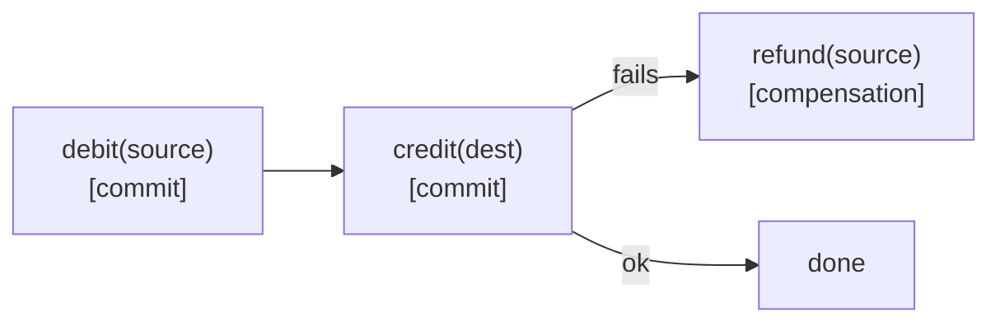

# Step 21 · Payments — the Saga Pattern, Redis Idempotency Keys & Dead-Letter Topics
### Phase D — Distributed Systems, Messaging & Batch 🔵→🟣 · Step 21 of 67

> *A single-database transfer (Step 12) is atomic — but a real payment often spans steps that can't share one
> transaction. Once a step commits, you can't roll it back; you must **compensate**. This step builds a
> payment as a **Saga** (debit → credit, with a refund compensation if credit fails), makes it safe to retry
> with a **Redis-backed Idempotency-Key**, and adds a **Dead-Letter Topic** so a poison message can't wedge
> the consumer. The distributed-money toolkit, made real and tested on Postgres + Redis + Kafka.*

---

<a id="toc"></a>
## 🧭 The Six Movements of This Step

| | Movement | What happens |
|---|---|---|
| **A** | [🧭 Orient](#orient) | 30-second overview · skip-test · cheat card · why it matters · before you start |
| **B** | [🧠 Understand](#understand) | local tx vs Saga · orchestration vs choreography · compensation · idempotency in Redis · DLQ |
| **C** | [🛠️ Build](#build) | a payment Saga (steps + compensation) · Redis Idempotency-Key · retries + Dead-Letter Topic |
| **D** | [🔬 Prove](#prove) | the Verification Log — Saga compensation, Redis idempotency, DLQ on real infra; §12.3 mutation |
| **E** | [🎓 Apply](#apply) | go deeper · interview prep (Saga is a system-design staple) · your-turn challenges |
| **F** | [🏆 Review](#review) | troubleshooting (shared-context test state) · resources · recap, flashcards & next |

---

<a id="orient"></a>

# A · 🧭 Orient

## 📋 This Step in 30 Seconds

| | |
|---|---|
| **Title** | Payments as a Saga (orchestration vs choreography) with compensation, a Redis Idempotency-Key, and Kafka retries + a Dead-Letter Topic |
| **Step** | 21 of 67 · **Phase D — Distributed Systems, Messaging & Batch** 🔵→🟣 |
| **Effort** | ≈ 18 hours focused (Saga + a new datastore + DLQ). Builds straight on the Step-20 Kafka pipeline. |
| **What you'll run this step** | **JVM + Maven**; **🐳 Docker** for Testcontainers — **Postgres + Redis + Redpanda**. |
| **Buildable artifact** | **demand-account**: a payment **Saga** (`PaymentService` orchestrating `PaymentStepService` steps, each `REQUIRES_NEW`, with a **refund compensation**), a **Redis** `RedisIdempotencyStore`, and a secured `POST /api/v1/payments`. **notification**: a `DefaultErrorHandler` + `DeadLetterPublishingRecoverer` routing poison messages to `transfers.completed.DLT`. `step-21-start == step-20-end`. |
| **Verification tier** | 🔴 **Full** — money path + new datastore + the build. `./mvnw verify` green + Saga compensation, Redis idempotency, and the DLQ proven on **real** Postgres/Redis/Redpanda + **§12.3 mutation** + clean-room + `smoke.sh`. |
| **Depends on** | **[Step 20](../step-20/lesson.md)** (Kafka pipeline, idempotent consumer), **[Step 12](../step-12/lesson.md)** (the transfer + transactions/locking), **[Step 14](../step-14/lesson.md)** (idempotency — now in Redis), **[Step 19](../step-19/lesson.md)** (delivery semantics). **+ Docker.** |

By the end you will be able to model a multi-step money movement as a **Saga** with **compensation**, contrast **orchestration vs choreography**, make an operation idempotent with a **Redis** key, and add **retries + a Dead-Letter Topic** to a Kafka consumer.

### ⏭️ Can You Skip This Step? (5-minute self-check)

If you can confidently do **all** of this, skim the 🛠️ Build and jump to **[Step 22 — Caching & async + CQRS read model](../step-22/lesson.md)**.

- [ ] I can explain why a **single ACID transaction** isn't always available, and what a **Saga** does instead.
- [ ] I can contrast **orchestration vs choreography** and write a **compensating** action.
- [ ] I can implement a durable **Idempotency-Key** (Redis `SET NX EX`) so a retry doesn't double-charge.
- [ ] I can add **retries + a Dead-Letter Topic** to a Kafka consumer and say why.
- [ ] I can explain "exactly-once **effect**" across a payment under a forced retry.

> [!TIP]
> Not 100%? Stay. "Design a payment flow across services," "what's a Saga and a compensating transaction," and "how do you make a charge idempotent" are core system-design interview questions.

## 📇 Cheat Card

> **What this step delivers (one sentence):** a payment runs as a Saga (debit → credit with a refund compensation if a step fails), is safe to retry via a Redis Idempotency-Key, and the event consumer quarantines poison messages on a Dead-Letter Topic.

**Key commands** (Windows uses `.\mvnw.cmd`):

```bash
./mvnw -pl services/demand-account,services/notification test    # Saga + Redis + DLQ on real infra
bash steps/step-21/smoke.sh
# Live: POST /api/v1/payments with an Idempotency-Key; retry → same paymentId (see requests.http)
```

**The headline diagram — the Saga with compensation:**

```
pay(A→B, key):
  ├─ Redis: seen(key)? ── yes ─► return original paymentId   (idempotent retry)
  ├─ STEP 1  debit(A)            [commits]
  ├─ STEP 2  credit(B)           [commits]   ── fails? ─► COMPENSATE: refund(A) ─► PaymentFailed(422)
  └─ Redis: record key → paymentId
```

**The one sentence to remember:** *When steps commit independently you can't roll back — you **compensate**; and you make the whole thing safe to retry with an **idempotency key**.*

## 🎯 Why This Matters

Money that moves across services, queues, or shards can't ride one database transaction — so the moment a later step fails, you're left with a half-done payment unless you **compensate**. Sagas + idempotency + dead-letter handling are how real payment systems stay correct under failure and retries, and "design a reliable payment flow" is one of the most common senior system-design prompts.

## ✅ What You'll Be Able to Do

- Build a **Saga** (orchestration) with explicit **compensation**.
- Contrast orchestration vs choreography and pick one.
- Make an operation **idempotent** with a Redis key (`SET NX EX`).
- Add **retries + a Dead-Letter Topic** to a Kafka consumer.
- Reason about consistency and exactly-once *effect* across a payment.

## 🧰 Before You Start

- **Prereqs:** bank builds green (`git describe` → `step-20-end`); Docker running (Postgres + Redis + Redpanda).
- **Connects to what you know:** the **transfer** (Step 12) is the atomic baseline we now contrast with a Saga; **idempotency** (Step 14 DB, Step 20 in-memory) becomes **durable in Redis**; the **Kafka consumer** (Step 20) gets a **DLQ**; **delivery semantics** (Step 19) explains why retries + idempotency = exactly-once effect.
- **Depends on:** Steps **20, 12, 14, 19**. **+ Docker.**

---

<a id="understand"></a>

# B · 🧠 Understand

## 🧠 The Big Idea — when one transaction isn't enough, use a Saga

A local ACID transaction gives you all-or-nothing across one database. But a payment may touch a different
service, a different shard, or an external system — there's **no shared transaction**. A **Saga** breaks the
work into a sequence of **local transactions**, each of which commits on its own; if a later step fails, the
Saga runs **compensating** transactions to semantically undo the committed ones (you can't "roll back" a
committed step — you do the opposite action: a refund undoes a debit).



## 🧩 Pattern Spotlight — Saga: orchestration vs choreography

**Two flavours:**
- **Orchestration** — a central coordinator (our `PaymentService`) calls each step and decides on failure what
  to compensate. Easy to follow, test, and reason about; the coordinator is a single place that knows the flow.
- **Choreography** — no coordinator; each service reacts to events and emits the next event (the Step-20 Kafka
  pipeline is the substrate). More decoupled, but the flow is implicit across services — harder to see and debug.

**Trade-off:** orchestration for short, well-defined flows you want to reason about centrally (this step);
choreography when you want maximum decoupling and the steps naturally live in different services. We build
orchestration here and explain how the same compensation logic maps onto choreographed events.

> ⚠️ A Saga is **not** isolated like an ACID transaction — between steps, other readers can see the
> intermediate state (the money has left A but not yet arrived at B). You design for that (pending states,
> idempotency, compensation), which is why a Saga is "eventually consistent," not "atomic."

## 🌱 Under the Hood: idempotency in Redis

A client that times out will **retry** a payment — you must not charge twice. We store
`Idempotency-Key → paymentId` in Redis with `SET key value NX EX ttl` (`setIfAbsent` + TTL): the first request
records its result; a retry with the same key finds it and returns the original `paymentId` without paying
again. **Why Redis** (vs the DB store in Step 14 or the in-memory set in Step 20): fast, shared across
instances, and entries **auto-expire** (an idempotency key only matters for a retry window).

## 🌱 Under the Hood: retries & the Dead-Letter Topic

A consumer will eventually meet a message it can't process (malformed, or a bug). If it just rethrows forever,
it **blocks the partition** (Kafka won't advance past a failing offset). The fix: a `DefaultErrorHandler`
**retries** a few times, then a `DeadLetterPublishingRecoverer` **republishes** the record to a
**dead-letter topic** (`<topic>.DLT`) and moves on. The poison message is quarantined for inspection; good
messages keep flowing.

## 🛡️ Security Lens & 🧵 Thread-safety note

The payment endpoint is authenticated like every money endpoint (resource server, Step 17) — but note it
still has the **BOLA gap (R-001)**: it doesn't check the caller owns `from`. Tracked, not fixed here.
**Thread-safety:** Redis `SET NX` is the atomic guard against concurrent duplicate submits; the Saga steps
take the same pessimistic row lock as Step 12.

## 🕰️ Then vs. Now

Distributed transactions used to mean **two-phase commit (2PC/XA)** — a coordinator locking all participants
until everyone votes commit. It's correct but slow, fragile under failure, and unsupported by most modern
brokers/services. **Now** the industry default is the **Saga**: looser, available, eventually consistent, with
compensation instead of global locks.

---

# B→C bridge: 🌳 files we'll touch

```
services/demand-account/
  src/main/java/.../payment/PaymentFailedException.java   (new)
  src/main/java/.../payment/PaymentStepService.java       (new) debit/credit/refund, each REQUIRES_NEW
  src/main/java/.../payment/RedisIdempotencyStore.java    (new) SET NX EX
  src/main/java/.../payment/PaymentService.java           (new) the Saga orchestrator + compensation
  src/main/java/.../web/{PaymentController,PaymentRequest,PaymentResponse}.java   (new)
  src/main/java/.../web/GlobalExceptionHandler.java       (edit) PaymentFailedException → 422
  src/main/resources/application.yml                      (edit) spring.data.redis
  pom.xml                                                 (edit) spring-boot-starter-data-redis
services/notification/
  src/main/java/.../KafkaErrorHandlingConfig.java         (new) DefaultErrorHandler + DLT recoverer
  src/main/java/.../TransferEventConsumer.java            (edit) stop swallowing → let poison reach the DLT
  src/main/resources/application.yml                      (edit) producer serializers (for the DLT publish)
steps/step-21/{lesson.md, requests.http, smoke.sh}
```

<a id="build"></a>

# C · 🛠️ Let's Build It — Step by Step

## 📦 Your Starting Point

`step-21-start == step-20-end`: 11 modules green, the Kafka pipeline live. We add Redis + the payment Saga + a DLQ.

## Sub-step 1 — the Saga steps (each its own transaction)

🎯 `PaymentStepService` with `debit`, `credit`, `refund`, each `@Transactional(REQUIRES_NEW)` so it **commits independently** (the lock pattern is Step 12's `findByAccountNumberForUpdate`). Lives in its own bean because `REQUIRES_NEW` only applies through the Spring proxy (self-invocation pitfall, Step 7).

🔮 **Predict:** if `credit` fails after `debit` committed, can we just roll back the debit? <details><summary>Answer</summary>**No** — it already committed in its own transaction. We must run a **compensating** `refund`. That's the Saga.</details>

## Sub-step 2 — the orchestrator + compensation

🎯 `PaymentService.pay(from, to, amount, key)` (NOT `@Transactional`): `debit` → try `credit` → on failure `refund(from)` and throw `PaymentFailedException`. The orchestrator coordinates independently-committed steps; failure triggers compensation, not rollback.

## Sub-step 3 — Redis Idempotency-Key

🎯 `RedisIdempotencyStore` using `StringRedisTemplate.opsForValue().setIfAbsent(key, paymentId, TTL)`. `pay()` checks the key first (retry → return original `paymentId`) and records it on success. Add `spring-boot-starter-data-redis` + `spring.data.redis` config.

## Sub-step 4 — the payments endpoint

🎯 `POST /api/v1/payments` (secured), optional `Idempotency-Key` header; `PaymentFailedException → 422` (ProblemDetail). 

💾 **Commit:** `feat(demand-account): Step 21 payment Saga + Redis idempotency`

## Sub-step 5 — retries + Dead-Letter Topic

🎯 In notification, a `DefaultErrorHandler(new DeadLetterPublishingRecoverer(template, → topic+".DLT"), new FixedBackOff(0, 2))`. Stop swallowing exceptions in the consumer so a poison message is retried then routed to `transfers.completed.DLT`. Add producer serializers so the recoverer can publish.

⚠️ **Pitfall:** if the consumer keeps the old swallow-all `try/catch`, exceptions never reach the error handler and **nothing** goes to the DLT. The consumer must let the failure propagate.

💾 **Commit:** `feat(notification): Step 21 retries + dead-letter topic`

## 🎮 Play With It

Start Redis + the broker + auth + demand-account, then (full flow in [`requests.http`](requests.http)):

```bash
docker run -d --name bank-redis -p 6379:6379 redis:7.4-alpine
# POST /api/v1/payments {from:ACC-A,to:ACC-B,amount:40} with Idempotency-Key: PAY-001 → 200 {paymentId}
# Repeat with the SAME key → same paymentId, money moved once.
# Pay to a non-existent account → 422 "Payment failed"; ACC-A balance unchanged (debited then refunded).
```

🧪 **Little experiments:**
- Retry a payment with the same `Idempotency-Key` and watch the balance move only once.
- Pay to `ACC-NOPE` and then `GET /api/accounts/ACC-A` — the compensation left it consistent.
- Produce a malformed message to `transfers.completed` and consume `transfers.completed.DLT` to see it quarantined.

## 🏁 The Finished Result

`step-21-end`: payments run as a compensating Saga, are idempotent via Redis, and the consumer quarantines poison messages. **✅ Definition of Done:** you can retry a payment safely and trigger a compensation, `./mvnw verify` is green, `bash steps/step-21/smoke.sh` passes, and you've committed/tagged `step-21-end`.

---

<a id="prove"></a>

# D · 🔬 Prove It Works — Verification Log

> **Tier: 🔴 Full.** Money path + new datastore (Redis) + build change. Real output below; Docker used (Testcontainers Postgres + Redis `redis:7.4-alpine` + Redpanda `v24.2.7`).

**1 · Saga, Redis idempotency, payments endpoint, DLQ — all green:**

```
[INFO] Tests run: 3, Failures: 0, Errors: 0, Skipped: 0, Time elapsed: 5.102 s -- in com.buildabank.account.payment.PaymentSagaTest
[INFO] Tests run: 2, Failures: 0, Errors: 0, Skipped: 0, Time elapsed: 1.659 s -- in com.buildabank.account.web.PaymentControllerTest
[INFO] Tests run: 42, Failures: 0, Errors: 0, Skipped: 0          ← demand-account (37 prior + 5 new)
[INFO] Tests run: 1, Failures: 0, Errors: 0, Skipped: 0, Time elapsed: 17.14 s -- in com.buildabank.notification.DeadLetterTest
[INFO] Tests run: 4, Failures: 0, Errors: 0, Skipped: 0          ← notification (3 prior + 1 new DLT)
[INFO] BUILD SUCCESS
```

- `PaymentSagaTest` (real Postgres + Redis) — happy path moves money and writes both ledger legs; a credit to a missing account **compensates** (debit then refund → source balance restored, ledger nets to 0); a repeated `Idempotency-Key` pays only once (same `paymentId`, balance moved once).
- `PaymentControllerTest` — `POST /api/v1/payments` returns the id and forwards the `Idempotency-Key`; unauthenticated → 401.
- `DeadLetterTest` (real Redpanda) — a poison message is routed to `transfers.completed.DLT` (value preserved) while a valid message alongside it is still processed.

**2 · §12.3 Mutation sanity-check (prove the compensation test has teeth).** Removed the compensating `refund` and re-ran `PaymentSagaTest`:

```
PaymentService : payment c02208a1-… failed at credit (IllegalArgumentException: no such account: ACC-MISSING); compensating with a refund to ACC-A
[ERROR] PaymentSagaTest.creditStepFails_sagaCompensatesWithARefund_leavingBalancesConsistent:75
expected: 100.00
 but was: 60.0000
[ERROR] Tests run: 3, Failures: 1, Errors: 0, Skipped: 0
```
→ Without the refund, the committed debit stands — ACC-A is left at 60.00 (money lost) and the test **fails as designed**. **Reverted**; green again.

**3 · `smoke.sh`** — `bash steps/step-21/smoke.sh` ran `PaymentSagaTest,PaymentControllerTest,DeadLetterTest` on real Postgres + Redis + Redpanda → `✅ Step 21 smoke test PASSED`.

**4 · Clean-room (§12.4)** — fresh clone at `step-21-end`, `./mvnw verify` → BUILD SUCCESS (11 modules).

**§12.8 honesty:** the Saga, compensation, Redis idempotency, and DLQ are each proven against **real**
Postgres/Redis/Redpanda via Testcontainers. The live 3+-process demo (Redis + broker + auth + demand-account)
is documented in `requests.http` using the same pinned images; the automated tests are the proof.

---

<a id="apply"></a>

# E · 🎓 Apply

## 🚀 Go Deeper (Optional)

<details><summary>Saga vs 2PC</summary>Two-phase commit gives ACID across participants but needs a coordinator holding locks until everyone votes — slow and fragile, and unsupported by Kafka/most services. A Saga trades isolation for availability: independently-committed steps + compensation, eventually consistent. For money, you add pending states and idempotency to manage the in-between window.</details>

<details><summary>Why the orchestrator isn't @Transactional</summary>If `pay()` were `@Transactional`, the steps (called on a `REQUIRES_NEW` bean) would still commit independently, but the orchestrator wrapping them in an outer transaction muddies the model. Keeping the orchestrator non-transactional makes it explicit: there is no umbrella transaction — that's the whole reason compensation exists.</details>

## 💼 Interview Prep

1. **What is a Saga and a compensating transaction?** *A long-running operation split into local transactions that each commit independently; if a later step fails, you run compensating transactions to semantically undo the committed ones (a refund undoes a debit). Used when no single ACID transaction spans the steps.* **(Most commonly asked.)**
2. **Orchestration vs choreography?** *Orchestration: a central coordinator drives steps and compensations (easy to reason about). Choreography: services react to events with no coordinator (more decoupled, harder to trace).*
3. **How do you make a payment idempotent?** *An Idempotency-Key: record key→result on first execution (atomically, e.g. Redis `SET NX EX`); a retry with the same key returns the stored result instead of re-charging.*
4. **What's a Dead-Letter Topic and why?** *A topic where a consumer routes messages it can't process after retries, so a poison message doesn't block the partition forever; it's quarantined for inspection/replay.*
5. **Saga vs 2PC?** *2PC is atomic but locks participants and is fragile/unsupported widely; Saga is available + eventually consistent via compensation — the modern default.*
6. **(Gotcha) Is a Saga isolated?** *No — between steps the intermediate state is visible. Design with pending states + idempotency; it's eventually consistent, not atomic.*

## 🏋️ Your Turn: Practice & Challenges

- **Quick:** add a `payment.failed` event (via the Outbox) so a compensation also notifies the customer.
- **Quick:** make the Redis idempotency **reserve-then-complete** (store `PENDING` first) to handle concurrent duplicate submits, not just sequential retries.
- 🎯 **Stretch (reference solution in `solutions/step-21/`):** re-implement the payment as a **choreographed** Saga over Kafka — `debit` emits `debited`, a credit consumer emits `credited` or `credit-failed`, and a refund consumer compensates on `credit-failed` — then show the same end state (and a DLT for stuck steps). Compare the debuggability with the orchestrated version.

---

<a id="review"></a>

# F · 🏆 Review

## 🩺 Stuck? Troubleshooting & Fixes

- **Nothing reaches the DLT.** Your consumer still catches the exception — the error handler only fires on a *propagated* throw. Let poison messages throw.
- **A previously-green Kafka test now times out / asserts the wrong count.** Two `@SpringBootTest` classes with the **same** config share a **cached Spring context** (and so the same consumer bean + counters + Redpanda). Assert **deltas** and event-specific state, not running totals — *(I hit exactly this adding the DLT test alongside the Step-20 consumer test)*.
- **`no Redis connection`/ context fails.** Ensure `@ServiceConnection(name = "redis")` on the `GenericContainer` and `spring-boot-starter-data-redis` on the classpath.
- **Payment returns 500 instead of 422.** Map `PaymentFailedException` in `GlobalExceptionHandler`.
- **Reset:** `git checkout step-21-end`; `make doctor`.

## 📚 Learn More & Glossary

- microservices.io: Saga pattern, Transactional Outbox; the Saga chapter in *Microservices Patterns* (Richardson); Spring Kafka error handling / non-blocking retries & DLT; Redis `SET` (NX/EX); the "exactly-once" discussion (Step 19).
- **Glossary:** *Saga* (steps + compensation), *compensating transaction*, *orchestration/choreography*, *Idempotency-Key*, *Dead-Letter Topic (DLT/DLQ)*, *2PC*, *eventual consistency*.

## 🏆 Recap & Study Notes

**(a) Key points:** When no single transaction spans the steps, use a **Saga** — independently-committed steps + **compensation**. Choose **orchestration** (central coordinator) or **choreography** (events). Make it safe to retry with a **Redis Idempotency-Key** (`SET NX EX`). Guard the consumer with **retries + a Dead-Letter Topic** so poison messages are quarantined, not fatal.

**(b) Key terms:** Saga, compensating transaction, orchestration, choreography, Idempotency-Key, Dead-Letter Topic, 2PC, eventual consistency.

**(c) 🧠 Test Yourself:** ① Why can't you roll back a committed Saga step? ② Orchestration vs choreography? ③ How does Redis `SET NX EX` give idempotency? ④ What does a DLT prevent? ⑤ Is a Saga isolated? <details><summary>Answers</summary>① It already committed in its own transaction; you compensate (do the opposite). ② Central coordinator vs event-driven, no coordinator. ③ Atomic "claim if absent" + TTL — first request records the result, retries read it. ④ A poison message blocking the partition forever. ⑤ No — intermediate state is visible; it's eventually consistent.</details>

**(d) 🔗 How this connects:** extends Step 20 (Kafka, idempotent consumer → now durable + DLT) and Step 12/14 (transfer, idempotency). **Next: Step 22** — caching + async with Redis (a CQRS read model, `@Cacheable`, `@Async`/virtual threads, `@Scheduled` with ShedLock) — reusing the Redis we just added.

**(e) 🏆 Résumé line:** *"Built a payment Saga with compensating transactions, durable Redis idempotency keys, and Kafka retries + a dead-letter topic — reliable money movement across an event-driven system."*

**(f) ✅ You can now:** model a Saga + compensation · choose orchestration vs choreography · do Redis idempotency · add a Kafka DLQ.

**(g) 🃏 Flashcards** appended to `docs/flashcards.md` · 🔁 revisit the Saga + Outbox + idempotency at the Phase-D capstone (Step 24) and event sourcing (Step 52).

**(h) ✍️ One-line reflection:** *Where does the bank's intermediate "money in flight" state become visible — and how would you show it to a user?*

**(i)** 🎉 Payments are reliable under failure and retries. Next: make reads fast and work asynchronous with caching.
