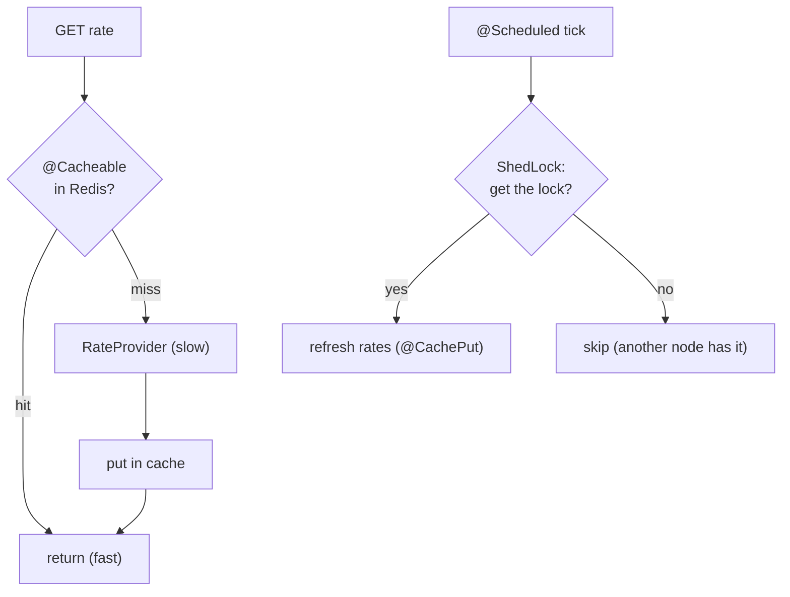
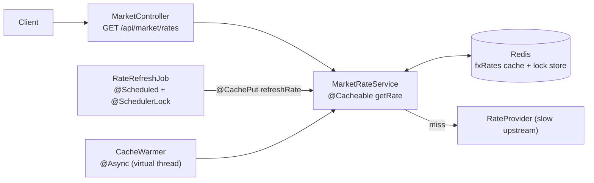
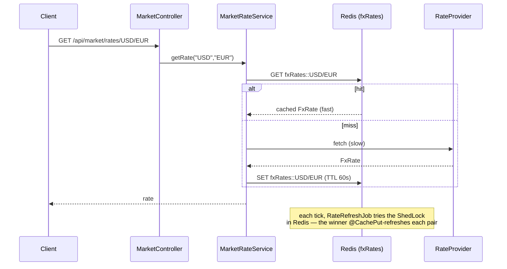

# Step 22 · Caching, Async & Clustered Scheduling — a Market-Info Read Model on Redis
### Phase D — Distributed Systems, Messaging & Batch 🔵→🟣 · Step 22 of 67

> *Reads dominate a bank's traffic, and a lot of work doesn't need to block the caller. This step builds a
> **Market Info** service (FX rates) that makes those patterns concrete on the Redis you added in Step 21: a
> **`@Cacheable` read model** so repeat reads skip the slow upstream, **`@Async` on virtual threads** to warm
> the cache off the request path, and a **`@Scheduled` refresh guarded by ShedLock** so that in a cluster only
> one instance does the work. Read-fast, work-async, schedule-once — the everyday performance toolkit.*

---

<a id="toc"></a>
## 🧭 The Six Movements of This Step

| | Movement | What happens | ~time |
|---|---|---|---|
| **A** | [🧭 Orient](#orient) | 30-second overview · skip-test · cheat card · why it matters · before you start | ~1 h |
| **B** | [🧠 Understand](#understand) | caching & cache-aside · CQRS read model · `@Async` + virtual threads · `@Scheduled` + ShedLock | ~1.5 h |
| **C** | [🛠️ Build](#build) | a Redis-cached FX read model · async cache warming · a clustered refresh job | ~7.5 h |
| **D** | [🔬 Prove](#prove) | the Verification Log — cache hit, refresh, virtual-thread async, ShedLock; §12.3 mutation | ~2 h |
| **E** | [🎓 Apply](#apply) | go deeper · interview prep · your-turn challenges | ~1.5 h |
| **F** | [🏆 Review](#review) | troubleshooting (cache write-visibility; ShedLock self-invocation) · resources · recap & next | ~0.5 h |

---

<a id="orient"></a>

# A · 🧭 Orient

## 📋 This Step in 30 Seconds

| | |
|---|---|
| **Title** | Caching & async + a Market Info read model + clustered scheduling — `@Cacheable` on Redis (CQRS read model), `@Async` on virtual threads, `@Scheduled` + ShedLock |
| **Step** | 22 of 67 · **Phase D — Distributed Systems, Messaging & Batch** 🔵→🟣 |
| **Effort** | ≈ 14 hours focused — see the 🗓️ Session Plan below. Reuses the Redis from Step 21 (now also a cache + a lock store). |
| **What you'll run this step** | **JVM + Maven**; **🐳 Docker** for Testcontainers **Redis**. New service on port 8085. |
| **Buildable artifact** | A new **`services/market-info`** (no DB): `MarketRateService.getRate` `@Cacheable` on Redis (a CQRS read model), `refreshRate` `@CachePut`; a `CacheWarmer` `@Async` on **virtual threads**; a `RateRefreshJob` `@Scheduled` + **`@SchedulerLock`** (ShedLock, Redis lock store) so only one node refreshes; `GET /api/market/rates/{base}/{quote}`. `step-22-start == step-21-end`. |
| **Verification tier** | 🔴 **Full** — new service + the build. `./mvnw verify` green + cache hit / refresh / virtual-thread async / ShedLock proven on **real Redis** + **§12.3 mutation** + clean-room + `smoke.sh`. |
| **Depends on** | **[Step 21](../step-21/lesson.md)** (Redis), **[Step 11](../step-11/lesson.md)** (threads/virtual threads), **[Step 20](../step-20/lesson.md)** (the event-driven context). **+ Docker.** |

By the end you will be able to cache a read path with **Spring Cache on Redis**, frame it as a **CQRS read model**, run work on **`@Async` virtual threads**, and make a **`@Scheduled`** job **cluster-safe with ShedLock**.

### ⏭️ Can You Skip This Step? (5-minute self-check)

If you can confidently do **all** of this, skim the 🛠️ Build and jump to **[Step 23 — Retail onboarding orchestration](../step-23/lesson.md)**.

- [ ] I can apply `@Cacheable`/`@CachePut`/`@CacheEvict` with a Redis cache manager and explain **cache-aside**.
- [ ] I can explain a **CQRS read model** and why a cache is one.
- [ ] I can run `@Async` work on **virtual threads** and say when async helps.
- [ ] I can make a `@Scheduled` job safe across **multiple instances** (ShedLock) and explain `lockAtMostFor`/`lockAtLeastFor`.
- [ ] I know why a cached read is **eventually consistent** (TTL + write-visibility).

> [!TIP]
> Not 100%? Stay. "How would you cache this?", "what happens to your `@Scheduled` job when you scale to 3 pods?", and "virtual threads — when and why?" are common performance/ops interview questions.

## 📇 Cheat Card

> **What this step delivers (one sentence):** an FX read model cached in Redis (`@Cacheable`), warmed asynchronously on virtual threads, and refreshed by a `@Scheduled` job that ShedLock lets only one cluster node run.

**Key commands** (Windows uses `.\mvnw.cmd`):

```bash
./mvnw -pl services/market-info test          # cache + async + ShedLock on real Redis
bash steps/step-22/smoke.sh
# Live: GET /api/market/rates/USD/EUR (first slow, then cached); see requests.http
```

**The headline diagram:**

```
GET /rates/USD/EUR ─► @Cacheable("fxRates") ──hit?──► return cached (fast)
                              │ miss
                              ▼
                       RateProvider (slow upstream) ─► cache ─► return
   @Scheduled + @SchedulerLock(ShedLock/Redis): ONE node refreshes the cache each tick
   @Async (virtual thread): warm the cache off the request path
```

**The one sentence to remember:** *Cache the read model for speed (it's eventually consistent), do off-path work on virtual threads, and let **ShedLock** ensure only one cluster node runs each scheduled tick.*

## 🎯 Why This Matters

Hitting a slow upstream (or recomputing) on every read doesn't scale; caching is the first lever you reach for. And the day you run more than one instance, an unguarded `@Scheduled` job runs *N* times — duplicating work, hammering upstreams, or double-charging. Caching, async, and cluster-safe scheduling are everyday production concerns and frequent interview topics.

## ✅ What You'll Be Able to Do

- Cache a read path with Spring Cache on Redis and reason about TTL/consistency.
- Frame a cache as a **CQRS read model**.
- Offload work with **`@Async`** on **virtual threads**.
- Make `@Scheduled` jobs **cluster-safe** with ShedLock.

## 🧰 Before You Start

- **Prereqs:** bank builds green (`git describe` → `step-21-end`); Docker running (Redis).
- **Connects to what you know:** **Redis** (Step 21) is now also a cache + lock store; **virtual threads** (Step 11) power `@Async`; the read model is the **read side** of the CQRS idea you'll complete in Step 52.
- **Depends on:** Steps **21, 11, 20**. **+ Docker.**

## 🗓️ Session Plan

≈ 14 focused hours is **six sittings**, not one. Each sitting ends at a real save point (a commit or a movement boundary), so you can stop without losing state.

| Sitting | Covers | ~time | Ends at |
|---|---|---|---|
| **S1 · Orient + Understand** | A (this movement) + B: cache-aside & the CQRS read model, `@Async`/virtual threads, ShedLock | ~2.5 h | the B→C bridge (files tree) |
| **S2 · The cached read model** | C · Sub-step 1: `MarketRateService` `@Cacheable`, `RateProvider`, controller, `application.yml` | ~3 h | Sub-step 1 commit |
| **S3 · Async warming** | C · Sub-step 2: `AsyncConfig` + `CacheWarmer` on virtual threads | ~2 h | Sub-step 2 commit |
| **S4 · Clustered refresh + play** | C · Sub-step 3: ShedLock job + gating, then 🎮 Play With It | ~2.5 h | 🏁 The Finished Result |
| **S5 · Prove** | D: full test run, §12.3 mutation, `smoke.sh`, clean-room | ~2 h | end of D |
| **S6 · Apply + Review** | E + F: interview prep, your-turn, recap; tag `step-22-end` | ~2 h | `step-22-end` tagged |

**Optional routes:** the ⏭️ skip-test above (5 min) can route you past the whole step; the three 🚀 Go Deeper asides in E cost **+~5 min each**; the 🎯 stretch challenge (event-driven read model) is a separate ~1–2 h sitting.

✋ **Stopping after S1's Orient half?** You have no new code yet — nothing to rebuild. Next: B · Understand; first action: reread the headline diagram in the 📇 Cheat Card, then read "The Big Idea."

---

<a id="understand"></a>

# B · 🧠 Understand

## 🧠 The Big Idea — make reads cheap, do work off the path, schedule once

Three independent levers, one service:
1. **Cache** the expensive read so repeat reads are nearly free (**cache-aside**: look in the cache; on a miss, load from source and store).
2. **Async** the work that the caller doesn't need to wait for (warming, fan-out) — on **virtual threads**, which are cheap for mostly-waiting tasks.
3. **Schedule** periodic refresh — but in a **cluster**, ensure only one instance runs each tick.

**Analogy — the hotel front desk:** the desk keeps a printed FX-rate sheet at the counter instead of phoning the bank for every guest (**the cache**); a porter reprints sheets in the back room while guests keep being served (**`@Async`**); and each hour exactly one clerk — whoever grabs the "rate-sheet duty" token first — phones the bank for fresh rates, so three clerks don't all call at once (**ShedLock**). The sheet can be an hour stale; for indicative rates, that's a staleness you chose to accept.



## 🧩 Pattern Spotlight — caching & the CQRS read model

**Problem:** the authoritative source is slow/expensive/rate-limited, but reads are frequent and can tolerate
slight staleness. **Fit:** keep a **read-optimized copy** — a **read model** — and serve reads from it. Spring
Cache's `@Cacheable` implements **cache-aside** for you: on a miss it runs the method and stores the result;
on a hit it skips the method entirely. `@CachePut` always runs and overwrites (for refresh); `@CacheEvict`
removes. **This is the read side of CQRS** (Command Query Responsibility Segregation): queries hit a model
tuned for reading, separate from the write side. **Trade-off:** the read model is **eventually consistent** —
bounded by the TTL and the refresh cadence. Choose the staleness you can tolerate (indicative FX rates: fine).

## 🌱 Under the Hood: Spring Cache on Redis

`@EnableCaching` adds an aspect that wraps `@Cacheable` methods; with `spring.cache.type=redis` and a
`RedisConnectionFactory`, Boot configures a `RedisCacheManager` that stores each entry as a key
(`cacheName::key`) with a TTL. Values are serialized (JDK serialization by default — hence `FxRate
implements Serializable`). Because Redis is **over the network**, a just-written entry becomes readable after
a small round-trip — read-after-write of a freshly-populated entry isn't instant (we design and test for that;
see 🩺).

## 🌱 Under the Hood: `@Async` on virtual threads

`@Async` runs a method on an executor instead of the caller's thread, returning `void`/`Future`. We point the
async executor at **virtual threads** (`SimpleAsyncTaskExecutor.setVirtualThreads(true)`) — Project Loom
threads that are cheap to create by the thousands and park (not block an OS thread) while waiting (Step 11).
Ideal for I/O-bound fan-out like warming many cache entries. (We scope virtual threads to the async executor
rather than enabling them app-wide, keeping the Redis client and web server on their normal threading.)

## 🌱 Under the Hood: ShedLock & clustered `@Scheduled`

A `@Scheduled` method runs on **every** instance. With three pods, your "refresh every minute" runs three
times a minute. **ShedLock** wraps a `@SchedulerLock`-annotated method: before running, an instance tries to
acquire a named lock in a shared store (here **Redis**); only the winner runs, the others skip this tick.
`lockAtMostFor` releases a lock held by a crashed node; `lockAtLeastFor` prevents a too-fast re-run if the job
finishes almost instantly. (The locked method must be invoked through the proxy — same self-invocation rule
as caching/transactions, Step 7.)

❓ **Quick check:** you scale to 3 pods and "refreshed N rates" appears **3× per tick** in the combined logs — what's missing, and which setting frees the lock if the winning node crashes mid-run? <details><summary>Answer</summary>`@SchedulerLock` (ShedLock) on the job — without it every instance runs the tick. `lockAtMostFor` bounds how long a crashed holder's lock survives before another node can win.</details>

## 🛡️ Security Lens & 🧵 Thread-safety note

market-info serves low-sensitivity reference data and has **no auth yet** (like cif/notification — R-002);
put it behind the gateway later. **Thread-safety:** ShedLock is precisely a *distributed* mutex for the
scheduled job; the cache is shared mutable state whose consistency is the cache manager's job. The async
warmer runs concurrently on virtual threads — it only reads/writes through the (thread-safe) cache.

## 🕰️ Then vs. Now

Clustered scheduling used to mean Quartz with a JDBC job store (heavy) or a dedicated leader-election service.
**Now**, for "run this `@Scheduled` once across the cluster," **ShedLock** is a tiny, focused library over a
store you already run (Redis/JDBC). And async work that once needed a bounded thread pool can use **virtual
threads** — far cheaper for I/O-bound tasks.

✋ **Stopping here (end of S1)?** You have the three levers in your head and zero new files. Next: C · Sub-step 1; first action: open the root `pom.xml` and register the `services/market-info` module.

---

# B→C bridge: 🌳 files we'll touch

```
pom.xml                                  (edit) register services/market-info
services/market-info/                    (NEW SERVICE, no DB)
  pom.xml                                cache + data-redis + shedlock(-redis) pinned 6.10.0
  MarketInfoApplication                  @EnableCaching @EnableAsync
  FxRate                                 the read-model record (Serializable for the cache)
  RateProvider                           the slow upstream (counts calls — proves the cache)
  MarketRateService                      @Cacheable getRate · @CachePut refreshRate
  CacheWarmer                            @Async warm (virtual thread)
  AsyncConfig                            virtual-thread async executor
  RedisLockConfig                        the ShedLock LockProvider (Redis)
  SchedulingConfig                       @EnableScheduling + @EnableSchedulerLock (gated for tests)
  RateRefreshJob                         @Scheduled + @SchedulerLock
  MarketController                       GET /api/market/rates/{base}/{quote}
  application.yml                        spring.cache.type=redis, redis, scheduling props
steps/step-22/{lesson.md, requests.http, smoke.sh}
```

<a id="build"></a>

# C · 🛠️ Let's Build It — Step by Step

## 📦 Your Starting Point

`step-22-start == step-21-end`: 12 modules green, Redis in the stack. We add a focused read service.

### 🗺️ What we're about to build



Every box maps to a file in the 🌳 tree above (B→C bridge): 12 new files in `services/market-info/`, one edit to the root `pom.xml`. Three sub-steps, one commit each.

## Sub-step 1 — the cached read model (~3 h)

🧭 **You are here:** Sub-step 1 of 3 — the read path (2 = async warming, 3 = clustered refresh).

🎯 `MarketRateService.getRate` `@Cacheable("fxRates")` over a slow `RateProvider` (which counts its calls). `@EnableCaching` + `spring.cache.type=redis`. `FxRate implements Serializable` (JDK cache serialization). Cache methods are called **cross-bean** (controller/job) so the proxy applies.

📁 **Files:** root `pom.xml` (register the module) · `services/market-info/pom.xml` · in `services/market-info/src/main/java/com/buildabank/marketinfo/`: `MarketInfoApplication.java`, `FxRate.java`, `RateProvider.java`, `MarketRateService.java`, `MarketController.java` · `src/main/resources/application.yml`.

🔑 **Three config lines that carry this sub-step** (all in the files above):
- `@Cacheable` **and** `@CachePut` share `key = "#base + '/' + #quote"` (SpEL). ⚠️ The keys must match **exactly** — if they drift, the refresh writes an entry that reads never hit (a silent bug). Without an explicit `key`, Spring's default for a multi-arg method is a `SimpleKey(args…)` — fine, until one annotation gets a key and the other doesn't.
- `application.yml` sets `spring.cache.redis.time-to-live: 60s` — entries expire after 60 s; that TTL **is** the staleness bound of the read model.
- `management.endpoints.web.exposure.include: health,info,caches` exposes `GET /actuator/caches` so you can watch the `fxRates` cache live.

🔮 **Predict:** read the same pair twice — how many times is the upstream called? <details><summary>Answer</summary>**Once** (the second read is a cache hit) — but only after the first write is visible (a Redis round-trip), which is why the test `await`s rather than asserting instantly.</details>

💥 **Break it on purpose (+~10 min):** comment out `@EnableCaching` on `MarketInfoApplication` and rerun `MarketCacheTest` — without the aspect every read hits the upstream and the test fails the way §12.3's mutation does. Restore it, go green. (Same effect: call `getRate` via `this.` from another method in the same bean — the proxy is bypassed, Step 7.)

❓ **Checkpoint:** on a cache *hit*, does `getRate`'s method body run at all? <details><summary>Answer</summary>No — the caching aspect returns the stored value before the method is invoked; that's why `RateProvider`'s call count stays flat on repeat reads.</details>

💾 **Commit:** `feat(market-info): cached FX read model on Redis`

✋ **Stopping here (end of S2)?** You have the cached read path committed. Next: Sub-step 2 (async warming); first action: create `AsyncConfig.java` in `com.buildabank.marketinfo`.

## Sub-step 2 — async warming on virtual threads (~2 h)

🧭 **You are here:** Sub-step 2 of 3 — off-path work.

🎯 `CacheWarmer.warm` `@Async` returns a `CompletableFuture`; `AsyncConfig` makes the async executor use virtual threads. A test asserts the work ran on a virtual thread (`Thread.currentThread().isVirtual()`).

📁 **Files:** `AsyncConfig.java`, `CacheWarmer.java` (same package). ⌨️ **Type it yourself:** `AsyncConfig` is a handful of lines — one `SimpleAsyncTaskExecutor` bean with `setVirtualThreads(true)` (see 🌱 Under the Hood in B). Write it from that description before peeking at the repo.

🔮 **Predict:** inside `warm()`, will `Thread.currentThread().isVirtual()` return `true`? Why? <details><summary>Answer</summary>**Yes** — `@Async` moves the call onto the async executor, and `AsyncConfig` points that executor at virtual threads. The *caller's* thread stays a normal platform thread; only the offloaded work is virtual (scoped deliberately — see B).</details>

❓ **Checkpoint:** why does `warm()` return a `CompletableFuture` instead of `void`? <details><summary>Answer</summary>So a caller (and the test) can await completion and observe the result — `@Async void` is fire-and-forget with nowhere to see success or failure.</details>

💾 **Commit:** `feat(market-info): async cache warming on virtual threads`

✋ **Stopping here (end of S3)?** You have cache + async warming committed. Next: Sub-step 3 (clustered refresh); first action: create `RedisLockConfig.java` (the ShedLock `LockProvider`).

## Sub-step 3 — clustered refresh with ShedLock (~2 h)

🧭 **You are here:** Sub-step 3 of 3 — schedule once across the cluster.

🎯 `RateRefreshJob.refresh` `@Scheduled` + `@SchedulerLock("refreshFxRates")` calls `refreshRate` (`@CachePut`) for the tracked pairs. `RedisLockConfig` provides the ShedLock `LockProvider` (Redis). `SchedulingConfig` enables scheduling + ShedLock, **gated** by `market.scheduling.enabled` (off in tests). 

📁 **Files:** `RateRefreshJob.java`, `RedisLockConfig.java`, `SchedulingConfig.java` · `src/test/resources/application.properties` (sets `market.scheduling.enabled=false`).

🔮 **Predict:** scheduling is gated **off** in tests — so what makes the lock test meaningful? <details><summary>Answer</summary>`ShedLockTest` drives the `LockProvider` directly: a held lock refuses a second acquire and is re-acquirable after release — exactly the mechanism `@SchedulerLock` relies on each tick (see the §12.8 honesty note in D).</details>

⚠️ **Pitfall:** `@SchedulerLock` (like `@Cacheable`) only works through the proxy — keep the job method public and call cache methods on another bean.

❓ **Checkpoint:** the lock-holding node crashes mid-tick — what happens at the next tick, and which setting bounds the wait? <details><summary>Answer</summary>The dead node's lock is still held, so every node skips — until `lockAtMostFor` expires, after which the next tick's winner acquires it. `lockAtMostFor` bounds the outage.</details>

💾 **Commit:** `feat(market-info): ShedLock-guarded clustered refresh`

✋ **Stopping here (end of the sub-steps)?** You have all three sub-steps committed. Next: 🎮 Play With It; first action: `docker run -d --name bank-redis -p 6379:6379 redis:7.4-alpine`.

## 🎮 Play With It

```bash
docker run -d --name bank-redis -p 6379:6379 redis:7.4-alpine
REDIS_HOST=localhost ./mvnw -pl services/market-info spring-boot:run
curl http://localhost:8085/api/market/rates/USD/EUR    # first: slow; again: fast (cached)
```

```powershell
# Windows/PowerShell — the VAR=value inline-env prefix above is bash-only:
$env:REDIS_HOST='localhost'; .\mvnw.cmd -pl services/market-info spring-boot:run
# unset later with: Remove-Item Env:REDIS_HOST
```

(`REDIS_HOST` defaults to `localhost` in `application.yml`, so on either OS the variable is optional when Redis runs locally.)

🧪 **Little experiments (in [`requests.http`](requests.http)):**
- Read a pair twice — the second is instant (cache hit). Check `GET /actuator/caches`.
- Run **two** instances (different `server.port`) on the same Redis → only one logs "refreshed N rates" each tick (ShedLock).
- Wait past the 60s TTL (set in Sub-step 1) → the next read re-fetches (eventually-consistent read model).

### 🧩 The flow you just built



## 🏁 The Finished Result

`step-22-end`: 12 modules; an FX read model cached on Redis, warmed async on virtual threads, refreshed by a cluster-safe job. **✅ Definition of Done:** repeat reads are cache hits, only one node refreshes, `./mvnw verify` is green, `bash steps/step-22/smoke.sh` passes, and you've committed/tagged `step-22-end`.

✋ **Stopping here (end of S4)?** You have the whole service built and committed. Next: D · Prove; first action: `./mvnw -pl services/market-info test` (Docker running — Testcontainers pulls `redis:7.4-alpine`).

---

<a id="prove"></a>

# D · 🔬 Prove It Works — Verification Log

> **Tier: 🔴 Full.** New service + build change. Real output below; Docker used (Testcontainers `redis:7.4-alpine`).

**1 · Cache, refresh, async, ShedLock, controller — all green:**

```
[INFO] Tests run: 3, Failures: 0, Errors: 0, Skipped: 0, Time elapsed: 8.152 s -- in com.buildabank.marketinfo.MarketCacheTest
[INFO] Tests run: 1, Failures: 0, Errors: 0, Skipped: 0, Time elapsed: 0.089 s -- in com.buildabank.marketinfo.ShedLockTest
[INFO] Tests run: 1, Failures: 0, Errors: 0, Skipped: 0, Time elapsed: 0.333 s -- in com.buildabank.marketinfo.MarketControllerTest
[INFO] Tests run: 5, Failures: 0, Errors: 0, Skipped: 0
[INFO] BUILD SUCCESS
```

- `MarketCacheTest` (real Redis) — a repeat read is served from cache (upstream called once per pair, awaited for write-visibility); `@CachePut` refresh overwrites the entry; `@Async` warm runs on a **virtual thread**.
- `ShedLockTest` (real Redis) — a held lock **blocks** a second acquire (the cluster guard) and is re-acquirable after release.
- `MarketControllerTest` — `GET /api/market/rates/usd/eur` upper-cases and returns the rate (standalone MockMvc).

**2 · §12.3 Mutation sanity-check (prove the cache test has teeth).** Removed `@Cacheable` from `getRate` and re-ran `MarketCacheTest`:

```
[ERROR] MarketCacheTest.repeatReadsAreServedFromCache_notUpstream:45 — ConditionTimeout
 but was: 21 within 3 seconds.
[ERROR] Tests run: 1, Failures: 0, Errors: 1, Skipped: 0
```
→ Without the cache, every read hits the upstream — the `await` polls ~21 times and never sees a cache-served read, so it **times out** (the test fails as designed). **Reverted**; green again.

**3 · `smoke.sh`** — `bash steps/step-22/smoke.sh` ran `MarketCacheTest,ShedLockTest,MarketControllerTest` on real Redis → `✅ Step 22 smoke test PASSED`.

**4 · Clean-room (§12.4)** — fresh clone at `step-22-end`, `./mvnw verify` → BUILD SUCCESS (12 modules).

**§12.8 honesty:** caching, async-on-virtual-threads, and the ShedLock lock are each proven against **real
Redis** (Testcontainers). The *multi-instance* ShedLock behavior (only one of N nodes runs a tick) is proven
at the lock-store level (a held lock refuses a second acquire) rather than by spinning up N real processes —
that's the mechanism the `@SchedulerLock` relies on. The live single-process demo is in `requests.http`.

---

<a id="apply"></a>

# E · 🎓 Apply

✋ **Stopping after Prove (end of S5)?** You have the full 🔴 verification green — tests, §12.3 mutation, `smoke.sh`, clean-room. Next: E · Apply; first action: skim the 🚀 Go Deeper asides, or jump straight to 💼 Interview Prep.

## 🚀 Go Deeper (Optional)

<details><summary>Cache-aside vs read-through/write-through (+~5 min)</summary>Spring's `@Cacheable` is cache-aside: the app loads on a miss and stores. Read-through/write-through push that into the cache layer itself. Cache-aside is the common, explicit default; write-through helps when you must keep the cache and source in lockstep.</details>

<details><summary>Why not just enable virtual threads globally? (+~5 min)</summary>You can (`spring.threads.virtual.enabled=true`), and for many apps it's fine. We scoped them to the `@Async` executor here to keep the Redis client and web server on their normal threading and isolate the demonstration — a deliberate, conservative choice.</details>

<details><summary>ShedLock vs a leader election (+~5 min)</summary>ShedLock locks per-job for a tick — simple and good for "run this once." If you need a long-lived single leader across many responsibilities, use real leader election (e.g. via the platform). Don't build leader election out of a pile of ShedLocks.</details>

## 💼 Interview Prep

1. **How does `@Cacheable` work / what's cache-aside?** *On a call it computes the key, checks the cache; hit → return without running the method; miss → run, store, return. That's cache-aside. `@CachePut` always runs + stores; `@CacheEvict` removes.* **(Common.)**
2. **What's a CQRS read model and how is a cache one?** *A read-optimized view separate from the write side; a cache is a simple, eventually-consistent read model keyed for fast lookup.*
3. **Your `@Scheduled` job runs on 3 pods — what happens and how do you fix it?** *It runs 3× per tick. Guard it with a distributed lock (ShedLock) so only one node runs each tick; `lockAtMostFor` covers a crashed holder.* **(Gotcha favorite.)**
4. **When do virtual threads help?** *I/O-bound, high-concurrency, mostly-waiting work — cheap to create and they park instead of pinning an OS thread. CPU-bound work doesn't benefit.*
5. **Why is a cached read eventually consistent?** *TTL + refresh cadence + write-visibility — reads can be slightly stale; you pick the tolerance.*
6. **(Self-invocation)** *`@Cacheable`/`@SchedulerLock`/`@Transactional` only apply through the Spring proxy — a `this.` call bypasses them (Step 7).*

## 🏋️ Your Turn: Practice & Challenges

- **Quick:** add `@CacheEvict(cacheNames="fxRates", key=...)` admin endpoint to drop a stale pair.
- **Quick:** switch the cache value serializer to JSON (`GenericJackson*JsonRedisSerializer`) so entries are human-readable in `redis-cli`.
- 🎯 **Stretch (~1–2 h; no reference solution — model it on the Step 20 consumer wiring):** turn the rates into a real **event-driven read model** — consume a `rates.updated` Kafka event (Step 20 pipeline) and call `marketRateService.refreshRate(base, quote)` (`@CachePut`), so the read model updates on events instead of (or in addition to) the timer. Compare freshness vs the polled refresh.

✋ **Stopping here (mid-S6)?** You have the step verified; challenges are optional extras. Next: F · Review; first action: the 🧠 Test Yourself quiz in the Recap.

---

<a id="review"></a>

# F · 🏆 Review

## 🩺 Stuck? Troubleshooting & Fixes

- **A just-cached entry "misses" on an immediate re-read (cache test flaky `expected 1 but was 2`).** Redis is a **networked** cache — a freshly written entry becomes GET-visible after a small round-trip. Don't assert read-after-write instantly; `await` until a repeat read is served from cache. *(I hit this building the cache test — it's a genuine eventually-consistent property, not a bug.)*
- **`@Cacheable`/`@SchedulerLock` does nothing.** You called the method from within the same bean (self-invocation) → the proxy is bypassed. Call it from another bean and keep it public (Step 7).
- **`@WebMvcTest` for a controller fails to load context** when the app enables caching/Redis. Test a thin controller with **standalone MockMvc** (no Spring context) instead. *(Did this for `MarketControllerTest`.)*
- **The scheduled job runs in tests / hits a missing broker.** Gate scheduling behind a property (`market.scheduling.enabled`) and switch it off in `src/test/resources/application.properties`; drive the job/lock directly in tests.
- **Reset:** `git checkout step-22-end`; `make doctor`.

## 📚 Learn More & Glossary

- Spring Framework Cache Abstraction; Spring Data Redis (RedisCacheManager); ShedLock (README + Redis provider); Project Loom / virtual threads (JEP 444); the CQRS pattern (Fowler/Young).
- **Glossary:** *cache-aside*, *`@Cacheable`/`@CachePut`/`@CacheEvict`*, *CQRS read model*, *TTL*, *eventual consistency*, *virtual thread*, *ShedLock*, *`lockAtMostFor`/`lockAtLeastFor`*.

## 🏆 Recap & Study Notes

**(a) Key points:** `@Cacheable` on Redis = cache-aside read model (a CQRS read side), eventually consistent (TTL + write-visibility). `@Async` on **virtual threads** offloads I/O-bound work cheaply. A `@Scheduled` job runs on every instance — **ShedLock** makes it run once per tick across a cluster. All three reuse the Step-21 Redis.

**(b) Key terms:** cache-aside, `@Cacheable`/`@CachePut`/`@CacheEvict`, CQRS read model, TTL, eventual consistency, virtual thread, ShedLock, `lockAtMostFor`/`lockAtLeastFor`, self-invocation.

**(c) 🧠 Test Yourself:** ① What does `@Cacheable` do on hit vs miss? ② Why is a cache an eventually-consistent read model? ③ Your `@Scheduled` runs on 3 pods — fix it. ④ When do virtual threads help? ⑤ Why must cache/lock methods be called cross-bean? <details><summary>Answers</summary>① Hit: return cached, skip method; miss: run method, store, return. ② TTL + refresh cadence + write-visibility → reads can be stale. ③ Guard with a distributed lock (ShedLock) so one node runs per tick. ④ I/O-bound, mostly-waiting, high-concurrency work. ⑤ The Spring proxy applies the aspect only on external calls — `this.` bypasses it.</details>

**(d) 🔗 How this connects:** reuses Step 21's Redis; virtual threads from Step 11; the read model is the read side of CQRS (full version Step 52). **Next: Step 23** — Retail Services onboarding orchestration (coordinating across services), then **Step 24** — Spring Batch + the Phase-D capstone.

**(e) 🏆 Résumé line:** *"Built a Redis-cached read model with cache-aside, async cache-warming on virtual threads, and ShedLock-guarded clustered scheduling — read-fast, work-async, schedule-once."*

**(f) ✅ You can now:** cache a read path on Redis · frame a CQRS read model · run `@Async` on virtual threads · make `@Scheduled` cluster-safe with ShedLock.

**(g) 🃏 Flashcards** (the five below are appended to `docs/flashcards.md`) · 🔁 revisit caching + read models at Step 52 (event sourcing / full CQRS) and Step 36 (cache metrics).

- **Q:** Cache-aside — what happens on a hit vs a miss? → **A:** hit: return the cached value, skip the method; miss: run the method, store the result, return it.
- **Q:** Why is a cache an eventually-consistent CQRS read model? → **A:** it's a read-optimized copy of the source; its staleness is bounded by the TTL + refresh cadence.
- **Q:** `@Scheduled` on 3 pods — what happens, and the fix? → **A:** it runs 3× per tick; guard it with ShedLock so only the lock winner runs each tick.
- **Q:** `lockAtMostFor` vs `lockAtLeastFor`? → **A:** `lockAtMostFor` frees a crashed holder's lock (upper bound); `lockAtLeastFor` prevents an instant re-run when the job finishes too fast.
- **Q:** When do virtual threads help — and when not? → **A:** I/O-bound, mostly-waiting, high-concurrency work; CPU-bound work gains nothing.

**(h) ✍️ One-line reflection:** *Which read in the bank would benefit most from a cache — and what staleness could you live with?*

**(i)** 🎉 Reads are fast and scheduling is cluster-safe. Next: orchestrate retail onboarding across services.
