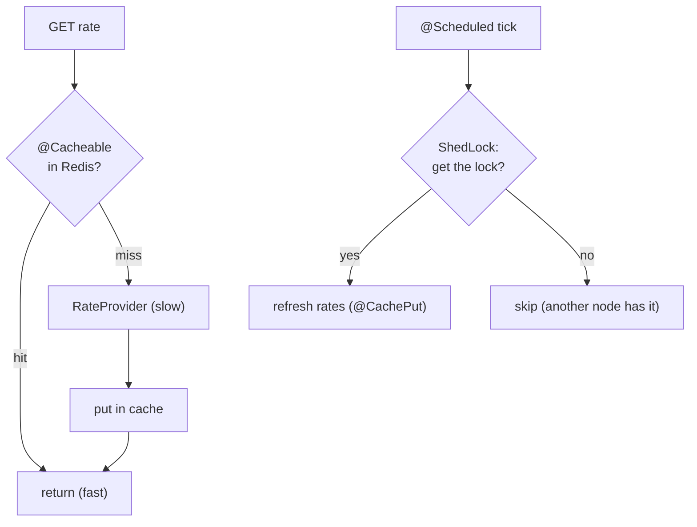
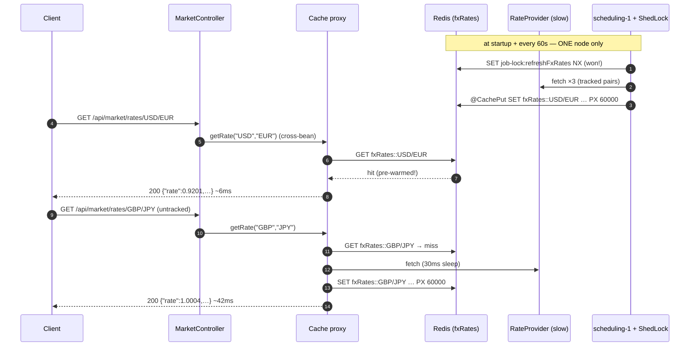

# Step 22 · Caching, Async & Clustered Scheduling — a Market-Info Read Model on Redis

> *Reads dominate a bank's traffic, and a lot of work doesn't need to block the caller. This step builds a
> **Market Info** service (FX rates) that makes those patterns concrete on the Redis you added in Step 21: a
> **`@Cacheable` read model** so repeat reads skip the slow upstream, **`@Async` on virtual threads** to warm
> the cache off the request path, and a **`@Scheduled` refresh guarded by ShedLock** so that in a cluster only
> one instance does the work. Read-fast, work-async, schedule-once — the everyday performance toolkit.*

---

<a id="toc"></a>
## 🧭 The Six Movements of This Step

| | Movement | What happens |
|---|---|---|
| **A** | [🧭 Orient](#orient) | 30-second overview · skip-test · cheat card · why it matters · before you start |
| **B** | [🧠 Understand](#understand) | caching & cache-aside · CQRS read model · `@Async` + virtual threads · `@Scheduled` + ShedLock |
| **C** | [🛠️ Build](#build) | **fourteen hands-on sub-steps (0–13)**: the module → the cached read model → async warming on virtual threads → the ShedLock'd refresh job → the read API → three test classes on real Redis → the play/verify harness |
| **D** | [🔬 Prove](#prove) | the Verification Log — cache hit, refresh, virtual-thread async, ShedLock; §12.3 mutation; a fresh re-run |
| **E** | [🎓 Apply](#apply) | go deeper · interview prep · your-turn challenges |
| **F** | [🏆 Review](#review) | troubleshooting (cache write-visibility; ShedLock self-invocation) · resources · recap & next |

---

<a id="orient"></a>

# A · 🧭 Orient

## 📋 This Step in 30 Seconds

| | |
|---|---|
| **Title** | Caching & async + a Market Info read model + clustered scheduling — `@Cacheable` on Redis (CQRS read model), `@Async` on virtual threads, `@Scheduled` + ShedLock |
| **Step** | 22 of 67 · **Phase D — Distributed Systems, Messaging & Batch** 🔵→🟣 |
| **Effort** | ≈ 14 hours focused. Reuses the Redis from Step 21 (now also a cache + a lock store). |
| **What you'll run this step** | **JVM + Maven**; **🐳 Docker** for Testcontainers **Redis**. New service on port 8085. |
| **Buildable artifact** | A new **`services/market-info`** (no DB): `MarketRateService.getRate` `@Cacheable` on Redis (a CQRS read model), `refreshRate` `@CachePut`; a `CacheWarmer` `@Async` on **virtual threads**; a `RateRefreshJob` `@Scheduled` + **`@SchedulerLock`** (ShedLock, Redis lock store) so only one node refreshes; `GET /api/market/rates/{base}/{quote}`. `step-22-start == step-21-end`. |
| **Verification tier** | 🔴 **Full** — new service + the build. `./mvnw verify` green + cache hit / refresh / virtual-thread async / ShedLock proven on **real Redis** + **§12.3 mutation** + clean-room + `smoke.sh`. |
| **Depends on** | **[Step 21](../step-21/lesson.md)** (Redis), **[Step 11](../step-11/lesson.md)** (threads/virtual threads), **[Step 20](../step-20/lesson.md)** (the event-driven context). **+ Docker.** |

By the end you will be able to cache a read path with **Spring Cache on Redis**, frame it as a **CQRS read model**, run work on **`@Async` virtual threads**, and make a **`@Scheduled`** job **cluster-safe with ShedLock**.

### ⏭️ Can You Skip This Step? (5-minute self-check)

If you can confidently do **all** of this, skim the 🛠️ Build and jump to **[Step 23 — Retail onboarding orchestration](../step-23/lesson.md)**.

- [ ] I can apply `@Cacheable`/`@CachePut`/`@CacheEvict` with a Redis cache manager and explain **cache-aside**.
- [ ] I can explain a **CQRS read model** and why a cache is one.
- [ ] I can run `@Async` work on **virtual threads** and say when async helps.
- [ ] I can make a `@Scheduled` job safe across **multiple instances** (ShedLock) and explain `lockAtMostFor`/`lockAtLeastFor`.
- [ ] I know why a cached read is **eventually consistent** (TTL + write-visibility).

> [!TIP]
> Not 100%? Stay. "How would you cache this?", "what happens to your `@Scheduled` job when you scale to 3 pods?", and "virtual threads — when and why?" are common performance/ops interview questions.

## 📇 Cheat Card

> **What this step delivers (one sentence):** an FX read model cached in Redis (`@Cacheable`), warmed asynchronously on virtual threads, and refreshed by a `@Scheduled` job that ShedLock lets only one cluster node run.

**Key commands** (Windows uses `.\mvnw.cmd`):

```bash
./mvnw -pl services/market-info test          # cache + async + ShedLock on real Redis
bash steps/step-22/smoke.sh
# Live: GET /api/market/rates/{base}/{quote} — untracked pairs: first slow, then cached; see requests.http
```

**The headline diagram:**

```
GET /rates/USD/EUR ─► @Cacheable("fxRates") ──hit?──► return cached (fast)
                              │ miss
                              ▼
                       RateProvider (slow upstream) ─► cache ─► return
   @Scheduled + @SchedulerLock(ShedLock/Redis): ONE node refreshes the cache each tick
   @Async (virtual thread): warm the cache off the request path
```

**The one sentence to remember:** *Cache the read model for speed (it's eventually consistent), do off-path work on virtual threads, and let **ShedLock** ensure only one cluster node runs each scheduled tick.*

## 🎯 Why This Matters

Hitting a slow upstream (or recomputing) on every read doesn't scale; caching is the first lever you reach for. And the day you run more than one instance, an unguarded `@Scheduled` job runs *N* times — duplicating work, hammering upstreams, or double-charging. Caching, async, and cluster-safe scheduling are everyday production concerns and frequent interview topics.

## ✅ What You'll Be Able to Do

- Cache a read path with Spring Cache on Redis and reason about TTL/consistency.
- Frame a cache as a **CQRS read model**.
- Offload work with **`@Async`** on **virtual threads**.
- Make `@Scheduled` jobs **cluster-safe** with ShedLock.

## 🧰 Before You Start

- **Prereqs:** bank builds green (`git describe` → `step-21-end`); Docker running (Redis).
- **Connects to what you know:** **Redis** (Step 21) is now also a cache + lock store — and ShedLock's lock is the very same `SET NX` + expiry primitive you used for the Idempotency-Key; **virtual threads** (Step 11) power `@Async`; the read model is the **read side** of the CQRS idea you'll complete in Step 52; the proxy/self-invocation rule (Step 7) governs `@Cacheable` and `@SchedulerLock` exactly as it governed `@Transactional`.
- **Depends on:** Steps **21, 11, 20**. **+ Docker.**

---

<a id="understand"></a>

# B · 🧠 Understand

## 🧠 The Big Idea — make reads cheap, do work off the path, schedule once

Three independent levers, one service:
1. **Cache** the expensive read so repeat reads are nearly free (**cache-aside**: look in the cache; on a miss, load from source and store).
2. **Async** the work that the caller doesn't need to wait for (warming, fan-out) — on **virtual threads**, which are cheap for mostly-waiting tasks.
3. **Schedule** periodic refresh — but in a **cluster**, ensure only one instance runs each tick.



*Alt-text: two flows. Read flow — a GET rate request checks `@Cacheable` in Redis; a hit returns fast; a miss calls the slow RateProvider, puts the result in the cache, and returns. Schedule flow — each `@Scheduled` tick asks ShedLock for the lock; the winner refreshes the rates via `@CachePut`; losers skip because another node holds it.*

**Analogy — the airport departures board.** The airline's operational database (the *write side*) knows the true, authoritative state of every flight — but ten thousand travelers don't query it directly. They look at the **departures board**: a read-optimized copy, refreshed every minute by *one* member of staff, occasionally a minute stale, and that's fine. The board is the **cache / read model** (`@Cacheable`), the staff member with the only marker pen is the **ShedLock'd scheduled job** (imagine three staff members all rewriting the board every minute — that's an unguarded `@Scheduled` on three pods), and the runner who updates the board *without making travelers wait at the information desk* is **`@Async`**.

## 🧩 Pattern Spotlight — caching & the CQRS read model

**Problem:** the authoritative source is slow/expensive/rate-limited, but reads are frequent and can tolerate
slight staleness. **Fit:** keep a **read-optimized copy** — a **read model** — and serve reads from it. Spring
Cache's `@Cacheable` implements **cache-aside** for you: on a miss it runs the method and stores the result;
on a hit it skips the method entirely. `@CachePut` always runs and overwrites (for refresh); `@CacheEvict`
removes. **This is the read side of CQRS** (Command Query Responsibility Segregation): queries hit a model
tuned for reading, separate from the write side. **Trade-off:** the read model is **eventually consistent** —
bounded by the TTL and the refresh cadence. Choose the staleness you can tolerate (indicative FX rates: fine).

**Alternatives, so you can defend the choice:** *read-through/write-through* push the load-on-miss logic into
the cache layer itself (the app only ever talks to the cache) — more transparent, less control; a *local
in-process cache* (Caffeine) is faster (no network hop) but per-instance — three pods hold three divergent
copies and warming one warms none of the others; a *materialized DB view / projection table* is the heavyweight
read model you'll build for event sourcing in Step 52. Redis-backed cache-aside is the sweet spot here:
**shared across instances** (one warm cache serves the whole cluster — and the ShedLock'd refresher only makes
sense because of that sharing), explicit, and cheap.

## 🌱 Under the Hood: Spring Cache on Redis

`@EnableCaching` adds an aspect that wraps `@Cacheable` methods; with `spring.cache.type=redis` and a
`RedisConnectionFactory`, Boot configures a `RedisCacheManager` that stores each entry as a key
(`cacheName::key`) with a TTL. Values are serialized (JDK serialization by default — hence `FxRate
implements Serializable`). Because Redis is **over the network**, a just-written entry becomes readable after
a small round-trip — read-after-write of a freshly-populated entry isn't instant (we design and test for that;
see 🩺).

The interception chain, concretely: at startup, `@EnableCaching` registers a `BeanFactoryCacheOperationSourceAdvisor`
that scans beans for cache annotations and wraps matches in a proxy (the same machinery as `@Transactional`,
Step 7). A call to `getRate("USD","EUR")` from *another bean* hits the proxy → the `CacheInterceptor` computes
the key from the SpEL expression → asks the `RedisCacheManager`'s `fxRates` cache → Redis `GET fxRates::USD/EUR`
→ **hit:** deserialize the bytes back into an `FxRate` and return *without your method ever running*; **miss:**
invoke your method, `SET` the serialized result with the configured TTL, return. A call via `this.` never
touches the proxy — and never touches the cache.

## 🌱 Under the Hood: `@Async` on virtual threads

`@Async` runs a method on an executor instead of the caller's thread, returning `void`/`Future`. We point the
async executor at **virtual threads** (`SimpleAsyncTaskExecutor.setVirtualThreads(true)`) — Project Loom
threads that are cheap to create by the thousands and park (not block an OS thread) while waiting (Step 11).
Ideal for I/O-bound fan-out like warming many cache entries. (We scope virtual threads to the async executor
rather than enabling them app-wide, keeping the Redis client and web server on their normal threading.)

Why `SimpleAsyncTaskExecutor` and not the usual `ThreadPoolTaskExecutor`? Because **you don't pool virtual
threads.** A pool exists to amortize the cost of expensive platform threads; a virtual thread costs ~a few
hundred bytes of stack seed and is meant to be created per task and thrown away. `SimpleAsyncTaskExecutor`
does exactly that — new thread per task — which was an anti-pattern for platform threads and is *the* pattern
for virtual ones.

## 🌱 Under the Hood: ShedLock & clustered `@Scheduled`

A `@Scheduled` method runs on **every** instance. With three pods, your "refresh every minute" runs three
times a minute. **ShedLock** wraps a `@SchedulerLock`-annotated method: before running, an instance tries to
acquire a named lock in a shared store (here **Redis**); only the winner runs, the others skip this tick.
`lockAtMostFor` releases a lock held by a crashed node; `lockAtLeastFor` prevents a too-fast re-run if the job
finishes almost instantly. (The locked method must be invoked through the proxy — same self-invocation rule
as caching/transactions, Step 7.)

Under ShedLock's hood there is no magic, just Step 21 again: the Redis `LockProvider` performs an **atomic
set-if-absent with an expiry** — the same `SET key value NX` + TTL primitive your `RedisIdempotencyStore`
used. Whoever's `SET NX` succeeds owns the tick; `unlock` deletes the key (or, if `lockAtLeastFor` hasn't
elapsed, shortens its TTL to expire at the at-least boundary); a crashed holder's key simply expires at
`lockAtMostFor`. One primitive, two patterns — "claim a key atomically before doing work."

## 🛡️ Security Lens & 🧵 Thread-safety note

market-info serves low-sensitivity reference data and has **no auth yet** (like cif/notification — R-002);
put it behind the gateway later. **Thread-safety:** ShedLock is precisely a *distributed* mutex for the
scheduled job; the cache is shared mutable state whose consistency is the cache manager's job. The async
warmer runs concurrently on virtual threads — it only reads/writes through the (thread-safe) cache. The one
piece of in-process shared mutable state we add ourselves is `RateProvider`'s call counter — and it's an
`AtomicInteger` (Step 11's lock-free counter), because tests read it while async warms and scheduled refreshes
may write it.

## 🕰️ Then vs. Now

Clustered scheduling used to mean Quartz with a JDBC job store (heavy) or a dedicated leader-election service.
**Now**, for "run this `@Scheduled` once across the cluster," **ShedLock** is a tiny, focused library over a
store you already run (Redis/JDBC). And async work that once needed a carefully-sized bounded thread pool can
use **virtual threads** — far cheaper for I/O-bound tasks.

| Concern | ❌ Then | ✅ Now (this step) | Why it changed |
|---|---|---|---|
| Run a periodic job once per cluster | Quartz + JDBC `JobStore`, or hand-rolled leader election | `@Scheduled` + **ShedLock** over the Redis you already run | "one lock per tick" is all most jobs need; Quartz's persistence/clustering machinery is overkill for it |
| Async executor sizing | `ThreadPoolTaskExecutor` with agonized-over core/max/queue numbers | `SimpleAsyncTaskExecutor` + **virtual threads** — a fresh cheap thread per task | Loom (JDK 21+) made threads cheap; pooling them stopped making sense for I/O-bound work |
| Cache stack | Ehcache/JCache XML, or memcached with hand-rolled clients | `spring-boot-starter-cache` + Redis: annotations + auto-configured `RedisCacheManager` | Boot's cache abstraction made the provider a config switch (`spring.cache.type`) |

---

# B→C bridge: 🌳 files we'll touch

```
pom.xml                                  (edit) register services/market-info     ← sub-step 0
services/market-info/                    (NEW SERVICE, no DB)
  pom.xml                                cache + data-redis + shedlock(-redis) pinned 6.10.0   ← 0
  src/main/java/com/buildabank/marketinfo/
    MarketInfoApplication.java           @EnableCaching @EnableAsync              ← 1
    FxRate.java                          the read-model record (Serializable)    ← 2
    RateProvider.java                    the slow upstream (counts calls)        ← 3
    MarketRateService.java               @Cacheable getRate · @CachePut refresh  ← 4
    AsyncConfig.java                     virtual-thread async executor           ← 5
    CacheWarmer.java                     @Async warm (virtual thread)            ← 5
    RedisLockConfig.java                 the ShedLock LockProvider (Redis)       ← 6
    SchedulingConfig.java                @EnableScheduling + @EnableSchedulerLock, gated ← 7
    RateRefreshJob.java                  @Scheduled + @SchedulerLock             ← 8
    MarketController.java                GET /api/market/rates/{base}/{quote}    ← 9
  src/main/resources/application.yml     cache.type=redis, TTL, port 8085        ← 1
  src/test/java/com/buildabank/marketinfo/
    RedisContainers.java                 Testcontainers Redis @ServiceConnection ← 10
    MarketCacheTest.java                 cache hit · refresh · async-on-VT       ← 10
    ShedLockTest.java                    held lock blocks a 2nd acquire          ← 11
    MarketControllerTest.java            standalone MockMvc                      ← 12
  src/test/resources/application.properties  scheduling OFF in tests             ← 7
Makefile                                 (edit) run-market-info + play-22        ← 13
adr/0013-caching-async-shedlock-market-info.md                                   ← 13
steps/step-22/{lesson.md, requests.http, smoke.sh}                               ← 13
```

<a id="build"></a>

# C · 🛠️ Let's Build It — Step by Step

## 📦 Your Starting Point

You're at **`step-22-start`** (identical to `step-21-end`, the payments finale). What's green right now:

- **11 reactor modules**, all `./mvnw verify` green: the parent plus `services/{hello, cif, demand-account, auth, notification}`, `gateway`, and `playground/{java-basics, spring-lab, concurrency-lab, distributed-lab}`. market-info will make it **12**.
- **Redis is already in the stack** (Step 21): `demand-account` uses it for the payment Idempotency-Key, and you know the Testcontainers `@ServiceConnection(name = "redis")` wiring trap.
- **No `services/market-info` yet.** That's this step — a deliberately small, DB-less service so the three patterns stand out.

Sanity-check before touching anything:

```bash
git describe --tags          # → step-21-end (or step-22-start)
./mvnw -q -DskipTests package
```

✅ Ends in `BUILD SUCCESS`. If not → 🩺 (or `git checkout step-22-start` to reset).

> [!NOTE]
> **Two repos, remember (README + Step 1).** The cloned course repo is your *textbook + answer key* — read the lesson here, `git checkout step-22-end` to diff against the finished reference. You build *your own* version in your own project folder. Paths below are the canonical course-repo ones.

## 🛠️ The build map

We build **inside-out**: module wiring → config → the read-model value → the slow upstream → the cached service → the async warmer → the lock → the scheduler gate → the job → the web API → three test classes (the proof) → the harness. We compile between pieces and commit after each logical unit.

```mermaid
flowchart LR
    s0["0 · module pom +<br/>root registration"] --> s1["1 · app class +<br/>application.yml"]
    s1 --> s2["2 · FxRate"]
    s2 --> s3["3 · RateProvider<br/>(slow, call-counted)"]
    s3 --> s4["4 · MarketRateService<br/>@Cacheable/@CachePut"]
    s4 --> s5["5 · AsyncConfig +<br/>CacheWarmer"]
    s5 --> s6["6 · RedisLockConfig"]
    s6 --> s7["7 · SchedulingConfig<br/>+ test gate"]
    s7 --> s8["8 · RateRefreshJob"]
    s8 --> s9["9 · MarketController"]
    s9 --> s10["10 · MarketCacheTest"]
    s10 --> s11["11 · ShedLockTest"]
    s11 --> s12["12 · ControllerTest<br/>+ all 5 green"]
    s12 --> s13["13 · Makefile, http,<br/>smoke.sh, ADR"]
```



*Alt-text: a left-to-right build roadmap of fourteen sub-steps (numbered 0 to 13), from the module pom and root registration through the application class and config, the FxRate record, the call-counted RateProvider, the cacheable MarketRateService, the async config and cache warmer, the Redis lock config, the gated scheduling config, the rate refresh job, the controller, the three test classes, and finally the Makefile/requests/smoke/ADR harness.*

---

### Sub-step 0 of 13 — The module pom + root registration 🧭 *(you are here: **module** → config → record → provider → service → async → lock → schedule → job → web → tests → harness)*

🎯 **Goal:** create the `services/market-info` Maven module with exactly what a cache + Redis + ShedLock service needs — and meet the step's one dependency-management wrinkle head-on: **ShedLock is not managed by the Spring Boot BOM**, so it's the rare dependency you must pin yourself.

📁 **Location:** new file → `services/market-info/pom.xml`

⌨️ **Code:**

```xml
<?xml version="1.0" encoding="UTF-8"?>
<project xmlns="http://maven.apache.org/POM/4.0.0"
         xmlns:xsi="http://www.w3.org/2001/XMLSchema-instance"
         xsi:schemaLocation="http://maven.apache.org/POM/4.0.0 https://maven.apache.org/xsd/maven-4.0.0.xsd">
    <modelVersion>4.0.0</modelVersion>

    <!--
      market-info — reference/market data (FX rates) as a read-optimized service (Step 22). Demonstrates the
      Phase-D "make reads fast, do work asynchronously" toolkit on the Redis we added in Step 21:
        • Spring Cache on Redis (@Cacheable) — a CQRS read model: cached, eventually-consistent rates;
        • @Async on virtual threads — warm the cache off the request thread;
        • @Scheduled refresh guarded by ShedLock — exactly ONE node refreshes in a cluster.
      No database — its state is the cache + the in-memory rate table.
    -->
    <parent>
        <groupId>com.buildabank</groupId>
        <artifactId>build-a-bank-parent</artifactId>
        <version>0.1.0-SNAPSHOT</version>
        <relativePath>../../pom.xml</relativePath>
    </parent>

    <artifactId>market-info</artifactId>
    <name>Build-a-Bank :: Services :: Market Info</name>
    <description>Market/FX reference data — Redis caching, @Async, and ShedLock-guarded scheduling (Step 22).</description>

    <properties>
        <shedlock.version>6.10.0</shedlock.version>   <!-- NOT Boot-managed; pinned (VERSIONS.md) -->
    </properties>

    <dependencies>
        <dependency>
            <groupId>org.springframework.boot</groupId>
            <artifactId>spring-boot-starter-web</artifactId>
        </dependency>
        <dependency>
            <groupId>org.springframework.boot</groupId>
            <artifactId>spring-boot-starter-cache</artifactId>
        </dependency>
        <dependency>
            <groupId>org.springframework.boot</groupId>
            <artifactId>spring-boot-starter-data-redis</artifactId>
        </dependency>
        <dependency>
            <groupId>org.springframework.boot</groupId>
            <artifactId>spring-boot-starter-actuator</artifactId>
        </dependency>

        <!-- ShedLock: cluster-safe scheduling. shedlock-spring + the Redis lock provider (we already use Redis). -->
        <dependency>
            <groupId>net.javacrumbs.shedlock</groupId>
            <artifactId>shedlock-spring</artifactId>
            <version>${shedlock.version}</version>
        </dependency>
        <dependency>
            <groupId>net.javacrumbs.shedlock</groupId>
            <artifactId>shedlock-provider-redis-spring</artifactId>
            <version>${shedlock.version}</version>
        </dependency>

        <!-- ── Test ── -->
        <dependency>
            <groupId>org.springframework.boot</groupId>
            <artifactId>spring-boot-starter-test</artifactId>
            <scope>test</scope>
        </dependency>
        <dependency>
            <groupId>org.springframework.boot</groupId>
            <artifactId>spring-boot-webmvc-test</artifactId>
            <scope>test</scope>
        </dependency>
        <dependency>
            <groupId>org.springframework.boot</groupId>
            <artifactId>spring-boot-testcontainers</artifactId>
            <scope>test</scope>
        </dependency>
        <dependency>
            <groupId>org.testcontainers</groupId>
            <artifactId>testcontainers-junit-jupiter</artifactId>
            <scope>test</scope>
        </dependency>
    </dependencies>

    <build>
        <plugins>
            <plugin>
                <groupId>org.springframework.boot</groupId>
                <artifactId>spring-boot-maven-plugin</artifactId>
            </plugin>
        </plugins>
    </build>
</project>
```

🔍 **Line-by-line (the dependencies that matter):**

- `<parent>` — inherits the pinned **Spring Boot 4.0.6 BOM** + Java 25 from the repo root, so every `org.springframework.boot` dependency below is **version-less** (the BOM manages it). `<relativePath>../../pom.xml</relativePath>` points up two levels.
- `<properties><shedlock.version>6.10.0</shedlock.version></properties>` — ⚠️ **the wrinkle.** ShedLock is a third-party library the Boot BOM knows nothing about. Omit the `<version>` on its dependencies and Maven fails with *"'dependencies.dependency.version' … is missing"*. We pin **6.10.0** (the 6.x line runs on Spring 7 / Boot 4 / JDK 25) and record the pin in [VERSIONS.md](../../VERSIONS.md) per the reproducibility rule (§12.6).
- `spring-boot-starter-web` — Spring MVC + embedded Tomcat for the read API.
- `spring-boot-starter-cache` — the **cache abstraction**: `@EnableCaching`, `@Cacheable`/`@CachePut`/`@CacheEvict`, the `CacheManager` SPI. On its own it would cache into in-memory `ConcurrentHashMap`s…
- `spring-boot-starter-data-redis` — …but with this on the classpath too (Lettuce client + Spring Data Redis), `spring.cache.type=redis` auto-configures a **`RedisCacheManager`** so entries live in Redis, shared by every instance. Same starter Step 21 used in demand-account.
- `spring-boot-starter-actuator` — gives us **`/actuator/caches`** (plus health/info) so you can *see* the `fxRates` cache exists.
- `shedlock-spring` — the annotation side: `@EnableSchedulerLock` + `@SchedulerLock` and the AOP interceptor that consults a lock before letting a scheduled method run.
- `shedlock-provider-redis-spring` — the lock-store side: a `LockProvider` implementation that keeps locks in Redis through Spring Data Redis. ShedLock ships ~30 providers (JDBC, Mongo, Zookeeper…); you pick the store you already operate.
- **Test block:** `spring-boot-starter-test` (JUnit 5 + AssertJ + Awaitility + Mockito), `spring-boot-webmvc-test` (the Boot-4 per-tech slice module — here it supplies the MockMvc machinery we use standalone), `spring-boot-testcontainers` (`@ServiceConnection` glue), `testcontainers-junit-jupiter` (TC 2.0 coordinates, Step 8's rename). **No `testcontainers-postgresql`** — this service has **no database**; Redis runs as a plain `GenericContainer`.
- `spring-boot-maven-plugin` — makes the module runnable (`spring-boot:run`) and repackages the boot jar.

📁 **Register the module** with the parent. Open the repo-root `pom.xml`, find `<modules>`, and add one line:

```diff
         <module>services/demand-account</module>
         <module>services/auth</module>
         <module>services/notification</module>
+        <module>services/market-info</module>
         <module>gateway</module>
         <module>playground/java-basics</module>
         <module>playground/spring-lab</module>
```

💭 **Under the hood:** `spring-boot-starter-cache` and `spring-boot-starter-data-redis` are both *triggers* for auto-configuration. `CacheAutoConfiguration` activates on `@EnableCaching` + the abstraction being present; it then delegates to the first matching provider configuration — `RedisCacheConfiguration` wins because `spring.cache.type=redis` (sub-step 1) and a `RedisConnectionFactory` bean exists (auto-configured by `RedisAutoConfiguration` from the data-redis starter). ShedLock, by contrast, is **not** auto-configured at all — no Boot integration exists; you wire its `LockProvider` bean yourself (sub-step 6). That's the practical difference between a Boot-managed and an unmanaged dependency: the unmanaged one gets neither a version nor any auto-config.

🔮 **Predict:** after adding the two ShedLock dependencies, how many ShedLock *artifacts* will actually land on the classpath — two, or more? (Transitive dependencies count.)

▶️ **Run & See** — resolve the new module and inspect what ShedLock really brings in:

```bash
./mvnw -B -pl services/market-info dependency:tree | grep shedlock
# Windows (no grep):  .\mvnw.cmd -B -pl services/market-info dependency:tree | findstr shedlock
```

✅ **Expected output** (run fresh on 2026-06-11):

```
[INFO] +- net.javacrumbs.shedlock:shedlock-spring:jar:6.10.0:compile
[INFO] |  +- net.javacrumbs.shedlock:shedlock-core:jar:6.10.0:compile
[INFO] +- net.javacrumbs.shedlock:shedlock-provider-redis-spring:jar:6.10.0:compile
[INFO] |  +- net.javacrumbs.shedlock:shedlock-support-redis:jar:6.10.0:compile
```

Predicted right? **Four** — each declared artifact pulls one transitive helper (`shedlock-core` with the `LockProvider`/`LockConfiguration` API, `shedlock-support-redis` with shared Redis plumbing), all at the same 6.10.0.

❌ **If you see `'dependencies.dependency.version' for net.javacrumbs.shedlock:shedlock-spring:jar is missing`:** you forgot the `<version>${shedlock.version}</version>` — ShedLock isn't in the Boot BOM, so the version is on you.

✋ **Checkpoint:** the module resolves (`dependency:tree` ran without error) and the root `pom.xml` lists `services/market-info` in `<modules>`.

💾 **Commit:**

```bash
git add services/market-info/pom.xml pom.xml
git commit -m "feat(market-info): scaffold module (cache + data-redis + ShedLock 6.10.0 pinned)"
```

⚠️ **Pitfall:** adding `shedlock-provider-redis-spring` but forgetting `shedlock-spring` — the lock *provider* compiles fine alone, but `@SchedulerLock` silently does nothing because the annotation/interceptor live in `shedlock-spring`. You need both halves: the aspect and the store.

---

### Sub-step 1 of 13 — The application class + `application.yml` 🧭 *(module ✅ → **config** → record → provider → service → …)*

🎯 **Goal:** the Spring Boot entry point with the two switches this step is about (`@EnableCaching`, `@EnableAsync`), and the YAML that says *cache in Redis, entries live 60 seconds, run on port 8085*.

📁 **Location:** new file → `services/market-info/src/main/java/com/buildabank/marketinfo/MarketInfoApplication.java`

⌨️ **Code:**

```java
// services/market-info/src/main/java/com/buildabank/marketinfo/MarketInfoApplication.java
package com.buildabank.marketinfo;

import org.springframework.boot.SpringApplication;
import org.springframework.boot.autoconfigure.SpringBootApplication;
import org.springframework.cache.annotation.EnableCaching;
import org.springframework.scheduling.annotation.EnableAsync;

/**
 * Step 22 · the Market Info service. Serves FX/reference rates as a read-optimized, Redis-cached read model.
 * {@code @EnableCaching} turns on {@code @Cacheable}; {@code @EnableAsync} turns on {@code @Async} (which runs
 * on virtual threads here — see {@code spring.threads.virtual.enabled}). Cluster-safe scheduling
 * ({@code @EnableScheduling} + ShedLock) is switched on in {@link SchedulingConfig}.
 */
@SpringBootApplication
@EnableCaching
@EnableAsync
public class MarketInfoApplication {

    public static void main(String[] args) {
        SpringApplication.run(MarketInfoApplication.class, args);
    }
}
```

🔍 **Line-by-line:**

- `@SpringBootApplication` — `@SpringBootConfiguration` + `@EnableAutoConfiguration` + `@ComponentScan` rooted at `com.buildabank.marketinfo` (Step 5/6). Everything in this module lives in one flat package — the service is small enough that sub-packages would be ceremony.
- `@EnableCaching` — registers the cache aspect. **Without this line, every `@Cacheable` in the module is inert** — no error, no warning, just a method that always executes. (The #1 "my cache doesn't work" cause, ahead of even self-invocation.)
- `@EnableAsync` — same deal for `@Async`: registers the async interceptor that re-dispatches annotated methods onto the task executor (ours: sub-step 5).
- Note what's *not* here: `@EnableScheduling`. We deliberately put that on a separate, **property-gated** config class (sub-step 7) so tests can switch the timer off. Enable-annotations don't have to sit on the main class — any `@Configuration` works.
- 📝 **Honesty note on the javadoc:** the phrase "see `spring.threads.virtual.enabled`" is a leftover from an earlier iteration of this step. The shipped config (below) sets that property to **`false`**; the virtual threads actually come from the dedicated executor in `AsyncConfig` (sub-step 5). The code is shown verbatim as tagged — read the javadoc with that one correction in mind.

📁 **Now the config** → `services/market-info/src/main/resources/application.yml`

⌨️ **Code:**

```yaml
# services/market-info/src/main/resources/application.yml
spring:
  application:
    name: market-info
  # Step 22: virtual threads are scoped to the @Async executor (AsyncConfig), NOT enabled globally — keeping
  # the Lettuce/Redis client and Tomcat on their normal threading.
  threads:
    virtual:
      enabled: false
  data:
    redis:
      host: ${REDIS_HOST:localhost}
      port: ${REDIS_PORT:6379}
  cache:
    type: redis
    redis:
      time-to-live: 60s         # the FX read model is eventually consistent — entries expire after 60s

# Step 22: market read model + clustered refresh.
market:
  refresh-rate-ms: 60000        # how often the scheduled refresh runs
  scheduling:
    enabled: true               # production polls; tests set this false and drive refresh/lock directly

server:
  port: 8085                    # hello=8080 cif=8081 demand-account=8082 auth=8083 notification=8084
  shutdown: graceful

management:
  endpoints:
    web:
      exposure:
        include: health,info,caches

logging:
  level:
    com.buildabank.marketinfo: INFO
```

🔍 **Line-by-line (every key):**

- `spring.application.name: market-info` — the service's logical name (log prefix `[market-info]`, later: metrics/tracing tags).
- `spring.threads.virtual.enabled: false` — Boot's **global** virtual-threads switch, explicitly **off**. Flipping it `true` would put Tomcat request handling, `@Async`, schedulers — everything — on virtual threads. We instead scope virtual threads to *one* executor (sub-step 5): a deliberate, conservative choice that keeps the demonstration isolated and the Lettuce/Tomcat threading stock. (Setting it `false` is also what Boot defaults to — we spell it out so the choice is visible and commented.)
- `spring.data.redis.host/port` — where Redis lives; `${REDIS_HOST:localhost}` is the **env-var-with-default** syntax from Step 8 (use the `REDIS_HOST` environment variable; fall back to `localhost`). Exactly the keys demand-account used in Step 21 — and in tests, `@ServiceConnection` *overrides* them with the Testcontainers coordinates.
- `spring.cache.type: redis` — tells `CacheAutoConfiguration` which provider to use. With it, `@Cacheable` entries go to Redis via `RedisCacheManager`; without it Boot would pick "simple" (in-JVM concurrent maps) since both candidates are on the classpath — your cache would *work* but be per-instance and vanish on restart.
- `spring.cache.redis.time-to-live: 60s` — every cache entry expires 60 seconds after being written. **This is the staleness bound of the read model**: a rate is never more than ~60s + one refresh-interval old. (A `Duration` value — `60s`, `5m`, `PT1M` all parse.)
- `market.refresh-rate-ms: 60000` — *our own* property (the `market.` prefix is ours, not Spring's) feeding the `@Scheduled(fixedRateString = …)` in sub-step 8: refresh every 60s.
- `market.scheduling.enabled: true` — the **gate** for sub-step 7's `SchedulingConfig`. Production: timer on. Tests: a one-line override flips it off so the timer can't fire mid-assertion.
- `server.port: 8085` — next free port in the bank's line-up (the comment is the map so you never guess).
- `server.shutdown: graceful` — on SIGTERM, stop accepting requests, let in-flight ones finish.
- `management.endpoints.web.exposure.include: health,info,caches` — actuator exposes `/actuator/caches`, our window into the cache manager (you'll curl it in 🎮).

💭 **Under the hood:** at startup, `RedisAutoConfiguration` builds a `LettuceConnectionFactory` from `spring.data.redis.*` (Lettuce — the async, Netty-based Redis client the starter ships). Then `CacheAutoConfiguration` sees `type: redis`, asks for that connection factory, and builds a `RedisCacheManager` whose default cache config carries your 60s TTL. Caches like `fxRates` are created **lazily on first use** — no need to declare them. Each entry becomes a Redis string key `fxRates::<key>` holding JDK-serialized bytes, with `PEXPIRE 60000`.

🔮 **Predict:** with `spring.cache.type: redis` set but Redis *not running*, does the app fail at startup — or later? (Answer: later, at the first cache access — the connection factory is lazy. One reason the smoke test uses real Redis.)

▶️ **Run & See** — the module now has a main class and config; compile it:

```bash
./mvnw -B -pl services/market-info -DskipTests compile
```

✅ **Expected output** (run fresh on 2026-06-11):

```
[INFO] Building Build-a-Bank :: Services :: Market Info 0.1.0-SNAPSHOT
[INFO] BUILD SUCCESS
[INFO] Total time:  1.536 s
```

(Your time will vary; the shape — `Building … Market Info` then `BUILD SUCCESS` — is what matters. Don't `spring-boot:run` yet: with no Redis running you'd boot but the first cached call would fail. The live run comes in sub-step 13 with Redis up.)

✋ **Checkpoint:** `MarketInfoApplication.java` + `application.yml` exist; `-DskipTests compile` is green.

💾 **Commit:**

```bash
git add services/market-info/src/main
git commit -m "feat(market-info): app class (@EnableCaching @EnableAsync) + Redis cache config, port 8085"
```

⚠️ **Pitfall:** `spring.cache.redis.time-to-live` without a unit (`time-to-live: 60`) means **60 milliseconds** — your cache "works" but every entry is gone before the next request, and the only symptom is a suspiciously busy upstream. Always write `60s`.

---

### Sub-step 2 of 13 — `FxRate`, the read-model value 🧭 *(module ✅ → config ✅ → **record** → provider → service → …)*

🎯 **Goal:** the value object the cache stores — one FX rate. A `record` (immutable, value-semantics) that is `Serializable` because the Redis cache will store it as JDK-serialized bytes.

📁 **Location:** new file → `services/market-info/src/main/java/com/buildabank/marketinfo/FxRate.java`

⌨️ **Code:**

```java
// services/market-info/src/main/java/com/buildabank/marketinfo/FxRate.java
package com.buildabank.marketinfo;

import java.io.Serializable;
import java.math.BigDecimal;

/**
 * An FX rate read model: 1 unit of {@code base} = {@code rate} units of {@code quote}, as of {@code asOf}
 * (epoch millis — kept primitive so the value serializes cleanly into the Redis cache). Implements
 * {@link Serializable} because Spring's default Redis cache serializer (JDK serialization) stores it as bytes.
 */
public record FxRate(String base, String quote, BigDecimal rate, long asOf) implements Serializable {
}
```

🔍 **Line-by-line:**

- `record FxRate(…)` — immutable, `equals`/`hashCode`/`toString` for free. Contrast with Step 8: a JPA *entity* couldn't be a record (Hibernate needs a no-arg constructor + mutable fields), but a **cache value** has no such constraints — nothing mutates it, value equality is exactly what the cache tests need (`assertThat(again).isEqualTo(first)` compares field-by-field).
- `String base, String quote` — the currency pair (`"USD"`, `"EUR"`). 1 `base` buys `rate` `quote`.
- `BigDecimal rate` — Step 2's iron rule: money-adjacent numbers are `BigDecimal`, never `double` (no binary-float rounding surprises in a bank, even for indicative rates).
- `long asOf` — *when* the rate was fetched, as **epoch millis in a primitive**. Why not `Instant`? An `Instant` would also serialize fine, but a primitive `long` is the simplest thing that survives any serializer unchanged — and the tests use it to prove a refresh produced a *newer* value (`refreshed.asOf() >= original.asOf()`).
- `implements Serializable` — the contract Java's built-in serialization requires. The auto-configured `RedisCacheManager` uses **`JdkSerializationRedisSerializer`** for values by default: your object → `ObjectOutputStream` bytes → Redis. Drop this clause and the first cache write throws `SerializationException: … DefaultSerializer requires a Serializable payload` — at *runtime*, on the first miss.

💭 **Under the hood:** on a cache write, Spring serializes the whole record (header naming the class + field values) into a byte array and `SET`s it; on a hit it deserializes back. JDK serialization is compact-ish and zero-config but **Java-only and class-shape-coupled** — rename a field and old cache entries fail to deserialize (here harmless: entries die after 60s anyway). The "make entries human-readable JSON" upgrade is one of your 🏋️ exercises.

🔮 **Predict:** if you `redis-cli GET "fxRates::USD/EUR"` after a cache write, will you see JSON? (No — binary JDK-serialization gibberish with the class name embedded. JSON is the exercise.)

▶️ **Run & See:**

```bash
./mvnw -B -pl services/market-info -DskipTests compile
```

✅ **Expected output:** `BUILD SUCCESS` (same shape as sub-step 1).

✋ **Checkpoint:** `FxRate.java` compiles.

💾 **Commit:**

```bash
git add services/market-info/src/main/java/com/buildabank/marketinfo/FxRate.java
git commit -m "feat(market-info): FxRate read-model record (Serializable for the Redis cache)"
```

⚠️ **Pitfall:** forgetting `implements Serializable` compiles **clean** and starts **clean** — it only blows up on the first actual cache write. If your stack trace says `DefaultSerializer requires a Serializable payload`, this line is the fix.

---

### Sub-step 3 of 13 — `RateProvider`, the slow upstream that counts its calls 🧭 *(… record ✅ → **provider** → service → async → …)*

🎯 **Goal:** simulate the expensive thing the cache protects — a paid FX API with real latency — and make it **count its calls**, because "the upstream was called once for two reads" is *the* assertion that proves a cache works.

📁 **Location:** new file → `services/market-info/src/main/java/com/buildabank/marketinfo/RateProvider.java`

⌨️ **Code:**

```java
// services/market-info/src/main/java/com/buildabank/marketinfo/RateProvider.java
package com.buildabank.marketinfo;

import java.math.BigDecimal;
import java.util.Map;
import java.util.concurrent.atomic.AtomicInteger;

import org.springframework.stereotype.Component;

/**
 * Step 22 · the (simulated) <strong>expensive</strong> upstream that the cache exists to avoid hammering —
 * think a paid FX-rate API with latency and rate limits. It sleeps a little and <strong>counts its calls</strong>,
 * which is how the tests prove the cache works: two cached reads of the same pair must hit this provider only
 * once. A tiny per-call drift makes a refresh produce an observably newer rate.
 */
@Component
public class RateProvider {

    private static final Map<String, BigDecimal> BASE = Map.of(
            "USD/EUR", new BigDecimal("0.92"),
            "USD/GBP", new BigDecimal("0.79"),
            "EUR/USD", new BigDecimal("1.09"));

    private final AtomicInteger calls = new AtomicInteger();

    /** Fetch a rate from the "upstream" (slow). Each call is counted and drifts slightly from the last. */
    public FxRate fetch(String base, String quote) {
        int n = calls.incrementAndGet();
        sleepBriefly();   // simulate network/compute cost the cache will save us from
        BigDecimal baseRate = BASE.getOrDefault(base + "/" + quote, BigDecimal.ONE);
        BigDecimal rate = baseRate.add(new BigDecimal("0.0001").multiply(BigDecimal.valueOf(n)));
        return new FxRate(base, quote, rate, System.currentTimeMillis());
    }

    /** How many times the upstream was actually called (the cache should keep this low). */
    public int callCount() {
        return calls.get();
    }

    private static void sleepBriefly() {
        try {
            Thread.sleep(30);
        } catch (InterruptedException e) {
            Thread.currentThread().interrupt();
        }
    }
}
```

🔍 **Line-by-line:**

- `@Component` — a plain Spring bean (no `@Service` semantics needed; it's infrastructure-simulation, not domain logic).
- `Map<String, BigDecimal> BASE` — the in-memory "market": three known pairs. `Map.of(…)` (Step 2) is immutable — safe to share across threads with no locking.
- `AtomicInteger calls` — 🧵 **the shared mutable state of this service**, touched concurrently by request threads, the async warmer's virtual threads, and the scheduled refresher. `incrementAndGet()` is the lock-free atomic read-modify-write from Step 11 — a plain `int calls++` here would be exactly the lost-update race you watched fail in the concurrency lab.
- `int n = calls.incrementAndGet()` — count *first*, then use `n` for the drift, so every call observably changes the result.
- `sleepBriefly()` → `Thread.sleep(30)` — 30ms of fake network latency. Small enough that tests stay fast, big enough that you can *feel* the difference between a miss and a hit in 🎮 (42ms vs 6ms in our live run).
- `BASE.getOrDefault(base + "/" + quote, BigDecimal.ONE)` — unknown pairs get rate ≈ 1. So `GBP/JPY` "works" (returns ~1.0004) — handy for demos with an un-warmed pair.
- `baseRate.add(new BigDecimal("0.0001").multiply(BigDecimal.valueOf(n)))` — the **drift**: call *n* returns base + n×0.0001. Two consequences the tests lean on: (a) two *separate fetches* of the same pair give **different** rates — so if two reads return `equal` values, they *must* have shared one fetch (the cache!); (b) a refresh visibly moves the rate.
- `new FxRate(base, quote, rate, System.currentTimeMillis())` — stamp the fetch time.
- `Thread.currentThread().interrupt()` in the catch — Step 11's interruption etiquette: never swallow an `InterruptedException` without restoring the flag.

💭 **Under the hood:** notice the test-design philosophy — the provider is *instrumented*, not mocked. The cache tests will inject this real bean and assert on `callCount()` deltas, proving cache behavior end-to-end through the real proxy + real Redis, rather than verifying a Mockito interaction on a fake. The drift trick (call-counter leaking into the value) turns "did these two reads share a fetch?" into a simple `isEqualTo`.

❓ **Knowledge-check:** the rate your live service returns for the *first* `USD/EUR` fetch will be exactly `0.9201` — why? <details><summary>Answer</summary>It's call #1: 0.92 + 1×0.0001 = 0.9201. The drift makes the call count visible in the value itself — you'll see precisely this number in the live run in sub-step 13.</details>

▶️ **Run & See:**

```bash
./mvnw -B -pl services/market-info -DskipTests compile
```

✅ **Expected output:** `BUILD SUCCESS`.

✋ **Checkpoint:** `RateProvider.java` compiles; you can explain why the drift exists.

💾 **Commit:**

```bash
git add services/market-info/src/main/java/com/buildabank/marketinfo/RateProvider.java
git commit -m "feat(market-info): call-counted slow RateProvider (the upstream the cache protects)"
```

⚠️ **Pitfall:** making `calls` a plain `int`. It compiles, single-threaded tests pass, and then the async warmer + scheduler race it and your counts go subtly wrong — the Step-11 lost update, back from the dead. Shared counter ⇒ `AtomicInteger`, always.

---

### Sub-step 4 of 13 — `MarketRateService`: `@Cacheable` + `@CachePut`, the heart of the step 🧭 *(… provider ✅ → **service** → async → lock → …)*

🎯 **Goal:** the read model itself. `getRate` = cache-aside read (`@Cacheable`); `refreshRate` = forced overwrite (`@CachePut`). Two annotations, the whole pattern.

📁 **Location:** new file → `services/market-info/src/main/java/com/buildabank/marketinfo/MarketRateService.java`

⌨️ **Code:**

```java
// services/market-info/src/main/java/com/buildabank/marketinfo/MarketRateService.java
package com.buildabank.marketinfo;

import org.springframework.cache.annotation.CachePut;
import org.springframework.cache.annotation.Cacheable;
import org.springframework.stereotype.Service;

/**
 * Step 22 · the FX-rate read model. {@link #getRate} is {@code @Cacheable} on Redis (cache name
 * {@code fxRates}): the first read for a pair calls the slow {@link RateProvider}; subsequent reads are served
 * from Redis until the entry expires or is refreshed. This is a small <strong>CQRS read model</strong> — a
 * read-optimized, eventually-consistent view that's decoupled from (and cheaper than) the authoritative source.
 *
 * <p>{@link #refreshRate} is {@code @CachePut}: it always calls the provider and <em>writes</em> the result
 * into the cache (used by the scheduled refresh to keep the read model fresh). NOTE: these methods are invoked
 * from <em>other</em> beans (the controller, the refresh job) so the Spring cache proxy actually applies —
 * a {@code this.}-call would bypass it (the self-invocation pitfall, Step 7).
 */
@Service
public class MarketRateService {

    static final String CACHE = "fxRates";

    private final RateProvider provider;

    public MarketRateService(RateProvider provider) {
        this.provider = provider;
    }

    /** Read a rate — cached. Cache key is "BASE/QUOTE". */
    @Cacheable(cacheNames = CACHE, key = "#base + '/' + #quote")
    public FxRate getRate(String base, String quote) {
        return provider.fetch(base, quote);
    }

    /** Force-refresh a rate from upstream and overwrite the cache entry (keeps the read model fresh). */
    @CachePut(cacheNames = CACHE, key = "#base + '/' + #quote")
    public FxRate refreshRate(String base, String quote) {
        return provider.fetch(base, quote);
    }
}
```

🔍 **Line-by-line:**

- `static final String CACHE = "fxRates"` — the cache *name*, in a constant so the two annotations can't drift apart. One logical cache (think: one namespace in Redis) holds all pairs.
- `@Cacheable(cacheNames = CACHE, key = "#base + '/' + #quote")` — the read side. `cacheNames` picks the cache; `key` is a **SpEL** (Spring Expression Language) expression evaluated against the method arguments: `#base` is the `base` parameter, `'/'` a literal, so `getRate("USD","EUR")` → key `USD/EUR` → Redis key **`fxRates::USD/EUR`**. Without an explicit `key`, Spring would build a `SimpleKey(base, quote)` composite — functionally fine, but the explicit string gives you Redis keys you can actually read in `redis-cli`.
- The method **body** is only the miss path. On a hit it never runs — which is why the body can be a bare `provider.fetch(…)` with no cache code at all. The annotation *is* the cache-aside implementation.
- `@CachePut(cacheNames = CACHE, key = …)` — same cache, same key shape, opposite contract: **always run the body, always write the result over the entry**. That's a refresh: newer rate in, TTL restarted. (`@Cacheable` = read-mostly; `@CachePut` = write-through for one entry; `@CacheEvict` = delete — the third sibling appears in your 🏋️ exercises.)
- Constructor injection of `RateProvider` — Step 5's rule, single constructor, no `@Autowired`.
- The javadoc's **NOTE** is load-bearing: callers are the controller (sub-step 9) and the refresh job (sub-step 8) — *other beans*, so calls cross the proxy. If `refreshRate` internally called `this.getRate(…)`, the cache annotations on `getRate` would be **silently ignored** (Step 7's self-invocation rule — the call never leaves the object, so the proxy never sees it).

💭 **Under the hood:** the `CacheInterceptor` around `getRate` does, in order: ① evaluate the SpEL key; ② `cache.get(key)` → Redis `GET fxRates::USD/EUR`; ③ on hit, deserialize and return — *your method never executes*; ④ on miss, invoke the method, then `cache.put(key, result)` → Redis `SET fxRates::USD/EUR <bytes> PX 60000`. Two subtleties worth owning: **(a)** between ② and ④, *another* instance can do the same dance — cache-aside has no cross-process "only one loader" guarantee (two pods missing simultaneously both call upstream; harmless here, and the scheduled refresher mostly prevents cold misses anyway — the "cache stampede" question in 💼 digs into this). **(b)** the `put` in ④ is a *network write*; a read arriving at another connection a microsecond later may still miss. That's the **write-visibility** reality the tests `await` for.

🔮 **Predict:** call `getRate("AAA","BBB")` twice in a row, fast. How many times does `provider.fetch` run — one, or "usually one, occasionally two"? <details><summary>Answer</summary>"Usually one, occasionally two" in principle — the second call could sneak in before the first's cache write is GET-visible (networked cache!). In practice on localhost the write lands in well under a millisecond, but the *test* (sub-step 10) is written to `await` rather than bet on it. That's the difference between code that's usually right and a test that's always right.</details>

▶️ **Run & See:**

```bash
./mvnw -B -pl services/market-info -DskipTests compile
```

✅ **Expected output:** `BUILD SUCCESS`. (The behavioral proof needs Redis — that's sub-step 10, and it's worth the wait.)

✋ **Checkpoint:** the service compiles; you can say out loud what `@Cacheable` does on hit vs miss, and why the SpEL key gives `fxRates::USD/EUR`.

💾 **Commit:**

```bash
git add services/market-info/src/main/java/com/buildabank/marketinfo/MarketRateService.java
git commit -m "feat(market-info): @Cacheable getRate + @CachePut refreshRate — the fxRates read model"
```

⚠️ **Pitfall:** annotating a **`private`** method `@Cacheable`. The proxy can only intercept calls that go through the bean's public surface — on a private method the annotation is dead code (and unlike self-invocation, this one not even a careful caller can rescue). Cache/lock/transaction annotations: public methods, called cross-bean.

---

### Sub-step 5 of 13 — `AsyncConfig` + `CacheWarmer`: `@Async` on virtual threads 🧭 *(… service ✅ → **async** → lock → schedule → job → …)*

🎯 **Goal:** warm the cache **off the request path**. First the executor (where async work runs — virtual threads), then the `@Async` method itself, which reports back whether it really ran on a virtual thread so a test can prove it.

📁 **Location:** new file → `services/market-info/src/main/java/com/buildabank/marketinfo/AsyncConfig.java`

⌨️ **Code:**

```java
// services/market-info/src/main/java/com/buildabank/marketinfo/AsyncConfig.java
package com.buildabank.marketinfo;

import java.util.concurrent.Executor;

import org.springframework.context.annotation.Bean;
import org.springframework.context.annotation.Configuration;
import org.springframework.core.task.SimpleAsyncTaskExecutor;

/**
 * Step 22 · runs {@code @Async} work on <strong>virtual threads</strong> (Project Loom) via a dedicated
 * executor, rather than flipping the whole app to virtual threads — keeping the rest of the stack (Tomcat,
 * the Lettuce/Redis client) on its normal threading. A {@link SimpleAsyncTaskExecutor} with
 * {@code setVirtualThreads(true)} starts each task on a fresh virtual thread — cheap by the thousands and
 * ideal for the mostly-waiting cache-warm calls (Step 11).
 */
@Configuration
public class AsyncConfig {

    /** The executor Spring uses for {@code @Async} methods (bean name is the Spring default). */
    @Bean
    Executor applicationTaskExecutor() {
        SimpleAsyncTaskExecutor executor = new SimpleAsyncTaskExecutor("market-async-");
        executor.setVirtualThreads(true);
        return executor;
    }
}
```

🔍 **Line-by-line:**

- `@Configuration` + `@Bean Executor applicationTaskExecutor()` — the bean **name is the contract**. `applicationTaskExecutor` is the exact name Boot's own `TaskExecutionAutoConfiguration` would use; by declaring ours with that name, the auto-configured default **backs off** (`@ConditionalOnMissingBean`) and *everything* that asks for "the application task executor" — `@Async` dispatch included — gets ours.
- `new SimpleAsyncTaskExecutor("market-async-")` — an executor that **creates a new thread per task, no pool, no queue**. The constructor argument is the thread-name prefix — `market-async-1`, `market-async-2`, … in thread dumps and logs.
- `executor.setVirtualThreads(true)` — the punchline: each task gets a fresh **virtual thread**. From Step 11 you know why that's cheap: a virtual thread is a JVM-managed continuation mounted on a small carrier-thread pool; when it blocks (our provider's `Thread.sleep`, a Redis round-trip), it **unmounts** and the carrier runs someone else. Thousands of concurrent warms cost megabytes, not gigabytes.
- Why not `ThreadPoolTaskExecutor`? Pooling exists to amortize *expensive* threads. Virtual threads are cheap and **must not be pooled** (a pooled VT pins its carrier mapping and defeats the design). "New thread per task" — historically the `SimpleAsyncTaskExecutor` anti-pattern — is precisely correct for Loom.

📁 **Now the warmer** → `services/market-info/src/main/java/com/buildabank/marketinfo/CacheWarmer.java`

⌨️ **Code:**

```java
// services/market-info/src/main/java/com/buildabank/marketinfo/CacheWarmer.java
package com.buildabank.marketinfo;

import java.util.concurrent.CompletableFuture;

import org.springframework.scheduling.annotation.Async;
import org.springframework.stereotype.Component;

/**
 * Step 22 · warms the rate cache <strong>off the request thread</strong> using {@code @Async}. Because
 * {@code spring.threads.virtual.enabled=true}, the async executor runs tasks on <strong>virtual threads</strong>
 * (Project Loom) — cheap to spawn by the thousands, ideal for these mostly-waiting calls (Step 11). Returns a
 * {@link CompletableFuture} the caller can join; the boolean reports whether it really ran on a virtual thread
 * (proven by a test). It calls {@link MarketRateService#getRate} on another bean so the cache proxy applies.
 */
@Component
public class CacheWarmer {

    private final MarketRateService rates;

    public CacheWarmer(MarketRateService rates) {
        this.rates = rates;
    }

    /** Asynchronously populate the cache for a pair; the future resolves to "did this run on a virtual thread?". */
    @Async
    public CompletableFuture<Boolean> warm(String base, String quote) {
        rates.getRate(base, quote);                       // populates the @Cacheable entry
        return CompletableFuture.completedFuture(Thread.currentThread().isVirtual());
    }
}
```

🔍 **Line-by-line:**

- 📝 **Honesty note first:** the javadoc's "Because `spring.threads.virtual.enabled=true`" is stale — the shipped `application.yml` (sub-step 1) sets it **`false`**; the virtual threads come from `AsyncConfig`'s executor above. (An earlier iteration of this step used the global switch; the comment outlived the refactor. The *test* in sub-step 10 is what keeps us honest: it asserts the warm really runs on a virtual thread, whichever mechanism provides it.) Code shown verbatim as tagged.
- `@Async` — calls to `warm(…)` return **immediately**; the body is handed to `applicationTaskExecutor` and runs on one of its fresh virtual threads. The caller's thread never sleeps the provider's 30ms.
- `CompletableFuture<Boolean>` as the return type — an `@Async` method may return `void` (fire-and-forget) or a `Future`-like. Returning a future lets callers (and the test) *join* the result. The interceptor wraps the actual async execution; your `completedFuture(…)` at the end supplies the value it completes with.
- `rates.getRate(base, quote)` — **cross-bean** call into the `@Cacheable` method, so the cache proxy applies and the warm actually populates Redis. (If `CacheWarmer` logic lived inside `MarketRateService` and called `this.getRate`, it would warm *nothing* — it'd fetch upstream and throw the result away. Self-invocation again.)
- `Thread.currentThread().isVirtual()` — the JDK 21+ introspection from Step 11. The future resolves to `true` iff the body really ran on a virtual thread — turning a configuration claim into a **testable boolean**.

💭 **Under the hood:** `@EnableAsync` registered an interceptor; the call sequence on `warmer.warm("FFF","GGG")` is: proxy intercepts → submits `() -> actualMethod()` to `applicationTaskExecutor` → executor `Thread.ofVirtual().name("market-async-1").start(task)` (morally) → proxy *immediately* returns an incomplete future to the caller → the virtual thread runs `getRate` (cache miss → 30ms sleep happens *here*, parking the VT, not blocking a carrier) → method returns its completed future → the interceptor relays completion into the future the caller holds. One subtlety: exceptions thrown in `void` async methods vanish into an exception handler (nobody awaits them); returning a future means exceptions land *in the future*, where callers can see them — prefer it.

🔮 **Predict:** if you call `warmer.warm("USD","EUR")` and *immediately* check `Thread.currentThread().isVirtual()` in the **caller**, what do you get? <details><summary>Answer</summary>Whatever the *caller's* thread is — `false` on a Tomcat/main thread. Only the body runs on the virtual thread; `@Async` changes where the *work* runs, not who calls it. The future's `true` refers to the worker.</details>

▶️ **Run & See:**

```bash
./mvnw -B -pl services/market-info -DskipTests compile
```

✅ **Expected output:** `BUILD SUCCESS`. (The virtual-thread proof is `asyncWarmRunsOnAVirtualThread` in sub-step 10 — real Redis, real executor, real `isVirtual()`.)

✋ **Checkpoint:** both files compile; you can explain the bean-name trick (`applicationTaskExecutor`) and why VTs aren't pooled.

💾 **Commit:**

```bash
git add services/market-info/src/main/java/com/buildabank/marketinfo/AsyncConfig.java \
        services/market-info/src/main/java/com/buildabank/marketinfo/CacheWarmer.java
git commit -m "feat(market-info): @Async CacheWarmer on a dedicated virtual-thread executor"
```

⚠️ **Pitfall:** `@Async` + `@EnableAsync` missing = the method runs **synchronously on the caller's thread**, silently. No error — your "async" warm just makes requests 30ms slower. (We put `@EnableAsync` on the main class in sub-step 1; the test's `isVirtual()` assertion would catch the regression, because a synchronous run would execute on the non-virtual test thread → `false` → red.)

---

### Sub-step 6 of 13 — `RedisLockConfig`: the ShedLock `LockProvider` 🧭 *(… async ✅ → **lock** → schedule → job → web → …)*

🎯 **Goal:** give ShedLock its lock store. One bean: a `LockProvider` backed by the same Redis the cache uses.

📁 **Location:** new file → `services/market-info/src/main/java/com/buildabank/marketinfo/RedisLockConfig.java`

⌨️ **Code:**

```java
// services/market-info/src/main/java/com/buildabank/marketinfo/RedisLockConfig.java
package com.buildabank.marketinfo;

import org.springframework.context.annotation.Bean;
import org.springframework.context.annotation.Configuration;
import org.springframework.data.redis.connection.RedisConnectionFactory;

import net.javacrumbs.shedlock.core.LockProvider;
import net.javacrumbs.shedlock.provider.redis.spring.RedisLockProvider;

/**
 * Step 22 · the ShedLock {@link LockProvider}, backed by the Redis we already run. ShedLock stores a lock row
 * (here, a Redis key with a TTL) so that across a <strong>cluster</strong> of market-info instances, only one
 * acquires the lock and runs a {@code @SchedulerLock}-annotated job — the others skip that tick. Declared
 * unconditionally (separate from {@link SchedulingConfig}) so tests can exercise the lock directly even with
 * the scheduler switched off.
 */
@Configuration
public class RedisLockConfig {

    @Bean
    LockProvider lockProvider(RedisConnectionFactory connectionFactory) {
        return new RedisLockProvider(connectionFactory);
    }
}
```

🔍 **Line-by-line:**

- `import net.javacrumbs.shedlock.core.LockProvider` — the SPI from `shedlock-core` (one of the transitives you saw in sub-step 0's tree): *"try to acquire this named lock until time X; tell me if I got it."*
- `import …provider.redis.spring.RedisLockProvider` — the Redis implementation from `shedlock-provider-redis-spring`.
- `RedisConnectionFactory connectionFactory` as a `@Bean`-method parameter — injected by Spring; it's the **same Lettuce connection factory** the cache manager uses (auto-configured from `spring.data.redis.*`). One Redis, three jobs in this bank: Step-21 idempotency, the Step-22 cache, and now the lock store.
- `new RedisLockProvider(connectionFactory)` — that's the whole wiring. Under the hood it acquires a lock by writing a Redis key (prefixed `job-lock:…`, named after your `@SchedulerLock(name=…)`) with an **atomic set-if-absent + expiry** — literally the `SET NX` + TTL move from Step 21's `RedisIdempotencyStore.setIfAbsent`. Won the `SET NX` → you own the tick. Key expires at `lockAtMostFor` → crashed holders can't wedge the cluster.
- The javadoc's design note matters for testing: this bean is **deliberately unconditional**, *not* gated behind the scheduling property — so `ShedLockTest` (sub-step 11) can drive the `LockProvider` directly even while the scheduler is off in tests. Separating "the lock exists" from "the timer runs" is what makes the cluster guarantee testable without spinning up N processes.

💭 **Under the hood:** why is `SET NX` (set-if-not-exists) the right primitive for a distributed lock-per-tick? Because Redis executes commands **single-threaded** — two instances racing to `SET NX` the same key are serialized by Redis itself; exactly one gets `OK`, the other gets `nil`. No consensus protocol, no fencing tokens — which also marks the limit: this is a *best-effort* "at most one runs per tick" guard, perfect for a refresh job, **not** a general mutual-exclusion primitive for correctness-critical invariants (the money paths in this bank rely on DB row locks — Step 12 — not on Redis locks; ShedLock's own docs say the same).

🔮 **Predict:** if Redis is *down* when a tick fires, does the job run on all nodes (fail-open) or none (fail-closed)? <details><summary>Answer</summary>None — acquiring the lock throws/fails, so the guarded method doesn't run. Fail-closed: better a skipped refresh (entries serve until TTL) than N simultaneous upstream hammerings.</details>

▶️ **Run & See:**

```bash
./mvnw -B -pl services/market-info -DskipTests compile
```

✅ **Expected output:** `BUILD SUCCESS`.

✋ **Checkpoint:** the config compiles; you can name the Redis primitive behind the lock and where you've used it before (Step 21).

💾 **Commit:**

```bash
git add services/market-info/src/main/java/com/buildabank/marketinfo/RedisLockConfig.java
git commit -m "feat(market-info): ShedLock RedisLockProvider over the shared Redis"
```

⚠️ **Pitfall:** reaching for ShedLock as a general distributed lock ("I'll guard my balance update with it!"). It's a *scheduler* guard with relaxed guarantees (clock-based expiry, no fencing). Money invariants stay on database locks (Step 12) — repeat after the risk register.

---

### Sub-step 7 of 13 — `SchedulingConfig` + the test gate 🧭 *(… lock ✅ → **schedule switch** → job → web → tests → …)*

🎯 **Goal:** switch on `@Scheduled` and ShedLock's interceptor — **behind a property**, so production polls but tests can turn the timer off and stay deterministic. Plus the one-line test override file itself.

📁 **Location:** new file → `services/market-info/src/main/java/com/buildabank/marketinfo/SchedulingConfig.java`

⌨️ **Code:**

```java
// services/market-info/src/main/java/com/buildabank/marketinfo/SchedulingConfig.java
package com.buildabank.marketinfo;

import org.springframework.boot.autoconfigure.condition.ConditionalOnProperty;
import org.springframework.context.annotation.Configuration;
import org.springframework.scheduling.annotation.EnableScheduling;

import net.javacrumbs.shedlock.spring.annotation.EnableSchedulerLock;

/**
 * Step 22 · turns on {@code @Scheduled} ({@link EnableScheduling}) and ShedLock's {@code @SchedulerLock} aspect
 * ({@link EnableSchedulerLock}) in production. Gated by {@code market.scheduling.enabled} (default true) so
 * tests can switch the timer off and drive the refresh / lock deterministically. {@code defaultLockAtMostFor}
 * is the safety net: if a node dies holding the lock, it's released after this long so another node can run.
 */
@Configuration
@EnableScheduling
@EnableSchedulerLock(defaultLockAtMostFor = "PT30S")
@ConditionalOnProperty(name = "market.scheduling.enabled", havingValue = "true", matchIfMissing = true)
public class SchedulingConfig {
}
```

🔍 **Line-by-line:**

- `@EnableScheduling` — boots Spring's scheduler infrastructure: a `TaskScheduler` plus the post-processor that finds `@Scheduled` methods and registers their triggers. Without it, `@Scheduled` annotations are decoration.
- `@EnableSchedulerLock(defaultLockAtMostFor = "PT30S")` — registers ShedLock's interceptor around `@SchedulerLock` methods. `defaultLockAtMostFor` is the **fallback upper bound** on lock retention for any job that doesn't specify its own: if a node dies mid-run, its lock evaporates after 30s (`PT30S` is ISO-8601 duration syntax — `PT` = "period of time", then `30S`). Our job overrides it anyway (sub-step 8), but the default means no job can ever be added *without* a crash bound.
- `@ConditionalOnProperty(name = "market.scheduling.enabled", havingValue = "true", matchIfMissing = true)` — the **gate**, and the most reusable trick in this sub-step. The whole `@Configuration` (and thus both enable-annotations) only registers when the property is `true`; `matchIfMissing = true` means *absent property = on* (production needs no extra config). Tests set it `false` → no scheduler beans → the timer **cannot** fire mid-test → tests call `job.refresh()` themselves, when *they* choose.
- The class body is empty — this config *is* its annotations.

📁 **Now the test override** → `services/market-info/src/test/resources/application.properties`

⌨️ **Code:**

```properties
# Test-only overrides for market-info (merges over the main application.yml; does not replace it).
# Step 22: turn OFF the scheduled refresh so the timer never fires unpredictably during tests. Tests drive
# RateRefreshJob.refresh() and the ShedLock LockProvider directly for deterministic assertions.
market.scheduling.enabled=false
```

🔍 **Line-by-line:** a `.properties` file in `src/test/resources` **merges over** the main `application.yml` — different file *names*, so both load and properties win per-key (Step 20 burned us with the shadowing variant: a test `application.yml` with the same name would *replace* the main one wholesale; same-name-different-extension has its own ordering quirks — the safe idiom is exactly this: main = `application.yml`, test = `application.properties`, override only what you mean to).

💭 **Under the hood:** why gate *the timer* and not, say, mock the clock? Because a live `@Scheduled` in tests is a **nondeterminism generator**: it fires on its own thread at its own time, mutating the cache and the provider's call counter mid-assertion. You'd see counts off by exactly 3 (one refresh tick) on slow CI machines and green locally — the worst kind of flake. Killing the timer and invoking `refresh()` synchronously turns "time-driven" into "test-driven." (You already used this idiom in Step 20 to stop the outbox relay scheduler.)

❓ **Knowledge-check:** with the gate `false`, is the **`LockProvider`** bean still there? <details><summary>Answer</summary>Yes — it lives in `RedisLockConfig`, which is *not* gated. Only the timer and the `@SchedulerLock` interceptor go away. That's deliberate: `ShedLockTest` drives the `LockProvider` directly.</details>

▶️ **Run & See:**

```bash
./mvnw -B -pl services/market-info -DskipTests compile
```

✅ **Expected output:** `BUILD SUCCESS`.

✋ **Checkpoint:** `SchedulingConfig.java` + the test `application.properties` exist; you can explain `matchIfMissing` and why the timer must die in tests.

💾 **Commit:**

```bash
git add services/market-info/src/main/java/com/buildabank/marketinfo/SchedulingConfig.java \
        services/market-info/src/test/resources/application.properties
git commit -m "feat(market-info): gated @EnableScheduling + @EnableSchedulerLock (off in tests)"
```

⚠️ **Pitfall:** naming the test file `application.yml`. Same name as the main config ⇒ the test file **replaces** it entirely — suddenly your tests have no cache type, no port, no Redis keys, and fail with errors that point everywhere except the real cause. Different name (`application.properties`), merge semantics, no tears.

---

### Sub-step 8 of 13 — `RateRefreshJob`: `@Scheduled` + `@SchedulerLock` 🧭 *(… schedule switch ✅ → **job** → web → tests → harness)*

🎯 **Goal:** the clustered refresher — every `market.refresh-rate-ms`, **one** instance re-fetches the tracked pairs and `@CachePut`s them, keeping the read model warm and bounded-stale.

📁 **Location:** new file → `services/market-info/src/main/java/com/buildabank/marketinfo/RateRefreshJob.java`

⌨️ **Code:**

```java
// services/market-info/src/main/java/com/buildabank/marketinfo/RateRefreshJob.java
package com.buildabank.marketinfo;

import java.util.List;

import org.slf4j.Logger;
import org.slf4j.LoggerFactory;
import org.springframework.scheduling.annotation.Scheduled;
import org.springframework.stereotype.Component;

import net.javacrumbs.shedlock.spring.annotation.SchedulerLock;

/**
 * Step 22 · periodically refreshes the FX-rate read model. {@code @Scheduled} runs it on a timer;
 * {@code @SchedulerLock} ensures that in a <strong>cluster</strong> only ONE instance runs each tick (the
 * others find the lock held and skip) — without it, every node would hammer the upstream provider on every
 * tick. {@code lockAtMostFor} bounds a crashed holder; {@code lockAtLeastFor} prevents a too-fast re-run.
 * Calls {@link MarketRateService#refreshRate} on another bean so the {@code @CachePut} proxy applies.
 */
@Component
public class RateRefreshJob {

    private static final Logger log = LoggerFactory.getLogger(RateRefreshJob.class);

    /** The pairs the read model keeps warm. */
    static final List<String[]> TRACKED = List.of(
            new String[]{"USD", "EUR"},
            new String[]{"USD", "GBP"},
            new String[]{"EUR", "USD"});

    private final MarketRateService rates;

    public RateRefreshJob(MarketRateService rates) {
        this.rates = rates;
    }

    @Scheduled(fixedRateString = "${market.refresh-rate-ms:60000}")
    @SchedulerLock(name = "refreshFxRates", lockAtMostFor = "PT1M", lockAtLeastFor = "PT1S")
    public void refresh() {
        for (String[] pair : TRACKED) {
            rates.refreshRate(pair[0], pair[1]);
        }
        log.info("refreshed {} FX rate(s) into the cache", TRACKED.size());
    }
}
```

🔍 **Line-by-line:**

- `static final List<String[]> TRACKED` — the three pairs the provider actually knows; the job keeps exactly these warm. (Package-private `static` so a test *could* reference it.)
- `@Scheduled(fixedRateString = "${market.refresh-rate-ms:60000}")` — run on a timer. `fixedRate` measures **start-to-start** (a 100ms job on a 60s rate still starts every 60s; contrast `fixedDelay` = end-to-start). The `…String` variant exists because annotation attributes must be compile-time constants — the **string** form may hold a `${property}` placeholder, resolved at startup, with `:60000` as the in-place default. **And the detail that will explain your live run:** with no `initialDelay`, **the first tick fires immediately at startup.** Remember that — it's why the live demo's "first" read is already a cache hit.
- `@SchedulerLock(name = "refreshFxRates", lockAtMostFor = "PT1M", lockAtLeastFor = "PT1S")` — the cluster guard:
  - `name = "refreshFxRates"` — the lock's identity in Redis. All instances compete for *this name*; jobs with different names don't contend.
  - `lockAtMostFor = "PT1M"` — the crash bound: if the holder dies, the lock self-releases after 1 minute. **Sizing rule: comfortably longer than the job's worst-case runtime** (ours runs ~100ms; 1 min is generous). Too *short* is the dangerous direction — the lock would expire while the job still runs and a second node would start, giving you exactly the overlap you bought ShedLock to prevent.
  - `lockAtLeastFor = "PT1S"` — the floor: the lock is held ≥1s even though the job finishes in ~100ms. Guards against clock-skew silliness — node B's clock running a hair ahead, seeing the lock already gone, and re-running the "same" tick.
- `public void refresh()` — public, and invoked by the *scheduler infrastructure* (not by other beans), which calls through the proxy — so both annotations apply. The body calls `rates.refreshRate(…)` — **cross-bean**, so `@CachePut` applies too. Two proxies, both honored, because every call crosses a bean boundary.
- `log.info("refreshed {} FX rate(s) into the cache", …)` — the observable heartbeat. In a 2-instance experiment, **only one log line appears per tick across both consoles** — that's ShedLock visible to the naked eye (🎮).

💭 **Under the hood — the full tick, in order:** scheduler thread (`scheduling-1`) fires → ShedLock interceptor: `lockProvider.lock(LockConfiguration("refreshFxRates", now+1m, now+1s))` → Redis `SET job-lock:…:refreshFxRates <until> NX PX 60000` → **got it:** invoke `refresh()`; three `refreshRate` calls each do upstream-fetch + `SET fxRates::<pair> PX 60000`; on return, since 1s hasn't elapsed, ShedLock *shortens the key's TTL to the at-least boundary* rather than deleting it → **didn't get it:** skip silently (no exception, no retry — this tick belongs to someone else). Note what this is *not*: not leader election (no stable leader — any node may win any tick), and not a queue (a skipped tick is skipped, not deferred).

🔮 **Predict:** start the service with Redis up. How long until the first `refreshed 3 FX rate(s)` log line — ~60 seconds, or ~immediately? And on which thread name? *(You'll verify both in sub-step 13's live run.)*

▶️ **Run & See:**

```bash
./mvnw -B -pl services/market-info -DskipTests compile
```

✅ **Expected output:** `BUILD SUCCESS`.

✋ **Checkpoint:** the job compiles; you can recite the two ShedLock durations' jobs (crash bound vs re-run floor) and which direction of mis-sizing is dangerous.

💾 **Commit:**

```bash
git add services/market-info/src/main/java/com/buildabank/marketinfo/RateRefreshJob.java
git commit -m "feat(market-info): ShedLock-guarded scheduled FX refresh (one node per tick)"
```

⚠️ **Pitfall:** `@SchedulerLock` (like `@Cacheable`) only works **through the proxy** — a `this.refresh()` call from inside the same bean bypasses the lock entirely and runs unguarded on every node. Keep the job method public, let only the scheduler (and tests, via the bean reference) invoke it.

---

### Sub-step 9 of 13 — `MarketController`: the read API 🧭 *(… job ✅ → **web** → tests → harness)*

🎯 **Goal:** expose the read model: `GET /api/market/rates/{base}/{quote}` → the (cached) rate as JSON. Thin by design — normalize input, delegate cross-bean.

📁 **Location:** new file → `services/market-info/src/main/java/com/buildabank/marketinfo/MarketController.java`

⌨️ **Code:**

```java
// services/market-info/src/main/java/com/buildabank/marketinfo/MarketController.java
package com.buildabank.marketinfo;

import org.springframework.web.bind.annotation.GetMapping;
import org.springframework.web.bind.annotation.PathVariable;
import org.springframework.web.bind.annotation.RequestMapping;
import org.springframework.web.bind.annotation.RestController;

/**
 * Step 22 · the Market Info read API. {@code GET /api/market/rates/{base}/{quote}} returns the (Redis-cached)
 * FX rate. The first request for a pair is slow (upstream fetch); repeats are served from the cache until they
 * expire or the scheduled refresh updates them.
 */
@RestController
@RequestMapping("/api/market")
public class MarketController {

    private final MarketRateService rates;

    public MarketController(MarketRateService rates) {
        this.rates = rates;
    }

    @GetMapping("/rates/{base}/{quote}")
    public FxRate rate(@PathVariable String base, @PathVariable String quote) {
        return rates.getRate(base.toUpperCase(), quote.toUpperCase());
    }
}
```

🔍 **Line-by-line:**

- `@RestController` + `@RequestMapping("/api/market")` — Step 13's bread and butter: JSON in/out, every route under the base path.
- `@GetMapping("/rates/{base}/{quote}")` + `@PathVariable` — two path variables, bound by name. `GET /api/market/rates/USD/EUR` → `base="USD"`, `quote="EUR"`.
- `base.toUpperCase()` / `quote.toUpperCase()` — **input normalization, and it's load-bearing for the cache**: the SpEL key is built from these arguments, so without normalization `usd/eur` and `USD/EUR` would be *two different cache entries* — two upstream fetches, two slightly different drifted rates for the same pair, and a confusing demo. Normalize *before* the cache boundary, always. (The controller test in sub-step 12 pins this exact behavior; our live run confirms `usd/eur` returns the identical cached entry, same `asOf`.)
- Returning `FxRate` directly — Jackson serializes the record to `{"base":…,"quote":…,"rate":…,"asOf":…}`. No DTO layer here: the record *is* the read-model contract, contains nothing private, and this is a read-only reference API. (Contrast Step 8, where the JPA entity had plenty to hide and DTOs were non-negotiable.)
- No error handling: unknown pairs don't 404, they return the provider's default-rate answer (≈1 + drift). A real market service would validate ISO-4217 codes — that's deliberately out of scope for the caching lesson (and would make a fine exercise).

💭 **Under the hood:** the full request path, marrying Step 13 to this step: Tomcat thread → `DispatcherServlet` → handler mapping → `rate(…)` → **cache proxy** on `MarketRateService` → Redis `GET` → (hit: deserialize / miss: 30ms upstream + `SET`) → record returned → Jackson `HttpMessageConverter` → JSON bytes. On a hit, total work is one Redis round-trip + serialization: **~6ms** on our machine. On a miss: that plus the 30ms provider sleep: **~42ms**. You'll measure both live in sub-step 13.

🔮 **Predict:** `curl /api/market/rates/usd/eur` (lower-case) right after `…/USD/EUR` — same `asOf` in the response, or new? <details><summary>Answer</summary>Same — `toUpperCase()` maps both onto the key `fxRates::USD/EUR`, so the lower-case request is a hit on the same entry. Verified live in sub-step 13 (identical `asOf: 1781122774701`).</details>

▶️ **Run & See:**

```bash
./mvnw -B -pl services/market-info -DskipTests compile
```

✅ **Expected output:** `BUILD SUCCESS`. *(Itching to curl it? Sub-step 13 boots the whole thing with Redis and does exactly that, with timings. The discipline first: tests.)*

✋ **Checkpoint:** all ten main-source files compile. The service is complete — entirely unproven. Next: the proof.

💾 **Commit:**

```bash
git add services/market-info/src/main/java/com/buildabank/marketinfo/MarketController.java
git commit -m "feat(market-info): GET /api/market/rates/{base}/{quote} read endpoint"
```

⚠️ **Pitfall:** normalizing *inside* `MarketRateService.getRate` instead (first line: `base = base.toUpperCase()`). Too late! The cache key SpEL evaluates against the **arguments as passed** — the proxy computes the key *before* your method body runs. Mixed-case requests would still fragment the cache. Normalize at the edge, before the annotated boundary.

---

### Sub-step 10 of 13 — `RedisContainers` + `MarketCacheTest`: prove the cache on real Redis 🧭 *(… web ✅ → **tests** → harness)*

🎯 **Goal:** the step's centerpiece proof, on a **real Redis** via Testcontainers: ① a repeat read is served from cache (upstream called once), ② `@CachePut` refresh overwrites the entry, ③ the `@Async` warm really runs on a virtual thread.

📁 **Location:** new file → `services/market-info/src/test/java/com/buildabank/marketinfo/RedisContainers.java`

⌨️ **Code:**

```java
// services/market-info/src/test/java/com/buildabank/marketinfo/RedisContainers.java
package com.buildabank.marketinfo;

import org.springframework.boot.test.context.TestConfiguration;
import org.springframework.boot.testcontainers.service.connection.ServiceConnection;
import org.springframework.context.annotation.Bean;
import org.testcontainers.containers.GenericContainer;
import org.testcontainers.utility.DockerImageName;

/**
 * Real Redis for tests — backs both the Spring Cache and the ShedLock lock store.
 * {@code @ServiceConnection(name = "redis")} wires {@code spring.data.redis.*} at this container. Pinned image.
 */
@TestConfiguration(proxyBeanMethods = false)
public class RedisContainers {

    @Bean
    @ServiceConnection(name = "redis")
    GenericContainer<?> redisContainer() {
        return new GenericContainer<>(DockerImageName.parse("redis:7.4-alpine")).withExposedPorts(6379);
    }
}
```

🔍 **Line-by-line:**

- `@TestConfiguration(proxyBeanMethods = false)` — test-only config, imported explicitly (never component-scanned); `proxyBeanMethods = false` skips CGLIB proxying of the config class (nothing cross-calls bean methods here — cheaper startup).
- `GenericContainer<>("redis:7.4-alpine")` — there's no dedicated `RedisContainer` class in core Testcontainers, so Redis runs as a **generic** container: any image + `withExposedPorts(6379)` (Testcontainers maps it to a random free host port — the anti-collision, parallel-safe behavior you know from Postgres in Step 8).
- `@ServiceConnection(name = "redis")` — **the Step-21 trap, worth re-burning in:** `@ServiceConnection` finds a connection-details factory by matching the container's *image name*. For `PostgreSQLContainer` the class implies it; for a `GenericContainer` of *any* image you must say what it is — `name = "redis"` declares "treat this as a Redis," which activates the factory that overrides `spring.data.redis.host/port` with the container's host + mapped port. **Omit the `name` and the app silently connects to `localhost:6379`** — green if you happen to have a local Redis, `RedisConnectionFailureException` in CI. The worst kind of works-on-my-machine.
- Pinned tag `redis:7.4-alpine` (digest recorded in [VERSIONS.md](../../VERSIONS.md)) — never `latest` (§12.6).

📁 **Now the test class** → `services/market-info/src/test/java/com/buildabank/marketinfo/MarketCacheTest.java`

⌨️ **Code:**

```java
// services/market-info/src/test/java/com/buildabank/marketinfo/MarketCacheTest.java
package com.buildabank.marketinfo;

import static org.assertj.core.api.Assertions.assertThat;
import static org.awaitility.Awaitility.await;

import java.time.Duration;
import java.util.concurrent.CompletableFuture;
import java.util.concurrent.TimeUnit;

import org.junit.jupiter.api.Test;
import org.springframework.beans.factory.annotation.Autowired;
import org.springframework.boot.test.context.SpringBootTest;
import org.springframework.context.annotation.Import;

/**
 * Step 22 · proves the Redis cache read model, the {@code @CachePut} refresh, and {@code @Async} on virtual
 * threads — against a REAL Redis (Testcontainers).
 *
 * <p>Each test uses a <strong>unique currency pair</strong> so cache entries never bleed between methods (the
 * context — and so the Redis cache + the {@link RateProvider} counter — is shared across the module's tests),
 * and assertions use provider call-count <strong>deltas</strong>. A cache <em>miss</em> always calls upstream
 * synchronously (deterministic), but a just-written entry becomes GET-visible only after a brief network
 * round-trip — a Redis cache is an eventually-consistent, networked store — so we {@code await} until a repeat
 * read is served from cache rather than assuming instant read-after-write.
 */
@SpringBootTest
@Import(RedisContainers.class)
class MarketCacheTest {

    @Autowired
    MarketRateService rates;

    @Autowired
    RateProvider provider;

    @Autowired
    CacheWarmer warmer;

    @Test
    void repeatReadsAreServedFromCache_notUpstream() {
        FxRate first = rates.getRate("AAA", "BBB");        // miss → calls the slow upstream, populates the cache

        // Once the entry is visible, a repeat read is served from Redis (no new upstream call) and is identical.
        await().atMost(Duration.ofSeconds(3)).untilAsserted(() -> {
            int callsBefore = provider.callCount();
            FxRate again = rates.getRate("AAA", "BBB");
            assertThat(provider.callCount()).isEqualTo(callsBefore);   // this read did NOT hit upstream
            assertThat(again).isEqualTo(first);                         // same cached value
        });

        int beforeNewPair = provider.callCount();
        rates.getRate("AAA", "CCC");                       // a different key → a miss → upstream again
        assertThat(provider.callCount()).isEqualTo(beforeNewPair + 1);
    }

    @Test
    void refreshOverwritesTheCachedValue() {
        FxRate original = rates.getRate("DDD", "EEE");      // cached
        int afterFirstRead = provider.callCount();

        FxRate refreshed = rates.refreshRate("DDD", "EEE"); // @CachePut → upstream + overwrite cache
        assertThat(provider.callCount() - afterFirstRead).isEqualTo(1);
        assertThat(refreshed).isNotEqualTo(original);        // drift → a genuinely new value
        assertThat(refreshed.asOf()).isGreaterThanOrEqualTo(original.asOf());

        // The refreshed value is now what reads return (await visibility), with no further upstream call.
        await().atMost(Duration.ofSeconds(3)).untilAsserted(() -> {
            int callsBefore = provider.callCount();
            FxRate afterRefresh = rates.getRate("DDD", "EEE");
            assertThat(provider.callCount()).isEqualTo(callsBefore);   // served from cache
            assertThat(afterRefresh).isEqualTo(refreshed);
        });
    }

    @Test
    void asyncWarmRunsOnAVirtualThread() throws Exception {
        CompletableFuture<Boolean> ranOnVirtualThread = warmer.warm("FFF", "GGG");
        assertThat(ranOnVirtualThread.get(5, TimeUnit.SECONDS)).isTrue();
    }
}
```

🔍 **Line-by-line (the test-design decisions are the lesson):**

- `@SpringBootTest` + `@Import(RedisContainers.class)` — full context + real Redis. No mocks anywhere: real proxy, real `RedisCacheManager`, real serialization, real network.
- **Unique pairs per test** (`AAA/BBB`, `DDD/EEE`, `FFF/GGG`) — Step 21's cached-context lesson applied *prophylactically*: all tests in this module sharing config share **one Spring context**, hence one Redis container and one `RateProvider` counter. Fictional, per-test pairs mean no test can poison another's cache entries — and JUnit's method order (which is deliberately arbitrary) can't matter.
- **Delta assertions** (`callsBefore` → compare against `callsBefore`, `provider.callCount() - afterFirstRead`) — never absolute counts, same Step-21 fix: the counter is shared state; only *differences you caused* are yours to assert.
- `await().atMost(Duration.ofSeconds(3)).untilAsserted(…)` — **Awaitility** (in `spring-boot-starter-test`'s orbit), polling the lambda until it stops throwing (or 3s elapses → `ConditionTimeout`). This is the honest response to write-visibility: the test doesn't assert "the entry is visible *now*," it asserts "the entry becomes visible *promptly*." Polling an outcome ≠ `Thread.sleep(500)` and praying — it passes as fast as reality allows and fails loudly when reality breaks.
- `assertThat(again).isEqualTo(first)` — the drift trick cashes in: records compare by value, and two reads can only be `equal` if they share one fetch. Cache proven by `equals`.
- Test 1's coda — a *different* key (`AAA/CCC`) must go upstream (`+1`): proves the cache discriminates by key, not blanket-memoizes.
- Test 2 — `@CachePut` semantics end-to-end: exactly one new upstream call, a *different* value (drift), non-decreasing `asOf`, and — awaited — reads now serve the refreshed value from cache.
- Test 3 — the virtual-thread proof: the future from sub-step 5 resolves `true` in under 5s, or the build is red. Configuration claims, made falsifiable.

💭 **Under the hood:** why does a **miss** need no `await` but a **hit** does? A miss is synchronous by construction — the proxy's `GET` returned empty *on this connection*, so the method runs, full stop. But "the write I just did is visible to my next `GET`" involves a second round-trip racing the first's completion across connection handoffs — eventual, not instant. The test encodes precisely which half of cache behavior is deterministic and which is eventually consistent. That distinction *is* this step's theory, expressed in test code.

🔮 **Predict before running:** three tests, real Redis booting first — total wall time? Under 5s, ~10–15s, or a minute?

▶️ **Run & See:**

```bash
./mvnw -B -pl services/market-info test -Dtest=MarketCacheTest
```

✅ **Expected output** — what we saw running the full module **fresh on 2026-06-11** (`MarketCacheTest` runs first; abridged to the load-bearing lines — note the Testcontainers boot, the pinned image, and the real container id):

```
[INFO] Tests run: 3, Failures: 0, Errors: 0, Skipped: 0, Time elapsed: 8.481 s -- in com.buildabank.marketinfo.MarketCacheTest
```

preceded by the hard-to-fake startup evidence:

```
org.testcontainers.DockerClientFactory   : Testcontainers version: 2.0.5
org.testcontainers.DockerClientFactory   : Connected to docker:
  Server Version: 29.5.3
  Operating System: Docker Desktop
tc.redis:7.4-alpine                      : Creating container for image: redis:7.4-alpine
tc.redis:7.4-alpine                      : Container redis:7.4-alpine is starting: 2d839ce08f831b8c319c41dcaa1aa0a65ec5e517c92b58e6b87932e503d54ccf
tc.redis:7.4-alpine                      : Container redis:7.4-alpine started in PT0.5840272S
c.buildabank.marketinfo.MarketCacheTest  : Started MarketCacheTest in 5.822 seconds (process running for 7.318)
```

Predicted right? ~8.5s for the class: ~6s of context + container boot, ~2.5s of actual cache proving.

❌ **If you see `RedisConnectionFailureException: Unable to connect to localhost:6379`:** the `@ServiceConnection(name = "redis")` isn't wiring — most likely the `name` is missing (the `GenericContainer` trap above) or the class isn't `@Import`ed.

🔬 **Break-it (the §12.3 mutation, recorded when this step was built):** delete `@Cacheable` from `getRate`, re-run `MarketCacheTest`, and watch the safety net catch it — every "repeat" read now hits upstream, so the `await` polls ~21 times without ever seeing a cache-served read and times out:

```
[ERROR] MarketCacheTest.repeatReadsAreServedFromCache_notUpstream:45 — ConditionTimeout
 but was: 21 within 3 seconds.
[ERROR] Tests run: 1, Failures: 0, Errors: 1, Skipped: 0
```

Then **put the annotation back** and re-run to green. *(That output is the recorded tag-time evidence from the original Verification Log — the code is back in its correct state in the repo, so you'd reproduce it only by re-breaking it yourself. Do — it's 60 seconds and it proves your test has teeth.)*

✋ **Checkpoint:** `MarketCacheTest` is green on real Redis: cache hit, refresh overwrite, virtual-thread warm — all three proven.

💾 **Commit:**

```bash
git add services/market-info/src/test/java/com/buildabank/marketinfo/RedisContainers.java \
        services/market-info/src/test/java/com/buildabank/marketinfo/MarketCacheTest.java
git commit -m "test(market-info): cache hit/refresh/async-on-VT proven on real Redis (Testcontainers)"
```

⚠️ **Pitfall:** "fixing" the write-visibility reality with `Thread.sleep(500)` between the two reads. It works… until CI is slow (flake) or Redis is fast (you wasted 500ms × every build × forever). `await().untilAsserted` is the grown-up version: bounded, fast-when-possible, loud-when-broken.

---

### Sub-step 11 of 13 — `ShedLockTest`: the cluster guard, proven at the lock store 🧭 *(… cache test ✅ → **lock test** → controller test → harness)*

🎯 **Goal:** prove the guarantee `@SchedulerLock` stands on: while one holder owns the named lock, a second acquire is **refused**; after release, it's available again. One holder per tick ⇒ one node per tick.

📁 **Location:** new file → `services/market-info/src/test/java/com/buildabank/marketinfo/ShedLockTest.java`

⌨️ **Code:**

```java
// services/market-info/src/test/java/com/buildabank/marketinfo/ShedLockTest.java
package com.buildabank.marketinfo;

import static org.assertj.core.api.Assertions.assertThat;

import java.time.Duration;
import java.time.Instant;
import java.util.Optional;

import org.junit.jupiter.api.Test;
import org.springframework.beans.factory.annotation.Autowired;
import org.springframework.boot.test.context.SpringBootTest;
import org.springframework.context.annotation.Import;

import net.javacrumbs.shedlock.core.LockConfiguration;
import net.javacrumbs.shedlock.core.LockProvider;
import net.javacrumbs.shedlock.core.SimpleLock;

/**
 * Step 22 · proves the ShedLock {@link LockProvider} (Redis) gives the cluster guarantee that
 * {@code @SchedulerLock} relies on: while one holder owns a named lock, a second acquire is refused — so only
 * one node would run a scheduled job — and after release the lock is acquirable again. Verified against a REAL
 * Redis (Testcontainers); this is what stops every clustered instance from running the refresh on each tick.
 */
@SpringBootTest
@Import(RedisContainers.class)
class ShedLockTest {

    @Autowired
    LockProvider lockProvider;

    @Test
    void aHeldLockBlocksAnotherAcquire_andIsReacquirableAfterRelease() {
        Optional<SimpleLock> first = lockProvider.lock(lockConfig("refreshFxRates-test"));
        assertThat(first).as("first acquire succeeds").isPresent();

        Optional<SimpleLock> second = lockProvider.lock(lockConfig("refreshFxRates-test"));
        assertThat(second).as("second acquire is refused while held (the cluster guard)").isEmpty();

        first.get().unlock();

        Optional<SimpleLock> third = lockProvider.lock(lockConfig("refreshFxRates-test"));
        assertThat(third).as("re-acquirable after release").isPresent();
        third.get().unlock();
    }

    /** lockAtLeastFor = 0 so unlock releases immediately (otherwise the lock is held until at-least elapses). */
    private static LockConfiguration lockConfig(String name) {
        return new LockConfiguration(Instant.now(), name, Duration.ofSeconds(30), Duration.ZERO);
    }
}
```

🔍 **Line-by-line:**

- `@Autowired LockProvider` — the very bean from `RedisLockConfig` (unconditional, remember — present even though tests switched the scheduler off). We test the **mechanism**, bypassing the timer.
- `lockProvider.lock(config)` returns `Optional<SimpleLock>` — **non-blocking**: present = you own it; empty = someone else does, *no waiting* (a scheduler tick never queues — it runs or it skips). One `Optional` instead of a deadlock seminar.
- The three acts mirror a cluster's life: **acquire** (node A wins the tick) → **refused** (node B, same tick, skips — `second` is `empty` *in the same JVM*, because the lock lives in Redis, not in process memory: two calls here are indistinguishable from two calls from different pods) → **release & re-acquire** (next tick, somebody wins again).
- `lockConfig(…)` → `new LockConfiguration(Instant.now(), name, Duration.ofSeconds(30), Duration.ZERO)` — args: creation time, lock name, `lockAtMostFor` 30s, **`lockAtLeastFor` ZERO**. The zero is deliberate and the helper's comment says why: with a non-zero at-least, `unlock()` wouldn't free the lock — it would *shorten the TTL to the at-least boundary* and the third acquire would be refused. The test wants acquire/release semantics pure, so it zeroes the floor. (The production job *wants* the 1s floor; the test wants determinism. Different `LockConfiguration`s for different jobs.)
- `"refreshFxRates-test"` — a test-owned lock name, not the production `refreshFxRates`, so even a live service pointed at the same Redis couldn't collide with the test.

💭 **Under the hood:** the honesty question — *is this a real multi-node proof?* The §12.8 note in the Verification Log answers head-on: we prove the **lock-store guarantee** (held ⇒ second acquire refused) rather than orchestrating N JVMs, because that refusal is *exactly* the mechanism `@SchedulerLock` consults; whether call #2 comes from this JVM or another pod is invisible to Redis. The two-instance *experience* is in 🎮 (run two ports, watch one log line per tick). Mechanism proven by test, phenomenon observed by hand — say it that way in an interview, too.

🔮 **Predict:** swap `Duration.ZERO` for `Duration.ofSeconds(5)` — which of the three assertions breaks? <details><summary>Answer</summary>The third (`re-acquirable after release`): `unlock()` would keep the key alive until the 5s at-least floor, so the immediate third acquire finds it still held → `empty` → red.</details>

▶️ **Run & See:**

```bash
./mvnw -B -pl services/market-info test -Dtest=ShedLockTest
```

✅ **Expected output** (the class's line from the fresh 2026-06-11 **full-module** run, where the context was already cached from `MarketCacheTest`):

```
[INFO] Tests run: 1, Failures: 0, Errors: 0, Skipped: 0, Time elapsed: 0.102 s -- in com.buildabank.marketinfo.ShedLockTest
```

(0.102s — same `@SpringBootTest` config as `MarketCacheTest` ⇒ Spring's TestContext framework reuses the cached context *and its Redis container*. Step 21's gotcha, now working for you. Running the class **alone**, as the command above does, pays its own ~6s context + container boot first — same green, bigger `Time elapsed` on the wall clock.)

✋ **Checkpoint:** the lock refuses a second acquire while held and frees on release — the cluster guard, demonstrated against real Redis.

💾 **Commit:**

```bash
git add services/market-info/src/test/java/com/buildabank/marketinfo/ShedLockTest.java
git commit -m "test(market-info): held ShedLock lock refuses a second acquire (cluster guard) on real Redis"
```

⚠️ **Pitfall:** forgetting `unlock()` at the end of a test that acquires (`third.get().unlock()`). The lock would linger until `lockAtMostFor` (30s) — and a *later* test (or re-run) acquiring the same name would mysteriously get `empty`. Locks you take in tests, you release in tests.

---

### Sub-step 12 of 13 — `MarketControllerTest` + the whole module green 🧭 *(… lock test ✅ → **controller test → all 5** → harness)*

🎯 **Goal:** pin the web layer's one behavior (path → upper-cased lookup → JSON) with **standalone MockMvc** — no Spring context at all — then run the full module: 5 tests green.

📁 **Location:** new file → `services/market-info/src/test/java/com/buildabank/marketinfo/MarketControllerTest.java`

⌨️ **Code:**

```java
// services/market-info/src/test/java/com/buildabank/marketinfo/MarketControllerTest.java
package com.buildabank.marketinfo;

import static org.mockito.BDDMockito.given;
import static org.mockito.Mockito.mock;
import static org.springframework.test.web.servlet.request.MockMvcRequestBuilders.get;
import static org.springframework.test.web.servlet.result.MockMvcResultMatchers.jsonPath;
import static org.springframework.test.web.servlet.result.MockMvcResultMatchers.status;

import java.math.BigDecimal;

import org.junit.jupiter.api.Test;
import org.springframework.test.web.servlet.MockMvc;
import org.springframework.test.web.servlet.setup.MockMvcBuilders;

/**
 * Step 22 · the market read API. Standalone MockMvc around just the controller with a mocked service — no
 * Spring context (so no Redis/cache wiring needed to test a thin web layer). Confirms the path variables are
 * upper-cased before the lookup and the rate is returned as JSON.
 */
class MarketControllerTest {

    private final MarketRateService rates = mock(MarketRateService.class);
    private final MockMvc mvc = MockMvcBuilders.standaloneSetup(new MarketController(rates)).build();

    @Test
    void returnsTheRateForAPair() throws Exception {
        given(rates.getRate("USD", "EUR")).willReturn(new FxRate("USD", "EUR", new BigDecimal("0.92"), 123L));

        mvc.perform(get("/api/market/rates/usd/eur"))           // lower-case in the path...
                .andExpect(status().isOk())
                .andExpect(jsonPath("$.base").value("USD"))     // ...upper-cased before the lookup
                .andExpect(jsonPath("$.quote").value("EUR"))
                .andExpect(jsonPath("$.rate").value(0.92));
    }
}
```

🔍 **Line-by-line:**

- **No annotations on the class at all** — that's the point. `MockMvcBuilders.standaloneSetup(new MarketController(rates))` builds a minimal `DispatcherServlet` harness around **one controller instance you constructed by hand**, mock injected through the constructor. Zero Spring context: nothing to auto-configure, nothing to fail.
- Why not `@WebMvcTest`? We tried — and it's a recorded gotcha of this step: the slice boots a context from the app's configuration, and this app's configuration `@EnableCaching`s and wires Redis; the slice promptly demanded beans it had no business needing. For a controller this thin, standalone MockMvc tests the same three things (routing, binding, serialization) with none of the context tax. Rule of thumb: thin controller ⇒ standalone; controller relying on advice/converters/security ⇒ slice (Step 13/17, where `@WebMvcTest` earned its keep).
- `given(rates.getRate("USD", "EUR")).willReturn(…)` — BDD-Mockito stubbing, **strict on arguments**: the stub only answers for already-upper-cased `("USD", "EUR")`. The request goes in as `usd/eur`; if the controller forgot `toUpperCase()`, the mock would return `null` for `("usd","eur")` and the JSON assertions would fail. The normalization is pinned *by the stub's argument matching* — subtle and tight.
- `jsonPath("$.base").value("USD")` etc. — assert on the rendered JSON, the actual contract; `$.rate` compares numerically (0.92).
- `new FxRate(…, 123L)` — any fixed `asOf` does; nothing asserts it.

💭 **Under the hood:** standalone MockMvc invokes the controller through a real `DispatcherServlet` + real Jackson converter (so binding and serialization are honestly exercised), but with *only* the handler you registered — no filters, no advice, no security. It's the lightest of the three web-test rungs you now know: standalone (this) → `@WebMvcTest` slice (Step 13) → full `@SpringBootTest` + HTTP (Step 13/17).

▶️ **Run & See — the whole module, all three classes:**

```bash
./mvnw -B -pl services/market-info test
```

✅ **Expected output** (real, fresh run on **2026-06-11** — Java 25.0.3, Testcontainers 2.0.5, the works):

```
[INFO] Tests run: 3, Failures: 0, Errors: 0, Skipped: 0, Time elapsed: 8.481 s -- in com.buildabank.marketinfo.MarketCacheTest
[INFO] Running com.buildabank.marketinfo.MarketControllerTest
[INFO] Tests run: 1, Failures: 0, Errors: 0, Skipped: 0, Time elapsed: 0.365 s -- in com.buildabank.marketinfo.MarketControllerTest
[INFO] Running com.buildabank.marketinfo.ShedLockTest
[INFO] Tests run: 1, Failures: 0, Errors: 0, Skipped: 0, Time elapsed: 0.102 s -- in com.buildabank.marketinfo.ShedLockTest
[INFO]
[INFO] Results:
[INFO]
[INFO] Tests run: 5, Failures: 0, Errors: 0, Skipped: 0
[INFO]
[INFO] ------------------------------------------------------------------------
[INFO] BUILD SUCCESS
[INFO] ------------------------------------------------------------------------
[INFO] Total time:  12.394 s
```

**Five for five.** Read the time distribution like an engineer: one container boot (~6s, amortized across the two `@SpringBootTest` classes via the cached context), ~2.5s of real cache/visibility proving, and a controller test that costs a third of a second because it boots nothing.

✋ **Checkpoint:** `Tests run: 5, Failures: 0, Errors: 0` and `BUILD SUCCESS`. The service is built *and proven*.

💾 **Commit:**

```bash
git add services/market-info/src/test/java/com/buildabank/marketinfo/MarketControllerTest.java
git commit -m "test(market-info): standalone-MockMvc controller test; module 5/5 green"
```

⚠️ **Pitfall:** asserting `jsonPath("$.rate").value("0.92")` (a string). Jackson writes `BigDecimal` as a JSON **number**; the matcher compares typed values and `"0.92" ≠ 0.92`. Match numbers as numbers.

---

### Sub-step 13 of 13 — The harness: Makefile, `requests.http`, `smoke.sh`, ADR — and the live run 🧭 *(… tests ✅ → **harness — done!**)*

🎯 **Goal:** make the step playable in one command, smokeable in one command, and decided-on-the-record — then **boot the real thing with real Redis and watch the cache work over HTTP**.

📁 **Location 1:** edit → `Makefile` (repo root). The diff:

```diff
-.PHONY: help doctor verify build test run-hello play-01 play-10 play-11 run-demand-account play-12 play-13 play-14 run-gateway play-15 run-auth play-16 play-17 play-18 play-19 run-notification play-20 play-21 clean
+.PHONY: help doctor verify build test run-hello play-01 play-10 play-11 run-demand-account play-12 play-13 play-14 run-gateway play-15 run-auth play-16 play-17 play-18 play-19 run-notification play-20 play-21 run-market-info play-22 clean

@@ after play-21 @@
+run-market-info: ## Run the Market Info service on http://localhost:8085 (needs Redis; set REDIS_HOST)
+	REDIS_HOST=$${REDIS_HOST:-localhost} $(MVNW) -pl services/market-info spring-boot:run
+	# Redis: docker run -d --name bank-redis -p 6379:6379 redis:7.4-alpine
+	# Windows: $$env:REDIS_HOST='localhost'; .\mvnw.cmd -pl services/market-info spring-boot:run
+
+play-22: ## Step 22: Redis cache read model + @Async (virtual threads) + ShedLock scheduling (needs Docker: Redis)
+	$(MVNW) -pl services/market-info test -Dtest='MarketCacheTest,ShedLockTest,MarketControllerTest'
+	@echo "Live: run-market-info, then GET /api/market/rates/USD/EUR (first slow, then cached) — see steps/step-22/requests.http"
```

🔍 `$${REDIS_HOST:-localhost}` — double-`$` because Make eats one `$`; the shell then sees `${REDIS_HOST:-localhost}` (env var or default). `play-22` runs the three proof classes; `run-market-info` is the live launcher with the Redis hint in a comment.

📁 **Location 2:** new file → `steps/step-22/requests.http` *(already shipped with this step — shown so you know what's in it)*

```http
### Build-a-Bank · Step 22 · Market Info — Redis caching, @Async (virtual threads), ShedLock scheduling
### Start:
### 0) Redis:        docker run -d --name bank-redis -p 6379:6379 redis:7.4-alpine
### 1) market-info:  REDIS_HOST=localhost ./mvnw -pl services/market-info spring-boot:run               # 8085

@market = http://localhost:8085

### A) First read of a pair — SLOW (the upstream provider is hit, ~30ms+ simulated latency).
GET {{market}}/api/market/rates/USD/EUR

### B) Read it again immediately — FAST (served from the Redis cache; no upstream call). Same value/asOf.
GET {{market}}/api/market/rates/USD/EUR

### C) A different pair — slow again (its own cache entry).
GET {{market}}/api/market/rates/USD/GBP

### 🧪 Experiments:
### • Watch the scheduled refresh: leave the service running ~1 min — the log shows "refreshed N FX rate(s)".
###   Run a SECOND instance (different server.port) pointed at the same Redis → only ONE logs the refresh each
###   tick (ShedLock holds the lock; the other skips).
### • Inspect the cache via actuator: GET http://localhost:8085/actuator/caches
GET {{market}}/actuator/caches

### • After ~60s (the cache TTL) a pair is re-fetched on next read (eventually-consistent read model).
GET {{market}}/api/market/rates/EUR/USD
```

*(No seed file needed: the "data" is the provider's in-memory rate table — the service seeds itself.)*

📁 **Location 3:** new file → `steps/step-22/smoke.sh`

```bash
#!/usr/bin/env bash
# steps/step-22/smoke.sh — proves the Step-22 caching/async/scheduling work (needs Docker: Testcontainers Redis):
#   MarketCacheTest      : @Cacheable read model (upstream hit once per pair), @CachePut refresh, @Async on a virtual thread
#   ShedLockTest         : the ShedLock Redis lock — a held lock blocks a second acquire (the cluster guard)
#   MarketControllerTest : the read endpoint returns the rate
# Run from the repo root:  bash steps/step-22/smoke.sh
set -euo pipefail
ROOT="$(cd "$(dirname "$0")/../.." && pwd)"; cd "$ROOT"
MVNW="./mvnw"; [ -x "$MVNW" ] || MVNW="mvn"

if ! docker info >/dev/null 2>&1; then
  echo "!! Docker is not running — Step 22 needs it (Testcontainers Redis). Start Docker and retry."
  exit 1
fi

echo "==> Build + test the FX cache read model, @Async on virtual threads, and ShedLock clustered scheduling"
$MVNW -B -q -pl services/market-info test \
  -Dtest='MarketCacheTest,ShedLockTest,MarketControllerTest'

echo "✅ Step 22 smoke test PASSED"
```

🔍 The Step-8 smoke idiom: `set -euo pipefail` (die on any error/unset var/pipe failure), locate the repo root from the script's own path, prefer the wrapper, **fail fast with a human message if Docker is down**, then run exactly the three proof classes.

📁 **Location 4:** new file → `adr/0013-caching-async-shedlock-market-info.md` — the decision record: why a dedicated no-DB service (own bounded context; keeps the spotlight on the three patterns), why Spring-Cache-on-Redis as a *CQRS-style* read model (read side now, full CQRS at Step 52), why ShedLock-over-Quartz (one lock per tick is all this needs), the 6.10.0 pin, and the consequences (eventual consistency accepted; JDK serialization accepted for now; **no auth — R-002 extended to market-info**, gateway/security later). 📝 One honesty flag, same as `CacheWarmer`'s javadoc: ADR §3's "With `spring.threads.virtual.enabled=true`…" predates the final scoped-executor design — the shipped yml sets `false` and `AsyncConfig` supplies the virtual threads (the ADR's own Decision #3 heading — "`@Async` on virtual threads for off-request work" — and the test remain exactly right).

🔮 **Predict (then run):** Redis up, service freshly booted, and you immediately `curl /api/market/rates/USD/EUR` — is your **first** request slow (~40ms, upstream miss) or already fast (~6ms, hit)? Think about sub-step 8's `fixedRate` detail before answering…

▶️ **Run & See — the live system** (all output below is from a real run of exactly these commands on **2026-06-11**):

```bash
docker run -d --name bank-redis -p 6379:6379 redis:7.4-alpine
REDIS_HOST=localhost ./mvnw -pl services/market-info spring-boot:run     # terminal 1
```

✅ **Startup log (the lines that matter):**

```
o.s.boot.tomcat.TomcatWebServer          : Tomcat started on port 8085 (http) with context path '/'
c.b.marketinfo.MarketInfoApplication     : Started MarketInfoApplication in 2.514 seconds (process running for 2.87)
[   scheduling-1] c.buildabank.marketinfo.RateRefreshJob   : refreshed 3 FX rate(s) into the cache
```

Half a second after boot, on thread **`scheduling-1`**, the first `fixedRate` tick fired and `@CachePut` **pre-warmed all three tracked pairs**. Now the curls (terminal 2), timed:

```bash
curl -s -w "\n-> HTTP %{http_code} in %{time_total}s\n" http://localhost:8085/api/market/rates/USD/EUR
curl -s -w "\n-> HTTP %{http_code} in %{time_total}s\n" http://localhost:8085/api/market/rates/USD/EUR
```

✅ **Output:**

```
{"base":"USD","quote":"EUR","rate":0.9201,"asOf":1781122774701}
-> HTTP 200 in 0.019949s
{"base":"USD","quote":"EUR","rate":0.9201,"asOf":1781122774701}
-> HTTP 200 in 0.005698s
```

So — the predict: **already fast.** Your "first" request was *not* a miss; the refresh job beat you to it. Three proofs hiding in two lines: the rate is exactly **0.9201** (provider call #1: 0.92 + 0.0001 — the drift arithmetic from sub-step 3), and both responses carry the **identical `asOf`** — one upstream fetch, one cache entry, two serves. To see a *genuine* miss you need a pair the job doesn't track:

```bash
curl -s -w "\n-> HTTP %{http_code} in %{time_total}s\n" http://localhost:8085/api/market/rates/GBP/JPY
curl -s -w "\n-> HTTP %{http_code} in %{time_total}s\n" http://localhost:8085/api/market/rates/GBP/JPY
```

✅ **Output — miss vs hit, measured:**

```
{"base":"GBP","quote":"JPY","rate":1.0004,"asOf":1781122796983}
-> HTTP 200 in 0.042370s
{"base":"GBP","quote":"JPY","rate":1.0004,"asOf":1781122796983}
-> HTTP 200 in 0.005845s
```

**42.4ms miss (30ms upstream sleep + overhead) → 5.8ms hit. A 7× speedup, and identical `asOf` proving the second never left Redis.** (Rate 1.0004 = unknown-pair default 1 + call #4's drift: three refresh calls + this one. The arithmetic checks out, as it should.) And the normalization + actuator window:

```bash
curl -s -w "\n-> HTTP %{http_code}\n" http://localhost:8085/api/market/rates/usd/eur
curl -s http://localhost:8085/actuator/caches
```

✅ **Output:**

```
{"base":"USD","quote":"EUR","rate":0.9201,"asOf":1781122774701}
-> HTTP 200
{"cacheManagers":{"cacheManager":{"caches":{"fxRates":{"target":"org.springframework.data.redis.cache.DefaultRedisCacheWriter"}}}}}
```

Lower-case path → the *same* cached entry (`asOf` identical again), and actuator shows the lazily-created `fxRates` cache living on a `DefaultRedisCacheWriter`. When you're done: `Ctrl-C` the app, `docker rm -f bank-redis`.

▶️ **And the one-shot proof** that your build matches the lesson:

```bash
bash steps/step-22/smoke.sh
```

✅ **Expected output** (fresh run, 2026-06-11):

```
==> Build + test the FX cache read model, @Async on virtual threads, and ShedLock clustered scheduling
✅ Step 22 smoke test PASSED
```

✋ **Checkpoint:** `make play-22` green; live curls show pre-warm + miss/hit; `smoke.sh` passes.

💾 **Commit (the step's real, tagged commit):**

```bash
git add -A
git commit -m "feat(market-info): Step 22 Redis cache read model + @Async virtual threads + ShedLock"
git tag step-22-end
```

⚠️ **Pitfall:** running the live demo while a *previous* `bank-redis` container (Step 21 experiments?) still holds port 6379 with old keys — `docker rm -f bank-redis` first for a clean slate, or your first reads may hit stale cache entries and confuse the timings.

### 🔁 The flow you just built



*Alt-text: a sequence diagram. Top: at startup and every 60 seconds, the scheduling thread wins the ShedLock SET-NX lock in Redis, fetches the three tracked pairs from the slow provider, and CachePuts them with a 60-second expiry. Middle: a client GETs USD/EUR; the controller calls getRate cross-bean; the cache proxy finds the pre-warmed Redis entry and returns 200 in about 6 milliseconds. Bottom: a client GETs the untracked pair GBP/JPY; the proxy misses, fetches from the provider (30 millisecond sleep), writes the entry, and returns in about 42 milliseconds.*

---

## 🎮 Play With It

```bash
docker run -d --name bank-redis -p 6379:6379 redis:7.4-alpine
REDIS_HOST=localhost ./mvnw -pl services/market-info spring-boot:run    # or: make run-market-info
curl http://localhost:8085/api/market/rates/USD/EUR     # already fast — the refresh job pre-warmed it!
curl http://localhost:8085/api/market/rates/GBP/JPY     # untracked pair: ~42ms miss…
curl http://localhost:8085/api/market/rates/GBP/JPY     # …then ~6ms hit (live-measured)
```

🧪 **Little experiments (in [`requests.http`](requests.http)):**

- **Feel the cache:** read an *untracked* pair (GBP/JPY) twice — miss then hit; we measured 42ms → 5.8ms. (Tracked pairs are always fast: the startup tick pre-warms them — check the identical `asOf` across repeats instead.)
- **See the cache:** `GET /actuator/caches` → the `fxRates` cache on `DefaultRedisCacheWriter`. Got `redis-cli`? `docker exec -it bank-redis redis-cli KEYS 'fxRates*'` → `fxRates::USD/EUR` etc.; `TTL "fxRates::USD/EUR"` counts down from 60.
- **Watch ShedLock with your own eyes:** start a **second** instance — `REDIS_HOST=localhost SERVER_PORT=8086 ./mvnw -pl services/market-info spring-boot:run` — and watch both consoles for a few ticks: **exactly one** `refreshed 3 FX rate(s)` line per tick across the pair (usually the same winner; kill it and the other takes over next tick).
- **Outlive the TTL:** note a pair's `asOf`, wait >60s past the last refresh of an *untracked* pair, re-read — new `asOf` (re-fetched). Eventually consistent, bounded by TTL.
- **Break the warm-up (config-only, safe):** restart with `MARKET_SCHEDULING_ENABLED=false` (relaxed binding maps it onto `market.scheduling.enabled`) — now your first tracked-pair read *is* a slow miss. That's life without the refresher.

## 🏁 The Finished Result

`step-22-end`: **12 modules**; an FX read model cached on Redis, warmed async on virtual threads, refreshed by a cluster-safe job. **✅ Definition of Done:** repeat reads are cache hits (identical value + `asOf`, no new upstream call), only one node refreshes per tick, `./mvnw verify` is green, `bash steps/step-22/smoke.sh` passes, and you've committed/tagged `step-22-end`.

---

<a id="prove"></a>

# D · 🔬 Prove It Works — Verification Log

> **Tier: 🔴 Full.** New service + build change. Real output below; Docker used (Testcontainers `redis:7.4-alpine`).

**1 · Cache, refresh, async, ShedLock, controller — all green:**

```
[INFO] Tests run: 3, Failures: 0, Errors: 0, Skipped: 0, Time elapsed: 8.152 s -- in com.buildabank.marketinfo.MarketCacheTest
[INFO] Tests run: 1, Failures: 0, Errors: 0, Skipped: 0, Time elapsed: 0.089 s -- in com.buildabank.marketinfo.ShedLockTest
[INFO] Tests run: 1, Failures: 0, Errors: 0, Skipped: 0, Time elapsed: 0.333 s -- in com.buildabank.marketinfo.MarketControllerTest
[INFO] Tests run: 5, Failures: 0, Errors: 0, Skipped: 0
[INFO] BUILD SUCCESS
```

- `MarketCacheTest` (real Redis) — a repeat read is served from cache (upstream called once per pair, awaited for write-visibility); `@CachePut` refresh overwrites the entry; `@Async` warm runs on a **virtual thread**.
- `ShedLockTest` (real Redis) — a held lock **blocks** a second acquire (the cluster guard) and is re-acquirable after release.
- `MarketControllerTest` — `GET /api/market/rates/usd/eur` upper-cases and returns the rate (standalone MockMvc).

**2 · §12.3 Mutation sanity-check (prove the cache test has teeth).** Removed `@Cacheable` from `getRate` and re-ran `MarketCacheTest`:

```
[ERROR] MarketCacheTest.repeatReadsAreServedFromCache_notUpstream:45 — ConditionTimeout
 but was: 21 within 3 seconds.
[ERROR] Tests run: 1, Failures: 0, Errors: 1, Skipped: 0
```

→ Without the cache, every read hits the upstream — the `await` polls ~21 times and never sees a cache-served read, so it **times out** (the test fails as designed). **Reverted**; green again.

**3 · `smoke.sh`** — `bash steps/step-22/smoke.sh` ran `MarketCacheTest,ShedLockTest,MarketControllerTest` on real Redis → `✅ Step 22 smoke test PASSED`.

**4 · Clean-room (§12.4)** — fresh clone at `step-22-end`, `./mvnw verify` → BUILD SUCCESS (12 modules).

**§12.8 honesty:** caching, async-on-virtual-threads, and the ShedLock lock are each proven against **real
Redis** (Testcontainers). The *multi-instance* ShedLock behavior (only one of N nodes runs a tick) is proven
at the lock-store level (a held lock refuses a second acquire) rather than by spinning up N real processes —
that's the mechanism the `@SchedulerLock` relies on. The live single-process demo is in `requests.http`.

**5 · Re-run during documentation enrichment (2026-06-11) — fresh evidence, zero drift.** `git diff step-22-end..HEAD -- services/market-info steps/step-22` is **empty** (no later step has touched this module), so everything below is the tagged code, re-executed today:

- **Full module test run** — `./mvnw -B -pl services/market-info test` → **5/5, BUILD SUCCESS, 12.394s** (Java 25.0.3, Testcontainers **2.0.5**, Docker Desktop server 29.5.3; container `redis:7.4-alpine` id `2d839ce08f83…` started in `PT0.5840272S`):

```
[INFO] Tests run: 3, Failures: 0, Errors: 0, Skipped: 0, Time elapsed: 8.481 s -- in com.buildabank.marketinfo.MarketCacheTest
[INFO] Tests run: 1, Failures: 0, Errors: 0, Skipped: 0, Time elapsed: 0.365 s -- in com.buildabank.marketinfo.MarketControllerTest
[INFO] Tests run: 1, Failures: 0, Errors: 0, Skipped: 0, Time elapsed: 0.102 s -- in com.buildabank.marketinfo.ShedLockTest
[INFO] Tests run: 5, Failures: 0, Errors: 0, Skipped: 0
[INFO] BUILD SUCCESS
[INFO] Total time:  12.394 s
```

- **`smoke.sh`** re-run → `✅ Step 22 smoke test PASSED`.
- **Live HTTP demo** (local `redis:7.4-alpine` + `spring-boot:run`): startup `Tomcat started on port 8085` / `Started MarketInfoApplication in 2.514 seconds`; first scheduled tick ~0.5s later on `scheduling-1`: `refreshed 3 FX rate(s) into the cache`. Tracked pair `USD/EUR` → `{"rate":0.9201,"asOf":1781122774701}`, identical body+`asOf` on repeat (pre-warmed by the tick); untracked `GBP/JPY` → genuine **miss 0.042370s** then **hit 0.005845s**, identical `asOf`; lower-case `usd/eur` → same cached entry; `/actuator/caches` → `fxRates` on `DefaultRedisCacheWriter`. (All shown with commands in Build sub-step 13.)
- **ShedLock pin verified** — `dependency:tree` → `shedlock-spring:6.10.0` + `shedlock-core:6.10.0` + `shedlock-provider-redis-spring:6.10.0` + `shedlock-support-redis:6.10.0`.
- *Not* re-run (code frozen during enrichment): the §12.3 mutation (§2 above is the recorded tag-time evidence) and the clean-room clone (§4). Test ordering differs between runs (§1 ran ShedLockTest second, today's run ran it third) — JUnit makes no ordering promise, and the unique-pairs/delta-assertion design is exactly why that's harmless.

---

<a id="apply"></a>

# E · 🎓 Apply

## 🚀 Go Deeper (Optional)

<details><summary>Cache-aside vs read-through/write-through</summary>Spring's <code>@Cacheable</code> is cache-aside: the app loads on a miss and stores. Read-through/write-through push that into the cache layer itself. Cache-aside is the common, explicit default; write-through helps when you must keep the cache and source in lockstep.</details>

<details><summary>Why not just enable virtual threads globally?</summary>You can (<code>spring.threads.virtual.enabled=true</code>), and for many apps it's fine. We scoped them to the <code>@Async</code> executor here to keep the Redis client and web server on their normal threading and isolate the demonstration — a deliberate, conservative choice.</details>

<details><summary>ShedLock vs a leader election</summary>ShedLock locks per-job for a tick — simple and good for "run this once." If you need a long-lived single leader across many responsibilities, use real leader election (e.g. via the platform). Don't build leader election out of a pile of ShedLocks.</details>

<details><summary>Cache stampede (a.k.a. thundering herd / dog-piling)</summary>When a hot entry expires, every concurrent reader misses <em>simultaneously</em> and all of them call the upstream at once — cache-aside has no cross-process "only one loader" guarantee. Mitigations, cheapest first: a scheduled refresher so hot keys rarely expire cold (exactly our <code>RateRefreshJob</code> — pre-warming <em>is</em> stampede protection for the tracked pairs); probabilistic early refresh (refresh a little before the TTL, jittered); per-key single-flight loading (Caffeine offers it in-process; cross-process needs a loader lock — note <code>@Cacheable(sync = true)</code> serializes loading per key <em>within one JVM only</em>); serve-stale-while-revalidate.</details>

<details><summary>What exactly does ShedLock's Redis lock NOT guarantee?</summary>It's an expiry-based lock without fencing tokens: if the holder stalls (a long GC pause) past <code>lockAtMostFor</code>, the lock expires and a second node can start while the first eventually resumes — briefly two runners. For a cache refresh that's harmless (idempotent overwrites); for money it would not be. That's why this bank's correctness-critical mutual exclusion is database row locks (Step 12), and ShedLock guards only duplicate <em>effort</em>, not invariants. (The general critique to know: Kleppmann's "How to do distributed locking.")</details>

## 💼 Interview Prep

1. **How does `@Cacheable` work / what's cache-aside?** *On a call it computes the key, checks the cache; hit → return without running the method; miss → run, store, return. That's cache-aside. `@CachePut` always runs + stores; `@CacheEvict` removes.* **(Common.)**
2. **What's a CQRS read model and how is a cache one?** *A read-optimized view separate from the write side; a cache is a simple, eventually-consistent read model keyed for fast lookup.*
3. **Your `@Scheduled` job runs on 3 pods — what happens and how do you fix it?** *It runs 3× per tick. Guard it with a distributed lock (ShedLock) so only one node runs each tick; `lockAtMostFor` covers a crashed holder.* **(Gotcha favorite.)**
4. **When do virtual threads help?** *I/O-bound, high-concurrency, mostly-waiting work — cheap to create and they park instead of pinning an OS thread. CPU-bound work doesn't benefit. And you don't pool them — create-per-task (`SimpleAsyncTaskExecutor`), not `ThreadPoolTaskExecutor`.*
5. **Why is a cached read eventually consistent?** *TTL + refresh cadence + write-visibility — reads can be slightly stale; you pick the tolerance.*
6. **(Self-invocation)** *`@Cacheable`/`@SchedulerLock`/`@Transactional` only apply through the Spring proxy — a `this.` call bypasses them (Step 7). Corollaries: public methods only, and key-affecting normalization must happen before the proxy boundary.*
7. **(Concurrency, Step-11 callback) A hot cache entry expires under load — what happens?** *A cache stampede: every concurrent reader misses at once and all hit the upstream — check-then-act across processes, the Step-11 race writ large. Mitigate: keep hot keys warm (a scheduled refresher), jittered early refresh, or single-flight loading; `@Cacheable(sync=true)` only serializes within one JVM.*

> **Behavioral / STAR seed:** *"Tell me about a time you improved performance without compromising correctness."* — **S/T:** our market-data reads hit a slow, rate-limited upstream on every request, and we were about to scale to multiple instances — which would also have multiplied our scheduled refresh job by the instance count. **A:** I introduced a Redis-backed cache-aside read model with an explicit TTL (framing it to the team as an *eventually-consistent read model*, so the staleness bound was a documented product decision, not an accident), moved cache warming off the request path onto virtual threads, and made the refresh job cluster-safe with a ShedLock lock over the Redis we already ran. Then I proved each property with tests on real Redis — including a mutation check (delete `@Cacheable` → the test times out) so the cache test demonstrably had teeth, and an awaited write-visibility assertion instead of sleeps. **R:** repeat reads went from ~42ms to ~6ms measured, upstream call volume dropped to one fetch per pair per refresh window regardless of instance count, and the test suite caught a real class of regressions (we knew because we'd proven it could).

## 🏋️ Your Turn: Practice & Challenges

- **Quick:** add an admin endpoint that drops a stale pair: `DELETE /api/market/rates/{base}/{quote}` calling a new `@CacheEvict(cacheNames = "fxRates", key = "#base + '/' + #quote")` method. Verify with `redis-cli KEYS 'fxRates*'` before/after. <details><summary>Hint</summary>Put the <code>@CacheEvict</code> method on <code>MarketRateService</code> and call it from the controller — cross-bean, same as the others. Test it standalone-MockMvc style with a <code>verify(rates).evictRate("USD","EUR")</code>.</details>
- **Quick:** switch the cache value serializer to JSON so entries are human-readable in `redis-cli`. <details><summary>Hint</summary>Define a <code>RedisCacheManagerBuilderCustomizer</code> bean that sets <code>serializeValuesWith(SerializationPair.fromSerializer(new GenericJackson2JsonRedisSerializer()))</code> on the default config — and then you can drop <code>implements Serializable</code> from <code>FxRate</code>. Check the entry with <code>redis-cli GET "fxRates::USD/EUR"</code>: JSON now.</details>
- 🎯 **Stretch:** turn the rates into a real **event-driven read model** — consume a `rates.updated` Kafka event (the Step-20 pipeline) and `@CachePut` the cache on each event, so the read model updates on *events* instead of (or in addition to) the timer. Compare freshness vs the polled refresh. <details><summary>Design hints (no separate solutions folder for this step)</summary>① Add the Kafka starter + a <code>rates.updated</code> topic; publish a small <code>RateUpdatedEvent(base, quote)</code> from wherever rates "change" (a tiny admin endpoint will do as the trigger). ② A <code>@KafkaListener</code> in market-info calls <code>rates.refreshRate(base, quote)</code> — cross-bean, so <code>@CachePut</code> applies; reuse the Step-20 idempotent-consumer dedupe if you publish with an eventId. ③ Keep the ShedLock'd timer as the fallback sweep (events for freshness, polling for self-healing — the belt-and-braces real systems use). ④ Test on Testcontainers Redpanda + Redis together: publish an event, <code>await</code> until <code>getRate</code> returns the refreshed value with no new upstream call from the reader's side. ⑤ Honesty check: you now have two writers to one cache entry (timer + listener) — why is that safe here? (Both do full overwrites of independently-fetched values; last write wins and both are "fresh enough." Write the sentence in your ADR.)</details>

---

<a id="review"></a>

# F · 🏆 Review

## 🩺 Stuck? Troubleshooting & Fixes

- **A just-cached entry "misses" on an immediate re-read (cache test flaky `expected 1 but was 2`).** Redis is a **networked** cache — a freshly written entry becomes GET-visible after a small round-trip. Don't assert read-after-write instantly; `await` until a repeat read is served from cache. *(I hit this building the cache test — it's a genuine eventually-consistent property, not a bug.)*
- **`@Cacheable`/`@SchedulerLock` does nothing.** You called the method from within the same bean (self-invocation) → the proxy is bypassed. Call it from another bean and keep it public (Step 7). Also check the enable-switch exists: no `@EnableCaching` ⇒ every `@Cacheable` in the app is silently inert.
- **`RedisConnectionFailureException: Unable to connect to localhost:6379` in tests.** The container isn't wired — `@ServiceConnection` on a `GenericContainer` **needs `name = "redis"`** (it can't infer the service from a generic image), and the test class needs `@Import(RedisContainers.class)`.
- **`SerializationException: … DefaultSerializer requires a Serializable payload`.** The cache value class doesn't `implement Serializable` — the default Redis cache serializer is JDK serialization. Add the interface (or switch to the JSON serializer — see 🏋️).
- **`@WebMvcTest` for a controller fails to load context** when the app enables caching/Redis. Test a thin controller with **standalone MockMvc** (no Spring context) instead. *(Did this for `MarketControllerTest`.)*
- **The scheduled job runs in tests / hits a missing broker.** Gate scheduling behind a property (`market.scheduling.enabled`) and switch it off in `src/test/resources/application.properties`; drive the job/lock directly in tests.
- **Your "first" live read is fast and you expected a slow miss.** Not a bug — the `fixedRate` tick fires **immediately at startup** and pre-warms the tracked pairs (we measured the tick 0.5s after boot). Use an untracked pair (GBP/JPY) to see a real miss, or start with `MARKET_SCHEDULING_ENABLED=false`.
- **Every entry expires instantly / upstream is hammered.** Check the TTL has a **unit**: `time-to-live: 60` is 60 *milliseconds*; you want `60s`.
- **Reset:** `git checkout step-22-end`; `make doctor`.

## 📚 Learn More & Glossary

- Spring Framework Cache Abstraction; Spring Data Redis (RedisCacheManager); ShedLock (README + Redis provider); Project Loom / virtual threads (JEP 444); the CQRS pattern (Fowler/Young); Kleppmann, "How to do distributed locking" (the expiry-lock caveats).
- **Glossary:** *cache-aside*, *`@Cacheable`/`@CachePut`/`@CacheEvict`*, *cache name vs key (SpEL)*, *CQRS read model*, *TTL*, *eventual consistency*, *write-visibility*, *cache stampede*, *virtual thread*, *`SimpleAsyncTaskExecutor`*, *ShedLock*, *`lockAtMostFor`/`lockAtLeastFor`*, *`LockProvider`*, *standalone MockMvc*. (Full definitions appended to [`docs/glossary.md`](../../docs/glossary.md).)

## 🏆 Recap & Study Notes

**(a) Key points:** `@Cacheable` on Redis = cache-aside read model (a CQRS read side), eventually consistent (TTL + write-visibility). `@CachePut` refreshes; the SpEL key (`fxRates::USD/EUR`) is computed **before** your method runs — normalize at the edge. `@Async` on **virtual threads** (a dedicated `SimpleAsyncTaskExecutor`, never a pool) offloads I/O-bound work cheaply. A `@Scheduled` job runs on every instance — **ShedLock** (a Redis `SET NX` + TTL, Step 21's primitive) makes it run once per tick across a cluster; `lockAtMostFor` bounds crashes, `lockAtLeastFor` floors re-runs; the first `fixedRate` tick fires at startup (pre-warming!). All three patterns reuse the Step-21 Redis. Proof style: instrumented (not mocked) upstream + delta assertions + `await`ed visibility + a mutation check.

**(b) Key terms:** cache-aside, `@Cacheable`/`@CachePut`/`@CacheEvict`, SpEL cache key, CQRS read model, TTL, eventual consistency, write-visibility, cache stampede, virtual thread, `SimpleAsyncTaskExecutor`, `applicationTaskExecutor`, ShedLock, `@SchedulerLock`, `lockAtMostFor`/`lockAtLeastFor`, `LockProvider`, `@ConditionalOnProperty` gate, standalone MockMvc, `@ServiceConnection(name="redis")`, self-invocation.

**(c) 🧠 Test Yourself:** ① What does `@Cacheable` do on hit vs miss? ② Why is a cache an eventually-consistent read model? ③ Your `@Scheduled` runs on 3 pods — fix it. ④ When do virtual threads help — and why no pool? ⑤ Why must cache/lock methods be called cross-bean? ⑥ Why was the live demo's first read already fast? <details><summary>Answers</summary>① Hit: return cached, skip method; miss: run method, store, return. ② TTL + refresh cadence + write-visibility → reads can be stale, boundedly. ③ Guard with a distributed lock (ShedLock) so one node runs per tick. ④ I/O-bound, mostly-waiting, high-concurrency work; virtual threads are cheap per-task, so pooling them is pointless and harmful. ⑤ The Spring proxy applies the aspect only on external calls — `this.` bypasses it. ⑥ The `fixedRate` tick fired at startup and `@CachePut`-pre-warmed the tracked pairs.</details>

**(d) 🔗 How this connects:** reuses Step 21's Redis *and its `SET NX` primitive* (idempotency → now locking); virtual threads from Step 11 (and its `AtomicInteger`); the proxy rules from Step 7; the cached-test-context discipline from Step 21 (unique keys + deltas). The read model is the read side of CQRS — the full, event-sourced version lands in Step 52; cache metrics in Step 36. **Next: Step 23** — Retail Services onboarding orchestration (coordinating across services), then **Step 24** — Spring Batch + the Phase-D capstone.

**(e) 🏆 Résumé line:** *"Built a Redis-cached read model with cache-aside, async cache-warming on virtual threads, and ShedLock-guarded clustered scheduling — read-fast, work-async, schedule-once."*

**(f) ✅ You can now:** cache a read path on Redis · frame a CQRS read model · run `@Async` on virtual threads · make `@Scheduled` cluster-safe with ShedLock · prove all of it on real infrastructure (instrumented upstream, delta assertions, awaited visibility, a mutation check).

**(g) 🃏 Flashcards** appended to [`docs/flashcards.md`](../../docs/flashcards.md) · 🔁 revisit caching + read models at Step 52 (event sourcing / full CQRS) and Step 36 (cache metrics).

**(h) ✍️ One-line reflection:** *Which read in the bank would benefit most from a cache — and what staleness could you live with?*

**(i)** 🎉 Reads are fast (42ms → 6ms, you measured it) and scheduling is cluster-safe. Next: orchestrate retail onboarding across services.
