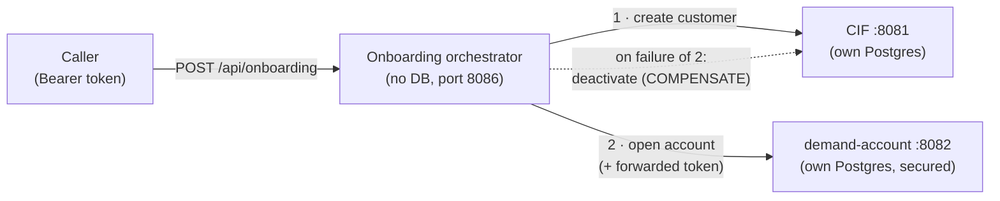
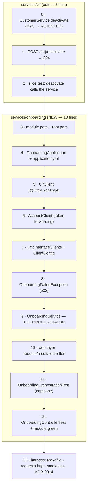
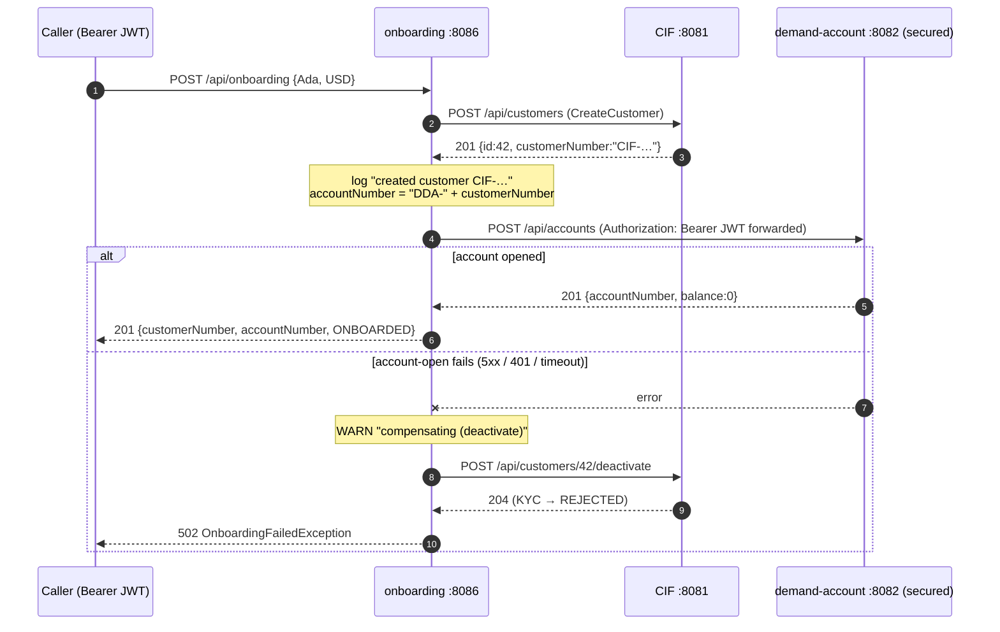

# Step 23 · Onboarding Orchestration — Coordinating Services with Compensation

### Phase D — Distributed Systems, Messaging & Batch 🔵→🟣 · Step 23 of 67

> *Onboarding a retail customer spans two services that don't share a transaction — create the customer in
> CIF, then open their demand account. This step builds a thin **orchestrator** that drives that workflow over
> declarative HTTP clients, **forwards the caller's token** to the secured account service, and — if the
> account step fails after the customer was created — runs a **compensating** action to deactivate the
> customer. It's the **orchestration** counterpart to Step 21's choreography/Saga: one coordinator that knows
> the whole flow.*

---

<a id="toc"></a>
## 🧭 The Six Movements of This Step

| | Movement | What happens |
|---|---|---|
| **A** | [🧭 Orient](#orient) | 30-second overview · skip-test · cheat card · why it matters · before you start |
| **B** | [🧠 Understand](#understand) | orchestration vs choreography · declarative HTTP clients · compensation · identity propagation |
| **C** | [🛠️ Build](#build) | the CIF compensation target · the `onboarding` service · `@HttpExchange` clients · the orchestrator · tests · harness |
| **D** | [🔬 Prove](#prove) | the Verification Log — happy path, compensation, token forwarding; §12.3 mutation; fresh re-run |
| **E** | [🎓 Apply](#apply) | go deeper · interview prep · your-turn challenges |
| **F** | [🏆 Review](#review) | troubleshooting · resources · recap, flashcards & what's next |

---

<a id="orient"></a>

# A · 🧭 Orient

## 📋 This Step in 30 Seconds

| | |
|---|---|
| **Title** | Retail onboarding orchestration — coordinate CIF + demand-account over declarative HTTP clients, with compensation and token forwarding |
| **Step** | 23 of 67 · **Phase D — Distributed Systems, Messaging & Batch** 🔵→🟣 |
| **Effort** | ≈ 12 hours focused. Reuses the Step-15 `@HttpExchange` client pattern; no new infrastructure. |
| **What you'll run this step** | **JVM + Maven only — no Docker for this step's tests.** The orchestration tests run against in-process stubs; the CIF deactivate test is a web slice (`@WebMvcTest`, mocked service). Docker is needed only for the optional **live** multi-service demo (Postgres for cif + demand-account) and if you run CIF's *full* module suite (its integration test uses Testcontainers). New service on port **8086**. |
| **Buildable artifact** | A new **`services/onboarding`** (no DB): `OnboardingService` orchestrates `CifClient.create` → `AccountClient.open` (declarative `@HttpExchange` clients), **forwards the bearer token** to the secured account service, and **compensates** (`CifClient.deactivate`) on account-open failure. New CIF endpoint `POST /api/customers/{id}/deactivate`. `POST /api/onboarding`. `step-23-start == step-22-end`. |
| **Verification tier** | 🔴 **Full** — new service + a CIF change. `./mvnw verify` green + the orchestration (happy + compensation + token-forwarding) proven over real HTTP against in-process stubs + **§12.3 mutation** + clean-room + `smoke.sh`. |
| **Depends on** | **[Step 15](../step-15/lesson.md)** (`@HttpExchange`/RestClient clients), **[Step 21](../step-21/lesson.md)** (Saga/compensation — the contrast), **[Step 17](../step-17/lesson.md)** (the secured account service / token), **[Step 8](../step-08/lesson.md)** (CIF). |

By the end you will be able to build a **service orchestrator** with declarative HTTP clients, run a
**compensating** action when a downstream step fails, **forward identity** (a bearer token) through the call
chain, and explain **orchestration vs choreography**.

### ⏭️ Can You Skip This Step? (5-minute self-check)

If you can confidently do **all** of this, skim the 🛠️ Build and jump to **[Step 24 — Spring Batch + the Phase-D capstone](../step-24/lesson.md)**.

- [ ] I can explain **orchestration vs choreography** and when to pick each.
- [ ] I can call other services with **declarative `@HttpExchange` clients** (timeouts and all).
- [ ] I can write a **compensating** action for a multi-service workflow and explain why it isn't a rollback.
- [ ] I can **forward a bearer token** downstream (identity propagation) and say why.
- [ ] I know why a synchronous orchestrator isn't crash-safe and what makes a workflow durable.

> [!TIP]
> Not 100%? Stay. "Orchestration vs choreography," "how do you undo a multi-service operation," and "how does
> identity flow across services" are common distributed-design interview questions.

## 📇 Cheat Card

> **What this step delivers (one sentence):** a thin orchestrator that creates a CIF customer then opens their
> demand account — forwarding the caller's token — and deactivates the customer if the account step fails.

**Key commands** (Windows uses `.\mvnw.cmd`):

```bash
./mvnw -pl services/onboarding test        # orchestration happy path + compensation (no Docker)
bash steps/step-23/smoke.sh
# Live: POST /api/onboarding (with a token); see requests.http
```

**The headline diagram:**

```
POST /api/onboarding  (Bearer token)
   └─► CifClient.create ───────────► CIF: customer created
        └─► AccountClient.open ────► demand-account: open (token forwarded)
              fails? ─► CifClient.deactivate (COMPENSATE) ─► OnboardingFailedException (502)
              ok?    ─► OnboardingResult {customerNumber, accountNumber}
```

**The one sentence to remember:** *An orchestrator coordinates independently-committed remote steps — recovery
is **compensation**, not rollback — and it **forwards identity** so downstream auth still works.*

## 🎯 Why This Matters

Real features cross service boundaries: onboarding, checkout, KYC. Someone has to coordinate the steps and
decide what happens when step 3 of 4 fails. Orchestration (a coordinator) and choreography (events) are the
two answers, and compensation + identity propagation are the details that make them correct in production.
These are staple distributed-design interview topics — and "walk me through your onboarding flow" is the kind
of system-design question where this step *is* the answer.

## ✅ What You'll Be Able to Do

- Build a service **orchestrator** with declarative HTTP clients.
- Apply **compensation** across a multi-service workflow.
- **Forward a bearer token** (identity propagation) downstream.
- Contrast orchestration vs choreography and pick deliberately.
- Test a multi-service workflow **deterministically without Docker** — over real HTTP, against in-process stubs.

## 🧰 Before You Start

- **Prereqs:** bank builds green (`git describe` → `step-22-end`). No Docker needed for the build's tests; Docker only for the optional live demo.
- **Connects to what you know:** the **`@HttpExchange` client** (Step 15 — you built `CifClient` for the gateway lab; today you build the same pattern *into a workflow*), **compensation** (Step 21's Saga refunded a failed payment — same recovery model, different control style), the **secured account service + token** (Step 17 — demand-account rejects unauthenticated calls, so somebody must carry the token), **CIF** (Step 8 — your very first service grows its first *state-machine* endpoint).
- **Depends on:** Steps **15, 21, 17, 8**.

---

<a id="understand"></a>

# B · 🧠 Understand

## 🧠 The Big Idea — someone has to coordinate

A business operation that spans services has **no single transaction**. "Onboard a customer" means a row in
CIF's Postgres *and* a row in demand-account's Postgres — two databases, two commits, no umbrella `BEGIN`.
There are two ways to coordinate the steps:

- **Orchestration** — a **coordinator** (our `OnboardingService`) calls each service in order and decides what
  to do on failure. The flow lives in one place: easy to read, test, and trace. The coordinator is a coupling
  point — it must know every participant.
- **Choreography** — no coordinator; each service reacts to events and emits the next (Steps 20/21: the
  transfer commits, an event lands on Kafka, notification reacts). Maximally decoupled, but the flow is
  implicit — to see "what happens after a transfer," you read three services' listeners.



We build **orchestration** here — a short, well-defined flow we want to reason about centrally — and contrast
it with the Step-21 Saga. Same compensation idea, different control style.

**The analogy:** a wedding planner (orchestrator) calls the florist, then the caterer, then the band — and if
the caterer cancels after the flowers are ordered, the *planner* phones the florist to cancel (compensation).
Choreography is the flash-mob version: the florist watches for "venue booked" announcements and acts on their
own; nobody is in charge, and you find out who reacts to what by asking each vendor.

## 🧩 Pattern Spotlight — declarative HTTP clients (recap from Step 15)

**The problem:** the orchestrator must make HTTP calls to two services. Hand-rolled `RestClient` calls work,
but every call site repeats URL-building, body marshalling, and error handling — and the *shape* of the remote
API gets smeared across the codebase.

**The pattern:** declare the remote API as a Java **interface** annotated with `@HttpExchange`/`@PostExchange`,
and let Spring generate the implementation — a JDK dynamic proxy over a `RestClient`
(`HttpServiceProxyFactory`). Your orchestrator then calls `cif.create(request)` like a local method; the proxy
turns it into `POST /api/customers` with a JSON body. With **connect + read timeouts** on the underlying
client, a slow dependency fails fast instead of hanging the coordinator.

**Alternatives & trade-offs:** raw `RestClient`/`WebClient` (more control, more boilerplate), OpenFeign (the
older Spring Cloud declarative client — `@HttpExchange` is the framework-native successor), or gRPC (binary,
contract-first — heavier setup, no plain-HTTP debuggability). For service-to-service JSON over HTTP inside one
team, the HTTP interface is the modern Spring default.

**Implementation micro-structure here:** two interfaces (`CifClient`, `AccountClient`), a tiny generic factory
(`HttpInterfaceClients.create`) so Spring config and tests build clients **identically**, and a
`ClientConfig` that wires base URLs + timeouts from properties.

## 🌱 Under the Hood: compensation, not rollback

CIF's create commits in CIF's database; demand-account's open commits in its own. There's no umbrella
transaction to roll back — by the time the account step fails, the customer row is **durably committed** and
visible to every other reader. So the orchestrator runs a **compensating action**: `CifClient.deactivate(id)`
(KYC → REJECTED) — a *new forward action* that semantically undoes the first step's effect. This is the same
recovery model as the Step-21 Saga (the refund that undoes a debit); here a single coordinator drives it
instead of event handlers.

Two properties to internalize, because interviewers probe both:

1. **It's not isolated.** Between step 1 and step 2, a customer exists with no account. Any reader — including
   your own admin UI — can see that intermediate state. The compensation *resolves* it; nothing *hides* it.
2. **Compensation is itself a remote call that can fail.** If CIF is down when we try to deactivate, the
   workflow is stuck half-done with no record of where it was. Our orchestrator is honest about this (it's
   synchronous and in-memory — see ADR-0014); the durable fix (persisted saga state + retries) is a later
   step. Knowing the limitation is part of knowing the pattern.

## 🌱 Under the Hood: identity propagation

demand-account is a **secured OAuth2 resource server** (Step 17): it validates a JWT on every request and
rejects calls without one (401). So when the orchestrator calls it, *somebody's* token must be on the wire.
The simplest correct approach for a **user-initiated** flow is **token forwarding** (a.k.a. *token relay*):
the orchestrator takes the caller's `Authorization: Bearer …` header and passes it verbatim on the downstream
call. The downstream service validates the *original caller's* identity and roles — the orchestrator adds no
authority of its own. CIF has no auth yet (risk-register R-002), so no token is needed there.

(A service acting **on its own behalf** — a nightly job, a queue consumer — has no caller token to forward; it
would mint its own *client-credentials* token. That's a later auth step. Knowing which of the two situations
you're in is the actual skill.)

## 🛡️ Security Lens & 🧵 Thread-safety note

**Security:** the orchestrator *forwards* but never *mints* or *stores* tokens — it's a pipe, not an
authority. It has **no auth of its own yet** (R-002): anyone who can reach port 8086 can trigger onboarding.
That's acceptable in the lab and flagged in the risk register; the production posture is to front it with the
gateway (Step 15) and secure it like demand-account (Step 17). Also note what the compensation endpoint
implies: `POST /api/customers/{id}/deactivate` on CIF is **unauthenticated state mutation** — same R-002 entry,
same gateway-later answer. Threat-modeling lens (Step 18): the orchestrator widens the attack surface by one
unauthenticated coordinator; the mitigation is inherited, not invented here.

**🧵 Thread-safety (Step-11 callback):** the orchestrator is **stateless** — `OnboardingService` holds only
two injected, immutable client references; each request's flow lives entirely on its own request thread, so
concurrent onboardings don't share mutable state. The only shared mutable state in this step is in the *test
stub* (`StubDownstream`), where multiple requests record into shared fields — and you'll see it use `volatile`
flags and a `CopyOnWriteArrayList` for exactly the reasons Step 11 taught.

## 🕰️ Then vs. Now

Cross-service coordination used to be hidden inside chatty point-to-point calls or a heavyweight **ESB/BPEL**
engine (the 2000s SOA era: the flow lived in XML, deployed to a vendor bus, debugged by specialists). **Now**
it's an explicit, testable orchestrator in plain code using typed HTTP clients — or, when durability matters,
a workflow engine (Temporal, Camunda) or an event-sourced saga. On the client side: `RestTemplate` (2009,
maintenance mode) → `WebClient` (2017, reactive) → **`RestClient` + `@HttpExchange` interfaces** (Spring 6/Boot 3+,
the modern blocking-friendly default — and what Spring Cloud OpenFeign's own docs now point newcomers to).
The key modern discipline survives every era: make the failure path (compensation) a first-class, tested part
of the design — not an afterthought.

---

<a id="build"></a>

# C · 🛠️ Let's Build It — Step by Step

## 📦 Your Starting Point

`step-23-start == step-22-end`: **12 modules green** — cif, demand-account, auth, notification, market-info,
gateway, the playground labs. CIF (Step 8) serves customers on 8081; demand-account (Steps 12–14, 17, 20–21)
serves secured accounts on 8082; auth (Steps 16–17) mints RS256 JWTs on 8083.

```bash
git describe --tags        # → step-22-end (or your own repo at the same state)
./mvnw -B verify           # all 12 modules BUILD SUCCESS before you start
```

What's green: everything. What you'll build: a **13th module** (`services/onboarding`) plus one small,
additive change to CIF (the compensation endpoint). Nothing existing changes behavior.

## 🗺️ The build map



## 🌳 Files we'll touch

```
pom.xml                                  (edit) register services/onboarding
Makefile                                 (edit) run-onboarding + play-23
services/cif/                            (edit) the compensation target
  src/main/java/com/buildabank/cif/service/CustomerService.java       (+ deactivate)
  src/main/java/com/buildabank/cif/web/CustomerController.java        (+ POST /{id}/deactivate)
  src/test/java/com/buildabank/cif/web/CustomerControllerTest.java    (+ 1 test)
services/onboarding/                     (NEW SERVICE, no DB, port 8086)
  pom.xml
  src/main/java/com/buildabank/onboarding/
    OnboardingApplication.java
    client/CifClient.java                (@HttpExchange: create, deactivate + records)
    client/AccountClient.java            (@HttpExchange: open, forwards Authorization)
    client/HttpInterfaceClients.java     (generic factory: RestClient + timeouts)
    client/ClientConfig.java             (beans from config)
    service/OnboardingService.java       (the orchestrator)
    service/OnboardingFailedException.java   (→ 502)
    web/OnboardingController.java        (POST /api/onboarding)
    web/OnboardingRequest.java  web/OnboardingResult.java
  src/main/resources/application.yml     (services.cif.url / services.account.url + timeouts)
  src/test/java/com/buildabank/onboarding/
    OnboardingOrchestrationTest.java     (real HTTP, in-process stubs — the capstone)
    web/OnboardingControllerTest.java    (@WebMvcTest slice)
steps/step-23/{lesson.md, requests.http, smoke.sh}
adr/0014-onboarding-orchestration.md
```

Fourteen sub-steps. We build the **compensation target first** (CIF must be able to deactivate before anyone
can orchestrate against it), then the new service from the outside in: module → config → clients → orchestrator
→ web → tests → harness.

---

### Sub-step 0 of 13 — CIF: `CustomerService.deactivate`, the compensation target 🧭 *(you are here: **cif service** → cif endpoint → cif test → module → config → clients → orchestrator → web → tests → harness)*

🎯 **Goal:** give CIF the ability to deactivate a customer (KYC → `REJECTED`). This is the *real action* the
orchestrator's compensation will call — build the undo before the workflow that needs it.

📁 **Location:** edit → `services/cif/src/main/java/com/buildabank/cif/service/CustomerService.java`

⌨️ **Code — the diff:**

```diff
--- a/services/cif/src/main/java/com/buildabank/cif/service/CustomerService.java
+++ b/services/cif/src/main/java/com/buildabank/cif/service/CustomerService.java
@@ -44,4 +44,17 @@ public class CustomerService {
     public Optional<Customer> findByCustomerNumber(String customerNumber) {
         return repository.findByCustomerNumber(customerNumber);
     }
+
+    /**
+     * Deactivate a customer (KYC → {@link KycStatus#REJECTED}). Added for the Step-23 onboarding orchestration:
+     * if opening the account fails after the customer was created, the orchestrator calls this as a
+     * <strong>compensating</strong> action so a half-onboarded customer isn't left active. Dirty checking
+     * flushes the status change at commit.
+     */
+    @Transactional
+    public void deactivate(Long id) {
+        Customer customer = repository.findById(id)
+                .orElseThrow(() -> new IllegalArgumentException("no such customer: " + id));
+        customer.setKycStatus(KycStatus.REJECTED);
+    }
 }
```

And the **whole file** after the edit, so you can diff yours against it:

```java
// services/cif/src/main/java/com/buildabank/cif/service/CustomerService.java
package com.buildabank.cif.service;

import java.time.Instant;
import java.time.LocalDate;
import java.util.Optional;
import java.util.UUID;

import org.springframework.stereotype.Service;
import org.springframework.transaction.annotation.Transactional;

import com.buildabank.cif.domain.Customer;
import com.buildabank.cif.domain.CustomerRepository;
import com.buildabank.cif.domain.KycStatus;

/**
 * Application service for customers. Methods are transactional — writes in a read-write transaction,
 * reads marked {@code readOnly} (a hint that lets the DB/JDBC driver optimize and prevents accidental
 * flushes). Transaction propagation/isolation gets the deep treatment in Step 12.
 */
@Service
public class CustomerService {

    private final CustomerRepository repository;

    public CustomerService(CustomerRepository repository) {
        this.repository = repository;
    }

    @Transactional
    public Customer create(String firstName, String lastName, String email, LocalDate dateOfBirth) {
        String customerNumber = "CIF-" + UUID.randomUUID().toString().substring(0, 8).toUpperCase();
        Customer customer = new Customer(
                customerNumber, firstName, lastName, email, dateOfBirth, KycStatus.PENDING, Instant.now());
        return repository.save(customer);
    }

    @Transactional(readOnly = true)
    public Optional<Customer> findById(Long id) {
        return repository.findById(id);
    }

    @Transactional(readOnly = true)
    public Optional<Customer> findByCustomerNumber(String customerNumber) {
        return repository.findByCustomerNumber(customerNumber);
    }

    /**
     * Deactivate a customer (KYC → {@link KycStatus#REJECTED}). Added for the Step-23 onboarding orchestration:
     * if opening the account fails after the customer was created, the orchestrator calls this as a
     * <strong>compensating</strong> action so a half-onboarded customer isn't left active. Dirty checking
     * flushes the status change at commit.
     */
    @Transactional
    public void deactivate(Long id) {
        Customer customer = repository.findById(id)
                .orElseThrow(() -> new IllegalArgumentException("no such customer: " + id));
        customer.setKycStatus(KycStatus.REJECTED);
    }
}
```

🔍 **Line-by-line (the new method):**

- `@Transactional` — the whole method runs in one read-write database transaction (Step 9/12). Load + modify +
  commit is atomic *within CIF*: either the status flips or nothing happened.
- `repository.findById(id)` — loads the `Customer` **managed** by the JPA persistence context. "Managed" means
  Hibernate is now watching this object for changes.
- `.orElseThrow(() -> new IllegalArgumentException(...))` — `findById` returns an `Optional<Customer>`;
  deactivating a customer that doesn't exist is a caller bug, so we fail loudly with the id in the message
  rather than silently no-op.
- `customer.setKycStatus(KycStatus.REJECTED)` — and that's *all*. **No `save()` call.** Because the entity is
  managed, **dirty checking** kicks in: at commit, Hibernate compares the entity's current state to the
  snapshot it took at load time, sees `kycStatus` changed, and issues the `UPDATE customer SET kyc_status=…`
  itself. An explicit `save()` here would be redundant (harmless, but noise).
- Why `REJECTED` and not a new `DEACTIVATED` enum value? Reuse: `KycStatus` already models "this customer must
  not transact" via `REJECTED` (Step 8). A richer lifecycle (SUSPENDED, CLOSED…) is real-bank territory the
  course adds when a step needs it — don't grow enums speculatively.

💭 **Under the hood:** at commit time Spring's `PlatformTransactionManager` triggers a flush; Hibernate's dirty
check walks managed entities, diffs them against their load-time snapshots, and emits exactly one
`UPDATE customer SET kyc_status='REJECTED' WHERE id=?`. The proxy rules from Step 7 apply: `@Transactional`
works here because callers (the controller, next sub-step) invoke `deactivate` *through the Spring proxy* —
a `this.deactivate(...)` from inside `CustomerService` would silently skip the transaction.

🔮 **Predict:** if two onboardings raced and both compensated the *same* customer id, what would happen —
error, corruption, or harmless? <details><summary>Answer</summary>Harmless: both transactions set
`kycStatus = REJECTED`; the second UPDATE overwrites the same value. Setting a field to a constant is naturally
**idempotent** — one reason "deactivate" is a good compensation shape. (Compare a compensation like "decrement
counter," which would *not* be safe to repeat.)</details>

▶️ **Run & See:**

```bash
./mvnw -B -pl services/cif -DskipTests compile
```

✅ **Expected output:** ends in `BUILD SUCCESS`. (Behavioral proof lands in sub-step 2's slice test.)

❌ **If you see `cannot find symbol: method setKycStatus`** — your `Customer` entity (Step 8) is missing the
setter; JPA entities here are mutable JavaBeans, not records, precisely so dirty checking has something to do.

✋ **Checkpoint:** CIF compiles; you can explain why there's no `repository.save(...)` in `deactivate`.

💾 **Commit:**

```bash
git add services/cif/src/main/java/com/buildabank/cif/service/CustomerService.java
git commit -m "feat(cif): CustomerService.deactivate (KYC -> REJECTED) - Step 23 compensation target"
```

⚠️ **Pitfall:** writing `repository.findById(id).get()` instead of `orElseThrow`. On a missing id, `get()`
throws a bare `NoSuchElementException` with no context — your future self debugging a failed compensation
deserves the id in the message.

---

### Sub-step 1 of 13 — CIF: the deactivate endpoint 🧭 *(cif service ✅ → **cif endpoint** → cif test → module → …)*

🎯 **Goal:** expose the compensation over HTTP — `POST /api/customers/{id}/deactivate` → `204 No Content`.
This is the URL the orchestrator's `CifClient.deactivate` will hit.

📁 **Location:** edit → `services/cif/src/main/java/com/buildabank/cif/web/CustomerController.java`

⌨️ **Code — the diff:**

```diff
--- a/services/cif/src/main/java/com/buildabank/cif/web/CustomerController.java
+++ b/services/cif/src/main/java/com/buildabank/cif/web/CustomerController.java
@@ -53,4 +53,14 @@ public class CustomerController {
                 .map(ResponseEntity::ok)
                 .orElseGet(() -> ResponseEntity.notFound().build());
     }
+
+    /**
+     * Deactivate a customer (KYC → REJECTED) → 204. The Step-23 onboarding orchestrator calls this as a
+     * <strong>compensating</strong> action when account-opening fails after the customer was created.
+     */
+    @PostMapping("/{id}/deactivate")
+    public ResponseEntity<Void> deactivate(@PathVariable Long id) {
+        service.deactivate(id);
+        return ResponseEntity.noContent().build();
+    }
 }
```

And the **whole file** after the edit:

```java
// services/cif/src/main/java/com/buildabank/cif/web/CustomerController.java
package com.buildabank.cif.web;

import java.net.URI;

import jakarta.validation.Valid;

import org.springframework.http.ResponseEntity;
import org.springframework.web.bind.annotation.GetMapping;
import org.springframework.web.bind.annotation.PathVariable;
import org.springframework.web.bind.annotation.PostMapping;
import org.springframework.web.bind.annotation.RequestBody;
import org.springframework.web.bind.annotation.RequestMapping;
import org.springframework.web.bind.annotation.RestController;

import com.buildabank.cif.domain.Customer;
import com.buildabank.cif.service.CustomerService;

/** REST API for the customer master. */
@RestController
@RequestMapping("/api/customers")
public class CustomerController {

    private final CustomerService service;

    public CustomerController(CustomerService service) {
        this.service = service;
    }

    /** Create a customer → 201 Created with a Location header pointing at the new resource. */
    @PostMapping
    public ResponseEntity<CustomerResponse> create(@Valid @RequestBody CreateCustomerRequest request) {
        Customer created = service.create(
                request.firstName(), request.lastName(), request.email(), request.dateOfBirth());
        CustomerResponse body = CustomerResponse.from(created);
        return ResponseEntity.created(URI.create("/api/customers/" + created.getId())).body(body);
    }

    /** Fetch by database id → 200, or 404 if absent. */
    @GetMapping("/{id}")
    public ResponseEntity<CustomerResponse> byId(@PathVariable Long id) {
        return service.findById(id)
                .map(CustomerResponse::from)
                .map(ResponseEntity::ok)
                .orElseGet(() -> ResponseEntity.notFound().build());
    }

    /** Fetch by the public customer number (e.g. CIF-AB12CD34). */
    @GetMapping("/by-number/{customerNumber}")
    public ResponseEntity<CustomerResponse> byNumber(@PathVariable String customerNumber) {
        return service.findByCustomerNumber(customerNumber)
                .map(CustomerResponse::from)
                .map(ResponseEntity::ok)
                .orElseGet(() -> ResponseEntity.notFound().build());
    }

    /**
     * Deactivate a customer (KYC → REJECTED) → 204. The Step-23 onboarding orchestrator calls this as a
     * <strong>compensating</strong> action when account-opening fails after the customer was created.
     */
    @PostMapping("/{id}/deactivate")
    public ResponseEntity<Void> deactivate(@PathVariable Long id) {
        service.deactivate(id);
        return ResponseEntity.noContent().build();
    }
}
```

🔍 **Line-by-line (the new endpoint):**

- `@PostMapping("/{id}/deactivate")` — composes with the class-level `@RequestMapping("/api/customers")` →
  full path `POST /api/customers/{id}/deactivate`. Note the shape: **a verb as a sub-resource**. Pure REST
  would model this as `PATCH /api/customers/{id}` with `{"kycStatus":"REJECTED"}`, but an explicit *action
  endpoint* is the pragmatic industry idiom for state transitions ("deactivate," "approve," "cancel") — it
  names the business operation, keeps the allowed transitions server-controlled, and is unambiguous to call
  from a client interface.
- Why `POST` and not `DELETE`? Nothing is deleted — the customer row survives (a bank never erases a customer
  it has KYC obligations for); only its status changes. `DELETE` would lie about semantics.
- `@PathVariable Long id` — Spring extracts `{id}` from the URL and converts the text to `Long` (Step 8).
- `ResponseEntity<Void>` + `noContent().build()` — **204 No Content**: "done, and there's nothing useful to
  return." The orchestrator doesn't need a body; the status code *is* the contract. (`Void` makes "no body"
  part of the method signature.)
- If the id doesn't exist, `service.deactivate` throws `IllegalArgumentException` — which CIF's exception
  handling surfaces as a 500-family error. Good enough for an internal compensation hook; a public version
  would map it to 404 (your 🏋️ exercises).

💭 **Under the hood:** identical request lifecycle to Step 8/13 — `DispatcherServlet` → handler mapping →
this method → no body to serialize, so the response is just the status line. The interesting part is *who
calls it*: not a browser, not the React app — another *service's generated client*. You're designing
service-to-service API surface now.

🔮 **Predict:** the endpoint takes no request body. Does the `@PostMapping` method still need
`consumes`/`Content-Type` handling? <details><summary>Answer</summary>No — with no `@RequestBody` parameter,
Spring never engages a message converter for the request; a bare `POST` with an empty body matches fine.
That's also why the client interface's `deactivate` method can take only the path variable.</details>

▶️ **Run & See:**

```bash
./mvnw -B -pl services/cif -DskipTests compile
```

✅ **Expected output:** `BUILD SUCCESS`.

✋ **Checkpoint:** CIF compiles with the new endpoint; you can say why it's `POST … /deactivate` and `204`,
not `DELETE` or `200`.

💾 **Commit:**

```bash
git add services/cif/src/main/java/com/buildabank/cif/web/CustomerController.java
git commit -m "feat(cif): POST /api/customers/{id}/deactivate -> 204 (compensation endpoint)"
```

⚠️ **Pitfall:** mapping it as `@PostMapping("/deactivate/{id}")`. It works, but breaks the resource grammar
(`/api/customers/{id}` *is* the resource; `/deactivate` is the action on it) — and your client interface,
requests.http, and docs all read worse. URL design is API design.

---

### Sub-step 2 of 13 — CIF: prove the endpoint with the slice test 🧭 *(cif service ✅ → cif endpoint ✅ → **cif test** → module → …)*

🎯 **Goal:** one new `@WebMvcTest` case proving `POST /api/customers/{id}/deactivate` returns 204 **and**
actually calls the service with the right id — fast, no database, no Docker.

📁 **Location:** edit → `services/cif/src/test/java/com/buildabank/cif/web/CustomerControllerTest.java`

⌨️ **Code — the diff:**

```diff
--- a/services/cif/src/test/java/com/buildabank/cif/web/CustomerControllerTest.java
+++ b/services/cif/src/test/java/com/buildabank/cif/web/CustomerControllerTest.java
@@ -68,4 +68,11 @@ class CustomerControllerTest {
         given(service.findById(99L)).willReturn(Optional.empty());
         mvc.perform(get("/api/customers/99")).andExpect(status().isNotFound());
     }
+
+    @Test
+    void deactivateReturns204_andCallsTheService() throws Exception {
+        // The Step-23 onboarding orchestrator's compensation hook.
+        mvc.perform(post("/api/customers/7/deactivate")).andExpect(status().isNoContent());
+        org.mockito.Mockito.verify(service).deactivate(7L);
+    }
 }
```

And the **whole file** after the edit:

```java
// services/cif/src/test/java/com/buildabank/cif/web/CustomerControllerTest.java
package com.buildabank.cif.web;

import static org.mockito.ArgumentMatchers.any;
import static org.mockito.BDDMockito.given;
import static org.springframework.test.web.servlet.request.MockMvcRequestBuilders.get;
import static org.springframework.test.web.servlet.request.MockMvcRequestBuilders.post;
import static org.springframework.test.web.servlet.result.MockMvcResultMatchers.jsonPath;
import static org.springframework.test.web.servlet.result.MockMvcResultMatchers.status;

import java.time.Instant;
import java.time.LocalDate;
import java.util.Optional;

import org.junit.jupiter.api.Test;
import org.springframework.beans.factory.annotation.Autowired;
import org.springframework.boot.webmvc.test.autoconfigure.WebMvcTest;
import org.springframework.http.MediaType;
import org.springframework.test.context.bean.override.mockito.MockitoBean;
import org.springframework.test.web.servlet.MockMvc;

import com.buildabank.cif.domain.Customer;
import com.buildabank.cif.domain.KycStatus;
import com.buildabank.cif.service.CustomerService;

/**
 * Web-layer slice: only the controller + MVC infrastructure load (fast, no DB). The service is a Mockito
 * mock (via {@code @MockitoBean} — the Spring Framework replacement for {@code @MockBean}).
 */
@WebMvcTest(CustomerController.class)
class CustomerControllerTest {

    @Autowired
    MockMvc mvc;

    @MockitoBean
    CustomerService service;

    @Test
    void createReturns201WithBody() throws Exception {
        var saved = new Customer("CIF-AB12CD34", "Ada", "Lovelace", "ada@bank.example",
                LocalDate.of(1990, 5, 17), KycStatus.PENDING, Instant.parse("2026-06-09T00:00:00Z"));
        given(service.create(any(), any(), any(), any())).willReturn(saved);

        mvc.perform(post("/api/customers")
                        .contentType(MediaType.APPLICATION_JSON)
                        .content("""
                                {"firstName":"Ada","lastName":"Lovelace","email":"ada@bank.example","dateOfBirth":"1990-05-17"}
                                """))
                .andExpect(status().isCreated())
                .andExpect(jsonPath("$.customerNumber").value("CIF-AB12CD34"))
                .andExpect(jsonPath("$.kycStatus").value("PENDING"));
    }

    @Test
    void invalidBodyReturns400() throws Exception {
        // Blank first name + malformed email → Bean Validation rejects before the controller runs.
        mvc.perform(post("/api/customers")
                        .contentType(MediaType.APPLICATION_JSON)
                        .content("""
                                {"firstName":"","lastName":"Lovelace","email":"not-an-email","dateOfBirth":"1990-05-17"}
                                """))
                .andExpect(status().isBadRequest());
    }

    @Test
    void missingCustomerReturns404() throws Exception {
        given(service.findById(99L)).willReturn(Optional.empty());
        mvc.perform(get("/api/customers/99")).andExpect(status().isNotFound());
    }

    @Test
    void deactivateReturns204_andCallsTheService() throws Exception {
        // The Step-23 onboarding orchestrator's compensation hook.
        mvc.perform(post("/api/customers/7/deactivate")).andExpect(status().isNoContent());
        org.mockito.Mockito.verify(service).deactivate(7L);
    }
}
```

🔍 **Line-by-line (the new test):**

- `mvc.perform(post("/api/customers/7/deactivate"))` — drives the real `DispatcherServlet` + real controller
  through MockMvc, no network. No `.contentType(...)`, no `.content(...)` — the endpoint takes no body
  (sub-step 1's predict).
- `.andExpect(status().isNoContent())` — asserts the 204 contract the orchestrator's client will rely on.
- `org.mockito.Mockito.verify(service).deactivate(7L)` — the second half of the proof: the controller didn't
  just return 204, it **delegated to the service with the exact id from the path**. `verify` fails the test if
  the mock's `deactivate` was never called (or called with a different argument). For a `void`-returning mock
  method there's no stubbed return value to assert on — *interaction verification* is how you test it.
  (Fully-qualified `org.mockito.Mockito.verify` because this class statically imports BDDMockito's `given`;
  mixing in one more static import is fine too — the tag's code chose the explicit form.)
- The other three tests are untouched Step-8/13 material — they keep guarding create/fetch while you extend
  the class.

💭 **Under the hood:** `@WebMvcTest(CustomerController.class)` boots a *slice* context: MVC infrastructure +
this one controller; `@MockitoBean CustomerService` injects a Mockito mock where the real bean would be — so
JPA, Flyway, and Postgres never load. That's why this test needs **no Docker** and runs in ~4s. (CIF's *full*
suite includes a Testcontainers integration test from Step 9 — that one does want Docker; we don't touch it
today.)

🔮 **Predict:** before running — `Tests run:` how many, in this class? <details><summary>Answer</summary>**4**
— the three existing (create-201, invalid-400, missing-404) plus your new deactivate-204.</details>

▶️ **Run & See:**

```bash
./mvnw -B -pl services/cif test -Dtest='CustomerControllerTest'
```

✅ **Expected output** (real run, 2026-06-11 — Java 25.0.3, Spring Boot 4.0.6):

```
[INFO] Tests run: 4, Failures: 0, Errors: 0, Skipped: 0, Time elapsed: 3.978 s -- in com.buildabank.cif.web.CustomerControllerTest
[INFO]
[INFO] Results:
[INFO]
[INFO] Tests run: 4, Failures: 0, Errors: 0, Skipped: 0
[INFO]
[INFO] ------------------------------------------------------------------------
[INFO] BUILD SUCCESS
[INFO] ------------------------------------------------------------------------
[INFO] Total time:  7.742 s
```

Mid-run you'll also see a `WARN … MethodArgumentNotValidException … 2 errors` line — that's the
*invalid-400* test doing its job (Bean Validation rejecting the bad body), not a problem.

❌ **If you see `Wanted but not invoked: service.deactivate(7L)`** — your controller returned 204 without
calling the service (easy to do if you stubbed the method out while sketching). The verify caught a lying
endpoint; that's exactly its purpose.

✋ **Checkpoint:** 4/4 green in `CustomerControllerTest`, no Docker started. The compensation target is built
and proven. 🧭 *CIF is done — everything from here is the new service.*

💾 **Commit:**

```bash
git add services/cif/src/test/java/com/buildabank/cif/web/CustomerControllerTest.java
git commit -m "test(cif): deactivate endpoint returns 204 and delegates to the service"
```

⚠️ **Pitfall:** asserting only the status and skipping the `verify`. A 204 with no service call is a
*plausible-looking lie* — slice tests on thin controllers earn their keep precisely by checking the
delegation, because there's little else to check.

---

### Sub-step 3 of 13 — the `onboarding` module: pom + root registration 🧭 *(cif ✅✅✅ → **module** → config → clients → orchestrator → web → tests → harness)*

🎯 **Goal:** scaffold the 13th Maven module — a deliberately *thin* web service: no JPA, no Flyway, no Kafka,
no Redis. An orchestrator's dependency list should read like its job description: call HTTP, validate input,
report health.

📁 **Location:** new file → `services/onboarding/pom.xml`, plus one line in the root `pom.xml`.

⌨️ **Code — the new module pom:**

```xml
<?xml version="1.0" encoding="UTF-8"?>
<project xmlns="http://maven.apache.org/POM/4.0.0"
         xmlns:xsi="http://www.w3.org/2001/XMLSchema-instance"
         xsi:schemaLocation="http://maven.apache.org/POM/4.0.0 https://maven.apache.org/xsd/maven-4.0.0.xsd">
    <modelVersion>4.0.0</modelVersion>

    <!--
      onboarding — Retail Services onboarding ORCHESTRATION (Step 23). A thin coordinator service (no DB) that
      drives a multi-service workflow over declarative HTTP clients (the Step-15 @HttpExchange pattern):
      create a customer in CIF → open a demand account → (on failure) COMPENSATE by deactivating the customer.
      This is the orchestration flavour of a distributed workflow (one coordinator), contrasted with the
      choreography/Saga of Step 21.
    -->
    <parent>
        <groupId>com.buildabank</groupId>
        <artifactId>build-a-bank-parent</artifactId>
        <version>0.1.0-SNAPSHOT</version>
        <relativePath>../../pom.xml</relativePath>
    </parent>

    <artifactId>onboarding</artifactId>
    <name>Build-a-Bank :: Services :: Onboarding</name>
    <description>Retail onboarding orchestration across CIF + demand-account via declarative HTTP clients (Step 23).</description>

    <dependencies>
        <dependency>
            <groupId>org.springframework.boot</groupId>
            <artifactId>spring-boot-starter-web</artifactId>
        </dependency>
        <dependency>
            <groupId>org.springframework.boot</groupId>
            <artifactId>spring-boot-starter-validation</artifactId>
        </dependency>
        <dependency>
            <groupId>org.springframework.boot</groupId>
            <artifactId>spring-boot-starter-actuator</artifactId>
        </dependency>

        <!-- ── Test ── -->
        <dependency>
            <groupId>org.springframework.boot</groupId>
            <artifactId>spring-boot-starter-test</artifactId>
            <scope>test</scope>
        </dependency>
        <dependency>
            <groupId>org.springframework.boot</groupId>
            <artifactId>spring-boot-webmvc-test</artifactId>
            <scope>test</scope>
        </dependency>
    </dependencies>

    <build>
        <plugins>
            <plugin>
                <groupId>org.springframework.boot</groupId>
                <artifactId>spring-boot-maven-plugin</artifactId>
            </plugin>
        </plugins>
    </build>
</project>
```

⌨️ **Code — register the module in the root `pom.xml`:**

```diff
--- a/pom.xml
+++ b/pom.xml
@@ -46,6 +46,7 @@
         <module>services/auth</module>
         <module>services/notification</module>
         <module>services/market-info</module>
+        <module>services/onboarding</module>
         <module>gateway</module>
         <module>playground/java-basics</module>
         <module>playground/spring-lab</module>
```

🔍 **Line-by-line:**

- `<parent> … build-a-bank-parent` + `<relativePath>../../pom.xml</relativePath>` — inherit the whole pinned
  dependency universe (Boot BOM, Java level, plugin versions) from the root; the relative path tells Maven
  where to find the parent on disk without hitting a repository (we're two directories deep).
- `spring-boot-starter-web` — Spring MVC + embedded Tomcat + Jackson. This one starter also brings
  **everything the HTTP-interface clients need**: `RestClient`, `HttpServiceProxyFactory`, and the
  `@HttpExchange` annotations all live in `spring-web`. No extra client dependency exists to add — worth
  saying out loud, because people instinctively hunt for a "feign-like" starter.
- `spring-boot-starter-validation` — Bean Validation (Hibernate Validator) for `@NotBlank`/`@Email` on the
  onboarding request. Since Boot 2.3 this is **not** included in `-web`; forget it and `@Valid` silently does
  nothing (Step 13's trap, still real).
- `spring-boot-starter-actuator` — `/actuator/health` so the gateway/ops can probe the orchestrator like every
  other service.
- What's **absent** is the design: no `spring-boot-starter-data-jpa`, no Flyway, no driver — *the orchestrator
  has no database on purpose.* Its state is each in-flight request's call stack (which is precisely why it
  isn't crash-safe — ADR-0014 owns that trade-off honestly).
- `spring-boot-webmvc-test` (test scope) — Boot 4's modularized slice-test artifact for `@WebMvcTest`
  (Step 10/13: slice annotations moved out of the monolithic test jar).
- Root `<module>services/onboarding</module>` — adds the module to the reactor **in dependency-safe order**;
  without this line Maven simply never builds the directory.

💭 **Under the hood:** the Boot Maven plugin gives the module a repackaged, runnable jar (`java -jar`-able)
and `spring-boot:run` for dev. The reactor now resolves 13 modules; `-pl services/onboarding` scopes any
command to just this one (you'll use that constantly today).

🔮 **Predict:** after registering, `./mvnw -B -pl services/onboarding compile` — does it succeed with zero
Java files in the module? <details><summary>Answer</summary>Yes — `compile` with nothing to compile is a
no-op success. The reactor cares the module exists and resolves, not that it has sources yet.</details>

▶️ **Run & See:**

```bash
./mvnw -B -pl services/onboarding -DskipTests compile
```

✅ **Expected output:** ends in `BUILD SUCCESS` (with `Build-a-Bank :: Services :: Onboarding` in the reactor
header).

❌ **If you see `Child module …/services/onboarding of … does not exist`** — the root-pom line points at a
directory you haven't created (or has a typo). Create `services/onboarding/pom.xml` first, then register.

✋ **Checkpoint:** 13 modules in the reactor; the empty module builds.

💾 **Commit:**

```bash
git add pom.xml services/onboarding/pom.xml
git commit -m "feat(onboarding): scaffold the orchestration module (web+validation+actuator, no DB)"
```

⚠️ **Pitfall:** copy-pasting a previous service's pom and dragging `data-jpa`/`flyway` along. The app will
then **fail to start** (`Failed to configure a DataSource: 'url' attribute is not specified`) because
auto-configuration sees JPA on the classpath and demands a database the orchestrator doesn't have. Thin
service, thin pom.

---

### Sub-step 4 of 13 — `OnboardingApplication` + `application.yml` 🧭 *(module ✅ → **config** → clients → orchestrator → web → tests → harness)*

🎯 **Goal:** the boot class and the service's identity: name, port 8086, and — the step-specific part — **where
the orchestrated services live**, as overridable config with sane localhost defaults and per-service timeouts.

📁 **Location:** new files → `services/onboarding/src/main/java/com/buildabank/onboarding/OnboardingApplication.java`
and `services/onboarding/src/main/resources/application.yml`

⌨️ **Code:**

```java
// services/onboarding/src/main/java/com/buildabank/onboarding/OnboardingApplication.java
package com.buildabank.onboarding;

import org.springframework.boot.SpringApplication;
import org.springframework.boot.autoconfigure.SpringBootApplication;

/**
 * Step 23 · the Retail onboarding service — a thin <strong>orchestrator</strong> (no database) that drives a
 * multi-service workflow over declarative HTTP clients: create a customer in CIF, open a demand account, and
 * <strong>compensate</strong> (deactivate the customer) if the account step fails.
 */
@SpringBootApplication
public class OnboardingApplication {

    public static void main(String[] args) {
        SpringApplication.run(OnboardingApplication.class, args);
    }
}
```

```yaml
# services/onboarding/src/main/resources/application.yml
spring:
  application:
    name: onboarding

# Step 23: where the orchestrated services live. Behind a gateway these point at the gateway instead.
services:
  cif:
    url: ${CIF_URL:http://localhost:8081}
    connect-timeout-ms: 2000
    read-timeout-ms: 5000
  account:
    url: ${ACCOUNT_URL:http://localhost:8082}
    connect-timeout-ms: 2000
    read-timeout-ms: 5000

server:
  port: 8086                 # hello=8080 cif=8081 demand-account=8082 auth=8083 notification=8084 market-info=8085
  shutdown: graceful

management:
  endpoints:
    web:
      exposure:
        include: health,info

logging:
  level:
    com.buildabank.onboarding: INFO
```

🔍 **Line-by-line:**

- `@SpringBootApplication` — the Step-5 trio (`@Configuration` + `@EnableAutoConfiguration` +
  `@ComponentScan`); scanning from `com.buildabank.onboarding` picks up everything you write under
  `client/`, `service/`, `web/`.
- `services:` — a **custom** config namespace (not a Spring key). We invent it; sub-step 7's `@Value`
  expressions read it. Naming downstream dependencies in config — never hardcoding URLs in Java — is what
  lets the same jar run on a laptop, in Compose, or behind a gateway.
- `url: ${CIF_URL:http://localhost:8081}` — property placeholder with a default: if the `CIF_URL` environment
  variable is set, use it; otherwise localhost:8081. (Boot's *relaxed binding* maps the `CIF_URL` env var onto
  the `${CIF_URL}` placeholder directly.) Same shape for `ACCOUNT_URL`. This is the 12-factor "config in the
  environment" rule with batteries included.
- `connect-timeout-ms: 2000` / `read-timeout-ms: 5000` — **two different clocks**: connect = how long to wait
  for the TCP handshake (is the host even there?); read = how long to wait for bytes of the *response* once
  connected (is it thinking forever?). 2s/5s are generous-but-bounded lab values. An orchestrator with no
  timeouts donates one of its threads to every hung dependency — under load that's thread-pool exhaustion and
  a cascading outage (Step 15's lesson, now with two downstreams to multiply it).
- `server.port: 8086` — next free slot in the bank's port ladder (the comment *is* the documentation).
- `shutdown: graceful` — on SIGTERM, finish in-flight requests before exiting. For an orchestrator this is
  more than politeness: killing it mid-flow is exactly the half-onboarded-customer scenario ADR-0014 warns
  about, so we at least drain what we can.
- `management.endpoints…include: health,info` — expose only the harmless actuator endpoints (Step 18's
  deny-by-default posture).

💭 **Under the hood:** at startup, Boot binds `application.yml` into the `Environment` (yml → property
sources → placeholder resolution). Nothing reads `services.*` yet — the keys just sit in the Environment
until sub-step 7's `@Value`-annotated bean methods pull them out. Config first, consumers later: you can
already run the app and see it boot on 8086.

🔮 **Predict:** with no controller yet, what does `GET http://localhost:8086/actuator/health` return if you
start the app right now? <details><summary>Answer</summary>`{"status":"UP"}` — actuator's health endpoint is
auto-configured from the starter alone; there are no health indicators to fail (no DB!), so it's UP by
default.</details>

▶️ **Run & See:**

```bash
./mvnw -B -pl services/onboarding -DskipTests compile
```

✅ **Expected output:** `BUILD SUCCESS`.

✋ **Checkpoint:** module compiles; you can explain connect- vs read-timeout in one sentence each.

💾 **Commit:**

```bash
git add services/onboarding/src/main
git commit -m "feat(onboarding): application class + config (downstream URLs, timeouts, port 8086)"
```

⚠️ **Pitfall:** `services.cif.url: localhost:8081` (no scheme). The `RestClient` base URL must be a full URL —
without `http://` you'll get a confusing `IllegalArgumentException` at the first call, not at startup. Config
errors that surface lazily are the worst kind; keep the scheme in the default so the shape is self-documenting.

---

### Sub-step 5 of 13 — `CifClient`: the first declarative client 🧭 *(module ✅ → config ✅ → **cif client** → account client → factory → orchestrator → …)*

🎯 **Goal:** declare CIF's API as a Java interface — `create` (step 1 of the workflow) and `deactivate` (the
compensation) — plus the two small records that define exactly what we send and what we keep of the reply.

📁 **Location:** new file → `services/onboarding/src/main/java/com/buildabank/onboarding/client/CifClient.java`

⌨️ **Code:**

```java
// services/onboarding/src/main/java/com/buildabank/onboarding/client/CifClient.java
package com.buildabank.onboarding.client;

import org.springframework.web.bind.annotation.PathVariable;
import org.springframework.web.bind.annotation.RequestBody;
import org.springframework.web.service.annotation.HttpExchange;
import org.springframework.web.service.annotation.PostExchange;

import com.fasterxml.jackson.annotation.JsonIgnoreProperties;

/**
 * Declarative HTTP client for the CIF service (the Step-15 {@code @HttpExchange} pattern). The orchestrator
 * uses {@link #create} to register a customer and {@link #deactivate} as the <strong>compensating</strong>
 * action when a later step fails.
 */
@HttpExchange
public interface CifClient {

    /** POST /api/customers → the created customer. */
    @PostExchange("/api/customers")
    CreatedCustomer create(@RequestBody CreateCustomer request);

    /** POST /api/customers/{id}/deactivate → compensation: mark the customer rejected/inactive. */
    @PostExchange("/api/customers/{id}/deactivate")
    void deactivate(@PathVariable Long id);

    /** What we send CIF. {@code dateOfBirth} is an ISO string ("yyyy-MM-dd") — CIF parses it to a LocalDate. */
    record CreateCustomer(String firstName, String lastName, String email, String dateOfBirth) {
    }

    /** What CIF returns — we only need the id + customer number ({@code ignoreUnknown} tolerates the rest). */
    @JsonIgnoreProperties(ignoreUnknown = true)
    record CreatedCustomer(Long id, String customerNumber) {
    }
}
```

🔍 **Line-by-line:**

- `@HttpExchange` on the **interface** — marks this as an HTTP service interface; a class-level value would be
  a shared path prefix (we don't need one — the two methods spell their full paths). You write **no
  implementation, ever**: sub-step 7's factory asks Spring to generate one.
- `@PostExchange("/api/customers")` — "calling this method means `POST <baseUrl>/api/customers`." The
  `@…Exchange` family (`@GetExchange`, `@PostExchange`, …) is the client-side mirror of `@GetMapping`/
  `@PostMapping`, and lives in `org.springframework.web.service.annotation`.
- `@RequestBody CreateCustomer request` — serialize this argument to JSON as the request body. Note the
  import: on a client interface, the *parameter* annotations are the **same
  `org.springframework.web.bind.annotation` ones you know from controllers** — `@RequestBody`,
  `@PathVariable`, `@RequestHeader` — just interpreted in reverse (describing the request you're *building*,
  not parsing). One vocabulary, both directions.
- `CreatedCustomer create(...)` — the declared return type tells the proxy what to deserialize the response
  body *into*.
- `void deactivate(@PathVariable Long id)` — `{id}` in the path is filled from the parameter (name-matched);
  `void` because the endpoint returns 204 No Content (sub-step 1) — there's nothing to deserialize, and the
  proxy knows not to try.
- `record CreateCustomer(String firstName, …, String dateOfBirth)` — **we model the wire format, not CIF's
  domain**. `dateOfBirth` is a `String` here even though CIF parses it to a `LocalDate`: the client's job is
  to put `"1990-05-17"` on the wire, and a string can't be mangled by serializer config drift between
  services. Nested inside the interface because nothing else needs these types — smallest possible surface.
- `@JsonIgnoreProperties(ignoreUnknown = true)` on `CreatedCustomer` — CIF's real response
  (`CustomerResponse`) carries more fields (name, email, kycStatus, createdAt…); we keep only `id` +
  `customerNumber`. Without this annotation Jackson **fails** deserialization on the first unknown property.
  With it, the orchestrator obeys **Postel's law / tolerant reader**: CIF can add fields tomorrow and no
  redeploy is needed here. (The annotation lives in `com.fasterxml.jackson.annotation` — present on Jackson 3
  exactly as on Jackson 2.)

💭 **Under the hood:** at runtime each call on this interface lands in a **JDK dynamic proxy**
(`java.lang.reflect.Proxy`). The proxy looks up the method's pre-parsed metadata (path template, parameter
roles, return type), builds the request through `RestClient`, executes it, and maps the response. You will
*see* this proxy by name later — the compensation test's stack trace contains the frame
`jdk.proxy2.$Proxy109.open(Unknown Source)`. There is no generated source code, no annotation processor; it's
reflection at wiring time, cached metadata at call time.

🔮 **Predict:** if CIF returned `{"id":42,"customerNumber":"CIF-X","kycStatus":"PENDING"}` and you *removed*
`@JsonIgnoreProperties` — does `create` still work? <details><summary>Answer</summary>No —
`UnrecognizedPropertyException: Unrecognized field "kycStatus"` at deserialization. Tolerance is opt-in;
that's why the annotation is on every response record in this package.</details>

❓ **Knowledge-check:** why is `deactivate` part of *this* interface rather than a separate
"CompensationClient"? <details><summary>answer</summary>It's CIF's API — the interface mirrors the remote
*service*, not our use of it. One interface per downstream keeps base URL, timeouts, and ownership aligned
with reality.</details>

▶️ **Run & See:**

```bash
./mvnw -B -pl services/onboarding -DskipTests compile
```

✅ **Expected output:** `BUILD SUCCESS`.

✋ **Checkpoint:** the interface compiles; you can name the three parameter annotations a client interface
borrows from the controller vocabulary.

💾 **Commit:**

```bash
git add services/onboarding/src/main/java/com/buildabank/onboarding/client/CifClient.java
git commit -m "feat(onboarding): CifClient @HttpExchange interface (create + deactivate compensation)"
```

⚠️ **Pitfall:** importing `@PathVariable` from the wrong place or using `@RequestParam` where you mean
`@PathVariable`. The proxy binds strictly by annotation role: a `@RequestParam Long id` would produce
`POST /api/customers/{id}/deactivate?id=42` with the path variable **unresolved** → the call fails with
"Not enough variable values available to expand 'id'". The 🩺 table has the verbatim error.

---

### Sub-step 6 of 13 — `AccountClient`: the secured downstream + token forwarding 🧭 *(… cif client ✅ → **account client** → factory → orchestrator → …)*

🎯 **Goal:** the second client — demand-account's `open` — with the step's security move: an `Authorization`
parameter the orchestrator fills with the **caller's** bearer token (identity propagation).

📁 **Location:** new file → `services/onboarding/src/main/java/com/buildabank/onboarding/client/AccountClient.java`

⌨️ **Code:**

```java
// services/onboarding/src/main/java/com/buildabank/onboarding/client/AccountClient.java
package com.buildabank.onboarding.client;

import java.math.BigDecimal;

import org.springframework.web.bind.annotation.RequestBody;
import org.springframework.web.bind.annotation.RequestHeader;
import org.springframework.web.service.annotation.HttpExchange;
import org.springframework.web.service.annotation.PostExchange;

import com.fasterxml.jackson.annotation.JsonIgnoreProperties;

/**
 * Declarative HTTP client for the demand-account service. demand-account is a secured OAuth2 resource server
 * (Step 17), so we <strong>forward the caller's bearer token</strong> ({@code Authorization} header) —
 * identity propagation through the orchestration. A 5xx from this call surfaces as an exception, which the
 * orchestrator catches to trigger compensation.
 */
@HttpExchange
public interface AccountClient {

    /** POST /api/accounts (with the forwarded Authorization header) → the opened account. */
    @PostExchange("/api/accounts")
    OpenedAccount open(@RequestHeader(name = "Authorization", required = false) String authorization,
                       @RequestBody OpenAccount request);

    /** What we send demand-account. */
    record OpenAccount(String accountNumber, String currency, BigDecimal openingBalance) {
    }

    /** What demand-account returns (we tolerate extra fields). */
    @JsonIgnoreProperties(ignoreUnknown = true)
    record OpenedAccount(String accountNumber, BigDecimal balance) {
    }
}
```

🔍 **Line-by-line:**

- `@RequestHeader(name = "Authorization", required = false) String authorization` — the headline. On a client
  interface this means: **put this argument's value on the outgoing request as the `Authorization` header**.
  The orchestrator passes the caller's `Bearer eyJ…` string through verbatim — it never parses, re-signs, or
  stores it. That's *token relay* in one parameter.
- `required = false` — if the argument is `null`, the header is simply **omitted** (no header, not
  `Authorization: null`). Without it, a null would throw `IllegalArgumentException` before any request is
  made. We allow null deliberately: it keeps the client honest about what happens un-authenticated — the
  downstream answers 401, which is *its* call to make, not the client's to pre-empt.
- `OpenAccount(String accountNumber, String currency, BigDecimal openingBalance)` — mirrors demand-account's
  open API (Step 13). `BigDecimal` for money, never `double` — Step 2's rule holds on the wire too: Jackson
  writes a `BigDecimal` as a JSON number with exact decimal digits.
- `OpenedAccount(String accountNumber, BigDecimal balance)` + `@JsonIgnoreProperties` — tolerant reader again;
  demand-account's full response has more fields than the orchestrator cares about.
- Same javadoc note as the class comment: a **5xx response becomes an exception** at the call site. That
  little fact is the hinge of the whole step — it's *how* the orchestrator finds out step 2 failed (next
  sub-step catches it).

💭 **Under the hood:** when demand-account receives the forwarded header, its resource-server filter chain
(Step 17) validates the JWT's signature against auth's JWKS, checks expiry, and builds the security context —
*exactly as if the original caller had called it directly*. Identity propagation works because a bearer token
is self-contained: possession is proof, and nothing ties it to the TCP connection it first arrived on. (That
cuts both ways — the orchestrator could replay this token anywhere until expiry. You forward tokens to
services you *trust*; the 🛡️ lens and ADR call this out.)

🔮 **Predict:** the orchestrator forwards a token that's *expired*. Which service rejects the request, and
what does the orchestrator's `open(...)` call do? <details><summary>Answer</summary>demand-account's resource
server rejects it with **401** — and on the orchestrator side the `RestClient` default status handler turns
any 4xx/5xx into a thrown exception (`HttpClientErrorException.Unauthorized`), which the orchestrator's catch
treats like any other account-open failure: **compensate and surface 502**. The customer doesn't stay
half-onboarded just because a token aged out mid-flow.</details>

▶️ **Run & See:**

```bash
./mvnw -B -pl services/onboarding -DskipTests compile
```

✅ **Expected output:** `BUILD SUCCESS`.

✋ **Checkpoint:** both client interfaces compile; you can explain `required = false` on the header parameter
and why money is `BigDecimal` on the wire.

💾 **Commit:**

```bash
git add services/onboarding/src/main/java/com/buildabank/onboarding/client/AccountClient.java
git commit -m "feat(onboarding): AccountClient @HttpExchange interface (open + Authorization forwarding)"
```

⚠️ **Pitfall:** "forwarding" by re-reading a global request context (e.g. `RequestContextHolder`) deep inside
the client instead of passing the token as an explicit parameter. It works on the request thread and then
breaks silently the day a call moves to an `@Async` executor (Step 22) — thread-locals don't follow. Explicit
parameters survive every threading model; that's why the token travels through method signatures here.

---

### Sub-step 7 of 13 — `HttpInterfaceClients` + `ClientConfig`: build the proxies (timeouts included) 🧭 *(… clients ✅✅ → **factory + beans** → orchestrator → web → tests → harness)*

🎯 **Goal:** turn the two interfaces into working clients: a tiny **generic factory** (interface + base URL +
timeouts → proxy) and a `@Configuration` that registers both as beans from the yml of sub-step 4. The factory
is `static` so **tests build clients the exact same way** — one code path, no test/production drift.

📁 **Location:** new files → `services/onboarding/src/main/java/com/buildabank/onboarding/client/HttpInterfaceClients.java`
and `services/onboarding/src/main/java/com/buildabank/onboarding/client/ClientConfig.java`

⌨️ **Code — the factory:**

```java
// services/onboarding/src/main/java/com/buildabank/onboarding/client/HttpInterfaceClients.java
package com.buildabank.onboarding.client;

import java.net.http.HttpClient;
import java.time.Duration;

import org.springframework.http.client.JdkClientHttpRequestFactory;
import org.springframework.web.client.RestClient;
import org.springframework.web.client.support.RestClientAdapter;
import org.springframework.web.service.invoker.HttpServiceProxyFactory;

/**
 * Builds any {@code @HttpExchange} interface client from a {@link RestClient} with explicit connect + read
 * timeouts (a service call must fail fast, never hang on a slow dependency — Step 15). Static so the Spring
 * config and the tests build clients the same way.
 */
public final class HttpInterfaceClients {

    private HttpInterfaceClients() {
    }

    public static <T> T create(Class<T> clientType, String baseUrl, Duration connectTimeout, Duration readTimeout) {
        HttpClient jdk = HttpClient.newBuilder().connectTimeout(connectTimeout).build();
        JdkClientHttpRequestFactory requestFactory = new JdkClientHttpRequestFactory(jdk);
        requestFactory.setReadTimeout(readTimeout);

        RestClient restClient = RestClient.builder()
                .baseUrl(baseUrl)
                .requestFactory(requestFactory)
                .build();

        return HttpServiceProxyFactory
                .builderFor(RestClientAdapter.create(restClient))
                .build()
                .createClient(clientType);
    }
}
```

⌨️ **Code — the beans:**

```java
// services/onboarding/src/main/java/com/buildabank/onboarding/client/ClientConfig.java
package com.buildabank.onboarding.client;

import java.time.Duration;

import org.springframework.beans.factory.annotation.Value;
import org.springframework.context.annotation.Bean;
import org.springframework.context.annotation.Configuration;

/**
 * Registers the downstream HTTP clients from config. Base URLs default to the services' local ports; behind a
 * gateway they'd point at the gateway. Timeouts are config-tunable per environment.
 */
@Configuration
public class ClientConfig {

    @Bean
    CifClient cifClient(
            @Value("${services.cif.url:http://localhost:8081}") String baseUrl,
            @Value("${services.cif.connect-timeout-ms:2000}") long connectMs,
            @Value("${services.cif.read-timeout-ms:5000}") long readMs) {
        return HttpInterfaceClients.create(CifClient.class, baseUrl,
                Duration.ofMillis(connectMs), Duration.ofMillis(readMs));
    }

    @Bean
    AccountClient accountClient(
            @Value("${services.account.url:http://localhost:8082}") String baseUrl,
            @Value("${services.account.connect-timeout-ms:2000}") long connectMs,
            @Value("${services.account.read-timeout-ms:5000}") long readMs) {
        return HttpInterfaceClients.create(AccountClient.class, baseUrl,
                Duration.ofMillis(connectMs), Duration.ofMillis(readMs));
    }
}
```

🔍 **Line-by-line (factory):**

- `public final class … private HttpInterfaceClients() {}` — the no-instances utility-class idiom: `final`
  (can't subclass) + private constructor (can't instantiate). It's a function with a namespace.
- `public static <T> T create(Class<T> clientType, …)` — a **generic method**: `<T>` declares a type variable;
  passing `CifClient.class` makes `T = CifClient`, so the call site gets a typed client back with no cast.
  One factory, every client interface this service will ever have.
- `HttpClient.newBuilder().connectTimeout(connectTimeout).build()` — the **JDK's own HTTP client**
  (`java.net.http`, since Java 11). Connect timeout is set here because connecting is the *client's* job.
- `new JdkClientHttpRequestFactory(jdk)` — Spring's adapter that lets `RestClient` ride on that JDK client
  (`ClientHttpRequestFactory` is Spring's SPI for "who actually does the I/O"; alternatives include Apache
  HttpClient or simple `HttpURLConnection`).
- `requestFactory.setReadTimeout(readTimeout)` — read timeout is per-request, so it lives on the request
  factory, not the connect-level builder. Two knobs, two layers — mirroring the two clocks from sub-step 4.
- `RestClient.builder().baseUrl(baseUrl).requestFactory(requestFactory).build()` — the modern blocking client
  (Step 15). `baseUrl` is what the interface's relative paths (`/api/customers`) are resolved against.
- `HttpServiceProxyFactory.builderFor(RestClientAdapter.create(restClient)).build().createClient(clientType)` —
  the three-step incantation: adapt the `RestClient` to the proxy factory's SPI, build the factory, generate
  the proxy for your interface. `RestClientAdapter` exists so the same proxy machinery can also run over
  `WebClient` (reactive) — the interface code wouldn't change.

🔍 **Line-by-line (config):**

- `@Value("${services.cif.url:http://localhost:8081}")` — pulls the key the yml defined; the `:default` after
  the colon makes the bean constructible even with no yml at all (belt *and* suspenders with the yml's own
  `${CIF_URL:…}` default — config holds the env-var default, code holds the last-resort default).
- Two beans, four `@Value` params each — deliberately boring. When config wiring is this small, plain `@Value`
  beats a `@ConfigurationProperties` class; if a third client ever lands, promoting the namespace to a
  properties record is the refactor (your 🏋️ exercises).
- Bean methods are package-private (`CifClient cifClient(…)` — no `public`): visible enough for Spring,
  invisible to everyone else.

💭 **Under the hood:** `HttpServiceProxyFactory.createClient` reflects over the interface **once**, parsing
each method's annotations into an `HttpServiceMethod` (path template, parameter binders, response type), then
wraps them in a `java.lang.reflect.Proxy`. Per call, the proxy: resolve path variables → apply
`@RequestHeader`/`@RequestBody` binders → `RestClient` builds and executes the request on the JDK client →
the default status handler **throws on 4xx/5xx** → otherwise Jackson maps the body to the return type. The
exception-on-error default is load-bearing for this step: it's the signal the orchestrator catches.

🔮 **Predict:** `ClientConfig` points `CifClient` at `http://localhost:8081` but nothing is listening. Does
the application **start**? <details><summary>Answer</summary>Yes — building a proxy makes **no network
calls**; URLs are resolved per request. You find out a downstream is dead at the first call
(`ResourceAccessException: Connection refused`), not at boot. Lazy failure is a feature (the orchestrator can
boot before its dependencies) *and* a trap (boot success proves nothing about connectivity) — `smoke.sh` and
the live demo exist for the latter.</details>

▶️ **Run & See:**

```bash
./mvnw -B -pl services/onboarding -DskipTests compile
```

✅ **Expected output:** `BUILD SUCCESS`.

✋ **Checkpoint:** factory + config compile; you can recite the chain *interface → proxy → RestClient → JDK
HttpClient* and say which layer owns which timeout.

💾 **Commit:**

```bash
git add services/onboarding/src/main/java/com/buildabank/onboarding/client
git commit -m "feat(onboarding): HttpInterfaceClients factory + ClientConfig beans (connect/read timeouts)"
```

⚠️ **Pitfall:** building the `RestClient` with no request factory (`RestClient.builder().baseUrl(…).build()`).
It works — with **default (effectively unbounded) timeouts**, and you've silently shipped the hanging
orchestrator this sub-step exists to prevent. If you write a factory like this, the timeouts are the whole
point; don't let a shortcut version creep in via copy-paste.

---

### Sub-step 8 of 13 — `OnboardingFailedException`: the failure contract 🧭 *(… factory ✅ → **exception** → orchestrator → web → tests → harness)*

🎯 **Goal:** a typed exception that means "a downstream step failed *and the compensation already ran*" —
mapped to **502 Bad Gateway** so callers can tell "you sent garbage" (4xx) from "a service behind me broke"
(502).

📁 **Location:** new file → `services/onboarding/src/main/java/com/buildabank/onboarding/service/OnboardingFailedException.java`

⌨️ **Code:**

```java
// services/onboarding/src/main/java/com/buildabank/onboarding/service/OnboardingFailedException.java
package com.buildabank.onboarding.service;

import org.springframework.http.HttpStatus;
import org.springframework.web.bind.annotation.ResponseStatus;

/**
 * Onboarding could not be completed: a downstream step failed and the orchestrator ran its compensation
 * (so the system is left consistent). Mapped to 502 Bad Gateway — the failure originated downstream.
 */
@ResponseStatus(HttpStatus.BAD_GATEWAY)
public class OnboardingFailedException extends RuntimeException {

    public OnboardingFailedException(String message, Throwable cause) {
        super(message, cause);
    }
}
```

🔍 **Line-by-line:**

- `@ResponseStatus(HttpStatus.BAD_GATEWAY)` — when this exception escapes a controller, Spring MVC's
  `ResponseStatusExceptionResolver` answers **502** instead of the generic 500. The lightweight cousin of
  Step 13's `@RestControllerAdvice` (which builds a full Problem-JSON body); a thin orchestrator with one
  failure mode doesn't need the heavy machinery yet — the status code alone carries the meaning.
- Why **502 Bad Gateway** exactly? Its definition is "I, acting as a gateway/proxy, got an invalid response
  from an upstream server" — which is *literally* what happened: the orchestrator called demand-account and
  it failed. 500 would blame the orchestrator itself; 503 would claim *we're* overloaded. Precise status codes
  are how clients (and dashboards, and retry policies) reason about whose problem it is.
- `extends RuntimeException` — unchecked, so the orchestrator's method signature stays clean and the exception
  rides the normal MVC path (Step 13's convention for domain exceptions).
- `(String message, Throwable cause)` — **always carry the cause**: the original
  `HttpServerErrorException`/`ResourceAccessException` keeps the downstream's status/stack for the logs, while
  the message tells the human story ("…the customer was deactivated").

💭 **Under the hood:** `@ResponseStatus` is read once per exception class and cached by the resolver chain.
One subtlety: this resolver sets the status and *reason*, but produces an empty body by default — fine for a
machine-to-machine orchestrator, and another reason real public APIs graduate to `@RestControllerAdvice`.

🔮 **Predict:** the exception message says "the customer was deactivated." Is that always true when this
exception is thrown? Look ahead: what if the *deactivate call itself* fails? <details><summary>Answer</summary>
Then `cif.deactivate` throws **before** the `OnboardingFailedException` line is reached — the caller gets the
raw downstream exception (a 500), not this 502, and the customer is left active. That's the documented
crash/compensation-failure gap (ADR-0014): compensation here is best-effort, not durable. The honest answer
*is* the senior answer.</details>

▶️ **Run & See:**

```bash
./mvnw -B -pl services/onboarding -DskipTests compile
```

✅ **Expected output:** `BUILD SUCCESS`.

✋ **Checkpoint:** you can defend 502 over 500/503 in one sentence.

💾 **Commit:**

```bash
git add services/onboarding/src/main/java/com/buildabank/onboarding/service/OnboardingFailedException.java
git commit -m "feat(onboarding): OnboardingFailedException -> 502 (downstream failed, compensated)"
```

⚠️ **Pitfall:** throwing the raw `HttpServerErrorException` through to the caller. They'd see demand-account's
500 *as if it were the orchestrator's own*, with no hint that compensation ran. Translating low-level
exceptions into domain ones at the boundary is the same DAO-translation idea from Step 9, one layer up.

---

### Sub-step 9 of 13 — `OnboardingService`: the orchestrator itself 🧭 *(… exception ✅ → **THE ORCHESTRATOR** → web → tests → harness)*

🎯 **Goal:** the heart of the step — ~30 lines that run the workflow: create customer → derive account number
→ open account (token forwarded) → and on failure, **compensate then throw**. Read it slowly; every line is a
distributed-systems decision.

📁 **Location:** new file → `services/onboarding/src/main/java/com/buildabank/onboarding/service/OnboardingService.java`

⌨️ **Type-it-yourself first:** before scrolling, try writing `onboard(request, authorization)` from the spec
in the 🎯 line — two client calls, one try/catch, one log per outcome. Then compare against the real thing:

⌨️ **Code:**

```java
// services/onboarding/src/main/java/com/buildabank/onboarding/service/OnboardingService.java
package com.buildabank.onboarding.service;

import java.math.BigDecimal;

import org.slf4j.Logger;
import org.slf4j.LoggerFactory;
import org.springframework.stereotype.Service;

import com.buildabank.onboarding.client.AccountClient;
import com.buildabank.onboarding.client.AccountClient.OpenAccount;
import com.buildabank.onboarding.client.AccountClient.OpenedAccount;
import com.buildabank.onboarding.client.CifClient;
import com.buildabank.onboarding.client.CifClient.CreateCustomer;
import com.buildabank.onboarding.client.CifClient.CreatedCustomer;
import com.buildabank.onboarding.web.OnboardingRequest;
import com.buildabank.onboarding.web.OnboardingResult;

/**
 * Step 23 · the onboarding <strong>orchestrator</strong>. It runs a multi-service workflow as a sequence of
 * calls and decides what to do on failure — the <em>orchestration</em> flavour of a distributed workflow (one
 * coordinator that knows the whole flow), in contrast to the event-driven <em>choreography</em> of the Step-21
 * Saga. Each step is a remote call (no shared transaction), so recovery is <strong>compensation</strong>, not
 * rollback: if the account step fails after the customer was created, we deactivate the customer.
 *
 * <p>Like a Saga, this is NOT isolated — between steps a customer exists with no account yet. We design for
 * that (the compensation) and surface a clear failure to the caller.
 */
@Service
public class OnboardingService {

    private static final Logger log = LoggerFactory.getLogger(OnboardingService.class);

    private final CifClient cif;
    private final AccountClient accounts;

    public OnboardingService(CifClient cif, AccountClient accounts) {
        this.cif = cif;
        this.accounts = accounts;
    }

    /**
     * Onboard a retail customer: create them in CIF, then open their demand account. The caller's
     * {@code authorization} is forwarded to the (secured) demand-account service.
     *
     * @throws OnboardingFailedException if the account step fails (the just-created customer is compensated)
     */
    public OnboardingResult onboard(OnboardingRequest request, String authorization) {
        // Step 1 — create the customer (its own service + DB).
        CreatedCustomer customer = cif.create(new CreateCustomer(
                request.firstName(), request.lastName(), request.email(), request.dateOfBirth()));
        log.info("onboarding: created customer {}", customer.customerNumber());

        String accountNumber = "DDA-" + customer.customerNumber();
        try {
            // Step 2 — open the account (a different service + DB; no shared transaction with step 1).
            OpenedAccount account = accounts.open(authorization,
                    new OpenAccount(accountNumber, request.currency(), BigDecimal.ZERO));
            log.info("onboarding: opened account {}", account.accountNumber());
        } catch (RuntimeException accountFailure) {
            // COMPENSATE — the customer exists but has no account; deactivate them so they aren't left active.
            log.warn("onboarding: account-open failed for {} — compensating (deactivate)",
                    customer.customerNumber(), accountFailure);
            cif.deactivate(customer.id());
            throw new OnboardingFailedException(
                    "onboarding failed opening the account for " + customer.customerNumber()
                            + "; the customer was deactivated", accountFailure);
        }

        return new OnboardingResult(customer.customerNumber(), customer.id(), accountNumber, "ONBOARDED");
    }
}
```

🔍 **Line-by-line:**

- `@Service` + constructor injection of the two **interfaces** — the orchestrator depends on `CifClient` and
  `AccountClient`, never on URLs or `RestClient`. Spring injects the proxies from `ClientConfig`; a test could
  inject anything else (ours injects proxies pointed at stubs — sub-step 11).
- **No `@Transactional`** — and that absence is the loudest line in the file. There is no transaction that
  could span two services' databases; annotating this method would create a useless local transaction (against
  *what*? this service has no DataSource) and, worse, *imply* atomicity that doesn't exist. The recovery model
  is the catch block, not a rollback.
- `cif.create(new CreateCustomer(...))` — workflow step 1. When this line returns, the customer is
  **durably committed in CIF**. Point of no return: from here on, every failure path must answer "and what
  about the customer we already created?"
- `log.info("onboarding: created customer {}", …)` — one log line per workflow step, stating *facts* ("created
  customer CIF-…"). When (not if) an orchestration misbehaves at 2am, this narrative is what you grep. You'll
  see these exact lines in the test output.
- `String accountNumber = "DDA-" + customer.customerNumber()` — the account number is **derived from step 1's
  output** (DDA = "demand deposit account"). Deriving instead of inventing means a retry of the same customer
  would target the same account number — a small, free idempotency property.
- `try { accounts.open(authorization, …) }` — workflow step 2, with the forwarded token as the first argument.
  `BigDecimal.ZERO` opening balance: onboarding creates the account; money arrives later via transfers
  (Step 12) or payments (Step 21).
- `catch (RuntimeException accountFailure)` — deliberately broad, because *every* flavor of step-2 failure
  must compensate: `HttpServerErrorException` (5xx), `HttpClientErrorException` (4xx, e.g. expired token),
  `ResourceAccessException` (connection refused / read timeout). They're all `RuntimeException`s from the
  proxy; they all mean "no account was opened."
- `log.warn(..., customerNumber, accountFailure)` — SLF4J idiom: one `{}` placeholder, **two** arguments — the
  last argument being a `Throwable` makes SLF4J print its full stack trace after the message. The fresh test
  run shows precisely this: the WARN line followed by the `500 Internal Server Error: "{"error":"downstream
  boom"}"` stack.
- `cif.deactivate(customer.id())` — **the compensation**, before anything is reported to the caller. Order
  matters: compensate first, then throw; reversing it would return 502 while the customer is still active for
  some window.
- `throw new OnboardingFailedException(…, accountFailure)` — translate to the domain failure (→ 502), cause
  attached. The message commits to what happened: "…the customer was deactivated."
- `return new OnboardingResult(…, "ONBOARDED")` — happy path: both steps committed, return the ids the caller
  needs.

💭 **Under the hood:** trace one onboarding end-to-end: Tomcat request thread → controller (next sub-step) →
this method → `cif.create` *blocks* this thread through proxy → RestClient → JDK HttpClient → CIF commits in
its Postgres → response unmarshals → `accounts.open` blocks again → demand-account validates the forwarded
JWT, commits in *its* Postgres → return. The whole workflow is **one thread's call stack** — which is why
timeouts (sub-step 7) bound how long that thread can be held hostage, and why a crash mid-stack loses the
workflow's memory entirely (the durable-workflow teaser).

🧵 **Thread-safety note:** two final fields, no other state — concurrent onboardings share nothing mutable
here. Statelessness isn't an accident; it's what makes "scale out the orchestrator" trivially safe (any
instance can serve any request) — the durability problem, not the concurrency problem, is this design's limit.

🔮 **Predict:** the account step fails after the customer is created — what does the caller get, and what
state is CIF left in? <details><summary>Answer</summary>**502**, and the customer is **deactivated** (KYC
REJECTED) — no half-onboarded active customer. Proven by the compensation test in sub-step 11.</details>

❓ **Knowledge-check:** why does *step 1* have no try/catch? <details><summary>answer</summary>If `create`
itself fails, nothing has committed anywhere — there's nothing to compensate. The exception propagates as-is
and the caller can simply retry. Compensation exists only for the gap *between* commits.</details>

▶️ **Run & See:**

```bash
./mvnw -B -pl services/onboarding -DskipTests compile
```

✅ **Expected output:** `BUILD SUCCESS`. (Behavior lands with the capstone test in sub-step 11 — two
sub-steps away.)

✋ **Checkpoint:** you can narrate the failure path from `accounts.open` throwing to the caller's 502 without
looking at the code, including *why* there's no `@Transactional` anywhere in it.

💾 **Commit:**

```bash
git add services/onboarding/src/main/java/com/buildabank/onboarding/service/OnboardingService.java
git commit -m "feat(onboarding): OnboardingService orchestrator - create -> open, compensate on failure"
```

⚠️ **Pitfall:** catching `Exception` *around the compensation too*, "to be safe":

```java
} catch (RuntimeException accountFailure) {
    try { cif.deactivate(customer.id()); } catch (Exception ignored) { }   // ← DON'T
    throw new OnboardingFailedException(...);
}
```

Now a failed compensation is *silently swallowed* and the 502's "the customer was deactivated" message becomes
a lie. If compensation fails, you **want** the louder failure — it's the signal that a human (or a durable
workflow engine) must intervene. Never write error handling that makes the error message untrue.

---

### Sub-step 10 of 13 — the web layer: `OnboardingRequest`, `OnboardingResult`, `OnboardingController` 🧭 *(… orchestrator ✅ → **web** → tests → harness)*

🎯 **Goal:** the front door — `POST /api/onboarding` with a validated body and an optional `Authorization`
header that the controller hands to the orchestrator (which hands it downstream).

📁 **Location:** three new files under `services/onboarding/src/main/java/com/buildabank/onboarding/web/`

⌨️ **Code — the request record:**

```java
// services/onboarding/src/main/java/com/buildabank/onboarding/web/OnboardingRequest.java
package com.buildabank.onboarding.web;

import jakarta.validation.constraints.Email;
import jakarta.validation.constraints.NotBlank;

/** Request to onboard a retail customer. {@code dateOfBirth} is an ISO date string ("yyyy-MM-dd"). */
public record OnboardingRequest(
        @NotBlank String firstName,
        @NotBlank String lastName,
        @NotBlank @Email String email,
        @NotBlank String dateOfBirth,
        @NotBlank String currency) {
}
```

⌨️ **Code — the result record:**

```java
// services/onboarding/src/main/java/com/buildabank/onboarding/web/OnboardingResult.java
package com.buildabank.onboarding.web;

/** The outcome of a successful onboarding: the new customer + their freshly-opened account. */
public record OnboardingResult(String customerNumber, Long customerId, String accountNumber, String status) {
}
```

⌨️ **Code — the controller:**

```java
// services/onboarding/src/main/java/com/buildabank/onboarding/web/OnboardingController.java
package com.buildabank.onboarding.web;

import jakarta.validation.Valid;

import org.springframework.http.HttpStatus;
import org.springframework.http.ResponseEntity;
import org.springframework.web.bind.annotation.PostMapping;
import org.springframework.web.bind.annotation.RequestBody;
import org.springframework.web.bind.annotation.RequestHeader;
import org.springframework.web.bind.annotation.RequestMapping;
import org.springframework.web.bind.annotation.RestController;

import com.buildabank.onboarding.service.OnboardingService;

/**
 * Step 23 · {@code POST /api/onboarding} kicks off the orchestration (create customer → open account, with
 * compensation on failure). The caller's {@code Authorization} header is forwarded to the secured
 * demand-account service. Returns 201 with the onboarding result, or 502 if a downstream step failed (after
 * compensation) — see {@code OnboardingFailedException}.
 */
@RestController
@RequestMapping("/api/onboarding")
public class OnboardingController {

    private final OnboardingService onboarding;

    public OnboardingController(OnboardingService onboarding) {
        this.onboarding = onboarding;
    }

    @PostMapping
    public ResponseEntity<OnboardingResult> onboard(
            @RequestHeader(value = "Authorization", required = false) String authorization,
            @Valid @RequestBody OnboardingRequest request) {
        return ResponseEntity.status(HttpStatus.CREATED).body(onboarding.onboard(request, authorization));
    }
}
```

🔍 **Line-by-line:**

- `record OnboardingRequest(…)` with `@NotBlank`/`@Email` **on the record components** — Bean Validation reads
  constraints from the canonical constructor's parameters; combined with `@Valid` in the controller, a bad
  body is rejected with 400 before the orchestrator ever runs (you'll see the real
  `MethodArgumentNotValidException … with 5 errors` in the test output).
- `dateOfBirth` and `currency` are `@NotBlank String`s, not `LocalDate`/`Currency` — the orchestrator
  *forwards* these to CIF/demand-account, which own the real parsing rules. Don't duplicate a downstream's
  validation; you'd have two sources of truth that drift. (`@NotBlank` = not null *and* at least one
  non-whitespace character; `@Email` = structurally an email.)
- `OnboardingResult` — a record again; `status` is the string `"ONBOARDED"` (one workflow, one terminal
  success state — an enum the day there are two).
- `@RequestHeader(value = "Authorization", required = false) String authorization` — **controller-side** this
  time: *read* the header from the incoming request, `null` if absent. Compare sub-step 6: same annotation
  *writing* the header on the outgoing call. The token enters here, exits there, and is never inspected in
  between — the whole relay in two annotated parameters.
- Why `required = false` at the front door of a flow that needs a token? Because **demand-account is the
  authority, not us** (R-002: the orchestrator has no auth of its own yet). An unauthenticated caller's flow
  proceeds to step 2, gets 401 from the resource server, and — by the orchestrator's own rules — compensates
  and returns 502. Consistent, if roundabout; the gateway will front this properly later.
- `ResponseEntity.status(HttpStatus.CREATED).body(…)` — **201 Created**: resources were created (a customer
  and an account — in *other* services, which is why there's no single `Location` header to point at). The
  502 path needs no code here — the exception's `@ResponseStatus` handles it; thin controllers stay thin.

💭 **Under the hood:** Jackson deserializes the body into the record via its canonical constructor; the
`@Valid`-triggered validator then checks constraints *on the bound object* and throws
`MethodArgumentNotValidException` (→ 400) before the method body executes. Header binding, body binding,
validation, invocation — all `DispatcherServlet` machinery you met in Step 13, now in its fourth service.

🔮 **Predict:** POST with a valid body but **no** `Authorization` header, live against real services. Walk the
chain: what status comes back, and what's in CIF afterwards? <details><summary>Answer</summary>create succeeds
(CIF is open), open fails with 401 → catch → **deactivate** → **502**. CIF holds one more customer, KYC
REJECTED. The compensation turned "missing token" from an inconsistency into a clean failure.</details>

▶️ **Run & See:**

```bash
./mvnw -B -pl services/onboarding -DskipTests compile
```

✅ **Expected output:** `BUILD SUCCESS`. The service is now *complete* — everything from here proves it.

✋ **Checkpoint:** all 10 main-source files exist; the module compiles; you can explain the two directions of
`@RequestHeader` in this step.

💾 **Commit:**

```bash
git add services/onboarding/src/main/java/com/buildabank/onboarding/web
git commit -m "feat(onboarding): POST /api/onboarding -> 201 (validated body, Authorization forwarded)"
```

⚠️ **Pitfall:** forgetting `@Valid` on the `@RequestBody` parameter. The constraints on the record then
**silently never run** — every malformed body sails into the orchestrator and fails as a confusing downstream
error instead of a clean 400. (The slice test's invalid-body case exists to catch exactly this regression.)

---

### Sub-step 11 of 13 — `OnboardingOrchestrationTest`: the capstone — real HTTP, in-process stubs 🧭 *(… web ✅ → **THE CAPSTONE TEST** → controller test → harness)*

🎯 **Goal:** prove the three claims of the step — the **sequence** (create, then open), the **compensation**
(forced account failure → deactivate the exact customer), and the **token forwarding** — over **real HTTP**,
deterministically, with no Docker: the test app itself serves stub CIF/account endpoints on its random port,
and the orchestrator's clients point at it (the Step-15 in-test-stub pattern).

📁 **Location:** new file → `services/onboarding/src/test/java/com/buildabank/onboarding/OnboardingOrchestrationTest.java`

⌨️ **Code:**

```java
// services/onboarding/src/test/java/com/buildabank/onboarding/OnboardingOrchestrationTest.java
package com.buildabank.onboarding;

import static org.assertj.core.api.Assertions.assertThat;
import static org.assertj.core.api.Assertions.assertThatThrownBy;

import java.time.Duration;
import java.util.List;
import java.util.Map;
import java.util.concurrent.CopyOnWriteArrayList;

import org.junit.jupiter.api.BeforeEach;
import org.junit.jupiter.api.Test;
import org.springframework.beans.factory.annotation.Autowired;
import org.springframework.boot.test.context.SpringBootTest;
import org.springframework.boot.test.web.server.LocalServerPort;
import org.springframework.context.annotation.Import;
import org.springframework.http.ResponseEntity;
import org.springframework.web.bind.annotation.PathVariable;
import org.springframework.web.bind.annotation.PostMapping;
import org.springframework.web.bind.annotation.RequestBody;
import org.springframework.web.bind.annotation.RequestHeader;
import org.springframework.web.bind.annotation.RestController;

import com.buildabank.onboarding.client.AccountClient;
import com.buildabank.onboarding.client.CifClient;
import com.buildabank.onboarding.client.HttpInterfaceClients;
import com.buildabank.onboarding.service.OnboardingFailedException;
import com.buildabank.onboarding.service.OnboardingService;
import com.buildabank.onboarding.web.OnboardingRequest;
import com.buildabank.onboarding.web.OnboardingResult;

/**
 * Step 23 · proves the onboarding <strong>orchestration</strong> over REAL HTTP, with the downstream CIF +
 * demand-account services replaced by an in-process {@link StubDownstream} (the Step-15 in-test-stub pattern —
 * no Docker, deterministic). The happy path runs both steps; a forced account-open failure makes the
 * orchestrator run its <strong>compensation</strong> (deactivate the just-created customer) and surface the
 * failure. Also confirms the caller's bearer token is forwarded downstream (identity propagation).
 */
@SpringBootTest(webEnvironment = SpringBootTest.WebEnvironment.RANDOM_PORT)
@Import(OnboardingOrchestrationTest.StubDownstream.class)
class OnboardingOrchestrationTest {

    @LocalServerPort
    int port;

    @Autowired
    StubDownstream stub;

    @BeforeEach
    void reset() {
        stub.reset();
    }

    private OnboardingService orchestrator() {
        String base = "http://localhost:" + port;   // the stubs are served by THIS test app
        CifClient cif = HttpInterfaceClients.create(
                CifClient.class, base, Duration.ofSeconds(2), Duration.ofSeconds(5));
        AccountClient accounts = HttpInterfaceClients.create(
                AccountClient.class, base, Duration.ofSeconds(2), Duration.ofSeconds(5));
        return new OnboardingService(cif, accounts);
    }

    private static OnboardingRequest sampleRequest() {
        return new OnboardingRequest("Ada", "Lovelace", "ada@bank.example", "1990-05-17", "USD");
    }

    @Test
    void happyPath_createsCustomerThenOpensAccount_andForwardsTheToken() {
        OnboardingResult result = orchestrator().onboard(sampleRequest(), "Bearer test-token");

        assertThat(result.customerNumber()).isEqualTo("CIF-STUB");
        assertThat(result.customerId()).isEqualTo(42L);
        assertThat(result.accountNumber()).isEqualTo("DDA-CIF-STUB");   // derived from the customer number
        assertThat(result.status()).isEqualTo("ONBOARDED");
        assertThat(stub.deactivateCalls()).isEmpty();                    // no compensation needed
        assertThat(stub.forwardedAuthorization()).isEqualTo("Bearer test-token");   // identity propagation
    }

    @Test
    void accountOpenFails_orchestratorCompensatesByDeactivatingTheCustomer() {
        stub.failAccountOpen(true);

        assertThatThrownBy(() -> orchestrator().onboard(sampleRequest(), "Bearer test-token"))
                .isInstanceOf(OnboardingFailedException.class);

        // The customer was created (step 1 committed in CIF), the account failed (step 2), so the orchestrator
        // compensated by deactivating that exact customer — no half-onboarded customer left active.
        assertThat(stub.deactivateCalls()).containsExactly(42L);
    }

    /** In-process stand-in for CIF + demand-account, served on the test app's random port. */
    @RestController
    static class StubDownstream {

        private volatile boolean failAccountOpen = false;
        private volatile String forwardedAuthorization;
        private final List<Long> deactivateCalls = new CopyOnWriteArrayList<>();

        void reset() {
            failAccountOpen = false;
            forwardedAuthorization = null;
            deactivateCalls.clear();
        }

        void failAccountOpen(boolean fail) {
            this.failAccountOpen = fail;
        }

        List<Long> deactivateCalls() {
            return deactivateCalls;
        }

        String forwardedAuthorization() {
            return forwardedAuthorization;
        }

        @PostMapping("/api/customers")
        Map<String, Object> createCustomer(@RequestBody Map<String, Object> body) {
            return Map.of("id", 42, "customerNumber", "CIF-STUB");
        }

        @PostMapping("/api/customers/{id}/deactivate")
        ResponseEntity<Void> deactivate(@PathVariable Long id) {
            deactivateCalls.add(id);
            return ResponseEntity.noContent().build();
        }

        @PostMapping("/api/accounts")
        ResponseEntity<Map<String, Object>> openAccount(
                @RequestHeader(value = "Authorization", required = false) String authorization,
                @RequestBody Map<String, Object> body) {
            this.forwardedAuthorization = authorization;
            if (failAccountOpen) {
                return ResponseEntity.status(500).body(Map.of("error", "downstream boom"));
            }
            return ResponseEntity.status(201).body(Map.of("accountNumber", body.get("accountNumber"), "balance", 0));
        }
    }
}
```

🔍 **Line-by-line:**

- `@SpringBootTest(webEnvironment = RANDOM_PORT)` — boots the real application on a random free port with a
  real Tomcat. We need a *live HTTP server* because the point is to exercise the clients' full stack: proxy →
  RestClient → JDK HttpClient → actual TCP → controller. (`MOCK`, the default, would never open a socket.)
- `@Import(…StubDownstream.class)` — adds the nested stub controller to the booted context. So the **same
  app** that contains the orchestrator also serves `/api/customers`, `/api/customers/{id}/deactivate`, and
  `/api/accounts` — the test app moonlights as both downstreams. No WireMock dependency, no Docker, no
  port juggling: one JVM, real HTTP.
- `@LocalServerPort int port` — injects the random port Tomcat actually bound (you'll see e.g.
  `Tomcat started on port 60188` in the output — different every run, which is itself proof of a real run,
  §12.2).
- `orchestrator()` — the test builds its own `OnboardingService` with clients created by **the same
  `HttpInterfaceClients.create`** used by production `ClientConfig`, just pointed at `localhost:<random>`.
  That's the payoff of the static factory: the test exercises the *identical* proxy/timeout machinery —
  the only difference from production is the base URL.
- `@BeforeEach reset()` — the stub is a singleton living for the whole test class (Spring context); resetting
  its mutable state between tests keeps them independent (JUnit makes **no** ordering promise).
- **Happy-path test** — asserts the *derived* account number (`DDA-CIF-STUB` — proving the orchestrator used
  step 1's output in step 2), that **no** compensation ran (`deactivateCalls()` empty), and that the stub
  *received* `Bearer test-token` — the token-forwarding proof is the stub recording what actually arrived
  over the wire, not an assumption.
- **Compensation test** — `stub.failAccountOpen(true)` arms the failure;
  `assertThatThrownBy(...).isInstanceOf(OnboardingFailedException.class)` (AssertJ: run the lambda, assert it
  throws) checks the caller-visible failure; `containsExactly(42L)` checks the compensation hit *that exact
  customer*, exactly once. Sequence, failure, undo — all in five lines.
- `StubDownstream` internals — **🧵 Step-11 in miniature.** Tomcat serves requests on pool threads while
  JUnit asserts on the main thread, so every shared field crosses threads:
  `volatile boolean failAccountOpen` / `volatile String forwardedAuthorization` (visibility — a plain field
  could let the main thread read a stale value), and `CopyOnWriteArrayList` for `deactivateCalls`
  (thread-safe writes + iteration without `ConcurrentModificationException`). The stub returns
  `Map.of("id", 42, "customerNumber", "CIF-STUB")` — loose `Map`s, not the client's records, so the test also
  proves the records deserialize real JSON.
- `ResponseEntity.status(500).body(Map.of("error", "downstream boom"))` — the armed failure is a *real* HTTP
  500 response, which the RestClient default handler turns into the `HttpServerErrorException` the
  orchestrator catches. Failure injection at the protocol level, not by mocking a method.

💭 **Under the hood:** the compensation test's wire traffic, in order: `POST /api/customers` → 200
`{"id":42,…}` → `POST /api/accounts` → **500** → proxy throws `HttpServerErrorException$InternalServerError`
→ orchestrator logs WARN, calls `POST /api/customers/42/deactivate` → 204 → throws
`OnboardingFailedException`. Four real HTTP exchanges over localhost, every byte through the same stack
production uses.

🔮 **Predict:** the test output will contain the orchestrator's INFO/WARN log lines *and* a long stack trace
that ends in BUILD SUCCESS. Why a stack trace in a passing run? <details><summary>Answer</summary>The
orchestrator's `log.warn(…, accountFailure)` prints the caught exception's full stack — that's the
compensation test *passing* (the WARN is the expected behavior). A stack trace in test output is not
automatically a failure; read the `Tests run:` line.</details>

▶️ **Run & See:**

```bash
./mvnw -B -pl services/onboarding test -Dtest='OnboardingOrchestrationTest'
```

✅ **Expected output** (real run, 2026-06-11 — Spring Boot 4.0.6, Java 25.0.3, Tomcat 11.0.21; your random
port will differ):

```
2026-06-11T02:11:15.939+05:30  INFO 21268 --- [onboarding] [           main] o.s.boot.tomcat.TomcatWebServer          : Tomcat started on port 60188 (http) with context path '/'
2026-06-11T02:11:15.951+05:30  INFO 21268 --- [onboarding] [           main] c.b.o.OnboardingOrchestrationTest        : Started OnboardingOrchestrationTest in 2.462 seconds (process running for 3.555)
2026-06-11T02:11:16.807+05:30  INFO 21268 --- [onboarding] [           main] c.b.o.service.OnboardingService          : onboarding: created customer CIF-STUB
2026-06-11T02:11:16.819+05:30  INFO 21268 --- [onboarding] [           main] c.b.o.service.OnboardingService          : onboarding: opened account DDA-CIF-STUB
2026-06-11T02:11:16.898+05:30  INFO 21268 --- [onboarding] [           main] c.b.o.service.OnboardingService          : onboarding: created customer CIF-STUB
2026-06-11T02:11:16.908+05:30  WARN 21268 --- [onboarding] [           main] c.b.o.service.OnboardingService          : onboarding: account-open failed for CIF-STUB — compensating (deactivate)

org.springframework.web.client.HttpServerErrorException$InternalServerError: 500 Internal Server Error: "{"error":"downstream boom"}"
	at org.springframework.web.client.HttpServerErrorException.create(HttpServerErrorException.java:103) ~[spring-web-7.0.7.jar:7.0.7]
	...
	at jdk.proxy2/jdk.proxy2.$Proxy109.open(Unknown Source) ~[na:na]
	at com.buildabank.onboarding.service.OnboardingService.onboard(OnboardingService.java:57) ~[classes/:na]
	...

[INFO] Tests run: 2, Failures: 0, Errors: 0, Skipped: 0, Time elapsed: 4.011 s -- in com.buildabank.onboarding.OnboardingOrchestrationTest
[INFO] BUILD SUCCESS
```

Read that narrative top to bottom: happy path (`created` → `opened`), then the compensation run (`created` →
WARN `compensating (deactivate)`), with the genuine 500 stack. And savor one frame:
**`jdk.proxy2.$Proxy109.open(Unknown Source)`** — the `AccountClient` you never implemented, caught
red-handed being a JDK dynamic proxy (sub-step 5's 💭, now in evidence).

❌ **If `deactivateCalls` asserts fail with `Expecting actual: [] to contain exactly: [42]`** — your
orchestrator isn't compensating: either the catch block is missing/too narrow, or `cif.deactivate` is called
with the wrong id. This exact failure shape is also the §12.3 mutation proof below — see 🔬.

🔬 **Break-it-on-purpose (this is the step's §12.3 mutation, recorded in the Verification Log):** open
`OnboardingService`, delete the `cif.deactivate(customer.id());` line, rerun just this test. Recorded result:

```
[ERROR] OnboardingOrchestrationTest.accountOpenFails_orchestratorCompensatesByDeactivatingTheCustomer:89
Expecting actual: [] to contain exactly: [42] — but could not find [42]
[ERROR] Tests run: 1, Failures: 1, Errors: 0, Skipped: 0
```

Without compensation, the created customer is left active — the test **fails as designed**. Put the line back;
green again. A compensation test that can't detect a missing compensation would be theater; this one has teeth.

✋ **Checkpoint:** 2/2 green; you can point at the line of output that proves token forwarding (hint: it's an
*assertion*, not a log — `forwardedAuthorization()` equals what the test sent).

💾 **Commit:**

```bash
git add services/onboarding/src/test/java/com/buildabank/onboarding/OnboardingOrchestrationTest.java
git commit -m "test(onboarding): orchestration capstone - sequence, compensation, token forwarding over real HTTP"
```

⚠️ **Pitfall:** asserting `deactivateCalls()).isNotEmpty()` instead of `containsExactly(42L)`. The weaker
assertion would pass even if the orchestrator deactivated the *wrong* customer (or deactivated twice).
Compensation correctness is "the right undo, on the right target, exactly once" — assert all three.

---

### Sub-step 12 of 13 — `OnboardingControllerTest` + the whole module green 🧭 *(… capstone ✅ → **controller test → all 4** → harness)*

🎯 **Goal:** the web slice — `POST /api/onboarding` → 201 with the result and the header handed to the
service; invalid body → 400. Then run the whole module.

📁 **Location:** new file → `services/onboarding/src/test/java/com/buildabank/onboarding/web/OnboardingControllerTest.java`

⌨️ **Code:**

```java
// services/onboarding/src/test/java/com/buildabank/onboarding/web/OnboardingControllerTest.java
package com.buildabank.onboarding.web;

import static org.mockito.ArgumentMatchers.any;
import static org.mockito.ArgumentMatchers.eq;
import static org.mockito.BDDMockito.given;
import static org.springframework.test.web.servlet.request.MockMvcRequestBuilders.post;
import static org.springframework.test.web.servlet.result.MockMvcResultMatchers.jsonPath;
import static org.springframework.test.web.servlet.result.MockMvcResultMatchers.status;

import org.junit.jupiter.api.Test;
import org.springframework.beans.factory.annotation.Autowired;
import org.springframework.boot.webmvc.test.autoconfigure.WebMvcTest;
import org.springframework.http.MediaType;
import org.springframework.test.context.bean.override.mockito.MockitoBean;
import org.springframework.test.web.servlet.MockMvc;

import com.buildabank.onboarding.service.OnboardingService;

/**
 * Step 23 · web-layer slice for the onboarding API. The orchestrator is mocked; confirms a successful
 * onboarding returns 201 with the result, the bearer token is forwarded to the service, and an invalid
 * request is rejected by Bean Validation (400).
 */
@WebMvcTest(OnboardingController.class)
class OnboardingControllerTest {

    @Autowired
    MockMvc mvc;

    @MockitoBean
    OnboardingService onboarding;

    @Test
    void onboardReturns201WithResult_andForwardsTheToken() throws Exception {
        given(onboarding.onboard(any(), eq("Bearer t")))
                .willReturn(new OnboardingResult("CIF-1", 1L, "DDA-CIF-1", "ONBOARDED"));

        mvc.perform(post("/api/onboarding")
                        .header("Authorization", "Bearer t")
                        .contentType(MediaType.APPLICATION_JSON)
                        .content("""
                                {"firstName":"Ada","lastName":"Lovelace","email":"ada@bank.example","dateOfBirth":"1990-05-17","currency":"USD"}
                                """))
                .andExpect(status().isCreated())
                .andExpect(jsonPath("$.customerNumber").value("CIF-1"))
                .andExpect(jsonPath("$.accountNumber").value("DDA-CIF-1"))
                .andExpect(jsonPath("$.status").value("ONBOARDED"));
    }

    @Test
    void invalidRequestReturns400() throws Exception {
        // Blank names + bad email → Bean Validation rejects before the controller body runs.
        mvc.perform(post("/api/onboarding")
                        .contentType(MediaType.APPLICATION_JSON)
                        .content("""
                                {"firstName":"","lastName":"","email":"not-an-email","dateOfBirth":"","currency":""}
                                """))
                .andExpect(status().isBadRequest());
    }
}
```

🔍 **Line-by-line:**

- `@WebMvcTest(OnboardingController.class)` + `@MockitoBean OnboardingService` — the slice pattern from
  sub-step 2: real MVC plumbing, mocked orchestrator. The two test classes split the work cleanly — this one
  owns *HTTP semantics* (statuses, JSON shape, validation, header binding); the capstone owns *workflow
  semantics*. Neither re-tests the other.
- `given(onboarding.onboard(any(), eq("Bearer t")))` — BDDMockito stubbing with **argument matchers**:
  `any()` for the request (its binding is Jackson's job, asserted via jsonPath instead), but `eq("Bearer t")`
  for the token — if the controller dropped or mangled the header, the stub never matches, the mock returns
  `null`, and the test fails. The matcher *is* the header-forwarding assertion. (Mockito rule: once one
  argument uses a matcher, all must — hence `any()` + `eq(…)`, never `any()` + a bare literal.)
- `.header("Authorization", "Bearer t")` — MockMvc adds the request header; text-block JSON for the body
  (Step 13 idiom).
- `jsonPath("$.customerNumber").value("CIF-1")` — asserts the serialized response JSON, field by field.
- The invalid-body test sends **5 violations** (three blanks, a bad email, a blank date) and expects only the
  status — Bean Validation's behavior, not its message catalog, is the contract.

💭 **Under the hood:** with the service mocked, the 201 test never touches the network — yet the full
`DispatcherServlet` pipeline runs: header binding → Jackson body binding → `@Valid` → controller →
`ResponseEntity` serialization. That's the exact surface the *gateway* and *frontend* will program against.

🔮 **Predict:** the full module now — `Tests run:` how many, total? <details><summary>Answer</summary>**4** —
2 orchestration + 2 controller.</details>

▶️ **Run & See — the whole module:**

```bash
./mvnw -B -pl services/onboarding test
```

✅ **Expected output** (real run, 2026-06-11):

```
[INFO] Tests run: 2, Failures: 0, Errors: 0, Skipped: 0, Time elapsed: 4.011 s -- in com.buildabank.onboarding.OnboardingOrchestrationTest
[INFO] Tests run: 2, Failures: 0, Errors: 0, Skipped: 0, Time elapsed: 0.910 s -- in com.buildabank.onboarding.web.OnboardingControllerTest
[INFO]
[INFO] Results:
[INFO]
[INFO] Tests run: 4, Failures: 0, Errors: 0, Skipped: 0
[INFO]
[INFO] ------------------------------------------------------------------------
[INFO] BUILD SUCCESS
[INFO] ------------------------------------------------------------------------
[INFO] Total time:  7.531 s
```

Mid-run, the controller test logs a `WARN … MethodArgumentNotValidException … with 5 errors` — all five
violations listed — that's the 400 test *working*. Note the times: the no-Docker orchestration capstone costs
4 seconds; the slice under one. A whole multi-service workflow, proven in the time of a unit-test run.

❌ **If the controller test's 201 case gets a 200 with empty body** — your stub matcher didn't match (token
string differs) and the mock returned `null`. Check `eq("Bearer t")` against the header the test sends.

✋ **Checkpoint:** **4/4, BUILD SUCCESS, no Docker.** The step's code is complete and proven.

💾 **Commit:**

```bash
git add services/onboarding/src/test
git commit -m "test(onboarding): web slice - 201 + token to service, 400 on invalid body"
```

⚠️ **Pitfall:** trying to test the 502 path in the *slice* by stubbing the mock to throw
`OnboardingFailedException`. You can — but it only proves Spring reads `@ResponseStatus`, which is framework
behavior, not yours. The meaningful 502 coverage is the capstone's real-HTTP compensation test; keep slice
tests for slice concerns.

---

### Sub-step 13 of 13 — the harness: Makefile, `requests.http`, `smoke.sh`, ADR-0014 🧭 *(… tests ✅ → **harness — done!**)*

🎯 **Goal:** the learner-facing tooling: one-command runs, a ready-made live walkthrough (happy path **and** a
compensation you can trigger by stopping a service), the smoke gate, and the decision record.

📁 **Location:** edit `Makefile`; new files `steps/step-23/requests.http`, `steps/step-23/smoke.sh`,
`adr/0014-onboarding-orchestration.md`.

⌨️ **Code — the Makefile additions:**

```diff
--- a/Makefile
+++ b/Makefile
@@ -6,7 +6,7 @@
-.PHONY: help doctor verify build test run-hello play-01 play-10 play-11 run-demand-account play-12 play-13 play-14 run-gateway play-15 run-auth play-16 play-17 play-18 play-19 run-notification play-20 play-21 run-market-info play-22 clean
+.PHONY: help doctor verify build test run-hello play-01 play-10 play-11 run-demand-account play-12 play-13 play-14 run-gateway play-15 run-auth play-16 play-17 play-18 play-19 run-notification play-20 play-21 run-market-info play-22 run-onboarding play-23 clean
@@ -119,5 +119,13 @@ play-22: ## Step 22: Redis cache read model + @Async (virtual threads) + ShedLoc
 	$(MVNW) -pl services/market-info test -Dtest='MarketCacheTest,ShedLockTest,MarketControllerTest'
 	@echo "Live: run-market-info, then GET /api/market/rates/USD/EUR (first slow, then cached) — see steps/step-22/requests.http"

+run-onboarding: ## Run the Onboarding orchestrator on http://localhost:8086 (set CIF_URL/ACCOUNT_URL to the services)
+	CIF_URL=$${CIF_URL:-http://localhost:8081} ACCOUNT_URL=$${ACCOUNT_URL:-http://localhost:8082} $(MVNW) -pl services/onboarding spring-boot:run
+	# Windows: $$env:CIF_URL='http://localhost:8081'; $$env:ACCOUNT_URL='http://localhost:8082'; .\mvnw.cmd -pl services/onboarding spring-boot:run
+
+play-23: ## Step 23: onboarding orchestration + compensation (no Docker for the orchestration tests)
+	$(MVNW) -pl services/onboarding test
+	@echo "Live: run auth+cif+demand-account+onboarding, then POST /api/onboarding (with a token) — see steps/step-23/requests.http"
+
 clean: ## Remove all build output
 	$(MVNW) -B clean
```

(`$${VAR:-default}` is Make-escaped shell parameter expansion — Make's own `$` must be doubled; the shell then
applies "use `$VAR` if set, else the default." The commented Windows line gives the PowerShell equivalent.)

⌨️ **Code — `steps/step-23/requests.http`:**

```http
### Build-a-Bank · Step 23 · Retail onboarding orchestration (create customer → open account, compensate on failure)
### Start the orchestrated services + the orchestrator:
### 1) Postgres (cif + demand-account DBs):  docker compose -f services/demand-account/compose.yaml up -d  (+ cif's)
### 2) Auth:           ./mvnw -pl services/auth spring-boot:run                                   # 8083
### 3) cif:            ./mvnw -pl services/cif spring-boot:run                                     # 8081
### 4) demand-account: AUTH_JWKS_URI=http://localhost:8083/oauth2/jwks ./mvnw -pl services/demand-account spring-boot:run  # 8082
### 5) onboarding:     CIF_URL=http://localhost:8081 ACCOUNT_URL=http://localhost:8082 ./mvnw -pl services/onboarding spring-boot:run  # 8086

@auth = http://localhost:8083
@onboard = http://localhost:8086

### Get a token (demand-account is secured; the orchestrator forwards this bearer downstream).
POST {{auth}}/api/auth/login
Content-Type: application/json

{"username":"alice","password":"password"}

@token = PASTE_JWT_HERE

### A) Onboard a customer → the orchestrator creates the CIF customer, then opens their demand account.
### → 201 {"customerNumber":"CIF-...","accountNumber":"DDA-CIF-...","status":"ONBOARDED"}
POST {{onboard}}/api/onboarding
Authorization: Bearer {{token}}
Content-Type: application/json

{"firstName":"Ada","lastName":"Lovelace","email":"ada@bank.example","dateOfBirth":"1990-05-17","currency":"USD"}

### B) COMPENSATION demo: stop demand-account (so account-open fails), then onboard again.
### → 502 (the orchestrator created the customer, failed to open the account, and DEACTIVATED the customer).
### Verify in CIF: GET http://localhost:8081/api/customers/by-number/{the new number} → kycStatus REJECTED.
POST {{onboard}}/api/onboarding
Authorization: Bearer {{token}}
Content-Type: application/json

{"firstName":"Grace","lastName":"Hopper","email":"grace@bank.example","dateOfBirth":"1906-12-09","currency":"USD"}
```

The `curl` equivalent of request A (after logging in and putting the JWT in `$TOKEN`):

```bash
curl -i -X POST http://localhost:8086/api/onboarding \
  -H "Authorization: Bearer $TOKEN" -H "Content-Type: application/json" \
  -d '{"firstName":"Ada","lastName":"Lovelace","email":"ada@bank.example","dateOfBirth":"1990-05-17","currency":"USD"}'
```

⌨️ **Code — `steps/step-23/smoke.sh`:**

```bash
#!/usr/bin/env bash
# steps/step-23/smoke.sh — proves the Step-23 onboarding orchestration:
#   OnboardingOrchestrationTest : create customer → open account over real HTTP (in-process stubs); on a
#                                 forced account-open failure the orchestrator COMPENSATES (deactivate);
#                                 the bearer token is forwarded downstream. (No Docker needed.)
#   OnboardingControllerTest    : POST /api/onboarding → 201 + result; invalid body → 400
#   cif CustomerControllerTest  : the new POST /api/customers/{id}/deactivate compensation endpoint → 204
# Run from the repo root:  bash steps/step-23/smoke.sh
set -euo pipefail
ROOT="$(cd "$(dirname "$0")/../.." && pwd)"; cd "$ROOT"
MVNW="./mvnw"; [ -x "$MVNW" ] || MVNW="mvn"

echo "==> Test the onboarding orchestrator + compensation (no Docker) and the CIF deactivate endpoint"
$MVNW -B -q -pl services/onboarding test
$MVNW -B -q -pl services/cif test -Dtest='CustomerControllerTest'

echo "✅ Step 23 smoke test PASSED"
```

🔍 **Line-by-line (smoke):** `set -euo pipefail` — fail on any error/unset variable/pipe failure; the
`ROOT=…; cd "$ROOT"` two-liner makes the script runnable from anywhere; `[ -x "$MVNW" ] || MVNW="mvn"` falls
back to a system Maven if the wrapper isn't executable. Then exactly the two module test runs you've already
made green. `-q` keeps Maven quiet but Spring's own test logging still prints — so a smoke run *shows you the
orchestration narrative* (created → opened; created → compensating) on its way to `PASSED`.

⌨️ **The decision record** — `adr/0014-onboarding-orchestration.md` captures the five decisions (thin no-DB
orchestrator · `@HttpExchange` clients · compensation not rollback · token forwarding · in-process-stub
testing) and — most valuably — the **accepted consequences**: synchronous = not crash-safe; onboarding itself
unauthenticated (R-002); live flow needs four services while the automated proof uses stubs (§12.8). Read it
in full in [`adr/0014-onboarding-orchestration.md`](../../adr/0014-onboarding-orchestration.md); future-you
defending this design in a review will quote it.

🔮 **Predict:** `smoke.sh` runs two Maven test goals. Roughly how long, and does anything need Docker?
<details><summary>Answer</summary>~30–60s total (two JVM/Maven spin-ups + 8 tests), **no Docker** — that's
the point of in-process stubs + slices: the workflow gate is cheap enough to run on every change.</details>

▶️ **Run & See:**

```bash
bash steps/step-23/smoke.sh
```

✅ **Expected output** (real run, 2026-06-11 — abridged to the meaningful lines):

```
==> Test the onboarding orchestrator + compensation (no Docker) and the CIF deactivate endpoint
 :: Spring Boot ::                (v4.0.6)
... Tomcat started on port 60188 (http) with context path '/'
... c.b.o.service.OnboardingService : onboarding: created customer CIF-STUB
... c.b.o.service.OnboardingService : onboarding: opened account DDA-CIF-STUB
... c.b.o.service.OnboardingService : onboarding: created customer CIF-STUB
... WARN ... c.b.o.service.OnboardingService : onboarding: account-open failed for CIF-STUB — compensating (deactivate)
org.springframework.web.client.HttpServerErrorException$InternalServerError: 500 Internal Server Error: "{"error":"downstream boom"}"
	...
✅ Step 23 smoke test PASSED
```

✋ **Checkpoint:** smoke passes from the repo root; `make play-23` does too (it's the onboarding module test
with a pointer to the live flow).

💾 **Commit:**

```bash
git add Makefile steps/step-23 adr/0014-onboarding-orchestration.md
git commit -m "feat(onboarding,cif): Step 23 onboarding orchestration + compensation"
git tag step-23-end
```

⚠️ **Pitfall:** running `steps/step-23/smoke.sh` with `sh` instead of `bash` on a minimal shell —
`pipefail` is a bash-ism. The shebang says bash; honor it (`bash steps/step-23/smoke.sh`).

### 🔁 The flow you just built



---

## 🎮 Play With It

**The automated way (no Docker):**

```bash
make play-23          # = ./mvnw -pl services/onboarding test — watch the orchestration narrative in the logs
bash steps/step-23/smoke.sh
```

**The live way (the full four-service flow — needs Docker for the two Postgres DBs):** follow the start-up
header inside [`requests.http`](requests.http) — Postgres, auth (8083), cif (8081), demand-account (8082,
pointed at auth's JWKS), onboarding (8086, pointed at cif + demand-account). Then, in `requests.http`:

1. **Login** as `alice` → copy the JWT into `@token`.
2. **Request A — happy path:** `POST /api/onboarding` → `201 {"customerNumber":"CIF-…","customerId":…,"accountNumber":"DDA-CIF-…","status":"ONBOARDED"}`, and the onboarding console logs `created customer …` then `opened account …`.
3. **Request B — compensation, live:** stop demand-account (Ctrl-C it), onboard Grace → **502**, console logs the WARN `… compensating (deactivate)`. Now `GET http://localhost:8081/api/customers/by-number/{her number}` → `"kycStatus":"REJECTED"`. You just watched a distributed workflow clean up after itself.

🧪 **Little experiments:**

- **Dead downstream from the start:** start onboarding with `ACCOUNT_URL=http://localhost:9999` → *every*
  onboarding compensates (connect fails fast — the 2s connect timeout, not a hang).
- **No token:** send request A without the `Authorization` header → demand-account answers 401 → 502 +
  compensation. The orchestrator treats "unauthorized" as just another step-2 failure.
- **Slow downstream:** add `Thread.sleep(6000)` to the *stub's* `openAccount` in the orchestration test and
  watch the read timeout (5s) turn it into a compensated failure. Remove it after.
- **Break the derivation:** change `"DDA-" + customer.customerNumber()` to a constant — the happy-path test
  fails on `accountNumber` (it asserts the derivation, not just success).

> **§12.8 honesty:** the live multi-service walkthrough above is the *documented* path (it needs four running
> services + Docker); the **automated, recorded proof** of the same logic is the in-process-stub capstone and
> the Verification Log below. What each kind of evidence covers is stated there explicitly.

## 🏁 The Finished Result

`step-23-end`: **13 modules**; a working onboarding orchestrator with compensation and token forwarding; CIF
grew its compensation endpoint; ADR-0014 records why.

**✅ Definition of Done** — you're done when:

- [ ] `./mvnw -pl services/onboarding test` → **4/4 green, no Docker** (orchestration narrative visible in the logs).
- [ ] `./mvnw -pl services/cif test -Dtest='CustomerControllerTest'` → 4/4 (incl. deactivate → 204).
- [ ] `bash steps/step-23/smoke.sh` → `✅ Step 23 smoke test PASSED`.
- [ ] `./mvnw verify` → BUILD SUCCESS across all 13 modules.
- [ ] You can explain orchestration vs choreography, compensation vs rollback, and token forwarding — out loud, no notes.
- [ ] Committed and tagged `step-23-end`.

---

<a id="prove"></a>

# D · 🔬 Prove It Works — Verification Log

> **Tier: 🔴 Full.** New service + a CIF change. Real output below. The orchestration is proven over **real
> HTTP** against in-process stubs (the Step-15 in-test-stub pattern — deterministic, no Docker); the CIF
> deactivate endpoint via the slice.

**1 · Orchestration + compensation + token-forwarding, and the CIF endpoint — all green:**

```
2026-… c.b.o.service.OnboardingService : onboarding: created customer CIF-STUB
2026-… c.b.o.service.OnboardingService : onboarding: opened account DDA-CIF-STUB          ← happy path
2026-… c.b.o.service.OnboardingService : onboarding: account-open failed for CIF-STUB — compensating (deactivate)   ← compensation
[INFO] Tests run: 2, Failures: 0, Errors: 0, Skipped: 0 -- in com.buildabank.onboarding.OnboardingOrchestrationTest
[INFO] Tests run: 2, Failures: 0, Errors: 0, Skipped: 0 -- in com.buildabank.onboarding.web.OnboardingControllerTest
[INFO] Tests run: 4, Failures: 0, Errors: 0, Skipped: 0     ← onboarding
[INFO] BUILD SUCCESS    ← + cif CustomerControllerTest (incl. the new deactivate → 204)
```

- `OnboardingOrchestrationTest` (real HTTP, in-process stubs) — happy path creates the customer then opens the account and the **forwarded bearer token** reaches the account call; a forced account-open failure makes the orchestrator **compensate** (`deactivateCalls == [42]`) and throw `OnboardingFailedException`.
- `OnboardingControllerTest` — `POST /api/onboarding` → 201 + result (token forwarded); invalid body → 400.
- cif `CustomerControllerTest` — `POST /api/customers/{id}/deactivate` → 204 and the service is called.

**2 · §12.3 Mutation sanity-check (prove the compensation test has teeth).** Removed the compensating `cif.deactivate(...)` and re-ran:

```
[ERROR] OnboardingOrchestrationTest.accountOpenFails_orchestratorCompensatesByDeactivatingTheCustomer:89
Expecting actual: [] to contain exactly: [42] — but could not find [42]
[ERROR] Tests run: 1, Failures: 1, Errors: 0, Skipped: 0
```

→ Without compensation, the created customer is left active (no deactivate call) — the test **fails as designed**. **Reverted**; green again.

**3 · `smoke.sh`** — `bash steps/step-23/smoke.sh` ran the onboarding orchestration tests (no Docker) + the CIF `CustomerControllerTest` (incl. the new deactivate endpoint) → `✅ Step 23 smoke test PASSED`.

**4 · Clean-room (§12.4)** — fresh clone at `step-23-end`, `./mvnw verify` → BUILD SUCCESS (13 modules).

**§12.8 honesty:** the orchestration logic (sequence, compensation, token forwarding) is proven over **real
HTTP** against in-process stub services — the same approach Step 15 used for the gateway/client. The **live**
multi-service run (auth + CIF + demand-account + onboarding) is documented in `requests.http`; the orchestrator
is synchronous and not crash-recoverable mid-flow (durable workflows are a later step — noted in ADR-0014).

**5 · Re-run during documentation enrichment (2026-06-11) — fresh evidence, zero drift.**
`git diff step-23-end..HEAD -- services/onboarding services/cif steps/step-23` is **empty** (no later step has
touched this step's code), so everything below is the tagged code, re-executed today:

- **Onboarding module** — `./mvnw -B -pl services/onboarding test` → **4/4, BUILD SUCCESS, 7.531s**
  (Spring Boot **4.0.6**, Java **25.0.3**, Tomcat **11.0.21**, random port **60188**):

```
[INFO] Tests run: 2, Failures: 0, Errors: 0, Skipped: 0, Time elapsed: 4.011 s -- in com.buildabank.onboarding.OnboardingOrchestrationTest
[INFO] Tests run: 2, Failures: 0, Errors: 0, Skipped: 0, Time elapsed: 0.910 s -- in com.buildabank.onboarding.web.OnboardingControllerTest
[INFO] Tests run: 4, Failures: 0, Errors: 0, Skipped: 0
[INFO] BUILD SUCCESS
[INFO] Total time:  7.531 s
[INFO] Finished at: 2026-06-11T02:10:56+05:30
```

  with the live orchestration narrative in the log — happy path
  (`created customer CIF-STUB` → `opened account DDA-CIF-STUB`), then the compensation run
  (`created customer CIF-STUB` → WARN `account-open failed for CIF-STUB — compensating (deactivate)`)
  followed by the genuine downstream stack
  `HttpServerErrorException$InternalServerError: 500 … "{"error":"downstream boom"}"`, including the frame
  `jdk.proxy2/jdk.proxy2.$Proxy109.open(Unknown Source)` → `OnboardingService.onboard(OnboardingService.java:57)`
  (spring-web **7.0.7**, JUnit **6.0.3**, AssertJ **3.27.7**).
- **CIF slice** — `./mvnw -B -pl services/cif test -Dtest='CustomerControllerTest'` → **4/4 in 3.978s, BUILD
  SUCCESS 7.742s** (no Docker — `@WebMvcTest` slice; the validation WARN with 2 errors visible mid-run).
- **`smoke.sh`** re-run → `✅ Step 23 smoke test PASSED`.
- *Not* re-run (code frozen during enrichment): the §12.3 mutation (§2 above is the recorded tag-time
  evidence) and the clean-room clone (§4). The live four-service HTTP flow remains documented-not-recorded,
  exactly as §12.8 above states. One doc correction made in this pass: the earlier lesson said the CIF
  deactivate test "uses Testcontainers Postgres" — it doesn't (it's a no-Docker `@WebMvcTest` slice, as
  today's run confirms); Docker is needed only for CIF's *full* suite and the live demo.

---

<a id="apply"></a>

# E · 🎓 Apply

## 🚀 Go Deeper (Optional)

<details><summary><strong>Orchestration vs choreography — how to choose</strong></summary>

Orchestration: a coordinator owns the flow — best for short, well-defined processes you want to see/trace/
change in one place; the coordinator is a coupling point (it must know every participant) and can grow into a
god-class if every workflow lands in it. Choreography: services react to events — best for decoupling and
independent evolution (add a consumer, touch nothing else); the flow is emergent, so tracing "why did X
happen" means correlating event streams. Many real systems mix both: orchestrate the critical core (payments,
onboarding), choreograph the periphery (notifications, analytics, audit). Our bank now demonstrably has one of
each — Step 21 (Saga via direct service calls with compensation inside one service) and Step 23 (cross-service
coordinator) — which is exactly the compare-and-contrast interviewers want.
</details>

<details><summary><strong>Why isn't this crash-safe — and what would make it durable?</strong></summary>

The orchestrator holds the workflow position in a call stack. Crash after `cif.create` returns but before
`accounts.open` (or before `cif.deactivate`) and the position is gone: a customer exists with no account and
*nobody knows to fix it*. Durable orchestration persists the workflow state — "saga id X: step 1 done, step 2
pending" — in a store *before* each step, so a restarted node can resume or compensate. That's what workflow
engines (Temporal, Camunda) and event-sourced sagas (Step 52) provide, at the price of infrastructure +
idempotent steps (a resumed step may re-execute — note how our derived `DDA-<customerNumber>` account number
and constant-valued deactivate are already shaped for that).
</details>

<details><summary><strong>Token relay vs client-credentials vs token exchange</strong></summary>

Three identities a service-to-service call can carry: **(1) the caller's, forwarded** (this step) — right when
the downstream must authorize *the user*; limited by token expiry mid-flow and full-token-replay trust in the
relay. **(2) the service's own** (OAuth2 client-credentials) — right for self-initiated work (jobs,
consumers); the downstream authorizes *the service*, user context is gone. **(3) token exchange**
(RFC 8693) — trade the user token for a narrower one scoped to the downstream ("may open accounts, may not
transfer") — the high-end answer to the replay objection. We use (1), the simplest correct choice for a
user-initiated flow; the auth steps later add the machinery for (2).
</details>

<details><summary><strong>Where are the retries?</strong></summary>

Deliberately absent. A blind retry of `accounts.open` after a *timeout* is dangerous without idempotency: the
first request may have succeeded after the client gave up (the account exists; a retry might fail on
duplicate or open a second one). Safe retries need either an idempotent target (demand-account's
Idempotency-Key from Step 14!) or at-most-once semantics per key. The honest minimal orchestrator compensates
instead of guessing; the 🏋️ stretch adds retries *with* the idempotency key, which is the production-grade
combination.
</details>

## 💼 Interview Prep: Questions You'll Be Asked

1. 🌟 **"Orchestration vs choreography?"** *(the most commonly asked)* — Orchestration: a central coordinator
   calls each step and decides compensations — explicit, traceable, testable in one place; the coordinator is
   a coupling point. Choreography: services react to events with no coordinator — decoupled and extensible,
   but the flow is implicit across handlers and debugging means correlating event streams. Rule of thumb:
   orchestrate short critical flows you must reason about end-to-end (payments, onboarding); choreograph
   broad, loosely-coupled reactions (notifications, analytics). Strong answer: name one of each from a real
   system and *why* the style fit.

2. **"How do you undo a multi-service operation?"** — You can't: each step committed independently in its own
   service/DB, and commits don't un-happen. You run **compensation** — a new forward action that semantically
   undoes the effect (deactivate undoes create; refund undoes debit) — designed, coded, and *tested* as a
   first-class part of the flow. Volunteer the two fine points: compensation isn't isolation (intermediate
   states are visible until it runs), and compensation can itself fail (which is what pushes you toward
   durable/retryable workflows).

3. **"How does identity flow across services in a workflow?"** — For user-initiated flows, **token relay**:
   forward the caller's bearer token; the downstream resource server validates signature/expiry/roles exactly
   as for a direct call (Step 17). For service-initiated work, a **client-credentials** token (the service's
   own identity). The senior add-on: relay trades simplicity for full-token trust in the intermediary —
   token *exchange* (RFC 8693) narrows the downstream token when that matters.

4. **"Why timeouts on the orchestrator's calls — and why two kinds?"** — A coordinator that blocks forever on
   one slow dependency holds a request thread hostage; under load that exhausts the pool and the outage
   cascades *upstream*. **Connect** timeout bounds "is the host reachable" (TCP handshake); **read** timeout
   bounds "is it answering" (time to response bytes). Both are set on the underlying client
   (JDK `HttpClient` connect / request-factory read) so *every* declarative call inherits them.

5. **(Gotcha) "Is your orchestrated workflow atomic or isolated?"** — Neither, and saying so confidently is
   the point. Not atomic: step 1 can commit and step 2 fail — compensation handles it. Not isolated: between
   steps, any reader sees the intermediate state (customer without account). You design for both: visible
   pending states, idempotent-shaped steps, compensations that are safe to repeat.

6. **(Gotcha) "Your orchestrator crashed between create and compensate — what's the damage and the fix?"** —
   Damage: a committed customer with no account and no record of the in-flight workflow — invisible
   inconsistency. Fixes, in escalating maturity: a reconciliation job (scan for customers with no account
   older than N minutes), persisted saga state so a restart resumes/compensates, or a workflow engine that
   makes the state machine durable by construction. Our lab version documents the gap (ADR-0014) rather than
   pretending it isn't there.

7. **(Testing) "How do you test a multi-service workflow without spinning up the services?"** — Over **real
   HTTP against in-process stubs**: boot the orchestrator on a random port, `@Import` a stub controller that
   serves the downstreams' paths *in the same app*, point the clients at `localhost:<port>`, and make the stub
   failable on command. You exercise the full client stack (proxy → RestClient → TCP → MVC) deterministically
   in seconds, then prove the test has teeth with a mutation run (delete the compensation → the test fails).
   Distinguish this from the *live* multi-service check, which you keep as a documented manual path.

> **Behavioral / STAR seed:** *"Tell me about a time you designed for failure rather than just the happy
> path."* — **S/T:** retail onboarding spanned two services with separate databases — no shared transaction —
> and the bad outcome was a customer created without an account, invisible until support found it. **A:** I
> built a thin orchestrator with declarative HTTP clients (connect/read timeouts so it fails fast), made the
> failure path first-class: on account-open failure it runs a compensating deactivate against CIF and surfaces
> a typed 502 so callers know the system was left consistent; the caller's bearer token is relayed so the
> secured account service still authorizes the real user. I proved the failure path, not just the happy path:
> a real-HTTP test with failable in-process stubs asserts the exact compensation call, and a mutation run
> (removing the compensation) makes it fail — plus an ADR documenting the accepted gap (synchronous, not
> crash-safe) and the path to durable workflows. **R:** a demonstrably self-cleaning workflow, a failure
> contract clients can program against, and a design review that took minutes because the trade-offs were
> already written down.

## 🏋️ Your Turn: Practice & Challenges

- **Quick:** map `IllegalArgumentException` in CIF's deactivate to a **404** (extend CIF's exception handling)
  and add the slice-test case. <details><summary>Hint</summary>CIF already has a `GlobalExceptionHandler`
  (Step 13) — add an `@ExceptionHandler(IllegalArgumentException.class)` → `ProblemDetail` with
  `HttpStatus.NOT_FOUND`; assert `status().isNotFound()` for `POST /api/customers/999/deactivate` with the
  mock throwing.</details>
- **Quick:** add a third workflow step — emit a `customer.onboarded` event (Step-20 Outbox/Kafka) so
  notification sends a welcome — and *decide* whether its failure should compensate.
  <details><summary>Hint</summary>It shouldn't: a missed welcome message isn't worth unwinding a banking
  relationship. Not every step deserves a compensation — classify steps as *pivotal* (compensate if later
  steps fail) vs *retriable* (fire-and-recover). The outbox makes the notification step reliably retriable,
  which is exactly why it doesn't need one.</details>
- **Quick:** promote `ClientConfig`'s four `@Value`s into a `@ConfigurationProperties(prefix = "services")`
  record and bind both clients from it.
- 🎯 **Stretch — durable onboarding:** persist the workflow state so a restart can resume or compensate
  instead of losing the flow. No reference solution is shipped for this one — design hints:
  <details><summary>Design hints</summary>① Give the orchestrator a tiny DB (or reuse Redis) with an
  `onboarding_workflow` table: `id, request, customer_id, state (CUSTOMER_CREATED / ACCOUNT_OPENED /
  COMPENSATED), updated_at`. ② Write `CUSTOMER_CREATED` (with the returned id) *before* calling
  `accounts.open` — the write is the workflow's memory. ③ Add a `@Scheduled` sweeper (cluster-safe via
  Step-22 ShedLock!) that finds rows stuck in `CUSTOMER_CREATED` older than a threshold and either retries
  the open (idempotently — derive the same `DDA-…` number, or better, send a Step-14 Idempotency-Key) or
  compensates. ④ Now kill the orchestrator mid-flow (a test can crash between steps by stubbing) and prove
  the sweeper converges the system. ⑤ Compare your ~100 lines with what Temporal gives you for free — that
  comparison is the lesson.</details>

---

<a id="review"></a>

# F · 🏆 Review

## 🩺 Stuck? Troubleshooting & Fixes

| Symptom (verbatim) | Cause | Fix |
|---|---|---|
| `Failed to configure a DataSource: 'url' attribute is not specified` at onboarding startup | `data-jpa`/`flyway` copy-pasted into the thin pom — auto-config demands a DB the service doesn't have | Remove the persistence deps (sub-step 3's pitfall); the orchestrator is deliberately DB-free |
| `Not enough variable values available to expand 'id'` on `deactivate` | `@RequestParam` (or a missing annotation) where `@PathVariable` is needed — the proxy binds strictly by annotation role | Use `org.springframework.web.bind.annotation.PathVariable` on the client method's parameter (sub-step 5) |
| `UnrecognizedPropertyException: Unrecognized field "kycStatus"` | The downstream returns more JSON fields than your response record declares | Add `@JsonIgnoreProperties(ignoreUnknown = true)` to the record (`com.fasterxml.jackson.annotation` — fine on Jackson 3) |
| `IllegalArgumentException` mentioning the URL at the *first call*, not startup | Base URL missing the scheme (`localhost:8081`) | Full URL in config: `http://localhost:8081` (sub-step 4's pitfall) |
| Live flow: account call answers **401** | demand-account requires a token (Step 17) and none was forwarded — or the JWT expired | Log in via auth, send `Authorization: Bearer <jwt>` to onboarding; it forwards as-is. Expired token → log in again |
| A 5xx from a downstream **doesn't** trigger compensation | The catch is too narrow, or someone replaced the `RestClient` default status handler | `RestClient` throws on 4xx/5xx by default; catch `RuntimeException` around step 2 and compensate there (sub-step 9) |
| `Wanted but not invoked: service.deactivate(7L)` in the CIF slice | Controller returns 204 without delegating | Wire `service.deactivate(id)` into the endpoint — the verify exists to catch exactly this |
| Controller test: expected 201, got 200 + empty body | Mockito stub matcher didn't match (token literal differs) → mock returned `null` | Align `eq("Bearer t")` with the header the test sends (sub-step 12) |
| **Reset:** | | `git checkout step-23-end` · `make doctor` |

## 📚 Learn More & Glossary

- Spring Framework reference — *HTTP Interface* (`@HttpExchange`, `HttpServiceProxyFactory`) and *RestClient*;
  microservices.io — *Saga*, *Orchestration vs choreography*; *Microservices Patterns* (Richardson) — the Saga
  and API-composition chapters; OAuth2 token relay / RFC 8693 (token exchange); Temporal/Camunda docs for the
  durable-workflow contrast.
- **Glossary (this step's terms):** *orchestration*, *choreography*, *compensating action*, *pivotal vs
  retriable step*, *declarative HTTP client (`@HttpExchange`)*, *`HttpServiceProxyFactory`*, *tolerant reader
  (`@JsonIgnoreProperties`)*, *identity propagation / token relay*, *client-credentials token*, *connect vs
  read timeout*, *502 Bad Gateway*, *in-process stub*, *durable workflow*. (Full definitions appended to
  [`docs/glossary.md`](../../docs/glossary.md).)

## 🏆 Recap & Study Notes

**(a) Key points:**

- A multi-service operation has **no shared transaction**; each step commits independently, so recovery is
  **compensation** — a new, semantically-opposite action (deactivate undoes create) — never rollback.
- An **orchestrator** owns the flow in one place (vs choreography's event-driven implicit flow); ours is
  ~30 lines: create → derive → open → catch → compensate → throw a typed 502.
- **Declarative `@HttpExchange` clients** turn a remote API into a Java interface; a JDK dynamic proxy +
  `RestClient` does the wire work, with **connect/read timeouts** so the coordinator fails fast.
- **Identity propagation**: forward the caller's `Authorization` bearer; the downstream resource server
  authorizes the real user. Forwarded ≠ minted — the orchestrator adds no authority.
- The workflow is provable **without Docker**: real HTTP against failable in-process stubs, plus a mutation
  run that shows the compensation test failing when the compensation is removed.
- A synchronous orchestrator is **not crash-safe** — the honest limitation that motivates durable workflows
  (persisted saga state; Step 52).

**(b) Key terms:** orchestration · choreography · compensation · `@HttpExchange` client · token relay ·
connect/read timeout · tolerant reader · `OnboardingFailedException` (→ 502) · in-process stub · durable
workflow.

**(c) 🧠 Test Yourself:** ① Orchestration vs choreography? ② Why compensation instead of rollback? ③ How does
the secured account call succeed? ④ Why timeouts on the calls — name both kinds? ⑤ Why isn't the orchestrator
crash-safe? ⑥ How is the workflow tested without Docker? <details><summary>Answers</summary>① Coordinator-
driven vs event-driven. ② Each step committed independently — you semantically undo with a new action.
③ The orchestrator forwards the caller's bearer token; demand-account validates it like any direct call.
④ Connect (TCP handshake) + read (response bytes) — fail fast instead of hanging a request thread. ⑤ The flow
lives in memory/one call stack; a mid-flow crash leaves partial state with no record — durability needs
persisted workflow state. ⑥ Real HTTP against in-process stubs served by the test app itself, failable on
command, with the compensation assertion proven by a mutation run.</details>

**(d) 🔗 How this connects:** reuses **Step 15** (`@HttpExchange`/RestClient/timeouts — now in a workflow),
contrasts **Step 21** (Saga/compensation, choreography-flavored), needs **Step 17** (resource server + JWT),
extends **Step 8** (CIF's first state-transition endpoint), echoes **Step 11** (the stub's `volatile`/
`CopyOnWriteArrayList`). **Next: Step 24** — **Spring Batch** (chunked EOD jobs, restart/retry/skip) + the
**🎓 Phase-D capstone** (a payment end-to-end across Kafka with Outbox + Saga + idempotency, exactly-once
*effect* under a forced retry) — which **closes Phase D**.

**(e) 🏆 Résumé line:** *"Built a retail-onboarding orchestrator across services with declarative HTTP
clients, compensating actions on failure, and bearer-token identity propagation."*

**(f) ✅ You can now:** orchestrate a multi-service workflow · compensate on failure · forward identity
downstream · bound a coordinator with connect/read timeouts · test a distributed flow deterministically with
in-process stubs · choose orchestration vs choreography deliberately.

**(g) 🃏 Flashcards** appended to [`docs/flashcards.md`](../../docs/flashcards.md) · 🔁 revisit orchestration +
compensation at the Phase-D capstone (Step 24) and durable workflows (Step 52).

**(h) ✍️ One-line reflection:** *Which of the bank's flows should be orchestrated, and which should be
choreographed — and why?*

**(i)** 🎉 The bank can onboard customers across services — and clean up after itself when a step fails.
That's the difference between code that calls services and a system that coordinates them. Next: batch
processing and the Phase-D capstone.

