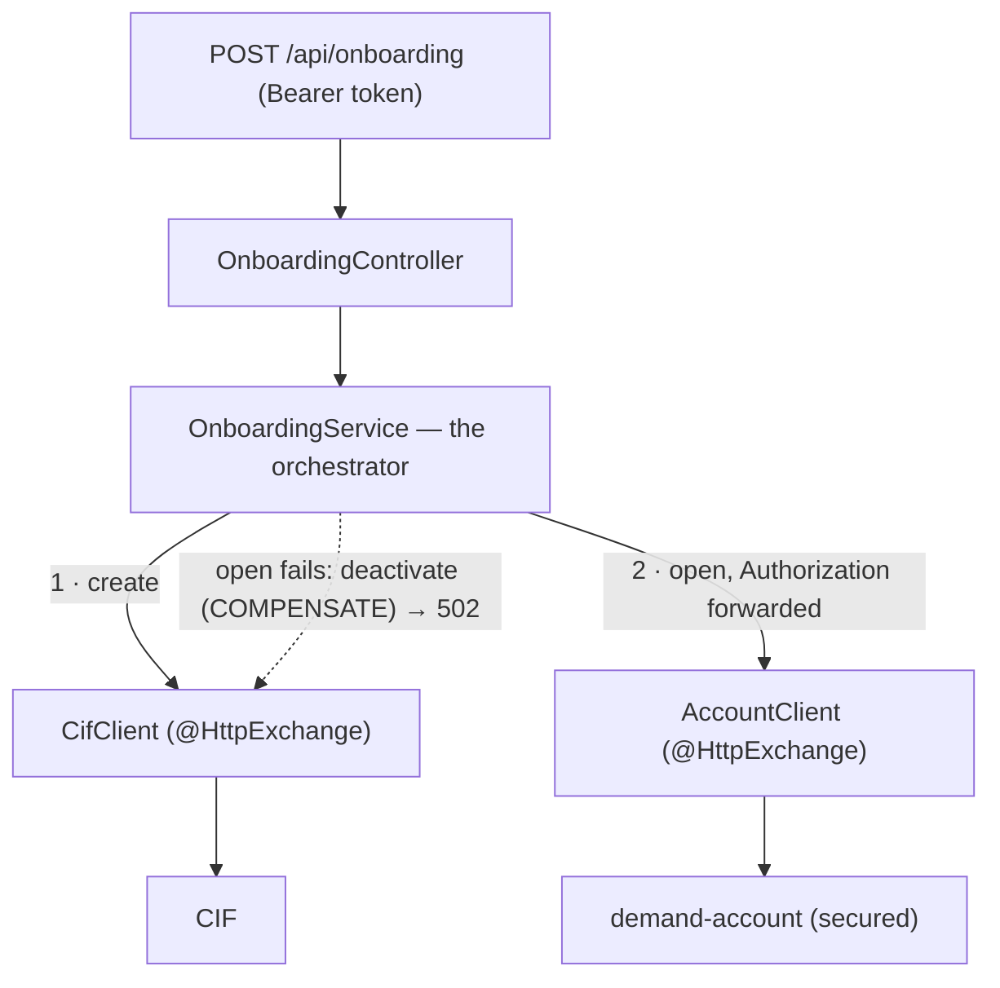
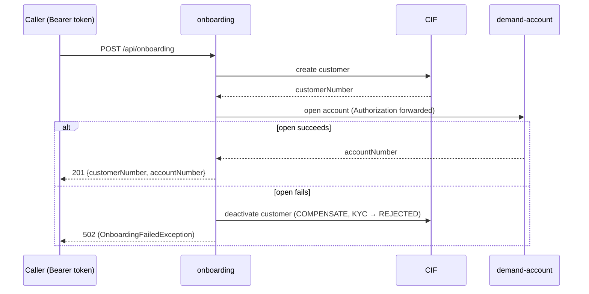

# Step 23 · Onboarding Orchestration — Coordinating Services with Compensation
### Phase D — Distributed Systems, Messaging & Batch 🔵→🟣 · Step 23 of 67

> *Onboarding a retail customer spans two services that don't share a transaction — create the customer in
> CIF, then open their demand account. This step builds a thin **orchestrator** that drives that workflow over
> declarative HTTP clients, **forwards the caller's token** to the secured account service, and — if the
> account step fails after the customer was created — runs a **compensating** action to deactivate the
> customer. It's the **orchestration** counterpart to Step 21's choreography/Saga: one coordinator that knows
> the whole flow.*

---

<a id="toc"></a>
## 🧭 The Six Movements of This Step

| | Movement | What happens | ~time |
|---|---|---|---|
| **A** | [🧭 Orient](#orient) | 30-second overview · skip-test · cheat card · why it matters · before you start | ~30 min |
| **B** | [🧠 Understand](#understand) | orchestration vs choreography · declarative HTTP clients · compensation · identity propagation | ~1h |
| **C** | [🛠️ Build](#build) | the orchestrator · `@HttpExchange` clients · the CIF compensation endpoint | ~7.5h |
| **D** | [🔬 Prove](#prove) | the Verification Log — happy path, compensation, token forwarding; §12.3 mutation | ~1.5h |
| **E** | [🎓 Apply](#apply) | go deeper · interview prep · your-turn challenges | ~1h |
| **F** | [🏆 Review](#review) | troubleshooting · resources · recap, flashcards & what's next | ~30 min |

---

<a id="orient"></a>

# A · 🧭 Orient

## 📋 This Step in 30 Seconds

| | |
|---|---|
| **Title** | Retail onboarding orchestration — coordinate CIF + demand-account over declarative HTTP clients, with compensation and token forwarding |
| **Step** | 23 of 67 · **Phase D — Distributed Systems, Messaging & Batch** 🔵→🟣 |
| **Effort** | ≈ 12 hours focused. Reuses the Step-15 `@HttpExchange` client pattern; no new infrastructure. |
| **What you'll run this step** | **JVM + Maven**. The orchestration tests need **no Docker** (in-process stubs); the CIF deactivate test uses Testcontainers Postgres. New service on port 8086. |
| **Buildable artifact** | A new **`services/onboarding`** (no DB): `OnboardingService` orchestrates `CifClient.create` → `AccountClient.open` (declarative `@HttpExchange` clients), **forwards the bearer token** to the secured account service, and **compensates** (`CifClient.deactivate`) on account-open failure. New CIF endpoint `POST /api/customers/{id}/deactivate`. `POST /api/onboarding`. `step-23-start == step-22-end`. |
| **Verification tier** | 🔴 **Full** — new service + a CIF change. `./mvnw verify` green + the orchestration (happy + compensation + token-forwarding) proven over real HTTP against in-process stubs + **§12.3 mutation** + clean-room + `smoke.sh`. |
| **Depends on** | **[Step 15](../step-15/lesson.md)** (`@HttpExchange`/RestClient clients), **[Step 21](../step-21/lesson.md)** (Saga/compensation — the contrast), **[Step 17](../step-17/lesson.md)** (the secured account service / token), **[Step 8](../step-08/lesson.md)** (CIF). |

By the end you will be able to build a **service orchestrator** with declarative HTTP clients, run a **compensating** action when a downstream step fails, **forward identity** (a bearer token) through the call chain, and explain **orchestration vs choreography**.

### ⏭️ Can You Skip This Step? (5-minute self-check)

If you can confidently do **all** of this, skim the 🛠️ Build and jump to **[Step 24 — Spring Batch + the Phase-D capstone](../step-24/lesson.md)**.

- [ ] I can explain **orchestration vs choreography** and when to pick each.
- [ ] I can call other services with **declarative `@HttpExchange` clients** (timeouts and all).
- [ ] I can write a **compensating** action for a multi-service workflow and explain why it isn't a rollback.
- [ ] I can **forward a bearer token** downstream (identity propagation) and say why.
- [ ] I know why a synchronous orchestrator isn't crash-safe and what makes a workflow durable.

> [!TIP]
> Not 100%? Stay. "Orchestration vs choreography," "how do you undo a multi-service operation," and "how does identity flow across services" are common distributed-design interview questions.

## 📇 Cheat Card

> **What this step delivers (one sentence):** a thin orchestrator that creates a CIF customer then opens their demand account — forwarding the caller's token — and deactivates the customer if the account step fails.

**Key commands** (Windows uses `.\mvnw.cmd`):

```bash
./mvnw -pl services/onboarding test        # orchestration happy path + compensation (no Docker)
bash steps/step-23/smoke.sh
# Live: POST /api/onboarding (with a token); see requests.http
```

**The headline diagram:**

```
POST /api/onboarding  (Bearer token)
   └─► CifClient.create ───────────► CIF: customer created
        └─► AccountClient.open ────► demand-account: open (token forwarded)
              fails? ─► CifClient.deactivate (COMPENSATE) ─► OnboardingFailedException (502)
              ok?    ─► OnboardingResult {customerNumber, accountNumber}
```

**The one sentence to remember:** *An orchestrator coordinates independently-committed remote steps — recovery is **compensation**, not rollback — and it **forwards identity** so downstream auth still works.*

## 🎯 Why This Matters

Real features cross service boundaries: onboarding, checkout, KYC. Someone has to coordinate the steps and decide what happens when step 3 of 4 fails. Orchestration (a coordinator) and choreography (events) are the two answers, and compensation + identity propagation are the details that make them correct in production. These are staple distributed-design interview topics.

## ✅ What You'll Be Able to Do

- Build a service **orchestrator** with declarative HTTP clients.
- Apply **compensation** across a multi-service workflow.
- **Forward a bearer token** (identity propagation) downstream.
- Contrast orchestration vs choreography and pick deliberately.

## 🧰 Before You Start

- **Prereqs:** bank builds green (`git describe` → `step-22-end`). Docker only for the CIF test.
- **Connects to what you know:** the **`@HttpExchange` client** (Step 15), **compensation** (Step 21 Saga — the contrast), the **secured account service + token** (Step 17), **CIF** (Step 8).
- **Depends on:** Steps **15, 21, 17, 8**.

## 🗓️ Session Plan

≈12 focused hours rarely fits one sitting. Six sittings, each ending at a real save point:

| Sitting | Covers | ~time | Ends when |
|---|---|---|---|
| **1 · The map** | A · Orient + B · Understand (big idea, clients recap, compensation, identity propagation) | ~1.5h | You can say "compensation, not rollback" and have read the B→C files tree |
| **2 · Compensation target** | Sub-step 1 of 3 — CIF `deactivate` service + endpoint | ~2h | `POST /api/customers/{id}/deactivate` → 204; cif tests green |
| **3 · Clients** | Sub-step 2 of 3 — `CifClient`/`AccountClient`, records, `HttpInterfaceClients` factory + timeouts | ~2.5h | `services/onboarding` registered in the root `pom.xml` and compiling with both clients |
| **4 · The orchestrator** | Sub-step 3 of 3 — `OnboardingService`, `OnboardingFailedException` (→ 502), controller | ~2.5h | 💾 commit made; `./mvnw -pl services/onboarding test` green |
| **5 · Prove it** | 🎮 Play With It (live 4-service flow) + D · Prove (mutation check, `smoke.sh`, clean-room) | ~2.5h | `bash steps/step-23/smoke.sh` passes; tagged `step-23-end` |
| **6 · Cement it** | E · Apply + F · Review (go-deeper, interview prep, recap, flashcards) | ~1h | Recap + one-line reflection done |

**Optional routes:** the ⏭️ skip-test (5 min) can send you straight to Step 24 · the two 🚀 Go Deeper fold-outs are +~5 min each · the 🎯 stretch challenge (durable saga) is +~1–2h on top.

✋ **Stopping here?** You have the map, nothing built yet. Next: B · Understand (~1h of reading); first action: reopen this lesson at [🧠 The Big Idea](#understand).

---

<a id="understand"></a>

# B · 🧠 Understand

## 🧠 The Big Idea — someone has to coordinate

A business operation that spans services has no single transaction. Two ways to coordinate:
- **Orchestration** — a **coordinator** (our `OnboardingService`) calls each service in order and decides what
  to do on failure. The flow lives in one place: easy to read, test, and trace.
- **Choreography** — no coordinator; each service reacts to events and emits the next (Step 20/21). Maximally
  decoupled, but the flow is implicit across handlers.

🪢 **Analogy:** an orchestrator is a **wedding planner** — one person calls the caterer, then the florist, and
cancels the caterer if the florist falls through. Choreography is a **dance troupe** — nobody calls the moves;
each dancer reacts to the others'.

```mermaid
flowchart LR
    O["Onboarding orchestrator"] -->|1 create| C["CIF"]
    O -->|2 open account\n(+ forwarded token)| A["demand-account"]
    O -.->|on failure: deactivate| C
```

We build **orchestration** here (a short, well-defined flow we want to reason about centrally), and contrast
it with the Step-21 Saga. Same compensation idea, different control style.

## 🧩 Pattern Spotlight — declarative HTTP clients (recap from Step 15)

The orchestrator calls CIF and demand-account through **`@HttpExchange` interfaces** — you declare the calls
as annotated methods and Spring generates the implementation (`HttpServiceProxyFactory` over a `RestClient`),
with **connect + read timeouts** so a slow dependency fails fast instead of hanging. No hand-written HTTP. We
build a tiny generic factory so the Spring config and the tests create clients identically.

## 🌱 Under the Hood: compensation, not rollback

CIF's create commits in CIF's database; demand-account's open commits in its own. There's no umbrella
transaction to roll back. So when the account step fails **after** the customer was created, the orchestrator
runs a **compensating** action — `CifClient.deactivate(customerId)` (KYC → REJECTED) — to undo the effect
semantically. (This is the same recovery model as the Step-21 Saga; here a single coordinator drives it.)
Like a Saga it is **not isolated**: between steps a customer exists with no account, which is exactly what the
compensation resolves.

❓ **Knowledge-check:** why can't the orchestrator just roll back the CIF create when the account step fails? <details><summary>Answer</summary>Each step commits in its **own service's database** — there is no umbrella transaction spanning services to roll back. Recovery is a **compensating** action (`deactivate`) that semantically undoes the create.</details>

## 🌱 Under the Hood: identity propagation

demand-account is a **secured** OAuth2 resource server (Step 17): it rejects unauthenticated calls. So the
orchestrator must present a token when it calls. The simplest correct approach for a user-initiated flow is
**token forwarding**: the orchestrator takes the caller's `Authorization` header and passes it on the
downstream call. CIF has no auth yet (R-002), so no token is needed there. (A service acting on its own
behalf would instead use a service/client-credentials token — a later auth step.)

## 🛡️ Security Lens & 🧵 Thread-safety note

The orchestrator forwards but does not mint tokens; it has **no auth of its own yet** (R-002) — front it with
the gateway later. **Thread-safety:** the orchestrator is stateless (no shared mutable state); each request's
flow is independent.

## 🕰️ Then vs. Now

Cross-service coordination used to be hidden inside chatty point-to-point calls or a heavyweight ESB/BPEL
engine. **Now** it's an explicit, testable orchestrator using typed HTTP clients (or, for durability, a
workflow engine / event-sourced saga). The key modern discipline: make the failure path (compensation) a
first-class, tested part of the design — not an afterthought.

---

# B→C bridge: 🌳 files we'll touch

**What we're about to build:**



```
pom.xml                                  (edit) register services/onboarding
services/onboarding/                     (NEW SERVICE, no DB)
  OnboardingApplication
  client/CifClient (@HttpExchange: create, deactivate) + records CreateCustomer/CreatedCustomer
  client/AccountClient (@HttpExchange: open, forwards Authorization) + records OpenAccount/OpenedAccount
  client/HttpInterfaceClients (generic factory) · client/ClientConfig (beans + timeouts)
  service/OnboardingService (the orchestrator) · service/OnboardingFailedException (→ 502)
  web/OnboardingController (POST /api/onboarding) · OnboardingRequest/OnboardingResult
  application.yml (services.cif.url / services.account.url + timeouts)
services/cif/
  CustomerService.deactivate + CustomerController POST /api/customers/{id}/deactivate   (the compensation target)
steps/step-23/{lesson.md, requests.http, smoke.sh}
```

✋ **Stopping here?** You have 12 modules green and the target picture above. Next: C · Build, Sub-step 1 of 3 (the CIF compensation target); first action: open CIF's `CustomerService` and add `deactivate(id)`.

<a id="build"></a>

# C · 🛠️ Let's Build It — Step by Step

## 📦 Your Starting Point

`step-23-start == step-22-end`: 12 modules green. We add a thin orchestrator + a CIF compensation endpoint.

## Sub-step 1 of 3 — the CIF compensation target (~2h)

🎯 Add `CustomerService.deactivate(id)` (KYC → REJECTED) and `POST /api/customers/{id}/deactivate` → 204. This is the real action the orchestrator's compensation calls.

✅ **Checkpoint (objective: apply compensation):** `./mvnw -pl services/cif test` is green with the new endpoint in place — the compensation target exists before anything calls it.

📍 **You are here:** CIF can deactivate ✅ → clients ⬜ → orchestrator ⬜

✋ **Stopping here?** You have the compensation target live in CIF. Next: Sub-step 2 of 3 (declarative clients); first action: create `services/onboarding/…/client/CifClient.java`.

## Sub-step 2 of 3 — declarative clients (~2.5h)

🎯 `CifClient` (`@PostExchange("/api/customers")` create, `@PostExchange("/api/customers/{id}/deactivate")` deactivate) and `AccountClient` (`@PostExchange("/api/accounts")` open, forwarding `@RequestHeader Authorization`). Response records carry `@JsonIgnoreProperties(ignoreUnknown = true)` so they tolerate the services' fuller payloads. A generic `HttpInterfaceClients.create(...)` factory (timeouts) + `ClientConfig` beans.

❓ **Quick check:** why does each response record need `@JsonIgnoreProperties(ignoreUnknown = true)`? <details><summary>Answer</summary>The real services return **more fields** than the record declares; without it, deserialization fails on the first unknown property (see 🩺 Troubleshooting).</details>

🔮 **Predict:** without connect/read timeouts, what happens to the orchestrator if demand-account hangs for 60 s? <details><summary>Answer</summary>The calling thread blocks for the whole hang — one slow dependency stalls the flow and can exhaust the orchestrator's threads. Timeouts make it **fail fast** (the Step-15 discipline).</details>

✅ **Checkpoint (objective: declarative clients):** `services/onboarding` is registered in the root `pom.xml` (see the files tree) and compiles with both clients + `ClientConfig` wired.

📍 **You are here:** CIF can deactivate ✅ → clients ✅ → orchestrator ⬜

✋ **Stopping here?** You have both `@HttpExchange` clients and the factory compiling; nothing calls them yet. Next: Sub-step 3 of 3 (the orchestrator); first action: create `services/onboarding/…/service/OnboardingService.java`.

## Sub-step 3 of 3 — the orchestrator (~2.5h)

🎯 `OnboardingService.onboard(request, authorization)`: create customer → derive `DDA-<customerNumber>` → open account (forward token) → on failure, `deactivate(customerId)` + throw `OnboardingFailedException` (→ 502). NOT transactional — there's no shared transaction; compensation is the recovery.

🔮 **Predict:** the account step fails after the customer is created — what does the caller get, and what state is CIF left in? <details><summary>Answer</summary>**502**, and the customer is **deactivated** (KYC REJECTED) — no half-onboarded active customer. Proven by the compensation test.</details>

✅ **Checkpoint (objectives: orchestrator + token forwarding):** `./mvnw -pl services/onboarding test` is green (happy path + compensation, no Docker) — compare with the Verification Log in D.

💾 **Commit:** `feat(onboarding,cif): Step 23 onboarding orchestration + compensation`

📍 **You are here:** CIF can deactivate ✅ → clients ✅ → orchestrator ✅ — build done; live run + proof remain.

✋ **Stopping here?** You have the full orchestrator committed. Next: 🎮 Play With It (the live 4-service flow); first action: open [`requests.http`](requests.http).

## 🎮 Play With It

Run auth + cif + demand-account + onboarding, then (full flow in [`requests.http`](requests.http)):

🔮 **Predict:** you onboard once successfully, then **stop demand-account** and onboard again — what status does the caller get, and what happens to the freshly created CIF customer?

```bash
# POST /api/onboarding (Bearer token) → 201 {customerNumber, accountNumber, status:ONBOARDED}
# Stop demand-account, onboard again → 502; the new CIF customer is now KYC REJECTED (compensated).
```

🧪 **Little experiments:** point `ACCOUNT_URL` at a dead port → every onboarding compensates; watch the orchestrator log "created customer … → compensating (deactivate)".

**The flow you built, end to end:**



## 🏁 The Finished Result

`step-23-end`: 13 modules; a working onboarding orchestrator with compensation and token forwarding.

**✅ Definition of Done:**

- [ ] `POST /api/onboarding` returns **201** with `customerNumber` + `accountNumber` — and on a forced account-open failure returns **502** with the customer compensated (KYC REJECTED)
- [ ] `./mvnw verify` is green (13 modules)
- [ ] `bash steps/step-23/smoke.sh` passes
- [ ] Committed and tagged `step-23-end`

✋ **Stopping here?** You have the whole build done and playable. Next: D · Prove (~1.5h); first action: run `./mvnw -pl services/onboarding test` and compare against the Verification Log below.

---

<a id="prove"></a>

# D · 🔬 Prove It Works — Verification Log

> **Tier: 🔴 Full.** New service + a CIF change. Real output below. The orchestration is proven over **real HTTP** against in-process stubs (the Step-15 in-test-stub pattern — deterministic, no Docker); the CIF deactivate endpoint via the slice.

**1 · Orchestration + compensation + token-forwarding, and the CIF endpoint — all green:**

```
2026-… c.b.o.service.OnboardingService : onboarding: created customer CIF-STUB
2026-… c.b.o.service.OnboardingService : onboarding: opened account DDA-CIF-STUB          ← happy path
2026-… c.b.o.service.OnboardingService : onboarding: account-open failed for CIF-STUB — compensating (deactivate)   ← compensation
[INFO] Tests run: 2, Failures: 0, Errors: 0, Skipped: 0 -- in com.buildabank.onboarding.OnboardingOrchestrationTest
[INFO] Tests run: 2, Failures: 0, Errors: 0, Skipped: 0 -- in com.buildabank.onboarding.web.OnboardingControllerTest
[INFO] Tests run: 4, Failures: 0, Errors: 0, Skipped: 0     ← onboarding
[INFO] BUILD SUCCESS    ← + cif CustomerControllerTest (incl. the new deactivate → 204)
```

- `OnboardingOrchestrationTest` (real HTTP, in-process stubs) — happy path creates the customer then opens the account and the **forwarded bearer token** reaches the account call; a forced account-open failure makes the orchestrator **compensate** (`deactivateCalls == [42]`) and throw `OnboardingFailedException`.
- `OnboardingControllerTest` — `POST /api/onboarding` → 201 + result (token forwarded); invalid body → 400.
- cif `CustomerControllerTest` — `POST /api/customers/{id}/deactivate` → 204 and the service is called.

**2 · §12.3 Mutation sanity-check (prove the compensation test has teeth).** Removed the compensating `cif.deactivate(...)` and re-ran:

```
[ERROR] OnboardingOrchestrationTest.accountOpenFails_orchestratorCompensatesByDeactivatingTheCustomer:89
Expecting actual: [] to contain exactly: [42] — but could not find [42]
[ERROR] Tests run: 1, Failures: 1, Errors: 0, Skipped: 0
```
→ Without compensation, the created customer is left active (no deactivate call) — the test **fails as designed**. **Reverted**; green again.

**3 · `smoke.sh`** — `bash steps/step-23/smoke.sh` ran the onboarding orchestration tests (no Docker) + the CIF `CustomerControllerTest` (incl. the new deactivate endpoint) → `✅ Step 23 smoke test PASSED`.

**4 · Clean-room (§12.4)** — fresh clone at `step-23-end`, `./mvnw verify` → BUILD SUCCESS (13 modules).

**§12.8 honesty:** the orchestration logic (sequence, compensation, token forwarding) is proven over **real
HTTP** against in-process stub services — the same approach Step 15 used for the gateway/client. The **live**
multi-service run (auth + CIF + demand-account + onboarding) is documented in `requests.http`; the orchestrator
is synchronous and not crash-recoverable mid-flow (durable workflows are a later step — noted in ADR-0014).

---

<a id="apply"></a>

# E · 🎓 Apply

✋ **Re-entering here?** Your build is proven and `step-23-end` is tagged — E and F are depth + recap (~1.5h total); first action: the two Go Deeper fold-outs below.

## 🚀 Go Deeper (Optional)

<details><summary>Orchestration vs choreography — how to choose (+~5 min)</summary>Orchestration: a coordinator owns the flow — best for short, well-defined processes you want to see/trace/change in one place; the coordinator is a coupling point. Choreography: services react to events — best for decoupling and independent evolution; the flow is emergent and harder to trace. Many systems mix both.</details>

<details><summary>Why isn't this crash-safe? (+~5 min)</summary>The orchestrator holds the flow in memory and runs synchronously. If it crashes after creating the customer but before opening the account (or before compensating), you're left with a half-onboarded customer and no record of where you were. Durable orchestration (persisted saga state + retries, or a workflow engine) fixes that — a later step.</details>

❓ **Knowledge-check:** how does the orchestrator's call to the secured demand-account service get authorized, and why does the CIF call need nothing? <details><summary>Answer</summary>It **forwards the caller's `Authorization` bearer token** (identity propagation / token relay) so the resource server can validate it; CIF has no auth yet (R-002), so no token is needed there.</details>

## 💼 Interview Prep

1. **Orchestration vs choreography?** *Orchestration = a central coordinator drives the steps and compensations (explicit, traceable). Choreography = services react to events with no coordinator (decoupled, implicit). Pick by how much you value central control vs decoupling.* **(Common.)**
2. **How do you undo a multi-service operation?** *Compensation — a semantic undo (a deactivate undoes a create), because each step committed independently and can't be rolled back. Design the compensating action as a first-class part of the flow.*
3. **How does identity flow across services?** *Forward the caller's token (token relay) for user-initiated calls, or use a service/client-credentials token for service-initiated ones; the downstream resource server validates it (Step 17).*
4. **Why timeouts on the orchestrator's calls?** *A coordinator that blocks forever on one slow dependency stalls the whole flow and exhausts its threads — connect/read timeouts make it fail fast (Step 15).*
5. **(Gotcha) Is the orchestrated workflow isolated/atomic?** *No — intermediate state is visible and a crash can leave it partial; you handle that with compensation and (for durability) persisted workflow state.*

## 🏋️ Your Turn: Practice & Challenges

- **Quick (+~30 min):** add a third step — emit a `customer.onboarded` event (Step-20 Outbox/Kafka) so notification sends a welcome — and decide if its failure should compensate.
- **Quick (+~30 min):** add a retry (with backoff) around the account-open call before compensating.
- 🎯 **Stretch (+~1–2h; reference solution in `solutions/step-23/`):** make onboarding **durable** — persist the saga state (which steps completed) so a restart can resume or compensate, instead of losing the flow on a crash. Compare with the in-memory orchestrator.

✋ **Stopping here?** Only the recap remains. Next: F · Review (~30 min); first action: skim 🩺 Troubleshooting, then the recap.

---

<a id="review"></a>

# F · 🏆 Review

## 🩺 Stuck? Troubleshooting & Fixes

- **`@RequestHeader`/`@RequestBody` not applied on the client** — for `@HttpExchange` interfaces, use the `org.springframework.web.bind.annotation` annotations on the parameters; a null header value is simply omitted.
- **Deserialization fails with "unknown property"** — the downstream returns more fields than your response record. Add `@JsonIgnoreProperties(ignoreUnknown = true)` (the annotations live in `com.fasterxml.jackson.annotation`, present on Jackson 3 too).
- **The account call is unauthorized in the live flow** — demand-account requires a token (Step 17). Forward the caller's `Authorization` header (we do); CIF needs none.
- **A 5xx from a downstream doesn't trigger compensation** — `RestClient` throws on 4xx/5xx by default; make sure the orchestrator catches the exception around the step and runs the compensation there.
- **Reset:** `git checkout step-23-end`; `make doctor`.

## 📚 Learn More & Glossary

- Spring HTTP Interface clients (`@HttpExchange`); microservices.io: Saga / orchestration vs choreography; the "API composition" and "Saga" chapters of *Microservices Patterns*; token relay / OAuth2 in microservices.
- **Glossary:**
  - *orchestration* — a central coordinator calls each service in order and owns the failure handling; the flow lives in one place.
  - *choreography* — no coordinator: each service reacts to events and emits the next (Steps 20/21); the flow is implicit across handlers.
  - *compensating transaction* — a new forward action that semantically undoes a previously committed step (deactivate undoes create), used because committed remote steps cannot be rolled back.
  - *declarative HTTP client (`@HttpExchange`)* — an annotated interface Spring implements over `RestClient` (with timeouts); no hand-written HTTP (Step 15).
  - *identity propagation / token relay* — forwarding the caller's bearer token on downstream calls so the secured resource server can still authorize.
  - *idempotency* — an operation that is safe to repeat: applying it again doesn't change the outcome beyond the first application.
  - *durable workflow* — workflow state persisted outside memory so a crashed flow can resume or compensate (a later step; ADR-0014).

## 🏆 Recap & Study Notes

**(a) Key points:** A multi-service operation has no shared transaction. An **orchestrator** coordinates the steps and, on failure, runs **compensation** (a semantic undo), not a rollback. It calls services with **declarative `@HttpExchange` clients** (timeouts) and **forwards the caller's token** so downstream auth works. Orchestration (coordinator) vs choreography (events) is a deliberate choice; a synchronous orchestrator isn't crash-safe (durability is a later concern).

**(b) Key terms:** orchestration, choreography, compensation, `@HttpExchange` client, identity propagation/token relay, `OnboardingFailedException` (→ 502), durable workflow.

**(c) 🧠 Test Yourself:** ① Orchestration vs choreography? ② Why compensation instead of rollback? ③ How does the secured account call succeed? ④ Why timeouts on the calls? ⑤ Why isn't the orchestrator crash-safe? <details><summary>Answers</summary>① Coordinator-driven vs event-driven. ② Each step committed independently — you semantically undo. ③ The orchestrator forwards the caller's bearer token. ④ Fail fast instead of hanging on a slow dependency. ⑤ In-memory synchronous flow — a mid-flow crash leaves partial state; durability needs persisted workflow state.</details>

**(d) 🔗 How this connects:** reuses Step 15 (`@HttpExchange`), contrasts Step 21 (Saga/choreography), needs Step 17 (token). **Next: Step 24** — **Spring Batch** (chunked EOD jobs, restart/retry/skip) + the **🎓 Phase-D capstone** (a payment end-to-end across Kafka with Outbox + Saga + idempotency, exactly-once *effect* under a forced retry) — which **closes Phase D**.

**(e) 🏆 Résumé line:** *"Built a retail-onboarding orchestrator across services with declarative HTTP clients, compensating actions on failure, and bearer-token identity propagation."*

**(f) ✅ You can now:** orchestrate a multi-service workflow · compensate on failure · forward identity downstream · choose orchestration vs choreography.

**(g) 🃏 Flashcards** (also appended to `docs/flashcards.md`):

- **Q:** Orchestration vs choreography? → **A:** A coordinator drives the steps and compensations (explicit, traceable) vs services reacting to events with no coordinator (decoupled, implicit).
- **Q:** Why compensation instead of rollback? → **A:** Each step commits in its own service's database — no umbrella transaction exists, so you semantically undo (deactivate undoes create).
- **Q:** How does the orchestrator authenticate to demand-account? → **A:** It forwards the caller's `Authorization` bearer token (identity propagation / token relay); the resource server validates it.
- **Q:** Why isn't the synchronous orchestrator crash-safe? → **A:** The flow lives in memory — a mid-flow crash loses its position and can leave a half-onboarded customer; durability needs persisted workflow state.

🔁 revisit orchestration + compensation at the Phase-D capstone (Step 24) and durable workflows (Step 52).

**(h) ✍️ One-line reflection:** *Which of the bank's flows should be orchestrated, and which should be choreographed — and why?*

**(i)** 🎉 The bank can onboard customers across services. Next: batch processing and the Phase-D capstone.
