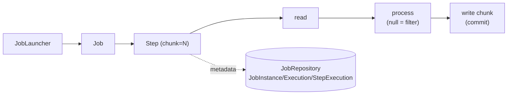
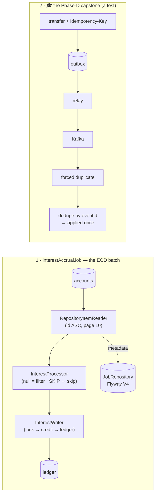
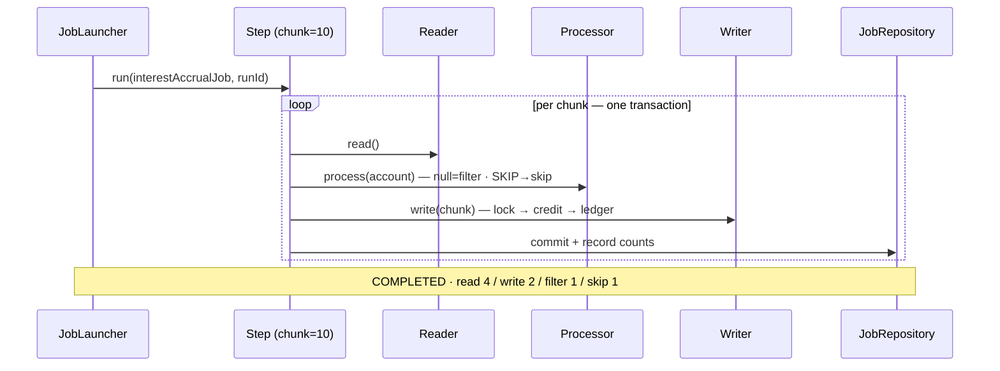
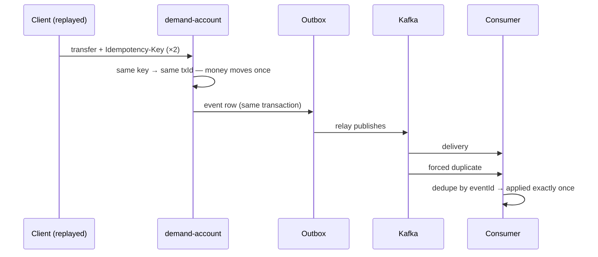

# Step 24 · Spring Batch (EOD Jobs) & the Phase-D Capstone — End of Phase D 🎖️
### Phase D — Distributed Systems, Messaging & Batch 🔵→🟣 · Step 24 of 67 · **Phase-D finale**

> *Banks run **end-of-day** jobs over the whole book — interest accrual, statements, reconciliation. This step
> builds a chunk-oriented **Spring Batch** interest-accrual job that reads every account, computes interest,
> writes it back, and is **fault-tolerant**: one bad record is skipped, a transient conflict is retried, the
> night's run doesn't abort. Then the **🎓 Phase-D capstone** ties the whole phase together: a payment traced
> end-to-end — Idempotency-Key → Outbox → Kafka → a forced duplicate → applied **exactly once**.*

---

<a id="toc"></a>
## 🧭 The Six Movements of This Step

| | Movement | What happens | ~time |
|---|---|---|---|
| **A** | [🧭 Orient](#orient) | 30-second overview · skip-test · cheat card · why it matters · before you start | ~0.5 h |
| **B** | [🧠 Understand](#understand) | batch vs online · chunk-oriented steps · JobRepository · skip/retry/restart · the capstone | ~2 h |
| **C** | [🛠️ Build](#build) | the JobRepository schema (Flyway) · the interest-accrual job · the capstone test | ~11.5 h |
| **D** | [🔬 Prove](#prove) | the Verification Log — the job's counts + effects, the capstone, §12.3 mutation | ~2.5 h |
| **E** | [🎓 Apply](#apply) | go deeper · interview prep · your-turn challenges | ~1 h |
| **F** | [🏆 Review](#review) | troubleshooting · resources · recap, flashcards & **Phase-D wrap** | ~0.5 h |

---

<a id="orient"></a>

# A · 🧭 Orient

## 📋 This Step in 30 Seconds

| | |
|---|---|
| **Title** | Spring Batch — a fault-tolerant chunk-oriented EOD interest-accrual job — plus the Phase-D capstone (exactly-once effect end-to-end) |
| **Step** | 24 of 67 · **Phase D — Distributed Systems, Messaging & Batch** 🔵→🟣 · **End of Phase D** 🎖️ |
| **Effort** | ≈ 18 hours focused (a milestone). Batch added to demand-account; the capstone reuses Outbox/Saga/idempotency. |
| **What you'll run this step** | **JVM + Maven**; **🐳 Docker** for Testcontainers (Postgres + Redpanda). |
| **Buildable artifact** | **demand-account**: `spring-boot-starter-batch`; the Batch **JobRepository** schema via Flyway **V4**; an `interestAccrualJob` (RepositoryItemReader → `InterestProcessor` → `InterestWriter`, chunked) with **skip/retry**; jobs don't auto-run (`spring.batch.job.enabled=false`). **Capstone test**: a payment end-to-end with Idempotency-Key + Outbox→Kafka + a forced duplicate → exactly-once effect. `step-24-start == step-23-end`. |
| **Verification tier** | 🔴 **Full** (milestone). `./mvnw verify` green + the job's read/write/skip/filter counts + balance effects proven on real Postgres + the capstone on real Postgres+Redpanda + **§12.3 mutation** + clean-room + `smoke.sh`. |
| **Depends on** | **[Step 12](../step-12/lesson.md)** (accounts/ledger + locking), **[Step 8](../step-08/lesson.md)** (Flyway), **[Step 20](../step-20/lesson.md)** (Outbox/Kafka), **[Step 21](../step-21/lesson.md)** (Saga/idempotency), **[Step 19](../step-19/lesson.md)** (delivery). **+ Docker.** |

By the end you will be able to build a **chunk-oriented Spring Batch job** with a JDBC **JobRepository**, make it **fault-tolerant** (skip/retry) and **restartable**, and explain **exactly-once effect** end-to-end across the Phase-D pipeline.

### ⏭️ Can You Skip This Step? (5-minute self-check)

If you can confidently do **all** of this, you've finished Phase D — on to **[Step 25](../step-25/lesson.md)** (Phase E).

- [ ] I can build a **chunk-oriented** Batch step (reader → processor → writer) and explain the chunk transaction.
- [ ] I can make a step **fault-tolerant** (`skip`, `retry`) and say why a bad record shouldn't fail the night.
- [ ] I know what the **JobRepository** is and why I'd version its schema with Flyway rather than auto-initialize.
- [ ] I can explain Batch **restartability** (JobInstance/JobParameters) and `processor` **filtering** (returning null).
- [ ] I can trace a payment end-to-end and explain **exactly-once effect** under a forced retry.

> [!TIP]
> Not 100%? Stay. "Design an EOD job that processes millions of rows and survives a bad record," and "how do you guarantee a payment is processed exactly once" are classic batch + distributed interview questions.

## 📇 Cheat Card

> **What this step delivers (one sentence):** a fault-tolerant chunk-oriented EOD interest-accrual Batch job, plus a capstone proving a payment is applied exactly once end-to-end despite a forced duplicate.

**Key commands** (Windows uses `.\mvnw.cmd`):

```bash
./mvnw -pl services/demand-account test -Dtest=InterestAccrualJobTest      # the batch job
./mvnw -pl services/demand-account test -Dtest=PaymentExactlyOnceCapstoneTest
bash steps/step-24/smoke.sh
```

**The headline diagram — a chunk-oriented step:**

```
JobLauncher → Job → Step (chunk = N):
   ┌────────────── one chunk transaction ──────────────┐
   reader ─► processor ─► [accumulate N] ─► writer ──► COMMIT
            (filter=null)                    (skip bad / retry transient)
   JobRepository records JobInstance / JobExecution / StepExecution (counts, status) → restartable
```

**The one sentence to remember:** *Batch processes data in **committed chunks**, the **JobRepository** remembers progress (so a run is restartable), and **skip/retry** keep one bad record from failing the whole night.*

## 🎯 Why This Matters

Online code handles one request; batch handles the whole book at 2am. Get it wrong and a single corrupt row aborts interest for every customer, or a crash forces you to re-run from scratch (double-crediting everyone). Chunking, the JobRepository, and skip/retry/restart are exactly how production EOD jobs stay correct and recoverable — staple topics for any backend handling money at scale.

## ✅ What You'll Be Able to Do

- Build a chunk-oriented Spring Batch job (reader/processor/writer).
- Make a step **fault-tolerant** (skip/retry) and understand **restartability**.
- Version the **JobRepository** schema with Flyway.
- Reason about **exactly-once effect** across the Phase-D pipeline.

## 🧰 Before You Start

- **Prereqs:** bank builds green (`git describe` → `step-23-end`); Docker running.
- **Connects to what you know:** the **accounts/ledger + lock** (Step 12), **Flyway** (Step 8), and the capstone reuses **Outbox/Kafka** (Step 20), **Saga/idempotency** (Step 21), **delivery semantics** (Step 19).
- **Depends on:** Steps **12, 8, 20, 21, 19**. **+ Docker.**

## 🗓️ Session Plan

≈18 hours is **not** one heroic evening — it's seven sittings, each ending at a real save point (✋ checkpoints mark them in the text):

| # | Sitting | Covers | ~time | Ends at |
|---|---|---|---|---|
| S1 | Read the map | Movements **A + B** (skip-test, Big Idea, JobRepository, fault tolerance, capstone theory) | ~2.5 h | end-of-B ✋ (nothing to commit) |
| S2 | Schema night | **Sub-step 1** — pom + yml + Flyway `V4__batch_schema.sql` | ~2 h | Sub-step 1 ✋ + commit |
| S3 | The brain | **Sub-steps 2a–2b** — `InterestPosting`, `InterestSkipException`, `InterestProcessor` | ~2.5 h | Sub-step 2b ✋ + commit |
| S4 | The hands | **Sub-steps 2c–2d** — `InterestWriter`, `InterestAccrualJobConfig`, `InterestAccrualJobTest` green | ~3.5 h | Sub-step 2d ✋ + commit |
| S5 | The capstone | **Sub-step 3** — `PaymentExactlyOnceCapstoneTest` green | ~3.5 h | Sub-step 3 ✋ + commit |
| S6 | Prove it | 🎮 Play With It + **Movement D** (the §12.3 mutation, `smoke.sh`, clean-room) | ~2.5 h | tag `step-24-end` |
| S7 | Cement it | Movements **E + F** — interview prep, challenges, recap + Phase-D wrap | ~1.5 h | Phase D done 🎖️ |

**Optional routes:** the ⏭️ skip-test above costs 5 min and may save you the step; the two 🚀 Go-Deeper asides in Movement E are +~10 min each; the ✍️ type-it-first writer scaffold (2c) and 🧨 break-it box (2d) add ~15 min but pay for themselves.

---

<a id="understand"></a>

# B · 🧠 Understand

## 🧠 The Big Idea — process the whole book, in recoverable chunks

Batch differs from online processing: high volume, no user waiting, and it must **resume** after a failure
rather than start over. Spring Batch's model:
- A **Job** is made of **Steps**. A **chunk-oriented Step** loops: **read** an item, **process** it, and once
  **N** items are accumulated, **write** the chunk — all in one **transaction** (commit per chunk). On the next
  chunk, a new transaction.
- The **JobRepository** (JDBC tables) records every `JobInstance`, `JobExecution`, and `StepExecution` —
  read/write/skip counts, status, and the execution context — which is what makes a job **restartable**.



🎭 **Analogy — the night-shift clerk.** Picture a clerk working a stack of paper accounts in bundles of ten, stamping the register after each finished bundle (the **chunk commit**). If the fire alarm interrupts the night, tomorrow's clerk resumes at the last stamp, not page one (**JobRepository → restart**). A torn page goes in the problem tray to reconcile later instead of stopping the night (**skip**); a page a colleague is currently holding gets retried in a minute (**retry**); a page with nothing owed is simply set aside (**filter**).

## 🧩 Pattern Spotlight — chunk-oriented processing + fault tolerance

**Problem:** millions of records, item-at-a-time commits are too slow, but one giant transaction is fragile and
locks everything. **Fit:** **chunking** — read/process many, write+commit in batches (tune N for throughput vs
memory/lock duration). **Fault tolerance:** a single bad record (a malformed row, a closed account) shouldn't
abort the night, and a transient blip (a lock conflict against live traffic) should just be retried:
- `skip(SomeException).skipLimit(k)` — tolerate up to *k* bad records (recorded as skips), keep going.
- `retry(TransientException).retryLimit(r)` — re-attempt an item up to *r* times before giving up.
- **filter** — a processor returning `null` drops the item (not written, counted as filtered) — for "no work
  needed" items (here: zero-balance accounts).
- **restart** — re-launching a failed job (new `JobExecution`, same `JobInstance` for the same identifying
  `JobParameters`) resumes where it left off; a *completed* instance won't re-run.

❓ **Knowledge check:** an EOD job fails halfway and you re-launch it with the **same identifying JobParameters** — do you get a new JobInstance, a new JobExecution, or both? <details><summary>Answer</summary>A **new JobExecution** of the **same JobInstance** — the JobRepository knows the instance failed, so the new execution resumes from the last committed chunk. (A *completed* instance won't re-run at all.)</details>

## 🌱 Under the Hood: the JobRepository schema — Flyway, not auto-init

Spring Batch needs its `BATCH_*` tables. Boot can auto-create them (`initialize-schema=always`), but our DB is
owned by **Flyway** (Hibernate `ddl-auto=validate`), and auto-init re-runs plain `CREATE TABLE`s every startup.
So we copy Batch's canonical `schema-postgresql.sql` into a **Flyway migration (V4)** and set
`spring.batch.jdbc.initialize-schema=never`. Boot still auto-configures the `JobRepository`/`JobLauncher`
(no `@EnableBatchProcessing` — that would turn the autoconfig off). Jobs don't run on startup
(`spring.batch.job.enabled=false`); they're launched explicitly or by an EOD `@Scheduled`+ShedLock trigger (Step 22).

## 🛡️ Security Lens & 🧵 Thread-safety note

An EOD job runs **concurrently with live traffic**, so the writer re-reads each account with the Step-12
pessimistic lock before crediting — a transfer landing mid-run can't lose the update. The transient we `retry`
is `OptimisticLockingFailureException` — the `@Version` conflict (Step 9) that can still surface when the batch
write races a live transfer *outside* the locked window. Be precise here: a pessimistic lock **timeout** raises
`PessimisticLockingFailureException`, a sibling that this retry does **not** cover; widening the retry to their
common parent `ConcurrencyFailureException` would catch both (if you change it, re-run the tests). At scale
you'd also **partition** the step (parallel workers over account ranges).

## 🕰️ Then vs. Now

Spring Batch 6 (the Boot-4 line) reorganized packages — the item layer moved to
`org.springframework.batch.infrastructure.item.*`, and `Job`/`Step` to `…core.job`/`…core.step`. The chunk
builder `chunk(size, txManager)` is **deprecated for removal** in 6.0 in favour of a new `ChunkOrientedStepBuilder`
(whose fault-tolerance API is still settling); we use the stable fault-tolerant builder on the pinned version
and flag the migration. (We hit the moved packages for real — see 🩺.)

## 🧩 The 🎓 Phase-D Capstone — exactly-once *effect* end-to-end

The capstone traces a single payment through everything Phase D built, on real infrastructure:
1. **Idempotency-Key** (Step 14/21): a replayed transfer with the same key moves money **once**.
2. **Outbox** (Step 20): the transfer atomically wrote an event row; the relay publishes it to Kafka.
3. **At-least-once + idempotent consumer** (Step 19/20): we **force a duplicate** redelivery and dedupe by
   eventId → the event is **applied exactly once**. *Exactly-once delivery is impossible; exactly-once
   **effect** is what we engineer.*

> ✋ **Checkpoint — end of Understand (S1).** Stopping here? You have the concepts; nothing to commit yet.
> Next: Sub-step 1 (the JobRepository schema); first action: create
> `services/demand-account/src/main/resources/db/migration/V4__batch_schema.sql`.

---

# B→C bridge: 🌳 files we'll touch

```
services/demand-account/
  pom.xml                                              (edit) spring-boot-starter-batch
  src/main/resources/db/migration/V4__batch_schema.sql (new) the JobRepository tables (Flyway)
  src/main/resources/application.yml                   (edit) spring.batch.job.enabled=false; initialize-schema=never; bank.interest.daily-rate
  src/main/java/.../batch/InterestAccrualJobConfig.java (new) Job + Step (chunk, skip, retry) + reader
  src/main/java/.../batch/InterestProcessor.java        (new) compute interest / filter / skip sentinel
  src/main/java/.../batch/InterestWriter.java           (new) credit + ledger per chunk (with the lock)
  src/main/java/.../batch/{InterestPosting,InterestSkipException}.java
  src/test/java/.../batch/InterestAccrualJobTest.java   (new) launch the job; assert counts + effects
  src/test/java/.../PaymentExactlyOnceCapstoneTest.java (new) 🎓 the Phase-D capstone
steps/step-24/{lesson.md, smoke.sh}
```

<a id="build"></a>

# C · 🛠️ Let's Build It — Step by Step

## 📦 Your Starting Point

`step-24-start == step-23-end`: 13 modules green. We add Batch to demand-account.

## 🗺️ What We're Building

Two deliverables (the files tree is just above, in the B→C bridge):



## Sub-step 1 — the JobRepository schema (Flyway V4) *(~2 h)*

🎯 Copy Batch's `schema-postgresql.sql` into `V4__batch_schema.sql`; set `spring.batch.jdbc.initialize-schema=never` and `spring.batch.job.enabled=false`. ▶️ Flyway logs `Migrating schema "public" to version "4 - batch schema"` on the next test run.

**1 · The dependency** — in `services/demand-account/pom.xml`:

```xml
<!-- services/demand-account/pom.xml — Step 24: Spring Batch -->
<dependency>
    <groupId>org.springframework.boot</groupId>
    <artifactId>spring-boot-starter-batch</artifactId>
</dependency>
```

**2 · The config** — two settings under `spring:` in `application.yml`:

```yaml
# services/demand-account/src/main/resources/application.yml (add under spring:)
  # Step 24 — Spring Batch. Don't auto-run jobs at startup (launched explicitly / by an EOD trigger); Flyway
  # owns the JobRepository schema (V4), so Batch must not also try to initialize it.
  batch:
    job:
      enabled: false
    jdbc:
      initialize-schema: never
```

(The interest rate arrives in Sub-step 2b via `@Value("${bank.interest.daily-rate:0.0001}")` — the default lives in code, overridable per environment.)

**3 · The migration** — copy `schema-postgresql.sql` out of the `spring-batch-core` jar, verbatim:

```sql
-- services/demand-account/src/main/resources/db/migration/V4__batch_schema.sql
-- Spring Batch 6 JobRepository metadata tables (Step 24). Flyway OWNS the schema (ddl-auto=validate), so we
-- create these here ONCE rather than letting Spring Batch's initialize-schema run them every startup
-- (set spring.batch.jdbc.initialize-schema=never). Verbatim from spring-batch-core schema-postgresql.sql.

CREATE TABLE BATCH_JOB_INSTANCE (
	JOB_INSTANCE_ID BIGINT  NOT NULL PRIMARY KEY,
	VERSION BIGINT,
	JOB_NAME VARCHAR(100) NOT NULL,
	JOB_KEY VARCHAR(32) NOT NULL,
	constraint JOB_INST_UN unique (JOB_NAME, JOB_KEY)
) ;

CREATE TABLE BATCH_JOB_EXECUTION (
	JOB_EXECUTION_ID BIGINT  NOT NULL PRIMARY KEY,
	VERSION BIGINT,
	JOB_INSTANCE_ID BIGINT NOT NULL,
	CREATE_TIME TIMESTAMP NOT NULL,
	START_TIME TIMESTAMP DEFAULT NULL,
	END_TIME TIMESTAMP DEFAULT NULL,
	STATUS VARCHAR(10),
	EXIT_CODE VARCHAR(2500),
	EXIT_MESSAGE VARCHAR(2500),
	LAST_UPDATED TIMESTAMP,
	constraint JOB_INST_EXEC_FK foreign key (JOB_INSTANCE_ID)
	references BATCH_JOB_INSTANCE(JOB_INSTANCE_ID)
) ;

CREATE TABLE BATCH_JOB_EXECUTION_PARAMS (
	JOB_EXECUTION_ID BIGINT NOT NULL,
	PARAMETER_NAME VARCHAR(100) NOT NULL,
	PARAMETER_TYPE VARCHAR(100) NOT NULL,
	PARAMETER_VALUE VARCHAR(2500),
	IDENTIFYING CHAR(1) NOT NULL,
	constraint JOB_EXEC_PARAMS_FK foreign key (JOB_EXECUTION_ID)
	references BATCH_JOB_EXECUTION(JOB_EXECUTION_ID)
) ;

CREATE TABLE BATCH_STEP_EXECUTION (
	STEP_EXECUTION_ID BIGINT  NOT NULL PRIMARY KEY,
	VERSION BIGINT NOT NULL,
	STEP_NAME VARCHAR(100) NOT NULL,
	JOB_EXECUTION_ID BIGINT NOT NULL,
	CREATE_TIME TIMESTAMP NOT NULL,
	START_TIME TIMESTAMP DEFAULT NULL,
	END_TIME TIMESTAMP DEFAULT NULL,
	STATUS VARCHAR(10),
	COMMIT_COUNT BIGINT,
	READ_COUNT BIGINT,
	FILTER_COUNT BIGINT,
	WRITE_COUNT BIGINT,
	READ_SKIP_COUNT BIGINT,
	WRITE_SKIP_COUNT BIGINT,
	PROCESS_SKIP_COUNT BIGINT,
	ROLLBACK_COUNT BIGINT,
	EXIT_CODE VARCHAR(2500),
	EXIT_MESSAGE VARCHAR(2500),
	LAST_UPDATED TIMESTAMP,
	constraint JOB_EXEC_STEP_FK foreign key (JOB_EXECUTION_ID)
	references BATCH_JOB_EXECUTION(JOB_EXECUTION_ID)
) ;

CREATE TABLE BATCH_STEP_EXECUTION_CONTEXT (
	STEP_EXECUTION_ID BIGINT NOT NULL PRIMARY KEY,
	SHORT_CONTEXT VARCHAR(2500) NOT NULL,
	SERIALIZED_CONTEXT TEXT,
	constraint STEP_EXEC_CTX_FK foreign key (STEP_EXECUTION_ID)
	references BATCH_STEP_EXECUTION(STEP_EXECUTION_ID)
) ;

CREATE TABLE BATCH_JOB_EXECUTION_CONTEXT (
	JOB_EXECUTION_ID BIGINT NOT NULL PRIMARY KEY,
	SHORT_CONTEXT VARCHAR(2500) NOT NULL,
	SERIALIZED_CONTEXT TEXT,
	constraint JOB_EXEC_CTX_FK foreign key (JOB_EXECUTION_ID)
	references BATCH_JOB_EXECUTION(JOB_EXECUTION_ID)
) ;

CREATE SEQUENCE BATCH_STEP_EXECUTION_SEQ MAXVALUE 9223372036854775807 NO CYCLE;
CREATE SEQUENCE BATCH_JOB_EXECUTION_SEQ MAXVALUE 9223372036854775807 NO CYCLE;
CREATE SEQUENCE BATCH_JOB_INSTANCE_SEQ MAXVALUE 9223372036854775807 NO CYCLE;
```

**What each table is:**

| Table | One row per… | Why you care |
|---|---|---|
| `BATCH_JOB_INSTANCE` | (job name, identifying-parameters hash) | "the run for `runId=X`" — a COMPLETED instance won't re-run |
| `BATCH_JOB_EXECUTION` | *attempt* at an instance (status, exit code) | a restart is a **new execution** of the **same instance** |
| `BATCH_JOB_EXECUTION_PARAMS` | launch parameter | our `runId` lands here |
| `BATCH_STEP_EXECUTION` | step attempt | the counts the test asserts: `READ_COUNT`, `WRITE_COUNT`, `FILTER_COUNT`, `PROCESS_SKIP_COUNT` |
| `…_EXECUTION_CONTEXT` ×2 | serialized progress (e.g. the reader's position) | what a restart **resumes from** |

🌱 **Under the hood:** Boot sees the starter + these tables and auto-configures the `JobRepository` and `JobLauncher` — do **not** add `@EnableBatchProcessing` (in Boot's world it *turns off* that autoconfiguration). The three `SEQUENCE`s are how Batch allocates its own ids, independent of your entities.

⚠️ **Pitfall:** leave `initialize-schema` at its default and Batch re-runs plain `CREATE TABLE`s on every startup (crashing into Flyway's schema); set it to `never` *without* writing V4 and you get `relation "batch_job_instance" does not exist`. The pair travels together.

✋ **Checkpoint (end of S2).** You now have: Flyway V4 applied — the `BATCH_*` tables exist and the auto-configured `JobRepository` can write to them (any demand-account test run shows the `Migrating … version "4 - batch schema"` line). 💾 **Commit:** `feat(demand-account): batch JobRepository schema via Flyway V4`.
> Stopping here? You have the schema + config committed. Next: Sub-step 2a; first action: create `src/main/java/com/buildabank/account/batch/InterestPosting.java`.

## Sub-step 2 — the interest-accrual job *(~6 h, split 2a–2d)*

🎯 The roadmap: `InterestProcessor` (Account → InterestPosting, or `null` to filter zero balances; throws `InterestSkipException` for a "SKIP" sentinel). `InterestWriter` (re-read with lock, credit, ledger entry per chunk). `InterestAccrualJobConfig` wires `RepositoryItemReader` (accounts, `id ASC`) → processor → writer, `chunk(10)`, `.faultTolerant().skip(InterestSkipException.class).skipLimit(100).retry(OptimisticLockingFailureException.class).retryLimit(3)`. One idea per sub-step below.

### Sub-step 2a — the data + the sentinel *(~1 h · 2a of 2a–2d)*

Two tiny types first. The **posting** is the processor's output — *what* to credit *whom*:

```java
// services/demand-account/src/main/java/com/buildabank/account/batch/InterestPosting.java
package com.buildabank.account.batch;

import java.math.BigDecimal;
import java.util.UUID;

/** The interest to post to one account — the output of the processor, consumed by the writer. */
public record InterestPosting(String accountNumber, BigDecimal interest, UUID transactionId) {
}
```

And the **sentinel exception** — the "torn page" from the analogy, the thing we'll teach the step to *skip*:

```java
// services/demand-account/src/main/java/com/buildabank/account/batch/InterestSkipException.java
package com.buildabank.account.batch;

/**
 * Thrown by the interest processor for a record that must be <strong>skipped</strong> rather than abort the
 * whole EOD run (Step 24). The step is configured fault-tolerant for this exception, so one bad account
 * doesn't fail the night's job — Spring Batch records the skip and moves on.
 */
public class InterestSkipException extends RuntimeException {

    public InterestSkipException(String message) {
        super(message);
    }
}
```

**Why a record + a dedicated exception?** The record decouples reading (`Account`) from writing (`InterestPosting` carries its own `transactionId` for the ledger entry). The dedicated exception type is what makes `skip` *surgical* — we skip exactly this failure, not every `RuntimeException`.

### Sub-step 2b — `InterestProcessor`: compute, filter, or skip *(~1.5 h · 2b of 2a–2d)*

One decision per branch — skip, filter, filter, or compute:

```java
// services/demand-account/src/main/java/com/buildabank/account/batch/InterestProcessor.java
package com.buildabank.account.batch;

import java.math.BigDecimal;
import java.math.RoundingMode;
import java.util.UUID;

import org.springframework.batch.infrastructure.item.ItemProcessor;
import org.springframework.beans.factory.annotation.Value;
import org.springframework.stereotype.Component;

import com.buildabank.account.domain.Account;

/**
 * Step 24 · the chunk <strong>processor</strong>: turn an {@link Account} into the interest to post, or
 * <strong>filter</strong> it out (return {@code null} → not written). Accounts with a non-positive balance, or
 * whose interest rounds to zero, are filtered. A "SKIP" sentinel account throws {@link InterestSkipException}
 * to demonstrate fault-tolerant <strong>skipping</strong> — one bad record doesn't abort the EOD run.
 */
@Component
public class InterestProcessor implements ItemProcessor<Account, InterestPosting> {

    private final BigDecimal dailyRate;

    public InterestProcessor(@Value("${bank.interest.daily-rate:0.0001}") BigDecimal dailyRate) {
        this.dailyRate = dailyRate;   // 0.0001 = 0.01% per day
    }

    @Override
    public InterestPosting process(Account account) {
        if (account.getAccountNumber().contains("SKIP")) {
            throw new InterestSkipException("interest skipped for " + account.getAccountNumber());
        }
        if (account.getBalance().signum() <= 0) {
            return null;   // no interest on a zero/negative balance → filtered
        }
        BigDecimal interest = account.getBalance().multiply(dailyRate).setScale(2, RoundingMode.HALF_UP);
        if (interest.signum() <= 0) {
            return null;   // rounds to nothing → filtered
        }
        return new InterestPosting(account.getAccountNumber(), interest, UUID.randomUUID());
    }
}
```

**Line by line:**
- `ItemProcessor<Account, InterestPosting>` — note the package: `org.springframework.batch.infrastructure.item.*` (Batch 6 moved it — see 🩺).
- The `"SKIP"` sentinel **throws** → in a fault-tolerant step this becomes a recorded *processSkip*, not a failed job.
- `signum() <= 0` → `return null` — the Batch **filter**: the item never reaches the writer, counted as `FILTER_COUNT` (this is our zero-balance ACC-3).
- `setScale(2, RoundingMode.HALF_UP)` — money maths from Step 12: two decimals, banker-friendly rounding; if the interest rounds to 0.00, filter too (don't write no-op ledger rows).
- `@Value("${bank.interest.daily-rate:0.0001}")` — the rate is config with a code default: 1000.00 × 0.0001 = **0.10**, 500.00 × 0.0001 = **0.05** — exactly the balance deltas the test (2d) asserts.

❓ **Knowledge check:** the processor returns `null` for an account — is it *written*, *skipped*, or *filtered*? <details><summary>Answer</summary>**Filtered** — it silently doesn't reach the writer and increments `FILTER_COUNT`. *Skipped* means an exception was tolerated (`PROCESS_SKIP_COUNT`); *written* items are only the non-null postings.</details>

✋ **Checkpoint (end of S3).** You now have: the three "brain" types compiling (`./mvnw -pl services/demand-account compile`). 💾 **Commit:** `feat(demand-account): interest posting types + processor (filter/skip)`.
> Stopping here? You have processor logic but no job wiring yet. Next: Sub-step 2c; first action: create `src/main/java/com/buildabank/account/batch/InterestWriter.java`.

### Sub-step 2c — `InterestWriter`: lock, credit, ledger *(~1.5 h · 2c of 2a–2d)*

✍️ **Type it yourself first.** You know everything this class needs from Step 12. Given this scaffold, write the body of `write` before peeking — re-read each account **with the pessimistic lock**, credit it, append one ledger entry:

```java
@Component
public class InterestWriter implements ItemWriter<InterestPosting> {
    // fields: AccountRepository accounts; LedgerEntryRepository ledger; (constructor-injected)

    @Override
    public void write(Chunk<? extends InterestPosting> chunk) {
        // for each posting: find the account FOR UPDATE, credit, save a CREDIT ledger entry
    }
}
```

The real thing:

```java
// services/demand-account/src/main/java/com/buildabank/account/batch/InterestWriter.java
package com.buildabank.account.batch;

import java.time.Instant;

import org.springframework.batch.infrastructure.item.Chunk;
import org.springframework.batch.infrastructure.item.ItemWriter;
import org.springframework.stereotype.Component;

import com.buildabank.account.domain.Account;
import com.buildabank.account.domain.AccountRepository;
import com.buildabank.account.domain.EntryDirection;
import com.buildabank.account.domain.LedgerEntry;
import com.buildabank.account.domain.LedgerEntryRepository;

/**
 * Step 24 · the chunk <strong>writer</strong>: credit each account its interest and append a ledger entry,
 * within the chunk's transaction (Batch manages the per-chunk commit). Re-reads each account with a pessimistic
 * lock (Step 12) so a concurrent transfer during the EOD run can't lose the update.
 *
 * <p>Simplification: this posts interest income to the customer only; the bank-side contra-entry (interest
 * expense to a GL account) is out of scope for this batch-focused step — double-entry was Step 12.
 */
@Component
public class InterestWriter implements ItemWriter<InterestPosting> {

    private final AccountRepository accounts;
    private final LedgerEntryRepository ledger;

    public InterestWriter(AccountRepository accounts, LedgerEntryRepository ledger) {
        this.accounts = accounts;
        this.ledger = ledger;
    }

    @Override
    public void write(Chunk<? extends InterestPosting> chunk) {
        Instant now = Instant.now();
        for (InterestPosting posting : chunk) {
            Account account = accounts.findByAccountNumberForUpdate(posting.accountNumber())
                    .orElseThrow(() -> new IllegalStateException("account vanished: " + posting.accountNumber()));
            account.credit(posting.interest());
            ledger.save(new LedgerEntry(account.getId(), posting.transactionId(),
                    EntryDirection.CREDIT, posting.interest(), "interest accrual", now));
        }
    }
}
```

**Line by line:**
- `write(Chunk<? extends InterestPosting> chunk)` — the writer receives the **whole chunk** (up to 10 postings), not one item; Batch wraps this call in the chunk's transaction, so there is **no `@Transactional` here** — the per-chunk commit is Batch's job.
- `findByAccountNumberForUpdate` — the Step-12 `PESSIMISTIC_WRITE` re-read: the account may have changed since the reader saw it (live transfers!), so we lock-and-re-read rather than trust a stale snapshot.
- `account.credit(…)` + `ledger.save(…)` — dirty-checking flushes the balance at chunk commit; every credited cent has a ledger row (`transactionId` from the posting).

### Sub-step 2d — `InterestAccrualJobConfig`: wire it, then armour it *(~2 h · 2d of 2a–2d)*

```java
// services/demand-account/src/main/java/com/buildabank/account/batch/InterestAccrualJobConfig.java
package com.buildabank.account.batch;

import java.util.Map;

import org.springframework.batch.core.job.Job;
import org.springframework.batch.core.job.builder.JobBuilder;
import org.springframework.batch.core.repository.JobRepository;
import org.springframework.batch.core.step.Step;
import org.springframework.batch.core.step.builder.StepBuilder;
import org.springframework.batch.infrastructure.item.data.RepositoryItemReader;
import org.springframework.batch.infrastructure.item.data.builder.RepositoryItemReaderBuilder;
import org.springframework.context.annotation.Bean;
import org.springframework.context.annotation.Configuration;
import org.springframework.dao.OptimisticLockingFailureException;
import org.springframework.data.domain.Sort;
import org.springframework.transaction.PlatformTransactionManager;

import com.buildabank.account.domain.Account;
import com.buildabank.account.domain.AccountRepository;

/**
 * Step 24 · the EOD <strong>interest-accrual</strong> batch job — a classic chunk-oriented step
 * (read → process → write, committed in chunks). Spring Boot auto-configures the {@link JobRepository},
 * {@code JobLauncher}, and transaction manager (no {@code @EnableBatchProcessing} needed); we just declare the
 * {@link Job} and {@link Step}.
 */
@Configuration
public class InterestAccrualJobConfig {

    static final String JOB_NAME = "interestAccrualJob";
    private static final int CHUNK = 10;

    @Bean
    Job interestAccrualJob(JobRepository jobRepository, Step interestAccrualStep) {
        return new JobBuilder(JOB_NAME, jobRepository)
                .start(interestAccrualStep)
                .build();
    }

    @Bean
    Step interestAccrualStep(JobRepository jobRepository, PlatformTransactionManager transactionManager,
                             RepositoryItemReader<Account> accountReader,
                             InterestProcessor processor, InterestWriter writer) {
        return new StepBuilder("interestAccrualStep", jobRepository)
                .<Account, InterestPosting>chunk(CHUNK, transactionManager)
                .reader(accountReader)
                .processor(processor)
                .writer(writer)
                .faultTolerant()
                .skip(InterestSkipException.class).skipLimit(100)               // one bad record ≠ failed night
                .retry(OptimisticLockingFailureException.class).retryLimit(3)    // ride a transient lock conflict
                .build();
    }

    @Bean
    RepositoryItemReader<Account> accountReader(AccountRepository accounts) {
        return new RepositoryItemReaderBuilder<Account>()
                .name("accountReader")
                .repository(accounts)
                .methodName("findAll")
                .sorts(Map.of("id", Sort.Direction.ASC))   // a deterministic, restartable read order
                .pageSize(CHUNK)
                .build();
    }
}
```

**Line by line:**
- `JobBuilder(JOB_NAME, jobRepository)` / `StepBuilder(…)` — every job/step is built *against the JobRepository* (Sub-step 1's tables) — that's where its instances, executions and counts land.
- `.<Account, InterestPosting>chunk(CHUNK, transactionManager)` — the chunk-oriented step: input type, output type, commit every 10. (This exact overload is deprecated-for-removal in Batch 6.0 — see 🕰️ Then vs. Now.)
- `RepositoryItemReaderBuilder … .sorts(Map.of("id", Sort.Direction.ASC)).pageSize(CHUNK)` — 🌱 **under the hood:** the reader *pages* through the repository; without a **deterministic sort** the pages could shuffle between transactions, and a **restart** (which resumes from a stored position) would re-read or miss rows. `id ASC` makes the read order stable and restartable.
- `.faultTolerant()` — switches the builder into the fault-tolerant variant; only *after* this can you declare:
  - `.skip(InterestSkipException.class).skipLimit(100)` — tolerate up to 100 sentinel failures, recorded as skips;
  - `.retry(OptimisticLockingFailureException.class).retryLimit(3)` — re-attempt a `@Version` conflict up to 3 times (see 🛡️ for exactly which exception and why).

🔮 **Predict:** the run hits the SKIP account — does the whole job fail? <details><summary>Answer</summary>**No** — `skip` tolerates it (the run COMPLETES, processSkipCount = 1). Remove `skip` and the job FAILS — that's the §12.3 mutation.</details>

**Now the test that proves all of it** — real Postgres, four accounts, one launch, every count asserted:

```java
// services/demand-account/src/test/java/com/buildabank/account/batch/InterestAccrualJobTest.java
package com.buildabank.account.batch;

import static org.assertj.core.api.Assertions.assertThat;

import java.math.BigDecimal;

import org.springframework.batch.core.BatchStatus;
import org.springframework.batch.core.job.Job;
import org.springframework.batch.core.job.JobExecution;
import org.springframework.batch.core.job.parameters.JobParametersBuilder;
import org.springframework.batch.core.launch.JobLauncher;
import org.springframework.batch.core.step.StepExecution;
import org.junit.jupiter.api.BeforeEach;
import org.junit.jupiter.api.Test;
import org.springframework.beans.factory.annotation.Autowired;
import org.springframework.boot.test.context.SpringBootTest;
import org.springframework.context.annotation.Import;

import com.buildabank.account.ContainersConfig;
import com.buildabank.account.domain.AccountRepository;
import com.buildabank.account.domain.LedgerEntryRepository;
import com.buildabank.account.service.TransferService;

@SpringBootTest
@Import(ContainersConfig.class)
class InterestAccrualJobTest {

    @Autowired
    JobLauncher jobLauncher;

    @Autowired
    Job interestAccrualJob;

    @Autowired
    TransferService transfers;

    @Autowired
    AccountRepository accounts;

    @Autowired
    LedgerEntryRepository ledger;

    @BeforeEach
    void clean() {
        ledger.deleteAll();
        accounts.deleteAll();
    }

    private BigDecimal balanceOf(String accountNumber) {
        return accounts.findByAccountNumber(accountNumber).orElseThrow().getBalance();
    }

    @Test
    void accrualCreditsInterest_filtersZeroBalance_skipsSentinel_andRecordsCounts() throws Exception {
        // dailyRate = 0.0001 (0.01%/day): 1000 → 0.10, 500 → 0.05.
        transfers.openAccount("ACC-1", "USD", new BigDecimal("1000.00"));
        transfers.openAccount("ACC-2", "USD", new BigDecimal("500.00"));
        transfers.openAccount("ACC-3", "USD", new BigDecimal("0.00"));      // filtered — no interest
        transfers.openAccount("ACC-SKIP", "USD", new BigDecimal("999.00")); // skipped by the processor

        JobExecution execution = jobLauncher.run(interestAccrualJob, new JobParametersBuilder()
                .addLong("runId", System.currentTimeMillis())   // unique → a fresh JobInstance
                .toJobParameters());

        assertThat(execution.getStatus()).isEqualTo(BatchStatus.COMPLETED);

        StepExecution step = execution.getStepExecutions().iterator().next();
        assertThat(step.getReadCount()).isEqualTo(4);            // all four accounts read
        assertThat(step.getWriteCount()).isEqualTo(2);           // ACC-1 + ACC-2 credited
        assertThat(step.getFilterCount()).isEqualTo(1);          // ACC-3 filtered (zero balance)
        assertThat(step.getProcessSkipCount()).isEqualTo(1);     // ACC-SKIP skipped (fault-tolerant)

        // The real effects on the ledger:
        assertThat(balanceOf("ACC-1")).isEqualByComparingTo("1000.10");
        assertThat(balanceOf("ACC-2")).isEqualByComparingTo("500.05");
        assertThat(balanceOf("ACC-3")).isEqualByComparingTo("0.00");      // untouched
        assertThat(balanceOf("ACC-SKIP")).isEqualByComparingTo("999.00"); // untouched (skipped)
        assertThat(ledger.count()).isEqualTo(2);                          // one interest entry per credited account
    }
}
```

**Why it's shaped this way:** the job is `@Autowired` and launched **explicitly** with a unique `runId` — remember, identical identifying parameters = the same JobInstance, and a COMPLETED instance refuses to re-run; `System.currentTimeMillis()` guarantees a fresh instance per test run. The four accounts map one-to-one onto the four counts: read 4, write 2, filter 1 (ACC-3), processSkip 1 (ACC-SKIP).

🔮 **Predict:** before you run it — with the four accounts (1000.00, 500.00, 0.00, and ACC-SKIP), what will `readCount`, `writeCount`, `filterCount`, and `processSkipCount` be? <details><summary>Answer</summary>**read 4, write 2, filter 1, processSkip 1** — all four read; ACC-1 and ACC-2 credited; zero-balance ACC-3 filtered (`null`); ACC-SKIP skipped by the fault-tolerant step.</details>

▶️ **Run and see:** `./mvnw -pl services/demand-account test -Dtest=InterestAccrualJobTest` — compare your counts and balances against the real output pasted in Movement D §1.

🧨 **Break it on purpose (~10 min):** comment out `.skip(InterestSkipException.class).skipLimit(100)` in the config. Predict the job status, re-run the test, and compare what you get with the FAILED output pasted in Movement D §2 — then restore the line and go green again. You've just performed the §12.3 mutation yourself.

✋ **Checkpoint (end of S4).** You now have: the job COMPLETES with read 4 / write 2 / filter 1 / skip 1, and balances credited to the cent. 💾 **Commit:** `feat(demand-account): fault-tolerant EOD interest-accrual batch job`.
> Stopping here? The batch deliverable is done and green. Next: Sub-step 3 (the capstone); first action: create `src/test/java/com/buildabank/account/PaymentExactlyOnceCapstoneTest.java`.

## Sub-step 3 — the capstone *(~3.5 h)*

🎯 A test that does an idempotent transfer (key replays → one movement), runs the Outbox relay (→ Kafka), forces a duplicate redelivery, and dedupes by eventId → applied once. Assertions scoped to the payment's `txId` (the shared topic carries other tests' events).

❓ **Knowledge check before you write it:** the relay *publishes* the event, **then** marks the outbox row published (Step 20). Which duplicate does that gap allow? <details><summary>Answer</summary>A crash *between* publish and mark means the row is still "pending" and gets published **again** on the next relay pass — an at-least-once duplicate. That is exactly the redelivery the capstone forces (by hand) and the consumer must dedupe.</details>

The whole phase in one file — three acts (Idempotency-Key → Outbox→Kafka → forced duplicate + dedupe):

```java
// services/demand-account/src/test/java/com/buildabank/account/PaymentExactlyOnceCapstoneTest.java
package com.buildabank.account;

import static org.assertj.core.api.Assertions.assertThat;

import java.math.BigDecimal;
import java.time.Duration;
import java.util.HashSet;
import java.util.List;
import java.util.Map;
import java.util.Set;
import java.util.UUID;

import org.apache.kafka.clients.consumer.Consumer;
import org.apache.kafka.clients.consumer.ConsumerConfig;
import org.apache.kafka.clients.consumer.ConsumerRecord;
import org.apache.kafka.clients.producer.KafkaProducer;
import org.apache.kafka.clients.producer.Producer;
import org.apache.kafka.clients.producer.ProducerRecord;
import org.apache.kafka.common.serialization.StringDeserializer;
import org.apache.kafka.common.serialization.StringSerializer;
import org.junit.jupiter.api.BeforeEach;
import org.junit.jupiter.api.Test;
import org.springframework.beans.factory.annotation.Autowired;
import org.springframework.boot.test.context.SpringBootTest;
import org.springframework.context.annotation.Import;
import org.springframework.kafka.core.DefaultKafkaConsumerFactory;
import org.springframework.kafka.test.utils.KafkaTestUtils;
import org.testcontainers.redpanda.RedpandaContainer;

import com.buildabank.account.domain.AccountRepository;
import com.buildabank.account.domain.IdempotencyRecordRepository;
import com.buildabank.account.domain.LedgerEntryRepository;
import com.buildabank.account.outbox.OutboxEventRepository;
import com.buildabank.account.outbox.OutboxRelay;
import com.buildabank.account.service.IdempotentTransferService;
import com.buildabank.account.service.TransferService;

@SpringBootTest
@Import({ContainersConfig.class, RedpandaContainers.class})
class PaymentExactlyOnceCapstoneTest {

    private static final String TOPIC = "transfers.completed";

    @Autowired
    TransferService transfers;

    @Autowired
    IdempotentTransferService idempotentTransfers;

    @Autowired
    OutboxRelay relay;

    @Autowired
    OutboxEventRepository outbox;

    @Autowired
    AccountRepository accounts;

    @Autowired
    LedgerEntryRepository ledger;

    @Autowired
    IdempotencyRecordRepository idempotencyKeys;

    @Autowired
    RedpandaContainer redpanda;

    @BeforeEach
    void clean() {
        idempotencyKeys.deleteAll();
        outbox.deleteAll();
        ledger.deleteAll();
        accounts.deleteAll();
    }

    @Test
    void paymentEndToEnd_idempotentTransfer_outboxToKafka_forcedRedelivery_appliesExactlyOnce() {
        transfers.openAccount("ACC-A", "USD", new BigDecimal("100.00"));
        transfers.openAccount("ACC-B", "USD", new BigDecimal("0.00"));

        // 1) Idempotency-Key: a retried payment with the same key moves money ONCE.
        UUID txId = idempotentTransfers.transfer("CAP-KEY", "ACC-A", "ACC-B", new BigDecimal("40.00"), "capstone");
        UUID retry = idempotentTransfers.transfer("CAP-KEY", "ACC-A", "ACC-B", new BigDecimal("40.00"), "capstone");
        assertThat(retry).isEqualTo(txId);
        assertThat(accounts.findByAccountNumber("ACC-A").orElseThrow().getBalance()).isEqualByComparingTo("60.00");

        // 2) Outbox → Kafka: the transfer atomically wrote one outbox row; the relay publishes it.
        assertThat(outbox.countByPublishedFalse()).isEqualTo(1);
        assertThat(relay.publishPending()).isEqualTo(1);

        // 3) At-least-once + idempotent consumer = exactly-once EFFECT: consume the published event, then FORCE
        //    a duplicate redelivery (same key + payload), consume again, and dedupe by eventId. We scope to
        //    THIS payment's records (value contains our txId) — the shared topic may carry other tests' events.
        Set<String> appliedEventIds = new HashSet<>();
        int deliveriesOfMyPayment = 0;
        try (Consumer<String, String> consumer = testConsumer()) {
            consumer.subscribe(List.of(TOPIC));

            ConsumerRecord<String, String> published = null;
            for (ConsumerRecord<String, String> r : KafkaTestUtils.getRecords(consumer, Duration.ofSeconds(15))) {
                if (r.value().contains(txId.toString())) {
                    published = r;
                    deliveriesOfMyPayment++;
                    appliedEventIds.add(r.key());
                }
            }
            assertThat(published).as("the relay published our event").isNotNull();

            // forced redelivery — the same record sent again (an at-least-once duplicate)
            try (Producer<String, String> producer = testProducer()) {
                producer.send(new ProducerRecord<>(TOPIC, published.key(), published.value()));
                producer.flush();
            }
            for (ConsumerRecord<String, String> r : KafkaTestUtils.getRecords(consumer, Duration.ofSeconds(15))) {
                if (r.value().contains(txId.toString())) {
                    deliveriesOfMyPayment++;
                    appliedEventIds.add(r.key());
                }
            }
        }

        // Our payment's event was DELIVERED at least twice (original + the forced duplicate)...
        assertThat(deliveriesOfMyPayment).isGreaterThanOrEqualTo(2);
        // ...but dedupe by eventId means it would be APPLIED exactly once — exactly-once effect.
        assertThat(appliedEventIds).hasSize(1);
    }

    private Consumer<String, String> testConsumer() {
        Map<String, Object> props = KafkaTestUtils.consumerProps(
                redpanda.getBootstrapServers(), "capstone-verifier", "true");
        props.put(ConsumerConfig.AUTO_OFFSET_RESET_CONFIG, "earliest");
        return new DefaultKafkaConsumerFactory<>(props, new StringDeserializer(), new StringDeserializer())
                .createConsumer();
    }

    private Producer<String, String> testProducer() {
        return new KafkaProducer<>(KafkaTestUtils.producerProps(redpanda.getBootstrapServers()),
                new StringSerializer(), new StringSerializer());
    }
}
```

**The three acts, line by line:**
- **Act 1 — Idempotency-Key (Steps 14/21):** the second `transfer("CAP-KEY", …)` returns the **same** `txId`, and ACC-A sits at 60.00, not 20.00 — the replay moved money **once**.
- **Act 2 — Outbox (Step 20):** `countByPublishedFalse() == 1` proves the transfer *atomically* wrote its event row in the same transaction; `relay.publishPending()` pushes it to Kafka. (Tests set `bank.outbox.relay.scheduled=false` and drive the relay by hand — determinism over realism.)
- **Act 3 — the forced duplicate (Steps 19/20):** a raw test producer re-sends the *same key + payload* — manufacturing exactly the duplicate the relay's publish-then-mark gap allows. `deliveriesOfMyPayment ≥ 2` proves at-least-once **delivery**; `appliedEventIds` (a `Set` keyed by eventId) staying at size 1 proves exactly-once **effect**.
- 🌱 **Under the hood:** each loop filters `r.value().contains(txId.toString())` because two `@SpringBootTest`s with identical config share a cached context *and* Redpanda container — the topic may carry other tests' events (see 🩺). The `Set` **is** the idempotent consumer, distilled to its essence: dedupe by id before applying.

🔮 **Predict:** the event gets delivered at least twice (original + the forced duplicate) — so what size will `appliedEventIds` end up, and does the test pass or fail on `hasSize(1)`? <details><summary>Answer</summary>**Size 1 — it passes.** Both deliveries carry the same eventId, so the `Set` dedupes them: delivered ≥ 2×, **applied exactly once** — exactly-once *effect*.</details>

▶️ **Run and see:** `./mvnw -pl services/demand-account test -Dtest=PaymentExactlyOnceCapstoneTest` — compare with the real output described in Movement D §1.

💾 **Commit:** `feat(demand-account): Step 24 Spring Batch EOD interest accrual + Phase-D capstone`

✋ **Checkpoint (end of S5).** You now have: both deliverables green — the batch job's counts and the capstone's delivered-twice-applied-once proof.
> Stopping here? Everything is committed; only verification remains. Next: 🎮 Play With It + Movement D; first action: run `bash steps/step-24/smoke.sh`.

## 🎮 Play With It

The interest job is launched by a `JobLauncher` (no HTTP surface) — run it via the test, or wire an EOD `@Scheduled`+ShedLock trigger (Step 22):

```bash
./mvnw -pl services/demand-account test -Dtest=InterestAccrualJobTest    # watch the Flyway V4 migration + the step counts
```

🧪 **Little experiments:** change `bank.interest.daily-rate`; add a second `ACC-SKIP*` account and watch `processSkipCount` rise without failing the job; raise the chunk size and re-run.

ℹ️ **No `requests.http` this step** — deliberately. The batch job has no HTTP surface, and the capstone's transfer calls are exercised inside `PaymentExactlyOnceCapstoneTest`.

## 🏁 The Finished Result

`step-24-end`: a fault-tolerant EOD batch job + a proven exactly-once payment pipeline. The two flows you built, end to end:





**✅ Definition of Done:**

- [ ] `InterestAccrualJobTest` — the job **COMPLETEs** with the right counts/effects (read 4 / write 2 / filter 1 / skip 1; balances credited).
- [ ] `PaymentExactlyOnceCapstoneTest` — delivered ≥ 2×, **applied once** (exactly-once effect).
- [ ] `./mvnw verify` is green (13 modules).
- [ ] `bash steps/step-24/smoke.sh` passes.
- [ ] Committed and tagged `step-24-end`.

**That's Phase D.** 🎖️

---

<a id="prove"></a>

# D · 🔬 Prove It Works — Verification Log

> **Tier: 🔴 Full (milestone).** Real output below; Docker used (Testcontainers Postgres + Redpanda).

**1 · The batch job + the capstone — green:**

```
2026-… o.f.core.internal.command.DbMigrate : Migrating schema "public" to version "4 - batch schema"
[INFO] Tests run: 1, Failures: 0, Errors: 0, Skipped: 0 -- in com.buildabank.account.batch.InterestAccrualJobTest
[INFO] Tests run: 1, Failures: 0, Errors: 0, Skipped: 0 -- in com.buildabank.account.PaymentExactlyOnceCapstoneTest
[INFO] Tests run: 44, Failures: 0, Errors: 0, Skipped: 0     ← demand-account (42 prior + batch + capstone)
[INFO] BUILD SUCCESS
```

- `InterestAccrualJobTest` (real Postgres) — the job COMPLETES; step counts: **read 4, write 2, filter 1** (zero-balance ACC-3), **processSkip 1** (ACC-SKIP); balances credited exactly: ACC-1 1000.00→**1000.10**, ACC-2 500.00→**500.05**; ACC-3 and ACC-SKIP untouched; 2 ledger entries.
- `PaymentExactlyOnceCapstoneTest` (real Postgres + Redpanda) — idempotent transfer moves money once (ACC-A → 60.00), the Outbox relay publishes the event, a **forced duplicate** redelivery is consumed (delivered ≥ 2×), and dedupe by eventId means it's **applied exactly once**.

**2 · §12.3 Mutation sanity-check (prove the fault tolerance does real work).** Removed `.skip(InterestSkipException.class)` and re-ran:

```
o.s.b.c.l.s.TaskExecutorJobLauncher : Job: [interestAccrualJob] … status: [FAILED]
[ERROR] InterestAccrualJobTest…:73 expected: COMPLETED but was: FAILED
[ERROR] Tests run: 1, Failures: 1, Errors: 0, Skipped: 0
```
→ Without `skip`, the sentinel account's exception **aborts the whole job** (FAILED) — proving the skip config is what lets the night's run survive a bad record. **Reverted**; green again.

**3 · `smoke.sh`** — `bash steps/step-24/smoke.sh` ran `InterestAccrualJobTest,PaymentExactlyOnceCapstoneTest` on real Postgres + Redpanda → `✅ Step 24 smoke test PASSED — End of Phase D 🎖️`.

**4 · Clean-room (§12.4)** — fresh clone at `step-24-end`, `./mvnw verify` → BUILD SUCCESS (13 modules).

**§12.8 honesty:** the batch job and the capstone run against **real** Postgres/Redpanda (Testcontainers). The
capstone's "forced duplicate" simulates the at-least-once redelivery the Outbox relay's publish-then-mark gap
allows; the multi-node/partitioned batch and the live EOD `@Scheduled` trigger are described, not run here.

---

<a id="apply"></a>

# E · 🎓 Apply

## 🚀 Go Deeper (Optional)

<details><summary>Restartability & idempotent jobs (+~10 min, optional)</summary>A job identified by its JobParameters is one JobInstance; a failed execution can be re-launched and resumes (the JobRepository records where it stopped). A *completed* instance won't re-run. For correctness, design the work so a partial-then-restart doesn't double-apply (e.g., interest keyed by run date, or a processed-marker) — the batch analogue of idempotency.</details>

<details><summary>Partitioning for scale (+~10 min, optional)</summary>For millions of rows, partition the step — split the keyspace (account-id ranges) across worker threads/nodes, each running the same reader/processor/writer over its slice. Spring Batch's partitioning handles aggregation of the StepExecutions.</details>

## 💼 Interview Prep

1. **What's a chunk-oriented step?** *Read N items, process each, write the chunk in one transaction; commit per chunk. Tune N for throughput vs memory/lock duration.* **(Common.)**
2. **How do you stop one bad record from failing an EOD job?** *Fault tolerance: `skip` that exception up to a limit (recorded as skips); `retry` transient failures; route the truly-bad to a reject store. The run completes; you reconcile the skips.*
3. **What is the JobRepository and why version its schema?** *JDBC tables recording JobInstance/JobExecution/StepExecution — the basis for restartability. Version it with Flyway (don't auto-initialize) so the schema is reproducible and owned.*
4. **How does Batch restart work?** *Same identifying JobParameters → same JobInstance; a failed execution re-launches and resumes from the last committed chunk; a completed instance won't re-run.*
5. **(Capstone) How do you make a payment exactly-once across Kafka?** *You can't get exactly-once delivery; you get exactly-once effect — at-least-once delivery + an idempotent consumer (dedupe by id) and the Outbox so the event is never lost.* **(Marquee.)**

## 🏋️ Your Turn: Practice & Challenges

- **Quick:** add an EOD trigger — a `@Scheduled` + `@SchedulerLock` (Step 22) that launches `interestAccrualJob` with the run date as a JobParameter (so it runs once per night across the cluster).
- **Quick:** add a statement-generation step that writes a per-account summary (a second step in the job).
- 🎯 **Stretch (reference solution in `solutions/step-24/`):** make the interest job **idempotent on restart** — key the accrual by run date so re-running the same EOD date doesn't double-credit; prove it by running the job twice for the same date and asserting interest is applied once.

---

<a id="review"></a>

# F · 🏆 Review

## 🩺 Stuck? Troubleshooting & Fixes

- **`cannot find symbol` for `ItemProcessor`/`ItemWriter`/`Chunk`/`Job`/`Step`.** Spring Batch 6 moved packages: the item layer is `org.springframework.batch.infrastructure.item.*`; `Job` is `…core.job.Job`, `Step` is `…core.step.Step`, `JobBuilder`/`StepBuilder` under `…core.job.builder`/`…core.step.builder`. *(Hit this for real.)*
- **`relation "batch_job_instance" does not exist` / schema re-created every startup.** Let Flyway own the schema (V4) and set `spring.batch.jdbc.initialize-schema=never`.
- **The job runs at application startup (in every test).** Set `spring.batch.job.enabled=false`; launch it explicitly or via a scheduled trigger.
- **A capstone/Kafka assertion sees another test's messages.** Two `@SpringBootTest`s with the same config share a cached context + container; scope assertions to *your* data (here: the payment's `txId`) — don't assume the topic is yours alone.
- **Reset:** `git checkout step-24-end`; `make doctor`.

## 📚 Learn More & Glossary

- Spring Batch reference (chunk model, JobRepository, fault tolerance, partitioning, restart); Spring Batch 6 migration notes; Kleppmann ch. 10 (batch processing).
- **Glossary:** *Job/Step*, *chunk*, *ItemReader/Processor/Writer*, *JobRepository*, *JobInstance/JobExecution/StepExecution*, *skip/retry/filter*, *restartability*, *partitioning*, *exactly-once effect*.

## 🏆 Recap & Study Notes — and Phase D wrap 🎖️

**(a) Key points:** Batch processes the whole book in **committed chunks**; the **JobRepository** makes runs
**restartable**; **skip/retry** keep one bad record (or a transient blip) from failing the night; a processor
returning `null` **filters**. The **capstone** proves the Phase-D pipeline yields **exactly-once effect** under a
forced duplicate (Idempotency-Key + Outbox + idempotent consumer).

**(b) Key terms:** Job, Step, chunk, ItemReader/Processor/Writer, JobRepository, skip, retry, filter, restart, partition, exactly-once effect.

**(c) 🧠 Test Yourself:** ① What commits in a chunk-oriented step? ② How do you survive a bad record? ③ Why version the JobRepository schema with Flyway? ④ What makes a job restartable? ⑤ Exactly-once delivery vs effect? <details><summary>Answers</summary>① Each chunk of N items in its own transaction. ② skip (+ retry transient), reconcile the skips. ③ Reproducible, owned schema; avoid re-running CREATE every startup. ④ The JobRepository records JobInstance/Execution progress; a failed run resumes by the same identifying parameters. ⑤ Delivery exactly-once is impossible; effect exactly-once = at-least-once + idempotent processing.</details>

**(d) 🔗 How this connects & 🎖️ End of Phase D:** Batch joins the online + event-driven bank; the capstone unifies Steps 19–23. **Phase D delivered:** distributed-systems theory (Step 19), Kafka + Outbox + SSE (20), Saga + Redis idempotency + DLQ (21), caching + ShedLock (22), onboarding orchestration (23), and batch + the capstone (24) — **a secured, event-driven + batch microservices backend, and you can reason about CAP, consistency, and delivery semantics beneath it.** **Next: Phase E (Step 25+).**

**(e) 🏆 Résumé line:** *"Built an event-driven + batch microservices banking backend — Kafka/Outbox, Saga + idempotency, caching, orchestration, and fault-tolerant Spring Batch EOD jobs — and can reason about CAP, consistency, and delivery semantics."*

**(f) ✅ You can now:** build chunk-oriented fault-tolerant Batch jobs · version a JobRepository · explain restartability · trace exactly-once effect end-to-end.

**(g) 🃏 Flashcards** (also appended to `docs/flashcards.md`) · 🔁 revisit batch + exactly-once at event sourcing (Step 52) and the cloud-native capstone (Step 58):

- **Q:** What is committed in a chunk-oriented step? — **A:** Each chunk of N items, in one transaction (the next chunk gets a new one). Tune N for throughput vs memory/lock duration.
- **Q:** skip vs retry vs filter? — **A:** skip = tolerate a bad record up to a limit (recorded); retry = re-attempt a transient failure; filter = the processor returns `null` (not written, counted).
- **Q:** What makes a Batch job restartable? — **A:** The JobRepository's JobInstance/JobExecution records keyed by identifying JobParameters — a FAILED execution resumes from the last committed chunk; a COMPLETED instance won't re-run.
- **Q:** Exactly-once delivery vs exactly-once effect? — **A:** Delivery exactly-once is impossible; effect = at-least-once delivery + Outbox (never lose the event) + an idempotent consumer (dedupe by id).

**(h) ✍️ One-line reflection:** *Which of the bank's nightly jobs would you build next — and how would you make it safe to re-run?*

**(i)** 🎉 **Phase D complete.** A distributed, event-driven, batch-capable bank — with the theory beneath it. Onward to Phase E.
