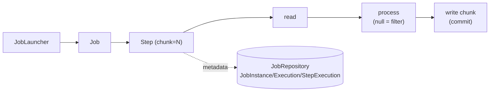

# Step 24 · Spring Batch (EOD Jobs) & the Phase-D Capstone — End of Phase D 🎖️
### Phase D — Distributed Systems, Messaging & Batch 🔵→🟣 · Step 24 of 67 · **Phase-D finale**

> *Banks run **end-of-day** jobs over the whole book — interest accrual, statements, reconciliation. This step
> builds a chunk-oriented **Spring Batch** interest-accrual job that reads every account, computes interest,
> writes it back, and is **fault-tolerant**: one bad record is skipped, a transient conflict is retried, the
> night's run doesn't abort. Then the **🎓 Phase-D capstone** ties the whole phase together: a payment traced
> end-to-end — Idempotency-Key → Outbox → Kafka → a forced duplicate → applied **exactly once**.*

---

<a id="toc"></a>
## 🧭 The Six Movements of This Step

| | Movement | What happens |
|---|---|---|
| **A** | [🧭 Orient](#orient) | 30-second overview · skip-test · cheat card · why it matters · before you start |
| **B** | [🧠 Understand](#understand) | batch vs online · chunk-oriented steps · JobRepository · skip/retry/restart · the capstone |
| **C** | [🛠️ Build](#build) | the JobRepository schema (Flyway) · the interest-accrual job · the capstone test |
| **D** | [🔬 Prove](#prove) | the Verification Log — the job's counts + effects, the capstone, §12.3 mutation |
| **E** | [🎓 Apply](#apply) | go deeper · interview prep · your-turn challenges |
| **F** | [🏆 Review](#review) | troubleshooting · resources · recap, flashcards & **Phase-D wrap** |

---

<a id="orient"></a>

# A · 🧭 Orient

## 📋 This Step in 30 Seconds

| | |
|---|---|
| **Title** | Spring Batch — a fault-tolerant chunk-oriented EOD interest-accrual job — plus the Phase-D capstone (exactly-once effect end-to-end) |
| **Step** | 24 of 67 · **Phase D — Distributed Systems, Messaging & Batch** 🔵→🟣 · **End of Phase D** 🎖️ |
| **Effort** | ≈ 18 hours focused (a milestone). Batch added to demand-account; the capstone reuses Outbox/Saga/idempotency. |
| **What you'll run this step** | **JVM + Maven**; **🐳 Docker** for Testcontainers (Postgres + Redpanda). |
| **Buildable artifact** | **demand-account**: `spring-boot-starter-batch`; the Batch **JobRepository** schema via Flyway **V4**; an `interestAccrualJob` (RepositoryItemReader → `InterestProcessor` → `InterestWriter`, chunked) with **skip/retry**; jobs don't auto-run (`spring.batch.job.enabled=false`). **Capstone test**: a payment end-to-end with Idempotency-Key + Outbox→Kafka + a forced duplicate → exactly-once effect. `step-24-start == step-23-end`. |
| **Verification tier** | 🔴 **Full** (milestone). `./mvnw verify` green + the job's read/write/skip/filter counts + balance effects proven on real Postgres + the capstone on real Postgres+Redpanda + **§12.3 mutation** + clean-room + `smoke.sh`. |
| **Depends on** | **[Step 12](../step-12/lesson.md)** (accounts/ledger + locking), **[Step 8](../step-08/lesson.md)** (Flyway), **[Step 20](../step-20/lesson.md)** (Outbox/Kafka), **[Step 21](../step-21/lesson.md)** (Saga/idempotency), **[Step 19](../step-19/lesson.md)** (delivery). **+ Docker.** |

By the end you will be able to build a **chunk-oriented Spring Batch job** with a JDBC **JobRepository**, make it **fault-tolerant** (skip/retry) and **restartable**, and explain **exactly-once effect** end-to-end across the Phase-D pipeline.

### ⏭️ Can You Skip This Step? (5-minute self-check)

If you can confidently do **all** of this, you've finished Phase D — on to **[Step 25](../step-25/lesson.md)** (Phase E).

- [ ] I can build a **chunk-oriented** Batch step (reader → processor → writer) and explain the chunk transaction.
- [ ] I can make a step **fault-tolerant** (`skip`, `retry`) and say why a bad record shouldn't fail the night.
- [ ] I know what the **JobRepository** is and why I'd version its schema with Flyway rather than auto-initialize.
- [ ] I can explain Batch **restartability** (JobInstance/JobParameters) and `processor` **filtering** (returning null).
- [ ] I can trace a payment end-to-end and explain **exactly-once effect** under a forced retry.

> [!TIP]
> Not 100%? Stay. "Design an EOD job that processes millions of rows and survives a bad record," and "how do you guarantee a payment is processed exactly once" are classic batch + distributed interview questions.

## 📇 Cheat Card

> **What this step delivers (one sentence):** a fault-tolerant chunk-oriented EOD interest-accrual Batch job, plus a capstone proving a payment is applied exactly once end-to-end despite a forced duplicate.

**Key commands** (Windows uses `.\mvnw.cmd`):

```bash
./mvnw -pl services/demand-account test -Dtest=InterestAccrualJobTest      # the batch job
./mvnw -pl services/demand-account test -Dtest=PaymentExactlyOnceCapstoneTest
bash steps/step-24/smoke.sh
```

**The headline diagram — a chunk-oriented step:**

```
JobLauncher → Job → Step (chunk = N):
   ┌────────────── one chunk transaction ──────────────┐
   reader ─► processor ─► [accumulate N] ─► writer ──► COMMIT
            (filter=null)                    (skip bad / retry transient)
   JobRepository records JobInstance / JobExecution / StepExecution (counts, status) → restartable
```

**The one sentence to remember:** *Batch processes data in **committed chunks**, the **JobRepository** remembers progress (so a run is restartable), and **skip/retry** keep one bad record from failing the whole night.*

## 🎯 Why This Matters

Online code handles one request; batch handles the whole book at 2am. Get it wrong and a single corrupt row aborts interest for every customer, or a crash forces you to re-run from scratch (double-crediting everyone). Chunking, the JobRepository, and skip/retry/restart are exactly how production EOD jobs stay correct and recoverable — staple topics for any backend handling money at scale.

## ✅ What You'll Be Able to Do

- Build a chunk-oriented Spring Batch job (reader/processor/writer).
- Make a step **fault-tolerant** (skip/retry) and understand **restartability**.
- Version the **JobRepository** schema with Flyway.
- Reason about **exactly-once effect** across the Phase-D pipeline.

## 🧰 Before You Start

- **Prereqs:** bank builds green (`git describe` → `step-23-end`); Docker running.
- **Connects to what you know:** the **accounts/ledger + lock** (Step 12), **Flyway** (Step 8), and the capstone reuses **Outbox/Kafka** (Step 20), **Saga/idempotency** (Step 21), **delivery semantics** (Step 19).
- **Depends on:** Steps **12, 8, 20, 21, 19**. **+ Docker.**

---

<a id="understand"></a>

# B · 🧠 Understand

## 🧠 The Big Idea — process the whole book, in recoverable chunks

Batch differs from online processing: high volume, no user waiting, and it must **resume** after a failure
rather than start over. Spring Batch's model:
- A **Job** is made of **Steps**. A **chunk-oriented Step** loops: **read** an item, **process** it, and once
  **N** items are accumulated, **write** the chunk — all in one **transaction** (commit per chunk). On the next
  chunk, a new transaction.
- The **JobRepository** (JDBC tables) records every `JobInstance`, `JobExecution`, and `StepExecution` —
  read/write/skip counts, status, and the execution context — which is what makes a job **restartable**.



## 🧩 Pattern Spotlight — chunk-oriented processing + fault tolerance

**Problem:** millions of records, item-at-a-time commits are too slow, but one giant transaction is fragile and
locks everything. **Fit:** **chunking** — read/process many, write+commit in batches (tune N for throughput vs
memory/lock duration). **Fault tolerance:** a single bad record (a malformed row, a closed account) shouldn't
abort the night, and a transient blip (a lock conflict against live traffic) should just be retried:
- `skip(SomeException).skipLimit(k)` — tolerate up to *k* bad records (recorded as skips), keep going.
- `retry(TransientException).retryLimit(r)` — re-attempt an item up to *r* times before giving up.
- **filter** — a processor returning `null` drops the item (not written, counted as filtered) — for "no work
  needed" items (here: zero-balance accounts).
- **restart** — re-launching a failed job (new `JobExecution`, same `JobInstance` for the same identifying
  `JobParameters`) resumes where it left off; a *completed* instance won't re-run.

## 🌱 Under the Hood: the JobRepository schema — Flyway, not auto-init

Spring Batch needs its `BATCH_*` tables. Boot can auto-create them (`initialize-schema=always`), but our DB is
owned by **Flyway** (Hibernate `ddl-auto=validate`), and auto-init re-runs plain `CREATE TABLE`s every startup.
So we copy Batch's canonical `schema-postgresql.sql` into a **Flyway migration (V4)** and set
`spring.batch.jdbc.initialize-schema=never`. Boot still auto-configures the `JobRepository`/`JobLauncher`
(no `@EnableBatchProcessing` — that would turn the autoconfig off). Jobs don't run on startup
(`spring.batch.job.enabled=false`); they're launched explicitly or by an EOD `@Scheduled`+ShedLock trigger (Step 22).

## 🛡️ Security Lens & 🧵 Thread-safety note

An EOD job runs **concurrently with live traffic**, so the writer re-reads each account with the Step-12
pessimistic lock before crediting — a transfer landing mid-run can't lose the update (and a lock conflict is
the transient we `retry`). At scale you'd also **partition** the step (parallel workers over account ranges).

## 🕰️ Then vs. Now

Spring Batch 6 (the Boot-4 line) reorganized packages — the item layer moved to
`org.springframework.batch.infrastructure.item.*`, and `Job`/`Step` to `…core.job`/`…core.step`. The chunk
builder `chunk(size, txManager)` is **deprecated for removal** in 6.0 in favour of a new `ChunkOrientedStepBuilder`
(whose fault-tolerance API is still settling); we use the stable fault-tolerant builder on the pinned version
and flag the migration. (We hit the moved packages for real — see 🩺.)

## 🧩 The 🎓 Phase-D Capstone — exactly-once *effect* end-to-end

The capstone traces a single payment through everything Phase D built, on real infrastructure:
1. **Idempotency-Key** (Step 14/21): a replayed transfer with the same key moves money **once**.
2. **Outbox** (Step 20): the transfer atomically wrote an event row; the relay publishes it to Kafka.
3. **At-least-once + idempotent consumer** (Step 19/20): we **force a duplicate** redelivery and dedupe by
   eventId → the event is **applied exactly once**. *Exactly-once delivery is impossible; exactly-once
   **effect** is what we engineer.*

---

# B→C bridge: 🌳 files we'll touch

```
services/demand-account/
  pom.xml                                              (edit) spring-boot-starter-batch
  src/main/resources/db/migration/V4__batch_schema.sql (new) the JobRepository tables (Flyway)
  src/main/resources/application.yml                   (edit) spring.batch.job.enabled=false; initialize-schema=never; bank.interest.daily-rate
  src/main/java/.../batch/InterestAccrualJobConfig.java (new) Job + Step (chunk, skip, retry) + reader
  src/main/java/.../batch/InterestProcessor.java        (new) compute interest / filter / skip sentinel
  src/main/java/.../batch/InterestWriter.java           (new) credit + ledger per chunk (with the lock)
  src/main/java/.../batch/{InterestPosting,InterestSkipException}.java
  src/test/java/.../batch/InterestAccrualJobTest.java   (new) launch the job; assert counts + effects
  src/test/java/.../PaymentExactlyOnceCapstoneTest.java (new) 🎓 the Phase-D capstone
steps/step-24/{lesson.md, smoke.sh}
```

<a id="build"></a>

# C · 🛠️ Let's Build It — Step by Step

## 📦 Your Starting Point

`step-24-start == step-23-end`: 13 modules green. We add Batch to demand-account.

## Sub-step 1 — the JobRepository schema (Flyway V4)

🎯 Copy Batch's `schema-postgresql.sql` into `V4__batch_schema.sql`; set `spring.batch.jdbc.initialize-schema=never` and `spring.batch.job.enabled=false`. ▶️ Flyway logs `Migrating schema "public" to version "4 - batch schema"` on the next test run.

## Sub-step 2 — the interest-accrual job

🎯 `InterestProcessor` (Account → InterestPosting, or `null` to filter zero balances; throws `InterestSkipException` for a "SKIP" sentinel). `InterestWriter` (re-read with lock, credit, ledger entry per chunk). `InterestAccrualJobConfig` wires `RepositoryItemReader` (accounts, `id ASC`) → processor → writer, `chunk(10)`, `.faultTolerant().skip(InterestSkipException).skipLimit(100).retry(OptimisticLockingFailureException).retryLimit(3)`.

🔮 **Predict:** the run hits the SKIP account — does the whole job fail? <details><summary>Answer</summary>**No** — `skip` tolerates it (the run COMPLETES, processSkipCount = 1). Remove `skip` and the job FAILS — that's the §12.3 mutation.</details>

## Sub-step 3 — the capstone

🎯 A test that does an idempotent transfer (key replays → one movement), runs the Outbox relay (→ Kafka), forces a duplicate redelivery, and dedupes by eventId → applied once. Assertions scoped to the payment's `txId` (the shared topic carries other tests' events).

💾 **Commit:** `feat(demand-account): Step 24 Spring Batch EOD interest accrual + Phase-D capstone`

## 🎮 Play With It

The interest job is launched by a `JobLauncher` (no HTTP surface) — run it via the test, or wire an EOD `@Scheduled`+ShedLock trigger (Step 22):

```bash
./mvnw -pl services/demand-account test -Dtest=InterestAccrualJobTest    # watch the Flyway V4 migration + the step counts
```

🧪 **Little experiments:** change `bank.interest.daily-rate`; add a second `ACC-SKIP*` account and watch `processSkipCount` rise without failing the job; raise the chunk size and re-run.

## 🏁 The Finished Result

`step-24-end`: a fault-tolerant EOD batch job + a proven exactly-once payment pipeline. **✅ Definition of Done:** the job COMPLETEs with the right counts/effects, the capstone proves exactly-once effect, `./mvnw verify` is green, `bash steps/step-24/smoke.sh` passes, and you've committed/tagged `step-24-end`. **That's Phase D.** 🎖️

---

<a id="prove"></a>

# D · 🔬 Prove It Works — Verification Log

> **Tier: 🔴 Full (milestone).** Real output below; Docker used (Testcontainers Postgres + Redpanda).

**1 · The batch job + the capstone — green:**

```
2026-… o.f.core.internal.command.DbMigrate : Migrating schema "public" to version "4 - batch schema"
[INFO] Tests run: 1, Failures: 0, Errors: 0, Skipped: 0 -- in com.buildabank.account.batch.InterestAccrualJobTest
[INFO] Tests run: 1, Failures: 0, Errors: 0, Skipped: 0 -- in com.buildabank.account.PaymentExactlyOnceCapstoneTest
[INFO] Tests run: 44, Failures: 0, Errors: 0, Skipped: 0     ← demand-account (42 prior + batch + capstone)
[INFO] BUILD SUCCESS
```

- `InterestAccrualJobTest` (real Postgres) — the job COMPLETES; step counts: **read 4, write 2, filter 1** (zero-balance ACC-3), **processSkip 1** (ACC-SKIP); balances credited exactly: ACC-1 1000.00→**1000.10**, ACC-2 500.00→**500.05**; ACC-3 and ACC-SKIP untouched; 2 ledger entries.
- `PaymentExactlyOnceCapstoneTest` (real Postgres + Redpanda) — idempotent transfer moves money once (ACC-A → 60.00), the Outbox relay publishes the event, a **forced duplicate** redelivery is consumed (delivered ≥ 2×), and dedupe by eventId means it's **applied exactly once**.

**2 · §12.3 Mutation sanity-check (prove the fault tolerance does real work).** Removed `.skip(InterestSkipException.class)` and re-ran:

```
o.s.b.c.l.s.TaskExecutorJobLauncher : Job: [interestAccrualJob] … status: [FAILED]
[ERROR] InterestAccrualJobTest…:73 expected: COMPLETED but was: FAILED
[ERROR] Tests run: 1, Failures: 1, Errors: 0, Skipped: 0
```
→ Without `skip`, the sentinel account's exception **aborts the whole job** (FAILED) — proving the skip config is what lets the night's run survive a bad record. **Reverted**; green again.

**3 · `smoke.sh`** — `bash steps/step-24/smoke.sh` ran `InterestAccrualJobTest,PaymentExactlyOnceCapstoneTest` on real Postgres + Redpanda → `✅ Step 24 smoke test PASSED — End of Phase D 🎖️`.

**4 · Clean-room (§12.4)** — fresh clone at `step-24-end`, `./mvnw verify` → BUILD SUCCESS (13 modules).

**§12.8 honesty:** the batch job and the capstone run against **real** Postgres/Redpanda (Testcontainers). The
capstone's "forced duplicate" simulates the at-least-once redelivery the Outbox relay's publish-then-mark gap
allows; the multi-node/partitioned batch and the live EOD `@Scheduled` trigger are described, not run here.

---

<a id="apply"></a>

# E · 🎓 Apply

## 🚀 Go Deeper (Optional)

<details><summary>Restartability & idempotent jobs</summary>A job identified by its JobParameters is one JobInstance; a failed execution can be re-launched and resumes (the JobRepository records where it stopped). A *completed* instance won't re-run. For correctness, design the work so a partial-then-restart doesn't double-apply (e.g., interest keyed by run date, or a processed-marker) — the batch analogue of idempotency.</details>

<details><summary>Partitioning for scale</summary>For millions of rows, partition the step — split the keyspace (account-id ranges) across worker threads/nodes, each running the same reader/processor/writer over its slice. Spring Batch's partitioning handles aggregation of the StepExecutions.</details>

## 💼 Interview Prep

1. **What's a chunk-oriented step?** *Read N items, process each, write the chunk in one transaction; commit per chunk. Tune N for throughput vs memory/lock duration.* **(Common.)**
2. **How do you stop one bad record from failing an EOD job?** *Fault tolerance: `skip` that exception up to a limit (recorded as skips); `retry` transient failures; route the truly-bad to a reject store. The run completes; you reconcile the skips.*
3. **What is the JobRepository and why version its schema?** *JDBC tables recording JobInstance/JobExecution/StepExecution — the basis for restartability. Version it with Flyway (don't auto-initialize) so the schema is reproducible and owned.*
4. **How does Batch restart work?** *Same identifying JobParameters → same JobInstance; a failed execution re-launches and resumes from the last committed chunk; a completed instance won't re-run.*
5. **(Capstone) How do you make a payment exactly-once across Kafka?** *You can't get exactly-once delivery; you get exactly-once effect — at-least-once delivery + an idempotent consumer (dedupe by id) and the Outbox so the event is never lost.* **(Marquee.)**

## 🏋️ Your Turn: Practice & Challenges

- **Quick:** add an EOD trigger — a `@Scheduled` + `@SchedulerLock` (Step 22) that launches `interestAccrualJob` with the run date as a JobParameter (so it runs once per night across the cluster).
- **Quick:** add a statement-generation step that writes a per-account summary (a second step in the job).
- 🎯 **Stretch (reference solution in `solutions/step-24/`):** make the interest job **idempotent on restart** — key the accrual by run date so re-running the same EOD date doesn't double-credit; prove it by running the job twice for the same date and asserting interest is applied once.

---

<a id="review"></a>

# F · 🏆 Review

## 🩺 Stuck? Troubleshooting & Fixes

- **`cannot find symbol` for `ItemProcessor`/`ItemWriter`/`Chunk`/`Job`/`Step`.** Spring Batch 6 moved packages: the item layer is `org.springframework.batch.infrastructure.item.*`; `Job` is `…core.job.Job`, `Step` is `…core.step.Step`, `JobBuilder`/`StepBuilder` under `…core.job.builder`/`…core.step.builder`. *(Hit this for real.)*
- **`relation "batch_job_instance" does not exist` / schema re-created every startup.** Let Flyway own the schema (V4) and set `spring.batch.jdbc.initialize-schema=never`.
- **The job runs at application startup (in every test).** Set `spring.batch.job.enabled=false`; launch it explicitly or via a scheduled trigger.
- **A capstone/Kafka assertion sees another test's messages.** Two `@SpringBootTest`s with the same config share a cached context + container; scope assertions to *your* data (here: the payment's `txId`) — don't assume the topic is yours alone.
- **Reset:** `git checkout step-24-end`; `make doctor`.

## 📚 Learn More & Glossary

- Spring Batch reference (chunk model, JobRepository, fault tolerance, partitioning, restart); Spring Batch 6 migration notes; Kleppmann ch. 10 (batch processing).
- **Glossary:** *Job/Step*, *chunk*, *ItemReader/Processor/Writer*, *JobRepository*, *JobInstance/JobExecution/StepExecution*, *skip/retry/filter*, *restartability*, *partitioning*, *exactly-once effect*.

## 🏆 Recap & Study Notes — and Phase D wrap 🎖️

**(a) Key points:** Batch processes the whole book in **committed chunks**; the **JobRepository** makes runs
**restartable**; **skip/retry** keep one bad record (or a transient blip) from failing the night; a processor
returning `null` **filters**. The **capstone** proves the Phase-D pipeline yields **exactly-once effect** under a
forced duplicate (Idempotency-Key + Outbox + idempotent consumer).

**(b) Key terms:** Job, Step, chunk, ItemReader/Processor/Writer, JobRepository, skip, retry, filter, restart, partition, exactly-once effect.

**(c) 🧠 Test Yourself:** ① What commits in a chunk-oriented step? ② How do you survive a bad record? ③ Why version the JobRepository schema with Flyway? ④ What makes a job restartable? ⑤ Exactly-once delivery vs effect? <details><summary>Answers</summary>① Each chunk of N items in its own transaction. ② skip (+ retry transient), reconcile the skips. ③ Reproducible, owned schema; avoid re-running CREATE every startup. ④ The JobRepository records JobInstance/Execution progress; a failed run resumes by the same identifying parameters. ⑤ Delivery exactly-once is impossible; effect exactly-once = at-least-once + idempotent processing.</details>

**(d) 🔗 How this connects & 🎖️ End of Phase D:** Batch joins the online + event-driven bank; the capstone unifies Steps 19–23. **Phase D delivered:** distributed-systems theory (Step 19), Kafka + Outbox + SSE (20), Saga + Redis idempotency + DLQ (21), caching + ShedLock (22), onboarding orchestration (23), and batch + the capstone (24) — **a secured, event-driven + batch microservices backend, and you can reason about CAP, consistency, and delivery semantics beneath it.** **Next: Phase E (Step 25+).**

**(e) 🏆 Résumé line:** *"Built an event-driven + batch microservices banking backend — Kafka/Outbox, Saga + idempotency, caching, orchestration, and fault-tolerant Spring Batch EOD jobs — and can reason about CAP, consistency, and delivery semantics."*

**(f) ✅ You can now:** build chunk-oriented fault-tolerant Batch jobs · version a JobRepository · explain restartability · trace exactly-once effect end-to-end.

**(g) 🃏 Flashcards** appended to `docs/flashcards.md` · 🔁 revisit batch + exactly-once at event sourcing (Step 52) and the cloud-native capstone (Step 58).

**(h) ✍️ One-line reflection:** *Which of the bank's nightly jobs would you build next — and how would you make it safe to re-run?*

**(i)** 🎉 **Phase D complete.** A distributed, event-driven, batch-capable bank — with the theory beneath it. Onward to Phase E.
