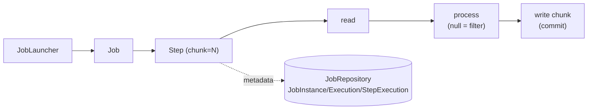
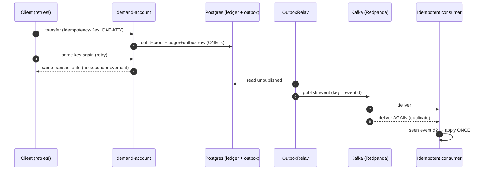
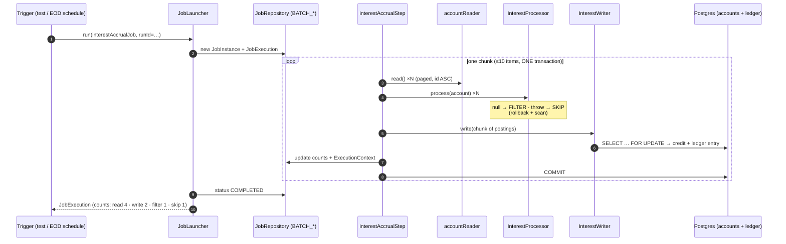

# Step 24 · Spring Batch (EOD Jobs) & the Phase-D Capstone — End of Phase D 🎖️
### Phase D — Distributed Systems, Messaging & Batch 🔵→🟣 · Step 24 of 67 · **Phase-D finale**

> *Banks run **end-of-day** jobs over the whole book — interest accrual, statements, reconciliation. This step
> builds a chunk-oriented **Spring Batch** interest-accrual job that reads every account, computes interest,
> writes it back, and is **fault-tolerant**: one bad record is skipped, a transient conflict is retried, the
> night's run doesn't abort. Then the **🎓 Phase-D capstone** ties the whole phase together: a payment traced
> end-to-end — Idempotency-Key → Outbox → Kafka → a forced duplicate → applied **exactly once**.*

> [!CAUTION]
> **Educational, non-production project.** Build-a-Bank is for learning only. It never handles real money, real
> customers, or real personal data. Every account and balance you see here is synthetic. (Full disclaimer +
> guardrails in the [README](../../README.md).)

> [!WARNING]
> **🐳 Docker is REQUIRED for this step.** The batch-job test spins up a real PostgreSQL via **Testcontainers**,
> and the capstone adds a real Kafka-compatible broker (**Redpanda**). If `docker info` errors, start Docker
> Desktop (or your engine) before you begin.

---

<a id="toc"></a>
## 🧭 The Six Movements of This Step

| | Movement | What happens |
|---|---|---|
| **A** | [🧭 Orient](#orient) | 30-second overview · skip-test · cheat card · why it matters · before you start |
| **B** | [🧠 Understand](#understand) | batch vs online · chunk-oriented steps · the JobRepository · skip vs filter vs retry · restartability · the capstone |
| **C** | [🛠️ Build](#build) | the dependency → taming the autoconfig → the Flyway V4 JobRepository schema → the domain types → processor → writer → the Job/Step wiring → the job test (live) → the 🎓 capstone test (live) → the harness |
| **D** | [🔬 Prove](#prove) | the Verification Log — the job's counts + effects, the capstone, §12.3 mutation, today's re-run |
| **E** | [🎓 Apply](#apply) | go deeper · interview prep · your-turn challenges |
| **F** | [🏆 Review](#review) | troubleshooting · resources · recap, flashcards & **Phase-D wrap** |

---

<a id="orient"></a>

# A · 🧭 Orient

## 📋 This Step in 30 Seconds

| | |
|---|---|
| **Title** | Spring Batch — a fault-tolerant chunk-oriented EOD interest-accrual job — plus the Phase-D capstone (exactly-once effect end-to-end) |
| **Step** | 24 of 67 · **Phase D — Distributed Systems, Messaging & Batch** 🔵→🟣 · **End of Phase D** 🎖️ |
| **Effort** | ≈ 18 hours focused (a milestone). Batch added to demand-account; the capstone reuses Outbox/Saga/idempotency. |
| **What you'll run this step** | **JVM + Maven**; **🐳 Docker** for Testcontainers (Postgres + Redpanda). No long-running services — both proofs are tests. |
| **Buildable artifact** | **demand-account**: `spring-boot-starter-batch`; the Batch **JobRepository** schema via Flyway **V4**; an `interestAccrualJob` (RepositoryItemReader → `InterestProcessor` → `InterestWriter`, chunked) with **skip/retry**; jobs don't auto-run (`spring.batch.job.enabled=false`). **Capstone test**: a payment end-to-end with Idempotency-Key + Outbox→Kafka + a forced duplicate → exactly-once effect. `step-24-start == step-23-end`. |
| **Verification tier** | 🔴 **Full** (milestone). `./mvnw verify` green + the job's read/write/skip/filter counts + balance effects proven on real Postgres + the capstone on real Postgres+Redpanda + **§12.3 mutation** + clean-room + `smoke.sh`. |
| **Depends on** | **[Step 12](../step-12/lesson.md)** (accounts/ledger + locking), **[Step 8](../step-08/lesson.md)** (Flyway), **[Step 20](../step-20/lesson.md)** (Outbox/Kafka), **[Step 21](../step-21/lesson.md)** (Saga/idempotency), **[Step 19](../step-19/lesson.md)** (delivery). **+ Docker.** |

By the end you will be able to build a **chunk-oriented Spring Batch job** with a JDBC **JobRepository**, make it
**fault-tolerant** (skip/retry) and **restartable**, version the Batch metadata schema with **Flyway** instead of
letting Batch auto-initialize it, distinguish **filter** (a processor returning `null`) from **skip** (a tolerated
exception) and know what each costs, and explain **exactly-once effect** end-to-end across the Phase-D pipeline.

### ⏭️ Can You Skip This Step? (5-minute self-check)

If you can confidently do **all** of this, you've finished Phase D — on to **[Step 25](../step-25/lesson.md)** (Phase E).

- [ ] I can build a **chunk-oriented** Batch step (reader → processor → writer) and explain the chunk transaction.
- [ ] I can make a step **fault-tolerant** (`skip`, `retry`) and say why a bad record shouldn't fail the night.
- [ ] I can explain what Spring Batch actually *does* when a skippable exception is thrown mid-chunk (rollback + the one-by-one **scan**), and why **filter** is cheaper than **skip**.
- [ ] I know what the **JobRepository** is and why I'd version its schema with Flyway rather than auto-initialize.
- [ ] I can explain Batch **restartability** (JobInstance/JobParameters) and what happens if I launch a *completed* JobInstance again.
- [ ] I can trace a payment end-to-end and explain **exactly-once effect** under a forced retry.

> [!TIP]
> Not 100%? Stay. "Design an EOD job that processes millions of rows and survives a bad record," and "how do you
> guarantee a payment is processed exactly once" are classic batch + distributed interview questions.

## 📇 Cheat Card

> **What this step delivers (one sentence):** a fault-tolerant chunk-oriented EOD interest-accrual Batch job
> (Flyway-owned JobRepository, skip + retry, real counts asserted on real Postgres), plus a capstone proving a
> payment is applied exactly once end-to-end despite a forced duplicate.

**Key commands** (Windows uses `.\mvnw.cmd`; macOS/Linux/Git-Bash use `./mvnw`):

```bash
./mvnw -pl services/demand-account test -Dtest=InterestAccrualJobTest          # the batch job (Docker: Postgres)
./mvnw -pl services/demand-account test -Dtest=PaymentExactlyOnceCapstoneTest  # 🎓 the capstone (Docker: Postgres + Redpanda)
make play-24                                                                   # both, in one shot
bash steps/step-24/smoke.sh                                                    # the one-shot proof
```

**The headline diagram — a chunk-oriented step:**

```
JobLauncher → Job → Step (chunk = N):
   ┌────────────── one chunk transaction ──────────────┐
   reader ─► processor ─► [accumulate N] ─► writer ──► COMMIT
            (filter=null)                    (skip bad / retry transient)
   JobRepository records JobInstance / JobExecution / StepExecution (counts, status) → restartable
```

**The one sentence to remember:** *Batch processes data in **committed chunks**, the **JobRepository** remembers
progress (so a run is restartable), and **skip/retry** keep one bad record from failing the whole night.*

## 🎯 Why This Matters

Online code handles one request; batch handles the whole book at 2am. Get it wrong and a single corrupt row aborts
interest for every customer, or a crash forces you to re-run from scratch (double-crediting everyone). Chunking,
the JobRepository, and skip/retry/restart are exactly how production EOD jobs stay correct and recoverable —
staple topics for any backend handling money at scale. And the capstone is the sentence you'll say in every
distributed-systems interview for the rest of your career: *exactly-once delivery is impossible; exactly-once
**effect** is engineered* — and you'll have **proved** it on real infrastructure, not just recited it.

## ✅ What You'll Be Able to Do

- Build a chunk-oriented Spring Batch job (reader/processor/writer) and explain the per-chunk transaction.
- Make a step **fault-tolerant** (skip/retry), explain the **rollback + scan** mechanics behind a skip, and understand **restartability** (JobInstance/JobExecution/JobParameters).
- Version the **JobRepository** schema with Flyway and disable Batch's own initializer — schema ownership done right.
- Launch a job explicitly (`JobLauncher` + unique `JobParameters`) instead of letting Boot run it at startup.
- Reason about — and **prove** — **exactly-once effect** across the Phase-D pipeline (Idempotency-Key → Outbox → Kafka → idempotent consumer).

## 🧰 Before You Start

**Prerequisites**

- ✅ The bank builds green at `step-24-start` (`git describe` → `step-23-end`): **13 modules**, `./mvnw verify` green.
- ✅ **Docker is running.** Quick check: `docker info` prints engine details. Both tests in this step need it.
- ✅ ~4 GB free RAM for the containers + the JVM.

**What you already learned that connects here**

- **Step 8** — Flyway owns the schema (`ddl-auto=validate`). Today Flyway gets its biggest migration yet: the Batch metadata tables (V4).
- **Step 12** — the accounts/ledger and the **pessimistic row lock** (`findByAccountNumberForUpdate`). The batch writer re-uses that exact lock so an EOD run can't race a live transfer.
- **Step 19** — the delivery-semantics lab: at-least-once + idempotent receiver = effectively-once. The capstone turns that pure-JVM theorem into a real-infrastructure proof.
- **Step 20** — the transactional **Outbox** + Kafka (Redpanda) + the idempotent consumer. The capstone drives the relay you built there.
- **Step 21** — the Saga + the **Idempotency-Key**. The capstone's first act is an idempotent replay.
- **Step 22** — `@Scheduled` + ShedLock. The EOD *trigger* for tonight's job is exactly that machinery (described, and a Your-Turn exercise).

> **Depends on:** Steps **12, 8, 20, 21, 19** (+ 22 for the trigger). **+ Docker.**

---

<a id="understand"></a>

# B · 🧠 Understand

## 🧠 The Big Idea — process the whole book, in recoverable chunks

Online processing and batch processing answer different questions. Online: *"this one customer clicked transfer —
respond in 200ms."* Batch: *"it's 2am — apply interest to **every** account in the bank, finish before the branch
opens, and if anything goes wrong, don't lose the night."* That changes the engineering:

1. **Volume.** Millions of rows. You can't load them all into memory, and you can't open one transaction around
   all of them (a single 4-hour transaction holds locks, bloats the undo log, and one failure at row 9,999,999
   rolls back everything).
2. **No user waiting.** Latency doesn't matter; **throughput** and **recoverability** do.
3. **Resume, don't restart.** If the job dies at 4am after processing 80% of the book, re-running from scratch is
   a catastrophe (every already-credited account would be credited again). The job must know where it stopped.

Spring Batch's model answers all three:

- A **Job** is made of **Steps**. A **chunk-oriented Step** loops: **read** an item, **process** it, and once
  **N** items are accumulated, **write** the chunk — all in one **transaction** (commit per chunk). On the next
  chunk, a new transaction. N is the tuning knob: bigger chunks = fewer commits = more throughput, but more memory
  and longer-held locks, and more re-done work when a chunk rolls back.
- The **JobRepository** (JDBC tables) records every `JobInstance`, `JobExecution`, and `StepExecution` —
  read/write/skip counts, status, and the execution context — which is what makes a job **restartable**.



*Alt-text: a JobLauncher launches a Job containing a chunk-oriented Step. The Step loops read → process (where
returning null filters the item) → write the chunk and commit. The Step records its metadata — JobInstance,
JobExecution, StepExecution — into the JobRepository database tables.*

**Analogy — the night-shift accountant.** Picture a 1960s bank with paper ledgers. The night accountant must add
interest to 10,000 account cards before morning. She doesn't do them one at a time walking to the vault for each
(too slow — that's item-at-a-time commits), and she doesn't carry all 10,000 cards to her desk at once (she'd
drop them — that's the one-giant-transaction). She fetches a **tray of 10 cards** (a chunk), pencils in the
interest (process), inks all 10 and returns the tray to the vault (write + commit), and **ticks a progress sheet**
(the JobRepository) before fetching the next tray. If she finds one coffee-stained unreadable card, she puts it in
a "for the morning team" pile and carries on (**skip**) — one bad card doesn't cancel interest for the whole bank.
If the day clerk happens to be updating a card she needs, she waits a moment and tries again (**retry**). And if
she faints at 4am, the morning accountant reads the progress sheet and **continues from tray 801** — nobody's
interest is applied twice (restart).

## 🧩 Pattern Spotlight — chunk-oriented processing + fault tolerance

**Problem:** millions of records; item-at-a-time commits are too slow, but one giant transaction is fragile and
locks everything. **Fit:** **chunking** — read/process many, write+commit in batches (tune N for throughput vs
memory/lock duration). **Fault tolerance:** a single bad record (a malformed row, a closed account) shouldn't
abort the night, and a transient blip (a lock conflict against live traffic) should just be retried:

| Tool | Trigger | What Batch does | Counter | Use it for |
|---|---|---|---|---|
| **filter** | processor returns `null` | item silently dropped — not written; **no rollback** | `FILTER_COUNT` | "no work needed" — business as usual (here: zero-balance accounts) |
| **skip** | a configured exception, ≤ `skipLimit` | chunk **rolls back**, items re-processed one-by-one (**scan**) to isolate the bad one; survivors commit | `PROCESS_SKIP_COUNT` (or read/write variants) | "this record is bad" — exceptional but tolerable (here: a `SKIP` sentinel) |
| **retry** | a configured exception, ≤ `retryLimit` | the operation is re-attempted before skip/fail logic applies | `ROLLBACK_COUNT` rises | transient failures — lock conflicts, deadlocks, brief outages |
| **restart** | re-launching a FAILED job | a new `JobExecution` on the **same** `JobInstance` resumes from the last committed chunk | new `JobExecution` row | crash recovery without re-doing (or double-applying) finished work |

- `skip(SomeException.class).skipLimit(k)` — tolerate up to *k* bad records (recorded as skips), keep going. The
  limit matters: 3 bad rows is data noise; 30,000 bad rows means the *feed* is broken and the job *should* fail.
- `retry(TransientException.class).retryLimit(r)` — re-attempt up to *r* times before treating it as a real failure.
- **filter** — a processor returning `null` drops the item. Filter is *cheap* (no exception, no rollback); skip is
  *expensive* (rollback + scan). Model "expected no-op" as filter, "broken record" as skip.
- **restart** — re-launching a failed job (new `JobExecution`, same `JobInstance` for the same identifying
  `JobParameters`) resumes where it left off; a *completed* instance won't re-run (you get
  `JobInstanceAlreadyCompleteException` — a feature, not a bug: it's what prevents double-crediting the book).

❓ **Knowledge-check:** an account has a zero balance — filter or skip? An account row fails a `NOT NULL`
constraint you didn't expect — filter or skip? <details><summary>Answer</summary>Zero balance = **filter** (a
normal, expected no-op — return `null`, no drama). The constraint surprise = **skip** (exceptional, per-record,
tolerable in small numbers — throw a skippable exception so it's *recorded* and the night continues).</details>

## 🌱 Under the Hood: How It Really Works

**1. The JobRepository schema — Flyway, not auto-init.** Spring Batch needs its `BATCH_*` tables. Boot can
auto-create them (`spring.batch.jdbc.initialize-schema=always`), but our DB is owned by **Flyway** (Hibernate
`ddl-auto=validate`, Step 8), and auto-init re-runs plain `CREATE TABLE`s every startup (fine on an empty H2,
an error on a real Postgres that already has them). So we copy Batch's canonical `schema-postgresql.sql` into a
**Flyway migration (V4)** and set `initialize-schema=never`. One owner, one history, reproducible forever.

**2. What the tables actually mean.**
- `BATCH_JOB_INSTANCE` — the *logical* run: job name + a hash (`JOB_KEY`) of the **identifying** JobParameters.
  "The interest run for 2026-06-10" is one JobInstance, no matter how many attempts it takes.
- `BATCH_JOB_EXECUTION` — one *attempt* at an instance: status (`STARTING/STARTED/COMPLETED/FAILED`), timestamps,
  exit code. A failed-then-restarted instance has two executions.
- `BATCH_STEP_EXECUTION` — per-step bookkeeping: `READ_COUNT`, `WRITE_COUNT`, `FILTER_COUNT`,
  `PROCESS_SKIP_COUNT`, `ROLLBACK_COUNT`, `COMMIT_COUNT` — the very numbers our test asserts.
- the two `_CONTEXT` tables — the serialized **ExecutionContext**: e.g. the reader's "I'm at page 80, index 3",
  written at each chunk commit. *This* is the restart bookmark.
- three `_SEQ` sequences — Batch allocates ids itself (so it can write metadata even mid-rollback).

**3. Boot's auto-configuration — and the `@EnableBatchProcessing` trap.** With `spring-boot-starter-batch` on the
classpath, Boot auto-configures the `JobRepository`, a `JobLauncher` (the `TaskExecutorJobLauncher` you'll see in
the logs), and wires the `PlatformTransactionManager`. **Adding `@EnableBatchProcessing` turns that autoconfig
OFF** (it signals "I'll configure Batch myself") — the classic way to lose your auto-configured JobRepository and
spend an evening confused. We just declare `Job`/`Step` beans.

**4. Why jobs don't run at startup.** Boot's `JobLauncherApplicationRunner` runs every `Job` bean when the app
boots — sensible for a one-shot batch *application*, wrong for a *service* that happens to contain a job (every
`@SpringBootTest` would accrue interest!). `spring.batch.job.enabled=false` disables the runner; we launch
explicitly (a test today; an EOD `@Scheduled`+ShedLock trigger from Step 22 in production).

**5. What a skip really costs (the scan).** Inside a fault-tolerant chunk, when the processor throws a skippable
exception, Batch can't just drop the item — the chunk's transaction already has the other items' work in it, and
the exception poisons the transaction. So Batch **rolls back the whole chunk**, then re-processes the chunk's
items **one at a time, each in its own mini-transaction** (the *scan*), isolating exactly which item fails. The
bad item is recorded (`PROCESS_SKIP_COUNT++`), the survivors commit. That's why `ROLLBACK_COUNT` rises with every
skip, and why a feed with 10% bad records makes a "fault-tolerant" job crawl — skip is for the *exceptional*.

**6. The chunk transaction and the writer.** Batch opens the transaction around the chunk — the writer just
*participates* (no `@Transactional` on the writer; it would be redundant at best). Everything the writer does for
those N items — credits, ledger inserts — commits or rolls back **together with** Batch's own
`BATCH_STEP_EXECUTION` bookkeeping update. Metadata and effects move in lockstep; that consistency is what makes
the restart bookmark trustworthy.

**7. The reader is stateful — and that's the point.** `RepositoryItemReader` pages through the repository
(`findAll`, `PageRequest` of `pageSize`, sorted) and tracks its position in the **ExecutionContext**. Because the
sort is **deterministic** (`id ASC`), "resume from item 8,010" means the same item tomorrow as today. An unsorted
read order would make restart semantics meaningless — same rows, different order, double-processing.

## 🛡️ Security Lens & 🧵 Thread-safety note

An EOD job runs **concurrently with live traffic** — the bank doesn't stop taking transfers at 2am. Two shared-
state hazards, two mitigations you already own:

- **Lost updates (Step 11's check-then-act, at the database).** The reader loaded `ACC-1` with balance 1000.00;
  before the writer runs, a live transfer debits 100. If the writer wrote `1000.00 + interest` computed from the
  stale read, the debit would vanish. So the writer **re-reads each account with the Step-12 pessimistic lock**
  (`SELECT … FOR UPDATE`) inside the chunk transaction and credits the *current* balance — the same discipline as
  the safe transfer. (Interest is computed from the read-time balance — a deliberate, documented simplification;
  the *credit* is what must never lose an update.)
- **Transient conflicts are the retry case.** A live transaction holding the row, an optimistic-lock version bump —
  these deserve a `retry(OptimisticLockingFailureException.class)`, not a skip and *definitely* not a failed night.

Security-wise: a batch job is a **privileged writer** (it touches every account with no user in the loop). It runs
with the service's own identity, not a relayed user token (Step 23's distinction); its effects are fully
ledgered (`"interest accrual"` entries — auditable); and its trigger must be cluster-safe (Step 22's ShedLock) so
three pods can't each credit the book. At scale you'd also **partition** the step (parallel workers over account
ranges — see 🚀 Go Deeper).

## 🕰️ Then vs. Now

| Concern | ❌ Then (Batch 4/5, Boot ≤3) | ✅ Now (Spring Batch 6, Boot 4 — pinned 6.0.3) | Why / what to watch |
|---|---|---|---|
| **Item-layer packages** | `org.springframework.batch.item.*` | **`org.springframework.batch.infrastructure.item.*`** | Batch 6 reorganized the codebase; old imports don't resolve. We hit this for real → 🩺. |
| **`Job`/`Step` packages** | `org.springframework.batch.core.Job` / `.Step` | **`…core.job.Job`** / **`…core.step.Step`** (builders under `…core.job.builder` / `…core.step.builder`) | Same reorg, core side. |
| **Chunk builder** | `chunk(size, txManager)` — the standard | **deprecated for removal** in 6.0; the new `ChunkOrientedStepBuilder` is the future | The new builder's fault-tolerance API is still settling — we use the stable, deprecated-but-working builder on the pinned version and flag the migration (ADR-0015). |
| **Config style** | `@EnableBatchProcessing` everywhere (Boot ≤2 *required* it) | **don't add it** — Boot's autoconfig provides JobRepository/JobLauncher; the annotation *disables* Boot's autoconfig | The #1 migration trap, fossilized in a thousand tutorials. |
| **Metadata schema** | often `initialize-schema=always` in tutorials | **Flyway-owned migration + `never`** | Schema ownership discipline (Step 8) applies to *framework* tables too. |

## 🧩 The 🎓 Phase-D Capstone — exactly-once *effect* end-to-end

The capstone traces a single payment through everything Phase D built, on real infrastructure:

1. **Idempotency-Key** (Step 14/21): a replayed transfer with the same key moves money **once** (same
   `transactionId` back, balance debited once).
2. **Outbox** (Step 20): the transfer atomically wrote an event row in the *same* transaction as the ledger; the
   relay publishes it to Kafka and marks it published only after the broker's ack.
3. **At-least-once + idempotent consumer** (Step 19/20): we **force a duplicate** redelivery (re-producing the
   exact record — the duplicate the relay's publish-then-mark crash window allows), consume both deliveries, and
   dedupe by **eventId** → the event is **applied exactly once**.

> *Exactly-once **delivery** is impossible (Step 19's two-generals argument); exactly-once **effect** is what we
> engineer — at-least-once delivery + an idempotent receiver.* The capstone makes that sentence falsifiable: the
> test literally counts **deliveries ≥ 2** and **applications = 1** in the same run.



*Alt-text: a sequence diagram of the capstone. A client transfers with an Idempotency-Key; demand-account writes
debit, credit, ledger, and the outbox row in one transaction. The client retries with the same key and gets the
same transactionId without a second movement. The OutboxRelay reads the unpublished row and publishes the event
to Kafka keyed by eventId. Kafka delivers the event twice (a duplicate); the idempotent consumer checks the
eventId and applies it only once.*

---

# B→C bridge: 🗺️ what we'll build & 🌳 files we'll touch

```mermaid
flowchart LR
    s0["0 · pom<br/>starter-batch"] --> s1["1 · application.yml<br/>tame the autoconfig"]
    s1 --> s2["2 · Flyway V4<br/>JobRepository schema"]
    s2 --> s3["3 · InterestPosting +<br/>InterestSkipException"]
    s3 --> s4["4 · InterestProcessor<br/>compute / filter / skip"]
    s4 --> s5["5 · InterestWriter<br/>credit + ledger (locked)"]
    s5 --> s6["6–7 · JobConfig<br/>reader → step → job"]
    s6 --> s8["8 · InterestAccrualJobTest<br/>counts + effects (live ▶️)"]
    s8 --> s9["9 · 🎓 Capstone test<br/>exactly-once (live ▶️)"]
    s9 --> s10["10 · harness<br/>Makefile · smoke.sh · ADR"]
```



*Alt-text: the build roadmap — pom dependency, application.yml config, the Flyway V4 schema, the two small batch
domain types, the processor, the writer, the job configuration (reader, step, job beans), the batch job test run
live, the capstone test run live, and finally the harness (Makefile target, smoke script, ADR).*

```
services/demand-account/
  pom.xml                                               (edit) + spring-boot-starter-batch        ← sub-step 0
  src/main/resources/application.yml                    (edit) spring.batch.* (no auto-run/init)  ← sub-step 1
  src/main/resources/db/migration/V4__batch_schema.sql  (new)  the JobRepository tables (Flyway)  ← sub-step 2
  src/main/java/com/buildabank/account/batch/
    InterestPosting.java                                (new)  processor output record            ← sub-step 3
    InterestSkipException.java                          (new)  the "skip me" signal               ← sub-step 3
    InterestProcessor.java                              (new)  compute / filter / skip            ← sub-step 4
    InterestWriter.java                                 (new)  credit + ledger, under the lock    ← sub-step 5
    InterestAccrualJobConfig.java                       (new)  reader + step + job beans          ← sub-steps 6–7
  src/test/java/com/buildabank/account/
    batch/InterestAccrualJobTest.java                   (new)  launch the job; counts + effects   ← sub-step 8
    PaymentExactlyOnceCapstoneTest.java                 (new)  🎓 the Phase-D capstone            ← sub-step 9
Makefile                                                (edit) play-24                            ← sub-step 10
adr/0015-spring-batch-eod-and-phase-d-capstone.md       (new)  the decision record               ← sub-step 10
steps/step-24/{lesson.md, smoke.sh}                            this lesson + the smoke proof     ← sub-step 10
```

---

<a id="build"></a>

# C · 🛠️ Let's Build It — Step by Step

## 📦 Your Starting Point

You're at **`step-24-start`** (identical to `step-23-end`): **13 modules**, all green. Sanity-check before touching anything:

```bash
git describe          # → step-23-end (or step-24-start)
./mvnw -q -DskipTests package
```

✅ Expect `BUILD SUCCESS`. If not → 🩺 (or `git checkout step-24-start` to reset).

Everything this step *uses* already exists — that's what makes it a finale. Four pieces of Phase B–D machinery do
the heavy lifting, so have them fresh in your head (all **unchanged** this step; shown here as they are at
`step-24-end` for reference):

**1. The Testcontainers configs (Steps 8/20)** — both tests import these to get a real Postgres (and, for the
capstone, a real Redpanda):

```java
// services/demand-account/src/test/java/com/buildabank/account/ContainersConfig.java
package com.buildabank.account;

import org.springframework.boot.test.context.TestConfiguration;
import org.springframework.boot.testcontainers.service.connection.ServiceConnection;
import org.springframework.context.annotation.Bean;
import org.testcontainers.postgresql.PostgreSQLContainer;
import org.testcontainers.utility.DockerImageName;

/**
 * Spins up a REAL PostgreSQL for tests. {@code @ServiceConnection} points the app's DataSource at this
 * container automatically (no JDBC URL/credentials in test config). Image pinned (never {@code latest}).
 */
@TestConfiguration(proxyBeanMethods = false)
public class ContainersConfig {

    @Bean
    @ServiceConnection
    PostgreSQLContainer postgresContainer() {
        return new PostgreSQLContainer(DockerImageName.parse("postgres:17-alpine"));
    }
}
```

```java
// services/demand-account/src/test/java/com/buildabank/account/RedpandaContainers.java
package com.buildabank.account;

import org.springframework.boot.test.context.TestConfiguration;
import org.springframework.boot.testcontainers.service.connection.ServiceConnection;
import org.springframework.context.annotation.Bean;
import org.testcontainers.redpanda.RedpandaContainer;
import org.testcontainers.utility.DockerImageName;

/**
 * Spins up a REAL Kafka-compatible broker (Redpanda) for tests. {@code @ServiceConnection} wires Spring's
 * {@code spring.kafka.*} (bootstrap servers) at this container automatically — so the KafkaTemplate and any
 * listener point at it with no manual config. Image pinned (never {@code latest}) — see VERSIONS.md.
 */
@TestConfiguration(proxyBeanMethods = false)
public class RedpandaContainers {

    @Bean
    @ServiceConnection
    RedpandaContainer redpandaContainer() {
        return new RedpandaContainer(DockerImageName.parse("redpandadata/redpanda:v24.2.7"));
    }
}
```

**2. The Step-12 row lock the batch writer will reuse** — `findByAccountNumberForUpdate` is the whole reason the
EOD job can run against live traffic:

```java
// services/demand-account/src/main/java/com/buildabank/account/domain/AccountRepository.java
package com.buildabank.account.domain;

import java.math.BigDecimal;
import java.util.Optional;

import jakarta.persistence.LockModeType;

import org.springframework.data.jpa.repository.JpaRepository;
import org.springframework.data.jpa.repository.Lock;
import org.springframework.data.jpa.repository.Modifying;
import org.springframework.data.jpa.repository.Query;
import org.springframework.data.repository.query.Param;

public interface AccountRepository extends JpaRepository<Account, Long> {

    /** Plain read — NO lock. Used by the deliberately-unsafe transfer to demonstrate the race. */
    Optional<Account> findByAccountNumber(String accountNumber);

    /**
     * Read <strong>and take a pessimistic write lock</strong> on the row — Hibernate emits
     * {@code SELECT ... FOR UPDATE}, so any other transaction trying to lock the same row <em>blocks</em>
     * until we commit. This serializes concurrent transfers touching the account and is how we make the
     * read-check-write of a balance atomic at the database level (the safe transfer uses this).
     */
    @Lock(LockModeType.PESSIMISTIC_WRITE)
    @Query("select a from Account a where a.accountNumber = :accountNumber")
    Optional<Account> findByAccountNumberForUpdate(@Param("accountNumber") String accountNumber);

    /** Sum of all account balances — used to assert money is conserved across concurrent transfers. */
    @Query("select coalesce(sum(a.balance), 0) from Account a")
    BigDecimal totalBalance();

    /**
     * <strong>DEMONSTRATION ONLY — never use for real money.</strong> A bulk JPQL update that writes an
     * <em>absolute</em> balance computed in Java. It takes NO row lock and bypasses the {@code @Version}
     * optimistic check (bulk updates don't load/version the entity), so two threads that both read the old
     * balance and both write back will lose an update. The Step-12 capstone uses this to show the race
     * <em>failing</em>, then contrasts it with the pessimistic-lock path that's correct.
     */
    @Modifying
    @Query("update Account a set a.balance = :balance where a.id = :id")
    void applyBalanceUnsafe(@Param("id") Long id, @Param("balance") BigDecimal balance);
}
```

**3. The Step-21 Idempotency-Key service the capstone replays:**

```java
// services/demand-account/src/main/java/com/buildabank/account/service/IdempotentTransferService.java
package com.buildabank.account.service;

import java.math.BigDecimal;
import java.time.Instant;
import java.util.Optional;
import java.util.UUID;

import org.springframework.stereotype.Service;
import org.springframework.transaction.annotation.Transactional;

import com.buildabank.account.domain.IdempotencyRecord;
import com.buildabank.account.domain.IdempotencyRecordRepository;

/**
 * Public-API <strong>idempotency</strong> for transfers. A client retrying a transfer (e.g. after a network
 * timeout) sends the same {@code Idempotency-Key}; this service returns the original result instead of
 * moving money a second time — the property that makes money-moving APIs safe to retry.
 *
 * <p>The whole thing runs in one transaction with {@link TransferService#transfer} (REQUIRED propagation),
 * so the key row and the transfer commit atomically. The key's PRIMARY-KEY uniqueness is the concurrency
 * guard: if two racing requests with the same key both miss the lookup and both transfer, only one can
 * commit the key row — the other's commit fails the unique constraint and the whole transaction (including
 * its transfer) rolls back. For the common case — a <em>sequential</em> retry — the second request finds the
 * stored record and returns its {@code transactionId} without re-executing.
 */
@Service
public class IdempotentTransferService {

    private final TransferService transfers;
    private final IdempotencyRecordRepository keys;

    public IdempotentTransferService(TransferService transfers, IdempotencyRecordRepository keys) {
        this.transfers = transfers;
        this.keys = keys;
    }

    @Transactional
    public UUID transfer(String idempotencyKey, String from, String to, BigDecimal amount, String description) {
        if (idempotencyKey == null || idempotencyKey.isBlank()) {
            return transfers.transfer(from, to, amount, description);   // no idempotency requested
        }
        Optional<IdempotencyRecord> existing = keys.findById(idempotencyKey);
        if (existing.isPresent()) {
            return existing.get().getTransactionId();                  // idempotent hit — do NOT re-execute
        }
        UUID transactionId = transfers.transfer(from, to, amount, description);
        keys.save(new IdempotencyRecord(idempotencyKey, transactionId, Instant.now()));
        return transactionId;
    }
}
```

**4. The Step-20 Outbox relay the capstone drives** (note `publishPending()` returns the publish count — the
capstone asserts on it; and note the tests-side `bank.outbox.relay.scheduled=false` in
`src/test/resources/application.properties`, so the poller never races a test):

```java
// services/demand-account/src/main/java/com/buildabank/account/outbox/OutboxRelay.java
package com.buildabank.account.outbox;

import java.time.Instant;
import java.util.List;
import java.util.concurrent.TimeUnit;

import org.slf4j.Logger;
import org.slf4j.LoggerFactory;
import org.springframework.beans.factory.annotation.Value;
import org.springframework.data.domain.Limit;
import org.springframework.kafka.core.KafkaTemplate;
import org.springframework.stereotype.Component;
import org.springframework.transaction.annotation.Transactional;

/**
 * Step 20 · the <strong>Outbox relay</strong> (the "message relay" half of the pattern). It drains
 * unpublished {@link OutboxEvent} rows oldest-first and publishes each to Kafka, keyed by event id, then
 * marks the row published — all in one transaction so a row is only marked published <em>after</em> a
 * successful send. If the broker is unreachable the send fails, the batch stops, and the row stays unpublished
 * for the next run: <strong>at-least-once</strong> delivery (a crash after send-before-mark re-publishes — which
 * is exactly why the consumer must be idempotent, Step 19).
 *
 * <p>We block on each send (short timeout) so "published" truly means "Kafka accepted it". A production relay
 * would publish outside the DB transaction and reconcile, or use a CDC tool (Debezium, Step 54) instead of
 * polling; here, polling keeps the pattern visible and testable.
 */
@Component
public class OutboxRelay {

    private static final Logger log = LoggerFactory.getLogger(OutboxRelay.class);
    private static final int BATCH = 100;
    private static final long SEND_TIMEOUT_SECONDS = 10;

    private final OutboxEventRepository repository;
    private final KafkaTemplate<String, String> kafka;
    private final String topic;

    public OutboxRelay(OutboxEventRepository repository, KafkaTemplate<String, String> kafka,
                       @Value("${bank.events.topic:transfers.completed}") String topic) {
        this.repository = repository;
        this.kafka = kafka;
        this.topic = topic;
    }

    /** Publish all currently-unpublished outbox rows. Returns how many were published this run. */
    @Transactional
    public int publishPending() {
        List<OutboxEvent> batch = repository.findUnpublished(Limit.of(BATCH));
        int published = 0;
        for (OutboxEvent event : batch) {
            try {
                // key = event id → same key lands on one partition (per-aggregate ordering) and is the dedupe key.
                kafka.send(topic, event.getId().toString(), event.getPayload())
                        .get(SEND_TIMEOUT_SECONDS, TimeUnit.SECONDS);
            } catch (Exception e) {
                log.warn("outbox relay: send failed for {} — leaving unpublished for retry", event.getId(), e);
                break;   // stop on first failure to preserve order; the next run retries from here
            }
            event.markPublished(Instant.now());   // dirty-checked → flushed at commit
            published++;
        }
        if (published > 0) {
            log.info("outbox relay: published {} event(s) to topic {}", published, topic);
        }
        return published;
    }
}
```

```properties
# Test-only overrides for demand-account (merges over the main application.yml; does not replace it).
# Step 20: turn OFF the scheduled Outbox relay in tests so the poller never races with assertions or tries
# to reach a broker that isn't there. Tests that exercise the relay call OutboxRelay.publishPending() directly.
bank.outbox.relay.scheduled=false
```

✋ **Checkpoint:** you can locate all four of those files in your tree and say in one sentence what each does.
That's the Phase-D recap-by-reading. Now we build the batch layer on top.

---
## Sub-step 0 of 10 — The dependency: `spring-boot-starter-batch` 🧭 *(you are here: **pom** → config → schema → types → processor → writer → job → tests → harness)*

🎯 **Goal:** put Spring Batch on demand-account's classpath. One starter brings the whole chunk-processing engine
*and* triggers Boot's Batch auto-configuration (JobRepository, JobLauncher) — which is exactly why the next
sub-step immediately tames that autoconfig.

📁 **Location:** edit → `services/demand-account/pom.xml` (in the main `<dependencies>` block, right after the
Step-21 Redis starter, before the `<!-- ── Test ── -->` divider)

⌨️ **Code (the diff):**

```diff
diff --git a/services/demand-account/pom.xml b/services/demand-account/pom.xml
index 3b350f0..84e81d9 100644
--- a/services/demand-account/pom.xml
+++ b/services/demand-account/pom.xml
@@ -87,6 +87,13 @@
             <artifactId>spring-boot-starter-data-redis</artifactId>
         </dependency>
 
+        <!-- Spring Batch (Step 24): chunk-oriented EOD jobs (interest accrual) with restart/retry/skip. The
+             JobRepository metadata tables are created by Flyway (V4), NOT Batch's initialize-schema. -->
+        <dependency>
+            <groupId>org.springframework.boot</groupId>
+            <artifactId>spring-boot-starter-batch</artifactId>
+        </dependency>
+
         <!-- ── Test ── -->
         <dependency>
             <groupId>org.springframework.boot</groupId>
```

🔍 **Line-by-line:**

- `spring-boot-starter-batch` — the Boot starter for Spring Batch. No `<version>`: the Boot BOM in the parent pom
  (Step 3) manages it. It pulls `spring-batch-core` (Job/Step/JobRepository — the orchestration engine) and
  `spring-batch-infrastructure` (the item layer: readers, processors, writers).
- The comment is the contract in one breath: chunk-oriented EOD jobs, restart/retry/skip, **and** the schema-ownership
  decision (Flyway V4, not `initialize-schema`) that sub-steps 1–2 implement. Future-you reads poms; leave breadcrumbs.
- Placement matters for humans, not Maven: it sits with the other *runtime* dependencies (web, JPA, Kafka, Redis),
  not in the test block — the job is production code; only its *proof* is a test.

💭 **Under the hood:** the starter's presence flips on `BatchAutoConfiguration`: Boot defines a JDBC-backed
`JobRepository` (against our one `DataSource`), a `TaskExecutorJobLauncher`, and a `JobLauncherApplicationRunner`
that — by default — runs every `Job` bean at startup. Three beans we didn't write are about to exist. Two of them
we want; one we must switch off (next sub-step).

🔮 **Predict:** which Spring Batch *version* will the Boot 4.0.6 BOM resolve, and how many Batch jars land on the
classpath? Check your guess against the run below.

▶️ **Run & See:**

```bash
./mvnw -B -pl services/demand-account dependency:tree -Dincludes=org.springframework.batch
```

✅ **Expected output** (real run, 2026-06-11):

```
[INFO] \- org.springframework.boot:spring-boot-starter-batch:jar:4.0.6:compile
[INFO]       \- org.springframework.batch:spring-batch-core:jar:6.0.3:compile
[INFO]          \- org.springframework.batch:spring-batch-infrastructure:jar:6.0.3:compile
```

Two Batch jars, both **6.0.3** — the Spring Batch 6 line that goes with Boot 4 (and the source of the
package-reorganization gotchas in 🩺). That version number is your anchor whenever a tutorial's imports don't
compile: most of the internet still shows Batch 4/5 paths.

❌ **If you see an empty tree instead:** the dependency landed in the wrong module — check you edited
`services/demand-account/pom.xml`, not the parent.

✋ **Checkpoint:** `dependency:tree` shows `spring-batch-core:jar:6.0.3`. The engine is aboard.

💾 **Commit:**

```bash
git add services/demand-account/pom.xml
git commit -m "feat(demand-account): add spring-boot-starter-batch for EOD jobs (Step 24)"
```

⚠️ **Pitfall:** adding `@EnableBatchProcessing` "because the tutorial did." In Boot 4 that annotation tells Boot
*"back off, I'll configure Batch myself"* — the auto-configured JobRepository/JobLauncher vanish and you get
`NoSuchBeanDefinitionException` surprises. With Boot, the starter alone is the configuration.

---

## Sub-step 1 of 10 — Tame the autoconfig: `application.yml` 🧭 *(pom ✅ → **config** → schema → types → processor → writer → job → tests → harness)*

🎯 **Goal:** two `spring.batch` settings that make Batch behave inside a *service*: don't run jobs at startup, and
don't touch my schema — Flyway owns it.

📁 **Location:** edit → `services/demand-account/src/main/resources/application.yml` (right after the `flyway:`
block, before `security:` — keeping the file's "one block per concern, in step order" shape)

⌨️ **Code (the diff):**

```diff
diff --git a/services/demand-account/src/main/resources/application.yml b/services/demand-account/src/main/resources/application.yml
index a7723e3..67a952b 100644
--- a/services/demand-account/src/main/resources/application.yml
+++ b/services/demand-account/src/main/resources/application.yml
@@ -16,6 +16,13 @@ spring:
         format_sql: true
   flyway:
     enabled: true            # runs db/migration/V*.sql on startup, before Hibernate validates.
+  # Step 24 — Spring Batch. Don't auto-run jobs at startup (launched explicitly / by an EOD trigger); Flyway
+  # owns the JobRepository schema (V4), so Batch must not also try to initialize it.
+  batch:
+    job:
+      enabled: false
+    jdbc:
+      initialize-schema: never
   security:
     oauth2:
       resourceserver:
```

And the **whole file** as it stands after the edit — confirm yours matches (this file is the service's biography
at this point: every phase-D step left a block):

```yaml
# services/demand-account/src/main/resources/application.yml
spring:
  application:
    name: demand-account
  datasource:
    # Env-driven (12-factor). Defaults match a local Postgres; tests use Testcontainers (random port).
    url: ${SPRING_DATASOURCE_URL:jdbc:postgresql://localhost:5432/demand_account}
    username: ${SPRING_DATASOURCE_USERNAME:bank}
    password: ${SPRING_DATASOURCE_PASSWORD:change-me-locally}
  jpa:
    hibernate:
      ddl-auto: validate     # Flyway OWNS the schema; Hibernate only validates the mapping matches.
    open-in-view: false      # OSIV off (Step 9): fetch deliberately, fail fast on lazy-outside-tx.
    properties:
      hibernate:
        format_sql: true
  flyway:
    enabled: true            # runs db/migration/V*.sql on startup, before Hibernate validates.
  # Step 24 — Spring Batch. Don't auto-run jobs at startup (launched explicitly / by an EOD trigger); Flyway
  # owns the JobRepository schema (V4), so Batch must not also try to initialize it.
  batch:
    job:
      enabled: false
    jdbc:
      initialize-schema: never
  security:
    oauth2:
      resourceserver:
        jwt:
          # Validate tokens with the auth service's PUBLIC key, fetched from its JWKS (Step 17).
          # Lazy fetch on first token, so this service starts even if auth is down. Tests override the JwtDecoder.
          jwk-set-uri: ${AUTH_JWKS_URI:http://localhost:8083/oauth2/jwks}
  # Step 20 — Kafka producer (the Outbox relay publishes here). String key+value (the payload is JSON we built).
  kafka:
    bootstrap-servers: ${KAFKA_BOOTSTRAP_SERVERS:localhost:9092}
    producer:
      key-serializer: org.apache.kafka.common.serialization.StringSerializer
      value-serializer: org.apache.kafka.common.serialization.StringSerializer
  # Step 21 — Redis (payment Idempotency-Key store). Tests override host/port via Testcontainers @ServiceConnection.
  data:
    redis:
      host: ${REDIS_HOST:localhost}
      port: ${REDIS_PORT:6379}

# Step 18 (secure-by-default): deny-by-default CORS. Empty ⇒ no browser origin allowed.
# Allow a specific front-end by listing its origin, e.g. APP_CORS_ALLOWED_ORIGINS=http://localhost:5173 (the React app, Step 29).
app:
  security:
    cors:
      allowed-origins: ${APP_CORS_ALLOWED_ORIGINS:}

# Step 20 — event publishing (Outbox → Kafka).
bank:
  events:
    topic: transfers.completed       # the Kafka topic the relay publishes to (notification service consumes it)
  outbox:
    relay-delay-ms: 2000             # how often the scheduled relay drains the outbox
    relay:
      scheduled: true                # production: poll automatically. Tests set this false and call publishPending() directly.

server:
  port: 8082                 # demand-account's port (hello=8080, cif=8081).
  shutdown: graceful

management:
  endpoints:
    web:
      exposure:
        include: health,info,flyway

logging:
  level:
    com.buildabank.account: INFO
```

🔍 **Line-by-line (the new block):**

- `spring.batch.job.enabled: false` — disables Boot's `JobLauncherApplicationRunner`, the bean that runs **every**
  `Job` in the context at application startup. demand-account is a *service with a job inside*, not a batch
  *application*: it must boot for HTTP traffic without accruing interest as a side effect. Jobs get launched
  explicitly — by a test (sub-step 8) or an EOD trigger (Your Turn).
- `spring.batch.jdbc.initialize-schema: never` — stops Batch from running its own `schema-postgresql.sql` at
  startup. The default (`embedded`) only fires on in-memory DBs, but `never` states the decision loudly: **Flyway
  owns this schema** (V4, next sub-step). One owner, one migration history, zero "who created this table?"
  archaeology.
- The two-line comment names the step and the *why* — config files rot fastest of all; date-stamp your decisions.

💭 **Under the hood:** both properties are read by `BatchAutoConfiguration` and its
`BatchProperties`. `job.enabled=false` means the runner bean is simply never registered.
`initialize-schema` feeds a `BatchDataSourceScriptDatabaseInitializer` — with `never` it's skipped entirely, so
startup order becomes: Flyway migrates (V1→V4) → Hibernate validates → Batch's JobRepository beans *assume* the
tables exist. If they don't, nothing fails **until the first job launch** tries to `INSERT INTO
batch_job_instance` — which is why the next sub-step exists before any job does.

🔮 **Predict:** suppose you skipped this sub-step and left `job.enabled` at its default with our test suite. What
would every single `@SpringBootTest` in demand-account suddenly do at context startup? <details><summary>Answer</summary>
Launch `interestAccrualJob` (once it exists) during context boot — every web-slice and integration test would
accrue interest against whatever data it seeded, nondeterministically. The 🩺 table lists this failure mode;
it's ugly precisely because it *passes sometimes*.</details>

▶️ **Run & See** — config parses, module still compiles:

```bash
./mvnw -B -pl services/demand-account compile
```

✅ **Expected output** (real run, 2026-06-11 — tail):

```
[INFO] ------------------------------------------------------------------------
[INFO] BUILD SUCCESS
[INFO] ------------------------------------------------------------------------
[INFO] Total time:  1.474 s
```

✋ **Checkpoint:** the yml has the `batch:` block *inside* `spring:` (it's `spring.batch.*`, a sibling of
`flyway:`), and the module compiles.

💾 **Commit:**

```bash
git add services/demand-account/src/main/resources/application.yml
git commit -m "feat(demand-account): disable batch auto-run and schema auto-init (Flyway owns V4)"
```

⚠️ **Pitfall:** YAML indentation — `batch:` two spaces under `spring:`, `job:`/`jdbc:` two more. Outdent it once
and you've created a top-level `batch:` key that Spring silently ignores (no error — just a job that runs at
startup anyway). When a yml setting "doesn't work," check its depth first.

---

## Sub-step 2 of 10 — Flyway V4: the JobRepository schema 🧭 *(pom ✅ → config ✅ → **schema** → types → processor → writer → job → tests → harness)*

🎯 **Goal:** create the six `BATCH_*` metadata tables and three sequences the JobRepository needs — as a versioned
Flyway migration, copied **verbatim** from Spring Batch's own canonical `schema-postgresql.sql`.

📁 **Location:** new file → `services/demand-account/src/main/resources/db/migration/V4__batch_schema.sql`
(double underscore after `V4` — the Step-8 rule)

⌨️ **Code:**

```sql
-- services/demand-account/src/main/resources/db/migration/V4__batch_schema.sql
-- Spring Batch 6 JobRepository metadata tables (Step 24). Flyway OWNS the schema (ddl-auto=validate), so we
-- create these here ONCE rather than letting Spring Batch's initialize-schema run them every startup
-- (set spring.batch.jdbc.initialize-schema=never). Verbatim from spring-batch-core schema-postgresql.sql.

CREATE TABLE BATCH_JOB_INSTANCE (
	JOB_INSTANCE_ID BIGINT  NOT NULL PRIMARY KEY,
	VERSION BIGINT,
	JOB_NAME VARCHAR(100) NOT NULL,
	JOB_KEY VARCHAR(32) NOT NULL,
	constraint JOB_INST_UN unique (JOB_NAME, JOB_KEY)
) ;

CREATE TABLE BATCH_JOB_EXECUTION (
	JOB_EXECUTION_ID BIGINT  NOT NULL PRIMARY KEY,
	VERSION BIGINT,
	JOB_INSTANCE_ID BIGINT NOT NULL,
	CREATE_TIME TIMESTAMP NOT NULL,
	START_TIME TIMESTAMP DEFAULT NULL,
	END_TIME TIMESTAMP DEFAULT NULL,
	STATUS VARCHAR(10),
	EXIT_CODE VARCHAR(2500),
	EXIT_MESSAGE VARCHAR(2500),
	LAST_UPDATED TIMESTAMP,
	constraint JOB_INST_EXEC_FK foreign key (JOB_INSTANCE_ID)
	references BATCH_JOB_INSTANCE(JOB_INSTANCE_ID)
) ;

CREATE TABLE BATCH_JOB_EXECUTION_PARAMS (
	JOB_EXECUTION_ID BIGINT NOT NULL,
	PARAMETER_NAME VARCHAR(100) NOT NULL,
	PARAMETER_TYPE VARCHAR(100) NOT NULL,
	PARAMETER_VALUE VARCHAR(2500),
	IDENTIFYING CHAR(1) NOT NULL,
	constraint JOB_EXEC_PARAMS_FK foreign key (JOB_EXECUTION_ID)
	references BATCH_JOB_EXECUTION(JOB_EXECUTION_ID)
) ;

CREATE TABLE BATCH_STEP_EXECUTION (
	STEP_EXECUTION_ID BIGINT  NOT NULL PRIMARY KEY,
	VERSION BIGINT NOT NULL,
	STEP_NAME VARCHAR(100) NOT NULL,
	JOB_EXECUTION_ID BIGINT NOT NULL,
	CREATE_TIME TIMESTAMP NOT NULL,
	START_TIME TIMESTAMP DEFAULT NULL,
	END_TIME TIMESTAMP DEFAULT NULL,
	STATUS VARCHAR(10),
	COMMIT_COUNT BIGINT,
	READ_COUNT BIGINT,
	FILTER_COUNT BIGINT,
	WRITE_COUNT BIGINT,
	READ_SKIP_COUNT BIGINT,
	WRITE_SKIP_COUNT BIGINT,
	PROCESS_SKIP_COUNT BIGINT,
	ROLLBACK_COUNT BIGINT,
	EXIT_CODE VARCHAR(2500),
	EXIT_MESSAGE VARCHAR(2500),
	LAST_UPDATED TIMESTAMP,
	constraint JOB_EXEC_STEP_FK foreign key (JOB_EXECUTION_ID)
	references BATCH_JOB_EXECUTION(JOB_EXECUTION_ID)
) ;

CREATE TABLE BATCH_STEP_EXECUTION_CONTEXT (
	STEP_EXECUTION_ID BIGINT NOT NULL PRIMARY KEY,
	SHORT_CONTEXT VARCHAR(2500) NOT NULL,
	SERIALIZED_CONTEXT TEXT,
	constraint STEP_EXEC_CTX_FK foreign key (STEP_EXECUTION_ID)
	references BATCH_STEP_EXECUTION(STEP_EXECUTION_ID)
) ;

CREATE TABLE BATCH_JOB_EXECUTION_CONTEXT (
	JOB_EXECUTION_ID BIGINT NOT NULL PRIMARY KEY,
	SHORT_CONTEXT VARCHAR(2500) NOT NULL,
	SERIALIZED_CONTEXT TEXT,
	constraint JOB_EXEC_CTX_FK foreign key (JOB_EXECUTION_ID)
	references BATCH_JOB_EXECUTION(JOB_EXECUTION_ID)
) ;

CREATE SEQUENCE BATCH_STEP_EXECUTION_SEQ MAXVALUE 9223372036854775807 NO CYCLE;
CREATE SEQUENCE BATCH_JOB_EXECUTION_SEQ MAXVALUE 9223372036854775807 NO CYCLE;
CREATE SEQUENCE BATCH_JOB_INSTANCE_SEQ MAXVALUE 9223372036854775807 NO CYCLE;
```

🔍 **Line-by-line (table-by-table — this is framework DDL; understand it, don't memorize it):**

- The header comment records *provenance* (copied verbatim from `spring-batch-core`'s `schema-postgresql.sql`) and
  the ownership decision. When Batch 7 ships schema changes, you'll diff their new canonical file against this and
  write a V-next migration — never edit V4 (Flyway checksums applied migrations; Step 8).
- `BATCH_JOB_INSTANCE` — one row per **logical run**: `JOB_NAME` + `JOB_KEY` (an MD5 hash of the *identifying*
  JobParameters). The unique constraint `JOB_INST_UN (JOB_NAME, JOB_KEY)` *is* the restartability contract:
  the same job with the same identifying parameters **cannot** become a second instance.
- `BATCH_JOB_EXECUTION` — one row per **attempt**: `STATUS` (`STARTED`/`COMPLETED`/`FAILED`…), `EXIT_CODE`,
  `CREATE_TIME`/`START_TIME`/`END_TIME`, FK to its instance. Restart = new execution, same instance.
- `BATCH_JOB_EXECUTION_PARAMS` — the parameters of each execution, typed (`PARAMETER_TYPE`) and flagged
  `IDENTIFYING` (`Y`/`N`) — only identifying ones feed the `JOB_KEY` hash.
- `BATCH_STEP_EXECUTION` — the per-step scoreboard: `READ_COUNT`, `WRITE_COUNT`, `FILTER_COUNT`,
  `READ_SKIP_COUNT`/`WRITE_SKIP_COUNT`/`PROCESS_SKIP_COUNT`, `ROLLBACK_COUNT`, `COMMIT_COUNT`. Sub-step 8's test
  asserts directly against the in-memory view of this row.
- `BATCH_STEP_EXECUTION_CONTEXT` / `BATCH_JOB_EXECUTION_CONTEXT` — the serialized **ExecutionContext**
  (`SHORT_CONTEXT` up to 2500 chars, `SERIALIZED_CONTEXT TEXT` overflow): the reader's page/index position written
  at each chunk commit. **This is the restart bookmark.**
- the three `CREATE SEQUENCE … NO CYCLE` lines — Batch assigns its own ids from sequences (not `IDENTITY`), so it
  can allocate metadata ids independently of any entity flush, even while a chunk is rolling back.
- Style note: the file keeps Spring Batch's own formatting (tabs, uppercase, trailing `;` spacing) — *verbatim
  copy* means verbatim; a hand-prettified copy is a diff you'll have to re-reason about at upgrade time.

💭 **Under the hood:** on the next containerized run, Flyway sees `V4__batch_schema.sql` > `flyway_schema_history`'s
max version (3), takes its lock, applies V1→V4 in order on the fresh Testcontainers DB, and records checksums.
Hibernate then validates the *entity* mappings (it neither knows nor cares about `BATCH_*` tables — they're not
mapped). When the first job launches, `JdbcJobInstanceDao`/`JdbcJobExecutionDao` issue plain JDBC against these
tables via the auto-configured `JobRepository`.

🔮 **Predict:** if you *forgot* this file but kept `initialize-schema=never`, when exactly would the failure
surface — at startup, or later? (Answer in 💭 above; the 🩺 table has the verbatim error.)

▶️ **Run & See:** nothing executes SQL yet (the migration fires on the next test that boots a Postgres — you'll
see it live in sub-step 8). The line to watch for, exactly as it appeared in today's live run:

```
o.f.core.internal.command.DbMigrate      : Migrating schema "public" to version "4 - batch schema"
o.f.core.internal.command.DbMigrate      : Successfully applied 4 migrations to schema "public", now at version v4
```

✋ **Checkpoint:** the file sits at exactly `src/main/resources/db/migration/V4__batch_schema.sql`, and
`ls services/demand-account/src/main/resources/db/migration/` shows `V1…V2…V3…V4…` — the service's whole schema
history in one directory listing.

💾 **Commit:**

```bash
git add services/demand-account/src/main/resources/db/migration/V4__batch_schema.sql
git commit -m "feat(demand-account): Flyway V4 — Spring Batch JobRepository schema (postgres, verbatim)"
```

⚠️ **Pitfall:** taking the schema file from a random blog or an old Batch 4/5 jar. Table shapes changed across
major versions (e.g. params storage). Copy it from **your resolved version's** jar
(`spring-batch-core-6.0.3.jar` → `org/springframework/batch/core/schema-postgresql.sql`) so DDL and DAO agree.

---

## Sub-step 3 of 10 — The batch domain types: `InterestPosting` + `InterestSkipException` 🧭 *(… schema ✅ → **types** → processor → writer → job → tests → harness)*

🎯 **Goal:** the two tiny types the pipeline speaks: the processor's *output* (what interest to post, to which
account, under which transaction id) and the *signal* for "skip this record."

📁 **Location:** new file → `services/demand-account/src/main/java/com/buildabank/account/batch/InterestPosting.java`
(a new `batch` package — the job's code stays in its own room)

⌨️ **Code:**

```java
// services/demand-account/src/main/java/com/buildabank/account/batch/InterestPosting.java
package com.buildabank.account.batch;

import java.math.BigDecimal;
import java.util.UUID;

/** The interest to post to one account — the output of the processor, consumed by the writer. */
public record InterestPosting(String accountNumber, BigDecimal interest, UUID transactionId) {
}
```

📁 **And** → `services/demand-account/src/main/java/com/buildabank/account/batch/InterestSkipException.java`

```java
// services/demand-account/src/main/java/com/buildabank/account/batch/InterestSkipException.java
package com.buildabank.account.batch;

/**
 * Thrown by the interest processor for a record that must be <strong>skipped</strong> rather than abort the
 * whole EOD run (Step 24). The step is configured fault-tolerant for this exception, so one bad account
 * doesn't fail the night's job — Spring Batch records the skip and moves on.
 */
public class InterestSkipException extends RuntimeException {

    public InterestSkipException(String message) {
        super(message);
    }
}
```

🔍 **Line-by-line:**

- `record InterestPosting(String accountNumber, BigDecimal interest, UUID transactionId)` — an immutable value
  carried from processor to writer. A `record`, not an entity (the Step-8 contrast): it's never persisted itself;
  it's the *instruction* "credit `interest` to `accountNumber` under `transactionId`".
- `BigDecimal interest` — money is **always** `BigDecimal` (Step 2; the §11 rule). A `double` here would
  eventually credit someone a rounding error — at bank scale, that's a headline.
- `UUID transactionId` — every posting gets its own transaction identity, so each interest credit is a first-class,
  traceable ledger event (the same `txId` discipline as transfers — and as the capstone's event tracing).
- `InterestSkipException extends RuntimeException` — unchecked, because it's thrown from inside Batch's processing
  callback (`ItemProcessor.process` declares no checked exceptions). Its *meaning* comes entirely from
  configuration: sub-step 7 registers it as **skippable**. Any *other* exception type still fails the job — skip
  is an allowlist, not a blanket pardon.
- The javadoc on the exception says who throws it and why the night survives it — exception types are API.

💭 **Under the hood:** items flow `Account → InterestPosting` through the step's generic types
(`.<Account, InterestPosting>chunk(…)` in sub-step 7). Batch buffers processed postings in the chunk until N
accumulate, then hands the writer a `Chunk<InterestPosting>`. The record's immutability means a chunk retry/scan
can safely re-use or recompute items without aliasing surprises (the Step-11 lesson: share immutable things freely).

❓ **Knowledge-check:** why does the *processor* mint the `transactionId` (one per posting) rather than the writer
minting one per chunk? <details><summary>Answer</summary>Identity belongs to the business event, not the I/O
batching. One id per *account's interest posting* keeps the ledger traceable per account and survives any change
of chunk size; a per-chunk id would lump 10 accounts under one transaction identity.</details>

▶️ **Run & See:**

```bash
./mvnw -B -pl services/demand-account compile
```

✅ **Expected output:** `BUILD SUCCESS` (same shape as sub-step 1's run — a compile green is all these two need).

✋ **Checkpoint:** the new `batch` package exists with the two types; the module compiles.

💾 **Commit:**

```bash
git add services/demand-account/src/main/java/com/buildabank/account/batch/
git commit -m "feat(demand-account): batch domain types — InterestPosting record + InterestSkipException"
```

⚠️ **Pitfall:** making the skip signal a *checked* exception. `ItemProcessor.process` can throw `Exception`, so it
compiles — but every caller-side idiom around Batch fault tolerance expects runtime exceptions, and wrapping
checked ones in `RuntimeException` at the throw site loses the type that `skip(...)` matches on.

---

## Sub-step 4 of 10 — `InterestProcessor`: compute, filter, or skip 🧭 *(… types ✅ → **processor** → writer → job → tests → harness)*

🎯 **Goal:** the chunk's brain — given one `Account`, decide: compute interest (return a posting), *filter* (return
`null` — no work needed), or *skip* (throw — bad record, tolerate and move on).

📁 **Location:** new file → `services/demand-account/src/main/java/com/buildabank/account/batch/InterestProcessor.java`

⌨️ **Code:**

```java
// services/demand-account/src/main/java/com/buildabank/account/batch/InterestProcessor.java
package com.buildabank.account.batch;

import java.math.BigDecimal;
import java.math.RoundingMode;
import java.util.UUID;

import org.springframework.batch.infrastructure.item.ItemProcessor;
import org.springframework.beans.factory.annotation.Value;
import org.springframework.stereotype.Component;

import com.buildabank.account.domain.Account;

/**
 * Step 24 · the chunk <strong>processor</strong>: turn an {@link Account} into the interest to post, or
 * <strong>filter</strong> it out (return {@code null} → not written). Accounts with a non-positive balance, or
 * whose interest rounds to zero, are filtered. A "SKIP" sentinel account throws {@link InterestSkipException}
 * to demonstrate fault-tolerant <strong>skipping</strong> — one bad record doesn't abort the EOD run.
 */
@Component
public class InterestProcessor implements ItemProcessor<Account, InterestPosting> {

    private final BigDecimal dailyRate;

    public InterestProcessor(@Value("${bank.interest.daily-rate:0.0001}") BigDecimal dailyRate) {
        this.dailyRate = dailyRate;   // 0.0001 = 0.01% per day
    }

    @Override
    public InterestPosting process(Account account) {
        if (account.getAccountNumber().contains("SKIP")) {
            throw new InterestSkipException("interest skipped for " + account.getAccountNumber());
        }
        if (account.getBalance().signum() <= 0) {
            return null;   // no interest on a zero/negative balance → filtered
        }
        BigDecimal interest = account.getBalance().multiply(dailyRate).setScale(2, RoundingMode.HALF_UP);
        if (interest.signum() <= 0) {
            return null;   // rounds to nothing → filtered
        }
        return new InterestPosting(account.getAccountNumber(), interest, UUID.randomUUID());
    }
}
```

🔍 **Line-by-line:**

- `import org.springframework.batch.infrastructure.item.ItemProcessor;` — note the **Batch 6** package:
  `…batch.infrastructure.item`, not the pre-6 `…batch.item`. This import is where most Batch tutorials break
  against Boot 4 (🩺 has the verbatim compiler error we hit).
- `implements ItemProcessor<Account, InterestPosting>` — the functional contract: `process(I item)` returns `O`,
  `null` to drop the item, or throws.
- `@Component` — a regular Spring bean; sub-step 7 injects it into the step. Stateless (one `final` field), so the
  singleton is thread-safe by construction (🧵 the Step-11 default: no mutable state, no problem).
- `@Value("${bank.interest.daily-rate:0.0001}") BigDecimal dailyRate` — the rate comes from configuration with a
  default of `0.0001` (0.01%/day). Spring converts the property string into `BigDecimal` directly — never go via
  `double` for money. Constructor injection of a `@Value` keeps the field `final` and the bean testable.
- `if (account.getAccountNumber().contains("SKIP"))` — the demo's deliberately-bad record: any account whose
  number contains `SKIP` throws `InterestSkipException`. In production this branch is "row fails parsing /
  business invariant violated"; a sentinel keeps the failure *triggerable on demand* — which sub-step 8's test and
  the §12.3 mutation exploit.
- `if (account.getBalance().signum() <= 0) return null;` — **filter #1**: zero or negative balances earn nothing.
  `signum()` is the clean `BigDecimal` sign test (−1/0/1) — no `compareTo(BigDecimal.ZERO)` ceremony.
- `multiply(dailyRate).setScale(2, RoundingMode.HALF_UP)` — the interest computation, immediately rounded to
  cents. `1000.00 × 0.0001 = 0.100000` → `0.10`. **Always state the rounding mode**; bare `setScale(2)` throws
  `ArithmeticException` the first time rounding is actually needed.
- `if (interest.signum() <= 0) return null;` — **filter #2**: a positive balance so small its interest rounds to
  `0.00` (e.g. 4.00 × 0.0001 = 0.0004 → 0.00) produces no posting — don't write zero-value ledger noise.
- `return new InterestPosting(…, UUID.randomUUID())` — the happy path: account, rounded interest, fresh
  transaction id.

💭 **Under the hood:** Batch calls `process()` once per read item, *inside* the chunk's transaction. A `null`
return is counted (`FILTER_COUNT++`) and the item never reaches the writer — no exception, no rollback, free. The
`InterestSkipException` path is the expensive one: the chunk **rolls back**, Batch re-processes the chunk's items
one-by-one in mini-transactions (the **scan**) to isolate the offender, records `PROCESS_SKIP_COUNT++`, and
commits the survivors. Same outcome for the *good* items either way — radically different cost.

🔮 **Predict:** with the default rate, what does `process` return for each of: `ACC-1` (1000.00), `ACC-3` (0.00),
`ACC-SKIP` (999.00)? <details><summary>Answer</summary>`ACC-1` → a posting of **0.10**. `ACC-3` → **`null`**
(filtered — zero balance). `ACC-SKIP` → **throws `InterestSkipException`** (the sentinel check fires *before* any
balance logic). Sub-step 8 turns exactly this into assertions.</details>

▶️ **Run & See:**

```bash
./mvnw -B -pl services/demand-account compile
```

✅ **Expected output:** `BUILD SUCCESS`. (Behavior is proven with the job test in sub-step 8 — processors are pure
logic, perfect for unit tests too; see 🏋️.)

✋ **Checkpoint:** you can answer: which *two* conditions filter, which *one* skips, and why the skip check runs
first (a sentinel account with zero balance must still *skip*, not silently filter — the test pins the order).

💾 **Commit:**

```bash
git add services/demand-account/src/main/java/com/buildabank/account/batch/InterestProcessor.java
git commit -m "feat(demand-account): InterestProcessor — compute interest, filter no-ops, skip sentinel"
```

⚠️ **Pitfall:** computing with `double` "just for the multiply." `0.1` is not representable in binary floating
point; at 10⁶ accounts the dust adds up — and auditors find dust. `BigDecimal` end-to-end, scale pinned, mode
explicit (Step 2's drum, beaten forever).

---

## Sub-step 5 of 10 — `InterestWriter`: credit + ledger, under the Step-12 lock 🧭 *(… processor ✅ → **writer** → job → tests → harness)*

🎯 **Goal:** the chunk's hands — for each posting, re-read the account **with the pessimistic lock**, credit it,
and append a ledger entry. All inside the chunk transaction Batch manages.

📁 **Location:** new file → `services/demand-account/src/main/java/com/buildabank/account/batch/InterestWriter.java`

⌨️ **Code:**

```java
// services/demand-account/src/main/java/com/buildabank/account/batch/InterestWriter.java
package com.buildabank.account.batch;

import java.time.Instant;

import org.springframework.batch.infrastructure.item.Chunk;
import org.springframework.batch.infrastructure.item.ItemWriter;
import org.springframework.stereotype.Component;

import com.buildabank.account.domain.Account;
import com.buildabank.account.domain.AccountRepository;
import com.buildabank.account.domain.EntryDirection;
import com.buildabank.account.domain.LedgerEntry;
import com.buildabank.account.domain.LedgerEntryRepository;

/**
 * Step 24 · the chunk <strong>writer</strong>: credit each account its interest and append a ledger entry,
 * within the chunk's transaction (Batch manages the per-chunk commit). Re-reads each account with a pessimistic
 * lock (Step 12) so a concurrent transfer during the EOD run can't lose the update.
 *
 * <p>Simplification: this posts interest income to the customer only; the bank-side contra-entry (interest
 * expense to a GL account) is out of scope for this batch-focused step — double-entry was Step 12.
 */
@Component
public class InterestWriter implements ItemWriter<InterestPosting> {

    private final AccountRepository accounts;
    private final LedgerEntryRepository ledger;

    public InterestWriter(AccountRepository accounts, LedgerEntryRepository ledger) {
        this.accounts = accounts;
        this.ledger = ledger;
    }

    @Override
    public void write(Chunk<? extends InterestPosting> chunk) {
        Instant now = Instant.now();
        for (InterestPosting posting : chunk) {
            Account account = accounts.findByAccountNumberForUpdate(posting.accountNumber())
                    .orElseThrow(() -> new IllegalStateException("account vanished: " + posting.accountNumber()));
            account.credit(posting.interest());
            ledger.save(new LedgerEntry(account.getId(), posting.transactionId(),
                    EntryDirection.CREDIT, posting.interest(), "interest accrual", now));
        }
    }
}
```

🔍 **Line-by-line:**

- `import org.springframework.batch.infrastructure.item.Chunk;` / `…ItemWriter` — Batch-6 packages again.
  `ItemWriter<T>` has one method: `write(Chunk<? extends T>)` — the whole accumulated chunk at once (that's the
  point: one writer call, one commit, per N items).
- **No `@Transactional`.** Deliberate and load-bearing: **Batch owns the chunk transaction** (sub-step 7 hands the
  `PlatformTransactionManager` to the step builder). The writer participates in the surrounding transaction; the
  credits, the ledger inserts, and Batch's own `BATCH_STEP_EXECUTION` bookkeeping commit **atomically together**.
  Adding `@Transactional` here would be redundant (REQUIRED joins) at best and misleading at worst.
- `accounts.findByAccountNumberForUpdate(posting.accountNumber())` — the Step-12 lock (`SELECT … FOR UPDATE`).
  The *reader* loaded the account minutes ago without a lock; by write time a live transfer may have changed it.
  Re-reading under the lock serializes against concurrent transactions: the credit lands on the *current* balance,
  and no concurrent writer can lose our update (🧵 the EOD-vs-live-traffic hazard from the Security Lens).
- `.orElseThrow(() -> new IllegalStateException("account vanished: …"))` — an account deleted between read and
  write is *not* skippable noise; it's an integrity scream. Note it's **not** `InterestSkipException` — it fails
  the job loudly (the allowlist at work).
- `account.credit(posting.interest())` — the managed entity mutates; Hibernate dirty-checking flushes the UPDATE
  at chunk commit (Step 9's machinery doing the work — no explicit `save`).
- `ledger.save(new LedgerEntry(account.getId(), posting.transactionId(), EntryDirection.CREDIT,
  posting.interest(), "interest accrual", now))` — every credit leaves an audit trail with its own transaction id
  and the `"interest accrual"` description. The books explain themselves.
- `Instant now = Instant.now()` once per chunk — all entries in a chunk share a timestamp (UTC `Instant`, §11):
  cheaper than per-item clock reads, and "this chunk committed together" is visible in the data.
- The javadoc's *Simplification* paragraph is honesty-in-code: this posts the customer side only; the bank-side
  contra-entry (interest expense) is declared out of scope — double-entry completeness was Step 12, full GL is
  Step 52. Write your scope cuts down where the next engineer will look.

💭 **Under the hood:** when `write` returns, Batch updates the step's counters and the ExecutionContext, then
commits the chunk's transaction — UPDATE(s), INSERT(s), and metadata in one atomic unit. If `write` throws an
exception that isn't registered for skip/retry, the chunk rolls back and the job FAILS with the step's
`EXIT_MESSAGE` carrying the stack trace. If a **registered transient** (sub-step 7's
`OptimisticLockingFailureException`) escapes, Batch rolls back and **retries** the chunk up to `retryLimit` —
which is exactly the right response to "I lost a race with a live transfer; the lock queue will be clear in 5ms."

🔮 **Predict:** the writer re-reads by account number. What would go wrong if it instead called
`accounts.applyBalanceUnsafe(id, staleBalance.add(interest))` — the bulk-update method from Step 12's demo?
<details><summary>Answer</summary>The classic lost update: the bulk write takes no row lock and writes an
*absolute* balance computed from the reader's stale snapshot — a live transfer's debit between read and write
would be silently overwritten. Step 12's capstone proved this exact race fails; the lock path is the fix.</details>

▶️ **Run & See:**

```bash
./mvnw -B -pl services/demand-account compile
```

✅ **Expected output:** `BUILD SUCCESS`.

✋ **Checkpoint:** you can say *who opens the transaction the writer runs in* (Batch — per chunk), and *why the
re-read uses `ForUpdate`* (live traffic races the EOD run).

💾 **Commit:**

```bash
git add services/demand-account/src/main/java/com/buildabank/account/batch/InterestWriter.java
git commit -m "feat(demand-account): InterestWriter — credit + ledger entry per chunk under row lock"
```

⚠️ **Pitfall:** "optimizing" the re-read away because "the reader just loaded it." Between the reader's page query
and the writer's call sit an arbitrary number of milliseconds *and* every live transaction in the bank. The
re-read-under-lock **is** the correctness, not overhead.

---

## Sub-step 6 of 10 — `InterestAccrualJobConfig`, part 1: the reader 🧭 *(… writer ✅ → **job wiring** → tests → harness)*

🎯 **Goal:** start the wiring class: a `RepositoryItemReader` that pages over **all** accounts in deterministic
order, reusing the existing Spring Data repository — no SQL, no new query.

📁 **Location:** new file → `services/demand-account/src/main/java/com/buildabank/account/batch/InterestAccrualJobConfig.java`
— we build it in two pieces (reader now; step + job next), whole-file confirmation at the end of sub-step 7.

⌨️ **Code (piece 1 — class shell + the reader bean):**

```java
// services/demand-account/src/main/java/com/buildabank/account/batch/InterestAccrualJobConfig.java  (piece 1 of 2)
@Configuration
public class InterestAccrualJobConfig {

    static final String JOB_NAME = "interestAccrualJob";
    private static final int CHUNK = 10;

    @Bean
    RepositoryItemReader<Account> accountReader(AccountRepository accounts) {
        return new RepositoryItemReaderBuilder<Account>()
                .name("accountReader")
                .repository(accounts)
                .methodName("findAll")
                .sorts(Map.of("id", Sort.Direction.ASC))   // a deterministic, restartable read order
                .pageSize(CHUNK)
                .build();
    }
}
```

🔍 **Line-by-line:**

- `@Configuration` — a bean-definition class (Step 5). Batch wiring lives here, not sprinkled across components.
- `static final String JOB_NAME = "interestAccrualJob"` — the job's identity in the JobRepository
  (`BATCH_JOB_INSTANCE.JOB_NAME`). A constant, because tests and triggers will reference it.
- `private static final int CHUNK = 10` — the chunk size **and** the reader page size, deliberately one constant:
  one page read ≈ one chunk written, easy to reason about. Production tuning: hundreds-to-thousands, traded
  against memory and lock-hold time.
- `RepositoryItemReader<Account>` — Batch's adapter over a Spring Data repository: no custom SQL, the Step-8
  repository does the reading.
- `.name("accountReader")` — the reader's key in the **ExecutionContext**; its page/index position is saved under
  this name at each commit. A stateful reader without a name can't be restartable — the builder enforces it.
- `.methodName("findAll")` — the repository method to invoke; the reader appends a `PageRequest` argument per page.
- `.sorts(Map.of("id", Sort.Direction.ASC))` — **the restartability line.** Paging without a total order is
  nondeterministic in SQL; "resume at item 8,010" only means something if items 1–8,009 are the *same items* on
  every run. Primary key ascending is the canonical stable order.
- `.pageSize(CHUNK)` — rows fetched per repository call.

💭 **Under the hood:** the reader is **stateful** (current page, index within page) — the textbook exception to
"beans are stateless." Batch drives it single-threaded from the step and checkpoints its state into
`BATCH_STEP_EXECUTION_CONTEXT` at every chunk commit. On restart, the context is rehydrated and reading resumes
mid-book. That's also why you don't share one reader bean across concurrently-running steps (🧵).

🔮 **Predict:** the reader returns items one at a time to the step loop, but hits the repository once per *page*.
For our 4-account test data with `pageSize(10)`, how many repository calls does a full run make?
<details><summary>Answer</summary>Two: page 0 returns all 4 accounts, page 1 returns empty → end of data. (Watch
the SQL in the logs if you set `logging.level.org.hibernate.SQL=DEBUG`.)</details>

✋ **Checkpoint:** piece 1 doesn't compile yet on its own (imports land with the whole file, next sub-step) — that's
expected; we're building one idea at a time.

⚠️ **Pitfall:** forgetting `.sorts(…)` — the builder fails fast (`sorts is required`), precisely because unsorted
paging would silently break restart semantics. A framework that *refuses* to let you build a non-restartable
stateful reader is teaching you the same lesson as this lesson.

---

## Sub-step 7 of 10 — `InterestAccrualJobConfig`, part 2: the fault-tolerant step + the job 🧭 *(… reader ✅ → **step & job** → tests → harness)*

🎯 **Goal:** assemble the machine: a chunk-oriented `Step` with skip + retry, wrapped in a `Job` — then confirm
the whole file.

⌨️ **Code (piece 2 of 2 — the two remaining beans):**

```java
// services/demand-account/src/main/java/com/buildabank/account/batch/InterestAccrualJobConfig.java  (piece 2 of 2)
    @Bean
    Job interestAccrualJob(JobRepository jobRepository, Step interestAccrualStep) {
        return new JobBuilder(JOB_NAME, jobRepository)
                .start(interestAccrualStep)
                .build();
    }

    @Bean
    Step interestAccrualStep(JobRepository jobRepository, PlatformTransactionManager transactionManager,
                             RepositoryItemReader<Account> accountReader,
                             InterestProcessor processor, InterestWriter writer) {
        return new StepBuilder("interestAccrualStep", jobRepository)
                .<Account, InterestPosting>chunk(CHUNK, transactionManager)
                .reader(accountReader)
                .processor(processor)
                .writer(writer)
                .faultTolerant()
                .skip(InterestSkipException.class).skipLimit(100)               // one bad record ≠ failed night
                .retry(OptimisticLockingFailureException.class).retryLimit(3)    // ride a transient lock conflict
                .build();
    }
```

And the **whole file** — this is what must be on your disk (verbatim from `step-24-end`):

```java
// services/demand-account/src/main/java/com/buildabank/account/batch/InterestAccrualJobConfig.java
package com.buildabank.account.batch;

import java.util.Map;

import org.springframework.batch.core.job.Job;
import org.springframework.batch.core.job.builder.JobBuilder;
import org.springframework.batch.core.repository.JobRepository;
import org.springframework.batch.core.step.Step;
import org.springframework.batch.core.step.builder.StepBuilder;
import org.springframework.batch.infrastructure.item.data.RepositoryItemReader;
import org.springframework.batch.infrastructure.item.data.builder.RepositoryItemReaderBuilder;
import org.springframework.context.annotation.Bean;
import org.springframework.context.annotation.Configuration;
import org.springframework.dao.OptimisticLockingFailureException;
import org.springframework.data.domain.Sort;
import org.springframework.transaction.PlatformTransactionManager;

import com.buildabank.account.domain.Account;
import com.buildabank.account.domain.AccountRepository;

/**
 * Step 24 · the EOD <strong>interest-accrual</strong> batch job — a classic chunk-oriented step
 * (read → process → write, committed in chunks). Spring Boot auto-configures the {@link JobRepository},
 * {@code JobLauncher}, and transaction manager (no {@code @EnableBatchProcessing} needed); we just declare the
 * {@link Job} and {@link Step}.
 *
 * <ul>
 *   <li><strong>Reader</strong> — pages over all accounts (oldest first) via the JPA repository.</li>
 *   <li><strong>Processor</strong> — computes the interest (or filters the account out).</li>
 *   <li><strong>Writer</strong> — credits the account + appends a ledger entry, per chunk.</li>
 *   <li><strong>Fault tolerance</strong> — {@code skip} a bad record ({@link InterestSkipException}) so the run
 *       continues; {@code retry} a transient optimistic-lock conflict (an EOD run can race live transfers).</li>
 * </ul>
 */
@Configuration
public class InterestAccrualJobConfig {

    static final String JOB_NAME = "interestAccrualJob";
    private static final int CHUNK = 10;

    @Bean
    Job interestAccrualJob(JobRepository jobRepository, Step interestAccrualStep) {
        return new JobBuilder(JOB_NAME, jobRepository)
                .start(interestAccrualStep)
                .build();
    }

    @Bean
    Step interestAccrualStep(JobRepository jobRepository, PlatformTransactionManager transactionManager,
                             RepositoryItemReader<Account> accountReader,
                             InterestProcessor processor, InterestWriter writer) {
        return new StepBuilder("interestAccrualStep", jobRepository)
                .<Account, InterestPosting>chunk(CHUNK, transactionManager)
                .reader(accountReader)
                .processor(processor)
                .writer(writer)
                .faultTolerant()
                .skip(InterestSkipException.class).skipLimit(100)               // one bad record ≠ failed night
                .retry(OptimisticLockingFailureException.class).retryLimit(3)    // ride a transient lock conflict
                .build();
    }

    @Bean
    RepositoryItemReader<Account> accountReader(AccountRepository accounts) {
        return new RepositoryItemReaderBuilder<Account>()
                .name("accountReader")
                .repository(accounts)
                .methodName("findAll")
                .sorts(Map.of("id", Sort.Direction.ASC))   // a deterministic, restartable read order
                .pageSize(CHUNK)
                .build();
    }
}
```

🔍 **Line-by-line:**

- `import org.springframework.batch.core.job.Job;` / `…core.job.builder.JobBuilder` / `…core.step.Step` /
  `…core.step.builder.StepBuilder` — the **Batch 6 core packages** (pre-6: `…batch.core.Job` flat). Together with
  the `infrastructure.item` imports, this header is the Batch-6 migration in miniature — copy it exactly.
- `new JobBuilder(JOB_NAME, jobRepository).start(interestAccrualStep).build()` — a one-step job. Every builder
  takes the `JobRepository` because every lifecycle event (launched, step done, completed/failed) is *persisted* —
  that's the entire restart story.
- `Job interestAccrualJob(…, Step interestAccrualStep)` — beans injected **by name**: the parameter name matches
  the `@Bean` method below it. Spring resolves by type first (one `Step` bean here), but the name match keeps it
  unambiguous as jobs multiply.
- `.<Account, InterestPosting>chunk(CHUNK, transactionManager)` — declares the step chunk-oriented with input type
  `Account`, output type `InterestPosting`, commit interval `CHUNK`, and **which transaction manager wraps each
  chunk** — the same JPA transaction manager the rest of the service uses, so the writer's JPA work and Batch's
  metadata share one transaction. *(This builder is deprecated-for-removal in Batch 6 — see 🕰️; stable on our
  pinned 6.0.3, migration flagged in ADR-0015.)*
- `.reader(accountReader).processor(processor).writer(writer)` — the trio. Note the processor and writer are plain
  injected `@Component`s — unit-testable in isolation, wired here.
- `.faultTolerant()` — switches the builder into the fault-tolerant variant; *only now* do `skip`/`retry` exist.
  Without this call, any exception fails the step. (The §12.3 mutation removes one `skip` line and watches the
  night die — sub-step 8.)
- `.skip(InterestSkipException.class).skipLimit(100)` — tolerate up to 100 sentinel-bad records per run; each is
  recorded (`PROCESS_SKIP_COUNT`), the run continues. Records beyond the limit fail the job — mass skips mean the
  *feed* is broken, not the records.
- `.retry(OptimisticLockingFailureException.class).retryLimit(3)` — a transient conflict with live traffic gets
  three attempts before it's treated as real. Retry is checked *before* skip logic — transient first, tolerable
  second, fatal last.
- The class javadoc again carries the design summary — reader/processor/writer, why skip, why retry. Config
  classes are where future readers go first; meet them there.

💭 **Under the hood:** at startup, Spring builds these beans once; nothing *runs* (the runner is disabled,
sub-step 1). At launch time, `TaskExecutorJobLauncher` (auto-configured) checks the JobRepository: is there a
`JobInstance` for `interestAccrualJob` + these identifying parameters? **No** → create instance + execution, run.
**Yes, FAILED** → new execution on the same instance, *resume from the ExecutionContext*. **Yes, COMPLETED** →
`JobInstanceAlreadyCompleteException` — the framework refusing to double-credit the book. Then the step loop:
read CHUNK items → process each → write → commit → checkpoint, until the reader returns `null` (end of data).

🔮 **Predict:** our test data has 4 accounts and `CHUNK = 10`. How many chunk transactions will the run commit —
and would a crash mid-run therefore help or hurt this particular dataset? <details><summary>Answer</summary>One
data chunk (4 < 10 — all four items fit in the first chunk) plus the empty terminating read. With one chunk,
restart granularity ≈ the whole run — chunking earns its keep at realistic volumes, not toy ones. (But the skip
*scan* still subdivides that one chunk into per-item transactions when the sentinel throws!)</details>

▶️ **Run & See:**

```bash
./mvnw -B -pl services/demand-account compile
```

✅ **Expected output:** `BUILD SUCCESS` — the whole batch package now compiles. (The first *run* is one sub-step away.)

✋ **Checkpoint:** your file matches the whole-file block above **exactly** (the import block is where drift
hides). Three beans: reader, step, job. `faultTolerant()` comes *after* writer, *before* skip/retry.

💾 **Commit:**

```bash
git add services/demand-account/src/main/java/com/buildabank/account/batch/InterestAccrualJobConfig.java
git commit -m "feat(demand-account): wire interestAccrualJob — chunked step with skip/retry fault tolerance"
```

⚠️ **Pitfall:** calling `.skip(…)` *before* `.faultTolerant()` — it doesn't compile (the plain builder has no
`skip`), which is the good outcome. The bad outcome is forgetting `.faultTolerant()` entirely and *also* deleting
the skip lines to "fix" the compile error: everything builds, and the first bad record at 2am fails the whole
night. If the compiler complains about `skip`, the answer is *add* `faultTolerant()`, never *remove* `skip`.

---
## Sub-step 8 of 10 — `InterestAccrualJobTest`: launch the job, assert counts *and* effects 🧭 *(… job wiring ✅ → **job test** → capstone → harness)*

🎯 **Goal:** prove the whole machine on a **real Postgres**: seed four accounts that exercise every path (credit ×2,
filter, skip), launch the job through the real `JobLauncher`, and assert both the **StepExecution counters** and
the **money effects** — because counters without balances test bookkeeping, and balances without counters test luck.

📁 **Location:** new file → `services/demand-account/src/test/java/com/buildabank/account/batch/InterestAccrualJobTest.java`

⌨️ **Code:**

```java
// services/demand-account/src/test/java/com/buildabank/account/batch/InterestAccrualJobTest.java
package com.buildabank.account.batch;

import static org.assertj.core.api.Assertions.assertThat;

import java.math.BigDecimal;

import org.springframework.batch.core.BatchStatus;
import org.springframework.batch.core.job.Job;
import org.springframework.batch.core.job.JobExecution;
import org.springframework.batch.core.job.parameters.JobParametersBuilder;
import org.springframework.batch.core.launch.JobLauncher;
import org.springframework.batch.core.step.StepExecution;
import org.junit.jupiter.api.BeforeEach;
import org.junit.jupiter.api.Test;
import org.springframework.beans.factory.annotation.Autowired;
import org.springframework.boot.test.context.SpringBootTest;
import org.springframework.context.annotation.Import;

import com.buildabank.account.ContainersConfig;
import com.buildabank.account.domain.AccountRepository;
import com.buildabank.account.domain.LedgerEntryRepository;
import com.buildabank.account.service.TransferService;

/**
 * Step 24 · runs the EOD interest-accrual <strong>batch job</strong> on a REAL Postgres (Testcontainers) and
 * asserts the chunk processing: eligible accounts are credited (+ ledger entry), a zero-balance account is
 * <strong>filtered</strong>, a sentinel account is <strong>skipped</strong> (fault tolerance), and the step's
 * read/write/skip/filter counts match. Jobs don't auto-run at startup ({@code spring.batch.job.enabled=false});
 * this test launches the job explicitly with a unique parameter (a fresh JobInstance).
 */
@SpringBootTest
@Import(ContainersConfig.class)
class InterestAccrualJobTest {

    @Autowired
    JobLauncher jobLauncher;

    @Autowired
    Job interestAccrualJob;

    @Autowired
    TransferService transfers;

    @Autowired
    AccountRepository accounts;

    @Autowired
    LedgerEntryRepository ledger;

    @BeforeEach
    void clean() {
        ledger.deleteAll();
        accounts.deleteAll();
    }

    private BigDecimal balanceOf(String accountNumber) {
        return accounts.findByAccountNumber(accountNumber).orElseThrow().getBalance();
    }

    @Test
    void accrualCreditsInterest_filtersZeroBalance_skipsSentinel_andRecordsCounts() throws Exception {
        // dailyRate = 0.0001 (0.01%/day): 1000 → 0.10, 500 → 0.05.
        transfers.openAccount("ACC-1", "USD", new BigDecimal("1000.00"));
        transfers.openAccount("ACC-2", "USD", new BigDecimal("500.00"));
        transfers.openAccount("ACC-3", "USD", new BigDecimal("0.00"));      // filtered — no interest
        transfers.openAccount("ACC-SKIP", "USD", new BigDecimal("999.00")); // skipped by the processor

        JobExecution execution = jobLauncher.run(interestAccrualJob, new JobParametersBuilder()
                .addLong("runId", System.currentTimeMillis())   // unique → a fresh JobInstance
                .toJobParameters());

        assertThat(execution.getStatus()).isEqualTo(BatchStatus.COMPLETED);

        StepExecution step = execution.getStepExecutions().iterator().next();
        assertThat(step.getReadCount()).isEqualTo(4);            // all four accounts read
        assertThat(step.getWriteCount()).isEqualTo(2);           // ACC-1 + ACC-2 credited
        assertThat(step.getFilterCount()).isEqualTo(1);          // ACC-3 filtered (zero balance)
        assertThat(step.getProcessSkipCount()).isEqualTo(1);     // ACC-SKIP skipped (fault-tolerant)

        // The real effects on the ledger:
        assertThat(balanceOf("ACC-1")).isEqualByComparingTo("1000.10");
        assertThat(balanceOf("ACC-2")).isEqualByComparingTo("500.05");
        assertThat(balanceOf("ACC-3")).isEqualByComparingTo("0.00");      // untouched
        assertThat(balanceOf("ACC-SKIP")).isEqualByComparingTo("999.00"); // untouched (skipped)
        assertThat(ledger.count()).isEqualTo(2);                          // one interest entry per credited account
    }
}
```

🔍 **Line-by-line:**

- the import block — Batch 6's test-relevant core types, worth reading once carefully: `BatchStatus` (still at
  `…batch.core`), but `Job`/`JobExecution` at `…core.job`, `JobParametersBuilder` at `…core.job.parameters`,
  `JobLauncher` at `…core.launch`, `StepExecution` at `…core.step`. Five imports, four different sub-packages —
  the Batch-6 reorg in one screenful.
- `@SpringBootTest @Import(ContainersConfig.class)` — the full application context plus the Step-8 Testcontainers
  Postgres via `@ServiceConnection`. No Redpanda here: the Kafka *producer* config doesn't connect until used, and
  this test never publishes (the relay poller is off in tests — Starting Point).
- `@Autowired JobLauncher jobLauncher` / `Job interestAccrualJob` — the auto-configured launcher and *our* job
  bean. Injecting the `Job` by its bean name is the test-side payoff of `spring.batch.job.enabled=false`: nothing
  ran at startup; *we* decide when.
- `@BeforeEach clean()` — ledger first, then accounts (FK direction), so every run starts from an empty book even
  though the container (and its DB) is reused across test methods.
- `transfers.openAccount(…)` ×4 — the test data is the truth table: `ACC-1` (1000.00 → expects 0.10), `ACC-2`
  (500.00 → 0.05), `ACC-3` (0.00 → filtered), `ACC-SKIP` (999.00 → skipped *despite* a healthy balance — proving
  the sentinel check precedes balance logic).
- `new JobParametersBuilder().addLong("runId", System.currentTimeMillis())` — a **unique identifying parameter**
  per test run → a fresh `JobInstance` every time. Without it, the *second* `mvn test` ever run would hit
  `JobInstanceAlreadyCompleteException` (the JobRepository remembers — that's its job; 🩺).
- `assertThat(execution.getStatus()).isEqualTo(BatchStatus.COMPLETED)` — the headline: *the night survived*. This
  is the exact assertion the §12.3 mutation flips to FAILED (break-it below).
- `execution.getStepExecutions().iterator().next()` — the one step's scoreboard, then the four counters:
  `read 4` (every account), `write 2` (only the credited), `filter 1` (`ACC-3`), `processSkip 1` (`ACC-SKIP`).
  Each number pins one branch of the processor.
- the balance block — `1000.10`, `500.05`, `0.00` untouched, `999.00` untouched, and `ledger.count() == 2` —
  the *effects*. `isEqualByComparingTo` for `BigDecimal` (scale-insensitive compare; `isEqualTo` would fail on
  `0.00` vs `0`, the Step-12 lesson).

💭 **Under the hood:** the launch is synchronous (the auto-configured launcher runs on the calling thread), so when
`run(…)` returns, the chunk loop — including the skip's rollback + one-by-one scan — has fully finished and the
`JobExecution` carries final state. Behind the assertions, `BATCH_STEP_EXECUTION` in the Testcontainers Postgres
holds the same numbers; the test reads them from the returned object.

🔮 **Predict:** the run hits the SKIP account — does the whole job fail? And what will `ROLLBACK_COUNT` be —
zero, or more? <details><summary>Answer</summary>**No** — `skip` tolerates it: status `COMPLETED`,
`processSkipCount = 1`. And rollback count is **non-zero**: the skip forced the chunk to roll back and re-process
item-by-item (the scan). Fault tolerance isn't free; it's *bounded* failure.</details>

▶️ **Run & See:**

```bash
./mvnw -pl services/demand-account test -Dtest=InterestAccrualJobTest
```

✅ **Expected output** (real run, 2026-06-11, trimmed to the story — your ports/PIDs/timings will differ):

```
INFO --- c.b.a.batch.InterestAccrualJobTest  : Starting InterestAccrualJobTest using Java 25.0.3 with PID 23888
INFO --- tc.postgres:17-alpine               : Container postgres:17-alpine started in PT2.9382512S
INFO --- tc.postgres:17-alpine               : Container is started (JDBC URL: jdbc:postgresql://localhost:61422/test?loggerLevel=OFF)
INFO --- org.flywaydb.core.FlywayExecutor    : Database: jdbc:postgresql://localhost:61422/test?loggerLevel=OFF (PostgreSQL 17.10)
INFO --- o.f.core.internal.command.DbMigrate : Migrating schema "public" to version "1 - create account and ledger"
INFO --- o.f.core.internal.command.DbMigrate : Migrating schema "public" to version "2 - idempotency keys"
INFO --- o.f.core.internal.command.DbMigrate : Migrating schema "public" to version "3 - outbox"
INFO --- o.f.core.internal.command.DbMigrate : Migrating schema "public" to version "4 - batch schema"
INFO --- o.f.core.internal.command.DbMigrate : Successfully applied 4 migrations to schema "public", now at version v4 (execution time 00:00.124s)
INFO --- o.s.b.c.l.s.TaskExecutorJobLauncher : Job: [SimpleJob: [name=interestAccrualJob]] launched with the following parameters: [{JobParameter{name='runId', value=1781125223095, type=class java.lang.Long, identifying=true}}]
INFO --- o.s.batch.core.step.AbstractStep    : Executing step: [interestAccrualStep]
INFO --- o.s.batch.core.step.AbstractStep    : Step: [interestAccrualStep] executed in 107ms
INFO --- o.s.b.c.l.s.TaskExecutorJobLauncher : Job: [SimpleJob: [name=interestAccrualJob]] completed with the following parameters: [{JobParameter{name='runId', value=1781125223095, type=class java.lang.Long, identifying=true}}] and the following status: [COMPLETED] in 120ms
[INFO] Tests run: 1, Failures: 0, Errors: 0, Skipped: 0, Time elapsed: 16.24 s -- in com.buildabank.account.batch.InterestAccrualJobTest
[INFO] BUILD SUCCESS
[INFO] Total time:  20.140 s
```

Read it like a detective: the **random high port** (`:61422` — not 5432: a real throwaway container), **all four
migrations** including `"4 - batch schema"`, the job **launched with the `runId` parameter**, the step's 107ms,
and **`status: [COMPLETED]`** — every claim in this sub-step, in the log.

❌ **If you see `relation "batch_job_instance" does not exist`:** V4 didn't run — wrong filename (single
underscore?) or wrong directory. → 🩺.

🔬 **Break-it (the §12.3 mutation — prove the fault tolerance does real work, 2 minutes):** open
`InterestAccrualJobConfig`, delete the line `.skip(InterestSkipException.class).skipLimit(100)`, rerun the test:

```
o.s.b.c.l.s.TaskExecutorJobLauncher : Job: [interestAccrualJob] … status: [FAILED]
[ERROR] InterestAccrualJobTest…:73 expected: COMPLETED but was: FAILED
[ERROR] Tests run: 1, Failures: 1, Errors: 0, Skipped: 0
```

Without `skip`, the sentinel's exception **aborts the whole night** — interest for nobody. Put the line back,
rerun, green. *(Output above is the recorded mutation run from this step's Verification Log §2.)*

✋ **Checkpoint:** test green on a random-port Postgres; you can point at the log line proving V4 ran and the line
proving the job COMPLETED.

💾 **Commit:**

```bash
git add services/demand-account/src/test/java/com/buildabank/account/batch/InterestAccrualJobTest.java
git commit -m "test(demand-account): prove interest accrual — counts, effects, filter and skip on real Postgres"
```

⚠️ **Pitfall:** asserting only the balances and skipping the counters. A bug that *skips* `ACC-2` (instead of
crediting it) while *also* miscomputing `ACC-1`'s interest upward could conceivably leave plausible-looking
balances — the counters (`write 2`, `skip 1`) close those holes. Belt *and* suspenders; it's money.

---

## Sub-step 9 of 10 — 🎓 The Phase-D capstone: `PaymentExactlyOnceCapstoneTest` 🧭 *(… job test ✅ → **capstone** → harness)*

🎯 **Goal:** one test, the whole phase: an idempotent payment (Step 21) → the transactional Outbox (Step 20) → Kafka
(Redpanda, Step 20) → a **forced duplicate** redelivery (Step 19's at-least-once reality) → deduped by eventId →
applied **exactly once**.

📁 **Location:** new file → `services/demand-account/src/test/java/com/buildabank/account/PaymentExactlyOnceCapstoneTest.java`
(top-level test package — it spans the service, not just the batch corner)

⌨️ **Code:**

```java
// services/demand-account/src/test/java/com/buildabank/account/PaymentExactlyOnceCapstoneTest.java
package com.buildabank.account;

import static org.assertj.core.api.Assertions.assertThat;

import java.math.BigDecimal;
import java.time.Duration;
import java.util.HashSet;
import java.util.List;
import java.util.Map;
import java.util.Set;
import java.util.UUID;

import org.apache.kafka.clients.consumer.Consumer;
import org.apache.kafka.clients.consumer.ConsumerConfig;
import org.apache.kafka.clients.consumer.ConsumerRecord;
import org.apache.kafka.clients.producer.KafkaProducer;
import org.apache.kafka.clients.producer.Producer;
import org.apache.kafka.clients.producer.ProducerRecord;
import org.apache.kafka.common.serialization.StringDeserializer;
import org.apache.kafka.common.serialization.StringSerializer;
import org.junit.jupiter.api.BeforeEach;
import org.junit.jupiter.api.Test;
import org.springframework.beans.factory.annotation.Autowired;
import org.springframework.boot.test.context.SpringBootTest;
import org.springframework.context.annotation.Import;
import org.springframework.kafka.core.DefaultKafkaConsumerFactory;
import org.springframework.kafka.test.utils.KafkaTestUtils;
import org.testcontainers.redpanda.RedpandaContainer;

import com.buildabank.account.domain.AccountRepository;
import com.buildabank.account.domain.IdempotencyRecordRepository;
import com.buildabank.account.domain.LedgerEntryRepository;
import com.buildabank.account.outbox.OutboxEventRepository;
import com.buildabank.account.outbox.OutboxRelay;
import com.buildabank.account.service.IdempotentTransferService;
import com.buildabank.account.service.TransferService;

/**
 * 🎓 <strong>Phase-D capstone</strong> — trace a payment end-to-end and prove <strong>exactly-once effect</strong>
 * under a forced retry, tying together the whole phase on real infrastructure (Postgres + Redpanda):
 * <ol>
 *   <li><strong>Idempotency-Key</strong> (Step 14/21): the same key replays to the same transactionId — money
 *       moves once.</li>
 *   <li><strong>Outbox</strong> (Step 20): the transfer atomically wrote an event row; the relay publishes it
 *       to Kafka.</li>
 *   <li><strong>At-least-once + idempotent consumer</strong> (Step 19/20): we FORCE a duplicate delivery (the
 *       gap the relay's publish-then-mark allows), and an id-deduping consumer applies it <strong>once</strong>.</li>
 * </ol>
 */
@SpringBootTest
@Import({ContainersConfig.class, RedpandaContainers.class})
class PaymentExactlyOnceCapstoneTest {

    private static final String TOPIC = "transfers.completed";

    @Autowired
    TransferService transfers;

    @Autowired
    IdempotentTransferService idempotentTransfers;

    @Autowired
    OutboxRelay relay;

    @Autowired
    OutboxEventRepository outbox;

    @Autowired
    AccountRepository accounts;

    @Autowired
    LedgerEntryRepository ledger;

    @Autowired
    IdempotencyRecordRepository idempotencyKeys;

    @Autowired
    RedpandaContainer redpanda;

    @BeforeEach
    void clean() {
        idempotencyKeys.deleteAll();
        outbox.deleteAll();
        ledger.deleteAll();
        accounts.deleteAll();
    }

    @Test
    void paymentEndToEnd_idempotentTransfer_outboxToKafka_forcedRedelivery_appliesExactlyOnce() {
        transfers.openAccount("ACC-A", "USD", new BigDecimal("100.00"));
        transfers.openAccount("ACC-B", "USD", new BigDecimal("0.00"));

        // 1) Idempotency-Key: a retried payment with the same key moves money ONCE.
        UUID txId = idempotentTransfers.transfer("CAP-KEY", "ACC-A", "ACC-B", new BigDecimal("40.00"), "capstone");
        UUID retry = idempotentTransfers.transfer("CAP-KEY", "ACC-A", "ACC-B", new BigDecimal("40.00"), "capstone");
        assertThat(retry).isEqualTo(txId);
        assertThat(accounts.findByAccountNumber("ACC-A").orElseThrow().getBalance()).isEqualByComparingTo("60.00");

        // 2) Outbox → Kafka: the transfer atomically wrote one outbox row; the relay publishes it.
        assertThat(outbox.countByPublishedFalse()).isEqualTo(1);
        assertThat(relay.publishPending()).isEqualTo(1);

        // 3) At-least-once + idempotent consumer = exactly-once EFFECT: consume the published event, then FORCE
        //    a duplicate redelivery (same key + payload), consume again, and dedupe by eventId. We scope to
        //    THIS payment's records (value contains our txId) — the shared topic may carry other tests' events.
        Set<String> appliedEventIds = new HashSet<>();
        int deliveriesOfMyPayment = 0;
        try (Consumer<String, String> consumer = testConsumer()) {
            consumer.subscribe(List.of(TOPIC));

            ConsumerRecord<String, String> published = null;
            for (ConsumerRecord<String, String> r : KafkaTestUtils.getRecords(consumer, Duration.ofSeconds(15))) {
                if (r.value().contains(txId.toString())) {
                    published = r;
                    deliveriesOfMyPayment++;
                    appliedEventIds.add(r.key());
                }
            }
            assertThat(published).as("the relay published our event").isNotNull();

            // forced redelivery — the same record sent again (an at-least-once duplicate)
            try (Producer<String, String> producer = testProducer()) {
                producer.send(new ProducerRecord<>(TOPIC, published.key(), published.value()));
                producer.flush();
            }
            for (ConsumerRecord<String, String> r : KafkaTestUtils.getRecords(consumer, Duration.ofSeconds(15))) {
                if (r.value().contains(txId.toString())) {
                    deliveriesOfMyPayment++;
                    appliedEventIds.add(r.key());
                }
            }
        }

        // Our payment's event was DELIVERED at least twice (original + the forced duplicate)...
        assertThat(deliveriesOfMyPayment).isGreaterThanOrEqualTo(2);
        // ...but dedupe by eventId means it would be APPLIED exactly once — exactly-once effect.
        assertThat(appliedEventIds).hasSize(1);
    }

    private Consumer<String, String> testConsumer() {
        Map<String, Object> props = KafkaTestUtils.consumerProps(
                redpanda.getBootstrapServers(), "capstone-verifier", "true");
        props.put(ConsumerConfig.AUTO_OFFSET_RESET_CONFIG, "earliest");
        return new DefaultKafkaConsumerFactory<>(props, new StringDeserializer(), new StringDeserializer())
                .createConsumer();
    }

    private Producer<String, String> testProducer() {
        return new KafkaProducer<>(KafkaTestUtils.producerProps(redpanda.getBootstrapServers()),
                new StringSerializer(), new StringSerializer());
    }
}
```

🔍 **Line-by-line (act by act):**

- `@SpringBootTest @Import({ContainersConfig.class, RedpandaContainers.class})` — full context, **two** real
  containers: Postgres for the ledger/outbox, Redpanda for the broker. Both via `@ServiceConnection` — zero
  connection config in the test.
- `private static final String TOPIC = "transfers.completed"` — the Step-20 topic (`bank.events.topic`). The
  relay publishes here; our verifier subscribes here.
- the `@Autowired` block — every Phase-D protagonist by name: `TransferService` (Step 12),
  `IdempotentTransferService` (Step 21), `OutboxRelay` + `OutboxEventRepository` (Step 20), the repositories, and
  the `RedpandaContainer` itself (injected so the test can build *raw* Kafka clients against its bootstrap servers).
- `clean()` — idempotency keys, outbox, ledger, accounts — children before parents, every Phase-D table reset.
- **Act 1 — Idempotency-Key:** two calls to `idempotentTransfers.transfer("CAP-KEY", …)`. The second is a
  byte-identical retry; the assertion `retry.isEqualTo(txId)` says the service answered from its key store, and
  `ACC-A == 60.00` (100 − 40, **once**) says money moved exactly one time. *Replay ≠ re-execution.*
- **Act 2 — Outbox:** `outbox.countByPublishedFalse() == 1` — Act 1's transfer wrote exactly **one** event row, in
  the same transaction as the ledger (one transfer, one event — the retry produced none). Then
  `relay.publishPending() == 1` — the relay (called directly; the poller is off in tests) pushed it to Redpanda
  and reported one publish.
- **Act 3 — the duplicate.** A **raw** `KafkaConsumer` (group `capstone-verifier`, `earliest`) subscribes and
  polls with `KafkaTestUtils.getRecords(consumer, 15s)`; every record whose value contains *our* `txId` counts as
  a delivery, and its **key** — the eventId, the relay's choice of record key (Step 20) — goes into
  `appliedEventIds`. Then the forced duplicate: a raw `KafkaProducer` re-sends `published.key()` +
  `published.value()` verbatim — exactly what a relay crash between *publish* and *mark-published* would cause on
  the next poll. A second poll collects it.
- `deliveriesOfMyPayment ≥ 2` **and** `appliedEventIds.hasSize(1)` — the punchline as two numbers from one run:
  the network delivered the event **at least twice**; identity-based dedupe means it is applied **once**. The
  `HashSet` *is* the idempotent consumer in miniature — the single-threaded test twin of the notification
  service's `ConcurrentHashMap.newKeySet()` gate (Step 20).
- `r.value().contains(txId.toString())` — assertions scoped to *this* payment. Two `@SpringBootTest`s with the
  same context config share a cached context — and its containers: the topic may carry *other tests'* events.
  Filter by your own id; never assume the topic is yours alone (🩺, and a hard-won Step-21 lesson).
- `testConsumer()` / `testProducer()` — deliberately **framework-free** Kafka clients (`StringDeserializer`,
  `auto.offset.reset=earliest`, auto-commit). The verifier must not reuse the application's plumbing — you don't
  test a courier by asking the courier if it delivered.

💭 **Under the hood:** why force the duplicate by hand? Because the *real* duplicate window (crash after
`kafka.send().get()` returns, before `markPublished` commits) needs a kill at a precise instant — flaky to
engineer in CI. Re-producing the identical record creates the **same observable event** (same key, same value,
delivered again) deterministically. The dedupe logic can't tell the difference — that's the point. What stays
honest: the *consumer-side* dedupe here is the test's own `HashSet`; the production consumer (notification,
Step 20) proved the same gate in `TransferEventConsumerKafkaTest` (3 received → 2 applied). The capstone proves
the **property end-to-end**, with each link's full version already proven in its own step.

🔮 **Predict:** if you re-ran Act 3's *forced send* five more times, what happens to the two final numbers?
<details><summary>Answer</summary>`deliveriesOfMyPayment` grows (≥ 7); `appliedEventIds` stays at **1** — same
key every time, and a `Set` is the mathematical shape of idempotency. Delivery count is unbounded; effect count
is pinned.</details>

▶️ **Run & See:**

```bash
./mvnw -pl services/demand-account test -Dtest=PaymentExactlyOnceCapstoneTest
```

✅ **Expected output** (real run, 2026-06-11, trimmed — both containers, the relay's publish, green):

```
INFO --- tc.redpandadata/redpanda:v24.2.7   : Container redpandadata/redpanda:v24.2.7 started in PT2.1388674S
INFO --- tc.postgres:17-alpine              : Container is started (JDBC URL: jdbc:postgresql://localhost:64088/test?loggerLevel=OFF)
INFO --- org.flywaydb.core.FlywayExecutor   : Database: jdbc:postgresql://localhost:64088/test?loggerLevel=OFF (PostgreSQL 17.10)
INFO --- o.f.core.internal.command.DbMigrate: Successfully applied 4 migrations to schema "public", now at version v4 (execution time 00:00.122s)
INFO --- c.b.a.PaymentExactlyOnceCapstoneTest : Started PaymentExactlyOnceCapstoneTest in 17.108 seconds
INFO --- c.buildabank.account.outbox.OutboxRelay : outbox relay: published 1 event(s) to topic transfers.completed
[INFO] Tests run: 1, Failures: 0, Errors: 0, Skipped: 0, Time elapsed: 24.04 s -- in com.buildabank.account.PaymentExactlyOnceCapstoneTest
[INFO] BUILD SUCCESS
[INFO] Total time:  28.859 s
```

The one log line to frame: `outbox relay: published 1 event(s) to topic transfers.completed` — Step 20's relay,
doing in the capstone exactly what it did the night you built it.

❌ **If the test hangs ~15s then fails with "the relay published our event" being null:** the consumer never saw
the event — usually Docker resources (Redpanda needs a moment) or a `TOPIC` typo; rerun once before digging.

✋ **Checkpoint:** capstone green; you can narrate the three acts from memory, each with its step number:
idempotent replay (21) → outbox publish (20) → duplicate deduped (19/20). That narration *is* your Phase-D oral exam.

💾 **Commit:**

```bash
git add services/demand-account/src/test/java/com/buildabank/account/PaymentExactlyOnceCapstoneTest.java
git commit -m "test(demand-account): Phase-D capstone — exactly-once effect under forced duplicate delivery"
```

⚠️ **Pitfall:** dedupe by **payload** instead of **id** — "I've seen a 40.00 ACC-A→ACC-B transfer" would swallow a
*legitimate second* payment of the same amount. Two identical-looking payments are different events; only the
**eventId** (minted once, carried everywhere — outbox PK → record key → dedupe key) tells them apart. Step 20's
drum, final beat.

---

## Sub-step 10 of 10 — The harness: `make play-24`, `smoke.sh`, ADR-0015 🧭 *(… capstone ✅ → **harness** → done 🏁)*

🎯 **Goal:** one-command ways to re-prove the step forever, plus the decision record. (No `requests.http` this
step — deliberately: the job has **no HTTP surface** (a `JobLauncher` launches it; the EOD trigger is a Your-Turn),
and the capstone is a test. Endpoint steps ship request files; this one's 🎮 is `make play-24`.)

📁 **Location:** edit → `Makefile` (root)

⌨️ **Code (the diff):**

```diff
diff --git a/Makefile b/Makefile
index 7957383..fed8342 100644
--- a/Makefile
+++ b/Makefile
@@ -6,7 +6,7 @@
 MVNW ?= ./mvnw
 
 .DEFAULT_GOAL := help
-.PHONY: help doctor verify build test run-hello play-01 play-10 play-11 run-demand-account play-12 play-13 play-14 run-gateway play-15 run-auth play-16 play-17 play-18 play-19 run-notification play-20 play-21 run-market-info play-22 run-onboarding play-23 clean
+.PHONY: help doctor verify build test run-hello play-01 play-10 play-11 run-demand-account play-12 play-13 play-14 run-gateway play-15 run-auth play-16 play-17 play-18 play-19 run-notification play-20 play-21 run-market-info play-22 run-onboarding play-23 play-24 clean
 
 help: ## Show this help
 	@echo "Build-a-Bank targets:"
@@ -127,5 +127,9 @@ play-23: ## Step 23: onboarding orchestration + compensation (no Docker for the
 	$(MVNW) -pl services/onboarding test
 	@echo "Live: run auth+cif+demand-account+onboarding, then POST /api/onboarding (with a token) — see steps/step-23/requests.http"
 
+play-24: ## Step 24: Spring Batch EOD interest accrual + the Phase-D exactly-once capstone (needs Docker: Postgres + Redpanda)
+	$(MVNW) -pl services/demand-account test -Dtest='InterestAccrualJobTest,PaymentExactlyOnceCapstoneTest'
+	@echo "End of Phase D 🎖️ — fault-tolerant batch (skip/retry) + exactly-once effect end-to-end"
+
 clean: ## Remove all build output
 	$(MVNW) -B clean
```

🔍 **Line-by-line:** the `.PHONY` line gains `play-24`; the target runs exactly the two Step-24 tests with
`-Dtest='InterestAccrualJobTest,PaymentExactlyOnceCapstoneTest'` (comma = OR, quoted so the shell leaves it
alone), and the `##` comment is what `make help` prints — Docker requirement stated where you'll read it.

📁 **Location:** new file → `steps/step-24/smoke.sh` — the learner-facing one-shot proof:

```bash
#!/usr/bin/env bash
# steps/step-24/smoke.sh — proves the Step-24 batch work + the Phase-D capstone (needs Docker: Postgres + Redpanda):
#   InterestAccrualJobTest          : the EOD interest-accrual batch job — chunk read/process/write, FILTER a
#                                     zero-balance account, SKIP a sentinel (fault tolerance), step counts asserted
#   PaymentExactlyOnceCapstoneTest  : 🎓 payment end-to-end — Idempotency-Key + Outbox→Kafka + a forced duplicate
#                                     redelivery → applied exactly once (exactly-once EFFECT)
# Run from the repo root:  bash steps/step-24/smoke.sh
set -euo pipefail
ROOT="$(cd "$(dirname "$0")/../.." && pwd)"; cd "$ROOT"
MVNW="./mvnw"; [ -x "$MVNW" ] || MVNW="mvn"

if ! docker info >/dev/null 2>&1; then
  echo "!! Docker is not running — Step 24 needs it (Testcontainers Postgres + Redpanda). Start Docker and retry."
  exit 1
fi

echo "==> Run the EOD interest-accrual batch job + the Phase-D exactly-once capstone"
$MVNW -B -q -pl services/demand-account test \
  -Dtest='InterestAccrualJobTest,PaymentExactlyOnceCapstoneTest'

echo "✅ Step 24 smoke test PASSED — End of Phase D 🎖️"
```

🔍 **Line-by-line:** the Step-1 smoke pattern — `set -euo pipefail` (die on any failure, unset var, or pipe
break), `cd` to repo root from wherever invoked, `mvnw` fallback to `mvn`, a **fail-fast Docker check** (`docker
info` silenced — if the engine's down, say so in English instead of letting Testcontainers stack-trace), then the
same two tests `-B -q` (batch mode, quiet — CI-friendly), and the green line with the phase flag 🎖️.

📁 **Location:** new file → `adr/0015-spring-batch-eod-and-phase-d-capstone.md` — the decision record (the
why-this-not-that of everything you just built, including the deprecated-builder call and the documented
simplifications — read it once now, cite it in design reviews forever):

```markdown
# ADR-0015: Spring Batch EOD interest accrual (Flyway-owned JobRepository) + the Phase-D capstone

- **Status:** Accepted
- **Date:** 2026-06-10
- **Deciders:** Build-a-Bank (autonomous senior default)
- **Step:** 24 — Spring Batch & batch processing; **End of Phase D**

## Context
A bank runs **end-of-day** batch work — interest accrual, statements, reconciliation — over large datasets,
where one bad record must not abort the night and a crashed run must be recoverable. Step 24 adds Spring Batch
to demand-account (where the accounts/ledger + Postgres already live) with a chunk-oriented **interest-accrual**
job, and closes Phase D with a capstone that ties the phase together.

## Decision

### 1. Spring Batch in demand-account; Flyway owns the JobRepository schema
`spring-boot-starter-batch` (Spring Batch **6.0.3**, Boot-managed). Spring Boot auto-configures the
`JobRepository`, `JobLauncher`, and transaction manager — no `@EnableBatchProcessing` (adding it would turn
Boot's autoconfig off). The Batch metadata tables (`BATCH_*`) are created by a **Flyway migration (V4)** copied
verbatim from `spring-batch-core/schema-postgresql.sql`, and Batch's own initializer is disabled
(`spring.batch.jdbc.initialize-schema=never`) — because Flyway owns the schema (Hibernate `ddl-auto=validate`),
and Batch's `initialize-schema=always` would re-run plain `CREATE TABLE`s every startup. Jobs do **not** run on
startup (`spring.batch.job.enabled=false`) — they're launched explicitly (a test, an endpoint, or an EOD
`@Scheduled`+ShedLock trigger reusing Step 22).

### 2. A chunk-oriented, fault-tolerant interest-accrual job
`interestAccrualJob` / `interestAccrualStep`: a `RepositoryItemReader` pages over accounts (deterministic
`id ASC` order — restartable), an `InterestProcessor` computes the interest or **filters** the account
(returns `null` for zero/negative balances), and an `InterestWriter` credits the account + appends a ledger
entry per chunk (re-reading with the Step-12 pessimistic lock so a concurrent transfer can't lose the update).
Fault tolerance: `skip(InterestSkipException)` so one bad record doesn't fail the run, and
`retry(OptimisticLockingFailureException)` to ride a transient lock conflict against live traffic. (We kept the
`chunk(size, txManager)` builder — deprecated-for-removal in Batch 6.0 in favour of the new
`ChunkOrientedStepBuilder`, whose fault-tolerance API is still settling — and noted the migration; it compiles
and runs on the pinned version.)

> Simplification: interest is posted as income to the customer only; the bank-side contra GL entry is out of
> scope here (double-entry was Step 12). This step is about chunking/skip/retry, not bookkeeping completeness.

### 3. The Phase-D capstone — exactly-once *effect* under a forced retry
A single test traces a payment end-to-end on real Postgres + Redpanda, consolidating the phase:
**Idempotency-Key** (a replayed transfer moves money once) → **Outbox** (the transfer atomically wrote the
event; the relay publishes it) → **at-least-once + idempotent consumer** (we force a duplicate redelivery and
dedupe by eventId → applied exactly once). The assertions are scoped to *this* payment's `txId` so they're
robust to the shared topic carrying other tests' events.

## Consequences
- ✅ A real EOD job with chunking + skip + retry, proven on Postgres (interest credited, zero-balance filtered,
  sentinel skipped, step counts asserted).
- ✅ The JobRepository schema is versioned and reproducible (Flyway), not auto-initialized — production-correct.
- ✅ The Phase-D capstone demonstrates exactly-once *effect* under a forced duplicate, end-to-end.
- ✅ **End of Phase D** 🎖️ — a secured, event-driven + batch microservices backend (transactions, caching,
  Saga money movement, real-time push, orchestration, batch) with the distributed-systems theory beneath it.
- ⚠️ The interest job's bank-side double-entry is simplified; full GL/event-sourced ledger is Phase J (Step 52).
- ⚠️ EOD scheduling (an `@Scheduled`+ShedLock trigger) is described but the job is launched explicitly in tests;
  wiring the timer is a small follow-up (reuse Step 22).
- 🔁 Partitioned/parallel batch + an OLAP/warehouse read path are stretch goals; statements/reconciliation jobs
  follow the same chunk template. Phase E (Step 25+) begins next.
```

▶️ **Run & See — close the loop end-to-end:**

```bash
bash steps/step-24/smoke.sh        # or: make play-24
```

✅ **Expected output** (real run, 2026-06-11 — tail):

```
==> Run the EOD interest-accrual batch job + the Phase-D exactly-once capstone
✅ Step 24 smoke test PASSED — End of Phase D 🎖️
```

✋ **Checkpoint:** `make help` lists `play-24`; the smoke passes from a clean shell.

💾 **Commit (and the step's single squashed message if you commit per-step):**

```bash
git add Makefile steps/step-24/smoke.sh adr/0015-spring-batch-eod-and-phase-d-capstone.md
git commit -m "feat(demand-account): Step 24 Spring Batch EOD interest accrual + Phase-D capstone"
```

⚠️ **Pitfall:** running the smoke without Docker and reading the Testcontainers stack trace instead of the
script's first line. The script *checks* — trust its message: start Docker, retry.

**🔁 The flow you just built — the EOD chunk loop, one diagram:**



*Alt-text: the EOD flow. A trigger asks the JobLauncher to run the job with a runId parameter; the launcher
records a new JobInstance and JobExecution in the JobRepository. In a loop, each chunk of up to ten items runs in
one transaction: the step reads accounts in id-ascending pages, processes each (null return filters; a thrown
skippable exception causes rollback plus a one-by-one scan), then the writer locks each account with SELECT FOR
UPDATE, credits it, and appends a ledger entry; the step updates counts and the execution context in the
JobRepository and commits. Finally the launcher records status COMPLETED and returns the execution with counts
read 4, write 2, filter 1, skip 1.*

---

## 🎮 Play With It

The interest job is launched by a `JobLauncher` (no HTTP surface) — poke it through the tests and the config:

```bash
make play-24                 # both proofs, one command (Docker: Postgres + Redpanda)
./mvnw -pl services/demand-account test -Dtest=InterestAccrualJobTest    # just the batch job — watch Flyway V4 + the COMPLETED line
```

🧪 **Little experiments** (change X → see Y; revert after each):

1. **Rate knob:** add `bank.interest.daily-rate: 0.001` to the *test* `application.properties` → rerun → the test
   **fails** with `expected: 1000.10 but was: 1001.00` — config drives money, and the test pins the config.
2. **Second sentinel:** seed `ACC-SKIP2` (any balance) in the test → `processSkipCount` rises to 2, job still
   `COMPLETED` — that's `skipLimit(100)` head-room in action.
3. **Chunk size 1:** set `CHUNK = 1` → rerun → same counts, same balances; only `COMMIT_COUNT` changes. Chunk size
   is a *throughput* knob, not a *correctness* knob — provable in one edit.
4. **Restartability, felt:** in the test, replace `System.currentTimeMillis()` with a constant `42L` → run **twice**
   → second run: `JobInstanceAlreadyCompleteException`. The JobRepository remembering *is* the feature; now you've
   met it personally. *(Expected shape; revert — the unique runId is what keeps the suite re-runnable.)*
5. **Watch the scan:** set `logging.level.org.springframework.batch=DEBUG` in test properties → rerun → find the
   chunk rollback and the item-by-item reprocessing around the sentinel in the logs.

## 🏁 The Finished Result

`step-24-end`: a fault-tolerant EOD batch job + a proven exactly-once payment pipeline — and with it, **Phase D is
complete**. 🎖️

**✅ Definition of Done** — you're done when:

- [ ] `InterestAccrualJobTest` is green on a real (random-port) Postgres: job `COMPLETED`, counts **read 4 /
      write 2 / filter 1 / skip 1**, balances `1000.10` / `500.05` / untouched / untouched, 2 ledger entries.
- [ ] `PaymentExactlyOnceCapstoneTest` is green on real Postgres + Redpanda: same `txId` on replay, 1 outbox row →
      1 publish, deliveries ≥ 2, **applied once**.
- [ ] The §12.3 mutation behaves: remove `.skip(…)` → FAILED; restore → green.
- [ ] `./mvnw verify` is green, `bash steps/step-24/smoke.sh` passes, and you've committed/tagged `step-24-end`.

---

<a id="prove"></a>

# D · 🔬 Prove It Works — Verification Log

> **Tier: 🔴 Full (milestone).** Real output below; Docker used (Testcontainers Postgres + Redpanda).

**1 · The batch job + the capstone — green:**

```
2026-… o.f.core.internal.command.DbMigrate : Migrating schema "public" to version "4 - batch schema"
[INFO] Tests run: 1, Failures: 0, Errors: 0, Skipped: 0 -- in com.buildabank.account.batch.InterestAccrualJobTest
[INFO] Tests run: 1, Failures: 0, Errors: 0, Skipped: 0 -- in com.buildabank.account.PaymentExactlyOnceCapstoneTest
[INFO] Tests run: 44, Failures: 0, Errors: 0, Skipped: 0     ← demand-account (42 prior + batch + capstone)
[INFO] BUILD SUCCESS
```

- `InterestAccrualJobTest` (real Postgres) — the job COMPLETES; step counts: **read 4, write 2, filter 1** (zero-balance ACC-3), **processSkip 1** (ACC-SKIP); balances credited exactly: ACC-1 1000.00→**1000.10**, ACC-2 500.00→**500.05**; ACC-3 and ACC-SKIP untouched; 2 ledger entries.
- `PaymentExactlyOnceCapstoneTest` (real Postgres + Redpanda) — idempotent transfer moves money once (ACC-A → 60.00), the Outbox relay publishes the event, a **forced duplicate** redelivery is consumed (delivered ≥ 2×), and dedupe by eventId means it's **applied exactly once**.

**2 · §12.3 Mutation sanity-check (prove the fault tolerance does real work).** Removed `.skip(InterestSkipException.class)` and re-ran:

```
o.s.b.c.l.s.TaskExecutorJobLauncher : Job: [interestAccrualJob] … status: [FAILED]
[ERROR] InterestAccrualJobTest…:73 expected: COMPLETED but was: FAILED
[ERROR] Tests run: 1, Failures: 1, Errors: 0, Skipped: 0
```
→ Without `skip`, the sentinel account's exception **aborts the whole job** (FAILED) — proving the skip config is what lets the night's run survive a bad record. **Reverted**; green again.

**3 · `smoke.sh`** — `bash steps/step-24/smoke.sh` ran `InterestAccrualJobTest,PaymentExactlyOnceCapstoneTest` on real Postgres + Redpanda → `✅ Step 24 smoke test PASSED — End of Phase D 🎖️`.

**4 · Clean-room (§12.4)** — fresh clone at `step-24-end`, `./mvnw verify` → BUILD SUCCESS (13 modules).

**§12.8 honesty:** the batch job and the capstone run against **real** Postgres/Redpanda (Testcontainers). The
capstone's "forced duplicate" simulates the at-least-once redelivery the Outbox relay's publish-then-mark gap
allows; the multi-node/partitioned batch and the live EOD `@Scheduled` trigger are described, not run here.

**5 · Re-run today (2026-06-11, lesson-enrichment pass — code frozen, tag truth re-confirmed).** The Step-24
production classes and both tests are **byte-identical to `step-24-end` at current HEAD** (the only drift in the
module since the tag is Step 27's test-scope Spring Modulith additions — `ModularityTest` + two test
dependencies — which don't touch this step's code). So both tests were re-run fresh against today's toolchain:

- `InterestAccrualJobTest` — Java **25.0.3**, Testcontainers `postgres:17-alpine` (started PT2.94s), JDBC
  `jdbc:postgresql://localhost:61422/test` (random high port), PostgreSQL **17.10**, Flyway
  `Successfully applied 4 migrations … now at version v4 (00:00.124s)`, job launched with
  `runId=1781125223095`, `Step: [interestAccrualStep] executed in 107ms`, `status: [COMPLETED] in 120ms` →
  `Tests run: 1, Failures: 0` · BUILD SUCCESS (20.140s).
- `PaymentExactlyOnceCapstoneTest` — Redpanda `redpandadata/redpanda:v24.2.7` (started PT2.14s) + Postgres (JDBC
  `:64088`), 4 migrations (00:00.122s), live `outbox relay: published 1 event(s) to topic transfers.completed` →
  `Tests run: 1, Failures: 0` (24.04s) · BUILD SUCCESS (28.859s).
- `bash steps/step-24/smoke.sh` → `✅ Step 24 smoke test PASSED — End of Phase D 🎖️` (exit 0).
- `dependency:tree` confirms the pinned line: `spring-boot-starter-batch:4.0.6` → `spring-batch-core:6.0.3` +
  `spring-batch-infrastructure:6.0.3`.
- *Not re-run (per the code-freeze):* the §12.3 mutation (recorded in §2), the clean-room clone (§4), and the
  module-total `Tests run: 44` — that figure is the `step-24-end` tag truth; the module at HEAD has since grown
  (Step 27's ModularityTest and later work), so a full-module run today reports more.

---

<a id="apply"></a>

# E · 🎓 Apply

## 🚀 Go Deeper (Optional)

<details><summary><strong>Restartability & idempotent jobs — the full story</strong></summary>

A job identified by its **identifying JobParameters** is one `JobInstance`; each launch attempt is a
`JobExecution`. A **FAILED** execution can be re-launched with the *same* parameters: Batch finds the instance,
sees the failure, creates a new execution, rehydrates the **ExecutionContext** (the reader's saved position), and
resumes from the last committed chunk. A **COMPLETED** instance refuses to run again
(`JobInstanceAlreadyCompleteException`).

The subtle correctness question: is *resume* enough? If the crash happened **after** a chunk committed but the
metadata write was in the same transaction (it is — that's why the writer shares Batch's chunk transaction), the
bookmark is exact. But design the *work itself* so a human-forced full re-run is also safe — e.g. key the accrual
by run date (`runDate` as the identifying parameter + an `(account, runDate)` uniqueness on interest postings),
or a processed-marker per account. That's the batch analogue of the Idempotency-Key — and the 🏋️ stretch goal.
</details>

<details><summary><strong>Partitioning for scale</strong></summary>

For millions of rows, a single thread reading pages won't finish the night. Spring Batch's **partitioned step**
splits the keyspace (account-id ranges) across worker StepExecutions — each runs the same
reader/processor/writer over its slice, locally or across nodes — and the manager step aggregates results. The
metadata model extends naturally: one `BATCH_STEP_EXECUTION` row per partition (each with its own counts and
restart bookmark). Our writer is already partition-friendly: per-row locks, no cross-account state. The contested
resource becomes the *database* — which is why real EOD architectures pair partitioned batch with read replicas
or move the read side to a warehouse.
</details>

<details><summary><strong>Operating a JobRepository in production</strong></summary>

The `BATCH_*` tables are an operational goldmine: `SELECT STATUS, COUNT(*) FROM batch_job_execution GROUP BY
STATUS` is your nightly dashboard; `EXIT_MESSAGE` carries the stack trace of a failed step; `READ_COUNT` deltas
across nights detect feed anomalies before finance does. Two habits: **archive** old executions (the tables grow
forever; Batch ships no TTL), and **alert on FAILED executions with no subsequent COMPLETED** for the same
instance — that's a night that never recovered.
</details>

## 💼 Interview Prep: Questions You'll Be Asked

1. 🌟 **"What's a chunk-oriented step?"** *(the most commonly asked)* — Read items one at a time, process each
   (transform, filter with `null`, or reject), accumulate N, write the chunk — all inside one transaction,
   committed per chunk. N tunes throughput against memory and lock-hold time. Strong answer names the failure
   benefit: a crash loses at most one uncommitted chunk, and the JobRepository's bookmark makes the rest resumable.

2. **"How do you stop one bad record from failing an EOD job?"** — Fault tolerance: `skip` that exception type up
   to a `skipLimit` (each recorded as a skip), `retry` transient types up to a `retryLimit`, route truly-bad
   records to a reject store for the morning team. The run completes; you reconcile the skips. Senior add-on: skip
   is an **allowlist of exception types** with a **bounded count** — unknown exceptions and mass failures should
   still fail the night, because they mean the *feed* is broken, not a record.

3. **"What actually happens inside Spring Batch when a skippable exception is thrown mid-chunk?"** *(gotcha — separates readers from users)* —
   The chunk's transaction **rolls back** (the exception poisoned it), then Batch **re-processes the chunk's items
   one at a time in mini-transactions** (the *scan*) to isolate the offender; the bad item is recorded
   (`PROCESS_SKIP_COUNT`), survivors commit, `ROLLBACK_COUNT` rises. Corollary: skip is expensive — model expected
   no-ops as *filter* (processor returns `null`: no exception, no rollback, `FILTER_COUNT`).

4. **"What is the JobRepository and why version its schema with Flyway?"** — JDBC tables
   (`BATCH_JOB_INSTANCE/EXECUTION`, `BATCH_STEP_EXECUTION`, the `_CONTEXT` tables) recording every run's identity,
   attempts, counts, and restart bookmark. Version them like any schema (we copied the canonical
   `schema-postgresql.sql` into a Flyway V4 and set `initialize-schema=never`): one schema owner, reviewable
   history, no framework re-running `CREATE TABLE` against a production DB at startup.

5. **"How does Batch restart work — and what stops a completed job from re-running?"** — Same **identifying**
   JobParameters → same `JobInstance`. FAILED instance → a new `JobExecution` resumes from the ExecutionContext's
   last-committed position (which is trustworthy because metadata commits *with* the chunk). COMPLETED instance →
   `JobInstanceAlreadyCompleteException` — the framework-level guard against double-crediting the book. That's why
   production EOD jobs use the **run date** as the identifying parameter: "tonight's run" is one instance, forever.

6. 🌟 **(Capstone — the marquee)** **"How do you make a payment exactly-once across Kafka?"** — You can't make
   *delivery* exactly-once (acks can be lost; retries duplicate — Step 19's impossibility); you engineer
   exactly-once **effect**: at-least-once delivery (transactional Outbox so the event is never lost; relay marks
   published only after the broker's ack) + an **idempotent consumer** deduping on an eventId minted once at the
   source. Our capstone proves it in one run: the same event delivered ≥2×, applied once. Bonus depth: dedupe by
   *id*, never payload (two identical $40 payments are distinct events), and Kafka's own "transactions/EOS" only
   covers Kafka-to-Kafka topologies — the moment a database or HTTP call is in the loop, you're back to
   idempotency.

7. **(Concurrency, Step-11/12 callback)** **"Your EOD job runs while live transfers are flowing — what goes wrong
   and how do you prevent it?"** — The lost update: the job read a balance, a live transfer changes it, the job
   writes interest computed against the stale read. Prevention at the database: the writer **re-reads each account
   `FOR UPDATE`** inside the chunk transaction (the same pessimistic lock as the safe transfer), so credits land on
   current state and concurrent writers serialize; transient conflicts are *retried* (`retry(OptimisticLockingFailureException)`),
   not skipped, not fatal. And the *trigger* needs cluster-safety too — ShedLock, or three pods each run the night.

> **Behavioral / STAR seed:** *"Tell me about a time you built something that had to survive partial failure."* —
> **S/T:** our bank needed nightly interest accrual across every account, and the naive loop had two lethal
> failure modes: one malformed account aborting interest for everyone, and a crash mid-run forcing a full re-run
> that would double-credit completed accounts. **A:** I built it as a chunk-oriented Spring Batch job — committed
> chunks with the metadata bookmark in the same transaction (restart = resume, not redo), a skip allowlist with a
> bounded limit for per-record failures, retries for transient lock conflicts with live traffic, and row-level
> locks shared with the online transfer path. I versioned Batch's own metadata schema with Flyway like any other
> schema, and proved the fault tolerance with a mutation test: removing the skip config makes the suite fail with
> the job status flipping COMPLETED→FAILED. **R:** a night's run that demonstrably survives bad records (counted,
> reconciled, never silent), resumes after a crash without double-crediting, and a test suite that catches anyone
> who weakens the fault tolerance.

## 🏋️ Your Turn: Practice & Challenges

- **Quick:** unit-test the processor — no Spring, no Docker: `new InterestProcessor(new BigDecimal("0.0001"))`,
  assert the three behaviors (posting / null / throw). <details><summary>Hint</summary>Construct `Account`s via
  `TransferService`-free means (the entity's constructor), then: `process(acc1000).interest()` is
  `0.10` by `isEqualByComparingTo`; `process(accZero)` is `null`; `assertThatThrownBy(() ->
  process(accSkip)).isInstanceOf(InterestSkipException.class)`.</details>
- **Quick:** add an EOD trigger — a `@Scheduled(cron = "0 0 2 * * *")` + `@SchedulerLock` (Step 22) method that
  launches `interestAccrualJob` with the **run date** as the identifying JobParameter. <details><summary>Hint</summary>
  Inject `JobLauncher` + the `Job`; `new JobParametersBuilder().addString("runDate", LocalDate.now().toString())`.
  ShedLock stops three pods racing the *launch*; the JobInstance uniqueness is the second net — same date, same
  instance, `JobInstanceAlreadyCompleteException` for the losers. Two independent guards, by design.</details>
- **Quick:** add a second step to the job — a per-account statement-summary writer — chained with
  `.start(interestAccrualStep).next(statementStep)`. Watch `BATCH_STEP_EXECUTION` grow a second row per execution.
- 🎯 **Stretch: make the accrual idempotent on restart** — key it by run date so re-running the same EOD date
  can't double-credit; prove it by launching twice for the same date and asserting interest applied once.
  <details><summary>Design hints (no reference repo for this one — your build)</summary>
  ① Schema: V5 migration — `interest_posting(account_id, run_date, amount, …)` with a **unique
  `(account_id, run_date)`** constraint: the database is the arbiter, same as Step 14's idempotency insert.
  ② Processor: take `runDate` from the step's JobParameters (`@Value("#{jobParameters['runDate']}")` on a
  `@StepScope` bean — late binding). ③ Writer: insert the posting row *and* credit in the chunk transaction — a
  duplicate run's insert violates the constraint before money moves (skip-or-fail, your policy choice; document
  it). ④ The proof test: two launches, **different** `runId` but same `runDate`, then assert balance credited
  once and one posting row. ⑤ Note what you just rebuilt: the Outbox-pattern shape — effect + dedupe record in
  one transaction.</details>

---

<a id="review"></a>

# F · 🏆 Review

## 🩺 Stuck? Troubleshooting & Fixes

| Symptom (verbatim where recorded) | Cause | Fix |
|---|---|---|
| `cannot find symbol` for `ItemProcessor`/`ItemWriter`/`Chunk`/`Job`/`Step` *(hit this for real)* | Spring Batch 6 moved packages | Item layer → `org.springframework.batch.infrastructure.item.*`; `Job` → `…core.job.Job`, `Step` → `…core.step.Step`; builders → `…core.job.builder`/`…core.step.builder`. Copy the lesson's import blocks exactly. |
| `relation "batch_job_instance" does not exist` — or the schema re-created every startup | V4 missing/misnamed, or Batch's initializer fighting Flyway | Flyway owns it: `V4__batch_schema.sql` (double underscore, right directory) + `spring.batch.jdbc.initialize-schema=never`. |
| The job runs at application startup (in every test!) | Boot's `JobLauncherApplicationRunner` default | `spring.batch.job.enabled=false`; launch explicitly (test) or via the scheduled trigger. Check the yml *indentation* — a top-level `batch:` key is silently ignored. |
| `JobInstanceAlreadyCompleteException` on a re-run | Same identifying JobParameters as a COMPLETED instance | A *feature* (no double-crediting). For tests: a unique `runId` parameter per run. For ops: a new run date is a new instance. |
| A capstone/Kafka assertion sees another test's messages | Two `@SpringBootTest`s with the same config share a cached context + containers | Scope assertions to *your* data (the payment's `txId`); never assume the topic is yours alone. |
| `Mockito is currently self-attaching…` + byte-buddy agent WARNINGs in the test output | JDK 21+ dynamic-agent warning via spring-boot-starter-test | Benign noise today (tracked toolchain-wide; the build stays green). Don't chase it as a failure cause. |
| Compile error: `cannot find symbol: method skip(...)` on the step builder | `.skip(…)` called before `.faultTolerant()` | Order: `…writer(w).faultTolerant().skip(…).skipLimit(…).retry(…).retryLimit(…)`. |
| **Reset** | — | `git checkout step-24-end`; `make doctor`. |

## 📚 Learn More & Glossary

- **Spring Batch reference** — the chunk model, JobRepository/metadata schema, configuring skip/retry, restart,
  partitioning & scaling; the **Spring Batch 6 migration guide** (package moves, the `ChunkOrientedStepBuilder`
  direction). **Kleppmann ch. 10** (batch processing — the philosophy under the framework). **Kleppmann ch. 11 +
  the Step-19/20 lessons** for the capstone's delivery-semantics half.
- **Glossary:** *Job/Step* · *chunk & chunk transaction* · *ItemReader/Processor/Writer* · *filter vs skip vs
  retry* · *scan* · *JobRepository* · *JobInstance/JobExecution/StepExecution* · *ExecutionContext* · *identifying
  JobParameters* · *restartability* · *partitioning* · *exactly-once effect*. (Full definitions appended to
  [`docs/glossary.md`](../../docs/glossary.md).)

## 🏆 Recap & Study Notes — and Phase D wrap 🎖️

**(a) Key points:** Batch processes the whole book in **committed chunks**; the **JobRepository** (Flyway-owned
schema) makes runs **restartable** (instance = identifying params; execution = attempt; ExecutionContext = the
bookmark, committed *with* the chunk). **Skip** tolerates a bounded count of bad records — at the price of a
rollback + one-by-one **scan** per skip; **filter** (processor returns `null`) is the cheap path for expected
no-ops; **retry** rides transient conflicts. The writer re-reads under the **Step-12 row lock** so EOD and live
traffic can't lose updates. Jobs are launched explicitly (`spring.batch.job.enabled=false`), never at startup. The
**capstone** proves the Phase-D pipeline yields **exactly-once effect** under a forced duplicate
(Idempotency-Key + Outbox + dedupe-by-eventId): deliveries ≥ 2, applied = 1, in one green run.

**(b) Key terms:** Job, Step, chunk, ItemReader/Processor/Writer, filter, skip, scan, retry, JobRepository,
JobInstance, JobExecution, StepExecution, ExecutionContext, identifying JobParameters, restart, partition,
exactly-once effect.

**(c) 🧠 Test Yourself:** ① What commits in a chunk-oriented step — and what commits *with* it? ② A skippable
exception is thrown mid-chunk: what does Batch do, mechanically? ③ Why version the JobRepository schema with
Flyway? ④ What makes a job restartable — and what error does a completed instance throw on relaunch? ⑤
Exactly-once delivery vs effect — and which two mechanisms buy the effect? <details><summary>Answers</summary>
① Each chunk of N items in its own transaction — including Batch's own counts/ExecutionContext metadata, which is
why the restart bookmark is trustworthy. ② Rolls the chunk back, re-processes items one-by-one in
mini-transactions (the scan) to isolate the bad record, records the skip, commits survivors. ③ One schema owner
(reviewable, reproducible); the framework must not re-run `CREATE TABLE` at startup. ④ The JobRepository keyed by
identifying JobParameters: FAILED → new execution resumes from the ExecutionContext; COMPLETED →
`JobInstanceAlreadyCompleteException`. ⑤ Delivery exactly-once is impossible; effect = at-least-once delivery
(Outbox, never lose it) + idempotent processing (dedupe by event id).</details>

**(d) 🔗 How this connects & 🎖️ End of Phase D:** Batch joins the online + event-driven bank; the capstone unifies
Steps 19–23. **Phase D delivered:** distributed-systems theory (Step 19), Kafka + Outbox + SSE (20), Saga + Redis
idempotency + DLQ (21), caching + ShedLock (22), onboarding orchestration (23), and batch + the capstone (24) —
**a secured, event-driven + batch microservices backend, and you can reason about CAP, consistency, and delivery
semantics beneath it.** **Next: Phase E (Step 25+)** — code quality, architecture & the craft.

**(e) 🏆 Résumé line:** *"Built an event-driven + batch microservices banking backend — Kafka/Outbox, Saga +
idempotency, caching, orchestration, and fault-tolerant Spring Batch EOD jobs — and can reason about CAP,
consistency, and delivery semantics."*

**(f) ✅ You can now:** build chunk-oriented fault-tolerant Batch jobs · explain skip's rollback-and-scan
mechanics and filter-vs-skip cost · version a JobRepository with Flyway · launch jobs explicitly with identifying
parameters · explain restartability · trace exactly-once effect end-to-end — and prove every one of those claims
with a test.

**(g) 🃏 Flashcards** appended to [`docs/flashcards.md`](../../docs/flashcards.md) · 🔁 revisit batch + exactly-once
at event sourcing (Step 52) and the cloud-native capstone (Step 58).

**(h) ✍️ One-line reflection:** *Which of the bank's nightly jobs would you build next — and how would you make it
safe to re-run?*

**(i)** 🎉 **Phase D complete.** A distributed, event-driven, batch-capable bank — with the theory beneath it, and
a capstone you can re-prove with one command (`bash steps/step-24/smoke.sh`). Onward to Phase E. 🎖️
