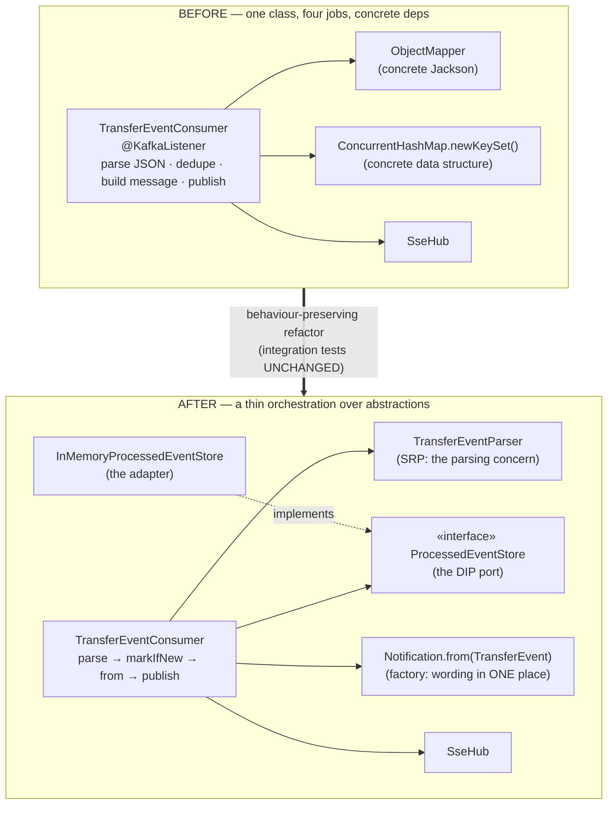
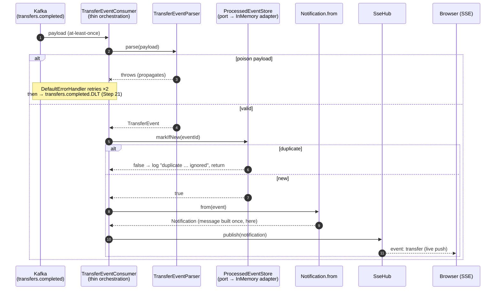

# Step 25 · SOLID & Clean Code — Refactoring a Smelly Service (with Tests as the Safety Net)

> **Step 25 of 67 · Phase E — Design, Architecture & Testing Mastery 🟣** · Level badge: 🟣 Advanced · Effort ≈ 10h · **Phase E opener.**

`🟢` Foundations &nbsp;·&nbsp; `🔵` Core &nbsp;·&nbsp; `🟣` Advanced &nbsp;·&nbsp; `🔴` Frontier

> [!CAUTION]
> **Educational, non-production project.** Build-a-Bank is for learning only. It never handles real money, real customers, or real personal data, and it is **not** security-audited for production banking. Every credential and customer you ever see here is fake/synthetic. (Full disclaimer + guardrails in the [README](../../README.md).)

> *Phase E is about design. We start with the discipline you'll use forever: take real code with **smells** and
> refactor it toward **SOLID** — without changing what it does. Our target is the notification consumer, whose
> one `@KafkaListener` method counted, parsed JSON, deduped, built a message, published, and logged — a
> textbook **SRP** violation tightly coupled to concrete tech (**DIP** violation). We extract single-purpose
> collaborators and invert the idempotency dependency behind a **port** — and the unchanged tests prove
> behaviour is preserved.*

> [!NOTE]
> **📜 Code-archaeology note (read this if you're browsing the repo at `main`).** This lesson shows every file
> **verbatim as of the `step-25-end` tag** — that is the truth for this step. Step 26 immediately restructures
> this very service into a full hexagonal layout (the classes you build here move into `domain/`,
> `application/port/`, and `adapter/` packages), so the code at `main` looks different. To follow along, use
> `git checkout step-25-start` in your own project (or read the lesson's code blocks — they are complete).

---

<a id="toc"></a>
## 🧭 The Six Movements of This Step

| | Movement | What happens | ~time |
|---|---|---|---|
| **A** | [🧭 Orient](#orient) | 30-second overview · skip-test · cheat card · why it matters · before you start | ~0.5h |
| **B** | [🧠 Understand](#understand) | SOLID (esp. SRP & DIP) · code smells · refactoring discipline · ports-and-adapters | ~1.5h |
| **C** | [🛠️ Build](#build) | green baseline → smell census → extract `TransferEvent`/parser → DIP port + adapter → factory → thin consumer → new unit tests → the unchanged safety net → harness (Makefile/smoke/requests.http/ADR) | ~5h |
| **D** | [🔬 Prove](#prove) | the Verification Log — unchanged tests still green + new unit tests; §12.3 mutation; fresh re-run | ~1h |
| **E** | [🎓 Apply](#apply) | go deeper · interview prep · your-turn challenges | ~1.5h |
| **F** | [🏆 Review](#review) | troubleshooting · resources · recap, flashcards & what's next · **Cumulative Review (steps 1–25)** | ~0.5h |

---

<a id="orient"></a>

# A · 🧭 Orient

## 📋 This Step in 30 Seconds

| | |
|---|---|
| **Title** | SOLID & clean code — refactor a smelly service (SRP, DIP → ports-and-adapters, code smells), behaviour-preserving |
| **Step** | 25 of 67 · **Phase E — Design, Architecture & Testing Mastery** 🟣 · **Phase E opener** |
| **Effort** | ≈ 10 hours focused — split into 4 sittings in the [🗓️ Session Plan](#session-plan) below. A **refactor** — no new feature; the win is cleaner, more testable code. |
| **What you'll run this step** | **JVM + Maven**; **🐳 Docker** for the notification integration tests (Testcontainers Redpanda). The two **new unit tests need neither** — that's part of the payoff. |
| **Buildable artifact** | A refactored **notification** service: `TransferEventConsumer` becomes a thin orchestration depending on abstractions — a `TransferEventParser` (SRP), a `ProcessedEventStore` **port** + `InMemoryProcessedEventStore` **adapter** (DIP), a `Notification.from(event)` factory, and a new `TransferEvent` domain record. New unit tests for the extracted pieces. The **existing integration tests are unchanged** and still pass. `step-25-start == step-24-end`. |
| **Verification tier** | 🟠 **Standard** — a refactor that keeps tests green (no money/security path touched). `./mvnw verify` green + the **unchanged** integration tests pass (behaviour preserved) + new unit tests + `smoke.sh`; a §12.3 mutation confirms the new port is exercised. |
| **Depends on** | **[Step 20](../step-20/lesson.md)** (the notification consumer we refactor), **[Step 21](../step-21/lesson.md)** (the Dead-Letter Topic the refactor must not break), **[Step 7](../step-07/lesson.md)** (proxies/DI), and it sets up **[Step 26](../step-26/lesson.md)** (hexagonal). |

By the end you will be able to **name code smells**, apply **SOLID** (especially **SRP** and **DIP**), do a
**behaviour-preserving refactor** with tests as the safety net, and explain **ports-and-adapters** (DIP in the
large).

### ⏭️ Can You Skip This Step? (5-minute self-check)

If you can confidently do **all** of this, skim the 🛠️ Build and jump to **[Step 26 — Hexagonal architecture + DDD](../step-26/lesson.md)**.

- [ ] I can state the **SOLID** principles and give a real example of an SRP and a DIP violation.
- [ ] I can name common **code smells** (god method, feature envy, tight coupling) and the refactorings that fix them.
- [ ] I can do a **behaviour-preserving** refactor and explain why the tests mustn't change.
- [ ] I can apply **DIP** with a **port + adapter** and say what it buys (swappable, testable).
- [ ] I can explain why SOLID improves **testability**, not just aesthetics.
- [ ] I can explain what a **characterization test** is and when I'd write one before refactoring.

> [!TIP]
> Not 100%? Stay. "Tell me about SOLID with examples," "what's a code smell and how would you fix it," and
> "what does dependency inversion buy you" are perennial design interview questions — and the version you can
> answer **with a real diff you made** beats a memorized acronym every time.

## 📇 Cheat Card

> **What this step delivers (one sentence):** the notification consumer is refactored from a do-everything
> method into a thin orchestration of single-responsibility collaborators (parser, a dedup **port** + adapter,
> a notification factory) — proven safe because the unchanged integration tests still pass.

**Key commands** (Windows uses `.\mvnw.cmd`; macOS/Linux/Git-Bash use `./mvnw`):

```bash
./mvnw -pl services/notification test     # unchanged integration tests + new unit tests (Docker needed)
./mvnw -pl services/notification test -Dtest='TransferEventParserTest,InMemoryProcessedEventStoreTest'
                                          # just the NEW unit tests — no Docker, ~5s (the refactor's payoff)
make play-25                              # same as the first command, with a one-line moral at the end
bash steps/step-25/smoke.sh               # one-shot proof your build matches the lesson
```

**The headline — before → after:**

```
BEFORE: onTransferCompleted(payload) { count; parse JSON; ConcurrentHashMap dedupe; build msg; publish; log }
                                        └────────── one method, many reasons to change (SRP✗), concrete deps (DIP✗)
AFTER:  parser.parse(payload) → processedEvents.markIfNew(id) → Notification.from(event) → hub.publish
        (TransferEventParser)   (ProcessedEventStore PORT + adapter)  (factory)            (SseHub)
```

**The one sentence to remember:** *Refactoring changes structure, not behaviour — so the tests don't change;
SOLID's payoff is small, single-purpose pieces you can swap (DIP) and test in isolation.*

## 🎯 Why This Matters

Code is read and changed far more than written. A god-method coupled to concrete tech is hard to test, hard to
change safely, and where bugs hide. SOLID — especially **SRP** (one reason to change) and **DIP** (depend on
abstractions) — is the everyday toolkit for keeping a growing codebase soft, and "refactor this smelly class /
explain SOLID" is a staple of senior interviews and real PRs. This step also teaches the *discipline* that makes
refactoring safe at a bank: you never touch structure and behaviour in the same move, and the unchanged test
suite is the judge.

## ✅ What You'll Be Able to Do

- **Spot** code smells in real code (god method, feature envy, tight coupling, mixed abstraction levels) and name the refactoring that fixes each.
- **Apply SRP** — extract single-purpose collaborators (a parser, a store, a factory) along genuine axes of change.
- **Apply DIP** — define a **port** owned by the caller and hide the concrete mechanism behind an **adapter**.
- **Refactor behaviour-preservingly**, with the unchanged test suite as the safety net — and explain why the tests must not change.
- **Explain** how SOLID improves **testability** and **changeability**, with the two new no-Docker unit tests as your evidence.

## 🧰 Before You Start

- **Prereqs:** bank builds green (`git describe` → `step-24-end`); **Docker running** (`docker info` works) for the notification integration tests.
- **Connects to what you know:** the **notification consumer** (Step 20) is the target; the **Dead-Letter Topic** (Step 21) is behaviour we must preserve; **constructor injection + injection-by-type** (Steps 5–7) is how the port's adapter gets wired; the dedup set's **thread safety** (Step 11) must survive the move. This is the SOLID groundwork for **hexagonal architecture** (Step 26) and the boundaries **ArchUnit** will enforce (Step 27).
- **Depends on:** Steps **20, 21, 7**.

<a id="session-plan"></a>
## 🗓️ Session Plan

≈10 hours won't fit one sitting. Four sittings of ~2–3h, each ending at a real ✋ checkpoint or section boundary — stop at the end of any sitting and you resume clean:

| Sitting | Covers | ~time | Ends at |
|---|---|---|---|
| **S1 · The theory** | A · Orient + B · Understand (SOLID · the smells table · DIP port/adapter + Spring wiring · security lens · Then vs. Now) | ~2h | the B→C bridge (file tree) — nothing typed yet |
| **S2 · Baseline → port + adapter** | Sub-steps 0–5 (green baseline run · smell census · `TransferEvent` record · `TransferEventParser` · `ProcessedEventStore` port · `InMemoryProcessedEventStore` adapter) | ~2.5h | sub-step 5's ✋ checkpoint — port + adapter committed; the consumer still runs the old code |
| **S3 · Thin consumer + the proof** | Sub-steps 6–9 (`Notification.from` factory · the thin consumer · the 2 new no-Docker unit test classes · the unchanged safety-net run, 7/7) | ~2.5h | sub-step 9's ✋ checkpoint — 7/7 green, zero test edits, refactor committed |
| **S4 · Harness + Prove + Apply + Review** | Sub-step 10 (Makefile `play-25` · `smoke.sh` · `requests.http` · ADR-0016 · tags) + D · Prove + E · Apply + F · Review (incl. the Cumulative Review, steps 1–25) | ~3h | ✅ Definition of Done · flashcards · sign-off |

*Optional routes:* the ⏭️ skip-test costs ~5 min (pass it and you can skim the Build and jump to Step 26); each 🚀 Go Deeper aside is +~5 min; 🧪 Little experiments are +~15 min; the "See it live" four-terminal run is +~15 min; each Your-Turn quick challenge is +~10–15 min and the 🎯 Redis-adapter stretch is +~1h.

---

<a id="understand"></a>

# B · 🧠 Understand

## 🧠 The Big Idea — SOLID, and refactoring as a safe transformation

**SOLID** is five principles for changeable object-oriented design:

- **S**ingle Responsibility — a class has **one reason to change**. Not "one method" — one *axis of change*: the wire format changing is a different reason than the dedup store changing.
- **O**pen/Closed — open to **extension**, closed to **modification**: you should be able to add behaviour (a Redis-backed dedup store) without editing existing callers (the consumer).
- **L**iskov Substitution — a subtype must work wherever its base type is expected. Any `ProcessedEventStore` implementation must honour `markIfNew`'s contract (atomic, `true` exactly once per id) or callers silently break.
- **I**nterface Segregation — small, focused interfaces beat fat ones. Our port has **one method**; a consumer forced to depend on a 20-method "StoreManager" would depend on 19 things it doesn't use.
- **D**ependency Inversion — high-level policy ("dedupe events") should not depend on low-level detail (`ConcurrentHashMap`); **both** should depend on an abstraction the policy owns.

**Refactoring** is changing *structure* without changing *behaviour*. The safety net is your **test suite**: if
the tests are green before and (**unchanged**) green after, the behaviour is preserved. That's why this step does
**not** edit the integration tests — they're the proof. Two rules of the discipline:

1. **Never change tests and production code in the same move.** If a structural move forces a test edit, either the move wasn't behaviour-preserving or the test was coupled to structure (testing *how*, not *what*) — both are findings.
2. **If there are no tests, write characterization tests first** — tests that pin down what the code *currently* does (even its bugs), so you have a net before you move anything. We're lucky: Steps 20–21 left us a real-broker integration suite.



*Alt-text: two boxes. Before: TransferEventConsumer points directly at ObjectMapper, a ConcurrentHashMap key
set, and SseHub, doing parse/dedupe/build/publish itself. After: the consumer points at a TransferEventParser,
a ProcessedEventStore interface (implemented by InMemoryProcessedEventStore), a Notification.from factory, and
SseHub. An arrow labelled "behaviour-preserving refactor (integration tests unchanged)" connects them.*

**The analogy:** the before-code is a chef who also takes orders, washes dishes, and does the books — when
anything in the restaurant changes, the chef changes. The refactor hires a waiter (parser), a cashier (store),
and a menu printer (factory); the chef now just cooks. Crucially, the *food tastes identical* — customers
(the tests) can't tell the difference. That indistinguishability is the definition of a safe refactor.

## 🧩 Pattern Spotlight — the smells in our consumer, and the fixes

`TransferEventConsumer.onTransferCompleted` had several smells:

| Smell | What it looked like | Refactoring |
|---|---|---|
| **God method / SRP✗** | one method: count + parse + dedupe + build + publish + log | **Extract** parser, dedup store, notification factory |
| **Feature envy / Law of Demeter** | `buildMessage(JsonNode)` reaching into the JSON tree (`node.get("from").asText()` …) | build the message **from a domain event** (`Notification.from`) |
| **Tight coupling / DIP✗** | direct `ObjectMapper` + inline `ConcurrentHashMap` | depend on a `TransferEventParser` and a `ProcessedEventStore` **port** |
| **Mixed abstraction levels** | wire-format parsing next to domain logic | separate the transport concern (parse) from the policy (dedupe → notify) |
| **Primitive obsession (mild)** | the event lives as a raw `JsonNode` + loose strings | introduce the `TransferEvent` record — a named, typed domain concept |

**Why-it-fits / alternatives:** the *minimal* fix would be extract-method inside the same class — cheaper, but
the class would still have many reasons to change and the dedup mechanism would still be untestable in
isolation. The *maximal* fix is a full hexagonal restructure — that's Step 26; doing it now would mix two big
moves in one diff. The chosen middle — extract collaborators + one inverted port — is the smallest move that
makes every concern independently testable. **Trade-off:** more files (six instead of two); the win is each
file is trivial to understand and to test.

❓ **Knowledge-check:** a method that counts, parses JSON, dedupes, builds a message, and logs — which smells is it exhibiting, and what's the first refactoring you'd reach for?
<details><summary>answer</summary>A god method (SRP✗) with mixed abstraction levels (wire-format parsing next to domain policy) and tight coupling to concretions (DIP✗). First move: <strong>extract</strong> — pull each concern into its own collaborator, exactly what the Build's sub-steps 2–6 do.</details>

## 🌱 Under the Hood: DIP with a port + adapter — and how Spring wires it

A **port** is an interface owned by the code that *uses* it (here `ProcessedEventStore.markIfNew`). An
**adapter** implements it for a specific technology (`InMemoryProcessedEventStore`; tomorrow a Redis one). The
consumer now depends on the **abstraction**, so the idempotency mechanism is **swappable without changing the
consumer** (DIP) and **mockable in tests** — and adding a Redis adapter is *extension, not modification* (OCP).
This is "dependency inversion in the small"; Step 26 grows it into a full hexagon.

❓ **Knowledge-check:** which SOLID letter does the `ProcessedEventStore` port serve — and which letter says adding a Redis adapter later is "extension, not modification"?
<details><summary>answer</summary><strong>D</strong> (Dependency Inversion) — the consumer depends on the abstraction, not on a <code>ConcurrentHashMap</code>. Adding another adapter without touching the consumer is <strong>O</strong> (Open/Closed).</details>

**How the wiring actually happens (no magic):** the consumer's constructor asks for a `ProcessedEventStore`.
At startup, component scanning has registered exactly one bean *of that type* — `InMemoryProcessedEventStore`
(it's `@Component` and `implements ProcessedEventStore`). Spring resolves constructor parameters **by type**,
finds the single matching bean, and injects it. The consumer's bytecode never names the concrete class — check
it: `javap -c TransferEventConsumer.class | grep InMemory` finds nothing. If you later register a *second*
adapter without disambiguating, startup fails fast with `NoUniqueBeanDefinitionException` — Spring refuses to
guess (you'd fix it with `@Primary`, a `@Qualifier`, or a profile/`@ConditionalOnProperty` gate, as Step 22 did
for scheduling).

**Why the new domain type is a `record`:** `TransferEvent` is an immutable value — exactly what records are for
(Step 2). Unlike a JPA entity (Step 8 explained why entities *can't* be records), nothing here needs a no-arg
constructor or mutable fields, so the terse, `final`, `equals/hashCode`-correct record is the right tool.

## 🛡️ Security Lens & 🧵 Thread-safety note

- **The Dead-Letter path is behaviour — preserve it.** The parser **throws** on a poison payload and the consumer doesn't swallow it (Step 21), so the container's `DefaultErrorHandler` still retries and then routes the record to `transfers.completed.DLT`. The single most dangerous "innocent" refactoring move here would be wrapping `parse` in a `try/catch` — that would silently break quarantine and turn poison messages into data loss. `DeadLetterTest` (unchanged) is the tripwire.
- **🧵 Thread-safety (Step 11 callback):** Kafka listener threads call `markIfNew` while the hub publishes to SSE clients on the same threads and web threads read the buffer. The dedup adapter stays thread-safe (`ConcurrentHashMap.newKeySet()` — `add` is an atomic check-and-insert), now *behind* the port. The port's javadoc says "atomically" — that contract is **part of LSP**: an adapter implemented with a plain `HashSet` would type-check and pass a single-threaded unit test, yet be a substitution-breaking bug.
- **STRIDE recap (Step 18):** nothing in this step changes the service's exposure — same endpoints, same (lack of) auth on the SSE stream, same payloads. A refactor that *did* change any of those would not be a refactor.

## 🕰️ Then vs. Now

The old advice "make it work, then make it right" still holds — but the modern discipline is **continuous,
test-backed refactoring**: small structural moves under a green suite, rather than big rewrites. And DIP is no
longer just "program to an interface" — it's the backbone of **ports-and-adapters / hexagonal** (Step 26),
which the team then **enforces** mechanically (ArchUnit/Modulith, Step 27) so the design can't erode silently.
One more shift: in the 2000s "program to an interface" was often applied reflexively (an `IFoo` for every
`Foo`); today the guidance is **introduce the abstraction when you have a reason** — a second implementation, a
test seam, a module boundary — which is exactly the justification bar this step applies (and the 🚀 Go Deeper
section interrogates).

---

# B→C bridge: 🌳 files we'll touch (all in `services/notification`)

```
services/notification/src/main/java/com/buildabank/notification/
├── TransferEventConsumer.java        (REFACTOR)  → thin orchestration: parse → dedupe → notify
├── TransferEvent.java                (NEW)         a plain domain record (no JSON/Kafka)
├── TransferEventParser.java          (NEW)         the parsing concern (isolates Jackson; throws on poison)
├── ProcessedEventStore.java          (NEW)         the idempotency PORT (DIP)
├── InMemoryProcessedEventStore.java  (NEW)         the in-memory ADAPTER (Redis-ready)
├── Notification.java                 (EDIT)        + from(TransferEvent) factory (message in one place)
├── SseHub.java                       (unchanged)
├── NotificationController.java      (unchanged)
├── KafkaErrorHandlingConfig.java    (unchanged)
└── NotificationApplication.java     (unchanged)
services/notification/src/test/java/com/buildabank/notification/
├── TransferEventParserTest.java          (NEW)  unit test — no Kafka, no Spring
├── InMemoryProcessedEventStoreTest.java  (NEW)  unit test — no Kafka, no Spring
├── TransferEventConsumerKafkaTest.java   (UNCHANGED ← the safety net)
├── DeadLetterTest.java                   (UNCHANGED ← the safety net)
├── NotificationControllerTest.java       (UNCHANGED ← the safety net)
└── RedpandaContainers.java               (unchanged)
Makefile                                  (EDIT)  + play-25
adr/0016-solid-refactor-notification-ports.md  (NEW)
steps/step-25/{lesson.md, smoke.sh, requests.http}
```

✋ **Stopping here (end of S1)?** You have the theory and the target shape (the file tree above) — nothing typed yet. Next: C · Build, sub-step 0 (the green baseline); first action: `./mvnw -pl services/notification test` from the repo root.

<a id="build"></a>

# C · 🛠️ Let's Build It — Step by Step

## 📦 Your Starting Point

`step-25-start == step-24-end`: **13 modules green**, Phase D complete. The notification service (Step 20 + the
Step-21 DLT hardening) works — and that's precisely the problem worth studying: *working* code accumulates
smells invisibly. Confirm where you are:

```bash
git describe --tags          # → step-24-end (or step-25-start)
docker info > /dev/null && echo "Docker OK"
```

Because Step 26 will reshuffle this service's packages, here is the **complete supporting cast as of this step**
— the unchanged collaborators the refactor orbits around. Skim them now; the build refers back to them.

<details>
<summary>📄 <code>services/notification/pom.xml</code> — unchanged this step (web + kafka starters; Redpanda Testcontainers for tests)</summary>

```xml
<?xml version="1.0" encoding="UTF-8"?>
<project xmlns="http://maven.apache.org/POM/4.0.0"
         xmlns:xsi="http://www.w3.org/2001/XMLSchema-instance"
         xsi:schemaLocation="http://maven.apache.org/POM/4.0.0 https://maven.apache.org/xsd/maven-4.0.0.xsd">
    <modelVersion>4.0.0</modelVersion>

    <!--
      notification — the event-driven NOTIFICATION service (Step 20). No database: it CONSUMES
      transfer.completed events from Kafka (published by demand-account's Outbox relay), dedupes them
      (idempotent consumer → exactly-once *effect*, Step 19), and pushes them to connected clients over
      Server-Sent Events (SSE). This is the consumer + real-time-push half of the event-driven slice.
    -->
    <parent>
        <groupId>com.buildabank</groupId>
        <artifactId>build-a-bank-parent</artifactId>
        <version>0.1.0-SNAPSHOT</version>
        <relativePath>../../pom.xml</relativePath>
    </parent>

    <artifactId>notification</artifactId>
    <name>Build-a-Bank :: Services :: Notification</name>
    <description>Event-driven notifications — Kafka consumer + SSE real-time push (Step 20).</description>

    <dependencies>
        <dependency>
            <groupId>org.springframework.boot</groupId>
            <artifactId>spring-boot-starter-web</artifactId>
        </dependency>
        <!-- Boot 4: the kafka STARTER brings spring-kafka + KafkaAutoConfiguration (consumer factory, listener
             container). Bare spring-kafka would give no autoconfigured @KafkaListener infrastructure. -->
        <dependency>
            <groupId>org.springframework.boot</groupId>
            <artifactId>spring-boot-starter-kafka</artifactId>
        </dependency>
        <dependency>
            <groupId>org.springframework.boot</groupId>
            <artifactId>spring-boot-starter-actuator</artifactId>
        </dependency>

        <!-- ── Test ── -->
        <dependency>
            <groupId>org.springframework.boot</groupId>
            <artifactId>spring-boot-starter-test</artifactId>
            <scope>test</scope>
        </dependency>
        <dependency>
            <groupId>org.springframework.boot</groupId>
            <artifactId>spring-boot-webmvc-test</artifactId>
            <scope>test</scope>
        </dependency>
        <dependency>
            <groupId>org.springframework.boot</groupId>
            <artifactId>spring-boot-starter-kafka-test</artifactId>
            <scope>test</scope>
        </dependency>
        <dependency>
            <groupId>org.springframework.boot</groupId>
            <artifactId>spring-boot-testcontainers</artifactId>
            <scope>test</scope>
        </dependency>
        <dependency>
            <groupId>org.testcontainers</groupId>
            <artifactId>testcontainers-redpanda</artifactId>
            <scope>test</scope>
        </dependency>
        <dependency>
            <groupId>org.testcontainers</groupId>
            <artifactId>testcontainers-junit-jupiter</artifactId>
            <scope>test</scope>
        </dependency>
    </dependencies>

    <build>
        <plugins>
            <plugin>
                <groupId>org.springframework.boot</groupId>
                <artifactId>spring-boot-maven-plugin</artifactId>
            </plugin>
        </plugins>
    </build>
</project>
```

</details>

<details>
<summary>📄 <code>application.yml</code> — unchanged this step (Kafka consumer/producer config, topic, port 8084)</summary>

```yaml
# services/notification/src/main/resources/application.yml
spring:
  application:
    name: notification
  kafka:
    bootstrap-servers: ${KAFKA_BOOTSTRAP_SERVERS:localhost:9092}
    consumer:
      group-id: notification-service
      auto-offset-reset: earliest      # a fresh consumer reads from the start of the topic
      key-deserializer: org.apache.kafka.common.serialization.StringDeserializer
      value-deserializer: org.apache.kafka.common.serialization.StringDeserializer
    producer:                          # Step 21: needed so the DLT recoverer can republish failed records
      key-serializer: org.apache.kafka.common.serialization.StringSerializer
      value-serializer: org.apache.kafka.common.serialization.StringSerializer

# The topic the demand-account Outbox relay publishes to (must match demand-account's bank.events.topic).
bank:
  events:
    topic: transfers.completed

server:
  port: 8084                 # notification's port (hello=8080, cif=8081, demand-account=8082, auth=8083).
  shutdown: graceful

management:
  endpoints:
    web:
      exposure:
        include: health,info

logging:
  level:
    com.buildabank.notification: INFO
```

</details>

<details>
<summary>📄 <code>SseHub.java</code> — unchanged this step (the real-time push fan-out the consumer publishes to)</summary>

```java
// services/notification/src/main/java/com/buildabank/notification/SseHub.java
package com.buildabank.notification;

import java.io.IOException;
import java.util.ArrayDeque;
import java.util.ArrayList;
import java.util.Deque;
import java.util.List;
import java.util.concurrent.CopyOnWriteArrayList;

import org.slf4j.Logger;
import org.slf4j.LoggerFactory;
import org.springframework.stereotype.Component;
import org.springframework.web.servlet.mvc.method.annotation.SseEmitter;

/**
 * Step 20 · the <strong>real-time push</strong> fan-out. Holds the set of open {@link SseEmitter}s (one per
 * connected browser) and broadcasts each {@link Notification} to all of them, while also keeping the most
 * recent few so a client that just connected (or a test) can read what happened.
 *
 * <p>Server-Sent Events (SSE) is a one-way server→client stream over a long-lived HTTP response
 * ({@code text/event-stream}) — simpler than WebSocket and perfect for "push me notifications." Thread-safe:
 * the emitter list is copy-on-write and the recent buffer is guarded, because Kafka listener threads publish
 * while request threads register/disconnect (the shared-state discipline from Step 11).
 */
@Component
public class SseHub {

    private static final Logger log = LoggerFactory.getLogger(SseHub.class);
    private static final int RECENT_LIMIT = 50;

    private final List<SseEmitter> emitters = new CopyOnWriteArrayList<>();
    private final Deque<Notification> recent = new ArrayDeque<>();

    /** Register a new SSE subscriber; auto-removes itself on completion/timeout/error. */
    public SseEmitter register() {
        SseEmitter emitter = new SseEmitter(0L);   // 0 = no timeout (stream stays open)
        emitter.onCompletion(() -> emitters.remove(emitter));
        emitter.onTimeout(() -> emitters.remove(emitter));
        emitter.onError(e -> emitters.remove(emitter));
        emitters.add(emitter);
        return emitter;
    }

    /** Record and broadcast a notification to every connected client. */
    public void publish(Notification notification) {
        synchronized (recent) {
            recent.addFirst(notification);
            while (recent.size() > RECENT_LIMIT) {
                recent.removeLast();
            }
        }
        for (SseEmitter emitter : emitters) {
            try {
                emitter.send(SseEmitter.event().name("transfer").data(notification));
            } catch (IOException | IllegalStateException e) {
                emitters.remove(emitter);   // client gone → drop it
                log.debug("dropped a dead SSE subscriber", e);
            }
        }
    }

    /** The most recent notifications, newest first (for a just-connected client or a test). */
    public List<Notification> recent() {
        synchronized (recent) {
            return new ArrayList<>(recent);
        }
    }

    /** Number of currently-connected SSE subscribers. */
    public int subscriberCount() {
        return emitters.size();
    }
}
```

</details>

<details>
<summary>📄 <code>NotificationController.java</code> — unchanged this step (the HTTP surface: recent buffer + SSE stream)</summary>

```java
// services/notification/src/main/java/com/buildabank/notification/NotificationController.java
package com.buildabank.notification;

import java.util.List;

import org.springframework.http.MediaType;
import org.springframework.web.bind.annotation.GetMapping;
import org.springframework.web.bind.annotation.RequestMapping;
import org.springframework.web.bind.annotation.RestController;
import org.springframework.web.servlet.mvc.method.annotation.SseEmitter;

/**
 * Step 20 · exposes the notification stream. {@code GET /api/notifications/stream} opens a live
 * <strong>Server-Sent Events</strong> connection — open it in a browser or {@code curl -N} and watch transfers
 * appear in real time as they happen elsewhere in the bank. {@code GET /api/notifications} returns the recent
 * buffer (handy for testing and for a client that just connected).
 */
@RestController
@RequestMapping("/api/notifications")
public class NotificationController {

    private final SseHub hub;

    public NotificationController(SseHub hub) {
        this.hub = hub;
    }

    /** Subscribe to the live event stream (text/event-stream). The connection stays open and pushes events. */
    @GetMapping(value = "/stream", produces = MediaType.TEXT_EVENT_STREAM_VALUE)
    public SseEmitter stream() {
        return hub.register();
    }

    /** The most recent notifications (newest first). */
    @GetMapping
    public List<Notification> recent() {
        return hub.recent();
    }
}
```

</details>

<details>
<summary>📄 <code>KafkaErrorHandlingConfig.java</code> — unchanged this step (Step 21's retries + Dead-Letter Topic; the refactor must not break this)</summary>

```java
// services/notification/src/main/java/com/buildabank/notification/KafkaErrorHandlingConfig.java
package com.buildabank.notification;

import org.apache.kafka.common.TopicPartition;
import org.springframework.context.annotation.Bean;
import org.springframework.context.annotation.Configuration;
import org.springframework.kafka.core.KafkaTemplate;
import org.springframework.kafka.listener.DeadLetterPublishingRecoverer;
import org.springframework.kafka.listener.DefaultErrorHandler;
import org.springframework.util.backoff.FixedBackOff;

/**
 * Step 21 · <strong>retries + Dead-Letter Topic (DLQ)</strong> for the Kafka consumer. When
 * {@link TransferEventConsumer} throws on a message (e.g. an un-parseable "poison" payload), Spring Kafka's
 * {@link DefaultErrorHandler} retries it a few times; if it still fails, the {@link DeadLetterPublishingRecoverer}
 * republishes the original record to a dead-letter topic ({@code <topic>.DLT}) instead of blocking the
 * partition forever. The poison message is quarantined for inspection while good messages keep flowing.
 *
 * <p>Boot auto-wires a single {@code CommonErrorHandler} bean into the listener container factory, so just
 * declaring this bean activates it. The recoverer uses the auto-configured {@link KafkaTemplate} (String
 * serializers — see application.yml) to publish the failed record verbatim.
 */
@Configuration
public class KafkaErrorHandlingConfig {

    @Bean
    DefaultErrorHandler kafkaErrorHandler(KafkaTemplate<String, String> kafkaTemplate) {
        DeadLetterPublishingRecoverer recoverer = new DeadLetterPublishingRecoverer(kafkaTemplate,
                (record, exception) -> new TopicPartition(record.topic() + ".DLT", record.partition()));
        // 2 retries (no delay) then send to the DLT — fast and deterministic for a poison message.
        return new DefaultErrorHandler(recoverer, new FixedBackOff(0L, 2L));
    }
}
```

</details>

> ⚙️ **A note on the Run-and-See blocks ahead (§12.8 honesty):** every **test** output in this lesson is a
> real, freshly recorded run of the tagged code (re-run on 2026-06-11 — details in the Verification Log §5).
> The intermediate `-DskipTests compile` blocks between sub-steps show the standard Maven success shape —
> they're sanity pulses, not the evidence; the evidence is the test runs in sub-steps 0, 8, 9 and 10.

## 🗺️ The build at a glance

```mermaid
flowchart LR
    s0["0 · green baseline<br/>(run BEFORE touching anything)"] --> s1["1 · smell census<br/>(read like a reviewer)"]
    s1 --> s2["2 · TransferEvent<br/>(domain record)"] --> s3["3 · TransferEventParser<br/>(SRP: parsing)"]
    s3 --> s4["4 · ProcessedEventStore<br/>(the DIP port)"] --> s5["5 · InMemory adapter"]
    s5 --> s6["6 · Notification.from<br/>(factory)"] --> s7["7 · the THIN consumer<br/>(the big diff)"]
    s7 --> s8["8 · NEW unit tests<br/>(the payoff, no Docker)"] --> s9["9 · UNCHANGED safety net<br/>(7/7 on real Redpanda)"]
    s9 --> s10["10 · harness<br/>(Makefile · smoke · requests.http · ADR)"]
```



*Alt-text: a left-to-right pipeline of the 11 sub-steps: baseline run, smell census, TransferEvent record,
parser, port, adapter, factory, thin consumer, new unit tests, unchanged integration suite, harness.*

---

### Sub-step 0 of 10 — Establish the green baseline (~10 min) 🧭 *(you are here: **baseline** → smells → extract → invert → tests → harness)*

🎯 **Goal:** run the *existing* suite **before touching a single line**. A refactor without a green "before" is
gambling — if a test fails later you won't know whether you broke it or it was already broken.

📁 **Location:** no files change — this is a run.

🔮 **Predict:** the notification module at `step-24-end` has three test classes (Steps 20–21). How many test
*methods* will run, and which class will dominate the wall-clock? *(Hint: one of them waits for Kafka retries
to exhaust before the DLT receives the poison record.)*

▶️ **Run & See:**

```bash
./mvnw -pl services/notification test
```

✅ **Expected output** (real run of the `step-24-end` code, recorded fresh 2026-06-11 — timings vary):

```
[INFO] Tests run: 1, Failures: 0, Errors: 0, Skipped: 0, Time elapsed: 15.65 s -- in com.buildabank.notification.DeadLetterTest
[INFO] Tests run: 2, Failures: 0, Errors: 0, Skipped: 0, Time elapsed: 1.648 s -- in com.buildabank.notification.NotificationControllerTest
[INFO] Tests run: 1, Failures: 0, Errors: 0, Skipped: 0, Time elapsed: 3.235 s -- in com.buildabank.notification.TransferEventConsumerKafkaTest
[INFO] Tests run: 4, Failures: 0, Errors: 0, Skipped: 0
[INFO] BUILD SUCCESS
[INFO] Total time:  26.817 s
```

Predicted right? **4 methods**; `DeadLetterTest` dominates (~16s) because the poison record must fail, be
retried twice (`FixedBackOff(0L, 2L)`), and land on the DLT before the verifying consumer polls it.

❌ **If you see `Could not find a valid Docker environment`:** start Docker Desktop (or your engine) — the two
`@SpringBootTest` classes boot a real Redpanda via Testcontainers. See 🩺.

✋ **Checkpoint:** `Tests run: 4 … BUILD SUCCESS`. **Write the number 4 down** — at the end of this step the
same three classes must still contribute exactly these 4 green tests, *unedited*.

💾 **Commit:** nothing to commit — but if your working tree isn't clean, commit or stash now so the upcoming
refactor diffs stay readable.

⚠️ **Pitfall:** skipping the baseline because "it was green yesterday." Suites rot (a Docker upgrade, a port
clash, a flaky await). The baseline costs 30 seconds and converts "I think it still works" into evidence.

---

### Sub-step 1 of 10 — Read the code like a reviewer: the smell census (~30 min) 🧭 *(baseline ✅ → **smells** → extract → invert → tests → harness)*

🎯 **Goal:** *diagnose before operating.* Read the consumer as it stands at `step-24-end` and name each smell
precisely — the refactor plan falls straight out of the census.

📁 **Location:** read-only → `services/notification/src/main/java/com/buildabank/notification/TransferEventConsumer.java`

⌨️ **The code under review** (verbatim as of `step-24-end` — the BEFORE):

```java
// services/notification/src/main/java/com/buildabank/notification/TransferEventConsumer.java
package com.buildabank.notification;

import java.math.BigDecimal;
import java.util.concurrent.ConcurrentHashMap;
import java.util.Set;
import java.util.concurrent.atomic.AtomicInteger;

import org.slf4j.Logger;
import org.slf4j.LoggerFactory;
import org.springframework.kafka.annotation.KafkaListener;
import org.springframework.stereotype.Component;

import tools.jackson.databind.JsonNode;
import tools.jackson.databind.ObjectMapper;

/**
 * Step 20 · the <strong>Kafka consumer</strong>. Reads {@code transfer.completed} events and turns each into a
 * {@link Notification} pushed via {@link SseHub}.
 *
 * <p><strong>Idempotent consumer = exactly-once effect (Step 19).</strong> Kafka delivers at-least-once (a
 * rebalance or a relay retry can redeliver), so we dedupe by {@code eventId}: the first time we see an id we
 * process and remember it; a duplicate is skipped. Effect is exactly-once even though delivery isn't. (The
 * dedupe set is in-memory here for teaching; a real consumer persists processed ids — Redis/DB — so it
 * survives restarts. Step 21 makes this durable with the Idempotency Key in Redis.)
 *
 * <p>We use the Boot-autoconfigured Jackson 3 {@link ObjectMapper} ({@code tools.jackson}) to parse the JSON
 * payload — Spring Boot 4 defaults the web stack to Jackson 3, so that's the mapper bean on the classpath.
 */
@Component
public class TransferEventConsumer {

    private static final Logger log = LoggerFactory.getLogger(TransferEventConsumer.class);

    private final SseHub hub;
    private final ObjectMapper objectMapper;
    private final Set<String> processedEventIds = ConcurrentHashMap.newKeySet();
    private final AtomicInteger received = new AtomicInteger();
    private final AtomicInteger applied = new AtomicInteger();

    public TransferEventConsumer(SseHub hub, ObjectMapper objectMapper) {
        this.hub = hub;
        this.objectMapper = objectMapper;
    }

    @KafkaListener(
            topics = "${bank.events.topic:transfers.completed}",
            groupId = "${spring.kafka.consumer.group-id:notification-service}")
    public void onTransferCompleted(String payload) {
        received.incrementAndGet();
        // We do NOT swallow exceptions here (Step 21): a poison/un-parseable message is allowed to throw so the
        // container's DefaultErrorHandler retries it and then routes it to the Dead-Letter Topic
        // (KafkaErrorHandlingConfig) — quarantined for inspection instead of silently dropped or blocking forever.
        JsonNode node = objectMapper.readTree(payload);
        String eventId = node.get("eventId").asText();
        if (!processedEventIds.add(eventId)) {
            log.info("duplicate event {} ignored (exactly-once effect)", eventId);
            return;   // already handled this event id → idempotent skip
        }
        Notification notification = new Notification(
                eventId,
                node.get("transactionId").asText(),
                node.get("from").asText(),
                node.get("to").asText(),
                node.get("amount").decimalValue(),
                node.get("occurredAt").asText(),
                buildMessage(node));
        applied.incrementAndGet();
        hub.publish(notification);
        log.info("notified: {}", notification.message());
    }

    private static String buildMessage(JsonNode node) {
        BigDecimal amount = node.get("amount").decimalValue();
        return "Transfer of " + amount + " from " + node.get("from").asText()
                + " to " + node.get("to").asText() + " completed.";
    }

    /** Total messages delivered to this consumer (includes duplicates). */
    public int receivedCount() {
        return received.get();
    }

    /** Distinct events actually applied (duplicates excluded) — should equal the number of real transfers. */
    public int appliedCount() {
        return applied.get();
    }
}
```

🔍 **The census — go line by line and name what you see:**

| Lines (roughly) | Observation | Smell | Principle violated |
|---|---|---|---|
| imports | `tools.jackson.databind.*` + `ConcurrentHashMap` imported **by a Kafka listener** | infrastructure bleeding into policy | DIP |
| fields | `ObjectMapper` (concrete), `Set<String>` initialized inline | tight coupling to concretions; the dedup *mechanism* is hard-wired | DIP, OCP |
| `onTransferCompleted` | count → parse → extract → dedupe → build → count → publish → log: **six jobs in one method** | god method | SRP |
| `node.get("…").asText()` ×7 | the consumer knows the **wire field names** | mixed abstraction levels; primitive obsession (`JsonNode` as the domain) | SRP |
| `buildMessage(JsonNode)` | message wording computed by **reaching into another structure's data** | feature envy / Law of Demeter (`node.get(...).asText()` chains) | SRP |
| the whole class | parsing changes, store changes, wording changes, Kafka changes → **all** land here | many reasons to change | SRP |

❓ **Knowledge-check:** the class also keeps two `AtomicInteger` counters. Are *those* a smell?
<details><summary>answer</summary>No — they're the consumer's own observable state (the Kafka tests assert
them), they're thread-safe, and they belong to the orchestration concern itself. The census is about *foreign*
concerns squatting in the class, not about the class having state. (Keeping them is also part of behaviour
preservation — removing them would break the unchanged tests' API.)</details>

💭 **Under the hood — how did it get this way?** Honestly: accretion. Step 20 wrote a reasonable first version;
Step 21 added the do-not-swallow comment for the DLT. Each addition was locally sensible — that's how god
methods always form. The fix is never blame; it's a scheduled, test-backed refactor (this step).

🔮 **Predict:** which of the six jobs will be *hardest* to extract without changing behaviour? *(Our answer:
parsing — because its failure mode, the thrown exception on poison, is load-bearing for the DLT. Keep that in
mind for sub-step 3.)*

✋ **Checkpoint:** you can point at the line for each smell in the table above without re-reading the prose.

💾 **Commit:** nothing yet — diagnosis done.

⚠️ **Pitfall:** "while I'm in here…" — spotting smells tempts you to also rename things, tweak the message
text, or upgrade the dedupe to Redis. **Don't.** One behaviour-preserving move at a time; anything that changes
observable behaviour graduates from *refactor* to *feature* and needs its own step (the Redis store is a
stretch goal; the hexagon is Step 26).

✋ **Stopping here?** You have a green 4-test baseline and a named smell census — zero lines of code changed. Next: sub-step 2 (the `TransferEvent` domain record); first action: create `services/notification/src/main/java/com/buildabank/notification/TransferEvent.java`.

---

### Sub-step 2 of 10 — `TransferEvent`: a domain event with no transport coupling (~20 min) 🧭 *(baseline ✅ → smells ✅ → **extract** → invert → tests → harness)*

🎯 **Goal:** give the parsed event a *name and a type*. Today the event lives as a `JsonNode` — a bag of
untyped fields the consumer rummages through. A `record` makes it a first-class domain concept.

📁 **Location:** new file → `services/notification/src/main/java/com/buildabank/notification/TransferEvent.java`

⌨️ **Code:**

```java
// services/notification/src/main/java/com/buildabank/notification/TransferEvent.java
package com.buildabank.notification;

import java.math.BigDecimal;

/**
 * The parsed {@code transfer.completed} event — a plain domain type with <strong>no transport coupling</strong>
 * (no JSON, no Kafka). Extracting this (Step 25, SOLID/SRP) lets the consumer work with a meaningful object
 * instead of reaching into a {@code JsonNode}, and lets parsing be tested on its own.
 */
public record TransferEvent(
        String eventId,
        String transactionId,
        String fromAccount,
        String toAccount,
        BigDecimal amount,
        String occurredAt) {
}
```

🔍 **Line-by-line:**

- `record TransferEvent(...)` — an immutable value type (Step 2): final fields, generated constructor/accessors/`equals`/`hashCode`/`toString`. Perfect for an *event* — something that happened and can't change.
- **No imports from `tools.jackson` or `org.springframework`** — that's the whole point. This type compiles against `java.base` + `java.math` only; it would survive a switch from JSON to Avro untouched.
- `eventId` — the end-to-end dedupe key (minted as the Outbox row's primary key in demand-account, Step 20; carried as the Kafka record key; used by `markIfNew` here).
- `amount` is a **`BigDecimal`** — the money discipline from Step 2 (never `double` for money: binary floating point can't represent 0.1 exactly).
- `fromAccount`/`toAccount` — note the *domain* names; the wire payload calls them `from`/`to`. The mapping between wire names and domain names now lives in exactly one place (the parser, next sub-step).
- `occurredAt` stays a `String` — deliberate. The consumer never computes with it (just displays/serializes); parsing it to `Instant` would add a failure mode and *change behaviour* (re-serialization could reformat it). Refactor = preserve.

💭 **Under the hood:** records get their accessors (`event.amount()`), constructor, and `equals/hashCode`
generated by the compiler — check with `javap TransferEvent.class`. Contrast with Step 8's JPA entity, which
*couldn't* be a record (Hibernate needs a no-arg constructor + mutable fields); nothing here is persisted, so
the record is the right tool.

🔮 **Predict:** does adding this file change any behaviour? *(Trick question — nothing references it yet. A
refactor in tiny steps spends most of its time in states where the new code is dormant and the old code still
runs. That's what keeps each move trivially safe.)*

▶️ **Run & See:**

```bash
./mvnw -pl services/notification -DskipTests compile
```

✅ **Expected output (tail):**

```
[INFO] BUILD SUCCESS
```

✋ **Checkpoint:** the module compiles; nothing else changed. `git status` shows exactly one new file.

💾 **Commit:**

```bash
git add services/notification/src/main/java/com/buildabank/notification/TransferEvent.java
git commit -m "refactor(notification): add TransferEvent domain record (no transport coupling)"
```

⚠️ **Pitfall:** putting a `parse(String json)` method *on the record* "for convenience." That would re-couple
the domain type to Jackson — the exact disease we're curing. Parsing is its own responsibility (next sub-step).

---

### Sub-step 3 of 10 — `TransferEventParser`: the parsing concern, extracted (~30 min) 🧭 *(baseline ✅ → smells ✅ → record ✅ → **parser** → invert → tests → harness)*

🎯 **Goal:** move the JSON-wire knowledge (`readTree`, the field names `from`/`to`/…) into one class with one
job — and keep its **failure mode identical**: a poison payload must still *throw*, because the Dead-Letter
routing depends on it.

📁 **Location:** new file → `services/notification/src/main/java/com/buildabank/notification/TransferEventParser.java`

⌨️ **Code:**

```java
// services/notification/src/main/java/com/buildabank/notification/TransferEventParser.java
package com.buildabank.notification;

import org.springframework.stereotype.Component;

import tools.jackson.databind.JsonNode;
import tools.jackson.databind.ObjectMapper;

/**
 * Step 25 · the parsing concern, extracted from the consumer (SRP). Turns the JSON wire payload into a
 * {@link TransferEvent}, isolating the Jackson coupling here. An un-parseable ("poison") payload <strong>throws
 * on purpose</strong> — the consumer lets it propagate so the container routes it to the Dead-Letter Topic
 * (Step 21), rather than swallowing it.
 */
@Component
public class TransferEventParser {

    private final ObjectMapper objectMapper;   // Boot 4 default is Jackson 3 (tools.jackson)

    public TransferEventParser(ObjectMapper objectMapper) {
        this.objectMapper = objectMapper;
    }

    public TransferEvent parse(String payload) {
        JsonNode node = objectMapper.readTree(payload);   // throws on malformed JSON → propagates → DLT
        return new TransferEvent(
                node.get("eventId").asText(),
                node.get("transactionId").asText(),
                node.get("from").asText(),
                node.get("to").asText(),
                node.get("amount").decimalValue(),
                node.get("occurredAt").asText());
    }
}
```

🔍 **Line-by-line:**

- `@Component` — registers the parser as a bean so the consumer can receive it by constructor injection. (Component scanning finds it because it's under the application's base package — Step 6.)
- `private final ObjectMapper objectMapper` — the **same Boot-autoconfigured Jackson 3 mapper** the old code used (`tools.jackson`, Spring Boot 4's default — Step 20 explained the Jackson 2→3 move). Injecting Boot's bean (rather than `new ObjectMapper()`) keeps any global Jackson configuration consistent — and keeps behaviour identical.
- `objectMapper.readTree(payload)` — parses the raw string into a JSON tree. **On malformed input it throws** (Jackson 3 throws unchecked exceptions — no `throws` clause needed). We add no `try/catch`: the exception is the contract.
- `node.get("from").asText()` → `fromAccount` — the wire-name→domain-name mapping, now in exactly one place. If demand-account ever renames a payload field, *this class* is the only main-code file that changes.
- `node.get("amount").decimalValue()` — extracts the JSON number as a `BigDecimal` (money discipline). Same call the old code made — byte-for-byte the same parsing behaviour.

💭 **Under the hood:** when the consumer (sub-step 7) declares `TransferEventParser parser` in its constructor,
Spring resolves it **by type** to this single bean and injects it — the same mechanism as every injection since
Step 5. Note the parser is *stateless* (one final field, no mutable state), so one shared instance is safely
called from any number of Kafka listener threads — statelessness is the cheapest thread-safety there is
(Step 11).

🔮 **Predict:** after the full refactor, a poison payload arrives. Walk the path: where does the exception
originate now, and does the DLT still receive the record? *(Answer: it originates in `parser.parse` instead of
inline in the listener — but it still propagates out of `onTransferCompleted`, so the `DefaultErrorHandler`
still retries ×2 and routes to `transfers.completed.DLT`. Same observable behaviour, different line number.)*

▶️ **Run & See:**

```bash
./mvnw -pl services/notification -DskipTests compile
```

✅ **Expected output (tail):**

```
[INFO] BUILD SUCCESS
```

✋ **Checkpoint:** compiles; the old consumer still runs the old inline parsing (the parser is dormant — wired
in at sub-step 7).

💾 **Commit:**

```bash
git add services/notification/src/main/java/com/buildabank/notification/TransferEventParser.java
git commit -m "refactor(notification): extract TransferEventParser (SRP — isolate the Jackson/wire concern)"
```

⚠️ **Pitfall:** the "helpful" `try { … } catch (Exception e) { log.warn("bad payload", e); return null; }`.
That single catch block would: break the DLT (poison messages silently vanish), force every caller to
null-check, and turn `DeadLetterTest` red. **A thrown exception can be a feature.** If you want a kinder API
later, return a sealed result type — but that's a behaviour change, not a refactor.

✋ **Stopping here?** You have `TransferEvent` + `TransferEventParser` committed; the consumer still runs its old inline parsing (the new classes are dormant). Next: sub-step 4 (the `ProcessedEventStore` port — the heart of this step); first action: create `services/notification/src/main/java/com/buildabank/notification/ProcessedEventStore.java`.

---

### Sub-step 4 of 10 — `ProcessedEventStore`: the port (DIP, the heart of this step) (~25 min) 🧭 *(… parser ✅ → **port** → adapter → factory → consumer → tests → harness)*

🎯 **Goal:** invert the idempotency dependency. The consumer's *policy* is "process each event id once"; the
`ConcurrentHashMap` is an *implementation detail* of remembering ids. Make the policy depend on an abstraction
**it owns**, not on the detail.

📁 **Location:** new file → `services/notification/src/main/java/com/buildabank/notification/ProcessedEventStore.java`

⌨️ **Code:**

```java
// services/notification/src/main/java/com/buildabank/notification/ProcessedEventStore.java
package com.buildabank.notification;

/**
 * Step 25 · a <strong>port</strong> (Dependency Inversion Principle): the consumer's idempotency depends on
 * this abstraction, not on a concrete data structure. Today the only adapter is in-memory
 * ({@link InMemoryProcessedEventStore}); a durable adapter (Redis/DB, like Step 21) can replace it without
 * touching the consumer — DIP + the Open/Closed Principle.
 */
public interface ProcessedEventStore {

    /**
     * Atomically record that an event id has been seen.
     *
     * @return {@code true} if this id is NEW (process it); {@code false} if it's a duplicate (skip it)
     */
    boolean markIfNew(String eventId);
}
```

🔍 **Line-by-line:**

- `interface` — pure abstraction: no fields, no framework imports, nothing about *how* ids are remembered.
- `markIfNew` — note the name describes the **role in the policy** ("mark it; tell me if it was new"), not a mechanism ("addToSet", "putIfAbsent"). Port names should read like the caller's language.
- The javadoc word **"Atomically"** is the most important token in the file: check-and-record must be one indivisible operation, because two listener threads could deliver the same duplicate concurrently. A `contains()`-then-`add()` implementation would have a check-then-act race (Step 11) — this contract *forbids* it. Honouring documented contracts like this is exactly what **Liskov Substitution** demands of every future adapter.
- One method only — **Interface Segregation**: the consumer needs exactly this; a fatter interface (`clear()`, `size()`, `evictOlderThan()`…) would couple it to operations it never uses.

💭 **Under the hood — what "inversion" literally means:** before, the dependency arrow ran *policy →
detail* (`TransferEventConsumer → ConcurrentHashMap`). Now there are two arrows, **both pointing at the
abstraction**: `TransferEventConsumer → ProcessedEventStore ← InMemoryProcessedEventStore`. The detail
(adapter) now depends on something the policy side owns — the direction inverted. At compile time the
consumer's bytecode references only the interface; you can prove it after sub-step 7 with
`javap -c target/classes/com/buildabank/notification/TransferEventConsumer.class | grep -c InMemory` → `0`.

❓ **Knowledge-check:** why does the *consumer's side* own this interface, rather than it living next to (or
inside) the adapter? <details><summary>answer</summary>Because DIP says the high-level policy defines the
abstraction it needs; adapters conform to it. If the adapter side owned the interface, the policy would still
depend on the detail's module — the arrow wouldn't be inverted, just longer. (In Step 26 this becomes physical:
ports live in <code>application/port/</code>, adapters in <code>adapter/</code>.)</details>

🔮 **Predict:** you now have an interface with **zero** implementations and the app still compiles. Would the
app *start*? *(Not yet relevant — nothing injects the port until sub-step 7. But the moment something does,
startup would fail with `NoSuchBeanDefinitionException: No qualifying bean of type 'ProcessedEventStore'` —
which is why the adapter comes next, before we touch the consumer.)*

▶️ **Run & See:**

```bash
./mvnw -pl services/notification -DskipTests compile
```

✅ **Expected output (tail):**

```
[INFO] BUILD SUCCESS
```

✋ **Checkpoint:** the port compiles, fully framework-free (its only import would be none at all).

💾 **Commit:**

```bash
git add services/notification/src/main/java/com/buildabank/notification/ProcessedEventStore.java
git commit -m "refactor(notification): add ProcessedEventStore port (DIP — idempotency behind an abstraction)"
```

⚠️ **Pitfall:** naming it after the technology (`ConcurrentMapEventStore`, `InMemoryStore`) or leaking
mechanism into the method (`addToSet`). The abstraction must stay meaningful when the implementation is Redis,
Postgres, or a mock — otherwise you've inverted nothing.

---

### Sub-step 5 of 10 — `InMemoryProcessedEventStore`: the adapter (~25 min) 🧭 *(… port ✅ → **adapter** → factory → consumer → tests → harness)*

🎯 **Goal:** implement the port with the *exact* mechanism the old code used — `ConcurrentHashMap.newKeySet()`
— so behaviour (including thread-safety and restart semantics) is unchanged, just relocated behind the
abstraction.

📁 **Location:** new file → `services/notification/src/main/java/com/buildabank/notification/InMemoryProcessedEventStore.java`

⌨️ **Code:**

```java
// services/notification/src/main/java/com/buildabank/notification/InMemoryProcessedEventStore.java
package com.buildabank.notification;

import java.util.Set;
import java.util.concurrent.ConcurrentHashMap;

import org.springframework.stereotype.Component;

/**
 * The in-memory <strong>adapter</strong> for {@link ProcessedEventStore} — a thread-safe set of seen event ids.
 * Simple and fast, but resets on restart (so a restart could reprocess). A Redis/DB adapter (Step 21's
 * Idempotency Key) would make it durable; thanks to the port, swapping it needs no consumer change.
 */
@Component
public class InMemoryProcessedEventStore implements ProcessedEventStore {

    private final Set<String> processed = ConcurrentHashMap.newKeySet();

    @Override
    public boolean markIfNew(String eventId) {
        return processed.add(eventId);   // Set.add returns true only the first time → idempotency guard
    }
}
```

🔍 **Line-by-line:**

- `@Component` + `implements ProcessedEventStore` — this is what makes the wiring work: Spring registers a bean whose *type* satisfies the port, so the consumer's constructor parameter resolves to it automatically.
- `ConcurrentHashMap.newKeySet()` — a thread-safe `Set<String>` view backed by a `ConcurrentHashMap` (same line the old consumer had inline). Plain `HashSet` is **not** safe under the listener container's concurrent delivery.
- `processed.add(eventId)` — `Set.add` returns `true` only if the element wasn't present; on `ConcurrentHashMap` that check-and-insert is **atomic** (internally a CAS/compute on the map node — no lock you can forget to take). One line satisfies the port's "atomically" contract.
- `@Override` — compiler-checked: if the port's signature drifts, this file fails to compile instead of silently diverging.

🧵 **Thread-safety note (Step 11 callback):** the atomicity here is the difference between "exactly-once
effect" and "usually-once effect." With a non-atomic `if (!set.contains(id)) { set.add(id); … }`, two threads
delivering the same duplicate could *both* see "absent" and *both* notify. `ConcurrentHashMap`'s `add` closes
that window at the data-structure level — no `synchronized` needed.

💭 **Under the hood — the honest limitation, preserved on purpose:** this set lives in heap memory, so a
service **restart forgets every seen id** — a redelivery after restart would re-notify. That was true before
the refactor and is *still true after* — we preserved the behaviour, warts included, because this step is a
refactor. The fix (a durable Redis adapter using Step 21's `SET NX EX` primitive) is now a **drop-in
extension**: write the class, gate which adapter is active, change zero consumer lines. That's OCP, and it's
the stretch goal.

🔮 **Predict:** `markIfNew("E1")`, `markIfNew("E1")`, `markIfNew("E2")` — what comes back? *(true, false,
true — you'll assert exactly this in sub-step 8.)*

▶️ **Run & See:**

```bash
./mvnw -pl services/notification -DskipTests compile
```

✅ **Expected output (tail):**

```
[INFO] BUILD SUCCESS
```

✋ **Checkpoint:** port + adapter compile; the consumer still uses its inline set (one more sub-step of
dormancy).

💾 **Commit:**

```bash
git add services/notification/src/main/java/com/buildabank/notification/InMemoryProcessedEventStore.java
git commit -m "refactor(notification): add in-memory ProcessedEventStore adapter (thread-safe, Redis-ready)"
```

⚠️ **Pitfall:** "improving" the adapter while extracting it — adding TTL eviction, switching to `LinkedHashSet`
for ordering, capping the size. Every one of those changes observable behaviour (what gets deduped when). The
refactor moves the *exact* mechanism; improvements come later, behind the port, as their own reviewed change.

✋ **Stopping here (end of S2)?** You have the port and its thread-safe in-memory adapter committed; the consumer still uses its inline set (one more sub-step of dormancy). Next: sub-step 6 (the `Notification.from` factory); first action: open `services/notification/src/main/java/com/buildabank/notification/Notification.java`.

---

### Sub-step 6 of 10 — `Notification.from`: the message factory (kill the feature envy) (~25 min) 🧭 *(… adapter ✅ → **factory** → consumer → tests → harness)*

🎯 **Goal:** move the message wording out of the consumer and next to the data it's made from. `buildMessage(JsonNode)` was *feature envy* — a method more interested in another structure's fields than its own. The natural home is a factory on `Notification` itself, fed by the domain event.

📁 **Location:** edit → `services/notification/src/main/java/com/buildabank/notification/Notification.java`

⌨️ **The change** (exact diff, `step-24-end` → `step-25-end`):

```diff
--- a/services/notification/src/main/java/com/buildabank/notification/Notification.java
+++ b/services/notification/src/main/java/com/buildabank/notification/Notification.java
@@ -15,4 +15,13 @@ public record Notification(
         BigDecimal amount,
         String occurredAt,
         String message) {
+
+    /** Build a customer-facing notification from a domain {@link TransferEvent} (Step 25: keeps the
+     *  message-wording in one place, derived from the event — not from a JSON node). */
+    public static Notification from(TransferEvent event) {
+        String message = "Transfer of " + event.amount()
+                + " from " + event.fromAccount() + " to " + event.toAccount() + " completed.";
+        return new Notification(event.eventId(), event.transactionId(), event.fromAccount(),
+                event.toAccount(), event.amount(), event.occurredAt(), message);
+    }
 }
```

⌨️ **The whole file after the edit:**

```java
// services/notification/src/main/java/com/buildabank/notification/Notification.java
package com.buildabank.notification;

import java.math.BigDecimal;

/**
 * A customer-facing notification derived from a {@code transfer.completed} event. {@code eventId} is the
 * end-to-end dedupe key (from the Outbox row id); {@code message} is the human-readable line we push to the UI.
 */
public record Notification(
        String eventId,
        String transactionId,
        String fromAccount,
        String toAccount,
        BigDecimal amount,
        String occurredAt,
        String message) {

    /** Build a customer-facing notification from a domain {@link TransferEvent} (Step 25: keeps the
     *  message-wording in one place, derived from the event — not from a JSON node). */
    public static Notification from(TransferEvent event) {
        String message = "Transfer of " + event.amount()
                + " from " + event.fromAccount() + " to " + event.toAccount() + " completed.";
        return new Notification(event.eventId(), event.transactionId(), event.fromAccount(),
                event.toAccount(), event.amount(), event.occurredAt(), message);
    }
}
```

🔍 **Line-by-line:**

- `public static Notification from(TransferEvent event)` — a **static factory method** (the `Optional.of`/`List.of` naming convention). It can't be a constructor: the record's canonical constructor takes seven fields, and this method *derives* the seventh (`message`) from the other six.
- `"Transfer of " + event.amount() + …` — **character-for-character the same string** the old `buildMessage` produced. Compare them side by side: the old code concatenated `amount` (a `BigDecimal` via `decimalValue()`), `from`, `to` — the new code concatenates the same values via the record's accessors. If you changed even a space here, the SSE payload to every connected browser would change — behaviour, not structure.
- The factory reads **only `event`'s accessors** — no `node.get(...)` chains. Law of Demeter restored: one dot, your own collaborator.

💭 **Under the hood:** records may carry static factories, instance methods, and compact constructors — they're
restricted (no extra instance fields, no setters), not crippled. Putting `from` *on the record* (rather than a
separate `NotificationFactory` class) is a judgement call: the wording is cohesive with the type that carries
it, and a one-method factory class would be ceremony (KISS). If wording grew per-locale templates, *then* it
would deserve its own collaborator.

🔮 **Predict:** the wire payload says `"amount":40.00` — what does the rendered message show, `40.00` or `40.0`?
*(From today's real run: `Transfer of 40.0 from ACC-A to ACC-B completed.` — Jackson's `decimalValue()` yields
a `BigDecimal` whose `toString()` is `40.0` for this literal. It looked exactly like that **before** the
refactor too — same parse call, same concatenation — which is the point: we preserve behaviour, including its
quirks. Reformatting the amount would be a behaviour change.)*

▶️ **Run & See:**

```bash
./mvnw -pl services/notification -DskipTests compile
```

✅ **Expected output (tail):**

```
[INFO] BUILD SUCCESS
```

✋ **Checkpoint:** compiles; consumer still calls its own `buildMessage` (last moment of the old world).

💾 **Commit:**

```bash
git add services/notification/src/main/java/com/buildabank/notification/Notification.java
git commit -m "refactor(notification): add Notification.from(TransferEvent) factory (wording in one place)"
```

⚠️ **Pitfall:** "tidying" the message while moving it (`amount.toPlainString()`, adding currency, title-casing).
Every byte of that string is observable behaviour (SSE clients, the recent buffer, the logs). Refactor first;
propose wording changes separately.

---

### Sub-step 7 of 10 — The thin consumer: orchestration only (~45 min) 🧭 *(… factory ✅ → **consumer** → tests → harness)*

🎯 **Goal:** the payoff move. Rewire `TransferEventConsumer` to *delegate* — parse via the parser, dedupe via
the port, build via the factory — keeping its observable contract (listener config, log lines, counters,
exception propagation) **identical**.

📁 **Location:** edit → `services/notification/src/main/java/com/buildabank/notification/TransferEventConsumer.java`

⌨️ **The change** (exact diff, `step-24-end` → `step-25-end`, generated from the tags):

```diff
--- a/services/notification/src/main/java/com/buildabank/notification/TransferEventConsumer.java
+++ b/services/notification/src/main/java/com/buildabank/notification/TransferEventConsumer.java
@@ -1,9 +1,6 @@
 // services/notification/src/main/java/com/buildabank/notification/TransferEventConsumer.java
 package com.buildabank.notification;
 
-import java.math.BigDecimal;
-import java.util.concurrent.ConcurrentHashMap;
-import java.util.Set;
 import java.util.concurrent.atomic.AtomicInteger;
 
 import org.slf4j.Logger;
@@ -11,36 +8,31 @@ import org.slf4j.LoggerFactory;
 import org.springframework.kafka.annotation.KafkaListener;
 import org.springframework.stereotype.Component;
 
-import tools.jackson.databind.JsonNode;
-import tools.jackson.databind.ObjectMapper;
-
 /**
- * Step 20 · the <strong>Kafka consumer</strong>. Reads {@code transfer.completed} events and turns each into a
- * {@link Notification} pushed via {@link SseHub}.
- *
- * <p><strong>Idempotent consumer = exactly-once effect (Step 19).</strong> Kafka delivers at-least-once (a
- * rebalance or a relay retry can redeliver), so we dedupe by {@code eventId}: the first time we see an id we
- * process and remember it; a duplicate is skipped. Effect is exactly-once even though delivery isn't. (The
- * dedupe set is in-memory here for teaching; a real consumer persists processed ids — Redis/DB — so it
- * survives restarts. Step 21 makes this durable with the Idempotency Key in Redis.)
+ * The Kafka consumer for {@code transfer.completed} events. After the Step-25 refactor it is a thin
+ * <strong>orchestration</strong> of single-responsibility collaborators it depends on through abstractions
+ * (Dependency Inversion): a {@link TransferEventParser} (parsing), a {@link ProcessedEventStore} port
+ * (idempotency), and the {@link SseHub} (push). The flow is one line each: parse → dedupe → notify.
  *
- * <p>We use the Boot-autoconfigured Jackson 3 {@link ObjectMapper} ({@code tools.jackson}) to parse the JSON
- * payload — Spring Boot 4 defaults the web stack to Jackson 3, so that's the mapper bean on the classpath.
+ * <p><strong>Idempotent consumer = exactly-once effect (Step 19/20).</strong> Kafka delivers at-least-once;
+ * {@code ProcessedEventStore.markIfNew} makes a duplicate a no-op. A poison payload throws in the parser and is
+ * NOT swallowed, so the container routes it to the Dead-Letter Topic (Step 21).
  */
 @Component
 public class TransferEventConsumer {
 
     private static final Logger log = LoggerFactory.getLogger(TransferEventConsumer.class);
 
+    private final TransferEventParser parser;
+    private final ProcessedEventStore processedEvents;
     private final SseHub hub;
-    private final ObjectMapper objectMapper;
-    private final Set<String> processedEventIds = ConcurrentHashMap.newKeySet();
     private final AtomicInteger received = new AtomicInteger();
     private final AtomicInteger applied = new AtomicInteger();
 
-    public TransferEventConsumer(SseHub hub, ObjectMapper objectMapper) {
+    public TransferEventConsumer(TransferEventParser parser, ProcessedEventStore processedEvents, SseHub hub) {
+        this.parser = parser;
+        this.processedEvents = processedEvents;
         this.hub = hub;
-        this.objectMapper = objectMapper;
     }
 
     @KafkaListener(
@@ -48,34 +40,17 @@ public class TransferEventConsumer {
             groupId = "${spring.kafka.consumer.group-id:notification-service}")
     public void onTransferCompleted(String payload) {
         received.incrementAndGet();
-        // We do NOT swallow exceptions here (Step 21): a poison/un-parseable message is allowed to throw so the
-        // container's DefaultErrorHandler retries it and then routes it to the Dead-Letter Topic
-        // (KafkaErrorHandlingConfig) — quarantined for inspection instead of silently dropped or blocking forever.
-        JsonNode node = objectMapper.readTree(payload);
-        String eventId = node.get("eventId").asText();
-        if (!processedEventIds.add(eventId)) {
-            log.info("duplicate event {} ignored (exactly-once effect)", eventId);
-            return;   // already handled this event id → idempotent skip
+        TransferEvent event = parser.parse(payload);          // poison → throws → Dead-Letter Topic
+        if (!processedEvents.markIfNew(event.eventId())) {
+            log.info("duplicate event {} ignored (exactly-once effect)", event.eventId());
+            return;                                            // duplicate → idempotent skip
         }
-        Notification notification = new Notification(
-                eventId,
-                node.get("transactionId").asText(),
-                node.get("from").asText(),
-                node.get("to").asText(),
-                node.get("amount").decimalValue(),
-                node.get("occurredAt").asText(),
-                buildMessage(node));
+        Notification notification = Notification.from(event);
         applied.incrementAndGet();
         hub.publish(notification);
         log.info("notified: {}", notification.message());
     }
 
-    private static String buildMessage(JsonNode node) {
-        BigDecimal amount = node.get("amount").decimalValue();
-        return "Transfer of " + amount + " from " + node.get("from").asText()
-                + " to " + node.get("to").asText() + " completed.";
-    }
-
     /** Total messages delivered to this consumer (includes duplicates). */
     public int receivedCount() {
         return received.get();
```

⌨️ **The whole file after the edit:**

```java
// services/notification/src/main/java/com/buildabank/notification/TransferEventConsumer.java
package com.buildabank.notification;

import java.util.concurrent.atomic.AtomicInteger;

import org.slf4j.Logger;
import org.slf4j.LoggerFactory;
import org.springframework.kafka.annotation.KafkaListener;
import org.springframework.stereotype.Component;

/**
 * The Kafka consumer for {@code transfer.completed} events. After the Step-25 refactor it is a thin
 * <strong>orchestration</strong> of single-responsibility collaborators it depends on through abstractions
 * (Dependency Inversion): a {@link TransferEventParser} (parsing), a {@link ProcessedEventStore} port
 * (idempotency), and the {@link SseHub} (push). The flow is one line each: parse → dedupe → notify.
 *
 * <p><strong>Idempotent consumer = exactly-once effect (Step 19/20).</strong> Kafka delivers at-least-once;
 * {@code ProcessedEventStore.markIfNew} makes a duplicate a no-op. A poison payload throws in the parser and is
 * NOT swallowed, so the container routes it to the Dead-Letter Topic (Step 21).
 */
@Component
public class TransferEventConsumer {

    private static final Logger log = LoggerFactory.getLogger(TransferEventConsumer.class);

    private final TransferEventParser parser;
    private final ProcessedEventStore processedEvents;
    private final SseHub hub;
    private final AtomicInteger received = new AtomicInteger();
    private final AtomicInteger applied = new AtomicInteger();

    public TransferEventConsumer(TransferEventParser parser, ProcessedEventStore processedEvents, SseHub hub) {
        this.parser = parser;
        this.processedEvents = processedEvents;
        this.hub = hub;
    }

    @KafkaListener(
            topics = "${bank.events.topic:transfers.completed}",
            groupId = "${spring.kafka.consumer.group-id:notification-service}")
    public void onTransferCompleted(String payload) {
        received.incrementAndGet();
        TransferEvent event = parser.parse(payload);          // poison → throws → Dead-Letter Topic
        if (!processedEvents.markIfNew(event.eventId())) {
            log.info("duplicate event {} ignored (exactly-once effect)", event.eventId());
            return;                                            // duplicate → idempotent skip
        }
        Notification notification = Notification.from(event);
        applied.incrementAndGet();
        hub.publish(notification);
        log.info("notified: {}", notification.message());
    }

    /** Total messages delivered to this consumer (includes duplicates). */
    public int receivedCount() {
        return received.get();
    }

    /** Distinct events actually applied (duplicates excluded) — should equal the number of real transfers. */
    public int appliedCount() {
        return applied.get();
    }
}
```

🔍 **Line-by-line — what changed, and (just as important) what didn't:**

- **Gone from the imports:** `BigDecimal`, `ConcurrentHashMap`, `Set`, `tools.jackson.databind.*` — the class no longer knows JSON or data structures exist. The import list *is* the dependency story; reading it tells you the class's reasons to change.
- `private final ProcessedEventStore processedEvents` — typed as **the port**, never the adapter. Spring injects `InMemoryProcessedEventStore` because it's the single bean implementing the type (injection-by-type, Step 5; two adapters → `NoUniqueBeanDefinitionException` at startup — fail-fast, see 🩺).
- The constructor now takes **three collaborators** — still plain constructor injection, no `@Autowired` needed (single constructor).
- `@KafkaListener(...)` — **untouched.** Same topic property, same group id. Touching this would change *which messages arrive* — far beyond a refactor.
- The body is now the workflow, one line per concern: `parse → markIfNew → from → publish`. A new teammate reads this method and knows the whole story; the details live where their names point.
- `log.info("duplicate event {} ignored (exactly-once effect)", …)` and `log.info("notified: {}", …)` — **byte-identical log lines.** Logs are observable behaviour too (ops dashboards grep them; our smoke evidence quotes them).
- `received`/`applied` counters and their getters — **kept.** `TransferEventConsumerKafkaTest` (unchanged!) calls `receivedCount()`/`appliedCount()`; deleting them would force a test edit, which is the alarm bell of a non-preserving refactor.

💭 **Under the hood — count the reasons to change:** before, this class changed when the wire format, the dedup
mechanism, the message wording, *or* the Kafka topology changed (4+ reasons). Now: the orchestration *sequence*
is its only reason. The other reasons didn't vanish — they each moved to a file whose name announces them.
That's all SRP is.

🔮 **Predict:** you've now changed production code substantively. Will the four **unchanged** integration tests
pass without edits? Reason it out per test: the Kafka test asserts counters + dedupe (we kept counters; the
adapter is the same mechanism); the DLT test needs the poison throw (the parser still throws); the controller
test never touches the consumer. *(Verdict in sub-step 9 — with real output.)*

▶️ **Run & See:**

```bash
./mvnw -pl services/notification -DskipTests compile
```

✅ **Expected output (tail):**

```
[INFO] BUILD SUCCESS
```

❓ **Knowledge-check:** prove the consumer's compiled bytecode references the port, not the adapter.
<details><summary>answer</summary><code>javap -c target/classes/com/buildabank/notification/TransferEventConsumer.class | grep -c InMemory</code> → <code>0</code>, while <code>grep -c ProcessedEventStore</code> finds the interface references. The adapter's name appears nowhere — the inversion is real, not stylistic.</details>

✋ **Checkpoint:** module compiles; `git status` shows 4 new files + 2 edited files, **zero test files touched**.

💾 **Commit:**

```bash
git add services/notification/src/main/java/com/buildabank/notification/TransferEventConsumer.java
git commit -m "refactor(notification): thin consumer — orchestrate parser, dedup port, factory (SRP+DIP)"
```

⚠️ **Pitfall:** the subtle one — injecting `InMemoryProcessedEventStore` (the concrete class) instead of
`ProcessedEventStore` (the port) "because it works." It does work — and it silently undoes the inversion: the
consumer is re-coupled to the mechanism, the Redis swap is a consumer edit again, and a mock can't be injected
by type. The field's declared type is where DIP lives.

✋ **Stopping here?** You have the thin consumer committed — 4 new files + 2 edited files, zero test files touched. Next: sub-step 8 (the new no-Docker unit tests — the payoff); first action: create `services/notification/src/test/java/com/buildabank/notification/TransferEventParserTest.java`.

---

### Sub-step 8 of 10 — Unit-test the extracted pieces (the payoff, no Docker) (~40 min) 🧭 *(… consumer ✅ → **new tests** → safety net → harness)*

🎯 **Goal:** cash the cheque. Before the refactor, testing "does parsing reject poison?" required a real broker
and a Spring context. Now each concern is a plain object — test both in milliseconds with **no Kafka, no
Spring, no Docker**.

📁 **Location:** two new files →
`services/notification/src/test/java/com/buildabank/notification/TransferEventParserTest.java` and
`services/notification/src/test/java/com/buildabank/notification/InMemoryProcessedEventStoreTest.java`

⌨️ **Code (file 1 — the parser):**

```java
// services/notification/src/test/java/com/buildabank/notification/TransferEventParserTest.java
package com.buildabank.notification;

import static org.assertj.core.api.Assertions.assertThat;
import static org.assertj.core.api.Assertions.assertThatThrownBy;

import org.junit.jupiter.api.Test;

import tools.jackson.databind.json.JsonMapper;

/**
 * Step 25 · a payoff of the refactor: parsing is now testable on its own — no Kafka, no Spring context.
 * A valid payload becomes a {@link TransferEvent}; a poison payload throws (so the consumer can route it to
 * the Dead-Letter Topic).
 */
class TransferEventParserTest {

    private final TransferEventParser parser = new TransferEventParser(JsonMapper.builder().build());

    @Test
    void parsesAValidPayloadIntoADomainEvent() {
        TransferEvent event = parser.parse("""
                {"eventId":"E1","transactionId":"T1","from":"ACC-A","to":"ACC-B","amount":40.00,"occurredAt":"2026-06-10T00:00:00Z"}
                """);

        assertThat(event.eventId()).isEqualTo("E1");
        assertThat(event.transactionId()).isEqualTo("T1");
        assertThat(event.fromAccount()).isEqualTo("ACC-A");
        assertThat(event.toAccount()).isEqualTo("ACC-B");
        assertThat(event.amount()).isEqualByComparingTo("40.00");
        assertThat(event.occurredAt()).isEqualTo("2026-06-10T00:00:00Z");
    }

    @Test
    void poisonPayloadThrows_soTheConsumerCanRouteItToTheDlt() {
        assertThatThrownBy(() -> parser.parse("<<<not-valid-json>>>"))
                .isInstanceOf(Exception.class);
    }
}
```

⌨️ **Code (file 2 — the adapter):**

```java
// services/notification/src/test/java/com/buildabank/notification/InMemoryProcessedEventStoreTest.java
package com.buildabank.notification;

import static org.assertj.core.api.Assertions.assertThat;

import org.junit.jupiter.api.Test;

/**
 * Step 25 · the idempotency port's in-memory adapter, tested in isolation (another refactor payoff): the first
 * sighting of an id is new; a repeat is a duplicate. This is the guard behind exactly-once effect.
 */
class InMemoryProcessedEventStoreTest {

    private final ProcessedEventStore store = new InMemoryProcessedEventStore();

    @Test
    void firstSightingIsNew_repeatIsADuplicate() {
        assertThat(store.markIfNew("E1")).isTrue();    // new → process
        assertThat(store.markIfNew("E1")).isFalse();   // duplicate → skip
        assertThat(store.markIfNew("E2")).isTrue();    // a different id is new again
    }
}
```

🔍 **Line-by-line:**

- **No `@SpringBootTest`, no `@WebMvcTest`, no Testcontainers** — plain JUnit. `new TransferEventParser(...)`, `new InMemoryProcessedEventStore()` — when classes have one job and injected dependencies, *construction is trivial*. That's testability-by-design, not a testing trick.
- `JsonMapper.builder().build()` — builds a real **Jackson 3** mapper directly (`tools.jackson.databind.json.JsonMapper`), standing in for Boot's auto-configured bean. Jackson 3 mappers are built via builders (in Jackson 2 you'd `new ObjectMapper()`).
- `"""…"""` — a Java text block (Step 2): the JSON payload readable without escape soup. It's the same payload shape `TransferEventConsumerKafkaTest` produces — the unit test and the integration test exercise the same wire contract.
- `isEqualByComparingTo("40.00")` — compares `BigDecimal`s **numerically**. `isEqualTo(new BigDecimal("40.00"))` would fail: `equals` on `BigDecimal` is scale-sensitive (`40.0 ≠ 40.00`), `compareTo` isn't — the classic Step-2 trap, dodged in one method name.
- `assertThatThrownBy(...).isInstanceOf(Exception.class)` — asserts *that* parsing poison throws without welding the test to Jackson's exact exception type (which is Jackson's business, and version-volatile). The behaviour we need is "it throws so the DLT engages."
- `private final ProcessedEventStore store = new InMemoryProcessedEventStore();` — declared **as the port** even in the test: the test documents the contract (`markIfNew` semantics), and would compile against any future adapter.

💭 **Under the hood:** Surefire discovers these alongside the integration tests, but they cost ~0.1s each
because no application context is built. This is the **test pyramid** restoring itself: logic at the unit
level (fast, plentiful), wiring at the integration level (slow, few). Before the refactor the pyramid was
*inverted* — every behaviour question needed the most expensive harness.

🔮 **Predict:** total tests and total time for just these two classes? *(Then check against the real run below.)*

▶️ **Run & See** (no Docker needed — try it with Docker stopped to feel the point):

```bash
./mvnw -pl services/notification test -Dtest='TransferEventParserTest,InMemoryProcessedEventStoreTest'
```

✅ **Expected output** (real run of the tagged code, recorded fresh 2026-06-11):

```
[INFO] Running com.buildabank.notification.InMemoryProcessedEventStoreTest
[INFO] Tests run: 1, Failures: 0, Errors: 0, Skipped: 0, Time elapsed: 0.125 s -- in com.buildabank.notification.InMemoryProcessedEventStoreTest
[INFO] Running com.buildabank.notification.TransferEventParserTest
[INFO] Tests run: 2, Failures: 0, Errors: 0, Skipped: 0, Time elapsed: 0.278 s -- in com.buildabank.notification.TransferEventParserTest
[INFO]
[INFO] Results:
[INFO]
[INFO] Tests run: 3, Failures: 0, Errors: 0, Skipped: 0
[INFO]
[INFO] ------------------------------------------------------------------------
[INFO] BUILD SUCCESS
[INFO] ------------------------------------------------------------------------
[INFO] Total time:  5.342 s
```

**3 tests in under half a second of test time** (the 5s is Maven itself). The same three behavioural questions
answered by the integration suite take ~27s and a running Docker engine.

🔬 **Break-it-on-purpose (the §12.3 mutation — prove the new tests have teeth):** open the adapter and break
the dedup logic:

```java
// InMemoryProcessedEventStore.markIfNew — sabotage for 60 seconds:
public boolean markIfNew(String eventId) {
    processed.add(eventId);
    return true;               // ← LIE: every event claims to be new (dedup disabled)
}
```

Re-run the unit tests:

```
[ERROR] InMemoryProcessedEventStoreTest.firstSightingIsNew_repeatIsADuplicate:19
Expecting value to be false but was true
[ERROR] Tests run: 1, Failures: 1, Errors: 0, Skipped: 0
```

*(Recorded evidence from this step's Verification Log §2 — and the unchanged `TransferEventConsumerKafkaTest`
would catch the same lie at the integration level: `applied` would hit 3, not 2.)* **Revert the sabotage**;
green again. A guard you've never seen fail is decoration.

✋ **Checkpoint:** 3/3 unit tests green with Docker **off**. That sentence was impossible before this step.

💾 **Commit:**

```bash
git add services/notification/src/test/java/com/buildabank/notification/TransferEventParserTest.java \
        services/notification/src/test/java/com/buildabank/notification/InMemoryProcessedEventStoreTest.java
git commit -m "test(notification): unit tests for extracted parser + dedup adapter (no Kafka, no Spring)"
```

⚠️ **Pitfall:** reflexively slapping `@SpringBootTest` on these. It would *work* — and cost a context boot (and
with our `RedpandaContainers` config on the classpath, possibly a container) per class, burying the very point
the refactor made: logic this isolated needs no framework to be tested.

---

### Sub-step 9 of 10 — Run the unchanged safety net: the behaviour-preservation proof (~30 min) 🧭 *(… new tests ✅ → **safety net** → harness)*

🎯 **Goal:** the verdict. Run the **whole module** — the three pre-existing test classes (which we have not
touched; check `git status`!) plus the two new ones — on a real Redpanda. The unchanged tests passing **is**
the proof the refactor preserved behaviour.

📁 **Location:** no files change — this is the decisive run. For the record, the three unchanged classes (your
contract — read them, don't edit them):

<details>
<summary>📄 <code>TransferEventConsumerKafkaTest.java</code> — UNCHANGED (Step 20): 3 deliveries, 2 distinct ids → exactly-once effect on a real broker</summary>

```java
// services/notification/src/test/java/com/buildabank/notification/TransferEventConsumerKafkaTest.java
package com.buildabank.notification;

import static org.assertj.core.api.Assertions.assertThat;
import static org.awaitility.Awaitility.await;

import java.time.Duration;
import java.util.Map;
import java.util.UUID;

import org.apache.kafka.clients.producer.KafkaProducer;
import org.apache.kafka.clients.producer.Producer;
import org.apache.kafka.clients.producer.ProducerRecord;
import org.apache.kafka.common.serialization.StringSerializer;
import org.junit.jupiter.api.Test;
import org.springframework.beans.factory.annotation.Autowired;
import org.springframework.boot.test.context.SpringBootTest;
import org.springframework.context.annotation.Import;
import org.springframework.kafka.test.utils.KafkaTestUtils;
import org.testcontainers.redpanda.RedpandaContainer;

/**
 * Step 20 · proves the notification consumer is <strong>idempotent</strong> against a REAL Kafka broker
 * (Redpanda, Testcontainers): three deliveries carrying only two distinct {@code eventId}s (one is a duplicate)
 * result in two notifications — <strong>exactly-once effect</strong> over at-least-once delivery (Step 19).
 */
@SpringBootTest
@Import(RedpandaContainers.class)
class TransferEventConsumerKafkaTest {

    private static final String TOPIC = "transfers.completed";

    @Autowired
    TransferEventConsumer consumer;

    @Autowired
    SseHub hub;

    @Autowired
    RedpandaContainer redpanda;

    @Test
    void duplicateEventsAreDeduped_yieldingExactlyOnceEffect() {
        String eventX = UUID.randomUUID().toString();
        String eventY = UUID.randomUUID().toString();
        // Deltas, not absolutes: the Spring context (and so this consumer bean) may be cached/reused across the
        // module's other @SpringBootTest, so we measure the change this test causes, not the running totals.
        int receivedBefore = consumer.receivedCount();
        int appliedBefore = consumer.appliedCount();

        try (Producer<String, String> producer = testProducer()) {
            producer.send(new ProducerRecord<>(TOPIC, eventX, payload(eventX, "ACC-A", "ACC-B", "40.00")));
            producer.send(new ProducerRecord<>(TOPIC, eventX, payload(eventX, "ACC-A", "ACC-B", "40.00"))); // DUPLICATE
            producer.send(new ProducerRecord<>(TOPIC, eventY, payload(eventY, "ACC-C", "ACC-D", "10.00")));
            producer.flush();
        }

        // All three deliveries arrive (at-least-once)...
        await().atMost(Duration.ofSeconds(20)).untilAsserted(() ->
                assertThat(consumer.receivedCount() - receivedBefore).isGreaterThanOrEqualTo(3));

        // ...but only two distinct events take effect (the duplicate eventX is ignored) → exactly-once effect.
        await().atMost(Duration.ofSeconds(10)).untilAsserted(() ->
                assertThat(consumer.appliedCount() - appliedBefore).isEqualTo(2));

        // Both distinct events are present, and the duplicate did NOT create a second eventX notification.
        assertThat(hub.recent()).extracting(Notification::eventId).contains(eventX, eventY);
        long eventXNotifications = hub.recent().stream().filter(n -> n.eventId().equals(eventX)).count();
        assertThat(eventXNotifications).isEqualTo(1);
    }

    private Producer<String, String> testProducer() {
        Map<String, Object> props = KafkaTestUtils.producerProps(redpanda.getBootstrapServers());
        return new KafkaProducer<>(props, new StringSerializer(), new StringSerializer());
    }

    private static String payload(String eventId, String from, String to, String amount) {
        return """
                {"eventId":"%s","transactionId":"%s","from":"%s","to":"%s","amount":%s,"occurredAt":"2026-06-10T00:00:00Z"}
                """.formatted(eventId, UUID.randomUUID(), from, to, amount);
    }
}
```

</details>

<details>
<summary>📄 <code>DeadLetterTest.java</code> — UNCHANGED (Step 21): poison → retries → DLT, good message still processed</summary>

```java
// services/notification/src/test/java/com/buildabank/notification/DeadLetterTest.java
package com.buildabank.notification;

import static org.assertj.core.api.Assertions.assertThat;
import static org.awaitility.Awaitility.await;

import java.time.Duration;
import java.util.List;
import java.util.Map;
import java.util.UUID;

import org.apache.kafka.clients.consumer.Consumer;
import org.apache.kafka.clients.consumer.ConsumerConfig;
import org.apache.kafka.clients.consumer.ConsumerRecord;
import org.apache.kafka.clients.consumer.ConsumerRecords;
import org.apache.kafka.clients.producer.KafkaProducer;
import org.apache.kafka.clients.producer.Producer;
import org.apache.kafka.clients.producer.ProducerRecord;
import org.apache.kafka.common.serialization.StringDeserializer;
import org.apache.kafka.common.serialization.StringSerializer;
import org.junit.jupiter.api.Test;
import org.springframework.beans.factory.annotation.Autowired;
import org.springframework.boot.test.context.SpringBootTest;
import org.springframework.context.annotation.Import;
import org.springframework.kafka.core.DefaultKafkaConsumerFactory;
import org.springframework.kafka.test.utils.KafkaTestUtils;
import org.testcontainers.redpanda.RedpandaContainer;

/**
 * Step 21 · proves <strong>retries + the Dead-Letter Topic</strong> on a REAL broker (Redpanda). A poison
 * (un-parseable) message is retried and then routed to {@code transfers.completed.DLT} instead of blocking
 * the partition; a valid message sent alongside it is still processed normally.
 */
@SpringBootTest
@Import(RedpandaContainers.class)
class DeadLetterTest {

    private static final String TOPIC = "transfers.completed";
    private static final String DLT = "transfers.completed.DLT";
    private static final String POISON = "<<<this-is-not-valid-json>>>";

    @Autowired
    TransferEventConsumer consumer;

    @Autowired
    RedpandaContainer redpanda;

    @Test
    void poisonMessageGoesToTheDeadLetterTopic_whileGoodMessagesStillProcess() {
        String goodEventId = UUID.randomUUID().toString();

        try (Producer<String, String> producer = testProducer()) {
            producer.send(new ProducerRecord<>(TOPIC, "poison", POISON));                       // un-parseable
            producer.send(new ProducerRecord<>(TOPIC, goodEventId, goodPayload(goodEventId)));  // valid
            producer.flush();
        }

        // The valid message is processed despite the poison one ahead of it.
        await().atMost(Duration.ofSeconds(20)).untilAsserted(() ->
                assertThat(consumer.appliedCount()).isGreaterThanOrEqualTo(1));

        // The poison message ends up on the DLT (after the retries are exhausted), value preserved.
        try (Consumer<String, String> dltConsumer = testConsumer()) {
            dltConsumer.subscribe(List.of(DLT));
            ConsumerRecords<String, String> dltRecords =
                    KafkaTestUtils.getRecords(dltConsumer, Duration.ofSeconds(20));
            assertThat(dltRecords.count()).isGreaterThanOrEqualTo(1);
            ConsumerRecord<String, String> dead = dltRecords.iterator().next();
            assertThat(dead.value()).isEqualTo(POISON);
        }
    }

    private Producer<String, String> testProducer() {
        return new KafkaProducer<>(KafkaTestUtils.producerProps(redpanda.getBootstrapServers()),
                new StringSerializer(), new StringSerializer());
    }

    private Consumer<String, String> testConsumer() {
        Map<String, Object> props = KafkaTestUtils.consumerProps(
                redpanda.getBootstrapServers(), "dlt-verifier", "true");
        props.put(ConsumerConfig.AUTO_OFFSET_RESET_CONFIG, "earliest");
        return new DefaultKafkaConsumerFactory<>(props, new StringDeserializer(), new StringDeserializer())
                .createConsumer();
    }

    private static String goodPayload(String eventId) {
        return """
                {"eventId":"%s","transactionId":"%s","from":"ACC-A","to":"ACC-B","amount":40.00,"occurredAt":"2026-06-10T00:00:00Z"}
                """.formatted(eventId, UUID.randomUUID());
    }
}
```

</details>

<details>
<summary>📄 <code>NotificationControllerTest.java</code> — UNCHANGED (Step 20): the web slice (recent buffer + SSE handshake), hub mocked</summary>

```java
// services/notification/src/test/java/com/buildabank/notification/NotificationControllerTest.java
package com.buildabank.notification;

import static org.mockito.BDDMockito.given;
import static org.springframework.test.web.servlet.request.MockMvcRequestBuilders.get;
import static org.springframework.test.web.servlet.result.MockMvcResultMatchers.content;
import static org.springframework.test.web.servlet.result.MockMvcResultMatchers.jsonPath;
import static org.springframework.test.web.servlet.result.MockMvcResultMatchers.request;
import static org.springframework.test.web.servlet.result.MockMvcResultMatchers.status;

import java.math.BigDecimal;
import java.util.List;

import org.junit.jupiter.api.Test;
import org.springframework.beans.factory.annotation.Autowired;
import org.springframework.boot.webmvc.test.autoconfigure.WebMvcTest;
import org.springframework.http.MediaType;
import org.springframework.test.context.bean.override.mockito.MockitoBean;
import org.springframework.test.web.servlet.MockMvc;
import org.springframework.web.servlet.mvc.method.annotation.SseEmitter;

/**
 * Step 20 · web-layer slice for the notification API. Confirms {@code GET /api/notifications} returns the
 * recent buffer and {@code GET /api/notifications/stream} opens an async Server-Sent Events response. The
 * {@link SseHub} is mocked (no Kafka in the slice).
 */
@WebMvcTest(NotificationController.class)
class NotificationControllerTest {

    @Autowired
    MockMvc mvc;

    @MockitoBean
    SseHub hub;

    @Test
    void recentReturnsTheBufferedNotifications() throws Exception {
        given(hub.recent()).willReturn(List.of(new Notification(
                "evt-1", "txn-1", "ACC-A", "ACC-B", new BigDecimal("40.00"),
                "2026-06-10T00:00:00Z", "Transfer of 40.00 from ACC-A to ACC-B completed.")));

        mvc.perform(get("/api/notifications"))
                .andExpect(status().isOk())
                .andExpect(jsonPath("$[0].eventId").value("evt-1"))
                .andExpect(jsonPath("$[0].message").value("Transfer of 40.00 from ACC-A to ACC-B completed."));
    }

    @Test
    void streamOpensAnSseConnection() throws Exception {
        given(hub.register()).willReturn(new SseEmitter());

        mvc.perform(get("/api/notifications/stream").accept(MediaType.TEXT_EVENT_STREAM))
                .andExpect(request().asyncStarted())                                   // SSE = async response
                .andExpect(content().contentTypeCompatibleWith(MediaType.TEXT_EVENT_STREAM));
    }
}
```

</details>

🔍 **Why these three are the perfect net:** they assert **phenomena, not structure** — counters, broker records
on the DLT, HTTP responses. They never mention `ObjectMapper` or the dedupe set, so the refactor couldn't and
didn't break their compile; what they pin is exactly the behaviour we promised to preserve. (Tests coupled to
private structure would have shattered — and that brittleness would itself be a smell, in the tests.)

🔮 **Predict:** total test count for the module now? *(4 unchanged + 3 new = 7.)*

▶️ **Run & See:**

```bash
./mvnw -pl services/notification test
```

✅ **Expected output** (real run of the tagged code, recorded fresh 2026-06-11 — note the live broker lines):

```
tc.redpandadata/redpanda:v24.2.7         : Creating container for image: redpandadata/redpanda:v24.2.7
tc.redpandadata/redpanda:v24.2.7         : Container redpandadata/redpanda:v24.2.7 started in PT2.2504336S
...
o.s.k.l.KafkaMessageListenerContainer    : notification-service: partitions assigned: [transfers.completed-0]
o.s.k.l.KafkaMessageListenerContainer    : Record in retry and not yet recovered
o.s.k.l.KafkaMessageListenerContainer    : Record in retry and not yet recovered
c.b.notification.TransferEventConsumer   : notified: Transfer of 40.0 from ACC-A to ACC-B completed.
...
c.b.notification.TransferEventConsumer   : notified: Transfer of 40.0 from ACC-A to ACC-B completed.
c.b.notification.TransferEventConsumer   : duplicate event 818480a7-d3e1-4560-9643-3b091e188712 ignored (exactly-once effect)
c.b.notification.TransferEventConsumer   : notified: Transfer of 10.0 from ACC-C to ACC-D completed.
[INFO] Tests run: 1, Failures: 0, Errors: 0, Skipped: 0, Time elapsed: 17.39 s -- in com.buildabank.notification.DeadLetterTest
[INFO] Tests run: 1, Failures: 0, Errors: 0, Skipped: 0, Time elapsed: 0.002 s -- in com.buildabank.notification.InMemoryProcessedEventStoreTest
[INFO] Tests run: 2, Failures: 0, Errors: 0, Skipped: 0, Time elapsed: 1.676 s -- in com.buildabank.notification.NotificationControllerTest
[INFO] Tests run: 1, Failures: 0, Errors: 0, Skipped: 0, Time elapsed: 3.314 s -- in com.buildabank.notification.TransferEventConsumerKafkaTest
[INFO] Tests run: 2, Failures: 0, Errors: 0, Skipped: 0, Time elapsed: 0.007 s -- in com.buildabank.notification.TransferEventParserTest
[INFO] Tests run: 7, Failures: 0, Errors: 0, Skipped: 0
[INFO] BUILD SUCCESS
[INFO] Total time:  27.217 s
```

Read the evidence like a reviewer:

- The two `Record in retry and not yet recovered` lines are the poison message **failing in the new parser** and being retried (`FixedBackOff(0L, 2L)`) before the DLT — the Step-21 behaviour, alive and well through the refactor.
- `duplicate event … ignored (exactly-once effect)` — the dedupe line, now produced by `markIfNew` **through the port**.
- The 4 baseline tests from sub-step 0 are all present and green, **unedited** — compare class names and counts with your sub-step-0 output line by line. *That comparison is the definition of "behaviour preserved."*

❌ **If `DeadLetterTest` hangs then fails on the DLT assertion:** you almost certainly swallowed the parse
exception somewhere (a try/catch in the parser or consumer). The poison record must *throw out of the
listener*. See 🩺.

✋ **Checkpoint:** `Tests run: 7 … BUILD SUCCESS`, and `git diff --stat step-24-end -- services/notification/src/test`
shows **only the two new files** — zero edits to the original three classes.

💾 **Commit** (this is the real history commit for the step's code):

```bash
git add services/notification
git commit -m "refactor(notification): Step 25 SOLID — extract parser/dedup port, thin consumer"
```

⚠️ **Pitfall:** treating a *failing* unchanged test as "the test's fault" and editing it to pass. The unchanged
suite is the judge, not the defendant. If it goes red, your last structural move changed behaviour — `git diff`,
find it, undo it, take a smaller step.

✋ **Stopping here (end of S3)?** You have the refactor committed and 7/7 tests green — the unchanged suite just proved behaviour preserved. Next: sub-step 10 (the harness: Makefile · smoke.sh · requests.http · ADR-0016); first action: edit the repo-root `Makefile` (add the `play-25` target).

---

### Sub-step 10 of 10 — The play/verify harness: Makefile, smoke.sh, requests.http, ADR (~40 min) 🧭 *(… safety net ✅ → **harness** — last stop)*

🎯 **Goal:** ship the step's self-service kit: a one-command play target, the smoke script that proves a
learner's build matches the lesson, the HTTP requests file, and the Architecture Decision Record that captures
*why* for future readers.

📁 **Location (1 of 4):** edit → `Makefile` (repo root)

⌨️ **The change** (exact diff):

```diff
--- a/Makefile
+++ b/Makefile
@@ -6,7 +6,7 @@
 MVNW ?= ./mvnw
 
 .DEFAULT_GOAL := help
-.PHONY: help doctor verify build test run-hello play-01 play-10 play-11 run-demand-account play-12 play-13 play-14 run-gateway play-15 run-auth play-16 play-17 play-18 play-19 run-notification play-20 play-21 run-market-info play-22 run-onboarding play-23 play-24 clean
+.PHONY: help doctor verify build test run-hello play-01 play-10 play-11 run-demand-account play-12 play-13 play-14 run-gateway play-15 run-auth play-16 play-17 play-18 play-19 run-notification play-20 play-21 run-market-info play-22 run-onboarding play-23 play-24 play-25 clean
 
 help: ## Show this help
 	@echo "Build-a-Bank targets:"
@@ -131,5 +131,9 @@ play-24: ## Step 24: Spring Batch EOD interest accrual + the Phase-D exactly-onc
 	$(MVNW) -pl services/demand-account test -Dtest='InterestAccrualJobTest,PaymentExactlyOnceCapstoneTest'
 	@echo "End of Phase D 🎖️ — fault-tolerant batch (skip/retry) + exactly-once effect end-to-end"
 
+play-25: ## Step 25: SOLID refactor of the notification consumer — unchanged integration tests + new unit tests (needs Docker)
+	$(MVNW) -pl services/notification test
+	@echo "Behaviour-preserving refactor: the UNCHANGED integration tests pass + new TransferEventParserTest/InMemoryProcessedEventStoreTest"
+
 clean: ## Remove all build output
 	$(MVNW) -B clean
```

🔍 **Line-by-line:** `play-25` joins `.PHONY` (it produces no file named `play-25`, so make must always run it);
the recipe is the module suite + a one-line moral. `$(MVNW)` resolves to `./mvnw` unless overridden.

📁 **Location (2 of 4):** new file → `steps/step-25/smoke.sh`

⌨️ **Code:**

```bash
#!/usr/bin/env bash
# steps/step-25/smoke.sh — proves the Step-25 SOLID refactor of the notification consumer is BEHAVIOUR-PRESERVING:
#   • the UNCHANGED integration tests still pass (the refactor safety net) — TransferEventConsumerKafkaTest,
#     DeadLetterTest, NotificationControllerTest  (needs Docker: Testcontainers Redpanda)
#   • the extracted collaborators are now unit-testable on their own — TransferEventParserTest,
#     InMemoryProcessedEventStoreTest  (no Docker)
# Run from the repo root:  bash steps/step-25/smoke.sh
set -euo pipefail
ROOT="$(cd "$(dirname "$0")/../.." && pwd)"; cd "$ROOT"
MVNW="./mvnw"; [ -x "$MVNW" ] || MVNW="mvn"

if ! docker info >/dev/null 2>&1; then
  echo "!! Docker is not running — the notification integration tests need it (Testcontainers Redpanda). Start Docker and retry."
  exit 1
fi

echo "==> Re-run the notification suite: same behaviour (integration tests unchanged) + new unit tests for the extracted parts"
$MVNW -B -q -pl services/notification test

echo "✅ Step 25 smoke test PASSED — refactor preserved behaviour (SRP + DIP applied)"
```

🔍 **Line-by-line:** `set -euo pipefail` — abort on any failing command/unset variable/pipe failure; the
`ROOT=` line lets the script run from anywhere by cd-ing to the repo root; the `docker info` guard fails fast
with a human message instead of a Testcontainers stack trace; `-q` keeps Maven quiet so the pass/fail line is
the headline.

▶️ **Run & See:**

```bash
bash steps/step-25/smoke.sh
```

✅ **Expected output** (real run, recorded fresh 2026-06-11 — the consumer's own log lines bleed through `-q`,
which is a feature):

```
==> Re-run the notification suite: same behaviour (integration tests unchanged) + new unit tests for the extracted parts
...
c.b.notification.TransferEventConsumer   : notified: Transfer of 40.0 from ACC-A to ACC-B completed.
c.b.notification.TransferEventConsumer   : duplicate event 6fa7edbe-4649-450b-a5f7-ba764167b6f8 ignored (exactly-once effect)
c.b.notification.TransferEventConsumer   : notified: Transfer of 10.0 from ACC-C to ACC-D completed.
✅ Step 25 smoke test PASSED — refactor preserved behaviour (SRP + DIP applied)
```

📁 **Location (3 of 4):** new file → `steps/step-25/requests.http` *(the service's HTTP surface is unchanged —
these requests prove it; full contents in the file, highlights below)*

```http
### Build-a-Bank · Step 25 · the notification API after the SOLID refactor — UNCHANGED (that's the point)
@note = http://localhost:8084

### A) The recent-notifications buffer (newest first) — same endpoint, same JSON shape as Step 20:
GET {{note}}/api/notifications

### B) The live SSE stream — keep it open and watch transfers arrive (curl: curl -N {{note}}/api/notifications/stream)
GET {{note}}/api/notifications/stream
Accept: text/event-stream
```

To drive *real* events through it (broker + auth + demand-account + notification), the four-terminal recipe
from Step 20 still applies verbatim — `steps/step-25/requests.http` carries the full copy, including the login,
account-opening, and transfer requests, so you can watch a `transfer.completed` event reach your open SSE
stream within ~2s of the transfer. **Nothing about that flow changed — run it and see the same push you saw in
Step 20, now flowing through parser → port → factory.**

📁 **Location (4 of 4):** new file → `adr/0016-solid-refactor-notification-ports.md`

<details>
<summary>📄 ADR-0016 — SOLID refactor of the notification consumer (the full decision record, verbatim)</summary>

```markdown
# ADR-0016: SOLID refactor of the notification consumer — extract collaborators + a DIP port

- **Status:** Accepted
- **Date:** 2026-06-10
- **Deciders:** Build-a-Bank (autonomous senior default)
- **Step:** 25 — SOLID & Clean-Code Principles (refactor a smelly service); opens Phase E

## Context
Phase E is design/architecture/testing mastery. Step 25 picks a service with genuine smells and refactors it
toward **SOLID**, keeping behaviour identical (the existing tests are the safety net). The clearest target was
`notification`'s `TransferEventConsumer`: a single `@KafkaListener` method that **counted, parsed JSON, deduped,
built the notification + message, published, and logged** — a textbook **SRP** violation — and depended directly
on a concrete `ObjectMapper` and an inline `ConcurrentHashMap` — a **DIP** violation. This also sets the
direction for Step 26 (hexagonal) without doing the full restructure yet.

## Decision

### 1. Behaviour-preserving refactor — the tests don't change
The refactor must not change observable behaviour, so the existing tests (`TransferEventConsumerKafkaTest`,
`DeadLetterTest`, `NotificationControllerTest`) are **left untouched** and must stay green — that's the proof a
refactor is safe. (Refactor = change structure, not behaviour.)

### 2. SRP — extract single-responsibility collaborators
- `TransferEvent` — a plain domain record (no JSON/Kafka coupling).
- `TransferEventParser` — the parsing concern (isolates Jackson); a poison payload **throws** here (preserving
  the Dead-Letter routing from Step 21).
- `Notification.from(TransferEvent)` — message-wording in one place, derived from the domain event (not a
  `JsonNode`), removing the "reach into JSON" feature-envy.
- `TransferEventConsumer` becomes a **thin orchestration**: parse → dedupe → notify (one line each).

### 3. DIP — a `ProcessedEventStore` port + an in-memory adapter
The idempotency mechanism is now a **port** (`ProcessedEventStore.markIfNew`) with an
`InMemoryProcessedEventStore` adapter. The consumer depends on the abstraction, not a `ConcurrentHashMap`, so a
durable adapter (Redis, as in Step 21) can replace it with **no consumer change** — Dependency Inversion + the
Open/Closed Principle. This is the ports-and-adapters seed Step 26 will grow into a full hexagon.

### 4. Testability is the payoff
Because the parser and the store are now separate and depend on abstractions, each is unit-testable without
Kafka or a Spring context (`TransferEventParserTest`, `InMemoryProcessedEventStoreTest`) — a concrete benefit
of SOLID, not just aesthetics.

## Consequences
- ✅ The consumer is small and reads as the workflow; each collaborator has one reason to change.
- ✅ DIP: idempotency is swappable behind a port (Redis-ready) — no consumer change needed.
- ✅ New, fast unit tests for the extracted pieces; the unchanged integration tests prove behaviour preserved.
- ✅ Sets up Step 26 (hexagonal/ports-and-adapters) and the Phase-E capstone.
- ⚠️ This is a *partial* application of ports-and-adapters (one port), deliberately — full hexagonal layering
  (domain/application/adapters packages, an inbound port for the listener) is Step 26.
- ⚠️ Only `notification` was refactored; other services have their own smells to address as they're touched
  (e.g. demand-account's `TransferService` breadth) — not a blanket rewrite.
- 🔁 Step 26 (hexagonal + DDD), Step 27 (Spring Modulith + ArchUnit to *enforce* these boundaries), Step 28
  (code-quality gates), Phase-E capstone (hexagonal + ArchUnit + mutation testing).
```

</details>

✋ **Checkpoint:** `make play-25` runs the suite with the moral; `bash steps/step-25/smoke.sh` prints the ✅
line; the ADR answers "why is there an interface with one implementation?" for every future reader.

💾 **Commit:**

```bash
git add Makefile adr/0016-solid-refactor-notification-ports.md steps/step-25/
git commit -m "docs(step-25): play target, smoke script, requests + ADR-0016 (SOLID refactor record)"
git tag step-25-end && git tag step-26-start
```

⚠️ **Pitfall:** skipping the ADR because "the diff is self-explanatory." Six months from now the diff explains
*what*; only the ADR explains *why one adapter justified a port* — exactly the question a reviewer (or
interviewer) asks first.

#### 🔁 The flow you just rebuilt — same behaviour, new shape



*Alt-text: a sequence diagram — Kafka delivers a payload to the thin consumer, which calls the parser (poison
throws and routes to the DLT after retries; valid yields a TransferEvent), then the ProcessedEventStore port
(duplicate logs and returns; new proceeds), then Notification.from builds the message, and SseHub pushes it to
connected browsers.*

## 🎮 Play With It

```bash
make play-25                              # the whole notification suite + the step's moral (needs Docker)
./mvnw -pl services/notification test -Dtest='TransferEventParserTest,InMemoryProcessedEventStoreTest'
                                          # the new unit tests alone — try it with Docker STOPPED (~5s, still green)
bash steps/step-25/smoke.sh               # one-shot proof your build matches the lesson
```

**See it live (optional, +~15 min — the Step-20 four-terminal recipe):** open `steps/step-25/requests.http`, start
Redpanda + auth + Postgres + demand-account + notification as listed in the file's header, open the SSE stream
(`curl -N http://localhost:8084/api/notifications/stream`), then post a transfer — the
`Transfer of … completed.` event pops onto your stream within ~2s, now produced by parser → port → factory.
The surface and the payload are **identical to Step 20** — a behaviour-preserving refactor is *invisible* from
outside; that invisibility is the success criterion.

🧪 **Little experiments (+~15 min):**

1. **Mock the port (DIP payoff #1):** in a scratch test, `new TransferEventConsumer(parser, id -> false, hub)` — a lambda *is* a `ProcessedEventStore`! Every event is now "a duplicate"; assert `hub` never publishes. You just simulated a duplicate storm with zero Kafka.
2. **Sketch the Redis adapter (OCP payoff):** write `class RedisProcessedEventStore implements ProcessedEventStore` on paper using Step 21's `SET NX EX`. Count the consumer lines you'd change: **zero.**
3. **Feel the inversion:** `javap -c target/classes/com/buildabank/notification/TransferEventConsumer.class | grep -i inmemory` → no output. The orchestrator provably doesn't know the adapter exists.
4. **Break LSP on purpose:** imagine an adapter whose `markIfNew` returns `true` twice for the same id under two threads (a `HashSet` impl). Which unchanged test catches it, and how? *(The Kafka test: `applied` delta becomes 3, `eventXNotifications` becomes 2.)*

## 🏁 The Finished Result

`step-25-end`: a cleaner notification service — a thin consumer over single-purpose, abstraction-backed
collaborators — with **identical behaviour**, two new no-Docker unit tests, a `play-25` target, a smoke script,
and ADR-0016 recording why. This tag is `step-26-start`: the hexagonal restructure will pick these exact
classes up and sort them into `domain/`, `application/port/`, and `adapter/` rings.

**✅ Definition of Done:** the unchanged integration tests pass (diff `src/test` against `step-24-end` to prove
"unchanged"), the new unit tests pass without Docker, `./mvnw verify` is green, `bash steps/step-25/smoke.sh`
prints the ✅ line, and you've committed/tagged `step-25-end`.

✋ **Stopping here?** You have `step-25-end` committed and tagged — build, tests and harness all done. Next: D · Prove (compare the Verification Log with your own runs); first action: `bash steps/step-25/smoke.sh` and check its ✅ line against §3.

---

<a id="prove"></a>

# D · 🔬 Prove It Works — Verification Log

> **Tier: 🟠 Standard** (behaviour-preserving refactor, no money/security path). The decisive proof is the
> **unchanged** integration tests still passing. Real output below; Docker used (Testcontainers Redpanda).

**1 · The notification suite — unchanged integration tests + new unit tests, all green:**

```
[INFO] Tests run: 1, … -- in com.buildabank.notification.DeadLetterTest                 (UNCHANGED — DLT still works)
[INFO] Tests run: 1, … -- in com.buildabank.notification.TransferEventConsumerKafkaTest  (UNCHANGED — exactly-once effect preserved)
[INFO] Tests run: 2, … -- in com.buildabank.notification.NotificationControllerTest      (UNCHANGED)
[INFO] Tests run: 2, … -- in com.buildabank.notification.TransferEventParserTest          (NEW — parsing in isolation)
[INFO] Tests run: 1, … -- in com.buildabank.notification.InMemoryProcessedEventStoreTest  (NEW — dedup port adapter)
[INFO] Tests run: 7, Failures: 0, Errors: 0, Skipped: 0
[INFO] BUILD SUCCESS
```

The four pre-existing integration tests passing **without modification** is the refactor's proof: behaviour preserved.

**2 · §12.3 Mutation sanity-check (prove the new port is exercised).** Made `InMemoryProcessedEventStore.markIfNew` always return `true` (dedup broken) and re-ran:

```
[ERROR] InMemoryProcessedEventStoreTest.firstSightingIsNew_repeatIsADuplicate:19
Expecting value to be false but was true
[ERROR] Tests run: 1, Failures: 1, Errors: 0, Skipped: 0
```

→ The unit test catches a broken dedup adapter (and the exactly-once integration test would too). **Reverted**; green again.

**3 · `smoke.sh`** — `bash steps/step-25/smoke.sh` re-ran the whole notification suite (unchanged integration tests + new unit tests) on real Redpanda → `✅ Step 25 smoke test PASSED — refactor preserved behaviour (SRP + DIP applied)`.

**4 · Build** — full-repo `./mvnw verify` → BUILD SUCCESS (13 modules). *(Clean-room/extended checks skipped per §12 at Standard tier — no critical path touched; the refactor's behaviour is pinned by the unchanged integration suite.)*

**§12.8 honesty:** this is a partial ports-and-adapters move (one port) — the full hexagonal restructure is Step 26. Only `notification` was refactored; other services' smells are addressed as they're touched, not in a blanket rewrite.

**5 · Re-run today (2026-06-11) — fresh evidence at the tags.** Because Step 26 restructured this service at
`HEAD` (the six classes moved into hexagonal packages; even the two Step-25 unit tests gained new `import`
lines), the tagged code can't be re-run from the current working tree. It was re-run from a **temporary
read-only `git worktree`** checked out at the tags (nothing in the repo modified; worktree removed afterwards),
on Maven 3.9.12 / Java 25.0.3 / Docker 29.5.3:

- **Baseline at `step-24-end`** (the "green before"): `./mvnw -pl services/notification test` → `DeadLetterTest 1 (15.65s) · NotificationControllerTest 2 (1.648s) · TransferEventConsumerKafkaTest 1 (3.235s)` → **`Tests run: 4 … BUILD SUCCESS, 26.817s`** (the sub-step 0 block).
- **New unit tests at `step-25-end`**, no Docker: `-Dtest='TransferEventParserTest,InMemoryProcessedEventStoreTest'` → **3/3, BUILD SUCCESS, 5.342s** (the sub-step 8 block).
- **Full suite at `step-25-end`** on a fresh Redpanda (`redpandadata/redpanda:v24.2.7`, container `b8b10c4d…`, started `PT2.2504336S`): per-class `1/1/2/1/2` → **7/7, BUILD SUCCESS, 27.217s**, including the live lines `Record in retry and not yet recovered` (×2, the poison retries before the DLT) and `duplicate event 818480a7-d3e1-4560-9643-3b091e188712 ignored (exactly-once effect)` (the sub-step 9 block).
- **`smoke.sh` at `step-25-end`** → `✅ Step 25 smoke test PASSED — refactor preserved behaviour (SRP + DIP applied)`, with a fresh dedupe line (`duplicate event 6fa7edbe-…`) in the quiet output (the sub-step 10 block).

*Not re-run (code frozen):* the §2 mutation (its recorded failure output above is the step-25-end truth) and
the full-repo 13-module `verify` (the repo has since grown past 13 modules; the recorded figure is tag truth).

---

<a id="apply"></a>

# E · 🎓 Apply

## 🚀 Go Deeper (Optional)

<details><summary>Is a port over-engineering for one adapter? (+~5 min)</summary>For a single, stable implementation it can be (YAGNI). Here it's justified: idempotency is a known future swap (in-memory → Redis, Step 21's pattern), the port makes the consumer testable without Kafka, and it's the seed of the Step-26 hexagon. Introduce abstractions when you have a concrete reason (a second implementation, a test seam), not reflexively. ADR-0016 records exactly this justification — which is the other lesson: when you make a judgement call, write it down.</details>

<details><summary>SRP vs anemic over-splitting (+~5 min)</summary>SRP isn't "one method per class." It's "one reason to change." We split parsing (changes when the wire format changes) from idempotency (changes when the dedup store changes) from notification-building (changes when the message changes) — genuinely different axes of change. Don't shred cohesive logic into noise: <code>Notification.from</code> stayed <em>on the record</em> rather than spawning a <code>NotificationFactory</code> class, because a one-method class with no state is ceremony, not separation.</details>

<details><summary>Where are O, L and I in this step? (The acronym beyond S and D) (+~5 min)</summary><strong>OCP:</strong> a Redis adapter is pure extension — new class, zero modified callers. <strong>LSP:</strong> the port's javadoc contract ("atomically… true only if new") is what any substitute must honour; an adapter that type-checks but races on check-then-act is an LSP violation the compiler can't see (only the Kafka test can). <strong>ISP:</strong> the port has exactly the one method its only consumer needs — no <code>clear()</code>, no <code>size()</code> "while we're at it." All five principles appear in a six-file refactor; that's why this consumer was chosen.</details>

<details><summary>Refactoring without a net: characterization tests (+~5 min)</summary>We inherited a real integration suite. When you don't (legacy code), write <em>characterization tests</em> first: capture what the code <em>currently</em> does — including behaviour you suspect is buggy — then refactor under that net, then (separately) decide which captured behaviours are bugs to fix. Feathers' <em>Working Effectively with Legacy Code</em> calls untested code "legacy" by definition; the technique of finding a <em>seam</em> (a place to inject a test double without editing code) is exactly what our port creates for free going forward.</details>

❓ **Knowledge-check:** a teammate calls the `ProcessedEventStore` port over-engineering — what concrete reasons make an abstraction *worth it* here rather than YAGNI?
<details><summary>answer</summary>A known future swap (in-memory → Redis, Step 21's pattern), a test seam (the consumer becomes testable without Kafka — even a lambda can stand in for the port), and it seeds the Step-26 hexagon. Introduce abstractions for a concrete reason — a second implementation or a testability need — not reflexively; and record the judgement call either way (ADR-0016).</details>

## 💼 Interview Prep: Questions You'll Be Asked

1. 🌟 **Explain SOLID with a real example.** *(the most commonly asked)* — e.g. SRP: a Kafka listener that parsed + deduped + built + published had many reasons to change; we extracted a parser, a dedup port, and a factory. DIP: the consumer now depends on a `ProcessedEventStore` interface, not a `ConcurrentHashMap`, so the store is swappable/testable. Strong answers cite a real diff and name the payoff (two new unit tests that need no broker).
2. **What's a code smell — name a few and their fixes?** God method → extract method/class; feature envy → move behaviour to the data's owner; tight coupling → depend on an interface (DIP); primitive obsession → introduce a type (our `JsonNode`→`TransferEvent`). Smells are hints, not rules — the census comes before the surgery.
3. **What does Dependency Inversion buy you?** Swappable implementations without touching callers (OCP corollary), isolated unit tests (mock the port — even a lambda), and decoupling policy from detail — the basis of ports-and-adapters. Bonus point: *both* sides depend on the abstraction, and the *policy side owns it*.
4. **How do you refactor safely?** Behaviour-preserving steps under a green test suite; never change tests and code together; run between moves; commit per move. If there are no tests, characterize first. Our proof: the three pre-existing test classes have a zero-line diff and still pass.
5. **(Gotcha) When is an abstraction NOT worth it?** One stable implementation, no test/seam need, no module boundary — YAGNI. Add it when a real second case or a testability pain appears. (And when you do add one "early," record the justification — our ADR-0016.)
6. **(Gotcha) Your refactor broke a test — what does that tell you?** One of two things: the move wasn't behaviour-preserving (most likely — undo, take a smaller step), or the test was asserting *structure* rather than behaviour (a test smell — fix the test *first, separately*, then refactor). Either way, never "fix" the test in the same commit as the refactor.
7. **(Concurrency, Step-11 callback) Your dedup store is shared by concurrent listener threads — what's the contract and how is it met?** The port demands an *atomic* check-and-record (`markIfNew`). The in-memory adapter meets it with `ConcurrentHashMap.newKeySet().add()` — an atomic check-and-insert, no check-then-act window. A `HashSet`, or `contains()`-then-`add()` on any set, would pass single-threaded tests and still double-notify under a concurrent duplicate — the kind of LSP violation only a real-broker test (or jcstress) exposes.

> **Behavioral / STAR seed:** *"Tell me about a time you improved code quality without breaking anything."* —
> **S/T:** our event consumer had grown into a god-method (parse + dedupe + build + publish in one
> `@KafkaListener`), coupled to concrete Jackson and an inline concurrent set; testing any one concern required
> a real broker. **A:** I ran the suite to pin a green baseline, then refactored in committed micro-moves:
> extracted a domain event record and a parser (keeping its throw-on-poison contract because dead-letter
> routing depended on it), inverted the idempotency dependency behind a one-method port with the existing
> mechanism as its adapter, and moved message wording to a factory — explicitly leaving the integration tests
> untouched as the judge. I added fast unit tests for the extracted pieces and a mutation check (sabotaged the
> dedup → watched the test fail → reverted), and recorded the one-adapter-port justification in an ADR.
> **R:** identical observable behaviour (zero-diff tests, green), per-concern unit tests that run in
> milliseconds without Docker, and a port that later absorbed a durable store with zero consumer changes — plus
> a written record of why.

## 🏋️ Your Turn: Practice & Challenges

- **Quick (+~15 min):** add a consumer unit test that injects a stub port (`id -> false`, every event "a duplicate") and asserts `hub.publish` is never called — now possible *without* Kafka, thanks to DIP. <details><summary>hint</summary>Mockito: <code>mock(SseHub.class)</code> + <code>verifyNoInteractions(hub)</code>; or hand-roll a recording fake. Construct the consumer directly — no Spring needed.</details>
- **Quick (+~10 min):** find one more smell elsewhere (e.g. demand-account's `TransferService` breadth) and write down the refactoring you'd apply (don't do it yet — Step 26/27 territory).
- 🎯 **Stretch (+~1h):** implement a `RedisProcessedEventStore implements ProcessedEventStore` (reusing Step 21's Redis) and wire it via a profile/`@ConditionalOnProperty` — proving the consumer needs no change (DIP/OCP). Test it on Testcontainers Redis. <details><summary>design hints (in lieu of a solutions folder)</summary>① Adapter: inject <code>StringRedisTemplate</code>; <code>markIfNew</code> = <code>redis.opsForValue().setIfAbsent("notif:evt:" + eventId, "1", Duration.ofHours(24))</code> — Redis <code>SET NX EX</code> is atomic server-side, satisfying the port's contract across <em>instances</em>, not just threads (and the TTL bounds memory — a behaviour change you're consciously accepting and documenting). ② Wiring: annotate the Redis adapter <code>@ConditionalOnProperty(name = "bank.dedup.store", havingValue = "redis")</code> and the in-memory one <code>matchIfMissing = true</code> — exactly one bean active either way (avoid the two-bean startup failure). ③ Test: copy Step 21's <code>RedisContainers</code> (<code>@ServiceConnection(name = "redis")</code>), assert true/false/true across two adapter <em>instances</em> sharing one Redis — the distributed guarantee the in-memory adapter can't give. ④ Note which Step-25 tests needed changes: none.</details>

✋ **Stopping here?** You have the step built, proven, and applied — only Review remains (~0.5h). Next: F · Review (troubleshooting · recap · Cumulative Review, steps 1–25); first action: open F's 🧠 Test Yourself questions and answer from memory.

---

<a id="review"></a>

# F · 🏆 Review

## 🩺 Stuck? Troubleshooting & Fixes

| Symptom (verbatim-ish) | Cause | Fix |
|---|---|---|
| `Could not find a valid Docker environment` on `mvnw test` | Docker not running; the two `@SpringBootTest` classes boot Redpanda via Testcontainers | Start Docker Desktop / the daemon; `docker info` must succeed. The two **unit** tests still run without it (`-Dtest='TransferEventParserTest,InMemoryProcessedEventStoreTest'`). |
| An **integration test changed/broke** during the refactor | The structural move altered behaviour (or you "fixed" a test to match new code) | Revert the last move and go smaller; the unchanged test is the contract, not the obstacle. Diff `src/test` against `step-24-end` — it must be empty. |
| `DeadLetterTest` times out waiting for the DLT record | You swallowed the parse exception (try/catch in the parser or consumer) | The parser must **throw** on poison and the consumer must let it propagate → retries → DLT (Step 21). Delete the catch. |
| `NoUniqueBeanDefinitionException: … ProcessedEventStore … expected single matching bean but found 2` | You added a second adapter (e.g. the Redis stretch) and both are unconditional `@Component`s | Exactly one active adapter: gate with `@ConditionalOnProperty`/`@Profile`, or mark one `@Primary`. |
| `NoSuchBeanDefinitionException: No qualifying bean of type 'ProcessedEventStore'` | Port exists, adapter missing/not scanned (wrong package?) | The adapter must be `@Component` **and** under `com.buildabank.notification` (component-scan root). |
| Unit test asserts `40.00` but gets `40.0` | `BigDecimal.equals` is scale-sensitive; Jackson's `decimalValue()` for `40.00` prints `40.0` | Compare numerically: `isEqualByComparingTo("40.00")` (what our test does). Don't "fix" the message format — that's behaviour. |
| `Record in retry and not yet recovered` lines in the log | **Not an error** — that's the `DefaultErrorHandler` retrying the poison message before routing it to the DLT | Expected exactly twice per poison record (`FixedBackOff(0L, 2L)`); then the DLT line follows. |
| **Reset:** | | `git checkout step-25-end` (or diff your tree against it: `git diff step-25-end -- services/notification`). `make doctor` for the environment preflight. |

## 📚 Learn More: Resources & Glossary

- **Robert C. Martin, *Clean Code* & *Clean Architecture*** — SOLID and smells, from the source (read critically; the principles outlive the dogma).
- **Martin Fowler, *Refactoring* (2nd ed.)** — the catalog (Extract Class/Function, Move Function…) and the "small steps under green tests" discipline this step practices; his site's [Refactoring](https://refactoring.com/) & [bliki: CodeSmell](https://martinfowler.com/bliki/CodeSmell.html).
- **Michael Feathers, *Working Effectively with Legacy Code*** — seams and characterization tests, for when you *don't* inherit a green suite.
- **Alistair Cockburn, *Hexagonal Architecture*** — the ports-and-adapters paper Step 26 implements: [alistair.cockburn.us/hexagonal-architecture](https://alistair.cockburn.us/hexagonal-architecture/).
- **Glossary (this step's terms):** *SOLID (SRP/OCP/LSP/ISP/DIP)* · *code smell* · *god method* · *feature envy* · *Law of Demeter* · *primitive obsession* · *refactoring (vs rewrite)* · *characterization test* · *test seam* · *port* · *adapter* · *static factory method* · *DRY/KISS/YAGNI* — full definitions appended to [`docs/glossary.md`](../../docs/glossary.md).

## 🏆 Recap & Study Notes

**(a) Key points:** Refactoring changes **structure, not behaviour** — so the tests don't change; they're the
safety net (green baseline first!). We fixed an **SRP** god-method by extracting a parser, a dedup **port**
(+adapter), and a factory, and inverted a concrete dependency (**DIP**) — preserving the throw-on-poison
contract the DLT depends on, the exact dedupe mechanics, the log lines, and the counters. The payoff is small,
swappable, independently-testable pieces (3 unit tests, no Docker, ~0.4s) — and the seed of hexagonal
architecture. One adapter can justify a port when there's a known swap, a test seam, and a coming boundary —
and you write the ADR either way.

**(b) Key terms:** SOLID, SRP, OCP, LSP, ISP, DIP, code smell, god method, feature envy, Law of Demeter,
primitive obsession, refactoring, characterization test, seam, port, adapter, static factory, YAGNI.

**(c) 🧠 Test Yourself:** ① What's the difference between refactoring and rewriting? ② Give an SRP and a DIP
fix from this step. ③ Why didn't we change the integration tests? ④ What does a port + adapter buy? ⑤ Why must
`markIfNew` be atomic, and how does the adapter achieve it? ⑥ When is an abstraction over-engineering?
<details><summary>Answers</summary>① Refactor preserves behaviour (tests unchanged & green); rewrite may change
it. ② SRP: extract parser/factory/dedup; DIP: consumer depends on <code>ProcessedEventStore</code>, not a map.
③ They're the proof behaviour is preserved — edit them and the proof evaporates. ④ Swappable implementations +
testability without changing callers (OCP + DIP). ⑤ Concurrent listener threads could deliver the same
duplicate; <code>ConcurrentHashMap.newKeySet().add()</code> is an atomic check-and-insert (no check-then-act
race). ⑥ One stable impl, no test/seam need (YAGNI) — and if you add it anyway, record why (ADR).</details>

**(d) 🔗 How this connects:** cleans the Step-20 consumer without disturbing Step-21's DLT; the port is
dependency inversion in the small; the unchanged-tests discipline is Step 12's verification mindset applied to
design. **Next: Step 26** — **hexagonal architecture + DDD** (these six classes get sorted into
domain/application/adapter rings, and the one port becomes a family), then Step 27 (**Spring Modulith +
ArchUnit** make the boundaries *executable*), Step 28 (testing mastery + a real starter), and the Phase-E
capstone (hexagonal + ArchUnit + mutation coverage).

**(e) 🏆 Résumé line:** *"Refactored a service to SOLID — single-responsibility collaborators and a
dependency-inverted port/adapter — behaviour-preservingly, with the unchanged integration suite as the proof."*

**(f) ✅ You can now:** run a green baseline before touching code · census smells by name · extract along axes
of change (SRP) · invert a dependency behind a port you own (DIP) · keep a refactor honest (zero test edits) ·
unit-test extracted concerns without infrastructure · justify (or refuse) an abstraction, in writing.

**(g) 🃏 Flashcards** for this step are in [`docs/flashcards.md`](../../docs/flashcards.md) (§ Step 25) ·
🔁 **revisit** DIP/ports at Step 26 (hexagonal) and Step 27 (ArchUnit enforcement) — spaced repetition works.

**(h) ✍️ One-line reflection:** *Which smell in the bank bothers you most — and what's the smallest safe
refactor that would fix it?*

**(i)** 🎉 Phase E is open — design discipline begins. You just performed surgery on a live consumer and the
patient never noticed. Next: hexagonal architecture.

---

## 🧠 Cumulative Review (steps 1–25)

A mixed quiz spanning the whole journey so far — Phase A foundations through today's refactor. Answer from
memory first; every answer is one click away.

**1 · (Step 1, git)** Your course repo has tags `step-NN-start` and `step-NN-end` for every step. Why does the
discipline insist `step-25-start` is *the same commit* as `step-24-end`?
<details><summary>answer</summary>Each step begins from a proven-green, known state — the previous step's
verified end. No hidden fixes between steps; a learner can join at any step by checking out its start tag and
trust it builds.</details>

**2 · (Step 2, Java)** Why is `TransferEvent.amount` a `BigDecimal` and not a `double` — and why did our unit
test need `isEqualByComparingTo` instead of `isEqualTo`?
<details><summary>answer</summary>Binary floating point can't represent most decimal fractions exactly
(0.1 + 0.2 ≠ 0.3) — unacceptable for money. And <code>BigDecimal.equals</code> compares <em>scale</em> too
(<code>40.0 ≠ 40.00</code>), so numeric comparison uses <code>compareTo</code> semantics.</details>

**3 · (Step 4, JVM)** The same suite ran in 26.8s at the baseline and 27.2s after adding three tests. Why is
"Maven took 5s for a 0.4s unit-test run" not a JVM performance bug?
<details><summary>answer</summary>JVM startup + Maven plugin orchestration + classloading dominate short runs;
JIT compilation never even warms up. Wall-clock of tiny runs measures the harness, not the code — the same
reason microbenchmarks need JMH (Step 4), not stopwatches.</details>

**4 · (Steps 5–7, Spring)** The consumer declares `ProcessedEventStore` and receives
`InMemoryProcessedEventStore`. Name the mechanism — and what happens at startup if two beans implement the
port?
<details><summary>answer</summary>Constructor injection resolved <em>by type</em> (single constructor — no
<code>@Autowired</code> needed). Two candidates → <code>NoUniqueBeanDefinitionException</code>, fail-fast at
startup; disambiguate with <code>@Primary</code>/<code>@Qualifier</code>/conditions.</details>

**5 · (Step 7, AOP gotcha)** Why would a `@Transactional` method calling another `@Transactional` method *on
the same class* not start a new transaction — and which Step-25 concept explains the fix's spirit?
<details><summary>answer</summary>Self-invocation bypasses the proxy — the second call is a plain
<code>this.method()</code>, so the advice never runs. The fix is structural: move the concern to a separate
collaborator the proxy can intercept — the same "extract the concern" move SRP prescribes.</details>

**6 · (Step 8, data)** Who owns the schema in our services — Flyway or Hibernate — and what does
`ddl-auto=validate` actually do at startup?
<details><summary>answer</summary>Flyway owns it (versioned SQL migrations run first); Hibernate only
<em>validates</em> that the entity mapping matches the existing schema and refuses to start on drift — it never
alters tables.</details>

**7 · (Step 10/12, SQL)** The demand-account transfer re-reads both accounts `FOR UPDATE` inside the
transaction. What anomaly does that prevent, and what *additional* rule prevents deadlocks between concurrent
transfers?
<details><summary>answer</summary>The lost update (read-modify-write on stale balances). Deadlock avoidance:
lock rows in a <em>deterministic order</em> (we sort by account id) so two transfers can't hold-and-wait on
each other's rows.</details>

**8 · (Step 11, concurrency)** This step's adapter uses `ConcurrentHashMap.newKeySet().add(id)`. Explain the
check-then-act race a `contains()`-then-`add()` version would have.
<details><summary>answer</summary>Two threads both call <code>contains</code> → both see "absent" → both
<code>add</code> and both proceed to notify: the duplicate slips through. <code>add</code> alone is an atomic
check-and-insert; only one caller gets <code>true</code>.</details>

**9 · (Step 13, web)** A validation failure in our APIs returns a `problem+json` body. Which component turns
the exception into that response, and why is it *one* component rather than try/catch in every controller?
<details><summary>answer</summary>A <code>@RestControllerAdvice</code> (global exception handler) maps
exceptions → RFC-7807 responses in one place — the web layer's own SRP: controllers translate HTTP, one advice
owns the error contract.</details>

**10 · (Step 14, API design)** Same `POST /api/v1/transfers` sent twice with the same `Idempotency-Key`. What
happens, and how is this layer *different* from this step's `markIfNew` dedupe?
<details><summary>answer</summary>The second request returns the <em>recorded first response</em> — money moves
once (an idempotency record keyed by the header). Step 14 dedupes <em>client HTTP retries</em> at the edge;
<code>markIfNew</code> dedupes <em>broker redeliveries</em> at the consumer. Same idea, two different at-least-once
boundaries — you need both.</details>

**11 · (Step 15, gateway)** A request hits the gateway at `/cif/api/customers/1` with a `StripPrefix=1` route
to the CIF service. What path does CIF receive, and what breaks if you forget the filter?
<details><summary>answer</summary>CIF receives <code>/api/customers/1</code>. Without StripPrefix it gets
<code>/cif/api/customers/1</code> → no mapping → 404 from the downstream despite a "working" route.</details>

**12 · (Steps 16–17, security)** Demand-account validates JWTs minted by the auth service **without sharing
any secret**. How?
<details><summary>answer</summary>Asymmetric signing: auth signs with its RS256 <em>private</em> key and
publishes the <em>public</em> key at a JWKS endpoint; resource servers fetch it (<code>jwk-set-uri</code>) and
verify signatures locally. The <code>kid</code> header picks the key; rotation = publish a new key.</details>

**13 · (Step 18, security)** Run STRIDE over this step's SSE endpoint (`GET /api/notifications/stream`, no
auth). Which letters fire, and why was that accepted?
<details><summary>answer</summary>Mainly <strong>I</strong>nformation disclosure (anyone local can watch
transfer notifications) and <strong>D</strong>enial of service (unbounded long-lived connections). Accepted and
documented as a teaching trade-off in the threat model/risk register — with the note that production would put
it behind the gateway + auth.</details>

**14 · (Steps 19–20, events)** Why is exactly-once *delivery* impossible — and which two mechanisms combine in
our bank to get exactly-once *effect*?
<details><summary>answer</summary>Acks can be lost: the sender can't distinguish "not delivered" from
"delivered, ack lost," so it must retry → duplicates (or risk loss). We engineer effect: the transactional
<strong>Outbox</strong> (event committed with the business write; relay marks published only after broker ack —
at-least-once, never lost) + the <strong>idempotent consumer</strong> (dedupe by eventId — duplicates are
no-ops). Step 25 put that second half behind a port.</details>

**15 · (Step 21, payments)** A payment saga debits, then the credit fails. The orchestrator refunds and
*re-throws*. Why both — and is the saga atomic or isolated?
<details><summary>answer</summary>The compensation restores consistency; the rethrow tells the caller the
payment <em>failed</em> (swallowing it would report success after a refund). Neither atomic nor isolated:
steps commit independently (compensation, not rollback) and intermediate states are visible — design for both
(pending states, repeatable-safe steps).</details>

**16 · (Step 22, caching/scheduling)** Three market-info pods each run the refresh `@Scheduled` job. What stops
triple work, and what does `lockAtMostFor` protect against?
<details><summary>answer</summary>ShedLock: one pod takes a Redis lock (<code>SET NX</code> — Step 21's
primitive again); the others skip. <code>lockAtMostFor</code> bounds the lock if the holder dies — the lease
expires instead of blocking refreshes forever.</details>

**17 · (Step 23, orchestration)** The onboarding orchestrator is deliberately **not** `@Transactional`. Why
would annotating it be wrong rather than merely useless?
<details><summary>answer</summary>Its work is remote HTTP calls — a local DB transaction can't span them. The
annotation would hold a connection/transaction open across slow network calls (pool exhaustion risk) while
guaranteeing nothing about the remote effects; failure handling needs compensation, not rollback.</details>

**18 · (Step 24, batch)** Tonight's interest job crashed at chunk 80. You relaunch with the same run-date
parameter. What happens — and what stops a *completed* night from re-crediting everyone?
<details><summary>answer</summary>Same identifying parameters → same JobInstance → a new JobExecution
<em>resumes</em> from the ExecutionContext bookmark (committed with each chunk). A COMPLETED instance refuses to
run: <code>JobInstanceAlreadyCompleteException</code> — the framework-level double-credit guard.</details>

**19 · (Step 25, today)** Your teammate's "refactor" PR shows green tests — but the test files have diffs too.
What do you ask, and why is the zero-test-diff property so valuable?
<details><summary>answer</summary>"Which behaviour changed?" — because if tests had to change, either behaviour
changed (not a refactor; review it as a feature) or the tests were structure-coupled (fix separately). A
zero-diff green suite is <em>machine-checkable proof</em> of behaviour preservation — no code-review judgement
required.</details>

**20 · (Synthesis, Steps 14→25)** Trace one `eventId` end-to-end: where is it born, every place it travels, and
every place it's used to suppress a duplicate.
<details><summary>answer</summary>Born as the Outbox row's primary key in demand-account's transfer transaction
(Step 20) → carried as the Kafka record key + inside the JSON payload by the relay → parsed into
<code>TransferEvent.eventId</code> (Step 25's parser) → checked by <code>ProcessedEventStore.markIfNew</code>
(Step 25's port; Step 20's dedupe) → stamped on the <code>Notification</code> pushed over SSE. Duplicates are
suppressed at the consumer (broker redeliveries); upstream, the HTTP <code>Idempotency-Key</code> (Step 14) and
Redis payment key (Step 21) suppress <em>client</em> retries before an event is ever minted.</details>

---

> *⏭️ Next: [Step 26 — Clean / Hexagonal Architecture + DDD](../step-26/lesson.md), where today's port stops
> being a clever exception and becomes the organizing principle of the whole service.*
