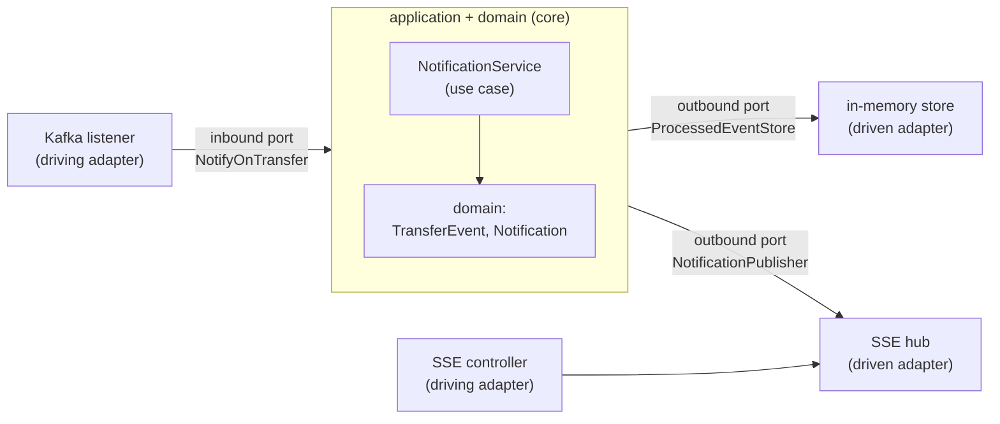
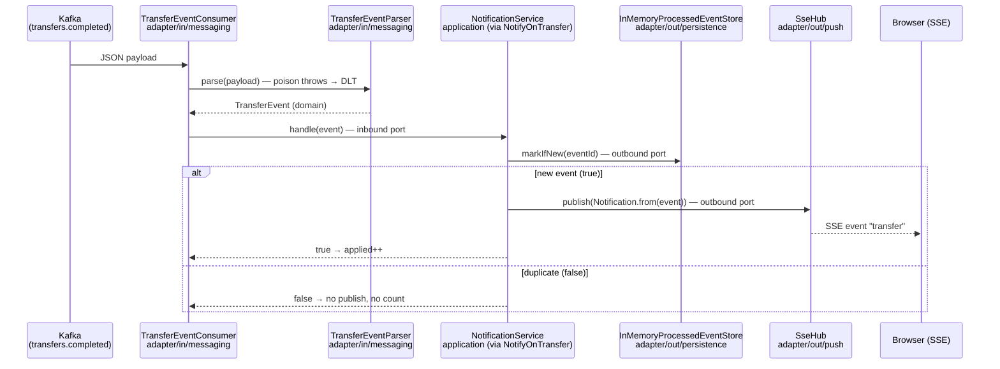

# Step 26 · Hexagonal Architecture (Ports & Adapters) + DDD — Restructuring a Service
### Phase E — Design, Architecture & Testing Mastery 🟣 · Step 26 of 67

> *Step 25 cleaned the notification consumer and seeded one port. Step 26 completes the move to **hexagonal
> architecture**: a framework-free **domain** at the centre, an **application** core of use cases that talk to
> the outside only through **ports**, and **adapters** (Kafka, SSE, the dedup store) plugged in at the edges.
> Dependencies point **inward**. We also apply DDD tactical patterns — value objects + an application service,
> right-sized. Behaviour doesn't change, so the integration tests' assertions don't either — only their
> imports, because the classes moved into layers.*

---

<a id="toc"></a>
## 🧭 The Six Movements of This Step

| | Movement | What happens | ~Time |
|---|---|---|---|
| **A** | [🧭 Orient](#orient) | 30-second overview · skip-test · cheat card · why it matters · before you start | ~30 min |
| **B** | [🧠 Understand](#understand) | hexagonal/ports-and-adapters · the dependency rule · inbound vs outbound ports · DDD tactical | ~2 h |
| **C** | [🛠️ Build](#build) | the layer packages · domain · the use case + ports · driving & driven adapters | ~7 h |
| **D** | [🔬 Prove](#prove) | the Verification Log — unchanged tests still green (behaviour preserved); §12.3 mutation | ~1 h |
| **E** | [🎓 Apply](#apply) | go deeper · interview prep · your-turn challenges | ~1 h |
| **F** | [🏆 Review](#review) | troubleshooting · resources · recap, flashcards & what's next | ~30 min |

---

<a id="orient"></a>

# A · 🧭 Orient

## 📋 This Step in 30 Seconds

| | |
|---|---|
| **Title** | Clean / hexagonal architecture (ports-and-adapters) + DDD tactical — restructure the notification service |
| **Step** | 26 of 67 · **Phase E — Design, Architecture & Testing Mastery** 🟣 |
| **Effort** | ≈ 12 hours focused. A **restructure** (no new behaviour) — the win is a framework-free core with attachable edges. |
| **What you'll run this step** | **JVM + Maven**; **🐳 Docker** for the notification integration tests (Testcontainers Redpanda). |
| **Buildable artifact** | `services/notification` repackaged as a hexagon: **`domain`** (`TransferEvent`, `Notification` — no framework imports), **`application`** (`NotificationService` use case + `port/in/NotifyOnTransfer` + `port/out/{ProcessedEventStore, NotificationPublisher}`), **`adapter/in/{messaging,web}`** (Kafka listener + parser + DLT config; SSE controller), **`adapter/out/{persistence,push}`** (in-memory dedup store; SSE hub). Behaviour identical — tests' assertions unchanged. `step-26-start == step-25-end`. |
| **Verification tier** | 🟠 **Standard** — behaviour-preserving restructure (no money/security path). `./mvnw verify` green + the integration tests pass with only imports changed (behaviour preserved) + a §12.3 mutation proving the use case is exercised + `smoke.sh`. |
| **Depends on** | **[Step 25](../step-25/lesson.md)** (SOLID/DIP groundwork — the first port), **[Step 20/21](../step-20/lesson.md)** (the consumer/SSE/DLT we restructure). Sets up **[Step 27](../step-27/lesson.md)** (ArchUnit enforces these boundaries). |

By the end you will be able to structure a service as a **hexagon**, state and apply the **dependency rule**, distinguish **inbound (driving) vs outbound (driven) ports**, and apply **DDD tactical** patterns where they earn their place.

### ⏭️ Can You Skip This Step? (5-minute self-check)

If you can confidently do **all** of this, skim the 🛠️ Build and jump to **[Step 27 — Spring Modulith + ArchUnit](../step-27/lesson.md)**.

- [ ] I can draw the **hexagon** (domain / application+ports / adapters) and state the **dependency rule** (point inward).
- [ ] I can tell an **inbound (driving)** port from an **outbound (driven)** port and give an example of each.
- [ ] I can keep a **domain** free of framework/transport imports and explain why that matters.
- [ ] I can apply **DDD tactical** patterns (value object, application service) — and say when *not* to add aggregates.
- [ ] I can restructure behaviour-preservingly and use the unchanged tests as proof.

> [!TIP]
> Not 100%? Stay. "Explain hexagonal/ports-and-adapters," "inbound vs outbound ports," and "how do you keep the domain pure" are common architecture interview questions — and you'll have *done* the restructure.

## 📇 Cheat Card

> **What this step delivers (one sentence):** the notification service repackaged as a hexagon — a framework-free domain + use-case core that touches Kafka, SSE, and the dedup store only through ports — with behaviour proven unchanged.

**Key commands** (Windows uses `.\mvnw.cmd`):

```bash
./mvnw -pl services/notification test     # behaviour preserved: integration tests pass (imports-only changes)
bash steps/step-26/smoke.sh
```

*(No `requests.http` in `steps/step-26/` — this step changes no HTTP surface: the SSE endpoints are identical to Step 25's, re-proven by the unchanged tests and `smoke.sh`.)*

**The headline — the hexagon & the dependency rule:**

```
   driving adapters                core (depends on NOTHING outward)              driven adapters
   ┌───────────────┐   inbound port  ┌───────────────────────────┐  outbound ports  ┌──────────────┐
   │ Kafka listener│──NotifyOnTransfer→│ application: Notification  │──ProcessedEventStore→│ in-memory store│
   │ SSE controller│                 │ service  → domain (pure)   │──NotificationPublisher→│ SSE push hub  │
   └───────────────┘                 └───────────────────────────┘                  └──────────────┘
                          ── all arrows point INWARD ──
```

**The one sentence to remember:** *Put the domain at the centre with no outward dependencies; the application offers **inbound ports** (use cases) and needs **outbound ports**; adapters plug in at the edges — so you can swap Kafka/SSE/Redis without touching the core.*

## 🎯 Why This Matters

Frameworks and infrastructure change faster than business rules. Hexagonal architecture keeps the rules in a core that doesn't know about Kafka, HTTP, or Redis — so you can test it without them and swap them without rewriting it. "Explain ports-and-adapters / how do you keep business logic independent of frameworks" is a senior-level design question, and the structure is what makes the next step (mechanically *enforcing* boundaries with ArchUnit) possible.

## ✅ What You'll Be Able to Do

- Structure a service as a hexagon and state the dependency rule.
- Define inbound (driving) and outbound (driven) **ports**, with adapters at the edges.
- Keep a **domain** free of frameworks; test the core without infrastructure.
- Apply DDD tactical patterns proportionately.

## 🧰 Before You Start

- **Prereqs:** bank builds green (`git describe` → `step-25-end`); Docker for the notification integration tests.
- **Connects to what you know:** Step 25's `ProcessedEventStore` port is now one of several; the Kafka consumer (Step 20), SSE (Step 20), and DLT (Step 21) become adapters. **Step 27** will use ArchUnit to *enforce* the boundaries you draw here.
- **Depends on:** Steps **25, 20, 21**.

## 🗓️ Session Plan

≈ 12 hours rarely fits one sitting. Five sittings of ~2–2.5 h, each ending at a real save point:

| Sitting | Covers | ~Time | Ends at (save point) |
|---|---|---|---|
| **S1 · Draw the hexagon** | A Orient + B Understand + the B→C before/after tree | ~2.5 h | You can redraw the AFTER tree from memory |
| **S2 · Carve the domain** | Sub-step 1 (move `TransferEvent`/`Notification`; break-it-on-purpose) | ~2 h | Domain ring in place, `java.*` imports only |
| **S3 · Ports + use case** | Sub-step 2 (`NotifyOnTransfer`, `NotificationPublisher`, `ProcessedEventStore` move, `NotificationService`) | ~2.5 h | Application core written; predict answered |
| **S4 · Adapters at the edges** | Sub-step 3 (move + rewire all five adapter classes) | ~2.5 h | All 9 classes in their rings |
| **S5 · Prove + wrap** | Sub-step 4 (test imports, green run, commit) + D Prove + E Apply + F Review | ~2.5 h | Tests green, `step-26-end` tagged |

**Optional routes:** the ⏭️ skip-test (5 min) may let you skim the whole Build; the two Go Deeper asides are +~10 min each; the Stretch second-adapter challenge is +~45–60 min (fits S5 or a bonus sitting).

Every ✋ checkpoint below is a re-entry ritual: it names what you have and the exact first action of your next sitting.

---

<a id="understand"></a>

# B · 🧠 Understand

## 🧠 The Big Idea — a hexagon: core in the middle, adapters at the edges

Hexagonal architecture (Alistair Cockburn; aka ports-and-adapters; close cousin of Clean/Onion) splits a
service into rings:
- **Domain** (centre) — the business model and rules. **No** framework, transport, or persistence imports.
- **Application** — use cases that orchestrate the domain. Defines **ports**: interfaces it offers
  (**inbound/driving**) and interfaces it needs (**outbound/driven**).
- **Adapters** (edges) — concrete tech plugged into ports: **driving** adapters (a Kafka listener, a REST
  controller) call inbound ports; **driven** adapters (a DB/Redis store, an SSE pusher) implement outbound ports.

**Analogy — wall sockets.** A socket (port) is a shape the *house* (core) defines; any compliant plug
(adapter) fits — lamp, vacuum, laptop charger — and you swap appliances without rewiring the house. Kafka is
one appliance, SSE another, the dedup store a third; the house never knows which is plugged in.

**The dependency rule:** source dependencies point **inward**. Adapters depend on the application's ports;
the application depends on the domain; the domain depends on nothing. Infrastructure is a detail you plug in,
not something the core knows about.



## 🧩 Pattern Spotlight — inbound vs outbound ports

- **Inbound (driving) port** — what the application *offers*: `NotifyOnTransfer.handle(TransferEvent)`. A
  driving adapter (the Kafka listener) translates the outside world (a JSON Kafka record) into a domain call.
- **Outbound (driven) port** — what the application *needs*: `ProcessedEventStore.markIfNew`,
  `NotificationPublisher.publish`. A driven adapter implements it (in-memory store; SSE pusher).

The use case (`NotificationService`) depends only on **ports** and the **domain** — never on Kafka, Jackson,
or `SseEmitter`. That's why it's trivially unit-testable (mock the ports) and the transport is swappable.

❓ **Knowledge check:** `NotifyOnTransfer` and `NotificationPublisher` are both interfaces defined by the application — which is inbound and which is outbound, and who calls/implements each? <details><summary>Answer</summary>`NotifyOnTransfer` is **inbound** (the app *offers* it; the driving Kafka listener calls it). `NotificationPublisher` is **outbound** (the app *needs* it; the driven SSE adapter implements it).</details>

## 🌱 Under the Hood: keeping the domain pure (and why)

Open `domain/TransferEvent.java` and `domain/Notification.java` — only `java.*` imports. No `@Component`, no
Jackson, no Kafka. Purity means: the rules don't break when a framework upgrades; you can test them in
microseconds without a container; and the **direction of change** is right — infrastructure churns, the core
doesn't. The parsing (Jackson), messaging (Kafka), and pushing (SSE) all live in the adapter ring.

## 🧩 DDD tactical — applied proportionately

DDD's *tactical* patterns: **value objects** (immutable, equality-by-value — our `TransferEvent`,
`Notification`), **entities** (identity over time), **aggregates** (a consistency boundary with a root),
**repositories** (collection-like access to aggregates), **domain services** (logic that isn't one entity's).
The notification context is a thin read/push context, so it has **value objects + an application service and
no aggregates/repositories** — and that's the *right* call. DDD is about modelling the domain faithfully, not
applying every pattern everywhere (the richer aggregates live in the money domain, demand-account).

## 🛡️ Security Lens & 🧵 Thread-safety note

Behaviour is preserved, including the DLT path (the parser still throws on poison → routed to `.DLT`) and the
idempotency guard (now in the application use case via the port). The SSE push adapter stays thread-safe.

## 🕰️ Then vs. Now

The classic layered "controller → service → repository" stack lets dependencies point *downward at the
database* — the domain ends up depending on persistence. Hexagonal/Clean/Onion **invert** that: the database
is an outbound adapter the core points away from. Modern Spring services increasingly adopt this, and tools
like **ArchUnit** (Step 27) and **Spring Modulith** make the boundaries enforceable rather than aspirational.

---

# B→C bridge: 🌳 before → after (notification service)

```
BEFORE (flat package com.buildabank.notification):
  TransferEventConsumer, TransferEventParser, Notification, TransferEvent,
  ProcessedEventStore, InMemoryProcessedEventStore, SseHub, NotificationController, KafkaErrorHandlingConfig

AFTER (hexagon):
  domain/                 TransferEvent · Notification                         (no framework imports)
  application/            NotificationService                                  (the use case)
    port/in/              NotifyOnTransfer                                     (inbound/driving port)
    port/out/             ProcessedEventStore · NotificationPublisher          (outbound/driven ports)
  adapter/in/messaging/   TransferEventConsumer · TransferEventParser · KafkaErrorHandlingConfig
  adapter/in/web/         NotificationController
  adapter/out/persistence/ InMemoryProcessedEventStore  (implements ProcessedEventStore)
  adapter/out/push/        SseHub                        (implements NotificationPublisher)
  (root) NotificationApplication
```

> ✋ **Stopping here (end of S1)?** You have `step-25-end` untouched and the AFTER tree above as your map.
> Next: Sub-step 1 (carve out the domain); first action: `mkdir -p services/notification/src/main/java/com/buildabank/notification/domain`.

<a id="build"></a>

# C · 🛠️ Let's Build It — Step by Step

## 📦 Your Starting Point

`step-26-start == step-25-end`: notification has SOLID collaborators + one port (Step 25). We now layer them into a hexagon and add the inbound port + the publisher port.

## Sub-step 1 — carve out the domain *(1 of 4 · ~2 h)*

🎯 Move `TransferEvent` and `Notification` to `domain/` with **zero** framework imports (`Notification.from(event)` stays — pure factory). Anything that needs Spring/Kafka/Jackson does **not** belong here.

**The move, mechanically.** Most of this step is a package move. Here is the full map (same 9 classes as the
B→C tree — Sub-steps 1–3 each take a slice of it). If your IDE has Move-Class refactoring (IntelliJ: <kbd>F6</kbd>),
use it — it rewrites `package` lines and imports for you. By hand, each file is three moves: `git mv` it, edit
its `package` line, fix imports in whatever references it.

| Class | From `com.buildabank.notification.` | To `com.buildabank.notification.` | Sub-step |
|---|---|---|---|
| `TransferEvent` · `Notification` | *(root)* | `domain` | 1 |
| `ProcessedEventStore` | *(root)* | `application.port.out` | 2 |
| `NotifyOnTransfer` · `NotificationPublisher` | *(new)* | `application.port.in` / `.port.out` | 2 |
| `NotificationService` | *(new)* | `application` | 2 |
| `TransferEventConsumer` · `TransferEventParser` · `KafkaErrorHandlingConfig` | *(root)* | `adapter.in.messaging` | 3 |
| `NotificationController` | *(root)* | `adapter.in.web` | 3 |
| `InMemoryProcessedEventStore` | *(root)* | `adapter.out.persistence` | 3 |
| `SseHub` | *(root)* | `adapter.out.push` | 3 |

(`NotificationApplication` stays at the root — Spring's component scan covers the sub-packages.)

This sub-step does only the first row:

```bash
cd services/notification/src/main/java/com/buildabank/notification
mkdir -p domain
git mv TransferEvent.java Notification.java domain/
```

Then edit each moved file's `package` line (it gains `.domain`), and give every file that *references* a moved
class an import. Your truth-teller between moves is `./mvnw -pl services/notification test-compile`: every
`cannot find symbol` it reports is a stale import — fix, re-run, repeat until quiet. (The module won't be fully
consistent until Sub-step 3 lands; that's normal mid-move.)

The two domain files after the move — notice what's *absent* (no Spring, no Jackson, no Kafka — only `java.*`):

```java
// services/notification/src/main/java/com/buildabank/notification/domain/TransferEvent.java
package com.buildabank.notification.domain;

import java.math.BigDecimal;

/**
 * Step 26 (hexagonal) · DOMAIN value object — a parsed {@code transfer.completed} fact. The hexagon's core has
 * <strong>no framework, transport, or persistence imports</strong> (no Spring, no Kafka, no Jackson): it's
 * plain Java the rest of the system points <em>inward</em> at. {@code eventId} is the idempotency key.
 */
public record TransferEvent(
        String eventId,
        String transactionId,
        String fromAccount,
        String toAccount,
        BigDecimal amount,
        String occurredAt) {
}
```

```java
// services/notification/src/main/java/com/buildabank/notification/domain/Notification.java
package com.buildabank.notification.domain;

import java.math.BigDecimal;

/**
 * Step 26 (hexagonal) · DOMAIN value object — a customer-facing notification derived from a
 * {@link TransferEvent}. Pure domain (no framework/transport). The {@link #from} factory keeps the
 * message-wording in the core, derived from a domain event rather than a JSON payload.
 */
public record Notification(
        String eventId,
        String transactionId,
        String fromAccount,
        String toAccount,
        BigDecimal amount,
        String occurredAt,
        String message) {

    /** Build a notification from a domain {@link TransferEvent}. */
    public static Notification from(TransferEvent event) {
        String message = "Transfer of " + event.amount()
                + " from " + event.fromAccount() + " to " + event.toAccount() + " completed.";
        return new Notification(event.eventId(), event.transactionId(), event.fromAccount(),
                event.toAccount(), event.amount(), event.occurredAt(), message);
    }
}
```

Reading the code:
- `record` gives value-object semantics for free — immutable, equality by value. DDD's "value object" is one keyword in modern Java.
- `Notification.from(event)` is a **pure factory**: the customer-facing wording lives in the core, derived from a domain event — never from a JSON payload (parsing is the adapter's problem).
- `eventId` is still the idempotency key from Step 20 — the move changed the class's *address*, not its meaning.

🔮 **Predict:** if you add a Spring import to a *domain* file right now and compile, does the build fail? Decide before you try it below.

💣 **Break it on purpose (+~5 min):** add `import org.springframework.stereotype.Component;` to
`domain/Notification.java` and run `./mvnw -pl services/notification test-compile`. It compiles — Spring is on
the module's classpath and nothing polices imports yet. That silent erosion is exactly what Step 27's ArchUnit
turns into a **build failure**. Revert the import before moving on.

> ✋ **Checkpoint — stopping here (end of S2)?** You have the domain ring (`domain/TransferEvent`,
> `domain/Notification`, `java.*` imports only) and the referencing files' imports fixed.
> Next: Sub-step 2 (the use case behind ports); first action: create
> `services/notification/src/main/java/com/buildabank/notification/application/port/in/NotifyOnTransfer.java`.

## Sub-step 2 — the application core: a use case behind ports *(2 of 4 · ~2.5 h)*

🎯 `application/port/in/NotifyOnTransfer` (inbound) and `application/port/out/{ProcessedEventStore, NotificationPublisher}` (outbound). `application/NotificationService implements NotifyOnTransfer`, orchestrating only via ports: `markIfNew → publish`. It imports nothing from the adapter ring.

The inbound port first, fully worked:

```java
// services/notification/src/main/java/com/buildabank/notification/application/port/in/NotifyOnTransfer.java
package com.buildabank.notification.application.port.in;

import com.buildabank.notification.domain.TransferEvent;

/**
 * Step 26 (hexagonal) · INBOUND (driving) port — the use case the application offers to the outside world:
 * "given a transfer event, notify (idempotently)." Driving adapters (the Kafka listener) depend on this
 * interface, not on the implementation.
 */
public interface NotifyOnTransfer {

    /**
     * Handle a transfer event.
     *
     * @return {@code true} if it was newly applied (a notification was pushed); {@code false} if it was a
     *         duplicate (idempotent no-op)
     */
    boolean handle(TransferEvent event);
}
```

- It takes a **domain** `TransferEvent`, not a `String payload` — an inbound port speaks the domain's language, never the wire's. Translating JSON is the adapter's job.
- The `boolean` return ("newly applied" vs "duplicate no-op") is what keeps the Kafka adapter's `applied` counter honest — the tests assert on that counter, so behaviour stays observable.

⌨️ **Now you — type it yourself:** write `application/port/out/NotificationPublisher.java` from its one-line
spec: *a single `void publish(Notification notification)` method; imports only the domain.* Then compare:

<details><summary>NotificationPublisher — reference (peek after writing yours)</summary>

```java
// services/notification/src/main/java/com/buildabank/notification/application/port/out/NotificationPublisher.java
package com.buildabank.notification.application.port.out;

import com.buildabank.notification.domain.Notification;

/**
 * Step 26 (hexagonal) · OUTBOUND (driven) port for pushing a {@link Notification} to clients. The use case
 * depends on this abstraction; the SSE adapter implements it. Swapping the push transport (WebSocket, a
 * webhook, email) is a new adapter — no core change.
 */
public interface NotificationPublisher {

    void publish(Notification notification);
}
```
</details>

Next, move Step 25's `ProcessedEventStore` into `application/port/out/` (row 2 of the map: `git mv` + package
line — same one-method interface, now formally an outbound port). Then the use case that ties the three ports together:

```java
// services/notification/src/main/java/com/buildabank/notification/application/NotificationService.java
package com.buildabank.notification.application;

import org.slf4j.Logger;
import org.slf4j.LoggerFactory;
import org.springframework.stereotype.Service;

import com.buildabank.notification.application.port.in.NotifyOnTransfer;
import com.buildabank.notification.application.port.out.NotificationPublisher;
import com.buildabank.notification.application.port.out.ProcessedEventStore;
import com.buildabank.notification.domain.Notification;
import com.buildabank.notification.domain.TransferEvent;

/**
 * Step 26 (hexagonal) · the APPLICATION use case — implements the inbound port {@link NotifyOnTransfer} and
 * orchestrates the domain through outbound ports only. It depends inward (domain) and sideways onto its own
 * ports — never on an adapter or a framework's transport types. Idempotent: dedupe via
 * {@link ProcessedEventStore}, build the {@link Notification}, push via {@link NotificationPublisher}.
 */
@Service
public class NotificationService implements NotifyOnTransfer {

    private static final Logger log = LoggerFactory.getLogger(NotificationService.class);

    private final ProcessedEventStore processedEvents;
    private final NotificationPublisher publisher;

    public NotificationService(ProcessedEventStore processedEvents, NotificationPublisher publisher) {
        this.processedEvents = processedEvents;
        this.publisher = publisher;
    }

    @Override
    public boolean handle(TransferEvent event) {
        if (!processedEvents.markIfNew(event.eventId())) {
            log.info("duplicate event {} ignored (exactly-once effect)", event.eventId());
            return false;   // duplicate → idempotent no-op
        }
        Notification notification = Notification.from(event);
        publisher.publish(notification);
        log.info("notified: {}", notification.message());
        return true;
    }
}
```

Reading the code:
- `implements NotifyOnTransfer` — the application *offers* the inbound port; adapters call the interface, never this class directly.
- The constructor takes the **two outbound ports** — the use case needs "a store" and "a publisher" and does not care what they are.
- `markIfNew` false → log + `return false`: the idempotency guard (Step 20) now lives in the application layer, where the business rule "apply each event exactly once" belongs.
- `Notification.from(event)` → `publisher.publish(...)`: pure orchestration. Check the imports — no Kafka, no Jackson, no `SseEmitter` anywhere.
- `@Service` is the one pragmatic Spring touch in the application ring (see Go Deeper); the **domain** stays annotation-free.

🔮 **Predict:** can `NotificationService` be unit-tested with no Kafka and no Spring context? <details><summary>Answer</summary>**Yes** — mock the two outbound ports; that's the payoff of depending on abstractions, not infrastructure.</details>

> ✋ **Checkpoint — stopping here (end of S3)?** You have the whole core: domain + `NotificationService` +
> three ports (`NotifyOnTransfer`, `ProcessedEventStore`, `NotificationPublisher`). The old consumer still
> calls the store and hub directly — Sub-step 3 rewires it through the inbound port.
> Next: Sub-step 3 (adapters); first action: `mkdir -p adapter/in/messaging adapter/in/web adapter/out/persistence adapter/out/push` under the notification package.

## Sub-step 3 — adapters at the edges *(3 of 4 · ~2.5 h)*

🎯 Driving: `adapter/in/messaging/TransferEventConsumer` (Kafka → parse → `NotifyOnTransfer`), `TransferEventParser`, `KafkaErrorHandlingConfig`; `adapter/in/web/NotificationController` (SSE). Driven: `adapter/out/persistence/InMemoryProcessedEventStore` (implements `ProcessedEventStore`), `adapter/out/push/SseHub` (implements `NotificationPublisher`).

Move the remaining five classes (rows 5–8 of the map):

```bash
cd services/notification/src/main/java/com/buildabank/notification
mkdir -p adapter/in/messaging adapter/in/web adapter/out/persistence adapter/out/push
git mv TransferEventConsumer.java TransferEventParser.java KafkaErrorHandlingConfig.java adapter/in/messaging/
git mv NotificationController.java adapter/in/web/
git mv InMemoryProcessedEventStore.java adapter/out/persistence/
git mv SseHub.java adapter/out/push/
```

Three of them (`TransferEventParser`, `KafkaErrorHandlingConfig`, `NotificationController`) change only their
`package` line and imports — the parser now imports `domain.TransferEvent`; the controller imports
`adapter.out.push.SseHub` + `domain.Notification` (the documented shared-SSE coupling, visible as an import).
Two change more:

**`TransferEventConsumer` — the one real rewrite.** Before, the listener itself did parse → dedupe → build →
push (four collaborators). Now it drives the inbound port and keeps only adapter concerns (listening + counters):

```java
// services/notification/src/main/java/com/buildabank/notification/adapter/in/messaging/TransferEventConsumer.java
package com.buildabank.notification.adapter.in.messaging;

import java.util.concurrent.atomic.AtomicInteger;

import org.springframework.kafka.annotation.KafkaListener;
import org.springframework.stereotype.Component;

import com.buildabank.notification.application.port.in.NotifyOnTransfer;
import com.buildabank.notification.domain.TransferEvent;

/**
 * Step 26 (hexagonal) · the inbound (driving) MESSAGING adapter: a Kafka listener that translates the wire
 * payload (via {@link TransferEventParser}) and drives the inbound port {@link NotifyOnTransfer}. It holds no
 * business logic — parsing is the parser's job, dedupe/notify is the use case's. A poison payload throws in the
 * parser and is NOT swallowed, so the container routes it to the Dead-Letter Topic (Step 21).
 *
 * <p>The received/applied counters are an observability seam (used by tests/metrics) on the adapter edge.
 */
@Component
public class TransferEventConsumer {

    private final TransferEventParser parser;
    private final NotifyOnTransfer notifyOnTransfer;
    private final AtomicInteger received = new AtomicInteger();
    private final AtomicInteger applied = new AtomicInteger();

    public TransferEventConsumer(TransferEventParser parser, NotifyOnTransfer notifyOnTransfer) {
        this.parser = parser;
        this.notifyOnTransfer = notifyOnTransfer;
    }

    @KafkaListener(
            topics = "${bank.events.topic:transfers.completed}",
            groupId = "${spring.kafka.consumer.group-id:notification-service}")
    public void onTransferCompleted(String payload) {
        received.incrementAndGet();
        TransferEvent event = parser.parse(payload);   // poison → throws → Dead-Letter Topic
        if (notifyOnTransfer.handle(event)) {
            applied.incrementAndGet();
        }
    }

    /** Total messages delivered to this consumer (includes duplicates). */
    public int receivedCount() {
        return received.get();
    }

    /** Distinct events actually applied (duplicates excluded) — should equal the number of real transfers. */
    public int appliedCount() {
        return applied.get();
    }
}
```

What left the consumer, and where it went:

| Old consumer line | Now lives in |
|---|---|
| `processedEvents.markIfNew(...)` + duplicate log | `NotificationService.handle` (application) |
| `Notification.from(event)` | `NotificationService.handle` |
| `hub.publish(notification)` | `NotificationService` → `NotificationPublisher` port |
| `parser.parse(payload)`, counters, `@KafkaListener` | stay here — transport concerns |

- The constructor now takes **`NotifyOnTransfer`** — the adapter depends on the port's interface; Spring injects `NotificationService` because it's the only implementation.
- `if (notifyOnTransfer.handle(event))` — the port's boolean return keeps `appliedCount()` truthful, so Step 20's exactly-once test passes unchanged.

**`InMemoryProcessedEventStore` — same guard, new addresses** (its own package *and* the port's import both change):

```java
// services/notification/src/main/java/com/buildabank/notification/adapter/out/persistence/InMemoryProcessedEventStore.java
package com.buildabank.notification.adapter.out.persistence;

import java.util.Set;
import java.util.concurrent.ConcurrentHashMap;

import org.springframework.stereotype.Component;

import com.buildabank.notification.application.port.out.ProcessedEventStore;

/**
 * Step 26 (hexagonal) · the outbound (driven) PERSISTENCE adapter for {@link ProcessedEventStore} — a
 * thread-safe set of seen event ids. Simple and fast, but resets on restart; a Redis/DB adapter (Step 21's
 * Idempotency Key) would make it durable, swappable behind the port with no core change.
 */
@Component
public class InMemoryProcessedEventStore implements ProcessedEventStore {

    private final Set<String> processed = ConcurrentHashMap.newKeySet();

    @Override
    public boolean markIfNew(String eventId) {
        return processed.add(eventId);   // Set.add returns true only the first time → idempotency guard
    }
}
```

**`SseHub` — gains the port.** Its body is unchanged from Step 20; the class line becomes
`public class SseHub implements NotificationPublisher`, its `publish` method gains `@Override`, and it imports
`application.port.out.NotificationPublisher` + `domain.Notification`. The core now pushes through the port and
never sees an `SseEmitter`.

⚠️ **Pitfall:** the SSE transport is shared (the use case pushes *out* through `NotificationPublisher`, and the web adapter lets clients subscribe *in*) — so the web adapter uses the push adapter. That's a documented, deliberate coupling; Step 27's ArchUnit rules allow it while still forbidding any adapter→core-inward violation.

❓ **Knowledge check:** which ring may import Jackson, and why? <details><summary>Answer</summary>Only the **adapter** ring (here: `adapter/in/messaging/TransferEventParser`). Jackson is a wire-format detail; the core speaks `TransferEvent`, not JSON — which is also why a poison payload dies in the adapter (→ DLT, Step 21) and never reaches the core.</details>

> ✋ **Checkpoint — stopping here (end of S4)?** All 9 classes sit in their rings and the main tree is
> consistent; the tests (which live in the root package and used the classes import-free) now need imports.
> Next: Sub-step 4 (prove behaviour preserved); first action: add the five test files' imports (table below),
> then `./mvnw -pl services/notification test`.

## Sub-step 4 — prove behaviour is preserved *(4 of 4 · ~30 min)*

🔬 The integration tests' **assertions don't change** — only their `import`s (classes moved packages). Run them: green = the restructure changed structure, not behaviour. The Step-25 unit tests (`TransferEventParserTest`, `InMemoryProcessedEventStoreTest`) still pass too.

The tests live in the root `com.buildabank.notification` package, so before the move they needed **no imports
at all** for these classes (same package). The entire test-side change is these *added* import lines:

| Test | Imports gained (`com.buildabank.notification.` …) |
|---|---|
| `DeadLetterTest` | `adapter.in.messaging.TransferEventConsumer` |
| `TransferEventConsumerKafkaTest` | `adapter.in.messaging.TransferEventConsumer` · `adapter.out.push.SseHub` · `domain.Notification` |
| `NotificationControllerTest` | `adapter.in.web.NotificationController` · `adapter.out.push.SseHub` · `domain.Notification` |
| `TransferEventParserTest` | `adapter.in.messaging.TransferEventParser` · `domain.TransferEvent` |
| `InMemoryProcessedEventStoreTest` | `adapter.out.persistence.InMemoryProcessedEventStore` · `application.port.out.ProcessedEventStore` |

🔮 **Predict:** with only import lines added to the five tests, what will `./mvnw -pl services/notification test` report — and would any assertion failure mean the move was still "just structural"?

Not one assertion changes — that is the behaviour-preservation contract. Run
`./mvnw -pl services/notification test` (Docker up: Testcontainers Redpanda); the full run is pasted in the
Verification Log below.

💾 **Commit:** `refactor(notification): Step 26 hexagonal architecture — domain/application/adapter layers + ports`

> ✋ **Checkpoint — build done (end of S5's build half)?** Tests green with assertions untouched, committed.
> Next: movement D (read the Verification Log against your own run), then `./mvnw verify` +
> `bash steps/step-26/smoke.sh` and tag `step-26-end`.

## 🎮 Play With It

```bash
./mvnw -pl services/notification test     # behaviour preserved across the layer move
# Inspect the layers: `ls -R services/notification/src/main/java/com/buildabank/notification`
```

🧪 **Little experiments:** open `domain/Notification.java` and confirm it imports only `java.*` (no Spring/Kafka). Sketch a `RedisProcessedEventStore` in `adapter/out/persistence` — the core needs zero changes (the point of the outbound port).

## 🎬 One Event Through the Hexagon

The runtime flow you just built, ring by ring (duplicate branch included):



Every arrow into `UC` goes through a port; `UC` itself never touches Kafka, JSON, or an `SseEmitter`.

❓ **Knowledge check:** in the duplicate branch of the diagram, which ring makes the "don't publish" decision, and through which port does the answer travel back to the counter? <details><summary>Answer</summary>The **application** ring — `NotificationService.handle` sees `markIfNew` return false and skips publishing; the `false` travels back through the inbound port `NotifyOnTransfer`, so the adapter's `applied` counter stays honest.</details>

## 🏁 The Finished Result

`step-26-end`: notification is a clean hexagon — a framework-free core with Kafka/SSE/store as pluggable adapters — with identical behaviour. **✅ Definition of Done:** the layers are in place, the unchanged integration tests pass, `./mvnw verify` is green, `bash steps/step-26/smoke.sh` passes, and you've committed/tagged `step-26-end`.

---

<a id="prove"></a>

# D · 🔬 Prove It Works — Verification Log

> **Tier: 🟠 Standard** (behaviour-preserving restructure, no money/security path). The proof is the integration
> tests passing with only import changes. Real output below; Docker used (Testcontainers Redpanda).

**1 · The notification suite — behaviour preserved across the hexagonal move:**

```
[INFO] Tests run: 1, … -- in com.buildabank.notification.DeadLetterTest                 (UNCHANGED assertions — DLT still works)
[INFO] Tests run: 1, … -- in com.buildabank.notification.TransferEventConsumerKafkaTest  (UNCHANGED — exactly-once effect preserved)
[INFO] Tests run: 2, … -- in com.buildabank.notification.NotificationControllerTest      (UNCHANGED)
[INFO] Tests run: 2, … -- in com.buildabank.notification.TransferEventParserTest          (core unit test)
[INFO] Tests run: 1, … -- in com.buildabank.notification.InMemoryProcessedEventStoreTest  (core unit test)
[INFO] Tests run: 7, Failures: 0, Errors: 0, Skipped: 0
[INFO] BUILD SUCCESS
```
The integration tests passing with **assertions unchanged** (only `import` lines moved) is the proof: the layer restructure changed structure, not behaviour.

**2 · §12.3 Mutation sanity-check (prove the new application use case is exercised).** Made `NotificationService.handle` ignore the dedup result and re-ran `TransferEventConsumerKafkaTest`:

```
[ERROR] TransferEventConsumerKafkaTest.duplicateEventsAreDeduped_yieldingExactlyOnceEffect:67
expected: 2 but was: 3 within 10 seconds.
[ERROR] Tests run: 1, Failures: 0, Errors: 1, Skipped: 0
```
→ Bypassing the use case's dedup re-applies the duplicate (`applied = 3`, not 2) — the exactly-once path runs through the new application layer. **Reverted**; green again.

**3 · `smoke.sh`** — `bash steps/step-26/smoke.sh` re-ran the notification suite after the layer move (dedup now logged by `application.NotificationService`, the use case) → `✅ Step 26 smoke test PASSED — hexagonal restructure preserved behaviour (ports-and-adapters)`.

**4 · Build** — full-repo `./mvnw verify` → BUILD SUCCESS (13 modules). *(Clean-room run for consistency; the behaviour contract is the unchanged integration suite.)*

**§12.8 honesty:** only `notification` is hexagonal; the boundaries are conventional (package-based) and will be
**mechanically enforced** by ArchUnit in Step 27 — until then they're a discipline, not a guarantee. One
deliberate coupling (web adapter → SSE push adapter) is documented (shared SSE transport).

---

<a id="apply"></a>

# E · 🎓 Apply

## 🚀 Go Deeper (Optional)

<details><summary>Hexagonal vs Clean vs Onion (+~10 min)</summary>They're the same core idea — a dependency rule pointing inward at a framework-free domain — with different vocabularies (ports/adapters; entities/use-cases/interface-adapters/frameworks; layers as onion rings). Pick one vocabulary and be consistent.</details>

<details><summary>Where does Spring fit if the core is "framework-free"? (+~10 min)</summary>Pragmatically, the application use case may carry a Spring stereotype (`@Service`) and the domain stays annotation-free. Purists keep even the application Spring-free and wire it in a config; we keep `@Service` on the use case (a common, low-cost compromise) and keep the **domain** strictly pure. ArchUnit (Step 27) will encode exactly which imports each layer may have.</details>

## 💼 Interview Prep

1. **Explain hexagonal / ports-and-adapters.** *A framework-free domain + application core; the application exposes inbound ports (use cases) and depends on outbound ports; adapters (Kafka, HTTP, DB) plug into the ports. Dependencies point inward, so infrastructure is swappable and the core is testable without it.* **(Common.)**
2. **Inbound vs outbound port?** *Inbound (driving): what the app offers, called by driving adapters (a listener/controller). Outbound (driven): what the app needs, implemented by driven adapters (a store/pusher).*
3. **Why keep the domain free of framework imports?** *So business rules survive framework churn, are testable in isolation, and the dependency direction is correct (infra depends on the core, not vice-versa).*
4. **When do you NOT add an aggregate/repository?** *When the context is thin (a read/push model with no invariant-guarding consistency boundary) — adding them is ceremony. DDD tactical patterns are applied where the domain warrants them.*
5. **(Gotcha) Isn't this a lot of interfaces?** *Use ports where you have a real seam (swap, test, or a boundary worth enforcing). Don't wrap every class; the value is at the architecture's edges.*

## 🏋️ Your Turn: Practice & Challenges

- **Quick (~15 min):** add a `NotificationService` unit test that mocks both outbound ports (no Kafka/Spring) — assert a duplicate (`markIfNew → false`) does **not** call `publish`. This is only possible because the core depends on ports.
- **Quick (~15 min):** list the imports allowed in each layer (domain: `java.*` + domain; application: domain + ports + `@Service`; adapters: application ports + frameworks) — you'll encode these in Step 27.
- 🎯 **Stretch (~45–60 min · reference solution in `solutions/step-26/`):** add a second driven adapter for `NotificationPublisher` (e.g. a `LoggingNotificationPublisher` or a webhook one) behind a profile, and show the use case + tests are unchanged — the hexagon's payoff.

---

<a id="review"></a>

# F · 🏆 Review

## 🩺 Stuck? Troubleshooting & Fixes

- **`cannot find symbol` in tests after moving classes.** The test still imports the old package. Update the `import` lines (the simple names/assertions stay the same) — that's the only test change a package move needs.
- **An integration test's behaviour changed.** Then the move wasn't behaviour-preserving — you altered logic while moving. Revert and move structure only; the unchanged assertion is the contract.
- **The domain imports Spring/Kafka.** It shouldn't — move that concern to an adapter. (Step 27's ArchUnit will fail the build if it creeps back.)
- **Two beans implement an outbound port.** Only one adapter should be active; gate extras with a profile/condition.
- **Reset:** `git checkout step-26-end`.

## 📚 Learn More & Glossary

- Cockburn, *Hexagonal Architecture*; Martin, *Clean Architecture*; Evans/Vernon, DDD (tactical patterns); Tom Hombergs, *Get Your Hands Dirty on Clean Architecture* (Spring-flavoured ports-and-adapters).
- **Glossary:** *hexagonal/ports-and-adapters*, *dependency rule*, *inbound (driving) port*, *outbound (driven) port*, *driving/driven adapter*, *domain*, *value object*, *aggregate*, *application service*.

## 🏆 Recap & Study Notes

**(a) Key points:** A hexagon = a **framework-free domain** + an **application** of use cases that talk to the
outside only through **ports**, with **adapters** at the edges. **Dependencies point inward.** Inbound ports
are what the app offers; outbound ports are what it needs. DDD tactical patterns (value objects, application
service) are applied proportionately — no aggregates in a thin read context. The restructure is
behaviour-preserving, proven by unchanged integration tests.

**(b) Key terms:** hexagonal, ports-and-adapters, dependency rule, inbound/outbound port, driving/driven adapter, domain, value object, application service, DDD tactical.

**(c) 🧠 Test Yourself:** ① State the dependency rule. ② Inbound vs outbound port — example of each. ③ Why must the domain be framework-free? ④ When do you skip aggregates? ⑤ How did you prove behaviour was preserved? <details><summary>Answers</summary>① Source dependencies point inward; the domain depends on nothing. ② Inbound `NotifyOnTransfer` (offered, called by the listener); outbound `ProcessedEventStore`/`NotificationPublisher` (needed, implemented by adapters). ③ Survives framework churn, testable in isolation, correct dependency direction. ④ Thin context with no consistency boundary — adding them is ceremony. ⑤ The integration tests passed with assertions unchanged (only imports moved).</details>

**(d) 🔗 How this connects:** grows Step 25's SOLID/DIP into full ports-and-adapters. **Next: Step 27** — **Spring Modulith + ArchUnit** *mechanically enforce* these layer boundaries in tests (so they can't erode), then Step 28 (code-quality gates) and the **Phase-E capstone** (hexagonal + ArchUnit + mutation testing).

**(e) 🏆 Résumé line:** *"Restructured a service to hexagonal architecture (ports-and-adapters) — a framework-free domain + use-case core with Kafka/SSE/store as pluggable adapters — behaviour-preservingly."*

**(f) ✅ You can now:** structure a service as a hexagon · define inbound/outbound ports · keep a domain pure · apply DDD tactical patterns proportionately.

**(g) 🃏 Flashcards** (also appended to `docs/flashcards.md`):

| Q | A |
|---|---|
| State the dependency rule. | Source dependencies point inward — adapters → application → domain; the domain depends on nothing. |
| Inbound vs outbound port? | Inbound = what the app *offers*, called by driving adapters (`NotifyOnTransfer`); outbound = what it *needs*, implemented by driven adapters (`ProcessedEventStore`, `NotificationPublisher`). |
| Why keep the domain framework-free? | It survives infra churn, tests in microseconds without a container, and the change direction is right (infra depends on core, never vice-versa). |
| When do you *skip* aggregates/repositories? | In a thin context with no invariant-guarding consistency boundary — there they're ceremony, not modelling. |

🔁 revisit the dependency rule when ArchUnit enforces it (Step 27) and at the Phase-E capstone.

**(h) ✍️ One-line reflection:** *Which part of the bank would benefit most from a framework-free core — and what would its ports be?*

**(i)** 🎉 The notification service is a clean hexagon. Next: make the boundaries un-erodable with ArchUnit.
