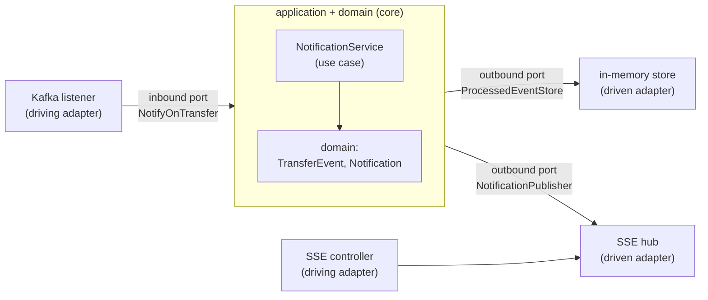

# Step 26 · Hexagonal Architecture (Ports & Adapters) + DDD — Restructuring a Service
### Phase E — Design, Architecture & Testing Mastery 🟣 · Step 26 of 67

> *Step 25 cleaned the notification consumer and seeded one port. Step 26 completes the move to **hexagonal
> architecture**: a framework-free **domain** at the centre, an **application** core of use cases that talk to
> the outside only through **ports**, and **adapters** (Kafka, SSE, the dedup store) plugged in at the edges.
> Dependencies point **inward**. We also apply DDD tactical patterns — value objects + an application service,
> right-sized. Behaviour doesn't change, so the integration tests' assertions don't either — only their
> imports, because the classes moved into layers.*

---

<a id="toc"></a>
## 🧭 The Six Movements of This Step

| | Movement | What happens |
|---|---|---|
| **A** | [🧭 Orient](#orient) | 30-second overview · skip-test · cheat card · why it matters · before you start |
| **B** | [🧠 Understand](#understand) | hexagonal/ports-and-adapters · the dependency rule · inbound vs outbound ports · DDD tactical |
| **C** | [🛠️ Build](#build) | the layer packages · domain · the use case + ports · driving & driven adapters |
| **D** | [🔬 Prove](#prove) | the Verification Log — unchanged tests still green (behaviour preserved); §12.3 mutation |
| **E** | [🎓 Apply](#apply) | go deeper · interview prep · your-turn challenges |
| **F** | [🏆 Review](#review) | troubleshooting · resources · recap, flashcards & what's next |

---

<a id="orient"></a>

# A · 🧭 Orient

## 📋 This Step in 30 Seconds

| | |
|---|---|
| **Title** | Clean / hexagonal architecture (ports-and-adapters) + DDD tactical — restructure the notification service |
| **Step** | 26 of 67 · **Phase E — Design, Architecture & Testing Mastery** 🟣 |
| **Effort** | ≈ 12 hours focused. A **restructure** (no new behaviour) — the win is a framework-free core with attachable edges. |
| **What you'll run this step** | **JVM + Maven**; **🐳 Docker** for the notification integration tests (Testcontainers Redpanda). |
| **Buildable artifact** | `services/notification` repackaged as a hexagon: **`domain`** (`TransferEvent`, `Notification` — no framework imports), **`application`** (`NotificationService` use case + `port/in/NotifyOnTransfer` + `port/out/{ProcessedEventStore, NotificationPublisher}`), **`adapter/in/{messaging,web}`** (Kafka listener + parser + DLT config; SSE controller), **`adapter/out/{persistence,push}`** (in-memory dedup store; SSE hub). Behaviour identical — tests' assertions unchanged. `step-26-start == step-25-end`. |
| **Verification tier** | 🟠 **Standard** — behaviour-preserving restructure (no money/security path). `./mvnw verify` green + the integration tests pass with only imports changed (behaviour preserved) + a §12.3 mutation proving the use case is exercised + `smoke.sh`. |
| **Depends on** | **[Step 25](../step-25/lesson.md)** (SOLID/DIP groundwork — the first port), **[Step 20/21](../step-20/lesson.md)** (the consumer/SSE/DLT we restructure). Sets up **[Step 27](../step-27/lesson.md)** (ArchUnit enforces these boundaries). |

By the end you will be able to structure a service as a **hexagon**, state and apply the **dependency rule**, distinguish **inbound (driving) vs outbound (driven) ports**, and apply **DDD tactical** patterns where they earn their place.

### ⏭️ Can You Skip This Step? (5-minute self-check)

If you can confidently do **all** of this, skim the 🛠️ Build and jump to **[Step 27 — Spring Modulith + ArchUnit](../step-27/lesson.md)**.

- [ ] I can draw the **hexagon** (domain / application+ports / adapters) and state the **dependency rule** (point inward).
- [ ] I can tell an **inbound (driving)** port from an **outbound (driven)** port and give an example of each.
- [ ] I can keep a **domain** free of framework/transport imports and explain why that matters.
- [ ] I can apply **DDD tactical** patterns (value object, application service) — and say when *not* to add aggregates.
- [ ] I can restructure behaviour-preservingly and use the unchanged tests as proof.

> [!TIP]
> Not 100%? Stay. "Explain hexagonal/ports-and-adapters," "inbound vs outbound ports," and "how do you keep the domain pure" are common architecture interview questions — and you'll have *done* the restructure.

## 📇 Cheat Card

> **What this step delivers (one sentence):** the notification service repackaged as a hexagon — a framework-free domain + use-case core that touches Kafka, SSE, and the dedup store only through ports — with behaviour proven unchanged.

**Key commands** (Windows uses `.\mvnw.cmd`):

```bash
./mvnw -pl services/notification test     # behaviour preserved: integration tests pass (imports-only changes)
bash steps/step-26/smoke.sh
```

**The headline — the hexagon & the dependency rule:**

```
   driving adapters                core (depends on NOTHING outward)              driven adapters
   ┌───────────────┐   inbound port  ┌───────────────────────────┐  outbound ports  ┌──────────────┐
   │ Kafka listener│──NotifyOnTransfer→│ application: Notification  │──ProcessedEventStore→│ in-memory store│
   │ SSE controller│                 │ service  → domain (pure)   │──NotificationPublisher→│ SSE push hub  │
   └───────────────┘                 └───────────────────────────┘                  └──────────────┘
                          ── all arrows point INWARD ──
```

**The one sentence to remember:** *Put the domain at the centre with no outward dependencies; the application offers **inbound ports** (use cases) and needs **outbound ports**; adapters plug in at the edges — so you can swap Kafka/SSE/Redis without touching the core.*

## 🎯 Why This Matters

Frameworks and infrastructure change faster than business rules. Hexagonal architecture keeps the rules in a core that doesn't know about Kafka, HTTP, or Redis — so you can test it without them and swap them without rewriting it. "Explain ports-and-adapters / how do you keep business logic independent of frameworks" is a senior-level design question, and the structure is what makes the next step (mechanically *enforcing* boundaries with ArchUnit) possible.

## ✅ What You'll Be Able to Do

- Structure a service as a hexagon and state the dependency rule.
- Define inbound (driving) and outbound (driven) **ports**, with adapters at the edges.
- Keep a **domain** free of frameworks; test the core without infrastructure.
- Apply DDD tactical patterns proportionately.

## 🧰 Before You Start

- **Prereqs:** bank builds green (`git describe` → `step-25-end`); Docker for the notification integration tests.
- **Connects to what you know:** Step 25's `ProcessedEventStore` port is now one of several; the Kafka consumer (Step 20), SSE (Step 20), and DLT (Step 21) become adapters. **Step 27** will use ArchUnit to *enforce* the boundaries you draw here.
- **Depends on:** Steps **25, 20, 21**.

---

<a id="understand"></a>

# B · 🧠 Understand

## 🧠 The Big Idea — a hexagon: core in the middle, adapters at the edges

Hexagonal architecture (Alistair Cockburn; aka ports-and-adapters; close cousin of Clean/Onion) splits a
service into rings:
- **Domain** (centre) — the business model and rules. **No** framework, transport, or persistence imports.
- **Application** — use cases that orchestrate the domain. Defines **ports**: interfaces it offers
  (**inbound/driving**) and interfaces it needs (**outbound/driven**).
- **Adapters** (edges) — concrete tech plugged into ports: **driving** adapters (a Kafka listener, a REST
  controller) call inbound ports; **driven** adapters (a DB/Redis store, an SSE pusher) implement outbound ports.

**The dependency rule:** source dependencies point **inward**. Adapters depend on the application's ports;
the application depends on the domain; the domain depends on nothing. Infrastructure is a detail you plug in,
not something the core knows about.



## 🧩 Pattern Spotlight — inbound vs outbound ports

- **Inbound (driving) port** — what the application *offers*: `NotifyOnTransfer.handle(TransferEvent)`. A
  driving adapter (the Kafka listener) translates the outside world (a JSON Kafka record) into a domain call.
- **Outbound (driven) port** — what the application *needs*: `ProcessedEventStore.markIfNew`,
  `NotificationPublisher.publish`. A driven adapter implements it (in-memory store; SSE pusher).

The use case (`NotificationService`) depends only on **ports** and the **domain** — never on Kafka, Jackson,
or `SseEmitter`. That's why it's trivially unit-testable (mock the ports) and the transport is swappable.

## 🌱 Under the Hood: keeping the domain pure (and why)

Open `domain/TransferEvent.java` and `domain/Notification.java` — only `java.*` imports. No `@Component`, no
Jackson, no Kafka. Purity means: the rules don't break when a framework upgrades; you can test them in
microseconds without a container; and the **direction of change** is right — infrastructure churns, the core
doesn't. The parsing (Jackson), messaging (Kafka), and pushing (SSE) all live in the adapter ring.

## 🧩 DDD tactical — applied proportionately

DDD's *tactical* patterns: **value objects** (immutable, equality-by-value — our `TransferEvent`,
`Notification`), **entities** (identity over time), **aggregates** (a consistency boundary with a root),
**repositories** (collection-like access to aggregates), **domain services** (logic that isn't one entity's).
The notification context is a thin read/push context, so it has **value objects + an application service and
no aggregates/repositories** — and that's the *right* call. DDD is about modelling the domain faithfully, not
applying every pattern everywhere (the richer aggregates live in the money domain, demand-account).

## 🛡️ Security Lens & 🧵 Thread-safety note

Behaviour is preserved, including the DLT path (the parser still throws on poison → routed to `.DLT`) and the
idempotency guard (now in the application use case via the port). The SSE push adapter stays thread-safe.

## 🕰️ Then vs. Now

The classic layered "controller → service → repository" stack lets dependencies point *downward at the
database* — the domain ends up depending on persistence. Hexagonal/Clean/Onion **invert** that: the database
is an outbound adapter the core points away from. Modern Spring services increasingly adopt this, and tools
like **ArchUnit** (Step 27) and **Spring Modulith** make the boundaries enforceable rather than aspirational.

---

# B→C bridge: 🌳 before → after (notification service)

```
BEFORE (flat package com.buildabank.notification):
  TransferEventConsumer, TransferEventParser, Notification, TransferEvent,
  ProcessedEventStore, InMemoryProcessedEventStore, SseHub, NotificationController, KafkaErrorHandlingConfig

AFTER (hexagon):
  domain/                 TransferEvent · Notification                         (no framework imports)
  application/            NotificationService                                  (the use case)
    port/in/              NotifyOnTransfer                                     (inbound/driving port)
    port/out/             ProcessedEventStore · NotificationPublisher          (outbound/driven ports)
  adapter/in/messaging/   TransferEventConsumer · TransferEventParser · KafkaErrorHandlingConfig
  adapter/in/web/         NotificationController
  adapter/out/persistence/ InMemoryProcessedEventStore  (implements ProcessedEventStore)
  adapter/out/push/        SseHub                        (implements NotificationPublisher)
  (root) NotificationApplication
```

<a id="build"></a>

# C · 🛠️ Let's Build It — Step by Step

## 📦 Your Starting Point

`step-26-start == step-25-end`: notification has SOLID collaborators + one port (Step 25). We now layer them into a hexagon and add the inbound port + the publisher port.

## Sub-step 1 — carve out the domain

🎯 Move `TransferEvent` and `Notification` to `domain/` with **zero** framework imports (`Notification.from(event)` stays — pure factory). Anything that needs Spring/Kafka/Jackson does **not** belong here.

## Sub-step 2 — the application core: a use case behind ports

🎯 `application/port/in/NotifyOnTransfer` (inbound) and `application/port/out/{ProcessedEventStore, NotificationPublisher}` (outbound). `application/NotificationService implements NotifyOnTransfer`, orchestrating only via ports: `markIfNew → publish`. It imports nothing from the adapter ring.

🔮 **Predict:** can `NotificationService` be unit-tested with no Kafka and no Spring context? <details><summary>Answer</summary>**Yes** — mock the two outbound ports; that's the payoff of depending on abstractions, not infrastructure.</details>

## Sub-step 3 — adapters at the edges

🎯 Driving: `adapter/in/messaging/TransferEventConsumer` (Kafka → parse → `NotifyOnTransfer`), `TransferEventParser`, `KafkaErrorHandlingConfig`; `adapter/in/web/NotificationController` (SSE). Driven: `adapter/out/persistence/InMemoryProcessedEventStore` (implements `ProcessedEventStore`), `adapter/out/push/SseHub` (implements `NotificationPublisher`).

⚠️ **Pitfall:** the SSE transport is shared (the use case pushes *out* through `NotificationPublisher`, and the web adapter lets clients subscribe *in*) — so the web adapter uses the push adapter. That's a documented, deliberate coupling; Step 27's ArchUnit rules allow it while still forbidding any adapter→core-inward violation.

## Sub-step 4 — prove behaviour is preserved

🔬 The integration tests' **assertions don't change** — only their `import`s (classes moved packages). Run them: green = the restructure changed structure, not behaviour. The Step-25 unit tests (`TransferEventParserTest`, `InMemoryProcessedEventStoreTest`) still pass too.

💾 **Commit:** `refactor(notification): Step 26 hexagonal architecture — domain/application/adapter layers + ports`

## 🎮 Play With It

```bash
./mvnw -pl services/notification test     # behaviour preserved across the layer move
# Inspect the layers: `ls -R services/notification/src/main/java/com/buildabank/notification`
```

🧪 **Little experiments:** open `domain/Notification.java` and confirm it imports only `java.*` (no Spring/Kafka). Sketch a `RedisProcessedEventStore` in `adapter/out/persistence` — the core needs zero changes (the point of the outbound port).

## 🏁 The Finished Result

`step-26-end`: notification is a clean hexagon — a framework-free core with Kafka/SSE/store as pluggable adapters — with identical behaviour. **✅ Definition of Done:** the layers are in place, the unchanged integration tests pass, `./mvnw verify` is green, `bash steps/step-26/smoke.sh` passes, and you've committed/tagged `step-26-end`.

---

<a id="prove"></a>

# D · 🔬 Prove It Works — Verification Log

> **Tier: 🟠 Standard** (behaviour-preserving restructure, no money/security path). The proof is the integration
> tests passing with only import changes. Real output below; Docker used (Testcontainers Redpanda).

**1 · The notification suite — behaviour preserved across the hexagonal move:**

```
[INFO] Tests run: 1, … -- in com.buildabank.notification.DeadLetterTest                 (UNCHANGED assertions — DLT still works)
[INFO] Tests run: 1, … -- in com.buildabank.notification.TransferEventConsumerKafkaTest  (UNCHANGED — exactly-once effect preserved)
[INFO] Tests run: 2, … -- in com.buildabank.notification.NotificationControllerTest      (UNCHANGED)
[INFO] Tests run: 2, … -- in com.buildabank.notification.TransferEventParserTest          (core unit test)
[INFO] Tests run: 1, … -- in com.buildabank.notification.InMemoryProcessedEventStoreTest  (core unit test)
[INFO] Tests run: 7, Failures: 0, Errors: 0, Skipped: 0
[INFO] BUILD SUCCESS
```
The integration tests passing with **assertions unchanged** (only `import` lines moved) is the proof: the layer restructure changed structure, not behaviour.

**2 · §12.3 Mutation sanity-check (prove the new application use case is exercised).** Made `NotificationService.handle` ignore the dedup result and re-ran `TransferEventConsumerKafkaTest`:

```
[ERROR] TransferEventConsumerKafkaTest.duplicateEventsAreDeduped_yieldingExactlyOnceEffect:67
expected: 2 but was: 3 within 10 seconds.
[ERROR] Tests run: 1, Failures: 0, Errors: 1, Skipped: 0
```
→ Bypassing the use case's dedup re-applies the duplicate (`applied = 3`, not 2) — the exactly-once path runs through the new application layer. **Reverted**; green again.

**3 · `smoke.sh`** — `bash steps/step-26/smoke.sh` re-ran the notification suite after the layer move (dedup now logged by `application.NotificationService`, the use case) → `✅ Step 26 smoke test PASSED — hexagonal restructure preserved behaviour (ports-and-adapters)`.

**4 · Build** — full-repo `./mvnw verify` → BUILD SUCCESS (13 modules). *(Clean-room run for consistency; the behaviour contract is the unchanged integration suite.)*

**§12.8 honesty:** only `notification` is hexagonal; the boundaries are conventional (package-based) and will be
**mechanically enforced** by ArchUnit in Step 27 — until then they're a discipline, not a guarantee. One
deliberate coupling (web adapter → SSE push adapter) is documented (shared SSE transport).

---

<a id="apply"></a>

# E · 🎓 Apply

## 🚀 Go Deeper (Optional)

<details><summary>Hexagonal vs Clean vs Onion</summary>They're the same core idea — a dependency rule pointing inward at a framework-free domain — with different vocabularies (ports/adapters; entities/use-cases/interface-adapters/frameworks; layers as onion rings). Pick one vocabulary and be consistent.</details>

<details><summary>Where does Spring fit if the core is "framework-free"?</summary>Pragmatically, the application use case may carry a Spring stereotype (`@Service`) and the domain stays annotation-free. Purists keep even the application Spring-free and wire it in a config; we keep `@Service` on the use case (a common, low-cost compromise) and keep the **domain** strictly pure. ArchUnit (Step 27) will encode exactly which imports each layer may have.</details>

## 💼 Interview Prep

1. **Explain hexagonal / ports-and-adapters.** *A framework-free domain + application core; the application exposes inbound ports (use cases) and depends on outbound ports; adapters (Kafka, HTTP, DB) plug into the ports. Dependencies point inward, so infrastructure is swappable and the core is testable without it.* **(Common.)**
2. **Inbound vs outbound port?** *Inbound (driving): what the app offers, called by driving adapters (a listener/controller). Outbound (driven): what the app needs, implemented by driven adapters (a store/pusher).*
3. **Why keep the domain free of framework imports?** *So business rules survive framework churn, are testable in isolation, and the dependency direction is correct (infra depends on the core, not vice-versa).*
4. **When do you NOT add an aggregate/repository?** *When the context is thin (a read/push model with no invariant-guarding consistency boundary) — adding them is ceremony. DDD tactical patterns are applied where the domain warrants them.*
5. **(Gotcha) Isn't this a lot of interfaces?** *Use ports where you have a real seam (swap, test, or a boundary worth enforcing). Don't wrap every class; the value is at the architecture's edges.*

## 🏋️ Your Turn: Practice & Challenges

- **Quick:** add a `NotificationService` unit test that mocks both outbound ports (no Kafka/Spring) — assert a duplicate (`markIfNew → false`) does **not** call `publish`. This is only possible because the core depends on ports.
- **Quick:** list the imports allowed in each layer (domain: `java.*` + domain; application: domain + ports + `@Service`; adapters: application ports + frameworks) — you'll encode these in Step 27.
- 🎯 **Stretch (reference solution in `solutions/step-26/`):** add a second driven adapter for `NotificationPublisher` (e.g. a `LoggingNotificationPublisher` or a webhook one) behind a profile, and show the use case + tests are unchanged — the hexagon's payoff.

---

<a id="review"></a>

# F · 🏆 Review

## 🩺 Stuck? Troubleshooting & Fixes

- **`cannot find symbol` in tests after moving classes.** The test still imports the old package. Update the `import` lines (the simple names/assertions stay the same) — that's the only test change a package move needs.
- **An integration test's behaviour changed.** Then the move wasn't behaviour-preserving — you altered logic while moving. Revert and move structure only; the unchanged assertion is the contract.
- **The domain imports Spring/Kafka.** It shouldn't — move that concern to an adapter. (Step 27's ArchUnit will fail the build if it creeps back.)
- **Two beans implement an outbound port.** Only one adapter should be active; gate extras with a profile/condition.
- **Reset:** `git checkout step-26-end`.

## 📚 Learn More & Glossary

- Cockburn, *Hexagonal Architecture*; Martin, *Clean Architecture*; Evans/Vernon, DDD (tactical patterns); Tom Hombergs, *Get Your Hands Dirty on Clean Architecture* (Spring-flavoured ports-and-adapters).
- **Glossary:** *hexagonal/ports-and-adapters*, *dependency rule*, *inbound (driving) port*, *outbound (driven) port*, *driving/driven adapter*, *domain*, *value object*, *aggregate*, *application service*.

## 🏆 Recap & Study Notes

**(a) Key points:** A hexagon = a **framework-free domain** + an **application** of use cases that talk to the
outside only through **ports**, with **adapters** at the edges. **Dependencies point inward.** Inbound ports
are what the app offers; outbound ports are what it needs. DDD tactical patterns (value objects, application
service) are applied proportionately — no aggregates in a thin read context. The restructure is
behaviour-preserving, proven by unchanged integration tests.

**(b) Key terms:** hexagonal, ports-and-adapters, dependency rule, inbound/outbound port, driving/driven adapter, domain, value object, application service, DDD tactical.

**(c) 🧠 Test Yourself:** ① State the dependency rule. ② Inbound vs outbound port — example of each. ③ Why must the domain be framework-free? ④ When do you skip aggregates? ⑤ How did you prove behaviour was preserved? <details><summary>Answers</summary>① Source dependencies point inward; the domain depends on nothing. ② Inbound `NotifyOnTransfer` (offered, called by the listener); outbound `ProcessedEventStore`/`NotificationPublisher` (needed, implemented by adapters). ③ Survives framework churn, testable in isolation, correct dependency direction. ④ Thin context with no consistency boundary — adding them is ceremony. ⑤ The integration tests passed with assertions unchanged (only imports moved).</details>

**(d) 🔗 How this connects:** grows Step 25's SOLID/DIP into full ports-and-adapters. **Next: Step 27** — **Spring Modulith + ArchUnit** *mechanically enforce* these layer boundaries in tests (so they can't erode), then Step 28 (code-quality gates) and the **Phase-E capstone** (hexagonal + ArchUnit + mutation testing).

**(e) 🏆 Résumé line:** *"Restructured a service to hexagonal architecture (ports-and-adapters) — a framework-free domain + use-case core with Kafka/SSE/store as pluggable adapters — behaviour-preservingly."*

**(f) ✅ You can now:** structure a service as a hexagon · define inbound/outbound ports · keep a domain pure · apply DDD tactical patterns proportionately.

**(g) 🃏 Flashcards** appended to `docs/flashcards.md` · 🔁 revisit the dependency rule when ArchUnit enforces it (Step 27) and at the Phase-E capstone.

**(h) ✍️ One-line reflection:** *Which part of the bank would benefit most from a framework-free core — and what would its ports be?*

**(i)** 🎉 The notification service is a clean hexagon. Next: make the boundaries un-erodable with ArchUnit.
