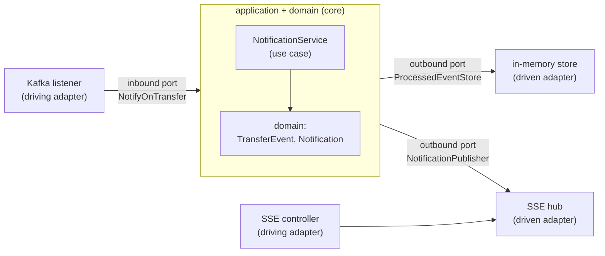
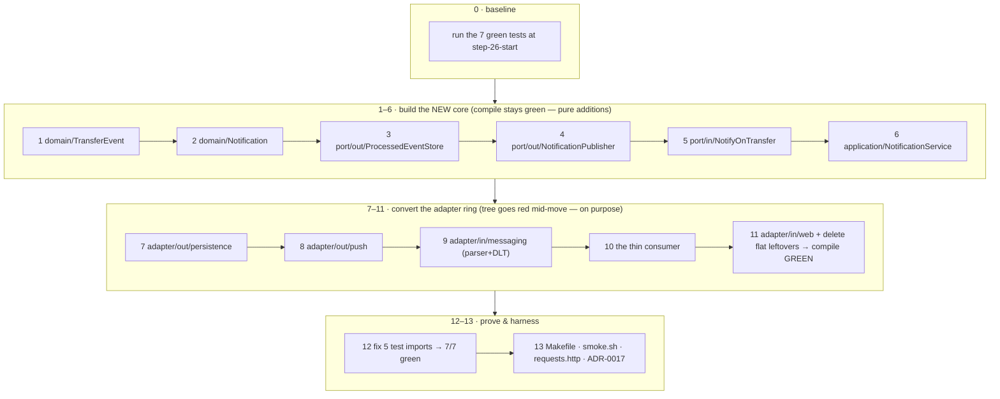
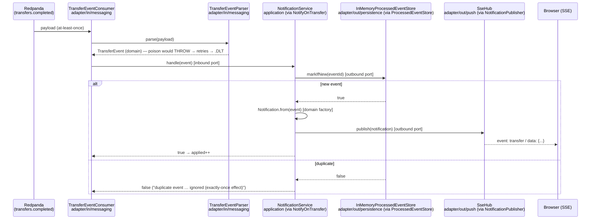

# Step 26 · Hexagonal Architecture (Ports & Adapters) + DDD — Restructuring a Service
### Phase E — Design, Architecture & Testing Mastery 🟣 · Step 26 of 67

> *Step 25 cleaned the notification consumer and seeded one port. Step 26 completes the move to **hexagonal
> architecture**: a framework-free **domain** at the centre, an **application** core of use cases that talk to
> the outside only through **ports**, and **adapters** (Kafka, SSE, the dedup store) plugged in at the edges.
> Dependencies point **inward**. We also apply DDD tactical patterns — value objects + an application service,
> right-sized. Behaviour doesn't change, so the integration tests' assertions don't either — only their
> imports, because the classes moved into layers.*

> [!NOTE]
> **🗿 Code archaeology note (for anyone reading at `HEAD`):** every production file shown in this lesson is
> pasted verbatim from the `step-26-end` tag. Happily, at the time of writing the **production** sources of
> `services/notification` at `HEAD` are **byte-identical** to the tag — the only later additions are Step 27's
> test-scope dependencies in the pom and four new Step-27 test classes (`HexagonalArchitectureTest`,
> `NotificationServiceTest`, `NotificationTest`, `NotificationPropertyTest`). So if your tree is at `HEAD`,
> the *main* code you see matches this lesson exactly, but `./mvnw -pl services/notification test` will run
> **more than the 7 tests** recorded here. To reproduce this lesson's exact world: `git checkout step-26-start`
> (== `step-25-end`) and build forward, or `git checkout step-26-end` to see the finished step.

---

<a id="toc"></a>
## 🧭 The Six Movements of This Step

| | Movement | What happens |
|---|---|---|
| **A** | [🧭 Orient](#orient) | 30-second overview · skip-test · cheat card · why it matters · before you start |
| **B** | [🧠 Understand](#understand) | hexagonal/ports-and-adapters · the dependency rule · inbound vs outbound ports · DDD tactical |
| **C** | [🛠️ Build](#build) | 14 sub-steps: the domain → the ports → the use case → the adapter ring → tests → harness |
| **D** | [🔬 Prove](#prove) | the Verification Log — unchanged tests still green (behaviour preserved); §12.3 mutation |
| **E** | [🎓 Apply](#apply) | go deeper · interview prep · your-turn challenges |
| **F** | [🏆 Review](#review) | troubleshooting · resources · recap, flashcards & what's next |

---

<a id="orient"></a>

# A · 🧭 Orient

## 📋 This Step in 30 Seconds

| | |
|---|---|
| **Title** | Clean / hexagonal architecture (ports-and-adapters) + DDD tactical — restructure the notification service |
| **Step** | 26 of 67 · **Phase E — Design, Architecture & Testing Mastery** 🟣 |
| **Effort** | ≈ 12 hours focused. A **restructure** (no new behaviour) — the win is a framework-free core with attachable edges. |
| **What you'll run this step** | **JVM + Maven**; **🐳 Docker** for the notification integration tests (Testcontainers Redpanda). |
| **Buildable artifact** | `services/notification` repackaged as a hexagon: **`domain`** (`TransferEvent`, `Notification` — no framework imports), **`application`** (`NotificationService` use case + `port/in/NotifyOnTransfer` + `port/out/{ProcessedEventStore, NotificationPublisher}`), **`adapter/in/{messaging,web}`** (Kafka listener + parser + DLT config; SSE controller), **`adapter/out/{persistence,push}`** (in-memory dedup store; SSE hub). Behaviour identical — tests' assertions unchanged. `step-26-start == step-25-end`. |
| **Verification tier** | 🟠 **Standard** — behaviour-preserving restructure (no money/security path). `./mvnw verify` green + the integration tests pass with only imports changed (behaviour preserved) + a §12.3 mutation proving the use case is exercised + `smoke.sh`. |
| **Depends on** | **[Step 25](../step-25/lesson.md)** (SOLID/DIP groundwork — the first port), **[Step 20/21](../step-20/lesson.md)** (the consumer/SSE/DLT we restructure). Sets up **[Step 27](../step-27/lesson.md)** (ArchUnit enforces these boundaries). |

By the end you will be able to structure a service as a **hexagon**, state and apply the **dependency rule**, distinguish **inbound (driving) vs outbound (driven) ports**, and apply **DDD tactical** patterns where they earn their place.

### ⏭️ Can You Skip This Step? (5-minute self-check)

If you can confidently do **all** of this, skim the 🛠️ Build and jump to **[Step 27 — Spring Modulith + ArchUnit](../step-27/lesson.md)**.

- [ ] I can draw the **hexagon** (domain / application+ports / adapters) and state the **dependency rule** (point inward).
- [ ] I can tell an **inbound (driving)** port from an **outbound (driven)** port and give an example of each.
- [ ] I can keep a **domain** free of framework/transport imports and explain why that matters.
- [ ] I can apply **DDD tactical** patterns (value object, application service) — and say when *not* to add aggregates.
- [ ] I can restructure behaviour-preservingly and use the unchanged tests as proof.

> [!TIP]
> Not 100%? Stay. "Explain hexagonal/ports-and-adapters," "inbound vs outbound ports," and "how do you keep the domain pure" are common architecture interview questions — and you'll have *done* the restructure.

## 📇 Cheat Card

> **What this step delivers (one sentence):** the notification service repackaged as a hexagon — a framework-free domain + use-case core that touches Kafka, SSE, and the dedup store only through ports — with behaviour proven unchanged.

**Key commands** (Windows uses `.\mvnw.cmd`):

```bash
./mvnw -pl services/notification test     # behaviour preserved: integration tests pass (imports-only changes)
bash steps/step-26/smoke.sh               # the step's smoke test (needs Docker)
ls -R services/notification/src/main/java/com/buildabank/notification    # see the hexagon
javap -c -p services/notification/target/classes/com/buildabank/notification/application/NotificationService.class | grep -c adapter   # → 0 (the core never references an adapter)
```

**The headline — the hexagon & the dependency rule:**

```
   driving adapters                core (depends on NOTHING outward)              driven adapters
   ┌───────────────┐   inbound port  ┌───────────────────────────┐  outbound ports  ┌──────────────┐
   │ Kafka listener│──NotifyOnTransfer→│ application: Notification  │──ProcessedEventStore→│ in-memory store│
   │ SSE controller│                 │ service  → domain (pure)   │──NotificationPublisher→│ SSE push hub  │
   └───────────────┘                 └───────────────────────────┘                  └──────────────┘
                          ── all arrows point INWARD ──
```

**The one sentence to remember:** *Put the domain at the centre with no outward dependencies; the application offers **inbound ports** (use cases) and needs **outbound ports**; adapters plug in at the edges — so you can swap Kafka/SSE/Redis without touching the core.*

## 🎯 Why This Matters

Frameworks and infrastructure change faster than business rules. Hexagonal architecture keeps the rules in a core that doesn't know about Kafka, HTTP, or Redis — so you can test it without them and swap them without rewriting it. "Explain ports-and-adapters / how do you keep business logic independent of frameworks" is a senior-level design question, and the structure is what makes the next step (mechanically *enforcing* boundaries with ArchUnit) possible.

## ✅ What You'll Be Able to Do

- Structure a service as a hexagon and state the dependency rule.
- Define inbound (driving) and outbound (driven) **ports**, with adapters at the edges.
- Keep a **domain** free of frameworks; test the core without infrastructure.
- Apply DDD tactical patterns proportionately.
- Execute a multi-class package move on the CLI without panicking when the tree goes temporarily red.
- Prove a restructure was behaviour-preserving using an unchanged test suite — and `javap` the bytecode to prove the dependency direction.

## 🧰 Before You Start

- **Prereqs:** bank builds green (`git describe` → `step-25-end`); Docker for the notification integration tests.
- **Connects to what you know:** Step 25's `ProcessedEventStore` port is now one of several; the Kafka consumer (Step 20), SSE (Step 20), and DLT (Step 21) become adapters. **Step 27** will use ArchUnit to *enforce* the boundaries you draw here.
- **Depends on:** Steps **25, 20, 21**.

---

<a id="understand"></a>

# B · 🧠 Understand

## 🧠 The Big Idea — a hexagon: core in the middle, adapters at the edges

Hexagonal architecture (Alistair Cockburn; aka ports-and-adapters; close cousin of Clean/Onion) splits a
service into rings:
- **Domain** (centre) — the business model and rules. **No** framework, transport, or persistence imports.
- **Application** — use cases that orchestrate the domain. Defines **ports**: interfaces it offers
  (**inbound/driving**) and interfaces it needs (**outbound/driven**).
- **Adapters** (edges) — concrete tech plugged into ports: **driving** adapters (a Kafka listener, a REST
  controller) call inbound ports; **driven** adapters (a DB/Redis store, an SSE pusher) implement outbound ports.

**The dependency rule:** source dependencies point **inward**. Adapters depend on the application's ports;
the application depends on the domain; the domain depends on nothing. Infrastructure is a detail you plug in,
not something the core knows about.



**An analogy that holds up:** think of the core as a **games console**. The console (application + domain)
defines the *sockets* (ports): a controller socket (inbound — how the world drives it) and a TV socket
(outbound — what it needs to show results). Any controller that fits the socket works; any screen that fits
the socket works. The console never contains a particular brand of TV — and you can test the console with a
cheap test-harness plug in each socket. That harness plug is exactly what a mock implementation of
`NotificationPublisher` will be in a unit test.

**Why a "restructure" and not a "rewrite":** every class in this step already exists and already works —
Step 25 even extracted most of the pieces. What changes is **where they live and which direction they point**.
That's why the step is cheap to verify: behaviour is pinned by the existing integration tests, and the move is
proven safe when those tests pass with only their `import` lines changed.

## 🧩 Pattern Spotlight — inbound vs outbound ports

- **Inbound (driving) port** — what the application *offers*: `NotifyOnTransfer.handle(TransferEvent)`. A
  driving adapter (the Kafka listener) translates the outside world (a JSON Kafka record) into a domain call.
- **Outbound (driven) port** — what the application *needs*: `ProcessedEventStore.markIfNew`,
  `NotificationPublisher.publish`. A driven adapter implements it (in-memory store; SSE pusher).

The use case (`NotificationService`) depends only on **ports** and the **domain** — never on Kafka, Jackson,
or `SseEmitter`. That's why it's trivially unit-testable (mock the ports) and the transport is swappable.

**The naming convention matters.** Inbound ports are named for the *use case* (`NotifyOnTransfer` — a verb
phrase from the business's language), outbound ports for the *need* (`ProcessedEventStore`,
`NotificationPublisher` — what the core wants, not how it's done). The moment a port name contains a
technology word (`KafkaListenerPort`, `RedisStore`), the abstraction has already leaked.

**Alternatives & trade-offs (Domain 4):**

| Style | Dependency direction | When it wins | When it hurts |
|---|---|---|---|
| Classic layered (controller→service→repository) | downward, ends *at the database* | small CRUD apps; everyone knows it | the domain ends up importing persistence; frameworks invade the core |
| Hexagonal / Clean / Onion | **inward**, ends at a pure domain | long-lived services, swap-prone edges, core worth unit-testing | ceremony if the service is a thin pass-through |
| Transaction script | none — procedural | one-off scripts, tiny endpoints | logic duplicates as it grows |

Our notification service is small, but it's the perfect **teaching hexagon**: it has a genuine inbound edge
(Kafka), two genuine outbound edges (dedup store, SSE push), and an already-proven behaviour contract.

## 🌱 Under the Hood: keeping the domain pure (and why) — and how Spring wires a hexagon

Open `domain/TransferEvent.java` and `domain/Notification.java` — only `java.*` imports. No `@Component`, no
Jackson, no Kafka. Purity means: the rules don't break when a framework upgrades; you can test them in
microseconds without a container; and the **direction of change** is right — infrastructure churns, the core
doesn't. The parsing (Jackson), messaging (Kafka), and pushing (SSE) all live in the adapter ring.

**How Spring wires it (no magic):** at startup, component scanning finds `@Service NotificationService`,
`@Component InMemoryProcessedEventStore`, `@Component SseHub`, `@Component TransferEventConsumer`, etc. When
Spring constructs `NotificationService`, its constructor asks for a `ProcessedEventStore` and a
`NotificationPublisher` — **by interface type**. Spring scans the context for beans *assignable to* those
types and finds exactly one of each (`InMemoryProcessedEventStore`, `SseHub`) — injection by type, the same
mechanism as Step 5. Likewise the consumer asks for a `NotifyOnTransfer` and receives the `NotificationService`
bean. Nothing in the hexagon needed new configuration: **the dependency inversion is expressed entirely in the
constructor signatures**, and Spring's by-type resolution does the plugging-in. (Two beans implementing one
port would fail startup with `NoUniqueBeanDefinitionException` — see 🩺.)

**And it's checkable in the bytecode.** Because the use case's constructor and fields name only ports and
domain types, its compiled class file contains **zero references** to any adapter:

```bash
javap -c -p services/notification/target/classes/com/buildabank/notification/application/NotificationService.class | grep -c adapter
# → 0
```

You'll run that for real in the build (sub-step 10) — it's the dependency rule made falsifiable.

## 🧩 DDD tactical — applied proportionately

DDD's *tactical* patterns: **value objects** (immutable, equality-by-value — our `TransferEvent`,
`Notification`), **entities** (identity over time), **aggregates** (a consistency boundary with a root),
**repositories** (collection-like access to aggregates), **domain services** (logic that isn't one entity's).
The notification context is a thin read/push context, so it has **value objects + an application service and
no aggregates/repositories** — and that's the *right* call. DDD is about modelling the domain faithfully, not
applying every pattern everywhere (the richer aggregates live in the money domain, demand-account).

❓ **Knowledge-check:** `TransferEvent` and `Notification` are records. Why does that make them textbook
*value objects*? <details><summary>answer</summary>Records are immutable (final fields, no setters) and have
equality-by-value (<code>equals</code>/<code>hashCode</code> over all components, generated). A value object
is defined by its attributes, not an identity — two <code>TransferEvent</code>s with the same fields ARE the
same fact. That's exactly the record contract from Step 2.</details>

## 🛡️ Security Lens & 🧵 Thread-safety note

Behaviour is preserved, including the DLT path (the parser still throws on poison → routed to `.DLT`) and the
idempotency guard (now in the application use case via the port). The SSE push adapter stays thread-safe:
Kafka listener threads call `publish` while MVC request threads call `register`/`recent` — the copy-on-write
emitter list and the `synchronized` recent-buffer (Step 11 discipline) move packages unchanged. One standing
risk carries forward unchanged: the notification service still has **no app-level auth** (risk **R-002** in
`security/risk-register.md`, found in Step 18) — restructuring doesn't fix exposure; it just makes the place
to fix it (an `adapter/in/web` concern, not a core concern) more obvious.

## 🕰️ Then vs. Now

The classic layered "controller → service → repository" stack lets dependencies point *downward at the
database* — the domain ends up depending on persistence. Hexagonal/Clean/Onion **invert** that: the database
is an outbound adapter the core points away from. The vocabulary arrived in waves — Cockburn's hexagon
(2005), Palermo's Onion (2008), Martin's Clean Architecture (2012) — all the same dependency rule. What's
genuinely *new* is enforcement: where teams once relied on review discipline, tools like **ArchUnit**
(Step 27) and **Spring Modulith** now fail the build when an import crosses a boundary. Legacy codebases you'll
meet still have `@Entity` classes serialized straight out of controllers — you'll recognize the disease and
the cure.

---

# B→C bridge: 🌳 before → after (notification service)

```
BEFORE (flat package com.buildabank.notification):
  TransferEventConsumer, TransferEventParser, Notification, TransferEvent,
  ProcessedEventStore, InMemoryProcessedEventStore, SseHub, NotificationController, KafkaErrorHandlingConfig

AFTER (hexagon):
  domain/                 TransferEvent · Notification                         (no framework imports)
  application/            NotificationService                                  (the use case — NEW)
    port/in/              NotifyOnTransfer                                     (inbound/driving port — NEW)
    port/out/             ProcessedEventStore · NotificationPublisher          (outbound/driven ports — 1 moved, 1 NEW)
  adapter/in/messaging/   TransferEventConsumer · TransferEventParser · KafkaErrorHandlingConfig
  adapter/in/web/         NotificationController
  adapter/out/persistence/ InMemoryProcessedEventStore  (implements ProcessedEventStore)
  adapter/out/push/        SseHub                        (implements NotificationPublisher)
  (root) NotificationApplication
```

Nine flat files become **13 layered files** (12 moved/new + the untouched `NotificationApplication`): three
brand-new pieces (the inbound port, the publisher port, the use case), and every existing class re-homed into
the ring it always conceptually belonged to.

---

<a id="build"></a>

# C · 🛠️ Let's Build It — Step by Step

## 📦 Your Starting Point

`step-26-start == step-25-end`: the notification service works and is freshly SOLID-refactored — nine
single-responsibility classes, one DIP port (`ProcessedEventStore`), seven green tests — but everything lives
in **one flat package**:

```
services/notification/src/main/java/com/buildabank/notification/
├── NotificationApplication.java        # @SpringBootApplication main class (Step 20)
├── TransferEventConsumer.java          # @KafkaListener — parse → markIfNew → from → publish (Step 25 shape)
├── TransferEventParser.java            # Jackson JSON → TransferEvent; throws on poison (Step 25)
├── TransferEvent.java                  # the parsed event record (Step 25)
├── Notification.java                   # the customer-facing record + from(event) factory (Step 25)
├── ProcessedEventStore.java            # the dedup PORT (Step 25 — the hexagon's seed)
├── InMemoryProcessedEventStore.java    # its in-memory ADAPTER (Step 25)
├── SseHub.java                         # SSE fan-out: emitters + recent buffer (Step 20)
├── NotificationController.java         # GET /api/notifications + /stream (Step 20)
└── KafkaErrorHandlingConfig.java       # retries + Dead-Letter Topic (Step 21)
```

What's green: all 7 tests (`TransferEventConsumerKafkaTest` 1, `DeadLetterTest` 1,
`NotificationControllerTest` 2, `TransferEventParserTest` 2, `InMemoryProcessedEventStoreTest` 1).
What you'll build: **zero new behaviour** — three new core types (an inbound port, a second outbound port, a
use case) and a layered home for everything else.

Two unchanged supporting files you'll keep leaning on (shown here so you never have to hunt):

<details>
<summary>📄 <code>application.yml</code> — unchanged this step (ports, Kafka, the topic name)</summary>

```yaml
# services/notification/src/main/resources/application.yml
spring:
  application:
    name: notification
  kafka:
    bootstrap-servers: ${KAFKA_BOOTSTRAP_SERVERS:localhost:9092}
    consumer:
      group-id: notification-service
      auto-offset-reset: earliest      # a fresh consumer reads from the start of the topic
      key-deserializer: org.apache.kafka.common.serialization.StringDeserializer
      value-deserializer: org.apache.kafka.common.serialization.StringDeserializer
    producer:                          # Step 21: needed so the DLT recoverer can republish failed records
      key-serializer: org.apache.kafka.common.serialization.StringSerializer
      value-serializer: org.apache.kafka.common.serialization.StringSerializer

# The topic the demand-account Outbox relay publishes to (must match demand-account's bank.events.topic).
bank:
  events:
    topic: transfers.completed

server:
  port: 8084                 # notification's port (hello=8080, cif=8081, demand-account=8082, auth=8083).
  shutdown: graceful

management:
  endpoints:
    web:
      exposure:
        include: health,info

logging:
  level:
    com.buildabank.notification: INFO
```

</details>

<details>
<summary>📄 <code>RedpandaContainers.java</code> — unchanged test infra (the real broker the integration tests use)</summary>

```java
// services/notification/src/test/java/com/buildabank/notification/RedpandaContainers.java
package com.buildabank.notification;

import org.springframework.boot.test.context.TestConfiguration;
import org.springframework.boot.testcontainers.service.connection.ServiceConnection;
import org.springframework.context.annotation.Bean;
import org.testcontainers.redpanda.RedpandaContainer;
import org.testcontainers.utility.DockerImageName;

/**
 * Real Kafka-compatible broker (Redpanda) for the notification consumer tests. {@code @ServiceConnection}
 * points {@code spring.kafka.*} (and hence the {@code @KafkaListener}) at this container. Image pinned — see VERSIONS.md.
 */
@TestConfiguration(proxyBeanMethods = false)
public class RedpandaContainers {

    @Bean
    @ServiceConnection
    RedpandaContainer redpandaContainer() {
        return new RedpandaContainer(DockerImageName.parse("redpandadata/redpanda:v24.2.7"));
    }
}
```

</details>

## 🗺️ The build at a glance



**The strategy, stated up front (it's the most instructive part of the step):**

1. **Sub-steps 1–6 are pure additions.** The new `domain/`, `application/` tree coexists with the flat
   package (different package names — Java is fine with `TransferEvent` existing in two packages at once), so
   **the module compiles after every one of these sub-steps**.
2. **Sub-steps 7–11 convert the adapter ring.** These are *moves*, and the flat classes reference each other
   — so the moment `SseHub` leaves the flat package, the not-yet-moved flat consumer and controller **stop
   compiling**. That's not a mistake; it's what a multi-class move looks like on the CLI. The compiler's
   error list becomes your to-do list, and the tree goes green again in sub-step 11 when the last flat file
   disappears. (💡 *Faster in IntelliJ:* `F6` Move-Class rewrites every reference atomically, so the tree
   stays green at each move — the end state is identical.)
3. **Sub-step 12 is the proof**: the five test classes get new `import` lines — *nothing else* — and all 7
   tests pass. Unchanged assertions + green = behaviour preserved.

🌳 **Files we'll touch** (vs `step-25-end` — measured from the real tag diff):

```
services/notification/src/main/java/com/buildabank/notification/
  domain/TransferEvent.java                                   (moved + re-javadoc'd)
  domain/Notification.java                                    (moved + re-javadoc'd)
  application/port/out/ProcessedEventStore.java               (moved into the application ring)
  application/port/out/NotificationPublisher.java             (NEW, 14 lines)
  application/port/in/NotifyOnTransfer.java                   (NEW, 20 lines)
  application/NotificationService.java                        (NEW, 44 lines — the use case)
  adapter/out/persistence/InMemoryProcessedEventStore.java    (moved; implements the relocated port)
  adapter/out/push/SseHub.java                                (moved; now implements NotificationPublisher)
  adapter/in/messaging/TransferEventParser.java               (moved)
  adapter/in/messaging/KafkaErrorHandlingConfig.java          (moved)
  adapter/in/messaging/TransferEventConsumer.java             (moved + REWRITTEN to drive the inbound port)
  adapter/in/web/NotificationController.java                  (moved)
src/test/java/com/buildabank/notification/                    (5 files — IMPORT LINES ONLY)
Makefile                                                      (play-26 target)
adr/0017-hexagonal-notification-service.md                    (NEW)
steps/step-26/{lesson.md, smoke.sh, requests.http}            (this lesson's aids)
```

---

### Sub-step 0 of 13 — Establish the green baseline 🧭 *(you are here: **baseline** → core → ring → tests → harness)*

🎯 **Goal:** prove the suite is green *before* touching anything. A behaviour-preserving restructure is only
meaningful relative to a known-green baseline — if a test fails later, you must know the restructure broke it,
not something older.

📁 **Location:** repo root, on `step-26-start` (`git describe --tags` → `step-25-end`). Docker must be running
(the two Kafka tests use Testcontainers Redpanda).

⌨️ **Code:** none — this sub-step is a run.

🔮 **Predict:** how many tests, and which two need Docker? *(Count the classes in Your Starting Point before
peeking at the output below.)*

▶️ **Run & See:**

```bash
./mvnw -pl services/notification test
```

✅ **Expected output** (real run, recorded 2026-06-11 at `step-25-end`; Maven 3.9.12 / Java 25.0.3 / Docker 29.5.3):

```
[INFO] Running com.buildabank.notification.DeadLetterTest
[INFO] Tests run: 1, Failures: 0, Errors: 0, Skipped: 0, Time elapsed: 16.99 s -- in com.buildabank.notification.DeadLetterTest
[INFO] Running com.buildabank.notification.InMemoryProcessedEventStoreTest
[INFO] Tests run: 1, Failures: 0, Errors: 0, Skipped: 0, Time elapsed: 0.002 s -- in com.buildabank.notification.InMemoryProcessedEventStoreTest
[INFO] Running com.buildabank.notification.NotificationControllerTest
[INFO] Tests run: 2, Failures: 0, Errors: 0, Skipped: 0, Time elapsed: 1.549 s -- in com.buildabank.notification.NotificationControllerTest
[INFO] Running com.buildabank.notification.TransferEventConsumerKafkaTest
[INFO] Tests run: 1, Failures: 0, Errors: 0, Skipped: 0, Time elapsed: 3.256 s -- in com.buildabank.notification.TransferEventConsumerKafkaTest
[INFO] Running com.buildabank.notification.TransferEventParserTest
[INFO] Tests run: 2, Failures: 0, Errors: 0, Skipped: 0, Time elapsed: 0.009 s -- in com.buildabank.notification.TransferEventParserTest
[INFO] Tests run: 7, Failures: 0, Errors: 0, Skipped: 0
[INFO] BUILD SUCCESS
[INFO] Total time:  28.523 s
```

❌ **If you see `Could not find a valid Docker environment`:** start Docker Desktop and re-run — the two
`@SpringBootTest` classes (`DeadLetterTest`, `TransferEventConsumerKafkaTest`) boot a real Redpanda.

✋ **Checkpoint:** 7/7 green. Note the two classes that *are* the behaviour contract: the Kafka dedupe test and
the DLT test. Their assertions will not change one character in this step.

💾 **Commit:** nothing to commit — but if your tree was dirty, stash now. The restructure should be the only
diff from here on.

⚠️ **Pitfall:** skipping the baseline because "it was green yesterday." The whole proof strategy of this step
rests on *unchanged tests passing before AND after*. Thirty seconds now buys you certainty later.

---

### Sub-step 1 of 13 — `domain/TransferEvent`: the first pure-domain citizen 🧭 *(baseline ✅ → **domain** → ports → use case → ring → tests → harness)*

🎯 **Goal:** give the hexagon its centre. `TransferEvent` — the parsed `transfer.completed` fact — moves into
a `domain` package whose law is: **only `java.*` imports, ever**.

📁 **Location:** new file → `services/notification/src/main/java/com/buildabank/notification/domain/TransferEvent.java`
*(we create the new tree first; the flat original stays put until sub-step 11 — that's what keeps the module
compiling through sub-steps 1–6).*

⌨️ **Code — the change at a glance** (flat original → domain version):

```diff
-// services/notification/src/main/java/com/buildabank/notification/TransferEvent.java
-package com.buildabank.notification;
+// services/notification/src/main/java/com/buildabank/notification/domain/TransferEvent.java
+package com.buildabank.notification.domain;

 import java.math.BigDecimal;

 /**
- * The parsed {@code transfer.completed} event — a plain domain type with <strong>no transport coupling</strong>
- * (no JSON, no Kafka). Extracting this (Step 25, SOLID/SRP) lets the consumer work with a meaningful object
- * instead of reaching into a {@code JsonNode}, and lets parsing be tested on its own.
+ * Step 26 (hexagonal) · DOMAIN value object — a parsed {@code transfer.completed} fact. The hexagon's core has
+ * <strong>no framework, transport, or persistence imports</strong> (no Spring, no Kafka, no Jackson): it's
+ * plain Java the rest of the system points <em>inward</em> at. {@code eventId} is the idempotency key.
  */
 public record TransferEvent(
```

⌨️ **The complete file:**

```java
// services/notification/src/main/java/com/buildabank/notification/domain/TransferEvent.java
package com.buildabank.notification.domain;

import java.math.BigDecimal;

/**
 * Step 26 (hexagonal) · DOMAIN value object — a parsed {@code transfer.completed} fact. The hexagon's core has
 * <strong>no framework, transport, or persistence imports</strong> (no Spring, no Kafka, no Jackson): it's
 * plain Java the rest of the system points <em>inward</em> at. {@code eventId} is the idempotency key.
 */
public record TransferEvent(
        String eventId,
        String transactionId,
        String fromAccount,
        String toAccount,
        BigDecimal amount,
        String occurredAt) {
}
```

🔍 **Line-by-line:**

- `package com.buildabank.notification.domain;` — the package **is** the architecture here. From this line on,
  "is this import allowed?" has a mechanical answer per ring; Step 27 will turn that answer into a failing
  build when violated.
- `import java.math.BigDecimal;` — the **only** import, and it's `java.*`. Money is `BigDecimal`
  (Step 2's lesson: never `double` for money — binary floats can't represent 0.10 exactly).
- `public record TransferEvent(...)` — a record: immutable components, generated constructor,
  accessors (`eventId()`), `equals`/`hashCode` by value, `toString`. Immutability + value-equality is what
  makes it a DDD **value object** with zero boilerplate.
- `String eventId` — the end-to-end idempotency key, minted as the Outbox row id back in Step 20. It rides the
  record so the *use case* (not the transport) can dedupe on it.
- `String occurredAt` — kept as the ISO-8601 string exactly as it arrives on the wire. Deliberate: this
  context only displays it; parsing it into `Instant` would add failure modes for zero benefit (tolerant
  reader, Step 23).

💭 **Under the hood:** nothing Spring-related happens at all — that's the point. At compile time `javac`
writes a self-contained 6-component record class; at runtime nothing scans it, proxies it, or serializes it
until an *adapter* chooses to. When the SSE adapter later sends a `Notification` to a browser, the Jackson in
the *web layer* serializes the record via its accessors — the domain still never imports Jackson.

🔮 **Predict:** the module now contains `com.buildabank.notification.TransferEvent` **and**
`com.buildabank.notification.domain.TransferEvent`. Compile error or fine? *(Fine — a class's identity is its
fully-qualified name; the two coexist until we delete the flat one in sub-step 11.)*

▶️ **Run & See:**

```bash
./mvnw -pl services/notification -DskipTests compile
```

✅ **Expected output (tail):**

```
[INFO] BUILD SUCCESS
```

✋ **Checkpoint:** the `domain/` package exists with one record in it; the module compiles; the flat original
is still in place.

💾 **Commit:**

```bash
git add services/notification/src/main/java/com/buildabank/notification/domain/TransferEvent.java
git commit -m "refactor(notification): add domain/TransferEvent — the hexagon's first pure-domain type"
```

⚠️ **Pitfall:** "improving" the record while moving it (adding a field, parsing `occurredAt`, renaming
`fromAccount`). A behaviour-preserving restructure changes **structure only** — mixing in behaviour changes
destroys the unchanged-tests proof. Resist; park ideas in a TODO.

---

### Sub-step 2 of 13 — `domain/Notification`: the second value object (factory included) 🧭 *(baseline ✅ → domain ½ → **domain** → ports → use case → ring → tests → harness)*

🎯 **Goal:** complete the domain ring. `Notification` carries the customer-facing message, and its
`from(TransferEvent)` factory keeps the **wording of the message a domain decision** — not something a Kafka
listener or an SSE pusher improvises.

📁 **Location:** new file → `services/notification/src/main/java/com/buildabank/notification/domain/Notification.java`

⌨️ **Code — the change at a glance:**

```diff
-// services/notification/src/main/java/com/buildabank/notification/Notification.java
-package com.buildabank.notification;
+// services/notification/src/main/java/com/buildabank/notification/domain/Notification.java
+package com.buildabank.notification.domain;

 import java.math.BigDecimal;

 /**
- * A customer-facing notification derived from a {@code transfer.completed} event. {@code eventId} is the
- * end-to-end dedupe key (from the Outbox row id); {@code message} is the human-readable line we push to the UI.
+ * Step 26 (hexagonal) · DOMAIN value object — a customer-facing notification derived from a
+ * {@link TransferEvent}. Pure domain (no framework/transport). The {@link #from} factory keeps the
+ * message-wording in the core, derived from a domain event rather than a JSON payload.
  */
 public record Notification(
```

⌨️ **The complete file:**

```java
// services/notification/src/main/java/com/buildabank/notification/domain/Notification.java
package com.buildabank.notification.domain;

import java.math.BigDecimal;

/**
 * Step 26 (hexagonal) · DOMAIN value object — a customer-facing notification derived from a
 * {@link TransferEvent}. Pure domain (no framework/transport). The {@link #from} factory keeps the
 * message-wording in the core, derived from a domain event rather than a JSON payload.
 */
public record Notification(
        String eventId,
        String transactionId,
        String fromAccount,
        String toAccount,
        BigDecimal amount,
        String occurredAt,
        String message) {

    /** Build a notification from a domain {@link TransferEvent}. */
    public static Notification from(TransferEvent event) {
        String message = "Transfer of " + event.amount()
                + " from " + event.fromAccount() + " to " + event.toAccount() + " completed.";
        return new Notification(event.eventId(), event.transactionId(), event.fromAccount(),
                event.toAccount(), event.amount(), event.occurredAt(), message);
    }
}
```

🔍 **Line-by-line:**

- `{@link TransferEvent}` — note the javadoc link now resolves **within the domain package**: domain may
  reference domain. The rule isn't "no imports"; it's "no *outward* imports."
- `public static Notification from(TransferEvent event)` — a **static factory method** (Step 25): construction
  that *derives* a value (the message) deserves a domain-named creator. Wording = behaviour: the Kafka test
  asserts on notifications built through this exact method, so its output must not change by a character.
- `"Transfer of " + event.amount() + ...` — string concatenation calls `BigDecimal.toString()`. A wire amount
  of `40.00` parsed by Jackson arrives as `40.0` (scale 1), so the message reads *"Transfer of 40.0 …"* — you
  will see precisely that string in the live test logs later. Cosmetically imperfect, behaviourally pinned:
  "fixing" it to `40.00` here would be a behaviour change in disguise.
- The factory lives **on the record it creates** — no separate `NotificationFactory` class ceremony (KISS,
  Step 25).

💭 **Under the hood:** `Notification.from` is the single place in the entire bank where the
human-facing transfer message is worded. When product asks to reword it, the change is one line in the domain
— and every transport (SSE today, WebSocket/email tomorrow) picks it up, because adapters receive the
*finished* value object through a port.

🔮 **Predict:** does `domain/Notification` compile *before* the flat `Notification` is deleted, given both
have a `from(...)`? *(Yes — different packages, different types; nothing references the new one yet.)*

▶️ **Run & See:**

```bash
./mvnw -pl services/notification -DskipTests compile
```

✅ **Expected output (tail):**

```
[INFO] BUILD SUCCESS
```

✋ **Checkpoint:** the domain ring is complete: two records, one factory, imports = `java.math.BigDecimal`
only. Verify the purity claim mechanically:

```bash
grep -h "^import" services/notification/src/main/java/com/buildabank/notification/domain/*.java | sort -u
```

✅ **Expected output** (real run, 2026-06-11):

```
import java.math.BigDecimal;
```

One line. That single line of output *is* the "framework-free domain" claim, verified.

💾 **Commit:**

```bash
git add services/notification/src/main/java/com/buildabank/notification/domain/Notification.java
git commit -m "refactor(notification): add domain/Notification with the from(event) factory"
```

⚠️ **Pitfall:** putting the factory's message-building into the SSE adapter "because that's where it's shown."
Then a second push transport must duplicate the wording — and the two drift. Derivation logic that defines
*what the business says* belongs in the domain; *how it's delivered* belongs in adapters.

---

### Sub-step 3 of 13 — `application/port/out/ProcessedEventStore`: the Step-25 port finds its true home 🧭 *(domain ✅ → **ports** → use case → ring → tests → harness)*

🎯 **Goal:** relocate the dedup port into the ring that *owns* it. In Step 25 the port proved DIP; in Step 26
its location becomes physical architecture: **ports live in `application/port/`, because the application is
the side that needs them.**

📁 **Location:** new file → `services/notification/src/main/java/com/buildabank/notification/application/port/out/ProcessedEventStore.java`

⌨️ **Code — the change at a glance:**

```diff
-// services/notification/src/main/java/com/buildabank/notification/ProcessedEventStore.java
-package com.buildabank.notification;
+// services/notification/src/main/java/com/buildabank/notification/application/port/out/ProcessedEventStore.java
+package com.buildabank.notification.application.port.out;

 /**
- * Step 25 · a <strong>port</strong> (Dependency Inversion Principle): the consumer's idempotency depends on
- * this abstraction, not on a concrete data structure. Today the only adapter is in-memory
- * ({@link InMemoryProcessedEventStore}); a durable adapter (Redis/DB, like Step 21) can replace it without
- * touching the consumer — DIP + the Open/Closed Principle.
+ * Step 26 (hexagonal) · OUTBOUND (driven) port for idempotency (introduced as a port in Step 25). The use case
+ * depends on this abstraction; a driven adapter implements it (in-memory today, Redis tomorrow — Step 21's
+ * pattern) with no change to the core.
  */
 public interface ProcessedEventStore {
```

⌨️ **The complete file:**

```java
// services/notification/src/main/java/com/buildabank/notification/application/port/out/ProcessedEventStore.java
package com.buildabank.notification.application.port.out;

/**
 * Step 26 (hexagonal) · OUTBOUND (driven) port for idempotency (introduced as a port in Step 25). The use case
 * depends on this abstraction; a driven adapter implements it (in-memory today, Redis tomorrow — Step 21's
 * pattern) with no change to the core.
 */
public interface ProcessedEventStore {

    /**
     * Atomically record that an event id has been seen.
     *
     * @return {@code true} if this id is NEW (process it); {@code false} if it's a duplicate (skip it)
     */
    boolean markIfNew(String eventId);
}
```

🔍 **Line-by-line:**

- `package ...application.port.out;` — three nested ideas in one path: it belongs to the **application**, it
  is a **port**, and it points **out** (something the core *needs*). Step 27's ArchUnit rules will key off
  exactly these package names.
- Spot what *vanished* from the old javadoc: the `{@link InMemoryProcessedEventStore}` reference. The old
  flat-package doc could casually name its adapter; in the hexagon **that link would be an inward ring
  referencing an outward ring** — exactly the dependency direction we're outlawing. Even javadoc references
  count as coupling (and ArchUnit-checkable imports, if written as imports).
- The method and its contract are **character-identical** to Step 25 — `markIfNew`, the "Atomically" contract
  (one indivisible check-and-record; a `contains()`-then-`add()` adapter would race, Step 11), the
  true=new/false=duplicate semantics. Moving a port must not reword its contract: every adapter and caller was
  written against those exact promises (Liskov, Step 25).

💭 **Under the hood:** an interface compiles to a tiny class file with constant-pool entries for its name and
method descriptor — `boolean markIfNew(java.lang.String)`. Implementations and callers both reference *that*
descriptor. This is why the package move forces recompilation of everything touching it, but nothing about the
*runtime* dispatch changes: `invokeinterface` on the new fully-qualified name.

🔮 **Predict:** the flat `TransferEventConsumer` still injects the flat `ProcessedEventStore` (which still
exists), and nothing yet references the new one. Compile? *(Green — additions can't break existing
references.)*

▶️ **Run & See:**

```bash
./mvnw -pl services/notification -DskipTests compile
```

✅ **Expected output (tail):**

```
[INFO] BUILD SUCCESS
```

✋ **Checkpoint:** `application/port/out/` exists with one port; its javadoc names no adapter.

💾 **Commit:**

```bash
git add services/notification/src/main/java/com/buildabank/notification/application
git commit -m "refactor(notification): move ProcessedEventStore port into application/port/out"
```

⚠️ **Pitfall:** putting ports in a top-level `ports/` package shared by everyone, or worse, next to their
adapters. The *location* encodes ownership: the application owns its ports. A port that lives with its adapter
is just an interface-shaped detail — the arrow didn't invert.

---

### Sub-step 4 of 13 — `application/port/out/NotificationPublisher`: the second outbound port (NEW) 🧭 *(domain ✅ → ports ⅓ → **ports** → use case → ring → tests → harness)*

🎯 **Goal:** abstract the *other* thing the core needs: a way to push a finished `Notification` to customers.
Today that's SSE — but the core shouldn't know that. This is the port Step 25 *didn't* create (the consumer
still called `SseHub` concretely); creating it is the last inversion the hexagon needs.

📁 **Location:** new file → `services/notification/src/main/java/com/buildabank/notification/application/port/out/NotificationPublisher.java`

⌨️ **Code:**

```java
// services/notification/src/main/java/com/buildabank/notification/application/port/out/NotificationPublisher.java
package com.buildabank.notification.application.port.out;

import com.buildabank.notification.domain.Notification;

/**
 * Step 26 (hexagonal) · OUTBOUND (driven) port for pushing a {@link Notification} to clients. The use case
 * depends on this abstraction; the SSE adapter implements it. Swapping the push transport (WebSocket, a
 * webhook, email) is a new adapter — no core change.
 */
public interface NotificationPublisher {

    void publish(Notification notification);
}
```

🔍 **Line-by-line:**

- `import com.buildabank.notification.domain.Notification;` — the port's vocabulary is **domain types**, never
  transport types. Compare what this method signature would look like leaked:
  `void send(SseEmitter emitter, String json)` — that's an SSE API, not a port.
- `void publish(Notification notification)` — one method (Interface Segregation, Step 25). Fire-and-forget
  semantics: `void` says the core does not wait for, retry, or care about delivery success — push is
  best-effort by design here (a missed SSE frame is tolerable; the recent-buffer covers reconnects).
- The name `NotificationPublisher` describes the **need** ("publish notifications"), not the mechanism
  ("SseSender"). Port-naming rule from the Pattern Spotlight, applied.

💭 **Under the hood:** when Spring later builds the context, this interface is what makes the use case ↔ hub
wiring *loose*: `NotificationService`'s constructor parameter is typed `NotificationPublisher`, and Spring's
by-type resolution finds the single bean implementing it (`SseHub`, after sub-step 8). Change which class
carries `implements NotificationPublisher` and the wiring re-routes itself — zero core edits.

🔮 **Predict:** an interface with zero implementations now exists. Does the app *start* if you ran it right
now? *(Yes, actually — nothing injects `NotificationPublisher` until the use case exists in sub-step 6, and
even then it's the missing-bean error only at startup, not compile. The order core-then-adapters keeps every
gap visible and short-lived.)*

▶️ **Run & See:**

```bash
./mvnw -pl services/notification -DskipTests compile
```

✅ **Expected output (tail):**

```
[INFO] BUILD SUCCESS
```

✋ **Checkpoint:** both outbound ports exist side-by-side in `application/port/out/`; both speak only
domain + JDK types.

💾 **Commit:**

```bash
git add services/notification/src/main/java/com/buildabank/notification/application/port/out/NotificationPublisher.java
git commit -m "refactor(notification): add NotificationPublisher outbound port (push transport behind an abstraction)"
```

⚠️ **Pitfall:** making the port return a delivery report (`boolean publish(...)`) "for completeness." Now
every adapter must invent a meaning for the return value, and the core must invent a reaction — speculative
API (YAGNI, Step 25). Add semantics when a use case actually needs them.

---

### Sub-step 5 of 13 — `application/port/in/NotifyOnTransfer`: the inbound port (NEW) 🧭 *(domain ✅ → ports ⅔ → **ports** → use case → ring → tests → harness)*

🎯 **Goal:** name the use case as an interface. `NotifyOnTransfer` is what the application **offers** the
world: *"give me a transfer event; I'll notify, idempotently."* Driving adapters (the Kafka listener — and any
future REST endpoint, CLI, or scheduled replay) will depend on this, never on the implementing class.

📁 **Location:** new file → `services/notification/src/main/java/com/buildabank/notification/application/port/in/NotifyOnTransfer.java`

⌨️ **Code:**

```java
// services/notification/src/main/java/com/buildabank/notification/application/port/in/NotifyOnTransfer.java
package com.buildabank.notification.application.port.in;

import com.buildabank.notification.domain.TransferEvent;

/**
 * Step 26 (hexagonal) · INBOUND (driving) port — the use case the application offers to the outside world:
 * "given a transfer event, notify (idempotently)." Driving adapters (the Kafka listener) depend on this
 * interface, not on the implementation.
 */
public interface NotifyOnTransfer {

    /**
     * Handle a transfer event.
     *
     * @return {@code true} if it was newly applied (a notification was pushed); {@code false} if it was a
     *         duplicate (idempotent no-op)
     */
    boolean handle(TransferEvent event);
}
```

🔍 **Line-by-line:**

- `port.in` vs `port.out` — same word, opposite direction. **In**: implemented *by the application*, called
  *by adapters*. **Out**: declared *by the application*, implemented *by adapters*. Keep that table in your
  head; it's the most-fumbled distinction in interviews.
- `NotifyOnTransfer` — a use-case name, readable as a sentence ("notify on transfer"). Not
  `TransferEventHandler` (mechanical), not `NotificationServiceInterface` (naming the implementation —
  backwards).
- `boolean handle(TransferEvent event)` — takes a **domain** event (the adapter does the JSON→domain
  translation *before* crossing this boundary; poison payloads never reach the core). Returns
  applied-vs-duplicate so the *adapter* can keep its observability counters without the core knowing counters
  exist — watch how the consumer uses this in sub-step 10.
- The `@return` javadoc is contract, not decoration: the Kafka adapter's `appliedCount` (asserted by the
  integration test) is only correct if implementations honour it exactly.

💭 **Under the hood — why bother, when one class implements it?** Three concrete payoffs: (1) the *direction*
of the compile-time reference from the Kafka adapter lands on an interface in `application/port/in` — making
"adapters depend on ports" literally true and ArchUnit-checkable; (2) test doubles: a controller test can
drive a `NotifyOnTransfer` lambda with no Kafka anywhere; (3) a second driving adapter (an admin replay
endpoint, a batch backfill) plugs into the same use case without touching it. The cost: one 20-line file.

❓ **Knowledge-check:** the parser returns `TransferEvent` and lives in the *adapter* ring (sub-step 9), yet
`TransferEvent` is *domain*. Is an adapter allowed to import domain types? <details><summary>answer</summary>
Yes — the dependency rule is about direction, and adapter→domain points <em>inward</em>. What's forbidden is
the reverse: domain importing adapter (or application importing adapter). Inward references are exactly how
adapters hand work to the core.</details>

▶️ **Run & See:**

```bash
./mvnw -pl services/notification -DskipTests compile
```

✅ **Expected output (tail):**

```
[INFO] BUILD SUCCESS
```

✋ **Checkpoint:** all three ports exist — one in, two out. The application ring is ready for its centerpiece.

💾 **Commit:**

```bash
git add services/notification/src/main/java/com/buildabank/notification/application/port/in
git commit -m "refactor(notification): add NotifyOnTransfer inbound port (the use case as an interface)"
```

⚠️ **Pitfall:** letting wire concerns leak into the inbound port — `handle(String json)` or
`handle(ConsumerRecord<String,String> record)`. Then every driving adapter must produce *that* shape, the core
must parse (a transport concern), and the "swap Kafka for anything" promise dies. Domain types only, both
directions, at every port.

---

### Sub-step 6 of 13 — `application/NotificationService`: the use case (the heart of the step) 🧭 *(domain ✅ → ports ✅ → **use case** → ring → tests → harness)*

🎯 **Goal:** write the application core: implements the inbound port, orchestrates the domain through the two
outbound ports. The dedupe-then-publish policy — which lived inside the Kafka listener since Step 20 — finally
gets a transport-free home.

📁 **Location:** new file → `services/notification/src/main/java/com/buildabank/notification/application/NotificationService.java`

⌨️ **Code:**

```java
// services/notification/src/main/java/com/buildabank/notification/application/NotificationService.java
package com.buildabank.notification.application;

import org.slf4j.Logger;
import org.slf4j.LoggerFactory;
import org.springframework.stereotype.Service;

import com.buildabank.notification.application.port.in.NotifyOnTransfer;
import com.buildabank.notification.application.port.out.NotificationPublisher;
import com.buildabank.notification.application.port.out.ProcessedEventStore;
import com.buildabank.notification.domain.Notification;
import com.buildabank.notification.domain.TransferEvent;

/**
 * Step 26 (hexagonal) · the APPLICATION use case — implements the inbound port {@link NotifyOnTransfer} and
 * orchestrates the domain through outbound ports only. It depends inward (domain) and sideways onto its own
 * ports — never on an adapter or a framework's transport types. Idempotent: dedupe via
 * {@link ProcessedEventStore}, build the {@link Notification}, push via {@link NotificationPublisher}.
 */
@Service
public class NotificationService implements NotifyOnTransfer {

    private static final Logger log = LoggerFactory.getLogger(NotificationService.class);

    private final ProcessedEventStore processedEvents;
    private final NotificationPublisher publisher;

    public NotificationService(ProcessedEventStore processedEvents, NotificationPublisher publisher) {
        this.processedEvents = processedEvents;
        this.publisher = publisher;
    }

    @Override
    public boolean handle(TransferEvent event) {
        if (!processedEvents.markIfNew(event.eventId())) {
            log.info("duplicate event {} ignored (exactly-once effect)", event.eventId());
            return false;   // duplicate → idempotent no-op
        }
        Notification notification = Notification.from(event);
        publisher.publish(notification);
        log.info("notified: {}", notification.message());
        return true;
    }
}
```

🔍 **Line-by-line:**

- **Read the import block first — it's the architecture diagram in text form.** Two framework imports
  (SLF4J logging + the `@Service` stereotype — the documented compromise, next bullet), three `application.*`
  imports (its own ports), two `domain.*` imports. **Zero `adapter.*` imports** — and there never will be;
  Step 27 fails the build otherwise.
- `@Service` — the pragmatic line in the sand. Purists keep even the application ring annotation-free and wire
  it in an `@Configuration` adapter; we accept one stereotype annotation on the use case (a widespread,
  low-cost compromise) and keep the **domain** strictly pure. The trade-off is documented in ADR-0017 and in
  Go-Deeper.
- `implements NotifyOnTransfer` — the use case *is* the inbound port's implementation. Spring will hand this
  bean to anyone asking for a `NotifyOnTransfer`.
- `private final ProcessedEventStore ...; private final NotificationPublisher ...;` — the two needs, typed as
  ports. Constructor injection by type (Step 5); `final` fields = safe publication to the Kafka listener
  threads that will call `handle` (Step 11).
- `if (!processedEvents.markIfNew(event.eventId()))` — the **idempotency guard is the first statement**.
  Kafka delivers at-least-once (Step 19/20); this line converts duplicates into no-ops → exactly-once
  *effect*. The `!` ordering matters: mark-then-test in one call, no check-then-act window.
- `log.info("duplicate event {} ignored (exactly-once effect)", ...)` — this exact string moved here from the
  old consumer. **Watch the logger name change in the live output later**: Step 25's runs logged it as
  `c.b.notification.TransferEventConsumer`; from this step it appears as `c.b.n.application.NotificationService`.
  Same behaviour, new owner — the restructure made the *policy's* location visible in the logs.
- `Notification.from(event)` → `publisher.publish(notification)` — derive in the domain, push through the
  port. The use case never knows the push is SSE.
- `return true` / `return false` — honours the inbound port's contract so the adapter's counters stay honest.

💭 **Under the hood — what changed vs Step 25, really?** Nothing behavioural; one dependency arrow. Before:
`TransferEventConsumer → SseHub` (policy naming a concrete transport class). After:
`NotificationService → NotificationPublisher ← SseHub`. The policy now owns an abstraction; the transport
conforms to it. Every other line of the dedupe-publish flow is a verbatim relocation — which you can falsify
yourself: diff this method against the old consumer's body in sub-step 10's "before."

🔮 **Predict:** the module compiles (only new-tree references) — but if you *started* the app right now, what
happens? *(Startup failure: `NoSuchBeanDefinitionException` — Spring tries to build `NotificationService` and
finds no bean implementing the new `application.port.out.ProcessedEventStore` or `NotificationPublisher`. The
flat `InMemoryProcessedEventStore` implements the OLD flat port — a different type! Adapters next.)*

▶️ **Run & See:**

```bash
./mvnw -pl services/notification -DskipTests compile
```

✅ **Expected output (tail):**

```
[INFO] BUILD SUCCESS
```

✋ **Checkpoint:** the core is **complete and closed**: domain (2 records) + ports (3 interfaces) + use case
(1 class). Everything from here outward is replaceable technology.

💾 **Commit:**

```bash
git add services/notification/src/main/java/com/buildabank/notification/application/NotificationService.java
git commit -m "refactor(notification): add NotificationService use case behind the inbound port"
```

⚠️ **Pitfall:** the use case quietly importing `tools.jackson...` or `org.springframework.kafka...` "just for
one helper." One import and the core is no longer testable without that stack — and the whole step was for
nothing. If the use case needs something technical, that need is a **new outbound port**.

---

### Sub-step 7 of 13 — `adapter/out/persistence/InMemoryProcessedEventStore`: the first driven adapter 🧭 *(core ✅ → **ring: persistence** → push → messaging → consumer → web → tests → harness)*

🎯 **Goal:** begin the adapter-ring conversion. The in-memory store *moves* (this time the flat file goes
away) and re-targets the **relocated** port.

📁 **Location:** move → `services/notification/src/main/java/com/buildabank/notification/adapter/out/persistence/InMemoryProcessedEventStore.java`

On the CLI a "move + edit" is exactly that:

```bash
mkdir -p services/notification/src/main/java/com/buildabank/notification/adapter/out/persistence
git mv services/notification/src/main/java/com/buildabank/notification/InMemoryProcessedEventStore.java \
       services/notification/src/main/java/com/buildabank/notification/adapter/out/persistence/
# then edit the package line + the port import, below
```

⌨️ **Code — the change at a glance:**

```diff
-// services/notification/src/main/java/com/buildabank/notification/InMemoryProcessedEventStore.java
-package com.buildabank.notification;
+// services/notification/src/main/java/com/buildabank/notification/adapter/out/persistence/InMemoryProcessedEventStore.java
+package com.buildabank.notification.adapter.out.persistence;

 import java.util.Set;
 import java.util.concurrent.ConcurrentHashMap;

 import org.springframework.stereotype.Component;

+import com.buildabank.notification.application.port.out.ProcessedEventStore;
+
 /**
- * The in-memory <strong>adapter</strong> for {@link ProcessedEventStore} — a thread-safe set of seen event ids.
- * Simple and fast, but resets on restart (so a restart could reprocess). A Redis/DB adapter (Step 21's
- * Idempotency Key) would make it durable; thanks to the port, swapping it needs no consumer change.
+ * Step 26 (hexagonal) · the outbound (driven) PERSISTENCE adapter for {@link ProcessedEventStore} — a
+ * thread-safe set of seen event ids. Simple and fast, but resets on restart; a Redis/DB adapter (Step 21's
+ * Idempotency Key) would make it durable, swappable behind the port with no core change.
  */
 @Component
 public class InMemoryProcessedEventStore implements ProcessedEventStore {
```

⌨️ **The complete file:**

```java
// services/notification/src/main/java/com/buildabank/notification/adapter/out/persistence/InMemoryProcessedEventStore.java
package com.buildabank.notification.adapter.out.persistence;

import java.util.Set;
import java.util.concurrent.ConcurrentHashMap;

import org.springframework.stereotype.Component;

import com.buildabank.notification.application.port.out.ProcessedEventStore;

/**
 * Step 26 (hexagonal) · the outbound (driven) PERSISTENCE adapter for {@link ProcessedEventStore} — a
 * thread-safe set of seen event ids. Simple and fast, but resets on restart; a Redis/DB adapter (Step 21's
 * Idempotency Key) would make it durable, swappable behind the port with no core change.
 */
@Component
public class InMemoryProcessedEventStore implements ProcessedEventStore {

    private final Set<String> processed = ConcurrentHashMap.newKeySet();

    @Override
    public boolean markIfNew(String eventId) {
        return processed.add(eventId);   // Set.add returns true only the first time → idempotency guard
    }
}
```

🔍 **Line-by-line (what changed — the body didn't):**

- `import com.buildabank.notification.application.port.out.ProcessedEventStore;` — the one *meaningful* new
  line. In the flat package this import didn't exist (same-package resolution); now the adapter **names the
  ring it points into**. This import line is the inward arrow, in source code.
- `package ...adapter.out.persistence;` — "persistence" is aspiration-accurate: today it's a `Set`, but the
  slot in the architecture is *where remembered-event storage lives* (Redis/DB adapters land here later).
- `ConcurrentHashMap.newKeySet().add(...)` — unchanged, still the atomic check-and-insert honouring the
  port's "Atomically" contract (Step 11/25). Moving packages must never reopen settled concurrency decisions.

💭 **Under the hood:** the flat `ProcessedEventStore.java` file still exists and the flat consumer still
references it — but **no bean now implements the flat interface** (this class implements the *new* one). At
compile time everything's fine; at runtime the old wiring would fail. We're mid-surgery: the module compiles
but shouldn't be started until sub-step 11 closes the ring. This is the honest texture of a CLI refactor.

🔮 **Predict:** will the *tests* compile right now? *(No — `InMemoryProcessedEventStoreTest` referenced the
class by simple name in the same package; the move broke that. We're deliberately leaving tests for sub-step
12 — `-DskipTests compile` compiles only `src/main`.)*

▶️ **Run & See:**

```bash
./mvnw -pl services/notification -DskipTests compile
```

✅ **Expected output (tail):**

```
[INFO] BUILD SUCCESS
```

✋ **Checkpoint:** flat package is down to 8 files; `adapter/out/persistence/` has its first resident; main
sources still compile.

💾 **Commit:**

```bash
git add -A services/notification/src/main
git commit -m "refactor(notification): move InMemoryProcessedEventStore to adapter/out/persistence"
```

⚠️ **Pitfall:** forgetting to change the `implements` target along with the package. If this class still
implemented the *flat* `ProcessedEventStore`, everything would compile — and startup would die with
`NoSuchBeanDefinitionException` on the use case. Same-named types in different packages are different types;
the import line decides which one you mean.

---

### Sub-step 8 of 13 — `adapter/out/push/SseHub`: the push adapter (and the tree goes red) 🧭 *(core ✅ → persistence ✅ → **push** → messaging → consumer → web → tests → harness)*

🎯 **Goal:** make `SseHub` the official driven adapter for `NotificationPublisher` — the inversion Step 25
left undone. And meet, on purpose, the mid-move compile failure every CLI refactorer must learn not to fear.

📁 **Location:** move → `services/notification/src/main/java/com/buildabank/notification/adapter/out/push/SseHub.java`

```bash
mkdir -p services/notification/src/main/java/com/buildabank/notification/adapter/out/push
git mv services/notification/src/main/java/com/buildabank/notification/SseHub.java \
       services/notification/src/main/java/com/buildabank/notification/adapter/out/push/
```

⌨️ **Code — the change at a glance:**

```diff
-// services/notification/src/main/java/com/buildabank/notification/SseHub.java
-package com.buildabank.notification;
+// services/notification/src/main/java/com/buildabank/notification/adapter/out/push/SseHub.java
+package com.buildabank.notification.adapter.out.push;
 ...
 import org.springframework.stereotype.Component;
 import org.springframework.web.servlet.mvc.method.annotation.SseEmitter;

+import com.buildabank.notification.application.port.out.NotificationPublisher;
+import com.buildabank.notification.domain.Notification;
+
 /**
- * Step 20 · the <strong>real-time push</strong> fan-out. Holds the set of open {@link SseEmitter}s (one per
- * connected browser) and broadcasts each {@link Notification} to all of them, ...
+ * Step 26 (hexagonal) · the outbound (driven) PUSH adapter — implements {@link NotificationPublisher} using
+ * <strong>Server-Sent Events</strong>. ...
  */
 @Component
-public class SseHub {
+public class SseHub implements NotificationPublisher {
 ...
     /** Outbound port: record and broadcast a notification to every connected client. */
+    @Override
     public void publish(Notification notification) {
```

⌨️ **The complete file:**

```java
// services/notification/src/main/java/com/buildabank/notification/adapter/out/push/SseHub.java
package com.buildabank.notification.adapter.out.push;

import java.io.IOException;
import java.util.ArrayDeque;
import java.util.ArrayList;
import java.util.Deque;
import java.util.List;
import java.util.concurrent.CopyOnWriteArrayList;

import org.slf4j.Logger;
import org.slf4j.LoggerFactory;
import org.springframework.stereotype.Component;
import org.springframework.web.servlet.mvc.method.annotation.SseEmitter;

import com.buildabank.notification.application.port.out.NotificationPublisher;
import com.buildabank.notification.domain.Notification;

/**
 * Step 26 (hexagonal) · the outbound (driven) PUSH adapter — implements {@link NotificationPublisher} using
 * <strong>Server-Sent Events</strong>. Holds the open {@link SseEmitter}s (one per connected browser) and a
 * recent buffer; {@code publish} broadcasts to all. The application core pushes through the port and never
 * sees an {@code SseEmitter}. Thread-safe (copy-on-write emitters + guarded buffer) — Kafka listener threads
 * publish while request threads subscribe (Step 11). The web adapter uses {@link #register}/{@link #recent}
 * to serve the SSE endpoints (the SSE transport is shared between push-out and subscribe-in).
 */
@Component
public class SseHub implements NotificationPublisher {

    private static final Logger log = LoggerFactory.getLogger(SseHub.class);
    private static final int RECENT_LIMIT = 50;

    private final List<SseEmitter> emitters = new CopyOnWriteArrayList<>();
    private final Deque<Notification> recent = new ArrayDeque<>();

    /** Register a new SSE subscriber; auto-removes itself on completion/timeout/error. */
    public SseEmitter register() {
        SseEmitter emitter = new SseEmitter(0L);   // 0 = no timeout (stream stays open)
        emitter.onCompletion(() -> emitters.remove(emitter));
        emitter.onTimeout(() -> emitters.remove(emitter));
        emitter.onError(e -> emitters.remove(emitter));
        emitters.add(emitter);
        return emitter;
    }

    /** Outbound port: record and broadcast a notification to every connected client. */
    @Override
    public void publish(Notification notification) {
        synchronized (recent) {
            recent.addFirst(notification);
            while (recent.size() > RECENT_LIMIT) {
                recent.removeLast();
            }
        }
        for (SseEmitter emitter : emitters) {
            try {
                emitter.send(SseEmitter.event().name("transfer").data(notification));
            } catch (IOException | IllegalStateException e) {
                emitters.remove(emitter);   // client gone → drop it
                log.debug("dropped a dead SSE subscriber", e);
            }
        }
    }

    /** The most recent notifications, newest first (for a just-connected client or a test). */
    public List<Notification> recent() {
        synchronized (recent) {
            return new ArrayList<>(recent);
        }
    }

    /** Number of currently-connected SSE subscribers. */
    public int subscriberCount() {
        return emitters.size();
    }
}
```

🔍 **Line-by-line (the three meaningful changes):**

- `implements NotificationPublisher` + `@Override` on `publish` — the class already *had* the right method
  with the right signature; declaring the interface turns coincidence into contract. `@Override` makes the
  compiler verify the signature stays matched forever.
- `import ...application.port.out.NotificationPublisher;` and `import ...domain.Notification;` — the adapter
  points inward at the port it implements and the domain type it transports. Inward-only, both of them.
- Everything else — the `CopyOnWriteArrayList` (iteration-safe broadcasting while subscribers churn), the
  `synchronized` recent-deque with its 50-cap, the dead-subscriber sweep in the `catch` — is **byte-identical
  behaviour** from Step 20. The thread-safety design survives the move untouched, as it must.
- Note `register()`, `recent()`, `subscriberCount()` are **not** on the port. The port is only what the *core*
  needs (`publish`). The extra methods serve the web adapter and the tests — see the Pitfall.

💭 **Under the hood:** one bean, two roles. To the application core, this object is "a
`NotificationPublisher`" (it's injected by that type). To the web adapter (next sub-steps), it's "the SSE
hub" (injected as concrete `SseHub`, to reach `register`/`recent`). Spring happily injects one singleton under
both type-views. That dual citizenship is the **documented coupling** of this service — the SSE transport is
inherently shared between pushing out and subscribing in — and ADR-0017 records it; Step 27's ArchUnit rules
will *allow* this specific edge while still forbidding any adapter→core-inward violation.

🔮 **Predict:** flat `TransferEventConsumer` and flat `NotificationController` both used `SseHub` by simple
name (same package — no import line). Now that it's moved, does `compile` still pass?

▶️ **Run & See** (the instructive failure — run it; red is information, not danger):

```bash
./mvnw -pl services/notification -DskipTests compile
```

❌ **Expected output — a real mid-move failure** (run live on 2026-06-11, with flat `SseHub` removed and the
flat consumer/controller still in place; your line numbers may vary slightly):

```
[ERROR] COMPILATION ERROR :
[ERROR] .../com/buildabank/notification/NotificationController.java:[22,19] cannot find symbol
[ERROR]   symbol:   class SseHub
[ERROR]   location: class com.buildabank.notification.NotificationController
[ERROR] .../com/buildabank/notification/NotificationController.java:[24,35] cannot find symbol
[ERROR] .../com/buildabank/notification/TransferEventConsumer.java:[28,19] cannot find symbol
[ERROR] .../com/buildabank/notification/TransferEventConsumer.java:[32,99] cannot find symbol
[INFO] BUILD FAILURE
```

**Read it like a refactorer:** the compiler just printed your remaining to-do list — the two flat classes
that still reference the old location (`TransferEventConsumer`, `NotificationController`). Those are exactly
sub-steps 10 and 11. Nothing is broken that the plan doesn't already cover; carry on. *(This is the one stretch
of the build where ▶️ Run & See stays red by design; green returns in sub-step 11.)*

✋ **Checkpoint:** `adapter/out/push/SseHub.java` exists and implements the port; you understand *why* the
module currently doesn't compile and *which* two files will fix it.

💾 **Commit** (yes — committing mid-red is fine when the message says so; some teams prefer one commit for
sub-steps 7–11, also fine):

```bash
git add -A services/notification/src/main
git commit -m "refactor(notification): move SseHub to adapter/out/push as the NotificationPublisher adapter (ring mid-move)"
```

⚠️ **Pitfall:** widening the port to "clean up" the dual role — putting `register()`/`recent()` on
`NotificationPublisher`. Now the *core* knows subscription mechanics exist (that's transport!), and every
future adapter (email? webhook?) must fake implementations of subscriber methods it cannot honour — an
Interface-Segregation violation manufactured in the name of tidiness.

---

### Sub-step 9 of 13 — `adapter/in/messaging/`: the parser and the DLT config move in 🧭 *(core ✅ → out-adapters ✅ → **messaging** → consumer → web → tests → harness)*

🎯 **Goal:** stand up the inbound messaging adapter's home with its two supporting cast members: the
JSON→domain translator (`TransferEventParser`) and the retries+DLT policy (`KafkaErrorHandlingConfig`).

📁 **Location:** moves →
`services/notification/src/main/java/com/buildabank/notification/adapter/in/messaging/TransferEventParser.java` and
`.../adapter/in/messaging/KafkaErrorHandlingConfig.java`

```bash
mkdir -p services/notification/src/main/java/com/buildabank/notification/adapter/in/messaging
git mv services/notification/src/main/java/com/buildabank/notification/TransferEventParser.java \
       services/notification/src/main/java/com/buildabank/notification/adapter/in/messaging/
git mv services/notification/src/main/java/com/buildabank/notification/KafkaErrorHandlingConfig.java \
       services/notification/src/main/java/com/buildabank/notification/adapter/in/messaging/
```

⌨️ **Code — `TransferEventParser`, the change at a glance:**

```diff
-// services/notification/src/main/java/com/buildabank/notification/TransferEventParser.java
-package com.buildabank.notification;
+// services/notification/src/main/java/com/buildabank/notification/adapter/in/messaging/TransferEventParser.java
+package com.buildabank.notification.adapter.in.messaging;

 import org.springframework.stereotype.Component;

+import com.buildabank.notification.domain.TransferEvent;
+
 import tools.jackson.databind.JsonNode;
 import tools.jackson.databind.ObjectMapper;

 /**
- * Step 25 · the parsing concern, extracted from the consumer (SRP). Turns the JSON wire payload into a
- * {@link TransferEvent}, isolating the Jackson coupling here. ...
+ * Step 26 (hexagonal) · part of the inbound MESSAGING adapter: translates the Kafka JSON wire payload into a
+ * domain {@link TransferEvent}. The Jackson/transport coupling lives out here in the adapter ring, never in the
+ * domain or application core. ...
  */
```

⌨️ **The complete files:**

```java
// services/notification/src/main/java/com/buildabank/notification/adapter/in/messaging/TransferEventParser.java
package com.buildabank.notification.adapter.in.messaging;

import org.springframework.stereotype.Component;

import com.buildabank.notification.domain.TransferEvent;

import tools.jackson.databind.JsonNode;
import tools.jackson.databind.ObjectMapper;

/**
 * Step 26 (hexagonal) · part of the inbound MESSAGING adapter: translates the Kafka JSON wire payload into a
 * domain {@link TransferEvent}. The Jackson/transport coupling lives out here in the adapter ring, never in the
 * domain or application core. A poison payload <strong>throws</strong> so the listener routes it to the
 * Dead-Letter Topic (Step 21).
 */
@Component
public class TransferEventParser {

    private final ObjectMapper objectMapper;   // Boot 4 default is Jackson 3 (tools.jackson)

    public TransferEventParser(ObjectMapper objectMapper) {
        this.objectMapper = objectMapper;
    }

    public TransferEvent parse(String payload) {
        JsonNode node = objectMapper.readTree(payload);   // throws on malformed JSON → propagates → DLT
        return new TransferEvent(
                node.get("eventId").asText(),
                node.get("transactionId").asText(),
                node.get("from").asText(),
                node.get("to").asText(),
                node.get("amount").decimalValue(),
                node.get("occurredAt").asText());
    }
}
```

```java
// services/notification/src/main/java/com/buildabank/notification/adapter/in/messaging/KafkaErrorHandlingConfig.java
package com.buildabank.notification.adapter.in.messaging;

import org.apache.kafka.common.TopicPartition;
import org.springframework.context.annotation.Bean;
import org.springframework.context.annotation.Configuration;
import org.springframework.kafka.core.KafkaTemplate;
import org.springframework.kafka.listener.DeadLetterPublishingRecoverer;
import org.springframework.kafka.listener.DefaultErrorHandler;
import org.springframework.util.backoff.FixedBackOff;

/**
 * Step 21/26 · retries + Dead-Letter Topic for the inbound messaging adapter. When the listener throws on a
 * poison message, the {@link DefaultErrorHandler} retries a few times then the {@link DeadLetterPublishingRecoverer}
 * republishes it to {@code <topic>.DLT} instead of blocking the partition. Part of the messaging adapter
 * (transport concern), not the core. Boot wires the single {@code CommonErrorHandler} bean into the listener factory.
 */
@Configuration
public class KafkaErrorHandlingConfig {

    @Bean
    DefaultErrorHandler kafkaErrorHandler(KafkaTemplate<String, String> kafkaTemplate) {
        DeadLetterPublishingRecoverer recoverer = new DeadLetterPublishingRecoverer(kafkaTemplate,
                (record, exception) -> new TopicPartition(record.topic() + ".DLT", record.partition()));
        return new DefaultErrorHandler(recoverer, new FixedBackOff(0L, 2L));   // 2 retries then → DLT
    }
}
```

🔍 **Line-by-line (what moving teaches here):**

- The parser's `import com.buildabank.notification.domain.TransferEvent;` — the JSON→domain translation is
  *the* job of a driving adapter's edge: outside format in, domain value out. Note its constructor takes the
  auto-configured Jackson-3 `ObjectMapper` (`tools.jackson`, Boot 4's default) — Jackson stays quarantined in
  this package.
- `readTree(payload)` throwing on malformed JSON is **load-bearing**: the consumer (next sub-step) deliberately
  doesn't catch it, the `DefaultErrorHandler` retries twice (`FixedBackOff(0L, 2L)` = no delay, 2 retries),
  then the `DeadLetterPublishingRecoverer` republishes the original record to `transfers.completed.DLT`.
  Step 21's whole quarantine pipeline — preserved by *not touching* two files' logic.
- `KafkaErrorHandlingConfig`'s javadoc header reads `Step 21/26` — honest provenance: Step 21's design,
  Step 26's address. Its old javadoc's longer prose was tightened; the bean is unchanged.
- Why does *configuration* live in the adapter ring? Because the `DefaultErrorHandler` is pure transport
  policy — what to do when *Kafka delivery* fails. The core has no concept of redelivery; it must not.

💭 **Under the hood:** Boot auto-configures a single `CommonErrorHandler`-typed bean into every
`@KafkaListener` container it builds (the `ConcurrentKafkaListenerContainerFactory` picks it up). Moving the
`@Configuration` class changes nothing for that discovery — component scanning starts at
`NotificationApplication`'s package (`com.buildabank.notification`) and recurses into **all** subpackages;
`adapter.in.messaging` is found exactly like the flat package was. That's why this entire restructure needs
zero configuration changes: the hexagon lives *under* the scan root.

🔮 **Predict:** still red overall (the flat consumer now misses `TransferEventParser` *and* `SseHub`) — can
you list, without running it, exactly which files the compiler will name? *(Flat `TransferEventConsumer` —
parser, store, hub all gone; flat `NotificationController` — hub gone. Two files; the same two the plan
finishes with.)*

▶️ **Run & See:** *(optional — same expected red as sub-step 8, now with more `cannot find symbol` lines for
`TransferEventParser`; we won't re-paste it. Green returns in sub-step 11.)*

✋ **Checkpoint:** `adapter/in/messaging/` holds the parser + DLT config; the only flat files left are
`TransferEventConsumer`, `NotificationController`, and the three superseded core types
(`TransferEvent`, `Notification`, `ProcessedEventStore`).

💾 **Commit:**

```bash
git add -A services/notification/src/main
git commit -m "refactor(notification): move parser + DLT config into adapter/in/messaging"
```

⚠️ **Pitfall:** moving the DLT config into a *global* `config/` package "because it's configuration." Config
classes follow the concern they configure: this one is messaging-transport policy → messaging adapter. A
global config dumping-ground recreates the flat package you're escaping, one `@Bean` at a time.

---

### Sub-step 10 of 13 — The thin consumer: a driving adapter that *drives the port* 🧭 *(core ✅ → out-adapters ✅ → messaging ✅ → **consumer** → web → tests → harness)*

🎯 **Goal:** the one real *rewrite* of the step. The Kafka listener sheds its last business logic: instead of
dedupe-build-publish (three collaborators), it now does translate-and-drive (two): parse the wire payload,
hand the domain event to the **inbound port**. The policy it used to host lives in the use case (sub-step 6).

📁 **Location:** move + rewrite → `services/notification/src/main/java/com/buildabank/notification/adapter/in/messaging/TransferEventConsumer.java`

⌨️ **Code — BEFORE (the Step-25 flat consumer, in full, for honest comparison):**

```java
// services/notification/src/main/java/com/buildabank/notification/TransferEventConsumer.java   (BEFORE — step-25-end)
package com.buildabank.notification;

import java.util.concurrent.atomic.AtomicInteger;

import org.slf4j.Logger;
import org.slf4j.LoggerFactory;
import org.springframework.kafka.annotation.KafkaListener;
import org.springframework.stereotype.Component;

/**
 * The Kafka consumer for {@code transfer.completed} events. After the Step-25 refactor it is a thin
 * <strong>orchestration</strong> of single-responsibility collaborators it depends on through abstractions
 * (Dependency Inversion): a {@link TransferEventParser} (parsing), a {@link ProcessedEventStore} port
 * (idempotency), and the {@link SseHub} (push). The flow is one line each: parse → dedupe → notify.
 *
 * <p><strong>Idempotent consumer = exactly-once effect (Step 19/20).</strong> Kafka delivers at-least-once;
 * {@code ProcessedEventStore.markIfNew} makes a duplicate a no-op. A poison payload throws in the parser and is
 * NOT swallowed, so the container routes it to the Dead-Letter Topic (Step 21).
 */
@Component
public class TransferEventConsumer {

    private static final Logger log = LoggerFactory.getLogger(TransferEventConsumer.class);

    private final TransferEventParser parser;
    private final ProcessedEventStore processedEvents;
    private final SseHub hub;
    private final AtomicInteger received = new AtomicInteger();
    private final AtomicInteger applied = new AtomicInteger();

    public TransferEventConsumer(TransferEventParser parser, ProcessedEventStore processedEvents, SseHub hub) {
        this.parser = parser;
        this.processedEvents = processedEvents;
        this.hub = hub;
    }

    @KafkaListener(
            topics = "${bank.events.topic:transfers.completed}",
            groupId = "${spring.kafka.consumer.group-id:notification-service}")
    public void onTransferCompleted(String payload) {
        received.incrementAndGet();
        TransferEvent event = parser.parse(payload);          // poison → throws → Dead-Letter Topic
        if (!processedEvents.markIfNew(event.eventId())) {
            log.info("duplicate event {} ignored (exactly-once effect)", event.eventId());
            return;                                            // duplicate → idempotent skip
        }
        Notification notification = Notification.from(event);
        applied.incrementAndGet();
        hub.publish(notification);
        log.info("notified: {}", notification.message());
    }

    /** Total messages delivered to this consumer (includes duplicates). */
    public int receivedCount() {
        return received.get();
    }

    /** Distinct events actually applied (duplicates excluded) — should equal the number of real transfers. */
    public int appliedCount() {
        return applied.get();
    }
}
```

⌨️ **Code — AFTER (the hexagonal driving adapter, complete):**

```java
// services/notification/src/main/java/com/buildabank/notification/adapter/in/messaging/TransferEventConsumer.java
package com.buildabank.notification.adapter.in.messaging;

import java.util.concurrent.atomic.AtomicInteger;

import org.springframework.kafka.annotation.KafkaListener;
import org.springframework.stereotype.Component;

import com.buildabank.notification.application.port.in.NotifyOnTransfer;
import com.buildabank.notification.domain.TransferEvent;

/**
 * Step 26 (hexagonal) · the inbound (driving) MESSAGING adapter: a Kafka listener that translates the wire
 * payload (via {@link TransferEventParser}) and drives the inbound port {@link NotifyOnTransfer}. It holds no
 * business logic — parsing is the parser's job, dedupe/notify is the use case's. A poison payload throws in the
 * parser and is NOT swallowed, so the container routes it to the Dead-Letter Topic (Step 21).
 *
 * <p>The received/applied counters are an observability seam (used by tests/metrics) on the adapter edge.
 */
@Component
public class TransferEventConsumer {

    private final TransferEventParser parser;
    private final NotifyOnTransfer notifyOnTransfer;
    private final AtomicInteger received = new AtomicInteger();
    private final AtomicInteger applied = new AtomicInteger();

    public TransferEventConsumer(TransferEventParser parser, NotifyOnTransfer notifyOnTransfer) {
        this.parser = parser;
        this.notifyOnTransfer = notifyOnTransfer;
    }

    @KafkaListener(
            topics = "${bank.events.topic:transfers.completed}",
            groupId = "${spring.kafka.consumer.group-id:notification-service}")
    public void onTransferCompleted(String payload) {
        received.incrementAndGet();
        TransferEvent event = parser.parse(payload);   // poison → throws → Dead-Letter Topic
        if (notifyOnTransfer.handle(event)) {
            applied.incrementAndGet();
        }
    }

    /** Total messages delivered to this consumer (includes duplicates). */
    public int receivedCount() {
        return received.get();
    }

    /** Distinct events actually applied (duplicates excluded) — should equal the number of real transfers. */
    public int appliedCount() {
        return applied.get();
    }
}
```

🔍 **Line-by-line (the rewrite, dependency by dependency):**

- **What left the import block:** SLF4J (`Logger`/`LoggerFactory`) — the consumer no longer makes business
  log statements; the dedupe/notified lines moved into the use case with the policy that emits them.
- **What entered:** `application.port.in.NotifyOnTransfer` and `domain.TransferEvent`. The adapter now
  references **one port and one domain type** — confirmed in bytecode below.
- `private final NotifyOnTransfer notifyOnTransfer;` — three dependencies became two. The store and the hub
  vanished from this class *entirely*: the consumer can no longer even *express* "skip the dedupe" or "push
  twice" — those decisions are physically out of reach. Restructures that *remove capability from the wrong
  layer* are the durable kind.
- `if (notifyOnTransfer.handle(event)) { applied.incrementAndGet(); }` — the inbound port's boolean return
  doing its job: the adapter keeps its **observability seam** (the `AtomicInteger` counters the Kafka tests
  assert on) without the core knowing counters exist. `received` counts deliveries (incl. duplicates);
  `applied` counts only handled-as-new — the gap between them *is* the at-least-once tax, measured.
- `@KafkaListener(topics = "${bank.events.topic:transfers.completed}", ...)` — unchanged: same topic property,
  same group id, same `String` payload (the value deserializer in `application.yml`). The broker-facing
  contract of this service did not move a millimetre.
- `parser.parse(payload)` still **outside** any try/catch — the throw-don't-swallow contract that feeds the
  DLT (Step 21). Behaviour preserved means failure behaviour too.

💭 **Under the hood — prove the inversion in the bytecode.** After sub-step 11 compiles, interrogate the
class files (`javap` ships with the JDK; on Windows use the full path or add `%JAVA_HOME%\bin` to PATH):

```bash
javap -c -p services/notification/target/classes/com/buildabank/notification/adapter/in/messaging/TransferEventConsumer.class \
  | grep -oE "com/buildabank/notification/[a-zA-Z/]+" | sort -u
```

✅ **Expected output** (real run, 2026-06-11, on the `step-26-end` classes):

```
com/buildabank/notification/adapter/in/messaging/TransferEventParser
com/buildabank/notification/application/port/in/NotifyOnTransfer
com/buildabank/notification/domain/TransferEvent
```

The adapter's compiled code references its sibling parser, the **inbound port**, and the domain event —
`NotificationService` appears nowhere. And the mirror check on the use case:

```bash
javap -c -p services/notification/target/classes/com/buildabank/notification/application/NotificationService.class \
  | grep -oE "com/buildabank/notification/[a-zA-Z/]+" | sort -u
```

✅ **Expected output** (real run, 2026-06-11):

```
com/buildabank/notification/application/NotificationService
com/buildabank/notification/application/port/out/NotificationPublisher
com/buildabank/notification/application/port/out/ProcessedEventStore
com/buildabank/notification/domain/Notification
com/buildabank/notification/domain/TransferEvent
```

Ports and domain only — `grep -c adapter` over that javadump returns **0** (also run live). The dependency
rule isn't a slide; it's a measurable property of the artifacts.

🔮 **Predict:** at runtime, when Spring injects `NotifyOnTransfer` here — what *object* arrives?
*(The `NotificationService` singleton: the only bean assignable to the port type. The adapter holds it through
the interface and can't see its class.)*

▶️ **Run & See:** *(the module still has one red file — flat `NotificationController` — cleared next. The
javap runs above are this sub-step's "see," executed right after sub-step 11's green compile.)*

✋ **Checkpoint:** the consumer is 53 lines, has two constructor dependencies, zero log statements, zero
business decisions. If you can explain why each of those four facts is *the point*, the step has landed.

💾 **Commit:**

```bash
git add -A services/notification/src/main
git commit -m "refactor(notification): consumer becomes a thin driving adapter calling NotifyOnTransfer"
```

⚠️ **Pitfall:** leaving a "convenience" direct dependency on `NotificationService` (the class) alongside the
port — e.g. for a method the port doesn't expose. The wiring still works, the tests still pass… and the
dependency rule is silently broken. If the adapter needs more from the core, **grow the port deliberately**,
don't reach around it. (Step 27 turns this from advice into a build failure.)

---

### Sub-step 11 of 13 — `adapter/in/web/NotificationController` + delete the flat leftovers → GREEN 🧭 *(… consumer ✅ → **web + cleanup** → tests → harness)*

🎯 **Goal:** re-home the SSE web endpoints as the second driving adapter, delete the three superseded flat
core files, and watch the module compile green for the first time since sub-step 8.

📁 **Location:** move → `services/notification/src/main/java/com/buildabank/notification/adapter/in/web/NotificationController.java`

```bash
mkdir -p services/notification/src/main/java/com/buildabank/notification/adapter/in/web
git mv services/notification/src/main/java/com/buildabank/notification/NotificationController.java \
       services/notification/src/main/java/com/buildabank/notification/adapter/in/web/
# then the package line + two imports, below — and the flat-core cleanup:
git rm services/notification/src/main/java/com/buildabank/notification/TransferEvent.java
git rm services/notification/src/main/java/com/buildabank/notification/Notification.java
git rm services/notification/src/main/java/com/buildabank/notification/ProcessedEventStore.java
```

⌨️ **Code — the change at a glance:**

```diff
-// services/notification/src/main/java/com/buildabank/notification/NotificationController.java
-package com.buildabank.notification;
+// services/notification/src/main/java/com/buildabank/notification/adapter/in/web/NotificationController.java
+package com.buildabank.notification.adapter.in.web;
 ...
 import org.springframework.web.servlet.mvc.method.annotation.SseEmitter;

+import com.buildabank.notification.adapter.out.push.SseHub;
+import com.buildabank.notification.domain.Notification;
+
 /**
- * Step 20 · exposes the notification stream. ...
+ * Step 26 (hexagonal) · the inbound (driving) WEB adapter exposing the notification stream. ...
  */
```

⌨️ **The complete file:**

```java
// services/notification/src/main/java/com/buildabank/notification/adapter/in/web/NotificationController.java
package com.buildabank.notification.adapter.in.web;

import java.util.List;

import org.springframework.http.MediaType;
import org.springframework.web.bind.annotation.GetMapping;
import org.springframework.web.bind.annotation.RequestMapping;
import org.springframework.web.bind.annotation.RestController;
import org.springframework.web.servlet.mvc.method.annotation.SseEmitter;

import com.buildabank.notification.adapter.out.push.SseHub;
import com.buildabank.notification.domain.Notification;

/**
 * Step 26 (hexagonal) · the inbound (driving) WEB adapter exposing the notification stream.
 * {@code GET /api/notifications/stream} opens a live Server-Sent Events connection;
 * {@code GET /api/notifications} returns the recent buffer. It drives the SSE push adapter directly — the SSE
 * transport is shared between pushing notifications out and clients subscribing in (a deliberate, documented
 * coupling; everything that matters — domain/application purity — is enforced by ArchUnit in Step 27).
 */
@RestController
@RequestMapping("/api/notifications")
public class NotificationController {

    private final SseHub hub;

    public NotificationController(SseHub hub) {
        this.hub = hub;
    }

    /** Subscribe to the live event stream (text/event-stream). The connection stays open and pushes events. */
    @GetMapping(value = "/stream", produces = MediaType.TEXT_EVENT_STREAM_VALUE)
    public SseEmitter stream() {
        return hub.register();
    }

    /** The most recent notifications (newest first). */
    @GetMapping
    public List<Notification> recent() {
        return hub.recent();
    }
}
```

🔍 **Line-by-line:**

- `import com.buildabank.notification.adapter.out.push.SseHub;` — **the one adapter→adapter import in the
  service**, written out in the open with a javadoc explaining itself. Why tolerate it? The web adapter's job
  is *subscription* (`register`) and *replay* (`recent`) — both are properties of the SSE transport itself,
  which `SseHub` owns. Routing them through the application core would force the *core* to model SSE
  subscriptions — a worse violation than one documented sideways edge. Architecture is trade-offs, recorded
  (ADR-0017) and then *enforced as documented* (Step 27 allows precisely this edge).
- `import ...domain.Notification;` — the response type of `recent()`. Spring MVC's Jackson converter
  serializes the domain record to JSON at the boundary. (In a bigger service you'd map to a response DTO —
  Step 8's discipline; here the value object *is* already the safe, stable shape with nothing to hide.)
- `@GetMapping(value = "/stream", produces = MediaType.TEXT_EVENT_STREAM_VALUE)` + returning `SseEmitter` —
  unchanged Step-20 machinery: MVC switches to async mode, holds the response open, and `SseHub.publish`
  writes `event:`/`data:` frames into it from Kafka listener threads.
- The endpoints' paths, verbs, and shapes are untouched — the slice test will pass with import-only edits.

💭 **Under the hood — why these two deletions un-break everything:** with flat
`TransferEvent`/`Notification`/`ProcessedEventStore` gone, every remaining source file in the module names
only the layered types; the duplicate-type ambiguity window closes. The compile below proves the ring is
sealed: **13 files** — 1 main class + 2 domain + 3 ports + 1 use case + 6 adapters.

🔮 **Predict:** how many source files will `javac` report compiling? *(Count the AFTER tree in the B→C
bridge before looking.)*

▶️ **Run & See:**

```bash
./mvnw -pl services/notification -DskipTests compile
```

✅ **Expected output** (real run, 2026-06-11, on exactly the `step-26-end` sources):

```
[INFO] Compiling 13 source files with javac [debug parameters release 25] to target\classes
[INFO] BUILD SUCCESS
[INFO] Total time:  2.318 s
```

❌ **If you still see `cannot find symbol`:** a flat leftover survived (`ls services/notification/src/main/java/com/buildabank/notification/*.java`
should list **only** `NotificationApplication.java`) or an import still says `com.buildabank.notification.SseHub`.
The compiler names the exact file and line — follow it.

And admire the finished shape:

```bash
cd services/notification/src/main/java/com/buildabank/notification && find . -name "*.java" | sort
```

✅ **Expected output** (real run, 2026-06-11):

```
./NotificationApplication.java
./adapter/in/messaging/KafkaErrorHandlingConfig.java
./adapter/in/messaging/TransferEventConsumer.java
./adapter/in/messaging/TransferEventParser.java
./adapter/in/web/NotificationController.java
./adapter/out/persistence/InMemoryProcessedEventStore.java
./adapter/out/push/SseHub.java
./application/NotificationService.java
./application/port/in/NotifyOnTransfer.java
./application/port/out/NotificationPublisher.java
./application/port/out/ProcessedEventStore.java
./domain/Notification.java
./domain/TransferEvent.java
```

That listing **is** the hexagon. Read it bottom-up: domain (2) → ports (3) → use case (1) → adapters (6) →
main class (1).

✋ **Checkpoint:** main sources compile green; the flat package contains only `NotificationApplication.java`;
run the two javap proofs from sub-step 10 now if you skipped ahead.

💾 **Commit:**

```bash
git add -A services/notification/src/main
git commit -m "refactor(notification): web adapter moved; flat package retired — the hexagon compiles"
```

⚠️ **Pitfall:** deleting `NotificationApplication.java`'s flat location too (or moving it into a layer). The
`@SpringBootApplication` class **stays at the package root on purpose** — component scanning starts at its
package and recurses down, which is what discovers all four rings with zero extra configuration. Move it into
`application/` and the `domain`-sibling packages fall out of scan scope (a classic "all my beans disappeared"
mystery — see 🩺).

---

### Sub-step 12 of 13 — Fix the five test imports, run the proof 🧭 *(… web ✅ → **tests — the proof** → harness)*

🎯 **Goal:** the payoff. Update **only the import lines** of the five test classes (the classes they name
moved packages), then run the suite. Unchanged assertions + green = the restructure provably changed
structure, not behaviour.

📁 **Location:** `services/notification/src/test/java/com/buildabank/notification/` — five files. The test
classes themselves **stay in the root test package**: they test the service through its public behaviour
(broker in, SSE out), not per-layer internals, so they don't move into layer packages.

⌨️ **Code — every changed line in `src/test`, verbatim from the real tag diff** (`git diff step-25-end..step-26-end -- services/notification/src/test` — additions only; *no other test lines changed*):

```diff
--- a/services/notification/src/test/java/com/buildabank/notification/DeadLetterTest.java
+++ b/services/notification/src/test/java/com/buildabank/notification/DeadLetterTest.java
@@ -26,6 +26,8 @@
 import org.springframework.kafka.test.utils.KafkaTestUtils;
 import org.testcontainers.redpanda.RedpandaContainer;

+import com.buildabank.notification.adapter.in.messaging.TransferEventConsumer;
+
 /**
```

```diff
--- a/services/notification/src/test/java/com/buildabank/notification/InMemoryProcessedEventStoreTest.java
+++ b/services/notification/src/test/java/com/buildabank/notification/InMemoryProcessedEventStoreTest.java
@@ -5,6 +5,9 @@
 import org.junit.jupiter.api.Test;

+import com.buildabank.notification.adapter.out.persistence.InMemoryProcessedEventStore;
+import com.buildabank.notification.application.port.out.ProcessedEventStore;
+
 /**
```

```diff
--- a/services/notification/src/test/java/com/buildabank/notification/NotificationControllerTest.java
+++ b/services/notification/src/test/java/com/buildabank/notification/NotificationControllerTest.java
@@ -19,6 +19,10 @@
 import org.springframework.test.web.servlet.MockMvc;
 import org.springframework.web.servlet.mvc.method.annotation.SseEmitter;

+import com.buildabank.notification.adapter.in.web.NotificationController;
+import com.buildabank.notification.adapter.out.push.SseHub;
+import com.buildabank.notification.domain.Notification;
+
 /**
```

```diff
--- a/services/notification/src/test/java/com/buildabank/notification/TransferEventConsumerKafkaTest.java
+++ b/services/notification/src/test/java/com/buildabank/notification/TransferEventConsumerKafkaTest.java
@@ -19,6 +19,10 @@
 import org.springframework.kafka.test.utils.KafkaTestUtils;
 import org.testcontainers.redpanda.RedpandaContainer;

+import com.buildabank.notification.adapter.in.messaging.TransferEventConsumer;
+import com.buildabank.notification.adapter.out.push.SseHub;
+import com.buildabank.notification.domain.Notification;
+
 /**
```

```diff
--- a/services/notification/src/test/java/com/buildabank/notification/TransferEventParserTest.java
+++ b/services/notification/src/test/java/com/buildabank/notification/TransferEventParserTest.java
@@ -6,6 +6,9 @@
 import org.junit.jupiter.api.Test;

+import com.buildabank.notification.adapter.in.messaging.TransferEventParser;
+import com.buildabank.notification.domain.TransferEvent;
+
 /**
```

Sixteen added lines (12 imports + blank separators), zero removed, zero assertions touched. *(Why additions
with nothing removed? The classes used to sit in the tests' own package — same-package references need no
import. The moves made the imports necessary for the first time.)*

🔍 **Read the diff as an architecture witness:** each test now declares which ring it exercises.
`TransferEventParserTest` → messaging adapter + domain. `InMemoryProcessedEventStoreTest` → persistence
adapter *via the port type* (its field is `ProcessedEventStore store = new InMemoryProcessedEventStore();` —
the test itself codes against the abstraction). `NotificationControllerTest` → web adapter + push adapter +
domain. The two Kafka tests → the messaging adapter's counters + the push adapter's buffer. None import
`NotificationService` — they pin behaviour *through the edges*, which is exactly what lets the inside
restructure freely.

For orientation, here's one of the five in full — the capstone Kafka test whose assertions are the step's
behaviour contract (the other four are equally unchanged below their import blocks):

<details>
<summary>📄 <code>TransferEventConsumerKafkaTest.java</code> at <code>step-26-end</code> — complete (assertions identical to Step 20/21)</summary>

```java
// services/notification/src/test/java/com/buildabank/notification/TransferEventConsumerKafkaTest.java
package com.buildabank.notification;

import static org.assertj.core.api.Assertions.assertThat;
import static org.awaitility.Awaitility.await;

import java.time.Duration;
import java.util.Map;
import java.util.UUID;

import org.apache.kafka.clients.producer.KafkaProducer;
import org.apache.kafka.clients.producer.Producer;
import org.apache.kafka.clients.producer.ProducerRecord;
import org.apache.kafka.common.serialization.StringSerializer;
import org.junit.jupiter.api.Test;
import org.springframework.beans.factory.annotation.Autowired;
import org.springframework.boot.test.context.SpringBootTest;
import org.springframework.context.annotation.Import;
import org.springframework.kafka.test.utils.KafkaTestUtils;
import org.testcontainers.redpanda.RedpandaContainer;

import com.buildabank.notification.adapter.in.messaging.TransferEventConsumer;
import com.buildabank.notification.adapter.out.push.SseHub;
import com.buildabank.notification.domain.Notification;

/**
 * Step 20 · proves the notification consumer is <strong>idempotent</strong> against a REAL Kafka broker
 * (Redpanda, Testcontainers): three deliveries carrying only two distinct {@code eventId}s (one is a duplicate)
 * result in two notifications — <strong>exactly-once effect</strong> over at-least-once delivery (Step 19).
 */
@SpringBootTest
@Import(RedpandaContainers.class)
class TransferEventConsumerKafkaTest {

    private static final String TOPIC = "transfers.completed";

    @Autowired
    TransferEventConsumer consumer;

    @Autowired
    SseHub hub;

    @Autowired
    RedpandaContainer redpanda;

    @Test
    void duplicateEventsAreDeduped_yieldingExactlyOnceEffect() {
        String eventX = UUID.randomUUID().toString();
        String eventY = UUID.randomUUID().toString();
        // Deltas, not absolutes: the Spring context (and so this consumer bean) may be cached/reused across the
        // module's other @SpringBootTest, so we measure the change this test causes, not the running totals.
        int receivedBefore = consumer.receivedCount();
        int appliedBefore = consumer.appliedCount();

        try (Producer<String, String> producer = testProducer()) {
            producer.send(new ProducerRecord<>(TOPIC, eventX, payload(eventX, "ACC-A", "ACC-B", "40.00")));
            producer.send(new ProducerRecord<>(TOPIC, eventX, payload(eventX, "ACC-A", "ACC-B", "40.00"))); // DUPLICATE
            producer.send(new ProducerRecord<>(TOPIC, eventY, payload(eventY, "ACC-C", "ACC-D", "10.00")));
            producer.flush();
        }

        // All three deliveries arrive (at-least-once)...
        await().atMost(Duration.ofSeconds(20)).untilAsserted(() ->
                assertThat(consumer.receivedCount() - receivedBefore).isGreaterThanOrEqualTo(3));

        // ...but only two distinct events take effect (the duplicate eventX is ignored) → exactly-once effect.
        await().atMost(Duration.ofSeconds(10)).untilAsserted(() ->
                assertThat(consumer.appliedCount() - appliedBefore).isEqualTo(2));

        // Both distinct events are present, and the duplicate did NOT create a second eventX notification.
        assertThat(hub.recent()).extracting(Notification::eventId).contains(eventX, eventY);
        long eventXNotifications = hub.recent().stream().filter(n -> n.eventId().equals(eventX)).count();
        assertThat(eventXNotifications).isEqualTo(1);
    }

    private Producer<String, String> testProducer() {
        Map<String, Object> props = KafkaTestUtils.producerProps(redpanda.getBootstrapServers());
        return new KafkaProducer<>(props, new StringSerializer(), new StringSerializer());
    }

    private static String payload(String eventId, String from, String to, String amount) {
        return """
                {"eventId":"%s","transactionId":"%s","from":"%s","to":"%s","amount":%s,"occurredAt":"2026-06-10T00:00:00Z"}
                """.formatted(eventId, UUID.randomUUID(), from, to, amount);
    }
}
```

</details>

💭 **Under the hood:** the `@SpringBootTest` classes boot the **whole hexagon** — Boot finds
`NotificationApplication`, scans all rings, wires consumer→port→use-case→ports→adapters, connects the
listener to the Testcontainers Redpanda via `@ServiceConnection`. If any wire were mis-plugged (a port without
an adapter, a duplicated bean), these tests would fail at *context load*, before a single assertion. Green
here means the hexagon isn't just drawn — it boots.

🔮 **Predict:** the duplicate-event log line is about to appear in the test output for the first time since
the restructure. Which logger name will print it? *(You read the answer in sub-step 6 — check it below.)*

▶️ **Run & See — first the fast lane (no Docker), then the full proof:**

```bash
./mvnw -pl services/notification test -Dtest='TransferEventParserTest,InMemoryProcessedEventStoreTest,NotificationControllerTest'
```

✅ **Expected output** (real run, 2026-06-11, on the `step-26-end` sources — no Docker needed):

```
[INFO] Running com.buildabank.notification.InMemoryProcessedEventStoreTest
[INFO] Tests run: 1, Failures: 0, Errors: 0, Skipped: 0, Time elapsed: 0.125 s -- in com.buildabank.notification.InMemoryProcessedEventStoreTest
[INFO] Running com.buildabank.notification.NotificationControllerTest
[INFO] Tests run: 2, Failures: 0, Errors: 0, Skipped: 0, Time elapsed: 3.111 s -- in com.buildabank.notification.NotificationControllerTest
[INFO] Running com.buildabank.notification.TransferEventParserTest
[INFO] Tests run: 2, Failures: 0, Errors: 0, Skipped: 0, Time elapsed: 0.030 s -- in com.buildabank.notification.TransferEventParserTest
[INFO] Tests run: 5, Failures: 0, Errors: 0, Skipped: 0
[INFO] BUILD SUCCESS
[INFO] Total time:  6.268 s
```

Now the full suite, Docker on:

```bash
./mvnw -pl services/notification test
```

✅ **Expected output** (real run, 2026-06-11, on the `step-26-end` sources; trimmed to the signal — note the
**logger names**):

```
[INFO] Running com.buildabank.notification.DeadLetterTest
... tc.redpandadata/redpanda:v24.2.7 : Container redpandadata/redpanda:v24.2.7 is starting: 8f73e5cecf43...
... tc.redpandadata/redpanda:v24.2.7 : Container redpandadata/redpanda:v24.2.7 started in PT1.3892025S
... o.s.k.l.KafkaMessageListenerContainer  : Record in retry and not yet recovered
... o.s.k.l.KafkaMessageListenerContainer  : Record in retry and not yet recovered
... c.b.n.application.NotificationService  : notified: Transfer of 40.0 from ACC-A to ACC-B completed.
[INFO] Tests run: 1, Failures: 0, Errors: 0, Skipped: 0, Time elapsed: 16.64 s -- in com.buildabank.notification.DeadLetterTest
[INFO] Running com.buildabank.notification.InMemoryProcessedEventStoreTest
[INFO] Tests run: 1, Failures: 0, Errors: 0, Skipped: 0, Time elapsed: 0.002 s -- in com.buildabank.notification.InMemoryProcessedEventStoreTest
[INFO] Running com.buildabank.notification.NotificationControllerTest
[INFO] Tests run: 2, Failures: 0, Errors: 0, Skipped: 0, Time elapsed: 1.685 s -- in com.buildabank.notification.NotificationControllerTest
[INFO] Running com.buildabank.notification.TransferEventConsumerKafkaTest
... c.b.n.application.NotificationService  : notified: Transfer of 40.0 from ACC-A to ACC-B completed.
... c.b.n.application.NotificationService  : duplicate event f4a41d5a-b8c9-4e2d-9d86-39ef63291435 ignored (exactly-once effect)
... c.b.n.application.NotificationService  : notified: Transfer of 10.0 from ACC-C to ACC-D completed.
[INFO] Tests run: 1, Failures: 0, Errors: 0, Skipped: 0, Time elapsed: 3.258 s -- in com.buildabank.notification.TransferEventConsumerKafkaTest
[INFO] Running com.buildabank.notification.TransferEventParserTest
[INFO] Tests run: 2, Failures: 0, Errors: 0, Skipped: 0, Time elapsed: 0.008 s -- in com.buildabank.notification.TransferEventParserTest
[INFO] Tests run: 7, Failures: 0, Errors: 0, Skipped: 0
[INFO] BUILD SUCCESS
[INFO] Total time:  26.422 s
```

**Three things to savour in that output:**
1. **7/7 with assertions untouched** — the restructure is *proven* behaviour-preserving.
2. `duplicate event … ignored (exactly-once effect)` is now logged by
   **`c.b.n.application.NotificationService`** — in Step 25's runs this exact line came from
   `c.b.notification.TransferEventConsumer`. The policy's new address, visible in ops output.
3. The two `Record in retry and not yet recovered` lines then the DLT delivery — Step 21's quarantine pipeline
   alive and well across the move.

✋ **Checkpoint:** 7/7 green, and you can point at the *one* visible difference from the baseline output
(the logger name) and explain why it's not a behaviour change (same level, same message, same moment — the
emitting class moved with the policy).

💾 **Commit:**

```bash
git add services/notification/src/test
git commit -m "test(notification): update imports for the hexagonal packages (assertions unchanged)"
```

⚠️ **Pitfall:** "while I'm in here…" edits to a test — renaming a variable, tightening an assertion. The
moment a test diff contains anything but imports, the suite stops being independent evidence (Step 25's rule:
never change tests and production code in the same breath). Keep this commit surgically boring.

---

### Sub-step 13 of 13 — The play/verify harness: Makefile, smoke.sh, requests.http, ADR 🧭 *(… tests ✅ → **harness** — last stop)*

🎯 **Goal:** ship the step's learner aids — a one-command play target, the smoke test, the HTTP requests
file, and the decision record — then close the loop with the §12.3 mutation check and the flow diagram.

📁 **Locations:** `Makefile` (edit) · `steps/step-26/smoke.sh` (new) · `steps/step-26/requests.http` (new) ·
`adr/0017-hexagonal-notification-service.md` (new).

⌨️ **Code — the Makefile target (the real tag diff):**

```diff
--- a/Makefile
+++ b/Makefile
-.PHONY: help doctor verify build test run-hello play-01 play-10 play-11 run-demand-account play-12 play-13 play-14 run-gateway play-15 run-auth play-16 play-17 play-18 play-19 run-notification play-20 play-21 run-market-info play-22 run-onboarding play-23 play-24 play-25 clean
+.PHONY: help doctor verify build test run-hello play-01 play-10 play-11 run-demand-account play-12 play-13 play-14 run-gateway play-15 run-auth play-16 play-17 play-18 play-19 run-notification play-20 play-21 run-market-info play-22 run-onboarding play-23 play-24 play-25 play-26 clean

+play-26: ## Step 26: hexagonal restructure of notification (domain/application/adapter) — behaviour preserved (needs Docker)
+	$(MVNW) -pl services/notification test
+	@echo "Inspect the hexagon: ls -R services/notification/src/main/java/com/buildabank/notification — domain has only java.* imports"
```

⌨️ **Code — `steps/step-26/smoke.sh` (complete):**

```bash
#!/usr/bin/env bash
# steps/step-26/smoke.sh — proves the Step-26 HEXAGONAL restructure of the notification service is
# behaviour-preserving (needs Docker: Testcontainers Redpanda):
#   • the domain/application/adapter layering compiles and wires up;
#   • the integration tests still pass with ONLY their imports changed (classes moved packages) — the proof
#     that a structural move didn't change behaviour: TransferEventConsumerKafkaTest, DeadLetterTest,
#     NotificationControllerTest;
#   • the core's unit tests still pass: TransferEventParserTest, InMemoryProcessedEventStoreTest.
# Run from the repo root:  bash steps/step-26/smoke.sh
set -euo pipefail
ROOT="$(cd "$(dirname "$0")/../.." && pwd)"; cd "$ROOT"
MVNW="./mvnw"; [ -x "$MVNW" ] || MVNW="mvn"

if ! docker info >/dev/null 2>&1; then
  echo "!! Docker is not running — the notification integration tests need it (Testcontainers Redpanda). Start Docker and retry."
  exit 1
fi

echo "==> Re-run the notification suite after the hexagonal restructure (domain/application/adapter layers)"
$MVNW -B -q -pl services/notification test

echo "✅ Step 26 smoke test PASSED — hexagonal restructure preserved behaviour (ports-and-adapters)"
```

🔍 **Line-by-line (the harness conventions, fast — they're Step 1's patterns):** `set -euo pipefail` = die on
any failure/undefined var/pipe break; the `ROOT` line makes the script runnable from anywhere; the
`docker info` guard fails fast with a human message instead of a Testcontainers stack trace; `-B -q` keeps
Maven batch-quiet so the INFO lines you *do* see (like the dedupe line) are the app's own.

⌨️ **`steps/step-26/requests.http`** — the service's HTTP surface is **unchanged** (that's the whole point),
so the requests file mirrors Step 25's: the full live pipeline (auth → accounts → transfer → Kafka → SSE), with
this step's twist called out — the dedupe line in the logs now comes from `application.NotificationService`.
Open [`requests.http`](requests.http) next to this lesson; the 🎮 section below walks it.

⌨️ **Code — ADR-0017 (complete, verbatim from the tag):**

<details>
<summary>📄 <code>adr/0017-hexagonal-notification-service.md</code> — the decision record</summary>

```markdown
# ADR-0017: Restructure the notification service to hexagonal (ports-and-adapters) + DDD value objects

- **Status:** Accepted
- **Date:** 2026-06-10
- **Deciders:** Build-a-Bank (autonomous senior default)
- **Step:** 26 — Clean / hexagonal architecture + DDD; Phase E

## Context
Step 25 applied SOLID and introduced one port (`ProcessedEventStore`) in the notification service. Step 26
completes the move to **hexagonal architecture (ports-and-adapters)**: a framework-free core with the outside
world (Kafka, SSE, in-memory store) attached only through ports. This both improves the design and gives
Step 27's **ArchUnit** concrete, package-based boundaries to enforce.

## Decision

### 1. Package the notification service as a hexagon
```
com.buildabank.notification
├── domain/                      TransferEvent, Notification        (value objects; no framework/transport)
├── application/                 NotificationService                (the use case)
│   ├── port/in/                 NotifyOnTransfer                   (INBOUND/driving port)
│   └── port/out/                ProcessedEventStore, NotificationPublisher  (OUTBOUND/driven ports)
├── adapter/in/                  (driving adapters)
│   ├── messaging/               TransferEventConsumer (@KafkaListener), TransferEventParser, KafkaErrorHandlingConfig
│   └── web/                     NotificationController             (SSE endpoints)
└── adapter/out/                 (driven adapters)
    ├── persistence/             InMemoryProcessedEventStore        (implements ProcessedEventStore)
    └── push/                    SseHub                             (implements NotificationPublisher)
```
**Dependency rule:** dependencies point **inward** — adapters → application ports → domain; the domain and
application depend on nothing in the adapter ring. `domain` has no Spring/Kafka/Jackson imports at all.

### 2. The use case behind an inbound port
`NotifyOnTransfer.handle(TransferEvent) → boolean` is the inbound port; `NotificationService` implements it,
orchestrating only through outbound ports (`ProcessedEventStore`, `NotificationPublisher`). The Kafka listener
(driving adapter) parses the wire payload and calls the port — it holds no business logic. Transport (Jackson,
Kafka, SSE) lives entirely in adapters.

### 3. DDD tactical — value objects + an application service (right-sized)
`TransferEvent` and `Notification` are immutable **value objects**; `NotificationService` is an **application
service**. The notification context is a thin read/push context, so it has **no aggregates/repositories** — and
that's the correct call: DDD tactical patterns are applied where they earn their place, not ceremonially.
(Richer aggregates live in the money domain — demand-account.)

### 4. Behaviour-preserving — only test imports change
No behaviour changed, so the integration tests' **assertions are untouched**; only their `import` lines update
because classes moved packages. Those unchanged assertions passing is the proof the restructure is safe. Two
small accommodations: the SSE `NotificationPublisher` push adapter (`SseHub`) is also what the web adapter uses
to serve the subscribe/recent endpoints (the SSE transport is shared in↔out) — a documented coupling; and the
consumer's received/applied counters stay on the listener edge as an observability seam.

## Consequences
- ✅ A clean hexagon: a framework-free core, swappable adapters (Redis store, WebSocket push) with no core change.
- ✅ Concrete package boundaries for **ArchUnit** to enforce in Step 27.
- ✅ Behaviour preserved — the unchanged integration tests + the Step-25 unit tests still pass.
- ⚠️ One pragmatic coupling: the web adapter uses the SSE push adapter directly (shared SSE transport) — Step 27's
  ArchUnit rules will allow this explicitly while still forbidding any adapter→core-inward violation.
- ⚠️ Only `notification` is hexagonal; demand-account/cif remain layered-but-not-hexagonal (refactor them when a
  reason arises — the Phase-E capstone may deepen one).
- 🔁 Step 27 (Spring Modulith + ArchUnit — enforce these boundaries), Step 28 (code-quality gates), Phase-E
  capstone (hexagonal + ArchUnit + mutation testing).
```

</details>

🔬 **Break-it-on-purpose — the §12.3 mutation (prove the use case is actually exercised).** A restructure's
nightmare scenario: the new layer exists but traffic somehow bypasses it. Kill the doubt — make
`NotificationService.handle` ignore the dedup result:

```java
// MUTATION — application/NotificationService.java, replace the guard:
processedEvents.markIfNew(event.eventId());   // result discarded — dedupe disabled
```

then re-run `TransferEventConsumerKafkaTest`.

❌ **Recorded failing output (from this step's original verification, at `step-26-end`):**

```
[ERROR] TransferEventConsumerKafkaTest.duplicateEventsAreDeduped_yieldingExactlyOnceEffect:67
expected: 2 but was: 3 within 10 seconds.
[ERROR] Tests run: 1, Failures: 0, Errors: 1, Skipped: 0
```

`applied` became 3 — the duplicate slipped through, the integration test caught it **through the new
application layer**. The exactly-once path demonstrably runs through the use case. **Revert the mutation**;
green returns.

🔮 **Predict before running smoke:** roughly how long, and what's the last line?

▶️ **Run & See:**

```bash
bash steps/step-26/smoke.sh
```

✅ **Expected output (tail)** (real run, 2026-06-11, on the `step-26-end` sources — note the quiet mode lets
the use case's own log lines through):

```
==> Re-run the notification suite after the hexagonal restructure (domain/application/adapter layers)
... c.b.n.application.NotificationService : notified: Transfer of 40.0 from ACC-A to ACC-B completed.
... c.b.n.application.NotificationService : duplicate event 6c3c034a-94ed-4826-9433-61260c99b944 ignored (exactly-once effect)
... c.b.n.application.NotificationService : notified: Transfer of 10.0 from ACC-C to ACC-D completed.
✅ Step 26 smoke test PASSED — hexagonal restructure preserved behaviour (ports-and-adapters)
```

✋ **Checkpoint:** `make play-26` and `bash steps/step-26/smoke.sh` both green; ADR-0017 committed; you ran the
mutation and saw the suite defend the architecture.

💾 **Commit (the step's real closing commit):**

```bash
git add -A
git commit -m "refactor(notification): Step 26 hexagonal architecture — domain/application/adapter layers + ports"
git tag step-26-end
```

⚠️ **Pitfall:** writing the ADR *after* memory fades. The web→push coupling decision, the `@Service`
compromise, the no-aggregates call — each took minutes to decide and would take an hour to re-litigate in
review six months from now. ADRs are cheapest the day you decide.

**🔁 The flow you just (re)built — same behaviour, new addresses:**



Every arrow from C inward crosses a **port**; every solid box right of U is swappable tech. That diagram is
the architecture interview answer, drawn from code you just verified.

---

## 🎮 Play With It

The external behaviour is *identical* to Steps 20/25 — which is exactly what you're here to feel. Two ways in:

**1 · The fast loop (tests + inspection, Docker only):**

```bash
make play-26                              # the full 7-test suite on a real Redpanda
bash steps/step-26/smoke.sh               # same, with the smoke banner
ls -R services/notification/src/main/java/com/buildabank/notification    # walk the hexagon
grep -h "^import" services/notification/src/main/java/com/buildabank/notification/domain/*.java | sort -u
#   → import java.math.BigDecimal;        # the whole domain's import surface, one line
```

**2 · The live pipeline (the bank end-to-end, 4 terminals + a broker)** — open
[`steps/step-26/requests.http`](requests.http) in VS Code (REST Client) or IntelliJ and follow it top-to-bottom;
it carries the exact startup commands. The shape:

```bash
# 0) Redpanda broker on 9092 (docker run … redpandadata/redpanda:v24.2.7)
# 1) auth (8083) · 2) demand-account Postgres (5433) · 3) demand-account (8082) · 4) notification (8084)
curl -N http://localhost:8084/api/notifications/stream     # leave this open — your live SSE window
# then: login (requests.http C) → open ACC-A/ACC-B (D) → POST a transfer (E)
```

**What you'll see:** within ~2 seconds of the transfer, your `curl -N` window prints
`event:transfer` + the JSON with `"message":"Transfer of 40.0 from ACC-A to ACC-B completed."` — produced by
`domain/Notification.from`, pushed through the `NotificationPublisher` port, delivered by the SSE adapter. And
in the notification service's console, the `notified: …` line now signed by
`c.b.n.application.NotificationService`.

🧪 **Little experiments (each one teaches a boundary):**

1. **Read the import blocks as rings.** `grep -c "^import com.buildabank" src/main/java/.../domain/*.java` → 0
   outward imports; the use case's block lists only ports + domain; every adapter's block points inward. The
   architecture *is* the import graph.
2. **Sketch the Redis adapter** (don't build it — that's a stretch goal): a `RedisProcessedEventStore` in
   `adapter/out/persistence` using Step 21's `SET NX EX`. Count the core files you'd touch: **zero**. That's
   the outbound port's payoff.
3. **Sketch a second driving adapter:** an admin `POST /api/notifications/replay` controller calling
   `NotifyOnTransfer.handle` directly. The use case doesn't change — inbound ports multiply for free.
4. **Run the javap proofs** from sub-step 10 — then try them on `NotificationController.class` and find the
   one documented adapter→adapter reference (`adapter/out/push/SseHub`).
5. **Restart amnesia, still here by design:** restart notification, replay a transfer — the in-memory store
   forgot everything (it's per-process). The *port* is exactly where durability will plug in later.

## 🏁 The Finished Result

`step-26-end`: notification is a clean hexagon — a framework-free core with Kafka/SSE/store as pluggable
adapters — with identical behaviour. 13 production files in four rings; 7 tests, assertions untouched;
ADR-0017 recording the three judgment calls (the `@Service` compromise, the web→push coupling, no aggregates).

**✅ Definition of Done** — you're done when:

- [ ] `find services/notification/src/main/java -name "*.java"` shows the 13-file hexagon (and no flat leftovers).
- [ ] `grep -h "^import" …/domain/*.java` prints only `import java.math.BigDecimal;`.
- [ ] `./mvnw -pl services/notification test` → **7/7**, with the test diff vs `step-25-end` showing **import lines only**.
- [ ] The §12.3 mutation (ignore `markIfNew`'s result) makes `TransferEventConsumerKafkaTest` fail, and reverting restores green.
- [ ] `./mvnw verify` is green, `bash steps/step-26/smoke.sh` passes, and you've committed/tagged `step-26-end`.

---

<a id="prove"></a>

# D · 🔬 Prove It Works — Verification Log

> **Tier: 🟠 Standard** (behaviour-preserving restructure, no money/security path). The proof is the integration
> tests passing with only import changes. Real output below; Docker used (Testcontainers Redpanda).

**1 · The notification suite — behaviour preserved across the hexagonal move:**

```
[INFO] Tests run: 1, … -- in com.buildabank.notification.DeadLetterTest                 (UNCHANGED assertions — DLT still works)
[INFO] Tests run: 1, … -- in com.buildabank.notification.TransferEventConsumerKafkaTest  (UNCHANGED — exactly-once effect preserved)
[INFO] Tests run: 2, … -- in com.buildabank.notification.NotificationControllerTest      (UNCHANGED)
[INFO] Tests run: 2, … -- in com.buildabank.notification.TransferEventParserTest          (core unit test)
[INFO] Tests run: 1, … -- in com.buildabank.notification.InMemoryProcessedEventStoreTest  (core unit test)
[INFO] Tests run: 7, Failures: 0, Errors: 0, Skipped: 0
[INFO] BUILD SUCCESS
```
The integration tests passing with **assertions unchanged** (only `import` lines moved) is the proof: the layer restructure changed structure, not behaviour.

**2 · §12.3 Mutation sanity-check (prove the new application use case is exercised).** Made `NotificationService.handle` ignore the dedup result and re-ran `TransferEventConsumerKafkaTest`:

```
[ERROR] TransferEventConsumerKafkaTest.duplicateEventsAreDeduped_yieldingExactlyOnceEffect:67
expected: 2 but was: 3 within 10 seconds.
[ERROR] Tests run: 1, Failures: 0, Errors: 1, Skipped: 0
```

→ Bypassing the use case's dedup re-applies the duplicate (`applied = 3`, not 2) — the exactly-once path runs through the new application layer. **Reverted**; green again.

**3 · `smoke.sh`** — `bash steps/step-26/smoke.sh` re-ran the notification suite after the layer move (dedup now logged by `application.NotificationService`, the use case) → `✅ Step 26 smoke test PASSED — hexagonal restructure preserved behaviour (ports-and-adapters)`.

**4 · Build** — full-repo `./mvnw verify` → BUILD SUCCESS (13 modules). *(Clean-room run for consistency; the behaviour contract is the unchanged integration suite.)*

**§12.8 honesty:** only `notification` is hexagonal; the boundaries are conventional (package-based) and will be
**mechanically enforced** by ArchUnit in Step 27 — until then they're a discipline, not a guarantee. One
deliberate coupling (web adapter → SSE push adapter) is documented (shared SSE transport).

**5 · Re-run today (2026-06-11) — fresh evidence at the tags.** Drift check first:
`git diff step-26-end..HEAD -- services/notification` shows the **production sources byte-identical to the
tag**; the only later changes are Step 27's pom additions (test-scope Modulith/ArchUnit-era deps) and four new
Step-27 test classes — so the recorded **7-test** total is `step-26-end` truth, while the module at `HEAD`
runs more. To keep outputs exactly tag-accurate, everything below was re-run from a **temporary read-only
`git worktree`** checked out at the tags (repo untouched; worktree removed afterwards), on
Maven 3.9.12 / Java 25.0.3 (Oracle) / Docker 29.5.3:

- **Baseline at `step-25-end`** (sub-step 0 block): `./mvnw -pl services/notification test` → per-class
  `1/1/2/1/2` → **`Tests run: 7 … BUILD SUCCESS, 28.523 s`**.
- **Mid-move red, reproduced for real** (sub-step 8 block): at `step-25-end` with flat `SseHub.java` removed,
  `-DskipTests compile` → `cannot find symbol: class SseHub` at `NotificationController:[22,19]`/`[24,35]` and
  `TransferEventConsumer:[28,19]`/`[32,99]` → **BUILD FAILURE** (then restored).
- **Compile at `step-26-end`** (sub-step 11 block): `Compiling 13 source files with javac [debug parameters release 25]`
  → **BUILD SUCCESS, 2.318 s**; the `find` tree listing matches the lesson's 13 files.
- **No-Docker lane at `step-26-end`** (sub-step 12 block): `-Dtest='TransferEventParserTest,InMemoryProcessedEventStoreTest,NotificationControllerTest'`
  → **5/5, BUILD SUCCESS, 6.268 s**.
- **Full suite at `step-26-end`** on a fresh Redpanda (`redpandadata/redpanda:v24.2.7`, container
  `8f73e5cecf43…`, started `PT1.3892025S`; ryuk 0.14.0): per-class `1/1/2/1/2` → **7/7, BUILD SUCCESS,
  26.422 s**, including the live lines `Record in retry and not yet recovered` (×2, the poison retries before
  the DLT) and — now signed by the use case —
  `c.b.n.application.NotificationService : duplicate event f4a41d5a-b8c9-4e2d-9d86-39ef63291435 ignored (exactly-once effect)`.
- **`smoke.sh` at `step-26-end`** → `✅ Step 26 smoke test PASSED — hexagonal restructure preserved behaviour
  (ports-and-adapters)`, with a fresh dedupe line (`duplicate event 6c3c034a-…`) in the quiet output.
- **Bytecode proofs** (sub-step 10 blocks): `javap -c -p` on the tag's classes →
  `NotificationService` references = `application/port/out/{NotificationPublisher,ProcessedEventStore}` +
  `domain/{Notification,TransferEvent}` only (`grep -c adapter` → **0**); `TransferEventConsumer` references =
  `TransferEventParser` + `application/port/in/NotifyOnTransfer` + `domain/TransferEvent`.
- **Domain purity** : `grep -h "^import" …/domain/*.java | sort -u` → exactly `import java.math.BigDecimal;`.

*Not re-run (code frozen):* the §2 mutation (its recorded failing output above is the `step-26-end` truth) and
the full-repo 13-module `verify` (the repo has since grown; the recorded figure is tag truth).

---

<a id="apply"></a>

# E · 🎓 Apply

## 🚀 Go Deeper (Optional)

<details><summary>Hexagonal vs Clean vs Onion — one idea, three vocabularies</summary>

They're the same core idea — a dependency rule pointing inward at a framework-free domain — with different
vocabularies: Cockburn's **hexagon** says ports/adapters and driving/driven; Martin's **Clean Architecture**
says entities / use cases / interface adapters / frameworks-and-drivers; Palermo's **Onion** says domain model
/ domain services / application services as rings. Map them once: our `domain` = entities = the onion's core;
our `application` + ports = use cases / application services; our `adapter` = interface adapters = the outer
ring. Pick one vocabulary per codebase and be consistent — mixed vocabularies in package names
(`usecase/`, `port/`, `infrastructure/`, `ring3/`) read like three teams fighting.
</details>

<details><summary>Where does Spring fit if the core is "framework-free"?</summary>

Pragmatically, the application use case may carry a Spring stereotype (`@Service`) and the domain stays
annotation-free. Purists keep even the application Spring-free and wire it in an `@Configuration` class that
lives in the adapter ring (construction *is* infrastructure, the argument goes). We keep `@Service` on the use
case — a common, low-cost compromise that buys component scanning and keeps the example honest — and keep the
**domain** strictly pure. The line to hold: stereotypes (metadata) are tolerable in `application`; *behavioural*
framework types (transport, persistence, serialization APIs) are not. ArchUnit (Step 27) will encode exactly
which imports each layer may have, so the compromise stays a decision instead of becoming drift.
</details>

<details><summary>Why the test classes didn't move into layer packages</summary>

The five tests stayed in the root test package and kept testing through the edges (broker in, HTTP/SSE out,
plus two unit tests on edge pieces). That's deliberate: behaviour tests pinned to layers churn when layers do —
the exact churn this step needed *not* to have. Step 27 adds the complementary kind: architecture tests
(`HexagonalArchitectureTest` at `HEAD`) that assert on the package graph itself, and a `NotificationServiceTest`
that unit-tests the use case with both ports mocked — possible only because of what you built here.
</details>

<details><summary>Ports across the bank: you've been using this idea all along</summary>

`ProcessedEventStore` is to the notification core what `LedgerEntryRepository` is to demand-account (Spring
Data generates the driven adapter), what `CifClient` (`@HttpExchange`, Step 15/23) is to its callers (the
framework generates an HTTP driven adapter from your interface), and what `NotifyOnTransfer` is to the Kafka
listener. Spring's whole repository/HTTP-interface machinery is ports-and-adapters with generated adapters —
Step 26 just made you write one pair by hand so the machinery stops being magic.
</details>

## 💼 Interview Prep: Questions You'll Be Asked

1. **Explain hexagonal / ports-and-adapters.** *A framework-free domain + application core; the application
   exposes inbound ports (use cases) and depends on outbound ports; adapters (Kafka, HTTP, DB) plug into the
   ports. Dependencies point inward, so infrastructure is swappable and the core is testable without it.*
   **(The most common architecture question — have the picture ready to draw.)**
2. **Inbound vs outbound port?** *Inbound (driving): what the app offers, implemented by the application,
   called by driving adapters — `NotifyOnTransfer`, called by the Kafka listener. Outbound (driven): what the
   app needs, declared by the application, implemented by driven adapters — `ProcessedEventStore`,
   `NotificationPublisher`. Same word "port," opposite implementation direction.*
3. **Why keep the domain free of framework imports?** *Business rules survive framework churn, are testable in
   microseconds without a container, and the dependency direction is correct — infra depends on the core, not
   vice-versa. And it's verifiable: our domain's entire import surface is one `java.math.BigDecimal` line, and
   `javap` shows the use case's bytecode references zero adapters.*
4. **When do you NOT add an aggregate/repository?** *When the context is thin — a read/push model with no
   invariant-guarding consistency boundary. Our notification context is value objects + an application service,
   deliberately; the aggregates live in the money domain. DDD tactical patterns are applied where the domain
   warrants them, not ceremonially.*
5. **(Gotcha) Isn't this a lot of interfaces?** *Use ports where you have a real seam — a swap you can name, a
   test that needs the boundary, or a module edge worth enforcing. Our three ports cleared that bar (Redis
   swap, unit-testable core, ArchUnit-enforceable boundary). Don't wrap every class; an interface with one
   implementation and no seam-need is ceremony (YAGNI — Step 25's same judgment, one ring further out).*
6. **(Gotcha) How do you *prove* a restructure didn't change behaviour?** *Green baseline first; move structure
   only; the pre-existing tests' diff must be imports-only — then green after = proof. Plus a mutation check
   that the new layer is actually on the hot path: we broke the use case's dedupe and watched the unchanged
   integration test fail with `expected: 2 but was: 3`, then reverted.*
7. **(Concurrency, Step-11 callback) Which threads run through your hexagon, and where are the guards?**
   *Kafka listener threads drive `handle` while MVC request threads subscribe and read. The guards live at the
   right rings: atomic `markIfNew` (check-and-record with no check-then-act window) behind the persistence
   port; copy-on-write emitter list + a synchronized bounded deque in the push adapter; `final` fields
   everywhere for safe publication. The use case itself stays stateless — the cleanest concurrency policy of
   all.*

> **Behavioral / STAR seed:** *"Tell me about a time you paid down architectural debt without stopping
> feature work."* — **S/T:** our notification consumer had grown event-driven features across three steps
> (Kafka, SSE, DLT) in one flat package; a prior SOLID pass had extracted collaborators, but transport, policy,
> and domain still shared one namespace and the push transport was a concrete dependency — and an
> architecture-enforcement initiative (ArchUnit) was coming that needed real boundaries to enforce. **A:** I
> proposed a behaviour-preserving hexagonal restructure scoped to one service: pinned the green baseline,
> introduced the domain/application/adapter rings with explicit inbound and outbound ports, rewrote only the
> listener (to drive the inbound port), and kept every pre-existing test's assertions untouched as the proof
> contract. I documented the two judgment calls (a stereotype annotation on the use case; one shared-transport
> adapter coupling) in an ADR rather than hiding them, and verified the new layer was on the hot path with a
> mutation check. **R:** identical observable behaviour — the test diff was import lines only, green on a real
> broker — a core unit-testable without Docker, a one-line-of-output answer to "is the domain pure," and
> package boundaries the next quarter's ArchUnit rules enforced verbatim. The restructure took one step, not a
> rewrite quarter.

## 🏋️ Your Turn: Practice & Challenges

- **Quick:** write the `NotificationService` unit test this structure unlocked — mock both outbound ports (no
  Kafka, no Spring), assert a duplicate (`markIfNew → false`) does **not** call `publish`, and that a new event
  publishes exactly the `Notification.from` value. <details><summary>design hints</summary>Plain JUnit + Mockito:
  <code>given(store.markIfNew("E1")).willReturn(false)</code> → <code>handle</code> returns false →
  <code>verify(publisher, never()).publish(any())</code>; then the true-branch with an
  <code>ArgumentCaptor&lt;Notification&gt;</code> asserting <code>message()</code> ends in "completed.". Two
  tests, ~30 lines, sub-second runtime. (Step 27 at <code>HEAD</code> adds exactly this class —
  <code>NotificationServiceTest</code> — compare after you write yours.)</details>
- **Quick:** from memory, list the imports allowed in each ring (domain → ?; application → ?; adapters → ?),
  then check yourself against the real import blocks. <details><summary>answer</summary>domain: <code>java.*</code>
  + other domain types. application: domain + its own ports + (our compromise) the <code>@Service</code>
  stereotype + logging. adapters: application ports + domain + their technology (Kafka/Jackson/MVC/SSE) — plus
  this service's one documented adapter→adapter edge (web→push). You'll encode precisely these in Step 27.</details>
- 🎯 **Stretch — the durable dedup adapter:** implement `RedisProcessedEventStore` in
  `adapter/out/persistence` behind a `bank.notifications.store=redis` property gate, using Step 21's
  `SET NX EX` primitive (`opsForValue().setIfAbsent(key, "1", Duration.ofHours(24))`). The acceptance test of
  the architecture: `git diff --stat` must show **zero** changes under `domain/` or `application/`.
  <details><summary>design hints</summary>Add <code>spring-boot-starter-data-redis</code> (test against
  Step 21's <code>RedisContainers</code> pattern); annotate the new adapter
  <code>@ConditionalOnProperty(name = "bank.notifications.store", havingValue = "redis")</code> and the
  in-memory one <code>matchIfMissing = true</code> — exactly one bean per port at any time, or startup fails
  with <code>NoUniqueBeanDefinitionException</code> (see 🩺). Key by <code>"notif:seen:" + eventId</code>;
  the TTL bounds memory exactly like the deque's RECENT_LIMIT bounds the buffer.</details>
- 🎯 **Stretch — a second publisher adapter:** a `LoggingNotificationPublisher` (or webhook one, reusing
  Step 14's `WebhookSigner`) behind a profile, proving the use case and tests are unchanged — the hexagon's
  payoff demonstrated twice. <details><summary>design hints</summary>Profile-gate with
  <code>@Profile("log-publisher")</code> on the new adapter and <code>@Profile("!log-publisher")</code> on
  <code>SseHub</code>'s <code>implements</code>-carrying registration… or simpler: a composite
  <code>NotificationPublisher</code> bean marked <code>@Primary</code> that fans out to both. Note which option
  changes zero existing files — that's the one the architecture is steering you toward.</details>

---

<a id="review"></a>

# F · 🏆 Review

## 🩺 Stuck? Troubleshooting & Fixes

- **`cannot find symbol: class SseHub` (or `TransferEventParser`) mid-build.** Expected between sub-steps 8–11
  — the flat consumer/controller still reference moved classes (the lesson shows the real output). If it
  persists *after* sub-step 11: an import still names the flat package, or a flat file survived —
  `ls services/notification/src/main/java/com/buildabank/notification/*.java` must show only
  `NotificationApplication.java`.
- **`cannot find symbol` in tests after the move.** The test still imports the old package. Update the
  `import` lines (simple names and assertions stay identical) — that's the only test change a package move
  needs.
- **`NoSuchBeanDefinitionException: ... ProcessedEventStore` at startup/test.** An adapter still implements
  the *old flat* interface (or you deleted the flat port before re-targeting the adapter). The `implements`
  clause must name `application.port.out.ProcessedEventStore` — same simple name, different type.
- **`NoUniqueBeanDefinitionException: ... NotificationPublisher`.** Two beans implement one port (often after
  trying a stretch goal). Gate one with `@Profile`/`@ConditionalOnProperty`, or mark one `@Primary` —
  exactly one active adapter per port.
- **All beans "disappeared" (404s everywhere, listener silent).** Someone moved `NotificationApplication`
  into a subpackage — component scanning starts at the main class's package and only recurses *down*, so
  sibling rings fell out of scope. Keep the `@SpringBootApplication` class at the package root (sub-step 11's
  pitfall).
- **An integration test's behaviour changed.** Then the move wasn't behaviour-preserving — logic was altered
  in transit. Revert, re-move structure only; the unchanged assertion is the contract.
- **The domain imports Spring/Kafka/Jackson.** It must not — relocate that concern to an adapter (Step 27's
  ArchUnit will fail the build if it creeps back).
- **`mvn` red but IDE green (or vice-versa).** Stale `target/` after the moves — `./mvnw -pl
  services/notification clean compile` resyncs; in IntelliJ, *Reload All Maven Projects*.
- **Reset:** `git checkout step-26-end` (the finished step) or `git checkout step-26-start` (clean re-run).
  `make doctor` if the environment itself is suspect.

## 📚 Learn More: Resources & Glossary

- Alistair Cockburn, *Hexagonal Architecture* (the original essay) · Robert C. Martin, *Clean Architecture*
  (the dependency rule generalized) · Jeffrey Palermo, *Onion Architecture* (the rings vocabulary).
- Eric Evans, *Domain-Driven Design* (the blue book — strategic + tactical) · Vaughn Vernon, *Implementing
  DDD* (the red book — pragmatic tactical patterns); this step used the *tactical* slice only.
- Tom Hombergs, *Get Your Hands Dirty on Clean Architecture* — Spring-flavoured ports-and-adapters; the
  closest published shape to what you just built.
- **Glossary (this step's terms):** *hexagonal/ports-and-adapters* — core + ports + pluggable edges ·
  *dependency rule* — source references point inward · *inbound (driving) port* — offered use case ·
  *outbound (driven) port* — declared need · *driving/driven adapter* — calls a port / implements a port ·
  *domain* — the pure centre · *application service / use case* — port-orchestrating policy · *value object* —
  immutable, equality-by-value · *aggregate* — consistency boundary (deliberately absent here) · *bounded
  context* — the model's scope of validity.

## 🏆 Recap & Study Notes

**(a) Key points:**

- A hexagon = a **framework-free domain** + an **application** of use cases that talk to the outside only
  through **ports**, with **adapters** at the edges. **Dependencies point inward** — and the import blocks /
  `javap` output prove it mechanically.
- **Inbound** ports are what the app offers (implemented inside, called by driving adapters); **outbound**
  ports are what it needs (declared inside, implemented by driven adapters).
- The restructure recipe: green baseline → build the new core as pure additions (compile stays green) →
  convert the adapter ring (tree goes red mid-move; the compiler's error list is the to-do list) → tests get
  import-only diffs → green = behaviour preserved, mutation = the new layer is on the hot path.
- DDD tactical, right-sized: value objects + an application service; **no aggregates in a thin read/push
  context** — patterns where they earn their place.
- Judgment calls are *recorded*, not hidden: `@Service` on the use case, the web→push shared-SSE coupling —
  both in ADR-0017, both about to be enforced-as-documented by Step 27.

**(b) Key terms:** hexagonal, ports-and-adapters, dependency rule, inbound/outbound port, driving/driven
adapter, domain, application service, use case, value object, aggregate (and when not), bounded context, DDD
tactical, behaviour-preserving restructure.

**(c) 🧠 Test Yourself:** ① State the dependency rule. ② Inbound vs outbound port — example of each from this
service. ③ Why must the domain be framework-free, and how do you *verify* it in 10 seconds? ④ When do you skip
aggregates? ⑤ How did you prove behaviour was preserved — and that the new layer is actually exercised?
<details><summary>Answers</summary>① Source dependencies point inward; the domain depends on nothing.
② Inbound <code>NotifyOnTransfer</code> (offered; the Kafka listener calls it); outbound
<code>ProcessedEventStore</code>/<code>NotificationPublisher</code> (needed; store and SSE hub implement them).
③ Survives framework churn, testable without containers, correct change-direction — verify with
<code>grep "^import" domain/*.java</code> (one <code>java.math</code> line) and <code>javap | grep -c adapter</code>
(zero). ④ Thin context, no invariant-guarding consistency boundary — adding them is ceremony. ⑤ The
pre-existing tests passed with import-only diffs (7/7); the §12.3 mutation in the use case made the Kafka test
fail (<code>expected: 2 but was: 3</code>), proving the path runs through the new layer.</details>

**(d) 🔗 How this connects:** Step 25's single DIP port grows into a full ports-and-adapters hexagon; Step 20/21's
Kafka/SSE/DLT machinery becomes the adapter ring without changing behaviour. **Next: Step 27 — Spring Modulith +
ArchUnit** turns these package boundaries into failing-build guarantees (including a
`HexagonalArchitectureTest` over exactly this structure), then Step 28 (code-quality gates) and the **Phase-E
capstone** (hexagonal + ArchUnit + mutation testing).

**(e) 🏆 Résumé line:** *"Restructured a service to hexagonal architecture (ports-and-adapters) — a
framework-free domain + use-case core with Kafka/SSE/store as pluggable adapters — behaviour-preservingly
(test diff: imports only), with the boundaries subsequently enforced by ArchUnit."*

**(f) ✅ You can now:** structure a service as a hexagon · define inbound/outbound ports · keep a domain pure
(and prove it) · apply DDD tactical patterns proportionately · execute a CLI package-move refactor through the
red · use unchanged tests + a mutation as a restructure's proof.

**(g) 🃏 Flashcards** — Step 26's five Q/A pairs are in [`docs/flashcards.md`](../../docs/flashcards.md)
(dependency rule · inbound/outbound · domain purity · when-not-aggregates · proving a move safe). 🔁 **Revisit
in ~1 step** (Step 27 enforces this structure — the fastest spaced repetition in the course) and again at the
Phase-E capstone.

**(h) ✍️ One-line reflection:** *Which part of the bank would benefit most from a framework-free core — and
what would its ports be?* (Write it down; the Phase-E capstone will ask you to act on it.)

**(i)** 🎉 The notification service is a clean hexagon — and you can *prove* it: one import line in the
domain, zero adapter references in the use case's bytecode, seven unchanged tests, green. Next: make those
boundaries physically un-erodable. **On to Step 27.**

