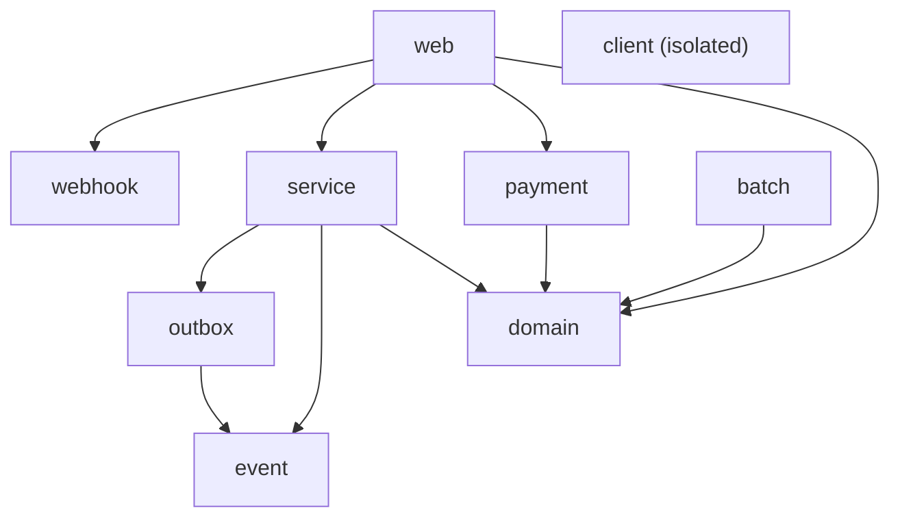
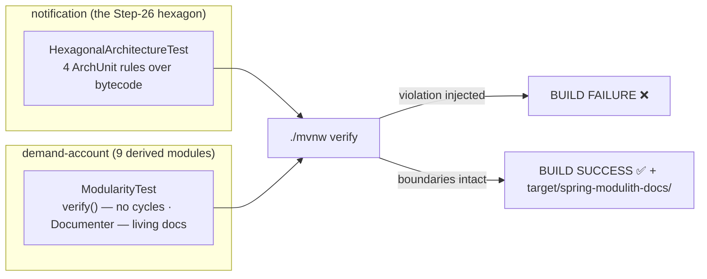
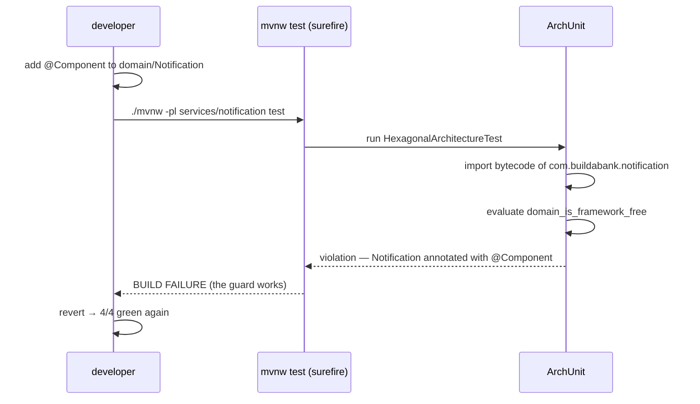

# Step 27 · Enforcing Architecture — ArchUnit + Spring Modulith (fitness functions)
### Phase E — Design, Architecture & Testing Mastery 🟣 · Step 27 of 67

> *Step 26 drew the notification hexagon; ADR-0017 admitted the boundaries were a **discipline, not a guarantee**.
> Step 27 makes them **executable**. **ArchUnit** encodes the hexagon's dependency rule as a build-failing test
> over the compiled bytecode of `notification`. **Spring Modulith** derives a module model from `demand-account`'s
> packages and verifies there are **no cycles** and no peeking into another module's internals — and generates
> living docs from the verified model. Architecture stops being a diagram on a wiki and becomes a test that goes
> red when someone breaks it.*

---

<a id="toc"></a>
## 🧭 The Six Movements of This Step

| | Movement | What happens | ~Time |
|---|---|---|---|
| **A** | [🧭 Orient](#orient) | 30-second overview · skip-test · cheat card · why it matters · before you start | ~30 min |
| **B** | [🧠 Understand](#understand) | architecture fitness functions · ArchUnit (bytecode rules) · Spring Modulith (derived modules, cycles, docs) · which tool when | ~90 min |
| **C** | [🛠️ Build](#build) | the ArchUnit hexagon test · the Modulith verify + docs test · the test-scope decision | ~4 h |
| **D** | [🔬 Prove](#prove) | the Verification Log — both suites green; §12.3 inject a real violation → red → revert; generated docs | ~45 min |
| **E** | [🎓 Apply](#apply) | go deeper · interview prep · your-turn challenges | ~45 min |
| **F** | [🏆 Review](#review) | troubleshooting · resources · recap, flashcards & what's next | ~30 min |

---

<a id="orient"></a>

# A · 🧭 Orient

## 📋 This Step in 30 Seconds

| | |
|---|---|
| **Title** | Enforcing architecture with fitness functions — ArchUnit (the notification hexagon) + Spring Modulith (demand-account modules) |
| **Step** | 27 of 67 · **Phase E — Design, Architecture & Testing Mastery** 🟣 |
| **Effort** | ≈ 8 hours focused. Two test classes + the decision of which tool fits which service — the win is boundaries that can't silently erode. |
| **What you'll run this step** | **JVM + Maven only** for the new tests — ArchUnit and `ApplicationModules.verify()` are **static bytecode analysis** (no Spring context, **no Docker**). Docker is only needed for the full-repo `verify` (the existing integration tests). |
| **Buildable artifact** | `services/notification/src/test/.../HexagonalArchitectureTest` — 4 ArchUnit rules enforcing the Step-26 hexagon; `services/demand-account/src/test/.../ModularityTest` — Spring Modulith `verify()` over 9 derived modules + `Documenter` living docs. Parent imports the Modulith BOM; both deps pinned in `VERSIONS.md`. `step-27-start == step-26-end`. |
| **Verification tier** | 🟠 **Standard** — adds tests that *enforce* existing structure (no money/security behaviour changes). `./mvnw verify` green + both architecture suites pass + a §12.3 mutation: inject a real violation (a `@Component` on the domain; an `event→outbox` cycle) → the fitness function goes **red** → revert → green. |
| **Depends on** | **[Step 26](../step-26/lesson.md)** (the hexagon these rules enforce). Sets up **[Step 28](../step-28/lesson.md)** (code-quality gates) and the **Phase-E capstone** (hexagonal + ArchUnit + mutation testing). |

By the end you'll be able to explain **architecture fitness functions**, write **ArchUnit** rules (layered + custom), run **Spring Modulith** module verification + docs, and articulate **when each tool fits**.

### ⏭️ Can You Skip This Step? (5-minute self-check)

If you can confidently do **all** of this, skim the 🛠️ Build and jump to **[Step 28 — code-quality gates](../step-28/lesson.md)**.

- [ ] I can explain an **architecture fitness function** and why it beats a wiki diagram.
- [ ] I can write an **ArchUnit** rule (a `layeredArchitecture`, and a `noClasses().that()...should()` rule) and explain that it reads **bytecode**.
- [ ] I can use **Spring Modulith** to derive modules from packages, `verify()` for **cycles**, and generate docs.
- [ ] I can say **when I'd reach for ArchUnit vs Spring Modulith** (bespoke layer rules vs derived-module cycle detection).
- [ ] I can **prove** a fitness function works by making the architecture fail on purpose.

> [!TIP]
> Not 100%? Stay. "How do you stop architecture from eroding / keep modules decoupled" is a senior design question — here you'll have *enforced* a real hexagon and a 9-module service.

## 📇 Cheat Card

> **What this step delivers (one sentence):** the Step-26 hexagon and demand-account's module graph become **build-failing tests** — ArchUnit enforces the hexagon's dependency rule, Spring Modulith verifies no module cycles and generates living docs.

**Key commands** (Windows uses `.\mvnw.cmd`):

```bash
./mvnw -pl services/notification  -Dtest=HexagonalArchitectureTest test   # 4 hexagon rules (no Docker)
./mvnw -pl services/demand-account -Dtest=ModularityTest          test   # Modulith verify + docs (no Docker)
bash steps/step-27/smoke.sh
```

**The headline — two fitness functions, two sweet spots:**

```
  ArchUnit  → notification (ONE hexagon, BESPOKE rules)        Spring Modulith → demand-account (9 DERIVED modules)
  @AnalyzeClasses(packages="..notification")                   ApplicationModules.of(DemandAccountApplication.class)
    • domain depends on java.* only (no Spring/Kafka/Jackson)    • verify(): NO cycles, NO internal-package access
    • application never imports an adapter, transport-agnostic   • Documenter: C4 diagram + per-module canvas
    • adapter→application→domain, arrows point INWARD            • modules = batch,client,domain,event,outbox,
    • reads BYTECODE (a stray import is invisible)                 payment,service,web,webhook  (a DAG → passes)
```

**The one sentence to remember:** *An architecture fitness function is a test that fails the build when the design erodes — ArchUnit for hand-written layer rules over bytecode, Spring Modulith for derived-module cycle detection + living docs.*

## 🎯 Why This Matters

A clean architecture (Step 26) decays the moment someone adds `@Component` to a domain record or imports an adapter into the core — it compiles, the review misses it, and six months later the "framework-free" domain imports Kafka. Fitness functions turn the architecture diagram into a **test**: the violating commit goes red in CI. "How do you keep boundaries from eroding / keep a monolith modular" is a senior-level question, and ArchUnit + Spring Modulith are the two tools the JVM world reaches for.

## ✅ What You'll Be Able to Do

- Explain architecture fitness functions and write ArchUnit rules (layered + custom predicates).
- Use Spring Modulith to derive modules, verify no cycles, and generate living documentation.
- Choose the right tool for the job and prove the guard actually fails on a violation.

## 🧰 Before You Start

- **Prereqs:** bank builds green (`git describe` → `step-26-end`). The new tests need **no Docker**; the full-repo `verify` does (existing integration tests).
- **Connects to what you know:** ArchUnit enforces exactly the prose rules from **Step 26 / ADR-0017**. Spring Modulith applies to **demand-account** (Steps 12–24) — its packages *are* the modules.
- **Depends on:** Step **26** (the hexagon).

## 🗓️ Session Plan — ≈ 8 h as three sittings

| Sitting | Covers | ~Time | Ends at (save point) |
|---|---|---|---|
| **S1 · Read the map** | A · Orient + B · Understand + Build sub-step 1 (wire the tools) | ~2.5 h | both deps wired at test scope, build still green |
| **S2 · Write the guards** | Build sub-step 2 (ArchUnit hexagon test) + sub-step 3 (Modulith verify + docs) | ~3 h | both suites green, docs in `target/spring-modulith-docs/` |
| **S3 · Break it & wrap up** | Sub-step 4 (§12.3 mutations + ADR-0018 + commit) + 🎮 Play With It + D · Prove + E · Apply + F · Review | ~2.5 h | committed, tagged `step-27-end` |

Optional routes: the ⏭️ skip-test above (5 min) can send you straight to Step 28; the three 🚀 Go Deeper asides in E add ~5 min each; the 🎯 Stretch challenge adds ~30–45 min.

✋ **Stopping after Orient?** Nothing is changed yet. Next: [B · Understand](#understand); first action: reread the cheat-card headline, then scroll to "The Big Idea".

---

<a id="understand"></a>

# B · 🧠 Understand

## 🧠 The Big Idea — architecture as a fitness function

An **architecture fitness function** (Building Evolutionary Architectures, Ford/Parsons/Kua) is an automated test
that asserts an architectural characteristic — here, structural dependency rules. Instead of trusting reviewers to
remember "the domain must not import Spring," you write a test that **reads the compiled code and fails the build**
if that rule is broken. The boundary becomes executable: it can't rot silently, because rot turns the suite red.

🪜 **Analogy:** a wiki architecture diagram is a blueprint pinned to the wall — nothing stops the builders deviating
from it. A fitness function is the **building inspector** who examines the actual structure (the compiled bytecode)
on every build and refuses the occupancy permit (fails the build) when a wall stands where a door should be.
ArchUnit is the inspector you hand a **custom checklist**; Modulith is the **standard code book** applied to every room.

Two JVM tools, each in a different sweet spot:

- **ArchUnit** — you *write the rules* as a fluent Java DSL over imported **bytecode**: "no class in `..domain..`
  should depend on `org.springframework..`", or a whole `layeredArchitecture()`. Perfect for **bespoke** rules
  about a specific design (our hexagon, with its one allowed exception).
- **Spring Modulith** — it *derives* a module model from your package structure (each direct sub-package of the
  application package is a module) and gives you `ApplicationModules.verify()` for the universal rules: **no
  cyclic dependencies**, **no access to another module's `internal` packages**. Plus `Documenter` for living docs.

## 🧩 Pattern Spotlight — ArchUnit reads BYTECODE, not source

ArchUnit imports compiled `.class` files and analyses real references (annotations, fields, parameters, calls). A
consequence that trips people up: an **unused `import`** is erased by the compiler, so ArchUnit can't see it — only
a *real* reference trips a rule. That's the correct semantics (an unused import isn't a dependency), and it's why
our §12.3 mutation adds a real `@Component` annotation, not just an import line.

```java
@AnalyzeClasses(packages = "com.buildabank.notification", importOptions = ImportOption.DoNotIncludeTests.class)
class HexagonalArchitectureTest {
  @ArchTest static final ArchRule domain_is_framework_free = noClasses()
      .that().resideInAPackage("..notification.domain..")
      .should().dependOnClassesThat().resideInAnyPackage(
          "..notification.application..", "..notification.adapter..",
          "org.springframework..", "org.apache.kafka..", "tools.jackson..", "com.fasterxml.jackson..");
}
```

## 🌱 Under the Hood: the hexagon as a `layeredArchitecture`

The cleanest way to state "arrows point inward" is ArchUnit's layered DSL. We model **three** rings and — crucially
— make **Adapter one layer**, so the documented web→push SSE coupling (intra-adapter, ADR-0017) is allowed while any
adapter→core-inward violation still fails:

```java
Architectures.layeredArchitecture().consideringAllDependencies()
  .layer("Domain").definedBy("..notification.domain..")
  .layer("Application").definedBy("..notification.application..")
  .layer("Adapter").definedBy("..notification.adapter..")
  .whereLayer("Adapter").mayNotBeAccessedByAnyLayer()                        // outer ring: nothing depends on it
  .whereLayer("Application").mayOnlyBeAccessedByLayers("Adapter")            // only adapters drive the app
  .whereLayer("Domain").mayOnlyBeAccessedByLayers("Application", "Adapter"); // domain used inward; depends on none
```

## 🧩 Spring Modulith — modules are *derived*, cycles are *detected*

Point Modulith at the application class and it discovers the modules from the packages — for demand-account, the
nine direct sub-packages of `com.buildabank.account`. `verify()` is the same kind of bytecode analysis (ArchUnit is
its engine) but for the *universal* modular-monolith rules. Our dependency graph is a **DAG**, so it passes:



No arrow ever points back — no cycle. (Add one `event → outbox` edge and it's a cycle; we do exactly that in §12.3
to prove the guard works.) The same model drives `Documenter`: a C4 component diagram + a per-module **canvas**
(its API, the beans it references, events it publishes/listens to) — docs that regenerate from code, never drifting.

❓ **Knowledge-check:** where do ArchUnit's rules come from, and where do Spring Modulith's come from? <details><summary>Answer</summary>**You write** ArchUnit's rules by hand as a fluent Java DSL — bespoke rules for a specific design (our hexagon). Modulith **derives** its module model from the package structure and applies the universal rules automatically: no cycles, no access to another module's `internal` packages.</details>

## 🛡️ Security Lens & 🧵 Thread-safety note

No runtime behaviour changes — these are test-time analyses. We keep Spring Modulith at **test scope** (verification
+ docs only), so demand-account's runtime autoconfiguration is untouched (ADR-0018 §3). No new threads, no new
endpoints, no new attack surface.

## 🕰️ Then vs. Now

Architecture used to live in a Confluence diagram that drifted from the code within a sprint. The modern practice is
**executable architecture**: ArchUnit (2017+) and Spring Modulith (GA 2023) put the rules in the test suite, so the
build is the source of truth. This is the same shift as schema-as-migrations (Flyway, Step 8) or
infra-as-code — *the artifact is the documentation, and it's verified.*

---

# B→C bridge: 🗺️ which tool, which service, which rule

```
notification (a hexagon)            ArchUnit          bespoke layer rules + 1 allowed exception (web→push SSE)
demand-account (9 features)         Spring Modulith   derived modules, cycle detection, living docs
                                                      (test scope: verify + docs, no runtime change)
```

✋ **Stopping after Understand?** You haven't touched any code yet. Next: Build sub-step 1; first action: open the parent `pom.xml`.

<a id="build"></a>

# C · 🛠️ Let's Build It — Step by Step

📍 Movement C of 6 — the longest one (~4 h across 4 sub-steps; sittings S1–S3 in the [Session Plan](#orient)).

## 📦 Your Starting Point

`step-27-start == step-26-end`: notification is a hexagon (domain/application/adapter); demand-account is a
multi-feature service with flat feature packages. The parent already imports the Spring Cloud + Testcontainers BOMs.

**What we'll build** — two fitness functions, both wired into the ordinary test phase:



**Files we'll touch:**

```
pom.xml                                     ← + spring-modulith.version property + spring-modulith-bom import
services/notification/pom.xml               ← + archunit-junit5 (test scope)
services/demand-account/pom.xml             ← + spring-modulith-starter-test + spring-modulith-docs (test scope)
services/notification/src/test/java/com/buildabank/notification/HexagonalArchitectureTest.java   (new)
services/demand-account/src/test/java/com/buildabank/account/ModularityTest.java                 (new)
adr/0018-archunit-and-spring-modulith.md    ← the decision record (new)
```

## Sub-step 1 — wire the tools (parent BOM + per-module deps)

📍 You are here: Build sub-step **1 of 4** · ~45 min · pom wiring, no code yet.

🎯 In the **parent** `pom.xml`: a `spring-modulith.version` property + the `spring-modulith-bom` import (so module
versions stay curated). ArchUnit's version is already pinned (`archunit.version`). In **notification** add
`archunit-junit5` (test). In **demand-account** add `spring-modulith-starter-test` + `spring-modulith-docs` (test) —
deliberately **test scope only**: we use Modulith as a verification/docs tool, not a runtime dependency (ADR-0018 §3).

Three edits. Parent `pom.xml` — the property (next to the already-pinned `archunit.version`) and the BOM import
inside `<dependencyManagement><dependencies>`:

```xml
<!-- pom.xml (parent) · <properties> -->
<archunit.version>1.4.2</archunit.version>            <!-- already there since the Testcontainers work -->
<spring-modulith.version>2.0.6</spring-modulith.version>   <!-- NEW: one pinned version for all Modulith modules -->

<!-- pom.xml (parent) · <dependencyManagement><dependencies> -->
<dependency>
    <groupId>org.springframework.modulith</groupId>
    <artifactId>spring-modulith-bom</artifactId>
    <version>${spring-modulith.version}</version>
    <type>pom</type>          <!-- a BOM is a pom, not a jar -->
    <scope>import</scope>     <!-- pulls its version pins into OUR dependencyManagement -->
</dependency>
```

`services/notification/pom.xml` — ArchUnit's JUnit-5 integration, test scope:

```xml
<!-- ArchUnit (Step 27): enforce the hexagon's dependency rules in a test. Pinned (VERSIONS.md). -->
<dependency>
    <groupId>com.tngtech.archunit</groupId>
    <artifactId>archunit-junit5</artifactId>
    <version>${archunit.version}</version>
    <scope>test</scope>
</dependency>
```

`services/demand-account/pom.xml` — the two Modulith artifacts, versions from the BOM (so no `<version>` here):

```xml
<!-- Spring Modulith (Step 27): used purely as a VERIFICATION + DOCS tool (test scope only). starter-test
     brings ApplicationModules#verify (static bytecode analysis — no Spring context, no Docker);
     -docs brings Documenter (PlantUML + the per-module "canvas"). -->
<dependency>
    <groupId>org.springframework.modulith</groupId>
    <artifactId>spring-modulith-starter-test</artifactId>
    <scope>test</scope>
</dependency>
<dependency>
    <groupId>org.springframework.modulith</groupId>
    <artifactId>spring-modulith-docs</artifactId>
    <scope>test</scope>
</dependency>
```

❓ **Quick check:** what does importing `spring-modulith-bom` add to your classpath? <details><summary>Answer</summary>**Nothing.** A BOM only pins versions inside `dependencyManagement` — that's why demand-account's two deps can omit `<version>`. The jars only arrive when a module declares `spring-modulith-starter-test` / `-docs` as actual dependencies.</details>

✋ **Stopping here?** (end of sitting S1) You have both tools wired at test scope and a still-green build. Next: Sub-step 2; first action: create `services/notification/src/test/java/com/buildabank/notification/HexagonalArchitectureTest.java`.

## Sub-step 2 — ArchUnit: enforce the notification hexagon

📍 You are here: Build sub-step **2 of 4** · ~90 min · notification's hexagon rules.

🎯 `HexagonalArchitectureTest` with `@AnalyzeClasses(packages = "com.buildabank.notification", importOptions = DoNotIncludeTests.class)` and four `@ArchTest` rules: the `layeredArchitecture` (arrows inward, Adapter as one ring), `domain_is_framework_free`, `application_does_not_depend_on_adapters`, `application_is_transport_agnostic`.

Here's the class with the first **three** rules worked; you'll write the fourth yourself:

```java
// services/notification/src/test/java/com/buildabank/notification/HexagonalArchitectureTest.java
package com.buildabank.notification;

import static com.tngtech.archunit.lang.syntax.ArchRuleDefinition.noClasses;

import com.tngtech.archunit.core.importer.ImportOption;
import com.tngtech.archunit.junit.AnalyzeClasses;
import com.tngtech.archunit.junit.ArchTest;
import com.tngtech.archunit.lang.ArchRule;
import com.tngtech.archunit.library.Architectures;

@AnalyzeClasses(packages = "com.buildabank.notification", importOptions = ImportOption.DoNotIncludeTests.class)
class HexagonalArchitectureTest {

    /** The dependency rule, expressed as layers. Adapter is one ring, so the documented web→push SSE coupling
     *  (intra-adapter) is allowed, while any adapter→core-inward violation fails the build. */
    @ArchTest
    static final ArchRule hexagonal_layering = Architectures.layeredArchitecture()
            .consideringAllDependencies()
            .layer("Domain").definedBy("..notification.domain..")
            .layer("Application").definedBy("..notification.application..")
            .layer("Adapter").definedBy("..notification.adapter..")
            .whereLayer("Adapter").mayNotBeAccessedByAnyLayer()                       // outer ring: nothing depends on it
            .whereLayer("Application").mayOnlyBeAccessedByLayers("Adapter")           // only adapters drive the app
            .whereLayer("Domain").mayOnlyBeAccessedByLayers("Application", "Adapter"); // domain used inward; depends on none

    /** The domain is pure: no Spring, Kafka, Jackson, or outward (application/adapter) dependencies. */
    @ArchTest
    static final ArchRule domain_is_framework_free = noClasses()
            .that().resideInAPackage("..notification.domain..")
            .should().dependOnClassesThat().resideInAnyPackage(
                    "..notification.application..", "..notification.adapter..",
                    "org.springframework..", "org.apache.kafka..", "tools.jackson..", "com.fasterxml.jackson..");

    /** The application core never reaches into an adapter. */
    @ArchTest
    static final ArchRule application_does_not_depend_on_adapters = noClasses()
            .that().resideInAPackage("..notification.application..")
            .should().dependOnClassesThat().resideInAPackage("..notification.adapter..");

    // TODO — rule 4: application_is_transport_agnostic (write it yourself; solution below)
}
```

Reading it line by line: `@AnalyzeClasses` sets the bytecode universe (production classes only — `DoNotIncludeTests`
keeps the tests themselves out of scope). Each rule is a `static final ArchRule` field found by `@ArchTest` — no
`@Test` methods. `hexagonal_layering` is the whole "arrows point inward" picture in one expression;
`domain_is_framework_free` and `application_does_not_depend_on_adapters` are targeted `noClasses()` predicates that
give sharper failure messages than the layered rule alone.

⌨️ **Type it yourself — rule 4, `application_is_transport_agnostic`:** write a `noClasses()` rule forbidding
`..notification.application..` from depending on Kafka (`org.apache.kafka..`, `org.springframework.kafka..`),
Jackson (`tools.jackson..`, `com.fasterxml.jackson..`), and web (`org.springframework.web..`) — the use case sees
ports + domain, never a transport. <details><summary>Solution</summary>

```java
    /** The use case is transport-agnostic: no Kafka/Jackson/web — only ports + domain (+ Spring stereotypes). */
    @ArchTest
    static final ArchRule application_is_transport_agnostic = noClasses()
            .that().resideInAPackage("..notification.application..")
            .should().dependOnClassesThat().resideInAnyPackage(
                    "org.apache.kafka..", "org.springframework.kafka..",
                    "tools.jackson..", "com.fasterxml.jackson..", "org.springframework.web..");
```
</details>

🔮 **Predict:** if you add an *unused* `import org.springframework...` to a domain class, does ArchUnit fail? <details><summary>Answer</summary>**No** — ArchUnit reads **bytecode**, and the compiler erases unused imports. You must actually *use* the type (annotation/field/call) for it to be a dependency. That's why the §12.3 mutation annotates the record.</details>

✋ **Stopping here?** You have 4 ArchUnit rules guarding the hexagon (runnable via the cheat-card command). Next: Sub-step 3; first action: create `services/demand-account/src/test/java/com/buildabank/account/ModularityTest.java`.

## Sub-step 3 — Spring Modulith: verify demand-account's modules + docs

📍 You are here: Build sub-step **3 of 4** · ~60 min · demand-account's 9 modules + living docs.

🔮 **Predict:** 9 modules — will `verify()` pass? And which *single* edge added to the DAG diagram (in B · Understand) would create a cycle? <details><summary>Answer</summary>**Yes** — the graph is a DAG, no arrow points back. And since `outbox → event` already exists, adding one `event → outbox` reference closes a 2-node loop — exactly the mutation §12.3 injects.</details>

🎯 `ModularityTest`: `ApplicationModules.of(DemandAccountApplication.class)`, then `verify()` (no cycles / no
internal access), a print of the discovered model, and `Documenter` writing the C4 diagram + per-module PlantUML +
canvases to `target/spring-modulith-docs`. All static — **no Spring context, no Docker**. The whole class:

```java
// services/demand-account/src/test/java/com/buildabank/account/ModularityTest.java
package com.buildabank.account;

import org.junit.jupiter.api.Test;
import org.springframework.modulith.core.ApplicationModules;
import org.springframework.modulith.docs.Documenter;

class ModularityTest {

    /** Derive the module model once from the application's base package. */
    static final ApplicationModules MODULES = ApplicationModules.of(DemandAccountApplication.class);

    @Test
    void module_boundaries_have_no_cycles_and_no_illegal_access() {
        MODULES.verify(); // throws (failing the build) on a cross-module cycle or access to another module's internals
    }

    @Test
    void prints_the_discovered_module_model() {
        MODULES.forEach(module -> System.out.println(module.toString()));
    }

    /** Living docs from the verified model: C4 component diagram, one diagram per module, per-module "canvas". */
    @Test
    void writes_living_module_documentation() {
        new Documenter(MODULES)
                .writeModulesAsPlantUml()
                .writeIndividualModulesAsPlantUml()
                .writeModuleCanvases();
    }
}
```

Line by line: `ApplicationModules.of(...)` scans the compiled packages under `com.buildabank.account` — the model is
built **once** into a static field because all three tests share it. `verify()` is the fitness function (one line!);
the print test makes the derived model visible in the build log; the `Documenter` test writes
`components.puml` + per-module PlantUML + canvases into `target/spring-modulith-docs/`. Note there's **no**
`@SpringBootTest` anywhere — it never starts a context.

⚠️ **Pitfall:** Modulith treats each direct sub-package of the application package as a module and (by default)
**all** its types as API. If you later want to hide internals, put them under an `internal` sub-package — then a
cross-module reference to them fails `verify()`.

✋ **Stopping here?** (end of sitting S2) Both suites are written and green, docs generate under `target/spring-modulith-docs/`. Next: Sub-step 4 (break it on purpose); first action: add `@org.springframework.stereotype.Component` to notification's `domain/Notification` record.

## Sub-step 4 — prove the guards actually fail (§12.3)

📍 You are here: Build sub-step **4 of 4** · ~45 min · break it on purpose, record the decision, commit.

🔬 A fitness function you've never seen fail is worthless. Inject a real violation into each — a `@Component` on the
domain record (ArchUnit), an `event→outbox` reference (Modulith) — watch the suite go **red**, then revert. (Real
output in 🔬 Prove.)

📝 **Record ADR-0018** — write `adr/0018-archunit-and-spring-modulith.md` (the DoD requires it; sub-steps 1 and 3
cite its §3). Four sections mirror what you just did: **§1** ArchUnit enforces the hexagon's bespoke rules on
notification (Adapter as one ring → web→push SSE allowed); **§2** Spring Modulith verifies demand-account's 9
derived modules + generates living docs; **§3** Modulith stays **test scope only** — verification + docs without
touching demand-account's runtime autoconfiguration (no `spring-modulith-starter-core` in main); **§4** the proof is
an injected violation (this sub-step). Status: Accepted.

💾 **Commit:** `test(arch): Step 27 enforce architecture — ArchUnit hexagon (notification) + Spring Modulith modules (demand-account)`

✋ **Stopping here?** Everything is built, proven red-then-green, and committed. Next: 🎮 Play With It; first action: run the two cheat-card test commands back to back.

## 🎮 Play With It

🔮 **Predict:** before running the `ls` below — which kinds of files did the `Documenter` test leave in `target/spring-modulith-docs/`? <details><summary>Answer</summary>The C4 component diagram `components.puml`, one `module-*.puml` PlantUML diagram per module, and one `module-*.adoc` canvas per module — exactly what `writeModulesAsPlantUml()`, `writeIndividualModulesAsPlantUml()` and `writeModuleCanvases()` produce.</details>

```bash
./mvnw -pl services/notification  -Dtest=HexagonalArchitectureTest test    # 4 rules, ~2s, no Docker
./mvnw -pl services/demand-account -Dtest=ModularityTest          test    # verify + docs, ~4s, no Docker
# Inspect the generated living docs:
ls services/demand-account/target/spring-modulith-docs/    # components.puml + module-*.puml + module-*.adoc
```

🧪 **Little experiments (+~10 min):** open `target/spring-modulith-docs/components.puml` — it's the dependency DAG, generated.
Add `@Component` to `notification`'s `domain/Notification` and re-run the ArchUnit test — watch `domain_is_framework_free` go red. Revert.

**The flow you built** — what happens when someone (you, on purpose) breaks the architecture:



## 🏁 The Finished Result

`step-27-end`: the hexagon and the 9-module service are **enforced** — a violation fails the build.

**✅ Definition of Done:**

- [ ] `HexagonalArchitectureTest` 4/4 green (no Docker)
- [ ] `ModularityTest` 3/3 green; docs in `target/spring-modulith-docs/`
- [ ] §12.3 mutations went red, reverted to green
- [ ] `./mvnw verify` green (Docker up for the existing integration tests)
- [ ] `bash steps/step-27/smoke.sh` passes
- [ ] ADR-0018 recorded
- [ ] committed + tagged `step-27-end`

✋ **Stopping before the Verification Log?** The build is done and tagged. Next: D · Prove (~45 min of reading real pasted evidence); first action: reopen this lesson at [🔬 Prove](#prove).

---

<a id="prove"></a>

# D · 🔬 Prove It Works — Verification Log

> **Tier: 🟠 Standard** (adds enforcing tests; no money/security behaviour change). The new tests are static
> bytecode analysis — **no Docker**. Real pasted output below.

**1 · ArchUnit — the notification hexagon's 4 rules pass:**

```
[INFO] Running com.buildabank.notification.HexagonalArchitectureTest
[INFO] Tests run: 4, Failures: 0, Errors: 0, Skipped: 0, Time elapsed: 1.759 s -- in com.buildabank.notification.HexagonalArchitectureTest
[INFO] Tests run: 4, Failures: 0, Errors: 0, Skipped: 0
[INFO] BUILD SUCCESS
```

**2 · Spring Modulith — demand-account's 9 modules verify, docs generated:**

```
[INFO] Running com.buildabank.account.ModularityTest
[INFO] Tests run: 3, Failures: 0, Errors: 0, Skipped: 0, Time elapsed: 3.574 s -- in com.buildabank.account.ModularityTest
[INFO] BUILD SUCCESS
```
The discovered model (printed by the test): `# Client # Domain # Event # Webhook # Batch # Outbox # Payment # Service # Web`.
`Documenter` wrote `components.puml` + nine `module-*.puml` + nine `module-*.adoc` canvases to
`services/demand-account/target/spring-modulith-docs/`. The generated component diagram is the DAG:
`Outbox→Event`, `Service→{Event,Domain,Outbox}`, `Web→{Domain,Payment,Service,Webhook}`, `Batch→Domain`, `Payment→Domain` — no back-edges, no cycle.

**3 · §12.3 Mutation — prove each fitness function actually fails.**

*(a) ArchUnit* — annotated the **domain** `Notification` record with `@org.springframework.stereotype.Component` (a real bytecode dependency on Spring):

```
[ERROR] HexagonalArchitectureTest.domain_is_framework_free Architecture Violation [Priority: MEDIUM] -
  Rule 'no classes that reside in a package '..notification.domain..' should depend on classes that reside in any
  package [..., 'org.springframework..', ...]' was violated (1 times):
  Class <com.buildabank.notification.domain.Notification> is annotated with <org.springframework.stereotype.Component> in (Notification.java:0)
[ERROR] Tests run: 4, Failures: 1, Errors: 0, Skipped: 0
[INFO] BUILD FAILURE
```
→ Framework creeping into the pure domain fails the build. **Reverted**; 4/4 green again.

*(b) Spring Modulith* — added an `event → outbox` reference (`outbox` already depends on `event`), forming a cycle:

```
[ERROR] ModularityTest.module_boundaries_have_no_cycles_and_no_illegal_access ... Violations:
- Cycle detected: Slice event ->
                  Slice outbox ->
    - Method <...event.TransferEventListener.mutationCycle()> references class object <...outbox.OutboxEvent> in (TransferEventListener.java:44)
    - Method <...outbox.OutboxWriter.write(...TransferCompletedEvent)> has parameter of type <...event.TransferCompletedEvent> ...
[ERROR] Tests run: 1, Failures: 0, Errors: 1, Skipped: 0
```
→ A module cycle fails `verify()` with the exact offending references. **Reverted**; 3/3 green again.

**4 · `smoke.sh`** — `bash steps/step-27/smoke.sh` runs both architecture suites (no Docker) →
`✅ Step 27 smoke test PASSED — architecture enforced (ArchUnit hexagon + Spring Modulith modules)`.

**5 · Build** — full-repo `./mvnw verify` → BUILD SUCCESS (13 modules; Docker up for the existing integration tests). Clean-room fresh-clone build green.

**§12.8 honesty:** Spring Modulith is **test-scoped** — verification + docs only, no runtime module features this
step. Only `notification` has ArchUnit hexagon rules; other services are guarded only by Modulith cycle checks
if/when those tests are added. The hexagon's one documented exception (web adapter → SSE push adapter) is *allowed*
by modelling Adapter as a single layer — so an intra-adapter coupling passes while any adapter→core-inward
violation still fails (verified by the §12.3 mutation, which targeted the core and went red).

---

<a id="apply"></a>

# E · 🎓 Apply

✋ **Re-entering here?** Everything is built, proven, and tagged — this movement is reading + practice (~45 min). First action: pick a Go Deeper aside or jump to Interview Prep.

## 🚀 Go Deeper (Optional)

<details><summary>ArchUnit vs Spring Modulith — do I need both? (+~5 min)</summary>They overlap (both analyse bytecode; Modulith uses ArchUnit internally) but solve different problems. ArchUnit = **you author bespoke rules** (this layer may import that one; this annotation is required) — ideal for a specific design like a hexagon. Spring Modulith = **derived module model + the universal rules** (no cycles, no internal access) + docs + (if you opt into runtime) module events/observability — ideal for a modular monolith. Use ArchUnit for custom rules, Modulith for module hygiene + docs.</details>

<details><summary>Why model Adapter as ONE layer instead of separate in/out layers? (+~5 min)</summary>Because ADR-0017 documents a deliberate intra-adapter coupling: the web adapter reuses the SSE push adapter (shared SSE transport). If `adapter/in` and `adapter/out` were separate layers, that legitimate coupling would fail the layered rule. Collapsing Adapter into one ring allows intra-adapter edges while still forbidding any adapter→application/domain-inward violation — which is the rule that actually matters.</details>

<details><summary>Making `verify()` part of CI (+~5 min)</summary>It already is — it's a JUnit test, so `./mvnw verify` runs it. For a real product you'd also fail the build on Modulith's *open* (undocumented) module dependencies by declaring `@ApplicationModule(allowedDependencies = ...)` and tightening from there.</details>

## 💼 Interview Prep

1. **What's an architecture fitness function?** *An automated test asserting an architectural characteristic (here, dependency rules) so the design can't erode silently — a violation fails the build, not just review.* **(Common.)**
2. **ArchUnit reads source or bytecode? Why does it matter?** *Bytecode. An unused import is erased by the compiler, so it's invisible; only real references (annotations, fields, calls) are dependencies. Correct semantics, occasionally surprising.*
3. **How does Spring Modulith decide what a module is?** *By package: each direct sub-package of the application package is a module; its types are API unless under an `internal` package. `verify()` checks no cycles and no cross-module internal access.*
4. **ArchUnit vs Spring Modulith — when each?** *ArchUnit for bespoke, hand-written rules about a specific design (a hexagon's layer rules). Modulith for derived-module cycle detection, internal-access rules, and living docs on a modular monolith.*
5. **(Gotcha) Your hexagon allows web→push; how do the rules not flag it?** *Adapter is modelled as a single layer, so an intra-adapter edge is within-layer (allowed); the rules still forbid any adapter→core-inward dependency.*

## 🏋️ Your Turn: Practice & Challenges

- **Quick (+~10 min):** add an ArchUnit rule to `HexagonalArchitectureTest` that classes named `*Controller` must reside in `..adapter.in.web..`. Run it (green), then move/rename to see it fail.
- **Quick (+~10 min):** open a generated `module-*.adoc` canvas (e.g. `module-service.adoc`) and read its "Bean references" — it lists exactly which other modules `service` touches. Compare to the `components.puml` diagram.
- 🎯 **Stretch (+~30–45 min · reference solution in `solutions/step-27/`):** declare `@ApplicationModule(allowedDependencies = {...})` on one demand-account module (e.g. `payment`) and re-run `verify()` — see it fail on an *undeclared* dependency, then add it. This tightens Modulith from "no cycles" to "only the dependencies I declared."

❓ **Knowledge-check:** why does ADR-0018 §3 keep Spring Modulith at **test scope** in demand-account? <details><summary>Answer</summary>Because we only want verification + living docs, which are test-time bytecode analyses. Keeping it out of `main` (no `spring-modulith-starter-core`) means demand-account's runtime autoconfiguration is untouched — no behaviour change, no new attack surface.</details>

✋ **Stopping before Review?** Only recap material remains (~30 min). Next: F · Review; first action: skim the troubleshooting list so you know what's in it before you ever need it.

---

<a id="review"></a>

# F · 🏆 Review

## 🩺 Stuck? Troubleshooting & Fixes

- **ArchUnit rule didn't catch my violation.** You probably added only an `import` — ArchUnit reads bytecode, so the unused import was erased. Actually *use* the type (annotation/field/parameter/call).
- **`No classes were imported` / rule passes vacuously.** Check the `@AnalyzeClasses` package and that the module compiled — empty input passes every `noClasses()` rule trivially.
- **Modulith `verify()` reports a cycle you didn't expect.** Read the printed reference chain (it names the exact methods/fields). Break it by moving the shared type to a module both depend on, or invert one direction via an event.
- **Modulith flags "module X depends on non-exposed type of Y".** You referenced something under Y's `internal` package — depend on Y's API, or promote the type.
- **`Documenter` wrote nothing.** It writes under `target/spring-modulith-docs`; ensure the test ran (not skipped) and check that path, not `src`.
- **Reset:** `git checkout step-27-end`.

## 📚 Learn More & Glossary

- Ford/Parsons/Kua, *Building Evolutionary Architectures* (fitness functions); ArchUnit User Guide; Spring Modulith reference docs (Oliver Drotbohm); Tom Hombergs on ArchUnit + hexagonal.
- **Glossary:** *architecture fitness function*, *ArchUnit*, *layered/`layeredArchitecture`*, *bytecode analysis*, *Spring Modulith*, *application module*, *module cycle*, *named interface / API vs `internal`*, *living documentation*, *module canvas*.

## 🏆 Recap & Study Notes

**(a) Key points:** An **architecture fitness function** is a test that fails the build when the design erodes.
**ArchUnit** encodes **bespoke** rules over **bytecode** — we enforce the notification hexagon (domain pure;
application transport-agnostic and adapter-free; arrows inward, Adapter as one ring to allow the documented
web→push coupling). **Spring Modulith** **derives** a module model from packages and `verify()`s the **universal**
rules (no cycles, no internal access) — demand-account's 9 modules form a DAG, so it passes — and `Documenter`
generates living docs. Each tool has a sweet spot; we proved both fail on a real injected violation.

**(b) Key terms:** fitness function, ArchUnit, layeredArchitecture, bytecode analysis, Spring Modulith, application module, module cycle, internal vs API, living documentation, module canvas.

**(c) 🧠 Test Yourself:** ① What's a fitness function? ② Source or bytecode — and why does it matter? ③ How does Modulith define a module? ④ ArchUnit vs Modulith — when each? ⑤ How did you prove the guards work? <details><summary>Answers</summary>① A test asserting an architectural characteristic, failing the build on violation. ② Bytecode — unused imports are invisible; only real references count. ③ Each direct sub-package of the app package; types are API unless under `internal`; `verify()` checks cycles + internal access. ④ ArchUnit for bespoke rules on a specific design; Modulith for derived-module cycles/internal-access + docs. ⑤ Injected a `@Component` on the domain (ArchUnit red) and an `event→outbox` cycle (Modulith red), then reverted to green.</details>

**(d) 🔗 How this connects:** makes Step 26's hexagon and demand-account's modules **un-erodable**. **Next: Step 28** — code-quality gates (Spotless/Checkstyle; verify Error Prone/NullAway on JDK 25), then the **Phase-E capstone** (hexagonal + ArchUnit + mutation testing/PITest — fitness functions for *test quality*, not just structure).

**(e) 🏆 Résumé line:** *"Made architecture executable — ArchUnit rules enforcing a hexagon's dependency rule and Spring Modulith verifying a 9-module service is cycle-free, with living docs generated from the verified model."*

**(f) ✅ You can now:** write ArchUnit rules (layered + custom) · run Spring Modulith verification + docs · choose the right tool · prove a fitness function fails on a violation.

**(g) 🃏 Flashcards** (full set of 6 in `docs/flashcards.md` · 🔁 revisit at the Phase-E capstone, where mutation testing adds a fitness function for *test* quality):

- **Q:** What is an architecture fitness function? — **A:** An automated test asserting an architectural characteristic (here, structural dependency rules) so the design can't erode silently — a violating commit fails the build, not just review.
- **Q:** Does ArchUnit analyse source or bytecode, and why does it matter? — **A:** Bytecode (it imports compiled `.class` files). An *unused* `import` is erased by the compiler, so ArchUnit can't see it — only real references (annotations, fields, parameters, calls) are dependencies.
- **Q:** How does Spring Modulith decide what a module is, and what does `verify()` check? — **A:** Each direct sub-package of the application package is a module; its types are API unless under an `internal` sub-package. `verify()` checks no cyclic dependencies and no access to another module's internals — static bytecode analysis (ArchUnit is its engine), no Spring context, no Docker.
- **Q:** ArchUnit vs Spring Modulith — when do you reach for each? — **A:** ArchUnit when you author *bespoke* rules about a specific design (a hexagon's layer rules). Modulith for a *derived* module model + the universal rules (cycles, internal access) + living docs.
- **Q:** How do you prove a fitness function actually works? — **A:** Make the architecture fail on purpose: `@Component` on the pure domain → ArchUnit's purity rule goes red; an `event→outbox` reference where `outbox→event` exists → `Cycle detected`. Revert → green. A guard you've never seen fail is worthless.

**(h) ✍️ One-line reflection:** *Which boundary in your own codebase would you most want a fitness function to guard — and which tool fits it?*

**(i)** 🎉 Architecture is now a test, not a diagram. Next: enforce code *quality* (formatting, lint, null-safety) the same way.
