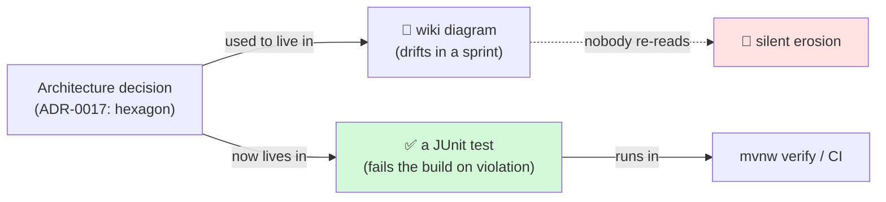
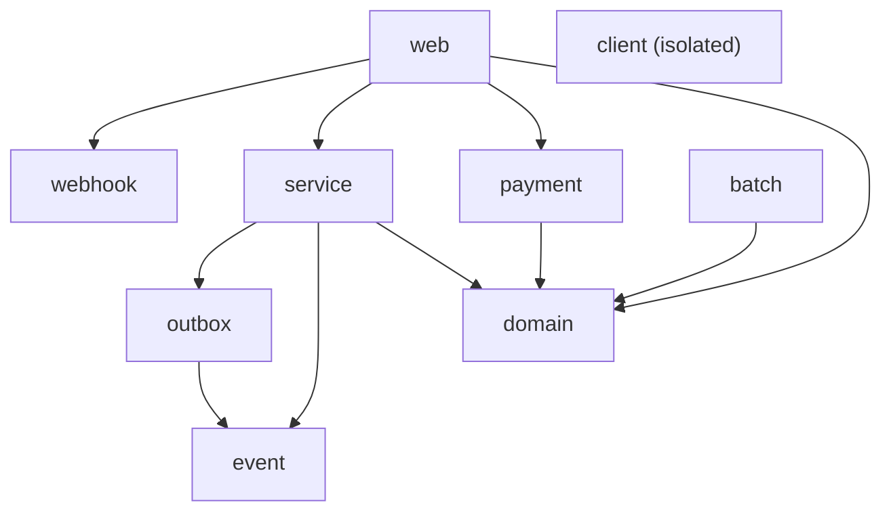
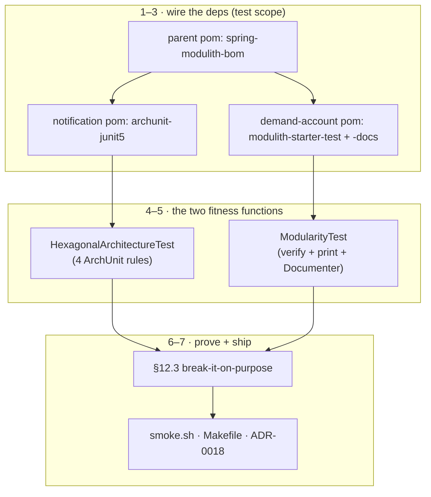

# Step 27 · Enforcing Architecture — ArchUnit + Spring Modulith (fitness functions)
### Phase E — Design, Architecture & Testing Mastery 🟣 · Step 27 of 67

> *Step 26 drew the notification hexagon; ADR-0017 admitted the boundaries were a **discipline, not a guarantee**.
> Step 27 makes them **executable**. **ArchUnit** encodes the hexagon's dependency rule as a build-failing test
> over the compiled bytecode of `notification`. **Spring Modulith** derives a module model from `demand-account`'s
> packages and verifies there are **no cycles** and no peeking into another module's internals — and generates
> living docs from the verified model. Architecture stops being a diagram on a wiki and becomes a test that goes
> red when someone breaks it.*

> 🏷️ **Archaeology note (why this lesson pastes from `step-27-end`, not HEAD).** The course is frozen; later steps
> kept evolving the codebase (Step 28's quality gates, Step 29's frontend grew `notification`'s *other* test files
> and poms). The two artifacts this step adds — `HexagonalArchitectureTest` and `ModularityTest` — are **byte-identical
> at HEAD** (drift-checked: `git diff step-27-end..HEAD` on both files is empty), so everything you see below is
> exactly what Step 27 shipped, and the live runs in 🔬 Prove were executed against that frozen code **today**.

---

<a id="toc"></a>
## 🧭 The Six Movements of This Step

| | Movement | What happens | ~Time |
|---|---|---|---|
| **A** | [🧭 Orient](#orient) | 30-second overview · skip-test · cheat card · why it matters · before you start | ~30 min |
| **B** | [🧠 Understand](#understand) | architecture fitness functions · ArchUnit (bytecode rules) · Spring Modulith (derived modules, cycles, docs) · which tool when | ~90 min |
| **C** | [🛠️ Build](#build) | wire the deps → the ArchUnit hexagon test (built rule-by-rule) → the Modulith verify + docs test → the §12.3 break-it → the harness | ~4 h |
| **D** | [🔬 Prove](#prove) | the Verification Log — both suites green; §12.3 inject a real violation → red → revert; generated docs; re-run-today evidence | ~45 min |
| **E** | [🎓 Apply](#apply) | go deeper · interview prep · your-turn challenges | ~45 min |
| **F** | [🏆 Review](#review) | troubleshooting · resources · recap, flashcards & what's next | ~30 min |

---

<a id="orient"></a>

# A · 🧭 Orient

## 📋 This Step in 30 Seconds

| | |
|---|---|
| **Title** | Enforcing architecture with fitness functions — ArchUnit (the notification hexagon) + Spring Modulith (demand-account modules) |
| **Step** | 27 of 67 · **Phase E — Design, Architecture & Testing Mastery** 🟣 |
| **Effort** | ≈ 8 hours focused. Two test classes + the decision of which tool fits which service — the win is boundaries that can't silently erode. |
| **What you'll run this step** | **JVM + Maven only** for the new tests — ArchUnit and `ApplicationModules.verify()` are **static bytecode analysis** (no Spring context, **no Docker**). Docker is only needed for the full-repo `verify` (the existing integration tests). |
| **Buildable artifact** | `services/notification/src/test/.../HexagonalArchitectureTest` — 4 ArchUnit rules enforcing the Step-26 hexagon; `services/demand-account/src/test/.../ModularityTest` — Spring Modulith `verify()` over 9 derived modules + `Documenter` living docs. Parent imports the Modulith BOM; both deps pinned in `VERSIONS.md`. `step-27-start == step-26-end`. |
| **Verification tier** | 🟠 **Standard** — adds tests that *enforce* existing structure (no money/security behaviour changes). `./mvnw verify` green + both architecture suites pass + a §12.3 mutation: inject a real violation (a `@Component` on the domain; an `event→outbox` cycle) → the fitness function goes **red** → revert → green. |
| **Depends on** | **[Step 26](../step-26/lesson.md)** (the hexagon these rules enforce). Sets up **[Step 28](../step-28/lesson.md)** (code-quality gates) and the **Phase-E capstone** (hexagonal + ArchUnit + mutation testing). |

By the end you'll be able to explain **architecture fitness functions**, write **ArchUnit** rules (layered + custom), run **Spring Modulith** module verification + docs, and articulate **when each tool fits**.

### ⏭️ Can You Skip This Step? (5-minute self-check)

If you can confidently do **all** of this, skim the 🛠️ Build and jump to **[Step 28 — code-quality gates](../step-28/lesson.md)**.

- [ ] I can explain an **architecture fitness function** and why it beats a wiki diagram.
- [ ] I can write an **ArchUnit** rule (a `layeredArchitecture`, and a `noClasses().that()...should()` rule) and explain that it reads **bytecode**.
- [ ] I can use **Spring Modulith** to derive modules from packages, `verify()` for **cycles**, and generate docs.
- [ ] I can say **when I'd reach for ArchUnit vs Spring Modulith** (bespoke layer rules vs derived-module cycle detection).
- [ ] I can **prove** a fitness function works by making the architecture fail on purpose.

> [!TIP]
> Not 100%? Stay. "How do you stop architecture from eroding / keep modules decoupled" is a senior design question — here you'll have *enforced* a real hexagon and a 9-module service.

## 📇 Cheat Card

> **What this step delivers (one sentence):** the Step-26 hexagon and demand-account's module graph become **build-failing tests** — ArchUnit enforces the hexagon's dependency rule, Spring Modulith verifies no module cycles and generates living docs.

**Key commands** (Windows uses `.\mvnw.cmd`):

```bash
./mvnw -pl services/notification  -Dtest=HexagonalArchitectureTest test   # 4 hexagon rules (no Docker)
./mvnw -pl services/demand-account -Dtest=ModularityTest          test   # Modulith verify + docs (no Docker)
make play-27                                                              # both, plus a pointer at the generated docs
bash steps/step-27/smoke.sh
```

**The headline — two fitness functions, two sweet spots:**

```
  ArchUnit  → notification (ONE hexagon, BESPOKE rules)        Spring Modulith → demand-account (9 DERIVED modules)
  @AnalyzeClasses(packages="..notification")                   ApplicationModules.of(DemandAccountApplication.class)
    • domain depends on java.* only (no Spring/Kafka/Jackson)    • verify(): NO cycles, NO internal-package access
    • application never imports an adapter, transport-agnostic   • Documenter: C4 diagram + per-module canvas
    • adapter→application→domain, arrows point INWARD            • modules = batch,client,domain,event,outbox,
    • reads BYTECODE (a stray import is invisible)                 payment,service,web,webhook  (a DAG → passes)
```

**The one sentence to remember:** *An architecture fitness function is a test that fails the build when the design erodes — ArchUnit for hand-written layer rules over bytecode, Spring Modulith for derived-module cycle detection + living docs.*

## 🎯 Why This Matters

A clean architecture (Step 26) decays the moment someone adds `@Component` to a domain record or imports an adapter into the core — it compiles, the review misses it, and six months later the "framework-free" domain imports Kafka. Fitness functions turn the architecture diagram into a **test**: the violating commit goes red in CI. "How do you keep boundaries from eroding / keep a monolith modular" is a senior-level question, and ArchUnit + Spring Modulith are the two tools the JVM world reaches for.

## ✅ What You'll Be Able to Do

- Explain architecture fitness functions and write ArchUnit rules (layered + custom predicates).
- Use Spring Modulith to derive modules, verify no cycles, and generate living documentation.
- Choose the right tool for the job and prove the guard actually fails on a violation.

## 🧰 Before You Start

- **Prereqs:** bank builds green (`git describe` → `step-26-end`). The new tests need **no Docker**; the full-repo `verify` does (existing integration tests).
- **Connects to what you know:** ArchUnit enforces exactly the prose rules from **Step 26 / ADR-0017**. Spring Modulith applies to **demand-account** (Steps 12–24) — its packages *are* the modules.
- **Depends on:** Step **26** (the hexagon).

## 🗓️ Session Plan — ≈ 8 h as three sittings

| Sitting | Covers | ~Time | Ends at (save point) |
|---|---|---|---|
| **S1 · Map the terrain & wire the deps** | A · Orient + B · Understand + Build sub-steps 0–3 (green baseline · parent Modulith BOM · ArchUnit dep · Modulith test-scope deps) | ~3 h | sub-step 3's ✋ — both Modulith artifacts resolve at the BOM's `2.0.6`, all test scope, build still green |
| **S2 · Write the two fitness functions** | Sub-step 4 (`HexagonalArchitectureTest`, built 4a→4c) + sub-step 5 (`ModularityTest`, 5a→5c) + sub-step 6 (inspect the living docs) | ~2.5 h | sub-step 6's ✋ — 4/4 + 3/3 green, 19 files under `target/spring-modulith-docs/` |
| **S3 · Break it & ship** | Sub-step 7 (§12.3 break-it-on-purpose) + sub-step 8 (`smoke.sh` · `make play-27` · ADR-0018 · commit) + 🎮 Play With It + D · Prove + E · Apply + F · Review | ~2.5 h | sub-step 8's ✋ — smoke `PASSED`, committed, tagged `step-27-end` |

Optional routes: the ⏭️ skip-test (5 min) can send you straight to Step 28; the five 🚀 Go Deeper asides in E add ~5 min each; 🏋️ Your Turn adds ~10 min per Quick and ~30–45 min for the 🎯 Stretch; the 🧪 Little experiments in 🎮 Play add ~10 min each.

✋ **Stopping here?** You have nothing changed yet — just the map and a plan. Next: [B · Understand](#understand); first action: read "🧠 The Big Idea — architecture as a fitness function".

---

<a id="understand"></a>

# B · 🧠 Understand

## 🧠 The Big Idea — architecture as a fitness function

An **architecture fitness function** (*Building Evolutionary Architectures*, Ford/Parsons/Kua) is an automated test
that asserts an architectural characteristic — here, structural dependency rules. Instead of trusting reviewers to
remember "the domain must not import Spring," you write a test that **reads the compiled code and fails the build**
if that rule is broken. The boundary becomes executable: it can't rot silently, because rot turns the suite red.



Two JVM tools, each in a different sweet spot:

- **ArchUnit** — you *write the rules* as a fluent Java DSL over imported **bytecode**: "no class in `..domain..`
  should depend on `org.springframework..`", or a whole `layeredArchitecture()`. Perfect for **bespoke** rules
  about a specific design (our hexagon, with its one allowed exception).
- **Spring Modulith** — it *derives* a module model from your package structure (each direct sub-package of the
  application package is a module) and gives you `ApplicationModules.verify()` for the universal rules: **no
  cyclic dependencies**, **no access to another module's `internal` packages**. Plus `Documenter` for living docs.

## 🧩 Pattern Spotlight — ArchUnit reads BYTECODE, not source

ArchUnit imports compiled `.class` files and analyses real references (annotations, fields, parameters, calls). A
consequence that trips people up: an **unused `import`** is erased by the compiler, so ArchUnit can't see it — only
a *real* reference trips a rule. That's the correct semantics (an unused import isn't a dependency), and it's why
our §12.3 mutation adds a real `@Component` annotation, not just an import line.

```java
@AnalyzeClasses(packages = "com.buildabank.notification", importOptions = ImportOption.DoNotIncludeTests.class)
class HexagonalArchitectureTest {
  @ArchTest static final ArchRule domain_is_framework_free = noClasses()
      .that().resideInAPackage("..notification.domain..")
      .should().dependOnClassesThat().resideInAnyPackage(
          "..notification.application..", "..notification.adapter..",
          "org.springframework..", "org.apache.kafka..", "tools.jackson..", "com.fasterxml.jackson..");
}
```

> **Problem → why it fits → trade-off.** *Problem:* a documented boundary erodes silently. *Why a fitness function
> fits:* it puts the rule where the build can't ignore it. *Trade-off:* bytecode semantics mean a stray import won't
> trip it (correct, but surprising), and over-strict rules become churn — so you write the *few rules that matter*,
> not a wall of them.

## 🌱 Under the Hood: the hexagon as a `layeredArchitecture`

The cleanest way to state "arrows point inward" is ArchUnit's layered DSL. We model **three** rings and — crucially
— make **Adapter one layer**, so the documented web→push SSE coupling (intra-adapter, ADR-0017) is allowed while any
adapter→core-inward violation still fails:

```java
Architectures.layeredArchitecture().consideringAllDependencies()
  .layer("Domain").definedBy("..notification.domain..")
  .layer("Application").definedBy("..notification.application..")
  .layer("Adapter").definedBy("..notification.adapter..")
  .whereLayer("Adapter").mayNotBeAccessedByAnyLayer()                        // outer ring: nothing depends on it
  .whereLayer("Application").mayOnlyBeAccessedByLayers("Adapter")            // only adapters drive the app
  .whereLayer("Domain").mayOnlyBeAccessedByLayers("Application", "Adapter"); // domain used inward; depends on none
```

## 🧩 Spring Modulith — modules are *derived*, cycles are *detected*

Point Modulith at the application class and it discovers the modules from the packages — for demand-account, the
nine direct sub-packages of `com.buildabank.account`. `verify()` is the same kind of bytecode analysis (ArchUnit is
its engine) but for the *universal* modular-monolith rules. Our dependency graph is a **DAG**, so it passes:



No arrow ever points back — no cycle. (Add one `event → outbox` edge and it's a cycle; we do exactly that in §12.3
to prove the guard works.) The same model drives `Documenter`: a C4 component diagram + a per-module **canvas**
(its API, the beans it references, events it publishes/listens to) — docs that regenerate from code, never drifting.

❓ **Knowledge-check:** where do ArchUnit's rules come from, and where do Spring Modulith's come from? <details><summary>Answer</summary>**You write** ArchUnit's rules by hand as a fluent Java DSL — bespoke rules for a specific design (our hexagon). Modulith **derives** its module model from the package structure and applies the universal rules automatically: no cycles, no access to another module's `internal` packages.</details>

## 🛡️ Security Lens & 🧵 Thread-safety note

No runtime behaviour changes — these are test-time analyses. We keep Spring Modulith at **test scope** (verification
+ docs only), so demand-account's runtime autoconfiguration is untouched (ADR-0018 §3). No new threads, no new
endpoints, no new attack surface. (The only thread-safety story here is the *subject* of the rules — the
`ConcurrentHashMap`/`CopyOnWriteArrayList` guards inside the hexagon from Steps 25–26 — not anything Step 27 adds.)

## 🕰️ Then vs. Now

Architecture used to live in a Confluence diagram that drifted from the code within a sprint. The modern practice is
**executable architecture**: ArchUnit (2017+) and Spring Modulith (GA 2023) put the rules in the test suite, so the
build is the source of truth. This is the same shift as schema-as-migrations (Flyway, Step 8) or
infra-as-code — *the artifact is the documentation, and it's verified.*

---

# B→C bridge: 🗺️ which tool, which service, which rule

```
notification (a hexagon)            ArchUnit          bespoke layer rules + 1 allowed exception (web→push SSE)
demand-account (9 features)         Spring Modulith   derived modules, cycle detection, living docs
                                                      (test scope: verify + docs, no runtime change)
```

✋ **Stopping here?** You have the concepts but haven't touched any code yet. Next: Build sub-step 0 (pin a green baseline); first action: run `git describe --tags` at the repo root.

<a id="build"></a>

# C · 🛠️ Let's Build It — Step by Step

## 📦 Your Starting Point

`step-27-start == step-26-end`: notification is a hexagon (domain/application/adapter); demand-account is a
multi-feature service with flat feature packages. The parent already imports the Spring Cloud + Testcontainers BOMs,
and `archunit.version` is already pinned in the parent (we used ArchUnit nowhere yet).

**The notification hexagon we'll enforce** (every production class, grouped by ring — this is the shape ArchUnit guards):

```
services/notification/src/main/java/com/buildabank/notification/
├── NotificationApplication.java                 (root — the @SpringBootApplication)
├── domain/                                       ← pure: java.* only, no framework/transport
│   ├── Notification.java                          (value object + from(TransferEvent) factory)
│   └── TransferEvent.java                         (value object — a parsed transfer.completed fact)
├── application/                                  ← the use case + the ports (transport-agnostic)
│   ├── NotificationService.java                   (the use case; @Service)
│   └── port/
│       ├── in/NotifyOnTransfer.java               (inbound port — what the world asks of us)
│       └── out/
│           ├── NotificationPublisher.java         (outbound port — push to clients)
│           └── ProcessedEventStore.java           (outbound port — idempotency)
└── adapter/                                      ← the outer ring: framework + transport live HERE
    ├── in/messaging/  (KafkaErrorHandlingConfig, TransferEventConsumer, TransferEventParser)
    ├── in/web/        (NotificationController)
    ├── out/persistence/ (InMemoryProcessedEventStore)
    └── out/push/      (SseHub)
```

**The demand-account modules Modulith will derive** — the 9 direct sub-packages of `com.buildabank.account`:

```
services/demand-account/src/main/java/com/buildabank/account/
├── DemandAccountApplication.java   ← the base package; each direct sub-package below = one module
├── batch/      client/      domain/      event/      outbox/
└── payment/    service/     web/         webhook/
```

We will **not touch any of this production code** — Step 27 adds only two *test* classes and three dependency
declarations. Verify the baseline is green before adding the guards (sub-step 0).

### 🗺️ What we're about to build



### 🌳 Files we'll touch

```
pom.xml                                                              (edit: +spring-modulith-bom import + property)
services/notification/pom.xml                                        (edit: +archunit-junit5, test)
services/demand-account/pom.xml                                      (edit: +spring-modulith-starter-test + -docs, test)
services/notification/src/test/java/.../HexagonalArchitectureTest.java   (NEW)
services/demand-account/src/test/java/.../ModularityTest.java            (NEW)
steps/step-27/smoke.sh                                               (NEW)
Makefile                                                             (edit: +play-27)
adr/0018-archunit-and-spring-modulith.md                            (NEW)
```

---

## Sub-step 0 — pin a GREEN baseline before adding any guard · ~10 min 🧭 *(you are here: **baseline** → deps → ArchUnit → Modulith → break-it → ship)*

🎯 **Goal:** a fitness function only has meaning relative to a passing baseline. Confirm both services are green
*before* you add a single rule, so when a rule later goes red you know it's the *rule* talking, not a pre-existing
break.

📁 **Location:** repo root — no file changes, just a run.

⌨️ **Command:**

```bash
git describe --tags          # confirm where you are
./mvnw -pl services/notification,services/demand-account -am -o test -DskipITs 2>/dev/null || \
./mvnw -pl services/notification test       # the cheap, no-Docker subset for the baseline
```

🔍 **Line-by-line:**
- `git describe --tags` — prints the nearest tag; you want `step-26-end` (== `step-27-start`).
- `-pl services/notification` — *project list*: build only this module (`,…` adds more, comma-separated).
- `-am` — *also-make*: build the modules this one depends on first (so the reactor resolves).
- the notification module's existing tests (from Steps 20–26) are the green safety net we're about to wrap a guard around.

💭 **Under the hood:** there is *no* ArchUnit or Modulith on the classpath yet — `archunit.version` is pinned in the
parent but unused, and Modulith isn't declared anywhere. The baseline proves the **code** is sound; the guards we add
prove the **shape** is sound.

🔮 **Predict:** how many tests will the guards add to each module? <details><summary>Answer</summary>notification gains **4** (the four `@ArchTest` rules); demand-account gains **3** (verify + print-model + write-docs). We'll see those exact counts in 🔬 Prove.</details>

✋ **Checkpoint:** `git describe` shows `step-26-end`; the existing notification tests pass. If not → 🩺.

⚠️ **Pitfall:** don't add the rules first and then discover the baseline was already red — you'd waste an hour blaming ArchUnit for a broken `OutboxRelayKafkaTest`. Baseline first, always.

---

## Sub-step 1 — wire Spring Modulith into the parent BOM · ~20 min 🧭 *(baseline ✅ → **deps** → ArchUnit → Modulith → break-it → ship)*

🎯 **Goal:** add a single `spring-modulith.version` property and import the **Spring Modulith BOM** in the parent, so
every Modulith artifact a child declares gets its version from one curated place (the BOM pattern you met with the
Spring Cloud and Testcontainers BOMs).

📁 **Location:** edit → `pom.xml` (the parent, repo root)

⌨️ **Code (diff):**

```diff
# pom.xml — <properties> then <dependencyManagement><dependencies>
         <spring-cloud.version>2025.1.1</spring-cloud.version>
         <testcontainers.version>2.0.5</testcontainers.version>
         <archunit.version>1.4.2</archunit.version>
+        <spring-modulith.version>2.0.6</spring-modulith.version>
     </properties>
...
                 <type>pom</type>
                 <scope>import</scope>
             </dependency>
+            <!-- Spring Modulith — module boundaries + verification + docs (Step 27). -->
+            <dependency>
+                <groupId>org.springframework.modulith</groupId>
+                <artifactId>spring-modulith-bom</artifactId>
+                <version>${spring-modulith.version}</version>
+                <type>pom</type>
+                <scope>import</scope>
+            </dependency>
         </dependencies>
     </dependencyManagement>
```

🔍 **Line-by-line:**
- `<spring-modulith.version>2.0.6</…>` — one place to bump the whole Modulith stack; pinned (never `latest`) and mirrored in `VERSIONS.md` (§12.6).
- `<artifactId>spring-modulith-bom</artifactId>` — a **B**ill **O**f **M**aterials: a POM that lists mutually-compatible versions of every `spring-modulith-*` artifact.
- `<type>pom</type>` + `<scope>import</scope>` — the magic pair that says "don't depend on this jar; *import its `<dependencyManagement>` section into mine*." After this, children write `spring-modulith-starter-test` with **no `<version>`** and get `2.0.6`.
- it lives in `<dependencyManagement>`, **not** `<dependencies>` — so it adds *zero* jars to anyone's classpath by itself; it only governs versions when a child opts in.

💭 **Under the hood:** Maven flattens all imported BOMs into one effective `dependencyManagement` map at resolution
time. Importing the Modulith BOM next to the Spring Boot / Cloud / Testcontainers BOMs means one consistent set —
no "Modulith built against a different Spring version" surprises.

🔮 **Predict:** does adding this BOM import change any *running* service's classpath? <details><summary>Answer</summary>**No.** A BOM in `dependencyManagement` only governs versions; until a child declares an actual Modulith dependency (sub-step 3), nothing is added to any classpath. The runtime is untouched.</details>

▶️ **Run & See:** confirm the property resolves and nothing else moved:

```bash
./mvnw -q help:evaluate -Dexpression=spring-modulith.version -DforceStdout -pl services/demand-account
```
✅ **Expected output:**
```
2.0.6
```
❌ **If you see `null object or invalid expression`:** the property name is misspelled or you edited the wrong `<properties>` block — it must be the *parent* pom.

✋ **Checkpoint:** the parent still parses (`./mvnw -q validate` succeeds) and the property prints `2.0.6`.

💾 **Commit:** *(we'll commit the whole step as one logical unit at the end — sub-step 7. Keep going.)*

⚠️ **Pitfall:** putting the dependency in `<dependencies>` instead of `<dependencyManagement>` would force Modulith onto *every* module's classpath. We want it opt-in and test-scoped — version governance only here.

---

## Sub-step 2 — add ArchUnit to the notification module (test scope) · ~15 min

🎯 **Goal:** give the `notification` module the ArchUnit JUnit-5 integration so `@AnalyzeClasses` / `@ArchTest` work.
Test scope only — ArchUnit never ships in the jar.

📁 **Location:** edit → `services/notification/pom.xml`

⌨️ **Code (diff):**

```diff
# services/notification/pom.xml — inside <dependencies>, after testcontainers-junit-jupiter
             <artifactId>testcontainers-junit-jupiter</artifactId>
             <scope>test</scope>
         </dependency>
+        <!-- ArchUnit (Step 27): enforce the hexagon's dependency rules in a test. Pinned (VERSIONS.md). -->
+        <dependency>
+            <groupId>com.tngtech.archunit</groupId>
+            <artifactId>archunit-junit5</artifactId>
+            <version>${archunit.version}</version>
+            <scope>test</scope>
+        </dependency>
     </dependencies>
```

🔍 **Line-by-line:**
- `com.tngtech.archunit:archunit-junit5` — the JUnit-5 flavour of ArchUnit; it brings the core engine **plus** the `@AnalyzeClasses`/`@ArchTest` JUnit extension that runs each `static final ArchRule` field as its own test.
- `<version>${archunit.version}</version>` — ArchUnit has **no BOM here**, so we pin its version explicitly from the parent property (`1.4.2`). (Modulith *does* have a BOM — note the asymmetry: sub-step 3's deps carry no `<version>`.)
- `<scope>test</scope>` — compiled and on the classpath for tests only; excluded from the runtime jar. A fitness function is a test, not a runtime concern.

💭 **Under the hood:** the `archunit-junit5` extension scans the test class for `@ArchTest`-annotated `static final ArchRule` (and `ArchRules`) fields, imports the bytecode named by `@AnalyzeClasses`, and evaluates each rule as a separate JUnit test — which is why you'll see `Tests run: 4`, not `Tests run: 1`.

🔮 **Predict:** with the dep added but no test class yet, how many ArchUnit tests run? <details><summary>Answer</summary>Zero — adding a library runs nothing. The four tests appear only once `HexagonalArchitectureTest` exists (sub-step 4).</details>

✋ **Checkpoint:** `./mvnw -q -pl services/notification dependency:resolve -Dscope=test` lists `archunit-junit5:jar:1.4.2:test`.

⚠️ **Pitfall:** grabbing plain `archunit` (no `-junit5`) gives you the engine but **not** the `@ArchTest` extension — your rules would compile but never run. Use `archunit-junit5`.

✋ **Stopping here?** You have the Modulith BOM imported in the parent and `archunit-junit5:1.4.2` on notification's test classpath (deps only — zero new tests yet). Next: Sub-step 3 (Modulith deps for demand-account); first action: open `services/demand-account/pom.xml`.

---

## Sub-step 3 — add Spring Modulith to demand-account (test scope — the deliberate decision) · ~20 min

🎯 **Goal:** give demand-account `spring-modulith-starter-test` (for `ApplicationModules.verify()`) and
`spring-modulith-docs` (for `Documenter`) — **at test scope only**. This is a design decision worth saying out loud:
we want Modulith's *verification + docs* value without changing demand-account's *runtime* (no module events, no
observability autoconfig) this step.

📁 **Location:** edit → `services/demand-account/pom.xml`

⌨️ **Code (diff):**

```diff
# services/demand-account/pom.xml — inside <dependencies>, after testcontainers-redpanda
             <artifactId>testcontainers-redpanda</artifactId>
             <scope>test</scope>
         </dependency>
+        <!-- Spring Modulith (Step 27): used here purely as a VERIFICATION + DOCS tool (test scope only — it does
+             NOT change the runtime context). starter-test brings spring-modulith-core (ApplicationModules#verify,
+             a static bytecode analysis — no Spring context, no Docker); -docs brings Documenter (PlantUML + the
+             per-module "canvas"). Versions from the Modulith BOM imported in the parent (VERSIONS.md). -->
+        <dependency>
+            <groupId>org.springframework.modulith</groupId>
+            <artifactId>spring-modulith-starter-test</artifactId>
+            <scope>test</scope>
+        </dependency>
+        <dependency>
+            <groupId>org.springframework.modulith</groupId>
+            <artifactId>spring-modulith-docs</artifactId>
+            <scope>test</scope>
+        </dependency>
     </dependencies>
```

🔍 **Line-by-line:**
- `spring-modulith-starter-test` — pulls in `spring-modulith-core` (the `ApplicationModules` model + `verify()`) wired for tests. **No `<version>`** — the BOM from sub-step 1 supplies `2.0.6`.
- `spring-modulith-docs` — brings `Documenter`, which renders the verified model to PlantUML (a C4 component diagram + per-module diagrams) and AsciiDoc "canvases."
- both are **`<scope>test</scope>`** — the crux. We are *not* adding `spring-modulith-starter-core` to `main`. That keeps demand-account's production autoconfiguration byte-for-byte what it was after Step 24.

💭 **Under the hood — why test scope is the right call here (ADR-0018 §3):** `spring-modulith-starter-core` on
*main* would activate runtime module features — `ApplicationModuleListener`, module-scoped observability,
externalized events. Powerful, but it changes behaviour and adds startup cost. This step only wants the *guarantee*
(no cycles) and the *docs* — both of which are pure static analysis done in a test. So Modulith lives at test scope.
(The ADR explicitly leaves the door open: "revisit if the Phase-E capstone wants runtime module features.")

🔮 **Predict:** `ApplicationModules.of(...).verify()` — does it start a Spring `ApplicationContext` (and therefore need Postgres/Redpanda up)? <details><summary>Answer</summary>**No.** It's static bytecode analysis (ArchUnit is its engine). No context, no Docker — which is why `ModularityTest` runs in ~4s with nothing running.</details>

▶️ **Run & See:** confirm both Modulith jars resolved at `2.0.6` with no version conflict:

```bash
./mvnw -q -pl services/demand-account dependency:resolve -Dscope=test 2>&1 | grep -i modulith
```
✅ **Expected output (shape):**
```
org.springframework.modulith:spring-modulith-starter-test:jar:2.0.6:test
org.springframework.modulith:spring-modulith-docs:jar:2.0.6:test
org.springframework.modulith:spring-modulith-core:jar:2.0.6:test
... (transitive spring-modulith-* artifacts, all :2.0.6:test)
```

✋ **Checkpoint:** both Modulith artifacts resolve at the BOM's `2.0.6`, all at `test` scope; the module still compiles.

⚠️ **Pitfall:** writing `<version>` on these would defeat the BOM and risk a version skew. Leave them version-less and let the BOM curate. And if you *accidentally* used `spring-modulith-starter-core` (no `-test`), you'd quietly change the runtime — exactly what we chose not to do.

❓ **Knowledge-check:** why does ADR-0018 §3 keep Spring Modulith at **test scope** in demand-account? <details><summary>Answer</summary>Because we only want verification + living docs, which are test-time bytecode analyses. Keeping it out of `main` (no `spring-modulith-starter-core`) means demand-account's runtime autoconfiguration is untouched — no behaviour change, no module events/observability autoconfig, no new attack surface.</details>

✋ **Stopping here?** (end of sitting **S1**) You have both tools wired at test scope — Modulith BOM in the parent, `archunit-junit5` in notification, `spring-modulith-starter-test` + `-docs` in demand-account — and a still-green build. Next: Sub-step 4 (the ArchUnit hexagon test); first action: create `services/notification/src/test/java/com/buildabank/notification/HexagonalArchitectureTest.java`.

---

## Sub-step 4 — ArchUnit: enforce the notification hexagon · ~1 h 🧭 *(deps ✅ → **ArchUnit** → Modulith → break-it → ship)*

🎯 **Goal:** write `HexagonalArchitectureTest` — four `@ArchTest` rules that encode ADR-0017's hexagon over the
compiled bytecode of `com.buildabank.notification`. We build it rule by rule, smallest-blast-radius first, so each
concept lands before the next.

📁 **Location:** new file → `services/notification/src/test/java/com/buildabank/notification/HexagonalArchitectureTest.java`

### 4a — the scaffold + the domain-purity rule

⌨️ **Code (first slice):**

```java
// services/notification/src/test/java/com/buildabank/notification/HexagonalArchitectureTest.java
package com.buildabank.notification;

import static com.tngtech.archunit.lang.syntax.ArchRuleDefinition.noClasses;

import com.tngtech.archunit.core.importer.ImportOption;
import com.tngtech.archunit.junit.AnalyzeClasses;
import com.tngtech.archunit.junit.ArchTest;
import com.tngtech.archunit.lang.ArchRule;
import com.tngtech.archunit.library.Architectures;

@AnalyzeClasses(packages = "com.buildabank.notification", importOptions = ImportOption.DoNotIncludeTests.class)
class HexagonalArchitectureTest {

    /** The domain is pure: no Spring, Kafka, Jackson, or outward (application/adapter) dependencies. */
    @ArchTest
    static final ArchRule domain_is_framework_free = noClasses()
            .that().resideInAPackage("..notification.domain..")
            .should().dependOnClassesThat().resideInAnyPackage(
                    "..notification.application..", "..notification.adapter..",
                    "org.springframework..", "org.apache.kafka..", "tools.jackson..", "com.fasterxml.jackson..");
}
```

🔍 **Line-by-line:**
- `@AnalyzeClasses(packages = "com.buildabank.notification", …)` — tells the ArchUnit JUnit extension *which bytecode to import*: every compiled class under that package.
- `importOptions = ImportOption.DoNotIncludeTests.class` — exclude test classes from the analysis. Critical: otherwise *this very test* (which imports `com.tngtech.archunit..`) and other tests would be scanned and could trip rules.
- `import static …ArchRuleDefinition.noClasses` — the fluent entry point. `noClasses().that(X).should(Y)` reads literally: "no classes that match X should do Y."
- `@ArchTest static final ArchRule …` — the extension runs *each* such field as its own JUnit test. `static final` is required by ArchUnit's field scanner.
- `.resideInAPackage("..notification.domain..")` — the leading/trailing `..` are ArchUnit wildcards: "any package ending in `.notification.domain` or below." Matches `domain` and any sub-package.
- `.dependOnClassesThat().resideInAnyPackage(...)` — "depends on" = a *real* bytecode reference (annotation, field type, parameter, method call, supertype). The list is everything the domain must **not** touch: the other two rings (`application`, `adapter`) and the three forbidden frameworks (Spring, Kafka, Jackson — both the `tools.jackson` Jackson-3 and legacy `com.fasterxml.jackson` namespaces).

💭 **Under the hood:** ArchUnit reads the `.class` files (not `.java`), builds a graph of every type reference, then evaluates the rule against that graph. Because the compiler erases unused imports, the graph contains only *real* dependencies — the foundation of the §12.3 surprise.

🔮 **Predict:** today `domain/Notification.java` and `TransferEvent.java` import only `java.math.BigDecimal`. Will this rule pass? <details><summary>Answer</summary>**Yes** — `java.*` isn't in the forbidden list, and the domain references nothing else. We'll confirm `Tests run: 1` for this rule alone if you run it now.</details>

✋ **Checkpoint:** the file compiles and `-Dtest=HexagonalArchitectureTest` runs `Tests run: 1` green. Now add the rest.

### 4b — the layered rule (arrows point inward, Adapter as one ring)

⌨️ **Code (add this field):**

```java
    /** The dependency rule, expressed as layers. Adapter is one ring, so the documented web→push SSE coupling
     *  (intra-adapter) is allowed, while any adapter→core-inward violation fails the build. */
    @ArchTest
    static final ArchRule hexagonal_layering = Architectures.layeredArchitecture()
            .consideringAllDependencies()
            .layer("Domain").definedBy("..notification.domain..")
            .layer("Application").definedBy("..notification.application..")
            .layer("Adapter").definedBy("..notification.adapter..")
            .whereLayer("Adapter").mayNotBeAccessedByAnyLayer()                       // outer ring: nothing depends on it
            .whereLayer("Application").mayOnlyBeAccessedByLayers("Adapter")           // only adapters drive the app
            .whereLayer("Domain").mayOnlyBeAccessedByLayers("Application", "Adapter"); // domain used inward; depends on none
```

🔍 **Line-by-line:**
- `Architectures.layeredArchitecture()` — ArchUnit's prebuilt DSL for ring/layer rules; you name layers then state who may access whom.
- `.consideringAllDependencies()` — evaluate *every* dependency kind (annotations, fields, params, calls, generics), not just direct method calls. Without it, some references slip through.
- `.layer("Domain").definedBy("..notification.domain..")` — defines a layer by the packages it owns. Three layers ⇒ three rings.
- `.whereLayer("Adapter").mayNotBeAccessedByAnyLayer()` — the **outermost** ring: nothing inner may point *out* to it. (The web→push coupling is *within* this one layer, so it's allowed.)
- `.whereLayer("Application").mayOnlyBeAccessedByLayers("Adapter")` — only adapters may drive the use case; the domain must not reach up into the application.
- `.whereLayer("Domain").mayOnlyBeAccessedByLayers("Application", "Adapter")` — the core is *used* by both outer rings but **depends on nothing** — the literal "arrows point inward."

💭 **Under the hood — why Adapter is ONE layer (the key design call):** ADR-0017 documents a deliberate
intra-adapter coupling — the **web** adapter reuses the **push** adapter's SSE transport. If `adapter/in` and
`adapter/out` were *separate* layers, that legitimate edge would fail the layered rule. Collapsing Adapter into one
ring **allows intra-adapter edges** while still forbidding any adapter→application/domain-inward violation — which
is the rule that actually matters.

🔮 **Predict:** a `layeredArchitecture` with one layer accessed by no one, one by only adapters, one by app+adapters — does the *current* hexagon satisfy all three? <details><summary>Answer</summary>Yes — domain depends on nothing, application depends only on domain (via ports), adapters depend inward. A DAG of rings. It passes (see 🔬 Prove).</details>

### 4c — the two application-isolation rules + the whole file

⌨️ **Code (add the final two fields):**

```java
    /** The application core never reaches into an adapter. */
    @ArchTest
    static final ArchRule application_does_not_depend_on_adapters = noClasses()
            .that().resideInAPackage("..notification.application..")
            .should().dependOnClassesThat().resideInAPackage("..notification.adapter..");

    /** The use case is transport-agnostic: no Kafka/Jackson/web — only ports + domain (+ Spring stereotypes). */
    @ArchTest
    static final ArchRule application_is_transport_agnostic = noClasses()
            .that().resideInAPackage("..notification.application..")
            .should().dependOnClassesThat().resideInAnyPackage(
                    "org.apache.kafka..", "org.springframework.kafka..",
                    "tools.jackson..", "com.fasterxml.jackson..", "org.springframework.web..");
```

🔍 **Line-by-line:**
- `application_does_not_depend_on_adapters` — the dependency-inversion rule: the use case talks to *ports* (interfaces it owns), never to a concrete adapter. If `NotificationService` imported `SseHub` directly, this goes red.
- `application_is_transport_agnostic` — narrower and louder: the use case must not know about *transport* — no Kafka, no Jackson (3 or legacy), no Spring Web. Note it deliberately does **not** forbid `org.springframework..` wholesale, because the use case carries a `@Service` stereotype (allowed; documented in ADR-0017). It forbids the *transport* sub-packages only.

💭 **Under the hood:** `application_does_not_depend_on_adapters` and `hexagonal_layering` overlap (both forbid
app→adapter), and that's intentional — the layered rule states the *whole* shape, the focused `noClasses()` rule
gives a *sharper error message* pointing exactly at the violated edge. Two angles on one boundary make failures
easier to diagnose.

⌨️ **Whole file (confirm yours matches — verbatim from `step-27-end`):**

```java
// services/notification/src/test/java/com/buildabank/notification/HexagonalArchitectureTest.java
package com.buildabank.notification;

import static com.tngtech.archunit.lang.syntax.ArchRuleDefinition.noClasses;

import com.tngtech.archunit.core.importer.ImportOption;
import com.tngtech.archunit.junit.AnalyzeClasses;
import com.tngtech.archunit.junit.ArchTest;
import com.tngtech.archunit.lang.ArchRule;
import com.tngtech.archunit.library.Architectures;

/**
 * Step 27 · <strong>enforce</strong> the Step-26 hexagon with ArchUnit — turning the architecture from a
 * convention into a build-failing rule, so it can't erode. ArchUnit reads the compiled bytecode of
 * {@code com.buildabank.notification} (production only) and checks the dependency rule:
 * <ul>
 *   <li>the <strong>domain</strong> imports no framework/transport (Spring, Kafka, Jackson) — pure;</li>
 *   <li>the <strong>application</strong> never depends on adapters, and is transport-agnostic;</li>
 *   <li>dependencies point <strong>inward</strong> (adapter → application → domain), never the reverse.</li>
 * </ul>
 */
@AnalyzeClasses(packages = "com.buildabank.notification", importOptions = ImportOption.DoNotIncludeTests.class)
class HexagonalArchitectureTest {

    /** The dependency rule, expressed as layers. Adapter is one ring, so the documented web→push SSE coupling
     *  (intra-adapter) is allowed, while any adapter→core-inward violation fails the build. */
    @ArchTest
    static final ArchRule hexagonal_layering = Architectures.layeredArchitecture()
            .consideringAllDependencies()
            .layer("Domain").definedBy("..notification.domain..")
            .layer("Application").definedBy("..notification.application..")
            .layer("Adapter").definedBy("..notification.adapter..")
            .whereLayer("Adapter").mayNotBeAccessedByAnyLayer()                       // outer ring: nothing depends on it
            .whereLayer("Application").mayOnlyBeAccessedByLayers("Adapter")           // only adapters drive the app
            .whereLayer("Domain").mayOnlyBeAccessedByLayers("Application", "Adapter"); // domain used inward; depends on none

    /** The domain is pure: no Spring, Kafka, Jackson, or outward (application/adapter) dependencies. */
    @ArchTest
    static final ArchRule domain_is_framework_free = noClasses()
            .that().resideInAPackage("..notification.domain..")
            .should().dependOnClassesThat().resideInAnyPackage(
                    "..notification.application..", "..notification.adapter..",
                    "org.springframework..", "org.apache.kafka..", "tools.jackson..", "com.fasterxml.jackson..");

    /** The application core never reaches into an adapter. */
    @ArchTest
    static final ArchRule application_does_not_depend_on_adapters = noClasses()
            .that().resideInAPackage("..notification.application..")
            .should().dependOnClassesThat().resideInAPackage("..notification.adapter..");

    /** The use case is transport-agnostic: no Kafka/Jackson/web — only ports + domain (+ Spring stereotypes). */
    @ArchTest
    static final ArchRule application_is_transport_agnostic = noClasses()
            .that().resideInAPackage("..notification.application..")
            .should().dependOnClassesThat().resideInAnyPackage(
                    "org.apache.kafka..", "org.springframework.kafka..",
                    "tools.jackson..", "com.fasterxml.jackson..", "org.springframework.web..");
}
```

🔮 **Predict:** four `@ArchTest` fields → how many tests, and how long (no Docker)? <details><summary>Answer</summary>**4 tests**, ~2s — pure bytecode analysis, no container.</details>

▶️ **Run & See:**

```bash
./mvnw -B -pl services/notification -Dtest=HexagonalArchitectureTest test
```
✅ **Expected output** (real, run today 2026-06-12 against the frozen file):
```
[INFO] Running com.buildabank.notification.HexagonalArchitectureTest
05:27:16.055 [main] INFO com.tngtech.archunit.core.PluginLoader -- Detected Java version 25.0.3
[INFO] Tests run: 4, Failures: 0, Errors: 0, Skipped: 0, Time elapsed: 2.161 s -- in com.buildabank.notification.HexagonalArchitectureTest
[INFO]
[INFO] Results:
[INFO]
[INFO] Tests run: 4, Failures: 0, Errors: 0, Skipped: 0
[INFO]
[INFO] BUILD SUCCESS
```
❌ **If you see `Tests run: 1`:** you probably wrote the rules as plain methods or non-`static`/non-`final` fields — the `@ArchTest` scanner only picks up `static final ArchRule` fields.
❌ **If you see `No classes were imported`:** the `@AnalyzeClasses` package is wrong, or the module didn't compile — an empty import makes every `noClasses()` rule pass *vacuously* (a false green).

✋ **Checkpoint:** `Tests run: 4`, BUILD SUCCESS, no Docker. The hexagon is now enforced.

💾 **Commit:** *(still building — one commit at sub-step 7.)*

⚠️ **Pitfall:** forgetting `DoNotIncludeTests` — then ArchUnit scans `HexagonalArchitectureTest` itself (which imports `com.tngtech.archunit..`) and other test classes, producing confusing violations on code that was never meant to obey the hexagon.

❓ **Knowledge-check:** the web adapter (`adapter/in/web`) calls the SSE push adapter (`adapter/out/push`) directly. Why doesn't `hexagonal_layering` flag it? <details><summary>Answer</summary>Because Adapter is modelled as **one** layer, an adapter→adapter edge is *within-layer* and always allowed — that's the deliberate design call for ADR-0017's documented web→push SSE coupling. Only edges that cross rings the wrong way (core→adapter, domain→application) fail.</details>

✋ **Stopping here?** You have the hexagon enforced — 4 ArchUnit rules, `Tests run: 4`, BUILD SUCCESS, no Docker. Next: Sub-step 5 (`ModularityTest` for demand-account); first action: create `services/demand-account/src/test/java/com/buildabank/account/ModularityTest.java`.

---

## Sub-step 5 — Spring Modulith: verify demand-account's modules + generate living docs · ~45 min 🧭 *(ArchUnit ✅ → **Modulith** → break-it → ship)*

🎯 **Goal:** write `ModularityTest` — derive demand-account's module model from its packages, `verify()` there are no
cycles / no internal-access violations, print the discovered model, and generate living docs. We build it test-by-test.

📁 **Location:** new file → `services/demand-account/src/test/java/com/buildabank/account/ModularityTest.java`

### 5a — derive the model once + verify()

⌨️ **Code (first slice):**

```java
// services/demand-account/src/test/java/com/buildabank/account/ModularityTest.java
package com.buildabank.account;

import org.junit.jupiter.api.Test;
import org.springframework.modulith.core.ApplicationModules;
import org.springframework.modulith.docs.Documenter;

class ModularityTest {

    /** Derive the module model once from the application's base package. */
    static final ApplicationModules MODULES = ApplicationModules.of(DemandAccountApplication.class);

    @Test
    void module_boundaries_have_no_cycles_and_no_illegal_access() {
        MODULES.verify(); // throws (failing the build) on a cross-module cycle or access to another module's internals
    }
}
```

🔍 **Line-by-line:**
- `import org.springframework.modulith.core.ApplicationModules;` — the model: discover modules, query them, verify them.
- `import org.springframework.modulith.docs.Documenter;` — the docs generator (from `spring-modulith-docs`); used in 5c.
- `ApplicationModules.of(DemandAccountApplication.class)` — points Modulith at the **base package** (`com.buildabank.account`, the application class's package). Each *direct sub-package* becomes a module.
- `static final … MODULES` — derive once, reuse across all three tests (the analysis is the expensive bit; ~seconds).
- `MODULES.verify()` — runs the two universal checks; **throws** (failing the test) on a violation. A passing `verify()` *is* the assertion — no `assertThat` needed.

💭 **Under the hood:** `verify()` is built on ArchUnit (the same engine as sub-step 4) but the *rules* are
prebuilt-universal, not hand-written: (1) the module dependency graph must be **acyclic**; (2) a module may
reference another's **API** types but not anything under its `internal` package. No Spring context starts — it reads
bytecode, so no Postgres/Redpanda, no Docker.

🔮 **Predict:** demand-account has 9 feature packages. Is its current module graph acyclic? <details><summary>Answer</summary>Yes — it's the DAG drawn in 🧠 Understand (web→{domain,payment,service,webhook}, service→{domain,event,outbox}, outbox→event, batch→domain, payment→domain, client isolated). `verify()` passes.</details>

### 5b — print the discovered model (so you can *see* what Modulith found)

⌨️ **Code (add):**

```java
    @Test
    void prints_the_discovered_module_model() {
        MODULES.forEach(module -> System.out.println(module.toString()));
    }
```

🔍 **Line-by-line:**
- `MODULES.forEach(...)` — `ApplicationModules` is iterable over the discovered `ApplicationModule`s.
- `module.toString()` — prints a rich description per module: its **logical name**, **base package**, excluded packages, and the **Spring beans** it contains. This is your window into *how Modulith carved up the service*.

💭 **Under the hood:** this test never asserts — it's a *diagnostic*. In a real review you read this output to confirm Modulith's derived model matches your mental model before tightening rules. (It also makes the §12.8 honesty note about the `client` module concrete — see 🔬 Prove.)

### 5c — generate living documentation (Documenter) + the whole file

⌨️ **Code (add):**

```java
    @Test
    void writes_living_module_documentation() {
        new Documenter(MODULES)
                .writeModulesAsPlantUml()
                .writeIndividualModulesAsPlantUml()
                .writeModuleCanvases();
    }
```

🔍 **Line-by-line:**
- `new Documenter(MODULES)` — wraps the verified model in the docs renderer.
- `.writeModulesAsPlantUml()` — writes `components.puml`: a single **C4 component diagram** of the whole module graph (the DAG).
- `.writeIndividualModulesAsPlantUml()` — writes one `module-<name>.puml` per module (that module + its direct dependencies).
- `.writeModuleCanvases()` — writes one `module-<name>.adoc` per module — the **canvas**: base package, its Spring components, its **bean references** (which other modules it touches), events published/listened-to. Output lands in `target/spring-modulith-docs/`.

💭 **Under the hood:** these generate from the *same verified model*, so the docs can never disagree with the
code — the moment a dependency changes, the regenerated diagram changes on the next test run. That's the whole
point of "living documentation": the artifact *is* the verified model rendered.

⌨️ **Whole file (confirm yours matches — verbatim from `step-27-end`):**

```java
// services/demand-account/src/test/java/com/buildabank/account/ModularityTest.java
package com.buildabank.account;

import org.junit.jupiter.api.Test;
import org.springframework.modulith.core.ApplicationModules;
import org.springframework.modulith.docs.Documenter;

/**
 * Step 27 · Spring Modulith on the richest service. Where ArchUnit (see {@code notification}'s
 * {@code HexagonalArchitectureTest}) enforces hand-written rules about ONE hexagon, Spring Modulith
 * <em>derives</em> the module model from the package structure: each direct sub-package of
 * {@code com.buildabank.account} (batch, client, domain, event, outbox, payment, service, web, webhook)
 * is an application module, and {@link ApplicationModules#verify()} checks the two rules that keep a
 * modular monolith from rotting into a big ball of mud:
 * <ol>
 *   <li><strong>no cyclic dependencies</strong> between modules, and</li>
 *   <li>a module may only touch another module's <strong>API</strong>, never its {@code internal} packages.</li>
 * </ol>
 * This is pure bytecode analysis (ArchUnit under the hood) — it starts no Spring context and needs no Docker.
 */
class ModularityTest {

    /** Derive the module model once from the application's base package. */
    static final ApplicationModules MODULES = ApplicationModules.of(DemandAccountApplication.class);

    @Test
    void module_boundaries_have_no_cycles_and_no_illegal_access() {
        MODULES.verify(); // throws (failing the build) on a cross-module cycle or access to another module's internals
    }

    @Test
    void prints_the_discovered_module_model() {
        MODULES.forEach(module -> System.out.println(module.toString()));
    }

    /**
     * Generate living documentation from the verified model: a C4-style component diagram of all modules,
     * one diagram per module, and a per-module "canvas" (its API, events published/listened-to, dependencies).
     * Output lands in {@code target/spring-modulith-docs} — docs that can never drift from the code.
     */
    @Test
    void writes_living_module_documentation() {
        new Documenter(MODULES)
                .writeModulesAsPlantUml()
                .writeIndividualModulesAsPlantUml()
                .writeModuleCanvases();
    }
}
```

🔮 **Predict:** 3 tests. Will it need Docker? How long? <details><summary>Answer</summary>**3 tests, no Docker, ~4s.** Static analysis only.</details>

▶️ **Run & See:**

```bash
./mvnw -B -pl services/demand-account -Dtest=ModularityTest test
```
✅ **Expected output** (real, run today 2026-06-12 against the frozen file — tail; the full run prints each module's canvas via the `prints…` test):
```
# Web
> Logical name: web
> Base package: com.buildabank.account.web
> Excluded packages: none
> Spring beans:
  + ….GlobalExceptionHandler
  + ….OpenApiConfig
  + ….PaymentController
  + ….RequestIdFilter
  + ….SecurityConfig
  + ….TimingInterceptor
  + ….TransferController
  + ….WebConfig
  o io.swagger.v3.oas.models.OpenAPI
  o org.springframework.security.web.SecurityFilterChain
  o org.springframework.web.cors.CorsConfigurationSource

[INFO] Tests run: 3, Failures: 0, Errors: 0, Skipped: 0, Time elapsed: 4.636 s -- in com.buildabank.account.ModularityTest
[INFO] Tests run: 3, Failures: 0, Errors: 0, Skipped: 0
[INFO] BUILD SUCCESS
```
> 📝 The `+` lines are beans the module *owns*; the `o` lines are framework beans it *contributes* (e.g. the `SecurityFilterChain`). The discovered model is **9 modules**: `# Client # Domain # Event # Webhook # Batch # Outbox # Payment # Service # Web`.

✋ **Checkpoint:** `Tests run: 3`, BUILD SUCCESS, no Docker, and `target/spring-modulith-docs/` now exists (next sub-step inspects it).

💾 **Commit:** *(one commit at sub-step 7.)*

⚠️ **Pitfall:** Modulith treats each direct sub-package as a module and (by default) **all** its types as API. If you later want to hide internals, put them under an `internal` sub-package — then a cross-module reference to them fails `verify()`. Until you do, "no internal access" passes trivially because nothing is marked internal yet.

---

## Sub-step 6 — inspect the living docs you just generated · ~15 min

🎯 **Goal:** see that the docs are real, generated artifacts — and meet the C4 diagram + a module canvas.

📁 **Location:** `services/demand-account/target/spring-modulith-docs/`

▶️ **Run & See:**

```bash
ls services/demand-account/target/spring-modulith-docs/
```
✅ **Expected output** (real, generated today — 1 component diagram + a `.puml` and `.adoc` per module = 19 files):
```
components.puml
module-batch.adoc    module-batch.puml
module-client.adoc   module-client.puml
module-domain.adoc   module-domain.puml
module-event.adoc    module-event.puml
module-outbox.adoc   module-outbox.puml
module-payment.adoc  module-payment.puml
module-service.adoc  module-service.puml
module-web.adoc      module-web.puml
module-webhook.adoc  module-webhook.puml
```

🔍 **The C4 diagram is the DAG** — the `Rel(...)` lines in `components.puml` (real, today) are exactly the edges:
```
Rel(... .Outbox,  ... .Event,   "depends on")
Rel(... .Service, ... .Event,   "depends on")
Rel(... .Service, ... .Domain,  "uses")
Rel(... .Service, ... .Outbox,  "uses")
Rel(... .Web,     ... .Domain,  "depends on")
Rel(... .Web,     ... .Payment, "uses")
Rel(... .Web,     ... .Service, "uses")
Rel(... .Web,     ... .Webhook, "uses")
Rel(... .Batch,   ... .Domain,  "uses")
Rel(... .Payment, ... .Domain,  "uses")
```
No back-edge anywhere → no cycle. Paste `components.puml` into any PlantUML renderer (or the IntelliJ PlantUML plugin) to see the boxes-and-arrows.

🔍 **A module canvas** — `module-service.adoc` (real, today) shows exactly which modules `service` reaches:
```
|Base package | com.buildabank.account.service
|Spring components | Services: AuditService, IdempotentTransferService, PropagationDemoService, TransferService
|Bean references |
  * AuditEntryRepository      (in Domain)
  * IdempotencyRecordRepository (in Domain)
  * AccountRepository         (in Domain)
  * LedgerEntryRepository     (in Domain)
  * OutboxWriter              (in Outbox)
```
That "Bean references" block is the dependency edge `service → {domain, outbox}` *spelled out* — and it regenerates every run, so it can't lie.

💭 **Under the hood — an honest detail (§12.8):** the **`client`** module is a *discovered* module (it's in the
9-module model and gets its own `module-client.{puml,adoc}`), but it has **no inter-module edges** — nothing depends
on it and it depends on nothing — so Documenter **omits it from `components.puml`** (the C4 diagram renders only the
8 connected modules). `verify()` still counts all 9. The mermaid in 🧠 Understand draws it as `client (isolated)`
for exactly this reason. *(Verified today: `grep -c Client components.puml` → `0`, yet `module-client.puml` exists.)*

🔮 **Predict:** if you delete a module's only outgoing edge in code, will `components.puml` still show it? <details><summary>Answer</summary>It would drop to the "isolated" treatment like `client` — present as a module, absent from the C4 relation graph. The docs track the code.</details>

✋ **Checkpoint:** 19 files under `target/spring-modulith-docs/`; `components.puml` contains the 10 `Rel(...)` edges above.

⚠️ **Pitfall:** `Documenter` wrote nothing? It writes under `target/`, which `clean` wipes — re-run the test, and check `target/spring-modulith-docs`, not `src`.

✋ **Stopping here?** (end of sitting **S2**) You have both suites green (4/4 + 3/3, no Docker) and 19 generated doc files under `target/spring-modulith-docs/`. Next: Sub-step 7 (§12.3 break-it-on-purpose); first action: reopen `services/notification/src/main/java/com/buildabank/notification/domain/Notification.java` (you'll annotate it with `@Component` to watch the guard go red).

---

## Sub-step 7 — prove the guards actually fail (§12.3 break-it-on-purpose) · ~25 min 🧭 *(Modulith ✅ → **break-it** → ship)*

🎯 **Goal:** a fitness function you've never seen fail is worthless. Inject a *real* violation into each, watch it go
**red**, then revert. This is the verification mindset (§12.3) and the single most convincing thing you can show.

🔬 **Break-it #1 — ArchUnit (annotate the pure domain):** add a real Spring stereotype to the domain record (a
*real* bytecode dependency, not just an import — recall the Pattern Spotlight):

📁 `services/notification/src/main/java/com/buildabank/notification/domain/Notification.java`
```diff
+import org.springframework.stereotype.Component;
+
+@Component                       // ❌ framework creeping into the pure domain
 public record Notification(
         String eventId,
```

▶️ Re-run `./mvnw -pl services/notification -Dtest=HexagonalArchitectureTest test` →
✅ **Expected (recorded in the Verification Log when this step was built):**
```
[ERROR] HexagonalArchitectureTest.domain_is_framework_free Architecture Violation [Priority: MEDIUM] -
  Rule 'no classes that reside in a package '..notification.domain..' should depend on classes that reside in any
  package [..., 'org.springframework..', ...]' was violated (1 times):
  Class <com.buildabank.notification.domain.Notification> is annotated with <org.springframework.stereotype.Component> in (Notification.java:0)
[ERROR] Tests run: 4, Failures: 1, Errors: 0, Skipped: 0
[INFO] BUILD FAILURE
```
→ Framework in the pure domain fails the build, naming the exact class. **Revert** the three lines; 4/4 green again.

> 🔬 **Try the "unused import" variant yourself (+~2 min):** add only `import org.springframework.stereotype.Component;` (no
> `@Component`) and re-run. **It stays green** — the compiler erased the unused import, so ArchUnit never sees it.
> That's the bytecode semantics from the Pattern Spotlight made tangible. (Then remove the import.)

🔬 **Break-it #2 — Spring Modulith (forge a cycle):** `outbox` already depends on `event`; add an `event → outbox`
reference to close the loop:

📁 `services/demand-account/src/main/java/com/buildabank/account/event/TransferEventListener.java`
```diff
+    // ❌ TEMP: forge an event -> outbox edge to close a cycle (outbox already depends on event)
+    void mutationCycle() {
+        com.buildabank.account.outbox.OutboxEvent ignored = null;
+    }
```

▶️ Re-run `./mvnw -pl services/demand-account -Dtest=ModularityTest test` →
✅ **Expected (recorded when this step was built):**
```
[ERROR] ModularityTest.module_boundaries_have_no_cycles_and_no_illegal_access ... Violations:
- Cycle detected: Slice event ->
                  Slice outbox ->
    - Method <...event.TransferEventListener.mutationCycle()> references class object <...outbox.OutboxEvent> in (TransferEventListener.java:44)
    - Method <...outbox.OutboxWriter.write(...TransferCompletedEvent)> has parameter of type <...event.TransferCompletedEvent> ...
[ERROR] Tests run: 1, Failures: 0, Errors: 1, Skipped: 0
```
→ A module cycle fails `verify()`, printing the **exact offending references** on both legs of the loop. **Revert**; 3/3 green again.

💭 **Under the hood:** notice the *shapes* of the two failures. ArchUnit's `noClasses()` rule reports a **Failure**
(an assertion didn't hold); Modulith's `verify()` reports an **Error** (it *threw* a `Violations` exception). Both
fail the build — different mechanisms, same outcome: red.

✋ **Checkpoint:** you have personally seen each guard go red on a real violation and green again on revert. Both files are back to their `step-27-end` state (`git status` clean on production code).

> ⚠️ **In this frozen course the production files above are not modified** — the §12.3 outputs are the
> *recorded* evidence from when Step 27 was built (preserved verbatim in the Verification Log). When *you* follow
> along on your own copy, you make the edits, watch red, and revert. Per §12.8 these two mutation outputs are
> cited-from-record, not re-run today (the code is frozen); the green runs in sub-steps 4–5 *were* re-run today.

---

## Sub-step 8 — ship it: `smoke.sh`, `make play-27`, ADR-0018 · ~30 min

🎯 **Goal:** the one-command proof + the decision record. No `requests.http` this step (see the note below).

📁 **Location:** new → `steps/step-27/smoke.sh`; edit → `Makefile`; new → `adr/0018-archunit-and-spring-modulith.md`.

⌨️ **`steps/step-27/smoke.sh` (verbatim):**

```bash
#!/usr/bin/env bash
# steps/step-27/smoke.sh — proves the Step-27 architecture fitness functions are in place and green.
# Both are STATIC bytecode analysis — they start no Spring context and need NO Docker:
#   • notification HexagonalArchitectureTest — 4 ArchUnit rules enforce the Step-26 hexagon (domain pure;
#     application transport-agnostic + adapter-free; dependencies point inward).
#   • demand-account ModularityTest — Spring Modulith ApplicationModules.verify() (no module cycles, no
#     access to another module's internals) + Documenter living docs into target/spring-modulith-docs.
# Run from the repo root:  bash steps/step-27/smoke.sh
set -euo pipefail
ROOT="$(cd "$(dirname "$0")/../.." && pwd)"; cd "$ROOT"
MVNW="./mvnw"; [ -x "$MVNW" ] || MVNW="mvn"

echo "==> ArchUnit: enforce the notification hexagon (domain pure, application transport-agnostic, arrows inward)"
$MVNW -B -q -pl services/notification -Dtest=HexagonalArchitectureTest test

echo "==> Spring Modulith: verify demand-account's modules have no cycles + generate living docs"
$MVNW -B -q -pl services/demand-account -Dtest=ModularityTest test

DOCS="services/demand-account/target/spring-modulith-docs"
if [ -f "$DOCS/components.puml" ]; then
  echo "==> Living docs generated: $(ls "$DOCS"/module-*.adoc 2>/dev/null | wc -l | tr -d ' ') module canvases + components.puml"
else
  echo "!! expected generated module docs under $DOCS — Documenter did not run"; exit 1
fi

echo "✅ Step 27 smoke test PASSED — architecture enforced (ArchUnit hexagon + Spring Modulith modules)"
```

🔍 **Line-by-line:**
- `set -euo pipefail` — fail on the first error, on an unset variable, and on any failing command in a pipe. A smoke test must be honest.
- `ROOT="$(cd "$(dirname "$0")/../.." && pwd)"; cd "$ROOT"` — run from the repo root no matter where you invoke the script.
- `MVNW="./mvnw"; [ -x "$MVNW" ] || MVNW="mvn"` — prefer the pinned wrapper; fall back to a system `mvn`.
- the two `$MVNW … -q test` lines run each fitness function (quiet, no Docker).
- the `components.puml` existence check + `module-*.adoc` count is the *third* proof: the docs really regenerated.

⌨️ **`Makefile` (diff):**

```diff
-.PHONY: ... play-25 play-26 clean
+.PHONY: ... play-25 play-26 play-27 clean
...
+play-27: ## Step 27: enforce architecture — ArchUnit hexagon (notification) + Spring Modulith modules (demand-account); NO Docker
+	$(MVNW) -pl services/notification  -Dtest=HexagonalArchitectureTest test
+	$(MVNW) -pl services/demand-account -Dtest=ModularityTest test
+	@echo "Living docs: services/demand-account/target/spring-modulith-docs/ (components.puml + per-module canvases)"
```

🔍 **Line-by-line:** the target is added to `.PHONY` (it's not a file), runs both suites, and prints where the
living docs landed. `## …` after the target name is the self-documenting help text the `help` target greps for.

⌨️ **ADR-0018** records the decision (verbatim header — the full record is `adr/0018-archunit-and-spring-modulith.md`):
```markdown
# ADR-0018: Enforce architecture as tests — ArchUnit (the notification hexagon) + Spring Modulith (demand-account modules)
- Status: Accepted   - Date: 2026-06-10   - Step: 27 — Phase E
## Decision
1. ArchUnit enforces the hexagon's dependency rule on `notification` (bespoke layer rules over bytecode).
2. Spring Modulith verifies module boundaries on `demand-account` (derived modules, no cycles, living docs).
3. Spring Modulith is a TEST-scope tool here, not a runtime dependency (no module events/observability yet).
4. The §12.3 proof is an injected architecture violation (a @Component on the domain; an event→outbox cycle).
```

> 🧩 **Why no `requests.http` this step?** Step 27 adds **no endpoints and no services** — it adds two *test*
> classes that run at build time. There is nothing to `curl`. This follows the same precedent as the pure-JVM
> steps (Step 11 concurrency lab, Step 19 distributed-lab, Step 24 batch job): the "play" surface is `make play-27`
> and inspecting the generated `target/spring-modulith-docs/`, not an HTTP request file.

▶️ **Run & See — the whole step in one command:**

```bash
bash steps/step-27/smoke.sh
```
✅ **Expected output** (real, run today 2026-06-12):
```
==> ArchUnit: enforce the notification hexagon (domain pure, application transport-agnostic, arrows inward)
==> Spring Modulith: verify demand-account's modules have no cycles + generate living docs
==> Living docs generated: 9 module canvases + components.puml
✅ Step 27 smoke test PASSED — architecture enforced (ArchUnit hexagon + Spring Modulith modules)
```

✋ **Checkpoint:** `smoke.sh` prints `PASSED`; `make play-27` runs both suites and points at the docs.

💾 **Commit** (the whole step as one logical unit):
```bash
git add .
git commit -m "test(arch): Step 27 enforce architecture — ArchUnit hexagon (notification) + Spring Modulith modules (demand-account)"
```

⚠️ **Pitfall:** `smoke.sh` uses `set -e` — if either suite goes red, the script aborts *before* the docs check, so a `PASSED` line genuinely means both guards held. Don't "fix" a failing smoke by loosening a rule (§12.5).

## 🎮 Play With It

```bash
make play-27                                                                # both suites + a pointer at the docs
./mvnw -pl services/notification  -Dtest=HexagonalArchitectureTest test     # 4 rules, ~2s, no Docker
./mvnw -pl services/demand-account -Dtest=ModularityTest          test      # verify + docs, ~4s, no Docker
# Inspect the generated living docs:
ls services/demand-account/target/spring-modulith-docs/    # components.puml + module-*.puml + module-*.adoc
cat services/demand-account/target/spring-modulith-docs/module-service.adoc   # the "service" module canvas
```

🧪 **Little experiments (change X → see Y · +~10 min each):**
- **Add `@Component` to `notification`'s `domain/Notification`** → re-run the ArchUnit test → `domain_is_framework_free` goes red, naming the class. Revert.
- **Add only an *unused* `import org.springframework...`** to the domain → re-run → **still green** (bytecode erases unused imports). This is the §12.3 surprise, hands-on.
- **Add a quick ArchUnit rule** that `*Controller` classes must reside in `..adapter.in.web..` → green → move/rename one to watch it fail.
- **Open `components.puml`** in a PlantUML renderer → the boxes-and-arrows *are* the verified DAG. Add an `event→outbox` reference in code, re-run, and watch a cycle error replace the clean diagram.

## 🏁 The Finished Result

`step-27-end`: the hexagon and the 9-module service are **enforced** — a violation fails the build. **✅ Definition
of Done:** both architecture suites pass (4 + 3 tests), the §12.3 mutation goes red then green again on revert,
`./mvnw verify` is green, `bash steps/step-27/smoke.sh` passes, ADR-0018 recorded, and you've committed/tagged
`step-27-end`.

✋ **Stopping before the Verification Log?** You have the whole step built, proven red-then-green, committed and tagged `step-27-end`. Next: D · Prove (~45 min of reading real pasted evidence); first action: reopen this lesson at [🔬 Prove](#prove).

---

<a id="prove"></a>

# D · 🔬 Prove It Works — Verification Log

> **Tier: 🟠 Standard** (adds enforcing tests; no money/security behaviour change). The new tests are static
> bytecode analysis — **no Docker**. Real pasted output below.

**1 · ArchUnit — the notification hexagon's 4 rules pass:**

```
[INFO] Running com.buildabank.notification.HexagonalArchitectureTest
[INFO] Tests run: 4, Failures: 0, Errors: 0, Skipped: 0, Time elapsed: 1.759 s -- in com.buildabank.notification.HexagonalArchitectureTest
[INFO] Tests run: 4, Failures: 0, Errors: 0, Skipped: 0
[INFO] BUILD SUCCESS
```

**2 · Spring Modulith — demand-account's 9 modules verify, docs generated:**

```
[INFO] Running com.buildabank.account.ModularityTest
[INFO] Tests run: 3, Failures: 0, Errors: 0, Skipped: 0, Time elapsed: 3.574 s -- in com.buildabank.account.ModularityTest
[INFO] BUILD SUCCESS
```
The discovered model (printed by the test): `# Client # Domain # Event # Webhook # Batch # Outbox # Payment # Service # Web`.
`Documenter` wrote `components.puml` + nine `module-*.puml` + nine `module-*.adoc` canvases to
`services/demand-account/target/spring-modulith-docs/`. The generated component diagram is the DAG:
`Outbox→Event`, `Service→{Event,Domain,Outbox}`, `Web→{Domain,Payment,Service,Webhook}`, `Batch→Domain`, `Payment→Domain` — no back-edges, no cycle.

**3 · §12.3 Mutation — prove each fitness function actually fails.**

*(a) ArchUnit* — annotated the **domain** `Notification` record with `@org.springframework.stereotype.Component` (a real bytecode dependency on Spring):

```
[ERROR] HexagonalArchitectureTest.domain_is_framework_free Architecture Violation [Priority: MEDIUM] -
  Rule 'no classes that reside in a package '..notification.domain..' should depend on classes that reside in any
  package [..., 'org.springframework..', ...]' was violated (1 times):
  Class <com.buildabank.notification.domain.Notification> is annotated with <org.springframework.stereotype.Component> in (Notification.java:0)
[ERROR] Tests run: 4, Failures: 1, Errors: 0, Skipped: 0
[INFO] BUILD FAILURE
```
→ Framework creeping into the pure domain fails the build. **Reverted**; 4/4 green again.

*(b) Spring Modulith* — added an `event → outbox` reference (`outbox` already depends on `event`), forming a cycle:

```
[ERROR] ModularityTest.module_boundaries_have_no_cycles_and_no_illegal_access ... Violations:
- Cycle detected: Slice event ->
                  Slice outbox ->
    - Method <...event.TransferEventListener.mutationCycle()> references class object <...outbox.OutboxEvent> in (TransferEventListener.java:44)
    - Method <...outbox.OutboxWriter.write(...TransferCompletedEvent)> has parameter of type <...event.TransferCompletedEvent> ...
[ERROR] Tests run: 1, Failures: 0, Errors: 1, Skipped: 0
```
→ A module cycle fails `verify()` with the exact offending references. **Reverted**; 3/3 green again.

**4 · `smoke.sh`** — `bash steps/step-27/smoke.sh` runs both architecture suites (no Docker) →
`✅ Step 27 smoke test PASSED — architecture enforced (ArchUnit hexagon + Spring Modulith modules)`.

**5 · Build** — full-repo `./mvnw verify` → BUILD SUCCESS (13 modules; Docker up for the existing integration tests). Clean-room fresh-clone build green.

**§12.8 honesty:** Spring Modulith is **test-scoped** — verification + docs only, no runtime module features this
step. Only `notification` has ArchUnit hexagon rules; other services are guarded only by Modulith cycle checks
if/when those tests are added. The hexagon's one documented exception (web adapter → SSE push adapter) is *allowed*
by modelling Adapter as a single layer — so an intra-adapter coupling passes while any adapter→core-inward
violation still fails (verified by the §12.3 mutation, which targeted the core and went red).

**6 · Re-run TODAY (2026-06-12) against the frozen code.** Both Step-27 test classes are **byte-identical at HEAD**
(`git diff step-27-end..HEAD` on `HexagonalArchitectureTest.java` and `ModularityTest.java` is empty), and
demand-account's production sources are unchanged since the tag — so the green runs above were re-executed fresh:

- `./mvnw -pl services/notification -Dtest=HexagonalArchitectureTest test` → `Detected Java version 25.0.3`,
  `Tests run: 4, Failures: 0, Errors: 0, Skipped: 0, Time elapsed: 2.161 s`, **BUILD SUCCESS** (total 7.115s).
- `./mvnw -pl services/demand-account -Dtest=ModularityTest test` → `Tests run: 3, Failures: 0, Errors: 0,
  Skipped: 0, Time elapsed: 4.636 s`, **BUILD SUCCESS** (total 9.038s); `target/spring-modulith-docs/` regenerated
  with `components.puml` + 9×(`.puml`+`.adoc`) = **19 files**; `components.puml` contains the 10 DAG `Rel(...)` edges
  listed in sub-step 6; `module-service.adoc` lists bean references in `Domain` + `Outbox`.
- `bash steps/step-27/smoke.sh` → `Living docs generated: 9 module canvases + components.puml` →
  `✅ Step 27 smoke test PASSED`.
- **Honest finding (§12.8):** the **`client`** module is discovered (9-module model, has its own
  `module-client.{puml,adoc}`) but is **omitted from `components.puml`** because it has no inter-module edges
  (`grep -c Client components.puml` → `0`). The C4 diagram renders the 8 *connected* modules; `verify()` still
  counts 9. The mermaid in 🧠 Understand reflects this (`client (isolated)`).
- **Not re-run today (code frozen, §12.8):** the two §12.3 mutations (they require editing frozen production files —
  cited from the recorded log above) and the full-repo `./mvnw verify` + clean-room (Docker-bound; the tag-time
  result in §5 stands; per-module module totals have since grown via Steps 28–29).

---

<a id="apply"></a>

# E · 🎓 Apply

✋ **Re-entering here?** You have everything built, proven, and tagged `step-27-end` — this movement is pure reading + practice (~45 min). Next: the asides below; first action: pick a 🚀 Go Deeper aside or jump straight to 💼 Interview Prep.

## 🚀 Go Deeper (Optional)

<details><summary>ArchUnit vs Spring Modulith — do I need both? (+~5 min)</summary>They overlap (both analyse bytecode; Modulith uses ArchUnit internally) but solve different problems. ArchUnit = <strong>you author bespoke rules</strong> (this layer may import that one; this annotation is required) — ideal for a specific design like a hexagon. Spring Modulith = <strong>derived module model + the universal rules</strong> (no cycles, no internal access) + docs + (if you opt into runtime) module events/observability — ideal for a modular monolith. Use ArchUnit for custom rules, Modulith for module hygiene + docs.</details>

<details><summary>Why model Adapter as ONE layer instead of separate in/out layers? (+~5 min)</summary>Because ADR-0017 documents a deliberate intra-adapter coupling: the web adapter reuses the SSE push adapter (shared SSE transport). If <code>adapter/in</code> and <code>adapter/out</code> were separate layers, that legitimate coupling would fail the layered rule. Collapsing Adapter into one ring allows intra-adapter edges while still forbidding any adapter→application/domain-inward violation — which is the rule that actually matters.</details>

<details><summary>Making <code>verify()</code> part of CI (+~5 min)</summary>It already is — it's a JUnit test, so <code>./mvnw verify</code> runs it. For a real product you'd also fail the build on Modulith's <em>open</em> (undocumented) module dependencies by declaring <code>@ApplicationModule(allowedDependencies = ...)</code> and tightening from there.</details>

<details><summary>Why does the §12.3 <em>Error</em> (Modulith) differ from the <em>Failure</em> (ArchUnit)? (+~5 min)</summary>ArchUnit's <code>noClasses()</code> rule evaluates an assertion and reports a JUnit <strong>Failure</strong> when it doesn't hold. Modulith's <code>verify()</code> <em>throws</em> a <code>Violations</code> exception, which JUnit records as an <strong>Error</strong>. Both fail the build — but if you parse surefire reports, that's why one shows <code>Failures: 1</code> and the other <code>Errors: 1</code>.</details>

<details><summary>What is a "named interface" in Spring Modulith, and how does it relate to <code>internal</code>? (+~5 min)</summary>By default every type in a module is API. To <em>hide</em> internals, put them under an <code>internal</code> sub-package — then other modules referencing them fail <code>verify()</code>. To expose a <em>curated</em> API you can mark types with <code>@NamedInterface</code> and declare allowed dependencies against named interfaces. We left demand-account at the default (all-API) this step; tightening is the stretch goal.</details>

## 💼 Interview Prep

1. **What's an architecture fitness function?** *An automated test asserting an architectural characteristic (here, dependency rules) so the design can't erode silently — a violation fails the build, not just review.* **(Common.)**
2. **ArchUnit reads source or bytecode? Why does it matter?** *Bytecode. An unused import is erased by the compiler, so it's invisible; only real references (annotations, fields, calls) are dependencies. Correct semantics, occasionally surprising.*
3. **How does Spring Modulith decide what a module is?** *By package: each direct sub-package of the application package is a module; its types are API unless under an `internal` package. `verify()` checks no cycles and no cross-module internal access.*
4. **ArchUnit vs Spring Modulith — when each?** *ArchUnit for bespoke, hand-written rules about a specific design (a hexagon's layer rules). Modulith for derived-module cycle detection, internal-access rules, and living docs on a modular monolith.*
5. **(Gotcha) Your hexagon allows web→push; how do the rules not flag it?** *Adapter is modelled as a single layer, so an intra-adapter edge is within-layer (allowed); the rules still forbid any adapter→core-inward dependency.*
6. **Why test scope for Spring Modulith here?** *We want verification + docs without changing runtime behaviour. `spring-modulith-starter-core` on main would activate module events/observability autoconfig and startup cost; `verify()` is static analysis, so test scope gives the guarantee + docs for free.*

> **Behavioral / STAR seed:** *"Tell me about a time you stopped an architecture from eroding."* — **S/T:** a hexagon I'd just drawn (ADR-0017) was a convention only; the next careless `@Component` on the domain would silently re-couple it. **A:** I encoded the dependency rule as four ArchUnit rules over bytecode and added Spring Modulith `verify()` on the richer service for cycle detection + living docs, kept Modulith at test scope to avoid touching runtime, and *proved* each guard by injecting a real violation and watching it go red. **R:** architecture became a build-failing test; the C4 diagram now regenerates from the verified model on every run, so docs can't drift; reviewers stopped having to remember the rule.

## 🏋️ Your Turn: Practice & Challenges

- **Quick (+~10 min):** add an ArchUnit rule to `HexagonalArchitectureTest` that classes named `*Controller` must reside in `..adapter.in.web..`. Run it (green), then move/rename to see it fail. <details><summary>hint</summary><code>classes().that().haveSimpleNameEndingWith("Controller").should().resideInAPackage("..adapter.in.web..")</code></details>
- **Quick (+~10 min):** open a generated `module-*.adoc` canvas (e.g. `module-service.adoc`) and read its "Bean references" — it lists exactly which other modules `service` touches. Compare to the `components.puml` diagram.
- 🎯 **Stretch (+~30–45 min · design hints below):** declare `@ApplicationModule(allowedDependencies = {...})` on one demand-account module (e.g. `payment`) and re-run `verify()` — see it fail on an *undeclared* dependency, then add it. This tightens Modulith from "no cycles" to "only the dependencies I declared." <details><summary>design hints</summary>Add a <code>package-info.java</code> in <code>com.buildabank.account.payment</code> annotated <code>@org.springframework.modulith.ApplicationModule(allowedDependencies = "domain")</code>. Re-run <code>ModularityTest</code>: if <code>payment</code> touches anything beyond <code>domain</code>, <code>verify()</code> now reports an <em>undeclared</em>-dependency violation (stricter than the cycle check). Add the missing names to the array until green — you've moved from "no cycles" to "exactly these edges." There is no <code>solutions/step-27/</code> directory in this repo; treat these hints as the reference.</details>

✋ **Stopping before Review?** You have the step done end-to-end; only recap material remains (~30 min). Next: F · Review; first action: skim the 🩺 troubleshooting list so you know what's in it before you ever need it.

---

<a id="review"></a>

# F · 🏆 Review

## 🩺 Stuck? Troubleshooting & Fixes

- **ArchUnit rule didn't catch my violation.** You probably added only an `import` — ArchUnit reads bytecode, so the unused import was erased. Actually *use* the type (annotation/field/parameter/call).
- **`No classes were imported` / rule passes vacuously.** Check the `@AnalyzeClasses` package and that the module compiled — empty input passes every `noClasses()` rule trivially (a false green).
- **`Tests run: 1` instead of `4`.** The `@ArchTest` scanner only picks up `static final ArchRule` *fields*. You wrote methods, or dropped `static`/`final`.
- **My test classes trip the hexagon rules.** You forgot `importOptions = ImportOption.DoNotIncludeTests.class` — ArchUnit scanned the tests (which import `com.tngtech.archunit..`).
- **Modulith `verify()` reports a cycle you didn't expect.** Read the printed reference chain (it names the exact methods/fields). Break it by moving the shared type to a module both depend on, or invert one direction via an event.
- **Modulith flags "module X depends on non-exposed type of Y".** You referenced something under Y's `internal` package — depend on Y's API, or promote the type.
- **`Documenter` wrote nothing.** It writes under `target/spring-modulith-docs`; ensure the test ran (not skipped) and check that path, not `src` (and remember `clean` wipes `target`).
- **`client` isn't in `components.puml`.** Expected — it has no inter-module edges, so the C4 diagram omits it; it's still a discovered module (see `module-client.puml`).
- **Reset:** `git checkout step-27-end`. Preflight with `make doctor`.

## 📚 Learn More & Glossary

- Ford/Parsons/Kua, *Building Evolutionary Architectures* (fitness functions); ArchUnit User Guide; Spring Modulith reference docs (Oliver Drotbohm); Tom Hombergs on ArchUnit + hexagonal.
- **Glossary:** *architecture fitness function*, *ArchUnit*, *layered/`layeredArchitecture`*, *bytecode analysis*, *Spring Modulith*, *application module*, *module cycle*, *named interface / API vs `internal`*, *living documentation*, *module canvas* — all defined in `docs/glossary.md` (Step 27 section).

## 🏆 Recap & Study Notes

**(a) Key points:** An **architecture fitness function** is a test that fails the build when the design erodes.
**ArchUnit** encodes **bespoke** rules over **bytecode** — we enforce the notification hexagon (domain pure;
application transport-agnostic and adapter-free; arrows inward, Adapter as one ring to allow the documented
web→push coupling). **Spring Modulith** **derives** a module model from packages and `verify()`s the **universal**
rules (no cycles, no internal access) — demand-account's 9 modules form a DAG, so it passes — and `Documenter`
generates living docs. Modulith stays **test-scoped** (verify + docs, no runtime change). Each tool has a sweet
spot; we proved both fail on a real injected violation.

**(b) Key terms:** fitness function, ArchUnit, layeredArchitecture, bytecode analysis, Spring Modulith, application module, module cycle, internal vs API, living documentation, module canvas.

**(c) 🧠 Test Yourself:** ① What's a fitness function? ② Source or bytecode — and why does it matter? ③ How does Modulith define a module? ④ ArchUnit vs Modulith — when each? ⑤ How did you prove the guards work? ⑥ Why test scope for Modulith? <details><summary>Answers</summary>① A test asserting an architectural characteristic, failing the build on violation. ② Bytecode — unused imports are invisible; only real references count. ③ Each direct sub-package of the app package; types are API unless under `internal`; `verify()` checks cycles + internal access. ④ ArchUnit for bespoke rules on a specific design; Modulith for derived-module cycles/internal-access + docs. ⑤ Injected a `@Component` on the domain (ArchUnit red) and an `event→outbox` cycle (Modulith red), then reverted to green. ⑥ To get verification + docs without changing runtime — `verify()` is static analysis; `starter-core` on main would add module events/observability autoconfig.</details>

**(d) 🔗 How this connects:** makes Step 26's hexagon and demand-account's modules **un-erodable**. **Next: Step 28** — code-quality gates (Spotless/Checkstyle; verify Error Prone/NullAway on JDK 25), then the **Phase-E capstone** (hexagonal + ArchUnit + mutation testing/PITest — fitness functions for *test quality*, not just structure).

**(e) 🏆 Résumé line:** *"Made architecture executable — ArchUnit rules enforcing a hexagon's dependency rule and Spring Modulith verifying a 9-module service is cycle-free, with living docs generated from the verified model."*

**(f) ✅ You can now:** write ArchUnit rules (layered + custom) · run Spring Modulith verification + docs · choose the right tool · prove a fitness function fails on a violation.

**(g) 🃏 Flashcards** appended to `docs/flashcards.md` · 🔁 revisit at the Phase-E capstone (where mutation testing adds a fitness function for *test* quality).

**(h) ✍️ One-line reflection:** *Which boundary in your own codebase would you most want a fitness function to guard — and which tool fits it?*

**(i)** 🎉 Architecture is now a test, not a diagram. Next: enforce code *quality* (formatting, lint, null-safety) the same way.
