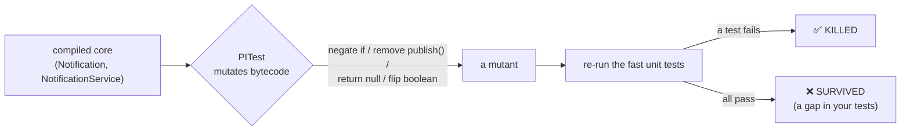
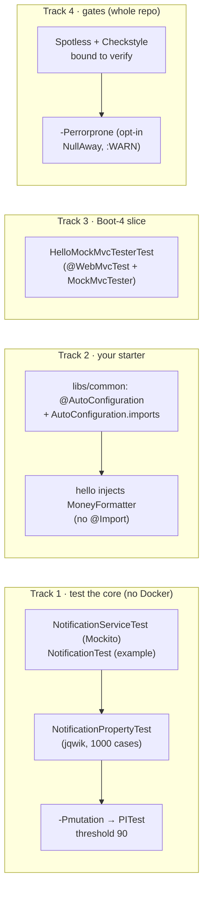
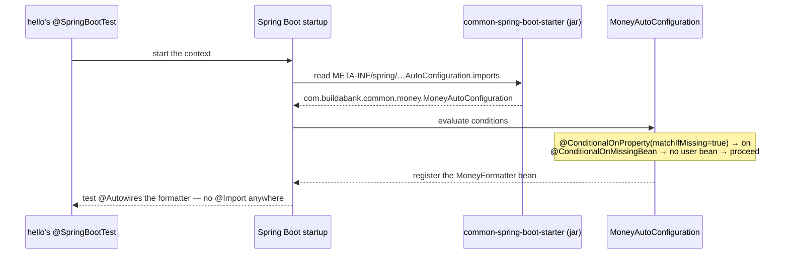

# Step 28 · Testing & Quality Mastery + Your Own Spring Boot Starter
### Phase E — Design, Architecture & Testing Mastery 🟣 · Step 28 of 67 · 🎓 closes Phase E

> *The hexagon (26) made the core testable; ArchUnit (27) froze its shape. Step 28 asks the harder question:
> **do the tests actually test anything?** **Mutation testing** (PITest) answers it — it changes the code and
> checks a test notices, scoring the suite, not the coverage. We add **property-based** tests (jqwik) that
> assert invariants over thousands of generated inputs, meet the **Phase-E capstone** (mutation coverage on the
> hexagon core to a justified target), turn `libs/common` into a **real auto-configured Spring Boot starter**,
> and wire **code-quality gates** (Spotless + Checkstyle) into the build — verifying honestly which of these
> tools actually run on bleeding-edge JDK 25.*

---

<a id="toc"></a>
## 🧭 The Six Movements of This Step

| | Movement | What happens | ~time |
|---|---|---|---|
| **A** | [🧭 Orient](#orient) | 30-second overview · skip-test · cheat card · why it matters · before you start · session plan | ≈ ½ h |
| **B** | [🧠 Understand](#understand) | mutation testing (score vs coverage) · property-based testing · what makes a starter · quality gates | ≈ 1 h |
| **C** | [🛠️ Build](#build) | TDD core unit tests · jqwik property · PITest capstone · the custom starter · MockMvcTester · the gates | ≈ 11 h |
| **D** | [🔬 Prove](#prove) | the Verification Log — 100% mutation score; §12.3 a surviving mutant fails the build; gates green; real output | ≈ 2 h |
| **E** | [🎓 Apply](#apply) | go deeper · interview prep · your-turn challenges | ≈ 1 h |
| **F** | [🏆 Review](#review) | troubleshooting · the honest JDK-25 tool status · recap, flashcards & what's next | ≈ ½ h |

---

<a id="orient"></a>

# A · 🧭 Orient

## 📋 This Step in 30 Seconds

| | |
|---|---|
| **Title** | Testing mastery (mutation + property-based + Boot-4 slices) + a custom auto-configured Spring Boot starter + code-quality gates |
| **Step** | 28 of 67 · **Phase E** 🟣 · **🎓 closes Phase E** (includes the Phase-E capstone) |
| **Effort** | ≈ 16 hours focused. Broad: a new test discipline (mutation), a new library (jqwik), a new module (the starter), and build-wide gates. |
| **What you'll run this step** | **JVM + Maven only** for the new work — mutation, property tests, the starter tests, and the gates need **no Docker**. Docker is only for the full-repo `verify` (existing integration tests). |
| **Buildable artifact** | core unit tests (`NotificationServiceTest`, `NotificationTest`) + a jqwik property (`NotificationPropertyTest`); a `-Pmutation` **PITest** profile on the notification core; **`libs/common`** = `common-spring-boot-starter` (a `MoneyFormatter` auto-configuration) consumed by `hello`; a Boot-4 **`MockMvcTester`** slice; **Spotless + Checkstyle** gates in the parent build (+ an off-by-default `-Perrorprone` profile). `step-28-start == step-27-end`. |
| **Verification tier** | 🔴 **Full** — adds a module + changes the build. `./mvnw verify` green (now incl. the gates) + the §12.3 mutation (a surviving mutant fails the build) + clean-room fresh-clone. |
| **Depends on** | **[Step 26](../step-26/lesson.md)** (the hexagon — what we mutation-test), **[Step 27](../step-27/lesson.md)** (ArchUnit — the capstone's other half), **[Step 6](../step-06/lesson.md)** (auto-configuration — the starter). |

By the end you'll **write mutation tests and read a PITest report**, **write property-based tests** with jqwik, **build and test a real auto-configured starter**, use Boot 4's **`MockMvcTester`**, and **wire code-quality gates** — knowing which tools actually run on JDK 25.

### ⏭️ Can You Skip This Step? (5-minute self-check)

If you can confidently do **all** of this, you've finished Phase E — jump to **[Step 29 — Frontend pt.1](../step-29/lesson.md)**.

- [ ] I can explain **mutation testing** and why a **mutation score** is stronger evidence than line coverage.
- [ ] I can write a **property-based** test (an invariant + generated inputs) and say when it beats example tests.
- [ ] I can build a **real auto-configured Spring Boot starter** (`@AutoConfiguration` + `AutoConfiguration.imports` + `@ConditionalOnMissingBean`) and test it with `ApplicationContextRunner`.
- [ ] I can wire **Spotless + Checkstyle** as build-failing gates and explain why a *lean* ruleset beats a 200-rule one on a real codebase.
- [ ] I can state the honest **JDK-25** status of PITest and Error Prone/NullAway.

> [!TIP]
> Not 100%? Stay. "How do you know your tests are any good?" (→ mutation testing) and "how does a Spring Boot starter work?" are senior interview staples — and you'll have *done* both.

## 📇 Cheat Card

> **What this step delivers (one sentence):** proof the tests test something (a **100% mutation score** on the hexagon core), property-based tests, a **real auto-configured starter**, and **always-on quality gates** — all verified on JDK 25.

**Key commands** (Windows uses `.\mvnw.cmd`):

```bash
./mvnw -pl services/notification -Pmutation test-compile org.pitest:pitest-maven:mutationCoverage  # mutation score (no Docker)
./mvnw -pl libs/common test                 # the starter's ApplicationContextRunner tests
./mvnw spotless:apply && ./mvnw verify       # auto-fix formatting, then the gates run in verify
./mvnw -Perrorprone -pl libs/common compile  # opt-in NullAway null-safety lint
bash steps/step-28/smoke.sh
```

**The headline — coverage says "executed", mutation says "checked":**

```
  line coverage:    "this line RAN during a test"          → can be 100% with ZERO assertions (a lie)
  mutation score:   "if I BREAK this line, a test FAILS"   → 5 mutants planted in the core, 5 killed = 100%
       mutants killed: negated guard · removed publish() · return true·return false · return null
```

**The one sentence to remember:** *Coverage measures what your tests **touch**; mutation testing measures what they **catch** — break the code on purpose and a good test goes red.*

## 🎯 Why This Matters

You can hit 100% line coverage with tests that assert nothing — coverage is a *participation* metric. **Mutation testing** is the *outcome* metric: it systematically breaks your code and fails if no test notices, so it finds the assertions you forgot. Pair it with **property-based** tests (invariants over generated inputs, not three hand-picked cases) and **build-failing quality gates**, and you have a suite you can trust. "How do you measure test quality?" and "walk me through building a Spring Boot starter" are senior-level questions — this step answers both with running code.

## ✅ What You'll Be Able to Do

- Run and read **mutation testing** (PITest); justify a coverage target.
- Write **property-based** tests (jqwik) and **Boot-4 slice** tests (`MockMvcTester`).
- Build, test, and consume a **real auto-configured Spring Boot starter**.
- Wire **Spotless + Checkstyle** gates; assess **Error Prone/NullAway** on a new JDK honestly.

## 🧰 Before You Start

- **Prereqs:** bank builds green (`git describe` → `step-27-end`). New work needs **no Docker**; the full `verify` does.
- **Connects to what you know:** we mutation-test the **Step-26 hexagon** core (now unit-testable *because* it's a hexagon); the starter uses **Step-6 auto-configuration** mechanics; the capstone combines **26 + 27 + 28**.
- **Depends on:** Steps **26, 27, 6**.

<a id="session-plan"></a>
## 🗓️ Session Plan — eight sittings, ≈ 16 h total

Sixteen hours is not one heroic evening. Each sitting ends at a natural save point (a 💾 commit or a movement
boundary), and ✋ re-entry lines in the text tell you what you have and where to pick up.

| Sitting | Covers | ~time | Ends at |
|---|---|---|---|
| **S1 · Frame it** | A Orient + B Understand + the B→C bridge | 1.5 h | the 🗺️ bridge (nothing built yet) |
| **S2 · First tests** | Sub-steps 1–2 — core unit tests + the jqwik property | 2.5 h | end of sub-step 2 (uncommitted) |
| **S3 · Mutation capstone** | Sub-step 3 — the `-Pmutation` profile, run PITest, the §12.3 break-it | 2.5 h | the sub-step-3 💾 commit |
| **S4 · Starter, part 1** | Sub-step 4a–4b — `MoneyFormatter`/`MoneyProperties` + the auto-configuration | 2 h | end of 4b (classes exist, untested) |
| **S5 · Starter, part 2** | Sub-step 4c — `ApplicationContextRunner` tests + consume from `hello` | 1.5 h | the sub-step-4 💾 commit |
| **S6 · Slice + gates** | Sub-steps 5–6 — `MockMvcTester`, Spotless + Checkstyle, ADR-0019 | 2.5 h | the sub-step-6 💾 commit |
| **S7 · Prove it** | 🎮 Play With It + the Finished-Result DoD + D (full `verify`, smoke, clean-room) | 2.5 h | tag `step-28-end` |
| **S8 · Close out** | E Apply + F Review — go-deeper, interview prep, recap | 1.5 h | end of lesson 🎉 |

**Optional routes:** the ⏭️ skip-test (5 min) can skip the whole step if you ace it; each 🚀 Go Deeper aside is +~5 min; the 🎯 stretch challenge is +~1–2 h on top.

✋ **Stopping here?** Nothing built yet — you have the map. Next: [B · Understand](#understand); first action: reopen this lesson at the Big Idea.

---

<a id="understand"></a>

# B · 🧠 Understand

## 🧠 The Big Idea — mutation testing: grade the tests, not the code

Coverage tools answer "did a test *execute* this line?" That's necessary but weak: a test with **no assertions**
executes lots of lines and proves nothing. **Mutation testing** answers the real question — "if this line were
*wrong*, would a test *fail*?" A mutation engine (PITest) makes hundreds of tiny edits to your **bytecode** —
flip a `>` to `>=`, negate an `if`, replace a return with `null`, delete a method call — and re-runs your tests
against each **mutant**. If a test fails, the mutant is **killed** (good — a test caught the bug). If all tests
still pass, the mutant **survived** (bad — that's a real behaviour change nobody tested). The **mutation score**
= killed ÷ total. It's the most honest "are my tests any good?" signal there is.

**Analogy:** line coverage counts the smoke detectors you *installed*; mutation testing lights a small
controlled fire in every room and checks an alarm actually *rings*.

❓ **Quick check:** every mutant PITest planted *survived*, yet line coverage is 100% — what does that tell you about the tests? <details><summary>Answer</summary>The tests **execute** the code but **assert nothing that would catch a change** — coverage says "ran", a surviving mutant says "nobody checked". The suite is participation, not protection; the mutation score (killed ÷ total) is the honest signal.</details>



## 🧩 Pattern Spotlight — property-based testing (jqwik)

An example test checks **one** case: `from(event)` → this exact string. A **property** states an **invariant**
that must hold for *all* inputs, and the framework **generates** hundreds of randomized ones, then **shrinks**
any failure to the smallest counter-example. Our property: *for any* transfer event, `Notification.from`
preserves the identifiers and the message names both parties and the amount. jqwik ran it **1000** times.

- **Example test** — pins behaviour for a known case; great for documenting the exact contract.
- **Property test** — explores the input space you didn't think of (empty strings, huge amounts, odd scales).
- Use **both**: the example nails the wording; the property guards the invariant.

## 🌱 Under the Hood: how a Spring Boot starter auto-configures

A "starter" is just a jar that ships beans + a recipe for wiring them. The magic is one file:
`META-INF/spring/org.springframework.boot.autoconfigure.AutoConfiguration.imports`. At startup Boot reads it
from every jar on the classpath and applies the listed `@AutoConfiguration` classes — **no `@Import`, no
component scan** in the consuming app. Conditions make it *polite*: `@ConditionalOnProperty(matchIfMissing=true)`
(on unless turned off), `@ConditionalOnMissingBean` (**back off** if the app defined its own), and
`@EnableConfigurationProperties` (bind `buildabank.money.*`). The proof it works: add the jar to `hello`, and a
`MoneyFormatter` bean appears with no other change. *(Boot 2 used `spring.factories`; Boot 2.7+/3/4 use the
dedicated `.imports` file — see 🕰️.)*

## 🛡️ Security Lens & 🧵 Thread-safety note

`MoneyFormatter` is immutable (a final `currencyCode`, no mutable state) → safe to share as a singleton across
threads. **Error Prone/NullAway** is a *security-adjacent* gate: a null-dereference is a crash (a DoS vector);
NullAway proves at compile time that `@Nullable` values are checked before use.

## 🕰️ Then vs. Now

- **Test clients:** Boot 3's `TestRestTemplate` was **removed** in Boot 4. Use `RestClient` against a live port
  (Step 1), or the new AssertJ-fluent **`MockMvcTester`** for slices (this step) — successor to
  `MockMvc.perform(...).andExpect(...)`. The slice annotations also moved: `@WebMvcTest` is now in
  `org.springframework.boot.webmvc.test.autoconfigure` (module `spring-boot-webmvc-test`).
- **Starter discovery:** `spring.factories` (`EnableAutoConfiguration` key) → the dedicated
  `AutoConfiguration.imports` file.
- **Bleeding-edge JDK (the §6 caveat, made concrete):** PITest **1.19.1** can't read JDK-25 bytecode
  (`Unsupported class file major version 69`) — **1.25.4** can. Error Prone/NullAway historically lagged new
  JDKs; **verified here, 2.49.0/0.13.6 work on JDK 25.** Always verify tool-vs-JDK, never assume.

---

# B→C bridge: 🗺️ what we'll build & 🌳 files we'll touch

```
TESTING MASTERY (notification core — no Docker)        QUALITY GATES (whole repo)
  application/NotificationServiceTest   (Mockito)        config/checkstyle/checkstyle.xml   (lean ruleset)
  domain/NotificationTest               (example)        pom.xml (parent): spotless + checkstyle in <build>
  domain/NotificationPropertyTest       (jqwik)                          + -Perrorprone profile (NullAway)
  notification/pom.xml: jqwik dep + -Pmutation (PITest)
                                                        YOUR OWN STARTER (libs/common)
BOOT-4 SLICE (hello)                                     money/MoneyFormatter · MoneyProperties
  HelloMockMvcTesterTest  (@WebMvcTest + MockMvcTester)  money/MoneyAutoConfiguration
  HelloApplicationTests   (+ inject the starter's bean)  resources/META-INF/.../AutoConfiguration.imports
                                                         money/MoneyAutoConfigurationTest (ApplicationContextRunner)
```

✋ **Stopping here?** You have the concepts (mutation score, properties, starter discovery) — no code yet. Next: [C · Build](#build); first action: `git describe` → confirm `step-27-end`.

<a id="build"></a>

# C · 🛠️ Let's Build It — Step by Step

🧭 **You are here:** the build — four tracks, six sub-steps, ≈ 11 h of the step's ≈ 16 (sittings S2–S6 of the [session plan](#session-plan)).

## 📦 Your Starting Point

`step-28-start == step-27-end`. The notification hexagon is enforced by ArchUnit; its core (`NotificationService`,
`Notification`) is unit-testable but only *exercised* by Docker integration tests so far.

The four tracks and how they meet the build:



## Sub-step 1 of 6 — fast unit tests for the core (the payoff of the hexagon) · ≈ 1.5 h

🎯 Because `NotificationService` depends only on its **ports**, we mock them (Mockito) and test the use case in
microseconds — no Kafka, no Spring. `NotificationServiceTest`: a new event is applied + published once; a
duplicate is an idempotent no-op + **never** published. `NotificationTest`: `Notification.from` maps every field
and composes the exact message. These are what PITest will mutate against.

🔮 **Predict:** mutation-test the core with only the Docker integration test covering it — fast, or slow? <details><summary>Answer</summary>**Painfully slow** — PITest re-runs covering tests *per mutant*; a Testcontainers boot ×N mutants is unusable. Mutation testing needs **fast unit tests** on the core. That's why the hexagon (fast-testable core) and mutation testing fit together.</details>

✋ **Stopping here?** You have the core's fast unit tests written (`NotificationServiceTest`, `NotificationTest`) — uncommitted for now. Next: Sub-step 2 (the jqwik property); first action: open `services/notification/pom.xml` to add the jqwik dependency.

## Sub-step 2 of 6 — a property-based test (jqwik) · ≈ 1 h

🎯 `NotificationPropertyTest` states the invariant and lets jqwik generate 1000 cases (alphabetic ids, amounts in `[0.01, 1_000_000]`). Add the jqwik test dependency to `services/notification/pom.xml` — pinned like everything else (the version lives in the parent pom's `<properties>`); it registers as its own JUnit-Platform engine:

```xml
<!-- services/notification/pom.xml — in <dependencies> -->
<dependency>
    <groupId>net.jqwik</groupId>
    <artifactId>jqwik</artifactId>
    <version>${jqwik.version}</version>  <!-- 1.9.3 in the parent pom -->
    <scope>test</scope>
</dependency>
```

✋ **Stopping here?** You have the jqwik dependency + `NotificationPropertyTest` (uncommitted — sub-step 3's commit will carry them). Next: Sub-step 3 (the PITest capstone); first action: reopen `services/notification/pom.xml` to add the `-Pmutation` profile.

## Sub-step 3 of 6 — the PITest capstone (mutation coverage to a justified target) · ≈ 2.5 h

🎯 Add a `-Pmutation` profile to `services/notification/pom.xml`: `pitest-maven` (1.25.4 — **not** 1.19.1, see
🩺) + `pitest-junit5-plugin`, **`targetClasses`** = `Notification` + `NotificationService` (the core), **fast
unit tests only** (exclude the Testcontainers tests), **`mutationThreshold` = 90**. Run it; read the score.

⚠️ **Pitfall:** point `targetClasses` at the whole package and PITest will mutate record-generated `equals`/`hashCode` and produce junk survivors. Scope it to the classes with real logic.

🔮 **Predict:** if we instead deleted the *duplicate-event* test, which of the five mutants (see the kill table in [D](#prove)) would survive? <details><summary>Answer</summary>The `BooleanTrueReturnVals` mutant (`handle` always returns `true`) — only the duplicate test expects `false`. The negated-guard mutant stays killed: the *new-event* test also exercises that branch.</details>

🔬 **Break-it (the §12.3 proof):** delete the `verify(publisher).publish(...)` assertion → the "removed call to publish" mutant **survives** → score drops to 80% → **the build fails**. Put it back. *That* is mutation testing earning its keep.

💾 **Commit:** `test(notification): Step 28 mutation (PITest) + property (jqwik) tests on the hexagon core` *(this commit also carries sub-steps 1–2 — the tests PITest mutates against)*

✋ **Stopping here?** You have the mutation gate committed — the capstone's test half is done. Next: Sub-step 4 (your starter); first action: create the new `libs/common` module (its `pom.xml` first).

## Sub-step 4 of 6 — turn `libs/common` into a real auto-configured starter · ≈ 3.5 h

🎯 New module `libs/common` (`common-spring-boot-starter`) — built in three passes, so no pass carries more
than ~3 new ideas:

**4a — the plain classes (no Spring magic yet).** `MoneyFormatter` (immutable, `BigDecimal` + HALF_EVEN,
locale-free) and `MoneyProperties` (`@ConfigurationProperties("buildabank.money")` — the type-safe binding for
`buildabank.money.*`). Two ordinary classes you could unit-test with no context at all.

**4b — the auto-configuration.** `MoneyAutoConfiguration`: `@AutoConfiguration` (marks it a Boot recipe) +
`@ConditionalOnProperty(matchIfMissing=true)` (on unless the consumer turns it off) + `@ConditionalOnMissingBean`
(**back off** if the consumer defined its own) — then list the class in the `AutoConfiguration.imports` file so
Boot can discover it (the §B mechanism, one condition at a time).

✋ **Stopping here?** You have the starter's four artifacts (`MoneyFormatter`, `MoneyProperties`, `MoneyAutoConfiguration`, the imports file) — untested, uncommitted. Next: 4c; first action: create `MoneyAutoConfigurationTest` with `ApplicationContextRunner`.

**4c — prove it.** Test with **`ApplicationContextRunner`** — a tiny throwaway context per test, so you can
assert all four behaviours fast: default-on, property-binds, **backs off** when the consumer defines its own,
**off** when disabled. Then **prove real consumption:** add the one dependency to `hello`; its `@SpringBootTest`
injects the auto-configured `MoneyFormatter` — discovered via the imports file, with no `@Import`.

🔮 **Predict:** the consumer defines its *own* `MoneyFormatter` bean — what happens at startup? <details><summary>Answer</summary>Nothing dramatic: `@ConditionalOnMissingBean` makes the auto-configuration **back off**, so the consumer's bean wins — no conflict, no duplicate-bean error. That's exactly what the "backs-off" `ApplicationContextRunner` test asserts.</details>

❓ **Quick check:** which file makes Boot find the auto-config — and what was it called in Boot 2? <details><summary>Answer</summary>`META-INF/spring/org.springframework.boot.autoconfigure.AutoConfiguration.imports`. Boot 2 used `spring.factories` (the `EnableAutoConfiguration` key) — see 🕰️ Then vs. Now.</details>

💾 **Commit:** `feat(common): Step 28 turn libs/common into a real auto-configured Spring Boot starter`

✋ **Stopping here?** You have the starter committed and consumed by `hello`. Next: Sub-step 5 (the Boot-4 slice); first action: create `HelloMockMvcTesterTest` in `services/hello/src/test/java/com/buildabank/hello/`.

## Sub-step 5 of 6 — a Boot-4 slice test with MockMvcTester · ≈ 1 h

🎯 `HelloMockMvcTesterTest` — `@WebMvcTest(HelloController.class)` (loads only the MVC layer) + autowired `MockMvcTester`, asserting `mvc.get().uri("/api/hello")` `.hasStatusOk().bodyText().contains(...)`. The AssertJ-fluent successor to `MockMvc.perform(...)` (honors the Step-1 forward-reference).

⌨️ **Type it yourself** — complete the fluent chain (assert 200 OK, then that the body text contains the greeting and the service name):

```java
// services/hello/src/test/java/com/buildabank/hello/HelloMockMvcTesterTest.java
@WebMvcTest(HelloController.class)
class HelloMockMvcTesterTest {

    @Autowired
    MockMvcTester mvc;

    @Test
    void getHelloReturns200WithJsonGreeting() {
        assertThat(mvc.get().uri("/api/hello"))
                // your turn: status, then body text
    }
}
```

<details><summary>Solution (the finished chain)</summary>

```java
assertThat(mvc.get().uri("/api/hello"))
        .hasStatusOk()
        .bodyText()
        .contains("Welcome to Build-a-Bank", "\"service\":\"hello\"");
```

Imports that trip people up (Boot 4 moved them — see 🩺): `org.springframework.boot.webmvc.test.autoconfigure.WebMvcTest`, `org.springframework.test.web.servlet.assertj.MockMvcTester`, and AssertJ's `assertThat`.</details>

✋ **Stopping here?** You have the slice test (it rides in sub-step 6's commit). Next: Sub-step 6 (the gates); first action: open the **parent** `pom.xml` `<build>` to add Spotless + Checkstyle.

## Sub-step 6 of 6 — code-quality gates (Spotless + Checkstyle), wired into `verify` · ≈ 1.5 h

🎯 In the **parent** `pom.xml` `<build>`: **Spotless** (lean — removeUnusedImports + whitespace + EOF newline,
**`lineEndings=PRESERVE`**) and **Checkstyle** (the lean `config/checkstyle/checkstyle.xml`), both bound to
`verify`. Run `./mvnw spotless:apply` once to normalize, then `verify` enforces it. A planted violation fails the build.

🔮 **Predict:** will `spotless:check` pass *before* you've run `spotless:apply`? <details><summary>Answer</summary>Almost certainly not — `check` fails on any file that doesn't yet match the rules; that's why the order is **apply once to normalize, then let `verify` enforce**. And without `lineEndings=PRESERVE` it would flag hundreds of CRLF files (the pitfall below).</details>

⚠️ **Pitfall (we hit it):** Spotless's default line-ending handling rewrote **CRLF→LF on 232 files** — a phantom diff. `lineEndings=PRESERVE` fixes it. And a full reformatter (google-java-format) would reflow every lesson's hand-laid code — so we keep formatting *lean*.

❓ **Quick check:** why run `spotless:apply` once *before* letting `verify` enforce `spotless:check` — and why keep the ruleset lean? <details><summary>Answer</summary>`apply` normalizes the existing code once so `check` (bound to `verify`) has a clean baseline to enforce; a heavy ruleset (or a full reformatter) would dump thousands of violations / a huge diff on the existing codebase and the gate would just get switched off.</details>

🎯 **Error Prone / NullAway** — an off-by-default `-Perrorprone` profile (these are javac plugins; JDK support lags). **Verify** whether they run on JDK 25 (they do — 2.49.0/0.13.6); keep them at `:WARN`, opt-in.

📝 **Record the decision:** create `adr/0019-testing-quality-mastery-and-custom-starter.md` — why the mutation
threshold is 90 on the notification *core* only, and why the gates ship *lean* rulesets (the Definition of Done
checks for it).

💾 **Commit:** `build: Step 28 code-quality gates — Spotless + Checkstyle (lean) + opt-in Error Prone/NullAway` *(this commit also carries sub-step 5's slice test and ADR-0019)*

✋ **Stopping here?** All three step-28 commits exist; the gates are live in `verify`. Next: 🎮 Play With It, then the Finished Result; first action: run the PITest command from the 📇 cheat card.

## 🎮 Play With It

```bash
# Watch a mutant die — then survive:
./mvnw -pl services/notification -Pmutation test-compile org.pitest:pitest-maven:mutationCoverage
start services/notification/target/pit-reports/index.html    # the HTML mutation report — Windows; macOS: open …, Linux: xdg-open …
# Toggle the starter off and watch the bean disappear:
./mvnw -pl libs/common test -Dtest=MoneyAutoConfigurationTest
# Plant a Checkstyle violation (e.g. `int x;;` a double semicolon) and run — the build goes red:
./mvnw -pl libs/common checkstyle:check
```

🧪 **Little experiments:** in the PITest report, find the 5 mutants and the test that killed each. Add `buildabank.money.currency-code=EUR` to a consumer and watch the format change. Flip the `-Perrorprone` profile's `NullAway:WARN`→`ERROR` and add a `@Nullable` deref — the compile fails.

## 🏁 The Finished Result

`step-28-end`: a **100% mutation score** on the hexagon core, property + slice tests, a **real starter** consumed
by `hello`, and **build-failing quality gates** — **🎓 Phase E complete.**

The flow you built, end to end — how `hello` discovers your starter at startup:



**✅ Definition of Done:**

- [ ] `./mvnw verify` green (gates included)
- [ ] the §12.3 surviving-mutant proof works (delete the assertion → build fails → revert)
- [ ] `bash steps/step-28/smoke.sh` passes
- [ ] ADR-0019 recorded
- [ ] committed + tagged `step-28-end`

✋ **Stopping here?** Everything is built; you have the DoD checklist to verify against. Next: [D · Prove](#prove) — run the checks and compare against the real pasted output; first action: `./mvnw verify`.

---

<a id="prove"></a>

# D · 🔬 Prove It Works — Verification Log

> **Tier: 🔴 Full** (adds a module + changes the build). Real pasted output. The new tests need no Docker; the
> full `verify` does (existing integration tests). Clean-room fresh-clone at the end.

**1 · The core unit + property tests (no Docker):**

```
[INFO] Tests run: 2, … -- in com.buildabank.notification.application.NotificationServiceTest
[INFO] Tests run: 1, … -- in com.buildabank.notification.domain.NotificationTest
                              |-----------------------jqwik-----------------------
tries = 1000                  | # of calls to property
checks = 1000                 | # of not rejected calls
[INFO] Tests run: 1, … -- in com.buildabank.notification.domain.NotificationPropertyTest
[INFO] Tests run: 4, Failures: 0, Errors: 0, Skipped: 0
[INFO] BUILD SUCCESS
```

**2 · 🎓 The Phase-E capstone — PITest mutation coverage on the hexagon core (100%):**

```
>> Line Coverage (for mutated classes only): 17/17 (100%)
>> Generated 5 mutations Killed 5 (100%)
[INFO] BUILD SUCCESS
```
The 5 mutants (from the report) are all real behaviour changes on the core's two methods — **all killed**:

| Mutator | What it broke | Killed by |
|---|---|---|
| `NegateConditionals` | negated the `if (!markIfNew)` dedup guard | the duplicate vs new tests |
| `VoidMethodCall` | removed the call to `NotificationPublisher::publish` | `verify(publisher).publish(...)` |
| `BooleanTrueReturnVals` | `handle` always returns `true` | the duplicate test (expects `false`) |
| `BooleanFalseReturnVals` | `handle` always returns `false` | the new-event test (expects `true`) |
| `NullReturnVals` | `Notification.from` returns `null` | `NotificationTest` / the property |

**Justified target:** the core is tiny and pure → threshold **90%**, achieved **100%**.

**3 · §12.3 Mutation sanity-check — prove the mutation gate is meaningful.** Removed the
`verify(publisher).publish(...)` assertion and re-ran PITest:

```
> KILLED 0 SURVIVED 1 …                                  (the "removed call to publish" mutant)
>> Generated 5 mutations Killed 4 (80%)
[INFO] BUILD FAILURE
[ERROR] … Mutation score of 80 is below threshold of 90
```
→ A real gap in the suite that a normal green build would **not** have caught. **Reverted** → 100% green again.

**4 · The custom starter (`libs/common`) — auto-config tested + really consumed:**

```
[INFO] Tests run: 4, … -- in com.buildabank.common.money.MoneyAutoConfigurationTest   (default-on, binds, backs-off, disable)
[INFO] Tests run: 3, … -- in com.buildabank.common.money.MoneyFormatterTest
[INFO] BUILD SUCCESS
```
And in `hello` (real discovery via the imports file, plus the Boot-4 `MockMvcTester` slice):
```
[INFO] Tests run: 3, … -- in com.buildabank.hello.HelloApplicationTests        (incl. ourCustomStarterAutoConfiguresTheMoneyFormatter)
[INFO] Tests run: 1, … -- in com.buildabank.hello.HelloMockMvcTesterTest
[INFO] BUILD SUCCESS
```

**5 · Code-quality gates pass repo-wide:**

```
[INFO] You have 0 Checkstyle violations.          (×14 modules)
… spotless:check → BUILD SUCCESS
```

**6 · Error Prone / NullAway on JDK 25 — verified working (not the historical "lags").** Compiled `libs/common`
with `-Perrorprone` and a planted `@Nullable` dereference:
```
[WARNING] …/NullProbe.java:[8,16] [NullAway] dereferenced expression s is @Nullable
[INFO] BUILD SUCCESS         (WARN, not ERROR — a gentle introduction; the probe was then deleted)
```

**7 · `smoke.sh`** — `bash steps/step-28/smoke.sh` runs the mutation capstone + starter + gates (no Docker) →
`✅ Step 28 smoke test PASSED`.

**8 · Build** — full-repo `./mvnw verify` → BUILD SUCCESS (14 modules; gates run on every module; Docker up for the existing integration tests). Clean-room fresh-clone green.

**§12.8 honesty:** PITest scope is the notification **core** (two classes) — extend to other services later.
Checkstyle/Spotless rulesets are intentionally **lean** (a tightenable starting point), not a 200-rule set.
Error Prone/NullAway are **opt-in** (`-Perrorprone`, `:WARN`) — verified to run on JDK 25 but not yet a hard gate.
The starter is one combined module (production splits `-autoconfigure` + `-starter`).

---

<a id="apply"></a>

# E · 🎓 Apply

✋ **Resuming here?** You have a verified `step-28-end` (DoD met, tag pushed). E + F are reading (~1.5 h): go-deeper asides, interview prep, recap.

## 🚀 Go Deeper (Optional)

<details><summary>Why not just chase 100% line coverage? (+~5 min)</summary>Coverage counts executed lines, not verified behaviour — a test with no assertions can hit 100%. Mutation score counts *caught* defects. Teams use coverage as a floor (don't ship untouched code) and mutation as the quality signal on critical logic. Running mutation on the *whole* repo is slow; target the parts that matter (money, dedup, auth).</details>

<details><summary>The production starter split (`-autoconfigure` + `-starter`) (+~5 min)</summary>Spring's convention: an `acme-spring-boot-autoconfigure` module holds the `@AutoConfiguration` + optional dependencies, and a thin `acme-spring-boot-starter` module just depends on it + the required libraries — so consumers can take the autoconfig without forcing optional deps. We use one combined module for teaching; splitting is mechanical when you publish externally.</details>

<details><summary>Property-based testing pitfalls (+~5 min)</summary>Properties must be true for *all* generated inputs — beware invariants that only hold for "reasonable" data (constrain generators with `@Scale`, `@BigRange`, etc.). And a property that's really just `assertThat(f(x)).isEqualTo(reimplement-f(x))` tests nothing — assert a *different*, simpler truth (here: "the message contains the amount", not "equals the exact concatenation").</details>

## 💼 Interview Prep

1. **Mutation testing vs code coverage?** *Coverage = lines executed (can be 100% with no assertions). Mutation = inject bugs and check a test fails; the mutation score is real evidence the suite catches regressions.* **(Common.)**
2. **What's a "surviving mutant" and what do you do about it?** *A code change no test detected — a gap. Add/strengthen an assertion to kill it, or accept it as equivalent (no observable behaviour change) and exclude it.*
3. **How does a Spring Boot starter auto-configure?** *A jar ships an `@AutoConfiguration` listed in `META-INF/spring/...AutoConfiguration.imports`; Boot applies it when the jar is on the classpath, guarded by `@ConditionalOn*` (esp. `@ConditionalOnMissingBean` to back off).*
4. **Property-based vs example-based tests?** *Example pins one known case; property states an invariant over many generated inputs (with shrinking). Use both.*
5. **(Gotcha) You added Spotless and got a 200-file diff — why, and the fix?** *Default line-ending normalization rewrote CRLF→LF. Set `lineEndings=PRESERVE` (and keep the ruleset lean) so the gate doesn't churn the codebase.*

## 🏋️ Your Turn: Practice & Challenges

- **Quick:** raise the PITest `mutationThreshold` to 100 and re-run — it passes (we're at 100%). Now add a third core method without a test and watch a mutant survive.
- **Quick:** add a jqwik property for `MoneyFormatter`: for any `BigDecimal`, `format` always ends in two decimals and starts with the currency code.
- 🎯 **Stretch (+~1–2 h; no reference solution yet — verify with your own `ApplicationContextRunner` web/non-web tests):** extend the starter with a second bean (e.g. a `CorrelationIdFilter`) gated by `@ConditionalOnWebApplication`, and add `ApplicationContextRunner` tests for the web/non-web cases. Then consume it in a second service.

---

<a id="review"></a>

# F · 🏆 Review

## 🩺 Stuck? Troubleshooting & Fixes

- **PITest: `Unsupported class file major version 69`.** Your PITest is too old for JDK 25 (1.19.1's ASM). Use **1.25.4+**. (The Maven Central *search API* reported 1.19.1 as latest — stale; the GitHub releases showed 1.25.4.)
- **PITest selects the Testcontainers tests and crawls / needs Docker.** Add them to `<excludedTestClasses>` and scope `<targetTests>` to the fast unit tests.
- **Spotless makes a huge diff on first run.** Line endings — set `<lineEndings>PRESERVE</lineEndings>` (or commit a `.gitattributes`). Then `./mvnw spotless:apply`.
- **`@WebMvcTest` / `MockMvcTester` won't resolve.** Boot 4 moved them: import `org.springframework.boot.webmvc.test.autoconfigure.WebMvcTest` and add the `spring-boot-webmvc-test` test dependency.
- **NullAway flags nothing.** Check `-XepOpt:NullAway:AnnotatedPackages=com.buildabank` matches your packages, and that a recognized `@Nullable` (JSpecify — Spring 7 bundles it) is on the dereferenced value.
- **Reset:** `git checkout step-28-end`.

## 📚 Learn More & Glossary

- PITest docs (pitest.org); jqwik user guide; Spring Boot reference — "Creating Your Own Auto-configuration"; Error Prone + NullAway docs; *Building Evolutionary Architectures* (fitness functions, incl. test quality).
- **Glossary:** *mutation testing*, *mutant / killed / survived*, *mutation score*, *mutation threshold*, *property-based testing*, *invariant / shrinking*, *auto-configuration*, *`AutoConfiguration.imports`*, *`@ConditionalOnMissingBean`*, *`ApplicationContextRunner`*, *`MockMvcTester`*, *Spotless / Checkstyle*, *NullAway*.

## 🏆 Recap & Study Notes

**(a) Key points:** **Mutation testing** grades the *tests* — it breaks the code and checks a test fails;
the **mutation score** (killed÷total) is stronger evidence than line coverage. We hit **100%** on the notification
hexagon core (the **Phase-E capstone**), added a **jqwik** property (invariant over 1000 generated inputs), turned
`libs/common` into a **real auto-configured starter** (`AutoConfiguration.imports` + `@ConditionalOnMissingBean`,
tested with `ApplicationContextRunner`, consumed by `hello`), used Boot-4 **`MockMvcTester`**, and wired **lean
Spotless + Checkstyle** gates into `verify`. On JDK 25: PITest needs **1.25.4** (not 1.19.1); Error Prone/NullAway
**do** work (verified).

**(b) Key terms:** mutation testing, mutant/killed/survived, mutation score, property-based testing, invariant/shrinking, auto-configuration, AutoConfiguration.imports, @ConditionalOnMissingBean, ApplicationContextRunner, MockMvcTester, Spotless, Checkstyle, NullAway.

**(c) 🧠 Test Yourself:** ① Mutation score vs coverage? ② What's a surviving mutant? ③ How does a starter get discovered? ④ When property vs example test? ⑤ How did you prove the mutation gate is real? <details><summary>Answers</summary>① Coverage = executed; mutation = caught (break code, expect a red test). ② A code change no test detected — a test gap. ③ Via `META-INF/spring/...AutoConfiguration.imports` read from the classpath. ④ Property for invariants over many inputs; example to pin a specific contract. ⑤ Removed an assertion → a mutant survived → score 80% < 90% → build failed; reverted.</details>

**(d) 🔗 How this connects:** completes the Phase-E arc — **SOLID (25) → hexagon (26) → ArchUnit (27) → test quality + your own starter (28)**. ArchUnit/Modulith are fitness functions for *structure*; mutation testing is the fitness function for *tests*. **Next: Phase F (Step 29)** — the React/TypeScript frontend, calling the gateway you built.

**(e) 🏆 Résumé line:** *"Drove test quality with mutation testing (PITest, 100% on a service's core) and property-based tests (jqwik), built a reusable auto-configured Spring Boot starter, and added code-quality gates (Spotless/Checkstyle, NullAway) — on Java 25 / Spring Boot 4."*

**(f) ✅ You can now:** run/read mutation testing · write property-based + Boot-4 slice tests · build & consume a real starter · wire quality gates · assess tooling on a new JDK honestly.

**(g) 🃏 Flashcards** — the four to drill (all six are in `docs/flashcards.md`) · 🔁 revisit mutation testing whenever you touch a critical path (ledger, Saga, auth):

- **Q:** Mutation testing vs code coverage? — **A:** Coverage = lines *executed* (can be 100% with zero assertions). Mutation = inject a tiny bytecode change and expect a red test; the score (killed÷total) is real evidence the suite catches regressions.
- **Q:** What is a surviving mutant and what do you do about it? — **A:** A behaviour change no test detected — a gap. Kill it with a stronger assertion, or (rarely) exclude it as *equivalent* (no observable change).
- **Q:** How does a starter auto-configure itself? — **A:** Its jar lists an `@AutoConfiguration` class in `META-INF/spring/…AutoConfiguration.imports`; Boot applies it from the classpath, guarded by `@ConditionalOn*` (esp. `@ConditionalOnMissingBean`). Boot 2 used `spring.factories`.
- **Q:** Why lean rulesets — and what bit us with Spotless? — **A:** A 200-rule set drops thousands of violations on an existing codebase, so the gate gets switched off. Spotless's default line endings rewrote CRLF→LF on 232 files (a phantom diff) — `lineEndings=PRESERVE` fixes it.

**(h) ✍️ One-line reflection:** *Where in the bank would a surviving mutant scare you most — and is that code mutation-tested?*

**(i)** 🎉 **Phase E complete** — your design is clean, enforced, and your tests are *proven* to test. Next: a real UI on top of it all.
