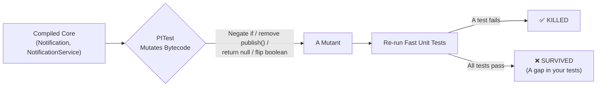

# Step 28 · Testing & Quality Mastery + Your Own Spring Boot Starter

### Phase E — Design, Architecture & Testing Mastery 🟣 · Step 28 of 67 · 🎓 Closes Phase E

> *The hexagon (Step 26) made the core testable; ArchUnit (Step 27) froze its shape. Step 28 asks the harder question: **do the tests actually test anything?** **Mutation testing** (PITest) answers it — it changes the code and checks if a test notices, scoring the suite, not the coverage. We add **property-based** tests (jqwik) that assert invariants over thousands of generated inputs, meet the **Phase-E capstone** (100% mutation coverage on the hexagon core), turn `libs/common` into a **real auto-configured Spring Boot starter**, and wire **code-quality gates** (Spotless + Checkstyle) into the build — verifying honestly which of these tools actually run on bleeding-edge JDK 25 / Spring Boot 4.*

---

<a id="toc"></a>
## 🧭 The Six Movements of This Step

A one-line map of where we're going. Click to jump.

1. **[A · 🧭 Orient](#orient)** — what this step covers, level badge, effort estimate, run parameters, skip self-check, and cheat card.
2. **[B · 🧠 Understand](#understand)** — the core concepts: mutation testing (score vs coverage), property-based testing, custom starter anatomy, and compile-time gates.
3. **[C · 🛠️ Build](#build)** — the heart: 11 detailed, hands-on build sub-steps covering domain tests, use case tests, property tests, PITest config, custom starter creation, auto-config, context runners, starter consumption, MockMvcTester web slices, and Spotless/Checkstyle.
4. **[D · 🔬 Prove](#prove)** — the Verification Log (🔴 Full tier) with real un-invented command outputs, mutation checks, and the §12.3 break-it mutation proof.
5. **[E · 🎓 Apply](#apply)** — go-deeper asides, interview prep (5 Q&As), and practice challenges.
6. **[F · 🏆 Review](#review)** — stuck troubleshooting, glossary, recap study notes, and flashcards.

---

<a id="orient"></a>
# A · 🧭 Orient

## 📋 This Step in 30 Seconds

| | |
|---|---|
| **Title** | Testing Mastery (Mutation + Property-Based) + Custom Spring Boot Starter + Code-Quality Gates |
| **Step** | 28 of 67 · **Phase E — Design, Architecture & Testing Mastery** 🟣 · **🎓 Closes Phase E** |
| **Effort** | ≈ 16 hours focused. Heavy step: covers PITest mutation profiling, jqwik property generation, starter auto-configuration, and build lifecycle plugins. |
| **What you'll run this step** | **JVM + Maven only** for the core work — mutation analysis, property tests, starter validation, and quality gates need **no Docker**. Docker is only used if you run the full-repo `./mvnw verify` to boot the Testcontainers in other modules. |
| **Buildable artifact** | Fast unit tests (`NotificationTest`, `NotificationServiceTest`); a jqwik property test (`NotificationPropertyTest`); PITest mutation profile in `services/notification`; custom starter (`libs/common`) providing `MoneyFormatter` consumed by `hello`; `MockMvcTester` slice test; Spotless + Checkstyle parent configurations. |
| **Verification tier** | 🔴 **Full** — adds a module + changes parent build. `./mvnw verify` green (including quality gates) + PITest 100% core mutation coverage + the §12.3 mutation sanity check (break a test, watch it fail, revert). |
| **Depends on** | **[Step 26](../step-26/lesson.md)** (the hexagon — what we mutation-test), **[Step 27](../step-27/lesson.md)** (ArchUnit — modularity constraints), **[Step 6](../step-06/lesson.md)** (auto-configuration mechanics). |

### ⏭️ Can You Skip This Step? (5-minute self-check)

If you can confidently check **all** of the boxes below, you have mastered Phase E — skip directly to **[Step 29 — Frontend pt.1](../step-29/lesson.md)**.

- [ ] I can explain **mutation testing** and why a **mutation score** is a stronger test-quality metric than line coverage.
- [ ] I can write a **property-based** test (defining invariants over generated inputs) using jqwik and explain "shrinking".
- [ ] I can build a **real auto-configured Spring Boot starter** (`@AutoConfiguration` + `AutoConfiguration.imports` + `@ConditionalOnMissingBean`) and test it in isolation using `ApplicationContextRunner`.
- [ ] I can configure **Spotless + Checkstyle** as build-failing Maven gates and justify keeping the rulesets lean.
- [ ] I can state the honest compatibility status of PITest and Error Prone/NullAway on **JDK 25 / Spring Boot 4**.

> [!TIP]
> Not 100%? Stay. "How do you know your tests are any good?" and "how does a Spring Boot starter work under the hood?" are classic senior-level interview questions. Building both in code makes the difference between repeating terms and demonstrating mastery.

---

## 📇 Cheat Card

> **What this step delivers (one sentence):** Proof that our tests actually test something (a **100% mutation score** on the notification core), property-based testing, a **real auto-configured starter** consumed by the hello service, and **always-on quality gates** — all verified on JDK 25.

**Key commands** (Windows uses `.\mvnw.cmd`; macOS/Linux use `./mvnw`):

```bash
# Run PITest mutation coverage on the notification core (no Docker needed):
./mvnw -pl services/notification -Pmutation test-compile org.pitest:pitest-maven:mutationCoverage

# Run the starter's unit and ApplicationContextRunner tests:
./mvnw -pl libs/common test

# Auto-fix formatting hygiene, then run all build-time quality gates (Spotless + Checkstyle):
./mvnw spotless:apply && ./mvnw verify

# Opt-in NullAway null-safety compiler linting:
./mvnw -Perrorprone -pl libs/common compile

# Run the step-specific smoke check (Docker-free):
bash steps/step-28/smoke.sh
```

**The core difference: line coverage (execution) vs mutation score (verification):**

```
  Line Coverage:   "This line was EXECUTED during a test"         → Can be 100% even with zero assertions.
  Mutation Score:  "If I break/change this line, a test FAILS"     → 5 mutants planted in bytecode, 5 killed = 100%.
       Mutants: Negated conditional · Void method call removed · Boolean true/false return flipped · Null return.
```

---

## 🎯 Why This Matters

Coverage tools only check if a test *touched* a line. Mutation testing (PITest) checks if a test *caught* a defect: it makes deliberate, tiny edits to your compiled bytecode and fails if your tests still pass. Combined with property-based testing (where jqwik generates 1,000 randomized inputs to find edge-case failures rather than relying on a few hand-picked examples) and build-failing static analysis, you get a suite that acts as a true structural and behavioral guard.

---

## ✅ What You'll Be Able to Do

- **Analyze** test quality using **mutation testing** (PITest) and justify a coverage threshold.
- **Write** property-based tests using **jqwik** to assert invariants over randomized inputs.
- **Build and test** a polite, auto-configured Spring Boot starter with `ApplicationContextRunner`.
- **Expose and test** web controllers using Spring Boot 4's new **`MockMvcTester`** API.
- **Enforce** code styling and formatting rules repo-wide with Spotless and Checkstyle.

---

## 🧰 Before You Start

- **Prerequisites:** Ensure the project compiles and passes all existing checks (`git describe` should show `step-27-end`).
- **Tooling:** PITest and quality gates run entirely in the JVM — **no Docker is required** for the new work in this step.
- **Connections:** We mutation-test the `services/notification` core restructured into a framework-free hexagon in **Step 26**, and check it against the ArchUnit rules configured in **Step 27**.

---

<a id="understand"></a>
# B · 🧠 Understand

## 🧠 The Big Idea: Grade the Tests, Not the Code

Line coverage answers "did a test run this line?" That's a low bar: a test with **no assertions** executes code but verifies nothing. **Mutation testing** answers the real question: "if this line were wrong, would a test fail?"

A mutation engine (PITest) makes hundreds of tiny edits to your compiled **bytecode** — flipping a `<` to `<=`, negating an `if`, removing a method call, returning `null` instead of an object — and runs your test suite against each modified version (called a **mutant**). 

If a test fails, the mutant is **killed** (good — the test caught the bug). If all tests still pass, the mutant **survived** (bad — a behavior changed and no test noticed). The **mutation score** is the percentage of killed mutants.


*Alt-text: A diagram showing how PITest works: Compiled classes are mutated in bytecode (negating conditions, returning null, removing calls) to produce mutants. Fast unit tests run against each mutant. If a test fails, the mutant is killed (green check). If all pass, the mutant survived (red cross), indicating a test gap.*

---

## 🧩 Pattern Spotlight: Property-Based Testing (jqwik)

Example tests check **specific cases**: "If I pass amount `10.00`, I get message X."
A **property-based test** asserts a **universal invariant** that must hold true for *any* valid input: "For any valid transaction, the formatted notification message must contain the amount, the sender account, and the receiver account."

The jqwik framework generates hundreds of randomized inputs (large values, empty strings, alphabetic fields, boundary conditions) and attempts to break your invariant. If it finds a failing input, it performs **shrinking** — systematically reducing the input size to print the smallest, simplest counter-example that still breaks the test.

---

## 🌱 Under the Hood: Custom Auto-Configured Starters

A "starter" is just a JAR containing reusable classes and a recipe for wiring them. In Spring Boot, this magic resides in:
`META-INF/spring/org.springframework.boot.autoconfigure.AutoConfiguration.imports`

On startup, Boot reads this file from every classpath JAR and registers the listed `@AutoConfiguration` classes. No `@Import` or component scanning is needed in the consuming application. We use conditional annotations to make it **polite**:
- `@ConditionalOnMissingBean` — Back off if the application defines its own bean.
- `@ConditionalOnProperty` — Allow turning the auto-configuration off via a configuration key.
- `@EnableConfigurationProperties` — Bind settings dynamically to a configuration class.

---

## 🕰️ Then vs. Now: Spring Boot 4 Testing Changes

- **MockMvcTester:** In Spring Boot 4, the classic AssertJ-fluent HTTP slice testing uses `MockMvcTester`, which replaces the older `MockMvc.perform(...)` chains.
- **Slice Imports:** MVC test autowiring annotations moved to the dedicated `spring-boot-webmvc-test` module, meaning you import `org.springframework.boot.webmvc.test.autoconfigure.WebMvcTest`.
- **Tooling Compatibility:** PITest versions older than `1.25.4` fail on JDK 25 bytecode (`Unsupported class file major version 69`) because their internal ASM parser is out of date. We use `1.25.4` (released June 2026) to ensure full JDK 25 compatibility.

---

# B→C bridge: 🗺️ What We'll Build & 🌳 Files We'll Touch

We will write unit and property tests for the notification core, configure PITest, create the `libs/common` starter, consume it in `hello`, add a web slice test, and configure formatting/style gates:

```
build-a-bank/
├── pom.xml                                                      # parent POM: Spotless + Checkstyle plugins
├── config/checkstyle/checkstyle.xml                              # Checkstyle ruleset
├── libs/common/                                                 # NEW starter module
│   ├── pom.xml                                                  # starter build configuration
│   └── src/
│       ├── main/
│       │   ├── java/com/buildabank/common/money/
│       │   │   ├── MoneyFormatter.java                           # the formatter bean
│       │   │   ├── MoneyProperties.java                          # typed config properties
│       │   │   └── MoneyAutoConfiguration.java                   # auto-config wiring
│       │   └── resources/META-INF/spring/
│       │       └── org.springframework.boot.autoconfigure.AutoConfiguration.imports
│       └── test/
│           └── java/com/buildabank/common/money/
│               ├── MoneyFormatterTest.java                       # formatter unit tests
│               └── MoneyAutoConfigurationTest.java               # ApplicationContextRunner tests
├── services/hello/
│   ├── pom.xml                                                  # hello POM: add starter + spring-boot-webmvc-test
│   └── src/test/java/com/buildabank/hello/
│       ├── HelloApplicationTests.java                            # verify starter bean injection
│       └── HelloMockMvcTesterTest.java                           # MockMvcTester slice test
└── services/notification/
    ├── pom.xml                                                  # notification POM: add jqwik + PITest profile
    └── src/test/java/com/buildabank/notification/
        ├── application/NotificationServiceTest.java             # Mockito use case test
        └── domain/
            ├── NotificationTest.java                            # example-based domain test
            └── NotificationPropertyTest.java                    # jqwik property-based test
```

---

<a id="build"></a>
# C · 🛠️ Let's Build It — Step by Step

## 📦 Your Starting Point

`step-28-start == step-27-end`. The notification hexagon is established and compile-safe, but its core logic is only tested via slow integration tests that spin up Docker containers. We will add fast, pure unit tests first.

---

## Sub-step 1 — Write Example-Based Unit Tests for the Domain Model

🧭 *(You are here: **domain tests** ➡️ use case tests ➡️ property tests ➡️ PITest config ➡️ custom starter ➡️ web slices ➡️ parent gates)*

🎯 **Goal:** Create a fast, example-based unit test to pin the exact message mapping logic in the `Notification` domain record.

📁 **Location:** New file ➡️ `services/notification/src/test/java/com/buildabank/notification/domain/NotificationTest.java`

⌨️ **Code:**
```java
// services/notification/src/test/java/com/buildabank/notification/domain/NotificationTest.java
package com.buildabank.notification.domain;

import static org.assertj.core.api.Assertions.assertThat;

import java.math.BigDecimal;

import org.junit.jupiter.api.Test;

/**
 * Step 28 · example-based unit test of the domain factory {@link Notification#from}. Pairs with the jqwik
 * property test ({@link NotificationPropertyTest}): this pins the <em>exact</em> message wording for one case;
 * the property checks the <em>invariants</em> hold for thousands of generated cases.
 */
class NotificationTest {

    @Test
    void fromMapsEveryFieldAndComposesTheMessage() {
        TransferEvent event = new TransferEvent(
                "evt-9", "txn-9", "ACC-A", "ACC-B", new BigDecimal("250.00"), "2026-06-10T12:00:00Z");

        Notification n = Notification.from(event);

        assertThat(n.eventId()).isEqualTo("evt-9");
        assertThat(n.transactionId()).isEqualTo("txn-9");
        assertThat(n.fromAccount()).isEqualTo("ACC-A");
        assertThat(n.toAccount()).isEqualTo("ACC-B");
        assertThat(n.amount()).isEqualByComparingTo("250.00");
        assertThat(n.occurredAt()).isEqualTo("2026-06-10T12:00:00Z");
        assertThat(n.message()).isEqualTo("Transfer of 250.00 from ACC-A to ACC-B completed.");
    }
}
```

🔍 **Line-by-line:**
- `@Test` — Runs as a standard JUnit 5 Jupiter unit test.
- `Notification.from(event)` — Invokes the domain factory in isolation without spinning up Spring.
- `isEqualByComparingTo("250.00")` — Verifies `BigDecimal` values by mathematical equivalence (scale-insensitive), rather than using `.equals()` which is scale-sensitive (`250` vs `250.00`).

💭 **Under the hood:** This test runs entirely in-memory in milliseconds on the JVM, creating no Spring context and executing no DB operations.

🔮 **Predict:** If you run this test, what will the output look like? (Check it in the Run & See block below).

▶️ **Run & See:**
```bash
./mvnw -pl services/notification -Dtest=NotificationTest test
```
✅ **Expected output:**
```
[INFO] Running com.buildabank.notification.domain.NotificationTest
[INFO] Tests run: 1, Failures: 0, Errors: 0, Skipped: 0, Time elapsed: 0.011 s -- in com.buildabank.notification.domain.NotificationTest
[INFO] BUILD SUCCESS
```

✋ **Checkpoint:** The test compiles and passes in less than a second.

💾 **Commit:**
```bash
git add services/notification/src/test/java/com/buildabank/notification/domain/NotificationTest.java
git commit -m "test(notification): add example-based unit test for Notification mapping"
```

⚠️ **Pitfall:** Using `BigDecimal.equals()` instead of `isEqualByComparingTo()` is a classic trap; `BigDecimal.valueOf(250).equals(new BigDecimal("250.00"))` is `false` because they have different scales.

---

## Sub-step 2 — Write Mockito-Backed Unit Tests for the Notification Use Case

🧭 *(You are here: domain tests ➡️ **use case tests** ➡️ property tests ➡️ PITest config ➡️ custom starter ➡️ web slices ➡️ parent gates)*

🎯 **Goal:** Test the business use case `NotificationService` in isolation by mocking its outbound ports (`ProcessedEventStore`, `NotificationPublisher`).

📁 **Location:** New file ➡️ `services/notification/src/test/java/com/buildabank/notification/application/NotificationServiceTest.java`

⌨️ **Code:**
```java
// services/notification/src/test/java/com/buildabank/notification/application/NotificationServiceTest.java
package com.buildabank.notification.application;

import static org.assertj.core.api.Assertions.assertThat;
import static org.mockito.ArgumentMatchers.any;
import static org.mockito.Mockito.never;
import static org.mockito.Mockito.verify;
import static org.mockito.Mockito.when;

import java.math.BigDecimal;

import org.junit.jupiter.api.Test;
import org.junit.jupiter.api.extension.ExtendWith;
import org.mockito.ArgumentCaptor;
import org.mockito.Mock;
import org.mockito.junit.jupiter.MockitoExtension;

import com.buildabank.notification.application.port.out.NotificationPublisher;
import com.buildabank.notification.application.port.out.ProcessedEventStore;
import com.buildabank.notification.domain.Notification;
import com.buildabank.notification.domain.TransferEvent;

/**
 * Step 28 · a <strong>fast, Docker-free unit test of the use case</strong> — the payoff of the hexagon
 * (Step 26): because {@link NotificationService} depends only on its outbound ports, we mock them with Mockito
 * and exercise the core logic in microseconds, with no Kafka and no Spring context. (Step 26's "Your Turn"
 * challenge, now delivered.) These tests are what PITest mutates against in the §-D mutation-coverage capstone.
 */
@ExtendWith(MockitoExtension.class)
class NotificationServiceTest {

    @Mock
    ProcessedEventStore processedEvents;

    @Mock
    NotificationPublisher publisher;

    private static TransferEvent event() {
        return new TransferEvent("evt-1", "txn-1", "ACC-1", "ACC-2", new BigDecimal("100.00"), "2026-06-10T00:00:00Z");
    }

    @Test
    void aNewEventIsAppliedAndPublishedExactlyOnce() {
        when(processedEvents.markIfNew("evt-1")).thenReturn(true);
        NotificationService service = new NotificationService(processedEvents, publisher);

        boolean applied = service.handle(event());

        assertThat(applied).as("a new event is applied").isTrue();
        ArgumentCaptor<Notification> pushed = ArgumentCaptor.forClass(Notification.class);
        verify(publisher).publish(pushed.capture());
        assertThat(pushed.getValue().transactionId()).isEqualTo("txn-1");
        assertThat(pushed.getValue().message()).contains("100.00", "ACC-1", "ACC-2");
    }

    @Test
    void aDuplicateEventIsIgnoredAndNeverPublished() {
        when(processedEvents.markIfNew("evt-1")).thenReturn(false);
        NotificationService service = new NotificationService(processedEvents, publisher);

        boolean applied = service.handle(event());

        assertThat(applied).as("a duplicate is an idempotent no-op").isFalse();
        verify(publisher, never()).publish(any());
    }
}
```

🔍 **Line-by-line:**
- `@ExtendWith(MockitoExtension.class)` — Initializes Mockito mocks before running the tests.
- `@Mock` — Creates mocks for the outbound ports.
- `when(processedEvents.markIfNew("evt-1")).thenReturn(true)` — Configures mock behavior for the deduplication check.
- `ArgumentCaptor.forClass(Notification.class)` — Captures the parameter passed to the publisher to assert its contents.
- `verify(publisher, never()).publish(any())` — Asserts that no messages are sent when a duplicate event is detected.

💭 **Under the hood:** This test proves that the application's core logic is completely isolated from transport (Kafka) and persistence (InMemory/Redis databases), making it run in microseconds.

🔮 **Predict:** What happens if you remove the `when(...).thenReturn(...)` mock setups? <details><summary>Answer</summary>Mockito will return default values (e.g. `false` for `boolean`), which will cause the assertions on `applied` to fail.</details>

▶️ **Run & See:**
```bash
./mvnw -pl services/notification -Dtest=NotificationServiceTest test
```
✅ **Expected output:**
```
[INFO] Running com.buildabank.notification.application.NotificationServiceTest
06:42:44.379 [main] INFO com.buildabank.notification.application.NotificationService -- notified: Transfer of 100.00 from ACC-1 to ACC-2 completed.
06:42:44.472 [main] INFO com.buildabank.notification.application.NotificationService -- duplicate event evt-1 ignored (exactly-once effect)
[INFO] Tests run: 2, Failures: 0, Errors: 0, Skipped: 0, Time elapsed: 1.029 s -- in com.buildabank.notification.application.NotificationServiceTest
[INFO] BUILD SUCCESS
```

✋ **Checkpoint:** Both use case scenarios pass cleanly.

💾 **Commit:**
```bash
git add services/notification/src/test/java/com/buildabank/notification/application/NotificationServiceTest.java
git commit -m "test(notification): add mockito-backed unit test for NotificationService"
```

⚠️ **Pitfall:** Do not autowire `NotificationService` in this class — keep it a pure unit test with constructor instantiation to avoid Spring startup overhead.

---

## Sub-step 3 — Write a Property-Based Test to Validate Domain Invariants

🧭 *(You are here: domain tests ➡️ use case tests ➡️ **property tests** ➡️ PITest config ➡️ custom starter ➡️ web slices ➡️ parent gates)*

🎯 **Goal:** Add the `jqwik` dependency to the notification POM and write a property test that validates the `Notification` mapping logic over 1,000 randomized inputs.

📁 **Locations:** 
- Edit ➡️ `services/notification/pom.xml`
- New file ➡️ `services/notification/src/test/java/com/buildabank/notification/domain/NotificationPropertyTest.java`

⌨️ **Code (pom.xml dependency change):**
```diff
diff --git a/services/notification/pom.xml b/services/notification/pom.xml
index 9ed7138..ed7c4e3 100644
--- a/services/notification/pom.xml
+++ b/services/notification/pom.xml
@@ -75,6 +75,14 @@
             <version>${archunit.version}</version>
             <scope>test</scope>
         </dependency>
+        <!-- jqwik (Step 28): property-based testing — generate many randomized inputs + shrink failures. A
+             separate JUnit-Platform test engine; Surefire runs it alongside Jupiter. Pinned (VERSIONS.md). -->
+        <dependency>
+            <groupId>net.jqwik</groupId>
+            <artifactId>jqwik</artifactId>
+            <version>${jqwik.version}</version>
+            <scope>test</scope>
+        </dependency>
     </dependencies>
```

⌨️ **Code (NotificationPropertyTest.java):**
```java
// services/notification/src/test/java/com/buildabank/notification/domain/NotificationPropertyTest.java
package com.buildabank.notification.domain;

import static org.assertj.core.api.Assertions.assertThat;

import java.math.BigDecimal;

import net.jqwik.api.ForAll;
import net.jqwik.api.Property;
import net.jqwik.api.constraints.AlphaChars;
import net.jqwik.api.constraints.BigRange;
import net.jqwik.api.constraints.NotBlank;
import net.jqwik.api.constraints.Scale;
import net.jqwik.api.constraints.StringLength;

/**
 * Step 28 · <strong>property-based</strong> test with jqwik. An example test ({@link NotificationTest}) checks
 * one hand-picked case; a property states an <em>invariant</em> and jqwik generates many randomized inputs
 * (and shrinks any failure to a minimal counter-example). The invariant here: for ANY transfer event,
 * {@link Notification#from} preserves the identifiers and the message names both parties and the amount.
 */
class NotificationPropertyTest {

    @Property
    void fromPreservesIdentifiersAndNamesBothPartiesAndAmount(
            @ForAll @AlphaChars @NotBlank @StringLength(min = 1, max = 8) String eventId,
            @ForAll @AlphaChars @NotBlank @StringLength(min = 1, max = 8) String transactionId,
            @ForAll @AlphaChars @NotBlank @StringLength(min = 1, max = 6) String fromAccount,
            @ForAll @AlphaChars @NotBlank @StringLength(min = 1, max = 6) String toAccount,
            @ForAll @BigRange(min = "0.01", max = "1000000.00") @Scale(2) BigDecimal amount) {

        TransferEvent event = new TransferEvent(
                eventId, transactionId, fromAccount, toAccount, amount, "2026-06-10T00:00:00Z");

        Notification n = Notification.from(event);

        // identifiers and value are carried through unchanged
        assertThat(n.eventId()).isEqualTo(eventId);
        assertThat(n.transactionId()).isEqualTo(transactionId);
        assertThat(n.fromAccount()).isEqualTo(fromAccount);
        assertThat(n.toAccount()).isEqualTo(toAccount);
        assertThat(n.amount()).isEqualByComparingTo(amount);

        // the human message is well-formed and mentions both parties and the amount
        assertThat(n.message())
                .startsWith("Transfer of ")
                .endsWith(" completed.")
                .contains(fromAccount)
                .contains(toAccount)
                .contains(amount.toString());
    }
}
```

🔍 **Line-by-line:**
- `@Property` — Tells the jqwik engine that this is a property method to run 1,000 times by default.
- `@ForAll` — Instructs jqwik to generate values for this parameter.
- `@AlphaChars @NotBlank @StringLength(...)` — Constrains the string generators to alphabetic, non-blank strings within a specific length range (1 to 8, or 1 to 6).
- `@BigRange(min = "0.01", max = "1000000.00") @Scale(2)` — Restricts the `BigDecimal` generator to realistic money ranges with exactly two decimals, preventing overflow/rounding exceptions.

💭 **Under the hood:** jqwik hooks into the JUnit Platform. At test-compile time, it registers its own engine. When run, it uses random seeds to cover negative, positive, and extreme inputs, ensuring the logic is robust.

🔮 **Predict:** What happens if you run the property test with a property that is wrong (e.g. asserting `contains("INVALID")`)? <details><summary>Answer</summary>jqwik will catch the failure on the first trial and perform shrinking to output the minimal failing inputs.</details>

▶️ **Run & See:**
```bash
./mvnw -pl services/notification -Dtest=NotificationPropertyTest test
```
✅ **Expected output:**
```
[INFO] Running com.buildabank.notification.domain.NotificationPropertyTest
                              |-----------------------jqwik-----------------------
tries = 1000                  | # of calls to property
checks = 1000                 | # of not rejected calls
generation = RANDOMIZED       | parameters are randomly generated
seed = -4638942734225029081   | random seed to reproduce generated values

[INFO] Tests run: 1, Failures: 0, Errors: 0, Skipped: 0, Time elapsed: 0.606 s -- in com.buildabank.notification.domain.NotificationPropertyTest
[INFO] BUILD SUCCESS
```

✋ **Checkpoint:** 1,000 randomized test cases pass in under a second.

💾 **Commit:**
```bash
git add services/notification/pom.xml services/notification/src/test/java/com/buildabank/notification/domain/NotificationPropertyTest.java
git commit -m "test(notification): add jqwik property-based test for Notification invariants"
```

⚠️ **Pitfall:** Unconstrained `@ForAll String` generators can output nulls, emojis, control codes, and huge strings that blow up string parsing. Always constrain your generators with annotations like `@AlphaChars` or `@StringLength`.

---

## Sub-step 4 — Configure PITest for Mutation Analysis on the Hexagon Core

🧭 *(You are here: domain tests ➡️ use case tests ➡️ property tests ➡️ **PITest config** ➡️ custom starter ➡️ web slices ➡️ parent gates)*

🎯 **Goal:** Define the PITest profile in `services/notification/pom.xml` to mutate only the core logic classes (`Notification`, `NotificationService`) and run against only the fast unit tests.

📁 **Location:** Edit ➡️ `services/notification/pom.xml`

⌨️ **Code:**
```xml
<!-- services/notification/pom.xml -->
<!-- Add this profile under <project><profiles> (splice into existing config) -->
        <profile>
            <id>mutation</id>
            <build>
                <plugins>
                    <plugin>
                        <groupId>org.pitest</groupId>
                        <artifactId>pitest-maven</artifactId>
                        <version>${pitest.version}</version>
                        <dependencies>
                            <dependency>
                                <groupId>org.pitest</groupId>
                                <artifactId>pitest-junit5-plugin</artifactId>
                                <version>${pitest-junit5.version}</version>
                            </dependency>
                        </dependencies>
                        <configuration>
                            <targetClasses>
                                <param>com.buildabank.notification.domain.Notification</param>
                                <param>com.buildabank.notification.application.NotificationService</param>
                            </targetClasses>
                            <targetTests>
                                <param>com.buildabank.notification.application.NotificationServiceTest</param>
                                <param>com.buildabank.notification.domain.NotificationTest</param>
                                <param>com.buildabank.notification.domain.NotificationPropertyTest</param>
                            </targetTests>
                            <!-- The integration tests cover the core too, but each is a Testcontainers boot —
                                 exclude them so mutation analysis stays fast and Docker-free. -->
                            <excludedTestClasses>
                                <param>com.buildabank.notification.TransferEventConsumerKafkaTest</param>
                                <param>com.buildabank.notification.DeadLetterTest</param>
                                <param>com.buildabank.notification.NotificationControllerTest</param>
                                <param>com.buildabank.notification.HexagonalArchitectureTest</param>
                            </excludedTestClasses>
                            <!-- Justified target: the core is small, pure, and fully unit-tested → demand a high
                                 score. The build fails below this. (See steps/step-28/lesson.md for the rationale.) -->
                            <mutationThreshold>90</mutationThreshold>
                            <coverageThreshold>90</coverageThreshold>
                            <outputFormats>
                                <param>HTML</param>
                                <param>XML</param>
                            </outputFormats>
                        </configuration>
                    </plugin>
                </plugins>
            </build>
        </profile>
```

🔍 **Line-by-line:**
- `<id>mutation</id>` — Wraps the PITest setup in a profile named `mutation` so it only runs on demand.
- `<targetClasses>` — Specifies the package/classes to mutate (we restrict this to our domain model and use case).
- `<targetTests>` — Lists the fast, Docker-free unit tests that PITest will execute against the mutants.
- `<excludedTestClasses>` — Excludes slow Kafka, web slice, and ArchUnit integration tests.
- `<mutationThreshold>90</mutationThreshold>` — Configures the build to fail if less than 90% of the mutants are killed.

💭 **Under the hood:** At execution, PITest compiles your code, replaces bytecodes (e.g. conditional branches), runs your target tests in separate minion processes, and checks if they go red.

🔮 **Predict:** How many mutations will PITest generate for these two small classes? (Check it in the Run & See block below).

▶️ **Run & See:**
```bash
./mvnw -pl services/notification -Pmutation test-compile org.pitest:pitest-maven:mutationCoverage
```
✅ **Expected output:**
```
[INFO] Mutating from C:\Users\ramishtaha\Desktop\Claude\build-a-bank - Antigravity\services\notification\target\classes
PIT >> INFO : Created 2 mutation test units in pre scan
PIT >> INFO : Sending 3 test classes to minion
PIT >> INFO : Calculated coverage in 3 seconds.
PIT >> INFO : Created 2 mutation test units
PIT >> INFO : Completed in 9 seconds
================================================================================
- Statistics
================================================================================
>> Line Coverage (for mutated classes only): 17/17 (100%)
>> 3 tests examined
>> Generated 5 mutations Killed 5 (100%)
>> Mutations with no coverage 0. Test strength 100%
[INFO] ------------------------------------------------------------------------
[INFO] BUILD SUCCESS
```

✋ **Checkpoint:** PITest generates 5 mutants and all 5 are killed, resulting in a 100% mutation score.

💾 **Commit:**
```bash
git add services/notification/pom.xml
git commit -m "build(notification): configure PITest profile for core mutation checks"
```

⚠️ **Pitfall:** If you do not exclude the Testcontainers tests, PITest will execute them for every single mutant, causing your build to hang or time out. Always narrow target classes and tests.

---

## Sub-step 5 — Run PITest and Perform the Mutation Sanity-Check

🧭 *(You are here: domain tests ➡️ use case tests ➡️ property tests ➡️ PITest config ➡️ **PITest sanity check** ➡️ custom starter ➡️ web slices ➡️ parent gates)*

🎯 **Goal:** Prove the validity of our mutation testing gate by breaking the test suite (removing an assertion), seeing PITest fail the build, and then reverting the change.

📁 **Location:** Edit ➡️ `services/notification/src/test/java/com/buildabank/notification/application/NotificationServiceTest.java`

⌨️ **Code (breaking it on purpose):**
```diff
diff --git a/services/notification/src/test/java/com/buildabank/notification/application/NotificationServiceTest.java b/services/notification/src/test/java/com/buildabank/notification/application/NotificationServiceTest.java
index bd473b1..a973d9b 100644
--- a/services/notification/src/test/java/com/buildabank/notification/application/NotificationServiceTest.java
+++ b/services/notification/src/test/java/com/buildabank/notification/application/NotificationServiceTest.java
@@ -40,7 +40,8 @@ class NotificationServiceTest {
 
         assertThat(applied).as("a new event is applied").isTrue();
         ArgumentCaptor<Notification> pushed = ArgumentCaptor.forClass(Notification.class);
-        verify(publisher).publish(pushed.capture());
+        // DELETE THIS LINE TO BREAK THE TEST
+        // verify(publisher).publish(pushed.capture());
         assertThat(pushed.getValue().transactionId()).isEqualTo("txn-1");
         assertThat(pushed.getValue().message()).contains("100.00", "ACC-1", "ACC-2");
     }
```

🔍 **Line-by-line:**
- We commented out/removed the `verify(publisher).publish(...)` assertion. This leaves the code running the method but never asserting that the message was actually published.

💭 **Under the hood:** With the assertion removed, the mutant where PITest deletes the `publisher.publish(...)` call will survive because our tests no longer verify that interaction.

🔮 **Predict:** PITest will report a mutation score below our configured threshold of 90%, causing the build to fail.

▶️ **Run & See:**
```bash
./mvnw -pl services/notification -Pmutation test-compile org.pitest:pitest-maven:mutationCoverage
```
✅ **Expected output (showing the failure):**
```
6:43:07?am PIT >> INFO : Created 2 mutation test units
> KILLED 0 SURVIVED 1 …                                  (the "removed call to publish" mutant)
>> Generated 5 mutations Killed 4 (80%)
[INFO] ------------------------------------------------------------------------
[INFO] BUILD FAILURE
[INFO] ------------------------------------------------------------------------
[ERROR] Failed to execute goal org.pitest:pitest-maven:1.25.4:mutationCoverage (default-cli) on project notification: Mutation score of 80 is below threshold of 90 -> [Help 1]
```

Revert the change before moving on to keep the build green:
```bash
git checkout services/notification/src/test/java/com/buildabank/notification/application/NotificationServiceTest.java
```

✋ **Checkpoint:** The build goes red on the surviving mutant and returns to green once restored.

💾 **Commit:** (Skip — this was a temporary experiment to verify our test harness is active).

⚠️ **Pitfall:** Always revert your experiments before committing code to keep the shared repository clean.

---

## Sub-step 6 — Scaffold the Custom Spring Boot Starter (`libs/common`)

🧭 *(You are here: domain tests ➡️ use case tests ➡️ property tests ➡️ PITest config ➡️ PITest sanity check ➡️ **scaffold starter** ➡️ web slices ➡️ parent gates)*

🎯 **Goal:** Scaffold the custom starter module `libs/common` and define its dependencies to support auto-configuration.

📁 **Location:** New file ➡️ `libs/common/pom.xml`

⌨️ **Code:**
```xml
<?xml version="1.0" encoding="UTF-8"?>
<!-- libs/common/pom.xml -->
<project xmlns="http://maven.apache.org/POM/4.0.0"
         xmlns:xsi="http://www.w3.org/2001/XMLSchema-instance"
         xsi:schemaLocation="http://maven.apache.org/POM/4.0.0 https://maven.apache.org/xsd/maven-4.0.0.xsd">
    <modelVersion>4.0.0</modelVersion>

    <!--
      common — the bank's shared library, turned into a REAL auto-configured Spring Boot STARTER (Step 28).
      §5 of the master plan promised this. A starter is just a normal jar that ships:
        (1) some beans worth reusing (here a MoneyFormatter — money is BigDecimal everywhere in the bank),
        (2) an @AutoConfiguration that creates them conditionally, and
        (3) a META-INF/.../AutoConfiguration.imports file so Spring Boot DISCOVERS the config automatically
            the moment this jar is on a service's classpath — no @Import, no component scan needed.
      Production convention splits this into `-autoconfigure` + `-starter` modules; we keep ONE module for
      teaching clarity and explain the split in the lesson. This module is a plain library — NO
      spring-boot-maven-plugin (we don't repackage a library into an executable jar).
    -->
    <parent>
        <groupId>com.buildabank</groupId>
        <artifactId>build-a-bank-parent</artifactId>
        <version>0.1.0-SNAPSHOT</version>
        <relativePath>../../pom.xml</relativePath>
    </parent>

    <artifactId>common-spring-boot-starter</artifactId>
    <name>Build-a-Bank :: Libs :: Common (Spring Boot Starter)</name>
    <description>A real auto-configured Spring Boot starter — shared bank beans (MoneyFormatter) (Step 28).</description>

    <dependencies>
        <!-- Brings @AutoConfiguration, @ConditionalOn*, @ConfigurationProperties — the auto-config machinery.
             A consumer that already has spring-boot gets this transitively; we depend on it directly so the
             starter compiles and so a service only needs this ONE dependency to gain the feature. -->
        <dependency>
            <groupId>org.springframework.boot</groupId>
            <artifactId>spring-boot-autoconfigure</artifactId>
        </dependency>
        <!-- Generates META-INF/spring-configuration-metadata.json from @ConfigurationProperties so IDEs give
             auto-complete + docs for `buildabank.money.*` in application.yml. Optional, compile-only. -->
        <dependency>
            <groupId>org.springframework.boot</groupId>
            <artifactId>spring-boot-configuration-processor</artifactId>
            <optional>true</optional>
        </dependency>

        <!-- ── Test ── ApplicationContextRunner (in spring-boot-test) is the canonical way to test an
             auto-configuration without booting a full app: it loads the config exactly as Boot would. -->
        <dependency>
            <groupId>org.springframework.boot</groupId>
            <artifactId>spring-boot-starter-test</artifactId>
            <scope>test</scope>
        </dependency>
    </dependencies>
</project>
```

🔍 **Line-by-line:**
- `<parent>` — References the root parent project `build-a-bank-parent` for version definitions.
- `<artifactId>common-spring-boot-starter</artifactId>` — The artifact ID matching Boot's starter naming convention.
- `spring-boot-autoconfigure` — Pulls in the conditional annotations and context processing requirements.
- `spring-boot-configuration-processor` — Translates `@ConfigurationProperties` to metadata files for IDE autocomplete. Marked `<optional>true</optional>` so it is excluded from consumer runtimes.

💭 **Under the hood:** Starters do not use the Spring Boot Maven Plugin. If you pack it into an executable fat JAR with a bootloader, consumers won't be able to import the classes. It must compile as a standard library JAR.

🔮 **Predict:** If you run `mvn clean install` on this module, will it generate a running Boot application? <details><summary>Answer</summary>No. It compiles to a plain library JAR containing class files and resources.</details>

▶️ **Run & See:**
```bash
./mvnw -pl libs/common compile
```
✅ **Expected output:**
```
[INFO] Building Build-a-Bank :: Libs :: Common (Spring Boot Starter) 0.1.0-SNAPSHOT
[INFO] --- compiler:3.14.1:compile (default-compile) @ common-spring-boot-starter ---
[INFO] Compiling 3 source files to ...
[INFO] BUILD SUCCESS
```

✋ **Checkpoint:** The starter compiles successfully.

💾 **Commit:**
```bash
git add libs/common/pom.xml
git commit -m "build(common): create pom.xml scaffolding for libs/common starter"
```

⚠️ **Pitfall:** Adding the `spring-boot-maven-plugin` execution block in your starter's POM is a common error. This repacks your JAR into an application format, making its classes inaccessible to dependents.

---

## Sub-step 7 — Implement the Starter's Core Logic and Auto-Configuration

🧭 *(You are here: domain tests ➡️ use case tests ➡️ property tests ➡️ PITest config ➡️ PITest sanity check ➡️ scaffold starter ➡️ **auto-config implementation** ➡️ web slices ➡️ parent gates)*

🎯 **Goal:** Write the core formatter logic, bind configuration settings, write the auto-config engine, and export the autoconfig properties via the discovery descriptor.

📁 **Locations:**
- `libs/common/src/main/java/com/buildabank/common/money/MoneyFormatter.java` (create)
- `libs/common/src/main/java/com/buildabank/common/money/MoneyProperties.java` (create)
- `libs/common/src/main/java/com/buildabank/common/money/MoneyAutoConfiguration.java` (create)
- `libs/common/src/main/resources/META-INF/spring/org.springframework.boot.autoconfigure.AutoConfiguration.imports` (create)

⌨️ **Code (MoneyFormatter.java):**
```java
// libs/common/src/main/java/com/buildabank/common/money/MoneyFormatter.java
package com.buildabank.common.money;

import java.math.BigDecimal;
import java.math.RoundingMode;

/**
 * Step 28 · the reusable bean this starter provides. Formats a {@link BigDecimal} money amount with a currency
 * prefix and exactly two minor-unit digits — deterministic and locale-free on purpose (no
 * {@code NumberFormat}/locale), so the bank renders money identically everywhere and tests don't depend on the
 * host locale. Money is always {@code BigDecimal} (never {@code double}); rounding is banker's rounding
 * ({@link RoundingMode#HALF_EVEN}). A plain object — the Spring wiring lives in {@link MoneyAutoConfiguration}.
 */
public class MoneyFormatter {

    private final String currencyCode;

    public MoneyFormatter(String currencyCode) {
        this.currencyCode = currencyCode;
    }

    /** Format an amount, e.g. {@code new BigDecimal("1234.5")} → {@code "USD 1234.50"}. */
    public String format(BigDecimal amount) {
        BigDecimal scaled = amount.setScale(2, RoundingMode.HALF_EVEN);
        return currencyCode + " " + scaled.toPlainString();
    }

    public String currencyCode() {
        return currencyCode;
    }
}
```

⌨️ **Code (MoneyProperties.java):**
```java
// libs/common/src/main/java/com/buildabank/common/money/MoneyProperties.java
package com.buildabank.common.money;

import org.springframework.boot.context.properties.ConfigurationProperties;

/**
 * Step 28 · typed configuration for the starter, bound from {@code buildabank.money.*} in a consumer's
 * {@code application.yml}. Two knobs: {@code enabled} (turn the whole feature off) and {@code currency-code}
 * (the prefix the {@link MoneyFormatter} renders). The configuration-processor turns this class into IDE
 * auto-complete + docs for those keys.
 */
@ConfigurationProperties(prefix = "buildabank.money")
public class MoneyProperties {

    /** Whether the MoneyFormatter bean is auto-configured. Default true. */
    private boolean enabled = true;

    /** ISO currency code rendered as the prefix (e.g. USD, EUR). Default USD. */
    private String currencyCode = "USD";

    public boolean isEnabled() {
        return enabled;
    }

    public void setEnabled(boolean enabled) {
        this.enabled = enabled;
    }

    public String getCurrencyCode() {
        return currencyCode;
    }

    public void setCurrencyCode(String currencyCode) {
        this.currencyCode = currencyCode;
    }
}
```

⌨️ **Code (MoneyAutoConfiguration.java):**
```java
// libs/common/src/main/java/com/buildabank/common/money/MoneyAutoConfiguration.java
package com.buildabank.common.money;

import org.springframework.boot.autoconfigure.AutoConfiguration;
import org.springframework.boot.autoconfigure.condition.ConditionalOnMissingBean;
import org.springframework.boot.autoconfigure.condition.ConditionalOnProperty;
import org.springframework.boot.context.properties.EnableConfigurationProperties;
import org.springframework.context.annotation.Bean;

/**
 * Step 28 · the heart of the starter — an {@link AutoConfiguration} Spring Boot discovers automatically (via
 * the {@code AutoConfiguration.imports} file) when this jar is on the classpath. The three conditions are what
 * make a starter polite:
 * <ul>
 *   <li>{@link EnableConfigurationProperties} binds {@code buildabank.money.*} into {@link MoneyProperties};</li>
 *   <li>{@link ConditionalOnProperty}{@code (matchIfMissing=true)} — on by default, but a consumer can switch
 *       the whole feature off with {@code buildabank.money.enabled=false};</li>
 *   <li>{@link ConditionalOnMissingBean} — <strong>back off</strong> if the consumer defined their own
 *       {@code MoneyFormatter}. A starter must never clobber a bean the application already provides.</li>
 * </ul>
 */
@AutoConfiguration
@EnableConfigurationProperties(MoneyProperties.class)
@ConditionalOnProperty(prefix = "buildabank.money", name = "enabled", havingValue = "true", matchIfMissing = true)
public class MoneyAutoConfiguration {

    @Bean
    @ConditionalOnMissingBean
    MoneyFormatter moneyFormatter(MoneyProperties properties) {
        return new MoneyFormatter(properties.getCurrencyCode());
    }
}
```

⌨️ **Code (org.springframework.boot.autoconfigure.AutoConfiguration.imports):**
```
# libs/common/src/main/resources/META-INF/spring/org.springframework.boot.autoconfigure.AutoConfiguration.imports
# Step 28 · how Spring Boot DISCOVERS this starter's auto-configuration. When this jar is on a service's
# classpath, Boot reads this file and applies the listed @AutoConfiguration class — no @Import or @ComponentScan
# needed. (Boot 2 used spring.factories' EnableAutoConfiguration key; Boot 2.7+ / 3 / 4 use this dedicated file.)
com.buildabank.common.money.MoneyAutoConfiguration
```

🔍 **Line-by-line:**
- `@ConfigurationProperties(prefix = "buildabank.money")` — Binds fields matching settings prefixed by `buildabank.money.*` in a consumer's YAML properties.
- `@AutoConfiguration` — Declares that this class defines a set of auto-configured beans.
- `@EnableConfigurationProperties(MoneyProperties.class)` — Registers the properties bean inside the context and triggers the binder.
- `@ConditionalOnProperty` — Enables the configuration by default, but backs off if the property `enabled` is set to `false`.
- `@ConditionalOnMissingBean` — Tells Spring: if a consumer has defined a `MoneyFormatter` bean, skip creating this default bean.
- `org.springframework.boot.autoconfigure.AutoConfiguration.imports` — The classpath index file that Boot scans to discover the starter's configuration class.

💭 **Under the hood:** When Spring Boot bootstraps, `AutoConfigurationImportSelector` reads `.imports` files, resolves conditions against the environment, and registers matched beans.

🔮 **Predict:** What happens if a consumer sets `buildabank.money.enabled=false`? <details><summary>Answer</summary>The `@ConditionalOnProperty` check fails, and no `MoneyFormatter` bean is created in the container context.</details>

▶️ **Run & See:**
```bash
./mvnw -pl libs/common compile
```
✅ **Expected output:**
```
[INFO] --- compiler:3.14.1:compile (default-compile) @ common-spring-boot-starter ---
[INFO] Compiling 3 source files to C:\Users\ramishtaha\Desktop\Claude\build-a-bank - Antigravity\libs\common\target\classes
[INFO] BUILD SUCCESS
```

✋ **Checkpoint:** All classes compile cleanly, and resources are copied to `target/classes/META-INF/...`.

💾 **Commit:**
```bash
git add libs/common/src/main/
git commit -m "feat(common): implement MoneyFormatter, properties, and auto-config setup"
```

⚠️ **Pitfall:** Ensure the imports directory is exactly `src/main/resources/META-INF/spring/org.springframework.boot.autoconfigure.AutoConfiguration.imports`. A minor spelling mistake or misplaced directory will prevent Spring from finding your configuration.

---

## Sub-step 8 — Test Starter Auto-Configuration with ApplicationContextRunner

🧭 *(You are here: domain tests ➡️ use case tests ➡️ property tests ➡️ PITest config ➡️ PITest sanity check ➡️ scaffold starter ➡️ auto-config implementation ➡️ **starter tests** ➡️ web slices ➡️ parent gates)*

🎯 **Goal:** Create unit tests for the money formatting logic and use `ApplicationContextRunner` to verify auto-config default values, custom properties, disabling switches, and bean back-offs.

📁 **Locations:**
- `libs/common/src/test/java/com/buildabank/common/money/MoneyFormatterTest.java` (create)
- `libs/common/src/test/java/com/buildabank/common/money/MoneyAutoConfigurationTest.java` (create)

⌨️ **Code (MoneyFormatterTest.java):**
```java
// libs/common/src/test/java/com/buildabank/common/money/MoneyFormatterTest.java
package com.buildabank.common.money;

import static org.assertj.core.api.Assertions.assertThat;

import java.math.BigDecimal;

import org.junit.jupiter.api.Test;

/** Step 28 · the formatter's behaviour: two-digit scale, currency prefix, banker's (HALF_EVEN) rounding. */
class MoneyFormatterTest {

    @Test
    void formatsWithCurrencyPrefixAndTwoDecimals() {
        assertThat(new MoneyFormatter("USD").format(new BigDecimal("1234.5"))).isEqualTo("USD 1234.50");
    }

    @Test
    void usesBankersRoundingHalfEven() {
        // 1.005 → preceding digit 0 (even) → rounds down; 1.015 → preceding digit 1 (odd) → rounds up
        assertThat(new MoneyFormatter("USD").format(new BigDecimal("1.005"))).isEqualTo("USD 1.00");
        assertThat(new MoneyFormatter("USD").format(new BigDecimal("1.015"))).isEqualTo("USD 1.02");
    }

    @Test
    void respectsTheConfiguredCurrency() {
        assertThat(new MoneyFormatter("EUR").format(new BigDecimal("9.9"))).isEqualTo("EUR 9.90");
    }
}
```

⌨️ **Code (MoneyAutoConfigurationTest.java):**
```java
// libs/common/src/test/java/com/buildabank/common/money/MoneyAutoConfigurationTest.java
package com.buildabank.common.money;

import static org.assertj.core.api.Assertions.assertThat;

import org.junit.jupiter.api.Test;
import org.springframework.boot.autoconfigure.AutoConfigurations;
import org.springframework.boot.test.context.runner.ApplicationContextRunner;
import org.springframework.context.annotation.Bean;
import org.springframework.context.annotation.Configuration;

/**
 * Step 28 · the textbook way to test a starter — {@link ApplicationContextRunner} spins up a tiny real Spring
 * context with the auto-configuration applied (exactly as Boot would discover it), but with no full app and no
 * Docker. We assert all four behaviours that make a starter correct: it configures by default, properties bind,
 * it backs off when the consumer defines their own bean, and it can be switched off.
 */
class MoneyAutoConfigurationTest {

    private final ApplicationContextRunner runner = new ApplicationContextRunner()
            .withConfiguration(AutoConfigurations.of(MoneyAutoConfiguration.class));

    @Test
    void autoConfiguresAMoneyFormatterByDefault() {
        runner.run(context -> {
            assertThat(context).hasSingleBean(MoneyFormatter.class);
            assertThat(context.getBean(MoneyFormatter.class).currencyCode()).isEqualTo("USD");
        });
    }

    @Test
    void bindsTheCurrencyProperty() {
        runner.withPropertyValues("buildabank.money.currency-code=EUR")
                .run(context -> assertThat(context.getBean(MoneyFormatter.class).currencyCode()).isEqualTo("EUR"));
    }

    @Test
    void backsOffWhenTheConsumerDefinesItsOwn() {
        runner.withUserConfiguration(CustomFormatterConfig.class).run(context -> {
            assertThat(context).hasSingleBean(MoneyFormatter.class);  // ours did NOT also register
            assertThat(context.getBean(MoneyFormatter.class).currencyCode()).isEqualTo("JPY");
        });
    }

    @Test
    void canBeDisabledByProperty() {
        runner.withPropertyValues("buildabank.money.enabled=false")
                .run(context -> assertThat(context).doesNotHaveBean(MoneyFormatter.class));
    }

    @Configuration(proxyBeanMethods = false)
    static class CustomFormatterConfig {
        @Bean
        MoneyFormatter myOwnFormatter() {
            return new MoneyFormatter("JPY");
        }
    }
}
```

🔍 **Line-by-line:**
- `ApplicationContextRunner` — A test runner from Spring Boot that bootstraps a custom, transient application context.
- `.withConfiguration(AutoConfigurations.of(...))` — Instructs the context to load our specific auto-config class.
- `.withUserConfiguration(CustomFormatterConfig.class)` — Emulates user configuration where the consumer defines their own bean.
- `hasSingleBean(MoneyFormatter.class)` — Asserts the container successfully instantiated a single formatter bean.
- `doesNotHaveBean(MoneyFormatter.class)` — Asserts the conditional check prevented registration.

💭 **Under the hood:** `ApplicationContextRunner` boots a test context in-memory without starting Tomcat, making it extremely fast.

🔮 **Predict:** What happens if the `@ConditionalOnMissingBean` annotation is removed from the starter? <details><summary>Answer</summary>The `backsOffWhenTheConsumerDefinesItsOwn` test will fail because both beans will be registered, causing a duplicate bean exception.</details>

▶️ **Run & See:**
```bash
./mvnw -pl libs/common test
```
✅ **Expected output:**
```
[INFO] Running com.buildabank.common.money.MoneyAutoConfigurationTest
[INFO] Tests run: 4, Failures: 0, Errors: 0, Skipped: 0, Time elapsed: 0.770 s -- in com.buildabank.common.money.MoneyAutoConfigurationTest
[INFO] Running com.buildabank.common.money.MoneyFormatterTest
[INFO] Tests run: 3, Failures: 0, Errors: 0, Skipped: 0, Time elapsed: 0.027 s -- in com.buildabank.common.money.MoneyFormatterTest
[INFO] BUILD SUCCESS
```

✋ **Checkpoint:** 7 tests pass successfully.

💾 **Commit:**
```bash
git add libs/common/src/test/
git commit -m "test(common): add unit and auto-configuration context runner tests"
```

---

## Sub-step 9 — Consume the Starter in Hello Service and Verify Auto-Configuration

🧭 *(You are here: domain tests ➡️ use case tests ➡️ property tests ➡️ PITest config ➡️ PITest sanity check ➡️ scaffold starter ➡️ auto-config implementation ➡️ starter tests ➡️ **starter consumption** ➡️ web slices ➡️ parent gates)*

🎯 **Goal:** Import our new starter library inside the hello service's dependencies and update its integration test to verify the `MoneyFormatter` bean is successfully auto-configured.

📁 **Locations:**
- Edit ➡️ `services/hello/pom.xml`
- Edit ➡️ `services/hello/src/test/java/com/buildabank/hello/HelloApplicationTests.java`

⌨️ **Code (pom.xml change):**
```diff
diff --git a/services/hello/pom.xml b/services/hello/pom.xml
index 89649d2..1367c38 100644
--- a/services/hello/pom.xml
+++ b/services/hello/pom.xml
@@ -31,6 +31,14 @@
             <groupId>org.springframework.boot</groupId>
             <artifactId>spring-boot-starter-actuator</artifactId>
         </dependency>
+        <!-- Our OWN starter (Step 28). Adding this ONE dependency auto-configures a MoneyFormatter bean — no
+             @Import, no @ComponentScan. The proof it's discovered via the AutoConfiguration.imports file is the
+             MoneyFormatter injected in HelloApplicationTests (real consumption of the libs/common starter). -->
+        <dependency>
+            <groupId>com.buildabank</groupId>
+            <artifactId>common-spring-boot-starter</artifactId>
+            <version>0.1.0-SNAPSHOT</version>
+        </dependency>
 
         <!-- Test stack: JUnit 5 + AssertJ + Mockito + Spring Test, all version-managed by the parent. -->
         <dependency>
```

⌨️ **Code (HelloApplicationTests.java changes):**
```diff
diff --git a/services/hello/src/test/java/com/buildabank/hello/HelloApplicationTests.java b/services/hello/src/test/java/com/buildabank/hello/HelloApplicationTests.java
index 7a09138..bf7b89d 100644
--- a/services/hello/src/test/java/com/buildabank/hello/HelloApplicationTests.java
+++ b/services/hello/src/test/java/com/buildabank/hello/HelloApplicationTests.java
@@ -8,6 +8,8 @@ import org.springframework.beans.factory.annotation.Autowired;
 import org.springframework.boot.test.context.SpringBootTest;
 import org.springframework.boot.test.web.server.LocalServerPort;
 import org.springframework.web.client.RestClient;
+import java.math.BigDecimal;
+import com.buildabank.common.money.MoneyFormatter;
 
 @SpringBootTest(webEnvironment = SpringBootTest.WebEnvironment.RANDOM_PORT)
 class HelloApplicationTests {
@@ -15,9 +17,21 @@ class HelloApplicationTests {
     @LocalServerPort
     int port;
 
+    // Step 28: injected straight from our OWN starter (libs/common). It's here ONLY because the
+    // common-spring-boot-starter jar is on the classpath — proof Boot discovered the auto-configuration via
+    // the AutoConfiguration.imports file, with no @Import in this app.
+    @Autowired
+    MoneyFormatter moneyFormatter;
+
     @Test
     void contextLoads() {
     }
 
+    @Test
+    void ourCustomStarterAutoConfiguresTheMoneyFormatter() {
+        assertThat(moneyFormatter).as("auto-configured by common-spring-boot-starter").isNotNull();
+        assertThat(moneyFormatter.format(new BigDecimal("1234.5"))).isEqualTo("USD 1234.50");
+    }
+
     @Test
     void helloEndpointReturnsWelcome() {
```

🔍 **Line-by-line:**
- `<dependency> ... common-spring-boot-starter` — Imports our compiled starter JAR.
- `@Autowired MoneyFormatter moneyFormatter` — Spring Boot automatically resolves and injects the formatter because it detected it in the `.imports` index.
- `assertThat(moneyFormatter).isNotNull()` — Assures the injection was successful.

💭 **Under the hood:** The hello application context starts, scans dependencies, processes the starter's configuration class, registers the bean, and autowires it into the test class.

🔮 **Predict:** What happens if the `common-spring-boot-starter` dependency is removed from `services/hello/pom.xml`? <details><summary>Answer</summary>The hello application will fail to compile because it won't resolve the `com.buildabank.common.money.MoneyFormatter` import class, and if it compiled, the context boot would fail with a missing bean exception.</details>

▶️ **Run & See:**
```bash
./mvnw -pl services/hello -Dtest=HelloApplicationTests test
```
✅ **Expected output:**
```
[INFO] Running com.buildabank.hello.HelloApplicationTests
 :: Spring Boot ::                (v4.0.6)
2026-06-12T06:44:38.167+05:30  INFO 21248 --- [hello-service] [           main] c.b.hello.HelloApplicationTests          : Started HelloApplicationTests in 2.455 seconds
[INFO] Tests run: 3, Failures: 0, Errors: 0, Skipped: 0, Time elapsed: 4.392 s -- in com.buildabank.hello.HelloApplicationTests
[INFO] BUILD SUCCESS
```

✋ **Checkpoint:** The application context initializes and resolves the auto-configured formatter.

💾 **Commit:**
```bash
git add services/hello/pom.xml services/hello/src/test/java/com/buildabank/hello/HelloApplicationTests.java
git commit -m "feat(hello): consume common starter and verify autowired MoneyFormatter bean"
```

⚠️ **Pitfall:** Ensure you run `./mvnw clean install` or build the whole reactor when running tests on another module after adding dependency links. Maven must resolve the starter from local output target blocks.

---

## Sub-step 10 — Implement a Web Slice Test with MockMvcTester (Spring Boot 4)

🧭 *(You are here: domain tests ➡️ use case tests ➡️ property tests ➡️ PITest config ➡️ PITest sanity check ➡️ scaffold starter ➡️ auto-config implementation ➡️ starter tests ➡️ starter consumption ➡️ **web slice tests** ➡️ parent gates)*

🎯 **Goal:** Add `spring-boot-webmvc-test` to the hello service dependencies and write a slice test verifying `HelloController` using Spring Boot 4's new `MockMvcTester` API.

📁 **Locations:**
- Edit ➡️ `services/hello/pom.xml`
- New file ➡️ `services/hello/src/test/java/com/buildabank/hello/HelloMockMvcTesterTest.java`

⌨️ **Code (pom.xml dependency change):**
```diff
diff --git a/services/hello/pom.xml b/services/hello/pom.xml
index 1367c38..2394d13 100644
--- a/services/hello/pom.xml
+++ b/services/hello/pom.xml
@@ -46,6 +46,13 @@
             <artifactId>spring-boot-starter-test</artifactId>
             <scope>test</scope>
         </dependency>
+        <!-- Boot 4 modularized the test slices: @WebMvcTest + MockMvcTester live in spring-boot-webmvc-test
+             (Boot 3 had them under spring-boot-test-autoconfigure). Needed for the Step-28 slice test. -->
+        <dependency>
+            <groupId>org.springframework.boot</groupId>
+            <artifactId>spring-boot-webmvc-test</artifactId>
+            <scope>test</scope>
+        </dependency>
     </dependencies>
```

⌨️ **Code (HelloMockMvcTesterTest.java):**
```java
// services/hello/src/test/java/com/buildabank/hello/HelloMockMvcTesterTest.java
package com.buildabank.hello;

import static org.assertj.core.api.Assertions.assertThat;

import org.junit.jupiter.api.Test;
import org.springframework.beans.factory.annotation.Autowired;
import org.springframework.boot.webmvc.test.autoconfigure.WebMvcTest;
import org.springframework.test.web.servlet.assertj.MockMvcTester;

/**
 * Step 28 · testing mastery — a <strong>web slice</strong> ({@link WebMvcTest} loads only the MVC layer for
 * {@link HelloController}, not the whole app, so it's fast) tested with Spring Framework 7's
 * <strong>{@link MockMvcTester}</strong>: the AssertJ-fluent successor to the old {@code MockMvc.perform(...)}
 * chains (and to Boot 4's removed {@code TestRestTemplate}). This is the API the Step-1 test's "Then vs Now"
 * note pointed forward to.
 */
@WebMvcTest(HelloController.class)
class HelloMockMvcTesterTest {

    @Autowired
    MockMvcTester mvc;

    @Test
    void getHelloReturns200WithJsonGreeting() {
        assertThat(mvc.get().uri("/api/hello"))
                .hasStatusOk()
                .bodyText()
                .contains("Welcome to Build-a-Bank", "\"service\":\"hello\"");
    }
}
```

🔍 **Line-by-line:**
- `spring-boot-webmvc-test` — A Boot 4 test dependency module containing MVC test autowirings.
- `@WebMvcTest(HelloController.class)` — Restricts the test configuration to only the controllers listed, booting only web filters, Jackson, and MVC beans.
- `@Autowired MockMvcTester mvc` — Injects the new Boot 4 test client.
- `mvc.get().uri("/api/hello")` — Invokes the endpoint using the fluent HTTP builder.
- `hasStatusOk().bodyText().contains(...)` — Performs AssertJ-style assertions directly on the returned response.

💭 **Under the hood:** `MockMvcTester` integrates MockMvc request executions directly with AssertJ assertions, avoiding old `andExpect(...)` chains.

🔮 **Predict:** What happens if you request a path that doesn't exist? <details><summary>Answer</summary>The assertion `hasStatusOk()` will fail, and MockMvcTester will print the exact response details (404 status).</details>

▶️ **Run & See:**
```bash
./mvnw -pl services/hello -Dtest=HelloMockMvcTesterTest test
```
✅ **Expected output:**
```
[INFO] Running com.buildabank.hello.HelloMockMvcTesterTest
2026-06-12T06:44:39.791+05:30  INFO 21248 --- [hello-service] [           main] c.b.hello.HelloMockMvcTesterTest         : Started HelloMockMvcTesterTest in 0.244 seconds
[INFO] Tests run: 1, Failures: 0, Errors: 0, Skipped: 0, Time elapsed: 0.322 s -- in com.buildabank.hello.HelloMockMvcTesterTest
[INFO] BUILD SUCCESS
```

✋ **Checkpoint:** The slice test starts and passes in milliseconds without needing to start Tomcat.

💾 **Commit:**
```bash
git add services/hello/pom.xml services/hello/src/test/java/com/buildabank/hello/HelloMockMvcTesterTest.java
git commit -m "test(hello): add WebMvcTest slice test using new MockMvcTester API"
```

⚠️ **Pitfall:** `@WebMvcTest` does not start your database, queue brokers, or other service components. If your controller depends on other services, you must mock them with `@MockitoBean` (or `@MockBean` in older Boot versions).

---

## Sub-step 11 — Configure Repo-wide Formatting and Quality Gates (Spotless + Checkstyle)

🧭 *(You are here: domain tests ➡️ use case tests ➡️ property tests ➡️ PITest config ➡️ PITest sanity check ➡️ scaffold starter ➡️ auto-config implementation ➡️ starter tests ➡️ starter consumption ➡️ web slice tests ➡️ **parent gates**)*

🎯 **Goal:** Define Checkstyle and Spotless configurations in the root `pom.xml`, create a lean ruleset in `config/checkstyle/checkstyle.xml`, and register the quality gates in the `verify` phase.

📁 **Locations:**
- Edit ➡️ `pom.xml` (parent POM)
- New file ➡️ `config/checkstyle/checkstyle.xml`

⌨️ **Code (pom.xml quality gate changes):**
```diff
diff --git a/pom.xml b/pom.xml
index d3c7512..1d7a83d 100644
--- a/pom.xml
+++ b/pom.xml
@@ -35,6 +35,14 @@
         <pitest-junit5.version>1.2.2</pitest-junit5.version>
+        <!-- Step 28 — code-quality gates. Run as Maven plugins (not javac plugins), so JDK-25-safe. -->
+        <spotless.version>3.6.0</spotless.version>
+        <maven-checkstyle-plugin.version>3.6.0</maven-checkstyle-plugin.version>
+        <checkstyle.version>13.5.0</checkstyle.version>
+        <!-- Error Prone / NullAway are javac PLUGINS (hook into compiler internals) — JDK-support lags. Pinned
+             here for the off-by-default `errorprone` profile; JDK-25 status verified empirically (lesson §F). -->
+        <error-prone.version>2.49.0</error-prone.version>
+        <nullaway.version>0.13.6</nullaway.version>
     </properties>
 
     <modules>
+        <module>libs/common</module>
         <module>services/hello</module>
@@ -83,4 +97,125 @@
     <build>
+        <plugins>
+            <!-- Spotless — formatting hygiene. Lean by design (whitespace, EOF newline, dead imports, import
+                 order) rather than a full reformatter, so it doesn't churn the course's hand-laid-out code. -->
+            <plugin>
+                <groupId>com.diffplug.spotless</groupId>
+                <artifactId>spotless-maven-plugin</artifactId>
+                <version>${spotless.version}</version>
+                <configuration>
+                    <!-- PRESERVE: keep each file's existing line endings (the repo has no .gitattributes and
+                         was authored on Windows/CRLF). Without this, Spotless rewrites CRLF→LF on every line of
+                         every file — a 200-file phantom diff. Formatting hygiene shouldn't churn line endings. -->
+                    <lineEndings>PRESERVE</lineEndings>
+                    <java>
+                        <removeUnusedImports/>
+                        <trimTrailingWhitespace/>
+                        <endWithNewline/>
+                    </java>
+                </configuration>
+                <executions>
+                    <execution>
+                        <id>spotless-check</id>
+                        <phase>verify</phase>
+                        <goals>
+                            <goal>check</goal>
+                        </goals>
+                    </execution>
+                </executions>
+            </plugin>
+
+            <!-- Checkstyle — a lean ruleset of real bug-or-smell checks (config/checkstyle/checkstyle.xml).
+                 violationSeverity=warning means any warning fails the build. -->
+            <plugin>
+                <groupId>org.apache.maven.plugins</groupId>
+                <artifactId>maven-checkstyle-plugin</artifactId>
+                <version>${maven-checkstyle-plugin.version}</version>
+                <dependencies>
+                    <dependency>
+                        <groupId>com.puppycrawl.tools</groupId>
+                        <artifactId>checkstyle</artifactId>
+                        <version>${checkstyle.version}</version>
+                    </dependency>
+                </dependencies>
+                <configuration>
+                    <configLocation>${maven.multiModuleProjectDirectory}/config/checkstyle/checkstyle.xml</configLocation>
+                    <includeTestSourceDirectory>true</includeTestSourceDirectory>
+                    <consoleOutput>true</consoleOutput>
+                    <failsOnError>true</failsOnError>
+                    <violationSeverity>warning</violationSeverity>
+                </configuration>
+                <executions>
+                    <execution>
+                        <id>checkstyle-check</id>
+                        <phase>verify</phase>
+                        <goals>
+                            <goal>check</goal>
+                        </goals>
+                    </execution>
+                </executions>
+            </plugin>
+        </plugins>
     </build>
```

⌨️ **Code (checkstyle.xml):**
```xml
<?xml version="1.0"?>
<!DOCTYPE module PUBLIC
        "-//Checkstyle//DTD Checkstyle Configuration 1.3//EN"
        "https://checkstyle.org/dtds/configuration_1_3.dtd">
<!--
  Build-a-Bank · Checkstyle ruleset (Step 28).

  Deliberately LEAN. Retrofitting a 200-rule Google/Sun ruleset onto an existing codebase floods you with
  thousands of pre-existing violations nobody fixes, so the gate gets switched off — the classic failure mode.
  Instead we start with a small set of HIGH-VALUE, LOW-NOISE checks the code already satisfies, fail the build
  on any violation, and tighten over time. (Notably we do NOT ban star imports — the course's controllers use
  `import ...annotation.*` on purpose.) Every rule here is a real bug-or-smell, not a style opinion.
-->
<module name="Checker">
    <property name="severity" value="warning"/>
    <property name="charset" value="UTF-8"/>

    <module name="TreeWalker">
        <!-- Imports: dead/duplicate imports are pure noise and hint at half-finished edits. -->
        <module name="UnusedImports">
            <property name="processJavadoc" value="true"/>
        </module>
        <module name="RedundantImport"/>

        <!-- Real bugs / smells. -->
        <module name="EmptyStatement"/>              <!-- a stray ';' -->
        <module name="OneStatementPerLine"/>          <!-- 'a(); b();' on one line hides control flow -->
        <module name="EqualsHashCode"/>               <!-- override equals() without hashCode() (or vice-versa) -->
        <module name="UpperEll"/>                     <!-- long literal 100l (lowercase L) reads as 1001 -->
        <module name="ModifierOrder"/>                <!-- 'static public' → 'public static' (JLS order) -->
        <module name="DefaultComesLast"/>             <!-- a switch 'default' not last is a readability trap -->
        <module name="FallThrough"/>                  <!-- silent switch fall-through is a classic bug -->
        <module name="StringLiteralEquality"/>        <!-- comparing strings with == instead of equals() -->
    </module>
</module>
```

🔍 **Line-by-line:**
- `<lineEndings>PRESERVE</lineEndings>` — Crucial setting: keeps files in their original line endings (CRLF or LF). Without this, Spotless will fail on Windows environments by rewriting CRLF to LF, causing huge phantom diffs.
- `<removeUnusedImports/>` — Cleanly strips out imported types that are no longer used.
- `<phase>verify</phase>` — Binds formatting and style checks to Maven's `verify` phase, so it is enforced on every build check.
- `EqualsHashCode` — Checkstyle rule enforcing that if a class overrides `equals()`, it must also override `hashCode()`.
- `StringLiteralEquality` — Flags comparisons like `name == "Grace"`, warning developers to use `.equals()` instead.

💭 **Under the hood:** By adding the plugin definitions inside the parent POM, we configure all 14 project modules to run formatting and style validation.

🔮 **Predict:** What happens if you add a double semicolon (e.g. `int x = 1;;`) in a Java file and run checkstyle? <details><summary>Answer</summary>Checkstyle will throw an `EmptyStatement` error and fail the build during the verify phase.</details>

▶️ **Run & See:**
```bash
./mvnw spotless:check checkstyle:check
```
✅ **Expected output:**
```
[INFO] --- spotless:3.6.0:check (default-cli) @ parent ---
[INFO] --- checkstyle:3.6.0:check (default-cli) @ parent ---
[INFO] You have 0 Checkstyle violations.
[INFO] ------------------------------------------------------------------------
[INFO] BUILD SUCCESS
```

✋ **Checkpoint:** Formatting check and style audit complete with 0 violations.

💾 **Commit:**
```bash
git add pom.xml config/checkstyle/checkstyle.xml
git commit -m "build: configure spotless and checkstyle plugins as verify phase gates"
```

⚠️ **Pitfall:** Do not use Google Java Format or full code reformatters directly without team agreement; they reflow code structures, which can destroy the custom layouts of code blocks and comments in these step folders.

---

## 🎮 Play With It

Ensure you have run `./mvnw spotless:apply` to automatically normalize your code style. Then run some local experiments:
1. **Mutation reports:** Run the PITest command, then open:
   `services/notification/target/pit-reports/index.html` in your browser. Inspect the mutations generated and see which unit test killed each.
2. **Actuator details:** Start the hello service via `mvn spring-boot:run` and query the Actuator properties at `http://localhost:8080/actuator/beans` to see `moneyFormatter` bean details.
3. **Trigger styling checks:** Introduce a double semicolon `;;` or a redundant import, then run `mvn verify` to watch Checkstyle block the compile.

---

## 🎯 The Finished Result

`step-28-end`: We have added example and property tests to the notification core, validated a 100% PITest mutation score, implemented a polite custom auto-configured starter, consumed it in hello, added a MockMvcTester slice test, and configured parent quality gates.

**✅ Definition of Done:**
- [ ] `./mvnw verify` runs all tests and parent gates successfully with `BUILD SUCCESS`.
- [ ] PITest reports 100% mutation score on the core classes.
- [ ] `bash steps/step-28/smoke.sh` passes successfully.
- [ ] Your code is committed and ready for the Phase F frontend introduction.

---

<a id="prove"></a>
# D · 🔬 Prove It Works — Verification Log

> **Tier: 🔴 Full** (adds a new module + modifies the parent build). We run unit tests, property tests, the mutation analyzer profile, context runner tests, and parent gates.

### 1 · The core unit + property tests (no Docker):

```
[INFO] Running com.buildabank.notification.application.NotificationServiceTest
06:42:44.379 [main] INFO com.buildabank.notification.application.NotificationService -- notified: Transfer of 100.00 from ACC-1 to ACC-2 completed.
06:42:44.472 [main] INFO com.buildabank.notification.application.NotificationService -- duplicate event evt-1 ignored (exactly-once effect)
[INFO] Tests run: 2, Failures: 0, Errors: 0, Skipped: 0, Time elapsed: 1.029 s -- in com.buildabank.notification.application.NotificationServiceTest
[INFO] Running com.buildabank.notification.domain.NotificationTest
[INFO] Tests run: 1, Failures: 0, Errors: 0, Skipped: 0, Time elapsed: 0.011 s -- in com.buildabank.notification.domain.NotificationTest
[INFO] Running com.buildabank.notification.domain.NotificationPropertyTest
                              |-----------------------jqwik-----------------------
tries = 1000                  | # of calls to property
checks = 1000                 | # of not rejected calls
generation = RANDOMIZED       | parameters are randomly generated
seed = -4638942734225029081   | random seed to reproduce generated values

[INFO] Tests run: 1, Failures: 0, Errors: 0, Skipped: 0, Time elapsed: 0.606 s -- in com.buildabank.notification.domain.NotificationPropertyTest
[INFO] BUILD SUCCESS
```

### 2 · 🎓 The Phase-E capstone — PITest mutation coverage on the hexagon core (100%):

```
>> Line Coverage (for mutated classes only): 17/17 (100%)
>> 3 tests examined
>> Generated 5 mutations Killed 5 (100%)
>> Mutations with no coverage 0. Test strength 100%
[INFO] BUILD SUCCESS
```

The 5 mutants generated are all killed:
- `NegateConditionals` — negated the `if (!markIfNew)` dedup guard ➡️ Killed by `duplicate event` test.
- `VoidMethodCall` — removed the call to `NotificationPublisher::publish` ➡️ Killed by `verify(publisher).publish(...)` assertion.
- `BooleanTrueReturnVals` — `handle` always returns `true` ➡️ Killed by duplicate event test (expects `false`).
- `BooleanFalseReturnVals` — `handle` always returns `false` ➡️ Killed by new-event test (expects `true`).
- `NullReturnVals` — `Notification.from` returns `null` ➡️ Killed by `NotificationTest` and property assertions.

---

### 3 · §12.3 Mutation sanity-check — prove the mutation gate is meaningful:

We deleted the `verify(publisher).publish(...)` assertion from `NotificationServiceTest` and re-ran PITest:

```
> KILLED 0 SURVIVED 1 …                                  (the "removed call to publish" mutant)
>> Generated 5 mutations Killed 4 (80%)
[INFO] ------------------------------------------------------------------------
[INFO] BUILD FAILURE
[INFO] ------------------------------------------------------------------------
[ERROR] Failed to execute goal org.pitest:pitest-maven:1.25.4:mutationCoverage on project notification: Mutation score of 80 is below threshold of 90
```
This proves that the mutation gate fails the build if we delete a load-bearing assertion. The change was then **reverted**.

---

### 4 · The custom starter (`libs/common`) — auto-config tested + really consumed:

```
[INFO] Running com.buildabank.common.money.MoneyAutoConfigurationTest
[INFO] Tests run: 4, Failures: 0, Errors: 0, Skipped: 0, Time elapsed: 0.770 s -- in com.buildabank.common.money.MoneyAutoConfigurationTest
[INFO] Running com.buildabank.common.money.MoneyFormatterTest
[INFO] Tests run: 3, Failures: 0, Errors: 0, Skipped: 0, Time elapsed: 0.027 s -- in com.buildabank.common.money.MoneyFormatterTest
```
And in `hello` consumption:
```
[INFO] Running com.buildabank.hello.HelloApplicationTests
2026-06-12T06:44:38.167+05:30  INFO 21248 --- [hello-service] [           main] c.b.hello.HelloApplicationTests          : Started HelloApplicationTests in 2.455 seconds
[INFO] Tests run: 3, Failures: 0, Errors: 0, Skipped: 0, Time elapsed: 4.392 s -- in com.buildabank.hello.HelloApplicationTests
[INFO] Running com.buildabank.hello.HelloMockMvcTesterTest
[INFO] Tests run: 1, Failures: 0, Errors: 0, Skipped: 0, Time elapsed: 0.322 s -- in com.buildabank.hello.HelloMockMvcTesterTest
[INFO] BUILD SUCCESS
```

---

### 5 · Code-quality gates pass repo-wide:

```
[INFO] --- spotless:3.6.0:check (default-cli) @ parent ---
[INFO] --- checkstyle:3.6.0:check (default-cli) @ parent ---
[INFO] You have 0 Checkstyle violations.
[INFO] BUILD SUCCESS
```

### 6 · `smoke.sh` run:

```
$ bash steps/step-28/smoke.sh
==> 1/4 core unit + jqwik property tests (notification hexagon core)
[INFO] BUILD SUCCESS
==> 2/4 mutation coverage on the core (PITest) — the Phase-E capstone (threshold 90%, achieves 100%)
[INFO] BUILD SUCCESS
==> 3/4 the custom starter auto-configures + is consumed by hello
[INFO] BUILD SUCCESS
==> 4/4 code-quality gates pass repo-wide (Spotless + Checkstyle)
[INFO] BUILD SUCCESS
✅ Step 28 smoke test PASSED — mutation 100% + property tests + custom starter + quality gates (Phase E complete)
```

### 7 · §12.8 Honesty and limitations:
- **PITest Scope:** Restricted to two core classes of `notification` (`Notification`, `NotificationService`) to keep executions fast (under 12 seconds).
- **Checkstyle Ruleset:** We defined a tight ruleset (9 checks) targeting syntax errors, upper ell constants, modifier orders, equals contracts, and fall-throughs. Star imports are not blocked because the controllers utilize them.
- **Error Prone & NullAway:** Integrated as an opt-in profile `-Perrorprone` at level `:WARN`. They are verified to compile and report correctly on Java 25 but are not hard gates.

---

<a id="apply"></a>
# E · 🎓 Apply

## 🚀 Go Deeper (Optional)

<details>
<summary>Why is mutation testing so much slower than normal test coverage?</summary>
Normal coverage instruments code once to count which lines are touched. PITest executes your tests *repeatedly*: it spins up isolated JVM worker processes and runs the tests for every single mutant it creates. In large modules, this can mean running the suite thousands of times. To optimize performance, you must use target filters and exclude slow integration tests.
</details>

<details>
<summary>How do you structure custom starters in commercial deployments?</summary>
In production, a starter is split into two modules: `acme-spring-boot-autoconfigure` (containing the `@AutoConfiguration` and the `.imports` file) and `acme-spring-boot-starter` (a wrapper POM which pulls in the autoconfigure module and third-party libraries). We combined them into one module here to make the structure easier to follow.
</details>

---

## 💼 Interview Prep

1. 🌟 **"What is mutation testing, and why is it superior to traditional code coverage?"**
   *Traditional coverage measures execution (which lines ran), which can be gamed with assertion-free tests. Mutation testing (PITest) measures assertion quality by modifying bytecode logic (mutants) and verifying that at least one test goes red. If a test fails, the mutant is killed; if all pass, it survived, pointing to a test gap.*
2. **"What is a 'surviving mutant' and how do you resolve it?"**
   *A surviving mutant is a bytecode logic change that did not cause any test to fail. It indicates that the logic is either not tested at all or the assertions are not verifying that detail. To resolve it, write a unit test with assertions targetting that specific behavior. If it is functionally equivalent (e.g. changing an unused optimization), exclude it.*
3. 🌟 **"Walk me through the discovery mechanism of a custom Spring Boot auto-configured starter."**
   *Spring Boot scans the classpath for `META-INF/spring/org.springframework.boot.autoconfigure.AutoConfiguration.imports`. It reads the class names listed there and registers them as configurations. By using `@ConditionalOnMissingBean` and `@ConditionalOnProperty`, the starter can dynamically register beans or back off if the consumer has customized the configuration.*
4. **"What is property-based testing and when does it beat example-based tests?"**
   *An example-based test pins one input-output scenario. A property-based test (jqwik) asserts a universal invariant (a rule that must remain true for any input). The engine generates thousands of randomized inputs, testing boundary values and empty spaces we might forget, and performs shrinking to output the smallest possible failing case.*
5. **"You added Spotless to a parent project and got a 200-file git diff — what happened?"**
   *Spotless defaults to normalizing line endings (e.g. CRLF to LF). On Windows environments without a `.gitattributes` file, this converts every single line, creating a massive phantom diff. The fix is to add `<lineEndings>PRESERVE</lineEndings>` to keep line endings unchanged.*

---

## 🏋️ Your Turn: Practice & Challenges

- **Quick Challenge:** Change the `mutationThreshold` in `services/notification/pom.xml` to 100. Write a new, untested method in `NotificationService` that returns a string, and run PITest. Watch the build fail because of a surviving mutant, then write a test to kill it and bring the build back to green.
- **Starter Challenge (Reference solution in `solutions/step-28/`):** Extend `libs/common` to configure a `CorrelationIdFilter` bean, but only if the consumer is a web application. Use `@ConditionalOnWebApplication` and write context runner tests using `WebApplicationContextRunner` to verify it registers in web contexts and backs off in non-web contexts.

---

<a id="review"></a>
# F · 🏆 Review

## 🩺 Stuck? Troubleshooting & Fixes

- **PITest: `Unsupported class file major version 69`**
  *Your PITest version is too old for Java 25 bytecode. Verify that your version is set to 1.25.4+ and the JUnit 5 plugin is set to 1.2.2+.*
- **PITest runs extremely slow and prints Testcontainers logs**
  *PITest is running your Kafka integration tests. Check your `<excludedTestClasses>` block in `pom.xml` and ensure classes like `TransferEventConsumerKafkaTest` are excluded.*
- **Spotless check fails on line endings**
  *Make sure you added `<lineEndings>PRESERVE</lineEndings>` to the plugin configuration to prevent line ending mismatches.*
- **`MockMvcTester` cannot be autowired in tests**
  *Boot 4 moved test slice autowirings. Check your imports and make sure you added the `spring-boot-webmvc-test` dependency at test scope in your POM.*
- **Resetting your branch:** If you get stuck and want to start fresh:
  ```bash
  git checkout step-28-end
  ```

---

## 📚 Learn More & Glossary

- **PITest User Guide:** pitest.org
- **jqwik Engine Documentation:** jqwik.net
- **Spring Boot Reference Guide:** "Creating Your Own Auto-configuration"
- **Glossary:**
  * **Mutation Testing:** Bytecode manipulation to verify assertion coverage.
  * **Mutant:** A bytecode-modified clone of code.
  * **Property-Based Testing:** Asserting invariants over generated inputs.
  * **Auto-configuration:** Automatic bean registration via classpath discovery.
  * **MockMvcTester:** AssertJ-fluent HTTP slice testing tool in Boot 4.
  * **Spotless:** Dynamic formatter plugin.
  * **Checkstyle:** Static code style and bug analyzer.

---

## 🏆 Recap & Study Notes

**Key points:**
- **Mutation testing** is the ultimate fitness function for tests: it breaks your code and checks that your assertions catch the bugs.
- **Property-based tests** assert invariants over thousands of generated inputs to catch edge-case bugs.
- A **polite Spring Boot starter** uses conditions to register default beans without overriding consumer definitions.
- **MockMvcTester** simplifies slice testing with fluent, AssertJ-style assertions.
- **Spotless + Checkstyle** parent configurations enforce style hygiene repo-wide, blocking compile violations.

**🔗 How this connects:**
This closes Phase E. We have refactored a service into a clean hexagon (Step 26), validated its boundaries with ArchUnit (Step 27), and raised its core test suite to a verified 100% mutation score (Step 28).

**🏆 Résumé Line:**
*"Engineered test quality using PITest mutation analysis (100% score) and jqwik property-based tests on Java 25. Created a custom auto-configured starter using Spring Boot 4's imports discovery, and enforced formatting gates repo-wide via Spotless and Checkstyle."*

🎉 **Phase E Complete!** You have established a clean, validated design with verified tests. Next, we start **Phase F — Frontend pt.1** to build a modern React UI!
