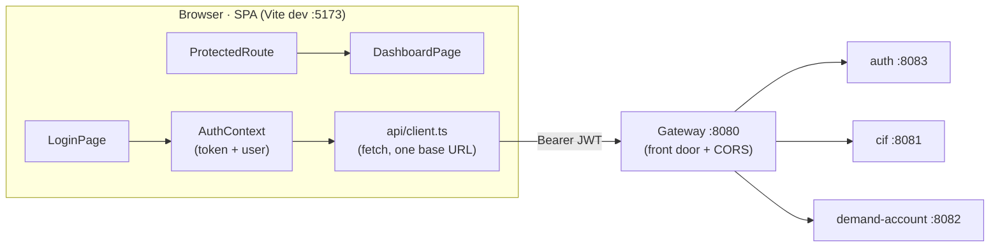

# Step 29 · Frontend pt.1 — React + TypeScript + Vite Foundations (login & routing)
### Phase F — Full-Stack Frontend 🔵 · Step 29 of 67 · 🎬 opens Phase F

> *The backend is done through Phase E; now the bank gets a face. Step 29 lays the **frontend foundations**: a
> **React + TypeScript + Vite** SPA that talks to the **gateway** (the single front door), with **client-side
> routing**, a **login/auth flow** against the auth service (the JWT you built in Step 16), and a **route
> guard**. We make the gateway genuinely the one front door (it now fronts `auth` too, with CORS), and we test
> the SPA with **Vitest + Testing Library**. This is a deliberate stack shift — JVM → Node/TypeScript.*

---

<a id="toc"></a>
## 🧭 The Six Movements of This Step

| | Movement | What happens | ~time |
|---|---|---|---|
| **A** | [🧭 Orient](#orient) | 30-second overview · skip-test · cheat card · why it matters · before you start | ~30 min |
| **B** | [🧠 Understand](#understand) | SPA + Vite/ESM · client-side routing · the auth flow (JWT, context, guard) · the gateway as front door | ~1.5 h |
| **C** | [🛠️ Build](#build) | scaffold Vite+React+TS · the API client · AuthContext · routes + guard · login page · gateway auth route + CORS · tests | ~10.5 h |
| **D** | [🔬 Prove](#prove) | the Verification Log — build/lint/test green; §12.3 break the guard; gateway CORS preflight; real output | ~1 h |
| **E** | [🎓 Apply](#apply) | go deeper · interview prep · your-turn challenges | ~1.5 h |
| **F** | [🏆 Review](#review) | troubleshooting (jsdom localStorage, CORS) · resources · recap, flashcards & what's next | ~1 h |

---

<a id="orient"></a>

# A · 🧭 Orient

## 📋 This Step in 30 Seconds

| | |
|---|---|
| **Title** | React + TypeScript + Vite foundations — routing, calling the gateway, and the login/auth flow |
| **Step** | 29 of 67 · **Phase F — Full-Stack Frontend** 🔵 · **opens Phase F** |
| **Effort** | ≈ 16 hours focused. A stack shift (JVM → Node/TS) + a new build tool (Vite) + the auth flow. |
| **What you'll run this step** | **Node 22 + npm** for the SPA (`npm install/build/lint/test` — no Docker). To see it live end-to-end you also run the **gateway + auth** (JVM); a real browser flow is the one thing the course's sandbox can't self-verify. |
| **Buildable artifact** | `frontend/` — a Vite + React 19 + TS SPA: a typed **API client** (base URL = the gateway), an **AuthContext** (JWT login/logout, persisted), **react-router** routes with a **`ProtectedRoute`** guard, a **LoginPage** + **DashboardPage**, and **Vitest + Testing Library** tests. Plus the **gateway** now fronts `auth` (`/api/auth/**`) with **CORS**. `step-29-start == step-28-end`. |
| **Verification tier** | 🔴 **Full** — a new app + a gateway (build) change. `npm run build` + `npm run lint` + `npm test` green; the gateway's new route + CORS tested; a §12.3 (break the guard → a test fails); full `./mvnw verify` still green; clean-room `npm ci`. |
| **Depends on** | **[Step 16](../step-16/lesson.md)** (the auth service / JWT login), **[Step 15](../step-15/lesson.md)** (the gateway), **[Step 18](../step-18/lesson.md)** (CORS posture). |

By the end you'll **scaffold a Vite React-TS app**, **route** client-side, implement a **JWT login flow** with a **route guard**, call an API through a typed client, and **test** components/routes with Vitest + Testing Library.

### ⏭️ Can You Skip This Step? (5-minute self-check)

If you can confidently do **all** of this, skim 🛠️ Build and jump to **[Step 30 — state, data & forms](../step-30/lesson.md)**.

- [ ] I can scaffold and explain a **Vite + React + TypeScript** project (dev server, build, why Vite is fast).
- [ ] I can set up **client-side routing** (public vs protected routes) and a **route guard**.
- [ ] I can implement a **JWT login flow**: call the API, store the token, attach it, expose auth via context.
- [ ] I can test a component and a route with **Vitest + Testing Library** (and mock the API).
- [ ] I can explain why the SPA talks to **one origin (the gateway)** and what **CORS** is doing.

> [!TIP]
> Not 100%? Stay. "Walk me through your auth flow on the frontend" and "how do you protect routes / store a JWT" are standard full-stack interview questions — you'll have built it.

## 📇 Cheat Card

> **What this step delivers (one sentence):** a React+TS SPA that logs in against the gateway-fronted auth service, stores the JWT, and guards routes — built and tested with Vite + Vitest.

**Key commands** (run in `frontend/`; or `npm --prefix frontend <script>`):

```bash
npm install            # one-time; writes package-lock.json (the version pin)
npm run dev            # Vite dev server on http://localhost:5173
npm run build          # tsc typecheck + vite production build → dist/
npm run lint           # ESLint (the SPA's quality gate)
npm test               # Vitest + Testing Library
bash steps/step-29/smoke.sh
```

**The headline — one origin, a guarded route, a JWT in context:**

```
  Browser (SPA :5173) ──fetch──> Gateway (:8080, single front door + CORS)
     LoginPage → AuthContext.login()  → POST /api/auth/login  → {token, expiresInSeconds}
     (token saved) → GET /api/auth/me → {username, roles}     → DashboardPage
     ProtectedRoute: no token? → <Navigate to="/login">
```

**The one sentence to remember:** *The SPA holds the JWT in an AuthContext (persisted), sends it to the gateway as `Authorization: Bearer …`, and a `ProtectedRoute` redirects anyone without a token to /login.*

## 🎯 Why This Matters

A backend without a UI is invisible to most stakeholders. The frontend is where auth, routing, and API integration become real — and "show me how you handle login and protected routes in React" is a near-universal full-stack interview question. Vite + TypeScript + Testing Library is the modern default stack, and wiring the SPA to a single gateway origin (with CORS) is exactly how real systems are structured.

## ✅ What You'll Be Able to Do

- Scaffold and build a Vite + React + TypeScript SPA.
- Implement client-side routing with a protected-route guard.
- Build a JWT login flow (typed API client + auth context + persistence).
- Test components and routes with Vitest + Testing Library.

## 🧰 Before You Start

- **Prereqs:** Node 22 + npm (`node -v`, `npm -v`). The bank's `auth` + `gateway` build green (`git describe` → `step-28-end`). No Docker for the SPA itself.
- **Connects to what you know:** the SPA calls the **auth** service (Step 16's JWT) through the **gateway** (Step 15); CORS echoes Step 18's deny-by-default posture.
- **Depends on:** Steps **16, 15, 18**.

## 🗓️ Session Plan

≈ 16 hours is **seven sittings**, not one heroic weekend. Each sitting ends at a ✋ checkpoint you can resume
from cold — the checkpoint tells you what you have and what to open next.

| Sitting | Covers | ~time | Ends at |
|---|---|---|---|
| **S1** | A · Orient + B · Understand (SPA, Vite, auth flow, CORS) | ~2 h | the B→C bridge (the files tree) |
| **S2** | Sub-steps **1–2** — scaffold Vite+React+TS, the typed API client | ~2.5 h | ✋ end of sub-step 2 |
| **S3** | Sub-step **3** — AuthContext + the route guard | ~2 h | ✋ end of sub-step 3 |
| **S4** | Sub-step **4** — LoginPage, DashboardPage, the route table | ~2.5 h | ✋ end of sub-step 4 |
| **S5** | Sub-step **5** — gateway: the auth route + deny-by-default CORS | ~2.5 h | ✋ end of sub-step 5 |
| **S6** | Sub-step **6** — Vitest tests + break-it + 💾 commit + 🎮 Play With It | ~2.5 h | 🏁 The Finished Result |
| **S7** | D · Prove (Verification Log) + E · Apply + F · Review | ~2 h | `step-29-end` 🎉 |

**Optional routes:** the ⏭️ skip-test (5 min) can send you straight to Step 30; the three 🚀 Go Deeper asides
are **+~5 min each**; the 🎯 Stretch challenge is **+~45 min** — none of them block the sittings above.

---

<a id="understand"></a>

# B · 🧠 Understand

## 🧠 The Big Idea — a single-page app served by Vite, talking to one front door

A **single-page app (SPA)** loads one HTML shell + a JS bundle; **client-side routing** swaps views without full
page reloads, and data comes from API calls. **Vite** is the build tool: in dev it serves your source as native
**ES modules** (no bundling → near-instant start and hot updates); for production it bundles with Rollup/esbuild.
**TypeScript** gives you types across the whole app (the API responses, the auth state) — the frontend
counterpart to the type-safety you rely on in Java.

The SPA talks to **one origin — the gateway** (Step 15), which routes to `auth`, `cif`, and `demand-account`
behind it. One origin means one base URL and one CORS policy, instead of the browser juggling four.

**🪄 Analogy:** the gateway is the bank's **single reception desk** — every request from the lobby kiosk (the
SPA) goes through it, never straight to a back office. **CORS is the desk checking the visitor's badge** (the
`Origin` header) before answering: a badge on the list gets served (`Access-Control-Allow-Origin`), any other
badge is turned away at the desk (403) — the back offices never even hear about it.



## 🧩 Pattern Spotlight — the auth flow (context + guard)

1. **LoginPage** collects credentials and calls `AuthContext.login()`.
2. **AuthContext** calls `POST /api/auth/login` → gets `{token, expiresInSeconds}`, saves the token
   (`localStorage`, so a refresh stays signed in), then `GET /api/auth/me` for the username/roles.
3. **ProtectedRoute** reads `isAuthenticated` from context; no token → `<Navigate to="/login" replace />`.
4. Authenticated API calls attach `Authorization: Bearer <token>`.

Context is React's built-in dependency injection — one provider at the top, any component reads it via the
`useAuth()` hook. (This is the same "depend on an abstraction, inject it" idea as Spring's DI.)

## 🌱 Under the Hood: why the gateway needed two changes

The gateway already routed `/cif/**` and `/bank/**`, but **not** auth — and had **no CORS**. For the SPA we
added:
- an **`auth` route**: `Path=/api/auth/**` → the auth service, with **no `StripPrefix`** (auth's own paths
  already start with `/api/auth`, so stripping would break them);
- a **`CorsFilter`** (deny-by-default, `app.security.cors.allowed-origins`) so the browser's preflight from
  `http://localhost:5173` is answered with `Access-Control-Allow-Origin` (and any other origin gets 403).

## 🛡️ Security Lens: where do you put a JWT?

We store the JWT in `localStorage` — simplest to teach, but **readable by any script on the page, so it's
exposed to XSS**. The hardened alternatives (an **httpOnly cookie** the JS can't read, or an **in-memory** access
token + a refresh-token rotation) come in **Step 32**. The CORS allow-list is **deny-by-default** (Step 18): only
the origins you name can call the gateway from a browser.

❓ **Knowledge check:** the SPA never calls `auth`, `cif`, or `demand-account` directly — why does routing everything through the gateway make CORS (and auth) simpler? <details><summary>Answer</summary>The browser only ever talks to **one origin**, so there's **one base URL and one CORS allow-list** at the front door instead of a policy per service — and the gateway is the single place to attach cross-cutting concerns. Any origin not on the deny-by-default list is rejected before the backend services ever see the request.</details>

## 🕰️ Then vs. Now

- **Build tooling:** Create-React-App (Webpack, slow) → **Vite** (native ESM in dev, esbuild/Rollup for prod).
- **Routing:** react-router's APIs evolved; v7 uses `<Routes>/<Route>` (and data routers) — we use the simple
  declarative form for foundations.
- **React:** function components + hooks (since 16.8); React 19 adds more, but the foundations here are stable.
- **Testing:** Enzyme → **Testing Library** (test what the user sees/does, not internals) + **Vitest** (Vite-native,
  Jest-compatible API).

---

# B→C bridge: 🌳 files we'll touch

```
frontend/
  package.json · tsconfig.json · vite.config.ts · eslint.config.js · index.html · .env.example
  src/
    main.tsx                  BrowserRouter → AuthProvider → App
    App.tsx                   the route table (/login public, / protected)
    api/client.ts             typed fetch wrapper (one base URL = the gateway) + login/getCurrentUser
    auth/AuthContext.tsx      JWT state, login()/logout(), useAuth() — persisted in localStorage
    auth/ProtectedRoute.tsx   redirect to /login when unauthenticated
    pages/LoginPage.tsx       the sign-in form
    pages/DashboardPage.tsx   the protected landing page (greets the user)
    test/setup.ts             jest-dom matchers + a localStorage shim
    **/*.test.ts(x)           Vitest + Testing Library
gateway/  (+ auth route /api/auth/**, + GatewayCorsConfig CorsFilter)
```

> ✋ **End of sitting S1.** Stopping here? You have the mental model (SPA → one origin → CORS) and this file
> map — no code yet. Next: **sub-step 1 (scaffold)**; first action: create `frontend/package.json`.

<a id="build"></a>

# C · 🛠️ Let's Build It — Step by Step

## 📦 Your Starting Point

`step-29-start == step-28-end`. The backend is complete through Phase E. There is no `frontend/` yet; the gateway fronts cif + demand-account but not auth.

## Sub-step 1 — scaffold Vite + React + TypeScript (~1.5 h)

> 🧭 **You are here:** sub-step **1** of 6 — the toolchain. Nothing bank-specific yet.

🎯 Create `frontend/` with `package.json` (React 19, react-router-dom 7; dev-deps Vite 6, Vitest, Testing Library, ESLint 9, typescript-eslint), `tsconfig.json` (strict), `vite.config.ts` (React plugin + Vitest jsdom), `index.html`, `eslint.config.js`. Then `npm install` (writes `package-lock.json` — the real version pin; `npm ci` reproduces it).

**🗺️ JVM → TypeScript survival map** — every stack-shift token in this step, defined once so nothing below surprises you:

| New token | What it is | Java-brain anchor |
|---|---|---|
| **component / JSX / `.tsx`** | a function that returns JSX (HTML-like syntax compiled to JS calls) | a controller + its view in one function |
| **hook** (`useState`, `useContext`, …) | a function that gives a component state/behavior; must be called unconditionally at the top level, same order every render | fields + DI, re-resolved per render |
| **`import.meta.env.VITE_*`** | build-time env vars; **only `VITE_`-prefixed keys reach browser code** (so secrets can't leak by default) | `@Value("${…}")`, but baked in at build time |
| **controlled form** | the input's value lives in React state (`value` + `onChange`); the DOM just displays it | a form-backing bean |
| **jsdom** | a DOM implemented in pure Node — component tests without a browser | H2, but for the DOM |
| **ESLint flat config** | `eslint.config.js` exports an array of config objects (ESLint 9's format; replaces `.eslintrc`) | Checkstyle, as code |

**`frontend/package.json`** — the SPA's `pom.xml` (deps + the script lifecycle):

```json
{
  "name": "build-a-bank-frontend",
  "private": true,
  "version": "0.1.0",
  "type": "module",
  "description": "Build-a-Bank — React + TypeScript SPA (Phase F, Step 29). Talks to the gateway (single front door).",
  "scripts": {
    "dev": "vite",
    "build": "tsc && vite build",
    "preview": "vite preview",
    "lint": "eslint .",
    "test": "vitest run"
  },
  "dependencies": {
    "react": "^19.1.0",
    "react-dom": "^19.1.0",
    "react-router-dom": "^7.6.0"
  },
  "devDependencies": {
    "@eslint/js": "^9.17.0",
    "@testing-library/dom": "^10.4.0",
    "@testing-library/jest-dom": "^6.6.3",
    "@testing-library/react": "^16.1.0",
    "@testing-library/user-event": "^14.5.2",
    "@types/react": "^19.0.0",
    "@types/react-dom": "^19.0.0",
    "@vitejs/plugin-react": "^4.3.4",
    "eslint": "^9.17.0",
    "eslint-plugin-react-hooks": "^5.1.0",
    "eslint-plugin-react-refresh": "^0.4.16",
    "globals": "^15.14.0",
    "jsdom": "^25.0.1",
    "typescript": "^5.7.2",
    "typescript-eslint": "^8.18.0",
    "vite": "^6.0.5",
    "vitest": "^3.0.0"
  }
}
```

🔍 **Line by line:**
- `"type": "module"` — the whole project is native ESM (`import`/`export`), matching how Vite serves it.
- `"build": "tsc && vite build"` — **two compilers, on purpose**: `tsc` type-checks (and *only* checks — see `noEmit` below), then Vite/esbuild transpiles + bundles. esbuild is fast because it skips type-checking; chaining `tsc` first is how broken types fail the build.
- Only **three runtime deps** (react, react-dom, react-router-dom); everything else is dev-time toolchain — like `<scope>test</scope>`/`provided` in Maven.
- `^19.1.0` is a **range** (any 19.x ≥ 19.1.0) — which is exactly why the lockfile below matters.

**`frontend/tsconfig.json`** — the compiler as reviewer:

```json
{
  "compilerOptions": {
    "target": "ES2022",
    "lib": ["ES2022", "DOM", "DOM.Iterable"],
    "module": "ESNext",
    "moduleResolution": "bundler",
    "jsx": "react-jsx",
    "useDefineForClassFields": true,
    "strict": true,
    "noUnusedLocals": true,
    "noUnusedParameters": true,
    "noFallthroughCasesInSwitch": true,
    "noEmit": true,
    "skipLibCheck": true,
    "esModuleInterop": true,
    "resolveJsonModule": true,
    "isolatedModules": true,
    "moduleDetection": "force",
    "verbatimModuleSyntax": true,
    "types": ["vitest/globals"]
  },
  "include": ["src", "vite.config.ts", "eslint.config.js"]
}
```

🔍 **Line by line:**
- `strict: true` + `noUnusedLocals/Parameters/noFallthroughCasesInSwitch` — the strictest practical posture; the TS equivalent of `-Werror` + Checkstyle (Step 28's spirit, new stack).
- `noEmit: true` — `tsc` **never writes JS**; Vite's esbuild does the transpiling. tsc = reviewer, esbuild = builder.
- `jsx: "react-jsx"` — the modern JSX transform: no `import React` needed at the top of every `.tsx` file.
- `verbatimModuleSyntax` — type-only imports must say `import type { … }`, so the bundler can safely erase them.
- `types: ["vitest/globals"]` — `describe`/`it`/`expect` are typed globals in test files (paired with `globals: true` below).

**`frontend/vite.config.ts`** — dev server + test runner, one file:

```ts
/// <reference types="vitest/config" />
import react from '@vitejs/plugin-react';
import { defineConfig } from 'vite';

// Step 29 · Vite config + Vitest (jsdom) for component/route tests. The dev server runs on 5173 (the origin
// the gateway's CORS allow-list expects). Tests run in jsdom with Testing Library matchers from src/test/setup.ts.
export default defineConfig({
  plugins: [react()],
  server: {
    port: 5173,
  },
  test: {
    globals: true,
    environment: 'jsdom',
    // A real (non-opaque) origin so jsdom exposes localStorage — about:blank's opaque origin leaves the
    // localStorage getter throwing, which Vitest skips, making the global `undefined` (AuthContext needs it).
    environmentOptions: {
      jsdom: { url: 'http://localhost:5173' },
    },
    setupFiles: './src/test/setup.ts',
    css: false,
  },
});
```

🔍 **Line by line:**
- `server.port: 5173` — pinned, because this exact origin (`http://localhost:5173`) is what the gateway's CORS allow-list names in sub-step 5. Port and policy must agree.
- `test.environment: 'jsdom'` — components render into a Node-simulated DOM; no browser, no Docker.
- `environmentOptions.jsdom.url` — the first half of the localStorage fix you'll meet again in sub-step 6: give jsdom a *real* origin so `localStorage` isn't behind a throwing getter.
- One config drives both `vite` (dev/build) and `vitest` (the `test` block) — Vitest is Vite-native, so your app and your tests share the same transform pipeline.

**`frontend/index.html`** — the entire HTML the SPA ever serves:

```html
<!doctype html>
<html lang="en">
  <head>
    <meta charset="UTF-8" />
    <meta name="viewport" content="width=device-width, initial-scale=1.0" />
    <title>Build-a-Bank</title>
  </head>
  <body>
    <div id="root"></div>
    <script type="module" src="/src/main.tsx"></script>
  </body>
</html>
```

🔍 One empty `<div id="root">` + one `type="module"` script — that *is* the "single page". In dev, the browser requests `/src/main.tsx` and Vite transpiles it on the fly; in prod, the build rewrites this to the hashed bundle. Everything you see on screen from here on is JS rendering into `#root`.

**`frontend/eslint.config.js`** — the SPA's quality gate:

```js
import js from '@eslint/js';
import reactHooks from 'eslint-plugin-react-hooks';
import reactRefresh from 'eslint-plugin-react-refresh';
import globals from 'globals';
import tseslint from 'typescript-eslint';

// Step 29 · ESLint flat config (ESLint 9) — the frontend's quality gate, the SPA counterpart to the backend's
// Spotless/Checkstyle (Step 28). JS recommended + typescript-eslint recommended + React hooks rules.
export default tseslint.config(
  { ignores: ['dist'] },
  {
    extends: [js.configs.recommended, ...tseslint.configs.recommended],
    files: ['**/*.{ts,tsx}'],
    languageOptions: {
      ecmaVersion: 2022,
      globals: globals.browser,
    },
    plugins: {
      'react-hooks': reactHooks,
      'react-refresh': reactRefresh,
    },
    rules: {
      ...reactHooks.configs.recommended.rules,
      'react-refresh/only-export-components': ['warn', { allowConstantExport: true }],
    },
  },
);
```

🔍 **Line by line:**
- Flat config = plain JS exporting config objects; `{ ignores: ['dist'] }` excludes build output.
- `react-hooks` rules enforce the hook call-order law from the survival map — mechanically, not by convention.
- `react-refresh/only-export-components` is set to **warn** — this is the one benign warning you'll see in the Verification Log (AuthContext exports a hook alongside a component; a DX hint, not an error).

Round it out with two small files: `frontend/src/index.css` (minimal form/card styling — copy it from the repo or write your own; design is deliberately not this step's point) and `frontend/.gitignore` (`node_modules`, `dist`, `coverage` — the **lockfile is NOT ignored**; it's the whole point). Then run `npm install` inside `frontend/`.

🔮 **Predict:** why does `npm install` commit a `package-lock.json` even though `package.json` already lists versions? <details><summary>Answer</summary>`package.json` uses ranges (`^19.1.0`); the **lockfile pins the exact resolved versions of the whole tree** (incl. transitive deps) so every machine + CI builds identical bits. "Pinned, never latest" (§12.6) = commit the lockfile.</details>

> ✋ **Checkpoint (ends sitting S2's first half).** Stopping here? You have the complete toolchain — five
> config files, `index.html`, `node_modules/`, and a committed-to-be `package-lock.json` — but no `src/` app
> code yet. Next: **sub-step 2 (the typed API client)**; first action: create `frontend/src/api/client.ts`.

## Sub-step 2 — the typed API client (one base URL = the gateway) (~1 h)

> 🧭 **You are here:** sub-step **2** of 6 — the SPA's only door to the backend. Pure TypeScript; no React yet.

🎯 `src/api/client.ts`: a `fetch` wrapper using `VITE_API_BASE_URL` (default the gateway `:8080`), with `login(username,password) → {token, expiresInSeconds}` and `getCurrentUser(token) → {username, roles}` — matched exactly to the auth contract. Throws `ApiError(status)` on non-OK.

```ts
// frontend/src/api/client.ts
// Step 29 · the typed HTTP client. ONE base URL — the gateway (the single front door, Step 15) — configurable
// via VITE_API_BASE_URL. Matches the auth service's contracts exactly: POST /api/auth/login {username,password}
// → {token, expiresInSeconds}; GET /api/auth/me (Bearer) → {username, roles}. TanStack Query arrives in Step 30.

export interface LoginResponse {
  token: string;
  expiresInSeconds: number;
}

export interface CurrentUser {
  username: string;
  roles: string[];
}

/** A failed HTTP response, carrying the status so callers (and tests) can react to 401 vs 500. */
export class ApiError extends Error {
  constructor(
    readonly status: number,
    message: string,
  ) {
    super(message);
    this.name = 'ApiError';
  }
}

const BASE_URL = import.meta.env.VITE_API_BASE_URL ?? 'http://localhost:8080';

async function request<T>(path: string, init: RequestInit = {}): Promise<T> {
  const response = await fetch(`${BASE_URL}${path}`, {
    ...init,
    headers: { 'Content-Type': 'application/json', ...init.headers },
  });
  if (!response.ok) {
    throw new ApiError(response.status, `Request to ${path} failed (${response.status})`);
  }
  return (await response.json()) as T;
}

/** Exchange credentials for a JWT (the auth service signs RS256, 30-min TTL). */
export function login(username: string, password: string): Promise<LoginResponse> {
  return request<LoginResponse>('/api/auth/login', {
    method: 'POST',
    body: JSON.stringify({ username, password }),
  });
}

/** Who am I? — the backend reads the Bearer token and returns the username + roles. */
export function getCurrentUser(token: string): Promise<CurrentUser> {
  return request<CurrentUser>('/api/auth/me', {
    headers: { Authorization: `Bearer ${token}` },
  });
}
```

🔍 **Line by line:**
- `interface LoginResponse` / `CurrentUser` — the auth service's JSON contracts (Step 16), now **typed on the client side too**. If the backend renames a field, `tsc` breaks the build here instead of the UI silently showing `undefined`.
- `class ApiError extends Error` with `readonly status` — TS's constructor-parameter properties (like Lombok's `@RequiredArgsConstructor`, but built in). Callers and tests can distinguish 401 from 500.
- `import.meta.env.VITE_API_BASE_URL ?? '…:8080'` — `??` is **nullish coalescing** (like `Optional.orElse`): fall back only when the var is `undefined`/`null`.
- `async function request<T>` — generics work like Java's; `Promise<T>` ≈ `CompletableFuture<T>`, and `await` unwraps it without callback nesting.
- `{ ...init, headers: { 'Content-Type': …, ...init.headers } }` — spread-merge: defaults first, caller's `init` wins. Every request is JSON unless overridden.
- `if (!response.ok) throw …` — `fetch` does **not** throw on 4xx/5xx (unlike RestClient); you must check `ok` yourself. Forgetting this is the classic fetch bug.

Two one-screen support files make the env var typed and documented:

```ts
// frontend/src/vite-env.d.ts
/// <reference types="vite/client" />

// Step 29 · type the one custom env var so `import.meta.env.VITE_API_BASE_URL` is typed (not `any`).
interface ImportMetaEnv {
  readonly VITE_API_BASE_URL?: string;
}

interface ImportMeta {
  readonly env: ImportMetaEnv;
}
```

```bash
# frontend/.env.example
# Step 29 · the SPA's only environment knob: the base URL of the API gateway (the single front door).
# Copy to `.env` for local dev. The gateway (Step 15) fronts auth, cif, and demand-account.
VITE_API_BASE_URL=http://localhost:8080
```

🌱 **Under the hood:** Vite doesn't read env vars at runtime — it **textually replaces** `import.meta.env.VITE_API_BASE_URL` with a literal while transforming the file. That's why only `VITE_`-prefixed keys exist in browser code (deliberate leak-prevention), and why editing `.env` needs a dev-server restart to show up.

🔮 **Predict:** you never create a `.env` file — what base URL do API calls use, and *when* was that decided? <details><summary>Answer</summary>`http://localhost:8080` (the gateway) via `??` — and the decision is baked in at **build/transform time**, not at runtime. Point the SPA elsewhere by setting `VITE_API_BASE_URL` and rebuilding/restarting dev.</details>

> ✋ **Checkpoint — end of sitting S2.** Stopping here? You have a typed client that mirrors Step 16's auth
> contract — plain functions, importable from any test, zero React. Next: **sub-step 3 (AuthContext + the
> guard)**; first action: create `frontend/src/auth/AuthContext.tsx`.

## Sub-step 3 — AuthContext + the route guard (~2 h)

> 🧭 **You are here:** sub-step **3** of 6 — the heart of the step: auth state, in one place.

🎯 `src/auth/AuthContext.tsx`: holds `token`+`user`, `login()` (calls the API, persists the token in `localStorage`, fetches `/me`), `logout()`, and a `useAuth()` hook. `src/auth/ProtectedRoute.tsx`: `if (!isAuthenticated) return <Navigate to="/login" replace/>`.

```tsx
// frontend/src/auth/AuthContext.tsx
// Step 29 · the auth flow's single source of truth. Holds the JWT + current user, exposes login()/logout(),
// and persists the token in localStorage so a refresh keeps you signed in. (Token refresh + route guards are
// hardened in Step 32; secure storage trade-offs are discussed in the lesson.)
import { createContext, useCallback, useContext, useMemo, useState, type ReactNode } from 'react';

import * as api from '../api/client';

const TOKEN_KEY = 'bab.token';

export interface AuthState {
  token: string | null;
  user: api.CurrentUser | null;
  isAuthenticated: boolean;
  login: (username: string, password: string) => Promise<void>;
  logout: () => void;
}

const AuthContext = createContext<AuthState | null>(null);

export function AuthProvider({ children }: { children: ReactNode }) {
  const [token, setToken] = useState<string | null>(() => localStorage.getItem(TOKEN_KEY));
  const [user, setUser] = useState<api.CurrentUser | null>(null);

  const login = useCallback(async (username: string, password: string) => {
    const { token: issued } = await api.login(username, password);
    localStorage.setItem(TOKEN_KEY, issued);
    setToken(issued);
    setUser(await api.getCurrentUser(issued)); // resolve who we are for the dashboard greeting
  }, []);

  const logout = useCallback(() => {
    localStorage.removeItem(TOKEN_KEY);
    setToken(null);
    setUser(null);
  }, []);

  const value = useMemo<AuthState>(
    () => ({ token, user, isAuthenticated: token !== null, login, logout }),
    [token, user, login, logout],
  );

  return <AuthContext.Provider value={value}>{children}</AuthContext.Provider>;
}

export function useAuth(): AuthState {
  const context = useContext(AuthContext);
  if (context === null) {
    throw new Error('useAuth must be used within an AuthProvider');
  }
  return context;
}
```

🔍 **Line by line:**
- `createContext<AuthState | null>(null)` — the context starts empty; only an `<AuthProvider>` above you in the tree fills it. This is the "one provider at the top, anyone reads it" DI from Pattern Spotlight, made concrete.
- `useState(() => localStorage.getItem(TOKEN_KEY))` — a **lazy initializer**: the function runs once, on first render, so a page refresh re-hydrates the token without an effect. This line is *why* refresh keeps you signed in.
- `login()` — the whole Pattern Spotlight sequence in four lines: call the API → persist → update state → fetch `/me`. `const { token: issued } = …` is destructuring-with-rename.
- `useCallback([...], [])` / `useMemo(…)` — keep function/object identities **stable across renders**, so components consuming the context don't re-render for nothing. (New object every render = every consumer re-renders.)
- `useAuth()` throws when there's no provider — fail fast at dev time, and callers get a **non-nullable** `AuthState` (no `?.` littered through the app).

```tsx
// frontend/src/auth/ProtectedRoute.tsx
// Step 29 · a route guard — wrap any element that requires a signed-in user. If there's no token, redirect to
// /login (replace, so Back doesn't bounce back into the guard). Hardened with token-refresh in Step 32.
import { Navigate } from 'react-router-dom';
import type { ReactNode } from 'react';

import { useAuth } from './AuthContext';

export function ProtectedRoute({ children }: { children: ReactNode }) {
  const { isAuthenticated } = useAuth();
  if (!isAuthenticated) {
    return <Navigate to="/login" replace />;
  }
  return <>{children}</>;
}
```

🔍 Eleven lines of logic guard every private screen the bank will ever have: read `isAuthenticated` from context; not signed in → render `<Navigate>` (a component that *redirects as its render*, `replace` so Back doesn't loop); signed in → render `children` inside `<>…</>` (a Fragment — grouping without an extra DOM node).

🌱 **Under the hood:** the guard runs **client-side only** — it protects the *route*, not the *data*. Anyone can open DevTools and read the JS. Real protection stays where it always was: the backend rejects requests without a valid JWT (Step 16). The guard is UX; the API is security.

🔮 **Predict:** `localStorage` holds a token, but it's expired (a `/me` call would 401). What renders when you open `/`? <details><summary>Answer</summary>The dashboard shell. `ProtectedRoute` only checks token **presence**, and the provider only calls `/me` inside `login()` — so `user` stays `null` and the greeting shows the `'…'` fallback. Expiry detection + refresh is exactly what Step 32 adds.</details>

❓ **Knowledge check:** ① Why does `useAuth()` throw instead of returning `null`? ② Why is the context `value` wrapped in `useMemo`? <details><summary>Answers</summary>① A missing `<AuthProvider>` is a wiring bug — better a loud error at first render than `null`-checks (and silent misbehavior) in every consumer; it also makes the hook's return type non-nullable. ② The provider re-renders whenever its state changes; without `useMemo` it would hand consumers a **fresh object every render**, re-rendering all of them even when nothing relevant changed.</details>

> ✋ **Checkpoint — end of sitting S3.** Stopping here? You have the full auth core: state + persistence,
> `login()`/`logout()`, `useAuth()`, and a working guard — but still nothing on screen. Next: **sub-step 4
> (pages + the route table)**; first action: create `frontend/src/pages/LoginPage.tsx`.

## Sub-step 4 — pages + the route table (~2.5 h)

> 🧭 **You are here:** sub-step **4** of 6 — the SPA becomes visible: two pages + the routes that serve them.

🎯 `LoginPage` (controlled form → `login()` → `navigate('/')`, shows an error on failure), `DashboardPage` (greets `user.username`/roles, logout button). `App.tsx` wires `/login` (public), `/` (protected), `*` → home. `main.tsx`: `BrowserRouter → AuthProvider → App`.

```tsx
// frontend/src/pages/LoginPage.tsx
// Step 29 · the sign-in form. Submits credentials through the AuthContext (which calls the gateway → auth),
// then navigates to the dashboard. Plain controlled inputs here; React Hook Form + Zod arrive in Step 30.
import { useState, type FormEvent } from 'react';
import { useNavigate } from 'react-router-dom';

import { useAuth } from '../auth/AuthContext';

export function LoginPage() {
  const { login } = useAuth();
  const navigate = useNavigate();
  const [username, setUsername] = useState('');
  const [password, setPassword] = useState('');
  const [error, setError] = useState<string | null>(null);
  const [submitting, setSubmitting] = useState(false);

  async function onSubmit(event: FormEvent) {
    event.preventDefault();
    setError(null);
    setSubmitting(true);
    try {
      await login(username, password);
      navigate('/');
    } catch {
      setError('Login failed — check your username and password.');
    } finally {
      setSubmitting(false);
    }
  }

  return (
    <main>
      <h1>Build-a-Bank — Sign in</h1>
      <form onSubmit={onSubmit} aria-label="Sign in">
        <label>
          Username
          <input
            name="username"
            value={username}
            autoComplete="username"
            onChange={(event) => setUsername(event.target.value)}
          />
        </label>
        <label>
          Password
          <input
            name="password"
            type="password"
            value={password}
            autoComplete="current-password"
            onChange={(event) => setPassword(event.target.value)}
          />
        </label>
        <button type="submit" disabled={submitting}>
          {submitting ? 'Signing in…' : 'Sign in'}
        </button>
        {error !== null && <p role="alert">{error}</p>}
      </form>
    </main>
  );
}
```

🔍 **Line by line:**
- Four `useState` calls = the page's whole state: two field values (**controlled inputs** — `value` from state, `onChange` writes state back; the survival map's form-backing bean), one error, one in-flight flag.
- `event.preventDefault()` — stop the browser's native full-page form POST; the SPA handles submit itself (this is *the* line that makes it a single-page app during login).
- `try / catch / finally` — exactly Java's semantics: success → `navigate('/')`; failure → a human error message; either way re-enable the button.
- `disabled={submitting}` — no double-submit while the request is in flight; the label swaps to `Signing in…` for feedback.
- `role="alert"` — accessibility *and* testability: screen readers announce it, and sub-step 6's test finds it with `findByRole('alert')` instead of brittle CSS selectors.
- `<label>` wraps its `<input>` — which is what lets tests (and assistive tech) locate fields via `getByLabelText(/username/i)`.

**`DashboardPage` — your turn to type (spec below, full solution collapsed).** Everything it needs, you built in sub-step 3. The spec:

1. Import and call `useAuth()`; take `user` and `logout` from it.
2. Render a `<main>` with an `<h1>` welcome, a line "Signed in as **username**" — with a `'…'` fallback while `user` is `null`, and the roles in parentheses when there are any.
3. A "Sign out" button (`type="button"`) that calls `logout` — the guard then does the redirecting for free on the next render.

<details><summary>✅ The committed solution (compare after you've tried)</summary>

```tsx
// frontend/src/pages/DashboardPage.tsx
// Step 29 · the protected landing page — proves the auth flow end-to-end by greeting the signed-in user
// (username + roles came from GET /api/auth/me). Real account/transfer screens arrive in Step 30.
import { useAuth } from '../auth/AuthContext';

export function DashboardPage() {
  const { user, logout } = useAuth();
  return (
    <main>
      <h1>Welcome to Build-a-Bank 🏦</h1>
      <p>
        Signed in as <strong>{user?.username ?? '…'}</strong>
        {user !== null && user.roles.length > 0 ? ` (${user.roles.join(', ')})` : ''}
      </p>
      <button type="button" onClick={logout}>
        Sign out
      </button>
    </main>
  );
}
```

`user?.username ?? '…'` chains optional-access with the nullish fallback; note `type="button"` so a button inside no form never accidentally submits one.
</details>

Now wire the routes and the entry point:

```tsx
// frontend/src/App.tsx
// Step 29 · the route table. /login is public; / is protected (the dashboard); anything else redirects home
// (the guard then sends you to /login if you're not signed in). Nested layouts/feature routes grow in Step 30.
import { Navigate, Route, Routes } from 'react-router-dom';

import { ProtectedRoute } from './auth/ProtectedRoute';
import { DashboardPage } from './pages/DashboardPage';
import { LoginPage } from './pages/LoginPage';

export function App() {
  return (
    <Routes>
      <Route path="/login" element={<LoginPage />} />
      <Route
        path="/"
        element={
          <ProtectedRoute>
            <DashboardPage />
          </ProtectedRoute>
        }
      />
      <Route path="*" element={<Navigate to="/" replace />} />
    </Routes>
  );
}
```

```tsx
// frontend/src/main.tsx
// Step 29 · the SPA entry point. BrowserRouter (real URL routing) wraps AuthProvider (auth state) wraps the App.
import { StrictMode } from 'react';
import { createRoot } from 'react-dom/client';
import { BrowserRouter } from 'react-router-dom';

import { App } from './App';
import { AuthProvider } from './auth/AuthContext';
import './index.css';

const rootElement = document.getElementById('root');
if (rootElement === null) {
  throw new Error('Root element #root not found in index.html');
}

createRoot(rootElement).render(
  <StrictMode>
    <BrowserRouter>
      <AuthProvider>
        <App />
      </AuthProvider>
    </BrowserRouter>
  </StrictMode>,
);
```

🔍 **Line by line:**
- `App.tsx` — the guard wraps the *element*, not the path: `/` renders `<DashboardPage>` **through** `<ProtectedRoute>`. `path="*"` is the catch-all for unknown URLs.
- `main.tsx` — the nesting order is load-bearing: `BrowserRouter` (URL ↔ view) must be outside `AuthProvider` only because nothing in auth needs routing — but `AuthProvider` **must** wrap `App`, or every `useAuth()` in it throws. `StrictMode` double-invokes renders in dev to surface impure code early. `import './index.css'` — yes, CSS via an import; Vite turns it into a stylesheet.

🔮 **Predict:** why does `path="*"` redirect to `/` and not straight to `/login`? <details><summary>Answer</summary>So the **guard stays the only component that decides auth**. A signed-in user hitting a typo'd URL lands on the dashboard; a signed-out one gets forwarded `/` → `ProtectedRoute` → `/login`. One decision point — no duplicated auth logic in the route table.</details>

> ✋ **Checkpoint — end of sitting S4.** Stopping here? All nine `src/` files exist — the SPA is complete and
> `npm run dev` serves it at `http://localhost:5173` (logging in still needs the backend, and the gateway
> can't front auth yet — that's next). Next: **sub-step 5 (the gateway as single front door)**; first action:
> open `gateway/src/main/resources/application.yml`.

## Sub-step 5 — make the gateway the single front door (~2.5 h)

> 🧭 **You are here:** sub-step **5** of 6 — back to Java for one sitting: the gateway learns about auth + browsers.

🎯 Add the `auth` route (`/api/auth/**`, no StripPrefix) to `gateway/application.yml` and a `GatewayCorsConfig` `CorsFilter` (deny-by-default, `app.security.cors.allowed-origins`, dev default `http://localhost:5173`). Extend `GatewayRoutingTest`: auth routes without stripping; an allowed-origin preflight gets `Access-Control-Allow-Origin`; a disallowed origin gets 403.

**`gateway/src/main/resources/application.yml`** — the diff (two additions):

```diff
               filters:
                 - StripPrefix=1                          # /bank/api/v1/transfers → /api/v1/transfers
                 - AddResponseHeader=X-Gateway, build-a-bank
+            # Step 29: front the auth service so the React app has ONE base URL (the gateway). Auth's own
+            # paths already start with /api/auth, so we DON'T strip — /api/auth/login → auth's /api/auth/login.
+            - id: auth
+              uri: ${services.auth.uri:http://localhost:8083}
+              predicates:
+                - Path=/api/auth/**
+              filters:
+                - AddResponseHeader=X-Gateway, build-a-bank
 
 server:
   port: 8080                                             # the gateway is the front door
 
+# Step 29: CORS so the React dev app (Vite, http://localhost:5173) can call the gateway from the browser.
+# Comma-separated origins; override per environment (tighten/replace in prod). Consumed by GatewayCorsConfig.
+app:
+  security:
+    cors:
+      allowed-origins: ${APP_CORS_ALLOWED_ORIGINS:http://localhost:5173}
```

🔍 **Line by line:**
- The `auth` route mirrors `cif`/`bank` — **except no `StripPrefix`**. Those routes use gateway-only prefixes (`/cif/**`, `/bank/**`) that must be removed before forwarding; auth's real endpoints already *live* at `/api/auth/*`, so the path forwards unchanged.
- `${services.auth.uri:http://localhost:8083}` — the same overridable-with-default pattern as the other routes; the test overrides it to point at a stub.
- `${APP_CORS_ALLOWED_ORIGINS:http://localhost:5173}` — dev default is exactly the Vite origin from sub-step 1's `server.port`. Comma-separated for more origins; set the env var to tighten/replace in prod.

**`gateway/src/main/java/com/buildabank/gateway/GatewayCorsConfig.java`** — new file:

```java
// gateway/src/main/java/com/buildabank/gateway/GatewayCorsConfig.java
package com.buildabank.gateway;

import java.time.Duration;
import java.util.List;

import org.springframework.beans.factory.annotation.Value;
import org.springframework.context.annotation.Bean;
import org.springframework.context.annotation.Configuration;
import org.springframework.web.cors.CorsConfiguration;
import org.springframework.web.cors.UrlBasedCorsConfigurationSource;
import org.springframework.web.filter.CorsFilter;

/**
 * Step 29 · CORS at the gateway (the front door), so the browser-based React app (Vite dev server,
 * http://localhost:5173) can call it cross-origin. A standard servlet {@link CorsFilter} — it answers the
 * browser's OPTIONS preflight and adds {@code Access-Control-Allow-Origin} to responses.
 *
 * <p><strong>Deny-by-default</strong> (same posture as demand-account, Step 18): only the origins listed in
 * {@code app.security.cors.allowed-origins} are allowed. The dev default is the Vite origin; override
 * {@code APP_CORS_ALLOWED_ORIGINS} per environment and tighten for production.
 */
@Configuration
class GatewayCorsConfig {

    @Bean
    CorsFilter corsFilter(@Value("${app.security.cors.allowed-origins:}") List<String> allowedOrigins) {
        CorsConfiguration config = new CorsConfiguration();
        config.setAllowedOrigins(allowedOrigins.stream().filter(o -> !o.isBlank()).toList()); // empty ⇒ deny all
        config.setAllowedMethods(List.of("GET", "POST", "PUT", "DELETE", "OPTIONS"));
        config.setAllowedHeaders(List.of("Authorization", "Content-Type", "Idempotency-Key"));
        config.setMaxAge(Duration.ofHours(1));

        UrlBasedCorsConfigurationSource source = new UrlBasedCorsConfigurationSource();
        source.registerCorsConfiguration("/**", config);
        return new CorsFilter(source);
    }
}
```

🔍 **Line by line:**
- `@Value(...) List<String>` — Spring splits the comma-separated property into a list; the `:` default is **empty**, and the `filter(!isBlank)` line makes empty mean **deny all** (no origins allowed) — deny-by-default even when misconfigured.
- `setAllowedHeaders` names exactly what the SPA sends: `Authorization` (the Bearer token), `Content-Type` (JSON), and `Idempotency-Key` (so Step 30's transfer calls won't be preflight-blocked later).
- `setMaxAge(1h)` — the browser may cache a preflight verdict for an hour instead of OPTIONS-ing before every call.
- Registered on `/**` — one policy for the whole front door, which is the point of having one front door.

**`GatewayRoutingTest`** — first two new stub properties, then three new tests (bringing it to **4**):

```diff
         registry.add("services.cif.uri", () -> stubUri);
         registry.add("services.demand-account.uri", () -> stubUri);
+        registry.add("services.auth.uri", () -> stubUri);                                  // Step 29: auth route target
+        registry.add("app.security.cors.allowed-origins", () -> "http://localhost:5173");  // Step 29: allowed dev origin
```

```java
    @Test
    void routesAuthWithoutStrippingPrefix() throws Exception {
        // Step 29: the React app calls the gateway for login; auth's paths already start with /api/auth,
        // so the auth route does NOT strip — the downstream receives the path unchanged.
        HttpResponse<String> response = http.send(
                HttpRequest.newBuilder(URI.create("http://localhost:" + gatewayPort + "/api/auth/me"))
                        .GET().build(),
                HttpResponse.BodyHandlers.ofString());

        assertThat(response.statusCode()).isEqualTo(200);
        assertThat(receivedPath.get()).isEqualTo("/api/auth/me");                   // NOT stripped
        assertThat(response.headers().firstValue("X-Gateway")).hasValue("build-a-bank");
    }

    @Test
    void corsPreflightFromTheAllowedOriginIsAllowed() throws Exception {
        // A browser preflight: OPTIONS + Origin + Access-Control-Request-Method. The gateway's CorsFilter
        // answers it directly with the matching Access-Control-Allow-Origin (the route is never reached).
        HttpResponse<String> preflight = http.send(
                HttpRequest.newBuilder(URI.create("http://localhost:" + gatewayPort + "/api/auth/login"))
                        .method("OPTIONS", HttpRequest.BodyPublishers.noBody())
                        .header("Origin", "http://localhost:5173")
                        .header("Access-Control-Request-Method", "POST")
                        .build(),
                HttpResponse.BodyHandlers.ofString());

        assertThat(preflight.statusCode()).isEqualTo(200);
        assertThat(preflight.headers().firstValue("Access-Control-Allow-Origin"))
                .hasValue("http://localhost:5173");
    }

    @Test
    void corsPreflightFromADisallowedOriginIsRejected() throws Exception {
        // deny-by-default: an origin not on the allow-list gets no Access-Control-Allow-Origin (browser blocks it).
        HttpResponse<String> preflight = http.send(
                HttpRequest.newBuilder(URI.create("http://localhost:" + gatewayPort + "/api/auth/login"))
                        .method("OPTIONS", HttpRequest.BodyPublishers.noBody())
                        .header("Origin", "http://evil.example")
                        .header("Access-Control-Request-Method", "POST")
                        .build(),
                HttpResponse.BodyHandlers.ofString());

        assertThat(preflight.statusCode()).isEqualTo(403);
        assertThat(preflight.headers().firstValue("Access-Control-Allow-Origin")).isEmpty();
    }
```

🔍 The tests fake a browser by hand: a **preflight** is nothing more mystical than `OPTIONS` + `Origin` + `Access-Control-Request-Method` headers — so a plain `HttpClient` can send one. The stub server records `receivedPath`, which is how `routesAuthWithoutStrippingPrefix` *proves* no stripping happened rather than assuming it.

🔮 **Predict:** a preflight arrives from `http://evil.example` — what status comes back, and which component produced it? <details><summary>Answer</summary>**403, from the gateway's `CorsFilter` itself.** The route never matches, the auth service never hears about it — the request dies at the front door. (And per the browser contract: no `Access-Control-Allow-Origin` header ⇒ the page's JS never sees any response.)</details>

❓ **Knowledge check:** ① Why does the `auth` route skip `StripPrefix` when `cif`/`bank` need it? ② Why put CORS on the gateway instead of on each service? <details><summary>Answers</summary>① `/cif/**` and `/bank/**` are gateway-only prefixes invented in Step 15 — they must be removed before forwarding; auth's controllers genuinely live at `/api/auth/*`, so stripping would 404 them. ② The browser only ever talks to **one origin** — the front door. One allow-list to audit, one place to tighten in prod, and preflights are answered before any routing happens.</details>

> ✋ **Checkpoint — end of sitting S5.** Stopping here? The gateway now fronts auth + cif + demand-account with
> deny-by-default CORS, and `GatewayRoutingTest` covers all 4 behaviors. Next: **sub-step 6 (test the SPA)**;
> first action: create `frontend/src/test/setup.ts`.

## Sub-step 6 — test the SPA (Vitest + Testing Library) (~2 h)

> 🧭 **You are here:** sub-step **6** of 6 — the last mile: 7 tests across three files, plus the setup that makes jsdom behave.

🎯 `client.test.ts` (stub `fetch` → assert request shape), `LoginPage.test.tsx` (mock `api/client` → assert form wiring + error UX), `ProtectedRoute.test.tsx` (drive auth via `localStorage` → redirect vs render).

⚠️ **Pitfall (we hit it):** jsdom's `localStorage` getter throws for an opaque origin, so Vitest leaves the global `undefined` (and your app breaks in tests). Fix: install a tiny in-memory `localStorage` in `src/test/setup.ts`.

```ts
// frontend/src/test/setup.ts
// Step 29 · Vitest setup — registers jest-dom matchers (toBeInTheDocument, …) and resets DOM + localStorage
// between tests so they're independent.
import '@testing-library/jest-dom/vitest';
import { cleanup } from '@testing-library/react';
import { afterEach } from 'vitest';

// jsdom's localStorage getter throws for an opaque origin, so Vitest leaves the global `undefined`. The app
// uses localStorage (AuthContext), so install a tiny in-memory Storage for tests — deterministic and isolated.
if (typeof globalThis.localStorage === 'undefined') {
  const store = new Map<string, string>();
  globalThis.localStorage = {
    get length() {
      return store.size;
    },
    clear: () => store.clear(),
    getItem: (key: string) => store.get(key) ?? null,
    key: (index: number) => Array.from(store.keys())[index] ?? null,
    removeItem: (key: string) => store.delete(key),
    setItem: (key: string, value: string) => store.set(key, String(value)),
  } as Storage;
}

afterEach(() => {
  cleanup();
  localStorage.clear();
});
```

🔍 A `Map`-backed `Storage` in ~15 lines — installed only when jsdom didn't provide one, so it's harmless if the quirk ever goes away. `afterEach(cleanup + clear)` is the test-isolation contract: no DOM and no token leaks from one test into the next (the same instinct as `@Transactional` test rollback).

```ts
// frontend/src/api/client.test.ts
// Step 29 · unit-test the HTTP client by stubbing global fetch — proves the request shape (path, method, body,
// bearer header) and error handling match the auth contract, with no network.
import { afterEach, describe, expect, it, vi } from 'vitest';

import { ApiError, getCurrentUser, login } from './client';

function jsonResponse(body: unknown, ok = true, status = 200): Response {
  return { ok, status, json: () => Promise.resolve(body) } as Response;
}

describe('api client', () => {
  afterEach(() => {
    vi.unstubAllGlobals();
    vi.restoreAllMocks();
  });

  it('login POSTs the credentials and returns the token', async () => {
    const fetchMock = vi.fn().mockResolvedValue(jsonResponse({ token: 'jwt-123', expiresInSeconds: 1800 }));
    vi.stubGlobal('fetch', fetchMock);

    const result = await login('alice', 'password');

    expect(result.token).toBe('jwt-123');
    expect(result.expiresInSeconds).toBe(1800);
    expect(fetchMock).toHaveBeenCalledOnce();
    const [url, init] = fetchMock.mock.calls[0] as [string, RequestInit];
    expect(url).toContain('/api/auth/login');
    expect(init.method).toBe('POST');
    expect(JSON.parse(init.body as string)).toEqual({ username: 'alice', password: 'password' });
  });

  it('getCurrentUser sends the Bearer token', async () => {
    const fetchMock = vi.fn().mockResolvedValue(jsonResponse({ username: 'alice', roles: ['ROLE_USER'] }));
    vi.stubGlobal('fetch', fetchMock);

    const user = await getCurrentUser('jwt-123');

    expect(user.username).toBe('alice');
    expect(user.roles).toContain('ROLE_USER');
    const [, init] = fetchMock.mock.calls[0] as [string, RequestInit];
    expect((init.headers as Record<string, string>).Authorization).toBe('Bearer jwt-123');
  });

  it('throws ApiError carrying the status on a non-ok response', async () => {
    vi.stubGlobal('fetch', vi.fn().mockResolvedValue(jsonResponse({}, false, 401)));
    await expect(login('alice', 'wrong')).rejects.toBeInstanceOf(ApiError);
  });
});
```

🔍 **Line by line:**
- `vi.stubGlobal('fetch', fetchMock)` — replace the global `fetch` (Vitest's `vi` ≈ Mockito); `unstubAllGlobals()` in `afterEach` restores the world.
- `jsonResponse(...) as Response` — a hand-rolled minimal `Response`; the cast says "trust me, this is enough of the interface for the code under test".
- `fetchMock.mock.calls[0]` — captured arguments, like Mockito's `ArgumentCaptor`: the assertions pin the **request shape** (URL, method, JSON body, `Authorization` header) to the auth contract.
- `await expect(...).rejects.toBeInstanceOf(ApiError)` — the async version of `assertThatThrownBy`.

```tsx
// frontend/src/auth/ProtectedRoute.test.tsx
// Step 29 · route-guard test. With no token the guard redirects to /login; with a token it renders the
// protected content. (AuthProvider seeds its token from localStorage, so we drive auth state via localStorage.)
import { render, screen } from '@testing-library/react';
import { MemoryRouter, Route, Routes } from 'react-router-dom';
import { beforeEach, describe, expect, it } from 'vitest';

import { AuthProvider } from '../auth/AuthContext';
import { ProtectedRoute } from './ProtectedRoute';

function renderAt(path: string) {
  return render(
    <MemoryRouter initialEntries={[path]}>
      <AuthProvider>
        <Routes>
          <Route path="/login" element={<p>Login page</p>} />
          <Route
            path="/secret"
            element={
              <ProtectedRoute>
                <p>Secret area</p>
              </ProtectedRoute>
            }
          />
        </Routes>
      </AuthProvider>
    </MemoryRouter>,
  );
}

describe('ProtectedRoute', () => {
  beforeEach(() => localStorage.clear());

  it('redirects to /login when there is no token', () => {
    renderAt('/secret');
    expect(screen.getByText('Login page')).toBeInTheDocument();
    expect(screen.queryByText('Secret area')).not.toBeInTheDocument();
  });

  it('renders the protected content when a token is present', () => {
    localStorage.setItem('bab.token', 'jwt-123');
    renderAt('/secret');
    expect(screen.getByText('Secret area')).toBeInTheDocument();
  });
});
```

🔍 **Line by line:**
- `MemoryRouter initialEntries={[path]}` — a router with an in-memory URL (no browser address bar in jsdom); the test *starts* at `/secret` and observes where the guard sends it.
- The routes use throwaway `<p>` markers, not the real pages — this tests the **guard**, nothing else.
- Auth state is driven **through `localStorage`** (seed a token, or don't) because that's exactly where `AuthProvider`'s lazy initializer looks — the test exercises the real hydration path, no test-only backdoor.
- `getByText` throws when missing; `queryByText` returns `null` — which is why the *negative* assertion uses `query…`.

```tsx
// frontend/src/pages/LoginPage.test.tsx
// Step 29 · component test (Testing Library + user-event). The api/client module is mocked (MSW arrives in
// Step 31), so we assert the page wires the form to the auth call and surfaces errors — no real network.
import { render, screen } from '@testing-library/react';
import userEvent from '@testing-library/user-event';
import { MemoryRouter } from 'react-router-dom';
import { afterEach, describe, expect, it, vi } from 'vitest';

import * as api from '../api/client';
import { AuthProvider } from '../auth/AuthContext';
import { LoginPage } from './LoginPage';

vi.mock('../api/client');

function renderLogin() {
  return render(
    <MemoryRouter initialEntries={['/login']}>
      <AuthProvider>
        <LoginPage />
      </AuthProvider>
    </MemoryRouter>,
  );
}

describe('LoginPage', () => {
  afterEach(() => vi.restoreAllMocks());

  it('submits the typed credentials through the auth API', async () => {
    vi.mocked(api.login).mockResolvedValue({ token: 'jwt-123', expiresInSeconds: 1800 });
    vi.mocked(api.getCurrentUser).mockResolvedValue({ username: 'alice', roles: ['ROLE_USER'] });
    renderLogin();

    await userEvent.type(screen.getByLabelText(/username/i), 'alice');
    await userEvent.type(screen.getByLabelText(/password/i), 'password');
    await userEvent.click(screen.getByRole('button', { name: /sign in/i }));

    expect(api.login).toHaveBeenCalledWith('alice', 'password');
  });

  it('shows an error message when login fails', async () => {
    vi.mocked(api.login).mockRejectedValue(new Error('bad credentials'));
    renderLogin();

    await userEvent.type(screen.getByLabelText(/username/i), 'alice');
    await userEvent.type(screen.getByLabelText(/password/i), 'wrong');
    await userEvent.click(screen.getByRole('button', { name: /sign in/i }));

    expect(await screen.findByRole('alert')).toHaveTextContent(/login failed/i);
  });
});
```

🔍 **Line by line:**
- `vi.mock('../api/client')` — replaces the *whole module* with auto-mocks; it's **hoisted** above the imports at transform time, so the page under test already receives fakes. `vi.mocked(api.login)` just adds mock-typing.
- `userEvent.type` / `.click` — simulated *user* interactions (keystroke by keystroke), found via `getByLabelText` and `getByRole` — Testing Library's principle: query the page the way a user (or screen reader) would, never by CSS class.
- `await screen.findByRole('alert')` — `find*` queries **wait** for the element to appear, absorbing the async catch → setState → re-render dance without `sleep`s.

🔮 **Predict:** `LoginPage.test.tsx` mocks `../api/client`, but `client.test.ts` stubbed global `fetch` — why two different seams? <details><summary>Answer</summary>Each test fakes the boundary **just below its unit**. The client's entire job *is* the HTTP shape → stub `fetch` and inspect it. The page's job is form wiring + error UX → mock the client and ignore HTTP (already covered). Step 31's MSW moves the seam to the network for true integration tests.</details>

🔬 **Break-it (the §12.3 proof):** disable the guard (`if (false && !isAuthenticated)`) → the "redirects to /login" test fails (it renders the protected content). Put it back.

💾 **Commit:** `feat(frontend): Step 29 React+TS+Vite SPA — login/auth flow + routing; gateway fronts auth + CORS`

> ✋ **Checkpoint.** You now have all 7 SPA tests + the jsdom shim, and the step's code is complete and
> committed. Stopping here? Next: **🎮 Play With It** (the live flow); first action: start the backend —
> Terminal 1 below.

## 🎮 Play With It

```bash
# Terminal 1 — backend (the SPA's front door + auth). From the repo root:
./mvnw -pl services/auth spring-boot:run   # :8083
# CORS lives at the *gateway*: its dev default already allows http://localhost:5173; set
# APP_CORS_ALLOWED_ORIGINS on the gateway (not auth) to allow other origins.
./mvnw -pl gateway spring-boot:run         # :8080 (new shell)
# Terminal 2 — the SPA:
npm --prefix frontend run dev      # open http://localhost:5173 → sign in as alice / password
```

🧪 **Little experiments:** sign in as `alice`/`password` then `admin`/`admin123` — the dashboard shows different roles. Open DevTools → Application → Local Storage: see `bab.token`. Delete it, refresh: you're bounced to `/login` (the guard). Stop the gateway and try to log in: the error message appears.

> [!NOTE]
> The **live browser** flow is the one thing this course's sandbox can't self-verify (no browser). Everything else — build, lint, the component/route tests, and the gateway's CORS preflight — is verified with real output below (§12.8 honesty).

## 🏁 The Finished Result

The flow you just built, end to end:

```mermaid
sequenceDiagram
    participant SPA as Browser · SPA (:5173)
    participant GW as Gateway (:8080)
    participant AUTH as auth (:8083)
    alt no token in localStorage
        SPA->>SPA: visit "/" → ProtectedRoute → Navigate to /login (replace)
    end
    SPA->>GW: POST /api/auth/login {username, password}
    Note over SPA,GW: cross-origin ⇒ the browser preflights (OPTIONS);<br/>the CorsFilter answers with Access-Control-Allow-Origin
    GW->>AUTH: POST /api/auth/login (no StripPrefix — path unchanged)
    AUTH-->>GW: {token, expiresInSeconds}
    GW-->>SPA: {token, expiresInSeconds}
    SPA->>SPA: localStorage.setItem('bab.token', …) → setToken
    SPA->>GW: GET /api/auth/me · Authorization: Bearer token
    GW->>AUTH: GET /api/auth/me
    AUTH-->>GW: {username, roles}
    GW-->>SPA: {username, roles} → navigate('/') → DashboardPage greets the user
```

`step-29-end`: a working React+TS SPA with login, routing, and a guard, talking to the gateway; the gateway is the single front door (auth + CORS). **✅ Definition of Done:** `npm run build`, `npm run lint`, `npm test` green; the gateway tests pass; `./mvnw verify` green; `bash steps/step-29/smoke.sh` passes; committed/tagged `step-29-end`.

> ✋ **End of sitting S6.** Stopping here? Everything is built, tested, and committed. Next: **D · Prove**
> (sitting S7 — the Verification Log + Apply + Review); first action: run `bash steps/step-29/smoke.sh`.

---

<a id="prove"></a>

# D · 🔬 Prove It Works — Verification Log

> **Tier: 🔴 Full** (new app + gateway/build change). Real pasted output. The SPA needs no Docker; the full
> `./mvnw verify` does (existing integration tests). A live *browser* flow is verify-adjacent (§12.8).

**1 · `npm install` — reproducible deps (lockfile committed):**

```
added 289 packages, and audited 290 packages in 2m
found 0 vulnerabilities
```

**2 · `npm run build` — TypeScript typecheck + Vite production build:**

```
> tsc && vite build
vite v6.4.3 building for production...
✓ 46 modules transformed.
dist/index.html                   0.40 kB
dist/assets/index-*.css           0.60 kB
dist/assets/index-*.js          234.72 kB │ gzip: 75.15 kB
✓ built in 931ms
```

**3 · `npm test` — Vitest + Testing Library (7 tests, no Docker):**

```
✓ src/api/client.test.ts (3 tests)
✓ src/auth/ProtectedRoute.test.tsx (2 tests)
✓ src/pages/LoginPage.test.tsx (2 tests)
 Test Files  3 passed (3)
      Tests  7 passed (7)
```

**4 · `npm run lint` — the SPA's quality gate:**

```
✖ 1 problem (0 errors, 1 warning)   # react-refresh DX hint on AuthContext.tsx — benign; lint exits 0
```

**5 · Gateway — the new auth route + CORS (headless, no Docker):**

```
[INFO] Tests run: 4, Failures: 0, Errors: 0, Skipped: 0 -- in com.buildabank.gateway.GatewayRoutingTest
```
covering: routes-to-downstream (StripPrefix), **routes `/api/auth/me` WITHOUT stripping**, **CORS preflight from
`http://localhost:5173` → `Access-Control-Allow-Origin: http://localhost:5173`**, and **a disallowed origin → 403**.

**6 · §12.3 Mutation sanity-check — prove the guard test means something.** Disabled the guard
(`if (false && !isAuthenticated)`) and re-ran:

```
× ProtectedRoute > redirects to /login when there is no token
  → Unable to find an element with the text: Login page    [rendered "Secret area" instead]
 Tests  1 failed | 6 passed (7)
```
→ With the guard off, the protected content rendered for an unauthenticated user — the test caught it. **Reverted** → 7/7 green.

**7 · `smoke.sh`** — `bash steps/step-29/smoke.sh` runs the SPA build + lint + tests and the gateway route/CORS test → `✅ Step 29 smoke test PASSED`.

**8 · Build** — full-repo `./mvnw verify` → BUILD SUCCESS (14 modules; gateway change included; quality gates green). Clean-room: fresh clone + `npm ci` + build + test green.

**§12.8 honesty:** the **live browser** cross-origin flow can't run in this sandbox (no browser) — verified instead by the headless CORS preflight test + the component/route tests. The JWT lives in `localStorage` (XSS-exposed) — a teaching simplification hardened in Step 32. One benign ESLint `react-refresh` warning remains (DX-only; lint exits 0).

---

<a id="apply"></a>

# E · 🎓 Apply

## 🚀 Go Deeper (Optional)

<details><summary>Why is Vite's dev server so fast? (+~5 min)</summary>In dev it doesn't bundle — it serves your source as native ES modules and lets the browser request them on demand, transpiling each file with esbuild (Go, very fast). Only what's imported is processed; HMR swaps a single module. Production still bundles (Rollup) for fewer requests + tree-shaking.</details>

<details><summary>localStorage vs httpOnly cookie vs in-memory for the JWT (+~5 min)</summary>localStorage: survives refresh, simple — but any injected script can read it (XSS). httpOnly cookie: JS can't read it (XSS-safe for the token) but you must defend CSRF and set SameSite. In-memory: safest from XSS exfiltration but lost on refresh → pair with a refresh-token rotation. Step 32 implements refresh + guards; the choice is a real trade-off, not a default.</details>

<details><summary>Why one origin (the gateway) instead of calling each service? (+~5 min)</summary>One base URL, one CORS policy, one place for cross-cutting concerns (auth, rate limits, headers). The browser otherwise needs a CORS handshake with every service. This is the BFF/API-gateway pattern (Step 15) paying off for the UI.</details>

## 💼 Interview Prep

1. **Walk me through your frontend auth flow.** *Login posts credentials → JWT; store it (localStorage here, with the XSS caveat); expose auth via context; attach `Bearer` to API calls; a ProtectedRoute redirects unauthenticated users. /me resolves the current user.* **(Common.)**
2. **How do you protect a route in React Router?** *A guard component reads auth state from context and either renders the children or `<Navigate to="/login" replace/>`. `replace` so Back doesn't re-enter the guard.*
3. **Where do you store a JWT and why?** *Trade-off: localStorage (simple, XSS-exposed) vs httpOnly cookie (XSS-safe, CSRF to handle) vs in-memory + refresh token (safest, lost on refresh). State the threat model.*
4. **What is CORS and why did the gateway need it?** *Browsers block cross-origin requests unless the server opts in via `Access-Control-Allow-Origin`. The SPA (:5173) and gateway (:8080) are different origins, so the gateway must allow the SPA's origin (deny-by-default).*
5. **(Gotcha) Why does Vite commit a lockfile if package.json has versions?** *package.json has ranges; the lockfile pins exact resolved versions of the whole tree for reproducible `npm ci`.*

## 🏋️ Your Turn: Practice & Challenges

- **Quick:** add a `roles` check to `ProtectedRoute` (a `requiredRole` prop) and a test that a USER is redirected from an admin-only route.
- **Quick:** add a `client.test.ts` case asserting `getCurrentUser` throws `ApiError(401)` on an expired token.
- 🎯 **Stretch (+~45 min; reference solution in `solutions/step-29/`):** add an Axios-free request interceptor that auto-attaches the token from `AuthContext` to every call (so pages don't pass it manually), with a test that the header is present.

---

<a id="review"></a>

# F · 🏆 Review

## 🩺 Stuck? Troubleshooting & Fixes

- **Tests fail with `Cannot read properties of undefined (reading 'clear')` / `localStorage is not defined`.** jsdom's localStorage getter throws for an opaque origin → Vitest leaves the global undefined. Install an in-memory `localStorage` in `src/test/setup.ts` (this lesson does).
- **Browser console: `... has been blocked by CORS policy`.** The gateway isn't allowing your origin. Start it with `APP_CORS_ALLOWED_ORIGINS=http://localhost:5173` (or check `GatewayCorsConfig`).
- **Login returns 404 at the gateway.** The gateway needs the `auth` route (`/api/auth/**`, no StripPrefix) — and the auth service must be running on :8083.
- **`npm run build` fails on a type error.** That's `tsc` doing its job — fix the type; the build won't ship broken types.
- **ESLint `react-refresh` warning on AuthContext.** Benign (DX-only); lint still exits 0. Split the hook into its own file if you want it gone.
- **Reset:** `git checkout step-29-end` then `npm --prefix frontend ci`.

## 📚 Learn More & Glossary

- Vite guide; React docs (you-might-not-need-an-effect, hooks); React Router docs; Testing Library (guiding principles); Vitest docs; MDN on CORS and Web Storage.
- **Glossary:** *SPA*, *Vite / ESM dev server*, *client-side routing*, *route guard*, *React context*, *JWT / Bearer*, *CORS / preflight*, *Vitest / jsdom*, *Testing Library*, *lockfile / `npm ci`*.

## 🏆 Recap & Study Notes

**(a) Key points:** A **Vite + React + TypeScript** SPA with **client-side routing** and a **JWT login flow**:
`LoginPage` → `AuthContext.login()` → the gateway's `/api/auth/login` → store the token → `/me` →
`DashboardPage`; a **`ProtectedRoute`** redirects unauthenticated users. The SPA talks to **one origin — the
gateway**, which we extended to front `auth` (no StripPrefix) with **deny-by-default CORS**. Tested with
**Vitest + Testing Library** (API mocked; MSW in Step 31). The JWT in `localStorage` is a teaching simplification
(XSS-exposed), hardened in Step 32.

**(b) Key terms:** SPA, Vite, ESM dev server, client-side routing, route guard, React context, JWT/Bearer, CORS/preflight, Vitest, Testing Library, lockfile.

**(c) 🧠 Test Yourself:** ① Why is Vite's dev server fast? ② How does ProtectedRoute work? ③ Where do you store a JWT and the trade-off? ④ Why does the SPA use one origin? ⑤ How did you prove the guard test is meaningful? <details><summary>Answers</summary>① Native ESM in dev (no bundling), esbuild transpile, per-module HMR. ② Reads auth from context; renders children or `<Navigate to="/login" replace/>`. ③ localStorage (simple, XSS-exposed) vs httpOnly cookie vs in-memory+refresh — threat-model-dependent. ④ One base URL + one CORS policy + cross-cutting concerns at the gateway. ⑤ Disabled the guard → the redirect test failed (rendered protected content) → reverted.</details>

**(d) 🔗 How this connects:** consumes the **auth** (16) + **gateway** (15) backend with the **CORS** posture from 18. **Next: Step 30** — TanStack Query (data fetching/caching), React Hook Form + Zod (forms/validation), and live WebSocket updates; then Step 31 (Playwright E2E + MSW + a11y/i18n) and Step 32 (token refresh, bundling, Dockerize + serve via the gateway).

**(e) 🏆 Résumé line:** *"Built a React + TypeScript (Vite) SPA with a JWT login flow, protected routing, and a typed API client against a Spring Cloud Gateway front door — tested with Vitest + Testing Library."*

**(f) ✅ You can now:** scaffold a Vite React-TS app · route client-side with a guard · implement a JWT login flow · test components/routes · reason about CORS and token storage.

**(g) 🃏 Flashcards** (the full set also lives in `docs/flashcards.md`) · 🔁 revisit token storage at Step 32 (hardening) and CORS whenever you add an origin.

- **Q:** Why is Vite's dev server so fast? — **A:** No dev bundling: native ES modules on demand, esbuild transpiles per file, HMR swaps one module. Production still bundles (Rollup).
- **Q:** How do you protect a route in React Router? — **A:** A guard component reads auth state from context: unauthenticated → `<Navigate to="/login" replace />` (replace keeps Back from looping), else render the children.
- **Q:** Where do you store a JWT in a SPA, and the trade-off? — **A:** `localStorage` (survives refresh, XSS-exposed) vs httpOnly cookie (XSS-safe, must handle CSRF/SameSite) vs in-memory + refresh token (safest, lost on refresh) — a threat-model choice.
- **Q:** What is CORS and why did the gateway need it? — **A:** Browsers block cross-origin calls unless the server opts in via `Access-Control-Allow-Origin` (preflighted with OPTIONS); the SPA (:5173) and gateway (:8080) are different origins, so the gateway allow-lists the SPA's origin, deny-by-default.
- **Q:** Why commit `package-lock.json` if `package.json` lists versions? — **A:** `package.json` holds ranges; the lockfile pins the exact resolved tree (transitive deps included) so `npm ci` reproduces identical bits. "Pinned, never latest."

**(h) ✍️ One-line reflection:** *Which part of the auth flow would break first under XSS — and what would Step 32's hardening change?*

**(i)** 🎉 The bank has a face. Next: real data, forms, and live updates.
